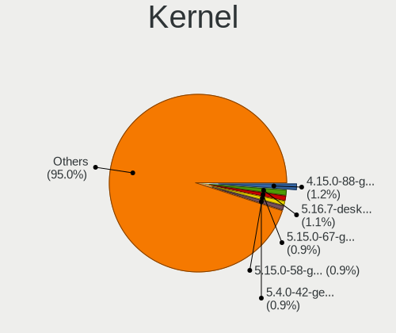
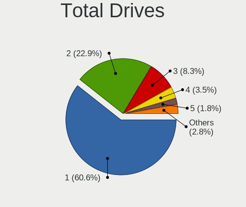
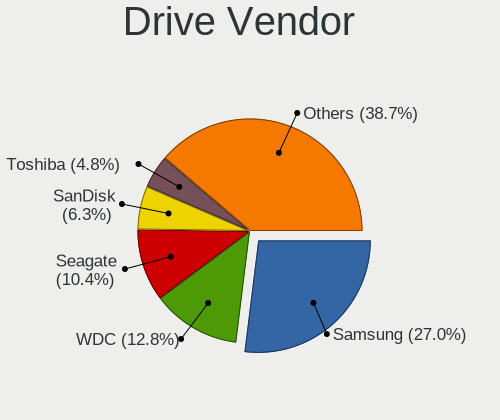
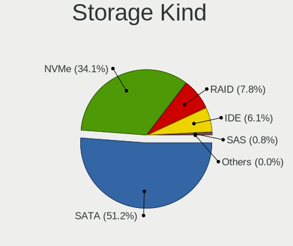
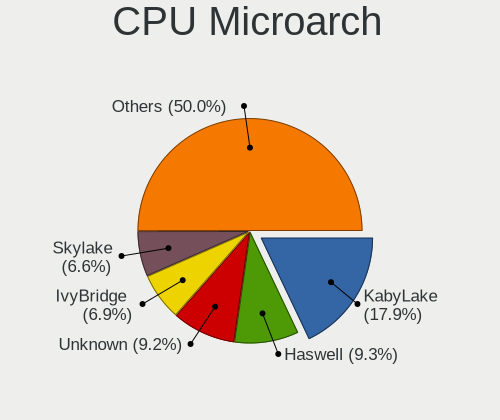
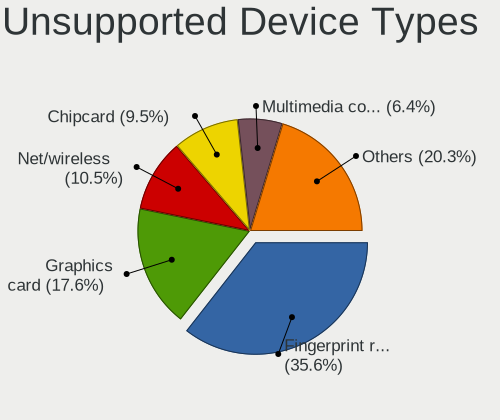

Linux in Switzerland - Tested Hardware & Statistics
---------------------------------------------------

A project to collect tested hardware configurations for Linux in Switzerland.

Anyone can contribute to this report by the [hw-probe](https://github.com/linuxhw/hw-probe) tool:

    sudo -E hw-probe -all -upload

Please contribute! Especially if your hardware is rare.

This is a report for all computer types. See also reports for [desktops](/Location/Switzerland/Desktop/README.md) and [notebooks](/Location/Switzerland/Notebook/README.md).

Contents
--------

* [ Test Cases ](#test-cases)

* [ System ](#system)
  - [ OS                       ](#os)
  - [ OS Family                ](#os-family)
  - [ Kernel                   ](#kernel)
  - [ Kernel Family            ](#kernel-family)
  - [ Kernel Major Ver.        ](#kernel-major-ver)
  - [ Arch                     ](#arch)
  - [ DE                       ](#de)
  - [ Display Server           ](#display-server)
  - [ Display Manager          ](#display-manager)
  - [ OS Lang                  ](#os-lang)
  - [ Boot Mode                ](#boot-mode)
  - [ Filesystem               ](#filesystem)
  - [ Part. scheme             ](#part-scheme)
  - [ Dual Boot with Linux/BSD ](#dual-boot-with-linuxbsd)
  - [ Dual Boot (Win)          ](#dual-boot-win)

* [ Board ](#board)
  - [ Vendor                   ](#vendor)
  - [ Model                    ](#model)
  - [ Model Family             ](#model-family)
  - [ MFG Year                 ](#mfg-year)
  - [ Form Factor              ](#form-factor)
  - [ Secure Boot              ](#secure-boot)
  - [ Coreboot                 ](#coreboot)
  - [ RAM Size                 ](#ram-size)
  - [ RAM Used                 ](#ram-used)
  - [ Total Drives             ](#total-drives)
  - [ Has CD-ROM               ](#has-cd-rom)
  - [ Has Ethernet             ](#has-ethernet)
  - [ Has WiFi                 ](#has-wifi)
  - [ Has Bluetooth            ](#has-bluetooth)

* [ Location ](#location)
  - [ Country                  ](#country)
  - [ City                     ](#city)

* [ Drives ](#drives)
  - [ Drive Vendor             ](#drive-vendor)
  - [ Drive Model              ](#drive-model)
  - [ HDD Vendor               ](#hdd-vendor)
  - [ SSD Vendor               ](#ssd-vendor)
  - [ Drive Kind               ](#drive-kind)
  - [ Drive Connector          ](#drive-connector)
  - [ Drive Size               ](#drive-size)
  - [ Space Total              ](#space-total)
  - [ Space Used               ](#space-used)
  - [ Malfunc. Drives          ](#malfunc-drives)
  - [ Malfunc. Drive Vendor    ](#malfunc-drive-vendor)
  - [ Malfunc. HDD Vendor      ](#malfunc-hdd-vendor)
  - [ Malfunc. Drive Kind      ](#malfunc-drive-kind)
  - [ Failed Drives            ](#failed-drives)
  - [ Failed Drive Vendor      ](#failed-drive-vendor)
  - [ Drive Status             ](#drive-status)

* [ Storage controller ](#storage-controller)
  - [ Storage Vendor           ](#storage-vendor)
  - [ Storage Model            ](#storage-model)
  - [ Storage Kind             ](#storage-kind)

* [ Processor ](#processor)
  - [ CPU Vendor               ](#cpu-vendor)
  - [ CPU Model                ](#cpu-model)
  - [ CPU Model Family         ](#cpu-model-family)
  - [ CPU Cores                ](#cpu-cores)
  - [ CPU Sockets              ](#cpu-sockets)
  - [ CPU Threads              ](#cpu-threads)
  - [ CPU Op-Modes             ](#cpu-op-modes)
  - [ CPU Microcode            ](#cpu-microcode)
  - [ CPU Microarch            ](#cpu-microarch)

* [ Graphics ](#graphics)
  - [ GPU Vendor               ](#gpu-vendor)
  - [ GPU Model                ](#gpu-model)
  - [ GPU Combo                ](#gpu-combo)
  - [ GPU Driver               ](#gpu-driver)
  - [ GPU Memory               ](#gpu-memory)

* [ Monitor ](#monitor)
  - [ Monitor Vendor           ](#monitor-vendor)
  - [ Monitor Model            ](#monitor-model)
  - [ Monitor Resolution       ](#monitor-resolution)
  - [ Monitor Diagonal         ](#monitor-diagonal)
  - [ Monitor Width            ](#monitor-width)
  - [ Aspect Ratio             ](#aspect-ratio)
  - [ Monitor Area             ](#monitor-area)
  - [ Pixel Density            ](#pixel-density)
  - [ Multiple Monitors        ](#multiple-monitors)

* [ Network ](#network)
  - [ Net Controller Vendor    ](#net-controller-vendor)
  - [ Net Controller Model     ](#net-controller-model)
  - [ Wireless Vendor          ](#wireless-vendor)
  - [ Wireless Model           ](#wireless-model)
  - [ Ethernet Vendor          ](#ethernet-vendor)
  - [ Ethernet Model           ](#ethernet-model)
  - [ Net Controller Kind      ](#net-controller-kind)
  - [ Used Controller          ](#used-controller)
  - [ NICs                     ](#nics)
  - [ IPv6                     ](#ipv6)

* [ Bluetooth ](#bluetooth)
  - [ Bluetooth Vendor         ](#bluetooth-vendor)
  - [ Bluetooth Model          ](#bluetooth-model)

* [ Sound ](#sound)
  - [ Sound Vendor             ](#sound-vendor)
  - [ Sound Model              ](#sound-model)

* [ Memory ](#memory)
  - [ Memory Vendor            ](#memory-vendor)
  - [ Memory Model             ](#memory-model)
  - [ Memory Kind              ](#memory-kind)
  - [ Memory Form Factor       ](#memory-form-factor)
  - [ Memory Size              ](#memory-size)
  - [ Memory Speed             ](#memory-speed)

* [ Printers & scanners ](#printers--scanners)
  - [ Printer Vendor           ](#printer-vendor)
  - [ Printer Model            ](#printer-model)
  - [ Scanner Vendor           ](#scanner-vendor)
  - [ Scanner Model            ](#scanner-model)

* [ Camera ](#camera)
  - [ Camera Vendor            ](#camera-vendor)
  - [ Camera Model             ](#camera-model)

* [ Security ](#security)
  - [ Fingerprint Vendor       ](#fingerprint-vendor)
  - [ Fingerprint Model        ](#fingerprint-model)
  - [ Chipcard Vendor          ](#chipcard-vendor)
  - [ Chipcard Model           ](#chipcard-model)

* [ Unsupported ](#unsupported)
  - [ Unsupported Devices      ](#unsupported-devices)
  - [ Unsupported Device Types ](#unsupported-device-types)

Test Cases
----------

Total: 3426

| Vendor        | Model                       | Form-Factor | Probe                                                      | Date         |
|---------------|-----------------------------|-------------|------------------------------------------------------------|--------------|
| ASUSTek       | ASUS TUF Gaming A17 FA70... | Notebook    | [1d5206dc94](https://linux-hardware.org/?probe=1d5206dc94) | Aug 12, 2023 |
| ASUSTek       | ASUS TUF Gaming A17 FA70... | Notebook    | [bcda0258e5](https://linux-hardware.org/?probe=bcda0258e5) | Aug 12, 2023 |
| MSI           | Summit E14Evo A12M          | Notebook    | [b83d821361](https://linux-hardware.org/?probe=b83d821361) | Aug 11, 2023 |
| Intel         | D915GEV AAC63667-501        | Desktop     | [4d65f6d8fa](https://linux-hardware.org/?probe=4d65f6d8fa) | Aug 11, 2023 |
| ASUSTek       | ROG Strix G713PI_G713PI     | Notebook    | [92fda27219](https://linux-hardware.org/?probe=92fda27219) | Aug 10, 2023 |
| ASUSTek       | ROG Strix G713PI_G713PI     | Notebook    | [3bd085d1a5](https://linux-hardware.org/?probe=3bd085d1a5) | Aug 10, 2023 |
| HP            | 8433 11                     | Desktop     | [eac08c7b54](https://linux-hardware.org/?probe=eac08c7b54) | Aug 09, 2023 |
| Dell          | 0WR7PY A03                  | Desktop     | [b97d54f6d8](https://linux-hardware.org/?probe=b97d54f6d8) | Aug 09, 2023 |
| Lenovo        | IdeaPadFlex 5 16ALC7 82R... | Convertible | [11cf6b0c98](https://linux-hardware.org/?probe=11cf6b0c98) | Aug 09, 2023 |
| GPD           | P2 MAX                      | Notebook    | [064bc78973](https://linux-hardware.org/?probe=064bc78973) | Aug 09, 2023 |
| Lenovo        | IdeaPadFlex 5 16ALC7 82R... | Convertible | [1e3f49e3a0](https://linux-hardware.org/?probe=1e3f49e3a0) | Aug 09, 2023 |
| Lenovo        | IdeaPadFlex 5 16ALC7 82R... | Convertible | [2f32ca43ee](https://linux-hardware.org/?probe=2f32ca43ee) | Aug 09, 2023 |
| HP            | 894D                        | Desktop     | [e1c397df93](https://linux-hardware.org/?probe=e1c397df93) | Aug 09, 2023 |
| HP            | EliteBook 820 G1            | Notebook    | [62889fd683](https://linux-hardware.org/?probe=62889fd683) | Aug 08, 2023 |
| Fujitsu       | D3162-A1 S26361-D3162-A1    | Desktop     | [cb5a99b4fb](https://linux-hardware.org/?probe=cb5a99b4fb) | Aug 07, 2023 |
| ASUSTek       | TUF Gaming B550-PLUS WIF... | Desktop     | [04e63e59bd](https://linux-hardware.org/?probe=04e63e59bd) | Aug 07, 2023 |
| HP            | Spectre x360 2-in-1 Lapt... | Convertible | [6c24c9f7a9](https://linux-hardware.org/?probe=6c24c9f7a9) | Aug 05, 2023 |
| HP            | 87A4 10100                  | All in one  | [ac3d0deece](https://linux-hardware.org/?probe=ac3d0deece) | Aug 05, 2023 |
| HP            | 87A4 10100                  | All in one  | [1dac28eee7](https://linux-hardware.org/?probe=1dac28eee7) | Aug 05, 2023 |
| AZW           | GTR V02                     | Desktop     | [b2afc2c53e](https://linux-hardware.org/?probe=b2afc2c53e) | Aug 04, 2023 |
| HP            | 2AF7                        | Desktop     | [655c896815](https://linux-hardware.org/?probe=655c896815) | Aug 04, 2023 |
| Lenovo        | ThinkPad E14 Gen 3 20Y7C... | Notebook    | [e7810a04a9](https://linux-hardware.org/?probe=e7810a04a9) | Aug 04, 2023 |
| Dell          | XPS 9320                    | Notebook    | [140f8f8b2e](https://linux-hardware.org/?probe=140f8f8b2e) | Aug 04, 2023 |
| HP            | 87A4 10100                  | All in one  | [a62908af95](https://linux-hardware.org/?probe=a62908af95) | Aug 04, 2023 |
| HP            | 87A4 10100                  | All in one  | [eb7ae8bbb2](https://linux-hardware.org/?probe=eb7ae8bbb2) | Aug 04, 2023 |
| PC Special... | Ionico 16                   | Notebook    | [0839bbc721](https://linux-hardware.org/?probe=0839bbc721) | Aug 03, 2023 |
| Acer          | TravelMate P614-51-G2       | Notebook    | [33dd52a94f](https://linux-hardware.org/?probe=33dd52a94f) | Aug 03, 2023 |
| HP            | 843E                        | Desktop     | [dbbfb83ae4](https://linux-hardware.org/?probe=dbbfb83ae4) | Aug 03, 2023 |
| HP            | 843E                        | Desktop     | [952db006c3](https://linux-hardware.org/?probe=952db006c3) | Aug 03, 2023 |
| Dell          | Latitude E6330              | Notebook    | [75d54a8988](https://linux-hardware.org/?probe=75d54a8988) | Aug 03, 2023 |
| Lenovo        | ThinkPad T440p 20AN0079M... | Notebook    | [5bbbd1f3d4](https://linux-hardware.org/?probe=5bbbd1f3d4) | Aug 02, 2023 |
| Schenker      | XMG FOCUS (Mid 2021)        | Notebook    | [d7fa14789f](https://linux-hardware.org/?probe=d7fa14789f) | Aug 01, 2023 |
| ASUSTek       | Vivobook ASUSLaptop TP34... | Convertible | [3efa8549a5](https://linux-hardware.org/?probe=3efa8549a5) | Aug 01, 2023 |
| Fujitsu       | D3162-A1 S26361-D3162-A1    | Desktop     | [b298625640](https://linux-hardware.org/?probe=b298625640) | Aug 01, 2023 |
| Lenovo        | ThinkPad X1 Yoga 3rd 20L... | Convertible | [25dd387c2c](https://linux-hardware.org/?probe=25dd387c2c) | Aug 01, 2023 |
| Lenovo        | ThinkPad X1 Yoga 3rd 20L... | Convertible | [7f5c70c059](https://linux-hardware.org/?probe=7f5c70c059) | Aug 01, 2023 |
| MSI           | Katana GF66 12UC            | Notebook    | [49a431c092](https://linux-hardware.org/?probe=49a431c092) | Jul 31, 2023 |
| Acer          | Aspire A315-34              | Notebook    | [add6831dcd](https://linux-hardware.org/?probe=add6831dcd) | Jul 31, 2023 |
| Lenovo        | ThinkPad E490 20N8CTO1WW    | Notebook    | [7cb3479a69](https://linux-hardware.org/?probe=7cb3479a69) | Jul 31, 2023 |
| HP            | ProBook 440 G3              | Notebook    | [beea8be008](https://linux-hardware.org/?probe=beea8be008) | Jul 30, 2023 |
| Dell          | 0K240Y A01                  | Desktop     | [80b81f5eff](https://linux-hardware.org/?probe=80b81f5eff) | Jul 30, 2023 |
| HP            | ZBook Fury 16 G9 Mobile ... | Notebook    | [5518dab193](https://linux-hardware.org/?probe=5518dab193) | Jul 29, 2023 |
| Acer          | Aspire E5-511               | Notebook    | [aef96d4eb8](https://linux-hardware.org/?probe=aef96d4eb8) | Jul 29, 2023 |
| Dell          | XPS 17 9720                 | Notebook    | [1006fe2c7b](https://linux-hardware.org/?probe=1006fe2c7b) | Jul 29, 2023 |
| HP            | Elite Dragonfly             | Convertible | [a44424e066](https://linux-hardware.org/?probe=a44424e066) | Jul 28, 2023 |
| PC Special... | Ionico 16                   | Notebook    | [86d9ab8b73](https://linux-hardware.org/?probe=86d9ab8b73) | Jul 28, 2023 |
| PC Special... | Ionico 16                   | Notebook    | [6ea424234a](https://linux-hardware.org/?probe=6ea424234a) | Jul 28, 2023 |
| Lenovo        | ThinkPad L15 Gen 2 20X30... | Notebook    | [9c8b9571d9](https://linux-hardware.org/?probe=9c8b9571d9) | Jul 27, 2023 |
| Lenovo        | ThinkPad L380 20M50011MZ    | Notebook    | [03152e1c57](https://linux-hardware.org/?probe=03152e1c57) | Jul 26, 2023 |
| Acer          | Elena                       | Desktop     | [78eff851f2](https://linux-hardware.org/?probe=78eff851f2) | Jul 26, 2023 |
| ASUSTek       | PRIME X370-PRO              | Desktop     | [45e8471971](https://linux-hardware.org/?probe=45e8471971) | Jul 26, 2023 |
| Lenovo        | ThinkPad T470p 20J6003DG... | Notebook    | [5693ac5e4c](https://linux-hardware.org/?probe=5693ac5e4c) | Jul 25, 2023 |
| Intel         | NUC10i7FNB K61360-302       | Mini pc     | [9fbb932f79](https://linux-hardware.org/?probe=9fbb932f79) | Jul 25, 2023 |
| ASUSTek       | ROG Flow X13 GV302XI_GV3... | Convertible | [a326770d26](https://linux-hardware.org/?probe=a326770d26) | Jul 25, 2023 |
| Lenovo        | MIIX 320-10ICR 80XF         | Tablet      | [47fec524e4](https://linux-hardware.org/?probe=47fec524e4) | Jul 25, 2023 |
| Lenovo        | ThinkPad X1 Carbon Gen 9... | Notebook    | [dc537ae22a](https://linux-hardware.org/?probe=dc537ae22a) | Jul 24, 2023 |
| Lenovo        | ThinkPad X1 Carbon Gen 9... | Notebook    | [cff40caac1](https://linux-hardware.org/?probe=cff40caac1) | Jul 24, 2023 |
| Dell          | Latitude 7480               | Notebook    | [acad753aa8](https://linux-hardware.org/?probe=acad753aa8) | Jul 23, 2023 |
| ASUSTek       | PRIME B650M-A WIFI II       | Desktop     | [f2e2436cf1](https://linux-hardware.org/?probe=f2e2436cf1) | Jul 23, 2023 |
| HP            | 255 15.6 inch G9 Noteboo... | Notebook    | [d387ed9d0c](https://linux-hardware.org/?probe=d387ed9d0c) | Jul 22, 2023 |
| Fujitsu Si... | ESPRIMO Mobile U9200        | Notebook    | [ff6179199d](https://linux-hardware.org/?probe=ff6179199d) | Jul 22, 2023 |
| Apple         | Mac-00BE6ED71E35EB86 iMa... | All in one  | [988a5f870c](https://linux-hardware.org/?probe=988a5f870c) | Jul 21, 2023 |
| ASUSTek       | G551JK                      | Notebook    | [fed0cf1fce](https://linux-hardware.org/?probe=fed0cf1fce) | Jul 20, 2023 |
| Lenovo        | ThinkPad L15 Gen 2 20X30... | Notebook    | [a8f79a71f7](https://linux-hardware.org/?probe=a8f79a71f7) | Jul 20, 2023 |
| Acer          | Predator PH317-56           | Notebook    | [248af0e35c](https://linux-hardware.org/?probe=248af0e35c) | Jul 18, 2023 |
| MACHINIST     | E5 MR9A PRO MAX V1.1        | Desktop     | [b3d68108a2](https://linux-hardware.org/?probe=b3d68108a2) | Jul 18, 2023 |
| MACHINIST     | E5 MR9A PRO MAX V1.1        | Desktop     | [fbb58d4f7c](https://linux-hardware.org/?probe=fbb58d4f7c) | Jul 18, 2023 |
| Lenovo        | ThinkPad X1 Yoga Gen 5 2... | Convertible | [f62d1b0d14](https://linux-hardware.org/?probe=f62d1b0d14) | Jul 17, 2023 |
| HP            | Pavilion dm1                | Notebook    | [135bb20fbd](https://linux-hardware.org/?probe=135bb20fbd) | Jul 17, 2023 |
| Lenovo        | IdeaPad 5 15ARE05 81YQ      | Notebook    | [798ddca1c4](https://linux-hardware.org/?probe=798ddca1c4) | Jul 16, 2023 |
| Apple         | Mac-BE088AF8C5EB4FA2 iMa... | All in one  | [236c9f5565](https://linux-hardware.org/?probe=236c9f5565) | Jul 14, 2023 |
| HP            | Pavilion dm1                | Notebook    | [3b05c5dc5c](https://linux-hardware.org/?probe=3b05c5dc5c) | Jul 14, 2023 |
| MSI           | GF63 Thin 10SC              | Notebook    | [d017610254](https://linux-hardware.org/?probe=d017610254) | Jul 14, 2023 |
| Dell          | 0WC7KF A00                  | All in one  | [71309341ec](https://linux-hardware.org/?probe=71309341ec) | Jul 13, 2023 |
| HP            | 83DD                        | Mini pc     | [38e991673e](https://linux-hardware.org/?probe=38e991673e) | Jul 12, 2023 |
| Dell          | XPS 12 9Q23                 | Notebook    | [5fb9db838e](https://linux-hardware.org/?probe=5fb9db838e) | Jul 12, 2023 |
| Intel         | NUC11TNBv7 K87766-405       | Mini pc     | [fdde43af89](https://linux-hardware.org/?probe=fdde43af89) | Jul 11, 2023 |
| Lenovo        | ThinkPad X13 Yoga Gen 1 ... | Convertible | [6d76fdbcd6](https://linux-hardware.org/?probe=6d76fdbcd6) | Jul 10, 2023 |
| Lenovo        | ThinkPad X1 Yoga Gen 5 2... | Convertible | [9fd763e236](https://linux-hardware.org/?probe=9fd763e236) | Jul 09, 2023 |
| MSI           | PRO B760M-A WIFI DDR4       | Desktop     | [b44c0d94f4](https://linux-hardware.org/?probe=b44c0d94f4) | Jul 09, 2023 |
| ASUSTek       | K53SD                       | Notebook    | [61da77f999](https://linux-hardware.org/?probe=61da77f999) | Jul 09, 2023 |
| Medion        | MS-7667                     | Desktop     | [52ff08b634](https://linux-hardware.org/?probe=52ff08b634) | Jul 09, 2023 |
| Lenovo        | ThinkPad T470p 20J6003DG... | Notebook    | [a7632f8c4b](https://linux-hardware.org/?probe=a7632f8c4b) | Jul 09, 2023 |
| HP            | ProBook 650 G1              | Notebook    | [9b8d05afca](https://linux-hardware.org/?probe=9b8d05afca) | Jul 08, 2023 |
| ASUSTek       | ROG Maximus Z790 HERO       | Desktop     | [e0e1896cc3](https://linux-hardware.org/?probe=e0e1896cc3) | Jul 07, 2023 |
| ASUSTek       | ROG Maximus Z790 HERO       | Desktop     | [3908772779](https://linux-hardware.org/?probe=3908772779) | Jul 07, 2023 |
| Lenovo        | Yoga C940-14IIL 81Q9        | Convertible | [8da6cc6879](https://linux-hardware.org/?probe=8da6cc6879) | Jul 07, 2023 |
| Gigabyte      | B550I AORUS PRO AX          | Notebook    | [4ff583eb14](https://linux-hardware.org/?probe=4ff583eb14) | Jul 05, 2023 |
| ASUSTek       | H81M-PLUS                   | Desktop     | [80ed1496a1](https://linux-hardware.org/?probe=80ed1496a1) | Jul 05, 2023 |
| ASUSTek       | H170M-PLUS                  | Desktop     | [530d25db12](https://linux-hardware.org/?probe=530d25db12) | Jul 03, 2023 |
| TUXEDO        | InfinityBook 14 v2          | Notebook    | [9447ac0693](https://linux-hardware.org/?probe=9447ac0693) | Jul 02, 2023 |
| HP            | 8918                        | Desktop     | [da7b695c7b](https://linux-hardware.org/?probe=da7b695c7b) | Jul 02, 2023 |
| ASUSTek       | ROG STRIX B450-F GAMING     | Desktop     | [277a9bb8e4](https://linux-hardware.org/?probe=277a9bb8e4) | Jul 02, 2023 |
| Lenovo        | IdeaPadFlex 5 14ALC05 82... | Convertible | [d772da19a0](https://linux-hardware.org/?probe=d772da19a0) | Jun 30, 2023 |
| Apple         | MacBookPro8,1               | Notebook    | [566b883024](https://linux-hardware.org/?probe=566b883024) | Jun 30, 2023 |
| ASUSTek       | T100TA                      | Notebook    | [921821fda8](https://linux-hardware.org/?probe=921821fda8) | Jun 30, 2023 |
| Lenovo        | G50-30 80G0                 | Notebook    | [3c1007547d](https://linux-hardware.org/?probe=3c1007547d) | Jun 30, 2023 |
| Lenovo        | G50-30 80G0                 | Notebook    | [1e33cadd37](https://linux-hardware.org/?probe=1e33cadd37) | Jun 29, 2023 |
| ASUSTek       | ROG STRIX B650E-F GAMING... | Desktop     | [08708e8e9d](https://linux-hardware.org/?probe=08708e8e9d) | Jun 28, 2023 |
| HP            | Spectre x360 2-in-1 Lapt... | Convertible | [ad91997e3e](https://linux-hardware.org/?probe=ad91997e3e) | Jun 28, 2023 |
| MSI           | PRO B760M-A WIFI DDR4       | Desktop     | [7f5dfae0db](https://linux-hardware.org/?probe=7f5dfae0db) | Jun 28, 2023 |
| ASUSTek       | ROG STRIX X670E-F GAMING... | Desktop     | [8619447305](https://linux-hardware.org/?probe=8619447305) | Jun 27, 2023 |
| ASUSTek       | ROG STRIX X670E-F GAMING... | Desktop     | [bddefdfb2c](https://linux-hardware.org/?probe=bddefdfb2c) | Jun 27, 2023 |
| Unknown       | Unknown                     | Soc         | [baebeebbdb](https://linux-hardware.org/?probe=baebeebbdb) | Jun 27, 2023 |
| Gigabyte      | Z97-HD3                     | Desktop     | [731b4a6479](https://linux-hardware.org/?probe=731b4a6479) | Jun 26, 2023 |
| Star Labs     | LabTop                      | Notebook    | [87a0d9dc09](https://linux-hardware.org/?probe=87a0d9dc09) | Jun 26, 2023 |
| Star Labs     | LabTop                      | Notebook    | [a413031ef8](https://linux-hardware.org/?probe=a413031ef8) | Jun 25, 2023 |
| ASUSTek       | K53SD                       | Notebook    | [66f2fbfdf4](https://linux-hardware.org/?probe=66f2fbfdf4) | Jun 25, 2023 |
| Apple         | MacBookPro5,2               | Notebook    | [32ab15a1eb](https://linux-hardware.org/?probe=32ab15a1eb) | Jun 25, 2023 |
| Acer          | Aspire F5-571G              | Notebook    | [fb61026d60](https://linux-hardware.org/?probe=fb61026d60) | Jun 25, 2023 |
| Notebook      | NLxxPUx                     | Notebook    | [ade3806ebb](https://linux-hardware.org/?probe=ade3806ebb) | Jun 24, 2023 |
| Notebook      | NLxxPUx                     | Notebook    | [b82cc440a0](https://linux-hardware.org/?probe=b82cc440a0) | Jun 24, 2023 |
| Microsoft     | Surface Pro                 | Tablet      | [cb554fb8f8](https://linux-hardware.org/?probe=cb554fb8f8) | Jun 24, 2023 |
| Gigabyte      | P67A-D3-B3                  | Desktop     | [f8dee044e2](https://linux-hardware.org/?probe=f8dee044e2) | Jun 24, 2023 |
| MSI           | B450M PRO-VDH MAX           | Desktop     | [700914c136](https://linux-hardware.org/?probe=700914c136) | Jun 23, 2023 |
| Microsoft     | Surface Pro                 | Tablet      | [24db241d7a](https://linux-hardware.org/?probe=24db241d7a) | Jun 22, 2023 |
| HP            | Spectre x360 2-in-1 Lapt... | Convertible | [23ea485e5e](https://linux-hardware.org/?probe=23ea485e5e) | Jun 22, 2023 |
| Lenovo        | G50-30 80G0                 | Notebook    | [d607d3c598](https://linux-hardware.org/?probe=d607d3c598) | Jun 22, 2023 |
| Lenovo        | G50-30 80G0                 | Notebook    | [8518224d34](https://linux-hardware.org/?probe=8518224d34) | Jun 21, 2023 |
| Lenovo        | ThinkPad L380 20M50011MZ    | Notebook    | [223c8d15d4](https://linux-hardware.org/?probe=223c8d15d4) | Jun 21, 2023 |
| HP            | 250 15.6 inch G9 Noteboo... | Notebook    | [186a21a6f7](https://linux-hardware.org/?probe=186a21a6f7) | Jun 21, 2023 |
| Apple         | MacBookPro8,1               | Notebook    | [f008d4c0db](https://linux-hardware.org/?probe=f008d4c0db) | Jun 19, 2023 |
| HP            | 250 15.6 inch G9 Noteboo... | Notebook    | [953a81c579](https://linux-hardware.org/?probe=953a81c579) | Jun 19, 2023 |
| ASRock        | B550M-ITX/ac                | Desktop     | [e9865c622f](https://linux-hardware.org/?probe=e9865c622f) | Jun 19, 2023 |
| ASUSTek       | ROG Flow X16 GV601RW_GV6... | Convertible | [90720c3820](https://linux-hardware.org/?probe=90720c3820) | Jun 18, 2023 |
| Lenovo        | ThinkPad E580 20KS001JMZ    | Notebook    | [780d549a32](https://linux-hardware.org/?probe=780d549a32) | Jun 18, 2023 |
| ASUSTek       | ROG Flow X16 GV601RW_GV6... | Convertible | [4b184d1037](https://linux-hardware.org/?probe=4b184d1037) | Jun 18, 2023 |
| Apple         | MacBookPro8,1               | Notebook    | [c45597704a](https://linux-hardware.org/?probe=c45597704a) | Jun 17, 2023 |
| ASUSTek       | ROG Strix G713QM_G713QM     | Notebook    | [3614dc460e](https://linux-hardware.org/?probe=3614dc460e) | Jun 17, 2023 |
| Apple         | Mac-942B59F58194171B iMa... | All in one  | [a312151081](https://linux-hardware.org/?probe=a312151081) | Jun 14, 2023 |
| Lenovo        | ThinkPad T14 Gen 1 20UES... | Notebook    | [7d329c0bee](https://linux-hardware.org/?probe=7d329c0bee) | Jun 14, 2023 |
| Lenovo        | ThinkPad T14 Gen 1 20UES... | Notebook    | [acf5c5a440](https://linux-hardware.org/?probe=acf5c5a440) | Jun 14, 2023 |
| HP            | ZBook Power 15.6 inch G9... | Notebook    | [467be092e4](https://linux-hardware.org/?probe=467be092e4) | Jun 14, 2023 |
| Apple         | MacBookAir7,2               | Notebook    | [8ea9d60a21](https://linux-hardware.org/?probe=8ea9d60a21) | Jun 12, 2023 |
| HP            | Spectre x360 2-in-1 Lapt... | Convertible | [794030a707](https://linux-hardware.org/?probe=794030a707) | Jun 12, 2023 |
| Lenovo        | ThinkPad T420s 4175A16      | Notebook    | [3d23465019](https://linux-hardware.org/?probe=3d23465019) | Jun 11, 2023 |
| Apple         | MacBookPro8,1               | Notebook    | [ec6af41f13](https://linux-hardware.org/?probe=ec6af41f13) | Jun 11, 2023 |
| Fujitsu Si... | ESPRIMO Mobile U9200        | Notebook    | [1cfac1228c](https://linux-hardware.org/?probe=1cfac1228c) | Jun 10, 2023 |
| Fujitsu Si... | ESPRIMO Mobile U9200        | Notebook    | [427db0e78b](https://linux-hardware.org/?probe=427db0e78b) | Jun 10, 2023 |
| Apple         | MacBookAir5,2               | Notebook    | [6adee93e47](https://linux-hardware.org/?probe=6adee93e47) | Jun 10, 2023 |
| ASUSTek       | VivoBook 17_ASUS Laptop ... | Notebook    | [08a506ad4e](https://linux-hardware.org/?probe=08a506ad4e) | Jun 09, 2023 |
| Dell          | Vostro 3558                 | Notebook    | [15185698e7](https://linux-hardware.org/?probe=15185698e7) | Jun 09, 2023 |
| ASUSTek       | P8P67 LE                    | Desktop     | [212ff65852](https://linux-hardware.org/?probe=212ff65852) | Jun 09, 2023 |
| ASUSTek       | WS Z390 PRO                 | Desktop     | [7346eaf346](https://linux-hardware.org/?probe=7346eaf346) | Jun 07, 2023 |
| HP            | 2B36                        | Desktop     | [45ee697eed](https://linux-hardware.org/?probe=45ee697eed) | Jun 07, 2023 |
| HP            | 2B36                        | Desktop     | [0f36ecaa7e](https://linux-hardware.org/?probe=0f36ecaa7e) | Jun 07, 2023 |
| Dell          | XPS 13 9370                 | Notebook    | [f70195a177](https://linux-hardware.org/?probe=f70195a177) | Jun 07, 2023 |
| Lenovo        | Yoga Pro 9 14IRP8 83BU      | Notebook    | [7d33fb0564](https://linux-hardware.org/?probe=7d33fb0564) | Jun 07, 2023 |
| Dell          | XPS 13 9370                 | Notebook    | [82aba8957b](https://linux-hardware.org/?probe=82aba8957b) | Jun 06, 2023 |
| ASUSTek       | M4A89GTD-PRO/USB3           | Desktop     | [ae164f9998](https://linux-hardware.org/?probe=ae164f9998) | Jun 06, 2023 |
| ASUSTek       | M4A89GTD-PRO/USB3           | Desktop     | [6ae325ff9d](https://linux-hardware.org/?probe=6ae325ff9d) | Jun 06, 2023 |
| HP            | 8918                        | Desktop     | [6f94c9caa9](https://linux-hardware.org/?probe=6f94c9caa9) | Jun 06, 2023 |
| Lenovo        | ThinkPad 21CKCT01WW         | Notebook    | [92c9ec75c4](https://linux-hardware.org/?probe=92c9ec75c4) | Jun 05, 2023 |
| ASUSTek       | M5A78L-M LE/USB3            | Desktop     | [1bd1a651bb](https://linux-hardware.org/?probe=1bd1a651bb) | Jun 05, 2023 |
| Lenovo        | MAHOBAY Win8 STD MM DPK ... | Desktop     | [d9dba3ffdf](https://linux-hardware.org/?probe=d9dba3ffdf) | Jun 04, 2023 |
| HP            | Spectre x360 2-in-1 Lapt... | Convertible | [5b7a78b32e](https://linux-hardware.org/?probe=5b7a78b32e) | Jun 04, 2023 |
| HP            | Spectre x360 2-in-1 Lapt... | Convertible | [14f68da7a7](https://linux-hardware.org/?probe=14f68da7a7) | Jun 04, 2023 |
| Acer          | Aspire V3-772G              | Notebook    | [f077d744cb](https://linux-hardware.org/?probe=f077d744cb) | Jun 04, 2023 |
| HP            | 843C                        | Desktop     | [e69fbf77e4](https://linux-hardware.org/?probe=e69fbf77e4) | Jun 04, 2023 |
| HP            | 843C                        | Desktop     | [21751c1221](https://linux-hardware.org/?probe=21751c1221) | Jun 04, 2023 |
| MSI           | PRO B760M-A WIFI DDR4       | Desktop     | [4d24b9b7d5](https://linux-hardware.org/?probe=4d24b9b7d5) | Jun 03, 2023 |
| Dell          | Latitude E6420              | Notebook    | [069b512b91](https://linux-hardware.org/?probe=069b512b91) | Jun 03, 2023 |
| Lenovo        | ThinkPad X220 4291WSH       | Notebook    | [f95d5c3046](https://linux-hardware.org/?probe=f95d5c3046) | Jun 03, 2023 |
| ASUSTek       | M5A99X EVO R2.0             | Desktop     | [d8f3391b68](https://linux-hardware.org/?probe=d8f3391b68) | Jun 02, 2023 |
| HP            | 8918                        | Desktop     | [b03f8a6eb3](https://linux-hardware.org/?probe=b03f8a6eb3) | Jun 02, 2023 |
| ASUSTek       | ROG Zephyrus G14 GA402XI... | Notebook    | [e920b77fbb](https://linux-hardware.org/?probe=e920b77fbb) | Jun 02, 2023 |
| Dell          | 06X1TJ A00                  | Desktop     | [16d662673f](https://linux-hardware.org/?probe=16d662673f) | Jun 02, 2023 |
| Lenovo        | ThinkPad P16s Gen 1 21CK... | Notebook    | [0a6e1e6be8](https://linux-hardware.org/?probe=0a6e1e6be8) | Jun 02, 2023 |
| MSI           | PRO B760M-A WIFI DDR4       | Desktop     | [e98b2555d7](https://linux-hardware.org/?probe=e98b2555d7) | Jun 01, 2023 |
| Dell          | Latitude 7490               | Notebook    | [3cb9ad156f](https://linux-hardware.org/?probe=3cb9ad156f) | Jun 01, 2023 |
| Dell          | Latitude 7490               | Notebook    | [31eb124dfb](https://linux-hardware.org/?probe=31eb124dfb) | Jun 01, 2023 |
| Lenovo        | IdeaPad C340-14API 81N6     | Notebook    | [29ec12f64d](https://linux-hardware.org/?probe=29ec12f64d) | May 30, 2023 |
| HP            | 2B36                        | Desktop     | [8e4fc0d41f](https://linux-hardware.org/?probe=8e4fc0d41f) | May 29, 2023 |
| GPD           | P2 MAX                      | Notebook    | [3c083ee96d](https://linux-hardware.org/?probe=3c083ee96d) | May 29, 2023 |
| Lenovo        | IdeaPad C340-14IML 81TK     | Convertible | [1d8b78cbdc](https://linux-hardware.org/?probe=1d8b78cbdc) | May 29, 2023 |
| Lenovo        | ThinkPad T14s Gen 3 21BR... | Notebook    | [57b9304725](https://linux-hardware.org/?probe=57b9304725) | May 27, 2023 |
| Lenovo        | 3716 SDK0T76461 WIN 3422... | Desktop     | [2f3952dcfe](https://linux-hardware.org/?probe=2f3952dcfe) | May 27, 2023 |
| Acer          | Swift SF514-52T             | Notebook    | [246b95d20f](https://linux-hardware.org/?probe=246b95d20f) | May 24, 2023 |
| Acer          | Aspire V3-772               | Notebook    | [2ef3c0b337](https://linux-hardware.org/?probe=2ef3c0b337) | May 24, 2023 |
| Samsung       | 930QED                      | Convertible | [14f0193b6a](https://linux-hardware.org/?probe=14f0193b6a) | May 23, 2023 |
| Lenovo        | IdeaPad C340-14IML 81TK     | Convertible | [2cdf1c9e61](https://linux-hardware.org/?probe=2cdf1c9e61) | May 23, 2023 |
| Lenovo        | IdeaPad C340-14IML 81TK     | Convertible | [cca41e18cb](https://linux-hardware.org/?probe=cca41e18cb) | May 23, 2023 |
| Intel         | S2600STB J17012-601         | Server      | [2fa80c021a](https://linux-hardware.org/?probe=2fa80c021a) | May 23, 2023 |
| ASUSTek       | PRIME X399-A                | Desktop     | [a5a990a94c](https://linux-hardware.org/?probe=a5a990a94c) | May 23, 2023 |
| ASUSTek       | ROG STRIX X570-E GAMING     | Desktop     | [aa0bf32546](https://linux-hardware.org/?probe=aa0bf32546) | May 23, 2023 |
| Lenovo        | IdeaPadFlex 5 16ALC7 82R... | Convertible | [c956e9cbab](https://linux-hardware.org/?probe=c956e9cbab) | May 22, 2023 |
| Medion        | B360H4-EM V1.0              | Desktop     | [ae4f01f58e](https://linux-hardware.org/?probe=ae4f01f58e) | May 22, 2023 |
| Dell          | Latitude E6530              | Notebook    | [7c04efc558](https://linux-hardware.org/?probe=7c04efc558) | May 21, 2023 |
| Lenovo        | 316E NOK                    | Mini pc     | [019a851aeb](https://linux-hardware.org/?probe=019a851aeb) | May 21, 2023 |
| ASUSTek       | TUF Gaming B550M-E          | Desktop     | [4a68db15c2](https://linux-hardware.org/?probe=4a68db15c2) | May 21, 2023 |
| ASUSTek       | ROG Flow X13 GV302XI_GV3... | Convertible | [5d4070956a](https://linux-hardware.org/?probe=5d4070956a) | May 21, 2023 |
| Valve         | Jupiter                     | Notebook    | [f59c4fec2f](https://linux-hardware.org/?probe=f59c4fec2f) | May 20, 2023 |
| Lenovo        | ThinkPad T14s Gen 3 21BR... | Notebook    | [b5d454d4ec](https://linux-hardware.org/?probe=b5d454d4ec) | May 18, 2023 |
| Dell          | Latitude E6530              | Notebook    | [e6064ac95c](https://linux-hardware.org/?probe=e6064ac95c) | May 17, 2023 |
| Lenovo        | ThinkPad X230 23257AG       | Notebook    | [0f9a26db5f](https://linux-hardware.org/?probe=0f9a26db5f) | May 16, 2023 |
| MSI           | PRO Z690-A WIFI DDR4        | Desktop     | [bdaec355df](https://linux-hardware.org/?probe=bdaec355df) | May 16, 2023 |
| Lenovo        | ThinkPad X230 23257AG       | Notebook    | [56056f7c9a](https://linux-hardware.org/?probe=56056f7c9a) | May 15, 2023 |
| ASUSTek       | PN50-E1                     | Mini pc     | [b595a4a849](https://linux-hardware.org/?probe=b595a4a849) | May 15, 2023 |
| Lenovo        | ThinkPad T440p 20AN0079M... | Notebook    | [ec0250b092](https://linux-hardware.org/?probe=ec0250b092) | May 15, 2023 |
| HP            | EliteBook x360 1040 G8 N... | Convertible | [9f4a8a37c0](https://linux-hardware.org/?probe=9f4a8a37c0) | May 15, 2023 |
| ASUSTek       | H97-PLUS                    | Desktop     | [e67567bd2a](https://linux-hardware.org/?probe=e67567bd2a) | May 15, 2023 |
| Dell          | Latitude 5520               | Notebook    | [721000195d](https://linux-hardware.org/?probe=721000195d) | May 15, 2023 |
| Lenovo        | Yoga 7 16IRL8 82YN          | Notebook    | [c82f72f0e2](https://linux-hardware.org/?probe=c82f72f0e2) | May 15, 2023 |
| HP            | 0B4Ch D                     | Desktop     | [64b813a7dc](https://linux-hardware.org/?probe=64b813a7dc) | May 14, 2023 |
| MSI           | PRO Z690-A WIFI DDR4        | Desktop     | [6142fe7fbd](https://linux-hardware.org/?probe=6142fe7fbd) | May 14, 2023 |
| Lenovo        | ThinkPad T14s Gen 3 21BR... | Notebook    | [09eb36df64](https://linux-hardware.org/?probe=09eb36df64) | May 13, 2023 |
| HP            | EliteBook 840 14 inch G9... | Notebook    | [26beee94a9](https://linux-hardware.org/?probe=26beee94a9) | May 12, 2023 |
| Lenovo        | ThinkPad X230 232578G       | Notebook    | [d71435c79a](https://linux-hardware.org/?probe=d71435c79a) | May 12, 2023 |
| Lenovo        | ThinkPad X230 232578G       | Notebook    | [62e7f77fdc](https://linux-hardware.org/?probe=62e7f77fdc) | May 12, 2023 |
| Lenovo        | ThinkPad T490 20N2CTO1WW    | Notebook    | [f6c8b6c33e](https://linux-hardware.org/?probe=f6c8b6c33e) | May 12, 2023 |
| Gigabyte      | P67A-D3-B3                  | Desktop     | [41d9417c57](https://linux-hardware.org/?probe=41d9417c57) | May 11, 2023 |
| Acer          | Aspire 5332                 | Notebook    | [e74870bf17](https://linux-hardware.org/?probe=e74870bf17) | May 10, 2023 |
| ASRock        | B550 Phantom Gaming-ITX/... | Desktop     | [c39e7fa08d](https://linux-hardware.org/?probe=c39e7fa08d) | May 09, 2023 |
| HP            | Compaq 6910p                | Notebook    | [c17dc1abcf](https://linux-hardware.org/?probe=c17dc1abcf) | May 08, 2023 |
| Dell          | 0KRC95 A00                  | Desktop     | [f0f22d5d3f](https://linux-hardware.org/?probe=f0f22d5d3f) | May 08, 2023 |
| Lenovo        | 3111 SDK0J40697 WIN 3305... | Mini pc     | [c95999b5ad](https://linux-hardware.org/?probe=c95999b5ad) | May 08, 2023 |
| Lenovo        | 3111 SDK0J40697 WIN 3305... | Mini pc     | [670e910889](https://linux-hardware.org/?probe=670e910889) | May 08, 2023 |
| Medion        | S1219T MD99922              | Tablet      | [7502ce9679](https://linux-hardware.org/?probe=7502ce9679) | May 08, 2023 |
| Medion        | MS-7797                     | Desktop     | [590e39bef4](https://linux-hardware.org/?probe=590e39bef4) | May 07, 2023 |
| Dell          | 09KPNV A00                  | Desktop     | [6089dfdeab](https://linux-hardware.org/?probe=6089dfdeab) | May 07, 2023 |
| ASRock        | 4X4-4000 Series             | Desktop     | [df056ec6f1](https://linux-hardware.org/?probe=df056ec6f1) | May 07, 2023 |
| Medion        | MS-7797                     | Desktop     | [d7eb2caa26](https://linux-hardware.org/?probe=d7eb2caa26) | May 07, 2023 |
| ASUSTek       | TUF Gaming X570-PLUS        | Desktop     | [6a4a95e86f](https://linux-hardware.org/?probe=6a4a95e86f) | May 06, 2023 |
| Intel         | DH67CL AAG10212-210         | Desktop     | [3f2fa70636](https://linux-hardware.org/?probe=3f2fa70636) | May 06, 2023 |
| ASUSTek       | P8H77-M LE                  | Desktop     | [2a4b061b07](https://linux-hardware.org/?probe=2a4b061b07) | May 05, 2023 |
| ASUSTek       | P8H77-M LE                  | Desktop     | [54417e14cf](https://linux-hardware.org/?probe=54417e14cf) | May 05, 2023 |
| HP            | 212B                        | Desktop     | [d71b834a1c](https://linux-hardware.org/?probe=d71b834a1c) | May 05, 2023 |
| ASUSTek       | CROSSHAIR II FORMULA        | Desktop     | [4b705b9dca](https://linux-hardware.org/?probe=4b705b9dca) | May 03, 2023 |
| Lenovo        | 3730 SDK0T76463 WIN 3422... | Desktop     | [61873cde49](https://linux-hardware.org/?probe=61873cde49) | May 03, 2023 |
| ASUSTek       | PRIME Z590-P                | Desktop     | [bbd9496296](https://linux-hardware.org/?probe=bbd9496296) | May 03, 2023 |
| Lenovo        | Yoga 7 16IRL8 82YN          | Notebook    | [71ec2fc5ea](https://linux-hardware.org/?probe=71ec2fc5ea) | May 03, 2023 |
| Lenovo        | Yoga 7 16IRL8 82YN          | Notebook    | [6936dcf305](https://linux-hardware.org/?probe=6936dcf305) | May 03, 2023 |
| MACHINIST     | E5 MR9A PRO MAX V1.1        | Desktop     | [7a44b651f4](https://linux-hardware.org/?probe=7a44b651f4) | May 03, 2023 |
| Acer          | Predator PH18-71            | Notebook    | [7c5e0a3de1](https://linux-hardware.org/?probe=7c5e0a3de1) | May 02, 2023 |
| ASUSTek       | ROG STRIX Z690-F GAMING ... | Desktop     | [a720d9d42e](https://linux-hardware.org/?probe=a720d9d42e) | May 01, 2023 |
| Lenovo        | ThinkPad T470s W10DG 20J... | Notebook    | [0f77b52547](https://linux-hardware.org/?probe=0f77b52547) | May 01, 2023 |
| Apple         | Mac-00BE6ED71E35EB86 iMa... | All in one  | [c8c9c1e591](https://linux-hardware.org/?probe=c8c9c1e591) | Apr 30, 2023 |
| Intel         | DH67CL AAG10212-210         | Desktop     | [7d6b0027b3](https://linux-hardware.org/?probe=7d6b0027b3) | Apr 30, 2023 |
| Dell          | Vostro 3558                 | Notebook    | [5d77d7d922](https://linux-hardware.org/?probe=5d77d7d922) | Apr 30, 2023 |
| Acer          | Aspire E5-575G              | Notebook    | [6a102a2c37](https://linux-hardware.org/?probe=6a102a2c37) | Apr 29, 2023 |
| Gigabyte      | GA-MA790FXT-UD5P            | Desktop     | [910d4a6ad8](https://linux-hardware.org/?probe=910d4a6ad8) | Apr 29, 2023 |
| Dell          | Vostro 3558                 | Notebook    | [e1e3261c15](https://linux-hardware.org/?probe=e1e3261c15) | Apr 29, 2023 |
| Acer          | Aspire E5-575G              | Notebook    | [004e0007e4](https://linux-hardware.org/?probe=004e0007e4) | Apr 28, 2023 |
| Apple         | Mac-27ADBB7B4CEE8E61 iMa... | All in one  | [00d8186404](https://linux-hardware.org/?probe=00d8186404) | Apr 28, 2023 |
| Apple         | Mac-27ADBB7B4CEE8E61 iMa... | All in one  | [50e1b8e197](https://linux-hardware.org/?probe=50e1b8e197) | Apr 28, 2023 |
| Intel         | DH67CL AAG10212-210         | Desktop     | [cb87589d9f](https://linux-hardware.org/?probe=cb87589d9f) | Apr 28, 2023 |
| ASUSTek       | ASUS TUF Gaming A15 FA50... | Notebook    | [7ba933a829](https://linux-hardware.org/?probe=7ba933a829) | Apr 28, 2023 |
| Gigabyte      | Z97-HD3                     | Desktop     | [ec41184680](https://linux-hardware.org/?probe=ec41184680) | Apr 27, 2023 |
| Dell          | Latitude 5520               | Notebook    | [3071d4a9d8](https://linux-hardware.org/?probe=3071d4a9d8) | Apr 26, 2023 |
| Dell          | Latitude 5520               | Notebook    | [23fe32affd](https://linux-hardware.org/?probe=23fe32affd) | Apr 26, 2023 |
| MSI           | Creator 15 A10SGS           | Notebook    | [1b364e385a](https://linux-hardware.org/?probe=1b364e385a) | Apr 26, 2023 |
| ASUSTek       | PRIME Z490-A                | Desktop     | [a48c247194](https://linux-hardware.org/?probe=a48c247194) | Apr 26, 2023 |
| ASUSTek       | PRIME Z490-A                | Desktop     | [11844fed4d](https://linux-hardware.org/?probe=11844fed4d) | Apr 25, 2023 |
| HP            | EliteBook 820 G1            | Notebook    | [7afd2012e8](https://linux-hardware.org/?probe=7afd2012e8) | Apr 25, 2023 |
| ASUSTek       | PRIME Z790-P                | Desktop     | [c7fdbbb95b](https://linux-hardware.org/?probe=c7fdbbb95b) | Apr 25, 2023 |
| ASUSTek       | PRIME Z790-P                | Desktop     | [363bb28966](https://linux-hardware.org/?probe=363bb28966) | Apr 25, 2023 |
| ASUSTek       | M5A99X EVO R2.0             | Desktop     | [d73e1b6350](https://linux-hardware.org/?probe=d73e1b6350) | Apr 24, 2023 |
| Dell          | Latitude 7530               | Notebook    | [17140d3871](https://linux-hardware.org/?probe=17140d3871) | Apr 24, 2023 |
| HP            | 8433 11                     | Desktop     | [e885f0469c](https://linux-hardware.org/?probe=e885f0469c) | Apr 22, 2023 |
| AZW           | GTR V02                     | Desktop     | [104badc0d7](https://linux-hardware.org/?probe=104badc0d7) | Apr 22, 2023 |
| Dell          | XPS 17 9720                 | Notebook    | [d7ad0ed423](https://linux-hardware.org/?probe=d7ad0ed423) | Apr 22, 2023 |
| Dell          | XPS 13 9350                 | Notebook    | [1ed1930799](https://linux-hardware.org/?probe=1ed1930799) | Apr 21, 2023 |
| Apple         | Mac-FFE5EF870D7BA81A iMa... | All in one  | [570077aa64](https://linux-hardware.org/?probe=570077aa64) | Apr 21, 2023 |
| Lenovo        | 3753 SDK0T76461 WIN 3422... | Desktop     | [65c9942c32](https://linux-hardware.org/?probe=65c9942c32) | Apr 21, 2023 |
| Lenovo        | 3753 SDK0T76461 WIN 3422... | Desktop     | [607dbbf4d8](https://linux-hardware.org/?probe=607dbbf4d8) | Apr 21, 2023 |
| Gigabyte      | P55A-UD7                    | Desktop     | [59f8c4d262](https://linux-hardware.org/?probe=59f8c4d262) | Apr 20, 2023 |
| Intel         | S2600WTTR G92187-366        | Server      | [9bb50174ef](https://linux-hardware.org/?probe=9bb50174ef) | Apr 20, 2023 |
| Dell          | 0DPRKF A01                  | Server      | [51412400ba](https://linux-hardware.org/?probe=51412400ba) | Apr 20, 2023 |
| Fujitsu       | D3498-A1 S26361-D3498-A1    | Desktop     | [f20338e169](https://linux-hardware.org/?probe=f20338e169) | Apr 20, 2023 |
| ASUSTek       | PRIME B550M-A               | Desktop     | [2c6da4e91f](https://linux-hardware.org/?probe=2c6da4e91f) | Apr 20, 2023 |
| ASUSTek       | H87M-PLUS                   | Desktop     | [472922fafd](https://linux-hardware.org/?probe=472922fafd) | Apr 20, 2023 |
| Intel         | DP67BA AAG10219-303         | Desktop     | [a1b9ea4fd9](https://linux-hardware.org/?probe=a1b9ea4fd9) | Apr 20, 2023 |
| Intel         | DX58SO2 AAG10925-207        | Desktop     | [4e31c5af6b](https://linux-hardware.org/?probe=4e31c5af6b) | Apr 20, 2023 |
| Intel         | DP67BA AAG10219-303         | Desktop     | [27a629fd15](https://linux-hardware.org/?probe=27a629fd15) | Apr 20, 2023 |
| ASUSTek       | PRIME B550M-A               | Desktop     | [f3a680d9bc](https://linux-hardware.org/?probe=f3a680d9bc) | Apr 20, 2023 |
| Fujitsu       | D3348-A1 S26361-D3348-A1    | Desktop     | [96d5a26185](https://linux-hardware.org/?probe=96d5a26185) | Apr 20, 2023 |
| Fujitsu       | D3417-A2 S26361-D3417-A2    | Desktop     | [b6306c2e97](https://linux-hardware.org/?probe=b6306c2e97) | Apr 20, 2023 |
| Fujitsu       | D3517-A1 S26361-D3517-A1    | Desktop     | [fbedbcb213](https://linux-hardware.org/?probe=fbedbcb213) | Apr 20, 2023 |
| ASUSTek       | X99-S                       | Desktop     | [6e77ac0ec9](https://linux-hardware.org/?probe=6e77ac0ec9) | Apr 20, 2023 |
| Fujitsu       | D3417-A2 S26361-D3417-A2    | Desktop     | [c1b2a75484](https://linux-hardware.org/?probe=c1b2a75484) | Apr 20, 2023 |
| Fujitsu       | D3617-A1 S26361-D3617-A1    | Desktop     | [756eccb961](https://linux-hardware.org/?probe=756eccb961) | Apr 20, 2023 |
| Gigabyte      | H97-HD3                     | Desktop     | [ef04208d0f](https://linux-hardware.org/?probe=ef04208d0f) | Apr 20, 2023 |
| Fujitsu       | D3417-A2 S26361-D3417-A2    | Desktop     | [c419c9200f](https://linux-hardware.org/?probe=c419c9200f) | Apr 20, 2023 |
| ASUSTek       | X99-S                       | Desktop     | [1be8dc273c](https://linux-hardware.org/?probe=1be8dc273c) | Apr 20, 2023 |
| Intel         | S2600WTTR G92187-366        | Server      | [d765a92052](https://linux-hardware.org/?probe=d765a92052) | Apr 20, 2023 |
| ASUSTek       | PRIME Z490M-PLUS            | Desktop     | [244222ae5c](https://linux-hardware.org/?probe=244222ae5c) | Apr 20, 2023 |
| ASUSTek       | PRIME H270M-PLUS            | Desktop     | [f77fe53c69](https://linux-hardware.org/?probe=f77fe53c69) | Apr 20, 2023 |
| Dell          | 08NPPY A00                  | Desktop     | [7d49aa5207](https://linux-hardware.org/?probe=7d49aa5207) | Apr 20, 2023 |
| ASUSTek       | STRIX Z270F GAMING          | Desktop     | [d53ce13aa3](https://linux-hardware.org/?probe=d53ce13aa3) | Apr 20, 2023 |
| ASRock        | B550M Pro4                  | Desktop     | [ec13e17577](https://linux-hardware.org/?probe=ec13e17577) | Apr 20, 2023 |
| ASUSTek       | PRIME Z390-P                | Desktop     | [9fde2b21fc](https://linux-hardware.org/?probe=9fde2b21fc) | Apr 20, 2023 |
| ASUSTek       | G35CG                       | Desktop     | [ddc7ba8ccb](https://linux-hardware.org/?probe=ddc7ba8ccb) | Apr 20, 2023 |
| Fujitsu       | D3348-A2 S26361-D3348-A2    | Desktop     | [3dbd4f731c](https://linux-hardware.org/?probe=3dbd4f731c) | Apr 20, 2023 |
| ASUSTek       | PRIME X570-PRO              | Desktop     | [d46e9b11d5](https://linux-hardware.org/?probe=d46e9b11d5) | Apr 20, 2023 |
| ASUSTek       | PRIME X570-PRO              | Desktop     | [afbf28c15a](https://linux-hardware.org/?probe=afbf28c15a) | Apr 20, 2023 |
| ASUSTek       | PRIME Z370-A II             | Desktop     | [f185782be2](https://linux-hardware.org/?probe=f185782be2) | Apr 20, 2023 |
| ASUSTek       | PRIME X570-PRO              | Desktop     | [731671f1b8](https://linux-hardware.org/?probe=731671f1b8) | Apr 20, 2023 |
| ASUSTek       | PRIME X570-PRO              | Desktop     | [463c62da83](https://linux-hardware.org/?probe=463c62da83) | Apr 20, 2023 |
| Fujitsu       | D3517-A1 S26361-D3517-A1    | Desktop     | [0356125777](https://linux-hardware.org/?probe=0356125777) | Apr 20, 2023 |
| ASUSTek       | PRIME Z490M-PLUS            | Desktop     | [0a45e9e9af](https://linux-hardware.org/?probe=0a45e9e9af) | Apr 20, 2023 |
| ASUSTek       | PRIME X570-PRO              | Desktop     | [ccf2e2bbc3](https://linux-hardware.org/?probe=ccf2e2bbc3) | Apr 20, 2023 |
| ASUSTek       | PRIME B550M-A               | Desktop     | [3171099090](https://linux-hardware.org/?probe=3171099090) | Apr 20, 2023 |
| ASUSTek       | PRIME X570-PRO              | Desktop     | [032f3a72c6](https://linux-hardware.org/?probe=032f3a72c6) | Apr 20, 2023 |
| Intel         | DH87MC AAG74242-401         | Desktop     | [df7041b726](https://linux-hardware.org/?probe=df7041b726) | Apr 20, 2023 |
| ASUSTek       | P9X79 WS                    | Desktop     | [04e9cd2455](https://linux-hardware.org/?probe=04e9cd2455) | Apr 20, 2023 |
| Intel         | DP55WB AAE64798-207         | Desktop     | [0dd9e12f5a](https://linux-hardware.org/?probe=0dd9e12f5a) | Apr 20, 2023 |
| HP            | 870B                        | Desktop     | [ad6a3cc4d0](https://linux-hardware.org/?probe=ad6a3cc4d0) | Apr 20, 2023 |
| ASRock        | B760M Steel Legend WiFi     | Desktop     | [9e668ff813](https://linux-hardware.org/?probe=9e668ff813) | Apr 20, 2023 |
| Fujitsu       | D3417-A2 S26361-D3417-A2    | Desktop     | [5dc0cb1f28](https://linux-hardware.org/?probe=5dc0cb1f28) | Apr 20, 2023 |
| Medion        | GA-Z170X-Gaming 7           | Desktop     | [706cfb4c50](https://linux-hardware.org/?probe=706cfb4c50) | Apr 20, 2023 |
| Gigabyte      | H97-HD3                     | Desktop     | [b3b27e0fcf](https://linux-hardware.org/?probe=b3b27e0fcf) | Apr 20, 2023 |
| ASUSTek       | PRIME Z370-A II             | Desktop     | [bdbd8d06e2](https://linux-hardware.org/?probe=bdbd8d06e2) | Apr 20, 2023 |
| Fujitsu       | D3227-A1 S26361-D3227-A1    | Desktop     | [ff10999142](https://linux-hardware.org/?probe=ff10999142) | Apr 20, 2023 |
| ASUSTek       | PRIME B550M-A               | Desktop     | [11da8c5d96](https://linux-hardware.org/?probe=11da8c5d96) | Apr 20, 2023 |
| ASUSTek       | PRIME X570-PRO              | Desktop     | [128d16cf7f](https://linux-hardware.org/?probe=128d16cf7f) | Apr 20, 2023 |
| ASUSTek       | PRIME B550M-A               | Desktop     | [c2de2809a0](https://linux-hardware.org/?probe=c2de2809a0) | Apr 20, 2023 |
| Intel         | S2600WFT H48104-860         | Server      | [f5848d1ba2](https://linux-hardware.org/?probe=f5848d1ba2) | Apr 20, 2023 |
| ASUSTek       | PRIME B550M-A               | Desktop     | [c3a3c03c3f](https://linux-hardware.org/?probe=c3a3c03c3f) | Apr 20, 2023 |
| Fujitsu       | D3227-A1 S26361-D3227-A1    | Desktop     | [1ae9258a0d](https://linux-hardware.org/?probe=1ae9258a0d) | Apr 20, 2023 |
| Intel         | SVRBD-ROW_T G30981-503      | Server      | [5fba63c085](https://linux-hardware.org/?probe=5fba63c085) | Apr 20, 2023 |
| ASUSTek       | STRIX Z270F GAMING          | Desktop     | [ab89260502](https://linux-hardware.org/?probe=ab89260502) | Apr 20, 2023 |
| ASUSTek       | PRIME X570-PRO              | Desktop     | [3f99aeec69](https://linux-hardware.org/?probe=3f99aeec69) | Apr 20, 2023 |
| HP            | 870B                        | Desktop     | [50f654b2a0](https://linux-hardware.org/?probe=50f654b2a0) | Apr 20, 2023 |
| Fujitsu       | D3348-A1 S26361-D3348-A1    | Desktop     | [9949a0748f](https://linux-hardware.org/?probe=9949a0748f) | Apr 20, 2023 |
| ASUSTek       | PRIME Z370-A II             | Desktop     | [e3cfbf7435](https://linux-hardware.org/?probe=e3cfbf7435) | Apr 20, 2023 |
| ASUSTek       | PRIME X570-PRO              | Desktop     | [9817f90648](https://linux-hardware.org/?probe=9817f90648) | Apr 20, 2023 |
| ASUSTek       | G35CG                       | Desktop     | [cf4854d704](https://linux-hardware.org/?probe=cf4854d704) | Apr 20, 2023 |
| ASUSTek       | PRIME B550M-A               | Desktop     | [296676f929](https://linux-hardware.org/?probe=296676f929) | Apr 20, 2023 |
| ASUSTek       | PRIME Z370-A II             | Desktop     | [2eeebec1ec](https://linux-hardware.org/?probe=2eeebec1ec) | Apr 20, 2023 |
| Fujitsu       | D3417-A2 S26361-D3417-A2    | Desktop     | [68ac671aab](https://linux-hardware.org/?probe=68ac671aab) | Apr 20, 2023 |
| ASUSTek       | PRIME X370-PRO              | Desktop     | [a069d32b86](https://linux-hardware.org/?probe=a069d32b86) | Apr 20, 2023 |
| ASUSTek       | ROG STRIX Z370-F GAMING     | Desktop     | [1b1a3da7b2](https://linux-hardware.org/?probe=1b1a3da7b2) | Apr 20, 2023 |
| Gigabyte      | MZ12-HD3-00 01010101        | Server      | [def4067c8e](https://linux-hardware.org/?probe=def4067c8e) | Apr 20, 2023 |
| ASUSTek       | X99-S                       | Desktop     | [2a1fcefe29](https://linux-hardware.org/?probe=2a1fcefe29) | Apr 20, 2023 |
| ASUSTek       | PRIME B550M-A               | Desktop     | [5c54edc96d](https://linux-hardware.org/?probe=5c54edc96d) | Apr 20, 2023 |
| ASRock        | B760M Steel Legend WiFi     | Desktop     | [563e45a22a](https://linux-hardware.org/?probe=563e45a22a) | Apr 20, 2023 |
| ASUSTek       | PRIME B550M-A               | Desktop     | [0000720fb6](https://linux-hardware.org/?probe=0000720fb6) | Apr 20, 2023 |
| ASUSTek       | PRIME X570-PRO              | Desktop     | [fdda3d6276](https://linux-hardware.org/?probe=fdda3d6276) | Apr 20, 2023 |
| ASUSTek       | PRIME X570-PRO              | Desktop     | [ee95d83f31](https://linux-hardware.org/?probe=ee95d83f31) | Apr 20, 2023 |
| ASUSTek       | PRIME B550M-A               | Desktop     | [1e49dc0f67](https://linux-hardware.org/?probe=1e49dc0f67) | Apr 20, 2023 |
| Gigabyte      | MZ92-FS0-00 01010101        | Server      | [3e6b182473](https://linux-hardware.org/?probe=3e6b182473) | Apr 20, 2023 |
| HP            | ProLiant ML150 G6           | Desktop     | [76dc3db16a](https://linux-hardware.org/?probe=76dc3db16a) | Apr 20, 2023 |
| HP            | 89D8 SMVB                   | Desktop     | [c4c1d8086c](https://linux-hardware.org/?probe=c4c1d8086c) | Apr 20, 2023 |
| ASRock        | B560M-HDV                   | Desktop     | [b835e48fad](https://linux-hardware.org/?probe=b835e48fad) | Apr 19, 2023 |
| ASUSTek       | Pro WS WRX80E-SAGE SE WI... | Desktop     | [882d6f625d](https://linux-hardware.org/?probe=882d6f625d) | Apr 19, 2023 |
| ASUSTek       | PRIME A320M-K               | Desktop     | [8f16bcad94](https://linux-hardware.org/?probe=8f16bcad94) | Apr 19, 2023 |
| ASUSTek       | PRIME A320M-K               | Desktop     | [848607e7f1](https://linux-hardware.org/?probe=848607e7f1) | Apr 19, 2023 |
| ASUSTek       | ASUS EXPERTBOOK B1400CEA... | Notebook    | [b076a9a807](https://linux-hardware.org/?probe=b076a9a807) | Apr 18, 2023 |
| Dell          | 0D4VY1 A00                  | All in one  | [ddbd926522](https://linux-hardware.org/?probe=ddbd926522) | Apr 18, 2023 |
| Dell          | 0R4CNN A02                  | Server      | [237a3cd682](https://linux-hardware.org/?probe=237a3cd682) | Apr 18, 2023 |
| ASUSTek       | PRIME Z590-P                | Desktop     | [79225bdfaf](https://linux-hardware.org/?probe=79225bdfaf) | Apr 17, 2023 |
| ASUSTek       | PRIME Z590-P                | Desktop     | [4d802fb610](https://linux-hardware.org/?probe=4d802fb610) | Apr 17, 2023 |
| ASUSTek       | PRIME Z590-P                | Desktop     | [2b749e898e](https://linux-hardware.org/?probe=2b749e898e) | Apr 17, 2023 |
| ASUSTek       | PRIME Z590-P                | Desktop     | [702377976d](https://linux-hardware.org/?probe=702377976d) | Apr 17, 2023 |
| ASUSTek       | PRIME Z590-P                | Desktop     | [32f7392dce](https://linux-hardware.org/?probe=32f7392dce) | Apr 17, 2023 |
| ASUSTek       | PRIME Z590-P                | Desktop     | [b7f40b0d8e](https://linux-hardware.org/?probe=b7f40b0d8e) | Apr 17, 2023 |
| ASUSTek       | PRIME Z590-P                | Desktop     | [9602690aa2](https://linux-hardware.org/?probe=9602690aa2) | Apr 17, 2023 |
| ASUSTek       | PRIME Z590-P                | Desktop     | [bbf0a5108a](https://linux-hardware.org/?probe=bbf0a5108a) | Apr 17, 2023 |
| ASUSTek       | PRIME Z590-P                | Desktop     | [000ec3362e](https://linux-hardware.org/?probe=000ec3362e) | Apr 17, 2023 |
| ASUSTek       | PRIME Z590-P                | Desktop     | [7d67899067](https://linux-hardware.org/?probe=7d67899067) | Apr 17, 2023 |
| ASUSTek       | PRIME Z590-P                | Desktop     | [256a2110b0](https://linux-hardware.org/?probe=256a2110b0) | Apr 17, 2023 |
| ASUSTek       | PRIME Z590-P                | Desktop     | [9f69cc7127](https://linux-hardware.org/?probe=9f69cc7127) | Apr 17, 2023 |
| ASUSTek       | PRIME Z590-P                | Desktop     | [997c25143e](https://linux-hardware.org/?probe=997c25143e) | Apr 17, 2023 |
| ASUSTek       | PRIME Z590-P                | Desktop     | [71822fdac9](https://linux-hardware.org/?probe=71822fdac9) | Apr 17, 2023 |
| ASUSTek       | PRIME Z590-P                | Desktop     | [b3f9111b79](https://linux-hardware.org/?probe=b3f9111b79) | Apr 17, 2023 |
| ASUSTek       | PRIME Z590-P                | Desktop     | [df314b2a9c](https://linux-hardware.org/?probe=df314b2a9c) | Apr 17, 2023 |
| ASUSTek       | P6T DELUXE                  | Desktop     | [dc155ce308](https://linux-hardware.org/?probe=dc155ce308) | Apr 17, 2023 |
| ASUSTek       | P6T DELUXE                  | Desktop     | [aaff05d28f](https://linux-hardware.org/?probe=aaff05d28f) | Apr 17, 2023 |
| Lenovo        | ThinkPad T420 4180MG1       | Notebook    | [132e6ba829](https://linux-hardware.org/?probe=132e6ba829) | Apr 17, 2023 |
| ASRock        | Z170 Extreme4               | Desktop     | [fc6c4adaa4](https://linux-hardware.org/?probe=fc6c4adaa4) | Apr 17, 2023 |
| Apple         | Mac-65CE76090165799A iMa... | All in one  | [8dd4721bd1](https://linux-hardware.org/?probe=8dd4721bd1) | Apr 16, 2023 |
| ASRock        | Z170 Extreme4               | Desktop     | [a0f5ba360c](https://linux-hardware.org/?probe=a0f5ba360c) | Apr 16, 2023 |
| Apple         | Mac-F4238CC8 PVT            | All in one  | [9c885fa5cf](https://linux-hardware.org/?probe=9c885fa5cf) | Apr 16, 2023 |
| Lenovo        | 3704 SDK0R32862 WIN 3258... | Desktop     | [4d3cbcc4d9](https://linux-hardware.org/?probe=4d3cbcc4d9) | Apr 16, 2023 |
| Dell          | Latitude 7530               | Notebook    | [133059c3d6](https://linux-hardware.org/?probe=133059c3d6) | Apr 16, 2023 |
| Apple         | Mac-F4238CC8 PVT            | All in one  | [8fb4ed64eb](https://linux-hardware.org/?probe=8fb4ed64eb) | Apr 16, 2023 |
| Apple         | Mac-F4238CC8 PVT            | All in one  | [5943787304](https://linux-hardware.org/?probe=5943787304) | Apr 16, 2023 |
| ASUSTek       | X756UJ                      | Notebook    | [a374f8dd26](https://linux-hardware.org/?probe=a374f8dd26) | Apr 15, 2023 |
| Intel         | DH67CL AAG10212-210         | Desktop     | [8519b4cda2](https://linux-hardware.org/?probe=8519b4cda2) | Apr 15, 2023 |
| Apple         | Mac-F221BEC8                | Desktop     | [c4f2e4e7d8](https://linux-hardware.org/?probe=c4f2e4e7d8) | Apr 14, 2023 |
| HP            | 0B4Ch D                     | Desktop     | [a0247e45a6](https://linux-hardware.org/?probe=a0247e45a6) | Apr 13, 2023 |
| HP            | 0B4Ch D                     | Desktop     | [f205e700dc](https://linux-hardware.org/?probe=f205e700dc) | Apr 13, 2023 |
| Lenovo        | Yoga 6 13ABR8 83B2          | Convertible | [817e4bb939](https://linux-hardware.org/?probe=817e4bb939) | Apr 13, 2023 |
| HP            | 8433 11                     | Desktop     | [61c92812be](https://linux-hardware.org/?probe=61c92812be) | Apr 12, 2023 |
| ASUSTek       | ROG Flow X16 GV601RW_GV6... | Convertible | [d5e608b74e](https://linux-hardware.org/?probe=d5e608b74e) | Apr 11, 2023 |
| ASUSTek       | ROG Flow X16 GV601RW_GV6... | Convertible | [e9ba143773](https://linux-hardware.org/?probe=e9ba143773) | Apr 11, 2023 |
| Lenovo        | ThinkPad E14 Gen 2 20TA0... | Notebook    | [ec028424ea](https://linux-hardware.org/?probe=ec028424ea) | Apr 09, 2023 |
| ASUSTek       | ROG STRIX X570-E GAMING     | Desktop     | [cc25df15df](https://linux-hardware.org/?probe=cc25df15df) | Apr 08, 2023 |
| Raspberry ... | Raspberry Pi 4 Model B R... | Soc         | [9ccdf29023](https://linux-hardware.org/?probe=9ccdf29023) | Apr 08, 2023 |
| ASUSTek       | P8P67                       | Desktop     | [a62766f42e](https://linux-hardware.org/?probe=a62766f42e) | Apr 08, 2023 |
| Apple         | Mac-FC02E91DDD3FA6A4 iMa... | All in one  | [6a8c52faa7](https://linux-hardware.org/?probe=6a8c52faa7) | Apr 06, 2023 |
| HP            | OMEN by Laptop 16-b1xxx     | Notebook    | [d741226152](https://linux-hardware.org/?probe=d741226152) | Apr 06, 2023 |
| HP            | ProBook 4540s               | Notebook    | [02754e47f3](https://linux-hardware.org/?probe=02754e47f3) | Apr 05, 2023 |
| Lenovo        | ThinkPad P50s 20FKS0A300    | Notebook    | [32f5d43e96](https://linux-hardware.org/?probe=32f5d43e96) | Apr 04, 2023 |
| Apple         | MacBookAir6,1               | Notebook    | [423c5d2481](https://linux-hardware.org/?probe=423c5d2481) | Apr 03, 2023 |
| Sony          | VPCF22C5E                   | Notebook    | [9d122b8bdd](https://linux-hardware.org/?probe=9d122b8bdd) | Apr 03, 2023 |
| Lenovo        | 370A SDK0J40700 WIN 3258... | Desktop     | [8566b9511a](https://linux-hardware.org/?probe=8566b9511a) | Apr 02, 2023 |
| ASUSTek       | Maximus IV Extreme-Z        | Desktop     | [36d245f86b](https://linux-hardware.org/?probe=36d245f86b) | Apr 02, 2023 |
| ASUSTek       | ROG STRIX X570-F GAMING     | Desktop     | [3a8d512ae4](https://linux-hardware.org/?probe=3a8d512ae4) | Apr 02, 2023 |
| Valve         | Jupiter                     | Notebook    | [6f3e488e2b](https://linux-hardware.org/?probe=6f3e488e2b) | Apr 01, 2023 |
| Apple         | MacBookPro9,2               | Notebook    | [b0beffe006](https://linux-hardware.org/?probe=b0beffe006) | Apr 01, 2023 |
| Lenovo        | ThinkPad T490 20N2CTO1WW    | Notebook    | [17fb0ed43a](https://linux-hardware.org/?probe=17fb0ed43a) | Mar 31, 2023 |
| HP            | EliteBook 8460p             | Notebook    | [1d5f866283](https://linux-hardware.org/?probe=1d5f866283) | Mar 31, 2023 |
| HP            | EliteBook 8540p             | Notebook    | [570836875c](https://linux-hardware.org/?probe=570836875c) | Mar 31, 2023 |
| HP            | Unknown                     | Notebook    | [fb784430a5](https://linux-hardware.org/?probe=fb784430a5) | Mar 30, 2023 |
| Raspberry ... | Raspberry Pi Compute Mod... | Soc         | [3494b0fdd9](https://linux-hardware.org/?probe=3494b0fdd9) | Mar 30, 2023 |
| Raspberry ... | Raspberry Pi Compute Mod... | Soc         | [c885b5da6c](https://linux-hardware.org/?probe=c885b5da6c) | Mar 30, 2023 |
| Gigabyte      | GA-MA790FXT-UD5P            | Desktop     | [452a3fa4a8](https://linux-hardware.org/?probe=452a3fa4a8) | Mar 29, 2023 |
| Dell          | XPS 13 7390                 | Notebook    | [e1d01990f4](https://linux-hardware.org/?probe=e1d01990f4) | Mar 27, 2023 |
| HP            | 844C                        | Desktop     | [8270d682a8](https://linux-hardware.org/?probe=8270d682a8) | Mar 27, 2023 |
| HP            | EliteBook 840 G5            | Notebook    | [405ce5a9c8](https://linux-hardware.org/?probe=405ce5a9c8) | Mar 27, 2023 |
| ASUSTek       | CROSSHAIR II FORMULA        | Desktop     | [35e0a73e8f](https://linux-hardware.org/?probe=35e0a73e8f) | Mar 26, 2023 |
| Fujitsu       | LIFEBOOK E736               | Notebook    | [03df3679d3](https://linux-hardware.org/?probe=03df3679d3) | Mar 26, 2023 |
| Fujitsu       | LIFEBOOK E736               | Notebook    | [f7d3c52f58](https://linux-hardware.org/?probe=f7d3c52f58) | Mar 26, 2023 |
| Acer          | Predator G9-791             | Notebook    | [1f820516a3](https://linux-hardware.org/?probe=1f820516a3) | Mar 26, 2023 |
| Apple         | Mac-4B682C642B45593E iMa... | All in one  | [426c7d7939](https://linux-hardware.org/?probe=426c7d7939) | Mar 25, 2023 |
| ASUSTek       | SABERTOOTH X79              | Desktop     | [6c64b62e05](https://linux-hardware.org/?probe=6c64b62e05) | Mar 25, 2023 |
| HP            | OMEN by Laptop 16-b1xxx     | Notebook    | [0096d3d3b1](https://linux-hardware.org/?probe=0096d3d3b1) | Mar 25, 2023 |
| HP            | 8433 11                     | Desktop     | [5ab010ffd4](https://linux-hardware.org/?probe=5ab010ffd4) | Mar 25, 2023 |
| Purism        | Librem 13 v2                | Notebook    | [ef5cf3e08f](https://linux-hardware.org/?probe=ef5cf3e08f) | Mar 25, 2023 |
| HP            | ENVY x360 2-in-1 Laptop ... | Convertible | [728f83932f](https://linux-hardware.org/?probe=728f83932f) | Mar 24, 2023 |
| HP            | ENVY x360 2-in-1 Laptop ... | Convertible | [5a94081c24](https://linux-hardware.org/?probe=5a94081c24) | Mar 24, 2023 |
| MSI           | B450 GAMING PRO CARBON A... | Desktop     | [704fb36197](https://linux-hardware.org/?probe=704fb36197) | Mar 23, 2023 |
| ASRock        | B550M-ITX/ac                | Desktop     | [e8ad290196](https://linux-hardware.org/?probe=e8ad290196) | Mar 23, 2023 |
| ASUSTek       | TUF Gaming B560M-PLUS WI... | Desktop     | [1159055040](https://linux-hardware.org/?probe=1159055040) | Mar 23, 2023 |
| Lenovo        | ThinkPad L15 Gen 2 20X30... | Notebook    | [74be0519cc](https://linux-hardware.org/?probe=74be0519cc) | Mar 22, 2023 |
| ASRock        | H270 Pro4                   | Desktop     | [01eb4c8ba5](https://linux-hardware.org/?probe=01eb4c8ba5) | Mar 22, 2023 |
| Acer          | Aspire one 1-131            | Notebook    | [ea5065ef8f](https://linux-hardware.org/?probe=ea5065ef8f) | Mar 21, 2023 |
| Dell          | 09KPNV A00                  | Desktop     | [5074a23172](https://linux-hardware.org/?probe=5074a23172) | Mar 20, 2023 |
| AMI           | Aptio CRB                   | Mini pc     | [9ba3333988](https://linux-hardware.org/?probe=9ba3333988) | Mar 20, 2023 |
| Lenovo        | Yoga Duet 7 13ITL6 82MA     | Tablet      | [0fb09c29cb](https://linux-hardware.org/?probe=0fb09c29cb) | Mar 20, 2023 |
| HP            | ProBook 430 G4              | Notebook    | [6c83c2a089](https://linux-hardware.org/?probe=6c83c2a089) | Mar 19, 2023 |
| AMI           | Aptio CRB                   | Mini pc     | [3c00ca015f](https://linux-hardware.org/?probe=3c00ca015f) | Mar 19, 2023 |
| Lenovo        | ThinkPad X260 20F600A2MZ    | Notebook    | [5c59b55c2a](https://linux-hardware.org/?probe=5c59b55c2a) | Mar 19, 2023 |
| Lenovo        | IdeaPad Y510P 20217         | Notebook    | [d7acdc8bf3](https://linux-hardware.org/?probe=d7acdc8bf3) | Mar 18, 2023 |
| Google        | Lillipup                    | Notebook    | [3eca64113c](https://linux-hardware.org/?probe=3eca64113c) | Mar 18, 2023 |
| Medion        | S1219T MD99922              | Tablet      | [4e6f4d1197](https://linux-hardware.org/?probe=4e6f4d1197) | Mar 17, 2023 |
| HP            | 2B36                        | Desktop     | [85c11ec746](https://linux-hardware.org/?probe=85c11ec746) | Mar 17, 2023 |
| Lenovo        | ThinkPad X1 Carbon 4th 2... | Notebook    | [10ec4f48dd](https://linux-hardware.org/?probe=10ec4f48dd) | Mar 16, 2023 |
| Valve         | Jupiter                     | Notebook    | [bfdb73f825](https://linux-hardware.org/?probe=bfdb73f825) | Mar 16, 2023 |
| HP            | Laptop 15-bs0xx             | Notebook    | [be76f3a0a3](https://linux-hardware.org/?probe=be76f3a0a3) | Mar 15, 2023 |
| Medion        | B360H4-EM V1.0              | Desktop     | [839899a14d](https://linux-hardware.org/?probe=839899a14d) | Mar 15, 2023 |
| ASUSTek       | UX32A                       | Notebook    | [05121bc6af](https://linux-hardware.org/?probe=05121bc6af) | Mar 15, 2023 |
| HP            | ZBook Fury 15.6 inch G8 ... | Notebook    | [2d5d0e42c5](https://linux-hardware.org/?probe=2d5d0e42c5) | Mar 15, 2023 |
| Microsoft     | Surface Laptop Go           | Tablet      | [f4926b859a](https://linux-hardware.org/?probe=f4926b859a) | Mar 15, 2023 |
| Dell          | Latitude E6440              | Notebook    | [76a537c18e](https://linux-hardware.org/?probe=76a537c18e) | Mar 14, 2023 |
| Notebook      | NS50MU                      | Notebook    | [f5e64711f3](https://linux-hardware.org/?probe=f5e64711f3) | Mar 14, 2023 |
| ASUSTek       | PRIME Z590-P                | Desktop     | [f424a1dc42](https://linux-hardware.org/?probe=f424a1dc42) | Mar 14, 2023 |
| Lenovo        | ThinkPad X1 Carbon Gen 9... | Notebook    | [31ac227c9f](https://linux-hardware.org/?probe=31ac227c9f) | Mar 14, 2023 |
| Hardkernel    | ODROID-N2Plus               | Soc         | [36bcd11bd3](https://linux-hardware.org/?probe=36bcd11bd3) | Mar 14, 2023 |
| Hardkernel    | ODROID-N2Plus               | Soc         | [aca12aa4c5](https://linux-hardware.org/?probe=aca12aa4c5) | Mar 13, 2023 |
| Lenovo        | ThinkPad T490s 20NX002SG... | Notebook    | [aa5eb19101](https://linux-hardware.org/?probe=aa5eb19101) | Mar 13, 2023 |
| HP            | Spectre x360 2-in-1 Lapt... | Convertible | [433c3d165a](https://linux-hardware.org/?probe=433c3d165a) | Mar 13, 2023 |
| HP            | 212B                        | Desktop     | [8d5ef71d93](https://linux-hardware.org/?probe=8d5ef71d93) | Mar 13, 2023 |
| Acer          | Nitro AN517-52              | Notebook    | [43c96b4e3e](https://linux-hardware.org/?probe=43c96b4e3e) | Mar 13, 2023 |
| Apple         | Mac-4B682C642B45593E iMa... | All in one  | [a6af61dfb4](https://linux-hardware.org/?probe=a6af61dfb4) | Mar 13, 2023 |
| Dell          | 0T7D40 A01                  | Desktop     | [c2174a1837](https://linux-hardware.org/?probe=c2174a1837) | Mar 12, 2023 |
| Lenovo        | ThinkPad P1 Gen 5 21DC00... | Notebook    | [99095e84f5](https://linux-hardware.org/?probe=99095e84f5) | Mar 12, 2023 |
| ASUSTek       | VivoBook_ASUSLaptop X512... | Notebook    | [55fe24706a](https://linux-hardware.org/?probe=55fe24706a) | Mar 11, 2023 |
| Dell          | 09KPNV A00                  | Desktop     | [6c90dd73e7](https://linux-hardware.org/?probe=6c90dd73e7) | Mar 11, 2023 |
| Dell          | 09KPNV A00                  | Desktop     | [c792b83b69](https://linux-hardware.org/?probe=c792b83b69) | Mar 11, 2023 |
| Lenovo        | ThinkPad Edge E535 32605... | Notebook    | [ade1e690bb](https://linux-hardware.org/?probe=ade1e690bb) | Mar 11, 2023 |
| Gigabyte      | Z97-HD3                     | Desktop     | [5cb06ca8ce](https://linux-hardware.org/?probe=5cb06ca8ce) | Mar 10, 2023 |
| ASUSTek       | VivoBook_ASUSLaptop X512... | Notebook    | [d7535fd29e](https://linux-hardware.org/?probe=d7535fd29e) | Mar 10, 2023 |
| Lenovo        | Yoga 530-14IKB 81EK         | Convertible | [0e1279e96d](https://linux-hardware.org/?probe=0e1279e96d) | Mar 10, 2023 |
| ASUSTek       | VivoBook_ASUSLaptop X512... | Notebook    | [5b8db1d628](https://linux-hardware.org/?probe=5b8db1d628) | Mar 10, 2023 |
| Inventec      | D CLASS A02                 | Desktop     | [b9e49da1f7](https://linux-hardware.org/?probe=b9e49da1f7) | Mar 10, 2023 |
| Raspberry ... | Raspberry Pi 4 Model B R... | Soc         | [9946c1c6dc](https://linux-hardware.org/?probe=9946c1c6dc) | Mar 09, 2023 |
| HP            | Pavilion Aero Laptop 13-... | Notebook    | [3c5ca39c55](https://linux-hardware.org/?probe=3c5ca39c55) | Mar 08, 2023 |
| Lenovo        | ThinkPad Z13 Gen 1 21D2C... | Notebook    | [e280beba92](https://linux-hardware.org/?probe=e280beba92) | Mar 08, 2023 |
| ASUSTek       | ROG Maximus X HERO          | Desktop     | [d52a175b61](https://linux-hardware.org/?probe=d52a175b61) | Mar 07, 2023 |
| AZW           | GTR V02                     | Desktop     | [030dde937b](https://linux-hardware.org/?probe=030dde937b) | Mar 07, 2023 |
| ASUSTek       | ROG STRIX X570-E GAMING     | Desktop     | [971feb34e4](https://linux-hardware.org/?probe=971feb34e4) | Mar 07, 2023 |
| Fujitsu       | CELSIUS H780                | Notebook    | [7080d07525](https://linux-hardware.org/?probe=7080d07525) | Mar 07, 2023 |
| Lenovo        | ThinkPad P1 Gen 2 20QT00... | Notebook    | [3b02985778](https://linux-hardware.org/?probe=3b02985778) | Mar 07, 2023 |
| Lenovo        | ThinkPad P1 Gen 2 20QT00... | Notebook    | [e6e0d7226d](https://linux-hardware.org/?probe=e6e0d7226d) | Mar 07, 2023 |
| Acer          | Nitro AN517-52              | Notebook    | [fd6cb5c68a](https://linux-hardware.org/?probe=fd6cb5c68a) | Mar 07, 2023 |
| Acer          | Predator PH517-61           | Notebook    | [359903fe58](https://linux-hardware.org/?probe=359903fe58) | Mar 07, 2023 |
| HP            | EliteBook x360 1040 G8 N... | Convertible | [5656c3015d](https://linux-hardware.org/?probe=5656c3015d) | Mar 06, 2023 |
| Lenovo        | Z51-70 80K6                 | Notebook    | [676eaa7960](https://linux-hardware.org/?probe=676eaa7960) | Mar 06, 2023 |
| Lenovo        | ThinkPad E590 20NB000YMZ    | Notebook    | [fb05511be8](https://linux-hardware.org/?probe=fb05511be8) | Mar 05, 2023 |
| HP            | Compaq 15                   | Notebook    | [5c8a185273](https://linux-hardware.org/?probe=5c8a185273) | Mar 05, 2023 |
| HP            | EliteBook 8540w             | Notebook    | [e57a377381](https://linux-hardware.org/?probe=e57a377381) | Mar 05, 2023 |
| HP            | Spectre x360 2-in-1 Lapt... | Convertible | [e45794963a](https://linux-hardware.org/?probe=e45794963a) | Mar 04, 2023 |
| Lenovo        | IdeaPad Y510P 20217         | Notebook    | [a987f40464](https://linux-hardware.org/?probe=a987f40464) | Mar 04, 2023 |
| Lenovo        | IdeaPad Y510P 20217         | Notebook    | [6cd1e0a746](https://linux-hardware.org/?probe=6cd1e0a746) | Mar 04, 2023 |
| Timi          | TM1701                      | Notebook    | [4faac58613](https://linux-hardware.org/?probe=4faac58613) | Mar 04, 2023 |
| Raspberry ... | Raspberry Pi 4 Model B R... | Soc         | [02df2ea534](https://linux-hardware.org/?probe=02df2ea534) | Mar 03, 2023 |
| Lenovo        | ThinkPad Z16 Gen 1 21D40... | Notebook    | [1bcec582e3](https://linux-hardware.org/?probe=1bcec582e3) | Mar 03, 2023 |
| Lenovo        | ThinkPad L15 Gen 2 20X30... | Notebook    | [cacb713046](https://linux-hardware.org/?probe=cacb713046) | Mar 02, 2023 |
| Microsoft     | Surface Go 3                | Tablet      | [86ec7ef027](https://linux-hardware.org/?probe=86ec7ef027) | Mar 02, 2023 |
| Lenovo        | V15 G2 ALC 82KD             | Notebook    | [117d283b7a](https://linux-hardware.org/?probe=117d283b7a) | Mar 02, 2023 |
| Notebook      | PCx0Dx                      | Notebook    | [0f19d5c037](https://linux-hardware.org/?probe=0f19d5c037) | Mar 01, 2023 |
| Lenovo        | ThinkPad Edge E531 6885D... | Notebook    | [0780656106](https://linux-hardware.org/?probe=0780656106) | Mar 01, 2023 |
| HP            | EliteBook 845 14 inch G9... | Notebook    | [ed251c6cfe](https://linux-hardware.org/?probe=ed251c6cfe) | Feb 27, 2023 |
| ASUSTek       | TUF Gaming B550-PLUS        | Desktop     | [8fc8fee94a](https://linux-hardware.org/?probe=8fc8fee94a) | Feb 27, 2023 |
| HP            | ENVY Laptop 17-cr0xxx       | Notebook    | [3f0d63ab15](https://linux-hardware.org/?probe=3f0d63ab15) | Feb 27, 2023 |
| Lenovo        | ThinkPad L13 Yoga Gen 2 ... | Convertible | [1412fd5885](https://linux-hardware.org/?probe=1412fd5885) | Feb 26, 2023 |
| Acer          | Aspire V3-371               | Notebook    | [0855d319b4](https://linux-hardware.org/?probe=0855d319b4) | Feb 26, 2023 |
| Medion        | BEAST X25                   | Notebook    | [3263e2862a](https://linux-hardware.org/?probe=3263e2862a) | Feb 26, 2023 |
| Dell          | Latitude 5580               | Notebook    | [cd4a13ce32](https://linux-hardware.org/?probe=cd4a13ce32) | Feb 25, 2023 |
| Dell          | Latitude 5580               | Notebook    | [79da5a8efd](https://linux-hardware.org/?probe=79da5a8efd) | Feb 25, 2023 |
| Lenovo        | ThinkPad X1 Carbon Gen 1... | Notebook    | [9755df8e75](https://linux-hardware.org/?probe=9755df8e75) | Feb 25, 2023 |
| Lenovo        | ThinkPad P50s 20FKS0A300    | Notebook    | [2b9ed74f9d](https://linux-hardware.org/?probe=2b9ed74f9d) | Feb 25, 2023 |
| HP            | Pavilion Aero Laptop 13-... | Notebook    | [af87e6ea4c](https://linux-hardware.org/?probe=af87e6ea4c) | Feb 25, 2023 |
| HP            | EliteBook 840 14 inch G9... | Notebook    | [9c0775a106](https://linux-hardware.org/?probe=9c0775a106) | Feb 25, 2023 |
| Lenovo        | ThinkPad X61s 7667CG7       | Notebook    | [f090aa4d60](https://linux-hardware.org/?probe=f090aa4d60) | Feb 24, 2023 |
| ASUSTek       | ROG STRIX X470-F GAMING     | Desktop     | [bea010d25e](https://linux-hardware.org/?probe=bea010d25e) | Feb 24, 2023 |
| Acer          | Aspire 7750                 | Notebook    | [0608ea56d7](https://linux-hardware.org/?probe=0608ea56d7) | Feb 24, 2023 |
| Intel         | NUC7i3DNB J57625-510        | Mini pc     | [aedbb176f7](https://linux-hardware.org/?probe=aedbb176f7) | Feb 22, 2023 |
| Lenovo        | ThinkPad X1 Carbon Gen 1... | Notebook    | [701608fad1](https://linux-hardware.org/?probe=701608fad1) | Feb 22, 2023 |
| Lenovo        | ThinkPad T530 24296HG       | Notebook    | [4794c72566](https://linux-hardware.org/?probe=4794c72566) | Feb 21, 2023 |
| ASUSTek       | ROG STRIX B560-A GAMING ... | Desktop     | [119e106d80](https://linux-hardware.org/?probe=119e106d80) | Feb 20, 2023 |
| ASUSTek       | ROG STRIX X570-E GAMING     | Desktop     | [576314ab03](https://linux-hardware.org/?probe=576314ab03) | Feb 20, 2023 |
| ASUSTek       | GL702VM                     | Notebook    | [daa3e0f7df](https://linux-hardware.org/?probe=daa3e0f7df) | Feb 20, 2023 |
| Packard Be... | EasyNote TS11HR             | Notebook    | [d20a6e81f8](https://linux-hardware.org/?probe=d20a6e81f8) | Feb 19, 2023 |
| Medion        | E1239T MD60139              | Notebook    | [033908dc21](https://linux-hardware.org/?probe=033908dc21) | Feb 19, 2023 |
| Lenovo        | ThinkPad T460 20FN003LMZ    | Notebook    | [1752223e74](https://linux-hardware.org/?probe=1752223e74) | Feb 19, 2023 |
| Gigabyte      | X99-Ultra Gaming-CF         | Desktop     | [031c13ea35](https://linux-hardware.org/?probe=031c13ea35) | Feb 19, 2023 |
| Lenovo        | ThinkPad T570 20H90002MZ    | Notebook    | [6694311da2](https://linux-hardware.org/?probe=6694311da2) | Feb 19, 2023 |
| Gigabyte      | X79-UD3                     | Desktop     | [f8dfa838b7](https://linux-hardware.org/?probe=f8dfa838b7) | Feb 18, 2023 |
| Lenovo        | ThinkPad T550 20CK003LMZ    | Notebook    | [e3b00dc0f6](https://linux-hardware.org/?probe=e3b00dc0f6) | Feb 18, 2023 |
| Lenovo        | ThinkPad T560 20FJS24T00    | Notebook    | [91a1aa0a0d](https://linux-hardware.org/?probe=91a1aa0a0d) | Feb 18, 2023 |
| Lenovo        | ThinkPad X260 20F600A2MZ    | Notebook    | [bba1f53762](https://linux-hardware.org/?probe=bba1f53762) | Feb 18, 2023 |
| Gigabyte      | H81M-H                      | Desktop     | [d773500fcb](https://linux-hardware.org/?probe=d773500fcb) | Feb 18, 2023 |
| Lenovo        | IdeaPad S530-13IWL 81J7     | Notebook    | [c8bc9e01fd](https://linux-hardware.org/?probe=c8bc9e01fd) | Feb 17, 2023 |
| Gigabyte      | Z170XP-SLI-CF               | Desktop     | [8338ee5a0d](https://linux-hardware.org/?probe=8338ee5a0d) | Feb 17, 2023 |
| Acer          | Aspire 5741G                | Notebook    | [b39c940cfd](https://linux-hardware.org/?probe=b39c940cfd) | Feb 16, 2023 |
| ASUSTek       | ROG CROSSHAIR VIII HERO     | Desktop     | [92a61cd4ee](https://linux-hardware.org/?probe=92a61cd4ee) | Feb 16, 2023 |
| TUXEDO        | Stellaris/Polaris AMD Ge... | Notebook    | [ccd78843fc](https://linux-hardware.org/?probe=ccd78843fc) | Feb 16, 2023 |
| Philco        | DTC-A55                     | Desktop     | [e957b8f1cf](https://linux-hardware.org/?probe=e957b8f1cf) | Feb 16, 2023 |
| Apple         | Mac-F2218EA9                | All in one  | [ef74f90ec1](https://linux-hardware.org/?probe=ef74f90ec1) | Feb 16, 2023 |
| ASUSTek       | M4A89GTD-PRO/USB3           | Desktop     | [e927a19203](https://linux-hardware.org/?probe=e927a19203) | Feb 16, 2023 |
| Apple         | Mac-F2268CC8                | All in one  | [826959e69e](https://linux-hardware.org/?probe=826959e69e) | Feb 13, 2023 |
| Samsung       | 930QED                      | Convertible | [9e03711ee7](https://linux-hardware.org/?probe=9e03711ee7) | Feb 12, 2023 |
| Lenovo        | ThinkPad X1 Carbon Gen 9... | Notebook    | [91657d5c1d](https://linux-hardware.org/?probe=91657d5c1d) | Feb 12, 2023 |
| Medion        | E1239T MD60139              | Notebook    | [a541cb52eb](https://linux-hardware.org/?probe=a541cb52eb) | Feb 12, 2023 |
| Medion        | E1239T MD60139              | Notebook    | [35563886e8](https://linux-hardware.org/?probe=35563886e8) | Feb 12, 2023 |
| HP            | ZBook 14u G5                | Notebook    | [db7a713397](https://linux-hardware.org/?probe=db7a713397) | Feb 12, 2023 |
| Lenovo        | ThinkPad P73 20QR002PMZ     | Notebook    | [458447fa93](https://linux-hardware.org/?probe=458447fa93) | Feb 12, 2023 |
| HP            | Pavilion dv7                | Notebook    | [2d2e867259](https://linux-hardware.org/?probe=2d2e867259) | Feb 10, 2023 |
| HP            | 8653 A                      | Desktop     | [5854a10eb0](https://linux-hardware.org/?probe=5854a10eb0) | Feb 10, 2023 |
| HP            | EliteBook 840 14 inch G9... | Notebook    | [40c7c2e40b](https://linux-hardware.org/?probe=40c7c2e40b) | Feb 10, 2023 |
| Lenovo        | ThinkPad P14s Gen 1 20Y1... | Notebook    | [d26fa55616](https://linux-hardware.org/?probe=d26fa55616) | Feb 10, 2023 |
| HP            | EliteBook 840 14 inch G9... | Notebook    | [ddd47ed4b7](https://linux-hardware.org/?probe=ddd47ed4b7) | Feb 10, 2023 |
| ASUSTek       | ASUS TUF Gaming A17 FA70... | Notebook    | [f163a3dd38](https://linux-hardware.org/?probe=f163a3dd38) | Feb 09, 2023 |
| HP            | Pavilion dv6                | Notebook    | [6d9840bb7c](https://linux-hardware.org/?probe=6d9840bb7c) | Feb 08, 2023 |
| ASUSTek       | ROG Flow X16 GV601RW_GV6... | Convertible | [9a73dfae3f](https://linux-hardware.org/?probe=9a73dfae3f) | Feb 08, 2023 |
| HP            | ProBook 4720s               | Notebook    | [96ec8d979e](https://linux-hardware.org/?probe=96ec8d979e) | Feb 06, 2023 |
| ASUSTek       | ROG STRIX B450-F GAMING     | Desktop     | [e7fd395c49](https://linux-hardware.org/?probe=e7fd395c49) | Feb 05, 2023 |
| HP            | EliteBook 865 16 inch G9... | Notebook    | [49a4e66cd0](https://linux-hardware.org/?probe=49a4e66cd0) | Feb 05, 2023 |
| Fujitsu       | D3413-A1 S26361-D3413-A1    | Desktop     | [384a4f7da2](https://linux-hardware.org/?probe=384a4f7da2) | Feb 05, 2023 |
| HP            | 2B36                        | Desktop     | [dde1352d90](https://linux-hardware.org/?probe=dde1352d90) | Feb 05, 2023 |
| Apple         | MacBookAir7,2               | Notebook    | [29d133e858](https://linux-hardware.org/?probe=29d133e858) | Feb 05, 2023 |
| ASUSTek       | P8H77-M                     | Desktop     | [9e7d0b79cf](https://linux-hardware.org/?probe=9e7d0b79cf) | Feb 05, 2023 |
| Dell          | XPS 15 9520                 | Notebook    | [90c48082e0](https://linux-hardware.org/?probe=90c48082e0) | Feb 05, 2023 |
| Acer          | Aspire E1-772               | Notebook    | [147ad71a27](https://linux-hardware.org/?probe=147ad71a27) | Feb 05, 2023 |
| HP            | EliteBook 850 G8 Noteboo... | Notebook    | [fd2b67e6ab](https://linux-hardware.org/?probe=fd2b67e6ab) | Feb 04, 2023 |
| Gigabyte      | H81M-H                      | Desktop     | [5dbc22fda8](https://linux-hardware.org/?probe=5dbc22fda8) | Feb 04, 2023 |
| HP            | Pavilion dv7                | Notebook    | [e7b6c27948](https://linux-hardware.org/?probe=e7b6c27948) | Feb 04, 2023 |
| Gigabyte      | H81M-H                      | Desktop     | [4626133ef2](https://linux-hardware.org/?probe=4626133ef2) | Feb 04, 2023 |
| HP            | Pavilion dv7                | Notebook    | [b08ab3c55c](https://linux-hardware.org/?probe=b08ab3c55c) | Feb 04, 2023 |
| Lenovo        | ThinkPad P43s 20RH0023UK    | Notebook    | [9968b839f2](https://linux-hardware.org/?probe=9968b839f2) | Feb 03, 2023 |
| HP            | ProBook 6560b               | Notebook    | [a66e882be4](https://linux-hardware.org/?probe=a66e882be4) | Feb 03, 2023 |
| AMI           | Aptio CRB                   | Mini pc     | [0ca0b99aa3](https://linux-hardware.org/?probe=0ca0b99aa3) | Feb 03, 2023 |
| HP            | ZBook Studio G3             | Notebook    | [506988f4ba](https://linux-hardware.org/?probe=506988f4ba) | Jan 31, 2023 |
| Medion        | MS-7728                     | Desktop     | [60cf9e4948](https://linux-hardware.org/?probe=60cf9e4948) | Jan 31, 2023 |
| Apple         | MacBookPro14,2              | Notebook    | [ff0dfe765e](https://linux-hardware.org/?probe=ff0dfe765e) | Jan 31, 2023 |
| Acer          | Aspire A715-75G             | Notebook    | [59a0c6f08f](https://linux-hardware.org/?probe=59a0c6f08f) | Jan 30, 2023 |
| Lenovo        | ThinkPad L15 Gen 2 20X30... | Notebook    | [fddcdb0f47](https://linux-hardware.org/?probe=fddcdb0f47) | Jan 29, 2023 |
| Dell          | 02YRK5 A02                  | Desktop     | [d6faeebd74](https://linux-hardware.org/?probe=d6faeebd74) | Jan 29, 2023 |
| ASUSTek       | TUF Gaming B550-PLUS        | Desktop     | [11b07d4e11](https://linux-hardware.org/?probe=11b07d4e11) | Jan 29, 2023 |
| HUAWEI        | NBLK-WAX9X                  | Notebook    | [933e5a5b96](https://linux-hardware.org/?probe=933e5a5b96) | Jan 29, 2023 |
| HP            | ZBook 17 G3                 | Notebook    | [a1b5cdf1db](https://linux-hardware.org/?probe=a1b5cdf1db) | Jan 28, 2023 |
| HUAWEI        | NBLK-WAX9X                  | Notebook    | [a88e343a83](https://linux-hardware.org/?probe=a88e343a83) | Jan 28, 2023 |
| HP            | Laptop 15s-eq2xxx           | Notebook    | [096eede9c5](https://linux-hardware.org/?probe=096eede9c5) | Jan 28, 2023 |
| ASUSTek       | ROG STRIX X670E-I GAMING... | Desktop     | [9d3e931cc1](https://linux-hardware.org/?probe=9d3e931cc1) | Jan 27, 2023 |
| Lenovo        | ThinkPad R61 8918DEG        | Notebook    | [5e0dfe2630](https://linux-hardware.org/?probe=5e0dfe2630) | Jan 27, 2023 |
| HP            | Elite x2 1012 G2            | Tablet      | [1d79d6f224](https://linux-hardware.org/?probe=1d79d6f224) | Jan 26, 2023 |
| Lenovo        | ThinkPad P14s Gen 3 21AK... | Notebook    | [e4970ed713](https://linux-hardware.org/?probe=e4970ed713) | Jan 26, 2023 |
| Lenovo        | ThinkPad R61 8918DEG        | Notebook    | [c29f24d0ca](https://linux-hardware.org/?probe=c29f24d0ca) | Jan 26, 2023 |
| ASUSTek       | M5A99X EVO                  | Desktop     | [14b3eb9a58](https://linux-hardware.org/?probe=14b3eb9a58) | Jan 25, 2023 |
| HP            | Spectre x360 2-in-1 Lapt... | Convertible | [b83c8fb5a1](https://linux-hardware.org/?probe=b83c8fb5a1) | Jan 25, 2023 |
| Gigabyte      | B550I AORUS PRO AX          | Desktop     | [b6afa43240](https://linux-hardware.org/?probe=b6afa43240) | Jan 24, 2023 |
| Gigabyte      | B550I AORUS PRO AX          | Desktop     | [141c9ffa73](https://linux-hardware.org/?probe=141c9ffa73) | Jan 24, 2023 |
| HP            | Elite x2 1012 G2            | Tablet      | [e04cbf47d6](https://linux-hardware.org/?probe=e04cbf47d6) | Jan 24, 2023 |
| Microsoft     | Surface Book 3              | Tablet      | [213b4b45e5](https://linux-hardware.org/?probe=213b4b45e5) | Jan 24, 2023 |
| Dell          | XPS 13 9360                 | Notebook    | [fabda16ea6](https://linux-hardware.org/?probe=fabda16ea6) | Jan 23, 2023 |
| Dell          | XPS 13 9360                 | Notebook    | [45f94cdedc](https://linux-hardware.org/?probe=45f94cdedc) | Jan 23, 2023 |
| HP            | Pavilion x360 Convertibl... | Convertible | [163afb997a](https://linux-hardware.org/?probe=163afb997a) | Jan 23, 2023 |
| ASUSTek       | ROG Flow X16 GV601RW_GV6... | Convertible | [f45af20da6](https://linux-hardware.org/?probe=f45af20da6) | Jan 23, 2023 |
| HP            | Laptop 15-dw3xxx            | Notebook    | [50d894fc60](https://linux-hardware.org/?probe=50d894fc60) | Jan 22, 2023 |
| ASUSTek       | ROG Strix G733CX_G733CX     | Notebook    | [a02df0f932](https://linux-hardware.org/?probe=a02df0f932) | Jan 21, 2023 |
| AZW           | GTR V02                     | Desktop     | [3616feeeac](https://linux-hardware.org/?probe=3616feeeac) | Jan 21, 2023 |
| Lenovo        | MAHOBAY Win8 Pro DPK TPG    | Desktop     | [0d70d03543](https://linux-hardware.org/?probe=0d70d03543) | Jan 21, 2023 |
| Medion        | MS-7728                     | Desktop     | [93d0aaac10](https://linux-hardware.org/?probe=93d0aaac10) | Jan 21, 2023 |
| Medion        | MS-7728                     | Desktop     | [eb9cef403c](https://linux-hardware.org/?probe=eb9cef403c) | Jan 21, 2023 |
| Dell          | XPS 13 9380                 | Notebook    | [0192877edc](https://linux-hardware.org/?probe=0192877edc) | Jan 20, 2023 |
| Lenovo        | ThinkPad X1 Titanium Gen... | Convertible | [69f4adcf81](https://linux-hardware.org/?probe=69f4adcf81) | Jan 20, 2023 |
| Lenovo        | Z710 20250                  | Notebook    | [f59ce535eb](https://linux-hardware.org/?probe=f59ce535eb) | Jan 20, 2023 |
| Fujitsu       | LIFEBOOK A3511              | Notebook    | [873a521bf5](https://linux-hardware.org/?probe=873a521bf5) | Jan 19, 2023 |
| ASRock        | Z370 Pro4                   | Desktop     | [bf7bab9d7c](https://linux-hardware.org/?probe=bf7bab9d7c) | Jan 19, 2023 |
| ASRock        | Z370 Pro4                   | Desktop     | [e05b7e7729](https://linux-hardware.org/?probe=e05b7e7729) | Jan 19, 2023 |
| Lenovo        | ThinkPad T470s 20HGS36U0... | Notebook    | [37fd07b937](https://linux-hardware.org/?probe=37fd07b937) | Jan 18, 2023 |
| Medion        | MS-7728                     | Desktop     | [b5e3ddf859](https://linux-hardware.org/?probe=b5e3ddf859) | Jan 18, 2023 |
| Acer          | Veriton M2110G              | Desktop     | [7097a3cf90](https://linux-hardware.org/?probe=7097a3cf90) | Jan 18, 2023 |
| Lenovo        | ThinkPad T14 Gen 2i 20W1... | Notebook    | [6dab459ed2](https://linux-hardware.org/?probe=6dab459ed2) | Jan 18, 2023 |
| HP            | EliteBook 820 G4            | Notebook    | [430b938694](https://linux-hardware.org/?probe=430b938694) | Jan 18, 2023 |
| HP            | EliteBook 2170p             | Notebook    | [46705d578e](https://linux-hardware.org/?probe=46705d578e) | Jan 18, 2023 |
| HP            | EliteBook 840 G4            | Notebook    | [952c81c314](https://linux-hardware.org/?probe=952c81c314) | Jan 18, 2023 |
| Lenovo        | ThinkPad X1 Titanium Gen... | Convertible | [b4e1da9857](https://linux-hardware.org/?probe=b4e1da9857) | Jan 17, 2023 |
| HP            | Elite x2 1012 G2            | Tablet      | [80f8925010](https://linux-hardware.org/?probe=80f8925010) | Jan 17, 2023 |
| Acer          | Aspire M5910                | Desktop     | [d2d4e86b49](https://linux-hardware.org/?probe=d2d4e86b49) | Jan 17, 2023 |
| Lenovo        | B50-10 80QR                 | Notebook    | [e5903bfd98](https://linux-hardware.org/?probe=e5903bfd98) | Jan 17, 2023 |
| HP            | 212B                        | Desktop     | [00822b2263](https://linux-hardware.org/?probe=00822b2263) | Jan 16, 2023 |
| Medion        | MS-7728                     | Desktop     | [5168c2f916](https://linux-hardware.org/?probe=5168c2f916) | Jan 16, 2023 |
| HP            | ProBook 650 G4              | Notebook    | [340bddf38d](https://linux-hardware.org/?probe=340bddf38d) | Jan 16, 2023 |
| HP            | EliteBook 2560p             | Notebook    | [7d0cedda95](https://linux-hardware.org/?probe=7d0cedda95) | Jan 15, 2023 |
| Lenovo        | ThinkPad X1 Titanium Gen... | Convertible | [ca74e79834](https://linux-hardware.org/?probe=ca74e79834) | Jan 15, 2023 |
| AZW           | GTR V02                     | Desktop     | [074c3ab42f](https://linux-hardware.org/?probe=074c3ab42f) | Jan 14, 2023 |
| HP            | EliteBook 840 14 inch G9... | Notebook    | [1f30a57359](https://linux-hardware.org/?probe=1f30a57359) | Jan 14, 2023 |
| MSI           | B450 TOMAHAWK               | Desktop     | [ebb69311f7](https://linux-hardware.org/?probe=ebb69311f7) | Jan 14, 2023 |
| Lenovo        | ThinkPad L390 Yoga 20NTC... | Convertible | [03e4d52b2d](https://linux-hardware.org/?probe=03e4d52b2d) | Jan 13, 2023 |
| ASUSTek       | TUF Gaming FX505DT_FX505... | Notebook    | [182eb9ffa1](https://linux-hardware.org/?probe=182eb9ffa1) | Jan 12, 2023 |
| Lenovo        | ThinkPad X1 Yoga 3rd 20L... | Convertible | [f84f79fce7](https://linux-hardware.org/?probe=f84f79fce7) | Jan 11, 2023 |
| ELSKY         | QM10u                       | Desktop     | [c9bde314b5](https://linux-hardware.org/?probe=c9bde314b5) | Jan 11, 2023 |
| Gigabyte      | Z690 AORUS PRO              | Desktop     | [d014e736fc](https://linux-hardware.org/?probe=d014e736fc) | Jan 11, 2023 |
| Dell          | Latitude 9420               | Convertible | [1446885eb7](https://linux-hardware.org/?probe=1446885eb7) | Jan 11, 2023 |
| ASUSTek       | ROG Flow X16 GV601RW_GV6... | Convertible | [9a7b0b9f2e](https://linux-hardware.org/?probe=9a7b0b9f2e) | Jan 10, 2023 |
| Medion        | MS-7728                     | Desktop     | [8310cf0974](https://linux-hardware.org/?probe=8310cf0974) | Jan 10, 2023 |
| HP            | 3048h                       | Desktop     | [e13a2bdf6e](https://linux-hardware.org/?probe=e13a2bdf6e) | Jan 10, 2023 |
| HP            | 158A                        | Desktop     | [c0e1c9b6e6](https://linux-hardware.org/?probe=c0e1c9b6e6) | Jan 09, 2023 |
| Acer          | Aspire E5-511               | Notebook    | [e16bac2828](https://linux-hardware.org/?probe=e16bac2828) | Jan 09, 2023 |
| Lenovo        | Yoga 520-14IKB 81C8         | Convertible | [d665a7f0ff](https://linux-hardware.org/?probe=d665a7f0ff) | Jan 09, 2023 |
| AZW           | GTR V02                     | Desktop     | [b7a911ab61](https://linux-hardware.org/?probe=b7a911ab61) | Jan 09, 2023 |
| Lenovo        | ThinkPad T14s Gen 3 21CR... | Notebook    | [ff783dac11](https://linux-hardware.org/?probe=ff783dac11) | Jan 08, 2023 |
| Acer          | Aspire V3-772G              | Notebook    | [bd0adf87e3](https://linux-hardware.org/?probe=bd0adf87e3) | Jan 08, 2023 |
| ASUSTek       | K53U                        | Notebook    | [63849b1b5a](https://linux-hardware.org/?probe=63849b1b5a) | Jan 08, 2023 |
| Alienware     | 17 R3                       | Notebook    | [f94b2fc95f](https://linux-hardware.org/?probe=f94b2fc95f) | Jan 08, 2023 |
| Apple         | Mac-35C5E08120C7EEAF Mac... | Mini pc     | [97335b8723](https://linux-hardware.org/?probe=97335b8723) | Jan 07, 2023 |
| Lenovo        | 3733 SDK0T76461 WIN 3422... | Desktop     | [ac69fa3d31](https://linux-hardware.org/?probe=ac69fa3d31) | Jan 07, 2023 |
| ASUSTek       | P8H77-M PRO                 | Desktop     | [03524fa074](https://linux-hardware.org/?probe=03524fa074) | Jan 07, 2023 |
| Apple         | Mac-942B59F58194171B iMa... | All in one  | [7281c172f4](https://linux-hardware.org/?probe=7281c172f4) | Jan 06, 2023 |
| MSI           | IONA                        | Desktop     | [8e49c8c0b1](https://linux-hardware.org/?probe=8e49c8c0b1) | Jan 06, 2023 |
| MSI           | IONA                        | Desktop     | [ca8adec17c](https://linux-hardware.org/?probe=ca8adec17c) | Jan 06, 2023 |
| Medion        | MS-7728                     | Desktop     | [4b3e96394b](https://linux-hardware.org/?probe=4b3e96394b) | Jan 06, 2023 |
| Lenovo        | IdeaPad 320-15IKB 80YE      | Notebook    | [9b0a8d487e](https://linux-hardware.org/?probe=9b0a8d487e) | Jan 06, 2023 |
| Lenovo        | ThinkPad T470s 20HF0016M... | Notebook    | [b48981da6d](https://linux-hardware.org/?probe=b48981da6d) | Jan 06, 2023 |
| Raspberry ... | Raspberry Pi 4 Model B R... | Soc         | [b329d8f40f](https://linux-hardware.org/?probe=b329d8f40f) | Jan 06, 2023 |
| Acer          | Predator G9-591             | Notebook    | [160b31ea8f](https://linux-hardware.org/?probe=160b31ea8f) | Jan 06, 2023 |
| Lenovo        | ThinkPad L13 Yoga Gen 2 ... | Convertible | [0b9972387e](https://linux-hardware.org/?probe=0b9972387e) | Jan 05, 2023 |
| Medion        | MS-7728                     | Desktop     | [0ffef4911e](https://linux-hardware.org/?probe=0ffef4911e) | Jan 05, 2023 |
| Gigabyte      | Z690 UD DDR4                | Desktop     | [583ea447a9](https://linux-hardware.org/?probe=583ea447a9) | Jan 04, 2023 |
| ASUSTek       | ROG CROSSHAIR VIII HERO     | Desktop     | [8f519746c2](https://linux-hardware.org/?probe=8f519746c2) | Jan 04, 2023 |
| Medion        | MS-7728                     | Desktop     | [9c2439adf6](https://linux-hardware.org/?probe=9c2439adf6) | Jan 04, 2023 |
| ASUSTek       | P7H55-M PRO                 | Desktop     | [518b2272d4](https://linux-hardware.org/?probe=518b2272d4) | Jan 04, 2023 |
| PC Special... | NH5x_7xRCx,RDx              | Notebook    | [0941a9c7a2](https://linux-hardware.org/?probe=0941a9c7a2) | Jan 04, 2023 |
| Gigabyte      | GA-MA790FXT-UD5P            | Desktop     | [b341980e6c](https://linux-hardware.org/?probe=b341980e6c) | Jan 04, 2023 |
| HP            | ENVY x360 Convertible 13... | Convertible | [d50cf83414](https://linux-hardware.org/?probe=d50cf83414) | Jan 04, 2023 |
| MSI           | Katana GF66 11SC            | Notebook    | [5a078a161f](https://linux-hardware.org/?probe=5a078a161f) | Jan 03, 2023 |
| Lenovo        | ThinkPad T530 24296FG       | Notebook    | [303cb1bd6f](https://linux-hardware.org/?probe=303cb1bd6f) | Jan 02, 2023 |
| HUAWEI        | BOHB-WAX9                   | Notebook    | [8c9e803e01](https://linux-hardware.org/?probe=8c9e803e01) | Jan 01, 2023 |
| HP            | Elite x2 1012 G2            | Tablet      | [cc24dc6f72](https://linux-hardware.org/?probe=cc24dc6f72) | Dec 31, 2022 |
| HP            | Elite x2 1012 G2            | Tablet      | [bf3922e95d](https://linux-hardware.org/?probe=bf3922e95d) | Dec 31, 2022 |
| Valve         | Jupiter                     | Notebook    | [82b86d954a](https://linux-hardware.org/?probe=82b86d954a) | Dec 30, 2022 |
| Lenovo        | ThinkPad T470s 20HGS1JN0... | Notebook    | [049bc54496](https://linux-hardware.org/?probe=049bc54496) | Dec 30, 2022 |
| Lenovo        | ThinkBook 13s G4 ARB 21A... | Notebook    | [29bca2b322](https://linux-hardware.org/?probe=29bca2b322) | Dec 29, 2022 |
| Lenovo        | ThinkPad X240 20AL007AMZ    | Notebook    | [bcb9b7a061](https://linux-hardware.org/?probe=bcb9b7a061) | Dec 29, 2022 |
| Acer          | Aspire F5-572G              | Notebook    | [71168d8107](https://linux-hardware.org/?probe=71168d8107) | Dec 29, 2022 |
| Dell          | XPS 13 9380                 | Notebook    | [a73fe5e678](https://linux-hardware.org/?probe=a73fe5e678) | Dec 28, 2022 |
| Lenovo        | ThinkPad E15 Gen 2 20T80... | Notebook    | [538bf2bb33](https://linux-hardware.org/?probe=538bf2bb33) | Dec 28, 2022 |
| Acer          | Swift SF314-511             | Notebook    | [b8ad48c33c](https://linux-hardware.org/?probe=b8ad48c33c) | Dec 26, 2022 |
| ASUSTek       | Crosshair IV Formula        | Desktop     | [77ee14ad98](https://linux-hardware.org/?probe=77ee14ad98) | Dec 26, 2022 |
| ASUSTek       | Crosshair IV Formula        | Desktop     | [1c022f7ff8](https://linux-hardware.org/?probe=1c022f7ff8) | Dec 26, 2022 |
| ASUSTek       | TUF Gaming B560M-PLUS WI... | Desktop     | [8762b5f41f](https://linux-hardware.org/?probe=8762b5f41f) | Dec 25, 2022 |
| ASUSTek       | X556UAK                     | Notebook    | [803a4e58e0](https://linux-hardware.org/?probe=803a4e58e0) | Dec 25, 2022 |
| ASUSTek       | P7H55-M PRO                 | Desktop     | [b445490856](https://linux-hardware.org/?probe=b445490856) | Dec 25, 2022 |
| HP            | ProBook 450 G7              | Notebook    | [f47d3ce638](https://linux-hardware.org/?probe=f47d3ce638) | Dec 24, 2022 |
| HP            | ProBook 440 G8 Notebook ... | Notebook    | [2d50f93c7f](https://linux-hardware.org/?probe=2d50f93c7f) | Dec 22, 2022 |
| HP            | ProBook 440 G8 Notebook ... | Notebook    | [dac438be55](https://linux-hardware.org/?probe=dac438be55) | Dec 22, 2022 |
| Gigabyte      | X570S I AORUS PRO AX        | Desktop     | [3f3c7b0e92](https://linux-hardware.org/?probe=3f3c7b0e92) | Dec 22, 2022 |
| HP            | ProBook 450 15.6 inch G9... | Notebook    | [e160bf6ea0](https://linux-hardware.org/?probe=e160bf6ea0) | Dec 22, 2022 |
| Dell          | Inspiron 15 3511            | Notebook    | [e7bf0c0a09](https://linux-hardware.org/?probe=e7bf0c0a09) | Dec 21, 2022 |
| Notebook      | NL5xRU                      | Notebook    | [c32538c73b](https://linux-hardware.org/?probe=c32538c73b) | Dec 21, 2022 |
| CompuLab      | Intense-PC                  | Mini pc     | [907ca44afe](https://linux-hardware.org/?probe=907ca44afe) | Dec 21, 2022 |
| Lenovo        | Yoga Slim 7 Pro 16ACH6 8... | Notebook    | [b6252c3e0e](https://linux-hardware.org/?probe=b6252c3e0e) | Dec 20, 2022 |
| Lenovo        | ThinkPad T450 20BUS0EW11    | Notebook    | [9fca55febc](https://linux-hardware.org/?probe=9fca55febc) | Dec 19, 2022 |
| Gigabyte      | GA-MA790FXT-UD5P            | Desktop     | [47397487a7](https://linux-hardware.org/?probe=47397487a7) | Dec 19, 2022 |
| Gigabyte      | GA-MA790FXT-UD5P            | Desktop     | [e954c9ca37](https://linux-hardware.org/?probe=e954c9ca37) | Dec 19, 2022 |
| Lenovo        | ThinkPad T450 20BUS0EW11    | Notebook    | [57605a26eb](https://linux-hardware.org/?probe=57605a26eb) | Dec 19, 2022 |
| ASUSTek       | PN64                        | Mini pc     | [a5fdbdb0c8](https://linux-hardware.org/?probe=a5fdbdb0c8) | Dec 19, 2022 |
| Lenovo        | ThinkPad L15 Gen 2 20X30... | Notebook    | [3a6e0b953f](https://linux-hardware.org/?probe=3a6e0b953f) | Dec 19, 2022 |
| Notebook      | PC5x_7xHP_HR_HS             | Notebook    | [7a528ca531](https://linux-hardware.org/?probe=7a528ca531) | Dec 17, 2022 |
| Acer          | Aspire E5-773               | Notebook    | [d8d1898a3b](https://linux-hardware.org/?probe=d8d1898a3b) | Dec 17, 2022 |
| Lenovo        | ThinkPad E15 20RD0011MZ     | Notebook    | [86627d739c](https://linux-hardware.org/?probe=86627d739c) | Dec 16, 2022 |
| Lenovo        | ThinkPad E15 20RD0011MZ     | Notebook    | [ee758acf19](https://linux-hardware.org/?probe=ee758acf19) | Dec 16, 2022 |
| Lenovo        | ThinkPad E490 20N8CTO1WW    | Notebook    | [13ee187e45](https://linux-hardware.org/?probe=13ee187e45) | Dec 15, 2022 |
| HP            | Compaq 6830s                | Notebook    | [1883df2312](https://linux-hardware.org/?probe=1883df2312) | Dec 14, 2022 |
| Lenovo        | ThinkPad P14s Gen 2a 21A... | Notebook    | [1129626fee](https://linux-hardware.org/?probe=1129626fee) | Dec 13, 2022 |
| Acer          | Aspire 7750                 | Notebook    | [9f0f4a8510](https://linux-hardware.org/?probe=9f0f4a8510) | Dec 12, 2022 |
| Acer          | Aspire 7750                 | Notebook    | [f7577f248a](https://linux-hardware.org/?probe=f7577f248a) | Dec 12, 2022 |
| ASUSTek       | X556UAK                     | Notebook    | [787ba0950d](https://linux-hardware.org/?probe=787ba0950d) | Dec 11, 2022 |
| Gigabyte      | P67A-D3-B3                  | Desktop     | [9ed715edc4](https://linux-hardware.org/?probe=9ed715edc4) | Dec 11, 2022 |
| Raspberry ... | Raspberry Pi 4 Model B R... | Soc         | [3282a529f0](https://linux-hardware.org/?probe=3282a529f0) | Dec 11, 2022 |
| Apple         | Mac-7BA5B2D9E42DDD94 iMa... | Desktop     | [6c26c9ff8c](https://linux-hardware.org/?probe=6c26c9ff8c) | Dec 10, 2022 |
| ASUSTek       | P8Z77-V LX                  | Desktop     | [d53608f3e3](https://linux-hardware.org/?probe=d53608f3e3) | Dec 10, 2022 |
| Lenovo        | ThinkPad T480s 20L7CTO1W... | Notebook    | [b524e6fd67](https://linux-hardware.org/?probe=b524e6fd67) | Dec 09, 2022 |
| Acer          | Swift SF314-511             | Notebook    | [c3c6c2f4fc](https://linux-hardware.org/?probe=c3c6c2f4fc) | Dec 09, 2022 |
| ASUSTek       | TUF B450-PRO GAMING         | Desktop     | [945412b0cc](https://linux-hardware.org/?probe=945412b0cc) | Dec 09, 2022 |
| TUXEDO        | InfinityBook Pro Gen7 (M... | Notebook    | [474cde3412](https://linux-hardware.org/?probe=474cde3412) | Dec 08, 2022 |
| HP            | ENVY x360 2-in-1 Laptop ... | Convertible | [62986b3426](https://linux-hardware.org/?probe=62986b3426) | Dec 08, 2022 |
| ASUSTek       | X556UAK                     | Notebook    | [637056cc12](https://linux-hardware.org/?probe=637056cc12) | Dec 08, 2022 |
| Lenovo        | ThinkPad E490 20N8000UMZ    | Notebook    | [15ca126de2](https://linux-hardware.org/?probe=15ca126de2) | Dec 08, 2022 |
| Lenovo        | ThinkPad E490 20N8000UMZ    | Notebook    | [eef6c9c624](https://linux-hardware.org/?probe=eef6c9c624) | Dec 08, 2022 |
| BESSTAR Te... | B550                        | Desktop     | [5471ce4bdc](https://linux-hardware.org/?probe=5471ce4bdc) | Dec 07, 2022 |
| ASUSTek       | PRIME B350M-A               | Desktop     | [31ae5769eb](https://linux-hardware.org/?probe=31ae5769eb) | Dec 07, 2022 |
| CompuLab      | Intense-PC                  | Mini pc     | [439e89b31f](https://linux-hardware.org/?probe=439e89b31f) | Dec 07, 2022 |
| Dell          | 0HN7XN A00                  | Desktop     | [f2ba8a7d55](https://linux-hardware.org/?probe=f2ba8a7d55) | Dec 06, 2022 |
| Dell          | 0HN7XN A00                  | Desktop     | [927991f54f](https://linux-hardware.org/?probe=927991f54f) | Dec 06, 2022 |
| Gigabyte      | Z690 AORUS PRO              | Desktop     | [ee9c9e919b](https://linux-hardware.org/?probe=ee9c9e919b) | Dec 05, 2022 |
| HP            | ENVY dv7                    | Notebook    | [8e8b9ecfb6](https://linux-hardware.org/?probe=8e8b9ecfb6) | Dec 04, 2022 |
| ASUSTek       | Maximus VII RANGER          | Desktop     | [9a0718a60f](https://linux-hardware.org/?probe=9a0718a60f) | Dec 04, 2022 |
| ASUSTek       | GL702ZC                     | Notebook    | [de8b2bcfab](https://linux-hardware.org/?probe=de8b2bcfab) | Dec 03, 2022 |
| GPD           | P2 MAX                      | Notebook    | [dce4c87de8](https://linux-hardware.org/?probe=dce4c87de8) | Dec 03, 2022 |
| Fujitsu       | D3348-B2 S26361-D3348-B2    | Desktop     | [4568e83912](https://linux-hardware.org/?probe=4568e83912) | Dec 03, 2022 |
| Fujitsu       | D3348-B2 S26361-D3348-B2    | Desktop     | [2047a872cb](https://linux-hardware.org/?probe=2047a872cb) | Dec 03, 2022 |
| Dell          | XPS 15 9520                 | Notebook    | [b6cf92da13](https://linux-hardware.org/?probe=b6cf92da13) | Dec 02, 2022 |
| Acer          | Predator PH317-56           | Notebook    | [ea1d794b18](https://linux-hardware.org/?probe=ea1d794b18) | Dec 02, 2022 |
| ASUSTek       | X556UAK                     | Notebook    | [19395b5e21](https://linux-hardware.org/?probe=19395b5e21) | Dec 02, 2022 |
| HP            | ProBook 6560b               | Notebook    | [c62ff16666](https://linux-hardware.org/?probe=c62ff16666) | Dec 02, 2022 |
| Gigabyte      | GA-MA790FXT-UD5P            | Desktop     | [13b2f864f8](https://linux-hardware.org/?probe=13b2f864f8) | Dec 02, 2022 |
| Lenovo        | ThinkPad X1 Carbon 7th 2... | Notebook    | [8e0ea55ccc](https://linux-hardware.org/?probe=8e0ea55ccc) | Dec 02, 2022 |
| ASUSTek       | X556UAK                     | Notebook    | [7817399ec6](https://linux-hardware.org/?probe=7817399ec6) | Dec 02, 2022 |
| HP            | ENVY dv7                    | Notebook    | [60e3263ce2](https://linux-hardware.org/?probe=60e3263ce2) | Dec 01, 2022 |
| HUAWEI        | MACH-WX9                    | Notebook    | [a37f48c68a](https://linux-hardware.org/?probe=a37f48c68a) | Dec 01, 2022 |
| Dell          | XPS 15 9560                 | Notebook    | [3ee313dd51](https://linux-hardware.org/?probe=3ee313dd51) | Dec 01, 2022 |
| Dell          | XPS 15 9560                 | Notebook    | [fde8194d5c](https://linux-hardware.org/?probe=fde8194d5c) | Dec 01, 2022 |
| HP            | ENVY dv7                    | Notebook    | [1cef09f19a](https://linux-hardware.org/?probe=1cef09f19a) | Dec 01, 2022 |
| Lenovo        | ThinkPad X220 4291WSH       | Notebook    | [3e67e44d23](https://linux-hardware.org/?probe=3e67e44d23) | Nov 30, 2022 |
| ASUSTek       | H81M-PLUS                   | Desktop     | [8d98938198](https://linux-hardware.org/?probe=8d98938198) | Nov 30, 2022 |
| Dell          | 0Y2G81 A01                  | Server      | [7ce42afb90](https://linux-hardware.org/?probe=7ce42afb90) | Nov 30, 2022 |
| HP            | Pavilion dv9000 (RP919EA... | Notebook    | [dcdd31c3d5](https://linux-hardware.org/?probe=dcdd31c3d5) | Nov 30, 2022 |
| HP            | Spectre x360 Convertible... | Convertible | [d233ee2114](https://linux-hardware.org/?probe=d233ee2114) | Nov 30, 2022 |
| Apple         | Mac-F2268DAE                | All in one  | [8d37e3e327](https://linux-hardware.org/?probe=8d37e3e327) | Nov 29, 2022 |
| Apple         | Mac-F2268DAE                | All in one  | [e41751f26a](https://linux-hardware.org/?probe=e41751f26a) | Nov 29, 2022 |
| Notebook      | L140PU                      | Notebook    | [8893420e06](https://linux-hardware.org/?probe=8893420e06) | Nov 28, 2022 |
| Dell          | XPS 13 9370                 | Notebook    | [d353a1624b](https://linux-hardware.org/?probe=d353a1624b) | Nov 28, 2022 |
| Pegatron      | VIOLET                      | Desktop     | [f0f25e6854](https://linux-hardware.org/?probe=f0f25e6854) | Nov 28, 2022 |
| Dell          | Latitude E6420              | Notebook    | [15ee6e2e20](https://linux-hardware.org/?probe=15ee6e2e20) | Nov 28, 2022 |
| Acer          | Aspire A515-45              | Notebook    | [4cec4d0e04](https://linux-hardware.org/?probe=4cec4d0e04) | Nov 27, 2022 |
| Apple         | MacBookAir6,2               | Notebook    | [8e266a1137](https://linux-hardware.org/?probe=8e266a1137) | Nov 27, 2022 |
| ASRock        | B550M Pro4                  | Desktop     | [3ba26453f1](https://linux-hardware.org/?probe=3ba26453f1) | Nov 24, 2022 |
| Nvidia        | Tegra                       | Soc         | [b565b4082e](https://linux-hardware.org/?probe=b565b4082e) | Nov 24, 2022 |
| Lenovo        | ThinkPad L13 Yoga Gen 2 ... | Convertible | [90f931841d](https://linux-hardware.org/?probe=90f931841d) | Nov 23, 2022 |
| Lenovo        | ThinkPad L13 Yoga Gen 2 ... | Convertible | [111f6a1fc2](https://linux-hardware.org/?probe=111f6a1fc2) | Nov 23, 2022 |
| Fujitsu       | D3348-B2 S26361-D3348-B2    | Desktop     | [eabfad66da](https://linux-hardware.org/?probe=eabfad66da) | Nov 22, 2022 |
| Lenovo        | ThinkPad T450 20BUS08L00    | Notebook    | [080bbeb75a](https://linux-hardware.org/?probe=080bbeb75a) | Nov 22, 2022 |
| Intel         | NUC10i7FNB K61360-302       | Mini pc     | [b5ed1b189a](https://linux-hardware.org/?probe=b5ed1b189a) | Nov 22, 2022 |
| ASUSTek       | P6T DELUXE                  | Desktop     | [54f10b9d0b](https://linux-hardware.org/?probe=54f10b9d0b) | Nov 21, 2022 |
| ASUSTek       | P6T DELUXE                  | Desktop     | [576ca67a28](https://linux-hardware.org/?probe=576ca67a28) | Nov 21, 2022 |
| Lenovo        | ThinkPad P52 20M90017MX     | Notebook    | [65c874adbd](https://linux-hardware.org/?probe=65c874adbd) | Nov 20, 2022 |
| ASUSTek       | P7H55-M PRO                 | Desktop     | [b25dd25478](https://linux-hardware.org/?probe=b25dd25478) | Nov 20, 2022 |
| Dell          | XPS 9320                    | Notebook    | [e590d602a9](https://linux-hardware.org/?probe=e590d602a9) | Nov 19, 2022 |
| HP            | 212B                        | Desktop     | [574a94ad86](https://linux-hardware.org/?probe=574a94ad86) | Nov 18, 2022 |
| HP            | 212B                        | Desktop     | [3995268826](https://linux-hardware.org/?probe=3995268826) | Nov 18, 2022 |
| ASUSTek       | ZenBook UX450FDX_UX450FD... | Notebook    | [27084d9125](https://linux-hardware.org/?probe=27084d9125) | Nov 17, 2022 |
| ASUSTek       | T100TA                      | Notebook    | [871be7733f](https://linux-hardware.org/?probe=871be7733f) | Nov 17, 2022 |
| MPMAN         | CONVERTER8                  | Notebook    | [0c8f7446f7](https://linux-hardware.org/?probe=0c8f7446f7) | Nov 17, 2022 |
| ASUSTek       | Pro WS WRX80E-SAGE SE WI... | Desktop     | [b3e809f3d2](https://linux-hardware.org/?probe=b3e809f3d2) | Nov 17, 2022 |
| Lenovo        | ThinkPad E15 Gen 2 20T80... | Notebook    | [6f2f504425](https://linux-hardware.org/?probe=6f2f504425) | Nov 16, 2022 |
| Lenovo        | ThinkPad Edge 03192AG       | Notebook    | [48da1b11bc](https://linux-hardware.org/?probe=48da1b11bc) | Nov 16, 2022 |
| HP            | Compaq 15                   | Notebook    | [d437023699](https://linux-hardware.org/?probe=d437023699) | Nov 16, 2022 |
| GPD           | G1619-04                    | Notebook    | [c1e365fd5d](https://linux-hardware.org/?probe=c1e365fd5d) | Nov 16, 2022 |
| Clevo         | W240EU/W250EUQ/W270EUQ      | Notebook    | [71a871168d](https://linux-hardware.org/?probe=71a871168d) | Nov 15, 2022 |
| ASUSTek       | PRIME B350M-A               | Desktop     | [aabc2148da](https://linux-hardware.org/?probe=aabc2148da) | Nov 15, 2022 |
| HP            | ENVY x360 Convertible 15... | Convertible | [c6c7120833](https://linux-hardware.org/?probe=c6c7120833) | Nov 15, 2022 |
| Acer          | Aspire V3-771               | Notebook    | [5682e576ad](https://linux-hardware.org/?probe=5682e576ad) | Nov 14, 2022 |
| ASUSTek       | ROG STRIX B550-E GAMING     | Desktop     | [2053688baa](https://linux-hardware.org/?probe=2053688baa) | Nov 14, 2022 |
| ASUSTek       | ROG STRIX B550-E GAMING     | Desktop     | [15f6c6a1aa](https://linux-hardware.org/?probe=15f6c6a1aa) | Nov 14, 2022 |
| ASUSTek       | P6T DELUXE                  | Desktop     | [3726e23d23](https://linux-hardware.org/?probe=3726e23d23) | Nov 14, 2022 |
| Alienware     | 07W25T A00                  | Desktop     | [f320cc2659](https://linux-hardware.org/?probe=f320cc2659) | Nov 11, 2022 |
| Acer          | Spin SP313-51N              | Convertible | [d2e25c9c4e](https://linux-hardware.org/?probe=d2e25c9c4e) | Nov 10, 2022 |
| Dell          | XPS 15 9560                 | Notebook    | [d7a20bdac6](https://linux-hardware.org/?probe=d7a20bdac6) | Nov 09, 2022 |
| Raspberry ... | Raspberry Pi 3 Model B R... | Soc         | [33a4a1ea9a](https://linux-hardware.org/?probe=33a4a1ea9a) | Nov 09, 2022 |
| ASRock        | X570M Pro4                  | Desktop     | [581ff62688](https://linux-hardware.org/?probe=581ff62688) | Nov 07, 2022 |
| ASRock        | X570M Pro4                  | Desktop     | [a0a7ef6e3a](https://linux-hardware.org/?probe=a0a7ef6e3a) | Nov 07, 2022 |
| ASUSTek       | VivoBook_ASUSLaptop TP40... | Convertible | [ff7014b9b8](https://linux-hardware.org/?probe=ff7014b9b8) | Nov 06, 2022 |
| Apple         | MacBookPro4,1               | Notebook    | [69c1a004e6](https://linux-hardware.org/?probe=69c1a004e6) | Nov 03, 2022 |
| Dell          | XPS 13 9380                 | Notebook    | [9224a599b3](https://linux-hardware.org/?probe=9224a599b3) | Nov 03, 2022 |
| HP            | 8458                        | Mini pc     | [4da864256d](https://linux-hardware.org/?probe=4da864256d) | Nov 03, 2022 |
| ASUSTek       | Z590 WIFI GUNDAM EDITION    | Desktop     | [74f8de9f71](https://linux-hardware.org/?probe=74f8de9f71) | Nov 02, 2022 |
| HP            | Pavilion x360 Convertibl... | Convertible | [fd4d484f61](https://linux-hardware.org/?probe=fd4d484f61) | Nov 02, 2022 |
| Dell          | Precision 5520              | Notebook    | [e1a819ec3e](https://linux-hardware.org/?probe=e1a819ec3e) | Nov 01, 2022 |
| Lenovo        | ThinkPad X1 Carbon 7th 2... | Notebook    | [e101d9d50a](https://linux-hardware.org/?probe=e101d9d50a) | Nov 01, 2022 |
| GPD           | G1619-04                    | Notebook    | [898bbfb591](https://linux-hardware.org/?probe=898bbfb591) | Nov 01, 2022 |
| Lenovo        | ThinkPad L15 Gen 2 20X30... | Notebook    | [a75bc2ff26](https://linux-hardware.org/?probe=a75bc2ff26) | Oct 30, 2022 |
| Lenovo        | IdeaPadFlex 5 14ITL05 82... | Convertible | [1e1f105579](https://linux-hardware.org/?probe=1e1f105579) | Oct 30, 2022 |
| Lenovo        | IdeaPadFlex 5 14ITL05 82... | Convertible | [19cddcf899](https://linux-hardware.org/?probe=19cddcf899) | Oct 30, 2022 |
| Lenovo        | ThinkPad X220 4291WSH       | Notebook    | [a4eebe6485](https://linux-hardware.org/?probe=a4eebe6485) | Oct 30, 2022 |
| Lenovo        | ThinkPad T470s 20HGS2W30... | Notebook    | [8e0c00531b](https://linux-hardware.org/?probe=8e0c00531b) | Oct 29, 2022 |
| HP            | Laptop 15-da0xxx            | Notebook    | [6047d5d94a](https://linux-hardware.org/?probe=6047d5d94a) | Oct 29, 2022 |
| ASUSTek       | K55VJ                       | Notebook    | [6dc11e517b](https://linux-hardware.org/?probe=6dc11e517b) | Oct 29, 2022 |
| Dell          | Latitude E4310              | Notebook    | [fe6c65dd77](https://linux-hardware.org/?probe=fe6c65dd77) | Oct 29, 2022 |
| Dell          | Latitude E4310              | Notebook    | [7a610ca46d](https://linux-hardware.org/?probe=7a610ca46d) | Oct 29, 2022 |
| HP            | ProBook 6570b               | Notebook    | [b5d48f6adb](https://linux-hardware.org/?probe=b5d48f6adb) | Oct 29, 2022 |
| Lenovo        | ThinkPad T420 4236NUG       | Notebook    | [d0e3fa9699](https://linux-hardware.org/?probe=d0e3fa9699) | Oct 28, 2022 |
| HP            | 3396                        | Desktop     | [d42479acb8](https://linux-hardware.org/?probe=d42479acb8) | Oct 28, 2022 |
| ZOTAC         | ZBOX-EN72080V/EN72070V/E... | Mini pc     | [9a540d96f5](https://linux-hardware.org/?probe=9a540d96f5) | Oct 27, 2022 |
| HP            | ENVY x360 Convertible 13... | Convertible | [c55b37c393](https://linux-hardware.org/?probe=c55b37c393) | Oct 25, 2022 |
| Lenovo        | ThinkPad X1 Carbon Gen 9... | Notebook    | [c3bbb31b04](https://linux-hardware.org/?probe=c3bbb31b04) | Oct 24, 2022 |
| Lenovo        | ThinkPad X1 Carbon Gen 8... | Notebook    | [85510879a5](https://linux-hardware.org/?probe=85510879a5) | Oct 24, 2022 |
| ASUSTek       | N750JK                      | Notebook    | [849800f3f3](https://linux-hardware.org/?probe=849800f3f3) | Oct 24, 2022 |
| Lenovo        | ThinkPad X1 Carbon Gen 9... | Notebook    | [c16378c914](https://linux-hardware.org/?probe=c16378c914) | Oct 23, 2022 |
| Acer          | WG43M                       | Desktop     | [e520a7dfca](https://linux-hardware.org/?probe=e520a7dfca) | Oct 22, 2022 |
| Lenovo        | ThinkPad T480 20L50004MZ    | Notebook    | [7fe25296ef](https://linux-hardware.org/?probe=7fe25296ef) | Oct 21, 2022 |
| HP            | ENVY x360 Convertible 15... | Convertible | [b81dd63334](https://linux-hardware.org/?probe=b81dd63334) | Oct 21, 2022 |
| Lenovo        | ThinkPad L13 Yoga Gen 2 ... | Convertible | [55a46537f8](https://linux-hardware.org/?probe=55a46537f8) | Oct 21, 2022 |
| Medion        | S15449                      | Notebook    | [c737a8be4a](https://linux-hardware.org/?probe=c737a8be4a) | Oct 20, 2022 |
| ASUSTek       | TUF Gaming X570-PLUS        | Desktop     | [a83d0f0ade](https://linux-hardware.org/?probe=a83d0f0ade) | Oct 20, 2022 |
| Lenovo        | ThinkPad L15 Gen 2 20X30... | Notebook    | [f5073cd7a2](https://linux-hardware.org/?probe=f5073cd7a2) | Oct 20, 2022 |
| HP            | 829A                        | Mini pc     | [3470bd9a76](https://linux-hardware.org/?probe=3470bd9a76) | Oct 17, 2022 |
| HP            | 829A                        | Mini pc     | [3ab01040ef](https://linux-hardware.org/?probe=3ab01040ef) | Oct 17, 2022 |
| MSI           | H170I PRO AC                | Desktop     | [ea4ecf6238](https://linux-hardware.org/?probe=ea4ecf6238) | Oct 17, 2022 |
| ASUSTek       | ZenBook 13 UX331FAL_UX33... | Notebook    | [3e8ca06ac6](https://linux-hardware.org/?probe=3e8ca06ac6) | Oct 17, 2022 |
| Lenovo        | Yoga S740-14IIL 81RS        | Notebook    | [8bd50f112b](https://linux-hardware.org/?probe=8bd50f112b) | Oct 15, 2022 |
| Lenovo        | Yoga S740-14IIL 81RS        | Notebook    | [88497baf29](https://linux-hardware.org/?probe=88497baf29) | Oct 15, 2022 |
| Apple         | Mac-FFE5EF870D7BA81A iMa... | All in one  | [5d60b980ca](https://linux-hardware.org/?probe=5d60b980ca) | Oct 15, 2022 |
| ASUSTek       | ROG STRIX B550-F GAMING ... | Desktop     | [1993500f68](https://linux-hardware.org/?probe=1993500f68) | Oct 15, 2022 |
| ASUSTek       | PN41                        | Mini pc     | [3498692f6e](https://linux-hardware.org/?probe=3498692f6e) | Oct 15, 2022 |
| Google        | Lars                        | Notebook    | [b607a23c77](https://linux-hardware.org/?probe=b607a23c77) | Oct 14, 2022 |
| HP            | ENVY Laptop 15-ep1xxx       | Notebook    | [b02e3ede3f](https://linux-hardware.org/?probe=b02e3ede3f) | Oct 14, 2022 |
| HP            | ENVY Laptop 15-ep1xxx       | Notebook    | [33efe8c37a](https://linux-hardware.org/?probe=33efe8c37a) | Oct 14, 2022 |
| HP            | ENVY 15                     | Notebook    | [71c0056a73](https://linux-hardware.org/?probe=71c0056a73) | Oct 13, 2022 |
| Acer          | Aspire 7250G                | Notebook    | [34966259d6](https://linux-hardware.org/?probe=34966259d6) | Oct 13, 2022 |
| ASRock        | Z97 Extreme6                | Desktop     | [9d2cf83f81](https://linux-hardware.org/?probe=9d2cf83f81) | Oct 12, 2022 |
| ASRock        | Z97 Extreme6                | Desktop     | [feb997ebfc](https://linux-hardware.org/?probe=feb997ebfc) | Oct 12, 2022 |
| HP            | ENVY Laptop 17-cr0xxx       | Notebook    | [67532c45cb](https://linux-hardware.org/?probe=67532c45cb) | Oct 12, 2022 |
| Lenovo        | ThinkPad S1 Yoga 12 20DK... | Notebook    | [5112d236ce](https://linux-hardware.org/?probe=5112d236ce) | Oct 12, 2022 |
| MSI           | MPG Z490 GAMING EDGE WIF... | Desktop     | [10e153f71e](https://linux-hardware.org/?probe=10e153f71e) | Oct 10, 2022 |
| Chuwi         | RZBOX                       | Desktop     | [76b6d7cd78](https://linux-hardware.org/?probe=76b6d7cd78) | Oct 08, 2022 |
| Samsung       | RC530/RC730                 | Notebook    | [ee62bfc634](https://linux-hardware.org/?probe=ee62bfc634) | Oct 07, 2022 |
| Lenovo        | ThinkPad X1 Carbon Gen 1... | Notebook    | [ff847da23a](https://linux-hardware.org/?probe=ff847da23a) | Oct 07, 2022 |
| Lenovo        | ThinkPad X1 Carbon Gen 1... | Notebook    | [fceffec337](https://linux-hardware.org/?probe=fceffec337) | Oct 07, 2022 |
| Notebook      | W65_67SZ                    | Notebook    | [a3a056691b](https://linux-hardware.org/?probe=a3a056691b) | Oct 07, 2022 |
| Intel         | NUC10i7FNB M38062-307       | Mini pc     | [7f03ff4490](https://linux-hardware.org/?probe=7f03ff4490) | Oct 07, 2022 |
| Gigabyte      | RC14UD                      | Notebook    | [e48bdade3d](https://linux-hardware.org/?probe=e48bdade3d) | Oct 06, 2022 |
| Dell          | Latitude E6410              | Notebook    | [f7baa71813](https://linux-hardware.org/?probe=f7baa71813) | Oct 05, 2022 |
| Dell          | 0T656F A01                  | Desktop     | [24da875cf7](https://linux-hardware.org/?probe=24da875cf7) | Oct 04, 2022 |
| HP            | 213D A01                    | Desktop     | [e81fd5fea5](https://linux-hardware.org/?probe=e81fd5fea5) | Oct 04, 2022 |
| HP            | ProBook 640 G2              | Notebook    | [e4cc03e802](https://linux-hardware.org/?probe=e4cc03e802) | Oct 03, 2022 |
| MSI           | B450 TOMAHAWK               | Desktop     | [6a5067b548](https://linux-hardware.org/?probe=6a5067b548) | Oct 02, 2022 |
| MSI           | B450 TOMAHAWK               | Desktop     | [2044c11c98](https://linux-hardware.org/?probe=2044c11c98) | Oct 02, 2022 |
| ASUSTek       | K55VJ                       | Notebook    | [e405dee0bd](https://linux-hardware.org/?probe=e405dee0bd) | Oct 02, 2022 |
| MSI           | 2A9C                        | Desktop     | [a933ad6bca](https://linux-hardware.org/?probe=a933ad6bca) | Oct 01, 2022 |
| Pegatron      | IPMSB-GS                    | Desktop     | [5e38213b3b](https://linux-hardware.org/?probe=5e38213b3b) | Sep 30, 2022 |
| Gigabyte      | RC14UD                      | Notebook    | [744143bdd6](https://linux-hardware.org/?probe=744143bdd6) | Sep 30, 2022 |
| Acer          | Spin SP111-32N              | Convertible | [6c3ab0f793](https://linux-hardware.org/?probe=6c3ab0f793) | Sep 27, 2022 |
| HP            | EliteBook 850 G7 Noteboo... | Notebook    | [9a1514cc61](https://linux-hardware.org/?probe=9a1514cc61) | Sep 26, 2022 |
| ASUSTek       | ROG STRIX B450-F GAMING ... | Desktop     | [41cc3cdcfd](https://linux-hardware.org/?probe=41cc3cdcfd) | Sep 26, 2022 |
| ASUSTek       | ROG STRIX B450-F GAMING ... | Desktop     | [d6924eb78d](https://linux-hardware.org/?probe=d6924eb78d) | Sep 26, 2022 |
| HP            | Pavilion x360 Convertibl... | Convertible | [3c87156766](https://linux-hardware.org/?probe=3c87156766) | Sep 25, 2022 |
| Lenovo        | Yoga S730-13IWL 81J0        | Notebook    | [fee2b2d57e](https://linux-hardware.org/?probe=fee2b2d57e) | Sep 24, 2022 |
| Packard Be... | IMEDIA S1300                | Desktop     | [13b1f0e28e](https://linux-hardware.org/?probe=13b1f0e28e) | Sep 24, 2022 |
| Raspberry ... | Raspberry Pi 4 Model B R... | Soc         | [6f492f55c3](https://linux-hardware.org/?probe=6f492f55c3) | Sep 24, 2022 |
| Acer          | Spin SP111-32N              | Convertible | [75ed13ea90](https://linux-hardware.org/?probe=75ed13ea90) | Sep 24, 2022 |
| Lenovo        | ThinkPad X1 Carbon 4th 2... | Convertible | [f9c071cdd8](https://linux-hardware.org/?probe=f9c071cdd8) | Sep 23, 2022 |
| System76      | Darter Pro                  | Notebook    | [012968a4a3](https://linux-hardware.org/?probe=012968a4a3) | Sep 22, 2022 |
| HP            | 8053                        | Desktop     | [d46ac6d7db](https://linux-hardware.org/?probe=d46ac6d7db) | Sep 22, 2022 |
| HP            | EliteBook x360 1040 G8 N... | Convertible | [074a9f8433](https://linux-hardware.org/?probe=074a9f8433) | Sep 22, 2022 |
| System76      | Darter Pro                  | Notebook    | [8d3bdb7585](https://linux-hardware.org/?probe=8d3bdb7585) | Sep 22, 2022 |
| Acer          | Aspire E5-571               | Notebook    | [dc6bf82565](https://linux-hardware.org/?probe=dc6bf82565) | Sep 22, 2022 |
| ASUSTek       | K56CB                       | Notebook    | [7a7717e793](https://linux-hardware.org/?probe=7a7717e793) | Sep 21, 2022 |
| Acer          | Aspire E5-571               | Notebook    | [dddf15cbf5](https://linux-hardware.org/?probe=dddf15cbf5) | Sep 21, 2022 |
| Acer          | Aspire E5-571               | Notebook    | [21404b14d1](https://linux-hardware.org/?probe=21404b14d1) | Sep 21, 2022 |
| Packard Be... | IMEDIA S1300                | Desktop     | [fae2bea6f3](https://linux-hardware.org/?probe=fae2bea6f3) | Sep 19, 2022 |
| HP            | 0AA8h                       | Desktop     | [3c274fc7f3](https://linux-hardware.org/?probe=3c274fc7f3) | Sep 19, 2022 |
| HP            | EliteBook Folio 1040 G2     | Notebook    | [3aa36dda04](https://linux-hardware.org/?probe=3aa36dda04) | Sep 18, 2022 |
| ASUSTek       | PRIME B550-PLUS             | Desktop     | [43bc9e36cd](https://linux-hardware.org/?probe=43bc9e36cd) | Sep 17, 2022 |
| Gigabyte      | Z590 VISION G               | Desktop     | [ec15390099](https://linux-hardware.org/?probe=ec15390099) | Sep 14, 2022 |
| HP            | ProBook 440 G8 Notebook ... | Notebook    | [81d620ed2f](https://linux-hardware.org/?probe=81d620ed2f) | Sep 14, 2022 |
| HP            | Notebook                    | Notebook    | [963af7e07b](https://linux-hardware.org/?probe=963af7e07b) | Sep 13, 2022 |
| Apple         | Mac-F226BEC8 PVT            | All in one  | [c54a63e1a3](https://linux-hardware.org/?probe=c54a63e1a3) | Sep 13, 2022 |
| HP            | ProBook 440 G8 Notebook ... | Notebook    | [4aa1954c0c](https://linux-hardware.org/?probe=4aa1954c0c) | Sep 13, 2022 |
| Apple         | Mac-F226BEC8 PVT            | All in one  | [e2d13711aa](https://linux-hardware.org/?probe=e2d13711aa) | Sep 10, 2022 |
| Lenovo        | ThinkPad T430 2350A26       | Notebook    | [7374ee44fa](https://linux-hardware.org/?probe=7374ee44fa) | Sep 10, 2022 |
| HP            | EliteBook 840 G1            | Notebook    | [e72b842ab6](https://linux-hardware.org/?probe=e72b842ab6) | Sep 10, 2022 |
| ASUSTek       | SABERTOOTH X58              | Desktop     | [ce9d09e18a](https://linux-hardware.org/?probe=ce9d09e18a) | Sep 10, 2022 |
| Supermicro    | X9DRD-7LN4F                 | Server      | [6a4fa8ebe7](https://linux-hardware.org/?probe=6a4fa8ebe7) | Sep 09, 2022 |
| Supermicro    | X9DRD-7LN4F                 | Server      | [965f8fe14d](https://linux-hardware.org/?probe=965f8fe14d) | Sep 09, 2022 |
| Apple         | Mac-F221BEC8                | Desktop     | [c0353e7c9e](https://linux-hardware.org/?probe=c0353e7c9e) | Sep 09, 2022 |
| ASUSTek       | V161GAR                     | All in one  | [668d4ac33b](https://linux-hardware.org/?probe=668d4ac33b) | Sep 09, 2022 |
| MSI           | B250M PRO-VDH               | Desktop     | [6c5483e3f5](https://linux-hardware.org/?probe=6c5483e3f5) | Sep 07, 2022 |
| Acer          | Aspire X3950                | Desktop     | [22d1319220](https://linux-hardware.org/?probe=22d1319220) | Sep 06, 2022 |
| Dell          | 0GN6JF A01                  | Desktop     | [390fbaaca7](https://linux-hardware.org/?probe=390fbaaca7) | Sep 05, 2022 |
| HP            | 8076                        | Desktop     | [e6fa33cc02](https://linux-hardware.org/?probe=e6fa33cc02) | Sep 05, 2022 |
| Acer          | Aspire S5-371               | Notebook    | [ed31a97b57](https://linux-hardware.org/?probe=ed31a97b57) | Sep 05, 2022 |
| ASRock        | B450 Gaming-ITX/ac          | Desktop     | [f16d383b65](https://linux-hardware.org/?probe=f16d383b65) | Sep 05, 2022 |
| ASUSTek       | Z97-PRO                     | Desktop     | [b9f3857d65](https://linux-hardware.org/?probe=b9f3857d65) | Sep 04, 2022 |
| ASUSTek       | VivoBook_ASUSLaptop X515... | Notebook    | [d7c3304983](https://linux-hardware.org/?probe=d7c3304983) | Sep 04, 2022 |
| ASUSTek       | ROG STRIX X470-F GAMING     | Desktop     | [08cfa37b81](https://linux-hardware.org/?probe=08cfa37b81) | Sep 03, 2022 |
| Acer          | Aspire 5942                 | Notebook    | [c2c893f2c2](https://linux-hardware.org/?probe=c2c893f2c2) | Sep 02, 2022 |
| HP            | EliteBook 840 G8 Noteboo... | Notebook    | [4808984401](https://linux-hardware.org/?probe=4808984401) | Aug 31, 2022 |
| Dell          | XPS 13 9310 2-in-1          | Convertible | [39faa4acc5](https://linux-hardware.org/?probe=39faa4acc5) | Aug 31, 2022 |
| Lenovo        | ThinkPad P43s 20RJS0D100    | Notebook    | [afbf0f6021](https://linux-hardware.org/?probe=afbf0f6021) | Aug 31, 2022 |
| Lenovo        | V330 81AX                   | Notebook    | [1457fc2903](https://linux-hardware.org/?probe=1457fc2903) | Aug 30, 2022 |
| Lenovo        | V330 81AX                   | Notebook    | [0699372547](https://linux-hardware.org/?probe=0699372547) | Aug 30, 2022 |
| Lenovo        | ThinkPad P50 20EQS33R0J     | Notebook    | [72f6962ac8](https://linux-hardware.org/?probe=72f6962ac8) | Aug 30, 2022 |
| HP            | 2B36                        | Desktop     | [c6de6225af](https://linux-hardware.org/?probe=c6de6225af) | Aug 29, 2022 |
| Medion        | Cattle24 1M                 | Desktop     | [eb19c533e0](https://linux-hardware.org/?probe=eb19c533e0) | Aug 29, 2022 |
| Lenovo        | 32E4 SDK0J40697 WIN 3305... | Mini pc     | [3825d0ce9c](https://linux-hardware.org/?probe=3825d0ce9c) | Aug 29, 2022 |
| ASRock        | B450M Pro4                  | Desktop     | [8f0f345242](https://linux-hardware.org/?probe=8f0f345242) | Aug 28, 2022 |
| Pegatron      | IPMSB-GS                    | Desktop     | [9edb57e041](https://linux-hardware.org/?probe=9edb57e041) | Aug 28, 2022 |
| Acer          | V3-771                      | Notebook    | [3efe8f2f41](https://linux-hardware.org/?probe=3efe8f2f41) | Aug 28, 2022 |
| Shuttle       | DS437                       | Notebook    | [9b866a79d6](https://linux-hardware.org/?probe=9b866a79d6) | Aug 27, 2022 |
| Acer          | Aspire VN7-592G             | Notebook    | [cec4df79eb](https://linux-hardware.org/?probe=cec4df79eb) | Aug 26, 2022 |
| Acer          | Aspire 5942                 | Notebook    | [528e0a954b](https://linux-hardware.org/?probe=528e0a954b) | Aug 26, 2022 |
| Lenovo        | ThinkPad X13 Gen 2a 20XH... | Notebook    | [d0b18cffdb](https://linux-hardware.org/?probe=d0b18cffdb) | Aug 23, 2022 |
| TUXEDO        | Pulse 15 Gen1               | Notebook    | [936ce5ca55](https://linux-hardware.org/?probe=936ce5ca55) | Aug 22, 2022 |
| Unknown       | Unknown                     | All in one  | [da8e3c67be](https://linux-hardware.org/?probe=da8e3c67be) | Aug 22, 2022 |
| Acer          | TravelMate 5730             | Notebook    | [ec6fd6cddb](https://linux-hardware.org/?probe=ec6fd6cddb) | Aug 22, 2022 |
| Acer          | Swift SFX14-41G             | Notebook    | [959dda5404](https://linux-hardware.org/?probe=959dda5404) | Aug 22, 2022 |
| Acer          | Swift SFX14-41G             | Notebook    | [3de1fd7f2c](https://linux-hardware.org/?probe=3de1fd7f2c) | Aug 21, 2022 |
| HP            | 2B36                        | Desktop     | [9890b96e0e](https://linux-hardware.org/?probe=9890b96e0e) | Aug 21, 2022 |
| HP            | 212B                        | Desktop     | [ba5bf87e58](https://linux-hardware.org/?probe=ba5bf87e58) | Aug 21, 2022 |
| Acer          | Predator G9-791             | Notebook    | [782f581f0b](https://linux-hardware.org/?probe=782f581f0b) | Aug 21, 2022 |
| ASUSTek       | P7H55-M LX                  | Desktop     | [b545a0cf4f](https://linux-hardware.org/?probe=b545a0cf4f) | Aug 19, 2022 |
| ASUSTek       | TUF Gaming B560M-PLUS WI... | Desktop     | [8a48025d15](https://linux-hardware.org/?probe=8a48025d15) | Aug 18, 2022 |
| ASUSTek       | TUF Gaming B560M-PLUS WI... | Desktop     | [d0c25e4ba8](https://linux-hardware.org/?probe=d0c25e4ba8) | Aug 17, 2022 |
| ASUSTek       | Berkeley                    | Desktop     | [e9998910ee](https://linux-hardware.org/?probe=e9998910ee) | Aug 17, 2022 |
| Dell          | Inspiron 5570               | Notebook    | [a6de4113fa](https://linux-hardware.org/?probe=a6de4113fa) | Aug 17, 2022 |
| Apple         | MacBookPro13,3              | Notebook    | [6cf76ee482](https://linux-hardware.org/?probe=6cf76ee482) | Aug 15, 2022 |
| Biostar       | A960D+V3                    | Desktop     | [83f7f840b7](https://linux-hardware.org/?probe=83f7f840b7) | Aug 15, 2022 |
| ASUSTek       | P5B                         | Desktop     | [1c5cafd185](https://linux-hardware.org/?probe=1c5cafd185) | Aug 15, 2022 |
| HP            | 0B4Ch D                     | Desktop     | [98ea1068a3](https://linux-hardware.org/?probe=98ea1068a3) | Aug 15, 2022 |
| Intel         | NUC11TNBv7 K87766-405       | Mini pc     | [fee71ca4bf](https://linux-hardware.org/?probe=fee71ca4bf) | Aug 15, 2022 |
| Acer          | Aspire XC-605               | Desktop     | [125a8c791a](https://linux-hardware.org/?probe=125a8c791a) | Aug 14, 2022 |
| Panasonic     | CF-31JBGNNDM                | Notebook    | [008621e9e0](https://linux-hardware.org/?probe=008621e9e0) | Aug 14, 2022 |
| Lenovo        | Y70-70 Touch 80DU           | Notebook    | [7817924a07](https://linux-hardware.org/?probe=7817924a07) | Aug 14, 2022 |
| HP            | Unknown                     | Notebook    | [7375604d06](https://linux-hardware.org/?probe=7375604d06) | Aug 13, 2022 |
| Lenovo        | IdeaPad Gaming 3 15ARH05... | Notebook    | [3d37c741c8](https://linux-hardware.org/?probe=3d37c741c8) | Aug 12, 2022 |
| Pegatron      | IPMSB-GS                    | Desktop     | [7d2cd4cc35](https://linux-hardware.org/?probe=7d2cd4cc35) | Aug 11, 2022 |
| Pegatron      | IPMSB-GS                    | Desktop     | [7e2bf60517](https://linux-hardware.org/?probe=7e2bf60517) | Aug 11, 2022 |
| ASUSTek       | ROG STRIX B450-F GAMING ... | Desktop     | [23005caccd](https://linux-hardware.org/?probe=23005caccd) | Aug 11, 2022 |
| ASUSTek       | H81T                        | Desktop     | [4049aa824c](https://linux-hardware.org/?probe=4049aa824c) | Aug 11, 2022 |
| ASUSTek       | PRIME X570-PRO              | Desktop     | [49098497d4](https://linux-hardware.org/?probe=49098497d4) | Aug 11, 2022 |
| HP            | 0B4Ch D                     | Desktop     | [06422a72b8](https://linux-hardware.org/?probe=06422a72b8) | Aug 08, 2022 |
| ASRock        | 880GM-LE FX                 | Desktop     | [957edc332a](https://linux-hardware.org/?probe=957edc332a) | Aug 06, 2022 |
| Acer          | Aspire V3-772G              | Notebook    | [283eb3c040](https://linux-hardware.org/?probe=283eb3c040) | Aug 06, 2022 |
| ASUSTek       | ROG STRIX X570-E GAMING     | Desktop     | [3db1e1ee37](https://linux-hardware.org/?probe=3db1e1ee37) | Aug 03, 2022 |
| ASUSTek       | M5A99FX PRO R2.0            | Desktop     | [42cb82f584](https://linux-hardware.org/?probe=42cb82f584) | Aug 01, 2022 |
| Gigabyte      | GA-78LMT-S2P                | Desktop     | [b5fded6824](https://linux-hardware.org/?probe=b5fded6824) | Aug 01, 2022 |
| Intel         | NUC11TNBv7 K87766-405       | Mini pc     | [e82d9ce558](https://linux-hardware.org/?probe=e82d9ce558) | Jul 29, 2022 |
| MSI           | GT72S 6QE                   | Notebook    | [9cb4896eba](https://linux-hardware.org/?probe=9cb4896eba) | Jul 28, 2022 |
| Lenovo        | ThinkPad T470s 20HGS36K0... | Notebook    | [caf10d48a0](https://linux-hardware.org/?probe=caf10d48a0) | Jul 28, 2022 |
| HP            | ProBook 440 G8 Notebook ... | Notebook    | [b08a0deeff](https://linux-hardware.org/?probe=b08a0deeff) | Jul 28, 2022 |
| Lenovo        | ThinkPad P51 20HH001RMZ     | Notebook    | [3fee9267ba](https://linux-hardware.org/?probe=3fee9267ba) | Jul 27, 2022 |
| Intel         | NUC11TNBv7 K87766-405       | Mini pc     | [c086eb22b3](https://linux-hardware.org/?probe=c086eb22b3) | Jul 27, 2022 |
| Lenovo        | ThinkPad P1 Gen 4i 20Y4S... | Notebook    | [44a5e2107e](https://linux-hardware.org/?probe=44a5e2107e) | Jul 27, 2022 |
| Gigabyte      | EP45-DS3                    | Desktop     | [5b5fe46f75](https://linux-hardware.org/?probe=5b5fe46f75) | Jul 26, 2022 |
| Timi          | Mi Laptop Pro 15 2020       | Notebook    | [5455e664e0](https://linux-hardware.org/?probe=5455e664e0) | Jul 26, 2022 |
| Microsoft     | Surface Pro 4               | Tablet      | [9a3e446c9e](https://linux-hardware.org/?probe=9a3e446c9e) | Jul 26, 2022 |
| Gigabyte      | G31M-S2L                    | Desktop     | [2e1715f154](https://linux-hardware.org/?probe=2e1715f154) | Jul 25, 2022 |
| MSI           | PRO B660M-A WIFI            | Desktop     | [e8da564bb8](https://linux-hardware.org/?probe=e8da564bb8) | Jul 23, 2022 |
| ASUSTek       | M5A99FX PRO R2.0            | Desktop     | [7d3501365a](https://linux-hardware.org/?probe=7d3501365a) | Jul 23, 2022 |
| Acer          | Aspire 5738                 | Notebook    | [8b9c2d3dc0](https://linux-hardware.org/?probe=8b9c2d3dc0) | Jul 22, 2022 |
| Apple         | Mac-7BA5B2D9E42DDD94 iMa... | Desktop     | [e80a3e71e2](https://linux-hardware.org/?probe=e80a3e71e2) | Jul 21, 2022 |
| Sony          | SVE1513R1EB                 | Notebook    | [61c51541dd](https://linux-hardware.org/?probe=61c51541dd) | Jul 21, 2022 |
| Alienware     | 17 R5                       | Notebook    | [29b538f1c0](https://linux-hardware.org/?probe=29b538f1c0) | Jul 20, 2022 |
| ASUSTek       | ROG STRIX X570-E GAMING     | Desktop     | [a04d18d87a](https://linux-hardware.org/?probe=a04d18d87a) | Jul 20, 2022 |
| Lenovo        | ThinkPad L480 20LSCTO1WW    | Notebook    | [51dd660f49](https://linux-hardware.org/?probe=51dd660f49) | Jul 20, 2022 |
| HP            | 1998                        | Desktop     | [8aa7e05c70](https://linux-hardware.org/?probe=8aa7e05c70) | Jul 17, 2022 |
| Acer          | V3-771                      | Notebook    | [809bd80b9a](https://linux-hardware.org/?probe=809bd80b9a) | Jul 17, 2022 |
| Lenovo        | ThinkPad T410 25379UG       | Notebook    | [00478c63ba](https://linux-hardware.org/?probe=00478c63ba) | Jul 16, 2022 |
| Lenovo        | ThinkPad T470s W10DG 20J... | Notebook    | [41c6118825](https://linux-hardware.org/?probe=41c6118825) | Jul 15, 2022 |
| HP            | Pavilion dv7                | Notebook    | [4065c23b56](https://linux-hardware.org/?probe=4065c23b56) | Jul 15, 2022 |
| HP            | EliteBook 8540p             | Notebook    | [52a3abee65](https://linux-hardware.org/?probe=52a3abee65) | Jul 15, 2022 |
| Lenovo        | ThinkPad X201 Tablet 309... | Notebook    | [7a661a1449](https://linux-hardware.org/?probe=7a661a1449) | Jul 15, 2022 |
| HP            | Pavilion dv6700             | Notebook    | [c8bf7e091c](https://linux-hardware.org/?probe=c8bf7e091c) | Jul 14, 2022 |
| HP            | EliteBook 8460p             | Notebook    | [c3f5c82808](https://linux-hardware.org/?probe=c3f5c82808) | Jul 14, 2022 |
| MSI           | X99A XPOWER GAMING TITAN... | Desktop     | [e764729eeb](https://linux-hardware.org/?probe=e764729eeb) | Jul 13, 2022 |
| ASUSTek       | X99-A                       | Desktop     | [6db5d85e5c](https://linux-hardware.org/?probe=6db5d85e5c) | Jul 13, 2022 |
| Intel         | NUC10i7FNB K61360-302       | Mini pc     | [f5982952c2](https://linux-hardware.org/?probe=f5982952c2) | Jul 11, 2022 |
| HP            | ProBook 440 G6              | Notebook    | [6a065093ba](https://linux-hardware.org/?probe=6a065093ba) | Jul 10, 2022 |
| Apple         | Mac-F2268DAE                | All in one  | [2435f08ee8](https://linux-hardware.org/?probe=2435f08ee8) | Jul 10, 2022 |
| HUAWEI        | KLVL-WXXW                   | Notebook    | [0e5d573899](https://linux-hardware.org/?probe=0e5d573899) | Jul 09, 2022 |
| Apple         | Mac-F2268DAE                | All in one  | [3dc1d7b18a](https://linux-hardware.org/?probe=3dc1d7b18a) | Jul 09, 2022 |
| ZOTAC         | Unknown                     | Desktop     | [70105d0f43](https://linux-hardware.org/?probe=70105d0f43) | Jul 09, 2022 |
| HP            | EliteBook Folio 1040 G2     | Notebook    | [c58559e78c](https://linux-hardware.org/?probe=c58559e78c) | Jul 09, 2022 |
| Unknown       | Unknown                     | Tablet      | [bf70ad93f5](https://linux-hardware.org/?probe=bf70ad93f5) | Jul 06, 2022 |
| Unknown       | Unknown                     | Tablet      | [6edba7f033](https://linux-hardware.org/?probe=6edba7f033) | Jul 06, 2022 |
| Lenovo        | Legion 5 15ACH6H 82JU       | Notebook    | [d58dd09f25](https://linux-hardware.org/?probe=d58dd09f25) | Jul 06, 2022 |
| HP            | Pavilion dv7                | Notebook    | [ee1a040981](https://linux-hardware.org/?probe=ee1a040981) | Jul 06, 2022 |
| Lenovo        | IdeaPadFlex 5 14ITL05 82... | Convertible | [5819973ca4](https://linux-hardware.org/?probe=5819973ca4) | Jul 05, 2022 |
| MSI           | GE62 2QF                    | Notebook    | [789826020e](https://linux-hardware.org/?probe=789826020e) | Jul 03, 2022 |
| ASUSTek       | ROG STRIX B550-F GAMING     | Desktop     | [6fa5768750](https://linux-hardware.org/?probe=6fa5768750) | Jul 02, 2022 |
| Dell          | 0HD5W2 A01                  | Desktop     | [924537ba87](https://linux-hardware.org/?probe=924537ba87) | Jul 02, 2022 |
| Apple         | Mac-F221BEC8                | Desktop     | [564950d244](https://linux-hardware.org/?probe=564950d244) | Jul 02, 2022 |
| Medion        | MS-7667                     | Desktop     | [22ac257e4a](https://linux-hardware.org/?probe=22ac257e4a) | Jul 02, 2022 |
| Lenovo        | ThinkPad E14 20RA001MMZ     | Notebook    | [4bf795762d](https://linux-hardware.org/?probe=4bf795762d) | Jul 02, 2022 |
| Dell          | Latitude 7530               | Notebook    | [0d40af60b2](https://linux-hardware.org/?probe=0d40af60b2) | Jul 01, 2022 |
| HP            | Pavilion Aero Laptop 13-... | Notebook    | [9b8bb07ff0](https://linux-hardware.org/?probe=9b8bb07ff0) | Jul 01, 2022 |

...

See full list of test cases in the file [Test_Cases.md](</Location/Switzerland/All/Test_Cases.md>).

System
------

OS
--

Installed operating systems

| Name                         | Computers | Percent |
|------------------------------|-----------|---------|
| Ubuntu 20.04                 | 303       | 12.47%  |
| Ubuntu 18.04                 | 271       | 11.16%  |
| Ubuntu 22.04                 | 220       | 9.06%   |
| Debian 11                    | 95        | 3.91%   |
| Linux Mint 20.3              | 56        | 2.31%   |
| OpenMandriva 4.3             | 43        | 1.77%   |
| Debian 10                    | 40        | 1.65%   |
| Ubuntu 21.10                 | 38        | 1.56%   |
| openSUSE Tumbleweed-XXXXXXXX | 36        | 1.48%   |
| Linux Mint 20.2              | 36        | 1.48%   |
| Linux Mint 20.1              | 36        | 1.48%   |
| KDE neon 20.04               | 36        | 1.48%   |
| Arch Rolling                 | 34        | 1.4%    |
| Zorin 16                     | 32        | 1.32%   |
| OpenMandriva 4.2             | 31        | 1.28%   |
| Pop!_OS 22.04                | 28        | 1.15%   |
| Linux Mint 21.1              | 28        | 1.15%   |
| Arch                         | 28        | 1.15%   |
| Ubuntu 20.10                 | 25        | 1.03%   |
| Manjaro                      | 25        | 1.03%   |
| OpenMandriva 23.01           | 24        | 0.99%   |
| Fedora 32                    | 24        | 0.99%   |
| Ubuntu 22.10                 | 23        | 0.95%   |
| Fedora 37                    | 23        | 0.95%   |
| Ubuntu 21.04                 | 22        | 0.91%   |
| Fedora 34                    | 22        | 0.91%   |
| Ubuntu 19.10                 | 21        | 0.86%   |
| Pop!_OS 21.04                | 21        | 0.86%   |
| Pop!_OS 20.10                | 21        | 0.86%   |
| Pop!_OS 20.04                | 21        | 0.86%   |
| Fedora 33                    | 21        | 0.86%   |
| ArcoLinux Rolling            | 21        | 0.86%   |
| Ubuntu 19.04                 | 20        | 0.82%   |
| Fedora 35                    | 20        | 0.82%   |
| Fedora 38                    | 19        | 0.78%   |
| Linux Mint 19.3              | 18        | 0.74%   |
| Linux Mint 21                | 16        | 0.66%   |
| Fedora 36                    | 16        | 0.66%   |
| Zorin 15                     | 15        | 0.62%   |
| OpenMandriva 23.03           | 15        | 0.62%   |

OS Family
---------

OS without a version

| Name          | Computers | Percent |
|---------------|-----------|---------|
| Ubuntu        | 874       | 39.26%  |
| Linux Mint    | 195       | 8.76%   |
| Debian        | 169       | 7.59%   |
| Fedora        | 148       | 6.65%   |
| OpenMandriva  | 125       | 5.62%   |
| Pop!_OS       | 90        | 4.04%   |
| Manjaro       | 68        | 3.05%   |
| Arch          | 61        | 2.74%   |
| openSUSE      | 48        | 2.16%   |
| Zorin         | 47        | 2.11%   |
| Kubuntu       | 46        | 2.07%   |
| KDE neon      | 42        | 1.89%   |
| ROSA          | 26        | 1.17%   |
| ArcoLinux     | 24        | 1.08%   |
| Xubuntu       | 22        | 0.99%   |
| Kali          | 18        | 0.81%   |
| Gentoo        | 18        | 0.81%   |
| Ubuntu MATE   | 17        | 0.76%   |
| Lubuntu       | 15        | 0.67%   |
| Elementary    | 14        | 0.63%   |
| CentOS        | 12        | 0.54%   |
| Ubuntu Budgie | 10        | 0.45%   |
| Feren OS      | 10        | 0.45%   |
| EndeavourOS   | 10        | 0.45%   |
| Clear Linux   | 9         | 0.4%    |
| Ubuntu Unity  | 7         | 0.31%   |
| MX            | 7         | 0.31%   |
| LMDE          | 7         | 0.31%   |
| Endless       | 7         | 0.31%   |
| BlackPanther  | 7         | 0.31%   |
| SteamOS       | 5         | 0.22%   |
| RHEL          | 4         | 0.18%   |
| Parrot        | 4         | 0.18%   |
| NixOS         | 4         | 0.18%   |
| Garuda Linux  | 4         | 0.18%   |
| Artix         | 4         | 0.18%   |
| Void Linux    | 3         | 0.13%   |
| Virtuozzo     | 3         | 0.13%   |
| TUXEDO OS     | 3         | 0.13%   |
| Solus         | 3         | 0.13%   |

Kernel
------

Version of the Linux kernel

| Version                  | Computers | Percent |
|--------------------------|-----------|---------|
| 4.15.0-88-generic        | 44        | 1.62%   |
| 5.16.7-desktop-1omv4003  | 38        | 1.4%    |
| 5.15.0-67-generic        | 35        | 1.29%   |
| 5.4.0-42-generic         | 32        | 1.18%   |
| 5.15.0-58-generic        | 32        | 1.18%   |
| 5.15.0-56-generic        | 31        | 1.14%   |
| 5.15.0-69-generic        | 30        | 1.1%    |
| 5.10.14-desktop-1omv4002 | 30        | 1.1%    |
| 4.15.0-91-generic        | 27        | 0.99%   |
| 5.15.0-46-generic        | 25        | 0.92%   |
| 5.4.0-52-generic         | 22        | 0.81%   |
| 5.4.0-48-generic         | 22        | 0.81%   |
| 5.19.0-35-generic        | 22        | 0.81%   |
| 4.15.0-96-generic        | 22        | 0.81%   |
| 5.4.0-58-generic         | 21        | 0.77%   |
| 6.1.1-desktop-1omv2290   | 20        | 0.74%   |
| 5.10.0-8-arm64           | 17        | 0.63%   |
| 6.2.6-desktop-1omv2390   | 15        | 0.55%   |
| 5.8.0-43-generic         | 15        | 0.55%   |
| 5.4.0-91-generic         | 15        | 0.55%   |
| 5.10.0-21-amd64          | 15        | 0.55%   |
| 5.15.0-60-generic        | 14        | 0.52%   |
| 5.13.0-35-generic        | 14        | 0.52%   |
| 5.4.0-80-generic         | 13        | 0.48%   |
| 5.4.0-26-generic         | 13        | 0.48%   |
| 5.15.0-52-generic        | 13        | 0.48%   |
| 5.11.0-43-generic        | 13        | 0.48%   |
| 5.11.0-27-generic        | 13        | 0.48%   |
| 5.4.0-81-generic         | 12        | 0.44%   |
| 5.4.0-47-generic         | 12        | 0.44%   |
| 5.15.0-48-generic        | 12        | 0.44%   |
| 5.15.0-43-generic        | 12        | 0.44%   |
| 5.13.0-39-generic        | 12        | 0.44%   |
| 5.13.0-30-generic        | 12        | 0.44%   |
| 5.10.0-8-amd64           | 12        | 0.44%   |
| 5.0.0-37-generic         | 12        | 0.44%   |
| 5.8.0-55-generic         | 11        | 0.4%    |
| 5.8.0-53-generic         | 11        | 0.4%    |
| 5.8.0-48-generic         | 11        | 0.4%    |
| 5.8.0-44-generic         | 11        | 0.4%    |

Kernel Family
-------------

Linux kernel without a distro release

| Version | Computers | Percent |
|---------|-----------|---------|
| 5.4.0   | 375       | 14.8%   |
| 5.15.0  | 296       | 11.69%  |
| 4.15.0  | 205       | 8.09%   |
| 5.8.0   | 128       | 5.05%   |
| 5.11.0  | 117       | 4.62%   |
| 5.13.0  | 107       | 4.22%   |
| 5.10.0  | 97        | 3.83%   |
| 5.19.0  | 82        | 3.24%   |
| 5.3.0   | 72        | 2.84%   |
| 5.0.0   | 50        | 1.97%   |
| 4.18.0  | 41        | 1.62%   |
| 5.16.7  | 39        | 1.54%   |
| 4.19.0  | 37        | 1.46%   |
| 5.10.14 | 31        | 1.22%   |
| 6.2.0   | 25        | 0.99%   |
| 6.1.1   | 24        | 0.95%   |
| 6.1.0   | 23        | 0.91%   |
| 6.2.6   | 21        | 0.83%   |
| 5.14.0  | 15        | 0.59%   |
| 5.17.5  | 13        | 0.51%   |
| 6.0.0   | 12        | 0.47%   |
| 5.6.0   | 11        | 0.43%   |
| 5.7.0   | 9         | 0.36%   |
| 5.18.0  | 9         | 0.36%   |
| 5.16.13 | 8         | 0.32%   |
| 3.10.0  | 8         | 0.32%   |
| 6.0.12  | 7         | 0.28%   |
| 5.10.7  | 7         | 0.28%   |
| 4.9.60  | 7         | 0.28%   |
| 6.3.5   | 6         | 0.24%   |
| 6.0.7   | 6         | 0.24%   |
| 6.0.15  | 6         | 0.24%   |
| 5.6.14  | 6         | 0.24%   |
| 5.3.18  | 6         | 0.24%   |
| 5.16.0  | 6         | 0.24%   |
| 4.18.16 | 6         | 0.24%   |
| 5.9.16  | 5         | 0.2%    |
| 5.9.11  | 5         | 0.2%    |
| 5.7.1   | 5         | 0.2%    |
| 5.6.15  | 5         | 0.2%    |

Kernel Major Ver.
-----------------

Linux kernel major version

| Version | Computers | Percent |
|---------|-----------|---------|
| 5.4     | 394       | 15.82%  |
| 5.15    | 350       | 14.06%  |
| 4.15    | 206       | 8.27%   |
| 5.10    | 168       | 6.75%   |
| 5.8     | 161       | 6.47%   |
| 5.11    | 146       | 5.86%   |
| 5.13    | 124       | 4.98%   |
| 5.19    | 95        | 3.82%   |
| 5.3     | 85        | 3.41%   |
| 5.16    | 75        | 3.01%   |
| 6.1     | 74        | 2.97%   |
| 6.2     | 70        | 2.81%   |
| 5.0     | 55        | 2.21%   |
| 6.0     | 50        | 2.01%   |
| 4.18    | 49        | 1.97%   |
| 4.19    | 44        | 1.77%   |
| 5.6     | 41        | 1.65%   |
| 5.17    | 38        | 1.53%   |
| 5.14    | 38        | 1.53%   |
| 5.9     | 29        | 1.16%   |
| 5.7     | 29        | 1.16%   |
| 5.18    | 28        | 1.12%   |
| 5.12    | 25        | 1%      |
| 6.3     | 24        | 0.96%   |
| 4.9     | 23        | 0.92%   |
| 6.4     | 14        | 0.56%   |
| 5.5     | 11        | 0.44%   |
| 3.10    | 8         | 0.32%   |
| 4.4     | 5         | 0.2%    |
| 4.14    | 4         | 0.16%   |
| 5.2     | 3         | 0.12%   |
| 4.20    | 3         | 0.12%   |
| 4.13    | 3         | 0.12%   |
| 4.1     | 3         | 0.12%   |
| 2.6     | 3         | 0.12%   |
| 4.10    | 2         | 0.08%   |
| 3.16    | 2         | 0.08%   |
| 5.1     | 1         | 0.04%   |
| 5       | 1         | 0.04%   |
| 4.2     | 1         | 0.04%   |

Arch
----

OS architecture (x86_64, i586, etc.)

| Name    | Computers | Percent |
|---------|-----------|---------|
| x86_64  | 2073      | 96.51%  |
| aarch64 | 40        | 1.86%   |
| i686    | 33        | 1.54%   |
| armv8l  | 1         | 0.05%   |
| armv7l  | 1         | 0.05%   |

DE
--

Desktop Environment

| Name            | Computers | Percent |
|-----------------|-----------|---------|
| GNOME           | 906       | 40.34%  |
| KDE5            | 339       | 15.09%  |
| Unknown         | 313       | 13.94%  |
| X-Cinnamon      | 153       | 6.81%   |
| GNUstep         | 153       | 6.81%   |
| XFCE            | 108       | 4.81%   |
| MATE            | 58        | 2.58%   |
| KDE             | 43        | 1.91%   |
| Cinnamon        | 34        | 1.51%   |
| LXQt            | 21        | 0.93%   |
| KDE4            | 17        | 0.76%   |
| LXDE            | 16        | 0.71%   |
| Pantheon        | 15        | 0.67%   |
| Budgie          | 15        | 0.67%   |
| i3              | 14        | 0.62%   |
| GNOME Flashback | 12        | 0.53%   |
| Unity           | 6         | 0.27%   |
| bspwm           | 5         | 0.22%   |
| qtile           | 4         | 0.18%   |
| Trinity         | 2         | 0.09%   |
| sway            | 2         | 0.09%   |
| GNOME Classic   | 2         | 0.09%   |
| DWM             | 2         | 0.09%   |
| xmonad          | 1         | 0.04%   |
| openbox         | 1         | 0.04%   |
| none+awesome    | 1         | 0.04%   |
| ICEWM           | 1         | 0.04%   |
| herbstluftwm    | 1         | 0.04%   |
| fluxbox         | 1         | 0.04%   |

Display Server
--------------

X11 or Wayland

| Name    | Computers | Percent |
|---------|-----------|---------|
| X11     | 1544      | 67.78%  |
| Wayland | 394       | 17.3%   |
| Unknown | 178       | 7.81%   |
| Tty     | 159       | 6.98%   |
| Web     | 3         | 0.13%   |

Display Manager
---------------

SDDM, LightDM, etc.

| Name    | Computers | Percent |
|---------|-----------|---------|
| Unknown | 938       | 41.52%  |
| LightDM | 394       | 17.44%  |
| SDDM    | 296       | 13.1%   |
| GDM     | 275       | 12.17%  |
| GDM3    | 251       | 11.11%  |
| TDM     | 80        | 3.54%   |
| KDM     | 15        | 0.66%   |
| XDM     | 4         | 0.18%   |
| SLiM    | 3         | 0.13%   |
| NODM    | 1         | 0.04%   |
| LXDM    | 1         | 0.04%   |
| GREETD  | 1         | 0.04%   |

OS Lang
-------

Language

| Lang       | Computers | Percent |
|------------|-----------|---------|
| en_US      | 793       | 35.12%  |
| de_CH      | 510       | 22.59%  |
| Unknown    | 353       | 15.63%  |
| fr_CH      | 155       | 6.86%   |
| de_DE      | 141       | 6.24%   |
| en_GB      | 98        | 4.34%   |
| C          | 46        | 2.04%   |
| fr_FR      | 44        | 1.95%   |
| it_CH      | 19        | 0.84%   |
| pt_PT      | 17        | 0.75%   |
| it_IT      | 17        | 0.75%   |
| pl_PL      | 9         | 0.4%    |
| es_ES      | 9         | 0.4%    |
| ru_RU      | 7         | 0.31%   |
| en_CH      | 6         | 0.27%   |
| en_AU      | 4         | 0.18%   |
| de_AT      | 4         | 0.18%   |
| POSIX      | 3         | 0.13%   |
| en_IE      | 3         | 0.13%   |
| en_CA      | 2         | 0.09%   |
| de_IT      | 2         | 0.09%   |
| tr_TR      | 1         | 0.04%   |
| sk_SK      | 1         | 0.04%   |
| ru_UA      | 1         | 0.04%   |
| pt_BR      | 1         | 0.04%   |
| nl_BE      | 1         | 0.04%   |
| hu_HU      | 1         | 0.04%   |
| hsb_DE     | 1         | 0.04%   |
| gsw_CH     | 1         | 0.04%   |
| fr_CA      | 1         | 0.04%   |
| fi_FI      | 1         | 0.04%   |
| en_AG      | 1         | 0.04%   |
| de_LI      | 1         | 0.04%   |
| de_CH.UTF8 | 1         | 0.04%   |
| cs_CZ      | 1         | 0.04%   |
| ca_ES      | 1         | 0.04%   |
| C.UTF8     | 1         | 0.04%   |

Boot Mode
---------

EFI or BIOS

| Mode | Computers | Percent |
|------|-----------|---------|
| EFI  | 1228      | 55.89%  |
| BIOS | 969       | 44.11%  |

Filesystem
----------

Type of filesystem

| Type    | Computers | Percent |
|---------|-----------|---------|
| Ext4    | 1711      | 77.53%  |
| Btrfs   | 193       | 8.74%   |
| Overlay | 138       | 6.25%   |
| Unknown | 65        | 2.95%   |
| Xfs     | 41        | 1.86%   |
| Tmpfs   | 28        | 1.27%   |
| Zfs     | 13        | 0.59%   |
| Ext2    | 6         | 0.27%   |
| Ext3    | 5         | 0.23%   |
| F2fs    | 4         | 0.18%   |
| Jfs     | 1         | 0.05%   |
| ExX4    | 1         | 0.05%   |
| Aufs    | 1         | 0.05%   |

Part. scheme
------------

Scheme of partitioning

| Type    | Computers | Percent |
|---------|-----------|---------|
| GPT     | 1022      | 46.39%  |
| Unknown | 945       | 42.9%   |
| MBR     | 236       | 10.71%  |

Dual Boot with Linux/BSD
------------------------

Hosting more than one Linux/BSD

| Dual boot | Computers | Percent |
|-----------|-----------|---------|
| No        | 1864      | 84.73%  |
| Yes       | 336       | 15.27%  |

Dual Boot (Win)
---------------

Hosting Linux and Windows

| Dual boot | Computers | Percent |
|-----------|-----------|---------|
| No        | 1643      | 75.13%  |
| Yes       | 544       | 24.87%  |

Board
-----

Vendor
------

Motherboard manufacturer

| Name                    | Computers | Percent |
|-------------------------|-----------|---------|
| ASUSTek Computer        | 404       | 18.83%  |
| Hewlett-Packard         | 358       | 16.68%  |
| Lenovo                  | 348       | 16.22%  |
| Dell                    | 172       | 8.01%   |
| Acer                    | 122       | 5.68%   |
| Gigabyte Technology     | 92        | 4.29%   |
| Apple                   | 85        | 3.96%   |
| MSI                     | 71        | 3.31%   |
| Intel                   | 68        | 3.17%   |
| ASRock                  | 64        | 2.98%   |
| Fujitsu                 | 40        | 1.86%   |
| Raspberry Pi Foundation | 34        | 1.58%   |
| Medion                  | 30        | 1.4%    |
| Supermicro              | 19        | 0.89%   |
| Toshiba                 | 17        | 0.79%   |
| Microsoft               | 16        | 0.75%   |
| Sony                    | 14        | 0.65%   |
| TUXEDO                  | 13        | 0.61%   |
| Samsung Electronics     | 12        | 0.56%   |
| Notebook                | 12        | 0.56%   |
| Unknown                 | 11        | 0.51%   |
| Shuttle                 | 9         | 0.42%   |
| HUAWEI                  | 9         | 0.42%   |
| ZOTAC                   | 8         | 0.37%   |
| TrekStor                | 7         | 0.33%   |
| Pegatron                | 7         | 0.33%   |
| PC Engines              | 7         | 0.33%   |
| Razer                   | 6         | 0.28%   |
| DALCO AG Switzerland    | 6         | 0.28%   |
| Schenker                | 5         | 0.23%   |
| Packard Bell            | 5         | 0.23%   |
| Alienware               | 5         | 0.23%   |
| Valve                   | 4         | 0.19%   |
| Timi                    | 3         | 0.14%   |
| PC Specialist           | 3         | 0.14%   |
| GPD                     | 3         | 0.14%   |
| Fujitsu Siemens         | 3         | 0.14%   |
| Clevo                   | 3         | 0.14%   |
| Biostar                 | 3         | 0.14%   |
| AMI                     | 3         | 0.14%   |

Model
-----

Motherboard model

| Name                                       | Computers | Percent |
|--------------------------------------------|-----------|---------|
| ASUS All Series                            | 34        | 1.58%   |
| Unknown                                    | 18        | 0.84%   |
| ASUS PRIME Z590-P                          | 17        | 0.79%   |
| Fujitsu CELSIUS_W550                       | 12        | 0.56%   |
| ASUS PRIME X570-PRO                        | 12        | 0.56%   |
| ASUS ROG STRIX X570-E GAMING               | 11        | 0.51%   |
| RPi Raspberry Pi 4 Model B Rev 1.2         | 10        | 0.47%   |
| ASUS PRIME B550M-A                         | 10        | 0.47%   |
| RPi Raspberry Pi 4 Model B Rev 1.1         | 9         | 0.42%   |
| RPi Raspberry Pi 3 Model B Rev 1.2         | 8         | 0.37%   |
| HP Pavilion dv7                            | 8         | 0.37%   |
| ASUS STRIX Z270F GAMING                    | 8         | 0.37%   |
| Dell Latitude 7490                         | 7         | 0.33%   |
| ASUS P9X79 WS                              | 7         | 0.33%   |
| ASUS P8Z77-V LX                            | 7         | 0.33%   |
| MSI MS-7C02                                | 6         | 0.28%   |
| Microsoft Surface Pro 4                    | 6         | 0.28%   |
| DALCO AG Switzerland +41 44 908 38 38      | 6         | 0.28%   |
| Apple iMac12,2                             | 6         | 0.28%   |
| PC Engines APU2                            | 5         | 0.23%   |
| Intel S4600LH                              | 5         | 0.23%   |
| Intel DP67BA AAG10219-303                  | 5         | 0.23%   |
| HP Pavilion dv6                            | 5         | 0.23%   |
| HP Notebook                                | 5         | 0.23%   |
| HP ENVY 15                                 | 5         | 0.23%   |
| HP EliteDesk 800 G1 SFF                    | 5         | 0.23%   |
| Fujitsu CELSIUS W570                       | 5         | 0.23%   |
| Dell XPS 15 9570                           | 5         | 0.23%   |
| Dell OptiPlex 9020                         | 5         | 0.23%   |
| Dell OptiPlex 7010                         | 5         | 0.23%   |
| Dell Latitude E7240                        | 5         | 0.23%   |
| ASUS ROG STRIX Z370-F GAMING               | 5         | 0.23%   |
| Apple MacBookPro9,2                        | 5         | 0.23%   |
| Apple MacBookPro8,1                        | 5         | 0.23%   |
| Apple iMac8,1                              | 5         | 0.23%   |
| Valve Jupiter                              | 4         | 0.19%   |
| Supermicro X8DTN+-F                        | 4         | 0.19%   |
| Lenovo ThinkPad X1 Carbon Gen 9 20XWCTO1WW | 4         | 0.19%   |
| Lenovo MIIX 310-10ICR 80SG                 | 4         | 0.19%   |
| Lenovo IdeaPadFlex 5 16ALC7 82RA           | 4         | 0.19%   |

Model Family
------------

Motherboard model prefix

| Name               | Computers | Percent |
|--------------------|-----------|---------|
| Lenovo ThinkPad    | 222       | 10.34%  |
| ASUS PRIME         | 76        | 3.54%   |
| ASUS ROG           | 73        | 3.4%    |
| Acer Aspire        | 72        | 3.36%   |
| HP EliteBook       | 64        | 2.98%   |
| HP Pavilion        | 57        | 2.66%   |
| Dell XPS           | 50        | 2.33%   |
| Dell Latitude      | 50        | 2.33%   |
| HP ProBook         | 38        | 1.77%   |
| RPi Raspberry      | 34        | 1.58%   |
| HP ENVY            | 34        | 1.58%   |
| ASUS All           | 34        | 1.58%   |
| Lenovo Yoga        | 33        | 1.54%   |
| Dell OptiPlex      | 32        | 1.49%   |
| Fujitsu CELSIUS    | 28        | 1.3%    |
| HP Compaq          | 25        | 1.16%   |
| HP EliteDesk       | 23        | 1.07%   |
| Lenovo IdeaPad     | 21        | 0.98%   |
| HP Laptop          | 18        | 0.84%   |
| ASUS TUF           | 18        | 0.84%   |
| Unknown            | 18        | 0.84%   |
| Microsoft Surface  | 16        | 0.75%   |
| HP ZBook           | 15        | 0.7%    |
| ASUS VivoBook      | 15        | 0.7%    |
| Dell Inspiron      | 14        | 0.65%   |
| Acer Swift         | 14        | 0.65%   |
| Dell Precision     | 13        | 0.61%   |
| Toshiba Satellite  | 11        | 0.51%   |
| ASUS ZenBook       | 11        | 0.51%   |
| Lenovo ThinkCentre | 10        | 0.47%   |
| Lenovo IdeaPadFlex | 10        | 0.47%   |
| HP ProLiant        | 9         | 0.42%   |
| Gigabyte X570      | 9         | 0.42%   |
| ASUS STRIX         | 9         | 0.42%   |
| Acer Predator      | 9         | 0.42%   |
| Lenovo Legion      | 8         | 0.37%   |
| HP Spectre         | 8         | 0.37%   |
| HP ProDesk         | 8         | 0.37%   |
| HP OMEN            | 8         | 0.37%   |
| ASUS P9X79         | 8         | 0.37%   |

MFG Year
--------

Motherboard manufacture year

| Year    | Computers | Percent |
|---------|-----------|---------|
| 2019    | 221       | 10.3%   |
| 2018    | 219       | 10.21%  |
| 2020    | 202       | 9.41%   |
| 2017    | 172       | 8.01%   |
| 2012    | 158       | 7.36%   |
| 2021    | 145       | 6.76%   |
| 2011    | 140       | 6.52%   |
| 2013    | 127       | 5.92%   |
| 2015    | 124       | 5.78%   |
| 2014    | 122       | 5.68%   |
| 2016    | 113       | 5.27%   |
| 2010    | 96        | 4.47%   |
| 2022    | 81        | 3.77%   |
| 2008    | 62        | 2.89%   |
| 2009    | 57        | 2.66%   |
| 2007    | 35        | 1.63%   |
| Unknown | 29        | 1.35%   |
| 2023    | 17        | 0.79%   |
| 2006    | 16        | 0.75%   |
| 2005    | 6         | 0.28%   |
| 2004    | 3         | 0.14%   |
| 2003    | 1         | 0.05%   |

Form Factor
-----------

Physical design of the computer

| Name           | Computers | Percent |
|----------------|-----------|---------|
| Notebook       | 976       | 45.48%  |
| Desktop        | 820       | 38.21%  |
| Convertible    | 116       | 5.41%   |
| Mini pc        | 54        | 2.52%   |
| All in one     | 51        | 2.38%   |
| Server         | 50        | 2.33%   |
| System on chip | 39        | 1.82%   |
| Tablet         | 37        | 1.72%   |
| Phone          | 3         | 0.14%   |

Secure Boot
-----------

Enabled or disabled

| State    | Computers | Percent |
|----------|-----------|---------|
| Disabled | 1971      | 91.04%  |
| Enabled  | 194       | 8.96%   |

Coreboot
--------

Have coreboot on board

| Used | Computers | Percent |
|------|-----------|---------|
| No   | 2131      | 99.3%   |
| Yes  | 15        | 0.7%    |

RAM Size
--------

Total RAM memory

| Size in GB      | Computers | Percent |
|-----------------|-----------|---------|
| 16.01-24.0      | 546       | 24.92%  |
| 32.01-64.0      | 360       | 16.43%  |
| 4.01-8.0        | 357       | 16.29%  |
| 8.01-16.0       | 347       | 15.84%  |
| 3.01-4.0        | 265       | 12.09%  |
| 64.01-256.0     | 149       | 6.8%    |
| 1.01-2.0        | 55        | 2.51%   |
| 24.01-32.0      | 48        | 2.19%   |
| More than 256.0 | 25        | 1.14%   |
| 0.51-1.0        | 22        | 1%      |
| 2.01-3.0        | 16        | 0.73%   |
| 0.01-0.5        | 1         | 0.05%   |

RAM Used
--------

Used RAM memory

| Used GB         | Computers | Percent |
|-----------------|-----------|---------|
| 1.01-2.0        | 766       | 31.35%  |
| 2.01-3.0        | 547       | 22.39%  |
| 4.01-8.0        | 404       | 16.54%  |
| 3.01-4.0        | 289       | 11.83%  |
| 0.51-1.0        | 174       | 7.12%   |
| 8.01-16.0       | 157       | 6.43%   |
| 0.01-0.5        | 43        | 1.76%   |
| 16.01-24.0      | 28        | 1.15%   |
| 24.01-32.0      | 11        | 0.45%   |
| 32.01-64.0      | 10        | 0.41%   |
| 64.01-256.0     | 8         | 0.33%   |
| Unknown         | 4         | 0.16%   |
| More than 256.0 | 2         | 0.08%   |

Total Drives
------------

Number of drives on board

| Drives  | Computers | Percent |
|---------|-----------|---------|
| 1       | 1324      | 59.48%  |
| 2       | 531       | 23.85%  |
| 3       | 189       | 8.49%   |
| 4       | 70        | 3.14%   |
| 5       | 47        | 2.11%   |
| 6       | 21        | 0.94%   |
| 0       | 21        | 0.94%   |
| 7       | 17        | 0.76%   |
| 14      | 2         | 0.09%   |
| 11      | 1         | 0.04%   |
| 9       | 1         | 0.04%   |
| 8       | 1         | 0.04%   |
| Unknown | 1         | 0.04%   |

Has CD-ROM
----------

Has CD-ROM on board

| Presented | Computers | Percent |
|-----------|-----------|---------|
| No        | 1414      | 65.19%  |
| Yes       | 755       | 34.81%  |

Has Ethernet
------------

Has Ethernet on board

| Presented | Computers | Percent |
|-----------|-----------|---------|
| Yes       | 1838      | 85.09%  |
| No        | 322       | 14.91%  |

Has WiFi
--------

Has WiFi module

| Presented | Computers | Percent |
|-----------|-----------|---------|
| Yes       | 1538      | 71.27%  |
| No        | 620       | 28.73%  |

Has Bluetooth
-------------

Has Bluetooth module

| Presented | Computers | Percent |
|-----------|-----------|---------|
| Yes       | 1290      | 59.34%  |
| No        | 884       | 40.66%  |

Location
--------

Country
-------

Geographic location (country)

| Country     | Computers | Percent |
|-------------|-----------|---------|
| Switzerland | 2146      | 100%    |

City
----

Geographic location (city)

| City                               | Computers | Percent |
|------------------------------------|-----------|---------|
| Zurich                             | 619       | 26.49%  |
| Bern                               | 110       | 4.71%   |
| Geneva                             | 81        | 3.47%   |
| Lucerne                            | 61        | 2.61%   |
| Lausanne                           | 39        | 1.67%   |
| Basel                              | 38        | 1.63%   |
| Winterthur                         | 36        | 1.54%   |
| Wiesendangen / Wiesendangen (Dorf) | 33        | 1.41%   |
| Neuchatel                          | 28        | 1.2%    |
| Thun                               | 26        | 1.11%   |
| Lugano                             | 21        | 0.9%    |
| Dietikon                           | 20        | 0.86%   |
| Lyss                               | 18        | 0.77%   |
| Wil                                | 17        | 0.73%   |
| St. Gallen                         | 17        | 0.73%   |
| Aarau                              | 13        | 0.56%   |
| Sion                               | 12        | 0.51%   |
| Munchenstein                       | 12        | 0.51%   |
| Herrliberg                         | 12        | 0.51%   |
| Wettingen                          | 11        | 0.47%   |
| Dubendorf                          | 11        | 0.47%   |
| Biel/Bienne                        | 11        | 0.47%   |
| Ittigen                            | 10        | 0.43%   |
| Willisau                           | 9         | 0.39%   |
| Uster                              | 9         | 0.39%   |
| Solothurn                          | 9         | 0.39%   |
| Schaffhausen                       | 9         | 0.39%   |
| Oberwil-Lieli                      | 9         | 0.39%   |
| Kloten                             | 9         | 0.39%   |
| Glattbrugg                         | 9         | 0.39%   |
| Baden                              | 9         | 0.39%   |
| Zollikofen                         | 8         | 0.34%   |
| Wetzikon                           | 8         | 0.34%   |
| Wallisellen                        | 8         | 0.34%   |
| St. Moritz                         | 8         | 0.34%   |
| Prilly                             | 8         | 0.34%   |
| Onex                               | 8         | 0.34%   |
| Morges                             | 8         | 0.34%   |
| Burgdorf                           | 8         | 0.34%   |
| Bulle                              | 8         | 0.34%   |

Drives
------

Drive Vendor
------------

Hard drive vendors

| Vendor                    | Computers | Drives | Percent |
|---------------------------|-----------|--------|---------|
| Samsung Electronics       | 806       | 1452   | 26.27%  |
| WDC                       | 427       | 693    | 13.92%  |
| Seagate                   | 362       | 527    | 11.8%   |
| SanDisk                   | 165       | 206    | 5.38%   |
| Toshiba                   | 148       | 204    | 4.82%   |
| Unknown                   | 144       | 214    | 4.69%   |
| Intel                     | 139       | 201    | 4.53%   |
| Hitachi                   | 98        | 133    | 3.19%   |
| SK hynix                  | 92        | 112    | 3%      |
| Kingston                  | 86        | 128    | 2.8%    |
| Crucial                   | 86        | 122    | 2.8%    |
| Micron Technology         | 52        | 67     | 1.69%   |
| Apple                     | 44        | 49     | 1.43%   |
| HGST                      | 36        | 46     | 1.17%   |
| Corsair                   | 27        | 32     | 0.88%   |
| OCZ                       | 25        | 30     | 0.81%   |
| A-DATA Technology         | 23        | 35     | 0.75%   |
| Intenso                   | 21        | 22     | 0.68%   |
| Phison                    | 19        | 30     | 0.62%   |
| LITEON                    | 19        | 25     | 0.62%   |
| LITEONIT                  | 14        | 16     | 0.46%   |
| KIOXIA                    | 14        | 20     | 0.46%   |
| Transcend                 | 13        | 23     | 0.42%   |
| Phison Electronics        | 13        | 24     | 0.42%   |
| China                     | 13        | 15     | 0.42%   |
| ASMT                      | 10        | 15     | 0.33%   |
| Hewlett-Packard           | 9         | 11     | 0.29%   |
| KingSpec                  | 8         | 13     | 0.26%   |
| SPCC                      | 7         | 8      | 0.23%   |
| Plextor                   | 7         | 8      | 0.23%   |
| JMicron Technology        | 7         | 7      | 0.23%   |
| Fujitsu                   | 7         | 10     | 0.23%   |
| Unknown                   | 7         | 7      | 0.23%   |
| Silicon Motion            | 6         | 7      | 0.2%    |
| Micron/Crucial Technology | 6         | 9      | 0.2%    |
| LaCie                     | 6         | 6      | 0.2%    |
| Patriot                   | 5         | 6      | 0.16%   |
| HPE                       | 5         | 12     | 0.16%   |
| Realtek Semiconductor     | 4         | 5      | 0.13%   |
| PNY                       | 4         | 9      | 0.13%   |

Drive Model
-----------

Hard drive models

| Model                                               | Computers | Percent |
|-----------------------------------------------------|-----------|---------|
| Samsung SSD 850 EVO 500GB                           | 42        | 1.22%   |
| Samsung SSD 860 EVO 1TB                             | 35        | 1.01%   |
| Samsung SSD 850 EVO 250GB                           | 34        | 0.99%   |
| Samsung NVMe SSD Drive 1TB                          | 34        | 0.99%   |
| Samsung NVMe SSD Controller SM981/PM981/PM983 500GB | 31        | 0.9%    |
| Samsung SSD 860 EVO 500GB                           | 27        | 0.78%   |
| Samsung SSD 860 EVO 250GB                           | 27        | 0.78%   |
| Samsung SSD 980 PRO 1TB                             | 26        | 0.75%   |
| Samsung SSD 970 EVO Plus 1TB                        | 26        | 0.75%   |
| Seagate ST2000DM008-2FR102 2TB                      | 24        | 0.7%    |
| Samsung NVMe SSD Drive 512GB                        | 24        | 0.7%    |
| Unknown MMC Card  32GB                              | 21        | 0.61%   |
| Samsung NVMe SSD Controller PM9A1/PM9A3/980PRO 1TB  | 20        | 0.58%   |
| Seagate ST2000DM006-2DM164 2TB                      | 19        | 0.55%   |
| Samsung SSD 840 EVO 250GB                           | 19        | 0.55%   |
| Samsung NVMe SSD Drive 500GB                        | 18        | 0.52%   |
| Unknown MMC Card  64GB                              | 17        | 0.49%   |
| Unknown MMC Card  128GB                             | 17        | 0.49%   |
| Seagate Expansion 1TB                               | 15        | 0.43%   |
| Samsung SSD 970 EVO Plus 500GB                      | 15        | 0.43%   |
| Samsung SSD 860 QVO 1TB                             | 15        | 0.43%   |
| Samsung SSD 850 EVO 1TB                             | 15        | 0.43%   |
| HGST HTS721010A9E630 1TB                            | 15        | 0.43%   |
| SanDisk NVMe SSD Drive 512GB                        | 14        | 0.41%   |
| Samsung NVMe SSD Drive 1024GB                       | 14        | 0.41%   |
| WDC WDS100T2B0A-00SM50 1TB SSD                      | 13        | 0.38%   |
| SK hynix NVMe SSD Drive 512GB                       | 13        | 0.38%   |
| Seagate ST2000DM001-1ER164 2TB                      | 13        | 0.38%   |
| SanDisk NVMe SSD Drive 1TB                          | 13        | 0.38%   |
| Samsung SSD 850 PRO 256GB                           | 13        | 0.38%   |
| Samsung NVMe SSD Drive 256GB                        | 13        | 0.38%   |
| Crucial CT1000MX500SSD1 1TB                         | 13        | 0.38%   |
| Seagate ST4000DM004-2CV104 4TB                      | 12        | 0.35%   |
| Samsung SSD 970 EVO 1TB                             | 12        | 0.35%   |
| Samsung SSD 870 EVO 500GB                           | 12        | 0.35%   |
| Unknown SD/MMC/MS PRO 128GB                         | 11        | 0.32%   |
| Toshiba DT01ACA100 1TB                              | 11        | 0.32%   |
| Samsung SSD 970 EVO Plus 2TB                        | 11        | 0.32%   |
| Samsung SSD 850 PRO 512GB                           | 11        | 0.32%   |
| Samsung SSD 840 PRO Series 256GB                    | 11        | 0.32%   |

HDD Vendor
----------

Hard disk drive vendors

| Vendor              | Computers | Drives | Percent |
|---------------------|-----------|--------|---------|
| Seagate             | 351       | 505    | 35.56%  |
| WDC                 | 320       | 534    | 32.42%  |
| Hitachi             | 98        | 133    | 9.93%   |
| Toshiba             | 77        | 99     | 7.8%    |
| Samsung Electronics | 40        | 59     | 4.05%   |
| HGST                | 36        | 46     | 3.65%   |
| Unknown             | 12        | 13     | 1.22%   |
| Apple               | 11        | 11     | 1.11%   |
| Fujitsu             | 7         | 10     | 0.71%   |
| JMicron Technology  | 5         | 5      | 0.51%   |
| ASMT                | 5         | 7      | 0.51%   |
| Maxtor              | 4         | 6      | 0.41%   |
| Intenso             | 4         | 4      | 0.41%   |
| Initio              | 2         | 2      | 0.2%    |
| Hewlett-Packard     | 2         | 4      | 0.2%    |
| External            | 2         | 2      | 0.2%    |
| ASMedia             | 2         | 2      | 0.2%    |
| USB3.0              | 1         | 2      | 0.1%    |
| Unknown (CF)        | 1         | 1      | 0.1%    |
| MARVELL             | 1         | 1      | 0.1%    |
| IET                 | 1         | 1      | 0.1%    |
| ICY BOX             | 1         | 1      | 0.1%    |
| HPE                 | 1         | 6      | 0.1%    |
| HGST HTS            | 1         | 1      | 0.1%    |
| ExcelStor           | 1         | 2      | 0.1%    |
| ASMT109x            | 1         | 1      | 0.1%    |

SSD Vendor
----------

Solid state drive vendors

| Vendor              | Computers | Drives | Percent |
|---------------------|-----------|--------|---------|
| Samsung Electronics | 437       | 757    | 39.66%  |
| SanDisk             | 96        | 120    | 8.71%   |
| Crucial             | 81        | 117    | 7.35%   |
| Intel               | 67        | 86     | 6.08%   |
| WDC                 | 62        | 82     | 5.63%   |
| Kingston            | 62        | 97     | 5.63%   |
| Micron Technology   | 27        | 38     | 2.45%   |
| Toshiba             | 26        | 39     | 2.36%   |
| Apple               | 26        | 28     | 2.36%   |
| OCZ                 | 25        | 30     | 2.27%   |
| SK hynix            | 19        | 23     | 1.72%   |
| LITEON              | 18        | 24     | 1.63%   |
| Intenso             | 15        | 16     | 1.36%   |
| A-DATA Technology   | 15        | 24     | 1.36%   |
| LITEONIT            | 14        | 16     | 1.27%   |
| Corsair             | 13        | 14     | 1.18%   |
| China               | 13        | 15     | 1.18%   |
| Transcend           | 12        | 22     | 1.09%   |
| KingSpec            | 8         | 13     | 0.73%   |
| Plextor             | 7         | 8      | 0.64%   |
| SPCC                | 6         | 7      | 0.54%   |
| Patriot             | 5         | 6      | 0.45%   |
| ASMT                | 4         | 7      | 0.36%   |
| Seagate             | 3         | 3      | 0.27%   |
| KIOXIA-EXCERIA      | 3         | 3      | 0.27%   |
| HPE                 | 3         | 4      | 0.27%   |
| Hewlett-Packard     | 3         | 4      | 0.27%   |
| PNY                 | 2         | 3      | 0.18%   |
| Mushkin             | 2         | 2      | 0.18%   |
| Dogfish             | 2         | 3      | 0.18%   |
| Adaptec             | 2         | 2      | 0.18%   |
| XSTAR               | 1         | 1      | 0.09%   |
| WDC WDS             | 1         | 1      | 0.09%   |
| VERICO              | 1         | 1      | 0.09%   |
| USB                 | 1         | 1      | 0.09%   |
| Unknown             | 1         | 1      | 0.09%   |
| TO Exter            | 1         | 1      | 0.09%   |
| Phison              | 1         | 3      | 0.09%   |
| Palit               | 1         | 1      | 0.09%   |
| OWC                 | 1         | 1      | 0.09%   |

Drive Kind
----------

HDD or SSD

| Kind    | Computers | Drives | Percent |
|---------|-----------|--------|---------|
| SSD     | 967       | 1643   | 34.34%  |
| NVMe    | 840       | 1302   | 29.83%  |
| HDD     | 836       | 1458   | 29.69%  |
| MMC     | 139       | 205    | 4.94%   |
| Unknown | 34        | 50     | 1.21%   |

Drive Connector
---------------

SATA, SAS, NVMe, etc.

| Type | Computers | Drives | Percent |
|------|-----------|--------|---------|
| SATA | 1423      | 2980   | 56.2%   |
| NVMe | 839       | 1300   | 33.14%  |
| MMC  | 139       | 205    | 5.49%   |
| SAS  | 131       | 173    | 5.17%   |

Drive Size
----------

Size of hard drive

| Size in TB | Computers | Drives | Percent |
|------------|-----------|--------|---------|
| 0.01-0.5   | 964       | 1561   | 49.95%  |
| 0.51-1.0   | 551       | 883    | 28.55%  |
| 1.01-2.0   | 227       | 372    | 11.76%  |
| 3.01-4.0   | 78        | 127    | 4.04%   |
| 2.01-3.0   | 49        | 74     | 2.54%   |
| 4.01-10.0  | 44        | 58     | 2.28%   |
| 10.01-20.0 | 17        | 26     | 0.88%   |

Space Total
-----------

Amount of disk space available on the file system

| Size in GB     | Computers | Percent |
|----------------|-----------|---------|
| 101-250        | 526       | 22.73%  |
| 251-500        | 431       | 18.63%  |
| 501-1000       | 356       | 15.38%  |
| 1001-2000      | 245       | 10.59%  |
| More than 3000 | 169       | 7.3%    |
| 1-20           | 166       | 7.17%   |
| Unknown        | 116       | 5.01%   |
| 2001-3000      | 112       | 4.84%   |
| 51-100         | 112       | 4.84%   |
| 21-50          | 81        | 3.5%    |

Space Used
----------

Amount of used disk space

| Used GB        | Computers | Percent |
|----------------|-----------|---------|
| 1-20           | 812       | 33.78%  |
| 21-50          | 306       | 12.73%  |
| 101-250        | 306       | 12.73%  |
| 51-100         | 263       | 10.94%  |
| 251-500        | 216       | 8.99%   |
| 501-1000       | 179       | 7.45%   |
| Unknown        | 116       | 4.83%   |
| 1001-2000      | 104       | 4.33%   |
| More than 3000 | 72        | 3%      |
| 2001-3000      | 30        | 1.25%   |

Malfunc. Drives
---------------

Drive models with a malfunction

| Model                                | Computers | Drives | Percent |
|--------------------------------------|-----------|--------|---------|
| WDC WD3000HLHX-01JJPV0 304GB         | 2         | 2      | 1.4%    |
| WDC WD20EARS-00J99B0 2TB             | 2         | 2      | 1.4%    |
| WDC WD10EARS-00Y5B1 1TB              | 2         | 2      | 1.4%    |
| Seagate ST9320325AS 320GB            | 2         | 2      | 1.4%    |
| Seagate ST3250310AS 250GB            | 2         | 2      | 1.4%    |
| Seagate ST31500341AS 1TB             | 2         | 5      | 1.4%    |
| Samsung Electronics SSD 850 EVO 1TB  | 2         | 2      | 1.4%    |
| Initio 3639S 240GB                   | 2         | 2      | 1.4%    |
| Hitachi HUA722020ALA330 2TB          | 2         | 2      | 1.4%    |
| Hitachi HTS545050B9SA00 500GB        | 2         | 2      | 1.4%    |
| Hitachi HTS545050B9A300 500GB        | 2         | 2      | 1.4%    |
| XSTAR SSD 128GB                      | 1         | 1      | 0.7%    |
| WDC WDS240G2G0B-00EPW0 240GB SSD     | 1         | 1      | 0.7%    |
| WDC WD5000AAKS-65A7B0 500GB          | 1         | 1      | 0.7%    |
| WDC WD5000AAKS-00TMA0 500GB          | 1         | 1      | 0.7%    |
| WDC WD5000AAKS-00E4A0 500GB          | 1         | 1      | 0.7%    |
| WDC WD40EZRZ-00WN9B0 4TB             | 1         | 1      | 0.7%    |
| WDC WD4003FZEX-00Z4SA0 4TB           | 1         | 2      | 0.7%    |
| WDC WD3200AAKS-00B3A0 320GB          | 1         | 1      | 0.7%    |
| WDC WD3200AAJS-40VWA1 320GB          | 1         | 1      | 0.7%    |
| WDC WD30EZRX-00D8PB0 3TB             | 1         | 1      | 0.7%    |
| WDC WD2502ABYS-01B7A0 256GB          | 1         | 1      | 0.7%    |
| WDC WD20EZRZ-00Z5HB0 2TB             | 1         | 1      | 0.7%    |
| WDC WD20EZRX-00D8PB0 2TB             | 1         | 2      | 0.7%    |
| WDC WD20EFRX-68AX9N0 2TB             | 1         | 1      | 0.7%    |
| WDC WD1600BEKT-60A25T1 160GB         | 1         | 1      | 0.7%    |
| WDC WD10EZEX-08M2NA0 1TB             | 1         | 1      | 0.7%    |
| WDC WD10EADS-22M2B0 1TB              | 1         | 1      | 0.7%    |
| WDC WD10EADS-11M2B3 1TB              | 1         | 1      | 0.7%    |
| WDC WD10EADS-00L5B1 1TB              | 1         | 1      | 0.7%    |
| WDC WD1002FAEX-00Z3A0 1TB            | 1         | 1      | 0.7%    |
| WDC WD1001FALS-403AA0 1TB            | 1         | 1      | 0.7%    |
| WDC PC SN730 SDBQNTY-512G-1001 512GB | 1         | 1      | 0.7%    |
| Toshiba THNSN5256GPUK 256GB          | 1         | 1      | 0.7%    |
| Toshiba MQ01ACF050 500GB             | 1         | 1      | 0.7%    |
| Toshiba MQ01ABF050 500GB             | 1         | 1      | 0.7%    |
| Toshiba MQ01ABD100 1TB               | 1         | 1      | 0.7%    |
| Toshiba MQ01ABD075 752GB             | 1         | 1      | 0.7%    |
| Toshiba MK7575GSX 752GB              | 1         | 3      | 0.7%    |
| Toshiba MK1652GSX 160GB              | 1         | 1      | 0.7%    |

Malfunc. Drive Vendor
---------------------

Vendors of faulty drives

| Vendor              | Computers | Drives | Percent |
|---------------------|-----------|--------|---------|
| WDC                 | 27        | 29     | 19.01%  |
| Seagate             | 22        | 33     | 15.49%  |
| Samsung Electronics | 18        | 21     | 12.68%  |
| Hitachi             | 13        | 14     | 9.15%   |
| Toshiba             | 10        | 12     | 7.04%   |
| SK hynix            | 9         | 10     | 6.34%   |
| Intel               | 8         | 9      | 5.63%   |
| SanDisk             | 5         | 6      | 3.52%   |
| Kingston            | 5         | 6      | 3.52%   |
| HGST                | 4         | 4      | 2.82%   |
| OCZ                 | 3         | 4      | 2.11%   |
| Micron Technology   | 3         | 4      | 2.11%   |
| A-DATA Technology   | 3         | 5      | 2.11%   |
| Initio              | 2         | 2      | 1.41%   |
| Crucial             | 2         | 2      | 1.41%   |
| XSTAR               | 1         | 1      | 0.7%    |
| Patriot             | 1         | 2      | 0.7%    |
| LITEONIT            | 1         | 1      | 0.7%    |
| Intenso             | 1         | 1      | 0.7%    |
| Fujitsu             | 1         | 1      | 0.7%    |
| China               | 1         | 1      | 0.7%    |
| ASMedia             | 1         | 1      | 0.7%    |
| Apple               | 1         | 1      | 0.7%    |

Malfunc. HDD Vendor
-------------------

Vendors of faulty HDD drives

| Vendor              | Computers | Drives | Percent |
|---------------------|-----------|--------|---------|
| WDC                 | 25        | 27     | 30.12%  |
| Seagate             | 22        | 33     | 26.51%  |
| Hitachi             | 13        | 14     | 15.66%  |
| Toshiba             | 9         | 11     | 10.84%  |
| Samsung Electronics | 5         | 6      | 6.02%   |
| HGST                | 4         | 4      | 4.82%   |
| Initio              | 2         | 2      | 2.41%   |
| Fujitsu             | 1         | 1      | 1.2%    |
| ASMedia             | 1         | 1      | 1.2%    |
| Apple               | 1         | 1      | 1.2%    |

Malfunc. Drive Kind
-------------------

Kinds of faulty drives

| Kind | Computers | Drives | Percent |
|------|-----------|--------|---------|
| HDD  | 76        | 100    | 56.3%   |
| SSD  | 48        | 58     | 35.56%  |
| NVMe | 11        | 12     | 8.15%   |

Failed Drives
-------------

Failed drive models

| Model                     | Computers | Drives | Percent |
|---------------------------|-----------|--------|---------|
| Seagate ST3750528AS 752GB | 1         | 1      | 100%    |

Failed Drive Vendor
-------------------

Failed drive vendors

| Vendor  | Computers | Drives | Percent |
|---------|-----------|--------|---------|
| Seagate | 1         | 1      | 100%    |

Drive Status
------------

Number of failed and malfunc. drives

| Status   | Computers | Drives | Percent |
|----------|-----------|--------|---------|
| Detected | 1207      | 2484   | 51.41%  |
| Works    | 1013      | 2003   | 43.14%  |
| Malfunc  | 127       | 170    | 5.41%   |
| Failed   | 1         | 1      | 0.04%   |

Storage controller
------------------

Storage Vendor
--------------

Storage controller vendors

| Vendor                         | Computers | Percent |
|--------------------------------|-----------|---------|
| Intel                          | 1405      | 50.12%  |
| Samsung Electronics            | 426       | 15.2%   |
| AMD                            | 326       | 11.63%  |
| SanDisk                        | 117       | 4.17%   |
| SK hynix                       | 65        | 2.32%   |
| ASMedia Technology             | 62        | 2.21%   |
| Marvell Technology Group       | 55        | 1.96%   |
| Toshiba America Info Systems   | 50        | 1.78%   |
| Phison Electronics             | 45        | 1.61%   |
| JMicron Technology             | 34        | 1.21%   |
| Nvidia                         | 29        | 1.03%   |
| Kingston Technology Company    | 28        | 1%      |
| Micron Technology              | 26        | 0.93%   |
| LSI Logic / Symbios Logic      | 16        | 0.57%   |
| KIOXIA                         | 13        | 0.46%   |
| Areca Technology               | 13        | 0.46%   |
| Silicon Motion                 | 11        | 0.39%   |
| Seagate Technology             | 11        | 0.39%   |
| ADATA Technology               | 10        | 0.36%   |
| Micron/Crucial Technology      | 9         | 0.32%   |
| Hewlett-Packard                | 8         | 0.29%   |
| Broadcom / LSI                 | 7         | 0.25%   |
| Apple                          | 5         | 0.18%   |
| Union Memory (Shenzhen)        | 4         | 0.14%   |
| Solid State Storage Technology | 4         | 0.14%   |
| Realtek Semiconductor          | 4         | 0.14%   |
| Lite-On Technology             | 4         | 0.14%   |
| Lenovo                         | 4         | 0.14%   |
| Adaptec                        | 4         | 0.14%   |
| VIA Technologies               | 3         | 0.11%   |
| Silicon Image                  | 2         | 0.07%   |
| Transcend                      | 1         | 0.04%   |
| Tekram Technology              | 1         | 0.04%   |
| Biwin Storage Technology       | 1         | 0.04%   |

Storage Model
-------------

Storage controller models

| Model                                                                          | Computers | Percent |
|--------------------------------------------------------------------------------|-----------|---------|
| Samsung NVMe SSD Controller SM981/PM981/PM983                                  | 222       | 6.98%   |
| AMD FCH SATA Controller [AHCI mode]                                            | 222       | 6.98%   |
| Intel Sunrise Point-LP SATA Controller [AHCI mode]                             | 110       | 3.46%   |
| Intel 7 Series Chipset Family 6-port SATA Controller [AHCI mode]               | 89        | 2.8%    |
| Intel 8 Series/C220 Series Chipset Family 6-port SATA Controller 1 [AHCI mode] | 88        | 2.77%   |
| Samsung NVMe SSD Controller PM9A1/PM9A3/980PRO                                 | 85        | 2.67%   |
| Intel Q170/Q150/B150/H170/H110/Z170/CM236 Chipset SATA Controller [AHCI Mode]  | 69        | 2.17%   |
| Intel 82801 Mobile SATA Controller [RAID mode]                                 | 62        | 1.95%   |
| Samsung NVMe SSD Controller SM961/PM961/SM963                                  | 58        | 1.82%   |
| ASMedia ASM1062 Serial ATA Controller                                          | 58        | 1.82%   |
| Intel 6 Series/C200 Series Chipset Family 6 port Mobile SATA AHCI Controller   | 56        | 1.76%   |
| Intel 200 Series PCH SATA controller [AHCI mode]                               | 54        | 1.7%    |
| Intel Volume Management Device NVMe RAID Controller                            | 52        | 1.63%   |
| Intel 8 Series SATA Controller 1 [AHCI mode]                                   | 50        | 1.57%   |
| Intel 6 Series/C200 Series Chipset Family 6 port Desktop SATA AHCI Controller  | 50        | 1.57%   |
| Intel 7 Series/C210 Series Chipset Family 6-port SATA Controller [AHCI mode]   | 47        | 1.48%   |
| AMD 400 Series Chipset SATA Controller                                         | 42        | 1.32%   |
| Intel SATA Controller [RAID mode]                                              | 41        | 1.29%   |
| Samsung NVMe SSD Controller 980                                                | 38        | 1.19%   |
| AMD SB7x0/SB8x0/SB9x0 SATA Controller [AHCI mode]                              | 38        | 1.19%   |
| AMD 500 Series Chipset SATA Controller                                         | 36        | 1.13%   |
| Intel Wildcat Point-LP SATA Controller [AHCI Mode]                             | 34        | 1.07%   |
| Intel Comet Lake SATA AHCI Controller                                          | 32        | 1.01%   |
| Intel C600/X79 series chipset 6-Port SATA AHCI Controller                      | 32        | 1.01%   |
| Intel 5 Series/3400 Series Chipset 6 port SATA AHCI Controller                 | 32        | 1.01%   |
| SanDisk WD Black SN750 / PC SN730 NVMe SSD                                     | 30        | 0.94%   |
| Intel SSD 660P Series                                                          | 30        | 0.94%   |
| Intel Cannon Lake PCH SATA AHCI Controller                                     | 30        | 0.94%   |
| Intel 500 Series Chipset Family SATA AHCI Controller                           | 28        | 0.88%   |
| Intel Cannon Lake Mobile PCH SATA AHCI Controller                              | 27        | 0.85%   |
| Intel 9 Series Chipset Family SATA Controller [AHCI Mode]                      | 27        | 0.85%   |
| Intel 82801IBM/IEM (ICH9M/ICH9M-E) 4 port SATA Controller [AHCI mode]          | 24        | 0.75%   |
| Phison E12 NVMe Controller                                                     | 23        | 0.72%   |
| Intel 82801HM/HEM (ICH8M/ICH8M-E) IDE Controller                               | 23        | 0.72%   |
| Intel Cannon Point-LP SATA Controller [AHCI Mode]                              | 22        | 0.69%   |
| Intel C610/X99 series chipset 6-Port SATA Controller [AHCI mode]               | 22        | 0.69%   |
| Intel 82801HM/HEM (ICH8M/ICH8M-E) SATA Controller [AHCI mode]                  | 22        | 0.69%   |
| AMD SB7x0/SB8x0/SB9x0 IDE Controller                                           | 22        | 0.69%   |
| SanDisk WD Blue SN550 NVMe SSD                                                 | 21        | 0.66%   |
| Intel 82801JI (ICH10 Family) SATA AHCI Controller                              | 21        | 0.66%   |

Storage Kind
------------

Kind of storage controller (IDE, SATA, NVMe, SAS, ...)

| Kind | Computers | Percent |
|------|-----------|---------|
| SATA | 1485      | 53.51%  |
| NVMe | 845       | 30.45%  |
| IDE  | 210       | 7.57%   |
| RAID | 209       | 7.53%   |
| SAS  | 25        | 0.9%    |
| SCSI | 1         | 0.04%   |

Processor
---------

CPU Vendor
----------

Processor vendors

| Vendor       | Computers | Percent |
|--------------|-----------|---------|
| Intel        | 1681      | 78.33%  |
| AMD          | 420       | 19.57%  |
| ARM          | 39        | 1.82%   |
| QUALCOMM     | 2         | 0.09%   |
| CentaurHauls | 2         | 0.09%   |
| Unknown      | 2         | 0.09%   |

CPU Model
---------

Processor models

| Model                                      | Computers | Percent |
|--------------------------------------------|-----------|---------|
| Intel Core i7-8565U CPU @ 1.80GHz          | 48        | 2.24%   |
| Intel Core i7-8550U CPU @ 1.80GHz          | 44        | 2.05%   |
| Intel 11th Gen Core i7-1165G7 @ 2.80GHz    | 39        | 1.82%   |
| ARM Processor                              | 38        | 1.77%   |
| AMD Ryzen 7 5800X 8-Core Processor         | 23        | 1.07%   |
| Intel Core i7-6700 CPU @ 3.40GHz           | 22        | 1.02%   |
| Intel Core i7-7500U CPU @ 2.70GHz          | 21        | 0.98%   |
| Intel Core i5-8250U CPU @ 1.60GHz          | 21        | 0.98%   |
| Intel Core i5-7200U CPU @ 2.50GHz          | 21        | 0.98%   |
| Intel Core i7-2600 CPU @ 3.40GHz           | 20        | 0.93%   |
| Intel Core i7-10510U CPU @ 1.80GHz         | 20        | 0.93%   |
| Intel Core i7-4790 CPU @ 3.60GHz           | 18        | 0.84%   |
| Intel Core i7-3770 CPU @ 3.40GHz           | 18        | 0.84%   |
| AMD Ryzen 9 3900X 12-Core Processor        | 17        | 0.79%   |
| Intel Core i7-9750H CPU @ 2.60GHz          | 16        | 0.75%   |
| Intel 11th Gen Core i9-11900F @ 2.50GHz    | 16        | 0.75%   |
| AMD Ryzen 7 3700X 8-Core Processor         | 16        | 0.75%   |
| AMD Ryzen 5 3600 6-Core Processor          | 16        | 0.75%   |
| Intel Core i7-1065G7 CPU @ 1.30GHz         | 15        | 0.7%    |
| Intel Core i5-6200U CPU @ 2.30GHz          | 15        | 0.7%    |
| Intel Core i7-8650U CPU @ 1.90GHz          | 14        | 0.65%   |
| Intel Core i7-4770 CPU @ 3.40GHz           | 14        | 0.65%   |
| Intel Core i7-4600U CPU @ 2.10GHz          | 14        | 0.65%   |
| Intel Core i7-8700K CPU @ 3.70GHz          | 13        | 0.61%   |
| Intel Core i5-8265U CPU @ 1.60GHz          | 13        | 0.61%   |
| Intel Core i5-6300U CPU @ 2.40GHz          | 13        | 0.61%   |
| Intel 11th Gen Core i5-1135G7 @ 2.40GHz    | 13        | 0.61%   |
| Intel Core i7-8750H CPU @ 2.20GHz          | 12        | 0.56%   |
| Intel Core i7-7700K CPU @ 4.20GHz          | 12        | 0.56%   |
| Intel Core i5-2520M CPU @ 2.50GHz          | 12        | 0.56%   |
| Intel Core i5-10210U CPU @ 1.60GHz         | 12        | 0.56%   |
| Intel 12th Gen Core i7-1260P               | 12        | 0.56%   |
| Intel Core i7-3630QM CPU @ 2.40GHz         | 11        | 0.51%   |
| Intel Core i5-3210M CPU @ 2.50GHz          | 11        | 0.51%   |
| Intel Atom x5-Z8350 CPU @ 1.44GHz          | 11        | 0.51%   |
| AMD Ryzen 7 PRO 4750U with Radeon Graphics | 11        | 0.51%   |
| Intel Core i7-6700K CPU @ 4.00GHz          | 10        | 0.47%   |
| Intel Core i7-6700HQ CPU @ 2.60GHz         | 10        | 0.47%   |
| Intel Core i7-4790K CPU @ 4.00GHz          | 10        | 0.47%   |
| Intel Core i5-6500 CPU @ 3.20GHz           | 10        | 0.47%   |

CPU Model Family
----------------

Processor model prefix

| Model                   | Computers | Percent |
|-------------------------|-----------|---------|
| Intel Core i7           | 680       | 31.67%  |
| Intel Core i5           | 419       | 19.52%  |
| Other                   | 207       | 9.64%   |
| AMD Ryzen 7             | 114       | 5.31%   |
| Intel Xeon              | 87        | 4.05%   |
| AMD Ryzen 5             | 85        | 3.96%   |
| Intel Core 2 Duo        | 70        | 3.26%   |
| Intel Core i3           | 58        | 2.7%    |
| AMD Ryzen 9             | 54        | 2.52%   |
| Intel Celeron           | 52        | 2.42%   |
| Intel Atom              | 33        | 1.54%   |
| Intel Pentium           | 28        | 1.3%    |
| Intel Core i9           | 20        | 0.93%   |
| AMD Ryzen 7 PRO         | 20        | 0.93%   |
| AMD FX                  | 20        | 0.93%   |
| Intel Pentium Dual-Core | 14        | 0.65%   |
| Intel Core 2            | 14        | 0.65%   |
| AMD Ryzen Threadripper  | 14        | 0.65%   |
| Intel Core 2 Quad       | 13        | 0.61%   |
| AMD Ryzen 3             | 9         | 0.42%   |
| AMD A8                  | 9         | 0.42%   |
| AMD Quad-Core Opteron   | 8         | 0.37%   |
| AMD GX                  | 8         | 0.37%   |
| Intel Xeon Gold         | 7         | 0.33%   |
| AMD EPYC                | 7         | 0.33%   |
| AMD E                   | 6         | 0.28%   |
| Intel Pentium 4         | 5         | 0.23%   |
| AMD Phenom II X4        | 5         | 0.23%   |
| AMD Opteron             | 5         | 0.23%   |
| AMD Athlon              | 5         | 0.23%   |
| Intel Genuine           | 4         | 0.19%   |
| AMD Phenom II X6        | 4         | 0.19%   |
| AMD A10                 | 4         | 0.19%   |
| Intel Pentium Silver    | 3         | 0.14%   |
| Intel Pentium M         | 3         | 0.14%   |
| Intel Core M            | 3         | 0.14%   |
| AMD Ryzen 5 PRO         | 3         | 0.14%   |
| AMD Phenom              | 3         | 0.14%   |
| AMD E2                  | 3         | 0.14%   |
| AMD E1                  | 3         | 0.14%   |

CPU Cores
---------

Number of processor cores

| Number  | Computers | Percent |
|---------|-----------|---------|
| 4       | 900       | 41.88%  |
| 2       | 588       | 27.36%  |
| 8       | 241       | 11.21%  |
| 6       | 220       | 10.24%  |
| 12      | 62        | 2.89%   |
| 16      | 36        | 1.68%   |
| 1       | 21        | 0.98%   |
| 10      | 18        | 0.84%   |
| 14      | 14        | 0.65%   |
| 24      | 11        | 0.51%   |
| 32      | 10        | 0.47%   |
| 3       | 7         | 0.33%   |
| Unknown | 6         | 0.28%   |
| 40      | 5         | 0.23%   |
| 128     | 3         | 0.14%   |
| 48      | 3         | 0.14%   |
| 18      | 2         | 0.09%   |
| 64      | 1         | 0.05%   |
| 20      | 1         | 0.05%   |

CPU Sockets
-----------

Number of sockets

| Number  | Computers | Percent |
|---------|-----------|---------|
| 1       | 2083      | 97.02%  |
| 2       | 48        | 2.24%   |
| 4       | 11        | 0.51%   |
| Unknown | 4         | 0.19%   |
| 3       | 1         | 0.05%   |

CPU Threads
-----------

Threads per core (Hyper-Threading)

| Number  | Computers | Percent |
|---------|-----------|---------|
| 2       | 1587      | 73.64%  |
| 1       | 562       | 26.08%  |
| Unknown | 6         | 0.28%   |

CPU Op-Modes
------------

CPU Operation Modes (32-bit, 64-bit)

| Op mode        | Computers | Percent |
|----------------|-----------|---------|
| 32-bit, 64-bit | 2107      | 97.91%  |
| Unknown        | 32        | 1.49%   |
| 32-bit         | 12        | 0.56%   |
| 64-bit         | 1         | 0.05%   |

CPU Microcode
-------------

Microcode number

| Number     | Computers | Percent |
|------------|-----------|---------|
| Unknown    | 533       | 23.91%  |
| 0x306a9    | 127       | 5.7%    |
| 0x206a7    | 105       | 4.71%   |
| 0x306c3    | 97        | 4.35%   |
| 0x806ea    | 78        | 3.5%    |
| 0x506e3    | 65        | 2.92%   |
| 0x906ea    | 60        | 2.69%   |
| 0x806ec    | 56        | 2.51%   |
| 0x40651    | 54        | 2.42%   |
| 0x1067a    | 54        | 2.42%   |
| 0x806e9    | 53        | 2.38%   |
| 0x806c1    | 52        | 2.33%   |
| 0x906e9    | 38        | 1.7%    |
| 0x306d4    | 32        | 1.44%   |
| 0x08701021 | 32        | 1.44%   |
| 0x406e3    | 27        | 1.21%   |
| 0x20655    | 25        | 1.12%   |
| 0x30678    | 22        | 0.99%   |
| 0xa0671    | 20        | 0.9%    |
| 0xa0655    | 19        | 0.85%   |
| 0x706e5    | 19        | 0.85%   |
| 0x0a50000c | 19        | 0.85%   |
| 0x0800820d | 19        | 0.85%   |
| 0x10676    | 18        | 0.81%   |
| 0x806eb    | 17        | 0.76%   |
| 0x406c4    | 15        | 0.67%   |
| 0x206d7    | 15        | 0.67%   |
| 0x106e5    | 15        | 0.67%   |
| 0xa0652    | 14        | 0.63%   |
| 0x50654    | 14        | 0.63%   |
| 0x306f2    | 14        | 0.63%   |
| 0x306e4    | 14        | 0.63%   |
| 0x20652    | 14        | 0.63%   |
| 0x0a201016 | 14        | 0.63%   |
| 0x906ed    | 13        | 0.58%   |
| 0x906a3    | 13        | 0.58%   |
| 0x0a404102 | 13        | 0.58%   |
| 0x08701013 | 13        | 0.58%   |
| 0x206c2    | 12        | 0.54%   |
| 0x706a1    | 11        | 0.49%   |

CPU Microarch
-------------

Microarchitecture

| Name             | Computers | Percent |
|------------------|-----------|---------|
| KabyLake         | 420       | 19.53%  |
| Haswell          | 207       | 9.62%   |
| IvyBridge        | 165       | 7.67%   |
| SandyBridge      | 149       | 6.93%   |
| Skylake          | 142       | 6.6%    |
| Unknown          | 125       | 5.81%   |
| Zen 2            | 107       | 4.97%   |
| Penryn           | 84        | 3.91%   |
| Zen 3            | 82        | 3.81%   |
| TigerLake        | 67        | 3.11%   |
| Westmere         | 59        | 2.74%   |
| CometLake        | 53        | 2.46%   |
| Silvermont       | 52        | 2.42%   |
| Broadwell        | 49        | 2.28%   |
| IceLake          | 48        | 2.23%   |
| Zen+             | 43        | 2%      |
| Alderlake Hybrid | 37        | 1.72%   |
| Zen              | 36        | 1.67%   |
| Core             | 36        | 1.67%   |
| Nehalem          | 35        | 1.63%   |
| K10              | 30        | 1.39%   |
| Piledriver       | 23        | 1.07%   |
| Goldmont plus    | 19        | 0.88%   |
| Bobcat           | 13        | 0.6%    |
| Goldmont         | 12        | 0.56%   |
| Puma             | 10        | 0.46%   |
| K8 Hammer        | 8         | 0.37%   |
| Jaguar           | 8         | 0.37%   |
| P6               | 6         | 0.28%   |
| NetBurst         | 5         | 0.23%   |
| Excavator        | 5         | 0.23%   |
| Bulldozer        | 5         | 0.23%   |
| Bonnell          | 5         | 0.23%   |
| K10 Llano        | 4         | 0.19%   |
| Steamroller      | 2         | 0.09%   |

Graphics
--------

GPU Vendor
----------

Vendors of graphics cards

| Vendor                                       | Computers | Percent |
|----------------------------------------------|-----------|---------|
| Intel                                        | 1172      | 47.64%  |
| Nvidia                                       | 773       | 31.42%  |
| AMD                                          | 454       | 18.46%  |
| Matrox Electronics Systems                   | 35        | 1.42%   |
| ASPEED Technology                            | 15        | 0.61%   |
| XGI Technology (eXtreme Graphics Innovation) | 9         | 0.37%   |
| VIA Technologies                             | 2         | 0.08%   |

GPU Model
---------

Graphics card models

| Model                                                                                    | Computers | Percent |
|------------------------------------------------------------------------------------------|-----------|---------|
| Intel UHD Graphics 620                                                                   | 89        | 3.55%   |
| Intel 2nd Generation Core Processor Family Integrated Graphics Controller                | 86        | 3.43%   |
| Intel 3rd Gen Core processor Graphics Controller                                         | 85        | 3.39%   |
| Intel WhiskeyLake-U GT2 [UHD Graphics 620]                                               | 66        | 2.64%   |
| Intel TigerLake-LP GT2 [Iris Xe Graphics]                                                | 64        | 2.56%   |
| Intel Haswell-ULT Integrated Graphics Controller                                         | 61        | 2.44%   |
| Intel HD Graphics 620                                                                    | 56        | 2.24%   |
| Intel Skylake GT2 [HD Graphics 520]                                                      | 45        | 1.8%    |
| Intel Xeon E3-1200 v3/4th Gen Core Processor Integrated Graphics Controller              | 41        | 1.64%   |
| Intel HD Graphics 530                                                                    | 40        | 1.6%    |
| AMD Ellesmere [Radeon RX 470/480/570/570X/580/580X/590]                                  | 40        | 1.6%    |
| AMD Renoir                                                                               | 38        | 1.52%   |
| Intel CoffeeLake-H GT2 [UHD Graphics 630]                                                | 36        | 1.44%   |
| Intel CometLake-U GT2 [UHD Graphics]                                                     | 34        | 1.36%   |
| Intel 4th Gen Core Processor Integrated Graphics Controller                              | 32        | 1.28%   |
| Intel HD Graphics 5500                                                                   | 30        | 1.2%    |
| Intel Atom Processor Z36xxx/Z37xxx Series Graphics & Display                             | 29        | 1.16%   |
| Intel HD Graphics 630                                                                    | 27        | 1.08%   |
| Intel Core Processor Integrated Graphics Controller                                      | 27        | 1.08%   |
| AMD Cezanne [Radeon Vega Series / Radeon Vega Mobile Series]                             | 25        | 1%      |
| Intel CoffeeLake-S GT2 [UHD Graphics 630]                                                | 24        | 0.96%   |
| Intel Alder Lake-P Integrated Graphics Controller                                        | 24        | 0.96%   |
| Intel Atom/Celeron/Pentium Processor x5-E8000/J3xxx/N3xxx Integrated Graphics Controller | 23        | 0.92%   |
| Nvidia GP107GL [Quadro P400]                                                             | 20        | 0.8%    |
| Nvidia GP102 [GeForce GTX 1080 Ti]                                                       | 20        | 0.8%    |
| Nvidia GA104 [GeForce RTX 3070 Lite Hash Rate]                                           | 19        | 0.76%   |
| Intel Mobile 4 Series Chipset Integrated Graphics Controller                             | 19        | 0.76%   |
| Intel CometLake-H GT2 [UHD Graphics]                                                     | 18        | 0.72%   |
| AMD Lucienne                                                                             | 17        | 0.68%   |
| Nvidia GP106 [GeForce GTX 1060 6GB]                                                      | 16        | 0.64%   |
| Intel GeminiLake [UHD Graphics 600]                                                      | 16        | 0.64%   |
| AMD Rembrandt [Radeon 680M]                                                              | 16        | 0.64%   |
| Nvidia TU117M [GeForce GTX 1650 Mobile / Max-Q]                                          | 15        | 0.6%    |
| Nvidia GK208B [GeForce GT 710]                                                           | 15        | 0.6%    |
| Nvidia GK107GL [Quadro K420]                                                             | 15        | 0.6%    |
| Matrox Electronics Systems MGA G200eW WPCM450                                            | 15        | 0.6%    |
| Intel Iris Plus Graphics G7                                                              | 15        | 0.6%    |
| ASPEED Technology ASPEED Graphics Family                                                 | 15        | 0.6%    |
| AMD Picasso/Raven 2 [Radeon Vega Series / Radeon Vega Mobile Series]                     | 14        | 0.56%   |
| Intel CometLake-S GT2 [UHD Graphics 630]                                                 | 13        | 0.52%   |

GPU Combo
---------

Combinations of graphics cards

| Name                     | Computers | Percent |
|--------------------------|-----------|---------|
| 1 x Intel                | 854       | 39.5%   |
| 1 x Nvidia               | 489       | 22.62%  |
| 1 x AMD                  | 373       | 17.25%  |
| Intel + Nvidia           | 245       | 11.33%  |
| Other                    | 52        | 2.41%   |
| Intel + AMD              | 42        | 1.94%   |
| 1 x Matrox               | 32        | 1.48%   |
| AMD + Nvidia             | 27        | 1.25%   |
| 2 x AMD                  | 11        | 0.51%   |
| 1 x XGI                  | 9         | 0.42%   |
| 1 x ASPEED               | 9         | 0.42%   |
| 2 x Nvidia               | 5         | 0.23%   |
| Nvidia + ASPEED          | 5         | 0.23%   |
| 2 x Intel                | 2         | 0.09%   |
| 1 x VIA                  | 2         | 0.09%   |
| Nvidia + Matrox          | 2         | 0.09%   |
| 2 x Nvidia + 1 x ASPEED  | 1         | 0.05%   |
| Intel + AMD + 1 x Nvidia | 1         | 0.05%   |
| AMD + Matrox             | 1         | 0.05%   |

GPU Driver
----------

Free vs proprietary

| Driver      | Computers | Percent |
|-------------|-----------|---------|
| Free        | 1580      | 72.78%  |
| Proprietary | 467       | 21.51%  |
| Unknown     | 124       | 5.71%   |

GPU Memory
----------

Total video memory

| Size in GB | Computers | Percent |
|------------|-----------|---------|
| Unknown    | 1176      | 53.38%  |
| 1.01-2.0   | 271       | 12.3%   |
| 0.01-0.5   | 197       | 8.94%   |
| 3.01-4.0   | 152       | 6.9%    |
| 0.51-1.0   | 145       | 6.58%   |
| 7.01-8.0   | 120       | 5.45%   |
| 8.01-16.0  | 72        | 3.27%   |
| 5.01-6.0   | 40        | 1.82%   |
| 2.01-3.0   | 15        | 0.68%   |
| 16.01-24.0 | 13        | 0.59%   |
| 4.01-5.0   | 2         | 0.09%   |

Monitor
-------

Monitor Vendor
--------------

Monitor vendors

| Vendor                  | Computers | Percent |
|-------------------------|-----------|---------|
| Samsung Electronics     | 314       | 13.53%  |
| AU Optronics            | 256       | 11.03%  |
| LG Display              | 216       | 9.31%   |
| Dell                    | 166       | 7.16%   |
| Chimei Innolux          | 137       | 5.91%   |
| BOE                     | 117       | 5.04%   |
| Hewlett-Packard         | 107       | 4.61%   |
| Acer                    | 103       | 4.44%   |
| Philips                 | 91        | 3.92%   |
| Apple                   | 87        | 3.75%   |
| BenQ                    | 74        | 3.19%   |
| Ancor Communications    | 64        | 2.76%   |
| Sharp                   | 61        | 2.63%   |
| Lenovo                  | 57        | 2.46%   |
| AOC                     | 53        | 2.28%   |
| Goldstar                | 49        | 2.11%   |
| Eizo                    | 41        | 1.77%   |
| Unknown                 | 25        | 1.08%   |
| ASUSTek Computer        | 25        | 1.08%   |
| InfoVision              | 23        | 0.99%   |
| Chi Mei Optoelectronics | 23        | 0.99%   |
| Sony                    | 21        | 0.91%   |
| CSO                     | 18        | 0.78%   |
| NEC Computers           | 15        | 0.65%   |
| Iiyama                  | 15        | 0.65%   |
| Panasonic               | 10        | 0.43%   |
| PANDA                   | 9         | 0.39%   |
| Toshiba                 | 8         | 0.34%   |
| Vestel Elektronik       | 7         | 0.3%    |
| Medion                  | 7         | 0.3%    |
| Fujitsu Siemens         | 6         | 0.26%   |
| ViewSonic               | 5         | 0.22%   |
| MSI                     | 5         | 0.22%   |
| LG Philips              | 5         | 0.22%   |
| LG Electronics          | 5         | 0.22%   |
| Gigabyte Technology     | 5         | 0.22%   |
| AUS                     | 5         | 0.22%   |
| Valve                   | 4         | 0.17%   |
| LGD                     | 4         | 0.17%   |
| JDI                     | 4         | 0.17%   |

Monitor Model
-------------

Monitor models

| Model                                                                 | Computers | Percent |
|-----------------------------------------------------------------------|-----------|---------|
| Samsung Electronics LCD Monitor LF24T450F 1920x1080                   | 15        | 0.61%   |
| Samsung Electronics LCD Monitor SyncMaster 1920x1200                  | 11        | 0.45%   |
| Ancor Communications ASUS VS247 ACI249A 1920x1080 521x293mm 23.5-inch | 11        | 0.45%   |
| Chimei Innolux LCD Monitor CMN14D4 1920x1080 309x173mm 13.9-inch      | 9         | 0.37%   |
| AU Optronics LCD Monitor AUO573D 1920x1080 310x170mm 13.9-inch        | 9         | 0.37%   |
| AU Optronics LCD Monitor AUO38ED 1920x1080 344x193mm 15.5-inch        | 9         | 0.37%   |
| AOC Q3279WG5B AOC3279 2560x1440 730x430mm 33.4-inch                   | 9         | 0.37%   |
| Chimei Innolux LCD Monitor CMN1735 1920x1080 382x215mm 17.3-inch      | 8         | 0.33%   |
| Vestel Elektronik 42 FHD_LCD-TV VES3700 1920x540                      | 7         | 0.29%   |
| Philips LCD Monitor PHL 272S4L 2560x1440                              | 7         | 0.29%   |
| LG Display LCD Monitor LGD02D8 1366x768 277x156mm 12.5-inch           | 7         | 0.29%   |
| Dell LCD Monitor P2719H 3840x1080                                     | 7         | 0.29%   |
| Dell LCD Monitor P2719H                                               | 7         | 0.29%   |
| AU Optronics LCD Monitor AUO133D 1920x1080 309x173mm 13.9-inch        | 7         | 0.29%   |
| Sharp LQ156M1JW01 SHP14C3 1920x1080 344x194mm 15.5-inch               | 6         | 0.25%   |
| Samsung Electronics SyncMaster SAM0587 1920x1200 520x320mm 24.0-inch  | 6         | 0.25%   |
| Samsung Electronics SMS24A450 SAM083A 1920x1200 518x324mm 24.1-inch   | 6         | 0.25%   |
| Lenovo LCD Monitor LEN40B2 1920x1080 344x193mm 15.5-inch              | 6         | 0.25%   |
| Chimei Innolux LCD Monitor CMN1738 1920x1080 381x214mm 17.2-inch      | 6         | 0.25%   |
| Chimei Innolux LCD Monitor CMN15C3 1920x1080 344x193mm 15.5-inch      | 6         | 0.25%   |
| AU Optronics LCD Monitor AUO403D 1920x1080 309x174mm 14.0-inch        | 6         | 0.25%   |
| AU Optronics LCD Monitor AUO213E 1600x900 309x174mm 14.0-inch         | 6         | 0.25%   |
| Apple iMac APPA00C 1920x1080 475x267mm 21.5-inch                      | 6         | 0.25%   |
| Ancor Communications ASUS PB278 ACI27A3 2560x1440 597x336mm 27.0-inch | 6         | 0.25%   |
| Samsung Electronics U32J59x SAM0F34 3840x2160 697x392mm 31.5-inch     | 5         | 0.2%    |
| Samsung Electronics LCD Monitor SDC3853 2736x1824 260x173mm 12.3-inch | 5         | 0.2%    |
| Samsung Electronics C27F390 SAM0D32 1920x1080 598x336mm 27.0-inch     | 5         | 0.2%    |
| LG Display LCD Monitor LGD05E5 1920x1080 344x194mm 15.5-inch          | 5         | 0.2%    |
| LG Display LCD Monitor LGD0521 1920x1080 309x174mm 14.0-inch          | 5         | 0.2%    |
| LG Display LCD Monitor LGD046F 1920x1080 344x194mm 15.5-inch          | 5         | 0.2%    |
| Lenovo LCD Monitor LEN40BA 1920x1080 344x194mm 15.5-inch              | 5         | 0.2%    |
| InfoVision LCD Monitor IVO057D 1920x1080 309x174mm 14.0-inch          | 5         | 0.2%    |
| Hewlett-Packard LA2405 HWP284B 1920x1200 518x324mm 24.1-inch          | 5         | 0.2%    |
| AU Optronics LCD Monitor AUO139E 1600x900 382x214mm 17.2-inch         | 5         | 0.2%    |
| AU Optronics LCD Monitor AUO123D 1920x1080 309x173mm 13.9-inch        | 5         | 0.2%    |
| Apple iMac APPA012 1920x1080 475x267mm 21.5-inch                      | 5         | 0.2%    |
| Apple iMac APPA007 2560x1440 597x336mm 27.0-inch                      | 5         | 0.2%    |
| Apple Color LCD APP9C6B 1680x1050 433x270mm 20.1-inch                 | 5         | 0.2%    |
| Valve ANX7530 U VLV3001 800x1280 100x150mm 7.1-inch                   | 4         | 0.16%   |
| Sharp LCD Monitor SHP1476 3840x2160 346x194mm 15.6-inch               | 4         | 0.16%   |

Monitor Resolution
------------------

Monitor screen resolution

| Resolution         | Computers | Percent |
|--------------------|-----------|---------|
| 1920x1080 (FHD)    | 936       | 41.51%  |
| 3840x2160 (4K)     | 203       | 9%      |
| 2560x1440 (QHD)    | 165       | 7.32%   |
| 1366x768 (WXGA)    | 161       | 7.14%   |
| 1920x1200 (WUXGA)  | 119       | 5.28%   |
| 1600x900 (HD+)     | 85        | 3.77%   |
| 1680x1050 (WSXGA+) | 81        | 3.59%   |
| 1280x1024 (SXGA)   | 67        | 2.97%   |
| Unknown            | 66        | 2.93%   |
| 3440x1440          | 42        | 1.86%   |
| 1280x800 (WXGA)    | 37        | 1.64%   |
| 2560x1600          | 34        | 1.51%   |
| 1440x900 (WXGA+)   | 33        | 1.46%   |
| 3840x1080          | 29        | 1.29%   |
| 1600x1200          | 26        | 1.15%   |
| 2880x1800          | 13        | 0.58%   |
| 3840x2400          | 11        | 0.49%   |
| 3200x1800 (QHD+)   | 11        | 0.49%   |
| 2736x1824          | 11        | 0.49%   |
| 2560x1080          | 11        | 0.49%   |
| 3840x1200          | 10        | 0.44%   |
| 3840x1600          | 7         | 0.31%   |
| 1360x768           | 7         | 0.31%   |
| 1024x768 (XGA)     | 7         | 0.31%   |
| 4480x1440          | 6         | 0.27%   |
| 3000x2000          | 6         | 0.27%   |
| 1920x540           | 6         | 0.27%   |
| 1024x600           | 5         | 0.22%   |
| 800x1280           | 4         | 0.18%   |
| 3520x1200          | 4         | 0.18%   |
| 2160x1440          | 4         | 0.18%   |
| 7680x2160          | 3         | 0.13%   |
| 5120x1440          | 3         | 0.13%   |
| 3456x2160          | 3         | 0.13%   |
| 3360x1050          | 3         | 0.13%   |
| 2048x1152          | 3         | 0.13%   |
| 6400x1440          | 2         | 0.09%   |
| 3840x1100          | 2         | 0.09%   |
| 3200x1080          | 2         | 0.09%   |
| 3072x1920          | 2         | 0.09%   |

Monitor Diagonal
----------------

Diagonal size in inches

| Inches  | Computers | Percent |
|---------|-----------|---------|
| 15      | 408       | 17.74%  |
| 27      | 234       | 10.17%  |
| Unknown | 214       | 9.3%    |
| 13      | 212       | 9.22%   |
| 14      | 191       | 8.3%    |
| 24      | 184       | 8%      |
| 17      | 143       | 6.22%   |
| 23      | 120       | 5.22%   |
| 21      | 92        | 4%      |
| 31      | 61        | 2.65%   |
| 12      | 60        | 2.61%   |
| 34      | 41        | 1.78%   |
| 22      | 39        | 1.7%    |
| 20      | 39        | 1.7%    |
| 19      | 38        | 1.65%   |
| 16      | 21        | 0.91%   |
| 84      | 17        | 0.74%   |
| 32      | 17        | 0.74%   |
| 72      | 14        | 0.61%   |
| 40      | 14        | 0.61%   |
| 25      | 14        | 0.61%   |
| 11      | 13        | 0.57%   |
| 46      | 10        | 0.43%   |
| 37      | 10        | 0.43%   |
| 33      | 10        | 0.43%   |
| 29      | 9         | 0.39%   |
| 18      | 9         | 0.39%   |
| 54      | 7         | 0.3%    |
| 10      | 7         | 0.3%    |
| 49      | 6         | 0.26%   |
| 28      | 6         | 0.26%   |
| 48      | 5         | 0.22%   |
| 26      | 5         | 0.22%   |
| 35      | 4         | 0.17%   |
| 7       | 4         | 0.17%   |
| 65      | 3         | 0.13%   |
| 55      | 3         | 0.13%   |
| 142     | 2         | 0.09%   |
| 60      | 2         | 0.09%   |
| 43      | 2         | 0.09%   |

Monitor Width
-------------

Physical width

| Width in mm    | Computers | Percent |
|----------------|-----------|---------|
| 301-350        | 697       | 30.8%   |
| 501-600        | 498       | 22.01%  |
| 201-300        | 219       | 9.68%   |
| Unknown        | 214       | 9.46%   |
| 401-500        | 180       | 7.95%   |
| 351-400        | 173       | 7.64%   |
| 601-700        | 102       | 4.51%   |
| 701-800        | 68        | 3%      |
| 1001-1500      | 40        | 1.77%   |
| 1501-2000      | 32        | 1.41%   |
| 801-900        | 30        | 1.33%   |
| 1-100          | 4         | 0.18%   |
| 901-1000       | 3         | 0.13%   |
| More than 2000 | 2         | 0.09%   |
| 101-200        | 1         | 0.04%   |

Aspect Ratio
------------

Proportional relationship between the width and the height

| Ratio   | Computers | Percent |
|---------|-----------|---------|
| 16/9    | 1370      | 65.8%   |
| 16/10   | 313       | 15.03%  |
| Unknown | 200       | 9.61%   |
| 5/4     | 58        | 2.79%   |
| 21/9    | 53        | 2.55%   |
| 3/2     | 32        | 1.54%   |
| 4/3     | 30        | 1.44%   |
| 32/9    | 10        | 0.48%   |
| 6/5     | 4         | 0.19%   |
| 0.67    | 4         | 0.19%   |
| 1.00    | 3         | 0.14%   |
| 3.40    | 2         | 0.1%    |
| 3.73    | 1         | 0.05%   |
| 3.20    | 1         | 0.05%   |
| 2.50    | 1         | 0.05%   |

Monitor Area
------------

Area in inch

| Area in inch | Computers | Percent |
|----------------|-----------|---------|
| 101-110        | 406       | 17.81%  |
| 201-250        | 315       | 13.82%  |
| 81-90          | 278       | 12.19%  |
| 301-350        | 238       | 10.44%  |
| Unknown        | 214       | 9.39%   |
| 351-500        | 146       | 6.4%    |
| 71-80          | 123       | 5.39%   |
| 121-130        | 108       | 4.74%   |
| 251-300        | 104       | 4.56%   |
| 151-200        | 101       | 4.43%   |
| 61-70          | 56        | 2.46%   |
| More than 1000 | 54        | 2.37%   |
| 501-1000       | 46        | 2.02%   |
| 141-150        | 23        | 1.01%   |
| 111-120        | 20        | 0.88%   |
| 51-60          | 16        | 0.7%    |
| 131-140        | 16        | 0.7%    |
| 41-50          | 6         | 0.26%   |
| 1-40           | 5         | 0.22%   |
| 91-100         | 5         | 0.22%   |

Pixel Density
-------------

Pixels per inch

| Density       | Computers | Percent |
|---------------|-----------|---------|
| 51-100        | 641       | 29.07%  |
| 121-160       | 590       | 26.76%  |
| 101-120       | 419       | 19%     |
| Unknown       | 214       | 9.71%   |
| 161-240       | 187       | 8.48%   |
| More than 240 | 102       | 4.63%   |
| 1-50          | 52        | 2.36%   |

Multiple Monitors
-----------------

Total monitors connected

| Total | Computers | Percent |
|-------|-----------|---------|
| 1     | 1608      | 72.14%  |
| 2     | 401       | 17.99%  |
| 0     | 161       | 7.22%   |
| 3     | 55        | 2.47%   |
| 4     | 4         | 0.18%   |

Network
-------

Net Controller Vendor
---------------------

Controller vendors

| Vendor                            | Computers | Percent |
|-----------------------------------|-----------|---------|
| Intel                             | 1303      | 41.5%   |
| Realtek Semiconductor             | 877       | 27.93%  |
| Qualcomm Atheros                  | 232       | 7.39%   |
| Broadcom                          | 183       | 5.83%   |
| Broadcom Limited                  | 45        | 1.43%   |
| Marvell Technology Group          | 41        | 1.31%   |
| MediaTek                          | 38        | 1.21%   |
| Ralink                            | 32        | 1.02%   |
| Aquantia                          | 28        | 0.89%   |
| ASIX Electronics                  | 26        | 0.83%   |
| Nvidia                            | 23        | 0.73%   |
| Lenovo                            | 23        | 0.73%   |
| Sierra Wireless                   | 19        | 0.61%   |
| Ralink Technology                 | 19        | 0.61%   |
| TP-Link                           | 17        | 0.54%   |
| DisplayLink                       | 15        | 0.48%   |
| Dell                              | 15        | 0.48%   |
| Huawei Technologies               | 14        | 0.45%   |
| Hewlett-Packard                   | 14        | 0.45%   |
| Ericsson Business Mobile Networks | 13        | 0.41%   |
| Edimax Technology                 | 13        | 0.41%   |
| Samsung Electronics               | 12        | 0.38%   |
| NetGear                           | 12        | 0.38%   |
| Qualcomm                          | 11        | 0.35%   |
| Microchip Technology              | 10        | 0.32%   |
| ASUSTek Computer                  | 10        | 0.32%   |
| D-Link                            | 9         | 0.29%   |
| Xiaomi                            | 8         | 0.25%   |
| Microsoft                         | 8         | 0.25%   |
| IMC Networks                      | 5         | 0.16%   |
| Fibocom                           | 5         | 0.16%   |
| Linksys                           | 4         | 0.13%   |
| ICS Advent                        | 4         | 0.13%   |
| D-Link System                     | 4         | 0.13%   |
| AVM                               | 4         | 0.13%   |
| Wilocity                          | 3         | 0.1%    |
| NetXen Incorporated               | 3         | 0.1%    |
| Mellanox Technologies             | 3         | 0.1%    |
| Arduino SA                        | 3         | 0.1%    |
| Qualcomm Atheros Communications   | 2         | 0.06%   |

Net Controller Model
--------------------

Controller models

| Model                                                             | Computers | Percent |
|-------------------------------------------------------------------|-----------|---------|
| Realtek RTL8111/8168/8411 PCI Express Gigabit Ethernet Controller | 606       | 16.12%  |
| Intel Wi-Fi 6 AX200                                               | 131       | 3.48%   |
| Intel Wireless 8265 / 8275                                        | 106       | 2.82%   |
| Intel I211 Gigabit Network Connection                             | 94        | 2.5%    |
| Intel 82579LM Gigabit Network Connection (Lewisville)             | 91        | 2.42%   |
| Realtek RTL8153 Gigabit Ethernet Adapter                          | 84        | 2.23%   |
| Realtek RTL8125 2.5GbE Controller                                 | 64        | 1.7%    |
| Intel Ethernet Connection (2) I219-V                              | 58        | 1.54%   |
| Intel Wi-Fi 6 AX201                                               | 54        | 1.44%   |
| Intel Wireless 7260                                               | 51        | 1.36%   |
| Intel Wireless 7265                                               | 46        | 1.22%   |
| Intel Ethernet Connection I217-LM                                 | 46        | 1.22%   |
| Realtek RTL810xE PCI Express Fast Ethernet controller             | 42        | 1.12%   |
| Intel Cannon Point-LP CNVi [Wireless-AC]                          | 40        | 1.06%   |
| Qualcomm Atheros QCA6174 802.11ac Wireless Network Adapter        | 39        | 1.04%   |
| Intel Ethernet Connection (2) I219-LM                             | 39        | 1.04%   |
| Realtek RTL8822CE 802.11ac PCIe Wireless Network Adapter          | 38        | 1.01%   |
| Intel Centrino Advanced-N 6205 [Taylor Peak]                      | 38        | 1.01%   |
| Intel Wireless 8260                                               | 37        | 0.98%   |
| Intel 82579V Gigabit Network Connection                           | 35        | 0.93%   |
| Intel Comet Lake PCH-LP CNVi WiFi                                 | 32        | 0.85%   |
| Intel 82574L Gigabit Network Connection                           | 32        | 0.85%   |
| Realtek RTL8821CE 802.11ac PCIe Wireless Network Adapter          | 28        | 0.74%   |
| Intel Ethernet Connection (6) I219-V                              | 28        | 0.74%   |
| Intel Ethernet Controller I225-V                                  | 27        | 0.72%   |
| Intel Alder Lake-P PCH CNVi WiFi                                  | 27        | 0.72%   |
| Intel Cannon Lake PCH CNVi WiFi                                   | 26        | 0.69%   |
| Qualcomm Atheros QCA9565 / AR9565 Wireless Network Adapter        | 25        | 0.67%   |
| Qualcomm Atheros QCA9377 802.11ac Wireless Network Adapter        | 25        | 0.67%   |
| Qualcomm Atheros AR9485 Wireless Network Adapter                  | 25        | 0.67%   |
| Intel Wireless 3165                                               | 25        | 0.67%   |
| Intel Comet Lake PCH CNVi WiFi                                    | 25        | 0.67%   |
| Intel Wireless-AC 9260                                            | 24        | 0.64%   |
| Intel Ethernet Connection (4) I219-LM                             | 24        | 0.64%   |
| Intel Centrino Ultimate-N 6300                                    | 24        | 0.64%   |
| Intel Ethernet Connection (4) I219-V                              | 23        | 0.61%   |
| Intel Ethernet Connection (2) I218-V                              | 23        | 0.61%   |
| Qualcomm Atheros AR8151 v2.0 Gigabit Ethernet                     | 22        | 0.59%   |
| Intel Ethernet Connection I218-LM                                 | 22        | 0.59%   |
| Intel Dual Band Wireless-AC 3168NGW [Stone Peak]                  | 22        | 0.59%   |

Wireless Vendor
---------------

Wireless vendors

| Vendor                                | Computers | Percent |
|---------------------------------------|-----------|---------|
| Intel                                 | 897       | 55.17%  |
| Qualcomm Atheros                      | 192       | 11.81%  |
| Realtek Semiconductor                 | 168       | 10.33%  |
| Broadcom                              | 103       | 6.33%   |
| MediaTek                              | 35        | 2.15%   |
| Ralink                                | 32        | 1.97%   |
| Broadcom Limited                      | 30        | 1.85%   |
| Sierra Wireless                       | 19        | 1.17%   |
| Ralink Technology                     | 19        | 1.17%   |
| TP-Link                               | 14        | 0.86%   |
| Edimax Technology                     | 13        | 0.8%    |
| NetGear                               | 11        | 0.68%   |
| Marvell Technology Group              | 10        | 0.62%   |
| ASUSTek Computer                      | 10        | 0.62%   |
| Qualcomm                              | 9         | 0.55%   |
| Dell                                  | 8         | 0.49%   |
| D-Link                                | 8         | 0.49%   |
| Hewlett-Packard                       | 7         | 0.43%   |
| Microsoft                             | 5         | 0.31%   |
| IMC Networks                          | 5         | 0.31%   |
| Fibocom                               | 5         | 0.31%   |
| AVM                                   | 4         | 0.25%   |
| Wilocity                              | 3         | 0.18%   |
| D-Link System                         | 3         | 0.18%   |
| Qualcomm Atheros Communications       | 2         | 0.12%   |
| Micro Star International              | 2         | 0.12%   |
| Ericsson Business Mobile Networks     | 2         | 0.12%   |
| 802.11g Adapter [Linksys WUSB54GC v3] | 2         | 0.12%   |
| Quectel Wireless Solutions            | 1         | 0.06%   |
| Philips (or NXP)                      | 1         | 0.06%   |
| Netopia                               | 1         | 0.06%   |
| Linksys                               | 1         | 0.06%   |
| Gemtek                                | 1         | 0.06%   |
| CyberTAN Technology                   | 1         | 0.06%   |
| Belkin Components                     | 1         | 0.06%   |
| Arduino SA                            | 1         | 0.06%   |

Wireless Model
--------------

Wireless models

| Model                                                          | Computers | Percent |
|----------------------------------------------------------------|-----------|---------|
| Intel Wi-Fi 6 AX200                                            | 131       | 8.01%   |
| Intel Wireless 8265 / 8275                                     | 106       | 6.48%   |
| Intel Wi-Fi 6 AX201                                            | 54        | 3.3%    |
| Intel Wireless 7260                                            | 51        | 3.12%   |
| Intel Wireless 7265                                            | 46        | 2.81%   |
| Intel Cannon Point-LP CNVi [Wireless-AC]                       | 40        | 2.44%   |
| Qualcomm Atheros QCA6174 802.11ac Wireless Network Adapter     | 39        | 2.38%   |
| Realtek RTL8822CE 802.11ac PCIe Wireless Network Adapter       | 38        | 2.32%   |
| Intel Centrino Advanced-N 6205 [Taylor Peak]                   | 38        | 2.32%   |
| Intel Wireless 8260                                            | 37        | 2.26%   |
| Intel Comet Lake PCH-LP CNVi WiFi                              | 32        | 1.96%   |
| Realtek RTL8821CE 802.11ac PCIe Wireless Network Adapter       | 28        | 1.71%   |
| Intel Alder Lake-P PCH CNVi WiFi                               | 27        | 1.65%   |
| Intel Cannon Lake PCH CNVi WiFi                                | 26        | 1.59%   |
| Qualcomm Atheros QCA9565 / AR9565 Wireless Network Adapter     | 25        | 1.53%   |
| Qualcomm Atheros QCA9377 802.11ac Wireless Network Adapter     | 25        | 1.53%   |
| Qualcomm Atheros AR9485 Wireless Network Adapter               | 25        | 1.53%   |
| Intel Wireless 3165                                            | 25        | 1.53%   |
| Intel Comet Lake PCH CNVi WiFi                                 | 25        | 1.53%   |
| Intel Wireless-AC 9260                                         | 24        | 1.47%   |
| Intel Centrino Ultimate-N 6300                                 | 24        | 1.47%   |
| Intel Dual Band Wireless-AC 3168NGW [Stone Peak]               | 22        | 1.34%   |
| Qualcomm Atheros AR9285 Wireless Network Adapter (PCI-Express) | 19        | 1.16%   |
| MediaTek MT7921 802.11ax PCI Express Wireless Network Adapter  | 18        | 1.1%    |
| Intel Ice Lake-LP PCH CNVi WiFi                                | 18        | 1.1%    |
| Qualcomm Atheros AR9462 Wireless Network Adapter               | 17        | 1.04%   |
| Intel Wi-Fi 6 AX210/AX211/AX411 160MHz                         | 17        | 1.04%   |
| Intel Dual Band Wireless-AC 3165 Plus Bluetooth                | 17        | 1.04%   |
| Realtek RTL8822BE 802.11a/b/g/n/ac WiFi adapter                | 16        | 0.98%   |
| Intel Centrino Advanced-N 6235                                 | 16        | 0.98%   |
| Intel Wireless 3160                                            | 15        | 0.92%   |
| Qualcomm Atheros AR928X Wireless Network Adapter (PCI-Express) | 13        | 0.79%   |
| Broadcom BCM4313 802.11bgn Wireless Network Adapter            | 12        | 0.73%   |
| Sierra Wireless EM7455                                         | 11        | 0.67%   |
| Intel Tiger Lake PCH CNVi WiFi                                 | 11        | 0.67%   |
| Intel Alder Lake-S PCH CNVi WiFi                               | 11        | 0.67%   |
| Qualcomm Atheros AR93xx Wireless Network Adapter               | 10        | 0.61%   |
| MediaTek MT7922 802.11ax PCI Express Wireless Network Adapter  | 10        | 0.61%   |
| Intel Centrino Advanced-N 6200                                 | 10        | 0.61%   |
| Broadcom Limited BCM4331 802.11a/b/g/n                         | 10        | 0.61%   |

Ethernet Vendor
---------------

Ethernet vendors

| Vendor                        | Computers | Percent |
|-------------------------------|-----------|---------|
| Realtek Semiconductor         | 804       | 40.3%   |
| Intel                         | 793       | 39.75%  |
| Broadcom                      | 106       | 5.31%   |
| Qualcomm Atheros              | 66        | 3.31%   |
| Marvell Technology Group      | 31        | 1.55%   |
| Aquantia                      | 28        | 1.4%    |
| ASIX Electronics              | 26        | 1.3%    |
| Nvidia                        | 23        | 1.15%   |
| Lenovo                        | 23        | 1.15%   |
| DisplayLink                   | 15        | 0.75%   |
| Broadcom Limited              | 15        | 0.75%   |
| Xiaomi                        | 8         | 0.4%    |
| Microchip Technology          | 8         | 0.4%    |
| Huawei Technologies           | 8         | 0.4%    |
| Samsung Electronics           | 5         | 0.25%   |
| ICS Advent                    | 4         | 0.2%    |
| TP-Link                       | 3         | 0.15%   |
| NetXen Incorporated           | 3         | 0.15%   |
| MediaTek                      | 3         | 0.15%   |
| Linksys                       | 3         | 0.15%   |
| Qualcomm                      | 2         | 0.1%    |
| Microsoft                     | 2         | 0.1%    |
| Mellanox Technologies         | 2         | 0.1%    |
| Standard Microsystems         | 1         | 0.05%   |
| QNAP System                   | 1         | 0.05%   |
| OnePlus Technology (Shenzhen) | 1         | 0.05%   |
| NetGear                       | 1         | 0.05%   |
| Netchip Technology            | 1         | 0.05%   |
| MosChip Semiconductor         | 1         | 0.05%   |
| JMicron Technology            | 1         | 0.05%   |
| HMD Global                    | 1         | 0.05%   |
| Hewlett-Packard               | 1         | 0.05%   |
| D-Link System                 | 1         | 0.05%   |
| D-Link                        | 1         | 0.05%   |
| Cypress Semiconductor         | 1         | 0.05%   |
| Apple                         | 1         | 0.05%   |
| ADMtek                        | 1         | 0.05%   |

Ethernet Model
--------------

Ethernet models

| Model                                                             | Computers | Percent |
|-------------------------------------------------------------------|-----------|---------|
| Realtek RTL8111/8168/8411 PCI Express Gigabit Ethernet Controller | 606       | 29.35%  |
| Intel I211 Gigabit Network Connection                             | 94        | 4.55%   |
| Intel 82579LM Gigabit Network Connection (Lewisville)             | 91        | 4.41%   |
| Realtek RTL8153 Gigabit Ethernet Adapter                          | 84        | 4.07%   |
| Realtek RTL8125 2.5GbE Controller                                 | 64        | 3.1%    |
| Intel Ethernet Connection (2) I219-V                              | 58        | 2.81%   |
| Intel Ethernet Connection I217-LM                                 | 46        | 2.23%   |
| Realtek RTL810xE PCI Express Fast Ethernet controller             | 42        | 2.03%   |
| Intel Ethernet Connection (2) I219-LM                             | 39        | 1.89%   |
| Intel 82579V Gigabit Network Connection                           | 35        | 1.69%   |
| Intel 82574L Gigabit Network Connection                           | 32        | 1.55%   |
| Intel Ethernet Connection (6) I219-V                              | 28        | 1.36%   |
| Intel Ethernet Controller I225-V                                  | 27        | 1.31%   |
| Intel Ethernet Connection (4) I219-LM                             | 24        | 1.16%   |
| Intel Ethernet Connection (4) I219-V                              | 23        | 1.11%   |
| Intel Ethernet Connection (2) I218-V                              | 23        | 1.11%   |
| Qualcomm Atheros AR8151 v2.0 Gigabit Ethernet                     | 22        | 1.07%   |
| Intel Ethernet Connection I218-LM                                 | 22        | 1.07%   |
| ASIX AX88179 Gigabit Ethernet                                     | 21        | 1.02%   |
| Aquantia AQC107 NBase-T/IEEE 802.3bz Ethernet Controller [AQtion] | 21        | 1.02%   |
| Intel I350 Gigabit Network Connection                             | 19        | 0.92%   |
| Intel I210 Gigabit Network Connection                             | 19        | 0.92%   |
| Intel Ethernet Connection (7) I219-LM                             | 18        | 0.87%   |
| Broadcom NetXtreme BCM57765 Gigabit Ethernet PCIe                 | 18        | 0.87%   |
| Intel Ethernet Connection I219-LM                                 | 17        | 0.82%   |
| Intel 82577LM Gigabit Network Connection                          | 17        | 0.82%   |
| Intel Ethernet Connection (7) I219-V                              | 16        | 0.77%   |
| Broadcom NetXtreme BCM57766 Gigabit Ethernet PCIe                 | 15        | 0.73%   |
| Intel Ethernet Connection (3) I218-LM                             | 14        | 0.68%   |
| Broadcom NetXtreme BCM5764M Gigabit Ethernet PCIe                 | 12        | 0.58%   |
| Intel Ethernet Connection I219-V                                  | 10        | 0.48%   |
| Intel Ethernet Connection I217-V                                  | 10        | 0.48%   |
| Qualcomm Atheros Killer E2400 Gigabit Ethernet Controller         | 9         | 0.44%   |
| Nvidia MCP79 Ethernet                                             | 9         | 0.44%   |
| Intel Ethernet Connection (13) I219-V                             | 9         | 0.44%   |
| Microchip SMSC9512/9514 Fast Ethernet Adapter                     | 8         | 0.39%   |
| Marvell Group 88E8058 PCI-E Gigabit Ethernet Controller           | 8         | 0.39%   |
| Lenovo ThinkPad Lan                                               | 8         | 0.39%   |
| Intel Ethernet Connection (11) I219-LM                            | 8         | 0.39%   |
| Intel Ethernet Connection (10) I219-V                             | 8         | 0.39%   |

Net Controller Kind
-------------------

Ethernet, WiFi or modem

| Kind     | Computers | Percent |
|----------|-----------|---------|
| Ethernet | 1831      | 53.52%  |
| WiFi     | 1534      | 44.84%  |
| Modem    | 52        | 1.52%   |
| Unknown  | 4         | 0.12%   |

Used Controller
---------------

Currently used network controller

| Kind     | Computers | Percent |
|----------|-----------|---------|
| WiFi     | 1096      | 50.51%  |
| Ethernet | 1073      | 49.45%  |
| Modem    | 1         | 0.05%   |

NICs
----

Total network controllers on board

| Total | Computers | Percent |
|-------|-----------|---------|
| 2     | 1097      | 50.83%  |
| 1     | 857       | 39.71%  |
| 3     | 94        | 4.36%   |
| 0     | 70        | 3.24%   |
| 4     | 24        | 1.11%   |
| 6     | 8         | 0.37%   |
| 5     | 4         | 0.19%   |
| 8     | 2         | 0.09%   |
| 10    | 1         | 0.05%   |
| 7     | 1         | 0.05%   |

IPv6
----

IPv6 vs IPv4

| Used | Computers | Percent |
|------|-----------|---------|
| No   | 1747      | 79.19%  |
| Yes  | 459       | 20.81%  |

Bluetooth
---------

Bluetooth Vendor
----------------

Controller vendors

| Vendor                          | Computers | Percent |
|---------------------------------|-----------|---------|
| Intel                           | 727       | 55.88%  |
| Realtek Semiconductor           | 83        | 6.38%   |
| Apple                           | 78        | 6%      |
| Broadcom                        | 69        | 5.3%    |
| Cambridge Silicon Radio         | 58        | 4.46%   |
| Qualcomm Atheros Communications | 56        | 4.3%    |
| Foxconn / Hon Hai               | 46        | 3.54%   |
| IMC Networks                    | 40        | 3.07%   |
| Lite-On Technology              | 34        | 2.61%   |
| ASUSTek Computer                | 29        | 2.23%   |
| Hewlett-Packard                 | 15        | 1.15%   |
| Dell                            | 14        | 1.08%   |
| Ralink                          | 9         | 0.69%   |
| Marvell Semiconductor           | 8         | 0.61%   |
| MediaTek                        | 7         | 0.54%   |
| USI                             | 5         | 0.38%   |
| Toshiba                         | 3         | 0.23%   |
| Realtek                         | 3         | 0.23%   |
| Micro Star International        | 3         | 0.23%   |
| Alps Electric                   | 3         | 0.23%   |
| Ralink Technology               | 2         | 0.15%   |
| Chicony Electronics             | 2         | 0.15%   |
| Taiyo Yuden                     | 1         | 0.08%   |
| Logitech                        | 1         | 0.08%   |
| Integrated System Solution      | 1         | 0.08%   |
| Fujitsu                         | 1         | 0.08%   |
| Foxconn International           | 1         | 0.08%   |
| Edimax Technology               | 1         | 0.08%   |
| Unknown                         | 1         | 0.08%   |

Bluetooth Model
---------------

Controller models

| Model                                               | Computers | Percent |
|-----------------------------------------------------|-----------|---------|
| Intel Bluetooth wireless interface                  | 275       | 21.11%  |
| Intel AX201 Bluetooth                               | 129       | 9.9%    |
| Intel AX200 Bluetooth                               | 124       | 9.52%   |
| Intel Bluetooth 9460/9560 Jefferson Peak (JfP)      | 77        | 5.91%   |
| Cambridge Silicon Radio Bluetooth Dongle (HCI mode) | 58        | 4.45%   |
| Realtek Bluetooth Radio                             | 54        | 4.14%   |
| Intel Bluetooth Device                              | 39        | 2.99%   |
| Apple Bluetooth USB Host Controller                 | 25        | 1.92%   |
| Intel Wireless-AC 9260 Bluetooth Adapter            | 24        | 1.84%   |
| Intel Centrino Bluetooth Wireless Transceiver       | 24        | 1.84%   |
| Apple Built-in Bluetooth 2.0+EDR HCI                | 23        | 1.77%   |
| Intel Wireless-AC 3168 Bluetooth                    | 22        | 1.69%   |
| Qualcomm Atheros QCA61x4 Bluetooth 4.0              | 21        | 1.61%   |
| Realtek  Bluetooth 4.2 Adapter                      | 20        | 1.53%   |
| Apple Bluetooth Host Controller                     | 20        | 1.53%   |
| IMC Networks Bluetooth Radio                        | 19        | 1.46%   |
| Intel AX210 Bluetooth                               | 15        | 1.15%   |
| Broadcom BCM2045B (BDC-2.1)                         | 15        | 1.15%   |
| Qualcomm Atheros  Bluetooth Device                  | 14        | 1.07%   |
| Foxconn / Hon Hai Bluetooth Device                  | 14        | 1.07%   |
| Broadcom BCM20702 Bluetooth 4.0 [ThinkPad]          | 12        | 0.92%   |
| Lite-On Qualcomm Atheros QCA9377 Bluetooth          | 10        | 0.77%   |
| Lite-On Atheros AR3012 Bluetooth                    | 10        | 0.77%   |
| IMC Networks Wireless_Device                        | 10        | 0.77%   |
| Apple Bluetooth HCI                                 | 10        | 0.77%   |
| Ralink RT3290 Bluetooth                             | 9         | 0.69%   |
| Qualcomm Atheros AR3011 Bluetooth                   | 9         | 0.69%   |
| Qualcomm Atheros AR3012 Bluetooth 4.0               | 8         | 0.61%   |
| ASUS ASUS USB-BT500                                 | 8         | 0.61%   |
| MediaTek Wireless_Device                            | 7         | 0.54%   |
| HP Broadcom 2070 Bluetooth Combo                    | 7         | 0.54%   |
| Foxconn / Hon Hai Wireless_Device                   | 7         | 0.54%   |
| Foxconn / Hon Hai MediaTek Bluetooth Adapter        | 7         | 0.54%   |
| Broadcom BCM20702A0 Bluetooth 4.0                   | 7         | 0.54%   |
| Marvell Bluetooth and Wireless LAN Composite        | 6         | 0.46%   |
| Lite-On Bluetooth Device                            | 6         | 0.46%   |
| IMC Networks Bluetooth Device                       | 6         | 0.46%   |
| HP Bluetooth 2.0 Interface [Broadcom BCM2045]       | 6         | 0.46%   |
| Foxconn / Hon Hai BCM20702A0                        | 6         | 0.46%   |
| USI Bluetooth Device                                | 5         | 0.38%   |

Sound
-----

Sound Vendor
------------

Sound card vendors

| Vendor                      | Computers | Percent |
|-----------------------------|-----------|---------|
| Intel                       | 1589      | 52.83%  |
| Nvidia                      | 595       | 19.78%  |
| AMD                         | 496       | 16.49%  |
| GN Netcom                   | 37        | 1.23%   |
| Logitech                    | 36        | 1.2%    |
| C-Media Electronics         | 32        | 1.06%   |
| Lenovo                      | 18        | 0.6%    |
| ASUSTek Computer            | 18        | 0.6%    |
| Plantronics                 | 12        | 0.4%    |
| Hewlett-Packard             | 11        | 0.37%   |
| Realtek Semiconductor       | 10        | 0.33%   |
| Creative Labs               | 10        | 0.33%   |
| SteelSeries ApS             | 9         | 0.3%    |
| RODE Microphones            | 9         | 0.3%    |
| Kingston Technology         | 9         | 0.3%    |
| BEHRINGER International     | 6         | 0.2%    |
| Apple                       | 6         | 0.2%    |
| Texas Instruments           | 5         | 0.17%   |
| Tenx Technology             | 5         | 0.17%   |
| Razer USA                   | 5         | 0.17%   |
| Generalplus Technology      | 5         | 0.17%   |
| Samson Technologies         | 4         | 0.13%   |
| Corsair                     | 4         | 0.13%   |
| Conexant Systems            | 4         | 0.13%   |
| Sony                        | 3         | 0.1%    |
| ROCCAT                      | 3         | 0.1%    |
| JMTek                       | 3         | 0.1%    |
| Creative Technology         | 3         | 0.1%    |
| Yamaha                      | 2         | 0.07%   |
| XMOS                        | 2         | 0.07%   |
| VIA Technologies            | 2         | 0.07%   |
| TerraTec Electronic         | 2         | 0.07%   |
| Sennheiser Communications   | 2         | 0.07%   |
| Roland                      | 2         | 0.07%   |
| Magic Control Technology    | 2         | 0.07%   |
| HiFiBerry                   | 2         | 0.07%   |
| GYROCOM C&C                 | 2         | 0.07%   |
| Giga-Byte Technology        | 2         | 0.07%   |
| Focusrite-Novation          | 2         | 0.07%   |
| FiiO Electronics Technology | 2         | 0.07%   |

Sound Model
-----------

Sound card models

| Model                                                                      | Computers | Percent |
|----------------------------------------------------------------------------|-----------|---------|
| Intel Sunrise Point-LP HD Audio                                            | 206       | 5.95%   |
| Intel 7 Series/C216 Chipset Family High Definition Audio Controller        | 156       | 4.5%    |
| AMD Family 17h/19h HD Audio Controller                                     | 132       | 3.81%   |
| Intel 6 Series/C200 Series Chipset Family High Definition Audio Controller | 120       | 3.47%   |
| AMD Starship/Matisse HD Audio Controller                                   | 110       | 3.18%   |
| Intel 8 Series/C220 Series Chipset High Definition Audio Controller        | 98        | 2.83%   |
| Intel 100 Series/C230 Series Chipset Family HD Audio Controller            | 86        | 2.48%   |
| AMD Renoir Radeon High Definition Audio Controller                         | 79        | 2.28%   |
| Intel Cannon Lake PCH cAVS                                                 | 77        | 2.22%   |
| Intel Cannon Point-LP High Definition Audio Controller                     | 74        | 2.14%   |
| Intel Xeon E3-1200 v3/4th Gen Core Processor HD Audio Controller           | 72        | 2.08%   |
| Intel Tiger Lake-LP Smart Sound Technology Audio Controller                | 67        | 1.93%   |
| Intel Haswell-ULT HD Audio Controller                                      | 62        | 1.79%   |
| Intel 8 Series HD Audio Controller                                         | 62        | 1.79%   |
| Intel 5 Series/3400 Series Chipset High Definition Audio                   | 62        | 1.79%   |
| Intel 200 Series PCH HD Audio                                              | 58        | 1.67%   |
| Nvidia GP107GL High Definition Audio Controller                            | 52        | 1.5%    |
| AMD Family 17h (Models 00h-0fh) HD Audio Controller                        | 50        | 1.44%   |
| Nvidia GK107 HDMI Audio Controller                                         | 47        | 1.36%   |
| AMD SBx00 Azalia (Intel HDA)                                               | 47        | 1.36%   |
| Intel Broadwell-U Audio Controller                                         | 42        | 1.21%   |
| Nvidia GA104 High Definition Audio Controller                              | 41        | 1.18%   |
| Intel Comet Lake PCH-LP cAVS                                               | 41        | 1.18%   |
| Intel Wildcat Point-LP High Definition Audio Controller                    | 40        | 1.16%   |
| Intel 82801I (ICH9 Family) HD Audio Controller                             | 40        | 1.16%   |
| AMD Ellesmere HDMI Audio [Radeon RX 470/480 / 570/580/590]                 | 39        | 1.13%   |
| Intel Tiger Lake-H HD Audio Controller                                     | 35        | 1.01%   |
| Intel Comet Lake PCH cAVS                                                  | 35        | 1.01%   |
| Intel 82801H (ICH8 Family) HD Audio Controller                             | 32        | 0.92%   |
| Nvidia GF108 High Definition Audio Controller                              | 31        | 0.9%    |
| Intel Alder Lake PCH-P High Definition Audio Controller                    | 30        | 0.87%   |
| Nvidia GP102 HDMI Audio Controller                                         | 29        | 0.84%   |
| Nvidia GP104 High Definition Audio Controller                              | 28        | 0.81%   |
| Nvidia GK208 HDMI/DP Audio Controller                                      | 28        | 0.81%   |
| Nvidia GK104 HDMI Audio Controller                                         | 28        | 0.81%   |
| Intel 82801JI (ICH10 Family) HD Audio Controller                           | 28        | 0.81%   |
| Intel 9 Series Chipset Family HD Audio Controller                          | 27        | 0.78%   |
| AMD Raven/Raven2/Fenghuang HDMI/DP Audio Controller                        | 26        | 0.75%   |
| AMD FCH Azalia Controller                                                  | 26        | 0.75%   |
| Nvidia GP106 High Definition Audio Controller                              | 24        | 0.69%   |

Memory
------

Memory Vendor
-------------

Memory module vendors

| Vendor              | Computers | Percent |
|---------------------|-----------|---------|
| Samsung Electronics | 347       | 23.82%  |
| SK hynix            | 275       | 18.87%  |
| Kingston            | 245       | 16.82%  |
| Micron Technology   | 160       | 10.98%  |
| Corsair             | 145       | 9.95%   |
| Unknown             | 96        | 6.59%   |
| Crucial             | 50        | 3.43%   |
| G.Skill             | 41        | 2.81%   |
| Elpida              | 20        | 1.37%   |
| Ramaxel Technology  | 13        | 0.89%   |
| A-DATA Technology   | 13        | 0.89%   |
| Nanya Technology    | 9         | 0.62%   |
| Patriot             | 5         | 0.34%   |
| Unknown             | 5         | 0.34%   |
| Unknown (ABCD)      | 3         | 0.21%   |
| Hewlett-Packard     | 3         | 0.21%   |
| Avant               | 3         | 0.21%   |
| Unknown (0x9801)    | 2         | 0.14%   |
| ASint Technology    | 2         | 0.14%   |
| Apacer              | 2         | 0.14%   |
| Unknown (0x198)     | 1         | 0.07%   |
| Unknown (08AE)      | 1         | 0.07%   |
| Unifosa             | 1         | 0.07%   |
| Team                | 1         | 0.07%   |
| Smart               | 1         | 0.07%   |
| Princeton           | 1         | 0.07%   |
| Patriot Memory      | 1         | 0.07%   |
| OnBoard             | 1         | 0.07%   |
| OCZ                 | 1         | 0.07%   |
| Melco               | 1         | 0.07%   |
| Kingmax             | 1         | 0.07%   |
| KANMEIQi            | 1         | 0.07%   |
| HPE                 | 1         | 0.07%   |
| GOODRAM             | 1         | 0.07%   |
| G-Alantic           | 1         | 0.07%   |
| Advantech           | 1         | 0.07%   |
| A-DA                | 1         | 0.07%   |
| 48spaces            | 1         | 0.07%   |

Memory Model
------------

Memory module models

| Model                                                            | Computers | Percent |
|------------------------------------------------------------------|-----------|---------|
| SK hynix RAM HMA81GS6AFR8N-UH 8GB SODIMM DDR4 2667MT/s           | 16        | 1.01%   |
| Samsung RAM M471B5273DH0-CH9 4GB SODIMM DDR3 1334MT/s            | 16        | 1.01%   |
| Kingston RAM 9905734-415.A00G 16GB DIMM DDR4 3200MT/s            | 13        | 0.82%   |
| Corsair RAM CMK32GX4M2B3200C16 16384MB DIMM DDR4 3400MT/s        | 13        | 0.82%   |
| SK hynix RAM HMT41GS6BFR8A-PB 8GB SODIMM DDR3 1600MT/s           | 12        | 0.76%   |
| Samsung RAM M471B1G73QH0-YK0 8GB SODIMM DDR3 1867MT/s            | 12        | 0.76%   |
| Samsung RAM M471A1G44AB0-CWE 8GB SODIMM DDR4 3200MT/s            | 10        | 0.63%   |
| Kingston RAM 9905734-016.A00G 16GB DIMM DDR4 3200MT/s            | 9         | 0.57%   |
| SK hynix RAM HMA81GS6CJR8N-VK 8GB SODIMM DDR4 2667MT/s           | 8         | 0.51%   |
| Samsung RAM M471A2K43DB1-CTD 16GB SODIMM DDR4 2667MT/s           | 8         | 0.51%   |
| Samsung RAM M471A1K43CB1-CTD 8GB SODIMM DDR4 2667MT/s            | 8         | 0.51%   |
| Corsair RAM CM4X16GC3000C16K4D 16GB DIMM DDR4 3000MT/s           | 8         | 0.51%   |
| SK hynix RAM HMT351S6CFR8C-PB 4GB SODIMM DDR3 1600MT/s           | 7         | 0.44%   |
| Samsung RAM M471B5273CH0-CH9 4GB SODIMM DDR3 1334MT/s            | 7         | 0.44%   |
| Samsung RAM M471B5173DB0-YK0 4GB SODIMM DDR3 1600MT/s            | 7         | 0.44%   |
| Samsung RAM M471B1G73DB0-YK0 8GB SODIMM DDR3 1600MT/s            | 7         | 0.44%   |
| Samsung RAM M471A5244CB0-CTD 4GB SODIMM DDR4 3266MT/s            | 7         | 0.44%   |
| Samsung RAM M471A4G43MB1-CTD 32GB SODIMM DDR4 2667MT/s           | 7         | 0.44%   |
| Samsung RAM M471A2K43DB1-CWE 16GB SODIMM DDR4 3200MT/s           | 7         | 0.44%   |
| Samsung RAM M471A1K43CB1-CRC 8GB SODIMM DDR4 2667MT/s            | 7         | 0.44%   |
| Samsung RAM M471A1K43BB1-CRC 8GB SODIMM DDR4 2667MT/s            | 7         | 0.44%   |
| Corsair RAM CMK32GX4M2B3000C15 16GB DIMM DDR4 3000MT/s           | 7         | 0.44%   |
| SK hynix RAM HMAA1GS6CJR6N-XN 8GB SODIMM DDR4 3200MT/s           | 6         | 0.38%   |
| SK hynix RAM HMA82GS6AFR8N-UH 16GB SODIMM DDR4 2667MT/s          | 6         | 0.38%   |
| SK hynix RAM HMA41GS6AFR8N-TF 8GB SODIMM DDR4 2667MT/s           | 6         | 0.38%   |
| Samsung RAM M471B1G73EB0-YK0 8GB SODIMM DDR3 1600MT/s            | 6         | 0.38%   |
| Samsung RAM M471A2K43CB1-CTD 16GB SODIMM DDR4 8400MT/s           | 6         | 0.38%   |
| Samsung RAM M471A1K43DB1-CWE 8192MB SODIMM DDR4 3200MT/s         | 6         | 0.38%   |
| Samsung RAM K4EBE304EB-EGCG 8GB Row Of Chips LPDDR3 2133MT/s     | 6         | 0.38%   |
| Micron RAM MT52L1G32D4PG-093 8GB Row Of Chips LPDDR3 2133MT/s    | 6         | 0.38%   |
| Corsair RAM CMK16GX4M2B3200C16 8GB DIMM DDR4 3600MT/s            | 6         | 0.38%   |
| Unknown RAM Module 4096MB DIMM DDR3 1333MT/s                     | 5         | 0.32%   |
| SK hynix RAM H9CCNNNCLGALAR-NVD 8GB Row Of Chips LPDDR3 2133MT/s | 5         | 0.32%   |
| Samsung RAM M471A4G43AB1-CWE 32GB SODIMM DDR4 3200MT/s           | 5         | 0.32%   |
| Samsung RAM M471A1K43EB1-CWE 8GB SODIMM DDR4 3200MT/s            | 5         | 0.32%   |
| Samsung RAM M471A1K43DB1-CTD 8GB SODIMM DDR4 2667MT/s            | 5         | 0.32%   |
| Kingston RAM 99U5471-020.A00LF 4GB DIMM DDR3 1600MT/s            | 5         | 0.32%   |
| Corsair RAM CMK64GX4M2E3200C16 32GB DIMM DDR4 3200MT/s           | 5         | 0.32%   |
| Corsair RAM CMK16GX4M2B3000C15 8GB DIMM DDR4 3533MT/s            | 5         | 0.32%   |
| Corsair RAM CM4X16GC3000C16K8 16GB DIMM DDR4 3000MT/s            | 5         | 0.32%   |

Memory Kind
-----------

Memory module kinds

| Kind    | Computers | Percent |
|---------|-----------|---------|
| DDR4    | 664       | 50.34%  |
| DDR3    | 429       | 32.52%  |
| LPDDR3  | 59        | 4.47%   |
| LPDDR4  | 48        | 3.64%   |
| DDR2    | 39        | 2.96%   |
| DDR5    | 23        | 1.74%   |
| Unknown | 22        | 1.67%   |
| SDRAM   | 18        | 1.36%   |
| LPDDR5  | 12        | 0.91%   |
| DDR     | 5         | 0.38%   |

Memory Form Factor
------------------

Physical design of the memory module

| Name         | Computers | Percent |
|--------------|-----------|---------|
| SODIMM       | 651       | 49.54%  |
| DIMM         | 535       | 40.72%  |
| Row Of Chips | 109       | 8.3%    |
| Chip         | 9         | 0.68%   |
| RIMM         | 6         | 0.46%   |
| Unknown      | 3         | 0.23%   |
| FB-DIMM      | 1         | 0.08%   |

Memory Size
-----------

Memory module size

| Size  | Computers | Percent |
|-------|-----------|---------|
| 8192  | 572       | 40.57%  |
| 16384 | 318       | 22.55%  |
| 4096  | 290       | 20.57%  |
| 2048  | 124       | 8.79%   |
| 32768 | 69        | 4.89%   |
| 1024  | 31        | 2.2%    |
| 65536 | 5         | 0.35%   |
| 512   | 1         | 0.07%   |

Memory Speed
------------

Memory module speed

| Speed   | Computers | Percent |
|---------|-----------|---------|
| 1600    | 263       | 18.67%  |
| 3200    | 218       | 15.47%  |
| 2667    | 193       | 13.7%   |
| 2133    | 107       | 7.59%   |
| 1333    | 98        | 6.96%   |
| 2400    | 94        | 6.67%   |
| 1334    | 47        | 3.34%   |
| 3600    | 29        | 2.06%   |
| 1867    | 27        | 1.92%   |
| 3000    | 26        | 1.85%   |
| 800     | 26        | 1.85%   |
| 4267    | 25        | 1.77%   |
| 2666    | 22        | 1.56%   |
| 3400    | 19        | 1.35%   |
| 4800    | 18        | 1.28%   |
| 667     | 18        | 1.28%   |
| 1067    | 16        | 1.14%   |
| 3266    | 13        | 0.92%   |
| 6400    | 12        | 0.85%   |
| Unknown | 11        | 0.78%   |
| 1066    | 10        | 0.71%   |
| 3733    | 9         | 0.64%   |
| 3800    | 7         | 0.5%    |
| 2933    | 7         | 0.5%    |
| 8400    | 6         | 0.43%   |
| 1800    | 6         | 0.43%   |
| 4266    | 5         | 0.35%   |
| 3533    | 5         | 0.35%   |
| 3100    | 5         | 0.35%   |
| 2000    | 5         | 0.35%   |
| 1866    | 5         | 0.35%   |
| 5808    | 4         | 0.28%   |
| 4199    | 4         | 0.28%   |
| 3666    | 4         | 0.28%   |
| 2465    | 4         | 0.28%   |
| 2048    | 4         | 0.28%   |
| 6000    | 3         | 0.21%   |
| 3500    | 3         | 0.21%   |
| 333     | 3         | 0.21%   |
| 3933    | 2         | 0.14%   |

Printers & scanners
-------------------

Printer Vendor
--------------

Printer device vendors

| Vendor                   | Computers | Percent |
|--------------------------|-----------|---------|
| Hewlett-Packard          | 26        | 43.33%  |
| Brother Industries       | 14        | 23.33%  |
| Samsung Electronics      | 5         | 8.33%   |
| Canon                    | 4         | 6.67%   |
| STMicroelectronics       | 3         | 5%      |
| Seiko Epson              | 2         | 3.33%   |
| Oki Data                 | 2         | 3.33%   |
| Zhuhai Poskey Technology | 1         | 1.67%   |
| Prolific Technology      | 1         | 1.67%   |
| Konica Minolta           | 1         | 1.67%   |
| Dymo-CoStar              | 1         | 1.67%   |

Printer Model
-------------

Printer device models

| Model                                                      | Computers | Percent |
|------------------------------------------------------------|-----------|---------|
| STMicroelectronics LED badge -- mini LED display -- 11x44  | 3         | 5%      |
| Samsung M337x 387x 407x Series                             | 2         | 3.33%   |
| Oki Data USB Device                                        | 2         | 3.33%   |
| HP OfficeJet Pro 7730 series                               | 2         | 3.33%   |
| HP OfficeJet 6950                                          | 2         | 3.33%   |
| HP LaserJet Pro M148f-M149f                                | 2         | 3.33%   |
| HP ENVY 5540 series                                        | 2         | 3.33%   |
| HP Deskjet 2540 series                                     | 2         | 3.33%   |
| Brother Printer                                            | 2         | 3.33%   |
| Brother MFC Composite Device                               | 2         | 3.33%   |
| Zhuhai Poskey Printer                                      | 1         | 1.67%   |
| Seiko Epson ET-4750 [WorkForce ET-4750 EcoTank All-in-One] | 1         | 1.67%   |
| Seiko Epson ET-2820 Series                                 | 1         | 1.67%   |
| Samsung M332x 382x 402x Series                             | 1         | 1.67%   |
| Samsung C48x Series Color Laser Multifunction Printer      | 1         | 1.67%   |
| Samsung C1860 Series                                       | 1         | 1.67%   |
| Prolific PL2305 Parallel Port                              | 1         | 1.67%   |
| Konica Minolta Printer                                     | 1         | 1.67%   |
| HP Smart Tank Plus 550 series                              | 1         | 1.67%   |
| HP Smart Tank 7000 series                                  | 1         | 1.67%   |
| HP Officejet 4630 series                                   | 1         | 1.67%   |
| HP LaserJet P3010 Series                                   | 1         | 1.67%   |
| HP LaserJet P2055 series                                   | 1         | 1.67%   |
| HP Laserjet P1505                                          | 1         | 1.67%   |
| HP LaserJet P1102                                          | 1         | 1.67%   |
| HP LaserJet 3050                                           | 1         | 1.67%   |
| HP LaserJet 3020                                           | 1         | 1.67%   |
| HP LaserJet 1320                                           | 1         | 1.67%   |
| HP LaserJet 1020                                           | 1         | 1.67%   |
| HP Laser 107w                                              | 1         | 1.67%   |
| HP ENVY Photo 6200 series                                  | 1         | 1.67%   |
| HP ENVY 6400 series                                        | 1         | 1.67%   |
| HP ENVY 4520 series                                        | 1         | 1.67%   |
| HP DeskJet F2100 Printer series                            | 1         | 1.67%   |
| Dymo-CoStar LabelWriter 450                                | 1         | 1.67%   |
| Canon TS3300 series                                        | 1         | 1.67%   |
| Canon PIXMA TS6250                                         | 1         | 1.67%   |
| Canon PIXMA MX450 Series                                   | 1         | 1.67%   |
| Canon iP7200 series                                        | 1         | 1.67%   |
| Brother MFC-9320CW                                         | 1         | 1.67%   |

Scanner Vendor
--------------

Scanner device vendors

| Vendor            | Computers | Percent |
|-------------------|-----------|---------|
| Canon             | 7         | 46.67%  |
| Seiko Epson       | 4         | 26.67%  |
| Hewlett-Packard   | 2         | 13.33%  |
| Fujitsu           | 1         | 6.67%   |
| Canon Electronics | 1         | 6.67%   |

Scanner Model
-------------

Scanner device models

| Model                                                         | Computers | Percent |
|---------------------------------------------------------------|-----------|---------|
| Canon CanoScan LiDE 220                                       | 2         | 13.33%  |
| Seiko Epson GT-X800 [Perfection 4990 PHOTO]                   | 1         | 6.67%   |
| Seiko Epson GT-F730 [GT-S630/Perfection V33/V330 Photo]       | 1         | 6.67%   |
| Seiko Epson GT-F720 [GT-S620/Perfection V30/V300 Photo]       | 1         | 6.67%   |
| Seiko Epson GT-8700/GT-8700F [Perfection 1640SU/1640SU PHOTO] | 1         | 6.67%   |
| HP ScanJet 4070 PhotoSmart                                    | 1         | 6.67%   |
| HP ScanJet 2400c                                              | 1         | 6.67%   |
| Fujitsu ScanSnap SV600                                        | 1         | 6.67%   |
| Canon P-150 Scanner                                           | 1         | 6.67%   |
| Canon CanoScan N670U/N676U/LiDE 20                            | 1         | 6.67%   |
| Canon CanoScan N650U/N656U                                    | 1         | 6.67%   |
| Canon CanoScan LIDE 25                                        | 1         | 6.67%   |
| Canon CanoScan LiDE 200                                       | 1         | 6.67%   |
| Canon CanoScan LiDE 100                                       | 1         | 6.67%   |

Camera
------

Camera Vendor
-------------

Camera device vendors

| Vendor                                 | Computers | Percent |
|----------------------------------------|-----------|---------|
| Chicony Electronics                    | 329       | 27.26%  |
| IMC Networks                           | 94        | 7.79%   |
| Logitech                               | 86        | 7.13%   |
| Apple                                  | 77        | 6.38%   |
| Microdia                               | 74        | 6.13%   |
| Realtek Semiconductor                  | 61        | 5.05%   |
| Quanta                                 | 59        | 4.89%   |
| Sunplus Innovation Technology          | 50        | 4.14%   |
| Bison Electronics                      | 49        | 4.06%   |
| Cheng Uei Precision Industry (Foxlink) | 45        | 3.73%   |
| Acer                                   | 41        | 3.4%    |
| Lite-On Technology                     | 35        | 2.9%    |
| Suyin                                  | 31        | 2.57%   |
| Syntek                                 | 20        | 1.66%   |
| Luxvisions Innotech Limited            | 18        | 1.49%   |
| Lenovo                                 | 17        | 1.41%   |
| Ricoh                                  | 13        | 1.08%   |
| Microsoft                              | 13        | 1.08%   |
| Alcor Micro                            | 13        | 1.08%   |
| Samsung Electronics                    | 12        | 0.99%   |
| Silicon Motion                         | 7         | 0.58%   |
| Sonix Technology                       | 6         | 0.5%    |
| Z-Star Microelectronics                | 5         | 0.41%   |
| Primax Electronics                     | 5         | 0.41%   |
| Generalplus Technology                 | 5         | 0.41%   |
| ALi                                    | 4         | 0.33%   |
| Xiaomi                                 | 2         | 0.17%   |
| Tripath Technology                     | 2         | 0.17%   |
| OmniVision Technologies                | 2         | 0.17%   |
| MacroSilicon                           | 2         | 0.17%   |
| Intel                                  | 2         | 0.17%   |
| Genesys Logic                          | 2         | 0.17%   |
| DigiTech                               | 2         | 0.17%   |
| Creative Technology                    | 2         | 0.17%   |
| YGTek                                  | 1         | 0.08%   |
| WCM_USB                                | 1         | 0.08%   |
| Tobii Technology AB                    | 1         | 0.08%   |
| Pixart Imaging                         | 1         | 0.08%   |
| Novatek Microelectronics               | 1         | 0.08%   |
| Nikon                                  | 1         | 0.08%   |

Camera Model
------------

Camera device models

| Model                                   | Computers | Percent |
|-----------------------------------------|-----------|---------|
| Chicony Integrated Camera               | 85        | 6.92%   |
| IMC Networks Integrated Camera          | 44        | 3.58%   |
| Microdia Integrated_Webcam_HD           | 36        | 2.93%   |
| Chicony HD WebCam                       | 34        | 2.77%   |
| Chicony HP HD Camera                    | 26        | 2.12%   |
| Apple FaceTime HD Camera (Built-in)     | 24        | 1.95%   |
| Apple Built-in iSight                   | 23        | 1.87%   |
| IMC Networks USB2.0 HD UVC WebCam       | 21        | 1.71%   |
| Realtek Integrated_Webcam_HD            | 20        | 1.63%   |
| Acer Integrated Camera                  | 17        | 1.38%   |
| Lite-On Integrated Camera               | 16        | 1.3%    |
| Quanta HP HD Camera                     | 15        | 1.22%   |
| Logitech HD Pro Webcam C920             | 15        | 1.22%   |
| Logitech Webcam C270                    | 14        | 1.14%   |
| Chicony USB2.0 Camera                   | 14        | 1.14%   |
| Chicony HP Wide Vision HD Camera        | 14        | 1.14%   |
| Sunplus HD WebCam                       | 12        | 0.98%   |
| Samsung Galaxy series, misc. (MTP mode) | 12        | 0.98%   |
| Apple iPhone 5/5C/5S/6/SE/7/8/X         | 12        | 0.98%   |
| Syntek Integrated Camera                | 11        | 0.9%    |
| Microdia Integrated Webcam              | 11        | 0.9%    |
| Chicony Integrated Camera (1280x720@30) | 11        | 0.9%    |
| Chicony HP Truevision HD                | 11        | 0.9%    |
| Lite-On HP HD Camera                    | 10        | 0.81%   |
| Apple FaceTime HD Camera                | 10        | 0.81%   |
| Sunplus Integrated_Webcam_HD            | 9         | 0.73%   |
| Chicony HD User Facing                  | 9         | 0.73%   |
| Bison Integrated Camera                 | 9         | 0.73%   |
| IMC Networks USB2.0 VGA UVC WebCam      | 8         | 0.65%   |
| Chicony Integrated IR Camera            | 8         | 0.65%   |
| Suyin HP Truevision HD                  | 7         | 0.57%   |
| Realtek USB2.0 HD UVC WebCam            | 7         | 0.57%   |
| Quanta HD Webcam                        | 7         | 0.57%   |
| Quanta HD User Facing                   | 7         | 0.57%   |
| Logitech HD Webcam C615                 | 7         | 0.57%   |
| Lenovo Integrated Webcam                | 7         | 0.57%   |
| Chicony VGA WebCam                      | 7         | 0.57%   |
| Chicony HP HD Webcam                    | 7         | 0.57%   |
| Bison SunplusIT Integrated Camera       | 7         | 0.57%   |
| Acer BisonCam,NB Pro                    | 7         | 0.57%   |

Security
--------

Fingerprint Vendor
------------------

Fingerprint sensor vendors

| Vendor                             | Computers | Percent |
|------------------------------------|-----------|---------|
| Synaptics                          | 135       | 37.09%  |
| Validity Sensors                   | 133       | 36.54%  |
| Shenzhen Goodix Technology         | 30        | 8.24%   |
| Upek                               | 19        | 5.22%   |
| Elan Microelectronics              | 19        | 5.22%   |
| AuthenTec                          | 14        | 3.85%   |
| LighTuning Technology              | 11        | 3.02%   |
| STMicroelectronics                 | 2         | 0.55%   |
| Realtek USB2.0 Finger Print Bridge | 1         | 0.27%   |

Fingerprint Model
-----------------

Fingerprint sensor models

| Model                                                                      | Computers | Percent |
|----------------------------------------------------------------------------|-----------|---------|
| Synaptics Prometheus MIS Touch Fingerprint Reader                          | 46        | 12.64%  |
| Validity Sensors VFS495 Fingerprint Reader                                 | 29        | 7.97%   |
| Upek Biometric Touchchip/Touchstrip Fingerprint Sensor                     | 19        | 5.22%   |
| Validity Sensors Synaptics WBDI                                            | 16        | 4.4%    |
| Validity Sensors VFS 5011 fingerprint sensor                               | 15        | 4.12%   |
| Synaptics Metallica MIS Touch Fingerprint Reader                           | 14        | 3.85%   |
| Shenzhen Goodix Fingerprint Reader                                         | 14        | 3.85%   |
| Synaptics  WBDI                                                            | 13        | 3.57%   |
| Elan ELAN:ARM-M4                                                           | 13        | 3.57%   |
| Validity Sensors Synaptics VFS7552 Touch Fingerprint Sensor with PurePrint | 12        | 3.3%    |
| Shenzhen Goodix  FingerPrint Device                                        | 11        | 3.02%   |
| Synaptics UWP WBDI                                                         | 10        | 2.75%   |
| Synaptics FS7604 Touch Fingerprint Sensor with PurePrint                   | 10        | 2.75%   |
| Validity Sensors Swipe Fingerprint Sensor                                  | 9         | 2.47%   |
| Validity Sensors Fingerprint scanner                                       | 9         | 2.47%   |
| Synaptics  FS7604 Touch Fingerprint Sensor with PurePrint                  | 9         | 2.47%   |
| Synaptics Metallica MOH Touch Fingerprint Reader                           | 9         | 2.47%   |
| Validity Sensors VFS491                                                    | 8         | 2.2%    |
| Validity Sensors VFS471 Fingerprint Reader                                 | 7         | 1.92%   |
| Synaptics Fingerprint reader [HP G6]                                       | 7         | 1.92%   |
| LighTuning EgisTec Touch Fingerprint Sensor                                | 7         | 1.92%   |
| Validity Sensors VFS7500 Touch Fingerprint Sensor                          | 6         | 1.65%   |
| Validity Sensors VFS451 Fingerprint Reader                                 | 6         | 1.65%   |
| Elan ELAN:Fingerprint                                                      | 6         | 1.65%   |
| Validity Sensors VFS7552 Touch Fingerprint Sensor                          | 5         | 1.37%   |
| Shenzhen Goodix FingerPrint                                                | 5         | 1.37%   |
| AuthenTec AES2810                                                          | 5         | 1.37%   |
| AuthenTec AES2501 Fingerprint Sensor                                       | 5         | 1.37%   |
| Synaptics WBDI                                                             | 4         | 1.1%    |
| AuthenTec Fingerprint Sensor                                               | 4         | 1.1%    |
| Validity Sensors VFS101 Fingerprint Reader                                 | 3         | 0.82%   |
| Validity Sensors Synaptics VFS7552 Touch Fingerprint Sensor                | 3         | 0.82%   |
| Synaptics WBDI Fingerprint Reader USB 086                                  | 3         | 0.82%   |
| Synaptics UWP WBDI Device                                                  | 3         | 0.82%   |
| Unknown                                                                    | 3         | 0.82%   |
| Validity Sensors VFS5011 Fingerprint Reader                                | 2         | 0.55%   |
| Validity Sensors VFS301 Fingerprint Reader                                 | 2         | 0.55%   |
| Synaptics Fingerprint scanner                                              | 2         | 0.55%   |
| STMicroelectronics Fingerprint Reader                                      | 2         | 0.55%   |
| LighTuning ES603 Swipe Fingerprint Sensor                                  | 2         | 0.55%   |

Chipcard Vendor
---------------

Chipcard module vendors

| Vendor                    | Computers | Percent |
|---------------------------|-----------|---------|
| Alcor Micro               | 53        | 43.09%  |
| Broadcom                  | 38        | 30.89%  |
| Upek                      | 12        | 9.76%   |
| Yubico.com                | 5         | 4.07%   |
| O2 Micro                  | 5         | 4.07%   |
| Lenovo                    | 3         | 2.44%   |
| Clay Logic                | 2         | 1.63%   |
| OmniKey                   | 1         | 0.81%   |
| Gemalto (was Gemplus)     | 1         | 0.81%   |
| Bit4id                    | 1         | 0.81%   |
| Aladdin Knowledge Systems | 1         | 0.81%   |
| Advanced Card Systems     | 1         | 0.81%   |

Chipcard Model
--------------

Chipcard module models

| Model                                                                        | Computers | Percent |
|------------------------------------------------------------------------------|-----------|---------|
| Alcor Micro AU9540 Smartcard Reader                                          | 53        | 43.09%  |
| Broadcom BCM5880 Secure Applications Processor                               | 13        | 10.57%  |
| Upek TouchChip Fingerprint Coprocessor (WBF advanced mode)                   | 12        | 9.76%   |
| Broadcom 5880                                                                | 11        | 8.94%   |
| Broadcom BCM5880 Secure Applications Processor with fingerprint swipe sensor | 7         | 5.69%   |
| Broadcom 58200                                                               | 7         | 5.69%   |
| O2 Micro OZ776 CCID Smartcard Reader                                         | 5         | 4.07%   |
| Yubico.com Yubikey 4/5 U2F+CCID                                              | 3         | 2.44%   |
| Lenovo Integrated Smart Card Reader                                          | 3         | 2.44%   |
| Yubico.com Yubikey NEO(-N) U2F+CCID                                          | 1         | 0.81%   |
| Yubico.com Yubikey NEO(-N) OTP+CCID                                          | 1         | 0.81%   |
| OmniKey CardMan 4321                                                         | 1         | 0.81%   |
| Gemalto (was Gemplus) Compact Smart Card Reader Writer                       | 1         | 0.81%   |
| Clay Logic Nitrokey Start                                                    | 1         | 0.81%   |
| Clay Logic Nitrokey Pro                                                      | 1         | 0.81%   |
| Bit4id miniLector-s                                                          | 1         | 0.81%   |
| Aladdin Knowledge Systems Token JC                                           | 1         | 0.81%   |
| Advanced Card Systems ACR122U                                                | 1         | 0.81%   |

Unsupported
-----------

Unsupported Devices
-------------------

Total unsupported devices on board

| Total | Computers | Percent |
|-------|-----------|---------|
| 0     | 1439      | 65.05%  |
| 1     | 594       | 26.85%  |
| 2     | 137       | 6.19%   |
| 3     | 26        | 1.18%   |
| 4     | 11        | 0.5%    |
| 7     | 2         | 0.09%   |
| 6     | 2         | 0.09%   |
| 5     | 1         | 0.05%   |

Unsupported Device Types
------------------------

Types of unsupported devices

| Type                     | Computers | Percent |
|--------------------------|-----------|---------|
| Fingerprint reader       | 359       | 36.9%   |
| Graphics card            | 155       | 15.93%  |
| Chipcard                 | 103       | 10.59%  |
| Net/wireless             | 98        | 10.07%  |
| Multimedia controller    | 53        | 5.45%   |
| Communication controller | 50        | 5.14%   |
| Unassigned class         | 37        | 3.8%    |
| Camera                   | 27        | 2.77%   |
| Bluetooth                | 22        | 2.26%   |
| Sound                    | 14        | 1.44%   |
| Card reader              | 12        | 1.23%   |
| Net/ethernet             | 10        | 1.03%   |
| Storage                  | 8         | 0.82%   |
| Network                  | 6         | 0.62%   |
| Storage/raid             | 5         | 0.51%   |
| Modem                    | 5         | 0.51%   |
| Dvb card                 | 3         | 0.31%   |
| Storage/nvme             | 2         | 0.21%   |
| Wireless                 | 1         | 0.1%    |
| Storage/ata              | 1         | 0.1%    |
| Flash memory             | 1         | 0.1%    |
| Firewire controller      | 1         | 0.1%    |

