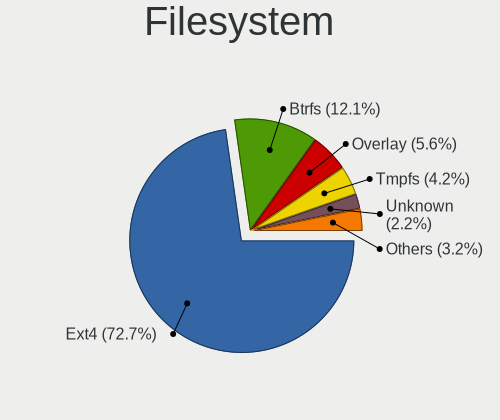
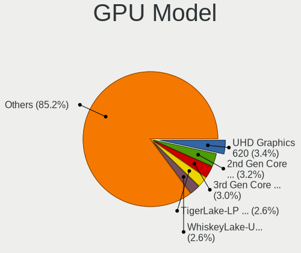
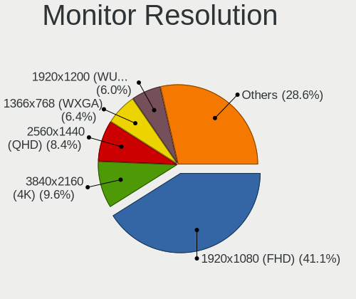
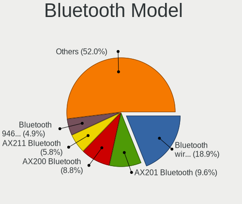

Linux in Switzerland - Tested Hardware & Statistics
---------------------------------------------------

A project to collect tested hardware configurations for Linux in Switzerland.

Anyone can contribute to this report by the [hw-probe](https://github.com/linuxhw/hw-probe) tool:

    sudo -E hw-probe -all -upload

Please contribute! Especially if your hardware is rare.

This is a report for all computer types. See also reports for [desktops](/Location/Switzerland/Desktop/README.md) and [notebooks](/Location/Switzerland/Notebook/README.md).

Contents
--------

* [ Test Cases ](#test-cases)

* [ System ](#system)
  - [ OS                       ](#os)
  - [ OS Family                ](#os-family)
  - [ Kernel                   ](#kernel)
  - [ Kernel Family            ](#kernel-family)
  - [ Kernel Major Ver.        ](#kernel-major-ver)
  - [ Arch                     ](#arch)
  - [ DE                       ](#de)
  - [ Display Server           ](#display-server)
  - [ Display Manager          ](#display-manager)
  - [ OS Lang                  ](#os-lang)
  - [ Boot Mode                ](#boot-mode)
  - [ Filesystem               ](#filesystem)
  - [ Part. scheme             ](#part-scheme)
  - [ Dual Boot with Linux/BSD ](#dual-boot-with-linuxbsd)
  - [ Dual Boot (Win)          ](#dual-boot-win)

* [ Board ](#board)
  - [ Vendor                   ](#vendor)
  - [ Model                    ](#model)
  - [ Model Family             ](#model-family)
  - [ MFG Year                 ](#mfg-year)
  - [ Form Factor              ](#form-factor)
  - [ Secure Boot              ](#secure-boot)
  - [ Coreboot                 ](#coreboot)
  - [ RAM Size                 ](#ram-size)
  - [ RAM Used                 ](#ram-used)
  - [ Total Drives             ](#total-drives)
  - [ Has CD-ROM               ](#has-cd-rom)
  - [ Has Ethernet             ](#has-ethernet)
  - [ Has WiFi                 ](#has-wifi)
  - [ Has Bluetooth            ](#has-bluetooth)

* [ Location ](#location)
  - [ Country                  ](#country)
  - [ City                     ](#city)

* [ Drives ](#drives)
  - [ Drive Vendor             ](#drive-vendor)
  - [ Drive Model              ](#drive-model)
  - [ HDD Vendor               ](#hdd-vendor)
  - [ SSD Vendor               ](#ssd-vendor)
  - [ Drive Kind               ](#drive-kind)
  - [ Drive Connector          ](#drive-connector)
  - [ Drive Size               ](#drive-size)
  - [ Space Total              ](#space-total)
  - [ Space Used               ](#space-used)
  - [ Malfunc. Drives          ](#malfunc-drives)
  - [ Malfunc. Drive Vendor    ](#malfunc-drive-vendor)
  - [ Malfunc. HDD Vendor      ](#malfunc-hdd-vendor)
  - [ Malfunc. Drive Kind      ](#malfunc-drive-kind)
  - [ Failed Drives            ](#failed-drives)
  - [ Failed Drive Vendor      ](#failed-drive-vendor)
  - [ Drive Status             ](#drive-status)

* [ Storage controller ](#storage-controller)
  - [ Storage Vendor           ](#storage-vendor)
  - [ Storage Model            ](#storage-model)
  - [ Storage Kind             ](#storage-kind)

* [ Processor ](#processor)
  - [ CPU Vendor               ](#cpu-vendor)
  - [ CPU Model                ](#cpu-model)
  - [ CPU Model Family         ](#cpu-model-family)
  - [ CPU Cores                ](#cpu-cores)
  - [ CPU Sockets              ](#cpu-sockets)
  - [ CPU Threads              ](#cpu-threads)
  - [ CPU Op-Modes             ](#cpu-op-modes)
  - [ CPU Microcode            ](#cpu-microcode)
  - [ CPU Microarch            ](#cpu-microarch)

* [ Graphics ](#graphics)
  - [ GPU Vendor               ](#gpu-vendor)
  - [ GPU Model                ](#gpu-model)
  - [ GPU Combo                ](#gpu-combo)
  - [ GPU Driver               ](#gpu-driver)
  - [ GPU Memory               ](#gpu-memory)

* [ Monitor ](#monitor)
  - [ Monitor Vendor           ](#monitor-vendor)
  - [ Monitor Model            ](#monitor-model)
  - [ Monitor Resolution       ](#monitor-resolution)
  - [ Monitor Diagonal         ](#monitor-diagonal)
  - [ Monitor Width            ](#monitor-width)
  - [ Aspect Ratio             ](#aspect-ratio)
  - [ Monitor Area             ](#monitor-area)
  - [ Pixel Density            ](#pixel-density)
  - [ Multiple Monitors        ](#multiple-monitors)

* [ Network ](#network)
  - [ Net Controller Vendor    ](#net-controller-vendor)
  - [ Net Controller Model     ](#net-controller-model)
  - [ Wireless Vendor          ](#wireless-vendor)
  - [ Wireless Model           ](#wireless-model)
  - [ Ethernet Vendor          ](#ethernet-vendor)
  - [ Ethernet Model           ](#ethernet-model)
  - [ Net Controller Kind      ](#net-controller-kind)
  - [ Used Controller          ](#used-controller)
  - [ NICs                     ](#nics)
  - [ IPv6                     ](#ipv6)

* [ Bluetooth ](#bluetooth)
  - [ Bluetooth Vendor         ](#bluetooth-vendor)
  - [ Bluetooth Model          ](#bluetooth-model)

* [ Sound ](#sound)
  - [ Sound Vendor             ](#sound-vendor)
  - [ Sound Model              ](#sound-model)

* [ Memory ](#memory)
  - [ Memory Vendor            ](#memory-vendor)
  - [ Memory Model             ](#memory-model)
  - [ Memory Kind              ](#memory-kind)
  - [ Memory Form Factor       ](#memory-form-factor)
  - [ Memory Size              ](#memory-size)
  - [ Memory Speed             ](#memory-speed)

* [ Printers & scanners ](#printers--scanners)
  - [ Printer Vendor           ](#printer-vendor)
  - [ Printer Model            ](#printer-model)
  - [ Scanner Vendor           ](#scanner-vendor)
  - [ Scanner Model            ](#scanner-model)

* [ Camera ](#camera)
  - [ Camera Vendor            ](#camera-vendor)
  - [ Camera Model             ](#camera-model)

* [ Security ](#security)
  - [ Fingerprint Vendor       ](#fingerprint-vendor)
  - [ Fingerprint Model        ](#fingerprint-model)
  - [ Chipcard Vendor          ](#chipcard-vendor)
  - [ Chipcard Model           ](#chipcard-model)

* [ Unsupported ](#unsupported)
  - [ Unsupported Devices      ](#unsupported-devices)
  - [ Unsupported Device Types ](#unsupported-device-types)

Test Cases
----------

Total: 2764

| Vendor        | Model                       | Form-Factor | Probe                                                      | Date         |
|---------------|-----------------------------|-------------|------------------------------------------------------------|--------------|
| HP            | Elite x2 1012 G2            | Tablet      | [cc24dc6f72](https://linux-hardware.org/?probe=cc24dc6f72) | Dec 31, 2022 |
| HP            | Elite x2 1012 G2            | Tablet      | [bf3922e95d](https://linux-hardware.org/?probe=bf3922e95d) | Dec 31, 2022 |
| Valve         | Jupiter                     | Notebook    | [82b86d954a](https://linux-hardware.org/?probe=82b86d954a) | Dec 30, 2022 |
| Lenovo        | ThinkPad T470s 20HGS1JN0... | Notebook    | [049bc54496](https://linux-hardware.org/?probe=049bc54496) | Dec 30, 2022 |
| Lenovo        | ThinkBook 13s G4 ARB 21A... | Notebook    | [29bca2b322](https://linux-hardware.org/?probe=29bca2b322) | Dec 29, 2022 |
| Lenovo        | ThinkPad X240 20AL007AMZ    | Notebook    | [bcb9b7a061](https://linux-hardware.org/?probe=bcb9b7a061) | Dec 29, 2022 |
| Acer          | Aspire F5-572G              | Notebook    | [71168d8107](https://linux-hardware.org/?probe=71168d8107) | Dec 29, 2022 |
| Dell          | XPS 13 9380                 | Notebook    | [a73fe5e678](https://linux-hardware.org/?probe=a73fe5e678) | Dec 28, 2022 |
| Lenovo        | ThinkPad E15 Gen 2 20T80... | Notebook    | [538bf2bb33](https://linux-hardware.org/?probe=538bf2bb33) | Dec 28, 2022 |
| Acer          | Swift SF314-511             | Notebook    | [b8ad48c33c](https://linux-hardware.org/?probe=b8ad48c33c) | Dec 26, 2022 |
| ASUSTek       | Crosshair IV Formula        | Desktop     | [77ee14ad98](https://linux-hardware.org/?probe=77ee14ad98) | Dec 26, 2022 |
| ASUSTek       | Crosshair IV Formula        | Desktop     | [1c022f7ff8](https://linux-hardware.org/?probe=1c022f7ff8) | Dec 26, 2022 |
| ASUSTek       | TUF Gaming B560M-PLUS WI... | Desktop     | [8762b5f41f](https://linux-hardware.org/?probe=8762b5f41f) | Dec 25, 2022 |
| ASUSTek       | X556UAK                     | Notebook    | [803a4e58e0](https://linux-hardware.org/?probe=803a4e58e0) | Dec 25, 2022 |
| ASUSTek       | P7H55-M PRO                 | Desktop     | [b445490856](https://linux-hardware.org/?probe=b445490856) | Dec 25, 2022 |
| HP            | ProBook 450 G7              | Notebook    | [f47d3ce638](https://linux-hardware.org/?probe=f47d3ce638) | Dec 24, 2022 |
| HP            | ProBook 440 G8 Notebook ... | Notebook    | [2d50f93c7f](https://linux-hardware.org/?probe=2d50f93c7f) | Dec 22, 2022 |
| HP            | ProBook 440 G8 Notebook ... | Notebook    | [dac438be55](https://linux-hardware.org/?probe=dac438be55) | Dec 22, 2022 |
| Gigabyte      | X570S I AORUS PRO AX        | Desktop     | [3f3c7b0e92](https://linux-hardware.org/?probe=3f3c7b0e92) | Dec 22, 2022 |
| HP            | ProBook 450 15.6 inch G9... | Notebook    | [e160bf6ea0](https://linux-hardware.org/?probe=e160bf6ea0) | Dec 22, 2022 |
| Dell          | Inspiron 15 3511            | Notebook    | [e7bf0c0a09](https://linux-hardware.org/?probe=e7bf0c0a09) | Dec 21, 2022 |
| Notebook      | NL5xRU                      | Notebook    | [c32538c73b](https://linux-hardware.org/?probe=c32538c73b) | Dec 21, 2022 |
| CompuLab      | Intense-PC                  | Mini pc     | [907ca44afe](https://linux-hardware.org/?probe=907ca44afe) | Dec 21, 2022 |
| Lenovo        | Yoga Slim 7 Pro 16ACH6 8... | Notebook    | [b6252c3e0e](https://linux-hardware.org/?probe=b6252c3e0e) | Dec 20, 2022 |
| Lenovo        | ThinkPad T450 20BUS0EW11    | Notebook    | [9fca55febc](https://linux-hardware.org/?probe=9fca55febc) | Dec 19, 2022 |
| Gigabyte      | GA-MA790FXT-UD5P            | Desktop     | [47397487a7](https://linux-hardware.org/?probe=47397487a7) | Dec 19, 2022 |
| Gigabyte      | GA-MA790FXT-UD5P            | Desktop     | [e954c9ca37](https://linux-hardware.org/?probe=e954c9ca37) | Dec 19, 2022 |
| Lenovo        | ThinkPad T450 20BUS0EW11    | Notebook    | [57605a26eb](https://linux-hardware.org/?probe=57605a26eb) | Dec 19, 2022 |
| ASUSTek       | PN64                        | Mini pc     | [a5fdbdb0c8](https://linux-hardware.org/?probe=a5fdbdb0c8) | Dec 19, 2022 |
| Lenovo        | ThinkPad L15 Gen 2 20X30... | Notebook    | [3a6e0b953f](https://linux-hardware.org/?probe=3a6e0b953f) | Dec 19, 2022 |
| Notebook      | PC5x_7xHP_HR_HS             | Notebook    | [7a528ca531](https://linux-hardware.org/?probe=7a528ca531) | Dec 17, 2022 |
| Acer          | Aspire E5-773               | Notebook    | [d8d1898a3b](https://linux-hardware.org/?probe=d8d1898a3b) | Dec 17, 2022 |
| Lenovo        | ThinkPad E15 20RD0011MZ     | Notebook    | [86627d739c](https://linux-hardware.org/?probe=86627d739c) | Dec 16, 2022 |
| Lenovo        | ThinkPad E15 20RD0011MZ     | Notebook    | [ee758acf19](https://linux-hardware.org/?probe=ee758acf19) | Dec 16, 2022 |
| Lenovo        | ThinkPad E490 20N8CTO1WW    | Notebook    | [13ee187e45](https://linux-hardware.org/?probe=13ee187e45) | Dec 15, 2022 |
| HP            | Compaq 6830s                | Notebook    | [1883df2312](https://linux-hardware.org/?probe=1883df2312) | Dec 14, 2022 |
| Lenovo        | ThinkPad P14s Gen 2a 21A... | Notebook    | [1129626fee](https://linux-hardware.org/?probe=1129626fee) | Dec 13, 2022 |
| Acer          | Aspire 7750                 | Notebook    | [9f0f4a8510](https://linux-hardware.org/?probe=9f0f4a8510) | Dec 12, 2022 |
| Acer          | Aspire 7750                 | Notebook    | [f7577f248a](https://linux-hardware.org/?probe=f7577f248a) | Dec 12, 2022 |
| ASUSTek       | X556UAK                     | Notebook    | [787ba0950d](https://linux-hardware.org/?probe=787ba0950d) | Dec 11, 2022 |
| Gigabyte      | P67A-D3-B3                  | Desktop     | [9ed715edc4](https://linux-hardware.org/?probe=9ed715edc4) | Dec 11, 2022 |
| Raspberry ... | Raspberry Pi                | Soc         | [3282a529f0](https://linux-hardware.org/?probe=3282a529f0) | Dec 11, 2022 |
| Apple         | Mac-7BA5B2D9E42DDD94 iMa... | Desktop     | [6c26c9ff8c](https://linux-hardware.org/?probe=6c26c9ff8c) | Dec 10, 2022 |
| ASUSTek       | P8Z77-V LX                  | Desktop     | [d53608f3e3](https://linux-hardware.org/?probe=d53608f3e3) | Dec 10, 2022 |
| Lenovo        | ThinkPad T480s 20L7CTO1W... | Notebook    | [b524e6fd67](https://linux-hardware.org/?probe=b524e6fd67) | Dec 09, 2022 |
| Acer          | Swift SF314-511             | Notebook    | [c3c6c2f4fc](https://linux-hardware.org/?probe=c3c6c2f4fc) | Dec 09, 2022 |
| ASUSTek       | TUF B450-PRO GAMING         | Desktop     | [945412b0cc](https://linux-hardware.org/?probe=945412b0cc) | Dec 09, 2022 |
| TUXEDO        | InfinityBook Pro Gen7 (M... | Notebook    | [474cde3412](https://linux-hardware.org/?probe=474cde3412) | Dec 08, 2022 |
| HP            | ENVY x360 2-in-1 Laptop ... | Convertible | [62986b3426](https://linux-hardware.org/?probe=62986b3426) | Dec 08, 2022 |
| ASUSTek       | X556UAK                     | Notebook    | [637056cc12](https://linux-hardware.org/?probe=637056cc12) | Dec 08, 2022 |
| Lenovo        | ThinkPad E490 20N8000UMZ    | Notebook    | [15ca126de2](https://linux-hardware.org/?probe=15ca126de2) | Dec 08, 2022 |
| Lenovo        | ThinkPad E490 20N8000UMZ    | Notebook    | [eef6c9c624](https://linux-hardware.org/?probe=eef6c9c624) | Dec 08, 2022 |
| BESSTAR Te... | B550                        | Desktop     | [5471ce4bdc](https://linux-hardware.org/?probe=5471ce4bdc) | Dec 07, 2022 |
| ASUSTek       | PRIME B350M-A               | Desktop     | [31ae5769eb](https://linux-hardware.org/?probe=31ae5769eb) | Dec 07, 2022 |
| CompuLab      | Intense-PC                  | Mini pc     | [439e89b31f](https://linux-hardware.org/?probe=439e89b31f) | Dec 07, 2022 |
| Dell          | 0HN7XN A00                  | Desktop     | [f2ba8a7d55](https://linux-hardware.org/?probe=f2ba8a7d55) | Dec 06, 2022 |
| Dell          | 0HN7XN A00                  | Desktop     | [927991f54f](https://linux-hardware.org/?probe=927991f54f) | Dec 06, 2022 |
| Gigabyte      | Z690 AORUS PRO              | Desktop     | [ee9c9e919b](https://linux-hardware.org/?probe=ee9c9e919b) | Dec 05, 2022 |
| HP            | ENVY dv7                    | Notebook    | [8e8b9ecfb6](https://linux-hardware.org/?probe=8e8b9ecfb6) | Dec 04, 2022 |
| ASUSTek       | Maximus VII RANGER          | Desktop     | [9a0718a60f](https://linux-hardware.org/?probe=9a0718a60f) | Dec 04, 2022 |
| ASUSTek       | GL702ZC                     | Notebook    | [de8b2bcfab](https://linux-hardware.org/?probe=de8b2bcfab) | Dec 03, 2022 |
| GPD           | P2 MAX                      | Notebook    | [dce4c87de8](https://linux-hardware.org/?probe=dce4c87de8) | Dec 03, 2022 |
| Fujitsu       | D3348-B2 S26361-D3348-B2    | Desktop     | [4568e83912](https://linux-hardware.org/?probe=4568e83912) | Dec 03, 2022 |
| Fujitsu       | D3348-B2 S26361-D3348-B2    | Desktop     | [2047a872cb](https://linux-hardware.org/?probe=2047a872cb) | Dec 03, 2022 |
| Dell          | XPS 15 9520                 | Notebook    | [b6cf92da13](https://linux-hardware.org/?probe=b6cf92da13) | Dec 02, 2022 |
| Acer          | Predator PH317-56           | Notebook    | [ea1d794b18](https://linux-hardware.org/?probe=ea1d794b18) | Dec 02, 2022 |
| ASUSTek       | X556UAK                     | Notebook    | [19395b5e21](https://linux-hardware.org/?probe=19395b5e21) | Dec 02, 2022 |
| HP            | ProBook 6560b               | Notebook    | [c62ff16666](https://linux-hardware.org/?probe=c62ff16666) | Dec 02, 2022 |
| Gigabyte      | GA-MA790FXT-UD5P            | Desktop     | [13b2f864f8](https://linux-hardware.org/?probe=13b2f864f8) | Dec 02, 2022 |
| Lenovo        | ThinkPad X1 Carbon 7th 2... | Notebook    | [8e0ea55ccc](https://linux-hardware.org/?probe=8e0ea55ccc) | Dec 02, 2022 |
| ASUSTek       | X556UAK                     | Notebook    | [7817399ec6](https://linux-hardware.org/?probe=7817399ec6) | Dec 02, 2022 |
| HP            | ENVY dv7                    | Notebook    | [60e3263ce2](https://linux-hardware.org/?probe=60e3263ce2) | Dec 01, 2022 |
| HUAWEI        | MACH-WX9                    | Notebook    | [a37f48c68a](https://linux-hardware.org/?probe=a37f48c68a) | Dec 01, 2022 |
| Dell          | XPS 15 9560                 | Notebook    | [3ee313dd51](https://linux-hardware.org/?probe=3ee313dd51) | Dec 01, 2022 |
| Dell          | XPS 15 9560                 | Notebook    | [fde8194d5c](https://linux-hardware.org/?probe=fde8194d5c) | Dec 01, 2022 |
| HP            | ENVY dv7                    | Notebook    | [1cef09f19a](https://linux-hardware.org/?probe=1cef09f19a) | Dec 01, 2022 |
| Lenovo        | ThinkPad X220 4291WSH       | Notebook    | [3e67e44d23](https://linux-hardware.org/?probe=3e67e44d23) | Nov 30, 2022 |
| ASUSTek       | H81M-PLUS                   | Desktop     | [8d98938198](https://linux-hardware.org/?probe=8d98938198) | Nov 30, 2022 |
| Dell          | 0Y2G81 A01                  | Server      | [7ce42afb90](https://linux-hardware.org/?probe=7ce42afb90) | Nov 30, 2022 |
| HP            | Pavilion dv9000 (RP919EA... | Notebook    | [dcdd31c3d5](https://linux-hardware.org/?probe=dcdd31c3d5) | Nov 30, 2022 |
| HP            | Spectre x360 Convertible... | Convertible | [d233ee2114](https://linux-hardware.org/?probe=d233ee2114) | Nov 30, 2022 |
| Apple         | Mac-F2268DAE                | All in one  | [8d37e3e327](https://linux-hardware.org/?probe=8d37e3e327) | Nov 29, 2022 |
| Apple         | Mac-F2268DAE                | All in one  | [e41751f26a](https://linux-hardware.org/?probe=e41751f26a) | Nov 29, 2022 |
| Notebook      | L140PU                      | Notebook    | [8893420e06](https://linux-hardware.org/?probe=8893420e06) | Nov 28, 2022 |
| Dell          | XPS 13 9370                 | Notebook    | [d353a1624b](https://linux-hardware.org/?probe=d353a1624b) | Nov 28, 2022 |
| Pegatron      | VIOLET                      | Desktop     | [f0f25e6854](https://linux-hardware.org/?probe=f0f25e6854) | Nov 28, 2022 |
| Dell          | Latitude E6420              | Notebook    | [15ee6e2e20](https://linux-hardware.org/?probe=15ee6e2e20) | Nov 28, 2022 |
| Acer          | Aspire A515-45              | Notebook    | [4cec4d0e04](https://linux-hardware.org/?probe=4cec4d0e04) | Nov 27, 2022 |
| Apple         | MacBookAir6,2               | Notebook    | [8e266a1137](https://linux-hardware.org/?probe=8e266a1137) | Nov 27, 2022 |
| ASRock        | B550M Pro4                  | Desktop     | [3ba26453f1](https://linux-hardware.org/?probe=3ba26453f1) | Nov 24, 2022 |
| Nvidia        | Tegra                       | Soc         | [b565b4082e](https://linux-hardware.org/?probe=b565b4082e) | Nov 24, 2022 |
| Lenovo        | ThinkPad L13 Yoga Gen 2 ... | Convertible | [90f931841d](https://linux-hardware.org/?probe=90f931841d) | Nov 23, 2022 |
| Lenovo        | ThinkPad L13 Yoga Gen 2 ... | Convertible | [111f6a1fc2](https://linux-hardware.org/?probe=111f6a1fc2) | Nov 23, 2022 |
| Fujitsu       | D3348-B2 S26361-D3348-B2    | Desktop     | [eabfad66da](https://linux-hardware.org/?probe=eabfad66da) | Nov 22, 2022 |
| Lenovo        | ThinkPad T450 20BUS08L00    | Notebook    | [080bbeb75a](https://linux-hardware.org/?probe=080bbeb75a) | Nov 22, 2022 |
| Intel         | NUC10i7FNB K61360-302       | Mini pc     | [b5ed1b189a](https://linux-hardware.org/?probe=b5ed1b189a) | Nov 22, 2022 |
| ASUSTek       | P6T DELUXE                  | Desktop     | [54f10b9d0b](https://linux-hardware.org/?probe=54f10b9d0b) | Nov 21, 2022 |
| ASUSTek       | P6T DELUXE                  | Desktop     | [576ca67a28](https://linux-hardware.org/?probe=576ca67a28) | Nov 21, 2022 |
| Lenovo        | ThinkPad P52 20M90017MX     | Notebook    | [65c874adbd](https://linux-hardware.org/?probe=65c874adbd) | Nov 20, 2022 |
| ASUSTek       | P7H55-M PRO                 | Desktop     | [b25dd25478](https://linux-hardware.org/?probe=b25dd25478) | Nov 20, 2022 |
| Dell          | XPS 9320                    | Notebook    | [e590d602a9](https://linux-hardware.org/?probe=e590d602a9) | Nov 19, 2022 |
| HP            | 212B                        | Desktop     | [574a94ad86](https://linux-hardware.org/?probe=574a94ad86) | Nov 18, 2022 |
| HP            | 212B                        | Desktop     | [3995268826](https://linux-hardware.org/?probe=3995268826) | Nov 18, 2022 |
| ASUSTek       | ZenBook UX450FDX_UX450FD... | Notebook    | [27084d9125](https://linux-hardware.org/?probe=27084d9125) | Nov 17, 2022 |
| ASUSTek       | T100TA                      | Notebook    | [871be7733f](https://linux-hardware.org/?probe=871be7733f) | Nov 17, 2022 |
| MPMAN         | CONVERTER8                  | Notebook    | [0c8f7446f7](https://linux-hardware.org/?probe=0c8f7446f7) | Nov 17, 2022 |
| ASUSTek       | Pro WS WRX80E-SAGE SE WI... | Desktop     | [b3e809f3d2](https://linux-hardware.org/?probe=b3e809f3d2) | Nov 17, 2022 |
| Lenovo        | ThinkPad E15 Gen 2 20T80... | Notebook    | [6f2f504425](https://linux-hardware.org/?probe=6f2f504425) | Nov 16, 2022 |
| Lenovo        | ThinkPad Edge 03192AG       | Notebook    | [48da1b11bc](https://linux-hardware.org/?probe=48da1b11bc) | Nov 16, 2022 |
| HP            | Compaq 15                   | Notebook    | [d437023699](https://linux-hardware.org/?probe=d437023699) | Nov 16, 2022 |
| GPD           | G1619-04                    | Notebook    | [c1e365fd5d](https://linux-hardware.org/?probe=c1e365fd5d) | Nov 16, 2022 |
| Clevo         | W240EU/W250EUQ/W270EUQ      | Notebook    | [71a871168d](https://linux-hardware.org/?probe=71a871168d) | Nov 15, 2022 |
| ASUSTek       | PRIME B350M-A               | Desktop     | [aabc2148da](https://linux-hardware.org/?probe=aabc2148da) | Nov 15, 2022 |
| HP            | ENVY x360 Convertible 15... | Convertible | [c6c7120833](https://linux-hardware.org/?probe=c6c7120833) | Nov 15, 2022 |
| Acer          | Aspire V3-771               | Notebook    | [5682e576ad](https://linux-hardware.org/?probe=5682e576ad) | Nov 14, 2022 |
| ASUSTek       | ROG STRIX B550-E GAMING     | Desktop     | [2053688baa](https://linux-hardware.org/?probe=2053688baa) | Nov 14, 2022 |
| ASUSTek       | ROG STRIX B550-E GAMING     | Desktop     | [15f6c6a1aa](https://linux-hardware.org/?probe=15f6c6a1aa) | Nov 14, 2022 |
| ASUSTek       | P6T DELUXE                  | Desktop     | [3726e23d23](https://linux-hardware.org/?probe=3726e23d23) | Nov 14, 2022 |
| Alienware     | 07W25T A00                  | Desktop     | [f320cc2659](https://linux-hardware.org/?probe=f320cc2659) | Nov 11, 2022 |
| Acer          | Spin SP313-51N              | Convertible | [d2e25c9c4e](https://linux-hardware.org/?probe=d2e25c9c4e) | Nov 10, 2022 |
| Dell          | XPS 15 9560                 | Notebook    | [d7a20bdac6](https://linux-hardware.org/?probe=d7a20bdac6) | Nov 09, 2022 |
| Raspberry ... | Raspberry Pi 3 Model B R... | Soc         | [33a4a1ea9a](https://linux-hardware.org/?probe=33a4a1ea9a) | Nov 09, 2022 |
| ASRock        | X570M Pro4                  | Desktop     | [581ff62688](https://linux-hardware.org/?probe=581ff62688) | Nov 07, 2022 |
| ASRock        | X570M Pro4                  | Desktop     | [a0a7ef6e3a](https://linux-hardware.org/?probe=a0a7ef6e3a) | Nov 07, 2022 |
| ASUSTek       | VivoBook_ASUSLaptop TP40... | Convertible | [ff7014b9b8](https://linux-hardware.org/?probe=ff7014b9b8) | Nov 06, 2022 |
| Apple         | MacBookPro4,1               | Notebook    | [69c1a004e6](https://linux-hardware.org/?probe=69c1a004e6) | Nov 03, 2022 |
| Dell          | XPS 13 9380                 | Notebook    | [9224a599b3](https://linux-hardware.org/?probe=9224a599b3) | Nov 03, 2022 |
| HP            | 8458                        | Mini pc     | [4da864256d](https://linux-hardware.org/?probe=4da864256d) | Nov 03, 2022 |
| ASUSTek       | Z590 WIFI GUNDAM EDITION    | Desktop     | [74f8de9f71](https://linux-hardware.org/?probe=74f8de9f71) | Nov 02, 2022 |
| HP            | Pavilion x360 Convertibl... | Convertible | [fd4d484f61](https://linux-hardware.org/?probe=fd4d484f61) | Nov 02, 2022 |
| Dell          | Precision 5520              | Notebook    | [e1a819ec3e](https://linux-hardware.org/?probe=e1a819ec3e) | Nov 01, 2022 |
| Lenovo        | ThinkPad X1 Carbon 7th 2... | Notebook    | [e101d9d50a](https://linux-hardware.org/?probe=e101d9d50a) | Nov 01, 2022 |
| GPD           | G1619-04                    | Notebook    | [898bbfb591](https://linux-hardware.org/?probe=898bbfb591) | Nov 01, 2022 |
| Lenovo        | ThinkPad L15 Gen 2 20X30... | Notebook    | [a75bc2ff26](https://linux-hardware.org/?probe=a75bc2ff26) | Oct 30, 2022 |
| Lenovo        | IdeaPadFlex 5 14ITL05 82... | Convertible | [1e1f105579](https://linux-hardware.org/?probe=1e1f105579) | Oct 30, 2022 |
| Lenovo        | IdeaPadFlex 5 14ITL05 82... | Convertible | [19cddcf899](https://linux-hardware.org/?probe=19cddcf899) | Oct 30, 2022 |
| Lenovo        | ThinkPad X220 4291WSH       | Notebook    | [a4eebe6485](https://linux-hardware.org/?probe=a4eebe6485) | Oct 30, 2022 |
| Lenovo        | ThinkPad T470s 20HGS2W30... | Notebook    | [8e0c00531b](https://linux-hardware.org/?probe=8e0c00531b) | Oct 29, 2022 |
| HP            | Laptop 15-da0xxx            | Notebook    | [6047d5d94a](https://linux-hardware.org/?probe=6047d5d94a) | Oct 29, 2022 |
| ASUSTek       | K55VJ                       | Notebook    | [6dc11e517b](https://linux-hardware.org/?probe=6dc11e517b) | Oct 29, 2022 |
| Dell          | Latitude E4310              | Notebook    | [fe6c65dd77](https://linux-hardware.org/?probe=fe6c65dd77) | Oct 29, 2022 |
| Dell          | Latitude E4310              | Notebook    | [7a610ca46d](https://linux-hardware.org/?probe=7a610ca46d) | Oct 29, 2022 |
| HP            | ProBook 6570b               | Notebook    | [b5d48f6adb](https://linux-hardware.org/?probe=b5d48f6adb) | Oct 29, 2022 |
| Lenovo        | ThinkPad T420 4236NUG       | Notebook    | [d0e3fa9699](https://linux-hardware.org/?probe=d0e3fa9699) | Oct 28, 2022 |
| HP            | 3396                        | Desktop     | [d42479acb8](https://linux-hardware.org/?probe=d42479acb8) | Oct 28, 2022 |
| ZOTAC         | ZBOX-EN72080V/EN72070V/E... | Mini pc     | [9a540d96f5](https://linux-hardware.org/?probe=9a540d96f5) | Oct 27, 2022 |
| HP            | ENVY x360 Convertible 13... | Convertible | [c55b37c393](https://linux-hardware.org/?probe=c55b37c393) | Oct 25, 2022 |
| Lenovo        | ThinkPad X1 Carbon Gen 9... | Notebook    | [c3bbb31b04](https://linux-hardware.org/?probe=c3bbb31b04) | Oct 24, 2022 |
| Lenovo        | ThinkPad X1 Carbon Gen 8... | Notebook    | [85510879a5](https://linux-hardware.org/?probe=85510879a5) | Oct 24, 2022 |
| ASUSTek       | N750JK                      | Notebook    | [849800f3f3](https://linux-hardware.org/?probe=849800f3f3) | Oct 24, 2022 |
| Lenovo        | ThinkPad X1 Carbon Gen 9... | Notebook    | [c16378c914](https://linux-hardware.org/?probe=c16378c914) | Oct 23, 2022 |
| Acer          | WG43M                       | Desktop     | [e520a7dfca](https://linux-hardware.org/?probe=e520a7dfca) | Oct 22, 2022 |
| Lenovo        | ThinkPad T480 20L50004MZ    | Notebook    | [7fe25296ef](https://linux-hardware.org/?probe=7fe25296ef) | Oct 21, 2022 |
| HP            | ENVY x360 Convertible 15... | Convertible | [b81dd63334](https://linux-hardware.org/?probe=b81dd63334) | Oct 21, 2022 |
| Lenovo        | ThinkPad L13 Yoga Gen 2 ... | Convertible | [55a46537f8](https://linux-hardware.org/?probe=55a46537f8) | Oct 21, 2022 |
| Medion        | S15449                      | Notebook    | [c737a8be4a](https://linux-hardware.org/?probe=c737a8be4a) | Oct 20, 2022 |
| ASUSTek       | TUF Gaming X570-PLUS        | Desktop     | [a83d0f0ade](https://linux-hardware.org/?probe=a83d0f0ade) | Oct 20, 2022 |
| Lenovo        | ThinkPad L15 Gen 2 20X30... | Notebook    | [f5073cd7a2](https://linux-hardware.org/?probe=f5073cd7a2) | Oct 20, 2022 |
| HP            | 829A                        | Mini pc     | [3470bd9a76](https://linux-hardware.org/?probe=3470bd9a76) | Oct 17, 2022 |
| HP            | 829A                        | Mini pc     | [3ab01040ef](https://linux-hardware.org/?probe=3ab01040ef) | Oct 17, 2022 |
| MSI           | H170I PRO AC                | Desktop     | [ea4ecf6238](https://linux-hardware.org/?probe=ea4ecf6238) | Oct 17, 2022 |
| ASUSTek       | ZenBook 13 UX331FAL_UX33... | Notebook    | [3e8ca06ac6](https://linux-hardware.org/?probe=3e8ca06ac6) | Oct 17, 2022 |
| Lenovo        | Yoga S740-14IIL 81RS        | Notebook    | [8bd50f112b](https://linux-hardware.org/?probe=8bd50f112b) | Oct 15, 2022 |
| Lenovo        | Yoga S740-14IIL 81RS        | Notebook    | [88497baf29](https://linux-hardware.org/?probe=88497baf29) | Oct 15, 2022 |
| Apple         | Mac-FFE5EF870D7BA81A iMa... | All in one  | [5d60b980ca](https://linux-hardware.org/?probe=5d60b980ca) | Oct 15, 2022 |
| ASUSTek       | ROG STRIX B550-F GAMING ... | Desktop     | [1993500f68](https://linux-hardware.org/?probe=1993500f68) | Oct 15, 2022 |
| ASUSTek       | PN41                        | Mini pc     | [3498692f6e](https://linux-hardware.org/?probe=3498692f6e) | Oct 15, 2022 |
| Google        | Lars                        | Notebook    | [b607a23c77](https://linux-hardware.org/?probe=b607a23c77) | Oct 14, 2022 |
| HP            | ENVY Laptop 15-ep1xxx       | Notebook    | [b02e3ede3f](https://linux-hardware.org/?probe=b02e3ede3f) | Oct 14, 2022 |
| HP            | ENVY Laptop 15-ep1xxx       | Notebook    | [33efe8c37a](https://linux-hardware.org/?probe=33efe8c37a) | Oct 14, 2022 |
| HP            | ENVY 15                     | Notebook    | [71c0056a73](https://linux-hardware.org/?probe=71c0056a73) | Oct 13, 2022 |
| Acer          | Aspire 7250G                | Notebook    | [34966259d6](https://linux-hardware.org/?probe=34966259d6) | Oct 13, 2022 |
| ASRock        | Z97 Extreme6                | Desktop     | [9d2cf83f81](https://linux-hardware.org/?probe=9d2cf83f81) | Oct 12, 2022 |
| ASRock        | Z97 Extreme6                | Desktop     | [feb997ebfc](https://linux-hardware.org/?probe=feb997ebfc) | Oct 12, 2022 |
| HP            | ENVY Laptop 17-cr0xxx       | Notebook    | [67532c45cb](https://linux-hardware.org/?probe=67532c45cb) | Oct 12, 2022 |
| Lenovo        | ThinkPad S1 Yoga 12 20DK... | Notebook    | [5112d236ce](https://linux-hardware.org/?probe=5112d236ce) | Oct 12, 2022 |
| MSI           | MPG Z490 GAMING EDGE WIF... | Desktop     | [10e153f71e](https://linux-hardware.org/?probe=10e153f71e) | Oct 10, 2022 |
| Chuwi         | RZBOX                       | Desktop     | [76b6d7cd78](https://linux-hardware.org/?probe=76b6d7cd78) | Oct 08, 2022 |
| Samsung       | RC530/RC730                 | Notebook    | [ee62bfc634](https://linux-hardware.org/?probe=ee62bfc634) | Oct 07, 2022 |
| Lenovo        | ThinkPad X1 Carbon Gen 1... | Notebook    | [ff847da23a](https://linux-hardware.org/?probe=ff847da23a) | Oct 07, 2022 |
| Lenovo        | ThinkPad X1 Carbon Gen 1... | Notebook    | [fceffec337](https://linux-hardware.org/?probe=fceffec337) | Oct 07, 2022 |
| Notebook      | W65_67SZ                    | Notebook    | [a3a056691b](https://linux-hardware.org/?probe=a3a056691b) | Oct 07, 2022 |
| Intel         | NUC10i7FNB M38062-307       | Mini pc     | [7f03ff4490](https://linux-hardware.org/?probe=7f03ff4490) | Oct 07, 2022 |
| Gigabyte      | RC14UD                      | Notebook    | [e48bdade3d](https://linux-hardware.org/?probe=e48bdade3d) | Oct 06, 2022 |
| Dell          | Latitude E6410              | Notebook    | [f7baa71813](https://linux-hardware.org/?probe=f7baa71813) | Oct 05, 2022 |
| Dell          | 0T656F A01                  | Desktop     | [24da875cf7](https://linux-hardware.org/?probe=24da875cf7) | Oct 04, 2022 |
| HP            | 213D A01                    | Desktop     | [e81fd5fea5](https://linux-hardware.org/?probe=e81fd5fea5) | Oct 04, 2022 |
| HP            | ProBook 640 G2              | Notebook    | [e4cc03e802](https://linux-hardware.org/?probe=e4cc03e802) | Oct 03, 2022 |
| MSI           | B450 TOMAHAWK               | Desktop     | [6a5067b548](https://linux-hardware.org/?probe=6a5067b548) | Oct 02, 2022 |
| MSI           | B450 TOMAHAWK               | Desktop     | [2044c11c98](https://linux-hardware.org/?probe=2044c11c98) | Oct 02, 2022 |
| ASUSTek       | K55VJ                       | Notebook    | [e405dee0bd](https://linux-hardware.org/?probe=e405dee0bd) | Oct 02, 2022 |
| MSI           | 2A9C                        | Desktop     | [a933ad6bca](https://linux-hardware.org/?probe=a933ad6bca) | Oct 01, 2022 |
| Pegatron      | IPMSB-GS                    | Desktop     | [5e38213b3b](https://linux-hardware.org/?probe=5e38213b3b) | Sep 30, 2022 |
| Gigabyte      | RC14UD                      | Notebook    | [744143bdd6](https://linux-hardware.org/?probe=744143bdd6) | Sep 30, 2022 |
| Acer          | Spin SP111-32N              | Convertible | [6c3ab0f793](https://linux-hardware.org/?probe=6c3ab0f793) | Sep 27, 2022 |
| HP            | EliteBook 850 G7 Noteboo... | Notebook    | [9a1514cc61](https://linux-hardware.org/?probe=9a1514cc61) | Sep 26, 2022 |
| ASUSTek       | ROG STRIX B450-F GAMING ... | Desktop     | [41cc3cdcfd](https://linux-hardware.org/?probe=41cc3cdcfd) | Sep 26, 2022 |
| ASUSTek       | ROG STRIX B450-F GAMING ... | Desktop     | [d6924eb78d](https://linux-hardware.org/?probe=d6924eb78d) | Sep 26, 2022 |
| HP            | Pavilion x360 Convertibl... | Convertible | [3c87156766](https://linux-hardware.org/?probe=3c87156766) | Sep 25, 2022 |
| Lenovo        | Yoga S730-13IWL 81J0        | Notebook    | [fee2b2d57e](https://linux-hardware.org/?probe=fee2b2d57e) | Sep 24, 2022 |
| Packard Be... | IMEDIA S1300                | Desktop     | [13b1f0e28e](https://linux-hardware.org/?probe=13b1f0e28e) | Sep 24, 2022 |
| Raspberry ... | Raspberry Pi 4 Model B R... | Soc         | [6f492f55c3](https://linux-hardware.org/?probe=6f492f55c3) | Sep 24, 2022 |
| Acer          | Spin SP111-32N              | Convertible | [75ed13ea90](https://linux-hardware.org/?probe=75ed13ea90) | Sep 24, 2022 |
| Lenovo        | ThinkPad X1 Carbon 4th 2... | Convertible | [f9c071cdd8](https://linux-hardware.org/?probe=f9c071cdd8) | Sep 23, 2022 |
| System76      | Darter Pro                  | Notebook    | [012968a4a3](https://linux-hardware.org/?probe=012968a4a3) | Sep 22, 2022 |
| HP            | 8053                        | Desktop     | [d46ac6d7db](https://linux-hardware.org/?probe=d46ac6d7db) | Sep 22, 2022 |
| HP            | EliteBook x360 1040 G8 N... | Convertible | [074a9f8433](https://linux-hardware.org/?probe=074a9f8433) | Sep 22, 2022 |
| System76      | Darter Pro                  | Notebook    | [8d3bdb7585](https://linux-hardware.org/?probe=8d3bdb7585) | Sep 22, 2022 |
| Acer          | Aspire E5-571               | Notebook    | [dc6bf82565](https://linux-hardware.org/?probe=dc6bf82565) | Sep 22, 2022 |
| ASUSTek       | K56CB                       | Notebook    | [7a7717e793](https://linux-hardware.org/?probe=7a7717e793) | Sep 21, 2022 |
| Acer          | Aspire E5-571               | Notebook    | [dddf15cbf5](https://linux-hardware.org/?probe=dddf15cbf5) | Sep 21, 2022 |
| Acer          | Aspire E5-571               | Notebook    | [21404b14d1](https://linux-hardware.org/?probe=21404b14d1) | Sep 21, 2022 |
| Packard Be... | IMEDIA S1300                | Desktop     | [fae2bea6f3](https://linux-hardware.org/?probe=fae2bea6f3) | Sep 19, 2022 |
| HP            | 0AA8h                       | Desktop     | [3c274fc7f3](https://linux-hardware.org/?probe=3c274fc7f3) | Sep 19, 2022 |
| HP            | EliteBook Folio 1040 G2     | Notebook    | [3aa36dda04](https://linux-hardware.org/?probe=3aa36dda04) | Sep 18, 2022 |
| ASUSTek       | PRIME B550-PLUS             | Desktop     | [43bc9e36cd](https://linux-hardware.org/?probe=43bc9e36cd) | Sep 17, 2022 |
| Gigabyte      | Z590 VISION G               | Desktop     | [ec15390099](https://linux-hardware.org/?probe=ec15390099) | Sep 14, 2022 |
| HP            | ProBook 440 G8 Notebook ... | Notebook    | [81d620ed2f](https://linux-hardware.org/?probe=81d620ed2f) | Sep 14, 2022 |
| HP            | Notebook                    | Notebook    | [963af7e07b](https://linux-hardware.org/?probe=963af7e07b) | Sep 13, 2022 |
| Apple         | Mac-F226BEC8 PVT            | All in one  | [c54a63e1a3](https://linux-hardware.org/?probe=c54a63e1a3) | Sep 13, 2022 |
| HP            | ProBook 440 G8 Notebook ... | Notebook    | [4aa1954c0c](https://linux-hardware.org/?probe=4aa1954c0c) | Sep 13, 2022 |
| Apple         | Mac-F226BEC8 PVT            | All in one  | [e2d13711aa](https://linux-hardware.org/?probe=e2d13711aa) | Sep 10, 2022 |
| Lenovo        | ThinkPad T430 2350A26       | Notebook    | [7374ee44fa](https://linux-hardware.org/?probe=7374ee44fa) | Sep 10, 2022 |
| HP            | EliteBook 840 G1            | Notebook    | [e72b842ab6](https://linux-hardware.org/?probe=e72b842ab6) | Sep 10, 2022 |
| ASUSTek       | SABERTOOTH X58              | Desktop     | [ce9d09e18a](https://linux-hardware.org/?probe=ce9d09e18a) | Sep 10, 2022 |
| Supermicro    | X9DRD-7LN4F                 | Server      | [6a4fa8ebe7](https://linux-hardware.org/?probe=6a4fa8ebe7) | Sep 09, 2022 |
| Supermicro    | X9DRD-7LN4F                 | Server      | [965f8fe14d](https://linux-hardware.org/?probe=965f8fe14d) | Sep 09, 2022 |
| Apple         | Mac-F221BEC8                | Desktop     | [c0353e7c9e](https://linux-hardware.org/?probe=c0353e7c9e) | Sep 09, 2022 |
| ASUSTek       | V161GAR                     | All in one  | [668d4ac33b](https://linux-hardware.org/?probe=668d4ac33b) | Sep 09, 2022 |
| MSI           | B250M PRO-VDH               | Desktop     | [6c5483e3f5](https://linux-hardware.org/?probe=6c5483e3f5) | Sep 07, 2022 |
| Acer          | Aspire X3950                | Desktop     | [22d1319220](https://linux-hardware.org/?probe=22d1319220) | Sep 06, 2022 |
| Dell          | 0GN6JF A01                  | Desktop     | [390fbaaca7](https://linux-hardware.org/?probe=390fbaaca7) | Sep 05, 2022 |
| HP            | 8076                        | Desktop     | [e6fa33cc02](https://linux-hardware.org/?probe=e6fa33cc02) | Sep 05, 2022 |
| Acer          | Aspire S5-371               | Notebook    | [ed31a97b57](https://linux-hardware.org/?probe=ed31a97b57) | Sep 05, 2022 |
| ASRock        | B450 Gaming-ITX/ac          | Desktop     | [f16d383b65](https://linux-hardware.org/?probe=f16d383b65) | Sep 05, 2022 |
| ASUSTek       | Z97-PRO                     | Desktop     | [b9f3857d65](https://linux-hardware.org/?probe=b9f3857d65) | Sep 04, 2022 |
| ASUSTek       | VivoBook_ASUSLaptop X515... | Notebook    | [d7c3304983](https://linux-hardware.org/?probe=d7c3304983) | Sep 04, 2022 |
| ASUSTek       | ROG STRIX X470-F GAMING     | Desktop     | [08cfa37b81](https://linux-hardware.org/?probe=08cfa37b81) | Sep 03, 2022 |
| Acer          | Aspire 5942                 | Notebook    | [c2c893f2c2](https://linux-hardware.org/?probe=c2c893f2c2) | Sep 02, 2022 |
| HP            | EliteBook 840 G8 Noteboo... | Notebook    | [4808984401](https://linux-hardware.org/?probe=4808984401) | Aug 31, 2022 |
| Dell          | XPS 13 9310 2-in-1          | Convertible | [39faa4acc5](https://linux-hardware.org/?probe=39faa4acc5) | Aug 31, 2022 |
| Lenovo        | ThinkPad P43s 20RJS0D100    | Notebook    | [afbf0f6021](https://linux-hardware.org/?probe=afbf0f6021) | Aug 31, 2022 |
| Lenovo        | V330 81AX                   | Notebook    | [1457fc2903](https://linux-hardware.org/?probe=1457fc2903) | Aug 30, 2022 |
| Lenovo        | V330 81AX                   | Notebook    | [0699372547](https://linux-hardware.org/?probe=0699372547) | Aug 30, 2022 |
| Lenovo        | ThinkPad P50 20EQS33R0J     | Notebook    | [72f6962ac8](https://linux-hardware.org/?probe=72f6962ac8) | Aug 30, 2022 |
| HP            | 2B36                        | Desktop     | [c6de6225af](https://linux-hardware.org/?probe=c6de6225af) | Aug 29, 2022 |
| Medion        | Cattle24 1M                 | Desktop     | [eb19c533e0](https://linux-hardware.org/?probe=eb19c533e0) | Aug 29, 2022 |
| Lenovo        | 32E4 SDK0J40697 WIN 3305... | Mini pc     | [3825d0ce9c](https://linux-hardware.org/?probe=3825d0ce9c) | Aug 29, 2022 |
| ASRock        | B450M Pro4                  | Desktop     | [8f0f345242](https://linux-hardware.org/?probe=8f0f345242) | Aug 28, 2022 |
| Pegatron      | IPMSB-GS                    | Desktop     | [9edb57e041](https://linux-hardware.org/?probe=9edb57e041) | Aug 28, 2022 |
| Acer          | V3-771                      | Notebook    | [3efe8f2f41](https://linux-hardware.org/?probe=3efe8f2f41) | Aug 28, 2022 |
| Shuttle       | DS437                       | Notebook    | [9b866a79d6](https://linux-hardware.org/?probe=9b866a79d6) | Aug 27, 2022 |
| Acer          | Aspire VN7-592G             | Notebook    | [cec4df79eb](https://linux-hardware.org/?probe=cec4df79eb) | Aug 26, 2022 |
| Acer          | Aspire 5942                 | Notebook    | [528e0a954b](https://linux-hardware.org/?probe=528e0a954b) | Aug 26, 2022 |
| Lenovo        | ThinkPad X13 Gen 2a 20XH... | Notebook    | [d0b18cffdb](https://linux-hardware.org/?probe=d0b18cffdb) | Aug 23, 2022 |
| TUXEDO        | Pulse 15 Gen1               | Notebook    | [936ce5ca55](https://linux-hardware.org/?probe=936ce5ca55) | Aug 22, 2022 |
| Unknown       | Unknown                     | All in one  | [da8e3c67be](https://linux-hardware.org/?probe=da8e3c67be) | Aug 22, 2022 |
| Acer          | TravelMate 5730             | Notebook    | [ec6fd6cddb](https://linux-hardware.org/?probe=ec6fd6cddb) | Aug 22, 2022 |
| Acer          | Swift SFX14-41G             | Notebook    | [959dda5404](https://linux-hardware.org/?probe=959dda5404) | Aug 22, 2022 |
| Acer          | Swift SFX14-41G             | Notebook    | [3de1fd7f2c](https://linux-hardware.org/?probe=3de1fd7f2c) | Aug 21, 2022 |
| HP            | 2B36                        | Desktop     | [9890b96e0e](https://linux-hardware.org/?probe=9890b96e0e) | Aug 21, 2022 |
| HP            | 212B                        | Desktop     | [ba5bf87e58](https://linux-hardware.org/?probe=ba5bf87e58) | Aug 21, 2022 |
| Acer          | Predator G9-791             | Notebook    | [782f581f0b](https://linux-hardware.org/?probe=782f581f0b) | Aug 21, 2022 |
| ASUSTek       | P7H55-M LX                  | Desktop     | [b545a0cf4f](https://linux-hardware.org/?probe=b545a0cf4f) | Aug 19, 2022 |
| ASUSTek       | TUF Gaming B560M-PLUS WI... | Desktop     | [8a48025d15](https://linux-hardware.org/?probe=8a48025d15) | Aug 18, 2022 |
| ASUSTek       | TUF Gaming B560M-PLUS WI... | Desktop     | [d0c25e4ba8](https://linux-hardware.org/?probe=d0c25e4ba8) | Aug 17, 2022 |
| ASUSTek       | Berkeley                    | Desktop     | [e9998910ee](https://linux-hardware.org/?probe=e9998910ee) | Aug 17, 2022 |
| Dell          | Inspiron 5570               | Notebook    | [a6de4113fa](https://linux-hardware.org/?probe=a6de4113fa) | Aug 17, 2022 |
| Apple         | MacBookPro13,3              | Notebook    | [6cf76ee482](https://linux-hardware.org/?probe=6cf76ee482) | Aug 15, 2022 |
| Biostar       | A960D+V3                    | Desktop     | [83f7f840b7](https://linux-hardware.org/?probe=83f7f840b7) | Aug 15, 2022 |
| ASUSTek       | P5B                         | Desktop     | [1c5cafd185](https://linux-hardware.org/?probe=1c5cafd185) | Aug 15, 2022 |
| HP            | 0B4Ch D                     | Desktop     | [98ea1068a3](https://linux-hardware.org/?probe=98ea1068a3) | Aug 15, 2022 |
| Intel         | NUC11TNBv7 K87766-405       | Mini pc     | [fee71ca4bf](https://linux-hardware.org/?probe=fee71ca4bf) | Aug 15, 2022 |
| Acer          | Aspire XC-605               | Desktop     | [125a8c791a](https://linux-hardware.org/?probe=125a8c791a) | Aug 14, 2022 |
| Panasonic     | CF-31JBGNNDM                | Notebook    | [008621e9e0](https://linux-hardware.org/?probe=008621e9e0) | Aug 14, 2022 |
| Lenovo        | Y70-70 Touch 80DU           | Notebook    | [7817924a07](https://linux-hardware.org/?probe=7817924a07) | Aug 14, 2022 |
| HP            | Unknown                     | Notebook    | [7375604d06](https://linux-hardware.org/?probe=7375604d06) | Aug 13, 2022 |
| Lenovo        | IdeaPad Gaming 3 15ARH05... | Notebook    | [3d37c741c8](https://linux-hardware.org/?probe=3d37c741c8) | Aug 12, 2022 |
| Pegatron      | IPMSB-GS                    | Desktop     | [7d2cd4cc35](https://linux-hardware.org/?probe=7d2cd4cc35) | Aug 11, 2022 |
| Pegatron      | IPMSB-GS                    | Desktop     | [7e2bf60517](https://linux-hardware.org/?probe=7e2bf60517) | Aug 11, 2022 |
| ASUSTek       | ROG STRIX B450-F GAMING ... | Desktop     | [23005caccd](https://linux-hardware.org/?probe=23005caccd) | Aug 11, 2022 |
| ASUSTek       | H81T                        | Desktop     | [4049aa824c](https://linux-hardware.org/?probe=4049aa824c) | Aug 11, 2022 |
| ASUSTek       | PRIME X570-PRO              | Desktop     | [49098497d4](https://linux-hardware.org/?probe=49098497d4) | Aug 11, 2022 |
| HP            | 0B4Ch D                     | Desktop     | [06422a72b8](https://linux-hardware.org/?probe=06422a72b8) | Aug 08, 2022 |
| ASRock        | 880GM-LE FX                 | Desktop     | [957edc332a](https://linux-hardware.org/?probe=957edc332a) | Aug 06, 2022 |
| Acer          | Aspire V3-772G              | Notebook    | [283eb3c040](https://linux-hardware.org/?probe=283eb3c040) | Aug 06, 2022 |
| ASUSTek       | ROG STRIX X570-E GAMING     | Desktop     | [3db1e1ee37](https://linux-hardware.org/?probe=3db1e1ee37) | Aug 03, 2022 |
| ASUSTek       | M5A99FX PRO R2.0            | Desktop     | [42cb82f584](https://linux-hardware.org/?probe=42cb82f584) | Aug 01, 2022 |
| Gigabyte      | GA-78LMT-S2P                | Desktop     | [b5fded6824](https://linux-hardware.org/?probe=b5fded6824) | Aug 01, 2022 |
| Intel         | NUC11TNBv7 K87766-405       | Mini pc     | [e82d9ce558](https://linux-hardware.org/?probe=e82d9ce558) | Jul 29, 2022 |
| MSI           | GT72S 6QE                   | Notebook    | [9cb4896eba](https://linux-hardware.org/?probe=9cb4896eba) | Jul 28, 2022 |
| Lenovo        | ThinkPad T470s 20HGS36K0... | Notebook    | [caf10d48a0](https://linux-hardware.org/?probe=caf10d48a0) | Jul 28, 2022 |
| HP            | ProBook 440 G8 Notebook ... | Notebook    | [b08a0deeff](https://linux-hardware.org/?probe=b08a0deeff) | Jul 28, 2022 |
| Lenovo        | ThinkPad P51 20HH001RMZ     | Notebook    | [3fee9267ba](https://linux-hardware.org/?probe=3fee9267ba) | Jul 27, 2022 |
| Intel         | NUC11TNBv7 K87766-405       | Mini pc     | [c086eb22b3](https://linux-hardware.org/?probe=c086eb22b3) | Jul 27, 2022 |
| Lenovo        | ThinkPad P1 Gen 4i 20Y4S... | Notebook    | [44a5e2107e](https://linux-hardware.org/?probe=44a5e2107e) | Jul 27, 2022 |
| Gigabyte      | EP45-DS3                    | Desktop     | [5b5fe46f75](https://linux-hardware.org/?probe=5b5fe46f75) | Jul 26, 2022 |
| Timi          | Mi Laptop Pro 15 2020       | Notebook    | [5455e664e0](https://linux-hardware.org/?probe=5455e664e0) | Jul 26, 2022 |
| Microsoft     | Surface Pro 4               | Tablet      | [9a3e446c9e](https://linux-hardware.org/?probe=9a3e446c9e) | Jul 26, 2022 |
| Gigabyte      | G31M-S2L                    | Desktop     | [2e1715f154](https://linux-hardware.org/?probe=2e1715f154) | Jul 25, 2022 |
| MSI           | PRO B660M-A WIFI            | Desktop     | [e8da564bb8](https://linux-hardware.org/?probe=e8da564bb8) | Jul 23, 2022 |
| ASUSTek       | M5A99FX PRO R2.0            | Desktop     | [7d3501365a](https://linux-hardware.org/?probe=7d3501365a) | Jul 23, 2022 |
| Acer          | Aspire 5738                 | Notebook    | [8b9c2d3dc0](https://linux-hardware.org/?probe=8b9c2d3dc0) | Jul 22, 2022 |
| Apple         | Mac-7BA5B2D9E42DDD94 iMa... | Desktop     | [e80a3e71e2](https://linux-hardware.org/?probe=e80a3e71e2) | Jul 21, 2022 |
| Sony          | SVE1513R1EB                 | Notebook    | [61c51541dd](https://linux-hardware.org/?probe=61c51541dd) | Jul 21, 2022 |
| Alienware     | 17 R5                       | Notebook    | [29b538f1c0](https://linux-hardware.org/?probe=29b538f1c0) | Jul 20, 2022 |
| ASUSTek       | ROG STRIX X570-E GAMING     | Desktop     | [a04d18d87a](https://linux-hardware.org/?probe=a04d18d87a) | Jul 20, 2022 |
| Lenovo        | ThinkPad L480 20LSCTO1WW    | Notebook    | [51dd660f49](https://linux-hardware.org/?probe=51dd660f49) | Jul 20, 2022 |
| HP            | 1998                        | Desktop     | [8aa7e05c70](https://linux-hardware.org/?probe=8aa7e05c70) | Jul 17, 2022 |
| Acer          | V3-771                      | Notebook    | [809bd80b9a](https://linux-hardware.org/?probe=809bd80b9a) | Jul 17, 2022 |
| Lenovo        | ThinkPad T410 25379UG       | Notebook    | [00478c63ba](https://linux-hardware.org/?probe=00478c63ba) | Jul 16, 2022 |
| Lenovo        | ThinkPad T470s W10DG 20J... | Notebook    | [41c6118825](https://linux-hardware.org/?probe=41c6118825) | Jul 15, 2022 |
| HP            | Pavilion dv7                | Notebook    | [4065c23b56](https://linux-hardware.org/?probe=4065c23b56) | Jul 15, 2022 |
| HP            | EliteBook 8540p             | Notebook    | [52a3abee65](https://linux-hardware.org/?probe=52a3abee65) | Jul 15, 2022 |
| Lenovo        | ThinkPad X201 Tablet 309... | Notebook    | [7a661a1449](https://linux-hardware.org/?probe=7a661a1449) | Jul 15, 2022 |
| HP            | Pavilion dv6700             | Notebook    | [c8bf7e091c](https://linux-hardware.org/?probe=c8bf7e091c) | Jul 14, 2022 |
| HP            | EliteBook 8460p             | Notebook    | [c3f5c82808](https://linux-hardware.org/?probe=c3f5c82808) | Jul 14, 2022 |
| MSI           | X99A XPOWER GAMING TITAN... | Desktop     | [e764729eeb](https://linux-hardware.org/?probe=e764729eeb) | Jul 13, 2022 |
| ASUSTek       | X99-A                       | Desktop     | [6db5d85e5c](https://linux-hardware.org/?probe=6db5d85e5c) | Jul 13, 2022 |
| Intel         | NUC10i7FNB K61360-302       | Mini pc     | [f5982952c2](https://linux-hardware.org/?probe=f5982952c2) | Jul 11, 2022 |
| HP            | ProBook 440 G6              | Notebook    | [6a065093ba](https://linux-hardware.org/?probe=6a065093ba) | Jul 10, 2022 |
| Apple         | Mac-F2268DAE                | All in one  | [2435f08ee8](https://linux-hardware.org/?probe=2435f08ee8) | Jul 10, 2022 |
| HUAWEI        | KLVL-WXXW                   | Notebook    | [0e5d573899](https://linux-hardware.org/?probe=0e5d573899) | Jul 09, 2022 |
| Apple         | Mac-F2268DAE                | All in one  | [3dc1d7b18a](https://linux-hardware.org/?probe=3dc1d7b18a) | Jul 09, 2022 |
| ZOTAC         | Unknown                     | Desktop     | [70105d0f43](https://linux-hardware.org/?probe=70105d0f43) | Jul 09, 2022 |
| HP            | EliteBook Folio 1040 G2     | Notebook    | [c58559e78c](https://linux-hardware.org/?probe=c58559e78c) | Jul 09, 2022 |
| Unknown       | Unknown                     | Tablet      | [bf70ad93f5](https://linux-hardware.org/?probe=bf70ad93f5) | Jul 06, 2022 |
| Unknown       | Unknown                     | Tablet      | [6edba7f033](https://linux-hardware.org/?probe=6edba7f033) | Jul 06, 2022 |
| Lenovo        | Legion 5 15ACH6H 82JU       | Notebook    | [d58dd09f25](https://linux-hardware.org/?probe=d58dd09f25) | Jul 06, 2022 |
| HP            | Pavilion dv7                | Notebook    | [ee1a040981](https://linux-hardware.org/?probe=ee1a040981) | Jul 06, 2022 |
| Lenovo        | IdeaPadFlex 5 14ITL05 82... | Convertible | [5819973ca4](https://linux-hardware.org/?probe=5819973ca4) | Jul 05, 2022 |
| MSI           | GE62 2QF                    | Notebook    | [789826020e](https://linux-hardware.org/?probe=789826020e) | Jul 03, 2022 |
| ASUSTek       | ROG STRIX B550-F GAMING     | Desktop     | [6fa5768750](https://linux-hardware.org/?probe=6fa5768750) | Jul 02, 2022 |
| Dell          | 0HD5W2 A01                  | Desktop     | [924537ba87](https://linux-hardware.org/?probe=924537ba87) | Jul 02, 2022 |
| Apple         | Mac-F221BEC8                | Desktop     | [564950d244](https://linux-hardware.org/?probe=564950d244) | Jul 02, 2022 |
| Medion        | MS-7667                     | Desktop     | [22ac257e4a](https://linux-hardware.org/?probe=22ac257e4a) | Jul 02, 2022 |
| Lenovo        | ThinkPad E14 20RA001MMZ     | Notebook    | [4bf795762d](https://linux-hardware.org/?probe=4bf795762d) | Jul 02, 2022 |
| Dell          | Latitude 7530               | Notebook    | [0d40af60b2](https://linux-hardware.org/?probe=0d40af60b2) | Jul 01, 2022 |
| HP            | Pavilion Aero Laptop 13-... | Notebook    | [9b8bb07ff0](https://linux-hardware.org/?probe=9b8bb07ff0) | Jul 01, 2022 |
| Dell          | Latitude 7530               | Notebook    | [a66aca8921](https://linux-hardware.org/?probe=a66aca8921) | Jul 01, 2022 |
| Dell          | 0HD5W2 A01                  | Desktop     | [d5419be6e7](https://linux-hardware.org/?probe=d5419be6e7) | Jun 30, 2022 |
| Acer          | Aspire V3-772G              | Notebook    | [21cba60be3](https://linux-hardware.org/?probe=21cba60be3) | Jun 30, 2022 |
| Acer          | Aspire V3-772G              | Notebook    | [0dcbb35983](https://linux-hardware.org/?probe=0dcbb35983) | Jun 30, 2022 |
| Gigabyte      | C1037UN-EU                  | Desktop     | [a2729b2e3b](https://linux-hardware.org/?probe=a2729b2e3b) | Jun 30, 2022 |
| Acer          | Aspire V3-772G              | Notebook    | [d8190f3da8](https://linux-hardware.org/?probe=d8190f3da8) | Jun 29, 2022 |
| HP            | ENVY dv7                    | Notebook    | [9f64d5f095](https://linux-hardware.org/?probe=9f64d5f095) | Jun 29, 2022 |
| Gigabyte      | X570 AORUS PRO              | Desktop     | [757741fe0d](https://linux-hardware.org/?probe=757741fe0d) | Jun 29, 2022 |
| Lenovo        | ThinkPad X220 4291WSH       | Notebook    | [7406ba0eb2](https://linux-hardware.org/?probe=7406ba0eb2) | Jun 29, 2022 |
| Dell          | Precision M6800             | Notebook    | [027cb621ef](https://linux-hardware.org/?probe=027cb621ef) | Jun 28, 2022 |
| HP            | ENVY dv7                    | Notebook    | [00ce30e950](https://linux-hardware.org/?probe=00ce30e950) | Jun 28, 2022 |
| MSI           | 2A9C                        | Desktop     | [c4d999a9a5](https://linux-hardware.org/?probe=c4d999a9a5) | Jun 26, 2022 |
| Microsoft     | Surface Pro 3               | Tablet      | [800f6f5802](https://linux-hardware.org/?probe=800f6f5802) | Jun 26, 2022 |
| Lenovo        | Yoga Slim 7 Pro 14ACH5 8... | Notebook    | [2103486702](https://linux-hardware.org/?probe=2103486702) | Jun 23, 2022 |
| HP            | EliteBook 850 G8 Noteboo... | Notebook    | [7d5a943ab0](https://linux-hardware.org/?probe=7d5a943ab0) | Jun 23, 2022 |
| HP            | EliteBook 8470p             | Notebook    | [2ba22aa099](https://linux-hardware.org/?probe=2ba22aa099) | Jun 22, 2022 |
| HP            | EliteBook 8470p             | Notebook    | [eea8da46bd](https://linux-hardware.org/?probe=eea8da46bd) | Jun 22, 2022 |
| Lenovo        | 30C0 SDK0J40705 WIN 3425... | Desktop     | [62aec95456](https://linux-hardware.org/?probe=62aec95456) | Jun 22, 2022 |
| HUAWEI        | MACH-WX9                    | Notebook    | [c6f721f315](https://linux-hardware.org/?probe=c6f721f315) | Jun 21, 2022 |
| Raspberry ... | Raspberry Pi 3 Model B+     | Soc         | [2911b2782c](https://linux-hardware.org/?probe=2911b2782c) | Jun 21, 2022 |
| Lenovo        | ThinkStation S20 4105J6G    | Desktop     | [3182b17f83](https://linux-hardware.org/?probe=3182b17f83) | Jun 21, 2022 |
| Intel         | NUC11PHBi7 M26151-403       | Mini pc     | [7c3f1cd4c1](https://linux-hardware.org/?probe=7c3f1cd4c1) | Jun 21, 2022 |
| Apple         | MacBookPro15,2              | Notebook    | [c931d0e7bf](https://linux-hardware.org/?probe=c931d0e7bf) | Jun 20, 2022 |
| Lenovo        | Yoga 3 Pro-1370 80HE        | Notebook    | [9c4b7a7742](https://linux-hardware.org/?probe=9c4b7a7742) | Jun 20, 2022 |
| ASUSTek       | ZenBook UX391FA_UX391FA     | Notebook    | [faa0749731](https://linux-hardware.org/?probe=faa0749731) | Jun 20, 2022 |
| ASUSTek       | ROG STRIX Z390-F GAMING     | Desktop     | [a4621aa4ec](https://linux-hardware.org/?probe=a4621aa4ec) | Jun 19, 2022 |
| Lenovo        | IdeaPadFlex 5 16ALC7 82R... | Convertible | [5cde38b27f](https://linux-hardware.org/?probe=5cde38b27f) | Jun 19, 2022 |
| Lenovo        | ThinkPad X1 Tablet Gen 3... | Tablet      | [6ec8ece12d](https://linux-hardware.org/?probe=6ec8ece12d) | Jun 19, 2022 |
| Acer          | Aspire V3-772G              | Notebook    | [21f78f9cf4](https://linux-hardware.org/?probe=21f78f9cf4) | Jun 19, 2022 |
| ASUSTek       | PRIME Z270-A                | Desktop     | [0f85d8c023](https://linux-hardware.org/?probe=0f85d8c023) | Jun 19, 2022 |
| ASUSTek       | ROG ZENITH EXTREME          | Desktop     | [d84600d5b0](https://linux-hardware.org/?probe=d84600d5b0) | Jun 17, 2022 |
| Schenker      | VISION 15 (SVS15E21)        | Notebook    | [8845a2219f](https://linux-hardware.org/?probe=8845a2219f) | Jun 17, 2022 |
| Lenovo        | G70-70 80HW                 | Notebook    | [de123e03c3](https://linux-hardware.org/?probe=de123e03c3) | Jun 16, 2022 |
| Lenovo        | G70-70 80HW                 | Notebook    | [31aa19ff98](https://linux-hardware.org/?probe=31aa19ff98) | Jun 16, 2022 |
| ASUSTek       | ROG STRIX B550-I GAMING     | Desktop     | [7cebf6f4c1](https://linux-hardware.org/?probe=7cebf6f4c1) | Jun 16, 2022 |
| Gigabyte      | B560M AORUS PRO AX          | Desktop     | [a46a8033f8](https://linux-hardware.org/?probe=a46a8033f8) | Jun 15, 2022 |
| ASUSTek       | PRIME B360M-C               | Desktop     | [c250d3b2e0](https://linux-hardware.org/?probe=c250d3b2e0) | Jun 14, 2022 |
| ASUSTek       | PRIME Z270-A                | Desktop     | [dd22c99aac](https://linux-hardware.org/?probe=dd22c99aac) | Jun 14, 2022 |
| Dell          | 00V62H A00                  | Desktop     | [dc89caf09f](https://linux-hardware.org/?probe=dc89caf09f) | Jun 13, 2022 |
| Clevo         | W150ER                      | Notebook    | [9121da24a8](https://linux-hardware.org/?probe=9121da24a8) | Jun 13, 2022 |
| Acer          | Aspire X3950                | Desktop     | [81797815d2](https://linux-hardware.org/?probe=81797815d2) | Jun 13, 2022 |
| TrekStor      | Surfbook A13                | Notebook    | [2c8d07851d](https://linux-hardware.org/?probe=2c8d07851d) | Jun 12, 2022 |
| Microsoft     | Surface Book 3              | Tablet      | [26c417012f](https://linux-hardware.org/?probe=26c417012f) | Jun 12, 2022 |
| HP            | 255 G8 Notebook PC          | Notebook    | [b31c452186](https://linux-hardware.org/?probe=b31c452186) | Jun 11, 2022 |
| HP            | 3032h                       | Desktop     | [fee76c58db](https://linux-hardware.org/?probe=fee76c58db) | Jun 09, 2022 |
| HP            | 8710                        | Mini pc     | [a4b6fd8f8a](https://linux-hardware.org/?probe=a4b6fd8f8a) | Jun 07, 2022 |
| Dell          | XPS 13 9380                 | Notebook    | [6a14acf011](https://linux-hardware.org/?probe=6a14acf011) | Jun 07, 2022 |
| Dell          | XPS 13 9380                 | Notebook    | [0fbc627b7e](https://linux-hardware.org/?probe=0fbc627b7e) | Jun 07, 2022 |
| ASUSTek       | WS X299 PRO                 | Desktop     | [219d19f97e](https://linux-hardware.org/?probe=219d19f97e) | Jun 06, 2022 |
| Lenovo        | ThinkPad X1 Extreme 2nd ... | Notebook    | [13e2575e63](https://linux-hardware.org/?probe=13e2575e63) | Jun 05, 2022 |
| Dell          | 0T7D40 A01                  | Desktop     | [812b41fe55](https://linux-hardware.org/?probe=812b41fe55) | Jun 04, 2022 |
| Shuttle       | DS10U                       | Desktop     | [f2d2634abd](https://linux-hardware.org/?probe=f2d2634abd) | Jun 04, 2022 |
| Gigabyte      | Z590 VISION G               | Desktop     | [c91b17ed23](https://linux-hardware.org/?probe=c91b17ed23) | Jun 04, 2022 |
| ASUSTek       | PRIME B360M-C               | Desktop     | [b57fa63f1a](https://linux-hardware.org/?probe=b57fa63f1a) | Jun 04, 2022 |
| Lenovo        | ThinkPad T450 20BUS0HA0G    | Notebook    | [878cae499d](https://linux-hardware.org/?probe=878cae499d) | Jun 04, 2022 |
| Lenovo        | ThinkPad T450 20BUS0HA0G    | Notebook    | [0c53f7240c](https://linux-hardware.org/?probe=0c53f7240c) | Jun 03, 2022 |
| Gigabyte      | Z590 VISION G               | Desktop     | [a2a510d9dd](https://linux-hardware.org/?probe=a2a510d9dd) | Jun 03, 2022 |
| Toshiba       | Satellite L850-1D5          | Notebook    | [c8a260ef80](https://linux-hardware.org/?probe=c8a260ef80) | Jun 03, 2022 |
| ASRock        | X570 Phantom Gaming 4       | Desktop     | [d8134fd2fe](https://linux-hardware.org/?probe=d8134fd2fe) | Jun 02, 2022 |
| Lenovo        | Yoga Duet 7 13ITL6 82MA     | Tablet      | [1fb17fc133](https://linux-hardware.org/?probe=1fb17fc133) | Jun 01, 2022 |
| HUAWEI        | MACH-WX9                    | Notebook    | [70ad46aa8e](https://linux-hardware.org/?probe=70ad46aa8e) | Jun 01, 2022 |
| ASUSTek       | P5B                         | Desktop     | [12554af571](https://linux-hardware.org/?probe=12554af571) | May 31, 2022 |
| Acer          | Swift SF515-51T             | Notebook    | [d4283c0b8b](https://linux-hardware.org/?probe=d4283c0b8b) | May 31, 2022 |
| Acer          | Swift SF515-51T             | Notebook    | [1d0b1a1c50](https://linux-hardware.org/?probe=1d0b1a1c50) | May 31, 2022 |
| HP            | 212B                        | Desktop     | [f651b20f02](https://linux-hardware.org/?probe=f651b20f02) | May 30, 2022 |
| HP            | ENVY Laptop 15-ep1xxx       | Notebook    | [e6145c7453](https://linux-hardware.org/?probe=e6145c7453) | May 30, 2022 |
| ASUSTek       | ROG STRIX X570-E GAMING     | Desktop     | [e474768a25](https://linux-hardware.org/?probe=e474768a25) | May 30, 2022 |
| Minix         | NEO Z83-4A V1.1             | Desktop     | [e828d9bd38](https://linux-hardware.org/?probe=e828d9bd38) | May 29, 2022 |
| Dell          | 0J3C2F A00                  | Desktop     | [c192680ab5](https://linux-hardware.org/?probe=c192680ab5) | May 29, 2022 |
| Lenovo        | ThinkPad L15 Gen 2 20X30... | Notebook    | [03a4099a33](https://linux-hardware.org/?probe=03a4099a33) | May 28, 2022 |
| HUAWEI        | NBLB-WAX9N                  | Notebook    | [7ae101b473](https://linux-hardware.org/?probe=7ae101b473) | May 28, 2022 |
| HUAWEI        | NBLB-WAX9N                  | Notebook    | [469ed3f68b](https://linux-hardware.org/?probe=469ed3f68b) | May 28, 2022 |
| Dell          | XPS 13 9380                 | Notebook    | [7220b6a007](https://linux-hardware.org/?probe=7220b6a007) | May 28, 2022 |
| Dell          | XPS 13 9380                 | Notebook    | [962defa2c3](https://linux-hardware.org/?probe=962defa2c3) | May 28, 2022 |
| HP            | ENVY TS 15                  | Notebook    | [cde5dba599](https://linux-hardware.org/?probe=cde5dba599) | May 27, 2022 |
| HP            | ENVY TS 15                  | Notebook    | [e6ee61fdd8](https://linux-hardware.org/?probe=e6ee61fdd8) | May 27, 2022 |
| ASRock        | FM2A85X Extreme6            | Desktop     | [365ff27343](https://linux-hardware.org/?probe=365ff27343) | May 27, 2022 |
| Lenovo        | V320-17IKB 81AH             | Notebook    | [c5d9a03264](https://linux-hardware.org/?probe=c5d9a03264) | May 27, 2022 |
| Dell          | 073MMW A02                  | Desktop     | [6c7cfb5226](https://linux-hardware.org/?probe=6c7cfb5226) | May 27, 2022 |
| HP            | Pavilion x360 Convertibl... | Convertible | [8bcdd771fa](https://linux-hardware.org/?probe=8bcdd771fa) | May 27, 2022 |
| ASUSTek       | VivoBook_ASUSLaptop TP40... | Convertible | [41529bd0e1](https://linux-hardware.org/?probe=41529bd0e1) | May 27, 2022 |
| ASUSTek       | VivoBook_ASUSLaptop TP40... | Convertible | [da6bd78cdb](https://linux-hardware.org/?probe=da6bd78cdb) | May 27, 2022 |
| Lenovo        | ThinkPad E15 Gen 3 20YG0... | Notebook    | [071bc80c0b](https://linux-hardware.org/?probe=071bc80c0b) | May 27, 2022 |
| Gigabyte      | Z590 VISION G               | Desktop     | [586d86827b](https://linux-hardware.org/?probe=586d86827b) | May 27, 2022 |
| ASUSTek       | P8Z77-V LX                  | Desktop     | [5f505dd767](https://linux-hardware.org/?probe=5f505dd767) | May 26, 2022 |
| ASRock        | FM2A85X Extreme6            | Desktop     | [00d4dc8661](https://linux-hardware.org/?probe=00d4dc8661) | May 24, 2022 |
| HP            | 8703                        | Desktop     | [14af29c571](https://linux-hardware.org/?probe=14af29c571) | May 24, 2022 |
| Gigabyte      | Z590 VISION G               | Desktop     | [1158b31567](https://linux-hardware.org/?probe=1158b31567) | May 24, 2022 |
| Timi          | TM1613                      | Notebook    | [695d8d5ff0](https://linux-hardware.org/?probe=695d8d5ff0) | May 21, 2022 |
| Lenovo        | IdeaPadFlex 5 14ALC05 82... | Convertible | [da6b66b74f](https://linux-hardware.org/?probe=da6b66b74f) | May 21, 2022 |
| ASUSTek       | ROG STRIX X299-E GAMING     | Desktop     | [162c85f06d](https://linux-hardware.org/?probe=162c85f06d) | May 20, 2022 |
| Gigabyte      | Z590 VISION G               | Desktop     | [6e7143bfd4](https://linux-hardware.org/?probe=6e7143bfd4) | May 20, 2022 |
| Acer          | V3-771                      | Notebook    | [8bcab66496](https://linux-hardware.org/?probe=8bcab66496) | May 20, 2022 |
| Razer         | Blade 15 Mid 2019-Base      | Notebook    | [0d4945774e](https://linux-hardware.org/?probe=0d4945774e) | May 18, 2022 |
| Razer         | Blade 15 Mid 2019-Base      | Notebook    | [e771dc589b](https://linux-hardware.org/?probe=e771dc589b) | May 18, 2022 |
| Lenovo        | Yoga Duet 7 13ITL6 82MA     | Tablet      | [625d790cde](https://linux-hardware.org/?probe=625d790cde) | May 17, 2022 |
| Lenovo        | Yoga Duet 7 13ITL6 82MA     | Tablet      | [d8b886317a](https://linux-hardware.org/?probe=d8b886317a) | May 17, 2022 |
| Lenovo        | ThinkPad E15 Gen 2 20T80... | Notebook    | [61c1716210](https://linux-hardware.org/?probe=61c1716210) | May 16, 2022 |
| Dell          | XPS 15 7590                 | Notebook    | [7f7463682a](https://linux-hardware.org/?probe=7f7463682a) | May 16, 2022 |
| HP            | 81B7 1001                   | All in one  | [d99babe70f](https://linux-hardware.org/?probe=d99babe70f) | May 15, 2022 |
| HP            | Notebook                    | Notebook    | [e672632acf](https://linux-hardware.org/?probe=e672632acf) | May 13, 2022 |
| HP            | 805F                        | Desktop     | [c682455b49](https://linux-hardware.org/?probe=c682455b49) | May 13, 2022 |
| HP            | 805F                        | Desktop     | [ef6a65832f](https://linux-hardware.org/?probe=ef6a65832f) | May 13, 2022 |
| Shuttle       | DS10U                       | Desktop     | [2f2acb55e9](https://linux-hardware.org/?probe=2f2acb55e9) | May 13, 2022 |
| TUXEDO        | N2x0WU                      | Notebook    | [b70a08c999](https://linux-hardware.org/?probe=b70a08c999) | May 12, 2022 |
| ASUSTek       | GA35DX                      | Desktop     | [f604073d1f](https://linux-hardware.org/?probe=f604073d1f) | May 11, 2022 |
| Gigabyte      | Z590 VISION G               | Desktop     | [0e12a4aa26](https://linux-hardware.org/?probe=0e12a4aa26) | May 11, 2022 |
| Lenovo        | ThinkPad W530 2463A64       | Notebook    | [f45c19aa6c](https://linux-hardware.org/?probe=f45c19aa6c) | May 11, 2022 |
| Sony          | VPCF23S1E                   | Notebook    | [5eb4b61ffb](https://linux-hardware.org/?probe=5eb4b61ffb) | May 10, 2022 |
| ASRock        | J4105B-ITX                  | Desktop     | [6e507d9a68](https://linux-hardware.org/?probe=6e507d9a68) | May 09, 2022 |
| ASRock        | J4105B-ITX                  | Desktop     | [c4eea9f630](https://linux-hardware.org/?probe=c4eea9f630) | May 09, 2022 |
| Gigabyte      | X570 AORUS ELITE            | Desktop     | [9f6a18226f](https://linux-hardware.org/?probe=9f6a18226f) | May 09, 2022 |
| HP            | 870C                        | Desktop     | [adb470192a](https://linux-hardware.org/?probe=adb470192a) | May 08, 2022 |
| Toshiba       | TECRA R840                  | Notebook    | [38ff1a3344](https://linux-hardware.org/?probe=38ff1a3344) | May 07, 2022 |
| Lenovo        | Yoga Slim 7 14ITL05 82A3    | Notebook    | [7894bd4591](https://linux-hardware.org/?probe=7894bd4591) | May 07, 2022 |
| Lenovo        | SDK0E50510 WIN 262504835... | Desktop     | [5565a2f131](https://linux-hardware.org/?probe=5565a2f131) | May 07, 2022 |
| Apple         | MacBookPro9,2               | Notebook    | [e281a8eee2](https://linux-hardware.org/?probe=e281a8eee2) | May 06, 2022 |
| Dell          | Inspiron 1720               | Notebook    | [e95b0172b4](https://linux-hardware.org/?probe=e95b0172b4) | May 06, 2022 |
| Dell          | Inspiron 1720               | Notebook    | [a888a93774](https://linux-hardware.org/?probe=a888a93774) | May 06, 2022 |
| HP            | ProBook 450 G4              | Notebook    | [1332984f5d](https://linux-hardware.org/?probe=1332984f5d) | May 06, 2022 |
| ASUSTek       | VivoBook 15_ASUS Laptop ... | Notebook    | [94806fd9bf](https://linux-hardware.org/?probe=94806fd9bf) | May 05, 2022 |
| ASUSTek       | VivoBook 15_ASUS Laptop ... | Notebook    | [ebc49550d4](https://linux-hardware.org/?probe=ebc49550d4) | May 05, 2022 |
| ASUSTek       | P8H77-M                     | Desktop     | [9264c80f15](https://linux-hardware.org/?probe=9264c80f15) | May 05, 2022 |
| Khadas        | VIM3                        | Soc         | [c17309ec68](https://linux-hardware.org/?probe=c17309ec68) | May 04, 2022 |
| Apple         | MacBookPro11,3              | Notebook    | [21f611f3c7](https://linux-hardware.org/?probe=21f611f3c7) | May 03, 2022 |
| Dell          | XPS 13 9380                 | Notebook    | [aa294d2650](https://linux-hardware.org/?probe=aa294d2650) | May 02, 2022 |
| MSI           | PRO B660M-A WIFI            | Desktop     | [878c361636](https://linux-hardware.org/?probe=878c361636) | May 01, 2022 |
| Medion        | Cattle24 1M                 | Desktop     | [920d1b35ab](https://linux-hardware.org/?probe=920d1b35ab) | Apr 30, 2022 |
| Acer          | Aspire A515-56              | Notebook    | [a10b79694f](https://linux-hardware.org/?probe=a10b79694f) | Apr 29, 2022 |
| Acer          | Predator G3620              | Desktop     | [556a67d50d](https://linux-hardware.org/?probe=556a67d50d) | Apr 28, 2022 |
| NF541         | 1.0                         | Desktop     | [c0999696b6](https://linux-hardware.org/?probe=c0999696b6) | Apr 27, 2022 |
| ASRock        | B550M Pro4                  | Desktop     | [99b46394bf](https://linux-hardware.org/?probe=99b46394bf) | Apr 27, 2022 |
| Lenovo        | Yoga C740-14IML 81TC        | Convertible | [25041b35de](https://linux-hardware.org/?probe=25041b35de) | Apr 27, 2022 |
| HP            | ENVY 17                     | Notebook    | [c33b35becc](https://linux-hardware.org/?probe=c33b35becc) | Apr 26, 2022 |
| Dell          | XPS 13 9380                 | Notebook    | [c052066ee4](https://linux-hardware.org/?probe=c052066ee4) | Apr 26, 2022 |
| Lenovo        | ThinkPad X1 Extreme 2nd ... | Notebook    | [85cc720515](https://linux-hardware.org/?probe=85cc720515) | Apr 24, 2022 |
| Gigabyte      | GB-BRR7H-4800               | Desktop     | [475131a6f4](https://linux-hardware.org/?probe=475131a6f4) | Apr 23, 2022 |
| Intel         | NUC8BEB J72692-303          | Mini pc     | [19d81a0ef0](https://linux-hardware.org/?probe=19d81a0ef0) | Apr 22, 2022 |
| Intel         | NUC8BEB J72692-303          | Mini pc     | [cd9c2dd8f9](https://linux-hardware.org/?probe=cd9c2dd8f9) | Apr 22, 2022 |
| Gigabyte      | Z590 VISION G               | Desktop     | [597940fbe8](https://linux-hardware.org/?probe=597940fbe8) | Apr 22, 2022 |
| ASUSTek       | H97-PLUS                    | Desktop     | [6495b55188](https://linux-hardware.org/?probe=6495b55188) | Apr 21, 2022 |
| Lenovo        | Yoga 6 13ALC6 82ND          | Convertible | [3d667e4edf](https://linux-hardware.org/?probe=3d667e4edf) | Apr 21, 2022 |
| Lenovo        | ThinkPad P43s 20RH0023UK    | Notebook    | [1cabdda156](https://linux-hardware.org/?probe=1cabdda156) | Apr 21, 2022 |
| Lenovo        | ThinkPad E580 20KS006EMZ    | Notebook    | [4d54c594ff](https://linux-hardware.org/?probe=4d54c594ff) | Apr 20, 2022 |
| HP            | 3048h                       | Desktop     | [b35df4ed74](https://linux-hardware.org/?probe=b35df4ed74) | Apr 20, 2022 |
| MSI           | B550-A PRO                  | Desktop     | [3af8357ab9](https://linux-hardware.org/?probe=3af8357ab9) | Apr 20, 2022 |
| MSI           | X99A SLI PLUS               | Desktop     | [0b935aadb3](https://linux-hardware.org/?probe=0b935aadb3) | Apr 19, 2022 |
| System76      | Galago Pro                  | Notebook    | [32b09fd215](https://linux-hardware.org/?probe=32b09fd215) | Apr 19, 2022 |
| Acer          | Aspire ES1-731              | Notebook    | [451ce5305a](https://linux-hardware.org/?probe=451ce5305a) | Apr 19, 2022 |
| Acer          | Aspire ES1-731              | Notebook    | [fa843a199c](https://linux-hardware.org/?probe=fa843a199c) | Apr 19, 2022 |
| ASUSTek       | P6T DELUXE                  | Desktop     | [1ceaddfc92](https://linux-hardware.org/?probe=1ceaddfc92) | Apr 16, 2022 |
| TUXEDO        | Pulse 15 Gen1               | Notebook    | [46dd37cb4b](https://linux-hardware.org/?probe=46dd37cb4b) | Apr 16, 2022 |
| Lenovo        | ThinkBook 14 G2 ARE 20VF    | Notebook    | [6d63a9c8bc](https://linux-hardware.org/?probe=6d63a9c8bc) | Apr 15, 2022 |
| Lenovo        | ThinkPad X201 Tablet 311... | Notebook    | [e3ab162648](https://linux-hardware.org/?probe=e3ab162648) | Apr 15, 2022 |
| Apple         | MacBookPro10,1              | Notebook    | [0d7edf2aa9](https://linux-hardware.org/?probe=0d7edf2aa9) | Apr 15, 2022 |
| Acer          | TMP455-M                    | Notebook    | [451dbf0a20](https://linux-hardware.org/?probe=451dbf0a20) | Apr 15, 2022 |
| Acer          | TMP455-M                    | Notebook    | [b7b9924190](https://linux-hardware.org/?probe=b7b9924190) | Apr 15, 2022 |
| HP            | 8298                        | Desktop     | [a9796ddd8d](https://linux-hardware.org/?probe=a9796ddd8d) | Apr 14, 2022 |
| MSI           | B450-A PRO MAX              | Desktop     | [cfd276f151](https://linux-hardware.org/?probe=cfd276f151) | Apr 13, 2022 |
| Gigabyte      | X570 I AORUS PRO WIFI       | Desktop     | [8e46ef2a00](https://linux-hardware.org/?probe=8e46ef2a00) | Apr 13, 2022 |
| Acer          | Swift SF514-51              | Notebook    | [147a0161aa](https://linux-hardware.org/?probe=147a0161aa) | Apr 13, 2022 |
| Lenovo        | ThinkPad T490s 20NY000JM... | Notebook    | [e93e7d9ad1](https://linux-hardware.org/?probe=e93e7d9ad1) | Apr 13, 2022 |
| ASUSTek       | ROG STRIX X570-F GAMING     | Desktop     | [18a9612e64](https://linux-hardware.org/?probe=18a9612e64) | Apr 13, 2022 |
| Dell          | Latitude E7240              | Notebook    | [1a08843719](https://linux-hardware.org/?probe=1a08843719) | Apr 13, 2022 |
| Lenovo        | ThinkPad Helix 36986CG      | Notebook    | [f0aa04a603](https://linux-hardware.org/?probe=f0aa04a603) | Apr 12, 2022 |
| Dell          | Inspiron 7786               | Convertible | [cdf7aa0cb8](https://linux-hardware.org/?probe=cdf7aa0cb8) | Apr 11, 2022 |
| Dell          | Latitude D400               | Notebook    | [46981d939b](https://linux-hardware.org/?probe=46981d939b) | Apr 11, 2022 |
| PC Engines    | apu4                        | Desktop     | [601866ecaa](https://linux-hardware.org/?probe=601866ecaa) | Apr 11, 2022 |
| ASUSTek       | P5K Deluxe                  | Desktop     | [36e8e44760](https://linux-hardware.org/?probe=36e8e44760) | Apr 11, 2022 |
| ASUSTek       | P5K Deluxe                  | Desktop     | [50d7c349cd](https://linux-hardware.org/?probe=50d7c349cd) | Apr 10, 2022 |
| Gigabyte      | Z590 VISION G               | Desktop     | [b160291e93](https://linux-hardware.org/?probe=b160291e93) | Apr 09, 2022 |
| Apple         | MacBookPro10,1              | Notebook    | [b53427c0f4](https://linux-hardware.org/?probe=b53427c0f4) | Apr 07, 2022 |
| HP            | ProBook 4530s               | Notebook    | [1b32584f41](https://linux-hardware.org/?probe=1b32584f41) | Apr 06, 2022 |
| ASUSTek       | ROG STRIX B450-F GAMING ... | Desktop     | [091190515b](https://linux-hardware.org/?probe=091190515b) | Apr 06, 2022 |
| HP            | ProBook 4530s               | Notebook    | [f4dfc894d9](https://linux-hardware.org/?probe=f4dfc894d9) | Apr 06, 2022 |
| MSI           | 2A9C                        | Desktop     | [d56d880fd1](https://linux-hardware.org/?probe=d56d880fd1) | Apr 05, 2022 |
| ASUSTek       | PRIME Z690-P WIFI D4        | Desktop     | [7e44cf1d2c](https://linux-hardware.org/?probe=7e44cf1d2c) | Apr 04, 2022 |
| HP            | ProBook 450 G5              | Notebook    | [3aa8c7cbc6](https://linux-hardware.org/?probe=3aa8c7cbc6) | Apr 04, 2022 |
| Acer          | Swift SF314-57              | Notebook    | [e43f33eef1](https://linux-hardware.org/?probe=e43f33eef1) | Apr 03, 2022 |
| Quanmax       | Platin SE                   | Notebook    | [5090da9cbf](https://linux-hardware.org/?probe=5090da9cbf) | Apr 03, 2022 |
| Apple         | MacBookPro10,1              | Notebook    | [d1c62a1f93](https://linux-hardware.org/?probe=d1c62a1f93) | Apr 03, 2022 |
| Quanmax       | Platin SE                   | Notebook    | [2388fe9587](https://linux-hardware.org/?probe=2388fe9587) | Apr 03, 2022 |
| Lenovo        | ThinkPad X201 Tablet 311... | Notebook    | [7f48dd5612](https://linux-hardware.org/?probe=7f48dd5612) | Apr 02, 2022 |
| Gigabyte      | H410M S2H V3                | Desktop     | [0c9c9dd7e9](https://linux-hardware.org/?probe=0c9c9dd7e9) | Apr 02, 2022 |
| Apple         | Mac-F4228EC8 DVT            | All in one  | [e7d599e001](https://linux-hardware.org/?probe=e7d599e001) | Apr 01, 2022 |
| Apple         | Mac-F4228EC8 DVT            | All in one  | [52d7f90956](https://linux-hardware.org/?probe=52d7f90956) | Apr 01, 2022 |
| Acer          | Aspire E5-773G              | Notebook    | [b43b436e59](https://linux-hardware.org/?probe=b43b436e59) | Mar 31, 2022 |
| ASUSTek       | ROG STRIX B450-F GAMING ... | Desktop     | [521a29d065](https://linux-hardware.org/?probe=521a29d065) | Mar 31, 2022 |
| ASRock        | B550M Pro4                  | Desktop     | [6755915c96](https://linux-hardware.org/?probe=6755915c96) | Mar 29, 2022 |
| HP            | Pavilion g7                 | Notebook    | [44a6ea06b0](https://linux-hardware.org/?probe=44a6ea06b0) | Mar 28, 2022 |
| MSI           | Z170A PC MATE               | Desktop     | [546a66dcf1](https://linux-hardware.org/?probe=546a66dcf1) | Mar 27, 2022 |
| HP            | ZBook Studio G7 Mobile W... | Notebook    | [edbd5fd6aa](https://linux-hardware.org/?probe=edbd5fd6aa) | Mar 27, 2022 |
| ASUSTek       | ROG STRIX B450-F GAMING ... | Desktop     | [85f4e6ff91](https://linux-hardware.org/?probe=85f4e6ff91) | Mar 26, 2022 |
| Lenovo        | ThinkPad T430 2349U4B       | Notebook    | [95526f5b3e](https://linux-hardware.org/?probe=95526f5b3e) | Mar 25, 2022 |
| Lenovo        | ThinkPad L15 Gen 2 20X30... | Notebook    | [ed949b0853](https://linux-hardware.org/?probe=ed949b0853) | Mar 24, 2022 |
| Lenovo        | ThinkPad L15 Gen 2 20X30... | Notebook    | [684a4fd3c3](https://linux-hardware.org/?probe=684a4fd3c3) | Mar 24, 2022 |
| Dell          | XPS 15 7590                 | Notebook    | [96244433f0](https://linux-hardware.org/?probe=96244433f0) | Mar 23, 2022 |
| Dell          | Inspiron 7400               | Notebook    | [a17dc3be48](https://linux-hardware.org/?probe=a17dc3be48) | Mar 23, 2022 |
| Lenovo        | ThinkPad T15 Gen 2i 20W4... | Notebook    | [9391fc9592](https://linux-hardware.org/?probe=9391fc9592) | Mar 23, 2022 |
| Gigabyte      | B560M AORUS PRO AX          | Desktop     | [a9df37f3f0](https://linux-hardware.org/?probe=a9df37f3f0) | Mar 23, 2022 |
| HP            | EliteBook 840 G5            | Notebook    | [dd13dcfd89](https://linux-hardware.org/?probe=dd13dcfd89) | Mar 22, 2022 |
| Gigabyte      | B560M AORUS PRO AX          | Desktop     | [b7f10d6ec0](https://linux-hardware.org/?probe=b7f10d6ec0) | Mar 21, 2022 |
| Apple         | Mac-942B59F58194171B iMa... | All in one  | [a1a39d622b](https://linux-hardware.org/?probe=a1a39d622b) | Mar 21, 2022 |
| Raspberry ... | Raspberry Pi 4 Model B R... | Soc         | [18294dd367](https://linux-hardware.org/?probe=18294dd367) | Mar 21, 2022 |
| Raspberry ... | Raspberry Pi 4 Model B R... | Soc         | [f51c0bb134](https://linux-hardware.org/?probe=f51c0bb134) | Mar 21, 2022 |
| ASUSTek       | K73E                        | Notebook    | [75069bd642](https://linux-hardware.org/?probe=75069bd642) | Mar 20, 2022 |
| ASUSTek       | M5A97 R2.0                  | Desktop     | [d98f42c86b](https://linux-hardware.org/?probe=d98f42c86b) | Mar 20, 2022 |
| Lenovo        | Yoga Slim 7 15IIL05 82AA    | Notebook    | [161ca16bc2](https://linux-hardware.org/?probe=161ca16bc2) | Mar 19, 2022 |
| ASUSTek       | ROG STRIX B450-F GAMING ... | Desktop     | [a226a58819](https://linux-hardware.org/?probe=a226a58819) | Mar 19, 2022 |
| HP            | OMEN Laptop 15-en1xxx       | Notebook    | [7664c536f4](https://linux-hardware.org/?probe=7664c536f4) | Mar 18, 2022 |
| Lenovo        | Yoga 730-15IKB 81CU         | Convertible | [9c78b8d68b](https://linux-hardware.org/?probe=9c78b8d68b) | Mar 17, 2022 |
| ASUSTek       | Zenbook UN5401QA_UN5401Q... | Convertible | [d0253d1ffc](https://linux-hardware.org/?probe=d0253d1ffc) | Mar 16, 2022 |
| Gigabyte      | B560M AORUS PRO AX          | Desktop     | [04e11e3668](https://linux-hardware.org/?probe=04e11e3668) | Mar 16, 2022 |
| ASUSTek       | ROG Maximus Z690 FORMULA    | Desktop     | [b0d9828f83](https://linux-hardware.org/?probe=b0d9828f83) | Mar 16, 2022 |
| Lenovo        | ThinkPad T15 Gen 2i 20W4... | Notebook    | [81ec123b24](https://linux-hardware.org/?probe=81ec123b24) | Mar 15, 2022 |
| Gigabyte      | Z590 VISION G               | Desktop     | [bf629bc1a5](https://linux-hardware.org/?probe=bf629bc1a5) | Mar 14, 2022 |
| HP            | EliteBook 850 G8 Noteboo... | Notebook    | [7649fad366](https://linux-hardware.org/?probe=7649fad366) | Mar 14, 2022 |
| ASUSTek       | VC66                        | Mini pc     | [e89b5b2495](https://linux-hardware.org/?probe=e89b5b2495) | Mar 14, 2022 |
| ASUSTek       | VC66                        | Mini pc     | [52c0b45697](https://linux-hardware.org/?probe=52c0b45697) | Mar 14, 2022 |
| Dell          | Latitude 5400               | Notebook    | [e23429d8ea](https://linux-hardware.org/?probe=e23429d8ea) | Mar 13, 2022 |
| Fujitsu       | LIFEBOOK E782               | Notebook    | [77b3a7f272](https://linux-hardware.org/?probe=77b3a7f272) | Mar 13, 2022 |
| Gigabyte      | Z590 VISION G               | Desktop     | [f56d8f0fe4](https://linux-hardware.org/?probe=f56d8f0fe4) | Mar 13, 2022 |
| ASUSTek       | Crosshair IV Formula        | Desktop     | [fd7e52fdd3](https://linux-hardware.org/?probe=fd7e52fdd3) | Mar 13, 2022 |
| ASUSTek       | Crosshair IV Formula        | Desktop     | [f4f7ab1aaf](https://linux-hardware.org/?probe=f4f7ab1aaf) | Mar 12, 2022 |
| Apple         | Mac-F65AE981FFA204ED Mac... | Mini pc     | [5f36bc3969](https://linux-hardware.org/?probe=5f36bc3969) | Mar 12, 2022 |
| ASUSTek       | VivoBook 15_ASUS Laptop ... | Notebook    | [f735730566](https://linux-hardware.org/?probe=f735730566) | Mar 11, 2022 |
| ASUSTek       | VivoBook 15_ASUS Laptop ... | Notebook    | [e8ffb57db8](https://linux-hardware.org/?probe=e8ffb57db8) | Mar 11, 2022 |
| HP            | 806A                        | Desktop     | [60d334dbf5](https://linux-hardware.org/?probe=60d334dbf5) | Mar 10, 2022 |
| Lenovo        | ThinkPad X1 Carbon 4th 2... | Convertible | [566eee23f5](https://linux-hardware.org/?probe=566eee23f5) | Mar 10, 2022 |
| Lenovo        | ThinkPad X1 Carbon 4th 2... | Convertible | [0046299935](https://linux-hardware.org/?probe=0046299935) | Mar 10, 2022 |
| Acer          | Aspire V3-772G              | Notebook    | [1526117b64](https://linux-hardware.org/?probe=1526117b64) | Mar 10, 2022 |
| ASUSTek       | M5A97 R2.0                  | Desktop     | [67ead34e9e](https://linux-hardware.org/?probe=67ead34e9e) | Mar 10, 2022 |
| HP            | ProBook 470 G5              | Notebook    | [c98fcbec3c](https://linux-hardware.org/?probe=c98fcbec3c) | Mar 10, 2022 |
| HUAWEI        | WRT-WX9                     | Notebook    | [2bd4f9201a](https://linux-hardware.org/?probe=2bd4f9201a) | Mar 09, 2022 |
| MSI           | MAG B460M MORTAR            | Desktop     | [0e1398474c](https://linux-hardware.org/?probe=0e1398474c) | Mar 09, 2022 |
| Lenovo        | Yoga Slim 7 15IIL05 82AA    | Notebook    | [1eaa06bf11](https://linux-hardware.org/?probe=1eaa06bf11) | Mar 06, 2022 |
| Dell          | XPS 13 9350                 | Notebook    | [ce5fd5227f](https://linux-hardware.org/?probe=ce5fd5227f) | Mar 05, 2022 |
| ASUSTek       | G551JK                      | Notebook    | [a9f394c585](https://linux-hardware.org/?probe=a9f394c585) | Mar 05, 2022 |
| Dell          | Latitude 7490               | Notebook    | [64f0d004ce](https://linux-hardware.org/?probe=64f0d004ce) | Mar 05, 2022 |
| ASUSTek       | P8Z77-V LX                  | Desktop     | [af17a2da6b](https://linux-hardware.org/?probe=af17a2da6b) | Mar 05, 2022 |
| Dell          | 0K240Y A02                  | Desktop     | [95d4a7b220](https://linux-hardware.org/?probe=95d4a7b220) | Mar 05, 2022 |
| Apple         | MacBookPro6,2               | Notebook    | [a2f1d82d9c](https://linux-hardware.org/?probe=a2f1d82d9c) | Mar 05, 2022 |
| HP            | EliteBook 820 G3            | Notebook    | [fd01513251](https://linux-hardware.org/?probe=fd01513251) | Mar 04, 2022 |
| HP            | EliteBook x360 1030 G3      | Convertible | [7d5295d845](https://linux-hardware.org/?probe=7d5295d845) | Mar 03, 2022 |
| Fujitsu       | D3090-A1 S26361-D3090-A1    | Server      | [ee54bb96c5](https://linux-hardware.org/?probe=ee54bb96c5) | Mar 03, 2022 |
| Acer          | Swift SF314-42              | Notebook    | [5c8b94d514](https://linux-hardware.org/?probe=5c8b94d514) | Mar 03, 2022 |
| Dell          | XPS 13 9370                 | Notebook    | [75b63c2d2c](https://linux-hardware.org/?probe=75b63c2d2c) | Mar 02, 2022 |
| HP            | 8592                        | Desktop     | [a34dbdb173](https://linux-hardware.org/?probe=a34dbdb173) | Mar 01, 2022 |
| Medion        | P6624                       | Notebook    | [0a502fd230](https://linux-hardware.org/?probe=0a502fd230) | Feb 28, 2022 |
| MSI           | MAG X570S TOMAHAWK MAX W... | Desktop     | [e0d39731a0](https://linux-hardware.org/?probe=e0d39731a0) | Feb 27, 2022 |
| ASRock        | Z370 Pro4                   | Desktop     | [e996ec20ea](https://linux-hardware.org/?probe=e996ec20ea) | Feb 25, 2022 |
| Dell          | XPS 15 9560                 | Notebook    | [4c72ebcb41](https://linux-hardware.org/?probe=4c72ebcb41) | Feb 25, 2022 |
| Notebook      | N13xWU                      | Notebook    | [50acf36954](https://linux-hardware.org/?probe=50acf36954) | Feb 25, 2022 |
| Acer          | TMP455-MG                   | Notebook    | [f1a500ae43](https://linux-hardware.org/?probe=f1a500ae43) | Feb 25, 2022 |
| Dell          | Precision 3551              | Notebook    | [9394fc8844](https://linux-hardware.org/?probe=9394fc8844) | Feb 24, 2022 |
| Gigabyte      | B550M AORUS PRO             | Desktop     | [98a6706e6a](https://linux-hardware.org/?probe=98a6706e6a) | Feb 23, 2022 |
| MSI           | B550-A PRO                  | Desktop     | [9d3f01a706](https://linux-hardware.org/?probe=9d3f01a706) | Feb 23, 2022 |
| Lenovo        | ThinkPad X1 Extreme Gen ... | Notebook    | [923930ee4e](https://linux-hardware.org/?probe=923930ee4e) | Feb 22, 2022 |
| Dell          | XPS 15 9570                 | Notebook    | [226452fec0](https://linux-hardware.org/?probe=226452fec0) | Feb 21, 2022 |
| Lenovo        | MIIX 310-10ICR 80SG         | Tablet      | [1b5b236f76](https://linux-hardware.org/?probe=1b5b236f76) | Feb 21, 2022 |
| ASUSTek       | G551JK                      | Notebook    | [93e40c8fbc](https://linux-hardware.org/?probe=93e40c8fbc) | Feb 20, 2022 |
| Lenovo        | IdeaPad Y700-15ISK 80NV     | Notebook    | [b0e0d82d12](https://linux-hardware.org/?probe=b0e0d82d12) | Feb 20, 2022 |
| BESSTAR Te... | ATB15                       | Server      | [0ab1ff409b](https://linux-hardware.org/?probe=0ab1ff409b) | Feb 20, 2022 |
| Lenovo        | 3130 SDK0J40697 WIN 3305... | Mini pc     | [40f1930253](https://linux-hardware.org/?probe=40f1930253) | Feb 19, 2022 |
| Gigabyte      | MSH87TN-00                  | Desktop     | [6baa824f3a](https://linux-hardware.org/?probe=6baa824f3a) | Feb 17, 2022 |
| ASUSTek       | P5B                         | Desktop     | [fa4c095fd7](https://linux-hardware.org/?probe=fa4c095fd7) | Feb 17, 2022 |
| ASUSTek       | ROG Maximus Z690 FORMULA    | Desktop     | [f2d47f2d8b](https://linux-hardware.org/?probe=f2d47f2d8b) | Feb 17, 2022 |
| Dell          | Latitude 7490               | Notebook    | [2620ebab43](https://linux-hardware.org/?probe=2620ebab43) | Feb 15, 2022 |
| ASUSTek       | VivoBook_ASUSLaptop TP40... | Convertible | [1055dc7082](https://linux-hardware.org/?probe=1055dc7082) | Feb 14, 2022 |
| Acer          | Aspire 3820                 | Notebook    | [7364dc5d5e](https://linux-hardware.org/?probe=7364dc5d5e) | Feb 14, 2022 |
| HP            | EliteBook x360 1030 G3      | Convertible | [91dbebb5dd](https://linux-hardware.org/?probe=91dbebb5dd) | Feb 14, 2022 |
| HUAWEI        | BOHB-WAX9                   | Notebook    | [34bb725d27](https://linux-hardware.org/?probe=34bb725d27) | Feb 14, 2022 |
| ASUSTek       | ROG Maximus Z690 FORMULA    | Desktop     | [a82c9b223f](https://linux-hardware.org/?probe=a82c9b223f) | Feb 14, 2022 |
| HUAWEI        | BOHB-WAX9                   | Notebook    | [3dd59d8ebe](https://linux-hardware.org/?probe=3dd59d8ebe) | Feb 13, 2022 |
| Lenovo        | 370A SDK0J40700 WIN 3258... | Desktop     | [4583e687ca](https://linux-hardware.org/?probe=4583e687ca) | Feb 13, 2022 |
| HP            | Compaq 15                   | Notebook    | [fa22db8854](https://linux-hardware.org/?probe=fa22db8854) | Feb 12, 2022 |
| ASUSTek       | STRIX Z270F GAMING          | Desktop     | [0f83b2fd97](https://linux-hardware.org/?probe=0f83b2fd97) | Feb 12, 2022 |
| HP            | 8618                        | Desktop     | [6976caf9ed](https://linux-hardware.org/?probe=6976caf9ed) | Feb 12, 2022 |
| HP            | 8618                        | Desktop     | [1038885608](https://linux-hardware.org/?probe=1038885608) | Feb 12, 2022 |
| Acer          | Aspire V3-772G              | Notebook    | [6a16b1953c](https://linux-hardware.org/?probe=6a16b1953c) | Feb 11, 2022 |
| MSI           | MPG X570 GAMING PRO CARB... | Desktop     | [c5b6cfb8bc](https://linux-hardware.org/?probe=c5b6cfb8bc) | Feb 11, 2022 |
| Lenovo        | IdeaPad Y700-15ISK 80NV     | Notebook    | [8b31b460fc](https://linux-hardware.org/?probe=8b31b460fc) | Feb 11, 2022 |
| PC Special... | NH5x_7xRCx,RDx              | Notebook    | [3fad293703](https://linux-hardware.org/?probe=3fad293703) | Feb 10, 2022 |
| MSI           | G31TM-P35                   | Desktop     | [6312e054ab](https://linux-hardware.org/?probe=6312e054ab) | Feb 09, 2022 |
| Lenovo        | ThinkPad E490 20N8CTO1WW    | Notebook    | [cf4fbc7ab1](https://linux-hardware.org/?probe=cf4fbc7ab1) | Feb 09, 2022 |
| Medion        | B460H6-EM                   | Desktop     | [b32b83ff4b](https://linux-hardware.org/?probe=b32b83ff4b) | Feb 09, 2022 |
| HP            | Pavilion x360 Convertibl... | Convertible | [b8a4437ef8](https://linux-hardware.org/?probe=b8a4437ef8) | Feb 09, 2022 |
| Dell          | XPS 15 7590                 | Notebook    | [e06f742b06](https://linux-hardware.org/?probe=e06f742b06) | Feb 09, 2022 |
| whyopencom... | Unknown                     | Notebook    | [ed4f02d91d](https://linux-hardware.org/?probe=ed4f02d91d) | Feb 09, 2022 |
| MSI           | B450-A PRO MAX              | Desktop     | [da25fcadb3](https://linux-hardware.org/?probe=da25fcadb3) | Feb 09, 2022 |
| HP            | 18E5                        | Desktop     | [85267de714](https://linux-hardware.org/?probe=85267de714) | Feb 09, 2022 |
| HP            | Pavilion 11 x360 PC         | Notebook    | [f252168753](https://linux-hardware.org/?probe=f252168753) | Feb 08, 2022 |
| Lenovo        | IdeaPad S145-15IWL 81MV     | Notebook    | [73738d3f0c](https://linux-hardware.org/?probe=73738d3f0c) | Feb 08, 2022 |
| Quanta        | TW8/SW8/DW8                 | Notebook    | [a542c42556](https://linux-hardware.org/?probe=a542c42556) | Feb 08, 2022 |
| Dell          | Latitude E5410              | Notebook    | [fd73c50faa](https://linux-hardware.org/?probe=fd73c50faa) | Feb 07, 2022 |
| Acer          | Aspire A515-52G             | Notebook    | [cfc69482e3](https://linux-hardware.org/?probe=cfc69482e3) | Feb 07, 2022 |
| ASUSTek       | P8P67                       | Desktop     | [59a8e93ae4](https://linux-hardware.org/?probe=59a8e93ae4) | Feb 07, 2022 |
| ASUSTek       | VivoBook_ASUSLaptop X513... | Notebook    | [99770a5e77](https://linux-hardware.org/?probe=99770a5e77) | Feb 06, 2022 |
| ASUSTek       | STRIX Z270F GAMING          | Desktop     | [30bb989cfa](https://linux-hardware.org/?probe=30bb989cfa) | Feb 05, 2022 |
| ZOTAC         | ZBOXNANO-ID67               | Mini pc     | [7eab522138](https://linux-hardware.org/?probe=7eab522138) | Feb 05, 2022 |
| MSI           | B550-A PRO                  | Desktop     | [091a9c467d](https://linux-hardware.org/?probe=091a9c467d) | Feb 04, 2022 |
| MSI           | B550-A PRO                  | Desktop     | [7ff1fc83fc](https://linux-hardware.org/?probe=7ff1fc83fc) | Feb 04, 2022 |
| ASUSTek       | P5B                         | Desktop     | [9b661f64dd](https://linux-hardware.org/?probe=9b661f64dd) | Feb 04, 2022 |
| AAEON         | MF-001 V1.0                 | Desktop     | [01244429c8](https://linux-hardware.org/?probe=01244429c8) | Feb 03, 2022 |
| ASUSTek       | H81M-PLUS                   | Desktop     | [dde47afaff](https://linux-hardware.org/?probe=dde47afaff) | Feb 03, 2022 |
| Packard Be... | EasyNote TV44HC             | Notebook    | [60aaa89bfa](https://linux-hardware.org/?probe=60aaa89bfa) | Feb 03, 2022 |
| Unknown       | 1.0                         | Desktop     | [03f9d9de62](https://linux-hardware.org/?probe=03f9d9de62) | Jan 31, 2022 |
| MSI           | B450-A PRO MAX              | Desktop     | [08a04a280f](https://linux-hardware.org/?probe=08a04a280f) | Jan 30, 2022 |
| HP            | 3048h                       | Desktop     | [cb51d0cf78](https://linux-hardware.org/?probe=cb51d0cf78) | Jan 30, 2022 |
| Acer          | Aspire V3-772G              | Notebook    | [1e4b8a880e](https://linux-hardware.org/?probe=1e4b8a880e) | Jan 29, 2022 |
| HP            | Spectre x360 Convertible... | Convertible | [31a1c1d4ab](https://linux-hardware.org/?probe=31a1c1d4ab) | Jan 28, 2022 |
| Clevo         | W76x/M77xCUH                | Notebook    | [48d0efb057](https://linux-hardware.org/?probe=48d0efb057) | Jan 26, 2022 |
| HP            | ENVY x360 Convertible 15... | Convertible | [5f5b79eabf](https://linux-hardware.org/?probe=5f5b79eabf) | Jan 25, 2022 |
| AMI           | Cherry Trail Tablet         | Notebook    | [0560bf99e5](https://linux-hardware.org/?probe=0560bf99e5) | Jan 25, 2022 |
| HP            | ENVY x360 Convertible 13... | Convertible | [055decea61](https://linux-hardware.org/?probe=055decea61) | Jan 24, 2022 |
| ASUSTek       | VivoBook_ASUSLaptop X712... | Notebook    | [dbeeb0a6f3](https://linux-hardware.org/?probe=dbeeb0a6f3) | Jan 24, 2022 |
| HP            | ENVY x360 Convertible 13... | Convertible | [db3a3ddae1](https://linux-hardware.org/?probe=db3a3ddae1) | Jan 23, 2022 |
| HP            | ProBook 445 G8 Notebook ... | Notebook    | [8ee01c475e](https://linux-hardware.org/?probe=8ee01c475e) | Jan 23, 2022 |
| Packard Be... | EasyNote TV44HC             | Notebook    | [38fb76e085](https://linux-hardware.org/?probe=38fb76e085) | Jan 23, 2022 |
| HP            | ENVY x360 Convertible 13... | Convertible | [7a934945d5](https://linux-hardware.org/?probe=7a934945d5) | Jan 23, 2022 |
| Raspberry ... | Raspberry Pi 3 Model B R... | Soc         | [cf8776e11f](https://linux-hardware.org/?probe=cf8776e11f) | Jan 22, 2022 |
| Gigabyte      | AB350-Gaming 3-CF           | Desktop     | [4a0bd17330](https://linux-hardware.org/?probe=4a0bd17330) | Jan 22, 2022 |
| ASUSTek       | P8Z77-V LX                  | Desktop     | [c528c04bb7](https://linux-hardware.org/?probe=c528c04bb7) | Jan 22, 2022 |
| Apple         | MacBookPro5,3               | Notebook    | [e0b61bcde4](https://linux-hardware.org/?probe=e0b61bcde4) | Jan 22, 2022 |
| Packard Be... | EasyNote TV44HC             | Notebook    | [d2a1835844](https://linux-hardware.org/?probe=d2a1835844) | Jan 22, 2022 |
| Notebook      | PCx0Dx                      | Notebook    | [95b7ce0007](https://linux-hardware.org/?probe=95b7ce0007) | Jan 22, 2022 |
| ASUSTek       | H87M-PLUS                   | Desktop     | [986b65d292](https://linux-hardware.org/?probe=986b65d292) | Jan 21, 2022 |
| Medion        | Cattle24 1M                 | Desktop     | [328e103a74](https://linux-hardware.org/?probe=328e103a74) | Jan 21, 2022 |
| Gigabyte      | H97-D3H-CF                  | Desktop     | [8e39cc0d01](https://linux-hardware.org/?probe=8e39cc0d01) | Jan 21, 2022 |
| MSI           | MEG X570 UNIFY              | Desktop     | [0bb120993f](https://linux-hardware.org/?probe=0bb120993f) | Jan 21, 2022 |
| Notebook      | PCx0Dx                      | Notebook    | [07b8344de7](https://linux-hardware.org/?probe=07b8344de7) | Jan 21, 2022 |
| Notebook      | PCx0Dx                      | Notebook    | [3bdae5c5ac](https://linux-hardware.org/?probe=3bdae5c5ac) | Jan 21, 2022 |
| ASUSTek       | M4A89GTD-PRO/USB3           | Desktop     | [d70ebfd602](https://linux-hardware.org/?probe=d70ebfd602) | Jan 20, 2022 |
| HP            | Pavilion g7                 | Notebook    | [064474c7e0](https://linux-hardware.org/?probe=064474c7e0) | Jan 20, 2022 |
| ASRock        | Z97 Extreme6                | Desktop     | [4b8a587819](https://linux-hardware.org/?probe=4b8a587819) | Jan 20, 2022 |
| Lenovo        | ThinkPad T530 24296HG       | Notebook    | [e2161b5856](https://linux-hardware.org/?probe=e2161b5856) | Jan 20, 2022 |
| ASUSTek       | UX330UAK                    | Notebook    | [3749e7dc2e](https://linux-hardware.org/?probe=3749e7dc2e) | Jan 19, 2022 |
| Fujitsu       | D3062-A1 S26361-D3062-A1    | Desktop     | [f1c61e2a1b](https://linux-hardware.org/?probe=f1c61e2a1b) | Jan 19, 2022 |
| Apple         | MacBookPro11,1              | Notebook    | [3afcc4b1c0](https://linux-hardware.org/?probe=3afcc4b1c0) | Jan 18, 2022 |
| ASRock        | Z97 Extreme6                | Desktop     | [d897de368d](https://linux-hardware.org/?probe=d897de368d) | Jan 17, 2022 |
| ASUSTek       | VivoBook_ASUSLaptop X521... | Notebook    | [1478a3da5a](https://linux-hardware.org/?probe=1478a3da5a) | Jan 17, 2022 |
| Notebook      | PCx0Dx                      | Notebook    | [1c35674fd1](https://linux-hardware.org/?probe=1c35674fd1) | Jan 17, 2022 |
| Acer          | Aspire E5-511               | Notebook    | [c2691bf00b](https://linux-hardware.org/?probe=c2691bf00b) | Jan 16, 2022 |
| ASUSTek       | TUF Gaming FX705GE_FX705... | Notebook    | [80a80d7619](https://linux-hardware.org/?probe=80a80d7619) | Jan 16, 2022 |
| HP            | 3048h                       | Desktop     | [d6f6435471](https://linux-hardware.org/?probe=d6f6435471) | Jan 15, 2022 |
| ASUSTek       | ZenBook UX425EA_UX425EA     | Notebook    | [ff75719a4e](https://linux-hardware.org/?probe=ff75719a4e) | Jan 15, 2022 |
| ASUSTek       | PRIME X470-PRO              | Desktop     | [d508a12888](https://linux-hardware.org/?probe=d508a12888) | Jan 15, 2022 |
| MSI           | PRO Z690-A WIFI DDR4        | Desktop     | [2d14961843](https://linux-hardware.org/?probe=2d14961843) | Jan 14, 2022 |
| MSI           | PRO Z690-A WIFI DDR4        | Desktop     | [0c991d9fae](https://linux-hardware.org/?probe=0c991d9fae) | Jan 14, 2022 |
| Acer          | Aspire V3-772G              | Notebook    | [c6dc2d8971](https://linux-hardware.org/?probe=c6dc2d8971) | Jan 14, 2022 |
| HP            | 829A                        | Mini pc     | [9526ea61c6](https://linux-hardware.org/?probe=9526ea61c6) | Jan 13, 2022 |
| Gigabyte      | H55M-USB3                   | Desktop     | [88396d099b](https://linux-hardware.org/?probe=88396d099b) | Jan 13, 2022 |
| ASUSTek       | PRIME X470-PRO              | Desktop     | [c450cd4a79](https://linux-hardware.org/?probe=c450cd4a79) | Jan 13, 2022 |
| Dell          | XPS 15 9510                 | Notebook    | [642e01d970](https://linux-hardware.org/?probe=642e01d970) | Jan 13, 2022 |
| MSI           | MEG X570 UNIFY              | Desktop     | [0eb5cecbac](https://linux-hardware.org/?probe=0eb5cecbac) | Jan 12, 2022 |
| Gigabyte      | GA-970A-UD3                 | Desktop     | [bb65153cf2](https://linux-hardware.org/?probe=bb65153cf2) | Jan 12, 2022 |
| HP            | ProBook 635 Aero G8 Note... | Notebook    | [06f3fa0e22](https://linux-hardware.org/?probe=06f3fa0e22) | Jan 12, 2022 |
| HP            | ProBook 635 Aero G8 Note... | Notebook    | [ec88cd8e93](https://linux-hardware.org/?probe=ec88cd8e93) | Jan 12, 2022 |
| MSI           | MEG X570 UNIFY              | Desktop     | [102e1371f8](https://linux-hardware.org/?probe=102e1371f8) | Jan 11, 2022 |
| Acer          | Aspire V3-772G              | Notebook    | [aaf1227ec4](https://linux-hardware.org/?probe=aaf1227ec4) | Jan 11, 2022 |
| ASUSTek       | P5K Deluxe                  | Desktop     | [0c0a6589e8](https://linux-hardware.org/?probe=0c0a6589e8) | Jan 11, 2022 |
| ASUSTek       | STRIX Z270G GAMING          | Desktop     | [2cbbce1a0e](https://linux-hardware.org/?probe=2cbbce1a0e) | Jan 10, 2022 |
| Lenovo        | ThinkPad T14 Gen 2a 20XL... | Notebook    | [7ce7a30da1](https://linux-hardware.org/?probe=7ce7a30da1) | Jan 10, 2022 |
| Lenovo        | ThinkPad T14 Gen 2a 20XL... | Notebook    | [ac620bc1b6](https://linux-hardware.org/?probe=ac620bc1b6) | Jan 10, 2022 |
| ASUSTek       | H87M-PLUS                   | Desktop     | [eb70946711](https://linux-hardware.org/?probe=eb70946711) | Jan 09, 2022 |
| Intel         | NUC8BEB J72688-303          | Mini pc     | [993e94e5fd](https://linux-hardware.org/?probe=993e94e5fd) | Jan 09, 2022 |
| Intel         | NUC8BEB J72688-303          | Mini pc     | [c908574f83](https://linux-hardware.org/?probe=c908574f83) | Jan 09, 2022 |
| Gigabyte      | H55M-USB3                   | Desktop     | [aad9837ee4](https://linux-hardware.org/?probe=aad9837ee4) | Jan 08, 2022 |
| Acer          | Aspire R7-572G              | Notebook    | [dc4a930b99](https://linux-hardware.org/?probe=dc4a930b99) | Jan 08, 2022 |
| TUXEDO        | Pulse 15 Gen1               | Notebook    | [a519d3f9af](https://linux-hardware.org/?probe=a519d3f9af) | Jan 07, 2022 |
| ASUSTek       | ROG Strix G733QS_G733QS     | Notebook    | [4d67659f6c](https://linux-hardware.org/?probe=4d67659f6c) | Jan 07, 2022 |
| ASUSTek       | ROG Strix G733QS_G733QS     | Notebook    | [b3428338c0](https://linux-hardware.org/?probe=b3428338c0) | Jan 07, 2022 |
| ASUSTek       | K53U                        | Notebook    | [62410e0adc](https://linux-hardware.org/?probe=62410e0adc) | Jan 07, 2022 |
| ASUSTek       | P8Z77-V LX                  | Desktop     | [ad5ae136c9](https://linux-hardware.org/?probe=ad5ae136c9) | Jan 05, 2022 |
| Dell          | 096JG8 A01                  | Desktop     | [fecf0d29c7](https://linux-hardware.org/?probe=fecf0d29c7) | Jan 05, 2022 |
| MSI           | 2A9Ch                       | Desktop     | [358b325347](https://linux-hardware.org/?probe=358b325347) | Jan 05, 2022 |
| Apple         | MacBookPro14,3              | Notebook    | [96b76bc44b](https://linux-hardware.org/?probe=96b76bc44b) | Jan 05, 2022 |
| Gigabyte      | X570 AORUS PRO              | Desktop     | [843345dfe6](https://linux-hardware.org/?probe=843345dfe6) | Jan 04, 2022 |
| HP            | EliteBook 8440p             | Notebook    | [d0d2edf745](https://linux-hardware.org/?probe=d0d2edf745) | Jan 04, 2022 |
| Medion        | Cattle24 1M                 | Desktop     | [9980b9fb17](https://linux-hardware.org/?probe=9980b9fb17) | Jan 04, 2022 |
| ASUSTek       | P5K Deluxe                  | Desktop     | [bb8b56ca21](https://linux-hardware.org/?probe=bb8b56ca21) | Jan 04, 2022 |
| ASUSTek       | ROG STRIX Z370-F GAMING     | Desktop     | [d7f6228561](https://linux-hardware.org/?probe=d7f6228561) | Jan 04, 2022 |
| Gigabyte      | 970A-DS3P                   | Desktop     | [5209cf627a](https://linux-hardware.org/?probe=5209cf627a) | Jan 02, 2022 |
| Dell          | XPS 13 9365                 | Convertible | [6a1f7a20cf](https://linux-hardware.org/?probe=6a1f7a20cf) | Jan 02, 2022 |
| Dell          | XPS 13 9365                 | Convertible | [bd7de25478](https://linux-hardware.org/?probe=bd7de25478) | Jan 02, 2022 |
| ASUSTek       | P5K Deluxe                  | Desktop     | [48524c94d1](https://linux-hardware.org/?probe=48524c94d1) | Jan 01, 2022 |
| Lenovo        | ThinkPad E14 Gen 3 20Y7C... | Notebook    | [0551fb871e](https://linux-hardware.org/?probe=0551fb871e) | Dec 31, 2021 |
| Intel         | DP35DP AAD81073-208         | Desktop     | [469127a5f9](https://linux-hardware.org/?probe=469127a5f9) | Dec 31, 2021 |
| Intel         | NUC6i7KYB H90766-406        | Mini pc     | [c4103c8737](https://linux-hardware.org/?probe=c4103c8737) | Dec 31, 2021 |
| MSI           | 2A9C                        | Desktop     | [2e51628103](https://linux-hardware.org/?probe=2e51628103) | Dec 30, 2021 |
| Lenovo        | ThinkPad L15 Gen 2 20X30... | Notebook    | [40eee8c893](https://linux-hardware.org/?probe=40eee8c893) | Dec 30, 2021 |
| Dell          | Latitude E5420              | Notebook    | [a2d1902586](https://linux-hardware.org/?probe=a2d1902586) | Dec 29, 2021 |
| HP            | EliteBook 840 G1            | Notebook    | [ca7f3a7275](https://linux-hardware.org/?probe=ca7f3a7275) | Dec 29, 2021 |
| ASUSTek       | ROG STRIX Z390-E GAMING     | Desktop     | [1c36b4c1cd](https://linux-hardware.org/?probe=1c36b4c1cd) | Dec 29, 2021 |
| ASUSTek       | H170M-PLUS                  | Desktop     | [997c8caab6](https://linux-hardware.org/?probe=997c8caab6) | Dec 29, 2021 |
| Acer          | Aspire V3-572               | Notebook    | [57f2afd2a3](https://linux-hardware.org/?probe=57f2afd2a3) | Dec 28, 2021 |
| Gigabyte      | H55M-USB3                   | Desktop     | [6ae95f862e](https://linux-hardware.org/?probe=6ae95f862e) | Dec 28, 2021 |
| Intel         | MONTARA                     | Desktop     | [963db2e79c](https://linux-hardware.org/?probe=963db2e79c) | Dec 28, 2021 |
| ASUSTek       | P8Z77-V LX                  | Desktop     | [41edb1b55b](https://linux-hardware.org/?probe=41edb1b55b) | Dec 28, 2021 |
| HP            | Pavilion dv7                | Notebook    | [79cc0303f4](https://linux-hardware.org/?probe=79cc0303f4) | Dec 27, 2021 |
| Intel         | NUC10i7FNB K61360-302       | Mini pc     | [a940c31cf7](https://linux-hardware.org/?probe=a940c31cf7) | Dec 27, 2021 |
| Intel         | NUC10i7FNB K61360-302       | Mini pc     | [1afb1306eb](https://linux-hardware.org/?probe=1afb1306eb) | Dec 27, 2021 |
| HP            | Pavilion dv7                | Notebook    | [3ab4ebdbfd](https://linux-hardware.org/?probe=3ab4ebdbfd) | Dec 27, 2021 |
| HP            | Pavilion dv7                | Notebook    | [d9456116de](https://linux-hardware.org/?probe=d9456116de) | Dec 27, 2021 |
| HP            | 300-250                     | Notebook    | [94f3405ce4](https://linux-hardware.org/?probe=94f3405ce4) | Dec 26, 2021 |
| ASUSTek       | P8Z77-V LX                  | Desktop     | [f113b07c3e](https://linux-hardware.org/?probe=f113b07c3e) | Dec 26, 2021 |
| HP            | Laptop 15s-fq2xxx           | Notebook    | [cb4cb1ea51](https://linux-hardware.org/?probe=cb4cb1ea51) | Dec 26, 2021 |
| Lenovo        | B50-10 80QR                 | Notebook    | [0195687c06](https://linux-hardware.org/?probe=0195687c06) | Dec 26, 2021 |
| Lenovo        | IdeaPad 3 17ITL6 82H9       | Notebook    | [7ebdb585ab](https://linux-hardware.org/?probe=7ebdb585ab) | Dec 26, 2021 |
| Raspberry ... | Raspberry Pi 4 Model B R... | Soc         | [527037fe8b](https://linux-hardware.org/?probe=527037fe8b) | Dec 26, 2021 |
| Raspberry ... | Raspberry Pi 4 Model B R... | Soc         | [0f19f19470](https://linux-hardware.org/?probe=0f19f19470) | Dec 26, 2021 |
| Acer          | Aspire ES1-571              | Notebook    | [4973bd9cc7](https://linux-hardware.org/?probe=4973bd9cc7) | Dec 25, 2021 |
| Sony          | VPCEB1M1E                   | Notebook    | [1e9385a74f](https://linux-hardware.org/?probe=1e9385a74f) | Dec 25, 2021 |
| Shuttle       | FZ87                        | Desktop     | [e26f5a10e8](https://linux-hardware.org/?probe=e26f5a10e8) | Dec 24, 2021 |
| Shuttle       | FZ87                        | Desktop     | [62a0a858a6](https://linux-hardware.org/?probe=62a0a858a6) | Dec 24, 2021 |
| Lenovo        | Yoga 9 14ITL5 82BG          | Convertible | [d2ce6b29f7](https://linux-hardware.org/?probe=d2ce6b29f7) | Dec 23, 2021 |
| HP            | 3048h                       | Desktop     | [2e47687170](https://linux-hardware.org/?probe=2e47687170) | Dec 23, 2021 |
| HP            | ProBook 4740s               | Notebook    | [149c7edca2](https://linux-hardware.org/?probe=149c7edca2) | Dec 23, 2021 |
| ASRock        | Z77 Pro3                    | Desktop     | [da59408c08](https://linux-hardware.org/?probe=da59408c08) | Dec 22, 2021 |
| ASUSTek       | M5A78L-M/USB3               | Desktop     | [72ba2d0d17](https://linux-hardware.org/?probe=72ba2d0d17) | Dec 22, 2021 |
| Lenovo        | 3176 SDK0J40697 WIN 3305... | Desktop     | [7ffa31df44](https://linux-hardware.org/?probe=7ffa31df44) | Dec 20, 2021 |
| ASUSTek       | PRIME X570-P                | Desktop     | [711a930635](https://linux-hardware.org/?probe=711a930635) | Dec 20, 2021 |
| Acer          | Aspire A315-31              | Notebook    | [a55ed0d992](https://linux-hardware.org/?probe=a55ed0d992) | Dec 20, 2021 |
| Raspberry ... | Raspberry Pi 4 Model B R... | Soc         | [1f86ef0f23](https://linux-hardware.org/?probe=1f86ef0f23) | Dec 19, 2021 |
| Dell          | 0KC9NP A01                  | Desktop     | [aa65cbb14e](https://linux-hardware.org/?probe=aa65cbb14e) | Dec 19, 2021 |
| HP            | 8056                        | Desktop     | [68992da248](https://linux-hardware.org/?probe=68992da248) | Dec 19, 2021 |
| Dell          | 0KWVT8 A02                  | Desktop     | [60db65ec3a](https://linux-hardware.org/?probe=60db65ec3a) | Dec 19, 2021 |
| HP            | 18E4                        | Desktop     | [b4a1d6b778](https://linux-hardware.org/?probe=b4a1d6b778) | Dec 19, 2021 |
| ASUSTek       | H170M-PLUS                  | Desktop     | [3e25d6dd20](https://linux-hardware.org/?probe=3e25d6dd20) | Dec 18, 2021 |
| HP            | Pavilion dv7                | Notebook    | [e1ac371752](https://linux-hardware.org/?probe=e1ac371752) | Dec 18, 2021 |
| HP            | ProBook 650 G8 Notebook ... | Notebook    | [6e8ba23594](https://linux-hardware.org/?probe=6e8ba23594) | Dec 16, 2021 |
| HP            | ProBook 650 G8 Notebook ... | Notebook    | [70a9d341b1](https://linux-hardware.org/?probe=70a9d341b1) | Dec 16, 2021 |
| Dell          | Latitude E5410              | Notebook    | [433ad50dd3](https://linux-hardware.org/?probe=433ad50dd3) | Dec 16, 2021 |
| ASUSTek       | ZenBook S UX391UA           | Notebook    | [d103baf427](https://linux-hardware.org/?probe=d103baf427) | Dec 16, 2021 |
| Lenovo        | ThinkPad X1 Extreme 2nd ... | Notebook    | [0fc861a848](https://linux-hardware.org/?probe=0fc861a848) | Dec 16, 2021 |
| ASUSTek       | ZenBook UX481FLY_UX481FL    | Notebook    | [d680085d25](https://linux-hardware.org/?probe=d680085d25) | Dec 15, 2021 |
| Medion        | Cattle24 1M                 | Desktop     | [2d145ac87e](https://linux-hardware.org/?probe=2d145ac87e) | Dec 14, 2021 |
| ASUSTek       | PRIME X470-PRO              | Desktop     | [c821efaed8](https://linux-hardware.org/?probe=c821efaed8) | Dec 14, 2021 |
| Dell          | Inspiron 16 7610            | Notebook    | [e0d697a356](https://linux-hardware.org/?probe=e0d697a356) | Dec 14, 2021 |
| Medion        | Cattle24 1M                 | Desktop     | [4fdfe223e0](https://linux-hardware.org/?probe=4fdfe223e0) | Dec 13, 2021 |
| Apple         | MacBookAir3,1               | Notebook    | [edebb4d39b](https://linux-hardware.org/?probe=edebb4d39b) | Dec 12, 2021 |
| Microsoft     | Surface Pro 4               | Tablet      | [7abd85fdc5](https://linux-hardware.org/?probe=7abd85fdc5) | Dec 12, 2021 |
| ZOTAC         | ZBOX-EN1070/1060 Rev.00     | Mini pc     | [7348d34142](https://linux-hardware.org/?probe=7348d34142) | Dec 12, 2021 |
| HP            | 871A                        | Mini pc     | [fdbb17d3b2](https://linux-hardware.org/?probe=fdbb17d3b2) | Dec 12, 2021 |
| ASUSTek       | G75VW                       | Notebook    | [4fce5a6b3b](https://linux-hardware.org/?probe=4fce5a6b3b) | Dec 12, 2021 |
| ASUSTek       | N551JW                      | Notebook    | [95f2828cd6](https://linux-hardware.org/?probe=95f2828cd6) | Dec 12, 2021 |
| Intel         | DG965WH AAD41692-304        | Desktop     | [663a79c9de](https://linux-hardware.org/?probe=663a79c9de) | Dec 11, 2021 |
| Intel         | DG965WH AAD41692-304        | Desktop     | [4166d874cc](https://linux-hardware.org/?probe=4166d874cc) | Dec 11, 2021 |
| ASRock        | B560M-HDV                   | Desktop     | [6390e2db9b](https://linux-hardware.org/?probe=6390e2db9b) | Dec 09, 2021 |
| ASUSTek       | P8Z77-V LX                  | Desktop     | [892d6ba035](https://linux-hardware.org/?probe=892d6ba035) | Dec 09, 2021 |
| Apple         | Mac-F226BEC8 PVT            | All in one  | [cd20a94e3e](https://linux-hardware.org/?probe=cd20a94e3e) | Dec 08, 2021 |
| Apple         | Mac-F226BEC8 PVT            | All in one  | [fa1e8b87a6](https://linux-hardware.org/?probe=fa1e8b87a6) | Dec 08, 2021 |
| ASUSTek       | VivoBook_ASUSLaptop X513... | Notebook    | [1dba035790](https://linux-hardware.org/?probe=1dba035790) | Dec 07, 2021 |
| ASUSTek       | P8Z77-V LX                  | Desktop     | [64c5154edc](https://linux-hardware.org/?probe=64c5154edc) | Dec 07, 2021 |
| Acer          | Aspire E5-511               | Notebook    | [9e8fd519f0](https://linux-hardware.org/?probe=9e8fd519f0) | Dec 07, 2021 |
| Intel         | NUC8i7HNB J68197-600        | Mini pc     | [ca6047ef7c](https://linux-hardware.org/?probe=ca6047ef7c) | Dec 06, 2021 |
| HP            | ENVY dv7                    | Notebook    | [1ab140a424](https://linux-hardware.org/?probe=1ab140a424) | Dec 06, 2021 |
| Intel         | NUC8i7HNB J68197-600        | Mini pc     | [6a2129aabd](https://linux-hardware.org/?probe=6a2129aabd) | Dec 06, 2021 |
| Apple         | MacBookPro11,1              | Notebook    | [f454c30e46](https://linux-hardware.org/?probe=f454c30e46) | Dec 05, 2021 |
| HP            | EliteBook 840 G7 Noteboo... | Notebook    | [d78c027940](https://linux-hardware.org/?probe=d78c027940) | Dec 05, 2021 |
| ASUSTek       | VivoBook_ASUSLaptop X521... | Notebook    | [fc540c3951](https://linux-hardware.org/?probe=fc540c3951) | Dec 05, 2021 |
| ASUSTek       | SABERTOOTH Z170 MARK 1      | Desktop     | [ce3d88a2a2](https://linux-hardware.org/?probe=ce3d88a2a2) | Dec 05, 2021 |
| ASUSTek       | ZenBook Pro Duo UX582LR_... | Notebook    | [26964d4c51](https://linux-hardware.org/?probe=26964d4c51) | Dec 04, 2021 |
| Razer         | Blade Stealth               | Notebook    | [03738c7e11](https://linux-hardware.org/?probe=03738c7e11) | Dec 04, 2021 |
| ASUSTek       | P8Z77-V LX                  | Desktop     | [585c81c884](https://linux-hardware.org/?probe=585c81c884) | Dec 04, 2021 |
| HP            | ProBook 450 G4              | Notebook    | [0cc317d213](https://linux-hardware.org/?probe=0cc317d213) | Dec 04, 2021 |
| ASUSTek       | STRIX Z270G GAMING          | Desktop     | [0e777fade8](https://linux-hardware.org/?probe=0e777fade8) | Dec 03, 2021 |
| HP            | EliteBook x360 1040 G8 N... | Convertible | [e2e7015852](https://linux-hardware.org/?probe=e2e7015852) | Dec 03, 2021 |
| Unknown       | 1.0                         | Desktop     | [412614529f](https://linux-hardware.org/?probe=412614529f) | Dec 02, 2021 |
| ASUSTek       | ROG STRIX X570-E GAMING     | Desktop     | [74dcac77ec](https://linux-hardware.org/?probe=74dcac77ec) | Dec 01, 2021 |
| ASUSTek       | ROG STRIX Z490-G GAMING     | Desktop     | [9bbe9ad940](https://linux-hardware.org/?probe=9bbe9ad940) | Nov 27, 2021 |
| Lenovo        | G50-70 20351                | Notebook    | [6de772fed7](https://linux-hardware.org/?probe=6de772fed7) | Nov 27, 2021 |
| Unknown       | Unknown                     | Desktop     | [3b55838cb6](https://linux-hardware.org/?probe=3b55838cb6) | Nov 27, 2021 |
| Gigabyte      | EP45-DS3                    | Desktop     | [b7cb8d0193](https://linux-hardware.org/?probe=b7cb8d0193) | Nov 27, 2021 |
| Lenovo        | Yoga 730-13IKB 81CT         | Convertible | [b1147db572](https://linux-hardware.org/?probe=b1147db572) | Nov 27, 2021 |
| MSI           | MS-17G                      | Notebook    | [0fd0763f15](https://linux-hardware.org/?probe=0fd0763f15) | Nov 26, 2021 |
| MSI           | MS-17G                      | Notebook    | [00c3cd9a83](https://linux-hardware.org/?probe=00c3cd9a83) | Nov 26, 2021 |
| HP            | EliteBook 850 G8 Noteboo... | Notebook    | [fbec23b579](https://linux-hardware.org/?probe=fbec23b579) | Nov 26, 2021 |
| HP            | Spectre x360 Convertible... | Convertible | [51d432b698](https://linux-hardware.org/?probe=51d432b698) | Nov 26, 2021 |
| Polaroid      | MP1464PR001                 | Notebook    | [6475eec282](https://linux-hardware.org/?probe=6475eec282) | Nov 25, 2021 |
| Polaroid      | MP1464PR001                 | Notebook    | [244042f0d1](https://linux-hardware.org/?probe=244042f0d1) | Nov 25, 2021 |
| MSI           | X99A SLI PLUS               | Desktop     | [6c1248588e](https://linux-hardware.org/?probe=6c1248588e) | Nov 24, 2021 |
| MSI           | X99A SLI PLUS               | Desktop     | [4ae4bcc876](https://linux-hardware.org/?probe=4ae4bcc876) | Nov 24, 2021 |
| ASUSTek       | VivoBook_ASUSLaptop TP40... | Convertible | [2fbb75de6f](https://linux-hardware.org/?probe=2fbb75de6f) | Nov 24, 2021 |
| ASUSTek       | VivoBook_ASUSLaptop TP40... | Convertible | [c70684a5e6](https://linux-hardware.org/?probe=c70684a5e6) | Nov 24, 2021 |
| Toshiba       | Satellite C660              | Notebook    | [ab7e1ab2f6](https://linux-hardware.org/?probe=ab7e1ab2f6) | Nov 23, 2021 |
| ASUSTek       | P8P67 LE                    | Desktop     | [0a637eba53](https://linux-hardware.org/?probe=0a637eba53) | Nov 23, 2021 |
| Lenovo        | ThinkPad P53 20QN000SMZ     | Notebook    | [bf8a290d91](https://linux-hardware.org/?probe=bf8a290d91) | Nov 23, 2021 |
| Lenovo        | ThinkPad P53 20QN000SMZ     | Notebook    | [3b2959cf2d](https://linux-hardware.org/?probe=3b2959cf2d) | Nov 23, 2021 |
| Gigabyte      | X570 AORUS ELITE            | Desktop     | [91a66a7648](https://linux-hardware.org/?probe=91a66a7648) | Nov 22, 2021 |
| Microsoft     | Surface Pro 7               | Tablet      | [4c05633d40](https://linux-hardware.org/?probe=4c05633d40) | Nov 22, 2021 |
| HP            | Notebook                    | Notebook    | [9e9ce14e95](https://linux-hardware.org/?probe=9e9ce14e95) | Nov 22, 2021 |
| Lenovo        | ThinkPad X250 20CM004UGE    | Notebook    | [26bd0cd883](https://linux-hardware.org/?probe=26bd0cd883) | Nov 22, 2021 |
| ASUSTek       | ROG STRIX Z590-F GAMING ... | Desktop     | [c0960ee402](https://linux-hardware.org/?probe=c0960ee402) | Nov 21, 2021 |
| MSI           | B450M PRO-VDH MAX           | Desktop     | [ec72611685](https://linux-hardware.org/?probe=ec72611685) | Nov 21, 2021 |
| Lenovo        | ThinkPad E490 20N8CTO1WW    | Notebook    | [80d0bc77b6](https://linux-hardware.org/?probe=80d0bc77b6) | Nov 20, 2021 |
| Dell          | Latitude E7440              | Notebook    | [a4581f0839](https://linux-hardware.org/?probe=a4581f0839) | Nov 20, 2021 |
| Dell          | 0KRC95 A00                  | Desktop     | [fa7d35906a](https://linux-hardware.org/?probe=fa7d35906a) | Nov 19, 2021 |
| Dell          | XPS 13 9365                 | Convertible | [69a210799e](https://linux-hardware.org/?probe=69a210799e) | Nov 19, 2021 |
| HP            | ProLiant ML350 Gen9         | Desktop     | [9a5ec34f4b](https://linux-hardware.org/?probe=9a5ec34f4b) | Nov 18, 2021 |
| ASUSTek       | Z87-DELUXE                  | Desktop     | [b858dc4d83](https://linux-hardware.org/?probe=b858dc4d83) | Nov 18, 2021 |
| Google        | Lars                        | Notebook    | [c346746b7e](https://linux-hardware.org/?probe=c346746b7e) | Nov 18, 2021 |
| Gigabyte      | X399 AORUS XTREME-CF        | Desktop     | [701785b28a](https://linux-hardware.org/?probe=701785b28a) | Nov 17, 2021 |
| Gigabyte      | X399 AORUS XTREME-CF        | Desktop     | [2fd9cf16d9](https://linux-hardware.org/?probe=2fd9cf16d9) | Nov 17, 2021 |
| Lenovo        | ThinkPad X1 Yoga 3rd 20L... | Convertible | [2984f10b43](https://linux-hardware.org/?probe=2984f10b43) | Nov 16, 2021 |
| Lenovo        | ThinkPad X1 Extreme Gen ... | Notebook    | [2067df0e1e](https://linux-hardware.org/?probe=2067df0e1e) | Nov 16, 2021 |
| Acer          | Aspire V3-772G              | Notebook    | [1e66881588](https://linux-hardware.org/?probe=1e66881588) | Nov 16, 2021 |
| HP            | ZBook 15 G2                 | Notebook    | [f40c4458aa](https://linux-hardware.org/?probe=f40c4458aa) | Nov 16, 2021 |
| Microsoft     | Surface Pro 7               | Tablet      | [8facfa8bce](https://linux-hardware.org/?probe=8facfa8bce) | Nov 15, 2021 |
| Lenovo        | ThinkPad X1 Yoga 3rd 20L... | Convertible | [d193380f1d](https://linux-hardware.org/?probe=d193380f1d) | Nov 15, 2021 |
| ASRock        | B450 Pro4                   | Desktop     | [098387cb9c](https://linux-hardware.org/?probe=098387cb9c) | Nov 15, 2021 |
| Dell          | Latitude E7240              | Notebook    | [aaf6395a70](https://linux-hardware.org/?probe=aaf6395a70) | Nov 14, 2021 |
| MSI           | A320M-A PRO MAX             | Desktop     | [09a1713d46](https://linux-hardware.org/?probe=09a1713d46) | Nov 14, 2021 |
| Dell          | Latitude E7270              | Notebook    | [b462d15a6b](https://linux-hardware.org/?probe=b462d15a6b) | Nov 14, 2021 |
| HP            | EliteBook 735 G5            | Notebook    | [79600db29f](https://linux-hardware.org/?probe=79600db29f) | Nov 14, 2021 |
| Microsoft     | Surface Pro 4               | Tablet      | [30b1c49250](https://linux-hardware.org/?probe=30b1c49250) | Nov 13, 2021 |
| ASUSTek       | Z170 PRO GAMING             | Desktop     | [a283cb744b](https://linux-hardware.org/?probe=a283cb744b) | Nov 13, 2021 |
| HP            | Pavilion 15                 | Notebook    | [366558c9a6](https://linux-hardware.org/?probe=366558c9a6) | Nov 11, 2021 |
| ASRock        | X570 Steel Legend           | Desktop     | [18391015f7](https://linux-hardware.org/?probe=18391015f7) | Nov 11, 2021 |
| Dell          | 0KC9NP A01                  | Desktop     | [20898da2a5](https://linux-hardware.org/?probe=20898da2a5) | Nov 10, 2021 |
| ASRock        | Z370 Pro4                   | Desktop     | [e0856ca7fa](https://linux-hardware.org/?probe=e0856ca7fa) | Nov 10, 2021 |
| Lenovo        | ThinkPad T440p 20AWS18U0... | Notebook    | [f9f140b132](https://linux-hardware.org/?probe=f9f140b132) | Nov 10, 2021 |
| Lenovo        | ThinkPad T14 Gen 1 20UES... | Notebook    | [3876a60641](https://linux-hardware.org/?probe=3876a60641) | Nov 10, 2021 |
| Lenovo        | ThinkPad T14 Gen 1 20UES... | Notebook    | [92b50813ac](https://linux-hardware.org/?probe=92b50813ac) | Nov 10, 2021 |
| Lenovo        | ThinkPad T440p 20AWS18U0... | Notebook    | [258574fc87](https://linux-hardware.org/?probe=258574fc87) | Nov 10, 2021 |
| Intel         | DH77DF AAG40293-300         | Desktop     | [64ba244f45](https://linux-hardware.org/?probe=64ba244f45) | Nov 09, 2021 |
| ASUSTek       | P6T DELUXE                  | Desktop     | [e0d50907c2](https://linux-hardware.org/?probe=e0d50907c2) | Nov 07, 2021 |
| ASUSTek       | UX430UNR                    | Notebook    | [292992ce5a](https://linux-hardware.org/?probe=292992ce5a) | Nov 07, 2021 |
| ASUSTek       | P6T DELUXE                  | Desktop     | [e4a203dda2](https://linux-hardware.org/?probe=e4a203dda2) | Nov 07, 2021 |
| Dell          | XPS 15 9510                 | Notebook    | [6f9b7bffd1](https://linux-hardware.org/?probe=6f9b7bffd1) | Nov 06, 2021 |
| ASUSTek       | ROG ZENITH II EXTREME       | Desktop     | [6f308039a8](https://linux-hardware.org/?probe=6f308039a8) | Nov 06, 2021 |
| ASUSTek       | ROG ZENITH II EXTREME       | Desktop     | [86f84e606c](https://linux-hardware.org/?probe=86f84e606c) | Nov 05, 2021 |
| Acer          | V3-771                      | Notebook    | [bf99ad481c](https://linux-hardware.org/?probe=bf99ad481c) | Nov 04, 2021 |
| ASUSTek       | A85XM-A                     | Desktop     | [f28dea1e67](https://linux-hardware.org/?probe=f28dea1e67) | Nov 03, 2021 |
| ASUSTek       | U36SD                       | Notebook    | [84e47bb477](https://linux-hardware.org/?probe=84e47bb477) | Nov 03, 2021 |
| ASUSTek       | ROG ZENITH II EXTREME       | Desktop     | [5fabc60d11](https://linux-hardware.org/?probe=5fabc60d11) | Nov 03, 2021 |
| HP            | 1494                        | Desktop     | [ef0237e3cf](https://linux-hardware.org/?probe=ef0237e3cf) | Nov 03, 2021 |
| ASUSTek       | ROG STRIX X570-E GAMING     | Desktop     | [bc49b41641](https://linux-hardware.org/?probe=bc49b41641) | Nov 03, 2021 |
| PC Special... | NH5x_7xRCx,RDx              | Notebook    | [8686d92d45](https://linux-hardware.org/?probe=8686d92d45) | Nov 03, 2021 |
| Lenovo        | ThinkPad T480s 20L70026U... | Notebook    | [7205a2ab55](https://linux-hardware.org/?probe=7205a2ab55) | Nov 03, 2021 |
| ASUSTek       | P6T DELUXE                  | Desktop     | [6c7ecc284b](https://linux-hardware.org/?probe=6c7ecc284b) | Oct 31, 2021 |
| ASUSTek       | P6T DELUXE                  | Desktop     | [f35cfefa93](https://linux-hardware.org/?probe=f35cfefa93) | Oct 31, 2021 |
| ASUSTek       | ROG Zephyrus G15 GA503QS... | Notebook    | [3f7a2585fe](https://linux-hardware.org/?probe=3f7a2585fe) | Oct 31, 2021 |
| ASUSTek       | ROG Zephyrus G15 GA503QS... | Notebook    | [e6958a71d6](https://linux-hardware.org/?probe=e6958a71d6) | Oct 31, 2021 |
| Acer          | TravelMate P459-G2-MG       | Notebook    | [05087f89c1](https://linux-hardware.org/?probe=05087f89c1) | Oct 30, 2021 |
| Lenovo        | ThinkPad T480s 20L70026U... | Notebook    | [eeb181f50b](https://linux-hardware.org/?probe=eeb181f50b) | Oct 30, 2021 |
| Acer          | TravelMate P459-G2-MG       | Notebook    | [4a80b949aa](https://linux-hardware.org/?probe=4a80b949aa) | Oct 30, 2021 |
| HP            | EliteBook 840 G6            | Notebook    | [d0307fd66e](https://linux-hardware.org/?probe=d0307fd66e) | Oct 29, 2021 |
| HP            | 1998                        | Desktop     | [f943d839a8](https://linux-hardware.org/?probe=f943d839a8) | Oct 29, 2021 |
| HP            | EliteBook 840 G6            | Notebook    | [a5abf5d5ee](https://linux-hardware.org/?probe=a5abf5d5ee) | Oct 29, 2021 |
| Gigabyte      | X570 AORUS PRO              | Desktop     | [fbd2076eee](https://linux-hardware.org/?probe=fbd2076eee) | Oct 28, 2021 |
| Medion        | S3409 MD60234               | Notebook    | [4bb4415dae](https://linux-hardware.org/?probe=4bb4415dae) | Oct 27, 2021 |
| Acer          | Aspire X3450                | Desktop     | [8f27aff70b](https://linux-hardware.org/?probe=8f27aff70b) | Oct 27, 2021 |
| Supermicro    | X9DR3-F                     | Desktop     | [6908407322](https://linux-hardware.org/?probe=6908407322) | Oct 26, 2021 |
| Lenovo        | ThinkPad T470s 20HGS0B80... | Notebook    | [a567978a3c](https://linux-hardware.org/?probe=a567978a3c) | Oct 26, 2021 |
| Acer          | V3-771                      | Notebook    | [b953b67d06](https://linux-hardware.org/?probe=b953b67d06) | Oct 25, 2021 |
| TUXEDO        | BC1510 1710                 | Notebook    | [90be7d16be](https://linux-hardware.org/?probe=90be7d16be) | Oct 24, 2021 |
| TUXEDO        | BC1510 1710                 | Notebook    | [49b52175c5](https://linux-hardware.org/?probe=49b52175c5) | Oct 24, 2021 |
| Pegatron      | 2AB5                        | Desktop     | [d19235c3d0](https://linux-hardware.org/?probe=d19235c3d0) | Oct 24, 2021 |
| ASUSTek       | PRIME Z390-P                | Desktop     | [681b537e82](https://linux-hardware.org/?probe=681b537e82) | Oct 23, 2021 |
| ASUSTek       | SABERTOOTH Z170 MARK 1      | Desktop     | [fca2aa4310](https://linux-hardware.org/?probe=fca2aa4310) | Oct 23, 2021 |
| Packard Be... | EasyNote TV44HC             | Notebook    | [5ebedd4a1c](https://linux-hardware.org/?probe=5ebedd4a1c) | Oct 23, 2021 |
| HP            | ENVY x360 Convertible 15... | Convertible | [d53c49a17f](https://linux-hardware.org/?probe=d53c49a17f) | Oct 23, 2021 |
| Dell          | 0KRC95 A00                  | Desktop     | [117223995c](https://linux-hardware.org/?probe=117223995c) | Oct 23, 2021 |
| Dell          | 0KRC95 A00                  | Desktop     | [e97646cc2e](https://linux-hardware.org/?probe=e97646cc2e) | Oct 23, 2021 |
| Lenovo        | ThinkPad X1 Extreme 2nd ... | Notebook    | [3517455df5](https://linux-hardware.org/?probe=3517455df5) | Oct 22, 2021 |
| Dell          | 0KC9NP A01                  | Desktop     | [ff356cba89](https://linux-hardware.org/?probe=ff356cba89) | Oct 22, 2021 |
| Schenker      | XMG FUSION 15 (XFU15L19)    | Notebook    | [b198944ad7](https://linux-hardware.org/?probe=b198944ad7) | Oct 22, 2021 |
| ASUSTek       | STRIX Z270F GAMING          | Desktop     | [2edb67185b](https://linux-hardware.org/?probe=2edb67185b) | Oct 21, 2021 |
| Acer          | Swift SF314-43              | Notebook    | [ef2da9ecca](https://linux-hardware.org/?probe=ef2da9ecca) | Oct 21, 2021 |
| Dell          | XPS 13 7390 2-in-1          | Convertible | [717c3395f2](https://linux-hardware.org/?probe=717c3395f2) | Oct 20, 2021 |
| Medion        | E6226                       | Notebook    | [ebc0f3d72b](https://linux-hardware.org/?probe=ebc0f3d72b) | Oct 20, 2021 |
| HP            | EliteBook 840 G7 Noteboo... | Notebook    | [4f400bb9ab](https://linux-hardware.org/?probe=4f400bb9ab) | Oct 20, 2021 |
| HP            | EliteBook 840 G7 Noteboo... | Notebook    | [4d7535970d](https://linux-hardware.org/?probe=4d7535970d) | Oct 20, 2021 |
| ASUSTek       | P8Z77-V LX2                 | Desktop     | [88785336ba](https://linux-hardware.org/?probe=88785336ba) | Oct 19, 2021 |
| ASUSTek       | P8Z77-V LX2                 | Desktop     | [b8d302afbb](https://linux-hardware.org/?probe=b8d302afbb) | Oct 19, 2021 |
| ASUSTek       | Z87-PRO                     | Desktop     | [6bb186c28b](https://linux-hardware.org/?probe=6bb186c28b) | Oct 19, 2021 |
| ASUSTek       | ROG Zephyrus G15 GA503QS... | Notebook    | [d8302cc197](https://linux-hardware.org/?probe=d8302cc197) | Oct 19, 2021 |
| Acer          | Aspire 1410                 | Notebook    | [dc42de3c30](https://linux-hardware.org/?probe=dc42de3c30) | Oct 18, 2021 |
| HP            | 86C7                        | All in one  | [5d87deb347](https://linux-hardware.org/?probe=5d87deb347) | Oct 18, 2021 |
| HP            | EliteBook x360 1040 G8 N... | Convertible | [a3f6fa0ac9](https://linux-hardware.org/?probe=a3f6fa0ac9) | Oct 17, 2021 |
| Gigabyte      | H55M-USB3                   | Desktop     | [4f5274c16a](https://linux-hardware.org/?probe=4f5274c16a) | Oct 17, 2021 |
| ASUSTek       | ROG Zephyrus G15 GA503QS... | Notebook    | [dda062734d](https://linux-hardware.org/?probe=dda062734d) | Oct 17, 2021 |
| HP            | 870C                        | Desktop     | [8b056a8a9f](https://linux-hardware.org/?probe=8b056a8a9f) | Oct 16, 2021 |
| HP            | ProBook x360 435 G7         | Convertible | [4ee6c35b8f](https://linux-hardware.org/?probe=4ee6c35b8f) | Oct 16, 2021 |
| Dell          | XPS 13 7390 2-in-1          | Convertible | [bf7f394d00](https://linux-hardware.org/?probe=bf7f394d00) | Oct 16, 2021 |
| HP            | ProBook x360 435 G7         | Convertible | [338292d813](https://linux-hardware.org/?probe=338292d813) | Oct 15, 2021 |
| HP            | ProBook x360 435 G7         | Convertible | [a775c0fa85](https://linux-hardware.org/?probe=a775c0fa85) | Oct 15, 2021 |
| ASUSTek       | SABERTOOTH Z97 MARK 2       | Desktop     | [a89127ff6a](https://linux-hardware.org/?probe=a89127ff6a) | Oct 15, 2021 |
| HP            | 8054                        | Desktop     | [ba0e318652](https://linux-hardware.org/?probe=ba0e318652) | Oct 15, 2021 |
| Samsung       | DP505A2G-K01CH SAMSUNG_S... | All in one  | [4939b251f2](https://linux-hardware.org/?probe=4939b251f2) | Oct 15, 2021 |
| Dell          | XPS 15 7590                 | Notebook    | [ff55772306](https://linux-hardware.org/?probe=ff55772306) | Oct 15, 2021 |
| HP            | Pavilion Laptop 15-eg0xx... | Notebook    | [3dfc4362d9](https://linux-hardware.org/?probe=3dfc4362d9) | Oct 14, 2021 |
| Dell          | Latitude 5410               | Notebook    | [bdd46a0cd7](https://linux-hardware.org/?probe=bdd46a0cd7) | Oct 14, 2021 |
| Lenovo        | ThinkPad L14 Gen 2 20X10... | Notebook    | [62872f38de](https://linux-hardware.org/?probe=62872f38de) | Oct 14, 2021 |
| Acer          | Swift SF515-51T             | Notebook    | [203a3b399d](https://linux-hardware.org/?probe=203a3b399d) | Oct 13, 2021 |
| ASUSTek       | Pro WS X570-ACE             | Desktop     | [3638982195](https://linux-hardware.org/?probe=3638982195) | Oct 12, 2021 |
| HP            | 8054                        | Desktop     | [9a1bdf2e07](https://linux-hardware.org/?probe=9a1bdf2e07) | Oct 10, 2021 |
| ASUSTek       | ROG Maximus XI FORMULA      | Desktop     | [cfbe862160](https://linux-hardware.org/?probe=cfbe862160) | Oct 10, 2021 |
| Lenovo        | ThinkPad X230 232578G       | Notebook    | [b72f6d9f64](https://linux-hardware.org/?probe=b72f6d9f64) | Oct 08, 2021 |
| HP            | EliteBook x360 1040 G8 N... | Convertible | [38dedb920e](https://linux-hardware.org/?probe=38dedb920e) | Oct 08, 2021 |
| ASRock        | J4105B-ITX                  | Desktop     | [33fc4b9e37](https://linux-hardware.org/?probe=33fc4b9e37) | Oct 08, 2021 |
| ASUSTek       | Z87-DELUXE                  | Desktop     | [63b48dfa23](https://linux-hardware.org/?probe=63b48dfa23) | Oct 07, 2021 |
| Acer          | Aspire XC-886 V:2.0         | Desktop     | [e9ee820848](https://linux-hardware.org/?probe=e9ee820848) | Oct 06, 2021 |
| ASUSTek       | P7P55D LE                   | Desktop     | [21e7391f6a](https://linux-hardware.org/?probe=21e7391f6a) | Oct 05, 2021 |
| ASUSTek       | Z87-DELUXE                  | Desktop     | [2792a3ef1c](https://linux-hardware.org/?probe=2792a3ef1c) | Oct 03, 2021 |
| ASUSTek       | ROG ZENITH II EXTREME       | Desktop     | [a31bd40281](https://linux-hardware.org/?probe=a31bd40281) | Oct 03, 2021 |
| Lenovo        | IdeaPad 5 15ITL05 82FG      | Notebook    | [770a47642f](https://linux-hardware.org/?probe=770a47642f) | Oct 03, 2021 |
| Acer          | Aspire A515-52              | Notebook    | [1f5c815672](https://linux-hardware.org/?probe=1f5c815672) | Oct 02, 2021 |
| Raspberry ... | Raspberry Pi 4 Model B R... | Soc         | [e68e81c986](https://linux-hardware.org/?probe=e68e81c986) | Sep 30, 2021 |
| Raspberry ... | Raspberry Pi 4 Model B R... | Soc         | [f273082d09](https://linux-hardware.org/?probe=f273082d09) | Sep 30, 2021 |
| Lenovo        | ThinkPad X1 Carbon Gen 8... | Notebook    | [feed153041](https://linux-hardware.org/?probe=feed153041) | Sep 28, 2021 |
| Microsoft     | Surface Pro 4               | Tablet      | [05ad040f44](https://linux-hardware.org/?probe=05ad040f44) | Sep 27, 2021 |
| Raspberry ... | Raspberry Pi 3 Model B R... | Soc         | [af3fbbd82c](https://linux-hardware.org/?probe=af3fbbd82c) | Sep 27, 2021 |
| Raspberry ... | Raspberry Pi 4 Model B R... | Soc         | [28c82e6c3c](https://linux-hardware.org/?probe=28c82e6c3c) | Sep 27, 2021 |
| Raspberry ... | Raspberry Pi 3 Model B R... | Soc         | [7a75c1404b](https://linux-hardware.org/?probe=7a75c1404b) | Sep 27, 2021 |
| Raspberry ... | Raspberry Pi 3 Model B R... | Soc         | [79aa111080](https://linux-hardware.org/?probe=79aa111080) | Sep 27, 2021 |
| Raspberry ... | Raspberry Pi 3 Model B R... | Soc         | [99b52f5b1a](https://linux-hardware.org/?probe=99b52f5b1a) | Sep 27, 2021 |
| Raspberry ... | Raspberry Pi 3 Model B R... | Soc         | [7e50f2bf77](https://linux-hardware.org/?probe=7e50f2bf77) | Sep 27, 2021 |
| Raspberry ... | Raspberry Pi 4 Model B R... | Soc         | [d516cbbc97](https://linux-hardware.org/?probe=d516cbbc97) | Sep 27, 2021 |
| Raspberry ... | Raspberry Pi 4 Model B R... | Soc         | [825770fd12](https://linux-hardware.org/?probe=825770fd12) | Sep 27, 2021 |
| Raspberry ... | Raspberry Pi 4 Model B R... | Soc         | [8e6770f9bd](https://linux-hardware.org/?probe=8e6770f9bd) | Sep 27, 2021 |
| Raspberry ... | Raspberry Pi 3 Model B R... | Soc         | [a022c3ec02](https://linux-hardware.org/?probe=a022c3ec02) | Sep 27, 2021 |
| Raspberry ... | Raspberry Pi 4 Model B R... | Soc         | [991e447de1](https://linux-hardware.org/?probe=991e447de1) | Sep 27, 2021 |
| Raspberry ... | Raspberry Pi 4 Model B R... | Soc         | [3470189758](https://linux-hardware.org/?probe=3470189758) | Sep 27, 2021 |
| Raspberry ... | Raspberry Pi 4 Model B R... | Soc         | [8a23b4112f](https://linux-hardware.org/?probe=8a23b4112f) | Sep 27, 2021 |
| Raspberry ... | Raspberry Pi 4 Model B R... | Soc         | [1843bfdb65](https://linux-hardware.org/?probe=1843bfdb65) | Sep 27, 2021 |
| Gigabyte      | MZ92-FS0-00 01010101        | Server      | [96079334bd](https://linux-hardware.org/?probe=96079334bd) | Sep 27, 2021 |
| Raspberry ... | Raspberry Pi 4 Model B R... | Soc         | [bc4d5fd16b](https://linux-hardware.org/?probe=bc4d5fd16b) | Sep 27, 2021 |
| Intel         | W2600CR G21602-302          | Server      | [e70645d3e6](https://linux-hardware.org/?probe=e70645d3e6) | Sep 27, 2021 |
| Acer          | Aspire 1410                 | Notebook    | [8db88d13ec](https://linux-hardware.org/?probe=8db88d13ec) | Sep 25, 2021 |
| HP            | Pavilion Laptop 15-cs0xx... | Notebook    | [25d01e8fc6](https://linux-hardware.org/?probe=25d01e8fc6) | Sep 23, 2021 |
| Dell          | XPS 15 9560                 | Notebook    | [cc4ac84959](https://linux-hardware.org/?probe=cc4ac84959) | Sep 22, 2021 |
| HP            | EliteBook x360 1040 G8 N... | Convertible | [521913f7c9](https://linux-hardware.org/?probe=521913f7c9) | Sep 22, 2021 |
| Lenovo        | ThinkPad X1 Extreme 2nd ... | Notebook    | [2c7e4f944f](https://linux-hardware.org/?probe=2c7e4f944f) | Sep 18, 2021 |
| Acer          | Swift SF515-51T             | Notebook    | [a0a6460520](https://linux-hardware.org/?probe=a0a6460520) | Sep 17, 2021 |
| Gigabyte      | Z97-HD3                     | Desktop     | [de56866167](https://linux-hardware.org/?probe=de56866167) | Sep 17, 2021 |
| ASUSTek       | P8Z77-V LX                  | Desktop     | [4340e989f9](https://linux-hardware.org/?probe=4340e989f9) | Sep 17, 2021 |
| Intel         | NUC10i7FNB K61360-302       | Mini pc     | [c1fd594d52](https://linux-hardware.org/?probe=c1fd594d52) | Sep 17, 2021 |
| ASUSTek       | PN50-E1                     | Mini pc     | [17b2d3483a](https://linux-hardware.org/?probe=17b2d3483a) | Sep 17, 2021 |
| ASUSTek       | P8Z77-V LX                  | Desktop     | [b2b889b773](https://linux-hardware.org/?probe=b2b889b773) | Sep 16, 2021 |
| Dell          | 0YJPT1 A00                  | Desktop     | [69d571e9f5](https://linux-hardware.org/?probe=69d571e9f5) | Sep 15, 2021 |
| Lenovo        | Legion 5 Pro 16ACH6H 82J... | Notebook    | [ab2e5dcff2](https://linux-hardware.org/?probe=ab2e5dcff2) | Sep 14, 2021 |
| Lenovo        | Legion 5 Pro 16ACH6H 82J... | Notebook    | [f01a6435b7](https://linux-hardware.org/?probe=f01a6435b7) | Sep 14, 2021 |
| ASUSTek       | ROG ZENITH EXTREME          | Desktop     | [491b5db2ce](https://linux-hardware.org/?probe=491b5db2ce) | Sep 12, 2021 |
| Gigabyte      | P35-DS4                     | Desktop     | [ff9057981b](https://linux-hardware.org/?probe=ff9057981b) | Sep 11, 2021 |
| Gigabyte      | P35-DS4                     | Desktop     | [d5cbc70a78](https://linux-hardware.org/?probe=d5cbc70a78) | Sep 11, 2021 |
| Lenovo        | ThinkPad T550 20CJS03300    | Notebook    | [2b53cd0d2d](https://linux-hardware.org/?probe=2b53cd0d2d) | Sep 11, 2021 |
| Lenovo        | ThinkPad W540 20BHS27X02    | Notebook    | [60ee8c9731](https://linux-hardware.org/?probe=60ee8c9731) | Sep 10, 2021 |
| Lenovo        | ThinkPad X1 Yoga 2nd 20J... | Convertible | [737878ed56](https://linux-hardware.org/?probe=737878ed56) | Sep 10, 2021 |
| Lenovo        | ThinkPad W540 20BHS27X02    | Notebook    | [c11d22f126](https://linux-hardware.org/?probe=c11d22f126) | Sep 10, 2021 |
| ASUSTek       | ROG STRIX X570-E GAMING     | Desktop     | [74d478552c](https://linux-hardware.org/?probe=74d478552c) | Sep 10, 2021 |
| Lenovo        | Yoga C740-14IML 81TC        | Convertible | [49f1f54552](https://linux-hardware.org/?probe=49f1f54552) | Sep 09, 2021 |
| Lenovo        | ThinkPad L15 Gen 2 20X30... | Notebook    | [3333d2aabd](https://linux-hardware.org/?probe=3333d2aabd) | Sep 09, 2021 |
| Lenovo        | ThinkPad L460 20FVS01500    | Notebook    | [065324adcb](https://linux-hardware.org/?probe=065324adcb) | Sep 09, 2021 |
| Lenovo        | ThinkPad P14s Gen 1 20Y1... | Notebook    | [8404b1fc92](https://linux-hardware.org/?probe=8404b1fc92) | Sep 08, 2021 |
| HP            | 8750                        | Desktop     | [b5bbf3502f](https://linux-hardware.org/?probe=b5bbf3502f) | Sep 08, 2021 |
| Raspberry ... | Raspberry Pi 4 Model B R... | Soc         | [522f36731e](https://linux-hardware.org/?probe=522f36731e) | Sep 07, 2021 |
| Medion        | S3409 MD60234               | Notebook    | [30a93543cd](https://linux-hardware.org/?probe=30a93543cd) | Sep 07, 2021 |
| HP            | ENVY x360 Convertible 13... | Convertible | [26db00edc0](https://linux-hardware.org/?probe=26db00edc0) | Sep 06, 2021 |
| Dell          | 0NW6H5 A00                  | Desktop     | [c9716b0149](https://linux-hardware.org/?probe=c9716b0149) | Sep 06, 2021 |
| Medion        | S3409 MD60234               | Notebook    | [274fe63960](https://linux-hardware.org/?probe=274fe63960) | Sep 06, 2021 |

...

See full list of test cases in the file [Test_Cases.md](</Location/Switzerland/All/Test_Cases.md>).

System
------

OS
--

Installed operating systems

| Name                         | Computers | Percent |
|------------------------------|-----------|---------|
| Ubuntu 20.04                 | 293       | 15.1%   |
| Ubuntu 18.04                 | 271       | 13.96%  |
| Ubuntu 22.04                 | 67        | 3.45%   |
| Debian 11                    | 67        | 3.45%   |
| Linux Mint 20.3              | 48        | 2.47%   |
| OpenMandriva 4.3             | 41        | 2.11%   |
| Debian 10                    | 40        | 2.06%   |
| Ubuntu 21.10                 | 38        | 1.96%   |
| KDE neon 20.04               | 36        | 1.85%   |
| Linux Mint 20.2              | 35        | 1.8%    |
| Linux Mint 20.1              | 35        | 1.8%    |
| OpenMandriva 4.2             | 30        | 1.55%   |
| openSUSE Tumbleweed-XXXXXXXX | 29        | 1.49%   |
| Arch                         | 28        | 1.44%   |
| Ubuntu 20.10                 | 25        | 1.29%   |
| Fedora 32                    | 24        | 1.24%   |
| Ubuntu 21.04                 | 22        | 1.13%   |
| Arch Rolling                 | 22        | 1.13%   |
| Ubuntu 19.10                 | 21        | 1.08%   |
| Pop!_OS 21.04                | 21        | 1.08%   |
| Pop!_OS 20.04                | 21        | 1.08%   |
| Fedora 33                    | 21        | 1.08%   |
| Ubuntu 19.04                 | 20        | 1.03%   |
| Pop!_OS 22.04                | 20        | 1.03%   |
| Pop!_OS 20.10                | 20        | 1.03%   |
| Manjaro                      | 20        | 1.03%   |
| Fedora 35                    | 20        | 1.03%   |
| Fedora 34                    | 20        | 1.03%   |
| ArcoLinux Rolling            | 19        | 0.98%   |
| Linux Mint 19.3              | 18        | 0.93%   |
| Zorin 16                     | 17        | 0.88%   |
| Zorin 15                     | 15        | 0.77%   |
| Kubuntu 20.04                | 15        | 0.77%   |
| Fedora 36                    | 15        | 0.77%   |
| Linux Mint 20                | 14        | 0.72%   |
| Linux Mint 21                | 13        | 0.67%   |
| Fedora 31                    | 13        | 0.67%   |
| Xubuntu 20.04                | 11        | 0.57%   |
| Ubuntu MATE 20.04            | 11        | 0.57%   |
| Kubuntu 22.04                | 11        | 0.57%   |

OS Family
---------

OS without a version

| Name          | Computers | Percent |
|---------------|-----------|---------|
| Ubuntu        | 728       | 40.18%  |
| Linux Mint    | 156       | 8.61%   |
| Debian        | 129       | 7.12%   |
| Fedora        | 115       | 6.35%   |
| Pop!_OS       | 83        | 4.58%   |
| OpenMandriva  | 83        | 4.58%   |
| Manjaro       | 57        | 3.15%   |
| Arch          | 49        | 2.7%    |
| Kubuntu       | 42        | 2.32%   |
| openSUSE      | 38        | 2.1%    |
| KDE neon      | 38        | 2.1%    |
| Zorin         | 32        | 1.77%   |
| ROSA          | 25        | 1.38%   |
| ArcoLinux     | 22        | 1.21%   |
| Xubuntu       | 17        | 0.94%   |
| Ubuntu MATE   | 17        | 0.94%   |
| Gentoo        | 15        | 0.83%   |
| Elementary    | 14        | 0.77%   |
| Lubuntu       | 13        | 0.72%   |
| Kali          | 13        | 0.72%   |
| CentOS        | 12        | 0.66%   |
| Ubuntu Budgie | 10        | 0.55%   |
| Feren OS      | 10        | 0.55%   |
| Clear Linux   | 8         | 0.44%   |
| Ubuntu Unity  | 7         | 0.39%   |
| LMDE          | 7         | 0.39%   |
| Endless       | 7         | 0.39%   |
| BlackPanther  | 7         | 0.39%   |
| EndeavourOS   | 6         | 0.33%   |
| RHEL          | 4         | 0.22%   |
| MX            | 4         | 0.22%   |
| Artix         | 4         | 0.22%   |
| Void Linux    | 3         | 0.17%   |
| Virtuozzo     | 3         | 0.17%   |
| Solus         | 3         | 0.17%   |
| NixOS         | 3         | 0.17%   |
| Q4OS          | 2         | 0.11%   |
| PCS           | 2         | 0.11%   |
| Parrot        | 2         | 0.11%   |
| Manjaro-ARM   | 2         | 0.11%   |

Kernel
------

Version of the Linux kernel

| Version                  | Computers | Percent |
|--------------------------|-----------|---------|
| 4.15.0-88-generic        | 44        | 2.01%   |
| 5.16.7-desktop-1omv4003  | 37        | 1.69%   |
| 5.4.0-42-generic         | 32        | 1.46%   |
| 5.10.14-desktop-1omv4002 | 29        | 1.33%   |
| 4.15.0-91-generic        | 27        | 1.23%   |
| 5.4.0-52-generic         | 22        | 1.01%   |
| 5.4.0-48-generic         | 22        | 1.01%   |
| 4.15.0-96-generic        | 22        | 1.01%   |
| 5.4.0-58-generic         | 21        | 0.96%   |
| 5.15.0-56-generic        | 19        | 0.87%   |
| 5.15.0-46-generic        | 17        | 0.78%   |
| 5.10.0-8-arm64           | 17        | 0.78%   |
| 5.8.0-43-generic         | 15        | 0.69%   |
| 5.4.0-91-generic         | 15        | 0.69%   |
| 5.13.0-35-generic        | 14        | 0.64%   |
| 5.4.0-80-generic         | 13        | 0.59%   |
| 5.4.0-26-generic         | 13        | 0.59%   |
| 5.15.0-52-generic        | 13        | 0.59%   |
| 5.11.0-43-generic        | 13        | 0.59%   |
| 5.11.0-27-generic        | 13        | 0.59%   |
| 5.4.0-81-generic         | 12        | 0.55%   |
| 5.4.0-47-generic         | 12        | 0.55%   |
| 5.15.0-48-generic        | 12        | 0.55%   |
| 5.13.0-39-generic        | 12        | 0.55%   |
| 5.13.0-30-generic        | 12        | 0.55%   |
| 5.10.0-8-amd64           | 12        | 0.55%   |
| 5.0.0-37-generic         | 12        | 0.55%   |
| 5.8.0-55-generic         | 11        | 0.5%    |
| 5.8.0-53-generic         | 11        | 0.5%    |
| 5.8.0-48-generic         | 11        | 0.5%    |
| 5.8.0-44-generic         | 11        | 0.5%    |
| 5.4.0-72-generic         | 11        | 0.5%    |
| 5.4.0-66-generic         | 11        | 0.5%    |
| 5.8.0-59-generic         | 10        | 0.46%   |
| 5.4.0-70-generic         | 10        | 0.46%   |
| 5.4.0-65-generic         | 10        | 0.46%   |
| 5.4.0-37-generic         | 10        | 0.46%   |
| 5.4.0-29-generic         | 10        | 0.46%   |
| 5.3.0-51-generic         | 10        | 0.46%   |
| 5.13.0-22-generic        | 10        | 0.46%   |

Kernel Family
-------------

Linux kernel without a distro release

| Version | Computers | Percent |
|---------|-----------|---------|
| 5.4.0   | 364       | 17.91%  |
| 4.15.0  | 205       | 10.09%  |
| 5.8.0   | 127       | 6.25%   |
| 5.15.0  | 127       | 6.25%   |
| 5.11.0  | 117       | 5.76%   |
| 5.13.0  | 104       | 5.12%   |
| 5.3.0   | 72        | 3.54%   |
| 5.10.0  | 70        | 3.44%   |
| 5.0.0   | 50        | 2.46%   |
| 4.18.0  | 40        | 1.97%   |
| 5.16.7  | 38        | 1.87%   |
| 4.19.0  | 37        | 1.82%   |
| 5.10.14 | 30        | 1.48%   |
| 5.19.0  | 16        | 0.79%   |
| 5.14.0  | 15        | 0.74%   |
| 5.17.5  | 13        | 0.64%   |
| 5.6.0   | 11        | 0.54%   |
| 5.7.0   | 9         | 0.44%   |
| 5.18.0  | 9         | 0.44%   |
| 3.10.0  | 8         | 0.39%   |
| 5.16.13 | 7         | 0.34%   |
| 5.10.7  | 7         | 0.34%   |
| 4.9.60  | 7         | 0.34%   |
| 5.6.14  | 6         | 0.3%    |
| 5.16.0  | 6         | 0.3%    |
| 4.18.16 | 6         | 0.3%    |
| 6.0.0   | 5         | 0.25%   |
| 5.9.16  | 5         | 0.25%   |
| 5.9.11  | 5         | 0.25%   |
| 5.7.1   | 5         | 0.25%   |
| 5.6.15  | 5         | 0.25%   |
| 5.3.18  | 5         | 0.25%   |
| 5.15.5  | 5         | 0.25%   |
| 5.14.14 | 5         | 0.25%   |
| 5.11.2  | 5         | 0.25%   |
| 5.11.16 | 5         | 0.25%   |
| 4.9.20  | 5         | 0.25%   |
| 5.9.8   | 4         | 0.2%    |
| 5.9.1   | 4         | 0.2%    |
| 5.9.0   | 4         | 0.2%    |

Kernel Major Ver.
-----------------

Linux kernel major version

| Version | Computers | Percent |
|---------|-----------|---------|
| 5.4     | 383       | 19.21%  |
| 4.15    | 206       | 10.33%  |
| 5.15    | 173       | 8.68%   |
| 5.8     | 160       | 8.02%   |
| 5.11    | 146       | 7.32%   |
| 5.10    | 140       | 7.02%   |
| 5.13    | 121       | 6.07%   |
| 5.3     | 84        | 4.21%   |
| 5.16    | 73        | 3.66%   |
| 5.0     | 55        | 2.76%   |
| 4.18    | 48        | 2.41%   |
| 4.19    | 44        | 2.21%   |
| 5.6     | 41        | 2.06%   |
| 5.14    | 36        | 1.81%   |
| 5.17    | 35        | 1.76%   |
| 5.9     | 29        | 1.45%   |
| 5.7     | 29        | 1.45%   |
| 5.19    | 29        | 1.45%   |
| 5.18    | 28        | 1.4%    |
| 6.0     | 26        | 1.3%    |
| 5.12    | 25        | 1.25%   |
| 4.9     | 23        | 1.15%   |
| 5.5     | 11        | 0.55%   |
| 3.10    | 8         | 0.4%    |
| 6.1     | 5         | 0.25%   |
| 4.4     | 5         | 0.25%   |
| 4.14    | 4         | 0.2%    |
| 5.2     | 3         | 0.15%   |
| 4.20    | 3         | 0.15%   |
| 4.13    | 3         | 0.15%   |
| 4.1     | 3         | 0.15%   |
| 2.6     | 3         | 0.15%   |
| 4.10    | 2         | 0.1%    |
| 3.16    | 2         | 0.1%    |
| 5.1     | 1         | 0.05%   |
| 5       | 1         | 0.05%   |
| 4.2     | 1         | 0.05%   |
| 4.16    | 1         | 0.05%   |
| 4.12    | 1         | 0.05%   |
| 3.4     | 1         | 0.05%   |

Arch
----

OS architecture (x86_64, i586, etc.)

| Name    | Computers | Percent |
|---------|-----------|---------|
| x86_64  | 1680      | 96.05%  |
| aarch64 | 36        | 2.06%   |
| i686    | 31        | 1.77%   |
| armv8l  | 1         | 0.06%   |
| armv7l  | 1         | 0.06%   |

DE
--

Desktop Environment

| Name            | Computers | Percent |
|-----------------|-----------|---------|
| GNOME           | 718       | 39.23%  |
| Unknown         | 292       | 15.96%  |
| KDE5            | 255       | 13.93%  |
| X-Cinnamon      | 125       | 6.83%   |
| GNUstep         | 113       | 6.17%   |
| XFCE            | 81        | 4.43%   |
| MATE            | 46        | 2.51%   |
| KDE             | 41        | 2.24%   |
| Cinnamon        | 31        | 1.69%   |
| LXQt            | 19        | 1.04%   |
| KDE4            | 16        | 0.87%   |
| Pantheon        | 15        | 0.82%   |
| Budgie          | 15        | 0.82%   |
| LXDE            | 12        | 0.66%   |
| i3              | 12        | 0.66%   |
| GNOME Flashback | 10        | 0.55%   |
| Unity           | 6         | 0.33%   |
| bspwm           | 5         | 0.27%   |
| qtile           | 4         | 0.22%   |
| Trinity         | 2         | 0.11%   |
| sway            | 2         | 0.11%   |
| GNOME Classic   | 2         | 0.11%   |
| DWM             | 2         | 0.11%   |
| xmonad          | 1         | 0.05%   |
| openbox         | 1         | 0.05%   |
| none+awesome    | 1         | 0.05%   |
| ICEWM           | 1         | 0.05%   |
| herbstluftwm    | 1         | 0.05%   |
| fluxbox         | 1         | 0.05%   |

Display Server
--------------

X11 or Wayland

| Name    | Computers | Percent |
|---------|-----------|---------|
| X11     | 1319      | 72.16%  |
| Wayland | 274       | 14.99%  |
| Unknown | 162       | 8.86%   |
| Tty     | 70        | 3.83%   |
| Web     | 3         | 0.16%   |

Display Manager
---------------

SDDM, LightDM, etc.

| Name    | Computers | Percent |
|---------|-----------|---------|
| Unknown | 832       | 45.39%  |
| LightDM | 297       | 16.2%   |
| GDM     | 231       | 12.6%   |
| SDDM    | 229       | 12.49%  |
| GDM3    | 141       | 7.69%   |
| TDM     | 80        | 4.36%   |
| KDM     | 15        | 0.82%   |
| XDM     | 4         | 0.22%   |
| SLiM    | 2         | 0.11%   |
| LXDM    | 1         | 0.05%   |
| GREETD  | 1         | 0.05%   |

OS Lang
-------

Language

| Lang       | Computers | Percent |
|------------|-----------|---------|
| en_US      | 578       | 31.99%  |
| de_CH      | 403       | 22.3%   |
| Unknown    | 346       | 19.15%  |
| fr_CH      | 125       | 6.92%   |
| de_DE      | 113       | 6.25%   |
| en_GB      | 74        | 4.1%    |
| C          | 37        | 2.05%   |
| fr_FR      | 35        | 1.94%   |
| pt_PT      | 17        | 0.94%   |
| it_CH      | 16        | 0.89%   |
| it_IT      | 14        | 0.77%   |
| es_ES      | 7         | 0.39%   |
| pl_PL      | 6         | 0.33%   |
| en_CH      | 5         | 0.28%   |
| ru_RU      | 4         | 0.22%   |
| en_AU      | 4         | 0.22%   |
| POSIX      | 3         | 0.17%   |
| en_IE      | 3         | 0.17%   |
| de_AT      | 3         | 0.17%   |
| en_CA      | 2         | 0.11%   |
| tr_TR      | 1         | 0.06%   |
| ru_UA      | 1         | 0.06%   |
| nl_BE      | 1         | 0.06%   |
| hu_HU      | 1         | 0.06%   |
| gsw_CH     | 1         | 0.06%   |
| en_AG      | 1         | 0.06%   |
| de_LI      | 1         | 0.06%   |
| de_IT      | 1         | 0.06%   |
| de_CH.UTF8 | 1         | 0.06%   |
| cs_CZ      | 1         | 0.06%   |
| ca_ES      | 1         | 0.06%   |
| C.UTF8     | 1         | 0.06%   |

Boot Mode
---------

EFI or BIOS

| Mode | Computers | Percent |
|------|-----------|---------|
| EFI  | 949       | 53.37%  |
| BIOS | 829       | 46.63%  |

Filesystem
----------

Type of filesystem

| Type    | Computers | Percent |
|---------|-----------|---------|
| Ext4    | 1420      | 79.6%   |
| Btrfs   | 129       | 7.23%   |
| Overlay | 108       | 6.05%   |
| Unknown | 64        | 3.59%   |
| Xfs     | 36        | 2.02%   |
| Zfs     | 11        | 0.62%   |
| Ext2    | 6         | 0.34%   |
| F2fs    | 4         | 0.22%   |
| Ext3    | 3         | 0.17%   |
| Jfs     | 1         | 0.06%   |
| ExX4    | 1         | 0.06%   |
| Aufs    | 1         | 0.06%   |

Part. scheme
------------

Scheme of partitioning

| Type    | Computers | Percent |
|---------|-----------|---------|
| Unknown | 858       | 48.09%  |
| GPT     | 718       | 40.25%  |
| MBR     | 208       | 11.66%  |

Dual Boot with Linux/BSD
------------------------

Hosting more than one Linux/BSD

| Dual boot | Computers | Percent |
|-----------|-----------|---------|
| No        | 1505      | 84.31%  |
| Yes       | 280       | 15.69%  |

Dual Boot (Win)
---------------

Hosting Linux and Windows

| Dual boot | Computers | Percent |
|-----------|-----------|---------|
| No        | 1333      | 74.89%  |
| Yes       | 447       | 25.11%  |

Board
-----

Vendor
------

Motherboard manufacturer

| Name                    | Computers | Percent |
|-------------------------|-----------|---------|
| Hewlett-Packard         | 302       | 17.29%  |
| ASUSTek Computer        | 300       | 17.17%  |
| Lenovo                  | 268       | 15.34%  |
| Dell                    | 143       | 8.19%   |
| Acer                    | 102       | 5.84%   |
| Gigabyte Technology     | 82        | 4.69%   |
| Intel                   | 62        | 3.55%   |
| Apple                   | 61        | 3.49%   |
| MSI                     | 60        | 3.43%   |
| ASRock                  | 55        | 3.15%   |
| Fujitsu                 | 32        | 1.83%   |
| Raspberry Pi Foundation | 31        | 1.77%   |
| Medion                  | 22        | 1.26%   |
| Supermicro              | 19        | 1.09%   |
| Toshiba                 | 17        | 0.97%   |
| Sony                    | 13        | 0.74%   |
| Microsoft               | 12        | 0.69%   |
| TUXEDO                  | 11        | 0.63%   |
| Notebook                | 11        | 0.63%   |
| Unknown                 | 11        | 0.63%   |
| Samsung Electronics     | 10        | 0.57%   |
| Shuttle                 | 9         | 0.52%   |
| ZOTAC                   | 8         | 0.46%   |
| TrekStor                | 7         | 0.4%    |
| Pegatron                | 7         | 0.4%    |
| PC Engines              | 7         | 0.4%    |
| HUAWEI                  | 7         | 0.4%    |
| Razer                   | 6         | 0.34%   |
| DALCO AG Switzerland    | 6         | 0.34%   |
| Schenker                | 4         | 0.23%   |
| Packard Bell            | 4         | 0.23%   |
| Alienware               | 4         | 0.23%   |
| GPD                     | 3         | 0.17%   |
| Clevo                   | 3         | 0.17%   |
| Biostar                 | 3         | 0.17%   |
| whyopencomputing        | 2         | 0.11%   |
| Timi                    | 2         | 0.11%   |
| System76                | 2         | 0.11%   |
| PC Specialist           | 2         | 0.11%   |
| MPMAN                   | 2         | 0.11%   |

Model
-----

Motherboard model

| Name                                  | Computers | Percent |
|---------------------------------------|-----------|---------|
| ASUS All Series                       | 32        | 1.83%   |
| Unknown                               | 18        | 1.03%   |
| Fujitsu CELSIUS_W550                  | 12        | 0.69%   |
| RPi Raspberry Pi 4 Model B Rev 1.2    | 9         | 0.52%   |
| RPi Raspberry Pi 3 Model B Rev 1.2    | 8         | 0.46%   |
| ASUS ROG STRIX X570-E GAMING          | 8         | 0.46%   |
| RPi Raspberry Pi 4 Model B Rev 1.1    | 7         | 0.4%    |
| HP Pavilion dv7                       | 7         | 0.4%    |
| ASUS STRIX Z270F GAMING               | 7         | 0.4%    |
| ASUS P9X79 WS                         | 7         | 0.4%    |
| ASUS P8Z77-V LX                       | 7         | 0.4%    |
| Microsoft Surface Pro 4               | 6         | 0.34%   |
| DALCO AG Switzerland +41 44 908 38 38 | 6         | 0.34%   |
| PC Engines APU2                       | 5         | 0.29%   |
| MSI MS-7C02                           | 5         | 0.29%   |
| Intel DP67BA AAG10219-303             | 5         | 0.29%   |
| HP Notebook                           | 5         | 0.29%   |
| HP ENVY 15                            | 5         | 0.29%   |
| HP EliteDesk 800 G1 SFF               | 5         | 0.29%   |
| Dell XPS 15 9570                      | 5         | 0.29%   |
| Dell Latitude E7240                   | 5         | 0.29%   |
| Dell Latitude 7490                    | 5         | 0.29%   |
| ASUS ROG STRIX Z370-F GAMING          | 5         | 0.29%   |
| Apple iMac8,1                         | 5         | 0.29%   |
| Supermicro X8DTN+-F                   | 4         | 0.23%   |
| Lenovo MIIX 310-10ICR 80SG            | 4         | 0.23%   |
| Intel S4600LH                         | 4         | 0.23%   |
| Intel NUC8i7BEH                       | 4         | 0.23%   |
| Intel DP55WB AAE64798-207             | 4         | 0.23%   |
| HP ProBook 440 G8 Notebook PC         | 4         | 0.23%   |
| HP Pavilion g7                        | 4         | 0.23%   |
| HP Pavilion dv6                       | 4         | 0.23%   |
| HP Laptop 15-bs1xx                    | 4         | 0.23%   |
| HP ENVY x360 Convertible 15-ee0xxx    | 4         | 0.23%   |
| HP EliteBook Folio 1040 G1            | 4         | 0.23%   |
| Gigabyte X570 AORUS ELITE             | 4         | 0.23%   |
| Gigabyte H97-HD3                      | 4         | 0.23%   |
| Fujitsu CELSIUS W570                  | 4         | 0.23%   |
| Dell XPS 15 9560                      | 4         | 0.23%   |
| Dell XPS 15 7590                      | 4         | 0.23%   |

Model Family
------------

Motherboard model prefix

| Name               | Computers | Percent |
|--------------------|-----------|---------|
| Lenovo ThinkPad    | 173       | 9.9%    |
| Acer Aspire        | 61        | 3.49%   |
| HP EliteBook       | 53        | 3.03%   |
| HP Pavilion        | 50        | 2.86%   |
| ASUS ROG           | 47        | 2.69%   |
| Dell XPS           | 42        | 2.4%    |
| Dell Latitude      | 40        | 2.29%   |
| HP ProBook         | 32        | 1.83%   |
| ASUS All           | 32        | 1.83%   |
| RPi Raspberry      | 31        | 1.77%   |
| HP ENVY            | 30        | 1.72%   |
| ASUS PRIME         | 30        | 1.72%   |
| Dell OptiPlex      | 27        | 1.55%   |
| Lenovo Yoga        | 26        | 1.49%   |
| HP Compaq          | 25        | 1.43%   |
| Fujitsu CELSIUS    | 25        | 1.43%   |
| HP EliteDesk       | 23        | 1.32%   |
| Unknown            | 18        | 1.03%   |
| Lenovo IdeaPad     | 16        | 0.92%   |
| HP Laptop          | 16        | 0.92%   |
| Dell Inspiron      | 13        | 0.74%   |
| Acer Swift         | 13        | 0.74%   |
| Microsoft Surface  | 12        | 0.69%   |
| ASUS VivoBook      | 12        | 0.69%   |
| ASUS TUF           | 12        | 0.69%   |
| Toshiba Satellite  | 11        | 0.63%   |
| Dell Precision     | 11        | 0.63%   |
| ASUS ZenBook       | 11        | 0.63%   |
| HP ZBook           | 9         | 0.52%   |
| Gigabyte X570      | 9         | 0.52%   |
| HP ProLiant        | 8         | 0.46%   |
| HP ProDesk         | 8         | 0.46%   |
| ASUS STRIX         | 8         | 0.46%   |
| ASUS P9X79         | 8         | 0.46%   |
| ASUS P8Z77-V       | 8         | 0.46%   |
| Lenovo ThinkCentre | 7         | 0.4%    |
| HP Spectre         | 7         | 0.4%    |
| Razer Blade        | 6         | 0.34%   |
| Lenovo IdeaPadFlex | 6         | 0.34%   |
| Intel DP55WB       | 6         | 0.34%   |

MFG Year
--------

Motherboard manufacture year

| Year    | Computers | Percent |
|---------|-----------|---------|
| 2018    | 194       | 11.1%   |
| 2019    | 185       | 10.59%  |
| 2020    | 158       | 9.04%   |
| 2017    | 151       | 8.64%   |
| 2012    | 133       | 7.61%   |
| 2011    | 121       | 6.93%   |
| 2015    | 112       | 6.41%   |
| 2013    | 112       | 6.41%   |
| 2014    | 106       | 6.07%   |
| 2021    | 96        | 5.5%    |
| 2010    | 86        | 4.92%   |
| 2016    | 82        | 4.69%   |
| 2008    | 58        | 3.32%   |
| 2009    | 49        | 2.8%    |
| 2007    | 31        | 1.77%   |
| Unknown | 25        | 1.43%   |
| 2022    | 23        | 1.32%   |
| 2006    | 15        | 0.86%   |
| 2005    | 6         | 0.34%   |
| 2004    | 3         | 0.17%   |
| 2003    | 1         | 0.06%   |

Form Factor
-----------

Physical design of the computer

| Name           | Computers | Percent |
|----------------|-----------|---------|
| Notebook       | 802       | 45.91%  |
| Desktop        | 665       | 38.07%  |
| Convertible    | 86        | 4.92%   |
| Mini pc        | 48        | 2.75%   |
| Server         | 44        | 2.52%   |
| System on chip | 35        | 2%      |
| All in one     | 34        | 1.95%   |
| Tablet         | 30        | 1.72%   |
| Phone          | 3         | 0.17%   |

Secure Boot
-----------

Enabled or disabled

| State    | Computers | Percent |
|----------|-----------|---------|
| Disabled | 1603      | 90.87%  |
| Enabled  | 161       | 9.13%   |

Coreboot
--------

Have coreboot on board

| Used | Computers | Percent |
|------|-----------|---------|
| No   | 1734      | 99.26%  |
| Yes  | 13        | 0.74%   |

RAM Size
--------

Total RAM memory

| Size in GB      | Computers | Percent |
|-----------------|-----------|---------|
| 16.01-24.0      | 448       | 25.17%  |
| 4.01-8.0        | 302       | 16.97%  |
| 8.01-16.0       | 291       | 16.35%  |
| 32.01-64.0      | 272       | 15.28%  |
| 3.01-4.0        | 229       | 12.87%  |
| 64.01-256.0     | 94        | 5.28%   |
| 1.01-2.0        | 49        | 2.75%   |
| 24.01-32.0      | 37        | 2.08%   |
| 0.51-1.0        | 22        | 1.24%   |
| More than 256.0 | 21        | 1.18%   |
| 2.01-3.0        | 14        | 0.79%   |
| 0.01-0.5        | 1         | 0.06%   |

RAM Used
--------

Used RAM memory

| Used GB         | Computers | Percent |
|-----------------|-----------|---------|
| 1.01-2.0        | 630       | 32.19%  |
| 2.01-3.0        | 440       | 22.48%  |
| 4.01-8.0        | 309       | 15.79%  |
| 3.01-4.0        | 228       | 11.65%  |
| 0.51-1.0        | 164       | 8.38%   |
| 8.01-16.0       | 102       | 5.21%   |
| 0.01-0.5        | 38        | 1.94%   |
| 16.01-24.0      | 18        | 0.92%   |
| 24.01-32.0      | 8         | 0.41%   |
| 32.01-64.0      | 7         | 0.36%   |
| 64.01-256.0     | 7         | 0.36%   |
| Unknown         | 4         | 0.2%    |
| More than 256.0 | 2         | 0.1%    |

Total Drives
------------

Number of drives on board

| Drives  | Computers | Percent |
|---------|-----------|---------|
| 1       | 1075      | 59.66%  |
| 2       | 433       | 24.03%  |
| 3       | 154       | 8.55%   |
| 4       | 49        | 2.72%   |
| 5       | 36        | 2%      |
| 0       | 19        | 1.05%   |
| 6       | 16        | 0.89%   |
| 7       | 14        | 0.78%   |
| 14      | 2         | 0.11%   |
| 11      | 1         | 0.06%   |
| 9       | 1         | 0.06%   |
| 8       | 1         | 0.06%   |
| Unknown | 1         | 0.06%   |

Has CD-ROM
----------

Has CD-ROM on board

| Presented | Computers | Percent |
|-----------|-----------|---------|
| No        | 1112      | 63.11%  |
| Yes       | 650       | 36.89%  |

Has Ethernet
------------

Has Ethernet on board

| Presented | Computers | Percent |
|-----------|-----------|---------|
| Yes       | 1499      | 85.17%  |
| No        | 261       | 14.83%  |

Has WiFi
--------

Has WiFi module

| Presented | Computers | Percent |
|-----------|-----------|---------|
| Yes       | 1240      | 70.45%  |
| No        | 520       | 29.55%  |

Has Bluetooth
-------------

Has Bluetooth module

| Presented | Computers | Percent |
|-----------|-----------|---------|
| Yes       | 1018      | 57.58%  |
| No        | 750       | 42.42%  |

Location
--------

Country
-------

Geographic location (country)

| Country     | Computers | Percent |
|-------------|-----------|---------|
| Switzerland | 1747      | 100%    |

City
----

Geographic location (city)

| City                               | Computers | Percent |
|------------------------------------|-----------|---------|
| Zurich                             | 502       | 26.45%  |
| Bern                               | 95        | 5.01%   |
| Geneva                             | 63        | 3.32%   |
| Wiesendangen / Wiesendangen (Dorf) | 33        | 1.74%   |
| Basel                              | 33        | 1.74%   |
| Lausanne                           | 32        | 1.69%   |
| Winterthur                         | 30        | 1.58%   |
| Lucerne                            | 30        | 1.58%   |
| Neuchatel                          | 25        | 1.32%   |
| Thun                               | 23        | 1.21%   |
| Lyss                               | 17        | 0.9%    |
| St. Gallen                         | 15        | 0.79%   |
| Lugano                             | 15        | 0.79%   |
| Dietikon                           | 15        | 0.79%   |
| Wil                                | 12        | 0.63%   |
| Munchenstein                       | 12        | 0.63%   |
| Herrliberg                         | 12        | 0.63%   |
| Wettingen                          | 11        | 0.58%   |
| Sion                               | 10        | 0.53%   |
| Dubendorf                          | 10        | 0.53%   |
| Willisau                           | 9         | 0.47%   |
| Schaffhausen                       | 9         | 0.47%   |
| Oberwil-Lieli                      | 9         | 0.47%   |
| Aarau                              | 9         | 0.47%   |
| Zollikofen                         | 8         | 0.42%   |
| Morges                             | 8         | 0.42%   |
| Burgdorf                           | 8         | 0.42%   |
| Bosingen                           | 8         | 0.42%   |
| Wetzikon                           | 7         | 0.37%   |
| Prilly                             | 7         | 0.37%   |
| Onex                               | 7         | 0.37%   |
| Le Mont-sur-Lausanne               | 7         | 0.37%   |
| Kloten                             | 7         | 0.37%   |
| Kilchberg                          | 7         | 0.37%   |
| Grabs                              | 7         | 0.37%   |
| Gossau                             | 7         | 0.37%   |
| Biel/Bienne                        | 7         | 0.37%   |
| Baden                              | 7         | 0.37%   |
| Wallisellen                        | 6         | 0.32%   |
| Uster                              | 6         | 0.32%   |

Drives
------

Drive Vendor
------------

Hard drive vendors

| Vendor                    | Computers | Drives | Percent |
|---------------------------|-----------|--------|---------|
| Samsung Electronics       | 636       | 1168   | 25.83%  |
| WDC                       | 357       | 572    | 14.5%   |
| Seagate                   | 299       | 419    | 12.14%  |
| Unknown                   | 126       | 186    | 5.12%   |
| SanDisk                   | 126       | 158    | 5.12%   |
| Toshiba                   | 123       | 167    | 5%      |
| Intel                     | 115       | 160    | 4.67%   |
| Hitachi                   | 81        | 108    | 3.29%   |
| Crucial                   | 70        | 101    | 2.84%   |
| SK hynix                  | 67        | 82     | 2.72%   |
| Kingston                  | 65        | 98     | 2.64%   |
| Micron Technology         | 40        | 52     | 1.62%   |
| Apple                     | 28        | 30     | 1.14%   |
| HGST                      | 26        | 34     | 1.06%   |
| Corsair                   | 25        | 30     | 1.02%   |
| OCZ                       | 23        | 28     | 0.93%   |
| A-DATA Technology         | 21        | 33     | 0.85%   |
| Phison                    | 18        | 29     | 0.73%   |
| LITEON                    | 18        | 24     | 0.73%   |
| Intenso                   | 15        | 15     | 0.61%   |
| Transcend                 | 13        | 23     | 0.53%   |
| LITEONIT                  | 12        | 14     | 0.49%   |
| KIOXIA                    | 12        | 15     | 0.49%   |
| China                     | 9         | 10     | 0.37%   |
| ASMT                      | 9         | 14     | 0.37%   |
| KingSpec                  | 7         | 12     | 0.28%   |
| Silicon Motion            | 6         | 7      | 0.24%   |
| LaCie                     | 6         | 6      | 0.24%   |
| JMicron Technology        | 6         | 6      | 0.24%   |
| Hewlett-Packard           | 6         | 8      | 0.24%   |
| Fujitsu                   | 6         | 9      | 0.24%   |
| Plextor                   | 5         | 5      | 0.2%    |
| HPE                       | 5         | 12     | 0.2%    |
| SPCC                      | 4         | 4      | 0.16%   |
| PNY                       | 4         | 9      | 0.16%   |
| Phison Electronics        | 4         | 11     | 0.16%   |
| Patriot                   | 4         | 5      | 0.16%   |
| Micron/Crucial Technology | 4         | 6      | 0.16%   |
| Maxtor                    | 4         | 5      | 0.16%   |
| Lenovo                    | 4         | 4      | 0.16%   |

Drive Model
-----------

Hard drive models

| Model                                               | Computers | Percent |
|-----------------------------------------------------|-----------|---------|
| Samsung SSD 850 EVO 500GB                           | 38        | 1.37%   |
| Samsung SSD 850 EVO 250GB                           | 31        | 1.12%   |
| Samsung SSD 860 EVO 1TB                             | 29        | 1.05%   |
| Samsung SSD 860 EVO 500GB                           | 25        | 0.9%    |
| Samsung SSD 860 EVO 250GB                           | 23        | 0.83%   |
| Samsung NVMe SSD Drive 512GB                        | 23        | 0.83%   |
| Samsung NVMe SSD Drive 1TB                          | 22        | 0.79%   |
| Unknown MMC Card  32GB                              | 19        | 0.68%   |
| Seagate ST2000DM006-2DM164 2TB                      | 17        | 0.61%   |
| Samsung SSD 970 EVO Plus 1TB                        | 17        | 0.61%   |
| Samsung NVMe SSD Drive 500GB                        | 17        | 0.61%   |
| Unknown MMC Card  128GB                             | 16        | 0.58%   |
| Seagate ST2000DM008-2FR102 2TB                      | 16        | 0.58%   |
| Unknown MMC Card  64GB                              | 15        | 0.54%   |
| Samsung SSD 840 EVO 250GB                           | 15        | 0.54%   |
| SanDisk NVMe SSD Drive 512GB                        | 14        | 0.5%    |
| Samsung SSD 850 EVO 1TB                             | 14        | 0.5%    |
| Samsung NVMe SSD Drive 1024GB                       | 14        | 0.5%    |
| Seagate ST2000DM001-1ER164 2TB                      | 13        | 0.47%   |
| Seagate Expansion 4TB                               | 13        | 0.47%   |
| HGST HTS721010A9E630 1TB                            | 13        | 0.47%   |
| SK hynix NVMe SSD Drive 512GB                       | 12        | 0.43%   |
| Samsung SSD 970 EVO Plus 500GB                      | 12        | 0.43%   |
| Samsung SSD 970 EVO 1TB                             | 12        | 0.43%   |
| Samsung SSD 850 PRO 256GB                           | 12        | 0.43%   |
| Samsung SM963 2.5" NVMe PCIe SSD 256GB              | 12        | 0.43%   |
| Samsung SSD 860 QVO 1TB                             | 11        | 0.4%    |
| Samsung HD103SJ 1TB                                 | 11        | 0.4%    |
| Crucial CT1000MX500SSD1 1TB                         | 11        | 0.4%    |
| WDC WDS100T2B0A-00SM50 1TB SSD                      | 10        | 0.36%   |
| Unknown SD/MMC/MS PRO 64GB                          | 10        | 0.36%   |
| Samsung SSD 970 EVO Plus 2TB                        | 10        | 0.36%   |
| Samsung SSD 970 EVO 500GB                           | 10        | 0.36%   |
| Samsung SSD 850 PRO 512GB                           | 10        | 0.36%   |
| Samsung NVMe SSD Drive 2TB                          | 10        | 0.36%   |
| Samsung NVMe SSD Controller SM981/PM981/PM983 500GB | 10        | 0.36%   |
| Intel SSDPEKNW512G8H 512GB                          | 10        | 0.36%   |
| WDC WD20EZRZ-00Z5HB0 2TB                            | 9         | 0.32%   |
| Toshiba DT01ACA100 1TB                              | 9         | 0.32%   |
| Seagate ST1000LM048-2E7172 1TB                      | 9         | 0.32%   |

HDD Vendor
----------

Hard disk drive vendors

| Vendor              | Computers | Drives | Percent |
|---------------------|-----------|--------|---------|
| Seagate             | 289       | 398    | 35.86%  |
| WDC                 | 264       | 429    | 32.75%  |
| Hitachi             | 81        | 108    | 10.05%  |
| Toshiba             | 62        | 78     | 7.69%   |
| Samsung Electronics | 40        | 56     | 4.96%   |
| HGST                | 26        | 34     | 3.23%   |
| Unknown             | 11        | 12     | 1.36%   |
| Fujitsu             | 6         | 9      | 0.74%   |
| ASMT                | 5         | 7      | 0.62%   |
| Maxtor              | 4         | 5      | 0.5%    |
| Intenso             | 3         | 3      | 0.37%   |
| Apple               | 3         | 3      | 0.37%   |
| ASMedia             | 2         | 2      | 0.25%   |
| USB3.0              | 1         | 2      | 0.12%   |
| Unknown (CF)        | 1         | 1      | 0.12%   |
| MARVELL             | 1         | 1      | 0.12%   |
| IET                 | 1         | 1      | 0.12%   |
| ICY BOX             | 1         | 1      | 0.12%   |
| HPE                 | 1         | 2      | 0.12%   |
| HGST HTS            | 1         | 1      | 0.12%   |
| Hewlett-Packard     | 1         | 2      | 0.12%   |
| ExcelStor           | 1         | 2      | 0.12%   |
| ASMT109x            | 1         | 1      | 0.12%   |

SSD Vendor
----------

Solid state drive vendors

| Vendor              | Computers | Drives | Percent |
|---------------------|-----------|--------|---------|
| Samsung Electronics | 372       | 650    | 40%     |
| SanDisk             | 81        | 103    | 8.71%   |
| Crucial             | 66        | 97     | 7.1%    |
| WDC                 | 57        | 75     | 6.13%   |
| Intel               | 52        | 64     | 5.59%   |
| Kingston            | 49        | 79     | 5.27%   |
| Micron Technology   | 25        | 35     | 2.69%   |
| OCZ                 | 23        | 28     | 2.47%   |
| Toshiba             | 22        | 33     | 2.37%   |
| Apple               | 20        | 21     | 2.15%   |
| SK hynix            | 18        | 22     | 1.94%   |
| LITEON              | 18        | 24     | 1.94%   |
| A-DATA Technology   | 14        | 23     | 1.51%   |
| Corsair             | 13        | 14     | 1.4%    |
| Transcend           | 12        | 22     | 1.29%   |
| LITEONIT            | 12        | 14     | 1.29%   |
| Intenso             | 11        | 11     | 1.18%   |
| China               | 9         | 10     | 0.97%   |
| KingSpec            | 7         | 12     | 0.75%   |
| Plextor             | 5         | 5      | 0.54%   |
| Patriot             | 4         | 5      | 0.43%   |
| JMicron Technology  | 4         | 4      | 0.43%   |
| SPCC                | 3         | 3      | 0.32%   |
| Seagate             | 3         | 3      | 0.32%   |
| ASMT                | 3         | 6      | 0.32%   |
| PNY                 | 2         | 3      | 0.22%   |
| Mushkin             | 2         | 2      | 0.22%   |
| HPE                 | 2         | 2      | 0.22%   |
| Hewlett-Packard     | 2         | 3      | 0.22%   |
| Unknown             | 1         | 1      | 0.11%   |
| TO Exter            | 1         | 1      | 0.11%   |
| Phison              | 1         | 3      | 0.11%   |
| Palit               | 1         | 1      | 0.11%   |
| ORICO               | 1         | 1      | 0.11%   |
| NVME                | 1         | 2      | 0.11%   |
| Netac               | 1         | 1      | 0.11%   |
| Leven               | 1         | 1      | 0.11%   |
| Kolink              | 1         | 1      | 0.11%   |
| KIOXIA-EXCERIA      | 1         | 1      | 0.11%   |
| KingDian            | 1         | 1      | 0.11%   |

Drive Kind
----------

HDD or SSD

| Kind    | Computers | Drives | Percent |
|---------|-----------|--------|---------|
| SSD     | 821       | 1397   | 35.99%  |
| HDD     | 694       | 1158   | 30.43%  |
| NVMe    | 619       | 964    | 27.14%  |
| MMC     | 118       | 178    | 5.17%   |
| Unknown | 29        | 47     | 1.27%   |

Drive Connector
---------------

SATA, SAS, NVMe, etc.

| Type | Computers | Drives | Percent |
|------|-----------|--------|---------|
| SATA | 1201      | 2460   | 58.73%  |
| NVMe | 617       | 962    | 30.17%  |
| MMC  | 118       | 178    | 5.77%   |
| SAS  | 109       | 144    | 5.33%   |

Drive Size
----------

Size of hard drive

| Size in TB | Computers | Drives | Percent |
|------------|-----------|--------|---------|
| 0.01-0.5   | 837       | 1348   | 52.18%  |
| 0.51-1.0   | 438       | 694    | 27.31%  |
| 1.01-2.0   | 181       | 281    | 11.28%  |
| 3.01-4.0   | 64        | 108    | 3.99%   |
| 2.01-3.0   | 42        | 62     | 2.62%   |
| 4.01-10.0  | 34        | 46     | 2.12%   |
| 10.01-20.0 | 8         | 16     | 0.5%    |

Space Total
-----------

Amount of disk space available on the file system

| Size in GB     | Computers | Percent |
|----------------|-----------|---------|
| 101-250        | 430       | 23.06%  |
| 251-500        | 353       | 18.93%  |
| 501-1000       | 287       | 15.39%  |
| 1001-2000      | 189       | 10.13%  |
| 1-20           | 135       | 7.24%   |
| More than 3000 | 124       | 6.65%   |
| 51-100         | 98        | 5.25%   |
| 2001-3000      | 90        | 4.83%   |
| Unknown        | 85        | 4.56%   |
| 21-50          | 74        | 3.97%   |

Space Used
----------

Amount of used disk space

| Used GB        | Computers | Percent |
|----------------|-----------|---------|
| 1-20           | 678       | 34.93%  |
| 21-50          | 256       | 13.19%  |
| 101-250        | 237       | 12.21%  |
| 51-100         | 219       | 11.28%  |
| 251-500        | 171       | 8.81%   |
| 501-1000       | 134       | 6.9%    |
| 1001-2000      | 86        | 4.43%   |
| Unknown        | 85        | 4.38%   |
| More than 3000 | 49        | 2.52%   |
| 2001-3000      | 26        | 1.34%   |

Malfunc. Drives
---------------

Drive models with a malfunction

| Model                                   | Computers | Drives | Percent |
|-----------------------------------------|-----------|--------|---------|
| WDC WD3000HLHX-01JJPV0 304GB            | 2         | 2      | 1.67%   |
| Seagate ST9320325AS 320GB               | 2         | 2      | 1.67%   |
| Seagate ST3250310AS 250GB               | 2         | 2      | 1.67%   |
| Seagate ST31500341AS 1TB                | 2         | 5      | 1.67%   |
| Samsung Electronics SSD 850 EVO 1TB     | 2         | 2      | 1.67%   |
| Hitachi HUA722020ALA330 2TB             | 2         | 2      | 1.67%   |
| Hitachi HTS545050B9A300 500GB           | 2         | 2      | 1.67%   |
| WDC WDS240G2G0B-00EPW0 240GB SSD        | 1         | 1      | 0.83%   |
| WDC WD5000AAKS-65A7B0 500GB             | 1         | 1      | 0.83%   |
| WDC WD5000AAKS-00E4A0 500GB             | 1         | 1      | 0.83%   |
| WDC WD40EZRZ-00WN9B0 4TB                | 1         | 1      | 0.83%   |
| WDC WD4003FZEX-00Z4SA0 4TB              | 1         | 2      | 0.83%   |
| WDC WD3200AAKS-00B3A0 320GB             | 1         | 1      | 0.83%   |
| WDC WD3200AAJS-40VWA1 320GB             | 1         | 1      | 0.83%   |
| WDC WD30EZRX-00D8PB0 3TB                | 1         | 1      | 0.83%   |
| WDC WD2502ABYS-01B7A0 256GB             | 1         | 1      | 0.83%   |
| WDC WD20EZRZ-00Z5HB0 2TB                | 1         | 1      | 0.83%   |
| WDC WD20EZRX-00D8PB0 2TB                | 1         | 2      | 0.83%   |
| WDC WD20EFRX-68AX9N0 2TB                | 1         | 1      | 0.83%   |
| WDC WD1600BEKT-60A25T1 160GB            | 1         | 1      | 0.83%   |
| WDC WD10EZEX-08M2NA0 1TB                | 1         | 1      | 0.83%   |
| WDC WD10EARS-00Y5B1 1TB                 | 1         | 1      | 0.83%   |
| WDC WD10EADS-22M2B0 1TB                 | 1         | 1      | 0.83%   |
| WDC WD10EADS-00L5B1 1TB                 | 1         | 1      | 0.83%   |
| WDC WD1001FALS-403AA0 1TB               | 1         | 1      | 0.83%   |
| WDC PC SN730 SDBQNTY-512G-1001 512GB    | 1         | 1      | 0.83%   |
| Toshiba MQ01ABF050 500GB                | 1         | 1      | 0.83%   |
| Toshiba MQ01ABD100 1TB                  | 1         | 1      | 0.83%   |
| Toshiba MQ01ABD075 752GB                | 1         | 1      | 0.83%   |
| Toshiba MK7575GSX 752GB                 | 1         | 3      | 0.83%   |
| Toshiba MK1652GSX 160GB                 | 1         | 1      | 0.83%   |
| Toshiba MK1255GSX H 120GB               | 1         | 1      | 0.83%   |
| Toshiba DT01ACA100 1TB                  | 1         | 1      | 0.83%   |
| SK hynix SC401 SATA 512GB SSD           | 1         | 2      | 0.83%   |
| SK hynix SC210 mSATA 256GB SSD          | 1         | 1      | 0.83%   |
| SK hynix HFS256GD9TNG-62A0A 256GB       | 1         | 1      | 0.83%   |
| SK hynix HFS256G39TND-N210A 256GB SSD   | 1         | 1      | 0.83%   |
| SK hynix HFS256G32MND-2200A 256GB SSD   | 1         | 1      | 0.83%   |
| SK hynix HFS128G39TND-N210A 128GB SSD   | 1         | 1      | 0.83%   |
| SK hynix BC501 HFM256GDJTNG-8310A 256GB | 1         | 1      | 0.83%   |

Malfunc. Drive Vendor
---------------------

Vendors of faulty drives

| Vendor              | Computers | Drives | Percent |
|---------------------|-----------|--------|---------|
| WDC                 | 21        | 23     | 17.65%  |
| Seagate             | 19        | 29     | 15.97%  |
| Samsung Electronics | 16        | 18     | 13.45%  |
| Hitachi             | 11        | 12     | 9.24%   |
| Intel               | 8         | 9      | 6.72%   |
| Toshiba             | 7         | 9      | 5.88%   |
| SK hynix            | 7         | 8      | 5.88%   |
| SanDisk             | 5         | 6      | 4.2%    |
| Kingston            | 5         | 6      | 4.2%    |
| HGST                | 4         | 4      | 3.36%   |
| OCZ                 | 3         | 4      | 2.52%   |
| Micron Technology   | 3         | 3      | 2.52%   |
| A-DATA Technology   | 3         | 5      | 2.52%   |
| Crucial             | 2         | 2      | 1.68%   |
| Patriot             | 1         | 2      | 0.84%   |
| LITEONIT            | 1         | 1      | 0.84%   |
| Intenso             | 1         | 1      | 0.84%   |
| China               | 1         | 1      | 0.84%   |
| ASMedia             | 1         | 1      | 0.84%   |

Malfunc. HDD Vendor
-------------------

Vendors of faulty HDD drives

| Vendor              | Computers | Drives | Percent |
|---------------------|-----------|--------|---------|
| WDC                 | 19        | 21     | 28.79%  |
| Seagate             | 19        | 29     | 28.79%  |
| Hitachi             | 11        | 12     | 16.67%  |
| Toshiba             | 7         | 9      | 10.61%  |
| Samsung Electronics | 5         | 5      | 7.58%   |
| HGST                | 4         | 4      | 6.06%   |
| ASMedia             | 1         | 1      | 1.52%   |

Malfunc. Drive Kind
-------------------

Kinds of faulty drives

| Kind | Computers | Drives | Percent |
|------|-----------|--------|---------|
| HDD  | 60        | 81     | 53.1%   |
| SSD  | 44        | 53     | 38.94%  |
| NVMe | 9         | 10     | 7.96%   |

Failed Drives
-------------

Failed drive models

| Model                     | Computers | Drives | Percent |
|---------------------------|-----------|--------|---------|
| Seagate ST3750528AS 752GB | 1         | 1      | 100%    |

Failed Drive Vendor
-------------------

Failed drive vendors

| Vendor  | Computers | Drives | Percent |
|---------|-----------|--------|---------|
| Seagate | 1         | 1      | 100%    |

Drive Status
------------

Number of failed and malfunc. drives

| Status   | Computers | Drives | Percent |
|----------|-----------|--------|---------|
| Detected | 979       | 2018   | 51.94%  |
| Works    | 799       | 1581   | 42.39%  |
| Malfunc  | 106       | 144    | 5.62%   |
| Failed   | 1         | 1      | 0.05%   |

Storage controller
------------------

Storage Vendor
--------------

Storage controller vendors

| Vendor                         | Computers | Percent |
|--------------------------------|-----------|---------|
| Intel                          | 1188      | 52.87%  |
| Samsung Electronics            | 300       | 13.35%  |
| AMD                            | 255       | 11.35%  |
| SanDisk                        | 84        | 3.74%   |
| ASMedia Technology             | 56        | 2.49%   |
| Marvell Technology Group       | 49        | 2.18%   |
| SK hynix                       | 44        | 1.96%   |
| Toshiba America Info Systems   | 43        | 1.91%   |
| Phison Electronics             | 32        | 1.42%   |
| JMicron Technology             | 26        | 1.16%   |
| Nvidia                         | 25        | 1.11%   |
| Kingston Technology Company    | 19        | 0.85%   |
| Micron Technology              | 16        | 0.71%   |
| LSI Logic / Symbios Logic      | 13        | 0.58%   |
| Areca Technology               | 13        | 0.58%   |
| KIOXIA                         | 12        | 0.53%   |
| Silicon Motion                 | 11        | 0.49%   |
| Seagate Technology             | 10        | 0.45%   |
| Hewlett-Packard                | 7         | 0.31%   |
| Broadcom / LSI                 | 7         | 0.31%   |
| ADATA Technology               | 7         | 0.31%   |
| Micron/Crucial Technology      | 6         | 0.27%   |
| Lenovo                         | 4         | 0.18%   |
| Apple                          | 4         | 0.18%   |
| VIA Technologies               | 3         | 0.13%   |
| Realtek Semiconductor          | 3         | 0.13%   |
| Lite-On Technology             | 3         | 0.13%   |
| Solid State Storage Technology | 2         | 0.09%   |
| Adaptec                        | 2         | 0.09%   |
| Transcend                      | 1         | 0.04%   |
| Tekram Technology              | 1         | 0.04%   |
| Biwin Storage Technology       | 1         | 0.04%   |

Storage Model
-------------

Storage controller models

| Model                                                                          | Computers | Percent |
|--------------------------------------------------------------------------------|-----------|---------|
| AMD FCH SATA Controller [AHCI mode]                                            | 177       | 6.89%   |
| Samsung NVMe SSD Controller SM981/PM981/PM983                                  | 176       | 6.85%   |
| Intel Sunrise Point-LP SATA Controller [AHCI mode]                             | 87        | 3.39%   |
| Intel 7 Series Chipset Family 6-port SATA Controller [AHCI mode]               | 79        | 3.07%   |
| Intel 8 Series/C220 Series Chipset Family 6-port SATA Controller 1 [AHCI mode] | 75        | 2.92%   |
| Intel Q170/Q150/B150/H170/H110/Z170/CM236 Chipset SATA Controller [AHCI Mode]  | 59        | 2.3%    |
| Intel 82801 Mobile SATA Controller [RAID mode]                                 | 54        | 2.1%    |
| ASMedia ASM1062 Serial ATA Controller                                          | 52        | 2.02%   |
| Samsung NVMe SSD Controller SM961/PM961/SM963                                  | 50        | 1.95%   |
| Intel 200 Series PCH SATA controller [AHCI mode]                               | 50        | 1.95%   |
| Intel 8 Series SATA Controller 1 [AHCI mode]                                   | 47        | 1.83%   |
| Intel 6 Series/C200 Series Chipset Family 6 port Mobile SATA AHCI Controller   | 46        | 1.79%   |
| Intel Volume Management Device NVMe RAID Controller                            | 42        | 1.63%   |
| Intel 6 Series/C200 Series Chipset Family 6 port Desktop SATA AHCI Controller  | 41        | 1.6%    |
| Intel 7 Series/C210 Series Chipset Family 6-port SATA Controller [AHCI mode]   | 38        | 1.48%   |
| Samsung NVMe SSD Controller PM9A1/PM9A3/980PRO                                 | 37        | 1.44%   |
| Intel SATA Controller [RAID mode]                                              | 35        | 1.36%   |
| AMD 400 Series Chipset SATA Controller                                         | 35        | 1.36%   |
| AMD SB7x0/SB8x0/SB9x0 SATA Controller [AHCI mode]                              | 33        | 1.28%   |
| Intel Wildcat Point-LP SATA Controller [AHCI Mode]                             | 31        | 1.21%   |
| Intel C600/X79 series chipset 6-Port SATA AHCI Controller                      | 31        | 1.21%   |
| Intel 5 Series/3400 Series Chipset 6 port SATA AHCI Controller                 | 30        | 1.17%   |
| Intel SSD 660P Series                                                          | 28        | 1.09%   |
| Samsung NVMe SSD Controller 980                                                | 25        | 0.97%   |
| Intel Cannon Lake Mobile PCH SATA AHCI Controller                              | 25        | 0.97%   |
| SanDisk WD Black SN750 / PC SN730 NVMe SSD                                     | 24        | 0.93%   |
| Intel Cannon Lake PCH SATA AHCI Controller                                     | 24        | 0.93%   |
| Intel 9 Series Chipset Family SATA Controller [AHCI Mode]                      | 23        | 0.89%   |
| Intel Comet Lake SATA AHCI Controller                                          | 22        | 0.86%   |
| Intel Cannon Point-LP SATA Controller [AHCI Mode]                              | 22        | 0.86%   |
| Intel 82801IBM/IEM (ICH9M/ICH9M-E) 4 port SATA Controller [AHCI mode]          | 21        | 0.82%   |
| AMD SB7x0/SB8x0/SB9x0 IDE Controller                                           | 20        | 0.78%   |
| Intel 82801JI (ICH10 Family) SATA AHCI Controller                              | 19        | 0.74%   |
| Intel 82801HM/HEM (ICH8M/ICH8M-E) IDE Controller                               | 19        | 0.74%   |
| SanDisk WD Blue SN550 NVMe SSD                                                 | 17        | 0.66%   |
| Intel Celeron/Pentium Silver Processor SATA Controller                         | 17        | 0.66%   |
| Intel C610/X99 series chipset 6-Port SATA Controller [AHCI mode]               | 17        | 0.66%   |
| Intel 82801HM/HEM (ICH8M/ICH8M-E) SATA Controller [AHCI mode]                  | 17        | 0.66%   |
| Toshiba America Info Systems XG6 NVMe SSD Controller                           | 16        | 0.62%   |
| Intel HM170/QM170 Chipset SATA Controller [AHCI Mode]                          | 16        | 0.62%   |

Storage Kind
------------

Kind of storage controller (IDE, SATA, NVMe, SAS, ...)

| Kind | Computers | Percent |
|------|-----------|---------|
| SATA | 1214      | 54.59%  |
| NVMe | 622       | 27.97%  |
| IDE  | 193       | 8.68%   |
| RAID | 175       | 7.87%   |
| SAS  | 19        | 0.85%   |
| SCSI | 1         | 0.04%   |

Processor
---------

CPU Vendor
----------

Processor vendors

| Vendor       | Computers | Percent |
|--------------|-----------|---------|
| Intel        | 1393      | 79.74%  |
| AMD          | 314       | 17.97%  |
| ARM          | 35        | 2%      |
| QUALCOMM     | 2         | 0.11%   |
| CentaurHauls | 2         | 0.11%   |
| Unknown      | 1         | 0.06%   |

CPU Model
---------

Processor models

| Model                                      | Computers | Percent |
|--------------------------------------------|-----------|---------|
| Intel Core i7-8565U CPU @ 1.80GHz          | 44        | 2.52%   |
| Intel Core i7-8550U CPU @ 1.80GHz          | 39        | 2.23%   |
| ARM Processor                              | 35        | 2%      |
| Intel 11th Gen Core i7-1165G7 @ 2.80GHz    | 34        | 1.95%   |
| Intel Core i7-6700 CPU @ 3.40GHz           | 21        | 1.2%    |
| Intel Core i7-7500U CPU @ 2.70GHz          | 19        | 1.09%   |
| Intel Core i7-3770 CPU @ 3.40GHz           | 18        | 1.03%   |
| Intel Core i7-2600 CPU @ 3.40GHz           | 18        | 1.03%   |
| Intel Core i5-8250U CPU @ 1.60GHz          | 18        | 1.03%   |
| Intel Core i7-10510U CPU @ 1.80GHz         | 17        | 0.97%   |
| Intel Core i5-7200U CPU @ 2.50GHz          | 16        | 0.92%   |
| Intel Core i7-9750H CPU @ 2.60GHz          | 15        | 0.86%   |
| Intel Core i7-4790 CPU @ 3.60GHz           | 14        | 0.8%    |
| Intel Core i7-4770 CPU @ 3.40GHz           | 14        | 0.8%    |
| Intel Core i7-4600U CPU @ 2.10GHz          | 14        | 0.8%    |
| AMD Ryzen 7 3700X 8-Core Processor         | 14        | 0.8%    |
| Intel Core i7-1065G7 CPU @ 1.30GHz         | 13        | 0.74%   |
| AMD Ryzen 5 3600 6-Core Processor          | 13        | 0.74%   |
| Intel Core i7-8750H CPU @ 2.20GHz          | 12        | 0.69%   |
| Intel Core i7-8700K CPU @ 3.70GHz          | 12        | 0.69%   |
| Intel Core i7-8650U CPU @ 1.90GHz          | 12        | 0.69%   |
| Intel 11th Gen Core i5-1135G7 @ 2.40GHz    | 12        | 0.69%   |
| Intel Core i7-7700K CPU @ 4.20GHz          | 11        | 0.63%   |
| Intel Core i5-8265U CPU @ 1.60GHz          | 11        | 0.63%   |
| Intel Core i5-6200U CPU @ 2.30GHz          | 11        | 0.63%   |
| AMD Ryzen 9 3900X 12-Core Processor        | 11        | 0.63%   |
| Intel Core i7-4790K CPU @ 4.00GHz          | 10        | 0.57%   |
| Intel Core i5-6300U CPU @ 2.40GHz          | 10        | 0.57%   |
| Intel Core i5-5300U CPU @ 2.30GHz          | 10        | 0.57%   |
| Intel Core i5-2520M CPU @ 2.50GHz          | 10        | 0.57%   |
| Intel Core i5-10210U CPU @ 1.60GHz         | 10        | 0.57%   |
| AMD Ryzen 7 4700U with Radeon Graphics     | 10        | 0.57%   |
| Intel Core i7-6700K CPU @ 4.00GHz          | 9         | 0.52%   |
| Intel Core i7-3770K CPU @ 3.50GHz          | 9         | 0.52%   |
| Intel Core i7-3630QM CPU @ 2.40GHz         | 9         | 0.52%   |
| Intel Core i5-6500 CPU @ 3.20GHz           | 9         | 0.52%   |
| Intel Core i5-2400 CPU @ 3.10GHz           | 9         | 0.52%   |
| Intel Atom x5-Z8350 CPU @ 1.44GHz          | 9         | 0.52%   |
| AMD Ryzen 7 PRO 4750U with Radeon Graphics | 9         | 0.52%   |
| Intel Core i7-8700 CPU @ 3.20GHz           | 8         | 0.46%   |

CPU Model Family
----------------

Processor model prefix

| Model                   | Computers | Percent |
|-------------------------|-----------|---------|
| Intel Core i7           | 600       | 34.34%  |
| Intel Core i5           | 346       | 19.81%  |
| Other                   | 121       | 6.93%   |
| AMD Ryzen 7             | 76        | 4.35%   |
| Intel Xeon              | 72        | 4.12%   |
| AMD Ryzen 5             | 68        | 3.89%   |
| Intel Core 2 Duo        | 61        | 3.49%   |
| Intel Core i3           | 48        | 2.75%   |
| Intel Celeron           | 45        | 2.58%   |
| Intel Atom              | 28        | 1.6%    |
| AMD Ryzen 9             | 27        | 1.55%   |
| Intel Pentium           | 24        | 1.37%   |
| Intel Core i9           | 18        | 1.03%   |
| AMD FX                  | 17        | 0.97%   |
| Intel Pentium Dual-Core | 14        | 0.8%    |
| Intel Core 2            | 14        | 0.8%    |
| Intel Core 2 Quad       | 13        | 0.74%   |
| AMD Ryzen 7 PRO         | 13        | 0.74%   |
| AMD Ryzen Threadripper  | 12        | 0.69%   |
| AMD Ryzen 3             | 9         | 0.52%   |
| AMD Quad-Core Opteron   | 8         | 0.46%   |
| AMD GX                  | 8         | 0.46%   |
| Intel Xeon Gold         | 6         | 0.34%   |
| AMD E                   | 6         | 0.34%   |
| AMD A8                  | 6         | 0.34%   |
| AMD Opteron             | 5         | 0.29%   |
| AMD EPYC                | 5         | 0.29%   |
| AMD Athlon              | 5         | 0.29%   |
| Intel Pentium 4         | 4         | 0.23%   |
| AMD Phenom II X6        | 4         | 0.23%   |
| AMD Phenom II X4        | 4         | 0.23%   |
| AMD A10                 | 4         | 0.23%   |
| Intel Pentium Silver    | 3         | 0.17%   |
| Intel Pentium M         | 3         | 0.17%   |
| Intel Genuine           | 3         | 0.17%   |
| Intel Core M            | 3         | 0.17%   |
| AMD Ryzen 5 PRO         | 3         | 0.17%   |
| AMD E2                  | 3         | 0.17%   |
| AMD E1                  | 3         | 0.17%   |
| AMD Athlon II X2        | 3         | 0.17%   |

CPU Cores
---------

Number of processor cores

| Number  | Computers | Percent |
|---------|-----------|---------|
| 4       | 774       | 44.25%  |
| 2       | 503       | 28.76%  |
| 6       | 186       | 10.63%  |
| 8       | 155       | 8.86%   |
| 12      | 37        | 2.12%   |
| 16      | 21        | 1.2%    |
| 1       | 20        | 1.14%   |
| 32      | 9         | 0.51%   |
| 10      | 9         | 0.51%   |
| 24      | 6         | 0.34%   |
| 3       | 6         | 0.34%   |
| Unknown | 6         | 0.34%   |
| 14      | 5         | 0.29%   |
| 40      | 4         | 0.23%   |
| 128     | 3         | 0.17%   |
| 48      | 3         | 0.17%   |
| 20      | 1         | 0.06%   |
| 18      | 1         | 0.06%   |

CPU Sockets
-----------

Number of sockets

| Number  | Computers | Percent |
|---------|-----------|---------|
| 1       | 1688      | 96.57%  |
| 2       | 45        | 2.57%   |
| 4       | 10        | 0.57%   |
| Unknown | 4         | 0.23%   |
| 3       | 1         | 0.06%   |

CPU Threads
-----------

Threads per core (Hyper-Threading)

| Number  | Computers | Percent |
|---------|-----------|---------|
| 2       | 1256      | 71.57%  |
| 1       | 493       | 28.09%  |
| Unknown | 6         | 0.34%   |

CPU Op-Modes
------------

CPU Operation Modes (32-bit, 64-bit)

| Op mode        | Computers | Percent |
|----------------|-----------|---------|
| 32-bit, 64-bit | 1709      | 97.49%  |
| Unknown        | 31        | 1.77%   |
| 32-bit         | 12        | 0.68%   |
| 64-bit         | 1         | 0.06%   |

CPU Microcode
-------------

Microcode number

| Number     | Computers | Percent |
|------------|-----------|---------|
| Unknown    | 359       | 19.97%  |
| 0x306a9    | 113       | 6.28%   |
| 0x206a7    | 95        | 5.28%   |
| 0x306c3    | 89        | 4.95%   |
| 0x806ea    | 72        | 4%      |
| 0x906ea    | 60        | 3.34%   |
| 0x506e3    | 57        | 3.17%   |
| 0x806ec    | 51        | 2.84%   |
| 0x1067a    | 51        | 2.84%   |
| 0x40651    | 50        | 2.78%   |
| 0x806e9    | 43        | 2.39%   |
| 0x806c1    | 42        | 2.34%   |
| 0x906e9    | 31        | 1.72%   |
| 0x306d4    | 30        | 1.67%   |
| 0x20655    | 25        | 1.39%   |
| 0x08701021 | 25        | 1.39%   |
| 0x406e3    | 24        | 1.33%   |
| 0x30678    | 19        | 1.06%   |
| 0x0a50000c | 17        | 0.95%   |
| 0x806eb    | 16        | 0.89%   |
| 0x706e5    | 16        | 0.89%   |
| 0x10676    | 16        | 0.89%   |
| 0xa0655    | 15        | 0.83%   |
| 0x206d7    | 15        | 0.83%   |
| 0x0800820d | 15        | 0.83%   |
| 0x50654    | 14        | 0.78%   |
| 0xa0652    | 13        | 0.72%   |
| 0x406c4    | 12        | 0.67%   |
| 0x20652    | 12        | 0.67%   |
| 0x106e5    | 12        | 0.67%   |
| 0x706a1    | 11        | 0.61%   |
| 0x6fd      | 11        | 0.61%   |
| 0x306f2    | 11        | 0.61%   |
| 0x306e4    | 11        | 0.61%   |
| 0x206c2    | 11        | 0.61%   |
| 0x08701013 | 11        | 0.61%   |
| 0x906ed    | 10        | 0.56%   |
| 0x08600106 | 10        | 0.56%   |
| 0x08600103 | 10        | 0.56%   |
| 0x506c9    | 9         | 0.5%    |

CPU Microarch
-------------

Microarchitecture

| Name             | Computers | Percent |
|------------------|-----------|---------|
| KabyLake         | 360       | 20.58%  |
| Haswell          | 183       | 10.46%  |
| IvyBridge        | 143       | 8.18%   |
| SandyBridge      | 130       | 7.43%   |
| Skylake          | 118       | 6.75%   |
| Zen 2            | 88        | 5.03%   |
| Penryn           | 76        | 4.35%   |
| Unknown          | 68        | 3.89%   |
| Westmere         | 55        | 3.14%   |
| TigerLake        | 54        | 3.09%   |
| Zen 3            | 46        | 2.63%   |
| CometLake        | 42        | 2.4%    |
| Silvermont       | 41        | 2.34%   |
| Broadwell        | 40        | 2.29%   |
| Zen+             | 34        | 1.94%   |
| Core             | 33        | 1.89%   |
| Zen              | 32        | 1.83%   |
| Nehalem          | 27        | 1.54%   |
| K10              | 27        | 1.54%   |
| IceLake          | 25        | 1.43%   |
| Piledriver       | 18        | 1.03%   |
| Goldmont plus    | 17        | 0.97%   |
| Goldmont         | 12        | 0.69%   |
| Bobcat           | 12        | 0.69%   |
| Alderlake Hybrid | 12        | 0.69%   |
| Puma             | 10        | 0.57%   |
| K8 Hammer        | 8         | 0.46%   |
| Jaguar           | 8         | 0.46%   |
| P6               | 6         | 0.34%   |
| Excavator        | 5         | 0.29%   |
| Bulldozer        | 5         | 0.29%   |
| Bonnell          | 5         | 0.29%   |
| NetBurst         | 4         | 0.23%   |
| K10 Llano        | 3         | 0.17%   |
| Steamroller      | 2         | 0.11%   |

Graphics
--------

GPU Vendor
----------

Vendors of graphics cards

| Vendor                                       | Computers | Percent |
|----------------------------------------------|-----------|---------|
| Intel                                        | 972       | 48.94%  |
| Nvidia                                       | 602       | 30.31%  |
| AMD                                          | 358       | 18.03%  |
| Matrox Electronics Systems                   | 30        | 1.51%   |
| ASPEED Technology                            | 13        | 0.65%   |
| XGI Technology (eXtreme Graphics Innovation) | 9         | 0.45%   |
| VIA Technologies                             | 2         | 0.1%    |

GPU Model
---------

Graphics card models

| Model                                                                                    | Computers | Percent |
|------------------------------------------------------------------------------------------|-----------|---------|
| Intel UHD Graphics 620                                                                   | 76        | 3.77%   |
| Intel 3rd Gen Core processor Graphics Controller                                         | 74        | 3.67%   |
| Intel 2nd Generation Core Processor Family Integrated Graphics Controller                | 71        | 3.52%   |
| Intel WhiskeyLake-U GT2 [UHD Graphics 620]                                               | 60        | 2.98%   |
| Intel Haswell-ULT Integrated Graphics Controller                                         | 56        | 2.78%   |
| Intel TigerLake-LP GT2 [Iris Xe Graphics]                                                | 53        | 2.63%   |
| Intel HD Graphics 620                                                                    | 45        | 2.23%   |
| Intel Xeon E3-1200 v3/4th Gen Core Processor Integrated Graphics Controller              | 39        | 1.93%   |
| Intel HD Graphics 530                                                                    | 34        | 1.69%   |
| AMD Renoir                                                                               | 34        | 1.69%   |
| Intel Skylake GT2 [HD Graphics 520]                                                      | 33        | 1.64%   |
| Intel CoffeeLake-H GT2 [UHD Graphics 630]                                                | 33        | 1.64%   |
| AMD Ellesmere [Radeon RX 470/480/570/570X/580/580X/590]                                  | 30        | 1.49%   |
| Intel HD Graphics 5500                                                                   | 28        | 1.39%   |
| Intel CometLake-U GT2 [UHD Graphics]                                                     | 28        | 1.39%   |
| Intel Core Processor Integrated Graphics Controller                                      | 27        | 1.34%   |
| Intel 4th Gen Core Processor Integrated Graphics Controller                              | 26        | 1.29%   |
| Intel HD Graphics 630                                                                    | 22        | 1.09%   |
| Intel Atom Processor Z36xxx/Z37xxx Series Graphics & Display                             | 22        | 1.09%   |
| Intel CoffeeLake-S GT2 [UHD Graphics 630]                                                | 21        | 1.04%   |
| AMD Cezanne [Radeon Vega Series / Radeon Vega Mobile Series]                             | 21        | 1.04%   |
| Intel Atom/Celeron/Pentium Processor x5-E8000/J3xxx/N3xxx Integrated Graphics Controller | 19        | 0.94%   |
| Nvidia GP102 [GeForce GTX 1080 Ti]                                                       | 17        | 0.84%   |
| Intel Mobile 4 Series Chipset Integrated Graphics Controller                             | 17        | 0.84%   |
| Nvidia GK107GL [Quadro K420]                                                             | 15        | 0.74%   |
| Matrox Electronics Systems MGA G200eW WPCM450                                            | 14        | 0.69%   |
| Intel GeminiLake [UHD Graphics 600]                                                      | 14        | 0.69%   |
| Nvidia GK208B [GeForce GT 710]                                                           | 13        | 0.64%   |
| Intel Iris Plus Graphics G7                                                              | 13        | 0.64%   |
| Intel CometLake-H GT2 [UHD Graphics]                                                     | 13        | 0.64%   |
| ASPEED Technology ASPEED Graphics Family                                                 | 13        | 0.64%   |
| Nvidia TU117M [GeForce GTX 1650 Mobile / Max-Q]                                          | 12        | 0.6%    |
| AMD Lucienne                                                                             | 12        | 0.6%    |
| Nvidia GP107M [GeForce GTX 1050 Mobile]                                                  | 11        | 0.55%   |
| Nvidia GP106 [GeForce GTX 1060 6GB]                                                      | 11        | 0.55%   |
| Intel IvyBridge GT2 [HD Graphics 4000]                                                   | 11        | 0.55%   |
| AMD Raven Ridge [Radeon Vega Series / Radeon Vega Mobile Series]                         | 11        | 0.55%   |
| AMD Navi 10 [Radeon RX 5600 OEM/5600 XT / 5700/5700 XT]                                  | 11        | 0.55%   |
| Nvidia GP107 [GeForce GTX 1050 Ti]                                                       | 10        | 0.5%    |
| Intel HD Graphics 500                                                                    | 10        | 0.5%    |

GPU Combo
---------

Combinations of graphics cards

| Name                     | Computers | Percent |
|--------------------------|-----------|---------|
| 1 x Intel                | 716       | 40.7%   |
| 1 x Nvidia               | 382       | 21.72%  |
| 1 x AMD                  | 303       | 17.23%  |
| Intel + Nvidia           | 199       | 11.31%  |
| Other                    | 48        | 2.73%   |
| Intel + AMD              | 33        | 1.88%   |
| 1 x Matrox               | 27        | 1.53%   |
| AMD + Nvidia             | 11        | 0.63%   |
| 2 x AMD                  | 9         | 0.51%   |
| 1 x XGI                  | 9         | 0.51%   |
| 1 x ASPEED               | 8         | 0.45%   |
| Nvidia + ASPEED          | 4         | 0.23%   |
| 2 x Nvidia               | 3         | 0.17%   |
| 1 x VIA                  | 2         | 0.11%   |
| Nvidia + Matrox          | 2         | 0.11%   |
| 2 x Nvidia + 1 x ASPEED  | 1         | 0.06%   |
| Intel + AMD + 1 x Nvidia | 1         | 0.06%   |
| AMD + Matrox             | 1         | 0.06%   |

GPU Driver
----------

Free vs proprietary

| Driver      | Computers | Percent |
|-------------|-----------|---------|
| Free        | 1301      | 73.75%  |
| Proprietary | 354       | 20.07%  |
| Unknown     | 109       | 6.18%   |

GPU Memory
----------

Total video memory

| Size in GB | Computers | Percent |
|------------|-----------|---------|
| Unknown    | 948       | 52.99%  |
| 1.01-2.0   | 233       | 13.02%  |
| 0.01-0.5   | 171       | 9.56%   |
| 3.01-4.0   | 133       | 7.43%   |
| 0.51-1.0   | 126       | 7.04%   |
| 7.01-8.0   | 79        | 4.42%   |
| 8.01-16.0  | 56        | 3.13%   |
| 5.01-6.0   | 30        | 1.68%   |
| 2.01-3.0   | 11        | 0.61%   |
| 4.01-5.0   | 1         | 0.06%   |
| 16.01-24.0 | 1         | 0.06%   |

Monitor
-------

Monitor Vendor
--------------

Monitor vendors

| Vendor                  | Computers | Percent |
|-------------------------|-----------|---------|
| Samsung Electronics     | 248       | 13.11%  |
| AU Optronics            | 218       | 11.52%  |
| LG Display              | 178       | 9.41%   |
| Dell                    | 134       | 7.08%   |
| Chimei Innolux          | 105       | 5.55%   |
| Hewlett-Packard         | 92        | 4.86%   |
| Acer                    | 92        | 4.86%   |
| BOE                     | 89        | 4.7%    |
| Philips                 | 80        | 4.23%   |
| Apple                   | 67        | 3.54%   |
| BenQ                    | 62        | 3.28%   |
| Ancor Communications    | 57        | 3.01%   |
| Sharp                   | 53        | 2.8%    |
| Lenovo                  | 46        | 2.43%   |
| Goldstar                | 43        | 2.27%   |
| AOC                     | 39        | 2.06%   |
| Eizo                    | 33        | 1.74%   |
| Chi Mei Optoelectronics | 21        | 1.11%   |
| Unknown                 | 19        | 1%      |
| Sony                    | 19        | 1%      |
| ASUSTek Computer        | 19        | 1%      |
| InfoVision              | 16        | 0.85%   |
| CSO                     | 13        | 0.69%   |
| Iiyama                  | 12        | 0.63%   |
| NEC Computers           | 11        | 0.58%   |
| Panasonic               | 8         | 0.42%   |
| Toshiba                 | 7         | 0.37%   |
| PANDA                   | 6         | 0.32%   |
| Medion                  | 6         | 0.32%   |
| ViewSonic               | 5         | 0.26%   |
| Vestel Elektronik       | 5         | 0.26%   |
| LG Philips              | 5         | 0.26%   |
| LG Electronics          | 5         | 0.26%   |
| MSI                     | 4         | 0.21%   |
| JDI                     | 4         | 0.21%   |
| Gigabyte Technology     | 4         | 0.21%   |
| Fujitsu Siemens         | 4         | 0.21%   |
| AUS                     | 4         | 0.21%   |
| ___                     | 3         | 0.16%   |
| HannStar                | 3         | 0.16%   |

Monitor Model
-------------

Monitor models

| Model                                                                 | Computers | Percent |
|-----------------------------------------------------------------------|-----------|---------|
| Ancor Communications ASUS VS247 ACI249A 1920x1080 521x293mm 23.5-inch | 11        | 0.55%   |
| AOC Q3279WG5B AOC3279 2560x1440 730x430mm 33.4-inch                   | 9         | 0.45%   |
| Samsung Electronics LCD Monitor SyncMaster 1920x1200                  | 8         | 0.4%    |
| AU Optronics LCD Monitor AUO38ED 1920x1080 344x193mm 15.5-inch        | 8         | 0.4%    |
| Chimei Innolux LCD Monitor CMN1735 1920x1080 382x215mm 17.3-inch      | 7         | 0.35%   |
| AU Optronics LCD Monitor AUO573D 1920x1080 309x174mm 14.0-inch        | 7         | 0.35%   |
| Sharp LQ156M1JW01 SHP14C3 1920x1080 344x194mm 15.5-inch               | 6         | 0.3%    |
| Samsung Electronics SMS24A450 SAM083A 1920x1200 518x324mm 24.1-inch   | 6         | 0.3%    |
| Philips LCD Monitor PHL 272S4L 2560x1440                              | 6         | 0.3%    |
| LG Display LCD Monitor LGD02D8 1366x768 277x156mm 12.5-inch           | 6         | 0.3%    |
| Chimei Innolux LCD Monitor CMN14D4 1920x1080 309x173mm 13.9-inch      | 6         | 0.3%    |
| AU Optronics LCD Monitor AUO61ED 1920x1080 344x194mm 15.5-inch        | 6         | 0.3%    |
| AU Optronics LCD Monitor AUO133D 1920x1080 309x173mm 13.9-inch        | 6         | 0.3%    |
| Apple iMac APPA00C 1920x1080 475x267mm 21.5-inch                      | 6         | 0.3%    |
| Vestel Elektronik 40UHD_LCD_TV VES3700 3840x2160 890x500mm 40.2-inch  | 5         | 0.25%   |
| Samsung Electronics U32J59x SAM0F34 3840x2160 697x392mm 31.5-inch     | 5         | 0.25%   |
| Samsung Electronics LCD Monitor SDC3853 2736x1824 260x173mm 12.3-inch | 5         | 0.25%   |
| Samsung Electronics C27F390 SAM0D32 1920x1080 598x336mm 27.0-inch     | 5         | 0.25%   |
| Lenovo LCD Monitor LEN40B2 1920x1080 344x193mm 15.5-inch              | 5         | 0.25%   |
| Hewlett-Packard LA2405 HWP284B 1920x1200 518x324mm 24.1-inch          | 5         | 0.25%   |
| Goldstar HDR 4K GSM7707 3840x2160 600x340mm 27.2-inch                 | 5         | 0.25%   |
| Chimei Innolux LCD Monitor CMN1738 1920x1080 381x214mm 17.2-inch      | 5         | 0.25%   |
| AU Optronics LCD Monitor AUO139E 1600x900 382x214mm 17.2-inch         | 5         | 0.25%   |
| AU Optronics LCD Monitor AUO123D 1920x1080 309x173mm 13.9-inch        | 5         | 0.25%   |
| Ancor Communications ASUS PB278 ACI27A3 2560x1440 597x336mm 27.0-inch | 5         | 0.25%   |
| Sharp LCD Monitor SHP1476 3840x2160 346x194mm 15.6-inch               | 4         | 0.2%    |
| Samsung Electronics U32J59x SAM0F33 3840x2160 697x392mm 31.5-inch     | 4         | 0.2%    |
| Samsung Electronics LCD Monitor SyncMaster                            | 4         | 0.2%    |
| Samsung Electronics LCD Monitor SEC5441 1366x768 344x194mm 15.5-inch  | 4         | 0.2%    |
| Samsung Electronics C49HG9x SAM0E5D 3840x1080 1196x336mm 48.9-inch    | 4         | 0.2%    |
| Philips PHL 272B8Q PHL0918 2560x1440 597x336mm 27.0-inch              | 4         | 0.2%    |
| Panasonic TV MEIA296 1920x1080 698x392mm 31.5-inch                    | 4         | 0.2%    |
| LG Display LCD Monitor LGD05E5 1920x1080 340x190mm 15.3-inch          | 4         | 0.2%    |
| LG Display LCD Monitor LGD046F 1920x1080 344x194mm 15.5-inch          | 4         | 0.2%    |
| LG Display LCD Monitor LGD0437 1920x1080 276x156mm 12.5-inch          | 4         | 0.2%    |
| LG Display LCD Monitor LGD040A 1920x1080 309x175mm 14.0-inch          | 4         | 0.2%    |
| Lenovo LEN P27h-10 LEN61AF 2560x1440 600x340mm 27.2-inch              | 4         | 0.2%    |
| Lenovo LCD Monitor LEN40BA 1920x1080 344x194mm 15.5-inch              | 4         | 0.2%    |
| Lenovo LCD Monitor LEN4036 1440x900 303x189mm 14.1-inch               | 4         | 0.2%    |
| InfoVision LCD Monitor IVO057F 1920x1080 309x174mm 14.0-inch          | 4         | 0.2%    |

Monitor Resolution
------------------

Monitor screen resolution

| Resolution         | Computers | Percent |
|--------------------|-----------|---------|
| 1920x1080 (FHD)    | 766       | 41.9%   |
| 3840x2160 (4K)     | 162       | 8.86%   |
| 2560x1440 (QHD)    | 136       | 7.44%   |
| 1366x768 (WXGA)    | 134       | 7.33%   |
| 1920x1200 (WUXGA)  | 89        | 4.87%   |
| 1600x900 (HD+)     | 76        | 4.16%   |
| 1680x1050 (WSXGA+) | 64        | 3.5%    |
| 1280x1024 (SXGA)   | 57        | 3.12%   |
| Unknown            | 51        | 2.79%   |
| 1280x800 (WXGA)    | 34        | 1.86%   |
| 1440x900 (WXGA+)   | 30        | 1.64%   |
| 3440x1440          | 28        | 1.53%   |
| 1600x1200          | 21        | 1.15%   |
| 3840x1080          | 19        | 1.04%   |
| 2560x1600          | 18        | 0.98%   |
| 3200x1800 (QHD+)   | 11        | 0.6%    |
| 2880x1800          | 11        | 0.6%    |
| 2560x1080          | 10        | 0.55%   |
| 2736x1824          | 9         | 0.49%   |
| 3840x2400          | 7         | 0.38%   |
| 1360x768           | 7         | 0.38%   |
| 1024x768 (XGA)     | 7         | 0.38%   |
| 3840x1200          | 6         | 0.33%   |
| 3000x2000          | 6         | 0.33%   |
| 1920x540           | 6         | 0.33%   |
| 4480x1440          | 5         | 0.27%   |
| 3840x1600          | 5         | 0.27%   |
| 1024x600           | 5         | 0.27%   |
| 2160x1440          | 4         | 0.22%   |
| 3520x1200          | 3         | 0.16%   |
| 3360x1050          | 3         | 0.16%   |
| 2048x1152          | 3         | 0.16%   |
| 7680x2160          | 2         | 0.11%   |
| 6400x1440          | 2         | 0.11%   |
| 5120x1440          | 2         | 0.11%   |
| 3840x1100          | 2         | 0.11%   |
| 3200x1080          | 2         | 0.11%   |
| 2560x1024          | 2         | 0.11%   |
| 2288x1287          | 2         | 0.11%   |
| 800x1280           | 1         | 0.05%   |

Monitor Diagonal
----------------

Diagonal size in inches

| Inches  | Computers | Percent |
|---------|-----------|---------|
| 15      | 355       | 18.91%  |
| 27      | 202       | 10.76%  |
| 13      | 166       | 8.84%   |
| Unknown | 159       | 8.47%   |
| 24      | 157       | 8.36%   |
| 14      | 151       | 8.04%   |
| 17      | 117       | 6.23%   |
| 23      | 99        | 5.27%   |
| 21      | 80        | 4.26%   |
| 12      | 53        | 2.82%   |
| 31      | 49        | 2.61%   |
| 19      | 33        | 1.76%   |
| 34      | 31        | 1.65%   |
| 22      | 30        | 1.6%    |
| 20      | 30        | 1.6%    |
| 32      | 18        | 0.96%   |
| 25      | 13        | 0.69%   |
| 84      | 12        | 0.64%   |
| 72      | 11        | 0.59%   |
| 40      | 10        | 0.53%   |
| 33      | 10        | 0.53%   |
| 11      | 9         | 0.48%   |
| 54      | 7         | 0.37%   |
| 46      | 7         | 0.37%   |
| 37      | 7         | 0.37%   |
| 29      | 6         | 0.32%   |
| 18      | 6         | 0.32%   |
| 16      | 6         | 0.32%   |
| 28      | 5         | 0.27%   |
| 26      | 5         | 0.27%   |
| 10      | 5         | 0.27%   |
| 49      | 4         | 0.21%   |
| 48      | 4         | 0.21%   |
| 55      | 3         | 0.16%   |
| 142     | 2         | 0.11%   |
| 65      | 2         | 0.11%   |
| 60      | 2         | 0.11%   |
| 74      | 1         | 0.05%   |
| 59      | 1         | 0.05%   |
| 50      | 1         | 0.05%   |

Monitor Width
-------------

Physical width

| Width in mm    | Computers | Percent |
|----------------|-----------|---------|
| 301-350        | 577       | 31.27%  |
| 501-600        | 428       | 23.2%   |
| 201-300        | 173       | 9.38%   |
| Unknown        | 159       | 8.62%   |
| 401-500        | 149       | 8.08%   |
| 351-400        | 140       | 7.59%   |
| 601-700        | 79        | 4.28%   |
| 701-800        | 59        | 3.2%    |
| 1001-1500      | 31        | 1.68%   |
| 1501-2000      | 24        | 1.3%    |
| 801-900        | 20        | 1.08%   |
| More than 2000 | 2         | 0.11%   |
| 901-1000       | 2         | 0.11%   |
| 101-200        | 1         | 0.05%   |
| 1-100          | 1         | 0.05%   |

Aspect Ratio
------------

Proportional relationship between the width and the height

| Ratio   | Computers | Percent |
|---------|-----------|---------|
| 16/9    | 1150      | 68.13%  |
| 16/10   | 237       | 14.04%  |
| Unknown | 145       | 8.59%   |
| 5/4     | 49        | 2.9%    |
| 21/9    | 39        | 2.31%   |
| 3/2     | 26        | 1.54%   |
| 4/3     | 24        | 1.42%   |
| 32/9    | 7         | 0.41%   |
| 6/5     | 3         | 0.18%   |
| 1.00    | 3         | 0.18%   |
| 3.40    | 2         | 0.12%   |
| 3.73    | 1         | 0.06%   |
| 2.50    | 1         | 0.06%   |
| 0.67    | 1         | 0.06%   |

Monitor Area
------------

Area in inch

| Area in inch | Computers | Percent |
|----------------|-----------|---------|
| 101-110        | 353       | 19.01%  |
| 201-250        | 259       | 13.95%  |
| 81-90          | 221       | 11.9%   |
| 301-350        | 206       | 11.09%  |
| Unknown        | 159       | 8.56%   |
| 351-500        | 118       | 6.35%   |
| 71-80          | 93        | 5.01%   |
| 251-300        | 91        | 4.9%    |
| 121-130        | 89        | 4.79%   |
| 151-200        | 82        | 4.42%   |
| 61-70          | 51        | 2.75%   |
| More than 1000 | 45        | 2.42%   |
| 501-1000       | 32        | 1.72%   |
| 141-150        | 19        | 1.02%   |
| 131-140        | 12        | 0.65%   |
| 51-60          | 11        | 0.59%   |
| 41-50          | 5         | 0.27%   |
| 111-120        | 5         | 0.27%   |
| 91-100         | 4         | 0.22%   |
| 1-40           | 2         | 0.11%   |

Pixel Density
-------------

Pixels per inch

| Density       | Computers | Percent |
|---------------|-----------|---------|
| 51-100        | 548       | 30.36%  |
| 121-160       | 481       | 26.65%  |
| 101-120       | 352       | 19.5%   |
| Unknown       | 159       | 8.81%   |
| 161-240       | 134       | 7.42%   |
| More than 240 | 86        | 4.76%   |
| 1-50          | 45        | 2.49%   |

Multiple Monitors
-----------------

Total monitors connected

| Total | Computers | Percent |
|-------|-----------|---------|
| 1     | 1312      | 73.17%  |
| 2     | 300       | 16.73%  |
| 0     | 135       | 7.53%   |
| 3     | 44        | 2.45%   |
| 4     | 2         | 0.11%   |

Network
-------

Net Controller Vendor
---------------------

Controller vendors

| Vendor                            | Computers | Percent |
|-----------------------------------|-----------|---------|
| Intel                             | 1078      | 42.06%  |
| Realtek Semiconductor             | 698       | 27.23%  |
| Qualcomm Atheros                  | 197       | 7.69%   |
| Broadcom                          | 151       | 5.89%   |
| Broadcom Limited                  | 36        | 1.4%    |
| Marvell Technology Group          | 34        | 1.33%   |
| Ralink                            | 31        | 1.21%   |
| Aquantia                          | 24        | 0.94%   |
| MediaTek                          | 22        | 0.86%   |
| Lenovo                            | 22        | 0.86%   |
| Nvidia                            | 19        | 0.74%   |
| Ralink Technology                 | 18        | 0.7%    |
| ASIX Electronics                  | 18        | 0.7%    |
| Sierra Wireless                   | 15        | 0.59%   |
| Hewlett-Packard                   | 14        | 0.55%   |
| Huawei Technologies               | 13        | 0.51%   |
| Dell                              | 12        | 0.47%   |
| Samsung Electronics               | 11        | 0.43%   |
| NetGear                           | 11        | 0.43%   |
| Edimax Technology                 | 11        | 0.43%   |
| TP-Link                           | 10        | 0.39%   |
| Microchip Technology              | 10        | 0.39%   |
| Ericsson Business Mobile Networks | 10        | 0.39%   |
| DisplayLink                       | 10        | 0.39%   |
| D-Link                            | 7         | 0.27%   |
| ASUSTek Computer                  | 6         | 0.23%   |
| Xiaomi                            | 5         | 0.2%    |
| Microsoft                         | 5         | 0.2%    |
| Fibocom                           | 5         | 0.2%    |
| ICS Advent                        | 4         | 0.16%   |
| D-Link System                     | 4         | 0.16%   |
| AVM                               | 4         | 0.16%   |
| Wilocity                          | 3         | 0.12%   |
| Qualcomm                          | 3         | 0.12%   |
| NetXen Incorporated               | 3         | 0.12%   |
| Mellanox Technologies             | 3         | 0.12%   |
| Linksys                           | 3         | 0.12%   |
| IMC Networks                      | 3         | 0.12%   |
| Qualcomm Atheros Communications   | 2         | 0.08%   |
| Micro Star International          | 2         | 0.08%   |

Net Controller Model
--------------------

Controller models

| Model                                                             | Computers | Percent |
|-------------------------------------------------------------------|-----------|---------|
| Realtek RTL8111/8168/8411 PCI Express Gigabit Ethernet Controller | 501       | 16.37%  |
| Intel Wi-Fi 6 AX200                                               | 112       | 3.66%   |
| Intel Wireless 8265 / 8275                                        | 89        | 2.91%   |
| Intel 82579LM Gigabit Network Connection (Lewisville)             | 74        | 2.42%   |
| Intel I211 Gigabit Network Connection                             | 71        | 2.32%   |
| Realtek RTL8153 Gigabit Ethernet Adapter                          | 66        | 2.16%   |
| Intel Ethernet Connection (2) I219-V                              | 51        | 1.67%   |
| Intel Wireless 7260                                               | 46        | 1.5%    |
| Intel Wi-Fi 6 AX201                                               | 42        | 1.37%   |
| Intel Wireless 7265                                               | 41        | 1.34%   |
| Intel Ethernet Connection I217-LM                                 | 41        | 1.34%   |
| Realtek RTL810xE PCI Express Fast Ethernet controller             | 40        | 1.31%   |
| Intel Cannon Point-LP CNVi [Wireless-AC]                          | 37        | 1.21%   |
| Qualcomm Atheros QCA6174 802.11ac Wireless Network Adapter        | 34        | 1.11%   |
| Intel Ethernet Connection (2) I219-LM                             | 34        | 1.11%   |
| Intel Centrino Advanced-N 6205 [Taylor Peak]                      | 34        | 1.11%   |
| Intel 82579V Gigabit Network Connection                           | 33        | 1.08%   |
| Intel Wireless 8260                                               | 29        | 0.95%   |
| Intel 82574L Gigabit Network Connection                           | 29        | 0.95%   |
| Intel Comet Lake PCH-LP CNVi WiFi                                 | 27        | 0.88%   |
| Realtek RTL8125 2.5GbE Controller                                 | 25        | 0.82%   |
| Intel Ethernet Connection (6) I219-V                              | 25        | 0.82%   |
| Realtek RTL8822CE 802.11ac PCIe Wireless Network Adapter          | 24        | 0.78%   |
| Realtek RTL8821CE 802.11ac PCIe Wireless Network Adapter          | 24        | 0.78%   |
| Qualcomm Atheros AR9485 Wireless Network Adapter                  | 24        | 0.78%   |
| Intel Cannon Lake PCH CNVi WiFi                                   | 23        | 0.75%   |
| Intel Wireless 3165                                               | 22        | 0.72%   |
| Intel Ethernet Connection I218-LM                                 | 21        | 0.69%   |
| Intel Dual Band Wireless-AC 3168NGW [Stone Peak]                  | 21        | 0.69%   |
| Qualcomm Atheros AR8151 v2.0 Gigabit Ethernet                     | 20        | 0.65%   |
| Intel Ethernet Connection (2) I218-V                              | 20        | 0.65%   |
| Intel Wireless-AC 9260                                            | 19        | 0.62%   |
| Intel I350 Gigabit Network Connection                             | 19        | 0.62%   |
| Intel Comet Lake PCH CNVi WiFi                                    | 19        | 0.62%   |
| Qualcomm Atheros QCA9565 / AR9565 Wireless Network Adapter        | 18        | 0.59%   |
| Qualcomm Atheros QCA9377 802.11ac Wireless Network Adapter        | 18        | 0.59%   |
| Intel I210 Gigabit Network Connection                             | 18        | 0.59%   |
| Intel Ethernet Connection (4) I219-V                              | 18        | 0.59%   |
| Intel Centrino Ultimate-N 6300                                    | 18        | 0.59%   |
| Aquantia AQC107 NBase-T/IEEE 802.3bz Ethernet Controller [AQtion] | 18        | 0.59%   |

Wireless Vendor
---------------

Wireless vendors

| Vendor                                | Computers | Percent |
|---------------------------------------|-----------|---------|
| Intel                                 | 731       | 55.8%   |
| Qualcomm Atheros                      | 162       | 12.37%  |
| Realtek Semiconductor                 | 132       | 10.08%  |
| Broadcom                              | 84        | 6.41%   |
| Ralink                                | 31        | 2.37%   |
| Broadcom Limited                      | 21        | 1.6%    |
| MediaTek                              | 19        | 1.45%   |
| Ralink Technology                     | 18        | 1.37%   |
| Sierra Wireless                       | 15        | 1.15%   |
| Edimax Technology                     | 11        | 0.84%   |
| NetGear                               | 10        | 0.76%   |
| TP-Link                               | 9         | 0.69%   |
| Marvell Technology Group              | 9         | 0.69%   |
| Hewlett-Packard                       | 7         | 0.53%   |
| Dell                                  | 6         | 0.46%   |
| D-Link                                | 6         | 0.46%   |
| ASUSTek Computer                      | 6         | 0.46%   |
| Fibocom                               | 5         | 0.38%   |
| AVM                                   | 4         | 0.31%   |
| Wilocity                              | 3         | 0.23%   |
| Microsoft                             | 3         | 0.23%   |
| IMC Networks                          | 3         | 0.23%   |
| D-Link System                         | 3         | 0.23%   |
| Qualcomm Atheros Communications       | 2         | 0.15%   |
| Qualcomm                              | 2         | 0.15%   |
| Micro Star International              | 2         | 0.15%   |
| Philips (or NXP)                      | 1         | 0.08%   |
| Netopia                               | 1         | 0.08%   |
| Linksys                               | 1         | 0.08%   |
| Gemtek                                | 1         | 0.08%   |
| CyberTAN Technology                   | 1         | 0.08%   |
| 802.11g Adapter [Linksys WUSB54GC v3] | 1         | 0.08%   |

Wireless Model
--------------

Wireless models

| Model                                                          | Computers | Percent |
|----------------------------------------------------------------|-----------|---------|
| Intel Wi-Fi 6 AX200                                            | 112       | 8.49%   |
| Intel Wireless 8265 / 8275                                     | 89        | 6.75%   |
| Intel Wireless 7260                                            | 46        | 3.49%   |
| Intel Wi-Fi 6 AX201                                            | 42        | 3.18%   |
| Intel Wireless 7265                                            | 41        | 3.11%   |
| Intel Cannon Point-LP CNVi [Wireless-AC]                       | 37        | 2.81%   |
| Qualcomm Atheros QCA6174 802.11ac Wireless Network Adapter     | 34        | 2.58%   |
| Intel Centrino Advanced-N 6205 [Taylor Peak]                   | 34        | 2.58%   |
| Intel Wireless 8260                                            | 29        | 2.2%    |
| Intel Comet Lake PCH-LP CNVi WiFi                              | 27        | 2.05%   |
| Realtek RTL8822CE 802.11ac PCIe Wireless Network Adapter       | 24        | 1.82%   |
| Realtek RTL8821CE 802.11ac PCIe Wireless Network Adapter       | 24        | 1.82%   |
| Qualcomm Atheros AR9485 Wireless Network Adapter               | 24        | 1.82%   |
| Intel Cannon Lake PCH CNVi WiFi                                | 23        | 1.74%   |
| Intel Wireless 3165                                            | 22        | 1.67%   |
| Intel Dual Band Wireless-AC 3168NGW [Stone Peak]               | 21        | 1.59%   |
| Intel Wireless-AC 9260                                         | 19        | 1.44%   |
| Intel Comet Lake PCH CNVi WiFi                                 | 19        | 1.44%   |
| Qualcomm Atheros QCA9565 / AR9565 Wireless Network Adapter     | 18        | 1.36%   |
| Qualcomm Atheros QCA9377 802.11ac Wireless Network Adapter     | 18        | 1.36%   |
| Intel Centrino Ultimate-N 6300                                 | 18        | 1.36%   |
| Qualcomm Atheros AR9285 Wireless Network Adapter (PCI-Express) | 17        | 1.29%   |
| Qualcomm Atheros AR9462 Wireless Network Adapter               | 15        | 1.14%   |
| Intel Ice Lake-LP PCH CNVi WiFi                                | 15        | 1.14%   |
| Intel Dual Band Wireless-AC 3165 Plus Bluetooth                | 14        | 1.06%   |
| Realtek RTL8822BE 802.11a/b/g/n/ac WiFi adapter                | 13        | 0.99%   |
| MediaTek MT7921 802.11ax PCI Express Wireless Network Adapter  | 13        | 0.99%   |
| Intel Wireless 3160                                            | 12        | 0.91%   |
| Intel Centrino Advanced-N 6235                                 | 12        | 0.91%   |
| Qualcomm Atheros AR928X Wireless Network Adapter (PCI-Express) | 11        | 0.83%   |
| Broadcom BCM4313 802.11bgn Wireless Network Adapter            | 11        | 0.83%   |
| Intel Wi-Fi 6 AX210/AX211/AX411 160MHz                         | 10        | 0.76%   |
| Intel Centrino Advanced-N 6200                                 | 10        | 0.76%   |
| Intel Alder Lake-P PCH CNVi WiFi                               | 10        | 0.76%   |
| Ralink RT3290 Wireless 802.11n 1T/1R PCIe                      | 9         | 0.68%   |
| Intel PRO/Wireless 3945ABG [Golan] Network Connection          | 9         | 0.68%   |
| Sierra Wireless EM7455                                         | 8         | 0.61%   |
| Realtek RTL8188CE 802.11b/g/n WiFi Adapter                     | 8         | 0.61%   |
| Qualcomm Atheros AR93xx Wireless Network Adapter               | 8         | 0.61%   |
| Qualcomm Atheros AR9287 Wireless Network Adapter (PCI-Express) | 8         | 0.61%   |

Ethernet Vendor
---------------

Ethernet vendors

| Vendor                        | Computers | Percent |
|-------------------------------|-----------|---------|
| Intel                         | 659       | 40.31%  |
| Realtek Semiconductor         | 638       | 39.02%  |
| Broadcom                      | 84        | 5.14%   |
| Qualcomm Atheros              | 57        | 3.49%   |
| Marvell Technology Group      | 25        | 1.53%   |
| Aquantia                      | 24        | 1.47%   |
| Lenovo                        | 22        | 1.35%   |
| Nvidia                        | 19        | 1.16%   |
| ASIX Electronics              | 18        | 1.1%    |
| Broadcom Limited              | 15        | 0.92%   |
| Samsung Electronics           | 11        | 0.67%   |
| DisplayLink                   | 10        | 0.61%   |
| Microchip Technology          | 8         | 0.49%   |
| Huawei Technologies           | 8         | 0.49%   |
| Xiaomi                        | 5         | 0.31%   |
| ICS Advent                    | 4         | 0.24%   |
| NetXen Incorporated           | 3         | 0.18%   |
| MediaTek                      | 3         | 0.18%   |
| Microsoft                     | 2         | 0.12%   |
| Mellanox Technologies         | 2         | 0.12%   |
| Linksys                       | 2         | 0.12%   |
| TP-Link                       | 1         | 0.06%   |
| Standard Microsystems         | 1         | 0.06%   |
| Qualcomm                      | 1         | 0.06%   |
| QNAP System                   | 1         | 0.06%   |
| OnePlus Technology (Shenzhen) | 1         | 0.06%   |
| NetGear                       | 1         | 0.06%   |
| Netchip Technology            | 1         | 0.06%   |
| MosChip Semiconductor         | 1         | 0.06%   |
| JMicron Technology            | 1         | 0.06%   |
| HMD Global                    | 1         | 0.06%   |
| Hewlett-Packard               | 1         | 0.06%   |
| D-Link System                 | 1         | 0.06%   |
| D-Link                        | 1         | 0.06%   |
| Cypress Semiconductor         | 1         | 0.06%   |
| Apple                         | 1         | 0.06%   |
| ADMtek                        | 1         | 0.06%   |

Ethernet Model
--------------

Ethernet models

| Model                                                             | Computers | Percent |
|-------------------------------------------------------------------|-----------|---------|
| Realtek RTL8111/8168/8411 PCI Express Gigabit Ethernet Controller | 501       | 29.56%  |
| Intel 82579LM Gigabit Network Connection (Lewisville)             | 74        | 4.37%   |
| Intel I211 Gigabit Network Connection                             | 71        | 4.19%   |
| Realtek RTL8153 Gigabit Ethernet Adapter                          | 66        | 3.89%   |
| Intel Ethernet Connection (2) I219-V                              | 51        | 3.01%   |
| Intel Ethernet Connection I217-LM                                 | 41        | 2.42%   |
| Realtek RTL810xE PCI Express Fast Ethernet controller             | 40        | 2.36%   |
| Intel Ethernet Connection (2) I219-LM                             | 34        | 2.01%   |
| Intel 82579V Gigabit Network Connection                           | 33        | 1.95%   |
| Intel 82574L Gigabit Network Connection                           | 29        | 1.71%   |
| Realtek RTL8125 2.5GbE Controller                                 | 25        | 1.47%   |
| Intel Ethernet Connection (6) I219-V                              | 25        | 1.47%   |
| Intel Ethernet Connection I218-LM                                 | 21        | 1.24%   |
| Qualcomm Atheros AR8151 v2.0 Gigabit Ethernet                     | 20        | 1.18%   |
| Intel Ethernet Connection (2) I218-V                              | 20        | 1.18%   |
| Intel I350 Gigabit Network Connection                             | 19        | 1.12%   |
| Intel I210 Gigabit Network Connection                             | 18        | 1.06%   |
| Intel Ethernet Connection (4) I219-V                              | 18        | 1.06%   |
| Aquantia AQC107 NBase-T/IEEE 802.3bz Ethernet Controller [AQtion] | 18        | 1.06%   |
| Intel Ethernet Controller I225-V                                  | 16        | 0.94%   |
| Intel Ethernet Connection (4) I219-LM                             | 16        | 0.94%   |
| Intel 82577LM Gigabit Network Connection                          | 16        | 0.94%   |
| Intel Ethernet Connection (7) I219-V                              | 15        | 0.88%   |
| Intel Ethernet Connection (7) I219-LM                             | 14        | 0.83%   |
| Intel Ethernet Connection (3) I218-LM                             | 14        | 0.83%   |
| ASIX AX88179 Gigabit Ethernet                                     | 14        | 0.83%   |
| Intel Ethernet Connection I219-LM                                 | 13        | 0.77%   |
| Broadcom NetXtreme BCM57765 Gigabit Ethernet PCIe                 | 13        | 0.77%   |
| Broadcom NetXtreme BCM5764M Gigabit Ethernet PCIe                 | 11        | 0.65%   |
| Intel Ethernet Connection I217-V                                  | 9         | 0.53%   |
| Microchip SMSC9512/9514 Fast Ethernet Adapter                     | 8         | 0.47%   |
| Lenovo ThinkPad Lan                                               | 8         | 0.47%   |
| Intel 82576 Gigabit Network Connection                            | 8         | 0.47%   |
| Intel 82567LM-3 Gigabit Network Connection                        | 8         | 0.47%   |
| Samsung GT-I9070 (network tethering, USB debugging enabled)       | 7         | 0.41%   |
| Nvidia MCP55 Ethernet                                             | 7         | 0.41%   |
| Intel Ethernet Connection (13) I219-V                             | 7         | 0.41%   |
| Intel 82567LM Gigabit Network Connection                          | 7         | 0.41%   |
| Broadcom NetXtreme BCM57786 Gigabit Ethernet PCIe                 | 7         | 0.41%   |
| Realtek RTL-8100/8101L/8139 PCI Fast Ethernet Adapter             | 6         | 0.35%   |

Net Controller Kind
-------------------

Ethernet, WiFi or modem

| Kind     | Computers | Percent |
|----------|-----------|---------|
| Ethernet | 1492      | 53.79%  |
| WiFi     | 1238      | 44.63%  |
| Modem    | 41        | 1.48%   |
| Unknown  | 3         | 0.11%   |

Used Controller
---------------

Currently used network controller

| Kind     | Computers | Percent |
|----------|-----------|---------|
| WiFi     | 891       | 50.74%  |
| Ethernet | 865       | 49.26%  |

NICs
----

Total network controllers on board

| Total | Computers | Percent |
|-------|-----------|---------|
| 2     | 891       | 50.77%  |
| 1     | 688       | 39.2%   |
| 3     | 78        | 4.44%   |
| 0     | 60        | 3.42%   |
| 4     | 23        | 1.31%   |
| 6     | 8         | 0.46%   |
| 5     | 4         | 0.23%   |
| 10    | 1         | 0.06%   |
| 8     | 1         | 0.06%   |
| 7     | 1         | 0.06%   |

IPv6
----

IPv6 vs IPv4

| Used | Computers | Percent |
|------|-----------|---------|
| No   | 1444      | 80.81%  |
| Yes  | 343       | 19.19%  |

Bluetooth
---------

Bluetooth Vendor
----------------

Controller vendors

| Vendor                          | Computers | Percent |
|---------------------------------|-----------|---------|
| Intel                           | 583       | 56.66%  |
| Realtek Semiconductor           | 63        | 6.12%   |
| Broadcom                        | 59        | 5.73%   |
| Apple                           | 55        | 5.34%   |
| Cambridge Silicon Radio         | 46        | 4.47%   |
| Qualcomm Atheros Communications | 45        | 4.37%   |
| Foxconn / Hon Hai               | 36        | 3.5%    |
| Lite-On Technology              | 29        | 2.82%   |
| IMC Networks                    | 24        | 2.33%   |
| ASUSTek Computer                | 24        | 2.33%   |
| Hewlett-Packard                 | 13        | 1.26%   |
| Dell                            | 12        | 1.17%   |
| Ralink                          | 9         | 0.87%   |
| Marvell Semiconductor           | 7         | 0.68%   |
| MediaTek                        | 4         | 0.39%   |
| Toshiba                         | 3         | 0.29%   |
| Micro Star International        | 3         | 0.29%   |
| Alps Electric                   | 3         | 0.29%   |
| Realtek                         | 2         | 0.19%   |
| Ralink Technology               | 2         | 0.19%   |
| USI                             | 1         | 0.1%    |
| Taiyo Yuden                     | 1         | 0.1%    |
| Logitech                        | 1         | 0.1%    |
| Fujitsu                         | 1         | 0.1%    |
| Foxconn International           | 1         | 0.1%    |
| Edimax Technology               | 1         | 0.1%    |
| Chicony Electronics             | 1         | 0.1%    |

Bluetooth Model
---------------

Controller models

| Model                                               | Computers | Percent |
|-----------------------------------------------------|-----------|---------|
| Intel Bluetooth wireless interface                  | 234       | 22.7%   |
| Intel AX200 Bluetooth                               | 106       | 10.28%  |
| Intel AX201 Bluetooth                               | 96        | 9.31%   |
| Intel Bluetooth 9460/9560 Jefferson Peak (JfP)      | 71        | 6.89%   |
| Cambridge Silicon Radio Bluetooth Dongle (HCI mode) | 46        | 4.46%   |
| Realtek Bluetooth Radio                             | 43        | 4.17%   |
| Intel Wireless-AC 3168 Bluetooth                    | 21        | 2.04%   |
| Intel Wireless-AC 9260 Bluetooth Adapter            | 20        | 1.94%   |
| Intel Centrino Bluetooth Wireless Transceiver       | 18        | 1.75%   |
| Apple Built-in Bluetooth 2.0+EDR HCI                | 18        | 1.75%   |
| Realtek  Bluetooth 4.2 Adapter                      | 17        | 1.65%   |
| Qualcomm Atheros QCA61x4 Bluetooth 4.0              | 17        | 1.65%   |
| Apple Bluetooth Host Controller                     | 17        | 1.65%   |
| Broadcom BCM2045B (BDC-2.1)                         | 14        | 1.36%   |
| IMC Networks Bluetooth Radio                        | 12        | 1.16%   |
| Apple Bluetooth USB Host Controller                 | 12        | 1.16%   |
| Qualcomm Atheros  Bluetooth Device                  | 11        | 1.07%   |
| Foxconn / Hon Hai BCM20702A0                        | 11        | 1.07%   |
| Broadcom BCM20702 Bluetooth 4.0 [ThinkPad]          | 11        | 1.07%   |
| Intel AX210 Bluetooth                               | 10        | 0.97%   |
| Foxconn / Hon Hai Bluetooth Device                  | 10        | 0.97%   |
| Ralink RT3290 Bluetooth                             | 9         | 0.87%   |
| Intel Bluetooth Device                              | 9         | 0.87%   |
| Qualcomm Atheros AR3011 Bluetooth                   | 8         | 0.78%   |
| Lite-On Qualcomm Atheros QCA9377 Bluetooth          | 8         | 0.78%   |
| Lite-On Atheros AR3012 Bluetooth                    | 8         | 0.78%   |
| Foxconn / Hon Hai Wireless_Device                   | 8         | 0.78%   |
| Apple Bluetooth HCI                                 | 8         | 0.78%   |
| Qualcomm Atheros AR3012 Bluetooth 4.0               | 7         | 0.68%   |
| ASUS Bluetooth Device                               | 7         | 0.68%   |
| Lite-On Bluetooth Device                            | 6         | 0.58%   |
| HP Broadcom 2070 Bluetooth Combo                    | 6         | 0.58%   |
| HP Bluetooth 2.0 Interface [Broadcom BCM2045]       | 6         | 0.58%   |
| Marvell Bluetooth and Wireless LAN Composite        | 5         | 0.48%   |
| Dell DW375 Bluetooth Module                         | 5         | 0.48%   |
| Broadcom BCM20702A0 Bluetooth 4.0                   | 5         | 0.48%   |
| MediaTek Wireless_Device                            | 4         | 0.39%   |
| IMC Networks Wireless_Device                        | 4         | 0.39%   |
| IMC Networks Bluetooth Device                       | 4         | 0.39%   |
| Foxconn / Hon Hai Bluetooth USB Host Controller     | 4         | 0.39%   |

Sound
-----

Sound Vendor
------------

Sound card vendors

| Vendor                    | Computers | Percent |
|---------------------------|-----------|---------|
| Intel                     | 1313      | 54.94%  |
| Nvidia                    | 444       | 18.58%  |
| AMD                       | 379       | 15.86%  |
| Logitech                  | 28        | 1.17%   |
| C-Media Electronics       | 26        | 1.09%   |
| GN Netcom                 | 25        | 1.05%   |
| Lenovo                    | 14        | 0.59%   |
| Plantronics               | 9         | 0.38%   |
| SteelSeries ApS           | 8         | 0.33%   |
| RODE Microphones          | 8         | 0.33%   |
| Hewlett-Packard           | 8         | 0.33%   |
| Kingston Technology       | 7         | 0.29%   |
| Creative Labs             | 7         | 0.29%   |
| ASUSTek Computer          | 7         | 0.29%   |
| Realtek Semiconductor     | 6         | 0.25%   |
| BEHRINGER International   | 6         | 0.25%   |
| Apple                     | 6         | 0.25%   |
| Texas Instruments         | 5         | 0.21%   |
| Razer USA                 | 5         | 0.21%   |
| Samson Technologies       | 4         | 0.17%   |
| Generalplus Technology    | 4         | 0.17%   |
| Sennheiser Communications | 3         | 0.13%   |
| Creative Technology       | 3         | 0.13%   |
| Corsair                   | 3         | 0.13%   |
| Conexant Systems          | 3         | 0.13%   |
| Yamaha                    | 2         | 0.08%   |
| XMOS                      | 2         | 0.08%   |
| VIA Technologies          | 2         | 0.08%   |
| TerraTec Electronic       | 2         | 0.08%   |
| Tenx Technology           | 2         | 0.08%   |
| Roland                    | 2         | 0.08%   |
| ROCCAT                    | 2         | 0.08%   |
| Magic Control Technology  | 2         | 0.08%   |
| JMTek                     | 2         | 0.08%   |
| HiFiBerry                 | 2         | 0.08%   |
| GYROCOM C&C               | 2         | 0.08%   |
| Giga-Byte Technology      | 2         | 0.08%   |
| Focusrite-Novation        | 2         | 0.08%   |
| AudioQuest                | 2         | 0.08%   |
| Audinate                  | 2         | 0.08%   |

Sound Model
-----------

Sound card models

| Model                                                                      | Computers | Percent |
|----------------------------------------------------------------------------|-----------|---------|
| Intel Sunrise Point-LP HD Audio                                            | 164       | 5.94%   |
| Intel 7 Series/C216 Chipset Family High Definition Audio Controller        | 135       | 4.89%   |
| Intel 6 Series/C200 Series Chipset Family High Definition Audio Controller | 102       | 3.69%   |
| AMD Family 17h/19h HD Audio Controller                                     | 94        | 3.4%    |
| Intel 8 Series/C220 Series Chipset High Definition Audio Controller        | 86        | 3.11%   |
| Intel 100 Series/C230 Series Chipset Family HD Audio Controller            | 73        | 2.64%   |
| Intel Cannon Point-LP High Definition Audio Controller                     | 68        | 2.46%   |
| AMD Starship/Matisse HD Audio Controller                                   | 68        | 2.46%   |
| Intel Cannon Lake PCH cAVS                                                 | 67        | 2.42%   |
| AMD Renoir Radeon High Definition Audio Controller                         | 65        | 2.35%   |
| Intel Xeon E3-1200 v3/4th Gen Core Processor HD Audio Controller           | 64        | 2.32%   |
| Intel Haswell-ULT HD Audio Controller                                      | 57        | 2.06%   |
| Intel 8 Series HD Audio Controller                                         | 57        | 2.06%   |
| Intel 5 Series/3400 Series Chipset High Definition Audio                   | 56        | 2.03%   |
| Intel Tiger Lake-LP Smart Sound Technology Audio Controller                | 54        | 1.95%   |
| Intel 200 Series PCH HD Audio                                              | 53        | 1.92%   |
| AMD Family 17h (Models 00h-0fh) HD Audio Controller                        | 43        | 1.56%   |
| AMD SBx00 Azalia (Intel HDA)                                               | 42        | 1.52%   |
| Nvidia GK107 HDMI Audio Controller                                         | 41        | 1.48%   |
| Nvidia GP107GL High Definition Audio Controller                            | 37        | 1.34%   |
| Intel 82801I (ICH9 Family) HD Audio Controller                             | 37        | 1.34%   |
| Intel Broadwell-U Audio Controller                                         | 36        | 1.3%    |
| Intel Wildcat Point-LP High Definition Audio Controller                    | 35        | 1.27%   |
| Intel Comet Lake PCH-LP cAVS                                               | 34        | 1.23%   |
| AMD Ellesmere HDMI Audio [Radeon RX 470/480 / 570/580/590]                 | 30        | 1.09%   |
| Intel 82801H (ICH8 Family) HD Audio Controller                             | 27        | 0.98%   |
| Nvidia GP104 High Definition Audio Controller                              | 26        | 0.94%   |
| Nvidia GP102 HDMI Audio Controller                                         | 25        | 0.9%    |
| Nvidia GF108 High Definition Audio Controller                              | 25        | 0.9%    |
| Intel Comet Lake PCH cAVS                                                  | 25        | 0.9%    |
| Nvidia GK208 HDMI/DP Audio Controller                                      | 24        | 0.87%   |
| Nvidia GK104 HDMI Audio Controller                                         | 24        | 0.87%   |
| Intel NM10/ICH7 Family High Definition Audio Controller                    | 24        | 0.87%   |
| Intel 82801JI (ICH10 Family) HD Audio Controller                           | 24        | 0.87%   |
| Intel 9 Series Chipset Family HD Audio Controller                          | 23        | 0.83%   |
| AMD FCH Azalia Controller                                                  | 23        | 0.83%   |
| AMD Raven/Raven2/Fenghuang HDMI/DP Audio Controller                        | 21        | 0.76%   |
| Nvidia GF119 HDMI Audio Controller                                         | 20        | 0.72%   |
| Intel C600/X79 series chipset High Definition Audio Controller             | 19        | 0.69%   |
| Intel Ice Lake-LP Smart Sound Technology Audio Controller                  | 18        | 0.65%   |

Memory
------

Memory Vendor
-------------

Memory module vendors

| Vendor              | Computers | Percent |
|---------------------|-----------|---------|
| Samsung Electronics | 285       | 24.8%   |
| SK hynix            | 214       | 18.62%  |
| Kingston            | 172       | 14.97%  |
| Micron Technology   | 117       | 10.18%  |
| Corsair             | 116       | 10.1%   |
| Unknown             | 89        | 7.75%   |
| Crucial             | 45        | 3.92%   |
| G.Skill             | 32        | 2.79%   |
| Elpida              | 15        | 1.31%   |
| A-DATA Technology   | 13        | 1.13%   |
| Ramaxel Technology  | 11        | 0.96%   |
| Unknown             | 6         | 0.52%   |
| Patriot             | 5         | 0.44%   |
| Nanya Technology    | 5         | 0.44%   |
| Unknown (ABCD)      | 3         | 0.26%   |
| Hewlett-Packard     | 3         | 0.26%   |
| Avant               | 3         | 0.26%   |
| Unknown (0x9801)    | 2         | 0.17%   |
| Apacer              | 2         | 0.17%   |
| Unknown (08AE)      | 1         | 0.09%   |
| Unifosa             | 1         | 0.09%   |
| Princeton           | 1         | 0.09%   |
| OnBoard             | 1         | 0.09%   |
| OCZ                 | 1         | 0.09%   |
| HPE                 | 1         | 0.09%   |
| G-Alantic           | 1         | 0.09%   |
| ASint Technology    | 1         | 0.09%   |
| Advantech           | 1         | 0.09%   |
| A-DA                | 1         | 0.09%   |
| 48spaces            | 1         | 0.09%   |

Memory Model
------------

Memory module models

| Model                                                            | Computers | Percent |
|------------------------------------------------------------------|-----------|---------|
| SK hynix RAM HMT41GS6BFR8A-PB 8GB SODIMM DDR3 1600MT/s           | 12        | 0.97%   |
| SK hynix RAM HMA81GS6AFR8N-UH 8GB SODIMM DDR4 2667MT/s           | 12        | 0.97%   |
| Samsung RAM M471B5273DH0-CH9 4096MB SODIMM DDR3 1334MT/s         | 12        | 0.97%   |
| Samsung RAM M471B1G73QH0-YK0 8192MB SODIMM DDR3 1600MT/s         | 11        | 0.88%   |
| Corsair RAM CMK32GX4M2B3200C16 16GB DIMM DDR4 3400MT/s           | 11        | 0.88%   |
| Samsung RAM M471A1K43CB1-CTD 8GB SODIMM DDR4 2667MT/s            | 8         | 0.64%   |
| Samsung RAM M471A1G44AB0-CWE 8GB SODIMM DDR4 3200MT/s            | 8         | 0.64%   |
| SK hynix RAM HMA81GS6CJR8N-VK 8GB SODIMM DDR4 2667MT/s           | 7         | 0.56%   |
| Samsung RAM M471B5173DB0-YK0 4GB SODIMM DDR3 1600MT/s            | 7         | 0.56%   |
| Samsung RAM M471A4G43MB1-CTD 32GB SODIMM DDR4 2667MT/s           | 7         | 0.56%   |
| Samsung RAM M471A1K43CB1-CRC 8GB SODIMM DDR4 2667MT/s            | 7         | 0.56%   |
| SK hynix RAM HMAA1GS6CJR6N-XN 8GB SODIMM DDR4 3200MT/s           | 6         | 0.48%   |
| Samsung RAM M471B5273CH0-CH9 4GB SODIMM DDR3 1334MT/s            | 6         | 0.48%   |
| Samsung RAM M471B1G73EB0-YK0 8GB SODIMM DDR3 1600MT/s            | 6         | 0.48%   |
| Samsung RAM M471A5244CB0-CTD 4GB SODIMM DDR4 3266MT/s            | 6         | 0.48%   |
| Samsung RAM M471A2K43DB1-CWE 16GB SODIMM DDR4 3200MT/s           | 6         | 0.48%   |
| Samsung RAM M471A2K43DB1-CTD 16GB SODIMM DDR4 2667MT/s           | 6         | 0.48%   |
| Samsung RAM M471A1K43DB1-CWE 8GB SODIMM DDR4 3200MT/s            | 6         | 0.48%   |
| Corsair RAM CMK32GX4M2B3000C15 16GB DIMM DDR4 3000MT/s           | 6         | 0.48%   |
| Unknown                                                          | 6         | 0.48%   |
| Unknown RAM Module 4096MB DIMM DDR3 1333MT/s                     | 5         | 0.4%    |
| SK hynix RAM HMT351S6CFR8C-PB 4GB SODIMM DDR3 1600MT/s           | 5         | 0.4%    |
| SK hynix RAM HMA82GS6AFR8N-UH 16GB SODIMM DDR4 2667MT/s          | 5         | 0.4%    |
| SK hynix RAM H9CCNNNCLGALAR-NVD 8GB Row Of Chips LPDDR3 2133MT/s | 5         | 0.4%    |
| Samsung RAM M471B1G73DB0-YK0 8GB SODIMM DDR3 1600MT/s            | 5         | 0.4%    |
| Samsung RAM M471A2K43CB1-CTD 16GB SODIMM DDR4 8400MT/s           | 5         | 0.4%    |
| Samsung RAM M471A1K43BB1-CRC 8192MB SODIMM DDR4 2667MT/s         | 5         | 0.4%    |
| Samsung RAM K4EBE304EB-EGCG 8GB Row Of Chips LPDDR3 2133MT/s     | 5         | 0.4%    |
| Micron RAM MT52L1G32D4PG-093 8GB Row Of Chips LPDDR3 2133MT/s    | 5         | 0.4%    |
| Kingston RAM 99U5471-020.A00LF 4GB DIMM DDR3 1600MT/s            | 5         | 0.4%    |
| Corsair RAM CMK16GX4M2B3200C16 8GB DIMM DDR4 3600MT/s            | 5         | 0.4%    |
| Corsair RAM CMK16GX4M2B3000C15 8GB DIMM DDR4 3200MT/s            | 5         | 0.4%    |
| Unknown RAM Module 4096MB SODIMM DDR3 1600MT/s                   | 4         | 0.32%   |
| SK hynix RAM Module 8192MB Row Of Chips LPDDR3 2133MT/s          | 4         | 0.32%   |
| SK hynix RAM Module 16384MB SODIMM DDR4 2667MT/s                 | 4         | 0.32%   |
| SK hynix RAM HMA851S6CJR6N-VK 4GB SODIMM DDR4 2667MT/s           | 4         | 0.32%   |
| SK hynix RAM HMA851S6AFR6N-UH 2GB SODIMM LPDDR4 2667MT/s         | 4         | 0.32%   |
| SK hynix RAM HMA81GU6AFR8N-UH 8GB DIMM DDR4 2400MT/s             | 4         | 0.32%   |
| SK hynix RAM HMA81GS6DJR8N-XN 8GB SODIMM DDR4 3200MT/s           | 4         | 0.32%   |
| SK hynix RAM HMA41GU6AFR8N-TF 8GB DIMM DDR4 2465MT/s             | 4         | 0.32%   |

Memory Kind
-----------

Memory module kinds

| Kind    | Computers | Percent |
|---------|-----------|---------|
| DDR4    | 507       | 48.75%  |
| DDR3    | 367       | 35.29%  |
| LPDDR3  | 50        | 4.81%   |
| LPDDR4  | 36        | 3.46%   |
| DDR2    | 35        | 3.37%   |
| Unknown | 19        | 1.83%   |
| SDRAM   | 15        | 1.44%   |
| DDR     | 5         | 0.48%   |
| LPDDR5  | 3         | 0.29%   |
| DDR5    | 3         | 0.29%   |

Memory Form Factor
------------------

Physical design of the memory module

| Name         | Computers | Percent |
|--------------|-----------|---------|
| SODIMM       | 517       | 49.95%  |
| DIMM         | 422       | 40.77%  |
| Row Of Chips | 81        | 7.83%   |
| Chip         | 8         | 0.77%   |
| RIMM         | 3         | 0.29%   |
| Unknown      | 3         | 0.29%   |
| FB-DIMM      | 1         | 0.1%    |

Memory Size
-----------

Memory module size

| Size  | Computers | Percent |
|-------|-----------|---------|
| 8192  | 462       | 41.62%  |
| 4096  | 250       | 22.52%  |
| 16384 | 224       | 20.18%  |
| 2048  | 105       | 9.46%   |
| 32768 | 39        | 3.51%   |
| 1024  | 26        | 2.34%   |
| 65536 | 3         | 0.27%   |
| 512   | 1         | 0.09%   |

Memory Speed
------------

Memory module speed

| Speed   | Computers | Percent |
|---------|-----------|---------|
| 1600    | 226       | 20.34%  |
| 2667    | 155       | 13.95%  |
| 3200    | 152       | 13.68%  |
| 2133    | 95        | 8.55%   |
| 2400    | 82        | 7.38%   |
| 1333    | 82        | 7.38%   |
| 1334    | 39        | 3.51%   |
| 3600    | 25        | 2.25%   |
| 800     | 25        | 2.25%   |
| 2666    | 20        | 1.8%    |
| 1867    | 20        | 1.8%    |
| 3400    | 17        | 1.53%   |
| 3000    | 16        | 1.44%   |
| 4267    | 15        | 1.35%   |
| 1067    | 14        | 1.26%   |
| 667     | 14        | 1.26%   |
| Unknown | 10        | 0.9%    |
| 1066    | 9         | 0.81%   |
| 3733    | 7         | 0.63%   |
| 3466    | 7         | 0.63%   |
| 3266    | 7         | 0.63%   |
| 8400    | 5         | 0.45%   |
| 4800    | 5         | 0.45%   |
| 2933    | 5         | 0.45%   |
| 2000    | 5         | 0.45%   |
| 4266    | 4         | 0.36%   |
| 3666    | 4         | 0.36%   |
| 2465    | 4         | 0.36%   |
| 2048    | 4         | 0.36%   |
| 1866    | 4         | 0.36%   |
| 6400    | 3         | 0.27%   |
| 4199    | 3         | 0.27%   |
| 3100    | 3         | 0.27%   |
| 333     | 3         | 0.27%   |
| 3800    | 2         | 0.18%   |
| 3500    | 2         | 0.18%   |
| 3334    | 2         | 0.18%   |
| 2800    | 2         | 0.18%   |
| 975     | 2         | 0.18%   |
| 266     | 2         | 0.18%   |

Printers & scanners
-------------------

Printer Vendor
--------------

Printer device vendors

| Vendor                   | Computers | Percent |
|--------------------------|-----------|---------|
| Hewlett-Packard          | 22        | 45.83%  |
| Brother Industries       | 11        | 22.92%  |
| Samsung Electronics      | 4         | 8.33%   |
| Canon                    | 4         | 8.33%   |
| Oki Data                 | 2         | 4.17%   |
| Zhuhai Poskey Technology | 1         | 2.08%   |
| Seiko Epson              | 1         | 2.08%   |
| Prolific Technology      | 1         | 2.08%   |
| Konica Minolta           | 1         | 2.08%   |
| Dymo-CoStar              | 1         | 2.08%   |

Printer Model
-------------

Printer device models

| Model                                                      | Computers | Percent |
|------------------------------------------------------------|-----------|---------|
| Samsung M337x 387x 407x Series                             | 2         | 4.17%   |
| Oki Data USB Device                                        | 2         | 4.17%   |
| HP OfficeJet Pro 7730 series                               | 2         | 4.17%   |
| HP OfficeJet 6950                                          | 2         | 4.17%   |
| HP ENVY 5540 series                                        | 2         | 4.17%   |
| HP Deskjet 2540 series                                     | 2         | 4.17%   |
| Zhuhai Poskey Printer                                      | 1         | 2.08%   |
| Seiko Epson ET-4750 [WorkForce ET-4750 EcoTank All-in-One] | 1         | 2.08%   |
| Samsung M332x 382x 402x Series                             | 1         | 2.08%   |
| Samsung C48x Series                                        | 1         | 2.08%   |
| Prolific PL2305 Parallel Port                              | 1         | 2.08%   |
| Konica Minolta Printer                                     | 1         | 2.08%   |
| HP Smart Tank Plus 550 series                              | 1         | 2.08%   |
| HP Smart Tank 7000 series                                  | 1         | 2.08%   |
| HP Officejet 4630 series                                   | 1         | 2.08%   |
| HP LaserJet Pro M148f-M149f                                | 1         | 2.08%   |
| HP LaserJet P3010 Series                                   | 1         | 2.08%   |
| HP LaserJet P2055 series                                   | 1         | 2.08%   |
| HP Laserjet P1505                                          | 1         | 2.08%   |
| HP LaserJet 3050                                           | 1         | 2.08%   |
| HP LaserJet 1320                                           | 1         | 2.08%   |
| HP LaserJet 1020                                           | 1         | 2.08%   |
| HP Laser 107a                                              | 1         | 2.08%   |
| HP ENVY Photo 6200 series                                  | 1         | 2.08%   |
| HP ENVY 4520 series                                        | 1         | 2.08%   |
| HP DeskJet F2100 Printer series                            | 1         | 2.08%   |
| Dymo-CoStar LabelWriter 450                                | 1         | 2.08%   |
| Canon TS3300 series                                        | 1         | 2.08%   |
| Canon PIXMA TS6250                                         | 1         | 2.08%   |
| Canon PIXMA MX450 Series                                   | 1         | 2.08%   |
| Canon iP7200 series                                        | 1         | 2.08%   |
| Brother Printer                                            | 1         | 2.08%   |
| Brother MFC Composite Device                               | 1         | 2.08%   |
| Brother HL-L2360D series                                   | 1         | 2.08%   |
| Brother HL-L2350DW series                                  | 1         | 2.08%   |
| Brother HL-3140CW series                                   | 1         | 2.08%   |
| Brother HL-3040CN series                                   | 1         | 2.08%   |
| Brother HL-2130 series                                     | 1         | 2.08%   |
| Brother HL-2030 Laser Printer                              | 1         | 2.08%   |
| Brother DCP-9020CDW                                        | 1         | 2.08%   |

Scanner Vendor
--------------

Scanner device vendors

| Vendor            | Computers | Percent |
|-------------------|-----------|---------|
| Canon             | 7         | 53.85%  |
| Seiko Epson       | 3         | 23.08%  |
| Hewlett-Packard   | 2         | 15.38%  |
| Canon Electronics | 1         | 7.69%   |

Scanner Model
-------------

Scanner device models

| Model                                                   | Computers | Percent |
|---------------------------------------------------------|-----------|---------|
| Canon CanoScan LiDE 220                                 | 2         | 15.38%  |
| Seiko Epson GT-X800 [Perfection 4990 PHOTO]             | 1         | 7.69%   |
| Seiko Epson GT-F730 [GT-S630/Perfection V33/V330 Photo] | 1         | 7.69%   |
| Seiko Epson GT-F720 [GT-S620/Perfection V30/V300 Photo] | 1         | 7.69%   |
| HP ScanJet 4070 PhotoSmart                              | 1         | 7.69%   |
| HP ScanJet 2400c                                        | 1         | 7.69%   |
| Canon P-150 Scanner                                     | 1         | 7.69%   |
| Canon CanoScan N670U/N676U/LiDE 20                      | 1         | 7.69%   |
| Canon CanoScan N650U/N656U                              | 1         | 7.69%   |
| Canon CanoScan LIDE 25                                  | 1         | 7.69%   |
| Canon CanoScan LiDE 200                                 | 1         | 7.69%   |
| Canon CanoScan LiDE 100                                 | 1         | 7.69%   |

Camera
------

Camera Vendor
-------------

Camera device vendors

| Vendor                                 | Computers | Percent |
|----------------------------------------|-----------|---------|
| Chicony Electronics                    | 275       | 28.35%  |
| IMC Networks                           | 76        | 7.84%   |
| Acer                                   | 69        | 7.11%   |
| Logitech                               | 67        | 6.91%   |
| Microdia                               | 60        | 6.19%   |
| Apple                                  | 56        | 5.77%   |
| Realtek Semiconductor                  | 48        | 4.95%   |
| Sunplus Innovation Technology          | 42        | 4.33%   |
| Quanta                                 | 41        | 4.23%   |
| Cheng Uei Precision Industry (Foxlink) | 39        | 4.02%   |
| Lite-On Technology                     | 31        | 3.2%    |
| Suyin                                  | 28        | 2.89%   |
| Syntek                                 | 16        | 1.65%   |
| Lenovo                                 | 16        | 1.65%   |
| Samsung Electronics                    | 11        | 1.13%   |
| Ricoh                                  | 11        | 1.13%   |
| Alcor Micro                            | 11        | 1.13%   |
| Microsoft                              | 10        | 1.03%   |
| Silicon Motion                         | 7         | 0.72%   |
| Luxvisions Innotech Limited            | 7         | 0.72%   |
| Z-Star Microelectronics                | 4         | 0.41%   |
| Primax Electronics                     | 4         | 0.41%   |
| Generalplus Technology                 | 3         | 0.31%   |
| ALi                                    | 3         | 0.31%   |
| Xiaomi                                 | 2         | 0.21%   |
| Tripath Technology                     | 2         | 0.21%   |
| OmniVision Technologies                | 2         | 0.21%   |
| MacroSilicon                           | 2         | 0.21%   |
| Genesys Logic                          | 2         | 0.21%   |
| DigiTech                               | 2         | 0.21%   |
| Creative Technology                    | 2         | 0.21%   |
| YGTek                                  | 1         | 0.1%    |
| WCM_USB                                | 1         | 0.1%    |
| Tobii Technology AB                    | 1         | 0.1%    |
| Sonix Technology                       | 1         | 0.1%    |
| Pixart Imaging                         | 1         | 0.1%    |
| Novatek Microelectronics               | 1         | 0.1%    |
| Nikon                                  | 1         | 0.1%    |
| Mimaki Engineering                     | 1         | 0.1%    |
| Leap Motion                            | 1         | 0.1%    |

Camera Model
------------

Camera device models

| Model                                   | Computers | Percent |
|-----------------------------------------|-----------|---------|
| Chicony Integrated Camera               | 62        | 6.29%   |
| IMC Networks Integrated Camera          | 35        | 3.55%   |
| Microdia Integrated_Webcam_HD           | 33        | 3.35%   |
| Chicony HD WebCam                       | 31        | 3.15%   |
| Acer Integrated Camera                  | 23        | 2.34%   |
| Chicony HP HD Camera                    | 22        | 2.23%   |
| Realtek Integrated_Webcam_HD            | 19        | 1.93%   |
| Apple Built-in iSight                   | 18        | 1.83%   |
| Lite-On Integrated Camera               | 16        | 1.62%   |
| IMC Networks USB2.0 HD UVC WebCam       | 16        | 1.62%   |
| Quanta HP HD Camera                     | 14        | 1.42%   |
| Apple FaceTime HD Camera (Built-in)     | 14        | 1.42%   |
| Logitech HD Pro Webcam C920             | 13        | 1.32%   |
| Chicony USB2.0 Camera                   | 13        | 1.32%   |
| Chicony HP Wide Vision HD Camera        | 12        | 1.22%   |
| Sunplus HD WebCam                       | 11        | 1.12%   |
| Samsung Galaxy A5 (MTP)                 | 11        | 1.12%   |
| Chicony HP Truevision HD                | 11        | 1.12%   |
| Logitech Webcam C270                    | 9         | 0.91%   |
| Apple iPhone5/5C/5S/6                   | 9         | 0.91%   |
| Acer Lenovo EasyCamera                  | 9         | 0.91%   |
| Syntek Integrated Camera                | 8         | 0.81%   |
| Sunplus Integrated_Webcam_HD            | 8         | 0.81%   |
| Microdia Integrated Webcam              | 8         | 0.81%   |
| Chicony Integrated Camera (1280x720@30) | 8         | 0.81%   |
| Chicony HD User Facing                  | 8         | 0.81%   |
| Suyin HP Truevision HD                  | 7         | 0.71%   |
| Realtek USB2.0 HD UVC WebCam            | 7         | 0.71%   |
| Lenovo Integrated Webcam                | 7         | 0.71%   |
| IMC Networks USB2.0 VGA UVC WebCam      | 7         | 0.71%   |
| Chicony VGA WebCam                      | 7         | 0.71%   |
| Apple FaceTime HD Camera                | 7         | 0.71%   |
| Quanta HD Webcam                        | 6         | 0.61%   |
| Lite-On HP HD Camera                    | 6         | 0.61%   |
| Lenovo Integrated Webcam [R5U877]       | 6         | 0.61%   |
| Chicony TOSHIBA Web Camera - HD         | 6         | 0.61%   |
| Chicony HP HD Webcam                    | 6         | 0.61%   |
| Chicony CNF9055 Toshiba Webcam          | 6         | 0.61%   |
| Acer SunplusIT Integrated Camera        | 6         | 0.61%   |
| Acer BisonCam,NB Pro                    | 6         | 0.61%   |

Security
--------

Fingerprint Vendor
------------------

Fingerprint sensor vendors

| Vendor                     | Computers | Percent |
|----------------------------|-----------|---------|
| Validity Sensors           | 113       | 37.54%  |
| Synaptics                  | 107       | 35.55%  |
| Shenzhen Goodix Technology | 25        | 8.31%   |
| Upek                       | 16        | 5.32%   |
| Elan Microelectronics      | 15        | 4.98%   |
| AuthenTec                  | 14        | 4.65%   |
| LighTuning Technology      | 9         | 2.99%   |
| STMicroelectronics         | 2         | 0.66%   |

Fingerprint Model
-----------------

Fingerprint sensor models

| Model                                                                      | Computers | Percent |
|----------------------------------------------------------------------------|-----------|---------|
| Synaptics Prometheus MIS Touch Fingerprint Reader                          | 38        | 12.62%  |
| Validity Sensors VFS495 Fingerprint Reader                                 | 23        | 7.64%   |
| Unknown                                                                    | 23        | 7.64%   |
| Upek Biometric Touchchip/Touchstrip Fingerprint Sensor                     | 16        | 5.32%   |
| Validity Sensors VFS 5011 fingerprint sensor                               | 13        | 4.32%   |
| Validity Sensors Synaptics WBDI                                            | 13        | 4.32%   |
| Synaptics Metallica MIS Touch Fingerprint Reader                           | 12        | 3.99%   |
| Synaptics  WBDI                                                            | 11        | 3.65%   |
| Shenzhen Goodix  FingerPrint Device                                        | 10        | 3.32%   |
| Shenzhen Goodix Fingerprint Reader                                         | 10        | 3.32%   |
| Elan ELAN:ARM-M4                                                           | 10        | 3.32%   |
| Validity Sensors Synaptics VFS7552 Touch Fingerprint Sensor with PurePrint | 9         | 2.99%   |
| Validity Sensors Swipe Fingerprint Sensor                                  | 9         | 2.99%   |
| Synaptics  FS7604 Touch Fingerprint Sensor with PurePrint                  | 9         | 2.99%   |
| Validity Sensors Fingerprint scanner                                       | 8         | 2.66%   |
| Validity Sensors VFS491                                                    | 7         | 2.33%   |
| Validity Sensors VFS471 Fingerprint Reader                                 | 7         | 2.33%   |
| Synaptics  VFS7552 Touch Fingerprint Sensor with PurePrint                 | 7         | 2.33%   |
| Synaptics Metallica MOH Touch Fingerprint Reader                           | 6         | 1.99%   |
| LighTuning EgisTec Touch Fingerprint Sensor                                | 6         | 1.99%   |
| Validity Sensors VFS7552 Touch Fingerprint Sensor                          | 5         | 1.66%   |
| Validity Sensors VFS7500 Touch Fingerprint Sensor                          | 5         | 1.66%   |
| Shenzhen Goodix FingerPrint                                                | 5         | 1.66%   |
| Elan ELAN:Fingerprint                                                      | 5         | 1.66%   |
| AuthenTec AES2810                                                          | 5         | 1.66%   |
| AuthenTec AES2501 Fingerprint Sensor                                       | 5         | 1.66%   |
| Validity Sensors VFS451 Fingerprint Reader                                 | 4         | 1.33%   |
| AuthenTec Fingerprint Sensor                                               | 4         | 1.33%   |
| Validity Sensors Synaptics VFS7552 Touch Fingerprint Sensor                | 3         | 1%      |
| Validity Sensors VFS5011 Fingerprint Reader                                | 2         | 0.66%   |
| Validity Sensors VFS301 Fingerprint Reader                                 | 2         | 0.66%   |
| Validity Sensors VFS101 Fingerprint Reader                                 | 2         | 0.66%   |
| STMicroelectronics Fingerprint Reader                                      | 2         | 0.66%   |
| LighTuning ES603 Swipe Fingerprint Sensor                                  | 2         | 0.66%   |
| Validity Sensors VFS Fingerprint sensor                                    | 1         | 0.33%   |
| Synaptics WBDI Device                                                      | 1         | 0.33%   |
| LighTuning Fingerprint Reader                                              | 1         | 0.33%   |

Chipcard Vendor
---------------

Chipcard module vendors

| Vendor                    | Computers | Percent |
|---------------------------|-----------|---------|
| Alcor Micro               | 38        | 39.58%  |
| Broadcom                  | 34        | 35.42%  |
| Upek                      | 8         | 8.33%   |
| Yubico.com                | 3         | 3.13%   |
| O2 Micro                  | 3         | 3.13%   |
| Lenovo                    | 3         | 3.13%   |
| Clay Logic                | 2         | 2.08%   |
| OmniKey                   | 1         | 1.04%   |
| Gemalto (was Gemplus)     | 1         | 1.04%   |
| BIT4ID                    | 1         | 1.04%   |
| Aladdin Knowledge Systems | 1         | 1.04%   |
| Advanced Card Systems     | 1         | 1.04%   |

Chipcard Model
--------------

Chipcard module models

| Model                                                                        | Computers | Percent |
|------------------------------------------------------------------------------|-----------|---------|
| Alcor Micro AU9540 Smartcard Reader                                          | 38        | 39.58%  |
| Broadcom BCM5880 Secure Applications Processor                               | 12        | 12.5%   |
| Broadcom 5880                                                                | 10        | 10.42%  |
| Upek TouchChip Fingerprint Coprocessor (WBF advanced mode)                   | 8         | 8.33%   |
| Broadcom BCM5880 Secure Applications Processor with fingerprint swipe sensor | 7         | 7.29%   |
| Broadcom 58200                                                               | 5         | 5.21%   |
| O2 Micro OZ776 CCID Smartcard Reader                                         | 3         | 3.13%   |
| Lenovo Integrated Smart Card Reader                                          | 3         | 3.13%   |
| Yubico.com Yubikey 4/5 U2F+CCID                                              | 2         | 2.08%   |
| Yubico.com Yubikey NEO(-N) OTP+CCID                                          | 1         | 1.04%   |
| OmniKey CardMan 4321                                                         | 1         | 1.04%   |
| Gemalto (was Gemplus) Compact Smart Card Reader Writer                       | 1         | 1.04%   |
| Clay Logic Nitrokey Start                                                    | 1         | 1.04%   |
| Clay Logic Nitrokey Pro                                                      | 1         | 1.04%   |
| BIT4ID miniLector-S                                                          | 1         | 1.04%   |
| Aladdin Knowledge Systems Token JC                                           | 1         | 1.04%   |
| Advanced Card Systems ACR122U                                                | 1         | 1.04%   |

Unsupported
-----------

Unsupported Devices
-------------------

Total unsupported devices on board

| Total | Computers | Percent |
|-------|-----------|---------|
| 0     | 1173      | 65.17%  |
| 1     | 483       | 26.83%  |
| 2     | 112       | 6.22%   |
| 3     | 20        | 1.11%   |
| 4     | 9         | 0.5%    |
| 7     | 2         | 0.11%   |
| 6     | 1         | 0.06%   |

Unsupported Device Types
------------------------

Types of unsupported devices

| Type                     | Computers | Percent |
|--------------------------|-----------|---------|
| Fingerprint reader       | 296       | 37.71%  |
| Graphics card            | 122       | 15.54%  |
| Net/wireless             | 84        | 10.7%   |
| Chipcard                 | 81        | 10.32%  |
| Communication controller | 41        | 5.22%   |
| Multimedia controller    | 39        | 4.97%   |
| Unassigned class         | 30        | 3.82%   |
| Camera                   | 18        | 2.29%   |
| Bluetooth                | 18        | 2.29%   |
| Card reader              | 12        | 1.53%   |
| Sound                    | 11        | 1.4%    |
| Net/ethernet             | 9         | 1.15%   |
| Storage                  | 6         | 0.76%   |
| Network                  | 5         | 0.64%   |
| Modem                    | 5         | 0.64%   |
| Dvb card                 | 3         | 0.38%   |
| Storage/nvme             | 2         | 0.25%   |
| Wireless                 | 1         | 0.13%   |
| Storage/raid             | 1         | 0.13%   |
| Flash memory             | 1         | 0.13%   |

