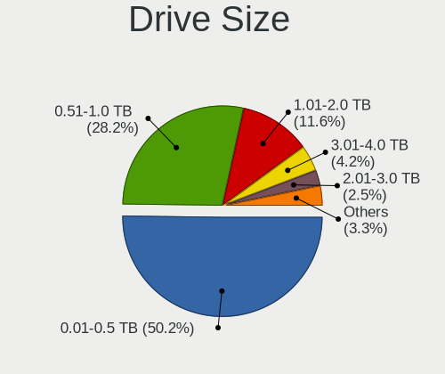
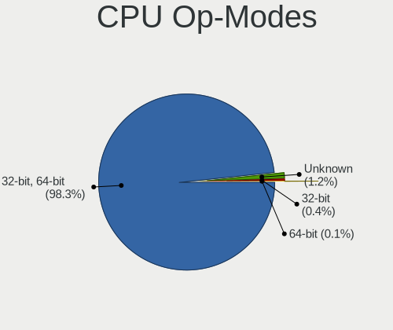
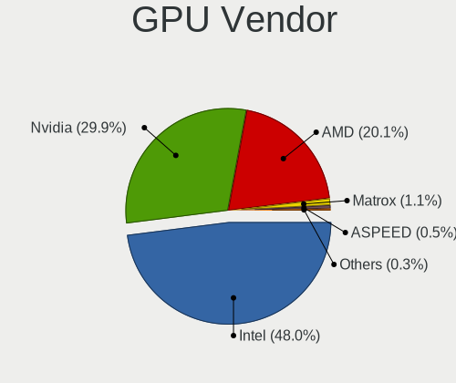
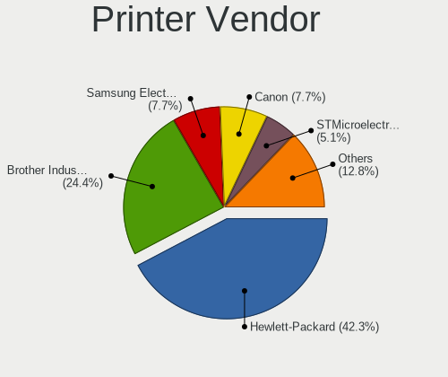
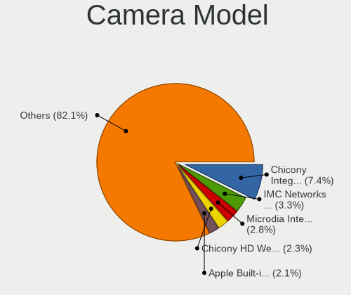

Linux in Switzerland - Tested Hardware & Statistics
---------------------------------------------------

A project to collect tested hardware configurations for Linux in Switzerland.

Anyone can contribute to this report by the [hw-probe](https://github.com/linuxhw/hw-probe) tool:

    sudo -E hw-probe -all -upload

Please contribute! Especially if your hardware is rare.

This is a report for all computer types. See also reports for [desktops](/Location/Switzerland/Desktop/README.md) and [notebooks](/Location/Switzerland/Notebook/README.md).

Contents
--------

* [ Test Cases ](#test-cases)

* [ System ](#system)
  - [ OS                       ](#os)
  - [ OS Family                ](#os-family)
  - [ Kernel                   ](#kernel)
  - [ Kernel Family            ](#kernel-family)
  - [ Kernel Major Ver.        ](#kernel-major-ver)
  - [ Arch                     ](#arch)
  - [ DE                       ](#de)
  - [ Display Server           ](#display-server)
  - [ Display Manager          ](#display-manager)
  - [ OS Lang                  ](#os-lang)
  - [ Boot Mode                ](#boot-mode)
  - [ Filesystem               ](#filesystem)
  - [ Part. scheme             ](#part-scheme)
  - [ Dual Boot with Linux/BSD ](#dual-boot-with-linuxbsd)
  - [ Dual Boot (Win)          ](#dual-boot-win)

* [ Board ](#board)
  - [ Vendor                   ](#vendor)
  - [ Model                    ](#model)
  - [ Model Family             ](#model-family)
  - [ MFG Year                 ](#mfg-year)
  - [ Form Factor              ](#form-factor)
  - [ Secure Boot              ](#secure-boot)
  - [ Coreboot                 ](#coreboot)
  - [ RAM Size                 ](#ram-size)
  - [ RAM Used                 ](#ram-used)
  - [ Total Drives             ](#total-drives)
  - [ Has CD-ROM               ](#has-cd-rom)
  - [ Has Ethernet             ](#has-ethernet)
  - [ Has WiFi                 ](#has-wifi)
  - [ Has Bluetooth            ](#has-bluetooth)

* [ Location ](#location)
  - [ Country                  ](#country)
  - [ City                     ](#city)

* [ Drives ](#drives)
  - [ Drive Vendor             ](#drive-vendor)
  - [ Drive Model              ](#drive-model)
  - [ HDD Vendor               ](#hdd-vendor)
  - [ SSD Vendor               ](#ssd-vendor)
  - [ Drive Kind               ](#drive-kind)
  - [ Drive Connector          ](#drive-connector)
  - [ Drive Size               ](#drive-size)
  - [ Space Total              ](#space-total)
  - [ Space Used               ](#space-used)
  - [ Malfunc. Drives          ](#malfunc-drives)
  - [ Malfunc. Drive Vendor    ](#malfunc-drive-vendor)
  - [ Malfunc. HDD Vendor      ](#malfunc-hdd-vendor)
  - [ Malfunc. Drive Kind      ](#malfunc-drive-kind)
  - [ Failed Drives            ](#failed-drives)
  - [ Failed Drive Vendor      ](#failed-drive-vendor)
  - [ Drive Status             ](#drive-status)

* [ Storage controller ](#storage-controller)
  - [ Storage Vendor           ](#storage-vendor)
  - [ Storage Model            ](#storage-model)
  - [ Storage Kind             ](#storage-kind)

* [ Processor ](#processor)
  - [ CPU Vendor               ](#cpu-vendor)
  - [ CPU Model                ](#cpu-model)
  - [ CPU Model Family         ](#cpu-model-family)
  - [ CPU Cores                ](#cpu-cores)
  - [ CPU Sockets              ](#cpu-sockets)
  - [ CPU Threads              ](#cpu-threads)
  - [ CPU Op-Modes             ](#cpu-op-modes)
  - [ CPU Microcode            ](#cpu-microcode)
  - [ CPU Microarch            ](#cpu-microarch)

* [ Graphics ](#graphics)
  - [ GPU Vendor               ](#gpu-vendor)
  - [ GPU Model                ](#gpu-model)
  - [ GPU Combo                ](#gpu-combo)
  - [ GPU Driver               ](#gpu-driver)
  - [ GPU Memory               ](#gpu-memory)

* [ Monitor ](#monitor)
  - [ Monitor Vendor           ](#monitor-vendor)
  - [ Monitor Model            ](#monitor-model)
  - [ Monitor Resolution       ](#monitor-resolution)
  - [ Monitor Diagonal         ](#monitor-diagonal)
  - [ Monitor Width            ](#monitor-width)
  - [ Aspect Ratio             ](#aspect-ratio)
  - [ Monitor Area             ](#monitor-area)
  - [ Pixel Density            ](#pixel-density)
  - [ Multiple Monitors        ](#multiple-monitors)

* [ Network ](#network)
  - [ Net Controller Vendor    ](#net-controller-vendor)
  - [ Net Controller Model     ](#net-controller-model)
  - [ Wireless Vendor          ](#wireless-vendor)
  - [ Wireless Model           ](#wireless-model)
  - [ Ethernet Vendor          ](#ethernet-vendor)
  - [ Ethernet Model           ](#ethernet-model)
  - [ Net Controller Kind      ](#net-controller-kind)
  - [ Used Controller          ](#used-controller)
  - [ NICs                     ](#nics)
  - [ IPv6                     ](#ipv6)

* [ Bluetooth ](#bluetooth)
  - [ Bluetooth Vendor         ](#bluetooth-vendor)
  - [ Bluetooth Model          ](#bluetooth-model)

* [ Sound ](#sound)
  - [ Sound Vendor             ](#sound-vendor)
  - [ Sound Model              ](#sound-model)

* [ Memory ](#memory)
  - [ Memory Vendor            ](#memory-vendor)
  - [ Memory Model             ](#memory-model)
  - [ Memory Kind              ](#memory-kind)
  - [ Memory Form Factor       ](#memory-form-factor)
  - [ Memory Size              ](#memory-size)
  - [ Memory Speed             ](#memory-speed)

* [ Printers & scanners ](#printers--scanners)
  - [ Printer Vendor           ](#printer-vendor)
  - [ Printer Model            ](#printer-model)
  - [ Scanner Vendor           ](#scanner-vendor)
  - [ Scanner Model            ](#scanner-model)

* [ Camera ](#camera)
  - [ Camera Vendor            ](#camera-vendor)
  - [ Camera Model             ](#camera-model)

* [ Security ](#security)
  - [ Fingerprint Vendor       ](#fingerprint-vendor)
  - [ Fingerprint Model        ](#fingerprint-model)
  - [ Chipcard Vendor          ](#chipcard-vendor)
  - [ Chipcard Model           ](#chipcard-model)

* [ Unsupported ](#unsupported)
  - [ Unsupported Devices      ](#unsupported-devices)
  - [ Unsupported Device Types ](#unsupported-device-types)

Test Cases
----------

Total: 2628

| Vendor        | Model                       | Form-Factor | Probe                                                      | Date         |
|---------------|-----------------------------|-------------|------------------------------------------------------------|--------------|
| Lenovo        | Yoga Slim 7 14ITL05 82A3    | Notebook    | [7894bd4591](https://linux-hardware.org/?probe=7894bd4591) | May 07, 2022 |
| Lenovo        | SDK0E50510 WIN 262504835... | Desktop     | [5565a2f131](https://linux-hardware.org/?probe=5565a2f131) | May 07, 2022 |
| Apple         | MacBookPro9,2               | Notebook    | [e281a8eee2](https://linux-hardware.org/?probe=e281a8eee2) | May 06, 2022 |
| Dell          | Inspiron 1720               | Notebook    | [e95b0172b4](https://linux-hardware.org/?probe=e95b0172b4) | May 06, 2022 |
| Dell          | Inspiron 1720               | Notebook    | [a888a93774](https://linux-hardware.org/?probe=a888a93774) | May 06, 2022 |
| HP            | ProBook 450 G4              | Notebook    | [1332984f5d](https://linux-hardware.org/?probe=1332984f5d) | May 06, 2022 |
| ASUSTek       | VivoBook 15_ASUS Laptop ... | Notebook    | [94806fd9bf](https://linux-hardware.org/?probe=94806fd9bf) | May 05, 2022 |
| ASUSTek       | VivoBook 15_ASUS Laptop ... | Notebook    | [ebc49550d4](https://linux-hardware.org/?probe=ebc49550d4) | May 05, 2022 |
| ASUSTek       | P8H77-M                     | Desktop     | [9264c80f15](https://linux-hardware.org/?probe=9264c80f15) | May 05, 2022 |
| Khadas        | VIM3                        | Soc         | [c17309ec68](https://linux-hardware.org/?probe=c17309ec68) | May 04, 2022 |
| Apple         | MacBookPro11,3              | Notebook    | [21f611f3c7](https://linux-hardware.org/?probe=21f611f3c7) | May 03, 2022 |
| Dell          | XPS 13 9380                 | Notebook    | [aa294d2650](https://linux-hardware.org/?probe=aa294d2650) | May 02, 2022 |
| MSI           | PRO B660M-A WIFI            | Desktop     | [878c361636](https://linux-hardware.org/?probe=878c361636) | May 01, 2022 |
| Medion        | Cattle24 1M                 | Desktop     | [920d1b35ab](https://linux-hardware.org/?probe=920d1b35ab) | Apr 30, 2022 |
| Acer          | Aspire A515-56              | Notebook    | [a10b79694f](https://linux-hardware.org/?probe=a10b79694f) | Apr 29, 2022 |
| Acer          | Predator G3620              | Desktop     | [556a67d50d](https://linux-hardware.org/?probe=556a67d50d) | Apr 28, 2022 |
| NF541         | 1.0                         | Desktop     | [c0999696b6](https://linux-hardware.org/?probe=c0999696b6) | Apr 27, 2022 |
| ASRock        | B550M Pro4                  | Desktop     | [99b46394bf](https://linux-hardware.org/?probe=99b46394bf) | Apr 27, 2022 |
| Lenovo        | Yoga C740-14IML 81TC        | Convertible | [25041b35de](https://linux-hardware.org/?probe=25041b35de) | Apr 27, 2022 |
| HP            | ENVY 17                     | Notebook    | [c33b35becc](https://linux-hardware.org/?probe=c33b35becc) | Apr 26, 2022 |
| Dell          | XPS 13 9380                 | Notebook    | [c052066ee4](https://linux-hardware.org/?probe=c052066ee4) | Apr 26, 2022 |
| Lenovo        | ThinkPad X1 Extreme 2nd ... | Notebook    | [85cc720515](https://linux-hardware.org/?probe=85cc720515) | Apr 24, 2022 |
| Gigabyte      | GB-BRR7H-4800               | Desktop     | [475131a6f4](https://linux-hardware.org/?probe=475131a6f4) | Apr 23, 2022 |
| Intel         | NUC8BEB J72692-303          | Mini pc     | [19d81a0ef0](https://linux-hardware.org/?probe=19d81a0ef0) | Apr 22, 2022 |
| Intel         | NUC8BEB J72692-303          | Mini pc     | [cd9c2dd8f9](https://linux-hardware.org/?probe=cd9c2dd8f9) | Apr 22, 2022 |
| Gigabyte      | Z590 VISION G               | Desktop     | [597940fbe8](https://linux-hardware.org/?probe=597940fbe8) | Apr 22, 2022 |
| ASUSTek       | H97-PLUS                    | Desktop     | [6495b55188](https://linux-hardware.org/?probe=6495b55188) | Apr 21, 2022 |
| Lenovo        | Yoga 6 13ALC6 82ND          | Convertible | [3d667e4edf](https://linux-hardware.org/?probe=3d667e4edf) | Apr 21, 2022 |
| Lenovo        | ThinkPad X1 Extreme 2nd ... | Notebook    | [37b1ff3685](https://linux-hardware.org/?probe=37b1ff3685) | Apr 21, 2022 |
| Lenovo        | ThinkPad P43s 20RH0023UK    | Notebook    | [1cabdda156](https://linux-hardware.org/?probe=1cabdda156) | Apr 21, 2022 |
| Lenovo        | ThinkPad E580 20KS006EMZ    | Notebook    | [4d54c594ff](https://linux-hardware.org/?probe=4d54c594ff) | Apr 20, 2022 |
| HP            | 3048h                       | Desktop     | [b35df4ed74](https://linux-hardware.org/?probe=b35df4ed74) | Apr 20, 2022 |
| MSI           | B550-A PRO                  | Desktop     | [3af8357ab9](https://linux-hardware.org/?probe=3af8357ab9) | Apr 20, 2022 |
| MSI           | X99A SLI PLUS               | Desktop     | [0b935aadb3](https://linux-hardware.org/?probe=0b935aadb3) | Apr 19, 2022 |
| System76      | Galago Pro                  | Notebook    | [32b09fd215](https://linux-hardware.org/?probe=32b09fd215) | Apr 19, 2022 |
| Acer          | Aspire ES1-731              | Notebook    | [451ce5305a](https://linux-hardware.org/?probe=451ce5305a) | Apr 19, 2022 |
| Acer          | Aspire ES1-731              | Notebook    | [fa843a199c](https://linux-hardware.org/?probe=fa843a199c) | Apr 19, 2022 |
| ASUSTek       | P6T DELUXE                  | Desktop     | [1ceaddfc92](https://linux-hardware.org/?probe=1ceaddfc92) | Apr 16, 2022 |
| TUXEDO        | Pulse 15 Gen1               | Notebook    | [46dd37cb4b](https://linux-hardware.org/?probe=46dd37cb4b) | Apr 16, 2022 |
| TUXEDO        | Pulse 15 Gen1               | Notebook    | [50b0cb93c7](https://linux-hardware.org/?probe=50b0cb93c7) | Apr 16, 2022 |
| Lenovo        | ThinkBook 14 G2 ARE 20VF    | Notebook    | [6d63a9c8bc](https://linux-hardware.org/?probe=6d63a9c8bc) | Apr 15, 2022 |
| Lenovo        | ThinkPad X201 Tablet 311... | Notebook    | [e3ab162648](https://linux-hardware.org/?probe=e3ab162648) | Apr 15, 2022 |
| Apple         | MacBookPro10,1              | Notebook    | [0d7edf2aa9](https://linux-hardware.org/?probe=0d7edf2aa9) | Apr 15, 2022 |
| Acer          | TMP455-M                    | Notebook    | [451dbf0a20](https://linux-hardware.org/?probe=451dbf0a20) | Apr 15, 2022 |
| Acer          | TMP455-M                    | Notebook    | [b7b9924190](https://linux-hardware.org/?probe=b7b9924190) | Apr 15, 2022 |
| HP            | 8298                        | Desktop     | [a9796ddd8d](https://linux-hardware.org/?probe=a9796ddd8d) | Apr 14, 2022 |
| MSI           | B450-A PRO MAX              | Desktop     | [cfd276f151](https://linux-hardware.org/?probe=cfd276f151) | Apr 13, 2022 |
| Gigabyte      | X570 I AORUS PRO WIFI       | Desktop     | [8e46ef2a00](https://linux-hardware.org/?probe=8e46ef2a00) | Apr 13, 2022 |
| Acer          | Swift SF514-51              | Notebook    | [147a0161aa](https://linux-hardware.org/?probe=147a0161aa) | Apr 13, 2022 |
| Lenovo        | ThinkPad T490s 20NY000JM... | Notebook    | [e93e7d9ad1](https://linux-hardware.org/?probe=e93e7d9ad1) | Apr 13, 2022 |
| ASUSTek       | ROG STRIX X570-F GAMING     | Desktop     | [18a9612e64](https://linux-hardware.org/?probe=18a9612e64) | Apr 13, 2022 |
| Dell          | Latitude E7240              | Notebook    | [1a08843719](https://linux-hardware.org/?probe=1a08843719) | Apr 13, 2022 |
| Lenovo        | ThinkPad Helix 36986CG      | Notebook    | [f0aa04a603](https://linux-hardware.org/?probe=f0aa04a603) | Apr 12, 2022 |
| Dell          | Inspiron 7786               | Convertible | [cdf7aa0cb8](https://linux-hardware.org/?probe=cdf7aa0cb8) | Apr 11, 2022 |
| Dell          | Latitude D400               | Notebook    | [46981d939b](https://linux-hardware.org/?probe=46981d939b) | Apr 11, 2022 |
| PC Engines    | apu4                        | Desktop     | [601866ecaa](https://linux-hardware.org/?probe=601866ecaa) | Apr 11, 2022 |
| ASUSTek       | P5K Deluxe                  | Desktop     | [36e8e44760](https://linux-hardware.org/?probe=36e8e44760) | Apr 11, 2022 |
| ASUSTek       | P5K Deluxe                  | Desktop     | [50d7c349cd](https://linux-hardware.org/?probe=50d7c349cd) | Apr 10, 2022 |
| Gigabyte      | Z590 VISION G               | Desktop     | [b160291e93](https://linux-hardware.org/?probe=b160291e93) | Apr 09, 2022 |
| Apple         | MacBookPro10,1              | Notebook    | [b53427c0f4](https://linux-hardware.org/?probe=b53427c0f4) | Apr 07, 2022 |
| HP            | ProBook 4530s               | Notebook    | [1b32584f41](https://linux-hardware.org/?probe=1b32584f41) | Apr 06, 2022 |
| ASUSTek       | ROG STRIX B450-F GAMING ... | Desktop     | [091190515b](https://linux-hardware.org/?probe=091190515b) | Apr 06, 2022 |
| HP            | ProBook 4530s               | Notebook    | [f4dfc894d9](https://linux-hardware.org/?probe=f4dfc894d9) | Apr 06, 2022 |
| MSI           | 2A9C                        | Desktop     | [d56d880fd1](https://linux-hardware.org/?probe=d56d880fd1) | Apr 05, 2022 |
| ASUSTek       | PRIME Z690-P WIFI D4        | Desktop     | [7e44cf1d2c](https://linux-hardware.org/?probe=7e44cf1d2c) | Apr 04, 2022 |
| HP            | ProBook 450 G5              | Notebook    | [3aa8c7cbc6](https://linux-hardware.org/?probe=3aa8c7cbc6) | Apr 04, 2022 |
| Acer          | Swift SF314-57              | Notebook    | [e43f33eef1](https://linux-hardware.org/?probe=e43f33eef1) | Apr 03, 2022 |
| QUANMAX       | Platin SE                   | Notebook    | [5090da9cbf](https://linux-hardware.org/?probe=5090da9cbf) | Apr 03, 2022 |
| Gigabyte      | Z590 VISION G               | Desktop     | [3aef96b298](https://linux-hardware.org/?probe=3aef96b298) | Apr 03, 2022 |
| Apple         | MacBookPro10,1              | Notebook    | [d1c62a1f93](https://linux-hardware.org/?probe=d1c62a1f93) | Apr 03, 2022 |
| QUANMAX       | Platin SE                   | Notebook    | [2388fe9587](https://linux-hardware.org/?probe=2388fe9587) | Apr 03, 2022 |
| Lenovo        | ThinkPad X201 Tablet 311... | Notebook    | [bc44d9076b](https://linux-hardware.org/?probe=bc44d9076b) | Apr 02, 2022 |
| Lenovo        | ThinkPad X201 Tablet 311... | Notebook    | [7f48dd5612](https://linux-hardware.org/?probe=7f48dd5612) | Apr 02, 2022 |
| Gigabyte      | H410M S2H V3                | Desktop     | [0c9c9dd7e9](https://linux-hardware.org/?probe=0c9c9dd7e9) | Apr 02, 2022 |
| Apple         | Mac-F4228EC8 DVT            | All in one  | [e7d599e001](https://linux-hardware.org/?probe=e7d599e001) | Apr 01, 2022 |
| Apple         | Mac-F4228EC8 DVT            | All in one  | [23c306e2cb](https://linux-hardware.org/?probe=23c306e2cb) | Apr 01, 2022 |
| Apple         | Mac-F4228EC8 DVT            | All in one  | [52d7f90956](https://linux-hardware.org/?probe=52d7f90956) | Apr 01, 2022 |
| Acer          | Aspire E5-773G              | Notebook    | [b43b436e59](https://linux-hardware.org/?probe=b43b436e59) | Mar 31, 2022 |
| ASUSTek       | ROG STRIX B450-F GAMING ... | Desktop     | [521a29d065](https://linux-hardware.org/?probe=521a29d065) | Mar 31, 2022 |
| ASRock        | B550M Pro4                  | Desktop     | [6755915c96](https://linux-hardware.org/?probe=6755915c96) | Mar 29, 2022 |
| HP            | Pavilion g7                 | Notebook    | [44a6ea06b0](https://linux-hardware.org/?probe=44a6ea06b0) | Mar 28, 2022 |
| MSI           | Z170A PC MATE               | Desktop     | [546a66dcf1](https://linux-hardware.org/?probe=546a66dcf1) | Mar 27, 2022 |
| HP            | ZBook Studio G7 Mobile W... | Notebook    | [edbd5fd6aa](https://linux-hardware.org/?probe=edbd5fd6aa) | Mar 27, 2022 |
| ASUSTek       | ROG STRIX B450-F GAMING ... | Desktop     | [1de7956cf2](https://linux-hardware.org/?probe=1de7956cf2) | Mar 26, 2022 |
| ASUSTek       | ROG STRIX B450-F GAMING ... | Desktop     | [85f4e6ff91](https://linux-hardware.org/?probe=85f4e6ff91) | Mar 26, 2022 |
| Lenovo        | ThinkPad T430 2349U4B       | Notebook    | [95526f5b3e](https://linux-hardware.org/?probe=95526f5b3e) | Mar 25, 2022 |
| Lenovo        | ThinkPad L15 Gen 2 20X30... | Notebook    | [ed949b0853](https://linux-hardware.org/?probe=ed949b0853) | Mar 24, 2022 |
| Lenovo        | ThinkPad L15 Gen 2 20X30... | Notebook    | [684a4fd3c3](https://linux-hardware.org/?probe=684a4fd3c3) | Mar 24, 2022 |
| Dell          | XPS 15 7590                 | Notebook    | [96244433f0](https://linux-hardware.org/?probe=96244433f0) | Mar 23, 2022 |
| Dell          | Inspiron 7400               | Notebook    | [a17dc3be48](https://linux-hardware.org/?probe=a17dc3be48) | Mar 23, 2022 |
| Lenovo        | ThinkPad T15 Gen 2i 20W4... | Notebook    | [9391fc9592](https://linux-hardware.org/?probe=9391fc9592) | Mar 23, 2022 |
| Gigabyte      | B560M AORUS PRO AX          | Desktop     | [a9df37f3f0](https://linux-hardware.org/?probe=a9df37f3f0) | Mar 23, 2022 |
| HP            | EliteBook 840 G5            | Notebook    | [dd13dcfd89](https://linux-hardware.org/?probe=dd13dcfd89) | Mar 22, 2022 |
| Lenovo        | ThinkPad T15 Gen 2i 20W4... | Notebook    | [28c8bc52b8](https://linux-hardware.org/?probe=28c8bc52b8) | Mar 22, 2022 |
| Gigabyte      | B560M AORUS PRO AX          | Desktop     | [b7f10d6ec0](https://linux-hardware.org/?probe=b7f10d6ec0) | Mar 21, 2022 |
| Apple         | Mac-942B59F58194171B iMa... | All in one  | [a1a39d622b](https://linux-hardware.org/?probe=a1a39d622b) | Mar 21, 2022 |
| Raspberry ... | Raspberry Pi                | Soc         | [18294dd367](https://linux-hardware.org/?probe=18294dd367) | Mar 21, 2022 |
| Raspberry ... | Raspberry Pi                | Soc         | [f51c0bb134](https://linux-hardware.org/?probe=f51c0bb134) | Mar 21, 2022 |
| ASUSTek       | K73E                        | Notebook    | [75069bd642](https://linux-hardware.org/?probe=75069bd642) | Mar 20, 2022 |
| ASUSTek       | M5A97 R2.0                  | Desktop     | [d98f42c86b](https://linux-hardware.org/?probe=d98f42c86b) | Mar 20, 2022 |
| Lenovo        | Yoga Slim 7 15IIL05 82AA    | Notebook    | [161ca16bc2](https://linux-hardware.org/?probe=161ca16bc2) | Mar 19, 2022 |
| ASUSTek       | ROG STRIX B450-F GAMING ... | Desktop     | [a226a58819](https://linux-hardware.org/?probe=a226a58819) | Mar 19, 2022 |
| HP            | OMEN Laptop 15-en1xxx       | Notebook    | [7664c536f4](https://linux-hardware.org/?probe=7664c536f4) | Mar 18, 2022 |
| Lenovo        | Yoga 730-15IKB 81CU         | Convertible | [9c78b8d68b](https://linux-hardware.org/?probe=9c78b8d68b) | Mar 17, 2022 |
| ASUSTek       | Zenbook UN5401QA_UN5401Q... | Convertible | [d0253d1ffc](https://linux-hardware.org/?probe=d0253d1ffc) | Mar 16, 2022 |
| Gigabyte      | B560M AORUS PRO AX          | Desktop     | [04e11e3668](https://linux-hardware.org/?probe=04e11e3668) | Mar 16, 2022 |
| ASUSTek       | ROG Maximus Z690 FORMULA    | Desktop     | [b0d9828f83](https://linux-hardware.org/?probe=b0d9828f83) | Mar 16, 2022 |
| Lenovo        | ThinkPad T15 Gen 2i 20W4... | Notebook    | [81ec123b24](https://linux-hardware.org/?probe=81ec123b24) | Mar 15, 2022 |
| Gigabyte      | Z590 VISION G               | Desktop     | [bf629bc1a5](https://linux-hardware.org/?probe=bf629bc1a5) | Mar 14, 2022 |
| HP            | EliteBook 850 G8 Noteboo... | Notebook    | [7649fad366](https://linux-hardware.org/?probe=7649fad366) | Mar 14, 2022 |
| ASUSTek       | VC66                        | Mini pc     | [e89b5b2495](https://linux-hardware.org/?probe=e89b5b2495) | Mar 14, 2022 |
| ASUSTek       | VC66                        | Mini pc     | [52c0b45697](https://linux-hardware.org/?probe=52c0b45697) | Mar 14, 2022 |
| Dell          | Latitude 5400               | Notebook    | [e23429d8ea](https://linux-hardware.org/?probe=e23429d8ea) | Mar 13, 2022 |
| Fujitsu       | LIFEBOOK E782               | Notebook    | [77b3a7f272](https://linux-hardware.org/?probe=77b3a7f272) | Mar 13, 2022 |
| Gigabyte      | Z590 VISION G               | Desktop     | [f56d8f0fe4](https://linux-hardware.org/?probe=f56d8f0fe4) | Mar 13, 2022 |
| ASUSTek       | Crosshair IV Formula        | Desktop     | [fd7e52fdd3](https://linux-hardware.org/?probe=fd7e52fdd3) | Mar 13, 2022 |
| ASUSTek       | Crosshair IV Formula        | Desktop     | [f4f7ab1aaf](https://linux-hardware.org/?probe=f4f7ab1aaf) | Mar 12, 2022 |
| Apple         | Mac-F65AE981FFA204ED Mac... | Mini pc     | [5f36bc3969](https://linux-hardware.org/?probe=5f36bc3969) | Mar 12, 2022 |
| ASUSTek       | VivoBook 15_ASUS Laptop ... | Notebook    | [f735730566](https://linux-hardware.org/?probe=f735730566) | Mar 11, 2022 |
| ASUSTek       | VivoBook 15_ASUS Laptop ... | Notebook    | [e8ffb57db8](https://linux-hardware.org/?probe=e8ffb57db8) | Mar 11, 2022 |
| HP            | 806A                        | Desktop     | [60d334dbf5](https://linux-hardware.org/?probe=60d334dbf5) | Mar 10, 2022 |
| Lenovo        | ThinkPad X1 Carbon 4th 2... | Convertible | [566eee23f5](https://linux-hardware.org/?probe=566eee23f5) | Mar 10, 2022 |
| Lenovo        | ThinkPad X1 Carbon 4th 2... | Convertible | [0046299935](https://linux-hardware.org/?probe=0046299935) | Mar 10, 2022 |
| Acer          | Aspire V3-772G              | Notebook    | [1526117b64](https://linux-hardware.org/?probe=1526117b64) | Mar 10, 2022 |
| ASUSTek       | M5A97 R2.0                  | Desktop     | [67ead34e9e](https://linux-hardware.org/?probe=67ead34e9e) | Mar 10, 2022 |
| HP            | ProBook 470 G5              | Notebook    | [c98fcbec3c](https://linux-hardware.org/?probe=c98fcbec3c) | Mar 10, 2022 |
| HUAWEI        | WRT-WX9                     | Notebook    | [2bd4f9201a](https://linux-hardware.org/?probe=2bd4f9201a) | Mar 09, 2022 |
| MSI           | MAG B460M MORTAR            | Desktop     | [0e1398474c](https://linux-hardware.org/?probe=0e1398474c) | Mar 09, 2022 |
| Lenovo        | Yoga Slim 7 15IIL05 82AA    | Notebook    | [1eaa06bf11](https://linux-hardware.org/?probe=1eaa06bf11) | Mar 06, 2022 |
| Dell          | XPS 13 9350                 | Notebook    | [ce5fd5227f](https://linux-hardware.org/?probe=ce5fd5227f) | Mar 05, 2022 |
| ASUSTek       | G551JK                      | Notebook    | [a9f394c585](https://linux-hardware.org/?probe=a9f394c585) | Mar 05, 2022 |
| Dell          | Latitude 7490               | Notebook    | [64f0d004ce](https://linux-hardware.org/?probe=64f0d004ce) | Mar 05, 2022 |
| ASUSTek       | P8Z77-V LX                  | Desktop     | [af17a2da6b](https://linux-hardware.org/?probe=af17a2da6b) | Mar 05, 2022 |
| Dell          | 0K240Y A02                  | Desktop     | [95d4a7b220](https://linux-hardware.org/?probe=95d4a7b220) | Mar 05, 2022 |
| Apple         | MacBookPro6,2               | Notebook    | [a2f1d82d9c](https://linux-hardware.org/?probe=a2f1d82d9c) | Mar 05, 2022 |
| HP            | EliteBook 820 G3            | Notebook    | [fd01513251](https://linux-hardware.org/?probe=fd01513251) | Mar 04, 2022 |
| HP            | EliteBook x360 1030 G3      | Convertible | [7d5295d845](https://linux-hardware.org/?probe=7d5295d845) | Mar 03, 2022 |
| Fujitsu       | D3090-A1 S26361-D3090-A1    | Server      | [ee54bb96c5](https://linux-hardware.org/?probe=ee54bb96c5) | Mar 03, 2022 |
| Acer          | Swift SF314-42              | Notebook    | [5c8b94d514](https://linux-hardware.org/?probe=5c8b94d514) | Mar 03, 2022 |
| Dell          | XPS 13 9370                 | Notebook    | [75b63c2d2c](https://linux-hardware.org/?probe=75b63c2d2c) | Mar 02, 2022 |
| HP            | 8592                        | Desktop     | [a34dbdb173](https://linux-hardware.org/?probe=a34dbdb173) | Mar 01, 2022 |
| Medion        | P6624                       | Notebook    | [0a502fd230](https://linux-hardware.org/?probe=0a502fd230) | Feb 28, 2022 |
| MSI           | MAG X570S TOMAHAWK MAX W... | Desktop     | [e0d39731a0](https://linux-hardware.org/?probe=e0d39731a0) | Feb 27, 2022 |
| ASRock        | Z370 Pro4                   | Desktop     | [e996ec20ea](https://linux-hardware.org/?probe=e996ec20ea) | Feb 25, 2022 |
| Dell          | XPS 15 9560                 | Notebook    | [4c72ebcb41](https://linux-hardware.org/?probe=4c72ebcb41) | Feb 25, 2022 |
| Notebook      | N13xWU                      | Notebook    | [50acf36954](https://linux-hardware.org/?probe=50acf36954) | Feb 25, 2022 |
| Acer          | TMP455-MG                   | Notebook    | [f1a500ae43](https://linux-hardware.org/?probe=f1a500ae43) | Feb 25, 2022 |
| Dell          | Precision 3551              | Notebook    | [9394fc8844](https://linux-hardware.org/?probe=9394fc8844) | Feb 24, 2022 |
| Gigabyte      | B550M AORUS PRO             | Desktop     | [98a6706e6a](https://linux-hardware.org/?probe=98a6706e6a) | Feb 23, 2022 |
| MSI           | B550-A PRO                  | Desktop     | [9d3f01a706](https://linux-hardware.org/?probe=9d3f01a706) | Feb 23, 2022 |
| Lenovo        | ThinkPad X1 Extreme Gen ... | Notebook    | [923930ee4e](https://linux-hardware.org/?probe=923930ee4e) | Feb 22, 2022 |
| Dell          | XPS 15 9570                 | Notebook    | [226452fec0](https://linux-hardware.org/?probe=226452fec0) | Feb 21, 2022 |
| Lenovo        | MIIX 310-10ICR 80SG         | Tablet      | [1b5b236f76](https://linux-hardware.org/?probe=1b5b236f76) | Feb 21, 2022 |
| ASUSTek       | G551JK                      | Notebook    | [93e40c8fbc](https://linux-hardware.org/?probe=93e40c8fbc) | Feb 20, 2022 |
| Lenovo        | IdeaPad Y700-15ISK 80NV     | Notebook    | [b0e0d82d12](https://linux-hardware.org/?probe=b0e0d82d12) | Feb 20, 2022 |
| BESSTAR Te... | ATB15                       | Server      | [0ab1ff409b](https://linux-hardware.org/?probe=0ab1ff409b) | Feb 20, 2022 |
| Lenovo        | 3130 SDK0J40697 WIN 3305... | Mini pc     | [40f1930253](https://linux-hardware.org/?probe=40f1930253) | Feb 19, 2022 |
| Gigabyte      | MSH87TN-00                  | Desktop     | [6baa824f3a](https://linux-hardware.org/?probe=6baa824f3a) | Feb 17, 2022 |
| ASUSTek       | P5B                         | Desktop     | [fa4c095fd7](https://linux-hardware.org/?probe=fa4c095fd7) | Feb 17, 2022 |
| ASUSTek       | ROG Maximus Z690 FORMULA    | Desktop     | [f2d47f2d8b](https://linux-hardware.org/?probe=f2d47f2d8b) | Feb 17, 2022 |
| Dell          | Latitude 7490               | Notebook    | [2620ebab43](https://linux-hardware.org/?probe=2620ebab43) | Feb 15, 2022 |
| ASUSTek       | VivoBook_ASUSLaptop TP40... | Convertible | [1055dc7082](https://linux-hardware.org/?probe=1055dc7082) | Feb 14, 2022 |
| Acer          | Aspire 3820                 | Notebook    | [7364dc5d5e](https://linux-hardware.org/?probe=7364dc5d5e) | Feb 14, 2022 |
| HP            | EliteBook x360 1030 G3      | Convertible | [91dbebb5dd](https://linux-hardware.org/?probe=91dbebb5dd) | Feb 14, 2022 |
| HUAWEI        | BOHB-WAX9                   | Notebook    | [34bb725d27](https://linux-hardware.org/?probe=34bb725d27) | Feb 14, 2022 |
| ASUSTek       | ROG Maximus Z690 FORMULA    | Desktop     | [a82c9b223f](https://linux-hardware.org/?probe=a82c9b223f) | Feb 14, 2022 |
| HUAWEI        | BOHB-WAX9                   | Notebook    | [3dd59d8ebe](https://linux-hardware.org/?probe=3dd59d8ebe) | Feb 13, 2022 |
| Lenovo        | 370A SDK0J40700 WIN 3258... | Desktop     | [4583e687ca](https://linux-hardware.org/?probe=4583e687ca) | Feb 13, 2022 |
| HP            | Compaq 15                   | Notebook    | [fa22db8854](https://linux-hardware.org/?probe=fa22db8854) | Feb 12, 2022 |
| ASUSTek       | STRIX Z270F GAMING          | Desktop     | [0f83b2fd97](https://linux-hardware.org/?probe=0f83b2fd97) | Feb 12, 2022 |
| HP            | 8618                        | Desktop     | [6976caf9ed](https://linux-hardware.org/?probe=6976caf9ed) | Feb 12, 2022 |
| HP            | 8618                        | Desktop     | [1038885608](https://linux-hardware.org/?probe=1038885608) | Feb 12, 2022 |
| Acer          | Aspire V3-772G              | Notebook    | [6a16b1953c](https://linux-hardware.org/?probe=6a16b1953c) | Feb 11, 2022 |
| MSI           | MPG X570 GAMING PRO CARB... | Desktop     | [c5b6cfb8bc](https://linux-hardware.org/?probe=c5b6cfb8bc) | Feb 11, 2022 |
| Lenovo        | IdeaPad Y700-15ISK 80NV     | Notebook    | [8b31b460fc](https://linux-hardware.org/?probe=8b31b460fc) | Feb 11, 2022 |
| PC Special... | NH5x_7xRCx,RDx              | Notebook    | [3fad293703](https://linux-hardware.org/?probe=3fad293703) | Feb 10, 2022 |
| MSI           | G31TM-P35                   | Desktop     | [6312e054ab](https://linux-hardware.org/?probe=6312e054ab) | Feb 09, 2022 |
| Lenovo        | ThinkPad E490 20N8CTO1WW    | Notebook    | [cf4fbc7ab1](https://linux-hardware.org/?probe=cf4fbc7ab1) | Feb 09, 2022 |
| Medion        | B460H6-EM                   | Desktop     | [b32b83ff4b](https://linux-hardware.org/?probe=b32b83ff4b) | Feb 09, 2022 |
| HP            | Pavilion x360 Convertibl... | Convertible | [b8a4437ef8](https://linux-hardware.org/?probe=b8a4437ef8) | Feb 09, 2022 |
| Dell          | XPS 15 7590                 | Notebook    | [e06f742b06](https://linux-hardware.org/?probe=e06f742b06) | Feb 09, 2022 |
| whyopencom... | Unknown                     | Notebook    | [ed4f02d91d](https://linux-hardware.org/?probe=ed4f02d91d) | Feb 09, 2022 |
| MSI           | B450-A PRO MAX              | Desktop     | [da25fcadb3](https://linux-hardware.org/?probe=da25fcadb3) | Feb 09, 2022 |
| HP            | 18E5                        | Desktop     | [85267de714](https://linux-hardware.org/?probe=85267de714) | Feb 09, 2022 |
| HP            | Pavilion 11 x360 PC         | Notebook    | [f252168753](https://linux-hardware.org/?probe=f252168753) | Feb 08, 2022 |
| Lenovo        | IdeaPad S145-15IWL 81MV     | Notebook    | [73738d3f0c](https://linux-hardware.org/?probe=73738d3f0c) | Feb 08, 2022 |
| Quanta        | TW8/SW8/DW8                 | Notebook    | [a542c42556](https://linux-hardware.org/?probe=a542c42556) | Feb 08, 2022 |
| Dell          | Latitude E5410              | Notebook    | [fd73c50faa](https://linux-hardware.org/?probe=fd73c50faa) | Feb 07, 2022 |
| Acer          | Aspire A515-52G             | Notebook    | [cfc69482e3](https://linux-hardware.org/?probe=cfc69482e3) | Feb 07, 2022 |
| ASUSTek       | P8P67                       | Desktop     | [59a8e93ae4](https://linux-hardware.org/?probe=59a8e93ae4) | Feb 07, 2022 |
| ASUSTek       | VivoBook_ASUSLaptop X513... | Notebook    | [99770a5e77](https://linux-hardware.org/?probe=99770a5e77) | Feb 06, 2022 |
| ASUSTek       | STRIX Z270F GAMING          | Desktop     | [30bb989cfa](https://linux-hardware.org/?probe=30bb989cfa) | Feb 05, 2022 |
| ZOTAC         | ZBOXNANO-ID67               | Mini pc     | [7eab522138](https://linux-hardware.org/?probe=7eab522138) | Feb 05, 2022 |
| MSI           | B550-A PRO                  | Desktop     | [091a9c467d](https://linux-hardware.org/?probe=091a9c467d) | Feb 04, 2022 |
| MSI           | B550-A PRO                  | Desktop     | [7ff1fc83fc](https://linux-hardware.org/?probe=7ff1fc83fc) | Feb 04, 2022 |
| ASUSTek       | P5B                         | Desktop     | [9b661f64dd](https://linux-hardware.org/?probe=9b661f64dd) | Feb 04, 2022 |
| AAEON         | MF-001 V1.0                 | Desktop     | [01244429c8](https://linux-hardware.org/?probe=01244429c8) | Feb 03, 2022 |
| ASUSTek       | H81M-PLUS                   | Desktop     | [dde47afaff](https://linux-hardware.org/?probe=dde47afaff) | Feb 03, 2022 |
| Packard Be... | EasyNote TV44HC             | Notebook    | [60aaa89bfa](https://linux-hardware.org/?probe=60aaa89bfa) | Feb 03, 2022 |
| Unknown       | 1.0                         | Desktop     | [03f9d9de62](https://linux-hardware.org/?probe=03f9d9de62) | Jan 31, 2022 |
| MSI           | B450-A PRO MAX              | Desktop     | [08a04a280f](https://linux-hardware.org/?probe=08a04a280f) | Jan 30, 2022 |
| HP            | 3048h                       | Desktop     | [cb51d0cf78](https://linux-hardware.org/?probe=cb51d0cf78) | Jan 30, 2022 |
| Acer          | Aspire V3-772G              | Notebook    | [1e4b8a880e](https://linux-hardware.org/?probe=1e4b8a880e) | Jan 29, 2022 |
| HP            | Spectre x360 Convertible... | Convertible | [31a1c1d4ab](https://linux-hardware.org/?probe=31a1c1d4ab) | Jan 28, 2022 |
| Clevo         | W76x/M77xCUH                | Notebook    | [48d0efb057](https://linux-hardware.org/?probe=48d0efb057) | Jan 26, 2022 |
| HP            | ENVY x360 Convertible 15... | Convertible | [5f5b79eabf](https://linux-hardware.org/?probe=5f5b79eabf) | Jan 25, 2022 |
| AMI           | Cherry Trail Tablet         | Notebook    | [0560bf99e5](https://linux-hardware.org/?probe=0560bf99e5) | Jan 25, 2022 |
| HP            | ENVY x360 Convertible 13... | Convertible | [055decea61](https://linux-hardware.org/?probe=055decea61) | Jan 24, 2022 |
| ASUSTek       | VivoBook_ASUSLaptop X712... | Notebook    | [dbeeb0a6f3](https://linux-hardware.org/?probe=dbeeb0a6f3) | Jan 24, 2022 |
| HP            | ENVY x360 Convertible 13... | Convertible | [db3a3ddae1](https://linux-hardware.org/?probe=db3a3ddae1) | Jan 23, 2022 |
| HP            | ProBook 445 G8 Notebook ... | Notebook    | [8ee01c475e](https://linux-hardware.org/?probe=8ee01c475e) | Jan 23, 2022 |
| Packard Be... | EasyNote TV44HC             | Notebook    | [38fb76e085](https://linux-hardware.org/?probe=38fb76e085) | Jan 23, 2022 |
| HP            | ENVY x360 Convertible 13... | Convertible | [7a934945d5](https://linux-hardware.org/?probe=7a934945d5) | Jan 23, 2022 |
| Raspberry ... | Raspberry Pi 3 Model B R... | Soc         | [cf8776e11f](https://linux-hardware.org/?probe=cf8776e11f) | Jan 22, 2022 |
| Gigabyte      | AB350-Gaming 3-CF           | Desktop     | [4a0bd17330](https://linux-hardware.org/?probe=4a0bd17330) | Jan 22, 2022 |
| ASUSTek       | P8Z77-V LX                  | Desktop     | [c528c04bb7](https://linux-hardware.org/?probe=c528c04bb7) | Jan 22, 2022 |
| Apple         | MacBookPro5,3               | Notebook    | [e0b61bcde4](https://linux-hardware.org/?probe=e0b61bcde4) | Jan 22, 2022 |
| Packard Be... | EasyNote TV44HC             | Notebook    | [d2a1835844](https://linux-hardware.org/?probe=d2a1835844) | Jan 22, 2022 |
| Notebook      | PCx0Dx                      | Notebook    | [95b7ce0007](https://linux-hardware.org/?probe=95b7ce0007) | Jan 22, 2022 |
| ASUSTek       | H87M-PLUS                   | Desktop     | [986b65d292](https://linux-hardware.org/?probe=986b65d292) | Jan 21, 2022 |
| Medion        | Cattle24 1M                 | Desktop     | [328e103a74](https://linux-hardware.org/?probe=328e103a74) | Jan 21, 2022 |
| Packard Be... | EasyNote TV44HC             | Notebook    | [556cf29fcc](https://linux-hardware.org/?probe=556cf29fcc) | Jan 21, 2022 |
| Gigabyte      | H97-D3H-CF                  | Desktop     | [8e39cc0d01](https://linux-hardware.org/?probe=8e39cc0d01) | Jan 21, 2022 |
| MSI           | MEG X570 UNIFY              | Desktop     | [0bb120993f](https://linux-hardware.org/?probe=0bb120993f) | Jan 21, 2022 |
| Notebook      | PCx0Dx                      | Notebook    | [07b8344de7](https://linux-hardware.org/?probe=07b8344de7) | Jan 21, 2022 |
| Notebook      | PCx0Dx                      | Notebook    | [3bdae5c5ac](https://linux-hardware.org/?probe=3bdae5c5ac) | Jan 21, 2022 |
| ASUSTek       | M4A89GTD-PRO/USB3           | Desktop     | [d70ebfd602](https://linux-hardware.org/?probe=d70ebfd602) | Jan 20, 2022 |
| HP            | Pavilion g7                 | Notebook    | [f789fa0e4b](https://linux-hardware.org/?probe=f789fa0e4b) | Jan 20, 2022 |
| HP            | Pavilion g7                 | Notebook    | [064474c7e0](https://linux-hardware.org/?probe=064474c7e0) | Jan 20, 2022 |
| ASRock        | Z97 Extreme6                | Desktop     | [4b8a587819](https://linux-hardware.org/?probe=4b8a587819) | Jan 20, 2022 |
| Lenovo        | ThinkPad T530 24296HG       | Notebook    | [e2161b5856](https://linux-hardware.org/?probe=e2161b5856) | Jan 20, 2022 |
| ASUSTek       | UX330UAK                    | Notebook    | [3749e7dc2e](https://linux-hardware.org/?probe=3749e7dc2e) | Jan 19, 2022 |
| Fujitsu       | D3062-A1 S26361-D3062-A1    | Desktop     | [f1c61e2a1b](https://linux-hardware.org/?probe=f1c61e2a1b) | Jan 19, 2022 |
| Apple         | MacBookPro11,1              | Notebook    | [3afcc4b1c0](https://linux-hardware.org/?probe=3afcc4b1c0) | Jan 18, 2022 |
| ASRock        | Z97 Extreme6                | Desktop     | [d897de368d](https://linux-hardware.org/?probe=d897de368d) | Jan 17, 2022 |
| ASUSTek       | VivoBook_ASUSLaptop X521... | Notebook    | [1478a3da5a](https://linux-hardware.org/?probe=1478a3da5a) | Jan 17, 2022 |
| Notebook      | PCx0Dx                      | Notebook    | [1c35674fd1](https://linux-hardware.org/?probe=1c35674fd1) | Jan 17, 2022 |
| Acer          | Aspire E5-511               | Notebook    | [c2691bf00b](https://linux-hardware.org/?probe=c2691bf00b) | Jan 16, 2022 |
| ASUSTek       | TUF Gaming FX705GE_FX705... | Notebook    | [80a80d7619](https://linux-hardware.org/?probe=80a80d7619) | Jan 16, 2022 |
| MSI           | MEG X570 UNIFY              | Desktop     | [d663dba675](https://linux-hardware.org/?probe=d663dba675) | Jan 15, 2022 |
| HP            | 3048h                       | Desktop     | [d6f6435471](https://linux-hardware.org/?probe=d6f6435471) | Jan 15, 2022 |
| ASUSTek       | ZenBook UX425EA_UX425EA     | Notebook    | [ff75719a4e](https://linux-hardware.org/?probe=ff75719a4e) | Jan 15, 2022 |
| ASUSTek       | PRIME X470-PRO              | Desktop     | [d508a12888](https://linux-hardware.org/?probe=d508a12888) | Jan 15, 2022 |
| MSI           | PRO Z690-A WIFI DDR4        | Desktop     | [2d14961843](https://linux-hardware.org/?probe=2d14961843) | Jan 14, 2022 |
| MSI           | PRO Z690-A WIFI DDR4        | Desktop     | [0c991d9fae](https://linux-hardware.org/?probe=0c991d9fae) | Jan 14, 2022 |
| Acer          | Aspire V3-772G              | Notebook    | [c6dc2d8971](https://linux-hardware.org/?probe=c6dc2d8971) | Jan 14, 2022 |
| HP            | 829A                        | Mini pc     | [9526ea61c6](https://linux-hardware.org/?probe=9526ea61c6) | Jan 13, 2022 |
| Gigabyte      | H55M-USB3                   | Desktop     | [88396d099b](https://linux-hardware.org/?probe=88396d099b) | Jan 13, 2022 |
| ASUSTek       | PRIME X470-PRO              | Desktop     | [c450cd4a79](https://linux-hardware.org/?probe=c450cd4a79) | Jan 13, 2022 |
| Dell          | XPS 15 9510                 | Notebook    | [642e01d970](https://linux-hardware.org/?probe=642e01d970) | Jan 13, 2022 |
| MSI           | MEG X570 UNIFY              | Desktop     | [0eb5cecbac](https://linux-hardware.org/?probe=0eb5cecbac) | Jan 12, 2022 |
| Gigabyte      | GA-970A-UD3                 | Desktop     | [bb65153cf2](https://linux-hardware.org/?probe=bb65153cf2) | Jan 12, 2022 |
| MSI           | MEG X570 UNIFY              | Desktop     | [036d662422](https://linux-hardware.org/?probe=036d662422) | Jan 12, 2022 |
| HP            | ProBook 635 Aero G8 Note... | Notebook    | [06f3fa0e22](https://linux-hardware.org/?probe=06f3fa0e22) | Jan 12, 2022 |
| HP            | ProBook 635 Aero G8 Note... | Notebook    | [ec88cd8e93](https://linux-hardware.org/?probe=ec88cd8e93) | Jan 12, 2022 |
| MSI           | MEG X570 UNIFY              | Desktop     | [102e1371f8](https://linux-hardware.org/?probe=102e1371f8) | Jan 11, 2022 |
| Acer          | Aspire V3-772G              | Notebook    | [aaf1227ec4](https://linux-hardware.org/?probe=aaf1227ec4) | Jan 11, 2022 |
| ASUSTek       | P5K Deluxe                  | Desktop     | [0c0a6589e8](https://linux-hardware.org/?probe=0c0a6589e8) | Jan 11, 2022 |
| ASUSTek       | STRIX Z270G GAMING          | Desktop     | [2cbbce1a0e](https://linux-hardware.org/?probe=2cbbce1a0e) | Jan 10, 2022 |
| Lenovo        | ThinkPad T14 Gen 2a 20XL... | Notebook    | [7ce7a30da1](https://linux-hardware.org/?probe=7ce7a30da1) | Jan 10, 2022 |
| Lenovo        | ThinkPad T14 Gen 2a 20XL... | Notebook    | [ac620bc1b6](https://linux-hardware.org/?probe=ac620bc1b6) | Jan 10, 2022 |
| ASUSTek       | H87M-PLUS                   | Desktop     | [eb70946711](https://linux-hardware.org/?probe=eb70946711) | Jan 09, 2022 |
| MSI           | 2A9C                        | Desktop     | [723459c124](https://linux-hardware.org/?probe=723459c124) | Jan 09, 2022 |
| Intel         | NUC8BEB J72688-303          | Mini pc     | [993e94e5fd](https://linux-hardware.org/?probe=993e94e5fd) | Jan 09, 2022 |
| Intel         | NUC8BEB J72688-303          | Mini pc     | [c908574f83](https://linux-hardware.org/?probe=c908574f83) | Jan 09, 2022 |
| Gigabyte      | H55M-USB3                   | Desktop     | [aad9837ee4](https://linux-hardware.org/?probe=aad9837ee4) | Jan 08, 2022 |
| Acer          | Aspire R7-572G              | Notebook    | [dc4a930b99](https://linux-hardware.org/?probe=dc4a930b99) | Jan 08, 2022 |
| TUXEDO        | Pulse 15 Gen1               | Notebook    | [a519d3f9af](https://linux-hardware.org/?probe=a519d3f9af) | Jan 07, 2022 |
| ASUSTek       | ROG Strix G733QS_G733QS     | Notebook    | [4d67659f6c](https://linux-hardware.org/?probe=4d67659f6c) | Jan 07, 2022 |
| ASUSTek       | ROG Strix G733QS_G733QS     | Notebook    | [b3428338c0](https://linux-hardware.org/?probe=b3428338c0) | Jan 07, 2022 |
| ASUSTek       | K53U                        | Notebook    | [62410e0adc](https://linux-hardware.org/?probe=62410e0adc) | Jan 07, 2022 |
| ASUSTek       | P8Z77-V LX                  | Desktop     | [ad5ae136c9](https://linux-hardware.org/?probe=ad5ae136c9) | Jan 05, 2022 |
| Dell          | 096JG8 A01                  | Desktop     | [fecf0d29c7](https://linux-hardware.org/?probe=fecf0d29c7) | Jan 05, 2022 |
| MSI           | 2A9Ch                       | Desktop     | [358b325347](https://linux-hardware.org/?probe=358b325347) | Jan 05, 2022 |
| Apple         | MacBookPro14,3              | Notebook    | [96b76bc44b](https://linux-hardware.org/?probe=96b76bc44b) | Jan 05, 2022 |
| Gigabyte      | X570 AORUS PRO              | Desktop     | [843345dfe6](https://linux-hardware.org/?probe=843345dfe6) | Jan 04, 2022 |
| HP            | EliteBook 8440p             | Notebook    | [d0d2edf745](https://linux-hardware.org/?probe=d0d2edf745) | Jan 04, 2022 |
| Medion        | Cattle24 1M                 | Desktop     | [9980b9fb17](https://linux-hardware.org/?probe=9980b9fb17) | Jan 04, 2022 |
| ASUSTek       | P5K Deluxe                  | Desktop     | [bb8b56ca21](https://linux-hardware.org/?probe=bb8b56ca21) | Jan 04, 2022 |
| ASUSTek       | P5K Deluxe                  | Desktop     | [946b8f8d8e](https://linux-hardware.org/?probe=946b8f8d8e) | Jan 04, 2022 |
| ASUSTek       | ROG STRIX Z370-F GAMING     | Desktop     | [d7f6228561](https://linux-hardware.org/?probe=d7f6228561) | Jan 04, 2022 |
| ASUSTek       | P8Z77-V LX                  | Desktop     | [cad64b9b2a](https://linux-hardware.org/?probe=cad64b9b2a) | Jan 03, 2022 |
| Gigabyte      | 970A-DS3P                   | Desktop     | [5209cf627a](https://linux-hardware.org/?probe=5209cf627a) | Jan 02, 2022 |
| Dell          | XPS 13 9365                 | Convertible | [6a1f7a20cf](https://linux-hardware.org/?probe=6a1f7a20cf) | Jan 02, 2022 |
| Dell          | XPS 13 9365                 | Convertible | [bd7de25478](https://linux-hardware.org/?probe=bd7de25478) | Jan 02, 2022 |
| ASUSTek       | P5K Deluxe                  | Desktop     | [d79d0ab56c](https://linux-hardware.org/?probe=d79d0ab56c) | Jan 01, 2022 |
| ASUSTek       | P5K Deluxe                  | Desktop     | [48524c94d1](https://linux-hardware.org/?probe=48524c94d1) | Jan 01, 2022 |
| Lenovo        | ThinkPad E14 Gen 3 20Y7C... | Notebook    | [0551fb871e](https://linux-hardware.org/?probe=0551fb871e) | Dec 31, 2021 |
| Intel         | DP35DP AAD81073-208         | Desktop     | [469127a5f9](https://linux-hardware.org/?probe=469127a5f9) | Dec 31, 2021 |
| Intel         | NUC6i7KYB H90766-406        | Mini pc     | [c4103c8737](https://linux-hardware.org/?probe=c4103c8737) | Dec 31, 2021 |
| MSI           | 2A9C                        | Desktop     | [2e51628103](https://linux-hardware.org/?probe=2e51628103) | Dec 30, 2021 |
| Lenovo        | ThinkPad L15 Gen 2 20X30... | Notebook    | [40eee8c893](https://linux-hardware.org/?probe=40eee8c893) | Dec 30, 2021 |
| Dell          | Latitude E5420              | Notebook    | [a2d1902586](https://linux-hardware.org/?probe=a2d1902586) | Dec 29, 2021 |
| HP            | EliteBook 840 G1            | Notebook    | [ca7f3a7275](https://linux-hardware.org/?probe=ca7f3a7275) | Dec 29, 2021 |
| ASUSTek       | ROG STRIX Z390-E GAMING     | Desktop     | [1c36b4c1cd](https://linux-hardware.org/?probe=1c36b4c1cd) | Dec 29, 2021 |
| ASUSTek       | H170M-PLUS                  | Desktop     | [997c8caab6](https://linux-hardware.org/?probe=997c8caab6) | Dec 29, 2021 |
| Acer          | Aspire V3-572               | Notebook    | [57f2afd2a3](https://linux-hardware.org/?probe=57f2afd2a3) | Dec 28, 2021 |
| Gigabyte      | H55M-USB3                   | Desktop     | [6ae95f862e](https://linux-hardware.org/?probe=6ae95f862e) | Dec 28, 2021 |
| Intel         | MONTARA                     | Desktop     | [963db2e79c](https://linux-hardware.org/?probe=963db2e79c) | Dec 28, 2021 |
| ASUSTek       | P8Z77-V LX                  | Desktop     | [41edb1b55b](https://linux-hardware.org/?probe=41edb1b55b) | Dec 28, 2021 |
| HP            | Pavilion dv7                | Notebook    | [79cc0303f4](https://linux-hardware.org/?probe=79cc0303f4) | Dec 27, 2021 |
| ASUSTek       | P8Z77-V LX                  | Desktop     | [8c903eb94b](https://linux-hardware.org/?probe=8c903eb94b) | Dec 27, 2021 |
| Intel         | NUC10i7FNB K61360-302       | Mini pc     | [a940c31cf7](https://linux-hardware.org/?probe=a940c31cf7) | Dec 27, 2021 |
| Intel         | NUC10i7FNB K61360-302       | Mini pc     | [1afb1306eb](https://linux-hardware.org/?probe=1afb1306eb) | Dec 27, 2021 |
| HP            | Pavilion dv7                | Notebook    | [3ab4ebdbfd](https://linux-hardware.org/?probe=3ab4ebdbfd) | Dec 27, 2021 |
| HP            | Pavilion dv7                | Notebook    | [d9456116de](https://linux-hardware.org/?probe=d9456116de) | Dec 27, 2021 |
| ASUSTek       | P8Z77-V LX                  | Desktop     | [b9e42aa889](https://linux-hardware.org/?probe=b9e42aa889) | Dec 26, 2021 |
| HP            | 300-250                     | Notebook    | [94f3405ce4](https://linux-hardware.org/?probe=94f3405ce4) | Dec 26, 2021 |
| ASUSTek       | P8Z77-V LX                  | Desktop     | [f113b07c3e](https://linux-hardware.org/?probe=f113b07c3e) | Dec 26, 2021 |
| HP            | Laptop 15s-fq2xxx           | Notebook    | [cb4cb1ea51](https://linux-hardware.org/?probe=cb4cb1ea51) | Dec 26, 2021 |
| Lenovo        | B50-10 80QR                 | Notebook    | [0195687c06](https://linux-hardware.org/?probe=0195687c06) | Dec 26, 2021 |
| Lenovo        | IdeaPad 3 17ITL6 82H9       | Notebook    | [7ebdb585ab](https://linux-hardware.org/?probe=7ebdb585ab) | Dec 26, 2021 |
| Raspberry ... | Raspberry Pi                | Soc         | [527037fe8b](https://linux-hardware.org/?probe=527037fe8b) | Dec 26, 2021 |
| Raspberry ... | Raspberry Pi                | Soc         | [0f19f19470](https://linux-hardware.org/?probe=0f19f19470) | Dec 26, 2021 |
| Acer          | Aspire ES1-571              | Notebook    | [4973bd9cc7](https://linux-hardware.org/?probe=4973bd9cc7) | Dec 25, 2021 |
| Sony          | VPCEB1M1E                   | Notebook    | [1e9385a74f](https://linux-hardware.org/?probe=1e9385a74f) | Dec 25, 2021 |
| Shuttle       | FZ87                        | Desktop     | [e26f5a10e8](https://linux-hardware.org/?probe=e26f5a10e8) | Dec 24, 2021 |
| Shuttle       | FZ87                        | Desktop     | [62a0a858a6](https://linux-hardware.org/?probe=62a0a858a6) | Dec 24, 2021 |
| Lenovo        | Yoga 9 14ITL5 82BG          | Convertible | [d2ce6b29f7](https://linux-hardware.org/?probe=d2ce6b29f7) | Dec 23, 2021 |
| HP            | 3048h                       | Desktop     | [2e47687170](https://linux-hardware.org/?probe=2e47687170) | Dec 23, 2021 |
| HP            | ProBook 4740s               | Notebook    | [149c7edca2](https://linux-hardware.org/?probe=149c7edca2) | Dec 23, 2021 |
| ASRock        | Z77 Pro3                    | Desktop     | [da59408c08](https://linux-hardware.org/?probe=da59408c08) | Dec 22, 2021 |
| ASUSTek       | H170M-PLUS                  | Desktop     | [ba76788a15](https://linux-hardware.org/?probe=ba76788a15) | Dec 22, 2021 |
| ASUSTek       | M5A78L-M/USB3               | Desktop     | [72ba2d0d17](https://linux-hardware.org/?probe=72ba2d0d17) | Dec 22, 2021 |
| Lenovo        | 3176 SDK0J40697 WIN 3305... | Desktop     | [7ffa31df44](https://linux-hardware.org/?probe=7ffa31df44) | Dec 20, 2021 |
| ASUSTek       | PRIME X570-P                | Desktop     | [711a930635](https://linux-hardware.org/?probe=711a930635) | Dec 20, 2021 |
| Acer          | Aspire A315-31              | Notebook    | [a55ed0d992](https://linux-hardware.org/?probe=a55ed0d992) | Dec 20, 2021 |
| Raspberry ... | Raspberry Pi 4 Model B R... | Soc         | [1f86ef0f23](https://linux-hardware.org/?probe=1f86ef0f23) | Dec 19, 2021 |
| Dell          | 0KC9NP A01                  | Desktop     | [aa65cbb14e](https://linux-hardware.org/?probe=aa65cbb14e) | Dec 19, 2021 |
| HP            | 8056                        | Desktop     | [68992da248](https://linux-hardware.org/?probe=68992da248) | Dec 19, 2021 |
| Dell          | 0KWVT8 A02                  | Desktop     | [60db65ec3a](https://linux-hardware.org/?probe=60db65ec3a) | Dec 19, 2021 |
| HP            | 18E4                        | Desktop     | [b4a1d6b778](https://linux-hardware.org/?probe=b4a1d6b778) | Dec 19, 2021 |
| ASUSTek       | H170M-PLUS                  | Desktop     | [3e25d6dd20](https://linux-hardware.org/?probe=3e25d6dd20) | Dec 18, 2021 |
| HP            | Pavilion dv7                | Notebook    | [e1ac371752](https://linux-hardware.org/?probe=e1ac371752) | Dec 18, 2021 |
| ASUSTek       | PRIME X470-PRO              | Desktop     | [acd0a8f76e](https://linux-hardware.org/?probe=acd0a8f76e) | Dec 17, 2021 |
| ASUSTek       | PRIME X470-PRO              | Desktop     | [b6e3f0331a](https://linux-hardware.org/?probe=b6e3f0331a) | Dec 16, 2021 |
| HP            | ProBook 650 G8 Notebook ... | Notebook    | [6e8ba23594](https://linux-hardware.org/?probe=6e8ba23594) | Dec 16, 2021 |
| HP            | ProBook 650 G8 Notebook ... | Notebook    | [70a9d341b1](https://linux-hardware.org/?probe=70a9d341b1) | Dec 16, 2021 |
| Dell          | Latitude E5410              | Notebook    | [433ad50dd3](https://linux-hardware.org/?probe=433ad50dd3) | Dec 16, 2021 |
| ASUSTek       | ZenBook S UX391UA           | Notebook    | [d103baf427](https://linux-hardware.org/?probe=d103baf427) | Dec 16, 2021 |
| Lenovo        | ThinkPad X1 Extreme 2nd ... | Notebook    | [0fc861a848](https://linux-hardware.org/?probe=0fc861a848) | Dec 16, 2021 |
| ASUSTek       | ZenBook UX481FLY_UX481FL    | Notebook    | [d680085d25](https://linux-hardware.org/?probe=d680085d25) | Dec 15, 2021 |
| Medion        | Cattle24 1M                 | Desktop     | [2d145ac87e](https://linux-hardware.org/?probe=2d145ac87e) | Dec 14, 2021 |
| ASUSTek       | PRIME X470-PRO              | Desktop     | [c821efaed8](https://linux-hardware.org/?probe=c821efaed8) | Dec 14, 2021 |
| Dell          | Inspiron 16 7610            | Notebook    | [e0d697a356](https://linux-hardware.org/?probe=e0d697a356) | Dec 14, 2021 |
| Medion        | Cattle24 1M                 | Desktop     | [4fdfe223e0](https://linux-hardware.org/?probe=4fdfe223e0) | Dec 13, 2021 |
| Apple         | MacBookAir3,1               | Notebook    | [edebb4d39b](https://linux-hardware.org/?probe=edebb4d39b) | Dec 12, 2021 |
| Microsoft     | Surface Pro 4               | Tablet      | [7abd85fdc5](https://linux-hardware.org/?probe=7abd85fdc5) | Dec 12, 2021 |
| ZOTAC         | ZBOX-EN1070/1060 Rev.00     | Mini pc     | [7348d34142](https://linux-hardware.org/?probe=7348d34142) | Dec 12, 2021 |
| HP            | 871A                        | Mini pc     | [fdbb17d3b2](https://linux-hardware.org/?probe=fdbb17d3b2) | Dec 12, 2021 |
| ASUSTek       | G75VW                       | Notebook    | [4fce5a6b3b](https://linux-hardware.org/?probe=4fce5a6b3b) | Dec 12, 2021 |
| ASUSTek       | N551JW                      | Notebook    | [95f2828cd6](https://linux-hardware.org/?probe=95f2828cd6) | Dec 12, 2021 |
| Intel         | DG965WH AAD41692-304        | Desktop     | [663a79c9de](https://linux-hardware.org/?probe=663a79c9de) | Dec 11, 2021 |
| Intel         | DG965WH AAD41692-304        | Desktop     | [4166d874cc](https://linux-hardware.org/?probe=4166d874cc) | Dec 11, 2021 |
| ASRock        | B560M-HDV                   | Desktop     | [6390e2db9b](https://linux-hardware.org/?probe=6390e2db9b) | Dec 09, 2021 |
| ASUSTek       | P8Z77-V LX                  | Desktop     | [892d6ba035](https://linux-hardware.org/?probe=892d6ba035) | Dec 09, 2021 |
| Apple         | Mac-F226BEC8 PVT            | All in one  | [cd20a94e3e](https://linux-hardware.org/?probe=cd20a94e3e) | Dec 08, 2021 |
| Apple         | Mac-F226BEC8 PVT            | All in one  | [fa1e8b87a6](https://linux-hardware.org/?probe=fa1e8b87a6) | Dec 08, 2021 |
| ASUSTek       | VivoBook_ASUSLaptop X513... | Notebook    | [1dba035790](https://linux-hardware.org/?probe=1dba035790) | Dec 07, 2021 |
| ASUSTek       | P8Z77-V LX                  | Desktop     | [64c5154edc](https://linux-hardware.org/?probe=64c5154edc) | Dec 07, 2021 |
| Acer          | Aspire E5-511               | Notebook    | [9e8fd519f0](https://linux-hardware.org/?probe=9e8fd519f0) | Dec 07, 2021 |
| Intel         | NUC8i7HNB J68197-600        | Mini pc     | [ca6047ef7c](https://linux-hardware.org/?probe=ca6047ef7c) | Dec 06, 2021 |
| HP            | ENVY dv7                    | Notebook    | [1ab140a424](https://linux-hardware.org/?probe=1ab140a424) | Dec 06, 2021 |
| Intel         | NUC8i7HNB J68197-600        | Mini pc     | [6a2129aabd](https://linux-hardware.org/?probe=6a2129aabd) | Dec 06, 2021 |
| Apple         | MacBookPro11,1              | Notebook    | [f454c30e46](https://linux-hardware.org/?probe=f454c30e46) | Dec 05, 2021 |
| HP            | EliteBook 840 G7 Noteboo... | Notebook    | [d78c027940](https://linux-hardware.org/?probe=d78c027940) | Dec 05, 2021 |
| ASUSTek       | VivoBook_ASUSLaptop X521... | Notebook    | [fc540c3951](https://linux-hardware.org/?probe=fc540c3951) | Dec 05, 2021 |
| ASUSTek       | SABERTOOTH Z170 MARK 1      | Desktop     | [ce3d88a2a2](https://linux-hardware.org/?probe=ce3d88a2a2) | Dec 05, 2021 |
| ASUSTek       | ZenBook Pro Duo UX582LR_... | Notebook    | [26964d4c51](https://linux-hardware.org/?probe=26964d4c51) | Dec 04, 2021 |
| Razer         | Blade Stealth               | Notebook    | [03738c7e11](https://linux-hardware.org/?probe=03738c7e11) | Dec 04, 2021 |
| Lenovo        | ThinkPad L15 Gen 2 20X30... | Notebook    | [09a9693ee7](https://linux-hardware.org/?probe=09a9693ee7) | Dec 04, 2021 |
| ASUSTek       | P8Z77-V LX                  | Desktop     | [585c81c884](https://linux-hardware.org/?probe=585c81c884) | Dec 04, 2021 |
| HP            | ProBook 450 G4              | Notebook    | [0cc317d213](https://linux-hardware.org/?probe=0cc317d213) | Dec 04, 2021 |
| ASUSTek       | STRIX Z270G GAMING          | Desktop     | [0e777fade8](https://linux-hardware.org/?probe=0e777fade8) | Dec 03, 2021 |
| HP            | EliteBook x360 1040 G8 N... | Convertible | [e2e7015852](https://linux-hardware.org/?probe=e2e7015852) | Dec 03, 2021 |
| Unknown       | 1.0                         | Desktop     | [412614529f](https://linux-hardware.org/?probe=412614529f) | Dec 02, 2021 |
| ASUSTek       | ROG STRIX X570-E GAMING     | Desktop     | [74dcac77ec](https://linux-hardware.org/?probe=74dcac77ec) | Dec 01, 2021 |
| HP            | 8056                        | Desktop     | [618c409ab2](https://linux-hardware.org/?probe=618c409ab2) | Nov 28, 2021 |
| ASUSTek       | ROG STRIX Z490-G GAMING     | Desktop     | [9bbe9ad940](https://linux-hardware.org/?probe=9bbe9ad940) | Nov 27, 2021 |
| Lenovo        | G50-70 20351                | Notebook    | [6de772fed7](https://linux-hardware.org/?probe=6de772fed7) | Nov 27, 2021 |
| Unknown       | Unknown                     | Desktop     | [3b55838cb6](https://linux-hardware.org/?probe=3b55838cb6) | Nov 27, 2021 |
| Gigabyte      | EP45-DS3                    | Desktop     | [b7cb8d0193](https://linux-hardware.org/?probe=b7cb8d0193) | Nov 27, 2021 |
| Lenovo        | Yoga 730-13IKB 81CT         | Convertible | [b1147db572](https://linux-hardware.org/?probe=b1147db572) | Nov 27, 2021 |
| MSI           | MS-17G                      | Notebook    | [0fd0763f15](https://linux-hardware.org/?probe=0fd0763f15) | Nov 26, 2021 |
| MSI           | MS-17G                      | Notebook    | [00c3cd9a83](https://linux-hardware.org/?probe=00c3cd9a83) | Nov 26, 2021 |
| HP            | EliteBook 850 G8 Noteboo... | Notebook    | [fbec23b579](https://linux-hardware.org/?probe=fbec23b579) | Nov 26, 2021 |
| HP            | Spectre x360 Convertible... | Convertible | [51d432b698](https://linux-hardware.org/?probe=51d432b698) | Nov 26, 2021 |
| Polaroid      | MP1464PR001                 | Notebook    | [6475eec282](https://linux-hardware.org/?probe=6475eec282) | Nov 25, 2021 |
| Polaroid      | MP1464PR001                 | Notebook    | [244042f0d1](https://linux-hardware.org/?probe=244042f0d1) | Nov 25, 2021 |
| MSI           | X99A SLI PLUS               | Desktop     | [6c1248588e](https://linux-hardware.org/?probe=6c1248588e) | Nov 24, 2021 |
| MSI           | X99A SLI PLUS               | Desktop     | [4ae4bcc876](https://linux-hardware.org/?probe=4ae4bcc876) | Nov 24, 2021 |
| Raspberry ... | Raspberry Pi                | Soc         | [11863c05ee](https://linux-hardware.org/?probe=11863c05ee) | Nov 24, 2021 |
| ASUSTek       | VivoBook_ASUSLaptop TP40... | Convertible | [2fbb75de6f](https://linux-hardware.org/?probe=2fbb75de6f) | Nov 24, 2021 |
| ASUSTek       | VivoBook_ASUSLaptop TP40... | Convertible | [c70684a5e6](https://linux-hardware.org/?probe=c70684a5e6) | Nov 24, 2021 |
| Toshiba       | Satellite C660              | Notebook    | [ab7e1ab2f6](https://linux-hardware.org/?probe=ab7e1ab2f6) | Nov 23, 2021 |
| ASUSTek       | P8P67 LE                    | Desktop     | [0a637eba53](https://linux-hardware.org/?probe=0a637eba53) | Nov 23, 2021 |
| Lenovo        | ThinkPad P53 20QN000SMZ     | Notebook    | [bf8a290d91](https://linux-hardware.org/?probe=bf8a290d91) | Nov 23, 2021 |
| Lenovo        | ThinkPad P53 20QN000SMZ     | Notebook    | [3b2959cf2d](https://linux-hardware.org/?probe=3b2959cf2d) | Nov 23, 2021 |
| Gigabyte      | X570 AORUS ELITE            | Desktop     | [91a66a7648](https://linux-hardware.org/?probe=91a66a7648) | Nov 22, 2021 |
| Microsoft     | Surface Pro 7               | Tablet      | [4c05633d40](https://linux-hardware.org/?probe=4c05633d40) | Nov 22, 2021 |
| HP            | Notebook                    | Notebook    | [9e9ce14e95](https://linux-hardware.org/?probe=9e9ce14e95) | Nov 22, 2021 |
| Lenovo        | ThinkPad X250 20CM004UGE    | Notebook    | [26bd0cd883](https://linux-hardware.org/?probe=26bd0cd883) | Nov 22, 2021 |
| Lenovo        | ThinkPad L15 Gen 2 20X30... | Notebook    | [012d05e37c](https://linux-hardware.org/?probe=012d05e37c) | Nov 21, 2021 |
| ASUSTek       | ROG STRIX Z590-F GAMING ... | Desktop     | [c0960ee402](https://linux-hardware.org/?probe=c0960ee402) | Nov 21, 2021 |
| MSI           | B450M PRO-VDH MAX           | Desktop     | [ec72611685](https://linux-hardware.org/?probe=ec72611685) | Nov 21, 2021 |
| Lenovo        | ThinkPad E490 20N8CTO1WW    | Notebook    | [80d0bc77b6](https://linux-hardware.org/?probe=80d0bc77b6) | Nov 20, 2021 |
| Dell          | Latitude E7440              | Notebook    | [a4581f0839](https://linux-hardware.org/?probe=a4581f0839) | Nov 20, 2021 |
| Dell          | 0KRC95 A00                  | Desktop     | [fa7d35906a](https://linux-hardware.org/?probe=fa7d35906a) | Nov 19, 2021 |
| Dell          | XPS 13 9365                 | Convertible | [69a210799e](https://linux-hardware.org/?probe=69a210799e) | Nov 19, 2021 |
| HP            | ProLiant ML350 Gen9         | Desktop     | [9a5ec34f4b](https://linux-hardware.org/?probe=9a5ec34f4b) | Nov 18, 2021 |
| ASUSTek       | Z87-DELUXE                  | Desktop     | [b858dc4d83](https://linux-hardware.org/?probe=b858dc4d83) | Nov 18, 2021 |
| Google        | Lars                        | Notebook    | [c346746b7e](https://linux-hardware.org/?probe=c346746b7e) | Nov 18, 2021 |
| Gigabyte      | X399 AORUS XTREME-CF        | Desktop     | [701785b28a](https://linux-hardware.org/?probe=701785b28a) | Nov 17, 2021 |
| Gigabyte      | X399 AORUS XTREME-CF        | Desktop     | [2fd9cf16d9](https://linux-hardware.org/?probe=2fd9cf16d9) | Nov 17, 2021 |
| Lenovo        | ThinkPad X1 Yoga 3rd 20L... | Convertible | [2984f10b43](https://linux-hardware.org/?probe=2984f10b43) | Nov 16, 2021 |
| Lenovo        | ThinkPad X1 Extreme Gen ... | Notebook    | [2067df0e1e](https://linux-hardware.org/?probe=2067df0e1e) | Nov 16, 2021 |
| Acer          | Aspire V3-772G              | Notebook    | [1e66881588](https://linux-hardware.org/?probe=1e66881588) | Nov 16, 2021 |
| HP            | ZBook 15 G2                 | Notebook    | [f40c4458aa](https://linux-hardware.org/?probe=f40c4458aa) | Nov 16, 2021 |
| Microsoft     | Surface Pro 7               | Tablet      | [8facfa8bce](https://linux-hardware.org/?probe=8facfa8bce) | Nov 15, 2021 |
| Lenovo        | ThinkPad X1 Yoga 3rd 20L... | Convertible | [d193380f1d](https://linux-hardware.org/?probe=d193380f1d) | Nov 15, 2021 |
| ASRock        | B450 Pro4                   | Desktop     | [098387cb9c](https://linux-hardware.org/?probe=098387cb9c) | Nov 15, 2021 |
| Raspberry ... | Raspberry Pi 4 Model B R... | Soc         | [434204422e](https://linux-hardware.org/?probe=434204422e) | Nov 15, 2021 |
| Dell          | Latitude E7240              | Notebook    | [aaf6395a70](https://linux-hardware.org/?probe=aaf6395a70) | Nov 14, 2021 |
| MSI           | A320M-A PRO MAX             | Desktop     | [09a1713d46](https://linux-hardware.org/?probe=09a1713d46) | Nov 14, 2021 |
| Dell          | Latitude E7270              | Notebook    | [b462d15a6b](https://linux-hardware.org/?probe=b462d15a6b) | Nov 14, 2021 |
| HP            | EliteBook 735 G5            | Notebook    | [79600db29f](https://linux-hardware.org/?probe=79600db29f) | Nov 14, 2021 |
| Microsoft     | Surface Pro 4               | Tablet      | [30b1c49250](https://linux-hardware.org/?probe=30b1c49250) | Nov 13, 2021 |
| ASUSTek       | Z170 PRO GAMING             | Desktop     | [a283cb744b](https://linux-hardware.org/?probe=a283cb744b) | Nov 13, 2021 |
| HP            | Pavilion 15                 | Notebook    | [366558c9a6](https://linux-hardware.org/?probe=366558c9a6) | Nov 11, 2021 |
| ASRock        | X570 Steel Legend           | Desktop     | [18391015f7](https://linux-hardware.org/?probe=18391015f7) | Nov 11, 2021 |
| HP            | 8056                        | Desktop     | [5ede5c69fb](https://linux-hardware.org/?probe=5ede5c69fb) | Nov 10, 2021 |
| Dell          | 0KC9NP A01                  | Desktop     | [20898da2a5](https://linux-hardware.org/?probe=20898da2a5) | Nov 10, 2021 |
| ASRock        | Z370 Pro4                   | Desktop     | [e0856ca7fa](https://linux-hardware.org/?probe=e0856ca7fa) | Nov 10, 2021 |
| Lenovo        | ThinkPad T440p 20AWS18U0... | Notebook    | [f9f140b132](https://linux-hardware.org/?probe=f9f140b132) | Nov 10, 2021 |
| Lenovo        | ThinkPad T14 Gen 1 20UES... | Notebook    | [3876a60641](https://linux-hardware.org/?probe=3876a60641) | Nov 10, 2021 |
| Lenovo        | ThinkPad T14 Gen 1 20UES... | Notebook    | [92b50813ac](https://linux-hardware.org/?probe=92b50813ac) | Nov 10, 2021 |
| Lenovo        | ThinkPad T440p 20AWS18U0... | Notebook    | [258574fc87](https://linux-hardware.org/?probe=258574fc87) | Nov 10, 2021 |
| Intel         | DH77DF AAG40293-300         | Desktop     | [64ba244f45](https://linux-hardware.org/?probe=64ba244f45) | Nov 09, 2021 |
| ASUSTek       | P6T DELUXE                  | Desktop     | [e0d50907c2](https://linux-hardware.org/?probe=e0d50907c2) | Nov 07, 2021 |
| ASUSTek       | UX430UNR                    | Notebook    | [292992ce5a](https://linux-hardware.org/?probe=292992ce5a) | Nov 07, 2021 |
| ASUSTek       | P6T DELUXE                  | Desktop     | [e4a203dda2](https://linux-hardware.org/?probe=e4a203dda2) | Nov 07, 2021 |
| Dell          | XPS 15 9510                 | Notebook    | [6f9b7bffd1](https://linux-hardware.org/?probe=6f9b7bffd1) | Nov 06, 2021 |
| ASUSTek       | ROG ZENITH II EXTREME       | Desktop     | [6f308039a8](https://linux-hardware.org/?probe=6f308039a8) | Nov 06, 2021 |
| ASUSTek       | ROG ZENITH II EXTREME       | Desktop     | [86f84e606c](https://linux-hardware.org/?probe=86f84e606c) | Nov 05, 2021 |
| Acer          | V3-771                      | Notebook    | [bf99ad481c](https://linux-hardware.org/?probe=bf99ad481c) | Nov 04, 2021 |
| ASUSTek       | A85XM-A                     | Desktop     | [f28dea1e67](https://linux-hardware.org/?probe=f28dea1e67) | Nov 03, 2021 |
| ASUSTek       | U36SD                       | Notebook    | [84e47bb477](https://linux-hardware.org/?probe=84e47bb477) | Nov 03, 2021 |
| ASUSTek       | ROG ZENITH II EXTREME       | Desktop     | [5fabc60d11](https://linux-hardware.org/?probe=5fabc60d11) | Nov 03, 2021 |
| HP            | 1494                        | Desktop     | [ef0237e3cf](https://linux-hardware.org/?probe=ef0237e3cf) | Nov 03, 2021 |
| ASUSTek       | ROG STRIX X570-E GAMING     | Desktop     | [bc49b41641](https://linux-hardware.org/?probe=bc49b41641) | Nov 03, 2021 |
| PC Special... | NH5x_7xRCx,RDx              | Notebook    | [8686d92d45](https://linux-hardware.org/?probe=8686d92d45) | Nov 03, 2021 |
| Lenovo        | ThinkPad T480s 20L70026U... | Notebook    | [7205a2ab55](https://linux-hardware.org/?probe=7205a2ab55) | Nov 03, 2021 |
| ASUSTek       | P6T DELUXE                  | Desktop     | [6c7ecc284b](https://linux-hardware.org/?probe=6c7ecc284b) | Oct 31, 2021 |
| ASUSTek       | P6T DELUXE                  | Desktop     | [f35cfefa93](https://linux-hardware.org/?probe=f35cfefa93) | Oct 31, 2021 |
| ASUSTek       | ROG Zephyrus G15 GA503QS... | Notebook    | [3f7a2585fe](https://linux-hardware.org/?probe=3f7a2585fe) | Oct 31, 2021 |
| ASUSTek       | ROG Zephyrus G15 GA503QS... | Notebook    | [e6958a71d6](https://linux-hardware.org/?probe=e6958a71d6) | Oct 31, 2021 |
| ASUSTek       | SABERTOOTH Z170 MARK 1      | Desktop     | [0981774043](https://linux-hardware.org/?probe=0981774043) | Oct 30, 2021 |
| Acer          | TravelMate P459-G2-MG       | Notebook    | [05087f89c1](https://linux-hardware.org/?probe=05087f89c1) | Oct 30, 2021 |
| Lenovo        | ThinkPad T480s 20L70026U... | Notebook    | [eeb181f50b](https://linux-hardware.org/?probe=eeb181f50b) | Oct 30, 2021 |
| Acer          | TravelMate P459-G2-MG       | Notebook    | [4a80b949aa](https://linux-hardware.org/?probe=4a80b949aa) | Oct 30, 2021 |
| HP            | EliteBook 840 G6            | Notebook    | [d0307fd66e](https://linux-hardware.org/?probe=d0307fd66e) | Oct 29, 2021 |
| HP            | 1998                        | Desktop     | [f943d839a8](https://linux-hardware.org/?probe=f943d839a8) | Oct 29, 2021 |
| HP            | EliteBook 840 G6            | Notebook    | [a5abf5d5ee](https://linux-hardware.org/?probe=a5abf5d5ee) | Oct 29, 2021 |
| Gigabyte      | X570 AORUS PRO              | Desktop     | [fbd2076eee](https://linux-hardware.org/?probe=fbd2076eee) | Oct 28, 2021 |
| Medion        | S3409 MD60234               | Notebook    | [4bb4415dae](https://linux-hardware.org/?probe=4bb4415dae) | Oct 27, 2021 |
| Lenovo        | ThinkPad L15 Gen 2 20X30... | Notebook    | [304ebad6f7](https://linux-hardware.org/?probe=304ebad6f7) | Oct 27, 2021 |
| Acer          | Aspire X3450                | Desktop     | [8f27aff70b](https://linux-hardware.org/?probe=8f27aff70b) | Oct 27, 2021 |
| Supermicro    | X9DR3-F                     | Desktop     | [6908407322](https://linux-hardware.org/?probe=6908407322) | Oct 26, 2021 |
| Lenovo        | ThinkPad T470s 20HGS0B80... | Notebook    | [a567978a3c](https://linux-hardware.org/?probe=a567978a3c) | Oct 26, 2021 |
| Acer          | V3-771                      | Notebook    | [b953b67d06](https://linux-hardware.org/?probe=b953b67d06) | Oct 25, 2021 |
| TUXEDO        | BC1510 1710                 | Notebook    | [90be7d16be](https://linux-hardware.org/?probe=90be7d16be) | Oct 24, 2021 |
| TUXEDO        | BC1510 1710                 | Notebook    | [49b52175c5](https://linux-hardware.org/?probe=49b52175c5) | Oct 24, 2021 |
| Pegatron      | 2AB5                        | Desktop     | [d19235c3d0](https://linux-hardware.org/?probe=d19235c3d0) | Oct 24, 2021 |
| ASUSTek       | PRIME Z390-P                | Desktop     | [681b537e82](https://linux-hardware.org/?probe=681b537e82) | Oct 23, 2021 |
| ASUSTek       | SABERTOOTH Z170 MARK 1      | Desktop     | [fca2aa4310](https://linux-hardware.org/?probe=fca2aa4310) | Oct 23, 2021 |
| Packard Be... | EasyNote TV44HC             | Notebook    | [5ebedd4a1c](https://linux-hardware.org/?probe=5ebedd4a1c) | Oct 23, 2021 |
| HP            | ENVY x360 Convertible 15... | Convertible | [d53c49a17f](https://linux-hardware.org/?probe=d53c49a17f) | Oct 23, 2021 |
| Dell          | 0KRC95 A00                  | Desktop     | [117223995c](https://linux-hardware.org/?probe=117223995c) | Oct 23, 2021 |
| Dell          | 0KRC95 A00                  | Desktop     | [e97646cc2e](https://linux-hardware.org/?probe=e97646cc2e) | Oct 23, 2021 |
| Lenovo        | ThinkPad X1 Extreme 2nd ... | Notebook    | [3517455df5](https://linux-hardware.org/?probe=3517455df5) | Oct 22, 2021 |
| Dell          | 0KC9NP A01                  | Desktop     | [ff356cba89](https://linux-hardware.org/?probe=ff356cba89) | Oct 22, 2021 |
| HP            | 8056                        | Desktop     | [3de6337339](https://linux-hardware.org/?probe=3de6337339) | Oct 22, 2021 |
| Schenker      | XMG FUSION 15 (XFU15L19)    | Notebook    | [b198944ad7](https://linux-hardware.org/?probe=b198944ad7) | Oct 22, 2021 |
| ASUSTek       | STRIX Z270F GAMING          | Desktop     | [2edb67185b](https://linux-hardware.org/?probe=2edb67185b) | Oct 21, 2021 |
| Acer          | Swift SF314-43              | Notebook    | [ef2da9ecca](https://linux-hardware.org/?probe=ef2da9ecca) | Oct 21, 2021 |
| Dell          | XPS 13 7390 2-in-1          | Convertible | [717c3395f2](https://linux-hardware.org/?probe=717c3395f2) | Oct 20, 2021 |
| Medion        | E6226                       | Notebook    | [ebc0f3d72b](https://linux-hardware.org/?probe=ebc0f3d72b) | Oct 20, 2021 |
| HP            | EliteBook 840 G7 Noteboo... | Notebook    | [4f400bb9ab](https://linux-hardware.org/?probe=4f400bb9ab) | Oct 20, 2021 |
| HP            | EliteBook 840 G7 Noteboo... | Notebook    | [4d7535970d](https://linux-hardware.org/?probe=4d7535970d) | Oct 20, 2021 |
| ASUSTek       | P8Z77-V LX2                 | Desktop     | [88785336ba](https://linux-hardware.org/?probe=88785336ba) | Oct 19, 2021 |
| ASUSTek       | P8Z77-V LX2                 | Desktop     | [b8d302afbb](https://linux-hardware.org/?probe=b8d302afbb) | Oct 19, 2021 |
| ASUSTek       | Z87-PRO                     | Desktop     | [6bb186c28b](https://linux-hardware.org/?probe=6bb186c28b) | Oct 19, 2021 |
| ASUSTek       | ROG Zephyrus G15 GA503QS... | Notebook    | [d8302cc197](https://linux-hardware.org/?probe=d8302cc197) | Oct 19, 2021 |
| whyopencom... | Unknown                     | Notebook    | [90b1930c43](https://linux-hardware.org/?probe=90b1930c43) | Oct 18, 2021 |
| Acer          | Aspire 1410                 | Notebook    | [dc42de3c30](https://linux-hardware.org/?probe=dc42de3c30) | Oct 18, 2021 |
| HP            | ENVY x360 Convertible 15... | Convertible | [3d443bfe09](https://linux-hardware.org/?probe=3d443bfe09) | Oct 18, 2021 |
| HP            | 86C7                        | All in one  | [5d87deb347](https://linux-hardware.org/?probe=5d87deb347) | Oct 18, 2021 |
| HP            | EliteBook x360 1040 G8 N... | Convertible | [a3f6fa0ac9](https://linux-hardware.org/?probe=a3f6fa0ac9) | Oct 17, 2021 |
| Gigabyte      | H55M-USB3                   | Desktop     | [4f5274c16a](https://linux-hardware.org/?probe=4f5274c16a) | Oct 17, 2021 |
| ASUSTek       | ROG Zephyrus G15 GA503QS... | Notebook    | [dda062734d](https://linux-hardware.org/?probe=dda062734d) | Oct 17, 2021 |
| HP            | 870C                        | Desktop     | [8b056a8a9f](https://linux-hardware.org/?probe=8b056a8a9f) | Oct 16, 2021 |
| HP            | ProBook x360 435 G7         | Convertible | [4ee6c35b8f](https://linux-hardware.org/?probe=4ee6c35b8f) | Oct 16, 2021 |
| Dell          | XPS 13 7390 2-in-1          | Convertible | [bf7f394d00](https://linux-hardware.org/?probe=bf7f394d00) | Oct 16, 2021 |
| HP            | ProBook x360 435 G7         | Convertible | [338292d813](https://linux-hardware.org/?probe=338292d813) | Oct 15, 2021 |
| HP            | ProBook x360 435 G7         | Convertible | [a775c0fa85](https://linux-hardware.org/?probe=a775c0fa85) | Oct 15, 2021 |
| ASUSTek       | SABERTOOTH Z97 MARK 2       | Desktop     | [a89127ff6a](https://linux-hardware.org/?probe=a89127ff6a) | Oct 15, 2021 |
| HP            | 8054                        | Desktop     | [ba0e318652](https://linux-hardware.org/?probe=ba0e318652) | Oct 15, 2021 |
| Samsung       | DP505A2G-K01CH SAMSUNG_S... | All in one  | [4939b251f2](https://linux-hardware.org/?probe=4939b251f2) | Oct 15, 2021 |
| Dell          | XPS 15 7590                 | Notebook    | [ff55772306](https://linux-hardware.org/?probe=ff55772306) | Oct 15, 2021 |
| HP            | Pavilion Laptop 15-eg0xx... | Notebook    | [3dfc4362d9](https://linux-hardware.org/?probe=3dfc4362d9) | Oct 14, 2021 |
| Dell          | Latitude 5410               | Notebook    | [bdd46a0cd7](https://linux-hardware.org/?probe=bdd46a0cd7) | Oct 14, 2021 |
| Lenovo        | ThinkPad L14 Gen 2 20X10... | Notebook    | [62872f38de](https://linux-hardware.org/?probe=62872f38de) | Oct 14, 2021 |
| Acer          | Swift SF515-51T             | Notebook    | [203a3b399d](https://linux-hardware.org/?probe=203a3b399d) | Oct 13, 2021 |
| Dell          | 0KC9NP A01                  | Desktop     | [a072a33607](https://linux-hardware.org/?probe=a072a33607) | Oct 12, 2021 |
| HP            | 8056                        | Desktop     | [d308b9ea53](https://linux-hardware.org/?probe=d308b9ea53) | Oct 12, 2021 |
| ASUSTek       | Pro WS X570-ACE             | Desktop     | [3638982195](https://linux-hardware.org/?probe=3638982195) | Oct 12, 2021 |
| HP            | 8054                        | Desktop     | [9a1bdf2e07](https://linux-hardware.org/?probe=9a1bdf2e07) | Oct 10, 2021 |
| ASUSTek       | ROG Maximus XI FORMULA      | Desktop     | [cfbe862160](https://linux-hardware.org/?probe=cfbe862160) | Oct 10, 2021 |
| Lenovo        | ThinkPad X230 232578G       | Notebook    | [b72f6d9f64](https://linux-hardware.org/?probe=b72f6d9f64) | Oct 08, 2021 |
| HP            | EliteBook x360 1040 G8 N... | Convertible | [38dedb920e](https://linux-hardware.org/?probe=38dedb920e) | Oct 08, 2021 |
| ASRock        | J4105B-ITX                  | Desktop     | [33fc4b9e37](https://linux-hardware.org/?probe=33fc4b9e37) | Oct 08, 2021 |
| ASUSTek       | Z87-DELUXE                  | Desktop     | [63b48dfa23](https://linux-hardware.org/?probe=63b48dfa23) | Oct 07, 2021 |
| Acer          | Aspire XC-886 V:2.0         | Desktop     | [e9ee820848](https://linux-hardware.org/?probe=e9ee820848) | Oct 06, 2021 |
| ASUSTek       | P7P55D LE                   | Desktop     | [21e7391f6a](https://linux-hardware.org/?probe=21e7391f6a) | Oct 05, 2021 |
| ASUSTek       | Z87-DELUXE                  | Desktop     | [2792a3ef1c](https://linux-hardware.org/?probe=2792a3ef1c) | Oct 03, 2021 |
| ASUSTek       | ROG ZENITH II EXTREME       | Desktop     | [a31bd40281](https://linux-hardware.org/?probe=a31bd40281) | Oct 03, 2021 |
| Lenovo        | IdeaPad 5 15ITL05 82FG      | Notebook    | [770a47642f](https://linux-hardware.org/?probe=770a47642f) | Oct 03, 2021 |
| Acer          | Aspire A515-52              | Notebook    | [1f5c815672](https://linux-hardware.org/?probe=1f5c815672) | Oct 02, 2021 |
| Raspberry ... | Raspberry Pi 4 Model B R... | Soc         | [e68e81c986](https://linux-hardware.org/?probe=e68e81c986) | Sep 30, 2021 |
| Raspberry ... | Raspberry Pi 4 Model B R... | Soc         | [f273082d09](https://linux-hardware.org/?probe=f273082d09) | Sep 30, 2021 |
| Packard Be... | EasyNote TV44HC             | Notebook    | [ba505c4969](https://linux-hardware.org/?probe=ba505c4969) | Sep 29, 2021 |
| Lenovo        | ThinkPad X1 Carbon Gen 8... | Notebook    | [feed153041](https://linux-hardware.org/?probe=feed153041) | Sep 28, 2021 |
| Microsoft     | Surface Pro 4               | Tablet      | [05ad040f44](https://linux-hardware.org/?probe=05ad040f44) | Sep 27, 2021 |
| Raspberry ... | Raspberry Pi 3 Model B R... | Soc         | [af3fbbd82c](https://linux-hardware.org/?probe=af3fbbd82c) | Sep 27, 2021 |
| Raspberry ... | Raspberry Pi 4 Model B R... | Soc         | [28c82e6c3c](https://linux-hardware.org/?probe=28c82e6c3c) | Sep 27, 2021 |
| Raspberry ... | Raspberry Pi 3 Model B R... | Soc         | [7a75c1404b](https://linux-hardware.org/?probe=7a75c1404b) | Sep 27, 2021 |
| Raspberry ... | Raspberry Pi 3 Model B R... | Soc         | [79aa111080](https://linux-hardware.org/?probe=79aa111080) | Sep 27, 2021 |
| Raspberry ... | Raspberry Pi 3 Model B R... | Soc         | [99b52f5b1a](https://linux-hardware.org/?probe=99b52f5b1a) | Sep 27, 2021 |
| Raspberry ... | Raspberry Pi 3 Model B R... | Soc         | [7e50f2bf77](https://linux-hardware.org/?probe=7e50f2bf77) | Sep 27, 2021 |
| Raspberry ... | Raspberry Pi 4 Model B R... | Soc         | [d516cbbc97](https://linux-hardware.org/?probe=d516cbbc97) | Sep 27, 2021 |
| Raspberry ... | Raspberry Pi 4 Model B R... | Soc         | [825770fd12](https://linux-hardware.org/?probe=825770fd12) | Sep 27, 2021 |
| Raspberry ... | Raspberry Pi 4 Model B R... | Soc         | [8e6770f9bd](https://linux-hardware.org/?probe=8e6770f9bd) | Sep 27, 2021 |
| Raspberry ... | Raspberry Pi 3 Model B R... | Soc         | [a022c3ec02](https://linux-hardware.org/?probe=a022c3ec02) | Sep 27, 2021 |
| Raspberry ... | Raspberry Pi 4 Model B R... | Soc         | [991e447de1](https://linux-hardware.org/?probe=991e447de1) | Sep 27, 2021 |
| Raspberry ... | Raspberry Pi 4 Model B R... | Soc         | [3470189758](https://linux-hardware.org/?probe=3470189758) | Sep 27, 2021 |
| Raspberry ... | Raspberry Pi 4 Model B R... | Soc         | [8a23b4112f](https://linux-hardware.org/?probe=8a23b4112f) | Sep 27, 2021 |
| Raspberry ... | Raspberry Pi 4 Model B R... | Soc         | [1843bfdb65](https://linux-hardware.org/?probe=1843bfdb65) | Sep 27, 2021 |
| Gigabyte      | MZ92-FS0-00 01010101        | Server      | [96079334bd](https://linux-hardware.org/?probe=96079334bd) | Sep 27, 2021 |
| Raspberry ... | Raspberry Pi 4 Model B R... | Soc         | [bc4d5fd16b](https://linux-hardware.org/?probe=bc4d5fd16b) | Sep 27, 2021 |
| Intel         | W2600CR G21602-302          | Server      | [e70645d3e6](https://linux-hardware.org/?probe=e70645d3e6) | Sep 27, 2021 |
| HP            | ENVY x360 Convertible 15... | Convertible | [557d02fbf7](https://linux-hardware.org/?probe=557d02fbf7) | Sep 27, 2021 |
| HP            | 8056                        | Desktop     | [a87f2d61fc](https://linux-hardware.org/?probe=a87f2d61fc) | Sep 26, 2021 |
| Acer          | Aspire 1410                 | Notebook    | [bb25067861](https://linux-hardware.org/?probe=bb25067861) | Sep 25, 2021 |
| Acer          | Aspire 1410                 | Notebook    | [8db88d13ec](https://linux-hardware.org/?probe=8db88d13ec) | Sep 25, 2021 |
| HP            | Pavilion Laptop 15-cs0xx... | Notebook    | [25d01e8fc6](https://linux-hardware.org/?probe=25d01e8fc6) | Sep 23, 2021 |
| Dell          | XPS 15 9560                 | Notebook    | [cc4ac84959](https://linux-hardware.org/?probe=cc4ac84959) | Sep 22, 2021 |
| HP            | EliteBook x360 1040 G8 N... | Convertible | [521913f7c9](https://linux-hardware.org/?probe=521913f7c9) | Sep 22, 2021 |
| Raspberry ... | Raspberry Pi                | Soc         | [0d2d69118f](https://linux-hardware.org/?probe=0d2d69118f) | Sep 22, 2021 |
| Dell          | 0KC9NP A01                  | Desktop     | [95229554a9](https://linux-hardware.org/?probe=95229554a9) | Sep 19, 2021 |
| Dell          | 0KC9NP A01                  | Desktop     | [d235dcf0d1](https://linux-hardware.org/?probe=d235dcf0d1) | Sep 18, 2021 |
| Lenovo        | ThinkPad X1 Extreme 2nd ... | Notebook    | [2c7e4f944f](https://linux-hardware.org/?probe=2c7e4f944f) | Sep 18, 2021 |
| Acer          | Swift SF515-51T             | Notebook    | [a0a6460520](https://linux-hardware.org/?probe=a0a6460520) | Sep 17, 2021 |
| Gigabyte      | Z97-HD3                     | Desktop     | [de56866167](https://linux-hardware.org/?probe=de56866167) | Sep 17, 2021 |
| ASUSTek       | P8Z77-V LX                  | Desktop     | [4340e989f9](https://linux-hardware.org/?probe=4340e989f9) | Sep 17, 2021 |
| HP            | 8056                        | Desktop     | [9431176663](https://linux-hardware.org/?probe=9431176663) | Sep 17, 2021 |
| Intel         | NUC10i7FNB K61360-302       | Mini pc     | [c1fd594d52](https://linux-hardware.org/?probe=c1fd594d52) | Sep 17, 2021 |
| ASUSTek       | PN50-E1                     | Mini pc     | [17b2d3483a](https://linux-hardware.org/?probe=17b2d3483a) | Sep 17, 2021 |
| ASUSTek       | P8Z77-V LX                  | Desktop     | [b2b889b773](https://linux-hardware.org/?probe=b2b889b773) | Sep 16, 2021 |
| Dell          | 0YJPT1 A00                  | Desktop     | [69d571e9f5](https://linux-hardware.org/?probe=69d571e9f5) | Sep 15, 2021 |
| Lenovo        | Legion 5 Pro 16ACH6H 82J... | Notebook    | [ab2e5dcff2](https://linux-hardware.org/?probe=ab2e5dcff2) | Sep 14, 2021 |
| Lenovo        | Legion 5 Pro 16ACH6H 82J... | Notebook    | [f01a6435b7](https://linux-hardware.org/?probe=f01a6435b7) | Sep 14, 2021 |
| ASUSTek       | ROG ZENITH EXTREME          | Desktop     | [491b5db2ce](https://linux-hardware.org/?probe=491b5db2ce) | Sep 12, 2021 |
| Gigabyte      | P35-DS4                     | Desktop     | [ff9057981b](https://linux-hardware.org/?probe=ff9057981b) | Sep 11, 2021 |
| Gigabyte      | P35-DS4                     | Desktop     | [d5cbc70a78](https://linux-hardware.org/?probe=d5cbc70a78) | Sep 11, 2021 |
| Lenovo        | ThinkPad T550 20CJS03300    | Notebook    | [2b53cd0d2d](https://linux-hardware.org/?probe=2b53cd0d2d) | Sep 11, 2021 |
| Lenovo        | ThinkPad W540 20BHS27X02    | Notebook    | [60ee8c9731](https://linux-hardware.org/?probe=60ee8c9731) | Sep 10, 2021 |
| Lenovo        | ThinkPad X1 Yoga 2nd 20J... | Convertible | [737878ed56](https://linux-hardware.org/?probe=737878ed56) | Sep 10, 2021 |
| Lenovo        | ThinkPad W540 20BHS27X02    | Notebook    | [c11d22f126](https://linux-hardware.org/?probe=c11d22f126) | Sep 10, 2021 |
| ASUSTek       | ROG STRIX X570-E GAMING     | Desktop     | [74d478552c](https://linux-hardware.org/?probe=74d478552c) | Sep 10, 2021 |
| Lenovo        | Yoga C740-14IML 81TC        | Convertible | [49f1f54552](https://linux-hardware.org/?probe=49f1f54552) | Sep 09, 2021 |
| Lenovo        | ThinkPad L15 Gen 2 20X30... | Notebook    | [3333d2aabd](https://linux-hardware.org/?probe=3333d2aabd) | Sep 09, 2021 |
| Lenovo        | ThinkPad L460 20FVS01500    | Notebook    | [065324adcb](https://linux-hardware.org/?probe=065324adcb) | Sep 09, 2021 |
| Lenovo        | ThinkPad P14s Gen 1 20Y1... | Notebook    | [8404b1fc92](https://linux-hardware.org/?probe=8404b1fc92) | Sep 08, 2021 |
| HP            | 8750                        | Desktop     | [b5bbf3502f](https://linux-hardware.org/?probe=b5bbf3502f) | Sep 08, 2021 |
| Raspberry ... | Raspberry Pi 4 Model B R... | Soc         | [522f36731e](https://linux-hardware.org/?probe=522f36731e) | Sep 07, 2021 |
| Medion        | S3409 MD60234               | Notebook    | [30a93543cd](https://linux-hardware.org/?probe=30a93543cd) | Sep 07, 2021 |
| HP            | ENVY x360 Convertible 13... | Convertible | [26db00edc0](https://linux-hardware.org/?probe=26db00edc0) | Sep 06, 2021 |
| Dell          | 0NW6H5 A00                  | Desktop     | [c9716b0149](https://linux-hardware.org/?probe=c9716b0149) | Sep 06, 2021 |
| Medion        | S3409 MD60234               | Notebook    | [274fe63960](https://linux-hardware.org/?probe=274fe63960) | Sep 06, 2021 |
| HP            | 870C                        | Desktop     | [f46fa4ba94](https://linux-hardware.org/?probe=f46fa4ba94) | Sep 06, 2021 |
| HP            | 870C                        | Desktop     | [fcd88590bc](https://linux-hardware.org/?probe=fcd88590bc) | Sep 06, 2021 |
| MSI           | MPG X570 GAMING PLUS        | Desktop     | [c98e112d49](https://linux-hardware.org/?probe=c98e112d49) | Sep 05, 2021 |
| MSI           | IONA                        | Desktop     | [8a4454604a](https://linux-hardware.org/?probe=8a4454604a) | Sep 05, 2021 |
| MSI           | AMETHYST-M                  | Desktop     | [eea8d03e34](https://linux-hardware.org/?probe=eea8d03e34) | Sep 05, 2021 |
| Acer          | Swift SF114-32              | Notebook    | [41a2fef2aa](https://linux-hardware.org/?probe=41a2fef2aa) | Sep 05, 2021 |
| MSI           | IONA                        | Desktop     | [b775cef84a](https://linux-hardware.org/?probe=b775cef84a) | Sep 04, 2021 |
| HP            | Laptop 15-bw0xx             | Notebook    | [11722e3cd0](https://linux-hardware.org/?probe=11722e3cd0) | Sep 04, 2021 |
| Dell          | 0KC9NP A01                  | Desktop     | [ad5f2b8ea5](https://linux-hardware.org/?probe=ad5f2b8ea5) | Sep 04, 2021 |
| HP            | 3396                        | Desktop     | [147c8ed96c](https://linux-hardware.org/?probe=147c8ed96c) | Sep 04, 2021 |
| Unknown       | Unknown                     | Desktop     | [022e87f791](https://linux-hardware.org/?probe=022e87f791) | Sep 04, 2021 |
| HP            | 8056                        | Desktop     | [b9c18a445b](https://linux-hardware.org/?probe=b9c18a445b) | Sep 03, 2021 |
| ASRock        | Z370 Pro4                   | Desktop     | [a507f9835b](https://linux-hardware.org/?probe=a507f9835b) | Sep 03, 2021 |
| Dell          | 0KC9NP A01                  | Desktop     | [f191342fa8](https://linux-hardware.org/?probe=f191342fa8) | Sep 02, 2021 |
| ASUSTek       | P7P55D LE                   | Desktop     | [8bbe7e58ae](https://linux-hardware.org/?probe=8bbe7e58ae) | Sep 02, 2021 |
| ASUSTek       | P7P55D LE                   | Desktop     | [21fd5c096a](https://linux-hardware.org/?probe=21fd5c096a) | Sep 02, 2021 |
| Gigabyte      | G41M-ES2L                   | Desktop     | [b9fdcaf2f7](https://linux-hardware.org/?probe=b9fdcaf2f7) | Sep 02, 2021 |
| Packard Be... | EasyNote TV44HC             | Notebook    | [4e61ece773](https://linux-hardware.org/?probe=4e61ece773) | Sep 02, 2021 |
| ASUSTek       | M5A78L-M/USB3               | Desktop     | [61fdddc7a9](https://linux-hardware.org/?probe=61fdddc7a9) | Sep 01, 2021 |
| Packard Be... | EasyNote TV44HC             | Notebook    | [87353376d7](https://linux-hardware.org/?probe=87353376d7) | Aug 31, 2021 |
| Lenovo        | ThinkPad X1 Carbon Gen 8... | Notebook    | [4fc1ff5f76](https://linux-hardware.org/?probe=4fc1ff5f76) | Aug 31, 2021 |
| Lenovo        | ThinkPad X1 Carbon Gen 8... | Notebook    | [2087b72fe1](https://linux-hardware.org/?probe=2087b72fe1) | Aug 31, 2021 |
| Packard Be... | EasyNote TV44HC             | Notebook    | [4d4510dbfb](https://linux-hardware.org/?probe=4d4510dbfb) | Aug 30, 2021 |
| Lenovo        | ThinkPad T420 4236NGG       | Notebook    | [6f82a1cdeb](https://linux-hardware.org/?probe=6f82a1cdeb) | Aug 30, 2021 |
| MSI           | AMETHYST-M                  | Desktop     | [e6c4f7b650](https://linux-hardware.org/?probe=e6c4f7b650) | Aug 30, 2021 |
| Dell          | 0KC9NP A01                  | Desktop     | [270961aa02](https://linux-hardware.org/?probe=270961aa02) | Aug 30, 2021 |
| HP            | 8056                        | Desktop     | [8614fae216](https://linux-hardware.org/?probe=8614fae216) | Aug 30, 2021 |
| Samsung       | 700G7C                      | Notebook    | [9bdbd478e5](https://linux-hardware.org/?probe=9bdbd478e5) | Aug 29, 2021 |
| TUXEDO        | BC1510 1710                 | Notebook    | [9061a72f3a](https://linux-hardware.org/?probe=9061a72f3a) | Aug 29, 2021 |
| Acer          | Aspire ES1-512              | Notebook    | [666660f555](https://linux-hardware.org/?probe=666660f555) | Aug 29, 2021 |
| whyopencom... | Unknown                     | Notebook    | [3cf7a8a461](https://linux-hardware.org/?probe=3cf7a8a461) | Aug 28, 2021 |
| Dell          | Precision M6700             | Notebook    | [c1e66e1633](https://linux-hardware.org/?probe=c1e66e1633) | Aug 28, 2021 |
| Microsoft     | Surface Pro 4               | Tablet      | [aeec497ed8](https://linux-hardware.org/?probe=aeec497ed8) | Aug 28, 2021 |
| ASUSTek       | Q87M-E                      | Desktop     | [588e2a68e5](https://linux-hardware.org/?probe=588e2a68e5) | Aug 28, 2021 |
| ASRock        | B450M Steel Legend          | Desktop     | [9b335e87fe](https://linux-hardware.org/?probe=9b335e87fe) | Aug 28, 2021 |
| HP            | ENVY x360 Convertible 15... | Convertible | [d99ad5002e](https://linux-hardware.org/?probe=d99ad5002e) | Aug 27, 2021 |
| Pegatron      | IPMSB-GS                    | Desktop     | [b17f032a44](https://linux-hardware.org/?probe=b17f032a44) | Aug 27, 2021 |
| Pegatron      | IPMSB-GS                    | Desktop     | [9d2bbbabf1](https://linux-hardware.org/?probe=9d2bbbabf1) | Aug 27, 2021 |
| Shuttle       | FH61V                       | Desktop     | [11b6744d1c](https://linux-hardware.org/?probe=11b6744d1c) | Aug 27, 2021 |
| Dell          | 0KC9NP A01                  | Desktop     | [1257d6c6f4](https://linux-hardware.org/?probe=1257d6c6f4) | Aug 27, 2021 |
| HP            | 8056                        | Desktop     | [e64dab1375](https://linux-hardware.org/?probe=e64dab1375) | Aug 27, 2021 |
| TrekStor      | Surfbook E11B               | Notebook    | [9014dfda1f](https://linux-hardware.org/?probe=9014dfda1f) | Aug 26, 2021 |
| Microsoft     | Surface Pro 4               | Tablet      | [d3fe850f3c](https://linux-hardware.org/?probe=d3fe850f3c) | Aug 25, 2021 |
| Microsoft     | Surface Pro 4               | Tablet      | [4971ce2382](https://linux-hardware.org/?probe=4971ce2382) | Aug 25, 2021 |
| Shuttle       | FH61V                       | Desktop     | [17f1c616de](https://linux-hardware.org/?probe=17f1c616de) | Aug 25, 2021 |
| ASRock        | B550M Pro4                  | Desktop     | [2135d34339](https://linux-hardware.org/?probe=2135d34339) | Aug 25, 2021 |
| Shuttle       | FH61V                       | Desktop     | [1b74c0ad1d](https://linux-hardware.org/?probe=1b74c0ad1d) | Aug 25, 2021 |
| Dell          | Precision 5520              | Notebook    | [12782a8da6](https://linux-hardware.org/?probe=12782a8da6) | Aug 24, 2021 |
| ASUSTek       | ZenBook UX431DA             | Notebook    | [76b34b8383](https://linux-hardware.org/?probe=76b34b8383) | Aug 24, 2021 |
| ASUSTek       | ZenBook UX431DA             | Notebook    | [35b4ea3ba9](https://linux-hardware.org/?probe=35b4ea3ba9) | Aug 24, 2021 |
| Dell          | Precision 5520              | Notebook    | [43f1c9c69c](https://linux-hardware.org/?probe=43f1c9c69c) | Aug 24, 2021 |
| HP            | 8054                        | Desktop     | [d54cd14c63](https://linux-hardware.org/?probe=d54cd14c63) | Aug 24, 2021 |
| Lenovo        | ThinkPad L15 Gen 2 20X30... | Notebook    | [3598b4e555](https://linux-hardware.org/?probe=3598b4e555) | Aug 23, 2021 |
| Dell          | Latitude E5550              | Notebook    | [186ab38330](https://linux-hardware.org/?probe=186ab38330) | Aug 23, 2021 |
| Lenovo        | Yoga 3 Pro-1370 80HE        | Notebook    | [e59555689c](https://linux-hardware.org/?probe=e59555689c) | Aug 23, 2021 |
| HP            | 8056                        | Desktop     | [d604c95726](https://linux-hardware.org/?probe=d604c95726) | Aug 23, 2021 |
| HP            | EliteBook Folio 9470m       | Notebook    | [ddd4cdd7ca](https://linux-hardware.org/?probe=ddd4cdd7ca) | Aug 22, 2021 |
| MSI           | Z170-A PRO                  | Desktop     | [6713ee6c8f](https://linux-hardware.org/?probe=6713ee6c8f) | Aug 22, 2021 |
| Lenovo        | ThinkPad X1 Extreme 2nd ... | Notebook    | [7f439ff799](https://linux-hardware.org/?probe=7f439ff799) | Aug 22, 2021 |
| Dell          | 0KC9NP A01                  | Desktop     | [373f7e6861](https://linux-hardware.org/?probe=373f7e6861) | Aug 22, 2021 |
| Lenovo        | IdeaPad Y700-15ISK 80NV     | Notebook    | [47cea1b5c7](https://linux-hardware.org/?probe=47cea1b5c7) | Aug 20, 2021 |
| MSI           | Z97 XPOWER AC               | Desktop     | [c68138439d](https://linux-hardware.org/?probe=c68138439d) | Aug 19, 2021 |
| Dell          | Precision 5520              | Notebook    | [bb6728e105](https://linux-hardware.org/?probe=bb6728e105) | Aug 19, 2021 |
| Dell          | Precision 5520              | Notebook    | [87389dc90a](https://linux-hardware.org/?probe=87389dc90a) | Aug 19, 2021 |
| HP            | 8056                        | Desktop     | [44b754f972](https://linux-hardware.org/?probe=44b754f972) | Aug 19, 2021 |
| Raspberry ... | Raspberry Pi                | Soc         | [d55ce04f89](https://linux-hardware.org/?probe=d55ce04f89) | Aug 18, 2021 |
| Acer          | V3-771                      | Notebook    | [5235c8cb39](https://linux-hardware.org/?probe=5235c8cb39) | Aug 18, 2021 |
| Acer          | Aspire 5253                 | Notebook    | [8d12d69ada](https://linux-hardware.org/?probe=8d12d69ada) | Aug 18, 2021 |
| Acer          | Aspire 5253                 | Notebook    | [e44f3b4caf](https://linux-hardware.org/?probe=e44f3b4caf) | Aug 18, 2021 |
| Dell          | 0KC9NP A01                  | Desktop     | [2ca8cc81b1](https://linux-hardware.org/?probe=2ca8cc81b1) | Aug 18, 2021 |
| HP            | 8056                        | Desktop     | [5607e09042](https://linux-hardware.org/?probe=5607e09042) | Aug 17, 2021 |
| HP            | ENVY x360 Convertible 15... | Convertible | [95aad48ba3](https://linux-hardware.org/?probe=95aad48ba3) | Aug 17, 2021 |
| Toshiba       | Satellite C660D             | Notebook    | [eb50acee36](https://linux-hardware.org/?probe=eb50acee36) | Aug 16, 2021 |
| Toshiba       | Satellite C660D             | Notebook    | [2afd21c6f7](https://linux-hardware.org/?probe=2afd21c6f7) | Aug 16, 2021 |
| Acer          | Aspire 5253                 | Notebook    | [06a6ece9cb](https://linux-hardware.org/?probe=06a6ece9cb) | Aug 16, 2021 |
| Gigabyte      | AB350M-Gaming 3-CF          | Desktop     | [6d761276c9](https://linux-hardware.org/?probe=6d761276c9) | Aug 16, 2021 |
| PC Special... | NH5x_7xRCx,RDx              | Notebook    | [d628c6c320](https://linux-hardware.org/?probe=d628c6c320) | Aug 16, 2021 |
| Acer          | Swift SF114-33              | Notebook    | [2cd1a890fa](https://linux-hardware.org/?probe=2cd1a890fa) | Aug 16, 2021 |
| MSI           | MEG X570 UNIFY              | Desktop     | [8724bdb133](https://linux-hardware.org/?probe=8724bdb133) | Aug 15, 2021 |
| MSI           | MEG X570 UNIFY              | Desktop     | [21e8e956d2](https://linux-hardware.org/?probe=21e8e956d2) | Aug 15, 2021 |
| HP            | ProBook 650 G2              | Notebook    | [8bd4184e25](https://linux-hardware.org/?probe=8bd4184e25) | Aug 15, 2021 |
| Dell          | 096JG8 A01                  | Desktop     | [64f4c407c6](https://linux-hardware.org/?probe=64f4c407c6) | Aug 14, 2021 |
| MSI           | B550-A PRO                  | Desktop     | [b3ff3985c5](https://linux-hardware.org/?probe=b3ff3985c5) | Aug 13, 2021 |
| PC Special... | NH5x_7xRCx,RDx              | Notebook    | [4b51090679](https://linux-hardware.org/?probe=4b51090679) | Aug 13, 2021 |
| Dell          | Latitude 7490               | Notebook    | [f78358fed7](https://linux-hardware.org/?probe=f78358fed7) | Aug 13, 2021 |
| Dell          | Latitude 7490               | Notebook    | [3c3c535058](https://linux-hardware.org/?probe=3c3c535058) | Aug 13, 2021 |
| Lenovo        | ThinkPad T14s Gen 1 20UH... | Notebook    | [4dc4a0efe0](https://linux-hardware.org/?probe=4dc4a0efe0) | Aug 13, 2021 |
| Lenovo        | ThinkPad T14s Gen 1 20UH... | Notebook    | [6e44d2998d](https://linux-hardware.org/?probe=6e44d2998d) | Aug 13, 2021 |
| Gigabyte      | H81M-D2V                    | Desktop     | [3f6cd51532](https://linux-hardware.org/?probe=3f6cd51532) | Aug 13, 2021 |
| Intel         | NUC10i7FNB K61360-302       | Mini pc     | [0fb5cb1e91](https://linux-hardware.org/?probe=0fb5cb1e91) | Aug 13, 2021 |
| ASUSTek       | VivoBook_ASUSLaptop TP40... | Convertible | [de1de1fa76](https://linux-hardware.org/?probe=de1de1fa76) | Aug 12, 2021 |
| Raspberry ... | Raspberry Pi 4 Model B R... | Soc         | [d7c235a5d9](https://linux-hardware.org/?probe=d7c235a5d9) | Aug 12, 2021 |
| Dell          | 0KC9NP A01                  | Desktop     | [142e0703fb](https://linux-hardware.org/?probe=142e0703fb) | Aug 12, 2021 |
| HP            | 8056                        | Desktop     | [afe5072bf8](https://linux-hardware.org/?probe=afe5072bf8) | Aug 12, 2021 |
| ASUSTek       | P7H55-M/USB3                | Desktop     | [5091bbdda5](https://linux-hardware.org/?probe=5091bbdda5) | Aug 11, 2021 |
| HP            | ProBook 650 G2              | Notebook    | [9fef85ae5d](https://linux-hardware.org/?probe=9fef85ae5d) | Aug 11, 2021 |
| HP            | ProBook 650 G2              | Notebook    | [ca250625bd](https://linux-hardware.org/?probe=ca250625bd) | Aug 11, 2021 |
| HP            | ProBook 650 G2              | Notebook    | [7705938f1f](https://linux-hardware.org/?probe=7705938f1f) | Aug 11, 2021 |
| ASUSTek       | GL702ZC                     | Notebook    | [7cb34b0a2e](https://linux-hardware.org/?probe=7cb34b0a2e) | Aug 10, 2021 |
| Dell          | Latitude E7440              | Notebook    | [33a205253e](https://linux-hardware.org/?probe=33a205253e) | Aug 10, 2021 |
| HP            | ENVY dv7                    | Notebook    | [888257031e](https://linux-hardware.org/?probe=888257031e) | Aug 10, 2021 |
| Lenovo        | ThinkPad L15 Gen 2 20X30... | Notebook    | [92fb2e26c0](https://linux-hardware.org/?probe=92fb2e26c0) | Aug 10, 2021 |
| Dell          | Latitude E7440              | Notebook    | [89a521499a](https://linux-hardware.org/?probe=89a521499a) | Aug 10, 2021 |
| ASRock        | B550M Pro4                  | Desktop     | [9092457b4b](https://linux-hardware.org/?probe=9092457b4b) | Aug 10, 2021 |
| ASUSTek       | GL702ZC                     | Notebook    | [8ab07e196d](https://linux-hardware.org/?probe=8ab07e196d) | Aug 09, 2021 |
| HP            | EliteBook 855 G7 Noteboo... | Notebook    | [05628cae80](https://linux-hardware.org/?probe=05628cae80) | Aug 09, 2021 |
| ASUSTek       | H87M-PLUS                   | Desktop     | [c2ed04ce87](https://linux-hardware.org/?probe=c2ed04ce87) | Aug 09, 2021 |
| Biostar       | X370GTN                     | Desktop     | [eeff407867](https://linux-hardware.org/?probe=eeff407867) | Aug 08, 2021 |
| Lenovo        | ThinkPad W500 406152G       | Notebook    | [b400f1bc46](https://linux-hardware.org/?probe=b400f1bc46) | Aug 08, 2021 |
| GPD           | P2 MAX                      | Notebook    | [bf70dbe409](https://linux-hardware.org/?probe=bf70dbe409) | Aug 07, 2021 |
| GPD           | P2 MAX                      | Notebook    | [a4e8eb7d9e](https://linux-hardware.org/?probe=a4e8eb7d9e) | Aug 07, 2021 |
| TUXEDO        | Unknown                     | Notebook    | [15b26f4936](https://linux-hardware.org/?probe=15b26f4936) | Aug 07, 2021 |
| MSI           | Z97 XPOWER AC               | Desktop     | [a8b7705861](https://linux-hardware.org/?probe=a8b7705861) | Aug 07, 2021 |
| Acer          | Aspire E5-571G              | Notebook    | [ed862d4cb6](https://linux-hardware.org/?probe=ed862d4cb6) | Aug 07, 2021 |
| Acer          | Aspire E5-571G              | Notebook    | [5e1a0f0e89](https://linux-hardware.org/?probe=5e1a0f0e89) | Aug 07, 2021 |
| Dell          | 0KC9NP A01                  | Desktop     | [f48bc9ac9d](https://linux-hardware.org/?probe=f48bc9ac9d) | Aug 07, 2021 |
| Dell          | 08WKV3 A01                  | Desktop     | [8ab0ff9442](https://linux-hardware.org/?probe=8ab0ff9442) | Aug 07, 2021 |
| Lenovo        | ThinkPad T550 20CK0002MZ    | Notebook    | [701a99b60f](https://linux-hardware.org/?probe=701a99b60f) | Aug 07, 2021 |
| Lenovo        | ThinkPad X200 7458B64       | Notebook    | [110a19b1b7](https://linux-hardware.org/?probe=110a19b1b7) | Aug 07, 2021 |
| MSI           | MEG X399 CREATION           | Desktop     | [7cada9aaed](https://linux-hardware.org/?probe=7cada9aaed) | Aug 07, 2021 |
| ASRock        | B550M Pro4                  | Desktop     | [7d11767c07](https://linux-hardware.org/?probe=7d11767c07) | Aug 07, 2021 |
| HP            | ProBook 650 G2              | Notebook    | [15257858f3](https://linux-hardware.org/?probe=15257858f3) | Aug 07, 2021 |
| Gigabyte      | B550 AORUS ELITE AX V2      | Desktop     | [b42131915e](https://linux-hardware.org/?probe=b42131915e) | Aug 05, 2021 |
| Lenovo        | ThinkPad T510 43494JG       | Notebook    | [80fafef64f](https://linux-hardware.org/?probe=80fafef64f) | Aug 05, 2021 |
| Lenovo        | ThinkPad X13 Yoga Gen 1 ... | Convertible | [8a1231d4f0](https://linux-hardware.org/?probe=8a1231d4f0) | Aug 05, 2021 |
| Dell          | Inspiron 15-5578            | Notebook    | [1169a22f51](https://linux-hardware.org/?probe=1169a22f51) | Aug 05, 2021 |
| Lenovo        | ThinkPad T410s 2924AM7      | Notebook    | [0724f0e60d](https://linux-hardware.org/?probe=0724f0e60d) | Aug 01, 2021 |
| Lenovo        | ThinkPad T420 4236NGG       | Notebook    | [5b70933531](https://linux-hardware.org/?probe=5b70933531) | Aug 01, 2021 |
| Lenovo        | Yoga 500-15IBD 80N6         | Notebook    | [e2db581d0b](https://linux-hardware.org/?probe=e2db581d0b) | Jul 31, 2021 |
| Lenovo        | Yoga 500-15IBD 80N6         | Notebook    | [b893ad294a](https://linux-hardware.org/?probe=b893ad294a) | Jul 31, 2021 |
| Lenovo        | ThinkPad X1 Carbon 7th 2... | Notebook    | [730d886e60](https://linux-hardware.org/?probe=730d886e60) | Jul 31, 2021 |
| HP            | Pavilion dv7                | Notebook    | [e9254ad52f](https://linux-hardware.org/?probe=e9254ad52f) | Jul 31, 2021 |
| Acer          | Aspire E1-572G              | Notebook    | [3963220295](https://linux-hardware.org/?probe=3963220295) | Jul 31, 2021 |
| Acer          | Aspire E1-572G              | Notebook    | [f8eb40a0a3](https://linux-hardware.org/?probe=f8eb40a0a3) | Jul 30, 2021 |
| ASUSTek       | VivoBook S15 X530UA         | Notebook    | [9cf9065745](https://linux-hardware.org/?probe=9cf9065745) | Jul 30, 2021 |
| Dell          | Latitude E5550              | Notebook    | [84d60c9f30](https://linux-hardware.org/?probe=84d60c9f30) | Jul 30, 2021 |
| ASRock        | Z170 OC Formula             | Desktop     | [0d1ca849b8](https://linux-hardware.org/?probe=0d1ca849b8) | Jul 29, 2021 |
| Dell          | XPS 13 9310                 | Notebook    | [4ad09b336f](https://linux-hardware.org/?probe=4ad09b336f) | Jul 29, 2021 |
| Lenovo        | ThinkPad X1 Carbon 7th 2... | Notebook    | [423bc2b7a1](https://linux-hardware.org/?probe=423bc2b7a1) | Jul 28, 2021 |
| ASUSTek       | PRIME B450M-A               | Desktop     | [8dbd1ca0eb](https://linux-hardware.org/?probe=8dbd1ca0eb) | Jul 26, 2021 |
| Lenovo        | IdeaPad 720-15IKB 81AG      | Notebook    | [cde8deea7e](https://linux-hardware.org/?probe=cde8deea7e) | Jul 26, 2021 |
| Lenovo        | ThinkPad T420 4236WNU       | Notebook    | [d817abc511](https://linux-hardware.org/?probe=d817abc511) | Jul 25, 2021 |
| Lenovo        | ThinkPad X250 20CLS1G70A    | Notebook    | [7330b29e94](https://linux-hardware.org/?probe=7330b29e94) | Jul 25, 2021 |
| Lenovo        | ThinkPad X250 20CLS1G70A    | Notebook    | [1a104c4440](https://linux-hardware.org/?probe=1a104c4440) | Jul 25, 2021 |
| Lenovo        | ThinkPad X201 3626ES3       | Notebook    | [c18f4c4102](https://linux-hardware.org/?probe=c18f4c4102) | Jul 25, 2021 |
| Apple         | MacBookPro8,1               | Notebook    | [b0e58bf8de](https://linux-hardware.org/?probe=b0e58bf8de) | Jul 24, 2021 |
| GPD           | P2 MAX                      | Notebook    | [43075e1581](https://linux-hardware.org/?probe=43075e1581) | Jul 23, 2021 |
| Lenovo        | G580 20150                  | Notebook    | [a52bc56d5e](https://linux-hardware.org/?probe=a52bc56d5e) | Jul 23, 2021 |
| Medion        | E6226                       | Notebook    | [aee8a0be6f](https://linux-hardware.org/?probe=aee8a0be6f) | Jul 22, 2021 |
| ASUSTek       | ZenBook Q536FD              | Convertible | [94fbb604be](https://linux-hardware.org/?probe=94fbb604be) | Jul 22, 2021 |
| HP            | Pavilion g7                 | Notebook    | [59f46869ee](https://linux-hardware.org/?probe=59f46869ee) | Jul 21, 2021 |
| HP            | Pavilion g7                 | Notebook    | [b71a21e87a](https://linux-hardware.org/?probe=b71a21e87a) | Jul 21, 2021 |
| HP            | ProBook 450 G3              | Notebook    | [8b355a2630](https://linux-hardware.org/?probe=8b355a2630) | Jul 20, 2021 |
| Medion        | P6618                       | Notebook    | [d8b3d2db11](https://linux-hardware.org/?probe=d8b3d2db11) | Jul 20, 2021 |
| Dell          | 0W13NR A05                  | Server      | [ad7d2477f8](https://linux-hardware.org/?probe=ad7d2477f8) | Jul 19, 2021 |
| ASUSTek       | Maximus IV Extreme          | Desktop     | [592fa7e11f](https://linux-hardware.org/?probe=592fa7e11f) | Jul 18, 2021 |
| Apple         | Mac-F226BEC8 PVT            | All in one  | [8af5553693](https://linux-hardware.org/?probe=8af5553693) | Jul 18, 2021 |
| Lenovo        | ThinkPad L15 Gen 2 20X30... | Notebook    | [5c3f0aef89](https://linux-hardware.org/?probe=5c3f0aef89) | Jul 17, 2021 |
| Sony          | SVE14A2V1EW                 | Notebook    | [2b1ce53eca](https://linux-hardware.org/?probe=2b1ce53eca) | Jul 16, 2021 |
| Lenovo        | IdeaPad 720-15IKB 81AG      | Notebook    | [c61db52d00](https://linux-hardware.org/?probe=c61db52d00) | Jul 16, 2021 |
| HP            | EliteBook x360 1030 G3      | Convertible | [65c592c13e](https://linux-hardware.org/?probe=65c592c13e) | Jul 15, 2021 |
| whyopencom... | Unknown                     | Notebook    | [b9f3462ccb](https://linux-hardware.org/?probe=b9f3462ccb) | Jul 15, 2021 |
| HP            | 8056                        | Desktop     | [bff5c3bb8d](https://linux-hardware.org/?probe=bff5c3bb8d) | Jul 15, 2021 |
| Dell          | 0KC9NP A01                  | Desktop     | [7dcd16d3fd](https://linux-hardware.org/?probe=7dcd16d3fd) | Jul 14, 2021 |
| Lenovo        | ThinkPad X380 Yoga 20LJ0... | Convertible | [432f6ee87d](https://linux-hardware.org/?probe=432f6ee87d) | Jul 14, 2021 |
| Dell          | 0KC9NP A01                  | Desktop     | [eedd464065](https://linux-hardware.org/?probe=eedd464065) | Jul 14, 2021 |
| Lenovo        | ThinkPad X380 Yoga 20LJ0... | Convertible | [5166feba0d](https://linux-hardware.org/?probe=5166feba0d) | Jul 13, 2021 |
| Dell          | XPS 13 9360                 | Notebook    | [90fcb82f7e](https://linux-hardware.org/?probe=90fcb82f7e) | Jul 13, 2021 |
| ASUSTek       | ROG Zephyrus G15 GA503QS... | Notebook    | [427828621f](https://linux-hardware.org/?probe=427828621f) | Jul 12, 2021 |
| Acer          | Swift SF114-33              | Notebook    | [7aa338a8dc](https://linux-hardware.org/?probe=7aa338a8dc) | Jul 12, 2021 |
| Toshiba       | NB550D                      | Notebook    | [6e4b998cc0](https://linux-hardware.org/?probe=6e4b998cc0) | Jul 12, 2021 |
| ASUSTek       | ROG Zephyrus G15 GA503QS... | Notebook    | [04163e3fa8](https://linux-hardware.org/?probe=04163e3fa8) | Jul 12, 2021 |
| Lenovo        | MIIX 310-10ICR 80SG         | Tablet      | [1b90aa16a1](https://linux-hardware.org/?probe=1b90aa16a1) | Jul 09, 2021 |
| Lenovo        | MIIX 310-10ICR 80SG         | Tablet      | [97bc068489](https://linux-hardware.org/?probe=97bc068489) | Jul 09, 2021 |
| Notebook      | NS50MU                      | Notebook    | [6841e398e3](https://linux-hardware.org/?probe=6841e398e3) | Jul 09, 2021 |
| Raspberry ... | Raspberry Pi 4 Model B R... | Soc         | [179a7af7be](https://linux-hardware.org/?probe=179a7af7be) | Jul 09, 2021 |
| HP            | 8056                        | Desktop     | [c35a7e4e65](https://linux-hardware.org/?probe=c35a7e4e65) | Jul 08, 2021 |
| Dell          | 0KC9NP A01                  | Desktop     | [8d1e68aad0](https://linux-hardware.org/?probe=8d1e68aad0) | Jul 07, 2021 |
| HP            | 8056                        | Desktop     | [f40b845088](https://linux-hardware.org/?probe=f40b845088) | Jul 07, 2021 |
| Dell          | 0K240Y A02                  | Desktop     | [c2ed93c130](https://linux-hardware.org/?probe=c2ed93c130) | Jul 07, 2021 |
| Lenovo        | ThinkPad P1 Gen 3 20TJS3... | Notebook    | [6c9599ccf7](https://linux-hardware.org/?probe=6c9599ccf7) | Jul 07, 2021 |
| Lenovo        | ThinkPad L15 Gen 2 20X30... | Notebook    | [8887f14351](https://linux-hardware.org/?probe=8887f14351) | Jul 06, 2021 |
| ASUSTek       | Z87-DELUXE                  | Desktop     | [3aa1e79866](https://linux-hardware.org/?probe=3aa1e79866) | Jul 05, 2021 |
| Lenovo        | ThinkPad X1 Extreme 2nd ... | Notebook    | [70c0bc44a2](https://linux-hardware.org/?probe=70c0bc44a2) | Jul 05, 2021 |
| Dell          | 0KC9NP A01                  | Desktop     | [852a8a103d](https://linux-hardware.org/?probe=852a8a103d) | Jul 04, 2021 |
| HP            | 8056                        | Desktop     | [56f294962a](https://linux-hardware.org/?probe=56f294962a) | Jul 04, 2021 |
| Lenovo        | ThinkPad E570 20H5006VMZ    | Notebook    | [7bbd48efde](https://linux-hardware.org/?probe=7bbd48efde) | Jul 03, 2021 |
| Pine Micro... | Pine64 PinePhone (1.2)      | Phone       | [ca01402661](https://linux-hardware.org/?probe=ca01402661) | Jul 03, 2021 |
| ASUSTek       | ROG STRIX X470-I GAMING     | Desktop     | [734f246fde](https://linux-hardware.org/?probe=734f246fde) | Jul 02, 2021 |
| ASUSTek       | TUF GAMING Z490-PLUS        | Desktop     | [0ffffb72ed](https://linux-hardware.org/?probe=0ffffb72ed) | Jul 02, 2021 |
| Lenovo        | ThinkPad T450s 20BX004KM... | Notebook    | [dbd8629d3c](https://linux-hardware.org/?probe=dbd8629d3c) | Jul 02, 2021 |
| Raspberry ... | Raspberry Pi                | Soc         | [64603b3562](https://linux-hardware.org/?probe=64603b3562) | Jul 02, 2021 |
| ASUSTek       | ROG STRIX Z370-F GAMING     | Desktop     | [487ca6235b](https://linux-hardware.org/?probe=487ca6235b) | Jul 02, 2021 |
| HP            | Laptop 15-bs0xx             | Notebook    | [78ad5dbea0](https://linux-hardware.org/?probe=78ad5dbea0) | Jul 01, 2021 |
| HP            | 8056                        | Desktop     | [d10cd539f1](https://linux-hardware.org/?probe=d10cd539f1) | Jul 01, 2021 |
| Dell          | 0KC9NP A01                  | Desktop     | [3a0ca9b90c](https://linux-hardware.org/?probe=3a0ca9b90c) | Jul 01, 2021 |
| Lenovo        | ThinkPad T14 Gen 1 20UES... | Notebook    | [6fde0ddd03](https://linux-hardware.org/?probe=6fde0ddd03) | Jul 01, 2021 |
| Dell          | 0K240Y A02                  | Desktop     | [ddaae68bd8](https://linux-hardware.org/?probe=ddaae68bd8) | Jun 30, 2021 |
| Lenovo        | ThinkPad X1 Extreme 2nd ... | Notebook    | [d85a7c67f9](https://linux-hardware.org/?probe=d85a7c67f9) | Jun 30, 2021 |
| HP            | Laptop 15-bs0xx             | Notebook    | [934190169c](https://linux-hardware.org/?probe=934190169c) | Jun 30, 2021 |
| whyopencom... | Unknown                     | Notebook    | [8cfc64102b](https://linux-hardware.org/?probe=8cfc64102b) | Jun 29, 2021 |
| Lenovo        | 31900058 STD                | Desktop     | [338127e8ca](https://linux-hardware.org/?probe=338127e8ca) | Jun 26, 2021 |
| Intel         | NUC6CAYB J23203-403         | Mini pc     | [5d5b2c944a](https://linux-hardware.org/?probe=5d5b2c944a) | Jun 26, 2021 |
| Lenovo        | ThinkPad E570 20H5006VMZ    | Notebook    | [fa358451aa](https://linux-hardware.org/?probe=fa358451aa) | Jun 25, 2021 |
| ASUSTek       | ROG STRIX X570-E GAMING     | Desktop     | [68cd01f446](https://linux-hardware.org/?probe=68cd01f446) | Jun 25, 2021 |
| Dell          | 0KC9NP A01                  | Desktop     | [3ed1ee1f81](https://linux-hardware.org/?probe=3ed1ee1f81) | Jun 25, 2021 |
| HP            | 8056                        | Desktop     | [3cce894f08](https://linux-hardware.org/?probe=3cce894f08) | Jun 25, 2021 |
| Lenovo        | ThinkPad X380 Yoga 20LJ0... | Convertible | [d6bb5b7636](https://linux-hardware.org/?probe=d6bb5b7636) | Jun 25, 2021 |
| Lenovo        | ThinkPad E570 20H5006VMZ    | Notebook    | [05a46ada33](https://linux-hardware.org/?probe=05a46ada33) | Jun 25, 2021 |
| Dell          | 0KC9NP A01                  | Desktop     | [f611d9ec88](https://linux-hardware.org/?probe=f611d9ec88) | Jun 23, 2021 |
| Lenovo        | ThinkPad L15 Gen 2 20X30... | Notebook    | [ea4ab7e535](https://linux-hardware.org/?probe=ea4ab7e535) | Jun 22, 2021 |
| HP            | 8703                        | Desktop     | [e43f806f55](https://linux-hardware.org/?probe=e43f806f55) | Jun 21, 2021 |
| Lenovo        | ThinkPad L15 Gen 2 20X30... | Notebook    | [766b569b0e](https://linux-hardware.org/?probe=766b569b0e) | Jun 20, 2021 |
| Lenovo        | ThinkPad X380 Yoga 20LJ0... | Convertible | [e9486a38da](https://linux-hardware.org/?probe=e9486a38da) | Jun 19, 2021 |
| HP            | ProBook 470 G5              | Notebook    | [94fbab0837](https://linux-hardware.org/?probe=94fbab0837) | Jun 19, 2021 |
| ASUSTek       | ROG CROSSHAIR VIII IMPAC... | Desktop     | [7366bb28e8](https://linux-hardware.org/?probe=7366bb28e8) | Jun 19, 2021 |
| Dell          | 0KC9NP A01                  | Desktop     | [511e8019e0](https://linux-hardware.org/?probe=511e8019e0) | Jun 19, 2021 |
| ASUSTek       | ROG Zephyrus GX550LXS_GX... | Notebook    | [822acd5e9b](https://linux-hardware.org/?probe=822acd5e9b) | Jun 19, 2021 |
| HUAWEI        | MACH-WX9                    | Notebook    | [4c0b858cde](https://linux-hardware.org/?probe=4c0b858cde) | Jun 19, 2021 |
| Lenovo        | ThinkPad X1 Carbon 7th 2... | Notebook    | [32c83da9dd](https://linux-hardware.org/?probe=32c83da9dd) | Jun 19, 2021 |
| Dell          | 0KC9NP A01                  | Desktop     | [6687380bd7](https://linux-hardware.org/?probe=6687380bd7) | Jun 18, 2021 |
| HP            | 8056                        | Desktop     | [f1b5c0d45e](https://linux-hardware.org/?probe=f1b5c0d45e) | Jun 18, 2021 |
| Raspberry ... | Raspberry Pi 4 Model B R... | Soc         | [f298709d34](https://linux-hardware.org/?probe=f298709d34) | Jun 18, 2021 |
| Apple         | MacBookPro14,1              | Notebook    | [a69ed7dfd9](https://linux-hardware.org/?probe=a69ed7dfd9) | Jun 18, 2021 |
| HP            | EliteBook Folio 9470m       | Notebook    | [33fce68a70](https://linux-hardware.org/?probe=33fce68a70) | Jun 18, 2021 |
| Hardkernel    | ODROID-C4                   | Soc         | [b10313d89f](https://linux-hardware.org/?probe=b10313d89f) | Jun 17, 2021 |
| whyopencom... | Unknown                     | Notebook    | [a571af169c](https://linux-hardware.org/?probe=a571af169c) | Jun 17, 2021 |
| Dell          | 0D28YY A00                  | Desktop     | [d9cac45ec3](https://linux-hardware.org/?probe=d9cac45ec3) | Jun 16, 2021 |
| SLIMBOOK      | PROX15-AMD                  | Notebook    | [790371eae7](https://linux-hardware.org/?probe=790371eae7) | Jun 15, 2021 |
| Lenovo        | ThinkPad L15 Gen 2 20X30... | Notebook    | [96ee62e1dc](https://linux-hardware.org/?probe=96ee62e1dc) | Jun 15, 2021 |
| MSI           | B360M PRO-VH                | Desktop     | [78845a4897](https://linux-hardware.org/?probe=78845a4897) | Jun 15, 2021 |
| Lenovo        | ThinkPad L15 Gen 2 20X30... | Notebook    | [980c684572](https://linux-hardware.org/?probe=980c684572) | Jun 13, 2021 |
| Lenovo        | ThinkPad X230 2325AT6       | Notebook    | [f0a5e0cbb6](https://linux-hardware.org/?probe=f0a5e0cbb6) | Jun 13, 2021 |
| Dell          | 0YHMCJ A01                  | Server      | [a35e7d3eb0](https://linux-hardware.org/?probe=a35e7d3eb0) | Jun 11, 2021 |
| Dell          | Latitude E6510              | Notebook    | [ee7157e97d](https://linux-hardware.org/?probe=ee7157e97d) | Jun 11, 2021 |
| Acer          | Aspire X3400                | Desktop     | [8fcc9b6607](https://linux-hardware.org/?probe=8fcc9b6607) | Jun 10, 2021 |
| Lenovo        | ThinkPad L15 Gen 2 20X30... | Notebook    | [ba7c5a0113](https://linux-hardware.org/?probe=ba7c5a0113) | Jun 10, 2021 |
| HP            | 0B4Ch D                     | Desktop     | [5ac932248a](https://linux-hardware.org/?probe=5ac932248a) | Jun 10, 2021 |
| Acer          | Aspire E5-571G              | Notebook    | [455a20d0a7](https://linux-hardware.org/?probe=455a20d0a7) | Jun 10, 2021 |
| Apple         | Mac-942B59F58194171B iMa... | All in one  | [bd3527232d](https://linux-hardware.org/?probe=bd3527232d) | Jun 09, 2021 |
| ASUSTek       | ROG STRIX X570-E GAMING     | Desktop     | [68ec58f92a](https://linux-hardware.org/?probe=68ec58f92a) | Jun 08, 2021 |
| Pegatron      | 2AD5                        | Desktop     | [503cffa288](https://linux-hardware.org/?probe=503cffa288) | Jun 08, 2021 |
| Gigabyte      | B550 AORUS ELITE AX V2      | Desktop     | [5521709029](https://linux-hardware.org/?probe=5521709029) | Jun 08, 2021 |
| Acer          | Aspire E5-571G              | Notebook    | [467c46c227](https://linux-hardware.org/?probe=467c46c227) | Jun 08, 2021 |
| Dell          | XPS 13 9310                 | Notebook    | [5456739d8f](https://linux-hardware.org/?probe=5456739d8f) | Jun 08, 2021 |
| Intel         | NUC8BEB J72688-304          | Mini pc     | [95708a9a82](https://linux-hardware.org/?probe=95708a9a82) | Jun 07, 2021 |
| Toshiba       | Satellite Pro C850-1GR      | Notebook    | [0a5cb29f98](https://linux-hardware.org/?probe=0a5cb29f98) | Jun 07, 2021 |
| HP            | ProBook 4510s (NX684EA)     | Notebook    | [55591c1e24](https://linux-hardware.org/?probe=55591c1e24) | Jun 07, 2021 |
| Toshiba       | Satellite Pro C850-1GR      | Notebook    | [29f66db2d1](https://linux-hardware.org/?probe=29f66db2d1) | Jun 07, 2021 |
| Lenovo        | ThinkPad L15 Gen 2 20X30... | Notebook    | [5b983aacb6](https://linux-hardware.org/?probe=5b983aacb6) | Jun 06, 2021 |
| Dell          | Inspiron 5577               | Notebook    | [188fcc64df](https://linux-hardware.org/?probe=188fcc64df) | Jun 06, 2021 |
| Dell          | XPS 15 7590                 | Notebook    | [08b1e4c99f](https://linux-hardware.org/?probe=08b1e4c99f) | Jun 05, 2021 |
| Lenovo        | ThinkPad L15 Gen 2 20X30... | Notebook    | [bbf006f0df](https://linux-hardware.org/?probe=bbf006f0df) | Jun 05, 2021 |
| Apple         | Mac-942B59F58194171B iMa... | All in one  | [940e48e534](https://linux-hardware.org/?probe=940e48e534) | Jun 05, 2021 |
| Acer          | Aspire 1410                 | Notebook    | [c0022674fa](https://linux-hardware.org/?probe=c0022674fa) | Jun 04, 2021 |
| HP            | ZBook Studio G5             | Notebook    | [c3162a0346](https://linux-hardware.org/?probe=c3162a0346) | Jun 04, 2021 |
| HP            | ZBook Studio G5             | Notebook    | [1a9225e48c](https://linux-hardware.org/?probe=1a9225e48c) | Jun 04, 2021 |
| Dell          | Latitude E7440              | Notebook    | [32b9a694b3](https://linux-hardware.org/?probe=32b9a694b3) | Jun 04, 2021 |
| Lenovo        | ThinkPad L15 Gen 2 20X30... | Notebook    | [1f3037ec58](https://linux-hardware.org/?probe=1f3037ec58) | Jun 04, 2021 |
| Apple         | Mac-942B59F58194171B iMa... | All in one  | [93185b618c](https://linux-hardware.org/?probe=93185b618c) | Jun 03, 2021 |
| HP            | Pavilion Laptop 15-cs3xx... | Notebook    | [59df1ed0f5](https://linux-hardware.org/?probe=59df1ed0f5) | Jun 03, 2021 |
| HP            | 3032h                       | Desktop     | [dade0cb1d6](https://linux-hardware.org/?probe=dade0cb1d6) | Jun 03, 2021 |
| HP            | ProBook 440 G8 Notebook ... | Notebook    | [c1ec69ad60](https://linux-hardware.org/?probe=c1ec69ad60) | Jun 02, 2021 |
| Lenovo        | ThinkPad L15 Gen 2 20X30... | Notebook    | [11f1e42fbe](https://linux-hardware.org/?probe=11f1e42fbe) | May 31, 2021 |
| ASUSTek       | ROG CROSSHAIR VIII DARK ... | Desktop     | [62ddf1b4f0](https://linux-hardware.org/?probe=62ddf1b4f0) | May 31, 2021 |
| HP            | 3032h                       | Desktop     | [ea009f77d1](https://linux-hardware.org/?probe=ea009f77d1) | May 31, 2021 |
| Lenovo        | ThinkPad X1 Extreme 2nd ... | Notebook    | [5002e43f11](https://linux-hardware.org/?probe=5002e43f11) | May 30, 2021 |
| HP            | 8056                        | Desktop     | [fc6d4c2e7d](https://linux-hardware.org/?probe=fc6d4c2e7d) | May 30, 2021 |
| ASRock        | B450M-HDV R4.0              | Desktop     | [0f7555a7bd](https://linux-hardware.org/?probe=0f7555a7bd) | May 30, 2021 |
| Intel         | NUC10i7FNB K61360-302       | Mini pc     | [92aa2017b9](https://linux-hardware.org/?probe=92aa2017b9) | May 29, 2021 |
| HP            | 355 G2                      | Notebook    | [c80a118e90](https://linux-hardware.org/?probe=c80a118e90) | May 29, 2021 |
| ASUSTek       | Z170 PRO GAMING             | Desktop     | [8ab1f1c2cf](https://linux-hardware.org/?probe=8ab1f1c2cf) | May 29, 2021 |
| Acer          | Aspire 7736                 | Notebook    | [f8cf9b2aa2](https://linux-hardware.org/?probe=f8cf9b2aa2) | May 29, 2021 |
| HP            | ENVY 17                     | Notebook    | [bdaee2e27b](https://linux-hardware.org/?probe=bdaee2e27b) | May 28, 2021 |
| Acer          | Aspire F5-573G              | Notebook    | [d0c45f9b31](https://linux-hardware.org/?probe=d0c45f9b31) | May 28, 2021 |
| Lenovo        | ThinkPad T530 24296HG       | Notebook    | [88cee1e822](https://linux-hardware.org/?probe=88cee1e822) | May 28, 2021 |
| HP            | 18E7                        | Desktop     | [74314fffc3](https://linux-hardware.org/?probe=74314fffc3) | May 27, 2021 |
| HP            | 18E7                        | Desktop     | [dbb0731dd9](https://linux-hardware.org/?probe=dbb0731dd9) | May 27, 2021 |
| Lenovo        | ThinkPad X230 2325AT6       | Notebook    | [049671564e](https://linux-hardware.org/?probe=049671564e) | May 27, 2021 |
| Lenovo        | ThinkPad X230 2325AT6       | Notebook    | [cb5051e015](https://linux-hardware.org/?probe=cb5051e015) | May 27, 2021 |
| HP            | Unknown                     | Notebook    | [42eeaf84d9](https://linux-hardware.org/?probe=42eeaf84d9) | May 24, 2021 |
| Lenovo        | ThinkPad X1 Tablet Gen 3... | Tablet      | [234767f4ba](https://linux-hardware.org/?probe=234767f4ba) | May 24, 2021 |
| Acer          | TravelMate P215-53          | Notebook    | [dc89b4797f](https://linux-hardware.org/?probe=dc89b4797f) | May 24, 2021 |
| Acer          | TravelMate P215-53          | Notebook    | [18ea2a888a](https://linux-hardware.org/?probe=18ea2a888a) | May 23, 2021 |
| Gigabyte      | B550 GAMING X V2            | Desktop     | [75bca9816e](https://linux-hardware.org/?probe=75bca9816e) | May 23, 2021 |
| Gigabyte      | B550 GAMING X V2            | Desktop     | [bc4b4dca67](https://linux-hardware.org/?probe=bc4b4dca67) | May 23, 2021 |
| Gigabyte      | P35-DQ6                     | Desktop     | [5b2102ba4e](https://linux-hardware.org/?probe=5b2102ba4e) | May 23, 2021 |
| Gigabyte      | P35-DQ6                     | Desktop     | [e5ef68ed7f](https://linux-hardware.org/?probe=e5ef68ed7f) | May 23, 2021 |
| Sony          | VAIO                        | All in one  | [b2b912ef1e](https://linux-hardware.org/?probe=b2b912ef1e) | May 22, 2021 |
| Notebook      | NH5x_7xDPx                  | Notebook    | [4a9dd7d6a1](https://linux-hardware.org/?probe=4a9dd7d6a1) | May 22, 2021 |
| ASUSTek       | P8Z77-V LX                  | Desktop     | [92d06972e9](https://linux-hardware.org/?probe=92d06972e9) | May 22, 2021 |
| eMachines     | ET1861                      | Desktop     | [732f584b67](https://linux-hardware.org/?probe=732f584b67) | May 22, 2021 |
| eMachines     | ET1861                      | Desktop     | [646bf94495](https://linux-hardware.org/?probe=646bf94495) | May 21, 2021 |
| Lenovo        | ThinkPad L15 Gen 2 20X30... | Notebook    | [71e74768b0](https://linux-hardware.org/?probe=71e74768b0) | May 21, 2021 |
| HP            | 8055                        | Desktop     | [d6291acc4a](https://linux-hardware.org/?probe=d6291acc4a) | May 20, 2021 |
| whyopencom... | Unknown                     | Notebook    | [73dd49b204](https://linux-hardware.org/?probe=73dd49b204) | May 20, 2021 |
| ASUSTek       | ROG CROSSHAIR VIII HERO     | Desktop     | [895d614ba3](https://linux-hardware.org/?probe=895d614ba3) | May 19, 2021 |
| Lenovo        | ThinkPad P14s Gen 1 20Y1... | Notebook    | [901f37d11b](https://linux-hardware.org/?probe=901f37d11b) | May 19, 2021 |
| Lenovo        | ThinkPad L15 Gen 2 20X30... | Notebook    | [8b98b114e0](https://linux-hardware.org/?probe=8b98b114e0) | May 19, 2021 |
| Lenovo        | ThinkPad P14s Gen 1 20Y1... | Notebook    | [39f2002b6b](https://linux-hardware.org/?probe=39f2002b6b) | May 19, 2021 |
| Acer          | Aspire 1410                 | Notebook    | [877462fbca](https://linux-hardware.org/?probe=877462fbca) | May 18, 2021 |
| Pegatron      | NARRA3                      | Desktop     | [38ac9a9ea6](https://linux-hardware.org/?probe=38ac9a9ea6) | May 18, 2021 |
| Lenovo        | Yoga Slim 7 14ITL05 82A3    | Notebook    | [abdc61ad94](https://linux-hardware.org/?probe=abdc61ad94) | May 18, 2021 |
| HP            | 87C3                        | Desktop     | [6ef8441fda](https://linux-hardware.org/?probe=6ef8441fda) | May 16, 2021 |
| HP            | Compaq CQ58                 | Notebook    | [710fdca60a](https://linux-hardware.org/?probe=710fdca60a) | May 16, 2021 |
| Lenovo        | ThinkPad L15 Gen 2 20X30... | Notebook    | [241b13488e](https://linux-hardware.org/?probe=241b13488e) | May 15, 2021 |
| ASUSTek       | PRIME X370-PRO              | Desktop     | [d180569750](https://linux-hardware.org/?probe=d180569750) | May 15, 2021 |
| ASUSTek       | ROG Maximus XI FORMULA      | Desktop     | [344858ad94](https://linux-hardware.org/?probe=344858ad94) | May 15, 2021 |
| Gigabyte      | 970A-DS3P                   | Desktop     | [a1d8f5a045](https://linux-hardware.org/?probe=a1d8f5a045) | May 15, 2021 |
| HP            | Pavilion Laptop 15-cs3xx... | Notebook    | [96c336b648](https://linux-hardware.org/?probe=96c336b648) | May 15, 2021 |
| Gigabyte      | 970A-DS3P                   | Desktop     | [25a571732b](https://linux-hardware.org/?probe=25a571732b) | May 15, 2021 |
| HP            | ProBook 455 G4              | Notebook    | [aca836bae8](https://linux-hardware.org/?probe=aca836bae8) | May 14, 2021 |
| ASUSTek       | SABERTOOTH Z77              | Desktop     | [356a329ce3](https://linux-hardware.org/?probe=356a329ce3) | May 14, 2021 |
| TUXEDO        | Pulse 15 Gen1               | Notebook    | [674a800477](https://linux-hardware.org/?probe=674a800477) | May 14, 2021 |
| Lenovo        | ThinkPad L15 Gen 2 20X30... | Notebook    | [42a1bf7901](https://linux-hardware.org/?probe=42a1bf7901) | May 14, 2021 |
| HP            | Pavilion 15                 | Notebook    | [7e38915bdc](https://linux-hardware.org/?probe=7e38915bdc) | May 13, 2021 |
| HP            | OMEN by HP Laptop           | Notebook    | [43907153c2](https://linux-hardware.org/?probe=43907153c2) | May 13, 2021 |
| TrekStor      | Primebook C13               | Convertible | [7332052765](https://linux-hardware.org/?probe=7332052765) | May 13, 2021 |
| HP            | EliteBook 855 G7 Noteboo... | Notebook    | [36ade7dd15](https://linux-hardware.org/?probe=36ade7dd15) | May 13, 2021 |
| HP            | EliteBook 855 G7 Noteboo... | Notebook    | [06c1bbc65e](https://linux-hardware.org/?probe=06c1bbc65e) | May 13, 2021 |
| Lenovo        | ThinkPad L15 Gen 2 20X30... | Notebook    | [b5fd7c0d6d](https://linux-hardware.org/?probe=b5fd7c0d6d) | May 12, 2021 |
| ASUSTek       | Z170I PRO GAMING            | Desktop     | [ef1799419d](https://linux-hardware.org/?probe=ef1799419d) | May 12, 2021 |
| ASUSTek       | B85M-G                      | Desktop     | [29ad7fb8e1](https://linux-hardware.org/?probe=29ad7fb8e1) | May 12, 2021 |
| Intel         | NUC8BEB J72688-303          | Mini pc     | [beb0d03960](https://linux-hardware.org/?probe=beb0d03960) | May 12, 2021 |
| MSI           | B450 TOMAHAWK MAX           | Desktop     | [fab7d18783](https://linux-hardware.org/?probe=fab7d18783) | May 12, 2021 |
| Lenovo        | IdeaPad Flex 5 14ALC05 8... | Convertible | [63c11ce610](https://linux-hardware.org/?probe=63c11ce610) | May 11, 2021 |
| Lenovo        | ThinkPad L15 Gen 2 20X30... | Notebook    | [b313183fd5](https://linux-hardware.org/?probe=b313183fd5) | May 11, 2021 |
| Acer          | Swift SF114-33              | Notebook    | [e2d8f58e1e](https://linux-hardware.org/?probe=e2d8f58e1e) | May 11, 2021 |
| ASUSTek       | P8Z77-V LX                  | Desktop     | [0ccd4934ee](https://linux-hardware.org/?probe=0ccd4934ee) | May 11, 2021 |
| Lenovo        | ThinkPad L15 Gen 2 20X30... | Notebook    | [6361a1cd7f](https://linux-hardware.org/?probe=6361a1cd7f) | May 10, 2021 |
| Lenovo        | ThinkPad L15 Gen 2 20X30... | Notebook    | [e126e1aa0c](https://linux-hardware.org/?probe=e126e1aa0c) | May 10, 2021 |
| Lenovo        | ThinkPad X1 Carbon 7th 2... | Notebook    | [952093c613](https://linux-hardware.org/?probe=952093c613) | May 09, 2021 |
| Intel         | NUC10i7FNB K61360-302       | Mini pc     | [f671c92f38](https://linux-hardware.org/?probe=f671c92f38) | May 09, 2021 |
| ASUSTek       | P8Z77-V LX                  | Desktop     | [e08abc7d05](https://linux-hardware.org/?probe=e08abc7d05) | May 08, 2021 |
| Acer          | Swift SF114-33              | Notebook    | [a6ed80ed47](https://linux-hardware.org/?probe=a6ed80ed47) | May 08, 2021 |
| Google        | Lars                        | Notebook    | [2cba94fe45](https://linux-hardware.org/?probe=2cba94fe45) | May 08, 2021 |
| MSI           | B450 TOMAHAWK MAX           | Desktop     | [d20858b78f](https://linux-hardware.org/?probe=d20858b78f) | May 08, 2021 |
| HP            | Compaq nc4400 (EN004AV)     | Notebook    | [eedf4bb0ca](https://linux-hardware.org/?probe=eedf4bb0ca) | May 08, 2021 |
| Acer          | Swift SF314-42              | Notebook    | [f28c9e243e](https://linux-hardware.org/?probe=f28c9e243e) | May 07, 2021 |
| ASUSTek       | Z170-PRO                    | Desktop     | [f72c74aa38](https://linux-hardware.org/?probe=f72c74aa38) | May 06, 2021 |
| Lenovo        | Board                       | Desktop     | [239c4bf44d](https://linux-hardware.org/?probe=239c4bf44d) | May 06, 2021 |
| Raspberry ... | Raspberry Pi 4 Model B R... | Soc         | [110e1b8b1a](https://linux-hardware.org/?probe=110e1b8b1a) | May 06, 2021 |
| HP            | Compaq nc4400 (EN004AV)     | Notebook    | [d6154d7955](https://linux-hardware.org/?probe=d6154d7955) | May 06, 2021 |
| Lenovo        | ThinkPad X1 Extreme 2nd ... | Notebook    | [06d44f569d](https://linux-hardware.org/?probe=06d44f569d) | May 06, 2021 |
| Lenovo        | 30C7 SDK0J40709 WIN 3259... | Desktop     | [24f944159d](https://linux-hardware.org/?probe=24f944159d) | May 05, 2021 |
| Lenovo        | Yoga 510-15IKB 80VC         | Convertible | [a4d6f3cce4](https://linux-hardware.org/?probe=a4d6f3cce4) | May 04, 2021 |
| ASRock        | X300M-STX                   | Desktop     | [ff0d2758aa](https://linux-hardware.org/?probe=ff0d2758aa) | May 04, 2021 |
| ASRock        | X79 Extreme4                | Desktop     | [87e9e3ff1c](https://linux-hardware.org/?probe=87e9e3ff1c) | May 04, 2021 |
| ASUSTek       | ROG Maximus XI FORMULA      | Desktop     | [523fba1dd3](https://linux-hardware.org/?probe=523fba1dd3) | May 04, 2021 |
| Lenovo        | ThinkPad T480s 20L7001LM... | Notebook    | [0b155bcbcd](https://linux-hardware.org/?probe=0b155bcbcd) | May 04, 2021 |
| HP            | Notebook                    | Notebook    | [4e09e8ff3b](https://linux-hardware.org/?probe=4e09e8ff3b) | May 03, 2021 |
| HP            | EliteBook x360 1030 G3      | Convertible | [084ee4289f](https://linux-hardware.org/?probe=084ee4289f) | May 03, 2021 |
| HP            | EliteBook x360 1030 G3      | Convertible | [5568d6a07f](https://linux-hardware.org/?probe=5568d6a07f) | May 03, 2021 |
| HP            | 2133                        | Notebook    | [e81cac058d](https://linux-hardware.org/?probe=e81cac058d) | May 03, 2021 |
| MSI           | Z170-A PRO                  | Desktop     | [7a38618a4f](https://linux-hardware.org/?probe=7a38618a4f) | May 02, 2021 |
| ASUSTek       | Maximus VIII RANGER         | Desktop     | [d490ee9c19](https://linux-hardware.org/?probe=d490ee9c19) | May 02, 2021 |
| ASUSTek       | Maximus VIII RANGER         | Desktop     | [5be5e699bf](https://linux-hardware.org/?probe=5be5e699bf) | May 02, 2021 |
| Alienware     | m15 R2                      | Notebook    | [4884d06d2e](https://linux-hardware.org/?probe=4884d06d2e) | May 02, 2021 |
| HP            | EliteBook Folio 1040 G1     | Notebook    | [226f359e79](https://linux-hardware.org/?probe=226f359e79) | May 01, 2021 |
| HP            | 250 G7 Notebook PC          | Notebook    | [e69f0b2a6e](https://linux-hardware.org/?probe=e69f0b2a6e) | May 01, 2021 |
| Lenovo        | ThinkPad T580 20LAS3NJ08    | Notebook    | [7efd61973c](https://linux-hardware.org/?probe=7efd61973c) | Apr 30, 2021 |
| Dell          | 0KC9NP A01                  | Desktop     | [019f1d6c17](https://linux-hardware.org/?probe=019f1d6c17) | Apr 30, 2021 |
| MSI           | Z170-A PRO                  | Desktop     | [9689ca0570](https://linux-hardware.org/?probe=9689ca0570) | Apr 30, 2021 |
| ASUSTek       | ROG Maximus XI FORMULA      | Desktop     | [fcfd291a4f](https://linux-hardware.org/?probe=fcfd291a4f) | Apr 30, 2021 |
| ASUSTek       | ROG STRIX X570-E GAMING     | Desktop     | [fb11e4cdcc](https://linux-hardware.org/?probe=fb11e4cdcc) | Apr 29, 2021 |
| Lenovo        | ThinkPad X1 Extreme 2nd ... | Notebook    | [be1fac0a5c](https://linux-hardware.org/?probe=be1fac0a5c) | Apr 29, 2021 |
| Lenovo        | Z50-70 20354                | Notebook    | [93033f85c6](https://linux-hardware.org/?probe=93033f85c6) | Apr 29, 2021 |
| HP            | 8056                        | Desktop     | [34d3f923a3](https://linux-hardware.org/?probe=34d3f923a3) | Apr 29, 2021 |
| Raspberry ... | Raspberry Pi 4 Model B R... | Soc         | [96c6f86018](https://linux-hardware.org/?probe=96c6f86018) | Apr 29, 2021 |
| HP            | 2133                        | Notebook    | [fd8d7a6a94](https://linux-hardware.org/?probe=fd8d7a6a94) | Apr 29, 2021 |
| ASUSTek       | ROG Maximus XI FORMULA      | Desktop     | [2ff23ca44c](https://linux-hardware.org/?probe=2ff23ca44c) | Apr 28, 2021 |
| TrekStor      | Surfbook E11B               | Notebook    | [67fda204e7](https://linux-hardware.org/?probe=67fda204e7) | Apr 28, 2021 |
| Lenovo        | ThinkPad T14 Gen 1 20UES... | Notebook    | [0ebae8c8ec](https://linux-hardware.org/?probe=0ebae8c8ec) | Apr 28, 2021 |
| Acer          | Aspire 1410                 | Notebook    | [759234ef11](https://linux-hardware.org/?probe=759234ef11) | Apr 28, 2021 |
| Alienware     | m15 R2                      | Notebook    | [77d90d2a91](https://linux-hardware.org/?probe=77d90d2a91) | Apr 27, 2021 |
| Apple         | MacBookPro8,1               | Notebook    | [909c049308](https://linux-hardware.org/?probe=909c049308) | Apr 26, 2021 |
| Lenovo        | ThinkPad E15 Gen 2 20T80... | Notebook    | [6fd9f38406](https://linux-hardware.org/?probe=6fd9f38406) | Apr 26, 2021 |
| Dell          | Latitude E7440              | Notebook    | [b8c6136bd0](https://linux-hardware.org/?probe=b8c6136bd0) | Apr 26, 2021 |
| HP            | EliteBook 2170p             | Notebook    | [98a664ebcc](https://linux-hardware.org/?probe=98a664ebcc) | Apr 26, 2021 |
| ASUSTek       | K72Jr                       | Notebook    | [ff3ba69d3e](https://linux-hardware.org/?probe=ff3ba69d3e) | Apr 25, 2021 |
| Lenovo        | ThinkPad X1 Carbon Gen 9... | Notebook    | [e4b338aa1a](https://linux-hardware.org/?probe=e4b338aa1a) | Apr 25, 2021 |
| OriginPC      | ND-17                       | Notebook    | [8ff850fe97](https://linux-hardware.org/?probe=8ff850fe97) | Apr 25, 2021 |
| ASUSTek       | K72Jr                       | Notebook    | [bcc4e8b350](https://linux-hardware.org/?probe=bcc4e8b350) | Apr 25, 2021 |
| ASUSTek       | H87M-PLUS                   | Desktop     | [7ecfe05882](https://linux-hardware.org/?probe=7ecfe05882) | Apr 25, 2021 |
| Lenovo        | ThinkPad P14s Gen 1 20Y1... | Notebook    | [b6b305b0bd](https://linux-hardware.org/?probe=b6b305b0bd) | Apr 24, 2021 |
| Lenovo        | ThinkPad X250 20CLS1G70A    | Notebook    | [101cc9e3ae](https://linux-hardware.org/?probe=101cc9e3ae) | Apr 23, 2021 |
| ASUSTek       | ZenBook UX534FTC_UX534FT    | Notebook    | [41ade399b3](https://linux-hardware.org/?probe=41ade399b3) | Apr 22, 2021 |
| Lenovo        | ThinkPad X1 Carbon Gen 9... | Notebook    | [926fa9f69a](https://linux-hardware.org/?probe=926fa9f69a) | Apr 21, 2021 |
| Dell          | 0TP406                      | Desktop     | [5a53a4349a](https://linux-hardware.org/?probe=5a53a4349a) | Apr 21, 2021 |
| HP            | ENVY Laptop 17-cg1xxx       | Notebook    | [38221d2991](https://linux-hardware.org/?probe=38221d2991) | Apr 21, 2021 |
| Acer          | Aspire 1410                 | Notebook    | [7288f31e3c](https://linux-hardware.org/?probe=7288f31e3c) | Apr 20, 2021 |
| HP            | 0B4Ch D                     | Desktop     | [3721f71fb0](https://linux-hardware.org/?probe=3721f71fb0) | Apr 19, 2021 |
| whyopencom... | Unknown                     | Notebook    | [87c196c75f](https://linux-hardware.org/?probe=87c196c75f) | Apr 18, 2021 |
| Lenovo        | Z50-70 20354                | Notebook    | [b1a5f6b663](https://linux-hardware.org/?probe=b1a5f6b663) | Apr 18, 2021 |
| Lenovo        | Z50-70 20354                | Notebook    | [fd354e9bec](https://linux-hardware.org/?probe=fd354e9bec) | Apr 18, 2021 |
| Lenovo        | ThinkPad E15 Gen 2 20T80... | Notebook    | [5b66c48c4a](https://linux-hardware.org/?probe=5b66c48c4a) | Apr 16, 2021 |
| ASUSTek       | ROG STRIX X570-E GAMING     | Desktop     | [414dee060e](https://linux-hardware.org/?probe=414dee060e) | Apr 15, 2021 |
| Lenovo        | ThinkPad T530 24296HG       | Notebook    | [4967255e37](https://linux-hardware.org/?probe=4967255e37) | Apr 14, 2021 |
| Lenovo        | ThinkPad T530 24296HG       | Notebook    | [e1a5725060](https://linux-hardware.org/?probe=e1a5725060) | Apr 14, 2021 |
| Lenovo        | Yoga 910-13IKB 80VF         | Convertible | [c96585f787](https://linux-hardware.org/?probe=c96585f787) | Apr 14, 2021 |
| Dell          | Latitude E7240              | Notebook    | [45870a7f89](https://linux-hardware.org/?probe=45870a7f89) | Apr 14, 2021 |
| whyopencom... | Unknown                     | Notebook    | [aad3ad526f](https://linux-hardware.org/?probe=aad3ad526f) | Apr 13, 2021 |
| HP            | 3033h                       | Desktop     | [bbdefab03d](https://linux-hardware.org/?probe=bbdefab03d) | Apr 13, 2021 |
| Raspberry ... | Raspberry Pi 4 Model B R... | Soc         | [c443909056](https://linux-hardware.org/?probe=c443909056) | Apr 13, 2021 |
| Intel         | NUC7i7BNB J31145-310        | Mini pc     | [08bd5bdc20](https://linux-hardware.org/?probe=08bd5bdc20) | Apr 13, 2021 |
| HP            | 250 G6 Notebook PC          | Notebook    | [bc738ac65f](https://linux-hardware.org/?probe=bc738ac65f) | Apr 11, 2021 |
| Dell          | 0TP406                      | Desktop     | [d903abaa08](https://linux-hardware.org/?probe=d903abaa08) | Apr 10, 2021 |
| Dell          | 0TP406                      | Desktop     | [bf1adf4111](https://linux-hardware.org/?probe=bf1adf4111) | Apr 10, 2021 |
| ASUSTek       | P8H61-M LE R2.0             | Desktop     | [3dd02b4af9](https://linux-hardware.org/?probe=3dd02b4af9) | Apr 09, 2021 |
| Dell          | XPS 13 9343                 | Notebook    | [4d759a05db](https://linux-hardware.org/?probe=4d759a05db) | Apr 09, 2021 |
| ASRock        | B550M Pro4                  | Desktop     | [5bc4edd8b4](https://linux-hardware.org/?probe=5bc4edd8b4) | Apr 08, 2021 |
| HP            | 1497                        | Desktop     | [d93ce1eeb3](https://linux-hardware.org/?probe=d93ce1eeb3) | Apr 07, 2021 |
| Dell          | Latitude E6500              | Notebook    | [3bdee6855c](https://linux-hardware.org/?probe=3bdee6855c) | Apr 07, 2021 |
| ASUSTek       | Z87-DELUXE                  | Desktop     | [e4f7f8688b](https://linux-hardware.org/?probe=e4f7f8688b) | Apr 05, 2021 |
| ASUSTek       | H97-PLUS                    | Desktop     | [cc943c576f](https://linux-hardware.org/?probe=cc943c576f) | Apr 05, 2021 |
| Lenovo        | IdeaPad Yoga 13 2191        | Notebook    | [44aa3ba48f](https://linux-hardware.org/?probe=44aa3ba48f) | Apr 05, 2021 |
| ASUSTek       | ROG ZENITH II EXTREME       | Desktop     | [1f560968ab](https://linux-hardware.org/?probe=1f560968ab) | Apr 04, 2021 |
| ASUSTek       | ROG ZENITH II EXTREME       | Desktop     | [c5010e1348](https://linux-hardware.org/?probe=c5010e1348) | Apr 03, 2021 |
| Gigabyte      | B550 AORUS ELITE AX V2      | Desktop     | [d15207a5e7](https://linux-hardware.org/?probe=d15207a5e7) | Apr 02, 2021 |
| Apple         | Mac-942B59F58194171B iMa... | All in one  | [4fce2c6b09](https://linux-hardware.org/?probe=4fce2c6b09) | Apr 02, 2021 |
| Acer          | Predator G3610              | Desktop     | [58f942e8c3](https://linux-hardware.org/?probe=58f942e8c3) | Apr 02, 2021 |
| ASUSTek       | ROG Maximus XI FORMULA      | Desktop     | [9e4b82fb49](https://linux-hardware.org/?probe=9e4b82fb49) | Apr 02, 2021 |
| ASRock        | X570 Phantom Gaming 4       | Desktop     | [2b3b29eb9e](https://linux-hardware.org/?probe=2b3b29eb9e) | Apr 02, 2021 |
| Gigabyte      | MZ92-FS0-00 01010101        | Server      | [d140ff934b](https://linux-hardware.org/?probe=d140ff934b) | Apr 01, 2021 |
| ASUSTek       | ROG STRIX X570-E GAMING     | Desktop     | [ea8316fe72](https://linux-hardware.org/?probe=ea8316fe72) | Apr 01, 2021 |
| Dell          | XPS 15 9570                 | Notebook    | [f74fdee693](https://linux-hardware.org/?probe=f74fdee693) | Apr 01, 2021 |
| TrekStor      | Surfbook E11B               | Notebook    | [464dce7796](https://linux-hardware.org/?probe=464dce7796) | Apr 01, 2021 |
| ASUSTek       | P7H55-M PRO                 | Desktop     | [426f11f2d2](https://linux-hardware.org/?probe=426f11f2d2) | Mar 31, 2021 |
| Gigabyte      | B460M AORUS PRO             | Desktop     | [d40236931f](https://linux-hardware.org/?probe=d40236931f) | Mar 31, 2021 |
| ASUSTek       | ROG STRIX X570-E GAMING     | Desktop     | [e6a1ba54cc](https://linux-hardware.org/?probe=e6a1ba54cc) | Mar 30, 2021 |
| Raspberry ... | Raspberry Pi 4 Model B R... | Soc         | [0edd2254ba](https://linux-hardware.org/?probe=0edd2254ba) | Mar 30, 2021 |
| Lenovo        | ThinkPad X1 Extreme 2nd ... | Notebook    | [84cc759796](https://linux-hardware.org/?probe=84cc759796) | Mar 30, 2021 |
| Dell          | 0KC9NP A01                  | Desktop     | [e04751fdc0](https://linux-hardware.org/?probe=e04751fdc0) | Mar 30, 2021 |
| ASRock        | Z77 Pro4                    | Desktop     | [981009625b](https://linux-hardware.org/?probe=981009625b) | Mar 29, 2021 |
| Dell          | Latitude E5450              | Notebook    | [5ce2bad1c1](https://linux-hardware.org/?probe=5ce2bad1c1) | Mar 29, 2021 |
| Medion        | MS-7621                     | Desktop     | [d0f1e17b38](https://linux-hardware.org/?probe=d0f1e17b38) | Mar 29, 2021 |
| Dell          | Latitude E5450              | Notebook    | [9a98d3e9b3](https://linux-hardware.org/?probe=9a98d3e9b3) | Mar 28, 2021 |
| Lenovo        | ThinkPad E14 20RA001HMZ     | Notebook    | [449ee0c3ef](https://linux-hardware.org/?probe=449ee0c3ef) | Mar 28, 2021 |
| Lenovo        | ThinkPad E14 20RA001HMZ     | Notebook    | [44e41b06e8](https://linux-hardware.org/?probe=44e41b06e8) | Mar 28, 2021 |
| HP            | 1497                        | Desktop     | [57f83dc5e5](https://linux-hardware.org/?probe=57f83dc5e5) | Mar 28, 2021 |
| MSI           | B450 TOMAHAWK MAX           | Desktop     | [7ccab1854d](https://linux-hardware.org/?probe=7ccab1854d) | Mar 27, 2021 |
| Lenovo        | ThinkPad X1 Extreme 2nd ... | Notebook    | [6bf5c0b770](https://linux-hardware.org/?probe=6bf5c0b770) | Mar 27, 2021 |
| Gigabyte      | X570 AORUS PRO              | Desktop     | [a21b63e491](https://linux-hardware.org/?probe=a21b63e491) | Mar 26, 2021 |
| Medion        | S3409 MD60234               | Notebook    | [eee4e7256b](https://linux-hardware.org/?probe=eee4e7256b) | Mar 26, 2021 |
| HP            | 1497                        | Desktop     | [d28570a6cb](https://linux-hardware.org/?probe=d28570a6cb) | Mar 26, 2021 |
| HP            | EliteBook 840 G7 Noteboo... | Notebook    | [7e10f0b649](https://linux-hardware.org/?probe=7e10f0b649) | Mar 25, 2021 |
| HP            | EliteBook 840 G7 Noteboo... | Notebook    | [27a3733dc4](https://linux-hardware.org/?probe=27a3733dc4) | Mar 25, 2021 |
| Dell          | 0KC9NP A01                  | Desktop     | [d0c5111b95](https://linux-hardware.org/?probe=d0c5111b95) | Mar 25, 2021 |
| Raspberry ... | Raspberry Pi 4 Model B R... | Soc         | [e3d4f5753e](https://linux-hardware.org/?probe=e3d4f5753e) | Mar 25, 2021 |
| ASUSTek       | ROG STRIX X570-E GAMING     | Desktop     | [0e12cc8e95](https://linux-hardware.org/?probe=0e12cc8e95) | Mar 25, 2021 |
| PC Engines    | APU2                        | Desktop     | [76bdee5902](https://linux-hardware.org/?probe=76bdee5902) | Mar 24, 2021 |
| PC Engines    | APU2                        | Desktop     | [c8a3d807bb](https://linux-hardware.org/?probe=c8a3d807bb) | Mar 24, 2021 |
| PC Engines    | APU2                        | Desktop     | [aacc455c74](https://linux-hardware.org/?probe=aacc455c74) | Mar 24, 2021 |
| ASUSTek       | H170M-E D3                  | Desktop     | [454261a973](https://linux-hardware.org/?probe=454261a973) | Mar 24, 2021 |
| HP            | EliteBook 840 G7 Noteboo... | Notebook    | [f00d8623c8](https://linux-hardware.org/?probe=f00d8623c8) | Mar 24, 2021 |
| Lenovo        | ThinkPad T460s 20F9005CS... | Notebook    | [c03bed695b](https://linux-hardware.org/?probe=c03bed695b) | Mar 24, 2021 |
| MSI           | MPG X570 GAMING EDGE WIF... | Desktop     | [1ef0fbf40d](https://linux-hardware.org/?probe=1ef0fbf40d) | Mar 23, 2021 |
| HP            | 250 G8 Notebook PC          | Notebook    | [8889dc5ad5](https://linux-hardware.org/?probe=8889dc5ad5) | Mar 22, 2021 |
| Lenovo        | ThinkPad T420 4236PFG       | Notebook    | [045f977209](https://linux-hardware.org/?probe=045f977209) | Mar 22, 2021 |
| Shuttle       | FH61R                       | Desktop     | [5b90db2538](https://linux-hardware.org/?probe=5b90db2538) | Mar 21, 2021 |
| Acer          | V3-771                      | Notebook    | [a602c93819](https://linux-hardware.org/?probe=a602c93819) | Mar 21, 2021 |
| Acer          | Predator PO3-600 V:1.1      | Desktop     | [329c4eed31](https://linux-hardware.org/?probe=329c4eed31) | Mar 20, 2021 |
| Raspberry ... | Raspberry Pi                | Soc         | [98b7e6584d](https://linux-hardware.org/?probe=98b7e6584d) | Mar 20, 2021 |
| ASUSTek       | Z97-PRO GAMER               | Desktop     | [2892bb172b](https://linux-hardware.org/?probe=2892bb172b) | Mar 20, 2021 |
| Apple         | MacBookAir5,2               | Notebook    | [23d38894c7](https://linux-hardware.org/?probe=23d38894c7) | Mar 20, 2021 |
| Dell          | Inspiron 7577               | Notebook    | [25f556cacf](https://linux-hardware.org/?probe=25f556cacf) | Mar 18, 2021 |
| ZOTAC         | ZBOXNXS-AD13                | Mini pc     | [8c3ca64606](https://linux-hardware.org/?probe=8c3ca64606) | Mar 18, 2021 |
| ZOTAC         | ZBOXNXS-AD13                | Mini pc     | [187ae2b4ed](https://linux-hardware.org/?probe=187ae2b4ed) | Mar 18, 2021 |
| ASUSTek       | ROG STRIX X570-E GAMING     | Desktop     | [ceb09854c9](https://linux-hardware.org/?probe=ceb09854c9) | Mar 18, 2021 |
| HP            | 838B                        | All in one  | [a8811301bc](https://linux-hardware.org/?probe=a8811301bc) | Mar 18, 2021 |
| ASRock        | X470 Gaming-ITX/ac          | Desktop     | [75cb082ef8](https://linux-hardware.org/?probe=75cb082ef8) | Mar 18, 2021 |
| HP            | ProLiant DL380 G5           | Server      | [3d73b20bc9](https://linux-hardware.org/?probe=3d73b20bc9) | Mar 18, 2021 |
| Raspberry ... | Raspberry Pi 4 Model B R... | Soc         | [b828e7c8f6](https://linux-hardware.org/?probe=b828e7c8f6) | Mar 17, 2021 |
| Raspberry ... | Raspberry Pi                | Soc         | [b0882ca10f](https://linux-hardware.org/?probe=b0882ca10f) | Mar 17, 2021 |
| ASUSTek       | ROG STRIX X570-E GAMING     | Desktop     | [7156475fba](https://linux-hardware.org/?probe=7156475fba) | Mar 17, 2021 |
| HP            | EliteBook 2760p             | Notebook    | [49ee1765af](https://linux-hardware.org/?probe=49ee1765af) | Mar 16, 2021 |
| HP            | EliteBook 2760p             | Notebook    | [20bf0cfe70](https://linux-hardware.org/?probe=20bf0cfe70) | Mar 16, 2021 |
| Lenovo        | SDK0E50510 WIN              | Desktop     | [a6b06d9421](https://linux-hardware.org/?probe=a6b06d9421) | Mar 16, 2021 |
| Intel         | NUC8BEB J72688-303          | Mini pc     | [052611451b](https://linux-hardware.org/?probe=052611451b) | Mar 16, 2021 |
| ASUSTek       | ROG Maximus XI FORMULA      | Desktop     | [63e83f6ac6](https://linux-hardware.org/?probe=63e83f6ac6) | Mar 15, 2021 |
| ASUSTek       | ROG Maximus XI FORMULA      | Desktop     | [1111114ddb](https://linux-hardware.org/?probe=1111114ddb) | Mar 15, 2021 |
| eMachines     | ET1861                      | Desktop     | [c8e6e483f5](https://linux-hardware.org/?probe=c8e6e483f5) | Mar 15, 2021 |
| Lenovo        | ThinkPad X1 Extreme 2nd ... | Notebook    | [25c2dd2a64](https://linux-hardware.org/?probe=25c2dd2a64) | Mar 15, 2021 |
| Lenovo        | ThinkPad X1 Extreme 2nd ... | Notebook    | [1deb9edb46](https://linux-hardware.org/?probe=1deb9edb46) | Mar 14, 2021 |
| ASUSTek       | VivoBook_ASUSLaptop TP41... | Convertible | [3d10849f6e](https://linux-hardware.org/?probe=3d10849f6e) | Mar 14, 2021 |
| ASUSTek       | VivoBook_ASUSLaptop TP41... | Convertible | [e817511be8](https://linux-hardware.org/?probe=e817511be8) | Mar 14, 2021 |
| Lenovo        | ThinkPad T470s 20HFCTO1W... | Notebook    | [6c33ce2e79](https://linux-hardware.org/?probe=6c33ce2e79) | Mar 14, 2021 |
| Gigabyte      | H110-D3A-CF                 | Desktop     | [2847b20ae0](https://linux-hardware.org/?probe=2847b20ae0) | Mar 14, 2021 |
| Microsoft     | Surface Pro 4               | Tablet      | [ba3613bf62](https://linux-hardware.org/?probe=ba3613bf62) | Mar 14, 2021 |
| ASUSTek       | GL702ZC                     | Notebook    | [1d220bf375](https://linux-hardware.org/?probe=1d220bf375) | Mar 14, 2021 |
| HP            | Laptop 15-bs1xx             | Notebook    | [bd1886f540](https://linux-hardware.org/?probe=bd1886f540) | Mar 14, 2021 |
| Raspberry ... | Raspberry Pi 4 Model B R... | Soc         | [e8b5936c08](https://linux-hardware.org/?probe=e8b5936c08) | Mar 13, 2021 |
| Intel         | NUC10i7FNB K61360-302       | Mini pc     | [a095d0e6d8](https://linux-hardware.org/?probe=a095d0e6d8) | Mar 13, 2021 |
| ASRock        | B550M Pro4                  | Desktop     | [5209f8402b](https://linux-hardware.org/?probe=5209f8402b) | Mar 12, 2021 |
| Acer          | Aspire E1-731               | Notebook    | [23ea26d43f](https://linux-hardware.org/?probe=23ea26d43f) | Mar 12, 2021 |
| HP            | 1998                        | Desktop     | [78e05b078e](https://linux-hardware.org/?probe=78e05b078e) | Mar 12, 2021 |
| HP            | 1998                        | Desktop     | [2d721136a1](https://linux-hardware.org/?probe=2d721136a1) | Mar 12, 2021 |
| Gigabyte      | EP35-DS3R                   | Desktop     | [4ebcc8525d](https://linux-hardware.org/?probe=4ebcc8525d) | Mar 12, 2021 |
| Gigabyte      | EP35-DS3R                   | Desktop     | [513a46a913](https://linux-hardware.org/?probe=513a46a913) | Mar 12, 2021 |
| ASUSTek       | ROG STRIX X570-E GAMING     | Desktop     | [5f46359865](https://linux-hardware.org/?probe=5f46359865) | Mar 12, 2021 |
| ASUSTek       | PRIME Z270-P                | Desktop     | [f5a10112c1](https://linux-hardware.org/?probe=f5a10112c1) | Mar 12, 2021 |
| Gigabyte      | EP35-DS3R                   | Desktop     | [0c64fa32bb](https://linux-hardware.org/?probe=0c64fa32bb) | Mar 12, 2021 |
| Acer          | Aspire 7736                 | Notebook    | [f3777d97b2](https://linux-hardware.org/?probe=f3777d97b2) | Mar 11, 2021 |
| ASRock        | B550M Pro4                  | Desktop     | [32ba5b9a6e](https://linux-hardware.org/?probe=32ba5b9a6e) | Mar 11, 2021 |
| ASUSTek       | P8H67-M EVO                 | Desktop     | [7cac1d69b0](https://linux-hardware.org/?probe=7cac1d69b0) | Mar 11, 2021 |
| Gigabyte      | B550 AORUS ELITE AX V2      | Desktop     | [55af96f7d6](https://linux-hardware.org/?probe=55af96f7d6) | Mar 11, 2021 |
| ASUSTek       | P8H67-M EVO                 | Desktop     | [ac9a248a29](https://linux-hardware.org/?probe=ac9a248a29) | Mar 11, 2021 |
| ASUSTek       | P8H67-M EVO                 | Desktop     | [c20fa07cef](https://linux-hardware.org/?probe=c20fa07cef) | Mar 11, 2021 |
| Medion        | E6226                       | Notebook    | [fd72b6bbc9](https://linux-hardware.org/?probe=fd72b6bbc9) | Mar 11, 2021 |
| HP            | Spectre x360 Convertible... | Convertible | [8e4ebb57eb](https://linux-hardware.org/?probe=8e4ebb57eb) | Mar 10, 2021 |
| ASUSTek       | PRIME B450M-A               | Desktop     | [5c28995118](https://linux-hardware.org/?probe=5c28995118) | Mar 10, 2021 |
| Gigabyte      | EP35-DS3R                   | Desktop     | [f15b327ab4](https://linux-hardware.org/?probe=f15b327ab4) | Mar 10, 2021 |
| Dell          | Latitude E7440              | Notebook    | [4521f4c1a3](https://linux-hardware.org/?probe=4521f4c1a3) | Mar 10, 2021 |
| HP            | ProBook 4720s               | Notebook    | [1dbaa2aa4b](https://linux-hardware.org/?probe=1dbaa2aa4b) | Mar 10, 2021 |
| Intel         | NUC10i7FNB K61360-302       | Mini pc     | [a769c30f9c](https://linux-hardware.org/?probe=a769c30f9c) | Mar 10, 2021 |
| GPD           | P2 MAX                      | Notebook    | [931b98f992](https://linux-hardware.org/?probe=931b98f992) | Mar 09, 2021 |
| Acer          | Nitro AN515-52              | Notebook    | [332460236a](https://linux-hardware.org/?probe=332460236a) | Mar 09, 2021 |
| Gigabyte      | X399 AORUS XTREME-CF        | Desktop     | [56dfe79cf3](https://linux-hardware.org/?probe=56dfe79cf3) | Mar 09, 2021 |
| ASUSTek       | GL702ZC                     | Notebook    | [b866314500](https://linux-hardware.org/?probe=b866314500) | Mar 09, 2021 |
| ASUSTek       | AM1M-A                      | Desktop     | [bdbb6f7cb7](https://linux-hardware.org/?probe=bdbb6f7cb7) | Mar 09, 2021 |
| ASRock        | AB350 Gaming-ITX/ac         | Desktop     | [26b1d3237f](https://linux-hardware.org/?probe=26b1d3237f) | Mar 09, 2021 |
| Lenovo        | G50-80 80E5                 | Notebook    | [7d142fb2ab](https://linux-hardware.org/?probe=7d142fb2ab) | Mar 09, 2021 |
| Gigabyte      | X570 I AORUS PRO WIFI       | Desktop     | [ae4c33fe91](https://linux-hardware.org/?probe=ae4c33fe91) | Mar 09, 2021 |
| ASUSTek       | P8H67-M EVO                 | Desktop     | [63c5c732d0](https://linux-hardware.org/?probe=63c5c732d0) | Mar 09, 2021 |
| Gigabyte      | B550 AORUS ELITE AX V2      | Desktop     | [cf37d41a3a](https://linux-hardware.org/?probe=cf37d41a3a) | Mar 09, 2021 |
| HP            | 843B                        | Desktop     | [6c0504f168](https://linux-hardware.org/?probe=6c0504f168) | Mar 08, 2021 |
| Gigabyte      | B550 AORUS ELITE AX V2      | Desktop     | [43719f69cc](https://linux-hardware.org/?probe=43719f69cc) | Mar 08, 2021 |
| Lenovo        | ThinkPad T530 24296HG       | Notebook    | [09ff2814ff](https://linux-hardware.org/?probe=09ff2814ff) | Mar 08, 2021 |
| ASUSTek       | Z170I PRO GAMING            | Desktop     | [c1c6cdb1c2](https://linux-hardware.org/?probe=c1c6cdb1c2) | Mar 07, 2021 |
| Acer          | Predator G3610              | Desktop     | [49b3263bb1](https://linux-hardware.org/?probe=49b3263bb1) | Mar 07, 2021 |
| Dell          | 0R230R A00                  | Desktop     | [d51bdac334](https://linux-hardware.org/?probe=d51bdac334) | Mar 06, 2021 |
| Fujitsu       | LIFEBOOK E782               | Notebook    | [b926f7249f](https://linux-hardware.org/?probe=b926f7249f) | Mar 06, 2021 |
| Acer          | Aspire V3-771               | Notebook    | [6aea799f3a](https://linux-hardware.org/?probe=6aea799f3a) | Mar 06, 2021 |
| Acer          | Aspire V3-771               | Notebook    | [f87b2a351a](https://linux-hardware.org/?probe=f87b2a351a) | Mar 06, 2021 |
| ASUSTek       | P8H61-M LE R2.0             | Desktop     | [15fa7d20fc](https://linux-hardware.org/?probe=15fa7d20fc) | Mar 04, 2021 |
| Lenovo        | ThinkPad T410s 2924AM7      | Notebook    | [c1211fb175](https://linux-hardware.org/?probe=c1211fb175) | Mar 04, 2021 |
| Gigabyte      | B550I AORUS PRO AX          | Desktop     | [d80f548759](https://linux-hardware.org/?probe=d80f548759) | Mar 04, 2021 |
| Lenovo        | ThinkPad X1 Extreme 2nd ... | Notebook    | [025319ae47](https://linux-hardware.org/?probe=025319ae47) | Mar 03, 2021 |
| Lenovo        | ThinkPad W530 2441B32       | Notebook    | [fb9b49c1d9](https://linux-hardware.org/?probe=fb9b49c1d9) | Mar 02, 2021 |
| Acer          | Aspire A315-42              | Notebook    | [44974397a8](https://linux-hardware.org/?probe=44974397a8) | Mar 01, 2021 |
| Fujitsu       | LIFEBOOK E782               | Notebook    | [0c2c32289a](https://linux-hardware.org/?probe=0c2c32289a) | Feb 28, 2021 |
| ASUSTek       | Z170-A                      | Desktop     | [1c477e6a87](https://linux-hardware.org/?probe=1c477e6a87) | Feb 28, 2021 |
| HP            | Pavilion Notebook g6        | Notebook    | [e8fb0d80d6](https://linux-hardware.org/?probe=e8fb0d80d6) | Feb 27, 2021 |
| ASUSTek       | PN60-R                      | Mini pc     | [847a813a2c](https://linux-hardware.org/?probe=847a813a2c) | Feb 27, 2021 |
| Raspberry ... | Raspberry Pi 4 Model B R... | Soc         | [c905585ae9](https://linux-hardware.org/?probe=c905585ae9) | Feb 26, 2021 |
| Intel         | NUC8BEB J72688-305          | Mini pc     | [eb73a917eb](https://linux-hardware.org/?probe=eb73a917eb) | Feb 26, 2021 |
| Lenovo        | 3717 SDK0J40709 WIN 3259... | Desktop     | [e684219b02](https://linux-hardware.org/?probe=e684219b02) | Feb 25, 2021 |
| Toshiba       | PORTEGE X20W-E              | Convertible | [430a666f91](https://linux-hardware.org/?probe=430a666f91) | Feb 25, 2021 |
| Medion        | P6624                       | Notebook    | [29fba6cccc](https://linux-hardware.org/?probe=29fba6cccc) | Feb 24, 2021 |
| ASUSTek       | SABERTOOTH Z77              | Desktop     | [91e4ee1214](https://linux-hardware.org/?probe=91e4ee1214) | Feb 24, 2021 |
| ASUSTek       | P8H67-V                     | Desktop     | [3dac06ca11](https://linux-hardware.org/?probe=3dac06ca11) | Feb 24, 2021 |
| ASUSTek       | ROG STRIX X570-E GAMING     | Desktop     | [52b46f5660](https://linux-hardware.org/?probe=52b46f5660) | Feb 23, 2021 |
| Apple         | Mac-F226BEC8 PVT            | All in one  | [53ada57eb3](https://linux-hardware.org/?probe=53ada57eb3) | Feb 23, 2021 |
| Dell          | 0WG855                      | Desktop     | [2d58070beb](https://linux-hardware.org/?probe=2d58070beb) | Feb 23, 2021 |
| HP            | Spectre x360 Convertible... | Convertible | [f87a8067f6](https://linux-hardware.org/?probe=f87a8067f6) | Feb 22, 2021 |
| HP            | Pavilion Notebook g6        | Notebook    | [786a3e39df](https://linux-hardware.org/?probe=786a3e39df) | Feb 21, 2021 |
| ASUSTek       | ROG ZENITH II EXTREME       | Desktop     | [ede7d0e26c](https://linux-hardware.org/?probe=ede7d0e26c) | Feb 21, 2021 |
| Lenovo        | MIIX 310-10ICR 80SG         | Tablet      | [9b1c3d7ac7](https://linux-hardware.org/?probe=9b1c3d7ac7) | Feb 21, 2021 |
| Toshiba       | QOSMIO X770                 | Notebook    | [1d2a7b2b7a](https://linux-hardware.org/?probe=1d2a7b2b7a) | Feb 20, 2021 |
| ASUSTek       | ROG ZENITH II EXTREME       | Desktop     | [6e7ed306ee](https://linux-hardware.org/?probe=6e7ed306ee) | Feb 20, 2021 |
| Dell          | 06XMFM A01                  | Desktop     | [648b9905de](https://linux-hardware.org/?probe=648b9905de) | Feb 20, 2021 |
| ASUSTek       | PRIME B350M-A               | Desktop     | [201d0f8a0c](https://linux-hardware.org/?probe=201d0f8a0c) | Feb 20, 2021 |
| Acer          | V3-771                      | Notebook    | [b6e90947b8](https://linux-hardware.org/?probe=b6e90947b8) | Feb 20, 2021 |
| Acer          | V3-771                      | Notebook    | [7b374de735](https://linux-hardware.org/?probe=7b374de735) | Feb 20, 2021 |
| ASRock        | Z77 Pro4                    | Desktop     | [ac6c97daff](https://linux-hardware.org/?probe=ac6c97daff) | Feb 19, 2021 |
| HP            | Pavilion g7                 | Notebook    | [35f315adb8](https://linux-hardware.org/?probe=35f315adb8) | Feb 19, 2021 |
| HP            | Pavilion g7                 | Notebook    | [93b1476aa8](https://linux-hardware.org/?probe=93b1476aa8) | Feb 19, 2021 |
| ASUSTek       | TUF GAMING X570-PLUS        | Desktop     | [5e5ead9c6a](https://linux-hardware.org/?probe=5e5ead9c6a) | Feb 18, 2021 |
| ASUSTek       | TUF GAMING X570-PLUS        | Desktop     | [184fbe6548](https://linux-hardware.org/?probe=184fbe6548) | Feb 18, 2021 |
| Intel         | NUC8BEB J72692-309          | Mini pc     | [48279fe75f](https://linux-hardware.org/?probe=48279fe75f) | Feb 18, 2021 |
| HP            | Laptop 15-bs0xx             | Notebook    | [f80d7003a7](https://linux-hardware.org/?probe=f80d7003a7) | Feb 18, 2021 |
| MSI           | Z370 GAMING PLUS            | Desktop     | [b098b42d49](https://linux-hardware.org/?probe=b098b42d49) | Feb 18, 2021 |
| TUXEDO        | N13xWU                      | Notebook    | [905dae2b25](https://linux-hardware.org/?probe=905dae2b25) | Feb 18, 2021 |
| Medion        | E1235T MD99743              | Tablet      | [314aa4d200](https://linux-hardware.org/?probe=314aa4d200) | Feb 18, 2021 |
| ASUSTek       | P8P67 LE                    | Desktop     | [e0a760df71](https://linux-hardware.org/?probe=e0a760df71) | Feb 17, 2021 |
| ASUSTek       | ROG STRIX X570-E GAMING     | Desktop     | [23e2da6146](https://linux-hardware.org/?probe=23e2da6146) | Feb 17, 2021 |
| HP            | 2B2C                        | Desktop     | [8c45c42df1](https://linux-hardware.org/?probe=8c45c42df1) | Feb 17, 2021 |
| Apple         | Mac-F226BEC8 PVT            | All in one  | [64fa49b9d3](https://linux-hardware.org/?probe=64fa49b9d3) | Feb 17, 2021 |
| Lenovo        | ThinkPad X1 Extreme 2nd ... | Notebook    | [fd4dd43574](https://linux-hardware.org/?probe=fd4dd43574) | Feb 16, 2021 |
| Dell          | 0KC9NP A01                  | Desktop     | [78abf9e7c9](https://linux-hardware.org/?probe=78abf9e7c9) | Feb 16, 2021 |
| HP            | 845A                        | Desktop     | [9e9db37079](https://linux-hardware.org/?probe=9e9db37079) | Feb 16, 2021 |
| ASUSTek       | GL702ZC                     | Notebook    | [8730756c6f](https://linux-hardware.org/?probe=8730756c6f) | Feb 16, 2021 |
| HP            | 8703                        | Desktop     | [5f8e1f5b57](https://linux-hardware.org/?probe=5f8e1f5b57) | Feb 15, 2021 |
| Samsung       | 730U3E/740U3E               | Notebook    | [094783ff7a](https://linux-hardware.org/?probe=094783ff7a) | Feb 15, 2021 |
| Raspberry ... | Raspberry Pi 4 Model B R... | Soc         | [2d7919d18a](https://linux-hardware.org/?probe=2d7919d18a) | Feb 15, 2021 |
| Raspberry ... | Raspberry Pi                | Soc         | [eef48958af](https://linux-hardware.org/?probe=eef48958af) | Feb 15, 2021 |
| ASRock        | 990FX Extreme3              | Desktop     | [8815b92009](https://linux-hardware.org/?probe=8815b92009) | Feb 15, 2021 |
| ASRock        | Z77E-ITX                    | Desktop     | [ce16fccf9d](https://linux-hardware.org/?probe=ce16fccf9d) | Feb 14, 2021 |
| ASUSTek       | P8Z77-V LX                  | Desktop     | [23a6027065](https://linux-hardware.org/?probe=23a6027065) | Feb 14, 2021 |
| ASUSTek       | X550ZE                      | Notebook    | [d8957c1789](https://linux-hardware.org/?probe=d8957c1789) | Feb 14, 2021 |
| Acer          | Aspire E5-774G              | Notebook    | [f002df90ed](https://linux-hardware.org/?probe=f002df90ed) | Feb 14, 2021 |
| HP            | EliteBook 850 G7 Noteboo... | Notebook    | [6e7025de29](https://linux-hardware.org/?probe=6e7025de29) | Feb 14, 2021 |
| Medion        | S621xT                      | Notebook    | [3b77cd1079](https://linux-hardware.org/?probe=3b77cd1079) | Feb 14, 2021 |
| HP            | EliteBook 850 G7 Noteboo... | Notebook    | [d955eb3433](https://linux-hardware.org/?probe=d955eb3433) | Feb 14, 2021 |
| ASRock        | B450M-HDV R4.0              | Desktop     | [fd9c733ca2](https://linux-hardware.org/?probe=fd9c733ca2) | Feb 14, 2021 |
| Gigabyte      | H81M-D2W                    | Desktop     | [0c4d4005b0](https://linux-hardware.org/?probe=0c4d4005b0) | Feb 13, 2021 |
| ASUSTek       | P5Q-E                       | Desktop     | [381e94eee9](https://linux-hardware.org/?probe=381e94eee9) | Feb 13, 2021 |
| ASUSTek       | P8H67-V                     | Desktop     | [02406791c2](https://linux-hardware.org/?probe=02406791c2) | Feb 13, 2021 |
| HP            | ENVY 15                     | Notebook    | [ab6ef5e4cf](https://linux-hardware.org/?probe=ab6ef5e4cf) | Feb 12, 2021 |
| HP            | ProLiant MicroServer Gen... | Desktop     | [af637820c2](https://linux-hardware.org/?probe=af637820c2) | Feb 12, 2021 |
| Samsung       | 730U3E/740U3E               | Notebook    | [df4eb897c9](https://linux-hardware.org/?probe=df4eb897c9) | Feb 12, 2021 |
| Apple         | MacBookPro10,1              | Notebook    | [0fdb263ea1](https://linux-hardware.org/?probe=0fdb263ea1) | Feb 11, 2021 |
| Intel         | NUC10i7FNB K61360-302       | Mini pc     | [f819eb1ce3](https://linux-hardware.org/?probe=f819eb1ce3) | Feb 11, 2021 |
| ASRock        | 990FX Extreme3              | Desktop     | [1c912f6f4b](https://linux-hardware.org/?probe=1c912f6f4b) | Feb 11, 2021 |
| Intel         | ChiefRiver                  | Desktop     | [25476cfcb9](https://linux-hardware.org/?probe=25476cfcb9) | Feb 10, 2021 |
| Gigabyte      | MZ52-G41-00 00010001        | Server      | [4231bb05ce](https://linux-hardware.org/?probe=4231bb05ce) | Feb 09, 2021 |
| MSI           | B450M MORTAR MAX            | Desktop     | [6e5763c38e](https://linux-hardware.org/?probe=6e5763c38e) | Feb 08, 2021 |
| Pegatron      | 2AB5                        | Desktop     | [a37995c746](https://linux-hardware.org/?probe=a37995c746) | Feb 08, 2021 |
| Lenovo        | ThinkPad X1 Extreme 2nd ... | Notebook    | [49d0895c1c](https://linux-hardware.org/?probe=49d0895c1c) | Feb 08, 2021 |
| Samsung       | UNIVERSAL8890 board base... | Soc         | [8ad4dee3b1](https://linux-hardware.org/?probe=8ad4dee3b1) | Feb 08, 2021 |
| Acer          | V3-771                      | Notebook    | [525217a48b](https://linux-hardware.org/?probe=525217a48b) | Feb 07, 2021 |
| eMachines     | ET1861                      | Desktop     | [de026d01e5](https://linux-hardware.org/?probe=de026d01e5) | Feb 07, 2021 |
| eMachines     | ET1861                      | Desktop     | [074f3b4ca8](https://linux-hardware.org/?probe=074f3b4ca8) | Feb 07, 2021 |
| ASUSTek       | M5A99X EVO                  | Desktop     | [899f63eec0](https://linux-hardware.org/?probe=899f63eec0) | Feb 07, 2021 |
| Dell          | Latitude E5440              | Notebook    | [421629b6e9](https://linux-hardware.org/?probe=421629b6e9) | Feb 07, 2021 |
| ASUSTek       | ROG STRIX X570-E GAMING     | Desktop     | [f9f288372e](https://linux-hardware.org/?probe=f9f288372e) | Feb 06, 2021 |
| HP            | 838B                        | All in one  | [58ac2e74cb](https://linux-hardware.org/?probe=58ac2e74cb) | Feb 05, 2021 |
| Raspberry ... | Raspberry Pi 4 Model B R... | Soc         | [3ffbf2cd9d](https://linux-hardware.org/?probe=3ffbf2cd9d) | Feb 05, 2021 |
| Lenovo        | 3717 SDK0J40709 WIN 3259... | Desktop     | [0a472c89fa](https://linux-hardware.org/?probe=0a472c89fa) | Feb 05, 2021 |
| Medion        | X782X                       | Notebook    | [384e3543dd](https://linux-hardware.org/?probe=384e3543dd) | Feb 05, 2021 |
| Apple         | MacBookPro9,2               | Notebook    | [c3062ebba4](https://linux-hardware.org/?probe=c3062ebba4) | Feb 04, 2021 |
| Apple         | MacBookPro9,2               | Notebook    | [2203826b83](https://linux-hardware.org/?probe=2203826b83) | Feb 04, 2021 |
| ASUSTek       | Z87-EXPERT                  | Desktop     | [9815c7f01c](https://linux-hardware.org/?probe=9815c7f01c) | Feb 03, 2021 |
| Raspberry ... | Raspberry Pi 4 Model B R... | Soc         | [b5101ad991](https://linux-hardware.org/?probe=b5101ad991) | Feb 03, 2021 |
| Dell          | 0KC9NP A01                  | Desktop     | [cfec475e46](https://linux-hardware.org/?probe=cfec475e46) | Feb 03, 2021 |
| Pegatron      | 2AB5                        | Desktop     | [c35aaa7489](https://linux-hardware.org/?probe=c35aaa7489) | Feb 03, 2021 |
| Intel         | NUC6CAYB J23203-403         | Mini pc     | [a4faf732cf](https://linux-hardware.org/?probe=a4faf732cf) | Feb 03, 2021 |
| Intel         | NUC6CAYB J23203-403         | Mini pc     | [c7f7ee988b](https://linux-hardware.org/?probe=c7f7ee988b) | Feb 03, 2021 |
| HP            | OMEN by HP Laptop 15-dc1... | Notebook    | [1bdd227b6f](https://linux-hardware.org/?probe=1bdd227b6f) | Feb 02, 2021 |
| Raspberry ... | Raspberry Pi                | Soc         | [83d43fefbb](https://linux-hardware.org/?probe=83d43fefbb) | Feb 02, 2021 |
| ASUSTek       | G20CB                       | Desktop     | [253070b21b](https://linux-hardware.org/?probe=253070b21b) | Feb 01, 2021 |
| Sony          | SVE1511F4E                  | Notebook    | [6e713387ef](https://linux-hardware.org/?probe=6e713387ef) | Feb 01, 2021 |
| ASUSTek       | Z170I PRO GAMING            | Desktop     | [c8b5f3921a](https://linux-hardware.org/?probe=c8b5f3921a) | Jan 31, 2021 |
| ASUSTek       | VivoBook 17_ASUS Laptop ... | Notebook    | [669829c000](https://linux-hardware.org/?probe=669829c000) | Jan 31, 2021 |
| Acer          | V3-771                      | Notebook    | [5be8740644](https://linux-hardware.org/?probe=5be8740644) | Jan 31, 2021 |
| HP            | ZBook 17 G2                 | Notebook    | [ccf18d4e4e](https://linux-hardware.org/?probe=ccf18d4e4e) | Jan 31, 2021 |
| MSI           | Prestige 14 A10SC           | Notebook    | [4af6bad702](https://linux-hardware.org/?probe=4af6bad702) | Jan 31, 2021 |
| Hampoo        | Cherry Trail CR             | Notebook    | [ecaf6db2cc](https://linux-hardware.org/?probe=ecaf6db2cc) | Jan 31, 2021 |
| ASUSTek       | TUF B450-PLUS GAMING        | Desktop     | [9947e9c2b1](https://linux-hardware.org/?probe=9947e9c2b1) | Jan 31, 2021 |
| ASUSTek       | TUF B450-PLUS GAMING        | Desktop     | [015d322a6f](https://linux-hardware.org/?probe=015d322a6f) | Jan 31, 2021 |
| ASUSTek       | P5GC-MX/MEDION/SI           | Desktop     | [2b8a47f04b](https://linux-hardware.org/?probe=2b8a47f04b) | Jan 30, 2021 |
| Schenker      | SCHENKER VIA 15 Pro         | Notebook    | [4f091c50f8](https://linux-hardware.org/?probe=4f091c50f8) | Jan 30, 2021 |
| ASUSTek       | F1A75-V PRO                 | Desktop     | [c317851bb7](https://linux-hardware.org/?probe=c317851bb7) | Jan 30, 2021 |
| Acer          | V3-771                      | Notebook    | [84fb01f37b](https://linux-hardware.org/?probe=84fb01f37b) | Jan 30, 2021 |
| ASUSTek       | P5KPL-SE                    | Desktop     | [58ac4fe903](https://linux-hardware.org/?probe=58ac4fe903) | Jan 30, 2021 |
| ASUSTek       | P5KPL-SE                    | Desktop     | [cecce826bf](https://linux-hardware.org/?probe=cecce826bf) | Jan 29, 2021 |
| ASUSTek       | F1A75-V PRO                 | Desktop     | [a52ad0ac35](https://linux-hardware.org/?probe=a52ad0ac35) | Jan 29, 2021 |
| Lenovo        | 3717 SDK0J40709 WIN 3259... | Desktop     | [b1f17b5ce6](https://linux-hardware.org/?probe=b1f17b5ce6) | Jan 29, 2021 |
| HP            | Pavilion zd8000 (PW934EA... | Notebook    | [640a4d1741](https://linux-hardware.org/?probe=640a4d1741) | Jan 29, 2021 |
| Acer          | Aspire 7736                 | Notebook    | [361d552fde](https://linux-hardware.org/?probe=361d552fde) | Jan 28, 2021 |
| Raspberry ... | Raspberry Pi 4 Model B R... | Soc         | [ea1245c3c8](https://linux-hardware.org/?probe=ea1245c3c8) | Jan 28, 2021 |
| Medion        | B360H4-EM V1.0              | Desktop     | [c036495c81](https://linux-hardware.org/?probe=c036495c81) | Jan 26, 2021 |
| Medion        | B360H4-EM V1.0              | Desktop     | [ce7dd9632f](https://linux-hardware.org/?probe=ce7dd9632f) | Jan 26, 2021 |
| Sony          | VGN-AR61ZU                  | Notebook    | [32858b781b](https://linux-hardware.org/?probe=32858b781b) | Jan 25, 2021 |
| Lenovo        | 3717 SDK0J40709 WIN 3259... | Desktop     | [bf9124e2f7](https://linux-hardware.org/?probe=bf9124e2f7) | Jan 24, 2021 |
| Lenovo        | 3717 SDK0J40709 WIN 3259... | Desktop     | [3cb541a737](https://linux-hardware.org/?probe=3cb541a737) | Jan 24, 2021 |
| HP            | 2B47                        | Desktop     | [406d514ed5](https://linux-hardware.org/?probe=406d514ed5) | Jan 24, 2021 |
| Pegatron      | 2AED                        | Desktop     | [ffee72581f](https://linux-hardware.org/?probe=ffee72581f) | Jan 23, 2021 |
| Sony          | SVE1511N1ESI                | Notebook    | [aa8a372738](https://linux-hardware.org/?probe=aa8a372738) | Jan 23, 2021 |
| Sony          | SVE1511N1ESI                | Notebook    | [69689785e4](https://linux-hardware.org/?probe=69689785e4) | Jan 22, 2021 |
| Gigabyte      | EP35-DS3R                   | Desktop     | [2012688df3](https://linux-hardware.org/?probe=2012688df3) | Jan 22, 2021 |
| ASRock        | X470 Taichi Ultimate        | Desktop     | [76934bec17](https://linux-hardware.org/?probe=76934bec17) | Jan 21, 2021 |
| Lenovo        | ThinkPad X1 Extreme 2nd ... | Notebook    | [fb80ef0b97](https://linux-hardware.org/?probe=fb80ef0b97) | Jan 21, 2021 |
| Raspberry ... | Raspberry Pi 4 Model B R... | Soc         | [b3b5cb12ff](https://linux-hardware.org/?probe=b3b5cb12ff) | Jan 21, 2021 |
| Dell          | 0KC9NP A01                  | Desktop     | [78d65c96a7](https://linux-hardware.org/?probe=78d65c96a7) | Jan 21, 2021 |
| Raspberry ... | Raspberry Pi                | Soc         | [bde5ed1ad6](https://linux-hardware.org/?probe=bde5ed1ad6) | Jan 21, 2021 |
| Lenovo        | ThinkPad X260 20F6CT01WW    | Notebook    | [6f921d73e3](https://linux-hardware.org/?probe=6f921d73e3) | Jan 20, 2021 |
| Lenovo        | ThinkPad Edge E530 32597... | Notebook    | [bb6fc12e56](https://linux-hardware.org/?probe=bb6fc12e56) | Jan 20, 2021 |
| Dell          | XPS 17 9700                 | Notebook    | [d2bc47e82b](https://linux-hardware.org/?probe=d2bc47e82b) | Jan 20, 2021 |
| Sony          | SVE14A2V1EW                 | Notebook    | [baaf829145](https://linux-hardware.org/?probe=baaf829145) | Jan 20, 2021 |
| Lenovo        | ThinkPad T430 2349G5G       | Notebook    | [f552a37632](https://linux-hardware.org/?probe=f552a37632) | Jan 20, 2021 |
| Dell          | Latitude E5430 non-vPro     | Notebook    | [db6d4d3deb](https://linux-hardware.org/?probe=db6d4d3deb) | Jan 20, 2021 |
| ASUSTek       | ROG ZENITH II EXTREME       | Desktop     | [b5f6cc5993](https://linux-hardware.org/?probe=b5f6cc5993) | Jan 19, 2021 |
| ASUSTek       | K53SD                       | Notebook    | [81d9e91c01](https://linux-hardware.org/?probe=81d9e91c01) | Jan 19, 2021 |
| Gigabyte      | EP35-DS3R                   | Desktop     | [7732278afa](https://linux-hardware.org/?probe=7732278afa) | Jan 19, 2021 |
| ASUSTek       | GL702ZC                     | Notebook    | [662efa6f54](https://linux-hardware.org/?probe=662efa6f54) | Jan 18, 2021 |
| ASUSTek       | GL702ZC                     | Notebook    | [ba6a149cba](https://linux-hardware.org/?probe=ba6a149cba) | Jan 17, 2021 |
| Gigabyte      | X399 AORUS XTREME-CF        | Desktop     | [731e0dfa98](https://linux-hardware.org/?probe=731e0dfa98) | Jan 17, 2021 |
| ASUSTek       | AM1M-A                      | Desktop     | [287cefb90e](https://linux-hardware.org/?probe=287cefb90e) | Jan 17, 2021 |
| Acer          | Nitro AN515-52              | Notebook    | [f5873c65c2](https://linux-hardware.org/?probe=f5873c65c2) | Jan 17, 2021 |
| GPD           | P2 MAX                      | Notebook    | [cdc2c0ab67](https://linux-hardware.org/?probe=cdc2c0ab67) | Jan 17, 2021 |
| GPD           | P2 MAX                      | Notebook    | [bb15abf7cc](https://linux-hardware.org/?probe=bb15abf7cc) | Jan 17, 2021 |
| eMachines     | ET1861                      | Desktop     | [f7ee5d5ff8](https://linux-hardware.org/?probe=f7ee5d5ff8) | Jan 17, 2021 |
| Lenovo        | ThinkPad X1 Extreme 2nd ... | Notebook    | [951df975ad](https://linux-hardware.org/?probe=951df975ad) | Jan 17, 2021 |
| whyopencom... | Unknown                     | Notebook    | [c120bc7ad7](https://linux-hardware.org/?probe=c120bc7ad7) | Jan 17, 2021 |
| Acer          | V3-771                      | Notebook    | [75e10f15f8](https://linux-hardware.org/?probe=75e10f15f8) | Jan 17, 2021 |
| ASUSTek       | F5RL                        | Notebook    | [79907a946b](https://linux-hardware.org/?probe=79907a946b) | Jan 16, 2021 |
| Acer          | Aspire X3990                | Desktop     | [a3e9301c7f](https://linux-hardware.org/?probe=a3e9301c7f) | Jan 16, 2021 |
| ASUSTek       | ROG ZENITH II EXTREME       | Desktop     | [25fb58cc9f](https://linux-hardware.org/?probe=25fb58cc9f) | Jan 16, 2021 |
| Lenovo        | ThinkPad X1 Extreme 2nd ... | Notebook    | [e07ae256e7](https://linux-hardware.org/?probe=e07ae256e7) | Jan 16, 2021 |
| Gigabyte      | EP35-DS3R                   | Desktop     | [af9afd14d3](https://linux-hardware.org/?probe=af9afd14d3) | Jan 16, 2021 |
| Notebook      | W65_67SZ                    | Notebook    | [1992f23f11](https://linux-hardware.org/?probe=1992f23f11) | Jan 15, 2021 |
| whyopencom... | Unknown                     | Notebook    | [05e1dc54c4](https://linux-hardware.org/?probe=05e1dc54c4) | Jan 15, 2021 |
| Gigabyte      | EP35-DS3R                   | Desktop     | [bbc0778ca2](https://linux-hardware.org/?probe=bbc0778ca2) | Jan 15, 2021 |
| Lenovo        | ThinkPad X1 Extreme 2nd ... | Notebook    | [680db2a270](https://linux-hardware.org/?probe=680db2a270) | Jan 14, 2021 |
| ASUSTek       | TUF H310M-PLUS GAMING       | Desktop     | [9d96d0c467](https://linux-hardware.org/?probe=9d96d0c467) | Jan 14, 2021 |
| ASRock        | B450M Pro4                  | Desktop     | [a0a962c57c](https://linux-hardware.org/?probe=a0a962c57c) | Jan 13, 2021 |
| Acer          | V3-771                      | Notebook    | [b3da82ed71](https://linux-hardware.org/?probe=b3da82ed71) | Jan 13, 2021 |
| ASRock        | B450M Pro4                  | Desktop     | [7cb0f8bbd2](https://linux-hardware.org/?probe=7cb0f8bbd2) | Jan 13, 2021 |
| ASUSTek       | ROG STRIX X570-E GAMING     | Desktop     | [9e881933fc](https://linux-hardware.org/?probe=9e881933fc) | Jan 13, 2021 |
| ASUSTek       | ROG STRIX X570-E GAMING     | Desktop     | [9589d96b86](https://linux-hardware.org/?probe=9589d96b86) | Jan 13, 2021 |
| HP            | Laptop 15s-eq1xxx           | Notebook    | [51f542581b](https://linux-hardware.org/?probe=51f542581b) | Jan 13, 2021 |
| MSI           | Z370 GAMING PLUS            | Desktop     | [04aa021d72](https://linux-hardware.org/?probe=04aa021d72) | Jan 13, 2021 |
| Sony          | SVE1511F4E                  | Notebook    | [18f6b7a23f](https://linux-hardware.org/?probe=18f6b7a23f) | Jan 13, 2021 |
| HP            | EliteBook 840 G4            | Notebook    | [2e35accad4](https://linux-hardware.org/?probe=2e35accad4) | Jan 12, 2021 |
| Dell          | Latitude XT2                | Notebook    | [958e277130](https://linux-hardware.org/?probe=958e277130) | Jan 12, 2021 |
| Acer          | V3-771                      | Notebook    | [816da2c056](https://linux-hardware.org/?probe=816da2c056) | Jan 11, 2021 |
| ASRock        | J4105-ITX                   | Desktop     | [7917a1f444](https://linux-hardware.org/?probe=7917a1f444) | Jan 11, 2021 |
| Lenovo        | ThinkPad X1 Extreme 2nd ... | Notebook    | [1209b7ddaa](https://linux-hardware.org/?probe=1209b7ddaa) | Jan 10, 2021 |
| Raspberry ... | Raspberry Pi 4 Model B R... | Soc         | [6b7093fb90](https://linux-hardware.org/?probe=6b7093fb90) | Jan 10, 2021 |
| Dell          | XPS 13 7390                 | Notebook    | [ee990dcfb4](https://linux-hardware.org/?probe=ee990dcfb4) | Jan 10, 2021 |
| ASUSTek       | M11AD                       | Desktop     | [9cf107a36f](https://linux-hardware.org/?probe=9cf107a36f) | Jan 09, 2021 |
| ASUSTek       | ROG ZENITH II EXTREME       | Desktop     | [53ebfb5925](https://linux-hardware.org/?probe=53ebfb5925) | Jan 08, 2021 |
| ASUSTek       | ROG ZENITH II EXTREME       | Desktop     | [0720e27a99](https://linux-hardware.org/?probe=0720e27a99) | Jan 06, 2021 |
| Intel         | NUC8BEB J72688-303          | Mini pc     | [0e2c597625](https://linux-hardware.org/?probe=0e2c597625) | Jan 06, 2021 |
| Lenovo        | ThinkPad T490 20N3S4AF00    | Notebook    | [88d0c92974](https://linux-hardware.org/?probe=88d0c92974) | Jan 05, 2021 |
| Dell          | 0Y2MRG A00                  | Desktop     | [df07a5791b](https://linux-hardware.org/?probe=df07a5791b) | Jan 05, 2021 |
| Dell          | 0Y2MRG A00                  | Desktop     | [308605d361](https://linux-hardware.org/?probe=308605d361) | Jan 05, 2021 |
| Acer          | V3-771                      | Notebook    | [4bb5cb91f1](https://linux-hardware.org/?probe=4bb5cb91f1) | Jan 05, 2021 |
| ASUSTek       | ROG Zephyrus GX550LXS_GX... | Notebook    | [6226d61b8d](https://linux-hardware.org/?probe=6226d61b8d) | Jan 05, 2021 |
| Lenovo        | ThinkPad X200 74591P0       | Notebook    | [0280683b9f](https://linux-hardware.org/?probe=0280683b9f) | Jan 04, 2021 |
| Lenovo        | ThinkPad E15 Gen 2 20T80... | Notebook    | [0f6cbbdc40](https://linux-hardware.org/?probe=0f6cbbdc40) | Jan 03, 2021 |
| Apple         | Mac-F42786C8 PVT            | All in one  | [376ef8baec](https://linux-hardware.org/?probe=376ef8baec) | Jan 03, 2021 |
| Raspberry ... | Raspberry Pi                | Soc         | [041bd34ee4](https://linux-hardware.org/?probe=041bd34ee4) | Jan 03, 2021 |
| Raspberry ... | Raspberry Pi 4 Model B R... | Soc         | [25fa56f083](https://linux-hardware.org/?probe=25fa56f083) | Jan 03, 2021 |
| Dell          | 0KC9NP A01                  | Desktop     | [f9728dd992](https://linux-hardware.org/?probe=f9728dd992) | Jan 03, 2021 |
| Dell          | XPS 13 7390                 | Notebook    | [7fcac0b28e](https://linux-hardware.org/?probe=7fcac0b28e) | Jan 01, 2021 |
| ASUSTek       | PRIME H370M-PLUS            | Desktop     | [403e79415b](https://linux-hardware.org/?probe=403e79415b) | Jan 01, 2021 |
| HP            | ProBook 650 G2              | Notebook    | [4e4dfa1185](https://linux-hardware.org/?probe=4e4dfa1185) | Jan 01, 2021 |
| ASUSTek       | PRIME H370M-PLUS            | Desktop     | [120cc88a70](https://linux-hardware.org/?probe=120cc88a70) | Dec 31, 2020 |
| SLIMBOOK      | PROX15-AMD                  | Notebook    | [7c5bea876e](https://linux-hardware.org/?probe=7c5bea876e) | Dec 30, 2020 |
| Gigabyte      | H110-D3A-CF                 | Desktop     | [cd772a516d](https://linux-hardware.org/?probe=cd772a516d) | Dec 30, 2020 |
| Sony          | SVE1511F4E                  | Notebook    | [2482a9cf42](https://linux-hardware.org/?probe=2482a9cf42) | Dec 29, 2020 |
| Sony          | SVE1511F4E                  | Notebook    | [9ddcb0cab8](https://linux-hardware.org/?probe=9ddcb0cab8) | Dec 29, 2020 |
| ASUSTek       | M51AC                       | Desktop     | [fa31ae75bf](https://linux-hardware.org/?probe=fa31ae75bf) | Dec 29, 2020 |
| ASUSTek       | ROG CROSSHAIR VIII FORMU... | Desktop     | [05666d1c95](https://linux-hardware.org/?probe=05666d1c95) | Dec 29, 2020 |
| Lenovo        | ThinkPad X1 Carbon 2nd 2... | Notebook    | [9e768a771f](https://linux-hardware.org/?probe=9e768a771f) | Dec 29, 2020 |
| Dell          | Latitude E7470              | Notebook    | [5e06bae0e3](https://linux-hardware.org/?probe=5e06bae0e3) | Dec 28, 2020 |
| HP            | ENVY x360 Convertible 13... | Convertible | [a360c35bec](https://linux-hardware.org/?probe=a360c35bec) | Dec 28, 2020 |
| ASRock        | A780GMH/128M                | Desktop     | [bf97146186](https://linux-hardware.org/?probe=bf97146186) | Dec 28, 2020 |
| Lenovo        | IdeaPad 5 14IIL05 81YH      | Notebook    | [0566fe029e](https://linux-hardware.org/?probe=0566fe029e) | Dec 28, 2020 |
| Lenovo        | IdeaPad 5 14IIL05 81YH      | Notebook    | [ff668fef04](https://linux-hardware.org/?probe=ff668fef04) | Dec 28, 2020 |
| HP            | OMEN by HP Laptop 15-dc1... | Notebook    | [d28d862d9f](https://linux-hardware.org/?probe=d28d862d9f) | Dec 28, 2020 |
| Acer          | Predator G3-605             | Desktop     | [fd882239bd](https://linux-hardware.org/?probe=fd882239bd) | Dec 27, 2020 |
| Lenovo        | ThinkPad X1 Extreme 2nd ... | Notebook    | [07471413eb](https://linux-hardware.org/?probe=07471413eb) | Dec 27, 2020 |
| Acer          | Nitro AN515-44              | Notebook    | [017b4363ac](https://linux-hardware.org/?probe=017b4363ac) | Dec 26, 2020 |
| ASUSTek       | H110M-A                     | Desktop     | [232d92124f](https://linux-hardware.org/?probe=232d92124f) | Dec 26, 2020 |
| HP            | Pavilion 17                 | Notebook    | [b07af847e2](https://linux-hardware.org/?probe=b07af847e2) | Dec 26, 2020 |
| Apple         | Mac-F2268CC8                | All in one  | [c7791463a7](https://linux-hardware.org/?probe=c7791463a7) | Dec 25, 2020 |
| Lenovo        | ThinkPad P1 Gen 3 20TJS1... | Notebook    | [c5acd280dc](https://linux-hardware.org/?probe=c5acd280dc) | Dec 25, 2020 |
| Lenovo        | ThinkPad P1 Gen 3 20TJS1... | Notebook    | [f85418ac43](https://linux-hardware.org/?probe=f85418ac43) | Dec 25, 2020 |
| ASUSTek       | ROG STRIX B550-E GAMING     | Desktop     | [e37c5dee56](https://linux-hardware.org/?probe=e37c5dee56) | Dec 25, 2020 |
| Sony          | VPCEH2P1E                   | Notebook    | [f68b654e04](https://linux-hardware.org/?probe=f68b654e04) | Dec 24, 2020 |
| Acer          | Nitro AN515-44              | Notebook    | [28a3b8bc6f](https://linux-hardware.org/?probe=28a3b8bc6f) | Dec 24, 2020 |
| Lenovo        | ThinkPad T460 20FMS08Q1B    | Notebook    | [97f9380c82](https://linux-hardware.org/?probe=97f9380c82) | Dec 24, 2020 |
| MSI           | 970 GAMING                  | Desktop     | [c1da0ab577](https://linux-hardware.org/?probe=c1da0ab577) | Dec 24, 2020 |
| Samsung       | 700T1C                      | Notebook    | [0f8a8671f2](https://linux-hardware.org/?probe=0f8a8671f2) | Dec 24, 2020 |
| Dell          | 0KC9NP A01                  | Desktop     | [b6a365fc1c](https://linux-hardware.org/?probe=b6a365fc1c) | Dec 24, 2020 |
| Lenovo        | ThinkPad X1 Extreme 2nd ... | Notebook    | [206f63e80b](https://linux-hardware.org/?probe=206f63e80b) | Dec 24, 2020 |
| ASRock        | X79 Extreme6/GB             | Desktop     | [2f789c5a38](https://linux-hardware.org/?probe=2f789c5a38) | Dec 24, 2020 |
| eMachines     | ET1861                      | Desktop     | [121b0c98fc](https://linux-hardware.org/?probe=121b0c98fc) | Dec 23, 2020 |
| Acer          | Aspire 7741                 | Notebook    | [bb04468cdd](https://linux-hardware.org/?probe=bb04468cdd) | Dec 22, 2020 |
| Apple         | MacBookPro11,1              | Notebook    | [7b60dbe66e](https://linux-hardware.org/?probe=7b60dbe66e) | Dec 22, 2020 |
| ASUSTek       | PN60-R                      | Mini pc     | [91ea4fd3f1](https://linux-hardware.org/?probe=91ea4fd3f1) | Dec 22, 2020 |
| Lenovo        | ThinkPad P14s Gen 1 20Y1... | Notebook    | [9736b48f8d](https://linux-hardware.org/?probe=9736b48f8d) | Dec 22, 2020 |
| SLIMBOOK      | PROX15-AMD                  | Notebook    | [1746196bea](https://linux-hardware.org/?probe=1746196bea) | Dec 22, 2020 |
| ASUSTek       | UX360UAK                    | Convertible | [574c33d611](https://linux-hardware.org/?probe=574c33d611) | Dec 21, 2020 |
| ASUSTek       | UX331UA                     | Notebook    | [f570bd4fca](https://linux-hardware.org/?probe=f570bd4fca) | Dec 21, 2020 |
| ASUSTek       | M51AC                       | Desktop     | [30cd09db67](https://linux-hardware.org/?probe=30cd09db67) | Dec 21, 2020 |
| ASUSTek       | M51AC                       | Desktop     | [dd42567df3](https://linux-hardware.org/?probe=dd42567df3) | Dec 21, 2020 |
| Apple         | MacBookPro11,1              | Notebook    | [86f1e40ed8](https://linux-hardware.org/?probe=86f1e40ed8) | Dec 21, 2020 |
| Lenovo        | ThinkPad P1 Gen 3 20TJS1... | Notebook    | [991d88e936](https://linux-hardware.org/?probe=991d88e936) | Dec 21, 2020 |
| Lenovo        | ThinkPad P1 Gen 3 20TJS1... | Notebook    | [f5320272b1](https://linux-hardware.org/?probe=f5320272b1) | Dec 21, 2020 |
| Lenovo        | ThinkPad X1 Extreme 2nd ... | Notebook    | [6461d40f9a](https://linux-hardware.org/?probe=6461d40f9a) | Dec 20, 2020 |
| Lenovo        | ThinkPad X220 Tablet 429... | Notebook    | [1dddf64cc8](https://linux-hardware.org/?probe=1dddf64cc8) | Dec 20, 2020 |
| IGEL Techn... | M330C                       | Notebook    | [e2f47ddf56](https://linux-hardware.org/?probe=e2f47ddf56) | Dec 20, 2020 |
| IGEL Techn... | M330C                       | Notebook    | [e22d107c2b](https://linux-hardware.org/?probe=e22d107c2b) | Dec 20, 2020 |
| ASUSTek       | M52AD_M12AD_A_F_K31AD       | Desktop     | [0966f43d9e](https://linux-hardware.org/?probe=0966f43d9e) | Dec 19, 2020 |
| ASUSTek       | M52AD_M12AD_A_F_K31AD       | Desktop     | [829e9caa8c](https://linux-hardware.org/?probe=829e9caa8c) | Dec 19, 2020 |
| Dell          | 0773VG A00                  | Desktop     | [af06892f03](https://linux-hardware.org/?probe=af06892f03) | Dec 19, 2020 |
| Intel         | NUC8BEB J72688-304          | Mini pc     | [1d5dd84a5b](https://linux-hardware.org/?probe=1d5dd84a5b) | Dec 18, 2020 |
| ASUSTek       | ROG STRIX Z370-F GAMING     | Desktop     | [f10be822b8](https://linux-hardware.org/?probe=f10be822b8) | Dec 17, 2020 |
| Raspberry ... | Raspberry Pi 4 Model B R... | Soc         | [e375dcb891](https://linux-hardware.org/?probe=e375dcb891) | Dec 16, 2020 |
| Raspberry ... | Raspberry Pi 4 Model B R... | Soc         | [3939d927b3](https://linux-hardware.org/?probe=3939d927b3) | Dec 16, 2020 |
| Dell          | Vostro 7590                 | Notebook    | [d71985d7a7](https://linux-hardware.org/?probe=d71985d7a7) | Dec 16, 2020 |
| Pegatron      | IPMSB-GS                    | Desktop     | [dacde4d76b](https://linux-hardware.org/?probe=dacde4d76b) | Dec 14, 2020 |
| Dell          | 0KC9NP A01                  | Desktop     | [33f50f83ff](https://linux-hardware.org/?probe=33f50f83ff) | Dec 14, 2020 |
| Dell          | 0KC9NP A01                  | Desktop     | [b3ae5f5dbf](https://linux-hardware.org/?probe=b3ae5f5dbf) | Dec 14, 2020 |
| Raspberry ... | Raspberry Pi 4 Model B R... | Soc         | [559096e851](https://linux-hardware.org/?probe=559096e851) | Dec 14, 2020 |
| Lenovo        | ThinkPad E15 Gen 2 20T80... | Notebook    | [a1b69bb2a0](https://linux-hardware.org/?probe=a1b69bb2a0) | Dec 14, 2020 |
| PC Engines    | apu4                        | Desktop     | [7231a77ab4](https://linux-hardware.org/?probe=7231a77ab4) | Dec 14, 2020 |
| PC Engines    | APU2                        | Desktop     | [a70ab7621d](https://linux-hardware.org/?probe=a70ab7621d) | Dec 14, 2020 |
| PC Engines    | APU2                        | Desktop     | [e3037fa595](https://linux-hardware.org/?probe=e3037fa595) | Dec 14, 2020 |
| PC Engines    | apu4                        | Desktop     | [bfc951e84d](https://linux-hardware.org/?probe=bfc951e84d) | Dec 14, 2020 |
| PC Engines    | APU2                        | Desktop     | [33e1d553df](https://linux-hardware.org/?probe=33e1d553df) | Dec 14, 2020 |
| PC Engines    | APU2                        | Desktop     | [e062ad33d4](https://linux-hardware.org/?probe=e062ad33d4) | Dec 14, 2020 |
| PC Engines    | APU2                        | Desktop     | [1a4672add5](https://linux-hardware.org/?probe=1a4672add5) | Dec 14, 2020 |
| ASUSTek       | TUF B450-PLUS GAMING        | Desktop     | [6f483bd376](https://linux-hardware.org/?probe=6f483bd376) | Dec 13, 2020 |
| Medion        | MS-7707                     | Desktop     | [30a66403c3](https://linux-hardware.org/?probe=30a66403c3) | Dec 13, 2020 |
| Intel         | NUC5i5RYB H40999-504        | Mini pc     | [433aa65798](https://linux-hardware.org/?probe=433aa65798) | Dec 13, 2020 |
| Dell          | 0KC9NP A01                  | Desktop     | [1c1964e635](https://linux-hardware.org/?probe=1c1964e635) | Dec 13, 2020 |
| Lenovo        | ThinkPad T440p 20AWS37D0... | Notebook    | [c35140641b](https://linux-hardware.org/?probe=c35140641b) | Dec 13, 2020 |
| Raspberry ... | Raspberry Pi                | Soc         | [b1e8bbf10d](https://linux-hardware.org/?probe=b1e8bbf10d) | Dec 12, 2020 |
| Raspberry ... | Raspberry Pi 4 Model B R... | Soc         | [7a0d8f15a8](https://linux-hardware.org/?probe=7a0d8f15a8) | Dec 12, 2020 |
| eMachines     | ET1861                      | Desktop     | [48ea624990](https://linux-hardware.org/?probe=48ea624990) | Dec 12, 2020 |
| Lenovo        | ThinkPad X1 Extreme 2nd ... | Notebook    | [d7cc0106d2](https://linux-hardware.org/?probe=d7cc0106d2) | Dec 12, 2020 |
| Lenovo        | ThinkPad T500 20828YG       | Notebook    | [d89c8f909d](https://linux-hardware.org/?probe=d89c8f909d) | Dec 12, 2020 |
| Intel         | NUC10i7FNB K61360-302       | Mini pc     | [c111ef2b44](https://linux-hardware.org/?probe=c111ef2b44) | Dec 11, 2020 |
| Lenovo        | ThinkPad X1 Extreme 2nd ... | Notebook    | [df3e36f6ed](https://linux-hardware.org/?probe=df3e36f6ed) | Dec 11, 2020 |
| Dell          | 0KC9NP A01                  | Desktop     | [d5482f3f31](https://linux-hardware.org/?probe=d5482f3f31) | Dec 11, 2020 |
| Raspberry ... | Raspberry Pi 4 Model B R... | Soc         | [f635d01bd0](https://linux-hardware.org/?probe=f635d01bd0) | Dec 11, 2020 |
| HP            | ProBook 650 G2              | Notebook    | [88c6bb8d12](https://linux-hardware.org/?probe=88c6bb8d12) | Dec 11, 2020 |
| Packard Be... | EasyNote TE11HC             | Notebook    | [ecfcd2d772](https://linux-hardware.org/?probe=ecfcd2d772) | Dec 10, 2020 |
| Acer          | Aspire F5-771G              | Notebook    | [6d732fe2b5](https://linux-hardware.org/?probe=6d732fe2b5) | Dec 10, 2020 |
| HPE           | ProLiant DL380 Gen10        | Server      | [3120e02c21](https://linux-hardware.org/?probe=3120e02c21) | Dec 09, 2020 |
| ASUSTek       | ROG STRIX B550-E GAMING     | Desktop     | [f1d7099e84](https://linux-hardware.org/?probe=f1d7099e84) | Dec 08, 2020 |
| ASUSTek       | G771JW                      | Notebook    | [0ebe86b001](https://linux-hardware.org/?probe=0ebe86b001) | Dec 08, 2020 |
| Packard Be... | ixtreme M5850               | Desktop     | [f3d8657377](https://linux-hardware.org/?probe=f3d8657377) | Dec 07, 2020 |
| ASUSTek       | BU201LA                     | Notebook    | [4120fa5430](https://linux-hardware.org/?probe=4120fa5430) | Dec 07, 2020 |
| ASUSTek       | BU201LA                     | Notebook    | [06be6e8e94](https://linux-hardware.org/?probe=06be6e8e94) | Dec 07, 2020 |
| ASUSTek       | ROG STRIX B550-E GAMING     | Desktop     | [63cf3b9ec5](https://linux-hardware.org/?probe=63cf3b9ec5) | Dec 07, 2020 |
| Lenovo        | ThinkPad P15 Gen 1 20STC... | Notebook    | [307334cdad](https://linux-hardware.org/?probe=307334cdad) | Dec 07, 2020 |
| ASUSTek       | BU201LA                     | Notebook    | [f3fea11b14](https://linux-hardware.org/?probe=f3fea11b14) | Dec 07, 2020 |
| ASUSTek       | BU201LA                     | Notebook    | [efdfbd73d5](https://linux-hardware.org/?probe=efdfbd73d5) | Dec 06, 2020 |
| MSI           | B450 TOMAHAWK               | Desktop     | [e5622116f9](https://linux-hardware.org/?probe=e5622116f9) | Dec 05, 2020 |
| Acer          | Aspire V3-772G              | Notebook    | [5c75458a8d](https://linux-hardware.org/?probe=5c75458a8d) | Dec 05, 2020 |
| Acer          | Aspire V3-772G              | Notebook    | [4c05678eea](https://linux-hardware.org/?probe=4c05678eea) | Dec 05, 2020 |
| Lenovo        | ThinkPad S1 Yoga 20C0S0X... | Notebook    | [112d12030c](https://linux-hardware.org/?probe=112d12030c) | Dec 04, 2020 |
| ASUSTek       | ROG STRIX B550-E GAMING     | Desktop     | [94dd9615c9](https://linux-hardware.org/?probe=94dd9615c9) | Dec 03, 2020 |
| PC Engines    | APU2                        | Desktop     | [569b195a9d](https://linux-hardware.org/?probe=569b195a9d) | Dec 02, 2020 |
| PC Engines    | apu4                        | Desktop     | [7170ad3e95](https://linux-hardware.org/?probe=7170ad3e95) | Dec 02, 2020 |
| PC Engines    | apu4                        | Desktop     | [38969f1f9b](https://linux-hardware.org/?probe=38969f1f9b) | Dec 02, 2020 |
| Gigabyte      | H370M DS3H-CF               | Desktop     | [33c705cbf6](https://linux-hardware.org/?probe=33c705cbf6) | Dec 02, 2020 |
| Lenovo        | ThinkPad T540p 20BFS0UD0... | Notebook    | [992060a459](https://linux-hardware.org/?probe=992060a459) | Dec 02, 2020 |
| Samsung       | 730U3E/740U3E               | Notebook    | [fda68fa5cf](https://linux-hardware.org/?probe=fda68fa5cf) | Dec 02, 2020 |
| Samsung       | 730U3E/740U3E               | Notebook    | [f392da9fc9](https://linux-hardware.org/?probe=f392da9fc9) | Dec 02, 2020 |
| ASRock        | FM2A85X Extreme6            | Desktop     | [225f795531](https://linux-hardware.org/?probe=225f795531) | Dec 01, 2020 |
| Lenovo        | ThinkPad T540p 20BFS0UD0... | Notebook    | [47e51b151b](https://linux-hardware.org/?probe=47e51b151b) | Dec 01, 2020 |
| Lenovo        | IdeaPad Y510P 20217         | Notebook    | [b80ed54426](https://linux-hardware.org/?probe=b80ed54426) | Dec 01, 2020 |
| ASUSTek       | Z170-PRO                    | Desktop     | [2c51e8d9ab](https://linux-hardware.org/?probe=2c51e8d9ab) | Nov 29, 2020 |
| ASUSTek       | ROG STRIX B550-E GAMING     | Desktop     | [0a0bbf9708](https://linux-hardware.org/?probe=0a0bbf9708) | Nov 29, 2020 |
| ASUSTek       | Z170-PRO                    | Desktop     | [15fdf5da42](https://linux-hardware.org/?probe=15fdf5da42) | Nov 29, 2020 |
| Lenovo        | ThinkPad SL510 28479UU      | Notebook    | [f805d10499](https://linux-hardware.org/?probe=f805d10499) | Nov 28, 2020 |
| Acer          | Veriton X4660G V:1.0        | Desktop     | [8eb6f7795d](https://linux-hardware.org/?probe=8eb6f7795d) | Nov 28, 2020 |
| Lenovo        | ThinkPad E15 Gen 2 20T80... | Notebook    | [afff87899c](https://linux-hardware.org/?probe=afff87899c) | Nov 28, 2020 |
| ASUSTek       | ROG STRIX B550-E GAMING     | Desktop     | [37437b477e](https://linux-hardware.org/?probe=37437b477e) | Nov 28, 2020 |
| Toshiba       | TECRA R950                  | Notebook    | [e9755d13c3](https://linux-hardware.org/?probe=e9755d13c3) | Nov 28, 2020 |
| Acer          | Veriton X4660G V:1.0        | Desktop     | [4691a7224b](https://linux-hardware.org/?probe=4691a7224b) | Nov 28, 2020 |
| ASUSTek       | H87-PLUS                    | Desktop     | [563b11dfc7](https://linux-hardware.org/?probe=563b11dfc7) | Nov 27, 2020 |
| ASUSTek       | H87-PLUS                    | Desktop     | [7b22071212](https://linux-hardware.org/?probe=7b22071212) | Nov 27, 2020 |
| Samsung       | QX310/QX410/QX510/SF310/... | Notebook    | [dec24f879f](https://linux-hardware.org/?probe=dec24f879f) | Nov 26, 2020 |
| Dell          | XPS 15 9560                 | Notebook    | [7da87ec366](https://linux-hardware.org/?probe=7da87ec366) | Nov 26, 2020 |
| Dell          | XPS 15 9560                 | Notebook    | [30c4a823d8](https://linux-hardware.org/?probe=30c4a823d8) | Nov 26, 2020 |
| Lenovo        | ThinkPad X1 Extreme 2nd ... | Notebook    | [02eb447fc0](https://linux-hardware.org/?probe=02eb447fc0) | Nov 26, 2020 |
| Raspberry ... | Raspberry Pi                | Soc         | [10a28d9ab1](https://linux-hardware.org/?probe=10a28d9ab1) | Nov 26, 2020 |
| Dell          | 0KC9NP A01                  | Desktop     | [99f80df837](https://linux-hardware.org/?probe=99f80df837) | Nov 26, 2020 |
| HP            | ProBook 440 G6              | Notebook    | [d4f0cf4cf6](https://linux-hardware.org/?probe=d4f0cf4cf6) | Nov 25, 2020 |
| Lenovo        | ThinkPad T500 20828YG       | Notebook    | [814797bb7b](https://linux-hardware.org/?probe=814797bb7b) | Nov 24, 2020 |
| Lenovo        | ThinkPad T500 20828YG       | Notebook    | [a45fc859a5](https://linux-hardware.org/?probe=a45fc859a5) | Nov 24, 2020 |
| Lenovo        | MIIX 720-12IKB 80VV         | Tablet      | [14dc838f85](https://linux-hardware.org/?probe=14dc838f85) | Nov 23, 2020 |
| Lenovo        | MIIX 720-12IKB 80VV         | Tablet      | [5e2a75e796](https://linux-hardware.org/?probe=5e2a75e796) | Nov 23, 2020 |
| Raspberry ... | Raspberry Pi                | Soc         | [0dc794b46a](https://linux-hardware.org/?probe=0dc794b46a) | Nov 23, 2020 |
| ASRock        | J4105B-ITX                  | Desktop     | [f11bfd2c5d](https://linux-hardware.org/?probe=f11bfd2c5d) | Nov 22, 2020 |
| ASRock        | B450 Gaming K4              | Desktop     | [521ec439fa](https://linux-hardware.org/?probe=521ec439fa) | Nov 22, 2020 |
| ARIMA         | W622-DCX                    | Notebook    | [07cc1e0952](https://linux-hardware.org/?probe=07cc1e0952) | Nov 22, 2020 |
| ARIMA         | W622-DCX                    | Notebook    | [7388498d54](https://linux-hardware.org/?probe=7388498d54) | Nov 22, 2020 |
| Dell          | Latitude E6430              | Notebook    | [a1d7b0f9ab](https://linux-hardware.org/?probe=a1d7b0f9ab) | Nov 20, 2020 |
| Gigabyte      | H61M-DS2                    | Desktop     | [7c3fde4136](https://linux-hardware.org/?probe=7c3fde4136) | Nov 20, 2020 |
| Lenovo        | ThinkPad X1 Yoga 4th 20Q... | Convertible | [8f0e1e0b6b](https://linux-hardware.org/?probe=8f0e1e0b6b) | Nov 20, 2020 |
| Intel         | NUC8BEB J72688-304          | Mini pc     | [958c7f88a6](https://linux-hardware.org/?probe=958c7f88a6) | Nov 19, 2020 |
| Lenovo        | ThinkPad X1 Carbon 6th 2... | Notebook    | [07b3330478](https://linux-hardware.org/?probe=07b3330478) | Nov 19, 2020 |
| HP            | ProBook 455 G7              | Notebook    | [86e6b8d3b3](https://linux-hardware.org/?probe=86e6b8d3b3) | Nov 18, 2020 |
| MSI           | Z270-A PRO                  | Desktop     | [caf24dedc0](https://linux-hardware.org/?probe=caf24dedc0) | Nov 18, 2020 |
| MSI           | Z270-A PRO                  | Desktop     | [f5551f2781](https://linux-hardware.org/?probe=f5551f2781) | Nov 18, 2020 |
| Acer          | Aspire V3-772G              | Notebook    | [663a957006](https://linux-hardware.org/?probe=663a957006) | Nov 18, 2020 |
| Apple         | Mac-F226BEC8 PVT            | All in one  | [a19d2a71f4](https://linux-hardware.org/?probe=a19d2a71f4) | Nov 17, 2020 |
| Apple         | MacBookAir5,2               | Notebook    | [3170b03077](https://linux-hardware.org/?probe=3170b03077) | Nov 17, 2020 |
| Lenovo        | ThinkPad T530 24296HG       | Notebook    | [04b88a5f7b](https://linux-hardware.org/?probe=04b88a5f7b) | Nov 16, 2020 |
| Lenovo        | ThinkPad E14 Gen 2 20T60... | Notebook    | [eafab55a01](https://linux-hardware.org/?probe=eafab55a01) | Nov 15, 2020 |
| HP            | EliteBook Folio 1040 G1     | Notebook    | [572a7393df](https://linux-hardware.org/?probe=572a7393df) | Nov 14, 2020 |
| Gigabyte      | G41M-ES2L                   | Desktop     | [965a2c7deb](https://linux-hardware.org/?probe=965a2c7deb) | Nov 14, 2020 |
| HP            | ENVY 15                     | Notebook    | [fb33289aed](https://linux-hardware.org/?probe=fb33289aed) | Nov 13, 2020 |
| Gigabyte      | G41M-ES2L                   | Desktop     | [f44a4e3bfb](https://linux-hardware.org/?probe=f44a4e3bfb) | Nov 12, 2020 |
| ASUSTek       | TUF H310M-PLUS GAMING       | Desktop     | [4004a93f83](https://linux-hardware.org/?probe=4004a93f83) | Nov 12, 2020 |
| Dell          | Precision 7530              | Notebook    | [2dca9dbf01](https://linux-hardware.org/?probe=2dca9dbf01) | Nov 12, 2020 |
| HP            | 198E                        | Desktop     | [b894e40cf6](https://linux-hardware.org/?probe=b894e40cf6) | Nov 12, 2020 |
| HP            | 198E                        | Desktop     | [1078da35fb](https://linux-hardware.org/?probe=1078da35fb) | Nov 12, 2020 |
| HP            | Laptop 15s-fq0xxx           | Notebook    | [7c89e8677b](https://linux-hardware.org/?probe=7c89e8677b) | Nov 12, 2020 |
| HP            | Laptop 15s-fq0xxx           | Notebook    | [e996126e7f](https://linux-hardware.org/?probe=e996126e7f) | Nov 12, 2020 |
| Shuttle       | FH61V                       | Desktop     | [078f8f6f11](https://linux-hardware.org/?probe=078f8f6f11) | Nov 11, 2020 |
| HP            | EliteBook x360 1040 G5      | Notebook    | [77d6b5680d](https://linux-hardware.org/?probe=77d6b5680d) | Nov 11, 2020 |
| HP            | Pavilion x2 Detachable P... | Notebook    | [f2fb66005f](https://linux-hardware.org/?probe=f2fb66005f) | Nov 11, 2020 |
| Lenovo        | ThinkPad E15 20RD003HMZ     | Notebook    | [3895f41e90](https://linux-hardware.org/?probe=3895f41e90) | Nov 10, 2020 |
| Acer          | Swift SF314-56              | Notebook    | [0a2c9a74a4](https://linux-hardware.org/?probe=0a2c9a74a4) | Nov 10, 2020 |
| Lenovo        | ThinkBook 13s-IWL 20R9      | Notebook    | [233b60886e](https://linux-hardware.org/?probe=233b60886e) | Nov 10, 2020 |
| Acer          | Aspire S7-391               | Notebook    | [b2b78adbd5](https://linux-hardware.org/?probe=b2b78adbd5) | Nov 10, 2020 |
| Lenovo        | ThinkPad X1 Carbon 7th 2... | Notebook    | [04dd6da950](https://linux-hardware.org/?probe=04dd6da950) | Nov 09, 2020 |
| ASUSTek       | SABERTOOTH X79              | Desktop     | [d8543c7406](https://linux-hardware.org/?probe=d8543c7406) | Nov 09, 2020 |
| Intel         | NUC5i5RYB H40999-504        | Mini pc     | [7bdc42e804](https://linux-hardware.org/?probe=7bdc42e804) | Nov 08, 2020 |
| HP            | ProBook 4510s (NX684EA)     | Notebook    | [dfea38f16e](https://linux-hardware.org/?probe=dfea38f16e) | Nov 07, 2020 |
| Lenovo        | Yoga 3 Pro-1370 80HE        | Notebook    | [d7abac1c02](https://linux-hardware.org/?probe=d7abac1c02) | Nov 07, 2020 |
| HP            | EliteBook 8560w             | Notebook    | [8393d44a56](https://linux-hardware.org/?probe=8393d44a56) | Nov 06, 2020 |
| Pegatron      | IPMSB-GS                    | Desktop     | [977bda281d](https://linux-hardware.org/?probe=977bda281d) | Nov 05, 2020 |
| Acer          | Aspire V3-772G              | Notebook    | [ef2f846e22](https://linux-hardware.org/?probe=ef2f846e22) | Nov 04, 2020 |
| HP            | Spectre x360 Convertible... | Convertible | [cf06ba276e](https://linux-hardware.org/?probe=cf06ba276e) | Nov 04, 2020 |
| ASUSTek       | F3U                         | Notebook    | [a48a07cbcf](https://linux-hardware.org/?probe=a48a07cbcf) | Nov 03, 2020 |
| ASUSTek       | F3U                         | Notebook    | [828ad4fe18](https://linux-hardware.org/?probe=828ad4fe18) | Nov 03, 2020 |
| Acer          | Aspire V3-772G              | Notebook    | [754191159a](https://linux-hardware.org/?probe=754191159a) | Nov 03, 2020 |
| Acer          | V3-771                      | Notebook    | [225dbbeb1d](https://linux-hardware.org/?probe=225dbbeb1d) | Nov 03, 2020 |
| ASUSTek       | AM1M-A                      | Desktop     | [c70d54792c](https://linux-hardware.org/?probe=c70d54792c) | Nov 02, 2020 |
| Lenovo        | ThinkPad X1 Extreme 2nd ... | Notebook    | [e68efeb7b8](https://linux-hardware.org/?probe=e68efeb7b8) | Nov 01, 2020 |
| Raspberry ... | Raspberry Pi                | Soc         | [f1f671ec54](https://linux-hardware.org/?probe=f1f671ec54) | Nov 01, 2020 |
| Dell          | 0KC9NP A01                  | Desktop     | [b2b887c55b](https://linux-hardware.org/?probe=b2b887c55b) | Nov 01, 2020 |
| Schenker      | SCHENKER SLIM15 SSL15L19    | Notebook    | [fa9a4ec7af](https://linux-hardware.org/?probe=fa9a4ec7af) | Oct 31, 2020 |
| Acer          | Aspire V3-772G              | Notebook    | [5eaea33f57](https://linux-hardware.org/?probe=5eaea33f57) | Oct 31, 2020 |
| Gigabyte      | Z77M-D3H                    | Desktop     | [6d530055ab](https://linux-hardware.org/?probe=6d530055ab) | Oct 31, 2020 |
| HP            | EliteBook 850 G6            | Notebook    | [14f636e00d](https://linux-hardware.org/?probe=14f636e00d) | Oct 30, 2020 |
| Acer          | V3-771                      | Notebook    | [074aa86b30](https://linux-hardware.org/?probe=074aa86b30) | Oct 30, 2020 |
| HP            | Pavilion x360 Convertibl... | Convertible | [f9bdd2abb9](https://linux-hardware.org/?probe=f9bdd2abb9) | Oct 30, 2020 |
| HP            | ENVY 17 Leap Motion SE N... | Notebook    | [cd1259f1c9](https://linux-hardware.org/?probe=cd1259f1c9) | Oct 29, 2020 |
| Dell          | Latitude E7240              | Notebook    | [60701e4df3](https://linux-hardware.org/?probe=60701e4df3) | Oct 29, 2020 |
| ASUSTek       | ROG CROSSHAIR VI HERO       | Desktop     | [edbb5344b2](https://linux-hardware.org/?probe=edbb5344b2) | Oct 29, 2020 |
| ASUSTek       | P8Z77-V LX                  | Desktop     | [258c5c88be](https://linux-hardware.org/?probe=258c5c88be) | Oct 29, 2020 |
| ASUSTek       | H87M-PLUS                   | Desktop     | [7df4485d80](https://linux-hardware.org/?probe=7df4485d80) | Oct 28, 2020 |
| ASUSTek       | ROG CROSSHAIR VI HERO       | Desktop     | [e4664ba085](https://linux-hardware.org/?probe=e4664ba085) | Oct 28, 2020 |
| TUXEDO        | Unknown                     | Notebook    | [5dead208ed](https://linux-hardware.org/?probe=5dead208ed) | Oct 26, 2020 |
| ASUSTek       | ROG CROSSHAIR VI HERO       | Desktop     | [fc6e60f188](https://linux-hardware.org/?probe=fc6e60f188) | Oct 26, 2020 |
| ASUSTek       | ROG CROSSHAIR VI HERO       | Desktop     | [c2d0ba9f5a](https://linux-hardware.org/?probe=c2d0ba9f5a) | Oct 26, 2020 |
| HP            | OMEN by HP Laptop           | Notebook    | [5f09eb2168](https://linux-hardware.org/?probe=5f09eb2168) | Oct 26, 2020 |
| Lenovo        | ThinkBook 13s-IML 20RR      | Notebook    | [3ed569dfa5](https://linux-hardware.org/?probe=3ed569dfa5) | Oct 25, 2020 |
| Lenovo        | ThinkBook 13s-IML 20RR      | Notebook    | [72335ec621](https://linux-hardware.org/?probe=72335ec621) | Oct 25, 2020 |
| Lenovo        | ThinkPad E15 Gen 2 20T80... | Notebook    | [a7b0028a1e](https://linux-hardware.org/?probe=a7b0028a1e) | Oct 25, 2020 |
| ASUSTek       | SABERTOOTH X79              | Desktop     | [5b96832844](https://linux-hardware.org/?probe=5b96832844) | Oct 25, 2020 |
| HP            | EliteBook Folio 1040 G1     | Notebook    | [9489cd1e52](https://linux-hardware.org/?probe=9489cd1e52) | Oct 24, 2020 |
| MSI           | B350M GAMING PRO            | Desktop     | [cb5ad0c5c6](https://linux-hardware.org/?probe=cb5ad0c5c6) | Oct 24, 2020 |
| TUXEDO        | Unknown                     | Notebook    | [f5b04bf34f](https://linux-hardware.org/?probe=f5b04bf34f) | Oct 24, 2020 |
| Pegatron      | IPMSB-GS                    | Desktop     | [8175f30936](https://linux-hardware.org/?probe=8175f30936) | Oct 23, 2020 |
| Lenovo        | IdeaPad 330-15IKB 81DE      | Notebook    | [5aa23a1d7e](https://linux-hardware.org/?probe=5aa23a1d7e) | Oct 23, 2020 |
| Pegatron      | IPMSB-GS                    | Desktop     | [2c61275a87](https://linux-hardware.org/?probe=2c61275a87) | Oct 23, 2020 |
| Apple         | Mac-00BE6ED71E35EB86 iMa... | All in one  | [38240830f2](https://linux-hardware.org/?probe=38240830f2) | Oct 22, 2020 |
| Lenovo        | IdeaPad 330-15IKB 81DE      | Notebook    | [94a8a3e5b3](https://linux-hardware.org/?probe=94a8a3e5b3) | Oct 22, 2020 |
| ASUSTek       | Z97-K                       | Desktop     | [816557b1e9](https://linux-hardware.org/?probe=816557b1e9) | Oct 22, 2020 |
| MSI           | 990XA-GD55                  | Desktop     | [2f0471bbf2](https://linux-hardware.org/?probe=2f0471bbf2) | Oct 22, 2020 |
| HP            | EliteBook x360 1040 G5      | Notebook    | [78cbc1663e](https://linux-hardware.org/?probe=78cbc1663e) | Oct 22, 2020 |
| Acer          | V3-771                      | Notebook    | [25aef0ed9b](https://linux-hardware.org/?probe=25aef0ed9b) | Oct 22, 2020 |
| Acer          | V3-771                      | Notebook    | [a360f75508](https://linux-hardware.org/?probe=a360f75508) | Oct 22, 2020 |
| HP            | EliteBook 840 G2            | Notebook    | [3b00a26eab](https://linux-hardware.org/?probe=3b00a26eab) | Oct 22, 2020 |
| HP            | ProBook 650 G2              | Notebook    | [0e8e3a9c90](https://linux-hardware.org/?probe=0e8e3a9c90) | Oct 21, 2020 |
| ASUSTek       | ZenBook UX433FN_UX433FN     | Notebook    | [4a883571a1](https://linux-hardware.org/?probe=4a883571a1) | Oct 21, 2020 |
| HP            | ProLiant DL360p Gen8        | Server      | [12d0d76c15](https://linux-hardware.org/?probe=12d0d76c15) | Oct 20, 2020 |
| ASUSTek       | P8H61-M LE R2.0             | Desktop     | [5fe1c3bf7f](https://linux-hardware.org/?probe=5fe1c3bf7f) | Oct 20, 2020 |
| Lenovo        | ThinkPad E15 Gen 2 20T80... | Notebook    | [c527497a87](https://linux-hardware.org/?probe=c527497a87) | Oct 20, 2020 |
| ASUSTek       | PRIME B460-PLUS             | Desktop     | [c1bcb36fc6](https://linux-hardware.org/?probe=c1bcb36fc6) | Oct 20, 2020 |
| TUXEDO        | Unknown                     | Notebook    | [6a651142bc](https://linux-hardware.org/?probe=6a651142bc) | Oct 20, 2020 |
| TUXEDO        | Book XC1711                 | Notebook    | [85474c7447](https://linux-hardware.org/?probe=85474c7447) | Oct 19, 2020 |
| Unknown       | Unknown                     | Notebook    | [f786cfb7ca](https://linux-hardware.org/?probe=f786cfb7ca) | Oct 18, 2020 |
| Lenovo        | ThinkPad W510 4389A16       | Notebook    | [4d825513e3](https://linux-hardware.org/?probe=4d825513e3) | Oct 18, 2020 |
| HP            | Pavilion dv6700             | Notebook    | [632f3c5363](https://linux-hardware.org/?probe=632f3c5363) | Oct 18, 2020 |
| HP            | Pavilion dv6700             | Notebook    | [7fee612d83](https://linux-hardware.org/?probe=7fee612d83) | Oct 18, 2020 |
| HP            | ProLiant DL380p Gen8        | Server      | [fdc516788a](https://linux-hardware.org/?probe=fdc516788a) | Oct 16, 2020 |
| HP            | ProLiant DL380p Gen8        | Server      | [74c085215a](https://linux-hardware.org/?probe=74c085215a) | Oct 16, 2020 |
| Lenovo        | ThinkPad E15 Gen 2 20T80... | Notebook    | [25c98f28de](https://linux-hardware.org/?probe=25c98f28de) | Oct 15, 2020 |
| Lenovo        | ThinkPad X390 Yoga 20NQS... | Convertible | [30fb642867](https://linux-hardware.org/?probe=30fb642867) | Oct 15, 2020 |
| Lenovo        | ThinkPad X390 Yoga 20NQS... | Convertible | [e3dcf6fb53](https://linux-hardware.org/?probe=e3dcf6fb53) | Oct 15, 2020 |
| Lenovo        | ThinkPad R500 2732BHG       | Notebook    | [ce5551a52f](https://linux-hardware.org/?probe=ce5551a52f) | Oct 15, 2020 |
| Dell          | Latitude 7490               | Notebook    | [8b6e96473e](https://linux-hardware.org/?probe=8b6e96473e) | Oct 15, 2020 |
| Dell          | XPS 13 9350                 | Notebook    | [f99a03a6fa](https://linux-hardware.org/?probe=f99a03a6fa) | Oct 14, 2020 |
| Lenovo        | Z51-70 80K6                 | Notebook    | [1392da5d39](https://linux-hardware.org/?probe=1392da5d39) | Oct 14, 2020 |
| Lenovo        | ThinkPad T61 7661WBL        | Notebook    | [f19b646a14](https://linux-hardware.org/?probe=f19b646a14) | Oct 14, 2020 |
| ASUSTek       | PRIME B460-PLUS             | Desktop     | [28a68b4a85](https://linux-hardware.org/?probe=28a68b4a85) | Oct 13, 2020 |
| MSI           | B450 GAMING PRO CARBON A... | Desktop     | [2833baf5af](https://linux-hardware.org/?probe=2833baf5af) | Oct 13, 2020 |
| ASUSTek       | ROG STRIX Z370-E GAMING     | Desktop     | [489b1319b4](https://linux-hardware.org/?probe=489b1319b4) | Oct 13, 2020 |
| ASRock        | X370 Professional Gaming    | Desktop     | [2b432df0be](https://linux-hardware.org/?probe=2b432df0be) | Oct 12, 2020 |
| ASRock        | B450 Gaming-ITX/ac          | Desktop     | [097db248db](https://linux-hardware.org/?probe=097db248db) | Oct 12, 2020 |
| ASUSTek       | ROG ZENITH EXTREME          | Desktop     | [ede21e126b](https://linux-hardware.org/?probe=ede21e126b) | Oct 12, 2020 |
| Fujitsu Si... | D2587-A1 S26361-D2587-A1    | Desktop     | [aa1a7a9b37](https://linux-hardware.org/?probe=aa1a7a9b37) | Oct 12, 2020 |
| ASRock        | B450 Gaming-ITX/ac          | Desktop     | [41141f049e](https://linux-hardware.org/?probe=41141f049e) | Oct 11, 2020 |
| Dell          | 0KC9NP A01                  | Desktop     | [cbe082ec38](https://linux-hardware.org/?probe=cbe082ec38) | Oct 11, 2020 |
| ASUSTek       | GL702ZC                     | Notebook    | [9fef193c0d](https://linux-hardware.org/?probe=9fef193c0d) | Oct 10, 2020 |
| ASUSTek       | AM1M-A                      | Desktop     | [e7f8db7d2d](https://linux-hardware.org/?probe=e7f8db7d2d) | Oct 10, 2020 |
| Lenovo        | IdeaPad Flex 5 14IIL05 8... | Convertible | [feae512d4a](https://linux-hardware.org/?probe=feae512d4a) | Oct 10, 2020 |
| Lenovo        | IdeaPad Flex 5 14IIL05 8... | Convertible | [0f0bc8ef65](https://linux-hardware.org/?probe=0f0bc8ef65) | Oct 10, 2020 |
| Acer          | Spin SP111-34N              | Convertible | [4bf0b7c4f2](https://linux-hardware.org/?probe=4bf0b7c4f2) | Oct 10, 2020 |
| Acer          | Spin SP111-34N              | Convertible | [655f8f301e](https://linux-hardware.org/?probe=655f8f301e) | Oct 10, 2020 |
| HP            | Pavilion x360 Convertibl... | Convertible | [44f062803c](https://linux-hardware.org/?probe=44f062803c) | Oct 10, 2020 |
| Lenovo        | Yoga 530-14IKB 81EK         | Convertible | [72f14374ee](https://linux-hardware.org/?probe=72f14374ee) | Oct 10, 2020 |
| Lenovo        | ThinkPad Edge E530 3259A... | Notebook    | [ee0934ca90](https://linux-hardware.org/?probe=ee0934ca90) | Oct 10, 2020 |
| ASUSTek       | K73SD                       | Notebook    | [776517f452](https://linux-hardware.org/?probe=776517f452) | Oct 10, 2020 |
| ASUSTek       | K73SD                       | Notebook    | [d7b4adfb60](https://linux-hardware.org/?probe=d7b4adfb60) | Oct 10, 2020 |
| ASUSTek       | ROG ZENITH EXTREME          | Desktop     | [47dc69334e](https://linux-hardware.org/?probe=47dc69334e) | Oct 10, 2020 |
| Apple         | Mac-F2268CC8                | All in one  | [3d6de31d0c](https://linux-hardware.org/?probe=3d6de31d0c) | Oct 09, 2020 |
| Lenovo        | ThinkPad E15 Gen 2 20T80... | Notebook    | [83ae97a2cc](https://linux-hardware.org/?probe=83ae97a2cc) | Oct 08, 2020 |
| HP            | 1998                        | Desktop     | [36f71f3062](https://linux-hardware.org/?probe=36f71f3062) | Oct 07, 2020 |
| ASUSTek       | P8P67-M                     | Desktop     | [1d67603237](https://linux-hardware.org/?probe=1d67603237) | Oct 06, 2020 |
| ASUSTek       | ROG STRIX B450-F GAMING     | Desktop     | [31719f8646](https://linux-hardware.org/?probe=31719f8646) | Oct 06, 2020 |
| ASRock        | H77 Pro4/MVP                | Desktop     | [7b8341379e](https://linux-hardware.org/?probe=7b8341379e) | Oct 05, 2020 |
| HP            | EliteBook x360 1040 G6      | Convertible | [dd643d4c19](https://linux-hardware.org/?probe=dd643d4c19) | Oct 05, 2020 |
| Lenovo        | ThinkPad X230 2325AT6       | Notebook    | [fb75c1edd7](https://linux-hardware.org/?probe=fb75c1edd7) | Oct 05, 2020 |
| ASRock        | AB350 Pro4                  | Desktop     | [6ba5f5a971](https://linux-hardware.org/?probe=6ba5f5a971) | Oct 05, 2020 |
| ASUSTek       | H87M-PLUS                   | Desktop     | [3eb7622018](https://linux-hardware.org/?probe=3eb7622018) | Oct 04, 2020 |
| Apple         | MacBookAir5,2               | Notebook    | [55abec6174](https://linux-hardware.org/?probe=55abec6174) | Oct 04, 2020 |
| Lenovo        | B71-80 80RJ                 | Notebook    | [a5135ffb54](https://linux-hardware.org/?probe=a5135ffb54) | Oct 04, 2020 |
| Dell          | Latitude E6400              | Notebook    | [5d51e1eab7](https://linux-hardware.org/?probe=5d51e1eab7) | Oct 04, 2020 |
| Apple         | MacBookAir5,2               | Notebook    | [ae92ea7a52](https://linux-hardware.org/?probe=ae92ea7a52) | Oct 04, 2020 |
| Lenovo        | IdeaPad S340-15IIL 81VW     | Notebook    | [b02303b4f3](https://linux-hardware.org/?probe=b02303b4f3) | Oct 04, 2020 |
| Gigabyte      | X399 AORUS XTREME-CF        | Desktop     | [1193653309](https://linux-hardware.org/?probe=1193653309) | Oct 04, 2020 |
| Lenovo        | ThinkPad S1 Yoga 20CDCTO... | Notebook    | [6b46fbb6cd](https://linux-hardware.org/?probe=6b46fbb6cd) | Oct 04, 2020 |
| ASUSTek       | AM1M-A                      | Desktop     | [12f0e8aae9](https://linux-hardware.org/?probe=12f0e8aae9) | Oct 04, 2020 |
| ASUSTek       | GL702ZC                     | Notebook    | [660657b197](https://linux-hardware.org/?probe=660657b197) | Oct 04, 2020 |
| ASUSTek       | AM1M-A                      | Desktop     | [c621d4658d](https://linux-hardware.org/?probe=c621d4658d) | Oct 04, 2020 |
| Lenovo        | B71-80 80RJ                 | Notebook    | [ac6a6e6885](https://linux-hardware.org/?probe=ac6a6e6885) | Oct 03, 2020 |
| Unknown       | Unknown                     | Notebook    | [fd16de3c7f](https://linux-hardware.org/?probe=fd16de3c7f) | Oct 03, 2020 |
| Lenovo        | B71-80 80RJ                 | Notebook    | [7f6ed6799f](https://linux-hardware.org/?probe=7f6ed6799f) | Oct 03, 2020 |
| Sony          | VPCYB3V1E                   | Notebook    | [f116097e48](https://linux-hardware.org/?probe=f116097e48) | Oct 02, 2020 |
| Samsung       | NC10                        | Notebook    | [8ba791387e](https://linux-hardware.org/?probe=8ba791387e) | Oct 02, 2020 |
| ASUSTek       | SABERTOOTH Z97 MARK 2       | Desktop     | [e26e52e0a5](https://linux-hardware.org/?probe=e26e52e0a5) | Oct 02, 2020 |
| ASUSTek       | H87M-PLUS                   | Desktop     | [07387013eb](https://linux-hardware.org/?probe=07387013eb) | Sep 30, 2020 |
| Lenovo        | ThinkPad X1 Carbon 7th 2... | Notebook    | [a295a656f1](https://linux-hardware.org/?probe=a295a656f1) | Sep 30, 2020 |
| Sony          | VGN-AR61ZU                  | Notebook    | [b7d1817106](https://linux-hardware.org/?probe=b7d1817106) | Sep 29, 2020 |
| Dell          | Latitude 7490               | Notebook    | [13cb89196f](https://linux-hardware.org/?probe=13cb89196f) | Sep 29, 2020 |
| ASRock        | B450 Gaming-ITX/ac          | Desktop     | [0406278a16](https://linux-hardware.org/?probe=0406278a16) | Sep 29, 2020 |
| Lenovo        | ThinkPad X1 Carbon 2nd 2... | Notebook    | [5faa8e4ca3](https://linux-hardware.org/?probe=5faa8e4ca3) | Sep 28, 2020 |
| ASRock        | H77 Pro4/MVP                | Desktop     | [8d4c5d114f](https://linux-hardware.org/?probe=8d4c5d114f) | Sep 28, 2020 |
| MSI           | Z370 GAMING PRO CARBON      | Desktop     | [f6828f515f](https://linux-hardware.org/?probe=f6828f515f) | Sep 28, 2020 |
| Apple         | Mac-00BE6ED71E35EB86 iMa... | All in one  | [d3631c75ab](https://linux-hardware.org/?probe=d3631c75ab) | Sep 27, 2020 |
| ASRock        | X570 Creator                | Desktop     | [35756027f1](https://linux-hardware.org/?probe=35756027f1) | Sep 23, 2020 |
| Dell          | 0KC9NP A01                  | Desktop     | [fa55f2262c](https://linux-hardware.org/?probe=fa55f2262c) | Sep 22, 2020 |
| Lenovo        | MIIX 310-10ICR 80SG         | Tablet      | [77bafd89ba](https://linux-hardware.org/?probe=77bafd89ba) | Sep 21, 2020 |
| ASUSTek       | M5A97 R2.0                  | Desktop     | [c00efa87f7](https://linux-hardware.org/?probe=c00efa87f7) | Sep 21, 2020 |
| ASUSTek       | X510URR                     | Notebook    | [e0520a6f96](https://linux-hardware.org/?probe=e0520a6f96) | Sep 21, 2020 |
| ASUSTek       | VivoBook_ASUSLaptop TP41... | Convertible | [c2f407a1b5](https://linux-hardware.org/?probe=c2f407a1b5) | Sep 20, 2020 |
| Lenovo        | MIIX 310-10ICR 80SG         | Tablet      | [8352a0ac0e](https://linux-hardware.org/?probe=8352a0ac0e) | Sep 20, 2020 |
| Dell          | XPS 13 9300                 | Notebook    | [b66433f2e6](https://linux-hardware.org/?probe=b66433f2e6) | Sep 20, 2020 |
| ASUSTek       | X541UAK                     | Notebook    | [d0712e5a04](https://linux-hardware.org/?probe=d0712e5a04) | Sep 19, 2020 |
| ASUSTek       | ROG STRIX X570-E GAMING     | Desktop     | [467adb37ce](https://linux-hardware.org/?probe=467adb37ce) | Sep 19, 2020 |
| HP            | Laptop 15-bs1xx             | Notebook    | [711a85f008](https://linux-hardware.org/?probe=711a85f008) | Sep 19, 2020 |
| Unknown       | Unknown                     | Phone       | [7ff15fbf6f](https://linux-hardware.org/?probe=7ff15fbf6f) | Sep 19, 2020 |
| Unknown       | Unknown                     | Phone       | [b345d75a76](https://linux-hardware.org/?probe=b345d75a76) | Sep 19, 2020 |
| Microsoft     | Surface Book 2              | Tablet      | [ece1d236b5](https://linux-hardware.org/?probe=ece1d236b5) | Sep 18, 2020 |
| Lenovo        | ThinkPad T470s 20HGS0B80... | Notebook    | [123de4a1c7](https://linux-hardware.org/?probe=123de4a1c7) | Sep 17, 2020 |
| Toshiba       | Satellite P50-C             | Notebook    | [6245fb1a20](https://linux-hardware.org/?probe=6245fb1a20) | Sep 17, 2020 |
| HP            | ZBook 15 G6                 | Notebook    | [4e73019ac5](https://linux-hardware.org/?probe=4e73019ac5) | Sep 16, 2020 |
| Sony          | SVE1511F4E                  | Notebook    | [891f09413c](https://linux-hardware.org/?probe=891f09413c) | Sep 16, 2020 |
| Lenovo        | IdeaPad 5 15ARE05 81YQ      | Notebook    | [6130ae6b01](https://linux-hardware.org/?probe=6130ae6b01) | Sep 16, 2020 |
| HP            | 212B                        | Desktop     | [a7683d9b64](https://linux-hardware.org/?probe=a7683d9b64) | Sep 16, 2020 |
| HP            | 212B                        | Desktop     | [ea4618cf40](https://linux-hardware.org/?probe=ea4618cf40) | Sep 16, 2020 |
| ASUSTek       | K73SD                       | Notebook    | [67507a1125](https://linux-hardware.org/?probe=67507a1125) | Sep 16, 2020 |
| Lenovo        | ThinkPad P51 20HJS20100     | Notebook    | [0f91d1ee1f](https://linux-hardware.org/?probe=0f91d1ee1f) | Sep 16, 2020 |
| Lenovo        | ThinkPad P51 20HJS20100     | Notebook    | [1288fee0ed](https://linux-hardware.org/?probe=1288fee0ed) | Sep 16, 2020 |
| HP            | Laptop 15-dw0xxx            | Notebook    | [4c0cfd6509](https://linux-hardware.org/?probe=4c0cfd6509) | Sep 16, 2020 |
| ASRock        | X570M Pro4                  | Desktop     | [4e53e35223](https://linux-hardware.org/?probe=4e53e35223) | Sep 15, 2020 |
| HP            | EliteBook 840 G5            | Notebook    | [5511ff7784](https://linux-hardware.org/?probe=5511ff7784) | Sep 15, 2020 |
| ASUSTek       | P5Q-EM                      | Desktop     | [510a70ab34](https://linux-hardware.org/?probe=510a70ab34) | Sep 15, 2020 |
| HP            | Pavilion Laptop 15-cs0xx... | Notebook    | [4c15a9819a](https://linux-hardware.org/?probe=4c15a9819a) | Sep 14, 2020 |
| HP            | OMEN by HP Laptop           | Notebook    | [1aca06c6ec](https://linux-hardware.org/?probe=1aca06c6ec) | Sep 14, 2020 |
| MSI           | 990XA-GD55                  | Desktop     | [027811c162](https://linux-hardware.org/?probe=027811c162) | Sep 13, 2020 |
| HP            | Compaq 15                   | Notebook    | [3c3d5c4299](https://linux-hardware.org/?probe=3c3d5c4299) | Sep 12, 2020 |
| HP            | Compaq 15                   | Notebook    | [8ae9fd7bff](https://linux-hardware.org/?probe=8ae9fd7bff) | Sep 12, 2020 |
| Razer         | Blade                       | Notebook    | [8a242cff29](https://linux-hardware.org/?probe=8a242cff29) | Sep 11, 2020 |
| ASUSTek       | P9X79 WS                    | Desktop     | [14142cd530](https://linux-hardware.org/?probe=14142cd530) | Sep 09, 2020 |
| ASUSTek       | P9X79 WS                    | Desktop     | [4734a349de](https://linux-hardware.org/?probe=4734a349de) | Sep 09, 2020 |
| Toshiba       | PORTEGE Z10T-A              | Notebook    | [0a43ad62d7](https://linux-hardware.org/?probe=0a43ad62d7) | Sep 08, 2020 |
| HP            | EliteBook 840 G5            | Notebook    | [a4465c328f](https://linux-hardware.org/?probe=a4465c328f) | Sep 08, 2020 |
| Lenovo        | ThinkPad Edge E530 3259A... | Notebook    | [deca89911a](https://linux-hardware.org/?probe=deca89911a) | Sep 07, 2020 |
| Dell          | Latitude E7470              | Notebook    | [42f49c6394](https://linux-hardware.org/?probe=42f49c6394) | Sep 07, 2020 |
| ASUSTek       | STRIX Z270F GAMING          | Desktop     | [04ec95546f](https://linux-hardware.org/?probe=04ec95546f) | Sep 06, 2020 |
| Apple         | MacBookPro9,2               | Notebook    | [96509c0af6](https://linux-hardware.org/?probe=96509c0af6) | Sep 06, 2020 |
| Lenovo        | ThinkPad X230 2325AT6       | Notebook    | [59ed33b893](https://linux-hardware.org/?probe=59ed33b893) | Sep 06, 2020 |
| HP            | Pavilion x360 Convertibl... | Convertible | [6d53389b4e](https://linux-hardware.org/?probe=6d53389b4e) | Sep 05, 2020 |
| ASUSTek       | Z87-DELUXE                  | Desktop     | [beeac93f6f](https://linux-hardware.org/?probe=beeac93f6f) | Sep 04, 2020 |
| Lenovo        | ThinkPad T590 20N4000BMZ    | Notebook    | [ff7f82b032](https://linux-hardware.org/?probe=ff7f82b032) | Sep 04, 2020 |
| Lenovo        | ThinkPad T590 20N4000BMZ    | Notebook    | [587d4d9277](https://linux-hardware.org/?probe=587d4d9277) | Sep 04, 2020 |
| ASUSTek       | Q170T                       | Desktop     | [a424aaa559](https://linux-hardware.org/?probe=a424aaa559) | Sep 03, 2020 |
| Intel         | D54250WYK H13922-303        | Desktop     | [219e110c70](https://linux-hardware.org/?probe=219e110c70) | Sep 03, 2020 |
| HP            | Elite Dragonfly             | Convertible | [0d1b4b8d37](https://linux-hardware.org/?probe=0d1b4b8d37) | Sep 03, 2020 |
| Dell          | 0773VG A00                  | Desktop     | [7002eaa135](https://linux-hardware.org/?probe=7002eaa135) | Sep 03, 2020 |
| Gigabyte      | Z370 AORUS Ultra Gaming-... | Desktop     | [9cd9dff24f](https://linux-hardware.org/?probe=9cd9dff24f) | Sep 03, 2020 |
| MSI           | B450 TOMAHAWK MAX           | Desktop     | [755f86c144](https://linux-hardware.org/?probe=755f86c144) | Sep 03, 2020 |
| Gigabyte      | Z390 AORUS MASTER-CF        | Desktop     | [40ab9f3cc9](https://linux-hardware.org/?probe=40ab9f3cc9) | Sep 03, 2020 |
| MSI           | B450 GAMING PRO CARBON A... | Desktop     | [bb1b799e64](https://linux-hardware.org/?probe=bb1b799e64) | Sep 03, 2020 |
| HP            | Pavilion g6                 | Notebook    | [522ff3c9c7](https://linux-hardware.org/?probe=522ff3c9c7) | Sep 03, 2020 |
| Apple         | MacBookPro9,2               | Notebook    | [55c17526eb](https://linux-hardware.org/?probe=55c17526eb) | Sep 03, 2020 |
| Apple         | MacBookPro9,2               | Notebook    | [6b4ddf377d](https://linux-hardware.org/?probe=6b4ddf377d) | Sep 03, 2020 |
| ASUSTek       | SABERTOOTH Z97 MARK 2       | Desktop     | [ea3b88b23f](https://linux-hardware.org/?probe=ea3b88b23f) | Sep 02, 2020 |
| Pegatron      | 2AB5                        | Desktop     | [06a5617e63](https://linux-hardware.org/?probe=06a5617e63) | Sep 02, 2020 |
| ZOTAC         | ZBOX-CI527/CI547            | Mini pc     | [efb03db319](https://linux-hardware.org/?probe=efb03db319) | Sep 02, 2020 |
| ASUSTek       | TUF X470-PLUS GAMING        | Desktop     | [a153048697](https://linux-hardware.org/?probe=a153048697) | Sep 01, 2020 |
| Dell          | 0YNVJG A02                  | Desktop     | [3e734fe17c](https://linux-hardware.org/?probe=3e734fe17c) | Sep 01, 2020 |
| HP            | Pavilion g6                 | Notebook    | [ad8002e60e](https://linux-hardware.org/?probe=ad8002e60e) | Sep 01, 2020 |
| HP            | Laptop 15s-fq1xxx           | Notebook    | [5e853f5521](https://linux-hardware.org/?probe=5e853f5521) | Aug 31, 2020 |
| Lenovo        | 3178 SDK0J40700 WIN 3258... | Desktop     | [e21dcc1b23](https://linux-hardware.org/?probe=e21dcc1b23) | Aug 31, 2020 |
| Lenovo        | 3178 SDK0J40700 WIN 3258... | Desktop     | [cd93574726](https://linux-hardware.org/?probe=cd93574726) | Aug 31, 2020 |
| Intel         | NUC10i7FNB K61360-302       | Mini pc     | [eb90c11058](https://linux-hardware.org/?probe=eb90c11058) | Aug 30, 2020 |
| Intel         | NUC10i7FNB K61360-302       | Mini pc     | [8d0fb64559](https://linux-hardware.org/?probe=8d0fb64559) | Aug 30, 2020 |
| Lenovo        | ThinkPad X1 Yoga 3rd 20L... | Convertible | [028177bab3](https://linux-hardware.org/?probe=028177bab3) | Aug 30, 2020 |
| ASUSTek       | GL752VW                     | Notebook    | [d350d76726](https://linux-hardware.org/?probe=d350d76726) | Aug 29, 2020 |
| ASRock        | H170M Pro4                  | Desktop     | [10d84618d9](https://linux-hardware.org/?probe=10d84618d9) | Aug 29, 2020 |
| Microsoft     | Surface Pro 3               | Tablet      | [ef69732217](https://linux-hardware.org/?probe=ef69732217) | Aug 29, 2020 |
| HP            | Laptop 15s-fq1xxx           | Notebook    | [57bdfdb823](https://linux-hardware.org/?probe=57bdfdb823) | Aug 28, 2020 |
| Intel         | NUC7i7DNB J83500-202        | Mini pc     | [60b16780a6](https://linux-hardware.org/?probe=60b16780a6) | Aug 28, 2020 |
| ASUSTek       | PRIME B460-PLUS             | Desktop     | [24cdd4715c](https://linux-hardware.org/?probe=24cdd4715c) | Aug 28, 2020 |
| ASUSTek       | PRIME B460-PLUS             | Desktop     | [c74ee85b0b](https://linux-hardware.org/?probe=c74ee85b0b) | Aug 26, 2020 |
| HP            | ProBook 650 G2              | Notebook    | [ad27d76a1a](https://linux-hardware.org/?probe=ad27d76a1a) | Aug 25, 2020 |
| ASUSTek       | H87M-PLUS                   | Desktop     | [a3c38540b4](https://linux-hardware.org/?probe=a3c38540b4) | Aug 25, 2020 |
| HP            | Laptop 15s-fq1xxx           | Notebook    | [f58e055469](https://linux-hardware.org/?probe=f58e055469) | Aug 25, 2020 |
| HP            | Laptop 15s-fq1xxx           | Notebook    | [d19c11c74a](https://linux-hardware.org/?probe=d19c11c74a) | Aug 25, 2020 |
| Apple         | MacBookAir4,1               | Notebook    | [b6d976fc76](https://linux-hardware.org/?probe=b6d976fc76) | Aug 24, 2020 |
| Lenovo        | ThinkPad X230 23252S4       | Notebook    | [5fe0becd60](https://linux-hardware.org/?probe=5fe0becd60) | Aug 22, 2020 |
| Dell          | 0KC9NP A01                  | Desktop     | [a2e3d1fd8b](https://linux-hardware.org/?probe=a2e3d1fd8b) | Aug 22, 2020 |
| ASUSTek       | ROG STRIX Z490-F GAMING     | Desktop     | [9abc29d5de](https://linux-hardware.org/?probe=9abc29d5de) | Aug 21, 2020 |
| ASUSTek       | H87M-PLUS                   | Desktop     | [110ab24197](https://linux-hardware.org/?probe=110ab24197) | Aug 20, 2020 |
| Gigabyte      | 990FXA-UD5                  | Desktop     | [d86cfc12cc](https://linux-hardware.org/?probe=d86cfc12cc) | Aug 19, 2020 |
| Lenovo        | ThinkPad X280 20KES3DB00    | Notebook    | [c5e30308a8](https://linux-hardware.org/?probe=c5e30308a8) | Aug 19, 2020 |
| ASRock        | X570 Steel Legend           | Desktop     | [b5a4ca1efe](https://linux-hardware.org/?probe=b5a4ca1efe) | Aug 18, 2020 |
| ASUSTek       | GL702ZC                     | Notebook    | [f685b1bfc0](https://linux-hardware.org/?probe=f685b1bfc0) | Aug 18, 2020 |
| Gigabyte      | 990FXA-UD5                  | Desktop     | [937f502004](https://linux-hardware.org/?probe=937f502004) | Aug 18, 2020 |
| HP            | Laptop 15s-fq1xxx           | Notebook    | [3f770a739d](https://linux-hardware.org/?probe=3f770a739d) | Aug 18, 2020 |
| HP            | ZBook 14u G6                | Notebook    | [ad30c07ac3](https://linux-hardware.org/?probe=ad30c07ac3) | Aug 17, 2020 |
| HP            | ZBook 14u G6                | Notebook    | [5ffb6aaedb](https://linux-hardware.org/?probe=5ffb6aaedb) | Aug 17, 2020 |
| Acer          | TMP455-M                    | Notebook    | [8ebc259273](https://linux-hardware.org/?probe=8ebc259273) | Aug 17, 2020 |
| HP            | Laptop 15s-fq1xxx           | Notebook    | [19d3840414](https://linux-hardware.org/?probe=19d3840414) | Aug 17, 2020 |
| HP            | 3033h                       | Desktop     | [ae1ca50925](https://linux-hardware.org/?probe=ae1ca50925) | Aug 17, 2020 |
| HP            | 3033h                       | Desktop     | [11c542a41c](https://linux-hardware.org/?probe=11c542a41c) | Aug 17, 2020 |
| Dell          | 0773VG A00                  | Desktop     | [11ebdcef3e](https://linux-hardware.org/?probe=11ebdcef3e) | Aug 16, 2020 |
| Fujitsu Si... | LIFEBOOK S6410              | Notebook    | [0aebb46ce0](https://linux-hardware.org/?probe=0aebb46ce0) | Aug 16, 2020 |
| Gigabyte      | H81M-D2W                    | Desktop     | [5a58efce4c](https://linux-hardware.org/?probe=5a58efce4c) | Aug 15, 2020 |
| Lenovo        | ThinkPad W530 24415QG       | Notebook    | [03d4068143](https://linux-hardware.org/?probe=03d4068143) | Aug 14, 2020 |
| Dell          | 0P1KTG A00                  | Desktop     | [2af9ac31a0](https://linux-hardware.org/?probe=2af9ac31a0) | Aug 14, 2020 |
| Lenovo        | Yoga 520-14IKB 81C8         | Convertible | [8a6fdea191](https://linux-hardware.org/?probe=8a6fdea191) | Aug 13, 2020 |
| Lenovo        | Yoga 520-14IKB 81C8         | Convertible | [2db0caca58](https://linux-hardware.org/?probe=2db0caca58) | Aug 13, 2020 |
| Razer         | Blade Stealth 13 Late 20... | Notebook    | [32d0727725](https://linux-hardware.org/?probe=32d0727725) | Aug 13, 2020 |
| HP            | Pavilion dm1                | Notebook    | [60fa55c570](https://linux-hardware.org/?probe=60fa55c570) | Aug 12, 2020 |
| HP            | Pavilion dm1                | Notebook    | [dc90ba192e](https://linux-hardware.org/?probe=dc90ba192e) | Aug 12, 2020 |
| Dell          | 0KC9NP A01                  | Desktop     | [75c62a0223](https://linux-hardware.org/?probe=75c62a0223) | Aug 12, 2020 |
| Dell          | 0XCR8D A01                  | Desktop     | [33ff30025d](https://linux-hardware.org/?probe=33ff30025d) | Aug 11, 2020 |
| HP            | ZBook 14u G6                | Notebook    | [10911e8e46](https://linux-hardware.org/?probe=10911e8e46) | Aug 11, 2020 |
| Lenovo        | ThinkPad X1 Carbon 7th 2... | Notebook    | [ac527dcde7](https://linux-hardware.org/?probe=ac527dcde7) | Aug 11, 2020 |
| HP            | 83E7                        | Desktop     | [0d0c333a28](https://linux-hardware.org/?probe=0d0c333a28) | Aug 10, 2020 |
| Apple         | Mac-F2238BAE iMac11,3       | All in one  | [943de78484](https://linux-hardware.org/?probe=943de78484) | Aug 10, 2020 |
| Apple         | Mac-F2238BAE iMac11,3       | All in one  | [a22cc9f46c](https://linux-hardware.org/?probe=a22cc9f46c) | Aug 10, 2020 |
| HP            | 3033h                       | Desktop     | [3cad26fdbb](https://linux-hardware.org/?probe=3cad26fdbb) | Aug 09, 2020 |
| Acer          | Aspire E1-572G              | Notebook    | [1a738a3991](https://linux-hardware.org/?probe=1a738a3991) | Aug 08, 2020 |
| PC Special... | X170SM                      | Notebook    | [0c9f2dc741](https://linux-hardware.org/?probe=0c9f2dc741) | Aug 07, 2020 |
| Medion        | B360H4-EM V1.0              | Desktop     | [0f16448380](https://linux-hardware.org/?probe=0f16448380) | Aug 07, 2020 |
| Dell          | 0KC9NP A01                  | Desktop     | [e768c82529](https://linux-hardware.org/?probe=e768c82529) | Aug 07, 2020 |
| Dell          | 0KC9NP A01                  | Desktop     | [81335a6478](https://linux-hardware.org/?probe=81335a6478) | Aug 07, 2020 |
| ASUSTek       | P8H77-M                     | Desktop     | [9ae3669bd7](https://linux-hardware.org/?probe=9ae3669bd7) | Aug 07, 2020 |
| Dell          | 0VD5HY A07                  | Desktop     | [e555b823c5](https://linux-hardware.org/?probe=e555b823c5) | Aug 06, 2020 |
| Intel         | D54250WYK H13922-303        | Desktop     | [887f56c31c](https://linux-hardware.org/?probe=887f56c31c) | Aug 01, 2020 |
| Intel         | NUC10i7FNB K61360-302       | Mini pc     | [e6d4017b20](https://linux-hardware.org/?probe=e6d4017b20) | Aug 01, 2020 |
| Intel         | NUC10i7FNB K61360-302       | Mini pc     | [2cf170371c](https://linux-hardware.org/?probe=2cf170371c) | Jul 31, 2020 |
| Dell          | Inspiron 15 7000 Gaming     | Notebook    | [1b44a0dac4](https://linux-hardware.org/?probe=1b44a0dac4) | Jul 31, 2020 |
| Dell          | 0P1KTG A00                  | Desktop     | [10049bd4d8](https://linux-hardware.org/?probe=10049bd4d8) | Jul 31, 2020 |
| ASUSTek       | P8H61 PRO                   | Desktop     | [f321bf47d9](https://linux-hardware.org/?probe=f321bf47d9) | Jul 31, 2020 |
| HP            | EliteBook Folio 1040 G1     | Notebook    | [379f2065ae](https://linux-hardware.org/?probe=379f2065ae) | Jul 31, 2020 |
| HP            | EliteBook Folio 1040 G1     | Notebook    | [50c100fc45](https://linux-hardware.org/?probe=50c100fc45) | Jul 31, 2020 |
| Dell          | Latitude E7470              | Notebook    | [b01705d65a](https://linux-hardware.org/?probe=b01705d65a) | Jul 31, 2020 |
| HP            | ENVY x360 Convertible 15... | Convertible | [7dfc906476](https://linux-hardware.org/?probe=7dfc906476) | Jul 30, 2020 |
| Dell          | XPS L502X                   | Notebook    | [2d4d18566a](https://linux-hardware.org/?probe=2d4d18566a) | Jul 28, 2020 |
| Dell          | XPS L502X                   | Notebook    | [8bb4b95768](https://linux-hardware.org/?probe=8bb4b95768) | Jul 28, 2020 |
| HP            | Pavilion dm1                | Notebook    | [db3461a440](https://linux-hardware.org/?probe=db3461a440) | Jul 25, 2020 |
| Dell          | 0773VG A00                  | Desktop     | [acfb59e260](https://linux-hardware.org/?probe=acfb59e260) | Jul 25, 2020 |
| HP            | EliteBook 2560p             | Notebook    | [dd251c0a0c](https://linux-hardware.org/?probe=dd251c0a0c) | Jul 25, 2020 |
| Biostar       | X370GT7                     | Desktop     | [09da2694be](https://linux-hardware.org/?probe=09da2694be) | Jul 23, 2020 |
| TUXEDO        | Unknown                     | Notebook    | [472fe9bea2](https://linux-hardware.org/?probe=472fe9bea2) | Jul 23, 2020 |
| HP            | EliteBook 840 G6            | Notebook    | [cdc922b41d](https://linux-hardware.org/?probe=cdc922b41d) | Jul 23, 2020 |
| Dell          | XPS 15 9500                 | Notebook    | [de8b60de3d](https://linux-hardware.org/?probe=de8b60de3d) | Jul 23, 2020 |
| ASRock        | X399 Taichi                 | Desktop     | [fee1e401ad](https://linux-hardware.org/?probe=fee1e401ad) | Jul 23, 2020 |
| Dell          | XPS 15 9560                 | Notebook    | [c90f589ae7](https://linux-hardware.org/?probe=c90f589ae7) | Jul 21, 2020 |
| HP            | OMEN by HP Laptop           | Notebook    | [a9202a9c5e](https://linux-hardware.org/?probe=a9202a9c5e) | Jul 20, 2020 |
| HP            | OMEN by HP Laptop           | Notebook    | [5830171dc4](https://linux-hardware.org/?probe=5830171dc4) | Jul 20, 2020 |
| ASUSTek       | CM6870                      | Desktop     | [3833dcdedf](https://linux-hardware.org/?probe=3833dcdedf) | Jul 19, 2020 |
| ASUSTek       | PRIME H310M-E               | Desktop     | [f31ba594be](https://linux-hardware.org/?probe=f31ba594be) | Jul 19, 2020 |
| ASUSTek       | PRIME H310M-E               | Desktop     | [90f3c751dc](https://linux-hardware.org/?probe=90f3c751dc) | Jul 19, 2020 |
| HP            | Pavilion dm1                | Notebook    | [84fc871f29](https://linux-hardware.org/?probe=84fc871f29) | Jul 18, 2020 |
| HP            | Pavilion dm1                | Notebook    | [ccc4a944e8](https://linux-hardware.org/?probe=ccc4a944e8) | Jul 18, 2020 |
| Lenovo        | ThinkPad T530 24296JG       | Notebook    | [4a78a5df90](https://linux-hardware.org/?probe=4a78a5df90) | Jul 17, 2020 |
| HP            | OMEN by HP Laptop           | Notebook    | [2b163aed02](https://linux-hardware.org/?probe=2b163aed02) | Jul 16, 2020 |
| Lenovo        | MAHOBAY                     | Desktop     | [c16798ee68](https://linux-hardware.org/?probe=c16798ee68) | Jul 16, 2020 |
| Lenovo        | ThinkPad T410 2522FY2       | Notebook    | [0b82f79ac2](https://linux-hardware.org/?probe=0b82f79ac2) | Jul 16, 2020 |
| Gigabyte      | H81M-D2W                    | Desktop     | [2a8c1c1102](https://linux-hardware.org/?probe=2a8c1c1102) | Jul 16, 2020 |
| Intel         | NUC10i7FNB K61360-302       | Mini pc     | [822d9649e3](https://linux-hardware.org/?probe=822d9649e3) | Jul 16, 2020 |
| Dell          | XPS 13 9300                 | Notebook    | [26cc806766](https://linux-hardware.org/?probe=26cc806766) | Jul 15, 2020 |
| ASUSTek       | GL702ZC                     | Notebook    | [d6263e655e](https://linux-hardware.org/?probe=d6263e655e) | Jul 15, 2020 |
| Gigabyte      | H81M-D2W                    | Desktop     | [0c39d90c8b](https://linux-hardware.org/?probe=0c39d90c8b) | Jul 14, 2020 |
| Dell          | Latitude E7470              | Notebook    | [1ea1fa80cc](https://linux-hardware.org/?probe=1ea1fa80cc) | Jul 14, 2020 |
| whyopencom... | Unknown                     | Notebook    | [8d75881990](https://linux-hardware.org/?probe=8d75881990) | Jul 14, 2020 |
| HP            | 0B4Ch D                     | Desktop     | [b30f8b6630](https://linux-hardware.org/?probe=b30f8b6630) | Jul 14, 2020 |
| Microsoft     | Surface Go                  | Tablet      | [eb497446be](https://linux-hardware.org/?probe=eb497446be) | Jul 14, 2020 |
| Lenovo        | V340-17IWL 81RG             | Notebook    | [49816db41b](https://linux-hardware.org/?probe=49816db41b) | Jul 13, 2020 |
| ASUSTek       | ROG STRIX Z370-F GAMING     | Desktop     | [d6e99bc5f7](https://linux-hardware.org/?probe=d6e99bc5f7) | Jul 13, 2020 |
| Lenovo        | ThinkPad X1 Yoga 2nd 20J... | Convertible | [aeea739b46](https://linux-hardware.org/?probe=aeea739b46) | Jul 13, 2020 |
| Gigabyte      | B250M-D3H-CF                | Desktop     | [c0ff1007eb](https://linux-hardware.org/?probe=c0ff1007eb) | Jul 13, 2020 |
| Gigabyte      | H55N-USB3                   | Desktop     | [e1c8c5a9b4](https://linux-hardware.org/?probe=e1c8c5a9b4) | Jul 12, 2020 |
| ASUSTek       | STRIX Z270F GAMING          | Desktop     | [2744d071ac](https://linux-hardware.org/?probe=2744d071ac) | Jul 11, 2020 |
| Supermicro    | X9DR3-F                     | Desktop     | [74efa61302](https://linux-hardware.org/?probe=74efa61302) | Jul 11, 2020 |
| Lenovo        | Yoga 530-14IKB 81EK         | Convertible | [504504aa5b](https://linux-hardware.org/?probe=504504aa5b) | Jul 11, 2020 |
| Lenovo        | ThinkPad S1 Yoga 20CDCTO... | Notebook    | [e8a304ecb6](https://linux-hardware.org/?probe=e8a304ecb6) | Jul 10, 2020 |
| ZOTAC         | Board                       | Mini pc     | [b215151d03](https://linux-hardware.org/?probe=b215151d03) | Jul 10, 2020 |
| Lenovo        | ThinkPad X1 Yoga 4th 20Q... | Convertible | [eac2bb7a6a](https://linux-hardware.org/?probe=eac2bb7a6a) | Jul 10, 2020 |
| HP            | Pavilion x360 Convertibl... | Convertible | [9e4137e3d2](https://linux-hardware.org/?probe=9e4137e3d2) | Jul 09, 2020 |
| Lenovo        | MIIX 310-10ICR 80SG         | Tablet      | [c7cdebaa45](https://linux-hardware.org/?probe=c7cdebaa45) | Jul 09, 2020 |
| HP            | EliteBook 820 G2            | Notebook    | [312aabd74a](https://linux-hardware.org/?probe=312aabd74a) | Jul 09, 2020 |
| Lenovo        | MIIX 310-10ICR 80SG         | Tablet      | [7744b749d9](https://linux-hardware.org/?probe=7744b749d9) | Jul 09, 2020 |
| ASUSTek       | GL702ZC                     | Notebook    | [1c2d33f3dd](https://linux-hardware.org/?probe=1c2d33f3dd) | Jul 08, 2020 |
| ASRock        | H77 Pro4/MVP                | Desktop     | [952d14c604](https://linux-hardware.org/?probe=952d14c604) | Jul 08, 2020 |
| HP            | EliteBook 820 G2            | Notebook    | [74b86d62c3](https://linux-hardware.org/?probe=74b86d62c3) | Jul 08, 2020 |
| Gigabyte      | H81M-D2W                    | Desktop     | [1683414cc3](https://linux-hardware.org/?probe=1683414cc3) | Jul 08, 2020 |
| HP            | EliteBook 820 G2            | Notebook    | [317f89a84a](https://linux-hardware.org/?probe=317f89a84a) | Jul 08, 2020 |
| ASRock        | Z370 Professional Gaming... | Desktop     | [bd95d49c15](https://linux-hardware.org/?probe=bd95d49c15) | Jul 07, 2020 |
| Fujitsu       | D3161-A1 S26361-D3161-A1    | Desktop     | [e7446f8931](https://linux-hardware.org/?probe=e7446f8931) | Jul 06, 2020 |
| Intel         | NUC10i7FNB K61360-302       | Mini pc     | [5508f52018](https://linux-hardware.org/?probe=5508f52018) | Jul 02, 2020 |
| Gigabyte      | GA-78LMT-USB3 SEx           | Desktop     | [e3494b485e](https://linux-hardware.org/?probe=e3494b485e) | Jun 30, 2020 |
| Intel         | NUC10i7FNB K61360-302       | Mini pc     | [76a0b6b5a9](https://linux-hardware.org/?probe=76a0b6b5a9) | Jun 30, 2020 |
| Gigabyte      | GA-78LMT-USB3 SEx           | Desktop     | [72f4001d32](https://linux-hardware.org/?probe=72f4001d32) | Jun 30, 2020 |
| Dell          | Latitude E4200              | Notebook    | [562288b958](https://linux-hardware.org/?probe=562288b958) | Jun 27, 2020 |
| Acer          | Aspire E1-522               | Notebook    | [e386d1b82d](https://linux-hardware.org/?probe=e386d1b82d) | Jun 22, 2020 |
| Acer          | Aspire E1-522               | Notebook    | [0a89c3643f](https://linux-hardware.org/?probe=0a89c3643f) | Jun 22, 2020 |
| HP            | EliteBook x360 1040 G6      | Convertible | [a8027ae745](https://linux-hardware.org/?probe=a8027ae745) | Jun 22, 2020 |
| Gigabyte      | G41M-ES2L                   | Desktop     | [87c93c4148](https://linux-hardware.org/?probe=87c93c4148) | Jun 21, 2020 |
| Gigabyte      | G41M-ES2L                   | Desktop     | [01beb1ea00](https://linux-hardware.org/?probe=01beb1ea00) | Jun 21, 2020 |
| Fujitsu       | LIFEBOOK S782               | Notebook    | [a7efefc897](https://linux-hardware.org/?probe=a7efefc897) | Jun 20, 2020 |
| ASUSTek       | H87M-PLUS                   | Desktop     | [03ab491206](https://linux-hardware.org/?probe=03ab491206) | Jun 20, 2020 |
| HP            | EliteBook Folio 1040 G1     | Notebook    | [cd065f162e](https://linux-hardware.org/?probe=cd065f162e) | Jun 20, 2020 |
| Lenovo        | MIIX 310-10ICR 80SG         | Tablet      | [ca2ce997bd](https://linux-hardware.org/?probe=ca2ce997bd) | Jun 19, 2020 |
| ASUSTek       | X550EA                      | Notebook    | [98ccbfcea2](https://linux-hardware.org/?probe=98ccbfcea2) | Jun 19, 2020 |
| Lenovo        | MIIX 310-10ICR 80SG         | Tablet      | [3a46e21507](https://linux-hardware.org/?probe=3a46e21507) | Jun 19, 2020 |
| ASRock        | Z370 Professional Gaming... | Desktop     | [edc208c6e9](https://linux-hardware.org/?probe=edc208c6e9) | Jun 19, 2020 |
| HP            | 18E7                        | Desktop     | [6f27ceecc3](https://linux-hardware.org/?probe=6f27ceecc3) | Jun 18, 2020 |
| ASUSTek       | H87M-PLUS                   | Desktop     | [d7ea78f109](https://linux-hardware.org/?probe=d7ea78f109) | Jun 18, 2020 |
| ASUSTek       | UX303UB                     | Notebook    | [822415c699](https://linux-hardware.org/?probe=822415c699) | Jun 17, 2020 |
| Lenovo        | ThinkPad T430s 2356GU7      | Notebook    | [287790c54d](https://linux-hardware.org/?probe=287790c54d) | Jun 17, 2020 |
| HP            | EliteBook Folio 1040 G1     | Notebook    | [f0d01779c7](https://linux-hardware.org/?probe=f0d01779c7) | Jun 17, 2020 |
| Intel         | NUC10i7FNB K61360-302       | Mini pc     | [7347cc1a10](https://linux-hardware.org/?probe=7347cc1a10) | Jun 17, 2020 |
| GPD           | P2 MAX                      | Notebook    | [8786ccb6b6](https://linux-hardware.org/?probe=8786ccb6b6) | Jun 17, 2020 |
| Toshiba       | Satellite L770D-10M         | Notebook    | [6d5d87e5a8](https://linux-hardware.org/?probe=6d5d87e5a8) | Jun 17, 2020 |
| Gigabyte      | 990FXA-UD5                  | Desktop     | [72d0af747c](https://linux-hardware.org/?probe=72d0af747c) | Jun 17, 2020 |
| Gigabyte      | X399 AORUS XTREME-CF        | Desktop     | [39db0a8a39](https://linux-hardware.org/?probe=39db0a8a39) | Jun 17, 2020 |
| Acer          | Nitro AN515-52              | Notebook    | [37b7bdbe2b](https://linux-hardware.org/?probe=37b7bdbe2b) | Jun 17, 2020 |
| ASUSTek       | GL702ZC                     | Notebook    | [12bfc396d3](https://linux-hardware.org/?probe=12bfc396d3) | Jun 17, 2020 |
| Gigabyte      | X570 AORUS ELITE            | Desktop     | [bbdcf69bc4](https://linux-hardware.org/?probe=bbdcf69bc4) | Jun 16, 2020 |
| HP            | EliteBook Folio 1040 G1     | Notebook    | [b6fee1670d](https://linux-hardware.org/?probe=b6fee1670d) | Jun 16, 2020 |
| Dell          | Latitude E4200              | Notebook    | [2ee7249efc](https://linux-hardware.org/?probe=2ee7249efc) | Jun 14, 2020 |
| Apple         | MacBookPro6,2               | Notebook    | [e22d69a6c7](https://linux-hardware.org/?probe=e22d69a6c7) | Jun 14, 2020 |
| ASUSTek       | X79-DELUXE                  | Desktop     | [e1434af9c8](https://linux-hardware.org/?probe=e1434af9c8) | Jun 14, 2020 |
| HP            | Pavilion g7                 | Notebook    | [ee9eefa3e9](https://linux-hardware.org/?probe=ee9eefa3e9) | Jun 14, 2020 |
| HP            | EliteBook 735 G5            | Notebook    | [f0fd278615](https://linux-hardware.org/?probe=f0fd278615) | Jun 13, 2020 |
| Lenovo        | Yoga 730-15IWL 81JS         | Convertible | [f347e99704](https://linux-hardware.org/?probe=f347e99704) | Jun 13, 2020 |
| Acer          | Spin SP513-53N              | Convertible | [e682206e89](https://linux-hardware.org/?probe=e682206e89) | Jun 13, 2020 |
| HP            | ENVY x360 Convertible 15... | Convertible | [acfbf614c0](https://linux-hardware.org/?probe=acfbf614c0) | Jun 12, 2020 |
| Lenovo        | MIIX 310-10ICR 80SG         | Tablet      | [de0f29b8a1](https://linux-hardware.org/?probe=de0f29b8a1) | Jun 12, 2020 |
| Lenovo        | MIIX 310-10ICR 80SG         | Tablet      | [b59aed06a2](https://linux-hardware.org/?probe=b59aed06a2) | Jun 11, 2020 |
| ASUSTek       | H87M-PLUS                   | Desktop     | [ab4e5215f2](https://linux-hardware.org/?probe=ab4e5215f2) | Jun 11, 2020 |
| MSI           | Z170A GAMING M5             | Desktop     | [089d044872](https://linux-hardware.org/?probe=089d044872) | Jun 11, 2020 |
| Lenovo        | MIIX 310-10ICR 80SG         | Tablet      | [00ba5d4e85](https://linux-hardware.org/?probe=00ba5d4e85) | Jun 11, 2020 |
| Lenovo        | MIIX 310-10ICR 80SG         | Tablet      | [603c2b1a6d](https://linux-hardware.org/?probe=603c2b1a6d) | Jun 11, 2020 |
| Lenovo        | ThinkPad X230 2325AT6       | Notebook    | [b7b58ba2d6](https://linux-hardware.org/?probe=b7b58ba2d6) | Jun 10, 2020 |
| HP            | ProBook 650 G2              | Notebook    | [3c556d8bae](https://linux-hardware.org/?probe=3c556d8bae) | Jun 10, 2020 |
| Lenovo        | MIIX 310-10ICR 80SG         | Tablet      | [601eeac41c](https://linux-hardware.org/?probe=601eeac41c) | Jun 10, 2020 |
| Lenovo        | MIIX 310-10ICR 80SG         | Tablet      | [72e82818d9](https://linux-hardware.org/?probe=72e82818d9) | Jun 10, 2020 |
| Lenovo        | MIIX 310-10ICR 80SG         | Tablet      | [1ef78276ca](https://linux-hardware.org/?probe=1ef78276ca) | Jun 09, 2020 |
| ASUSTek       | GL553VD                     | Notebook    | [aa6d4f78a1](https://linux-hardware.org/?probe=aa6d4f78a1) | Jun 09, 2020 |
| ASUSTek       | GL553VD                     | Notebook    | [cc19d86c6b](https://linux-hardware.org/?probe=cc19d86c6b) | Jun 09, 2020 |
| MSI           | B350 GAMING PRO CARBON      | Desktop     | [7f199a6312](https://linux-hardware.org/?probe=7f199a6312) | Jun 09, 2020 |
| ASUSTek       | Z170-K                      | Desktop     | [325dca9452](https://linux-hardware.org/?probe=325dca9452) | Jun 08, 2020 |
| Dell          | XPS 13 7390 2-in-1          | Convertible | [cc9b7372fd](https://linux-hardware.org/?probe=cc9b7372fd) | Jun 08, 2020 |
| ASUSTek       | Z170-K                      | Desktop     | [3224444329](https://linux-hardware.org/?probe=3224444329) | Jun 08, 2020 |
| Dell          | Latitude E7470              | Notebook    | [91977e2445](https://linux-hardware.org/?probe=91977e2445) | Jun 07, 2020 |
| ASUSTek       | VivoBook 17_ASUS Laptop ... | Notebook    | [030eb5990c](https://linux-hardware.org/?probe=030eb5990c) | Jun 07, 2020 |
| Shuttle       | FH310V                      | Desktop     | [b7ec22d789](https://linux-hardware.org/?probe=b7ec22d789) | Jun 06, 2020 |
| Lenovo        | Z51-70 80K6                 | Notebook    | [00d1356ce8](https://linux-hardware.org/?probe=00d1356ce8) | Jun 06, 2020 |
| ASUSTek       | P5GC-MX/MEDION/SI           | Desktop     | [e8b8d502fc](https://linux-hardware.org/?probe=e8b8d502fc) | Jun 06, 2020 |
| Lenovo        | ThinkPad T410 2539FN8       | Notebook    | [cd7eaa3370](https://linux-hardware.org/?probe=cd7eaa3370) | Jun 06, 2020 |
| Lenovo        | SHARKBAY NOK                | Desktop     | [64b0911b1b](https://linux-hardware.org/?probe=64b0911b1b) | Jun 04, 2020 |
| HP            | 85BA 01100                  | All in one  | [071c59d998](https://linux-hardware.org/?probe=071c59d998) | Jun 04, 2020 |
| Lenovo        | SHARKBAY NOK                | Desktop     | [4ba768ffa9](https://linux-hardware.org/?probe=4ba768ffa9) | Jun 03, 2020 |
| HP            | EliteBook Folio 1040 G1     | Notebook    | [c7abaff76b](https://linux-hardware.org/?probe=c7abaff76b) | Jun 02, 2020 |
| Apple         | Mac-942B5BF58194151B        | All in one  | [d330404f1a](https://linux-hardware.org/?probe=d330404f1a) | May 31, 2020 |
| Apple         | MacBook5,1                  | Notebook    | [57f813b6d6](https://linux-hardware.org/?probe=57f813b6d6) | May 30, 2020 |
| MSI           | B350 GAMING PRO CARBON      | Desktop     | [f756271fdb](https://linux-hardware.org/?probe=f756271fdb) | May 27, 2020 |
| HP            | Pavilion Laptop 15-cw1xx... | Notebook    | [7c82f48b11](https://linux-hardware.org/?probe=7c82f48b11) | May 27, 2020 |
| HP            | ENVY x360 Convertible 15... | Convertible | [9786d0ee28](https://linux-hardware.org/?probe=9786d0ee28) | May 27, 2020 |
| HP            | Pavilion Laptop 15-cw1xx... | Notebook    | [f7c5e1f4cf](https://linux-hardware.org/?probe=f7c5e1f4cf) | May 27, 2020 |
| Toshiba       | Satellite L770D-10M         | Notebook    | [45d7d93e61](https://linux-hardware.org/?probe=45d7d93e61) | May 27, 2020 |
| GPD           | P2 MAX                      | Notebook    | [0ab7631fa0](https://linux-hardware.org/?probe=0ab7631fa0) | May 27, 2020 |
| Acer          | Nitro AN515-52              | Notebook    | [00fcd3136e](https://linux-hardware.org/?probe=00fcd3136e) | May 27, 2020 |
| Gigabyte      | 990FXA-UD5                  | Desktop     | [360fae2046](https://linux-hardware.org/?probe=360fae2046) | May 27, 2020 |
| Gigabyte      | 990FXA-UD5                  | Desktop     | [04fb6710a5](https://linux-hardware.org/?probe=04fb6710a5) | May 27, 2020 |
| ASUSTek       | H87M-PLUS                   | Desktop     | [814a77a446](https://linux-hardware.org/?probe=814a77a446) | May 27, 2020 |
| Gigabyte      | 990FXA-UD5                  | Desktop     | [38836b62c5](https://linux-hardware.org/?probe=38836b62c5) | May 26, 2020 |
| ASUSTek       | GL702ZC                     | Notebook    | [408b01ac63](https://linux-hardware.org/?probe=408b01ac63) | May 26, 2020 |
| Gigabyte      | X399 AORUS XTREME-CF        | Desktop     | [8665d72931](https://linux-hardware.org/?probe=8665d72931) | May 26, 2020 |
| HP            | ENVY x360 Convertible 15... | Convertible | [eb687fbfa0](https://linux-hardware.org/?probe=eb687fbfa0) | May 26, 2020 |
| HP            | Pavilion Laptop 15-cw1xx... | Notebook    | [520b0f5836](https://linux-hardware.org/?probe=520b0f5836) | May 26, 2020 |
| HP            | Pavilion Laptop 15-cw1xx... | Notebook    | [bf07595146](https://linux-hardware.org/?probe=bf07595146) | May 26, 2020 |
| Gigabyte      | X399 AORUS XTREME-CF        | Desktop     | [dec98ca9eb](https://linux-hardware.org/?probe=dec98ca9eb) | May 26, 2020 |
| ASUSTek       | Z97-PRO GAMER               | Desktop     | [8d05c8ea16](https://linux-hardware.org/?probe=8d05c8ea16) | May 26, 2020 |
| Lenovo        | ThinkPad T430 2349K63       | Notebook    | [43257c3441](https://linux-hardware.org/?probe=43257c3441) | May 26, 2020 |
| Gigabyte      | X399 AORUS XTREME-CF        | Desktop     | [233f8405a6](https://linux-hardware.org/?probe=233f8405a6) | May 25, 2020 |
| Acer          | Nitro AN515-52              | Notebook    | [b4796fcbb2](https://linux-hardware.org/?probe=b4796fcbb2) | May 25, 2020 |
| ASUSTek       | GL702ZC                     | Notebook    | [9805d6e311](https://linux-hardware.org/?probe=9805d6e311) | May 25, 2020 |
| HP            | ProLiant DL380p Gen8        | Server      | [f2602534be](https://linux-hardware.org/?probe=f2602534be) | May 25, 2020 |
| HP            | ProLiant DL380p Gen8        | Server      | [55a7b7ec76](https://linux-hardware.org/?probe=55a7b7ec76) | May 25, 2020 |
| HP            | ProLiant DL380p Gen8        | Server      | [05fab72756](https://linux-hardware.org/?probe=05fab72756) | May 25, 2020 |
| HP            | ProBook 4720s               | Notebook    | [8a930097b3](https://linux-hardware.org/?probe=8a930097b3) | May 25, 2020 |
| Apple         | MacBookPro11,1              | Notebook    | [316c2aa080](https://linux-hardware.org/?probe=316c2aa080) | May 24, 2020 |
| ASUSTek       | ROG STRIX X570-E GAMING     | Desktop     | [49486e2abf](https://linux-hardware.org/?probe=49486e2abf) | May 24, 2020 |
| HP            | EliteBook x360 1030 G2      | Convertible | [f4ee09f8cb](https://linux-hardware.org/?probe=f4ee09f8cb) | May 23, 2020 |
| HP            | Spectre XT Ultrabook PC     | Notebook    | [33888211a1](https://linux-hardware.org/?probe=33888211a1) | May 23, 2020 |
| HP            | EliteBook x360 1030 G2      | Convertible | [fc868835c0](https://linux-hardware.org/?probe=fc868835c0) | May 23, 2020 |
| HP            | Pavilion Notebook           | Notebook    | [fc33c76bdd](https://linux-hardware.org/?probe=fc33c76bdd) | May 23, 2020 |
| HP            | 0A54h                       | Desktop     | [9092cc6d5b](https://linux-hardware.org/?probe=9092cc6d5b) | May 23, 2020 |
| HP            | ENVY 15                     | Notebook    | [0cb17045b2](https://linux-hardware.org/?probe=0cb17045b2) | May 23, 2020 |
| Intel         | NUC8i7HNB J68197-600        | Mini pc     | [b700eaca6d](https://linux-hardware.org/?probe=b700eaca6d) | May 21, 2020 |
| HP            | Presario M2000 (EF152EA#... | Notebook    | [0fe7032974](https://linux-hardware.org/?probe=0fe7032974) | May 21, 2020 |
| Dell          | Latitude 5580               | Notebook    | [39fa074546](https://linux-hardware.org/?probe=39fa074546) | May 21, 2020 |
| HP            | ZBook 17 G5                 | Notebook    | [81b70e2c63](https://linux-hardware.org/?probe=81b70e2c63) | May 21, 2020 |
| HP            | EliteBook 840 G2            | Notebook    | [9db9c52de8](https://linux-hardware.org/?probe=9db9c52de8) | May 21, 2020 |
| Dell          | Inspiron MM061              | Notebook    | [a6bb0bfd0b](https://linux-hardware.org/?probe=a6bb0bfd0b) | May 21, 2020 |
| MSI           | AMETHYST-M                  | Desktop     | [b22dad141f](https://linux-hardware.org/?probe=b22dad141f) | May 21, 2020 |
| MSI           | AMETHYST-M                  | Desktop     | [cfd86618c2](https://linux-hardware.org/?probe=cfd86618c2) | May 21, 2020 |
| HP            | Pavilion Notebook           | Notebook    | [2450db4a51](https://linux-hardware.org/?probe=2450db4a51) | May 20, 2020 |
| HP            | Pavilion Notebook           | Notebook    | [4afdcc3247](https://linux-hardware.org/?probe=4afdcc3247) | May 20, 2020 |
| HP            | Pavilion Notebook           | Notebook    | [651828652f](https://linux-hardware.org/?probe=651828652f) | May 19, 2020 |
| Dell          | XPS 15 9550                 | Notebook    | [6ea6d22be6](https://linux-hardware.org/?probe=6ea6d22be6) | May 18, 2020 |
| Dell          | 0N4YC8 A00                  | Desktop     | [6230500b28](https://linux-hardware.org/?probe=6230500b28) | May 18, 2020 |
| ASUSTek       | GL702ZC                     | Notebook    | [786f385151](https://linux-hardware.org/?probe=786f385151) | May 17, 2020 |
| Lenovo        | MIIX 310-10ICR 80SG         | Tablet      | [e1e0318c65](https://linux-hardware.org/?probe=e1e0318c65) | May 17, 2020 |
| HP            | EliteBook 840 G2            | Notebook    | [7e2e078ed7](https://linux-hardware.org/?probe=7e2e078ed7) | May 17, 2020 |
| Toshiba       | Satellite L770D-10M         | Notebook    | [0535faa68f](https://linux-hardware.org/?probe=0535faa68f) | May 16, 2020 |
| GPD           | P2 MAX                      | Notebook    | [21f999efbb](https://linux-hardware.org/?probe=21f999efbb) | May 16, 2020 |
| Toshiba       | Satellite L770D-10M         | Notebook    | [2af8e25e81](https://linux-hardware.org/?probe=2af8e25e81) | May 16, 2020 |
| Acer          | Nitro AN515-52              | Notebook    | [44c92d0b7b](https://linux-hardware.org/?probe=44c92d0b7b) | May 16, 2020 |
| ASUSTek       | GL702ZC                     | Notebook    | [0b2ab34e82](https://linux-hardware.org/?probe=0b2ab34e82) | May 16, 2020 |
| HP            | EliteBook 850 G1            | Notebook    | [dcf31c4bd0](https://linux-hardware.org/?probe=dcf31c4bd0) | May 16, 2020 |
| Intel         | NUC7JYB J67969-403          | Mini pc     | [0aba51adc0](https://linux-hardware.org/?probe=0aba51adc0) | May 16, 2020 |
| Lenovo        | ThinkPad X230 2325AT6       | Notebook    | [f3c754042c](https://linux-hardware.org/?probe=f3c754042c) | May 16, 2020 |
| Lenovo        | ThinkPad X230 2325AT6       | Notebook    | [33c9a53840](https://linux-hardware.org/?probe=33c9a53840) | May 16, 2020 |
| Lenovo        | ThinkPad X230 2325AT6       | Notebook    | [952d1e7072](https://linux-hardware.org/?probe=952d1e7072) | May 15, 2020 |
| Lenovo        | Legion Y530-15ICH 81FV      | Notebook    | [0478994a03](https://linux-hardware.org/?probe=0478994a03) | May 15, 2020 |
| HP            | 3033h                       | Desktop     | [0bfd965f68](https://linux-hardware.org/?probe=0bfd965f68) | May 15, 2020 |
| Dell          | 0J3C2F A00                  | Desktop     | [ffcbdac96b](https://linux-hardware.org/?probe=ffcbdac96b) | May 15, 2020 |
| Intel         | NUC10i7FNB K61360-302       | Mini pc     | [b8bfdbc277](https://linux-hardware.org/?probe=b8bfdbc277) | May 14, 2020 |
| HP            | G61                         | Notebook    | [37be6028e2](https://linux-hardware.org/?probe=37be6028e2) | May 13, 2020 |
| ASUSTek       | SABERTOOTH X58              | Desktop     | [b28847c6ea](https://linux-hardware.org/?probe=b28847c6ea) | May 13, 2020 |
| ASUSTek       | LOCKTITE                    | Desktop     | [422df6694c](https://linux-hardware.org/?probe=422df6694c) | May 11, 2020 |
| HP            | 3033h                       | Desktop     | [4447ac7b33](https://linux-hardware.org/?probe=4447ac7b33) | May 11, 2020 |
| ASUSTek       | H87M-PLUS                   | Desktop     | [f53d1298ed](https://linux-hardware.org/?probe=f53d1298ed) | May 11, 2020 |
| HP            | ProBook 4510s (NX684EA)     | Notebook    | [d5ef290d7c](https://linux-hardware.org/?probe=d5ef290d7c) | May 11, 2020 |
| Dell          | Latitude E7470              | Notebook    | [faf9979211](https://linux-hardware.org/?probe=faf9979211) | May 10, 2020 |
| Lenovo        | Yoga 520-14IKB 80X8         | Convertible | [e2c15c5de3](https://linux-hardware.org/?probe=e2c15c5de3) | May 10, 2020 |
| Dell          | 0N4YC8 A00                  | Desktop     | [f405428117](https://linux-hardware.org/?probe=f405428117) | May 09, 2020 |
| HP            | 339A                        | Desktop     | [62dd24eb8b](https://linux-hardware.org/?probe=62dd24eb8b) | May 09, 2020 |
| ICP / iEi     | SA28 V1.0                   | Desktop     | [0c8acc8327](https://linux-hardware.org/?probe=0c8acc8327) | May 09, 2020 |
| HP            | Pavilion dv7                | Notebook    | [886f774f58](https://linux-hardware.org/?probe=886f774f58) | May 07, 2020 |
| Dell          | XPS 15 9550                 | Notebook    | [421908643f](https://linux-hardware.org/?probe=421908643f) | May 06, 2020 |
| Fujitsu       | STYLISTIC Q702              | Notebook    | [df6eb0ead4](https://linux-hardware.org/?probe=df6eb0ead4) | May 06, 2020 |
| Notebook      | N130BU                      | Notebook    | [a82966c663](https://linux-hardware.org/?probe=a82966c663) | May 05, 2020 |
| HP            | Notebook                    | Notebook    | [b181cd3ea7](https://linux-hardware.org/?probe=b181cd3ea7) | May 05, 2020 |
| ASUSTek       | ROG STRIX Z370-F GAMING     | Desktop     | [26402eeaa2](https://linux-hardware.org/?probe=26402eeaa2) | May 05, 2020 |
| Lenovo        | Yoga S940-14IWL 81Q7        | Notebook    | [59cab1b572](https://linux-hardware.org/?probe=59cab1b572) | May 04, 2020 |
| Lenovo        | ThinkPad X230 2325AT6       | Notebook    | [cfa1314238](https://linux-hardware.org/?probe=cfa1314238) | May 04, 2020 |
| Dell          | XPS 15 9550                 | Notebook    | [10f7deeb9a](https://linux-hardware.org/?probe=10f7deeb9a) | May 03, 2020 |
| Dell          | Latitude E4200              | Notebook    | [aa2e8b7fd6](https://linux-hardware.org/?probe=aa2e8b7fd6) | May 03, 2020 |
| ASUSTek       | P5B-VM SE                   | Desktop     | [88325f76f5](https://linux-hardware.org/?probe=88325f76f5) | May 03, 2020 |
| HP            | 3033h                       | Desktop     | [c451ac4d8a](https://linux-hardware.org/?probe=c451ac4d8a) | May 03, 2020 |
| Apple         | MacBookPro8,1               | Notebook    | [b2b19968b0](https://linux-hardware.org/?probe=b2b19968b0) | May 03, 2020 |
| Acer          | EG43M                       | Desktop     | [7705c31c5e](https://linux-hardware.org/?probe=7705c31c5e) | May 03, 2020 |
| Lenovo        | Yoga 520-14IKB 80X8         | Convertible | [33eb7a78bc](https://linux-hardware.org/?probe=33eb7a78bc) | May 02, 2020 |
| HP            | EliteBook 820 G1            | Notebook    | [4962abc204](https://linux-hardware.org/?probe=4962abc204) | May 02, 2020 |
| Kiano         | IntelectX3HD+               | Tablet      | [7310b416de](https://linux-hardware.org/?probe=7310b416de) | May 01, 2020 |
| Kiano         | IntelectX3HD+               | Tablet      | [5309202e51](https://linux-hardware.org/?probe=5309202e51) | May 01, 2020 |
| Razer         | Blade                       | Notebook    | [295cd53ffd](https://linux-hardware.org/?probe=295cd53ffd) | May 01, 2020 |
| Raspberry ... | Raspberry Pi 4 Model B R... | Soc         | [1b7191941b](https://linux-hardware.org/?probe=1b7191941b) | May 01, 2020 |
| ASUSTek       | K54HR                       | Notebook    | [4e3b225150](https://linux-hardware.org/?probe=4e3b225150) | May 01, 2020 |
| HP            | Presario CQ62               | Notebook    | [dbca6018f8](https://linux-hardware.org/?probe=dbca6018f8) | Apr 30, 2020 |
| HP            | EliteBook Folio 1040 G1     | Notebook    | [41cc636255](https://linux-hardware.org/?probe=41cc636255) | Apr 30, 2020 |
| HP            | Presario M2000 (EF152EA#... | Notebook    | [306e665622](https://linux-hardware.org/?probe=306e665622) | Apr 29, 2020 |
| Medion        | MS-7621                     | Desktop     | [6b4999f818](https://linux-hardware.org/?probe=6b4999f818) | Apr 28, 2020 |
| Lenovo        | ThinkPad S1 Yoga 20C0S0X... | Notebook    | [88f3f693f1](https://linux-hardware.org/?probe=88f3f693f1) | Apr 28, 2020 |
| ASUSTek       | X751LA                      | Notebook    | [b2d722393a](https://linux-hardware.org/?probe=b2d722393a) | Apr 28, 2020 |
| ASUSTek       | X751LA                      | Notebook    | [803678b78d](https://linux-hardware.org/?probe=803678b78d) | Apr 28, 2020 |
| Dell          | XPS 13 7390                 | Notebook    | [e1dad7a6ef](https://linux-hardware.org/?probe=e1dad7a6ef) | Apr 27, 2020 |
| Dell          | 0N4YC8 A00                  | Desktop     | [440b6386de](https://linux-hardware.org/?probe=440b6386de) | Apr 27, 2020 |
| Dell          | 06D7TR A01                  | Desktop     | [50650db6e3](https://linux-hardware.org/?probe=50650db6e3) | Apr 27, 2020 |
| Gigabyte      | GA-MA790XT-UD4P             | Desktop     | [2c436dd9bf](https://linux-hardware.org/?probe=2c436dd9bf) | Apr 27, 2020 |
| Dell          | XPS 15 9550                 | Notebook    | [81a846949f](https://linux-hardware.org/?probe=81a846949f) | Apr 27, 2020 |
| ASUSTek       | UX32LA                      | Notebook    | [5324d81db6](https://linux-hardware.org/?probe=5324d81db6) | Apr 26, 2020 |
| MSI           | B350 GAMING PRO CARBON      | Desktop     | [d404726963](https://linux-hardware.org/?probe=d404726963) | Apr 26, 2020 |
| MSI           | B350 GAMING PRO CARBON      | Desktop     | [b13896e6b7](https://linux-hardware.org/?probe=b13896e6b7) | Apr 26, 2020 |
| ASUSTek       | X205TA                      | Notebook    | [ff7c3fbf23](https://linux-hardware.org/?probe=ff7c3fbf23) | Apr 25, 2020 |
| Lenovo        | ThinkPad W530 24415QG       | Notebook    | [68355ffdc7](https://linux-hardware.org/?probe=68355ffdc7) | Apr 25, 2020 |
| ASUSTek       | T101HA                      | Tablet      | [cbb04bb139](https://linux-hardware.org/?probe=cbb04bb139) | Apr 25, 2020 |
| ASUSTek       | P9X79 WS                    | Desktop     | [36a03baa12](https://linux-hardware.org/?probe=36a03baa12) | Apr 24, 2020 |
| DALCO AG S... | +41 44 908 38 38 support... | Desktop     | [c4614d808a](https://linux-hardware.org/?probe=c4614d808a) | Apr 24, 2020 |
| DALCO AG S... | +41 44 908 38 38 support... | Desktop     | [6bac4a2fa4](https://linux-hardware.org/?probe=6bac4a2fa4) | Apr 24, 2020 |
| DALCO AG S... | +41 44 908 38 38 support... | Desktop     | [d73c67cc67](https://linux-hardware.org/?probe=d73c67cc67) | Apr 24, 2020 |
| DALCO AG S... | +41 44 908 38 38 support... | Desktop     | [4d850557b6](https://linux-hardware.org/?probe=4d850557b6) | Apr 24, 2020 |
| DALCO AG S... | +41 44 908 38 38 support... | Desktop     | [8960d6fa43](https://linux-hardware.org/?probe=8960d6fa43) | Apr 24, 2020 |
| DALCO AG S... | +41 44 908 38 38 support... | Desktop     | [c8471f4e71](https://linux-hardware.org/?probe=c8471f4e71) | Apr 24, 2020 |
| Supermicro    | X8STi                       | Desktop     | [aaf8f51649](https://linux-hardware.org/?probe=aaf8f51649) | Apr 24, 2020 |
| MSI           | MS-9280                     | Server      | [933eed177a](https://linux-hardware.org/?probe=933eed177a) | Apr 24, 2020 |
| Supermicro    | X8DAH                       | Server      | [0b2e10175b](https://linux-hardware.org/?probe=0b2e10175b) | Apr 24, 2020 |
| ASUSTek       | P6T6 WS REVOLUTION          | Desktop     | [9f4f7596c7](https://linux-hardware.org/?probe=9f4f7596c7) | Apr 24, 2020 |
| Acer          | AW2000h F2 G49053-503       | Server      | [d15b8f8758](https://linux-hardware.org/?probe=d15b8f8758) | Apr 24, 2020 |
| Gigabyte      | MG50-G21-XX 01234567        | Server      | [23bc09dd20](https://linux-hardware.org/?probe=23bc09dd20) | Apr 24, 2020 |
| Unknown       | Unknown                     | Desktop     | [5882c13b3b](https://linux-hardware.org/?probe=5882c13b3b) | Apr 24, 2020 |
| Supermicro    | X8STi                       | Desktop     | [3602c430ec](https://linux-hardware.org/?probe=3602c430ec) | Apr 24, 2020 |
| Supermicro    | X8DT6                       | Server      | [87018aa3b3](https://linux-hardware.org/?probe=87018aa3b3) | Apr 24, 2020 |
| ASUSTek       | P9X79 WS                    | Desktop     | [cd6057df7b](https://linux-hardware.org/?probe=cd6057df7b) | Apr 24, 2020 |
| Intel         | DP55WB AAE64798-207         | Desktop     | [83cff222b1](https://linux-hardware.org/?probe=83cff222b1) | Apr 24, 2020 |
| Gigabyte      | H97-HD3                     | Desktop     | [d27a8c06d5](https://linux-hardware.org/?probe=d27a8c06d5) | Apr 24, 2020 |
| Intel         | DP55WB AAE64798-207         | Desktop     | [801d710e79](https://linux-hardware.org/?probe=801d710e79) | Apr 24, 2020 |
| Gigabyte      | H97-HD3                     | Desktop     | [9d0c57fcda](https://linux-hardware.org/?probe=9d0c57fcda) | Apr 24, 2020 |
| Fujitsu       | D3517-A1 S26361-D3517-A1    | Desktop     | [fe75c04eda](https://linux-hardware.org/?probe=fe75c04eda) | Apr 24, 2020 |
| Intel         | DP55WB AAE64798-207         | Desktop     | [5e26461d54](https://linux-hardware.org/?probe=5e26461d54) | Apr 24, 2020 |
| Fujitsu       | D3617-A1 S26361-D3617-A1    | Desktop     | [9320fe9eed](https://linux-hardware.org/?probe=9320fe9eed) | Apr 24, 2020 |
| Fujitsu       | D3417-A2 S26361-D3417-A2    | Desktop     | [19541f6f0c](https://linux-hardware.org/?probe=19541f6f0c) | Apr 24, 2020 |
| ASUSTek       | M4A87TD/USB3                | Desktop     | [e73dadfea3](https://linux-hardware.org/?probe=e73dadfea3) | Apr 24, 2020 |
| Fujitsu       | D3417-A2 S26361-D3417-A2    | Desktop     | [8761a9b076](https://linux-hardware.org/?probe=8761a9b076) | Apr 24, 2020 |
| Fujitsu       | D3417-A2 S26361-D3417-A2    | Desktop     | [826ebad850](https://linux-hardware.org/?probe=826ebad850) | Apr 24, 2020 |
| Fujitsu       | D3417-A2 S26361-D3417-A2    | Desktop     | [c04e2415bd](https://linux-hardware.org/?probe=c04e2415bd) | Apr 24, 2020 |
| Fujitsu       | D3417-A2 S26361-D3417-A2    | Desktop     | [16b7a6a8f3](https://linux-hardware.org/?probe=16b7a6a8f3) | Apr 24, 2020 |
| Fujitsu       | D3417-A2 S26361-D3417-A2    | Desktop     | [129412be91](https://linux-hardware.org/?probe=129412be91) | Apr 24, 2020 |
| Fujitsu       | D3348-A1 S26361-D3348-A1    | Desktop     | [b7bd40c12a](https://linux-hardware.org/?probe=b7bd40c12a) | Apr 24, 2020 |
| Intel         | DH87MC AAG74242-403         | Desktop     | [9b4a769724](https://linux-hardware.org/?probe=9b4a769724) | Apr 24, 2020 |
| Fujitsu       | D3617-A1 S26361-D3617-A1    | Desktop     | [0cf9c93ea0](https://linux-hardware.org/?probe=0cf9c93ea0) | Apr 24, 2020 |
| ASUSTek       | PRIME H270M-PLUS            | Desktop     | [8f61b7c628](https://linux-hardware.org/?probe=8f61b7c628) | Apr 24, 2020 |
| Fujitsu       | D3417-A2 S26361-D3417-A2    | Desktop     | [d9fb8b2a97](https://linux-hardware.org/?probe=d9fb8b2a97) | Apr 24, 2020 |
| Intel         | S2600WFT H48104-860         | Server      | [d373af93cd](https://linux-hardware.org/?probe=d373af93cd) | Apr 24, 2020 |
| Intel         | S2600WFT H48104-860         | Server      | [89dce5c892](https://linux-hardware.org/?probe=89dce5c892) | Apr 24, 2020 |
| Intel         | DP67BA AAG10219-303         | Desktop     | [ec5f67643e](https://linux-hardware.org/?probe=ec5f67643e) | Apr 24, 2020 |
| Fujitsu       | D3517-A1 S26361-D3517-A1    | Desktop     | [9dc66cec6a](https://linux-hardware.org/?probe=9dc66cec6a) | Apr 24, 2020 |
| Intel         | DP55WG AAE57269-404         | Desktop     | [052fd5f298](https://linux-hardware.org/?probe=052fd5f298) | Apr 24, 2020 |
| Intel         | DP67BA AAG10219-303         | Desktop     | [07e1348174](https://linux-hardware.org/?probe=07e1348174) | Apr 24, 2020 |
| Intel         | DP55WB AAE64798-207         | Desktop     | [2058c5816b](https://linux-hardware.org/?probe=2058c5816b) | Apr 24, 2020 |
| Fujitsu       | D3517-A1 S26361-D3517-A1    | Desktop     | [e24cfe07cb](https://linux-hardware.org/?probe=e24cfe07cb) | Apr 24, 2020 |
| Intel         | DP55WB AAE64798-206         | Desktop     | [cbadceabd7](https://linux-hardware.org/?probe=cbadceabd7) | Apr 24, 2020 |
| Gigabyte      | MZ92-FS0-00 01010101        | Server      | [ffc5c7bbbb](https://linux-hardware.org/?probe=ffc5c7bbbb) | Apr 24, 2020 |
| Fujitsu       | D3498-A1 S26361-D3498-A1    | Desktop     | [4150effa59](https://linux-hardware.org/?probe=4150effa59) | Apr 24, 2020 |
| Intel         | DP55WB AAE64798-206         | Desktop     | [70bbb811be](https://linux-hardware.org/?probe=70bbb811be) | Apr 24, 2020 |
| Intel         | DP67BA AAG10219-303         | Desktop     | [eeeca38b60](https://linux-hardware.org/?probe=eeeca38b60) | Apr 24, 2020 |
| Intel         | DP67BA AAG10219-303         | Desktop     | [e048100091](https://linux-hardware.org/?probe=e048100091) | Apr 24, 2020 |
| Intel         | W2600CR G21602-302          | Server      | [fbdcc4d1f5](https://linux-hardware.org/?probe=fbdcc4d1f5) | Apr 24, 2020 |
| Fujitsu       | D3417-A2 S26361-D3417-A2    | Desktop     | [36fbd50814](https://linux-hardware.org/?probe=36fbd50814) | Apr 24, 2020 |
| Intel         | DH77KC AAG39641-401         | Desktop     | [ff23a0f976](https://linux-hardware.org/?probe=ff23a0f976) | Apr 24, 2020 |
| Fujitsu       | D3498-A1 S26361-D3498-A1    | Desktop     | [11364b1406](https://linux-hardware.org/?probe=11364b1406) | Apr 24, 2020 |
| ASUSTek       | H87M-PLUS                   | Desktop     | [af795173b9](https://linux-hardware.org/?probe=af795173b9) | Apr 24, 2020 |
| Intel         | SVRBD-ROW_P G49987-502      | Server      | [30cfd7bc18](https://linux-hardware.org/?probe=30cfd7bc18) | Apr 24, 2020 |
| Unknown       | Unknown                     | Desktop     | [e92dec72e7](https://linux-hardware.org/?probe=e92dec72e7) | Apr 24, 2020 |
| Fujitsu       | D3227-A1 S26361-D3227-A1    | Desktop     | [0a83e8ce94](https://linux-hardware.org/?probe=0a83e8ce94) | Apr 24, 2020 |
| MSI           | X370 GAMING PRO CARBON      | Desktop     | [da0324a047](https://linux-hardware.org/?probe=da0324a047) | Apr 24, 2020 |
| Medion        | GA-Z170X-Gaming 7           | Desktop     | [0e57192f4c](https://linux-hardware.org/?probe=0e57192f4c) | Apr 24, 2020 |
| MSI           | X370 GAMING PRO CARBON      | Desktop     | [58cbb7a0bd](https://linux-hardware.org/?probe=58cbb7a0bd) | Apr 24, 2020 |
| Supermicro    | H8QG6                       | Server      | [578fea3a6c](https://linux-hardware.org/?probe=578fea3a6c) | Apr 24, 2020 |
| Medion        | GA-Z170X-Gaming 7           | Desktop     | [237fa3c71b](https://linux-hardware.org/?probe=237fa3c71b) | Apr 24, 2020 |
| Fujitsu       | D3417-A2 S26361-D3417-A2    | Desktop     | [27751b3305](https://linux-hardware.org/?probe=27751b3305) | Apr 24, 2020 |
| Fujitsu       | D3227-A1 S26361-D3227-A1    | Desktop     | [ee225cb5df](https://linux-hardware.org/?probe=ee225cb5df) | Apr 24, 2020 |
| Gigabyte      | H97-HD3                     | Desktop     | [420fa4760d](https://linux-hardware.org/?probe=420fa4760d) | Apr 24, 2020 |
| Fujitsu       | D3417-A2 S26361-D3417-A2    | Desktop     | [a7faca0402](https://linux-hardware.org/?probe=a7faca0402) | Apr 24, 2020 |
| Fujitsu       | D3348-A1 S26361-D3348-A1    | Desktop     | [e71ac23f5f](https://linux-hardware.org/?probe=e71ac23f5f) | Apr 24, 2020 |
| Intel         | DX79SI AAG28808-602         | Desktop     | [7a416f4032](https://linux-hardware.org/?probe=7a416f4032) | Apr 24, 2020 |
| ASUSTek       | PRIME Z370-A II             | Desktop     | [fd6eb6c036](https://linux-hardware.org/?probe=fd6eb6c036) | Apr 24, 2020 |
| ASUSTek       | PRIME Z370-A II             | Desktop     | [d3e211a30f](https://linux-hardware.org/?probe=d3e211a30f) | Apr 24, 2020 |
| ASUSTek       | PRIME Z390-P                | Desktop     | [72f1203e39](https://linux-hardware.org/?probe=72f1203e39) | Apr 24, 2020 |
| ASUSTek       | STRIX Z270F GAMING          | Desktop     | [68b75b6456](https://linux-hardware.org/?probe=68b75b6456) | Apr 24, 2020 |
| ASUSTek       | PRIME Z370-P II             | Desktop     | [f4979a5d77](https://linux-hardware.org/?probe=f4979a5d77) | Apr 24, 2020 |
| ASUSTek       | P9X79 WS                    | Desktop     | [78ff267cf5](https://linux-hardware.org/?probe=78ff267cf5) | Apr 24, 2020 |
| ASUSTek       | ROG STRIX Z370-F GAMING     | Desktop     | [87adf30c00](https://linux-hardware.org/?probe=87adf30c00) | Apr 24, 2020 |
| ASUSTek       | X99-S                       | Desktop     | [80a9a70140](https://linux-hardware.org/?probe=80a9a70140) | Apr 24, 2020 |
| ASUSTek       | PRIME H270M-PLUS            | Desktop     | [8383ae4447](https://linux-hardware.org/?probe=8383ae4447) | Apr 24, 2020 |
| ASUSTek       | X99-S                       | Desktop     | [6d6133e931](https://linux-hardware.org/?probe=6d6133e931) | Apr 24, 2020 |
| ASUSTek       | P9X79 WS                    | Desktop     | [7a38347974](https://linux-hardware.org/?probe=7a38347974) | Apr 24, 2020 |
| ASUSTek       | X99-S                       | Desktop     | [497e04da14](https://linux-hardware.org/?probe=497e04da14) | Apr 24, 2020 |
| ASUSTek       | STRIX Z270F GAMING          | Desktop     | [7bef7d3648](https://linux-hardware.org/?probe=7bef7d3648) | Apr 24, 2020 |
| ASUSTek       | P9X79 WS                    | Desktop     | [635e0b7a20](https://linux-hardware.org/?probe=635e0b7a20) | Apr 24, 2020 |
| ASUSTek       | STRIX Z270F GAMING          | Desktop     | [7567df9403](https://linux-hardware.org/?probe=7567df9403) | Apr 24, 2020 |
| ASUSTek       | X99-S                       | Desktop     | [2ea13c29e3](https://linux-hardware.org/?probe=2ea13c29e3) | Apr 24, 2020 |
| Fujitsu       | D3417-A2 S26361-D3417-A2    | Desktop     | [1fe0a4107c](https://linux-hardware.org/?probe=1fe0a4107c) | Apr 24, 2020 |
| ASUSTek       | P6T6 WS REVOLUTION          | Desktop     | [ad07dc757a](https://linux-hardware.org/?probe=ad07dc757a) | Apr 24, 2020 |
| Intel         | DX79SI AAG28808-600         | Desktop     | [576596c77a](https://linux-hardware.org/?probe=576596c77a) | Apr 24, 2020 |
| ASUSTek       | P9X79 WS                    | Desktop     | [c6f17810da](https://linux-hardware.org/?probe=c6f17810da) | Apr 24, 2020 |
| Intel         | DX58SO2 AAG10925-207        | Desktop     | [6fcca24e48](https://linux-hardware.org/?probe=6fcca24e48) | Apr 24, 2020 |
| Supermicro    | X11QPH+                     | Server      | [e9a2314525](https://linux-hardware.org/?probe=e9a2314525) | Apr 24, 2020 |
| ASUSTek       | X99-S                       | Desktop     | [c25305c678](https://linux-hardware.org/?probe=c25305c678) | Apr 24, 2020 |
| Supermicro    | H8QG6                       | Server      | [b4d697228c](https://linux-hardware.org/?probe=b4d697228c) | Apr 24, 2020 |
| Intel         | W2600CR G21602-302          | Server      | [91f3c901d3](https://linux-hardware.org/?probe=91f3c901d3) | Apr 24, 2020 |
| Intel         | SVRBD-ROW_T G30981-503      | Server      | [fe1e6cff79](https://linux-hardware.org/?probe=fe1e6cff79) | Apr 24, 2020 |
| ASUSTek       | PRIME Z370-A II             | Desktop     | [c22d279967](https://linux-hardware.org/?probe=c22d279967) | Apr 24, 2020 |
| Intel         | SVRBD-ROW_T G30981-503      | Server      | [7999eec59e](https://linux-hardware.org/?probe=7999eec59e) | Apr 24, 2020 |
| Dell          | 0K240Y A01                  | Desktop     | [b5582d3b26](https://linux-hardware.org/?probe=b5582d3b26) | Apr 24, 2020 |
| Intel         | SVRBD-ROW_T G30981-503      | Server      | [a6aca7c635](https://linux-hardware.org/?probe=a6aca7c635) | Apr 24, 2020 |
| Supermicro    | X11QPH+                     | Server      | [106004b589](https://linux-hardware.org/?probe=106004b589) | Apr 24, 2020 |
| Intel         | SVRBD-ROW_T G30981-503      | Server      | [aa750af5d2](https://linux-hardware.org/?probe=aa750af5d2) | Apr 24, 2020 |
| Intel         | DH87MC AAG74242-401         | Desktop     | [1b3d55284f](https://linux-hardware.org/?probe=1b3d55284f) | Apr 24, 2020 |
| ASUSTek       | WS C422 PRO_SE              | Desktop     | [a75c40f334](https://linux-hardware.org/?probe=a75c40f334) | Apr 24, 2020 |
| Fujitsu       | D3417-A2 S26361-D3417-A2    | Desktop     | [302e42825d](https://linux-hardware.org/?probe=302e42825d) | Apr 24, 2020 |
| Intel         | DH87MC AAG74242-401         | Desktop     | [511cabeb09](https://linux-hardware.org/?probe=511cabeb09) | Apr 24, 2020 |
| Fujitsu       | D3517-A1 S26361-D3517-A1    | Desktop     | [35d41193a7](https://linux-hardware.org/?probe=35d41193a7) | Apr 24, 2020 |
| ASUSTek       | PRIME Z370-A II             | Desktop     | [ea3d9f0fe8](https://linux-hardware.org/?probe=ea3d9f0fe8) | Apr 24, 2020 |
| Intel         | DP67BA AAG10219-303         | Desktop     | [fabc7c5f56](https://linux-hardware.org/?probe=fabc7c5f56) | Apr 24, 2020 |
| ASUSTek       | PRIME X370-PRO              | Desktop     | [b1e5672377](https://linux-hardware.org/?probe=b1e5672377) | Apr 24, 2020 |
| Supermicro    | X11DPG-OT-CPU               | Server      | [be9847546a](https://linux-hardware.org/?probe=be9847546a) | Apr 24, 2020 |
| Lenovo        | 3135 SDK0J40697 WIN 3305... | Mini pc     | [a33820a440](https://linux-hardware.org/?probe=a33820a440) | Apr 23, 2020 |
| ASUSTek       | PRIME B350-PLUS             | Desktop     | [963d9a7731](https://linux-hardware.org/?probe=963d9a7731) | Apr 22, 2020 |
| Notebook      | W65_67SZ                    | Notebook    | [dd1415c69a](https://linux-hardware.org/?probe=dd1415c69a) | Apr 22, 2020 |
| ASUSTek       | X205TA                      | Notebook    | [a51b445475](https://linux-hardware.org/?probe=a51b445475) | Apr 21, 2020 |
| ASUSTek       | T101HA                      | Tablet      | [ccc26d4cd3](https://linux-hardware.org/?probe=ccc26d4cd3) | Apr 20, 2020 |
| Lenovo        | ThinkPad X230 Tablet 343... | Notebook    | [ad2959d25b](https://linux-hardware.org/?probe=ad2959d25b) | Apr 20, 2020 |
| MSI           | B450M MORTAR MAX            | Desktop     | [b8782abd20](https://linux-hardware.org/?probe=b8782abd20) | Apr 20, 2020 |
| Lenovo        | ThinkPad R61e/R61i 76508... | Notebook    | [6c8a68f429](https://linux-hardware.org/?probe=6c8a68f429) | Apr 19, 2020 |
| Lenovo        | ThinkPad R61e/R61i 76508... | Notebook    | [79cc39e4fe](https://linux-hardware.org/?probe=79cc39e4fe) | Apr 19, 2020 |
| Acer          | Aspire 5250                 | Notebook    | [64c3331e4b](https://linux-hardware.org/?probe=64c3331e4b) | Apr 19, 2020 |
| HP            | Spectre XT Ultrabook PC     | Notebook    | [61a6ec6e80](https://linux-hardware.org/?probe=61a6ec6e80) | Apr 19, 2020 |
| Dell          | Latitude 7490               | Notebook    | [e758664c53](https://linux-hardware.org/?probe=e758664c53) | Apr 18, 2020 |
| HP            | EliteBook 840 G2            | Notebook    | [bd484a81ae](https://linux-hardware.org/?probe=bd484a81ae) | Apr 18, 2020 |
| Apple         | Mac-00BE6ED71E35EB86 iMa... | All in one  | [29564aa07b](https://linux-hardware.org/?probe=29564aa07b) | Apr 17, 2020 |
| Gigabyte      | MZ92-FS0-00 01010101        | Server      | [f73bfebc87](https://linux-hardware.org/?probe=f73bfebc87) | Apr 17, 2020 |
| Gigabyte      | MG50-G21-XX 01234567        | Server      | [4eaccf1bcd](https://linux-hardware.org/?probe=4eaccf1bcd) | Apr 17, 2020 |
| Intel         | DP55WB AAE64798-207         | Desktop     | [6a4591fe1e](https://linux-hardware.org/?probe=6a4591fe1e) | Apr 17, 2020 |
| Intel         | DP67BA AAG10219-303         | Desktop     | [970c0bc018](https://linux-hardware.org/?probe=970c0bc018) | Apr 17, 2020 |
| ASUSTek       | STRIX Z270F GAMING          | Desktop     | [3962faa988](https://linux-hardware.org/?probe=3962faa988) | Apr 17, 2020 |
| Apple         | Mac-942B5BF58194151B        | All in one  | [5f75c1ead1](https://linux-hardware.org/?probe=5f75c1ead1) | Apr 17, 2020 |
| ASUSTek       | X205TA                      | Notebook    | [ad8ada015d](https://linux-hardware.org/?probe=ad8ada015d) | Apr 16, 2020 |
| Lenovo        | ThinkPad T430 2349G4G       | Notebook    | [e9b2348697](https://linux-hardware.org/?probe=e9b2348697) | Apr 16, 2020 |
| Acer          | Aspire E5-576G              | Notebook    | [c126c8b2fd](https://linux-hardware.org/?probe=c126c8b2fd) | Apr 15, 2020 |
| Lenovo        | ThinkPad S1 Yoga 12 20DK... | Notebook    | [fae24ef621](https://linux-hardware.org/?probe=fae24ef621) | Apr 15, 2020 |
| Toshiba       | Satellite C670D-11G         | Notebook    | [bd4c6365f0](https://linux-hardware.org/?probe=bd4c6365f0) | Apr 14, 2020 |
| Toshiba       | Satellite C670D-11G         | Notebook    | [19dc60998e](https://linux-hardware.org/?probe=19dc60998e) | Apr 14, 2020 |
| Toshiba       | PORTEGE Z10T-A              | Notebook    | [e589328dfd](https://linux-hardware.org/?probe=e589328dfd) | Apr 14, 2020 |
| Toshiba       | Satellite C670D-11G         | Notebook    | [4933df93fe](https://linux-hardware.org/?probe=4933df93fe) | Apr 14, 2020 |
| Toshiba       | Satellite C670D-11G         | Notebook    | [32516fb79e](https://linux-hardware.org/?probe=32516fb79e) | Apr 14, 2020 |
| Toshiba       | Satellite C670D-11G         | Notebook    | [e5d9f42564](https://linux-hardware.org/?probe=e5d9f42564) | Apr 14, 2020 |
| HP            | Spectre x360 Convertible... | Convertible | [b39074a74b](https://linux-hardware.org/?probe=b39074a74b) | Apr 13, 2020 |
| ASUSTek       | T101HA                      | Tablet      | [9b6660e48d](https://linux-hardware.org/?probe=9b6660e48d) | Apr 13, 2020 |
| ASUSTek       | T101HA                      | Tablet      | [368b60e20f](https://linux-hardware.org/?probe=368b60e20f) | Apr 13, 2020 |
| Fujitsu       | LIFEBOOK E782               | Notebook    | [d4cc1d31f8](https://linux-hardware.org/?probe=d4cc1d31f8) | Apr 12, 2020 |
| ASUSTek       | T101HA                      | Tablet      | [9bc8062711](https://linux-hardware.org/?probe=9bc8062711) | Apr 12, 2020 |
| ASUSTek       | T101HA                      | Tablet      | [de58b77e1e](https://linux-hardware.org/?probe=de58b77e1e) | Apr 12, 2020 |
| ASUSTek       | PRIME X370-PRO              | Desktop     | [3cdd294ded](https://linux-hardware.org/?probe=3cdd294ded) | Apr 12, 2020 |
| Acer          | Swift SF514-52T             | Notebook    | [5aab994428](https://linux-hardware.org/?probe=5aab994428) | Apr 11, 2020 |
| HP            | Pavilion x2 Detachable      | Tablet      | [67c34aa84e](https://linux-hardware.org/?probe=67c34aa84e) | Apr 11, 2020 |
| Toshiba       | Satellite L830              | Notebook    | [b61b14b568](https://linux-hardware.org/?probe=b61b14b568) | Apr 10, 2020 |
| HP            | 250 G6 Notebook PC          | Notebook    | [5fccd4e61a](https://linux-hardware.org/?probe=5fccd4e61a) | Apr 09, 2020 |
| Lenovo        | ThinkPad X1 Carbon 2nd 2... | Notebook    | [e3e43fc692](https://linux-hardware.org/?probe=e3e43fc692) | Apr 08, 2020 |
| ASUSTek       | CROSSHAIR VI HERO           | Desktop     | [760ea332f8](https://linux-hardware.org/?probe=760ea332f8) | Apr 08, 2020 |
| Toshiba       | Satellite L770D-10M         | Notebook    | [0fbcc1478f](https://linux-hardware.org/?probe=0fbcc1478f) | Apr 08, 2020 |
| GPD           | P2 MAX                      | Notebook    | [1b618772c1](https://linux-hardware.org/?probe=1b618772c1) | Apr 08, 2020 |
| Gigabyte      | X399 AORUS XTREME-CF        | Desktop     | [e1d0e412e7](https://linux-hardware.org/?probe=e1d0e412e7) | Apr 08, 2020 |
| ASUSTek       | GL702ZC                     | Notebook    | [61d485d89a](https://linux-hardware.org/?probe=61d485d89a) | Apr 08, 2020 |
| Acer          | Nitro AN515-52              | Notebook    | [c043b205ae](https://linux-hardware.org/?probe=c043b205ae) | Apr 08, 2020 |
| ASUSTek       | GL702ZC                     | Notebook    | [6d53521870](https://linux-hardware.org/?probe=6d53521870) | Apr 08, 2020 |
| Toshiba       | Satellite L770D-10M         | Notebook    | [2de171c7fb](https://linux-hardware.org/?probe=2de171c7fb) | Apr 08, 2020 |
| GPD           | P2 MAX                      | Notebook    | [4d0fb79b80](https://linux-hardware.org/?probe=4d0fb79b80) | Apr 08, 2020 |
| Lenovo        | ThinkPad X1 Carbon 6th 2... | Notebook    | [415525e0cb](https://linux-hardware.org/?probe=415525e0cb) | Apr 08, 2020 |
| Lenovo        | ThinkPad X1 Carbon 6th 2... | Notebook    | [604566e117](https://linux-hardware.org/?probe=604566e117) | Apr 08, 2020 |
| ASUSTek       | M5A78L-M/USB3               | Desktop     | [7f26e3bf38](https://linux-hardware.org/?probe=7f26e3bf38) | Apr 08, 2020 |
| HP            | 250 G6 Notebook PC          | Notebook    | [460449dbc2](https://linux-hardware.org/?probe=460449dbc2) | Apr 07, 2020 |
| HP            | 250 G6 Notebook PC          | Notebook    | [fc6c1fb9af](https://linux-hardware.org/?probe=fc6c1fb9af) | Apr 07, 2020 |
| ASRock        | H77 Pro4/MVP                | Desktop     | [8ffdabd96c](https://linux-hardware.org/?probe=8ffdabd96c) | Apr 06, 2020 |
| ASRock        | AB350M Pro4                 | Desktop     | [3635caddd6](https://linux-hardware.org/?probe=3635caddd6) | Apr 06, 2020 |
| Acer          | Aspire E1-572G              | Notebook    | [65b7187917](https://linux-hardware.org/?probe=65b7187917) | Apr 06, 2020 |
| Intel         | NUC6CAYB J23203-405         | Mini pc     | [31e4fb69f4](https://linux-hardware.org/?probe=31e4fb69f4) | Apr 05, 2020 |
| Dell          | XPS 15 9570                 | Notebook    | [8fda391db3](https://linux-hardware.org/?probe=8fda391db3) | Apr 03, 2020 |
| Apple         | Mac-942B5BF58194151B        | All in one  | [75b9592f5b](https://linux-hardware.org/?probe=75b9592f5b) | Apr 02, 2020 |
| HP            | EliteBook 8460p             | Notebook    | [95ea11518e](https://linux-hardware.org/?probe=95ea11518e) | Apr 01, 2020 |
| HP            | EliteBook 8460p             | Notebook    | [10fda9ca4f](https://linux-hardware.org/?probe=10fda9ca4f) | Apr 01, 2020 |
| Acer          | AOD255E                     | Notebook    | [f04d1a1bf5](https://linux-hardware.org/?probe=f04d1a1bf5) | Apr 01, 2020 |
| Gigabyte      | Z170N-Gaming 5              | Desktop     | [4d21c77b2b](https://linux-hardware.org/?probe=4d21c77b2b) | Mar 30, 2020 |
| Gigabyte      | Z170N-Gaming 5              | Desktop     | [6b1c9f4403](https://linux-hardware.org/?probe=6b1c9f4403) | Mar 30, 2020 |
| HP            | Laptop 15-bs1xx             | Notebook    | [266020f70f](https://linux-hardware.org/?probe=266020f70f) | Mar 29, 2020 |
| ASUSTek       | M5A99FX PRO R2.0            | Desktop     | [c24febeb28](https://linux-hardware.org/?probe=c24febeb28) | Mar 28, 2020 |
| ASUSTek       | BU201LA                     | Notebook    | [e7400380e1](https://linux-hardware.org/?probe=e7400380e1) | Mar 28, 2020 |
| HP            | Pavilion dv7                | Notebook    | [4dfd72b613](https://linux-hardware.org/?probe=4dfd72b613) | Mar 25, 2020 |
| Apple         | Mac-942B5BF58194151B        | All in one  | [81ec5d7a38](https://linux-hardware.org/?probe=81ec5d7a38) | Mar 24, 2020 |
| Alienware     | M17xR3                      | Notebook    | [c95c1a6306](https://linux-hardware.org/?probe=c95c1a6306) | Mar 22, 2020 |
| ASRock        | H77 Pro4/MVP                | Desktop     | [d6c3c3e4de](https://linux-hardware.org/?probe=d6c3c3e4de) | Mar 22, 2020 |
| ASUSTek       | X205TA                      | Notebook    | [1a7c0f8913](https://linux-hardware.org/?probe=1a7c0f8913) | Mar 22, 2020 |
| MSI           | Z170-A PRO                  | Desktop     | [2e75c92ac7](https://linux-hardware.org/?probe=2e75c92ac7) | Mar 21, 2020 |
| Medion        | B360H4-EM V1.0              | Desktop     | [f1f43e0def](https://linux-hardware.org/?probe=f1f43e0def) | Mar 20, 2020 |
| HP            | Compaq 8510p                | Notebook    | [df003f9b94](https://linux-hardware.org/?probe=df003f9b94) | Mar 19, 2020 |
| HP            | Compaq 8510p                | Notebook    | [6a272fe91c](https://linux-hardware.org/?probe=6a272fe91c) | Mar 19, 2020 |
| Lenovo        | ThinkPad T440s 20ARA0K40... | Notebook    | [e44cab8ed9](https://linux-hardware.org/?probe=e44cab8ed9) | Mar 19, 2020 |
| ASUSTek       | P5QC                        | Desktop     | [d93794a40c](https://linux-hardware.org/?probe=d93794a40c) | Mar 18, 2020 |
| HP            | EliteBook 1050 G1           | Notebook    | [167fb7714a](https://linux-hardware.org/?probe=167fb7714a) | Mar 18, 2020 |
| Lenovo        | ThinkPad X1 Carbon 7th 2... | Notebook    | [be9fa7d137](https://linux-hardware.org/?probe=be9fa7d137) | Mar 18, 2020 |
| ASUSTek       | X205TA                      | Notebook    | [6fc8fe8a2b](https://linux-hardware.org/?probe=6fc8fe8a2b) | Mar 18, 2020 |
| ASUSTek       | X205TA                      | Notebook    | [b119001ebe](https://linux-hardware.org/?probe=b119001ebe) | Mar 18, 2020 |
| Acer          | Spin SP111-32N              | Convertible | [96e42952bb](https://linux-hardware.org/?probe=96e42952bb) | Mar 17, 2020 |
| Medion        | B360H4-EM V1.0              | Desktop     | [5857953046](https://linux-hardware.org/?probe=5857953046) | Mar 17, 2020 |
| ASRock        | AB350M Pro4                 | Desktop     | [0b56bb4691](https://linux-hardware.org/?probe=0b56bb4691) | Mar 17, 2020 |
| Intel         | NUC5i5RYB H40999-506        | Mini pc     | [4b8850eb6b](https://linux-hardware.org/?probe=4b8850eb6b) | Mar 17, 2020 |
| ASUSTek       | X205TA                      | Notebook    | [6d20d53901](https://linux-hardware.org/?probe=6d20d53901) | Mar 17, 2020 |
| ASUSTek       | X205TA                      | Notebook    | [fe149adc3e](https://linux-hardware.org/?probe=fe149adc3e) | Mar 17, 2020 |
| ASUSTek       | BU201LA                     | Notebook    | [ca91d7623b](https://linux-hardware.org/?probe=ca91d7623b) | Mar 16, 2020 |
| ASUSTek       | X205TA                      | Notebook    | [9c6027e4f4](https://linux-hardware.org/?probe=9c6027e4f4) | Mar 16, 2020 |
| ASUSTek       | ROG Maximus XI FORMULA      | Desktop     | [2daaf4abb5](https://linux-hardware.org/?probe=2daaf4abb5) | Mar 16, 2020 |
| Acer          | Aspire V3-772               | Notebook    | [a272506aba](https://linux-hardware.org/?probe=a272506aba) | Mar 15, 2020 |
| Lenovo        | 36F5 SDK0J40709 WIN 3259... | All in one  | [c61f993775](https://linux-hardware.org/?probe=c61f993775) | Mar 15, 2020 |
| ZOTAC         | Board                       | Mini pc     | [43458c515a](https://linux-hardware.org/?probe=43458c515a) | Mar 14, 2020 |
| Apple         | MacBookAir4,2               | Notebook    | [4067c9ebf6](https://linux-hardware.org/?probe=4067c9ebf6) | Mar 14, 2020 |
| Apple         | MacBookAir4,2               | Notebook    | [33202d11c3](https://linux-hardware.org/?probe=33202d11c3) | Mar 14, 2020 |
| Apple         | MacBookAir4,2               | Notebook    | [5e585ebf8d](https://linux-hardware.org/?probe=5e585ebf8d) | Mar 14, 2020 |
| Lenovo        | V110-17IKB 80V2             | Notebook    | [627d8806c0](https://linux-hardware.org/?probe=627d8806c0) | Mar 14, 2020 |
| HP            | ProBook 440 G6              | Notebook    | [8bb55a3d9e](https://linux-hardware.org/?probe=8bb55a3d9e) | Mar 13, 2020 |
| HP            | ENVY x360 Convertible 13... | Convertible | [70fcb71068](https://linux-hardware.org/?probe=70fcb71068) | Mar 08, 2020 |
| ASUSTek       | PRIME B350-PLUS             | Desktop     | [e439957a21](https://linux-hardware.org/?probe=e439957a21) | Mar 08, 2020 |
| ASUSTek       | BU201LA                     | Notebook    | [77506db6b3](https://linux-hardware.org/?probe=77506db6b3) | Mar 07, 2020 |
| ZOTAC         | Board                       | Mini pc     | [8d52fedd2e](https://linux-hardware.org/?probe=8d52fedd2e) | Mar 07, 2020 |
| ASUSTek       | BU201LA                     | Notebook    | [2d8726b789](https://linux-hardware.org/?probe=2d8726b789) | Mar 07, 2020 |
| Dell          | Latitude E7240              | Notebook    | [5a2177b51f](https://linux-hardware.org/?probe=5a2177b51f) | Mar 07, 2020 |
| Apple         | MacBookPro5,5               | Notebook    | [626eb80e57](https://linux-hardware.org/?probe=626eb80e57) | Mar 06, 2020 |
| Lenovo        | V330-14IKB 81B0             | Notebook    | [f36db4ade4](https://linux-hardware.org/?probe=f36db4ade4) | Mar 03, 2020 |
| Kontron       | SMX945                      | Mini pc     | [10db69dd6c](https://linux-hardware.org/?probe=10db69dd6c) | Mar 03, 2020 |
| Intel         | NUC6CAYB J26842-406         | Mini pc     | [ef4cbe2d05](https://linux-hardware.org/?probe=ef4cbe2d05) | Feb 29, 2020 |
| Apple         | Mac-942B5BF58194151B        | All in one  | [39e883651d](https://linux-hardware.org/?probe=39e883651d) | Feb 23, 2020 |
| Apple         | Mac-942B5BF58194151B        | All in one  | [5289928f59](https://linux-hardware.org/?probe=5289928f59) | Feb 20, 2020 |
| Lenovo        | ThinkPad T580 20L90025MZ    | Notebook    | [eec9fced7e](https://linux-hardware.org/?probe=eec9fced7e) | Feb 20, 2020 |
| Gigabyte      | H97-HD3                     | Desktop     | [a07b95ca17](https://linux-hardware.org/?probe=a07b95ca17) | Feb 19, 2020 |
| Intel         | S2600WFT H48104-860         | Server      | [722c728658](https://linux-hardware.org/?probe=722c728658) | Feb 19, 2020 |
| Gigabyte      | MG50-G21-XX 01234567        | Server      | [43243d3e32](https://linux-hardware.org/?probe=43243d3e32) | Feb 19, 2020 |
| Supermicro    | X11QPH+                     | Server      | [8e9ab4e7a1](https://linux-hardware.org/?probe=8e9ab4e7a1) | Feb 19, 2020 |
| Gigabyte      | MZ92-FS0-00 01010101        | Server      | [4d9abaae4c](https://linux-hardware.org/?probe=4d9abaae4c) | Feb 19, 2020 |
| Intel         | W2600CR G21602-302          | Server      | [a230cb590f](https://linux-hardware.org/?probe=a230cb590f) | Feb 19, 2020 |
| ASUSTek       | BU201LA                     | Notebook    | [8deefa2e71](https://linux-hardware.org/?probe=8deefa2e71) | Feb 18, 2020 |
| ZOTAC         | Board                       | Mini pc     | [1c5895208a](https://linux-hardware.org/?probe=1c5895208a) | Feb 16, 2020 |
| Acer          | Aspire 5250                 | Notebook    | [094dcdba54](https://linux-hardware.org/?probe=094dcdba54) | Feb 16, 2020 |
| Lenovo        | ThinkPad L490 20Q500E2GE    | Notebook    | [600d77c38c](https://linux-hardware.org/?probe=600d77c38c) | Feb 12, 2020 |
| ASUSTek       | TUF Z370-PLUS GAMING        | Desktop     | [277f724b59](https://linux-hardware.org/?probe=277f724b59) | Feb 08, 2020 |
| Acer          | Aspire E5-571               | Notebook    | [35c5646f7a](https://linux-hardware.org/?probe=35c5646f7a) | Feb 06, 2020 |
| Acer          | Aspire E5-571               | Notebook    | [00b272b639](https://linux-hardware.org/?probe=00b272b639) | Feb 06, 2020 |
| Acer          | Aspire E5-571               | Notebook    | [26283f93ce](https://linux-hardware.org/?probe=26283f93ce) | Feb 06, 2020 |
| Acer          | Aspire E5-571               | Notebook    | [afc0a67e40](https://linux-hardware.org/?probe=afc0a67e40) | Feb 06, 2020 |
| Acer          | Aspire E5-571               | Notebook    | [ca579e3df3](https://linux-hardware.org/?probe=ca579e3df3) | Feb 06, 2020 |
| Acer          | Aspire E5-571               | Notebook    | [bea5172578](https://linux-hardware.org/?probe=bea5172578) | Feb 06, 2020 |
| Acer          | Aspire E5-571               | Notebook    | [56b40d8872](https://linux-hardware.org/?probe=56b40d8872) | Feb 06, 2020 |
| Acer          | Aspire E5-571               | Notebook    | [e4e6b2ff99](https://linux-hardware.org/?probe=e4e6b2ff99) | Feb 06, 2020 |
| Razer         | Blade                       | Notebook    | [f3ca010de6](https://linux-hardware.org/?probe=f3ca010de6) | Feb 05, 2020 |
| HP            | EliteBook 840 G5            | Notebook    | [16a5c6cce2](https://linux-hardware.org/?probe=16a5c6cce2) | Feb 05, 2020 |
| MSI           | B450 TOMAHAWK               | Desktop     | [b173313efb](https://linux-hardware.org/?probe=b173313efb) | Feb 04, 2020 |
| HP            | 18E5                        | Desktop     | [45c740f3c6](https://linux-hardware.org/?probe=45c740f3c6) | Feb 04, 2020 |
| HP            | EliteBook 840 G5            | Notebook    | [cf9327ee85](https://linux-hardware.org/?probe=cf9327ee85) | Feb 03, 2020 |
| HP            | EliteBook 840 G5            | Notebook    | [0b86ca51ce](https://linux-hardware.org/?probe=0b86ca51ce) | Feb 02, 2020 |
| ASUSTek       | TUF Z370-PLUS GAMING        | Desktop     | [515acd2640](https://linux-hardware.org/?probe=515acd2640) | Jan 31, 2020 |
| Lenovo        | ThinkPad T460s 20FAS35H0... | Notebook    | [3cac01dde7](https://linux-hardware.org/?probe=3cac01dde7) | Jan 30, 2020 |
| Medion        | B360H4-EM V1.0              | Desktop     | [7dd3327069](https://linux-hardware.org/?probe=7dd3327069) | Jan 29, 2020 |
| Acer          | Extensa 5620                | Notebook    | [74ce2714b9](https://linux-hardware.org/?probe=74ce2714b9) | Jan 28, 2020 |
| ASUSTek       | Z97-PRO                     | Desktop     | [ec5274c25b](https://linux-hardware.org/?probe=ec5274c25b) | Jan 26, 2020 |
| HP            | Pavilion g6                 | Notebook    | [b4dc59c9b5](https://linux-hardware.org/?probe=b4dc59c9b5) | Jan 26, 2020 |
| ASRock        | X399 Taichi                 | Desktop     | [9051923242](https://linux-hardware.org/?probe=9051923242) | Jan 25, 2020 |
| HP            | 18E5                        | Desktop     | [12a4308fbb](https://linux-hardware.org/?probe=12a4308fbb) | Jan 25, 2020 |
| HP            | 18E5                        | Desktop     | [ef1bf0b9d7](https://linux-hardware.org/?probe=ef1bf0b9d7) | Jan 25, 2020 |
| HP            | Spectre x360 Convertible... | Convertible | [4093fa6a7b](https://linux-hardware.org/?probe=4093fa6a7b) | Jan 25, 2020 |
| Dell          | Latitude E5470              | Notebook    | [b7cde05446](https://linux-hardware.org/?probe=b7cde05446) | Jan 25, 2020 |
| HP            | ProBook 470 G4              | Notebook    | [e892d44c9a](https://linux-hardware.org/?probe=e892d44c9a) | Jan 24, 2020 |
| ZOTAC         | ZBOX-EN1070/1060,EN1070K... | Mini pc     | [29dc0371d1](https://linux-hardware.org/?probe=29dc0371d1) | Jan 24, 2020 |
| ZOTAC         | ZBOX-EN1070/1060,EN1070K... | Mini pc     | [64fcbf4969](https://linux-hardware.org/?probe=64fcbf4969) | Jan 24, 2020 |
| ASUSTek       | PRIME Z370-A                | Desktop     | [5e60c2c70d](https://linux-hardware.org/?probe=5e60c2c70d) | Jan 24, 2020 |
| ASUSTek       | ROG STRIX Z370-F GAMING     | Desktop     | [7037464ff1](https://linux-hardware.org/?probe=7037464ff1) | Jan 24, 2020 |
| Toshiba       | Satellite C660              | Notebook    | [b26cdf336b](https://linux-hardware.org/?probe=b26cdf336b) | Jan 23, 2020 |
| ASRock        | H370M Pro4                  | Desktop     | [89c886d682](https://linux-hardware.org/?probe=89c886d682) | Jan 22, 2020 |
| Gigabyte      | X570 AORUS ELITE            | Desktop     | [45c0b43f7d](https://linux-hardware.org/?probe=45c0b43f7d) | Jan 22, 2020 |
| Dell          | Inspiron 7586               | Notebook    | [817366445e](https://linux-hardware.org/?probe=817366445e) | Jan 19, 2020 |
| Acer          | Aspire A515-51              | Notebook    | [d62b0e00e5](https://linux-hardware.org/?probe=d62b0e00e5) | Jan 16, 2020 |
| Gigabyte      | MSH87TN-00                  | Desktop     | [624e731bcd](https://linux-hardware.org/?probe=624e731bcd) | Jan 16, 2020 |
| Dell          | XPS 15 9570                 | Notebook    | [30eef366f0](https://linux-hardware.org/?probe=30eef366f0) | Jan 14, 2020 |
| HP            | Pavilion x360 Convertibl... | Convertible | [429670a7b5](https://linux-hardware.org/?probe=429670a7b5) | Jan 12, 2020 |
| Dell          | XPS 15 9570                 | Notebook    | [6c4e2e9577](https://linux-hardware.org/?probe=6c4e2e9577) | Jan 12, 2020 |
| HP            | ProBook 4510s (NX684EA)     | Notebook    | [c5e3713f32](https://linux-hardware.org/?probe=c5e3713f32) | Jan 11, 2020 |
| Lenovo        | ThinkPad X1 Extreme 20MF... | Notebook    | [52afbedeb1](https://linux-hardware.org/?probe=52afbedeb1) | Jan 11, 2020 |
| HP            | ProBook 4510s (NX684EA)     | Notebook    | [adc6fb36d6](https://linux-hardware.org/?probe=adc6fb36d6) | Jan 11, 2020 |
| HP            | EliteBook Folio 1040 G1     | Notebook    | [aba575e92e](https://linux-hardware.org/?probe=aba575e92e) | Jan 10, 2020 |
| Lenovo        | ThinkPad X1 Carbon 6th 2... | Notebook    | [46fbb0765e](https://linux-hardware.org/?probe=46fbb0765e) | Jan 08, 2020 |
| ASUSTek       | PRIME B350-PLUS             | Desktop     | [5144138cef](https://linux-hardware.org/?probe=5144138cef) | Jan 07, 2020 |
| Apple         | Mac-FC02E91DDD3FA6A4 iMa... | All in one  | [1980160fda](https://linux-hardware.org/?probe=1980160fda) | Jan 07, 2020 |
| ASUSTek       | H87M-PLUS                   | Desktop     | [8d4fecc4d4](https://linux-hardware.org/?probe=8d4fecc4d4) | Jan 04, 2020 |
| Intel         | NUC7i3BNB J22859-303        | Mini pc     | [78b5820785](https://linux-hardware.org/?probe=78b5820785) | Jan 03, 2020 |
| ASUSTek       | VivoBook 17_ASUS Laptop ... | Notebook    | [25f2dfdae2](https://linux-hardware.org/?probe=25f2dfdae2) | Jan 02, 2020 |
| ASUSTek       | H87M-PLUS                   | Desktop     | [0b3c1ad814](https://linux-hardware.org/?probe=0b3c1ad814) | Jan 02, 2020 |
| ZOTAC         | Board                       | Mini pc     | [1505d24b7d](https://linux-hardware.org/?probe=1505d24b7d) | Jan 02, 2020 |
| Dell          | 0C7195                      | Desktop     | [9f2d67a15d](https://linux-hardware.org/?probe=9f2d67a15d) | Dec 30, 2019 |
| Dell          | 0C7195                      | Desktop     | [b04246bac4](https://linux-hardware.org/?probe=b04246bac4) | Dec 30, 2019 |
| Dell          | 0C7195                      | Desktop     | [888b00ca6e](https://linux-hardware.org/?probe=888b00ca6e) | Dec 30, 2019 |
| whyopencom... | Unknown                     | Notebook    | [f129eb9932](https://linux-hardware.org/?probe=f129eb9932) | Dec 29, 2019 |
| ASRock        | X570 Taichi                 | Desktop     | [db38404062](https://linux-hardware.org/?probe=db38404062) | Dec 29, 2019 |
| ASRock        | X570 Taichi                 | Desktop     | [7c5c95338c](https://linux-hardware.org/?probe=7c5c95338c) | Dec 29, 2019 |
| HP            | Laptop 15-bs1xx             | Notebook    | [466f00e8ce](https://linux-hardware.org/?probe=466f00e8ce) | Dec 28, 2019 |
| HP            | Laptop 15-bs1xx             | Notebook    | [3c1859d120](https://linux-hardware.org/?probe=3c1859d120) | Dec 28, 2019 |
| ASRock        | X570 Taichi                 | Desktop     | [53a54c8b79](https://linux-hardware.org/?probe=53a54c8b79) | Dec 28, 2019 |
| Dell          | 0WG855                      | Desktop     | [ad5a7b75b6](https://linux-hardware.org/?probe=ad5a7b75b6) | Dec 27, 2019 |
| Lenovo        | ThinkPad E580 20KSCTO1WW    | Notebook    | [41b8e420f5](https://linux-hardware.org/?probe=41b8e420f5) | Dec 25, 2019 |
| HP            | ENVY 15                     | Notebook    | [2e33715189](https://linux-hardware.org/?probe=2e33715189) | Dec 23, 2019 |
| Dell          | XPS 15 9570                 | Notebook    | [0f12a3e78b](https://linux-hardware.org/?probe=0f12a3e78b) | Dec 22, 2019 |
| TrekStor      | Primebook C13B              | Convertible | [cba368d785](https://linux-hardware.org/?probe=cba368d785) | Dec 21, 2019 |
| Acer          | Swift SF515-51T             | Notebook    | [82680ee78b](https://linux-hardware.org/?probe=82680ee78b) | Dec 19, 2019 |
| ASUSTek       | N53SN                       | Notebook    | [b7b1c7df29](https://linux-hardware.org/?probe=b7b1c7df29) | Dec 18, 2019 |
| HP            | EliteBook Folio 1040 G1     | Notebook    | [f9cd4d265e](https://linux-hardware.org/?probe=f9cd4d265e) | Dec 18, 2019 |
| Dell          | XPS 13 9380                 | Notebook    | [ed8598db62](https://linux-hardware.org/?probe=ed8598db62) | Dec 18, 2019 |
| HP            | 1496                        | Desktop     | [b31e6e7c4b](https://linux-hardware.org/?probe=b31e6e7c4b) | Dec 17, 2019 |
| HP            | EliteBook Folio 1040 G1     | Notebook    | [1652336410](https://linux-hardware.org/?probe=1652336410) | Dec 15, 2019 |
| HP            | EliteBook Folio 1040 G1     | Notebook    | [8962c13bbb](https://linux-hardware.org/?probe=8962c13bbb) | Dec 15, 2019 |
| ASUSTek       | H87M-PLUS                   | Desktop     | [e1ddffdb07](https://linux-hardware.org/?probe=e1ddffdb07) | Dec 15, 2019 |
| HP            | EliteBook Folio 1040 G1     | Notebook    | [a028ac88e0](https://linux-hardware.org/?probe=a028ac88e0) | Dec 15, 2019 |
| HP            | 1496                        | Desktop     | [52f354b570](https://linux-hardware.org/?probe=52f354b570) | Dec 12, 2019 |
| Apple         | Mac-FC02E91DDD3FA6A4 iMa... | All in one  | [cd3c0c4583](https://linux-hardware.org/?probe=cd3c0c4583) | Dec 09, 2019 |
| HP            | EliteBook 840 G6            | Notebook    | [6b2396c6ac](https://linux-hardware.org/?probe=6b2396c6ac) | Dec 08, 2019 |
| Apple         | Mac-FC02E91DDD3FA6A4 iMa... | All in one  | [fd4052dd11](https://linux-hardware.org/?probe=fd4052dd11) | Dec 07, 2019 |
| Dell          | XPS 13 9380                 | Notebook    | [5ad2c7bcc8](https://linux-hardware.org/?probe=5ad2c7bcc8) | Dec 07, 2019 |
| Lenovo        | ThinkPad L380 20M50011MZ    | Notebook    | [9d7fe6ed8f](https://linux-hardware.org/?probe=9d7fe6ed8f) | Dec 05, 2019 |
| ASUSTek       | UX32LA                      | Notebook    | [e6d66177e4](https://linux-hardware.org/?probe=e6d66177e4) | Dec 02, 2019 |
| Intel         | SLIMBOOK                    | Notebook    | [83fd1e037a](https://linux-hardware.org/?probe=83fd1e037a) | Nov 30, 2019 |
| Sony          | VGN-AR61ZU                  | Notebook    | [29555cdbc9](https://linux-hardware.org/?probe=29555cdbc9) | Nov 29, 2019 |
| Sony          | VGN-AR61ZU                  | Notebook    | [f0fdef9237](https://linux-hardware.org/?probe=f0fdef9237) | Nov 29, 2019 |
| Sony          | VGN-AR61ZU                  | Notebook    | [f2d1cef8d0](https://linux-hardware.org/?probe=f2d1cef8d0) | Nov 29, 2019 |
| HP            | ProBook 440 G6              | Notebook    | [c5d25d77c1](https://linux-hardware.org/?probe=c5d25d77c1) | Nov 25, 2019 |
| Acer          | Aspire 5750G                | Notebook    | [12268e6403](https://linux-hardware.org/?probe=12268e6403) | Nov 24, 2019 |
| Lenovo        | IdeaPad C340-14API 81N6     | Notebook    | [e3f4b8cc47](https://linux-hardware.org/?probe=e3f4b8cc47) | Nov 21, 2019 |
| Lenovo        | ThinkPad X1 Yoga 4th 20Q... | Convertible | [fd5a5fbd54](https://linux-hardware.org/?probe=fd5a5fbd54) | Nov 17, 2019 |
| Dell          | 0N2828                      | Desktop     | [2db2d591e5](https://linux-hardware.org/?probe=2db2d591e5) | Nov 17, 2019 |
| Dell          | 0N2828                      | Desktop     | [230c913876](https://linux-hardware.org/?probe=230c913876) | Nov 17, 2019 |
| ASRock        | H97M Pro4                   | Desktop     | [cf6b1c24e5](https://linux-hardware.org/?probe=cf6b1c24e5) | Nov 16, 2019 |
| Samsung       | N150P/N210P/N220P           | Notebook    | [ca81165f05](https://linux-hardware.org/?probe=ca81165f05) | Nov 11, 2019 |
| Purism        | Librem 15 v3                | Notebook    | [8200c0dcd0](https://linux-hardware.org/?probe=8200c0dcd0) | Nov 11, 2019 |
| ASUSTek       | P8P67 DELUXE                | Desktop     | [ba2c110e8a](https://linux-hardware.org/?probe=ba2c110e8a) | Nov 11, 2019 |
| Intel         | NUC8BEB J72688-303          | Mini pc     | [b243c93172](https://linux-hardware.org/?probe=b243c93172) | Nov 10, 2019 |
| Dell          | 0H634K A00                  | Desktop     | [dd884cb062](https://linux-hardware.org/?probe=dd884cb062) | Nov 09, 2019 |
| Lenovo        | G50-80 80E5                 | Notebook    | [c8baf0aedf](https://linux-hardware.org/?probe=c8baf0aedf) | Nov 04, 2019 |
| Lenovo        | ThinkPad W530 24415QG       | Notebook    | [e9fdf75898](https://linux-hardware.org/?probe=e9fdf75898) | Nov 03, 2019 |
| HP            | ProBook 4510s (NX684EA)     | Notebook    | [0f854e2760](https://linux-hardware.org/?probe=0f854e2760) | Nov 03, 2019 |
| Acer          | Predator G3620              | Desktop     | [100c1162bf](https://linux-hardware.org/?probe=100c1162bf) | Nov 01, 2019 |
| MSI           | Z370 GAMING PRO CARBON      | Desktop     | [ef911c1d99](https://linux-hardware.org/?probe=ef911c1d99) | Oct 31, 2019 |
| Lenovo        | ThinkPad X200 7458AL7       | Notebook    | [82bf41baa8](https://linux-hardware.org/?probe=82bf41baa8) | Oct 30, 2019 |
| HP            | 1905                        | Desktop     | [b71478d2e9](https://linux-hardware.org/?probe=b71478d2e9) | Oct 29, 2019 |
| Dell          | 0M9KCM A00                  | Desktop     | [cd6b602b21](https://linux-hardware.org/?probe=cd6b602b21) | Oct 28, 2019 |
| Medion        | MS-7728                     | Desktop     | [011b6595f4](https://linux-hardware.org/?probe=011b6595f4) | Oct 27, 2019 |
| HP            | ProBook 4720s               | Notebook    | [2b18aab1d4](https://linux-hardware.org/?probe=2b18aab1d4) | Oct 27, 2019 |
| Unknown       | Unknown                     | Phone       | [bd5043a779](https://linux-hardware.org/?probe=bd5043a779) | Oct 27, 2019 |
| Acer          | Predator G3620              | Desktop     | [24e070af7f](https://linux-hardware.org/?probe=24e070af7f) | Oct 25, 2019 |
| Dell          | XPS 13 9360                 | Notebook    | [6345d39841](https://linux-hardware.org/?probe=6345d39841) | Oct 24, 2019 |
| Lenovo        | ThinkPad X1 Carbon 4th 2... | Convertible | [c480ceb1fc](https://linux-hardware.org/?probe=c480ceb1fc) | Oct 23, 2019 |
| Lenovo        | ThinkPad X1 Carbon 4th 2... | Convertible | [b9e00b59be](https://linux-hardware.org/?probe=b9e00b59be) | Oct 23, 2019 |
| HP            | 340 G1                      | Notebook    | [f863818e22](https://linux-hardware.org/?probe=f863818e22) | Oct 20, 2019 |
| HP            | 340 G1                      | Notebook    | [e3c7d03451](https://linux-hardware.org/?probe=e3c7d03451) | Oct 16, 2019 |
| HP            | 340 G1                      | Notebook    | [215a000bc9](https://linux-hardware.org/?probe=215a000bc9) | Oct 15, 2019 |
| Acer          | Swift SF515-51T             | Notebook    | [41acdd878f](https://linux-hardware.org/?probe=41acdd878f) | Oct 11, 2019 |
| HP            | ZBook 15u G5                | Notebook    | [2da8c12709](https://linux-hardware.org/?probe=2da8c12709) | Oct 11, 2019 |
| ASUSTek       | Rampage III Extreme         | Desktop     | [940fe08674](https://linux-hardware.org/?probe=940fe08674) | Oct 08, 2019 |
| Gigabyte      | B75M-D3H                    | Desktop     | [d3d097861b](https://linux-hardware.org/?probe=d3d097861b) | Oct 06, 2019 |
| HP            | ZBook 15u G5                | Notebook    | [64f3687189](https://linux-hardware.org/?probe=64f3687189) | Oct 05, 2019 |
| Acer          | Aspire V3-772G              | Notebook    | [9cbde1e6e7](https://linux-hardware.org/?probe=9cbde1e6e7) | Oct 04, 2019 |
| ASUSTek       | SABERTOOTH X58              | Desktop     | [b3ee98b7cc](https://linux-hardware.org/?probe=b3ee98b7cc) | Sep 30, 2019 |
| HP            | 0B4Ch D                     | Desktop     | [0036caeb83](https://linux-hardware.org/?probe=0036caeb83) | Sep 29, 2019 |
| HP            | 1998                        | Desktop     | [05505081a2](https://linux-hardware.org/?probe=05505081a2) | Sep 27, 2019 |
| ASUSTek       | H81I-PLUS                   | Desktop     | [499cf2b15d](https://linux-hardware.org/?probe=499cf2b15d) | Sep 27, 2019 |
| HP            | Pavilion dv6                | Notebook    | [b4abc46a27](https://linux-hardware.org/?probe=b4abc46a27) | Sep 26, 2019 |
| ASUSTek       | UX32LA                      | Notebook    | [0c008d217d](https://linux-hardware.org/?probe=0c008d217d) | Sep 25, 2019 |
| ASUSTek       | UX32LA                      | Notebook    | [e39e3a2562](https://linux-hardware.org/?probe=e39e3a2562) | Sep 25, 2019 |
| ASUSTek       | UX32LA                      | Notebook    | [e0f1a331b9](https://linux-hardware.org/?probe=e0f1a331b9) | Sep 25, 2019 |
| HP            | Pavilion dv6                | Notebook    | [0641c08d81](https://linux-hardware.org/?probe=0641c08d81) | Sep 25, 2019 |
| HP            | Pavilion dv6                | Notebook    | [0486a0da54](https://linux-hardware.org/?probe=0486a0da54) | Sep 25, 2019 |
| ASRock        | Z87 Killer                  | Desktop     | [78b2cb4498](https://linux-hardware.org/?probe=78b2cb4498) | Sep 24, 2019 |
| Lenovo        | Flex 2-15 20405             | Notebook    | [33a0e5fdca](https://linux-hardware.org/?probe=33a0e5fdca) | Sep 22, 2019 |
| HP            | Laptop 15-da1xxx            | Notebook    | [a615b72041](https://linux-hardware.org/?probe=a615b72041) | Sep 22, 2019 |
| Lenovo        | ThinkPad W530 24415QG       | Notebook    | [38f63abc72](https://linux-hardware.org/?probe=38f63abc72) | Sep 20, 2019 |
| Apple         | Mac-F221BEC8                | Desktop     | [426d47274f](https://linux-hardware.org/?probe=426d47274f) | Sep 20, 2019 |
| Acer          | Aspire 9420                 | Notebook    | [ba6be6e3d1](https://linux-hardware.org/?probe=ba6be6e3d1) | Sep 18, 2019 |
| Acer          | Aspire 9420                 | Notebook    | [e3d0a72d4c](https://linux-hardware.org/?probe=e3d0a72d4c) | Sep 18, 2019 |
| Acer          | Aspire 9420                 | Notebook    | [812a215a30](https://linux-hardware.org/?probe=812a215a30) | Sep 18, 2019 |
| Lenovo        | ThinkPad X1 Extreme 20MF... | Notebook    | [5b2acded8d](https://linux-hardware.org/?probe=5b2acded8d) | Sep 18, 2019 |
| HP            | Laptop 15-da1xxx            | Notebook    | [d0baad03d5](https://linux-hardware.org/?probe=d0baad03d5) | Sep 17, 2019 |
| ASUSTek       | X541UAK                     | Notebook    | [3391ce42a4](https://linux-hardware.org/?probe=3391ce42a4) | Sep 15, 2019 |
| Lenovo        | ThinkPad X220 429136G       | Notebook    | [e608c63a17](https://linux-hardware.org/?probe=e608c63a17) | Sep 13, 2019 |
| ASUSTek       | P5B-VM SE                   | Desktop     | [21c54b23dd](https://linux-hardware.org/?probe=21c54b23dd) | Sep 12, 2019 |
| HP            | 0A58h                       | Desktop     | [52ce0d8cdb](https://linux-hardware.org/?probe=52ce0d8cdb) | Sep 09, 2019 |
| HP            | 0A58h                       | Desktop     | [380bee64b6](https://linux-hardware.org/?probe=380bee64b6) | Sep 09, 2019 |
| HP            | ProBook 4510s (NX684EA)     | Notebook    | [f3e6275a5e](https://linux-hardware.org/?probe=f3e6275a5e) | Sep 03, 2019 |
| ASUSTek       | SABERTOOTH X58              | Desktop     | [90a5bb3f2d](https://linux-hardware.org/?probe=90a5bb3f2d) | Sep 02, 2019 |
| Dell          | XPS 13 9370                 | Notebook    | [db11a12d79](https://linux-hardware.org/?probe=db11a12d79) | Aug 30, 2019 |
| Gigabyte      | X299 UD4-CF                 | Desktop     | [2a419739cd](https://linux-hardware.org/?probe=2a419739cd) | Aug 30, 2019 |
| Lenovo        | ThinkPad X230 232578G       | Notebook    | [ec40f1eaf7](https://linux-hardware.org/?probe=ec40f1eaf7) | Aug 29, 2019 |
| Sony          | VGN-N31Z_W                  | Notebook    | [b389939ee8](https://linux-hardware.org/?probe=b389939ee8) | Aug 26, 2019 |
| ASUSTek       | P5B-VM SE                   | Desktop     | [4b8635a139](https://linux-hardware.org/?probe=4b8635a139) | Aug 22, 2019 |
| HP            | EliteBook 8570w             | Notebook    | [6505212d74](https://linux-hardware.org/?probe=6505212d74) | Aug 20, 2019 |
| HP            | EliteBook 2540p             | Notebook    | [c7c67b372e](https://linux-hardware.org/?probe=c7c67b372e) | Aug 18, 2019 |
| HP            | 18E5                        | Desktop     | [f56e8ddf03](https://linux-hardware.org/?probe=f56e8ddf03) | Aug 12, 2019 |
| Intel         | NUC8BEB J72688-303          | Mini pc     | [b71ea2bec1](https://linux-hardware.org/?probe=b71ea2bec1) | Aug 12, 2019 |
| Acer          | Aspire A515-51              | Notebook    | [c84b37d646](https://linux-hardware.org/?probe=c84b37d646) | Aug 07, 2019 |
| Gigabyte      | Z77MX-D3H                   | Desktop     | [169a8accfa](https://linux-hardware.org/?probe=169a8accfa) | Aug 05, 2019 |
| Gigabyte      | Z77MX-D3H                   | Desktop     | [1a463ad731](https://linux-hardware.org/?probe=1a463ad731) | Aug 05, 2019 |
| Gigabyte      | GA-78LMT-USB3 R2 sex        | Desktop     | [2c04cb9707](https://linux-hardware.org/?probe=2c04cb9707) | Aug 02, 2019 |
| HP            | Laptop 15-dw0xxx            | Notebook    | [e42e6b15b6](https://linux-hardware.org/?probe=e42e6b15b6) | Jul 31, 2019 |
| Shuttle       | FS61                        | Desktop     | [fb926e0210](https://linux-hardware.org/?probe=fb926e0210) | Jul 30, 2019 |
| HP            | ProBook 4510s (NX684EA)     | Notebook    | [ed4599659c](https://linux-hardware.org/?probe=ed4599659c) | Jul 29, 2019 |
| Lenovo        | ThinkPad T440s 20ARA0K3M... | Notebook    | [efd88a9c7a](https://linux-hardware.org/?probe=efd88a9c7a) | Jul 29, 2019 |
| Lenovo        | ThinkPad T440s 20ARA0K3M... | Notebook    | [19fe1122be](https://linux-hardware.org/?probe=19fe1122be) | Jul 29, 2019 |
| LattePanda    | Alpha                       | Desktop     | [44204f310c](https://linux-hardware.org/?probe=44204f310c) | Jul 27, 2019 |
| HP            | ZBook 14 G2                 | Notebook    | [ac96dd45f9](https://linux-hardware.org/?probe=ac96dd45f9) | Jul 26, 2019 |
| Apple         | Mac-F226BEC8 PVT            | All in one  | [2ec70e7cec](https://linux-hardware.org/?probe=2ec70e7cec) | Jul 25, 2019 |
| Intel         | NUC8BEB J72688-303          | Mini pc     | [23dc7c0455](https://linux-hardware.org/?probe=23dc7c0455) | Jul 25, 2019 |
| HP            | 18E5                        | Desktop     | [4e440fbe69](https://linux-hardware.org/?probe=4e440fbe69) | Jul 25, 2019 |
| HP            | Pavilion dv6                | Notebook    | [e09686c315](https://linux-hardware.org/?probe=e09686c315) | Jul 24, 2019 |
| ASUSTek       | PTGD2-VX                    | Desktop     | [f1e5880584](https://linux-hardware.org/?probe=f1e5880584) | Jul 24, 2019 |
| TrekStor      | SurfTab wintron 7.0         | Tablet      | [3b331bb4af](https://linux-hardware.org/?probe=3b331bb4af) | Jul 24, 2019 |
| TrekStor      | SurfTab wintron 7.0         | Tablet      | [b18f2347f5](https://linux-hardware.org/?probe=b18f2347f5) | Jul 24, 2019 |
| Lenovo        | Yoga C930-13IKB 81C4        | Convertible | [83192a2228](https://linux-hardware.org/?probe=83192a2228) | Jul 22, 2019 |
| HP            | 0A60h                       | Desktop     | [a95491b363](https://linux-hardware.org/?probe=a95491b363) | Jul 20, 2019 |
| HP            | 0A60h                       | Desktop     | [09f65dea65](https://linux-hardware.org/?probe=09f65dea65) | Jul 20, 2019 |
| HP            | 18E5                        | Desktop     | [7ef14d422d](https://linux-hardware.org/?probe=7ef14d422d) | Jul 17, 2019 |
| HP            | Compaq 6730b (NB021ET#UU... | Notebook    | [6832a5fe8d](https://linux-hardware.org/?probe=6832a5fe8d) | Jul 16, 2019 |
| Gigabyte      | X79-UD3                     | Desktop     | [e3cd42a469](https://linux-hardware.org/?probe=e3cd42a469) | Jul 11, 2019 |
| Sony          | VGN-SZ3HP_B                 | Notebook    | [50e5b9d6ca](https://linux-hardware.org/?probe=50e5b9d6ca) | Jul 10, 2019 |
| TrekStor      | SurfTab wintron 7.0         | Tablet      | [ff3cfe3b17](https://linux-hardware.org/?probe=ff3cfe3b17) | Jul 08, 2019 |
| Dell          | XPS 13 9380                 | Notebook    | [d4a2d02674](https://linux-hardware.org/?probe=d4a2d02674) | Jul 06, 2019 |
| Gigabyte      | H110M-DS2-CF                | Desktop     | [0a0473cd45](https://linux-hardware.org/?probe=0a0473cd45) | Jul 06, 2019 |
| ASUSTek       | H87M-PLUS                   | Desktop     | [f24ee710ee](https://linux-hardware.org/?probe=f24ee710ee) | Jul 06, 2019 |
| whyopencom... | Unknown                     | Notebook    | [9ebfe9a2d8](https://linux-hardware.org/?probe=9ebfe9a2d8) | Jul 03, 2019 |
| Lenovo        | ThinkPad L380 20M50011MZ    | Notebook    | [252e0b908d](https://linux-hardware.org/?probe=252e0b908d) | Jun 28, 2019 |
| HP            | TouchSmart tm2              | Notebook    | [746faf4d3a](https://linux-hardware.org/?probe=746faf4d3a) | Jun 28, 2019 |
| ASUSTek       | TUF X299 MARK 1             | Desktop     | [30502c41de](https://linux-hardware.org/?probe=30502c41de) | Jun 27, 2019 |
| ASUSTek       | TUF X299 MARK 1             | Desktop     | [99f67add36](https://linux-hardware.org/?probe=99f67add36) | Jun 27, 2019 |
| TrekStor      | SurfTab wintron 7.0         | Tablet      | [464706154e](https://linux-hardware.org/?probe=464706154e) | Jun 26, 2019 |
| HP            | ZBook 14 G2                 | Notebook    | [5bf8f80c1a](https://linux-hardware.org/?probe=5bf8f80c1a) | Jun 26, 2019 |
| Dell          | 0TP412                      | Desktop     | [be7a893f7d](https://linux-hardware.org/?probe=be7a893f7d) | Jun 22, 2019 |
| HP            | 0B4Ch D                     | Desktop     | [31167a5e46](https://linux-hardware.org/?probe=31167a5e46) | Jun 22, 2019 |
| HP            | Pavilion 15                 | Notebook    | [cc56a61ba6](https://linux-hardware.org/?probe=cc56a61ba6) | Jun 22, 2019 |
| Gigabyte      | X79-UD3                     | Desktop     | [be4bc12f99](https://linux-hardware.org/?probe=be4bc12f99) | Jun 22, 2019 |
| ASUSTek       | X79-DELUXE                  | Desktop     | [eee7d322df](https://linux-hardware.org/?probe=eee7d322df) | Jun 22, 2019 |
| ASUSTek       | X79-DELUXE                  | Desktop     | [44d558f4b2](https://linux-hardware.org/?probe=44d558f4b2) | Jun 22, 2019 |
| TrekStor      | SurfTab wintron 7.0         | Tablet      | [db63ea2d00](https://linux-hardware.org/?probe=db63ea2d00) | Jun 19, 2019 |
| HP            | ProBook 6560b               | Notebook    | [6140d0688e](https://linux-hardware.org/?probe=6140d0688e) | Jun 19, 2019 |
| HP            | ProBook 6560b               | Notebook    | [8a19b4d629](https://linux-hardware.org/?probe=8a19b4d629) | Jun 19, 2019 |
| Lenovo        | G50-80 80E5                 | Notebook    | [0f8766c667](https://linux-hardware.org/?probe=0f8766c667) | Jun 19, 2019 |
| Samsung       | 700G7C                      | Notebook    | [6e5c32f6b0](https://linux-hardware.org/?probe=6e5c32f6b0) | Jun 18, 2019 |
| TrekStor      | SurfTab wintron 7.0         | Tablet      | [9e530b2e21](https://linux-hardware.org/?probe=9e530b2e21) | Jun 18, 2019 |
| Dell          | 0TP412                      | Desktop     | [1df76bfec2](https://linux-hardware.org/?probe=1df76bfec2) | Jun 17, 2019 |
| HP            | ProBook 4720s               | Notebook    | [a6ec431460](https://linux-hardware.org/?probe=a6ec431460) | Jun 17, 2019 |
| ASUSTek       | H87M-PLUS                   | Desktop     | [0805aa16d5](https://linux-hardware.org/?probe=0805aa16d5) | Jun 15, 2019 |
| Notebook      | MIM2300                     | Notebook    | [25be6b90ca](https://linux-hardware.org/?probe=25be6b90ca) | Jun 15, 2019 |
| Lenovo        | IdeaPad 330-15AST 81D6      | Notebook    | [a659440214](https://linux-hardware.org/?probe=a659440214) | Jun 15, 2019 |
| Lenovo        | IdeaPad 330-15AST 81D6      | Notebook    | [0c996875e4](https://linux-hardware.org/?probe=0c996875e4) | Jun 15, 2019 |
| Lenovo        | IdeaPad 330-15AST 81D6      | Notebook    | [c09ceb2357](https://linux-hardware.org/?probe=c09ceb2357) | Jun 15, 2019 |
| HP            | ProBook 4720s               | Notebook    | [b3e69d5f2c](https://linux-hardware.org/?probe=b3e69d5f2c) | Jun 13, 2019 |
| Intel         | NUC8BEB J72688-304          | Mini pc     | [5a50cfebf0](https://linux-hardware.org/?probe=5a50cfebf0) | Jun 12, 2019 |
| Intel         | NUC8BEB J72688-304          | Mini pc     | [4b4d2d3c1d](https://linux-hardware.org/?probe=4b4d2d3c1d) | Jun 11, 2019 |
| Dell          | 0J3C2F A00                  | Desktop     | [da636483fa](https://linux-hardware.org/?probe=da636483fa) | Jun 11, 2019 |
| MPMAN         | NT10                        | Notebook    | [30c34ab5a7](https://linux-hardware.org/?probe=30c34ab5a7) | Jun 08, 2019 |
| HP            | Unknown                     | Notebook    | [6ae9888758](https://linux-hardware.org/?probe=6ae9888758) | Jun 07, 2019 |
| Acer          | Extensa 5630                | Notebook    | [a68ff6fdd1](https://linux-hardware.org/?probe=a68ff6fdd1) | Jun 05, 2019 |
| Intel         | NUC8BEB J72688-304          | Mini pc     | [4427da608b](https://linux-hardware.org/?probe=4427da608b) | Jun 04, 2019 |
| Intel         | NUC8BEB J72688-304          | Mini pc     | [a7927de88b](https://linux-hardware.org/?probe=a7927de88b) | Jun 04, 2019 |
| Intel         | NUC8BEB J72688-304          | Mini pc     | [6e27570ce5](https://linux-hardware.org/?probe=6e27570ce5) | Jun 04, 2019 |
| ASUSTek       | ROG STRIX Z370-F GAMING     | Desktop     | [1625938ff3](https://linux-hardware.org/?probe=1625938ff3) | Jun 03, 2019 |
| HP            | ProLiant DL360 G6           | Server      | [6806624961](https://linux-hardware.org/?probe=6806624961) | Jun 03, 2019 |
| HP            | Pavilion x2 Detachable P... | Notebook    | [7347f3c28f](https://linux-hardware.org/?probe=7347f3c28f) | Jun 02, 2019 |
| Gigabyte      | H97-HD3                     | Desktop     | [8ebc1afd18](https://linux-hardware.org/?probe=8ebc1afd18) | Jun 02, 2019 |
| ASUSTek       | P8B75-M LX                  | Desktop     | [38b85675b9](https://linux-hardware.org/?probe=38b85675b9) | May 30, 2019 |
| HP            | EliteBook 735 G5            | Notebook    | [607dee6bbb](https://linux-hardware.org/?probe=607dee6bbb) | May 30, 2019 |
| Gigabyte      | Z87X-D3H-CF                 | Desktop     | [30400d4387](https://linux-hardware.org/?probe=30400d4387) | May 30, 2019 |
| ASUSTek       | P6TD DELUXE                 | Desktop     | [a1d8e1026d](https://linux-hardware.org/?probe=a1d8e1026d) | May 25, 2019 |
| ASUSTek       | TUF Z370-PLUS GAMING        | Desktop     | [7a608f78bf](https://linux-hardware.org/?probe=7a608f78bf) | May 24, 2019 |
| HP            | ProBook 4720s               | Notebook    | [4cfb07305a](https://linux-hardware.org/?probe=4cfb07305a) | May 24, 2019 |
| Gigabyte      | GA-990FXA-UD3               | Desktop     | [81de1b6b7f](https://linux-hardware.org/?probe=81de1b6b7f) | May 20, 2019 |
| Lenovo        | Flex 2-15 20405             | Notebook    | [539d35250d](https://linux-hardware.org/?probe=539d35250d) | May 20, 2019 |
| ASUSTek       | M4A77TD PRO                 | Desktop     | [3a9f87a529](https://linux-hardware.org/?probe=3a9f87a529) | May 12, 2019 |
| Apple         | MacBookPro6,2               | Notebook    | [1beb0f5895](https://linux-hardware.org/?probe=1beb0f5895) | May 12, 2019 |
| HP            | EliteBook 735 G5            | Notebook    | [c261abdcb2](https://linux-hardware.org/?probe=c261abdcb2) | May 11, 2019 |
| Apple         | MacBookPro6,2               | Notebook    | [7dcaaa0aba](https://linux-hardware.org/?probe=7dcaaa0aba) | May 10, 2019 |
| ASUSTek       | X550CA                      | Notebook    | [1bb7adda0a](https://linux-hardware.org/?probe=1bb7adda0a) | May 08, 2019 |
| Dell          | Latitude E7450              | Notebook    | [6c5f8e4975](https://linux-hardware.org/?probe=6c5f8e4975) | May 07, 2019 |
| Lenovo        | ThinkPad T61 6460D6G        | Notebook    | [e313ef3c46](https://linux-hardware.org/?probe=e313ef3c46) | May 05, 2019 |
| HP            | Pavilion dv6700             | Notebook    | [060bde41b0](https://linux-hardware.org/?probe=060bde41b0) | May 04, 2019 |
| HP            | 82F2                        | Desktop     | [d4dd63f262](https://linux-hardware.org/?probe=d4dd63f262) | May 04, 2019 |
| ASRock        | X470 Taichi                 | Desktop     | [f1cf09d00c](https://linux-hardware.org/?probe=f1cf09d00c) | May 01, 2019 |
| ASRock        | X470 Taichi                 | Desktop     | [9ec1e5626c](https://linux-hardware.org/?probe=9ec1e5626c) | May 01, 2019 |
| HP            | ProBook x360 440 G1         | Convertible | [a9baf3bf1b](https://linux-hardware.org/?probe=a9baf3bf1b) | Apr 30, 2019 |
| HP            | ProBook x360 440 G1         | Convertible | [e5da00d166](https://linux-hardware.org/?probe=e5da00d166) | Apr 30, 2019 |
| HP            | 18E7                        | Desktop     | [180a566e97](https://linux-hardware.org/?probe=180a566e97) | Apr 27, 2019 |
| HP            | 3395                        | All in one  | [68246e58c1](https://linux-hardware.org/?probe=68246e58c1) | Apr 26, 2019 |
| Toshiba       | Satellite C850D-102         | Notebook    | [1a0a4e8bcb](https://linux-hardware.org/?probe=1a0a4e8bcb) | Apr 25, 2019 |
| Medion        | S1219T MD99667              | Tablet      | [0995a2d2e4](https://linux-hardware.org/?probe=0995a2d2e4) | Apr 19, 2019 |
| Medion        | Akoya E7226                 | Notebook    | [79d0fc293a](https://linux-hardware.org/?probe=79d0fc293a) | Apr 14, 2019 |
| HP            | Pavilion x2 Detachable P... | Notebook    | [01a6ccacea](https://linux-hardware.org/?probe=01a6ccacea) | Apr 13, 2019 |
| Apple         | Mac-F2218FC8                | All in one  | [1ccb72ad4c](https://linux-hardware.org/?probe=1ccb72ad4c) | Apr 13, 2019 |
| Microsoft     | Surface Pro 4               | Tablet      | [59ca47d9e7](https://linux-hardware.org/?probe=59ca47d9e7) | Apr 12, 2019 |
| Acer          | Aspire TC-280               | Desktop     | [4f50aad112](https://linux-hardware.org/?probe=4f50aad112) | Apr 12, 2019 |
| Acer          | Aspire TC-280               | Desktop     | [d41d630ad6](https://linux-hardware.org/?probe=d41d630ad6) | Apr 12, 2019 |
| ASUSTek       | X540LA                      | Notebook    | [a75bac056c](https://linux-hardware.org/?probe=a75bac056c) | Apr 11, 2019 |
| ASUSTek       | X540LA                      | Notebook    | [b65a74387a](https://linux-hardware.org/?probe=b65a74387a) | Apr 10, 2019 |
| ASUSTek       | X540LA                      | Notebook    | [249b38e89f](https://linux-hardware.org/?probe=249b38e89f) | Apr 10, 2019 |
| ASUSTek       | X540LA                      | Notebook    | [e26b14d1de](https://linux-hardware.org/?probe=e26b14d1de) | Apr 10, 2019 |
| ASUSTek       | X540LA                      | Notebook    | [0bd2e9c163](https://linux-hardware.org/?probe=0bd2e9c163) | Apr 10, 2019 |
| Acer          | Aspire one 1-431            | Notebook    | [c7647bf1c9](https://linux-hardware.org/?probe=c7647bf1c9) | Apr 09, 2019 |
| Dell          | Latitude E6520              | Notebook    | [8b18d510e6](https://linux-hardware.org/?probe=8b18d510e6) | Apr 09, 2019 |
| Lenovo        | ThinkPad 13 2nd Gen 20J2... | Notebook    | [f582fc7b09](https://linux-hardware.org/?probe=f582fc7b09) | Apr 09, 2019 |
| ASUSTek       | X540LA                      | Notebook    | [a4281ced7f](https://linux-hardware.org/?probe=a4281ced7f) | Apr 07, 2019 |
| HPE           | ProLiant MicroServer Gen... | Server      | [4b4029781f](https://linux-hardware.org/?probe=4b4029781f) | Apr 05, 2019 |
| Intel         | ChiefRiver                  | Desktop     | [084b561015](https://linux-hardware.org/?probe=084b561015) | Apr 05, 2019 |
| ASUSTek       | H87M-PLUS                   | Desktop     | [b8f406fbcc](https://linux-hardware.org/?probe=b8f406fbcc) | Apr 03, 2019 |
| Lenovo        | ThinkPad T440s 20ARS0MG0... | Notebook    | [764e1505f9](https://linux-hardware.org/?probe=764e1505f9) | Mar 30, 2019 |
| ASRock        | H77M-ITX                    | Desktop     | [82b34d144d](https://linux-hardware.org/?probe=82b34d144d) | Mar 29, 2019 |
| HP            | Compaq 6910p                | Notebook    | [5ff034e324](https://linux-hardware.org/?probe=5ff034e324) | Mar 27, 2019 |
| HP            | Compaq 6910p                | Notebook    | [d4fd792576](https://linux-hardware.org/?probe=d4fd792576) | Mar 27, 2019 |
| Clevo         | W240EU/W250EUQ/W270EUQ      | Notebook    | [ebe0baee7f](https://linux-hardware.org/?probe=ebe0baee7f) | Mar 27, 2019 |
| ASUSTek       | H87M-PLUS                   | Desktop     | [aa5d109b02](https://linux-hardware.org/?probe=aa5d109b02) | Mar 27, 2019 |
| AMI           | Aptio CRB                   | Mini pc     | [7e12226e95](https://linux-hardware.org/?probe=7e12226e95) | Mar 26, 2019 |
| Dell          | 0RF705                      | Desktop     | [5c49479ac2](https://linux-hardware.org/?probe=5c49479ac2) | Mar 20, 2019 |
| Gigabyte      | B450M DS3H-CF               | Desktop     | [d315bc4d5f](https://linux-hardware.org/?probe=d315bc4d5f) | Mar 19, 2019 |
| ASUSTek       | P6T SE                      | Desktop     | [7e1c3bbf7f](https://linux-hardware.org/?probe=7e1c3bbf7f) | Mar 18, 2019 |
| HP            | 81C5 MVB                    | Desktop     | [46ea2e591e](https://linux-hardware.org/?probe=46ea2e591e) | Mar 18, 2019 |
| Acer          | Extensa 5620                | Notebook    | [13df1a9427](https://linux-hardware.org/?probe=13df1a9427) | Mar 16, 2019 |
| LG Electro... | 14ZD970-GX5SK               | Notebook    | [421a29844a](https://linux-hardware.org/?probe=421a29844a) | Mar 09, 2019 |
| MSI           | X299 RAIDER                 | Desktop     | [f06f57dde9](https://linux-hardware.org/?probe=f06f57dde9) | Mar 07, 2019 |
| ASUSTek       | P5B-VM SE                   | Desktop     | [707b18aa4c](https://linux-hardware.org/?probe=707b18aa4c) | Feb 25, 2019 |
| ASUSTek       | P5B-VM SE                   | Desktop     | [4e20c43715](https://linux-hardware.org/?probe=4e20c43715) | Feb 25, 2019 |
| ASUSTek       | P5B-VM SE                   | Desktop     | [8e8cd1b9ef](https://linux-hardware.org/?probe=8e8cd1b9ef) | Feb 25, 2019 |
| HP            | 1496                        | Desktop     | [de9f0ead75](https://linux-hardware.org/?probe=de9f0ead75) | Feb 13, 2019 |
| Apple         | MacBookPro9,2               | Notebook    | [23c23d0963](https://linux-hardware.org/?probe=23c23d0963) | Feb 10, 2019 |
| Sony          | VPCCB3S1E                   | Notebook    | [1825e1aed8](https://linux-hardware.org/?probe=1825e1aed8) | Feb 06, 2019 |
| Dell          | 0WG855                      | Desktop     | [eeaa15782f](https://linux-hardware.org/?probe=eeaa15782f) | Jan 29, 2019 |
| Dell          | 0WG855                      | Desktop     | [eb36bde92e](https://linux-hardware.org/?probe=eb36bde92e) | Jan 29, 2019 |
| HP            | 1496                        | Desktop     | [992a71a3d4](https://linux-hardware.org/?probe=992a71a3d4) | Jan 19, 2019 |
| Apple         | MacBookPro11,4              | Notebook    | [3faa4af120](https://linux-hardware.org/?probe=3faa4af120) | Jan 17, 2019 |
| HUAWEI        | MACH-WX9                    | Notebook    | [e91a9060a0](https://linux-hardware.org/?probe=e91a9060a0) | Jan 13, 2019 |
| TrekStor      | Primebook C13               | Convertible | [48e3cc8030](https://linux-hardware.org/?probe=48e3cc8030) | Dec 30, 2018 |
| MSI           | X399 GAMING PRO CARBON A... | Desktop     | [f69b762d01](https://linux-hardware.org/?probe=f69b762d01) | Dec 30, 2018 |
| Acer          | Extensa 5510                | Notebook    | [af4af03783](https://linux-hardware.org/?probe=af4af03783) | Dec 29, 2018 |
| HP            | Pavilion dv6                | Notebook    | [17f74b1c5e](https://linux-hardware.org/?probe=17f74b1c5e) | Dec 28, 2018 |
| HP            | Pavilion dv6                | Notebook    | [c296c8a5e5](https://linux-hardware.org/?probe=c296c8a5e5) | Dec 28, 2018 |
| Lenovo        | ThinkPad X1 Extreme 20MF... | Notebook    | [1e7adbe67a](https://linux-hardware.org/?probe=1e7adbe67a) | Dec 26, 2018 |
| Lenovo        | ThinkPad X1 Extreme 20MF... | Notebook    | [a684d1aeea](https://linux-hardware.org/?probe=a684d1aeea) | Dec 26, 2018 |
| Toshiba       | Satellite R850              | Notebook    | [fb960a89a5](https://linux-hardware.org/?probe=fb960a89a5) | Dec 18, 2018 |
| Acer          | TravelMate B113             | Notebook    | [3a384dbaba](https://linux-hardware.org/?probe=3a384dbaba) | Dec 09, 2018 |
| Acer          | TravelMate B113             | Notebook    | [dc1ec21b77](https://linux-hardware.org/?probe=dc1ec21b77) | Dec 09, 2018 |
| HP            | 1496                        | Desktop     | [b2d0e4d272](https://linux-hardware.org/?probe=b2d0e4d272) | Dec 05, 2018 |
| HP            | 1496                        | Desktop     | [00359473e5](https://linux-hardware.org/?probe=00359473e5) | Dec 05, 2018 |
| Lenovo        | IdeaPad Y500 20193          | Notebook    | [8c427755b7](https://linux-hardware.org/?probe=8c427755b7) | Nov 29, 2018 |
| Notebook      | MIM2300                     | Notebook    | [bb190776db](https://linux-hardware.org/?probe=bb190776db) | Nov 23, 2018 |
| Notebook      | MIM2300                     | Notebook    | [13f74d56de](https://linux-hardware.org/?probe=13f74d56de) | Nov 23, 2018 |
| Intel         | NUC5i7RYB H73774-104        | Mini pc     | [44caa27aad](https://linux-hardware.org/?probe=44caa27aad) | Nov 22, 2018 |
| Acer          | TravelMate B113             | Notebook    | [34b1209bb2](https://linux-hardware.org/?probe=34b1209bb2) | Nov 20, 2018 |
| ASUSTek       | P8Z77-V LX                  | Desktop     | [8d29e7c679](https://linux-hardware.org/?probe=8d29e7c679) | Nov 20, 2018 |
| ASUSTek       | P8Z77-V LX                  | Desktop     | [655cdd47ab](https://linux-hardware.org/?probe=655cdd47ab) | Nov 20, 2018 |
| ASUSTek       | P8Z77-V LX                  | Desktop     | [f3a757f578](https://linux-hardware.org/?probe=f3a757f578) | Nov 20, 2018 |
| ASRock        | B450 Gaming-ITX/ac          | Desktop     | [707960b3ec](https://linux-hardware.org/?probe=707960b3ec) | Nov 20, 2018 |
| ASUSTek       | 1015P                       | Notebook    | [58ce9d06ac](https://linux-hardware.org/?probe=58ce9d06ac) | Nov 17, 2018 |
| ASUSTek       | P6T DELUXE                  | Desktop     | [5bfd55dd52](https://linux-hardware.org/?probe=5bfd55dd52) | Nov 16, 2018 |
| Dell          | Latitude E6520              | Notebook    | [8e5073fe38](https://linux-hardware.org/?probe=8e5073fe38) | Nov 16, 2018 |
| ASUSTek       | X553MA                      | Notebook    | [c3f51f2dbc](https://linux-hardware.org/?probe=c3f51f2dbc) | Nov 14, 2018 |
| ASUSTek       | X553MA                      | Notebook    | [cd6d60c127](https://linux-hardware.org/?probe=cd6d60c127) | Nov 14, 2018 |
| ASUSTek       | X553MA                      | Notebook    | [1c301b81a1](https://linux-hardware.org/?probe=1c301b81a1) | Nov 14, 2018 |
| ASUSTek       | X553MA                      | Notebook    | [2427e68955](https://linux-hardware.org/?probe=2427e68955) | Nov 12, 2018 |
| Gigabyte      | Z370M D3H-CF                | Desktop     | [1a67024c19](https://linux-hardware.org/?probe=1a67024c19) | Nov 09, 2018 |
| Gigabyte      | Z370M D3H-CF                | Desktop     | [0616076476](https://linux-hardware.org/?probe=0616076476) | Nov 09, 2018 |
| Gigabyte      | Z370M D3H-CF                | Desktop     | [008dbc2e63](https://linux-hardware.org/?probe=008dbc2e63) | Nov 09, 2018 |
| Dell          | Latitude D810               | Notebook    | [01ec82b9fa](https://linux-hardware.org/?probe=01ec82b9fa) | Nov 07, 2018 |
| Acer          | Aspire 5253                 | Notebook    | [c49cd8e4e3](https://linux-hardware.org/?probe=c49cd8e4e3) | Nov 02, 2018 |
| Acer          | Aspire 5253                 | Notebook    | [a56b554665](https://linux-hardware.org/?probe=a56b554665) | Nov 02, 2018 |
| Acer          | Aspire 5253                 | Notebook    | [2ff8269050](https://linux-hardware.org/?probe=2ff8269050) | Nov 02, 2018 |
| Sony          | SVE1511F4E                  | Notebook    | [1cbcf1ea17](https://linux-hardware.org/?probe=1cbcf1ea17) | Nov 01, 2018 |
| Sony          | SVE1511F4E                  | Notebook    | [14fa60ef8b](https://linux-hardware.org/?probe=14fa60ef8b) | Nov 01, 2018 |
| ASUSTek       | AT3IONT-I                   | Desktop     | [1452de25da](https://linux-hardware.org/?probe=1452de25da) | Oct 31, 2018 |
| Medion        | X783X                       | Notebook    | [852662bdf3](https://linux-hardware.org/?probe=852662bdf3) | Oct 31, 2018 |
| ASRock        | H77M-ITX                    | Desktop     | [543d683992](https://linux-hardware.org/?probe=543d683992) | Oct 28, 2018 |
| ASUSTek       | X553MA                      | Notebook    | [5e9cf1c9fb](https://linux-hardware.org/?probe=5e9cf1c9fb) | Oct 28, 2018 |
| ASUSTek       | X553MA                      | Notebook    | [e13a3969cf](https://linux-hardware.org/?probe=e13a3969cf) | Oct 28, 2018 |
| ASUSTek       | X553MA                      | Notebook    | [b2a4f5cbe1](https://linux-hardware.org/?probe=b2a4f5cbe1) | Oct 28, 2018 |
| ASRock        | H77M-ITX                    | Desktop     | [5f140fc4e2](https://linux-hardware.org/?probe=5f140fc4e2) | Oct 25, 2018 |
| Acer          | Aspire E5-521               | Notebook    | [31181c5775](https://linux-hardware.org/?probe=31181c5775) | Oct 23, 2018 |
| ASUSTek       | B150I PRO GAMING/WIFI/AU... | Desktop     | [e480d824df](https://linux-hardware.org/?probe=e480d824df) | Sep 26, 2018 |
| ASUSTek       | B150I PRO GAMING/WIFI/AU... | Desktop     | [60aa838dba](https://linux-hardware.org/?probe=60aa838dba) | Jul 03, 2018 |
| ASUSTek       | B150I PRO GAMING/WIFI/AU... | Desktop     | [d3bf1c59ef](https://linux-hardware.org/?probe=d3bf1c59ef) | Jul 03, 2018 |
| ASUSTek       | B150I PRO GAMING/WIFI/AU... | Desktop     | [a7c75604db](https://linux-hardware.org/?probe=a7c75604db) | Jul 03, 2018 |
| ASUSTek       | B150I PRO GAMING/WIFI/AU... | Desktop     | [30624b1445](https://linux-hardware.org/?probe=30624b1445) | Jun 29, 2018 |
| ASUSTek       | B150I PRO GAMING/WIFI/AU... | Desktop     | [c4dfa88ac3](https://linux-hardware.org/?probe=c4dfa88ac3) | Jun 28, 2018 |
| Intel         | NUC5PGYB H78167-102         | Mini pc     | [5df12fb380](https://linux-hardware.org/?probe=5df12fb380) | Jun 22, 2018 |
| Supermicro    | X9DRW                       | Server      | [f85b8f500e](https://linux-hardware.org/?probe=f85b8f500e) | Jun 20, 2018 |
| Supermicro    | X9DRW                       | Server      | [c293f8ae6e](https://linux-hardware.org/?probe=c293f8ae6e) | Jun 20, 2018 |
| Gigabyte      | Q87M-D2H                    | Desktop     | [76e1d53b06](https://linux-hardware.org/?probe=76e1d53b06) | May 21, 2018 |
| Gigabyte      | Q87M-D2H                    | Desktop     | [e046570d7f](https://linux-hardware.org/?probe=e046570d7f) | May 14, 2018 |
| ASRock        | H67DE3                      | Desktop     | [950456784f](https://linux-hardware.org/?probe=950456784f) | May 05, 2018 |
| Supermicro    | X8DTN+-F                    | Server      | [73b1be59e6](https://linux-hardware.org/?probe=73b1be59e6) | May 03, 2018 |
| Supermicro    | X8DTN+-F                    | Server      | [7b5a78d2db](https://linux-hardware.org/?probe=7b5a78d2db) | May 03, 2018 |
| Supermicro    | X8DTN+-F                    | Server      | [6d7db21504](https://linux-hardware.org/?probe=6d7db21504) | May 03, 2018 |
| Supermicro    | X8DTN+-F                    | Server      | [7e6e74a11d](https://linux-hardware.org/?probe=7e6e74a11d) | May 03, 2018 |
| ASRock        | H77 Pro4/MVP                | Desktop     | [8505f4654f](https://linux-hardware.org/?probe=8505f4654f) | May 01, 2018 |
| ASRock        | H77 Pro4/MVP                | Desktop     | [a5918b30a1](https://linux-hardware.org/?probe=a5918b30a1) | May 01, 2018 |
| Supermicro    | X10DRW-i                    | Server      | [37aec1e068](https://linux-hardware.org/?probe=37aec1e068) | Apr 25, 2018 |
| Supermicro    | X9DRW                       | Server      | [98ca4d1013](https://linux-hardware.org/?probe=98ca4d1013) | Apr 24, 2018 |
| Gigabyte      | Q87M-D2H                    | Desktop     | [d52d9fed5f](https://linux-hardware.org/?probe=d52d9fed5f) | Apr 24, 2018 |
| Gigabyte      | Q87M-D2H                    | Desktop     | [6d6481cf9e](https://linux-hardware.org/?probe=6d6481cf9e) | Apr 24, 2018 |
| Gigabyte      | Q87M-D2H                    | Desktop     | [18f679c146](https://linux-hardware.org/?probe=18f679c146) | Apr 23, 2018 |
| Gigabyte      | Q87M-D2H                    | Desktop     | [e081575a40](https://linux-hardware.org/?probe=e081575a40) | Apr 23, 2018 |
| Gigabyte      | Q87M-D2H                    | Desktop     | [5e5e82b2a5](https://linux-hardware.org/?probe=5e5e82b2a5) | Apr 23, 2018 |
| Gigabyte      | Z68P-DS3                    | Desktop     | [db0943094c](https://linux-hardware.org/?probe=db0943094c) | Apr 20, 2018 |
| Gigabyte      | Q87M-D2H                    | Desktop     | [a579d177b4](https://linux-hardware.org/?probe=a579d177b4) | Apr 14, 2018 |
| Lenovo        | G570 20079                  | Notebook    | [d1bd6fb889](https://linux-hardware.org/?probe=d1bd6fb889) | Apr 14, 2018 |
| ASUSTek       | P9X79 DELUXE                | Desktop     | [4239e3e21c](https://linux-hardware.org/?probe=4239e3e21c) | Mar 14, 2018 |
| Lenovo        | ThinkPad X230 2320LFG       | Notebook    | [d8640a1ab3](https://linux-hardware.org/?probe=d8640a1ab3) | Mar 12, 2018 |
| Gigabyte      | Q87M-D2H                    | Desktop     | [35bb6fa5ff](https://linux-hardware.org/?probe=35bb6fa5ff) | Feb 28, 2018 |
| Gigabyte      | Q87M-D2H                    | Desktop     | [6f9011f1f9](https://linux-hardware.org/?probe=6f9011f1f9) | Feb 20, 2018 |
| Acer          | Aspire A515-51              | Notebook    | [ce4d09bd98](https://linux-hardware.org/?probe=ce4d09bd98) | Feb 03, 2018 |
| ASUSTek       | N73Jn                       | Notebook    | [d97e769583](https://linux-hardware.org/?probe=d97e769583) | Jan 03, 2018 |
| ASUSTek       | N73Jn                       | Notebook    | [0354996b8b](https://linux-hardware.org/?probe=0354996b8b) | Dec 30, 2017 |
| ASUSTek       | N73Jn                       | Notebook    | [6f752ca5a9](https://linux-hardware.org/?probe=6f752ca5a9) | Dec 30, 2017 |
| Gigabyte      | B75M-D3H                    | Desktop     | [1e5183425f](https://linux-hardware.org/?probe=1e5183425f) | Nov 30, 2017 |
| Gigabyte      | Q87M-D2H                    | Desktop     | [7a2840748e](https://linux-hardware.org/?probe=7a2840748e) | Nov 24, 2017 |
| Gigabyte      | Q87M-D2H                    | Desktop     | [8c41da9105](https://linux-hardware.org/?probe=8c41da9105) | Nov 24, 2017 |
| HP            | 3031h                       | Desktop     | [ced7c0313d](https://linux-hardware.org/?probe=ced7c0313d) | Nov 23, 2017 |
| Dell          | Latitude E6530              | Notebook    | [a53c93d7c1](https://linux-hardware.org/?probe=a53c93d7c1) | Nov 17, 2017 |
| Lenovo        | ThinkPad T420 4236ML1       | Notebook    | [8fa7c7d8e4](https://linux-hardware.org/?probe=8fa7c7d8e4) | Nov 05, 2017 |
| Gigabyte      | Q87M-D2H                    | Desktop     | [ef2d4da571](https://linux-hardware.org/?probe=ef2d4da571) | Oct 26, 2017 |
| HP            | Pavilion dv6                | Notebook    | [68afe6213f](https://linux-hardware.org/?probe=68afe6213f) | Oct 17, 2017 |
| HP            | ENVY dv7                    | Notebook    | [903c2180a3](https://linux-hardware.org/?probe=903c2180a3) | Oct 04, 2017 |
| Dell          | Inspiron 1720               | Notebook    | [0db1f5a27a](https://linux-hardware.org/?probe=0db1f5a27a) | Sep 17, 2017 |
| Gigabyte      | B75M-D3H                    | Desktop     | [eb73aae971](https://linux-hardware.org/?probe=eb73aae971) | Sep 08, 2017 |
| HP            | ENVY Laptop 17-ae0xx        | Notebook    | [e116e381dd](https://linux-hardware.org/?probe=e116e381dd) | Aug 22, 2017 |
| HP            | ENVY Laptop 17-ae0xx        | Notebook    | [0fef681def](https://linux-hardware.org/?probe=0fef681def) | Aug 15, 2017 |
| ASUSTek       | B150I PRO GAMING/WIFI/AU... | Desktop     | [89bfa5602c](https://linux-hardware.org/?probe=89bfa5602c) | Jun 27, 2017 |
| ASUSTek       | B150I PRO GAMING/WIFI/AU... | Desktop     | [de22f8533f](https://linux-hardware.org/?probe=de22f8533f) | Jun 21, 2017 |
| Intel         | DQ35JO AAD82085-801         | Desktop     | [24c3f07e9c](https://linux-hardware.org/?probe=24c3f07e9c) | May 25, 2017 |
| Acer          | EG31M P01-A0                | Desktop     | [57daef5260](https://linux-hardware.org/?probe=57daef5260) | Apr 27, 2017 |
| ASUSTek       | P8H77-M PRO                 | Desktop     | [15125ef418](https://linux-hardware.org/?probe=15125ef418) | Mar 09, 2017 |
| Gigabyte      | Q87M-D2H                    | Desktop     | [624ac7cb71](https://linux-hardware.org/?probe=624ac7cb71) | Mar 09, 2017 |
| ASUSTek       | P8H77-M PRO                 | Desktop     | [ce7cf807a6](https://linux-hardware.org/?probe=ce7cf807a6) | Mar 08, 2017 |
| ASUSTek       | P8H77-M PRO                 | Desktop     | [a356492026](https://linux-hardware.org/?probe=a356492026) | Mar 08, 2017 |
| Lenovo        | ThinkPad X230 2320LFG       | Notebook    | [64dd6b6919](https://linux-hardware.org/?probe=64dd6b6919) | Mar 07, 2017 |
| Lenovo        | ThinkPad X230 2320LFG       | Notebook    | [3464d7a029](https://linux-hardware.org/?probe=3464d7a029) | Jan 16, 2017 |
| Dell          | Latitude E5550              | Notebook    | [b451c295b3](https://linux-hardware.org/?probe=b451c295b3) | Dec 31, 2016 |
| HP            | EliteBook 2540p             | Notebook    | [3d853c3fd8](https://linux-hardware.org/?probe=3d853c3fd8) | Dec 20, 2016 |
| HP            | EliteBook 2540p             | Notebook    | [c855dfd733](https://linux-hardware.org/?probe=c855dfd733) | Dec 19, 2016 |
| Gigabyte      | Q87M-D2H                    | Desktop     | [4e89ef4fa5](https://linux-hardware.org/?probe=4e89ef4fa5) | Sep 22, 2016 |
| Gigabyte      | Q87M-D2H                    | Desktop     | [ba3116d018](https://linux-hardware.org/?probe=ba3116d018) | Jul 27, 2016 |
| Gigabyte      | Z97X-Gaming 5               | Desktop     | [3c1532db04](https://linux-hardware.org/?probe=3c1532db04) | Apr 12, 2016 |
| Gigabyte      | Q87M-D2H                    | Desktop     | [85356dc9e2](https://linux-hardware.org/?probe=85356dc9e2) | Dec 03, 2015 |
| Lenovo        | G570 20079                  | Notebook    | [fc57cb086b](https://linux-hardware.org/?probe=fc57cb086b) | Nov 26, 2015 |
| Lenovo        | G570 20079                  | Notebook    | [2239d316e8](https://linux-hardware.org/?probe=2239d316e8) | Nov 26, 2015 |
| Lenovo        | G570 20079                  | Notebook    | [8c602f13e9](https://linux-hardware.org/?probe=8c602f13e9) | Nov 26, 2015 |
| HP            | ProLiant DL380e Gen8        | Server      | [3fac52af81](https://linux-hardware.org/?probe=3fac52af81) | Nov 25, 2015 |
| Lenovo        | G570 20079                  | Notebook    | [46ebaff7ec](https://linux-hardware.org/?probe=46ebaff7ec) | Nov 25, 2015 |

...

See full list of test cases in the file [Test_Cases.md](</Location/Switzerland/All/Test_Cases.md>).

System
------

OS
--

Installed operating systems

| Name                | Computers | Percent |
|---------------------|-----------|---------|
| Ubuntu 20.04        | 280       | 16.92%  |
| Ubuntu 18.04        | 270       | 16.31%  |
| Debian 11           | 51        | 3.08%   |
| Debian 10           | 41        | 2.48%   |
| Ubuntu 21.10        | 36        | 2.18%   |
| Linux Mint 20.2     | 35        | 2.11%   |
| Linux Mint 20.1     | 35        | 2.11%   |
| OpenMandriva 4.2    | 29        | 1.75%   |
| KDE neon 20.04      | 28        | 1.69%   |
| Arch                | 27        | 1.63%   |
| Ubuntu 20.10        | 25        | 1.51%   |
| Fedora 32           | 25        | 1.51%   |
| Linux Mint 20.3     | 24        | 1.45%   |
| Ubuntu 21.04        | 23        | 1.39%   |
| Ubuntu 19.10        | 21        | 1.27%   |
| Pop!_OS 21.04       | 21        | 1.27%   |
| Pop!_OS 20.04       | 21        | 1.27%   |
| Fedora 33           | 21        | 1.27%   |
| Ubuntu 19.04        | 20        | 1.21%   |
| OpenMandriva 4.3    | 20        | 1.21%   |
| Pop!_OS 20.10       | 19        | 1.15%   |
| Fedora 34           | 19        | 1.15%   |
| Linux Mint 19.3     | 18        | 1.09%   |
| Arch Rolling        | 18        | 1.09%   |
| Kubuntu 20.04       | 17        | 1.03%   |
| Fedora 35           | 17        | 1.03%   |
| Zorin 15            | 15        | 0.91%   |
| Manjaro             | 15        | 0.91%   |
| ArcoLinux Rolling   | 14        | 0.85%   |
| Zorin 16            | 13        | 0.79%   |
| Xubuntu 20.04       | 13        | 0.79%   |
| Linux Mint 20       | 13        | 0.79%   |
| Fedora 31           | 13        | 0.79%   |
| Debian Testing      | 11        | 0.66%   |
| Ubuntu MATE 20.04   | 10        | 0.6%    |
| ROSA R9             | 9         | 0.54%   |
| ROSA R10            | 8         | 0.48%   |
| Lubuntu 20.04       | 8         | 0.48%   |
| Ubuntu 18.10        | 7         | 0.42%   |
| Pop!_OS 21.10       | 7         | 0.42%   |
| Linux Mint 19.1     | 7         | 0.42%   |
| Kubuntu 18.04       | 7         | 0.42%   |
| CentOS 7            | 7         | 0.42%   |
| BlackPanther 18.1   | 7         | 0.42%   |
| Ubuntu 16.04        | 6         | 0.36%   |
| openSUSE 20200615   | 6         | 0.36%   |
| openSUSE 20200405   | 6         | 0.36%   |
| LMDE 4              | 6         | 0.36%   |
| Gentoo 2.7          | 6         | 0.36%   |
| Gentoo 2.6          | 6         | 0.36%   |
| Elementary 6.1      | 6         | 0.36%   |
| Debian Unstable     | 6         | 0.36%   |
| Xubuntu 18.04       | 5         | 0.3%    |
| openSUSE 20210114   | 5         | 0.3%    |
| openSUSE 20200523   | 5         | 0.3%    |
| Manjaro 20.2        | 5         | 0.3%    |
| Kubuntu 19.10       | 5         | 0.3%    |
| Ubuntu Budgie 20.04 | 4         | 0.24%   |
| OpenMandriva 4.50   | 4         | 0.24%   |
| Manjaro 20.1        | 4         | 0.24%   |

OS Family
---------

OS without a version

| Name          | Computers | Percent |
|---------------|-----------|---------|
| Ubuntu        | 654       | 43.23%  |
| Linux Mint    | 120       | 7.93%   |
| Debian        | 109       | 7.2%    |
| Fedora        | 92        | 6.08%   |
| Pop!_OS       | 66        | 4.36%   |
| OpenMandriva  | 53        | 3.5%    |
| Manjaro       | 47        | 3.11%   |
| Arch          | 44        | 2.91%   |
| Kubuntu       | 36        | 2.38%   |
| openSUSE      | 31        | 2.05%   |
| KDE neon      | 30        | 1.98%   |
| Zorin         | 28        | 1.85%   |
| ROSA          | 24        | 1.59%   |
| Xubuntu       | 18        | 1.19%   |
| ArcoLinux     | 16        | 1.06%   |
| Ubuntu MATE   | 14        | 0.93%   |
| Gentoo        | 12        | 0.79%   |
| Lubuntu       | 11        | 0.73%   |
| Kali          | 10        | 0.66%   |
| Elementary    | 10        | 0.66%   |
| CentOS        | 9         | 0.59%   |
| Clear Linux   | 8         | 0.53%   |
| Ubuntu Budgie | 7         | 0.46%   |
| Endless       | 7         | 0.46%   |
| BlackPanther  | 7         | 0.46%   |
| LMDE          | 6         | 0.4%    |
| MX            | 4         | 0.26%   |
| EndeavourOS   | 4         | 0.26%   |
| Artix         | 4         | 0.26%   |
| Void Linux    | 3         | 0.2%    |
| Virtuozzo     | 3         | 0.2%    |
| Solus         | 3         | 0.2%    |
| RHEL          | 3         | 0.2%    |
| Q4OS          | 2         | 0.13%   |
| PCS           | 2         | 0.13%   |
| Manjaro-ARM   | 2         | 0.13%   |
| Android       | 2         | 0.13%   |
| Sparky        | 1         | 0.07%   |
| Slackware     | 1         | 0.07%   |
| Reborn OS     | 1         | 0.07%   |
| Peppermint    | 1         | 0.07%   |
| Parrot        | 1         | 0.07%   |
| NixOS         | 1         | 0.07%   |
| KaOS          | 1         | 0.07%   |
| Kaisen        | 1         | 0.07%   |
| Garuda Linux  | 1         | 0.07%   |
| Devuan        | 1         | 0.07%   |
| ArchLabs      | 1         | 0.07%   |
| Alpine        | 1         | 0.07%   |

Kernel
------

Version of the Linux kernel

| Version                  | Computers | Percent |
|--------------------------|-----------|---------|
| 4.15.0-88-generic        | 44        | 2.34%   |
| 5.4.0-42-generic         | 31        | 1.65%   |
| 5.10.14-desktop-1omv4002 | 28        | 1.49%   |
| 4.15.0-91-generic        | 27        | 1.44%   |
| 5.4.0-52-generic         | 23        | 1.22%   |
| 5.4.0-48-generic         | 22        | 1.17%   |
| 4.15.0-96-generic        | 22        | 1.17%   |
| 5.4.0-58-generic         | 21        | 1.12%   |
| 5.16.7-desktop-1omv4003  | 19        | 1.01%   |
| 5.10.0-8-arm64           | 17        | 0.9%    |
| 5.8.0-43-generic         | 14        | 0.74%   |
| 5.13.0-35-generic        | 14        | 0.74%   |
| 5.4.0-81-generic         | 13        | 0.69%   |
| 5.4.0-80-generic         | 13        | 0.69%   |
| 5.4.0-26-generic         | 13        | 0.69%   |
| 5.11.0-43-generic        | 13        | 0.69%   |
| 5.11.0-27-generic        | 13        | 0.69%   |
| 5.8.0-44-generic         | 12        | 0.64%   |
| 5.4.0-91-generic         | 12        | 0.64%   |
| 5.4.0-72-generic         | 12        | 0.64%   |
| 5.4.0-47-generic         | 12        | 0.64%   |
| 5.13.0-30-generic        | 12        | 0.64%   |
| 5.10.0-8-amd64           | 12        | 0.64%   |
| 5.0.0-37-generic         | 12        | 0.64%   |
| 5.8.0-55-generic         | 11        | 0.58%   |
| 5.8.0-53-generic         | 11        | 0.58%   |
| 5.8.0-48-generic         | 11        | 0.58%   |
| 5.4.0-66-generic         | 11        | 0.58%   |
| 5.4.0-37-generic         | 11        | 0.58%   |
| 5.13.0-39-generic        | 11        | 0.58%   |
| 5.8.0-59-generic         | 10        | 0.53%   |
| 5.4.0-70-generic         | 10        | 0.53%   |
| 5.4.0-65-generic         | 10        | 0.53%   |
| 5.4.0-29-generic         | 10        | 0.53%   |
| 5.3.0-51-generic         | 10        | 0.53%   |
| 5.13.0-22-generic        | 10        | 0.53%   |
| 5.11.0-41-generic        | 10        | 0.53%   |
| 4.15.0-70-generic        | 10        | 0.53%   |
| 5.4.0-73-generic         | 9         | 0.48%   |
| 5.4.0-54-generic         | 9         | 0.48%   |
| 5.4.0-33-generic         | 9         | 0.48%   |
| 5.3.0-46-generic         | 9         | 0.48%   |
| 5.3.0-28-generic         | 9         | 0.48%   |
| 5.3.0-26-generic         | 9         | 0.48%   |
| 5.13.0-27-generic        | 9         | 0.48%   |
| 5.11.0-7620-generic      | 9         | 0.48%   |
| 5.11.0-40-generic        | 9         | 0.48%   |
| 5.11.0-37-generic        | 9         | 0.48%   |
| 4.15.0-76-generic        | 9         | 0.48%   |
| 4.15.0-72-generic        | 9         | 0.48%   |
| 5.4.0-7642-generic       | 8         | 0.43%   |
| 5.4.0-40-generic         | 8         | 0.43%   |
| 5.3.0-40-generic         | 8         | 0.43%   |
| 5.11.0-38-generic        | 8         | 0.43%   |
| 5.11.0-34-generic        | 8         | 0.43%   |
| 5.10.0-9-amd64           | 8         | 0.43%   |
| 4.19.0-13-amd64          | 8         | 0.43%   |
| 5.8.0-50-generic         | 7         | 0.37%   |
| 5.4.0-89-generic         | 7         | 0.37%   |
| 5.4.0-77-generic         | 7         | 0.37%   |

Kernel Family
-------------

Linux kernel without a distro release

| Version | Computers | Percent |
|---------|-----------|---------|
| 5.4.0   | 338       | 19.58%  |
| 4.15.0  | 204       | 11.82%  |
| 5.8.0   | 126       | 7.3%    |
| 5.11.0  | 114       | 6.6%    |
| 5.13.0  | 91        | 5.27%   |
| 5.3.0   | 73        | 4.23%   |
| 5.10.0  | 59        | 3.42%   |
| 5.0.0   | 50        | 2.9%    |
| 4.18.0  | 38        | 2.2%    |
| 4.19.0  | 37        | 2.14%   |
| 5.10.14 | 29        | 1.68%   |
| 5.16.7  | 20        | 1.16%   |
| 5.15.0  | 13        | 0.75%   |
| 5.6.0   | 11        | 0.64%   |
| 5.7.0   | 9         | 0.52%   |
| 5.14.0  | 9         | 0.52%   |
| 3.10.0  | 8         | 0.46%   |
| 5.6.14  | 7         | 0.41%   |
| 5.10.7  | 7         | 0.41%   |
| 4.9.60  | 7         | 0.41%   |
| 5.16.0  | 6         | 0.35%   |
| 5.14.14 | 6         | 0.35%   |
| 5.11.16 | 6         | 0.35%   |
| 4.18.16 | 6         | 0.35%   |
| 5.9.16  | 5         | 0.29%   |
| 5.9.11  | 5         | 0.29%   |
| 5.9.1   | 5         | 0.29%   |
| 5.9.0   | 5         | 0.29%   |
| 5.7.8   | 5         | 0.29%   |
| 5.7.1   | 5         | 0.29%   |
| 5.6.15  | 5         | 0.29%   |
| 5.6.12  | 5         | 0.29%   |
| 5.15.5  | 5         | 0.29%   |
| 5.12.9  | 5         | 0.29%   |
| 5.11.2  | 5         | 0.29%   |
| 5.10.11 | 5         | 0.29%   |
| 4.9.20  | 5         | 0.29%   |
| 5.9.8   | 4         | 0.23%   |
| 5.8.5   | 4         | 0.23%   |
| 5.8.16  | 4         | 0.23%   |
| 5.8.15  | 4         | 0.23%   |
| 5.8.14  | 4         | 0.23%   |
| 5.7.7   | 4         | 0.23%   |
| 5.5.8   | 4         | 0.23%   |
| 5.17.5  | 4         | 0.23%   |
| 5.17.1  | 4         | 0.23%   |
| 5.16.18 | 4         | 0.23%   |
| 5.16.13 | 4         | 0.23%   |
| 5.16.11 | 4         | 0.23%   |
| 5.15.7  | 4         | 0.23%   |
| 5.13.8  | 4         | 0.23%   |
| 5.13.6  | 4         | 0.23%   |
| 5.12.13 | 4         | 0.23%   |
| 5.11.11 | 4         | 0.23%   |
| 5.10.9  | 4         | 0.23%   |
| 5.10.16 | 4         | 0.23%   |
| 5.9.14  | 3         | 0.17%   |
| 5.8.4   | 3         | 0.17%   |
| 5.8.18  | 3         | 0.17%   |
| 5.8.11  | 3         | 0.17%   |

Kernel Major Ver.
-----------------

Linux kernel major version

| Version | Computers | Percent |
|---------|-----------|---------|
| 5.4     | 358       | 21.45%  |
| 4.15    | 205       | 12.28%  |
| 5.8     | 159       | 9.53%   |
| 5.11    | 144       | 8.63%   |
| 5.10    | 126       | 7.55%   |
| 5.13    | 109       | 6.53%   |
| 5.3     | 83        | 4.97%   |
| 5.0     | 55        | 3.3%    |
| 5.16    | 49        | 2.94%   |
| 4.18    | 46        | 2.76%   |
| 5.15    | 45        | 2.7%    |
| 4.19    | 44        | 2.64%   |
| 5.6     | 41        | 2.46%   |
| 5.9     | 31        | 1.86%   |
| 5.7     | 31        | 1.86%   |
| 5.14    | 30        | 1.8%    |
| 5.12    | 25        | 1.5%    |
| 4.9     | 22        | 1.32%   |
| 5.17    | 12        | 0.72%   |
| 5.5     | 11        | 0.66%   |
| 3.10    | 8         | 0.48%   |
| 4.4     | 4         | 0.24%   |
| 4.14    | 4         | 0.24%   |
| 5.2     | 3         | 0.18%   |
| 4.20    | 3         | 0.18%   |
| 4.13    | 3         | 0.18%   |
| 4.1     | 3         | 0.18%   |
| 2.6     | 3         | 0.18%   |
| 4.10    | 2         | 0.12%   |
| 3.16    | 2         | 0.12%   |
| 5.1     | 1         | 0.06%   |
| 5       | 1         | 0.06%   |
| 4.2     | 1         | 0.06%   |
| 4.16    | 1         | 0.06%   |
| 4.12    | 1         | 0.06%   |
| 3.4     | 1         | 0.06%   |
| 3.18    | 1         | 0.06%   |
| 3.17    | 1         | 0.06%   |

Arch
----

OS architecture (x86_64, i586, etc.)

| Name    | Computers | Percent |
|---------|-----------|---------|
| x86_64  | 1394      | 95.61%  |
| i686    | 31        | 2.13%   |
| aarch64 | 31        | 2.13%   |
| armv8l  | 1         | 0.07%   |
| armv7l  | 1         | 0.07%   |

DE
--

Desktop Environment

| Name            | Computers | Percent |
|-----------------|-----------|---------|
| GNOME           | 592       | 38.57%  |
| Unknown         | 274       | 17.85%  |
| KDE5            | 174       | 11.34%  |
| GNUstep         | 113       | 7.36%   |
| X-Cinnamon      | 94        | 6.12%   |
| XFCE            | 73        | 4.76%   |
| KDE             | 41        | 2.67%   |
| MATE            | 37        | 2.41%   |
| Cinnamon        | 28        | 1.82%   |
| LXQt            | 16        | 1.04%   |
| KDE4            | 16        | 1.04%   |
| Budgie          | 12        | 0.78%   |
| Pantheon        | 11        | 0.72%   |
| LXDE            | 11        | 0.72%   |
| i3              | 9         | 0.59%   |
| GNOME Flashback | 8         | 0.52%   |
| Unity           | 5         | 0.33%   |
| bspwm           | 5         | 0.33%   |
| qtile           | 3         | 0.2%    |
| Trinity         | 2         | 0.13%   |
| sway            | 2         | 0.13%   |
| GNOME Classic   | 2         | 0.13%   |
| dwm             | 2         | 0.13%   |
| xmonad          | 1         | 0.07%   |
| openbox         | 1         | 0.07%   |
| ICEWM           | 1         | 0.07%   |
| herbstluftwm    | 1         | 0.07%   |
| fluxbox         | 1         | 0.07%   |

Display Server
--------------

X11 or Wayland

| Name    | Computers | Percent |
|---------|-----------|---------|
| X11     | 1111      | 72.85%  |
| Wayland | 197       | 12.92%  |
| Unknown | 153       | 10.03%  |
| Tty     | 63        | 4.13%   |
| Web     | 1         | 0.07%   |

Display Manager
---------------

SDDM, LightDM, etc.

| Name    | Computers | Percent |
|---------|-----------|---------|
| Unknown | 748       | 48.86%  |
| LightDM | 245       | 16%     |
| GDM     | 208       | 13.59%  |
| SDDM    | 159       | 10.39%  |
| TDM     | 82        | 5.36%   |
| GDM3    | 66        | 4.31%   |
| KDM     | 15        | 0.98%   |
| XDM     | 4         | 0.26%   |
| SLiM    | 2         | 0.13%   |
| LXDM    | 1         | 0.07%   |
| GREETD  | 1         | 0.07%   |

OS Lang
-------

Language

| Lang       | Computers | Percent |
|------------|-----------|---------|
| en_US      | 452       | 29.87%  |
| Unknown    | 344       | 22.74%  |
| de_CH      | 334       | 22.08%  |
| fr_CH      | 99        | 6.54%   |
| de_DE      | 91        | 6.01%   |
| en_GB      | 60        | 3.97%   |
| C          | 32        | 2.12%   |
| fr_FR      | 25        | 1.65%   |
| pt_PT      | 16        | 1.06%   |
| it_CH      | 11        | 0.73%   |
| it_IT      | 9         | 0.59%   |
| pl_PL      | 6         | 0.4%    |
| es_ES      | 5         | 0.33%   |
| en_CH      | 4         | 0.26%   |
| ru_RU      | 3         | 0.2%    |
| POSIX      | 3         | 0.2%    |
| en_IE      | 3         | 0.2%    |
| en_AU      | 3         | 0.2%    |
| en_CA      | 2         | 0.13%   |
| de_AT      | 2         | 0.13%   |
| uk_UA      | 1         | 0.07%   |
| tr_TR      | 1         | 0.07%   |
| nl_BE      | 1         | 0.07%   |
| gsw_CH     | 1         | 0.07%   |
| de_IT      | 1         | 0.07%   |
| de_CH.UTF8 | 1         | 0.07%   |
| cs_CZ      | 1         | 0.07%   |
| ca_ES      | 1         | 0.07%   |
| C.UTF8     | 1         | 0.07%   |

Boot Mode
---------

EFI or BIOS

| Mode | Computers | Percent |
|------|-----------|---------|
| EFI  | 783       | 52.87%  |
| BIOS | 698       | 47.13%  |

Filesystem
----------

Type of filesystem

| Type    | Computers | Percent |
|---------|-----------|---------|
| Ext4    | 1210      | 81.21%  |
| Btrfs   | 91        | 6.11%   |
| Overlay | 75        | 5.03%   |
| Unknown | 60        | 4.03%   |
| Xfs     | 31        | 2.08%   |
| Zfs     | 9         | 0.6%    |
| Ext2    | 6         | 0.4%    |
| Ext3    | 3         | 0.2%    |
| F2fs    | 2         | 0.13%   |
| Jfs     | 1         | 0.07%   |
| ExX4    | 1         | 0.07%   |
| Aufs    | 1         | 0.07%   |

Part. scheme
------------

Scheme of partitioning

| Type    | Computers | Percent |
|---------|-----------|---------|
| Unknown | 763       | 51.42%  |
| GPT     | 555       | 37.4%   |
| MBR     | 166       | 11.19%  |

Dual Boot with Linux/BSD
------------------------

Hosting more than one Linux/BSD

| Dual boot | Computers | Percent |
|-----------|-----------|---------|
| No        | 1272      | 85.48%  |
| Yes       | 216       | 14.52%  |

Dual Boot (Win)
---------------

Hosting Linux and Windows

| Dual boot | Computers | Percent |
|-----------|-----------|---------|
| No        | 1118      | 75.13%  |
| Yes       | 370       | 24.87%  |

Board
-----

Vendor
------

Motherboard manufacturer

| Name                    | Computers | Percent |
|-------------------------|-----------|---------|
| ASUSTek Computer        | 255       | 17.51%  |
| Hewlett-Packard         | 246       | 16.9%   |
| Lenovo                  | 210       | 14.42%  |
| Dell                    | 120       | 8.24%   |
| Acer                    | 82        | 5.63%   |
| Gigabyte Technology     | 74        | 5.08%   |
| Intel                   | 59        | 4.05%   |
| MSI                     | 53        | 3.64%   |
| ASRock                  | 50        | 3.43%   |
| Apple                   | 49        | 3.37%   |
| Fujitsu                 | 31        | 2.13%   |
| Raspberry Pi Foundation | 27        | 1.85%   |
| Medion                  | 20        | 1.37%   |
| Supermicro              | 18        | 1.24%   |
| Toshiba                 | 15        | 1.03%   |
| Sony                    | 11        | 0.76%   |
| Samsung Electronics     | 9         | 0.62%   |
| Microsoft               | 9         | 0.62%   |
| Unknown                 | 9         | 0.62%   |
| TUXEDO                  | 8         | 0.55%   |
| Notebook                | 8         | 0.55%   |
| PC Engines              | 7         | 0.48%   |
| ZOTAC                   | 6         | 0.41%   |
| TrekStor                | 6         | 0.41%   |
| Shuttle                 | 6         | 0.41%   |
| Pegatron                | 6         | 0.41%   |
| DALCO AG Switzerland    | 6         | 0.41%   |
| Razer                   | 5         | 0.34%   |
| HUAWEI                  | 4         | 0.27%   |
| Schenker                | 3         | 0.21%   |
| Packard Bell            | 3         | 0.21%   |
| whyopencomputing        | 2         | 0.14%   |
| PC Specialist           | 2         | 0.14%   |
| HPE                     | 2         | 0.14%   |
| Fujitsu Siemens         | 2         | 0.14%   |
| Clevo                   | 2         | 0.14%   |
| Biostar                 | 2         | 0.14%   |
| AMI                     | 2         | 0.14%   |
| Alienware               | 2         | 0.14%   |
| System76                | 1         | 0.07%   |
| SLIMBOOK                | 1         | 0.07%   |
| Quanta                  | 1         | 0.07%   |
| QUANMAX                 | 1         | 0.07%   |
| Purism                  | 1         | 0.07%   |
| Polaroid                | 1         | 0.07%   |
| Pine Microsystems       | 1         | 0.07%   |
| OriginPC                | 1         | 0.07%   |
| NF541                   | 1         | 0.07%   |
| MPMAN                   | 1         | 0.07%   |
| LG Electronics          | 1         | 0.07%   |
| LattePanda              | 1         | 0.07%   |
| Kontron                 | 1         | 0.07%   |
| Kiano                   | 1         | 0.07%   |
| Khadas                  | 1         | 0.07%   |
| IGEL Technology         | 1         | 0.07%   |
| ICP / iEi               | 1         | 0.07%   |
| Hardkernel              | 1         | 0.07%   |
| Hampoo                  | 1         | 0.07%   |
| GPD                     | 1         | 0.07%   |
| Google                  | 1         | 0.07%   |

Model
-----

Motherboard model

| Name                                  | Computers | Percent |
|---------------------------------------|-----------|---------|
| ASUS All Series                       | 27        | 1.85%   |
| Unknown                               | 14        | 0.96%   |
| Fujitsu CELSIUS_W550                  | 12        | 0.82%   |
| RPi Raspberry Pi 4 Model B Rev 1.2    | 8         | 0.55%   |
| RPi Raspberry Pi 3 Model B Rev 1.2    | 7         | 0.48%   |
| RPi Raspberry Pi                      | 7         | 0.48%   |
| ASUS STRIX Z270F GAMING               | 7         | 0.48%   |
| ASUS P9X79 WS                         | 7         | 0.48%   |
| DALCO AG Switzerland +41 44 908 38 38 | 6         | 0.41%   |
| ASUS ROG STRIX X570-E GAMING          | 6         | 0.41%   |
| ASUS P8Z77-V LX                       | 6         | 0.41%   |
| RPi Raspberry Pi 4 Model B Rev 1.1    | 5         | 0.34%   |
| PC Engines APU2                       | 5         | 0.34%   |
| Microsoft Surface Pro 4               | 5         | 0.34%   |
| Intel DP67BA AAG10219-303             | 5         | 0.34%   |
| HP Pavilion dv7                       | 5         | 0.34%   |
| Dell XPS 15 9570                      | 5         | 0.34%   |
| Dell Latitude E7240                   | 5         | 0.34%   |
| Dell Latitude 7490                    | 5         | 0.34%   |
| ASUS ROG STRIX Z370-F GAMING          | 5         | 0.34%   |
| Supermicro X8DTN+-F                   | 4         | 0.27%   |
| MSI MS-7C02                           | 4         | 0.27%   |
| Lenovo MIIX 310-10ICR 80SG            | 4         | 0.27%   |
| Intel S4600LH                         | 4         | 0.27%   |
| Intel NUC8i7BEH                       | 4         | 0.27%   |
| Intel DP55WB AAE64798-207             | 4         | 0.27%   |
| HP Pavilion g7                        | 4         | 0.27%   |
| HP Pavilion dv6                       | 4         | 0.27%   |
| HP Laptop 15-bs1xx                    | 4         | 0.27%   |
| HP ENVY 15                            | 4         | 0.27%   |
| HP EliteDesk 800 G1 SFF               | 4         | 0.27%   |
| HP EliteBook Folio 1040 G1            | 4         | 0.27%   |
| Gigabyte H97-HD3                      | 4         | 0.27%   |
| Fujitsu CELSIUS W570                  | 4         | 0.27%   |
| Dell XPS 15 7590                      | 4         | 0.27%   |
| ASUS PRIME Z370-A II                  | 4         | 0.27%   |
| Apple MacBookPro9,2                   | 4         | 0.27%   |
| Apple iMac8,1                         | 4         | 0.27%   |
| Apple iMac12,2                        | 4         | 0.27%   |
| Razer Blade                           | 3         | 0.21%   |
| MSI MS-7C56                           | 3         | 0.21%   |
| MSI MS-7971                           | 3         | 0.21%   |
| HP ProDesk 600 G1 TWR                 | 3         | 0.21%   |
| HP Pavilion g6                        | 3         | 0.21%   |
| HP Pavilion 15                        | 3         | 0.21%   |
| HP OMEN 30L Desktop GT13-0xxx         | 3         | 0.21%   |
| HP Notebook                           | 3         | 0.21%   |
| HP ENVY x360 Convertible 15-ee0xxx    | 3         | 0.21%   |
| HP ENVY dv7                           | 3         | 0.21%   |
| HP EliteDesk 800 G1 USDT              | 3         | 0.21%   |
| HP EliteBook 840 G6                   | 3         | 0.21%   |
| HP EliteBook 840 G5                   | 3         | 0.21%   |
| Gigabyte X570 AORUS PRO               | 3         | 0.21%   |
| Gigabyte X570 AORUS ELITE             | 3         | 0.21%   |
| Gigabyte X399 AORUS XTREME            | 3         | 0.21%   |
| Dell XPS 15 9560                      | 3         | 0.21%   |
| Dell XPS 13 7390                      | 3         | 0.21%   |
| Dell OptiPlex 9020                    | 3         | 0.21%   |
| Dell OptiPlex 790                     | 3         | 0.21%   |
| Dell OptiPlex 7010                    | 3         | 0.21%   |

Model Family
------------

Motherboard model prefix

| Name                     | Computers | Percent |
|--------------------------|-----------|---------|
| Lenovo ThinkPad          | 135       | 9.27%   |
| Acer Aspire              | 48        | 3.3%    |
| HP EliteBook             | 45        | 3.09%   |
| HP Pavilion              | 43        | 2.95%   |
| Dell XPS                 | 38        | 2.61%   |
| ASUS ROG                 | 36        | 2.47%   |
| Dell Latitude            | 35        | 2.4%    |
| RPi Raspberry            | 27        | 1.85%   |
| ASUS All                 | 27        | 1.85%   |
| Fujitsu CELSIUS          | 25        | 1.72%   |
| ASUS PRIME               | 25        | 1.72%   |
| HP ProBook               | 23        | 1.58%   |
| HP ENVY                  | 22        | 1.51%   |
| HP Compaq                | 21        | 1.44%   |
| Dell OptiPlex            | 21        | 1.44%   |
| Lenovo Yoga              | 20        | 1.37%   |
| HP EliteDesk             | 19        | 1.3%    |
| Lenovo IdeaPad           | 17        | 1.17%   |
| HP Laptop                | 15        | 1.03%   |
| Unknown                  | 14        | 0.96%   |
| Dell Inspiron            | 11        | 0.76%   |
| ASUS VivoBook            | 11        | 0.76%   |
| Acer Swift               | 11        | 0.76%   |
| Toshiba Satellite        | 10        | 0.69%   |
| Microsoft Surface        | 9         | 0.62%   |
| HP ZBook                 | 9         | 0.62%   |
| ASUS TUF                 | 9         | 0.62%   |
| HP ProLiant              | 8         | 0.55%   |
| Gigabyte X570            | 8         | 0.55%   |
| ASUS Zenbook             | 8         | 0.55%   |
| ASUS STRIX               | 8         | 0.55%   |
| ASUS P9X79               | 8         | 0.55%   |
| Dell Precision           | 7         | 0.48%   |
| ASUS P8Z77-V             | 7         | 0.48%   |
| Lenovo ThinkCentre       | 6         | 0.41%   |
| Intel DP55WB             | 6         | 0.41%   |
| HP Spectre               | 6         | 0.41%   |
| HP ProDesk               | 6         | 0.41%   |
| HP OMEN                  | 6         | 0.41%   |
| DALCO AG Switzerland +41 | 6         | 0.41%   |
| Apple iMac12             | 6         | 0.41%   |
| Razer Blade              | 5         | 0.34%   |
| PC Engines APU2          | 5         | 0.34%   |
| Lenovo MIIX              | 5         | 0.34%   |
| Intel DP67BA             | 5         | 0.34%   |
| ASUS SABERTOOTH          | 5         | 0.34%   |
| ASRock X570              | 5         | 0.34%   |
| Apple MacBookPro11       | 5         | 0.34%   |
| Supermicro X8DTN+-F      | 4         | 0.27%   |
| MSI MS-7C02              | 4         | 0.27%   |
| Lenovo IdeaCentre        | 4         | 0.27%   |
| Intel S4600LH            | 4         | 0.27%   |
| Intel NUC8i7BEH          | 4         | 0.27%   |
| Gigabyte H97-HD3         | 4         | 0.27%   |
| ASUS P8P67               | 4         | 0.27%   |
| ASRock B450              | 4         | 0.27%   |
| Apple MacBookPro9        | 4         | 0.27%   |
| Apple iMac8              | 4         | 0.27%   |
| Apple iMac13             | 4         | 0.27%   |
| Acer Predator            | 4         | 0.27%   |

MFG Year
--------

Motherboard manufacture year

| Year    | Computers | Percent |
|---------|-----------|---------|
| 2018    | 172       | 11.81%  |
| 2019    | 163       | 11.2%   |
| 2017    | 130       | 8.93%   |
| 2012    | 127       | 8.72%   |
| 2020    | 118       | 8.1%    |
| 2014    | 103       | 7.07%   |
| 2011    | 99        | 6.8%    |
| 2015    | 95        | 6.52%   |
| 2013    | 92        | 6.32%   |
| 2010    | 67        | 4.6%    |
| 2016    | 66        | 4.53%   |
| 2021    | 55        | 3.78%   |
| 2008    | 48        | 3.3%    |
| 2009    | 42        | 2.88%   |
| 2007    | 27        | 1.85%   |
| Unknown | 27        | 1.85%   |
| 2006    | 14        | 0.96%   |
| 2005    | 6         | 0.41%   |
| 2004    | 3         | 0.21%   |
| 2022    | 1         | 0.07%   |
| 2003    | 1         | 0.07%   |

Form Factor
-----------

Physical design of the computer

| Name           | Computers | Percent |
|----------------|-----------|---------|
| Notebook       | 650       | 44.64%  |
| Desktop        | 575       | 39.49%  |
| Convertible    | 70        | 4.81%   |
| Server         | 42        | 2.88%   |
| Mini pc        | 37        | 2.54%   |
| System on chip | 30        | 2.06%   |
| All in one     | 27        | 1.85%   |
| Tablet         | 22        | 1.51%   |
| Phone          | 3         | 0.21%   |

Secure Boot
-----------

Enabled or disabled

| State    | Computers | Percent |
|----------|-----------|---------|
| Disabled | 1336      | 90.76%  |
| Enabled  | 136       | 9.24%   |

Coreboot
--------

Have coreboot on board

| Used | Computers | Percent |
|------|-----------|---------|
| No   | 1445      | 99.24%  |
| Yes  | 11        | 0.76%   |

RAM Size
--------

Total RAM memory

| Size in GB      | Computers | Percent |
|-----------------|-----------|---------|
| 16.01-24.0      | 385       | 25.89%  |
| 4.01-8.0        | 254       | 17.08%  |
| 8.01-16.0       | 237       | 15.94%  |
| 32.01-64.0      | 214       | 14.39%  |
| 3.01-4.0        | 194       | 13.05%  |
| 64.01-256.0     | 80        | 5.38%   |
| 1.01-2.0        | 44        | 2.96%   |
| 24.01-32.0      | 28        | 1.88%   |
| 0.51-1.0        | 19        | 1.28%   |
| More than 256.0 | 18        | 1.21%   |
| 2.01-3.0        | 13        | 0.87%   |
| 0.01-0.5        | 1         | 0.07%   |

RAM Used
--------

Used RAM memory

| Used GB         | Computers | Percent |
|-----------------|-----------|---------|
| 1.01-2.0        | 544       | 32.99%  |
| 2.01-3.0        | 369       | 22.38%  |
| 4.01-8.0        | 236       | 14.31%  |
| 3.01-4.0        | 189       | 11.46%  |
| 0.51-1.0        | 149       | 9.04%   |
| 8.01-16.0       | 85        | 5.15%   |
| 0.01-0.5        | 36        | 2.18%   |
| 16.01-24.0      | 15        | 0.91%   |
| 24.01-32.0      | 7         | 0.42%   |
| 64.01-256.0     | 7         | 0.42%   |
| 32.01-64.0      | 6         | 0.36%   |
| Unknown         | 4         | 0.24%   |
| More than 256.0 | 2         | 0.12%   |

Total Drives
------------

Number of drives on board

| Drives  | Computers | Percent |
|---------|-----------|---------|
| 1       | 887       | 59.02%  |
| 2       | 360       | 23.95%  |
| 3       | 127       | 8.45%   |
| 4       | 48        | 3.19%   |
| 5       | 32        | 2.13%   |
| 0       | 17        | 1.13%   |
| 6       | 16        | 1.06%   |
| 7       | 13        | 0.86%   |
| 9       | 1         | 0.07%   |
| 8       | 1         | 0.07%   |
| Unknown | 1         | 0.07%   |

Has CD-ROM
----------

Has CD-ROM on board

| Presented | Computers | Percent |
|-----------|-----------|---------|
| No        | 909       | 61.92%  |
| Yes       | 559       | 38.08%  |

Has Ethernet
------------

Has Ethernet on board

| Presented | Computers | Percent |
|-----------|-----------|---------|
| Yes       | 1263      | 86.09%  |
| No        | 204       | 13.91%  |

Has WiFi
--------

Has WiFi module

| Presented | Computers | Percent |
|-----------|-----------|---------|
| Yes       | 1009      | 69.06%  |
| No        | 452       | 30.94%  |

Has Bluetooth
-------------

Has Bluetooth module

| Presented | Computers | Percent |
|-----------|-----------|---------|
| Yes       | 817       | 55.39%  |
| No        | 658       | 44.61%  |

Location
--------

Country
-------

Geographic location (country)

| Country     | Computers | Percent |
|-------------|-----------|---------|
| Switzerland | 1456      | 100%    |

City
----

Geographic location (city)

| City                    | Computers | Percent |
|-------------------------|-----------|---------|
| Zurich                  | 406       | 25.39%  |
| Bern                    | 101       | 6.32%   |
| Geneva                  | 66        | 4.13%   |
| Madetswil               | 56        | 3.5%    |
| Basel                   | 45        | 2.81%   |
| Lausanne                | 40        | 2.5%    |
| St. Gallen              | 30        | 1.88%   |
| Neuchatel               | 29        | 1.81%   |
| Winterthur              | 19        | 1.19%   |
| Lucerne                 | 19        | 1.19%   |
| Fribourg                | 19        | 1.19%   |
| Thun                    | 17        | 1.06%   |
| Lugano                  | 16        | 1%      |
| Biel/Bienne             | 13        | 0.81%   |
| Wettingen               | 11        | 0.69%   |
| Dietikon                | 10        | 0.63%   |
| Therwil                 | 7         | 0.44%   |
| Sion                    | 7         | 0.44%   |
| Oftringen               | 7         | 0.44%   |
| Munchenstein            | 7         | 0.44%   |
| Schaffhausen            | 6         | 0.38%   |
| Lutisburg               | 6         | 0.38%   |
| Kriens                  | 6         | 0.38%   |
| Bussigny                | 6         | 0.38%   |
| Brugg                   | 6         | 0.38%   |
| Wilchingen, Osterfingen | 5         | 0.31%   |
| Uster                   | 5         | 0.31%   |
| Solothurn               | 5         | 0.31%   |
| Riehen                  | 5         | 0.31%   |
| Opfikon                 | 5         | 0.31%   |
| Mettmenstetten          | 5         | 0.31%   |
| Glattbrugg              | 5         | 0.31%   |
| Gerlafingen             | 5         | 0.31%   |
| Chur                    | 5         | 0.31%   |
| Cham                    | 5         | 0.31%   |
| Burgdorf                | 5         | 0.31%   |
| Bassersdorf             | 5         | 0.31%   |
| Baden                   | 5         | 0.31%   |
| Zug                     | 4         | 0.25%   |
| Yverdon-les-Bains       | 4         | 0.25%   |
| Wetzikon                | 4         | 0.25%   |
| Wallisellen             | 4         | 0.25%   |
| Villars-sur-Glane       | 4         | 0.25%   |
| Staufen                 | 4         | 0.25%   |
| Pully                   | 4         | 0.25%   |
| Morges                  | 4         | 0.25%   |
| Meyrin                  | 4         | 0.25%   |
| Le Sentier              | 4         | 0.25%   |
| La Tour-de-Peilz        | 4         | 0.25%   |
| Horgen                  | 4         | 0.25%   |
| Grabs                   | 4         | 0.25%   |
| Ganterschwil            | 4         | 0.25%   |
| Effretikon              | 4         | 0.25%   |
| Carouge                 | 4         | 0.25%   |
| Bulach                  | 4         | 0.25%   |
| Bremgarten              | 4         | 0.25%   |
| Aarburg                 | 4         | 0.25%   |
| Aarau                   | 4         | 0.25%   |
| Wil                     | 3         | 0.19%   |
| Viganello               | 3         | 0.19%   |

Drives
------

Drive Vendor
------------

Hard drive vendors

| Vendor                    | Computers | Drives | Percent |
|---------------------------|-----------|--------|---------|
| Samsung Electronics       | 518       | 1001   | 24.96%  |
| WDC                       | 315       | 507    | 15.18%  |
| Seagate                   | 272       | 375    | 13.11%  |
| Toshiba                   | 113       | 154    | 5.45%   |
| Intel                     | 105       | 149    | 5.06%   |
| Unknown                   | 102       | 168    | 4.92%   |
| SanDisk                   | 102       | 129    | 4.92%   |
| Hitachi                   | 66        | 95     | 3.18%   |
| SK Hynix                  | 55        | 65     | 2.65%   |
| Kingston                  | 55        | 80     | 2.65%   |
| Crucial                   | 54        | 88     | 2.6%    |
| Micron Technology         | 28        | 40     | 1.35%   |
| HGST                      | 23        | 31     | 1.11%   |
| Corsair                   | 23        | 28     | 1.11%   |
| Apple                     | 22        | 25     | 1.06%   |
| OCZ                       | 18        | 23     | 0.87%   |
| Phison                    | 17        | 25     | 0.82%   |
| A-DATA Technology         | 17        | 29     | 0.82%   |
| LITEON                    | 14        | 20     | 0.67%   |
| Transcend                 | 11        | 23     | 0.53%   |
| LITEONIT                  | 11        | 13     | 0.53%   |
| Intenso                   | 10        | 10     | 0.48%   |
| China                     | 8         | 9      | 0.39%   |
| KIOXIA                    | 7         | 10     | 0.34%   |
| JMicron                   | 7         | 7      | 0.34%   |
| ASMT                      | 7         | 11     | 0.34%   |
| LaCie                     | 6         | 6      | 0.29%   |
| KingSpec                  | 6         | 11     | 0.29%   |
| Hewlett-Packard           | 6         | 10     | 0.29%   |
| Silicon Motion            | 5         | 6      | 0.24%   |
| Fujitsu                   | 5         | 8      | 0.24%   |
| PLEXTOR                   | 4         | 4      | 0.19%   |
| Micron/Crucial Technology | 4         | 6      | 0.19%   |
| HPE                       | 4         | 9      | 0.19%   |
| PNY                       | 3         | 8      | 0.14%   |
| Patriot                   | 3         | 4      | 0.14%   |
| MAXTOR                    | 3         | 4      | 0.14%   |
| Lenovo                    | 3         | 3      | 0.14%   |
| XPG                       | 2         | 2      | 0.1%    |
| SPCC                      | 2         | 2      | 0.1%    |
| Realtek Semiconductor     | 2         | 3      | 0.1%    |
| Phison Electronics        | 2         | 8      | 0.1%    |
| Mushkin                   | 2         | 2      | 0.1%    |
| Leven                     | 2         | 2      | 0.1%    |
| KingFast                  | 2         | 7      | 0.1%    |
| ASMedia                   | 2         | 2      | 0.1%    |
| Unknown                   | 2         | 2      | 0.1%    |
| USB3.0                    | 1         | 2      | 0.05%   |
| Unknown (CF)              | 1         | 1      | 0.05%   |
| SABRENT                   | 1         | 1      | 0.05%   |
| ROG                       | 1         | 1      | 0.05%   |
| PALIT                     | 1         | 1      | 0.05%   |
| ORICO                     | 1         | 1      | 0.05%   |
| Netac                     | 1         | 1      | 0.05%   |
| MARVELL                   | 1         | 1      | 0.05%   |
| Lite-On                   | 1         | 1      | 0.05%   |
| Kolink                    | 1         | 1      | 0.05%   |
| KIOXIA-EXCERIA            | 1         | 1      | 0.05%   |
| KingDian                  | 1         | 1      | 0.05%   |
| ICY BOX                   | 1         | 1      | 0.05%   |

Drive Model
-----------

Hard drive models

| Model                              | Computers | Percent |
|------------------------------------|-----------|---------|
| Samsung SSD 850 EVO 500GB          | 33        | 1.42%   |
| Samsung SSD 850 EVO 250GB          | 28        | 1.2%    |
| Samsung SSD 860 EVO 1TB            | 27        | 1.16%   |
| Samsung SSD 860 EVO 500GB          | 23        | 0.99%   |
| Samsung NVMe SSD Drive 512GB       | 22        | 0.94%   |
| Samsung SSD 860 EVO 250GB          | 19        | 0.82%   |
| Unknown MMC Card  32GB             | 17        | 0.73%   |
| Samsung NVMe SSD Drive 1TB         | 17        | 0.73%   |
| Seagate ST2000DM006-2DM164 2TB     | 16        | 0.69%   |
| Samsung NVMe SSD Drive 500GB       | 14        | 0.6%    |
| Seagate ST2000DM008-2FR102 2TB     | 13        | 0.56%   |
| Seagate ST2000DM001-1ER164 2TB     | 13        | 0.56%   |
| Sandisk NVMe SSD Drive 512GB       | 13        | 0.56%   |
| Samsung SSD 970 EVO Plus 1TB       | 13        | 0.56%   |
| Unknown MMC Card  64GB             | 12        | 0.52%   |
| Samsung NVMe SSD Drive 1024GB      | 12        | 0.52%   |
| SK Hynix NVMe SSD Drive 512GB      | 11        | 0.47%   |
| Seagate Expansion+ 2TB             | 11        | 0.47%   |
| Samsung SSD 970 EVO Plus 500GB     | 11        | 0.47%   |
| Samsung SSD 850 PRO 256GB          | 11        | 0.47%   |
| Samsung SSD 850 EVO 1TB            | 11        | 0.47%   |
| HGST HTS721010A9E630 1TB           | 11        | 0.47%   |
| Unknown MMC Card  128GB            | 10        | 0.43%   |
| Samsung SSD 970 EVO 1TB            | 10        | 0.43%   |
| Samsung SSD 840 EVO 250GB          | 10        | 0.43%   |
| Samsung HD103SJ 1TB                | 10        | 0.43%   |
| Intel SSDPEKNW512G8H 512GB         | 10        | 0.43%   |
| WDC WDS100T2B0A-00SM50 1TB SSD     | 9         | 0.39%   |
| Toshiba DT01ACA100 1TB             | 9         | 0.39%   |
| Seagate ST1000LM048-2E7172 1TB     | 9         | 0.39%   |
| Seagate ST1000LM024 HN-M101MBB 1TB | 9         | 0.39%   |
| Samsung SSD 970 EVO 500GB          | 9         | 0.39%   |
| Samsung SSD 860 QVO 1TB            | 9         | 0.39%   |
| Samsung NVMe SSD Drive 2TB         | 9         | 0.39%   |
| Samsung NVMe SSD Drive 256GB       | 9         | 0.39%   |
| WDC WD20EZRZ-00Z5HB0 2TB           | 8         | 0.34%   |
| Unknown Y032V  32GB                | 8         | 0.34%   |
| Toshiba NVMe SSD Drive 512GB       | 8         | 0.34%   |
| Seagate ST1000LM035-1RK172 1TB     | 8         | 0.34%   |
| Samsung SSD 840 PRO Series 256GB   | 8         | 0.34%   |
| Samsung SSD 830 Series 128GB       | 8         | 0.34%   |
| Crucial CT500MX500SSD1 500GB       | 8         | 0.34%   |
| Crucial CT1000MX500SSD1 1TB        | 8         | 0.34%   |
| WDC WDS240G2G0A-00JH30 240GB SSD   | 7         | 0.3%    |
| WDC WDS120G2G0A-00JH30 120GB SSD   | 7         | 0.3%    |
| WDC WD20EFRX-68EUZN0 2TB           | 7         | 0.3%    |
| Unknown SD/MMC/MS PRO 128GB        | 7         | 0.3%    |
| Toshiba NVMe SSD Drive 256GB       | 7         | 0.3%    |
| Toshiba MQ01ABD100 1TB             | 7         | 0.3%    |
| Toshiba DT01ACA200 2TB             | 7         | 0.3%    |
| Seagate ST2000DM001-1CH164 2TB     | 7         | 0.3%    |
| Seagate ST1000DM003-1CH162 1TB     | 7         | 0.3%    |
| Samsung SSD 970 PRO 512GB          | 7         | 0.3%    |
| Samsung SSD 970 EVO Plus 2TB       | 7         | 0.3%    |
| Samsung SSD 850 PRO 512GB          | 7         | 0.3%    |
| Intel SSDPEKKW256G7 256GB          | 7         | 0.3%    |
| Intel NVMe SSD Drive 512GB         | 7         | 0.3%    |
| Intel NVMe SSD Drive 1024GB        | 7         | 0.3%    |
| Hitachi HUA722020ALA330 2TB        | 7         | 0.3%    |
| WDC WD10JPVX-22JC3T0 1TB           | 6         | 0.26%   |

HDD Vendor
----------

Hard disk drive vendors

| Vendor              | Computers | Drives | Percent |
|---------------------|-----------|--------|---------|
| Seagate             | 263       | 360    | 36.63%  |
| WDC                 | 238       | 384    | 33.15%  |
| Hitachi             | 66        | 95     | 9.19%   |
| Toshiba             | 60        | 77     | 8.36%   |
| Samsung Electronics | 36        | 54     | 5.01%   |
| HGST                | 23        | 31     | 3.2%    |
| Unknown             | 8         | 11     | 1.11%   |
| Fujitsu             | 5         | 8      | 0.7%    |
| MAXTOR              | 3         | 4      | 0.42%   |
| Intenso             | 3         | 3      | 0.42%   |
| ASMT                | 3         | 4      | 0.42%   |
| asmedia             | 2         | 2      | 0.28%   |
| Unknown (CF)        | 1         | 1      | 0.14%   |
| SABRENT             | 1         | 1      | 0.14%   |
| MARVELL             | 1         | 1      | 0.14%   |
| ICY BOX             | 1         | 1      | 0.14%   |
| Hewlett-Packard     | 1         | 2      | 0.14%   |
| ExcelStor           | 1         | 2      | 0.14%   |
| ASMT109x            | 1         | 1      | 0.14%   |
| Apple               | 1         | 1      | 0.14%   |

SSD Vendor
----------

Solid state drive vendors

| Vendor              | Computers | Drives | Percent |
|---------------------|-----------|--------|---------|
| Samsung Electronics | 309       | 552    | 39.31%  |
| SanDisk             | 70        | 89     | 8.91%   |
| WDC                 | 52        | 71     | 6.62%   |
| Crucial             | 51        | 85     | 6.49%   |
| Intel               | 47        | 58     | 5.98%   |
| Kingston            | 41        | 63     | 5.22%   |
| Toshiba             | 22        | 31     | 2.8%    |
| Micron Technology   | 22        | 34     | 2.8%    |
| Apple               | 19        | 21     | 2.42%   |
| OCZ                 | 18        | 23     | 2.29%   |
| SK Hynix            | 15        | 17     | 1.91%   |
| LITEON              | 14        | 20     | 1.78%   |
| Corsair             | 12        | 13     | 1.53%   |
| Transcend           | 11        | 23     | 1.4%    |
| LITEONIT            | 11        | 13     | 1.4%    |
| A-DATA Technology   | 11        | 20     | 1.4%    |
| China               | 8         | 9      | 1.02%   |
| KingSpec            | 6         | 11     | 0.76%   |
| Intenso             | 6         | 6      | 0.76%   |
| JMicron             | 5         | 5      | 0.64%   |
| PLEXTOR             | 4         | 4      | 0.51%   |
| Seagate             | 3         | 3      | 0.38%   |
| Patriot             | 3         | 4      | 0.38%   |
| ASMT                | 3         | 6      | 0.38%   |
| Mushkin             | 2         | 2      | 0.25%   |
| HPE                 | 2         | 3      | 0.25%   |
| Hewlett-Packard     | 2         | 5      | 0.25%   |
| USB3.0              | 1         | 2      | 0.13%   |
| SPCC                | 1         | 1      | 0.13%   |
| PNY                 | 1         | 2      | 0.13%   |
| Phison              | 1         | 3      | 0.13%   |
| PALIT               | 1         | 1      | 0.13%   |
| ORICO               | 1         | 1      | 0.13%   |
| Netac               | 1         | 1      | 0.13%   |
| Leven               | 1         | 1      | 0.13%   |
| Kolink              | 1         | 1      | 0.13%   |
| KIOXIA-EXCERIA      | 1         | 1      | 0.13%   |
| KingDian            | 1         | 1      | 0.13%   |
| FORESEE             | 1         | 1      | 0.13%   |
| DOGFISH             | 1         | 1      | 0.13%   |
| CT2000BX            | 1         | 1      | 0.13%   |
| BIWIN               | 1         | 1      | 0.13%   |
| Apacer              | 1         | 2      | 0.13%   |
| Advantech           | 1         | 1      | 0.13%   |

Drive Kind
----------

HDD or SSD

| Kind    | Computers | Drives | Percent |
|---------|-----------|--------|---------|
| SSD     | 692       | 1213   | 36.21%  |
| HDD     | 620       | 1043   | 32.44%  |
| NVMe    | 476       | 795    | 24.91%  |
| MMC     | 96        | 160    | 5.02%   |
| Unknown | 27        | 41     | 1.41%   |

Drive Connector
---------------

SATA, SAS, NVMe, etc.

| Type | Computers | Drives | Percent |
|------|-----------|--------|---------|
| SATA | 1038      | 2181   | 61.2%   |
| NVMe | 476       | 795    | 28.07%  |
| MMC  | 96        | 160    | 5.66%   |
| SAS  | 86        | 116    | 5.07%   |

Drive Size
----------

Size of hard drive

| Size in TB | Computers | Drives | Percent |
|------------|-----------|--------|---------|
| 0.01-0.5   | 724       | 1205   | 51.86%  |
| 0.51-1.0   | 372       | 607    | 26.65%  |
| 1.01-2.0   | 176       | 259    | 12.61%  |
| 3.01-4.0   | 47        | 74     | 3.37%   |
| 2.01-3.0   | 41        | 62     | 2.94%   |
| 4.01-10.0  | 31        | 40     | 2.22%   |
| 10.01-20.0 | 5         | 9      | 0.36%   |

Space Total
-----------

Amount of disk space available on the file system

| Size in GB     | Computers | Percent |
|----------------|-----------|---------|
| 101-250        | 364       | 23.33%  |
| 251-500        | 306       | 19.62%  |
| 501-1000       | 220       | 14.1%   |
| 1001-2000      | 158       | 10.13%  |
| 1-20           | 108       | 6.92%   |
| More than 3000 | 105       | 6.73%   |
| 51-100         | 84        | 5.38%   |
| 2001-3000      | 81        | 5.19%   |
| Unknown        | 69        | 4.42%   |
| 21-50          | 65        | 4.17%   |

Space Used
----------

Amount of used disk space

| Used GB        | Computers | Percent |
|----------------|-----------|---------|
| 1-20           | 572       | 35.18%  |
| 21-50          | 210       | 12.92%  |
| 101-250        | 196       | 12.05%  |
| 51-100         | 192       | 11.81%  |
| 251-500        | 132       | 8.12%   |
| 501-1000       | 110       | 6.77%   |
| 1001-2000      | 77        | 4.74%   |
| Unknown        | 69        | 4.24%   |
| More than 3000 | 42        | 2.58%   |
| 2001-3000      | 26        | 1.6%    |

Malfunc. Drives
---------------

Drive models with a malfunction

| Model                                        | Computers | Drives | Percent |
|----------------------------------------------|-----------|--------|---------|
| WDC WD3000HLHX-01JJPV0 304GB                 | 2         | 2      | 2%      |
| Seagate ST9320325AS 320GB                    | 2         | 2      | 2%      |
| Seagate ST31500341AS 1TB                     | 2         | 4      | 2%      |
| Hitachi HUA722020ALA330 2TB                  | 2         | 2      | 2%      |
| WDC WDS240G2G0B-00EPW0 240GB SSD             | 1         | 1      | 1%      |
| WDC WD5000AAKS-65A7B0 500GB                  | 1         | 1      | 1%      |
| WDC WD5000AAKS-00E4A0 500GB                  | 1         | 1      | 1%      |
| WDC WD40EZRZ-00WN9B0 4TB                     | 1         | 1      | 1%      |
| WDC WD3200AAKS-00B3A0 320GB                  | 1         | 1      | 1%      |
| WDC WD3200AAJS-40VWA1 320GB                  | 1         | 1      | 1%      |
| WDC WD30EZRX-00D8PB0 3TB                     | 1         | 1      | 1%      |
| WDC WD2502ABYS-01B7A0 256GB                  | 1         | 1      | 1%      |
| WDC WD20EZRZ-00Z5HB0 2TB                     | 1         | 1      | 1%      |
| WDC WD20EZRX-00D8PB0 2TB                     | 1         | 2      | 1%      |
| WDC WD20EFRX-68AX9N0 2TB                     | 1         | 1      | 1%      |
| WDC WD1600BEKT-60A25T1 160GB                 | 1         | 1      | 1%      |
| WDC WD10EZEX-08M2NA0 1TB                     | 1         | 1      | 1%      |
| WDC WD10EARS-00Y5B1 1TB                      | 1         | 1      | 1%      |
| WDC WD10EADS-22M2B0 1TB                      | 1         | 1      | 1%      |
| WDC WD10EADS-00L5B1 1TB                      | 1         | 1      | 1%      |
| WDC WD1001FALS-403AA0 1TB                    | 1         | 1      | 1%      |
| Toshiba MQ01ABF050 500GB                     | 1         | 1      | 1%      |
| Toshiba MQ01ABD100 1TB                       | 1         | 1      | 1%      |
| Toshiba MQ01ABD075 752GB                     | 1         | 1      | 1%      |
| Toshiba MK7575GSX 752GB                      | 1         | 3      | 1%      |
| Toshiba MK1652GSX 160GB                      | 1         | 1      | 1%      |
| Toshiba DT01ACA100 1TB                       | 1         | 1      | 1%      |
| SK Hynix SC401 SATA 512GB SSD                | 1         | 2      | 1%      |
| SK Hynix SC210 mSATA 256GB SSD               | 1         | 1      | 1%      |
| SK Hynix HFS256G39TND-N210A 256GB SSD        | 1         | 1      | 1%      |
| SK Hynix HFS256G32MND-2200A 256GB SSD        | 1         | 1      | 1%      |
| SK Hynix HFS128G39TND-N210A 128GB SSD        | 1         | 1      | 1%      |
| SK Hynix BC501 HFM256GDJTNG-8310A 256GB      | 1         | 1      | 1%      |
| Seagate ST9500420AS 500GB                    | 1         | 2      | 1%      |
| Seagate ST9500325ASG 500GB                   | 1         | 1      | 1%      |
| Seagate ST9120822AS 120GB                    | 1         | 1      | 1%      |
| Seagate ST500DM002-1BD142 500GB              | 1         | 1      | 1%      |
| Seagate ST5000NM0024-1HT170 5TB              | 1         | 2      | 1%      |
| Seagate ST3500413AS 500GB                    | 1         | 2      | 1%      |
| Seagate ST3250310AS 249GB                    | 1         | 1      | 1%      |
| Seagate ST31000528AS 1TB                     | 1         | 1      | 1%      |
| Seagate ST3000DM001-9YN166 3TB               | 1         | 1      | 1%      |
| Seagate ST2000DM008-2FR102 2TB               | 1         | 1      | 1%      |
| Seagate ST2000DM001-1ER164 2TB               | 1         | 2      | 1%      |
| Seagate ST2000DM001-1CH164 2TB               | 1         | 1      | 1%      |
| Seagate ST1000LM035-1RK172 1TB               | 1         | 1      | 1%      |
| SanDisk SD8SN8U-512G-1006 512GB SSD          | 1         | 1      | 1%      |
| SanDisk SD8SN8U-256G-1006 256GB SSD          | 1         | 1      | 1%      |
| SanDisk SD7SB3Q256G1002 256GB SSD            | 1         | 2      | 1%      |
| SanDisk SD6SF1M128G1022I 128GB SSD           | 1         | 1      | 1%      |
| Samsung Electronics SSD 970 PRO 512GB        | 1         | 1      | 1%      |
| Samsung Electronics SSD 970 EVO 500GB        | 1         | 1      | 1%      |
| Samsung Electronics SSD 860 EVO M.2 1TB      | 1         | 1      | 1%      |
| Samsung Electronics SSD 850 EVO 1TB          | 1         | 1      | 1%      |
| Samsung Electronics SSD 840 PRO Series 256GB | 1         | 3      | 1%      |
| Samsung Electronics HM500JI 500GB            | 1         | 1      | 1%      |
| Samsung Electronics HM121HI 120GB            | 1         | 1      | 1%      |
| Samsung Electronics HD502IJ 500GB            | 1         | 1      | 1%      |
| Samsung Electronics HD204UI 2TB              | 1         | 1      | 1%      |
| Samsung Electronics HD154UI 1TB              | 1         | 1      | 1%      |

Malfunc. Drive Vendor
---------------------

Vendors of faulty drives

| Vendor              | Computers | Drives | Percent |
|---------------------|-----------|--------|---------|
| WDC                 | 19        | 20     | 19.19%  |
| Seagate             | 16        | 23     | 16.16%  |
| Samsung Electronics | 10        | 12     | 10.1%   |
| Hitachi             | 9         | 9      | 9.09%   |
| Toshiba             | 6         | 8      | 6.06%   |
| SK Hynix            | 6         | 7      | 6.06%   |
| Intel               | 6         | 7      | 6.06%   |
| SanDisk             | 4         | 5      | 4.04%   |
| Kingston            | 4         | 5      | 4.04%   |
| HGST                | 4         | 4      | 4.04%   |
| OCZ                 | 3         | 4      | 3.03%   |
| Micron Technology   | 3         | 3      | 3.03%   |
| A-DATA Technology   | 3         | 5      | 3.03%   |
| Crucial             | 2         | 2      | 2.02%   |
| Patriot             | 1         | 2      | 1.01%   |
| LITEONIT            | 1         | 1      | 1.01%   |
| Intenso             | 1         | 1      | 1.01%   |
| asmedia             | 1         | 1      | 1.01%   |

Malfunc. HDD Vendor
-------------------

Vendors of faulty HDD drives

| Vendor              | Computers | Drives | Percent |
|---------------------|-----------|--------|---------|
| WDC                 | 18        | 19     | 30.51%  |
| Seagate             | 16        | 23     | 27.12%  |
| Hitachi             | 9         | 9      | 15.25%  |
| Toshiba             | 6         | 8      | 10.17%  |
| Samsung Electronics | 5         | 5      | 8.47%   |
| HGST                | 4         | 4      | 6.78%   |
| asmedia             | 1         | 1      | 1.69%   |

Malfunc. Drive Kind
-------------------

Kinds of faulty drives

| Kind | Computers | Drives | Percent |
|------|-----------|--------|---------|
| HDD  | 53        | 69     | 56.99%  |
| SSD  | 35        | 44     | 37.63%  |
| NVMe | 5         | 6      | 5.38%   |

Failed Drives
-------------

Failed drive models

| Model                     | Computers | Drives | Percent |
|---------------------------|-----------|--------|---------|
| Seagate ST3750528AS 752GB | 1         | 1      | 100%    |

Failed Drive Vendor
-------------------

Failed drive vendors

| Vendor  | Computers | Drives | Percent |
|---------|-----------|--------|---------|
| Seagate | 1         | 1      | 100%    |

Drive Status
------------

Number of failed and malfunc. drives

| Status   | Computers | Drives | Percent |
|----------|-----------|--------|---------|
| Detected | 832       | 1773   | 53.1%   |
| Works    | 646       | 1359   | 41.23%  |
| Malfunc  | 88        | 119    | 5.62%   |
| Failed   | 1         | 1      | 0.06%   |

Storage controller
------------------

Storage Vendor
--------------

Storage controller vendors

| Vendor                       | Computers | Percent |
|------------------------------|-----------|---------|
| Intel                        | 1010      | 54.07%  |
| Samsung Electronics          | 233       | 12.47%  |
| AMD                          | 216       | 11.56%  |
| Sandisk                      | 59        | 3.16%   |
| ASMedia Technology           | 52        | 2.78%   |
| Marvell Technology Group     | 47        | 2.52%   |
| SK Hynix                     | 36        | 1.93%   |
| Toshiba America Info Systems | 34        | 1.82%   |
| Phison Electronics           | 28        | 1.5%    |
| Nvidia                       | 22        | 1.18%   |
| JMicron Technology           | 21        | 1.12%   |
| Kingston Technology Company  | 17        | 0.91%   |
| Areca Technology             | 13        | 0.7%    |
| LSI Logic / Symbios Logic    | 12        | 0.64%   |
| Silicon Motion               | 10        | 0.54%   |
| KIOXIA                       | 8         | 0.43%   |
| Seagate Technology           | 7         | 0.37%   |
| Micron Technology            | 7         | 0.37%   |
| Hewlett-Packard              | 7         | 0.37%   |
| ADATA Technology             | 6         | 0.32%   |
| Micron/Crucial Technology    | 5         | 0.27%   |
| Broadcom / LSI               | 4         | 0.21%   |
| VIA Technologies             | 3         | 0.16%   |
| Realtek Semiconductor        | 3         | 0.16%   |
| Lenovo                       | 3         | 0.16%   |
| Lite-On Technology           | 2         | 0.11%   |
| Tekram Technology            | 1         | 0.05%   |
| Apple                        | 1         | 0.05%   |
| Adaptec                      | 1         | 0.05%   |

Storage Model
-------------

Storage controller models

| Model                                                                            | Computers | Percent |
|----------------------------------------------------------------------------------|-----------|---------|
| AMD FCH SATA Controller [AHCI mode]                                              | 150       | 6.99%   |
| Samsung NVMe SSD Controller SM981/PM981/PM983                                    | 149       | 6.94%   |
| Intel Sunrise Point-LP SATA Controller [AHCI mode]                               | 77        | 3.59%   |
| Intel 7 Series Chipset Family 6-port SATA Controller [AHCI mode]                 | 67        | 3.12%   |
| Intel 8 Series/C220 Series Chipset Family 6-port SATA Controller 1 [AHCI mode]   | 66        | 3.08%   |
| Intel Q170/Q150/B150/H170/H110/Z170/CM236 Chipset SATA Controller [AHCI Mode]    | 49        | 2.28%   |
| ASMedia ASM1062 Serial ATA Controller                                            | 49        | 2.28%   |
| Intel 82801 Mobile SATA Controller [RAID mode]                                   | 48        | 2.24%   |
| Intel 200 Series PCH SATA controller [AHCI mode]                                 | 44        | 2.05%   |
| Intel 8 Series SATA Controller 1 [AHCI mode]                                     | 42        | 1.96%   |
| Samsung NVMe SSD Controller SM961/PM961/SM963                                    | 39        | 1.82%   |
| Intel 6 Series/C200 Series Chipset Family 6 port Desktop SATA AHCI Controller    | 39        | 1.82%   |
| Intel 7 Series/C210 Series Chipset Family 6-port SATA Controller [AHCI mode]     | 37        | 1.72%   |
| Intel 6 Series/C200 Series Chipset Family 6 port Mobile SATA AHCI Controller     | 36        | 1.68%   |
| AMD 400 Series Chipset SATA Controller                                           | 32        | 1.49%   |
| Intel SATA Controller [RAID mode]                                                | 30        | 1.4%    |
| Intel C600/X79 series chipset 6-Port SATA AHCI Controller                        | 29        | 1.35%   |
| AMD SB7x0/SB8x0/SB9x0 SATA Controller [AHCI mode]                                | 28        | 1.3%    |
| Intel Wildcat Point-LP SATA Controller [AHCI Mode]                               | 26        | 1.21%   |
| Intel SSD 660P Series                                                            | 26        | 1.21%   |
| Intel Volume Management Device NVMe RAID Controller                              | 24        | 1.12%   |
| Intel Cannon Lake PCH SATA AHCI Controller                                       | 23        | 1.07%   |
| Intel Cannon Lake Mobile PCH SATA AHCI Controller                                | 22        | 1.03%   |
| Intel 5 Series/3400 Series Chipset 6 port SATA AHCI Controller                   | 22        | 1.03%   |
| Intel Cannon Point-LP SATA Controller [AHCI Mode]                                | 19        | 0.89%   |
| Intel 9 Series Chipset Family SATA Controller [AHCI Mode]                        | 19        | 0.89%   |
| Intel 82801IBM/IEM (ICH9M/ICH9M-E) 4 port SATA Controller [AHCI mode]            | 18        | 0.84%   |
| Samsung NVMe SSD Controller 980                                                  | 17        | 0.79%   |
| Intel 82801HM/HEM (ICH8M/ICH8M-E) IDE Controller                                 | 17        | 0.79%   |
| AMD SB7x0/SB8x0/SB9x0 IDE Controller                                             | 17        | 0.79%   |
| Sandisk WD Black SN750 / PC SN730 NVMe SSD                                       | 16        | 0.75%   |
| Samsung NVMe SSD Controller PM9A1/PM9A3/980PRO                                   | 16        | 0.75%   |
| Intel Celeron/Pentium Silver Processor SATA Controller                           | 15        | 0.7%    |
| Intel 82801HM/HEM (ICH8M/ICH8M-E) SATA Controller [AHCI mode]                    | 15        | 0.7%    |
| Toshiba America Info Systems XG6 NVMe SSD Controller                             | 14        | 0.65%   |
| Intel Comet Lake SATA AHCI Controller                                            | 14        | 0.65%   |
| Intel C610/X99 series chipset 6-Port SATA Controller [AHCI mode]                 | 14        | 0.65%   |
| Intel 82801JI (ICH10 Family) SATA AHCI Controller                                | 14        | 0.65%   |
| Sandisk WD Blue SN550 NVMe SSD                                                   | 13        | 0.61%   |
| Phison E12 NVMe Controller                                                       | 13        | 0.61%   |
| Intel SSD Pro 7600p/760p/E 6100p Series                                          | 13        | 0.61%   |
| Intel HM170/QM170 Chipset SATA Controller [AHCI Mode]                            | 13        | 0.61%   |
| Intel 5 Series/3400 Series Chipset 4 port SATA AHCI Controller                   | 13        | 0.61%   |
| AMD 300 Series Chipset SATA Controller                                           | 13        | 0.61%   |
| Sandisk WD Blue SN500 / PC SN520 NVMe SSD                                        | 12        | 0.56%   |
| SK Hynix BC501 NVMe Solid State Drive                                            | 11        | 0.51%   |
| Phison E16 PCIe4 NVMe Controller                                                 | 11        | 0.51%   |
| Marvell Group 88SE9128 PCIe SATA 6 Gb/s RAID controller with HyperDuo            | 11        | 0.51%   |
| AMD SB7x0/SB8x0/SB9x0 SATA Controller [IDE mode]                                 | 11        | 0.51%   |
| SK Hynix Non-Volatile memory controller                                          | 10        | 0.47%   |
| Sandisk WD Black 2018/SN750 / PC SN720 NVMe SSD                                  | 10        | 0.47%   |
| JMicron JMB363 SATA/IDE Controller                                               | 10        | 0.47%   |
| Intel Celeron N3350/Pentium N4200/Atom E3900 Series SATA AHCI Controller         | 10        | 0.47%   |
| Intel Atom Processor E3800 Series SATA AHCI Controller                           | 10        | 0.47%   |
| Intel 82801GBM/GHM (ICH7-M Family) SATA Controller [IDE mode]                    | 10        | 0.47%   |
| Intel 400 Series Chipset Family SATA AHCI Controller                             | 10        | 0.47%   |
| Areca ARC-188x series PCIe 2.0/3.0 to SAS/SATA 6/12Gb RAID Controller            | 10        | 0.47%   |
| AMD X370 Series Chipset SATA Controller                                          | 10        | 0.47%   |
| Toshiba America Info Systems Toshiba America Info Non-Volatile memory controller | 9         | 0.42%   |
| Intel C602 chipset 4-Port SATA Storage Control Unit                              | 9         | 0.42%   |

Storage Kind
------------

Kind of storage controller (IDE, SATA, NVMe, SAS, ...)

| Kind | Computers | Percent |
|------|-----------|---------|
| SATA | 1036      | 56.12%  |
| NVMe | 481       | 26.06%  |
| IDE  | 168       | 9.1%    |
| RAID | 144       | 7.8%    |
| SAS  | 16        | 0.87%   |
| SCSI | 1         | 0.05%   |

Processor
---------

CPU Vendor
----------

Processor vendors

| Vendor       | Computers | Percent |
|--------------|-----------|---------|
| Intel        | 1165      | 80.01%  |
| AMD          | 256       | 17.58%  |
| ARM          | 31        | 2.13%   |
| QUALCOMM     | 2         | 0.14%   |
| CentaurHauls | 2         | 0.14%   |

CPU Model
---------

Processor models

| Model                                      | Computers | Percent |
|--------------------------------------------|-----------|---------|
| Intel Core i7-8565U CPU @ 1.80GHz          | 37        | 2.54%   |
| Intel Core i7-8550U CPU @ 1.80GHz          | 34        | 2.34%   |
| ARM Processor                              | 31        | 2.13%   |
| Intel 11th Gen Core i7-1165G7 @ 2.80GHz    | 20        | 1.37%   |
| Intel Core i7-7500U CPU @ 2.70GHz          | 19        | 1.3%    |
| Intel Core i7-6700 CPU @ 3.40GHz           | 18        | 1.24%   |
| Intel Core i7-3770 CPU @ 3.40GHz           | 17        | 1.17%   |
| Intel Core i7-2600 CPU @ 3.40GHz           | 17        | 1.17%   |
| Intel Core i5-8250U CPU @ 1.60GHz          | 15        | 1.03%   |
| Intel Core i7-4600U CPU @ 2.10GHz          | 14        | 0.96%   |
| Intel Core i5-7200U CPU @ 2.50GHz          | 14        | 0.96%   |
| Intel Core i7-9750H CPU @ 2.60GHz          | 13        | 0.89%   |
| Intel Core i7-4770 CPU @ 3.40GHz           | 13        | 0.89%   |
| Intel Core i7-8750H CPU @ 2.20GHz          | 12        | 0.82%   |
| Intel Core i7-4790 CPU @ 3.60GHz           | 12        | 0.82%   |
| Intel Core i7-10510U CPU @ 1.80GHz         | 12        | 0.82%   |
| AMD Ryzen 7 3700X 8-Core Processor         | 12        | 0.82%   |
| Intel Core i7-8700K CPU @ 3.70GHz          | 11        | 0.76%   |
| Intel Core i7-8650U CPU @ 1.90GHz          | 11        | 0.76%   |
| Intel Core i7-1065G7 CPU @ 1.30GHz         | 11        | 0.76%   |
| AMD Ryzen 5 3600 6-Core Processor          | 11        | 0.76%   |
| Intel Core i7-7700K CPU @ 4.20GHz          | 10        | 0.69%   |
| Intel Core i7-6700K CPU @ 4.00GHz          | 9         | 0.62%   |
| Intel Core i7-4790K CPU @ 4.00GHz          | 9         | 0.62%   |
| Intel Core i7-3770K CPU @ 3.50GHz          | 9         | 0.62%   |
| Intel Core i5-8265U CPU @ 1.60GHz          | 9         | 0.62%   |
| Intel Core i5-2400 CPU @ 3.10GHz           | 9         | 0.62%   |
| AMD Ryzen 9 3900X 12-Core Processor        | 9         | 0.62%   |
| AMD Ryzen 7 PRO 4750U with Radeon Graphics | 9         | 0.62%   |
| Intel Core i7-3630QM CPU @ 2.40GHz         | 8         | 0.55%   |
| Intel Core i7-3610QM CPU @ 2.30GHz         | 8         | 0.55%   |
| Intel Core i5-6300U CPU @ 2.40GHz          | 8         | 0.55%   |
| Intel Core i5-5300U CPU @ 2.30GHz          | 8         | 0.55%   |
| Intel Core i5-3320M CPU @ 2.60GHz          | 8         | 0.55%   |
| Intel Atom x5-Z8350 CPU @ 1.44GHz          | 8         | 0.55%   |
| Intel Xeon CPU E5-1650 v3 @ 3.50GHz        | 7         | 0.48%   |
| Intel Core i7-7700HQ CPU @ 2.80GHz         | 7         | 0.48%   |
| Intel Core i5-6200U CPU @ 2.30GHz          | 7         | 0.48%   |
| Intel Core i5-5200U CPU @ 2.20GHz          | 7         | 0.48%   |
| Intel Core i5-4210U CPU @ 1.70GHz          | 7         | 0.48%   |
| Intel Core i5-4200U CPU @ 1.60GHz          | 7         | 0.48%   |
| Intel Core i5-3210M CPU @ 2.50GHz          | 7         | 0.48%   |
| Intel Core i5-10210U CPU @ 1.60GHz         | 7         | 0.48%   |
| Intel Core i5 CPU 760 @ 2.80GHz            | 7         | 0.48%   |
| Intel Celeron N4000 CPU @ 1.10GHz          | 7         | 0.48%   |
| AMD Ryzen 7 4700U with Radeon Graphics     | 7         | 0.48%   |
| AMD Quad-Core Opteron Processor 2354       | 7         | 0.48%   |
| AMD GX-412TC SOC                           | 7         | 0.48%   |
| Intel Core i7-8700 CPU @ 3.20GHz           | 6         | 0.41%   |
| Intel Core i7-7700 CPU @ 3.60GHz           | 6         | 0.41%   |
| Intel Core i7-6600U CPU @ 2.60GHz          | 6         | 0.41%   |
| Intel Core i7-4500U CPU @ 1.80GHz          | 6         | 0.41%   |
| Intel Core i7-2620M CPU @ 2.70GHz          | 6         | 0.41%   |
| Intel Core i5-6500 CPU @ 3.20GHz           | 6         | 0.41%   |
| Intel Core i5-2430M CPU @ 2.40GHz          | 6         | 0.41%   |
| Intel 11th Gen Core i5-1135G7 @ 2.40GHz    | 6         | 0.41%   |
| AMD Ryzen 5 4500U with Radeon Graphics     | 6         | 0.41%   |
| Intel Xeon CPU X5650 @ 2.67GHz             | 5         | 0.34%   |
| Intel Core i7-6700HQ CPU @ 2.60GHz         | 5         | 0.34%   |
| Intel Core i7-6500U CPU @ 2.50GHz          | 5         | 0.34%   |

CPU Model Family
----------------

Processor model prefix

| Model                   | Computers | Percent |
|-------------------------|-----------|---------|
| Intel Core i7           | 518       | 35.58%  |
| Intel Core i5           | 289       | 19.85%  |
| Other                   | 74        | 5.08%   |
| Intel Xeon              | 62        | 4.26%   |
| AMD Ryzen 7             | 56        | 3.85%   |
| Intel Core 2 Duo        | 55        | 3.78%   |
| AMD Ryzen 5             | 54        | 3.71%   |
| Intel Core i3           | 43        | 2.95%   |
| Intel Celeron           | 37        | 2.54%   |
| Intel Atom              | 25        | 1.72%   |
| Intel Pentium           | 20        | 1.37%   |
| AMD Ryzen 9             | 20        | 1.37%   |
| Intel Core i9           | 15        | 1.03%   |
| AMD FX                  | 15        | 1.03%   |
| Intel Core 2            | 13        | 0.89%   |
| Intel Core 2 Quad       | 11        | 0.76%   |
| Intel Pentium Dual-Core | 10        | 0.69%   |
| AMD Ryzen Threadripper  | 10        | 0.69%   |
| AMD Ryzen 7 PRO         | 10        | 0.69%   |
| AMD Ryzen 3             | 8         | 0.55%   |
| AMD Quad-Core Opteron   | 8         | 0.55%   |
| AMD GX                  | 7         | 0.48%   |
| Intel Xeon Gold         | 6         | 0.41%   |
| AMD A8                  | 6         | 0.41%   |
| AMD Opteron             | 5         | 0.34%   |
| AMD EPYC                | 5         | 0.34%   |
| AMD E                   | 5         | 0.34%   |
| AMD Athlon              | 5         | 0.34%   |
| Intel Pentium 4         | 4         | 0.27%   |
| AMD Phenom II X6        | 4         | 0.27%   |
| AMD Phenom II X4        | 4         | 0.27%   |
| Intel Pentium Silver    | 3         | 0.21%   |
| Intel Pentium M         | 3         | 0.21%   |
| Intel Genuine           | 3         | 0.21%   |
| AMD Ryzen 5 PRO         | 3         | 0.21%   |
| AMD E2                  | 3         | 0.21%   |
| AMD E1                  | 3         | 0.21%   |
| AMD A10                 | 3         | 0.21%   |
| Intel Core m3           | 2         | 0.14%   |
| Intel Core M            | 2         | 0.14%   |
| AMD Phenom II           | 2         | 0.14%   |
| AMD C-50                | 2         | 0.14%   |
| AMD Athlon II X2        | 2         | 0.14%   |
| AMD Athlon 64 X2        | 2         | 0.14%   |
| AMD A6                  | 2         | 0.14%   |
| AMD A4                  | 2         | 0.14%   |
| QUALCOMM AArch64        | 1         | 0.07%   |
| Intel Pentium Gold      | 1         | 0.07%   |
| Intel Pentium Dual      | 1         | 0.07%   |
| Intel Core Duo          | 1         | 0.07%   |
| Intel Celeron M         | 1         | 0.07%   |
| Intel Celeron Dual-Core | 1         | 0.07%   |
| CentaurHauls VIA Eden   | 1         | 0.07%   |
| CentaurHauls VIA C7     | 1         | 0.07%   |
| AMD Turion 64 X2 Mobile | 1         | 0.07%   |
| AMD Turion 64 Mobile    | 1         | 0.07%   |
| AMD Phenom              | 1         | 0.07%   |
| AMD C-60                | 1         | 0.07%   |
| AMD Athlon II X4        | 1         | 0.07%   |
| AMD Athlon Dual Core    | 1         | 0.07%   |

CPU Cores
---------

Number of processor cores

| Number  | Computers | Percent |
|---------|-----------|---------|
| 4       | 654       | 44.86%  |
| 2       | 426       | 29.22%  |
| 6       | 158       | 10.84%  |
| 8       | 118       | 8.09%   |
| 12      | 26        | 1.78%   |
| 1       | 19        | 1.3%    |
| 16      | 17        | 1.17%   |
| 32      | 7         | 0.48%   |
| 24      | 6         | 0.41%   |
| 10      | 5         | 0.34%   |
| 3       | 5         | 0.34%   |
| Unknown | 5         | 0.34%   |
| 40      | 4         | 0.27%   |
| 128     | 3         | 0.21%   |
| 48      | 3         | 0.21%   |
| 20      | 1         | 0.07%   |
| 14      | 1         | 0.07%   |

CPU Sockets
-----------

Number of sockets

| Number  | Computers | Percent |
|---------|-----------|---------|
| 1       | 1403      | 96.36%  |
| 2       | 41        | 2.82%   |
| 4       | 10        | 0.69%   |
| Unknown | 2         | 0.14%   |

CPU Threads
-----------

Threads per core (Hyper-Threading)

| Number  | Computers | Percent |
|---------|-----------|---------|
| 2       | 1024      | 69.95%  |
| 1       | 435       | 29.71%  |
| Unknown | 5         | 0.34%   |

CPU Op-Modes
------------

CPU Operation Modes (32-bit, 64-bit)

| Op mode        | Computers | Percent |
|----------------|-----------|---------|
| 32-bit, 64-bit | 1418      | 96.99%  |
| Unknown        | 31        | 2.12%   |
| 32-bit         | 12        | 0.82%   |
| 64-bit         | 1         | 0.07%   |

CPU Microcode
-------------

Microcode number

| Number     | Computers | Percent |
|------------|-----------|---------|
| Unknown    | 273       | 18.22%  |
| 0x306a9    | 101       | 6.74%   |
| 0x206a7    | 84        | 5.61%   |
| 0x306c3    | 78        | 5.21%   |
| 0x806ea    | 64        | 4.27%   |
| 0x906ea    | 58        | 3.87%   |
| 0x40651    | 45        | 3%      |
| 0x506e3    | 44        | 2.94%   |
| 0x1067a    | 44        | 2.94%   |
| 0x806ec    | 41        | 2.74%   |
| 0x806e9    | 38        | 2.54%   |
| 0x906e9    | 28        | 1.87%   |
| 0x806c1    | 28        | 1.87%   |
| 0x306d4    | 25        | 1.67%   |
| 0x406e3    | 21        | 1.4%    |
| 0x08701021 | 21        | 1.4%    |
| 0x30678    | 18        | 1.2%    |
| 0x20655    | 17        | 1.13%   |
| 0x10676    | 15        | 1%      |
| 0x0800820d | 15        | 1%      |
| 0x806eb    | 14        | 0.93%   |
| 0x706e5    | 14        | 0.93%   |
| 0x206d7    | 14        | 0.93%   |
| 0xa0652    | 13        | 0.87%   |
| 0xa0655    | 12        | 0.8%    |
| 0x20652    | 12        | 0.8%    |
| 0x706a1    | 11        | 0.73%   |
| 0x6fd      | 11        | 0.73%   |
| 0x50654    | 11        | 0.73%   |
| 0x406c4    | 11        | 0.73%   |
| 0x306e4    | 11        | 0.73%   |
| 0x906ed    | 10        | 0.67%   |
| 0x306f2    | 10        | 0.67%   |
| 0x0a50000c | 10        | 0.67%   |
| 0x08701013 | 10        | 0.67%   |
| 0x06000852 | 10        | 0.67%   |
| 0x206c2    | 9         | 0.6%    |
| 0x106e5    | 9         | 0.6%    |
| 0x08600106 | 9         | 0.6%    |
| 0x08600103 | 9         | 0.6%    |
| 0x08001138 | 8         | 0.53%   |
| 0x01000083 | 8         | 0.53%   |
| 0x6f6      | 7         | 0.47%   |
| 0x506c9    | 7         | 0.47%   |
| 0x106a5    | 7         | 0.47%   |
| 0x07030105 | 7         | 0.47%   |
| 0x010000c8 | 7         | 0.47%   |
| 0xa0653    | 6         | 0.4%    |
| 0x08108109 | 6         | 0.4%    |
| 0x0700010f | 6         | 0.4%    |
| 0x05000119 | 6         | 0.4%    |
| 0x0a201009 | 5         | 0.33%   |
| 0x0810100b | 5         | 0.33%   |
| 0x906eb    | 4         | 0.27%   |
| 0x0a201016 | 4         | 0.27%   |
| 0x08600104 | 4         | 0.27%   |
| 0x08108102 | 4         | 0.27%   |
| 0x08101016 | 4         | 0.27%   |
| 0x08001137 | 4         | 0.27%   |
| 0x05000029 | 4         | 0.27%   |

CPU Microarch
-------------

Microarchitecture

| Name             | Computers | Percent |
|------------------|-----------|---------|
| KabyLake         | 310       | 21.29%  |
| Haswell          | 159       | 10.92%  |
| IvyBridge        | 128       | 8.79%   |
| SandyBridge      | 113       | 7.76%   |
| Skylake          | 94        | 6.46%   |
| Zen 2            | 75        | 5.15%   |
| Penryn           | 66        | 4.53%   |
| Unknown          | 48        | 3.3%    |
| Westmere         | 43        | 2.95%   |
| CometLake        | 37        | 2.54%   |
| Silvermont       | 36        | 2.47%   |
| Zen+             | 33        | 2.27%   |
| Broadwell        | 32        | 2.2%    |
| TigerLake        | 31        | 2.13%   |
| Zen              | 30        | 2.06%   |
| Core             | 30        | 2.06%   |
| Zen 3            | 25        | 1.72%   |
| K10              | 23        | 1.58%   |
| Nehalem          | 21        | 1.44%   |
| Piledriver       | 18        | 1.24%   |
| IceLake          | 16        | 1.1%    |
| Goldmont plus    | 15        | 1.03%   |
| Bobcat           | 11        | 0.76%   |
| Puma             | 10        | 0.69%   |
| Goldmont         | 10        | 0.69%   |
| K8 Hammer        | 7         | 0.48%   |
| Jaguar           | 7         | 0.48%   |
| P6               | 6         | 0.41%   |
| Excavator        | 5         | 0.34%   |
| Bonnell          | 5         | 0.34%   |
| NetBurst         | 4         | 0.27%   |
| K10 Llano        | 3         | 0.21%   |
| Steamroller      | 2         | 0.14%   |
| Bulldozer        | 2         | 0.14%   |
| Alderlake Hybrid | 1         | 0.07%   |

Graphics
--------

GPU Vendor
----------

Vendors of graphics cards

| Vendor                                       | Computers | Percent |
|----------------------------------------------|-----------|---------|
| Intel                                        | 805       | 48.73%  |
| Nvidia                                       | 506       | 30.63%  |
| AMD                                          | 290       | 17.55%  |
| Matrox Electronics Systems                   | 28        | 1.69%   |
| ASPEED Technology                            | 12        | 0.73%   |
| XGI Technology (eXtreme Graphics Innovation) | 9         | 0.54%   |
| VIA Technologies                             | 2         | 0.12%   |

GPU Model
---------

Graphics card models

| Model                                                                                    | Computers | Percent |
|------------------------------------------------------------------------------------------|-----------|---------|
| Intel UHD Graphics 620                                                                   | 66        | 3.93%   |
| Intel 3rd Gen Core processor Graphics Controller                                         | 63        | 3.75%   |
| Intel 2nd Generation Core Processor Family Integrated Graphics Controller                | 62        | 3.69%   |
| Intel WhiskeyLake-U GT2 [UHD Graphics 620]                                               | 50        | 2.98%   |
| Intel Haswell-ULT Integrated Graphics Controller                                         | 50        | 2.98%   |
| Intel HD Graphics 620                                                                    | 38        | 2.26%   |
| Intel Xeon E3-1200 v3/4th Gen Core Processor Integrated Graphics Controller              | 35        | 2.08%   |
| Intel TigerLake-LP GT2 [Iris Xe Graphics]                                                | 30        | 1.79%   |
| Intel CoffeeLake-H GT2 [UHD Graphics 630]                                                | 30        | 1.79%   |
| AMD Renoir                                                                               | 29        | 1.73%   |
| Intel Skylake GT2 [HD Graphics 520]                                                      | 27        | 1.61%   |
| AMD Ellesmere [Radeon RX 470/480/570/570X/580/580X/590]                                  | 27        | 1.61%   |
| Intel HD Graphics 530                                                                    | 25        | 1.49%   |
| Intel HD Graphics 5500                                                                   | 24        | 1.43%   |
| Intel Core Processor Integrated Graphics Controller                                      | 21        | 1.25%   |
| Intel CoffeeLake-S GT2 [UHD Graphics 630]                                                | 21        | 1.25%   |
| Intel 4th Gen Core Processor Integrated Graphics Controller                              | 21        | 1.25%   |
| Intel CometLake-U GT2 [UHD Graphics]                                                     | 20        | 1.19%   |
| Intel Atom Processor Z36xxx/Z37xxx Series Graphics & Display                             | 20        | 1.19%   |
| Intel HD Graphics 630                                                                    | 18        | 1.07%   |
| Nvidia GP102 [GeForce GTX 1080 Ti]                                                       | 16        | 0.95%   |
| Intel Atom/Celeron/Pentium Processor x5-E8000/J3xxx/N3xxx Integrated Graphics Controller | 16        | 0.95%   |
| Nvidia GK107GL [Quadro K420]                                                             | 15        | 0.89%   |
| Intel Mobile 4 Series Chipset Integrated Graphics Controller                             | 15        | 0.89%   |
| Matrox Electronics Systems MGA G200eW WPCM450                                            | 13        | 0.77%   |
| Intel CometLake-H GT2 [UHD Graphics]                                                     | 13        | 0.77%   |
| Nvidia GK208B [GeForce GT 710]                                                           | 12        | 0.71%   |
| Intel GeminiLake [UHD Graphics 600]                                                      | 12        | 0.71%   |
| ASPEED Technology ASPEED Graphics Family                                                 | 12        | 0.71%   |
| AMD Cezanne                                                                              | 12        | 0.71%   |
| Nvidia GP106 [GeForce GTX 1060 6GB]                                                      | 11        | 0.65%   |
| Intel IvyBridge GT2 [HD Graphics 4000]                                                   | 11        | 0.65%   |
| Intel Iris Plus Graphics G7                                                              | 11        | 0.65%   |
| AMD Raven Ridge [Radeon Vega Series / Radeon Vega Mobile Series]                         | 11        | 0.65%   |
| Nvidia TU117M [GeForce GTX 1650 Mobile / Max-Q]                                          | 10        | 0.6%    |
| AMD Picasso/Raven 2 [Radeon Vega Series / Radeon Vega Mobile Series]                     | 10        | 0.6%    |
| AMD Navi 10 [Radeon RX 5600 OEM/5600 XT / 5700/5700 XT]                                  | 10        | 0.6%    |
| XGI Technology (eXtreme Graphics Innovation) Z7/Z9 (XG20 core)                           | 9         | 0.54%   |
| Nvidia GP107M [GeForce GTX 1050 Ti Mobile]                                               | 9         | 0.54%   |
| Nvidia GP107M [GeForce GTX 1050 Mobile]                                                  | 9         | 0.54%   |
| Intel HD Graphics 500                                                                    | 9         | 0.54%   |
| Intel CometLake-S GT2 [UHD Graphics 630]                                                 | 9         | 0.54%   |
| Intel 4 Series Chipset Integrated Graphics Controller                                    | 9         | 0.54%   |
| Nvidia GP107GL [Quadro P400]                                                             | 8         | 0.48%   |
| Nvidia GP107 [GeForce GTX 1050 Ti]                                                       | 8         | 0.48%   |
| Nvidia GP104 [GeForce GTX 1080]                                                          | 8         | 0.48%   |
| Nvidia GM206 [GeForce GTX 960]                                                           | 8         | 0.48%   |
| AMD Vega 10 XL/XT [Radeon RX Vega 56/64]                                                 | 8         | 0.48%   |
| Nvidia GP108M [GeForce MX150]                                                            | 7         | 0.42%   |
| Nvidia GP104 [GeForce GTX 1070]                                                          | 7         | 0.42%   |
| Nvidia GP102 [TITAN Xp]                                                                  | 7         | 0.42%   |
| Nvidia GM204 [GeForce GTX 970]                                                           | 7         | 0.42%   |
| Nvidia GK208B [GeForce GT 730]                                                           | 7         | 0.42%   |
| AMD Lexa PRO [Radeon 540/540X/550/550X / RX 540X/550/550X]                               | 7         | 0.42%   |
| Nvidia TU102 [GeForce RTX 2080 Ti Rev. A]                                                | 6         | 0.36%   |
| Nvidia GT218 [GeForce 210]                                                               | 6         | 0.36%   |
| Nvidia GP107 [GeForce GTX 1050]                                                          | 6         | 0.36%   |
| Nvidia GM107M [GeForce GTX 960M]                                                         | 6         | 0.36%   |
| Nvidia GF119 [GeForce GT 610]                                                            | 6         | 0.36%   |
| Matrox Electronics Systems MGA G200e [Pilot] ServerEngines (SEP1)                        | 6         | 0.36%   |

GPU Combo
---------

Combinations of graphics cards

| Name                     | Computers | Percent |
|--------------------------|-----------|---------|
| 1 x Intel                | 593       | 40.4%   |
| 1 x Nvidia               | 328       | 22.34%  |
| 1 x AMD                  | 244       | 16.62%  |
| Intel + Nvidia           | 162       | 11.04%  |
| Other                    | 42        | 2.86%   |
| Intel + AMD              | 28        | 1.91%   |
| 1 x Matrox               | 26        | 1.77%   |
| 1 x XGI                  | 9         | 0.61%   |
| 2 x AMD                  | 8         | 0.54%   |
| 1 x ASPEED               | 8         | 0.54%   |
| AMD + Nvidia             | 8         | 0.54%   |
| Nvidia + ASPEED          | 4         | 0.27%   |
| 2 x Nvidia               | 3         | 0.2%    |
| 1 x VIA                  | 2         | 0.14%   |
| Nvidia + Matrox          | 1         | 0.07%   |
| Intel + AMD + 1 x Nvidia | 1         | 0.07%   |
| AMD + Matrox             | 1         | 0.07%   |

GPU Driver
----------

Free vs proprietary

| Driver      | Computers | Percent |
|-------------|-----------|---------|
| Free        | 1079      | 73.45%  |
| Proprietary | 303       | 20.63%  |
| Unknown     | 87        | 5.92%   |

GPU Memory
----------

Total video memory

| Size in GB | Computers | Percent |
|------------|-----------|---------|
| Unknown    | 768       | 51.41%  |
| 1.01-2.0   | 207       | 13.86%  |
| 0.01-0.5   | 150       | 10.04%  |
| 3.01-4.0   | 115       | 7.7%    |
| 0.51-1.0   | 104       | 6.96%   |
| 7.01-8.0   | 66        | 4.42%   |
| 8.01-16.0  | 47        | 3.15%   |
| 5.01-6.0   | 28        | 1.87%   |
| 2.01-3.0   | 8         | 0.54%   |
| 4.01-5.0   | 1         | 0.07%   |

Monitor
-------

Monitor Vendor
--------------

Monitor vendors

| Vendor                  | Computers | Percent |
|-------------------------|-----------|---------|
| Samsung Electronics     | 215       | 13.61%  |
| AU Optronics            | 171       | 10.82%  |
| LG Display              | 150       | 9.49%   |
| Dell                    | 109       | 6.9%    |
| Chimei Innolux          | 89        | 5.63%   |
| Acer                    | 85        | 5.38%   |
| Hewlett-Packard         | 77        | 4.87%   |
| Philips                 | 69        | 4.37%   |
| BOE                     | 68        | 4.3%    |
| Apple                   | 59        | 3.73%   |
| BenQ                    | 51        | 3.23%   |
| Ancor Communications    | 48        | 3.04%   |
| Sharp                   | 41        | 2.59%   |
| Lenovo                  | 40        | 2.53%   |
| Goldstar                | 36        | 2.28%   |
| AOC                     | 36        | 2.28%   |
| Eizo                    | 27        | 1.71%   |
| Unknown                 | 18        | 1.14%   |
| Chi Mei Optoelectronics | 16        | 1.01%   |
| Sony                    | 15        | 0.95%   |
| InfoVision              | 15        | 0.95%   |
| ASUSTek Computer        | 12        | 0.76%   |
| Iiyama                  | 11        | 0.7%    |
| NEC Computers           | 10        | 0.63%   |
| Panasonic               | 7         | 0.44%   |
| Toshiba                 | 6         | 0.38%   |
| PANDA                   | 6         | 0.38%   |
| Medion                  | 6         | 0.38%   |
| ViewSonic               | 5         | 0.32%   |
| Vestel Elektronik       | 5         | 0.32%   |
| CSO                     | 5         | 0.32%   |
| LG Philips              | 4         | 0.25%   |
| LG Electronics          | 4         | 0.25%   |
| AUS                     | 4         | 0.25%   |
| MSI                     | 3         | 0.19%   |
| Belinea                 | 3         | 0.19%   |
| ___                     | 2         | 0.13%   |
| Nvidia                  | 2         | 0.13%   |
| LGD                     | 2         | 0.13%   |
| Idek Iiyama             | 2         | 0.13%   |
| HPN                     | 2         | 0.13%   |
| HannStar                | 2         | 0.13%   |
| Gigabyte Technology     | 2         | 0.13%   |
| Fujitsu Siemens         | 2         | 0.13%   |
| Denver                  | 2         | 0.13%   |
| DENON                   | 2         | 0.13%   |
| Compal                  | 2         | 0.13%   |
| CHD                     | 2         | 0.13%   |
| Yamaha                  | 1         | 0.06%   |
| Wacom                   | 1         | 0.06%   |
| VMO                     | 1         | 0.06%   |
| Vestel                  | 1         | 0.06%   |
| USR                     | 1         | 0.06%   |
| TIANMA XM               | 1         | 0.06%   |
| TEO                     | 1         | 0.06%   |
| RS                      | 1         | 0.06%   |
| Packard Bell            | 1         | 0.06%   |
| Optoma                  | 1         | 0.06%   |
| Onkyo                   | 1         | 0.06%   |
| Medion Akoya            | 1         | 0.06%   |

Monitor Model
-------------

Monitor models

| Model                                                                 | Computers | Percent |
|-----------------------------------------------------------------------|-----------|---------|
| Ancor Communications ASUS VS247 ACI249A 1920x1080 521x293mm 23.5-inch | 10        | 0.6%    |
| AOC Q3279WG5B AOC3279 2560x1440 730x430mm 33.4-inch                   | 9         | 0.54%   |
| Samsung Electronics LCD Monitor SyncMaster 1920x1200                  | 8         | 0.48%   |
| Chimei Innolux LCD Monitor CMN1735 1920x1080 382x215mm 17.3-inch      | 7         | 0.42%   |
| AU Optronics LCD Monitor AUO38ED 1920x1080 344x193mm 15.5-inch        | 7         | 0.42%   |
| Philips LCD Monitor PHL 272S4L 2560x1440                              | 6         | 0.36%   |
| Chimei Innolux LCD Monitor CMN14D4 1920x1080 309x173mm 13.9-inch      | 6         | 0.36%   |
| AU Optronics LCD Monitor AUO61ED 1920x1080 344x194mm 15.5-inch        | 6         | 0.36%   |
| AU Optronics LCD Monitor AUO573D 1920x1080 309x174mm 14.0-inch        | 6         | 0.36%   |
| Apple iMac APPA00C 1920x1080 475x267mm 21.5-inch                      | 6         | 0.36%   |
| Vestel Elektronik 32FHD_LCD_TV VES3700 1920x1080 700x390mm 31.5-inch  | 5         | 0.3%    |
| Samsung Electronics SMS24A450 SAM083A 1920x1200 518x324mm 24.1-inch   | 5         | 0.3%    |
| LG Display LCD Monitor LGD02D8 1366x768 277x156mm 12.5-inch           | 5         | 0.3%    |
| Chimei Innolux LCD Monitor CMN1738 1920x1080 381x214mm 17.2-inch      | 5         | 0.3%    |
| AU Optronics LCD Monitor AUO133D 1920x1080 309x173mm 13.9-inch        | 5         | 0.3%    |
| AU Optronics LCD Monitor AUO123D 1920x1080 309x173mm 13.9-inch        | 5         | 0.3%    |
| Sharp LQ156M1JW01 SHP14C3 1920x1080 344x194mm 15.5-inch               | 4         | 0.24%   |
| Samsung Electronics U32J59x SAM0F34 3840x2160 697x392mm 31.5-inch     | 4         | 0.24%   |
| Samsung Electronics U32J59x SAM0F33 3840x2160 697x392mm 31.5-inch     | 4         | 0.24%   |
| Samsung Electronics LCD Monitor SyncMaster                            | 4         | 0.24%   |
| Samsung Electronics LCD Monitor SEC5441 1366x768 309x174mm 14.0-inch  | 4         | 0.24%   |
| Samsung Electronics LCD Monitor SDC3853 2736x1824 260x173mm 12.3-inch | 4         | 0.24%   |
| Samsung Electronics C49HG9x SAM0E5D 3840x1080 1196x336mm 48.9-inch    | 4         | 0.24%   |
| Samsung Electronics C27F390 SAM0D32 1920x1080 600x340mm 27.2-inch     | 4         | 0.24%   |
| Panasonic TV MEIA296 1280x1024 698x392mm 31.5-inch                    | 4         | 0.24%   |
| LG Display LCD Monitor LGD040A 1920x1080 309x175mm 14.0-inch          | 4         | 0.24%   |
| Lenovo LEN P27h-10 LEN61AF 2560x1440 600x340mm 27.2-inch              | 4         | 0.24%   |
| Lenovo LCD Monitor LEN40BA 1920x1080 344x194mm 15.5-inch              | 4         | 0.24%   |
| Lenovo LCD Monitor LEN40B2 1920x1080 344x193mm 15.5-inch              | 4         | 0.24%   |
| InfoVision LCD Monitor IVO057F 1920x1080 309x174mm 14.0-inch          | 4         | 0.24%   |
| Dell LCD Monitor P2719H 3840x1080                                     | 4         | 0.24%   |
| Dell LCD Monitor P2719H                                               | 4         | 0.24%   |
| Chimei Innolux LCD Monitor CMN15E8 1920x1080 344x193mm 15.5-inch      | 4         | 0.24%   |
| Chimei Innolux LCD Monitor CMN15C3 1920x1080 344x193mm 15.5-inch      | 4         | 0.24%   |
| BOE LCD Monitor BOE07C8 3840x2160 309x174mm 14.0-inch                 | 4         | 0.24%   |
| BOE LCD Monitor BOE06EE 1920x1080 309x173mm 13.9-inch                 | 4         | 0.24%   |
| BOE LCD Monitor BOE0687 1920x1080 344x193mm 15.5-inch                 | 4         | 0.24%   |
| AU Optronics LCD Monitor AUO5B2D 1920x1080 293x162mm 13.2-inch        | 4         | 0.24%   |
| AU Optronics LCD Monitor AUO403D 1920x1080 309x173mm 13.9-inch        | 4         | 0.24%   |
| AU Optronics LCD Monitor AUO26EC 1366x768 344x193mm 15.5-inch         | 4         | 0.24%   |
| AOC 27B1 AOC2701 1920x1080 598x336mm 27.0-inch                        | 4         | 0.24%   |
| Ancor Communications VS278 ACI27A1 1920x1080 598x336mm 27.0-inch      | 4         | 0.24%   |
| Ancor Communications ASUS PB278 ACI27A3 2560x1440 600x340mm 27.2-inch | 4         | 0.24%   |
| Acer X223HQ ACR0098 1920x1080 470x270mm 21.3-inch                     | 4         | 0.24%   |
| Sharp LCD Monitor SHP149A 1920x1080 344x194mm 15.5-inch               | 3         | 0.18%   |
| Sharp LCD Monitor SHP1476 3840x2160 346x194mm 15.6-inch               | 3         | 0.18%   |
| Samsung Electronics U32R59x SAM0F94 3840x2160 700x390mm 31.5-inch     | 3         | 0.18%   |
| Samsung Electronics S24E650 SAM0CB8 1920x1080 521x293mm 23.5-inch     | 3         | 0.18%   |
| Samsung Electronics S24B300 SAM08CC 1920x1080 521x293mm 23.5-inch     | 3         | 0.18%   |
| Samsung Electronics LCD Monitor SyncMaster 1600x1200                  | 3         | 0.18%   |
| Samsung Electronics LCD Monitor SMS24A450 1920x1200                   | 3         | 0.18%   |
| Samsung Electronics LCD Monitor SMS24A450                             | 3         | 0.18%   |
| Samsung Electronics LCD Monitor SAM07C5 1920x1080 890x500mm 40.2-inch | 3         | 0.18%   |
| Samsung Electronics C27F591 SAM0D37 1920x1080 598x336mm 27.0-inch     | 3         | 0.18%   |
| Philips PHL 273V7 PHLC156 1920x1080 598x336mm 27.0-inch               | 3         | 0.18%   |
| Philips 220SW PHL086F 1680x1050 474x296mm 22.0-inch                   | 3         | 0.18%   |
| LG Display LCD Monitor LGD0618 1920x1080 344x194mm 15.5-inch          | 3         | 0.18%   |
| LG Display LCD Monitor LGD05EE 2560x1440 309x174mm 14.0-inch          | 3         | 0.18%   |
| LG Display LCD Monitor LGD05C0 1920x1080 344x194mm 15.5-inch          | 3         | 0.18%   |
| LG Display LCD Monitor LGD0512 3200x1800 293x165mm 13.2-inch          | 3         | 0.18%   |

Monitor Resolution
------------------

Monitor screen resolution

| Resolution         | Computers | Percent |
|--------------------|-----------|---------|
| 1920x1080 (FHD)    | 639       | 41.87%  |
| 3840x2160 (4K)     | 123       | 8.06%   |
| 2560x1440 (QHD)    | 118       | 7.73%   |
| 1366x768 (WXGA)    | 117       | 7.67%   |
| 1920x1200 (WUXGA)  | 74        | 4.85%   |
| 1600x900 (HD+)     | 60        | 3.93%   |
| 1680x1050 (WSXGA+) | 51        | 3.34%   |
| 1280x1024 (SXGA)   | 50        | 3.28%   |
| Unknown            | 49        | 3.21%   |
| 1280x800 (WXGA)    | 31        | 2.03%   |
| 1440x900 (WXGA+)   | 24        | 1.57%   |
| 3440x1440          | 23        | 1.51%   |
| 3840x1080          | 19        | 1.25%   |
| 1600x1200          | 17        | 1.11%   |
| 2560x1600          | 12        | 0.79%   |
| 3200x1800 (QHD+)   | 10        | 0.66%   |
| 2880x1800          | 8         | 0.52%   |
| 2560x1080          | 7         | 0.46%   |
| 1024x768 (XGA)     | 7         | 0.46%   |
| 3840x1200          | 6         | 0.39%   |
| 2736x1824          | 6         | 0.39%   |
| 1920x540           | 6         | 0.39%   |
| 4480x1440          | 5         | 0.33%   |
| 3840x1600          | 5         | 0.33%   |
| 1360x768           | 5         | 0.33%   |
| 1024x600           | 5         | 0.33%   |
| 3840x2400          | 4         | 0.26%   |
| 3000x2000          | 4         | 0.26%   |
| 3520x1200          | 3         | 0.2%    |
| 3360x1050          | 3         | 0.2%    |
| 2160x1440          | 3         | 0.2%    |
| 2048x1152          | 3         | 0.2%    |
| 6400x1440          | 2         | 0.13%   |
| 5120x1440          | 2         | 0.13%   |
| 3840x1100          | 2         | 0.13%   |
| 2560x1024          | 2         | 0.13%   |
| 2288x1287          | 2         | 0.13%   |
| 7680x2160          | 1         | 0.07%   |
| 5760x2160          | 1         | 0.07%   |
| 5760x1080          | 1         | 0.07%   |
| 5440x1080          | 1         | 0.07%   |
| 5348x1080          | 1         | 0.07%   |
| 3968x1200          | 1         | 0.07%   |
| 3600x1200          | 1         | 0.07%   |
| 3286x1080          | 1         | 0.07%   |
| 3200x1080          | 1         | 0.07%   |
| 3072x1920          | 1         | 0.07%   |
| 2880x1920          | 1         | 0.07%   |
| 2880x1200          | 1         | 0.07%   |
| 1920x515           | 1         | 0.07%   |
| 1800x1200          | 1         | 0.07%   |
| 1400x1050          | 1         | 0.07%   |
| 1280x960           | 1         | 0.07%   |
| 1280x768           | 1         | 0.07%   |
| 1280x720 (HD)      | 1         | 0.07%   |
| 10240x2160         | 1         | 0.07%   |

Monitor Diagonal
----------------

Diagonal size in inches

| Inches  | Computers | Percent |
|---------|-----------|---------|
| 15      | 296       | 18.88%  |
| 27      | 165       | 10.52%  |
| Unknown | 150       | 9.57%   |
| 24      | 132       | 8.42%   |
| 13      | 131       | 8.35%   |
| 14      | 116       | 7.4%    |
| 17      | 95        | 6.06%   |
| 23      | 87        | 5.55%   |
| 21      | 65        | 4.15%   |
| 12      | 46        | 2.93%   |
| 31      | 44        | 2.81%   |
| 19      | 31        | 1.98%   |
| 22      | 25        | 1.59%   |
| 34      | 24        | 1.53%   |
| 20      | 23        | 1.47%   |
| 32      | 14        | 0.89%   |
| 84      | 12        | 0.77%   |
| 33      | 10        | 0.64%   |
| 25      | 9         | 0.57%   |
| 11      | 9         | 0.57%   |
| 72      | 8         | 0.51%   |
| 40      | 7         | 0.45%   |
| 18      | 7         | 0.45%   |
| 54      | 6         | 0.38%   |
| 37      | 6         | 0.38%   |
| 29      | 6         | 0.38%   |
| 46      | 5         | 0.32%   |
| 10      | 5         | 0.32%   |
| 55      | 4         | 0.26%   |
| 49      | 4         | 0.26%   |
| 48      | 4         | 0.26%   |
| 26      | 4         | 0.26%   |
| 28      | 3         | 0.19%   |
| 16      | 3         | 0.19%   |
| 142     | 2         | 0.13%   |
| 74      | 1         | 0.06%   |
| 65      | 1         | 0.06%   |
| 59      | 1         | 0.06%   |
| 50      | 1         | 0.06%   |
| 43      | 1         | 0.06%   |
| 42      | 1         | 0.06%   |
| 39      | 1         | 0.06%   |
| 35      | 1         | 0.06%   |
| 30      | 1         | 0.06%   |
| 9       | 1         | 0.06%   |

Monitor Width
-------------

Physical width

| Width in mm    | Computers | Percent |
|----------------|-----------|---------|
| 301-350        | 465       | 30.25%  |
| 501-600        | 357       | 23.23%  |
| Unknown        | 150       | 9.76%   |
| 201-300        | 144       | 9.37%   |
| 401-500        | 121       | 7.87%   |
| 351-400        | 118       | 7.68%   |
| 601-700        | 67        | 4.36%   |
| 701-800        | 48        | 3.12%   |
| 1001-1500      | 26        | 1.69%   |
| 1501-2000      | 21        | 1.37%   |
| 801-900        | 15        | 0.98%   |
| More than 2000 | 2         | 0.13%   |
| 901-1000       | 2         | 0.13%   |
| 101-200        | 1         | 0.07%   |

Aspect Ratio
------------

Proportional relationship between the width and the height

| Ratio   | Computers | Percent |
|---------|-----------|---------|
| 16/9    | 950       | 67.71%  |
| 16/10   | 185       | 13.19%  |
| Unknown | 138       | 9.84%   |
| 5/4     | 44        | 3.14%   |
| 21/9    | 31        | 2.21%   |
| 4/3     | 20        | 1.43%   |
| 3/2     | 18        | 1.28%   |
| 32/9    | 7         | 0.5%    |
| 6/5     | 3         | 0.21%   |
| 1.00    | 3         | 0.21%   |
| 3.40    | 2         | 0.14%   |
| 3.73    | 1         | 0.07%   |
| 2.50    | 1         | 0.07%   |

Monitor Area
------------

Area in inch

| Area in inch | Computers | Percent |
|----------------|-----------|---------|
| 101-110        | 295       | 19.04%  |
| 201-250        | 221       | 14.27%  |
| 81-90          | 169       | 10.91%  |
| 301-350        | 167       | 10.78%  |
| Unknown        | 150       | 9.68%   |
| 351-500        | 102       | 6.58%   |
| 71-80          | 75        | 4.84%   |
| 121-130        | 72        | 4.65%   |
| 151-200        | 71        | 4.58%   |
| 251-300        | 70        | 4.52%   |
| 61-70          | 44        | 2.84%   |
| More than 1000 | 39        | 2.52%   |
| 501-1000       | 25        | 1.61%   |
| 141-150        | 17        | 1.1%    |
| 51-60          | 11        | 0.71%   |
| 131-140        | 10        | 0.65%   |
| 41-50          | 5         | 0.32%   |
| 91-100         | 3         | 0.19%   |
| 111-120        | 2         | 0.13%   |
| 1-40           | 1         | 0.06%   |

Pixel Density
-------------

Pixels per inch

| Density       | Computers | Percent |
|---------------|-----------|---------|
| 51-100        | 467       | 30.99%  |
| 121-160       | 394       | 26.14%  |
| 101-120       | 296       | 19.64%  |
| Unknown       | 150       | 9.95%   |
| 161-240       | 99        | 6.57%   |
| More than 240 | 65        | 4.31%   |
| 1-50          | 36        | 2.39%   |

Multiple Monitors
-----------------

Total monitors connected

| Total | Computers | Percent |
|-------|-----------|---------|
| 1     | 1079      | 72.22%  |
| 2     | 260       | 17.4%   |
| 0     | 115       | 7.7%    |
| 3     | 39        | 2.61%   |
| 4     | 1         | 0.07%   |

Network
-------

Net Controller Vendor
---------------------

Controller vendors

| Vendor                            | Computers | Percent |
|-----------------------------------|-----------|---------|
| Intel                             | 893       | 41.96%  |
| Realtek Semiconductor             | 578       | 27.16%  |
| Qualcomm Atheros                  | 166       | 7.8%    |
| Broadcom                          | 128       | 6.02%   |
| Broadcom Limited                  | 33        | 1.55%   |
| Marvell Technology Group          | 29        | 1.36%   |
| Ralink                            | 28        | 1.32%   |
| Lenovo                            | 19        | 0.89%   |
| Aquantia                          | 17        | 0.8%    |
| Nvidia                            | 16        | 0.75%   |
| Ralink Technology                 | 14        | 0.66%   |
| Sierra Wireless                   | 13        | 0.61%   |
| ASIX Electronics                  | 13        | 0.61%   |
| Huawei Technologies               | 12        | 0.56%   |
| Samsung Electronics               | 11        | 0.52%   |
| MEDIATEK                          | 11        | 0.52%   |
| Edimax Technology                 | 11        | 0.52%   |
| Hewlett-Packard                   | 10        | 0.47%   |
| Dell                              | 10        | 0.47%   |
| Ericsson Business Mobile Networks | 9         | 0.42%   |
| DisplayLink                       | 9         | 0.42%   |
| TP-Link                           | 8         | 0.38%   |
| NetGear                           | 8         | 0.38%   |
| Microchip Technology              | 8         | 0.38%   |
| D-Link                            | 7         | 0.33%   |
| ASUSTek Computer                  | 6         | 0.28%   |
| Fibocom                           | 5         | 0.23%   |
| Microsoft                         | 4         | 0.19%   |
| AVM                               | 4         | 0.19%   |
| Xiaomi                            | 3         | 0.14%   |
| NetXen Incorporated               | 3         | 0.14%   |
| Linksys                           | 3         | 0.14%   |
| ICS Advent                        | 3         | 0.14%   |
| D-Link System                     | 3         | 0.14%   |
| Wilocity                          | 2         | 0.09%   |
| Qualcomm                          | 2         | 0.09%   |
| Micro Star International          | 2         | 0.09%   |
| Mellanox Technologies             | 2         | 0.09%   |
| IMC Networks                      | 2         | 0.09%   |
| Arduino SA                        | 2         | 0.09%   |
| ZEPHYR                            | 1         | 0.05%   |
| Team Xecuter                      | 1         | 0.05%   |
| SEGGER                            | 1         | 0.05%   |
| Qualcomm Atheros Communications   | 1         | 0.05%   |
| Philips (or NXP)                  | 1         | 0.05%   |
| OnePlus Technology (Shenzhen)     | 1         | 0.05%   |
| Novatek Microelectronics          | 1         | 0.05%   |
| Netopia                           | 1         | 0.05%   |
| Netchip Technology                | 1         | 0.05%   |
| MosChip Semiconductor             | 1         | 0.05%   |
| JMicron Technology                | 1         | 0.05%   |
| Intersil                          | 1         | 0.05%   |
| Holtek Semiconductor              | 1         | 0.05%   |
| HMD Global                        | 1         | 0.05%   |
| Gemtek                            | 1         | 0.05%   |
| Exar                              | 1         | 0.05%   |
| Cypress Semiconductor             | 1         | 0.05%   |
| Apple                             | 1         | 0.05%   |
| AMD                               | 1         | 0.05%   |
| ADMtek                            | 1         | 0.05%   |

Net Controller Model
--------------------

Controller models

| Model                                                             | Computers | Percent |
|-------------------------------------------------------------------|-----------|---------|
| Realtek RTL8111/8168/8411 PCI Express Gigabit Ethernet Controller | 422       | 16.62%  |
| Intel Wi-Fi 6 AX200                                               | 97        | 3.82%   |
| Intel Wireless 8265 / 8275                                        | 74        | 2.91%   |
| Intel I211 Gigabit Network Connection                             | 60        | 2.36%   |
| Intel 82579LM Gigabit Network Connection (Lewisville)             | 60        | 2.36%   |
| Realtek RTL8153 Gigabit Ethernet Adapter                          | 50        | 1.97%   |
| Intel Ethernet Connection (2) I219-V                              | 48        | 1.89%   |
| Intel Wireless 7260                                               | 42        | 1.65%   |
| Realtek RTL810xE PCI Express Fast Ethernet controller             | 37        | 1.46%   |
| Intel Wireless 7265                                               | 35        | 1.38%   |
| Intel Ethernet Connection I217-LM                                 | 35        | 1.38%   |
| Intel Cannon Point-LP CNVi [Wireless-AC]                          | 32        | 1.26%   |
| Intel 82579V Gigabit Network Connection                           | 31        | 1.22%   |
| Intel Ethernet Connection (2) I219-LM                             | 29        | 1.14%   |
| Qualcomm Atheros QCA6174 802.11ac Wireless Network Adapter        | 26        | 1.02%   |
| Intel Centrino Advanced-N 6205 [Taylor Peak]                      | 26        | 1.02%   |
| Intel 82574L Gigabit Network Connection                           | 26        | 1.02%   |
| Intel Wireless 8260                                               | 24        | 0.95%   |
| Intel Ethernet Connection (6) I219-V                              | 23        | 0.91%   |
| Intel Wi-Fi 6 AX201                                               | 22        | 0.87%   |
| Intel Dual Band Wireless-AC 3168NGW [Stone Peak]                  | 20        | 0.79%   |
| Intel Cannon Lake PCH CNVi WiFi                                   | 20        | 0.79%   |
| Realtek RTL8125 2.5GbE Controller                                 | 19        | 0.75%   |
| Qualcomm Atheros AR9485 Wireless Network Adapter                  | 19        | 0.75%   |
| Intel Ethernet Connection I218-LM                                 | 19        | 0.75%   |
| Intel Comet Lake PCH-LP CNVi WiFi                                 | 19        | 0.75%   |
| Realtek RTL8821CE 802.11ac PCIe Wireless Network Adapter          | 18        | 0.71%   |
| Qualcomm Atheros AR8151 v2.0 Gigabit Ethernet                     | 18        | 0.71%   |
| Intel Wireless 3165                                               | 18        | 0.71%   |
| Intel I350 Gigabit Network Connection                             | 18        | 0.71%   |
| Intel Comet Lake PCH CNVi WiFi                                    | 18        | 0.71%   |
| Qualcomm Atheros AR9285 Wireless Network Adapter (PCI-Express)    | 17        | 0.67%   |
| Qualcomm Atheros QCA9565 / AR9565 Wireless Network Adapter        | 16        | 0.63%   |
| Intel Wireless-AC 9260                                            | 16        | 0.63%   |
| Intel I210 Gigabit Network Connection                             | 16        | 0.63%   |
| Intel Ethernet Connection (2) I218-V                              | 16        | 0.63%   |
| Intel Ethernet Connection (4) I219-V                              | 15        | 0.59%   |
| Intel Centrino Ultimate-N 6300                                    | 15        | 0.59%   |
| Qualcomm Atheros QCA9377 802.11ac Wireless Network Adapter        | 14        | 0.55%   |
| Realtek RTL8822CE 802.11ac PCIe Wireless Network Adapter          | 13        | 0.51%   |
| Qualcomm Atheros AR9462 Wireless Network Adapter                  | 13        | 0.51%   |
| Intel Ice Lake-LP PCH CNVi WiFi                                   | 13        | 0.51%   |
| Intel Ethernet Connection (7) I219-V                              | 13        | 0.51%   |
| Intel Ethernet Connection (7) I219-LM                             | 13        | 0.51%   |
| Intel Ethernet Connection (4) I219-LM                             | 13        | 0.51%   |
| Broadcom NetXtreme BCM57765 Gigabit Ethernet PCIe                 | 13        | 0.51%   |
| Intel Ethernet Connection I219-LM                                 | 12        | 0.47%   |
| Intel Dual Band Wireless-AC 3165 Plus Bluetooth                   | 12        | 0.47%   |
| Aquantia AQC107 NBase-T/IEEE 802.3bz Ethernet Controller [AQtion] | 12        | 0.47%   |
| Realtek RTL8822BE 802.11a/b/g/n/ac WiFi adapter                   | 11        | 0.43%   |
| Intel Ethernet Connection (3) I218-LM                             | 11        | 0.43%   |
| Intel 82577LM Gigabit Network Connection                          | 11        | 0.43%   |
| Broadcom BCM4313 802.11bgn Wireless Network Adapter               | 11        | 0.43%   |
| Intel Centrino Advanced-N 6235                                    | 10        | 0.39%   |
| Intel Ethernet Connection I217-V                                  | 9         | 0.35%   |
| ASIX AX88179 Gigabit Ethernet                                     | 9         | 0.35%   |
| Ralink RT3290 Wireless 802.11n 1T/1R PCIe                         | 8         | 0.32%   |
| Qualcomm Atheros AR93xx Wireless Network Adapter                  | 8         | 0.32%   |
| Qualcomm Atheros AR9287 Wireless Network Adapter (PCI-Express)    | 8         | 0.32%   |
| Intel Wireless 3160                                               | 8         | 0.32%   |

Wireless Vendor
---------------

Wireless vendors

| Vendor                                | Computers | Percent |
|---------------------------------------|-----------|---------|
| Intel                                 | 595       | 56.08%  |
| Qualcomm Atheros                      | 135       | 12.72%  |
| Realtek Semiconductor                 | 102       | 9.61%   |
| Broadcom                              | 69        | 6.5%    |
| Ralink                                | 28        | 2.64%   |
| Broadcom Limited                      | 19        | 1.79%   |
| Ralink Technology                     | 14        | 1.32%   |
| Edimax Technology                     | 11        | 1.04%   |
| Sierra Wireless                       | 9         | 0.85%   |
| MEDIATEK                              | 8         | 0.75%   |
| TP-Link                               | 7         | 0.66%   |
| NetGear                               | 7         | 0.66%   |
| Marvell Technology Group              | 7         | 0.66%   |
| Dell                                  | 6         | 0.57%   |
| D-Link                                | 6         | 0.57%   |
| ASUSTek Computer                      | 6         | 0.57%   |
| Hewlett-Packard                       | 5         | 0.47%   |
| Fibocom                               | 5         | 0.47%   |
| AVM                                   | 4         | 0.38%   |
| Wilocity                              | 2         | 0.19%   |
| Qualcomm                              | 2         | 0.19%   |
| Microsoft                             | 2         | 0.19%   |
| Micro Star International              | 2         | 0.19%   |
| IMC Networks                          | 2         | 0.19%   |
| D-Link System                         | 2         | 0.19%   |
| Qualcomm Atheros Communications       | 1         | 0.09%   |
| Philips (or NXP)                      | 1         | 0.09%   |
| Netopia                               | 1         | 0.09%   |
| Linksys                               | 1         | 0.09%   |
| Gemtek                                | 1         | 0.09%   |
| 802.11g Adapter [Linksys WUSB54GC v3] | 1         | 0.09%   |

Wireless Model
--------------

Wireless models

| Model                                                                   | Computers | Percent |
|-------------------------------------------------------------------------|-----------|---------|
| Intel Wi-Fi 6 AX200                                                     | 97        | 9.08%   |
| Intel Wireless 8265 / 8275                                              | 74        | 6.93%   |
| Intel Wireless 7260                                                     | 42        | 3.93%   |
| Intel Wireless 7265                                                     | 35        | 3.28%   |
| Intel Cannon Point-LP CNVi [Wireless-AC]                                | 32        | 3%      |
| Qualcomm Atheros QCA6174 802.11ac Wireless Network Adapter              | 26        | 2.43%   |
| Intel Centrino Advanced-N 6205 [Taylor Peak]                            | 26        | 2.43%   |
| Intel Wireless 8260                                                     | 24        | 2.25%   |
| Intel Wi-Fi 6 AX201                                                     | 22        | 2.06%   |
| Intel Dual Band Wireless-AC 3168NGW [Stone Peak]                        | 20        | 1.87%   |
| Intel Cannon Lake PCH CNVi WiFi                                         | 20        | 1.87%   |
| Qualcomm Atheros AR9485 Wireless Network Adapter                        | 19        | 1.78%   |
| Intel Comet Lake PCH-LP CNVi WiFi                                       | 19        | 1.78%   |
| Realtek RTL8821CE 802.11ac PCIe Wireless Network Adapter                | 18        | 1.69%   |
| Intel Wireless 3165                                                     | 18        | 1.69%   |
| Intel Comet Lake PCH CNVi WiFi                                          | 18        | 1.69%   |
| Qualcomm Atheros AR9285 Wireless Network Adapter (PCI-Express)          | 17        | 1.59%   |
| Qualcomm Atheros QCA9565 / AR9565 Wireless Network Adapter              | 16        | 1.5%    |
| Intel Wireless-AC 9260                                                  | 16        | 1.5%    |
| Intel Centrino Ultimate-N 6300                                          | 15        | 1.4%    |
| Qualcomm Atheros QCA9377 802.11ac Wireless Network Adapter              | 14        | 1.31%   |
| Realtek RTL8822CE 802.11ac PCIe Wireless Network Adapter                | 13        | 1.22%   |
| Qualcomm Atheros AR9462 Wireless Network Adapter                        | 13        | 1.22%   |
| Intel Ice Lake-LP PCH CNVi WiFi                                         | 13        | 1.22%   |
| Intel Dual Band Wireless-AC 3165 Plus Bluetooth                         | 12        | 1.12%   |
| Realtek RTL8822BE 802.11a/b/g/n/ac WiFi adapter                         | 11        | 1.03%   |
| Broadcom BCM4313 802.11bgn Wireless Network Adapter                     | 11        | 1.03%   |
| Intel Centrino Advanced-N 6235                                          | 10        | 0.94%   |
| Ralink RT3290 Wireless 802.11n 1T/1R PCIe                               | 8         | 0.75%   |
| Qualcomm Atheros AR93xx Wireless Network Adapter                        | 8         | 0.75%   |
| Qualcomm Atheros AR9287 Wireless Network Adapter (PCI-Express)          | 8         | 0.75%   |
| Intel Wireless 3160                                                     | 8         | 0.75%   |
| Intel PRO/Wireless 3945ABG [Golan] Network Connection                   | 8         | 0.75%   |
| Realtek RTL8192CE PCIe Wireless Network Adapter                         | 7         | 0.66%   |
| Qualcomm Atheros AR928X Wireless Network Adapter (PCI-Express)          | 7         | 0.66%   |
| MEDIATEK MT7921 802.11ax PCI Express Wireless Network Adapter           | 7         | 0.66%   |
| Intel Ultimate N WiFi Link 5300                                         | 7         | 0.66%   |
| Intel PRO/Wireless 4965 AG or AGN [Kedron] Network Connection           | 7         | 0.66%   |
| Intel Centrino Advanced-N 6200                                          | 7         | 0.66%   |
| Broadcom Limited BCM4331 802.11a/b/g/n                                  | 7         | 0.66%   |
| Broadcom BCM4331 802.11a/b/g/n                                          | 7         | 0.66%   |
| Broadcom BCM43224 802.11a/b/g/n                                         | 7         | 0.66%   |
| Broadcom BCM43142 802.11b/g/n                                           | 7         | 0.66%   |
| Sierra Wireless EM7455                                                  | 6         | 0.56%   |
| Realtek RTL8723BE PCIe Wireless Network Adapter                         | 6         | 0.56%   |
| Realtek RTL8191SEvB Wireless LAN Controller                             | 6         | 0.56%   |
| Realtek RTL8188CE 802.11b/g/n WiFi Adapter                              | 6         | 0.56%   |
| Ralink RT5390 Wireless 802.11n 1T/1R PCIe                               | 6         | 0.56%   |
| Qualcomm Atheros AR242x / AR542x Wireless Network Adapter (PCI-Express) | 6         | 0.56%   |
| Marvell Group 88W8897 [AVASTAR] 802.11ac Wireless                       | 6         | 0.56%   |
| Intel Centrino Wireless-N 2230                                          | 6         | 0.56%   |
| Broadcom BCM4322 802.11a/b/g/n Wireless LAN Controller                  | 6         | 0.56%   |
| Ralink RT3090 Wireless 802.11n 1T/1R PCIe                               | 5         | 0.47%   |
| NetGear A6210                                                           | 5         | 0.47%   |
| Intel PRO/Wireless 5100 AGN [Shiloh] Network Connection                 | 5         | 0.47%   |
| Intel 82579V Gigabit Network Connection                                 | 5         | 0.47%   |
| HP lt4112 Gobi 4G Module Network Device                                 | 5         | 0.47%   |
| Fibocom L830-EB-00 LTE WWAN Modem                                       | 5         | 0.47%   |
| Dell Hub of E-Port Replicator                                           | 5         | 0.47%   |
| Broadcom Limited BCM4352 802.11ac Wireless Network Adapter              | 5         | 0.47%   |

Ethernet Vendor
---------------

Ethernet vendors

| Vendor                        | Computers | Percent |
|-------------------------------|-----------|---------|
| Intel                         | 556       | 40.2%   |
| Realtek Semiconductor         | 535       | 38.68%  |
| Broadcom                      | 74        | 5.35%   |
| Qualcomm Atheros              | 49        | 3.54%   |
| Marvell Technology Group      | 22        | 1.59%   |
| Lenovo                        | 19        | 1.37%   |
| Aquantia                      | 17        | 1.23%   |
| Nvidia                        | 16        | 1.16%   |
| Broadcom Limited              | 14        | 1.01%   |
| ASIX Electronics              | 13        | 0.94%   |
| Samsung Electronics           | 11        | 0.8%    |
| DisplayLink                   | 9         | 0.65%   |
| Microchip Technology          | 7         | 0.51%   |
| Huawei Technologies           | 7         | 0.51%   |
| Sierra Wireless               | 4         | 0.29%   |
| Xiaomi                        | 3         | 0.22%   |
| NetXen Incorporated           | 3         | 0.22%   |
| MediaTek                      | 3         | 0.22%   |
| ICS Advent                    | 3         | 0.22%   |
| Microsoft                     | 2         | 0.14%   |
| Linksys                       | 2         | 0.14%   |
| TP-Link                       | 1         | 0.07%   |
| OnePlus Technology (Shenzhen) | 1         | 0.07%   |
| NetGear                       | 1         | 0.07%   |
| Netchip Technology            | 1         | 0.07%   |
| MosChip Semiconductor         | 1         | 0.07%   |
| Mellanox Technologies         | 1         | 0.07%   |
| JMicron Technology            | 1         | 0.07%   |
| HMD Global                    | 1         | 0.07%   |
| Hewlett-Packard               | 1         | 0.07%   |
| D-Link System                 | 1         | 0.07%   |
| D-Link                        | 1         | 0.07%   |
| Cypress Semiconductor         | 1         | 0.07%   |
| Apple                         | 1         | 0.07%   |
| ADMtek                        | 1         | 0.07%   |

Ethernet Model
--------------

Ethernet models

| Model                                                             | Computers | Percent |
|-------------------------------------------------------------------|-----------|---------|
| Realtek RTL8111/8168/8411 PCI Express Gigabit Ethernet Controller | 422       | 29.47%  |
| Intel I211 Gigabit Network Connection                             | 60        | 4.19%   |
| Intel 82579LM Gigabit Network Connection (Lewisville)             | 60        | 4.19%   |
| Realtek RTL8153 Gigabit Ethernet Adapter                          | 50        | 3.49%   |
| Intel Ethernet Connection (2) I219-V                              | 48        | 3.35%   |
| Realtek RTL810xE PCI Express Fast Ethernet controller             | 37        | 2.58%   |
| Intel Ethernet Connection I217-LM                                 | 35        | 2.44%   |
| Intel Ethernet Connection (2) I219-LM                             | 29        | 2.03%   |
| Intel 82579V Gigabit Network Connection                           | 26        | 1.82%   |
| Intel 82574L Gigabit Network Connection                           | 26        | 1.82%   |
| Intel Ethernet Connection (6) I219-V                              | 23        | 1.61%   |
| Realtek RTL8125 2.5GbE Controller                                 | 19        | 1.33%   |
| Intel Ethernet Connection I218-LM                                 | 19        | 1.33%   |
| Qualcomm Atheros AR8151 v2.0 Gigabit Ethernet                     | 18        | 1.26%   |
| Intel I350 Gigabit Network Connection                             | 18        | 1.26%   |
| Intel I210 Gigabit Network Connection                             | 16        | 1.12%   |
| Intel Ethernet Connection (2) I218-V                              | 16        | 1.12%   |
| Intel Ethernet Connection (4) I219-V                              | 15        | 1.05%   |
| Intel Ethernet Connection (7) I219-V                              | 13        | 0.91%   |
| Intel Ethernet Connection (7) I219-LM                             | 13        | 0.91%   |
| Intel Ethernet Connection (4) I219-LM                             | 13        | 0.91%   |
| Broadcom NetXtreme BCM57765 Gigabit Ethernet PCIe                 | 13        | 0.91%   |
| Intel Ethernet Connection I219-LM                                 | 12        | 0.84%   |
| Aquantia AQC107 NBase-T/IEEE 802.3bz Ethernet Controller [AQtion] | 12        | 0.84%   |
| Intel Ethernet Connection (3) I218-LM                             | 11        | 0.77%   |
| Intel 82577LM Gigabit Network Connection                          | 11        | 0.77%   |
| Intel Ethernet Connection I217-V                                  | 9         | 0.63%   |
| ASIX AX88179 Gigabit Ethernet                                     | 9         | 0.63%   |
| Intel 82576 Gigabit Network Connection                            | 8         | 0.56%   |
| Samsung GT-I9070 (network tethering, USB debugging enabled)       | 7         | 0.49%   |
| Nvidia MCP55 Ethernet                                             | 7         | 0.49%   |
| Microchip SMSC9512/9514 Fast Ethernet Adapter                     | 7         | 0.49%   |
| Intel 82567LM-3 Gigabit Network Connection                        | 7         | 0.49%   |
| Intel 82567LM Gigabit Network Connection                          | 7         | 0.49%   |
| Broadcom NetXtreme BCM57786 Gigabit Ethernet PCIe                 | 7         | 0.49%   |
| Broadcom NetXtreme BCM5764M Gigabit Ethernet PCIe                 | 7         | 0.49%   |
| Realtek RTL-8100/8101L/8139 PCI Fast Ethernet Adapter             | 6         | 0.42%   |
| Nvidia MCP79 Ethernet                                             | 6         | 0.42%   |
| Intel Ethernet Controller I225-V                                  | 6         | 0.42%   |
| Qualcomm Atheros Killer E220x Gigabit Ethernet Controller         | 5         | 0.35%   |
| Qualcomm Atheros AR8131 Gigabit Ethernet                          | 5         | 0.35%   |
| Marvell Group 88E8056 PCI-E Gigabit Ethernet Controller           | 5         | 0.35%   |
| Lenovo ThinkPad TBT 3 Dock                                        | 5         | 0.35%   |
| Lenovo ThinkPad Lan                                               | 5         | 0.35%   |
| Intel Ethernet Connection I219-V                                  | 5         | 0.35%   |
| Intel Ethernet Connection (13) I219-V                             | 5         | 0.35%   |
| Intel Ethernet Connection (11) I219-LM                            | 5         | 0.35%   |
| Intel 82566MM Gigabit Network Connection                          | 5         | 0.35%   |
| Huawei JNY-LX1                                                    | 5         | 0.35%   |
| Broadcom NetXtreme BCM57766 Gigabit Ethernet PCIe                 | 5         | 0.35%   |
| Sierra Wireless EM7345 4G LTE                                     | 4         | 0.28%   |
| Samsung Galaxy series, misc. (tethering mode)                     | 4         | 0.28%   |
| Realtek RTL8152 Fast Ethernet Adapter                             | 4         | 0.28%   |
| Qualcomm Atheros Killer E2400 Gigabit Ethernet Controller         | 4         | 0.28%   |
| Marvell Group 88E8058 PCI-E Gigabit Ethernet Controller           | 4         | 0.28%   |
| Lenovo USB-C Dock Ethernet                                        | 4         | 0.28%   |
| Lenovo ThinkPad Dock Ethernet [Realtek RTL8153B]                  | 4         | 0.28%   |
| Intel Ethernet Controller X550                                    | 4         | 0.28%   |
| Intel Ethernet Controller 10-Gigabit X540-AT2                     | 4         | 0.28%   |
| Intel Ethernet Connection I218-V                                  | 4         | 0.28%   |

Net Controller Kind
-------------------

Ethernet, WiFi or modem

| Kind     | Computers | Percent |
|----------|-----------|---------|
| Ethernet | 1258      | 54.7%   |
| WiFi     | 1005      | 43.7%   |
| Modem    | 34        | 1.48%   |
| Unknown  | 3         | 0.13%   |

Used Controller
---------------

Currently used network controller

| Kind     | Computers | Percent |
|----------|-----------|---------|
| Ethernet | 902       | 52.97%  |
| WiFi     | 800       | 46.98%  |
| Modem    | 1         | 0.06%   |

NICs
----

Total network controllers on board

| Total | Computers | Percent |
|-------|-----------|---------|
| 2     | 745       | 50.92%  |
| 1     | 570       | 38.96%  |
| 3     | 63        | 4.31%   |
| 0     | 51        | 3.49%   |
| 4     | 21        | 1.44%   |
| 6     | 7         | 0.48%   |
| 5     | 3         | 0.21%   |
| 10    | 1         | 0.07%   |
| 8     | 1         | 0.07%   |
| 7     | 1         | 0.07%   |

IPv6
----

IPv6 vs IPv4

| Used | Computers | Percent |
|------|-----------|---------|
| No   | 1252      | 84.2%   |
| Yes  | 235       | 15.8%   |

Bluetooth
---------

Bluetooth Vendor
----------------

Controller vendors

| Vendor                          | Computers | Percent |
|---------------------------------|-----------|---------|
| Intel                           | 472       | 57.14%  |
| Broadcom                        | 49        | 5.93%   |
| Apple                           | 47        | 5.69%   |
| Realtek Semiconductor           | 46        | 5.57%   |
| Cambridge Silicon Radio         | 38        | 4.6%    |
| Qualcomm Atheros Communications | 37        | 4.48%   |
| Lite-On Technology              | 25        | 3.03%   |
| Foxconn / Hon Hai               | 25        | 3.03%   |
| IMC Networks                    | 18        | 2.18%   |
| ASUSTek Computer                | 18        | 2.18%   |
| Hewlett-Packard                 | 11        | 1.33%   |
| Dell                            | 11        | 1.33%   |
| Ralink                          | 8         | 0.97%   |
| Marvell Semiconductor           | 5         | 0.61%   |
| Micro Star International        | 3         | 0.36%   |
| Toshiba                         | 2         | 0.24%   |
| Alps Electric                   | 2         | 0.24%   |
| USI                             | 1         | 0.12%   |
| Taiyo Yuden                     | 1         | 0.12%   |
| Realtek                         | 1         | 0.12%   |
| Ralink Technology               | 1         | 0.12%   |
| MediaTek                        | 1         | 0.12%   |
| Logitech                        | 1         | 0.12%   |
| Foxconn International           | 1         | 0.12%   |
| Edimax Technology               | 1         | 0.12%   |
| Chicony Electronics             | 1         | 0.12%   |

Bluetooth Model
---------------

Controller models

| Model                                               | Computers | Percent |
|-----------------------------------------------------|-----------|---------|
| Intel Bluetooth wireless interface                  | 199       | 24.06%  |
| Intel AX200 Bluetooth                               | 93        | 11.25%  |
| Intel AX201 Bluetooth                               | 66        | 7.98%   |
| Intel Bluetooth 9460/9560 Jefferson Peak (JfP)      | 59        | 7.13%   |
| Cambridge Silicon Radio Bluetooth Dongle (HCI mode) | 38        | 4.59%   |
| Realtek Bluetooth Radio                             | 29        | 3.51%   |
| Intel Wireless-AC 3168 Bluetooth                    | 20        | 2.42%   |
| Intel Wireless-AC 9260 Bluetooth Adapter            | 17        | 2.06%   |
| Apple Bluetooth Host Controller                     | 17        | 2.06%   |
| Intel Centrino Bluetooth Wireless Transceiver       | 16        | 1.93%   |
| Apple Built-in Bluetooth 2.0+EDR HCI                | 14        | 1.69%   |
| Qualcomm Atheros QCA61x4 Bluetooth 4.0              | 13        | 1.57%   |
| Realtek  Bluetooth 4.2 Adapter                      | 12        | 1.45%   |
| Broadcom BCM2045B (BDC-2.1)                         | 11        | 1.33%   |
| Foxconn / Hon Hai BCM20702A0                        | 10        | 1.21%   |
| Apple Bluetooth USB Host Controller                 | 10        | 1.21%   |
| Broadcom BCM20702 Bluetooth 4.0 [ThinkPad]          | 9         | 1.09%   |
| Ralink RT3290 Bluetooth                             | 8         | 0.97%   |
| Qualcomm Atheros  Bluetooth Device                  | 8         | 0.97%   |
| Qualcomm Atheros AR3011 Bluetooth                   | 8         | 0.97%   |
| Foxconn / Hon Hai Bluetooth Device                  | 8         | 0.97%   |
| Lite-On Qualcomm Atheros QCA9377 Bluetooth          | 7         | 0.85%   |
| Lite-On Atheros AR3012 Bluetooth                    | 7         | 0.85%   |
| IMC Networks Bluetooth Radio                        | 7         | 0.85%   |
| Qualcomm Atheros AR3012 Bluetooth 4.0               | 6         | 0.73%   |
| HP Broadcom 2070 Bluetooth Combo                    | 6         | 0.73%   |
| Apple Bluetooth HCI                                 | 6         | 0.73%   |
| Lite-On Bluetooth Device                            | 5         | 0.6%    |
| Broadcom BCM20702A0 Bluetooth 4.0                   | 5         | 0.6%    |
| Marvell Bluetooth and Wireless LAN Composite        | 4         | 0.48%   |
| IMC Networks Bluetooth Device                       | 4         | 0.48%   |
| HP Bluetooth 2.0 Interface [Broadcom BCM2045]       | 4         | 0.48%   |
| Dell DW375 Bluetooth Module                         | 4         | 0.48%   |
| ASUS Qualcomm Bluetooth 4.1                         | 4         | 0.48%   |
| ASUS BCM20702A0                                     | 4         | 0.48%   |
| Realtek 802.11n WLAN Adapter                        | 3         | 0.36%   |
| Intel AX210 Bluetooth                               | 3         | 0.36%   |
| IMC Networks Wireless_Device                        | 3         | 0.36%   |
| Broadcom BCM43142A0 Bluetooth 4.0                   | 3         | 0.36%   |
| Broadcom BCM2070 Bluetooth 2.1 + EDR                | 3         | 0.36%   |
| Broadcom BCM2045B (BDC-2.1) [Bluetooth Controller]  | 3         | 0.36%   |
| ASUS Broadcom BCM20702A0 Bluetooth                  | 3         | 0.36%   |
| ASUS Bluetooth Device                               | 3         | 0.36%   |
| Qualcomm Atheros Bluetooth USB Host Controller      | 2         | 0.24%   |
| Micro Star International Bluetooth Device           | 2         | 0.24%   |
| Lite-On Wireless_Device                             | 2         | 0.24%   |
| Lite-On Bluetooth 4.0 [Broadcom BCM20702A0]         | 2         | 0.24%   |
| Foxconn / Hon Hai Wireless_Device                   | 2         | 0.24%   |
| Foxconn / Hon Hai Bluetooth USB Host Controller     | 2         | 0.24%   |
| Dell Wireless 355 Bluetooth                         | 2         | 0.24%   |
| Dell BCM20702A0 Bluetooth Module                    | 2         | 0.24%   |
| Broadcom BCM43142A0 Bluetooth Device                | 2         | 0.24%   |
| Broadcom BCM2070 Bluetooth Device                   | 2         | 0.24%   |
| Broadcom BCM2045B (BDC-2) [Bluetooth Controller]    | 2         | 0.24%   |
| Broadcom BCM2045 Bluetooth                          | 2         | 0.24%   |
| ASUS Bluetooth Radio                                | 2         | 0.24%   |
| USI Bluetooth Device                                | 1         | 0.12%   |
| Toshiba RT Bluetooth Radio                          | 1         | 0.12%   |
| Toshiba Atheros AR3012 Bluetooth                    | 1         | 0.12%   |
| Taiyo Yuden Bluetooth Device (V2.0+EDR)             | 1         | 0.12%   |

Sound
-----

Sound Vendor
------------

Sound card vendors

| Vendor                     | Computers | Percent |
|----------------------------|-----------|---------|
| Intel                      | 1091      | 55.07%  |
| Nvidia                     | 377       | 19.03%  |
| AMD                        | 302       | 15.24%  |
| Logitech                   | 22        | 1.11%   |
| C-Media Electronics        | 22        | 1.11%   |
| GN Netcom                  | 20        | 1.01%   |
| Lenovo                     | 13        | 0.66%   |
| Plantronics                | 8         | 0.4%    |
| SteelSeries ApS            | 6         | 0.3%    |
| RODE Microphones           | 6         | 0.3%    |
| Hewlett-Packard            | 6         | 0.3%    |
| BEHRINGER International    | 6         | 0.3%    |
| ASUSTek Computer           | 6         | 0.3%    |
| Realtek Semiconductor      | 5         | 0.25%   |
| Creative Labs              | 5         | 0.25%   |
| Texas Instruments          | 4         | 0.2%    |
| Razer USA                  | 4         | 0.2%    |
| Kingston Technology        | 4         | 0.2%    |
| Generalplus Technology     | 4         | 0.2%    |
| Samson Technologies        | 3         | 0.15%   |
| Corsair                    | 3         | 0.15%   |
| Conexant Systems           | 3         | 0.15%   |
| Apple                      | 3         | 0.15%   |
| Yamaha                     | 2         | 0.1%    |
| XMOS                       | 2         | 0.1%    |
| VIA Technologies           | 2         | 0.1%    |
| TerraTec Electronic        | 2         | 0.1%    |
| Tenx Technology            | 2         | 0.1%    |
| Sennheiser Communications  | 2         | 0.1%    |
| Roland                     | 2         | 0.1%    |
| ROCCAT                     | 2         | 0.1%    |
| JMTek                      | 2         | 0.1%    |
| HiFiBerry                  | 2         | 0.1%    |
| GYROCOM C&C                | 2         | 0.1%    |
| Focusrite-Novation         | 2         | 0.1%    |
| Creative Technology        | 2         | 0.1%    |
| Audinate                   | 2         | 0.1%    |
| Turtle Beach               | 1         | 0.05%   |
| Trust                      | 1         | 0.05%   |
| Textech International      | 1         | 0.05%   |
| TEAC                       | 1         | 0.05%   |
| Sony                       | 1         | 0.05%   |
| Shure                      | 1         | 0.05%   |
| SAVITECH                   | 1         | 0.05%   |
| PreSonus Audio Electronics | 1         | 0.05%   |
| Other World Computing      | 1         | 0.05%   |
| ONN                        | 1         | 0.05%   |
| miniDSP                    | 1         | 0.05%   |
| Micronas                   | 1         | 0.05%   |
| Micro Star International   | 1         | 0.05%   |
| Magic Control Technology   | 1         | 0.05%   |
| Griffin Technology         | 1         | 0.05%   |
| Giga-Byte Technology       | 1         | 0.05%   |
| freeVoice                  | 1         | 0.05%   |
| Elite Silicon              | 1         | 0.05%   |
| Elgato Systems             | 1         | 0.05%   |
| DisplayLink                | 1         | 0.05%   |
| Cambridge Silicon Radio    | 1         | 0.05%   |
| Bose                       | 1         | 0.05%   |
| Blue Microphones           | 1         | 0.05%   |

Sound Model
-----------

Sound card models

| Model                                                                             | Computers | Percent |
|-----------------------------------------------------------------------------------|-----------|---------|
| Intel Sunrise Point-LP HD Audio                                                   | 140       | 6.11%   |
| Intel 7 Series/C216 Chipset Family High Definition Audio Controller               | 120       | 5.24%   |
| Intel 6 Series/C200 Series Chipset Family High Definition Audio Controller        | 87        | 3.8%    |
| Intel 8 Series/C220 Series Chipset High Definition Audio Controller               | 73        | 3.18%   |
| AMD Family 17h/19h HD Audio Controller                                            | 69        | 3.01%   |
| Intel Cannon Lake PCH cAVS                                                        | 61        | 2.66%   |
| Intel 100 Series/C230 Series Chipset Family HD Audio Controller                   | 60        | 2.62%   |
| Intel Cannon Point-LP High Definition Audio Controller                            | 56        | 2.44%   |
| Intel Xeon E3-1200 v3/4th Gen Core Processor HD Audio Controller                  | 53        | 2.31%   |
| Intel Haswell-ULT HD Audio Controller                                             | 51        | 2.23%   |
| Intel 8 Series HD Audio Controller                                                | 51        | 2.23%   |
| AMD Starship/Matisse HD Audio Controller                                          | 51        | 2.23%   |
| Intel 200 Series PCH HD Audio                                                     | 47        | 2.05%   |
| AMD Renoir Radeon High Definition Audio Controller                                | 44        | 1.92%   |
| Intel 5 Series/3400 Series Chipset High Definition Audio                          | 43        | 1.88%   |
| AMD Family 17h (Models 00h-0fh) HD Audio Controller                               | 40        | 1.75%   |
| Nvidia GK107 HDMI Audio Controller                                                | 38        | 1.66%   |
| AMD SBx00 Azalia (Intel HDA)                                                      | 37        | 1.61%   |
| Nvidia GP107GL High Definition Audio Controller                                   | 32        | 1.4%    |
| Intel 82801I (ICH9 Family) HD Audio Controller                                    | 32        | 1.4%    |
| Intel Tiger Lake-LP Smart Sound Technology Audio Controller                       | 31        | 1.35%   |
| Intel Wildcat Point-LP High Definition Audio Controller                           | 30        | 1.31%   |
| Intel Broadwell-U Audio Controller                                                | 30        | 1.31%   |
| AMD Ellesmere HDMI Audio [Radeon RX 470/480 / 570/580/590]                        | 27        | 1.18%   |
| Intel 82801H (ICH8 Family) HD Audio Controller                                    | 25        | 1.09%   |
| Nvidia GP104 High Definition Audio Controller                                     | 24        | 1.05%   |
| Nvidia GP102 HDMI Audio Controller                                                | 24        | 1.05%   |
| Intel Comet Lake PCH-LP cAVS                                                      | 24        | 1.05%   |
| Intel Comet Lake PCH cAVS                                                         | 23        | 1%      |
| Nvidia GK104 HDMI Audio Controller                                                | 21        | 0.92%   |
| Nvidia GF108 High Definition Audio Controller                                     | 21        | 0.92%   |
| AMD Raven/Raven2/Fenghuang HDMI/DP Audio Controller                               | 21        | 0.92%   |
| AMD FCH Azalia Controller                                                         | 21        | 0.92%   |
| Nvidia GK208 HDMI/DP Audio Controller                                             | 20        | 0.87%   |
| Intel NM10/ICH7 Family High Definition Audio Controller                           | 20        | 0.87%   |
| Intel 9 Series Chipset Family HD Audio Controller                                 | 19        | 0.83%   |
| Intel C600/X79 series chipset High Definition Audio Controller                    | 18        | 0.79%   |
| Intel 82801JI (ICH10 Family) HD Audio Controller                                  | 18        | 0.79%   |
| Nvidia GF119 HDMI Audio Controller                                                | 17        | 0.74%   |
| Nvidia GP106 High Definition Audio Controller                                     | 16        | 0.7%    |
| Intel Ice Lake-LP Smart Sound Technology Audio Controller                         | 16        | 0.7%    |
| Intel Celeron/Pentium Silver Processor High Definition Audio                      | 14        | 0.61%   |
| AMD Oland/Hainan/Cape Verde/Pitcairn HDMI Audio [Radeon HD 7000 Series]           | 14        | 0.61%   |
| AMD Navi 10 HDMI Audio                                                            | 14        | 0.61%   |
| Nvidia TU107 GeForce GTX 1650 High Definition Audio Controller                    | 13        | 0.57%   |
| Nvidia High Definition Audio Controller                                           | 12        | 0.52%   |
| Intel CM238 HD Audio Controller                                                   | 12        | 0.52%   |
| AMD RV710/730 HDMI Audio [Radeon HD 4000 series]                                  | 12        | 0.52%   |
| AMD Caicos HDMI Audio [Radeon HD 6450 / 7450/8450/8490 OEM / R5 230/235/235X OEM] | 12        | 0.52%   |
| Intel C610/X99 series chipset HD Audio Controller                                 | 11        | 0.48%   |
| Intel Atom Processor Z36xxx/Z37xxx Series High Definition Audio Controller        | 11        | 0.48%   |
| Nvidia TU116 High Definition Audio Controller                                     | 10        | 0.44%   |
| Nvidia TU106 High Definition Audio Controller                                     | 10        | 0.44%   |
| Nvidia TU104 HD Audio Controller                                                  | 10        | 0.44%   |
| Nvidia TU102 High Definition Audio Controller                                     | 10        | 0.44%   |
| Nvidia GM206 High Definition Audio Controller                                     | 10        | 0.44%   |
| Nvidia GM204 High Definition Audio Controller                                     | 10        | 0.44%   |
| AMD Baffin HDMI/DP Audio [Radeon RX 550 640SP / RX 560/560X]                      | 10        | 0.44%   |
| Nvidia MCP79 High Definition Audio                                                | 9         | 0.39%   |
| Nvidia GM200 High Definition Audio                                                | 9         | 0.39%   |

Memory
------

Memory Vendor
-------------

Memory module vendors

| Vendor              | Computers | Percent |
|---------------------|-----------|---------|
| Samsung Electronics | 241       | 25.48%  |
| SK Hynix            | 159       | 16.81%  |
| Kingston            | 156       | 16.49%  |
| Corsair             | 98        | 10.36%  |
| Micron Technology   | 86        | 9.09%   |
| Unknown             | 72        | 7.61%   |
| Crucial             | 39        | 4.12%   |
| G.Skill             | 30        | 3.17%   |
| Elpida              | 13        | 1.37%   |
| A-DATA Technology   | 11        | 1.16%   |
| Ramaxel Technology  | 10        | 1.06%   |
| Patriot             | 5         | 0.53%   |
| Nanya Technology    | 4         | 0.42%   |
| Hewlett-Packard     | 3         | 0.32%   |
| Avant               | 3         | 0.32%   |
| Unknown (ABCD)      | 2         | 0.21%   |
| Unknown (0x9801)    | 2         | 0.21%   |
| Apacer              | 2         | 0.21%   |
| Unknown (08AE)      | 1         | 0.11%   |
| PRINCETON           | 1         | 0.11%   |
| OnBoard             | 1         | 0.11%   |
| OCZ                 | 1         | 0.11%   |
| HPE                 | 1         | 0.11%   |
| G-Alantic           | 1         | 0.11%   |
| ASint Technology    | 1         | 0.11%   |
| A-DA                | 1         | 0.11%   |
| 48spaces            | 1         | 0.11%   |
| Unknown             | 1         | 0.11%   |

Memory Model
------------

Memory module models

| Model                                                               | Computers | Percent |
|---------------------------------------------------------------------|-----------|---------|
| SK Hynix RAM HMA81GS6AFR8N-UH 8GB SODIMM DDR4 2667MT/s              | 11        | 1.07%   |
| SK Hynix RAM HMT41GS6BFR8A-PB 8GB SODIMM DDR3 1600MT/s              | 10        | 0.98%   |
| Samsung RAM M471B5273DH0-CH9 4GB SODIMM DDR3 1334MT/s               | 10        | 0.98%   |
| Samsung RAM M471B1G73QH0-YK0 8GB SODIMM DDR3 1600MT/s               | 10        | 0.98%   |
| Corsair RAM CMK32GX4M2B3200C16 16GB DIMM DDR4 3400MT/s              | 9         | 0.88%   |
| Samsung RAM M471A1K43CB1-CTD 8GB SODIMM DDR4 2667MT/s               | 8         | 0.78%   |
| Samsung RAM M471B5173DB0-YK0 4096MB SODIMM DDR3 1600MT/s            | 7         | 0.68%   |
| SK Hynix RAM HMA81GS6CJR8N-VK 8GB SODIMM DDR4 2667MT/s              | 6         | 0.59%   |
| Samsung RAM M471A5244CB0-CTD 4GB SODIMM DDR4 3266MT/s               | 6         | 0.59%   |
| Samsung RAM M471A2K43DB1-CTD 16GB SODIMM DDR4 2667MT/s              | 6         | 0.59%   |
| Unknown RAM Module 4096MB DIMM DDR3 1333MT/s                        | 5         | 0.49%   |
| SK Hynix RAM H9CCNNNCLGALAR-NVD 8192MB Row Of Chips LPDDR3 2133MT/s | 5         | 0.49%   |
| Samsung RAM M471B5273CH0-CH9 4096MB SODIMM DDR3 1334MT/s            | 5         | 0.49%   |
| Samsung RAM M471B1G73EB0-YK0 8192MB SODIMM DDR3 1600MT/s            | 5         | 0.49%   |
| Samsung RAM M471A2K43CB1-CTD 16GB SODIMM DDR4 2667MT/s              | 5         | 0.49%   |
| Samsung RAM M471A1K43DB1-CWE 8GB SODIMM DDR4 3200MT/s               | 5         | 0.49%   |
| Samsung RAM M471A1K43CB1-CRC 8GB SODIMM DDR4 2667MT/s               | 5         | 0.49%   |
| Kingston RAM 99U5471-020.A00LF 4GB DIMM DDR3 1600MT/s               | 5         | 0.49%   |
| Corsair RAM CMK32GX4M2B3000C15 16384MB DIMM DDR4 3000MT/s           | 5         | 0.49%   |
| Corsair RAM CMK16GX4M2B3200C16 8GB DIMM DDR4 3600MT/s               | 5         | 0.49%   |
| Corsair RAM CMK16GX4M2B3000C15 8GB DIMM DDR4 3000MT/s               | 5         | 0.49%   |
| Unknown RAM Module 4096MB SODIMM DDR3 1600MT/s                      | 4         | 0.39%   |
| SK Hynix RAM Module 8192MB Row Of Chips LPDDR3 2133MT/s             | 4         | 0.39%   |
| SK Hynix RAM Module 16384MB SODIMM DDR4 2667MT/s                    | 4         | 0.39%   |
| SK Hynix RAM HMT351S6CFR8C-PB 4GB SODIMM DDR3 1600MT/s              | 4         | 0.39%   |
| SK Hynix RAM HMA851S6CJR6N-VK 4GB SODIMM DDR4 2667MT/s              | 4         | 0.39%   |
| SK Hynix RAM HMA81GU6AFR8N-UH 8192MB DIMM DDR4 2400MT/s             | 4         | 0.39%   |
| Samsung RAM Module 8192MB DIMM DDR3 800MT/s                         | 4         | 0.39%   |
| Samsung RAM Module 16384MB SODIMM DDR4 2667MT/s                     | 4         | 0.39%   |
| Samsung RAM M471B1G73DB0-YK0 8GB SODIMM DDR3 1600MT/s               | 4         | 0.39%   |
| Samsung RAM M471A4G43MB1-CTD 32GB SODIMM DDR4 2667MT/s              | 4         | 0.39%   |
| Samsung RAM M471A2K43DB1-CWE 16GB SODIMM DDR4 3200MT/s              | 4         | 0.39%   |
| Samsung RAM M471A2G44AM0-CWE 16GB SODIMM DDR4 3200MT/s              | 4         | 0.39%   |
| Samsung RAM M471A1K43DB1-CTD 8GB SODIMM DDR4 2667MT/s               | 4         | 0.39%   |
| Samsung RAM M471A1G44AB0-CWE 8GB SODIMM DDR4 3200MT/s               | 4         | 0.39%   |
| Samsung RAM M378A1K43CB2-CTD 8GB DIMM DDR4 3200MT/s                 | 4         | 0.39%   |
| Samsung RAM K4EBE304EB-EGCG 8GB Row Of Chips LPDDR3 2133MT/s        | 4         | 0.39%   |
| Micron RAM MT52L1G32D4PG-093 8GB Row Of Chips LPDDR3 2133MT/s       | 4         | 0.39%   |
| Kingston RAM Module 4096MB DIMM DDR3 1333MT/s                       | 4         | 0.39%   |
| Kingston RAM Module 2048MB DIMM DDR3 1333MT/s                       | 4         | 0.39%   |
| Kingston RAM 99U5471-037.A00LF 8GB DIMM DDR3 1600MT/s               | 4         | 0.39%   |
| Crucial RAM BLS8G3D1609DS1S00. 8GB DIMM DDR3 1600MT/s               | 4         | 0.39%   |
| Corsair RAM CM4X16GC3000C16K8 16384MB DIMM DDR4 3000MT/s            | 4         | 0.39%   |
| Unknown RAM Module 4096MB DIMM 1333MT/s                             | 3         | 0.29%   |
| Unknown RAM Module 2048MB DIMM DDR2 800MT/s                         | 3         | 0.29%   |
| Unknown RAM Module 2048MB DIMM 1066MT/s                             | 3         | 0.29%   |
| SK Hynix RAM HMA82GS6AFR8N-UH 16384MB SODIMM DDR4 2667MT/s          | 3         | 0.29%   |
| SK Hynix RAM HMA81GS6JJR8N-VK 8GB SODIMM DDR4 2667MT/s              | 3         | 0.29%   |
| SK Hynix RAM HMA41GU6AFR8N-TF 8GB DIMM DDR4 2465MT/s                | 3         | 0.29%   |
| Samsung RAM Module 8GB Row Of Chips LPDDR3 2133MT/s                 | 3         | 0.29%   |
| Samsung RAM M471B5673FH0-CH9 2048MB SODIMM DDR3 1334MT/s            | 3         | 0.29%   |
| Samsung RAM M471B5173QH0-YK0 4GB SODIMM DDR3 1600MT/s               | 3         | 0.29%   |
| Samsung RAM M471A2K43CB1-CRC 16GB SODIMM DDR4 2667MT/s              | 3         | 0.29%   |
| Samsung RAM M378B5273CH0-CK0 4GB DIMM DDR3 2000MT/s                 | 3         | 0.29%   |
| Samsung RAM M378A1G43EB1-CPB 8192MB DIMM DDR4 2133MT/s              | 3         | 0.29%   |
| Micron RAM 4ATS2G64HZ-3G2B1 16GB SODIMM DDR4 3200MT/s               | 3         | 0.29%   |
| Micron RAM 18ASF1G72PZ-2G1A2 8GB DIMM DDR4 2400MT/s                 | 3         | 0.29%   |
| Micron RAM 16JSF51264HZ-1G4D1 4GB SODIMM DDR3 1334MT/s              | 3         | 0.29%   |
| Micron RAM 16ATF2G64HZ-3G2J1 16384MB SODIMM DDR4 3200MT/s           | 3         | 0.29%   |
| Kingston RAM KHX2666C15S4/16G 16GB SODIMM DDR4 2667MT/s             | 3         | 0.29%   |

Memory Kind
-----------

Memory module kinds

| Kind    | Computers | Percent |
|---------|-----------|---------|
| DDR4    | 411       | 48.35%  |
| DDR3    | 311       | 36.59%  |
| LPDDR3  | 41        | 4.82%   |
| DDR2    | 29        | 3.41%   |
| LPDDR4  | 27        | 3.18%   |
| Unknown | 14        | 1.65%   |
| SDRAM   | 12        | 1.41%   |
| DDR     | 5         | 0.59%   |

Memory Form Factor
------------------

Physical design of the memory module

| Name         | Computers | Percent |
|--------------|-----------|---------|
| SODIMM       | 405       | 47.76%  |
| DIMM         | 369       | 43.51%  |
| Row Of Chips | 59        | 6.96%   |
| Chip         | 8         | 0.94%   |
| RIMM         | 3         | 0.35%   |
| Unknown      | 3         | 0.35%   |
| FB-DIMM      | 1         | 0.12%   |

Memory Size
-----------

Memory module size

| Size  | Computers | Percent |
|-------|-----------|---------|
| 8192  | 384       | 42.15%  |
| 4096  | 214       | 23.49%  |
| 16384 | 173       | 18.99%  |
| 2048  | 83        | 9.11%   |
| 32768 | 30        | 3.29%   |
| 1024  | 23        | 2.52%   |
| 65536 | 3         | 0.33%   |
| 512   | 1         | 0.11%   |

Memory Speed
------------

Memory module speed

| Speed   | Computers | Percent |
|---------|-----------|---------|
| 1600    | 195       | 21.48%  |
| 2667    | 134       | 14.76%  |
| 3200    | 106       | 11.67%  |
| 2400    | 78        | 8.59%   |
| 2133    | 76        | 8.37%   |
| 1333    | 72        | 7.93%   |
| 1334    | 29        | 3.19%   |
| 800     | 20        | 2.2%    |
| 2666    | 19        | 2.09%   |
| 1867    | 19        | 2.09%   |
| 3600    | 15        | 1.65%   |
| 3000    | 13        | 1.43%   |
| 4267    | 11        | 1.21%   |
| 3400    | 11        | 1.21%   |
| 667     | 11        | 1.21%   |
| 1067    | 10        | 1.1%    |
| 3466    | 8         | 0.88%   |
| Unknown | 8         | 0.88%   |
| 3733    | 7         | 0.77%   |
| 3266    | 6         | 0.66%   |
| 2933    | 6         | 0.66%   |
| 2000    | 5         | 0.55%   |
| 1066    | 5         | 0.55%   |
| 2048    | 4         | 0.44%   |
| 4266    | 3         | 0.33%   |
| 3666    | 3         | 0.33%   |
| 3100    | 3         | 0.33%   |
| 2465    | 3         | 0.33%   |
| 1866    | 3         | 0.33%   |
| 333     | 3         | 0.33%   |
| 4199    | 2         | 0.22%   |
| 3800    | 2         | 0.22%   |
| 3500    | 2         | 0.22%   |
| 3334    | 2         | 0.22%   |
| 2800    | 2         | 0.22%   |
| 975     | 2         | 0.22%   |
| 266     | 2         | 0.22%   |
| 4800    | 1         | 0.11%   |
| 3867    | 1         | 0.11%   |
| 3533    | 1         | 0.11%   |
| 3333    | 1         | 0.11%   |
| 3020    | 1         | 0.11%   |
| 2866    | 1         | 0.11%   |
| 1639    | 1         | 0.11%   |
| 400     | 1         | 0.11%   |

Printers & scanners
-------------------

Printer Vendor
--------------

Printer device vendors

| Vendor                   | Computers | Percent |
|--------------------------|-----------|---------|
| Hewlett-Packard          | 20        | 44.44%  |
| Brother Industries       | 11        | 24.44%  |
| Canon                    | 4         | 8.89%   |
| Samsung Electronics      | 3         | 6.67%   |
| Oki Data                 | 2         | 4.44%   |
| Zhuhai Poskey Technology | 1         | 2.22%   |
| Seiko Epson              | 1         | 2.22%   |
| Prolific Technology      | 1         | 2.22%   |
| Konica Minolta           | 1         | 2.22%   |
| Dymo-CoStar              | 1         | 2.22%   |

Printer Model
-------------

Printer device models

| Model                                                      | Computers | Percent |
|------------------------------------------------------------|-----------|---------|
| Samsung M337x 387x 407x Series                             | 2         | 4.44%   |
| Oki Data USB Device                                        | 2         | 4.44%   |
| HP OfficeJet Pro 7730 series                               | 2         | 4.44%   |
| HP OfficeJet 6950                                          | 2         | 4.44%   |
| HP ENVY 5540 series                                        | 2         | 4.44%   |
| Zhuhai Poskey Printer                                      | 1         | 2.22%   |
| Seiko Epson ET-4750 [WorkForce ET-4750 EcoTank All-in-One] | 1         | 2.22%   |
| Samsung C48x Series Color Laser Multifunction Printer      | 1         | 2.22%   |
| Prolific PL2305 Parallel Port                              | 1         | 2.22%   |
| Konica Minolta Printer                                     | 1         | 2.22%   |
| HP Smart Tank Plus 550 series                              | 1         | 2.22%   |
| HP Officejet 4630 series                                   | 1         | 2.22%   |
| HP LaserJet Pro M148f-M149f                                | 1         | 2.22%   |
| HP LaserJet P3010 Series                                   | 1         | 2.22%   |
| HP LaserJet P2055 series                                   | 1         | 2.22%   |
| HP Laserjet P1505                                          | 1         | 2.22%   |
| HP LaserJet 3050                                           | 1         | 2.22%   |
| HP LaserJet 1320                                           | 1         | 2.22%   |
| HP LaserJet 1020                                           | 1         | 2.22%   |
| HP Laser 107a                                              | 1         | 2.22%   |
| HP ENVY Photo 6200 series                                  | 1         | 2.22%   |
| HP ENVY 4520 series                                        | 1         | 2.22%   |
| HP DeskJet F2100 Printer series                            | 1         | 2.22%   |
| HP Deskjet 2540 series                                     | 1         | 2.22%   |
| Dymo-CoStar LabelWriter 450                                | 1         | 2.22%   |
| Canon TS3300 series                                        | 1         | 2.22%   |
| Canon PIXMA TS6250                                         | 1         | 2.22%   |
| Canon PIXMA MX450 Series                                   | 1         | 2.22%   |
| Canon iP7200 series                                        | 1         | 2.22%   |
| Brother Printer                                            | 1         | 2.22%   |
| Brother MFC Composite Device                               | 1         | 2.22%   |
| Brother HL-L2360D series                                   | 1         | 2.22%   |
| Brother HL-L2350DW series                                  | 1         | 2.22%   |
| Brother HL-3140CW series                                   | 1         | 2.22%   |
| Brother HL-3040CN series                                   | 1         | 2.22%   |
| Brother HL-2130 series                                     | 1         | 2.22%   |
| Brother HL-2030 Laser Printer                              | 1         | 2.22%   |
| Brother DCP-9020CDW                                        | 1         | 2.22%   |
| Brother DCP-7055W                                          | 1         | 2.22%   |
| Brother DCP-7030                                           | 1         | 2.22%   |

Scanner Vendor
--------------

Scanner device vendors

| Vendor            | Computers | Percent |
|-------------------|-----------|---------|
| Canon             | 7         | 53.85%  |
| Seiko Epson       | 3         | 23.08%  |
| Hewlett-Packard   | 2         | 15.38%  |
| Canon Electronics | 1         | 7.69%   |

Scanner Model
-------------

Scanner device models

| Model                                                   | Computers | Percent |
|---------------------------------------------------------|-----------|---------|
| Canon CanoScan LiDE 220                                 | 2         | 15.38%  |
| Seiko Epson GT-X800 [Perfection 4990 PHOTO]             | 1         | 7.69%   |
| Seiko Epson GT-F730 [GT-S630/Perfection V33/V330 Photo] | 1         | 7.69%   |
| Seiko Epson GT-F720 [GT-S620/Perfection V30/V300 Photo] | 1         | 7.69%   |
| HP ScanJet 4070 PhotoSmart                              | 1         | 7.69%   |
| HP ScanJet 2400c                                        | 1         | 7.69%   |
| Canon P-150 Scanner                                     | 1         | 7.69%   |
| Canon CanoScan N670U/N676U/LiDE 20                      | 1         | 7.69%   |
| Canon CanoScan N650U/N656U                              | 1         | 7.69%   |
| Canon CanoScan LIDE 25                                  | 1         | 7.69%   |
| Canon CanoScan LiDE 200                                 | 1         | 7.69%   |
| Canon CanoScan LiDE 100                                 | 1         | 7.69%   |

Camera
------

Camera Vendor
-------------

Camera device vendors

| Vendor                                 | Computers | Percent |
|----------------------------------------|-----------|---------|
| Chicony Electronics                    | 217       | 27.47%  |
| IMC Networks                           | 59        | 7.47%   |
| Logitech                               | 54        | 6.84%   |
| Acer                                   | 53        | 6.71%   |
| Apple                                  | 50        | 6.33%   |
| Microdia                               | 49        | 6.2%    |
| Realtek Semiconductor                  | 46        | 5.82%   |
| Sunplus Innovation Technology          | 36        | 4.56%   |
| Quanta                                 | 35        | 4.43%   |
| Cheng Uei Precision Industry (Foxlink) | 29        | 3.67%   |
| Lite-On Technology                     | 27        | 3.42%   |
| Suyin                                  | 23        | 2.91%   |
| Syntek                                 | 14        | 1.77%   |
| Lenovo                                 | 13        | 1.65%   |
| Alcor Micro                            | 10        | 1.27%   |
| Samsung Electronics                    | 9         | 1.14%   |
| Ricoh                                  | 8         | 1.01%   |
| Microsoft                              | 8         | 1.01%   |
| Silicon Motion                         | 6         | 0.76%   |
| Z-Star Microelectronics                | 4         | 0.51%   |
| Luxvisions Innotech Limited            | 4         | 0.51%   |
| Primax Electronics                     | 3         | 0.38%   |
| Generalplus Technology                 | 3         | 0.38%   |
| Xiaomi                                 | 2         | 0.25%   |
| OmniVision Technologies                | 2         | 0.25%   |
| MacroSilicon                           | 2         | 0.25%   |
| Genesys Logic                          | 2         | 0.25%   |
| DigiTech                               | 2         | 0.25%   |
| Creative Technology                    | 2         | 0.25%   |
| ALi                                    | 2         | 0.25%   |
| YGTek                                  | 1         | 0.13%   |
| Pixart Imaging                         | 1         | 0.13%   |
| Novatek Microelectronics               | 1         | 0.13%   |
| Mimaki Engineering                     | 1         | 0.13%   |
| Leap Motion                            | 1         | 0.13%   |
| IPEVO                                  | 1         | 0.13%   |
| Intel                                  | 1         | 0.13%   |
| Importek                               | 1         | 0.13%   |
| Huawei Technologies                    | 1         | 0.13%   |
| Hewlett-Packard                        | 1         | 0.13%   |
| Foxconn / Hon Hai                      | 1         | 0.13%   |
| DJJHFA1BIF5CB0                         | 1         | 0.13%   |
| Blackmagic design                      | 1         | 0.13%   |
| Aveo Technology                        | 1         | 0.13%   |
| ASUSTek Computer                       | 1         | 0.13%   |
| A4Tech                                 | 1         | 0.13%   |

Camera Model
------------

Camera device models

| Model                                               | Computers | Percent |
|-----------------------------------------------------|-----------|---------|
| Chicony Integrated Camera                           | 46        | 5.74%   |
| IMC Networks Integrated Camera                      | 29        | 3.62%   |
| Microdia Integrated_Webcam_HD                       | 28        | 3.5%    |
| Chicony HD Webcam                                   | 24        | 3%      |
| Acer Integrated Camera                              | 17        | 2.12%   |
| Realtek Integrated_Webcam_HD                        | 16        | 2%      |
| Chicony HP HD Camera                                | 16        | 2%      |
| Apple Built-in iSight                               | 14        | 1.75%   |
| Lite-On Integrated Camera                           | 13        | 1.62%   |
| IMC Networks USB2.0 HD UVC WebCam                   | 13        | 1.62%   |
| Apple FaceTime HD Camera (Built-in)                 | 13        | 1.62%   |
| Quanta HP HD Camera                                 | 11        | 1.37%   |
| Sunplus HD WebCam                                   | 10        | 1.25%   |
| Chicony USB2.0 Camera                               | 10        | 1.25%   |
| Sunplus Integrated_Webcam_HD                        | 9         | 1.12%   |
| Samsung Galaxy A5 (MTP)                             | 9         | 1.12%   |
| Chicony HP Wide Vision HD Camera                    | 9         | 1.12%   |
| Chicony HP Truevision HD                            | 9         | 1.12%   |
| Logitech HD Pro Webcam C920                         | 8         | 1%      |
| Apple iPhone 5/5C/5S/6/SE                           | 8         | 1%      |
| Microdia Integrated Webcam                          | 7         | 0.87%   |
| Logitech Webcam C270                                | 7         | 0.87%   |
| Apple FaceTime HD Camera                            | 7         | 0.87%   |
| Syntek Integrated Camera                            | 6         | 0.75%   |
| Suyin HP Truevision HD                              | 6         | 0.75%   |
| Realtek USB2.0 HD UVC WebCam                        | 6         | 0.75%   |
| Quanta HD Webcam                                    | 6         | 0.75%   |
| Lite-On HP HD Camera                                | 6         | 0.75%   |
| Lenovo Integrated Webcam                            | 6         | 0.75%   |
| Chicony VGA Webcam                                  | 6         | 0.75%   |
| Chicony Integrated Camera (1280x720@30)             | 6         | 0.75%   |
| Chicony HP HD Webcam                                | 6         | 0.75%   |
| Chicony HD User Facing                              | 6         | 0.75%   |
| Chicony CNF9055 Toshiba Webcam                      | 6         | 0.75%   |
| Syntek Lenovo EasyCamera                            | 5         | 0.62%   |
| Realtek Integrated Webcam HD                        | 5         | 0.62%   |
| Logitech QuickCam Pro 9000                          | 5         | 0.62%   |
| IMC Networks USB2.0 VGA UVC WebCam                  | 5         | 0.62%   |
| Chicony TOSHIBA Web Camera - HD                     | 5         | 0.62%   |
| Chicony HP Full-HD Camera                           | 5         | 0.62%   |
| Cheng Uei Precision Industry (Foxlink) HP HD Camera | 5         | 0.62%   |
| Acer SunplusIT Integrated Camera                    | 5         | 0.62%   |
| Acer Lenovo EasyCamera                              | 5         | 0.62%   |
| Realtek HP "Truevision HD" laptop camera            | 4         | 0.5%    |
| Quanta HP TrueVision HD Camera                      | 4         | 0.5%    |
| Logitech HD Webcam C615                             | 4         | 0.5%    |
| Lenovo Integrated Webcam [R5U877]                   | 4         | 0.5%    |
| Chicony USB2.0 VGA UVC WebCam                       | 4         | 0.5%    |
| Chicony USB2.0 HD UVC WebCam                        | 4         | 0.5%    |
| Chicony Lenovo EasyCamera                           | 4         | 0.5%    |
| Chicony FJ Camera                                   | 4         | 0.5%    |
| Chicony EasyCamera                                  | 4         | 0.5%    |
| Acer ThinkPad Integrated Camera                     | 4         | 0.5%    |
| Acer BisonCam,NB Pro                                | 4         | 0.5%    |
| Suyin USB2.0 RGBIR Camera                           | 3         | 0.37%   |
| Suyin HP TrueVision HD Integrated Webcam            | 3         | 0.37%   |
| Suyin 1.3M HD WebCam                                | 3         | 0.37%   |
| Sunplus SPCA2281 Web Camera                         | 3         | 0.37%   |
| Sunplus HP TrueVision HD Camera                     | 3         | 0.37%   |
| Realtek USB Camera                                  | 3         | 0.37%   |

Security
--------

Fingerprint Vendor
------------------

Fingerprint sensor vendors

| Vendor                     | Computers | Percent |
|----------------------------|-----------|---------|
| Validity Sensors           | 91        | 36.99%  |
| Synaptics                  | 90        | 36.59%  |
| Shenzhen Goodix Technology | 18        | 7.32%   |
| AuthenTec                  | 13        | 5.28%   |
| Upek                       | 12        | 4.88%   |
| Elan Microelectronics      | 12        | 4.88%   |
| LighTuning Technology      | 8         | 3.25%   |
| STMicroelectronics         | 2         | 0.81%   |

Fingerprint Model
-----------------

Fingerprint sensor models

| Model                                                                      | Computers | Percent |
|----------------------------------------------------------------------------|-----------|---------|
| Synaptics Prometheus MIS Touch Fingerprint Reader                          | 32        | 13.01%  |
| Validity Sensors VFS495 Fingerprint Reader                                 | 20        | 8.13%   |
| Unknown                                                                    | 18        | 7.32%   |
| Validity Sensors VFS 5011 fingerprint sensor                               | 12        | 4.88%   |
| Upek Biometric Touchchip/Touchstrip Fingerprint Sensor                     | 12        | 4.88%   |
| Synaptics  WBDI                                                            | 10        | 4.07%   |
| Validity Sensors Synaptics VFS7552 Touch Fingerprint Sensor with PurePrint | 9         | 3.66%   |
| Synaptics Metallica MIS Touch Fingerprint Reader                           | 9         | 3.66%   |
| Validity Sensors Synaptics WBDI                                            | 8         | 3.25%   |
| Synaptics  FS7604 Touch Fingerprint Sensor with PurePrint                  | 8         | 3.25%   |
| Elan ELAN:ARM-M4                                                           | 8         | 3.25%   |
| Validity Sensors Swipe Fingerprint Sensor                                  | 7         | 2.85%   |
| Validity Sensors Fingerprint scanner                                       | 7         | 2.85%   |
| Synaptics  VFS7552 Touch Fingerprint Sensor with PurePrint                 | 7         | 2.85%   |
| Shenzhen Goodix  FingerPrint Device                                        | 7         | 2.85%   |
| Shenzhen Goodix Fingerprint Reader                                         | 6         | 2.44%   |
| LighTuning EgisTec Touch Fingerprint Sensor                                | 6         | 2.44%   |
| Validity Sensors VFS491                                                    | 5         | 2.03%   |
| Validity Sensors VFS471 Fingerprint Reader                                 | 5         | 2.03%   |
| Synaptics Metallica MOH Touch Fingerprint Reader                           | 5         | 2.03%   |
| Shenzhen Goodix FingerPrint                                                | 5         | 2.03%   |
| AuthenTec AES2810                                                          | 5         | 2.03%   |
| AuthenTec AES2501 Fingerprint Sensor                                       | 5         | 2.03%   |
| Validity Sensors VFS7552 Touch Fingerprint Sensor                          | 4         | 1.63%   |
| Validity Sensors VFS7500 Touch Fingerprint Sensor                          | 4         | 1.63%   |
| Elan ELAN:Fingerprint                                                      | 4         | 1.63%   |
| Validity Sensors VFS451 Fingerprint Reader                                 | 3         | 1.22%   |
| AuthenTec Fingerprint Sensor                                               | 3         | 1.22%   |
| Validity Sensors VFS5011 Fingerprint Reader                                | 2         | 0.81%   |
| Validity Sensors VFS101 Fingerprint Reader                                 | 2         | 0.81%   |
| STMicroelectronics Fingerprint Reader                                      | 2         | 0.81%   |
| LighTuning ES603 Swipe Fingerprint Sensor                                  | 2         | 0.81%   |
| Validity Sensors VFS301 Fingerprint Reader                                 | 1         | 0.41%   |
| Validity Sensors VFS Fingerprint sensor                                    | 1         | 0.41%   |
| Validity Sensors Synaptics VFS7552 Touch Fingerprint Sensor                | 1         | 0.41%   |
| Synaptics WBDI Device                                                      | 1         | 0.41%   |

Chipcard Vendor
---------------

Chipcard module vendors

| Vendor                    | Computers | Percent |
|---------------------------|-----------|---------|
| Alcor Micro               | 31        | 38.75%  |
| Broadcom                  | 28        | 35%     |
| Upek                      | 8         | 10%     |
| Yubico.com                | 3         | 3.75%   |
| O2 Micro                  | 3         | 3.75%   |
| Lenovo                    | 2         | 2.5%    |
| OmniKey                   | 1         | 1.25%   |
| Clay Logic                | 1         | 1.25%   |
| BIT4ID                    | 1         | 1.25%   |
| Aladdin Knowledge Systems | 1         | 1.25%   |
| Advanced Card Systems     | 1         | 1.25%   |

Chipcard Model
--------------

Chipcard module models

| Model                                                                        | Computers | Percent |
|------------------------------------------------------------------------------|-----------|---------|
| Alcor Micro AU9540 Smartcard Reader                                          | 31        | 38.75%  |
| Broadcom 5880                                                                | 10        | 12.5%   |
| Broadcom BCM5880 Secure Applications Processor                               | 9         | 11.25%  |
| Upek TouchChip Fingerprint Coprocessor (WBF advanced mode)                   | 8         | 10%     |
| Broadcom BCM5880 Secure Applications Processor with fingerprint swipe sensor | 6         | 7.5%    |
| O2 Micro OZ776 CCID Smartcard Reader                                         | 3         | 3.75%   |
| Broadcom 58200                                                               | 3         | 3.75%   |
| Yubico.com Yubikey 4/5 U2F+CCID                                              | 2         | 2.5%    |
| Lenovo Integrated Smart Card Reader                                          | 2         | 2.5%    |
| Yubico.com Yubikey NEO(-N) OTP+CCID                                          | 1         | 1.25%   |
| OmniKey CardMan 4321                                                         | 1         | 1.25%   |
| Clay Logic Nitrokey Start                                                    | 1         | 1.25%   |
| BIT4ID miniLector-S                                                          | 1         | 1.25%   |
| Aladdin Knowledge Systems Token JC                                           | 1         | 1.25%   |
| Advanced Card Systems ACR122U                                                | 1         | 1.25%   |

Unsupported
-----------

Unsupported Devices
-------------------

Total unsupported devices on board

| Total | Computers | Percent |
|-------|-----------|---------|
| 0     | 993       | 66.16%  |
| 1     | 396       | 26.38%  |
| 2     | 86        | 5.73%   |
| 3     | 17        | 1.13%   |
| 4     | 8         | 0.53%   |
| 7     | 1         | 0.07%   |

Unsupported Device Types
------------------------

Types of unsupported devices

| Type                     | Computers | Percent |
|--------------------------|-----------|---------|
| Fingerprint reader       | 242       | 38.66%  |
| Graphics card            | 89        | 14.22%  |
| Chipcard                 | 69        | 11.02%  |
| Net/wireless             | 68        | 10.86%  |
| Communication controller | 35        | 5.59%   |
| Multimedia controller    | 29        | 4.63%   |
| Unassigned class         | 23        | 3.67%   |
| Bluetooth                | 15        | 2.4%    |
| Camera                   | 12        | 1.92%   |
| Card reader              | 10        | 1.6%    |
| Net/ethernet             | 8         | 1.28%   |
| Sound                    | 7         | 1.12%   |
| Storage                  | 4         | 0.64%   |
| Network                  | 4         | 0.64%   |
| Modem                    | 4         | 0.64%   |
| Dvb card                 | 3         | 0.48%   |
| Storage/nvme             | 2         | 0.32%   |
| Storage/raid             | 1         | 0.16%   |
| Flash memory             | 1         | 0.16%   |

