Linux in Switzerland - Tested Hardware & Statistics (Desktops)
--------------------------------------------------------------

A project to collect tested hardware configurations for Linux in Switzerland.

Anyone can contribute to this report by the [hw-probe](https://github.com/linuxhw/hw-probe) tool:

    sudo -E hw-probe -all -upload

Please contribute! Especially if your hardware is rare.

Contents
--------

* [ Test Cases ](#test-cases)

* [ System ](#system)
  - [ OS                       ](#os)
  - [ OS Family                ](#os-family)
  - [ Kernel                   ](#kernel)
  - [ Kernel Family            ](#kernel-family)
  - [ Kernel Major Ver.        ](#kernel-major-ver)
  - [ Arch                     ](#arch)
  - [ DE                       ](#de)
  - [ Display Server           ](#display-server)
  - [ Display Manager          ](#display-manager)
  - [ OS Lang                  ](#os-lang)
  - [ Boot Mode                ](#boot-mode)
  - [ Filesystem               ](#filesystem)
  - [ Part. scheme             ](#part-scheme)
  - [ Dual Boot with Linux/BSD ](#dual-boot-with-linuxbsd)
  - [ Dual Boot (Win)          ](#dual-boot-win)

* [ Board ](#board)
  - [ Vendor                   ](#vendor)
  - [ Model                    ](#model)
  - [ Model Family             ](#model-family)
  - [ MFG Year                 ](#mfg-year)
  - [ Form Factor              ](#form-factor)
  - [ Secure Boot              ](#secure-boot)
  - [ Coreboot                 ](#coreboot)
  - [ RAM Size                 ](#ram-size)
  - [ RAM Used                 ](#ram-used)
  - [ Total Drives             ](#total-drives)
  - [ Has CD-ROM               ](#has-cd-rom)
  - [ Has Ethernet             ](#has-ethernet)
  - [ Has WiFi                 ](#has-wifi)
  - [ Has Bluetooth            ](#has-bluetooth)

* [ Location ](#location)
  - [ Country                  ](#country)
  - [ City                     ](#city)

* [ Drives ](#drives)
  - [ Drive Vendor             ](#drive-vendor)
  - [ Drive Model              ](#drive-model)
  - [ HDD Vendor               ](#hdd-vendor)
  - [ SSD Vendor               ](#ssd-vendor)
  - [ Drive Kind               ](#drive-kind)
  - [ Drive Connector          ](#drive-connector)
  - [ Drive Size               ](#drive-size)
  - [ Space Total              ](#space-total)
  - [ Space Used               ](#space-used)
  - [ Malfunc. Drives          ](#malfunc-drives)
  - [ Malfunc. Drive Vendor    ](#malfunc-drive-vendor)
  - [ Malfunc. HDD Vendor      ](#malfunc-hdd-vendor)
  - [ Malfunc. Drive Kind      ](#malfunc-drive-kind)
  - [ Failed Drives            ](#failed-drives)
  - [ Failed Drive Vendor      ](#failed-drive-vendor)
  - [ Drive Status             ](#drive-status)

* [ Storage controller ](#storage-controller)
  - [ Storage Vendor           ](#storage-vendor)
  - [ Storage Model            ](#storage-model)
  - [ Storage Kind             ](#storage-kind)

* [ Processor ](#processor)
  - [ CPU Vendor               ](#cpu-vendor)
  - [ CPU Model                ](#cpu-model)
  - [ CPU Model Family         ](#cpu-model-family)
  - [ CPU Cores                ](#cpu-cores)
  - [ CPU Sockets              ](#cpu-sockets)
  - [ CPU Threads              ](#cpu-threads)
  - [ CPU Op-Modes             ](#cpu-op-modes)
  - [ CPU Microcode            ](#cpu-microcode)
  - [ CPU Microarch            ](#cpu-microarch)

* [ Graphics ](#graphics)
  - [ GPU Vendor               ](#gpu-vendor)
  - [ GPU Model                ](#gpu-model)
  - [ GPU Combo                ](#gpu-combo)
  - [ GPU Driver               ](#gpu-driver)
  - [ GPU Memory               ](#gpu-memory)

* [ Monitor ](#monitor)
  - [ Monitor Vendor           ](#monitor-vendor)
  - [ Monitor Model            ](#monitor-model)
  - [ Monitor Resolution       ](#monitor-resolution)
  - [ Monitor Diagonal         ](#monitor-diagonal)
  - [ Monitor Width            ](#monitor-width)
  - [ Aspect Ratio             ](#aspect-ratio)
  - [ Monitor Area             ](#monitor-area)
  - [ Pixel Density            ](#pixel-density)
  - [ Multiple Monitors        ](#multiple-monitors)

* [ Network ](#network)
  - [ Net Controller Vendor    ](#net-controller-vendor)
  - [ Net Controller Model     ](#net-controller-model)
  - [ Wireless Vendor          ](#wireless-vendor)
  - [ Wireless Model           ](#wireless-model)
  - [ Ethernet Vendor          ](#ethernet-vendor)
  - [ Ethernet Model           ](#ethernet-model)
  - [ Net Controller Kind      ](#net-controller-kind)
  - [ Used Controller          ](#used-controller)
  - [ NICs                     ](#nics)
  - [ IPv6                     ](#ipv6)

* [ Bluetooth ](#bluetooth)
  - [ Bluetooth Vendor         ](#bluetooth-vendor)
  - [ Bluetooth Model          ](#bluetooth-model)

* [ Sound ](#sound)
  - [ Sound Vendor             ](#sound-vendor)
  - [ Sound Model              ](#sound-model)

* [ Memory ](#memory)
  - [ Memory Vendor            ](#memory-vendor)
  - [ Memory Model             ](#memory-model)
  - [ Memory Kind              ](#memory-kind)
  - [ Memory Form Factor       ](#memory-form-factor)
  - [ Memory Size              ](#memory-size)
  - [ Memory Speed             ](#memory-speed)

* [ Printers & scanners ](#printers--scanners)
  - [ Printer Vendor           ](#printer-vendor)
  - [ Printer Model            ](#printer-model)
  - [ Scanner Vendor           ](#scanner-vendor)
  - [ Scanner Model            ](#scanner-model)

* [ Camera ](#camera)
  - [ Camera Vendor            ](#camera-vendor)
  - [ Camera Model             ](#camera-model)

* [ Security ](#security)
  - [ Fingerprint Vendor       ](#fingerprint-vendor)
  - [ Fingerprint Model        ](#fingerprint-model)
  - [ Chipcard Vendor          ](#chipcard-vendor)
  - [ Chipcard Model           ](#chipcard-model)

* [ Unsupported ](#unsupported)
  - [ Unsupported Devices      ](#unsupported-devices)
  - [ Unsupported Device Types ](#unsupported-device-types)

Test Cases
----------

Total: 1733

| Vendor        | Model                       | Probe                                                      | Date         |
|---------------|-----------------------------|------------------------------------------------------------|--------------|
| ASUSTek       | M4A79T Deluxe               | [0b63013a2a](https://linux-hardware.org/?probe=0b63013a2a) | Jan 05, 2025 |
| HP            | 3397                        | [95cc9c1997](https://linux-hardware.org/?probe=95cc9c1997) | Jan 05, 2025 |
| Lenovo        | SHARKBAY 31900058 STD       | [3a2c8d629f](https://linux-hardware.org/?probe=3a2c8d629f) | Jan 04, 2025 |
| Gigabyte      | X570 AORUS ULTRA            | [1f3cf34c48](https://linux-hardware.org/?probe=1f3cf34c48) | Jan 04, 2025 |
| Acer          | Predator PO3-640            | [6fef01063d](https://linux-hardware.org/?probe=6fef01063d) | Jan 03, 2025 |
| Acer          | Predator PO3-640            | [391df0e144](https://linux-hardware.org/?probe=391df0e144) | Jan 03, 2025 |
| MSI           | X470 GAMING PLUS MAX        | [b35c367d58](https://linux-hardware.org/?probe=b35c367d58) | Jan 03, 2025 |
| ASRock        | B450 Gaming-ITX/ac          | [b487e51342](https://linux-hardware.org/?probe=b487e51342) | Jan 02, 2025 |
| HP            | 805A                        | [06248fdac7](https://linux-hardware.org/?probe=06248fdac7) | Dec 31, 2024 |
| ASUSTek       | ROG STRIX B550-E GAMING     | [1fc44cea15](https://linux-hardware.org/?probe=1fc44cea15) | Dec 29, 2024 |
| MSI           | Z270I GAMING PRO CARBON ... | [deae2e3249](https://linux-hardware.org/?probe=deae2e3249) | Dec 26, 2024 |
| MSI           | Z270I GAMING PRO CARBON ... | [20b0460a24](https://linux-hardware.org/?probe=20b0460a24) | Dec 25, 2024 |
| Gigabyte      | X570 AORUS PRO              | [c7cf8562c2](https://linux-hardware.org/?probe=c7cf8562c2) | Dec 25, 2024 |
| ASUSTek       | M4A79T Deluxe               | [54be938049](https://linux-hardware.org/?probe=54be938049) | Dec 24, 2024 |
| ASUSTek       | P6T                         | [1c4b7e24bb](https://linux-hardware.org/?probe=1c4b7e24bb) | Dec 22, 2024 |
| Gigabyte      | B550 AORUS ELITE            | [dfb9ab7ad3](https://linux-hardware.org/?probe=dfb9ab7ad3) | Dec 18, 2024 |
| ASUSTek       | PRIME X670E-PRO WIFI        | [2207400569](https://linux-hardware.org/?probe=2207400569) | Dec 17, 2024 |
| HP            | 8918                        | [6a8241e53c](https://linux-hardware.org/?probe=6a8241e53c) | Dec 14, 2024 |
| MSI           | Z790 GAMING PLUS WIFI       | [b6b7052f46](https://linux-hardware.org/?probe=b6b7052f46) | Dec 14, 2024 |
| MSI           | Z270 SLI PLUS               | [4bd957e3ec](https://linux-hardware.org/?probe=4bd957e3ec) | Dec 10, 2024 |
| Shuttle       | DS10U                       | [e5de028bb7](https://linux-hardware.org/?probe=e5de028bb7) | Dec 06, 2024 |
| ASRock        | X570 Taichi                 | [095dc95b9d](https://linux-hardware.org/?probe=095dc95b9d) | Dec 04, 2024 |
| MSI           | B550-A PRO                  | [1026f15c3a](https://linux-hardware.org/?probe=1026f15c3a) | Dec 04, 2024 |
| ASUSTek       | P8H77-M LE                  | [8c2c6856ce](https://linux-hardware.org/?probe=8c2c6856ce) | Nov 29, 2024 |
| MSI           | Z270 SLI PLUS               | [0298a65f1d](https://linux-hardware.org/?probe=0298a65f1d) | Nov 28, 2024 |
| Intel         | DH67CL AAG10212-210         | [bf9ae5d4ce](https://linux-hardware.org/?probe=bf9ae5d4ce) | Nov 27, 2024 |
| Gigabyte      | B550 AORUS ELITE            | [0df7b81985](https://linux-hardware.org/?probe=0df7b81985) | Nov 27, 2024 |
| Intel         | DH67CL AAG10212-210         | [26a2f9f5a2](https://linux-hardware.org/?probe=26a2f9f5a2) | Nov 26, 2024 |
| ASRock        | B550M Pro4                  | [9a00405288](https://linux-hardware.org/?probe=9a00405288) | Nov 25, 2024 |
| ASUSTek       | ROG STRIX Z390-F GAMING     | [d0a689e692](https://linux-hardware.org/?probe=d0a689e692) | Nov 25, 2024 |
| ASUSTek       | PRIME Z490-A                | [44c31fe85c](https://linux-hardware.org/?probe=44c31fe85c) | Nov 23, 2024 |
| Shuttle       | FS77U                       | [1b7d0b4aea](https://linux-hardware.org/?probe=1b7d0b4aea) | Nov 14, 2024 |
| Gigabyte      | Z97-HD3                     | [37416e4e8a](https://linux-hardware.org/?probe=37416e4e8a) | Nov 12, 2024 |
| MSI           | B450 TOMAHAWK MAX           | [7dccc81e4c](https://linux-hardware.org/?probe=7dccc81e4c) | Nov 11, 2024 |
| MSI           | H510M-A PRO                 | [109560b470](https://linux-hardware.org/?probe=109560b470) | Nov 11, 2024 |
| MSI           | Z270 SLI PLUS               | [ed80f0f9d6](https://linux-hardware.org/?probe=ed80f0f9d6) | Nov 11, 2024 |
| Medion        | MS-7800                     | [b772a8fc86](https://linux-hardware.org/?probe=b772a8fc86) | Nov 10, 2024 |
| Intel         | DH67CL AAG10212-210         | [367b18be9c](https://linux-hardware.org/?probe=367b18be9c) | Nov 10, 2024 |
| ASUSTek       | H97-PLUS                    | [0db6435686](https://linux-hardware.org/?probe=0db6435686) | Nov 10, 2024 |
| Apple         | Mac-F60DEB81FF30ACF6 Mac... | [628d0e7ba3](https://linux-hardware.org/?probe=628d0e7ba3) | Nov 09, 2024 |
| Medion        | MS-7800                     | [cf4e10c88e](https://linux-hardware.org/?probe=cf4e10c88e) | Nov 09, 2024 |
| ASRock        | B550M Pro4                  | [0655c261f9](https://linux-hardware.org/?probe=0655c261f9) | Nov 09, 2024 |
| MSI           | B360 GAMING PRO CARBON      | [8622f5cac7](https://linux-hardware.org/?probe=8622f5cac7) | Nov 07, 2024 |
| ASUSTek       | ROG Maximus XII HERO        | [b0875016ac](https://linux-hardware.org/?probe=b0875016ac) | Nov 02, 2024 |
| ASUSTek       | Maximus VIII RANGER         | [01770ecd81](https://linux-hardware.org/?probe=01770ecd81) | Oct 30, 2024 |
| Acer          | Aspire XC-1785              | [4202544e3f](https://linux-hardware.org/?probe=4202544e3f) | Oct 30, 2024 |
| Shuttle       | FZ87                        | [87e4a221d2](https://linux-hardware.org/?probe=87e4a221d2) | Oct 29, 2024 |
| Wistron       | ProLiant ML110 G6           | [f3177fa0fe](https://linux-hardware.org/?probe=f3177fa0fe) | Oct 29, 2024 |
| ASUSTek       | ROG STRIX B550-F GAMING ... | [b76f5739fb](https://linux-hardware.org/?probe=b76f5739fb) | Oct 29, 2024 |
| ASUSTek       | SABERTOOTH X58              | [787510b4a6](https://linux-hardware.org/?probe=787510b4a6) | Oct 28, 2024 |
| Acer          | Predator G3-605             | [82a4e8511c](https://linux-hardware.org/?probe=82a4e8511c) | Oct 28, 2024 |
| ASRock        | B550M-ITX/ac                | [4acd5178ba](https://linux-hardware.org/?probe=4acd5178ba) | Oct 28, 2024 |
| ASUSTek       | ROG STRIX B550-I GAMING     | [2eb1201de2](https://linux-hardware.org/?probe=2eb1201de2) | Oct 24, 2024 |
| MSI           | A88XM-E35                   | [c584f313b4](https://linux-hardware.org/?probe=c584f313b4) | Oct 23, 2024 |
| MSI           | B550-A PRO                  | [d45e241c72](https://linux-hardware.org/?probe=d45e241c72) | Oct 21, 2024 |
| MSI           | X99S XPOWER AC              | [b089ed1300](https://linux-hardware.org/?probe=b089ed1300) | Oct 20, 2024 |
| ASRock        | Z77 Pro4                    | [484a1c621c](https://linux-hardware.org/?probe=484a1c621c) | Oct 19, 2024 |
| PC Engines    | apu4                        | [b587708f94](https://linux-hardware.org/?probe=b587708f94) | Oct 13, 2024 |
| Gigabyte      | B550M AORUS ELITE           | [a00d2eda9a](https://linux-hardware.org/?probe=a00d2eda9a) | Oct 13, 2024 |
| ASUSTek       | Rampage IV BLACK EDITION    | [2ec97504aa](https://linux-hardware.org/?probe=2ec97504aa) | Oct 12, 2024 |
| MSI           | X470 GAMING PRO CARBON      | [685ba31b0b](https://linux-hardware.org/?probe=685ba31b0b) | Oct 10, 2024 |
| HP            | 805F                        | [3a3912d236](https://linux-hardware.org/?probe=3a3912d236) | Oct 09, 2024 |
| ASUSTek       | ROG Maximus Z790 HERO       | [2245ee40ab](https://linux-hardware.org/?probe=2245ee40ab) | Oct 08, 2024 |
| MSI           | B550-A PRO                  | [d08380a82b](https://linux-hardware.org/?probe=d08380a82b) | Oct 07, 2024 |
| Gigabyte      | GA-MA790X-DS4               | [14349a429c](https://linux-hardware.org/?probe=14349a429c) | Oct 07, 2024 |
| Gigabyte      | GA-MA790X-DS4               | [b1b3551bb8](https://linux-hardware.org/?probe=b1b3551bb8) | Oct 07, 2024 |
| Gigabyte      | Z97-HD3                     | [36aa1c57ca](https://linux-hardware.org/?probe=36aa1c57ca) | Oct 06, 2024 |
| Intel         | DH67CL AAG10212-210         | [3a7108ce89](https://linux-hardware.org/?probe=3a7108ce89) | Oct 05, 2024 |
| ASUSTek       | H81M-PLUS                   | [9c0542b834](https://linux-hardware.org/?probe=9c0542b834) | Sep 30, 2024 |
| HP            | 83E2                        | [cd3b2554eb](https://linux-hardware.org/?probe=cd3b2554eb) | Sep 28, 2024 |
| ASUSTek       | PRIME Z690-P D4             | [3a3e6463dd](https://linux-hardware.org/?probe=3a3e6463dd) | Sep 28, 2024 |
| Dell          | 0HD5W2 A01                  | [e21b766bf5](https://linux-hardware.org/?probe=e21b766bf5) | Sep 27, 2024 |
| ASUSTek       | TUF Gaming X670E-PLUS WI... | [4bffdf9667](https://linux-hardware.org/?probe=4bffdf9667) | Sep 24, 2024 |
| Intel         | DH67CL AAG10212-210         | [a520fa6ccf](https://linux-hardware.org/?probe=a520fa6ccf) | Sep 24, 2024 |
| MSI           | B550-A PRO                  | [c1644f7080](https://linux-hardware.org/?probe=c1644f7080) | Sep 22, 2024 |
| ASUSTek       | Maximus VII RANGER          | [46ce9f6b32](https://linux-hardware.org/?probe=46ce9f6b32) | Sep 21, 2024 |
| Medion        | MS-7800                     | [c1e96ba793](https://linux-hardware.org/?probe=c1e96ba793) | Sep 18, 2024 |
| HP            | 8876 11                     | [741c593987](https://linux-hardware.org/?probe=741c593987) | Sep 15, 2024 |
| Acer          | Predator G3-605             | [0986180fe7](https://linux-hardware.org/?probe=0986180fe7) | Sep 14, 2024 |
| Lenovo        | 3741 SDK0T76463 WIN 3422... | [2e0b97edbb](https://linux-hardware.org/?probe=2e0b97edbb) | Sep 14, 2024 |
| Gigabyte      | Z97-HD3                     | [d4b48bd314](https://linux-hardware.org/?probe=d4b48bd314) | Sep 12, 2024 |
| Intel         | DH77KC AAG39641-400         | [2478ecb6d7](https://linux-hardware.org/?probe=2478ecb6d7) | Sep 12, 2024 |
| ASUSTek       | P9X79 PRO                   | [6a0c8993e8](https://linux-hardware.org/?probe=6a0c8993e8) | Sep 09, 2024 |
| ASUSTek       | ROG STRIX B550-F GAMING     | [ac0c806aba](https://linux-hardware.org/?probe=ac0c806aba) | Sep 08, 2024 |
| Gigabyte      | Z87-HD3                     | [5ce754d8ac](https://linux-hardware.org/?probe=5ce754d8ac) | Sep 08, 2024 |
| MSI           | X470 GAMING PLUS MAX        | [5db59ecfa9](https://linux-hardware.org/?probe=5db59ecfa9) | Sep 07, 2024 |
| Shenzhen M... | F7BAA                       | [104be4d8b9](https://linux-hardware.org/?probe=104be4d8b9) | Sep 07, 2024 |
| ASUSTek       | ROG STRIX B550-F GAMING ... | [8476eea702](https://linux-hardware.org/?probe=8476eea702) | Sep 05, 2024 |
| ASUSTek       | P8Z77-V LX                  | [dc9c97d37a](https://linux-hardware.org/?probe=dc9c97d37a) | Sep 01, 2024 |
| ASUSTek       | TUF Gaming B550-PLUS        | [470a4f14c0](https://linux-hardware.org/?probe=470a4f14c0) | Aug 28, 2024 |
| Dell          | 0M9KCM A01                  | [b08e8aa26c](https://linux-hardware.org/?probe=b08e8aa26c) | Aug 28, 2024 |
| MSI           | MAG H670 TOMAHAWK WIFI D... | [458acc7189](https://linux-hardware.org/?probe=458acc7189) | Aug 27, 2024 |
| ASUSTek       | ROG STRIX X670E-F GAMING... | [2efe1e804e](https://linux-hardware.org/?probe=2efe1e804e) | Aug 27, 2024 |
| Gigabyte      | Z97-HD3                     | [ad8d4cea54](https://linux-hardware.org/?probe=ad8d4cea54) | Aug 26, 2024 |
| HP            | 8618                        | [6f804c5758](https://linux-hardware.org/?probe=6f804c5758) | Aug 26, 2024 |
| Shuttle       | DL30N                       | [ef01c624ef](https://linux-hardware.org/?probe=ef01c624ef) | Aug 26, 2024 |
| Fujitsu       | D3164-A1 S26361-D3164-A1    | [350c609158](https://linux-hardware.org/?probe=350c609158) | Aug 21, 2024 |
| Lenovo        | 3741 SDK0T76463 WIN 3422... | [f6b5d49b9b](https://linux-hardware.org/?probe=f6b5d49b9b) | Aug 20, 2024 |
| Gigabyte      | B650M AORUS ELITE AX ICE    | [3789ae6cbb](https://linux-hardware.org/?probe=3789ae6cbb) | Aug 18, 2024 |
| ASRock        | B450M Pro4                  | [00d088b955](https://linux-hardware.org/?probe=00d088b955) | Aug 18, 2024 |
| AZW           | MINI S                      | [04b8dec4be](https://linux-hardware.org/?probe=04b8dec4be) | Aug 17, 2024 |
| ASRock        | B450M Pro4                  | [a23b8c7657](https://linux-hardware.org/?probe=a23b8c7657) | Aug 16, 2024 |
| ASUSTek       | Z170-DELUXE                 | [03a0b28016](https://linux-hardware.org/?probe=03a0b28016) | Aug 15, 2024 |
| ASUSTek       | TUF Gaming X570-PLUS        | [a25f1be119](https://linux-hardware.org/?probe=a25f1be119) | Aug 13, 2024 |
| MSI           | MS-B9071                    | [968548e225](https://linux-hardware.org/?probe=968548e225) | Aug 12, 2024 |
| ASUSTek       | STRIX Z270H GAMING          | [2c285f749d](https://linux-hardware.org/?probe=2c285f749d) | Aug 12, 2024 |
| Unknown       | HX90                        | [0ba195ace8](https://linux-hardware.org/?probe=0ba195ace8) | Aug 10, 2024 |
| Dell          | 0K240Y A01                  | [094974159f](https://linux-hardware.org/?probe=094974159f) | Aug 07, 2024 |
| Dell          | 0NK70N A03                  | [48df7f93af](https://linux-hardware.org/?probe=48df7f93af) | Aug 07, 2024 |
| ASUSTek       | ROG Rampage VI EXTREME      | [11254a8b12](https://linux-hardware.org/?probe=11254a8b12) | Aug 07, 2024 |
| ASUSTek       | ROG Rampage VI EXTREME      | [efa698feaa](https://linux-hardware.org/?probe=efa698feaa) | Aug 06, 2024 |
| Gigabyte      | AB350-Gaming 3-CF           | [5ccd399a8a](https://linux-hardware.org/?probe=5ccd399a8a) | Aug 05, 2024 |
| Lenovo        | 3178 SDK0J40697 WIN 3305... | [49665d68a3](https://linux-hardware.org/?probe=49665d68a3) | Aug 05, 2024 |
| Gigabyte      | X670 GAMING X AX V2         | [5ae98ceb7b](https://linux-hardware.org/?probe=5ae98ceb7b) | Aug 05, 2024 |
| Dell          | 0GXM1W A00                  | [e80fba5694](https://linux-hardware.org/?probe=e80fba5694) | Aug 05, 2024 |
| ASUSTek       | Z170M-PLUS                  | [2aec4b586f](https://linux-hardware.org/?probe=2aec4b586f) | Aug 04, 2024 |
| Dell          | 0HHV7N A00                  | [cdb750e171](https://linux-hardware.org/?probe=cdb750e171) | Aug 03, 2024 |
| ASUSTek       | ProArt Z790-CREATOR WIFI    | [10e887bb5b](https://linux-hardware.org/?probe=10e887bb5b) | Aug 03, 2024 |
| ASUSTek       | GA15DH                      | [e8adcb55f6](https://linux-hardware.org/?probe=e8adcb55f6) | Aug 03, 2024 |
| Dell          | 0WG261                      | [4cb003db71](https://linux-hardware.org/?probe=4cb003db71) | Aug 01, 2024 |
| Gigabyte      | X670 GAMING X AX            | [8fc63684ca](https://linux-hardware.org/?probe=8fc63684ca) | Aug 01, 2024 |
| Dell          | 0NW6H5 A00                  | [7f2f4f1151](https://linux-hardware.org/?probe=7f2f4f1151) | Aug 01, 2024 |
| Gigabyte      | X670 GAMING X AX            | [76160087f0](https://linux-hardware.org/?probe=76160087f0) | Aug 01, 2024 |
| HP            | 2AF7                        | [09f9029668](https://linux-hardware.org/?probe=09f9029668) | Jul 25, 2024 |
| HP            | 2AF7                        | [2d3a654d52](https://linux-hardware.org/?probe=2d3a654d52) | Jul 25, 2024 |
| Gigabyte      | H55M-S2H                    | [bc9baba360](https://linux-hardware.org/?probe=bc9baba360) | Jul 24, 2024 |
| Lenovo        | 32E9 SDK0T76461 WIN 3422... | [776835c3f3](https://linux-hardware.org/?probe=776835c3f3) | Jul 24, 2024 |
| MSI           | MAG Z790 TOMAHAWK WIFI      | [02a38bdfb2](https://linux-hardware.org/?probe=02a38bdfb2) | Jul 23, 2024 |
| ASUSTek       | ProArt X670E-CREATOR WIF... | [2c279e3d69](https://linux-hardware.org/?probe=2c279e3d69) | Jul 22, 2024 |
| MSI           | B350 TOMAHAWK               | [5136767f26](https://linux-hardware.org/?probe=5136767f26) | Jul 22, 2024 |
| MSI           | MAG Z790 TOMAHAWK WIFI      | [ae9443b715](https://linux-hardware.org/?probe=ae9443b715) | Jul 21, 2024 |
| MSI           | PRO B650-S WIFI             | [adca8296ef](https://linux-hardware.org/?probe=adca8296ef) | Jul 20, 2024 |
| Dell          | 0NW6H5 A00                  | [1c13c5e774](https://linux-hardware.org/?probe=1c13c5e774) | Jul 17, 2024 |
| HP            | 8918                        | [938d05445e](https://linux-hardware.org/?probe=938d05445e) | Jul 13, 2024 |
| MSI           | X470 GAMING PLUS MAX        | [a1eee06fd3](https://linux-hardware.org/?probe=a1eee06fd3) | Jul 12, 2024 |
| ASUSTek       | STRIX Z270H GAMING          | [c3c412960d](https://linux-hardware.org/?probe=c3c412960d) | Jul 09, 2024 |
| ASUSTek       | ROG CROSSHAIR VIII HERO     | [14954c0293](https://linux-hardware.org/?probe=14954c0293) | Jul 08, 2024 |
| Gigabyte      | B450 AORUS M                | [238b732a4e](https://linux-hardware.org/?probe=238b732a4e) | Jul 07, 2024 |
| Dell          | 0HHV7N A00                  | [9313e32d5f](https://linux-hardware.org/?probe=9313e32d5f) | Jul 05, 2024 |
| ASUSTek       | P8H61 PRO                   | [fa1250d324](https://linux-hardware.org/?probe=fa1250d324) | Jul 05, 2024 |
| HP            | 83E2                        | [4190d43762](https://linux-hardware.org/?probe=4190d43762) | Jul 01, 2024 |
| HP            | 83E2                        | [a1d78122ac](https://linux-hardware.org/?probe=a1d78122ac) | Jul 01, 2024 |
| MSI           | MAG Z790 TOMAHAWK WIFI      | [4070fa9d3e](https://linux-hardware.org/?probe=4070fa9d3e) | Jun 28, 2024 |
| ASUSTek       | PRIME X670-P                | [c1f891461c](https://linux-hardware.org/?probe=c1f891461c) | Jun 25, 2024 |
| Gigabyte      | X570 AORUS ULTRA            | [5048cd2ba9](https://linux-hardware.org/?probe=5048cd2ba9) | Jun 23, 2024 |
| ASUSTek       | Pro WS WRX80E-SAGE SE WI... | [392cb57f53](https://linux-hardware.org/?probe=392cb57f53) | Jun 22, 2024 |
| HP            | ProLiant MicroServer        | [9c05a4ef2d](https://linux-hardware.org/?probe=9c05a4ef2d) | Jun 20, 2024 |
| Apple         | Mac-F221BEC8                | [6e268a171b](https://linux-hardware.org/?probe=6e268a171b) | Jun 19, 2024 |
| ASRock        | H510 Pro BTC+               | [49d94371c8](https://linux-hardware.org/?probe=49d94371c8) | Jun 18, 2024 |
| MSI           | MAG Z790 TOMAHAWK WIFI      | [e1f8a0d9cc](https://linux-hardware.org/?probe=e1f8a0d9cc) | Jun 18, 2024 |
| ASRock        | H510 Pro BTC+               | [09fe9680f7](https://linux-hardware.org/?probe=09fe9680f7) | Jun 18, 2024 |
| Gigabyte      | B550M DS3H AC               | [8dfe0412a5](https://linux-hardware.org/?probe=8dfe0412a5) | Jun 17, 2024 |
| ASUSTek       | PRIME B660M-A WIFI D4       | [ec8b733e34](https://linux-hardware.org/?probe=ec8b733e34) | Jun 16, 2024 |
| Lenovo        | 3741 SDK0T76463 WIN 3422... | [c003b74b65](https://linux-hardware.org/?probe=c003b74b65) | Jun 15, 2024 |
| Unknown       | Unknown                     | [4ad0ab15bb](https://linux-hardware.org/?probe=4ad0ab15bb) | Jun 14, 2024 |
| MSI           | Z370 GAMING PRO CARBON      | [1e9836317d](https://linux-hardware.org/?probe=1e9836317d) | Jun 13, 2024 |
| ASUSTek       | ROG STRIX X570-E GAMING     | [8219ec1dff](https://linux-hardware.org/?probe=8219ec1dff) | Jun 13, 2024 |
| ASRock        | B550M Pro4                  | [3b7a6f7c77](https://linux-hardware.org/?probe=3b7a6f7c77) | Jun 12, 2024 |
| HP            | 212B                        | [d2b5511725](https://linux-hardware.org/?probe=d2b5511725) | Jun 11, 2024 |
| Gigabyte      | Z97P-D3                     | [8eaa686806](https://linux-hardware.org/?probe=8eaa686806) | Jun 08, 2024 |
| Gigabyte      | AB350-Gaming 3-CF           | [23a5829030](https://linux-hardware.org/?probe=23a5829030) | Jun 07, 2024 |
| Gigabyte      | B550 AORUS ELITE            | [d38d89e679](https://linux-hardware.org/?probe=d38d89e679) | Jun 02, 2024 |
| Gigabyte      | H510M H V2                  | [8948939472](https://linux-hardware.org/?probe=8948939472) | May 30, 2024 |
| MSI           | B450-A PRO MAX              | [104968c706](https://linux-hardware.org/?probe=104968c706) | May 28, 2024 |
| MSI           | PRO Z790-P WIFI             | [36169324eb](https://linux-hardware.org/?probe=36169324eb) | May 27, 2024 |
| ASUSTek       | TUF Gaming B550-PLUS        | [9556a1217e](https://linux-hardware.org/?probe=9556a1217e) | May 26, 2024 |
| Unknown       | Unknown                     | [a2578f75ed](https://linux-hardware.org/?probe=a2578f75ed) | May 25, 2024 |
| ASUSTek       | H97M-E                      | [de4b3a3e5a](https://linux-hardware.org/?probe=de4b3a3e5a) | May 24, 2024 |
| ASRock        | B550M Steel Legend          | [8e8f62fc2c](https://linux-hardware.org/?probe=8e8f62fc2c) | May 20, 2024 |
| ASRock        | TRX40 Creator               | [dec33e0565](https://linux-hardware.org/?probe=dec33e0565) | May 20, 2024 |
| HP            | 1905                        | [70be23e4c9](https://linux-hardware.org/?probe=70be23e4c9) | May 20, 2024 |
| ASUSTek       | D500TC                      | [33c72fdb4b](https://linux-hardware.org/?probe=33c72fdb4b) | May 19, 2024 |
| Gigabyte      | X399 AORUS XTREME-CF        | [577923c33f](https://linux-hardware.org/?probe=577923c33f) | May 18, 2024 |
| ASUSTek       | PRIME B350-PLUS             | [7d4fc8fddc](https://linux-hardware.org/?probe=7d4fc8fddc) | May 18, 2024 |
| ASRock        | Z370 Pro4                   | [56006f70d6](https://linux-hardware.org/?probe=56006f70d6) | May 18, 2024 |
| HP            | 1905                        | [73b873f4c4](https://linux-hardware.org/?probe=73b873f4c4) | May 17, 2024 |
| Gigabyte      | B550M DS3H                  | [29a80e0d9a](https://linux-hardware.org/?probe=29a80e0d9a) | May 17, 2024 |
| Gigabyte      | Z390 GAMING X-CF            | [c42a0e48e6](https://linux-hardware.org/?probe=c42a0e48e6) | May 16, 2024 |
| ASRock        | A320M-HDV R4.0              | [ba2b633561](https://linux-hardware.org/?probe=ba2b633561) | May 15, 2024 |
| Dell          | 0MWYPT A01                  | [4e18ec8df0](https://linux-hardware.org/?probe=4e18ec8df0) | May 15, 2024 |
| ASRock        | A320M-HDV R4.0              | [454a080b18](https://linux-hardware.org/?probe=454a080b18) | May 15, 2024 |
| Lenovo        | 3741 SDK0T76463 WIN 3422... | [5fd4014ac6](https://linux-hardware.org/?probe=5fd4014ac6) | May 14, 2024 |
| HP            | 304Ah                       | [061ea07c74](https://linux-hardware.org/?probe=061ea07c74) | May 12, 2024 |
| ASRock        | TRX40 Creator               | [2946c1bf07](https://linux-hardware.org/?probe=2946c1bf07) | May 11, 2024 |
| Gigabyte      | GA-990X-Gaming SLI-CF       | [d7ff14f406](https://linux-hardware.org/?probe=d7ff14f406) | May 09, 2024 |
| HP            | 1905                        | [8e94c4bb4e](https://linux-hardware.org/?probe=8e94c4bb4e) | May 09, 2024 |
| Gigabyte      | Z97-HD3                     | [85dee8d963](https://linux-hardware.org/?probe=85dee8d963) | May 07, 2024 |
| Lenovo        | 3741 SDK0T76463 WIN 3422... | [42a7c6fb23](https://linux-hardware.org/?probe=42a7c6fb23) | May 06, 2024 |
| ASRock        | B650 PG Lightning           | [d0b08c1666](https://linux-hardware.org/?probe=d0b08c1666) | May 05, 2024 |
| ASRock        | B650 PG Lightning           | [d9c907af86](https://linux-hardware.org/?probe=d9c907af86) | May 05, 2024 |
| Gigabyte      | AB350-Gaming 3-CF           | [a099133a32](https://linux-hardware.org/?probe=a099133a32) | May 05, 2024 |
| Gigabyte      | X670E AORUS PRO X           | [e1dcda5e45](https://linux-hardware.org/?probe=e1dcda5e45) | May 04, 2024 |
| Acer          | Aspire M5910                | [61b5809dc9](https://linux-hardware.org/?probe=61b5809dc9) | May 01, 2024 |
| Gigabyte      | GA-A75-D3H                  | [9fbe4e85f5](https://linux-hardware.org/?probe=9fbe4e85f5) | May 01, 2024 |
| ASUSTek       | M3N WS                      | [c6b3363b76](https://linux-hardware.org/?probe=c6b3363b76) | May 01, 2024 |
| ASUSTek       | STRIX Z270H GAMING          | [8a21aa2463](https://linux-hardware.org/?probe=8a21aa2463) | Apr 30, 2024 |
| HP            | 8648                        | [996bb0e2b3](https://linux-hardware.org/?probe=996bb0e2b3) | Apr 26, 2024 |
| Gigabyte      | GA-A75-D3H                  | [741937c8be](https://linux-hardware.org/?probe=741937c8be) | Apr 23, 2024 |
| Minix         | NEO Z83-4 V1.1              | [546846d640](https://linux-hardware.org/?probe=546846d640) | Apr 22, 2024 |
| Gigabyte      | Z97-HD3                     | [0247606ff3](https://linux-hardware.org/?probe=0247606ff3) | Apr 21, 2024 |
| Lenovo        | 3741 SDK0T76463 WIN 3422... | [cf7eac1515](https://linux-hardware.org/?probe=cf7eac1515) | Apr 21, 2024 |
| Gigabyte      | Z77-D3H                     | [6808539c26](https://linux-hardware.org/?probe=6808539c26) | Apr 21, 2024 |
| ASRock        | X570 Taichi                 | [2de05483c5](https://linux-hardware.org/?probe=2de05483c5) | Apr 19, 2024 |
| ASRock        | IMB-181-D                   | [ef7d4868ef](https://linux-hardware.org/?probe=ef7d4868ef) | Apr 16, 2024 |
| ASRock        | IMB-181-D                   | [11f5297b12](https://linux-hardware.org/?probe=11f5297b12) | Apr 16, 2024 |
| ASUSTek       | P8H77-M                     | [01c795b7dc](https://linux-hardware.org/?probe=01c795b7dc) | Apr 16, 2024 |
| ASUSTek       | P8H77-M                     | [5fb2bd243d](https://linux-hardware.org/?probe=5fb2bd243d) | Apr 16, 2024 |
| ASUSTek       | ROG STRIX B450-F GAMING ... | [2b471c5586](https://linux-hardware.org/?probe=2b471c5586) | Apr 14, 2024 |
| Gigabyte      | X570 AORUS ULTRA            | [776d567b36](https://linux-hardware.org/?probe=776d567b36) | Apr 14, 2024 |
| HP            | 1905                        | [85c5b91f0d](https://linux-hardware.org/?probe=85c5b91f0d) | Apr 13, 2024 |
| Gigabyte      | Z170XP-SLI-CF               | [16f0af2047](https://linux-hardware.org/?probe=16f0af2047) | Apr 12, 2024 |
| Gigabyte      | Z170XP-SLI-CF               | [2ee7ec3b1f](https://linux-hardware.org/?probe=2ee7ec3b1f) | Apr 12, 2024 |
| ASUSTek       | H97M-E                      | [480b3f6149](https://linux-hardware.org/?probe=480b3f6149) | Apr 11, 2024 |
| Gigabyte      | Z77-D3H                     | [f40e03ec71](https://linux-hardware.org/?probe=f40e03ec71) | Apr 10, 2024 |
| ASRock        | Z97 Extreme4                | [b3391cd116](https://linux-hardware.org/?probe=b3391cd116) | Apr 05, 2024 |
| ASUSTek       | TUF Gaming A620M-PLUS WI... | [ab873cae00](https://linux-hardware.org/?probe=ab873cae00) | Apr 01, 2024 |
| Lenovo        | 3769 NO DPK                 | [c532b6c4ed](https://linux-hardware.org/?probe=c532b6c4ed) | Apr 01, 2024 |
| MSI           | X370 GAMING PRO CARBON      | [84b0e3e2af](https://linux-hardware.org/?probe=84b0e3e2af) | Mar 31, 2024 |
| Lenovo        | 3741 SDK0T76463 WIN 3422... | [cf27d76a8a](https://linux-hardware.org/?probe=cf27d76a8a) | Mar 29, 2024 |
| Gigabyte      | Z370 AORUS Gaming 7         | [c62e89dd15](https://linux-hardware.org/?probe=c62e89dd15) | Mar 29, 2024 |
| Unknown       | Unknown                     | [dcdb71e975](https://linux-hardware.org/?probe=dcdb71e975) | Mar 28, 2024 |
| Gigabyte      | P67A-D3-B3                  | [e5f263a343](https://linux-hardware.org/?probe=e5f263a343) | Mar 28, 2024 |
| HP            | 2ADC                        | [d94b5fa4e7](https://linux-hardware.org/?probe=d94b5fa4e7) | Mar 23, 2024 |
| Dell          | 048DY8 A01                  | [05267117e8](https://linux-hardware.org/?probe=05267117e8) | Mar 23, 2024 |
| ASUSTek       | ROG STRIX B650E-F GAMING... | [ebc7895287](https://linux-hardware.org/?probe=ebc7895287) | Mar 23, 2024 |
| ASUSTek       | P8H77-M                     | [86485df1b9](https://linux-hardware.org/?probe=86485df1b9) | Mar 22, 2024 |
| HP            | 3398                        | [2c0c0a04d7](https://linux-hardware.org/?probe=2c0c0a04d7) | Mar 21, 2024 |
| ASUSTek       | PRIME Z270-A                | [1aab338075](https://linux-hardware.org/?probe=1aab338075) | Mar 20, 2024 |
| ASRock        | 4X4-4000 Series             | [3f61116a9d](https://linux-hardware.org/?probe=3f61116a9d) | Mar 20, 2024 |
| ASUSTek       | H97M-E                      | [842c8ac6e4](https://linux-hardware.org/?probe=842c8ac6e4) | Mar 19, 2024 |
| ASUSTek       | Pro WS W680-ACE             | [c1ef51d3b0](https://linux-hardware.org/?probe=c1ef51d3b0) | Mar 19, 2024 |
| ASUSTek       | Pro WS W680-ACE             | [2c5708d956](https://linux-hardware.org/?probe=2c5708d956) | Mar 19, 2024 |
| HP            | 2ADC                        | [8c1fc992f0](https://linux-hardware.org/?probe=8c1fc992f0) | Mar 17, 2024 |
| GEEKOM        | A7                          | [41bbc04266](https://linux-hardware.org/?probe=41bbc04266) | Mar 13, 2024 |
| Lenovo        | 102F SDK0E50510 WIN 2625... | [25ae3017eb](https://linux-hardware.org/?probe=25ae3017eb) | Mar 13, 2024 |
| Gigabyte      | X670E AORUS MASTER          | [862dd3ff41](https://linux-hardware.org/?probe=862dd3ff41) | Mar 13, 2024 |
| HP            | 1905                        | [e98cd386ed](https://linux-hardware.org/?probe=e98cd386ed) | Mar 03, 2024 |
| ASUSTek       | ROG STRIX Z370-F GAMING     | [13c3d127e8](https://linux-hardware.org/?probe=13c3d127e8) | Mar 01, 2024 |
| ASUSTek       | Maximus IV Extreme          | [5065697ab6](https://linux-hardware.org/?probe=5065697ab6) | Feb 26, 2024 |
| MSI           | IONA                        | [f46b07b063](https://linux-hardware.org/?probe=f46b07b063) | Feb 23, 2024 |
| MSI           | IONA                        | [8b67b61db6](https://linux-hardware.org/?probe=8b67b61db6) | Feb 23, 2024 |
| ASUSTek       | ROG STRIX B550-E GAMING     | [e9af1989be](https://linux-hardware.org/?probe=e9af1989be) | Feb 21, 2024 |
| HP            | 843B                        | [ff704137de](https://linux-hardware.org/?probe=ff704137de) | Feb 20, 2024 |
| Dell          | 0NK70N A02                  | [d2f650f757](https://linux-hardware.org/?probe=d2f650f757) | Feb 19, 2024 |
| Dell          | 0NK70N A02                  | [b6fb7a2af2](https://linux-hardware.org/?probe=b6fb7a2af2) | Feb 19, 2024 |
| MSI           | MEG Z790 ACE                | [88d07ab0fd](https://linux-hardware.org/?probe=88d07ab0fd) | Feb 18, 2024 |
| Gigabyte      | Z690 AORUS PRO              | [6b11953f07](https://linux-hardware.org/?probe=6b11953f07) | Feb 18, 2024 |
| ASUSTek       | ROG STRIX B550-E GAMING     | [a003d712e7](https://linux-hardware.org/?probe=a003d712e7) | Feb 18, 2024 |
| HP            | 8918                        | [a7c74bb428](https://linux-hardware.org/?probe=a7c74bb428) | Feb 17, 2024 |
| MSI           | B450M PRO-VDH MAX           | [16a3b93921](https://linux-hardware.org/?probe=16a3b93921) | Feb 16, 2024 |
| Acer          | Aspire TC-1660 V:1.1        | [1c0656fae9](https://linux-hardware.org/?probe=1c0656fae9) | Feb 14, 2024 |
| MSI           | MAG Z790 TOMAHAWK WIFI      | [a58bc4b65a](https://linux-hardware.org/?probe=a58bc4b65a) | Feb 13, 2024 |
| Gigabyte      | B560M AORUS PRO AX          | [cff5a68e2f](https://linux-hardware.org/?probe=cff5a68e2f) | Feb 10, 2024 |
| Apple         | Mac-F221BEC8                | [ff83698147](https://linux-hardware.org/?probe=ff83698147) | Feb 07, 2024 |
| Biostar       | A10N-9830E                  | [a9adf0cdbe](https://linux-hardware.org/?probe=a9adf0cdbe) | Feb 06, 2024 |
| HP            | 8618                        | [df55ae931a](https://linux-hardware.org/?probe=df55ae931a) | Feb 04, 2024 |
| MSI           | MAG Z790 TOMAHAWK WIFI      | [c06ad0ce81](https://linux-hardware.org/?probe=c06ad0ce81) | Feb 03, 2024 |
| Apple         | Mac-F221BEC8                | [7e71a3a029](https://linux-hardware.org/?probe=7e71a3a029) | Feb 02, 2024 |
| Biostar       | A10N-9830E                  | [672938d127](https://linux-hardware.org/?probe=672938d127) | Feb 01, 2024 |
| Dell          | 0NK70N A03                  | [6b2538c626](https://linux-hardware.org/?probe=6b2538c626) | Jan 29, 2024 |
| ASUSTek       | ROG STRIX Z690-F GAMING ... | [6f0ef9d6df](https://linux-hardware.org/?probe=6f0ef9d6df) | Jan 29, 2024 |
| Gigabyte      | AX370-Gaming 5              | [c3f740ce88](https://linux-hardware.org/?probe=c3f740ce88) | Jan 28, 2024 |
| ASUSTek       | ROG STRIX B550-E GAMING     | [48d7c58756](https://linux-hardware.org/?probe=48d7c58756) | Jan 27, 2024 |
| Apple         | Mac-F221BEC8                | [9fb7827c5f](https://linux-hardware.org/?probe=9fb7827c5f) | Jan 27, 2024 |
| ASUSTek       | ROG STRIX B550-E GAMING     | [ff65cf66c3](https://linux-hardware.org/?probe=ff65cf66c3) | Jan 27, 2024 |
| Medion        | MS-7800                     | [15badb57d1](https://linux-hardware.org/?probe=15badb57d1) | Jan 25, 2024 |
| ASUSTek       | H97M-E                      | [9af2e6044e](https://linux-hardware.org/?probe=9af2e6044e) | Jan 25, 2024 |
| Medion        | MS-7800                     | [11c02b5cbe](https://linux-hardware.org/?probe=11c02b5cbe) | Jan 24, 2024 |
| Lenovo        | 3741 SDK0T76463 WIN 3422... | [343af19ed9](https://linux-hardware.org/?probe=343af19ed9) | Jan 24, 2024 |
| MSI           | MAG Z790 TOMAHAWK WIFI      | [8b61369e83](https://linux-hardware.org/?probe=8b61369e83) | Jan 24, 2024 |
| Dell          | 0NW6H5 A00                  | [3249fff726](https://linux-hardware.org/?probe=3249fff726) | Jan 22, 2024 |
| MSI           | MAG Z790 TOMAHAWK WIFI      | [acda86de05](https://linux-hardware.org/?probe=acda86de05) | Jan 22, 2024 |
| AZW           | EQ MINI 10                  | [c6ee420879](https://linux-hardware.org/?probe=c6ee420879) | Jan 21, 2024 |
| HP            | 8618                        | [d1bd70f41d](https://linux-hardware.org/?probe=d1bd70f41d) | Jan 21, 2024 |
| Apple         | Mac-F221BEC8                | [e435385c77](https://linux-hardware.org/?probe=e435385c77) | Jan 20, 2024 |
| Fujitsu       | D3162-A1 S26361-D3162-A1    | [f373d5a65c](https://linux-hardware.org/?probe=f373d5a65c) | Jan 15, 2024 |
| MSI           | B150M BAZOOKA               | [44444075fd](https://linux-hardware.org/?probe=44444075fd) | Jan 14, 2024 |
| ASUSTek       | ROG STRIX X570-I GAMING     | [ef9d738ae9](https://linux-hardware.org/?probe=ef9d738ae9) | Jan 14, 2024 |
| ASUSTek       | ROG STRIX X670E-A GAMING... | [90337c194c](https://linux-hardware.org/?probe=90337c194c) | Jan 14, 2024 |
| Fujitsu       | D3162-A1 S26361-D3162-A1    | [e14f42ae8c](https://linux-hardware.org/?probe=e14f42ae8c) | Jan 13, 2024 |
| ASUSTek       | PRIME X670-P WIFI           | [1e616f7505](https://linux-hardware.org/?probe=1e616f7505) | Jan 13, 2024 |
| ASRock        | B550 Pro4                   | [96741b129f](https://linux-hardware.org/?probe=96741b129f) | Jan 10, 2024 |
| HP            | 8618                        | [0abc5ffc81](https://linux-hardware.org/?probe=0abc5ffc81) | Jan 10, 2024 |
| Dell          | 00V62H A01                  | [6f8302ddde](https://linux-hardware.org/?probe=6f8302ddde) | Jan 08, 2024 |
| Shuttle       | FZ87                        | [e06b37d26f](https://linux-hardware.org/?probe=e06b37d26f) | Jan 08, 2024 |
| Lenovo        | 3741 SDK0T76463 WIN 3422... | [0e9f707dea](https://linux-hardware.org/?probe=0e9f707dea) | Jan 06, 2024 |
| Dell          | 00V62H A01                  | [a44b8f65f6](https://linux-hardware.org/?probe=a44b8f65f6) | Jan 06, 2024 |
| MSI           | B450-A PRO MAX              | [c58bf7eae4](https://linux-hardware.org/?probe=c58bf7eae4) | Jan 05, 2024 |
| ASUSTek       | ProArt X570-CREATOR WIFI    | [f1b2c46af1](https://linux-hardware.org/?probe=f1b2c46af1) | Jan 05, 2024 |
| ASUSTek       | ProArt X570-CREATOR WIFI    | [f5b3cddf2f](https://linux-hardware.org/?probe=f5b3cddf2f) | Jan 05, 2024 |
| Intel         | DH67CL AAG10212-210         | [2a3b786aa0](https://linux-hardware.org/?probe=2a3b786aa0) | Jan 04, 2024 |
| HP            | 8AC1                        | [c530036ac7](https://linux-hardware.org/?probe=c530036ac7) | Jan 04, 2024 |
| HP            | 2B36                        | [adbdd18377](https://linux-hardware.org/?probe=adbdd18377) | Jan 03, 2024 |
| HP            | 2B36                        | [5c8c804c7e](https://linux-hardware.org/?probe=5c8c804c7e) | Jan 03, 2024 |
| Intel         | DH67CL AAG10212-210         | [539b56ef0f](https://linux-hardware.org/?probe=539b56ef0f) | Jan 03, 2024 |
| HP            | 8918                        | [0e8d4a626d](https://linux-hardware.org/?probe=0e8d4a626d) | Dec 31, 2023 |
| Gigabyte      | Z97-HD3                     | [a271d8355d](https://linux-hardware.org/?probe=a271d8355d) | Dec 26, 2023 |
| ASRock        | X300M-STX                   | [9109738b7f](https://linux-hardware.org/?probe=9109738b7f) | Dec 22, 2023 |
| ASRock        | X300M-STX                   | [4017c676bf](https://linux-hardware.org/?probe=4017c676bf) | Dec 22, 2023 |
| Lenovo        | 3731 SDK0J40697 WIN 3305... | [090681a459](https://linux-hardware.org/?probe=090681a459) | Dec 22, 2023 |
| ASUSTek       | ROG STRIX Z690-F GAMING ... | [176468573a](https://linux-hardware.org/?probe=176468573a) | Dec 19, 2023 |
| ASUSTek       | ROG STRIX B760-F GAMING ... | [f3938de13a](https://linux-hardware.org/?probe=f3938de13a) | Dec 16, 2023 |
| Fujitsu       | D3233-A1 S26361-D3233-A1    | [a785d6574b](https://linux-hardware.org/?probe=a785d6574b) | Dec 15, 2023 |
| Lenovo        | 3731 SDK0J40697 WIN 3305... | [71e69ec2bd](https://linux-hardware.org/?probe=71e69ec2bd) | Dec 14, 2023 |
| HC Technol... | HCAR5000-MI                 | [d5cb60727d](https://linux-hardware.org/?probe=d5cb60727d) | Dec 12, 2023 |
| ASUSTek       | ROG ZENITH EXTREME          | [11def2bc79](https://linux-hardware.org/?probe=11def2bc79) | Dec 10, 2023 |
| MSI           | MEG X399 CREATION           | [02adc5ef8b](https://linux-hardware.org/?probe=02adc5ef8b) | Dec 08, 2023 |
| ASUSTek       | H110M-K                     | [12186f9887](https://linux-hardware.org/?probe=12186f9887) | Dec 07, 2023 |
| HP            | 2AF7                        | [4d98ac755f](https://linux-hardware.org/?probe=4d98ac755f) | Dec 06, 2023 |
| ASUSTek       | ROG STRIX TRX40-XE GAMIN... | [31b3b0fd94](https://linux-hardware.org/?probe=31b3b0fd94) | Dec 05, 2023 |
| Shuttle       | DS10U                       | [4e3fa0f845](https://linux-hardware.org/?probe=4e3fa0f845) | Dec 02, 2023 |
| HP            | 3398                        | [26c9b1fa25](https://linux-hardware.org/?probe=26c9b1fa25) | Dec 01, 2023 |
| ASUSTek       | ROG STRIX X670E-A GAMING... | [0338afa4db](https://linux-hardware.org/?probe=0338afa4db) | Dec 01, 2023 |
| Gigabyte      | B760M DS3H AX DDR4          | [8a625099b1](https://linux-hardware.org/?probe=8a625099b1) | Dec 01, 2023 |
| ASRock        | B550M Pro4                  | [364235417e](https://linux-hardware.org/?probe=364235417e) | Nov 28, 2023 |
| HP            | 2B36                        | [3e8b681ec7](https://linux-hardware.org/?probe=3e8b681ec7) | Nov 27, 2023 |
| ASRock        | TRX40 Creator               | [268acfb942](https://linux-hardware.org/?probe=268acfb942) | Nov 24, 2023 |
| Apple         | Mac-F221BEC8                | [b11d29c96b](https://linux-hardware.org/?probe=b11d29c96b) | Nov 24, 2023 |
| ASUSTek       | Q87T                        | [9f4fa65adc](https://linux-hardware.org/?probe=9f4fa65adc) | Nov 23, 2023 |
| ASUSTek       | Maximus VIII RANGER         | [c5a84018e9](https://linux-hardware.org/?probe=c5a84018e9) | Nov 23, 2023 |
| ASUSTek       | Q87T                        | [2b57cf5c8e](https://linux-hardware.org/?probe=2b57cf5c8e) | Nov 23, 2023 |
| ASUSTek       | ROG STRIX TRX40-E GAMING    | [c69c8e4cbd](https://linux-hardware.org/?probe=c69c8e4cbd) | Nov 21, 2023 |
| Intel         | DH67CL AAG10212-210         | [700d0d389d](https://linux-hardware.org/?probe=700d0d389d) | Nov 21, 2023 |
| MSI           | B550-A PRO                  | [1a76ee51c6](https://linux-hardware.org/?probe=1a76ee51c6) | Nov 21, 2023 |
| Gigabyte      | Z97-HD3                     | [4949cbc96a](https://linux-hardware.org/?probe=4949cbc96a) | Nov 19, 2023 |
| Gigabyte      | Z97-HD3                     | [36ce4210e3](https://linux-hardware.org/?probe=36ce4210e3) | Nov 19, 2023 |
| Gigabyte      | B550 AORUS ELITE AX V2      | [cc1d17df2e](https://linux-hardware.org/?probe=cc1d17df2e) | Nov 19, 2023 |
| MSI           | PRO Z790-A MAX WIFI         | [674a7d1154](https://linux-hardware.org/?probe=674a7d1154) | Nov 18, 2023 |
| MSI           | PRO Z790-A MAX WIFI         | [34b83fef89](https://linux-hardware.org/?probe=34b83fef89) | Nov 17, 2023 |
| MSI           | MAG B650 TOMAHAWK WIFI      | [5fa3bbac39](https://linux-hardware.org/?probe=5fa3bbac39) | Nov 17, 2023 |
| HP            | 8918                        | [f1051351c4](https://linux-hardware.org/?probe=f1051351c4) | Nov 14, 2023 |
| ASRock        | Z790 PG-ITX/TB4             | [6a8fa4e046](https://linux-hardware.org/?probe=6a8fa4e046) | Nov 14, 2023 |
| Dell          | 0YNVJG A02                  | [7c23854d23](https://linux-hardware.org/?probe=7c23854d23) | Nov 14, 2023 |
| Dell          | 0YNVJG A02                  | [a641eb99bf](https://linux-hardware.org/?probe=a641eb99bf) | Nov 14, 2023 |
| Apple         | Mac-F221BEC8                | [9cdba3ee40](https://linux-hardware.org/?probe=9cdba3ee40) | Nov 12, 2023 |
| Intel         | DH67CL AAG10212-210         | [bac4e43eff](https://linux-hardware.org/?probe=bac4e43eff) | Nov 11, 2023 |
| HP            | 8918                        | [78d4c02ff8](https://linux-hardware.org/?probe=78d4c02ff8) | Nov 09, 2023 |
| ASUSTek       | Z87M-PLUS                   | [4075eda03c](https://linux-hardware.org/?probe=4075eda03c) | Nov 07, 2023 |
| MSI           | MAG B650 TOMAHAWK WIFI      | [d63435f6d0](https://linux-hardware.org/?probe=d63435f6d0) | Nov 06, 2023 |
| Intel         | DH67CL AAG10212-210         | [e2d5b50ae3](https://linux-hardware.org/?probe=e2d5b50ae3) | Nov 06, 2023 |
| ASRock        | Z68 Pro3                    | [e6c695d4a7](https://linux-hardware.org/?probe=e6c695d4a7) | Nov 05, 2023 |
| Gigabyte      | Z68XP-UD3                   | [01e74da42d](https://linux-hardware.org/?probe=01e74da42d) | Nov 05, 2023 |
| ASRock        | TRX40 Creator               | [05304710e4](https://linux-hardware.org/?probe=05304710e4) | Nov 03, 2023 |
| ASRock        | TRX40 Creator               | [62f85af4b5](https://linux-hardware.org/?probe=62f85af4b5) | Nov 03, 2023 |
| Intel         | DH67CL AAG10212-210         | [792c22d04f](https://linux-hardware.org/?probe=792c22d04f) | Nov 03, 2023 |
| ASUSTek       | TUF Gaming B560M-PLUS       | [493dcbc1f8](https://linux-hardware.org/?probe=493dcbc1f8) | Nov 01, 2023 |
| MSI           | MAG B650 TOMAHAWK WIFI      | [df43f845a1](https://linux-hardware.org/?probe=df43f845a1) | Oct 31, 2023 |
| Biostar       | H61MHV2                     | [e8472e117d](https://linux-hardware.org/?probe=e8472e117d) | Oct 30, 2023 |
| HP            | 8918                        | [12336ce9fe](https://linux-hardware.org/?probe=12336ce9fe) | Oct 28, 2023 |
| Lenovo        | 3741 SDK0T76463 WIN 3422... | [33d021b931](https://linux-hardware.org/?probe=33d021b931) | Oct 28, 2023 |
| MSI           | Z77A-G43                    | [7ac5ac2ae2](https://linux-hardware.org/?probe=7ac5ac2ae2) | Oct 27, 2023 |
| Intel         | DH67CL AAG10212-210         | [b90fafd403](https://linux-hardware.org/?probe=b90fafd403) | Oct 25, 2023 |
| Unknown       | 1.1                         | [4a673ae7d0](https://linux-hardware.org/?probe=4a673ae7d0) | Oct 24, 2023 |
| Unknown       | 1.1                         | [c006e77646](https://linux-hardware.org/?probe=c006e77646) | Oct 24, 2023 |
| Lenovo        | 30C7 SDK0J40709 WIN 3259... | [71fd7dde1d](https://linux-hardware.org/?probe=71fd7dde1d) | Oct 23, 2023 |
| HP            | 3397                        | [3f8e8810c1](https://linux-hardware.org/?probe=3f8e8810c1) | Oct 23, 2023 |
| MSI           | B450 TOMAHAWK MAX II        | [20f6750372](https://linux-hardware.org/?probe=20f6750372) | Oct 21, 2023 |
| HP            | 0A68h                       | [376c3156a9](https://linux-hardware.org/?probe=376c3156a9) | Oct 19, 2023 |
| MSI           | B450 TOMAHAWK MAX II        | [fc8b87bfe0](https://linux-hardware.org/?probe=fc8b87bfe0) | Oct 18, 2023 |
| Dell          | 0NKW6Y A02                  | [5810a2ef0a](https://linux-hardware.org/?probe=5810a2ef0a) | Oct 17, 2023 |
| Dell          | 0NKW6Y A02                  | [ad07e33f54](https://linux-hardware.org/?probe=ad07e33f54) | Oct 17, 2023 |
| Gigabyte      | B360HD3                     | [df89a7b20b](https://linux-hardware.org/?probe=df89a7b20b) | Oct 12, 2023 |
| Lenovo        | 3741 SDK0T76463 WIN 3422... | [9ff3f35842](https://linux-hardware.org/?probe=9ff3f35842) | Oct 11, 2023 |
| Gigabyte      | B360HD3                     | [8ad88c7253](https://linux-hardware.org/?probe=8ad88c7253) | Oct 11, 2023 |
| ASUSTek       | H81M-PLUS                   | [00f69fbe6c](https://linux-hardware.org/?probe=00f69fbe6c) | Oct 10, 2023 |
| Lenovo        | 3741 SDK0T76463 WIN 3422... | [c98952b2ee](https://linux-hardware.org/?probe=c98952b2ee) | Oct 10, 2023 |
| HP            | 2187 A01                    | [8d63ab7986](https://linux-hardware.org/?probe=8d63ab7986) | Oct 09, 2023 |
| Lenovo        | 32E9 SDK0T76461 WIN 3422... | [86f56798dc](https://linux-hardware.org/?probe=86f56798dc) | Oct 07, 2023 |
| ASUSTek       | TUF Gaming B550M-PLUS WI... | [9d8e06a9bf](https://linux-hardware.org/?probe=9d8e06a9bf) | Oct 07, 2023 |
| Intel         | DH77EB AAG39073-304         | [27ce5f6a61](https://linux-hardware.org/?probe=27ce5f6a61) | Oct 06, 2023 |
| ASUSTek       | M5A99X EVO                  | [6347be6a54](https://linux-hardware.org/?probe=6347be6a54) | Oct 06, 2023 |
| ASUSTek       | ROG STRIX B450-F GAMING ... | [a308ec4180](https://linux-hardware.org/?probe=a308ec4180) | Oct 06, 2023 |
| Gigabyte      | B550 AORUS ELITE V2         | [6f6e394cdf](https://linux-hardware.org/?probe=6f6e394cdf) | Oct 05, 2023 |
| ASUSTek       | H87I-PLUS                   | [34c7858d89](https://linux-hardware.org/?probe=34c7858d89) | Oct 04, 2023 |
| ASUSTek       | ROG STRIX Z690-F GAMING ... | [8d69a9df41](https://linux-hardware.org/?probe=8d69a9df41) | Oct 03, 2023 |
| ASUSTek       | ROG STRIX B550-F GAMING ... | [34e5bf82de](https://linux-hardware.org/?probe=34e5bf82de) | Sep 30, 2023 |
| ASRock        | A300M-STX                   | [d8c97108ad](https://linux-hardware.org/?probe=d8c97108ad) | Sep 30, 2023 |
| ASRock        | A300M-STX                   | [bcbf0e5bfd](https://linux-hardware.org/?probe=bcbf0e5bfd) | Sep 30, 2023 |
| ASUSTek       | STRIX Z270E GAMING          | [caa5ce0b99](https://linux-hardware.org/?probe=caa5ce0b99) | Sep 29, 2023 |
| ASUSTek       | PRIME Z270-A                | [725f1e5b25](https://linux-hardware.org/?probe=725f1e5b25) | Sep 29, 2023 |
| ASUSTek       | ROG STRIX X670E-E GAMING... | [47a0a8627c](https://linux-hardware.org/?probe=47a0a8627c) | Sep 27, 2023 |
| Lenovo        | 3741 SDK0T76463 WIN 3422... | [e8397f6d0a](https://linux-hardware.org/?probe=e8397f6d0a) | Sep 26, 2023 |
| Intel         | DH67CL AAG10212-210         | [f1721712f2](https://linux-hardware.org/?probe=f1721712f2) | Sep 22, 2023 |
| Gigabyte      | P55-UD4                     | [16f768ab94](https://linux-hardware.org/?probe=16f768ab94) | Sep 21, 2023 |
| Acer          | Nitro N50-600 V:1.1         | [34d899f825](https://linux-hardware.org/?probe=34d899f825) | Sep 21, 2023 |
| Gigabyte      | B550 AORUS ELITE            | [8b39e51416](https://linux-hardware.org/?probe=8b39e51416) | Sep 21, 2023 |
| Acer          | Nitro N50-600 V:1.1         | [b1fd4a61ae](https://linux-hardware.org/?probe=b1fd4a61ae) | Sep 21, 2023 |
| Gigabyte      | H310M H                     | [389282109e](https://linux-hardware.org/?probe=389282109e) | Sep 21, 2023 |
| ASUSTek       | SABERTOOTH Z170 MARK 1      | [776633dd59](https://linux-hardware.org/?probe=776633dd59) | Sep 20, 2023 |
| Lenovo        | 312A SDK0J40697 WIN 3305... | [49963f0f8a](https://linux-hardware.org/?probe=49963f0f8a) | Sep 19, 2023 |
| Gigabyte      | H310M H                     | [5a9f4e8791](https://linux-hardware.org/?probe=5a9f4e8791) | Sep 17, 2023 |
| JINGSHA       | X99-D8I                     | [2865a9b1e6](https://linux-hardware.org/?probe=2865a9b1e6) | Sep 15, 2023 |
| ASUSTek       | ROG STRIX TRX40-E GAMING    | [0562141e37](https://linux-hardware.org/?probe=0562141e37) | Sep 10, 2023 |
| HP            | 2B36                        | [20552523c6](https://linux-hardware.org/?probe=20552523c6) | Sep 08, 2023 |
| HP            | 2B36                        | [7697b6ff27](https://linux-hardware.org/?probe=7697b6ff27) | Sep 08, 2023 |
| HP            | 2B3C                        | [471f0f283b](https://linux-hardware.org/?probe=471f0f283b) | Sep 06, 2023 |
| ASUSTek       | P9X79 PRO                   | [1056a6ebb4](https://linux-hardware.org/?probe=1056a6ebb4) | Sep 06, 2023 |
| Gigabyte      | H310M H                     | [ca4ddb2663](https://linux-hardware.org/?probe=ca4ddb2663) | Aug 29, 2023 |
| HP            | 8953                        | [7f0a271e35](https://linux-hardware.org/?probe=7f0a271e35) | Aug 29, 2023 |
| HP            | 82A2                        | [44e0a72dad](https://linux-hardware.org/?probe=44e0a72dad) | Aug 28, 2023 |
| Gigabyte      | B550 AORUS ELITE AX V2      | [fe9f235c26](https://linux-hardware.org/?probe=fe9f235c26) | Aug 28, 2023 |
| ASUSTek       | PRIME Z390-A                | [d238cd036a](https://linux-hardware.org/?probe=d238cd036a) | Aug 27, 2023 |
| Fujitsu       | D3417-B1 S26361-D3417-B1    | [492a021411](https://linux-hardware.org/?probe=492a021411) | Aug 27, 2023 |
| ASUSTek       | ROG STRIX Z390-F GAMING     | [248f2a9745](https://linux-hardware.org/?probe=248f2a9745) | Aug 27, 2023 |
| MSI           | B450 TOMAHAWK MAX           | [d76b06bfd3](https://linux-hardware.org/?probe=d76b06bfd3) | Aug 27, 2023 |
| Fujitsu       | D3417-B1 S26361-D3417-B1    | [c1bea53459](https://linux-hardware.org/?probe=c1bea53459) | Aug 27, 2023 |
| ASUSTek       | M3N WS                      | [da41c8a755](https://linux-hardware.org/?probe=da41c8a755) | Aug 26, 2023 |
| ASUSTek       | TUF Gaming B650M-PLUS WI... | [f280fd203e](https://linux-hardware.org/?probe=f280fd203e) | Aug 21, 2023 |
| ASRock        | EP2C602                     | [26c37b5dfa](https://linux-hardware.org/?probe=26c37b5dfa) | Aug 15, 2023 |
| Alienware     | 0XJKKD A01                  | [1b0f880002](https://linux-hardware.org/?probe=1b0f880002) | Aug 15, 2023 |
| MSI           | MPG B650 CARBON WIFI        | [37086c4564](https://linux-hardware.org/?probe=37086c4564) | Aug 14, 2023 |
| ASUSTek       | TUF Gaming B550-PLUS        | [ed6e0727b2](https://linux-hardware.org/?probe=ed6e0727b2) | Aug 14, 2023 |
| ASRock        | EP2C602                     | [c152c5a2f9](https://linux-hardware.org/?probe=c152c5a2f9) | Aug 14, 2023 |
| Intel         | D915GEV AAC63667-501        | [4d65f6d8fa](https://linux-hardware.org/?probe=4d65f6d8fa) | Aug 11, 2023 |
| HP            | 8433 11                     | [eac08c7b54](https://linux-hardware.org/?probe=eac08c7b54) | Aug 09, 2023 |
| Dell          | 0WR7PY A03                  | [b97d54f6d8](https://linux-hardware.org/?probe=b97d54f6d8) | Aug 09, 2023 |
| HP            | 894D                        | [e1c397df93](https://linux-hardware.org/?probe=e1c397df93) | Aug 09, 2023 |
| Fujitsu       | D3162-A1 S26361-D3162-A1    | [cb5a99b4fb](https://linux-hardware.org/?probe=cb5a99b4fb) | Aug 07, 2023 |
| ASUSTek       | TUF Gaming B550-PLUS WIF... | [04e63e59bd](https://linux-hardware.org/?probe=04e63e59bd) | Aug 07, 2023 |
| AZW           | GTR V02                     | [b2afc2c53e](https://linux-hardware.org/?probe=b2afc2c53e) | Aug 04, 2023 |
| HP            | 2AF7                        | [655c896815](https://linux-hardware.org/?probe=655c896815) | Aug 04, 2023 |
| HP            | 843E                        | [dbbfb83ae4](https://linux-hardware.org/?probe=dbbfb83ae4) | Aug 03, 2023 |
| HP            | 843E                        | [952db006c3](https://linux-hardware.org/?probe=952db006c3) | Aug 03, 2023 |
| Fujitsu       | D3162-A1 S26361-D3162-A1    | [b298625640](https://linux-hardware.org/?probe=b298625640) | Aug 01, 2023 |
| Dell          | 0K240Y A01                  | [80b81f5eff](https://linux-hardware.org/?probe=80b81f5eff) | Jul 30, 2023 |
| Acer          | Elena                       | [78eff851f2](https://linux-hardware.org/?probe=78eff851f2) | Jul 26, 2023 |
| ASUSTek       | PRIME X370-PRO              | [45e8471971](https://linux-hardware.org/?probe=45e8471971) | Jul 26, 2023 |
| ASUSTek       | PRIME B650M-A WIFI II       | [f2e2436cf1](https://linux-hardware.org/?probe=f2e2436cf1) | Jul 23, 2023 |
| MACHINIST     | E5 MR9A PRO MAX V1.1        | [b3d68108a2](https://linux-hardware.org/?probe=b3d68108a2) | Jul 18, 2023 |
| MACHINIST     | E5 MR9A PRO MAX V1.1        | [fbb58d4f7c](https://linux-hardware.org/?probe=fbb58d4f7c) | Jul 18, 2023 |
| MSI           | PRO B760M-A WIFI DDR4       | [b44c0d94f4](https://linux-hardware.org/?probe=b44c0d94f4) | Jul 09, 2023 |
| Medion        | MS-7667                     | [52ff08b634](https://linux-hardware.org/?probe=52ff08b634) | Jul 09, 2023 |
| ASUSTek       | ROG Maximus Z790 HERO       | [e0e1896cc3](https://linux-hardware.org/?probe=e0e1896cc3) | Jul 07, 2023 |
| ASUSTek       | ROG Maximus Z790 HERO       | [3908772779](https://linux-hardware.org/?probe=3908772779) | Jul 07, 2023 |
| ASUSTek       | H81M-PLUS                   | [80ed1496a1](https://linux-hardware.org/?probe=80ed1496a1) | Jul 05, 2023 |
| ASUSTek       | H170M-PLUS                  | [530d25db12](https://linux-hardware.org/?probe=530d25db12) | Jul 03, 2023 |
| HP            | 8918                        | [da7b695c7b](https://linux-hardware.org/?probe=da7b695c7b) | Jul 02, 2023 |
| ASUSTek       | ROG STRIX B450-F GAMING     | [277a9bb8e4](https://linux-hardware.org/?probe=277a9bb8e4) | Jul 02, 2023 |
| ASUSTek       | ROG STRIX B650E-F GAMING... | [08708e8e9d](https://linux-hardware.org/?probe=08708e8e9d) | Jun 28, 2023 |
| MSI           | PRO B760M-A WIFI DDR4       | [7f5dfae0db](https://linux-hardware.org/?probe=7f5dfae0db) | Jun 28, 2023 |
| ASUSTek       | ROG STRIX X670E-F GAMING... | [8619447305](https://linux-hardware.org/?probe=8619447305) | Jun 27, 2023 |
| ASUSTek       | ROG STRIX X670E-F GAMING... | [bddefdfb2c](https://linux-hardware.org/?probe=bddefdfb2c) | Jun 27, 2023 |
| Gigabyte      | Z97-HD3                     | [731b4a6479](https://linux-hardware.org/?probe=731b4a6479) | Jun 26, 2023 |
| Gigabyte      | P67A-D3-B3                  | [f8dee044e2](https://linux-hardware.org/?probe=f8dee044e2) | Jun 24, 2023 |
| MSI           | B450M PRO-VDH MAX           | [700914c136](https://linux-hardware.org/?probe=700914c136) | Jun 23, 2023 |
| ASRock        | B550M-ITX/ac                | [e9865c622f](https://linux-hardware.org/?probe=e9865c622f) | Jun 19, 2023 |
| ASUSTek       | P8P67 LE                    | [212ff65852](https://linux-hardware.org/?probe=212ff65852) | Jun 09, 2023 |
| ASUSTek       | WS Z390 PRO                 | [7346eaf346](https://linux-hardware.org/?probe=7346eaf346) | Jun 07, 2023 |
| HP            | 2B36                        | [45ee697eed](https://linux-hardware.org/?probe=45ee697eed) | Jun 07, 2023 |
| HP            | 2B36                        | [0f36ecaa7e](https://linux-hardware.org/?probe=0f36ecaa7e) | Jun 07, 2023 |
| ASUSTek       | M4A89GTD-PRO/USB3           | [ae164f9998](https://linux-hardware.org/?probe=ae164f9998) | Jun 06, 2023 |
| ASUSTek       | M4A89GTD-PRO/USB3           | [6ae325ff9d](https://linux-hardware.org/?probe=6ae325ff9d) | Jun 06, 2023 |
| HP            | 8918                        | [6f94c9caa9](https://linux-hardware.org/?probe=6f94c9caa9) | Jun 06, 2023 |
| ASUSTek       | M5A78L-M LE/USB3            | [1bd1a651bb](https://linux-hardware.org/?probe=1bd1a651bb) | Jun 05, 2023 |
| Lenovo        | MAHOBAY Win8 STD MM DPK ... | [d9dba3ffdf](https://linux-hardware.org/?probe=d9dba3ffdf) | Jun 04, 2023 |
| HP            | 843C                        | [e69fbf77e4](https://linux-hardware.org/?probe=e69fbf77e4) | Jun 04, 2023 |
| HP            | 843C                        | [21751c1221](https://linux-hardware.org/?probe=21751c1221) | Jun 04, 2023 |
| MSI           | PRO B760M-A WIFI DDR4       | [4d24b9b7d5](https://linux-hardware.org/?probe=4d24b9b7d5) | Jun 03, 2023 |
| ASUSTek       | M5A99X EVO R2.0             | [d8f3391b68](https://linux-hardware.org/?probe=d8f3391b68) | Jun 02, 2023 |
| HP            | 8918                        | [b03f8a6eb3](https://linux-hardware.org/?probe=b03f8a6eb3) | Jun 02, 2023 |
| Dell          | 06X1TJ A00                  | [16d662673f](https://linux-hardware.org/?probe=16d662673f) | Jun 02, 2023 |
| MSI           | PRO B760M-A WIFI DDR4       | [e98b2555d7](https://linux-hardware.org/?probe=e98b2555d7) | Jun 01, 2023 |
| HP            | 2B36                        | [8e4fc0d41f](https://linux-hardware.org/?probe=8e4fc0d41f) | May 29, 2023 |
| Lenovo        | 3716 SDK0T76461 WIN 3422... | [2f3952dcfe](https://linux-hardware.org/?probe=2f3952dcfe) | May 27, 2023 |
| ASUSTek       | PRIME X399-A                | [a5a990a94c](https://linux-hardware.org/?probe=a5a990a94c) | May 23, 2023 |
| ASUSTek       | ROG STRIX X570-E GAMING     | [aa0bf32546](https://linux-hardware.org/?probe=aa0bf32546) | May 23, 2023 |
| Medion        | B360H4-EM V1.0              | [ae4f01f58e](https://linux-hardware.org/?probe=ae4f01f58e) | May 22, 2023 |
| ASUSTek       | TUF Gaming B550M-E          | [4a68db15c2](https://linux-hardware.org/?probe=4a68db15c2) | May 21, 2023 |
| MSI           | PRO Z690-A WIFI DDR4        | [bdaec355df](https://linux-hardware.org/?probe=bdaec355df) | May 16, 2023 |
| ASUSTek       | H97-PLUS                    | [e67567bd2a](https://linux-hardware.org/?probe=e67567bd2a) | May 15, 2023 |
| HP            | 0B4Ch D                     | [64b813a7dc](https://linux-hardware.org/?probe=64b813a7dc) | May 14, 2023 |
| MSI           | PRO Z690-A WIFI DDR4        | [6142fe7fbd](https://linux-hardware.org/?probe=6142fe7fbd) | May 14, 2023 |
| Gigabyte      | P67A-D3-B3                  | [41d9417c57](https://linux-hardware.org/?probe=41d9417c57) | May 11, 2023 |
| ASRock        | B550 Phantom Gaming-ITX/... | [c39e7fa08d](https://linux-hardware.org/?probe=c39e7fa08d) | May 09, 2023 |
| Dell          | 0KRC95 A00                  | [f0f22d5d3f](https://linux-hardware.org/?probe=f0f22d5d3f) | May 08, 2023 |
| Medion        | MS-7797                     | [590e39bef4](https://linux-hardware.org/?probe=590e39bef4) | May 07, 2023 |
| Dell          | 09KPNV A00                  | [6089dfdeab](https://linux-hardware.org/?probe=6089dfdeab) | May 07, 2023 |
| ASRock        | 4X4-4000 Series             | [df056ec6f1](https://linux-hardware.org/?probe=df056ec6f1) | May 07, 2023 |
| Medion        | MS-7797                     | [d7eb2caa26](https://linux-hardware.org/?probe=d7eb2caa26) | May 07, 2023 |
| ASUSTek       | TUF Gaming X570-PLUS        | [6a4a95e86f](https://linux-hardware.org/?probe=6a4a95e86f) | May 06, 2023 |
| Intel         | DH67CL AAG10212-210         | [3f2fa70636](https://linux-hardware.org/?probe=3f2fa70636) | May 06, 2023 |
| ASUSTek       | P8H77-M LE                  | [2a4b061b07](https://linux-hardware.org/?probe=2a4b061b07) | May 05, 2023 |
| ASUSTek       | P8H77-M LE                  | [54417e14cf](https://linux-hardware.org/?probe=54417e14cf) | May 05, 2023 |
| HP            | 212B                        | [d71b834a1c](https://linux-hardware.org/?probe=d71b834a1c) | May 05, 2023 |
| ASUSTek       | CROSSHAIR II FORMULA        | [4b705b9dca](https://linux-hardware.org/?probe=4b705b9dca) | May 03, 2023 |
| Lenovo        | 3730 SDK0T76463 WIN 3422... | [61873cde49](https://linux-hardware.org/?probe=61873cde49) | May 03, 2023 |
| ASUSTek       | PRIME Z590-P                | [bbd9496296](https://linux-hardware.org/?probe=bbd9496296) | May 03, 2023 |
| MACHINIST     | E5 MR9A PRO MAX V1.1        | [7a44b651f4](https://linux-hardware.org/?probe=7a44b651f4) | May 03, 2023 |
| ASUSTek       | ROG STRIX Z690-F GAMING ... | [a720d9d42e](https://linux-hardware.org/?probe=a720d9d42e) | May 01, 2023 |
| Intel         | DH67CL AAG10212-210         | [7d6b0027b3](https://linux-hardware.org/?probe=7d6b0027b3) | Apr 30, 2023 |
| Gigabyte      | GA-MA790FXT-UD5P            | [910d4a6ad8](https://linux-hardware.org/?probe=910d4a6ad8) | Apr 29, 2023 |
| Intel         | DH67CL AAG10212-210         | [cb87589d9f](https://linux-hardware.org/?probe=cb87589d9f) | Apr 28, 2023 |
| Gigabyte      | Z97-HD3                     | [ec41184680](https://linux-hardware.org/?probe=ec41184680) | Apr 27, 2023 |
| ASUSTek       | PRIME Z490-A                | [a48c247194](https://linux-hardware.org/?probe=a48c247194) | Apr 26, 2023 |
| ASUSTek       | PRIME Z490-A                | [11844fed4d](https://linux-hardware.org/?probe=11844fed4d) | Apr 25, 2023 |
| ASUSTek       | PRIME Z790-P                | [c7fdbbb95b](https://linux-hardware.org/?probe=c7fdbbb95b) | Apr 25, 2023 |
| ASUSTek       | PRIME Z790-P                | [363bb28966](https://linux-hardware.org/?probe=363bb28966) | Apr 25, 2023 |
| ASUSTek       | M5A99X EVO R2.0             | [d73e1b6350](https://linux-hardware.org/?probe=d73e1b6350) | Apr 24, 2023 |
| HP            | 8433 11                     | [e885f0469c](https://linux-hardware.org/?probe=e885f0469c) | Apr 22, 2023 |
| AZW           | GTR V02                     | [104badc0d7](https://linux-hardware.org/?probe=104badc0d7) | Apr 22, 2023 |
| Lenovo        | 3753 SDK0T76461 WIN 3422... | [65c9942c32](https://linux-hardware.org/?probe=65c9942c32) | Apr 21, 2023 |
| Lenovo        | 3753 SDK0T76461 WIN 3422... | [607dbbf4d8](https://linux-hardware.org/?probe=607dbbf4d8) | Apr 21, 2023 |
| Gigabyte      | P55A-UD7                    | [59f8c4d262](https://linux-hardware.org/?probe=59f8c4d262) | Apr 20, 2023 |
| Fujitsu       | D3498-A1 S26361-D3498-A1    | [f20338e169](https://linux-hardware.org/?probe=f20338e169) | Apr 20, 2023 |
| ASUSTek       | PRIME B550M-A               | [2c6da4e91f](https://linux-hardware.org/?probe=2c6da4e91f) | Apr 20, 2023 |
| ASUSTek       | H87M-PLUS                   | [472922fafd](https://linux-hardware.org/?probe=472922fafd) | Apr 20, 2023 |
| Intel         | DP67BA AAG10219-303         | [a1b9ea4fd9](https://linux-hardware.org/?probe=a1b9ea4fd9) | Apr 20, 2023 |
| Intel         | DX58SO2 AAG10925-207        | [4e31c5af6b](https://linux-hardware.org/?probe=4e31c5af6b) | Apr 20, 2023 |
| Intel         | DP67BA AAG10219-303         | [27a629fd15](https://linux-hardware.org/?probe=27a629fd15) | Apr 20, 2023 |
| ASUSTek       | PRIME B550M-A               | [f3a680d9bc](https://linux-hardware.org/?probe=f3a680d9bc) | Apr 20, 2023 |
| Fujitsu       | D3348-A1 S26361-D3348-A1    | [96d5a26185](https://linux-hardware.org/?probe=96d5a26185) | Apr 20, 2023 |
| Fujitsu       | D3417-A2 S26361-D3417-A2    | [b6306c2e97](https://linux-hardware.org/?probe=b6306c2e97) | Apr 20, 2023 |
| Fujitsu       | D3517-A1 S26361-D3517-A1    | [fbedbcb213](https://linux-hardware.org/?probe=fbedbcb213) | Apr 20, 2023 |
| ASUSTek       | X99-S                       | [6e77ac0ec9](https://linux-hardware.org/?probe=6e77ac0ec9) | Apr 20, 2023 |
| Fujitsu       | D3417-A2 S26361-D3417-A2    | [c1b2a75484](https://linux-hardware.org/?probe=c1b2a75484) | Apr 20, 2023 |
| Fujitsu       | D3617-A1 S26361-D3617-A1    | [756eccb961](https://linux-hardware.org/?probe=756eccb961) | Apr 20, 2023 |
| Gigabyte      | H97-HD3                     | [ef04208d0f](https://linux-hardware.org/?probe=ef04208d0f) | Apr 20, 2023 |
| Fujitsu       | D3417-A2 S26361-D3417-A2    | [c419c9200f](https://linux-hardware.org/?probe=c419c9200f) | Apr 20, 2023 |
| ASUSTek       | X99-S                       | [1be8dc273c](https://linux-hardware.org/?probe=1be8dc273c) | Apr 20, 2023 |
| ASUSTek       | PRIME Z490M-PLUS            | [244222ae5c](https://linux-hardware.org/?probe=244222ae5c) | Apr 20, 2023 |
| ASUSTek       | PRIME H270M-PLUS            | [f77fe53c69](https://linux-hardware.org/?probe=f77fe53c69) | Apr 20, 2023 |
| Dell          | 08NPPY A00                  | [7d49aa5207](https://linux-hardware.org/?probe=7d49aa5207) | Apr 20, 2023 |
| ASUSTek       | STRIX Z270F GAMING          | [d53ce13aa3](https://linux-hardware.org/?probe=d53ce13aa3) | Apr 20, 2023 |
| ASRock        | B550M Pro4                  | [ec13e17577](https://linux-hardware.org/?probe=ec13e17577) | Apr 20, 2023 |
| ASUSTek       | PRIME Z390-P                | [9fde2b21fc](https://linux-hardware.org/?probe=9fde2b21fc) | Apr 20, 2023 |
| ASUSTek       | G35CG                       | [ddc7ba8ccb](https://linux-hardware.org/?probe=ddc7ba8ccb) | Apr 20, 2023 |
| Fujitsu       | D3348-A2 S26361-D3348-A2    | [3dbd4f731c](https://linux-hardware.org/?probe=3dbd4f731c) | Apr 20, 2023 |
| ASUSTek       | PRIME X570-PRO              | [d46e9b11d5](https://linux-hardware.org/?probe=d46e9b11d5) | Apr 20, 2023 |
| ASUSTek       | PRIME X570-PRO              | [afbf28c15a](https://linux-hardware.org/?probe=afbf28c15a) | Apr 20, 2023 |
| ASUSTek       | PRIME Z370-A II             | [f185782be2](https://linux-hardware.org/?probe=f185782be2) | Apr 20, 2023 |
| ASUSTek       | PRIME X570-PRO              | [731671f1b8](https://linux-hardware.org/?probe=731671f1b8) | Apr 20, 2023 |
| ASUSTek       | PRIME X570-PRO              | [463c62da83](https://linux-hardware.org/?probe=463c62da83) | Apr 20, 2023 |
| Fujitsu       | D3517-A1 S26361-D3517-A1    | [0356125777](https://linux-hardware.org/?probe=0356125777) | Apr 20, 2023 |
| ASUSTek       | PRIME Z490M-PLUS            | [0a45e9e9af](https://linux-hardware.org/?probe=0a45e9e9af) | Apr 20, 2023 |
| ASUSTek       | PRIME X570-PRO              | [ccf2e2bbc3](https://linux-hardware.org/?probe=ccf2e2bbc3) | Apr 20, 2023 |
| ASUSTek       | PRIME B550M-A               | [3171099090](https://linux-hardware.org/?probe=3171099090) | Apr 20, 2023 |
| ASUSTek       | PRIME X570-PRO              | [032f3a72c6](https://linux-hardware.org/?probe=032f3a72c6) | Apr 20, 2023 |
| Intel         | DH87MC AAG74242-401         | [df7041b726](https://linux-hardware.org/?probe=df7041b726) | Apr 20, 2023 |
| ASUSTek       | P9X79 WS                    | [04e9cd2455](https://linux-hardware.org/?probe=04e9cd2455) | Apr 20, 2023 |
| Intel         | DP55WB AAE64798-207         | [0dd9e12f5a](https://linux-hardware.org/?probe=0dd9e12f5a) | Apr 20, 2023 |
| HP            | 870B                        | [ad6a3cc4d0](https://linux-hardware.org/?probe=ad6a3cc4d0) | Apr 20, 2023 |
| ASRock        | B760M Steel Legend WiFi     | [9e668ff813](https://linux-hardware.org/?probe=9e668ff813) | Apr 20, 2023 |
| Fujitsu       | D3417-A2 S26361-D3417-A2    | [5dc0cb1f28](https://linux-hardware.org/?probe=5dc0cb1f28) | Apr 20, 2023 |
| Medion        | GA-Z170X-Gaming 7           | [706cfb4c50](https://linux-hardware.org/?probe=706cfb4c50) | Apr 20, 2023 |
| Gigabyte      | H97-HD3                     | [b3b27e0fcf](https://linux-hardware.org/?probe=b3b27e0fcf) | Apr 20, 2023 |
| ASUSTek       | PRIME Z370-A II             | [bdbd8d06e2](https://linux-hardware.org/?probe=bdbd8d06e2) | Apr 20, 2023 |
| Fujitsu       | D3227-A1 S26361-D3227-A1    | [ff10999142](https://linux-hardware.org/?probe=ff10999142) | Apr 20, 2023 |
| ASUSTek       | PRIME B550M-A               | [11da8c5d96](https://linux-hardware.org/?probe=11da8c5d96) | Apr 20, 2023 |
| ASUSTek       | PRIME X570-PRO              | [128d16cf7f](https://linux-hardware.org/?probe=128d16cf7f) | Apr 20, 2023 |
| ASUSTek       | PRIME B550M-A               | [c2de2809a0](https://linux-hardware.org/?probe=c2de2809a0) | Apr 20, 2023 |
| ASUSTek       | PRIME B550M-A               | [c3a3c03c3f](https://linux-hardware.org/?probe=c3a3c03c3f) | Apr 20, 2023 |
| Fujitsu       | D3227-A1 S26361-D3227-A1    | [1ae9258a0d](https://linux-hardware.org/?probe=1ae9258a0d) | Apr 20, 2023 |
| ASUSTek       | STRIX Z270F GAMING          | [ab89260502](https://linux-hardware.org/?probe=ab89260502) | Apr 20, 2023 |
| ASUSTek       | PRIME X570-PRO              | [3f99aeec69](https://linux-hardware.org/?probe=3f99aeec69) | Apr 20, 2023 |
| HP            | 870B                        | [50f654b2a0](https://linux-hardware.org/?probe=50f654b2a0) | Apr 20, 2023 |
| Fujitsu       | D3348-A1 S26361-D3348-A1    | [9949a0748f](https://linux-hardware.org/?probe=9949a0748f) | Apr 20, 2023 |
| ASUSTek       | PRIME Z370-A II             | [e3cfbf7435](https://linux-hardware.org/?probe=e3cfbf7435) | Apr 20, 2023 |
| ASUSTek       | PRIME X570-PRO              | [9817f90648](https://linux-hardware.org/?probe=9817f90648) | Apr 20, 2023 |
| ASUSTek       | G35CG                       | [cf4854d704](https://linux-hardware.org/?probe=cf4854d704) | Apr 20, 2023 |
| ASUSTek       | PRIME B550M-A               | [296676f929](https://linux-hardware.org/?probe=296676f929) | Apr 20, 2023 |
| ASUSTek       | PRIME Z370-A II             | [2eeebec1ec](https://linux-hardware.org/?probe=2eeebec1ec) | Apr 20, 2023 |
| Fujitsu       | D3417-A2 S26361-D3417-A2    | [68ac671aab](https://linux-hardware.org/?probe=68ac671aab) | Apr 20, 2023 |
| ASUSTek       | PRIME X370-PRO              | [a069d32b86](https://linux-hardware.org/?probe=a069d32b86) | Apr 20, 2023 |
| ASUSTek       | ROG STRIX Z370-F GAMING     | [1b1a3da7b2](https://linux-hardware.org/?probe=1b1a3da7b2) | Apr 20, 2023 |
| ASUSTek       | X99-S                       | [2a1fcefe29](https://linux-hardware.org/?probe=2a1fcefe29) | Apr 20, 2023 |
| ASUSTek       | PRIME B550M-A               | [5c54edc96d](https://linux-hardware.org/?probe=5c54edc96d) | Apr 20, 2023 |
| ASRock        | B760M Steel Legend WiFi     | [563e45a22a](https://linux-hardware.org/?probe=563e45a22a) | Apr 20, 2023 |
| ASUSTek       | PRIME B550M-A               | [0000720fb6](https://linux-hardware.org/?probe=0000720fb6) | Apr 20, 2023 |
| ASUSTek       | PRIME X570-PRO              | [fdda3d6276](https://linux-hardware.org/?probe=fdda3d6276) | Apr 20, 2023 |
| ASUSTek       | PRIME X570-PRO              | [ee95d83f31](https://linux-hardware.org/?probe=ee95d83f31) | Apr 20, 2023 |
| ASUSTek       | PRIME B550M-A               | [1e49dc0f67](https://linux-hardware.org/?probe=1e49dc0f67) | Apr 20, 2023 |
| HP            | ProLiant ML150 G6           | [76dc3db16a](https://linux-hardware.org/?probe=76dc3db16a) | Apr 20, 2023 |
| HP            | 89D8 SMVB                   | [c4c1d8086c](https://linux-hardware.org/?probe=c4c1d8086c) | Apr 20, 2023 |
| ASRock        | B560M-HDV                   | [b835e48fad](https://linux-hardware.org/?probe=b835e48fad) | Apr 19, 2023 |
| ASUSTek       | Pro WS WRX80E-SAGE SE WI... | [882d6f625d](https://linux-hardware.org/?probe=882d6f625d) | Apr 19, 2023 |
| ASUSTek       | PRIME A320M-K               | [8f16bcad94](https://linux-hardware.org/?probe=8f16bcad94) | Apr 19, 2023 |
| ASUSTek       | PRIME A320M-K               | [848607e7f1](https://linux-hardware.org/?probe=848607e7f1) | Apr 19, 2023 |
| ASUSTek       | PRIME Z590-P                | [79225bdfaf](https://linux-hardware.org/?probe=79225bdfaf) | Apr 17, 2023 |
| ASUSTek       | PRIME Z590-P                | [4d802fb610](https://linux-hardware.org/?probe=4d802fb610) | Apr 17, 2023 |
| ASUSTek       | PRIME Z590-P                | [2b749e898e](https://linux-hardware.org/?probe=2b749e898e) | Apr 17, 2023 |
| ASUSTek       | PRIME Z590-P                | [702377976d](https://linux-hardware.org/?probe=702377976d) | Apr 17, 2023 |
| ASUSTek       | PRIME Z590-P                | [32f7392dce](https://linux-hardware.org/?probe=32f7392dce) | Apr 17, 2023 |
| ASUSTek       | PRIME Z590-P                | [b7f40b0d8e](https://linux-hardware.org/?probe=b7f40b0d8e) | Apr 17, 2023 |
| ASUSTek       | PRIME Z590-P                | [9602690aa2](https://linux-hardware.org/?probe=9602690aa2) | Apr 17, 2023 |
| ASUSTek       | PRIME Z590-P                | [bbf0a5108a](https://linux-hardware.org/?probe=bbf0a5108a) | Apr 17, 2023 |
| ASUSTek       | PRIME Z590-P                | [000ec3362e](https://linux-hardware.org/?probe=000ec3362e) | Apr 17, 2023 |
| ASUSTek       | PRIME Z590-P                | [7d67899067](https://linux-hardware.org/?probe=7d67899067) | Apr 17, 2023 |
| ASUSTek       | PRIME Z590-P                | [256a2110b0](https://linux-hardware.org/?probe=256a2110b0) | Apr 17, 2023 |
| ASUSTek       | PRIME Z590-P                | [9f69cc7127](https://linux-hardware.org/?probe=9f69cc7127) | Apr 17, 2023 |
| ASUSTek       | PRIME Z590-P                | [997c25143e](https://linux-hardware.org/?probe=997c25143e) | Apr 17, 2023 |
| ASUSTek       | PRIME Z590-P                | [71822fdac9](https://linux-hardware.org/?probe=71822fdac9) | Apr 17, 2023 |
| ASUSTek       | PRIME Z590-P                | [b3f9111b79](https://linux-hardware.org/?probe=b3f9111b79) | Apr 17, 2023 |
| ASUSTek       | PRIME Z590-P                | [df314b2a9c](https://linux-hardware.org/?probe=df314b2a9c) | Apr 17, 2023 |
| ASUSTek       | P6T DELUXE                  | [dc155ce308](https://linux-hardware.org/?probe=dc155ce308) | Apr 17, 2023 |
| ASUSTek       | P6T DELUXE                  | [aaff05d28f](https://linux-hardware.org/?probe=aaff05d28f) | Apr 17, 2023 |
| ASRock        | Z170 Extreme4               | [fc6c4adaa4](https://linux-hardware.org/?probe=fc6c4adaa4) | Apr 17, 2023 |
| ASRock        | Z170 Extreme4               | [a0f5ba360c](https://linux-hardware.org/?probe=a0f5ba360c) | Apr 16, 2023 |
| Lenovo        | 3704 SDK0R32862 WIN 3258... | [4d3cbcc4d9](https://linux-hardware.org/?probe=4d3cbcc4d9) | Apr 16, 2023 |
| Intel         | DH67CL AAG10212-210         | [8519b4cda2](https://linux-hardware.org/?probe=8519b4cda2) | Apr 15, 2023 |
| Apple         | Mac-F221BEC8                | [c4f2e4e7d8](https://linux-hardware.org/?probe=c4f2e4e7d8) | Apr 14, 2023 |
| HP            | 0B4Ch D                     | [a0247e45a6](https://linux-hardware.org/?probe=a0247e45a6) | Apr 13, 2023 |
| HP            | 0B4Ch D                     | [f205e700dc](https://linux-hardware.org/?probe=f205e700dc) | Apr 13, 2023 |
| HP            | 8433 11                     | [61c92812be](https://linux-hardware.org/?probe=61c92812be) | Apr 12, 2023 |
| ASUSTek       | ROG STRIX X570-E GAMING     | [cc25df15df](https://linux-hardware.org/?probe=cc25df15df) | Apr 08, 2023 |
| ASUSTek       | P8P67                       | [a62766f42e](https://linux-hardware.org/?probe=a62766f42e) | Apr 08, 2023 |
| Lenovo        | 370A SDK0J40700 WIN 3258... | [8566b9511a](https://linux-hardware.org/?probe=8566b9511a) | Apr 02, 2023 |
| ASUSTek       | Maximus IV Extreme-Z        | [36d245f86b](https://linux-hardware.org/?probe=36d245f86b) | Apr 02, 2023 |
| ASUSTek       | ROG STRIX X570-F GAMING     | [3a8d512ae4](https://linux-hardware.org/?probe=3a8d512ae4) | Apr 02, 2023 |
| Gigabyte      | GA-MA790FXT-UD5P            | [452a3fa4a8](https://linux-hardware.org/?probe=452a3fa4a8) | Mar 29, 2023 |
| HP            | 844C                        | [8270d682a8](https://linux-hardware.org/?probe=8270d682a8) | Mar 27, 2023 |
| ASUSTek       | CROSSHAIR II FORMULA        | [35e0a73e8f](https://linux-hardware.org/?probe=35e0a73e8f) | Mar 26, 2023 |
| ASUSTek       | SABERTOOTH X79              | [6c64b62e05](https://linux-hardware.org/?probe=6c64b62e05) | Mar 25, 2023 |
| HP            | 8433 11                     | [5ab010ffd4](https://linux-hardware.org/?probe=5ab010ffd4) | Mar 25, 2023 |
| MSI           | B450 GAMING PRO CARBON A... | [704fb36197](https://linux-hardware.org/?probe=704fb36197) | Mar 23, 2023 |
| ASRock        | B550M-ITX/ac                | [e8ad290196](https://linux-hardware.org/?probe=e8ad290196) | Mar 23, 2023 |
| ASUSTek       | TUF Gaming B560M-PLUS WI... | [1159055040](https://linux-hardware.org/?probe=1159055040) | Mar 23, 2023 |
| ASRock        | H270 Pro4                   | [01eb4c8ba5](https://linux-hardware.org/?probe=01eb4c8ba5) | Mar 22, 2023 |
| Dell          | 09KPNV A00                  | [5074a23172](https://linux-hardware.org/?probe=5074a23172) | Mar 20, 2023 |
| HP            | 2B36                        | [85c11ec746](https://linux-hardware.org/?probe=85c11ec746) | Mar 17, 2023 |
| Medion        | B360H4-EM V1.0              | [839899a14d](https://linux-hardware.org/?probe=839899a14d) | Mar 15, 2023 |
| ASUSTek       | PRIME Z590-P                | [f424a1dc42](https://linux-hardware.org/?probe=f424a1dc42) | Mar 14, 2023 |
| HP            | 212B                        | [8d5ef71d93](https://linux-hardware.org/?probe=8d5ef71d93) | Mar 13, 2023 |
| Dell          | 0T7D40 A01                  | [c2174a1837](https://linux-hardware.org/?probe=c2174a1837) | Mar 12, 2023 |
| Dell          | 09KPNV A00                  | [6c90dd73e7](https://linux-hardware.org/?probe=6c90dd73e7) | Mar 11, 2023 |
| Dell          | 09KPNV A00                  | [c792b83b69](https://linux-hardware.org/?probe=c792b83b69) | Mar 11, 2023 |
| Gigabyte      | Z97-HD3                     | [5cb06ca8ce](https://linux-hardware.org/?probe=5cb06ca8ce) | Mar 10, 2023 |
| Inventec      | D CLASS A02                 | [b9e49da1f7](https://linux-hardware.org/?probe=b9e49da1f7) | Mar 10, 2023 |
| ASUSTek       | ROG Maximus X HERO          | [d52a175b61](https://linux-hardware.org/?probe=d52a175b61) | Mar 07, 2023 |
| AZW           | GTR V02                     | [030dde937b](https://linux-hardware.org/?probe=030dde937b) | Mar 07, 2023 |
| ASUSTek       | ROG STRIX X570-E GAMING     | [971feb34e4](https://linux-hardware.org/?probe=971feb34e4) | Mar 07, 2023 |
| ASUSTek       | TUF Gaming B550-PLUS        | [8fc8fee94a](https://linux-hardware.org/?probe=8fc8fee94a) | Feb 27, 2023 |
| ASUSTek       | ROG STRIX X470-F GAMING     | [bea010d25e](https://linux-hardware.org/?probe=bea010d25e) | Feb 24, 2023 |
| ASUSTek       | ROG STRIX B560-A GAMING ... | [119e106d80](https://linux-hardware.org/?probe=119e106d80) | Feb 20, 2023 |
| ASUSTek       | ROG STRIX X570-E GAMING     | [576314ab03](https://linux-hardware.org/?probe=576314ab03) | Feb 20, 2023 |
| Gigabyte      | X99-Ultra Gaming-CF         | [031c13ea35](https://linux-hardware.org/?probe=031c13ea35) | Feb 19, 2023 |
| Gigabyte      | X79-UD3                     | [f8dfa838b7](https://linux-hardware.org/?probe=f8dfa838b7) | Feb 18, 2023 |
| Gigabyte      | H81M-H                      | [d773500fcb](https://linux-hardware.org/?probe=d773500fcb) | Feb 18, 2023 |
| Gigabyte      | Z170XP-SLI-CF               | [8338ee5a0d](https://linux-hardware.org/?probe=8338ee5a0d) | Feb 17, 2023 |
| ASUSTek       | ROG CROSSHAIR VIII HERO     | [92a61cd4ee](https://linux-hardware.org/?probe=92a61cd4ee) | Feb 16, 2023 |
| Philco        | DTC-A55                     | [e957b8f1cf](https://linux-hardware.org/?probe=e957b8f1cf) | Feb 16, 2023 |
| ASUSTek       | M4A89GTD-PRO/USB3           | [e927a19203](https://linux-hardware.org/?probe=e927a19203) | Feb 16, 2023 |
| HP            | 8653 A                      | [5854a10eb0](https://linux-hardware.org/?probe=5854a10eb0) | Feb 10, 2023 |
| ASUSTek       | ROG STRIX B450-F GAMING     | [e7fd395c49](https://linux-hardware.org/?probe=e7fd395c49) | Feb 05, 2023 |
| Fujitsu       | D3413-A1 S26361-D3413-A1    | [384a4f7da2](https://linux-hardware.org/?probe=384a4f7da2) | Feb 05, 2023 |
| HP            | 2B36                        | [dde1352d90](https://linux-hardware.org/?probe=dde1352d90) | Feb 05, 2023 |
| ASUSTek       | P8H77-M                     | [9e7d0b79cf](https://linux-hardware.org/?probe=9e7d0b79cf) | Feb 05, 2023 |
| Gigabyte      | H81M-H                      | [5dbc22fda8](https://linux-hardware.org/?probe=5dbc22fda8) | Feb 04, 2023 |
| Gigabyte      | H81M-H                      | [4626133ef2](https://linux-hardware.org/?probe=4626133ef2) | Feb 04, 2023 |
| Medion        | MS-7728                     | [60cf9e4948](https://linux-hardware.org/?probe=60cf9e4948) | Jan 31, 2023 |
| Dell          | 02YRK5 A02                  | [d6faeebd74](https://linux-hardware.org/?probe=d6faeebd74) | Jan 29, 2023 |
| ASUSTek       | TUF Gaming B550-PLUS        | [11b07d4e11](https://linux-hardware.org/?probe=11b07d4e11) | Jan 29, 2023 |
| ASUSTek       | ROG STRIX X670E-I GAMING... | [9d3e931cc1](https://linux-hardware.org/?probe=9d3e931cc1) | Jan 27, 2023 |
| ASUSTek       | M5A99X EVO                  | [14b3eb9a58](https://linux-hardware.org/?probe=14b3eb9a58) | Jan 25, 2023 |
| Gigabyte      | B550I AORUS PRO AX          | [b6afa43240](https://linux-hardware.org/?probe=b6afa43240) | Jan 24, 2023 |
| Gigabyte      | B550I AORUS PRO AX          | [141c9ffa73](https://linux-hardware.org/?probe=141c9ffa73) | Jan 24, 2023 |
| AZW           | GTR V02                     | [3616feeeac](https://linux-hardware.org/?probe=3616feeeac) | Jan 21, 2023 |
| Lenovo        | MAHOBAY Win8 Pro DPK TPG    | [0d70d03543](https://linux-hardware.org/?probe=0d70d03543) | Jan 21, 2023 |
| Medion        | MS-7728                     | [93d0aaac10](https://linux-hardware.org/?probe=93d0aaac10) | Jan 21, 2023 |
| Medion        | MS-7728                     | [eb9cef403c](https://linux-hardware.org/?probe=eb9cef403c) | Jan 21, 2023 |
| ASRock        | Z370 Pro4                   | [bf7bab9d7c](https://linux-hardware.org/?probe=bf7bab9d7c) | Jan 19, 2023 |
| ASRock        | Z370 Pro4                   | [e05b7e7729](https://linux-hardware.org/?probe=e05b7e7729) | Jan 19, 2023 |
| Medion        | MS-7728                     | [b5e3ddf859](https://linux-hardware.org/?probe=b5e3ddf859) | Jan 18, 2023 |
| Acer          | Veriton M2110G              | [7097a3cf90](https://linux-hardware.org/?probe=7097a3cf90) | Jan 18, 2023 |
| Acer          | Aspire M5910                | [d2d4e86b49](https://linux-hardware.org/?probe=d2d4e86b49) | Jan 17, 2023 |
| HP            | 212B                        | [00822b2263](https://linux-hardware.org/?probe=00822b2263) | Jan 16, 2023 |
| Medion        | MS-7728                     | [5168c2f916](https://linux-hardware.org/?probe=5168c2f916) | Jan 16, 2023 |
| AZW           | GTR V02                     | [074c3ab42f](https://linux-hardware.org/?probe=074c3ab42f) | Jan 14, 2023 |
| MSI           | B450 TOMAHAWK               | [ebb69311f7](https://linux-hardware.org/?probe=ebb69311f7) | Jan 14, 2023 |
| ELSKY         | QM10u                       | [c9bde314b5](https://linux-hardware.org/?probe=c9bde314b5) | Jan 11, 2023 |
| Gigabyte      | Z690 AORUS PRO              | [d014e736fc](https://linux-hardware.org/?probe=d014e736fc) | Jan 11, 2023 |
| Medion        | MS-7728                     | [8310cf0974](https://linux-hardware.org/?probe=8310cf0974) | Jan 10, 2023 |
| HP            | 3048h                       | [e13a2bdf6e](https://linux-hardware.org/?probe=e13a2bdf6e) | Jan 10, 2023 |
| HP            | 158A                        | [c0e1c9b6e6](https://linux-hardware.org/?probe=c0e1c9b6e6) | Jan 09, 2023 |
| AZW           | GTR V02                     | [b7a911ab61](https://linux-hardware.org/?probe=b7a911ab61) | Jan 09, 2023 |
| Lenovo        | 3733 SDK0T76461 WIN 3422... | [ac69fa3d31](https://linux-hardware.org/?probe=ac69fa3d31) | Jan 07, 2023 |
| ASUSTek       | P8H77-M PRO                 | [03524fa074](https://linux-hardware.org/?probe=03524fa074) | Jan 07, 2023 |
| MSI           | IONA                        | [8e49c8c0b1](https://linux-hardware.org/?probe=8e49c8c0b1) | Jan 06, 2023 |
| MSI           | IONA                        | [ca8adec17c](https://linux-hardware.org/?probe=ca8adec17c) | Jan 06, 2023 |
| Medion        | MS-7728                     | [4b3e96394b](https://linux-hardware.org/?probe=4b3e96394b) | Jan 06, 2023 |
| Medion        | MS-7728                     | [0ffef4911e](https://linux-hardware.org/?probe=0ffef4911e) | Jan 05, 2023 |
| Gigabyte      | Z690 UD DDR4                | [583ea447a9](https://linux-hardware.org/?probe=583ea447a9) | Jan 04, 2023 |
| ASUSTek       | ROG CROSSHAIR VIII HERO     | [8f519746c2](https://linux-hardware.org/?probe=8f519746c2) | Jan 04, 2023 |
| Medion        | MS-7728                     | [9c2439adf6](https://linux-hardware.org/?probe=9c2439adf6) | Jan 04, 2023 |
| ASUSTek       | P7H55-M PRO                 | [518b2272d4](https://linux-hardware.org/?probe=518b2272d4) | Jan 04, 2023 |
| Gigabyte      | GA-MA790FXT-UD5P            | [b341980e6c](https://linux-hardware.org/?probe=b341980e6c) | Jan 04, 2023 |
| ASUSTek       | Crosshair IV Formula        | [77ee14ad98](https://linux-hardware.org/?probe=77ee14ad98) | Dec 26, 2022 |
| ASUSTek       | Crosshair IV Formula        | [1c022f7ff8](https://linux-hardware.org/?probe=1c022f7ff8) | Dec 26, 2022 |
| ASUSTek       | TUF Gaming B560M-PLUS WI... | [8762b5f41f](https://linux-hardware.org/?probe=8762b5f41f) | Dec 25, 2022 |
| ASUSTek       | P7H55-M PRO                 | [b445490856](https://linux-hardware.org/?probe=b445490856) | Dec 25, 2022 |
| Gigabyte      | X570S I AORUS PRO AX        | [3f3c7b0e92](https://linux-hardware.org/?probe=3f3c7b0e92) | Dec 22, 2022 |
| Gigabyte      | GA-MA790FXT-UD5P            | [47397487a7](https://linux-hardware.org/?probe=47397487a7) | Dec 19, 2022 |
| Gigabyte      | GA-MA790FXT-UD5P            | [e954c9ca37](https://linux-hardware.org/?probe=e954c9ca37) | Dec 19, 2022 |
| Gigabyte      | P67A-D3-B3                  | [9ed715edc4](https://linux-hardware.org/?probe=9ed715edc4) | Dec 11, 2022 |
| Apple         | Mac-7BA5B2D9E42DDD94 iMa... | [6c26c9ff8c](https://linux-hardware.org/?probe=6c26c9ff8c) | Dec 10, 2022 |
| ASUSTek       | P8Z77-V LX                  | [d53608f3e3](https://linux-hardware.org/?probe=d53608f3e3) | Dec 10, 2022 |
| ASUSTek       | TUF B450-PRO GAMING         | [945412b0cc](https://linux-hardware.org/?probe=945412b0cc) | Dec 09, 2022 |
| BESSTAR Te... | B550                        | [5471ce4bdc](https://linux-hardware.org/?probe=5471ce4bdc) | Dec 07, 2022 |
| ASUSTek       | PRIME B350M-A               | [31ae5769eb](https://linux-hardware.org/?probe=31ae5769eb) | Dec 07, 2022 |
| Dell          | 0HN7XN A00                  | [f2ba8a7d55](https://linux-hardware.org/?probe=f2ba8a7d55) | Dec 06, 2022 |
| Dell          | 0HN7XN A00                  | [927991f54f](https://linux-hardware.org/?probe=927991f54f) | Dec 06, 2022 |
| Gigabyte      | Z690 AORUS PRO              | [ee9c9e919b](https://linux-hardware.org/?probe=ee9c9e919b) | Dec 05, 2022 |
| ASUSTek       | Maximus VII RANGER          | [9a0718a60f](https://linux-hardware.org/?probe=9a0718a60f) | Dec 04, 2022 |
| Fujitsu       | D3348-B2 S26361-D3348-B2    | [4568e83912](https://linux-hardware.org/?probe=4568e83912) | Dec 03, 2022 |
| Fujitsu       | D3348-B2 S26361-D3348-B2    | [2047a872cb](https://linux-hardware.org/?probe=2047a872cb) | Dec 03, 2022 |
| Gigabyte      | GA-MA790FXT-UD5P            | [13b2f864f8](https://linux-hardware.org/?probe=13b2f864f8) | Dec 02, 2022 |
| ASUSTek       | H81M-PLUS                   | [8d98938198](https://linux-hardware.org/?probe=8d98938198) | Nov 30, 2022 |
| Pegatron      | VIOLET                      | [f0f25e6854](https://linux-hardware.org/?probe=f0f25e6854) | Nov 28, 2022 |
| ASRock        | B550M Pro4                  | [3ba26453f1](https://linux-hardware.org/?probe=3ba26453f1) | Nov 24, 2022 |
| Fujitsu       | D3348-B2 S26361-D3348-B2    | [eabfad66da](https://linux-hardware.org/?probe=eabfad66da) | Nov 22, 2022 |
| ASUSTek       | P6T DELUXE                  | [54f10b9d0b](https://linux-hardware.org/?probe=54f10b9d0b) | Nov 21, 2022 |
| ASUSTek       | P6T DELUXE                  | [576ca67a28](https://linux-hardware.org/?probe=576ca67a28) | Nov 21, 2022 |
| ASUSTek       | P7H55-M PRO                 | [b25dd25478](https://linux-hardware.org/?probe=b25dd25478) | Nov 20, 2022 |
| HP            | 212B                        | [574a94ad86](https://linux-hardware.org/?probe=574a94ad86) | Nov 18, 2022 |
| HP            | 212B                        | [3995268826](https://linux-hardware.org/?probe=3995268826) | Nov 18, 2022 |
| ASUSTek       | Pro WS WRX80E-SAGE SE WI... | [b3e809f3d2](https://linux-hardware.org/?probe=b3e809f3d2) | Nov 17, 2022 |
| ASUSTek       | PRIME B350M-A               | [aabc2148da](https://linux-hardware.org/?probe=aabc2148da) | Nov 15, 2022 |
| ASUSTek       | ROG STRIX B550-E GAMING     | [2053688baa](https://linux-hardware.org/?probe=2053688baa) | Nov 14, 2022 |
| ASUSTek       | ROG STRIX B550-E GAMING     | [15f6c6a1aa](https://linux-hardware.org/?probe=15f6c6a1aa) | Nov 14, 2022 |
| ASUSTek       | P6T DELUXE                  | [3726e23d23](https://linux-hardware.org/?probe=3726e23d23) | Nov 14, 2022 |
| Alienware     | 07W25T A00                  | [f320cc2659](https://linux-hardware.org/?probe=f320cc2659) | Nov 11, 2022 |
| ASRock        | X570M Pro4                  | [581ff62688](https://linux-hardware.org/?probe=581ff62688) | Nov 07, 2022 |
| ASRock        | X570M Pro4                  | [a0a7ef6e3a](https://linux-hardware.org/?probe=a0a7ef6e3a) | Nov 07, 2022 |
| ASUSTek       | Z590 WIFI GUNDAM EDITION    | [74f8de9f71](https://linux-hardware.org/?probe=74f8de9f71) | Nov 02, 2022 |
| HP            | 3396                        | [d42479acb8](https://linux-hardware.org/?probe=d42479acb8) | Oct 28, 2022 |
| Acer          | WG43M                       | [e520a7dfca](https://linux-hardware.org/?probe=e520a7dfca) | Oct 22, 2022 |
| ASUSTek       | TUF Gaming X570-PLUS        | [a83d0f0ade](https://linux-hardware.org/?probe=a83d0f0ade) | Oct 20, 2022 |
| MSI           | H170I PRO AC                | [ea4ecf6238](https://linux-hardware.org/?probe=ea4ecf6238) | Oct 17, 2022 |
| ASUSTek       | ROG STRIX B550-F GAMING ... | [1993500f68](https://linux-hardware.org/?probe=1993500f68) | Oct 15, 2022 |
| ASRock        | Z97 Extreme6                | [9d2cf83f81](https://linux-hardware.org/?probe=9d2cf83f81) | Oct 12, 2022 |
| ASRock        | Z97 Extreme6                | [feb997ebfc](https://linux-hardware.org/?probe=feb997ebfc) | Oct 12, 2022 |
| MSI           | MPG Z490 GAMING EDGE WIF... | [10e153f71e](https://linux-hardware.org/?probe=10e153f71e) | Oct 10, 2022 |
| Chuwi         | RZBOX                       | [76b6d7cd78](https://linux-hardware.org/?probe=76b6d7cd78) | Oct 08, 2022 |
| Dell          | 0T656F A01                  | [24da875cf7](https://linux-hardware.org/?probe=24da875cf7) | Oct 04, 2022 |
| HP            | 213D A01                    | [e81fd5fea5](https://linux-hardware.org/?probe=e81fd5fea5) | Oct 04, 2022 |
| MSI           | B450 TOMAHAWK               | [6a5067b548](https://linux-hardware.org/?probe=6a5067b548) | Oct 02, 2022 |
| MSI           | B450 TOMAHAWK               | [2044c11c98](https://linux-hardware.org/?probe=2044c11c98) | Oct 02, 2022 |
| MSI           | 2A9C                        | [a933ad6bca](https://linux-hardware.org/?probe=a933ad6bca) | Oct 01, 2022 |
| Pegatron      | IPMSB-GS                    | [5e38213b3b](https://linux-hardware.org/?probe=5e38213b3b) | Sep 30, 2022 |
| ASUSTek       | ROG STRIX B450-F GAMING ... | [41cc3cdcfd](https://linux-hardware.org/?probe=41cc3cdcfd) | Sep 26, 2022 |
| ASUSTek       | ROG STRIX B450-F GAMING ... | [d6924eb78d](https://linux-hardware.org/?probe=d6924eb78d) | Sep 26, 2022 |
| Packard Be... | IMEDIA S1300                | [13b1f0e28e](https://linux-hardware.org/?probe=13b1f0e28e) | Sep 24, 2022 |
| HP            | 8053                        | [d46ac6d7db](https://linux-hardware.org/?probe=d46ac6d7db) | Sep 22, 2022 |
| Packard Be... | IMEDIA S1300                | [fae2bea6f3](https://linux-hardware.org/?probe=fae2bea6f3) | Sep 19, 2022 |
| HP            | 0AA8h                       | [3c274fc7f3](https://linux-hardware.org/?probe=3c274fc7f3) | Sep 19, 2022 |
| ASUSTek       | PRIME B550-PLUS             | [43bc9e36cd](https://linux-hardware.org/?probe=43bc9e36cd) | Sep 17, 2022 |
| Gigabyte      | Z590 VISION G               | [ec15390099](https://linux-hardware.org/?probe=ec15390099) | Sep 14, 2022 |
| ASUSTek       | SABERTOOTH X58              | [ce9d09e18a](https://linux-hardware.org/?probe=ce9d09e18a) | Sep 10, 2022 |
| Apple         | Mac-F221BEC8                | [c0353e7c9e](https://linux-hardware.org/?probe=c0353e7c9e) | Sep 09, 2022 |
| MSI           | B250M PRO-VDH               | [6c5483e3f5](https://linux-hardware.org/?probe=6c5483e3f5) | Sep 07, 2022 |
| Acer          | Aspire X3950                | [22d1319220](https://linux-hardware.org/?probe=22d1319220) | Sep 06, 2022 |
| Dell          | 0GN6JF A01                  | [390fbaaca7](https://linux-hardware.org/?probe=390fbaaca7) | Sep 05, 2022 |
| HP            | 8076                        | [e6fa33cc02](https://linux-hardware.org/?probe=e6fa33cc02) | Sep 05, 2022 |
| ASRock        | B450 Gaming-ITX/ac          | [f16d383b65](https://linux-hardware.org/?probe=f16d383b65) | Sep 05, 2022 |
| ASUSTek       | Z97-PRO                     | [b9f3857d65](https://linux-hardware.org/?probe=b9f3857d65) | Sep 04, 2022 |
| ASUSTek       | ROG STRIX X470-F GAMING     | [08cfa37b81](https://linux-hardware.org/?probe=08cfa37b81) | Sep 03, 2022 |
| HP            | 2B36                        | [c6de6225af](https://linux-hardware.org/?probe=c6de6225af) | Aug 29, 2022 |
| Medion        | Cattle24 1M                 | [eb19c533e0](https://linux-hardware.org/?probe=eb19c533e0) | Aug 29, 2022 |
| ASRock        | B450M Pro4                  | [8f0f345242](https://linux-hardware.org/?probe=8f0f345242) | Aug 28, 2022 |
| Pegatron      | IPMSB-GS                    | [9edb57e041](https://linux-hardware.org/?probe=9edb57e041) | Aug 28, 2022 |
| HP            | 2B36                        | [9890b96e0e](https://linux-hardware.org/?probe=9890b96e0e) | Aug 21, 2022 |
| HP            | 212B                        | [ba5bf87e58](https://linux-hardware.org/?probe=ba5bf87e58) | Aug 21, 2022 |
| ASUSTek       | P7H55-M LX                  | [b545a0cf4f](https://linux-hardware.org/?probe=b545a0cf4f) | Aug 19, 2022 |
| ASUSTek       | TUF Gaming B560M-PLUS WI... | [8a48025d15](https://linux-hardware.org/?probe=8a48025d15) | Aug 18, 2022 |
| ASUSTek       | TUF Gaming B560M-PLUS WI... | [d0c25e4ba8](https://linux-hardware.org/?probe=d0c25e4ba8) | Aug 17, 2022 |
| ASUSTek       | Berkeley                    | [e9998910ee](https://linux-hardware.org/?probe=e9998910ee) | Aug 17, 2022 |
| Biostar       | A960D+V3                    | [83f7f840b7](https://linux-hardware.org/?probe=83f7f840b7) | Aug 15, 2022 |
| ASUSTek       | P5B                         | [1c5cafd185](https://linux-hardware.org/?probe=1c5cafd185) | Aug 15, 2022 |
| HP            | 0B4Ch D                     | [98ea1068a3](https://linux-hardware.org/?probe=98ea1068a3) | Aug 15, 2022 |
| Acer          | Aspire XC-605               | [125a8c791a](https://linux-hardware.org/?probe=125a8c791a) | Aug 14, 2022 |
| Pegatron      | IPMSB-GS                    | [7d2cd4cc35](https://linux-hardware.org/?probe=7d2cd4cc35) | Aug 11, 2022 |
| Pegatron      | IPMSB-GS                    | [7e2bf60517](https://linux-hardware.org/?probe=7e2bf60517) | Aug 11, 2022 |
| ASUSTek       | ROG STRIX B450-F GAMING ... | [23005caccd](https://linux-hardware.org/?probe=23005caccd) | Aug 11, 2022 |
| ASUSTek       | H81T                        | [4049aa824c](https://linux-hardware.org/?probe=4049aa824c) | Aug 11, 2022 |
| ASUSTek       | PRIME X570-PRO              | [49098497d4](https://linux-hardware.org/?probe=49098497d4) | Aug 11, 2022 |
| HP            | 0B4Ch D                     | [06422a72b8](https://linux-hardware.org/?probe=06422a72b8) | Aug 08, 2022 |
| ASRock        | 880GM-LE FX                 | [957edc332a](https://linux-hardware.org/?probe=957edc332a) | Aug 06, 2022 |
| ASUSTek       | ROG STRIX X570-E GAMING     | [3db1e1ee37](https://linux-hardware.org/?probe=3db1e1ee37) | Aug 03, 2022 |
| ASUSTek       | M5A99FX PRO R2.0            | [42cb82f584](https://linux-hardware.org/?probe=42cb82f584) | Aug 01, 2022 |
| Gigabyte      | GA-78LMT-S2P                | [b5fded6824](https://linux-hardware.org/?probe=b5fded6824) | Aug 01, 2022 |
| Gigabyte      | EP45-DS3                    | [5b5fe46f75](https://linux-hardware.org/?probe=5b5fe46f75) | Jul 26, 2022 |
| Gigabyte      | G31M-S2L                    | [2e1715f154](https://linux-hardware.org/?probe=2e1715f154) | Jul 25, 2022 |
| MSI           | PRO B660M-A WIFI            | [e8da564bb8](https://linux-hardware.org/?probe=e8da564bb8) | Jul 23, 2022 |
| ASUSTek       | M5A99FX PRO R2.0            | [7d3501365a](https://linux-hardware.org/?probe=7d3501365a) | Jul 23, 2022 |
| Apple         | Mac-7BA5B2D9E42DDD94 iMa... | [e80a3e71e2](https://linux-hardware.org/?probe=e80a3e71e2) | Jul 21, 2022 |
| ASUSTek       | ROG STRIX X570-E GAMING     | [a04d18d87a](https://linux-hardware.org/?probe=a04d18d87a) | Jul 20, 2022 |
| HP            | 1998                        | [8aa7e05c70](https://linux-hardware.org/?probe=8aa7e05c70) | Jul 17, 2022 |
| MSI           | X99A XPOWER GAMING TITAN... | [e764729eeb](https://linux-hardware.org/?probe=e764729eeb) | Jul 13, 2022 |
| ASUSTek       | X99-A                       | [6db5d85e5c](https://linux-hardware.org/?probe=6db5d85e5c) | Jul 13, 2022 |
| ZOTAC         | Unknown                     | [70105d0f43](https://linux-hardware.org/?probe=70105d0f43) | Jul 09, 2022 |
| ASUSTek       | ROG STRIX B550-F GAMING     | [6fa5768750](https://linux-hardware.org/?probe=6fa5768750) | Jul 02, 2022 |
| Dell          | 0HD5W2 A01                  | [924537ba87](https://linux-hardware.org/?probe=924537ba87) | Jul 02, 2022 |
| Apple         | Mac-F221BEC8                | [564950d244](https://linux-hardware.org/?probe=564950d244) | Jul 02, 2022 |
| Medion        | MS-7667                     | [22ac257e4a](https://linux-hardware.org/?probe=22ac257e4a) | Jul 02, 2022 |
| Dell          | 0HD5W2 A01                  | [d5419be6e7](https://linux-hardware.org/?probe=d5419be6e7) | Jun 30, 2022 |
| Gigabyte      | C1037UN-EU                  | [a2729b2e3b](https://linux-hardware.org/?probe=a2729b2e3b) | Jun 30, 2022 |
| Gigabyte      | X570 AORUS PRO              | [757741fe0d](https://linux-hardware.org/?probe=757741fe0d) | Jun 29, 2022 |
| MSI           | 2A9C                        | [c4d999a9a5](https://linux-hardware.org/?probe=c4d999a9a5) | Jun 26, 2022 |
| Lenovo        | 30C0 SDK0J40705 WIN 3425... | [62aec95456](https://linux-hardware.org/?probe=62aec95456) | Jun 22, 2022 |
| Lenovo        | ThinkStation S20 4105J6G    | [3182b17f83](https://linux-hardware.org/?probe=3182b17f83) | Jun 21, 2022 |
| ASUSTek       | ROG STRIX Z390-F GAMING     | [a4621aa4ec](https://linux-hardware.org/?probe=a4621aa4ec) | Jun 19, 2022 |
| ASUSTek       | PRIME Z270-A                | [0f85d8c023](https://linux-hardware.org/?probe=0f85d8c023) | Jun 19, 2022 |
| ASUSTek       | ROG ZENITH EXTREME          | [d84600d5b0](https://linux-hardware.org/?probe=d84600d5b0) | Jun 17, 2022 |
| ASUSTek       | ROG STRIX B550-I GAMING     | [7cebf6f4c1](https://linux-hardware.org/?probe=7cebf6f4c1) | Jun 16, 2022 |
| Gigabyte      | B560M AORUS PRO AX          | [a46a8033f8](https://linux-hardware.org/?probe=a46a8033f8) | Jun 15, 2022 |
| ASUSTek       | PRIME B360M-C               | [c250d3b2e0](https://linux-hardware.org/?probe=c250d3b2e0) | Jun 14, 2022 |
| ASUSTek       | PRIME Z270-A                | [dd22c99aac](https://linux-hardware.org/?probe=dd22c99aac) | Jun 14, 2022 |
| Dell          | 00V62H A00                  | [dc89caf09f](https://linux-hardware.org/?probe=dc89caf09f) | Jun 13, 2022 |
| Acer          | Aspire X3950                | [81797815d2](https://linux-hardware.org/?probe=81797815d2) | Jun 13, 2022 |
| HP            | 3032h                       | [fee76c58db](https://linux-hardware.org/?probe=fee76c58db) | Jun 09, 2022 |
| ASUSTek       | WS X299 PRO                 | [219d19f97e](https://linux-hardware.org/?probe=219d19f97e) | Jun 06, 2022 |
| Dell          | 0T7D40 A01                  | [812b41fe55](https://linux-hardware.org/?probe=812b41fe55) | Jun 04, 2022 |
| Shuttle       | DS10U                       | [f2d2634abd](https://linux-hardware.org/?probe=f2d2634abd) | Jun 04, 2022 |
| Gigabyte      | Z590 VISION G               | [c91b17ed23](https://linux-hardware.org/?probe=c91b17ed23) | Jun 04, 2022 |
| ASUSTek       | PRIME B360M-C               | [b57fa63f1a](https://linux-hardware.org/?probe=b57fa63f1a) | Jun 04, 2022 |
| Gigabyte      | Z590 VISION G               | [a2a510d9dd](https://linux-hardware.org/?probe=a2a510d9dd) | Jun 03, 2022 |
| ASRock        | X570 Phantom Gaming 4       | [d8134fd2fe](https://linux-hardware.org/?probe=d8134fd2fe) | Jun 02, 2022 |
| ASUSTek       | P5B                         | [12554af571](https://linux-hardware.org/?probe=12554af571) | May 31, 2022 |
| HP            | 212B                        | [f651b20f02](https://linux-hardware.org/?probe=f651b20f02) | May 30, 2022 |
| ASUSTek       | ROG STRIX X570-E GAMING     | [e474768a25](https://linux-hardware.org/?probe=e474768a25) | May 30, 2022 |
| Minix         | NEO Z83-4A V1.1             | [e828d9bd38](https://linux-hardware.org/?probe=e828d9bd38) | May 29, 2022 |
| Dell          | 0J3C2F A00                  | [c192680ab5](https://linux-hardware.org/?probe=c192680ab5) | May 29, 2022 |
| ASRock        | FM2A85X Extreme6            | [365ff27343](https://linux-hardware.org/?probe=365ff27343) | May 27, 2022 |
| Dell          | 073MMW A02                  | [6c7cfb5226](https://linux-hardware.org/?probe=6c7cfb5226) | May 27, 2022 |
| Gigabyte      | Z590 VISION G               | [586d86827b](https://linux-hardware.org/?probe=586d86827b) | May 27, 2022 |
| ASUSTek       | P8Z77-V LX                  | [5f505dd767](https://linux-hardware.org/?probe=5f505dd767) | May 26, 2022 |
| ASRock        | FM2A85X Extreme6            | [00d4dc8661](https://linux-hardware.org/?probe=00d4dc8661) | May 24, 2022 |
| HP            | 8703                        | [14af29c571](https://linux-hardware.org/?probe=14af29c571) | May 24, 2022 |
| Gigabyte      | Z590 VISION G               | [1158b31567](https://linux-hardware.org/?probe=1158b31567) | May 24, 2022 |
| ASUSTek       | ROG STRIX X299-E GAMING     | [162c85f06d](https://linux-hardware.org/?probe=162c85f06d) | May 20, 2022 |
| Gigabyte      | Z590 VISION G               | [6e7143bfd4](https://linux-hardware.org/?probe=6e7143bfd4) | May 20, 2022 |
| HP            | 805F                        | [c682455b49](https://linux-hardware.org/?probe=c682455b49) | May 13, 2022 |
| HP            | 805F                        | [ef6a65832f](https://linux-hardware.org/?probe=ef6a65832f) | May 13, 2022 |
| Shuttle       | DS10U                       | [2f2acb55e9](https://linux-hardware.org/?probe=2f2acb55e9) | May 13, 2022 |
| ASUSTek       | GA35DX                      | [f604073d1f](https://linux-hardware.org/?probe=f604073d1f) | May 11, 2022 |
| Gigabyte      | Z590 VISION G               | [0e12a4aa26](https://linux-hardware.org/?probe=0e12a4aa26) | May 11, 2022 |
| ASRock        | J4105B-ITX                  | [6e507d9a68](https://linux-hardware.org/?probe=6e507d9a68) | May 09, 2022 |
| ASRock        | J4105B-ITX                  | [c4eea9f630](https://linux-hardware.org/?probe=c4eea9f630) | May 09, 2022 |
| Gigabyte      | X570 AORUS ELITE            | [9f6a18226f](https://linux-hardware.org/?probe=9f6a18226f) | May 09, 2022 |
| HP            | 870C                        | [adb470192a](https://linux-hardware.org/?probe=adb470192a) | May 08, 2022 |
| Lenovo        | SDK0E50510 WIN 262504835... | [5565a2f131](https://linux-hardware.org/?probe=5565a2f131) | May 07, 2022 |
| ASUSTek       | P8H77-M                     | [9264c80f15](https://linux-hardware.org/?probe=9264c80f15) | May 05, 2022 |
| MSI           | PRO B660M-A WIFI            | [878c361636](https://linux-hardware.org/?probe=878c361636) | May 01, 2022 |
| Medion        | Cattle24 1M                 | [920d1b35ab](https://linux-hardware.org/?probe=920d1b35ab) | Apr 30, 2022 |
| Acer          | Predator G3620              | [556a67d50d](https://linux-hardware.org/?probe=556a67d50d) | Apr 28, 2022 |
| NF541         | 1.0                         | [c0999696b6](https://linux-hardware.org/?probe=c0999696b6) | Apr 27, 2022 |
| ASRock        | B550M Pro4                  | [99b46394bf](https://linux-hardware.org/?probe=99b46394bf) | Apr 27, 2022 |
| Gigabyte      | GB-BRR7H-4800               | [475131a6f4](https://linux-hardware.org/?probe=475131a6f4) | Apr 23, 2022 |
| Gigabyte      | Z590 VISION G               | [597940fbe8](https://linux-hardware.org/?probe=597940fbe8) | Apr 22, 2022 |
| ASUSTek       | H97-PLUS                    | [6495b55188](https://linux-hardware.org/?probe=6495b55188) | Apr 21, 2022 |
| HP            | 3048h                       | [b35df4ed74](https://linux-hardware.org/?probe=b35df4ed74) | Apr 20, 2022 |
| MSI           | B550-A PRO                  | [3af8357ab9](https://linux-hardware.org/?probe=3af8357ab9) | Apr 20, 2022 |
| MSI           | X99A SLI PLUS               | [0b935aadb3](https://linux-hardware.org/?probe=0b935aadb3) | Apr 19, 2022 |
| ASUSTek       | P6T DELUXE                  | [1ceaddfc92](https://linux-hardware.org/?probe=1ceaddfc92) | Apr 16, 2022 |
| HP            | 8298                        | [a9796ddd8d](https://linux-hardware.org/?probe=a9796ddd8d) | Apr 14, 2022 |
| MSI           | B450-A PRO MAX              | [cfd276f151](https://linux-hardware.org/?probe=cfd276f151) | Apr 13, 2022 |
| Gigabyte      | X570 I AORUS PRO WIFI       | [8e46ef2a00](https://linux-hardware.org/?probe=8e46ef2a00) | Apr 13, 2022 |
| ASUSTek       | ROG STRIX X570-F GAMING     | [18a9612e64](https://linux-hardware.org/?probe=18a9612e64) | Apr 13, 2022 |
| PC Engines    | apu4                        | [601866ecaa](https://linux-hardware.org/?probe=601866ecaa) | Apr 11, 2022 |
| ASUSTek       | P5K Deluxe                  | [36e8e44760](https://linux-hardware.org/?probe=36e8e44760) | Apr 11, 2022 |
| ASUSTek       | P5K Deluxe                  | [50d7c349cd](https://linux-hardware.org/?probe=50d7c349cd) | Apr 10, 2022 |
| Gigabyte      | Z590 VISION G               | [b160291e93](https://linux-hardware.org/?probe=b160291e93) | Apr 09, 2022 |
| ASUSTek       | ROG STRIX B450-F GAMING ... | [091190515b](https://linux-hardware.org/?probe=091190515b) | Apr 06, 2022 |
| MSI           | 2A9C                        | [d56d880fd1](https://linux-hardware.org/?probe=d56d880fd1) | Apr 05, 2022 |
| ASUSTek       | PRIME Z690-P WIFI D4        | [7e44cf1d2c](https://linux-hardware.org/?probe=7e44cf1d2c) | Apr 04, 2022 |
| Gigabyte      | H410M S2H V3                | [0c9c9dd7e9](https://linux-hardware.org/?probe=0c9c9dd7e9) | Apr 02, 2022 |
| ASUSTek       | ROG STRIX B450-F GAMING ... | [521a29d065](https://linux-hardware.org/?probe=521a29d065) | Mar 31, 2022 |
| ASRock        | B550M Pro4                  | [6755915c96](https://linux-hardware.org/?probe=6755915c96) | Mar 29, 2022 |
| MSI           | Z170A PC MATE               | [546a66dcf1](https://linux-hardware.org/?probe=546a66dcf1) | Mar 27, 2022 |
| ASUSTek       | ROG STRIX B450-F GAMING ... | [85f4e6ff91](https://linux-hardware.org/?probe=85f4e6ff91) | Mar 26, 2022 |
| Gigabyte      | B560M AORUS PRO AX          | [a9df37f3f0](https://linux-hardware.org/?probe=a9df37f3f0) | Mar 23, 2022 |
| Gigabyte      | B560M AORUS PRO AX          | [b7f10d6ec0](https://linux-hardware.org/?probe=b7f10d6ec0) | Mar 21, 2022 |
| ASUSTek       | M5A97 R2.0                  | [d98f42c86b](https://linux-hardware.org/?probe=d98f42c86b) | Mar 20, 2022 |
| ASUSTek       | ROG STRIX B450-F GAMING ... | [a226a58819](https://linux-hardware.org/?probe=a226a58819) | Mar 19, 2022 |
| Gigabyte      | B560M AORUS PRO AX          | [04e11e3668](https://linux-hardware.org/?probe=04e11e3668) | Mar 16, 2022 |
| ASUSTek       | ROG Maximus Z690 FORMULA    | [b0d9828f83](https://linux-hardware.org/?probe=b0d9828f83) | Mar 16, 2022 |
| Gigabyte      | Z590 VISION G               | [bf629bc1a5](https://linux-hardware.org/?probe=bf629bc1a5) | Mar 14, 2022 |
| Gigabyte      | Z590 VISION G               | [f56d8f0fe4](https://linux-hardware.org/?probe=f56d8f0fe4) | Mar 13, 2022 |
| ASUSTek       | Crosshair IV Formula        | [fd7e52fdd3](https://linux-hardware.org/?probe=fd7e52fdd3) | Mar 13, 2022 |
| ASUSTek       | Crosshair IV Formula        | [f4f7ab1aaf](https://linux-hardware.org/?probe=f4f7ab1aaf) | Mar 12, 2022 |
| HP            | 806A                        | [60d334dbf5](https://linux-hardware.org/?probe=60d334dbf5) | Mar 10, 2022 |
| ASUSTek       | M5A97 R2.0                  | [67ead34e9e](https://linux-hardware.org/?probe=67ead34e9e) | Mar 10, 2022 |
| MSI           | MAG B460M MORTAR            | [0e1398474c](https://linux-hardware.org/?probe=0e1398474c) | Mar 09, 2022 |
| ASUSTek       | P8Z77-V LX                  | [af17a2da6b](https://linux-hardware.org/?probe=af17a2da6b) | Mar 05, 2022 |
| Dell          | 0K240Y A02                  | [95d4a7b220](https://linux-hardware.org/?probe=95d4a7b220) | Mar 05, 2022 |
| HP            | 8592                        | [a34dbdb173](https://linux-hardware.org/?probe=a34dbdb173) | Mar 01, 2022 |
| MSI           | MAG X570S TOMAHAWK MAX W... | [e0d39731a0](https://linux-hardware.org/?probe=e0d39731a0) | Feb 27, 2022 |
| ASRock        | Z370 Pro4                   | [e996ec20ea](https://linux-hardware.org/?probe=e996ec20ea) | Feb 25, 2022 |
| Gigabyte      | B550M AORUS PRO             | [98a6706e6a](https://linux-hardware.org/?probe=98a6706e6a) | Feb 23, 2022 |
| MSI           | B550-A PRO                  | [9d3f01a706](https://linux-hardware.org/?probe=9d3f01a706) | Feb 23, 2022 |
| Gigabyte      | MSH87TN-00                  | [6baa824f3a](https://linux-hardware.org/?probe=6baa824f3a) | Feb 17, 2022 |
| ASUSTek       | P5B                         | [fa4c095fd7](https://linux-hardware.org/?probe=fa4c095fd7) | Feb 17, 2022 |
| ASUSTek       | ROG Maximus Z690 FORMULA    | [f2d47f2d8b](https://linux-hardware.org/?probe=f2d47f2d8b) | Feb 17, 2022 |
| ASUSTek       | ROG Maximus Z690 FORMULA    | [a82c9b223f](https://linux-hardware.org/?probe=a82c9b223f) | Feb 14, 2022 |
| Lenovo        | 370A SDK0J40700 WIN 3258... | [4583e687ca](https://linux-hardware.org/?probe=4583e687ca) | Feb 13, 2022 |
| ASUSTek       | STRIX Z270F GAMING          | [0f83b2fd97](https://linux-hardware.org/?probe=0f83b2fd97) | Feb 12, 2022 |
| HP            | 8618                        | [6976caf9ed](https://linux-hardware.org/?probe=6976caf9ed) | Feb 12, 2022 |
| HP            | 8618                        | [1038885608](https://linux-hardware.org/?probe=1038885608) | Feb 12, 2022 |
| MSI           | MPG X570 GAMING PRO CARB... | [c5b6cfb8bc](https://linux-hardware.org/?probe=c5b6cfb8bc) | Feb 11, 2022 |
| MSI           | G31TM-P35                   | [6312e054ab](https://linux-hardware.org/?probe=6312e054ab) | Feb 09, 2022 |
| Medion        | B460H6-EM                   | [b32b83ff4b](https://linux-hardware.org/?probe=b32b83ff4b) | Feb 09, 2022 |
| MSI           | B450-A PRO MAX              | [da25fcadb3](https://linux-hardware.org/?probe=da25fcadb3) | Feb 09, 2022 |
| HP            | 18E5                        | [85267de714](https://linux-hardware.org/?probe=85267de714) | Feb 09, 2022 |
| ASUSTek       | P8P67                       | [59a8e93ae4](https://linux-hardware.org/?probe=59a8e93ae4) | Feb 07, 2022 |
| ASUSTek       | STRIX Z270F GAMING          | [30bb989cfa](https://linux-hardware.org/?probe=30bb989cfa) | Feb 05, 2022 |
| MSI           | B550-A PRO                  | [091a9c467d](https://linux-hardware.org/?probe=091a9c467d) | Feb 04, 2022 |
| MSI           | B550-A PRO                  | [7ff1fc83fc](https://linux-hardware.org/?probe=7ff1fc83fc) | Feb 04, 2022 |
| ASUSTek       | P5B                         | [9b661f64dd](https://linux-hardware.org/?probe=9b661f64dd) | Feb 04, 2022 |
| AAEON         | MF-001 V1.0                 | [01244429c8](https://linux-hardware.org/?probe=01244429c8) | Feb 03, 2022 |
| ASUSTek       | H81M-PLUS                   | [dde47afaff](https://linux-hardware.org/?probe=dde47afaff) | Feb 03, 2022 |
| Unknown       | 1.0                         | [03f9d9de62](https://linux-hardware.org/?probe=03f9d9de62) | Jan 31, 2022 |
| MSI           | B450-A PRO MAX              | [08a04a280f](https://linux-hardware.org/?probe=08a04a280f) | Jan 30, 2022 |
| HP            | 3048h                       | [cb51d0cf78](https://linux-hardware.org/?probe=cb51d0cf78) | Jan 30, 2022 |
| Gigabyte      | AB350-Gaming 3-CF           | [4a0bd17330](https://linux-hardware.org/?probe=4a0bd17330) | Jan 22, 2022 |
| ASUSTek       | P8Z77-V LX                  | [c528c04bb7](https://linux-hardware.org/?probe=c528c04bb7) | Jan 22, 2022 |
| ASUSTek       | H87M-PLUS                   | [986b65d292](https://linux-hardware.org/?probe=986b65d292) | Jan 21, 2022 |
| Medion        | Cattle24 1M                 | [328e103a74](https://linux-hardware.org/?probe=328e103a74) | Jan 21, 2022 |
| Gigabyte      | H97-D3H-CF                  | [8e39cc0d01](https://linux-hardware.org/?probe=8e39cc0d01) | Jan 21, 2022 |
| MSI           | MEG X570 UNIFY              | [0bb120993f](https://linux-hardware.org/?probe=0bb120993f) | Jan 21, 2022 |
| ASUSTek       | M4A89GTD-PRO/USB3           | [d70ebfd602](https://linux-hardware.org/?probe=d70ebfd602) | Jan 20, 2022 |
| ASRock        | Z97 Extreme6                | [4b8a587819](https://linux-hardware.org/?probe=4b8a587819) | Jan 20, 2022 |
| Fujitsu       | D3062-A1 S26361-D3062-A1    | [f1c61e2a1b](https://linux-hardware.org/?probe=f1c61e2a1b) | Jan 19, 2022 |
| ASRock        | Z97 Extreme6                | [d897de368d](https://linux-hardware.org/?probe=d897de368d) | Jan 17, 2022 |
| HP            | 3048h                       | [d6f6435471](https://linux-hardware.org/?probe=d6f6435471) | Jan 15, 2022 |
| ASUSTek       | PRIME X470-PRO              | [d508a12888](https://linux-hardware.org/?probe=d508a12888) | Jan 15, 2022 |
| MSI           | PRO Z690-A WIFI DDR4        | [2d14961843](https://linux-hardware.org/?probe=2d14961843) | Jan 14, 2022 |
| MSI           | PRO Z690-A WIFI DDR4        | [0c991d9fae](https://linux-hardware.org/?probe=0c991d9fae) | Jan 14, 2022 |
| Gigabyte      | H55M-USB3                   | [88396d099b](https://linux-hardware.org/?probe=88396d099b) | Jan 13, 2022 |
| ASUSTek       | PRIME X470-PRO              | [c450cd4a79](https://linux-hardware.org/?probe=c450cd4a79) | Jan 13, 2022 |
| MSI           | MEG X570 UNIFY              | [0eb5cecbac](https://linux-hardware.org/?probe=0eb5cecbac) | Jan 12, 2022 |
| Gigabyte      | GA-970A-UD3                 | [bb65153cf2](https://linux-hardware.org/?probe=bb65153cf2) | Jan 12, 2022 |
| MSI           | MEG X570 UNIFY              | [102e1371f8](https://linux-hardware.org/?probe=102e1371f8) | Jan 11, 2022 |
| ASUSTek       | P5K Deluxe                  | [0c0a6589e8](https://linux-hardware.org/?probe=0c0a6589e8) | Jan 11, 2022 |
| ASUSTek       | STRIX Z270G GAMING          | [2cbbce1a0e](https://linux-hardware.org/?probe=2cbbce1a0e) | Jan 10, 2022 |
| ASUSTek       | H87M-PLUS                   | [eb70946711](https://linux-hardware.org/?probe=eb70946711) | Jan 09, 2022 |
| Gigabyte      | H55M-USB3                   | [aad9837ee4](https://linux-hardware.org/?probe=aad9837ee4) | Jan 08, 2022 |
| ASUSTek       | P8Z77-V LX                  | [ad5ae136c9](https://linux-hardware.org/?probe=ad5ae136c9) | Jan 05, 2022 |
| Dell          | 096JG8 A01                  | [fecf0d29c7](https://linux-hardware.org/?probe=fecf0d29c7) | Jan 05, 2022 |
| MSI           | 2A9Ch                       | [358b325347](https://linux-hardware.org/?probe=358b325347) | Jan 05, 2022 |
| Gigabyte      | X570 AORUS PRO              | [843345dfe6](https://linux-hardware.org/?probe=843345dfe6) | Jan 04, 2022 |
| Medion        | Cattle24 1M                 | [9980b9fb17](https://linux-hardware.org/?probe=9980b9fb17) | Jan 04, 2022 |
| ASUSTek       | P5K Deluxe                  | [bb8b56ca21](https://linux-hardware.org/?probe=bb8b56ca21) | Jan 04, 2022 |
| ASUSTek       | ROG STRIX Z370-F GAMING     | [d7f6228561](https://linux-hardware.org/?probe=d7f6228561) | Jan 04, 2022 |
| Gigabyte      | 970A-DS3P                   | [5209cf627a](https://linux-hardware.org/?probe=5209cf627a) | Jan 02, 2022 |
| ASUSTek       | P5K Deluxe                  | [48524c94d1](https://linux-hardware.org/?probe=48524c94d1) | Jan 01, 2022 |
| Intel         | DP35DP AAD81073-208         | [469127a5f9](https://linux-hardware.org/?probe=469127a5f9) | Dec 31, 2021 |
| MSI           | 2A9C                        | [2e51628103](https://linux-hardware.org/?probe=2e51628103) | Dec 30, 2021 |
| ASUSTek       | ROG STRIX Z390-E GAMING     | [1c36b4c1cd](https://linux-hardware.org/?probe=1c36b4c1cd) | Dec 29, 2021 |
| ASUSTek       | H170M-PLUS                  | [997c8caab6](https://linux-hardware.org/?probe=997c8caab6) | Dec 29, 2021 |
| Gigabyte      | H55M-USB3                   | [6ae95f862e](https://linux-hardware.org/?probe=6ae95f862e) | Dec 28, 2021 |
| Intel         | MONTARA                     | [963db2e79c](https://linux-hardware.org/?probe=963db2e79c) | Dec 28, 2021 |
| ASUSTek       | P8Z77-V LX                  | [41edb1b55b](https://linux-hardware.org/?probe=41edb1b55b) | Dec 28, 2021 |
| ASUSTek       | P8Z77-V LX                  | [f113b07c3e](https://linux-hardware.org/?probe=f113b07c3e) | Dec 26, 2021 |
| Shuttle       | FZ87                        | [e26f5a10e8](https://linux-hardware.org/?probe=e26f5a10e8) | Dec 24, 2021 |
| Shuttle       | FZ87                        | [62a0a858a6](https://linux-hardware.org/?probe=62a0a858a6) | Dec 24, 2021 |
| HP            | 3048h                       | [2e47687170](https://linux-hardware.org/?probe=2e47687170) | Dec 23, 2021 |
| ASRock        | Z77 Pro3                    | [da59408c08](https://linux-hardware.org/?probe=da59408c08) | Dec 22, 2021 |
| ASUSTek       | M5A78L-M/USB3               | [72ba2d0d17](https://linux-hardware.org/?probe=72ba2d0d17) | Dec 22, 2021 |
| Lenovo        | 3176 SDK0J40697 WIN 3305... | [7ffa31df44](https://linux-hardware.org/?probe=7ffa31df44) | Dec 20, 2021 |
| ASUSTek       | PRIME X570-P                | [711a930635](https://linux-hardware.org/?probe=711a930635) | Dec 20, 2021 |
| Dell          | 0KC9NP A01                  | [aa65cbb14e](https://linux-hardware.org/?probe=aa65cbb14e) | Dec 19, 2021 |
| HP            | 8056                        | [68992da248](https://linux-hardware.org/?probe=68992da248) | Dec 19, 2021 |
| Dell          | 0KWVT8 A02                  | [60db65ec3a](https://linux-hardware.org/?probe=60db65ec3a) | Dec 19, 2021 |
| HP            | 18E4                        | [b4a1d6b778](https://linux-hardware.org/?probe=b4a1d6b778) | Dec 19, 2021 |
| ASUSTek       | H170M-PLUS                  | [3e25d6dd20](https://linux-hardware.org/?probe=3e25d6dd20) | Dec 18, 2021 |
| Medion        | Cattle24 1M                 | [2d145ac87e](https://linux-hardware.org/?probe=2d145ac87e) | Dec 14, 2021 |
| ASUSTek       | PRIME X470-PRO              | [c821efaed8](https://linux-hardware.org/?probe=c821efaed8) | Dec 14, 2021 |
| Medion        | Cattle24 1M                 | [4fdfe223e0](https://linux-hardware.org/?probe=4fdfe223e0) | Dec 13, 2021 |
| Intel         | DG965WH AAD41692-304        | [663a79c9de](https://linux-hardware.org/?probe=663a79c9de) | Dec 11, 2021 |
| Intel         | DG965WH AAD41692-304        | [4166d874cc](https://linux-hardware.org/?probe=4166d874cc) | Dec 11, 2021 |
| ASRock        | B560M-HDV                   | [6390e2db9b](https://linux-hardware.org/?probe=6390e2db9b) | Dec 09, 2021 |
| ASUSTek       | P8Z77-V LX                  | [892d6ba035](https://linux-hardware.org/?probe=892d6ba035) | Dec 09, 2021 |
| ASUSTek       | P8Z77-V LX                  | [64c5154edc](https://linux-hardware.org/?probe=64c5154edc) | Dec 07, 2021 |
| ASUSTek       | SABERTOOTH Z170 MARK 1      | [ce3d88a2a2](https://linux-hardware.org/?probe=ce3d88a2a2) | Dec 05, 2021 |
| ASUSTek       | P8Z77-V LX                  | [585c81c884](https://linux-hardware.org/?probe=585c81c884) | Dec 04, 2021 |
| ASUSTek       | STRIX Z270G GAMING          | [0e777fade8](https://linux-hardware.org/?probe=0e777fade8) | Dec 03, 2021 |
| Unknown       | 1.0                         | [412614529f](https://linux-hardware.org/?probe=412614529f) | Dec 02, 2021 |
| ASUSTek       | ROG STRIX X570-E GAMING     | [74dcac77ec](https://linux-hardware.org/?probe=74dcac77ec) | Dec 01, 2021 |
| ASUSTek       | ROG STRIX Z490-G GAMING     | [9bbe9ad940](https://linux-hardware.org/?probe=9bbe9ad940) | Nov 27, 2021 |
| Unknown       | Unknown                     | [3b55838cb6](https://linux-hardware.org/?probe=3b55838cb6) | Nov 27, 2021 |
| Gigabyte      | EP45-DS3                    | [b7cb8d0193](https://linux-hardware.org/?probe=b7cb8d0193) | Nov 27, 2021 |
| MSI           | X99A SLI PLUS               | [6c1248588e](https://linux-hardware.org/?probe=6c1248588e) | Nov 24, 2021 |
| MSI           | X99A SLI PLUS               | [4ae4bcc876](https://linux-hardware.org/?probe=4ae4bcc876) | Nov 24, 2021 |
| ASUSTek       | P8P67 LE                    | [0a637eba53](https://linux-hardware.org/?probe=0a637eba53) | Nov 23, 2021 |
| Gigabyte      | X570 AORUS ELITE            | [91a66a7648](https://linux-hardware.org/?probe=91a66a7648) | Nov 22, 2021 |
| ASUSTek       | ROG STRIX Z590-F GAMING ... | [c0960ee402](https://linux-hardware.org/?probe=c0960ee402) | Nov 21, 2021 |
| MSI           | B450M PRO-VDH MAX           | [ec72611685](https://linux-hardware.org/?probe=ec72611685) | Nov 21, 2021 |
| Dell          | 0KRC95 A00                  | [fa7d35906a](https://linux-hardware.org/?probe=fa7d35906a) | Nov 19, 2021 |
| HP            | ProLiant ML350 Gen9         | [9a5ec34f4b](https://linux-hardware.org/?probe=9a5ec34f4b) | Nov 18, 2021 |
| ASUSTek       | Z87-DELUXE                  | [b858dc4d83](https://linux-hardware.org/?probe=b858dc4d83) | Nov 18, 2021 |
| Gigabyte      | X399 AORUS XTREME-CF        | [701785b28a](https://linux-hardware.org/?probe=701785b28a) | Nov 17, 2021 |
| Gigabyte      | X399 AORUS XTREME-CF        | [2fd9cf16d9](https://linux-hardware.org/?probe=2fd9cf16d9) | Nov 17, 2021 |
| ASRock        | B450 Pro4                   | [098387cb9c](https://linux-hardware.org/?probe=098387cb9c) | Nov 15, 2021 |
| MSI           | A320M-A PRO MAX             | [09a1713d46](https://linux-hardware.org/?probe=09a1713d46) | Nov 14, 2021 |
| ASUSTek       | Z170 PRO GAMING             | [a283cb744b](https://linux-hardware.org/?probe=a283cb744b) | Nov 13, 2021 |
| ASRock        | X570 Steel Legend           | [18391015f7](https://linux-hardware.org/?probe=18391015f7) | Nov 11, 2021 |
| Dell          | 0KC9NP A01                  | [20898da2a5](https://linux-hardware.org/?probe=20898da2a5) | Nov 10, 2021 |
| ASRock        | Z370 Pro4                   | [e0856ca7fa](https://linux-hardware.org/?probe=e0856ca7fa) | Nov 10, 2021 |
| Intel         | DH77DF AAG40293-300         | [64ba244f45](https://linux-hardware.org/?probe=64ba244f45) | Nov 09, 2021 |
| ASUSTek       | P6T DELUXE                  | [e0d50907c2](https://linux-hardware.org/?probe=e0d50907c2) | Nov 07, 2021 |
| ASUSTek       | P6T DELUXE                  | [e4a203dda2](https://linux-hardware.org/?probe=e4a203dda2) | Nov 07, 2021 |
| ASUSTek       | ROG ZENITH II EXTREME       | [6f308039a8](https://linux-hardware.org/?probe=6f308039a8) | Nov 06, 2021 |

...

See full list of test cases in the file [Test_Cases.md](</Location/Switzerland/Desktop/Test_Cases.md>).

System
------

OS
--

Installed operating systems

| Name                         | Desktops | Percent |
|------------------------------|----------|---------|
| Ubuntu 22.04                 | 162      | 13.17%  |
| Ubuntu 18.04                 | 142      | 11.54%  |
| Ubuntu 20.04                 | 122      | 9.92%   |
| Arch Rolling                 | 28       | 2.28%   |
| openSUSE Tumbleweed-XXXXXXXX | 24       | 1.95%   |
| Debian 12                    | 24       | 1.95%   |
| Debian 11                    | 24       | 1.95%   |
| Linux Mint 20.3              | 21       | 1.71%   |
| OpenMandriva 4.3             | 20       | 1.63%   |
| Pop!_OS 22.04                | 18       | 1.46%   |
| Ubuntu 24.04                 | 17       | 1.38%   |
| OpenMandriva 4.2             | 16       | 1.3%    |
| Ubuntu 21.10                 | 15       | 1.22%   |
| OpenMandriva 23.01           | 14       | 1.14%   |
| Linux Mint 21.3              | 14       | 1.14%   |
| Linux Mint 20.2              | 14       | 1.14%   |
| Linux Mint 21.1              | 13       | 1.06%   |
| KDE neon 20.04               | 13       | 1.06%   |
| Arch                         | 13       | 1.06%   |
| Linux Mint 20.1              | 12       | 0.98%   |
| Linux Mint 20                | 12       | 0.98%   |
| Ubuntu 19.04                 | 11       | 0.89%   |
| Manjaro                      | 11       | 0.89%   |
| Fedora 40                    | 11       | 0.89%   |
| Debian 10                    | 11       | 0.89%   |
| Zorin 16                     | 10       | 0.81%   |
| Ubuntu 21.04                 | 10       | 0.81%   |
| Linux Mint 21.2              | 10       | 0.81%   |
| Fedora 39                    | 10       | 0.81%   |
| Fedora 33                    | 10       | 0.81%   |
| ArcoLinux Rolling            | 10       | 0.81%   |
| Ubuntu 23.10                 | 9        | 0.73%   |
| Pop!_OS 20.04                | 9        | 0.73%   |
| Kubuntu 22.04                | 9        | 0.73%   |
| Fedora 34                    | 9        | 0.73%   |
| Linux Mint 22                | 8        | 0.65%   |
| Fedora 35                    | 8        | 0.65%   |
| Fedora 32                    | 8        | 0.65%   |
| Ubuntu 23.04                 | 7        | 0.57%   |
| Pop!_OS 21.04                | 7        | 0.57%   |

OS Family
---------

OS without a version

| Name          | Desktops | Percent |
|---------------|----------|---------|
| Ubuntu        | 450      | 40.58%  |
| Linux Mint    | 101      | 9.11%   |
| Debian        | 76       | 6.85%   |
| Fedora        | 75       | 6.76%   |
| OpenMandriva  | 70       | 6.31%   |
| Arch          | 41       | 3.7%    |
| Pop!_OS       | 40       | 3.61%   |
| openSUSE      | 32       | 2.89%   |
| Manjaro       | 26       | 2.34%   |
| Kubuntu       | 25       | 2.25%   |
| Zorin         | 22       | 1.98%   |
| KDE neon      | 19       | 1.71%   |
| Xubuntu       | 11       | 0.99%   |
| ROSA          | 10       | 0.9%    |
| ArcoLinux     | 10       | 0.9%    |
| Gentoo        | 9        | 0.81%   |
| Lubuntu       | 7        | 0.63%   |
| EndeavourOS   | 6        | 0.54%   |
| Elementary    | 6        | 0.54%   |
| CentOS        | 6        | 0.54%   |
| Ubuntu MATE   | 5        | 0.45%   |
| Ubuntu Budgie | 5        | 0.45%   |
| Artix         | 5        | 0.45%   |
| Ubuntu Unity  | 4        | 0.36%   |
| Nobara        | 4        | 0.36%   |
| Kali          | 4        | 0.36%   |
| Garuda Linux  | 4        | 0.36%   |
| Feren OS      | 4        | 0.36%   |
| MX            | 3        | 0.27%   |
| AlmaLinux     | 3        | 0.27%   |
| RHEL          | 2        | 0.18%   |
| NixOS         | 2        | 0.18%   |
| LMDE          | 2        | 0.18%   |
| LFS           | 2        | 0.18%   |
| Dts-distro    | 2        | 0.18%   |
| CachyOS       | 2        | 0.18%   |
| BlackPanther  | 2        | 0.18%   |
| Xero          | 1        | 0.09%   |
| Virtuozzo     | 1        | 0.09%   |
| Ubuntu Studio | 1        | 0.09%   |

Kernel
------

Version of the Linux kernel

| Version                  | Desktops | Percent |
|--------------------------|----------|---------|
| 4.15.0-88-generic        | 41       | 2.93%   |
| 5.15.0-67-generic        | 30       | 2.14%   |
| 5.15.0-69-generic        | 24       | 1.71%   |
| 5.15.0-58-generic        | 21       | 1.5%    |
| 5.16.7-desktop-1omv4003  | 18       | 1.29%   |
| 4.15.0-91-generic        | 18       | 1.29%   |
| 5.15.0-46-generic        | 17       | 1.21%   |
| 5.10.14-desktop-1omv4002 | 15       | 1.07%   |
| 5.4.0-42-generic         | 14       | 1%      |
| 4.15.0-96-generic        | 14       | 1%      |
| 6.1.1-desktop-1omv2290   | 10       | 0.71%   |
| 5.4.0-58-generic         | 10       | 0.71%   |
| 5.4.0-48-generic         | 9        | 0.64%   |
| 5.4.0-52-generic         | 8        | 0.57%   |
| 5.4.0-26-generic         | 8        | 0.57%   |
| 5.8.0-48-generic         | 7        | 0.5%    |
| 5.8.0-43-generic         | 7        | 0.5%    |
| 5.15.0-56-generic        | 7        | 0.5%    |
| 5.15.0-43-generic        | 7        | 0.5%    |
| 5.11.0-27-generic        | 7        | 0.5%    |
| 6.9.3-76060903-generic   | 6        | 0.43%   |
| 6.5.0-35-generic         | 6        | 0.43%   |
| 6.2.6-desktop-1omv2390   | 6        | 0.43%   |
| 5.8.0-44-generic         | 6        | 0.43%   |
| 5.19.0-35-generic        | 6        | 0.43%   |
| 5.15.0-91-generic        | 6        | 0.43%   |
| 5.15.0-47-generic        | 6        | 0.43%   |
| 5.11.0-43-generic        | 6        | 0.43%   |
| 5.11.0-31-generic        | 6        | 0.43%   |
| 4.15.0-55-generic        | 6        | 0.43%   |
| 6.8.0-45-generic         | 5        | 0.36%   |
| 6.8.0-40-generic         | 5        | 0.36%   |
| 6.5.0-28-generic         | 5        | 0.36%   |
| 6.5.0-18-generic         | 5        | 0.36%   |
| 6.5.0-14-generic         | 5        | 0.36%   |
| 5.8.0-53-generic         | 5        | 0.36%   |
| 5.4.0-81-generic         | 5        | 0.36%   |
| 5.4.0-70-generic         | 5        | 0.36%   |
| 5.4.0-66-generic         | 5        | 0.36%   |
| 5.4.0-54-generic         | 5        | 0.36%   |

Kernel Family
-------------

Linux kernel without a distro release

| Version | Desktops | Percent |
|---------|----------|---------|
| 5.15.0  | 187      | 14.5%   |
| 5.4.0   | 145      | 11.24%  |
| 4.15.0  | 120      | 9.3%    |
| 5.8.0   | 51       | 3.95%   |
| 5.11.0  | 44       | 3.41%   |
| 5.13.0  | 41       | 3.18%   |
| 6.8.0   | 40       | 3.1%    |
| 6.5.0   | 39       | 3.02%   |
| 6.2.0   | 31       | 2.4%    |
| 5.10.0  | 28       | 2.17%   |
| 5.19.0  | 24       | 1.86%   |
| 6.1.0   | 23       | 1.78%   |
| 5.0.0   | 21       | 1.63%   |
| 5.16.7  | 19       | 1.47%   |
| 5.3.0   | 18       | 1.4%    |
| 4.18.0  | 17       | 1.32%   |
| 5.10.14 | 15       | 1.16%   |
| 6.1.1   | 10       | 0.78%   |
| 6.2.6   | 9        | 0.7%    |
| 6.9.3   | 8        | 0.62%   |
| 4.19.0  | 7        | 0.54%   |
| 5.17.5  | 6        | 0.47%   |
| 6.8.9   | 5        | 0.39%   |
| 6.4.11  | 5        | 0.39%   |
| 5.14.21 | 5        | 0.39%   |
| 5.14.0  | 5        | 0.39%   |
| 6.8.5   | 4        | 0.31%   |
| 6.6.2   | 4        | 0.31%   |
| 6.5.4   | 4        | 0.31%   |
| 6.12.4  | 4        | 0.31%   |
| 6.11.5  | 4        | 0.31%   |
| 6.10.0  | 4        | 0.31%   |
| 6.1.4   | 4        | 0.31%   |
| 5.6.15  | 4        | 0.31%   |
| 5.6.0   | 4        | 0.31%   |
| 5.16.13 | 4        | 0.31%   |
| 5.10.7  | 4        | 0.31%   |
| 4.9.20  | 4        | 0.31%   |
| 6.8.11  | 3        | 0.23%   |
| 6.7.6   | 3        | 0.23%   |

Kernel Major Ver.
-----------------

Linux kernel major version

| Version | Desktops | Percent |
|---------|----------|---------|
| 5.15    | 203      | 16.11%  |
| 5.4     | 151      | 11.98%  |
| 4.15    | 121      | 9.6%    |
| 5.8     | 71       | 5.63%   |
| 5.10    | 62       | 4.92%   |
| 6.8     | 58       | 4.6%    |
| 5.11    | 56       | 4.44%   |
| 6.5     | 53       | 4.21%   |
| 6.2     | 48       | 3.81%   |
| 6.1     | 46       | 3.65%   |
| 5.13    | 45       | 3.57%   |
| 5.16    | 33       | 2.62%   |
| 5.19    | 29       | 2.3%    |
| 5.0     | 22       | 1.75%   |
| 5.3     | 21       | 1.67%   |
| 5.14    | 19       | 1.51%   |
| 4.18    | 19       | 1.51%   |
| 6.6     | 18       | 1.43%   |
| 6.9     | 14       | 1.11%   |
| 6.10    | 14       | 1.11%   |
| 6.11    | 13       | 1.03%   |
| 5.6     | 12       | 0.95%   |
| 5.17    | 12       | 0.95%   |
| 6.4     | 11       | 0.87%   |
| 6.0     | 10       | 0.79%   |
| 5.7     | 10       | 0.79%   |
| 6.7     | 9        | 0.71%   |
| 5.12    | 9        | 0.71%   |
| 4.19    | 9        | 0.71%   |
| 6.12    | 8        | 0.63%   |
| 5.18    | 8        | 0.63%   |
| 4.9     | 8        | 0.63%   |
| 6.3     | 7        | 0.56%   |
| 5.9     | 7        | 0.56%   |
| 5.5     | 3        | 0.24%   |
| 4.13    | 3        | 0.24%   |
| 3.10    | 3        | 0.24%   |
| 4.4     | 2        | 0.16%   |
| 4.20    | 2        | 0.16%   |
| 3.16    | 2        | 0.16%   |

Arch
----

OS architecture (x86_64, i586, etc.)

| Name   | Desktops | Percent |
|--------|----------|---------|
| x86_64 | 1058     | 99.34%  |
| i686   | 7        | 0.66%   |

DE
--

Desktop Environment

| Name            | Desktops | Percent |
|-----------------|----------|---------|
| GNOME           | 417      | 37.5%   |
| KDE5            | 160      | 14.39%  |
| Unknown         | 141      | 12.68%  |
| GNUstep         | 123      | 11.06%  |
| X-Cinnamon      | 81       | 7.28%   |
| XFCE            | 50       | 4.5%    |
| MATE            | 27       | 2.43%   |
| KDE6            | 19       | 1.71%   |
| KDE             | 17       | 1.53%   |
| Cinnamon        | 16       | 1.44%   |
| LXQt            | 12       | 1.08%   |
| Pantheon        | 7        | 0.63%   |
| KDE4            | 6        | 0.54%   |
| GNOME Flashback | 6        | 0.54%   |
| Budgie          | 6        | 0.54%   |
| Unity           | 4        | 0.36%   |
| i3              | 4        | 0.36%   |
| Hyprland        | 3        | 0.27%   |
| qtile           | 2        | 0.18%   |
| GNOME Classic   | 2        | 0.18%   |
| DWM             | 2        | 0.18%   |
| xmonad          | 1        | 0.09%   |
| sway            | 1        | 0.09%   |
| none+awesome    | 1        | 0.09%   |
| LXDE            | 1        | 0.09%   |
| ICEWM           | 1        | 0.09%   |
| fluxbox         | 1        | 0.09%   |
| bspwm           | 1        | 0.09%   |

Display Server
--------------

X11 or Wayland

| Name    | Desktops | Percent |
|---------|----------|---------|
| X11     | 753      | 65.54%  |
| Wayland | 218      | 18.97%  |
| Tty     | 107      | 9.31%   |
| Unknown | 68       | 5.92%   |
| Web     | 3        | 0.26%   |

Display Manager
---------------

SDDM, LightDM, etc.

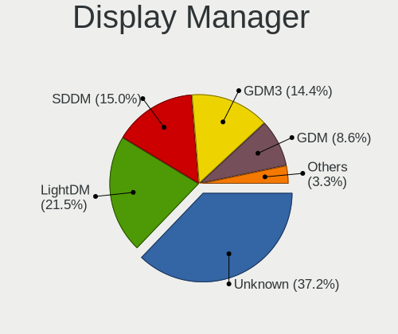

| Name    | Desktops | Percent |
|---------|----------|---------|
| Unknown | 418      | 37.16%  |
| LightDM | 242      | 21.51%  |
| SDDM    | 169      | 15.02%  |
| GDM3    | 162      | 14.4%   |
| GDM     | 97       | 8.62%   |
| TDM     | 28       | 2.49%   |
| KDM     | 6        | 0.53%   |
| SLiM    | 2        | 0.18%   |
| XDM     | 1        | 0.09%   |

OS Lang
-------

Language

| Lang       | Desktops | Percent |
|------------|----------|---------|
| en_US      | 399      | 35.03%  |
| de_CH      | 246      | 21.6%   |
| Unknown    | 181      | 15.89%  |
| fr_CH      | 80       | 7.02%   |
| de_DE      | 78       | 6.85%   |
| en_GB      | 45       | 3.95%   |
| fr_FR      | 28       | 2.46%   |
| C          | 27       | 2.37%   |
| it_CH      | 12       | 1.05%   |
| it_IT      | 9        | 0.79%   |
| pt_PT      | 6        | 0.53%   |
| ru_RU      | 5        | 0.44%   |
| es_ES      | 4        | 0.35%   |
| en_CH      | 2        | 0.18%   |
| en_AU      | 2        | 0.18%   |
| de_IT      | 2        | 0.18%   |
| sk_SK      | 1        | 0.09%   |
| pt_BR      | 1        | 0.09%   |
| POSIX      | 1        | 0.09%   |
| pl_PL      | 1        | 0.09%   |
| nb_NO      | 1        | 0.09%   |
| hu_HU      | 1        | 0.09%   |
| gsw_CH     | 1        | 0.09%   |
| fi_FI      | 1        | 0.09%   |
| en_IE      | 1        | 0.09%   |
| en_AG      | 1        | 0.09%   |
| de_CH.UTF8 | 1        | 0.09%   |
| cs_CZ      | 1        | 0.09%   |
| C.UTF8     | 1        | 0.09%   |

Boot Mode
---------

EFI or BIOS

| Mode | Desktops | Percent |
|------|----------|---------|
| BIOS | 560      | 51.05%  |
| EFI  | 537      | 48.95%  |

Filesystem
----------

Type of filesystem

| Type    | Desktops | Percent |
|---------|----------|---------|
| Ext4    | 817      | 73.74%  |
| Btrfs   | 112      | 10.11%  |
| Overlay | 66       | 5.96%   |
| Tmpfs   | 51       | 4.6%    |
| Xfs     | 25       | 2.26%   |
| Unknown | 20       | 1.81%   |
| Zfs     | 8        | 0.72%   |
| F2fs    | 3        | 0.27%   |
| Ext2    | 2        | 0.18%   |
| Jfs     | 1        | 0.09%   |
| ExX4    | 1        | 0.09%   |
| Ext3    | 1        | 0.09%   |
| Aufs    | 1        | 0.09%   |

Part. scheme
------------

Scheme of partitioning

| Type    | Desktops | Percent |
|---------|----------|---------|
| GPT     | 581      | 52.91%  |
| Unknown | 408      | 37.16%  |
| MBR     | 109      | 9.93%   |

Dual Boot with Linux/BSD
------------------------

Hosting more than one Linux/BSD

| Dual boot | Desktops | Percent |
|-----------|----------|---------|
| No        | 860      | 78.04%  |
| Yes       | 242      | 21.96%  |

Dual Boot (Win)
---------------

Hosting Linux and Windows

| Dual boot | Desktops | Percent |
|-----------|----------|---------|
| No        | 786      | 71.91%  |
| Yes       | 307      | 28.09%  |

Board
-----

Vendor
------

Motherboard manufacturer

| Name                                 | Desktops | Percent |
|--------------------------------------|----------|---------|
| ASUSTek Computer                     | 380      | 35.68%  |
| Gigabyte Technology                  | 119      | 11.17%  |
| Hewlett-Packard                      | 101      | 9.48%   |
| MSI                                  | 95       | 8.92%   |
| ASRock                               | 83       | 7.79%   |
| Dell                                 | 60       | 5.63%   |
| Fujitsu                              | 35       | 3.29%   |
| Intel                                | 32       | 3%      |
| Lenovo                               | 30       | 2.82%   |
| Acer                                 | 24       | 2.25%   |
| Medion                               | 16       | 1.5%    |
| Shuttle                              | 11       | 1.03%   |
| Apple                                | 11       | 1.03%   |
| Unknown                              | 11       | 1.03%   |
| PC Engines                           | 8        | 0.75%   |
| Pegatron                             | 7        | 0.66%   |
| DALCO AG Switzerland                 | 6        | 0.56%   |
| Biostar                              | 5        | 0.47%   |
| Supermicro                           | 4        | 0.38%   |
| AZW                                  | 3        | 0.28%   |
| Packard Bell                         | 2        | 0.19%   |
| Minix                                | 2        | 0.19%   |
| Alienware                            | 2        | 0.19%   |
| ZOTAC                                | 1        | 0.09%   |
| Wistron                              | 1        | 0.09%   |
| Shenzhen Meigao Electronic Equipment | 1        | 0.09%   |
| Philco                               | 1        | 0.09%   |
| NF541                                | 1        | 0.09%   |
| MACHINIST                            | 1        | 0.09%   |
| LattePanda                           | 1        | 0.09%   |
| JINGSHA                              | 1        | 0.09%   |
| Inventec                             | 1        | 0.09%   |
| ICP / iEi                            | 1        | 0.09%   |
| HC Technology.                       | 1        | 0.09%   |
| GEEKOM                               | 1        | 0.09%   |
| Fujitsu Siemens                      | 1        | 0.09%   |
| eMachines                            | 1        | 0.09%   |
| ELSKY                                | 1        | 0.09%   |
| Chuwi                                | 1        | 0.09%   |
| BESSTAR Tech                         | 1        | 0.09%   |

Model
-----

Motherboard model

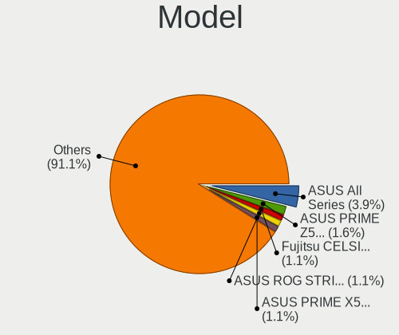

| Name                                  | Desktops | Percent |
|---------------------------------------|----------|---------|
| ASUS All Series                       | 42       | 3.94%   |
| ASUS PRIME Z590-P                     | 17       | 1.6%    |
| Fujitsu CELSIUS_W550                  | 12       | 1.13%   |
| ASUS ROG STRIX X570-E GAMING          | 12       | 1.13%   |
| ASUS PRIME X570-PRO                   | 12       | 1.13%   |
| Unknown                               | 12       | 1.13%   |
| ASUS PRIME B550M-A                    | 10       | 0.94%   |
| MSI MS-7C02                           | 9        | 0.85%   |
| ASUS STRIX Z270F GAMING               | 8        | 0.75%   |
| Apple MacPro5,1                       | 8        | 0.75%   |
| ASUS P9X79 WS                         | 7        | 0.66%   |
| ASUS P8Z77-V LX                       | 7        | 0.66%   |
| Dell Precision Tower 5810             | 6        | 0.56%   |
| Dell OptiPlex 9020                    | 6        | 0.56%   |
| Dell OptiPlex 7010                    | 6        | 0.56%   |
| DALCO AG Switzerland +41 44 908 38 38 | 6        | 0.56%   |
| ASUS ROG STRIX Z370-F GAMING          | 6        | 0.56%   |
| PC Engines APU2                       | 5        | 0.47%   |
| Intel DP67BA AAG10219-303             | 5        | 0.47%   |
| HP EliteDesk 800 G1 SFF               | 5        | 0.47%   |
| Fujitsu CELSIUS W570                  | 5        | 0.47%   |
| Dell OptiPlex 790                     | 5        | 0.47%   |
| ASUS ROG STRIX B550-E GAMING          | 5        | 0.47%   |
| MSI MS-7D25                           | 4        | 0.38%   |
| MSI MS-7C56                           | 4        | 0.38%   |
| MSI MS-7B86                           | 4        | 0.38%   |
| Intel DP55WB AAE64798-207             | 4        | 0.38%   |
| HP Z400 Workstation                   | 4        | 0.38%   |
| Gigabyte X570 AORUS ELITE             | 4        | 0.38%   |
| Gigabyte H97-HD3                      | 4        | 0.38%   |
| ASUS TUF Gaming X570-PLUS             | 4        | 0.38%   |
| ASUS TUF Gaming B550-PLUS             | 4        | 0.38%   |
| ASUS ROG STRIX B550-F GAMING WIFI II  | 4        | 0.38%   |
| ASUS PRIME Z370-A II                  | 4        | 0.38%   |
| ASUS PRIME X370-PRO                   | 4        | 0.38%   |
| ASUS PRIME B350-PLUS                  | 4        | 0.38%   |
| ASUS P8H77-M                          | 4        | 0.38%   |
| PC Engines apu4                       | 3        | 0.28%   |
| MSI MS-7B79                           | 3        | 0.28%   |
| MSI MS-7B45                           | 3        | 0.28%   |

Model Family
------------

Motherboard model prefix

| Name                     | Desktops | Percent |
|--------------------------|----------|---------|
| ASUS ROG                 | 87       | 8.17%   |
| ASUS PRIME               | 84       | 7.89%   |
| ASUS All                 | 42       | 3.94%   |
| Dell OptiPlex            | 37       | 3.47%   |
| Fujitsu CELSIUS          | 27       | 2.54%   |
| HP EliteDesk             | 24       | 2.25%   |
| ASUS TUF                 | 24       | 2.25%   |
| HP Compaq                | 20       | 1.88%   |
| Dell Precision           | 14       | 1.31%   |
| Acer Aspire              | 12       | 1.13%   |
| Unknown                  | 12       | 1.13%   |
| ASUS STRIX               | 11       | 1.03%   |
| Gigabyte X570            | 10       | 0.94%   |
| ASUS P9X79               | 10       | 0.94%   |
| MSI MS-7C02              | 9        | 0.85%   |
| Lenovo IdeaCentre        | 8        | 0.75%   |
| HP ProDesk               | 8        | 0.75%   |
| ASUS P8Z77-V             | 8        | 0.75%   |
| Apple MacPro5            | 8        | 0.75%   |
| ASUS SABERTOOTH          | 7        | 0.66%   |
| ASUS P8H77-M             | 7        | 0.66%   |
| ASRock X570              | 7        | 0.66%   |
| Lenovo ThinkCentre       | 6        | 0.56%   |
| Lenovo Legion            | 6        | 0.56%   |
| Intel DP55WB             | 6        | 0.56%   |
| Gigabyte B550            | 6        | 0.56%   |
| Fujitsu ESPRIMO          | 6        | 0.56%   |
| DALCO AG Switzerland +41 | 6        | 0.56%   |
| Acer Predator            | 6        | 0.56%   |
| PC Engines APU2          | 5        | 0.47%   |
| Intel DP67BA             | 5        | 0.47%   |
| HP Pavilion              | 5        | 0.47%   |
| HP OMEN                  | 5        | 0.47%   |
| ASUS P6T                 | 5        | 0.47%   |
| ASRock B450              | 5        | 0.47%   |
| MSI MS-7D25              | 4        | 0.38%   |
| MSI MS-7C56              | 4        | 0.38%   |
| MSI MS-7B86              | 4        | 0.38%   |
| Lenovo ThinkStation      | 4        | 0.38%   |
| HP Z400                  | 4        | 0.38%   |

MFG Year
--------

Motherboard manufacture year

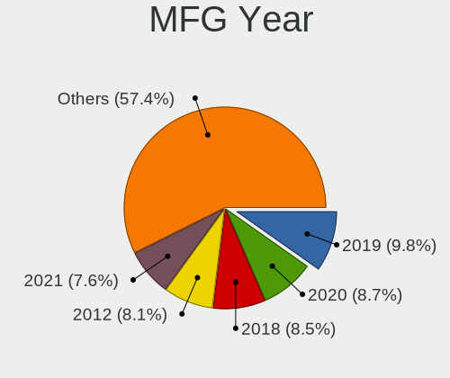

| Year    | Desktops | Percent |
|---------|----------|---------|
| 2019    | 104      | 9.77%   |
| 2020    | 93       | 8.73%   |
| 2018    | 90       | 8.45%   |
| 2012    | 86       | 8.08%   |
| 2021    | 81       | 7.61%   |
| 2017    | 77       | 7.23%   |
| 2014    | 75       | 7.04%   |
| 2013    | 72       | 6.76%   |
| 2011    | 63       | 5.92%   |
| 2015    | 57       | 5.35%   |
| 2016    | 54       | 5.07%   |
| 2010    | 51       | 4.79%   |
| 2022    | 40       | 3.76%   |
| 2009    | 34       | 3.19%   |
| 2008    | 27       | 2.54%   |
| 2023    | 24       | 2.25%   |
| 2007    | 13       | 1.22%   |
| 2006    | 12       | 1.13%   |
| 2024    | 6        | 0.56%   |
| 2005    | 2        | 0.19%   |
| 2004    | 2        | 0.19%   |
| 2003    | 1        | 0.09%   |
| Unknown | 1        | 0.09%   |

Form Factor
-----------

Physical design of the computer

| Name    | Desktops | Percent |
|---------|----------|---------|
| Desktop | 1065     | 100%    |

Secure Boot
-----------

Enabled or disabled

| State    | Desktops | Percent |
|----------|----------|---------|
| Disabled | 1027     | 95.53%  |
| Enabled  | 48       | 4.47%   |

Coreboot
--------

Have coreboot on board

| Used | Desktops | Percent |
|------|----------|---------|
| No   | 1057     | 99.25%  |
| Yes  | 8        | 0.75%   |

RAM Size
--------

Total RAM memory

| Size in GB      | Desktops | Percent |
|-----------------|----------|---------|
| 32.01-64.0      | 291      | 26.77%  |
| 16.01-24.0      | 286      | 26.31%  |
| 64.01-256.0     | 148      | 13.62%  |
| 8.01-16.0       | 129      | 11.87%  |
| 4.01-8.0        | 97       | 8.92%   |
| 3.01-4.0        | 74       | 6.81%   |
| 24.01-32.0      | 34       | 3.13%   |
| 1.01-2.0        | 14       | 1.29%   |
| More than 256.0 | 8        | 0.74%   |
| 2.01-3.0        | 4        | 0.37%   |
| 0.51-1.0        | 1        | 0.09%   |
| 0.01-0.5        | 1        | 0.09%   |

RAM Used
--------

Used RAM memory

| Used GB     | Desktops | Percent |
|-------------|----------|---------|
| 1.01-2.0    | 341      | 27.35%  |
| 2.01-3.0    | 265      | 21.25%  |
| 4.01-8.0    | 233      | 18.68%  |
| 3.01-4.0    | 154      | 12.35%  |
| 8.01-16.0   | 107      | 8.58%   |
| 0.51-1.0    | 94       | 7.54%   |
| 16.01-24.0  | 22       | 1.76%   |
| 0.01-0.5    | 13       | 1.04%   |
| 24.01-32.0  | 10       | 0.8%    |
| 32.01-64.0  | 4        | 0.32%   |
| 64.01-256.0 | 3        | 0.24%   |
| Unknown     | 1        | 0.08%   |

Total Drives
------------

Number of drives on board

| Drives | Desktops | Percent |
|--------|----------|---------|
| 1      | 406      | 35.83%  |
| 2      | 334      | 29.48%  |
| 3      | 185      | 16.33%  |
| 4      | 94       | 8.3%    |
| 5      | 49       | 4.32%   |
| 6      | 30       | 2.65%   |
| 7      | 20       | 1.77%   |
| 0      | 10       | 0.88%   |
| 11     | 2        | 0.18%   |
| 8      | 2        | 0.18%   |
| 14     | 1        | 0.09%   |

Has CD-ROM
----------

Has CD-ROM on board

| Presented | Desktops | Percent |
|-----------|----------|---------|
| No        | 608      | 55.88%  |
| Yes       | 480      | 44.12%  |

Has Ethernet
------------

Has Ethernet on board

| Presented | Desktops | Percent |
|-----------|----------|---------|
| Yes       | 1058     | 99.34%  |
| No        | 7        | 0.66%   |

Has WiFi
--------

Has WiFi module

| Presented | Desktops | Percent |
|-----------|----------|---------|
| No        | 623      | 57.63%  |
| Yes       | 458      | 42.37%  |

Has Bluetooth
-------------

Has Bluetooth module

| Presented | Desktops | Percent |
|-----------|----------|---------|
| No        | 685      | 63.31%  |
| Yes       | 397      | 36.69%  |

Location
--------

Country
-------

Geographic location (country)

| Country     | Desktops | Percent |
|-------------|----------|---------|
| Switzerland | 1065     | 100%    |

City
----

Geographic location (city)

| City                               | Desktops | Percent |
|------------------------------------|----------|---------|
| Zurich                             | 337      | 29.13%  |
| Bern                               | 45       | 3.89%   |
| Lucerne                            | 36       | 3.11%   |
| Geneva                             | 36       | 3.11%   |
| Lausanne                           | 19       | 1.64%   |
| Basel                              | 18       | 1.56%   |
| Neuchatel                          | 14       | 1.21%   |
| Wiesendangen / Wiesendangen (Dorf) | 12       | 1.04%   |
| Lyss                               | 12       | 1.04%   |
| St. Gallen                         | 11       | 0.95%   |
| Dietikon                           | 11       | 0.95%   |
| Winterthur                         | 10       | 0.86%   |
| Thun                               | 10       | 0.86%   |
| Wil                                | 8        | 0.69%   |
| Biel/Bienne                        | 8        | 0.69%   |
| Lugano                             | 7        | 0.61%   |
| Wittenbach                         | 6        | 0.52%   |
| Wetzikon                           | 6        | 0.52%   |
| Wettingen                          | 6        | 0.52%   |
| Muttenz                            | 6        | 0.52%   |
| Gossau                             | 6        | 0.52%   |
| Aarau                              | 6        | 0.52%   |
| Uster                              | 5        | 0.43%   |
| Schaffhausen                       | 5        | 0.43%   |
| Kriens                             | 5        | 0.43%   |
| Horgen                             | 5        | 0.43%   |
| Glattbrugg                         | 5        | 0.43%   |
| Caslano                            | 5        | 0.43%   |
| Baden                              | 5        | 0.43%   |
| Zug                                | 4        | 0.35%   |
| Zofingen                           | 4        | 0.35%   |
| Yverdon-les-Bains                  | 4        | 0.35%   |
| Willisau                           | 4        | 0.35%   |
| Waedenswil                         | 4        | 0.35%   |
| Thalwil                            | 4        | 0.35%   |
| Sion                               | 4        | 0.35%   |
| Sierre                             | 4        | 0.35%   |
| Opfikon                            | 4        | 0.35%   |
| Onex                               | 4        | 0.35%   |
| Munchenstein                       | 4        | 0.35%   |

Drives
------

Drive Vendor
------------

Hard drive vendors

| Vendor                      | Desktops | Drives | Percent |
|-----------------------------|----------|--------|---------|
| Samsung Electronics         | 527      | 1138   | 27.53%  |
| WDC                         | 348      | 656    | 18.18%  |
| Seagate                     | 288      | 458    | 15.05%  |
| Sandisk                     | 96       | 139    | 5.02%   |
| Kingston                    | 71       | 110    | 3.71%   |
| Toshiba                     | 66       | 100    | 3.45%   |
| Crucial                     | 66       | 92     | 3.45%   |
| Hitachi                     | 61       | 92     | 3.19%   |
| Intel                       | 48       | 73     | 2.51%   |
| Corsair                     | 23       | 27     | 1.2%    |
| Phison Electronics          | 21       | 26     | 1.1%    |
| Micron Technology           | 20       | 26     | 1.04%   |
| Unknown                     | 17       | 43     | 0.89%   |
| HGST                        | 17       | 25     | 0.89%   |
| A-DATA Technology           | 17       | 24     | 0.89%   |
| SK hynix                    | 16       | 20     | 0.84%   |
| OCZ                         | 16       | 21     | 0.84%   |
| Phison                      | 15       | 24     | 0.78%   |
| China                       | 12       | 13     | 0.63%   |
| Intenso                     | 11       | 12     | 0.57%   |
| Patriot                     | 8        | 9      | 0.42%   |
| Micron/Crucial Technology   | 8        | 11     | 0.42%   |
| Hewlett-Packard             | 8        | 13     | 0.42%   |
| Apple                       | 7        | 7      | 0.37%   |
| Kingston Technology Company | 6        | 9      | 0.31%   |
| SPCC                        | 5        | 7      | 0.26%   |
| Plextor                     | 5        | 6      | 0.26%   |
| Maxtor                      | 5        | 7      | 0.26%   |
| LITEONIT                    | 5        | 6      | 0.26%   |
| KIOXIA-EXCERIA              | 5        | 6      | 0.26%   |
| KingSpec                    | 5        | 10     | 0.26%   |
| Silicon Motion              | 4        | 4      | 0.21%   |
| MAXIO Technology (Hangzhou) | 4        | 4      | 0.21%   |
| LaCie                       | 4        | 4      | 0.21%   |
| ADATA Technology            | 4        | 5      | 0.21%   |
| XPG                         | 3        | 3      | 0.16%   |
| Transcend                   | 3        | 9      | 0.16%   |
| PNY                         | 3        | 8      | 0.16%   |
| LITEON                      | 3        | 4      | 0.16%   |
| JMicron Technology          | 3        | 3      | 0.16%   |

Drive Model
-----------

Hard drive models

| Model                                                | Desktops | Percent |
|------------------------------------------------------|----------|---------|
| Samsung SSD 850 EVO 500GB                            | 38       | 1.64%   |
| Samsung SSD 850 EVO 250GB                            | 33       | 1.43%   |
| Samsung NVMe SSD Controller SM981/PM981/PM983 512GB  | 30       | 1.3%    |
| Samsung SSD 860 EVO 1TB                              | 29       | 1.25%   |
| Samsung NVMe SSD Controller PM9A1/PM9A3/980PRO 512GB | 29       | 1.25%   |
| Samsung SSD 980 PRO 1TB                              | 26       | 1.12%   |
| Samsung NVMe SSD Drive 1TB                           | 26       | 1.12%   |
| Seagate ST2000DM008-2FR102 2TB                       | 25       | 1.08%   |
| Samsung SSD 860 EVO 500GB                            | 22       | 0.95%   |
| Seagate ST2000DM006-2DM164 2TB                       | 20       | 0.86%   |
| Samsung SSD 860 EVO 250GB                            | 19       | 0.82%   |
| Samsung SSD 840 EVO 250GB                            | 19       | 0.82%   |
| Samsung SSD 970 EVO Plus 1TB                         | 18       | 0.78%   |
| Seagate ST4000DM004-2CV104 4TB                       | 17       | 0.73%   |
| Samsung SSD 850 EVO 1TB                              | 16       | 0.69%   |
| Toshiba DT01ACA100 1TB                               | 15       | 0.65%   |
| Samsung SSD 870 EVO 1TB                              | 15       | 0.65%   |
| WDC WDS100T2B0A-00SM50 1TB SSD                       | 14       | 0.6%    |
| Seagate ST2000DM001-1ER164 2TB                       | 14       | 0.6%    |
| Samsung SSD 850 PRO 256GB                            | 13       | 0.56%   |
| Seagate ST1000DM003-1CH162 1TB                       | 12       | 0.52%   |
| Samsung SSD 860 QVO 1TB                              | 12       | 0.52%   |
| Samsung HD103SJ 1TB                                  | 12       | 0.52%   |
| Seagate Expansion 1TB                                | 11       | 0.48%   |
| SanDisk NVMe SSD Drive 1TB                           | 11       | 0.48%   |
| Samsung NVMe SSD Drive 500GB                         | 11       | 0.48%   |
| WDC WD40EFRX-68N32N0 4TB                             | 10       | 0.43%   |
| WDC WD20EZRZ-00Z5HB0 2TB                             | 10       | 0.43%   |
| Toshiba DT01ACA200 2TB                               | 10       | 0.43%   |
| Seagate ST2000DM001-1CH164 2TB                       | 10       | 0.43%   |
| Samsung SSD 870 QVO 2TB                              | 10       | 0.43%   |
| Samsung SSD 870 EVO 500GB                            | 10       | 0.43%   |
| Samsung SSD 860 QVO 2TB                              | 10       | 0.43%   |
| Seagate ST500DM002-1BD142 500GB                      | 9        | 0.39%   |
| Seagate ST1000DM010-2EP102 1TB                       | 9        | 0.39%   |
| Samsung SSD 970 EVO Plus 500GB                       | 9        | 0.39%   |
| Samsung SSD 870 QVO 1TB                              | 9        | 0.39%   |
| Samsung SSD 850 PRO 512GB                            | 9        | 0.39%   |
| Crucial CT1000MX500SSD1 1TB                          | 9        | 0.39%   |
| WDC WD40EZRZ-00GXCB0 4TB                             | 8        | 0.35%   |

HDD Vendor
----------

Hard disk drive vendors

| Vendor              | Desktops | Drives | Percent |
|---------------------|----------|--------|---------|
| WDC                 | 302      | 565    | 38.42%  |
| Seagate             | 280      | 434    | 35.62%  |
| Hitachi             | 61       | 92     | 7.76%   |
| Toshiba             | 47       | 73     | 5.98%   |
| Samsung Electronics | 43       | 72     | 5.47%   |
| HGST                | 17       | 25     | 2.16%   |
| Unknown             | 7        | 10     | 0.89%   |
| Maxtor              | 5        | 7      | 0.64%   |
| Hewlett-Packard     | 4        | 8      | 0.51%   |
| Intenso             | 3        | 3      | 0.38%   |
| ASMT                | 3        | 5      | 0.38%   |
| JMicron Technology  | 2        | 2      | 0.25%   |
| Apple               | 2        | 2      | 0.25%   |
| TO Exter            | 1        | 1      | 0.13%   |
| LaCie               | 1        | 1      | 0.13%   |
| Initio              | 1        | 1      | 0.13%   |
| IET                 | 1        | 1      | 0.13%   |
| ICY BOX             | 1        | 1      | 0.13%   |
| HPE                 | 1        | 6      | 0.13%   |
| Fujitsu             | 1        | 1      | 0.13%   |
| ExcelStor           | 1        | 2      | 0.13%   |
| ASMT109x            | 1        | 1      | 0.13%   |
| ASMedia             | 1        | 1      | 0.13%   |

SSD Vendor
----------

Solid state drive vendors

| Vendor              | Desktops | Drives | Percent |
|---------------------|----------|--------|---------|
| Samsung Electronics | 341      | 663    | 46.46%  |
| SanDisk             | 56       | 75     | 7.63%   |
| Crucial             | 56       | 78     | 7.63%   |
| Kingston            | 51       | 76     | 6.95%   |
| WDC                 | 46       | 63     | 6.27%   |
| Intel               | 26       | 37     | 3.54%   |
| OCZ                 | 16       | 21     | 2.18%   |
| Micron Technology   | 14       | 19     | 1.91%   |
| Toshiba             | 12       | 18     | 1.63%   |
| China               | 12       | 13     | 1.63%   |
| A-DATA Technology   | 10       | 16     | 1.36%   |
| Corsair             | 9        | 9      | 1.23%   |
| Patriot             | 8        | 9      | 1.09%   |
| Intenso             | 7        | 8      | 0.95%   |
| SK hynix            | 6        | 8      | 0.82%   |
| SPCC                | 5        | 7      | 0.68%   |
| Plextor             | 5        | 6      | 0.68%   |
| LITEONIT            | 5        | 6      | 0.68%   |
| KIOXIA-EXCERIA      | 5        | 6      | 0.68%   |
| KingSpec            | 5        | 10     | 0.68%   |
| Transcend           | 3        | 9      | 0.41%   |
| Seagate             | 3        | 4      | 0.41%   |
| LITEON              | 3        | 4      | 0.41%   |
| Hewlett-Packard     | 3        | 4      | 0.41%   |
| Apple               | 3        | 3      | 0.41%   |
| Verbatim            | 2        | 2      | 0.27%   |
| FORESEE             | 2        | 2      | 0.27%   |
| Unknown             | 2        | 2      | 0.27%   |
| XSTAR               | 1        | 1      | 0.14%   |
| WDC WDS1            | 1        | 1      | 0.14%   |
| VERICO              | 1        | 2      | 0.14%   |
| Unknown             | 1        | 1      | 0.14%   |
| S3+                 | 1        | 1      | 0.14%   |
| PNY                 | 1        | 2      | 0.14%   |
| Palit               | 1        | 1      | 0.14%   |
| NVME                | 1        | 2      | 0.14%   |
| Netac               | 1        | 1      | 0.14%   |
| Mushkin             | 1        | 1      | 0.14%   |
| Leven               | 1        | 1      | 0.14%   |
| HPE                 | 1        | 1      | 0.14%   |

Drive Kind
----------

HDD or SSD

| Kind    | Desktops | Drives | Percent |
|---------|----------|--------|---------|
| HDD     | 621      | 1314   | 37.25%  |
| SSD     | 606      | 1200   | 36.35%  |
| NVMe    | 408      | 759    | 24.48%  |
| Unknown | 28       | 60     | 1.68%   |
| MMC     | 4        | 4      | 0.24%   |

Drive Connector
---------------

SATA, SAS, NVMe, etc.

| Type | Desktops | Drives | Percent |
|------|----------|--------|---------|
| SATA | 897      | 2437   | 64.26%  |
| NVMe | 405      | 747    | 29.01%  |
| SAS  | 90       | 149    | 6.45%   |
| MMC  | 4        | 4      | 0.29%   |

Drive Size
----------

Size of hard drive

| Size in TB | Desktops | Drives | Percent |
|------------|----------|--------|---------|
| 0.01-0.5   | 557      | 1043   | 39.79%  |
| 0.51-1.0   | 374      | 704    | 26.71%  |
| 1.01-2.0   | 248      | 425    | 17.71%  |
| 3.01-4.0   | 94       | 160    | 6.71%   |
| 2.01-3.0   | 59       | 84     | 4.21%   |
| 4.01-10.0  | 46       | 67     | 3.29%   |
| 10.01-20.0 | 22       | 31     | 1.57%   |

Space Total
-----------

Amount of disk space available on the file system

| Size in GB     | Desktops | Percent |
|----------------|----------|---------|
| 101-250        | 206      | 17.38%  |
| 1001-2000      | 194      | 16.37%  |
| More than 3000 | 179      | 15.11%  |
| 501-1000       | 177      | 14.94%  |
| 251-500        | 157      | 13.25%  |
| 2001-3000      | 102      | 8.61%   |
| 1-20           | 65       | 5.49%   |
| Unknown        | 59       | 4.98%   |
| 51-100         | 33       | 2.78%   |
| 21-50          | 13       | 1.1%    |

Space Used
----------

Amount of used disk space

| Used GB        | Desktops | Percent |
|----------------|----------|---------|
| 1-20           | 290      | 23.67%  |
| 501-1000       | 146      | 11.92%  |
| 251-500        | 144      | 11.76%  |
| 51-100         | 144      | 11.76%  |
| 101-250        | 135      | 11.02%  |
| 21-50          | 111      | 9.06%   |
| 1001-2000      | 88       | 7.18%   |
| More than 3000 | 75       | 6.12%   |
| Unknown        | 59       | 4.82%   |
| 2001-3000      | 33       | 2.69%   |

Malfunc. Drives
---------------

Drive models with a malfunction

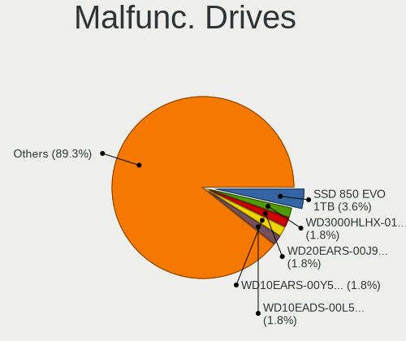

| Model                                 | Desktops | Drives | Percent |
|---------------------------------------|----------|--------|---------|
| Samsung Electronics SSD 850 EVO 1TB   | 4        | 4      | 3.57%   |
| WDC WD3000HLHX-01JJPV0 304GB          | 2        | 2      | 1.79%   |
| WDC WD20EARS-00J99B0 2TB              | 2        | 2      | 1.79%   |
| WDC WD10EARS-00Y5B1 1TB               | 2        | 2      | 1.79%   |
| WDC WD10EADS-00L5B1 1TB               | 2        | 2      | 1.79%   |
| Seagate ST3250310AS 250GB             | 2        | 2      | 1.79%   |
| Seagate ST31500341AS 1TB              | 2        | 5      | 1.79%   |
| Samsung Electronics HD154UI 1TB       | 2        | 2      | 1.79%   |
| Kingston SA400S37120G 120GB SSD       | 2        | 3      | 1.79%   |
| Hitachi HUA722020ALA330 2TB           | 2        | 2      | 1.79%   |
| HGST HTS725050A7E630 500GB            | 2        | 4      | 1.79%   |
| XSTAR SSD 128GB                       | 1        | 1      | 0.89%   |
| WDC WDS240G2G0B-00EPW0 240GB SSD      | 1        | 1      | 0.89%   |
| WDC WD5000AAKS-65A7B0 500GB           | 1        | 1      | 0.89%   |
| WDC WD5000AAKS-00TMA0 500GB           | 1        | 2      | 0.89%   |
| WDC WD5000AAKS-00E4A0 500GB           | 1        | 1      | 0.89%   |
| WDC WD40PURX-64GVNY0 4TB              | 1        | 1      | 0.89%   |
| WDC WD40EZRZ-00WN9B0 4TB              | 1        | 1      | 0.89%   |
| WDC WD40EFRX-68N32N0 4TB              | 1        | 2      | 0.89%   |
| WDC WD4003FZEX-00Z4SA0 4TB            | 1        | 2      | 0.89%   |
| WDC WD3200AAKS-00B3A0 320GB           | 1        | 1      | 0.89%   |
| WDC WD30EZRX-00D8PB0 3TB              | 1        | 1      | 0.89%   |
| WDC WD20EZRZ-00Z5HB0 2TB              | 1        | 1      | 0.89%   |
| WDC WD20EZRX-00D8PB0 2TB              | 1        | 2      | 0.89%   |
| WDC WD20EFRX-68AX9N0 2TB              | 1        | 1      | 0.89%   |
| WDC WD20EARS-00J2GB0 2TB              | 1        | 1      | 0.89%   |
| WDC WD1600JS-00NCB1 160GB             | 1        | 1      | 0.89%   |
| WDC WD10EZEX-08M2NA0 1TB              | 1        | 1      | 0.89%   |
| WDC WD10EARS-22Y5B1 1TB               | 1        | 1      | 0.89%   |
| WDC WD10EADS-22M2B0 1TB               | 1        | 1      | 0.89%   |
| WDC WD10EADS-11M2B3 1TB               | 1        | 1      | 0.89%   |
| WDC WD1002FAEX-00Z3A0 1TB             | 1        | 1      | 0.89%   |
| WDC WD1001FALS-403AA0 1TB             | 1        | 1      | 0.89%   |
| Toshiba MK7575GSX 752GB               | 1        | 3      | 0.89%   |
| Toshiba MG08ACA16TE 16TB              | 1        | 1      | 0.89%   |
| Toshiba DT01ACA100 1TB                | 1        | 1      | 0.89%   |
| SK hynix HFS256G39TND-N210A 256GB SSD | 1        | 1      | 0.89%   |
| SK hynix HFS256G32TND-N210A 256GB SSD | 1        | 1      | 0.89%   |
| SK hynix HFS256G32MND-2200A 256GB SSD | 1        | 1      | 0.89%   |
| Seagate ST9500325ASG 500GB            | 1        | 1      | 0.89%   |

Malfunc. Drive Vendor
---------------------

Vendors of faulty drives

| Vendor              | Desktops | Drives | Percent |
|---------------------|----------|--------|---------|
| WDC                 | 28       | 33     | 25.45%  |
| Samsung Electronics | 17       | 19     | 15.45%  |
| Seagate             | 16       | 28     | 14.55%  |
| Hitachi             | 9        | 10     | 8.18%   |
| Kingston            | 5        | 6      | 4.55%   |
| HGST                | 4        | 6      | 3.64%   |
| Toshiba             | 3        | 5      | 2.73%   |
| SK hynix            | 3        | 3      | 2.73%   |
| SanDisk             | 3        | 3      | 2.73%   |
| OCZ                 | 3        | 4      | 2.73%   |
| Micron Technology   | 3        | 5      | 2.73%   |
| Crucial             | 3        | 3      | 2.73%   |
| A-DATA Technology   | 3        | 5      | 2.73%   |
| Intel               | 2        | 2      | 1.82%   |
| XSTAR               | 1        | 1      | 0.91%   |
| Patriot             | 1        | 2      | 0.91%   |
| Maxtor              | 1        | 1      | 0.91%   |
| Initio              | 1        | 1      | 0.91%   |
| Hewlett-Packard     | 1        | 1      | 0.91%   |
| Fujitsu             | 1        | 1      | 0.91%   |
| China               | 1        | 1      | 0.91%   |
| ASMedia             | 1        | 1      | 0.91%   |

Malfunc. HDD Vendor
-------------------

Vendors of faulty HDD drives

| Vendor              | Desktops | Drives | Percent |
|---------------------|----------|--------|---------|
| WDC                 | 27       | 32     | 38.57%  |
| Seagate             | 16       | 28     | 22.86%  |
| Hitachi             | 9        | 10     | 12.86%  |
| Samsung Electronics | 6        | 8      | 8.57%   |
| HGST                | 4        | 6      | 5.71%   |
| Toshiba             | 3        | 5      | 4.29%   |
| Maxtor              | 1        | 1      | 1.43%   |
| Initio              | 1        | 1      | 1.43%   |
| Hewlett-Packard     | 1        | 1      | 1.43%   |
| Fujitsu             | 1        | 1      | 1.43%   |
| ASMedia             | 1        | 1      | 1.43%   |

Malfunc. Drive Kind
-------------------

Kinds of faulty drives

| Kind | Desktops | Drives | Percent |
|------|----------|--------|---------|
| HDD  | 62       | 94     | 60.78%  |
| SSD  | 35       | 41     | 34.31%  |
| NVMe | 5        | 6      | 4.9%    |

Failed Drives
-------------

Failed drive models

| Model                     | Desktops | Drives | Percent |
|---------------------------|----------|--------|---------|
| Seagate ST3750528AS 752GB | 1        | 1      | 100%    |

Failed Drive Vendor
-------------------

Failed drive vendors

| Vendor  | Desktops | Drives | Percent |
|---------|----------|--------|---------|
| Seagate | 1        | 1      | 100%    |

Drive Status
------------

Number of failed and malfunc. drives

| Status   | Desktops | Drives | Percent |
|----------|----------|--------|---------|
| Detected | 564      | 1704   | 46.19%  |
| Works    | 562      | 1491   | 46.03%  |
| Malfunc  | 94       | 141    | 7.7%    |
| Failed   | 1        | 1      | 0.08%   |

Storage controller
------------------

Storage Vendor
--------------

Storage controller vendors

| Vendor                       | Desktops | Percent |
|------------------------------|----------|---------|
| Intel                        | 701      | 41.36%  |
| AMD                          | 334      | 19.71%  |
| Samsung Electronics          | 239      | 14.1%   |
| ASMedia Technology           | 76       | 4.48%   |
| Marvell Technology Group     | 55       | 3.24%   |
| SanDisk                      | 54       | 3.19%   |
| Phison Electronics           | 48       | 2.83%   |
| JMicron Technology           | 36       | 2.12%   |
| Kingston Technology Company  | 26       | 1.53%   |
| Micron/Crucial Technology    | 18       | 1.06%   |
| Nvidia                       | 17       | 1%      |
| ADATA Technology             | 12       | 0.71%   |
| Seagate Technology           | 11       | 0.65%   |
| SK hynix                     | 10       | 0.59%   |
| Silicon Motion               | 8        | 0.47%   |
| Toshiba America Info Systems | 6        | 0.35%   |
| Micron Technology            | 6        | 0.35%   |
| LSI Logic / Symbios Logic    | 6        | 0.35%   |
| MAXIO Technology (Hangzhou)  | 4        | 0.24%   |
| Broadcom / LSI               | 4        | 0.24%   |
| Shenzhen Longsys Electronics | 3        | 0.18%   |
| KIOXIA                       | 3        | 0.18%   |
| Silicon Image                | 2        | 0.12%   |
| Realtek Semiconductor        | 2        | 0.12%   |
| Lite-On Technology           | 2        | 0.12%   |
| Hewlett-Packard              | 2        | 0.12%   |
| Areca Technology             | 2        | 0.12%   |
| Apple                        | 2        | 0.12%   |
| Adaptec                      | 2        | 0.12%   |
| VIA Technologies             | 1        | 0.06%   |
| Union Memory (Shenzhen)      | 1        | 0.06%   |
| Tekram Technology            | 1        | 0.06%   |
| Lenovo                       | 1        | 0.06%   |

Storage Model
-------------

Storage controller models

| Model                                                                          | Desktops | Percent |
|--------------------------------------------------------------------------------|----------|---------|
| AMD FCH SATA Controller [AHCI mode]                                            | 186      | 9.26%   |
| Samsung NVMe SSD Controller SM981/PM981/PM983                                  | 115      | 5.72%   |
| Samsung NVMe SSD Controller PM9A1/PM9A3/980PRO                                 | 77       | 3.83%   |
| ASMedia ASM1061/ASM1062 Serial ATA Controller                                  | 72       | 3.58%   |
| Intel 8 Series/C220 Series Chipset Family 6-port SATA Controller 1 [AHCI mode] | 70       | 3.48%   |
| Intel Q170/Q150/B150/H170/H110/Z170/CM236 Chipset SATA Controller [AHCI Mode]  | 64       | 3.19%   |
| Intel 200 Series PCH SATA controller [AHCI mode]                               | 60       | 2.99%   |
| AMD 500 Series Chipset SATA Controller                                         | 59       | 2.94%   |
| AMD 400 Series Chipset SATA Controller                                         | 56       | 2.79%   |
| Intel SATA Controller [RAID mode]                                              | 53       | 2.64%   |
| Intel 7 Series/C210 Series Chipset Family 6-port SATA Controller [AHCI mode]   | 52       | 2.59%   |
| Intel 6 Series/C200 Series Chipset Family 6 port Desktop SATA AHCI Controller  | 44       | 2.19%   |
| Intel Cannon Lake PCH SATA AHCI Controller                                     | 38       | 1.89%   |
| Samsung NVMe SSD Controller SM961/PM961/SM963                                  | 33       | 1.64%   |
| Intel 500 Series Chipset Family SATA AHCI Controller                           | 33       | 1.64%   |
| Intel 9 Series Chipset Family SATA Controller [AHCI Mode]                      | 31       | 1.54%   |
| AMD SB7x0/SB8x0/SB9x0 SATA Controller [AHCI mode]                              | 27       | 1.34%   |
| Intel Alder Lake-S PCH SATA Controller [AHCI Mode]                             | 24       | 1.19%   |
| AMD 600 Series Chipset SATA Controller                                         | 24       | 1.19%   |
| Intel C610/X99 series chipset 6-Port SATA Controller [AHCI mode]               | 22       | 1.1%    |
| Intel C600/X79 series chipset 6-Port SATA AHCI Controller                      | 22       | 1.1%    |
| Intel 82801JI (ICH10 Family) SATA AHCI Controller                              | 21       | 1.05%   |
| AMD SB7x0/SB8x0/SB9x0 IDE Controller                                           | 21       | 1.05%   |
| Phison E12 NVMe Controller                                                     | 19       | 0.95%   |
| AMD 300 Series Chipset SATA Controller                                         | 19       | 0.95%   |
| Intel C610/X99 series chipset sSATA Controller [AHCI mode]                     | 17       | 0.85%   |
| Intel 5 Series/3400 Series Chipset 6 port SATA AHCI Controller                 | 16       | 0.8%    |
| Phison E16 PCIe4 NVMe Controller                                               | 15       | 0.75%   |
| Intel Raptor Lake SATA AHCI Controller                                         | 15       | 0.75%   |
| JMicron JMB363 SATA/IDE Controller                                             | 14       | 0.7%    |
| Samsung NVMe SSD Controller S4LV008[Pascal]                                    | 13       | 0.65%   |
| Samsung NVMe SSD Controller 980 (DRAM-less)                                    | 13       | 0.65%   |
| Marvell Group 88SE9128 PCIe SATA 6 Gb/s RAID controller with HyperDuo          | 13       | 0.65%   |
| Intel Comet Lake SATA AHCI Controller                                          | 13       | 0.65%   |
| AMD X370 Series Chipset SATA Controller                                        | 13       | 0.65%   |
| Sandisk WD Black SN850X NVMe SSD                                               | 11       | 0.55%   |
| Micron/Crucial P2 [Nick P2] / P3 / P3 Plus NVMe PCIe SSD (DRAM-less)           | 11       | 0.55%   |
| Intel NM10/ICH7 Family SATA Controller [IDE mode]                              | 11       | 0.55%   |
| AMD X399 Series Chipset SATA Controller                                        | 11       | 0.55%   |
| AMD SB7x0/SB8x0/SB9x0 SATA Controller [IDE mode]                               | 11       | 0.55%   |

Storage Kind
------------

Kind of storage controller (IDE, SATA, NVMe, SAS, ...)

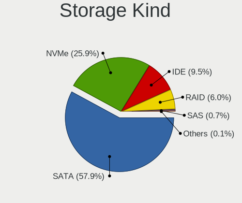

| Kind | Desktops | Percent |
|------|----------|---------|
| SATA | 914      | 57.92%  |
| NVMe | 408      | 25.86%  |
| IDE  | 150      | 9.51%   |
| RAID | 94       | 5.96%   |
| SAS  | 11       | 0.7%    |
| SCSI | 1        | 0.06%   |

Processor
---------

CPU Vendor
----------

Processor vendors

| Vendor  | Desktops | Percent |
|---------|----------|---------|
| Intel   | 708      | 66.48%  |
| AMD     | 356      | 33.43%  |
| Unknown | 1        | 0.09%   |

CPU Model
---------

Processor models

| Model                                   | Desktops | Percent |
|-----------------------------------------|----------|---------|
| AMD Ryzen 7 5800X 8-Core Processor      | 30       | 2.81%   |
| Intel Core i7-6700 CPU @ 3.40GHz        | 25       | 2.34%   |
| Intel Core i7-3770 CPU @ 3.40GHz        | 23       | 2.15%   |
| AMD Ryzen 7 3700X 8-Core Processor      | 23       | 2.15%   |
| Intel Core i7-4790 CPU @ 3.60GHz        | 22       | 2.06%   |
| AMD Ryzen 5 3600 6-Core Processor       | 21       | 1.97%   |
| Intel Core i7-4770 CPU @ 3.40GHz        | 18       | 1.69%   |
| Intel Core i7-2600 CPU @ 3.40GHz        | 18       | 1.69%   |
| AMD Ryzen 9 3900X 12-Core Processor     | 18       | 1.69%   |
| Intel Core i7-7700K CPU @ 4.20GHz       | 16       | 1.5%    |
| Intel 11th Gen Core i9-11900F @ 2.50GHz | 16       | 1.5%    |
| Intel Core i7-8700K CPU @ 3.70GHz       | 15       | 1.4%    |
| AMD Ryzen 9 5900X 12-Core Processor     | 13       | 1.22%   |
| Intel Core i7-6700K CPU @ 4.00GHz       | 12       | 1.12%   |
| Intel Core i7-4790K CPU @ 4.00GHz       | 12       | 1.12%   |
| Intel Xeon CPU E5-1650 v3 @ 3.50GHz     | 11       | 1.03%   |
| AMD Ryzen 9 5950X 16-Core Processor     | 10       | 0.94%   |
| AMD Ryzen 5 5600X 6-Core Processor      | 10       | 0.94%   |
| Intel Core i7-3770K CPU @ 3.50GHz       | 9        | 0.84%   |
| Intel Core i5-6500 CPU @ 3.20GHz        | 9        | 0.84%   |
| Intel Core i7-9700K CPU @ 3.60GHz       | 8        | 0.75%   |
| Intel Core i7-8700 CPU @ 3.20GHz        | 8        | 0.75%   |
| Intel Core i5-2400 CPU @ 3.10GHz        | 8        | 0.75%   |
| AMD GX-412TC SOC                        | 8        | 0.75%   |
| AMD Ryzen 7 2700X Eight-Core Processor  | 7        | 0.66%   |
| AMD Ryzen 5 2600 Six-Core Processor     | 7        | 0.66%   |
| AMD Ryzen 5 1600 Six-Core Processor     | 7        | 0.66%   |
| AMD Quad-Core Opteron Processor 2354    | 7        | 0.66%   |
| Intel Core i7-9700 CPU @ 3.00GHz        | 6        | 0.56%   |
| Intel Core i7-7700 CPU @ 3.60GHz        | 6        | 0.56%   |
| Intel Core i7-2600K CPU @ 3.40GHz       | 6        | 0.56%   |
| Intel Core i7 CPU 920 @ 2.67GHz         | 6        | 0.56%   |
| Intel Core i5-9400 CPU @ 2.90GHz        | 6        | 0.56%   |
| Intel Core i5-4460 CPU @ 3.20GHz        | 6        | 0.56%   |
| Intel Core i5-3570K CPU @ 3.40GHz       | 6        | 0.56%   |
| Intel Core i5-3570 CPU @ 3.40GHz        | 6        | 0.56%   |
| Intel Core i5-3470 CPU @ 3.20GHz        | 6        | 0.56%   |
| Intel Core i5 CPU 760 @ 2.80GHz         | 6        | 0.56%   |
| Intel Core i3-2120 CPU @ 3.30GHz        | 6        | 0.56%   |
| AMD Ryzen 5 2600X Six-Core Processor    | 6        | 0.56%   |

CPU Model Family
----------------

Processor model prefix

| Model                   | Desktops | Percent |
|-------------------------|----------|---------|
| Intel Core i7           | 276      | 25.84%  |
| Intel Core i5           | 152      | 14.23%  |
| AMD Ryzen 7             | 104      | 9.74%   |
| Intel Xeon              | 77       | 7.21%   |
| AMD Ryzen 5             | 76       | 7.12%   |
| Other                   | 72       | 6.74%   |
| AMD Ryzen 9             | 62       | 5.81%   |
| Intel Core i3           | 37       | 3.46%   |
| AMD FX                  | 21       | 1.97%   |
| Intel Core 2 Duo        | 19       | 1.78%   |
| AMD Ryzen Threadripper  | 19       | 1.78%   |
| Intel Core i9           | 18       | 1.69%   |
| Intel Core 2 Quad       | 13       | 1.22%   |
| Intel Celeron           | 13       | 1.22%   |
| Intel Pentium Dual-Core | 10       | 0.94%   |
| AMD Ryzen 3             | 10       | 0.94%   |
| AMD GX                  | 10       | 0.94%   |
| AMD Quad-Core Opteron   | 7        | 0.66%   |
| AMD Phenom II X4        | 7        | 0.66%   |
| AMD A8                  | 7        | 0.66%   |
| Intel Core 2            | 6        | 0.56%   |
| Intel Pentium 4         | 5        | 0.47%   |
| Intel Atom              | 5        | 0.47%   |
| AMD Athlon              | 5        | 0.47%   |
| AMD A10                 | 5        | 0.47%   |
| Intel Pentium           | 4        | 0.37%   |
| AMD Ryzen 5 PRO         | 4        | 0.37%   |
| AMD Phenom II X6        | 4        | 0.37%   |
| AMD Phenom              | 3        | 0.28%   |
| AMD Athlon II X2        | 3        | 0.28%   |
| AMD Phenom II X3        | 2        | 0.19%   |
| AMD Athlon II X4        | 2        | 0.19%   |
| AMD Athlon 64 X2        | 2        | 0.19%   |
| Intel Pentium Gold      | 1        | 0.09%   |
| Intel Core m3           | 1        | 0.09%   |
| Intel Celeron M         | 1        | 0.09%   |
| AMD Turion II Neo       | 1        | 0.09%   |
| AMD PRO A8              | 1        | 0.09%   |
| AMD G                   | 1        | 0.09%   |
| AMD Athlon Dual Core    | 1        | 0.09%   |

CPU Cores
---------

Number of processor cores

| Number  | Desktops | Percent |
|---------|----------|---------|
| 4       | 435      | 40.69%  |
| 8       | 192      | 17.96%  |
| 6       | 177      | 16.56%  |
| 2       | 112      | 10.48%  |
| 12      | 53       | 4.96%   |
| 16      | 40       | 3.74%   |
| 24      | 14       | 1.31%   |
| 10      | 11       | 1.03%   |
| 3       | 8        | 0.75%   |
| 14      | 7        | 0.65%   |
| 1       | 7        | 0.65%   |
| 32      | 6        | 0.56%   |
| 18      | 3        | 0.28%   |
| 20      | 2        | 0.19%   |
| 22      | 1        | 0.09%   |
| Unknown | 1        | 0.09%   |

CPU Sockets
-----------

Number of sockets

| Number | Desktops | Percent |
|--------|----------|---------|
| 1      | 1045     | 98.12%  |
| 2      | 20       | 1.88%   |

CPU Threads
-----------

Threads per core (Hyper-Threading)

| Number  | Desktops | Percent |
|---------|----------|---------|
| 2       | 755      | 70.43%  |
| 1       | 316      | 29.48%  |
| Unknown | 1        | 0.09%   |

CPU Op-Modes
------------

CPU Operation Modes (32-bit, 64-bit)

| Op mode        | Desktops | Percent |
|----------------|----------|---------|
| 32-bit, 64-bit | 1055     | 99.06%  |
| Unknown        | 6        | 0.56%   |
| 32-bit         | 4        | 0.38%   |

CPU Microcode
-------------

Microcode number

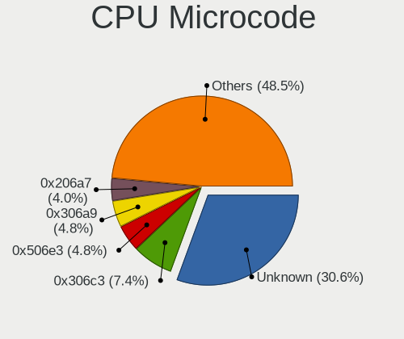

| Number     | Desktops | Percent |
|------------|----------|---------|
| Unknown    | 341      | 30.58%  |
| 0x306c3    | 82       | 7.35%   |
| 0x506e3    | 53       | 4.75%   |
| 0x306a9    | 53       | 4.75%   |
| 0x206a7    | 45       | 4.04%   |
| 0x08701021 | 32       | 2.87%   |
| 0x906ea    | 31       | 2.78%   |
| 0x1067a    | 25       | 2.24%   |
| 0x906e9    | 23       | 2.06%   |
| 0xa0671    | 20       | 1.79%   |
| 0x0800820d | 20       | 1.79%   |
| 0x306f2    | 17       | 1.52%   |
| 0xa0655    | 16       | 1.43%   |
| 0x0a201016 | 16       | 1.43%   |
| 0x106e5    | 13       | 1.17%   |
| 0x08701013 | 13       | 1.17%   |
| 0x906ed    | 11       | 0.99%   |
| 0xb0671    | 10       | 0.9%    |
| 0x206d7    | 10       | 0.9%    |
| 0x106a5    | 10       | 0.9%    |
| 0x08001138 | 10       | 0.9%    |
| 0x50654    | 9        | 0.81%   |
| 0x0a601203 | 9        | 0.81%   |
| 0x06000852 | 9        | 0.81%   |
| 0x90672    | 8        | 0.72%   |
| 0x0a201009 | 8        | 0.72%   |
| 0x07030105 | 8        | 0.72%   |
| 0x01000083 | 8        | 0.72%   |
| 0x406f1    | 7        | 0.63%   |
| 0x206c2    | 7        | 0.63%   |
| 0x08108109 | 7        | 0.63%   |
| 0x010000c8 | 7        | 0.63%   |
| 0x0a20120a | 6        | 0.54%   |
| 0x0a201204 | 6        | 0.54%   |
| 0x08001137 | 6        | 0.54%   |
| 0xa0653    | 5        | 0.45%   |
| 0x306e4    | 5        | 0.45%   |
| 0x20655    | 5        | 0.45%   |
| 0x08701030 | 5        | 0.45%   |
| 0x010000db | 5        | 0.45%   |

CPU Microarch
-------------

Microarchitecture

| Name             | Desktops | Percent |
|------------------|----------|---------|
| Haswell          | 136      | 12.69%  |
| KabyLake         | 107      | 9.98%   |
| Zen 2            | 87       | 8.12%   |
| Zen 3            | 85       | 7.93%   |
| Skylake          | 78       | 7.28%   |
| IvyBridge        | 77       | 7.18%   |
| SandyBridge      | 72       | 6.72%   |
| Unknown          | 61       | 5.69%   |
| Zen+             | 41       | 3.82%   |
| Zen              | 33       | 3.08%   |
| Penryn           | 33       | 3.08%   |
| Nehalem          | 33       | 3.08%   |
| K10              | 29       | 2.71%   |
| CometLake        | 26       | 2.43%   |
| Westmere         | 25       | 2.33%   |
| Alderlake Hybrid | 25       | 2.33%   |
| Piledriver       | 23       | 2.15%   |
| Icelake          | 23       | 2.15%   |
| Core             | 16       | 1.49%   |
| Puma             | 9        | 0.84%   |
| Broadwell        | 8        | 0.75%   |
| Silvermont       | 5        | 0.47%   |
| NetBurst         | 5        | 0.47%   |
| K8 Hammer        | 5        | 0.47%   |
| Jaguar           | 5        | 0.47%   |
| Goldmont plus    | 5        | 0.47%   |
| K10 Llano        | 3        | 0.28%   |
| Gracemont        | 3        | 0.28%   |
| Bulldozer        | 3        | 0.28%   |
| Tremont          | 2        | 0.19%   |
| Steamroller      | 2        | 0.19%   |
| Goldmont         | 2        | 0.19%   |
| Excavator        | 2        | 0.19%   |
| P6               | 1        | 0.09%   |
| Bonnell          | 1        | 0.09%   |
| Bobcat           | 1        | 0.09%   |

Graphics
--------

GPU Vendor
----------

Vendors of graphics cards

| Vendor                                       | Desktops | Percent |
|----------------------------------------------|----------|---------|
| Nvidia                                       | 547      | 47.81%  |
| AMD                                          | 302      | 26.4%   |
| Intel                                        | 278      | 24.3%   |
| XGI Technology (eXtreme Graphics Innovation) | 8        | 0.7%    |
| Matrox Electronics Systems                   | 7        | 0.61%   |
| ASPEED Technology                            | 2        | 0.17%   |

GPU Model
---------

Graphics card models

| Model                                                                       | Desktops | Percent |
|-----------------------------------------------------------------------------|----------|---------|
| Intel Xeon E3-1200 v3/4th Gen Core Processor Integrated Graphics Controller | 51       | 4.29%   |
| AMD Ellesmere [Radeon RX 470/480/570/570X/580/580X/590]                     | 49       | 4.12%   |
| Intel HD Graphics 530                                                       | 31       | 2.61%   |
| Intel CoffeeLake-S GT2 [UHD Graphics 630]                                   | 28       | 2.35%   |
| Intel 2nd Generation Core Processor Family Integrated Graphics Controller   | 23       | 1.93%   |
| Nvidia GP102 [GeForce GTX 1080 Ti]                                          | 22       | 1.85%   |
| AMD Raphael                                                                 | 22       | 1.85%   |
| Nvidia GP106 [GeForce GTX 1060 6GB]                                         | 21       | 1.77%   |
| Nvidia GA104 [GeForce RTX 3070 Lite Hash Rate]                              | 21       | 1.77%   |
| Nvidia GP107GL [Quadro P400]                                                | 20       | 1.68%   |
| Nvidia GK208B [GeForce GT 710]                                              | 19       | 1.6%    |
| Intel IvyBridge GT2 [HD Graphics 4000]                                      | 17       | 1.43%   |
| Nvidia GK107GL [Quadro K420]                                                | 15       | 1.26%   |
| Nvidia GP107 [GeForce GTX 1050 Ti]                                          | 14       | 1.18%   |
| Nvidia GP104 [GeForce GTX 1080]                                             | 13       | 1.09%   |
| Intel Raptor Lake-S GT1 [UHD Graphics 770]                                  | 13       | 1.09%   |
| AMD Navi 22 [Radeon RX 6700/6700 XT/6750 XT / 6800M/6850M XT]               | 13       | 1.09%   |
| AMD Navi 10 [Radeon RX 5600 OEM/5600 XT / 5700/5700 XT]                     | 13       | 1.09%   |
| Nvidia GA102 [GeForce RTX 3090]                                             | 12       | 1.01%   |
| Intel Xeon E3-1200 v2/3rd Gen Core processor Graphics Controller            | 11       | 0.93%   |
| Intel CometLake-S GT2 [UHD Graphics 630]                                    | 11       | 0.93%   |
| AMD Lexa PRO [Radeon 540/540X/550/550X / RX 540X/550/550X]                  | 11       | 0.93%   |
| Nvidia TU117 [GeForce GTX 1650]                                             | 10       | 0.84%   |
| Nvidia TU102 [GeForce RTX 2080 Ti Rev. A]                                   | 10       | 0.84%   |
| Nvidia GP102 [TITAN Xp]                                                     | 10       | 0.84%   |
| Nvidia GM204 [GeForce GTX 970]                                              | 10       | 0.84%   |
| Intel AlderLake-S GT1                                                       | 10       | 0.84%   |
| Intel 4 Series Chipset Integrated Graphics Controller                       | 10       | 0.84%   |
| AMD Navi 31 [Radeon RX 7900 XT/7900 XTX/7900 GRE/7900M]                     | 10       | 0.84%   |
| AMD Navi 21 [Radeon RX 6800/6800 XT / 6900 XT]                              | 10       | 0.84%   |
| AMD Cezanne [Radeon Vega Series / Radeon Vega Mobile Series]                | 10       | 0.84%   |
| Nvidia GA106 [GeForce RTX 3060 Lite Hash Rate]                              | 9        | 0.76%   |
| Nvidia GA104 [GeForce RTX 3060 Ti Lite Hash Rate]                           | 9        | 0.76%   |
| Intel HD Graphics 630                                                       | 9        | 0.76%   |
| AMD Vega 10 XL/XT [Radeon RX Vega 56/64]                                    | 9        | 0.76%   |
| XGI Technology (eXtreme Graphics Innovation) Z7/Z9 (XG20 core)              | 8        | 0.67%   |
| Nvidia TU106 [GeForce RTX 2060 SUPER]                                       | 8        | 0.67%   |
| Nvidia GP104 [GeForce GTX 1070]                                             | 8        | 0.67%   |
| Nvidia GM206 [GeForce GTX 960]                                              | 8        | 0.67%   |
| Nvidia GK208B [GeForce GT 730]                                              | 8        | 0.67%   |

GPU Combo
---------

Combinations of graphics cards

| Name                     | Desktops | Percent |
|--------------------------|----------|---------|
| 1 x Nvidia               | 498      | 45.98%  |
| 1 x AMD                  | 262      | 24.19%  |
| 1 x Intel                | 224      | 20.68%  |
| Intel + Nvidia           | 22       | 2.03%   |
| 2 x AMD                  | 17       | 1.57%   |
| AMD + Nvidia             | 17       | 1.57%   |
| Other                    | 10       | 0.92%   |
| 1 x XGI                  | 8        | 0.74%   |
| 2 x Nvidia               | 6        | 0.55%   |
| 1 x Matrox               | 6        | 0.55%   |
| Intel + AMD              | 6        | 0.55%   |
| 2 x Nvidia + 1 x ASPEED  | 1        | 0.09%   |
| 2 x AMD + 1 x Nvidia     | 1        | 0.09%   |
| Nvidia + Matrox          | 1        | 0.09%   |
| Nvidia + ASPEED          | 1        | 0.09%   |
| 1 x Intel + 3 x Nvidia   | 1        | 0.09%   |
| Intel + 2 x Nvidia       | 1        | 0.09%   |
| Intel + AMD + 1 x Nvidia | 1        | 0.09%   |

GPU Driver
----------

Free vs proprietary

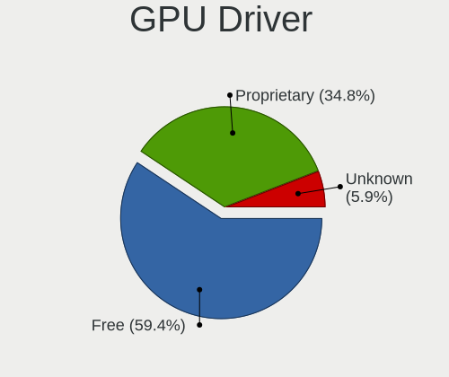

| Driver      | Desktops | Percent |
|-------------|----------|---------|
| Free        | 647      | 59.36%  |
| Proprietary | 379      | 34.77%  |
| Unknown     | 64       | 5.87%   |

GPU Memory
----------

Total video memory

| Size in GB | Desktops | Percent |
|------------|----------|---------|
| Unknown    | 401      | 36%     |
| 1.01-2.0   | 163      | 14.63%  |
| 7.01-8.0   | 125      | 11.22%  |
| 0.51-1.0   | 97       | 8.71%   |
| 8.01-16.0  | 95       | 8.53%   |
| 3.01-4.0   | 85       | 7.63%   |
| 0.01-0.5   | 79       | 7.09%   |
| 5.01-6.0   | 34       | 3.05%   |
| 16.01-24.0 | 21       | 1.89%   |
| 2.01-3.0   | 12       | 1.08%   |
| 4.01-5.0   | 2        | 0.18%   |

Monitor
-------

Monitor Vendor
--------------

Monitor vendors

| Vendor               | Desktops | Percent |
|----------------------|----------|---------|
| Samsung Electronics  | 236      | 20.09%  |
| Dell                 | 141      | 12%     |
| Acer                 | 94       | 8%      |
| Hewlett-Packard      | 83       | 7.06%   |
| Philips              | 80       | 6.81%   |
| Ancor Communications | 75       | 6.38%   |
| BenQ                 | 68       | 5.79%   |
| AOC                  | 50       | 4.26%   |
| Goldstar             | 43       | 3.66%   |
| ASUSTek Computer     | 39       | 3.32%   |
| Eizo                 | 32       | 2.72%   |
| Unknown              | 27       | 2.3%    |
| Lenovo               | 23       | 1.96%   |
| Sony                 | 18       | 1.53%   |
| Iiyama               | 15       | 1.28%   |
| Apple                | 13       | 1.11%   |
| NEC Computers        | 11       | 0.94%   |
| Fujitsu Siemens      | 8        | 0.68%   |
| Gigabyte Technology  | 7        | 0.6%    |
| AUS                  | 7        | 0.6%    |
| Medion               | 6        | 0.51%   |
| ViewSonic            | 5        | 0.43%   |
| Sharp                | 5        | 0.43%   |
| Panasonic            | 5        | 0.43%   |
| MSI                  | 5        | 0.43%   |
| Toshiba              | 4        | 0.34%   |
| Onkyo                | 4        | 0.34%   |
| LG Electronics       | 4        | 0.34%   |
| ___                  | 3        | 0.26%   |
| Vestel Elektronik    | 3        | 0.26%   |
| Medion Akoya         | 3        | 0.26%   |
| HUAWEI               | 3        | 0.26%   |
| DENON                | 3        | 0.26%   |
| Compal               | 3        | 0.26%   |
| Belinea              | 3        | 0.26%   |
| Unknown              | 3        | 0.26%   |
| Vestel               | 2        | 0.17%   |
| Mi                   | 2        | 0.17%   |
| LaCie                | 2        | 0.17%   |
| Idek Iiyama          | 2        | 0.17%   |

Monitor Model
-------------

Monitor models

| Model                                                                 | Desktops | Percent |
|-----------------------------------------------------------------------|----------|---------|
| Samsung Electronics LCD Monitor LF24T450F 1920x1080                   | 16       | 1.22%   |
| Samsung Electronics LCD Monitor SyncMaster 1920x1200                  | 11       | 0.84%   |
| Ancor Communications ASUS VS247 ACI249A 1920x1080 521x293mm 23.5-inch | 10       | 0.76%   |
| Philips LCD Monitor PHL 272S4L 2560x1440                              | 7        | 0.53%   |
| Dell LCD Monitor P2719H 3840x1080                                     | 7        | 0.53%   |
| Dell LCD Monitor P2719H                                               | 7        | 0.53%   |
| Samsung Electronics SyncMaster SAM0587 1920x1200 518x324mm 24.1-inch  | 6        | 0.46%   |
| AOC Q27G2WG4 AOC2702 2560x1440 597x336mm 27.0-inch                    | 6        | 0.46%   |
| Ancor Communications ASUS PB278 ACI27A3 2560x1440 597x336mm 27.0-inch | 6        | 0.46%   |
| Samsung Electronics U28E590 SAM0C4D 3840x2160 607x345mm 27.5-inch     | 5        | 0.38%   |
| BenQ GW2480 BNQ78E7 1920x1080 527x296mm 23.8-inch                     | 5        | 0.38%   |
| Unknown LCD Monitor FFFF 2288x1287 2550x2550mm 142.0-inch             | 4        | 0.3%    |
| Sharp HDMI SHP1022 1920x1080 700x400mm 31.7-inch                      | 4        | 0.3%    |
| Samsung Electronics U32J59x SAM0F33 3840x2160 697x392mm 31.5-inch     | 4        | 0.3%    |
| Samsung Electronics SMS24A450 SAM083A 1920x1200 518x324mm 24.1-inch   | 4        | 0.3%    |
| Samsung Electronics LCD Monitor SyncMaster                            | 4        | 0.3%    |
| Samsung Electronics LCD Monitor SMS24A450 1920x1200                   | 4        | 0.3%    |
| Samsung Electronics LC49G95T SAM7053 3840x1080 1193x336mm 48.8-inch   | 4        | 0.3%    |
| Samsung Electronics C49HG9x SAM0E5D 3840x1080 1196x336mm 48.9-inch    | 4        | 0.3%    |
| Samsung Electronics C27F390 SAM0D32 1920x1080 600x340mm 27.2-inch     | 4        | 0.3%    |
| Panasonic TV MEIA296 1920x1080 698x392mm 31.5-inch                    | 4        | 0.3%    |
| Hewlett-Packard LA2405 HWP284B 1920x1200 518x324mm 24.1-inch          | 4        | 0.3%    |
| Hewlett-Packard E241i HWP3122 1920x1200 518x324mm 24.1-inch           | 4        | 0.3%    |
| Goldstar ULTRAWIDE GSM59F1 2560x1080 677x290mm 29.0-inch              | 4        | 0.3%    |
| Dell U2412M DELA07A 1920x1200 518x324mm 24.1-inch                     | 4        | 0.3%    |
| BenQ GL2450H BNQ78A7 1920x1080 530x300mm 24.0-inch                    | 4        | 0.3%    |
| ASUSTek Computer VP278 AUS27AE 1920x1080 598x336mm 27.0-inch          | 4        | 0.3%    |
| Ancor Communications VG248 ACI24A4 1920x1080 531x299mm 24.0-inch      | 4        | 0.3%    |
| Ancor Communications ASUS MG279 ACI27A7 2560x1440 597x336mm 27.0-inch | 4        | 0.3%    |
| Acer X223HQ ACR0098 1920x1080 477x268mm 21.5-inch                     | 4        | 0.3%    |
| Vestel Elektronik 49FHD_LCD_TV VES3700 1920x1080 1280x720mm 57.8-inch | 3        | 0.23%   |
| Unknown LCD Monitor SAMSUNG 3840x2160                                 | 3        | 0.23%   |
| Unknown LCD Monitor SAMSUNG 1920x1080                                 | 3        | 0.23%   |
| Samsung Electronics U32J59x SAM0F34 3840x2160 697x392mm 31.5-inch     | 3        | 0.23%   |
| Samsung Electronics S24E650 SAM0CB8 1920x1080 521x293mm 23.5-inch     | 3        | 0.23%   |
| Samsung Electronics S24E650 SAM0CB7 1920x1080 521x293mm 23.5-inch     | 3        | 0.23%   |
| Samsung Electronics LCD Monitor SyncMaster 1600x1200                  | 3        | 0.23%   |
| Samsung Electronics LCD Monitor SMS24A450                             | 3        | 0.23%   |
| Samsung Electronics LCD Monitor S24C650 3840x1200                     | 3        | 0.23%   |
| Samsung Electronics LCD Monitor S24C650                               | 3        | 0.23%   |

Monitor Resolution
------------------

Monitor screen resolution

| Resolution         | Desktops | Percent |
|--------------------|----------|---------|
| 1920x1080 (FHD)    | 442      | 37.55%  |
| 3840x2160 (4K)     | 147      | 12.49%  |
| 2560x1440 (QHD)    | 127      | 10.79%  |
| 1920x1200 (WUXGA)  | 85       | 7.22%   |
| Unknown            | 67       | 5.69%   |
| 1680x1050 (WSXGA+) | 61       | 5.18%   |
| 1280x1024 (SXGA)   | 51       | 4.33%   |
| 3440x1440          | 46       | 3.91%   |
| 3840x1080          | 32       | 2.72%   |
| 1600x1200          | 21       | 1.78%   |
| 3840x1200          | 11       | 0.93%   |
| 2560x1600          | 9        | 0.76%   |
| 2560x1080          | 9        | 0.76%   |
| 4480x1440          | 6        | 0.51%   |
| 1440x900 (WXGA+)   | 6        | 0.51%   |
| 1360x768           | 5        | 0.42%   |
| 3520x1200          | 4        | 0.34%   |
| 2288x1287          | 4        | 0.34%   |
| 1920x540           | 4        | 0.34%   |
| 1600x900 (HD+)     | 4        | 0.34%   |
| 7680x2160          | 3        | 0.25%   |
| 5120x1440          | 3        | 0.25%   |
| 3840x1600          | 3        | 0.25%   |
| 3360x1050          | 3        | 0.25%   |
| 6400x1440          | 2        | 0.17%   |
| 3200x1080          | 2        | 0.17%   |
| 2048x1152          | 2        | 0.17%   |
| 800x480            | 1        | 0.08%   |
| 6400x2160          | 1        | 0.08%   |
| 5760x2160          | 1        | 0.08%   |
| 5760x1080          | 1        | 0.08%   |
| 5440x1080          | 1        | 0.08%   |
| 5348x1080          | 1        | 0.08%   |
| 3968x1200          | 1        | 0.08%   |
| 3600x1200          | 1        | 0.08%   |
| 3200x1800 (QHD+)   | 1        | 0.08%   |
| 2880x1200          | 1        | 0.08%   |
| 2560x1024          | 1        | 0.08%   |
| 1400x1050          | 1        | 0.08%   |
| 1366x768 (WXGA)    | 1        | 0.08%   |

Monitor Diagonal
----------------

Diagonal size in inches

| Inches  | Desktops | Percent |
|---------|----------|---------|
| 27      | 216      | 18.54%  |
| Unknown | 207      | 17.77%  |
| 24      | 186      | 15.97%  |
| 23      | 111      | 9.53%   |
| 21      | 70       | 6.01%   |
| 31      | 54       | 4.64%   |
| 34      | 42       | 3.61%   |
| 22      | 37       | 3.18%   |
| 19      | 27       | 2.32%   |
| 20      | 23       | 1.97%   |
| 17      | 18       | 1.55%   |
| 84      | 16       | 1.37%   |
| 32      | 16       | 1.37%   |
| 72      | 15       | 1.29%   |
| 48      | 9        | 0.77%   |
| 40      | 9        | 0.77%   |
| 29      | 9        | 0.77%   |
| 26      | 9        | 0.77%   |
| 25      | 9        | 0.77%   |
| 46      | 8        | 0.69%   |
| 28      | 8        | 0.69%   |
| 37      | 7        | 0.6%    |
| 54      | 6        | 0.52%   |
| 18      | 6        | 0.52%   |
| 49      | 5        | 0.43%   |
| 33      | 5        | 0.43%   |
| 142     | 4        | 0.34%   |
| 42      | 4        | 0.34%   |
| 15      | 4        | 0.34%   |
| 65      | 3        | 0.26%   |
| 60      | 2        | 0.17%   |
| 57      | 2        | 0.17%   |
| 55      | 2        | 0.17%   |
| 47      | 2        | 0.17%   |
| 43      | 2        | 0.17%   |
| 39      | 2        | 0.17%   |
| 35      | 2        | 0.17%   |
| 30      | 2        | 0.17%   |
| 74      | 1        | 0.09%   |
| 59      | 1        | 0.09%   |

Monitor Width
-------------

Physical width

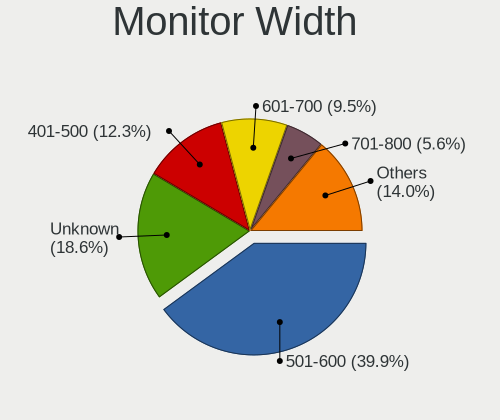

| Width in mm    | Desktops | Percent |
|----------------|----------|---------|
| 501-600        | 444      | 39.93%  |
| Unknown        | 207      | 18.62%  |
| 401-500        | 137      | 12.32%  |
| 601-700        | 106      | 9.53%   |
| 701-800        | 62       | 5.58%   |
| 1001-1500      | 42       | 3.78%   |
| 1501-2000      | 32       | 2.88%   |
| 351-400        | 28       | 2.52%   |
| 301-350        | 23       | 2.07%   |
| 801-900        | 20       | 1.8%    |
| 901-1000       | 5        | 0.45%   |
| More than 2000 | 4        | 0.36%   |
| 201-300        | 2        | 0.18%   |

Aspect Ratio
------------

Proportional relationship between the width and the height

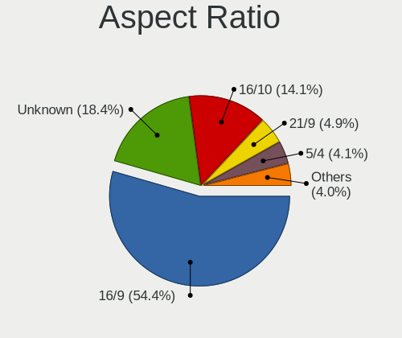

| Ratio   | Desktops | Percent |
|---------|----------|---------|
| 16/9    | 582      | 54.44%  |
| Unknown | 197      | 18.43%  |
| 16/10   | 151      | 14.13%  |
| 21/9    | 52       | 4.86%   |
| 5/4     | 44       | 4.12%   |
| 4/3     | 16       | 1.5%    |
| 32/9    | 12       | 1.12%   |
| 1.00    | 6        | 0.56%   |
| 6/5     | 3        | 0.28%   |
| 3/2     | 3        | 0.28%   |
| 3.20    | 2        | 0.19%   |
| 0.56    | 1        | 0.09%   |

Monitor Area
------------

Area in inch

| Area in inch | Desktops | Percent |
|----------------|----------|---------|
| 201-250        | 279      | 24.56%  |
| 301-350        | 223      | 19.63%  |
| Unknown        | 207      | 18.22%  |
| 351-500        | 131      | 11.53%  |
| 251-300        | 100      | 8.8%    |
| 151-200        | 74       | 6.51%   |
| More than 1000 | 56       | 4.93%   |
| 501-1000       | 41       | 3.61%   |
| 141-150        | 18       | 1.58%   |
| 101-110        | 4        | 0.35%   |
| 71-80          | 1        | 0.09%   |
| 131-140        | 1        | 0.09%   |
| 91-100         | 1        | 0.09%   |

Pixel Density
-------------

Pixels per inch

| Density       | Desktops | Percent |
|---------------|----------|---------|
| 51-100        | 531      | 49.08%  |
| Unknown       | 207      | 19.13%  |
| 101-120       | 197      | 18.21%  |
| 121-160       | 75       | 6.93%   |
| 1-50          | 48       | 4.44%   |
| 161-240       | 23       | 2.13%   |
| More than 240 | 1        | 0.09%   |

Multiple Monitors
-----------------

Total monitors connected

| Total | Desktops | Percent |
|-------|----------|---------|
| 1     | 740      | 66.25%  |
| 2     | 234      | 20.95%  |
| 0     | 96       | 8.59%   |
| 3     | 43       | 3.85%   |
| 4     | 4        | 0.36%   |

Network
-------

Net Controller Vendor
---------------------

Controller vendors

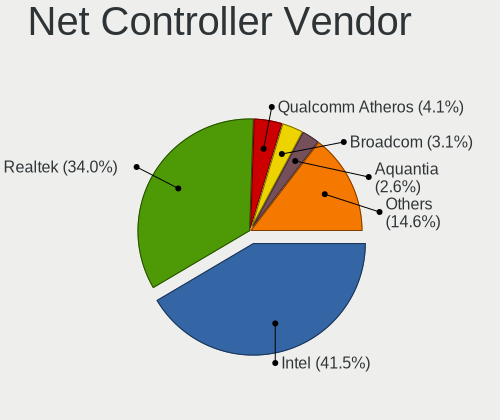

| Vendor                          | Desktops | Percent |
|---------------------------------|----------|---------|
| Intel                           | 633      | 41.51%  |
| Realtek Semiconductor           | 519      | 34.03%  |
| Qualcomm Atheros                | 63       | 4.13%   |
| Broadcom                        | 48       | 3.15%   |
| Aquantia                        | 40       | 2.62%   |
| MediaTek                        | 35       | 2.3%    |
| Ralink Technology               | 18       | 1.18%   |
| TP-Link                         | 16       | 1.05%   |
| Ralink                          | 14       | 0.92%   |
| NetGear                         | 13       | 0.85%   |
| Nvidia                          | 11       | 0.72%   |
| Marvell Technology Group        | 10       | 0.66%   |
| Edimax Technology               | 9        | 0.59%   |
| D-Link                          | 8        | 0.52%   |
| Microsoft                       | 6        | 0.39%   |
| IMC Networks                    | 6        | 0.39%   |
| Broadcom Limited                | 6        | 0.39%   |
| AVM                             | 5        | 0.33%   |
| ASIX Electronics                | 5        | 0.33%   |
| Huawei Technologies             | 4        | 0.26%   |
| D-Link System                   | 4        | 0.26%   |
| ASUSTek Computer                | 4        | 0.26%   |
| Xiaomi                          | 3        | 0.2%    |
| Wilocity                        | 3        | 0.2%    |
| Samsung Electronics             | 3        | 0.2%    |
| Qualcomm Atheros Communications | 3        | 0.2%    |
| NetXen Incorporated             | 3        | 0.2%    |
| Mellanox Technologies           | 3        | 0.2%    |
| Microchip Technology            | 2        | 0.13%   |
| Micro Star International        | 2        | 0.13%   |
| DisplayLink                     | 2        | 0.13%   |
| Arduino SA                      | 2        | 0.13%   |
| ADMtek                          | 2        | 0.13%   |
| ZyXEL Communications            | 1        | 0.07%   |
| ZEPHYR                          | 1        | 0.07%   |
| Sigma Designs                   | 1        | 0.07%   |
| SEGGER                          | 1        | 0.07%   |
| ROCCAT                          | 1        | 0.07%   |
| Qualcomm Technologies           | 1        | 0.07%   |
| Qualcomm                        | 1        | 0.07%   |

Net Controller Model
--------------------

Controller models

| Model                                                                          | Desktops | Percent |
|--------------------------------------------------------------------------------|----------|---------|
| Realtek RTL8111/8168/8211/8411 PCI Express Gigabit Ethernet Controller         | 380      | 21.55%  |
| Intel I211 Gigabit Network Connection                                          | 110      | 6.24%   |
| Realtek RTL8125 2.5GbE Controller                                              | 93       | 5.28%   |
| Intel Wi-Fi 6 AX200                                                            | 68       | 3.86%   |
| Intel Ethernet Connection (2) I219-V                                           | 68       | 3.86%   |
| Intel Ethernet Controller I225-V                                               | 47       | 2.67%   |
| Intel Ethernet Connection I217-LM                                              | 46       | 2.61%   |
| Intel 82574L Gigabit Network Connection                                        | 40       | 2.27%   |
| Intel 82579LM Gigabit Network Connection (Lewisville)                          | 38       | 2.16%   |
| Intel 82579V Gigabit Network Connection                                        | 36       | 2.04%   |
| Intel Ethernet Connection (2) I219-LM                                          | 33       | 1.87%   |
| Aquantia AQtion AQC107 NBase-T/IEEE 802.3an Ethernet Controller [Atlantic 10G] | 27       | 1.53%   |
| Intel Ethernet Connection (2) I218-V                                           | 26       | 1.47%   |
| Intel I210 Gigabit Network Connection                                          | 22       | 1.25%   |
| Intel Ethernet Connection (7) I219-V                                           | 17       | 0.96%   |
| Intel Alder Lake-S PCH CNVi WiFi                                               | 17       | 0.96%   |
| MediaTek MT7922 802.11ax PCI Express Wireless Network Adapter                  | 16       | 0.91%   |
| Realtek RTL8153 Gigabit Ethernet Adapter                                       | 15       | 0.85%   |
| Intel Wi-Fi 6E(802.11ax) AX210/AX1675* 2x2 [Typhoon Peak]                      | 15       | 0.85%   |
| Intel Dual Band Wireless-AC 3168NGW [Stone Peak]                               | 15       | 0.85%   |
| Qualcomm Atheros QCA6174 802.11ac Wireless Network Adapter                     | 12       | 0.68%   |
| Intel Wireless 7260                                                            | 12       | 0.68%   |
| Intel Raptor Lake-S PCH CNVi WiFi                                              | 12       | 0.68%   |
| Intel Ethernet Connection I217-V                                               | 11       | 0.62%   |
| Intel Cannon Lake PCH CNVi WiFi                                                | 11       | 0.62%   |
| Intel Wi-Fi 5(802.11ac) Wireless-AC 9x6x [Thunder Peak]                        | 10       | 0.57%   |
| Realtek RTL8192CE PCIe Wireless Network Adapter                                | 9        | 0.51%   |
| MediaTek MT7921K (RZ608) Wi-Fi 6E 80MHz                                        | 9        | 0.51%   |
| Realtek RTL8822CE 802.11ac PCIe Wireless Network Adapter                       | 8        | 0.45%   |
| Intel Ethernet Controller I226-V                                               | 8        | 0.45%   |
| Intel Ethernet Connection (7) I219-LM                                          | 8        | 0.45%   |
| Intel 82567LM-3 Gigabit Network Connection                                     | 8        | 0.45%   |
| Realtek RTL8821CE 802.11ac PCIe Wireless Network Adapter                       | 7        | 0.4%    |
| NetGear A6210                                                                  | 7        | 0.4%    |
| Marvell Group 88E8056 PCI-E Gigabit Ethernet Controller                        | 7        | 0.4%    |
| Intel Wireless 8260                                                            | 7        | 0.4%    |
| Realtek RTL8188EUS 802.11n Wireless Network Adapter                            | 6        | 0.34%   |
| Qualcomm Atheros AR9485 Wireless Network Adapter                               | 6        | 0.34%   |
| Nvidia MCP55 Ethernet                                                          | 6        | 0.34%   |
| Intel Wireless 8265 / 8275                                                     | 6        | 0.34%   |

Wireless Vendor
---------------

Wireless vendors

| Vendor                                | Desktops | Percent |
|---------------------------------------|----------|---------|
| Intel                                 | 196      | 40.25%  |
| Realtek Semiconductor                 | 84       | 17.25%  |
| Qualcomm Atheros                      | 41       | 8.42%   |
| MediaTek                              | 25       | 5.13%   |
| Broadcom                              | 20       | 4.11%   |
| Ralink Technology                     | 18       | 3.7%    |
| TP-Link                               | 14       | 2.87%   |
| Ralink                                | 14       | 2.87%   |
| NetGear                               | 13       | 2.67%   |
| Edimax Technology                     | 9        | 1.85%   |
| D-Link                                | 8        | 1.64%   |
| Microsoft                             | 6        | 1.23%   |
| IMC Networks                          | 6        | 1.23%   |
| AVM                                   | 5        | 1.03%   |
| ASUSTek Computer                      | 4        | 0.82%   |
| Wilocity                              | 3        | 0.62%   |
| Qualcomm Atheros Communications       | 3        | 0.62%   |
| D-Link System                         | 3        | 0.62%   |
| Broadcom Limited                      | 3        | 0.62%   |
| Micro Star International              | 2        | 0.41%   |
| ZyXEL Communications                  | 1        | 0.21%   |
| Qualcomm Technologies                 | 1        | 0.21%   |
| Philips (or NXP)                      | 1        | 0.21%   |
| Netopia                               | 1        | 0.21%   |
| Marvell Technology Group              | 1        | 0.21%   |
| Gemtek                                | 1        | 0.21%   |
| Belkin Components                     | 1        | 0.21%   |
| Arduino SA                            | 1        | 0.21%   |
| Acer Peripherals (now BenQ)           | 1        | 0.21%   |
| 802.11g Adapter [Linksys WUSB54GC v3] | 1        | 0.21%   |

Wireless Model
--------------

Wireless models

| Model                                                          | Desktops | Percent |
|----------------------------------------------------------------|----------|---------|
| Intel Wi-Fi 6 AX200                                            | 68       | 13.88%  |
| Intel Alder Lake-S PCH CNVi WiFi                               | 17       | 3.47%   |
| Intel Wi-Fi 6E(802.11ax) AX210/AX1675* 2x2 [Typhoon Peak]      | 15       | 3.06%   |
| Intel Dual Band Wireless-AC 3168NGW [Stone Peak]               | 15       | 3.06%   |
| Qualcomm Atheros QCA6174 802.11ac Wireless Network Adapter     | 12       | 2.45%   |
| Intel Wireless 7260                                            | 12       | 2.45%   |
| Intel Raptor Lake-S PCH CNVi WiFi                              | 12       | 2.45%   |
| Intel Cannon Lake PCH CNVi WiFi                                | 11       | 2.24%   |
| Intel Wi-Fi 5(802.11ac) Wireless-AC 9x6x [Thunder Peak]        | 10       | 2.04%   |
| Realtek RTL8192CE PCIe Wireless Network Adapter                | 9        | 1.84%   |
| MediaTek MT7921K (RZ608) Wi-Fi 6E 80MHz                        | 9        | 1.84%   |
| Realtek RTL8822CE 802.11ac PCIe Wireless Network Adapter       | 8        | 1.63%   |
| MediaTek MT7922 802.11ax PCI Express Wireless Network Adapter  | 8        | 1.63%   |
| Realtek RTL8821CE 802.11ac PCIe Wireless Network Adapter       | 7        | 1.43%   |
| NetGear A6210                                                  | 7        | 1.43%   |
| Intel Wireless 8260                                            | 7        | 1.43%   |
| Realtek RTL8188EUS 802.11n Wireless Network Adapter            | 6        | 1.22%   |
| Qualcomm Atheros AR9485 Wireless Network Adapter               | 6        | 1.22%   |
| Intel Wireless 8265 / 8275                                     | 6        | 1.22%   |
| Intel Tiger Lake PCH CNVi WiFi                                 | 6        | 1.22%   |
| Intel Comet Lake PCH CNVi WiFi                                 | 6        | 1.22%   |
| IMC Networks Mediao 802.11n WLAN [Realtek RTL8191SU]           | 6        | 1.22%   |
| Broadcom BCM4352 802.11ac Dual Band Wireless Network Adapter   | 6        | 1.22%   |
| Broadcom BCM4322 802.11a/b/g/n Wireless LAN Controller         | 6        | 1.22%   |
| Realtek RTL8822BE 802.11a/b/g/n/ac WiFi adapter                | 5        | 1.02%   |
| Realtek RTL8821AE 802.11ac PCIe Wireless Network Adapter       | 5        | 1.02%   |
| Realtek RTL8812AE 802.11ac PCIe Wireless Network Adapter       | 5        | 1.02%   |
| Realtek RTL8188CUS 802.11n WLAN Adapter                        | 5        | 1.02%   |
| Qualcomm Atheros AR9287 Wireless Network Adapter (PCI-Express) | 5        | 1.02%   |
| MediaTek MT7921 802.11ax PCI Express Wireless Network Adapter  | 5        | 1.02%   |
| Broadcom BCM4360 802.11ac Dual Band Wireless Network Adapter   | 5        | 1.02%   |
| TP-Link Archer T3U [Realtek RTL8812BU]                         | 4        | 0.82%   |
| Realtek RTL8812AU 802.11a/b/g/n/ac 2T2R DB WLAN Adapter        | 4        | 0.82%   |
| Realtek RTL8191SEvB Wireless LAN Controller                    | 4        | 0.82%   |
| Realtek RTL8188EE Wireless Network Adapter                     | 4        | 0.82%   |
| Realtek 802.11ac NIC                                           | 4        | 0.82%   |
| Ralink RT2870/RT3070 Wireless Adapter                          | 4        | 0.82%   |
| Ralink RT3090 Wireless 802.11n 1T/1R PCIe                      | 4        | 0.82%   |
| Wilocity Wil6200 802.11ad Wireless Network Adapter             | 3        | 0.61%   |
| TP-Link TL-WN722N v2/v3 [Realtek RTL8188EUS]                   | 3        | 0.61%   |

Ethernet Vendor
---------------

Ethernet vendors

| Vendor                   | Desktops | Percent |
|--------------------------|----------|---------|
| Intel                    | 550      | 45.95%  |
| Realtek Semiconductor    | 492      | 41.1%   |
| Aquantia                 | 40       | 3.34%   |
| Broadcom                 | 29       | 2.42%   |
| Qualcomm Atheros         | 23       | 1.92%   |
| Nvidia                   | 11       | 0.92%   |
| MediaTek                 | 9        | 0.75%   |
| Marvell Technology Group | 9        | 0.75%   |
| ASIX Electronics         | 5        | 0.42%   |
| Huawei Technologies      | 4        | 0.33%   |
| Xiaomi                   | 3        | 0.25%   |
| NetXen Incorporated      | 3        | 0.25%   |
| Mellanox Technologies    | 3        | 0.25%   |
| Broadcom Limited         | 3        | 0.25%   |
| TP-Link                  | 2        | 0.17%   |
| DisplayLink              | 2        | 0.17%   |
| ADMtek                   | 2        | 0.17%   |
| Samsung Electronics      | 1        | 0.08%   |
| Qualcomm                 | 1        | 0.08%   |
| QNAP System              | 1        | 0.08%   |
| Netchip Technology       | 1        | 0.08%   |
| Linksys                  | 1        | 0.08%   |
| Lenovo                   | 1        | 0.08%   |
| D-Link System            | 1        | 0.08%   |

Ethernet Model
--------------

Ethernet models

| Model                                                                           | Desktops | Percent |
|---------------------------------------------------------------------------------|----------|---------|
| Realtek RTL8111/8168/8211/8411 PCI Express Gigabit Ethernet Controller          | 380      | 30.16%  |
| Intel I211 Gigabit Network Connection                                           | 110      | 8.73%   |
| Realtek RTL8125 2.5GbE Controller                                               | 93       | 7.38%   |
| Intel Ethernet Connection (2) I219-V                                            | 68       | 5.4%    |
| Intel Ethernet Controller I225-V                                                | 47       | 3.73%   |
| Intel Ethernet Connection I217-LM                                               | 46       | 3.65%   |
| Intel 82574L Gigabit Network Connection                                         | 40       | 3.17%   |
| Intel 82579LM Gigabit Network Connection (Lewisville)                           | 38       | 3.02%   |
| Intel 82579V Gigabit Network Connection                                         | 36       | 2.86%   |
| Intel Ethernet Connection (2) I219-LM                                           | 33       | 2.62%   |
| Aquantia AQtion AQC107 NBase-T/IEEE 802.3an Ethernet Controller [Atlantic 10G]  | 27       | 2.14%   |
| Intel Ethernet Connection (2) I218-V                                            | 26       | 2.06%   |
| Intel I210 Gigabit Network Connection                                           | 22       | 1.75%   |
| Intel Ethernet Connection (7) I219-V                                            | 17       | 1.35%   |
| Realtek RTL8153 Gigabit Ethernet Adapter                                        | 15       | 1.19%   |
| Intel Ethernet Connection I217-V                                                | 11       | 0.87%   |
| MediaTek MT7922 802.11ax PCI Express Wireless Network Adapter                   | 8        | 0.63%   |
| Intel Ethernet Controller I226-V                                                | 8        | 0.63%   |
| Intel Ethernet Connection (7) I219-LM                                           | 8        | 0.63%   |
| Intel 82567LM-3 Gigabit Network Connection                                      | 8        | 0.63%   |
| Marvell Group 88E8056 PCI-E Gigabit Ethernet Controller                         | 7        | 0.56%   |
| Nvidia MCP55 Ethernet                                                           | 6        | 0.48%   |
| Qualcomm Atheros Killer E2400 Gigabit Ethernet Controller                       | 5        | 0.4%    |
| Aquantia AQtion AQC113CS NBase-T/IEEE 802.3an Ethernet Controller [Antigua 10G] | 5        | 0.4%    |
| Realtek USB 10/100/1G/2.5G LAN                                                  | 4        | 0.32%   |
| Realtek RTL-8110SC/8169SC Gigabit Ethernet                                      | 4        | 0.32%   |
| Realtek RTL-8100/8101L/8139 PCI Fast Ethernet Adapter                           | 4        | 0.32%   |
| Qualcomm Atheros Killer E220x Gigabit Ethernet Controller                       | 4        | 0.32%   |
| Qualcomm Atheros AR8161 Gigabit Ethernet                                        | 4        | 0.32%   |
| Qualcomm Atheros AR8151 v2.0 Gigabit Ethernet                                   | 4        | 0.32%   |
| Intel Ethernet Controller X550                                                  | 4        | 0.32%   |
| Intel Ethernet Connection (2) I218-LM                                           | 4        | 0.32%   |
| Intel Ethernet Connection (14) I219-V                                           | 4        | 0.32%   |
| Intel Ethernet Connection (11) I219-V                                           | 4        | 0.32%   |
| Intel Ethernet Connection (11) I219-LM                                          | 4        | 0.32%   |
| Huawei FOA-LX9                                                                  | 4        | 0.32%   |
| Broadcom NetXtreme BCM5764M Gigabit Ethernet PCIe                               | 4        | 0.32%   |
| Broadcom NetLink BCM57781 Gigabit Ethernet PCIe                                 | 4        | 0.32%   |
| ASIX AX88179 Gigabit Ethernet                                                   | 4        | 0.32%   |
| Aquantia AQtion AQC100 NBase-T/IEEE 802.3an Ethernet Controller [Atlantic 10G]  | 4        | 0.32%   |

Net Controller Kind
-------------------

Ethernet, WiFi or modem

| Kind     | Desktops | Percent |
|----------|----------|---------|
| Ethernet | 1058     | 69.42%  |
| WiFi     | 454      | 29.79%  |
| Modem    | 10       | 0.66%   |
| Unknown  | 2        | 0.13%   |

Used Controller
---------------

Currently used network controller

| Kind     | Desktops | Percent |
|----------|----------|---------|
| Ethernet | 889      | 82.16%  |
| WiFi     | 193      | 17.84%  |

NICs
----

Total network controllers on board

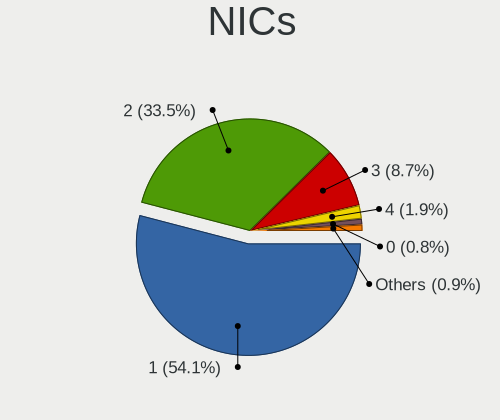

| Total | Desktops | Percent |
|-------|----------|---------|
| 1     | 585      | 54.07%  |
| 2     | 363      | 33.55%  |
| 3     | 94       | 8.69%   |
| 4     | 21       | 1.94%   |
| 0     | 9        | 0.83%   |
| 5     | 6        | 0.55%   |
| 6     | 3        | 0.28%   |
| 7     | 1        | 0.09%   |

IPv6
----

IPv6 vs IPv4

| Used | Desktops | Percent |
|------|----------|---------|
| No   | 828      | 75.55%  |
| Yes  | 268      | 24.45%  |

Bluetooth
---------

Bluetooth Vendor
----------------

Controller vendors

| Vendor                          | Desktops | Percent |
|---------------------------------|----------|---------|
| Intel                           | 188      | 45.63%  |
| Cambridge Silicon Radio         | 67       | 16.26%  |
| ASUSTek Computer                | 41       | 9.95%   |
| Realtek Semiconductor           | 23       | 5.58%   |
| MediaTek                        | 17       | 4.13%   |
| IMC Networks                    | 17       | 4.13%   |
| Qualcomm Atheros Communications | 12       | 2.91%   |
| Foxconn / Hon Hai               | 10       | 2.43%   |
| Apple                           | 10       | 2.43%   |
| Broadcom                        | 8        | 1.94%   |
| Lite-On Technology              | 4        | 0.97%   |
| Edimax Technology               | 4        | 0.97%   |
| TP-Link                         | 3        | 0.73%   |
| Micro Star International        | 2        | 0.49%   |
| Realtek                         | 1        | 0.24%   |
| Nordic Semiconductor ASA        | 1        | 0.24%   |
| Logitech                        | 1        | 0.24%   |
| Integrated System Solution      | 1        | 0.24%   |
| Dell                            | 1        | 0.24%   |
| Unknown                         | 1        | 0.24%   |

Bluetooth Model
---------------

Controller models

| Model                                                   | Desktops | Percent |
|---------------------------------------------------------|----------|---------|
| Cambridge Silicon Radio Bluetooth Dongle (HCI mode)     | 67       | 16.26%  |
| Intel AX200 Bluetooth                                   | 64       | 15.53%  |
| Intel Bluetooth wireless interface                      | 30       | 7.28%   |
| Intel AX201 Bluetooth                                   | 23       | 5.58%   |
| Intel AX211 Bluetooth                                   | 19       | 4.61%   |
| MediaTek Wireless_Device                                | 17       | 4.13%   |
| Intel Wireless-AC 3168 Bluetooth                        | 15       | 3.64%   |
| Realtek Bluetooth Radio                                 | 14       | 3.4%    |
| ASUS ASUS USB-BT500                                     | 13       | 3.16%   |
| Intel Wireless-AC 9260 Bluetooth Adapter                | 12       | 2.91%   |
| Intel Bluetooth 9460/9560 Jefferson Peak (JfP)          | 11       | 2.67%   |
| Intel AX210 Bluetooth                                   | 11       | 2.67%   |
| IMC Networks Bluetooth Radio                            | 10       | 2.43%   |
| Foxconn / Hon Hai Wireless_Device                       | 9        | 2.18%   |
| ASUS Broadcom BCM20702A0 Bluetooth                      | 8        | 1.94%   |
| Broadcom BCM20702A0 Bluetooth 4.0                       | 7        | 1.7%    |
| Apple Built-in Bluetooth 2.0+EDR HCI                    | 7        | 1.7%    |
| IMC Networks Wireless_Device                            | 6        | 1.46%   |
| ASUS Qualcomm Bluetooth 4.1                             | 5        | 1.21%   |
| ASUS Bluetooth Device                                   | 5        | 1.21%   |
| ASUS BCM20702A0                                         | 5        | 1.21%   |
| Realtek  Bluetooth 4.2 Adapter                          | 4        | 0.97%   |
| Qualcomm Atheros AR3011 Bluetooth                       | 4        | 0.97%   |
| TP-Link TP-Link Bluetooth USB Adapter                   | 3        | 0.73%   |
| Qualcomm Atheros  Bluetooth Device                      | 3        | 0.73%   |
| Intel Centrino Bluetooth Wireless Transceiver           | 3        | 0.73%   |
| ASUS Bluetooth Radio                                    | 3        | 0.73%   |
| Realtek 802.11ac WLAN Adapter                           | 2        | 0.49%   |
| Qualcomm Atheros QCA61x4 Bluetooth 4.0                  | 2        | 0.49%   |
| Micro Star International Bluetooth Device               | 2        | 0.49%   |
| Lite-On Qualcomm Atheros QCA9377 Bluetooth              | 2        | 0.49%   |
| Edimax EW-7611ULB 802.11b/g/n and Bluetooth 4.0 Adapter | 2        | 0.49%   |
| Apple Bluetooth Host Controller                         | 2        | 0.49%   |
| Realtek RTL8822BE Bluetooth 4.2 Adapter                 | 1        | 0.24%   |
| Realtek RTL8821A Bluetooth                              | 1        | 0.24%   |
| Realtek Bluetooth 5.3 Radio                             | 1        | 0.24%   |
| Realtek Bluetooth Radio                                 | 1        | 0.24%   |
| Qualcomm Atheros Bluetooth USB Host Controller          | 1        | 0.24%   |
| Qualcomm Atheros AR9462 Bluetooth                       | 1        | 0.24%   |
| Qualcomm Atheros AR3012 Bluetooth 4.0                   | 1        | 0.24%   |

Sound
-----

Sound Vendor
------------

Sound card vendors

| Vendor                    | Desktops | Percent |
|---------------------------|----------|---------|
| Intel                     | 683      | 35.85%  |
| Nvidia                    | 515      | 27.03%  |
| AMD                       | 417      | 21.89%  |
| C-Media Electronics       | 33       | 1.73%   |
| Logitech                  | 29       | 1.52%   |
| ASUSTek Computer          | 28       | 1.47%   |
| GN Netcom                 | 24       | 1.26%   |
| Creative Labs             | 17       | 0.89%   |
| SteelSeries ApS           | 10       | 0.52%   |
| Kingston Technology       | 8        | 0.42%   |
| Plantronics               | 7        | 0.37%   |
| Micro Star International  | 7        | 0.37%   |
| Samson Technologies       | 6        | 0.31%   |
| Razer USA                 | 6        | 0.31%   |
| Creative Technology       | 6        | 0.31%   |
| Texas Instruments         | 5        | 0.26%   |
| RODE Microphones          | 5        | 0.26%   |
| Focusrite-Novation        | 5        | 0.26%   |
| Apple                     | 5        | 0.26%   |
| Sony                      | 4        | 0.21%   |
| DSEA A/S                  | 4        | 0.21%   |
| Astro Gaming              | 4        | 0.21%   |
| XMOS                      | 3        | 0.16%   |
| Tenx Technology           | 3        | 0.16%   |
| Roland                    | 3        | 0.16%   |
| JMTek                     | 3        | 0.16%   |
| Giga-Byte Technology      | 3        | 0.16%   |
| Elgato Systems            | 3        | 0.16%   |
| Corsair                   | 3        | 0.16%   |
| BEHRINGER International   | 3        | 0.16%   |
| Yamaha                    | 2        | 0.1%    |
| TerraTec Electronic       | 2        | 0.1%    |
| Sennheiser Communications | 2        | 0.1%    |
| ROCCAT                    | 2        | 0.1%    |
| JBL                       | 2        | 0.1%    |
| GYROCOM C&C               | 2        | 0.1%    |
| Generalplus Technology    | 2        | 0.1%    |
| Dell                      | 2        | 0.1%    |
| Blue Microphones          | 2        | 0.1%    |
| ASRock                    | 2        | 0.1%    |

Sound Model
-----------

Sound card models

| Model                                                                      | Desktops | Percent |
|----------------------------------------------------------------------------|----------|---------|
| AMD Starship/Matisse HD Audio Controller                                   | 147      | 6.71%   |
| Intel 8 Series/C220 Series Chipset High Definition Audio Controller        | 78       | 3.56%   |
| Intel 100 Series/C230 Series Chipset Family HD Audio Controller            | 69       | 3.15%   |
| Intel 7 Series/C216 Chipset Family High Definition Audio Controller        | 65       | 2.97%   |
| Intel 200 Series PCH HD Audio                                              | 64       | 2.92%   |
| Intel 6 Series/C200 Series Chipset Family High Definition Audio Controller | 55       | 2.51%   |
| AMD Family 17h/19h/1ah HD Audio Controller                                 | 55       | 2.51%   |
| AMD Family 17h (Models 00h-0fh) HD Audio Controller                        | 55       | 2.51%   |
| Intel Xeon E3-1200 v3/4th Gen Core Processor HD Audio Controller           | 53       | 2.42%   |
| AMD Ellesmere HDMI Audio [Radeon RX 470/480 / 570/580/590]                 | 51       | 2.33%   |
| Nvidia GP107GL High Definition Audio Controller                            | 43       | 1.96%   |
| Intel Cannon Lake PCH cAVS                                                 | 42       | 1.92%   |
| Nvidia GA104 High Definition Audio Controller                              | 39       | 1.78%   |
| AMD SBx00 Azalia (Intel HDA)                                               | 36       | 1.64%   |
| Intel 82801JI (ICH10 Family) HD Audio Controller                           | 33       | 1.51%   |
| AMD Navi 21/23 HDMI/DP Audio Controller                                    | 33       | 1.51%   |
| Nvidia GP102 HDMI Audio Controller                                         | 31       | 1.42%   |
| Intel Tiger Lake-H HD Audio Controller                                     | 31       | 1.42%   |
| Nvidia GK107 HDMI Audio Controller                                         | 30       | 1.37%   |
| Intel 9 Series Chipset Family HD Audio Controller                          | 30       | 1.37%   |
| Nvidia GA102 High Definition Audio Controller                              | 29       | 1.32%   |
| Nvidia GP106 High Definition Audio Controller                              | 28       | 1.28%   |
| Nvidia GP104 High Definition Audio Controller                              | 28       | 1.28%   |
| Nvidia GK208 HDMI/DP Audio Controller                                      | 28       | 1.28%   |
| Intel C610/X99 series chipset HD Audio Controller                          | 27       | 1.23%   |
| Intel 5 Series/3400 Series Chipset High Definition Audio                   | 27       | 1.23%   |
| AMD Rembrandt Radeon High Definition Audio Controller                      | 26       | 1.19%   |
| Intel C600/X79 series chipset High Definition Audio Controller             | 24       | 1.1%    |
| Intel Alder Lake-S HD Audio Controller                                     | 24       | 1.1%    |
| AMD Oland/Hainan/Cape Verde/Pitcairn HDMI Audio [Radeon HD 7000 Series]    | 23       | 1.05%   |
| Nvidia GK104 HDMI Audio Controller                                         | 22       | 1%      |
| Nvidia GF119 HDMI Audio Controller                                         | 22       | 1%      |
| ASUSTek Computer USB Audio                                                 | 22       | 1%      |
| AMD Baffin HDMI/DP Audio [Radeon RX 550 640SP / RX 560/560X]               | 21       | 0.96%   |
| AMD Navi 10 HDMI Audio                                                     | 19       | 0.87%   |
| AMD Renoir Radeon High Definition Audio Controller                         | 17       | 0.78%   |
| AMD FCH Azalia Controller                                                  | 17       | 0.78%   |
| Nvidia TU106 High Definition Audio Controller                              | 16       | 0.73%   |
| Nvidia GM204 High Definition Audio Controller                              | 16       | 0.73%   |
| Nvidia GM107 High Definition Audio Controller [GeForce 940MX]              | 16       | 0.73%   |

Memory
------

Memory Vendor
-------------

Memory module vendors

| Vendor                                  | Desktops | Percent |
|-----------------------------------------|----------|---------|
| Kingston                                | 192      | 26.27%  |
| Corsair                                 | 172      | 23.53%  |
| Samsung Electronics                     | 81       | 11.08%  |
| SK hynix                                | 71       | 9.71%   |
| Unknown                                 | 55       | 7.52%   |
| G.Skill                                 | 49       | 6.7%    |
| Crucial                                 | 38       | 5.2%    |
| Micron Technology                       | 33       | 4.51%   |
| Patriot                                 | 5        | 0.68%   |
| Elpida                                  | 3        | 0.41%   |
| Avant                                   | 3        | 0.41%   |
| Unknown                                 | 3        | 0.41%   |
| Unknown (0x9801)                        | 2        | 0.27%   |
| Nanya Technology                        | 2        | 0.27%   |
| Kingmax                                 | 2        | 0.27%   |
| Hewlett-Packard                         | 2        | 0.27%   |
| Apacer                                  | 2        | 0.27%   |
| A-DATA Technology                       | 2        | 0.27%   |
| Unknown (ABCD)                          | 1        | 0.14%   |
| Unifosa                                 | 1        | 0.14%   |
| Team                                    | 1        | 0.14%   |
| Smart                                   | 1        | 0.14%   |
| Silicon Power Computer & Communications | 1        | 0.14%   |
| Ramaxel Technology                      | 1        | 0.14%   |
| Princeton                               | 1        | 0.14%   |
| Patriot Memory                          | 1        | 0.14%   |
| OCZ                                     | 1        | 0.14%   |
| Lexar                                   | 1        | 0.14%   |
| KANMEIQi                                | 1        | 0.14%   |
| G-Alantic                               | 1        | 0.14%   |
| Advantech                               | 1        | 0.14%   |
| 48spaces                                | 1        | 0.14%   |

Memory Model
------------

Memory module models

| Model                                                  | Desktops | Percent |
|--------------------------------------------------------|----------|---------|
| Corsair RAM CMK32GX4M2B3200C16 16GB DIMM DDR4 3800MT/s | 15       | 1.88%   |
| Kingston RAM 9905734-415.A00G 16GB DIMM DDR4 3200MT/s  | 14       | 1.76%   |
| Kingston RAM 9905734-016.A00G 16GB DIMM DDR4 3200MT/s  | 9        | 1.13%   |
| Corsair RAM CMK16GX4M2B3200C16 8GB DIMM DDR4 3600MT/s  | 9        | 1.13%   |
| Corsair RAM CMK16GX4M2B3000C15 8GB DIMM DDR4 3600MT/s  | 8        | 1%      |
| Corsair RAM CM4X16GC3000C16K4D 16GB DIMM DDR4 3000MT/s | 8        | 1%      |
| Corsair RAM CMK32GX4M2B3000C15 16GB DIMM DDR4 3000MT/s | 7        | 0.88%   |
| Kingston RAM KF556C40-32 32GB DIMM DDR5 5808MT/s       | 6        | 0.75%   |
| Corsair RAM CMK64GX4M2E3200C16 32GB DIMM DDR4 3600MT/s | 6        | 0.75%   |
| Corsair RAM CMK32GX4M2D3600C18 16GB DIMM DDR4 3800MT/s | 6        | 0.75%   |
| Corsair RAM CMK32GX4M2A2666C16 16GB DIMM DDR4 3100MT/s | 6        | 0.75%   |
| Samsung RAM M378A1K43CB2-CTD 8GB DIMM DDR4 3266MT/s    | 5        | 0.63%   |
| Kingston RAM KF3200C16D4/32GX 32GB DIMM DDR4 3933MT/s  | 5        | 0.63%   |
| Kingston RAM 99U5471-020.A00LF 4GB DIMM DDR3 1600MT/s  | 5        | 0.63%   |
| Crucial RAM BLS8G3D1609DS1S00. 8GB DIMM DDR3 1800MT/s  | 5        | 0.63%   |
| Corsair RAM CMK64GX5M2B5600C40 32GB DIMM DDR5 5600MT/s | 5        | 0.63%   |
| Corsair RAM CM4X16GC3000C16K8 16GB DIMM DDR4 3000MT/s  | 5        | 0.63%   |
| Unknown RAM Module 4096MB DIMM DDR3 1333MT/s           | 4        | 0.5%    |
| SK hynix RAM HMA81GU6AFR8N-UH 8GB DIMM DDR4 2400MT/s   | 4        | 0.5%    |
| SK hynix RAM HMA41GU6AFR8N-TF 8GB DIMM DDR4 2465MT/s   | 4        | 0.5%    |
| Samsung RAM Module 8GB DIMM DDR4 2666MT/s              | 4        | 0.5%    |
| Samsung RAM M378B5173QH0-CK0 4GB DIMM DDR3 1600MT/s    | 4        | 0.5%    |
| Samsung RAM M378A1K43CB2-CRC 8GB DIMM DDR4 3500MT/s    | 4        | 0.5%    |
| Kingston RAM Module 4096MB DIMM DDR3 1333MT/s          | 4        | 0.5%    |
| Kingston RAM Module 2048MB DIMM DDR3 1333MT/s          | 4        | 0.5%    |
| Kingston RAM KHX3200C16D4/8GX 8GB DIMM DDR4 3733MT/s   | 4        | 0.5%    |
| Kingston RAM KHX2133C14/8G 8GB DIMM DDR4 2666MT/s      | 4        | 0.5%    |
| Kingston RAM 99U5471-037.A00LF 8GB DIMM DDR3 1600MT/s  | 4        | 0.5%    |
| G.Skill RAM F4-3600C17-16GTZR 16GB DIMM DDR4 3666MT/s  | 4        | 0.5%    |
| Corsair RAM CMW32GX4M2D3600C18 16GB DIMM DDR4 3600MT/s | 4        | 0.5%    |
| Unknown RAM Module 4GB DIMM 1333MT/s                   | 3        | 0.38%   |
| Unknown RAM Module 4096MB DIMM 1333MT/s                | 3        | 0.38%   |
| Unknown RAM Module 2048MB DIMM DDR2 800MT/s            | 3        | 0.38%   |
| Unknown RAM Module 2048MB DIMM 1066MT/s                | 3        | 0.38%   |
| SK hynix RAM Module 8GB DIMM DDR3 1600MT/s             | 3        | 0.38%   |
| SK hynix RAM Module 16GB DIMM DDR4 3200MT/s            | 3        | 0.38%   |
| Samsung RAM M378B5273CH0-CK0 4GB DIMM DDR3 2000MT/s    | 3        | 0.38%   |
| Samsung RAM M378B1G73QH0-CK0 8GB DIMM DDR3 1600MT/s    | 3        | 0.38%   |
| Samsung RAM M378A1G43EB1-CPB 8192MB DIMM DDR4 2667MT/s | 3        | 0.38%   |
| Micron RAM 18ASF1G72PZ-2G1A2 8GB RIMM DDR4 2133MT/s    | 3        | 0.38%   |

Memory Kind
-----------

Memory module kinds

| Kind    | Desktops | Percent |
|---------|----------|---------|
| DDR4    | 391      | 56.42%  |
| DDR3    | 204      | 29.44%  |
| DDR5    | 34       | 4.91%   |
| Unknown | 27       | 3.9%    |
| DDR2    | 19       | 2.74%   |
| SDRAM   | 12       | 1.73%   |
| DDR     | 4        | 0.58%   |
| LPDDR4  | 1        | 0.14%   |
| DRAM    | 1        | 0.14%   |

Memory Form Factor
------------------

Physical design of the memory module

| Name    | Desktops | Percent |
|---------|----------|---------|
| DIMM    | 627      | 91.27%  |
| SODIMM  | 51       | 7.42%   |
| RIMM    | 8        | 1.16%   |
| Unknown | 1        | 0.15%   |

Memory Size
-----------

Memory module size

| Size  | Desktops | Percent |
|-------|----------|---------|
| 8192  | 252      | 34.9%   |
| 16384 | 212      | 29.36%  |
| 4096  | 128      | 17.73%  |
| 32768 | 62       | 8.59%   |
| 2048  | 55       | 7.62%   |
| 1024  | 11       | 1.52%   |
| 49152 | 2        | 0.28%   |

Memory Speed
------------

Memory module speed

| Speed | Desktops | Percent |
|-------|----------|---------|
| 1600  | 116      | 15.63%  |
| 3200  | 91       | 12.26%  |
| 1333  | 69       | 9.3%    |
| 3600  | 50       | 6.74%   |
| 2667  | 45       | 6.06%   |
| 2133  | 44       | 5.93%   |
| 2400  | 41       | 5.53%   |
| 3000  | 30       | 4.04%   |
| 3800  | 29       | 3.91%   |
| 2666  | 22       | 2.96%   |
| 800   | 17       | 2.29%   |
| 1866  | 12       | 1.62%   |
| 3400  | 11       | 1.48%   |
| 4800  | 10       | 1.35%   |
| 6000  | 8        | 1.08%   |
| 5600  | 8        | 1.08%   |
| 3733  | 8        | 1.08%   |
| 2933  | 8        | 1.08%   |
| 1867  | 8        | 1.08%   |
| 1066  | 8        | 1.08%   |
| 3266  | 7        | 0.94%   |
| 3100  | 7        | 0.94%   |
| 1800  | 7        | 0.94%   |
| 667   | 7        | 0.94%   |
| 5808  | 6        | 0.81%   |
| 2000  | 6        | 0.81%   |
| 4000  | 5        | 0.67%   |
| 3933  | 5        | 0.67%   |
| 1334  | 5        | 0.67%   |
| 3666  | 4        | 0.54%   |
| 3500  | 4        | 0.54%   |
| 3466  | 4        | 0.54%   |
| 2465  | 4        | 0.54%   |
| 3534  | 3        | 0.4%    |
| 6400  | 2        | 0.27%   |
| 5200  | 2        | 0.27%   |
| 3866  | 2        | 0.27%   |
| 3334  | 2        | 0.27%   |
| 3066  | 2        | 0.27%   |
| 2800  | 2        | 0.27%   |

Printers & scanners
-------------------

Printer Vendor
--------------

Printer device vendors

| Vendor                   | Desktops | Percent |
|--------------------------|----------|---------|
| Hewlett-Packard          | 27       | 45%     |
| Brother Industries       | 13       | 21.67%  |
| Canon                    | 5        | 8.33%   |
| STMicroelectronics       | 4        | 6.67%   |
| Samsung Electronics      | 4        | 6.67%   |
| Seiko Epson              | 3        | 5%      |
| Zhuhai Poskey Technology | 1        | 1.67%   |
| Prolific Technology      | 1        | 1.67%   |
| Oki Data                 | 1        | 1.67%   |
| Dymo-CoStar              | 1        | 1.67%   |

Printer Model
-------------

Printer device models

| Model                                                      | Desktops | Percent |
|------------------------------------------------------------|----------|---------|
| STMicroelectronics LED badge -- mini LED display -- 11x44  | 4        | 6.67%   |
| Seiko Epson ET-2820 Series                                 | 2        | 3.33%   |
| Samsung C48x Series Color Laser Multifunction Printer      | 2        | 3.33%   |
| HP OfficeJet Pro 7730 series                               | 2        | 3.33%   |
| HP OfficeJet 6950                                          | 2        | 3.33%   |
| HP LaserJet Pro M148f-M149f                                | 2        | 3.33%   |
| HP LaserJet P1102                                          | 2        | 3.33%   |
| HP LaserJet 3020                                           | 2        | 3.33%   |
| HP ENVY 5540 series                                        | 2        | 3.33%   |
| HP Deskjet 2540 series                                     | 2        | 3.33%   |
| Brother Printer                                            | 2        | 3.33%   |
| Brother DCP-7030                                           | 2        | 3.33%   |
| Zhuhai Poskey Printer                                      | 1        | 1.67%   |
| Seiko Epson ET-4750 [WorkForce ET-4750 EcoTank All-in-One] | 1        | 1.67%   |
| Samsung M337x 387x 407x Series                             | 1        | 1.67%   |
| Samsung M332x 382x 402x Series                             | 1        | 1.67%   |
| Prolific PL2305 Parallel Port                              | 1        | 1.67%   |
| Oki Data USB Device                                        | 1        | 1.67%   |
| HP Smart Tank Plus 550 series                              | 1        | 1.67%   |
| HP Smart Tank 7000 series                                  | 1        | 1.67%   |
| HP Officejet 4630 series                                   | 1        | 1.67%   |
| HP LaserJet Pro M148-M149                                  | 1        | 1.67%   |
| HP LaserJet P3010 Series                                   | 1        | 1.67%   |
| HP LaserJet P2055 series                                   | 1        | 1.67%   |
| HP LaserJet 3050                                           | 1        | 1.67%   |
| HP LaserJet 1320                                           | 1        | 1.67%   |
| HP LaserJet 1020                                           | 1        | 1.67%   |
| HP ENVY Photo 7800 series                                  | 1        | 1.67%   |
| HP ENVY 6400 series                                        | 1        | 1.67%   |
| HP ENVY 4520 series                                        | 1        | 1.67%   |
| HP DeskJet F2100 Printer series                            | 1        | 1.67%   |
| Dymo-CoStar LabelWriter 450                                | 1        | 1.67%   |
| Canon TS3300 series                                        | 1        | 1.67%   |
| Canon TR4500 series                                        | 1        | 1.67%   |
| Canon PIXMA MX450 Series                                   | 1        | 1.67%   |
| Canon iP7200 series                                        | 1        | 1.67%   |
| Canon G6000 series                                         | 1        | 1.67%   |
| Brother MFC-9320CW                                         | 1        | 1.67%   |
| Brother MFC Composite Device                               | 1        | 1.67%   |
| Brother HL-L2360D series                                   | 1        | 1.67%   |

Scanner Vendor
--------------

Scanner device vendors

| Vendor          | Desktops | Percent |
|-----------------|----------|---------|
| Canon           | 7        | 53.85%  |
| Seiko Epson     | 3        | 23.08%  |
| Hewlett-Packard | 2        | 15.38%  |
| Fujitsu         | 1        | 7.69%   |

Scanner Model
-------------

Scanner device models

| Model                                                         | Desktops | Percent |
|---------------------------------------------------------------|----------|---------|
| Canon CanoScan LiDE 220                                       | 2        | 15.38%  |
| Seiko Epson GT-X800 [Perfection 4990 PHOTO]                   | 1        | 7.69%   |
| Seiko Epson GT-F720 [GT-S620/Perfection V30/V300 Photo]       | 1        | 7.69%   |
| Seiko Epson GT-8700/GT-8700F [Perfection 1640SU/1640SU PHOTO] | 1        | 7.69%   |
| HP ScanJet 4070 PhotoSmart                                    | 1        | 7.69%   |
| HP ScanJet 2400c                                              | 1        | 7.69%   |
| Fujitsu ScanSnap SV600                                        | 1        | 7.69%   |
| Canon CanoScan N670U/N676U/LiDE 20                            | 1        | 7.69%   |
| Canon CanoScan N650U/N656U                                    | 1        | 7.69%   |
| Canon CanoScan LIDE 25                                        | 1        | 7.69%   |
| Canon CanoScan LiDE 210                                       | 1        | 7.69%   |
| Canon CanoScan LiDE 100                                       | 1        | 7.69%   |

Camera
------

Camera Vendor
-------------

Camera device vendors

| Vendor                        | Desktops | Percent |
|-------------------------------|----------|---------|
| Logitech                      | 90       | 48.13%  |
| Microdia                      | 13       | 6.95%   |
| Apple                         | 11       | 5.88%   |
| Sunplus Innovation Technology | 10       | 5.35%   |
| Microsoft                     | 9        | 4.81%   |
| Samsung Electronics           | 6        | 3.21%   |
| Chicony Electronics           | 6        | 3.21%   |
| Z-Star Microelectronics       | 4        | 2.14%   |
| Realtek Semiconductor         | 3        | 1.6%    |
| KYE Systems (Mouse Systems)   | 3        | 1.6%    |
| Xiaomi                        | 2        | 1.07%   |
| MacroSilicon                  | 2        | 1.07%   |
| Generalplus Technology        | 2        | 1.07%   |
| Creative Technology           | 2        | 1.07%   |
| YGTek                         | 1        | 0.53%   |
| Trust                         | 1        | 0.53%   |
| Tobii Technology AB           | 1        | 0.53%   |
| Sung Forn                     | 1        | 0.53%   |
| Sonix Technology              | 1        | 0.53%   |
| Remo Tech                     | 1        | 0.53%   |
| Magewell                      | 1        | 0.53%   |
| Lenovo                        | 1        | 0.53%   |
| LeCroy                        | 1        | 0.53%   |
| IPEVO                         | 1        | 0.53%   |
| Intel                         | 1        | 0.53%   |
| IMC Networks                  | 1        | 0.53%   |
| Huawei Technologies           | 1        | 0.53%   |
| HD Camera Manufacturer        | 1        | 0.53%   |
| Google                        | 1        | 0.53%   |
| Fujitsu                       | 1        | 0.53%   |
| Dell                          | 1        | 0.53%   |
| Aveo Technology               | 1        | 0.53%   |
| ASUSTek Computer              | 1        | 0.53%   |
| Anker PowerConf C200          | 1        | 0.53%   |
| Acer                          | 1        | 0.53%   |
| A4Tech                        | 1        | 0.53%   |
| 2M UVC CAMERA                 | 1        | 0.53%   |
| Unknown                       | 1        | 0.53%   |

Camera Model
------------

Camera device models

| Model                                      | Desktops | Percent |
|--------------------------------------------|----------|---------|
| Logitech HD Pro Webcam C920                | 19       | 10.11%  |
| Logitech Webcam C270                       | 18       | 9.57%   |
| Apple iPhone 5/5C/5S/6/SE/7/8/X/XR         | 7        | 3.72%   |
| Samsung Galaxy series, misc. (MTP mode)    | 6        | 3.19%   |
| Logitech HD Webcam C615                    | 6        | 3.19%   |
| Logitech HD Webcam C525                    | 6        | 3.19%   |
| Logitech Webcam C930e                      | 5        | 2.66%   |
| Logitech BRIO Ultra HD Webcam              | 5        | 2.66%   |
| Sunplus SPCA2281 Web Camera                | 4        | 2.13%   |
| Microsoft LifeCam HD-3000                  | 4        | 2.13%   |
| Logitech StreamCam                         | 4        | 2.13%   |
| Logitech C922 Pro Stream Webcam            | 4        | 2.13%   |
| Microdia AUKEY-W1                          | 3        | 1.6%    |
| Logitech QuickCam Pro for Notebooks        | 3        | 1.6%    |
| Logitech QuickCam Pro 9000                 | 3        | 1.6%    |
| KYE Systems (Mouse Systems) PC-LM1E Camera | 3        | 1.6%    |
| Apple iSight in LED Cinema Display         | 3        | 1.6%    |
| Z-Star WebCam SC-03FFL11739P               | 2        | 1.06%   |
| Xiaomi MI 9                                | 2        | 1.06%   |
| Sunplus USB Camera                         | 2        | 1.06%   |
| Sunplus DICOTA 4K                          | 2        | 1.06%   |
| Realtek FULL HD 1080P Webcam               | 2        | 1.06%   |
| Microsoft LifeCam Cinema                   | 2        | 1.06%   |
| Microdia USB 2.0 Camera                    | 2        | 1.06%   |
| Microdia Streaming Camera W8GS             | 2        | 1.06%   |
| Microdia Camera                            | 2        | 1.06%   |
| MacroSilicon USB Video                     | 2        | 1.06%   |
| Logitech Webcam Pro 9000                   | 2        | 1.06%   |
| Logitech Webcam B500                       | 2        | 1.06%   |
| Generalplus GENERAL WEBCAM                 | 2        | 1.06%   |
| Creative Live! Cam Chat HD [VF0700]        | 2        | 1.06%   |
| Z-Star Proxima USB2.0 Camera               | 1        | 0.53%   |
| Z-Star Integrated Camera                   | 1        | 0.53%   |
| YGTek webcam                               | 1        | 0.53%   |
| Trust Trust Full HD Webcam                 | 1        | 0.53%   |
| Tobii AB EyeChip                           | 1        | 0.53%   |
| Sunplus Sandberg USB Webcam Pro            | 1        | 0.53%   |
| Sunplus FULL HD webcam                     | 1        | 0.53%   |
| Sung Forn USB 2.0 PC Camera                | 1        | 0.53%   |
| Sonix QHD Webcam                           | 1        | 0.53%   |

Security
--------

Fingerprint Vendor
------------------

Fingerprint sensor vendors

| Vendor                | Desktops | Percent |
|-----------------------|----------|---------|
| LighTuning Technology | 1        | 100%    |

Fingerprint Model
-----------------

Fingerprint sensor models

| Model                         | Desktops | Percent |
|-------------------------------|----------|---------|
| LighTuning Fingerprint Sensor | 1        | 100%    |

Chipcard Vendor
---------------

Chipcard module vendors

| Vendor                | Desktops | Percent |
|-----------------------|----------|---------|
| Alcor Micro           | 3        | 37.5%   |
| Yubico.com            | 2        | 25%     |
| Clay Logic            | 1        | 12.5%   |
| Bit4id                | 1        | 12.5%   |
| Advanced Card Systems | 1        | 12.5%   |

Chipcard Model
--------------

Chipcard module models

| Model                               | Desktops | Percent |
|-------------------------------------|----------|---------|
| Alcor Micro AU9540 Smartcard Reader | 3        | 37.5%   |
| Yubico.com Yubikey NEO(-N) OTP+CCID | 1        | 12.5%   |
| Yubico.com Yubikey 4/5 U2F+CCID     | 1        | 12.5%   |
| Clay Logic Nitrokey Start           | 1        | 12.5%   |
| Bit4id miniLector-s                 | 1        | 12.5%   |
| Advanced Card Systems ACR122U       | 1        | 12.5%   |

Unsupported
-----------

Unsupported Devices
-------------------

Total unsupported devices on board

| Total | Desktops | Percent |
|-------|----------|---------|
| 0     | 905      | 82.27%  |
| 1     | 159      | 14.45%  |
| 2     | 23       | 2.09%   |
| 3     | 5        | 0.45%   |
| 6     | 3        | 0.27%   |
| 4     | 3        | 0.27%   |
| 5     | 2        | 0.18%   |

Unsupported Device Types
------------------------

Types of unsupported devices

| Type                     | Desktops | Percent |
|--------------------------|----------|---------|
| Graphics card            | 70       | 29.91%  |
| Net/wireless             | 55       | 23.5%   |
| Unassigned class         | 31       | 13.25%  |
| Sound                    | 15       | 6.41%   |
| Communication controller | 12       | 5.13%   |
| Multimedia controller    | 10       | 4.27%   |
| Storage/raid             | 8        | 3.42%   |
| Bluetooth                | 8        | 3.42%   |
| Camera                   | 7        | 2.99%   |
| Net/ethernet             | 6        | 2.56%   |
| Network                  | 5        | 2.14%   |
| Chipcard                 | 3        | 1.28%   |
| Storage/nvme             | 1        | 0.43%   |
| Modem                    | 1        | 0.43%   |
| Firewire controller      | 1        | 0.43%   |
| Fingerprint reader       | 1        | 0.43%   |

