Linux in Switzerland - Tested Hardware & Statistics (Desktops)
--------------------------------------------------------------

A project to collect tested hardware configurations for Linux in Switzerland.

Anyone can contribute to this report by the [hw-probe](https://github.com/linuxhw/hw-probe) tool:

    sudo -E hw-probe -all -upload

Please contribute! Especially if your hardware is rare.

Contents
--------

* [ Test Cases ](#test-cases)

* [ System ](#system)
  - [ OS                       ](#os)
  - [ OS Family                ](#os-family)
  - [ Kernel                   ](#kernel)
  - [ Kernel Family            ](#kernel-family)
  - [ Kernel Major Ver.        ](#kernel-major-ver)
  - [ Arch                     ](#arch)
  - [ DE                       ](#de)
  - [ Display Server           ](#display-server)
  - [ Display Manager          ](#display-manager)
  - [ OS Lang                  ](#os-lang)
  - [ Boot Mode                ](#boot-mode)
  - [ Filesystem               ](#filesystem)
  - [ Part. scheme             ](#part-scheme)
  - [ Dual Boot with Linux/BSD ](#dual-boot-with-linuxbsd)
  - [ Dual Boot (Win)          ](#dual-boot-win)

* [ Board ](#board)
  - [ Vendor                   ](#vendor)
  - [ Model                    ](#model)
  - [ Model Family             ](#model-family)
  - [ MFG Year                 ](#mfg-year)
  - [ Form Factor              ](#form-factor)
  - [ Secure Boot              ](#secure-boot)
  - [ Coreboot                 ](#coreboot)
  - [ RAM Size                 ](#ram-size)
  - [ RAM Used                 ](#ram-used)
  - [ Total Drives             ](#total-drives)
  - [ Has CD-ROM               ](#has-cd-rom)
  - [ Has Ethernet             ](#has-ethernet)
  - [ Has WiFi                 ](#has-wifi)
  - [ Has Bluetooth            ](#has-bluetooth)

* [ Location ](#location)
  - [ Country                  ](#country)
  - [ City                     ](#city)

* [ Drives ](#drives)
  - [ Drive Vendor             ](#drive-vendor)
  - [ Drive Model              ](#drive-model)
  - [ HDD Vendor               ](#hdd-vendor)
  - [ SSD Vendor               ](#ssd-vendor)
  - [ Drive Kind               ](#drive-kind)
  - [ Drive Connector          ](#drive-connector)
  - [ Drive Size               ](#drive-size)
  - [ Space Total              ](#space-total)
  - [ Space Used               ](#space-used)
  - [ Malfunc. Drives          ](#malfunc-drives)
  - [ Malfunc. Drive Vendor    ](#malfunc-drive-vendor)
  - [ Malfunc. HDD Vendor      ](#malfunc-hdd-vendor)
  - [ Malfunc. Drive Kind      ](#malfunc-drive-kind)
  - [ Failed Drives            ](#failed-drives)
  - [ Failed Drive Vendor      ](#failed-drive-vendor)
  - [ Drive Status             ](#drive-status)

* [ Storage controller ](#storage-controller)
  - [ Storage Vendor           ](#storage-vendor)
  - [ Storage Model            ](#storage-model)
  - [ Storage Kind             ](#storage-kind)

* [ Processor ](#processor)
  - [ CPU Vendor               ](#cpu-vendor)
  - [ CPU Model                ](#cpu-model)
  - [ CPU Model Family         ](#cpu-model-family)
  - [ CPU Cores                ](#cpu-cores)
  - [ CPU Sockets              ](#cpu-sockets)
  - [ CPU Threads              ](#cpu-threads)
  - [ CPU Op-Modes             ](#cpu-op-modes)
  - [ CPU Microcode            ](#cpu-microcode)
  - [ CPU Microarch            ](#cpu-microarch)

* [ Graphics ](#graphics)
  - [ GPU Vendor               ](#gpu-vendor)
  - [ GPU Model                ](#gpu-model)
  - [ GPU Combo                ](#gpu-combo)
  - [ GPU Driver               ](#gpu-driver)
  - [ GPU Memory               ](#gpu-memory)

* [ Monitor ](#monitor)
  - [ Monitor Vendor           ](#monitor-vendor)
  - [ Monitor Model            ](#monitor-model)
  - [ Monitor Resolution       ](#monitor-resolution)
  - [ Monitor Diagonal         ](#monitor-diagonal)
  - [ Monitor Width            ](#monitor-width)
  - [ Aspect Ratio             ](#aspect-ratio)
  - [ Monitor Area             ](#monitor-area)
  - [ Pixel Density            ](#pixel-density)
  - [ Multiple Monitors        ](#multiple-monitors)

* [ Network ](#network)
  - [ Net Controller Vendor    ](#net-controller-vendor)
  - [ Net Controller Model     ](#net-controller-model)
  - [ Wireless Vendor          ](#wireless-vendor)
  - [ Wireless Model           ](#wireless-model)
  - [ Ethernet Vendor          ](#ethernet-vendor)
  - [ Ethernet Model           ](#ethernet-model)
  - [ Net Controller Kind      ](#net-controller-kind)
  - [ Used Controller          ](#used-controller)
  - [ NICs                     ](#nics)
  - [ IPv6                     ](#ipv6)

* [ Bluetooth ](#bluetooth)
  - [ Bluetooth Vendor         ](#bluetooth-vendor)
  - [ Bluetooth Model          ](#bluetooth-model)

* [ Sound ](#sound)
  - [ Sound Vendor             ](#sound-vendor)
  - [ Sound Model              ](#sound-model)

* [ Memory ](#memory)
  - [ Memory Vendor            ](#memory-vendor)
  - [ Memory Model             ](#memory-model)
  - [ Memory Kind              ](#memory-kind)
  - [ Memory Form Factor       ](#memory-form-factor)
  - [ Memory Size              ](#memory-size)
  - [ Memory Speed             ](#memory-speed)

* [ Printers & scanners ](#printers--scanners)
  - [ Printer Vendor           ](#printer-vendor)
  - [ Printer Model            ](#printer-model)
  - [ Scanner Vendor           ](#scanner-vendor)
  - [ Scanner Model            ](#scanner-model)

* [ Camera ](#camera)
  - [ Camera Vendor            ](#camera-vendor)
  - [ Camera Model             ](#camera-model)

* [ Security ](#security)
  - [ Fingerprint Vendor       ](#fingerprint-vendor)
  - [ Fingerprint Model        ](#fingerprint-model)
  - [ Chipcard Vendor          ](#chipcard-vendor)
  - [ Chipcard Model           ](#chipcard-model)

* [ Unsupported ](#unsupported)
  - [ Unsupported Devices      ](#unsupported-devices)
  - [ Unsupported Device Types ](#unsupported-device-types)

Test Cases
----------

Total: 1102

| Vendor        | Model                       | Probe                                                      | Date         |
|---------------|-----------------------------|------------------------------------------------------------|--------------|
| ASUSTek       | TUF Gaming B550-PLUS        | [8fc8fee94a](https://linux-hardware.org/?probe=8fc8fee94a) | Feb 27, 2023 |
| ASUSTek       | ROG STRIX X470-F GAMING     | [bea010d25e](https://linux-hardware.org/?probe=bea010d25e) | Feb 24, 2023 |
| ASUSTek       | ROG STRIX B560-A GAMING ... | [119e106d80](https://linux-hardware.org/?probe=119e106d80) | Feb 20, 2023 |
| ASUSTek       | ROG STRIX X570-E GAMING     | [576314ab03](https://linux-hardware.org/?probe=576314ab03) | Feb 20, 2023 |
| Gigabyte      | X99-Ultra Gaming-CF         | [031c13ea35](https://linux-hardware.org/?probe=031c13ea35) | Feb 19, 2023 |
| Gigabyte      | X79-UD3                     | [f8dfa838b7](https://linux-hardware.org/?probe=f8dfa838b7) | Feb 18, 2023 |
| Gigabyte      | H81M-H                      | [d773500fcb](https://linux-hardware.org/?probe=d773500fcb) | Feb 18, 2023 |
| Gigabyte      | Z170XP-SLI-CF               | [8338ee5a0d](https://linux-hardware.org/?probe=8338ee5a0d) | Feb 17, 2023 |
| ASUSTek       | ROG CROSSHAIR VIII HERO     | [92a61cd4ee](https://linux-hardware.org/?probe=92a61cd4ee) | Feb 16, 2023 |
| ASUSTek       | M4A89GTD-PRO/USB3           | [e927a19203](https://linux-hardware.org/?probe=e927a19203) | Feb 16, 2023 |
| HP            | 8653 A                      | [5854a10eb0](https://linux-hardware.org/?probe=5854a10eb0) | Feb 10, 2023 |
| ASUSTek       | ROG STRIX B450-F GAMING     | [e7fd395c49](https://linux-hardware.org/?probe=e7fd395c49) | Feb 05, 2023 |
| Fujitsu       | D3413-A1 S26361-D3413-A1    | [384a4f7da2](https://linux-hardware.org/?probe=384a4f7da2) | Feb 05, 2023 |
| HP            | 2B36                        | [dde1352d90](https://linux-hardware.org/?probe=dde1352d90) | Feb 05, 2023 |
| ASUSTek       | P8H77-M                     | [9e7d0b79cf](https://linux-hardware.org/?probe=9e7d0b79cf) | Feb 05, 2023 |
| Gigabyte      | H81M-H                      | [5dbc22fda8](https://linux-hardware.org/?probe=5dbc22fda8) | Feb 04, 2023 |
| Gigabyte      | H81M-H                      | [4626133ef2](https://linux-hardware.org/?probe=4626133ef2) | Feb 04, 2023 |
| Medion        | MS-7728                     | [60cf9e4948](https://linux-hardware.org/?probe=60cf9e4948) | Jan 31, 2023 |
| Dell          | 02YRK5 A02                  | [d6faeebd74](https://linux-hardware.org/?probe=d6faeebd74) | Jan 29, 2023 |
| ASUSTek       | TUF Gaming B550-PLUS        | [11b07d4e11](https://linux-hardware.org/?probe=11b07d4e11) | Jan 29, 2023 |
| ASUSTek       | ROG STRIX X670E-I GAMING... | [9d3e931cc1](https://linux-hardware.org/?probe=9d3e931cc1) | Jan 27, 2023 |
| ASUSTek       | M5A99X EVO                  | [14b3eb9a58](https://linux-hardware.org/?probe=14b3eb9a58) | Jan 25, 2023 |
| Gigabyte      | B550I AORUS PRO AX          | [b6afa43240](https://linux-hardware.org/?probe=b6afa43240) | Jan 24, 2023 |
| Gigabyte      | B550I AORUS PRO AX          | [141c9ffa73](https://linux-hardware.org/?probe=141c9ffa73) | Jan 24, 2023 |
| AZW           | GTR V02                     | [3616feeeac](https://linux-hardware.org/?probe=3616feeeac) | Jan 21, 2023 |
| Lenovo        | MAHOBAY Win8 Pro DPK TPG    | [0d70d03543](https://linux-hardware.org/?probe=0d70d03543) | Jan 21, 2023 |
| Medion        | MS-7728                     | [93d0aaac10](https://linux-hardware.org/?probe=93d0aaac10) | Jan 21, 2023 |
| Medion        | MS-7728                     | [eb9cef403c](https://linux-hardware.org/?probe=eb9cef403c) | Jan 21, 2023 |
| ASRock        | Z370 Pro4                   | [bf7bab9d7c](https://linux-hardware.org/?probe=bf7bab9d7c) | Jan 19, 2023 |
| ASRock        | Z370 Pro4                   | [e05b7e7729](https://linux-hardware.org/?probe=e05b7e7729) | Jan 19, 2023 |
| Medion        | MS-7728                     | [b5e3ddf859](https://linux-hardware.org/?probe=b5e3ddf859) | Jan 18, 2023 |
| Acer          | Veriton M2110G              | [7097a3cf90](https://linux-hardware.org/?probe=7097a3cf90) | Jan 18, 2023 |
| Acer          | Aspire M5910                | [d2d4e86b49](https://linux-hardware.org/?probe=d2d4e86b49) | Jan 17, 2023 |
| HP            | 212B                        | [00822b2263](https://linux-hardware.org/?probe=00822b2263) | Jan 16, 2023 |
| Medion        | MS-7728                     | [5168c2f916](https://linux-hardware.org/?probe=5168c2f916) | Jan 16, 2023 |
| AZW           | GTR V02                     | [074c3ab42f](https://linux-hardware.org/?probe=074c3ab42f) | Jan 14, 2023 |
| MSI           | B450 TOMAHAWK               | [ebb69311f7](https://linux-hardware.org/?probe=ebb69311f7) | Jan 14, 2023 |
| ELSKY         | QM10u                       | [c9bde314b5](https://linux-hardware.org/?probe=c9bde314b5) | Jan 11, 2023 |
| Gigabyte      | Z690 AORUS PRO              | [d014e736fc](https://linux-hardware.org/?probe=d014e736fc) | Jan 11, 2023 |
| Medion        | MS-7728                     | [8310cf0974](https://linux-hardware.org/?probe=8310cf0974) | Jan 10, 2023 |
| HP            | 3048h                       | [e13a2bdf6e](https://linux-hardware.org/?probe=e13a2bdf6e) | Jan 10, 2023 |
| HP            | 158A                        | [c0e1c9b6e6](https://linux-hardware.org/?probe=c0e1c9b6e6) | Jan 09, 2023 |
| AZW           | GTR V02                     | [b7a911ab61](https://linux-hardware.org/?probe=b7a911ab61) | Jan 09, 2023 |
| Lenovo        | 3733 SDK0T76461 WIN 3422... | [ac69fa3d31](https://linux-hardware.org/?probe=ac69fa3d31) | Jan 07, 2023 |
| ASUSTek       | P8H77-M PRO                 | [03524fa074](https://linux-hardware.org/?probe=03524fa074) | Jan 07, 2023 |
| MSI           | IONA                        | [8e49c8c0b1](https://linux-hardware.org/?probe=8e49c8c0b1) | Jan 06, 2023 |
| MSI           | IONA                        | [ca8adec17c](https://linux-hardware.org/?probe=ca8adec17c) | Jan 06, 2023 |
| Medion        | MS-7728                     | [4b3e96394b](https://linux-hardware.org/?probe=4b3e96394b) | Jan 06, 2023 |
| Medion        | MS-7728                     | [0ffef4911e](https://linux-hardware.org/?probe=0ffef4911e) | Jan 05, 2023 |
| Gigabyte      | Z690 UD DDR4                | [583ea447a9](https://linux-hardware.org/?probe=583ea447a9) | Jan 04, 2023 |
| ASUSTek       | ROG CROSSHAIR VIII HERO     | [8f519746c2](https://linux-hardware.org/?probe=8f519746c2) | Jan 04, 2023 |
| Medion        | MS-7728                     | [9c2439adf6](https://linux-hardware.org/?probe=9c2439adf6) | Jan 04, 2023 |
| ASUSTek       | P7H55-M PRO                 | [518b2272d4](https://linux-hardware.org/?probe=518b2272d4) | Jan 04, 2023 |
| Gigabyte      | GA-MA790FXT-UD5P            | [b341980e6c](https://linux-hardware.org/?probe=b341980e6c) | Jan 04, 2023 |
| ASUSTek       | Crosshair IV Formula        | [77ee14ad98](https://linux-hardware.org/?probe=77ee14ad98) | Dec 26, 2022 |
| ASUSTek       | Crosshair IV Formula        | [1c022f7ff8](https://linux-hardware.org/?probe=1c022f7ff8) | Dec 26, 2022 |
| ASUSTek       | TUF Gaming B560M-PLUS WI... | [8762b5f41f](https://linux-hardware.org/?probe=8762b5f41f) | Dec 25, 2022 |
| ASUSTek       | P7H55-M PRO                 | [b445490856](https://linux-hardware.org/?probe=b445490856) | Dec 25, 2022 |
| Gigabyte      | X570S I AORUS PRO AX        | [3f3c7b0e92](https://linux-hardware.org/?probe=3f3c7b0e92) | Dec 22, 2022 |
| Gigabyte      | GA-MA790FXT-UD5P            | [47397487a7](https://linux-hardware.org/?probe=47397487a7) | Dec 19, 2022 |
| Gigabyte      | GA-MA790FXT-UD5P            | [e954c9ca37](https://linux-hardware.org/?probe=e954c9ca37) | Dec 19, 2022 |
| Gigabyte      | P67A-D3-B3                  | [9ed715edc4](https://linux-hardware.org/?probe=9ed715edc4) | Dec 11, 2022 |
| Apple         | Mac-7BA5B2D9E42DDD94 iMa... | [6c26c9ff8c](https://linux-hardware.org/?probe=6c26c9ff8c) | Dec 10, 2022 |
| ASUSTek       | P8Z77-V LX                  | [d53608f3e3](https://linux-hardware.org/?probe=d53608f3e3) | Dec 10, 2022 |
| ASUSTek       | TUF B450-PRO GAMING         | [945412b0cc](https://linux-hardware.org/?probe=945412b0cc) | Dec 09, 2022 |
| BESSTAR Te... | B550                        | [5471ce4bdc](https://linux-hardware.org/?probe=5471ce4bdc) | Dec 07, 2022 |
| ASUSTek       | PRIME B350M-A               | [31ae5769eb](https://linux-hardware.org/?probe=31ae5769eb) | Dec 07, 2022 |
| Dell          | 0HN7XN A00                  | [f2ba8a7d55](https://linux-hardware.org/?probe=f2ba8a7d55) | Dec 06, 2022 |
| Dell          | 0HN7XN A00                  | [927991f54f](https://linux-hardware.org/?probe=927991f54f) | Dec 06, 2022 |
| Gigabyte      | Z690 AORUS PRO              | [ee9c9e919b](https://linux-hardware.org/?probe=ee9c9e919b) | Dec 05, 2022 |
| ASUSTek       | Maximus VII RANGER          | [9a0718a60f](https://linux-hardware.org/?probe=9a0718a60f) | Dec 04, 2022 |
| Fujitsu       | D3348-B2 S26361-D3348-B2    | [4568e83912](https://linux-hardware.org/?probe=4568e83912) | Dec 03, 2022 |
| Fujitsu       | D3348-B2 S26361-D3348-B2    | [2047a872cb](https://linux-hardware.org/?probe=2047a872cb) | Dec 03, 2022 |
| Gigabyte      | GA-MA790FXT-UD5P            | [13b2f864f8](https://linux-hardware.org/?probe=13b2f864f8) | Dec 02, 2022 |
| ASUSTek       | H81M-PLUS                   | [8d98938198](https://linux-hardware.org/?probe=8d98938198) | Nov 30, 2022 |
| Pegatron      | VIOLET                      | [f0f25e6854](https://linux-hardware.org/?probe=f0f25e6854) | Nov 28, 2022 |
| ASRock        | B550M Pro4                  | [3ba26453f1](https://linux-hardware.org/?probe=3ba26453f1) | Nov 24, 2022 |
| Fujitsu       | D3348-B2 S26361-D3348-B2    | [eabfad66da](https://linux-hardware.org/?probe=eabfad66da) | Nov 22, 2022 |
| ASUSTek       | P6T DELUXE                  | [54f10b9d0b](https://linux-hardware.org/?probe=54f10b9d0b) | Nov 21, 2022 |
| ASUSTek       | P6T DELUXE                  | [576ca67a28](https://linux-hardware.org/?probe=576ca67a28) | Nov 21, 2022 |
| ASUSTek       | P7H55-M PRO                 | [b25dd25478](https://linux-hardware.org/?probe=b25dd25478) | Nov 20, 2022 |
| HP            | 212B                        | [574a94ad86](https://linux-hardware.org/?probe=574a94ad86) | Nov 18, 2022 |
| HP            | 212B                        | [3995268826](https://linux-hardware.org/?probe=3995268826) | Nov 18, 2022 |
| ASUSTek       | Pro WS WRX80E-SAGE SE WI... | [b3e809f3d2](https://linux-hardware.org/?probe=b3e809f3d2) | Nov 17, 2022 |
| ASUSTek       | PRIME B350M-A               | [aabc2148da](https://linux-hardware.org/?probe=aabc2148da) | Nov 15, 2022 |
| ASUSTek       | ROG STRIX B550-E GAMING     | [2053688baa](https://linux-hardware.org/?probe=2053688baa) | Nov 14, 2022 |
| ASUSTek       | ROG STRIX B550-E GAMING     | [15f6c6a1aa](https://linux-hardware.org/?probe=15f6c6a1aa) | Nov 14, 2022 |
| ASUSTek       | P6T DELUXE                  | [3726e23d23](https://linux-hardware.org/?probe=3726e23d23) | Nov 14, 2022 |
| Alienware     | 07W25T A00                  | [f320cc2659](https://linux-hardware.org/?probe=f320cc2659) | Nov 11, 2022 |
| ASRock        | X570M Pro4                  | [581ff62688](https://linux-hardware.org/?probe=581ff62688) | Nov 07, 2022 |
| ASRock        | X570M Pro4                  | [a0a7ef6e3a](https://linux-hardware.org/?probe=a0a7ef6e3a) | Nov 07, 2022 |
| ASUSTek       | Z590 WIFI GUNDAM EDITION    | [74f8de9f71](https://linux-hardware.org/?probe=74f8de9f71) | Nov 02, 2022 |
| HP            | 3396                        | [d42479acb8](https://linux-hardware.org/?probe=d42479acb8) | Oct 28, 2022 |
| Acer          | WG43M                       | [e520a7dfca](https://linux-hardware.org/?probe=e520a7dfca) | Oct 22, 2022 |
| ASUSTek       | TUF Gaming X570-PLUS        | [a83d0f0ade](https://linux-hardware.org/?probe=a83d0f0ade) | Oct 20, 2022 |
| MSI           | H170I PRO AC                | [ea4ecf6238](https://linux-hardware.org/?probe=ea4ecf6238) | Oct 17, 2022 |
| ASUSTek       | ROG STRIX B550-F GAMING ... | [1993500f68](https://linux-hardware.org/?probe=1993500f68) | Oct 15, 2022 |
| ASRock        | Z97 Extreme6                | [9d2cf83f81](https://linux-hardware.org/?probe=9d2cf83f81) | Oct 12, 2022 |
| ASRock        | Z97 Extreme6                | [feb997ebfc](https://linux-hardware.org/?probe=feb997ebfc) | Oct 12, 2022 |
| MSI           | MPG Z490 GAMING EDGE WIF... | [10e153f71e](https://linux-hardware.org/?probe=10e153f71e) | Oct 10, 2022 |
| Chuwi         | RZBOX                       | [76b6d7cd78](https://linux-hardware.org/?probe=76b6d7cd78) | Oct 08, 2022 |
| Dell          | 0T656F A01                  | [24da875cf7](https://linux-hardware.org/?probe=24da875cf7) | Oct 04, 2022 |
| HP            | 213D A01                    | [e81fd5fea5](https://linux-hardware.org/?probe=e81fd5fea5) | Oct 04, 2022 |
| MSI           | B450 TOMAHAWK               | [6a5067b548](https://linux-hardware.org/?probe=6a5067b548) | Oct 02, 2022 |
| MSI           | B450 TOMAHAWK               | [2044c11c98](https://linux-hardware.org/?probe=2044c11c98) | Oct 02, 2022 |
| MSI           | 2A9C                        | [a933ad6bca](https://linux-hardware.org/?probe=a933ad6bca) | Oct 01, 2022 |
| Pegatron      | IPMSB-GS                    | [5e38213b3b](https://linux-hardware.org/?probe=5e38213b3b) | Sep 30, 2022 |
| ASUSTek       | ROG STRIX B450-F GAMING ... | [41cc3cdcfd](https://linux-hardware.org/?probe=41cc3cdcfd) | Sep 26, 2022 |
| ASUSTek       | ROG STRIX B450-F GAMING ... | [d6924eb78d](https://linux-hardware.org/?probe=d6924eb78d) | Sep 26, 2022 |
| Packard Be... | IMEDIA S1300                | [13b1f0e28e](https://linux-hardware.org/?probe=13b1f0e28e) | Sep 24, 2022 |
| HP            | 8053                        | [d46ac6d7db](https://linux-hardware.org/?probe=d46ac6d7db) | Sep 22, 2022 |
| Packard Be... | IMEDIA S1300                | [fae2bea6f3](https://linux-hardware.org/?probe=fae2bea6f3) | Sep 19, 2022 |
| HP            | 0AA8h                       | [3c274fc7f3](https://linux-hardware.org/?probe=3c274fc7f3) | Sep 19, 2022 |
| ASUSTek       | PRIME B550-PLUS             | [43bc9e36cd](https://linux-hardware.org/?probe=43bc9e36cd) | Sep 17, 2022 |
| Gigabyte      | Z590 VISION G               | [ec15390099](https://linux-hardware.org/?probe=ec15390099) | Sep 14, 2022 |
| ASUSTek       | SABERTOOTH X58              | [ce9d09e18a](https://linux-hardware.org/?probe=ce9d09e18a) | Sep 10, 2022 |
| Apple         | Mac-F221BEC8                | [c0353e7c9e](https://linux-hardware.org/?probe=c0353e7c9e) | Sep 09, 2022 |
| MSI           | B250M PRO-VDH               | [6c5483e3f5](https://linux-hardware.org/?probe=6c5483e3f5) | Sep 07, 2022 |
| Acer          | Aspire X3950                | [22d1319220](https://linux-hardware.org/?probe=22d1319220) | Sep 06, 2022 |
| Dell          | 0GN6JF A01                  | [390fbaaca7](https://linux-hardware.org/?probe=390fbaaca7) | Sep 05, 2022 |
| HP            | 8076                        | [e6fa33cc02](https://linux-hardware.org/?probe=e6fa33cc02) | Sep 05, 2022 |
| ASRock        | B450 Gaming-ITX/ac          | [f16d383b65](https://linux-hardware.org/?probe=f16d383b65) | Sep 05, 2022 |
| ASUSTek       | Z97-PRO                     | [b9f3857d65](https://linux-hardware.org/?probe=b9f3857d65) | Sep 04, 2022 |
| ASUSTek       | ROG STRIX X470-F GAMING     | [08cfa37b81](https://linux-hardware.org/?probe=08cfa37b81) | Sep 03, 2022 |
| HP            | 2B36                        | [c6de6225af](https://linux-hardware.org/?probe=c6de6225af) | Aug 29, 2022 |
| Medion        | Cattle24 1M                 | [eb19c533e0](https://linux-hardware.org/?probe=eb19c533e0) | Aug 29, 2022 |
| ASRock        | B450M Pro4                  | [8f0f345242](https://linux-hardware.org/?probe=8f0f345242) | Aug 28, 2022 |
| Pegatron      | IPMSB-GS                    | [9edb57e041](https://linux-hardware.org/?probe=9edb57e041) | Aug 28, 2022 |
| HP            | 2B36                        | [9890b96e0e](https://linux-hardware.org/?probe=9890b96e0e) | Aug 21, 2022 |
| HP            | 212B                        | [ba5bf87e58](https://linux-hardware.org/?probe=ba5bf87e58) | Aug 21, 2022 |
| ASUSTek       | P7H55-M LX                  | [b545a0cf4f](https://linux-hardware.org/?probe=b545a0cf4f) | Aug 19, 2022 |
| ASUSTek       | TUF Gaming B560M-PLUS WI... | [8a48025d15](https://linux-hardware.org/?probe=8a48025d15) | Aug 18, 2022 |
| ASUSTek       | TUF Gaming B560M-PLUS WI... | [d0c25e4ba8](https://linux-hardware.org/?probe=d0c25e4ba8) | Aug 17, 2022 |
| ASUSTek       | Berkeley                    | [e9998910ee](https://linux-hardware.org/?probe=e9998910ee) | Aug 17, 2022 |
| Biostar       | A960D+V3                    | [83f7f840b7](https://linux-hardware.org/?probe=83f7f840b7) | Aug 15, 2022 |
| ASUSTek       | P5B                         | [1c5cafd185](https://linux-hardware.org/?probe=1c5cafd185) | Aug 15, 2022 |
| HP            | 0B4Ch D                     | [98ea1068a3](https://linux-hardware.org/?probe=98ea1068a3) | Aug 15, 2022 |
| Acer          | Aspire XC-605               | [125a8c791a](https://linux-hardware.org/?probe=125a8c791a) | Aug 14, 2022 |
| Pegatron      | IPMSB-GS                    | [7d2cd4cc35](https://linux-hardware.org/?probe=7d2cd4cc35) | Aug 11, 2022 |
| Pegatron      | IPMSB-GS                    | [7e2bf60517](https://linux-hardware.org/?probe=7e2bf60517) | Aug 11, 2022 |
| ASUSTek       | ROG STRIX B450-F GAMING ... | [23005caccd](https://linux-hardware.org/?probe=23005caccd) | Aug 11, 2022 |
| ASUSTek       | H81T                        | [4049aa824c](https://linux-hardware.org/?probe=4049aa824c) | Aug 11, 2022 |
| ASUSTek       | PRIME X570-PRO              | [49098497d4](https://linux-hardware.org/?probe=49098497d4) | Aug 11, 2022 |
| HP            | 0B4Ch D                     | [06422a72b8](https://linux-hardware.org/?probe=06422a72b8) | Aug 08, 2022 |
| ASRock        | 880GM-LE FX                 | [957edc332a](https://linux-hardware.org/?probe=957edc332a) | Aug 06, 2022 |
| ASUSTek       | ROG STRIX X570-E GAMING     | [3db1e1ee37](https://linux-hardware.org/?probe=3db1e1ee37) | Aug 03, 2022 |
| ASUSTek       | M5A99FX PRO R2.0            | [42cb82f584](https://linux-hardware.org/?probe=42cb82f584) | Aug 01, 2022 |
| Gigabyte      | GA-78LMT-S2P                | [b5fded6824](https://linux-hardware.org/?probe=b5fded6824) | Aug 01, 2022 |
| Gigabyte      | EP45-DS3                    | [5b5fe46f75](https://linux-hardware.org/?probe=5b5fe46f75) | Jul 26, 2022 |
| Gigabyte      | G31M-S2L                    | [2e1715f154](https://linux-hardware.org/?probe=2e1715f154) | Jul 25, 2022 |
| MSI           | PRO B660M-A WIFI            | [e8da564bb8](https://linux-hardware.org/?probe=e8da564bb8) | Jul 23, 2022 |
| ASUSTek       | M5A99FX PRO R2.0            | [7d3501365a](https://linux-hardware.org/?probe=7d3501365a) | Jul 23, 2022 |
| Apple         | Mac-7BA5B2D9E42DDD94 iMa... | [e80a3e71e2](https://linux-hardware.org/?probe=e80a3e71e2) | Jul 21, 2022 |
| ASUSTek       | ROG STRIX X570-E GAMING     | [a04d18d87a](https://linux-hardware.org/?probe=a04d18d87a) | Jul 20, 2022 |
| HP            | 1998                        | [8aa7e05c70](https://linux-hardware.org/?probe=8aa7e05c70) | Jul 17, 2022 |
| MSI           | X99A XPOWER GAMING TITAN... | [e764729eeb](https://linux-hardware.org/?probe=e764729eeb) | Jul 13, 2022 |
| ASUSTek       | X99-A                       | [6db5d85e5c](https://linux-hardware.org/?probe=6db5d85e5c) | Jul 13, 2022 |
| ZOTAC         | Unknown                     | [70105d0f43](https://linux-hardware.org/?probe=70105d0f43) | Jul 09, 2022 |
| ASUSTek       | ROG STRIX B550-F GAMING     | [6fa5768750](https://linux-hardware.org/?probe=6fa5768750) | Jul 02, 2022 |
| Dell          | 0HD5W2 A01                  | [924537ba87](https://linux-hardware.org/?probe=924537ba87) | Jul 02, 2022 |
| Apple         | Mac-F221BEC8                | [564950d244](https://linux-hardware.org/?probe=564950d244) | Jul 02, 2022 |
| Medion        | MS-7667                     | [22ac257e4a](https://linux-hardware.org/?probe=22ac257e4a) | Jul 02, 2022 |
| Dell          | 0HD5W2 A01                  | [d5419be6e7](https://linux-hardware.org/?probe=d5419be6e7) | Jun 30, 2022 |
| Gigabyte      | C1037UN-EU                  | [a2729b2e3b](https://linux-hardware.org/?probe=a2729b2e3b) | Jun 30, 2022 |
| Gigabyte      | X570 AORUS PRO              | [757741fe0d](https://linux-hardware.org/?probe=757741fe0d) | Jun 29, 2022 |
| MSI           | 2A9C                        | [c4d999a9a5](https://linux-hardware.org/?probe=c4d999a9a5) | Jun 26, 2022 |
| Lenovo        | 30C0 SDK0J40705 WIN 3425... | [62aec95456](https://linux-hardware.org/?probe=62aec95456) | Jun 22, 2022 |
| Lenovo        | ThinkStation S20 4105J6G    | [3182b17f83](https://linux-hardware.org/?probe=3182b17f83) | Jun 21, 2022 |
| ASUSTek       | ROG STRIX Z390-F GAMING     | [a4621aa4ec](https://linux-hardware.org/?probe=a4621aa4ec) | Jun 19, 2022 |
| ASUSTek       | PRIME Z270-A                | [0f85d8c023](https://linux-hardware.org/?probe=0f85d8c023) | Jun 19, 2022 |
| ASUSTek       | ROG ZENITH EXTREME          | [d84600d5b0](https://linux-hardware.org/?probe=d84600d5b0) | Jun 17, 2022 |
| ASUSTek       | ROG STRIX B550-I GAMING     | [7cebf6f4c1](https://linux-hardware.org/?probe=7cebf6f4c1) | Jun 16, 2022 |
| Gigabyte      | B560M AORUS PRO AX          | [a46a8033f8](https://linux-hardware.org/?probe=a46a8033f8) | Jun 15, 2022 |
| ASUSTek       | PRIME B360M-C               | [c250d3b2e0](https://linux-hardware.org/?probe=c250d3b2e0) | Jun 14, 2022 |
| ASUSTek       | PRIME Z270-A                | [dd22c99aac](https://linux-hardware.org/?probe=dd22c99aac) | Jun 14, 2022 |
| Dell          | 00V62H A00                  | [dc89caf09f](https://linux-hardware.org/?probe=dc89caf09f) | Jun 13, 2022 |
| Acer          | Aspire X3950                | [81797815d2](https://linux-hardware.org/?probe=81797815d2) | Jun 13, 2022 |
| HP            | 3032h                       | [fee76c58db](https://linux-hardware.org/?probe=fee76c58db) | Jun 09, 2022 |
| ASUSTek       | WS X299 PRO                 | [219d19f97e](https://linux-hardware.org/?probe=219d19f97e) | Jun 06, 2022 |
| Dell          | 0T7D40 A01                  | [812b41fe55](https://linux-hardware.org/?probe=812b41fe55) | Jun 04, 2022 |
| Shuttle       | DS10U                       | [f2d2634abd](https://linux-hardware.org/?probe=f2d2634abd) | Jun 04, 2022 |
| Gigabyte      | Z590 VISION G               | [c91b17ed23](https://linux-hardware.org/?probe=c91b17ed23) | Jun 04, 2022 |
| ASUSTek       | PRIME B360M-C               | [b57fa63f1a](https://linux-hardware.org/?probe=b57fa63f1a) | Jun 04, 2022 |
| Gigabyte      | Z590 VISION G               | [a2a510d9dd](https://linux-hardware.org/?probe=a2a510d9dd) | Jun 03, 2022 |
| ASRock        | X570 Phantom Gaming 4       | [d8134fd2fe](https://linux-hardware.org/?probe=d8134fd2fe) | Jun 02, 2022 |
| ASUSTek       | P5B                         | [12554af571](https://linux-hardware.org/?probe=12554af571) | May 31, 2022 |
| HP            | 212B                        | [f651b20f02](https://linux-hardware.org/?probe=f651b20f02) | May 30, 2022 |
| ASUSTek       | ROG STRIX X570-E GAMING     | [e474768a25](https://linux-hardware.org/?probe=e474768a25) | May 30, 2022 |
| Minix         | NEO Z83-4A V1.1             | [e828d9bd38](https://linux-hardware.org/?probe=e828d9bd38) | May 29, 2022 |
| Dell          | 0J3C2F A00                  | [c192680ab5](https://linux-hardware.org/?probe=c192680ab5) | May 29, 2022 |
| ASRock        | FM2A85X Extreme6            | [365ff27343](https://linux-hardware.org/?probe=365ff27343) | May 27, 2022 |
| Dell          | 073MMW A02                  | [6c7cfb5226](https://linux-hardware.org/?probe=6c7cfb5226) | May 27, 2022 |
| Gigabyte      | Z590 VISION G               | [586d86827b](https://linux-hardware.org/?probe=586d86827b) | May 27, 2022 |
| ASUSTek       | P8Z77-V LX                  | [5f505dd767](https://linux-hardware.org/?probe=5f505dd767) | May 26, 2022 |
| ASRock        | FM2A85X Extreme6            | [00d4dc8661](https://linux-hardware.org/?probe=00d4dc8661) | May 24, 2022 |
| HP            | 8703                        | [14af29c571](https://linux-hardware.org/?probe=14af29c571) | May 24, 2022 |
| Gigabyte      | Z590 VISION G               | [1158b31567](https://linux-hardware.org/?probe=1158b31567) | May 24, 2022 |
| ASUSTek       | ROG STRIX X299-E GAMING     | [162c85f06d](https://linux-hardware.org/?probe=162c85f06d) | May 20, 2022 |
| Gigabyte      | Z590 VISION G               | [6e7143bfd4](https://linux-hardware.org/?probe=6e7143bfd4) | May 20, 2022 |
| HP            | 805F                        | [c682455b49](https://linux-hardware.org/?probe=c682455b49) | May 13, 2022 |
| HP            | 805F                        | [ef6a65832f](https://linux-hardware.org/?probe=ef6a65832f) | May 13, 2022 |
| Shuttle       | DS10U                       | [2f2acb55e9](https://linux-hardware.org/?probe=2f2acb55e9) | May 13, 2022 |
| ASUSTek       | GA35DX                      | [f604073d1f](https://linux-hardware.org/?probe=f604073d1f) | May 11, 2022 |
| Gigabyte      | Z590 VISION G               | [0e12a4aa26](https://linux-hardware.org/?probe=0e12a4aa26) | May 11, 2022 |
| ASRock        | J4105B-ITX                  | [6e507d9a68](https://linux-hardware.org/?probe=6e507d9a68) | May 09, 2022 |
| ASRock        | J4105B-ITX                  | [c4eea9f630](https://linux-hardware.org/?probe=c4eea9f630) | May 09, 2022 |
| Gigabyte      | X570 AORUS ELITE            | [9f6a18226f](https://linux-hardware.org/?probe=9f6a18226f) | May 09, 2022 |
| HP            | 870C                        | [adb470192a](https://linux-hardware.org/?probe=adb470192a) | May 08, 2022 |
| Lenovo        | SDK0E50510 WIN 262504835... | [5565a2f131](https://linux-hardware.org/?probe=5565a2f131) | May 07, 2022 |
| ASUSTek       | P8H77-M                     | [9264c80f15](https://linux-hardware.org/?probe=9264c80f15) | May 05, 2022 |
| MSI           | PRO B660M-A WIFI            | [878c361636](https://linux-hardware.org/?probe=878c361636) | May 01, 2022 |
| Medion        | Cattle24 1M                 | [920d1b35ab](https://linux-hardware.org/?probe=920d1b35ab) | Apr 30, 2022 |
| Acer          | Predator G3620              | [556a67d50d](https://linux-hardware.org/?probe=556a67d50d) | Apr 28, 2022 |
| NF541         | 1.0                         | [c0999696b6](https://linux-hardware.org/?probe=c0999696b6) | Apr 27, 2022 |
| ASRock        | B550M Pro4                  | [99b46394bf](https://linux-hardware.org/?probe=99b46394bf) | Apr 27, 2022 |
| Gigabyte      | GB-BRR7H-4800               | [475131a6f4](https://linux-hardware.org/?probe=475131a6f4) | Apr 23, 2022 |
| Gigabyte      | Z590 VISION G               | [597940fbe8](https://linux-hardware.org/?probe=597940fbe8) | Apr 22, 2022 |
| ASUSTek       | H97-PLUS                    | [6495b55188](https://linux-hardware.org/?probe=6495b55188) | Apr 21, 2022 |
| HP            | 3048h                       | [b35df4ed74](https://linux-hardware.org/?probe=b35df4ed74) | Apr 20, 2022 |
| MSI           | B550-A PRO                  | [3af8357ab9](https://linux-hardware.org/?probe=3af8357ab9) | Apr 20, 2022 |
| MSI           | X99A SLI PLUS               | [0b935aadb3](https://linux-hardware.org/?probe=0b935aadb3) | Apr 19, 2022 |
| ASUSTek       | P6T DELUXE                  | [1ceaddfc92](https://linux-hardware.org/?probe=1ceaddfc92) | Apr 16, 2022 |
| HP            | 8298                        | [a9796ddd8d](https://linux-hardware.org/?probe=a9796ddd8d) | Apr 14, 2022 |
| MSI           | B450-A PRO MAX              | [cfd276f151](https://linux-hardware.org/?probe=cfd276f151) | Apr 13, 2022 |
| Gigabyte      | X570 I AORUS PRO WIFI       | [8e46ef2a00](https://linux-hardware.org/?probe=8e46ef2a00) | Apr 13, 2022 |
| ASUSTek       | ROG STRIX X570-F GAMING     | [18a9612e64](https://linux-hardware.org/?probe=18a9612e64) | Apr 13, 2022 |
| PC Engines    | apu4                        | [601866ecaa](https://linux-hardware.org/?probe=601866ecaa) | Apr 11, 2022 |
| ASUSTek       | P5K Deluxe                  | [36e8e44760](https://linux-hardware.org/?probe=36e8e44760) | Apr 11, 2022 |
| ASUSTek       | P5K Deluxe                  | [50d7c349cd](https://linux-hardware.org/?probe=50d7c349cd) | Apr 10, 2022 |
| Gigabyte      | Z590 VISION G               | [b160291e93](https://linux-hardware.org/?probe=b160291e93) | Apr 09, 2022 |
| ASUSTek       | ROG STRIX B450-F GAMING ... | [091190515b](https://linux-hardware.org/?probe=091190515b) | Apr 06, 2022 |
| MSI           | 2A9C                        | [d56d880fd1](https://linux-hardware.org/?probe=d56d880fd1) | Apr 05, 2022 |
| ASUSTek       | PRIME Z690-P WIFI D4        | [7e44cf1d2c](https://linux-hardware.org/?probe=7e44cf1d2c) | Apr 04, 2022 |
| Gigabyte      | H410M S2H V3                | [0c9c9dd7e9](https://linux-hardware.org/?probe=0c9c9dd7e9) | Apr 02, 2022 |
| ASUSTek       | ROG STRIX B450-F GAMING ... | [521a29d065](https://linux-hardware.org/?probe=521a29d065) | Mar 31, 2022 |
| ASRock        | B550M Pro4                  | [6755915c96](https://linux-hardware.org/?probe=6755915c96) | Mar 29, 2022 |
| MSI           | Z170A PC MATE               | [546a66dcf1](https://linux-hardware.org/?probe=546a66dcf1) | Mar 27, 2022 |
| ASUSTek       | ROG STRIX B450-F GAMING ... | [85f4e6ff91](https://linux-hardware.org/?probe=85f4e6ff91) | Mar 26, 2022 |
| Gigabyte      | B560M AORUS PRO AX          | [a9df37f3f0](https://linux-hardware.org/?probe=a9df37f3f0) | Mar 23, 2022 |
| Gigabyte      | B560M AORUS PRO AX          | [b7f10d6ec0](https://linux-hardware.org/?probe=b7f10d6ec0) | Mar 21, 2022 |
| ASUSTek       | M5A97 R2.0                  | [d98f42c86b](https://linux-hardware.org/?probe=d98f42c86b) | Mar 20, 2022 |
| ASUSTek       | ROG STRIX B450-F GAMING ... | [a226a58819](https://linux-hardware.org/?probe=a226a58819) | Mar 19, 2022 |
| Gigabyte      | B560M AORUS PRO AX          | [04e11e3668](https://linux-hardware.org/?probe=04e11e3668) | Mar 16, 2022 |
| ASUSTek       | ROG Maximus Z690 FORMULA    | [b0d9828f83](https://linux-hardware.org/?probe=b0d9828f83) | Mar 16, 2022 |
| Gigabyte      | Z590 VISION G               | [bf629bc1a5](https://linux-hardware.org/?probe=bf629bc1a5) | Mar 14, 2022 |
| Gigabyte      | Z590 VISION G               | [f56d8f0fe4](https://linux-hardware.org/?probe=f56d8f0fe4) | Mar 13, 2022 |
| ASUSTek       | Crosshair IV Formula        | [fd7e52fdd3](https://linux-hardware.org/?probe=fd7e52fdd3) | Mar 13, 2022 |
| ASUSTek       | Crosshair IV Formula        | [f4f7ab1aaf](https://linux-hardware.org/?probe=f4f7ab1aaf) | Mar 12, 2022 |
| HP            | 806A                        | [60d334dbf5](https://linux-hardware.org/?probe=60d334dbf5) | Mar 10, 2022 |
| ASUSTek       | M5A97 R2.0                  | [67ead34e9e](https://linux-hardware.org/?probe=67ead34e9e) | Mar 10, 2022 |
| MSI           | MAG B460M MORTAR            | [0e1398474c](https://linux-hardware.org/?probe=0e1398474c) | Mar 09, 2022 |
| ASUSTek       | P8Z77-V LX                  | [af17a2da6b](https://linux-hardware.org/?probe=af17a2da6b) | Mar 05, 2022 |
| Dell          | 0K240Y A02                  | [95d4a7b220](https://linux-hardware.org/?probe=95d4a7b220) | Mar 05, 2022 |
| HP            | 8592                        | [a34dbdb173](https://linux-hardware.org/?probe=a34dbdb173) | Mar 01, 2022 |
| MSI           | MAG X570S TOMAHAWK MAX W... | [e0d39731a0](https://linux-hardware.org/?probe=e0d39731a0) | Feb 27, 2022 |
| ASRock        | Z370 Pro4                   | [e996ec20ea](https://linux-hardware.org/?probe=e996ec20ea) | Feb 25, 2022 |
| Gigabyte      | B550M AORUS PRO             | [98a6706e6a](https://linux-hardware.org/?probe=98a6706e6a) | Feb 23, 2022 |
| MSI           | B550-A PRO                  | [9d3f01a706](https://linux-hardware.org/?probe=9d3f01a706) | Feb 23, 2022 |
| Gigabyte      | MSH87TN-00                  | [6baa824f3a](https://linux-hardware.org/?probe=6baa824f3a) | Feb 17, 2022 |
| ASUSTek       | P5B                         | [fa4c095fd7](https://linux-hardware.org/?probe=fa4c095fd7) | Feb 17, 2022 |
| ASUSTek       | ROG Maximus Z690 FORMULA    | [f2d47f2d8b](https://linux-hardware.org/?probe=f2d47f2d8b) | Feb 17, 2022 |
| ASUSTek       | ROG Maximus Z690 FORMULA    | [a82c9b223f](https://linux-hardware.org/?probe=a82c9b223f) | Feb 14, 2022 |
| Lenovo        | 370A SDK0J40700 WIN 3258... | [4583e687ca](https://linux-hardware.org/?probe=4583e687ca) | Feb 13, 2022 |
| ASUSTek       | STRIX Z270F GAMING          | [0f83b2fd97](https://linux-hardware.org/?probe=0f83b2fd97) | Feb 12, 2022 |
| HP            | 8618                        | [6976caf9ed](https://linux-hardware.org/?probe=6976caf9ed) | Feb 12, 2022 |
| HP            | 8618                        | [1038885608](https://linux-hardware.org/?probe=1038885608) | Feb 12, 2022 |
| MSI           | MPG X570 GAMING PRO CARB... | [c5b6cfb8bc](https://linux-hardware.org/?probe=c5b6cfb8bc) | Feb 11, 2022 |
| MSI           | G31TM-P35                   | [6312e054ab](https://linux-hardware.org/?probe=6312e054ab) | Feb 09, 2022 |
| Medion        | B460H6-EM                   | [b32b83ff4b](https://linux-hardware.org/?probe=b32b83ff4b) | Feb 09, 2022 |
| MSI           | B450-A PRO MAX              | [da25fcadb3](https://linux-hardware.org/?probe=da25fcadb3) | Feb 09, 2022 |
| HP            | 18E5                        | [85267de714](https://linux-hardware.org/?probe=85267de714) | Feb 09, 2022 |
| ASUSTek       | P8P67                       | [59a8e93ae4](https://linux-hardware.org/?probe=59a8e93ae4) | Feb 07, 2022 |
| ASUSTek       | STRIX Z270F GAMING          | [30bb989cfa](https://linux-hardware.org/?probe=30bb989cfa) | Feb 05, 2022 |
| MSI           | B550-A PRO                  | [091a9c467d](https://linux-hardware.org/?probe=091a9c467d) | Feb 04, 2022 |
| MSI           | B550-A PRO                  | [7ff1fc83fc](https://linux-hardware.org/?probe=7ff1fc83fc) | Feb 04, 2022 |
| ASUSTek       | P5B                         | [9b661f64dd](https://linux-hardware.org/?probe=9b661f64dd) | Feb 04, 2022 |
| AAEON         | MF-001 V1.0                 | [01244429c8](https://linux-hardware.org/?probe=01244429c8) | Feb 03, 2022 |
| ASUSTek       | H81M-PLUS                   | [dde47afaff](https://linux-hardware.org/?probe=dde47afaff) | Feb 03, 2022 |
| Unknown       | 1.0                         | [03f9d9de62](https://linux-hardware.org/?probe=03f9d9de62) | Jan 31, 2022 |
| MSI           | B450-A PRO MAX              | [08a04a280f](https://linux-hardware.org/?probe=08a04a280f) | Jan 30, 2022 |
| HP            | 3048h                       | [cb51d0cf78](https://linux-hardware.org/?probe=cb51d0cf78) | Jan 30, 2022 |
| Gigabyte      | AB350-Gaming 3-CF           | [4a0bd17330](https://linux-hardware.org/?probe=4a0bd17330) | Jan 22, 2022 |
| ASUSTek       | P8Z77-V LX                  | [c528c04bb7](https://linux-hardware.org/?probe=c528c04bb7) | Jan 22, 2022 |
| ASUSTek       | H87M-PLUS                   | [986b65d292](https://linux-hardware.org/?probe=986b65d292) | Jan 21, 2022 |
| Medion        | Cattle24 1M                 | [328e103a74](https://linux-hardware.org/?probe=328e103a74) | Jan 21, 2022 |
| Gigabyte      | H97-D3H-CF                  | [8e39cc0d01](https://linux-hardware.org/?probe=8e39cc0d01) | Jan 21, 2022 |
| MSI           | MEG X570 UNIFY              | [0bb120993f](https://linux-hardware.org/?probe=0bb120993f) | Jan 21, 2022 |
| ASUSTek       | M4A89GTD-PRO/USB3           | [d70ebfd602](https://linux-hardware.org/?probe=d70ebfd602) | Jan 20, 2022 |
| ASRock        | Z97 Extreme6                | [4b8a587819](https://linux-hardware.org/?probe=4b8a587819) | Jan 20, 2022 |
| Fujitsu       | D3062-A1 S26361-D3062-A1    | [f1c61e2a1b](https://linux-hardware.org/?probe=f1c61e2a1b) | Jan 19, 2022 |
| ASRock        | Z97 Extreme6                | [d897de368d](https://linux-hardware.org/?probe=d897de368d) | Jan 17, 2022 |
| HP            | 3048h                       | [d6f6435471](https://linux-hardware.org/?probe=d6f6435471) | Jan 15, 2022 |
| ASUSTek       | PRIME X470-PRO              | [d508a12888](https://linux-hardware.org/?probe=d508a12888) | Jan 15, 2022 |
| MSI           | PRO Z690-A WIFI DDR4        | [2d14961843](https://linux-hardware.org/?probe=2d14961843) | Jan 14, 2022 |
| MSI           | PRO Z690-A WIFI DDR4        | [0c991d9fae](https://linux-hardware.org/?probe=0c991d9fae) | Jan 14, 2022 |
| Gigabyte      | H55M-USB3                   | [88396d099b](https://linux-hardware.org/?probe=88396d099b) | Jan 13, 2022 |
| ASUSTek       | PRIME X470-PRO              | [c450cd4a79](https://linux-hardware.org/?probe=c450cd4a79) | Jan 13, 2022 |
| MSI           | MEG X570 UNIFY              | [0eb5cecbac](https://linux-hardware.org/?probe=0eb5cecbac) | Jan 12, 2022 |
| Gigabyte      | GA-970A-UD3                 | [bb65153cf2](https://linux-hardware.org/?probe=bb65153cf2) | Jan 12, 2022 |
| MSI           | MEG X570 UNIFY              | [102e1371f8](https://linux-hardware.org/?probe=102e1371f8) | Jan 11, 2022 |
| ASUSTek       | P5K Deluxe                  | [0c0a6589e8](https://linux-hardware.org/?probe=0c0a6589e8) | Jan 11, 2022 |
| ASUSTek       | STRIX Z270G GAMING          | [2cbbce1a0e](https://linux-hardware.org/?probe=2cbbce1a0e) | Jan 10, 2022 |
| ASUSTek       | H87M-PLUS                   | [eb70946711](https://linux-hardware.org/?probe=eb70946711) | Jan 09, 2022 |
| Gigabyte      | H55M-USB3                   | [aad9837ee4](https://linux-hardware.org/?probe=aad9837ee4) | Jan 08, 2022 |
| ASUSTek       | P8Z77-V LX                  | [ad5ae136c9](https://linux-hardware.org/?probe=ad5ae136c9) | Jan 05, 2022 |
| Dell          | 096JG8 A01                  | [fecf0d29c7](https://linux-hardware.org/?probe=fecf0d29c7) | Jan 05, 2022 |
| MSI           | 2A9Ch                       | [358b325347](https://linux-hardware.org/?probe=358b325347) | Jan 05, 2022 |
| Gigabyte      | X570 AORUS PRO              | [843345dfe6](https://linux-hardware.org/?probe=843345dfe6) | Jan 04, 2022 |
| Medion        | Cattle24 1M                 | [9980b9fb17](https://linux-hardware.org/?probe=9980b9fb17) | Jan 04, 2022 |
| ASUSTek       | P5K Deluxe                  | [bb8b56ca21](https://linux-hardware.org/?probe=bb8b56ca21) | Jan 04, 2022 |
| ASUSTek       | ROG STRIX Z370-F GAMING     | [d7f6228561](https://linux-hardware.org/?probe=d7f6228561) | Jan 04, 2022 |
| Gigabyte      | 970A-DS3P                   | [5209cf627a](https://linux-hardware.org/?probe=5209cf627a) | Jan 02, 2022 |
| ASUSTek       | P5K Deluxe                  | [48524c94d1](https://linux-hardware.org/?probe=48524c94d1) | Jan 01, 2022 |
| Intel         | DP35DP AAD81073-208         | [469127a5f9](https://linux-hardware.org/?probe=469127a5f9) | Dec 31, 2021 |
| MSI           | 2A9C                        | [2e51628103](https://linux-hardware.org/?probe=2e51628103) | Dec 30, 2021 |
| ASUSTek       | ROG STRIX Z390-E GAMING     | [1c36b4c1cd](https://linux-hardware.org/?probe=1c36b4c1cd) | Dec 29, 2021 |
| ASUSTek       | H170M-PLUS                  | [997c8caab6](https://linux-hardware.org/?probe=997c8caab6) | Dec 29, 2021 |
| Gigabyte      | H55M-USB3                   | [6ae95f862e](https://linux-hardware.org/?probe=6ae95f862e) | Dec 28, 2021 |
| Intel         | MONTARA                     | [963db2e79c](https://linux-hardware.org/?probe=963db2e79c) | Dec 28, 2021 |
| ASUSTek       | P8Z77-V LX                  | [41edb1b55b](https://linux-hardware.org/?probe=41edb1b55b) | Dec 28, 2021 |
| ASUSTek       | P8Z77-V LX                  | [f113b07c3e](https://linux-hardware.org/?probe=f113b07c3e) | Dec 26, 2021 |
| Shuttle       | FZ87                        | [e26f5a10e8](https://linux-hardware.org/?probe=e26f5a10e8) | Dec 24, 2021 |
| Shuttle       | FZ87                        | [62a0a858a6](https://linux-hardware.org/?probe=62a0a858a6) | Dec 24, 2021 |
| HP            | 3048h                       | [2e47687170](https://linux-hardware.org/?probe=2e47687170) | Dec 23, 2021 |
| ASRock        | Z77 Pro3                    | [da59408c08](https://linux-hardware.org/?probe=da59408c08) | Dec 22, 2021 |
| ASUSTek       | M5A78L-M/USB3               | [72ba2d0d17](https://linux-hardware.org/?probe=72ba2d0d17) | Dec 22, 2021 |
| Lenovo        | 3176 SDK0J40697 WIN 3305... | [7ffa31df44](https://linux-hardware.org/?probe=7ffa31df44) | Dec 20, 2021 |
| ASUSTek       | PRIME X570-P                | [711a930635](https://linux-hardware.org/?probe=711a930635) | Dec 20, 2021 |
| Dell          | 0KC9NP A01                  | [aa65cbb14e](https://linux-hardware.org/?probe=aa65cbb14e) | Dec 19, 2021 |
| HP            | 8056                        | [68992da248](https://linux-hardware.org/?probe=68992da248) | Dec 19, 2021 |
| Dell          | 0KWVT8 A02                  | [60db65ec3a](https://linux-hardware.org/?probe=60db65ec3a) | Dec 19, 2021 |
| HP            | 18E4                        | [b4a1d6b778](https://linux-hardware.org/?probe=b4a1d6b778) | Dec 19, 2021 |
| ASUSTek       | H170M-PLUS                  | [3e25d6dd20](https://linux-hardware.org/?probe=3e25d6dd20) | Dec 18, 2021 |
| Medion        | Cattle24 1M                 | [2d145ac87e](https://linux-hardware.org/?probe=2d145ac87e) | Dec 14, 2021 |
| ASUSTek       | PRIME X470-PRO              | [c821efaed8](https://linux-hardware.org/?probe=c821efaed8) | Dec 14, 2021 |
| Medion        | Cattle24 1M                 | [4fdfe223e0](https://linux-hardware.org/?probe=4fdfe223e0) | Dec 13, 2021 |
| Intel         | DG965WH AAD41692-304        | [663a79c9de](https://linux-hardware.org/?probe=663a79c9de) | Dec 11, 2021 |
| Intel         | DG965WH AAD41692-304        | [4166d874cc](https://linux-hardware.org/?probe=4166d874cc) | Dec 11, 2021 |
| ASRock        | B560M-HDV                   | [6390e2db9b](https://linux-hardware.org/?probe=6390e2db9b) | Dec 09, 2021 |
| ASUSTek       | P8Z77-V LX                  | [892d6ba035](https://linux-hardware.org/?probe=892d6ba035) | Dec 09, 2021 |
| ASUSTek       | P8Z77-V LX                  | [64c5154edc](https://linux-hardware.org/?probe=64c5154edc) | Dec 07, 2021 |
| ASUSTek       | SABERTOOTH Z170 MARK 1      | [ce3d88a2a2](https://linux-hardware.org/?probe=ce3d88a2a2) | Dec 05, 2021 |
| ASUSTek       | P8Z77-V LX                  | [585c81c884](https://linux-hardware.org/?probe=585c81c884) | Dec 04, 2021 |
| ASUSTek       | STRIX Z270G GAMING          | [0e777fade8](https://linux-hardware.org/?probe=0e777fade8) | Dec 03, 2021 |
| Unknown       | 1.0                         | [412614529f](https://linux-hardware.org/?probe=412614529f) | Dec 02, 2021 |
| ASUSTek       | ROG STRIX X570-E GAMING     | [74dcac77ec](https://linux-hardware.org/?probe=74dcac77ec) | Dec 01, 2021 |
| ASUSTek       | ROG STRIX Z490-G GAMING     | [9bbe9ad940](https://linux-hardware.org/?probe=9bbe9ad940) | Nov 27, 2021 |
| Unknown       | Unknown                     | [3b55838cb6](https://linux-hardware.org/?probe=3b55838cb6) | Nov 27, 2021 |
| Gigabyte      | EP45-DS3                    | [b7cb8d0193](https://linux-hardware.org/?probe=b7cb8d0193) | Nov 27, 2021 |
| MSI           | X99A SLI PLUS               | [6c1248588e](https://linux-hardware.org/?probe=6c1248588e) | Nov 24, 2021 |
| MSI           | X99A SLI PLUS               | [4ae4bcc876](https://linux-hardware.org/?probe=4ae4bcc876) | Nov 24, 2021 |
| ASUSTek       | P8P67 LE                    | [0a637eba53](https://linux-hardware.org/?probe=0a637eba53) | Nov 23, 2021 |
| Gigabyte      | X570 AORUS ELITE            | [91a66a7648](https://linux-hardware.org/?probe=91a66a7648) | Nov 22, 2021 |
| ASUSTek       | ROG STRIX Z590-F GAMING ... | [c0960ee402](https://linux-hardware.org/?probe=c0960ee402) | Nov 21, 2021 |
| MSI           | B450M PRO-VDH MAX           | [ec72611685](https://linux-hardware.org/?probe=ec72611685) | Nov 21, 2021 |
| Dell          | 0KRC95 A00                  | [fa7d35906a](https://linux-hardware.org/?probe=fa7d35906a) | Nov 19, 2021 |
| HP            | ProLiant ML350 Gen9         | [9a5ec34f4b](https://linux-hardware.org/?probe=9a5ec34f4b) | Nov 18, 2021 |
| ASUSTek       | Z87-DELUXE                  | [b858dc4d83](https://linux-hardware.org/?probe=b858dc4d83) | Nov 18, 2021 |
| Gigabyte      | X399 AORUS XTREME-CF        | [701785b28a](https://linux-hardware.org/?probe=701785b28a) | Nov 17, 2021 |
| Gigabyte      | X399 AORUS XTREME-CF        | [2fd9cf16d9](https://linux-hardware.org/?probe=2fd9cf16d9) | Nov 17, 2021 |
| ASRock        | B450 Pro4                   | [098387cb9c](https://linux-hardware.org/?probe=098387cb9c) | Nov 15, 2021 |
| MSI           | A320M-A PRO MAX             | [09a1713d46](https://linux-hardware.org/?probe=09a1713d46) | Nov 14, 2021 |
| ASUSTek       | Z170 PRO GAMING             | [a283cb744b](https://linux-hardware.org/?probe=a283cb744b) | Nov 13, 2021 |
| ASRock        | X570 Steel Legend           | [18391015f7](https://linux-hardware.org/?probe=18391015f7) | Nov 11, 2021 |
| Dell          | 0KC9NP A01                  | [20898da2a5](https://linux-hardware.org/?probe=20898da2a5) | Nov 10, 2021 |
| ASRock        | Z370 Pro4                   | [e0856ca7fa](https://linux-hardware.org/?probe=e0856ca7fa) | Nov 10, 2021 |
| Intel         | DH77DF AAG40293-300         | [64ba244f45](https://linux-hardware.org/?probe=64ba244f45) | Nov 09, 2021 |
| ASUSTek       | P6T DELUXE                  | [e0d50907c2](https://linux-hardware.org/?probe=e0d50907c2) | Nov 07, 2021 |
| ASUSTek       | P6T DELUXE                  | [e4a203dda2](https://linux-hardware.org/?probe=e4a203dda2) | Nov 07, 2021 |
| ASUSTek       | ROG ZENITH II EXTREME       | [6f308039a8](https://linux-hardware.org/?probe=6f308039a8) | Nov 06, 2021 |
| ASUSTek       | ROG ZENITH II EXTREME       | [86f84e606c](https://linux-hardware.org/?probe=86f84e606c) | Nov 05, 2021 |
| ASUSTek       | A85XM-A                     | [f28dea1e67](https://linux-hardware.org/?probe=f28dea1e67) | Nov 03, 2021 |
| ASUSTek       | ROG ZENITH II EXTREME       | [5fabc60d11](https://linux-hardware.org/?probe=5fabc60d11) | Nov 03, 2021 |
| HP            | 1494                        | [ef0237e3cf](https://linux-hardware.org/?probe=ef0237e3cf) | Nov 03, 2021 |
| ASUSTek       | ROG STRIX X570-E GAMING     | [bc49b41641](https://linux-hardware.org/?probe=bc49b41641) | Nov 03, 2021 |
| ASUSTek       | P6T DELUXE                  | [6c7ecc284b](https://linux-hardware.org/?probe=6c7ecc284b) | Oct 31, 2021 |
| ASUSTek       | P6T DELUXE                  | [f35cfefa93](https://linux-hardware.org/?probe=f35cfefa93) | Oct 31, 2021 |
| HP            | 1998                        | [f943d839a8](https://linux-hardware.org/?probe=f943d839a8) | Oct 29, 2021 |
| Gigabyte      | X570 AORUS PRO              | [fbd2076eee](https://linux-hardware.org/?probe=fbd2076eee) | Oct 28, 2021 |
| Acer          | Aspire X3450                | [8f27aff70b](https://linux-hardware.org/?probe=8f27aff70b) | Oct 27, 2021 |
| Supermicro    | X9DR3-F                     | [6908407322](https://linux-hardware.org/?probe=6908407322) | Oct 26, 2021 |
| Pegatron      | 2AB5                        | [d19235c3d0](https://linux-hardware.org/?probe=d19235c3d0) | Oct 24, 2021 |
| ASUSTek       | PRIME Z390-P                | [681b537e82](https://linux-hardware.org/?probe=681b537e82) | Oct 23, 2021 |
| ASUSTek       | SABERTOOTH Z170 MARK 1      | [fca2aa4310](https://linux-hardware.org/?probe=fca2aa4310) | Oct 23, 2021 |
| Dell          | 0KRC95 A00                  | [117223995c](https://linux-hardware.org/?probe=117223995c) | Oct 23, 2021 |
| Dell          | 0KRC95 A00                  | [e97646cc2e](https://linux-hardware.org/?probe=e97646cc2e) | Oct 23, 2021 |
| Dell          | 0KC9NP A01                  | [ff356cba89](https://linux-hardware.org/?probe=ff356cba89) | Oct 22, 2021 |
| ASUSTek       | STRIX Z270F GAMING          | [2edb67185b](https://linux-hardware.org/?probe=2edb67185b) | Oct 21, 2021 |
| ASUSTek       | P8Z77-V LX2                 | [88785336ba](https://linux-hardware.org/?probe=88785336ba) | Oct 19, 2021 |
| ASUSTek       | P8Z77-V LX2                 | [b8d302afbb](https://linux-hardware.org/?probe=b8d302afbb) | Oct 19, 2021 |
| ASUSTek       | Z87-PRO                     | [6bb186c28b](https://linux-hardware.org/?probe=6bb186c28b) | Oct 19, 2021 |
| Gigabyte      | H55M-USB3                   | [4f5274c16a](https://linux-hardware.org/?probe=4f5274c16a) | Oct 17, 2021 |
| HP            | 870C                        | [8b056a8a9f](https://linux-hardware.org/?probe=8b056a8a9f) | Oct 16, 2021 |
| ASUSTek       | SABERTOOTH Z97 MARK 2       | [a89127ff6a](https://linux-hardware.org/?probe=a89127ff6a) | Oct 15, 2021 |
| HP            | 8054                        | [ba0e318652](https://linux-hardware.org/?probe=ba0e318652) | Oct 15, 2021 |
| ASUSTek       | Pro WS X570-ACE             | [3638982195](https://linux-hardware.org/?probe=3638982195) | Oct 12, 2021 |
| HP            | 8054                        | [9a1bdf2e07](https://linux-hardware.org/?probe=9a1bdf2e07) | Oct 10, 2021 |
| ASUSTek       | ROG Maximus XI FORMULA      | [cfbe862160](https://linux-hardware.org/?probe=cfbe862160) | Oct 10, 2021 |
| ASRock        | J4105B-ITX                  | [33fc4b9e37](https://linux-hardware.org/?probe=33fc4b9e37) | Oct 08, 2021 |
| ASUSTek       | Z87-DELUXE                  | [63b48dfa23](https://linux-hardware.org/?probe=63b48dfa23) | Oct 07, 2021 |
| Acer          | Aspire XC-886 V:2.0         | [e9ee820848](https://linux-hardware.org/?probe=e9ee820848) | Oct 06, 2021 |
| ASUSTek       | P7P55D LE                   | [21e7391f6a](https://linux-hardware.org/?probe=21e7391f6a) | Oct 05, 2021 |
| ASUSTek       | Z87-DELUXE                  | [2792a3ef1c](https://linux-hardware.org/?probe=2792a3ef1c) | Oct 03, 2021 |
| ASUSTek       | ROG ZENITH II EXTREME       | [a31bd40281](https://linux-hardware.org/?probe=a31bd40281) | Oct 03, 2021 |
| Gigabyte      | Z97-HD3                     | [de56866167](https://linux-hardware.org/?probe=de56866167) | Sep 17, 2021 |
| ASUSTek       | P8Z77-V LX                  | [4340e989f9](https://linux-hardware.org/?probe=4340e989f9) | Sep 17, 2021 |
| ASUSTek       | P8Z77-V LX                  | [b2b889b773](https://linux-hardware.org/?probe=b2b889b773) | Sep 16, 2021 |
| Dell          | 0YJPT1 A00                  | [69d571e9f5](https://linux-hardware.org/?probe=69d571e9f5) | Sep 15, 2021 |
| ASUSTek       | ROG ZENITH EXTREME          | [491b5db2ce](https://linux-hardware.org/?probe=491b5db2ce) | Sep 12, 2021 |
| Gigabyte      | P35-DS4                     | [ff9057981b](https://linux-hardware.org/?probe=ff9057981b) | Sep 11, 2021 |
| Gigabyte      | P35-DS4                     | [d5cbc70a78](https://linux-hardware.org/?probe=d5cbc70a78) | Sep 11, 2021 |
| ASUSTek       | ROG STRIX X570-E GAMING     | [74d478552c](https://linux-hardware.org/?probe=74d478552c) | Sep 10, 2021 |
| HP            | 8750                        | [b5bbf3502f](https://linux-hardware.org/?probe=b5bbf3502f) | Sep 08, 2021 |
| Dell          | 0NW6H5 A00                  | [c9716b0149](https://linux-hardware.org/?probe=c9716b0149) | Sep 06, 2021 |
| HP            | 870C                        | [f46fa4ba94](https://linux-hardware.org/?probe=f46fa4ba94) | Sep 06, 2021 |
| HP            | 870C                        | [fcd88590bc](https://linux-hardware.org/?probe=fcd88590bc) | Sep 06, 2021 |
| MSI           | MPG X570 GAMING PLUS        | [c98e112d49](https://linux-hardware.org/?probe=c98e112d49) | Sep 05, 2021 |
| MSI           | IONA                        | [8a4454604a](https://linux-hardware.org/?probe=8a4454604a) | Sep 05, 2021 |
| MSI           | AMETHYST-M                  | [eea8d03e34](https://linux-hardware.org/?probe=eea8d03e34) | Sep 05, 2021 |
| MSI           | IONA                        | [b775cef84a](https://linux-hardware.org/?probe=b775cef84a) | Sep 04, 2021 |
| HP            | 3396                        | [147c8ed96c](https://linux-hardware.org/?probe=147c8ed96c) | Sep 04, 2021 |
| Unknown       | Unknown                     | [022e87f791](https://linux-hardware.org/?probe=022e87f791) | Sep 04, 2021 |
| ASRock        | Z370 Pro4                   | [a507f9835b](https://linux-hardware.org/?probe=a507f9835b) | Sep 03, 2021 |
| ASUSTek       | P7P55D LE                   | [8bbe7e58ae](https://linux-hardware.org/?probe=8bbe7e58ae) | Sep 02, 2021 |
| ASUSTek       | P7P55D LE                   | [21fd5c096a](https://linux-hardware.org/?probe=21fd5c096a) | Sep 02, 2021 |
| Gigabyte      | G41M-ES2L                   | [b9fdcaf2f7](https://linux-hardware.org/?probe=b9fdcaf2f7) | Sep 02, 2021 |
| ASUSTek       | M5A78L-M/USB3               | [61fdddc7a9](https://linux-hardware.org/?probe=61fdddc7a9) | Sep 01, 2021 |
| ASUSTek       | Q87M-E                      | [588e2a68e5](https://linux-hardware.org/?probe=588e2a68e5) | Aug 28, 2021 |
| ASRock        | B450M Steel Legend          | [9b335e87fe](https://linux-hardware.org/?probe=9b335e87fe) | Aug 28, 2021 |
| Pegatron      | IPMSB-GS                    | [b17f032a44](https://linux-hardware.org/?probe=b17f032a44) | Aug 27, 2021 |
| Pegatron      | IPMSB-GS                    | [9d2bbbabf1](https://linux-hardware.org/?probe=9d2bbbabf1) | Aug 27, 2021 |
| Shuttle       | FH61V                       | [11b6744d1c](https://linux-hardware.org/?probe=11b6744d1c) | Aug 27, 2021 |
| ASRock        | B550M Pro4                  | [2135d34339](https://linux-hardware.org/?probe=2135d34339) | Aug 25, 2021 |
| Shuttle       | FH61V                       | [1b74c0ad1d](https://linux-hardware.org/?probe=1b74c0ad1d) | Aug 25, 2021 |
| HP            | 8054                        | [d54cd14c63](https://linux-hardware.org/?probe=d54cd14c63) | Aug 24, 2021 |
| MSI           | Z170-A PRO                  | [6713ee6c8f](https://linux-hardware.org/?probe=6713ee6c8f) | Aug 22, 2021 |
| MSI           | Z97 XPOWER AC               | [c68138439d](https://linux-hardware.org/?probe=c68138439d) | Aug 19, 2021 |
| Dell          | 0KC9NP A01                  | [2ca8cc81b1](https://linux-hardware.org/?probe=2ca8cc81b1) | Aug 18, 2021 |
| Gigabyte      | AB350M-Gaming 3-CF          | [6d761276c9](https://linux-hardware.org/?probe=6d761276c9) | Aug 16, 2021 |
| MSI           | MEG X570 UNIFY              | [8724bdb133](https://linux-hardware.org/?probe=8724bdb133) | Aug 15, 2021 |
| MSI           | MEG X570 UNIFY              | [21e8e956d2](https://linux-hardware.org/?probe=21e8e956d2) | Aug 15, 2021 |
| Dell          | 096JG8 A01                  | [64f4c407c6](https://linux-hardware.org/?probe=64f4c407c6) | Aug 14, 2021 |
| MSI           | B550-A PRO                  | [b3ff3985c5](https://linux-hardware.org/?probe=b3ff3985c5) | Aug 13, 2021 |
| Gigabyte      | H81M-D2V                    | [3f6cd51532](https://linux-hardware.org/?probe=3f6cd51532) | Aug 13, 2021 |
| Dell          | 0KC9NP A01                  | [142e0703fb](https://linux-hardware.org/?probe=142e0703fb) | Aug 12, 2021 |
| ASUSTek       | P7H55-M/USB3                | [5091bbdda5](https://linux-hardware.org/?probe=5091bbdda5) | Aug 11, 2021 |
| ASRock        | B550M Pro4                  | [9092457b4b](https://linux-hardware.org/?probe=9092457b4b) | Aug 10, 2021 |
| ASUSTek       | H87M-PLUS                   | [c2ed04ce87](https://linux-hardware.org/?probe=c2ed04ce87) | Aug 09, 2021 |
| Biostar       | X370GTN                     | [eeff407867](https://linux-hardware.org/?probe=eeff407867) | Aug 08, 2021 |
| MSI           | Z97 XPOWER AC               | [a8b7705861](https://linux-hardware.org/?probe=a8b7705861) | Aug 07, 2021 |
| Dell          | 08WKV3 A01                  | [8ab0ff9442](https://linux-hardware.org/?probe=8ab0ff9442) | Aug 07, 2021 |
| MSI           | MEG X399 CREATION           | [7cada9aaed](https://linux-hardware.org/?probe=7cada9aaed) | Aug 07, 2021 |
| ASRock        | B550M Pro4                  | [7d11767c07](https://linux-hardware.org/?probe=7d11767c07) | Aug 07, 2021 |
| Gigabyte      | B550 AORUS ELITE AX V2      | [b42131915e](https://linux-hardware.org/?probe=b42131915e) | Aug 05, 2021 |
| ASRock        | Z170 OC Formula             | [0d1ca849b8](https://linux-hardware.org/?probe=0d1ca849b8) | Jul 29, 2021 |
| ASUSTek       | PRIME B450M-A               | [8dbd1ca0eb](https://linux-hardware.org/?probe=8dbd1ca0eb) | Jul 26, 2021 |
| Dell          | 0HD5W2 A01                  | [ece0155c70](https://linux-hardware.org/?probe=ece0155c70) | Jul 20, 2021 |
| ASUSTek       | Maximus IV Extreme          | [592fa7e11f](https://linux-hardware.org/?probe=592fa7e11f) | Jul 18, 2021 |
| Dell          | 0K240Y A02                  | [c2ed93c130](https://linux-hardware.org/?probe=c2ed93c130) | Jul 07, 2021 |
| ASUSTek       | Z87-DELUXE                  | [3aa1e79866](https://linux-hardware.org/?probe=3aa1e79866) | Jul 05, 2021 |
| ASUSTek       | ROG STRIX X470-I GAMING     | [734f246fde](https://linux-hardware.org/?probe=734f246fde) | Jul 02, 2021 |
| ASUSTek       | TUF Gaming Z490-PLUS        | [0ffffb72ed](https://linux-hardware.org/?probe=0ffffb72ed) | Jul 02, 2021 |
| ASUSTek       | ROG STRIX Z370-F GAMING     | [487ca6235b](https://linux-hardware.org/?probe=487ca6235b) | Jul 02, 2021 |
| HP            | 8056                        | [d10cd539f1](https://linux-hardware.org/?probe=d10cd539f1) | Jul 01, 2021 |
| Dell          | 0K240Y A02                  | [ddaae68bd8](https://linux-hardware.org/?probe=ddaae68bd8) | Jun 30, 2021 |
| Lenovo        | 31900058 STD                | [338127e8ca](https://linux-hardware.org/?probe=338127e8ca) | Jun 26, 2021 |
| ASUSTek       | ROG STRIX X570-E GAMING     | [68cd01f446](https://linux-hardware.org/?probe=68cd01f446) | Jun 25, 2021 |
| HP            | 8703                        | [e43f806f55](https://linux-hardware.org/?probe=e43f806f55) | Jun 21, 2021 |
| ASUSTek       | ROG CROSSHAIR VIII IMPAC... | [7366bb28e8](https://linux-hardware.org/?probe=7366bb28e8) | Jun 19, 2021 |
| Dell          | 0KC9NP A01                  | [6687380bd7](https://linux-hardware.org/?probe=6687380bd7) | Jun 18, 2021 |
| Dell          | 0D28YY A00                  | [d9cac45ec3](https://linux-hardware.org/?probe=d9cac45ec3) | Jun 16, 2021 |
| MSI           | B360M PRO-VH                | [78845a4897](https://linux-hardware.org/?probe=78845a4897) | Jun 15, 2021 |
| Acer          | Aspire X3400                | [8fcc9b6607](https://linux-hardware.org/?probe=8fcc9b6607) | Jun 10, 2021 |
| HP            | 0B4Ch D                     | [5ac932248a](https://linux-hardware.org/?probe=5ac932248a) | Jun 10, 2021 |
| ASUSTek       | ROG STRIX X570-E GAMING     | [68ec58f92a](https://linux-hardware.org/?probe=68ec58f92a) | Jun 08, 2021 |
| Pegatron      | 2AD5                        | [503cffa288](https://linux-hardware.org/?probe=503cffa288) | Jun 08, 2021 |
| Gigabyte      | B550 AORUS ELITE AX V2      | [5521709029](https://linux-hardware.org/?probe=5521709029) | Jun 08, 2021 |
| HP            | 3032h                       | [dade0cb1d6](https://linux-hardware.org/?probe=dade0cb1d6) | Jun 03, 2021 |
| ASUSTek       | ROG CROSSHAIR VIII DARK ... | [62ddf1b4f0](https://linux-hardware.org/?probe=62ddf1b4f0) | May 31, 2021 |
| HP            | 3032h                       | [ea009f77d1](https://linux-hardware.org/?probe=ea009f77d1) | May 31, 2021 |
| HP            | 8056                        | [fc6d4c2e7d](https://linux-hardware.org/?probe=fc6d4c2e7d) | May 30, 2021 |
| ASRock        | B450M-HDV R4.0              | [0f7555a7bd](https://linux-hardware.org/?probe=0f7555a7bd) | May 30, 2021 |
| ASUSTek       | Z170 PRO GAMING             | [8ab1f1c2cf](https://linux-hardware.org/?probe=8ab1f1c2cf) | May 29, 2021 |
| HP            | 18E7                        | [74314fffc3](https://linux-hardware.org/?probe=74314fffc3) | May 27, 2021 |
| HP            | 18E7                        | [dbb0731dd9](https://linux-hardware.org/?probe=dbb0731dd9) | May 27, 2021 |
| Gigabyte      | B550 GAMING X V2            | [75bca9816e](https://linux-hardware.org/?probe=75bca9816e) | May 23, 2021 |
| Gigabyte      | B550 GAMING X V2            | [bc4b4dca67](https://linux-hardware.org/?probe=bc4b4dca67) | May 23, 2021 |
| Gigabyte      | P35-DQ6                     | [5b2102ba4e](https://linux-hardware.org/?probe=5b2102ba4e) | May 23, 2021 |
| Gigabyte      | P35-DQ6                     | [e5ef68ed7f](https://linux-hardware.org/?probe=e5ef68ed7f) | May 23, 2021 |
| ASUSTek       | P8Z77-V LX                  | [92d06972e9](https://linux-hardware.org/?probe=92d06972e9) | May 22, 2021 |
| eMachines     | ET1861                      | [732f584b67](https://linux-hardware.org/?probe=732f584b67) | May 22, 2021 |
| HP            | 8055                        | [d6291acc4a](https://linux-hardware.org/?probe=d6291acc4a) | May 20, 2021 |
| ASUSTek       | ROG CROSSHAIR VIII HERO     | [895d614ba3](https://linux-hardware.org/?probe=895d614ba3) | May 19, 2021 |
| Pegatron      | NARRA3                      | [38ac9a9ea6](https://linux-hardware.org/?probe=38ac9a9ea6) | May 18, 2021 |
| HP            | 87C3                        | [6ef8441fda](https://linux-hardware.org/?probe=6ef8441fda) | May 16, 2021 |
| ASUSTek       | PRIME X370-PRO              | [d180569750](https://linux-hardware.org/?probe=d180569750) | May 15, 2021 |
| ASUSTek       | ROG Maximus XI FORMULA      | [344858ad94](https://linux-hardware.org/?probe=344858ad94) | May 15, 2021 |
| Gigabyte      | 970A-DS3P                   | [a1d8f5a045](https://linux-hardware.org/?probe=a1d8f5a045) | May 15, 2021 |
| Gigabyte      | 970A-DS3P                   | [25a571732b](https://linux-hardware.org/?probe=25a571732b) | May 15, 2021 |
| ASUSTek       | SABERTOOTH Z77              | [356a329ce3](https://linux-hardware.org/?probe=356a329ce3) | May 14, 2021 |
| ASUSTek       | Z170I PRO GAMING            | [ef1799419d](https://linux-hardware.org/?probe=ef1799419d) | May 12, 2021 |
| ASUSTek       | B85M-G                      | [29ad7fb8e1](https://linux-hardware.org/?probe=29ad7fb8e1) | May 12, 2021 |
| MSI           | B450 TOMAHAWK MAX           | [fab7d18783](https://linux-hardware.org/?probe=fab7d18783) | May 12, 2021 |
| ASUSTek       | P8Z77-V LX                  | [e08abc7d05](https://linux-hardware.org/?probe=e08abc7d05) | May 08, 2021 |
| MSI           | B450 TOMAHAWK MAX           | [d20858b78f](https://linux-hardware.org/?probe=d20858b78f) | May 08, 2021 |
| ASUSTek       | Z170-PRO                    | [f72c74aa38](https://linux-hardware.org/?probe=f72c74aa38) | May 06, 2021 |
| Lenovo        | ThinkCentre M58 8820AJG     | [239c4bf44d](https://linux-hardware.org/?probe=239c4bf44d) | May 06, 2021 |
| Lenovo        | 30C7 SDK0J40709 WIN 3259... | [24f944159d](https://linux-hardware.org/?probe=24f944159d) | May 05, 2021 |
| ASRock        | X300M-STX                   | [ff0d2758aa](https://linux-hardware.org/?probe=ff0d2758aa) | May 04, 2021 |
| ASRock        | X79 Extreme4                | [87e9e3ff1c](https://linux-hardware.org/?probe=87e9e3ff1c) | May 04, 2021 |
| ASUSTek       | ROG Maximus XI FORMULA      | [523fba1dd3](https://linux-hardware.org/?probe=523fba1dd3) | May 04, 2021 |
| MSI           | Z170-A PRO                  | [7a38618a4f](https://linux-hardware.org/?probe=7a38618a4f) | May 02, 2021 |
| ASUSTek       | Maximus VIII RANGER         | [d490ee9c19](https://linux-hardware.org/?probe=d490ee9c19) | May 02, 2021 |
| ASUSTek       | Maximus VIII RANGER         | [5be5e699bf](https://linux-hardware.org/?probe=5be5e699bf) | May 02, 2021 |
| Dell          | 0KC9NP A01                  | [019f1d6c17](https://linux-hardware.org/?probe=019f1d6c17) | Apr 30, 2021 |
| MSI           | Z170-A PRO                  | [9689ca0570](https://linux-hardware.org/?probe=9689ca0570) | Apr 30, 2021 |
| ASUSTek       | ROG Maximus XI FORMULA      | [fcfd291a4f](https://linux-hardware.org/?probe=fcfd291a4f) | Apr 30, 2021 |
| ASUSTek       | ROG STRIX X570-E GAMING     | [fb11e4cdcc](https://linux-hardware.org/?probe=fb11e4cdcc) | Apr 29, 2021 |
| HP            | 8056                        | [34d3f923a3](https://linux-hardware.org/?probe=34d3f923a3) | Apr 29, 2021 |
| ASUSTek       | ROG Maximus XI FORMULA      | [2ff23ca44c](https://linux-hardware.org/?probe=2ff23ca44c) | Apr 28, 2021 |
| ASUSTek       | H87M-PLUS                   | [7ecfe05882](https://linux-hardware.org/?probe=7ecfe05882) | Apr 25, 2021 |
| Dell          | 0TP406                      | [5a53a4349a](https://linux-hardware.org/?probe=5a53a4349a) | Apr 21, 2021 |
| HP            | 0B4Ch D                     | [3721f71fb0](https://linux-hardware.org/?probe=3721f71fb0) | Apr 19, 2021 |
| ASUSTek       | ROG STRIX X570-E GAMING     | [414dee060e](https://linux-hardware.org/?probe=414dee060e) | Apr 15, 2021 |
| HP            | 3033h                       | [bbdefab03d](https://linux-hardware.org/?probe=bbdefab03d) | Apr 13, 2021 |
| Dell          | 0TP406                      | [d903abaa08](https://linux-hardware.org/?probe=d903abaa08) | Apr 10, 2021 |
| Dell          | 0TP406                      | [bf1adf4111](https://linux-hardware.org/?probe=bf1adf4111) | Apr 10, 2021 |
| ASUSTek       | P8H61-M LE R2.0             | [3dd02b4af9](https://linux-hardware.org/?probe=3dd02b4af9) | Apr 09, 2021 |
| ASRock        | B550M Pro4                  | [5bc4edd8b4](https://linux-hardware.org/?probe=5bc4edd8b4) | Apr 08, 2021 |
| HP            | 1497                        | [d93ce1eeb3](https://linux-hardware.org/?probe=d93ce1eeb3) | Apr 07, 2021 |
| ASUSTek       | Z87-DELUXE                  | [e4f7f8688b](https://linux-hardware.org/?probe=e4f7f8688b) | Apr 05, 2021 |
| ASUSTek       | H97-PLUS                    | [cc943c576f](https://linux-hardware.org/?probe=cc943c576f) | Apr 05, 2021 |
| ASUSTek       | ROG ZENITH II EXTREME       | [1f560968ab](https://linux-hardware.org/?probe=1f560968ab) | Apr 04, 2021 |
| ASUSTek       | ROG ZENITH II EXTREME       | [c5010e1348](https://linux-hardware.org/?probe=c5010e1348) | Apr 03, 2021 |
| Acer          | Predator G3610              | [58f942e8c3](https://linux-hardware.org/?probe=58f942e8c3) | Apr 02, 2021 |
| ASUSTek       | ROG Maximus XI FORMULA      | [9e4b82fb49](https://linux-hardware.org/?probe=9e4b82fb49) | Apr 02, 2021 |
| ASRock        | X570 Phantom Gaming 4       | [2b3b29eb9e](https://linux-hardware.org/?probe=2b3b29eb9e) | Apr 02, 2021 |
| ASUSTek       | P7H55-M PRO                 | [426f11f2d2](https://linux-hardware.org/?probe=426f11f2d2) | Mar 31, 2021 |
| Gigabyte      | B460M AORUS PRO             | [d40236931f](https://linux-hardware.org/?probe=d40236931f) | Mar 31, 2021 |
| ASRock        | Z77 Pro4                    | [981009625b](https://linux-hardware.org/?probe=981009625b) | Mar 29, 2021 |
| Medion        | MS-7621                     | [d0f1e17b38](https://linux-hardware.org/?probe=d0f1e17b38) | Mar 29, 2021 |
| HP            | 1497                        | [57f83dc5e5](https://linux-hardware.org/?probe=57f83dc5e5) | Mar 28, 2021 |
| MSI           | B450 TOMAHAWK MAX           | [7ccab1854d](https://linux-hardware.org/?probe=7ccab1854d) | Mar 27, 2021 |
| Gigabyte      | X570 AORUS PRO              | [a21b63e491](https://linux-hardware.org/?probe=a21b63e491) | Mar 26, 2021 |
| HP            | 1497                        | [d28570a6cb](https://linux-hardware.org/?probe=d28570a6cb) | Mar 26, 2021 |
| ASUSTek       | ROG STRIX X570-E GAMING     | [0e12cc8e95](https://linux-hardware.org/?probe=0e12cc8e95) | Mar 25, 2021 |
| PC Engines    | APU2                        | [76bdee5902](https://linux-hardware.org/?probe=76bdee5902) | Mar 24, 2021 |
| PC Engines    | APU2                        | [c8a3d807bb](https://linux-hardware.org/?probe=c8a3d807bb) | Mar 24, 2021 |
| PC Engines    | APU2                        | [aacc455c74](https://linux-hardware.org/?probe=aacc455c74) | Mar 24, 2021 |
| ASUSTek       | H170M-E D3                  | [454261a973](https://linux-hardware.org/?probe=454261a973) | Mar 24, 2021 |
| MSI           | MPG X570 GAMING EDGE WIF... | [1ef0fbf40d](https://linux-hardware.org/?probe=1ef0fbf40d) | Mar 23, 2021 |
| Shuttle       | FH61R                       | [5b90db2538](https://linux-hardware.org/?probe=5b90db2538) | Mar 21, 2021 |
| Acer          | Predator PO3-600 V:1.1      | [329c4eed31](https://linux-hardware.org/?probe=329c4eed31) | Mar 20, 2021 |
| ASUSTek       | Z97-PRO GAMER               | [2892bb172b](https://linux-hardware.org/?probe=2892bb172b) | Mar 20, 2021 |
| ASUSTek       | ROG STRIX X570-E GAMING     | [ceb09854c9](https://linux-hardware.org/?probe=ceb09854c9) | Mar 18, 2021 |
| ASRock        | X470 Gaming-ITX/ac          | [75cb082ef8](https://linux-hardware.org/?probe=75cb082ef8) | Mar 18, 2021 |
| ASUSTek       | ROG STRIX X570-E GAMING     | [7156475fba](https://linux-hardware.org/?probe=7156475fba) | Mar 17, 2021 |
| Lenovo        | SDK0E50510 WIN              | [a6b06d9421](https://linux-hardware.org/?probe=a6b06d9421) | Mar 16, 2021 |
| ASUSTek       | ROG Maximus XI FORMULA      | [63e83f6ac6](https://linux-hardware.org/?probe=63e83f6ac6) | Mar 15, 2021 |
| ASUSTek       | ROG Maximus XI FORMULA      | [1111114ddb](https://linux-hardware.org/?probe=1111114ddb) | Mar 15, 2021 |
| eMachines     | ET1861                      | [c8e6e483f5](https://linux-hardware.org/?probe=c8e6e483f5) | Mar 15, 2021 |
| Gigabyte      | H110-D3A-CF                 | [2847b20ae0](https://linux-hardware.org/?probe=2847b20ae0) | Mar 14, 2021 |
| HP            | 1998                        | [78e05b078e](https://linux-hardware.org/?probe=78e05b078e) | Mar 12, 2021 |
| HP            | 1998                        | [2d721136a1](https://linux-hardware.org/?probe=2d721136a1) | Mar 12, 2021 |
| Gigabyte      | EP35-DS3R                   | [4ebcc8525d](https://linux-hardware.org/?probe=4ebcc8525d) | Mar 12, 2021 |
| ASUSTek       | ROG STRIX X570-E GAMING     | [5f46359865](https://linux-hardware.org/?probe=5f46359865) | Mar 12, 2021 |
| ASUSTek       | PRIME Z270-P                | [f5a10112c1](https://linux-hardware.org/?probe=f5a10112c1) | Mar 12, 2021 |
| Gigabyte      | EP35-DS3R                   | [0c64fa32bb](https://linux-hardware.org/?probe=0c64fa32bb) | Mar 12, 2021 |
| ASRock        | B550M Pro4                  | [32ba5b9a6e](https://linux-hardware.org/?probe=32ba5b9a6e) | Mar 11, 2021 |
| ASUSTek       | P8H67-M EVO                 | [7cac1d69b0](https://linux-hardware.org/?probe=7cac1d69b0) | Mar 11, 2021 |
| Gigabyte      | B550 AORUS ELITE AX V2      | [55af96f7d6](https://linux-hardware.org/?probe=55af96f7d6) | Mar 11, 2021 |
| ASUSTek       | P8H67-M EVO                 | [ac9a248a29](https://linux-hardware.org/?probe=ac9a248a29) | Mar 11, 2021 |
| ASUSTek       | P8H67-M EVO                 | [c20fa07cef](https://linux-hardware.org/?probe=c20fa07cef) | Mar 11, 2021 |
| ASUSTek       | PRIME B450M-A               | [5c28995118](https://linux-hardware.org/?probe=5c28995118) | Mar 10, 2021 |
| Gigabyte      | X399 AORUS XTREME-CF        | [56dfe79cf3](https://linux-hardware.org/?probe=56dfe79cf3) | Mar 09, 2021 |
| ASUSTek       | AM1M-A                      | [bdbb6f7cb7](https://linux-hardware.org/?probe=bdbb6f7cb7) | Mar 09, 2021 |
| ASRock        | AB350 Gaming-ITX/ac         | [26b1d3237f](https://linux-hardware.org/?probe=26b1d3237f) | Mar 09, 2021 |
| Gigabyte      | X570 I AORUS PRO WIFI       | [ae4c33fe91](https://linux-hardware.org/?probe=ae4c33fe91) | Mar 09, 2021 |
| ASUSTek       | P8H67-M EVO                 | [63c5c732d0](https://linux-hardware.org/?probe=63c5c732d0) | Mar 09, 2021 |
| HP            | 843B                        | [6c0504f168](https://linux-hardware.org/?probe=6c0504f168) | Mar 08, 2021 |
| Gigabyte      | B550 AORUS ELITE AX V2      | [43719f69cc](https://linux-hardware.org/?probe=43719f69cc) | Mar 08, 2021 |
| Acer          | Predator G3610              | [49b3263bb1](https://linux-hardware.org/?probe=49b3263bb1) | Mar 07, 2021 |
| Dell          | 0R230R A00                  | [d51bdac334](https://linux-hardware.org/?probe=d51bdac334) | Mar 06, 2021 |
| Gigabyte      | B550I AORUS PRO AX          | [d80f548759](https://linux-hardware.org/?probe=d80f548759) | Mar 04, 2021 |
| ASUSTek       | Z170-A                      | [1c477e6a87](https://linux-hardware.org/?probe=1c477e6a87) | Feb 28, 2021 |
| Lenovo        | 3717 SDK0J40709 WIN 3259... | [e684219b02](https://linux-hardware.org/?probe=e684219b02) | Feb 25, 2021 |
| ASUSTek       | SABERTOOTH Z77              | [91e4ee1214](https://linux-hardware.org/?probe=91e4ee1214) | Feb 24, 2021 |
| ASUSTek       | P8H67-V                     | [3dac06ca11](https://linux-hardware.org/?probe=3dac06ca11) | Feb 24, 2021 |
| ASUSTek       | ROG STRIX X570-E GAMING     | [52b46f5660](https://linux-hardware.org/?probe=52b46f5660) | Feb 23, 2021 |
| Dell          | 0WG855                      | [2d58070beb](https://linux-hardware.org/?probe=2d58070beb) | Feb 23, 2021 |
| ASUSTek       | ROG ZENITH II EXTREME       | [ede7d0e26c](https://linux-hardware.org/?probe=ede7d0e26c) | Feb 21, 2021 |
| ASUSTek       | ROG ZENITH II EXTREME       | [6e7ed306ee](https://linux-hardware.org/?probe=6e7ed306ee) | Feb 20, 2021 |
| Dell          | 06XMFM A01                  | [648b9905de](https://linux-hardware.org/?probe=648b9905de) | Feb 20, 2021 |
| ASUSTek       | PRIME B350M-A               | [201d0f8a0c](https://linux-hardware.org/?probe=201d0f8a0c) | Feb 20, 2021 |
| ASRock        | Z77 Pro4                    | [ac6c97daff](https://linux-hardware.org/?probe=ac6c97daff) | Feb 19, 2021 |
| ASUSTek       | TUF Gaming X570-PLUS        | [5e5ead9c6a](https://linux-hardware.org/?probe=5e5ead9c6a) | Feb 18, 2021 |
| ASUSTek       | TUF Gaming X570-PLUS        | [184fbe6548](https://linux-hardware.org/?probe=184fbe6548) | Feb 18, 2021 |
| MSI           | Z370 GAMING PLUS            | [b098b42d49](https://linux-hardware.org/?probe=b098b42d49) | Feb 18, 2021 |
| ASUSTek       | P8P67 LE                    | [e0a760df71](https://linux-hardware.org/?probe=e0a760df71) | Feb 17, 2021 |
| ASUSTek       | ROG STRIX X570-E GAMING     | [23e2da6146](https://linux-hardware.org/?probe=23e2da6146) | Feb 17, 2021 |
| HP            | 2B2C                        | [8c45c42df1](https://linux-hardware.org/?probe=8c45c42df1) | Feb 17, 2021 |
| HP            | 845A                        | [9e9db37079](https://linux-hardware.org/?probe=9e9db37079) | Feb 16, 2021 |
| HP            | 8703                        | [5f8e1f5b57](https://linux-hardware.org/?probe=5f8e1f5b57) | Feb 15, 2021 |
| ASRock        | 990FX Extreme3              | [8815b92009](https://linux-hardware.org/?probe=8815b92009) | Feb 15, 2021 |
| ASRock        | Z77E-ITX                    | [ce16fccf9d](https://linux-hardware.org/?probe=ce16fccf9d) | Feb 14, 2021 |
| ASUSTek       | P8Z77-V LX                  | [23a6027065](https://linux-hardware.org/?probe=23a6027065) | Feb 14, 2021 |
| ASRock        | B450M-HDV R4.0              | [fd9c733ca2](https://linux-hardware.org/?probe=fd9c733ca2) | Feb 14, 2021 |
| Gigabyte      | H81M-D2W                    | [0c4d4005b0](https://linux-hardware.org/?probe=0c4d4005b0) | Feb 13, 2021 |
| ASUSTek       | P5Q-E                       | [381e94eee9](https://linux-hardware.org/?probe=381e94eee9) | Feb 13, 2021 |
| ASUSTek       | P8H67-V                     | [02406791c2](https://linux-hardware.org/?probe=02406791c2) | Feb 13, 2021 |
| HP            | ProLiant MicroServer Gen... | [af637820c2](https://linux-hardware.org/?probe=af637820c2) | Feb 12, 2021 |
| ASRock        | 990FX Extreme3              | [1c912f6f4b](https://linux-hardware.org/?probe=1c912f6f4b) | Feb 11, 2021 |
| Intel         | ChiefRiver                  | [25476cfcb9](https://linux-hardware.org/?probe=25476cfcb9) | Feb 10, 2021 |
| MSI           | B450M MORTAR MAX            | [6e5763c38e](https://linux-hardware.org/?probe=6e5763c38e) | Feb 08, 2021 |
| Pegatron      | 2AB5                        | [a37995c746](https://linux-hardware.org/?probe=a37995c746) | Feb 08, 2021 |
| ASUSTek       | M5A99X EVO                  | [899f63eec0](https://linux-hardware.org/?probe=899f63eec0) | Feb 07, 2021 |
| ASUSTek       | ROG STRIX X570-E GAMING     | [f9f288372e](https://linux-hardware.org/?probe=f9f288372e) | Feb 06, 2021 |
| ASUSTek       | Z87-EXPERT                  | [9815c7f01c](https://linux-hardware.org/?probe=9815c7f01c) | Feb 03, 2021 |
| Pegatron      | 2AB5                        | [c35aaa7489](https://linux-hardware.org/?probe=c35aaa7489) | Feb 03, 2021 |
| ASUSTek       | G20CB                       | [253070b21b](https://linux-hardware.org/?probe=253070b21b) | Feb 01, 2021 |
| ASUSTek       | Z170I PRO GAMING            | [c8b5f3921a](https://linux-hardware.org/?probe=c8b5f3921a) | Jan 31, 2021 |
| ASUSTek       | TUF B450-PLUS GAMING        | [9947e9c2b1](https://linux-hardware.org/?probe=9947e9c2b1) | Jan 31, 2021 |
| ASUSTek       | TUF B450-PLUS GAMING        | [015d322a6f](https://linux-hardware.org/?probe=015d322a6f) | Jan 31, 2021 |
| ASUSTek       | P5GC-MX/MEDION/SI           | [2b8a47f04b](https://linux-hardware.org/?probe=2b8a47f04b) | Jan 30, 2021 |
| ASUSTek       | F1A75-V PRO                 | [c317851bb7](https://linux-hardware.org/?probe=c317851bb7) | Jan 30, 2021 |
| ASUSTek       | P5KPL-SE                    | [58ac4fe903](https://linux-hardware.org/?probe=58ac4fe903) | Jan 30, 2021 |
| ASUSTek       | P5KPL-SE                    | [cecce826bf](https://linux-hardware.org/?probe=cecce826bf) | Jan 29, 2021 |
| ASUSTek       | F1A75-V PRO                 | [a52ad0ac35](https://linux-hardware.org/?probe=a52ad0ac35) | Jan 29, 2021 |
| Medion        | B360H4-EM V1.0              | [c036495c81](https://linux-hardware.org/?probe=c036495c81) | Jan 26, 2021 |
| Medion        | B360H4-EM V1.0              | [ce7dd9632f](https://linux-hardware.org/?probe=ce7dd9632f) | Jan 26, 2021 |
| Lenovo        | 3717 SDK0J40709 WIN 3259... | [bf9124e2f7](https://linux-hardware.org/?probe=bf9124e2f7) | Jan 24, 2021 |
| Lenovo        | 3717 SDK0J40709 WIN 3259... | [3cb541a737](https://linux-hardware.org/?probe=3cb541a737) | Jan 24, 2021 |
| HP            | 2B47                        | [406d514ed5](https://linux-hardware.org/?probe=406d514ed5) | Jan 24, 2021 |
| Pegatron      | 2AED                        | [ffee72581f](https://linux-hardware.org/?probe=ffee72581f) | Jan 23, 2021 |
| Gigabyte      | EP35-DS3R                   | [2012688df3](https://linux-hardware.org/?probe=2012688df3) | Jan 22, 2021 |
| ASRock        | X470 Taichi Ultimate        | [76934bec17](https://linux-hardware.org/?probe=76934bec17) | Jan 21, 2021 |
| ASUSTek       | ROG ZENITH II EXTREME       | [b5f6cc5993](https://linux-hardware.org/?probe=b5f6cc5993) | Jan 19, 2021 |
| Gigabyte      | X399 AORUS XTREME-CF        | [731e0dfa98](https://linux-hardware.org/?probe=731e0dfa98) | Jan 17, 2021 |
| ASUSTek       | AM1M-A                      | [287cefb90e](https://linux-hardware.org/?probe=287cefb90e) | Jan 17, 2021 |
| Acer          | Aspire X3990                | [a3e9301c7f](https://linux-hardware.org/?probe=a3e9301c7f) | Jan 16, 2021 |
| ASUSTek       | ROG ZENITH II EXTREME       | [25fb58cc9f](https://linux-hardware.org/?probe=25fb58cc9f) | Jan 16, 2021 |
| Gigabyte      | EP35-DS3R                   | [bbc0778ca2](https://linux-hardware.org/?probe=bbc0778ca2) | Jan 15, 2021 |
| ASUSTek       | TUF H310M-PLUS GAMING       | [9d96d0c467](https://linux-hardware.org/?probe=9d96d0c467) | Jan 14, 2021 |
| ASRock        | B450M Pro4                  | [a0a962c57c](https://linux-hardware.org/?probe=a0a962c57c) | Jan 13, 2021 |
| ASRock        | B450M Pro4                  | [7cb0f8bbd2](https://linux-hardware.org/?probe=7cb0f8bbd2) | Jan 13, 2021 |
| ASUSTek       | ROG STRIX X570-E GAMING     | [9e881933fc](https://linux-hardware.org/?probe=9e881933fc) | Jan 13, 2021 |
| ASUSTek       | ROG STRIX X570-E GAMING     | [9589d96b86](https://linux-hardware.org/?probe=9589d96b86) | Jan 13, 2021 |
| MSI           | Z370 GAMING PLUS            | [04aa021d72](https://linux-hardware.org/?probe=04aa021d72) | Jan 13, 2021 |
| ASRock        | J4105-ITX                   | [7917a1f444](https://linux-hardware.org/?probe=7917a1f444) | Jan 11, 2021 |
| ASUSTek       | M11AD                       | [9cf107a36f](https://linux-hardware.org/?probe=9cf107a36f) | Jan 09, 2021 |
| ASUSTek       | ROG ZENITH II EXTREME       | [53ebfb5925](https://linux-hardware.org/?probe=53ebfb5925) | Jan 08, 2021 |
| ASUSTek       | ROG ZENITH II EXTREME       | [0720e27a99](https://linux-hardware.org/?probe=0720e27a99) | Jan 06, 2021 |
| Dell          | 0Y2MRG A00                  | [df07a5791b](https://linux-hardware.org/?probe=df07a5791b) | Jan 05, 2021 |
| Dell          | 0Y2MRG A00                  | [308605d361](https://linux-hardware.org/?probe=308605d361) | Jan 05, 2021 |
| ASUSTek       | PRIME H370M-PLUS            | [403e79415b](https://linux-hardware.org/?probe=403e79415b) | Jan 01, 2021 |
| ASUSTek       | PRIME H370M-PLUS            | [120cc88a70](https://linux-hardware.org/?probe=120cc88a70) | Dec 31, 2020 |
| Gigabyte      | H110-D3A-CF                 | [cd772a516d](https://linux-hardware.org/?probe=cd772a516d) | Dec 30, 2020 |
| ASUSTek       | M51AC                       | [fa31ae75bf](https://linux-hardware.org/?probe=fa31ae75bf) | Dec 29, 2020 |
| ASUSTek       | ROG CROSSHAIR VIII FORMU... | [05666d1c95](https://linux-hardware.org/?probe=05666d1c95) | Dec 29, 2020 |
| ASRock        | A780GMH/128M                | [bf97146186](https://linux-hardware.org/?probe=bf97146186) | Dec 28, 2020 |
| Acer          | Predator G3-605             | [fd882239bd](https://linux-hardware.org/?probe=fd882239bd) | Dec 27, 2020 |
| ASUSTek       | H110M-A                     | [232d92124f](https://linux-hardware.org/?probe=232d92124f) | Dec 26, 2020 |
| ASUSTek       | ROG STRIX B550-E GAMING     | [e37c5dee56](https://linux-hardware.org/?probe=e37c5dee56) | Dec 25, 2020 |
| MSI           | 970 GAMING                  | [c1da0ab577](https://linux-hardware.org/?probe=c1da0ab577) | Dec 24, 2020 |
| ASRock        | X79 Extreme6/GB             | [2f789c5a38](https://linux-hardware.org/?probe=2f789c5a38) | Dec 24, 2020 |
| ASUSTek       | M51AC                       | [30cd09db67](https://linux-hardware.org/?probe=30cd09db67) | Dec 21, 2020 |
| ASUSTek       | M51AC                       | [dd42567df3](https://linux-hardware.org/?probe=dd42567df3) | Dec 21, 2020 |
| ASUSTek       | M52AD_M12AD_A_F_K31AD       | [0966f43d9e](https://linux-hardware.org/?probe=0966f43d9e) | Dec 19, 2020 |
| ASUSTek       | M52AD_M12AD_A_F_K31AD       | [829e9caa8c](https://linux-hardware.org/?probe=829e9caa8c) | Dec 19, 2020 |
| Dell          | 0773VG A00                  | [af06892f03](https://linux-hardware.org/?probe=af06892f03) | Dec 19, 2020 |
| ASUSTek       | ROG STRIX Z370-F GAMING     | [f10be822b8](https://linux-hardware.org/?probe=f10be822b8) | Dec 17, 2020 |
| Pegatron      | IPMSB-GS                    | [dacde4d76b](https://linux-hardware.org/?probe=dacde4d76b) | Dec 14, 2020 |
| Dell          | 0KC9NP A01                  | [33f50f83ff](https://linux-hardware.org/?probe=33f50f83ff) | Dec 14, 2020 |
| Dell          | 0KC9NP A01                  | [b3ae5f5dbf](https://linux-hardware.org/?probe=b3ae5f5dbf) | Dec 14, 2020 |
| PC Engines    | apu4                        | [7231a77ab4](https://linux-hardware.org/?probe=7231a77ab4) | Dec 14, 2020 |
| PC Engines    | APU2                        | [33e1d553df](https://linux-hardware.org/?probe=33e1d553df) | Dec 14, 2020 |
| PC Engines    | APU2                        | [e062ad33d4](https://linux-hardware.org/?probe=e062ad33d4) | Dec 14, 2020 |
| PC Engines    | APU2                        | [1a4672add5](https://linux-hardware.org/?probe=1a4672add5) | Dec 14, 2020 |
| ASUSTek       | TUF B450-PLUS GAMING        | [6f483bd376](https://linux-hardware.org/?probe=6f483bd376) | Dec 13, 2020 |
| Medion        | MS-7707                     | [30a66403c3](https://linux-hardware.org/?probe=30a66403c3) | Dec 13, 2020 |
| eMachines     | ET1861                      | [48ea624990](https://linux-hardware.org/?probe=48ea624990) | Dec 12, 2020 |
| Packard Be... | IXTREME M5850               | [f3d8657377](https://linux-hardware.org/?probe=f3d8657377) | Dec 07, 2020 |
| MSI           | B450 TOMAHAWK               | [e5622116f9](https://linux-hardware.org/?probe=e5622116f9) | Dec 05, 2020 |
| ASUSTek       | ROG STRIX B550-E GAMING     | [94dd9615c9](https://linux-hardware.org/?probe=94dd9615c9) | Dec 03, 2020 |
| PC Engines    | APU2                        | [569b195a9d](https://linux-hardware.org/?probe=569b195a9d) | Dec 02, 2020 |
| PC Engines    | apu4                        | [7170ad3e95](https://linux-hardware.org/?probe=7170ad3e95) | Dec 02, 2020 |
| PC Engines    | apu4                        | [38969f1f9b](https://linux-hardware.org/?probe=38969f1f9b) | Dec 02, 2020 |
| Gigabyte      | H370M DS3H-CF               | [33c705cbf6](https://linux-hardware.org/?probe=33c705cbf6) | Dec 02, 2020 |
| ASRock        | FM2A85X Extreme6            | [225f795531](https://linux-hardware.org/?probe=225f795531) | Dec 01, 2020 |
| ASUSTek       | Z170-PRO                    | [2c51e8d9ab](https://linux-hardware.org/?probe=2c51e8d9ab) | Nov 29, 2020 |
| ASUSTek       | ROG STRIX B550-E GAMING     | [0a0bbf9708](https://linux-hardware.org/?probe=0a0bbf9708) | Nov 29, 2020 |
| ASUSTek       | Z170-PRO                    | [15fdf5da42](https://linux-hardware.org/?probe=15fdf5da42) | Nov 29, 2020 |
| Acer          | Veriton X4660G V:1.0        | [8eb6f7795d](https://linux-hardware.org/?probe=8eb6f7795d) | Nov 28, 2020 |
| ASUSTek       | ROG STRIX B550-E GAMING     | [37437b477e](https://linux-hardware.org/?probe=37437b477e) | Nov 28, 2020 |
| Acer          | Veriton X4660G V:1.0        | [4691a7224b](https://linux-hardware.org/?probe=4691a7224b) | Nov 28, 2020 |
| ASUSTek       | H87-PLUS                    | [563b11dfc7](https://linux-hardware.org/?probe=563b11dfc7) | Nov 27, 2020 |
| ASUSTek       | H87-PLUS                    | [7b22071212](https://linux-hardware.org/?probe=7b22071212) | Nov 27, 2020 |
| ASRock        | J4105B-ITX                  | [f11bfd2c5d](https://linux-hardware.org/?probe=f11bfd2c5d) | Nov 22, 2020 |
| ASRock        | B450 Gaming K4              | [521ec439fa](https://linux-hardware.org/?probe=521ec439fa) | Nov 22, 2020 |
| Gigabyte      | H61M-DS2                    | [7c3fde4136](https://linux-hardware.org/?probe=7c3fde4136) | Nov 20, 2020 |
| MSI           | Z270-A PRO                  | [caf24dedc0](https://linux-hardware.org/?probe=caf24dedc0) | Nov 18, 2020 |
| MSI           | Z270-A PRO                  | [f5551f2781](https://linux-hardware.org/?probe=f5551f2781) | Nov 18, 2020 |
| Gigabyte      | G41M-ES2L                   | [965a2c7deb](https://linux-hardware.org/?probe=965a2c7deb) | Nov 14, 2020 |
| Gigabyte      | G41M-ES2L                   | [f44a4e3bfb](https://linux-hardware.org/?probe=f44a4e3bfb) | Nov 12, 2020 |
| ASUSTek       | TUF H310M-PLUS GAMING       | [4004a93f83](https://linux-hardware.org/?probe=4004a93f83) | Nov 12, 2020 |
| HP            | 198E                        | [b894e40cf6](https://linux-hardware.org/?probe=b894e40cf6) | Nov 12, 2020 |
| HP            | 198E                        | [1078da35fb](https://linux-hardware.org/?probe=1078da35fb) | Nov 12, 2020 |
| Shuttle       | FH61V                       | [078f8f6f11](https://linux-hardware.org/?probe=078f8f6f11) | Nov 11, 2020 |
| ASUSTek       | SABERTOOTH X79              | [d8543c7406](https://linux-hardware.org/?probe=d8543c7406) | Nov 09, 2020 |
| Pegatron      | IPMSB-GS                    | [977bda281d](https://linux-hardware.org/?probe=977bda281d) | Nov 05, 2020 |
| ASUSTek       | AM1M-A                      | [c70d54792c](https://linux-hardware.org/?probe=c70d54792c) | Nov 02, 2020 |
| Dell          | 0KC9NP A01                  | [b2b887c55b](https://linux-hardware.org/?probe=b2b887c55b) | Nov 01, 2020 |
| Gigabyte      | Z77M-D3H                    | [6d530055ab](https://linux-hardware.org/?probe=6d530055ab) | Oct 31, 2020 |
| ASUSTek       | ROG CROSSHAIR VI HERO       | [edbb5344b2](https://linux-hardware.org/?probe=edbb5344b2) | Oct 29, 2020 |
| ASUSTek       | P8Z77-V LX                  | [258c5c88be](https://linux-hardware.org/?probe=258c5c88be) | Oct 29, 2020 |
| ASUSTek       | H87M-PLUS                   | [7df4485d80](https://linux-hardware.org/?probe=7df4485d80) | Oct 28, 2020 |
| ASUSTek       | ROG CROSSHAIR VI HERO       | [c2d0ba9f5a](https://linux-hardware.org/?probe=c2d0ba9f5a) | Oct 26, 2020 |
| ASUSTek       | SABERTOOTH X79              | [5b96832844](https://linux-hardware.org/?probe=5b96832844) | Oct 25, 2020 |
| MSI           | B350M GAMING PRO            | [cb5ad0c5c6](https://linux-hardware.org/?probe=cb5ad0c5c6) | Oct 24, 2020 |
| Pegatron      | IPMSB-GS                    | [8175f30936](https://linux-hardware.org/?probe=8175f30936) | Oct 23, 2020 |
| Pegatron      | IPMSB-GS                    | [2c61275a87](https://linux-hardware.org/?probe=2c61275a87) | Oct 23, 2020 |
| ASUSTek       | Z97-K                       | [816557b1e9](https://linux-hardware.org/?probe=816557b1e9) | Oct 22, 2020 |
| MSI           | 990XA-GD55                  | [2f0471bbf2](https://linux-hardware.org/?probe=2f0471bbf2) | Oct 22, 2020 |
| ASUSTek       | P8H61-M LE R2.0             | [5fe1c3bf7f](https://linux-hardware.org/?probe=5fe1c3bf7f) | Oct 20, 2020 |
| ASUSTek       | PRIME B460-PLUS             | [c1bcb36fc6](https://linux-hardware.org/?probe=c1bcb36fc6) | Oct 20, 2020 |
| MSI           | B450 GAMING PRO CARBON A... | [2833baf5af](https://linux-hardware.org/?probe=2833baf5af) | Oct 13, 2020 |
| ASUSTek       | ROG STRIX Z370-E GAMING     | [489b1319b4](https://linux-hardware.org/?probe=489b1319b4) | Oct 13, 2020 |
| ASRock        | X370 Professional Gaming    | [2b432df0be](https://linux-hardware.org/?probe=2b432df0be) | Oct 12, 2020 |
| ASRock        | B450 Gaming-ITX/ac          | [097db248db](https://linux-hardware.org/?probe=097db248db) | Oct 12, 2020 |
| ASUSTek       | ROG ZENITH EXTREME          | [ede21e126b](https://linux-hardware.org/?probe=ede21e126b) | Oct 12, 2020 |
| Fujitsu Si... | D2587-A1 S26361-D2587-A1    | [aa1a7a9b37](https://linux-hardware.org/?probe=aa1a7a9b37) | Oct 12, 2020 |
| ASRock        | B450 Gaming-ITX/ac          | [41141f049e](https://linux-hardware.org/?probe=41141f049e) | Oct 11, 2020 |
| Dell          | 0KC9NP A01                  | [cbe082ec38](https://linux-hardware.org/?probe=cbe082ec38) | Oct 11, 2020 |
| ASUSTek       | AM1M-A                      | [e7f8db7d2d](https://linux-hardware.org/?probe=e7f8db7d2d) | Oct 10, 2020 |
| ASUSTek       | ROG ZENITH EXTREME          | [47dc69334e](https://linux-hardware.org/?probe=47dc69334e) | Oct 10, 2020 |
| HP            | 1998                        | [36f71f3062](https://linux-hardware.org/?probe=36f71f3062) | Oct 07, 2020 |
| ASUSTek       | P8P67-M                     | [1d67603237](https://linux-hardware.org/?probe=1d67603237) | Oct 06, 2020 |
| ASUSTek       | ROG STRIX B450-F GAMING     | [31719f8646](https://linux-hardware.org/?probe=31719f8646) | Oct 06, 2020 |
| ASRock        | H77 Pro4/MVP                | [7b8341379e](https://linux-hardware.org/?probe=7b8341379e) | Oct 05, 2020 |
| ASRock        | AB350 Pro4                  | [6ba5f5a971](https://linux-hardware.org/?probe=6ba5f5a971) | Oct 05, 2020 |
| Gigabyte      | X399 AORUS XTREME-CF        | [1193653309](https://linux-hardware.org/?probe=1193653309) | Oct 04, 2020 |
| ASUSTek       | AM1M-A                      | [12f0e8aae9](https://linux-hardware.org/?probe=12f0e8aae9) | Oct 04, 2020 |
| ASUSTek       | AM1M-A                      | [c621d4658d](https://linux-hardware.org/?probe=c621d4658d) | Oct 04, 2020 |
| ASUSTek       | SABERTOOTH Z97 MARK 2       | [e26e52e0a5](https://linux-hardware.org/?probe=e26e52e0a5) | Oct 02, 2020 |
| ASUSTek       | H87M-PLUS                   | [07387013eb](https://linux-hardware.org/?probe=07387013eb) | Sep 30, 2020 |
| ASRock        | B450 Gaming-ITX/ac          | [0406278a16](https://linux-hardware.org/?probe=0406278a16) | Sep 29, 2020 |
| ASRock        | H77 Pro4/MVP                | [8d4c5d114f](https://linux-hardware.org/?probe=8d4c5d114f) | Sep 28, 2020 |
| MSI           | Z370 GAMING PRO CARBON      | [f6828f515f](https://linux-hardware.org/?probe=f6828f515f) | Sep 28, 2020 |
| ASRock        | X570 Creator                | [35756027f1](https://linux-hardware.org/?probe=35756027f1) | Sep 23, 2020 |
| ASUSTek       | M5A97 R2.0                  | [c00efa87f7](https://linux-hardware.org/?probe=c00efa87f7) | Sep 21, 2020 |
| ASUSTek       | ROG STRIX X570-E GAMING     | [467adb37ce](https://linux-hardware.org/?probe=467adb37ce) | Sep 19, 2020 |
| HP            | 212B                        | [a7683d9b64](https://linux-hardware.org/?probe=a7683d9b64) | Sep 16, 2020 |
| HP            | 212B                        | [ea4618cf40](https://linux-hardware.org/?probe=ea4618cf40) | Sep 16, 2020 |
| ASRock        | X570M Pro4                  | [4e53e35223](https://linux-hardware.org/?probe=4e53e35223) | Sep 15, 2020 |
| ASUSTek       | P5Q-EM                      | [510a70ab34](https://linux-hardware.org/?probe=510a70ab34) | Sep 15, 2020 |
| ASUSTek       | P9X79 WS                    | [14142cd530](https://linux-hardware.org/?probe=14142cd530) | Sep 09, 2020 |
| ASUSTek       | P9X79 WS                    | [4734a349de](https://linux-hardware.org/?probe=4734a349de) | Sep 09, 2020 |
| ASUSTek       | STRIX Z270F GAMING          | [04ec95546f](https://linux-hardware.org/?probe=04ec95546f) | Sep 06, 2020 |
| ASUSTek       | Z87-DELUXE                  | [beeac93f6f](https://linux-hardware.org/?probe=beeac93f6f) | Sep 04, 2020 |
| ASUSTek       | Q170T                       | [a424aaa559](https://linux-hardware.org/?probe=a424aaa559) | Sep 03, 2020 |
| Intel         | D54250WYK H13922-303        | [219e110c70](https://linux-hardware.org/?probe=219e110c70) | Sep 03, 2020 |
| Dell          | 0773VG A00                  | [7002eaa135](https://linux-hardware.org/?probe=7002eaa135) | Sep 03, 2020 |
| Gigabyte      | Z370 AORUS Ultra Gaming-... | [9cd9dff24f](https://linux-hardware.org/?probe=9cd9dff24f) | Sep 03, 2020 |
| MSI           | B450 TOMAHAWK MAX           | [755f86c144](https://linux-hardware.org/?probe=755f86c144) | Sep 03, 2020 |
| Gigabyte      | Z390 AORUS MASTER-CF        | [40ab9f3cc9](https://linux-hardware.org/?probe=40ab9f3cc9) | Sep 03, 2020 |
| MSI           | B450 GAMING PRO CARBON A... | [bb1b799e64](https://linux-hardware.org/?probe=bb1b799e64) | Sep 03, 2020 |
| ASUSTek       | SABERTOOTH Z97 MARK 2       | [ea3b88b23f](https://linux-hardware.org/?probe=ea3b88b23f) | Sep 02, 2020 |
| Pegatron      | 2AB5                        | [06a5617e63](https://linux-hardware.org/?probe=06a5617e63) | Sep 02, 2020 |
| Lenovo        | 3178 SDK0J40700 WIN 3258... | [e21dcc1b23](https://linux-hardware.org/?probe=e21dcc1b23) | Aug 31, 2020 |
| Lenovo        | 3178 SDK0J40700 WIN 3258... | [cd93574726](https://linux-hardware.org/?probe=cd93574726) | Aug 31, 2020 |
| ASRock        | H170M Pro4                  | [10d84618d9](https://linux-hardware.org/?probe=10d84618d9) | Aug 29, 2020 |
| ASUSTek       | PRIME B460-PLUS             | [24cdd4715c](https://linux-hardware.org/?probe=24cdd4715c) | Aug 28, 2020 |
| ASUSTek       | PRIME B460-PLUS             | [c74ee85b0b](https://linux-hardware.org/?probe=c74ee85b0b) | Aug 26, 2020 |
| ASUSTek       | ROG STRIX Z490-F GAMING     | [9abc29d5de](https://linux-hardware.org/?probe=9abc29d5de) | Aug 21, 2020 |
| Gigabyte      | 990FXA-UD5                  | [d86cfc12cc](https://linux-hardware.org/?probe=d86cfc12cc) | Aug 19, 2020 |
| ASRock        | X570 Steel Legend           | [b5a4ca1efe](https://linux-hardware.org/?probe=b5a4ca1efe) | Aug 18, 2020 |
| Gigabyte      | 990FXA-UD5                  | [937f502004](https://linux-hardware.org/?probe=937f502004) | Aug 18, 2020 |
| HP            | 3033h                       | [11c542a41c](https://linux-hardware.org/?probe=11c542a41c) | Aug 17, 2020 |
| Gigabyte      | H81M-D2W                    | [5a58efce4c](https://linux-hardware.org/?probe=5a58efce4c) | Aug 15, 2020 |
| Dell          | 0P1KTG A00                  | [2af9ac31a0](https://linux-hardware.org/?probe=2af9ac31a0) | Aug 14, 2020 |
| Dell          | 0XCR8D A01                  | [33ff30025d](https://linux-hardware.org/?probe=33ff30025d) | Aug 11, 2020 |
| HP            | 83E7                        | [0d0c333a28](https://linux-hardware.org/?probe=0d0c333a28) | Aug 10, 2020 |
| Medion        | B360H4-EM V1.0              | [0f16448380](https://linux-hardware.org/?probe=0f16448380) | Aug 07, 2020 |
| Dell          | 0KC9NP A01                  | [81335a6478](https://linux-hardware.org/?probe=81335a6478) | Aug 07, 2020 |
| ASUSTek       | P8H77-M                     | [9ae3669bd7](https://linux-hardware.org/?probe=9ae3669bd7) | Aug 07, 2020 |
| Dell          | 0VD5HY A07                  | [e555b823c5](https://linux-hardware.org/?probe=e555b823c5) | Aug 06, 2020 |
| Intel         | D54250WYK H13922-303        | [887f56c31c](https://linux-hardware.org/?probe=887f56c31c) | Aug 01, 2020 |
| Dell          | 0P1KTG A00                  | [10049bd4d8](https://linux-hardware.org/?probe=10049bd4d8) | Jul 31, 2020 |
| ASUSTek       | P8H61 PRO                   | [f321bf47d9](https://linux-hardware.org/?probe=f321bf47d9) | Jul 31, 2020 |
| Dell          | 0773VG A00                  | [acfb59e260](https://linux-hardware.org/?probe=acfb59e260) | Jul 25, 2020 |
| Biostar       | X370GT7                     | [09da2694be](https://linux-hardware.org/?probe=09da2694be) | Jul 23, 2020 |
| ASRock        | X399 Taichi                 | [fee1e401ad](https://linux-hardware.org/?probe=fee1e401ad) | Jul 23, 2020 |
| ASUSTek       | CM6870                      | [3833dcdedf](https://linux-hardware.org/?probe=3833dcdedf) | Jul 19, 2020 |
| Lenovo        | MAHOBAY                     | [c16798ee68](https://linux-hardware.org/?probe=c16798ee68) | Jul 16, 2020 |
| HP            | 0B4Ch D                     | [b30f8b6630](https://linux-hardware.org/?probe=b30f8b6630) | Jul 14, 2020 |
| ASUSTek       | ROG STRIX Z370-F GAMING     | [d6e99bc5f7](https://linux-hardware.org/?probe=d6e99bc5f7) | Jul 13, 2020 |
| Gigabyte      | B250M-D3H-CF                | [c0ff1007eb](https://linux-hardware.org/?probe=c0ff1007eb) | Jul 13, 2020 |
| Gigabyte      | H55N-USB3                   | [e1c8c5a9b4](https://linux-hardware.org/?probe=e1c8c5a9b4) | Jul 12, 2020 |
| ASUSTek       | STRIX Z270F GAMING          | [2744d071ac](https://linux-hardware.org/?probe=2744d071ac) | Jul 11, 2020 |
| Supermicro    | X9DR3-F                     | [74efa61302](https://linux-hardware.org/?probe=74efa61302) | Jul 11, 2020 |
| ASRock        | H77 Pro4/MVP                | [952d14c604](https://linux-hardware.org/?probe=952d14c604) | Jul 08, 2020 |
| Gigabyte      | H81M-D2W                    | [1683414cc3](https://linux-hardware.org/?probe=1683414cc3) | Jul 08, 2020 |
| ASRock        | Z370 Professional Gaming... | [bd95d49c15](https://linux-hardware.org/?probe=bd95d49c15) | Jul 07, 2020 |
| Fujitsu       | D3161-A1 S26361-D3161-A1    | [e7446f8931](https://linux-hardware.org/?probe=e7446f8931) | Jul 06, 2020 |
| Gigabyte      | G41M-ES2L                   | [87c93c4148](https://linux-hardware.org/?probe=87c93c4148) | Jun 21, 2020 |
| Gigabyte      | G41M-ES2L                   | [01beb1ea00](https://linux-hardware.org/?probe=01beb1ea00) | Jun 21, 2020 |
| ASRock        | Z370 Professional Gaming... | [edc208c6e9](https://linux-hardware.org/?probe=edc208c6e9) | Jun 19, 2020 |
| HP            | 18E7                        | [6f27ceecc3](https://linux-hardware.org/?probe=6f27ceecc3) | Jun 18, 2020 |
| Gigabyte      | 990FXA-UD5                  | [72d0af747c](https://linux-hardware.org/?probe=72d0af747c) | Jun 17, 2020 |
| Gigabyte      | X399 AORUS XTREME-CF        | [39db0a8a39](https://linux-hardware.org/?probe=39db0a8a39) | Jun 17, 2020 |
| Gigabyte      | X570 AORUS ELITE            | [bbdcf69bc4](https://linux-hardware.org/?probe=bbdcf69bc4) | Jun 16, 2020 |
| ASUSTek       | X79-DELUXE                  | [e1434af9c8](https://linux-hardware.org/?probe=e1434af9c8) | Jun 14, 2020 |
| ASUSTek       | H87M-PLUS                   | [ab4e5215f2](https://linux-hardware.org/?probe=ab4e5215f2) | Jun 11, 2020 |
| MSI           | Z170A GAMING M5             | [089d044872](https://linux-hardware.org/?probe=089d044872) | Jun 11, 2020 |
| MSI           | B350 GAMING PRO CARBON      | [7f199a6312](https://linux-hardware.org/?probe=7f199a6312) | Jun 09, 2020 |
| ASUSTek       | Z170-K                      | [325dca9452](https://linux-hardware.org/?probe=325dca9452) | Jun 08, 2020 |
| ASUSTek       | Z170-K                      | [3224444329](https://linux-hardware.org/?probe=3224444329) | Jun 08, 2020 |
| Shuttle       | FH310V                      | [b7ec22d789](https://linux-hardware.org/?probe=b7ec22d789) | Jun 06, 2020 |
| ASUSTek       | P5GC-MX/MEDION/SI           | [e8b8d502fc](https://linux-hardware.org/?probe=e8b8d502fc) | Jun 06, 2020 |
| Lenovo        | SHARKBAY NOK                | [64b0911b1b](https://linux-hardware.org/?probe=64b0911b1b) | Jun 04, 2020 |
| Lenovo        | SHARKBAY NOK                | [4ba768ffa9](https://linux-hardware.org/?probe=4ba768ffa9) | Jun 03, 2020 |
| Gigabyte      | 990FXA-UD5                  | [360fae2046](https://linux-hardware.org/?probe=360fae2046) | May 27, 2020 |
| ASUSTek       | H87M-PLUS                   | [814a77a446](https://linux-hardware.org/?probe=814a77a446) | May 27, 2020 |
| Gigabyte      | 990FXA-UD5                  | [38836b62c5](https://linux-hardware.org/?probe=38836b62c5) | May 26, 2020 |
| ASUSTek       | Z97-PRO GAMER               | [8d05c8ea16](https://linux-hardware.org/?probe=8d05c8ea16) | May 26, 2020 |
| Gigabyte      | X399 AORUS XTREME-CF        | [233f8405a6](https://linux-hardware.org/?probe=233f8405a6) | May 25, 2020 |
| ASUSTek       | ROG STRIX X570-E GAMING     | [49486e2abf](https://linux-hardware.org/?probe=49486e2abf) | May 24, 2020 |
| HP            | 0A54h                       | [9092cc6d5b](https://linux-hardware.org/?probe=9092cc6d5b) | May 23, 2020 |
| MSI           | AMETHYST-M                  | [b22dad141f](https://linux-hardware.org/?probe=b22dad141f) | May 21, 2020 |
| MSI           | AMETHYST-M                  | [cfd86618c2](https://linux-hardware.org/?probe=cfd86618c2) | May 21, 2020 |
| Dell          | 0N4YC8 A00                  | [6230500b28](https://linux-hardware.org/?probe=6230500b28) | May 18, 2020 |
| Dell          | 0J3C2F A00                  | [ffcbdac96b](https://linux-hardware.org/?probe=ffcbdac96b) | May 15, 2020 |
| ASUSTek       | SABERTOOTH X58              | [b28847c6ea](https://linux-hardware.org/?probe=b28847c6ea) | May 13, 2020 |
| ASUSTek       | LOCKTITE                    | [422df6694c](https://linux-hardware.org/?probe=422df6694c) | May 11, 2020 |
| ASUSTek       | H87M-PLUS                   | [f53d1298ed](https://linux-hardware.org/?probe=f53d1298ed) | May 11, 2020 |
| Dell          | 0N4YC8 A00                  | [f405428117](https://linux-hardware.org/?probe=f405428117) | May 09, 2020 |
| HP            | 339A                        | [62dd24eb8b](https://linux-hardware.org/?probe=62dd24eb8b) | May 09, 2020 |
| ICP / iEi     | SA28 V1.0                   | [0c8acc8327](https://linux-hardware.org/?probe=0c8acc8327) | May 09, 2020 |
| ASUSTek       | ROG STRIX Z370-F GAMING     | [26402eeaa2](https://linux-hardware.org/?probe=26402eeaa2) | May 05, 2020 |
| ASUSTek       | P5B-VM SE                   | [88325f76f5](https://linux-hardware.org/?probe=88325f76f5) | May 03, 2020 |
| HP            | 3033h                       | [c451ac4d8a](https://linux-hardware.org/?probe=c451ac4d8a) | May 03, 2020 |
| Acer          | EG43M                       | [7705c31c5e](https://linux-hardware.org/?probe=7705c31c5e) | May 03, 2020 |
| Medion        | MS-7621                     | [6b4999f818](https://linux-hardware.org/?probe=6b4999f818) | Apr 28, 2020 |
| Dell          | 0N4YC8 A00                  | [440b6386de](https://linux-hardware.org/?probe=440b6386de) | Apr 27, 2020 |
| Dell          | 06D7TR A01                  | [50650db6e3](https://linux-hardware.org/?probe=50650db6e3) | Apr 27, 2020 |
| Gigabyte      | GA-MA790XT-UD4P             | [2c436dd9bf](https://linux-hardware.org/?probe=2c436dd9bf) | Apr 27, 2020 |
| MSI           | B350 GAMING PRO CARBON      | [b13896e6b7](https://linux-hardware.org/?probe=b13896e6b7) | Apr 26, 2020 |
| ASUSTek       | P9X79 WS                    | [36a03baa12](https://linux-hardware.org/?probe=36a03baa12) | Apr 24, 2020 |
| DALCO AG S... | +41 44 908 38 38 support... | [c4614d808a](https://linux-hardware.org/?probe=c4614d808a) | Apr 24, 2020 |
| DALCO AG S... | +41 44 908 38 38 support... | [6bac4a2fa4](https://linux-hardware.org/?probe=6bac4a2fa4) | Apr 24, 2020 |
| DALCO AG S... | +41 44 908 38 38 support... | [d73c67cc67](https://linux-hardware.org/?probe=d73c67cc67) | Apr 24, 2020 |
| DALCO AG S... | +41 44 908 38 38 support... | [4d850557b6](https://linux-hardware.org/?probe=4d850557b6) | Apr 24, 2020 |
| DALCO AG S... | +41 44 908 38 38 support... | [8960d6fa43](https://linux-hardware.org/?probe=8960d6fa43) | Apr 24, 2020 |
| DALCO AG S... | +41 44 908 38 38 support... | [c8471f4e71](https://linux-hardware.org/?probe=c8471f4e71) | Apr 24, 2020 |
| Supermicro    | X8STi                       | [aaf8f51649](https://linux-hardware.org/?probe=aaf8f51649) | Apr 24, 2020 |
| ASUSTek       | P6T6 WS REVOLUTION          | [9f4f7596c7](https://linux-hardware.org/?probe=9f4f7596c7) | Apr 24, 2020 |
| Unknown       | Unknown                     | [5882c13b3b](https://linux-hardware.org/?probe=5882c13b3b) | Apr 24, 2020 |
| Supermicro    | X8STi                       | [3602c430ec](https://linux-hardware.org/?probe=3602c430ec) | Apr 24, 2020 |
| ASUSTek       | P9X79 WS                    | [cd6057df7b](https://linux-hardware.org/?probe=cd6057df7b) | Apr 24, 2020 |
| Intel         | DP55WB AAE64798-207         | [83cff222b1](https://linux-hardware.org/?probe=83cff222b1) | Apr 24, 2020 |
| Gigabyte      | H97-HD3                     | [d27a8c06d5](https://linux-hardware.org/?probe=d27a8c06d5) | Apr 24, 2020 |
| Intel         | DP55WB AAE64798-207         | [801d710e79](https://linux-hardware.org/?probe=801d710e79) | Apr 24, 2020 |
| Fujitsu       | D3517-A1 S26361-D3517-A1    | [fe75c04eda](https://linux-hardware.org/?probe=fe75c04eda) | Apr 24, 2020 |
| Intel         | DP55WB AAE64798-207         | [5e26461d54](https://linux-hardware.org/?probe=5e26461d54) | Apr 24, 2020 |
| Gigabyte      | H97-HD3                     | [9d0c57fcda](https://linux-hardware.org/?probe=9d0c57fcda) | Apr 24, 2020 |
| Fujitsu       | D3617-A1 S26361-D3617-A1    | [9320fe9eed](https://linux-hardware.org/?probe=9320fe9eed) | Apr 24, 2020 |
| Fujitsu       | D3417-A2 S26361-D3417-A2    | [19541f6f0c](https://linux-hardware.org/?probe=19541f6f0c) | Apr 24, 2020 |
| ASUSTek       | M4A87TD/USB3                | [e73dadfea3](https://linux-hardware.org/?probe=e73dadfea3) | Apr 24, 2020 |
| Fujitsu       | D3417-A2 S26361-D3417-A2    | [8761a9b076](https://linux-hardware.org/?probe=8761a9b076) | Apr 24, 2020 |
| Fujitsu       | D3417-A2 S26361-D3417-A2    | [826ebad850](https://linux-hardware.org/?probe=826ebad850) | Apr 24, 2020 |
| Fujitsu       | D3417-A2 S26361-D3417-A2    | [c04e2415bd](https://linux-hardware.org/?probe=c04e2415bd) | Apr 24, 2020 |
| Fujitsu       | D3417-A2 S26361-D3417-A2    | [16b7a6a8f3](https://linux-hardware.org/?probe=16b7a6a8f3) | Apr 24, 2020 |
| Fujitsu       | D3417-A2 S26361-D3417-A2    | [129412be91](https://linux-hardware.org/?probe=129412be91) | Apr 24, 2020 |
| Fujitsu       | D3348-A1 S26361-D3348-A1    | [b7bd40c12a](https://linux-hardware.org/?probe=b7bd40c12a) | Apr 24, 2020 |
| Fujitsu       | D3617-A1 S26361-D3617-A1    | [0cf9c93ea0](https://linux-hardware.org/?probe=0cf9c93ea0) | Apr 24, 2020 |
| Intel         | DH87MC AAG74242-403         | [9b4a769724](https://linux-hardware.org/?probe=9b4a769724) | Apr 24, 2020 |
| ASUSTek       | PRIME H270M-PLUS            | [8f61b7c628](https://linux-hardware.org/?probe=8f61b7c628) | Apr 24, 2020 |
| Fujitsu       | D3417-A2 S26361-D3417-A2    | [d9fb8b2a97](https://linux-hardware.org/?probe=d9fb8b2a97) | Apr 24, 2020 |
| Intel         | DP67BA AAG10219-303         | [ec5f67643e](https://linux-hardware.org/?probe=ec5f67643e) | Apr 24, 2020 |
| Fujitsu       | D3517-A1 S26361-D3517-A1    | [9dc66cec6a](https://linux-hardware.org/?probe=9dc66cec6a) | Apr 24, 2020 |
| Intel         | DP55WG AAE57269-404         | [052fd5f298](https://linux-hardware.org/?probe=052fd5f298) | Apr 24, 2020 |
| Intel         | DP67BA AAG10219-303         | [07e1348174](https://linux-hardware.org/?probe=07e1348174) | Apr 24, 2020 |
| Intel         | DP55WB AAE64798-207         | [2058c5816b](https://linux-hardware.org/?probe=2058c5816b) | Apr 24, 2020 |
| Fujitsu       | D3517-A1 S26361-D3517-A1    | [e24cfe07cb](https://linux-hardware.org/?probe=e24cfe07cb) | Apr 24, 2020 |
| Intel         | DP55WB AAE64798-206         | [cbadceabd7](https://linux-hardware.org/?probe=cbadceabd7) | Apr 24, 2020 |
| Fujitsu       | D3498-A1 S26361-D3498-A1    | [4150effa59](https://linux-hardware.org/?probe=4150effa59) | Apr 24, 2020 |
| Intel         | DP55WB AAE64798-206         | [70bbb811be](https://linux-hardware.org/?probe=70bbb811be) | Apr 24, 2020 |
| Intel         | DP67BA AAG10219-303         | [eeeca38b60](https://linux-hardware.org/?probe=eeeca38b60) | Apr 24, 2020 |
| Fujitsu       | D3417-A2 S26361-D3417-A2    | [36fbd50814](https://linux-hardware.org/?probe=36fbd50814) | Apr 24, 2020 |
| Intel         | DP67BA AAG10219-303         | [e048100091](https://linux-hardware.org/?probe=e048100091) | Apr 24, 2020 |
| Intel         | DH77KC AAG39641-401         | [ff23a0f976](https://linux-hardware.org/?probe=ff23a0f976) | Apr 24, 2020 |
| Fujitsu       | D3498-A1 S26361-D3498-A1    | [11364b1406](https://linux-hardware.org/?probe=11364b1406) | Apr 24, 2020 |
| ASUSTek       | H87M-PLUS                   | [af795173b9](https://linux-hardware.org/?probe=af795173b9) | Apr 24, 2020 |
| Unknown       | Unknown                     | [e92dec72e7](https://linux-hardware.org/?probe=e92dec72e7) | Apr 24, 2020 |
| Fujitsu       | D3227-A1 S26361-D3227-A1    | [0a83e8ce94](https://linux-hardware.org/?probe=0a83e8ce94) | Apr 24, 2020 |
| MSI           | X370 GAMING PRO CARBON      | [da0324a047](https://linux-hardware.org/?probe=da0324a047) | Apr 24, 2020 |
| Medion        | GA-Z170X-Gaming 7           | [0e57192f4c](https://linux-hardware.org/?probe=0e57192f4c) | Apr 24, 2020 |
| MSI           | X370 GAMING PRO CARBON      | [58cbb7a0bd](https://linux-hardware.org/?probe=58cbb7a0bd) | Apr 24, 2020 |
| Medion        | GA-Z170X-Gaming 7           | [237fa3c71b](https://linux-hardware.org/?probe=237fa3c71b) | Apr 24, 2020 |
| Fujitsu       | D3417-A2 S26361-D3417-A2    | [27751b3305](https://linux-hardware.org/?probe=27751b3305) | Apr 24, 2020 |
| Fujitsu       | D3227-A1 S26361-D3227-A1    | [ee225cb5df](https://linux-hardware.org/?probe=ee225cb5df) | Apr 24, 2020 |
| Gigabyte      | H97-HD3                     | [420fa4760d](https://linux-hardware.org/?probe=420fa4760d) | Apr 24, 2020 |
| Fujitsu       | D3417-A2 S26361-D3417-A2    | [a7faca0402](https://linux-hardware.org/?probe=a7faca0402) | Apr 24, 2020 |
| Fujitsu       | D3348-A1 S26361-D3348-A1    | [e71ac23f5f](https://linux-hardware.org/?probe=e71ac23f5f) | Apr 24, 2020 |
| Intel         | DX79SI AAG28808-602         | [7a416f4032](https://linux-hardware.org/?probe=7a416f4032) | Apr 24, 2020 |
| ASUSTek       | PRIME Z370-A II             | [fd6eb6c036](https://linux-hardware.org/?probe=fd6eb6c036) | Apr 24, 2020 |
| ASUSTek       | PRIME Z370-A II             | [d3e211a30f](https://linux-hardware.org/?probe=d3e211a30f) | Apr 24, 2020 |
| ASUSTek       | PRIME Z390-P                | [72f1203e39](https://linux-hardware.org/?probe=72f1203e39) | Apr 24, 2020 |
| ASUSTek       | STRIX Z270F GAMING          | [68b75b6456](https://linux-hardware.org/?probe=68b75b6456) | Apr 24, 2020 |
| ASUSTek       | PRIME Z370-P II             | [f4979a5d77](https://linux-hardware.org/?probe=f4979a5d77) | Apr 24, 2020 |
| ASUSTek       | P9X79 WS                    | [78ff267cf5](https://linux-hardware.org/?probe=78ff267cf5) | Apr 24, 2020 |
| ASUSTek       | ROG STRIX Z370-F GAMING     | [87adf30c00](https://linux-hardware.org/?probe=87adf30c00) | Apr 24, 2020 |
| ASUSTek       | X99-S                       | [80a9a70140](https://linux-hardware.org/?probe=80a9a70140) | Apr 24, 2020 |
| ASUSTek       | PRIME H270M-PLUS            | [8383ae4447](https://linux-hardware.org/?probe=8383ae4447) | Apr 24, 2020 |
| ASUSTek       | X99-S                       | [6d6133e931](https://linux-hardware.org/?probe=6d6133e931) | Apr 24, 2020 |
| ASUSTek       | P9X79 WS                    | [7a38347974](https://linux-hardware.org/?probe=7a38347974) | Apr 24, 2020 |
| ASUSTek       | X99-S                       | [497e04da14](https://linux-hardware.org/?probe=497e04da14) | Apr 24, 2020 |
| ASUSTek       | STRIX Z270F GAMING          | [7bef7d3648](https://linux-hardware.org/?probe=7bef7d3648) | Apr 24, 2020 |
| ASUSTek       | P9X79 WS                    | [635e0b7a20](https://linux-hardware.org/?probe=635e0b7a20) | Apr 24, 2020 |
| ASUSTek       | STRIX Z270F GAMING          | [7567df9403](https://linux-hardware.org/?probe=7567df9403) | Apr 24, 2020 |
| ASUSTek       | X99-S                       | [2ea13c29e3](https://linux-hardware.org/?probe=2ea13c29e3) | Apr 24, 2020 |
| Fujitsu       | D3417-A2 S26361-D3417-A2    | [1fe0a4107c](https://linux-hardware.org/?probe=1fe0a4107c) | Apr 24, 2020 |
| ASUSTek       | P6T6 WS REVOLUTION          | [ad07dc757a](https://linux-hardware.org/?probe=ad07dc757a) | Apr 24, 2020 |
| Intel         | DX79SI AAG28808-600         | [576596c77a](https://linux-hardware.org/?probe=576596c77a) | Apr 24, 2020 |
| Intel         | DX58SO2 AAG10925-207        | [6fcca24e48](https://linux-hardware.org/?probe=6fcca24e48) | Apr 24, 2020 |
| ASUSTek       | P9X79 WS                    | [c6f17810da](https://linux-hardware.org/?probe=c6f17810da) | Apr 24, 2020 |
| ASUSTek       | X99-S                       | [c25305c678](https://linux-hardware.org/?probe=c25305c678) | Apr 24, 2020 |
| ASUSTek       | PRIME Z370-A II             | [c22d279967](https://linux-hardware.org/?probe=c22d279967) | Apr 24, 2020 |
| Dell          | 0K240Y A01                  | [b5582d3b26](https://linux-hardware.org/?probe=b5582d3b26) | Apr 24, 2020 |
| Intel         | DH87MC AAG74242-401         | [1b3d55284f](https://linux-hardware.org/?probe=1b3d55284f) | Apr 24, 2020 |
| ASUSTek       | WS C422 PRO_SE              | [a75c40f334](https://linux-hardware.org/?probe=a75c40f334) | Apr 24, 2020 |
| Fujitsu       | D3417-A2 S26361-D3417-A2    | [302e42825d](https://linux-hardware.org/?probe=302e42825d) | Apr 24, 2020 |
| Intel         | DH87MC AAG74242-401         | [511cabeb09](https://linux-hardware.org/?probe=511cabeb09) | Apr 24, 2020 |
| Fujitsu       | D3517-A1 S26361-D3517-A1    | [35d41193a7](https://linux-hardware.org/?probe=35d41193a7) | Apr 24, 2020 |
| ASUSTek       | PRIME Z370-A II             | [ea3d9f0fe8](https://linux-hardware.org/?probe=ea3d9f0fe8) | Apr 24, 2020 |
| Intel         | DP67BA AAG10219-303         | [fabc7c5f56](https://linux-hardware.org/?probe=fabc7c5f56) | Apr 24, 2020 |
| ASUSTek       | PRIME X370-PRO              | [b1e5672377](https://linux-hardware.org/?probe=b1e5672377) | Apr 24, 2020 |
| ASUSTek       | PRIME B350-PLUS             | [963d9a7731](https://linux-hardware.org/?probe=963d9a7731) | Apr 22, 2020 |
| MSI           | B450M MORTAR MAX            | [b8782abd20](https://linux-hardware.org/?probe=b8782abd20) | Apr 20, 2020 |
| Intel         | DP55WB AAE64798-207         | [6a4591fe1e](https://linux-hardware.org/?probe=6a4591fe1e) | Apr 17, 2020 |
| Intel         | DP67BA AAG10219-303         | [970c0bc018](https://linux-hardware.org/?probe=970c0bc018) | Apr 17, 2020 |
| ASUSTek       | STRIX Z270F GAMING          | [3962faa988](https://linux-hardware.org/?probe=3962faa988) | Apr 17, 2020 |
| ASUSTek       | PRIME X370-PRO              | [3cdd294ded](https://linux-hardware.org/?probe=3cdd294ded) | Apr 12, 2020 |
| ASUSTek       | CROSSHAIR VI HERO           | [760ea332f8](https://linux-hardware.org/?probe=760ea332f8) | Apr 08, 2020 |
| Gigabyte      | X399 AORUS XTREME-CF        | [e1d0e412e7](https://linux-hardware.org/?probe=e1d0e412e7) | Apr 08, 2020 |
| ASUSTek       | M5A78L-M/USB3               | [7f26e3bf38](https://linux-hardware.org/?probe=7f26e3bf38) | Apr 08, 2020 |
| ASRock        | H77 Pro4/MVP                | [8ffdabd96c](https://linux-hardware.org/?probe=8ffdabd96c) | Apr 06, 2020 |
| ASRock        | AB350M Pro4                 | [3635caddd6](https://linux-hardware.org/?probe=3635caddd6) | Apr 06, 2020 |
| Gigabyte      | Z170N-Gaming 5              | [4d21c77b2b](https://linux-hardware.org/?probe=4d21c77b2b) | Mar 30, 2020 |
| Gigabyte      | Z170N-Gaming 5              | [6b1c9f4403](https://linux-hardware.org/?probe=6b1c9f4403) | Mar 30, 2020 |
| ASUSTek       | M5A99FX PRO R2.0            | [c24febeb28](https://linux-hardware.org/?probe=c24febeb28) | Mar 28, 2020 |
| ASRock        | H77 Pro4/MVP                | [d6c3c3e4de](https://linux-hardware.org/?probe=d6c3c3e4de) | Mar 22, 2020 |
| MSI           | Z170-A PRO                  | [2e75c92ac7](https://linux-hardware.org/?probe=2e75c92ac7) | Mar 21, 2020 |
| Medion        | B360H4-EM V1.0              | [f1f43e0def](https://linux-hardware.org/?probe=f1f43e0def) | Mar 20, 2020 |
| ASUSTek       | P5QC                        | [d93794a40c](https://linux-hardware.org/?probe=d93794a40c) | Mar 18, 2020 |
| Medion        | B360H4-EM V1.0              | [5857953046](https://linux-hardware.org/?probe=5857953046) | Mar 17, 2020 |
| ASRock        | AB350M Pro4                 | [0b56bb4691](https://linux-hardware.org/?probe=0b56bb4691) | Mar 17, 2020 |
| ASUSTek       | ROG Maximus XI FORMULA      | [2daaf4abb5](https://linux-hardware.org/?probe=2daaf4abb5) | Mar 16, 2020 |
| ASUSTek       | PRIME B350-PLUS             | [e439957a21](https://linux-hardware.org/?probe=e439957a21) | Mar 08, 2020 |
| Gigabyte      | H97-HD3                     | [a07b95ca17](https://linux-hardware.org/?probe=a07b95ca17) | Feb 19, 2020 |
| ASUSTek       | TUF Z370-PLUS GAMING        | [277f724b59](https://linux-hardware.org/?probe=277f724b59) | Feb 08, 2020 |
| MSI           | B450 TOMAHAWK               | [b173313efb](https://linux-hardware.org/?probe=b173313efb) | Feb 04, 2020 |
| HP            | 18E5                        | [45c740f3c6](https://linux-hardware.org/?probe=45c740f3c6) | Feb 04, 2020 |
| Medion        | B360H4-EM V1.0              | [7dd3327069](https://linux-hardware.org/?probe=7dd3327069) | Jan 29, 2020 |
| ASUSTek       | Z97-PRO                     | [ec5274c25b](https://linux-hardware.org/?probe=ec5274c25b) | Jan 26, 2020 |
| ASRock        | X399 Taichi                 | [9051923242](https://linux-hardware.org/?probe=9051923242) | Jan 25, 2020 |
| HP            | 18E5                        | [12a4308fbb](https://linux-hardware.org/?probe=12a4308fbb) | Jan 25, 2020 |
| HP            | 18E5                        | [ef1bf0b9d7](https://linux-hardware.org/?probe=ef1bf0b9d7) | Jan 25, 2020 |
| ASUSTek       | PRIME Z370-A                | [5e60c2c70d](https://linux-hardware.org/?probe=5e60c2c70d) | Jan 24, 2020 |
| ASUSTek       | ROG STRIX Z370-F GAMING     | [7037464ff1](https://linux-hardware.org/?probe=7037464ff1) | Jan 24, 2020 |
| ASRock        | H370M Pro4                  | [89c886d682](https://linux-hardware.org/?probe=89c886d682) | Jan 22, 2020 |
| Gigabyte      | X570 AORUS ELITE            | [45c0b43f7d](https://linux-hardware.org/?probe=45c0b43f7d) | Jan 22, 2020 |
| Gigabyte      | MSH87TN-00                  | [624e731bcd](https://linux-hardware.org/?probe=624e731bcd) | Jan 16, 2020 |
| ASUSTek       | PRIME B350-PLUS             | [5144138cef](https://linux-hardware.org/?probe=5144138cef) | Jan 07, 2020 |
| ASUSTek       | H87M-PLUS                   | [8d4fecc4d4](https://linux-hardware.org/?probe=8d4fecc4d4) | Jan 04, 2020 |
| Dell          | 0C7195                      | [9f2d67a15d](https://linux-hardware.org/?probe=9f2d67a15d) | Dec 30, 2019 |
| Dell          | 0C7195                      | [888b00ca6e](https://linux-hardware.org/?probe=888b00ca6e) | Dec 30, 2019 |
| ASRock        | X570 Taichi                 | [db38404062](https://linux-hardware.org/?probe=db38404062) | Dec 29, 2019 |
| ASRock        | X570 Taichi                 | [7c5c95338c](https://linux-hardware.org/?probe=7c5c95338c) | Dec 29, 2019 |
| ASRock        | X570 Taichi                 | [53a54c8b79](https://linux-hardware.org/?probe=53a54c8b79) | Dec 28, 2019 |
| Dell          | 0WG855                      | [ad5a7b75b6](https://linux-hardware.org/?probe=ad5a7b75b6) | Dec 27, 2019 |
| HP            | 1496                        | [b31e6e7c4b](https://linux-hardware.org/?probe=b31e6e7c4b) | Dec 17, 2019 |
| HP            | 1496                        | [52f354b570](https://linux-hardware.org/?probe=52f354b570) | Dec 12, 2019 |
| Dell          | 0N2828                      | [2db2d591e5](https://linux-hardware.org/?probe=2db2d591e5) | Nov 17, 2019 |
| Dell          | 0N2828                      | [230c913876](https://linux-hardware.org/?probe=230c913876) | Nov 17, 2019 |
| ASRock        | H97M Pro4                   | [cf6b1c24e5](https://linux-hardware.org/?probe=cf6b1c24e5) | Nov 16, 2019 |
| ASUSTek       | P8P67 DELUXE                | [ba2c110e8a](https://linux-hardware.org/?probe=ba2c110e8a) | Nov 11, 2019 |
| Dell          | 0H634K A00                  | [dd884cb062](https://linux-hardware.org/?probe=dd884cb062) | Nov 09, 2019 |
| Acer          | Predator G3620              | [100c1162bf](https://linux-hardware.org/?probe=100c1162bf) | Nov 01, 2019 |
| MSI           | Z370 GAMING PRO CARBON      | [ef911c1d99](https://linux-hardware.org/?probe=ef911c1d99) | Oct 31, 2019 |
| HP            | 1905                        | [b71478d2e9](https://linux-hardware.org/?probe=b71478d2e9) | Oct 29, 2019 |
| Dell          | 0M9KCM A00                  | [cd6b602b21](https://linux-hardware.org/?probe=cd6b602b21) | Oct 28, 2019 |
| Medion        | MS-7728                     | [011b6595f4](https://linux-hardware.org/?probe=011b6595f4) | Oct 27, 2019 |
| Acer          | Predator G3620              | [24e070af7f](https://linux-hardware.org/?probe=24e070af7f) | Oct 25, 2019 |
| ASUSTek       | Rampage III Extreme         | [940fe08674](https://linux-hardware.org/?probe=940fe08674) | Oct 08, 2019 |
| Gigabyte      | B75M-D3H                    | [d3d097861b](https://linux-hardware.org/?probe=d3d097861b) | Oct 06, 2019 |
| ASUSTek       | SABERTOOTH X58              | [b3ee98b7cc](https://linux-hardware.org/?probe=b3ee98b7cc) | Sep 30, 2019 |
| HP            | 0B4Ch D                     | [0036caeb83](https://linux-hardware.org/?probe=0036caeb83) | Sep 29, 2019 |
| HP            | 1998                        | [05505081a2](https://linux-hardware.org/?probe=05505081a2) | Sep 27, 2019 |
| ASUSTek       | H81I-PLUS                   | [499cf2b15d](https://linux-hardware.org/?probe=499cf2b15d) | Sep 27, 2019 |
| ASRock        | Z87 Killer                  | [78b2cb4498](https://linux-hardware.org/?probe=78b2cb4498) | Sep 24, 2019 |

...

See full list of test cases in the file [Test_Cases.md](</Location/Switzerland/Desktop/Test_Cases.md>).

System
------

OS
--

Installed operating systems

| Name                         | Desktops | Percent |
|------------------------------|----------|---------|
| Ubuntu 18.04                 | 142      | 18.39%  |
| Ubuntu 20.04                 | 113      | 14.64%  |
| Ubuntu 22.04                 | 30       | 3.89%   |
| openSUSE Tumbleweed-XXXXXXXX | 18       | 2.33%   |
| Linux Mint 20.3              | 18       | 2.33%   |
| OpenMandriva 4.3             | 17       | 2.2%    |
| Debian 11                    | 17       | 2.2%    |
| Ubuntu 21.10                 | 15       | 1.94%   |
| OpenMandriva 4.2             | 14       | 1.81%   |
| Linux Mint 20.2              | 14       | 1.81%   |
| KDE neon 20.04               | 13       | 1.68%   |
| Arch                         | 13       | 1.68%   |
| Linux Mint 20.1              | 12       | 1.55%   |
| Ubuntu 19.04                 | 11       | 1.42%   |
| Ubuntu 21.04                 | 10       | 1.3%    |
| OpenMandriva 23.01           | 10       | 1.3%    |
| Fedora 33                    | 10       | 1.3%    |
| Debian 10                    | 10       | 1.3%    |
| Pop!_OS 20.04                | 9        | 1.17%   |
| Linux Mint 20                | 9        | 1.17%   |
| Fedora 34                    | 9        | 1.17%   |
| Arch Rolling                 | 9        | 1.17%   |
| Fedora 35                    | 8        | 1.04%   |
| Fedora 32                    | 8        | 1.04%   |
| Zorin 16                     | 7        | 0.91%   |
| Pop!_OS 21.04                | 7        | 0.91%   |
| ArcoLinux Rolling            | 7        | 0.91%   |
| Zorin 15                     | 6        | 0.78%   |
| Xubuntu 20.04                | 6        | 0.78%   |
| Ubuntu 22.10                 | 6        | 0.78%   |
| ROSA R9                      | 6        | 0.78%   |
| Pop!_OS 22.04                | 6        | 0.78%   |
| Pop!_OS 20.10                | 6        | 0.78%   |
| Lubuntu 20.04                | 6        | 0.78%   |
| Linux Mint 19.3              | 6        | 0.78%   |
| Fedora 36                    | 6        | 0.78%   |
| Fedora 31                    | 5        | 0.65%   |
| Elementary 6.1               | 5        | 0.65%   |
| Debian Unstable              | 5        | 0.65%   |
| Ubuntu 20.10                 | 4        | 0.52%   |

OS Family
---------

OS without a version

| Name          | Desktops | Percent |
|---------------|----------|---------|
| Ubuntu        | 317      | 44.09%  |
| Linux Mint    | 61       | 8.48%   |
| OpenMandriva  | 45       | 6.26%   |
| Fedora        | 45       | 6.26%   |
| Debian        | 40       | 5.56%   |
| Pop!_OS       | 29       | 4.03%   |
| openSUSE      | 22       | 3.06%   |
| Arch          | 22       | 3.06%   |
| Manjaro       | 15       | 2.09%   |
| KDE neon      | 15       | 2.09%   |
| Zorin         | 13       | 1.81%   |
| Kubuntu       | 11       | 1.53%   |
| ROSA          | 10       | 1.39%   |
| Xubuntu       | 7        | 0.97%   |
| Lubuntu       | 7        | 0.97%   |
| Gentoo        | 7        | 0.97%   |
| ArcoLinux     | 7        | 0.97%   |
| CentOS        | 6        | 0.83%   |
| Ubuntu Budgie | 5        | 0.7%    |
| Elementary    | 5        | 0.7%    |
| Ubuntu Unity  | 3        | 0.42%   |
| Ubuntu MATE   | 3        | 0.42%   |
| Kali          | 3        | 0.42%   |
| EndeavourOS   | 3        | 0.42%   |
| MX            | 2        | 0.28%   |
| Feren OS      | 2        | 0.28%   |
| BlackPanther  | 2        | 0.28%   |
| Artix         | 2        | 0.28%   |
| Virtuozzo     | 1        | 0.14%   |
| Ubuntu Studio | 1        | 0.14%   |
| Sparky        | 1        | 0.14%   |
| RHEL          | 1        | 0.14%   |
| PCS           | 1        | 0.14%   |
| NixOS         | 1        | 0.14%   |
| Makulu        | 1        | 0.14%   |
| Endless       | 1        | 0.14%   |
| Alpine        | 1        | 0.14%   |
| AlmaLinux     | 1        | 0.14%   |

Kernel
------

Version of the Linux kernel

| Version                  | Desktops | Percent |
|--------------------------|----------|---------|
| 4.15.0-88-generic        | 41       | 4.67%   |
| 4.15.0-91-generic        | 18       | 2.05%   |
| 5.16.7-desktop-1omv4003  | 16       | 1.82%   |
| 5.4.0-42-generic         | 14       | 1.59%   |
| 4.15.0-96-generic        | 14       | 1.59%   |
| 5.10.14-desktop-1omv4002 | 13       | 1.48%   |
| 5.4.0-58-generic         | 10       | 1.14%   |
| 5.4.0-48-generic         | 9        | 1.03%   |
| 5.15.0-46-generic        | 9        | 1.03%   |
| 6.1.1-desktop-1omv2290   | 8        | 0.91%   |
| 5.4.0-52-generic         | 8        | 0.91%   |
| 5.4.0-26-generic         | 8        | 0.91%   |
| 5.8.0-48-generic         | 7        | 0.8%    |
| 5.8.0-43-generic         | 7        | 0.8%    |
| 5.11.0-27-generic        | 7        | 0.8%    |
| 5.8.0-44-generic         | 6        | 0.68%   |
| 5.15.0-58-generic        | 6        | 0.68%   |
| 5.15.0-56-generic        | 6        | 0.68%   |
| 5.15.0-47-generic        | 6        | 0.68%   |
| 5.11.0-43-generic        | 6        | 0.68%   |
| 5.11.0-31-generic        | 6        | 0.68%   |
| 4.15.0-55-generic        | 6        | 0.68%   |
| 5.8.0-53-generic         | 5        | 0.57%   |
| 5.4.0-91-generic         | 5        | 0.57%   |
| 5.4.0-81-generic         | 5        | 0.57%   |
| 5.4.0-70-generic         | 5        | 0.57%   |
| 5.4.0-66-generic         | 5        | 0.57%   |
| 5.4.0-54-generic         | 5        | 0.57%   |
| 5.4.0-40-generic         | 5        | 0.57%   |
| 5.4.0-122-generic        | 5        | 0.57%   |
| 5.3.0-42-generic         | 5        | 0.57%   |
| 5.13.0-39-generic        | 5        | 0.57%   |
| 5.13.0-35-generic        | 5        | 0.57%   |
| 4.15.0-76-generic        | 5        | 0.57%   |
| 5.8.0-50-generic         | 4        | 0.46%   |
| 5.4.0-89-generic         | 4        | 0.46%   |
| 5.4.0-7642-generic       | 4        | 0.46%   |
| 5.3.0-51-generic         | 4        | 0.46%   |
| 5.3.0-26-generic         | 4        | 0.46%   |
| 5.17.5-76051705-generic  | 4        | 0.46%   |

Kernel Family
-------------

Linux kernel without a distro release

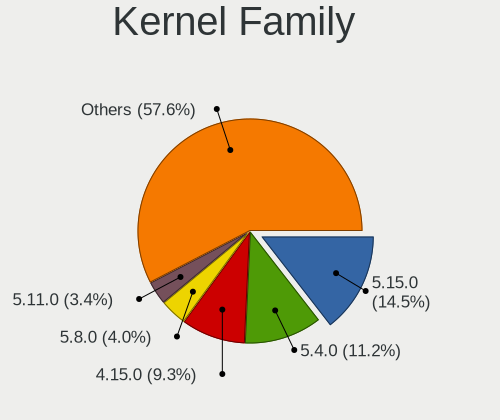

| Version | Desktops | Percent |
|---------|----------|---------|
| 5.4.0   | 138      | 16.95%  |
| 4.15.0  | 119      | 14.62%  |
| 5.15.0  | 58       | 7.13%   |
| 5.8.0   | 49       | 6.02%   |
| 5.11.0  | 44       | 5.41%   |
| 5.13.0  | 41       | 5.04%   |
| 5.0.0   | 20       | 2.46%   |
| 5.10.0  | 19       | 2.33%   |
| 5.3.0   | 18       | 2.21%   |
| 5.16.7  | 17       | 2.09%   |
| 4.18.0  | 17       | 2.09%   |
| 5.10.14 | 13       | 1.6%    |
| 6.1.1   | 8        | 0.98%   |
| 5.19.0  | 8        | 0.98%   |
| 4.19.0  | 7        | 0.86%   |
| 5.17.5  | 6        | 0.74%   |
| 5.6.15  | 4        | 0.49%   |
| 5.6.0   | 4        | 0.49%   |
| 5.10.7  | 4        | 0.49%   |
| 4.9.20  | 4        | 0.49%   |
| 5.8.5   | 3        | 0.37%   |
| 5.8.4   | 3        | 0.37%   |
| 5.8.16  | 3        | 0.37%   |
| 5.7.1   | 3        | 0.37%   |
| 5.16.13 | 3        | 0.37%   |
| 5.15.15 | 3        | 0.37%   |
| 5.14.0  | 3        | 0.37%   |
| 5.11.16 | 3        | 0.37%   |
| 5.10.9  | 3        | 0.37%   |
| 5.10.16 | 3        | 0.37%   |
| 4.9.60  | 3        | 0.37%   |
| 4.13.0  | 3        | 0.37%   |
| 3.10.0  | 3        | 0.37%   |
| 6.1.4   | 2        | 0.25%   |
| 6.0.1   | 2        | 0.25%   |
| 6.0.0   | 2        | 0.25%   |
| 5.9.1   | 2        | 0.25%   |
| 5.9.0   | 2        | 0.25%   |
| 5.8.14  | 2        | 0.25%   |
| 5.8.12  | 2        | 0.25%   |

Kernel Major Ver.
-----------------

Linux kernel major version

| Version | Desktops | Percent |
|---------|----------|---------|
| 5.4     | 144      | 18.14%  |
| 4.15    | 120      | 15.11%  |
| 5.15    | 72       | 9.07%   |
| 5.8     | 69       | 8.69%   |
| 5.11    | 56       | 7.05%   |
| 5.10    | 51       | 6.42%   |
| 5.13    | 45       | 5.67%   |
| 5.16    | 30       | 3.78%   |
| 5.3     | 21       | 2.64%   |
| 5.0     | 21       | 2.64%   |
| 4.18    | 19       | 2.39%   |
| 6.1     | 13       | 1.64%   |
| 5.19    | 13       | 1.64%   |
| 5.14    | 13       | 1.64%   |
| 5.6     | 12       | 1.51%   |
| 5.7     | 10       | 1.26%   |
| 5.17    | 10       | 1.26%   |
| 6.0     | 9        | 1.13%   |
| 5.12    | 9        | 1.13%   |
| 4.19    | 9        | 1.13%   |
| 5.18    | 8        | 1.01%   |
| 4.9     | 8        | 1.01%   |
| 5.9     | 7        | 0.88%   |
| 5.5     | 3        | 0.38%   |
| 4.13    | 3        | 0.38%   |
| 3.10    | 3        | 0.38%   |
| 4.4     | 2        | 0.25%   |
| 4.20    | 2        | 0.25%   |
| 3.16    | 2        | 0.25%   |
| 6.2     | 1        | 0.13%   |
| 5.1     | 1        | 0.13%   |
| 5       | 1        | 0.13%   |
| 4.2     | 1        | 0.13%   |
| 4.16    | 1        | 0.13%   |
| 4.14    | 1        | 0.13%   |
| 4.12    | 1        | 0.13%   |
| 4.10    | 1        | 0.13%   |
| 4.1     | 1        | 0.13%   |
| 2.6     | 1        | 0.13%   |

Arch
----

OS architecture (x86_64, i586, etc.)

| Name   | Desktops | Percent |
|--------|----------|---------|
| x86_64 | 686      | 98.99%  |
| i686   | 7        | 1.01%   |

DE
--

Desktop Environment

| Name            | Desktops | Percent |
|-----------------|----------|---------|
| GNOME           | 253      | 35.04%  |
| Unknown         | 113      | 15.65%  |
| KDE5            | 105      | 14.54%  |
| GNUstep         | 88       | 12.19%  |
| X-Cinnamon      | 43       | 5.96%   |
| XFCE            | 27       | 3.74%   |
| MATE            | 16       | 2.22%   |
| KDE             | 16       | 2.22%   |
| Cinnamon        | 14       | 1.94%   |
| LXQt            | 10       | 1.39%   |
| Pantheon        | 6        | 0.83%   |
| KDE4            | 6        | 0.83%   |
| Budgie          | 6        | 0.83%   |
| Unity           | 3        | 0.42%   |
| GNOME Flashback | 3        | 0.42%   |
| qtile           | 2        | 0.28%   |
| i3              | 2        | 0.28%   |
| DWM             | 2        | 0.28%   |
| xmonad          | 1        | 0.14%   |
| sway            | 1        | 0.14%   |
| none+awesome    | 1        | 0.14%   |
| ICEWM           | 1        | 0.14%   |
| GNOME Classic   | 1        | 0.14%   |
| fluxbox         | 1        | 0.14%   |
| bspwm           | 1        | 0.14%   |

Display Server
--------------

X11 or Wayland

| Name    | Desktops | Percent |
|---------|----------|---------|
| X11     | 556      | 76.27%  |
| Wayland | 91       | 12.48%  |
| Unknown | 57       | 7.82%   |
| Tty     | 22       | 3.02%   |
| Web     | 3        | 0.41%   |

Display Manager
---------------

SDDM, LightDM, etc.

| Name    | Desktops | Percent |
|---------|----------|---------|
| Unknown | 304      | 41.53%  |
| LightDM | 154      | 21.04%  |
| SDDM    | 106      | 14.48%  |
| GDM     | 72       | 9.84%   |
| GDM3    | 59       | 8.06%   |
| TDM     | 28       | 3.83%   |
| KDM     | 6        | 0.82%   |
| SLiM    | 2        | 0.27%   |
| XDM     | 1        | 0.14%   |

OS Lang
-------

Language

| Lang       | Desktops | Percent |
|------------|----------|---------|
| en_US      | 191      | 26.45%  |
| Unknown    | 173      | 23.96%  |
| de_CH      | 153      | 21.19%  |
| fr_CH      | 57       | 7.89%   |
| de_DE      | 48       | 6.65%   |
| en_GB      | 28       | 3.88%   |
| fr_FR      | 18       | 2.49%   |
| C          | 14       | 1.94%   |
| it_CH      | 8        | 1.11%   |
| pt_PT      | 6        | 0.83%   |
| it_IT      | 6        | 0.83%   |
| ru_RU      | 4        | 0.55%   |
| es_ES      | 3        | 0.42%   |
| en_AU      | 2        | 0.28%   |
| sk_SK      | 1        | 0.14%   |
| POSIX      | 1        | 0.14%   |
| pl_PL      | 1        | 0.14%   |
| hu_HU      | 1        | 0.14%   |
| gsw_CH     | 1        | 0.14%   |
| en_IE      | 1        | 0.14%   |
| en_CH      | 1        | 0.14%   |
| en_AG      | 1        | 0.14%   |
| de_CH.UTF8 | 1        | 0.14%   |
| cs_CZ      | 1        | 0.14%   |
| C.UTF8     | 1        | 0.14%   |

Boot Mode
---------

EFI or BIOS

| Mode | Desktops | Percent |
|------|----------|---------|
| BIOS | 411      | 57.89%  |
| EFI  | 299      | 42.11%  |

Filesystem
----------

Type of filesystem

| Type    | Desktops | Percent |
|---------|----------|---------|
| Ext4    | 562      | 79.04%  |
| Overlay | 50       | 7.03%   |
| Btrfs   | 50       | 7.03%   |
| Xfs     | 19       | 2.67%   |
| Unknown | 19       | 2.67%   |
| F2fs    | 3        | 0.42%   |
| Zfs     | 2        | 0.28%   |
| Ext2    | 2        | 0.28%   |
| Jfs     | 1        | 0.14%   |
| ExX4    | 1        | 0.14%   |
| Ext3    | 1        | 0.14%   |
| Aufs    | 1        | 0.14%   |

Part. scheme
------------

Scheme of partitioning

| Type    | Desktops | Percent |
|---------|----------|---------|
| Unknown | 319      | 45.06%  |
| GPT     | 299      | 42.23%  |
| MBR     | 90       | 12.71%  |

Dual Boot with Linux/BSD
------------------------

Hosting more than one Linux/BSD

| Dual boot | Desktops | Percent |
|-----------|----------|---------|
| No        | 550      | 76.71%  |
| Yes       | 167      | 23.29%  |

Dual Boot (Win)
---------------

Hosting Linux and Windows

| Dual boot | Desktops | Percent |
|-----------|----------|---------|
| No        | 501      | 70.27%  |
| Yes       | 212      | 29.73%  |

Board
-----

Vendor
------

Motherboard manufacturer

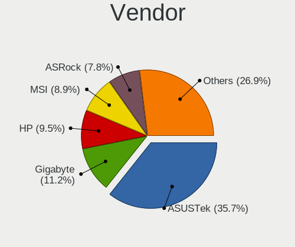

| Name                 | Desktops | Percent |
|----------------------|----------|---------|
| ASUSTek Computer     | 234      | 33.77%  |
| Gigabyte Technology  | 81       | 11.69%  |
| Hewlett-Packard      | 65       | 9.38%   |
| MSI                  | 57       | 8.23%   |
| ASRock               | 55       | 7.94%   |
| Dell                 | 40       | 5.77%   |
| Intel                | 28       | 4.04%   |
| Fujitsu              | 28       | 4.04%   |
| Acer                 | 17       | 2.45%   |
| Lenovo               | 15       | 2.16%   |
| Medion               | 12       | 1.73%   |
| Shuttle              | 8        | 1.15%   |
| Pegatron             | 7        | 1.01%   |
| PC Engines           | 7        | 1.01%   |
| DALCO AG Switzerland | 6        | 0.87%   |
| Unknown              | 6        | 0.87%   |
| Apple                | 5        | 0.72%   |
| Supermicro           | 4        | 0.58%   |
| Biostar              | 3        | 0.43%   |
| Packard Bell         | 2        | 0.29%   |
| ZOTAC                | 1        | 0.14%   |
| NF541                | 1        | 0.14%   |
| Minix                | 1        | 0.14%   |
| LattePanda           | 1        | 0.14%   |
| ICP / iEi            | 1        | 0.14%   |
| Fujitsu Siemens      | 1        | 0.14%   |
| eMachines            | 1        | 0.14%   |
| ELSKY                | 1        | 0.14%   |
| Chuwi                | 1        | 0.14%   |
| BESSTAR Tech         | 1        | 0.14%   |
| AZW                  | 1        | 0.14%   |
| Alienware            | 1        | 0.14%   |
| AAEON                | 1        | 0.14%   |

Model
-----

Motherboard model

| Name                                  | Desktops | Percent |
|---------------------------------------|----------|---------|
| ASUS All Series                       | 32       | 4.62%   |
| Fujitsu CELSIUS_W550                  | 12       | 1.73%   |
| ASUS ROG STRIX X570-E GAMING          | 8        | 1.15%   |
| ASUS STRIX Z270F GAMING               | 7        | 1.01%   |
| ASUS P9X79 WS                         | 7        | 1.01%   |
| ASUS P8Z77-V LX                       | 7        | 1.01%   |
| Unknown                               | 7        | 1.01%   |
| MSI MS-7C02                           | 6        | 0.87%   |
| DALCO AG Switzerland +41 44 908 38 38 | 6        | 0.87%   |
| PC Engines APU2                       | 5        | 0.72%   |
| Intel DP67BA AAG10219-303             | 5        | 0.72%   |
| HP EliteDesk 800 G1 SFF               | 5        | 0.72%   |
| ASUS ROG STRIX Z370-F GAMING          | 5        | 0.72%   |
| Intel DP55WB AAE64798-207             | 4        | 0.58%   |
| Gigabyte X570 AORUS ELITE             | 4        | 0.58%   |
| Gigabyte H97-HD3                      | 4        | 0.58%   |
| Fujitsu CELSIUS W570                  | 4        | 0.58%   |
| Dell OptiPlex 9020                    | 4        | 0.58%   |
| Dell OptiPlex 790                     | 4        | 0.58%   |
| ASUS PRIME Z370-A II                  | 4        | 0.58%   |
| MSI MS-7C56                           | 3        | 0.43%   |
| MSI MS-7971                           | 3        | 0.43%   |
| HP Z400 Workstation                   | 3        | 0.43%   |
| HP ProDesk 600 G1 TWR                 | 3        | 0.43%   |
| HP OMEN 30L Desktop GT13-0xxx         | 3        | 0.43%   |
| HP EliteDesk 800 G1 USDT              | 3        | 0.43%   |
| Gigabyte X570 AORUS PRO               | 3        | 0.43%   |
| Gigabyte X399 AORUS XTREME            | 3        | 0.43%   |
| Dell OptiPlex 7040                    | 3        | 0.43%   |
| Dell OptiPlex 7010                    | 3        | 0.43%   |
| ASUS ROG CROSSHAIR VIII HERO          | 3        | 0.43%   |
| ASUS PRIME X370-PRO                   | 3        | 0.43%   |
| ASUS PRIME B350M-A                    | 3        | 0.43%   |
| ASUS PRIME B350-PLUS                  | 3        | 0.43%   |
| ASUS M5A97 R2.0                       | 3        | 0.43%   |
| ASUS M5A78L-M/USB3                    | 3        | 0.43%   |
| ASRock H77 Pro4/MVP                   | 3        | 0.43%   |
| Apple MacPro5,1                       | 3        | 0.43%   |
| Supermicro X8STi                      | 2        | 0.29%   |
| Shuttle XH61V                         | 2        | 0.29%   |

Model Family
------------

Motherboard model prefix

| Name                     | Desktops | Percent |
|--------------------------|----------|---------|
| ASUS ROG                 | 50       | 7.22%   |
| ASUS All                 | 32       | 4.62%   |
| ASUS PRIME               | 30       | 4.33%   |
| Dell OptiPlex            | 27       | 3.9%    |
| Fujitsu CELSIUS          | 25       | 3.61%   |
| HP EliteDesk             | 20       | 2.89%   |
| HP Compaq                | 16       | 2.31%   |
| ASUS TUF                 | 13       | 1.88%   |
| Gigabyte X570            | 9        | 1.3%    |
| Acer Aspire              | 9        | 1.3%    |
| ASUS STRIX               | 8        | 1.15%   |
| ASUS P9X79               | 8        | 1.15%   |
| ASUS P8Z77-V             | 8        | 1.15%   |
| HP ProDesk               | 7        | 1.01%   |
| Unknown                  | 7        | 1.01%   |
| MSI MS-7C02              | 6        | 0.87%   |
| Intel DP55WB             | 6        | 0.87%   |
| DALCO AG Switzerland +41 | 6        | 0.87%   |
| ASUS SABERTOOTH          | 6        | 0.87%   |
| ASRock X570              | 6        | 0.87%   |
| PC Engines APU2          | 5        | 0.72%   |
| Lenovo ThinkCentre       | 5        | 0.72%   |
| Intel DP67BA             | 5        | 0.72%   |
| Dell Precision           | 5        | 0.72%   |
| Gigabyte H97-HD3         | 4        | 0.58%   |
| ASUS P8P67               | 4        | 0.58%   |
| ASUS P7H55-M             | 4        | 0.58%   |
| ASRock B450              | 4        | 0.58%   |
| Acer Predator            | 4        | 0.58%   |
| MSI MS-7C56              | 3        | 0.43%   |
| MSI MS-7971              | 3        | 0.43%   |
| Lenovo ThinkStation      | 3        | 0.43%   |
| Lenovo IdeaCentre        | 3        | 0.43%   |
| Intel DH87MC             | 3        | 0.43%   |
| HP Z400                  | 3        | 0.43%   |
| HP OMEN                  | 3        | 0.43%   |
| Gigabyte X399            | 3        | 0.43%   |
| ASUS P8H77-M             | 3        | 0.43%   |
| ASUS P6T                 | 3        | 0.43%   |
| ASUS M5A97               | 3        | 0.43%   |

MFG Year
--------

Motherboard manufacture year

| Year    | Desktops | Percent |
|---------|----------|---------|
| 2018    | 70       | 10.1%   |
| 2019    | 64       | 9.24%   |
| 2017    | 61       | 8.8%    |
| 2012    | 61       | 8.8%    |
| 2013    | 55       | 7.94%   |
| 2015    | 52       | 7.5%    |
| 2014    | 52       | 7.5%    |
| 2011    | 52       | 7.5%    |
| 2020    | 44       | 6.35%   |
| 2010    | 36       | 5.19%   |
| 2021    | 34       | 4.91%   |
| 2016    | 28       | 4.04%   |
| 2009    | 28       | 4.04%   |
| 2008    | 25       | 3.61%   |
| 2007    | 11       | 1.59%   |
| 2006    | 10       | 1.44%   |
| 2022    | 5        | 0.72%   |
| 2004    | 2        | 0.29%   |
| 2005    | 1        | 0.14%   |
| 2003    | 1        | 0.14%   |
| Unknown | 1        | 0.14%   |

Form Factor
-----------

Physical design of the computer

| Name    | Desktops | Percent |
|---------|----------|---------|
| Desktop | 693      | 100%    |

Secure Boot
-----------

Enabled or disabled

| State    | Desktops | Percent |
|----------|----------|---------|
| Disabled | 676      | 96.71%  |
| Enabled  | 23       | 3.29%   |

Coreboot
--------

Have coreboot on board

| Used | Desktops | Percent |
|------|----------|---------|
| No   | 686      | 98.99%  |
| Yes  | 7        | 1.01%   |

RAM Size
--------

Total RAM memory

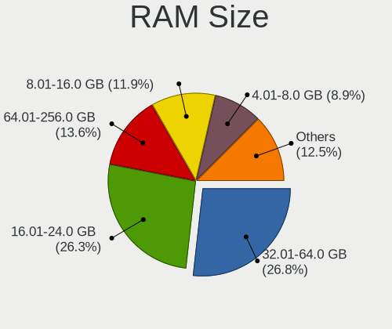

| Size in GB      | Desktops | Percent |
|-----------------|----------|---------|
| 16.01-24.0      | 197      | 27.86%  |
| 32.01-64.0      | 170      | 24.05%  |
| 8.01-16.0       | 101      | 14.29%  |
| 4.01-8.0        | 75       | 10.61%  |
| 64.01-256.0     | 70       | 9.9%    |
| 3.01-4.0        | 56       | 7.92%   |
| 24.01-32.0      | 17       | 2.4%    |
| 1.01-2.0        | 13       | 1.84%   |
| 2.01-3.0        | 4        | 0.57%   |
| More than 256.0 | 3        | 0.42%   |
| 0.01-0.5        | 1        | 0.14%   |

RAM Used
--------

Used RAM memory

| Used GB     | Desktops | Percent |
|-------------|----------|---------|
| 1.01-2.0    | 246      | 31.26%  |
| 2.01-3.0    | 169      | 21.47%  |
| 4.01-8.0    | 124      | 15.76%  |
| 3.01-4.0    | 86       | 10.93%  |
| 0.51-1.0    | 84       | 10.67%  |
| 8.01-16.0   | 50       | 6.35%   |
| 0.01-0.5    | 11       | 1.4%    |
| 16.01-24.0  | 8        | 1.02%   |
| 24.01-32.0  | 4        | 0.51%   |
| 32.01-64.0  | 2        | 0.25%   |
| 64.01-256.0 | 2        | 0.25%   |
| Unknown     | 1        | 0.13%   |

Total Drives
------------

Number of drives on board

| Drives | Desktops | Percent |
|--------|----------|---------|
| 1      | 277      | 37.95%  |
| 2      | 211      | 28.9%   |
| 3      | 120      | 16.44%  |
| 4      | 47       | 6.44%   |
| 5      | 33       | 4.52%   |
| 6      | 17       | 2.33%   |
| 7      | 14       | 1.92%   |
| 0      | 8        | 1.1%    |
| 14     | 1        | 0.14%   |
| 11     | 1        | 0.14%   |
| 8      | 1        | 0.14%   |

Has CD-ROM
----------

Has CD-ROM on board

| Presented | Desktops | Percent |
|-----------|----------|---------|
| No        | 360      | 51.06%  |
| Yes       | 345      | 48.94%  |

Has Ethernet
------------

Has Ethernet on board

| Presented | Desktops | Percent |
|-----------|----------|---------|
| Yes       | 690      | 99.57%  |
| No        | 3        | 0.43%   |

Has WiFi
--------

Has WiFi module

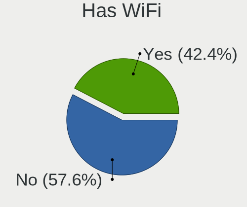

| Presented | Desktops | Percent |
|-----------|----------|---------|
| No        | 428      | 60.88%  |
| Yes       | 275      | 39.12%  |

Has Bluetooth
-------------

Has Bluetooth module

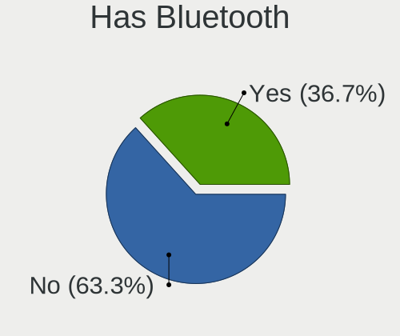

| Presented | Desktops | Percent |
|-----------|----------|---------|
| No        | 484      | 69.04%  |
| Yes       | 217      | 30.96%  |

Location
--------

Country
-------

Geographic location (country)

| Country     | Desktops | Percent |
|-------------|----------|---------|
| Switzerland | 693      | 100%    |

City
----

Geographic location (city)

| City                               | Desktops | Percent |
|------------------------------------|----------|---------|
| Zurich                             | 227      | 29.99%  |
| Bern                               | 33       | 4.36%   |
| Geneva                             | 22       | 2.91%   |
| Wiesendangen / Wiesendangen (Dorf) | 12       | 1.59%   |
| Lausanne                           | 12       | 1.59%   |
| Basel                              | 11       | 1.45%   |
| Neuchatel                          | 10       | 1.32%   |
| Lyss                               | 8        | 1.06%   |
| Winterthur                         | 7        | 0.92%   |
| Lucerne                            | 7        | 0.92%   |
| Dietikon                           | 7        | 0.92%   |
| Wil                                | 6        | 0.79%   |
| Wetzikon                           | 6        | 0.79%   |
| Lugano                             | 6        | 0.79%   |
| Wettingen                          | 5        | 0.66%   |
| Uster                              | 5        | 0.66%   |
| Thun                               | 5        | 0.66%   |
| St. Gallen                         | 5        | 0.66%   |
| Schaffhausen                       | 5        | 0.66%   |
| Caslano                            | 5        | 0.66%   |
| Aarau                              | 5        | 0.66%   |
| Willisau                           | 4        | 0.53%   |
| Morges                             | 4        | 0.53%   |
| Heerbrugg                          | 4        | 0.53%   |
| Burgdorf                           | 4        | 0.53%   |
| Baden                              | 4        | 0.53%   |
| Zug                                | 3        | 0.4%    |
| Wallisellen                        | 3        | 0.4%    |
| Vevey                              | 3        | 0.4%    |
| Sion                               | 3        | 0.4%    |
| Schwarzenbach                      | 3        | 0.4%    |
| Schafisheim                        | 3        | 0.4%    |
| Regensdorf                         | 3        | 0.4%    |
| Prilly                             | 3        | 0.4%    |
| Opfikon                            | 3        | 0.4%    |
| Muttenz                            | 3        | 0.4%    |
| Munchenstein                       | 3        | 0.4%    |
| Moosseedorf                        | 3        | 0.4%    |
| Le Mont-sur-Lausanne               | 3        | 0.4%    |
| Kloten                             | 3        | 0.4%    |

Drives
------

Drive Vendor
------------

Hard drive vendors

| Vendor                    | Desktops | Drives | Percent |
|---------------------------|----------|--------|---------|
| Samsung Electronics       | 322      | 699    | 26.57%  |
| WDC                       | 237      | 416    | 19.55%  |
| Seagate                   | 202      | 296    | 16.67%  |
| SanDisk                   | 47       | 63     | 3.88%   |
| Hitachi                   | 46       | 64     | 3.8%    |
| Toshiba                   | 42       | 57     | 3.47%   |
| Kingston                  | 42       | 63     | 3.47%   |
| Crucial                   | 37       | 50     | 3.05%   |
| Intel                     | 32       | 48     | 2.64%   |
| Corsair                   | 20       | 24     | 1.65%   |
| OCZ                       | 15       | 20     | 1.24%   |
| Phison                    | 14       | 23     | 1.16%   |
| A-DATA Technology         | 14       | 21     | 1.16%   |
| Unknown                   | 11       | 13     | 0.91%   |
| Micron Technology         | 11       | 15     | 0.91%   |
| HGST                      | 8        | 11     | 0.66%   |
| China                     | 8        | 9      | 0.66%   |
| SK hynix                  | 7        | 8      | 0.58%   |
| Intenso                   | 7        | 7      | 0.58%   |
| Apple                     | 6        | 6      | 0.5%    |
| Patriot                   | 5        | 6      | 0.41%   |
| KingSpec                  | 5        | 10     | 0.41%   |
| Hewlett-Packard           | 5        | 7      | 0.41%   |
| Maxtor                    | 4        | 5      | 0.33%   |
| XPG                       | 3        | 3      | 0.25%   |
| Transcend                 | 3        | 9      | 0.25%   |
| SPCC                      | 3        | 3      | 0.25%   |
| Silicon Motion            | 3        | 3      | 0.25%   |
| PNY                       | 3        | 8      | 0.25%   |
| Plextor                   | 3        | 3      | 0.25%   |
| LITEONIT                  | 3        | 4      | 0.25%   |
| LITEON                    | 3        | 4      | 0.25%   |
| HPE                       | 3        | 9      | 0.25%   |
| ASMT                      | 3        | 5      | 0.25%   |
| Phison Electronics        | 2        | 3      | 0.17%   |
| Micron/Crucial Technology | 2        | 4      | 0.17%   |
| LaCie                     | 2        | 2      | 0.17%   |
| KIOXIA-EXCERIA            | 2        | 2      | 0.17%   |
| KIOXIA                    | 2        | 3      | 0.17%   |
| KingFast                  | 2        | 7      | 0.17%   |

Drive Model
-----------

Hard drive models

| Model                            | Desktops | Percent |
|----------------------------------|----------|---------|
| Samsung SSD 850 EVO 500GB        | 28       | 1.93%   |
| Samsung SSD 860 EVO 1TB          | 23       | 1.58%   |
| Samsung SSD 850 EVO 250GB        | 22       | 1.51%   |
| Seagate ST2000DM006-2DM164 2TB   | 17       | 1.17%   |
| Samsung SSD 860 EVO 500GB        | 17       | 1.17%   |
| Seagate ST2000DM008-2FR102 2TB   | 15       | 1.03%   |
| Samsung SSD 860 EVO 250GB        | 14       | 0.96%   |
| Samsung NVMe SSD Drive 1TB       | 14       | 0.96%   |
| Seagate ST2000DM001-1ER164 2TB   | 13       | 0.89%   |
| Samsung SSD 840 EVO 250GB        | 13       | 0.89%   |
| Samsung SSD 970 EVO Plus 1TB     | 12       | 0.83%   |
| Samsung SSD 850 EVO 1TB          | 12       | 0.83%   |
| Samsung HD103SJ 1TB              | 11       | 0.76%   |
| Samsung SSD 860 QVO 1TB          | 10       | 0.69%   |
| Samsung SSD 850 PRO 256GB        | 10       | 0.69%   |
| Samsung NVMe SSD Drive 500GB     | 10       | 0.69%   |
| WDC WD20EZRZ-00Z5HB0 2TB         | 9        | 0.62%   |
| Toshiba DT01ACA200 2TB           | 9        | 0.62%   |
| Toshiba DT01ACA100 1TB           | 9        | 0.62%   |
| Seagate ST4000DM004-2CV104 4TB   | 8        | 0.55%   |
| Seagate Expansion 1TB            | 8        | 0.55%   |
| Samsung SSD 860 QVO 2TB          | 8        | 0.55%   |
| WDC WDS100T2B0A-00SM50 1TB SSD   | 7        | 0.48%   |
| WDC WD20EFRX-68EUZN0 2TB         | 7        | 0.48%   |
| Seagate ST2000DM001-1CH164 2TB   | 7        | 0.48%   |
| Seagate ST1000DM003-1ER162 1TB   | 7        | 0.48%   |
| Seagate ST1000DM003-1CH162 1TB   | 7        | 0.48%   |
| Samsung SSD 970 EVO 500GB        | 7        | 0.48%   |
| Samsung SSD 870 EVO 500GB        | 7        | 0.48%   |
| Samsung SSD 850 PRO 512GB        | 7        | 0.48%   |
| Samsung SSD 830 Series 128GB     | 7        | 0.48%   |
| Hitachi HUA722020ALA330 2TB      | 7        | 0.48%   |
| WDC WD20EZRX-00D8PB0 2TB         | 6        | 0.41%   |
| Seagate ST500DM002-1BD142 500GB  | 6        | 0.41%   |
| Seagate ST1000DM010-2EP102 1TB   | 6        | 0.41%   |
| Samsung SSD 970 EVO Plus 500GB   | 6        | 0.41%   |
| Samsung SSD 970 EVO Plus 2TB     | 6        | 0.41%   |
| Samsung SSD 970 EVO 1TB          | 6        | 0.41%   |
| Samsung SSD 870 EVO 1TB          | 6        | 0.41%   |
| Samsung SSD 840 PRO Series 256GB | 6        | 0.41%   |

HDD Vendor
----------

Hard disk drive vendors

| Vendor              | Desktops | Drives | Percent |
|---------------------|----------|--------|---------|
| WDC                 | 208      | 352    | 37.96%  |
| Seagate             | 195      | 278    | 35.58%  |
| Hitachi             | 46       | 64     | 8.39%   |
| Samsung Electronics | 37       | 53     | 6.75%   |
| Toshiba             | 29       | 40     | 5.29%   |
| HGST                | 8        | 11     | 1.46%   |
| Unknown             | 5        | 6      | 0.91%   |
| Maxtor              | 4        | 5      | 0.73%   |
| Intenso             | 3        | 3      | 0.55%   |
| JMicron Technology  | 2        | 2      | 0.36%   |
| ASMT                | 2        | 3      | 0.36%   |
| Apple               | 2        | 2      | 0.36%   |
| IET                 | 1        | 1      | 0.18%   |
| ICY BOX             | 1        | 1      | 0.18%   |
| HPE                 | 1        | 6      | 0.18%   |
| Hewlett-Packard     | 1        | 2      | 0.18%   |
| ExcelStor           | 1        | 2      | 0.18%   |
| ASMT109x            | 1        | 1      | 0.18%   |
| ASMedia             | 1        | 1      | 0.18%   |

SSD Vendor
----------

Solid state drive vendors

| Vendor              | Desktops | Drives | Percent |
|---------------------|----------|--------|---------|
| Samsung Electronics | 229      | 466    | 46.17%  |
| SanDisk             | 38       | 49     | 7.66%   |
| Crucial             | 36       | 49     | 7.26%   |
| Kingston            | 32       | 50     | 6.45%   |
| WDC                 | 30       | 42     | 6.05%   |
| Intel               | 18       | 22     | 3.63%   |
| OCZ                 | 15       | 20     | 3.02%   |
| Micron Technology   | 10       | 13     | 2.02%   |
| Corsair             | 9        | 9      | 1.81%   |
| A-DATA Technology   | 9        | 15     | 1.81%   |
| China               | 8        | 9      | 1.61%   |
| Toshiba             | 7        | 9      | 1.41%   |
| Patriot             | 5        | 6      | 1.01%   |
| KingSpec            | 5        | 10     | 1.01%   |
| Transcend           | 3        | 9      | 0.6%    |
| SPCC                | 3        | 3      | 0.6%    |
| SK hynix            | 3        | 4      | 0.6%    |
| Plextor             | 3        | 3      | 0.6%    |
| LITEONIT            | 3        | 4      | 0.6%    |
| LITEON              | 3        | 4      | 0.6%    |
| Intenso             | 3        | 3      | 0.6%    |
| Hewlett-Packard     | 3        | 4      | 0.6%    |
| Seagate             | 2        | 2      | 0.4%    |
| KIOXIA-EXCERIA      | 2        | 2      | 0.4%    |
| Apple               | 2        | 2      | 0.4%    |
| Unknown             | 1        | 1      | 0.2%    |
| TO Exter            | 1        | 1      | 0.2%    |
| PNY                 | 1        | 2      | 0.2%    |
| Palit               | 1        | 1      | 0.2%    |
| NVME                | 1        | 2      | 0.2%    |
| Netac               | 1        | 1      | 0.2%    |
| Mushkin             | 1        | 1      | 0.2%    |
| Leven               | 1        | 1      | 0.2%    |
| Initio              | 1        | 1      | 0.2%    |
| HPE                 | 1        | 1      | 0.2%    |
| FORESEE             | 1        | 1      | 0.2%    |
| ASMT                | 1        | 2      | 0.2%    |
| Argon               | 1        | 1      | 0.2%    |
| Apacer              | 1        | 2      | 0.2%    |
| Advantech           | 1        | 1      | 0.2%    |

Drive Kind
----------

HDD or SSD

| Kind    | Desktops | Drives | Percent |
|---------|----------|--------|---------|
| HDD     | 435      | 833    | 40.88%  |
| SSD     | 414      | 828    | 38.91%  |
| NVMe    | 196      | 350    | 18.42%  |
| Unknown | 16       | 25     | 1.5%    |
| MMC     | 3        | 3      | 0.28%   |

Drive Connector
---------------

SATA, SAS, NVMe, etc.

| Type | Desktops | Drives | Percent |
|------|----------|--------|---------|
| SATA | 622      | 1608   | 70.84%  |
| NVMe | 196      | 350    | 22.32%  |
| SAS  | 57       | 78     | 6.49%   |
| MMC  | 3        | 3      | 0.34%   |

Drive Size
----------

Size of hard drive

| Size in TB | Desktops | Drives | Percent |
|------------|----------|--------|---------|
| 0.01-0.5   | 401      | 746    | 42.34%  |
| 0.51-1.0   | 244      | 446    | 25.77%  |
| 1.01-2.0   | 167      | 263    | 17.63%  |
| 3.01-4.0   | 54       | 87     | 5.7%    |
| 2.01-3.0   | 42       | 60     | 4.44%   |
| 4.01-10.0  | 32       | 44     | 3.38%   |
| 10.01-20.0 | 7        | 15     | 0.74%   |

Space Total
-----------

Amount of disk space available on the file system

| Size in GB     | Desktops | Percent |
|----------------|----------|---------|
| 101-250        | 147      | 19.44%  |
| 1001-2000      | 115      | 15.21%  |
| 501-1000       | 108      | 14.29%  |
| 251-500        | 101      | 13.36%  |
| More than 3000 | 95       | 12.57%  |
| 2001-3000      | 71       | 9.39%   |
| 1-20           | 47       | 6.22%   |
| Unknown        | 34       | 4.5%    |
| 51-100         | 25       | 3.31%   |
| 21-50          | 13       | 1.72%   |

Space Used
----------

Amount of used disk space

| Used GB        | Desktops | Percent |
|----------------|----------|---------|
| 1-20           | 215      | 27.67%  |
| 51-100         | 93       | 11.97%  |
| 501-1000       | 85       | 10.94%  |
| 251-500        | 81       | 10.42%  |
| 101-250        | 75       | 9.65%   |
| 21-50          | 73       | 9.4%    |
| 1001-2000      | 65       | 8.37%   |
| More than 3000 | 40       | 5.15%   |
| Unknown        | 34       | 4.38%   |
| 2001-3000      | 16       | 2.06%   |

Malfunc. Drives
---------------

Drive models with a malfunction

| Model                                 | Desktops | Drives | Percent |
|---------------------------------------|----------|--------|---------|
| WDC WD3000HLHX-01JJPV0 304GB          | 2        | 2      | 2.74%   |
| Seagate ST3250310AS 250GB             | 2        | 2      | 2.74%   |
| Seagate ST31500341AS 1TB              | 2        | 5      | 2.74%   |
| Samsung Electronics SSD 850 EVO 1TB   | 2        | 2      | 2.74%   |
| Hitachi HUA722020ALA330 2TB           | 2        | 2      | 2.74%   |
| WDC WDS240G2G0B-00EPW0 240GB SSD      | 1        | 1      | 1.37%   |
| WDC WD5000AAKS-65A7B0 500GB           | 1        | 1      | 1.37%   |
| WDC WD5000AAKS-00TMA0 500GB           | 1        | 1      | 1.37%   |
| WDC WD5000AAKS-00E4A0 500GB           | 1        | 1      | 1.37%   |
| WDC WD40EZRZ-00WN9B0 4TB              | 1        | 1      | 1.37%   |
| WDC WD4003FZEX-00Z4SA0 4TB            | 1        | 2      | 1.37%   |
| WDC WD3200AAKS-00B3A0 320GB           | 1        | 1      | 1.37%   |
| WDC WD30EZRX-00D8PB0 3TB              | 1        | 1      | 1.37%   |
| WDC WD20EZRZ-00Z5HB0 2TB              | 1        | 1      | 1.37%   |
| WDC WD20EZRX-00D8PB0 2TB              | 1        | 2      | 1.37%   |
| WDC WD20EFRX-68AX9N0 2TB              | 1        | 1      | 1.37%   |
| WDC WD10EZEX-08M2NA0 1TB              | 1        | 1      | 1.37%   |
| WDC WD10EARS-00Y5B1 1TB               | 1        | 1      | 1.37%   |
| WDC WD10EADS-22M2B0 1TB               | 1        | 1      | 1.37%   |
| WDC WD10EADS-00L5B1 1TB               | 1        | 1      | 1.37%   |
| WDC WD1001FALS-403AA0 1TB             | 1        | 1      | 1.37%   |
| Toshiba MK7575GSX 752GB               | 1        | 3      | 1.37%   |
| Toshiba DT01ACA100 1TB                | 1        | 1      | 1.37%   |
| SK hynix HFS256G32MND-2200A 256GB SSD | 1        | 1      | 1.37%   |
| Seagate ST9500325ASG 500GB            | 1        | 1      | 1.37%   |
| Seagate ST500DM002-1BD142 500GB       | 1        | 1      | 1.37%   |
| Seagate ST5000NM0024-1HT170 5TB       | 1        | 4      | 1.37%   |
| Seagate ST3500413AS 500GB             | 1        | 2      | 1.37%   |
| Seagate ST31000528AS 1TB              | 1        | 1      | 1.37%   |
| Seagate ST3000DM001-9YN166 3TB        | 1        | 1      | 1.37%   |
| Seagate ST2000DM008-2FR102 2TB        | 1        | 1      | 1.37%   |
| Seagate ST2000DM001-1ER164 2TB        | 1        | 2      | 1.37%   |
| Seagate ST2000DM001-1CH164 2TB        | 1        | 1      | 1.37%   |
| SanDisk SSD PLUS 240GB                | 1        | 1      | 1.37%   |
| SanDisk SD6SF1M128G1022I 128GB SSD    | 1        | 1      | 1.37%   |
| Samsung Electronics SSD 980 PRO 1TB   | 1        | 1      | 1.37%   |
| Samsung Electronics SSD 970 PRO 512GB | 1        | 1      | 1.37%   |
| Samsung Electronics SSD 970 EVO 500GB | 1        | 1      | 1.37%   |
| Samsung Electronics SSD 870 EVO 2TB   | 1        | 1      | 1.37%   |
| Samsung Electronics HM121HI 120GB     | 1        | 1      | 1.37%   |

Malfunc. Drive Vendor
---------------------

Vendors of faulty drives

| Vendor              | Desktops | Drives | Percent |
|---------------------|----------|--------|---------|
| WDC                 | 18       | 20     | 25%     |
| Seagate             | 12       | 21     | 16.67%  |
| Samsung Electronics | 10       | 10     | 13.89%  |
| Hitachi             | 7        | 8      | 9.72%   |
| Kingston            | 4        | 5      | 5.56%   |
| OCZ                 | 3        | 4      | 4.17%   |
| A-DATA Technology   | 3        | 5      | 4.17%   |
| Toshiba             | 2        | 4      | 2.78%   |
| SanDisk             | 2        | 2      | 2.78%   |
| Intel               | 2        | 2      | 2.78%   |
| HGST                | 2        | 2      | 2.78%   |
| SK hynix            | 1        | 1      | 1.39%   |
| Patriot             | 1        | 2      | 1.39%   |
| Micron Technology   | 1        | 1      | 1.39%   |
| Initio              | 1        | 1      | 1.39%   |
| Crucial             | 1        | 1      | 1.39%   |
| China               | 1        | 1      | 1.39%   |
| ASMedia             | 1        | 1      | 1.39%   |

Malfunc. HDD Vendor
-------------------

Vendors of faulty HDD drives

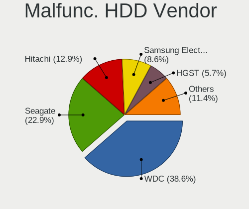

| Vendor              | Desktops | Drives | Percent |
|---------------------|----------|--------|---------|
| WDC                 | 17       | 19     | 37.78%  |
| Seagate             | 12       | 21     | 26.67%  |
| Hitachi             | 7        | 8      | 15.56%  |
| Samsung Electronics | 4        | 4      | 8.89%   |
| Toshiba             | 2        | 4      | 4.44%   |
| HGST                | 2        | 2      | 4.44%   |
| ASMedia             | 1        | 1      | 2.22%   |

Malfunc. Drive Kind
-------------------

Kinds of faulty drives

| Kind | Desktops | Drives | Percent |
|------|----------|--------|---------|
| HDD  | 39       | 59     | 59.09%  |
| SSD  | 23       | 27     | 34.85%  |
| NVMe | 4        | 5      | 6.06%   |

Failed Drives
-------------

Failed drive models

| Model                     | Desktops | Drives | Percent |
|---------------------------|----------|--------|---------|
| Seagate ST3750528AS 752GB | 1        | 1      | 100%    |

Failed Drive Vendor
-------------------

Failed drive vendors

| Vendor  | Desktops | Drives | Percent |
|---------|----------|--------|---------|
| Seagate | 1        | 1      | 100%    |

Drive Status
------------

Number of failed and malfunc. drives

| Status   | Desktops | Drives | Percent |
|----------|----------|--------|---------|
| Works    | 369      | 960    | 47.86%  |
| Detected | 341      | 987    | 44.23%  |
| Malfunc  | 60       | 91     | 7.78%   |
| Failed   | 1        | 1      | 0.13%   |

Storage controller
------------------

Storage Vendor
--------------

Storage controller vendors

| Vendor                       | Desktops | Percent |
|------------------------------|----------|---------|
| Intel                        | 482      | 46.35%  |
| AMD                          | 190      | 18.27%  |
| Samsung Electronics          | 115      | 11.06%  |
| ASMedia Technology           | 56       | 5.38%   |
| Marvell Technology Group     | 45       | 4.33%   |
| JMicron Technology           | 27       | 2.6%    |
| Phison Electronics           | 25       | 2.4%    |
| SanDisk                      | 17       | 1.63%   |
| Nvidia                       | 15       | 1.44%   |
| Kingston Technology Company  | 13       | 1.25%   |
| Seagate Technology           | 10       | 0.96%   |
| Silicon Motion               | 6        | 0.58%   |
| LSI Logic / Symbios Logic    | 6        | 0.58%   |
| ADATA Technology             | 6        | 0.58%   |
| Toshiba America Info Systems | 5        | 0.48%   |
| SK hynix                     | 4        | 0.38%   |
| Micron/Crucial Technology    | 3        | 0.29%   |
| KIOXIA                       | 3        | 0.29%   |
| Areca Technology             | 2        | 0.19%   |
| Apple                        | 2        | 0.19%   |
| VIA Technologies             | 1        | 0.1%    |
| Tekram Technology            | 1        | 0.1%    |
| Realtek Semiconductor        | 1        | 0.1%    |
| Micron Technology            | 1        | 0.1%    |
| Lenovo                       | 1        | 0.1%    |
| Hewlett-Packard              | 1        | 0.1%    |
| Broadcom / LSI               | 1        | 0.1%    |
| Adaptec                      | 1        | 0.1%    |

Storage Model
-------------

Storage controller models

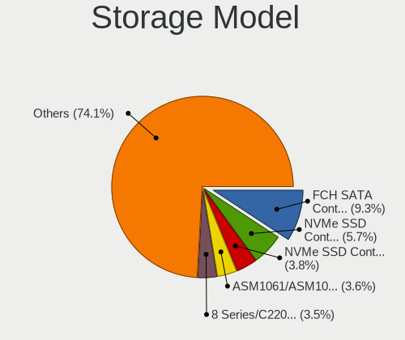

| Model                                                                          | Desktops | Percent |
|--------------------------------------------------------------------------------|----------|---------|
| AMD FCH SATA Controller [AHCI mode]                                            | 127      | 10.02%  |
| Samsung NVMe SSD Controller SM981/PM981/PM983                                  | 70       | 5.52%   |
| Intel Q170/Q150/B150/H170/H110/Z170/CM236 Chipset SATA Controller [AHCI Mode]  | 53       | 4.18%   |
| Intel 8 Series/C220 Series Chipset Family 6-port SATA Controller 1 [AHCI mode] | 52       | 4.1%    |
| ASMedia ASM1062 Serial ATA Controller                                          | 52       | 4.1%    |
| Intel 200 Series PCH SATA controller [AHCI mode]                               | 45       | 3.55%   |
| AMD 400 Series Chipset SATA Controller                                         | 38       | 3%      |
| Intel 7 Series/C210 Series Chipset Family 6-port SATA Controller [AHCI mode]   | 35       | 2.76%   |
| Intel 6 Series/C200 Series Chipset Family 6 port Desktop SATA AHCI Controller  | 35       | 2.76%   |
| Intel SATA Controller [RAID mode]                                              | 33       | 2.6%    |
| Samsung NVMe SSD Controller SM961/PM961/SM963                                  | 24       | 1.89%   |
| Intel Cannon Lake PCH SATA AHCI Controller                                     | 23       | 1.81%   |
| Intel 9 Series Chipset Family SATA Controller [AHCI Mode]                      | 23       | 1.81%   |
| AMD SB7x0/SB8x0/SB9x0 SATA Controller [AHCI mode]                              | 21       | 1.66%   |
| Samsung NVMe SSD Controller PM9A1/PM9A3/980PRO                                 | 19       | 1.5%    |
| AMD 500 Series Chipset SATA Controller                                         | 18       | 1.42%   |
| Intel C600/X79 series chipset 6-Port SATA AHCI Controller                      | 17       | 1.34%   |
| AMD SB7x0/SB8x0/SB9x0 IDE Controller                                           | 17       | 1.34%   |
| Intel C610/X99 series chipset 6-Port SATA Controller [AHCI mode]               | 16       | 1.26%   |
| Intel 82801JI (ICH10 Family) SATA AHCI Controller                              | 14       | 1.1%    |
| AMD 300 Series Chipset SATA Controller                                         | 14       | 1.1%    |
| Intel 5 Series/3400 Series Chipset 6 port SATA AHCI Controller                 | 12       | 0.95%   |
| Phison E16 PCIe4 NVMe Controller                                               | 11       | 0.87%   |
| Marvell Group 88SE9128 PCIe SATA 6 Gb/s RAID controller with HyperDuo          | 11       | 0.87%   |
| JMicron JMB363 SATA/IDE Controller                                             | 11       | 0.87%   |
| Intel NM10/ICH7 Family SATA Controller [IDE mode]                              | 10       | 0.79%   |
| AMD X370 Series Chipset SATA Controller                                        | 10       | 0.79%   |
| Phison E12 NVMe Controller                                                     | 9        | 0.71%   |
| Intel C610/X99 series chipset sSATA Controller [AHCI mode]                     | 9        | 0.71%   |
| Intel 82801IR/IO/IH (ICH9R/DO/DH) 4 port SATA Controller [IDE mode]            | 9        | 0.71%   |
| Intel 82801I (ICH9 Family) 2 port SATA Controller [IDE mode]                   | 9        | 0.71%   |
| Intel 500 Series Chipset Family SATA AHCI Controller                           | 9        | 0.71%   |
| AMD X399 Series Chipset SATA Controller                                        | 9        | 0.71%   |
| AMD SB7x0/SB8x0/SB9x0 SATA Controller [IDE mode]                               | 9        | 0.71%   |
| Intel 7 Series/C210 Series Chipset Family 4-port SATA Controller [IDE mode]    | 8        | 0.63%   |
| Intel 7 Series/C210 Series Chipset Family 2-port SATA Controller [IDE mode]    | 8        | 0.63%   |
| Marvell Group 88SE6111/6121 SATA II / PATA Controller                          | 7        | 0.55%   |
| JMicron JMB362 SATA Controller                                                 | 7        | 0.55%   |
| Intel 82801JI (ICH10 Family) 4 port SATA IDE Controller #1                     | 7        | 0.55%   |
| Intel 82801JI (ICH10 Family) 2 port SATA IDE Controller #2                     | 7        | 0.55%   |

Storage Kind
------------

Kind of storage controller (IDE, SATA, NVMe, SAS, ...)

| Kind | Desktops | Percent |
|------|----------|---------|
| SATA | 574      | 59.54%  |
| NVMe | 198      | 20.54%  |
| IDE  | 128      | 13.28%  |
| RAID | 56       | 5.81%   |
| SAS  | 7        | 0.73%   |
| SCSI | 1        | 0.1%    |

Processor
---------

CPU Vendor
----------

Processor vendors

| Vendor | Desktops | Percent |
|--------|----------|---------|
| Intel  | 488      | 70.42%  |
| AMD    | 205      | 29.58%  |

CPU Model
---------

Processor models

| Model                                       | Desktops | Percent |
|---------------------------------------------|----------|---------|
| Intel Core i7-6700 CPU @ 3.40GHz            | 21       | 3.03%   |
| Intel Core i7-3770 CPU @ 3.40GHz            | 17       | 2.45%   |
| Intel Core i7-4790 CPU @ 3.60GHz            | 16       | 2.31%   |
| Intel Core i7-2600 CPU @ 3.40GHz            | 16       | 2.31%   |
| AMD Ryzen 7 3700X 8-Core Processor          | 15       | 2.16%   |
| Intel Core i7-4770 CPU @ 3.40GHz            | 14       | 2.02%   |
| AMD Ryzen 5 3600 6-Core Processor           | 14       | 2.02%   |
| AMD Ryzen 9 3900X 12-Core Processor         | 13       | 1.87%   |
| Intel Core i7-8700K CPU @ 3.70GHz           | 12       | 1.73%   |
| Intel Core i7-7700K CPU @ 4.20GHz           | 11       | 1.59%   |
| Intel Core i7-6700K CPU @ 4.00GHz           | 10       | 1.44%   |
| Intel Core i7-4790K CPU @ 4.00GHz           | 10       | 1.44%   |
| Intel Core i7-3770K CPU @ 3.50GHz           | 9        | 1.3%    |
| Intel Core i5-6500 CPU @ 3.20GHz            | 8        | 1.15%   |
| Intel Core i5-2400 CPU @ 3.10GHz            | 8        | 1.15%   |
| Intel Xeon CPU E5-1650 v3 @ 3.50GHz         | 7        | 1.01%   |
| AMD Ryzen 9 5950X 16-Core Processor         | 7        | 1.01%   |
| AMD Ryzen 5 1600 Six-Core Processor         | 7        | 1.01%   |
| AMD Quad-Core Opteron Processor 2354        | 7        | 1.01%   |
| AMD GX-412TC SOC                            | 7        | 1.01%   |
| Intel Core i5 CPU 760 @ 2.80GHz             | 6        | 0.86%   |
| AMD Ryzen 7 5800X 8-Core Processor          | 6        | 0.86%   |
| AMD Ryzen 7 2700X Eight-Core Processor      | 6        | 0.86%   |
| AMD Ryzen 5 2600 Six-Core Processor         | 6        | 0.86%   |
| Intel Core i7-8700 CPU @ 3.20GHz            | 5        | 0.72%   |
| Intel Core i7-7700 CPU @ 3.60GHz            | 5        | 0.72%   |
| Intel Core i7-3930K CPU @ 3.20GHz           | 5        | 0.72%   |
| Intel Core i7 CPU 920 @ 2.67GHz             | 5        | 0.72%   |
| Intel Core i5-4590S CPU @ 3.00GHz           | 5        | 0.72%   |
| Intel Core i5-3570K CPU @ 3.40GHz           | 5        | 0.72%   |
| Intel Core 2 Duo CPU E8400 @ 3.00GHz        | 5        | 0.72%   |
| AMD Ryzen 9 5900X 12-Core Processor         | 5        | 0.72%   |
| AMD Ryzen 5 5600X 6-Core Processor          | 5        | 0.72%   |
| AMD Ryzen 5 2600X Six-Core Processor        | 5        | 0.72%   |
| AMD Ryzen 3 2200G with Radeon Vega Graphics | 5        | 0.72%   |
| Intel Xeon CPU E5-1620 v3 @ 3.50GHz         | 4        | 0.58%   |
| Intel Xeon CPU E3-1240 v6 @ 3.70GHz         | 4        | 0.58%   |
| Intel Core i7-9700K CPU @ 3.60GHz           | 4        | 0.58%   |
| Intel Core i7-4770K CPU @ 3.50GHz           | 4        | 0.58%   |
| Intel Core i5-9400 CPU @ 2.90GHz            | 4        | 0.58%   |

CPU Model Family
----------------

Processor model prefix

| Model                   | Desktops | Percent |
|-------------------------|----------|---------|
| Intel Core i7           | 210      | 30.26%  |
| Intel Core i5           | 114      | 16.43%  |
| AMD Ryzen 5             | 49       | 7.06%   |
| Intel Xeon              | 47       | 6.77%   |
| AMD Ryzen 7             | 41       | 5.91%   |
| AMD Ryzen 9             | 30       | 4.32%   |
| Intel Core i3           | 26       | 3.75%   |
| Intel Core 2 Duo        | 19       | 2.74%   |
| AMD FX                  | 17       | 2.45%   |
| Other                   | 14       | 2.02%   |
| Intel Core 2 Quad       | 13       | 1.87%   |
| AMD Ryzen Threadripper  | 12       | 1.73%   |
| Intel Core i9           | 11       | 1.59%   |
| Intel Pentium Dual-Core | 9        | 1.3%    |
| Intel Celeron           | 9        | 1.3%    |
| AMD GX                  | 8        | 1.15%   |
| AMD Ryzen 3             | 7        | 1.01%   |
| AMD Quad-Core Opteron   | 7        | 1.01%   |
| Intel Core 2            | 5        | 0.72%   |
| AMD Athlon              | 5        | 0.72%   |
| Intel Atom              | 4        | 0.58%   |
| AMD Phenom II X6        | 4        | 0.58%   |
| AMD Phenom II X4        | 4        | 0.58%   |
| AMD A8                  | 4        | 0.58%   |
| AMD A10                 | 4        | 0.58%   |
| Intel Pentium 4         | 3        | 0.43%   |
| Intel Pentium           | 3        | 0.43%   |
| AMD Athlon II X2        | 3        | 0.43%   |
| AMD Ryzen 5 PRO         | 2        | 0.29%   |
| AMD Phenom              | 2        | 0.29%   |
| AMD Athlon II X4        | 2        | 0.29%   |
| Intel Core m3           | 1        | 0.14%   |
| Intel Celeron M         | 1        | 0.14%   |
| AMD Phenom II X3        | 1        | 0.14%   |
| AMD Athlon Dual Core    | 1        | 0.14%   |
| AMD Athlon 64 X2        | 1        | 0.14%   |
| AMD Athlon 64           | 1        | 0.14%   |

CPU Cores
---------

Number of processor cores

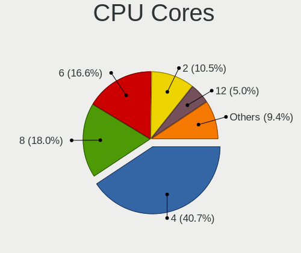

| Number  | Desktops | Percent |
|---------|----------|---------|
| 4       | 328      | 47.26%  |
| 6       | 122      | 17.58%  |
| 2       | 89       | 12.82%  |
| 8       | 85       | 12.25%  |
| 12      | 24       | 3.46%   |
| 16      | 20       | 2.88%   |
| 10      | 6        | 0.86%   |
| 3       | 6        | 0.86%   |
| 1       | 5        | 0.72%   |
| 32      | 4        | 0.58%   |
| 24      | 2        | 0.29%   |
| 18      | 1        | 0.14%   |
| 14      | 1        | 0.14%   |
| Unknown | 1        | 0.14%   |

CPU Sockets
-----------

Number of sockets

| Number | Desktops | Percent |
|--------|----------|---------|
| 1      | 679      | 97.98%  |
| 2      | 14       | 2.02%   |

CPU Threads
-----------

Threads per core (Hyper-Threading)

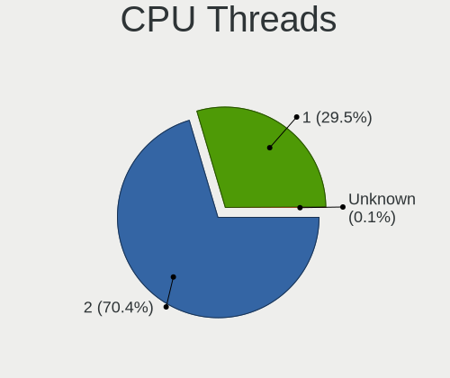

| Number  | Desktops | Percent |
|---------|----------|---------|
| 2       | 465      | 66.62%  |
| 1       | 232      | 33.24%  |
| Unknown | 1        | 0.14%   |

CPU Op-Modes
------------

CPU Operation Modes (32-bit, 64-bit)

| Op mode        | Desktops | Percent |
|----------------|----------|---------|
| 32-bit, 64-bit | 683      | 98.56%  |
| Unknown        | 6        | 0.87%   |
| 32-bit         | 4        | 0.58%   |

CPU Microcode
-------------

Microcode number

| Number     | Desktops | Percent |
|------------|----------|---------|
| Unknown    | 121      | 16.85%  |
| 0x306c3    | 73       | 10.17%  |
| 0x506e3    | 48       | 6.69%   |
| 0x306a9    | 45       | 6.27%   |
| 0x206a7    | 39       | 5.43%   |
| 0x906ea    | 29       | 4.04%   |
| 0x08701021 | 27       | 3.76%   |
| 0x1067a    | 25       | 3.48%   |
| 0x906e9    | 18       | 2.51%   |
| 0x0800820d | 17       | 2.37%   |
| 0xa0655    | 12       | 1.67%   |
| 0x08701013 | 12       | 1.67%   |
| 0x306f2    | 11       | 1.53%   |
| 0x206d7    | 10       | 1.39%   |
| 0x106e5    | 10       | 1.39%   |
| 0x50654    | 9        | 1.25%   |
| 0x0a201016 | 9        | 1.25%   |
| 0x08001138 | 9        | 1.25%   |
| 0x906ed    | 8        | 1.11%   |
| 0x106a5    | 8        | 1.11%   |
| 0x06000852 | 8        | 1.11%   |
| 0x01000083 | 8        | 1.11%   |
| 0x206c2    | 7        | 0.97%   |
| 0x0a201009 | 7        | 0.97%   |
| 0x07030105 | 7        | 0.97%   |
| 0xa0671    | 6        | 0.84%   |
| 0x010000c8 | 6        | 0.84%   |
| 0xa0653    | 5        | 0.7%    |
| 0x20655    | 5        | 0.7%    |
| 0x6fd      | 4        | 0.56%   |
| 0x306e4    | 4        | 0.56%   |
| 0x08108109 | 4        | 0.56%   |
| 0x08101016 | 4        | 0.56%   |
| 0x08001137 | 4        | 0.56%   |
| 0x010000dc | 4        | 0.56%   |
| 0x906eb    | 3        | 0.42%   |
| 0x6fb      | 3        | 0.42%   |
| 0x406f1    | 3        | 0.42%   |
| 0x20652    | 3        | 0.42%   |
| 0x10677    | 3        | 0.42%   |

CPU Microarch
-------------

Microarchitecture

| Name             | Desktops | Percent |
|------------------|----------|---------|
| Haswell          | 102      | 14.68%  |
| KabyLake         | 75       | 10.79%  |
| Skylake          | 65       | 9.35%   |
| SandyBridge      | 58       | 8.35%   |
| Zen 2            | 54       | 7.77%   |
| IvyBridge        | 53       | 7.63%   |
| Penryn           | 32       | 4.6%    |
| Zen+             | 30       | 4.32%   |
| Zen 3            | 30       | 4.32%   |
| Zen              | 27       | 3.88%   |
| Nehalem          | 23       | 3.31%   |
| K10              | 23       | 3.31%   |
| Piledriver       | 18       | 2.59%   |
| CometLake        | 18       | 2.59%   |
| Westmere         | 17       | 2.45%   |
| Core             | 15       | 2.16%   |
| Unknown          | 9        | 1.29%   |
| Puma             | 8        | 1.15%   |
| Silvermont       | 4        | 0.58%   |
| K8 Hammer        | 4        | 0.58%   |
| Jaguar           | 4        | 0.58%   |
| Icelake          | 4        | 0.58%   |
| NetBurst         | 3        | 0.43%   |
| Goldmont plus    | 3        | 0.43%   |
| Bulldozer        | 3        | 0.43%   |
| Broadwell        | 3        | 0.43%   |
| Alderlake Hybrid | 3        | 0.43%   |
| Goldmont         | 2        | 0.29%   |
| Steamroller      | 1        | 0.14%   |
| P6               | 1        | 0.14%   |
| K10 Llano        | 1        | 0.14%   |
| Excavator        | 1        | 0.14%   |
| Bonnell          | 1        | 0.14%   |

Graphics
--------

GPU Vendor
----------

Vendors of graphics cards

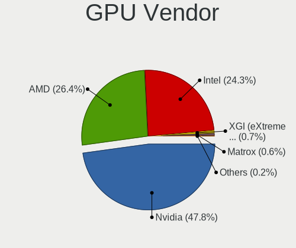

| Vendor                                       | Desktops | Percent |
|----------------------------------------------|----------|---------|
| Nvidia                                       | 347      | 47.53%  |
| AMD                                          | 185      | 25.34%  |
| Intel                                        | 183      | 25.07%  |
| XGI Technology (eXtreme Graphics Innovation) | 8        | 1.1%    |
| Matrox Electronics Systems                   | 5        | 0.68%   |
| ASPEED Technology                            | 2        | 0.27%   |

GPU Model
---------

Graphics card models

| Model                                                                       | Desktops | Percent |
|-----------------------------------------------------------------------------|----------|---------|
| Intel Xeon E3-1200 v3/4th Gen Core Processor Integrated Graphics Controller | 40       | 5.38%   |
| AMD Ellesmere [Radeon RX 470/480/570/570X/580/580X/590]                     | 32       | 4.3%    |
| Intel HD Graphics 530                                                       | 26       | 3.49%   |
| Intel CoffeeLake-S GT2 [UHD Graphics 630]                                   | 18       | 2.42%   |
| Nvidia GP102 [GeForce GTX 1080 Ti]                                          | 17       | 2.28%   |
| Intel 2nd Generation Core Processor Family Integrated Graphics Controller   | 17       | 2.28%   |
| Nvidia GK107GL [Quadro K420]                                                | 15       | 2.02%   |
| Nvidia GP106 [GeForce GTX 1060 6GB]                                         | 13       | 1.75%   |
| Nvidia GK208B [GeForce GT 710]                                              | 13       | 1.75%   |
| Nvidia GP107 [GeForce GTX 1050 Ti]                                          | 11       | 1.48%   |
| Intel IvyBridge GT2 [HD Graphics 4000]                                      | 11       | 1.48%   |
| AMD Navi 10 [Radeon RX 5600 OEM/5600 XT / 5700/5700 XT]                     | 11       | 1.48%   |
| Intel 4 Series Chipset Integrated Graphics Controller                       | 10       | 1.34%   |
| XGI Technology (eXtreme Graphics Innovation) Z7/Z9 (XG20 core)              | 8        | 1.08%   |
| Nvidia GP107GL [Quadro P400]                                                | 8        | 1.08%   |
| Nvidia GP104 [GeForce GTX 1080]                                             | 8        | 1.08%   |
| Nvidia GM206 [GeForce GTX 960]                                              | 8        | 1.08%   |
| Nvidia GM204 [GeForce GTX 970]                                              | 8        | 1.08%   |
| AMD Vega 10 XL/XT [Radeon RX Vega 56/64]                                    | 8        | 1.08%   |
| Nvidia GP104 [GeForce GTX 1070]                                             | 7        | 0.94%   |
| Nvidia GK208B [GeForce GT 730]                                              | 7        | 0.94%   |
| Intel CometLake-S GT2 [UHD Graphics 630]                                    | 7        | 0.94%   |
| AMD Raven Ridge [Radeon Vega Series / Radeon Vega Mobile Series]            | 7        | 0.94%   |
| Nvidia TU117 [GeForce GTX 1650]                                             | 6        | 0.81%   |
| Nvidia GT218 [GeForce 210]                                                  | 6        | 0.81%   |
| Nvidia GP107 [GeForce GTX 1050]                                             | 6        | 0.81%   |
| Nvidia GP102 [TITAN Xp]                                                     | 6        | 0.81%   |
| Nvidia GK104 [GeForce GTX 760]                                              | 6        | 0.81%   |
| Nvidia GF108 [GeForce GT 630]                                               | 6        | 0.81%   |
| Intel Xeon E3-1200 v2/3rd Gen Core processor Graphics Controller            | 6        | 0.81%   |
| Intel HD Graphics 630                                                       | 6        | 0.81%   |
| AMD Navi 22 [Radeon RX 6700/6700 XT/6750 XT / 6800M/6850M XT]               | 6        | 0.81%   |
| AMD Lexa PRO [Radeon 540/540X/550/550X / RX 540X/550/550X]                  | 6        | 0.81%   |
| AMD Caicos [Radeon HD 6450/7450/8450 / R5 230 OEM]                          | 6        | 0.81%   |
| Nvidia TU116 [GeForce GTX 1660 Ti]                                          | 5        | 0.67%   |
| Nvidia TU102 [GeForce RTX 2080 Ti Rev. A]                                   | 5        | 0.67%   |
| Nvidia GP108 [GeForce GT 1030]                                              | 5        | 0.67%   |
| Nvidia GM204 [GeForce GTX 980]                                              | 5        | 0.67%   |
| Nvidia GM200 [GeForce GTX TITAN X]                                          | 5        | 0.67%   |
| Nvidia GF119 [GeForce GT 610]                                               | 5        | 0.67%   |

GPU Combo
---------

Combinations of graphics cards

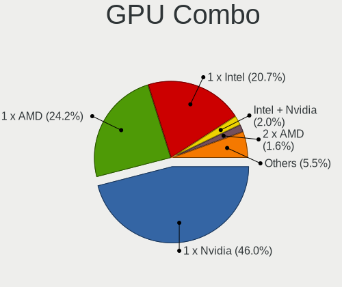

| Name                     | Desktops | Percent |
|--------------------------|----------|---------|
| 1 x Nvidia               | 330      | 47.01%  |
| 1 x AMD                  | 170      | 24.22%  |
| 1 x Intel                | 153      | 21.79%  |
| Other                    | 9        | 1.28%   |
| 1 x XGI                  | 8        | 1.14%   |
| Intel + Nvidia           | 7        | 1%      |
| Intel + AMD              | 6        | 0.85%   |
| 2 x AMD                  | 5        | 0.71%   |
| 1 x Matrox               | 4        | 0.57%   |
| AMD + Nvidia             | 4        | 0.57%   |
| 2 x Nvidia               | 2        | 0.28%   |
| 2 x Nvidia + 1 x ASPEED  | 1        | 0.14%   |
| Nvidia + Matrox          | 1        | 0.14%   |
| Nvidia + ASPEED          | 1        | 0.14%   |
| Intel + AMD + 1 x Nvidia | 1        | 0.14%   |

GPU Driver
----------

Free vs proprietary

| Driver      | Desktops | Percent |
|-------------|----------|---------|
| Free        | 434      | 61.47%  |
| Proprietary | 234      | 33.14%  |
| Unknown     | 38       | 5.38%   |

GPU Memory
----------

Total video memory

| Size in GB | Desktops | Percent |
|------------|----------|---------|
| Unknown    | 234      | 32.41%  |
| 1.01-2.0   | 128      | 17.73%  |
| 0.51-1.0   | 81       | 11.22%  |
| 7.01-8.0   | 71       | 9.83%   |
| 3.01-4.0   | 63       | 8.73%   |
| 8.01-16.0  | 59       | 8.17%   |
| 0.01-0.5   | 53       | 7.34%   |
| 5.01-6.0   | 23       | 3.19%   |
| 2.01-3.0   | 8        | 1.11%   |
| 4.01-5.0   | 1        | 0.14%   |
| 16.01-24.0 | 1        | 0.14%   |

Monitor
-------

Monitor Vendor
--------------

Monitor vendors

| Vendor               | Desktops | Percent |
|----------------------|----------|---------|
| Samsung Electronics  | 147      | 19.63%  |
| Dell                 | 91       | 12.15%  |
| Acer                 | 69       | 9.21%   |
| Hewlett-Packard      | 56       | 7.48%   |
| Philips              | 53       | 7.08%   |
| BenQ                 | 44       | 5.87%   |
| Ancor Communications | 43       | 5.74%   |
| Goldstar             | 29       | 3.87%   |
| AOC                  | 28       | 3.74%   |
| Eizo                 | 19       | 2.54%   |
| Unknown              | 18       | 2.4%    |
| ASUSTek Computer     | 17       | 2.27%   |
| Sony                 | 14       | 1.87%   |
| Apple                | 12       | 1.6%    |
| Lenovo               | 10       | 1.34%   |
| Iiyama               | 9        | 1.2%    |
| NEC Computers        | 6        | 0.8%    |
| Medion               | 6        | 0.8%    |
| Sharp                | 5        | 0.67%   |
| AUS                  | 5        | 0.67%   |
| ViewSonic            | 4        | 0.53%   |
| Panasonic            | 4        | 0.53%   |
| LG Electronics       | 4        | 0.53%   |
| Gigabyte Technology  | 4        | 0.53%   |
| Fujitsu Siemens      | 4        | 0.53%   |
| ___                  | 3        | 0.4%    |
| Toshiba              | 3        | 0.4%    |
| MSI                  | 3        | 0.4%    |
| Belinea              | 3        | 0.4%    |
| Vestel               | 2        | 0.27%   |
| Onkyo                | 2        | 0.27%   |
| Idek Iiyama          | 2        | 0.27%   |
| HPN                  | 2        | 0.27%   |
| DENON                | 2        | 0.27%   |
| Compal               | 2        | 0.27%   |
| Yamaha               | 1        | 0.13%   |
| VMO                  | 1        | 0.13%   |
| USR                  | 1        | 0.13%   |
| RS                   | 1        | 0.13%   |
| Packard Bell         | 1        | 0.13%   |

Monitor Model
-------------

Monitor models

| Model                                                                 | Desktops | Percent |
|-----------------------------------------------------------------------|----------|---------|
| Samsung Electronics LCD Monitor SyncMaster 1920x1200                  | 8        | 0.97%   |
| Ancor Communications ASUS VS247 ACI249A 1920x1080 521x293mm 23.5-inch | 7        | 0.85%   |
| Philips LCD Monitor PHL 272S4L 2560x1440                              | 6        | 0.73%   |
| Sharp HDMI SHP1022 1920x1080 820x460mm 37.0-inch                      | 4        | 0.48%   |
| Samsung Electronics U32J59x SAM0F33 3840x2160 697x392mm 31.5-inch     | 4        | 0.48%   |
| Samsung Electronics SMS24A450 SAM083A 1920x1200 518x324mm 24.1-inch   | 4        | 0.48%   |
| Samsung Electronics LCD Monitor SyncMaster                            | 4        | 0.48%   |
| Samsung Electronics C49HG9x SAM0E5D 3840x1080 1196x336mm 48.9-inch    | 4        | 0.48%   |
| Samsung Electronics C27F390 SAM0D32 1920x1080 598x336mm 27.0-inch     | 4        | 0.48%   |
| Hewlett-Packard LA2405 HWP284B 1920x1200 518x324mm 24.1-inch          | 4        | 0.48%   |
| Goldstar HDR 4K GSM7707 3840x2160 600x340mm 27.2-inch                 | 4        | 0.48%   |
| Dell LCD Monitor P2719H 3840x1080                                     | 4        | 0.48%   |
| Dell LCD Monitor P2719H                                               | 4        | 0.48%   |
| Ancor Communications ASUS PB278 ACI27A3 2560x1440 597x336mm 27.0-inch | 4        | 0.48%   |
| Acer X223HQ ACR0098 1920x1080 477x268mm 21.5-inch                     | 4        | 0.48%   |
| Samsung Electronics U32J59x SAM0F34 3840x2160 697x392mm 31.5-inch     | 3        | 0.36%   |
| Samsung Electronics S24E650 SAM0CB8 1920x1080 521x293mm 23.5-inch     | 3        | 0.36%   |
| Samsung Electronics LCD Monitor SyncMaster 1600x1200                  | 3        | 0.36%   |
| Samsung Electronics LCD Monitor SMS24A450 1920x1200                   | 3        | 0.36%   |
| Samsung Electronics LCD Monitor SMS24A450                             | 3        | 0.36%   |
| Philips 220SW PHL086F 1680x1050 474x296mm 22.0-inch                   | 3        | 0.36%   |
| Panasonic TV MEIA296 3840x2160 1872x1053mm 84.6-inch                  | 3        | 0.36%   |
| Hewlett-Packard ZR2240w HWP2950 1920x1080 475x267mm 21.5-inch         | 3        | 0.36%   |
| Dell P2418D DELD0C1 2560x1440 526x296mm 23.8-inch                     | 3        | 0.36%   |
| Dell 1704FPV DEL3016 1280x1024 338x270mm 17.0-inch                    | 3        | 0.36%   |
| BenQ GL2450H BNQ78A7 1920x1080 531x298mm 24.0-inch                    | 3        | 0.36%   |
| ASUSTek Computer VP278 AUS27AE 1920x1080 598x336mm 27.0-inch          | 3        | 0.36%   |
| Ancor Communications VS278 ACI27A1 1920x1080 598x336mm 27.0-inch      | 3        | 0.36%   |
| Acer X223W ACR000D 1680x1050 474x296mm 22.0-inch                      | 3        | 0.36%   |
| ___ LCDTV16 ___0101 1360x768                                          | 2        | 0.24%   |
| ___ LCD TV ___9000 1360x768                                           | 2        | 0.24%   |
| Unknown T19DS 643B 1280x1024 338x270mm 17.0-inch                      | 2        | 0.24%   |
| Sony TV SNYEE01 1920x1080                                             | 2        | 0.24%   |
| Samsung Electronics U32R59x SAM0F94 3840x2160 697x392mm 31.5-inch     | 2        | 0.24%   |
| Samsung Electronics U28E590 SAM0C4D 3840x2160 607x345mm 27.5-inch     | 2        | 0.24%   |
| Samsung Electronics SyncMaster SAM0587 1920x1200 518x324mm 24.1-inch  | 2        | 0.24%   |
| Samsung Electronics SyncMaster SAM0586 1920x1200 518x324mm 24.1-inch  | 2        | 0.24%   |
| Samsung Electronics S27C350 SAM0A3E 1920x1080 600x340mm 27.2-inch     | 2        | 0.24%   |
| Samsung Electronics S24C650 SAM09E9 1920x1080 521x293mm 23.5-inch     | 2        | 0.24%   |
| Samsung Electronics S24B300 SAM08CC 1920x1080 521x293mm 23.5-inch     | 2        | 0.24%   |

Monitor Resolution
------------------

Monitor screen resolution

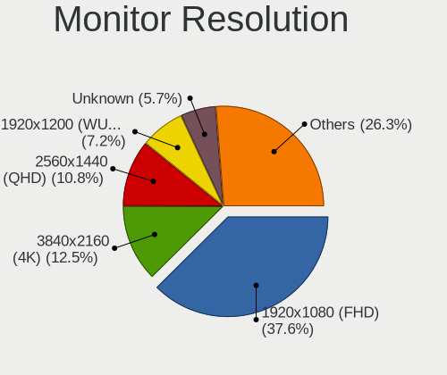

| Resolution         | Desktops | Percent |
|--------------------|----------|---------|
| 1920x1080 (FHD)    | 271      | 36.42%  |
| 3840x2160 (4K)     | 79       | 10.62%  |
| 2560x1440 (QHD)    | 68       | 9.14%   |
| 1920x1200 (WUXGA)  | 58       | 7.8%    |
| Unknown            | 51       | 6.85%   |
| 1680x1050 (WSXGA+) | 45       | 6.05%   |
| 1280x1024 (SXGA)   | 42       | 5.65%   |
| 3440x1440          | 22       | 2.96%   |
| 3840x1080          | 19       | 2.55%   |
| 1600x1200          | 15       | 2.02%   |
| 2560x1600          | 8        | 1.08%   |
| 3840x1200          | 6        | 0.81%   |
| 1440x900 (WXGA+)   | 6        | 0.81%   |
| 4480x1440          | 5        | 0.67%   |
| 2560x1080          | 5        | 0.67%   |
| 1360x768           | 5        | 0.67%   |
| 3520x1200          | 3        | 0.4%    |
| 3360x1050          | 3        | 0.4%    |
| 7680x2160          | 2        | 0.27%   |
| 6400x1440          | 2        | 0.27%   |
| 5120x1440          | 2        | 0.27%   |
| 3840x1600          | 2        | 0.27%   |
| 3200x1080          | 2        | 0.27%   |
| 2048x1152          | 2        | 0.27%   |
| 1920x540           | 2        | 0.27%   |
| 1600x900 (HD+)     | 2        | 0.27%   |
| 5760x2160          | 1        | 0.13%   |
| 5760x1080          | 1        | 0.13%   |
| 5440x1080          | 1        | 0.13%   |
| 5348x1080          | 1        | 0.13%   |
| 3968x1200          | 1        | 0.13%   |
| 3600x1200          | 1        | 0.13%   |
| 3200x1800 (QHD+)   | 1        | 0.13%   |
| 2880x1200          | 1        | 0.13%   |
| 2560x1024          | 1        | 0.13%   |
| 2288x1287          | 1        | 0.13%   |
| 1400x1050          | 1        | 0.13%   |
| 1366x768 (WXGA)    | 1        | 0.13%   |
| 1280x960           | 1        | 0.13%   |
| 1280x768           | 1        | 0.13%   |

Monitor Diagonal
----------------

Diagonal size in inches

| Inches  | Desktops | Percent |
|---------|----------|---------|
| Unknown | 144      | 19.7%   |
| 27      | 117      | 16.01%  |
| 24      | 107      | 14.64%  |
| 23      | 76       | 10.4%   |
| 21      | 49       | 6.7%    |
| 31      | 33       | 4.51%   |
| 22      | 25       | 3.42%   |
| 19      | 25       | 3.42%   |
| 34      | 20       | 2.74%   |
| 20      | 17       | 2.33%   |
| 32      | 13       | 1.78%   |
| 17      | 13       | 1.78%   |
| 72      | 10       | 1.37%   |
| 40      | 9        | 1.23%   |
| 84      | 8        | 1.09%   |
| 29      | 7        | 0.96%   |
| 46      | 5        | 0.68%   |
| 37      | 5        | 0.68%   |
| 28      | 5        | 0.68%   |
| 25      | 5        | 0.68%   |
| 49      | 4        | 0.55%   |
| 26      | 4        | 0.55%   |
| 54      | 3        | 0.41%   |
| 33      | 3        | 0.41%   |
| 18      | 3        | 0.41%   |
| 15      | 3        | 0.41%   |
| 60      | 2        | 0.27%   |
| 55      | 2        | 0.27%   |
| 48      | 2        | 0.27%   |
| 42      | 2        | 0.27%   |
| 142     | 1        | 0.14%   |
| 74      | 1        | 0.14%   |
| 65      | 1        | 0.14%   |
| 59      | 1        | 0.14%   |
| 50      | 1        | 0.14%   |
| 39      | 1        | 0.14%   |
| 35      | 1        | 0.14%   |
| 30      | 1        | 0.14%   |
| 16      | 1        | 0.14%   |
| 13      | 1        | 0.14%   |

Monitor Width
-------------

Physical width

| Width in mm    | Desktops | Percent |
|----------------|----------|---------|
| 501-600        | 271      | 38.17%  |
| Unknown        | 144      | 20.28%  |
| 401-500        | 98       | 13.8%   |
| 601-700        | 60       | 8.45%   |
| 701-800        | 36       | 5.07%   |
| 351-400        | 24       | 3.38%   |
| 1001-1500      | 21       | 2.96%   |
| 1501-2000      | 19       | 2.68%   |
| 301-350        | 17       | 2.39%   |
| 801-900        | 16       | 2.25%   |
| 901-1000       | 2        | 0.28%   |
| More than 2000 | 1        | 0.14%   |
| 201-300        | 1        | 0.14%   |

Aspect Ratio
------------

Proportional relationship between the width and the height

| Ratio   | Desktops | Percent |
|---------|----------|---------|
| 16/9    | 357      | 52.5%   |
| Unknown | 135      | 19.85%  |
| 16/10   | 103      | 15.15%  |
| 5/4     | 36       | 5.29%   |
| 21/9    | 25       | 3.68%   |
| 4/3     | 11       | 1.62%   |
| 32/9    | 6        | 0.88%   |
| 3/2     | 3        | 0.44%   |
| 6/5     | 2        | 0.29%   |
| 1.00    | 2        | 0.29%   |

Monitor Area
------------

Area in inch

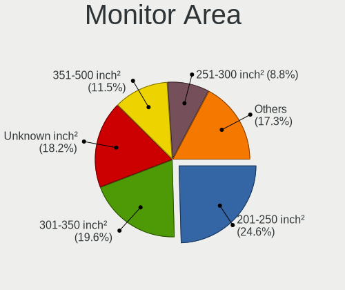

| Area in inch | Desktops | Percent |
|----------------|----------|---------|
| 201-250        | 184      | 25.7%   |
| Unknown        | 144      | 20.11%  |
| 301-350        | 120      | 16.76%  |
| 351-500        | 80       | 11.17%  |
| 251-300        | 61       | 8.52%   |
| 151-200        | 54       | 7.54%   |
| More than 1000 | 32       | 4.47%   |
| 501-1000       | 23       | 3.21%   |
| 141-150        | 13       | 1.82%   |
| 101-110        | 2        | 0.28%   |
| 71-80          | 1        | 0.14%   |
| 131-140        | 1        | 0.14%   |
| 91-100         | 1        | 0.14%   |

Pixel Density
-------------

Pixels per inch

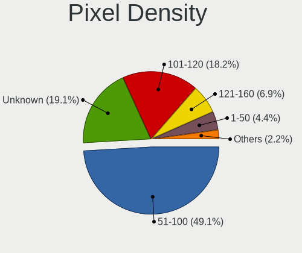

| Density       | Desktops | Percent |
|---------------|----------|---------|
| 51-100        | 342      | 49.85%  |
| Unknown       | 144      | 20.99%  |
| 101-120       | 112      | 16.33%  |
| 121-160       | 41       | 5.98%   |
| 1-50          | 31       | 4.52%   |
| 161-240       | 15       | 2.19%   |
| More than 240 | 1        | 0.15%   |

Multiple Monitors
-----------------

Total monitors connected

| Total | Desktops | Percent |
|-------|----------|---------|
| 1     | 492      | 69%     |
| 2     | 131      | 18.37%  |
| 0     | 67       | 9.4%    |
| 3     | 21       | 2.95%   |
| 4     | 2        | 0.28%   |

Network
-------

Net Controller Vendor
---------------------

Controller vendors

| Vendor                          | Desktops | Percent |
|---------------------------------|----------|---------|
| Intel                           | 423      | 43.52%  |
| Realtek Semiconductor           | 316      | 32.51%  |
| Qualcomm Atheros                | 46       | 4.73%   |
| Broadcom                        | 34       | 3.5%    |
| Aquantia                        | 24       | 2.47%   |
| Ralink Technology               | 12       | 1.23%   |
| Ralink                          | 10       | 1.03%   |
| Nvidia                          | 10       | 1.03%   |
| NetGear                         | 8        | 0.82%   |
| MediaTek                        | 7        | 0.72%   |
| Marvell Technology Group        | 7        | 0.72%   |
| Edimax Technology               | 7        | 0.72%   |
| TP-Link                         | 6        | 0.62%   |
| Broadcom Limited                | 5        | 0.51%   |
| IMC Networks                    | 4        | 0.41%   |
| Huawei Technologies             | 4        | 0.41%   |
| D-Link                          | 4        | 0.41%   |
| ASIX Electronics                | 4        | 0.41%   |
| Xiaomi                          | 3        | 0.31%   |
| Samsung Electronics             | 3        | 0.31%   |
| Microsoft                       | 3        | 0.31%   |
| D-Link System                   | 3        | 0.31%   |
| AVM                             | 3        | 0.31%   |
| Wilocity                        | 2        | 0.21%   |
| Qualcomm Atheros Communications | 2        | 0.21%   |
| NetXen Incorporated             | 2        | 0.21%   |
| Microchip Technology            | 2        | 0.21%   |
| Micro Star International        | 2        | 0.21%   |
| Mellanox Technologies           | 2        | 0.21%   |
| ASUSTek Computer                | 2        | 0.21%   |
| ZEPHYR                          | 1        | 0.1%    |
| SEGGER                          | 1        | 0.1%    |
| QNAP System                     | 1        | 0.1%    |
| Philips (or NXP)                | 1        | 0.1%    |
| Netopia                         | 1        | 0.1%    |
| Netchip Technology              | 1        | 0.1%    |
| InterBiometrics                 | 1        | 0.1%    |
| Gemtek                          | 1        | 0.1%    |
| Exar                            | 1        | 0.1%    |
| DisplayLink                     | 1        | 0.1%    |

Net Controller Model
--------------------

Controller models

| Model                                                             | Desktops | Percent |
|-------------------------------------------------------------------|----------|---------|
| Realtek RTL8111/8168/8411 PCI Express Gigabit Ethernet Controller | 254      | 22.94%  |
| Intel I211 Gigabit Network Connection                             | 75       | 6.78%   |
| Intel Ethernet Connection (2) I219-V                              | 51       | 4.61%   |
| Intel Wi-Fi 6 AX200                                               | 44       | 3.97%   |
| Intel Ethernet Connection I217-LM                                 | 34       | 3.07%   |
| Realtek RTL8125 2.5GbE Controller                                 | 30       | 2.71%   |
| Intel Ethernet Connection (2) I219-LM                             | 30       | 2.71%   |
| Intel 82574L Gigabit Network Connection                           | 29       | 2.62%   |
| Intel 82579V Gigabit Network Connection                           | 28       | 2.53%   |
| Intel 82579LM Gigabit Network Connection (Lewisville)             | 25       | 2.26%   |
| Intel Ethernet Connection (2) I218-V                              | 21       | 1.9%    |
| Aquantia AQC107 NBase-T/IEEE 802.3bz Ethernet Controller [AQtion] | 18       | 1.63%   |
| Intel Ethernet Controller I225-V                                  | 16       | 1.45%   |
| Intel I210 Gigabit Network Connection                             | 15       | 1.36%   |
| Intel Dual Band Wireless-AC 3168NGW [Stone Peak]                  | 12       | 1.08%   |
| Intel Ethernet Connection (7) I219-V                              | 11       | 0.99%   |
| Realtek RTL8153 Gigabit Ethernet Adapter                          | 10       | 0.9%    |
| Intel Ethernet Connection I217-V                                  | 9        | 0.81%   |
| Intel Cannon Lake PCH CNVi WiFi                                   | 9        | 0.81%   |
| Qualcomm Atheros QCA6174 802.11ac Wireless Network Adapter        | 8        | 0.72%   |
| Intel 82567LM-3 Gigabit Network Connection                        | 8        | 0.72%   |
| Realtek RTL8192CE PCIe Wireless Network Adapter                   | 7        | 0.63%   |
| Intel Wireless 8260                                               | 7        | 0.63%   |
| Intel Wireless 7260                                               | 7        | 0.63%   |
| Nvidia MCP55 Ethernet                                             | 6        | 0.54%   |
| Intel Wireless-AC 9260                                            | 6        | 0.54%   |
| Qualcomm Atheros Killer E2400 Gigabit Ethernet Controller         | 5        | 0.45%   |
| Qualcomm Atheros AR9287 Wireless Network Adapter (PCI-Express)    | 5        | 0.45%   |
| Marvell Group 88E8056 PCI-E Gigabit Ethernet Controller           | 5        | 0.45%   |
| Intel Wireless 8265 / 8275                                        | 5        | 0.45%   |
| Intel Wi-Fi 6 AX210/AX211/AX411 160MHz                            | 5        | 0.45%   |
| Intel Tiger Lake PCH CNVi WiFi                                    | 5        | 0.45%   |
| Intel Ethernet Connection (7) I219-LM                             | 5        | 0.45%   |
| Intel Comet Lake PCH CNVi WiFi                                    | 5        | 0.45%   |
| Broadcom BCM4352 802.11ac Wireless Network Adapter                | 5        | 0.45%   |
| Realtek RTL8822CE 802.11ac PCIe Wireless Network Adapter          | 4        | 0.36%   |
| Realtek RTL8822BE 802.11a/b/g/n/ac WiFi adapter                   | 4        | 0.36%   |
| Realtek RTL8821AE 802.11ac PCIe Wireless Network Adapter          | 4        | 0.36%   |
| Realtek RTL8191SEvB Wireless LAN Controller                       | 4        | 0.36%   |
| Realtek RTL8188CUS 802.11n WLAN Adapter                           | 4        | 0.36%   |

Wireless Vendor
---------------

Wireless vendors

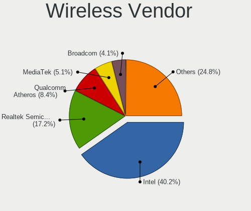

| Vendor                                | Desktops | Percent |
|---------------------------------------|----------|---------|
| Intel                                 | 119      | 41.46%  |
| Realtek Semiconductor                 | 45       | 15.68%  |
| Qualcomm Atheros                      | 30       | 10.45%  |
| Broadcom                              | 13       | 4.53%   |
| Ralink Technology                     | 12       | 4.18%   |
| Ralink                                | 10       | 3.48%   |
| NetGear                               | 8        | 2.79%   |
| Edimax Technology                     | 7        | 2.44%   |
| MediaTek                              | 6        | 2.09%   |
| TP-Link                               | 5        | 1.74%   |
| IMC Networks                          | 4        | 1.39%   |
| D-Link                                | 4        | 1.39%   |
| Microsoft                             | 3        | 1.05%   |
| D-Link System                         | 3        | 1.05%   |
| AVM                                   | 3        | 1.05%   |
| Wilocity                              | 2        | 0.7%    |
| Qualcomm Atheros Communications       | 2        | 0.7%    |
| Micro Star International              | 2        | 0.7%    |
| Broadcom Limited                      | 2        | 0.7%    |
| ASUSTek Computer                      | 2        | 0.7%    |
| Philips (or NXP)                      | 1        | 0.35%   |
| Netopia                               | 1        | 0.35%   |
| Marvell Technology Group              | 1        | 0.35%   |
| Gemtek                                | 1        | 0.35%   |
| 802.11g Adapter [Linksys WUSB54GC v3] | 1        | 0.35%   |

Wireless Model
--------------

Wireless models

| Model                                                          | Desktops | Percent |
|----------------------------------------------------------------|----------|---------|
| Intel Wi-Fi 6 AX200                                            | 44       | 15.22%  |
| Intel Dual Band Wireless-AC 3168NGW [Stone Peak]               | 12       | 4.15%   |
| Intel Cannon Lake PCH CNVi WiFi                                | 9        | 3.11%   |
| Qualcomm Atheros QCA6174 802.11ac Wireless Network Adapter     | 8        | 2.77%   |
| Realtek RTL8192CE PCIe Wireless Network Adapter                | 7        | 2.42%   |
| Intel Wireless 8260                                            | 7        | 2.42%   |
| Intel Wireless 7260                                            | 7        | 2.42%   |
| Intel Wireless-AC 9260                                         | 6        | 2.08%   |
| Qualcomm Atheros AR9287 Wireless Network Adapter (PCI-Express) | 5        | 1.73%   |
| Intel Wireless 8265 / 8275                                     | 5        | 1.73%   |
| Intel Wi-Fi 6 AX210/AX211/AX411 160MHz                         | 5        | 1.73%   |
| Intel Tiger Lake PCH CNVi WiFi                                 | 5        | 1.73%   |
| Intel Comet Lake PCH CNVi WiFi                                 | 5        | 1.73%   |
| Broadcom BCM4352 802.11ac Wireless Network Adapter             | 5        | 1.73%   |
| Realtek RTL8822CE 802.11ac PCIe Wireless Network Adapter       | 4        | 1.38%   |
| Realtek RTL8822BE 802.11a/b/g/n/ac WiFi adapter                | 4        | 1.38%   |
| Realtek RTL8821AE 802.11ac PCIe Wireless Network Adapter       | 4        | 1.38%   |
| Realtek RTL8191SEvB Wireless LAN Controller                    | 4        | 1.38%   |
| Realtek RTL8188CUS 802.11n WLAN Adapter                        | 4        | 1.38%   |
| Ralink RT3090 Wireless 802.11n 1T/1R PCIe                      | 4        | 1.38%   |
| NetGear A6210                                                  | 4        | 1.38%   |
| MediaTek MT7921K (RZ608) Wi-Fi 6E 80MHz                        | 4        | 1.38%   |
| IMC Networks Mediao 802.11n WLAN [Realtek RTL8191SU]           | 4        | 1.38%   |
| Realtek RTL8812AE 802.11ac PCIe Wireless Network Adapter       | 3        | 1.04%   |
| Realtek RTL8188EUS 802.11n Wireless Network Adapter            | 3        | 1.04%   |
| Ralink RT2870/RT3070 Wireless Adapter                          | 3        | 1.04%   |
| Ralink MT7610U ("Archer T2U" 2.4G+5G WLAN Adapter              | 3        | 1.04%   |
| Qualcomm Atheros QCA9565 / AR9565 Wireless Network Adapter     | 3        | 1.04%   |
| Qualcomm Atheros AR9485 Wireless Network Adapter               | 3        | 1.04%   |
| Microsoft Xbox 360 Wireless Adapter                            | 3        | 1.04%   |
| Intel Wireless 3165                                            | 3        | 1.04%   |
| Intel Alder Lake-S PCH CNVi WiFi                               | 3        | 1.04%   |
| Broadcom BCM4360 802.11ac Wireless Network Adapter             | 3        | 1.04%   |
| Wilocity Wil6200 802.11ad Wireless Network Adapter             | 2        | 0.69%   |
| TP-Link 802.11ac NIC                                           | 2        | 0.69%   |
| Realtek RTL8812AU 802.11a/b/g/n/ac 2T2R DB WLAN Adapter        | 2        | 0.69%   |
| Realtek RTL8811AU 802.11a/b/g/n/ac WLAN Adapter                | 2        | 0.69%   |
| Realtek RTL8188CE 802.11b/g/n WiFi Adapter                     | 2        | 0.69%   |
| Ralink RT5572 Wireless Adapter                                 | 2        | 0.69%   |
| Ralink RT2501USB Wireless Adapter                              | 2        | 0.69%   |

Ethernet Vendor
---------------

Ethernet vendors

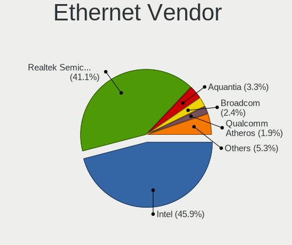

| Vendor                   | Desktops | Percent |
|--------------------------|----------|---------|
| Intel                    | 373      | 48.13%  |
| Realtek Semiconductor    | 297      | 38.32%  |
| Aquantia                 | 24       | 3.1%    |
| Broadcom                 | 21       | 2.71%   |
| Qualcomm Atheros         | 17       | 2.19%   |
| Nvidia                   | 10       | 1.29%   |
| Marvell Technology Group | 6        | 0.77%   |
| Huawei Technologies      | 4        | 0.52%   |
| ASIX Electronics         | 4        | 0.52%   |
| Xiaomi                   | 3        | 0.39%   |
| Samsung Electronics      | 3        | 0.39%   |
| Broadcom Limited         | 3        | 0.39%   |
| NetXen Incorporated      | 2        | 0.26%   |
| Mellanox Technologies    | 2        | 0.26%   |
| TP-Link                  | 1        | 0.13%   |
| QNAP System              | 1        | 0.13%   |
| Netchip Technology       | 1        | 0.13%   |
| MediaTek                 | 1        | 0.13%   |
| DisplayLink              | 1        | 0.13%   |
| ADMtek                   | 1        | 0.13%   |

Ethernet Model
--------------

Ethernet models

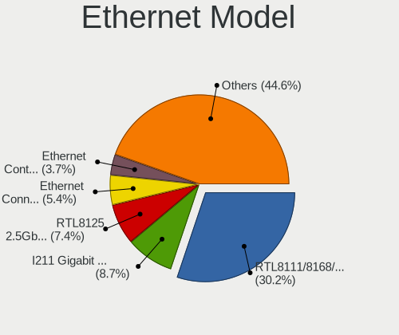

| Model                                                             | Desktops | Percent |
|-------------------------------------------------------------------|----------|---------|
| Realtek RTL8111/8168/8411 PCI Express Gigabit Ethernet Controller | 254      | 31.28%  |
| Intel I211 Gigabit Network Connection                             | 75       | 9.24%   |
| Intel Ethernet Connection (2) I219-V                              | 51       | 6.28%   |
| Intel Ethernet Connection I217-LM                                 | 34       | 4.19%   |
| Realtek RTL8125 2.5GbE Controller                                 | 30       | 3.69%   |
| Intel Ethernet Connection (2) I219-LM                             | 30       | 3.69%   |
| Intel 82574L Gigabit Network Connection                           | 29       | 3.57%   |
| Intel 82579V Gigabit Network Connection                           | 28       | 3.45%   |
| Intel 82579LM Gigabit Network Connection (Lewisville)             | 25       | 3.08%   |
| Intel Ethernet Connection (2) I218-V                              | 21       | 2.59%   |
| Aquantia AQC107 NBase-T/IEEE 802.3bz Ethernet Controller [AQtion] | 18       | 2.22%   |
| Intel Ethernet Controller I225-V                                  | 16       | 1.97%   |
| Intel I210 Gigabit Network Connection                             | 15       | 1.85%   |
| Intel Ethernet Connection (7) I219-V                              | 11       | 1.35%   |
| Realtek RTL8153 Gigabit Ethernet Adapter                          | 10       | 1.23%   |
| Intel Ethernet Connection I217-V                                  | 9        | 1.11%   |
| Intel 82567LM-3 Gigabit Network Connection                        | 8        | 0.99%   |
| Nvidia MCP55 Ethernet                                             | 6        | 0.74%   |
| Qualcomm Atheros Killer E2400 Gigabit Ethernet Controller         | 5        | 0.62%   |
| Marvell Group 88E8056 PCI-E Gigabit Ethernet Controller           | 5        | 0.62%   |
| Intel Ethernet Connection (7) I219-LM                             | 5        | 0.62%   |
| Realtek RTL-8100/8101L/8139 PCI Fast Ethernet Adapter             | 4        | 0.49%   |
| Huawei MLA-L11                                                    | 4        | 0.49%   |
| Broadcom NetLink BCM57781 Gigabit Ethernet PCIe                   | 4        | 0.49%   |
| Xiaomi Mi/Redmi series (RNDIS)                                    | 3        | 0.37%   |
| Realtek RTL-8110SC/8169SC Gigabit Ethernet                        | 3        | 0.37%   |
| Qualcomm Atheros Killer E220x Gigabit Ethernet Controller         | 3        | 0.37%   |
| Qualcomm Atheros AR8161 Gigabit Ethernet                          | 3        | 0.37%   |
| Qualcomm Atheros AR8151 v2.0 Gigabit Ethernet                     | 3        | 0.37%   |
| Intel I350 Gigabit Network Connection                             | 3        | 0.37%   |
| Intel Ethernet Connection (2) I218-LM                             | 3        | 0.37%   |
| Intel 82567V-2 Gigabit Network Connection                         | 3        | 0.37%   |
| Intel 82566DC-2 Gigabit Network Connection                        | 3        | 0.37%   |
| Intel 82541PI Gigabit Ethernet Controller                         | 3        | 0.37%   |
| Broadcom NetXtreme BCM5764M Gigabit Ethernet PCIe                 | 3        | 0.37%   |
| Broadcom NetXtreme BCM5721 Gigabit Ethernet PCI Express           | 3        | 0.37%   |
| ASIX AX88179 Gigabit Ethernet                                     | 3        | 0.37%   |
| Aquantia AQC111 NBase-T/IEEE 802.3bz Ethernet Controller [AQtion] | 3        | 0.37%   |
| Samsung GT-I9070 (network tethering, USB debugging enabled)       | 2        | 0.25%   |
| Nvidia MCP77 Ethernet                                             | 2        | 0.25%   |

Net Controller Kind
-------------------

Ethernet, WiFi or modem

| Kind     | Desktops | Percent |
|----------|----------|---------|
| Ethernet | 690      | 71.21%  |
| WiFi     | 274      | 28.28%  |
| Modem    | 5        | 0.52%   |

Used Controller
---------------

Currently used network controller

| Kind     | Desktops | Percent |
|----------|----------|---------|
| Ethernet | 584      | 83.31%  |
| WiFi     | 117      | 16.69%  |

NICs
----

Total network controllers on board

| Total | Desktops | Percent |
|-------|----------|---------|
| 1     | 400      | 57.22%  |
| 2     | 222      | 31.76%  |
| 3     | 53       | 7.58%   |
| 4     | 13       | 1.86%   |
| 5     | 4        | 0.57%   |
| 6     | 3        | 0.43%   |
| 0     | 3        | 0.43%   |
| 7     | 1        | 0.14%   |

IPv6
----

IPv6 vs IPv4

| Used | Desktops | Percent |
|------|----------|---------|
| No   | 576      | 81.24%  |
| Yes  | 133      | 18.76%  |

Bluetooth
---------

Bluetooth Vendor
----------------

Controller vendors

| Vendor                          | Desktops | Percent |
|---------------------------------|----------|---------|
| Intel                           | 113      | 50.45%  |
| Cambridge Silicon Radio         | 41       | 18.3%   |
| ASUSTek Computer                | 22       | 9.82%   |
| Realtek Semiconductor           | 8        | 3.57%   |
| Qualcomm Atheros Communications | 8        | 3.57%   |
| IMC Networks                    | 7        | 3.13%   |
| Broadcom                        | 7        | 3.13%   |
| MediaTek                        | 4        | 1.79%   |
| Apple                           | 4        | 1.79%   |
| Micro Star International        | 2        | 0.89%   |
| Lite-On Technology              | 2        | 0.89%   |
| Realtek                         | 1        | 0.45%   |
| Logitech                        | 1        | 0.45%   |
| Integrated System Solution      | 1        | 0.45%   |
| Foxconn / Hon Hai               | 1        | 0.45%   |
| Edimax Technology               | 1        | 0.45%   |
| Dell                            | 1        | 0.45%   |

Bluetooth Model
---------------

Controller models

| Model                                                   | Desktops | Percent |
|---------------------------------------------------------|----------|---------|
| Cambridge Silicon Radio Bluetooth Dongle (HCI mode)     | 41       | 18.3%   |
| Intel AX200 Bluetooth                                   | 40       | 17.86%  |
| Intel Bluetooth wireless interface                      | 25       | 11.16%  |
| Intel Wireless-AC 3168 Bluetooth                        | 12       | 5.36%   |
| Intel AX201 Bluetooth                                   | 12       | 5.36%   |
| Intel Bluetooth 9460/9560 Jefferson Peak (JfP)          | 9        | 4.02%   |
| Intel Wireless-AC 9260 Bluetooth Adapter                | 7        | 3.13%   |
| Realtek Bluetooth Radio                                 | 6        | 2.68%   |
| Broadcom BCM20702A0 Bluetooth 4.0                       | 6        | 2.68%   |
| Intel AX210 Bluetooth                                   | 5        | 2.23%   |
| IMC Networks Bluetooth Radio                            | 5        | 2.23%   |
| MediaTek Wireless_Device                                | 4        | 1.79%   |
| ASUS Qualcomm Bluetooth 4.1                             | 4        | 1.79%   |
| ASUS Broadcom BCM20702A0 Bluetooth                      | 4        | 1.79%   |
| ASUS Bluetooth Device                                   | 4        | 1.79%   |
| ASUS BCM20702A0                                         | 4        | 1.79%   |
| Qualcomm Atheros  Bluetooth Device                      | 3        | 1.34%   |
| Intel Centrino Bluetooth Wireless Transceiver           | 3        | 1.34%   |
| ASUS Bluetooth Radio                                    | 3        | 1.34%   |
| Apple Built-in Bluetooth 2.0+EDR HCI                    | 3        | 1.34%   |
| Qualcomm Atheros AR3011 Bluetooth                       | 2        | 0.89%   |
| Micro Star International Bluetooth Device               | 2        | 0.89%   |
| ASUS ASUS USB-BT500                                     | 2        | 0.89%   |
| Realtek RTL8821A Bluetooth                              | 1        | 0.45%   |
| Realtek  Bluetooth 4.2 Adapter                          | 1        | 0.45%   |
| Realtek Bluetooth Radio                                 | 1        | 0.45%   |
| Qualcomm Atheros Bluetooth USB Host Controller          | 1        | 0.45%   |
| Qualcomm Atheros AR9462 Bluetooth                       | 1        | 0.45%   |
| Qualcomm Atheros AR3012 Bluetooth 4.0                   | 1        | 0.45%   |
| Logitech BT Mini-Receiver (HCI mode)                    | 1        | 0.45%   |
| Lite-On Bluetooth Device                                | 1        | 0.45%   |
| Lite-On Atheros AR3012 Bluetooth                        | 1        | 0.45%   |
| Integrated System Solution Bluetooth Device             | 1        | 0.45%   |
| IMC Networks Wireless_Device                            | 1        | 0.45%   |
| IMC Networks Bluetooth Module                           | 1        | 0.45%   |
| Foxconn / Hon Hai Wireless_Device                       | 1        | 0.45%   |
| Edimax EW-7611ULB 802.11b/g/n and Bluetooth 4.0 Adapter | 1        | 0.45%   |
| Dell BT Mini-Receiver                                   | 1        | 0.45%   |
| Broadcom Bluetooth 3.0 Device                           | 1        | 0.45%   |
| ASUS Bluetooth Adapter                                  | 1        | 0.45%   |

Sound
-----

Sound Vendor
------------

Sound card vendors

| Vendor                     | Desktops | Percent |
|----------------------------|----------|---------|
| Intel                      | 465      | 39.01%  |
| Nvidia                     | 316      | 26.51%  |
| AMD                        | 252      | 21.14%  |
| C-Media Electronics        | 20       | 1.68%   |
| Logitech                   | 19       | 1.59%   |
| GN Netcom                  | 15       | 1.26%   |
| ASUSTek Computer           | 9        | 0.76%   |
| Creative Labs              | 8        | 0.67%   |
| SteelSeries ApS            | 6        | 0.5%    |
| Kingston Technology        | 6        | 0.5%    |
| Razer USA                  | 5        | 0.42%   |
| Apple                      | 5        | 0.42%   |
| Samson Technologies        | 4        | 0.34%   |
| RODE Microphones           | 4        | 0.34%   |
| Plantronics                | 4        | 0.34%   |
| Texas Instruments          | 3        | 0.25%   |
| Corsair                    | 3        | 0.25%   |
| BEHRINGER International    | 3        | 0.25%   |
| Yamaha                     | 2        | 0.17%   |
| XMOS                       | 2        | 0.17%   |
| TerraTec Electronic        | 2        | 0.17%   |
| Sennheiser Communications  | 2        | 0.17%   |
| Roland                     | 2        | 0.17%   |
| ROCCAT                     | 2        | 0.17%   |
| Giga-Byte Technology       | 2        | 0.17%   |
| Creative Technology        | 2        | 0.17%   |
| Trust                      | 1        | 0.08%   |
| Textech International      | 1        | 0.08%   |
| Tenx Technology            | 1        | 0.08%   |
| TEAC                       | 1        | 0.08%   |
| Sony                       | 1        | 0.08%   |
| Shure                      | 1        | 0.08%   |
| SAVITECH                   | 1        | 0.08%   |
| PreSonus Audio Electronics | 1        | 0.08%   |
| Microsoft                  | 1        | 0.08%   |
| Micronas                   | 1        | 0.08%   |
| Micro Star International   | 1        | 0.08%   |
| JMTek                      | 1        | 0.08%   |
| HiFiBerry                  | 1        | 0.08%   |
| Hewlett-Packard            | 1        | 0.08%   |

Sound Model
-----------

Sound card models

| Model                                                                             | Desktops | Percent |
|-----------------------------------------------------------------------------------|----------|---------|
| AMD Starship/Matisse HD Audio Controller                                          | 74       | 5.45%   |
| Intel 8 Series/C220 Series Chipset High Definition Audio Controller               | 58       | 4.27%   |
| Intel 100 Series/C230 Series Chipset Family HD Audio Controller                   | 58       | 4.27%   |
| Intel 200 Series PCH HD Audio                                                     | 48       | 3.53%   |
| Intel 7 Series/C216 Chipset Family High Definition Audio Controller               | 45       | 3.31%   |
| Intel 6 Series/C200 Series Chipset Family High Definition Audio Controller        | 44       | 3.24%   |
| AMD Family 17h (Models 00h-0fh) HD Audio Controller                               | 44       | 3.24%   |
| Intel Xeon E3-1200 v3/4th Gen Core Processor HD Audio Controller                  | 42       | 3.09%   |
| AMD Ellesmere HDMI Audio [Radeon RX 470/480 / 570/580/590]                        | 32       | 2.35%   |
| AMD SBx00 Azalia (Intel HDA)                                                      | 29       | 2.13%   |
| Nvidia GP107GL High Definition Audio Controller                                   | 26       | 1.91%   |
| Intel Cannon Lake PCH cAVS                                                        | 26       | 1.91%   |
| Nvidia GK107 HDMI Audio Controller                                                | 25       | 1.84%   |
| Nvidia GP102 HDMI Audio Controller                                                | 24       | 1.77%   |
| Intel 9 Series Chipset Family HD Audio Controller                                 | 23       | 1.69%   |
| Intel 82801JI (ICH10 Family) HD Audio Controller                                  | 23       | 1.69%   |
| Nvidia GK208 HDMI/DP Audio Controller                                             | 21       | 1.55%   |
| Intel 5 Series/3400 Series Chipset High Definition Audio                          | 21       | 1.55%   |
| Nvidia GK104 HDMI Audio Controller                                                | 20       | 1.47%   |
| Nvidia GP104 High Definition Audio Controller                                     | 19       | 1.4%    |
| AMD Family 17h/19h HD Audio Controller                                            | 19       | 1.4%    |
| Intel C600/X79 series chipset High Definition Audio Controller                    | 18       | 1.32%   |
| Nvidia GP106 High Definition Audio Controller                                     | 16       | 1.18%   |
| Nvidia GF119 HDMI Audio Controller                                                | 16       | 1.18%   |
| Intel C610/X99 series chipset HD Audio Controller                                 | 16       | 1.18%   |
| AMD Oland/Hainan/Cape Verde/Pitcairn HDMI Audio [Radeon HD 7000 Series]           | 16       | 1.18%   |
| AMD Navi 10 HDMI Audio                                                            | 16       | 1.18%   |
| AMD Navi 21/23 HDMI/DP Audio Controller                                           | 15       | 1.1%    |
| AMD Baffin HDMI/DP Audio [Radeon RX 550 640SP / RX 560/560X]                      | 15       | 1.1%    |
| Nvidia GM204 High Definition Audio Controller                                     | 13       | 0.96%   |
| AMD Caicos HDMI Audio [Radeon HD 6450 / 7450/8450/8490 OEM / R5 230/235/235X OEM] | 13       | 0.96%   |
| Intel NM10/ICH7 Family High Definition Audio Controller                           | 11       | 0.81%   |
| Intel 82801I (ICH9 Family) HD Audio Controller                                    | 11       | 0.81%   |
| AMD Raven/Raven2/Fenghuang HDMI/DP Audio Controller                               | 11       | 0.81%   |
| AMD FCH Azalia Controller                                                         | 11       | 0.81%   |
| Nvidia TU104 HD Audio Controller                                                  | 10       | 0.74%   |
| Nvidia GF108 High Definition Audio Controller                                     | 10       | 0.74%   |
| AMD Vega 10 HDMI Audio [Radeon Vega 56/64]                                        | 10       | 0.74%   |
| Nvidia TU116 High Definition Audio Controller                                     | 9        | 0.66%   |
| Nvidia TU106 High Definition Audio Controller                                     | 9        | 0.66%   |

Memory
------

Memory Vendor
-------------

Memory module vendors

| Vendor              | Desktops | Percent |
|---------------------|----------|---------|
| Kingston            | 105      | 22.78%  |
| Corsair             | 105      | 22.78%  |
| Samsung Electronics | 54       | 11.71%  |
| SK hynix            | 46       | 9.98%   |
| Unknown             | 41       | 8.89%   |
| G.Skill             | 32       | 6.94%   |
| Crucial             | 26       | 5.64%   |
| Micron Technology   | 24       | 5.21%   |
| Patriot             | 4        | 0.87%   |
| Elpida              | 3        | 0.65%   |
| Avant               | 3        | 0.65%   |
| Unknown (0x9801)    | 2        | 0.43%   |
| Hewlett-Packard     | 2        | 0.43%   |
| Apacer              | 2        | 0.43%   |
| Unknown (ABCD)      | 1        | 0.22%   |
| Unifosa             | 1        | 0.22%   |
| Princeton           | 1        | 0.22%   |
| Patriot Memory      | 1        | 0.22%   |
| OCZ                 | 1        | 0.22%   |
| Nanya Technology    | 1        | 0.22%   |
| KANMEIQi            | 1        | 0.22%   |
| G-Alantic           | 1        | 0.22%   |
| Advantech           | 1        | 0.22%   |
| A-DATA Technology   | 1        | 0.22%   |
| 48spaces            | 1        | 0.22%   |
| Unknown             | 1        | 0.22%   |

Memory Model
------------

Memory module models

| Model                                                    | Desktops | Percent |
|----------------------------------------------------------|----------|---------|
| Corsair RAM CMK32GX4M2B3200C16 16GB DIMM DDR4 3400MT/s   | 11       | 2.17%   |
| Corsair RAM CMK32GX4M2B3000C15 16GB DIMM DDR4 3000MT/s   | 6        | 1.19%   |
| Kingston RAM 99U5471-020.A00LF 4GB DIMM DDR3 1600MT/s    | 5        | 0.99%   |
| Corsair RAM CMK16GX4M2B3200C16 8GB DIMM DDR4 3600MT/s    | 5        | 0.99%   |
| Corsair RAM CMK16GX4M2B3000C15 8GB DIMM DDR4 3200MT/s    | 5        | 0.99%   |
| Unknown RAM Module 4096MB DIMM DDR3 1333MT/s             | 4        | 0.79%   |
| SK hynix RAM HMA81GU6AFR8N-UH 8GB DIMM DDR4 2400MT/s     | 4        | 0.79%   |
| SK hynix RAM HMA41GU6AFR8N-TF 8GB DIMM DDR4 2465MT/s     | 4        | 0.79%   |
| Samsung RAM M378A1K43CB2-CTD 8GB DIMM DDR4 3266MT/s      | 4        | 0.79%   |
| Kingston RAM Module 4096MB DIMM DDR3 1333MT/s            | 4        | 0.79%   |
| Kingston RAM Module 2048MB DIMM DDR3 1333MT/s            | 4        | 0.79%   |
| Kingston RAM 99U5471-037.A00LF 8GB DIMM DDR3 1600MT/s    | 4        | 0.79%   |
| G.Skill RAM F4-3600C17-16GTZR 16GB DIMM DDR4 3666MT/s    | 4        | 0.79%   |
| Crucial RAM BLS8G3D1609DS1S00. 8GB DIMM DDR3 1600MT/s    | 4        | 0.79%   |
| Corsair RAM CMK32GX4M2D3600C18 16GB DIMM DDR4 3800MT/s   | 4        | 0.79%   |
| Corsair RAM CMK32GX4M2A2666C16 16GB DIMM DDR4 3100MT/s   | 4        | 0.79%   |
| Corsair RAM CM4X16GC3000C16K8 16384MB DIMM DDR4 3000MT/s | 4        | 0.79%   |
| Unknown RAM Module 4096MB DIMM 1333MT/s                  | 3        | 0.59%   |
| Unknown RAM Module 2048MB DIMM DDR2 800MT/s              | 3        | 0.59%   |
| Unknown RAM Module 2048MB DIMM 1066MT/s                  | 3        | 0.59%   |
| Samsung RAM M378B5273CH0-CK0 4GB DIMM DDR3 2000MT/s      | 3        | 0.59%   |
| Samsung RAM M378A1G43EB1-CPB 8192MB DIMM DDR4 2133MT/s   | 3        | 0.59%   |
| Micron RAM 18ASF1G72PZ-2G1A2 8GB DIMM DDR4 2400MT/s      | 3        | 0.59%   |
| Kingston RAM KHX3200C16D4/16GX 16GB DIMM DDR4 3600MT/s   | 3        | 0.59%   |
| Kingston RAM KHX2400C15/8G 8GB DIMM DDR4 3400MT/s        | 3        | 0.59%   |
| Kingston RAM KHX2133C14/8G 8GB DIMM DDR4 2400MT/s        | 3        | 0.59%   |
| Kingston RAM 99U5471-012.A00LF 4GB DIMM DDR3 1600MT/s    | 3        | 0.59%   |
| Kingston RAM 9965525-138.A00LF 8GB DIMM DDR3 1600MT/s    | 3        | 0.59%   |
| G.Skill RAM F4-3000C16-8GISB 8GB DIMM DDR4 3200MT/s      | 3        | 0.59%   |
| Crucial RAM BLS16G4D30AESB.M16FE 16GB DIMM DDR4 3200MT/s | 3        | 0.59%   |
| Corsair RAM CMK64GX4M2E3200C16 32GB DIMM DDR4 3200MT/s   | 3        | 0.59%   |
| Avant RAM F6451U67G1600G 4GB DIMM DDR3 1600MT/s          | 3        | 0.59%   |
| Unknown RAM Module 4GB DIMM 667MT/s                      | 2        | 0.4%    |
| Unknown RAM Module 4GB DIMM 1333MT/s                     | 2        | 0.4%    |
| Unknown RAM Module 2048MB DIMM DDR2 333MT/s              | 2        | 0.4%    |
| SK hynix RAM Module 8GB DIMM DDR4 2133MT/s               | 2        | 0.4%    |
| SK hynix RAM Module 8GB DIMM DDR3 1600MT/s               | 2        | 0.4%    |
| SK hynix RAM Module 8192MB DIMM DDR4 2666MT/s            | 2        | 0.4%    |
| SK hynix RAM Module 16GB DIMM DDR4 3200MT/s              | 2        | 0.4%    |
| SK hynix RAM HMT451U6BFR8C-PB 4096MB DIMM DDR3 1600MT/s  | 2        | 0.4%    |

Memory Kind
-----------

Memory module kinds

| Kind    | Desktops | Percent |
|---------|----------|---------|
| DDR4    | 231      | 53.1%   |
| DDR3    | 155      | 35.63%  |
| DDR2    | 18       | 4.14%   |
| Unknown | 18       | 4.14%   |
| SDRAM   | 10       | 2.3%    |
| DDR     | 2        | 0.46%   |
| LPDDR4  | 1        | 0.23%   |

Memory Form Factor
------------------

Physical design of the memory module

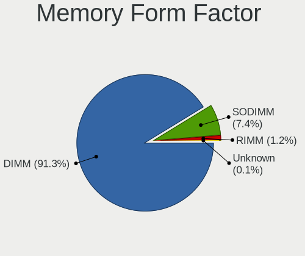

| Name    | Desktops | Percent |
|---------|----------|---------|
| DIMM    | 396      | 91.88%  |
| SODIMM  | 31       | 7.19%   |
| RIMM    | 3        | 0.7%    |
| Unknown | 1        | 0.23%   |

Memory Size
-----------

Memory module size

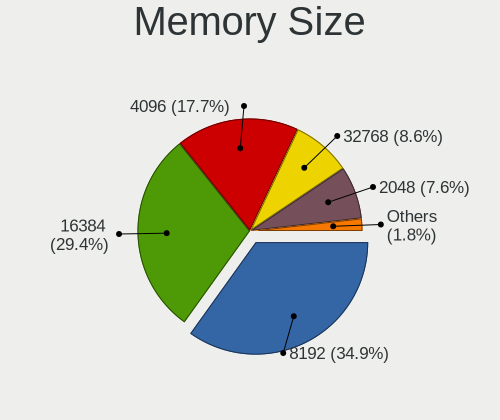

| Size  | Desktops | Percent |
|-------|----------|---------|
| 8192  | 187      | 40.92%  |
| 16384 | 103      | 22.54%  |
| 4096  | 96       | 21.01%  |
| 2048  | 46       | 10.07%  |
| 32768 | 16       | 3.5%    |
| 1024  | 9        | 1.97%   |

Memory Speed
------------

Memory module speed

| Speed | Desktops | Percent |
|-------|----------|---------|
| 1600  | 96       | 20.47%  |
| 1333  | 55       | 11.73%  |
| 2133  | 41       | 8.74%   |
| 2400  | 36       | 7.68%   |
| 3200  | 34       | 7.25%   |
| 2667  | 25       | 5.33%   |
| 3600  | 23       | 4.9%    |
| 3400  | 17       | 3.62%   |
| 3000  | 16       | 3.41%   |
| 800   | 16       | 3.41%   |
| 2666  | 15       | 3.2%    |
| 3466  | 7        | 1.49%   |
| 1066  | 7        | 1.49%   |
| 3800  | 6        | 1.28%   |
| 3266  | 6        | 1.28%   |
| 667   | 6        | 1.28%   |
| 2000  | 5        | 1.07%   |
| 3733  | 4        | 0.85%   |
| 3666  | 4        | 0.85%   |
| 3100  | 4        | 0.85%   |
| 2933  | 4        | 0.85%   |
| 2465  | 4        | 0.85%   |
| 1866  | 4        | 0.85%   |
| 1334  | 4        | 0.85%   |
| 1867  | 3        | 0.64%   |
| 3534  | 2        | 0.43%   |
| 3500  | 2        | 0.43%   |
| 3334  | 2        | 0.43%   |
| 2800  | 2        | 0.43%   |
| 333   | 2        | 0.43%   |
| 4800  | 1        | 0.21%   |
| 4199  | 1        | 0.21%   |
| 3867  | 1        | 0.21%   |
| 3866  | 1        | 0.21%   |
| 3333  | 1        | 0.21%   |
| 3066  | 1        | 0.21%   |
| 3020  | 1        | 0.21%   |
| 2866  | 1        | 0.21%   |
| 2176  | 1        | 0.21%   |
| 2048  | 1        | 0.21%   |

Printers & scanners
-------------------

Printer Vendor
--------------

Printer device vendors

| Vendor                   | Desktops | Percent |
|--------------------------|----------|---------|
| Hewlett-Packard          | 20       | 54.05%  |
| Brother Industries       | 7        | 18.92%  |
| Samsung Electronics      | 3        | 8.11%   |
| Canon                    | 3        | 8.11%   |
| Zhuhai Poskey Technology | 1        | 2.7%    |
| Seiko Epson              | 1        | 2.7%    |
| Oki Data                 | 1        | 2.7%    |
| Dymo-CoStar              | 1        | 2.7%    |

Printer Model
-------------

Printer device models

| Model                                                      | Desktops | Percent |
|------------------------------------------------------------|----------|---------|
| HP OfficeJet Pro 7730 series                               | 2        | 5.41%   |
| HP OfficeJet 6950                                          | 2        | 5.41%   |
| HP LaserJet Pro M148f-M149f                                | 2        | 5.41%   |
| HP ENVY 5540 series                                        | 2        | 5.41%   |
| HP Deskjet 2540 series                                     | 2        | 5.41%   |
| Zhuhai Poskey Printer                                      | 1        | 2.7%    |
| Seiko Epson ET-4750 [WorkForce ET-4750 EcoTank All-in-One] | 1        | 2.7%    |
| Samsung M337x 387x 407x Series                             | 1        | 2.7%    |
| Samsung M332x 382x 402x Series                             | 1        | 2.7%    |
| Samsung C48x Series                                        | 1        | 2.7%    |
| Oki Data USB Device                                        | 1        | 2.7%    |
| HP Smart Tank Plus 550 series                              | 1        | 2.7%    |
| HP Smart Tank 7000 series                                  | 1        | 2.7%    |
| HP Officejet 4630 series                                   | 1        | 2.7%    |
| HP LaserJet P3010 Series                                   | 1        | 2.7%    |
| HP LaserJet P2055 series                                   | 1        | 2.7%    |
| HP LaserJet 3050                                           | 1        | 2.7%    |
| HP LaserJet 1320                                           | 1        | 2.7%    |
| HP LaserJet 1020                                           | 1        | 2.7%    |
| HP ENVY 4520 series                                        | 1        | 2.7%    |
| HP DeskJet F2100 Printer series                            | 1        | 2.7%    |
| Dymo-CoStar LabelWriter 450                                | 1        | 2.7%    |
| Canon TS3300 series                                        | 1        | 2.7%    |
| Canon PIXMA MX450 Series                                   | 1        | 2.7%    |
| Canon iP7200 series                                        | 1        | 2.7%    |
| Brother Printer                                            | 1        | 2.7%    |
| Brother MFC-9320CW                                         | 1        | 2.7%    |
| Brother HL-L2360D series                                   | 1        | 2.7%    |
| Brother HL-L2350DW series                                  | 1        | 2.7%    |
| Brother HL-2130 series                                     | 1        | 2.7%    |
| Brother DCP-9020CDW                                        | 1        | 2.7%    |
| Brother DCP-7030                                           | 1        | 2.7%    |

Scanner Vendor
--------------

Scanner device vendors

| Vendor          | Desktops | Percent |
|-----------------|----------|---------|
| Canon           | 6        | 54.55%  |
| Seiko Epson     | 2        | 18.18%  |
| Hewlett-Packard | 2        | 18.18%  |
| Fujitsu         | 1        | 9.09%   |

Scanner Model
-------------

Scanner device models

| Model                                                   | Desktops | Percent |
|---------------------------------------------------------|----------|---------|
| Canon CanoScan LiDE 220                                 | 2        | 18.18%  |
| Seiko Epson GT-X800 [Perfection 4990 PHOTO]             | 1        | 9.09%   |
| Seiko Epson GT-F720 [GT-S620/Perfection V30/V300 Photo] | 1        | 9.09%   |
| HP ScanJet 4070 PhotoSmart                              | 1        | 9.09%   |
| HP ScanJet 2400c                                        | 1        | 9.09%   |
| Fujitsu ScanSnap SV600                                  | 1        | 9.09%   |
| Canon CanoScan N670U/N676U/LiDE 20                      | 1        | 9.09%   |
| Canon CanoScan N650U/N656U                              | 1        | 9.09%   |
| Canon CanoScan LIDE 25                                  | 1        | 9.09%   |
| Canon CanoScan LiDE 100                                 | 1        | 9.09%   |

Camera
------

Camera Vendor
-------------

Camera device vendors

| Vendor                        | Desktops | Percent |
|-------------------------------|----------|---------|
| Logitech                      | 52       | 49.06%  |
| Apple                         | 7        | 6.6%    |
| Sunplus Innovation Technology | 6        | 5.66%   |
| Microsoft                     | 6        | 5.66%   |
| Microdia                      | 6        | 5.66%   |
| Samsung Electronics           | 4        | 3.77%   |
| Chicony Electronics           | 3        | 2.83%   |
| Z-Star Microelectronics       | 2        | 1.89%   |
| Realtek Semiconductor         | 2        | 1.89%   |
| MacroSilicon                  | 2        | 1.89%   |
| Generalplus Technology        | 2        | 1.89%   |
| Creative Technology           | 2        | 1.89%   |
| YGTek                         | 1        | 0.94%   |
| Xiaomi                        | 1        | 0.94%   |
| LeCroy                        | 1        | 0.94%   |
| IPEVO                         | 1        | 0.94%   |
| Intel                         | 1        | 0.94%   |
| IMC Networks                  | 1        | 0.94%   |
| Huawei Technologies           | 1        | 0.94%   |
| Fujitsu                       | 1        | 0.94%   |
| Aveo Technology               | 1        | 0.94%   |
| ASUSTek Computer              | 1        | 0.94%   |
| Acer                          | 1        | 0.94%   |
| A4Tech                        | 1        | 0.94%   |

Camera Model
------------

Camera device models

| Model                                       | Desktops | Percent |
|---------------------------------------------|----------|---------|
| Logitech HD Pro Webcam C920                 | 11       | 10.38%  |
| Logitech Webcam C270                        | 8        | 7.55%   |
| Sunplus SPCA2281 Web Camera                 | 4        | 3.77%   |
| Samsung Galaxy A5 (MTP)                     | 4        | 3.77%   |
| Microsoft LifeCam HD-3000                   | 4        | 3.77%   |
| Logitech Webcam C930e                       | 4        | 3.77%   |
| Logitech HD Webcam C615                     | 4        | 3.77%   |
| Logitech HD Webcam C525                     | 4        | 3.77%   |
| Logitech QuickCam Pro 9000                  | 3        | 2.83%   |
| Apple iSight in LED Cinema Display          | 3        | 2.83%   |
| Apple iPhone 5/5C/5S/6/SE                   | 3        | 2.83%   |
| Microdia USB 2.0 Camera                     | 2        | 1.89%   |
| Microdia Camera                             | 2        | 1.89%   |
| MacroSilicon USB Video                      | 2        | 1.89%   |
| Logitech Webcam Pro 9000                    | 2        | 1.89%   |
| Generalplus GENERAL WEBCAM                  | 2        | 1.89%   |
| Creative Live! Cam Chat HD [VF0700]         | 2        | 1.89%   |
| Z-Star Vimicro USB2.0 UVC PC Camera         | 1        | 0.94%   |
| Z-Star Integrated Camera                    | 1        | 0.94%   |
| YGTek webcam                                | 1        | 0.94%   |
| Xiaomi Mi 10 Lite 5G                        | 1        | 0.94%   |
| Sunplus Sandberg USB Webcam Pro             | 1        | 0.94%   |
| Sunplus FHD Camera Microphone               | 1        | 0.94%   |
| Realtek HP 1.0MP High Definition Webcam     | 1        | 0.94%   |
| Realtek FULL HD 1080P Webcam                | 1        | 0.94%   |
| Microsoft LifeCam VX-500 [1357]             | 1        | 0.94%   |
| Microsoft LifeCam Cinema                    | 1        | 0.94%   |
| Microdia Lumina Camera - Raw                | 1        | 0.94%   |
| Microdia Defender G-Lens 2577 HD720p Camera | 1        | 0.94%   |
| Logitech Webcam C600                        | 1        | 0.94%   |
| Logitech Webcam C300                        | 1        | 0.94%   |
| Logitech Webcam C210                        | 1        | 0.94%   |
| Logitech Webcam C200                        | 1        | 0.94%   |
| Logitech Webcam C170                        | 1        | 0.94%   |
| Logitech Webcam B500                        | 1        | 0.94%   |
| Logitech StreamCam                          | 1        | 0.94%   |
| Logitech QuickCam Pro for Notebooks         | 1        | 0.94%   |
| Logitech QuickCam Orbit/Sphere AF           | 1        | 0.94%   |
| Logitech QuickCam Notebook Pro              | 1        | 0.94%   |
| Logitech HD Webcam C910                     | 1        | 0.94%   |

Security
--------

Fingerprint Vendor
------------------

Fingerprint sensor vendors

| Vendor                | Desktops | Percent |
|-----------------------|----------|---------|
| LighTuning Technology | 1        | 100%    |

Fingerprint Model
-----------------

Fingerprint sensor models

| Model                         | Desktops | Percent |
|-------------------------------|----------|---------|
| LighTuning Fingerprint Sensor | 1        | 100%    |

Chipcard Vendor
---------------

Chipcard module vendors

| Vendor                | Desktops | Percent |
|-----------------------|----------|---------|
| Alcor Micro           | 3        | 37.5%   |
| Yubico.com            | 2        | 25%     |
| Clay Logic            | 1        | 12.5%   |
| BIT4ID                | 1        | 12.5%   |
| Advanced Card Systems | 1        | 12.5%   |

Chipcard Model
--------------

Chipcard module models

| Model                               | Desktops | Percent |
|-------------------------------------|----------|---------|
| Alcor Micro AU9540 Smartcard Reader | 3        | 37.5%   |
| Yubico.com Yubikey NEO(-N) OTP+CCID | 1        | 12.5%   |
| Yubico.com Yubikey 4 U2F+CCID       | 1        | 12.5%   |
| Clay Logic Nitrokey Start           | 1        | 12.5%   |
| BIT4ID miniLector-S                 | 1        | 12.5%   |
| Advanced Card Systems ACR122U       | 1        | 12.5%   |

Unsupported
-----------

Unsupported Devices
-------------------

Total unsupported devices on board

| Total | Desktops | Percent |
|-------|----------|---------|
| 0     | 605      | 84.5%   |
| 1     | 93       | 12.99%  |
| 2     | 13       | 1.82%   |
| 6     | 2        | 0.28%   |
| 3     | 2        | 0.28%   |
| 4     | 1        | 0.14%   |

Unsupported Device Types
------------------------

Types of unsupported devices

| Type                     | Desktops | Percent |
|--------------------------|----------|---------|
| Graphics card            | 38       | 29.01%  |
| Net/wireless             | 31       | 23.66%  |
| Unassigned class         | 20       | 15.27%  |
| Sound                    | 9        | 6.87%   |
| Communication controller | 7        | 5.34%   |
| Multimedia controller    | 5        | 3.82%   |
| Camera                   | 4        | 3.05%   |
| Bluetooth                | 4        | 3.05%   |
| Network                  | 3        | 2.29%   |
| Net/ethernet             | 3        | 2.29%   |
| Chipcard                 | 3        | 2.29%   |
| Storage/raid             | 1        | 0.76%   |
| Storage/nvme             | 1        | 0.76%   |
| Modem                    | 1        | 0.76%   |
| Fingerprint reader       | 1        | 0.76%   |

