Linux in Switzerland - Tested Hardware & Statistics (Notebooks)
---------------------------------------------------------------

A project to collect tested hardware configurations for Linux in Switzerland.

Anyone can contribute to this report by the [hw-probe](https://github.com/linuxhw/hw-probe) tool:

    sudo -E hw-probe -all -upload

Please contribute! Especially if your hardware is rare.

Contents
--------

* [ Test Cases ](#test-cases)

* [ System ](#system)
  - [ OS                       ](#os)
  - [ OS Family                ](#os-family)
  - [ Kernel                   ](#kernel)
  - [ Kernel Family            ](#kernel-family)
  - [ Kernel Major Ver.        ](#kernel-major-ver)
  - [ Arch                     ](#arch)
  - [ DE                       ](#de)
  - [ Display Server           ](#display-server)
  - [ Display Manager          ](#display-manager)
  - [ OS Lang                  ](#os-lang)
  - [ Boot Mode                ](#boot-mode)
  - [ Filesystem               ](#filesystem)
  - [ Part. scheme             ](#part-scheme)
  - [ Dual Boot with Linux/BSD ](#dual-boot-with-linuxbsd)
  - [ Dual Boot (Win)          ](#dual-boot-win)

* [ Board ](#board)
  - [ Vendor                   ](#vendor)
  - [ Model                    ](#model)
  - [ Model Family             ](#model-family)
  - [ MFG Year                 ](#mfg-year)
  - [ Form Factor              ](#form-factor)
  - [ Secure Boot              ](#secure-boot)
  - [ Coreboot                 ](#coreboot)
  - [ RAM Size                 ](#ram-size)
  - [ RAM Used                 ](#ram-used)
  - [ Total Drives             ](#total-drives)
  - [ Has CD-ROM               ](#has-cd-rom)
  - [ Has Ethernet             ](#has-ethernet)
  - [ Has WiFi                 ](#has-wifi)
  - [ Has Bluetooth            ](#has-bluetooth)

* [ Location ](#location)
  - [ Country                  ](#country)
  - [ City                     ](#city)

* [ Drives ](#drives)
  - [ Drive Vendor             ](#drive-vendor)
  - [ Drive Model              ](#drive-model)
  - [ HDD Vendor               ](#hdd-vendor)
  - [ SSD Vendor               ](#ssd-vendor)
  - [ Drive Kind               ](#drive-kind)
  - [ Drive Connector          ](#drive-connector)
  - [ Drive Size               ](#drive-size)
  - [ Space Total              ](#space-total)
  - [ Space Used               ](#space-used)
  - [ Malfunc. Drives          ](#malfunc-drives)
  - [ Malfunc. Drive Vendor    ](#malfunc-drive-vendor)
  - [ Malfunc. HDD Vendor      ](#malfunc-hdd-vendor)
  - [ Malfunc. Drive Kind      ](#malfunc-drive-kind)
  - [ Failed Drives            ](#failed-drives)
  - [ Failed Drive Vendor      ](#failed-drive-vendor)
  - [ Drive Status             ](#drive-status)

* [ Storage controller ](#storage-controller)
  - [ Storage Vendor           ](#storage-vendor)
  - [ Storage Model            ](#storage-model)
  - [ Storage Kind             ](#storage-kind)

* [ Processor ](#processor)
  - [ CPU Vendor               ](#cpu-vendor)
  - [ CPU Model                ](#cpu-model)
  - [ CPU Model Family         ](#cpu-model-family)
  - [ CPU Cores                ](#cpu-cores)
  - [ CPU Sockets              ](#cpu-sockets)
  - [ CPU Threads              ](#cpu-threads)
  - [ CPU Op-Modes             ](#cpu-op-modes)
  - [ CPU Microcode            ](#cpu-microcode)
  - [ CPU Microarch            ](#cpu-microarch)

* [ Graphics ](#graphics)
  - [ GPU Vendor               ](#gpu-vendor)
  - [ GPU Model                ](#gpu-model)
  - [ GPU Combo                ](#gpu-combo)
  - [ GPU Driver               ](#gpu-driver)
  - [ GPU Memory               ](#gpu-memory)

* [ Monitor ](#monitor)
  - [ Monitor Vendor           ](#monitor-vendor)
  - [ Monitor Model            ](#monitor-model)
  - [ Monitor Resolution       ](#monitor-resolution)
  - [ Monitor Diagonal         ](#monitor-diagonal)
  - [ Monitor Width            ](#monitor-width)
  - [ Aspect Ratio             ](#aspect-ratio)
  - [ Monitor Area             ](#monitor-area)
  - [ Pixel Density            ](#pixel-density)
  - [ Multiple Monitors        ](#multiple-monitors)

* [ Network ](#network)
  - [ Net Controller Vendor    ](#net-controller-vendor)
  - [ Net Controller Model     ](#net-controller-model)
  - [ Wireless Vendor          ](#wireless-vendor)
  - [ Wireless Model           ](#wireless-model)
  - [ Ethernet Vendor          ](#ethernet-vendor)
  - [ Ethernet Model           ](#ethernet-model)
  - [ Net Controller Kind      ](#net-controller-kind)
  - [ Used Controller          ](#used-controller)
  - [ NICs                     ](#nics)
  - [ IPv6                     ](#ipv6)

* [ Bluetooth ](#bluetooth)
  - [ Bluetooth Vendor         ](#bluetooth-vendor)
  - [ Bluetooth Model          ](#bluetooth-model)

* [ Sound ](#sound)
  - [ Sound Vendor             ](#sound-vendor)
  - [ Sound Model              ](#sound-model)

* [ Memory ](#memory)
  - [ Memory Vendor            ](#memory-vendor)
  - [ Memory Model             ](#memory-model)
  - [ Memory Kind              ](#memory-kind)
  - [ Memory Form Factor       ](#memory-form-factor)
  - [ Memory Size              ](#memory-size)
  - [ Memory Speed             ](#memory-speed)

* [ Printers & scanners ](#printers--scanners)
  - [ Printer Vendor           ](#printer-vendor)
  - [ Printer Model            ](#printer-model)
  - [ Scanner Vendor           ](#scanner-vendor)
  - [ Scanner Model            ](#scanner-model)

* [ Camera ](#camera)
  - [ Camera Vendor            ](#camera-vendor)
  - [ Camera Model             ](#camera-model)

* [ Security ](#security)
  - [ Fingerprint Vendor       ](#fingerprint-vendor)
  - [ Fingerprint Model        ](#fingerprint-model)
  - [ Chipcard Vendor          ](#chipcard-vendor)
  - [ Chipcard Model           ](#chipcard-model)

* [ Unsupported ](#unsupported)
  - [ Unsupported Devices      ](#unsupported-devices)
  - [ Unsupported Device Types ](#unsupported-device-types)

Test Cases
----------

Total: 2600

| Vendor        | Model                       | Probe                                                      | Date         |
|---------------|-----------------------------|------------------------------------------------------------|--------------|
| Acer          | Nitro AN515-45              | [5a9317a7dd](https://linux-hardware.org/?probe=5a9317a7dd) | Jan 03, 2026 |
| ASUSTek       | GL502VSK                    | [54eeec2058](https://linux-hardware.org/?probe=54eeec2058) | Jan 03, 2026 |
| Lenovo        | ThinkPad T14s Gen 1 20T0... | [752f7202d0](https://linux-hardware.org/?probe=752f7202d0) | Dec 31, 2025 |
| Dell          | Latitude E6540              | [c31853478c](https://linux-hardware.org/?probe=c31853478c) | Dec 31, 2025 |
| Lenovo        | ThinkPad X220 4291B24       | [574f038999](https://linux-hardware.org/?probe=574f038999) | Dec 29, 2025 |
| Lenovo        | ThinkPad SL 2746EHG         | [5244ca87d3](https://linux-hardware.org/?probe=5244ca87d3) | Dec 28, 2025 |
| Acer          | Swift SF314-42              | [ce40cc4f9f](https://linux-hardware.org/?probe=ce40cc4f9f) | Dec 28, 2025 |
| Lenovo        | IdeaPad 710S-13IKB 80VQ     | [e6ea5a6921](https://linux-hardware.org/?probe=e6ea5a6921) | Dec 28, 2025 |
| Lenovo        | ThinkPad L15 Gen 2 20X30... | [03dae8e570](https://linux-hardware.org/?probe=03dae8e570) | Dec 25, 2025 |
| HP            | 250 G8 Notebook PC          | [14973b5b8b](https://linux-hardware.org/?probe=14973b5b8b) | Dec 22, 2025 |
| Unknown       | Unknown                     | [7e24f2099d](https://linux-hardware.org/?probe=7e24f2099d) | Dec 22, 2025 |
| Google        | Taeko                       | [ab911c106f](https://linux-hardware.org/?probe=ab911c106f) | Dec 22, 2025 |
| Lenovo        | ThinkPad SL 2746EHG         | [378aecab98](https://linux-hardware.org/?probe=378aecab98) | Dec 21, 2025 |
| Acer          | Aspire A715-75G             | [e2184f09c9](https://linux-hardware.org/?probe=e2184f09c9) | Dec 21, 2025 |
| Acer          | Aspire A515-57              | [4f6eb2489b](https://linux-hardware.org/?probe=4f6eb2489b) | Dec 21, 2025 |
| Acer          | Aspire A515-57G             | [ae729a51b7](https://linux-hardware.org/?probe=ae729a51b7) | Dec 19, 2025 |
| Packard Be... | EasyNote TV44HC             | [48edc79d87](https://linux-hardware.org/?probe=48edc79d87) | Dec 19, 2025 |
| Valve         | Jupiter                     | [4a7038a092](https://linux-hardware.org/?probe=4a7038a092) | Dec 18, 2025 |
| Unknown       | Apple MacBook Air (13-in... | [23bfcbd48a](https://linux-hardware.org/?probe=23bfcbd48a) | Dec 18, 2025 |
| Lenovo        | IdeaPad Slim 3 16IRH10 8... | [69eeff43e2](https://linux-hardware.org/?probe=69eeff43e2) | Dec 17, 2025 |
| Dell          | Precision 5490              | [1a952384d1](https://linux-hardware.org/?probe=1a952384d1) | Dec 17, 2025 |
| HUAWEI        | HKD-WXX                     | [0b71a65199](https://linux-hardware.org/?probe=0b71a65199) | Dec 16, 2025 |
| Medion        | Crawler E25                 | [87a588a0ae](https://linux-hardware.org/?probe=87a588a0ae) | Dec 16, 2025 |
| Acer          | Aspire V3-772               | [1f50ac7ca7](https://linux-hardware.org/?probe=1f50ac7ca7) | Dec 15, 2025 |
| Alienware     | M17xR4                      | [d53c636aca](https://linux-hardware.org/?probe=d53c636aca) | Dec 15, 2025 |
| Lenovo        | Yoga Pro 7 14IAH10 83KF     | [c6e608f8a7](https://linux-hardware.org/?probe=c6e608f8a7) | Dec 14, 2025 |
| Acer          | Predator G9-793             | [d632a2779b](https://linux-hardware.org/?probe=d632a2779b) | Dec 14, 2025 |
| Acer          | Aspire A315-58              | [a5cdc78cdd](https://linux-hardware.org/?probe=a5cdc78cdd) | Dec 14, 2025 |
| HP            | Compaq Mini CQ10-500        | [e650be230d](https://linux-hardware.org/?probe=e650be230d) | Dec 12, 2025 |
| Acer          | Aspire A515-45              | [526a782890](https://linux-hardware.org/?probe=526a782890) | Dec 11, 2025 |
| Sony          | VPCF11M1E                   | [9ea5dd76eb](https://linux-hardware.org/?probe=9ea5dd76eb) | Dec 10, 2025 |
| HP            | ZBook 17                    | [8cab3f0676](https://linux-hardware.org/?probe=8cab3f0676) | Dec 09, 2025 |
| ASUSTek       | VivoBook_ASUSLaptop X571... | [dc6e3c74cb](https://linux-hardware.org/?probe=dc6e3c74cb) | Dec 08, 2025 |
| Lenovo        | Legion Y740-15IRHg 81UH     | [45481da193](https://linux-hardware.org/?probe=45481da193) | Dec 08, 2025 |
| Apple         | MacBookPro5,5               | [93819d18fc](https://linux-hardware.org/?probe=93819d18fc) | Dec 07, 2025 |
| Toshiba       | Satellite Pro C850-1DX      | [005f44ef0a](https://linux-hardware.org/?probe=005f44ef0a) | Dec 07, 2025 |
| Acer          | Aspire V3-772               | [93c8493ecc](https://linux-hardware.org/?probe=93c8493ecc) | Dec 07, 2025 |
| ASUSTek       | ROG Zephyrus M16 GU604VY... | [1e2e978779](https://linux-hardware.org/?probe=1e2e978779) | Dec 06, 2025 |
| ASUSTek       | VivoBook_ASUSLaptop K340... | [f86aa25a9a](https://linux-hardware.org/?probe=f86aa25a9a) | Dec 06, 2025 |
| Acer          | Swift SF114-34              | [c5a2f424d5](https://linux-hardware.org/?probe=c5a2f424d5) | Dec 06, 2025 |
| Acer          | Swift SF114-34              | [bbddcbb908](https://linux-hardware.org/?probe=bbddcbb908) | Dec 06, 2025 |
| Apple         | MacBookPro12,1              | [25b3c3bc55](https://linux-hardware.org/?probe=25b3c3bc55) | Dec 06, 2025 |
| Unknown       | Unknown                     | [784a5b6b1e](https://linux-hardware.org/?probe=784a5b6b1e) | Dec 06, 2025 |
| ASUSTek       | ASUS Zenbook S 14 UX5406... | [f65b68efcb](https://linux-hardware.org/?probe=f65b68efcb) | Dec 05, 2025 |
| TongFang      | GX4HRXL                     | [b41383f833](https://linux-hardware.org/?probe=b41383f833) | Dec 04, 2025 |
| HP            | ENVY TS 15                  | [5b26bf3b8a](https://linux-hardware.org/?probe=5b26bf3b8a) | Dec 04, 2025 |
| Lenovo        | IdeaPad Gaming 3 15ARH05... | [b3a4f958da](https://linux-hardware.org/?probe=b3a4f958da) | Dec 04, 2025 |
| Apple         | MacBookPro12,1              | [462f20555a](https://linux-hardware.org/?probe=462f20555a) | Dec 03, 2025 |
| Dell          | Precision 5520              | [b318b8b4f2](https://linux-hardware.org/?probe=b318b8b4f2) | Dec 01, 2025 |
| ASUSTek       | VivoBook 15_ASUS Laptop ... | [2c536452cb](https://linux-hardware.org/?probe=2c536452cb) | Nov 28, 2025 |
| Lenovo        | IdeaPad Slim 3 16ABR8 82... | [3d9334f909](https://linux-hardware.org/?probe=3d9334f909) | Nov 26, 2025 |
| Lenovo        | ThinkPad E15 20RD0015MZ     | [5d5aecfe27](https://linux-hardware.org/?probe=5d5aecfe27) | Nov 26, 2025 |
| ASUSTek       | VivoBook_ASUSLaptop X140... | [73677cb1a9](https://linux-hardware.org/?probe=73677cb1a9) | Nov 25, 2025 |
| Acer          | Aspire E1-571               | [0c2f474a71](https://linux-hardware.org/?probe=0c2f474a71) | Nov 25, 2025 |
| Acer          | Nitro AN515-58              | [0354189e99](https://linux-hardware.org/?probe=0354189e99) | Nov 25, 2025 |
| Acer          | Nitro AN515-58              | [61c9f091f5](https://linux-hardware.org/?probe=61c9f091f5) | Nov 25, 2025 |
| ASUSTek       | ZenBook UX482EG_UX482EG     | [38e15410e8](https://linux-hardware.org/?probe=38e15410e8) | Nov 25, 2025 |
| Acer          | Aspire VN7-591G             | [108d20e677](https://linux-hardware.org/?probe=108d20e677) | Nov 24, 2025 |
| Unknown       | Apple MacBook Pro (13-in... | [ac31cb4315](https://linux-hardware.org/?probe=ac31cb4315) | Nov 24, 2025 |
| Lenovo        | V15 G4 AMN 82YU             | [93f0e5a661](https://linux-hardware.org/?probe=93f0e5a661) | Nov 23, 2025 |
| Sony          | VPCEA2S1E                   | [3336686f97](https://linux-hardware.org/?probe=3336686f97) | Nov 22, 2025 |
| ASUSTek       | VivoBook_ASUSLaptop X160... | [28c6e681e2](https://linux-hardware.org/?probe=28c6e681e2) | Nov 22, 2025 |
| Apple         | MacBook9,1                  | [19d66c5c58](https://linux-hardware.org/?probe=19d66c5c58) | Nov 21, 2025 |
| Alienware     | M17xR4                      | [17fad449e7](https://linux-hardware.org/?probe=17fad449e7) | Nov 21, 2025 |
| Lenovo        | ThinkPad W530 2447EB8       | [1c7792733a](https://linux-hardware.org/?probe=1c7792733a) | Nov 20, 2025 |
| Lenovo        | ThinkPad W530 2447EB8       | [c2c591e1b5](https://linux-hardware.org/?probe=c2c591e1b5) | Nov 20, 2025 |
| Dell          | Latitude 7220 Rugged Ext... | [120a6077a7](https://linux-hardware.org/?probe=120a6077a7) | Nov 19, 2025 |
| ASUSTek       | VivoBook_ASUSLaptop M360... | [6ddf85f653](https://linux-hardware.org/?probe=6ddf85f653) | Nov 19, 2025 |
| HP            | Pavilion dv7                | [6d0401b5e3](https://linux-hardware.org/?probe=6d0401b5e3) | Nov 19, 2025 |
| Lenovo        | V130-15IKB 81HN             | [9e4746a652](https://linux-hardware.org/?probe=9e4746a652) | Nov 18, 2025 |
| Lenovo        | ThinkPad SL 2746EHG         | [2dbd8cf1eb](https://linux-hardware.org/?probe=2dbd8cf1eb) | Nov 15, 2025 |
| HP            | OMEN by Gaming Laptop 16... | [b811b227bc](https://linux-hardware.org/?probe=b811b227bc) | Nov 14, 2025 |
| HP            | ProBook 4535s               | [6cf219d62e](https://linux-hardware.org/?probe=6cf219d62e) | Nov 13, 2025 |
| HP            | Spectre Pro x360 G2         | [5d4c553ea0](https://linux-hardware.org/?probe=5d4c553ea0) | Nov 12, 2025 |
| Dell          | G15 5511                    | [ac4bc1df7f](https://linux-hardware.org/?probe=ac4bc1df7f) | Nov 12, 2025 |
| ASUSTek       | VivoBook_ASUSLaptop X150... | [f7f0f5dd09](https://linux-hardware.org/?probe=f7f0f5dd09) | Nov 07, 2025 |
| ASUSTek       | VivoBook_ASUSLaptop X150... | [04c5d5f5b9](https://linux-hardware.org/?probe=04c5d5f5b9) | Nov 07, 2025 |
| Acer          | Aspire E5-575               | [c6b4a7aa18](https://linux-hardware.org/?probe=c6b4a7aa18) | Nov 07, 2025 |
| HP            | Dragonfly 13.5 inch G4 N... | [81f3e30346](https://linux-hardware.org/?probe=81f3e30346) | Nov 02, 2025 |
| Lenovo        | ThinkPad L15 Gen 2 20X30... | [d09d93f883](https://linux-hardware.org/?probe=d09d93f883) | Nov 02, 2025 |
| HP            | Dragonfly 13.5 inch G4 N... | [be846d59c4](https://linux-hardware.org/?probe=be846d59c4) | Nov 02, 2025 |
| Alienware     | m15 Ryzen Ed. R5            | [05baff1bcf](https://linux-hardware.org/?probe=05baff1bcf) | Nov 02, 2025 |
| GPD           | P2 MAX                      | [4cb4001558](https://linux-hardware.org/?probe=4cb4001558) | Nov 02, 2025 |
| Acer          | Nitro AN515-52              | [78330f0d61](https://linux-hardware.org/?probe=78330f0d61) | Nov 02, 2025 |
| HP            | ProBook 650 G1              | [c32b016e54](https://linux-hardware.org/?probe=c32b016e54) | Nov 01, 2025 |
| ASUSTek       | G53SW                       | [d2e9336e88](https://linux-hardware.org/?probe=d2e9336e88) | Oct 28, 2025 |
| Dell          | Latitude 3450               | [b78334236f](https://linux-hardware.org/?probe=b78334236f) | Oct 28, 2025 |
| Lenovo        | ThinkPad W530 24411M9       | [f71ed1af14](https://linux-hardware.org/?probe=f71ed1af14) | Oct 27, 2025 |
| HP            | Pavilion dv7                | [3e8e542e6d](https://linux-hardware.org/?probe=3e8e542e6d) | Oct 24, 2025 |
| HP            | ProBook 650 G1              | [064d508ca5](https://linux-hardware.org/?probe=064d508ca5) | Oct 24, 2025 |
| Valve         | Galileo                     | [2968e2b7b7](https://linux-hardware.org/?probe=2968e2b7b7) | Oct 24, 2025 |
| Valve         | Galileo                     | [8d0a9a009d](https://linux-hardware.org/?probe=8d0a9a009d) | Oct 24, 2025 |
| ASUSTek       | ROG Zephyrus G14 GA402RJ    | [57dc559222](https://linux-hardware.org/?probe=57dc559222) | Oct 22, 2025 |
| Lenovo        | B590 37613FG                | [0f10dde710](https://linux-hardware.org/?probe=0f10dde710) | Oct 21, 2025 |
| Lenovo        | Yoga Pro 9 16IAH10 83L0     | [8861b600b3](https://linux-hardware.org/?probe=8861b600b3) | Oct 20, 2025 |
| Sony          | VGN-AW11Z_B                 | [6b3cf30322](https://linux-hardware.org/?probe=6b3cf30322) | Oct 20, 2025 |
| HP            | ENVY Laptop 17-cg1xxx       | [1f7aa5ac70](https://linux-hardware.org/?probe=1f7aa5ac70) | Oct 19, 2025 |
| Lenovo        | ThinkPad X1 Carbon Gen 1... | [aa0bd83386](https://linux-hardware.org/?probe=aa0bd83386) | Oct 17, 2025 |
| Lenovo        | ThinkPad SL 2746EHG         | [5ee6cd2270](https://linux-hardware.org/?probe=5ee6cd2270) | Oct 17, 2025 |
| Lenovo        | ThinkPad X1 Carbon 7th 2... | [ab9364f69c](https://linux-hardware.org/?probe=ab9364f69c) | Oct 17, 2025 |
| Acer          | Aspire A15-51M              | [d9cc748ead](https://linux-hardware.org/?probe=d9cc748ead) | Oct 17, 2025 |
| Lenovo        | ThinkPad T450 20BUS0580G    | [f5a0fc67a6](https://linux-hardware.org/?probe=f5a0fc67a6) | Oct 16, 2025 |
| Lenovo        | ThinkPad T450 20BUS0580G    | [8a4fc41cfc](https://linux-hardware.org/?probe=8a4fc41cfc) | Oct 16, 2025 |
| Apple         | MacBookPro9,2               | [29419a0c7d](https://linux-hardware.org/?probe=29419a0c7d) | Oct 16, 2025 |
| Apple         | MacBookPro11,1              | [0f73bdab09](https://linux-hardware.org/?probe=0f73bdab09) | Oct 15, 2025 |
| Acer          | Extensa 2511                | [b5be4879f0](https://linux-hardware.org/?probe=b5be4879f0) | Oct 15, 2025 |
| TUXEDO        | InfinityBook Pro AMD Gen... | [0fce454da1](https://linux-hardware.org/?probe=0fce454da1) | Oct 15, 2025 |
| Lenovo        | ThinkPad T430 2349K66       | [a5cfb5cdab](https://linux-hardware.org/?probe=a5cfb5cdab) | Oct 15, 2025 |
| GPD           | G1688-08                    | [5c48c9cfa1](https://linux-hardware.org/?probe=5c48c9cfa1) | Oct 15, 2025 |
| Dell          | G16 7630                    | [8c91a6f297](https://linux-hardware.org/?probe=8c91a6f297) | Oct 14, 2025 |
| ASUSTek       | ROG Zephyrus G16 GU603VI... | [de4d55fd89](https://linux-hardware.org/?probe=de4d55fd89) | Oct 12, 2025 |
| ASUSTek       | ROG Zephyrus G16 GU603VI... | [f357bf4c1a](https://linux-hardware.org/?probe=f357bf4c1a) | Oct 12, 2025 |
| HP            | ProBook 4730s               | [e4fa6f7446](https://linux-hardware.org/?probe=e4fa6f7446) | Oct 12, 2025 |
| Dell          | XPS 13 9343                 | [5cdb16a990](https://linux-hardware.org/?probe=5cdb16a990) | Oct 11, 2025 |
| Acer          | Aspire A317-55P             | [2e4c4c39cb](https://linux-hardware.org/?probe=2e4c4c39cb) | Oct 11, 2025 |
| ASUSTek       | UX390UAK                    | [a94841922d](https://linux-hardware.org/?probe=a94841922d) | Oct 11, 2025 |
| HP            | EliteBook 850 G2            | [7d5bec8152](https://linux-hardware.org/?probe=7d5bec8152) | Oct 11, 2025 |
| HP            | EliteBook 850 G2            | [20c554cdf9](https://linux-hardware.org/?probe=20c554cdf9) | Oct 11, 2025 |
| Acer          | Aspire V5-573               | [0200752dbc](https://linux-hardware.org/?probe=0200752dbc) | Oct 10, 2025 |
| Lenovo        | ThinkPad E16 Gen 2 21M50... | [3d8e3279ae](https://linux-hardware.org/?probe=3d8e3279ae) | Oct 08, 2025 |
| VALE          | Notebook Evolution i5-11... | [a6994e5bb1](https://linux-hardware.org/?probe=a6994e5bb1) | Oct 08, 2025 |
| Acer          | Aspire 8943G                | [454b7f863e](https://linux-hardware.org/?probe=454b7f863e) | Oct 06, 2025 |
| Dell          | G16 7630                    | [71e359db63](https://linux-hardware.org/?probe=71e359db63) | Oct 06, 2025 |
| Lenovo        | ThinkPad T14 Gen 5 21MC0... | [1e76cb2e02](https://linux-hardware.org/?probe=1e76cb2e02) | Oct 05, 2025 |
| Lenovo        | ThinkPad T430s 2355C19      | [9bfbdbba5a](https://linux-hardware.org/?probe=9bfbdbba5a) | Oct 04, 2025 |
| Lenovo        | ThinkPad X260 20F600A2MZ    | [da4f2bdeb9](https://linux-hardware.org/?probe=da4f2bdeb9) | Oct 04, 2025 |
| Lenovo        | ThinkPad X260 20F600A2MZ    | [bc6752c689](https://linux-hardware.org/?probe=bc6752c689) | Oct 04, 2025 |
| HP            | Pavilion Laptop 15-eg0xx... | [15c73146ba](https://linux-hardware.org/?probe=15c73146ba) | Oct 03, 2025 |
| Lenovo        | ThinkPad SL 2746EHG         | [35758963bb](https://linux-hardware.org/?probe=35758963bb) | Oct 03, 2025 |
| Dell          | XPS 13 9300                 | [0ecbbbd70a](https://linux-hardware.org/?probe=0ecbbbd70a) | Oct 01, 2025 |
| HP            | ProBook 655 G1              | [a4a4ee278c](https://linux-hardware.org/?probe=a4a4ee278c) | Sep 30, 2025 |
| HP            | Pavilion Laptop 15-eg0xx... | [d3190e4ccc](https://linux-hardware.org/?probe=d3190e4ccc) | Sep 30, 2025 |
| ASUSTek       | UX390UAK                    | [f217e27b6e](https://linux-hardware.org/?probe=f217e27b6e) | Sep 30, 2025 |
| Dell          | Precision 3580              | [905ae1a14d](https://linux-hardware.org/?probe=905ae1a14d) | Sep 30, 2025 |
| VALE          | Notebook Evolution i5-11... | [979ae13d56](https://linux-hardware.org/?probe=979ae13d56) | Sep 28, 2025 |
| Acer          | Aspire E5-575               | [1aa8a9dd8f](https://linux-hardware.org/?probe=1aa8a9dd8f) | Sep 28, 2025 |
| Lenovo        | ThinkPad SL 2746EHG         | [2e3cab13b9](https://linux-hardware.org/?probe=2e3cab13b9) | Sep 27, 2025 |
| Framework     | Laptop 13 (AMD Ryzen 704... | [d17492fca0](https://linux-hardware.org/?probe=d17492fca0) | Sep 22, 2025 |
| Unknown       | Apple MacBook Air (13-in... | [9273087606](https://linux-hardware.org/?probe=9273087606) | Sep 20, 2025 |
| ASUSTek       | ASUS EXPERTBOOK B9403CVA... | [650f6cf6e7](https://linux-hardware.org/?probe=650f6cf6e7) | Sep 17, 2025 |
| Lenovo        | Yoga Pro 7 14ASP10 83LX     | [b63bb04e18](https://linux-hardware.org/?probe=b63bb04e18) | Sep 15, 2025 |
| Acer          | Aspire F5-571               | [b4691f9e1c](https://linux-hardware.org/?probe=b4691f9e1c) | Sep 15, 2025 |
| Lenovo        | Yoga Slim 7 Carbon 13ITL... | [4a4bc27345](https://linux-hardware.org/?probe=4a4bc27345) | Sep 15, 2025 |
| Toshiba       | TECRA R850                  | [b9b4e1969f](https://linux-hardware.org/?probe=b9b4e1969f) | Sep 13, 2025 |
| Acer          | Aspire A15-51M              | [1a7b0ec222](https://linux-hardware.org/?probe=1a7b0ec222) | Sep 11, 2025 |
| Lenovo        | V320-17IKB 81AH             | [7c2dbcbb5b](https://linux-hardware.org/?probe=7c2dbcbb5b) | Sep 11, 2025 |
| HP            | ENVY Laptop 17-da0xxx       | [7e2d2fd388](https://linux-hardware.org/?probe=7e2d2fd388) | Sep 09, 2025 |
| HP            | OMEN by Laptop 15-dc1xxx    | [b715a5bbb7](https://linux-hardware.org/?probe=b715a5bbb7) | Sep 09, 2025 |
| Lenovo        | ThinkPad T480 20L6S04000    | [956334c969](https://linux-hardware.org/?probe=956334c969) | Sep 08, 2025 |
| HP            | Victus by Laptop 16-d0xx... | [d195da9d7f](https://linux-hardware.org/?probe=d195da9d7f) | Sep 07, 2025 |
| Apple         | MacBookPro14,1              | [893d196d22](https://linux-hardware.org/?probe=893d196d22) | Sep 05, 2025 |
| Lenovo        | ThinkPad X270 20HNCTO1WW    | [c5564fa84d](https://linux-hardware.org/?probe=c5564fa84d) | Sep 04, 2025 |
| Lenovo        | Legion 5 Pro 16ITH6H 82J... | [a2a10572b0](https://linux-hardware.org/?probe=a2a10572b0) | Sep 03, 2025 |
| HP            | Laptop 17-cn0xxx            | [75254f1134](https://linux-hardware.org/?probe=75254f1134) | Sep 03, 2025 |
| HP            | Pavilion dv7                | [4d67b8ffd1](https://linux-hardware.org/?probe=4d67b8ffd1) | Sep 01, 2025 |
| HP            | ZBook Ultra G1a 14 inch ... | [4dcf9410ac](https://linux-hardware.org/?probe=4dcf9410ac) | Sep 01, 2025 |
| Lenovo        | ThinkPad W530 2447EB8       | [962b01dad5](https://linux-hardware.org/?probe=962b01dad5) | Aug 31, 2025 |
| Apple         | MacBookPro8,3               | [01dc00ebc9](https://linux-hardware.org/?probe=01dc00ebc9) | Aug 31, 2025 |
| Schenker      | XMG EVO (E25)               | [4971f11ab5](https://linux-hardware.org/?probe=4971f11ab5) | Aug 31, 2025 |
| Lenovo        | ThinkPad SL 2746EHG         | [b2858bf034](https://linux-hardware.org/?probe=b2858bf034) | Aug 29, 2025 |
| Dell          | Latitude 7300               | [e9a0c215e5](https://linux-hardware.org/?probe=e9a0c215e5) | Aug 23, 2025 |
| Clevo         | W240EU/W250EUQ/W270EUQ      | [c64adaf5d8](https://linux-hardware.org/?probe=c64adaf5d8) | Aug 21, 2025 |
| HP            | ProBook 4740s               | [17e1ca63e4](https://linux-hardware.org/?probe=17e1ca63e4) | Aug 19, 2025 |
| HP            | ProBook 4740s               | [af7e4bce19](https://linux-hardware.org/?probe=af7e4bce19) | Aug 18, 2025 |
| Lenovo        | V15 G4 IRU 83A1             | [2a8cb6a696](https://linux-hardware.org/?probe=2a8cb6a696) | Aug 13, 2025 |
| HP            | Compaq 15                   | [bc9449e7a9](https://linux-hardware.org/?probe=bc9449e7a9) | Aug 12, 2025 |
| Lenovo        | V15 G4 IRU 83A1             | [3bcd7f432c](https://linux-hardware.org/?probe=3bcd7f432c) | Aug 12, 2025 |
| Acer          | Aspire E5-774               | [0e2fdf26a1](https://linux-hardware.org/?probe=0e2fdf26a1) | Aug 12, 2025 |
| ASUSTek       | ASUS TUF Gaming A16 FA61... | [a48b018b8c](https://linux-hardware.org/?probe=a48b018b8c) | Aug 12, 2025 |
| Fujitsu       | LIFEBOOK E756               | [5568c46049](https://linux-hardware.org/?probe=5568c46049) | Aug 12, 2025 |
| Lenovo        | IdeaPad S340-15IIL 81VW     | [1c5b11a20b](https://linux-hardware.org/?probe=1c5b11a20b) | Aug 11, 2025 |
| Medion        | Defender P40                | [69f1cc4532](https://linux-hardware.org/?probe=69f1cc4532) | Aug 11, 2025 |
| Apple         | MacBookAir6,1               | [b73b6c64ac](https://linux-hardware.org/?probe=b73b6c64ac) | Aug 11, 2025 |
| Toshiba       | TECRA R850                  | [a53974dafe](https://linux-hardware.org/?probe=a53974dafe) | Aug 09, 2025 |
| Lenovo        | B70-80 80MR                 | [b64028df11](https://linux-hardware.org/?probe=b64028df11) | Aug 08, 2025 |
| Lenovo        | IdeaPad 710S-13IKB 80VQ     | [0bebcd5516](https://linux-hardware.org/?probe=0bebcd5516) | Aug 06, 2025 |
| Acer          | Swift SFG14-64              | [dff210b1ed](https://linux-hardware.org/?probe=dff210b1ed) | Aug 05, 2025 |
| Notebook      | NV4XMB,ME,MZ                | [e9f9faa57b](https://linux-hardware.org/?probe=e9f9faa57b) | Aug 05, 2025 |
| Dell          | XPS L421X                   | [f1f1d245ac](https://linux-hardware.org/?probe=f1f1d245ac) | Aug 04, 2025 |
| Acer          | Swift SFG14-64              | [02cfac7de2](https://linux-hardware.org/?probe=02cfac7de2) | Aug 04, 2025 |
| Apple         | MacBook10,1                 | [850490253d](https://linux-hardware.org/?probe=850490253d) | Aug 02, 2025 |
| ASUSTek       | VivoBook_ASUSLaptop X515... | [10fe88c9aa](https://linux-hardware.org/?probe=10fe88c9aa) | Aug 01, 2025 |
| Dell          | XPS 16 9640                 | [4bcefb1acf](https://linux-hardware.org/?probe=4bcefb1acf) | Aug 01, 2025 |
| Lenovo        | ThinkPad E15 Gen 2 20T80... | [c799aad74e](https://linux-hardware.org/?probe=c799aad74e) | Jul 31, 2025 |
| Apple         | MacBookPro8,2               | [e23ba1ad40](https://linux-hardware.org/?probe=e23ba1ad40) | Jul 27, 2025 |
| Lenovo        | ThinkPad Helix 37024D1      | [c04e97958c](https://linux-hardware.org/?probe=c04e97958c) | Jul 26, 2025 |
| Lenovo        | ThinkPad E490 20N8CTO1WW    | [2c4ddba0b4](https://linux-hardware.org/?probe=2c4ddba0b4) | Jul 24, 2025 |
| ASUSTek       | X556UAK                     | [0c505b607b](https://linux-hardware.org/?probe=0c505b607b) | Jul 24, 2025 |
| Lenovo        | ThinkPad T590 20N5S68P00    | [b5e6ed2b9f](https://linux-hardware.org/?probe=b5e6ed2b9f) | Jul 23, 2025 |
| ASUSTek       | X556UAK                     | [5c0795e31e](https://linux-hardware.org/?probe=5c0795e31e) | Jul 22, 2025 |
| Lenovo        | ThinkPad X13 Gen 6 21RMC... | [447b3cc09a](https://linux-hardware.org/?probe=447b3cc09a) | Jul 22, 2025 |
| Dell          | 0WR7PY A01                  | [fd84c24b19](https://linux-hardware.org/?probe=fd84c24b19) | Jul 22, 2025 |
| Dell          | G5 5590                     | [b3ff20fe4c](https://linux-hardware.org/?probe=b3ff20fe4c) | Jul 22, 2025 |
| HP            | Dragonfly 13.5 inch G4 N... | [94e4434f8e](https://linux-hardware.org/?probe=94e4434f8e) | Jul 20, 2025 |
| HP            | ZBook Power 16 inch G11 ... | [a13d426185](https://linux-hardware.org/?probe=a13d426185) | Jul 18, 2025 |
| HP            | ZBook Power 16 inch G11 ... | [9bb74f5d65](https://linux-hardware.org/?probe=9bb74f5d65) | Jul 18, 2025 |
| Lenovo        | ThinkPad SL 2746EHG         | [4aab9e61ba](https://linux-hardware.org/?probe=4aab9e61ba) | Jul 16, 2025 |
| Lenovo        | ThinkPad P15 Gen 1 20SUS... | [d694fa0335](https://linux-hardware.org/?probe=d694fa0335) | Jul 13, 2025 |
| Lenovo        | ThinkPad L560 20F2S1PM00    | [d96c799ad5](https://linux-hardware.org/?probe=d96c799ad5) | Jul 12, 2025 |
| Lenovo        | ThinkPad T14 Gen 1 20UDC... | [68dde11c25](https://linux-hardware.org/?probe=68dde11c25) | Jul 10, 2025 |
| Lenovo        | ThinkPad T440s 20ARS2YY0... | [ad7843f956](https://linux-hardware.org/?probe=ad7843f956) | Jul 09, 2025 |
| Schenker      | XMG APEX (Mid 2021)         | [3147eb6917](https://linux-hardware.org/?probe=3147eb6917) | Jul 08, 2025 |
| MSI           | Summit E16Flip A12UCT       | [f2e41b9e11](https://linux-hardware.org/?probe=f2e41b9e11) | Jul 04, 2025 |
| Lenovo        | ThinkPad L15 Gen 2 20X30... | [af9cc677dc](https://linux-hardware.org/?probe=af9cc677dc) | Jul 03, 2025 |
| Fujitsu       | LIFEBOOK E756               | [100518e56d](https://linux-hardware.org/?probe=100518e56d) | Jul 03, 2025 |
| Acer          | Aspire A517-58GM            | [632944ea3e](https://linux-hardware.org/?probe=632944ea3e) | Jul 01, 2025 |
| Toshiba       | TECRA R850                  | [aecd825e4e](https://linux-hardware.org/?probe=aecd825e4e) | Jul 01, 2025 |
| Toshiba       | TECRA R850                  | [de54de04d8](https://linux-hardware.org/?probe=de54de04d8) | Jul 01, 2025 |
| Lenovo        | IdeaPad 5 15ITL05 82FG      | [67ee038d9a](https://linux-hardware.org/?probe=67ee038d9a) | Jun 29, 2025 |
| Fujitsu       | LIFEBOOK E548               | [6488d7e73a](https://linux-hardware.org/?probe=6488d7e73a) | Jun 29, 2025 |
| Dell          | Latitude E6540              | [f5563e2c00](https://linux-hardware.org/?probe=f5563e2c00) | Jun 26, 2025 |
| Acer          | Swift SFG14-73              | [0151c1041f](https://linux-hardware.org/?probe=0151c1041f) | Jun 25, 2025 |
| Lenovo        | Unknown                     | [c6a19b39f4](https://linux-hardware.org/?probe=c6a19b39f4) | Jun 24, 2025 |
| Lenovo        | ThinkPad X201 3323PMG       | [4fdbd6fa0d](https://linux-hardware.org/?probe=4fdbd6fa0d) | Jun 23, 2025 |
| Dell          | Latitude 5520               | [c2d0d2828d](https://linux-hardware.org/?probe=c2d0d2828d) | Jun 23, 2025 |
| HP            | Pavilion Gaming Laptop 1... | [b2ebda868b](https://linux-hardware.org/?probe=b2ebda868b) | Jun 18, 2025 |
| HP            | Dragonfly 13.5 inch G4 N... | [45ccb18089](https://linux-hardware.org/?probe=45ccb18089) | Jun 17, 2025 |
| HP            | Pavilion g7                 | [e38b7fcbe0](https://linux-hardware.org/?probe=e38b7fcbe0) | Jun 16, 2025 |
| Lenovo        | ThinkPad X1 Extreme 20MF... | [24fc5457b7](https://linux-hardware.org/?probe=24fc5457b7) | Jun 14, 2025 |
| Lenovo        | ThinkPad SL 2746EHG         | [e4d39c2a86](https://linux-hardware.org/?probe=e4d39c2a86) | Jun 13, 2025 |
| Lenovo        | ThinkPad T14 Gen 4 21HD0... | [df5e349477](https://linux-hardware.org/?probe=df5e349477) | Jun 13, 2025 |
| Lenovo        | ThinkPad T14 Gen 4 21HD0... | [cb1ef705a2](https://linux-hardware.org/?probe=cb1ef705a2) | Jun 13, 2025 |
| Lenovo        | IdeaPad S145-15IWL 81MV     | [8a7dd7422c](https://linux-hardware.org/?probe=8a7dd7422c) | Jun 13, 2025 |
| ASUSTek       | VivoBook_ASUSLaptop X150... | [85d8d61922](https://linux-hardware.org/?probe=85d8d61922) | Jun 11, 2025 |
| Acer          | Swift SF16-51               | [0dde4000b3](https://linux-hardware.org/?probe=0dde4000b3) | Jun 10, 2025 |
| Lenovo        | Legion Pro 7 16IAX10H 83... | [00920646e3](https://linux-hardware.org/?probe=00920646e3) | Jun 10, 2025 |
| Lenovo        | Legion Pro 7 16IAX10H 83... | [57d996afdc](https://linux-hardware.org/?probe=57d996afdc) | Jun 10, 2025 |
| Lenovo        | ThinkPad T480 20L6S03X00    | [213327a2e0](https://linux-hardware.org/?probe=213327a2e0) | Jun 09, 2025 |
| Lenovo        | ThinkPad SL 2746EHG         | [9cfc12a7c5](https://linux-hardware.org/?probe=9cfc12a7c5) | Jun 09, 2025 |
| Fujitsu       | LIFEBOOK E548               | [ac4d93e357](https://linux-hardware.org/?probe=ac4d93e357) | Jun 07, 2025 |
| ASUSTek       | ROG Strix G533QS_G533QS     | [59482c9a61](https://linux-hardware.org/?probe=59482c9a61) | Jun 06, 2025 |
| Framework     | Laptop 13 (AMD Ryzen AI ... | [330c180b80](https://linux-hardware.org/?probe=330c180b80) | Jun 03, 2025 |
| Lenovo        | ThinkPad T14s Gen 4 21F8... | [b8e9137b79](https://linux-hardware.org/?probe=b8e9137b79) | Jun 03, 2025 |
| ASUSTek       | VivoBook_ASUSLaptop X150... | [55150f9752](https://linux-hardware.org/?probe=55150f9752) | Jun 02, 2025 |
| ASUSTek       | ASUS Zenbook S 14 UX5406... | [7e1ed9d233](https://linux-hardware.org/?probe=7e1ed9d233) | Jun 02, 2025 |
| ASUSTek       | ASUS EXPERTBOOK P5405CSA... | [102d53220d](https://linux-hardware.org/?probe=102d53220d) | Jun 01, 2025 |
| ASUSTek       | VivoBook_ASUSLaptop X150... | [50c004219f](https://linux-hardware.org/?probe=50c004219f) | May 29, 2025 |
| HP            | 250 G7 Notebook PC          | [425249e142](https://linux-hardware.org/?probe=425249e142) | May 26, 2025 |
| HP            | Pavilion Notebook           | [372f4efe68](https://linux-hardware.org/?probe=372f4efe68) | May 24, 2025 |
| Lenovo        | Legion Slim 5 16AHP9 83D... | [a84ca02c75](https://linux-hardware.org/?probe=a84ca02c75) | May 24, 2025 |
| HP            | EliteBook 860 16 inch G1... | [c78c55fc62](https://linux-hardware.org/?probe=c78c55fc62) | May 24, 2025 |
| HP            | EliteBook 860 16 inch G1... | [2c0b5f664d](https://linux-hardware.org/?probe=2c0b5f664d) | May 24, 2025 |
| Lenovo        | IdeaPad 320-15IKB 80YE      | [60fa6cdeae](https://linux-hardware.org/?probe=60fa6cdeae) | May 23, 2025 |
| Toshiba       | TECRA R850                  | [340243d3ea](https://linux-hardware.org/?probe=340243d3ea) | May 23, 2025 |
| HP            | Laptop 15-fd0xxx            | [2a19d0fdd1](https://linux-hardware.org/?probe=2a19d0fdd1) | May 22, 2025 |
| Toshiba       | TECRA R850                  | [265ade790a](https://linux-hardware.org/?probe=265ade790a) | May 21, 2025 |
| TUXEDO        | InfinityBook Pro Gen8 (M... | [a6b8189891](https://linux-hardware.org/?probe=a6b8189891) | May 21, 2025 |
| Dell          | Inspiron 5579               | [ee3ae3a2a1](https://linux-hardware.org/?probe=ee3ae3a2a1) | May 21, 2025 |
| Dell          | Vostro 16 5640              | [55eb278e51](https://linux-hardware.org/?probe=55eb278e51) | May 20, 2025 |
| Dell          | Vostro 16 5640              | [34c30e94f5](https://linux-hardware.org/?probe=34c30e94f5) | May 20, 2025 |
| Lenovo        | ThinkPad T480 20L6S03X00    | [2db012da4e](https://linux-hardware.org/?probe=2db012da4e) | May 19, 2025 |
| Lenovo        | Yoga Slim 7 14ILL10 83JX    | [d73dc80740](https://linux-hardware.org/?probe=d73dc80740) | May 19, 2025 |
| Dell          | Latitude 7490               | [fb2a2b1fbf](https://linux-hardware.org/?probe=fb2a2b1fbf) | May 18, 2025 |
| Lenovo        | Yoga 500-15IBD 80N6         | [e90a5518bb](https://linux-hardware.org/?probe=e90a5518bb) | May 16, 2025 |
| Lenovo        | IdeaPad 110-17IKB 80VK      | [dd4b241fe3](https://linux-hardware.org/?probe=dd4b241fe3) | May 14, 2025 |
| ASUSTek       | VivoBook_ASUSLaptop K660... | [1a168130ba](https://linux-hardware.org/?probe=1a168130ba) | May 14, 2025 |
| HP            | Notebook                    | [42436e9c8e](https://linux-hardware.org/?probe=42436e9c8e) | May 13, 2025 |
| Lenovo        | IdeaPad Slim 5 15ARP10 8... | [4049184161](https://linux-hardware.org/?probe=4049184161) | May 13, 2025 |
| HP            | ProBook 470 G0              | [77c1f0c3ef](https://linux-hardware.org/?probe=77c1f0c3ef) | May 12, 2025 |
| HP            | Laptop 15-fd0xxx            | [0ffbe74d31](https://linux-hardware.org/?probe=0ffbe74d31) | May 07, 2025 |
| Acer          | Aspire A515-52G             | [6291689c03](https://linux-hardware.org/?probe=6291689c03) | May 06, 2025 |
| Unknown       | Apple MacBook Pro (13-in... | [8a0d23ac9b](https://linux-hardware.org/?probe=8a0d23ac9b) | May 06, 2025 |
| ASUSTek       | N55SF                       | [c1e547b937](https://linux-hardware.org/?probe=c1e547b937) | May 06, 2025 |
| Acer          | Aspire V3-771               | [97aec77061](https://linux-hardware.org/?probe=97aec77061) | May 05, 2025 |
| Lenovo        | ThinkPad SL 2746EHG         | [3ede3ed669](https://linux-hardware.org/?probe=3ede3ed669) | May 05, 2025 |
| Framework     | Laptop 13 (AMD Ryzen AI ... | [9c1b3011c7](https://linux-hardware.org/?probe=9c1b3011c7) | May 05, 2025 |
| Lenovo        | ThinkPad E16 Gen 1 21JT0... | [55bb4f153d](https://linux-hardware.org/?probe=55bb4f153d) | May 05, 2025 |
| Framework     | Laptop 13 (AMD Ryzen AI ... | [92ceb58f3b](https://linux-hardware.org/?probe=92ceb58f3b) | May 04, 2025 |
| Lenovo        | ThinkPad T440p 20AWS2G90... | [26770dc202](https://linux-hardware.org/?probe=26770dc202) | May 04, 2025 |
| MSI           | GL75 9SD                    | [4b1eb52e7f](https://linux-hardware.org/?probe=4b1eb52e7f) | May 04, 2025 |
| Lenovo        | IdeaPad C340-14API 81N6     | [1cac08ffc6](https://linux-hardware.org/?probe=1cac08ffc6) | May 04, 2025 |
| Lenovo        | ThinkPad T440p 20AWS2G90... | [eb1fab77fb](https://linux-hardware.org/?probe=eb1fab77fb) | May 03, 2025 |
| Apple         | MacBookPro9,2               | [d200e8d312](https://linux-hardware.org/?probe=d200e8d312) | May 01, 2025 |
| Apple         | MacBookPro9,2               | [984b2ad348](https://linux-hardware.org/?probe=984b2ad348) | May 01, 2025 |
| HUAWEI        | MACHC-WAX9                  | [cf6ed76c29](https://linux-hardware.org/?probe=cf6ed76c29) | Apr 26, 2025 |
| HP            | EliteBook 860 16 inch G1... | [c9be85fbb4](https://linux-hardware.org/?probe=c9be85fbb4) | Apr 25, 2025 |
| Lenovo        | IdeaPad Gaming 3 15IMH05... | [171d0dda5b](https://linux-hardware.org/?probe=171d0dda5b) | Apr 24, 2025 |
| HP            | Laptop 15-fd0xxx            | [b1de9ca110](https://linux-hardware.org/?probe=b1de9ca110) | Apr 24, 2025 |
| HP            | ProBook 450 G7              | [e766d8fb29](https://linux-hardware.org/?probe=e766d8fb29) | Apr 22, 2025 |
| Dell          | Latitude E5540              | [82ce2367a0](https://linux-hardware.org/?probe=82ce2367a0) | Apr 21, 2025 |
| Apple         | MacBookPro11,1              | [f9f1ae917a](https://linux-hardware.org/?probe=f9f1ae917a) | Apr 20, 2025 |
| Lenovo        | T480                        | [f930e54b16](https://linux-hardware.org/?probe=f930e54b16) | Apr 20, 2025 |
| Lenovo        | ThinkPad E16 Gen 1 21JT0... | [65a811ac69](https://linux-hardware.org/?probe=65a811ac69) | Apr 19, 2025 |
| Acer          | Aspire A315-59              | [9cdbd233f1](https://linux-hardware.org/?probe=9cdbd233f1) | Apr 19, 2025 |
| HP            | Laptop 15s-eq1xxx           | [6c87b2991b](https://linux-hardware.org/?probe=6c87b2991b) | Apr 19, 2025 |
| ASUSTek       | ROG Strix G531GT_G531GT     | [a6a899b1eb](https://linux-hardware.org/?probe=a6a899b1eb) | Apr 19, 2025 |
| ASUSTek       | ROG Strix G531GT_G531GT     | [a7601ae099](https://linux-hardware.org/?probe=a7601ae099) | Apr 18, 2025 |
| Lenovo        | ThinkPad X1 Carbon Gen 1... | [39638273af](https://linux-hardware.org/?probe=39638273af) | Apr 18, 2025 |
| HP            | Laptop 15-fd0xxx            | [7618bdc644](https://linux-hardware.org/?probe=7618bdc644) | Apr 18, 2025 |
| Panasonic     | CF-54-2                     | [5efc17df50](https://linux-hardware.org/?probe=5efc17df50) | Apr 18, 2025 |
| Lenovo        | Yoga Slim 7 15ILL9 83HM     | [57b2b06041](https://linux-hardware.org/?probe=57b2b06041) | Apr 17, 2025 |
| ASUSTek       | N55SF                       | [bb712760d5](https://linux-hardware.org/?probe=bb712760d5) | Apr 17, 2025 |
| ASUSTek       | N55SF                       | [6b95dc7b5e](https://linux-hardware.org/?probe=6b95dc7b5e) | Apr 17, 2025 |
| Unknown       | AX15                        | [60bfdf3f78](https://linux-hardware.org/?probe=60bfdf3f78) | Apr 16, 2025 |
| Panasonic     | CF-54-2                     | [de42d8b669](https://linux-hardware.org/?probe=de42d8b669) | Apr 14, 2025 |
| TUXEDO        | Sirius 16 Gen2              | [3b4ba24108](https://linux-hardware.org/?probe=3b4ba24108) | Apr 14, 2025 |
| Lenovo        | ThinkPad X1 Carbon Gen 8... | [4d5e8b77ed](https://linux-hardware.org/?probe=4d5e8b77ed) | Apr 14, 2025 |
| Lenovo        | ThinkPad SL 2746EHG         | [01d505e12e](https://linux-hardware.org/?probe=01d505e12e) | Apr 13, 2025 |
| MSI           | GL63 8SE                    | [d264a29b44](https://linux-hardware.org/?probe=d264a29b44) | Apr 13, 2025 |
| Lenovo        | T480S                       | [d41e7a581b](https://linux-hardware.org/?probe=d41e7a581b) | Apr 13, 2025 |
| Acer          | TravelMate P414-51          | [f992fd62b7](https://linux-hardware.org/?probe=f992fd62b7) | Apr 12, 2025 |
| MSI           | GL75 9SD                    | [8b642f435e](https://linux-hardware.org/?probe=8b642f435e) | Apr 12, 2025 |
| Lenovo        | ThinkPad T440p 20AWS2G90... | [3c0598a339](https://linux-hardware.org/?probe=3c0598a339) | Apr 12, 2025 |
| Lenovo        | ThinkPad SL 2746EHG         | [7452528b1f](https://linux-hardware.org/?probe=7452528b1f) | Apr 11, 2025 |
| Toshiba       | PORTEGE Z30t-A              | [871b0d2df6](https://linux-hardware.org/?probe=871b0d2df6) | Apr 09, 2025 |
| Apple         | MacBookPro7,1               | [506ee64a80](https://linux-hardware.org/?probe=506ee64a80) | Apr 08, 2025 |
| Lenovo        | ThinkPad T440p 20AWS2G90... | [5d781e38fc](https://linux-hardware.org/?probe=5d781e38fc) | Apr 07, 2025 |
| HP            | EliteBook 840 G1            | [9f94ed6bc1](https://linux-hardware.org/?probe=9f94ed6bc1) | Apr 05, 2025 |
| Apple         | MacBookPro8,1               | [c9686a20ee](https://linux-hardware.org/?probe=c9686a20ee) | Apr 05, 2025 |
| Google        | Cyan                        | [e8b3f57544](https://linux-hardware.org/?probe=e8b3f57544) | Apr 01, 2025 |
| MSI           | GL63 8SE                    | [fda53418d3](https://linux-hardware.org/?probe=fda53418d3) | Apr 01, 2025 |
| Dell          | Inspiron 14 Plus 7440       | [95790c355c](https://linux-hardware.org/?probe=95790c355c) | Mar 29, 2025 |
| Lenovo        | ThinkPad SL 2746EHG         | [3ca45c70ac](https://linux-hardware.org/?probe=3ca45c70ac) | Mar 28, 2025 |
| Lenovo        | IdeaPad Y700-15ISK 80NV     | [1b9949d1a7](https://linux-hardware.org/?probe=1b9949d1a7) | Mar 28, 2025 |
| Apple         | MacBookAir8,2               | [cd8487865d](https://linux-hardware.org/?probe=cd8487865d) | Mar 28, 2025 |
| Acer          | Aspire A315-59              | [27ddc8370a](https://linux-hardware.org/?probe=27ddc8370a) | Mar 27, 2025 |
| Lenovo        | ThinkPad T14 Gen 5 21MDS... | [ec434c6c49](https://linux-hardware.org/?probe=ec434c6c49) | Mar 27, 2025 |
| HP            | Pavilion g7                 | [ee02c16d32](https://linux-hardware.org/?probe=ee02c16d32) | Mar 26, 2025 |
| HP            | Pavilion g7                 | [3e84e2a8fb](https://linux-hardware.org/?probe=3e84e2a8fb) | Mar 26, 2025 |
| Dell          | Precision 5680              | [935eaca8bc](https://linux-hardware.org/?probe=935eaca8bc) | Mar 25, 2025 |
| ASUSTek       | VivoBook_ASUSLaptop M160... | [e02ff3872b](https://linux-hardware.org/?probe=e02ff3872b) | Mar 24, 2025 |
| Lenovo        | V15 G4 AMN 82YU             | [3c867f8e74](https://linux-hardware.org/?probe=3c867f8e74) | Mar 24, 2025 |
| Lenovo        | ThinkPad L14 Gen 1 20U10... | [9fb5870c79](https://linux-hardware.org/?probe=9fb5870c79) | Mar 23, 2025 |
| Lenovo        | ThinkPad L14 Gen 1 20U10... | [2c41964850](https://linux-hardware.org/?probe=2c41964850) | Mar 23, 2025 |
| TUXEDO        | Stellaris 16 Intel Gen6     | [224d85cdd3](https://linux-hardware.org/?probe=224d85cdd3) | Mar 22, 2025 |
| Lenovo        | ThinkPad T410 2537A72       | [abbd069ea1](https://linux-hardware.org/?probe=abbd069ea1) | Mar 21, 2025 |
| MSI           | Vector GP76 12UGSO          | [9f6874142c](https://linux-hardware.org/?probe=9f6874142c) | Mar 21, 2025 |
| MSI           | GE62VR 7RF                  | [97f3fdc662](https://linux-hardware.org/?probe=97f3fdc662) | Mar 20, 2025 |
| Lenovo        | V15 G4 ABP 82YY             | [3bab797a04](https://linux-hardware.org/?probe=3bab797a04) | Mar 19, 2025 |
| Lenovo        | V15 G4 ABP 82YY             | [10d1e92a15](https://linux-hardware.org/?probe=10d1e92a15) | Mar 19, 2025 |
| MSI           | GT83 Titan 8RG              | [bb3a138e6b](https://linux-hardware.org/?probe=bb3a138e6b) | Mar 18, 2025 |
| MSI           | GT83 Titan 8RG              | [f4541be0ba](https://linux-hardware.org/?probe=f4541be0ba) | Mar 17, 2025 |
| Acer          | Aspire ES1-512              | [3966c4bb71](https://linux-hardware.org/?probe=3966c4bb71) | Mar 17, 2025 |
| Lenovo        | ThinkPad SL 2746EHG         | [0ddf481ee1](https://linux-hardware.org/?probe=0ddf481ee1) | Mar 16, 2025 |
| Lenovo        | ThinkPad L13 Yoga Gen 3 ... | [0c8712e2b8](https://linux-hardware.org/?probe=0c8712e2b8) | Mar 15, 2025 |
| Acer          | Aspire A315-59              | [09d0376efe](https://linux-hardware.org/?probe=09d0376efe) | Mar 13, 2025 |
| Medion        | Major X10                   | [e376f7283e](https://linux-hardware.org/?probe=e376f7283e) | Mar 12, 2025 |
| Lenovo        | ThinkPad X270 20HN0016MZ    | [aacba561e1](https://linux-hardware.org/?probe=aacba561e1) | Mar 11, 2025 |
| Lenovo        | ThinkPad E14 Gen 4 21EB0... | [7591143b10](https://linux-hardware.org/?probe=7591143b10) | Mar 11, 2025 |
| Notebook      | N24_25BU                    | [fb97806c0a](https://linux-hardware.org/?probe=fb97806c0a) | Mar 11, 2025 |
| Toshiba       | Satellite L750              | [d5c8babf81](https://linux-hardware.org/?probe=d5c8babf81) | Mar 10, 2025 |
| Fujitsu       | LIFEBOOK E736               | [2f4a569798](https://linux-hardware.org/?probe=2f4a569798) | Mar 06, 2025 |
| HP            | ProBook 450 15.6 inch G9... | [e5cac2ec0f](https://linux-hardware.org/?probe=e5cac2ec0f) | Mar 03, 2025 |
| HP            | ProBook 450 15.6 inch G9... | [e81f689bee](https://linux-hardware.org/?probe=e81f689bee) | Mar 03, 2025 |
| HP            | ZBook Fury 16 G10 Mobile... | [bd8b7b747f](https://linux-hardware.org/?probe=bd8b7b747f) | Mar 03, 2025 |
| Dell          | Precision M4600             | [96a1812264](https://linux-hardware.org/?probe=96a1812264) | Mar 01, 2025 |
| Notebook      | N130BU                      | [02be79a2ad](https://linux-hardware.org/?probe=02be79a2ad) | Mar 01, 2025 |
| HP            | EliteBook 8540p             | [6d4feeaf82](https://linux-hardware.org/?probe=6d4feeaf82) | Feb 28, 2025 |
| Lenovo        | ThinkPad P15s Gen 1 20T4... | [9e6f31ccd1](https://linux-hardware.org/?probe=9e6f31ccd1) | Feb 28, 2025 |
| HUAWEI        | MACHD-WXX9                  | [81fed0b384](https://linux-hardware.org/?probe=81fed0b384) | Feb 24, 2025 |
| Lenovo        | ThinkPad T460s 20FAS1NF0... | [72c5b1b57e](https://linux-hardware.org/?probe=72c5b1b57e) | Feb 22, 2025 |
| Medion        | Major X10                   | [858f978015](https://linux-hardware.org/?probe=858f978015) | Feb 21, 2025 |
| Lenovo        | ThinkPad SL 2746EHG         | [bc89d3c42e](https://linux-hardware.org/?probe=bc89d3c42e) | Feb 20, 2025 |
| Acer          | TravelMate B113             | [c39a4b0239](https://linux-hardware.org/?probe=c39a4b0239) | Feb 20, 2025 |
| Acer          | TravelMate B113             | [449d7ffd1c](https://linux-hardware.org/?probe=449d7ffd1c) | Feb 19, 2025 |
| Lenovo        | ThinkPad T470p 20J6S0NX0... | [a4c6376acf](https://linux-hardware.org/?probe=a4c6376acf) | Feb 19, 2025 |
| Dell          | Precision 5680              | [88374bfbdb](https://linux-hardware.org/?probe=88374bfbdb) | Feb 18, 2025 |
| Fujitsu Si... | AMILO Xa 1526 REFERENCE     | [8f7e9adb3d](https://linux-hardware.org/?probe=8f7e9adb3d) | Feb 16, 2025 |
| Lenovo        | IdeaPad 5 Pro 16ACH6 82L... | [f67ad3136b](https://linux-hardware.org/?probe=f67ad3136b) | Feb 16, 2025 |
| Dell          | Latitude E6420              | [15438a274c](https://linux-hardware.org/?probe=15438a274c) | Feb 16, 2025 |
| ASUSTek       | ASUS TUF Gaming A17 FA70... | [17f466b09e](https://linux-hardware.org/?probe=17f466b09e) | Feb 15, 2025 |
| ASUSTek       | ROG Zephyrus G14 GA401IV    | [3befb46e5a](https://linux-hardware.org/?probe=3befb46e5a) | Feb 15, 2025 |
| Lenovo        | Legion 7 16IRX9 83FD        | [54e8fab2f7](https://linux-hardware.org/?probe=54e8fab2f7) | Feb 14, 2025 |
| Apple         | MacBookAir7,2               | [bbd3013e16](https://linux-hardware.org/?probe=bbd3013e16) | Feb 13, 2025 |
| Apple         | MacBookAir4,2               | [16c250f9e9](https://linux-hardware.org/?probe=16c250f9e9) | Feb 13, 2025 |
| Lenovo        | ThinkPad T440 20B7S19L00    | [a0862378d3](https://linux-hardware.org/?probe=a0862378d3) | Feb 11, 2025 |
| Acer          | Aspire ES1-531              | [7a1cc21d30](https://linux-hardware.org/?probe=7a1cc21d30) | Feb 11, 2025 |
| Lenovo        | ThinkPad P52 20M9CTO1WW     | [99cf444eba](https://linux-hardware.org/?probe=99cf444eba) | Feb 11, 2025 |
| HP            | ProBook 4730s               | [db691313dc](https://linux-hardware.org/?probe=db691313dc) | Feb 10, 2025 |
| Lenovo        | Legion 9 16IRX9 83G0        | [eb20a4d594](https://linux-hardware.org/?probe=eb20a4d594) | Feb 09, 2025 |
| Apple         | MacBookAir6,2               | [31752f4f72](https://linux-hardware.org/?probe=31752f4f72) | Feb 08, 2025 |
| Dell          | Vostro 15 3515              | [e5b0daf84f](https://linux-hardware.org/?probe=e5b0daf84f) | Feb 08, 2025 |
| Lenovo        | Yoga 900S-12ISK 80ML        | [11aa2457ef](https://linux-hardware.org/?probe=11aa2457ef) | Feb 08, 2025 |
| Lenovo        | ThinkPad T440p 20AWS2G90... | [ae7b58b56a](https://linux-hardware.org/?probe=ae7b58b56a) | Feb 07, 2025 |
| Lenovo        | ThinkPad T440p 20AWS2G90... | [4147b2da94](https://linux-hardware.org/?probe=4147b2da94) | Feb 07, 2025 |
| Acer          | Aspire V3-772               | [646b47eb87](https://linux-hardware.org/?probe=646b47eb87) | Feb 07, 2025 |
| MSI           | GE75 Raider 8SE             | [1321c03757](https://linux-hardware.org/?probe=1321c03757) | Feb 07, 2025 |
| Acer          | Aspire E5-772G              | [df1b1865dc](https://linux-hardware.org/?probe=df1b1865dc) | Feb 07, 2025 |
| HP            | EliteBook 840 G1            | [036f88369e](https://linux-hardware.org/?probe=036f88369e) | Feb 06, 2025 |
| HP            | EliteBook 840 G1            | [dc87d6b7dd](https://linux-hardware.org/?probe=dc87d6b7dd) | Feb 06, 2025 |
| Dell          | XPS 15 9560                 | [fca441f909](https://linux-hardware.org/?probe=fca441f909) | Feb 05, 2025 |
| Lenovo        | Yoga Slim 7 ProX 14ARH7 ... | [657043e116](https://linux-hardware.org/?probe=657043e116) | Feb 05, 2025 |
| Lenovo        | ThinkPad T470p 20J6S0NX0... | [c241a322ea](https://linux-hardware.org/?probe=c241a322ea) | Feb 04, 2025 |
| ASUSTek       | ZenBook UX325EA_UX325EA     | [c30edd1adb](https://linux-hardware.org/?probe=c30edd1adb) | Feb 03, 2025 |
| Lenovo        | ThinkPad T400 276552G       | [2d2909b555](https://linux-hardware.org/?probe=2d2909b555) | Feb 03, 2025 |
| HP            | 250 15.6 inch G10 Notebo... | [0e972b3696](https://linux-hardware.org/?probe=0e972b3696) | Feb 02, 2025 |
| Acer          | Aspire 5735                 | [858c9f0c7b](https://linux-hardware.org/?probe=858c9f0c7b) | Feb 02, 2025 |
| Lenovo        | ThinkPad P16v Gen 1 21FE... | [3d79f668fa](https://linux-hardware.org/?probe=3d79f668fa) | Feb 01, 2025 |
| HP            | 250 15.6 inch G10 Notebo... | [139170fe1e](https://linux-hardware.org/?probe=139170fe1e) | Jan 31, 2025 |
| HP            | Presario CQ62               | [3fbe3a2859](https://linux-hardware.org/?probe=3fbe3a2859) | Jan 30, 2025 |
| HP            | EliteBook 840 G7 Noteboo... | [1ae83f1e92](https://linux-hardware.org/?probe=1ae83f1e92) | Jan 29, 2025 |
| HP            | 250 G7 Notebook PC          | [1748d482b3](https://linux-hardware.org/?probe=1748d482b3) | Jan 29, 2025 |
| Dell          | XPS 17 9710                 | [f81f6d3c08](https://linux-hardware.org/?probe=f81f6d3c08) | Jan 29, 2025 |
| HP            | ENVY Laptop 17-cr0xxx       | [43b5c0f542](https://linux-hardware.org/?probe=43b5c0f542) | Jan 27, 2025 |
| Toshiba       | Satellite Pro C70-B         | [e4abc8f1d2](https://linux-hardware.org/?probe=e4abc8f1d2) | Jan 27, 2025 |
| Acer          | Aspire ES1-571              | [672e7d07c5](https://linux-hardware.org/?probe=672e7d07c5) | Jan 26, 2025 |
| Acer          | Aspire A515-56              | [25c1cbbea5](https://linux-hardware.org/?probe=25c1cbbea5) | Jan 26, 2025 |
| HP            | ZBook 17 G6                 | [c51690e6e4](https://linux-hardware.org/?probe=c51690e6e4) | Jan 25, 2025 |
| ASUSTek       | VivoBook_ASUSLaptop E210... | [e859d8c428](https://linux-hardware.org/?probe=e859d8c428) | Jan 25, 2025 |
| HP            | ProBook 650 G1              | [f3f908adae](https://linux-hardware.org/?probe=f3f908adae) | Jan 21, 2025 |
| Acer          | TravelMate P414-51          | [5120687f32](https://linux-hardware.org/?probe=5120687f32) | Jan 20, 2025 |
| Lenovo        | ThinkPad T480s 20L8SAEA1... | [c2c8f177b5](https://linux-hardware.org/?probe=c2c8f177b5) | Jan 20, 2025 |
| HP            | ZBook 17 G6                 | [a52e5d8f7a](https://linux-hardware.org/?probe=a52e5d8f7a) | Jan 19, 2025 |
| Dell          | Inspiron 7520               | [47ecede2c1](https://linux-hardware.org/?probe=47ecede2c1) | Jan 19, 2025 |
| Acer          | Aspire 5520                 | [ba4b85acb4](https://linux-hardware.org/?probe=ba4b85acb4) | Jan 19, 2025 |
| Lenovo        | IdeaPad 1 15ALC7 82R4       | [284de96bec](https://linux-hardware.org/?probe=284de96bec) | Jan 18, 2025 |
| Lenovo        | IdeaPad 1 15ALC7 82R4       | [b2f12e4a8e](https://linux-hardware.org/?probe=b2f12e4a8e) | Jan 18, 2025 |
| Lenovo        | ThinkPad SL 2746EHG         | [08a59f4340](https://linux-hardware.org/?probe=08a59f4340) | Jan 17, 2025 |
| Lenovo        | ThinkBook 14 G6 ABP 21KJ    | [2be8ae17d6](https://linux-hardware.org/?probe=2be8ae17d6) | Jan 17, 2025 |
| Acer          | Nitro AN517-52              | [b1bab2ffe3](https://linux-hardware.org/?probe=b1bab2ffe3) | Jan 16, 2025 |
| Acer          | Nitro AN517-52              | [d9bce41c8a](https://linux-hardware.org/?probe=d9bce41c8a) | Jan 16, 2025 |
| Apple         | MacBookPro11,4              | [88fd685c97](https://linux-hardware.org/?probe=88fd685c97) | Jan 16, 2025 |
| Lenovo        | ThinkPad T580 20L90025GE    | [0c37b78f9d](https://linux-hardware.org/?probe=0c37b78f9d) | Jan 15, 2025 |
| Lenovo        | IdeaPad 710S-13IKB 80VQ     | [9f73913f75](https://linux-hardware.org/?probe=9f73913f75) | Jan 15, 2025 |
| Dell          | Precision 5520              | [c1cd1bf814](https://linux-hardware.org/?probe=c1cd1bf814) | Jan 13, 2025 |
| Dell          | Precision 5520              | [61d9fca101](https://linux-hardware.org/?probe=61d9fca101) | Jan 13, 2025 |
| HP            | Pavilion Notebook           | [83e7744171](https://linux-hardware.org/?probe=83e7744171) | Jan 13, 2025 |
| ASUSTek       | N56VZ                       | [4f2cf9c9f8](https://linux-hardware.org/?probe=4f2cf9c9f8) | Jan 13, 2025 |
| Medion        | Major X10                   | [5093e4abc5](https://linux-hardware.org/?probe=5093e4abc5) | Jan 13, 2025 |
| Medion        | BEAST X25                   | [8a801258ab](https://linux-hardware.org/?probe=8a801258ab) | Jan 12, 2025 |
| Lenovo        | Yoga Slim 7 15ITL05 82AC    | [bc7857ad85](https://linux-hardware.org/?probe=bc7857ad85) | Jan 12, 2025 |
| HP            | ProBook 455 G2              | [054f1ac868](https://linux-hardware.org/?probe=054f1ac868) | Jan 12, 2025 |
| Dell          | XPS 15 9560                 | [110aee8325](https://linux-hardware.org/?probe=110aee8325) | Jan 10, 2025 |
| Dell          | XPS 15 9560                 | [9d30d876e6](https://linux-hardware.org/?probe=9d30d876e6) | Jan 10, 2025 |
| Apple         | MacBookPro10,1              | [8f378b476d](https://linux-hardware.org/?probe=8f378b476d) | Jan 09, 2025 |
| ASUSTek       | K501UQ                      | [b73a8c77cf](https://linux-hardware.org/?probe=b73a8c77cf) | Jan 09, 2025 |
| ASUSTek       | VivoBook_ASUSLaptop X160... | [33ac4169d3](https://linux-hardware.org/?probe=33ac4169d3) | Jan 09, 2025 |
| ASUSTek       | VivoBook_ASUSLaptop X160... | [806aa85282](https://linux-hardware.org/?probe=806aa85282) | Jan 09, 2025 |
| Acer          | Aspire A315-59              | [1fa627037f](https://linux-hardware.org/?probe=1fa627037f) | Jan 08, 2025 |
| Acer          | V5-131                      | [3242df4cbf](https://linux-hardware.org/?probe=3242df4cbf) | Jan 08, 2025 |
| Acer          | Swift SF314-56G             | [f567471929](https://linux-hardware.org/?probe=f567471929) | Jan 07, 2025 |
| Lenovo        | IdeaPad 3 15ITL05 81X8      | [d2d88decc8](https://linux-hardware.org/?probe=d2d88decc8) | Jan 06, 2025 |
| Acer          | Aspire A115-32              | [2c6043fd56](https://linux-hardware.org/?probe=2c6043fd56) | Jan 05, 2025 |
| HP            | Laptop 15-db1xxx            | [7bc8aeba55](https://linux-hardware.org/?probe=7bc8aeba55) | Jan 04, 2025 |
| Acer          | Swift SF713-51              | [0b49901d64](https://linux-hardware.org/?probe=0b49901d64) | Jan 04, 2025 |
| Acer          | Swift SF713-51              | [9dc8059968](https://linux-hardware.org/?probe=9dc8059968) | Jan 04, 2025 |
| Dell          | Inspiron 7386               | [aecd7bdb44](https://linux-hardware.org/?probe=aecd7bdb44) | Jan 04, 2025 |
| Dell          | Latitude E7450              | [03b4f85891](https://linux-hardware.org/?probe=03b4f85891) | Jan 03, 2025 |
| Dell          | Latitude 7440               | [5e2a44e27d](https://linux-hardware.org/?probe=5e2a44e27d) | Jan 03, 2025 |
| ASUSTek       | ROG Strix G713PI_G713PI     | [d086aef8fc](https://linux-hardware.org/?probe=d086aef8fc) | Jan 02, 2025 |
| HP            | Pavilion 13                 | [fece21c1ee](https://linux-hardware.org/?probe=fece21c1ee) | Dec 31, 2024 |
| Lenovo        | ThinkPad SL 2746EHG         | [c058e70d59](https://linux-hardware.org/?probe=c058e70d59) | Dec 30, 2024 |
| HP            | 250 15.6 inch G10 Notebo... | [c4a512bb62](https://linux-hardware.org/?probe=c4a512bb62) | Dec 28, 2024 |
| ASUSTek       | ASUS TUF Gaming A17 FA70... | [2831363437](https://linux-hardware.org/?probe=2831363437) | Dec 28, 2024 |
| ASUSTek       | ASUS TUF Gaming A17 FA70... | [ae31e6ad1c](https://linux-hardware.org/?probe=ae31e6ad1c) | Dec 26, 2024 |
| Fujitsu       | LIFEBOOK A532               | [188aa532e9](https://linux-hardware.org/?probe=188aa532e9) | Dec 22, 2024 |
| ASUSTek       | ASUS Zenbook 14 UX3405MA... | [0f99359a6d](https://linux-hardware.org/?probe=0f99359a6d) | Dec 21, 2024 |
| Acer          | Aspire A315-59              | [0b5921ac5c](https://linux-hardware.org/?probe=0b5921ac5c) | Dec 21, 2024 |
| Acer          | Aspire A315-59              | [be2a0dc527](https://linux-hardware.org/?probe=be2a0dc527) | Dec 21, 2024 |
| HP            | EliteBook 840 G6            | [fdcfe34b78](https://linux-hardware.org/?probe=fdcfe34b78) | Dec 21, 2024 |
| Dell          | Latitude E5440              | [f75e103bdb](https://linux-hardware.org/?probe=f75e103bdb) | Dec 20, 2024 |
| Lenovo        | ThinkPad T440p 20AWS2G90... | [d2137239af](https://linux-hardware.org/?probe=d2137239af) | Dec 19, 2024 |
| Lenovo        | ThinkPad T440p 20AWS2G90... | [559aebb775](https://linux-hardware.org/?probe=559aebb775) | Dec 19, 2024 |
| ASUSTek       | VivoBook_ASUSLaptop M350... | [305afea5b8](https://linux-hardware.org/?probe=305afea5b8) | Dec 17, 2024 |
| Lenovo        | ThinkPad T440p 20AWS2G90... | [58411691ad](https://linux-hardware.org/?probe=58411691ad) | Dec 17, 2024 |
| Lenovo        | Yoga Pro 9 16IRP8 83BY      | [6501a529f5](https://linux-hardware.org/?probe=6501a529f5) | Dec 16, 2024 |
| Lenovo        | ThinkPad P1 Gen 7 21KVCT... | [729d84aff8](https://linux-hardware.org/?probe=729d84aff8) | Dec 15, 2024 |
| Apple         | MacBookAir7,2               | [047d8ffeee](https://linux-hardware.org/?probe=047d8ffeee) | Dec 15, 2024 |
| Lenovo        | ThinkPad SL 2746EHG         | [af38d9b12e](https://linux-hardware.org/?probe=af38d9b12e) | Dec 12, 2024 |
| Samsung       | 900X3C/900X3D/900X3E/900... | [dba79b373a](https://linux-hardware.org/?probe=dba79b373a) | Dec 12, 2024 |
| TUXEDO        | InfinityBook Pro AMD Gen... | [1a2e3700f4](https://linux-hardware.org/?probe=1a2e3700f4) | Dec 11, 2024 |
| TUXEDO        | InfinityBook Pro AMD Gen... | [f730a13e27](https://linux-hardware.org/?probe=f730a13e27) | Dec 11, 2024 |
| Apple         | MacBookPro11,5              | [31b95c4a85](https://linux-hardware.org/?probe=31b95c4a85) | Dec 10, 2024 |
| Apple         | MacBookPro12,1              | [229c569c62](https://linux-hardware.org/?probe=229c569c62) | Dec 10, 2024 |
| Apple         | MacBookPro12,1              | [deca3fd9a5](https://linux-hardware.org/?probe=deca3fd9a5) | Dec 10, 2024 |
| Lenovo        | ThinkPad P1 Gen 7 21KVS0... | [4bf04dd3d9](https://linux-hardware.org/?probe=4bf04dd3d9) | Dec 10, 2024 |
| ASUSTek       | ASUS TUF Gaming A14 FA40... | [3e1d32a05a](https://linux-hardware.org/?probe=3e1d32a05a) | Dec 10, 2024 |
| HP            | ENVY Laptop 16-h0xxx        | [876b9eb39e](https://linux-hardware.org/?probe=876b9eb39e) | Dec 08, 2024 |
| ASUSTek       | ASUS Zenbook 14 UX3405MA... | [1a7bbb4067](https://linux-hardware.org/?probe=1a7bbb4067) | Dec 08, 2024 |
| HP            | ProBook 440 G6              | [38431440fa](https://linux-hardware.org/?probe=38431440fa) | Dec 08, 2024 |
| Acer          | Aspire ES1-512              | [21750c8987](https://linux-hardware.org/?probe=21750c8987) | Dec 07, 2024 |
| Fujitsu       | LIFEBOOK A532               | [1a8413b8c1](https://linux-hardware.org/?probe=1a8413b8c1) | Dec 07, 2024 |
| Apple         | MacBookPro4,1               | [4dba947354](https://linux-hardware.org/?probe=4dba947354) | Dec 06, 2024 |
| Lenovo        | ThinkPad T400 27658JG       | [0e628ec7f3](https://linux-hardware.org/?probe=0e628ec7f3) | Dec 06, 2024 |
| Lenovo        | ThinkPad T400 27658JG       | [19da4f0a7b](https://linux-hardware.org/?probe=19da4f0a7b) | Dec 06, 2024 |
| Lenovo        | ThinkPad X1 Carbon 6th 2... | [47ec30dab5](https://linux-hardware.org/?probe=47ec30dab5) | Dec 05, 2024 |
| TUXEDO        | InfinityBook Pro AMD Gen... | [a7a5047657](https://linux-hardware.org/?probe=a7a5047657) | Dec 05, 2024 |
| Apple         | MacBookAir6,2               | [f880b60a76](https://linux-hardware.org/?probe=f880b60a76) | Dec 03, 2024 |
| Apple         | MacBookAir6,2               | [43eaee20f2](https://linux-hardware.org/?probe=43eaee20f2) | Dec 03, 2024 |
| Samsung       | 900X3C/900X3D/900X3E/900... | [33eb230c2a](https://linux-hardware.org/?probe=33eb230c2a) | Dec 03, 2024 |
| Lenovo        | ThinkPad T14 Gen 5 21MC0... | [e2e17a6a88](https://linux-hardware.org/?probe=e2e17a6a88) | Dec 03, 2024 |
| HP            | 240 G8 Notebook PC          | [e28f3d21e4](https://linux-hardware.org/?probe=e28f3d21e4) | Dec 01, 2024 |
| Lenovo        | ThinkPad T14 Gen 5 21MMS... | [cf0dcbdaff](https://linux-hardware.org/?probe=cf0dcbdaff) | Nov 30, 2024 |
| HP            | Laptop 15s-eq1xxx           | [3a04adcfd6](https://linux-hardware.org/?probe=3a04adcfd6) | Nov 29, 2024 |
| Lenovo        | ThinkPad T14 Gen 5 21MC0... | [a529dc0e1a](https://linux-hardware.org/?probe=a529dc0e1a) | Nov 29, 2024 |
| Lenovo        | ThinkPad P1 Gen 3 20THCT... | [fbac8e7a75](https://linux-hardware.org/?probe=fbac8e7a75) | Nov 28, 2024 |
| MSI           | WT72 6QM                    | [6c800a258c](https://linux-hardware.org/?probe=6c800a258c) | Nov 27, 2024 |
| Apple         | MacBookAir7,2               | [78de1913a3](https://linux-hardware.org/?probe=78de1913a3) | Nov 24, 2024 |
| Acer          | Aspire VN7-791              | [44d9810a30](https://linux-hardware.org/?probe=44d9810a30) | Nov 23, 2024 |
| Acer          | Aspire A115-32              | [fbfb9310ce](https://linux-hardware.org/?probe=fbfb9310ce) | Nov 23, 2024 |
| HP            | ZBook Studio 16 inch G9 ... | [39084b6ee1](https://linux-hardware.org/?probe=39084b6ee1) | Nov 22, 2024 |
| HP            | 250 G7 Notebook PC          | [6be5b2a8ec](https://linux-hardware.org/?probe=6be5b2a8ec) | Nov 21, 2024 |
| Dell          | Inspiron 5770               | [e0781253b5](https://linux-hardware.org/?probe=e0781253b5) | Nov 21, 2024 |
| ASUSTek       | VivoBook_ASUSLaptop X150... | [9365a57030](https://linux-hardware.org/?probe=9365a57030) | Nov 20, 2024 |
| Lenovo        | Yoga 900S-12ISK 80ML        | [548d21fd0e](https://linux-hardware.org/?probe=548d21fd0e) | Nov 19, 2024 |
| HP            | ProBook 455 G2              | [a739af0867](https://linux-hardware.org/?probe=a739af0867) | Nov 19, 2024 |
| Apple         | MacBookAir7,2               | [ba3ba814ee](https://linux-hardware.org/?probe=ba3ba814ee) | Nov 18, 2024 |
| Apple         | MacBookPro8,1               | [ba64567726](https://linux-hardware.org/?probe=ba64567726) | Nov 18, 2024 |
| HP            | EliteBook 830 G5            | [83ae373757](https://linux-hardware.org/?probe=83ae373757) | Nov 17, 2024 |
| Lenovo        | ThinkPad X270 W10DG 20K5... | [4ecadd4fa2](https://linux-hardware.org/?probe=4ecadd4fa2) | Nov 17, 2024 |
| HP            | EliteBook 830 G5            | [0d7c47ffe5](https://linux-hardware.org/?probe=0d7c47ffe5) | Nov 17, 2024 |
| Acer          | Swift SF314-54              | [ae323153bc](https://linux-hardware.org/?probe=ae323153bc) | Nov 15, 2024 |
| Acer          | Swift SF314-54              | [86276b9cec](https://linux-hardware.org/?probe=86276b9cec) | Nov 15, 2024 |
| HP            | OMEN Laptop 15-ek0xxx       | [a28646da71](https://linux-hardware.org/?probe=a28646da71) | Nov 13, 2024 |
| Lenovo        | ThinkPad T440 20B7S1MF0J    | [b8a9aa94e7](https://linux-hardware.org/?probe=b8a9aa94e7) | Nov 12, 2024 |
| Lenovo        | ThinkPad E15 20RES6DF01     | [00f82a6232](https://linux-hardware.org/?probe=00f82a6232) | Nov 11, 2024 |
| HUAWEI        | MACHD-WXX9                  | [ad91a529fc](https://linux-hardware.org/?probe=ad91a529fc) | Nov 11, 2024 |
| Apple         | MacBookPro8,1               | [2f0fa7a4fa](https://linux-hardware.org/?probe=2f0fa7a4fa) | Nov 11, 2024 |
| Acer          | AOD270                      | [59b2793787](https://linux-hardware.org/?probe=59b2793787) | Nov 10, 2024 |
| HP            | ProBook 455 G2              | [6fe664f991](https://linux-hardware.org/?probe=6fe664f991) | Nov 09, 2024 |
| Acer          | Aspire ES1-531              | [a7c11e81f1](https://linux-hardware.org/?probe=a7c11e81f1) | Nov 09, 2024 |
| Acer          | Aspire ES1-531              | [eda5406b2d](https://linux-hardware.org/?probe=eda5406b2d) | Nov 09, 2024 |
| HP            | 250 G7 Notebook PC          | [fdac2e572a](https://linux-hardware.org/?probe=fdac2e572a) | Nov 09, 2024 |
| ASUSTek       | ASUS Zenbook 14 UM3406HA... | [ef73511c69](https://linux-hardware.org/?probe=ef73511c69) | Nov 09, 2024 |
| Acer          | Aspire A115-32              | [20018392dc](https://linux-hardware.org/?probe=20018392dc) | Nov 07, 2024 |
| ASUSTek       | ASUS Zenbook S 14 UX5406... | [9e252f86d2](https://linux-hardware.org/?probe=9e252f86d2) | Nov 05, 2024 |
| Lenovo        | Yoga Pro 7 14IMH9 83E2      | [8bf53827ed](https://linux-hardware.org/?probe=8bf53827ed) | Nov 04, 2024 |
| Apple         | MacBook8,1                  | [f2389d5563](https://linux-hardware.org/?probe=f2389d5563) | Nov 04, 2024 |
| Acer          | Aspire A515-52              | [5466d381ed](https://linux-hardware.org/?probe=5466d381ed) | Nov 04, 2024 |
| Lenovo        | ThinkPad P53 20QNCTO1WW     | [83cc7bdc1c](https://linux-hardware.org/?probe=83cc7bdc1c) | Nov 04, 2024 |
| HP            | Dragonfly 13.5 inch G4 N... | [5eb398d916](https://linux-hardware.org/?probe=5eb398d916) | Nov 04, 2024 |
| Lenovo        | Yoga Pro 7 14IMH9 83E2      | [c996bdf561](https://linux-hardware.org/?probe=c996bdf561) | Nov 04, 2024 |
| HP            | 250 G8                      | [a1a11558dd](https://linux-hardware.org/?probe=a1a11558dd) | Nov 04, 2024 |
| HP            | 250 G8                      | [e38560cea7](https://linux-hardware.org/?probe=e38560cea7) | Nov 04, 2024 |
| Acer          | Swift SF314-56G             | [1c9ca4707d](https://linux-hardware.org/?probe=1c9ca4707d) | Nov 04, 2024 |
| HP            | ZBook Studio 16 inch G9 ... | [c1d52a840a](https://linux-hardware.org/?probe=c1d52a840a) | Nov 03, 2024 |
| Apple         | MacBookPro6,1               | [a3b81fc716](https://linux-hardware.org/?probe=a3b81fc716) | Nov 02, 2024 |
| Dell          | Latitude E4300              | [90b6823b82](https://linux-hardware.org/?probe=90b6823b82) | Nov 02, 2024 |
| Lenovo        | ThinkPad T14s Gen 4 21F8... | [59116a075c](https://linux-hardware.org/?probe=59116a075c) | Nov 01, 2024 |
| Dell          | XPS 15 7590                 | [597318b1e3](https://linux-hardware.org/?probe=597318b1e3) | Nov 01, 2024 |
| Dell          | Latitude E4300              | [2c7555b016](https://linux-hardware.org/?probe=2c7555b016) | Oct 31, 2024 |
| Apple         | MacBookPro8,1               | [9a9ae9d765](https://linux-hardware.org/?probe=9a9ae9d765) | Oct 24, 2024 |
| Acer          | Aspire A315-44P             | [757f809c22](https://linux-hardware.org/?probe=757f809c22) | Oct 20, 2024 |
| Lenovo        | ThinkPad T480s 20L8S05A0... | [50c322a885](https://linux-hardware.org/?probe=50c322a885) | Oct 20, 2024 |
| Lenovo        | IdeaPad 330-17IKB 81DK      | [cd5f8e38ff](https://linux-hardware.org/?probe=cd5f8e38ff) | Oct 20, 2024 |
| Dell          | Latitude 7390 2-in-1        | [ae0ebdeca8](https://linux-hardware.org/?probe=ae0ebdeca8) | Oct 16, 2024 |
| Apple         | MacBookPro8,1               | [18cc7921db](https://linux-hardware.org/?probe=18cc7921db) | Oct 15, 2024 |
| Apple         | MacBookPro8,1               | [e6891ad523](https://linux-hardware.org/?probe=e6891ad523) | Oct 15, 2024 |
| Lenovo        | ThinkPad L15 Gen 2 20X30... | [7d183cab91](https://linux-hardware.org/?probe=7d183cab91) | Oct 14, 2024 |
| Apple         | MacBookPro8,2               | [f20e6b3dc8](https://linux-hardware.org/?probe=f20e6b3dc8) | Oct 13, 2024 |
| Apple         | MacBookPro8,2               | [ecf92c84fe](https://linux-hardware.org/?probe=ecf92c84fe) | Oct 13, 2024 |
| Apple         | MacBookAir7,2               | [cdac18ce01](https://linux-hardware.org/?probe=cdac18ce01) | Oct 13, 2024 |
| HP            | EliteBook 845 G7 Noteboo... | [b4a4852367](https://linux-hardware.org/?probe=b4a4852367) | Oct 13, 2024 |
| Lenovo        | ThinkPad T540p 20BFS3H00... | [9e26809480](https://linux-hardware.org/?probe=9e26809480) | Oct 12, 2024 |
| Lenovo        | ThinkPad X1 Carbon Gen 1... | [c9a54bde4c](https://linux-hardware.org/?probe=c9a54bde4c) | Oct 11, 2024 |
| HP            | 250 G7 Notebook PC          | [6c9c0f7683](https://linux-hardware.org/?probe=6c9c0f7683) | Oct 11, 2024 |
| Apple         | MacBookPro8,2               | [b40e0a8447](https://linux-hardware.org/?probe=b40e0a8447) | Oct 11, 2024 |
| HP            | 250 G7 Notebook PC          | [9d7205990c](https://linux-hardware.org/?probe=9d7205990c) | Oct 11, 2024 |
| Dell          | XPS 13 9300                 | [76d3595387](https://linux-hardware.org/?probe=76d3595387) | Oct 11, 2024 |
| ASUSTek       | T100TA                      | [27cc9eff0c](https://linux-hardware.org/?probe=27cc9eff0c) | Oct 09, 2024 |
| Lenovo        | ThinkPad P1 Gen 6 21FV00... | [31c9a18f01](https://linux-hardware.org/?probe=31c9a18f01) | Oct 09, 2024 |
| VALE          | Notebook Evolution i5-11... | [bdc3ddf356](https://linux-hardware.org/?probe=bdc3ddf356) | Oct 09, 2024 |
| Lenovo        | ThinkBook 16 G6 IRL 21KH    | [a010c0db0b](https://linux-hardware.org/?probe=a010c0db0b) | Oct 09, 2024 |
| Polaroid      | MP1464PR001                 | [3abfe5c9f6](https://linux-hardware.org/?probe=3abfe5c9f6) | Oct 07, 2024 |
| Lenovo        | Yoga Slim 7 ProX 14ARH7 ... | [b2ca6c0d91](https://linux-hardware.org/?probe=b2ca6c0d91) | Oct 06, 2024 |
| ASUSTek       | VivoBook_ASUSLaptop M160... | [12798a0ecf](https://linux-hardware.org/?probe=12798a0ecf) | Oct 06, 2024 |
| Valve         | Jupiter                     | [1989d5320d](https://linux-hardware.org/?probe=1989d5320d) | Oct 05, 2024 |
| Acer          | Swift SF314-56G             | [2bbadf63d0](https://linux-hardware.org/?probe=2bbadf63d0) | Oct 05, 2024 |
| Sony          | VPCEC3L1E                   | [748694aa38](https://linux-hardware.org/?probe=748694aa38) | Oct 05, 2024 |
| HP            | OMEN Transcend Gaming La... | [1d5ef3c0cd](https://linux-hardware.org/?probe=1d5ef3c0cd) | Oct 03, 2024 |
| ASUSTek       | VivoBook_ASUSLaptop M160... | [bcf10922f9](https://linux-hardware.org/?probe=bcf10922f9) | Oct 02, 2024 |
| HP            | Victus by Gaming Laptop ... | [c64be37a13](https://linux-hardware.org/?probe=c64be37a13) | Sep 30, 2024 |
| Acer          | Swift SF314-54              | [f68cbf046f](https://linux-hardware.org/?probe=f68cbf046f) | Sep 28, 2024 |
| Acer          | Swift SF314-54              | [72d85702bc](https://linux-hardware.org/?probe=72d85702bc) | Sep 28, 2024 |
| HP            | ProBook 4740s               | [8a7c9fbe9c](https://linux-hardware.org/?probe=8a7c9fbe9c) | Sep 27, 2024 |
| Polaroid      | MP1464PR001                 | [10cbba3b2d](https://linux-hardware.org/?probe=10cbba3b2d) | Sep 27, 2024 |
| ASUSTek       | UX305FA                     | [cab58b19a5](https://linux-hardware.org/?probe=cab58b19a5) | Sep 27, 2024 |
| Samsung       | 750XED                      | [f1cbdee67a](https://linux-hardware.org/?probe=f1cbdee67a) | Sep 26, 2024 |
| Samsung       | 750XED                      | [a39a7e8d42](https://linux-hardware.org/?probe=a39a7e8d42) | Sep 26, 2024 |
| Lenovo        | ThinkPad T460 20FNCTO1WW    | [a6b33db736](https://linux-hardware.org/?probe=a6b33db736) | Sep 25, 2024 |
| HP            | EliteBook 840 G6            | [89171aecc7](https://linux-hardware.org/?probe=89171aecc7) | Sep 24, 2024 |
| HP            | EliteBook 840 G5            | [a6c2ea003a](https://linux-hardware.org/?probe=a6c2ea003a) | Sep 23, 2024 |
| Lenovo        | ThinkBook 13s G4 ARB 21A... | [bc68caf4f6](https://linux-hardware.org/?probe=bc68caf4f6) | Sep 22, 2024 |
| Lenovo        | ThinkBook 13s G4 ARB 21A... | [450daa1a07](https://linux-hardware.org/?probe=450daa1a07) | Sep 21, 2024 |
| Dell          | System XPS L702X            | [d2662fe6a6](https://linux-hardware.org/?probe=d2662fe6a6) | Sep 20, 2024 |
| Lenovo        | ThinkPad P14s Gen 4 21K6... | [a806838bbf](https://linux-hardware.org/?probe=a806838bbf) | Sep 20, 2024 |
| Apple         | MacBookPro12,1              | [3a67e2619d](https://linux-hardware.org/?probe=3a67e2619d) | Sep 17, 2024 |
| Samsung       | 900X3C/900X3D/900X3E/900... | [c1fca7c250](https://linux-hardware.org/?probe=c1fca7c250) | Sep 15, 2024 |
| AXDIA Inte... | WINBOOK 13                  | [ac236a8450](https://linux-hardware.org/?probe=ac236a8450) | Sep 14, 2024 |
| Lenovo        | ThinkPad P1 Gen 6 21FWS1... | [286d8bff4c](https://linux-hardware.org/?probe=286d8bff4c) | Sep 12, 2024 |
| HP            | ProBook 440 G8 Notebook ... | [228aee06a5](https://linux-hardware.org/?probe=228aee06a5) | Sep 07, 2024 |
| Acer          | Aspire A515-56              | [8a2ae21fc4](https://linux-hardware.org/?probe=8a2ae21fc4) | Sep 05, 2024 |
| Samsung       | 900X3C/900X3D/900X3E/900... | [b37cf62016](https://linux-hardware.org/?probe=b37cf62016) | Sep 05, 2024 |
| Apple         | MacBookAir6,2               | [3045eea974](https://linux-hardware.org/?probe=3045eea974) | Sep 04, 2024 |
| HP            | EliteBook 8460p             | [f0361f66d3](https://linux-hardware.org/?probe=f0361f66d3) | Sep 03, 2024 |
| Lenovo        | ThinkPad T14 Gen 3 21CGS... | [f76edee790](https://linux-hardware.org/?probe=f76edee790) | Sep 01, 2024 |
| HP            | ZBook Studio G5             | [441ce69609](https://linux-hardware.org/?probe=441ce69609) | Aug 29, 2024 |
| HP            | ZBook Studio G5             | [01c25ba48a](https://linux-hardware.org/?probe=01c25ba48a) | Aug 29, 2024 |
| Dell          | XPS 16 9640                 | [4978f9a29c](https://linux-hardware.org/?probe=4978f9a29c) | Aug 28, 2024 |
| Unknown       | Apple MacBook Pro (13-in... | [d64075ee63](https://linux-hardware.org/?probe=d64075ee63) | Aug 28, 2024 |
| ASUSTek       | G750JX                      | [9e273b8471](https://linux-hardware.org/?probe=9e273b8471) | Aug 27, 2024 |
| ASUSTek       | G750JX                      | [24468fe950](https://linux-hardware.org/?probe=24468fe950) | Aug 27, 2024 |
| Apple         | MacBookAir4,2               | [ba05c4958d](https://linux-hardware.org/?probe=ba05c4958d) | Aug 26, 2024 |
| HP            | ProBook 450 G5              | [691e208374](https://linux-hardware.org/?probe=691e208374) | Aug 25, 2024 |
| Dell          | Latitude 9450 2-in-1        | [c703c4f4cd](https://linux-hardware.org/?probe=c703c4f4cd) | Aug 23, 2024 |
| Lenovo        | ThinkPad P16 Gen 1 21D6C... | [a45b840580](https://linux-hardware.org/?probe=a45b840580) | Aug 23, 2024 |
| Lenovo        | ThinkPad P16 Gen 1 21D6C... | [41baef1112](https://linux-hardware.org/?probe=41baef1112) | Aug 22, 2024 |
| Dell          | Latitude 9450 2-in-1        | [a96e1b3995](https://linux-hardware.org/?probe=a96e1b3995) | Aug 22, 2024 |
| Lenovo        | ThinkPad T14 Gen 1 20S00... | [3f162bf157](https://linux-hardware.org/?probe=3f162bf157) | Aug 19, 2024 |
| Lenovo        | ThinkPad T14 Gen 1 20S00... | [95fdad7017](https://linux-hardware.org/?probe=95fdad7017) | Aug 19, 2024 |
| HP            | EliteBook 8540p             | [9e8a7b912b](https://linux-hardware.org/?probe=9e8a7b912b) | Aug 19, 2024 |
| TUXEDO        | InfinityBook S 15/17 Gen... | [7e6f232032](https://linux-hardware.org/?probe=7e6f232032) | Aug 18, 2024 |
| Lenovo        | IdeaPad S130-14IGM 81J2     | [d4e9ec66bb](https://linux-hardware.org/?probe=d4e9ec66bb) | Aug 17, 2024 |
| ASUSTek       | VivoBook_ASUSLaptop M160... | [097b659dbb](https://linux-hardware.org/?probe=097b659dbb) | Aug 17, 2024 |
| ASUSTek       | X556URK                     | [7bf3e1b423](https://linux-hardware.org/?probe=7bf3e1b423) | Aug 14, 2024 |
| Lenovo        | ThinkPad T470p 20J7S1KX0... | [8606bb3052](https://linux-hardware.org/?probe=8606bb3052) | Aug 14, 2024 |
| Lenovo        | ThinkPad X1 Carbon Gen 1... | [f3bc04961a](https://linux-hardware.org/?probe=f3bc04961a) | Aug 13, 2024 |
| Lenovo        | ThinkPad T495 20NKS01Y00    | [5d349896cb](https://linux-hardware.org/?probe=5d349896cb) | Aug 11, 2024 |
| Apple         | MacBookAir6,2               | [f8aa316fae](https://linux-hardware.org/?probe=f8aa316fae) | Aug 09, 2024 |
| Lenovo        | ThinkPad E580 20KS001JMZ    | [8f39a4a627](https://linux-hardware.org/?probe=8f39a4a627) | Aug 08, 2024 |
| Lenovo        | ThinkPad T14 Gen 3 21CFC... | [63b390b2b6](https://linux-hardware.org/?probe=63b390b2b6) | Aug 05, 2024 |
| Acer          | Aspire F5-571G              | [c6894a9467](https://linux-hardware.org/?probe=c6894a9467) | Aug 04, 2024 |
| AXDIA Inte... | WINBOOK 13                  | [444e5f5564](https://linux-hardware.org/?probe=444e5f5564) | Aug 03, 2024 |
| ASUSTek       | X540LA                      | [802e2c494e](https://linux-hardware.org/?probe=802e2c494e) | Aug 01, 2024 |
| ASUSTek       | X540LA                      | [5db4299943](https://linux-hardware.org/?probe=5db4299943) | Aug 01, 2024 |
| Dell          | XPS 13 9300                 | [ba70115a51](https://linux-hardware.org/?probe=ba70115a51) | Aug 01, 2024 |
| AXDIA Inte... | WINBOOK 13                  | [60eb3cce73](https://linux-hardware.org/?probe=60eb3cce73) | Aug 01, 2024 |
| Lenovo        | Yoga 900-13ISK 80MK         | [7c9476154d](https://linux-hardware.org/?probe=7c9476154d) | Jul 29, 2024 |
| ASUSTek       | N56VZ                       | [faf4684833](https://linux-hardware.org/?probe=faf4684833) | Jul 27, 2024 |
| Apple         | MacBookPro14,2              | [76deccaa1b](https://linux-hardware.org/?probe=76deccaa1b) | Jul 26, 2024 |
| Lenovo        | IdeaPad Slim 5 14AHP9 83... | [7cc3ee612a](https://linux-hardware.org/?probe=7cc3ee612a) | Jul 26, 2024 |
| Lenovo        | ThinkPad T490s 20NYS12E0... | [1e7a4734ce](https://linux-hardware.org/?probe=1e7a4734ce) | Jul 25, 2024 |
| Lenovo        | ThinkPad X1 Carbon Gen 1... | [75748267b4](https://linux-hardware.org/?probe=75748267b4) | Jul 25, 2024 |
| Acer          | Aspire E1-531               | [07ce6ddc7c](https://linux-hardware.org/?probe=07ce6ddc7c) | Jul 24, 2024 |
| Lenovo        | ThinkPad T490s 20NYS12E0... | [c80f2e729d](https://linux-hardware.org/?probe=c80f2e729d) | Jul 23, 2024 |
| Acer          | Aspire V3-772               | [f1bab48127](https://linux-hardware.org/?probe=f1bab48127) | Jul 23, 2024 |
| ASUSTek       | ROG Strix G834JY_G834JY     | [7fd40ce962](https://linux-hardware.org/?probe=7fd40ce962) | Jul 22, 2024 |
| Google        | Rammus                      | [3e8da4bbf6](https://linux-hardware.org/?probe=3e8da4bbf6) | Jul 22, 2024 |
| Dell          | Latitude E5540              | [34bee156ca](https://linux-hardware.org/?probe=34bee156ca) | Jul 21, 2024 |
| Apple         | MacBookPro7,1               | [2a71582dde](https://linux-hardware.org/?probe=2a71582dde) | Jul 20, 2024 |
| Apple         | MacBookPro7,1               | [e741128eca](https://linux-hardware.org/?probe=e741128eca) | Jul 19, 2024 |
| Lenovo        | IdeaPad Slim 3 15ABR8 82... | [93dfbb775e](https://linux-hardware.org/?probe=93dfbb775e) | Jul 16, 2024 |
| HP            | Laptop 15s-fq2xxx           | [6373f603ae](https://linux-hardware.org/?probe=6373f603ae) | Jul 12, 2024 |
| HP            | Laptop 15s-fq2xxx           | [734da0aed5](https://linux-hardware.org/?probe=734da0aed5) | Jul 11, 2024 |
| Lenovo        | ThinkPad X1 Carbon Gen 1... | [724097a358](https://linux-hardware.org/?probe=724097a358) | Jul 08, 2024 |
| Dell          | Latitude E7470              | [5ad6dfee76](https://linux-hardware.org/?probe=5ad6dfee76) | Jul 08, 2024 |
| Dell          | Latitude E7470              | [f115f462d4](https://linux-hardware.org/?probe=f115f462d4) | Jul 08, 2024 |
| Lenovo        | ThinkPad L15 Gen 2 20X30... | [2679ed2c9a](https://linux-hardware.org/?probe=2679ed2c9a) | Jul 07, 2024 |
| Lenovo        | IdeaPad Slim 3 16ABR8 82... | [9804cf789a](https://linux-hardware.org/?probe=9804cf789a) | Jul 05, 2024 |
| Lenovo        | Y50-70 20378                | [21494fd560](https://linux-hardware.org/?probe=21494fd560) | Jul 04, 2024 |
| HP            | Compaq 8710w (GC125EA#UU... | [c5f7d9e9bb](https://linux-hardware.org/?probe=c5f7d9e9bb) | Jul 04, 2024 |
| Acer          | Aspire E1-772               | [f2ced6fdae](https://linux-hardware.org/?probe=f2ced6fdae) | Jul 04, 2024 |
| HP            | EliteBook 840 G5            | [2b70c363fa](https://linux-hardware.org/?probe=2b70c363fa) | Jul 03, 2024 |
| Lenovo        | IdeaPad S340-15IIL 81VW     | [9125035c38](https://linux-hardware.org/?probe=9125035c38) | Jul 03, 2024 |
| Lenovo        | ThinkPad T14s Gen 2i 20W... | [953aa1d90a](https://linux-hardware.org/?probe=953aa1d90a) | Jul 02, 2024 |
| ASUSTek       | ROG Zephyrus G14 GA401QE... | [034de7bdb0](https://linux-hardware.org/?probe=034de7bdb0) | Jul 01, 2024 |
| Lenovo        | Legion 9 16IRX8 83AG        | [94b1f32a89](https://linux-hardware.org/?probe=94b1f32a89) | Jun 29, 2024 |
| Lenovo        | Legion 9 16IRX8 83AG        | [74a2a1e5b3](https://linux-hardware.org/?probe=74a2a1e5b3) | Jun 29, 2024 |
| Dell          | Latitude E5270              | [175a48f67e](https://linux-hardware.org/?probe=175a48f67e) | Jun 27, 2024 |
| Lenovo        | IdeaPad 3 15ALC6 82KU       | [3581972f03](https://linux-hardware.org/?probe=3581972f03) | Jun 23, 2024 |
| MSI           | Summit E16Flip A12UCT       | [3179a899d0](https://linux-hardware.org/?probe=3179a899d0) | Jun 22, 2024 |
| MSI           | Summit E16Flip A12UCT       | [abe30071da](https://linux-hardware.org/?probe=abe30071da) | Jun 22, 2024 |
| Dell          | System Vostro 3750          | [11b4029c69](https://linux-hardware.org/?probe=11b4029c69) | Jun 19, 2024 |
| Lenovo        | ThinkPad X1 Carbon Gen 1... | [f28969678d](https://linux-hardware.org/?probe=f28969678d) | Jun 19, 2024 |
| Dell          | System Vostro 3750          | [314b7f9b95](https://linux-hardware.org/?probe=314b7f9b95) | Jun 16, 2024 |
| Dell          | Vostro 5481                 | [296f6684ba](https://linux-hardware.org/?probe=296f6684ba) | Jun 16, 2024 |
| Dell          | Vostro 5481                 | [78b78a9764](https://linux-hardware.org/?probe=78b78a9764) | Jun 15, 2024 |
| Sony          | VPCF23S1E                   | [7f890685d2](https://linux-hardware.org/?probe=7f890685d2) | Jun 15, 2024 |
| Lenovo        | Y50-70 20378                | [299f7049e2](https://linux-hardware.org/?probe=299f7049e2) | Jun 14, 2024 |
| Lenovo        | ThinkPad T420 4236A38       | [eec5a148c0](https://linux-hardware.org/?probe=eec5a148c0) | Jun 14, 2024 |
| Valve         | Galileo                     | [0dcc255711](https://linux-hardware.org/?probe=0dcc255711) | Jun 14, 2024 |
| Lenovo        | ThinkPad T460s 20F90044M... | [eb4143f8ad](https://linux-hardware.org/?probe=eb4143f8ad) | Jun 14, 2024 |
| Dell          | Precision 3480              | [f28eb31809](https://linux-hardware.org/?probe=f28eb31809) | Jun 14, 2024 |
| Lenovo        | ThinkPad T420 4236A38       | [fb0d42ccdd](https://linux-hardware.org/?probe=fb0d42ccdd) | Jun 13, 2024 |
| HP            | ProBook 450 G5              | [d063316527](https://linux-hardware.org/?probe=d063316527) | Jun 13, 2024 |
| Lenovo        | ThinkPad T14 Gen 2a 20XL... | [8721ba0af6](https://linux-hardware.org/?probe=8721ba0af6) | Jun 13, 2024 |
| Apple         | MacBookPro9,2               | [5b38d05c90](https://linux-hardware.org/?probe=5b38d05c90) | Jun 11, 2024 |
| Apple         | MacBookPro9,2               | [2ef5accb7e](https://linux-hardware.org/?probe=2ef5accb7e) | Jun 11, 2024 |
| HP            | Laptop 15s-fq2xxx           | [e1e9c3ba78](https://linux-hardware.org/?probe=e1e9c3ba78) | Jun 10, 2024 |
| HP            | EliteBook 840 G5            | [c22f374397](https://linux-hardware.org/?probe=c22f374397) | Jun 10, 2024 |
| Valve         | Galileo                     | [de8af0eb2d](https://linux-hardware.org/?probe=de8af0eb2d) | Jun 10, 2024 |
| Lenovo        | ThinkPad T400 2765TDG       | [e51bc89e3b](https://linux-hardware.org/?probe=e51bc89e3b) | Jun 09, 2024 |
| HP            | Elite Dragonfly             | [249269989d](https://linux-hardware.org/?probe=249269989d) | Jun 06, 2024 |
| Lenovo        | ThinkPad X1 Carbon 34442... | [e96b185dba](https://linux-hardware.org/?probe=e96b185dba) | Jun 04, 2024 |
| Dell          | G15 5520                    | [1012b8f366](https://linux-hardware.org/?probe=1012b8f366) | Jun 04, 2024 |
| Lenovo        | Legion Y7000P IRH8 82YA     | [a0fd42501a](https://linux-hardware.org/?probe=a0fd42501a) | May 31, 2024 |
| Apple         | MacBookPro9,2               | [a1f1457ffa](https://linux-hardware.org/?probe=a1f1457ffa) | May 31, 2024 |
| Acer          | Swift SF314-54              | [4b1a7ce6c5](https://linux-hardware.org/?probe=4b1a7ce6c5) | May 31, 2024 |
| Acer          | Swift SF314-54              | [1de77abab0](https://linux-hardware.org/?probe=1de77abab0) | May 31, 2024 |
| Apple         | MacBookPro9,2               | [4180537bd8](https://linux-hardware.org/?probe=4180537bd8) | May 30, 2024 |
| ASUSTek       | ASUS TUF Gaming A15 FA50... | [e4547bc1b7](https://linux-hardware.org/?probe=e4547bc1b7) | May 29, 2024 |
| Acer          | Aspire A517-58GM            | [d5a67825e7](https://linux-hardware.org/?probe=d5a67825e7) | May 29, 2024 |
| Lenovo        | ThinkPad T14 Gen 1 20S0C... | [3d5ddf1e32](https://linux-hardware.org/?probe=3d5ddf1e32) | May 29, 2024 |
| HP            | Pavilion dv6                | [70239d9c62](https://linux-hardware.org/?probe=70239d9c62) | May 25, 2024 |
| Lenovo        | ThinkPad T480 20L6SF3R00    | [4e442b5935](https://linux-hardware.org/?probe=4e442b5935) | May 24, 2024 |
| Lenovo        | Legion Pro 7 16IRX8H 82W... | [8fe97e5cbb](https://linux-hardware.org/?probe=8fe97e5cbb) | May 24, 2024 |
| ASUSTek       | X751LK                      | [1a7aa6c23d](https://linux-hardware.org/?probe=1a7aa6c23d) | May 23, 2024 |
| Valve         | Jupiter                     | [e03f67a310](https://linux-hardware.org/?probe=e03f67a310) | May 22, 2024 |
| Lenovo        | ThinkPad X1 Carbon Gen 1... | [620518bc05](https://linux-hardware.org/?probe=620518bc05) | May 21, 2024 |
| HP            | EliteBook 840 14 inch G9... | [7ccc346dd5](https://linux-hardware.org/?probe=7ccc346dd5) | May 19, 2024 |
| HP            | Laptop 15s-fq2xxx           | [0f3322c110](https://linux-hardware.org/?probe=0f3322c110) | May 17, 2024 |
| MSI           | Summit E14Evo A12M          | [02bfb3adf7](https://linux-hardware.org/?probe=02bfb3adf7) | May 16, 2024 |
| ASUSTek       | VivoBook_ASUSLaptop X160... | [bcb19049e8](https://linux-hardware.org/?probe=bcb19049e8) | May 14, 2024 |
| Lenovo        | ThinkPad L450 20DT0003XS    | [76c50cca06](https://linux-hardware.org/?probe=76c50cca06) | May 13, 2024 |
| Lenovo        | ThinkPad T460s 20F9CTO1W... | [e2c0ec6c03](https://linux-hardware.org/?probe=e2c0ec6c03) | May 11, 2024 |
| VALE          | Notebook Evolution i5-11... | [55764ee04d](https://linux-hardware.org/?probe=55764ee04d) | May 08, 2024 |
| HP            | Laptop 15s-fq2xxx           | [31a04e0322](https://linux-hardware.org/?probe=31a04e0322) | May 08, 2024 |
| HP            | EliteBook 840 G8            | [6d255e156e](https://linux-hardware.org/?probe=6d255e156e) | May 08, 2024 |
| Acer          | Swift SF314-52              | [d112cef6d2](https://linux-hardware.org/?probe=d112cef6d2) | May 07, 2024 |
| HP            | EliteBook 840 G8            | [f60faaeec0](https://linux-hardware.org/?probe=f60faaeec0) | May 07, 2024 |
| ASUSTek       | ASUS TUF Gaming A15 FA50... | [84cc2abe63](https://linux-hardware.org/?probe=84cc2abe63) | May 06, 2024 |
| Dell          | XPS 13 7390                 | [3132f4ff24](https://linux-hardware.org/?probe=3132f4ff24) | May 06, 2024 |
| HP            | Laptop 15s-fq2xxx           | [c9843fc5d2](https://linux-hardware.org/?probe=c9843fc5d2) | May 05, 2024 |
| ASUSTek       | X510UAR                     | [3317acbe53](https://linux-hardware.org/?probe=3317acbe53) | May 05, 2024 |
| ASUSTek       | ROG Strix G512LV_G512LV     | [7c2c0a0fc2](https://linux-hardware.org/?probe=7c2c0a0fc2) | May 04, 2024 |
| Getac         | S410                        | [a05cbbe577](https://linux-hardware.org/?probe=a05cbbe577) | May 04, 2024 |
| Lenovo        | Yoga 7 16IRL8 82YN          | [a70e2b13ca](https://linux-hardware.org/?probe=a70e2b13ca) | May 03, 2024 |
| TUXEDO        | InfinityBook S Gen8         | [19d3fc9c13](https://linux-hardware.org/?probe=19d3fc9c13) | Apr 30, 2024 |
| Acer          | Aspire 7745G                | [1854a5b427](https://linux-hardware.org/?probe=1854a5b427) | Apr 30, 2024 |
| Lenovo        | ThinkPad P1 Gen 5 21DCS0... | [4f23a4a44b](https://linux-hardware.org/?probe=4f23a4a44b) | Apr 30, 2024 |
| Lenovo        | IdeaPad S145-15IWL 81MV     | [274c1ee480](https://linux-hardware.org/?probe=274c1ee480) | Apr 30, 2024 |
| Lenovo        | Legion 7 16ARHA7 82UH       | [5514986c5d](https://linux-hardware.org/?probe=5514986c5d) | Apr 30, 2024 |
| ASUSTek       | K53SD                       | [058d33ec3c](https://linux-hardware.org/?probe=058d33ec3c) | Apr 29, 2024 |
| Apple         | MacBookPro10,1              | [404e775920](https://linux-hardware.org/?probe=404e775920) | Apr 28, 2024 |
| ASUSTek       | ASUS TUF Gaming A15 FA50... | [f619fc2cb1](https://linux-hardware.org/?probe=f619fc2cb1) | Apr 26, 2024 |
| Lenovo        | ThinkPad T460 20FNCTO1WW    | [3727b60089](https://linux-hardware.org/?probe=3727b60089) | Apr 26, 2024 |
| Lenovo        | ThinkPad T14 Gen 3 21CGS... | [c207bea569](https://linux-hardware.org/?probe=c207bea569) | Apr 25, 2024 |
| Dell          | Inspiron 17-7779            | [4d2fec89a1](https://linux-hardware.org/?probe=4d2fec89a1) | Apr 24, 2024 |
| PC Special... | Ionico 16                   | [d75ee89a24](https://linux-hardware.org/?probe=d75ee89a24) | Apr 24, 2024 |
| Lenovo        | ThinkPad X220 4291WSH       | [ff6227451a](https://linux-hardware.org/?probe=ff6227451a) | Apr 23, 2024 |
| Dell          | XPS 15 9520                 | [359a02a8cb](https://linux-hardware.org/?probe=359a02a8cb) | Apr 23, 2024 |
| Acer          | Swift SF314-42              | [c5ab9f2681](https://linux-hardware.org/?probe=c5ab9f2681) | Apr 22, 2024 |
| Lenovo        | Yoga Slim 7 14APU8 83AA     | [f586504622](https://linux-hardware.org/?probe=f586504622) | Apr 22, 2024 |
| Lenovo        | ThinkPad E14 Gen 5 21JR0... | [7cecfee468](https://linux-hardware.org/?probe=7cecfee468) | Apr 21, 2024 |
| HP            | ProBook 6560b               | [5ea8af85bf](https://linux-hardware.org/?probe=5ea8af85bf) | Apr 17, 2024 |
| ASUSTek       | VivoBook_ASUSLaptop X150... | [a776a9677a](https://linux-hardware.org/?probe=a776a9677a) | Apr 17, 2024 |
| ASUSTek       | VivoBook_ASUSLaptop X150... | [4f7d67acb4](https://linux-hardware.org/?probe=4f7d67acb4) | Apr 17, 2024 |
| Acer          | Nitro AN515-52              | [397f8b0836](https://linux-hardware.org/?probe=397f8b0836) | Apr 15, 2024 |
| ASUSTek       | GL702ZC                     | [bf6ba63bb3](https://linux-hardware.org/?probe=bf6ba63bb3) | Apr 15, 2024 |
| Sony          | VPCF12M1E                   | [a07e465b04](https://linux-hardware.org/?probe=a07e465b04) | Apr 15, 2024 |
| Acer          | Aspire 5742G                | [91d047cef5](https://linux-hardware.org/?probe=91d047cef5) | Apr 15, 2024 |
| Lenovo        | ThinkPad T14 Gen 3 21CGS... | [c28ddacfd6](https://linux-hardware.org/?probe=c28ddacfd6) | Apr 13, 2024 |
| Sony          | VPCF12M1E                   | [b4adc4cd67](https://linux-hardware.org/?probe=b4adc4cd67) | Apr 13, 2024 |
| Lenovo        | G550 2958                   | [2cebfc34df](https://linux-hardware.org/?probe=2cebfc34df) | Apr 12, 2024 |
| Lenovo        | ThinkPad E470 20H10056MZ    | [589fd95069](https://linux-hardware.org/?probe=589fd95069) | Apr 11, 2024 |
| Lenovo        | ThinkPad L15 Gen 2 20X30... | [6988114e9a](https://linux-hardware.org/?probe=6988114e9a) | Apr 10, 2024 |
| Lenovo        | ThinkPad L15 Gen 2 20X30... | [217f8e21a7](https://linux-hardware.org/?probe=217f8e21a7) | Apr 10, 2024 |
| Dell          | Inspiron 3521               | [f09f64c924](https://linux-hardware.org/?probe=f09f64c924) | Apr 09, 2024 |
| Dell          | Inspiron 3521               | [690cbe6f29](https://linux-hardware.org/?probe=690cbe6f29) | Apr 09, 2024 |
| Lenovo        | ThinkPad X1 Carbon Gen 1... | [d21570a024](https://linux-hardware.org/?probe=d21570a024) | Apr 09, 2024 |
| Lenovo        | ThinkPad X1 Carbon Gen 1... | [97879c1052](https://linux-hardware.org/?probe=97879c1052) | Apr 08, 2024 |
| Lenovo        | Yoga 900S-12ISK 80ML        | [9099f440bc](https://linux-hardware.org/?probe=9099f440bc) | Apr 08, 2024 |
| Dell          | Studio 1747                 | [33e2d94187](https://linux-hardware.org/?probe=33e2d94187) | Apr 05, 2024 |
| Dell          | Vostro1710                  | [811cef5fac](https://linux-hardware.org/?probe=811cef5fac) | Apr 05, 2024 |
| Lenovo        | ThinkPad E14 Gen 5 21JR0... | [f7f399c411](https://linux-hardware.org/?probe=f7f399c411) | Apr 04, 2024 |
| MSI           | GX780R/GT780R/GT780DXR      | [c4e752d06c](https://linux-hardware.org/?probe=c4e752d06c) | Apr 04, 2024 |
| MSI           | GX780R/GT780R/GT780DXR      | [100d6d2fcd](https://linux-hardware.org/?probe=100d6d2fcd) | Apr 04, 2024 |
| HP            | EliteBook 8460p             | [6e1fd1f1b0](https://linux-hardware.org/?probe=6e1fd1f1b0) | Apr 04, 2024 |
| Acer          | Predator PH18-71            | [1c854f7ef4](https://linux-hardware.org/?probe=1c854f7ef4) | Apr 04, 2024 |
| HP            | ProBook 650 G1              | [d81b4ee2e3](https://linux-hardware.org/?probe=d81b4ee2e3) | Apr 03, 2024 |
| GPD           | P2 MAX                      | [8e53b3ed39](https://linux-hardware.org/?probe=8e53b3ed39) | Apr 01, 2024 |
| Lenovo        | ThinkPad T14 Gen 3 21CGS... | [9d19446a7f](https://linux-hardware.org/?probe=9d19446a7f) | Apr 01, 2024 |
| Lenovo        | ThinkPad T450 20BV001XMZ    | [cb709fd91f](https://linux-hardware.org/?probe=cb709fd91f) | Mar 31, 2024 |
| Lenovo        | IdeaPad Pro 5 16APH8 83A... | [c9ece96124](https://linux-hardware.org/?probe=c9ece96124) | Mar 31, 2024 |
| Lenovo        | ThinkPad E580 20KS006FMZ    | [94d109d91e](https://linux-hardware.org/?probe=94d109d91e) | Mar 30, 2024 |
| Acer          | Predator PH18-71            | [09854145ed](https://linux-hardware.org/?probe=09854145ed) | Mar 28, 2024 |
| Apple         | MacBookPro9,1               | [a5715d4c3e](https://linux-hardware.org/?probe=a5715d4c3e) | Mar 28, 2024 |
| Apple         | MacBookPro8,1               | [48eae7912e](https://linux-hardware.org/?probe=48eae7912e) | Mar 27, 2024 |
| Dell          | Inspiron 17-7779            | [deecf7220f](https://linux-hardware.org/?probe=deecf7220f) | Mar 27, 2024 |
| ASUSTek       | ROG Zephyrus G16 GU603VI... | [e7501b45b5](https://linux-hardware.org/?probe=e7501b45b5) | Mar 27, 2024 |
| ASUSTek       | ROG Zephyrus G16 GU603VI... | [23c0ad0c6d](https://linux-hardware.org/?probe=23c0ad0c6d) | Mar 25, 2024 |
| HP            | EliteBook 840 G7 Noteboo... | [5263d017a2](https://linux-hardware.org/?probe=5263d017a2) | Mar 25, 2024 |
| ASUSTek       | ROG Strix G713PI_G713PI     | [fad6108f0a](https://linux-hardware.org/?probe=fad6108f0a) | Mar 24, 2024 |
| Lenovo        | Legion 9 16IRX8 83AG        | [c214e5588e](https://linux-hardware.org/?probe=c214e5588e) | Mar 23, 2024 |
| Acer          | Swift SFE16-43              | [23667b0d01](https://linux-hardware.org/?probe=23667b0d01) | Mar 21, 2024 |
| Fujitsu       | LIFEBOOK E734               | [840661dcba](https://linux-hardware.org/?probe=840661dcba) | Mar 21, 2024 |
| Razer         | Blade 14 - RZ09-0482        | [1c48b858c2](https://linux-hardware.org/?probe=1c48b858c2) | Mar 20, 2024 |
| Dell          | XPS 15 9520                 | [d9ffc0afaf](https://linux-hardware.org/?probe=d9ffc0afaf) | Mar 20, 2024 |
| Lenovo        | ThinkPad E470 20H10056MZ    | [0e0638700d](https://linux-hardware.org/?probe=0e0638700d) | Mar 20, 2024 |
| Lenovo        | ThinkPad E470 20H10056MZ    | [e8c3803d3c](https://linux-hardware.org/?probe=e8c3803d3c) | Mar 20, 2024 |
| Acer          | Aspire A315-59              | [6c38602470](https://linux-hardware.org/?probe=6c38602470) | Mar 19, 2024 |
| HP            | EliteBook 840 G5            | [e47dc593db](https://linux-hardware.org/?probe=e47dc593db) | Mar 19, 2024 |
| Lenovo        | ThinkPad E16 Gen 1 21JT0... | [01f3900ba8](https://linux-hardware.org/?probe=01f3900ba8) | Mar 18, 2024 |
| HP            | Victus by Laptop 16-e0xx... | [901b436ec2](https://linux-hardware.org/?probe=901b436ec2) | Mar 17, 2024 |
| ASUSTek       | TX201LA                     | [a558be2fb3](https://linux-hardware.org/?probe=a558be2fb3) | Mar 15, 2024 |
| Apple         | MacBookPro11,1              | [e8882adc5a](https://linux-hardware.org/?probe=e8882adc5a) | Mar 14, 2024 |
| Dell          | Latitude 5521               | [0e9ce42ba8](https://linux-hardware.org/?probe=0e9ce42ba8) | Mar 14, 2024 |
| Apple         | MacBookPro11,1              | [22fa6eee3e](https://linux-hardware.org/?probe=22fa6eee3e) | Mar 14, 2024 |
| Lenovo        | ThinkPad E14 20RA001HMZ     | [6d944c4cae](https://linux-hardware.org/?probe=6d944c4cae) | Mar 13, 2024 |
| Lenovo        | ThinkPad T15p Gen 3 21DA... | [2417a59037](https://linux-hardware.org/?probe=2417a59037) | Mar 12, 2024 |
| Lenovo        | Yoga 7 16IRL8 82YN          | [5d521873b9](https://linux-hardware.org/?probe=5d521873b9) | Mar 10, 2024 |
| ASUSTek       | X556UAK                     | [b3cf89e59b](https://linux-hardware.org/?probe=b3cf89e59b) | Mar 10, 2024 |
| Lenovo        | ThinkPad T460s 20F9002YC... | [b4721b40b9](https://linux-hardware.org/?probe=b4721b40b9) | Mar 10, 2024 |
| Dell          | XPS 15 9520                 | [c68539af0e](https://linux-hardware.org/?probe=c68539af0e) | Mar 07, 2024 |
| Lenovo        | Y50-70 20378                | [025b4a7dc8](https://linux-hardware.org/?probe=025b4a7dc8) | Mar 06, 2024 |
| Lenovo        | ThinkPad X1 Carbon Gen 1... | [dadfd2990c](https://linux-hardware.org/?probe=dadfd2990c) | Mar 06, 2024 |
| Acer          | Aspire 4820TG               | [a71f8d3b86](https://linux-hardware.org/?probe=a71f8d3b86) | Mar 06, 2024 |
| Acer          | Aspire 4820TG               | [bc8a80bc2f](https://linux-hardware.org/?probe=bc8a80bc2f) | Mar 05, 2024 |
| Lenovo        | ThinkPad X220 429143G       | [65eafaffa2](https://linux-hardware.org/?probe=65eafaffa2) | Mar 03, 2024 |
| HP            | EliteBook 845 14 inch G9... | [322cb37784](https://linux-hardware.org/?probe=322cb37784) | Mar 01, 2024 |
| HP            | ProBook 6540b               | [f37e1b63b3](https://linux-hardware.org/?probe=f37e1b63b3) | Feb 27, 2024 |
| HP            | ZBook 15u G3                | [3da083192b](https://linux-hardware.org/?probe=3da083192b) | Feb 22, 2024 |
| ASUSTek       | VivoBook_ASUSLaptop X160... | [cd90e283a6](https://linux-hardware.org/?probe=cd90e283a6) | Feb 22, 2024 |
| Apple         | MacBookPro5,4               | [44c33e3e95](https://linux-hardware.org/?probe=44c33e3e95) | Feb 22, 2024 |
| Lenovo        | ThinkPad P15s Gen 2i 20W... | [c766f7fd38](https://linux-hardware.org/?probe=c766f7fd38) | Feb 19, 2024 |
| Lenovo        | Yoga 900S-12ISK 80ML        | [0fc22adf3c](https://linux-hardware.org/?probe=0fc22adf3c) | Feb 18, 2024 |
| Lenovo        | Y50-70 20378                | [73e4b28a26](https://linux-hardware.org/?probe=73e4b28a26) | Feb 16, 2024 |
| Apple         | MacBookPro5,2               | [ef6d436777](https://linux-hardware.org/?probe=ef6d436777) | Feb 15, 2024 |
| Unknown       | Apple MacBook Pro (13-in... | [d26317ef4d](https://linux-hardware.org/?probe=d26317ef4d) | Feb 15, 2024 |
| Lenovo        | IdeaPad 5 15ALC05 82LN      | [64f9d9da39](https://linux-hardware.org/?probe=64f9d9da39) | Feb 15, 2024 |
| Acer          | Swift SF515-51T             | [15c680d4ba](https://linux-hardware.org/?probe=15c680d4ba) | Feb 14, 2024 |
| Lenovo        | ThinkPad L15 Gen 4 21H30... | [d7abe330f5](https://linux-hardware.org/?probe=d7abe330f5) | Feb 14, 2024 |
| Lenovo        | ThinkPad Edge E531 68859... | [45a495ee7d](https://linux-hardware.org/?probe=45a495ee7d) | Feb 14, 2024 |
| HP            | EliteBook 820 G3            | [113a4666b5](https://linux-hardware.org/?probe=113a4666b5) | Feb 13, 2024 |
| Lenovo        | ThinkPad T14s Gen 2i 20W... | [4c3d70277f](https://linux-hardware.org/?probe=4c3d70277f) | Feb 11, 2024 |
| ASUSTek       | ROG Zephyrus G14 GA401IV    | [07b16ebca5](https://linux-hardware.org/?probe=07b16ebca5) | Feb 11, 2024 |
| Lenovo        | ThinkPad T14s Gen 3 21BR... | [d54444ec11](https://linux-hardware.org/?probe=d54444ec11) | Feb 11, 2024 |
| TUXEDO        | InfinityBook 14 v2          | [7c8c800b34](https://linux-hardware.org/?probe=7c8c800b34) | Feb 11, 2024 |
| Unknown       | Unknown                     | [5b951e583b](https://linux-hardware.org/?probe=5b951e583b) | Feb 10, 2024 |
| Lenovo        | ThinkPad T460s 20FAS1NF0... | [1d5c5c6bdc](https://linux-hardware.org/?probe=1d5c5c6bdc) | Feb 07, 2024 |
| Dell          | Latitude 5490               | [e98fe7a023](https://linux-hardware.org/?probe=e98fe7a023) | Feb 07, 2024 |
| Lenovo        | ThinkPad T440p 20AN0079M... | [8be6ec6c09](https://linux-hardware.org/?probe=8be6ec6c09) | Feb 06, 2024 |
| Lenovo        | ThinkPad T440p 20AN0079M... | [318c101ce1](https://linux-hardware.org/?probe=318c101ce1) | Feb 06, 2024 |
| HP            | Pavilion Laptop 15-eg0xx... | [2de7038910](https://linux-hardware.org/?probe=2de7038910) | Feb 05, 2024 |
| Lenovo        | ThinkPad P15s Gen 2i 20W... | [cc3af3614a](https://linux-hardware.org/?probe=cc3af3614a) | Feb 04, 2024 |
| Lenovo        | ThinkPad T14 Gen 4 21K4S... | [5b810ece22](https://linux-hardware.org/?probe=5b810ece22) | Feb 04, 2024 |
| Lenovo        | V15 G4 AMN 82YU             | [7bfa72f494](https://linux-hardware.org/?probe=7bfa72f494) | Feb 01, 2024 |
| Lenovo        | V15 G4 AMN 82YU             | [e17ca19651](https://linux-hardware.org/?probe=e17ca19651) | Feb 01, 2024 |
| Lenovo        | ThinkPad T450 20BUS0EW11    | [f7020952b0](https://linux-hardware.org/?probe=f7020952b0) | Jan 31, 2024 |
| Apple         | MacBookPro7,1               | [973c263365](https://linux-hardware.org/?probe=973c263365) | Jan 30, 2024 |
| Acer          | Swift SF314-56G             | [a6aac17123](https://linux-hardware.org/?probe=a6aac17123) | Jan 29, 2024 |
| Acer          | Swift SF314-56G             | [b259912831](https://linux-hardware.org/?probe=b259912831) | Jan 29, 2024 |
| Dell          | Latitude E7450              | [d427866522](https://linux-hardware.org/?probe=d427866522) | Jan 27, 2024 |
| Lenovo        | ThinkPad T14 Gen 4 21K4S... | [275a598957](https://linux-hardware.org/?probe=275a598957) | Jan 26, 2024 |
| Apple         | MacBookPro8,1               | [bbacd3adf8](https://linux-hardware.org/?probe=bbacd3adf8) | Jan 23, 2024 |
| ASUSTek       | VivoBook_ASUSLaptop X170... | [f9da9c2d2e](https://linux-hardware.org/?probe=f9da9c2d2e) | Jan 23, 2024 |
| HP            | ProBook 650 G2              | [9d5289d615](https://linux-hardware.org/?probe=9d5289d615) | Jan 21, 2024 |
| Lenovo        | ThinkBook 15 G2 ARE 20VG    | [5df8be927b](https://linux-hardware.org/?probe=5df8be927b) | Jan 20, 2024 |
| HP            | ProBook 6570b               | [a70ac4fd39](https://linux-hardware.org/?probe=a70ac4fd39) | Jan 20, 2024 |
| ASUSTek       | K53SD                       | [0b62b854c0](https://linux-hardware.org/?probe=0b62b854c0) | Jan 20, 2024 |
| Lenovo        | Legion 9 16IRX8 83AG        | [4ec76f803c](https://linux-hardware.org/?probe=4ec76f803c) | Jan 20, 2024 |
| Lenovo        | Legion 9 16IRX8 83AG        | [fbcde01158](https://linux-hardware.org/?probe=fbcde01158) | Jan 20, 2024 |
| ASUSTek       | VivoBook 17_ASUS Laptop ... | [9d2dbd96a5](https://linux-hardware.org/?probe=9d2dbd96a5) | Jan 19, 2024 |
| HP            | Pavilion dv7                | [f1d80ed16c](https://linux-hardware.org/?probe=f1d80ed16c) | Jan 19, 2024 |
| Dell          | Latitude 7330               | [d8b532bbee](https://linux-hardware.org/?probe=d8b532bbee) | Jan 19, 2024 |
| Lenovo        | ThinkPad E14 Gen 4 21E30... | [70a816897a](https://linux-hardware.org/?probe=70a816897a) | Jan 18, 2024 |
| Lenovo        | IdeaPad 3 15ALC6 82KU       | [ae841d1af4](https://linux-hardware.org/?probe=ae841d1af4) | Jan 17, 2024 |
| HP            | EliteBook 840 G3            | [d88b2acd84](https://linux-hardware.org/?probe=d88b2acd84) | Jan 16, 2024 |
| Medion        | Scout E10                   | [10da5c077d](https://linux-hardware.org/?probe=10da5c077d) | Jan 16, 2024 |
| Lenovo        | ThinkPad P16s Gen 1 21CK... | [ea56655c50](https://linux-hardware.org/?probe=ea56655c50) | Jan 14, 2024 |
| Lenovo        | IdeaPad 5 Pro 16ARH7 82S... | [6f915e2f99](https://linux-hardware.org/?probe=6f915e2f99) | Jan 13, 2024 |
| Lenovo        | IdeaPad 5 Pro 16ARH7 82S... | [f68b62b601](https://linux-hardware.org/?probe=f68b62b601) | Jan 13, 2024 |
| Unknown       | Apple MacBook Pro (13-in... | [13ba69dada](https://linux-hardware.org/?probe=13ba69dada) | Jan 13, 2024 |
| Dell          | Precision 3581              | [07c4e8e9b5](https://linux-hardware.org/?probe=07c4e8e9b5) | Jan 12, 2024 |
| Lenovo        | ThinkPad T14 Gen 1 20UES... | [7dac43c256](https://linux-hardware.org/?probe=7dac43c256) | Jan 12, 2024 |
| Lenovo        | ThinkPad T14 Gen 4 21K4S... | [8d20d6aac5](https://linux-hardware.org/?probe=8d20d6aac5) | Jan 10, 2024 |
| VALE          | Notebook Classic C171V      | [8ecf376e28](https://linux-hardware.org/?probe=8ecf376e28) | Jan 10, 2024 |
| HP            | EliteBook 860 16 inch G1... | [efb5e0a5f7](https://linux-hardware.org/?probe=efb5e0a5f7) | Jan 09, 2024 |
| Lenovo        | ThinkPad E15 Gen 2 20T80... | [b6445a9a78](https://linux-hardware.org/?probe=b6445a9a78) | Jan 09, 2024 |
| HP            | ProBook 6545b               | [278d4aea3c](https://linux-hardware.org/?probe=278d4aea3c) | Jan 09, 2024 |
| Lenovo        | ThinkPad T14 Gen 3 21CGS... | [c16e85c0b1](https://linux-hardware.org/?probe=c16e85c0b1) | Jan 08, 2024 |
| Unknown       | Unknown                     | [3ea94ff775](https://linux-hardware.org/?probe=3ea94ff775) | Jan 08, 2024 |
| Lenovo        | ThinkPad T14 Gen 3 21CF0... | [8d2846dc8e](https://linux-hardware.org/?probe=8d2846dc8e) | Jan 08, 2024 |
| ASUSTek       | ROG Strix G713PI_G713PI     | [fbc5c2c851](https://linux-hardware.org/?probe=fbc5c2c851) | Jan 08, 2024 |
| Medion        | S15449                      | [89a6d2fd3f](https://linux-hardware.org/?probe=89a6d2fd3f) | Jan 07, 2024 |
| HP            | EliteBook 840 G6            | [dfe9486065](https://linux-hardware.org/?probe=dfe9486065) | Jan 07, 2024 |
| Notebook      | P7xxDM-G                    | [7213fe2836](https://linux-hardware.org/?probe=7213fe2836) | Jan 06, 2024 |
| ASUSTek       | UX331UN                     | [dbfb01b59d](https://linux-hardware.org/?probe=dbfb01b59d) | Jan 06, 2024 |
| Lenovo        | ThinkPad P16s Gen 2 21K9... | [90b8ceb64c](https://linux-hardware.org/?probe=90b8ceb64c) | Jan 05, 2024 |
| Dell          | XPS 15 9520                 | [5b8e6d2ed8](https://linux-hardware.org/?probe=5b8e6d2ed8) | Jan 04, 2024 |
| Dell          | XPS 15 9520                 | [c0b874f6b0](https://linux-hardware.org/?probe=c0b874f6b0) | Jan 04, 2024 |
| Framework     | Laptop (13th Gen Intel C... | [183851c797](https://linux-hardware.org/?probe=183851c797) | Jan 04, 2024 |
| Dell          | XPS 15 9570                 | [08ce6196e7](https://linux-hardware.org/?probe=08ce6196e7) | Jan 03, 2024 |
| Apple         | MacBookPro7,1               | [476b332391](https://linux-hardware.org/?probe=476b332391) | Jan 03, 2024 |
| Clevo         | W150ER                      | [c451a552db](https://linux-hardware.org/?probe=c451a552db) | Jan 02, 2024 |
| Clevo         | W150ER                      | [28eb341269](https://linux-hardware.org/?probe=28eb341269) | Jan 02, 2024 |
| Lenovo        | ThinkPad T14 Gen 3 21CF0... | [a333274a33](https://linux-hardware.org/?probe=a333274a33) | Jan 02, 2024 |
| HP            | OMEN by Laptop              | [cb6a8b401a](https://linux-hardware.org/?probe=cb6a8b401a) | Jan 02, 2024 |
| HP            | Pavilion dv3                | [351a45926e](https://linux-hardware.org/?probe=351a45926e) | Jan 02, 2024 |
| Dell          | Latitude 5480               | [cf678e4c6d](https://linux-hardware.org/?probe=cf678e4c6d) | Dec 31, 2023 |
| Dell          | Latitude 5480               | [a1bc8df9e4](https://linux-hardware.org/?probe=a1bc8df9e4) | Dec 30, 2023 |
| Lenovo        | ThinkPad P53 20QNCTO1WW     | [76f94ce16a](https://linux-hardware.org/?probe=76f94ce16a) | Dec 29, 2023 |
| Lenovo        | ThinkPad L390 20NSS29K00    | [a0860fbefb](https://linux-hardware.org/?probe=a0860fbefb) | Dec 28, 2023 |
| Lenovo        | ThinkPad T14 Gen 4 21K4S... | [a135119148](https://linux-hardware.org/?probe=a135119148) | Dec 28, 2023 |
| HP            | Laptop 15-dw3xxx            | [76305a2c98](https://linux-hardware.org/?probe=76305a2c98) | Dec 28, 2023 |
| ASUSTek       | K73SV                       | [2a36715319](https://linux-hardware.org/?probe=2a36715319) | Dec 28, 2023 |
| HUAWEI        | KLVD-WXX9                   | [ee7b7ce7cc](https://linux-hardware.org/?probe=ee7b7ce7cc) | Dec 24, 2023 |
| Lenovo        | ThinkPad T550 20CK0002MZ    | [dbfd9ef700](https://linux-hardware.org/?probe=dbfd9ef700) | Dec 22, 2023 |
| HP            | EliteBook 850 G3            | [5e8dc79e2c](https://linux-hardware.org/?probe=5e8dc79e2c) | Dec 22, 2023 |
| HP            | Laptop 15-dw3xxx            | [1b860f6465](https://linux-hardware.org/?probe=1b860f6465) | Dec 21, 2023 |
| HP            | Compaq 15                   | [e97b5e227e](https://linux-hardware.org/?probe=e97b5e227e) | Dec 21, 2023 |
| Acer          | Aspire 6930G                | [3013bf91cd](https://linux-hardware.org/?probe=3013bf91cd) | Dec 20, 2023 |
| Acer          | Aspire 6930G                | [6bc25073be](https://linux-hardware.org/?probe=6bc25073be) | Dec 20, 2023 |
| HP            | Compaq 15                   | [8224a8ab3d](https://linux-hardware.org/?probe=8224a8ab3d) | Dec 20, 2023 |
| HP            | Laptop 15-dw3xxx            | [17ce825521](https://linux-hardware.org/?probe=17ce825521) | Dec 20, 2023 |
| Lenovo        | ThinkPad T14 Gen 4 21K4S... | [85531f6788](https://linux-hardware.org/?probe=85531f6788) | Dec 19, 2023 |
| Lenovo        | ThinkPad T14 Gen 4 21K4S... | [4715b83a8c](https://linux-hardware.org/?probe=4715b83a8c) | Dec 19, 2023 |
| Apple         | MacBookPro7,1               | [79499893b8](https://linux-hardware.org/?probe=79499893b8) | Dec 19, 2023 |
| Lenovo        | ThinkPad T14s Gen 3 21BR... | [45a0b94112](https://linux-hardware.org/?probe=45a0b94112) | Dec 18, 2023 |
| Lenovo        | Yoga 2 Pro 20266            | [4802066fc1](https://linux-hardware.org/?probe=4802066fc1) | Dec 17, 2023 |
| Lenovo        | IdeaPad MIIX 700-12ISK 8... | [6ac6a904be](https://linux-hardware.org/?probe=6ac6a904be) | Dec 17, 2023 |
| ASUSTek       | ROG Zephyrus G16 GU603VI... | [5a439f3bc5](https://linux-hardware.org/?probe=5a439f3bc5) | Dec 17, 2023 |
| Apple         | MacBookPro5,3               | [8143805d8a](https://linux-hardware.org/?probe=8143805d8a) | Dec 17, 2023 |
| Lenovo        | ThinkPad P15s Gen 2i 20W... | [f8cfc75a8a](https://linux-hardware.org/?probe=f8cfc75a8a) | Dec 17, 2023 |
| HP            | ProBook 455 G2              | [4935ac1297](https://linux-hardware.org/?probe=4935ac1297) | Dec 17, 2023 |
| Apple         | MacBookPro8,1               | [f0ed04c975](https://linux-hardware.org/?probe=f0ed04c975) | Dec 16, 2023 |
| Dell          | XPS 15 9530                 | [c35aa056cf](https://linux-hardware.org/?probe=c35aa056cf) | Dec 16, 2023 |
| Dell          | Vostro 3525                 | [c9de3b068b](https://linux-hardware.org/?probe=c9de3b068b) | Dec 15, 2023 |
| ASUSTek       | VivoBook_ASUSLaptop X170... | [42b02a9d8e](https://linux-hardware.org/?probe=42b02a9d8e) | Dec 14, 2023 |
| Fujitsu       | LIFEBOOK E736               | [7f788f5265](https://linux-hardware.org/?probe=7f788f5265) | Dec 14, 2023 |
| Lenovo        | ThinkPad T480 20L50004MX    | [691f1ae82f](https://linux-hardware.org/?probe=691f1ae82f) | Dec 13, 2023 |
| Lenovo        | ThinkPad E560 20EV000SMZ    | [13b8795a4e](https://linux-hardware.org/?probe=13b8795a4e) | Dec 13, 2023 |
| Lenovo        | ThinkBook 16p Gen 2 20YM    | [e70de29c90](https://linux-hardware.org/?probe=e70de29c90) | Dec 13, 2023 |
| Dell          | XPS 13 9350                 | [149a7f254a](https://linux-hardware.org/?probe=149a7f254a) | Dec 13, 2023 |
| Lenovo        | ThinkPad E560 20EV000SMZ    | [1bb8694fda](https://linux-hardware.org/?probe=1bb8694fda) | Dec 12, 2023 |
| Lenovo        | ThinkPad X13 Gen 4 21J3C... | [e99a0bd1db](https://linux-hardware.org/?probe=e99a0bd1db) | Dec 12, 2023 |
| HP            | Notebook                    | [972e86b7cf](https://linux-hardware.org/?probe=972e86b7cf) | Dec 12, 2023 |
| Lenovo        | ThinkPad T15 Gen 2i 20W5... | [e340ad2e3a](https://linux-hardware.org/?probe=e340ad2e3a) | Dec 12, 2023 |
| Acer          | Aspire A515-56              | [ec970d7248](https://linux-hardware.org/?probe=ec970d7248) | Dec 10, 2023 |
| Gigabyte      | B550I AORUS PRO AX          | [9f6ce5cca9](https://linux-hardware.org/?probe=9f6ce5cca9) | Dec 10, 2023 |
| Lenovo        | ThinkPad E15 Gen 2 20T80... | [a0670e0719](https://linux-hardware.org/?probe=a0670e0719) | Dec 09, 2023 |
| HP            | Pavilion dv6                | [3ffa0f12b7](https://linux-hardware.org/?probe=3ffa0f12b7) | Dec 08, 2023 |
| Toshiba       | Satellite L50-A-19P         | [cd3314169e](https://linux-hardware.org/?probe=cd3314169e) | Dec 08, 2023 |
| Dell          | XPS 9320                    | [60c734eb9c](https://linux-hardware.org/?probe=60c734eb9c) | Dec 08, 2023 |
| Lenovo        | ThinkPad T440 20B7S0N10F    | [350da642e5](https://linux-hardware.org/?probe=350da642e5) | Dec 07, 2023 |
| ASUSTek       | ROG Zephyrus G16 GU603VI... | [a7bb755e20](https://linux-hardware.org/?probe=a7bb755e20) | Dec 06, 2023 |
| HP            | ENVY 17                     | [b6048f107e](https://linux-hardware.org/?probe=b6048f107e) | Dec 06, 2023 |
| HP            | Laptop 15-dw3xxx            | [8167f60069](https://linux-hardware.org/?probe=8167f60069) | Dec 05, 2023 |
| Polaroid      | MP1464PR001                 | [bd3fa27cfe](https://linux-hardware.org/?probe=bd3fa27cfe) | Dec 02, 2023 |
| ASUSTek       | ROG Zephyrus G16 GU603VI... | [b127bbd876](https://linux-hardware.org/?probe=b127bbd876) | Dec 01, 2023 |
| Medion        | Erazer P7643 MD60133        | [65f090fe28](https://linux-hardware.org/?probe=65f090fe28) | Nov 28, 2023 |
| HP            | EliteBook 840 14 inch G9... | [bbfe8e99fc](https://linux-hardware.org/?probe=bbfe8e99fc) | Nov 28, 2023 |
| Sony          | VPCF13M1E                   | [4a6e054f68](https://linux-hardware.org/?probe=4a6e054f68) | Nov 28, 2023 |
| Sony          | VPCSB1Z9E                   | [4eed6bb4ef](https://linux-hardware.org/?probe=4eed6bb4ef) | Nov 28, 2023 |
| Lenovo        | IdeaPad 5 15ITL05 82FG      | [ada466b7a0](https://linux-hardware.org/?probe=ada466b7a0) | Nov 27, 2023 |
| Lenovo        | IdeaPad Gaming 3 15IAH7 ... | [ade10d9872](https://linux-hardware.org/?probe=ade10d9872) | Nov 27, 2023 |
| Acer          | Aspire S5-371               | [d3efa32b61](https://linux-hardware.org/?probe=d3efa32b61) | Nov 26, 2023 |
| Dell          | Precision M6700             | [1817097d25](https://linux-hardware.org/?probe=1817097d25) | Nov 25, 2023 |
| Lenovo        | ThinkPad E14 20RA001HMZ     | [a58a5557e6](https://linux-hardware.org/?probe=a58a5557e6) | Nov 24, 2023 |
| PC Special... | Ionico 16                   | [2e5bce2d86](https://linux-hardware.org/?probe=2e5bce2d86) | Nov 24, 2023 |
| Lenovo        | Legion 9 16IRX8 83AG        | [f511dac11e](https://linux-hardware.org/?probe=f511dac11e) | Nov 24, 2023 |
| Lenovo        | ThinkPad E14 20RA001HMZ     | [7cd9c24a07](https://linux-hardware.org/?probe=7cd9c24a07) | Nov 23, 2023 |
| HP            | ZBook Fury 16 G9 Mobile ... | [49ec5aa905](https://linux-hardware.org/?probe=49ec5aa905) | Nov 23, 2023 |
| Dell          | Latitude 5280               | [c2d1b79aeb](https://linux-hardware.org/?probe=c2d1b79aeb) | Nov 22, 2023 |
| HP            | EliteBook Folio 1020 G1     | [022f885fe9](https://linux-hardware.org/?probe=022f885fe9) | Nov 22, 2023 |
| Acer          | Aspire A515-56              | [f1adb28e44](https://linux-hardware.org/?probe=f1adb28e44) | Nov 21, 2023 |
| Lenovo        | ThinkPad T490s 20NY000JM... | [a8668f58d9](https://linux-hardware.org/?probe=a8668f58d9) | Nov 21, 2023 |
| Lenovo        | ThinkPad E14 20RA001HMZ     | [b7e16888b9](https://linux-hardware.org/?probe=b7e16888b9) | Nov 20, 2023 |
| Dell          | XPS 13 9370                 | [6ef90e528f](https://linux-hardware.org/?probe=6ef90e528f) | Nov 20, 2023 |
| Dell          | XPS 13 9370                 | [f3a2125fad](https://linux-hardware.org/?probe=f3a2125fad) | Nov 20, 2023 |
| Lenovo        | Yoga 2 Pro 20266            | [65f7027c84](https://linux-hardware.org/?probe=65f7027c84) | Nov 19, 2023 |
| Lenovo        | ThinkPad Edge E535 32605... | [a42aa89d19](https://linux-hardware.org/?probe=a42aa89d19) | Nov 16, 2023 |
| Lenovo        | ThinkPad T495 20NJCTO1WW    | [a9704992fa](https://linux-hardware.org/?probe=a9704992fa) | Nov 16, 2023 |
| ASUSTek       | X705UAR                     | [11e3d24283](https://linux-hardware.org/?probe=11e3d24283) | Nov 15, 2023 |
| Apple         | MacBook6,1                  | [527e45b73b](https://linux-hardware.org/?probe=527e45b73b) | Nov 15, 2023 |
| Lenovo        | ThinkPad Z13 Gen 1 21D20... | [bceb77e476](https://linux-hardware.org/?probe=bceb77e476) | Nov 15, 2023 |
| Sony          | SVF13N1L2ES                 | [e0b7ae1d8a](https://linux-hardware.org/?probe=e0b7ae1d8a) | Nov 14, 2023 |
| Sony          | SVF13N1L2ES                 | [1fe409a47f](https://linux-hardware.org/?probe=1fe409a47f) | Nov 14, 2023 |
| Apple         | MacBookPro8,1               | [c538f19c9e](https://linux-hardware.org/?probe=c538f19c9e) | Nov 13, 2023 |
| Lenovo        | ThinkPad X230 23257AG       | [2bc7d7c816](https://linux-hardware.org/?probe=2bc7d7c816) | Nov 13, 2023 |
| HP            | Laptop 17-cn2xxx            | [59c09c7be1](https://linux-hardware.org/?probe=59c09c7be1) | Nov 11, 2023 |
| Lenovo        | Yoga Pro 7 14APH8 82Y8      | [4c87f0ac2c](https://linux-hardware.org/?probe=4c87f0ac2c) | Nov 10, 2023 |
| Lenovo        | ThinkPad L15 Gen 2 20X30... | [3cad0a5b88](https://linux-hardware.org/?probe=3cad0a5b88) | Nov 10, 2023 |
| Valve         | Jupiter                     | [ca05263192](https://linux-hardware.org/?probe=ca05263192) | Nov 08, 2023 |
| Medion        | Crawler E25                 | [945026c1b8](https://linux-hardware.org/?probe=945026c1b8) | Nov 07, 2023 |
| Lenovo        | ThinkPad T14s Gen 1 20UJ... | [d61e270082](https://linux-hardware.org/?probe=d61e270082) | Nov 06, 2023 |
| Apple         | MacBookPro10,1              | [8efb96e5d7](https://linux-hardware.org/?probe=8efb96e5d7) | Nov 04, 2023 |
| Apple         | MacBookPro10,1              | [e6459bb42f](https://linux-hardware.org/?probe=e6459bb42f) | Nov 04, 2023 |
| HP            | EliteBook 850 G2            | [36646aca12](https://linux-hardware.org/?probe=36646aca12) | Nov 04, 2023 |
| Lenovo        | ThinkPad T14s Gen 4 21F8... | [97e043115e](https://linux-hardware.org/?probe=97e043115e) | Nov 04, 2023 |
| Dell          | XPS 13 9380                 | [ee12470303](https://linux-hardware.org/?probe=ee12470303) | Nov 03, 2023 |
| Acer          | Aspire VN7-591G             | [f446da83f1](https://linux-hardware.org/?probe=f446da83f1) | Nov 03, 2023 |
| HP            | Laptop 15-dw3xxx            | [d371b7299d](https://linux-hardware.org/?probe=d371b7299d) | Nov 02, 2023 |
| ASUSTek       | VivoBook_ASUSLaptop X150... | [8c2a216d7b](https://linux-hardware.org/?probe=8c2a216d7b) | Nov 01, 2023 |
| Lenovo        | ThinkPad L15 Gen 2 20X30... | [6cce294b99](https://linux-hardware.org/?probe=6cce294b99) | Nov 01, 2023 |
| Lenovo        | ThinkPad L15 Gen 2 20X30... | [c985fdb0b7](https://linux-hardware.org/?probe=c985fdb0b7) | Nov 01, 2023 |
| HP            | Laptop 15-dw3xxx            | [3479b99099](https://linux-hardware.org/?probe=3479b99099) | Nov 01, 2023 |
| Acer          | Predator PH18-71            | [a0393f21c9](https://linux-hardware.org/?probe=a0393f21c9) | Nov 01, 2023 |
| Lenovo        | ThinkPad T16 Gen 1 21CHC... | [924f7f81ce](https://linux-hardware.org/?probe=924f7f81ce) | Oct 30, 2023 |
| Lenovo        | ThinkPad P15 Gen 1 20STC... | [448c3ca446](https://linux-hardware.org/?probe=448c3ca446) | Oct 30, 2023 |
| HP            | ENVY 17                     | [8852bab8c1](https://linux-hardware.org/?probe=8852bab8c1) | Oct 29, 2023 |
| Acer          | Aspire V3-772G              | [d48a91cce4](https://linux-hardware.org/?probe=d48a91cce4) | Oct 28, 2023 |
| HP            | ENVY 17                     | [aaa99aaa53](https://linux-hardware.org/?probe=aaa99aaa53) | Oct 27, 2023 |
| Notebook      | V1x0PNPx                    | [f1e27c662a](https://linux-hardware.org/?probe=f1e27c662a) | Oct 27, 2023 |
| System76      | Darter Pro                  | [9dcbc85a23](https://linux-hardware.org/?probe=9dcbc85a23) | Oct 27, 2023 |
| HP            | EliteBook 845 G8 Noteboo... | [4506629e6a](https://linux-hardware.org/?probe=4506629e6a) | Oct 26, 2023 |
| HP            | OMEN by Gaming Laptop 16... | [39e846913d](https://linux-hardware.org/?probe=39e846913d) | Oct 25, 2023 |
| Lenovo        | ThinkPad T440p 20AWS18U0... | [1406d2f4d5](https://linux-hardware.org/?probe=1406d2f4d5) | Oct 24, 2023 |
| Lenovo        | ThinkPad T440p 20AWS18U0... | [56fa067caa](https://linux-hardware.org/?probe=56fa067caa) | Oct 24, 2023 |
| Dell          | Latitude 5520               | [0c8da2f95a](https://linux-hardware.org/?probe=0c8da2f95a) | Oct 24, 2023 |
| Apple         | MacBookPro14,1              | [557e6a2f27](https://linux-hardware.org/?probe=557e6a2f27) | Oct 21, 2023 |
| Dell          | Latitude E6530              | [e3126b26df](https://linux-hardware.org/?probe=e3126b26df) | Oct 19, 2023 |
| HP            | EliteBook Folio 1040 G3     | [cf4c60a0a8](https://linux-hardware.org/?probe=cf4c60a0a8) | Oct 18, 2023 |
| Lenovo        | ThinkPad T14 Gen 1 20UES... | [e794aa4113](https://linux-hardware.org/?probe=e794aa4113) | Oct 18, 2023 |
| Lenovo        | IdeaPad Gaming 3 15IAH7 ... | [cf522294f8](https://linux-hardware.org/?probe=cf522294f8) | Oct 18, 2023 |
| ASUSTek       | VivoBook_ASUSLaptop X150... | [7f5a3b8e10](https://linux-hardware.org/?probe=7f5a3b8e10) | Oct 16, 2023 |
| Lenovo        | ThinkPad X1 Carbon Gen 1... | [2a5d18299e](https://linux-hardware.org/?probe=2a5d18299e) | Oct 15, 2023 |
| Dell          | XPS 15 9550                 | [4bb651a7a6](https://linux-hardware.org/?probe=4bb651a7a6) | Oct 11, 2023 |
| Dell          | XPS 15 9550                 | [52bbb0243a](https://linux-hardware.org/?probe=52bbb0243a) | Oct 11, 2023 |
| Dell          | XPS 15 9510                 | [89748db0f1](https://linux-hardware.org/?probe=89748db0f1) | Oct 10, 2023 |
| Lenovo        | ThinkPad X1 Carbon Gen 9... | [8dcc2d1ec2](https://linux-hardware.org/?probe=8dcc2d1ec2) | Oct 09, 2023 |
| Lenovo        | ThinkPad X1 Carbon Gen 9... | [edd7c9e07a](https://linux-hardware.org/?probe=edd7c9e07a) | Oct 09, 2023 |
| HP            | Pavilion 15                 | [0c8f955052](https://linux-hardware.org/?probe=0c8f955052) | Oct 08, 2023 |
| Apple         | MacBookPro11,1              | [dae43772d4](https://linux-hardware.org/?probe=dae43772d4) | Oct 08, 2023 |
| Lenovo        | IdeaPad Slim 5 16IRL8 82... | [1996d5a1ff](https://linux-hardware.org/?probe=1996d5a1ff) | Oct 08, 2023 |
| Acer          | Aspire 5741G                | [ade2b406fd](https://linux-hardware.org/?probe=ade2b406fd) | Oct 07, 2023 |
| Lenovo        | ThinkPad P15v Gen 3 21EM... | [0354977d6c](https://linux-hardware.org/?probe=0354977d6c) | Oct 07, 2023 |
| Lenovo        | Yoga Slim 7 Pro 14ACH5 8... | [faea5bdeba](https://linux-hardware.org/?probe=faea5bdeba) | Oct 07, 2023 |
| Dell          | Latitude 7480               | [7eec2f8e4e](https://linux-hardware.org/?probe=7eec2f8e4e) | Oct 05, 2023 |
| Dell          | Latitude 7480               | [a80bc8f591](https://linux-hardware.org/?probe=a80bc8f591) | Oct 05, 2023 |
| Lenovo        | ThinkPad L15 Gen 2 20X30... | [3fdbdfe773](https://linux-hardware.org/?probe=3fdbdfe773) | Oct 03, 2023 |

...

See full list of test cases in the file [Test_Cases.md](</Location/Switzerland/Notebook/Test_Cases.md>).

System
------

OS
--

Installed operating systems

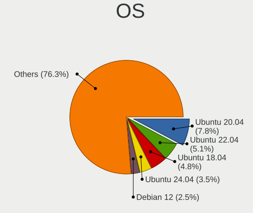

| Name                         | Notebooks | Percent |
|------------------------------|-----------|---------|
| Ubuntu 20.04                 | 145       | 7.77%   |
| Ubuntu 22.04                 | 96        | 5.14%   |
| Ubuntu 18.04                 | 90        | 4.82%   |
| Ubuntu 24.04                 | 65        | 3.48%   |
| Debian 12                    | 46        | 2.46%   |
| Arch Rolling                 | 43        | 2.3%    |
| Debian 11                    | 39        | 2.09%   |
| Pop!_OS 22.04                | 34        | 1.82%   |
| Linux Mint 20.3              | 33        | 1.77%   |
| Zorin 17                     | 30        | 1.61%   |
| Zorin 16                     | 29        | 1.55%   |
| Fedora 39                    | 29        | 1.55%   |
| Linux Mint 22.1              | 28        | 1.5%    |
| Debian 10                    | 25        | 1.34%   |
| openSUSE Tumbleweed-XXXXXXXX | 23        | 1.23%   |
| OpenMandriva 4.3             | 23        | 1.23%   |
| Linux Mint 22.2              | 23        | 1.23%   |
| Linux Mint 21.3              | 23        | 1.23%   |
| Fedora 41                    | 22        | 1.18%   |
| Fedora 40                    | 22        | 1.18%   |
| Linux Mint 21.2              | 21        | 1.12%   |
| Manjaro                      | 20        | 1.07%   |
| Linux Mint 21.1              | 20        | 1.07%   |
| Linux Mint 20.2              | 20        | 1.07%   |
| Linux Mint 20.1              | 20        | 1.07%   |
| Fedora 42                    | 18        | 0.96%   |
| Ubuntu 23.10                 | 17        | 0.91%   |
| Ubuntu 21.10                 | 17        | 0.91%   |
| KDE neon 20.04               | 17        | 0.91%   |
| Fedora 38                    | 17        | 0.91%   |
| OpenMandriva 4.2             | 16        | 0.86%   |
| Linux Mint 22                | 16        | 0.86%   |
| OpenMandriva 24.12           | 15        | 0.8%    |
| Linux Mint 21                | 15        | 0.8%    |
| ArcoLinux Rolling            | 15        | 0.8%    |
| Ubuntu 20.10                 | 14        | 0.75%   |
| Fedora 37                    | 14        | 0.75%   |
| EndeavourOS Rolling          | 14        | 0.75%   |
| Debian                       | 14        | 0.75%   |
| Ubuntu 22.10                 | 13        | 0.7%    |

OS Family
---------

OS without a version

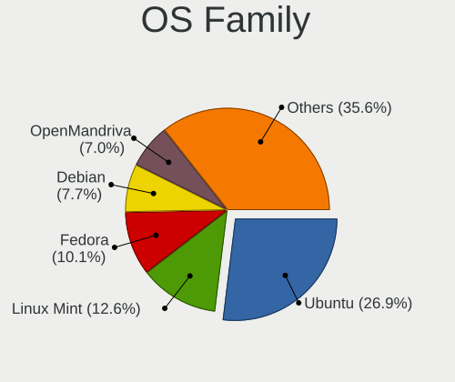

| Name          | Notebooks | Percent |
|---------------|-----------|---------|
| Ubuntu        | 468       | 26.94%  |
| Linux Mint    | 219       | 12.61%  |
| Fedora        | 176       | 10.13%  |
| Debian        | 133       | 7.66%   |
| OpenMandriva  | 122       | 7.02%   |
| Zorin         | 78        | 4.49%   |
| Pop!_OS       | 69        | 3.97%   |
| Manjaro       | 56        | 3.22%   |
| Arch          | 54        | 3.11%   |
| Kubuntu       | 33        | 1.9%    |
| openSUSE      | 32        | 1.84%   |
| KDE neon      | 22        | 1.27%   |
| Xubuntu       | 21        | 1.21%   |
| ArcoLinux     | 18        | 1.04%   |
| ROSA          | 15        | 0.86%   |
| EndeavourOS   | 15        | 0.86%   |
| Ubuntu MATE   | 14        | 0.81%   |
| Gentoo        | 14        | 0.81%   |
| Elementary    | 14        | 0.81%   |
| Lubuntu       | 13        | 0.75%   |
| Kali          | 13        | 0.75%   |
| LMDE          | 12        | 0.69%   |
| SteamOS       | 9         | 0.52%   |
| NixOS         | 7         | 0.4%    |
| RHEL          | 6         | 0.35%   |
| Parrot        | 6         | 0.35%   |
| MX            | 6         | 0.35%   |
| Endless       | 6         | 0.35%   |
| CachyOS       | 6         | 0.35%   |
| Void Linux    | 5         | 0.29%   |
| Ubuntu Unity  | 5         | 0.29%   |
| Ubuntu Budgie | 5         | 0.29%   |
| Feren OS      | 5         | 0.29%   |
| BlackPanther  | 5         | 0.29%   |
| Bazzite       | 5         | 0.29%   |
| TUXEDO OS     | 4         | 0.23%   |
| Clear Linux   | 4         | 0.23%   |
| Artix         | 4         | 0.23%   |
| Garuda Linux  | 3         | 0.17%   |
| Ubuntu Studio | 2         | 0.12%   |

Kernel
------

Version of the Linux kernel

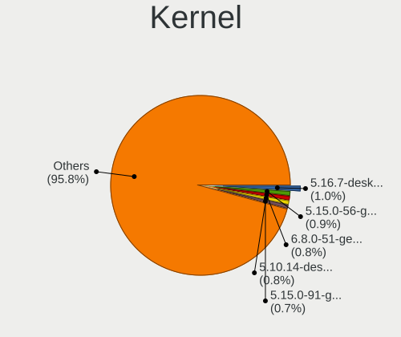

| Version                  | Notebooks | Percent |
|--------------------------|-----------|---------|
| 5.16.7-desktop-1omv4003  | 21        | 1.01%   |
| 5.15.0-56-generic        | 18        | 0.87%   |
| 6.8.0-51-generic         | 17        | 0.82%   |
| 5.10.14-desktop-1omv4002 | 16        | 0.77%   |
| 5.15.0-91-generic        | 15        | 0.72%   |
| 6.14.2-desktop-3omv2590  | 14        | 0.67%   |
| 5.4.0-42-generic         | 14        | 0.67%   |
| 6.12.1-desktop-1omv2490  | 13        | 0.63%   |
| 6.8.0-60-generic         | 12        | 0.58%   |
| 6.14.0-36-generic        | 12        | 0.58%   |
| 5.4.0-52-generic         | 12        | 0.58%   |
| 6.8.0-48-generic         | 11        | 0.53%   |
| 5.19.0-35-generic        | 11        | 0.53%   |
| 5.15.0-58-generic        | 11        | 0.53%   |
| 6.8.0-52-generic         | 10        | 0.48%   |
| 6.2.6-desktop-1omv2390   | 10        | 0.48%   |
| 6.14.0-33-generic        | 10        | 0.48%   |
| 5.4.0-47-generic         | 10        | 0.48%   |
| 5.10.0-21-amd64          | 10        | 0.48%   |
| 6.6.2-desktop-1omv2390   | 9         | 0.43%   |
| 6.5.0-35-generic         | 9         | 0.43%   |
| 5.4.0-58-generic         | 9         | 0.43%   |
| 5.15.0-52-generic        | 9         | 0.43%   |
| 6.8.0-45-generic         | 8         | 0.39%   |
| 6.1.1-desktop-1omv2290   | 8         | 0.39%   |
| 5.4.0-91-generic         | 8         | 0.39%   |
| 5.4.0-80-generic         | 8         | 0.39%   |
| 5.3.0-28-generic         | 8         | 0.39%   |
| 5.15.0-60-generic        | 8         | 0.39%   |
| 6.8.0-49-generic         | 7         | 0.34%   |
| 6.8.0-40-generic         | 7         | 0.34%   |
| 6.8.0-31-generic         | 7         | 0.34%   |
| 6.5.0-28-generic         | 7         | 0.34%   |
| 6.2.0-37-generic         | 7         | 0.34%   |
| 6.2.0-26-generic         | 7         | 0.34%   |
| 5.8.0-59-generic         | 7         | 0.34%   |
| 5.8.0-55-generic         | 7         | 0.34%   |
| 5.4.0-72-generic         | 7         | 0.34%   |
| 5.4.0-65-generic         | 7         | 0.34%   |
| 5.4.0-62-generic         | 7         | 0.34%   |

Kernel Family
-------------

Linux kernel without a distro release

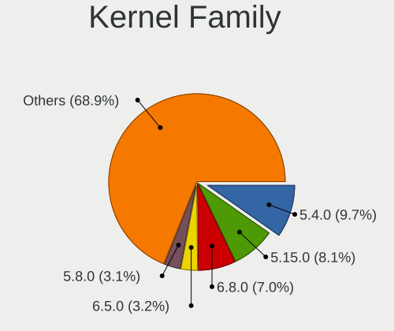

| Version | Notebooks | Percent |
|---------|-----------|---------|
| 5.4.0   | 188       | 9.73%   |
| 5.15.0  | 157       | 8.12%   |
| 6.8.0   | 135       | 6.98%   |
| 6.5.0   | 61        | 3.16%   |
| 5.8.0   | 60        | 3.1%    |
| 4.15.0  | 59        | 3.05%   |
| 6.1.0   | 58        | 3%      |
| 5.13.0  | 55        | 2.85%   |
| 5.11.0  | 55        | 2.85%   |
| 6.14.0  | 49        | 2.53%   |
| 5.10.0  | 48        | 2.48%   |
| 6.2.0   | 46        | 2.38%   |
| 5.19.0  | 45        | 2.33%   |
| 5.3.0   | 40        | 2.07%   |
| 5.0.0   | 26        | 1.35%   |
| 4.19.0  | 26        | 1.35%   |
| 6.11.0  | 23        | 1.19%   |
| 5.16.7  | 21        | 1.09%   |
| 6.12.1  | 20        | 1.03%   |
| 4.18.0  | 19        | 0.98%   |
| 6.14.2  | 18        | 0.93%   |
| 5.10.14 | 17        | 0.88%   |
| 5.14.0  | 13        | 0.67%   |
| 6.2.6   | 12        | 0.62%   |
| 6.1.1   | 10        | 0.52%   |
| 6.6.2   | 9         | 0.47%   |
| 5.17.5  | 8         | 0.41%   |
| 6.5.6   | 7         | 0.36%   |
| 6.0.0   | 7         | 0.36%   |
| 5.6.0   | 7         | 0.36%   |
| 6.6.10  | 6         | 0.31%   |
| 6.4.11  | 6         | 0.31%   |
| 6.17.9  | 6         | 0.31%   |
| 6.17.8  | 6         | 0.31%   |
| 6.12.6  | 6         | 0.31%   |
| 6.11.5  | 6         | 0.31%   |
| 6.9.3   | 5         | 0.26%   |
| 6.8.7   | 5         | 0.26%   |
| 6.6.9   | 5         | 0.26%   |
| 6.3.5   | 5         | 0.26%   |

Kernel Major Ver.
-----------------

Linux kernel major version

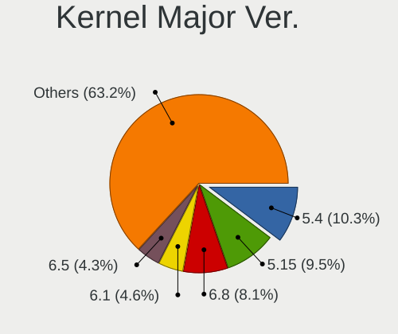

| Version | Notebooks | Percent |
|---------|-----------|---------|
| 5.4     | 196       | 10.27%  |
| 5.15    | 181       | 9.48%   |
| 6.8     | 155       | 8.12%   |
| 6.1     | 88        | 4.61%   |
| 6.5     | 83        | 4.35%   |
| 5.10    | 79        | 4.14%   |
| 6.14    | 78        | 4.09%   |
| 5.8     | 71        | 3.72%   |
| 5.11    | 71        | 3.72%   |
| 6.2     | 68        | 3.56%   |
| 5.13    | 66        | 3.46%   |
| 6.12    | 63        | 3.3%    |
| 4.15    | 59        | 3.09%   |
| 5.19    | 52        | 2.72%   |
| 6.6     | 50        | 2.62%   |
| 5.3     | 46        | 2.41%   |
| 6.11    | 41        | 2.15%   |
| 5.16    | 36        | 1.89%   |
| 4.19    | 31        | 1.62%   |
| 6.0     | 30        | 1.57%   |
| 6.17    | 29        | 1.52%   |
| 5.0     | 28        | 1.47%   |
| 4.18    | 25        | 1.31%   |
| 6.4     | 24        | 1.26%   |
| 5.17    | 24        | 1.26%   |
| 5.14    | 20        | 1.05%   |
| 5.6     | 19        | 1%      |
| 6.10    | 18        | 0.94%   |
| 6.9     | 17        | 0.89%   |
| 6.3     | 17        | 0.89%   |
| 6.15    | 17        | 0.89%   |
| 5.9     | 17        | 0.89%   |
| 6.13    | 16        | 0.84%   |
| 6.16    | 15        | 0.79%   |
| 5.18    | 14        | 0.73%   |
| 5.12    | 12        | 0.63%   |
| 6.7     | 11        | 0.58%   |
| 5.7     | 11        | 0.58%   |
| 4.9     | 11        | 0.58%   |
| 5.5     | 6         | 0.31%   |

Arch
----

OS architecture (x86_64, i586, etc.)

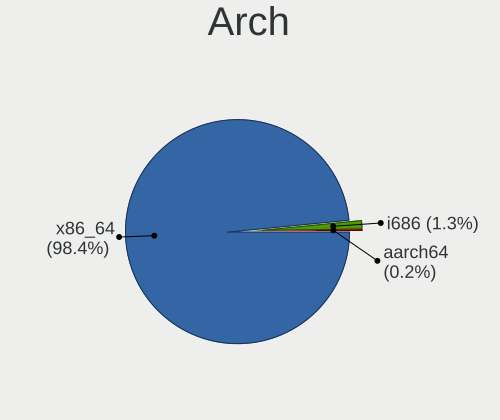

| Name    | Notebooks | Percent |
|---------|-----------|---------|
| x86_64  | 1639      | 98.44%  |
| i686    | 22        | 1.32%   |
| aarch64 | 4         | 0.24%   |

DE
--

Desktop Environment

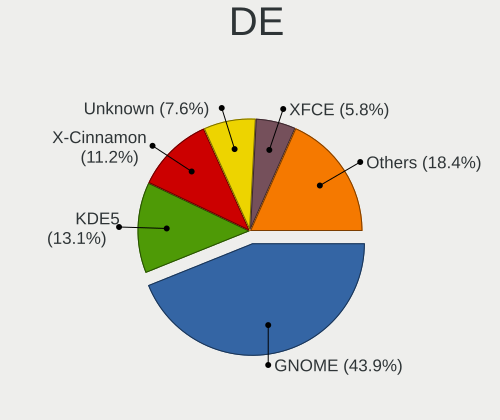

| Name            | Notebooks | Percent |
|-----------------|-----------|---------|
| GNOME           | 772       | 43.91%  |
| KDE5            | 231       | 13.14%  |
| X-Cinnamon      | 197       | 11.21%  |
| Unknown         | 133       | 7.57%   |
| XFCE            | 102       | 5.8%    |
| KDE6            | 90        | 5.12%   |
| MATE            | 43        | 2.45%   |
| KDE             | 24        | 1.37%   |
| LXQt            | 21        | 1.19%   |
| Cinnamon        | 19        | 1.08%   |
| LXDE            | 18        | 1.02%   |
| i3              | 17        | 0.97%   |
| Pantheon        | 14        | 0.8%    |
| KDE4            | 12        | 0.68%   |
| Hyprland        | 11        | 0.63%   |
| GNOME Flashback | 10        | 0.57%   |
| Budgie          | 8         | 0.46%   |
| GNUstep         | 4         | 0.23%   |
| bspwm           | 4         | 0.23%   |
| Unity           | 3         | 0.17%   |
| sway            | 3         | 0.17%   |
| qtile           | 3         | 0.17%   |
| Trinity         | 2         | 0.11%   |
| Enlightenment   | 2         | 0.11%   |
| COSMIC          | 2         | 0.11%   |
| awesome         | 2         | 0.11%   |
| xmonad-session  | 1         | 0.06%   |
| sway:wlroots    | 1         | 0.06%   |
| openbox         | 1         | 0.06%   |
| none+i3         | 1         | 0.06%   |
| niri            | 1         | 0.06%   |
| KDE:KDE-Wayland | 1         | 0.06%   |
| ICEWM           | 1         | 0.06%   |
| herbstluftwm    | 1         | 0.06%   |
| GNOME Classic   | 1         | 0.06%   |
| fluxbox         | 1         | 0.06%   |
| Deepin          | 1         | 0.06%   |

Display Server
--------------

X11 or Wayland

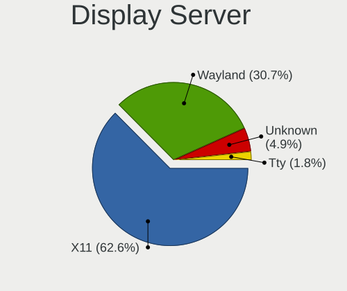

| Name    | Notebooks | Percent |
|---------|-----------|---------|
| X11     | 1088      | 62.56%  |
| Wayland | 534       | 30.71%  |
| Unknown | 86        | 4.95%   |
| Tty     | 31        | 1.78%   |

Display Manager
---------------

SDDM, LightDM, etc.

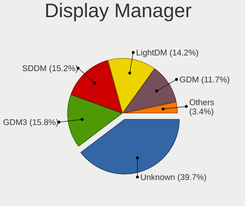

| Name           | Notebooks | Percent |
|----------------|-----------|---------|
| Unknown        | 694       | 39.7%   |
| GDM3           | 277       | 15.85%  |
| SDDM           | 265       | 15.16%  |
| LightDM        | 249       | 14.24%  |
| GDM            | 204       | 11.67%  |
| TDM            | 41        | 2.35%   |
| KDM            | 8         | 0.46%   |
| LY-DM          | 3         | 0.17%   |
| XDM            | 2         | 0.11%   |
| SLiM           | 2         | 0.11%   |
| LXDM           | 1         | 0.06%   |
| GREETD         | 1         | 0.06%   |
| COSMIC-GREETER | 1         | 0.06%   |

OS Lang
-------

Language

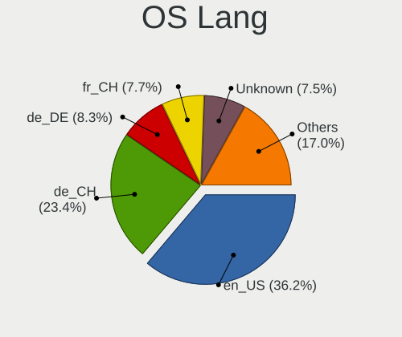

| Lang       | Notebooks | Percent |
|------------|-----------|---------|
| en_US      | 625       | 36.17%  |
| de_CH      | 404       | 23.38%  |
| de_DE      | 144       | 8.33%   |
| fr_CH      | 133       | 7.7%    |
| Unknown    | 129       | 7.47%   |
| en_GB      | 87        | 5.03%   |
| fr_FR      | 58        | 3.36%   |
| C          | 39        | 2.26%   |
| it_IT      | 23        | 1.33%   |
| it_CH      | 21        | 1.22%   |
| pt_PT      | 11        | 0.64%   |
| es_ES      | 8         | 0.46%   |
| ru_RU      | 7         | 0.41%   |
| pl_PL      | 6         | 0.35%   |
| en_CH      | 4         | 0.23%   |
| en_AU      | 4         | 0.23%   |
| de_AT      | 4         | 0.23%   |
| en_IE      | 3         | 0.17%   |
| en_CA      | 2         | 0.12%   |
| de_LI      | 2         | 0.12%   |
| tr_TR      | 1         | 0.06%   |
| sk_SK      | 1         | 0.06%   |
| ru_UA      | 1         | 0.06%   |
| POSIX      | 1         | 0.06%   |
| nl_BE      | 1         | 0.06%   |
| hu_HU      | 1         | 0.06%   |
| hsb_DE     | 1         | 0.06%   |
| fi_FI      | 1         | 0.06%   |
| es_PE      | 1         | 0.06%   |
| en_AG      | 1         | 0.06%   |
| de_IT      | 1         | 0.06%   |
| de_CH.UTF8 | 1         | 0.06%   |
| ca_ES      | 1         | 0.06%   |
| C.UTF8     | 1         | 0.06%   |

Boot Mode
---------

EFI or BIOS

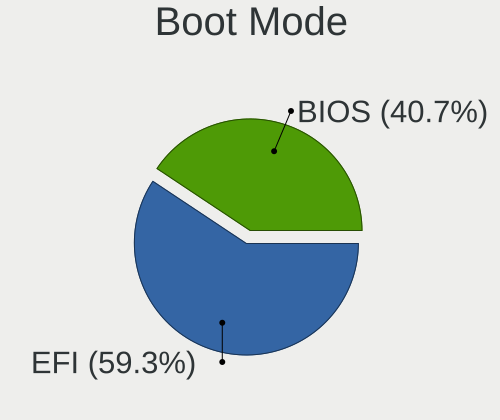

| Mode | Notebooks | Percent |
|------|-----------|---------|
| EFI  | 1010      | 59.34%  |
| BIOS | 692       | 40.66%  |

Filesystem
----------

Type of filesystem

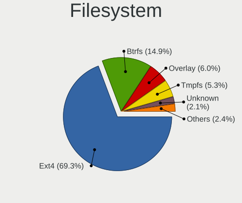

| Type    | Notebooks | Percent |
|---------|-----------|---------|
| Ext4    | 1201      | 69.3%   |
| Btrfs   | 259       | 14.95%  |
| Overlay | 104       | 6%      |
| Tmpfs   | 91        | 5.25%   |
| Unknown | 37        | 2.14%   |
| Xfs     | 21        | 1.21%   |
| Zfs     | 12        | 0.69%   |
| Ext2    | 4         | 0.23%   |
| Ext3    | 3         | 0.17%   |
| F2fs    | 1         | 0.06%   |

Part. scheme
------------

Scheme of partitioning

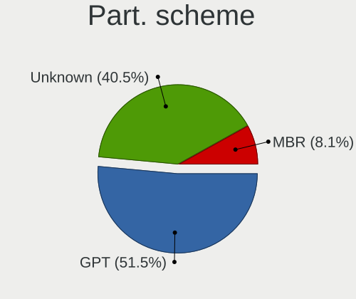

| Type    | Notebooks | Percent |
|---------|-----------|---------|
| GPT     | 881       | 51.46%  |
| Unknown | 693       | 40.48%  |
| MBR     | 138       | 8.06%   |

Dual Boot with Linux/BSD
------------------------

Hosting more than one Linux/BSD

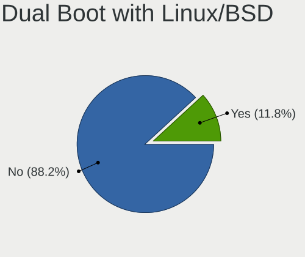

| Dual boot | Notebooks | Percent |
|-----------|-----------|---------|
| No        | 1500      | 88.18%  |
| Yes       | 201       | 11.82%  |

Dual Boot (Win)
---------------

Hosting Linux and Windows

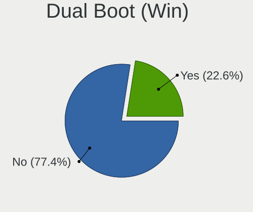

| Dual boot | Notebooks | Percent |
|-----------|-----------|---------|
| No        | 1312      | 77.45%  |
| Yes       | 382       | 22.55%  |

Board
-----

Vendor
------

Motherboard manufacturer

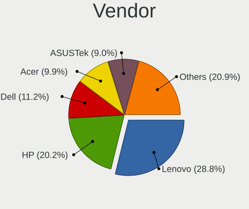

| Name                | Notebooks | Percent |
|---------------------|-----------|---------|
| Lenovo              | 480       | 28.85%  |
| Hewlett-Packard     | 336       | 20.19%  |
| Dell                | 187       | 11.24%  |
| Acer                | 165       | 9.92%   |
| ASUSTek Computer    | 149       | 8.95%   |
| Apple               | 86        | 5.17%   |
| Sony                | 23        | 1.38%   |
| TUXEDO              | 22        | 1.32%   |
| Toshiba             | 22        | 1.32%   |
| MSI                 | 20        | 1.2%    |
| Medion              | 18        | 1.08%   |
| Notebook            | 16        | 0.96%   |
| HUAWEI              | 13        | 0.78%   |
| Fujitsu             | 12        | 0.72%   |
| Samsung Electronics | 11        | 0.66%   |
| Valve               | 9         | 0.54%   |
| Unknown             | 8         | 0.48%   |
| Schenker            | 7         | 0.42%   |
| Razer               | 7         | 0.42%   |
| Alienware           | 6         | 0.36%   |
| Google              | 5         | 0.3%    |
| Clevo               | 5         | 0.3%    |
| Packard Bell        | 4         | 0.24%   |
| GPD                 | 4         | 0.24%   |
| Framework           | 4         | 0.24%   |
| Timi                | 3         | 0.18%   |
| System76            | 3         | 0.18%   |
| Polaroid            | 3         | 0.18%   |
| PC Specialist       | 3         | 0.18%   |
| Fujitsu Siemens     | 3         | 0.18%   |
| whyopencomputing    | 2         | 0.12%   |
| VALE                | 2         | 0.12%   |
| TrekStor            | 2         | 0.12%   |
| Purism              | 2         | 0.12%   |
| Panasonic           | 2         | 0.12%   |
| MPMAN               | 2         | 0.12%   |
| Gigabyte Technology | 2         | 0.12%   |
| TongFang            | 1         | 0.06%   |
| Star Labs           | 1         | 0.06%   |
| SLIMBOOK            | 1         | 0.06%   |

Model
-----

Motherboard model

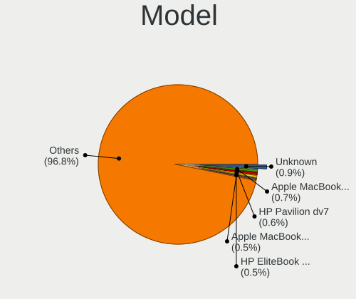

| Name                                       | Notebooks | Percent |
|--------------------------------------------|-----------|---------|
| Unknown                                    | 15        | 0.9%    |
| Apple MacBookPro8,1                        | 11        | 0.66%   |
| HP Pavilion dv7                            | 10        | 0.6%    |
| Apple MacBookPro9,2                        | 9         | 0.54%   |
| HP EliteBook 840 G5                        | 8         | 0.48%   |
| Dell Latitude 7490                         | 8         | 0.48%   |
| HP Pavilion dv6                            | 7         | 0.42%   |
| HP Notebook                                | 7         | 0.42%   |
| Valve Jupiter                              | 6         | 0.36%   |
| HP Pavilion g7                             | 6         | 0.36%   |
| HP EliteBook 840 G6                        | 6         | 0.36%   |
| Dell XPS 15 9570                           | 6         | 0.36%   |
| Dell XPS 15 9560                           | 6         | 0.36%   |
| Apple MacBookPro11,1                       | 6         | 0.36%   |
| Apple MacBookPro10,1                       | 6         | 0.36%   |
| HP ProBook 650 G1                          | 5         | 0.3%    |
| HP ProBook 440 G8 Notebook PC              | 5         | 0.3%    |
| HP ENVY 15                                 | 5         | 0.3%    |
| Dell XPS 15 7590                           | 5         | 0.3%    |
| Dell XPS 13 9370                           | 5         | 0.3%    |
| Dell Latitude E7240                        | 5         | 0.3%    |
| Lenovo ThinkPad X1 Carbon Gen 9 20XWCTO1WW | 4         | 0.24%   |
| HP ProBook 440 G6                          | 4         | 0.24%   |
| HP Pavilion 15                             | 4         | 0.24%   |
| HP Laptop 15-bs1xx                         | 4         | 0.24%   |
| HP ENVY 17                                 | 4         | 0.24%   |
| HP EliteBook Folio 1040 G1                 | 4         | 0.24%   |
| HP EliteBook 8460p                         | 4         | 0.24%   |
| HP EliteBook 840 G7 Notebook PC            | 4         | 0.24%   |
| Dell XPS 15 9520                           | 4         | 0.24%   |
| Dell XPS 13 9350                           | 4         | 0.24%   |
| Dell XPS 13 9300                           | 4         | 0.24%   |
| Dell XPS 13 7390                           | 4         | 0.24%   |
| Dell Latitude E7470                        | 4         | 0.24%   |
| ASUS K53SD                                 | 4         | 0.24%   |
| Apple MacBookAir7,2                        | 4         | 0.24%   |
| Apple MacBookAir6,2                        | 4         | 0.24%   |
| Acer Aspire V3-772G                        | 4         | 0.24%   |
| Acer Aspire V3-772                         | 4         | 0.24%   |
| Valve Galileo                              | 3         | 0.18%   |

Model Family
------------

Motherboard model prefix

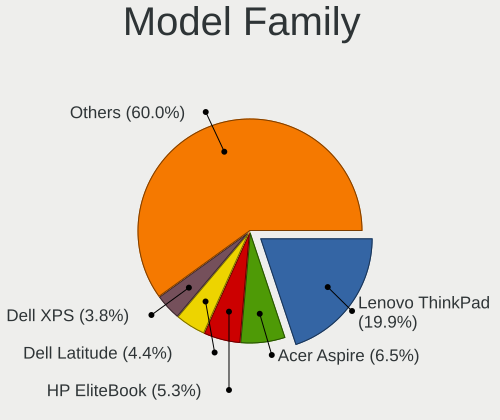

| Name                | Notebooks | Percent |
|---------------------|-----------|---------|
| Lenovo ThinkPad     | 331       | 19.89%  |
| Acer Aspire         | 108       | 6.49%   |
| HP EliteBook        | 89        | 5.35%   |
| Dell Latitude       | 74        | 4.45%   |
| Dell XPS            | 64        | 3.85%   |
| HP ProBook          | 59        | 3.55%   |
| HP Pavilion         | 56        | 3.37%   |
| Lenovo IdeaPad      | 48        | 2.88%   |
| Lenovo Yoga         | 39        | 2.34%   |
| ASUS VivoBook       | 35        | 2.1%    |
| HP Laptop           | 27        | 1.62%   |
| Acer Swift          | 26        | 1.56%   |
| HP ZBook            | 25        | 1.5%    |
| HP ENVY             | 22        | 1.32%   |
| Dell Inspiron       | 20        | 1.2%    |
| ASUS ROG            | 18        | 1.08%   |
| Toshiba Satellite   | 15        | 0.9%    |
| ASUS ASUS           | 15        | 0.9%    |
| Unknown             | 15        | 0.9%    |
| Lenovo Legion       | 13        | 0.78%   |
| Dell Precision      | 13        | 0.78%   |
| Apple MacBookPro8   | 13        | 0.78%   |
| ASUS ZenBook        | 12        | 0.72%   |
| HP Compaq           | 11        | 0.66%   |
| Apple MacBookPro11  | 11        | 0.66%   |
| Lenovo ThinkBook    | 10        | 0.6%    |
| HP OMEN             | 10        | 0.6%    |
| Apple MacBookPro9   | 10        | 0.6%    |
| HP 250              | 9         | 0.54%   |
| Fujitsu LIFEBOOK    | 9         | 0.54%   |
| TUXEDO InfinityBook | 8         | 0.48%   |
| Acer TravelMate     | 8         | 0.48%   |
| Razer Blade         | 7         | 0.42%   |
| Lenovo V15          | 7         | 0.42%   |
| HP Notebook         | 7         | 0.42%   |
| Acer Predator       | 7         | 0.42%   |
| Valve Jupiter       | 6         | 0.36%   |
| Dell Vostro         | 6         | 0.36%   |
| Apple MacBookPro5   | 6         | 0.36%   |
| Apple MacBookPro10  | 6         | 0.36%   |

MFG Year
--------

Motherboard manufacture year

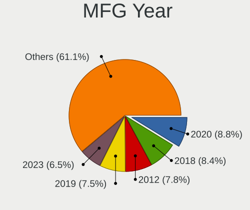

| Year    | Notebooks | Percent |
|---------|-----------|---------|
| 2020    | 146       | 8.77%   |
| 2018    | 139       | 8.35%   |
| 2012    | 129       | 7.75%   |
| 2019    | 125       | 7.51%   |
| 2023    | 108       | 6.49%   |
| 2021    | 108       | 6.49%   |
| 2013    | 105       | 6.31%   |
| 2017    | 103       | 6.19%   |
| 2011    | 100       | 6.01%   |
| 2022    | 99        | 5.95%   |
| 2014    | 87        | 5.23%   |
| 2015    | 81        | 4.87%   |
| 2016    | 79        | 4.75%   |
| 2010    | 67        | 4.03%   |
| 2024    | 49        | 2.94%   |
| 2008    | 49        | 2.94%   |
| 2009    | 33        | 1.98%   |
| 2007    | 24        | 1.44%   |
| 2025    | 14        | 0.84%   |
| 2006    | 9         | 0.54%   |
| 2005    | 5         | 0.3%    |
| Unknown | 4         | 0.24%   |
| 2004    | 1         | 0.06%   |

Form Factor
-----------

Physical design of the computer

| Name     | Notebooks | Percent |
|----------|-----------|---------|
| Notebook | 1664      | 100%    |

Secure Boot
-----------

Enabled or disabled

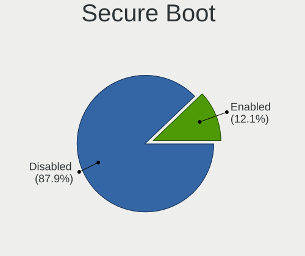

| State    | Notebooks | Percent |
|----------|-----------|---------|
| Disabled | 1477      | 87.86%  |
| Enabled  | 204       | 12.14%  |

Coreboot
--------

Have coreboot on board

| Used | Notebooks | Percent |
|------|-----------|---------|
| No   | 1650      | 99.16%  |
| Yes  | 14        | 0.84%   |

RAM Size
--------

Total RAM memory

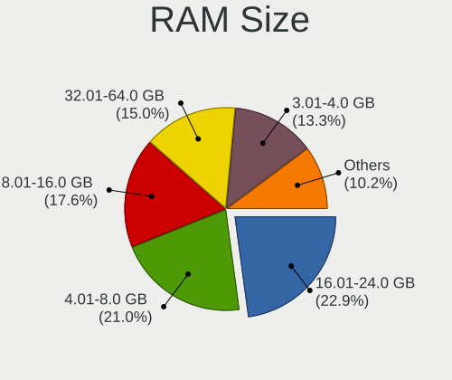

| Size in GB  | Notebooks | Percent |
|-------------|-----------|---------|
| 16.01-24.0  | 388       | 22.86%  |
| 4.01-8.0    | 357       | 21.04%  |
| 8.01-16.0   | 298       | 17.56%  |
| 32.01-64.0  | 255       | 15.03%  |
| 3.01-4.0    | 226       | 13.32%  |
| 24.01-32.0  | 63        | 3.71%   |
| 64.01-256.0 | 55        | 3.24%   |
| 1.01-2.0    | 34        | 2%      |
| 2.01-3.0    | 12        | 0.71%   |
| 0.51-1.0    | 9         | 0.53%   |

RAM Used
--------

Used RAM memory

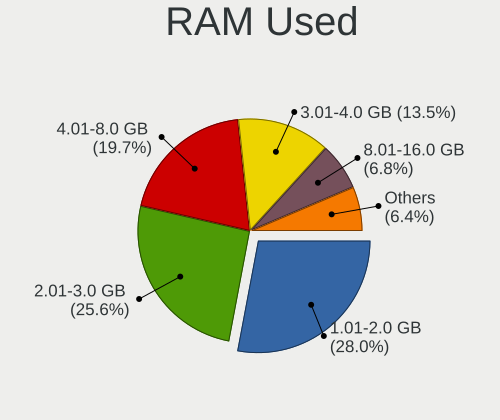

| Used GB    | Notebooks | Percent |
|------------|-----------|---------|
| 1.01-2.0   | 528       | 27.97%  |
| 2.01-3.0   | 484       | 25.64%  |
| 4.01-8.0   | 372       | 19.7%   |
| 3.01-4.0   | 254       | 13.45%  |
| 8.01-16.0  | 129       | 6.83%   |
| 0.51-1.0   | 79        | 4.18%   |
| 16.01-24.0 | 24        | 1.27%   |
| 0.01-0.5   | 11        | 0.58%   |
| 24.01-32.0 | 5         | 0.26%   |
| 32.01-64.0 | 2         | 0.11%   |

Total Drives
------------

Number of drives on board

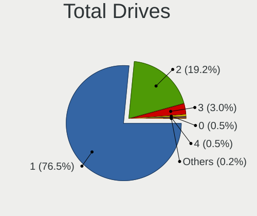

| Drives | Notebooks | Percent |
|--------|-----------|---------|
| 1      | 1305      | 76.54%  |
| 2      | 327       | 19.18%  |
| 3      | 52        | 3.05%   |
| 0      | 9         | 0.53%   |
| 4      | 8         | 0.47%   |
| 5      | 3         | 0.18%   |
| 7      | 1         | 0.06%   |

Has CD-ROM
----------

Has CD-ROM on board

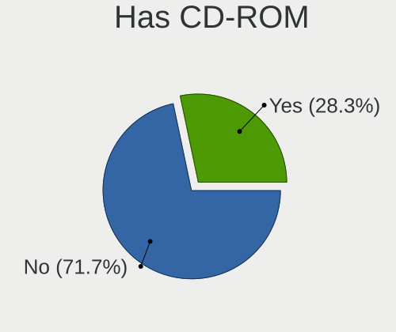

| Presented | Notebooks | Percent |
|-----------|-----------|---------|
| No        | 1199      | 71.71%  |
| Yes       | 473       | 28.29%  |

Has Ethernet
------------

Has Ethernet on board

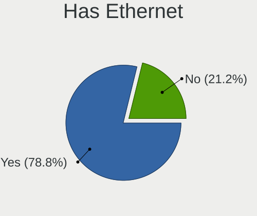

| Presented | Notebooks | Percent |
|-----------|-----------|---------|
| Yes       | 1323      | 78.84%  |
| No        | 355       | 21.16%  |

Has WiFi
--------

Has WiFi module

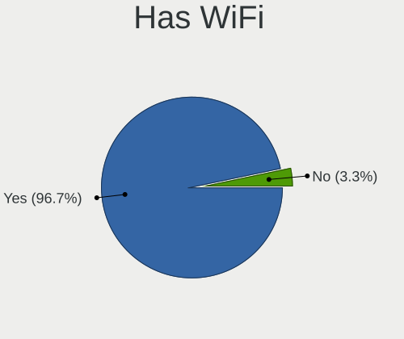

| Presented | Notebooks | Percent |
|-----------|-----------|---------|
| Yes       | 1610      | 96.7%   |
| No        | 55        | 3.3%    |

Has Bluetooth
-------------

Has Bluetooth module

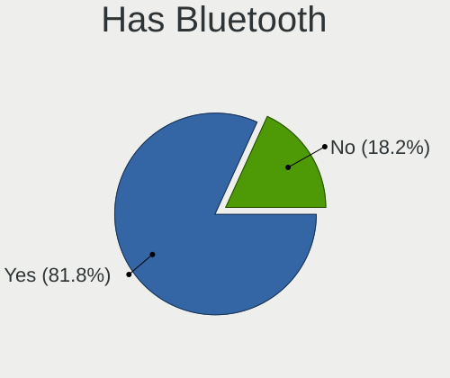

| Presented | Notebooks | Percent |
|-----------|-----------|---------|
| Yes       | 1378      | 81.83%  |
| No        | 306       | 18.17%  |

Location
--------

Country
-------

Geographic location (country)

| Country     | Notebooks | Percent |
|-------------|-----------|---------|
| Switzerland | 1664      | 100%    |

City
----

Geographic location (city)

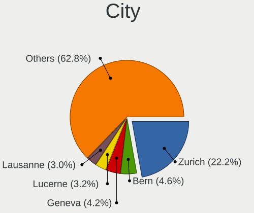

| City          | Notebooks | Percent |
|---------------|-----------|---------|
| Zurich        | 406       | 22.21%  |
| Bern          | 85        | 4.65%   |
| Geneva        | 77        | 4.21%   |
| Lucerne       | 58        | 3.17%   |
| Lausanne      | 54        | 2.95%   |
| Basel         | 37        | 2.02%   |
| Winterthur    | 35        | 1.91%   |
| Lugano        | 25        | 1.37%   |
| Neuchatel     | 21        | 1.15%   |
| St. Gallen    | 19        | 1.04%   |
| Dietikon      | 18        | 0.98%   |
| Zweidlen-Dorf | 17        | 0.93%   |
| Thun          | 15        | 0.82%   |
| Biel/Bienne   | 14        | 0.77%   |
| Herrliberg    | 13        | 0.71%   |
| Wil           | 12        | 0.66%   |
| Suhr          | 12        | 0.66%   |
| Sion          | 11        | 0.6%    |
| Aarburg       | 11        | 0.6%    |
| Bulle         | 10        | 0.55%   |
| Zollikofen    | 9         | 0.49%   |
| Solothurn     | 8         | 0.44%   |
| Renens        | 8         | 0.44%   |
| Onex          | 8         | 0.44%   |
| Gerlafingen   | 8         | 0.44%   |
| Dubendorf     | 8         | 0.44%   |
| Chur          | 8         | 0.44%   |
| Bellinzona    | 8         | 0.44%   |
| Wohlen        | 7         | 0.38%   |
| Widnau        | 7         | 0.38%   |
| Wettingen     | 7         | 0.38%   |
| St. Moritz    | 7         | 0.38%   |
| Prilly        | 7         | 0.38%   |
| Lyss          | 7         | 0.38%   |
| Glattbrugg    | 7         | 0.38%   |
| Frauenfeld    | 7         | 0.38%   |
| Aarau         | 7         | 0.38%   |
| Zug           | 6         | 0.33%   |
| Pully         | 6         | 0.33%   |
| Munchenstein  | 6         | 0.33%   |

Drives
------

Drive Vendor
------------

Hard drive vendors

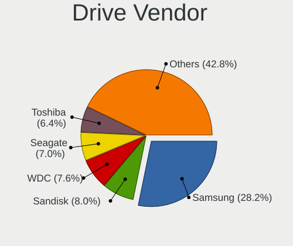

| Vendor                         | Notebooks | Drives | Percent |
|--------------------------------|-----------|--------|---------|
| Samsung Electronics            | 571       | 827    | 28.21%  |
| Sandisk                        | 161       | 199    | 7.95%   |
| WDC                            | 153       | 194    | 7.56%   |
| Seagate                        | 142       | 172    | 7.02%   |
| Toshiba                        | 130       | 181    | 6.42%   |
| SK hynix                       | 125       | 155    | 6.18%   |
| Intel                          | 88        | 120    | 4.35%   |
| Unknown                        | 80        | 109    | 3.95%   |
| Micron Technology              | 75        | 100    | 3.71%   |
| Kingston                       | 51        | 71     | 2.52%   |
| Apple                          | 51        | 87     | 2.52%   |
| Hitachi                        | 49        | 63     | 2.42%   |
| Crucial                        | 45        | 64     | 2.22%   |
| KIOXIA                         | 24        | 28     | 1.19%   |
| HGST                           | 24        | 29     | 1.19%   |
| LITEON                         | 19        | 26     | 0.94%   |
| Phison Electronics             | 18        | 32     | 0.89%   |
| Kingston Technology Company    | 15        | 16     | 0.74%   |
| Intenso                        | 14        | 20     | 0.69%   |
| Micron/Crucial Technology      | 12        | 12     | 0.59%   |
| LITEONIT                       | 11        | 12     | 0.54%   |
| A-DATA Technology              | 11        | 17     | 0.54%   |
| Transcend                      | 9         | 12     | 0.44%   |
| OCZ                            | 8         | 8      | 0.4%    |
| Silicon Motion                 | 7         | 8      | 0.35%   |
| Phison                         | 7         | 11     | 0.35%   |
| Fujitsu                        | 7         | 10     | 0.35%   |
| JMicron Technology             | 6         | 6      | 0.3%    |
| Corsair                        | 6         | 8      | 0.3%    |
| Union Memory (Shenzhen)        | 5         | 6      | 0.25%   |
| ASMT                           | 5         | 6      | 0.25%   |
| Unknown                        | 5         | 6      | 0.25%   |
| USB                            | 4         | 5      | 0.2%    |
| SPCC                           | 4         | 4      | 0.2%    |
| China                          | 4         | 6      | 0.2%    |
| Union Memory                   | 3         | 3      | 0.15%   |
| Solid State Storage Technology | 3         | 7      | 0.15%   |
| PNY                            | 3         | 3      | 0.15%   |
| Lenovo                         | 3         | 3      | 0.15%   |
| KingSpec                       | 3         | 3      | 0.15%   |

Drive Model
-----------

Hard drive models

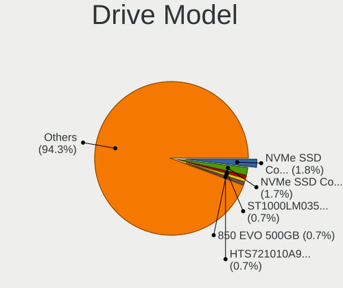

| Model                                                | Notebooks | Percent |
|------------------------------------------------------|-----------|---------|
| Samsung NVMe SSD Controller SM981/PM981/PM983 1TB    | 39        | 1.82%   |
| Samsung NVMe SSD Controller PM9A1/PM9A3/980PRO 1TB   | 37        | 1.73%   |
| Seagate ST1000LM035-1RK172 1TB                       | 15        | 0.7%    |
| Samsung SSD 850 EVO 500GB                            | 15        | 0.7%    |
| HGST HTS721010A9E630 1TB                             | 15        | 0.7%    |
| SanDisk NVMe SSD Drive 512GB                         | 14        | 0.66%   |
| Samsung SSD 860 EVO 500GB                            | 14        | 0.66%   |
| WDC WD10JPVX-22JC3T0 1TB                             | 13        | 0.61%   |
| Toshiba MQ01ABD100 1TB                               | 13        | 0.61%   |
| Seagate ST1000LM024 HN-M101MBB 1TB                   | 13        | 0.61%   |
| Unknown MMC Card  128GB                              | 12        | 0.56%   |
| SanDisk NVMe SSD Drive 1TB                           | 12        | 0.56%   |
| Samsung SSD 860 EVO 1TB                              | 12        | 0.56%   |
| Unknown MMC Card  32GB                               | 11        | 0.51%   |
| SK hynix NVMe SSD Drive 512GB                        | 11        | 0.51%   |
| Seagate ST1000LM048-2E7172 1TB                       | 11        | 0.51%   |
| Samsung SSD 860 EVO 250GB                            | 11        | 0.51%   |
| Samsung SSD 850 EVO 250GB                            | 11        | 0.51%   |
| Crucial CT1000MX500SSD1 1TB                          | 10        | 0.47%   |
| Sandisk WD Black SN750 / PC SN730 NVMe SSD 500GB     | 9         | 0.42%   |
| Samsung SSD 990 PRO 2TB                              | 9         | 0.42%   |
| Samsung NVMe SSD Drive 256GB                         | 9         | 0.42%   |
| Samsung NVMe SSD Drive 1024GB                        | 9         | 0.42%   |
| Toshiba MQ01ABF050 500GB                             | 8         | 0.37%   |
| Seagate ST500LT012-1DG142 500GB                      | 8         | 0.37%   |
| Sandisk WD Blue SN550 NVMe SSD 1024GB                | 8         | 0.37%   |
| Samsung SSD 970 EVO Plus 1TB                         | 8         | 0.37%   |
| Samsung SSD 870 EVO 1TB                              | 8         | 0.37%   |
| Unknown MMC Card  64GB                               | 7         | 0.33%   |
| SK hynix SKHynix_HFS001TEJ9X162N 1024GB              | 7         | 0.33%   |
| Seagate ST2000LM015-2E8174 2TB                       | 7         | 0.33%   |
| Seagate ST1000LM049-2GH172 1TB                       | 7         | 0.33%   |
| Seagate Expansion 2TB                                | 7         | 0.33%   |
| SanDisk NVMe SSD Drive 2TB                           | 7         | 0.33%   |
| Samsung SSD 870 EVO 500GB                            | 7         | 0.33%   |
| Samsung NVMe SSD Drive 512GB                         | 7         | 0.33%   |
| Samsung NVMe SSD Controller SM961/PM961/SM963 1024GB | 7         | 0.33%   |
| Samsung NVMe SSD Controller SM951/PM951 128GB        | 7         | 0.33%   |
| Samsung MZVLB512HBJQ-000L7 512GB                     | 7         | 0.33%   |
| Micron 1100_MTFDDAV256TBN 256GB SSD                  | 7         | 0.33%   |

HDD Vendor
----------

Hard disk drive vendors

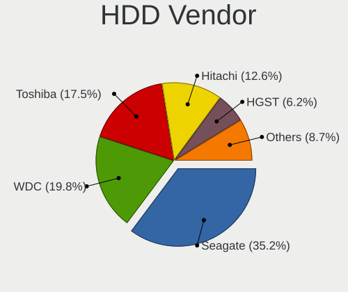

| Vendor              | Notebooks | Drives | Percent |
|---------------------|-----------|--------|---------|
| Seagate             | 137       | 167    | 35.22%  |
| WDC                 | 77        | 101    | 19.79%  |
| Toshiba             | 68        | 78     | 17.48%  |
| Hitachi             | 49        | 63     | 12.6%   |
| HGST                | 24        | 29     | 6.17%   |
| Fujitsu             | 7         | 10     | 1.8%    |
| Apple               | 6         | 6      | 1.54%   |
| Unknown             | 4         | 4      | 1.03%   |
| Samsung Electronics | 4         | 4      | 1.03%   |
| JMicron Technology  | 3         | 3      | 0.77%   |
| HGST HTS            | 2         | 2      | 0.51%   |
| External            | 2         | 2      | 0.51%   |
| USB3.0              | 1         | 2      | 0.26%   |
| USB                 | 1         | 2      | 0.26%   |
| Unknown (CF)        | 1         | 1      | 0.26%   |
| Intenso             | 1         | 1      | 0.26%   |
| ASMT                | 1         | 1      | 0.26%   |
| ASMedia             | 1         | 1      | 0.26%   |

SSD Vendor
----------

Solid state drive vendors

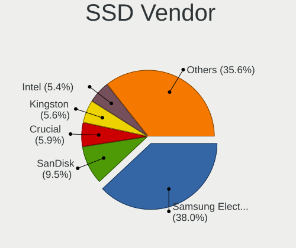

| Vendor              | Notebooks | Drives | Percent |
|---------------------|-----------|--------|---------|
| Samsung Electronics | 252       | 343    | 38.01%  |
| SanDisk             | 63        | 79     | 9.5%    |
| Crucial             | 39        | 57     | 5.88%   |
| Kingston            | 37        | 54     | 5.58%   |
| Intel               | 36        | 42     | 5.43%   |
| Apple               | 32        | 38     | 4.83%   |
| WDC                 | 31        | 39     | 4.68%   |
| Toshiba             | 22        | 32     | 3.32%   |
| SK hynix            | 20        | 24     | 3.02%   |
| Micron Technology   | 20        | 30     | 3.02%   |
| LITEON              | 19        | 26     | 2.87%   |
| LITEONIT            | 11        | 12     | 1.66%   |
| Intenso             | 11        | 14     | 1.66%   |
| A-DATA Technology   | 9         | 12     | 1.36%   |
| OCZ                 | 8         | 8      | 1.21%   |
| Transcend           | 7         | 10     | 1.06%   |
| Corsair             | 6         | 8      | 0.9%    |
| China               | 4         | 6      | 0.6%    |
| PNY                 | 3         | 3      | 0.45%   |
| KingSpec            | 3         | 3      | 0.45%   |
| ASMT                | 3         | 4      | 0.45%   |
| SPCC                | 2         | 2      | 0.3%    |
| Seagate             | 2         | 2      | 0.3%    |
| Phison              | 2         | 4      | 0.3%    |
| WHALEKOM            | 1         | 2      | 0.15%   |
| WALRAM              | 1         | 1      | 0.15%   |
| Verbatim            | 1         | 1      | 0.15%   |
| TCSUNBOW            | 1         | 2      | 0.15%   |
| SABRENT             | 1         | 1      | 0.15%   |
| Plextor             | 1         | 1      | 0.15%   |
| Patriot             | 1         | 1      | 0.15%   |
| OWC                 | 1         | 1      | 0.15%   |
| ORIGIN              | 1         | 1      | 0.15%   |
| ORICO               | 1         | 1      | 0.15%   |
| Mushkin             | 1         | 1      | 0.15%   |
| Lexar               | 1         | 2      | 0.15%   |
| Leven               | 1         | 1      | 0.15%   |
| Kolink              | 1         | 1      | 0.15%   |
| KODAK               | 1         | 1      | 0.15%   |
| KingDian            | 1         | 1      | 0.15%   |

Drive Kind
----------

HDD or SSD

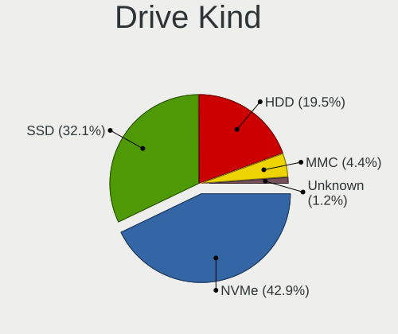

| Kind    | Notebooks | Drives | Percent |
|---------|-----------|--------|---------|
| NVMe    | 827       | 1219   | 42.87%  |
| SSD     | 619       | 880    | 32.09%  |
| HDD     | 376       | 477    | 19.49%  |
| MMC     | 84        | 117    | 4.35%   |
| Unknown | 23        | 31     | 1.19%   |

Drive Connector
---------------

SATA, SAS, NVMe, etc.

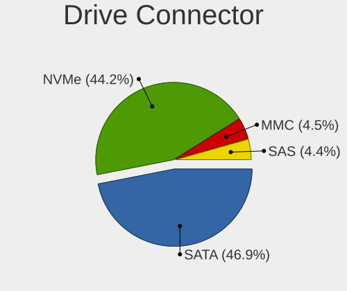

| Type | Notebooks | Drives | Percent |
|------|-----------|--------|---------|
| SATA | 875       | 1297   | 46.92%  |
| NVMe | 824       | 1206   | 44.18%  |
| MMC  | 84        | 117    | 4.5%    |
| SAS  | 82        | 104    | 4.4%    |

Drive Size
----------

Size of hard drive

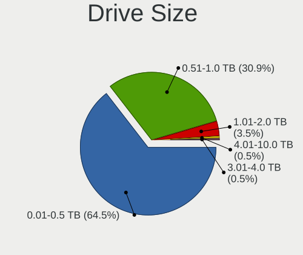

| Size in TB | Notebooks | Drives | Percent |
|------------|-----------|--------|---------|
| 0.01-0.5   | 636       | 891    | 64.5%   |
| 0.51-1.0   | 305       | 411    | 30.93%  |
| 1.01-2.0   | 35        | 43     | 3.55%   |
| 3.01-4.0   | 5         | 6      | 0.51%   |
| 4.01-10.0  | 5         | 6      | 0.51%   |

Space Total
-----------

Amount of disk space available on the file system

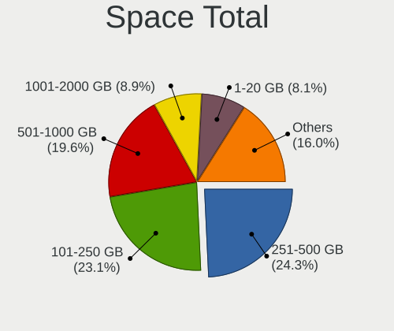

| Size in GB     | Notebooks | Percent |
|----------------|-----------|---------|
| 251-500        | 431       | 24.25%  |
| 101-250        | 410       | 23.07%  |
| 501-1000       | 349       | 19.64%  |
| 1001-2000      | 158       | 8.89%   |
| 1-20           | 144       | 8.1%    |
| 51-100         | 74        | 4.16%   |
| Unknown        | 69        | 3.88%   |
| More than 3000 | 66        | 3.71%   |
| 21-50          | 48        | 2.7%    |
| 2001-3000      | 28        | 1.58%   |

Space Used
----------

Amount of used disk space

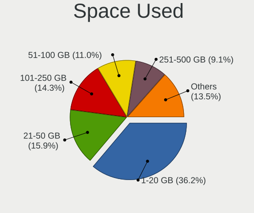

| Used GB        | Notebooks | Percent |
|----------------|-----------|---------|
| 1-20           | 671       | 36.15%  |
| 21-50          | 296       | 15.95%  |
| 101-250        | 266       | 14.33%  |
| 51-100         | 205       | 11.05%  |
| 251-500        | 168       | 9.05%   |
| 501-1000       | 111       | 5.98%   |
| Unknown        | 69        | 3.72%   |
| 1001-2000      | 43        | 2.32%   |
| 2001-3000      | 13        | 0.7%    |
| More than 3000 | 11        | 0.59%   |
| 0              | 3         | 0.16%   |

Malfunc. Drives
---------------

Drive models with a malfunction

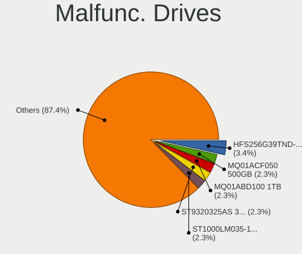

| Model                                      | Notebooks | Drives | Percent |
|--------------------------------------------|-----------|--------|---------|
| SK hynix HFS256G39TND-N210A 256GB SSD      | 3         | 3      | 3.45%   |
| Toshiba MQ01ACF050 500GB                   | 2         | 2      | 2.3%    |
| Toshiba MQ01ABD100 1TB                     | 2         | 2      | 2.3%    |
| Seagate ST9320325AS 320GB                  | 2         | 2      | 2.3%    |
| Seagate ST1000LM035-1RK172 1TB             | 2         | 3      | 2.3%    |
| Samsung Electronics MZVLQ512HBLU-00B 512GB | 2         | 2      | 2.3%    |
| Intel SSDSCKKF256G8H 256GB                 | 2         | 2      | 2.3%    |
| Hitachi HTS545050B9A300 500GB              | 2         | 2      | 2.3%    |
| HGST HTS721010A9E630 1TB                   | 2         | 2      | 2.3%    |
| Apple HDD HTS547550A9E384 500GB            | 2         | 2      | 2.3%    |
| WDC WD5000LPCX-24C6HT0 500GB               | 1         | 1      | 1.15%   |
| WDC WD5000BEVT-55A0RT0 500GB               | 1         | 1      | 1.15%   |
| WDC WD1600BEKT-60A25T1 160GB               | 1         | 1      | 1.15%   |
| WDC WD10JPVX-08JC3T5 1TB                   | 1         | 1      | 1.15%   |
| WDC WD1002FAEX-00Z3A0 1TB                  | 1         | 1      | 1.15%   |
| Transcend TS1TMTE220S 1TB                  | 1         | 1      | 1.15%   |
| Toshiba MQ01ABF050 500GB                   | 1         | 2      | 1.15%   |
| Toshiba MQ01ABF0 500GB                     | 1         | 1      | 1.15%   |
| Toshiba MQ01ABD075 752GB                   | 1         | 1      | 1.15%   |
| Toshiba MK7559GSXP 752GB                   | 1         | 1      | 1.15%   |
| Toshiba MK5065GSX 500GB                    | 1         | 1      | 1.15%   |
| Toshiba MK5056GSY 500GB                    | 1         | 1      | 1.15%   |
| Toshiba MK1652GSX 160GB                    | 1         | 1      | 1.15%   |
| Toshiba MK1255GSX H 120GB                  | 1         | 1      | 1.15%   |
| TCSUNBOW N8 240GB SSD                      | 1         | 1      | 1.15%   |
| SK hynix SC401 SATA 512GB SSD              | 1         | 2      | 1.15%   |
| SK hynix SC210 mSATA 256GB SSD             | 1         | 1      | 1.15%   |
| SK hynix HFS256GD9TNG-62A0A 256GB          | 1         | 1      | 1.15%   |
| SK hynix HFS128G39TND-N210A 128GB SSD      | 1         | 1      | 1.15%   |
| SK hynix HFS128G39MNC-2300A 128GB SSD      | 1         | 1      | 1.15%   |
| Seagate ST9500420AS 500GB                  | 1         | 2      | 1.15%   |
| Seagate ST9250827AS 250GB                  | 1         | 1      | 1.15%   |
| Seagate ST9250315AS 250GB                  | 1         | 1      | 1.15%   |
| Seagate ST9160412AS 160GB                  | 1         | 1      | 1.15%   |
| Seagate ST9120822AS 120GB                  | 1         | 1      | 1.15%   |
| Seagate ST500LM000-SSHD-8GB                | 1         | 1      | 1.15%   |
| Seagate ST1000LM024 HN-M101MBB 1TB         | 1         | 1      | 1.15%   |
| Seagate ST1000LM014-SSHD-8GB               | 1         | 1      | 1.15%   |
| Seagate ST1000LM014-1EJ164-SSHD 1TB        | 1         | 1      | 1.15%   |
| SanDisk SSD PLUS 480GB                     | 1         | 1      | 1.15%   |

Malfunc. Drive Vendor
---------------------

Vendors of faulty drives

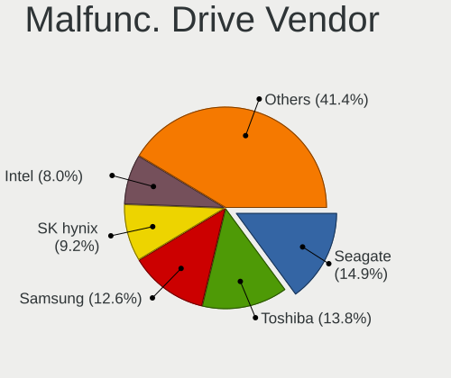

| Vendor                    | Notebooks | Drives | Percent |
|---------------------------|-----------|--------|---------|
| Seagate                   | 13        | 15     | 14.94%  |
| Toshiba                   | 12        | 13     | 13.79%  |
| Samsung Electronics       | 11        | 13     | 12.64%  |
| SK hynix                  | 8         | 9      | 9.2%    |
| Intel                     | 7         | 7      | 8.05%   |
| Hitachi                   | 7         | 7      | 8.05%   |
| WDC                       | 5         | 5      | 5.75%   |
| SanDisk                   | 5         | 6      | 5.75%   |
| HGST                      | 3         | 3      | 3.45%   |
| Micron Technology         | 2         | 2      | 2.3%    |
| Intenso                   | 2         | 3      | 2.3%    |
| Crucial                   | 2         | 2      | 2.3%    |
| Apple                     | 2         | 2      | 2.3%    |
| Transcend                 | 1         | 1      | 1.15%   |
| TCSUNBOW                  | 1         | 1      | 1.15%   |
| PNY                       | 1         | 1      | 1.15%   |
| Micron/Crucial Technology | 1         | 1      | 1.15%   |
| LITEONIT                  | 1         | 1      | 1.15%   |
| Kingston                  | 1         | 1      | 1.15%   |
| Fujitsu                   | 1         | 1      | 1.15%   |
| A-DATA Technology         | 1         | 1      | 1.15%   |

Malfunc. HDD Vendor
-------------------

Vendors of faulty HDD drives

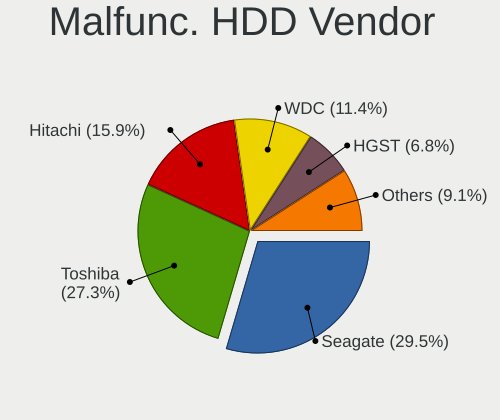

| Vendor              | Notebooks | Drives | Percent |
|---------------------|-----------|--------|---------|
| Seagate             | 13        | 15     | 29.55%  |
| Toshiba             | 12        | 13     | 27.27%  |
| Hitachi             | 7         | 7      | 15.91%  |
| WDC                 | 5         | 5      | 11.36%  |
| HGST                | 3         | 3      | 6.82%   |
| Apple               | 2         | 2      | 4.55%   |
| Samsung Electronics | 1         | 1      | 2.27%   |
| Fujitsu             | 1         | 1      | 2.27%   |

Malfunc. Drive Kind
-------------------

Kinds of faulty drives

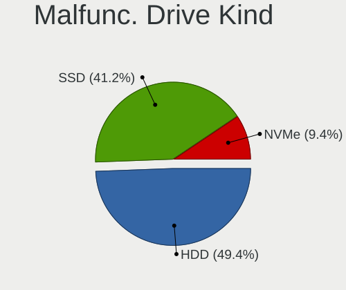

| Kind | Notebooks | Drives | Percent |
|------|-----------|--------|---------|
| HDD  | 42        | 47     | 49.41%  |
| SSD  | 35        | 40     | 41.18%  |
| NVMe | 8         | 8      | 9.41%   |

Failed Drives
-------------

Failed drive models

Zero info for selected period =(

Failed Drive Vendor
-------------------

Failed drive vendors

Zero info for selected period =(

Drive Status
------------

Number of failed and malfunc. drives

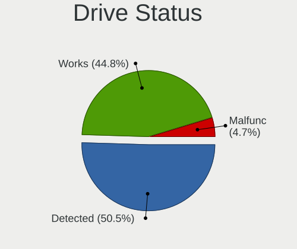

| Status   | Notebooks | Drives | Percent |
|----------|-----------|--------|---------|
| Detected | 903       | 1481   | 50.48%  |
| Works    | 802       | 1148   | 44.83%  |
| Malfunc  | 84        | 95     | 4.7%    |

Storage controller
------------------

Storage Vendor
--------------

Storage controller vendors

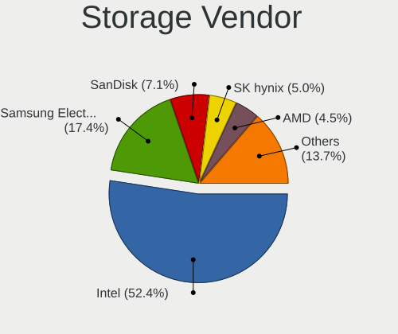

| Vendor                                  | Notebooks | Percent |
|-----------------------------------------|-----------|---------|
| Intel                                   | 1035      | 52.41%  |
| Samsung Electronics                     | 343       | 17.37%  |
| SanDisk                                 | 140       | 7.09%   |
| SK hynix                                | 99        | 5.01%   |
| AMD                                     | 88        | 4.46%   |
| Micron Technology                       | 57        | 2.89%   |
| Toshiba America Info Systems            | 44        | 2.23%   |
| Kingston Technology Company             | 29        | 1.47%   |
| Phison Electronics                      | 26        | 1.32%   |
| KIOXIA                                  | 21        | 1.06%   |
| Micron/Crucial Technology               | 16        | 0.81%   |
| Nvidia                                  | 15        | 0.76%   |
| Silicon Motion                          | 8         | 0.41%   |
| Marvell Technology Group                | 8         | 0.41%   |
| Apple                                   | 8         | 0.41%   |
| Union Memory (Shenzhen)                 | 6         | 0.3%    |
| Solid State Storage Technology          | 5         | 0.25%   |
| Shenzhen Unionmemory Information System | 3         | 0.15%   |
| Realtek Semiconductor                   | 3         | 0.15%   |
| Lite-On Technology                      | 3         | 0.15%   |
| Lenovo                                  | 3         | 0.15%   |
| Yangtze Memory Technologies             | 2         | 0.1%    |
| VIA Technologies                        | 2         | 0.1%    |
| Seagate Technology                      | 2         | 0.1%    |
| MAXIO Technology (Hangzhou)             | 2         | 0.1%    |
| ADATA Technology                        | 2         | 0.1%    |
| Transcend                               | 1         | 0.05%   |
| Solidigm                                | 1         | 0.05%   |
| Shenzhen Longsys Electronics            | 1         | 0.05%   |
| JMicron Technology                      | 1         | 0.05%   |
| Biwin Storage Technology                | 1         | 0.05%   |

Storage Model
-------------

Storage controller models

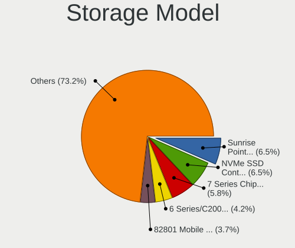

| Model                                                                          | Notebooks | Percent |
|--------------------------------------------------------------------------------|-----------|---------|
| Intel Sunrise Point-LP SATA Controller [AHCI mode]                             | 137       | 6.54%   |
| Samsung NVMe SSD Controller SM981/PM981/PM983                                  | 136       | 6.49%   |
| Intel 7 Series Chipset Family 6-port SATA Controller [AHCI mode]               | 122       | 5.82%   |
| Intel 6 Series/C200 Series Chipset Family 6 port Mobile SATA AHCI Controller   | 89        | 4.25%   |
| Intel 82801 Mobile SATA Controller [RAID mode]                                 | 77        | 3.68%   |
| Samsung NVMe SSD Controller PM9A1/PM9A3/980PRO                                 | 73        | 3.48%   |
| AMD FCH SATA Controller [AHCI mode]                                            | 71        | 3.39%   |
| Intel Volume Management Device NVMe RAID Controller                            | 70        | 3.34%   |
| Intel 8 Series SATA Controller 1 [AHCI mode]                                   | 63        | 3.01%   |
| Intel 8 Series/C220 Series Chipset Family 6-port SATA Controller 1 [AHCI mode] | 52        | 2.48%   |
| Intel Wildcat Point-LP SATA Controller [AHCI Mode]                             | 47        | 2.24%   |
| Samsung NVMe SSD Controller 980 (DRAM-less)                                    | 42        | 2%      |
| Intel Cannon Lake Mobile PCH SATA AHCI Controller                              | 40        | 1.91%   |
| Intel 82801IBM/IEM (ICH9M/ICH9M-E) 4 port SATA Controller [AHCI mode]          | 34        | 1.62%   |
| SanDisk Extreme Pro / WD Black SN750 / PC SN730 / Red SN700 NVMe SSD           | 30        | 1.43%   |
| Samsung NVMe SSD Controller SM961/PM961/SM963                                  | 29        | 1.38%   |
| Intel 5 Series/3400 Series Chipset 6 port SATA AHCI Controller                 | 27        | 1.29%   |
| SanDisk Ultra 3D / WD PC SN530, IX SN530, Blue SN550 NVMe SSD (DRAM-less)      | 25        | 1.19%   |
| Intel 5 Series/3400 Series Chipset 4 port SATA AHCI Controller                 | 24        | 1.15%   |
| Intel HM170/QM170 Chipset SATA Controller [AHCI Mode]                          | 23        | 1.1%    |
| SK hynix Platinum P41/PC801 NVMe Solid State Drive                             | 22        | 1.05%   |
| SanDisk WD SN560/SN740/SN770/SN5000 NVMe SSD                                   | 22        | 1.05%   |
| Intel Tiger Lake-LP SATA Controller                                            | 22        | 1.05%   |
| Intel RST Volume Management Device Controller                                  | 22        | 1.05%   |
| SK hynix Gold P31/BC711/PC711 NVMe Solid State Drive                           | 21        | 1%      |
| Intel SSD 660P Series                                                          | 21        | 1%      |
| Intel 82801HM/HEM (ICH8M/ICH8M-E) SATA Controller [AHCI mode]                  | 20        | 0.95%   |
| Intel 82801HM/HEM (ICH8M/ICH8M-E) IDE Controller                               | 20        | 0.95%   |
| Toshiba America Info Systems XG6 NVMe SSD Controller                           | 19        | 0.91%   |
| Intel Alder Lake-P SATA AHCI Controller                                        | 18        | 0.86%   |
| Samsung NVMe SSD Controller S4LV008[Pascal]                                    | 17        | 0.81%   |
| Intel Comet Lake SATA AHCI Controller                                          | 17        | 0.81%   |
| Intel Cannon Point-LP SATA Controller [AHCI Mode]                              | 17        | 0.81%   |
| Samsung NVMe SSD Controller PM9B1 (DRAM-less)                                  | 15        | 0.72%   |
| Intel SSD DC P4101/Pro 7600p/760p/E 6100p Series                               | 15        | 0.72%   |
| Intel Celeron/Pentium Silver Processor SATA Controller                         | 15        | 0.72%   |
| KIOXIA NVMe SSD Controller XG8                                                 | 13        | 0.62%   |
| Intel Atom Processor E3800 Series SATA AHCI Controller                         | 13        | 0.62%   |
| Toshiba America Info Systems XG5 NVMe SSD Controller                           | 12        | 0.57%   |
| SK hynix BC501 NVMe Solid State Drive                                          | 12        | 0.57%   |

Storage Kind
------------

Kind of storage controller (IDE, SATA, NVMe, SAS, ...)

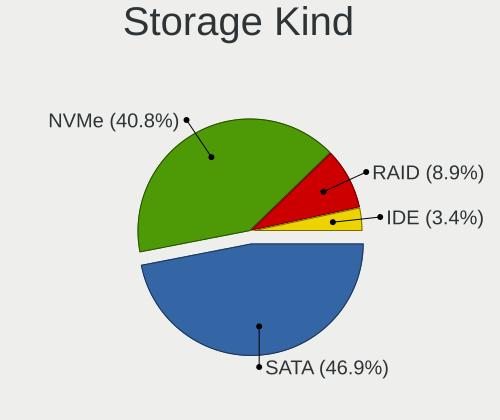

| Kind | Notebooks | Percent |
|------|-----------|---------|
| SATA | 946       | 46.95%  |
| NVMe | 822       | 40.79%  |
| RAID | 179       | 8.88%   |
| IDE  | 68        | 3.37%   |

Processor
---------

CPU Vendor
----------

Processor vendors

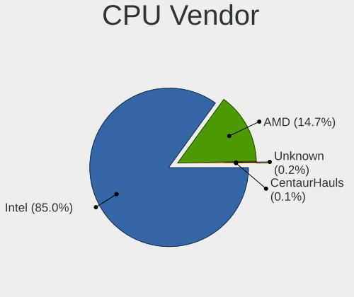

| Vendor       | Notebooks | Percent |
|--------------|-----------|---------|
| Intel        | 1414      | 84.98%  |
| AMD          | 244       | 14.66%  |
| Unknown      | 4         | 0.24%   |
| CentaurHauls | 2         | 0.12%   |

CPU Model
---------

Processor models

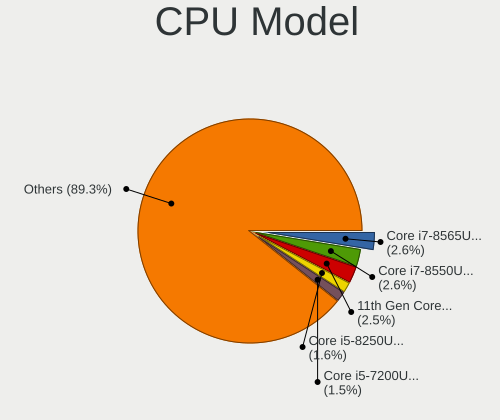

| Model                                      | Notebooks | Percent |
|--------------------------------------------|-----------|---------|
| Intel Core i7-8565U CPU @ 1.80GHz          | 43        | 2.58%   |
| Intel Core i7-8550U CPU @ 1.80GHz          | 43        | 2.58%   |
| Intel 11th Gen Core i7-1165G7 @ 2.80GHz    | 41        | 2.46%   |
| Intel Core i5-8250U CPU @ 1.60GHz          | 26        | 1.56%   |
| Intel Core i5-7200U CPU @ 2.50GHz          | 25        | 1.5%    |
| Intel Core i7-9750H CPU @ 2.60GHz          | 24        | 1.44%   |
| Intel 11th Gen Core i5-1135G7 @ 2.40GHz    | 24        | 1.44%   |
| Intel Core i7-10510U CPU @ 1.80GHz         | 23        | 1.38%   |
| Intel Core i5-6200U CPU @ 2.30GHz          | 20        | 1.2%    |
| Intel Core i5-6300U CPU @ 2.40GHz          | 19        | 1.14%   |
| Intel 13th Gen Core i7-1355U               | 19        | 1.14%   |
| Intel Core i7-7500U CPU @ 2.70GHz          | 18        | 1.08%   |
| Intel Core i7-4600U CPU @ 2.10GHz          | 18        | 1.08%   |
| Intel Core i5-8265U CPU @ 1.60GHz          | 17        | 1.02%   |
| Intel Core i5-2520M CPU @ 2.50GHz          | 17        | 1.02%   |
| Intel Core i7-6500U CPU @ 2.50GHz          | 16        | 0.96%   |
| Intel Core i5-3210M CPU @ 2.50GHz          | 16        | 0.96%   |
| Intel Core i7-8750H CPU @ 2.20GHz          | 15        | 0.9%    |
| Intel Core i7-6700HQ CPU @ 2.60GHz         | 14        | 0.84%   |
| Intel Core i7-3630QM CPU @ 2.40GHz         | 14        | 0.84%   |
| Intel Core i7-2670QM CPU @ 2.20GHz         | 14        | 0.84%   |
| Intel 12th Gen Core i7-1260P               | 14        | 0.84%   |
| AMD Ryzen 7 PRO 4750U with Radeon Graphics | 14        | 0.84%   |
| Intel Core i7-8650U CPU @ 1.90GHz          | 13        | 0.78%   |
| Intel Core i7-7700HQ CPU @ 2.80GHz         | 13        | 0.78%   |
| Intel Core i5-5200U CPU @ 2.20GHz          | 13        | 0.78%   |
| Intel Core i5-4210U CPU @ 1.70GHz          | 13        | 0.78%   |
| Intel 12th Gen Core i7-12700H              | 13        | 0.78%   |
| Intel Core i5-8350U CPU @ 1.70GHz          | 12        | 0.72%   |
| Intel Core i5-5300U CPU @ 2.30GHz          | 12        | 0.72%   |
| Intel Core i7-6600U CPU @ 2.60GHz          | 11        | 0.66%   |
| Intel Core i7-4702MQ CPU @ 2.20GHz         | 11        | 0.66%   |
| Intel Core i7-1065G7 CPU @ 1.30GHz         | 11        | 0.66%   |
| Intel Core i7-5600U CPU @ 2.60GHz          | 10        | 0.6%    |
| Intel Core i7-4510U CPU @ 2.00GHz          | 10        | 0.6%    |
| Intel Core i7-3610QM CPU @ 2.30GHz         | 10        | 0.6%    |
| Intel Core i5-4200U CPU @ 1.60GHz          | 10        | 0.6%    |
| Intel Core i5-10210U CPU @ 1.60GHz         | 10        | 0.6%    |
| Intel Core Ultra 7 258V                    | 9         | 0.54%   |
| Intel Core i7-4700MQ CPU @ 2.40GHz         | 9         | 0.54%   |

CPU Model Family
----------------

Processor model prefix

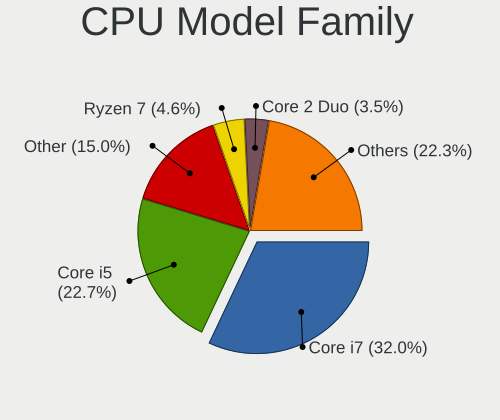

| Model                   | Notebooks | Percent |
|-------------------------|-----------|---------|
| Intel Core i7           | 533       | 32.03%  |
| Intel Core i5           | 377       | 22.66%  |
| Other                   | 249       | 14.96%  |
| AMD Ryzen 7             | 76        | 4.57%   |
| Intel Core 2 Duo        | 58        | 3.49%   |
| Intel Celeron           | 47        | 2.82%   |
| AMD Ryzen 7 PRO         | 41        | 2.46%   |
| AMD Ryzen 5             | 37        | 2.22%   |
| Intel Core              | 34        | 2.04%   |
| Intel Core i3           | 32        | 1.92%   |
| Intel Pentium           | 28        | 1.68%   |
| Intel Atom              | 20        | 1.2%    |
| AMD Ryzen 9             | 18        | 1.08%   |
| Intel Core i9           | 12        | 0.72%   |
| Intel Core 2            | 8         | 0.48%   |
| Intel Pentium Dual-Core | 7         | 0.42%   |
| AMD Ryzen 5 PRO         | 7         | 0.42%   |
| Intel Core M            | 6         | 0.36%   |
| AMD Ryzen 3             | 6         | 0.36%   |
| AMD E                   | 6         | 0.36%   |
| AMD A4                  | 5         | 0.3%    |
| Intel Xeon              | 4         | 0.24%   |
| Intel Pentium Silver    | 4         | 0.24%   |
| AMD A8                  | 4         | 0.24%   |
| Intel Pentium M         | 3         | 0.18%   |
| Intel Core m7           | 3         | 0.18%   |
| Intel Core m3           | 3         | 0.18%   |
| AMD Turion 64 X2 Mobile | 3         | 0.18%   |
| AMD E1                  | 3         | 0.18%   |
| AMD A6                  | 3         | 0.18%   |
| Intel Pentium Dual      | 2         | 0.12%   |
| Intel Genuine           | 2         | 0.12%   |
| Intel Core m5           | 2         | 0.12%   |
| Intel Celeron Dual-Core | 2         | 0.12%   |
| AMD Phenom II           | 2         | 0.12%   |
| AMD E2                  | 2         | 0.12%   |
| AMD C-50                | 2         | 0.12%   |
| AMD Athlon 64 X2        | 2         | 0.12%   |
| AMD Athlon              | 2         | 0.12%   |
| Intel Pentium Gold      | 1         | 0.06%   |

CPU Cores
---------

Number of processor cores

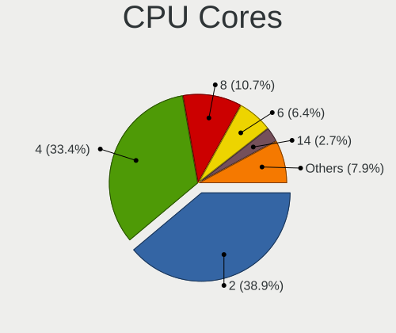

| Number  | Notebooks | Percent |
|---------|-----------|---------|
| 2       | 648       | 38.9%   |
| 4       | 556       | 33.37%  |
| 8       | 179       | 10.74%  |
| 6       | 107       | 6.42%   |
| 14      | 45        | 2.7%    |
| 10      | 45        | 2.7%    |
| 12      | 33        | 1.98%   |
| 16      | 24        | 1.44%   |
| 1       | 17        | 1.02%   |
| 24      | 11        | 0.66%   |
| Unknown | 1         | 0.06%   |

CPU Sockets
-----------

Number of sockets

| Number | Notebooks | Percent |
|--------|-----------|---------|
| 1      | 1664      | 100%    |

CPU Threads
-----------

Threads per core (Hyper-Threading)

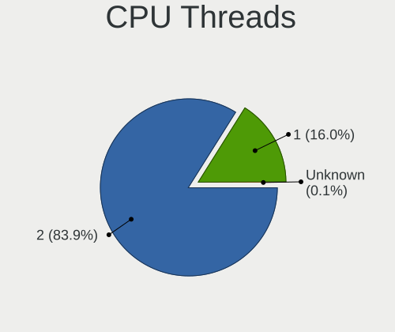

| Number  | Notebooks | Percent |
|---------|-----------|---------|
| 2       | 1400      | 83.93%  |
| 1       | 267       | 16.01%  |
| Unknown | 1         | 0.06%   |

CPU Op-Modes
------------

CPU Operation Modes (32-bit, 64-bit)

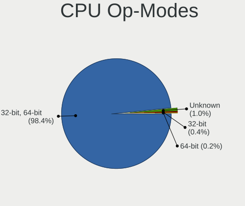

| Op mode        | Notebooks | Percent |
|----------------|-----------|---------|
| 32-bit, 64-bit | 1642      | 98.38%  |
| Unknown        | 17        | 1.02%   |
| 32-bit         | 6         | 0.36%   |
| 64-bit         | 4         | 0.24%   |

CPU Microcode
-------------

Microcode number

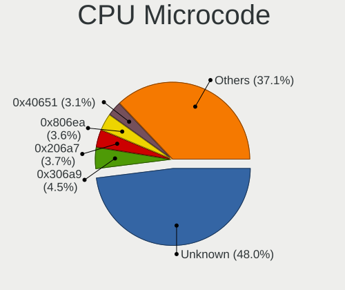

| Number     | Notebooks | Percent |
|------------|-----------|---------|
| Unknown    | 828       | 48.03%  |
| 0x306a9    | 78        | 4.52%   |
| 0x206a7    | 64        | 3.71%   |
| 0x806ea    | 62        | 3.6%    |
| 0x40651    | 53        | 3.07%   |
| 0x806c1    | 50        | 2.9%    |
| 0x806ec    | 46        | 2.67%   |
| 0x806e9    | 35        | 2.03%   |
| 0x306d4    | 33        | 1.91%   |
| 0x906ea    | 30        | 1.74%   |
| 0x306c3    | 28        | 1.62%   |
| 0x1067a    | 28        | 1.62%   |
| 0x406e3    | 26        | 1.51%   |
| 0x20655    | 20        | 1.16%   |
| 0x0a404102 | 17        | 0.99%   |
| 0x30678    | 16        | 0.93%   |
| 0x906a3    | 15        | 0.87%   |
| 0x506e3    | 15        | 0.87%   |
| 0x806eb    | 14        | 0.81%   |
| 0x20652    | 14        | 0.81%   |
| 0xa0652    | 13        | 0.75%   |
| 0x0a50000c | 13        | 0.75%   |
| 0x08600106 | 12        | 0.7%    |
| 0x906e9    | 11        | 0.64%   |
| 0x406c4    | 10        | 0.58%   |
| 0x10676    | 10        | 0.58%   |
| 0x706e5    | 9         | 0.52%   |
| 0x08600103 | 9         | 0.52%   |
| 0x806d1    | 7         | 0.41%   |
| 0x706a1    | 7         | 0.41%   |
| 0x6fd      | 7         | 0.41%   |
| 0x0a704103 | 7         | 0.41%   |
| 0x6f6      | 6         | 0.35%   |
| 0x08608103 | 6         | 0.35%   |
| 0xb06a3    | 5         | 0.29%   |
| 0x906a4    | 5         | 0.29%   |
| 0x406c3    | 5         | 0.29%   |
| 0x0a50000d | 5         | 0.29%   |
| 0x08108102 | 5         | 0.29%   |
| 0x05000119 | 5         | 0.29%   |

CPU Microarch
-------------

Microarchitecture

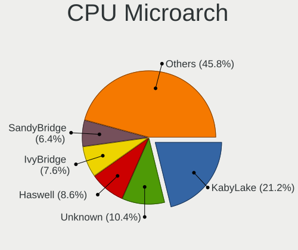

| Name               | Notebooks | Percent |
|--------------------|-----------|---------|
| KabyLake           | 354       | 21.18%  |
| Unknown            | 174       | 10.41%  |
| Haswell            | 144       | 8.62%   |
| IvyBridge          | 127       | 7.6%    |
| SandyBridge        | 107       | 6.4%    |
| Skylake            | 97        | 5.8%    |
| Alderlake Hybrid   | 87        | 5.21%   |
| TigerLake          | 82        | 4.91%   |
| Penryn             | 60        | 3.59%   |
| Broadwell          | 59        | 3.53%   |
| Zen 3              | 50        | 2.99%   |
| Westmere           | 49        | 2.93%   |
| Silvermont         | 40        | 2.39%   |
| Zen 2              | 39        | 2.33%   |
| CometLake          | 33        | 1.97%   |
| IceLake            | 29        | 1.74%   |
| Core               | 21        | 1.26%   |
| Zen+               | 15        | 0.9%    |
| Goldmont plus      | 15        | 0.9%    |
| Meteorlake Hybrid  | 12        | 0.72%   |
| Bobcat             | 11        | 0.66%   |
| Lunarlake Hybrid   | 8         | 0.48%   |
| Nehalem            | 7         | 0.42%   |
| K8 Hammer          | 6         | 0.36%   |
| Bonnell            | 6         | 0.36%   |
| Piledriver         | 4         | 0.24%   |
| Jaguar             | 4         | 0.24%   |
| Tremont            | 3         | 0.18%   |
| Steamroller        | 3         | 0.18%   |
| P6                 | 3         | 0.18%   |
| K10 Llano          | 3         | 0.18%   |
| K10                | 3         | 0.18%   |
| Gracemont          | 3         | 0.18%   |
| Goldmont           | 3         | 0.18%   |
| Excavator          | 3         | 0.18%   |
| Zen                | 2         | 0.12%   |
| Puma               | 2         | 0.12%   |
| ArrowLake-H Hybrid | 2         | 0.12%   |
| NetBurst           | 1         | 0.06%   |

Graphics
--------

GPU Vendor
----------

Vendors of graphics cards

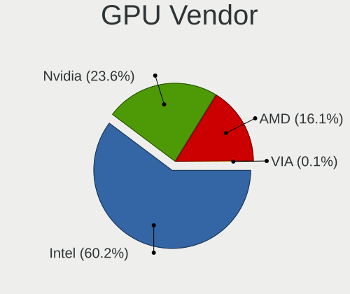

| Vendor           | Notebooks | Percent |
|------------------|-----------|---------|
| Intel            | 1279      | 60.24%  |
| Nvidia           | 500       | 23.55%  |
| AMD              | 342       | 16.11%  |
| VIA Technologies | 2         | 0.09%   |

GPU Model
---------

Graphics card models

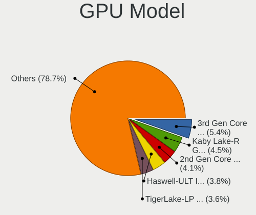

| Model                                                                                    | Notebooks | Percent |
|------------------------------------------------------------------------------------------|-----------|---------|
| Intel 3rd Gen Core processor Graphics Controller                                         | 116       | 5.4%    |
| Intel Kaby Lake-R GT2 [UHD Graphics 620]                                                 | 96        | 4.47%   |
| Intel 2nd Generation Core Processor Family Integrated Graphics Controller                | 88        | 4.09%   |
| Intel Haswell-ULT Integrated Graphics Controller                                         | 82        | 3.81%   |
| Intel TigerLake-LP GT2 [Iris Xe Graphics]                                                | 77        | 3.58%   |
| Intel WhiskeyLake-U GT2 [UHD Graphics 620]                                               | 70        | 3.26%   |
| Intel Skylake-U GT2 [HD Graphics 520]                                                    | 68        | 3.16%   |
| Intel Kaby Lake-U GT2 [HD Graphics 620]                                                  | 54        | 2.51%   |
| Intel 4th Gen Core Processor Integrated Graphics Controller                              | 53        | 2.47%   |
| Intel CoffeeLake-H GT2 [UHD Graphics 630]                                                | 49        | 2.28%   |
| Intel Raptor Lake-P [Iris Xe Graphics]                                                   | 46        | 2.14%   |
| Intel Broadwell-U GT2 [HD Graphics 5500]                                                 | 43        | 2%      |
| Intel Alder Lake-P GT2 [Iris Xe Graphics]                                                | 40        | 1.86%   |
| AMD Renoir [Radeon Vega Series / Radeon Vega Mobile Series]                              | 39        | 1.81%   |
| Intel CometLake-U GT2 [UHD Graphics]                                                     | 35        | 1.63%   |
| AMD Cezanne [Radeon Vega Series / Radeon Vega Mobile Series]                             | 32        | 1.49%   |
| AMD Rembrandt [Radeon 680M]                                                              | 30        | 1.4%    |
| Intel Core Processor Integrated Graphics Controller                                      | 28        | 1.3%    |
| Intel Mobile 4 Series Chipset Integrated Graphics Controller                             | 25        | 1.16%   |
| Intel CometLake-H GT2 [UHD Graphics]                                                     | 23        | 1.07%   |
| Intel Atom Processor Z36xxx/Z37xxx Series Graphics & Display                             | 21        | 0.98%   |
| Nvidia TU117M [GeForce GTX 1650 Mobile / Max-Q]                                          | 20        | 0.93%   |
| AMD Phoenix1                                                                             | 20        | 0.93%   |
| Intel Atom/Celeron/Pentium Processor x5-E8000/J3xxx/N3xxx Integrated Graphics Controller | 19        | 0.88%   |
| Intel Kaby Lake-H GT2 [HD Graphics 630]                                                  | 18        | 0.84%   |
| AMD Seymour [Radeon HD 6400M/7400M Series]                                               | 17        | 0.79%   |
| Nvidia GA106M [GeForce RTX 3060 Mobile / Max-Q]                                          | 15        | 0.7%    |
| Nvidia AD106M [GeForce RTX 4070 Max-Q / Mobile]                                          | 15        | 0.7%    |
| Nvidia GP107M [GeForce GTX 1050 Mobile]                                                  | 14        | 0.65%   |
| Nvidia GA107M [GeForce RTX 3050 Ti Mobile]                                               | 14        | 0.65%   |
| Intel TigerLake-H GT1 [UHD Graphics]                                                     | 14        | 0.65%   |
| AMD Picasso/Raven 2 [Radeon Vega Series / Radeon Vega Mobile Series]                     | 14        | 0.65%   |
| AMD Lucienne                                                                             | 14        | 0.65%   |
| AMD Barcelo                                                                              | 14        | 0.65%   |
| Nvidia GA107M [GeForce RTX 3050 Mobile]                                                  | 13        | 0.6%    |
| Intel Skylake-H GT2 [HD Graphics 530]                                                    | 13        | 0.6%    |
| Intel Alder Lake-UP3 GT2 [Iris Xe Graphics]                                              | 13        | 0.6%    |
| Nvidia GP108M [GeForce MX150]                                                            | 12        | 0.56%   |
| Intel Meteor Lake-P [Intel Arc Graphics]                                                 | 12        | 0.56%   |
| Intel GeminiLake [UHD Graphics 600]                                                      | 12        | 0.56%   |

GPU Combo
---------

Combinations of graphics cards

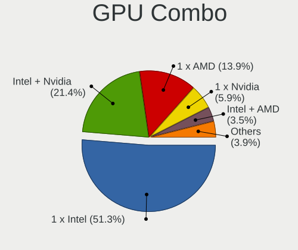

| Name                     | Notebooks | Percent |
|--------------------------|-----------|---------|
| 1 x Intel                | 858       | 51.32%  |
| Intel + Nvidia           | 358       | 21.41%  |
| 1 x AMD                  | 232       | 13.88%  |
| 1 x Nvidia               | 99        | 5.92%   |
| Intel + AMD              | 59        | 3.53%   |
| AMD + Nvidia             | 42        | 2.51%   |
| 2 x AMD                  | 9         | 0.54%   |
| Other                    | 5         | 0.3%    |
| 2 x Intel                | 4         | 0.24%   |
| 2 x Nvidia               | 3         | 0.18%   |
| 1 x VIA                  | 2         | 0.12%   |
| Intel + AMD + 1 x Nvidia | 1         | 0.06%   |

GPU Driver
----------

Free vs proprietary

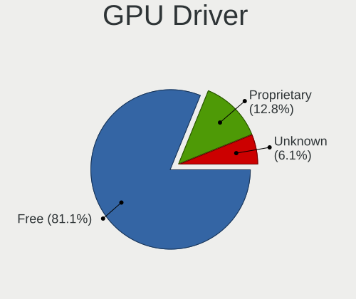

| Driver      | Notebooks | Percent |
|-------------|-----------|---------|
| Free        | 1368      | 81.14%  |
| Proprietary | 215       | 12.75%  |
| Unknown     | 103       | 6.11%   |

GPU Memory
----------

Total video memory

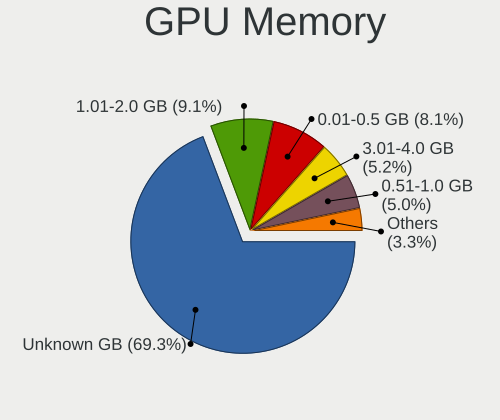

| Size in GB | Notebooks | Percent |
|------------|-----------|---------|
| Unknown    | 1176      | 69.26%  |
| 1.01-2.0   | 155       | 9.13%   |
| 0.01-0.5   | 138       | 8.13%   |
| 3.01-4.0   | 88        | 5.18%   |
| 0.51-1.0   | 85        | 5.01%   |
| 7.01-8.0   | 28        | 1.65%   |
| 5.01-6.0   | 14        | 0.82%   |
| 8.01-16.0  | 9         | 0.53%   |
| 2.01-3.0   | 5         | 0.29%   |

Monitor
-------

Monitor Vendor
--------------

Monitor vendors

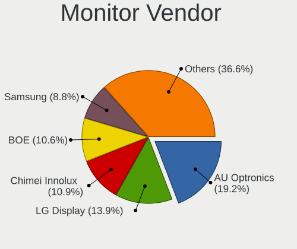

| Vendor                  | Notebooks | Percent |
|-------------------------|-----------|---------|
| AU Optronics            | 376       | 19.19%  |
| LG Display              | 273       | 13.94%  |
| Chimei Innolux          | 213       | 10.87%  |
| BOE                     | 208       | 10.62%  |
| Samsung Electronics     | 172       | 8.78%   |
| Apple                   | 88        | 4.49%   |
| Sharp                   | 74        | 3.78%   |
| Lenovo                  | 74        | 3.78%   |
| Dell                    | 70        | 3.57%   |
| Hewlett-Packard         | 42        | 2.14%   |
| Philips                 | 34        | 1.74%   |
| Chi Mei Optoelectronics | 33        | 1.68%   |
| CSO                     | 32        | 1.63%   |
| Acer                    | 27        | 1.38%   |
| Goldstar                | 23        | 1.17%   |
| InfoVision              | 22        | 1.12%   |
| BenQ                    | 18        | 0.92%   |
| ASUSTek Computer        | 15        | 0.77%   |
| AOC                     | 15        | 0.77%   |
| PANDA                   | 14        | 0.71%   |
| Ancor Communications    | 13        | 0.66%   |
| Sony                    | 10        | 0.51%   |
| CSOT                    | 10        | 0.51%   |
| Valve                   | 9         | 0.46%   |
| Eizo                    | 8         | 0.41%   |
| LG Philips              | 6         | 0.31%   |
| Iiyama                  | 6         | 0.31%   |
| CSW                     | 6         | 0.31%   |
| Toshiba                 | 5         | 0.26%   |
| Panasonic               | 5         | 0.26%   |
| JDI                     | 5         | 0.26%   |
| Vestel Elektronik       | 4         | 0.2%    |
| TMX                     | 4         | 0.2%    |
| LGD                     | 4         | 0.2%    |
| ViewSonic               | 3         | 0.15%   |
| Unknown                 | 3         | 0.15%   |
| MSI                     | 3         | 0.15%   |
| HannStar                | 3         | 0.15%   |
| Gigabyte Technology     | 3         | 0.15%   |
| Denver                  | 3         | 0.15%   |

Monitor Model
-------------

Monitor models

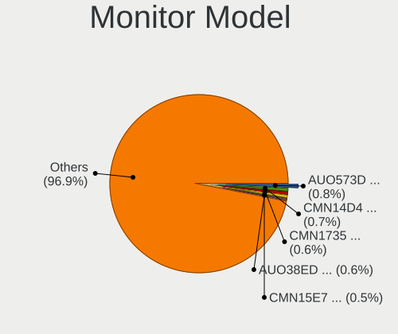

| Model                                                                     | Notebooks | Percent |
|---------------------------------------------------------------------------|-----------|---------|
| AU Optronics LCD Monitor AUO573D 1920x1080 309x174mm 14.0-inch            | 15        | 0.75%   |
| Chimei Innolux LCD Monitor CMN14D4 1920x1080 309x173mm 13.9-inch          | 13        | 0.65%   |
| Chimei Innolux LCD Monitor CMN1735 1920x1080 381x214mm 17.2-inch          | 12        | 0.6%    |
| AU Optronics LCD Monitor AUO38ED 1920x1080 344x193mm 15.5-inch            | 11        | 0.55%   |
| Chimei Innolux LCD Monitor CMN15E7 1920x1080 344x193mm 15.5-inch          | 10        | 0.5%    |
| AU Optronics LCD Monitor AUO133D 1920x1080 309x173mm 13.9-inch            | 10        | 0.5%    |
| LG Display LCD Monitor LGD0521 1920x1080 309x174mm 14.0-inch              | 9         | 0.45%   |
| LG Display LCD Monitor LGD046F 1920x1080 344x194mm 15.5-inch              | 8         | 0.4%    |
| Lenovo LCD Monitor LEN40B2 1920x1080 344x193mm 15.5-inch                  | 8         | 0.4%    |
| Chimei Innolux LCD Monitor CMN15C3 1920x1080 344x193mm 15.5-inch          | 8         | 0.4%    |
| Sharp LQ156M1JW01 SHP14C3 1920x1080 344x194mm 15.5-inch                   | 7         | 0.35%   |
| LG Display LCD Monitor LGD02D8 1366x768 277x156mm 12.5-inch               | 7         | 0.35%   |
| Lenovo LCD Monitor LEN40BA 1920x1080 344x194mm 15.5-inch                  | 7         | 0.35%   |
| Lenovo LCD Monitor LEN4036 1440x900 303x190mm 14.1-inch                   | 7         | 0.35%   |
| CSO LCD Monitor CSO1500 3840x2160 344x194mm 15.5-inch                     | 7         | 0.35%   |
| Chimei Innolux LCD Monitor CMN15F5 1920x1080 344x193mm 15.5-inch          | 7         | 0.35%   |
| Chi Mei Optoelectronics LCD Monitor CMO1720 1920x1080 382x215mm 17.3-inch | 7         | 0.35%   |
| BOE LCD Monitor BOE0687 1920x1080 344x193mm 15.5-inch                     | 7         | 0.35%   |
| AU Optronics LCD Monitor AUO21ED 1920x1080 344x193mm 15.5-inch            | 7         | 0.35%   |
| Apple Color LCD APP9CDF 1440x900 286x179mm 13.3-inch                      | 7         | 0.35%   |
| Valve ANX7530 U VLV3001 800x1280 100x150mm 7.1-inch                       | 6         | 0.3%    |
| LG Display LCD Monitor LGD02DC 1366x768 344x194mm 15.5-inch               | 6         | 0.3%    |
| Chimei Innolux LCD Monitor CMN1738 1920x1080 381x214mm 17.2-inch          | 6         | 0.3%    |
| Chimei Innolux LCD Monitor CMN150C 1920x1080 344x193mm 15.5-inch          | 6         | 0.3%    |
| BOE LCD Monitor BOE07DB 1920x1080 309x174mm 14.0-inch                     | 6         | 0.3%    |
| AU Optronics LCD Monitor AUO403D 1920x1080 309x174mm 14.0-inch            | 6         | 0.3%    |
| AU Optronics LCD Monitor AUO243D 1920x1080 309x173mm 13.9-inch            | 6         | 0.3%    |
| AU Optronics LCD Monitor AUO213E 1600x900 309x174mm 14.0-inch             | 6         | 0.3%    |
| AU Optronics LCD Monitor AUO139E 1600x900 382x214mm 17.2-inch             | 6         | 0.3%    |
| AU Optronics LCD Monitor AUO123D 1920x1080 309x173mm 13.9-inch            | 6         | 0.3%    |
| Apple LCD Monitor APP9CCB 1280x800 286x179mm 13.3-inch                    | 6         | 0.3%    |
| Apple Color LCD APP9CC7 1280x800 286x179mm 13.3-inch                      | 6         | 0.3%    |
| Sharp LCD Monitor SHP1476 3840x2160 346x194mm 15.6-inch                   | 5         | 0.25%   |
| LG Display LCD Monitor LGD05E5 1920x1080 344x194mm 15.5-inch              | 5         | 0.25%   |
| LG Display LCD Monitor LGD040A 1920x1080 310x170mm 13.9-inch              | 5         | 0.25%   |
| LG Display LCD Monitor LGD0258 1600x900 345x194mm 15.6-inch               | 5         | 0.25%   |
| InfoVision LCD Monitor IVO057F 1920x1080 309x174mm 14.0-inch              | 5         | 0.25%   |
| Chimei Innolux LCD Monitor CMN1618 1920x1200 344x215mm 16.0-inch          | 5         | 0.25%   |
| Chi Mei Optoelectronics LCD Monitor CMO15A7 1366x768 344x193mm 15.5-inch  | 5         | 0.25%   |
| BOE LCD Monitor BOE084E 1920x1080 382x215mm 17.3-inch                     | 5         | 0.25%   |

Monitor Resolution
------------------

Monitor screen resolution

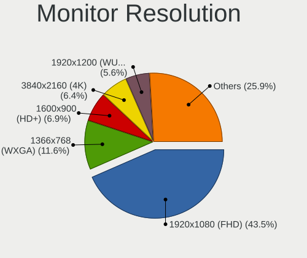

| Resolution         | Notebooks | Percent |
|--------------------|-----------|---------|
| 1920x1080 (FHD)    | 804       | 43.46%  |
| 1366x768 (WXGA)    | 215       | 11.62%  |
| 1600x900 (HD+)     | 128       | 6.92%   |
| 3840x2160 (4K)     | 119       | 6.43%   |
| 1920x1200 (WUXGA)  | 104       | 5.62%   |
| 2560x1440 (QHD)    | 96        | 5.19%   |
| 2560x1600          | 56        | 3.03%   |
| 1280x800 (WXGA)    | 54        | 2.92%   |
| 2880x1800          | 44        | 2.38%   |
| 1440x900 (WXGA+)   | 40        | 2.16%   |
| 3440x1440          | 28        | 1.51%   |
| 3840x2400          | 21        | 1.14%   |
| 1680x1050 (WSXGA+) | 20        | 1.08%   |
| 3200x1800 (QHD+)   | 14        | 0.76%   |
| 800x1280           | 9         | 0.49%   |
| 3840x1600          | 9         | 0.49%   |
| 3200x2000          | 7         | 0.38%   |
| 1280x1024 (SXGA)   | 7         | 0.38%   |
| 1024x600           | 6         | 0.32%   |
| Unknown            | 6         | 0.32%   |
| 3840x1080          | 5         | 0.27%   |
| 3456x2160          | 5         | 0.27%   |
| 3072x1920          | 5         | 0.27%   |
| 3000x2000          | 5         | 0.27%   |
| 2160x1440          | 5         | 0.27%   |
| 1600x1200          | 5         | 0.27%   |
| 2560x1080          | 4         | 0.22%   |
| 1360x768           | 4         | 0.22%   |
| 2944x1840          | 3         | 0.16%   |
| 2880x1920          | 3         | 0.16%   |
| 2304x1440          | 3         | 0.16%   |
| 3840x1100          | 2         | 0.11%   |
| 1920x515           | 2         | 0.11%   |
| 1920x1280          | 2         | 0.11%   |
| 1024x768 (XGA)     | 2         | 0.11%   |
| 3840x2560          | 1         | 0.05%   |
| 3286x1080          | 1         | 0.05%   |
| 2560x1024          | 1         | 0.05%   |
| 2520x1680          | 1         | 0.05%   |
| 2288x1287          | 1         | 0.05%   |

Monitor Diagonal
----------------

Diagonal size in inches

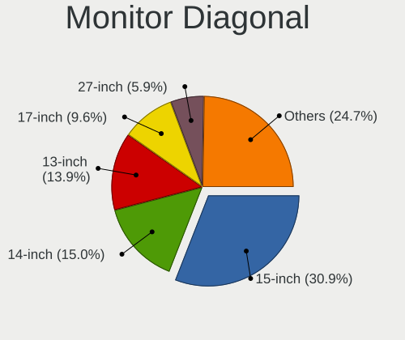

| Inches  | Notebooks | Percent |
|---------|-----------|---------|
| 15      | 605       | 30.93%  |
| 14      | 293       | 14.98%  |
| 13      | 271       | 13.85%  |
| 17      | 187       | 9.56%   |
| 27      | 116       | 5.93%   |
| 16      | 79        | 4.04%   |
| 12      | 67        | 3.43%   |
| 24      | 64        | 3.27%   |
| 31      | 33        | 1.69%   |
| 23      | 33        | 1.69%   |
| 34      | 26        | 1.33%   |
| Unknown | 26        | 1.33%   |
| 21      | 22        | 1.12%   |
| 11      | 22        | 1.12%   |
| 37      | 9         | 0.46%   |
| 22      | 9         | 0.46%   |
| 7       | 9         | 0.46%   |
| 18      | 8         | 0.41%   |
| 32      | 7         | 0.36%   |
| 84      | 6         | 0.31%   |
| 72      | 6         | 0.31%   |
| 25      | 6         | 0.31%   |
| 20      | 6         | 0.31%   |
| 10      | 6         | 0.31%   |
| 63      | 5         | 0.26%   |
| 48      | 4         | 0.2%    |
| 40      | 4         | 0.2%    |
| 19      | 4         | 0.2%    |
| 49      | 3         | 0.15%   |
| 46      | 3         | 0.15%   |
| 65      | 2         | 0.1%    |
| 54      | 2         | 0.1%    |
| 29      | 2         | 0.1%    |
| 28      | 2         | 0.1%    |
| 142     | 1         | 0.05%   |
| 86      | 1         | 0.05%   |
| 69      | 1         | 0.05%   |
| 55      | 1         | 0.05%   |
| 39      | 1         | 0.05%   |
| 36      | 1         | 0.05%   |

Monitor Width
-------------

Physical width

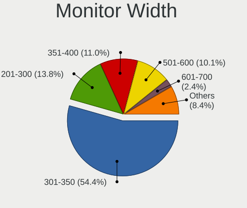

| Width in mm    | Notebooks | Percent |
|----------------|-----------|---------|
| 301-350        | 1052      | 54.4%   |
| 201-300        | 266       | 13.75%  |
| 351-400        | 213       | 11.01%  |
| 501-600        | 195       | 10.08%  |
| 601-700        | 46        | 2.38%   |
| 401-500        | 41        | 2.12%   |
| 701-800        | 35        | 1.81%   |
| Unknown        | 26        | 1.34%   |
| 1001-1500      | 21        | 1.09%   |
| 801-900        | 14        | 0.72%   |
| 1501-2000      | 13        | 0.67%   |
| 1-100          | 9         | 0.47%   |
| More than 2000 | 1         | 0.05%   |
| 101-200        | 1         | 0.05%   |
| 901-1000       | 1         | 0.05%   |

Aspect Ratio
------------

Proportional relationship between the width and the height

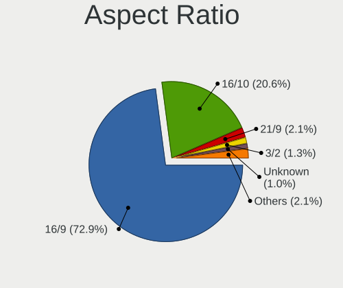

| Ratio   | Notebooks | Percent |
|---------|-----------|---------|
| 16/9    | 1263      | 72.92%  |
| 16/10   | 356       | 20.55%  |
| 21/9    | 36        | 2.08%   |
| 3/2     | 23        | 1.33%   |
| Unknown | 18        | 1.04%   |
| 4/3     | 8         | 0.46%   |
| 5/4     | 7         | 0.4%    |
| 0.67    | 6         | 0.35%   |
| 32/9    | 5         | 0.29%   |
| 0.62    | 3         | 0.17%   |
| 3.73    | 2         | 0.12%   |
| 3.40    | 2         | 0.12%   |
| 2.50    | 1         | 0.06%   |
| 1.00    | 1         | 0.06%   |
| 0.56    | 1         | 0.06%   |

Monitor Area
------------

Area in inch²

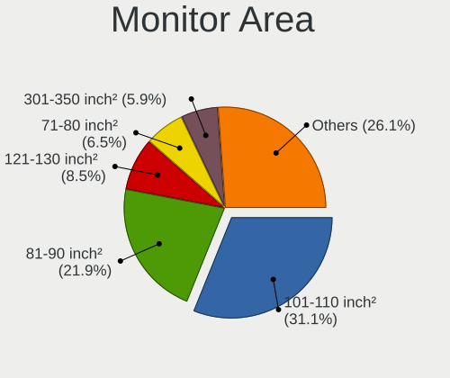

| Area in inch² | Notebooks | Percent |
|----------------|-----------|---------|
| 101-110        | 607       | 31.11%  |
| 81-90          | 427       | 21.89%  |
| 121-130        | 165       | 8.46%   |
| 71-80          | 126       | 6.46%   |
| 301-350        | 116       | 5.95%   |
| 201-250        | 99        | 5.07%   |
| 351-500        | 72        | 3.69%   |
| 111-120        | 72        | 3.69%   |
| 61-70          | 66        | 3.38%   |
| 251-300        | 30        | 1.54%   |
| More than 1000 | 27        | 1.38%   |
| Unknown        | 26        | 1.33%   |
| 51-60          | 24        | 1.23%   |
| 131-140        | 22        | 1.13%   |
| 501-1000       | 22        | 1.13%   |
| 151-200        | 12        | 0.62%   |
| 91-100         | 12        | 0.62%   |
| 1-40           | 10        | 0.51%   |
| 141-150        | 10        | 0.51%   |
| 41-50          | 6         | 0.31%   |

Pixel Density
-------------

Pixels per inch

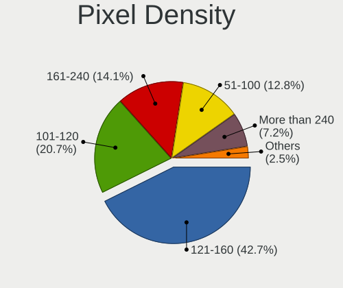

| Density       | Notebooks | Percent |
|---------------|-----------|---------|
| 121-160       | 813       | 42.65%  |
| 101-120       | 395       | 20.72%  |
| 161-240       | 268       | 14.06%  |
| 51-100        | 244       | 12.8%   |
| More than 240 | 138       | 7.24%   |
| Unknown       | 26        | 1.36%   |
| 1-50          | 22        | 1.15%   |

Multiple Monitors
-----------------

Total monitors connected

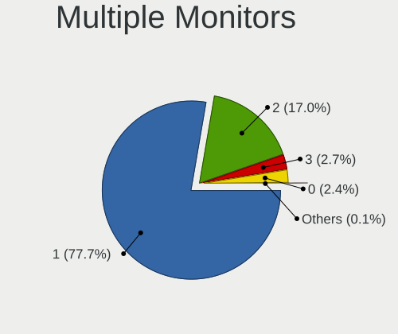

| Total | Notebooks | Percent |
|-------|-----------|---------|
| 1     | 1331      | 77.7%   |
| 2     | 291       | 16.99%  |
| 3     | 47        | 2.74%   |
| 0     | 41        | 2.39%   |
| 4     | 2         | 0.12%   |
| 5     | 1         | 0.06%   |

Network
-------

Net Controller Vendor
---------------------

Controller vendors

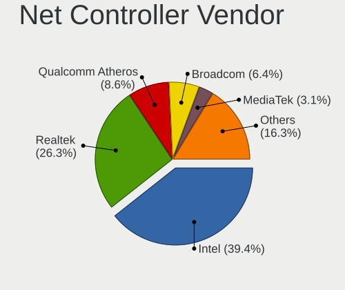

| Vendor                                 | Notebooks | Percent |
|----------------------------------------|-----------|---------|
| Intel                                  | 1041      | 39.37%  |
| Realtek Semiconductor                  | 695       | 26.29%  |
| Qualcomm Atheros                       | 227       | 8.59%   |
| Broadcom                               | 169       | 6.39%   |
| MediaTek                               | 81        | 3.06%   |
| Broadcom Limited                       | 48        | 1.82%   |
| Qualcomm                               | 33        | 1.25%   |
| Lenovo                                 | 29        | 1.1%    |
| ASIX Electronics                       | 29        | 1.1%    |
| Sierra Wireless                        | 26        | 0.98%   |
| Ralink                                 | 25        | 0.95%   |
| Marvell Technology Group               | 24        | 0.91%   |
| Hewlett-Packard                        | 20        | 0.76%   |
| DisplayLink                            | 20        | 0.76%   |
| Dell                                   | 20        | 0.76%   |
| Ericsson Business Mobile Networks      | 18        | 0.68%   |
| Shenzhen Goodix Technology             | 15        | 0.57%   |
| TP-Link                                | 13        | 0.49%   |
| Nvidia                                 | 12        | 0.45%   |
| Huawei Technologies                    | 10        | 0.38%   |
| Xiaomi                                 | 8         | 0.3%    |
| Samsung Electronics                    | 8         | 0.3%    |
| Ralink Technology                      | 8         | 0.3%    |
| Fibocom                                | 7         | 0.26%   |
| ASUSTek Computer                       | 7         | 0.26%   |
| Edimax Technology                      | 6         | 0.23%   |
| Suzhou Motorcomm Electronic Technology | 4         | 0.15%   |
| D-Link                                 | 4         | 0.15%   |
| Linksys                                | 3         | 0.11%   |
| HMD Global                             | 3         | 0.11%   |
| AVM                                    | 3         | 0.11%   |
| QinHeng Electronics                    | 2         | 0.08%   |
| NetGear                                | 2         | 0.08%   |
| Motorcomm Microelectronics.            | 2         | 0.08%   |
| Google                                 | 2         | 0.08%   |
| Arduino SA                             | 2         | 0.08%   |
| Apple                                  | 2         | 0.08%   |
| Wilocity                               | 1         | 0.04%   |
| U-Blox                                 | 1         | 0.04%   |
| Spreadtrum Communications              | 1         | 0.04%   |

Net Controller Model
--------------------

Controller models

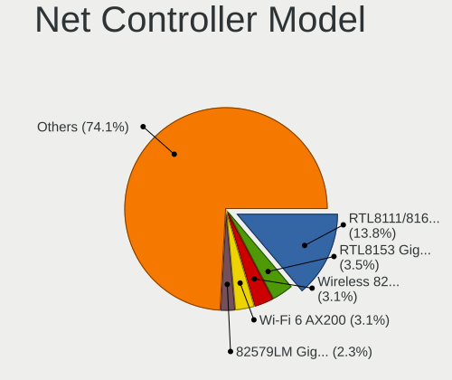

| Model                                                                  | Notebooks | Percent |
|------------------------------------------------------------------------|-----------|---------|
| Realtek RTL8111/8168/8211/8411 PCI Express Gigabit Ethernet Controller | 446       | 13.81%  |
| Realtek RTL8153 Gigabit Ethernet Adapter                               | 113       | 3.5%    |
| Intel Wireless 8265 / 8275                                             | 101       | 3.13%   |
| Intel Wi-Fi 6 AX200                                                    | 101       | 3.13%   |
| Intel 82579LM Gigabit Network Connection (Lewisville)                  | 75        | 2.32%   |
| Intel Wi-Fi 6 AX201                                                    | 65        | 2.01%   |
| Intel Wireless 7260                                                    | 60        | 1.86%   |
| Realtek RTL810xE PCI Express Fast Ethernet controller                  | 57        | 1.77%   |
| Intel Wireless 7265                                                    | 53        | 1.64%   |
| Intel Wireless 8260                                                    | 51        | 1.58%   |
| Intel Centrino Advanced-N 6205 [Taylor Peak]                           | 49        | 1.52%   |
| Intel Alder Lake-P PCH CNVi WiFi                                       | 49        | 1.52%   |
| Intel Raptor Lake PCH CNVi WiFi                                        | 41        | 1.27%   |
| Intel Cannon Point-LP CNVi [Wireless-AC]                               | 38        | 1.18%   |
| Qualcomm Atheros QCA6174 802.11ac Wireless Network Adapter             | 36        | 1.11%   |
| MediaTek MT7921 802.11ax PCIe Wireless Network Adapter [Filogic 330]   | 35        | 1.08%   |
| Intel Comet Lake PCH-LP CNVi WiFi                                      | 34        | 1.05%   |
| Intel Ethernet Connection (4) I219-LM                                  | 33        | 1.02%   |
| Realtek RTL8821CE 802.11ac PCIe Wireless Network Adapter               | 32        | 0.99%   |
| Realtek RTL8822CE 802.11ac PCIe Wireless Network Adapter               | 31        | 0.96%   |
| Intel Ethernet Connection I218-LM                                      | 31        | 0.96%   |
| Intel Centrino Ultimate-N 6300                                         | 30        | 0.93%   |
| Qualcomm QCNFA765 Wireless Network Adapter                             | 29        | 0.9%    |
| Qualcomm Atheros QCA9377 802.11ac Wireless Network Adapter             | 28        | 0.87%   |
| Intel Ethernet Connection I219-LM                                      | 28        | 0.87%   |
| Intel Ethernet Connection (4) I219-V                                   | 28        | 0.87%   |
| Qualcomm Atheros QCA9565 / AR9565 Wireless Network Adapter             | 27        | 0.84%   |
| MediaTek MT7922 802.11ax PCI Express Wireless Network Adapter          | 27        | 0.84%   |
| Qualcomm Atheros AR9485 Wireless Network Adapter                       | 26        | 0.81%   |
| Qualcomm Atheros AR9285 Wireless Network Adapter (PCI-Express)         | 26        | 0.81%   |
| ASIX AX88179 Gigabit Ethernet                                          | 26        | 0.81%   |
| Qualcomm Atheros AR8151 v2.0 Gigabit Ethernet                          | 25        | 0.77%   |
| Intel Cannon Lake PCH CNVi WiFi                                        | 25        | 0.77%   |
| Qualcomm Atheros AR9462 Wireless Network Adapter                       | 23        | 0.71%   |
| Intel Comet Lake PCH CNVi WiFi                                         | 23        | 0.71%   |
| Broadcom NetXtreme BCM57765 Gigabit Ethernet PCIe                      | 23        | 0.71%   |
| Intel Ethernet Connection (6) I219-V                                   | 22        | 0.68%   |
| Intel Ethernet Connection (3) I218-LM                                  | 22        | 0.68%   |
| Intel 82577LM Gigabit Network Connection                               | 22        | 0.68%   |
| Broadcom BCM4331 802.11a/b/g/n                                         | 22        | 0.68%   |

Wireless Vendor
---------------

Wireless vendors

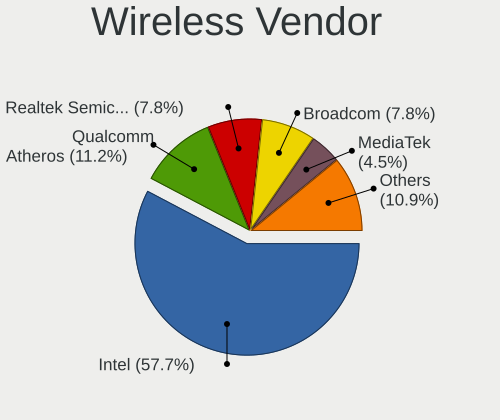

| Vendor                          | Notebooks | Percent |
|---------------------------------|-----------|---------|
| Intel                           | 987       | 57.72%  |
| Qualcomm Atheros                | 191       | 11.17%  |
| Realtek Semiconductor           | 134       | 7.84%   |
| Broadcom                        | 134       | 7.84%   |
| MediaTek                        | 77        | 4.5%    |
| Broadcom Limited                | 33        | 1.93%   |
| Qualcomm                        | 31        | 1.81%   |
| Sierra Wireless                 | 26        | 1.52%   |
| Ralink                          | 25        | 1.46%   |
| Dell                            | 13        | 0.76%   |
| TP-Link                         | 9         | 0.53%   |
| Ralink Technology               | 8         | 0.47%   |
| Hewlett-Packard                 | 8         | 0.47%   |
| Fibocom                         | 7         | 0.41%   |
| ASUSTek Computer                | 7         | 0.41%   |
| Edimax Technology               | 6         | 0.35%   |
| D-Link                          | 3         | 0.18%   |
| AVM                             | 3         | 0.18%   |
| NetGear                         | 2         | 0.12%   |
| Wilocity                        | 1         | 0.06%   |
| Quectel Wireless Solutions      | 1         | 0.06%   |
| Qualcomm Atheros Communications | 1         | 0.06%   |
| Linksys                         | 1         | 0.06%   |
| Fujitsu Siemens Computers       | 1         | 0.06%   |
| 3Com                            | 1         | 0.06%   |

Wireless Model
--------------

Wireless models

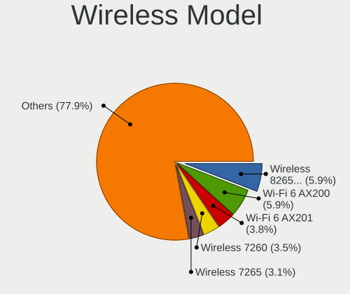

| Model                                                                | Notebooks | Percent |
|----------------------------------------------------------------------|-----------|---------|
| Intel Wireless 8265 / 8275                                           | 101       | 5.88%   |
| Intel Wi-Fi 6 AX200                                                  | 101       | 5.88%   |
| Intel Wi-Fi 6 AX201                                                  | 65        | 3.78%   |
| Intel Wireless 7260                                                  | 60        | 3.49%   |
| Intel Wireless 7265                                                  | 53        | 3.08%   |
| Intel Wireless 8260                                                  | 51        | 2.97%   |
| Intel Centrino Advanced-N 6205 [Taylor Peak]                         | 49        | 2.85%   |
| Intel Raptor Lake PCH CNVi WiFi                                      | 41        | 2.39%   |
| Intel Cannon Point-LP CNVi [Wireless-AC]                             | 38        | 2.21%   |
| Qualcomm Atheros QCA6174 802.11ac Wireless Network Adapter           | 36        | 2.09%   |
| MediaTek MT7921 802.11ax PCIe Wireless Network Adapter [Filogic 330] | 35        | 2.04%   |
| Intel Comet Lake PCH-LP CNVi WiFi                                    | 34        | 1.98%   |
| Intel Alder Lake-P PCH CNVi WiFi                                     | 34        | 1.98%   |
| Realtek RTL8821CE 802.11ac PCIe Wireless Network Adapter             | 32        | 1.86%   |
| Realtek RTL8822CE 802.11ac PCIe Wireless Network Adapter             | 31        | 1.8%    |
| Intel Centrino Ultimate-N 6300                                       | 30        | 1.75%   |
| Qualcomm QCNFA765 Wireless Network Adapter                           | 29        | 1.69%   |
| Qualcomm Atheros QCA9377 802.11ac Wireless Network Adapter           | 28        | 1.63%   |
| Qualcomm Atheros QCA9565 / AR9565 Wireless Network Adapter           | 27        | 1.57%   |
| MediaTek MT7922 802.11ax PCI Express Wireless Network Adapter        | 27        | 1.57%   |
| Qualcomm Atheros AR9485 Wireless Network Adapter                     | 26        | 1.51%   |
| Qualcomm Atheros AR9285 Wireless Network Adapter (PCI-Express)       | 26        | 1.51%   |
| Intel Cannon Lake PCH CNVi WiFi                                      | 25        | 1.45%   |
| Qualcomm Atheros AR9462 Wireless Network Adapter                     | 23        | 1.34%   |
| Intel Comet Lake PCH CNVi WiFi                                       | 23        | 1.34%   |
| Broadcom BCM4331 802.11a/b/g/n                                       | 22        | 1.28%   |
| Intel Wi-Fi 5(802.11ac) Wireless-AC 9x6x [Thunder Peak]              | 20        | 1.16%   |
| Intel Dual Band Wireless-AC 3165 Plus Bluetooth                      | 20        | 1.16%   |
| Broadcom BCM4313 802.11bgn Wireless Network Adapter                  | 19        | 1.11%   |
| Intel Wireless 3165                                                  | 18        | 1.05%   |
| Intel Wi-Fi 6E(802.11ax) AX210/AX1675* 2x2 [Typhoon Peak]            | 18        | 1.05%   |
| Intel Wireless 3160                                                  | 17        | 0.99%   |
| Intel Centrino Advanced-N 6200                                       | 17        | 0.99%   |
| Broadcom Limited BCM4360 802.11ac Dual Band Wireless Network Adapter | 17        | 0.99%   |
| Realtek RTL8723BE PCIe Wireless Network Adapter                      | 16        | 0.93%   |
| Intel Centrino Advanced-N 6235                                       | 16        | 0.93%   |
| Intel Centrino Wireless-N 2230                                       | 15        | 0.87%   |
| Broadcom BCM43228 802.11a/b/g/n                                      | 14        | 0.81%   |
| MediaTek MT7902 802.11ax PCIe Wireless Network Adapter [Filogic 310] | 13        | 0.76%   |
| Intel 700 Series Chipset CNVi WiFi                                   | 13        | 0.76%   |

Ethernet Vendor
---------------

Ethernet vendors

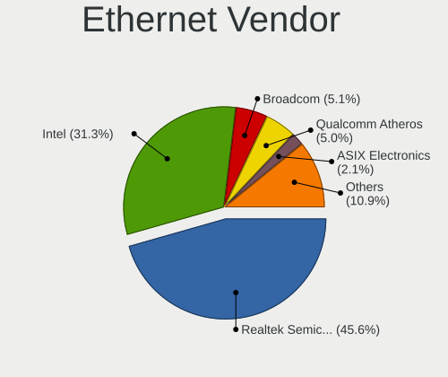

| Vendor                                 | Notebooks | Percent |
|----------------------------------------|-----------|---------|
| Realtek Semiconductor                  | 642       | 45.6%   |
| Intel                                  | 441       | 31.32%  |
| Broadcom                               | 72        | 5.11%   |
| Qualcomm Atheros                       | 71        | 5.04%   |
| ASIX Electronics                       | 29        | 2.06%   |
| Lenovo                                 | 28        | 1.99%   |
| Marvell Technology Group               | 24        | 1.7%    |
| DisplayLink                            | 20        | 1.42%   |
| Broadcom Limited                       | 15        | 1.07%   |
| Nvidia                                 | 12        | 0.85%   |
| Xiaomi                                 | 8         | 0.57%   |
| Samsung Electronics                    | 8         | 0.57%   |
| TP-Link                                | 4         | 0.28%   |
| Suzhou Motorcomm Electronic Technology | 4         | 0.28%   |
| MediaTek                               | 4         | 0.28%   |
| Huawei Technologies                    | 4         | 0.28%   |
| HMD Global                             | 3         | 0.21%   |
| Qualcomm                               | 2         | 0.14%   |
| Motorcomm Microelectronics.            | 2         | 0.14%   |
| Linksys                                | 2         | 0.14%   |
| Hewlett-Packard                        | 2         | 0.14%   |
| Google                                 | 2         | 0.14%   |
| Apple                                  | 2         | 0.14%   |
| Spreadtrum Communications              | 1         | 0.07%   |
| OPPO Electronics                       | 1         | 0.07%   |
| OnePlus Technology (Shenzhen)          | 1         | 0.07%   |
| MosChip Semiconductor                  | 1         | 0.07%   |
| JMicron Technology                     | 1         | 0.07%   |
| D-Link                                 | 1         | 0.07%   |
| Aquantia                               | 1         | 0.07%   |

Ethernet Model
--------------

Ethernet models

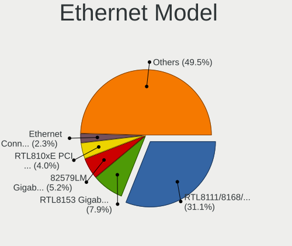

| Model                                                                  | Notebooks | Percent |
|------------------------------------------------------------------------|-----------|---------|
| Realtek RTL8111/8168/8211/8411 PCI Express Gigabit Ethernet Controller | 446       | 31.08%  |
| Realtek RTL8153 Gigabit Ethernet Adapter                               | 113       | 7.87%   |
| Intel 82579LM Gigabit Network Connection (Lewisville)                  | 75        | 5.23%   |
| Realtek RTL810xE PCI Express Fast Ethernet controller                  | 57        | 3.97%   |
| Intel Ethernet Connection (4) I219-LM                                  | 33        | 2.3%    |
| Intel Ethernet Connection I218-LM                                      | 31        | 2.16%   |
| Intel Ethernet Connection I219-LM                                      | 28        | 1.95%   |
| Intel Ethernet Connection (4) I219-V                                   | 28        | 1.95%   |
| ASIX AX88179 Gigabit Ethernet                                          | 26        | 1.81%   |
| Qualcomm Atheros AR8151 v2.0 Gigabit Ethernet                          | 25        | 1.74%   |
| Broadcom NetXtreme BCM57765 Gigabit Ethernet PCIe                      | 23        | 1.6%    |
| Intel Ethernet Connection (6) I219-V                                   | 22        | 1.53%   |
| Intel Ethernet Connection (3) I218-LM                                  | 22        | 1.53%   |
| Intel 82577LM Gigabit Network Connection                               | 22        | 1.53%   |
| Intel Ethernet Connection I219-V                                       | 15        | 1.05%   |
| Intel Alder Lake-P PCH CNVi WiFi                                       | 15        | 1.05%   |
| Realtek RTL8125 2.5GbE Controller                                      | 14        | 0.98%   |
| Intel Ethernet Connection I217-LM                                      | 13        | 0.91%   |
| Intel Ethernet Connection (7) I219-LM                                  | 11        | 0.77%   |
| Realtek Killer E2600 GbE Controller                                    | 10        | 0.7%    |
| Intel Ethernet Connection (13) I219-V                                  | 10        | 0.7%    |
| Broadcom NetXtreme BCM57786 Gigabit Ethernet PCIe                      | 10        | 0.7%    |
| Realtek USB 10/100/1G/2.5 LAN                                          | 9         | 0.63%   |
| Qualcomm Atheros Killer E2400 Gigabit Ethernet Controller              | 9         | 0.63%   |
| Lenovo ThinkPad TBT 3 Dock                                             | 9         | 0.63%   |
| Lenovo Thinkpad LAN                                                    | 9         | 0.63%   |
| Intel 82567LM Gigabit Network Connection                               | 9         | 0.63%   |
| Broadcom NetLink BCM57785 Gigabit Ethernet PCIe                        | 9         | 0.63%   |
| Broadcom Limited NetLink BCM57780 Gigabit Ethernet PCIe                | 9         | 0.63%   |
| Nvidia MCP79 Ethernet                                                  | 8         | 0.56%   |
| Intel Ethernet Connection (7) I219-V                                   | 8         | 0.56%   |
| Intel Ethernet Connection (6) I219-LM                                  | 8         | 0.56%   |
| Intel Ethernet Connection (10) I219-V                                  | 8         | 0.56%   |
| Intel 82566MM Gigabit Network Connection                               | 8         | 0.56%   |
| Broadcom NetXtreme BCM5764M Gigabit Ethernet PCIe                      | 8         | 0.56%   |
| Qualcomm Atheros QCA8171 Gigabit Ethernet                              | 7         | 0.49%   |
| Intel Ethernet Connection (16) I219-V                                  | 7         | 0.49%   |
| Intel 82579V Gigabit Network Connection                                | 7         | 0.49%   |
| DisplayLink USB-C Triple-4K Dock                                       | 7         | 0.49%   |
| Xiaomi Mi/Redmi series (RNDIS)                                         | 6         | 0.42%   |

Net Controller Kind
-------------------

Ethernet, WiFi or modem

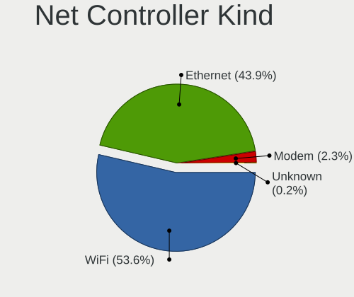

| Kind     | Notebooks | Percent |
|----------|-----------|---------|
| WiFi     | 1609      | 53.63%  |
| Ethernet | 1317      | 43.9%   |
| Modem    | 69        | 2.3%    |
| Unknown  | 5         | 0.17%   |

Used Controller
---------------

Currently used network controller

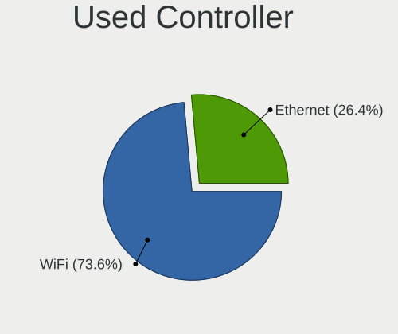

| Kind     | Notebooks | Percent |
|----------|-----------|---------|
| WiFi     | 1303      | 73.57%  |
| Ethernet | 468       | 26.43%  |

NICs
----

Total network controllers on board

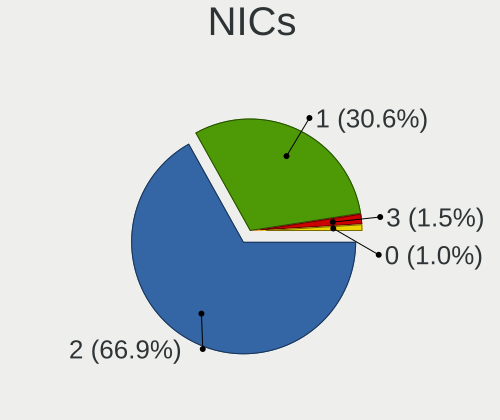

| Total | Notebooks | Percent |
|-------|-----------|---------|
| 2     | 1114      | 66.91%  |
| 1     | 510       | 30.63%  |
| 3     | 25        | 1.5%    |
| 0     | 16        | 0.96%   |

IPv6
----

IPv6 vs IPv4

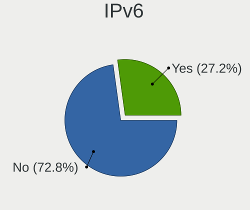

| Used | Notebooks | Percent |
|------|-----------|---------|
| No   | 1249      | 72.83%  |
| Yes  | 466       | 27.17%  |

Bluetooth
---------

Bluetooth Vendor
----------------

Controller vendors

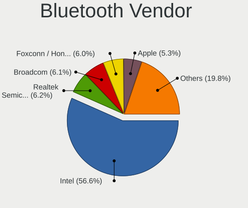

| Vendor                          | Notebooks | Percent |
|---------------------------------|-----------|---------|
| Intel                           | 786       | 56.63%  |
| Realtek Semiconductor           | 86        | 6.2%    |
| Broadcom                        | 84        | 6.05%   |
| Foxconn / Hon Hai               | 83        | 5.98%   |
| Apple                           | 74        | 5.33%   |
| Qualcomm Atheros Communications | 59        | 4.25%   |
| IMC Networks                    | 56        | 4.03%   |
| Lite-On Technology              | 45        | 3.24%   |
| Hewlett-Packard                 | 22        | 1.59%   |
| USI                             | 21        | 1.51%   |
| Dell                            | 17        | 1.22%   |
| Cambridge Silicon Radio         | 14        | 1.01%   |
| Ralink                          | 10        | 0.72%   |
| MediaTek                        | 10        | 0.72%   |
| Alps Electric                   | 5         | 0.36%   |
| Toshiba                         | 4         | 0.29%   |
| Realtek                         | 2         | 0.14%   |
| Ralink Technology               | 2         | 0.14%   |
| Chicony Electronics             | 2         | 0.14%   |
| ASUSTek Computer                | 2         | 0.14%   |
| Taiyo Yuden                     | 1         | 0.07%   |
| Micro Star International        | 1         | 0.07%   |
| Fujitsu                         | 1         | 0.07%   |
| Foxconn International           | 1         | 0.07%   |

Bluetooth Model
---------------

Controller models

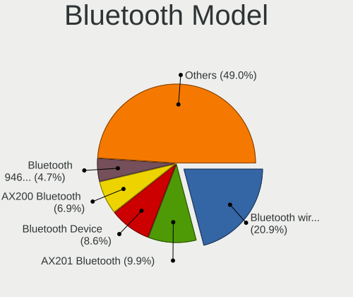

| Model                                               | Notebooks | Percent |
|-----------------------------------------------------|-----------|---------|
| Intel Bluetooth wireless interface                  | 291       | 20.92%  |
| Intel AX201 Bluetooth                               | 138       | 9.92%   |
| Intel Bluetooth Device                              | 119       | 8.55%   |
| Intel AX200 Bluetooth                               | 96        | 6.9%    |
| Intel Bluetooth 9460/9560 Jefferson Peak (JfP)      | 66        | 4.74%   |
| Realtek Bluetooth Radio                             | 65        | 4.67%   |
| Apple Bluetooth Host Controller                     | 46        | 3.31%   |
| Intel Centrino Bluetooth Wireless Transceiver       | 29        | 2.08%   |
| IMC Networks Wireless_Device                        | 25        | 1.8%    |
| Qualcomm Atheros QCA61x4 Bluetooth 4.0              | 23        | 1.65%   |
| Foxconn / Hon Hai Wireless_Device                   | 23        | 1.65%   |
| USI Bluetooth Device                                | 21        | 1.51%   |
| Foxconn / Hon Hai Bluetooth Device                  | 21        | 1.51%   |
| Apple Bluetooth USB Host Controller                 | 21        | 1.51%   |
| Intel Wireless-AC 9260 Bluetooth Adapter            | 19        | 1.37%   |
| IMC Networks Bluetooth Radio                        | 18        | 1.29%   |
| Broadcom BCM2045B (BDC-2.1)                         | 18        | 1.29%   |
| Realtek  Bluetooth 4.2 Adapter                      | 17        | 1.22%   |
| Intel AX210 Bluetooth                               | 17        | 1.22%   |
| Foxconn / Hon Hai MediaTek Bluetooth Adapter        | 15        | 1.08%   |
| Broadcom BCM20702 Bluetooth 4.0 [ThinkPad]          | 15        | 1.08%   |
| Qualcomm Atheros  Bluetooth Device                  | 14        | 1.01%   |
| Cambridge Silicon Radio Bluetooth Dongle (HCI mode) | 14        | 1.01%   |
| Qualcomm Atheros AR3011 Bluetooth                   | 13        | 0.93%   |
| HP Broadcom 2070 Bluetooth Combo                    | 12        | 0.86%   |
| Lite-On Qualcomm Atheros QCA9377 Bluetooth          | 11        | 0.79%   |
| Lite-On Atheros AR3012 Bluetooth                    | 11        | 0.79%   |
| Ralink RT3290 Bluetooth                             | 10        | 0.72%   |
| MediaTek Wireless_Device                            | 10        | 0.72%   |
| Lite-On Bluetooth Device                            | 9         | 0.65%   |
| Intel Wireless-AC 3168 Bluetooth                    | 9         | 0.65%   |
| Lite-On Wireless_Device                             | 8         | 0.58%   |
| IMC Networks Bluetooth Device                       | 8         | 0.58%   |
| HP Bluetooth 2.0 Interface [Broadcom BCM2045]       | 8         | 0.58%   |
| Broadcom BCM2070 Bluetooth 2.1 + EDR                | 7         | 0.5%    |
| Broadcom BCM2045B (BDC-2.1) [Bluetooth Controller]  | 7         | 0.5%    |
| Qualcomm Atheros AR3012 Bluetooth 4.0               | 6         | 0.43%   |
| Foxconn / Hon Hai BCM20702A0                        | 6         | 0.43%   |
| Dell BCM20702A0 Bluetooth Module                    | 6         | 0.43%   |
| Foxconn / Hon Hai Broadcom BCM20702A1 Bluetooth     | 5         | 0.36%   |

Sound
-----

Sound Vendor
------------

Sound card vendors

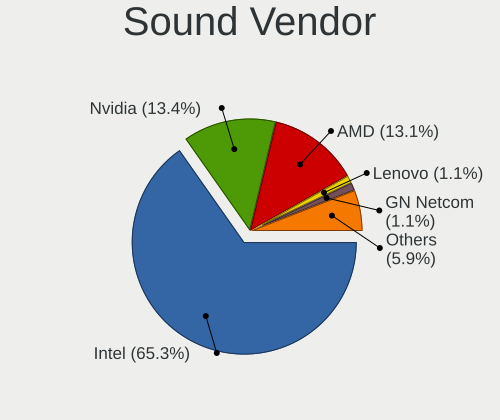

| Vendor                            | Notebooks | Percent |
|-----------------------------------|-----------|---------|
| Intel                             | 1388      | 65.26%  |
| Nvidia                            | 286       | 13.45%  |
| AMD                               | 279       | 13.12%  |
| Lenovo                            | 24        | 1.13%   |
| GN Netcom                         | 24        | 1.13%   |
| Hewlett-Packard                   | 16        | 0.75%   |
| Logitech                          | 15        | 0.71%   |
| Realtek Semiconductor             | 14        | 0.66%   |
| Plantronics                       | 12        | 0.56%   |
| C-Media Electronics               | 8         | 0.38%   |
| Razer USA                         | 4         | 0.19%   |
| Kingston Technology               | 4         | 0.19%   |
| JMTek                             | 4         | 0.19%   |
| RODE Microphones                  | 3         | 0.14%   |
| Focusrite-Novation                | 3         | 0.14%   |
| Conexant Systems                  | 3         | 0.14%   |
| VIA Technologies                  | 2         | 0.09%   |
| SteelSeries ApS                   | 2         | 0.09%   |
| Sony                              | 2         | 0.09%   |
| Samsung Electronics               | 2         | 0.09%   |
| Other World Computing             | 2         | 0.09%   |
| BEHRINGER International           | 2         | 0.09%   |
| Astro Gaming                      | 2         | 0.09%   |
| Apple                             | 2         | 0.09%   |
| Texas Instruments                 | 1         | 0.05%   |
| Tenx Technology                   | 1         | 0.05%   |
| Samson Technologies               | 1         | 0.05%   |
| ROCCAT                            | 1         | 0.05%   |
| Nordic Semiconductor ASA          | 1         | 0.05%   |
| MV-SILICON                        | 1         | 0.05%   |
| miniDSP                           | 1         | 0.05%   |
| Magic Control Technology          | 1         | 0.05%   |
| M-Audio                           | 1         | 0.05%   |
| Huawei Technologies               | 1         | 0.05%   |
| Guillemot                         | 1         | 0.05%   |
| Griffin Technology                | 1         | 0.05%   |
| freeVoice                         | 1         | 0.05%   |
| FiiO Electronics Technology       | 1         | 0.05%   |
| Elitegroup Computer Systems (ECS) | 1         | 0.05%   |
| Elite Silicon                     | 1         | 0.05%   |

Sound Model
-----------

Sound card models

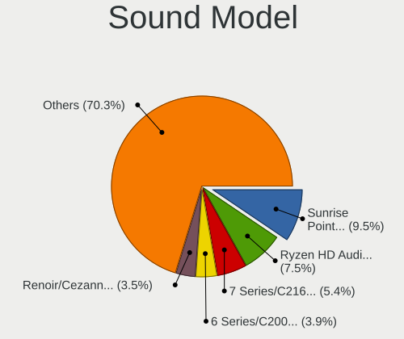

| Model                                                                      | Notebooks | Percent |
|----------------------------------------------------------------------------|-----------|---------|
| Intel Sunrise Point-LP HD Audio                                            | 240       | 9.45%   |
| AMD Ryzen HD Audio Controller                                              | 190       | 7.48%   |
| Intel 7 Series/C216 Chipset Family High Definition Audio Controller        | 136       | 5.36%   |
| Intel 6 Series/C200 Series Chipset Family High Definition Audio Controller | 98        | 3.86%   |
| AMD Renoir/Cezanne HDMI/DP Audio Controller                                | 90        | 3.54%   |
| Intel Haswell-ULT HD Audio Controller                                      | 83        | 3.27%   |
| Intel 8 Series HD Audio Controller                                         | 83        | 3.27%   |
| Intel Tiger Lake-LP Smart Sound Technology Audio Controller                | 82        | 3.23%   |
| AMD Radeon High Definition Audio Controller                                | 80        | 3.15%   |
| Intel Cannon Point-LP High Definition Audio Controller                     | 71        | 2.8%    |
| Intel 8 Series/C220 Series Chipset High Definition Audio Controller        | 61        | 2.4%    |
| Intel Cannon Lake PCH cAVS                                                 | 60        | 2.36%   |
| Intel Wildcat Point-LP High Definition Audio Controller                    | 59        | 2.32%   |
| Intel Broadwell-U Audio Controller                                         | 59        | 2.32%   |
| Intel Alder Lake PCH-P High Definition Audio Controller                    | 59        | 2.32%   |
| Intel Raptor Lake-P/U/H cAVS                                               | 56        | 2.21%   |
| Intel 5 Series/3400 Series Chipset High Definition Audio                   | 56        | 2.21%   |
| Intel Xeon E3-1200 v3/4th Gen Core Processor HD Audio Controller           | 49        | 1.93%   |
| Intel Comet Lake PCH-LP cAVS                                               | 42        | 1.65%   |
| Intel 82801I (ICH9 Family) HD Audio Controller                             | 41        | 1.61%   |
| Nvidia GF108 High Definition Audio Controller                              | 27        | 1.06%   |
| Intel Comet Lake PCH cAVS                                                  | 26        | 1.02%   |
| Nvidia TU107 GeForce GTX 1650 High Definition Audio Controller             | 25        | 0.98%   |
| Nvidia GK107 HDMI Audio Controller                                         | 23        | 0.91%   |
| Intel 100 Series/C230 Series Chipset Family HD Audio Controller            | 23        | 0.91%   |
| Intel CM238 HD Audio Controller                                            | 21        | 0.83%   |
| Intel 82801H (ICH8 Family) HD Audio Controller                             | 21        | 0.83%   |
| Intel Meteor Lake-P HD Audio Controller                                    | 19        | 0.75%   |
| Intel Ice Lake-LP Smart Sound Technology Audio Controller                  | 18        | 0.71%   |
| AMD FCH Azalia Controller                                                  | 18        | 0.71%   |
| Nvidia GP107GL High Definition Audio Controller                            | 17        | 0.67%   |
| Nvidia GA104 High Definition Audio Controller                              | 17        | 0.67%   |
| Nvidia GA106 High Definition Audio Controller                              | 16        | 0.63%   |
| Nvidia AD107 High Definition Audio Controller                              | 15        | 0.59%   |
| Intel Tiger Lake-H HD Audio Controller                                     | 15        | 0.59%   |
| Intel Celeron/Pentium Silver Processor High Definition Audio               | 15        | 0.59%   |
| AMD SBx00 Azalia (Intel HDA)                                               | 14        | 0.55%   |
| AMD Raven/Raven2/Fenghuang HDMI/DP Audio Controller                        | 14        | 0.55%   |
| Realtek Semiconductor USB Audio                                            | 13        | 0.51%   |
| Nvidia GT216 HDMI Audio Controller                                         | 13        | 0.51%   |

Memory
------

Memory Vendor
-------------

Memory module vendors

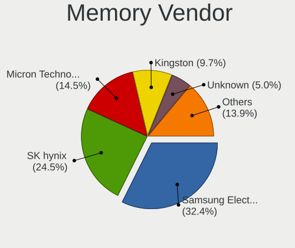

| Vendor              | Notebooks | Percent |
|---------------------|-----------|---------|
| Samsung Electronics | 374       | 32.35%  |
| SK hynix            | 283       | 24.48%  |
| Micron Technology   | 168       | 14.53%  |
| Kingston            | 112       | 9.69%   |
| Unknown             | 58        | 5.02%   |
| Crucial             | 38        | 3.29%   |
| Elpida              | 26        | 2.25%   |
| Corsair             | 24        | 2.08%   |
| Ramaxel Technology  | 19        | 1.64%   |
| Unknown             | 15        | 1.3%    |
| A-DATA Technology   | 12        | 1.04%   |
| Nanya Technology    | 9         | 0.78%   |
| G.Skill             | 5         | 0.43%   |
| ASint Technology    | 3         | 0.26%   |
| Wilk                | 1         | 0.09%   |
| Unknown (ABCD)      | 1         | 0.09%   |
| Unknown (0x0E9D)    | 1         | 0.09%   |
| Unknown (08AE)      | 1         | 0.09%   |
| Team                | 1         | 0.09%   |
| OnBoard             | 1         | 0.09%   |
| King Tiger          | 1         | 0.09%   |
| GOODRAM             | 1         | 0.09%   |
| CSX                 | 1         | 0.09%   |
| Atermiter           | 1         | 0.09%   |

Memory Model
------------

Memory module models

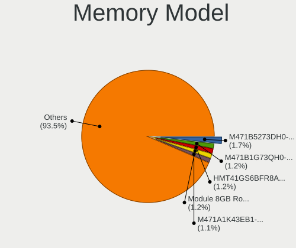

| Model                                                        | Notebooks | Percent |
|--------------------------------------------------------------|-----------|---------|
| Samsung RAM M471B5273DH0-CH9 4GB SODIMM DDR3 1600MT/s        | 21        | 1.72%   |
| SK hynix RAM HMT41GS6BFR8A-PB 8GB SODIMM DDR3 2667MT/s       | 15        | 1.23%   |
| Samsung RAM M471B1G73QH0-YK0 8GB SODIMM DDR3 1600MT/s        | 15        | 1.23%   |
| Unknown                                                      | 15        | 1.23%   |
| SK hynix RAM HMA81GS6AFR8N-UH 8GB SODIMM DDR4 2667MT/s       | 13        | 1.07%   |
| Samsung RAM M471A1K43EB1-CWE 8GB SODIMM DDR4 3200MT/s        | 13        | 1.07%   |
| SK hynix RAM HMAA1GS6CJR6N-XN 8GB SODIMM DDR4 3200MT/s       | 12        | 0.98%   |
| Samsung RAM M471A1K43BB1-CRC 8GB SODIMM DDR4 2667MT/s        | 11        | 0.9%    |
| Samsung RAM M471A1G44BB0-CWE 8GB SODIMM DDR4 3200MT/s        | 11        | 0.9%    |
| SK hynix RAM HMT451S6BFR8A-PB 4GB SODIMM DDR3 1600MT/s       | 10        | 0.82%   |
| SK hynix RAM HMA82GS6AFR8N-UH 16GB SODIMM DDR4 2667MT/s      | 9         | 0.74%   |
| Samsung RAM M471B5273CH0-CH9 4GB SODIMM DDR3 1334MT/s        | 9         | 0.74%   |
| Samsung RAM M471B1G73EB0-YK0 8192MB SODIMM DDR3 1600MT/s     | 9         | 0.74%   |
| Samsung RAM M471B1G73DB0-YK0 8GB SODIMM DDR3 1600MT/s        | 9         | 0.74%   |
| Samsung RAM M471A4G43AB1-CWE 32GB SODIMM DDR4 3200MT/s       | 9         | 0.74%   |
| Samsung RAM M471A1G44AB0-CWE 8GiB SODIMM DDR4 3200MT/s       | 9         | 0.74%   |
| SK hynix RAM HMT351S6CFR8C-PB 4GB SODIMM DDR3 1600MT/s       | 8         | 0.66%   |
| Samsung RAM M471B5173DB0-YK0 4GB SODIMM DDR3 1600MT/s        | 8         | 0.66%   |
| Samsung RAM M471A5244CB0-CTD 4GB SODIMM DDR4 3266MT/s        | 8         | 0.66%   |
| Samsung RAM M471A2K43DB1-CWE 16GB SODIMM DDR4 3200MT/s       | 8         | 0.66%   |
| Samsung RAM M471A1K43CB1-CTD 8GB SODIMM DDR4 3200MT/s        | 8         | 0.66%   |
| Samsung RAM M471A1K43CB1-CRC 8GB SODIMM DDR4 8400MT/s        | 8         | 0.66%   |
| Samsung RAM M425R2GA3BB0-CQKOL 16GB SODIMM DDR5 4800MT/s     | 8         | 0.66%   |
| Samsung RAM K4EBE304EB-EGCG 8GB Row Of Chips LPDDR3 2133MT/s | 8         | 0.66%   |
| SK hynix RAM HMAB2GS6AMR6N-XN 16GB SODIMM DDR4 3200MT/s      | 7         | 0.57%   |
| Samsung RAM M471A4G43MB1-CTD 32GB SODIMM DDR4 2667MT/s       | 7         | 0.57%   |
| Samsung RAM M471A2K43DB1-CTD 16GB SODIMM DDR4 2667MT/s       | 7         | 0.57%   |
| Samsung RAM M471A1K43DB1-CTD 8GB SODIMM DDR4 2667MT/s        | 7         | 0.57%   |
| Micron RAM Module 4GB Row Of Chips LPDDR5 8533MT/s           | 7         | 0.57%   |
| SK hynix RAM HMA851S6AFR6N-UH 4GB SODIMM DDR4 2667MT/s       | 6         | 0.49%   |
| SK hynix RAM HMA81GS6DJR8N-XN 8GB SODIMM DDR4 3200MT/s       | 6         | 0.49%   |
| SK hynix RAM HMA81GS6CJR8N-VK 8GB SODIMM DDR4 2667MT/s       | 6         | 0.49%   |
| Samsung RAM M471A2G43AB2-CWE 16GB SODIMM DDR4 3200MT/s       | 6         | 0.49%   |
| Samsung RAM K3KL9L90CM-MGCT 4GB Row Of Chips LPDDR5 7500MT/s | 6         | 0.49%   |
| Micron RAM MT62F2G32D4DS-026 WT 8GiB SODIMM LPDDR5 7500MT/s  | 6         | 0.49%   |
| Micron RAM 4ATS2G64HZ-3G2B1 16GB SODIMM DDR4 3200MT/s        | 6         | 0.49%   |
| Micron RAM 4ATF51264HZ-2G6E1 4GB SODIMM DDR4 2667MT/s        | 6         | 0.49%   |
| Micron RAM 16KTF1G64HZ-1G6E1 8GB SODIMM DDR3 1600MT/s        | 6         | 0.49%   |
| Kingston RAM ACR16D3LS1KFG/8G 8GB SODIMM DDR3 1600MT/s       | 6         | 0.49%   |
| Unknown RAM Module 4GB SODIMM DDR3                           | 5         | 0.41%   |

Memory Kind
-----------

Memory module kinds

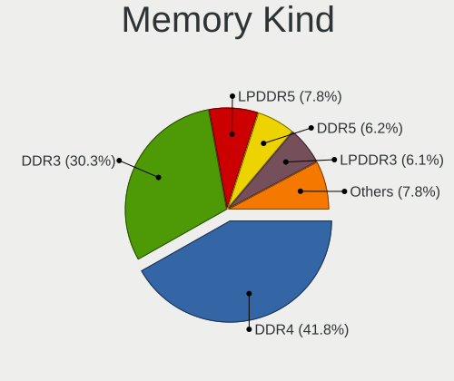

| Kind    | Notebooks | Percent |
|---------|-----------|---------|
| DDR4    | 419       | 41.82%  |
| DDR3    | 304       | 30.34%  |
| LPDDR5  | 78        | 7.78%   |
| DDR5    | 62        | 6.19%   |
| LPDDR3  | 61        | 6.09%   |
| LPDDR4  | 37        | 3.69%   |
| DDR2    | 24        | 2.4%    |
| SDRAM   | 10        | 1%      |
| Unknown | 4         | 0.4%    |
| DDR     | 3         | 0.3%    |

Memory Form Factor
------------------

Physical design of the memory module

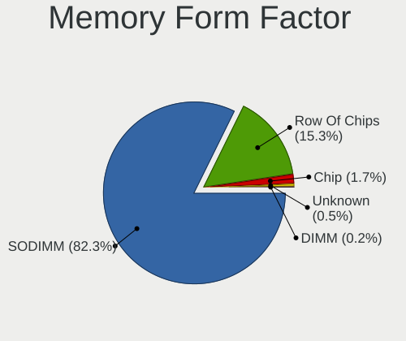

| Name         | Notebooks | Percent |
|--------------|-----------|---------|
| SODIMM       | 832       | 82.29%  |
| Row Of Chips | 155       | 15.33%  |
| Chip         | 17        | 1.68%   |
| Unknown      | 5         | 0.49%   |
| DIMM         | 2         | 0.2%    |

Memory Size
-----------

Memory module size

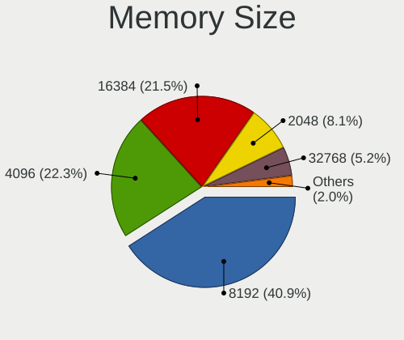

| Size  | Notebooks | Percent |
|-------|-----------|---------|
| 8192  | 444       | 40.92%  |
| 4096  | 242       | 22.3%   |
| 16384 | 233       | 21.47%  |
| 2048  | 88        | 8.11%   |
| 32768 | 56        | 5.16%   |
| 1024  | 19        | 1.75%   |
| 49152 | 2         | 0.18%   |
| 512   | 1         | 0.09%   |

Memory Speed
------------

Memory module speed

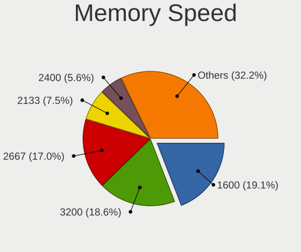

| Speed   | Notebooks | Percent |
|---------|-----------|---------|
| 1600    | 206       | 19.13%  |
| 3200    | 200       | 18.57%  |
| 2667    | 183       | 16.99%  |
| 2133    | 81        | 7.52%   |
| 2400    | 60        | 5.57%   |
| 1334    | 36        | 3.34%   |
| 6400    | 34        | 3.16%   |
| 1333    | 34        | 3.16%   |
| 4800    | 33        | 3.06%   |
| 5600    | 30        | 2.79%   |
| 7500    | 21        | 1.95%   |
| 1067    | 20        | 1.86%   |
| 4267    | 19        | 1.76%   |
| Unknown | 18        | 1.67%   |
| 8533    | 15        | 1.39%   |
| 8400    | 13        | 1.21%   |
| 667     | 12        | 1.11%   |
| 1867    | 10        | 0.93%   |
| 3266    | 8         | 0.74%   |
| 1066    | 7         | 0.65%   |
| 7467    | 6         | 0.56%   |
| 4199    | 6         | 0.56%   |
| 800     | 5         | 0.46%   |
| 4266    | 4         | 0.37%   |
| 975     | 4         | 0.37%   |
| 3733    | 3         | 0.28%   |
| 2048    | 3         | 0.28%   |
| 8000    | 1         | 0.09%   |
| 3600    | 1         | 0.09%   |
| 3000    | 1         | 0.09%   |
| 1639    | 1         | 0.09%   |
| 333     | 1         | 0.09%   |
| 266     | 1         | 0.09%   |

Printers & scanners
-------------------

Printer Vendor
--------------

Printer device vendors

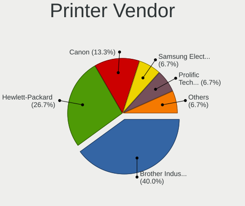

| Vendor              | Notebooks | Percent |
|---------------------|-----------|---------|
| Brother Industries  | 6         | 40%     |
| Hewlett-Packard     | 4         | 26.67%  |
| Canon               | 2         | 13.33%  |
| Samsung Electronics | 1         | 6.67%   |
| Prolific Technology | 1         | 6.67%   |
| Konica Minolta      | 1         | 6.67%   |

Printer Model
-------------

Printer device models

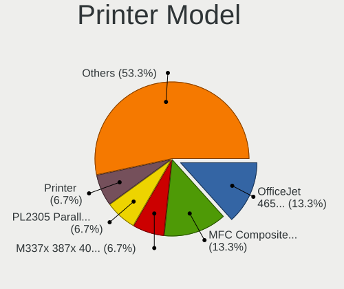

| Model                          | Notebooks | Percent |
|--------------------------------|-----------|---------|
| HP OfficeJet 4650 series       | 2         | 13.33%  |
| Brother MFC Composite Device   | 2         | 13.33%  |
| Samsung M337x 387x 407x Series | 1         | 6.67%   |
| Prolific PL2305 Parallel Port  | 1         | 6.67%   |
| Konica Minolta Printer         | 1         | 6.67%   |
| HP Laserjet P1505              | 1         | 6.67%   |
| HP DeskJet 3700 series         | 1         | 6.67%   |
| Canon PIXMA TS6250             | 1         | 6.67%   |
| Canon MF750C Series            | 1         | 6.67%   |
| Brother MFC-7320               | 1         | 6.67%   |
| Brother HL-3040CN series       | 1         | 6.67%   |
| Brother HL-2030 Laser Printer  | 1         | 6.67%   |
| Brother DCP-7055W              | 1         | 6.67%   |

Scanner Vendor
--------------

Scanner device vendors

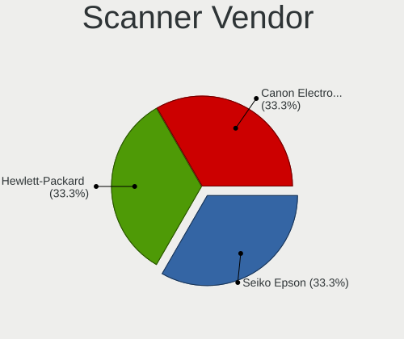

| Vendor            | Notebooks | Percent |
|-------------------|-----------|---------|
| Seiko Epson       | 1         | 33.33%  |
| Hewlett-Packard   | 1         | 33.33%  |
| Canon Electronics | 1         | 33.33%  |

Scanner Model
-------------

Scanner device models

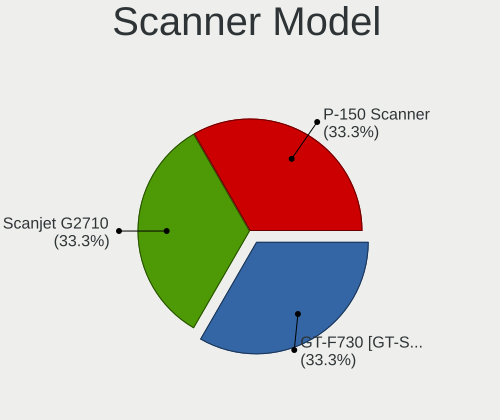

| Model                                                   | Notebooks | Percent |
|---------------------------------------------------------|-----------|---------|
| Seiko Epson GT-F730 [GT-S630/Perfection V33/V330 Photo] | 1         | 33.33%  |
| HP Scanjet G2710                                        | 1         | 33.33%  |
| Canon P-150 Scanner                                     | 1         | 33.33%  |

Camera
------

Camera Vendor
-------------

Camera device vendors

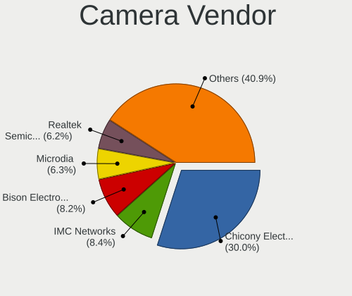

| Vendor                                 | Notebooks | Percent |
|----------------------------------------|-----------|---------|
| Chicony Electronics                    | 458       | 29.95%  |
| IMC Networks                           | 129       | 8.44%   |
| Bison Electronics                      | 126       | 8.24%   |
| Microdia                               | 96        | 6.28%   |
| Realtek Semiconductor                  | 95        | 6.21%   |
| Quanta                                 | 76        | 4.97%   |
| Sunplus Innovation Technology          | 67        | 4.38%   |
| Apple                                  | 64        | 4.19%   |
| Cheng Uei Precision Industry (Foxlink) | 63        | 4.12%   |
| Luxvisions Innotech Limited            | 49        | 3.2%    |
| Suyin                                  | 43        | 2.81%   |
| Lite-On Technology                     | 42        | 2.75%   |
| Syntek                                 | 37        | 2.42%   |
| Logitech                               | 22        | 1.44%   |
| Lenovo                                 | 21        | 1.37%   |
| Ricoh                                  | 18        | 1.18%   |
| Alcor Micro                            | 16        | 1.05%   |
| Shinetech                              | 14        | 0.92%   |
| Sonix Technology                       | 11        | 0.72%   |
| Silicon Motion                         | 8         | 0.52%   |
| Samsung Electronics                    | 6         | 0.39%   |
| ALi                                    | 6         | 0.39%   |
| Acer                                   | 6         | 0.39%   |
| Primax Electronics                     | 5         | 0.33%   |
| kingcome                               | 5         | 0.33%   |
| Microsoft                              | 4         | 0.26%   |
| Z-Star Microelectronics                | 3         | 0.2%    |
| SunplusIT                              | 3         | 0.2%    |
| Framework                              | 3         | 0.2%    |
| Tripath Technology                     | 2         | 0.13%   |
| OmniVision Technologies                | 2         | 0.13%   |
| Jieli Technology                       | 2         | 0.13%   |
| Intel                                  | 2         | 0.13%   |
| Generalplus Technology                 | 2         | 0.13%   |
| DigiTech                               | 2         | 0.13%   |
| Xiaomi                                 | 1         | 0.07%   |
| webcam                                 | 1         | 0.07%   |
| WCM_USB                                | 1         | 0.07%   |
| Tobii Technology AB                    | 1         | 0.07%   |
| Shine-optics                           | 1         | 0.07%   |

Camera Model
------------

Camera device models

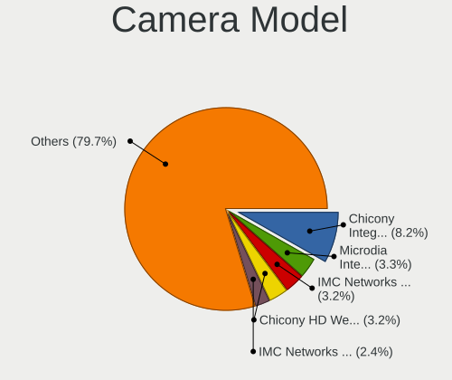

| Model                                               | Notebooks | Percent |
|-----------------------------------------------------|-----------|---------|
| Chicony Integrated Camera                           | 127       | 8.21%   |
| Microdia Integrated_Webcam_HD                       | 51        | 3.3%    |
| IMC Networks Integrated Camera                      | 50        | 3.23%   |
| Chicony HD WebCam                                   | 49        | 3.17%   |
| IMC Networks USB2.0 HD UVC WebCam                   | 37        | 2.39%   |
| Bison Integrated Camera                             | 32        | 2.07%   |
| Realtek Integrated_Webcam_HD                        | 30        | 1.94%   |
| Chicony HP HD Camera                                | 30        | 1.94%   |
| Syntek Integrated Camera                            | 23        | 1.49%   |
| Apple FaceTime HD Camera                            | 23        | 1.49%   |
| Quanta HP HD Camera                                 | 21        | 1.36%   |
| Lite-On Integrated Camera                           | 20        | 1.29%   |
| Sunplus HD WebCam                                   | 17        | 1.1%    |
| Sunplus Integrated_Webcam_HD                        | 16        | 1.03%   |
| Apple Built-in iSight                               | 16        | 1.03%   |
| Luxvisions Innotech Limited Integrated RGB Camera   | 15        | 0.97%   |
| IMC Networks USB2.0 VGA UVC WebCam                  | 15        | 0.97%   |
| Chicony Integrated Camera (1280x720@30)             | 15        | 0.97%   |
| Chicony HP Truevision HD                            | 15        | 0.97%   |
| Chicony HP HD Webcam                                | 15        | 0.97%   |
| Chicony HD User Facing                              | 15        | 0.97%   |
| Microdia Integrated Webcam                          | 14        | 0.91%   |
| Chicony Chicony USB2.0 Camera                       | 14        | 0.91%   |
| Bison SunplusIT Integrated Camera                   | 14        | 0.91%   |
| Bison Lenovo EasyCamera                             | 14        | 0.91%   |
| Bison Integrated RGB Camera                         | 14        | 0.91%   |
| Lite-On HP HD Camera                                | 13        | 0.84%   |
| Suyin HP TrueVision HD                              | 12        | 0.78%   |
| Apple iPhone 5/5C/5S/6/SE/7/8/X                     | 12        | 0.78%   |
| Quanta HD User Facing                               | 11        | 0.71%   |
| Luxvisions Innotech Limited Integrated Camera       | 11        | 0.71%   |
| Lenovo Integrated Webcam                            | 11        | 0.71%   |
| Chicony USB2.0 Camera                               | 10        | 0.65%   |
| Cheng Uei Precision Industry (Foxlink) HP HD Camera | 10        | 0.65%   |
| Bison BisonCam,NB Pro                               | 10        | 0.65%   |
| Quanta HD Webcam                                    | 9         | 0.58%   |
| Luxvisions Innotech Limited HP TrueVision HD Camera | 9         | 0.58%   |
| Chicony Integrated HP HD Webcam                     | 9         | 0.58%   |
| Cheng Uei Precision Industry (Foxlink) HP HD Webcam | 9         | 0.58%   |
| Chicony TOSHIBA Web Camera - HD                     | 8         | 0.52%   |

Security
--------

Fingerprint Vendor
------------------

Fingerprint sensor vendors

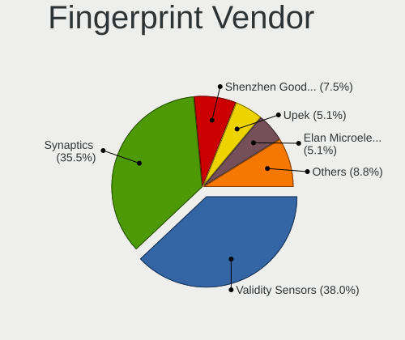

| Vendor                             | Notebooks | Percent |
|------------------------------------|-----------|---------|
| Validity Sensors                   | 172       | 37.97%  |
| Synaptics                          | 161       | 35.54%  |
| Shenzhen Goodix Technology         | 34        | 7.51%   |
| Upek                               | 23        | 5.08%   |
| Elan Microelectronics              | 23        | 5.08%   |
| AuthenTec                          | 20        | 4.42%   |
| LighTuning Technology              | 16        | 3.53%   |
| STMicroelectronics                 | 3         | 0.66%   |
| Realtek USB2.0 Finger Print Bridge | 1         | 0.22%   |

Fingerprint Model
-----------------

Fingerprint sensor models

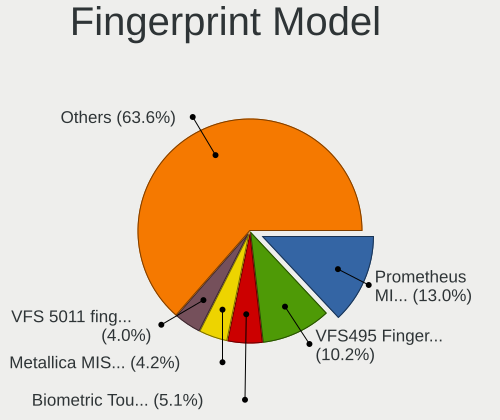

| Model                                                                      | Notebooks | Percent |
|----------------------------------------------------------------------------|-----------|---------|
| Synaptics Prometheus MIS Touch Fingerprint Reader                          | 59        | 13.02%  |
| Validity Sensors VFS495 Fingerprint Reader                                 | 46        | 10.15%  |
| Upek Biometric Touchchip/Touchstrip Fingerprint Sensor                     | 23        | 5.08%   |
| Synaptics Metallica MIS Touch Fingerprint Reader                           | 19        | 4.19%   |
| Validity Sensors VFS 5011 fingerprint sensor                               | 18        | 3.97%   |
| Shenzhen Goodix  Fingerprint Device                                        | 17        | 3.75%   |
| Elan ELAN:ARM-M4                                                           | 17        | 3.75%   |
| Validity Sensors Synaptics VFS7552 Touch Fingerprint Sensor with PurePrint | 15        | 3.31%   |
| Synaptics FS7604 Touch Fingerprint Sensor with PurePrint                   | 15        | 3.31%   |
| Synaptics Prometheus Fingerprint Reader                                    | 14        | 3.09%   |
| Validity Sensors Synaptics WBDI                                            | 13        | 2.87%   |
| Validity Sensors Swipe Fingerprint Sensor                                  | 13        | 2.87%   |
| Synaptics UWP WBDI Device                                                  | 13        | 2.87%   |
| Validity Sensors VFS491                                                    | 11        | 2.43%   |
| Validity Sensors VFS471 Fingerprint Reader                                 | 11        | 2.43%   |
| Validity Sensors Fingerprint scanner                                       | 11        | 2.43%   |
| LighTuning EgisTec Touch Fingerprint Sensor                                | 11        | 2.43%   |
| Synaptics  FS7604 Touch Fingerprint Sensor with PurePrint                  | 10        | 2.21%   |
| Synaptics Metallica MOH Touch Fingerprint Reader                           | 10        | 2.21%   |
| Validity Sensors VFS451 Fingerprint Reader                                 | 9         | 1.99%   |
| Shenzhen Goodix Fingerprint Reader                                         | 9         | 1.99%   |
| Shenzhen Goodix FingerPrint                                                | 8         | 1.77%   |
| AuthenTec AES2810                                                          | 8         | 1.77%   |
| Validity Sensors VFS5011 Fingerprint Reader                                | 7         | 1.55%   |
| Synaptics Fingerprint reader [HP G6]                                       | 7         | 1.55%   |
| Validity Sensors VFS7500 Touch Fingerprint Sensor                          | 6         | 1.32%   |
| Elan ELAN:Fingerprint                                                      | 6         | 1.32%   |
| AuthenTec AES2501 Fingerprint Sensor                                       | 6         | 1.32%   |
| AuthenTec Fingerprint Sensor                                               | 5         | 1.1%    |
| Validity Sensors VFS301 Fingerprint Reader                                 | 4         | 0.88%   |
| Validity Sensors VFS101 Fingerprint Reader                                 | 4         | 0.88%   |
| Synaptics  WBDI                                                            | 4         | 0.88%   |
| Validity Sensors VFS7552 Touch Fingerprint Sensor                          | 3         | 0.66%   |
| Synaptics WBDI Fingerprint Reader USB 086                                  | 3         | 0.66%   |
| STMicroelectronics Fingerprint Reader                                      | 3         | 0.66%   |
| LighTuning ES603 Swipe Fingerprint Sensor                                  | 3         | 0.66%   |
| Unknown                                                                    | 3         | 0.66%   |
| Synaptics TouchPad                                                         | 2         | 0.44%   |
| LighTuning Fingerprint Reader                                              | 2         | 0.44%   |
| Validity Sensors VFS Fingerprint sensor                                    | 1         | 0.22%   |

Chipcard Vendor
---------------

Chipcard module vendors

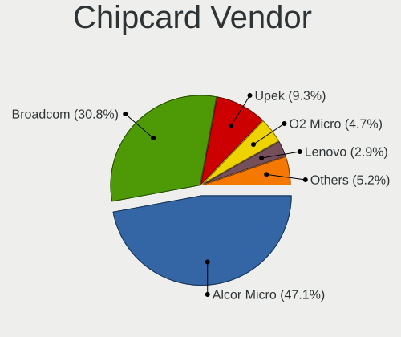

| Vendor                    | Notebooks | Percent |
|---------------------------|-----------|---------|
| Alcor Micro               | 81        | 47.09%  |
| Broadcom                  | 53        | 30.81%  |
| Upek                      | 16        | 9.3%    |
| O2 Micro                  | 8         | 4.65%   |
| Lenovo                    | 5         | 2.91%   |
| Yubico.com                | 4         | 2.33%   |
| Gemalto (was Gemplus)     | 2         | 1.16%   |
| OmniKey                   | 1         | 0.58%   |
| Clay Logic                | 1         | 0.58%   |
| Aladdin Knowledge Systems | 1         | 0.58%   |

Chipcard Model
--------------

Chipcard module models

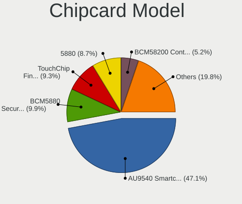

| Model                                                                        | Notebooks | Percent |
|------------------------------------------------------------------------------|-----------|---------|
| Alcor Micro AU9540 Smartcard Reader                                          | 81        | 47.09%  |
| Broadcom BCM5880 Secure Applications Processor                               | 17        | 9.88%   |
| Upek TouchChip Fingerprint Coprocessor (WBF advanced mode)                   | 16        | 9.3%    |
| Broadcom 5880                                                                | 15        | 8.72%   |
| Broadcom BCM58200 ControlVault 3 (FingerPrint sensor + Contacted SmartCard)  | 9         | 5.23%   |
| O2 Micro OZ776 CCID Smartcard Reader                                         | 8         | 4.65%   |
| Broadcom BCM5880 Secure Applications Processor with fingerprint swipe sensor | 8         | 4.65%   |
| Lenovo Integrated Smart Card Reader                                          | 5         | 2.91%   |
| Broadcom 58200                                                               | 4         | 2.33%   |
| Yubico.com Yubikey 4/5 U2F+CCID                                              | 3         | 1.74%   |
| Yubico.com Yubikey NEO(-N) U2F+CCID                                          | 1         | 0.58%   |
| OmniKey CardMan 4321                                                         | 1         | 0.58%   |
| Gemalto (was Gemplus) GemPC Twin SmartCard Reader                            | 1         | 0.58%   |
| Gemalto (was Gemplus) Compact Smart Card Reader Writer                       | 1         | 0.58%   |
| Clay Logic Nitrokey Pro                                                      | 1         | 0.58%   |
| Aladdin Knowledge Systems Token JC                                           | 1         | 0.58%   |

Unsupported
-----------

Unsupported Devices
-------------------

Total unsupported devices on board

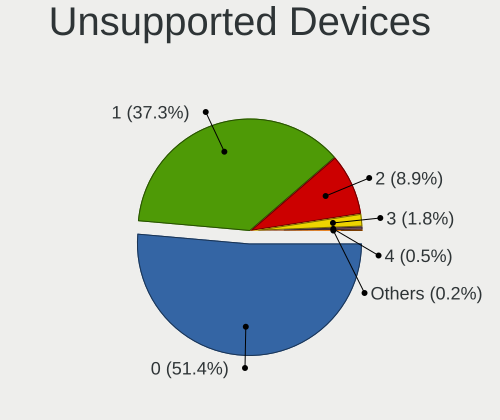

| Total | Notebooks | Percent |
|-------|-----------|---------|
| 0     | 883       | 51.4%   |
| 1     | 640       | 37.25%  |
| 2     | 153       | 8.91%   |
| 3     | 31        | 1.8%    |
| 4     | 8         | 0.47%   |
| 7     | 2         | 0.12%   |
| 5     | 1         | 0.06%   |

Unsupported Device Types
------------------------

Types of unsupported devices

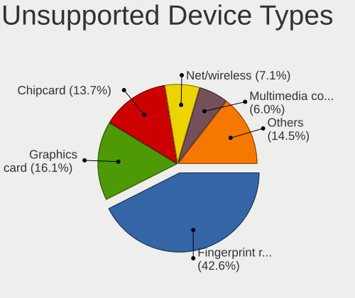

| Type                     | Notebooks | Percent |
|--------------------------|-----------|---------|
| Fingerprint reader       | 449       | 42.56%  |
| Graphics card            | 170       | 16.11%  |
| Chipcard                 | 145       | 13.74%  |
| Net/wireless             | 75        | 7.11%   |
| Multimedia controller    | 63        | 5.97%   |
| Camera                   | 39        | 3.7%    |
| Communication controller | 25        | 2.37%   |
| Card reader              | 20        | 1.9%    |
| Bluetooth                | 20        | 1.9%    |
| Net/ethernet             | 13        | 1.23%   |
| Storage                  | 12        | 1.14%   |
| Sound                    | 9         | 0.85%   |
| Modem                    | 6         | 0.57%   |
| Network                  | 3         | 0.28%   |
| Unassigned class         | 2         | 0.19%   |
| Dvb card                 | 2         | 0.19%   |
| Storage/nvme             | 1         | 0.09%   |
| Flash memory             | 1         | 0.09%   |

