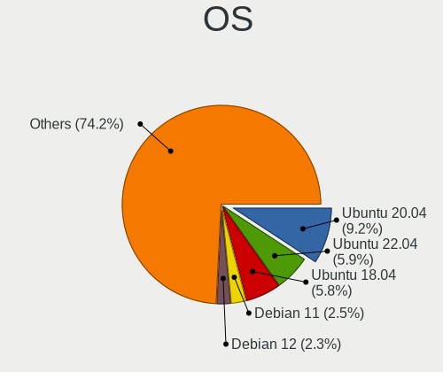
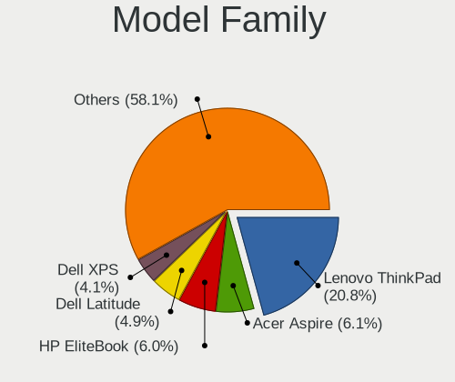
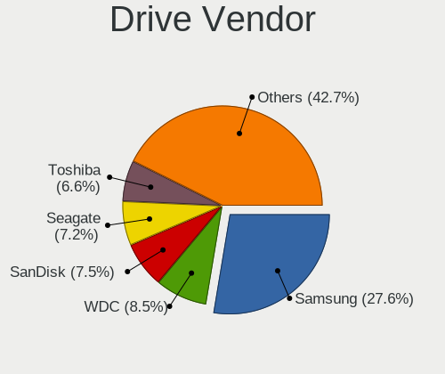
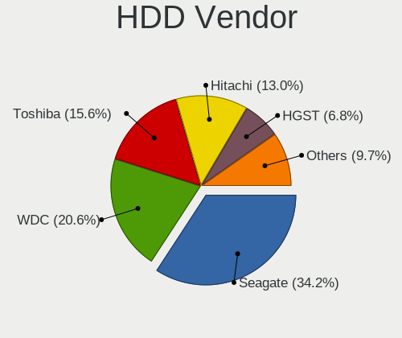
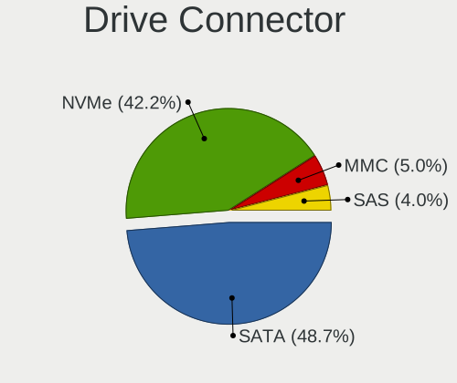
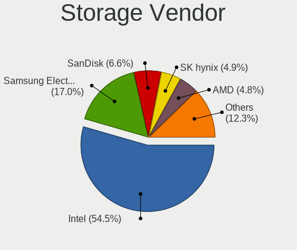
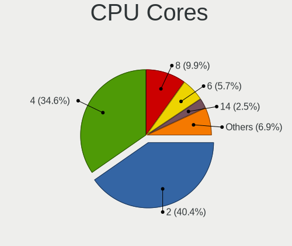
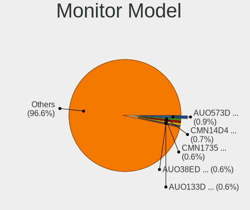
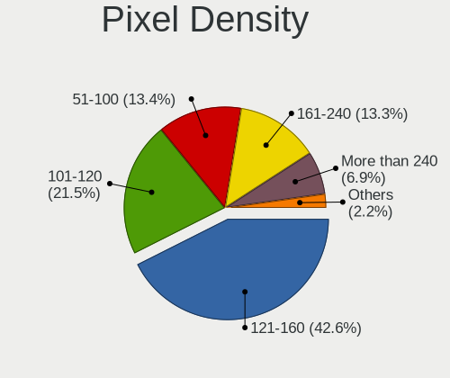
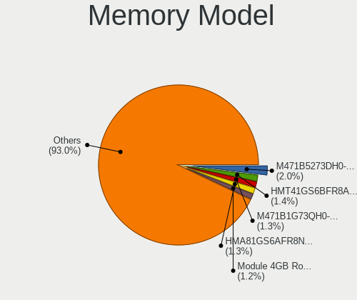

Linux in Switzerland - Tested Hardware & Statistics (Notebooks)
---------------------------------------------------------------

A project to collect tested hardware configurations for Linux in Switzerland.

Anyone can contribute to this report by the [hw-probe](https://github.com/linuxhw/hw-probe) tool:

    sudo -E hw-probe -all -upload

Please contribute! Especially if your hardware is rare.

Contents
--------

* [ Test Cases ](#test-cases)

* [ System ](#system)
  - [ OS                       ](#os)
  - [ OS Family                ](#os-family)
  - [ Kernel                   ](#kernel)
  - [ Kernel Family            ](#kernel-family)
  - [ Kernel Major Ver.        ](#kernel-major-ver)
  - [ Arch                     ](#arch)
  - [ DE                       ](#de)
  - [ Display Server           ](#display-server)
  - [ Display Manager          ](#display-manager)
  - [ OS Lang                  ](#os-lang)
  - [ Boot Mode                ](#boot-mode)
  - [ Filesystem               ](#filesystem)
  - [ Part. scheme             ](#part-scheme)
  - [ Dual Boot with Linux/BSD ](#dual-boot-with-linuxbsd)
  - [ Dual Boot (Win)          ](#dual-boot-win)

* [ Board ](#board)
  - [ Vendor                   ](#vendor)
  - [ Model                    ](#model)
  - [ Model Family             ](#model-family)
  - [ MFG Year                 ](#mfg-year)
  - [ Form Factor              ](#form-factor)
  - [ Secure Boot              ](#secure-boot)
  - [ Coreboot                 ](#coreboot)
  - [ RAM Size                 ](#ram-size)
  - [ RAM Used                 ](#ram-used)
  - [ Total Drives             ](#total-drives)
  - [ Has CD-ROM               ](#has-cd-rom)
  - [ Has Ethernet             ](#has-ethernet)
  - [ Has WiFi                 ](#has-wifi)
  - [ Has Bluetooth            ](#has-bluetooth)

* [ Location ](#location)
  - [ Country                  ](#country)
  - [ City                     ](#city)

* [ Drives ](#drives)
  - [ Drive Vendor             ](#drive-vendor)
  - [ Drive Model              ](#drive-model)
  - [ HDD Vendor               ](#hdd-vendor)
  - [ SSD Vendor               ](#ssd-vendor)
  - [ Drive Kind               ](#drive-kind)
  - [ Drive Connector          ](#drive-connector)
  - [ Drive Size               ](#drive-size)
  - [ Space Total              ](#space-total)
  - [ Space Used               ](#space-used)
  - [ Malfunc. Drives          ](#malfunc-drives)
  - [ Malfunc. Drive Vendor    ](#malfunc-drive-vendor)
  - [ Malfunc. HDD Vendor      ](#malfunc-hdd-vendor)
  - [ Malfunc. Drive Kind      ](#malfunc-drive-kind)
  - [ Failed Drives            ](#failed-drives)
  - [ Failed Drive Vendor      ](#failed-drive-vendor)
  - [ Drive Status             ](#drive-status)

* [ Storage controller ](#storage-controller)
  - [ Storage Vendor           ](#storage-vendor)
  - [ Storage Model            ](#storage-model)
  - [ Storage Kind             ](#storage-kind)

* [ Processor ](#processor)
  - [ CPU Vendor               ](#cpu-vendor)
  - [ CPU Model                ](#cpu-model)
  - [ CPU Model Family         ](#cpu-model-family)
  - [ CPU Cores                ](#cpu-cores)
  - [ CPU Sockets              ](#cpu-sockets)
  - [ CPU Threads              ](#cpu-threads)
  - [ CPU Op-Modes             ](#cpu-op-modes)
  - [ CPU Microcode            ](#cpu-microcode)
  - [ CPU Microarch            ](#cpu-microarch)

* [ Graphics ](#graphics)
  - [ GPU Vendor               ](#gpu-vendor)
  - [ GPU Model                ](#gpu-model)
  - [ GPU Combo                ](#gpu-combo)
  - [ GPU Driver               ](#gpu-driver)
  - [ GPU Memory               ](#gpu-memory)

* [ Monitor ](#monitor)
  - [ Monitor Vendor           ](#monitor-vendor)
  - [ Monitor Model            ](#monitor-model)
  - [ Monitor Resolution       ](#monitor-resolution)
  - [ Monitor Diagonal         ](#monitor-diagonal)
  - [ Monitor Width            ](#monitor-width)
  - [ Aspect Ratio             ](#aspect-ratio)
  - [ Monitor Area             ](#monitor-area)
  - [ Pixel Density            ](#pixel-density)
  - [ Multiple Monitors        ](#multiple-monitors)

* [ Network ](#network)
  - [ Net Controller Vendor    ](#net-controller-vendor)
  - [ Net Controller Model     ](#net-controller-model)
  - [ Wireless Vendor          ](#wireless-vendor)
  - [ Wireless Model           ](#wireless-model)
  - [ Ethernet Vendor          ](#ethernet-vendor)
  - [ Ethernet Model           ](#ethernet-model)
  - [ Net Controller Kind      ](#net-controller-kind)
  - [ Used Controller          ](#used-controller)
  - [ NICs                     ](#nics)
  - [ IPv6                     ](#ipv6)

* [ Bluetooth ](#bluetooth)
  - [ Bluetooth Vendor         ](#bluetooth-vendor)
  - [ Bluetooth Model          ](#bluetooth-model)

* [ Sound ](#sound)
  - [ Sound Vendor             ](#sound-vendor)
  - [ Sound Model              ](#sound-model)

* [ Memory ](#memory)
  - [ Memory Vendor            ](#memory-vendor)
  - [ Memory Model             ](#memory-model)
  - [ Memory Kind              ](#memory-kind)
  - [ Memory Form Factor       ](#memory-form-factor)
  - [ Memory Size              ](#memory-size)
  - [ Memory Speed             ](#memory-speed)

* [ Printers & scanners ](#printers--scanners)
  - [ Printer Vendor           ](#printer-vendor)
  - [ Printer Model            ](#printer-model)
  - [ Scanner Vendor           ](#scanner-vendor)
  - [ Scanner Model            ](#scanner-model)

* [ Camera ](#camera)
  - [ Camera Vendor            ](#camera-vendor)
  - [ Camera Model             ](#camera-model)

* [ Security ](#security)
  - [ Fingerprint Vendor       ](#fingerprint-vendor)
  - [ Fingerprint Model        ](#fingerprint-model)
  - [ Chipcard Vendor          ](#chipcard-vendor)
  - [ Chipcard Model           ](#chipcard-model)

* [ Unsupported ](#unsupported)
  - [ Unsupported Devices      ](#unsupported-devices)
  - [ Unsupported Device Types ](#unsupported-device-types)

Test Cases
----------

Total: 1724

| Vendor        | Model                       | Probe                                                      | Date         |
|---------------|-----------------------------|------------------------------------------------------------|--------------|
| HUAWEI        | KLVD-WXX9                   | [ee7b7ce7cc](https://linux-hardware.org/?probe=ee7b7ce7cc) | Dec 24, 2023 |
| Lenovo        | ThinkPad T550 20CK0002MZ    | [dbfd9ef700](https://linux-hardware.org/?probe=dbfd9ef700) | Dec 22, 2023 |
| HP            | EliteBook 850 G3            | [5e8dc79e2c](https://linux-hardware.org/?probe=5e8dc79e2c) | Dec 22, 2023 |
| HP            | Laptop 15-dw3xxx            | [1b860f6465](https://linux-hardware.org/?probe=1b860f6465) | Dec 21, 2023 |
| HP            | Compaq 15                   | [e97b5e227e](https://linux-hardware.org/?probe=e97b5e227e) | Dec 21, 2023 |
| Acer          | Aspire 6930G                | [3013bf91cd](https://linux-hardware.org/?probe=3013bf91cd) | Dec 20, 2023 |
| Acer          | Aspire 6930G                | [6bc25073be](https://linux-hardware.org/?probe=6bc25073be) | Dec 20, 2023 |
| HP            | Compaq 15                   | [8224a8ab3d](https://linux-hardware.org/?probe=8224a8ab3d) | Dec 20, 2023 |
| HP            | Laptop 15-dw3xxx            | [17ce825521](https://linux-hardware.org/?probe=17ce825521) | Dec 20, 2023 |
| Lenovo        | ThinkPad T14 Gen 4 21K4S... | [85531f6788](https://linux-hardware.org/?probe=85531f6788) | Dec 19, 2023 |
| Lenovo        | ThinkPad T14 Gen 4 21K4S... | [4715b83a8c](https://linux-hardware.org/?probe=4715b83a8c) | Dec 19, 2023 |
| Apple         | MacBookPro7,1               | [79499893b8](https://linux-hardware.org/?probe=79499893b8) | Dec 19, 2023 |
| Lenovo        | ThinkPad T14s Gen 3 21BR... | [45a0b94112](https://linux-hardware.org/?probe=45a0b94112) | Dec 18, 2023 |
| Lenovo        | Yoga 2 Pro 20266            | [4802066fc1](https://linux-hardware.org/?probe=4802066fc1) | Dec 17, 2023 |
| Lenovo        | IdeaPad MIIX 700-12ISK 8... | [6ac6a904be](https://linux-hardware.org/?probe=6ac6a904be) | Dec 17, 2023 |
| ASUSTek       | ROG Zephyrus G16 GU603VI... | [5a439f3bc5](https://linux-hardware.org/?probe=5a439f3bc5) | Dec 17, 2023 |
| Apple         | MacBookPro5,3               | [8143805d8a](https://linux-hardware.org/?probe=8143805d8a) | Dec 17, 2023 |
| Lenovo        | ThinkPad P15s Gen 2i 20W... | [f8cfc75a8a](https://linux-hardware.org/?probe=f8cfc75a8a) | Dec 17, 2023 |
| HP            | ProBook 455 G2              | [4935ac1297](https://linux-hardware.org/?probe=4935ac1297) | Dec 17, 2023 |
| Apple         | MacBookPro8,1               | [f0ed04c975](https://linux-hardware.org/?probe=f0ed04c975) | Dec 16, 2023 |
| Dell          | XPS 15 9530                 | [c35aa056cf](https://linux-hardware.org/?probe=c35aa056cf) | Dec 16, 2023 |
| Dell          | Vostro 3525                 | [c9de3b068b](https://linux-hardware.org/?probe=c9de3b068b) | Dec 15, 2023 |
| ASUSTek       | VivoBook_ASUSLaptop X170... | [42b02a9d8e](https://linux-hardware.org/?probe=42b02a9d8e) | Dec 14, 2023 |
| Fujitsu       | LIFEBOOK E736               | [7f788f5265](https://linux-hardware.org/?probe=7f788f5265) | Dec 14, 2023 |
| Lenovo        | ThinkPad T480 20L50004MX    | [691f1ae82f](https://linux-hardware.org/?probe=691f1ae82f) | Dec 13, 2023 |
| Lenovo        | ThinkPad E560 20EV000SMZ    | [13b8795a4e](https://linux-hardware.org/?probe=13b8795a4e) | Dec 13, 2023 |
| Lenovo        | ThinkBook 16p Gen 2 20YM    | [e70de29c90](https://linux-hardware.org/?probe=e70de29c90) | Dec 13, 2023 |
| Dell          | XPS 13 9350                 | [149a7f254a](https://linux-hardware.org/?probe=149a7f254a) | Dec 13, 2023 |
| Lenovo        | ThinkPad E560 20EV000SMZ    | [1bb8694fda](https://linux-hardware.org/?probe=1bb8694fda) | Dec 12, 2023 |
| Lenovo        | ThinkPad X13 Gen 4 21J3C... | [e99a0bd1db](https://linux-hardware.org/?probe=e99a0bd1db) | Dec 12, 2023 |
| HP            | Notebook                    | [972e86b7cf](https://linux-hardware.org/?probe=972e86b7cf) | Dec 12, 2023 |
| Lenovo        | ThinkPad T15 Gen 2i 20W5... | [e340ad2e3a](https://linux-hardware.org/?probe=e340ad2e3a) | Dec 12, 2023 |
| Acer          | Aspire A515-56              | [ec970d7248](https://linux-hardware.org/?probe=ec970d7248) | Dec 10, 2023 |
| Gigabyte      | B550I AORUS PRO AX          | [9f6ce5cca9](https://linux-hardware.org/?probe=9f6ce5cca9) | Dec 10, 2023 |
| Lenovo        | ThinkPad E15 Gen 2 20T80... | [a0670e0719](https://linux-hardware.org/?probe=a0670e0719) | Dec 09, 2023 |
| HP            | Pavilion dv6                | [3ffa0f12b7](https://linux-hardware.org/?probe=3ffa0f12b7) | Dec 08, 2023 |
| Toshiba       | Satellite L50-A-19P         | [cd3314169e](https://linux-hardware.org/?probe=cd3314169e) | Dec 08, 2023 |
| Dell          | XPS 9320                    | [60c734eb9c](https://linux-hardware.org/?probe=60c734eb9c) | Dec 08, 2023 |
| Lenovo        | ThinkPad T440 20B7S0N10F    | [350da642e5](https://linux-hardware.org/?probe=350da642e5) | Dec 07, 2023 |
| ASUSTek       | ROG Zephyrus G16 GU603VI... | [a7bb755e20](https://linux-hardware.org/?probe=a7bb755e20) | Dec 06, 2023 |
| HP            | ENVY 17                     | [b6048f107e](https://linux-hardware.org/?probe=b6048f107e) | Dec 06, 2023 |
| HP            | Laptop 15-dw3xxx            | [8167f60069](https://linux-hardware.org/?probe=8167f60069) | Dec 05, 2023 |
| Polaroid      | MP1464PR001                 | [bd3fa27cfe](https://linux-hardware.org/?probe=bd3fa27cfe) | Dec 02, 2023 |
| ASUSTek       | ROG Zephyrus G16 GU603VI... | [b127bbd876](https://linux-hardware.org/?probe=b127bbd876) | Dec 01, 2023 |
| Medion        | Erazer P7643 MD60133        | [65f090fe28](https://linux-hardware.org/?probe=65f090fe28) | Nov 28, 2023 |
| HP            | EliteBook 840 14 inch G9... | [bbfe8e99fc](https://linux-hardware.org/?probe=bbfe8e99fc) | Nov 28, 2023 |
| Sony          | VPCF13M1E                   | [4a6e054f68](https://linux-hardware.org/?probe=4a6e054f68) | Nov 28, 2023 |
| Sony          | VPCSB1Z9E                   | [4eed6bb4ef](https://linux-hardware.org/?probe=4eed6bb4ef) | Nov 28, 2023 |
| Lenovo        | IdeaPad 5 15ITL05 82FG      | [ada466b7a0](https://linux-hardware.org/?probe=ada466b7a0) | Nov 27, 2023 |
| Lenovo        | IdeaPad Gaming 3 15IAH7 ... | [ade10d9872](https://linux-hardware.org/?probe=ade10d9872) | Nov 27, 2023 |
| Acer          | Aspire S5-371               | [d3efa32b61](https://linux-hardware.org/?probe=d3efa32b61) | Nov 26, 2023 |
| Dell          | Precision M6700             | [1817097d25](https://linux-hardware.org/?probe=1817097d25) | Nov 25, 2023 |
| Lenovo        | ThinkPad E14 20RA001HMZ     | [a58a5557e6](https://linux-hardware.org/?probe=a58a5557e6) | Nov 24, 2023 |
| PC Special... | Ionico 16                   | [2e5bce2d86](https://linux-hardware.org/?probe=2e5bce2d86) | Nov 24, 2023 |
| Lenovo        | Legion 9 16IRX8 83AG        | [f511dac11e](https://linux-hardware.org/?probe=f511dac11e) | Nov 24, 2023 |
| Lenovo        | ThinkPad E14 20RA001HMZ     | [7cd9c24a07](https://linux-hardware.org/?probe=7cd9c24a07) | Nov 23, 2023 |
| HP            | ZBook Fury 16 G9 Mobile ... | [49ec5aa905](https://linux-hardware.org/?probe=49ec5aa905) | Nov 23, 2023 |
| Dell          | Latitude 5280               | [c2d1b79aeb](https://linux-hardware.org/?probe=c2d1b79aeb) | Nov 22, 2023 |
| HP            | EliteBook Folio 1020 G1     | [022f885fe9](https://linux-hardware.org/?probe=022f885fe9) | Nov 22, 2023 |
| Acer          | Aspire A515-56              | [f1adb28e44](https://linux-hardware.org/?probe=f1adb28e44) | Nov 21, 2023 |
| Lenovo        | ThinkPad T490s 20NY000JM... | [a8668f58d9](https://linux-hardware.org/?probe=a8668f58d9) | Nov 21, 2023 |
| Lenovo        | ThinkPad E14 20RA001HMZ     | [b7e16888b9](https://linux-hardware.org/?probe=b7e16888b9) | Nov 20, 2023 |
| Dell          | XPS 13 9370                 | [6ef90e528f](https://linux-hardware.org/?probe=6ef90e528f) | Nov 20, 2023 |
| Dell          | XPS 13 9370                 | [f3a2125fad](https://linux-hardware.org/?probe=f3a2125fad) | Nov 20, 2023 |
| Lenovo        | Yoga 2 Pro 20266            | [65f7027c84](https://linux-hardware.org/?probe=65f7027c84) | Nov 19, 2023 |
| Lenovo        | ThinkPad Edge E535 32605... | [a42aa89d19](https://linux-hardware.org/?probe=a42aa89d19) | Nov 16, 2023 |
| Lenovo        | ThinkPad T495 20NJCTO1WW    | [a9704992fa](https://linux-hardware.org/?probe=a9704992fa) | Nov 16, 2023 |
| ASUSTek       | X705UAR                     | [11e3d24283](https://linux-hardware.org/?probe=11e3d24283) | Nov 15, 2023 |
| Apple         | MacBook6,1                  | [527e45b73b](https://linux-hardware.org/?probe=527e45b73b) | Nov 15, 2023 |
| Lenovo        | ThinkPad Z13 Gen 1 21D20... | [bceb77e476](https://linux-hardware.org/?probe=bceb77e476) | Nov 15, 2023 |
| Sony          | SVF13N1L2ES                 | [e0b7ae1d8a](https://linux-hardware.org/?probe=e0b7ae1d8a) | Nov 14, 2023 |
| Sony          | SVF13N1L2ES                 | [1fe409a47f](https://linux-hardware.org/?probe=1fe409a47f) | Nov 14, 2023 |
| Apple         | MacBookPro8,1               | [c538f19c9e](https://linux-hardware.org/?probe=c538f19c9e) | Nov 13, 2023 |
| Lenovo        | ThinkPad X230 23257AG       | [2bc7d7c816](https://linux-hardware.org/?probe=2bc7d7c816) | Nov 13, 2023 |
| HP            | Laptop 17-cn2xxx            | [59c09c7be1](https://linux-hardware.org/?probe=59c09c7be1) | Nov 11, 2023 |
| Lenovo        | Yoga Pro 7 14APH8 82Y8      | [4c87f0ac2c](https://linux-hardware.org/?probe=4c87f0ac2c) | Nov 10, 2023 |
| Lenovo        | ThinkPad L15 Gen 2 20X30... | [3cad0a5b88](https://linux-hardware.org/?probe=3cad0a5b88) | Nov 10, 2023 |
| Valve         | Jupiter                     | [ca05263192](https://linux-hardware.org/?probe=ca05263192) | Nov 08, 2023 |
| Medion        | Crawler E25                 | [945026c1b8](https://linux-hardware.org/?probe=945026c1b8) | Nov 07, 2023 |
| Lenovo        | ThinkPad T14s Gen 1 20UJ... | [d61e270082](https://linux-hardware.org/?probe=d61e270082) | Nov 06, 2023 |
| Apple         | MacBookPro10,1              | [8efb96e5d7](https://linux-hardware.org/?probe=8efb96e5d7) | Nov 04, 2023 |
| Apple         | MacBookPro10,1              | [e6459bb42f](https://linux-hardware.org/?probe=e6459bb42f) | Nov 04, 2023 |
| HP            | EliteBook 850 G2            | [36646aca12](https://linux-hardware.org/?probe=36646aca12) | Nov 04, 2023 |
| Lenovo        | ThinkPad T14s Gen 4 21F8... | [97e043115e](https://linux-hardware.org/?probe=97e043115e) | Nov 04, 2023 |
| Dell          | XPS 13 9380                 | [ee12470303](https://linux-hardware.org/?probe=ee12470303) | Nov 03, 2023 |
| Acer          | Aspire VN7-591G             | [f446da83f1](https://linux-hardware.org/?probe=f446da83f1) | Nov 03, 2023 |
| HP            | Laptop 15-dw3xxx            | [d371b7299d](https://linux-hardware.org/?probe=d371b7299d) | Nov 02, 2023 |
| ASUSTek       | VivoBook_ASUSLaptop X150... | [8c2a216d7b](https://linux-hardware.org/?probe=8c2a216d7b) | Nov 01, 2023 |
| Lenovo        | ThinkPad L15 Gen 2 20X30... | [6cce294b99](https://linux-hardware.org/?probe=6cce294b99) | Nov 01, 2023 |
| Lenovo        | ThinkPad L15 Gen 2 20X30... | [c985fdb0b7](https://linux-hardware.org/?probe=c985fdb0b7) | Nov 01, 2023 |
| HP            | Laptop 15-dw3xxx            | [3479b99099](https://linux-hardware.org/?probe=3479b99099) | Nov 01, 2023 |
| Acer          | Predator PH18-71            | [a0393f21c9](https://linux-hardware.org/?probe=a0393f21c9) | Nov 01, 2023 |
| Lenovo        | ThinkPad T16 Gen 1 21CHC... | [924f7f81ce](https://linux-hardware.org/?probe=924f7f81ce) | Oct 30, 2023 |
| Lenovo        | ThinkPad P15 Gen 1 20STC... | [448c3ca446](https://linux-hardware.org/?probe=448c3ca446) | Oct 30, 2023 |
| HP            | ENVY 17                     | [8852bab8c1](https://linux-hardware.org/?probe=8852bab8c1) | Oct 29, 2023 |
| Acer          | Aspire V3-772G              | [d48a91cce4](https://linux-hardware.org/?probe=d48a91cce4) | Oct 28, 2023 |
| HP            | ENVY 17                     | [aaa99aaa53](https://linux-hardware.org/?probe=aaa99aaa53) | Oct 27, 2023 |
| Notebook      | V1x0PNPx                    | [f1e27c662a](https://linux-hardware.org/?probe=f1e27c662a) | Oct 27, 2023 |
| System76      | Darter Pro                  | [9dcbc85a23](https://linux-hardware.org/?probe=9dcbc85a23) | Oct 27, 2023 |
| HP            | EliteBook 845 G8 Noteboo... | [4506629e6a](https://linux-hardware.org/?probe=4506629e6a) | Oct 26, 2023 |
| HP            | OMEN by Gaming Laptop 16... | [39e846913d](https://linux-hardware.org/?probe=39e846913d) | Oct 25, 2023 |
| Lenovo        | ThinkPad T440p 20AWS18U0... | [1406d2f4d5](https://linux-hardware.org/?probe=1406d2f4d5) | Oct 24, 2023 |
| Lenovo        | ThinkPad T440p 20AWS18U0... | [56fa067caa](https://linux-hardware.org/?probe=56fa067caa) | Oct 24, 2023 |
| Dell          | Latitude 5520               | [0c8da2f95a](https://linux-hardware.org/?probe=0c8da2f95a) | Oct 24, 2023 |
| Apple         | MacBookPro14,1              | [557e6a2f27](https://linux-hardware.org/?probe=557e6a2f27) | Oct 21, 2023 |
| Dell          | Latitude E6530              | [e3126b26df](https://linux-hardware.org/?probe=e3126b26df) | Oct 19, 2023 |
| HP            | EliteBook Folio 1040 G3     | [cf4c60a0a8](https://linux-hardware.org/?probe=cf4c60a0a8) | Oct 18, 2023 |
| Lenovo        | ThinkPad T14 Gen 1 20UES... | [e794aa4113](https://linux-hardware.org/?probe=e794aa4113) | Oct 18, 2023 |
| Lenovo        | IdeaPad Gaming 3 15IAH7 ... | [cf522294f8](https://linux-hardware.org/?probe=cf522294f8) | Oct 18, 2023 |
| ASUSTek       | VivoBook_ASUSLaptop X150... | [7f5a3b8e10](https://linux-hardware.org/?probe=7f5a3b8e10) | Oct 16, 2023 |
| Lenovo        | ThinkPad X1 Carbon Gen 1... | [2a5d18299e](https://linux-hardware.org/?probe=2a5d18299e) | Oct 15, 2023 |
| Dell          | XPS 15 9550                 | [4bb651a7a6](https://linux-hardware.org/?probe=4bb651a7a6) | Oct 11, 2023 |
| Dell          | XPS 15 9550                 | [52bbb0243a](https://linux-hardware.org/?probe=52bbb0243a) | Oct 11, 2023 |
| Dell          | XPS 15 9510                 | [89748db0f1](https://linux-hardware.org/?probe=89748db0f1) | Oct 10, 2023 |
| Lenovo        | ThinkPad X1 Carbon Gen 9... | [8dcc2d1ec2](https://linux-hardware.org/?probe=8dcc2d1ec2) | Oct 09, 2023 |
| Lenovo        | ThinkPad X1 Carbon Gen 9... | [edd7c9e07a](https://linux-hardware.org/?probe=edd7c9e07a) | Oct 09, 2023 |
| HP            | Pavilion 15                 | [0c8f955052](https://linux-hardware.org/?probe=0c8f955052) | Oct 08, 2023 |
| Apple         | MacBookPro11,1              | [dae43772d4](https://linux-hardware.org/?probe=dae43772d4) | Oct 08, 2023 |
| Lenovo        | IdeaPad Slim 5 16IRL8 82... | [1996d5a1ff](https://linux-hardware.org/?probe=1996d5a1ff) | Oct 08, 2023 |
| Acer          | Aspire 5741G                | [ade2b406fd](https://linux-hardware.org/?probe=ade2b406fd) | Oct 07, 2023 |
| Lenovo        | ThinkPad P15v Gen 3 21EM... | [0354977d6c](https://linux-hardware.org/?probe=0354977d6c) | Oct 07, 2023 |
| Lenovo        | Yoga Slim 7 Pro 14ACH5 8... | [faea5bdeba](https://linux-hardware.org/?probe=faea5bdeba) | Oct 07, 2023 |
| Dell          | Latitude 7480               | [7eec2f8e4e](https://linux-hardware.org/?probe=7eec2f8e4e) | Oct 05, 2023 |
| Dell          | Latitude 7480               | [a80bc8f591](https://linux-hardware.org/?probe=a80bc8f591) | Oct 05, 2023 |
| Lenovo        | ThinkPad L15 Gen 2 20X30... | [3fdbdfe773](https://linux-hardware.org/?probe=3fdbdfe773) | Oct 03, 2023 |
| Acer          | Swift SFE16-43              | [54231f7059](https://linux-hardware.org/?probe=54231f7059) | Oct 02, 2023 |
| Acer          | Swift SFE16-43              | [045606333c](https://linux-hardware.org/?probe=045606333c) | Oct 02, 2023 |
| Fujitsu       | STYLISTIC R726              | [a4c3a19501](https://linux-hardware.org/?probe=a4c3a19501) | Oct 02, 2023 |
| Lenovo        | V15 G4 IRU 83A1             | [c71241f73d](https://linux-hardware.org/?probe=c71241f73d) | Oct 01, 2023 |
| Lenovo        | V15 G4 IRU 83A1             | [b1af5494c8](https://linux-hardware.org/?probe=b1af5494c8) | Oct 01, 2023 |
| TUXEDO        | Stellaris Intel Gen5        | [6d981e4890](https://linux-hardware.org/?probe=6d981e4890) | Sep 29, 2023 |
| Lenovo        | ThinkPad T14 Gen 2a 20XL... | [3fcfddc8e9](https://linux-hardware.org/?probe=3fcfddc8e9) | Sep 27, 2023 |
| Lenovo        | ThinkPad T550 20CK0002MZ    | [a34763914d](https://linux-hardware.org/?probe=a34763914d) | Sep 23, 2023 |
| Dell          | Latitude 5420               | [f2bb4ee9f0](https://linux-hardware.org/?probe=f2bb4ee9f0) | Sep 23, 2023 |
| Dell          | XPS 15 9520                 | [ae7455bac3](https://linux-hardware.org/?probe=ae7455bac3) | Sep 21, 2023 |
| Dell          | XPS 15 9520                 | [6337af2f4c](https://linux-hardware.org/?probe=6337af2f4c) | Sep 20, 2023 |
| Acer          | Aspire A315-34              | [16c09be7f2](https://linux-hardware.org/?probe=16c09be7f2) | Sep 19, 2023 |
| Lenovo        | ThinkPad T14 Gen 1 20UES... | [16f80f70a8](https://linux-hardware.org/?probe=16f80f70a8) | Sep 19, 2023 |
| Lenovo        | ThinkPad X61s 7666Y2X       | [177e40808d](https://linux-hardware.org/?probe=177e40808d) | Sep 19, 2023 |
| HP            | ProBook 650 G1              | [06d67bab4a](https://linux-hardware.org/?probe=06d67bab4a) | Sep 18, 2023 |
| ASUSTek       | ASUS TUF Gaming A17 FA70... | [0c21583146](https://linux-hardware.org/?probe=0c21583146) | Sep 17, 2023 |
| Dell          | XPS 15 9520                 | [2b66c2969e](https://linux-hardware.org/?probe=2b66c2969e) | Sep 17, 2023 |
| ASUSTek       | ROG Zephyrus G14 GA402XY... | [93d01648a0](https://linux-hardware.org/?probe=93d01648a0) | Sep 17, 2023 |
| ASUSTek       | ASUS TUF Gaming A17 FA70... | [1f152eb6fa](https://linux-hardware.org/?probe=1f152eb6fa) | Sep 17, 2023 |
| HP            | EliteBook Folio 1040 G3     | [38a985d781](https://linux-hardware.org/?probe=38a985d781) | Sep 16, 2023 |
| ASUSTek       | VivoBook_ASUSLaptop E210... | [1b8a46fc57](https://linux-hardware.org/?probe=1b8a46fc57) | Sep 13, 2023 |
| ASUSTek       | VivoBook_ASUSLaptop X150... | [1400ef978f](https://linux-hardware.org/?probe=1400ef978f) | Sep 12, 2023 |
| Lenovo        | Yoga Slim 7 14ITL05 82A3    | [6b9804a536](https://linux-hardware.org/?probe=6b9804a536) | Sep 10, 2023 |
| Lenovo        | Yoga Slim 7 14ITL05 82A3    | [d824341957](https://linux-hardware.org/?probe=d824341957) | Sep 10, 2023 |
| Olivetti      | OLIBOOK PX5-XXXAES          | [70225c18e1](https://linux-hardware.org/?probe=70225c18e1) | Sep 10, 2023 |
| Lenovo        | G50-30 80G0                 | [bb0f6ff00d](https://linux-hardware.org/?probe=bb0f6ff00d) | Sep 09, 2023 |
| ASUSTek       | VivoBook_ASUSLaptop K660... | [0de4c341fa](https://linux-hardware.org/?probe=0de4c341fa) | Sep 07, 2023 |
| Apple         | MacBookPro11,2              | [d3996a81e2](https://linux-hardware.org/?probe=d3996a81e2) | Sep 07, 2023 |
| Lenovo        | Yoga Slim 7 14APU8 83AA     | [b884752710](https://linux-hardware.org/?probe=b884752710) | Sep 06, 2023 |
| ASUSTek       | K53SD                       | [051fefc7ca](https://linux-hardware.org/?probe=051fefc7ca) | Sep 05, 2023 |
| Acer          | Aspire 7745G                | [ce450a1a6e](https://linux-hardware.org/?probe=ce450a1a6e) | Sep 03, 2023 |
| HP            | Compaq 15                   | [2d0b51ccd5](https://linux-hardware.org/?probe=2d0b51ccd5) | Sep 01, 2023 |
| Lenovo        | ThinkPad X200 7458AL7       | [763d0f46f4](https://linux-hardware.org/?probe=763d0f46f4) | Aug 31, 2023 |
| HP            | EliteBook 2560p             | [1c5a7bba51](https://linux-hardware.org/?probe=1c5a7bba51) | Aug 31, 2023 |
| HP            | EliteBook 8440p             | [48fe841736](https://linux-hardware.org/?probe=48fe841736) | Aug 30, 2023 |
| HP            | EliteBook 8460p             | [3f2dec6262](https://linux-hardware.org/?probe=3f2dec6262) | Aug 30, 2023 |
| ASUSTek       | ASUS TUF Gaming A17 FA70... | [efc8be8369](https://linux-hardware.org/?probe=efc8be8369) | Aug 28, 2023 |
| Lenovo        | Legion 7 16ARHA7 82UH       | [14805d08fd](https://linux-hardware.org/?probe=14805d08fd) | Aug 25, 2023 |
| Lenovo        | ThinkPad L15 Gen 2 20X30... | [f4af40c36f](https://linux-hardware.org/?probe=f4af40c36f) | Aug 24, 2023 |
| Dell          | Inspiron 15 3511            | [08efa3dcf3](https://linux-hardware.org/?probe=08efa3dcf3) | Aug 24, 2023 |
| ASUSTek       | VivoBook_ASUSLaptop X150... | [131e36d487](https://linux-hardware.org/?probe=131e36d487) | Aug 22, 2023 |
| Dell          | Latitude E7440              | [7a5bd0f1a6](https://linux-hardware.org/?probe=7a5bd0f1a6) | Aug 19, 2023 |
| Dell          | XPS 13 9350                 | [d3aac86eac](https://linux-hardware.org/?probe=d3aac86eac) | Aug 16, 2023 |
| Dell          | XPS 13 9350                 | [7032d8da96](https://linux-hardware.org/?probe=7032d8da96) | Aug 16, 2023 |
| Sony          | VGN-SR19VN                  | [013756c475](https://linux-hardware.org/?probe=013756c475) | Aug 16, 2023 |
| PC Special... | Ionico 16                   | [9f04bd8095](https://linux-hardware.org/?probe=9f04bd8095) | Aug 16, 2023 |
| Sony          | VGN-SR19VN                  | [7adc151adb](https://linux-hardware.org/?probe=7adc151adb) | Aug 15, 2023 |
| ASUSTek       | ASUS TUF Gaming A17 FA70... | [fe5f1d5c1b](https://linux-hardware.org/?probe=fe5f1d5c1b) | Aug 12, 2023 |
| ASUSTek       | ASUS TUF Gaming A17 FA70... | [1d5206dc94](https://linux-hardware.org/?probe=1d5206dc94) | Aug 12, 2023 |
| ASUSTek       | ASUS TUF Gaming A17 FA70... | [bcda0258e5](https://linux-hardware.org/?probe=bcda0258e5) | Aug 12, 2023 |
| MSI           | Summit E14Evo A12M          | [b83d821361](https://linux-hardware.org/?probe=b83d821361) | Aug 11, 2023 |
| ASUSTek       | ROG Strix G713PI_G713PI     | [92fda27219](https://linux-hardware.org/?probe=92fda27219) | Aug 10, 2023 |
| ASUSTek       | ROG Strix G713PI_G713PI     | [3bd085d1a5](https://linux-hardware.org/?probe=3bd085d1a5) | Aug 10, 2023 |
| GPD           | P2 MAX                      | [064bc78973](https://linux-hardware.org/?probe=064bc78973) | Aug 09, 2023 |
| HP            | EliteBook 820 G1            | [62889fd683](https://linux-hardware.org/?probe=62889fd683) | Aug 08, 2023 |
| Lenovo        | ThinkPad E14 Gen 3 20Y7C... | [e7810a04a9](https://linux-hardware.org/?probe=e7810a04a9) | Aug 04, 2023 |
| Dell          | XPS 9320                    | [140f8f8b2e](https://linux-hardware.org/?probe=140f8f8b2e) | Aug 04, 2023 |
| PC Special... | Ionico 16                   | [0839bbc721](https://linux-hardware.org/?probe=0839bbc721) | Aug 03, 2023 |
| Acer          | TravelMate P614-51-G2       | [33dd52a94f](https://linux-hardware.org/?probe=33dd52a94f) | Aug 03, 2023 |
| Dell          | Latitude E6330              | [75d54a8988](https://linux-hardware.org/?probe=75d54a8988) | Aug 03, 2023 |
| Lenovo        | ThinkPad T440p 20AN0079M... | [5bbbd1f3d4](https://linux-hardware.org/?probe=5bbbd1f3d4) | Aug 02, 2023 |
| Schenker      | XMG FOCUS (Mid 2021)        | [d7fa14789f](https://linux-hardware.org/?probe=d7fa14789f) | Aug 01, 2023 |
| MSI           | Katana GF66 12UC            | [49a431c092](https://linux-hardware.org/?probe=49a431c092) | Jul 31, 2023 |
| Acer          | Aspire A315-34              | [add6831dcd](https://linux-hardware.org/?probe=add6831dcd) | Jul 31, 2023 |
| Lenovo        | ThinkPad E490 20N8CTO1WW    | [7cb3479a69](https://linux-hardware.org/?probe=7cb3479a69) | Jul 31, 2023 |
| HP            | ProBook 440 G3              | [beea8be008](https://linux-hardware.org/?probe=beea8be008) | Jul 30, 2023 |
| HP            | ZBook Fury 16 G9 Mobile ... | [5518dab193](https://linux-hardware.org/?probe=5518dab193) | Jul 29, 2023 |
| Acer          | Aspire E5-511               | [aef96d4eb8](https://linux-hardware.org/?probe=aef96d4eb8) | Jul 29, 2023 |
| Dell          | XPS 17 9720                 | [1006fe2c7b](https://linux-hardware.org/?probe=1006fe2c7b) | Jul 29, 2023 |
| PC Special... | Ionico 16                   | [86d9ab8b73](https://linux-hardware.org/?probe=86d9ab8b73) | Jul 28, 2023 |
| PC Special... | Ionico 16                   | [6ea424234a](https://linux-hardware.org/?probe=6ea424234a) | Jul 28, 2023 |
| Lenovo        | ThinkPad L15 Gen 2 20X30... | [9c8b9571d9](https://linux-hardware.org/?probe=9c8b9571d9) | Jul 27, 2023 |
| Lenovo        | ThinkPad L380 20M50011MZ    | [03152e1c57](https://linux-hardware.org/?probe=03152e1c57) | Jul 26, 2023 |
| Lenovo        | ThinkPad T470p 20J6003DG... | [5693ac5e4c](https://linux-hardware.org/?probe=5693ac5e4c) | Jul 25, 2023 |
| Lenovo        | ThinkPad X1 Carbon Gen 9... | [dc537ae22a](https://linux-hardware.org/?probe=dc537ae22a) | Jul 24, 2023 |
| Lenovo        | ThinkPad X1 Carbon Gen 9... | [cff40caac1](https://linux-hardware.org/?probe=cff40caac1) | Jul 24, 2023 |
| Dell          | Latitude 7480               | [acad753aa8](https://linux-hardware.org/?probe=acad753aa8) | Jul 23, 2023 |
| HP            | 255 15.6 inch G9 Noteboo... | [d387ed9d0c](https://linux-hardware.org/?probe=d387ed9d0c) | Jul 22, 2023 |
| Fujitsu Si... | ESPRIMO Mobile U9200        | [ff6179199d](https://linux-hardware.org/?probe=ff6179199d) | Jul 22, 2023 |
| ASUSTek       | G551JK                      | [fed0cf1fce](https://linux-hardware.org/?probe=fed0cf1fce) | Jul 20, 2023 |
| Lenovo        | ThinkPad L15 Gen 2 20X30... | [a8f79a71f7](https://linux-hardware.org/?probe=a8f79a71f7) | Jul 20, 2023 |
| Acer          | Predator PH317-56           | [248af0e35c](https://linux-hardware.org/?probe=248af0e35c) | Jul 18, 2023 |
| HP            | Pavilion dm1                | [135bb20fbd](https://linux-hardware.org/?probe=135bb20fbd) | Jul 17, 2023 |
| Lenovo        | IdeaPad 5 15ARE05 81YQ      | [798ddca1c4](https://linux-hardware.org/?probe=798ddca1c4) | Jul 16, 2023 |
| HP            | Pavilion dm1                | [3b05c5dc5c](https://linux-hardware.org/?probe=3b05c5dc5c) | Jul 14, 2023 |
| MSI           | GF63 Thin 10SC              | [d017610254](https://linux-hardware.org/?probe=d017610254) | Jul 14, 2023 |
| Dell          | XPS 12 9Q23                 | [5fb9db838e](https://linux-hardware.org/?probe=5fb9db838e) | Jul 12, 2023 |
| ASUSTek       | K53SD                       | [61da77f999](https://linux-hardware.org/?probe=61da77f999) | Jul 09, 2023 |
| Lenovo        | ThinkPad T470p 20J6003DG... | [a7632f8c4b](https://linux-hardware.org/?probe=a7632f8c4b) | Jul 09, 2023 |
| HP            | ProBook 650 G1              | [9b8d05afca](https://linux-hardware.org/?probe=9b8d05afca) | Jul 08, 2023 |
| Gigabyte      | B550I AORUS PRO AX          | [4ff583eb14](https://linux-hardware.org/?probe=4ff583eb14) | Jul 05, 2023 |
| TUXEDO        | InfinityBook 14 v2          | [9447ac0693](https://linux-hardware.org/?probe=9447ac0693) | Jul 02, 2023 |
| Apple         | MacBookPro8,1               | [566b883024](https://linux-hardware.org/?probe=566b883024) | Jun 30, 2023 |
| ASUSTek       | T100TA                      | [921821fda8](https://linux-hardware.org/?probe=921821fda8) | Jun 30, 2023 |
| Lenovo        | G50-30 80G0                 | [3c1007547d](https://linux-hardware.org/?probe=3c1007547d) | Jun 30, 2023 |
| Lenovo        | G50-30 80G0                 | [1e33cadd37](https://linux-hardware.org/?probe=1e33cadd37) | Jun 29, 2023 |
| Star Labs     | LabTop                      | [87a0d9dc09](https://linux-hardware.org/?probe=87a0d9dc09) | Jun 26, 2023 |
| Star Labs     | LabTop                      | [a413031ef8](https://linux-hardware.org/?probe=a413031ef8) | Jun 25, 2023 |
| ASUSTek       | K53SD                       | [66f2fbfdf4](https://linux-hardware.org/?probe=66f2fbfdf4) | Jun 25, 2023 |
| Apple         | MacBookPro5,2               | [32ab15a1eb](https://linux-hardware.org/?probe=32ab15a1eb) | Jun 25, 2023 |
| Acer          | Aspire F5-571G              | [fb61026d60](https://linux-hardware.org/?probe=fb61026d60) | Jun 25, 2023 |
| Notebook      | NLxxPUx                     | [ade3806ebb](https://linux-hardware.org/?probe=ade3806ebb) | Jun 24, 2023 |
| Notebook      | NLxxPUx                     | [b82cc440a0](https://linux-hardware.org/?probe=b82cc440a0) | Jun 24, 2023 |
| Lenovo        | G50-30 80G0                 | [d607d3c598](https://linux-hardware.org/?probe=d607d3c598) | Jun 22, 2023 |
| Lenovo        | G50-30 80G0                 | [8518224d34](https://linux-hardware.org/?probe=8518224d34) | Jun 21, 2023 |
| Lenovo        | ThinkPad L380 20M50011MZ    | [223c8d15d4](https://linux-hardware.org/?probe=223c8d15d4) | Jun 21, 2023 |
| HP            | 250 15.6 inch G9 Noteboo... | [186a21a6f7](https://linux-hardware.org/?probe=186a21a6f7) | Jun 21, 2023 |
| Apple         | MacBookPro8,1               | [f008d4c0db](https://linux-hardware.org/?probe=f008d4c0db) | Jun 19, 2023 |
| HP            | 250 15.6 inch G9 Noteboo... | [953a81c579](https://linux-hardware.org/?probe=953a81c579) | Jun 19, 2023 |
| Lenovo        | ThinkPad E580 20KS001JMZ    | [780d549a32](https://linux-hardware.org/?probe=780d549a32) | Jun 18, 2023 |
| Apple         | MacBookPro8,1               | [c45597704a](https://linux-hardware.org/?probe=c45597704a) | Jun 17, 2023 |
| ASUSTek       | ROG Strix G713QM_G713QM     | [3614dc460e](https://linux-hardware.org/?probe=3614dc460e) | Jun 17, 2023 |
| Lenovo        | ThinkPad T14 Gen 1 20UES... | [7d329c0bee](https://linux-hardware.org/?probe=7d329c0bee) | Jun 14, 2023 |
| Lenovo        | ThinkPad T14 Gen 1 20UES... | [acf5c5a440](https://linux-hardware.org/?probe=acf5c5a440) | Jun 14, 2023 |
| HP            | ZBook Power 15.6 inch G9... | [467be092e4](https://linux-hardware.org/?probe=467be092e4) | Jun 14, 2023 |
| Apple         | MacBookAir7,2               | [8ea9d60a21](https://linux-hardware.org/?probe=8ea9d60a21) | Jun 12, 2023 |
| Lenovo        | ThinkPad T420s 4175A16      | [3d23465019](https://linux-hardware.org/?probe=3d23465019) | Jun 11, 2023 |
| Apple         | MacBookPro8,1               | [ec6af41f13](https://linux-hardware.org/?probe=ec6af41f13) | Jun 11, 2023 |
| Fujitsu Si... | ESPRIMO Mobile U9200        | [1cfac1228c](https://linux-hardware.org/?probe=1cfac1228c) | Jun 10, 2023 |
| Fujitsu Si... | ESPRIMO Mobile U9200        | [427db0e78b](https://linux-hardware.org/?probe=427db0e78b) | Jun 10, 2023 |
| Apple         | MacBookAir5,2               | [6adee93e47](https://linux-hardware.org/?probe=6adee93e47) | Jun 10, 2023 |
| ASUSTek       | VivoBook 17_ASUS Laptop ... | [08a506ad4e](https://linux-hardware.org/?probe=08a506ad4e) | Jun 09, 2023 |
| Dell          | Vostro 3558                 | [15185698e7](https://linux-hardware.org/?probe=15185698e7) | Jun 09, 2023 |
| Dell          | XPS 13 9370                 | [f70195a177](https://linux-hardware.org/?probe=f70195a177) | Jun 07, 2023 |
| Lenovo        | Yoga Pro 9 14IRP8 83BU      | [7d33fb0564](https://linux-hardware.org/?probe=7d33fb0564) | Jun 07, 2023 |
| Dell          | XPS 13 9370                 | [82aba8957b](https://linux-hardware.org/?probe=82aba8957b) | Jun 06, 2023 |
| Lenovo        | ThinkPad 21CKCT01WW         | [92c9ec75c4](https://linux-hardware.org/?probe=92c9ec75c4) | Jun 05, 2023 |
| Acer          | Aspire V3-772G              | [f077d744cb](https://linux-hardware.org/?probe=f077d744cb) | Jun 04, 2023 |
| Dell          | Latitude E6420              | [069b512b91](https://linux-hardware.org/?probe=069b512b91) | Jun 03, 2023 |
| Lenovo        | ThinkPad X220 4291WSH       | [f95d5c3046](https://linux-hardware.org/?probe=f95d5c3046) | Jun 03, 2023 |
| ASUSTek       | ROG Zephyrus G14 GA402XI... | [e920b77fbb](https://linux-hardware.org/?probe=e920b77fbb) | Jun 02, 2023 |
| Lenovo        | ThinkPad P16s Gen 1 21CK... | [0a6e1e6be8](https://linux-hardware.org/?probe=0a6e1e6be8) | Jun 02, 2023 |
| Dell          | Latitude 7490               | [3cb9ad156f](https://linux-hardware.org/?probe=3cb9ad156f) | Jun 01, 2023 |
| Dell          | Latitude 7490               | [31eb124dfb](https://linux-hardware.org/?probe=31eb124dfb) | Jun 01, 2023 |
| Lenovo        | IdeaPad C340-14API 81N6     | [29ec12f64d](https://linux-hardware.org/?probe=29ec12f64d) | May 30, 2023 |
| GPD           | P2 MAX                      | [3c083ee96d](https://linux-hardware.org/?probe=3c083ee96d) | May 29, 2023 |
| Lenovo        | ThinkPad T14s Gen 3 21BR... | [57b9304725](https://linux-hardware.org/?probe=57b9304725) | May 27, 2023 |
| Acer          | Swift SF514-52T             | [246b95d20f](https://linux-hardware.org/?probe=246b95d20f) | May 24, 2023 |
| Acer          | Aspire V3-772               | [2ef3c0b337](https://linux-hardware.org/?probe=2ef3c0b337) | May 24, 2023 |
| Dell          | Latitude E6530              | [7c04efc558](https://linux-hardware.org/?probe=7c04efc558) | May 21, 2023 |
| Valve         | Jupiter                     | [f59c4fec2f](https://linux-hardware.org/?probe=f59c4fec2f) | May 20, 2023 |
| Lenovo        | ThinkPad T14s Gen 3 21BR... | [b5d454d4ec](https://linux-hardware.org/?probe=b5d454d4ec) | May 18, 2023 |
| Dell          | Latitude E6530              | [e6064ac95c](https://linux-hardware.org/?probe=e6064ac95c) | May 17, 2023 |
| Lenovo        | ThinkPad X230 23257AG       | [0f9a26db5f](https://linux-hardware.org/?probe=0f9a26db5f) | May 16, 2023 |
| Lenovo        | ThinkPad X230 23257AG       | [56056f7c9a](https://linux-hardware.org/?probe=56056f7c9a) | May 15, 2023 |
| Lenovo        | ThinkPad T440p 20AN0079M... | [ec0250b092](https://linux-hardware.org/?probe=ec0250b092) | May 15, 2023 |
| Dell          | Latitude 5520               | [721000195d](https://linux-hardware.org/?probe=721000195d) | May 15, 2023 |
| Lenovo        | Yoga 7 16IRL8 82YN          | [c82f72f0e2](https://linux-hardware.org/?probe=c82f72f0e2) | May 15, 2023 |
| Lenovo        | ThinkPad T14s Gen 3 21BR... | [09eb36df64](https://linux-hardware.org/?probe=09eb36df64) | May 13, 2023 |
| HP            | EliteBook 840 14 inch G9... | [26beee94a9](https://linux-hardware.org/?probe=26beee94a9) | May 12, 2023 |
| Lenovo        | ThinkPad X230 232578G       | [d71435c79a](https://linux-hardware.org/?probe=d71435c79a) | May 12, 2023 |
| Lenovo        | ThinkPad X230 232578G       | [62e7f77fdc](https://linux-hardware.org/?probe=62e7f77fdc) | May 12, 2023 |
| Lenovo        | ThinkPad T490 20N2CTO1WW    | [f6c8b6c33e](https://linux-hardware.org/?probe=f6c8b6c33e) | May 12, 2023 |
| Acer          | Aspire 5332                 | [e74870bf17](https://linux-hardware.org/?probe=e74870bf17) | May 10, 2023 |
| HP            | Compaq 6910p                | [c17dc1abcf](https://linux-hardware.org/?probe=c17dc1abcf) | May 08, 2023 |
| Lenovo        | Yoga 7 16IRL8 82YN          | [71ec2fc5ea](https://linux-hardware.org/?probe=71ec2fc5ea) | May 03, 2023 |
| Lenovo        | Yoga 7 16IRL8 82YN          | [6936dcf305](https://linux-hardware.org/?probe=6936dcf305) | May 03, 2023 |
| Acer          | Predator PH18-71            | [7c5e0a3de1](https://linux-hardware.org/?probe=7c5e0a3de1) | May 02, 2023 |
| Lenovo        | ThinkPad T470s W10DG 20J... | [0f77b52547](https://linux-hardware.org/?probe=0f77b52547) | May 01, 2023 |
| Dell          | Vostro 3558                 | [5d77d7d922](https://linux-hardware.org/?probe=5d77d7d922) | Apr 30, 2023 |
| Acer          | Aspire E5-575G              | [6a102a2c37](https://linux-hardware.org/?probe=6a102a2c37) | Apr 29, 2023 |
| Dell          | Vostro 3558                 | [e1e3261c15](https://linux-hardware.org/?probe=e1e3261c15) | Apr 29, 2023 |
| Acer          | Aspire E5-575G              | [004e0007e4](https://linux-hardware.org/?probe=004e0007e4) | Apr 28, 2023 |
| ASUSTek       | ASUS TUF Gaming A15 FA50... | [7ba933a829](https://linux-hardware.org/?probe=7ba933a829) | Apr 28, 2023 |
| Dell          | Latitude 5520               | [3071d4a9d8](https://linux-hardware.org/?probe=3071d4a9d8) | Apr 26, 2023 |
| Dell          | Latitude 5520               | [23fe32affd](https://linux-hardware.org/?probe=23fe32affd) | Apr 26, 2023 |
| MSI           | Creator 15 A10SGS           | [1b364e385a](https://linux-hardware.org/?probe=1b364e385a) | Apr 26, 2023 |
| HP            | EliteBook 820 G1            | [7afd2012e8](https://linux-hardware.org/?probe=7afd2012e8) | Apr 25, 2023 |
| Dell          | Latitude 7530               | [17140d3871](https://linux-hardware.org/?probe=17140d3871) | Apr 24, 2023 |
| Dell          | XPS 17 9720                 | [d7ad0ed423](https://linux-hardware.org/?probe=d7ad0ed423) | Apr 22, 2023 |
| Dell          | XPS 13 9350                 | [1ed1930799](https://linux-hardware.org/?probe=1ed1930799) | Apr 21, 2023 |
| ASUSTek       | ASUS EXPERTBOOK B1400CEA... | [b076a9a807](https://linux-hardware.org/?probe=b076a9a807) | Apr 18, 2023 |
| Lenovo        | ThinkPad T420 4180MG1       | [132e6ba829](https://linux-hardware.org/?probe=132e6ba829) | Apr 17, 2023 |
| Dell          | Latitude 7530               | [133059c3d6](https://linux-hardware.org/?probe=133059c3d6) | Apr 16, 2023 |
| ASUSTek       | X756UJ                      | [a374f8dd26](https://linux-hardware.org/?probe=a374f8dd26) | Apr 15, 2023 |
| Lenovo        | ThinkPad E14 Gen 2 20TA0... | [ec028424ea](https://linux-hardware.org/?probe=ec028424ea) | Apr 09, 2023 |
| HP            | OMEN by Laptop 16-b1xxx     | [d741226152](https://linux-hardware.org/?probe=d741226152) | Apr 06, 2023 |
| HP            | ProBook 4540s               | [02754e47f3](https://linux-hardware.org/?probe=02754e47f3) | Apr 05, 2023 |
| Lenovo        | ThinkPad P50s 20FKS0A300    | [32f5d43e96](https://linux-hardware.org/?probe=32f5d43e96) | Apr 04, 2023 |
| Apple         | MacBookAir6,1               | [423c5d2481](https://linux-hardware.org/?probe=423c5d2481) | Apr 03, 2023 |
| Sony          | VPCF22C5E                   | [9d122b8bdd](https://linux-hardware.org/?probe=9d122b8bdd) | Apr 03, 2023 |
| Valve         | Jupiter                     | [6f3e488e2b](https://linux-hardware.org/?probe=6f3e488e2b) | Apr 01, 2023 |
| Apple         | MacBookPro9,2               | [b0beffe006](https://linux-hardware.org/?probe=b0beffe006) | Apr 01, 2023 |
| Lenovo        | ThinkPad T490 20N2CTO1WW    | [17fb0ed43a](https://linux-hardware.org/?probe=17fb0ed43a) | Mar 31, 2023 |
| HP            | EliteBook 8460p             | [1d5f866283](https://linux-hardware.org/?probe=1d5f866283) | Mar 31, 2023 |
| HP            | EliteBook 8540p             | [570836875c](https://linux-hardware.org/?probe=570836875c) | Mar 31, 2023 |
| HP            | Unknown                     | [fb784430a5](https://linux-hardware.org/?probe=fb784430a5) | Mar 30, 2023 |
| Dell          | XPS 13 7390                 | [e1d01990f4](https://linux-hardware.org/?probe=e1d01990f4) | Mar 27, 2023 |
| HP            | EliteBook 840 G5            | [405ce5a9c8](https://linux-hardware.org/?probe=405ce5a9c8) | Mar 27, 2023 |
| Fujitsu       | LIFEBOOK E736               | [03df3679d3](https://linux-hardware.org/?probe=03df3679d3) | Mar 26, 2023 |
| Fujitsu       | LIFEBOOK E736               | [f7d3c52f58](https://linux-hardware.org/?probe=f7d3c52f58) | Mar 26, 2023 |
| Acer          | Predator G9-791             | [1f820516a3](https://linux-hardware.org/?probe=1f820516a3) | Mar 26, 2023 |
| HP            | OMEN by Laptop 16-b1xxx     | [0096d3d3b1](https://linux-hardware.org/?probe=0096d3d3b1) | Mar 25, 2023 |
| Purism        | Librem 13 v2                | [ef5cf3e08f](https://linux-hardware.org/?probe=ef5cf3e08f) | Mar 25, 2023 |
| Lenovo        | ThinkPad L15 Gen 2 20X30... | [74be0519cc](https://linux-hardware.org/?probe=74be0519cc) | Mar 22, 2023 |
| Acer          | Aspire one 1-131            | [ea5065ef8f](https://linux-hardware.org/?probe=ea5065ef8f) | Mar 21, 2023 |
| HP            | ProBook 430 G4              | [6c83c2a089](https://linux-hardware.org/?probe=6c83c2a089) | Mar 19, 2023 |
| Lenovo        | ThinkPad X260 20F600A2MZ    | [5c59b55c2a](https://linux-hardware.org/?probe=5c59b55c2a) | Mar 19, 2023 |
| Lenovo        | IdeaPad Y510P 20217         | [d7acdc8bf3](https://linux-hardware.org/?probe=d7acdc8bf3) | Mar 18, 2023 |
| Google        | Lillipup                    | [3eca64113c](https://linux-hardware.org/?probe=3eca64113c) | Mar 18, 2023 |
| Lenovo        | ThinkPad X1 Carbon 4th 2... | [10ec4f48dd](https://linux-hardware.org/?probe=10ec4f48dd) | Mar 16, 2023 |
| Valve         | Jupiter                     | [bfdb73f825](https://linux-hardware.org/?probe=bfdb73f825) | Mar 16, 2023 |
| HP            | Laptop 15-bs0xx             | [be76f3a0a3](https://linux-hardware.org/?probe=be76f3a0a3) | Mar 15, 2023 |
| ASUSTek       | UX32A                       | [05121bc6af](https://linux-hardware.org/?probe=05121bc6af) | Mar 15, 2023 |
| HP            | ZBook Fury 15.6 inch G8 ... | [2d5d0e42c5](https://linux-hardware.org/?probe=2d5d0e42c5) | Mar 15, 2023 |
| Dell          | Latitude E6440              | [76a537c18e](https://linux-hardware.org/?probe=76a537c18e) | Mar 14, 2023 |
| Notebook      | NS50MU                      | [f5e64711f3](https://linux-hardware.org/?probe=f5e64711f3) | Mar 14, 2023 |
| Lenovo        | ThinkPad X1 Carbon Gen 9... | [31ac227c9f](https://linux-hardware.org/?probe=31ac227c9f) | Mar 14, 2023 |
| Lenovo        | ThinkPad T490s 20NX002SG... | [aa5eb19101](https://linux-hardware.org/?probe=aa5eb19101) | Mar 13, 2023 |
| Acer          | Nitro AN517-52              | [43c96b4e3e](https://linux-hardware.org/?probe=43c96b4e3e) | Mar 13, 2023 |
| Lenovo        | ThinkPad P1 Gen 5 21DC00... | [99095e84f5](https://linux-hardware.org/?probe=99095e84f5) | Mar 12, 2023 |
| ASUSTek       | VivoBook_ASUSLaptop X512... | [55fe24706a](https://linux-hardware.org/?probe=55fe24706a) | Mar 11, 2023 |
| Lenovo        | ThinkPad Edge E535 32605... | [ade1e690bb](https://linux-hardware.org/?probe=ade1e690bb) | Mar 11, 2023 |
| ASUSTek       | VivoBook_ASUSLaptop X512... | [d7535fd29e](https://linux-hardware.org/?probe=d7535fd29e) | Mar 10, 2023 |
| ASUSTek       | VivoBook_ASUSLaptop X512... | [5b8db1d628](https://linux-hardware.org/?probe=5b8db1d628) | Mar 10, 2023 |
| HP            | Pavilion Aero Laptop 13-... | [3c5ca39c55](https://linux-hardware.org/?probe=3c5ca39c55) | Mar 08, 2023 |
| Lenovo        | ThinkPad Z13 Gen 1 21D2C... | [e280beba92](https://linux-hardware.org/?probe=e280beba92) | Mar 08, 2023 |
| Fujitsu       | CELSIUS H780                | [7080d07525](https://linux-hardware.org/?probe=7080d07525) | Mar 07, 2023 |
| Lenovo        | ThinkPad P1 Gen 2 20QT00... | [3b02985778](https://linux-hardware.org/?probe=3b02985778) | Mar 07, 2023 |
| Lenovo        | ThinkPad P1 Gen 2 20QT00... | [e6e0d7226d](https://linux-hardware.org/?probe=e6e0d7226d) | Mar 07, 2023 |
| Acer          | Nitro AN517-52              | [fd6cb5c68a](https://linux-hardware.org/?probe=fd6cb5c68a) | Mar 07, 2023 |
| Acer          | Predator PH517-61           | [359903fe58](https://linux-hardware.org/?probe=359903fe58) | Mar 07, 2023 |
| Lenovo        | Z51-70 80K6                 | [676eaa7960](https://linux-hardware.org/?probe=676eaa7960) | Mar 06, 2023 |
| Lenovo        | ThinkPad E590 20NB000YMZ    | [fb05511be8](https://linux-hardware.org/?probe=fb05511be8) | Mar 05, 2023 |
| HP            | Compaq 15                   | [5c8a185273](https://linux-hardware.org/?probe=5c8a185273) | Mar 05, 2023 |
| HP            | EliteBook 8540w             | [e57a377381](https://linux-hardware.org/?probe=e57a377381) | Mar 05, 2023 |
| Lenovo        | IdeaPad Y510P 20217         | [a987f40464](https://linux-hardware.org/?probe=a987f40464) | Mar 04, 2023 |
| Lenovo        | IdeaPad Y510P 20217         | [6cd1e0a746](https://linux-hardware.org/?probe=6cd1e0a746) | Mar 04, 2023 |
| Timi          | TM1701                      | [4faac58613](https://linux-hardware.org/?probe=4faac58613) | Mar 04, 2023 |
| Lenovo        | ThinkPad Z16 Gen 1 21D40... | [1bcec582e3](https://linux-hardware.org/?probe=1bcec582e3) | Mar 03, 2023 |
| Lenovo        | ThinkPad L15 Gen 2 20X30... | [cacb713046](https://linux-hardware.org/?probe=cacb713046) | Mar 02, 2023 |
| Lenovo        | V15 G2 ALC 82KD             | [117d283b7a](https://linux-hardware.org/?probe=117d283b7a) | Mar 02, 2023 |
| Notebook      | PCx0Dx                      | [0f19d5c037](https://linux-hardware.org/?probe=0f19d5c037) | Mar 01, 2023 |
| Lenovo        | ThinkPad Edge E531 6885D... | [0780656106](https://linux-hardware.org/?probe=0780656106) | Mar 01, 2023 |
| HP            | EliteBook 845 14 inch G9... | [ed251c6cfe](https://linux-hardware.org/?probe=ed251c6cfe) | Feb 27, 2023 |
| HP            | ENVY Laptop 17-cr0xxx       | [3f0d63ab15](https://linux-hardware.org/?probe=3f0d63ab15) | Feb 27, 2023 |
| Acer          | Aspire V3-371               | [0855d319b4](https://linux-hardware.org/?probe=0855d319b4) | Feb 26, 2023 |
| Medion        | BEAST X25                   | [3263e2862a](https://linux-hardware.org/?probe=3263e2862a) | Feb 26, 2023 |
| Dell          | Latitude 5580               | [cd4a13ce32](https://linux-hardware.org/?probe=cd4a13ce32) | Feb 25, 2023 |
| Dell          | Latitude 5580               | [79da5a8efd](https://linux-hardware.org/?probe=79da5a8efd) | Feb 25, 2023 |
| Lenovo        | ThinkPad X1 Carbon Gen 1... | [9755df8e75](https://linux-hardware.org/?probe=9755df8e75) | Feb 25, 2023 |
| Lenovo        | ThinkPad P50s 20FKS0A300    | [2b9ed74f9d](https://linux-hardware.org/?probe=2b9ed74f9d) | Feb 25, 2023 |
| HP            | Pavilion Aero Laptop 13-... | [af87e6ea4c](https://linux-hardware.org/?probe=af87e6ea4c) | Feb 25, 2023 |
| HP            | EliteBook 840 14 inch G9... | [9c0775a106](https://linux-hardware.org/?probe=9c0775a106) | Feb 25, 2023 |
| Lenovo        | ThinkPad X61s 7667CG7       | [f090aa4d60](https://linux-hardware.org/?probe=f090aa4d60) | Feb 24, 2023 |
| Acer          | Aspire 7750                 | [0608ea56d7](https://linux-hardware.org/?probe=0608ea56d7) | Feb 24, 2023 |
| Lenovo        | ThinkPad X1 Carbon Gen 1... | [701608fad1](https://linux-hardware.org/?probe=701608fad1) | Feb 22, 2023 |
| Lenovo        | ThinkPad T530 24296HG       | [4794c72566](https://linux-hardware.org/?probe=4794c72566) | Feb 21, 2023 |
| ASUSTek       | GL702VM                     | [daa3e0f7df](https://linux-hardware.org/?probe=daa3e0f7df) | Feb 20, 2023 |
| Packard Be... | EasyNote TS11HR             | [d20a6e81f8](https://linux-hardware.org/?probe=d20a6e81f8) | Feb 19, 2023 |
| Medion        | E1239T MD60139              | [033908dc21](https://linux-hardware.org/?probe=033908dc21) | Feb 19, 2023 |
| Lenovo        | ThinkPad T460 20FN003LMZ    | [1752223e74](https://linux-hardware.org/?probe=1752223e74) | Feb 19, 2023 |
| Lenovo        | ThinkPad T570 20H90002MZ    | [6694311da2](https://linux-hardware.org/?probe=6694311da2) | Feb 19, 2023 |
| Lenovo        | ThinkPad T550 20CK003LMZ    | [e3b00dc0f6](https://linux-hardware.org/?probe=e3b00dc0f6) | Feb 18, 2023 |
| Lenovo        | ThinkPad T560 20FJS24T00    | [91a1aa0a0d](https://linux-hardware.org/?probe=91a1aa0a0d) | Feb 18, 2023 |
| Lenovo        | ThinkPad X260 20F600A2MZ    | [bba1f53762](https://linux-hardware.org/?probe=bba1f53762) | Feb 18, 2023 |
| Lenovo        | IdeaPad S530-13IWL 81J7     | [c8bc9e01fd](https://linux-hardware.org/?probe=c8bc9e01fd) | Feb 17, 2023 |
| Acer          | Aspire 5741G                | [b39c940cfd](https://linux-hardware.org/?probe=b39c940cfd) | Feb 16, 2023 |
| TUXEDO        | Stellaris/Polaris AMD Ge... | [ccd78843fc](https://linux-hardware.org/?probe=ccd78843fc) | Feb 16, 2023 |
| Lenovo        | ThinkPad X1 Carbon Gen 9... | [91657d5c1d](https://linux-hardware.org/?probe=91657d5c1d) | Feb 12, 2023 |
| Medion        | E1239T MD60139              | [a541cb52eb](https://linux-hardware.org/?probe=a541cb52eb) | Feb 12, 2023 |
| Medion        | E1239T MD60139              | [35563886e8](https://linux-hardware.org/?probe=35563886e8) | Feb 12, 2023 |
| HP            | ZBook 14u G5                | [db7a713397](https://linux-hardware.org/?probe=db7a713397) | Feb 12, 2023 |
| Lenovo        | ThinkPad P73 20QR002PMZ     | [458447fa93](https://linux-hardware.org/?probe=458447fa93) | Feb 12, 2023 |
| HP            | Pavilion dv7                | [2d2e867259](https://linux-hardware.org/?probe=2d2e867259) | Feb 10, 2023 |
| HP            | EliteBook 840 14 inch G9... | [40c7c2e40b](https://linux-hardware.org/?probe=40c7c2e40b) | Feb 10, 2023 |
| Lenovo        | ThinkPad P14s Gen 1 20Y1... | [d26fa55616](https://linux-hardware.org/?probe=d26fa55616) | Feb 10, 2023 |
| HP            | EliteBook 840 14 inch G9... | [ddd47ed4b7](https://linux-hardware.org/?probe=ddd47ed4b7) | Feb 10, 2023 |
| ASUSTek       | ASUS TUF Gaming A17 FA70... | [f163a3dd38](https://linux-hardware.org/?probe=f163a3dd38) | Feb 09, 2023 |
| HP            | Pavilion dv6                | [6d9840bb7c](https://linux-hardware.org/?probe=6d9840bb7c) | Feb 08, 2023 |
| HP            | ProBook 4720s               | [96ec8d979e](https://linux-hardware.org/?probe=96ec8d979e) | Feb 06, 2023 |
| HP            | EliteBook 865 16 inch G9... | [49a4e66cd0](https://linux-hardware.org/?probe=49a4e66cd0) | Feb 05, 2023 |
| Apple         | MacBookAir7,2               | [29d133e858](https://linux-hardware.org/?probe=29d133e858) | Feb 05, 2023 |
| Dell          | XPS 15 9520                 | [90c48082e0](https://linux-hardware.org/?probe=90c48082e0) | Feb 05, 2023 |
| Acer          | Aspire E1-772               | [147ad71a27](https://linux-hardware.org/?probe=147ad71a27) | Feb 05, 2023 |
| HP            | EliteBook 850 G8 Noteboo... | [fd2b67e6ab](https://linux-hardware.org/?probe=fd2b67e6ab) | Feb 04, 2023 |
| HP            | Pavilion dv7                | [e7b6c27948](https://linux-hardware.org/?probe=e7b6c27948) | Feb 04, 2023 |
| HP            | Pavilion dv7                | [b08ab3c55c](https://linux-hardware.org/?probe=b08ab3c55c) | Feb 04, 2023 |
| Lenovo        | ThinkPad P43s 20RH0023UK    | [9968b839f2](https://linux-hardware.org/?probe=9968b839f2) | Feb 03, 2023 |
| HP            | ProBook 6560b               | [a66e882be4](https://linux-hardware.org/?probe=a66e882be4) | Feb 03, 2023 |
| HP            | ZBook Studio G3             | [506988f4ba](https://linux-hardware.org/?probe=506988f4ba) | Jan 31, 2023 |
| Apple         | MacBookPro14,2              | [ff0dfe765e](https://linux-hardware.org/?probe=ff0dfe765e) | Jan 31, 2023 |
| Acer          | Aspire A715-75G             | [59a0c6f08f](https://linux-hardware.org/?probe=59a0c6f08f) | Jan 30, 2023 |
| Lenovo        | ThinkPad L15 Gen 2 20X30... | [fddcdb0f47](https://linux-hardware.org/?probe=fddcdb0f47) | Jan 29, 2023 |
| HUAWEI        | NBLK-WAX9X                  | [933e5a5b96](https://linux-hardware.org/?probe=933e5a5b96) | Jan 29, 2023 |
| HP            | ZBook 17 G3                 | [a1b5cdf1db](https://linux-hardware.org/?probe=a1b5cdf1db) | Jan 28, 2023 |
| HUAWEI        | NBLK-WAX9X                  | [a88e343a83](https://linux-hardware.org/?probe=a88e343a83) | Jan 28, 2023 |
| HP            | Laptop 15s-eq2xxx           | [096eede9c5](https://linux-hardware.org/?probe=096eede9c5) | Jan 28, 2023 |
| Lenovo        | ThinkPad R61 8918DEG        | [5e0dfe2630](https://linux-hardware.org/?probe=5e0dfe2630) | Jan 27, 2023 |
| Lenovo        | ThinkPad P14s Gen 3 21AK... | [e4970ed713](https://linux-hardware.org/?probe=e4970ed713) | Jan 26, 2023 |
| Lenovo        | ThinkPad R61 8918DEG        | [c29f24d0ca](https://linux-hardware.org/?probe=c29f24d0ca) | Jan 26, 2023 |
| Dell          | XPS 13 9360                 | [fabda16ea6](https://linux-hardware.org/?probe=fabda16ea6) | Jan 23, 2023 |
| Dell          | XPS 13 9360                 | [45f94cdedc](https://linux-hardware.org/?probe=45f94cdedc) | Jan 23, 2023 |
| HP            | Laptop 15-dw3xxx            | [50d894fc60](https://linux-hardware.org/?probe=50d894fc60) | Jan 22, 2023 |
| ASUSTek       | ROG Strix G733CX_G733CX     | [a02df0f932](https://linux-hardware.org/?probe=a02df0f932) | Jan 21, 2023 |
| Dell          | XPS 13 9380                 | [0192877edc](https://linux-hardware.org/?probe=0192877edc) | Jan 20, 2023 |
| Lenovo        | Z710 20250                  | [f59ce535eb](https://linux-hardware.org/?probe=f59ce535eb) | Jan 20, 2023 |
| Fujitsu       | LIFEBOOK A3511              | [873a521bf5](https://linux-hardware.org/?probe=873a521bf5) | Jan 19, 2023 |
| Lenovo        | ThinkPad T470s 20HGS36U0... | [37fd07b937](https://linux-hardware.org/?probe=37fd07b937) | Jan 18, 2023 |
| Lenovo        | ThinkPad T14 Gen 2i 20W1... | [6dab459ed2](https://linux-hardware.org/?probe=6dab459ed2) | Jan 18, 2023 |
| HP            | EliteBook 820 G4            | [430b938694](https://linux-hardware.org/?probe=430b938694) | Jan 18, 2023 |
| HP            | EliteBook 2170p             | [46705d578e](https://linux-hardware.org/?probe=46705d578e) | Jan 18, 2023 |
| HP            | EliteBook 840 G4            | [952c81c314](https://linux-hardware.org/?probe=952c81c314) | Jan 18, 2023 |
| Lenovo        | B50-10 80QR                 | [e5903bfd98](https://linux-hardware.org/?probe=e5903bfd98) | Jan 17, 2023 |
| HP            | ProBook 650 G4              | [340bddf38d](https://linux-hardware.org/?probe=340bddf38d) | Jan 16, 2023 |
| HP            | EliteBook 2560p             | [7d0cedda95](https://linux-hardware.org/?probe=7d0cedda95) | Jan 15, 2023 |
| HP            | EliteBook 840 14 inch G9... | [1f30a57359](https://linux-hardware.org/?probe=1f30a57359) | Jan 14, 2023 |
| ASUSTek       | TUF Gaming FX505DT_FX505... | [182eb9ffa1](https://linux-hardware.org/?probe=182eb9ffa1) | Jan 12, 2023 |
| Acer          | Aspire E5-511               | [e16bac2828](https://linux-hardware.org/?probe=e16bac2828) | Jan 09, 2023 |
| Lenovo        | ThinkPad T14s Gen 3 21CR... | [ff783dac11](https://linux-hardware.org/?probe=ff783dac11) | Jan 08, 2023 |
| Acer          | Aspire V3-772G              | [bd0adf87e3](https://linux-hardware.org/?probe=bd0adf87e3) | Jan 08, 2023 |
| ASUSTek       | K53U                        | [63849b1b5a](https://linux-hardware.org/?probe=63849b1b5a) | Jan 08, 2023 |
| Alienware     | 17 R3                       | [f94b2fc95f](https://linux-hardware.org/?probe=f94b2fc95f) | Jan 08, 2023 |
| Lenovo        | IdeaPad 320-15IKB 80YE      | [9b0a8d487e](https://linux-hardware.org/?probe=9b0a8d487e) | Jan 06, 2023 |
| Lenovo        | ThinkPad T470s 20HF0016M... | [b48981da6d](https://linux-hardware.org/?probe=b48981da6d) | Jan 06, 2023 |
| Acer          | Predator G9-591             | [160b31ea8f](https://linux-hardware.org/?probe=160b31ea8f) | Jan 06, 2023 |
| PC Special... | NH5x_7xRCx,RDx              | [0941a9c7a2](https://linux-hardware.org/?probe=0941a9c7a2) | Jan 04, 2023 |
| MSI           | Katana GF66 11SC            | [5a078a161f](https://linux-hardware.org/?probe=5a078a161f) | Jan 03, 2023 |
| Lenovo        | ThinkPad T530 24296FG       | [303cb1bd6f](https://linux-hardware.org/?probe=303cb1bd6f) | Jan 02, 2023 |
| HUAWEI        | BOHB-WAX9                   | [8c9e803e01](https://linux-hardware.org/?probe=8c9e803e01) | Jan 01, 2023 |
| Valve         | Jupiter                     | [82b86d954a](https://linux-hardware.org/?probe=82b86d954a) | Dec 30, 2022 |
| Lenovo        | ThinkPad T470s 20HGS1JN0... | [049bc54496](https://linux-hardware.org/?probe=049bc54496) | Dec 30, 2022 |
| Lenovo        | ThinkBook 13s G4 ARB 21A... | [29bca2b322](https://linux-hardware.org/?probe=29bca2b322) | Dec 29, 2022 |
| Lenovo        | ThinkPad X240 20AL007AMZ    | [bcb9b7a061](https://linux-hardware.org/?probe=bcb9b7a061) | Dec 29, 2022 |
| Acer          | Aspire F5-572G              | [71168d8107](https://linux-hardware.org/?probe=71168d8107) | Dec 29, 2022 |
| Dell          | XPS 13 9380                 | [a73fe5e678](https://linux-hardware.org/?probe=a73fe5e678) | Dec 28, 2022 |
| Lenovo        | ThinkPad E15 Gen 2 20T80... | [538bf2bb33](https://linux-hardware.org/?probe=538bf2bb33) | Dec 28, 2022 |
| Acer          | Swift SF314-511             | [b8ad48c33c](https://linux-hardware.org/?probe=b8ad48c33c) | Dec 26, 2022 |
| ASUSTek       | X556UAK                     | [803a4e58e0](https://linux-hardware.org/?probe=803a4e58e0) | Dec 25, 2022 |
| HP            | ProBook 450 G7              | [f47d3ce638](https://linux-hardware.org/?probe=f47d3ce638) | Dec 24, 2022 |
| HP            | ProBook 440 G8 Notebook ... | [2d50f93c7f](https://linux-hardware.org/?probe=2d50f93c7f) | Dec 22, 2022 |
| HP            | ProBook 440 G8 Notebook ... | [dac438be55](https://linux-hardware.org/?probe=dac438be55) | Dec 22, 2022 |
| HP            | ProBook 450 15.6 inch G9... | [e160bf6ea0](https://linux-hardware.org/?probe=e160bf6ea0) | Dec 22, 2022 |
| Dell          | Inspiron 15 3511            | [e7bf0c0a09](https://linux-hardware.org/?probe=e7bf0c0a09) | Dec 21, 2022 |
| Notebook      | NL5xRU                      | [c32538c73b](https://linux-hardware.org/?probe=c32538c73b) | Dec 21, 2022 |
| Lenovo        | Yoga Slim 7 Pro 16ACH6 8... | [b6252c3e0e](https://linux-hardware.org/?probe=b6252c3e0e) | Dec 20, 2022 |
| Lenovo        | ThinkPad T450 20BUS0EW11    | [9fca55febc](https://linux-hardware.org/?probe=9fca55febc) | Dec 19, 2022 |
| Lenovo        | ThinkPad T450 20BUS0EW11    | [57605a26eb](https://linux-hardware.org/?probe=57605a26eb) | Dec 19, 2022 |
| Lenovo        | ThinkPad L15 Gen 2 20X30... | [3a6e0b953f](https://linux-hardware.org/?probe=3a6e0b953f) | Dec 19, 2022 |
| Notebook      | PC5x_7xHP_HR_HS             | [7a528ca531](https://linux-hardware.org/?probe=7a528ca531) | Dec 17, 2022 |
| Acer          | Aspire E5-773               | [d8d1898a3b](https://linux-hardware.org/?probe=d8d1898a3b) | Dec 17, 2022 |
| Lenovo        | ThinkPad E15 20RD0011MZ     | [86627d739c](https://linux-hardware.org/?probe=86627d739c) | Dec 16, 2022 |
| Lenovo        | ThinkPad E15 20RD0011MZ     | [ee758acf19](https://linux-hardware.org/?probe=ee758acf19) | Dec 16, 2022 |
| Lenovo        | ThinkPad E490 20N8CTO1WW    | [13ee187e45](https://linux-hardware.org/?probe=13ee187e45) | Dec 15, 2022 |
| HP            | Compaq 6830s                | [1883df2312](https://linux-hardware.org/?probe=1883df2312) | Dec 14, 2022 |
| Lenovo        | ThinkPad P14s Gen 2a 21A... | [1129626fee](https://linux-hardware.org/?probe=1129626fee) | Dec 13, 2022 |
| Acer          | Aspire 7750                 | [9f0f4a8510](https://linux-hardware.org/?probe=9f0f4a8510) | Dec 12, 2022 |
| Acer          | Aspire 7750                 | [f7577f248a](https://linux-hardware.org/?probe=f7577f248a) | Dec 12, 2022 |
| ASUSTek       | X556UAK                     | [787ba0950d](https://linux-hardware.org/?probe=787ba0950d) | Dec 11, 2022 |
| Lenovo        | ThinkPad T480s 20L7CTO1W... | [b524e6fd67](https://linux-hardware.org/?probe=b524e6fd67) | Dec 09, 2022 |
| Acer          | Swift SF314-511             | [c3c6c2f4fc](https://linux-hardware.org/?probe=c3c6c2f4fc) | Dec 09, 2022 |
| TUXEDO        | InfinityBook Pro Gen7 (M... | [474cde3412](https://linux-hardware.org/?probe=474cde3412) | Dec 08, 2022 |
| ASUSTek       | X556UAK                     | [637056cc12](https://linux-hardware.org/?probe=637056cc12) | Dec 08, 2022 |
| Lenovo        | ThinkPad E490 20N8000UMZ    | [15ca126de2](https://linux-hardware.org/?probe=15ca126de2) | Dec 08, 2022 |
| Lenovo        | ThinkPad E490 20N8000UMZ    | [eef6c9c624](https://linux-hardware.org/?probe=eef6c9c624) | Dec 08, 2022 |
| HP            | ENVY dv7                    | [8e8b9ecfb6](https://linux-hardware.org/?probe=8e8b9ecfb6) | Dec 04, 2022 |
| ASUSTek       | GL702ZC                     | [de8b2bcfab](https://linux-hardware.org/?probe=de8b2bcfab) | Dec 03, 2022 |
| GPD           | P2 MAX                      | [dce4c87de8](https://linux-hardware.org/?probe=dce4c87de8) | Dec 03, 2022 |
| Dell          | XPS 15 9520                 | [b6cf92da13](https://linux-hardware.org/?probe=b6cf92da13) | Dec 02, 2022 |
| Acer          | Predator PH317-56           | [ea1d794b18](https://linux-hardware.org/?probe=ea1d794b18) | Dec 02, 2022 |
| ASUSTek       | X556UAK                     | [19395b5e21](https://linux-hardware.org/?probe=19395b5e21) | Dec 02, 2022 |
| HP            | ProBook 6560b               | [c62ff16666](https://linux-hardware.org/?probe=c62ff16666) | Dec 02, 2022 |
| Lenovo        | ThinkPad X1 Carbon 7th 2... | [8e0ea55ccc](https://linux-hardware.org/?probe=8e0ea55ccc) | Dec 02, 2022 |
| ASUSTek       | X556UAK                     | [7817399ec6](https://linux-hardware.org/?probe=7817399ec6) | Dec 02, 2022 |
| HP            | ENVY dv7                    | [60e3263ce2](https://linux-hardware.org/?probe=60e3263ce2) | Dec 01, 2022 |
| HUAWEI        | MACH-WX9                    | [a37f48c68a](https://linux-hardware.org/?probe=a37f48c68a) | Dec 01, 2022 |
| Dell          | XPS 15 9560                 | [3ee313dd51](https://linux-hardware.org/?probe=3ee313dd51) | Dec 01, 2022 |
| Dell          | XPS 15 9560                 | [fde8194d5c](https://linux-hardware.org/?probe=fde8194d5c) | Dec 01, 2022 |
| HP            | ENVY dv7                    | [1cef09f19a](https://linux-hardware.org/?probe=1cef09f19a) | Dec 01, 2022 |
| Lenovo        | ThinkPad X220 4291WSH       | [3e67e44d23](https://linux-hardware.org/?probe=3e67e44d23) | Nov 30, 2022 |
| HP            | Pavilion dv9000 (RP919EA... | [dcdd31c3d5](https://linux-hardware.org/?probe=dcdd31c3d5) | Nov 30, 2022 |
| Notebook      | L140PU                      | [8893420e06](https://linux-hardware.org/?probe=8893420e06) | Nov 28, 2022 |
| Dell          | XPS 13 9370                 | [d353a1624b](https://linux-hardware.org/?probe=d353a1624b) | Nov 28, 2022 |
| Dell          | Latitude E6420              | [15ee6e2e20](https://linux-hardware.org/?probe=15ee6e2e20) | Nov 28, 2022 |
| Acer          | Aspire A515-45              | [4cec4d0e04](https://linux-hardware.org/?probe=4cec4d0e04) | Nov 27, 2022 |
| Apple         | MacBookAir6,2               | [8e266a1137](https://linux-hardware.org/?probe=8e266a1137) | Nov 27, 2022 |
| Lenovo        | ThinkPad T450 20BUS08L00    | [080bbeb75a](https://linux-hardware.org/?probe=080bbeb75a) | Nov 22, 2022 |
| Lenovo        | ThinkPad P52 20M90017MX     | [65c874adbd](https://linux-hardware.org/?probe=65c874adbd) | Nov 20, 2022 |
| Dell          | XPS 9320                    | [e590d602a9](https://linux-hardware.org/?probe=e590d602a9) | Nov 19, 2022 |
| ASUSTek       | ZenBook UX450FDX_UX450FD... | [27084d9125](https://linux-hardware.org/?probe=27084d9125) | Nov 17, 2022 |
| ASUSTek       | T100TA                      | [871be7733f](https://linux-hardware.org/?probe=871be7733f) | Nov 17, 2022 |
| MPMAN         | CONVERTER8                  | [0c8f7446f7](https://linux-hardware.org/?probe=0c8f7446f7) | Nov 17, 2022 |
| Lenovo        | ThinkPad E15 Gen 2 20T80... | [6f2f504425](https://linux-hardware.org/?probe=6f2f504425) | Nov 16, 2022 |
| Lenovo        | ThinkPad Edge 03192AG       | [48da1b11bc](https://linux-hardware.org/?probe=48da1b11bc) | Nov 16, 2022 |
| HP            | Compaq 15                   | [d437023699](https://linux-hardware.org/?probe=d437023699) | Nov 16, 2022 |
| GPD           | G1619-04                    | [c1e365fd5d](https://linux-hardware.org/?probe=c1e365fd5d) | Nov 16, 2022 |
| Clevo         | W240EU/W250EUQ/W270EUQ      | [71a871168d](https://linux-hardware.org/?probe=71a871168d) | Nov 15, 2022 |
| Acer          | Aspire V3-771               | [5682e576ad](https://linux-hardware.org/?probe=5682e576ad) | Nov 14, 2022 |
| Dell          | XPS 15 9560                 | [d7a20bdac6](https://linux-hardware.org/?probe=d7a20bdac6) | Nov 09, 2022 |
| Apple         | MacBookPro4,1               | [69c1a004e6](https://linux-hardware.org/?probe=69c1a004e6) | Nov 03, 2022 |
| Dell          | XPS 13 9380                 | [9224a599b3](https://linux-hardware.org/?probe=9224a599b3) | Nov 03, 2022 |
| Dell          | Precision 5520              | [e1a819ec3e](https://linux-hardware.org/?probe=e1a819ec3e) | Nov 01, 2022 |
| Lenovo        | ThinkPad X1 Carbon 7th 2... | [e101d9d50a](https://linux-hardware.org/?probe=e101d9d50a) | Nov 01, 2022 |
| GPD           | G1619-04                    | [898bbfb591](https://linux-hardware.org/?probe=898bbfb591) | Nov 01, 2022 |
| Lenovo        | ThinkPad L15 Gen 2 20X30... | [a75bc2ff26](https://linux-hardware.org/?probe=a75bc2ff26) | Oct 30, 2022 |
| Lenovo        | ThinkPad X220 4291WSH       | [a4eebe6485](https://linux-hardware.org/?probe=a4eebe6485) | Oct 30, 2022 |
| Lenovo        | ThinkPad T470s 20HGS2W30... | [8e0c00531b](https://linux-hardware.org/?probe=8e0c00531b) | Oct 29, 2022 |
| HP            | Laptop 15-da0xxx            | [6047d5d94a](https://linux-hardware.org/?probe=6047d5d94a) | Oct 29, 2022 |
| ASUSTek       | K55VJ                       | [6dc11e517b](https://linux-hardware.org/?probe=6dc11e517b) | Oct 29, 2022 |
| Dell          | Latitude E4310              | [fe6c65dd77](https://linux-hardware.org/?probe=fe6c65dd77) | Oct 29, 2022 |
| Dell          | Latitude E4310              | [7a610ca46d](https://linux-hardware.org/?probe=7a610ca46d) | Oct 29, 2022 |
| HP            | ProBook 6570b               | [b5d48f6adb](https://linux-hardware.org/?probe=b5d48f6adb) | Oct 29, 2022 |
| Lenovo        | ThinkPad T420 4236NUG       | [d0e3fa9699](https://linux-hardware.org/?probe=d0e3fa9699) | Oct 28, 2022 |
| Lenovo        | ThinkPad X1 Carbon Gen 9... | [c3bbb31b04](https://linux-hardware.org/?probe=c3bbb31b04) | Oct 24, 2022 |
| Lenovo        | ThinkPad X1 Carbon Gen 8... | [85510879a5](https://linux-hardware.org/?probe=85510879a5) | Oct 24, 2022 |
| ASUSTek       | N750JK                      | [849800f3f3](https://linux-hardware.org/?probe=849800f3f3) | Oct 24, 2022 |
| Lenovo        | ThinkPad X1 Carbon Gen 9... | [c16378c914](https://linux-hardware.org/?probe=c16378c914) | Oct 23, 2022 |
| Lenovo        | ThinkPad T480 20L50004MZ    | [7fe25296ef](https://linux-hardware.org/?probe=7fe25296ef) | Oct 21, 2022 |
| Medion        | S15449                      | [c737a8be4a](https://linux-hardware.org/?probe=c737a8be4a) | Oct 20, 2022 |
| Lenovo        | ThinkPad L15 Gen 2 20X30... | [f5073cd7a2](https://linux-hardware.org/?probe=f5073cd7a2) | Oct 20, 2022 |
| ASUSTek       | ZenBook 13 UX331FAL_UX33... | [3e8ca06ac6](https://linux-hardware.org/?probe=3e8ca06ac6) | Oct 17, 2022 |
| Lenovo        | Yoga S740-14IIL 81RS        | [8bd50f112b](https://linux-hardware.org/?probe=8bd50f112b) | Oct 15, 2022 |
| Lenovo        | Yoga S740-14IIL 81RS        | [88497baf29](https://linux-hardware.org/?probe=88497baf29) | Oct 15, 2022 |
| Google        | Lars                        | [b607a23c77](https://linux-hardware.org/?probe=b607a23c77) | Oct 14, 2022 |
| HP            | ENVY Laptop 15-ep1xxx       | [b02e3ede3f](https://linux-hardware.org/?probe=b02e3ede3f) | Oct 14, 2022 |
| HP            | ENVY Laptop 15-ep1xxx       | [33efe8c37a](https://linux-hardware.org/?probe=33efe8c37a) | Oct 14, 2022 |
| HP            | ENVY 15                     | [71c0056a73](https://linux-hardware.org/?probe=71c0056a73) | Oct 13, 2022 |
| Acer          | Aspire 7250G                | [34966259d6](https://linux-hardware.org/?probe=34966259d6) | Oct 13, 2022 |
| HP            | ENVY Laptop 17-cr0xxx       | [67532c45cb](https://linux-hardware.org/?probe=67532c45cb) | Oct 12, 2022 |
| Lenovo        | ThinkPad S1 Yoga 12 20DK... | [5112d236ce](https://linux-hardware.org/?probe=5112d236ce) | Oct 12, 2022 |
| Samsung       | RC530/RC730                 | [ee62bfc634](https://linux-hardware.org/?probe=ee62bfc634) | Oct 07, 2022 |
| Lenovo        | ThinkPad X1 Carbon Gen 1... | [ff847da23a](https://linux-hardware.org/?probe=ff847da23a) | Oct 07, 2022 |
| Lenovo        | ThinkPad X1 Carbon Gen 1... | [fceffec337](https://linux-hardware.org/?probe=fceffec337) | Oct 07, 2022 |
| Notebook      | W65_67SZ                    | [a3a056691b](https://linux-hardware.org/?probe=a3a056691b) | Oct 07, 2022 |
| Gigabyte      | RC14UD                      | [e48bdade3d](https://linux-hardware.org/?probe=e48bdade3d) | Oct 06, 2022 |
| Dell          | Latitude E6410              | [f7baa71813](https://linux-hardware.org/?probe=f7baa71813) | Oct 05, 2022 |
| HP            | ProBook 640 G2              | [e4cc03e802](https://linux-hardware.org/?probe=e4cc03e802) | Oct 03, 2022 |
| ASUSTek       | K55VJ                       | [e405dee0bd](https://linux-hardware.org/?probe=e405dee0bd) | Oct 02, 2022 |
| Gigabyte      | RC14UD                      | [744143bdd6](https://linux-hardware.org/?probe=744143bdd6) | Sep 30, 2022 |
| HP            | EliteBook 850 G7 Noteboo... | [9a1514cc61](https://linux-hardware.org/?probe=9a1514cc61) | Sep 26, 2022 |
| Lenovo        | Yoga S730-13IWL 81J0        | [fee2b2d57e](https://linux-hardware.org/?probe=fee2b2d57e) | Sep 24, 2022 |
| System76      | Darter Pro                  | [012968a4a3](https://linux-hardware.org/?probe=012968a4a3) | Sep 22, 2022 |
| System76      | Darter Pro                  | [8d3bdb7585](https://linux-hardware.org/?probe=8d3bdb7585) | Sep 22, 2022 |
| Acer          | Aspire E5-571               | [dc6bf82565](https://linux-hardware.org/?probe=dc6bf82565) | Sep 22, 2022 |
| ASUSTek       | K56CB                       | [7a7717e793](https://linux-hardware.org/?probe=7a7717e793) | Sep 21, 2022 |
| Acer          | Aspire E5-571               | [dddf15cbf5](https://linux-hardware.org/?probe=dddf15cbf5) | Sep 21, 2022 |
| Acer          | Aspire E5-571               | [21404b14d1](https://linux-hardware.org/?probe=21404b14d1) | Sep 21, 2022 |
| HP            | EliteBook Folio 1040 G2     | [3aa36dda04](https://linux-hardware.org/?probe=3aa36dda04) | Sep 18, 2022 |
| HP            | ProBook 440 G8 Notebook ... | [81d620ed2f](https://linux-hardware.org/?probe=81d620ed2f) | Sep 14, 2022 |
| HP            | Notebook                    | [963af7e07b](https://linux-hardware.org/?probe=963af7e07b) | Sep 13, 2022 |
| HP            | ProBook 440 G8 Notebook ... | [4aa1954c0c](https://linux-hardware.org/?probe=4aa1954c0c) | Sep 13, 2022 |
| Lenovo        | ThinkPad T430 2350A26       | [7374ee44fa](https://linux-hardware.org/?probe=7374ee44fa) | Sep 10, 2022 |
| HP            | EliteBook 840 G1            | [e72b842ab6](https://linux-hardware.org/?probe=e72b842ab6) | Sep 10, 2022 |
| Acer          | Aspire S5-371               | [ed31a97b57](https://linux-hardware.org/?probe=ed31a97b57) | Sep 05, 2022 |
| ASUSTek       | VivoBook_ASUSLaptop X515... | [d7c3304983](https://linux-hardware.org/?probe=d7c3304983) | Sep 04, 2022 |
| Acer          | Aspire 5942                 | [c2c893f2c2](https://linux-hardware.org/?probe=c2c893f2c2) | Sep 02, 2022 |
| HP            | EliteBook 840 G8 Noteboo... | [4808984401](https://linux-hardware.org/?probe=4808984401) | Aug 31, 2022 |
| Lenovo        | ThinkPad P43s 20RJS0D100    | [afbf0f6021](https://linux-hardware.org/?probe=afbf0f6021) | Aug 31, 2022 |
| Lenovo        | V330 81AX                   | [1457fc2903](https://linux-hardware.org/?probe=1457fc2903) | Aug 30, 2022 |
| Lenovo        | V330 81AX                   | [0699372547](https://linux-hardware.org/?probe=0699372547) | Aug 30, 2022 |
| Lenovo        | ThinkPad P50 20EQS33R0J     | [72f6962ac8](https://linux-hardware.org/?probe=72f6962ac8) | Aug 30, 2022 |
| Acer          | V3-771                      | [3efe8f2f41](https://linux-hardware.org/?probe=3efe8f2f41) | Aug 28, 2022 |
| Shuttle       | DS437                       | [9b866a79d6](https://linux-hardware.org/?probe=9b866a79d6) | Aug 27, 2022 |
| Acer          | Aspire VN7-592G             | [cec4df79eb](https://linux-hardware.org/?probe=cec4df79eb) | Aug 26, 2022 |
| Acer          | Aspire 5942                 | [528e0a954b](https://linux-hardware.org/?probe=528e0a954b) | Aug 26, 2022 |
| Lenovo        | ThinkPad X13 Gen 2a 20XH... | [d0b18cffdb](https://linux-hardware.org/?probe=d0b18cffdb) | Aug 23, 2022 |
| TUXEDO        | Pulse 15 Gen1               | [936ce5ca55](https://linux-hardware.org/?probe=936ce5ca55) | Aug 22, 2022 |
| Acer          | TravelMate 5730             | [ec6fd6cddb](https://linux-hardware.org/?probe=ec6fd6cddb) | Aug 22, 2022 |
| Acer          | Swift SFX14-41G             | [959dda5404](https://linux-hardware.org/?probe=959dda5404) | Aug 22, 2022 |
| Acer          | Swift SFX14-41G             | [3de1fd7f2c](https://linux-hardware.org/?probe=3de1fd7f2c) | Aug 21, 2022 |
| Acer          | Predator G9-791             | [782f581f0b](https://linux-hardware.org/?probe=782f581f0b) | Aug 21, 2022 |
| Dell          | Inspiron 5570               | [a6de4113fa](https://linux-hardware.org/?probe=a6de4113fa) | Aug 17, 2022 |
| Apple         | MacBookPro13,3              | [6cf76ee482](https://linux-hardware.org/?probe=6cf76ee482) | Aug 15, 2022 |
| Panasonic     | CF-31JBGNNDM                | [008621e9e0](https://linux-hardware.org/?probe=008621e9e0) | Aug 14, 2022 |
| Lenovo        | Y70-70 Touch 80DU           | [7817924a07](https://linux-hardware.org/?probe=7817924a07) | Aug 14, 2022 |
| HP            | Unknown                     | [7375604d06](https://linux-hardware.org/?probe=7375604d06) | Aug 13, 2022 |
| Lenovo        | IdeaPad Gaming 3 15ARH05... | [3d37c741c8](https://linux-hardware.org/?probe=3d37c741c8) | Aug 12, 2022 |
| Acer          | Aspire V3-772G              | [283eb3c040](https://linux-hardware.org/?probe=283eb3c040) | Aug 06, 2022 |
| MSI           | GT72S 6QE                   | [9cb4896eba](https://linux-hardware.org/?probe=9cb4896eba) | Jul 28, 2022 |
| Lenovo        | ThinkPad T470s 20HGS36K0... | [caf10d48a0](https://linux-hardware.org/?probe=caf10d48a0) | Jul 28, 2022 |
| HP            | ProBook 440 G8 Notebook ... | [b08a0deeff](https://linux-hardware.org/?probe=b08a0deeff) | Jul 28, 2022 |
| Lenovo        | ThinkPad P51 20HH001RMZ     | [3fee9267ba](https://linux-hardware.org/?probe=3fee9267ba) | Jul 27, 2022 |
| Lenovo        | ThinkPad P1 Gen 4i 20Y4S... | [44a5e2107e](https://linux-hardware.org/?probe=44a5e2107e) | Jul 27, 2022 |
| Timi          | Mi Laptop Pro 15 2020       | [5455e664e0](https://linux-hardware.org/?probe=5455e664e0) | Jul 26, 2022 |
| Acer          | Aspire 5738                 | [8b9c2d3dc0](https://linux-hardware.org/?probe=8b9c2d3dc0) | Jul 22, 2022 |
| Sony          | SVE1513R1EB                 | [61c51541dd](https://linux-hardware.org/?probe=61c51541dd) | Jul 21, 2022 |
| Alienware     | 17 R5                       | [29b538f1c0](https://linux-hardware.org/?probe=29b538f1c0) | Jul 20, 2022 |
| Lenovo        | ThinkPad L480 20LSCTO1WW    | [51dd660f49](https://linux-hardware.org/?probe=51dd660f49) | Jul 20, 2022 |
| Acer          | V3-771                      | [809bd80b9a](https://linux-hardware.org/?probe=809bd80b9a) | Jul 17, 2022 |
| Lenovo        | ThinkPad T410 25379UG       | [00478c63ba](https://linux-hardware.org/?probe=00478c63ba) | Jul 16, 2022 |
| Lenovo        | ThinkPad T470s W10DG 20J... | [41c6118825](https://linux-hardware.org/?probe=41c6118825) | Jul 15, 2022 |
| HP            | Pavilion dv7                | [4065c23b56](https://linux-hardware.org/?probe=4065c23b56) | Jul 15, 2022 |
| HP            | EliteBook 8540p             | [52a3abee65](https://linux-hardware.org/?probe=52a3abee65) | Jul 15, 2022 |
| Lenovo        | ThinkPad X201 Tablet 309... | [7a661a1449](https://linux-hardware.org/?probe=7a661a1449) | Jul 15, 2022 |
| HP            | Pavilion dv6700             | [c8bf7e091c](https://linux-hardware.org/?probe=c8bf7e091c) | Jul 14, 2022 |
| HP            | EliteBook 8460p             | [c3f5c82808](https://linux-hardware.org/?probe=c3f5c82808) | Jul 14, 2022 |
| HP            | ProBook 440 G6              | [6a065093ba](https://linux-hardware.org/?probe=6a065093ba) | Jul 10, 2022 |
| HUAWEI        | KLVL-WXXW                   | [0e5d573899](https://linux-hardware.org/?probe=0e5d573899) | Jul 09, 2022 |
| HP            | EliteBook Folio 1040 G2     | [c58559e78c](https://linux-hardware.org/?probe=c58559e78c) | Jul 09, 2022 |
| Lenovo        | Legion 5 15ACH6H 82JU       | [d58dd09f25](https://linux-hardware.org/?probe=d58dd09f25) | Jul 06, 2022 |
| HP            | Pavilion dv7                | [ee1a040981](https://linux-hardware.org/?probe=ee1a040981) | Jul 06, 2022 |
| MSI           | GE62 2QF                    | [789826020e](https://linux-hardware.org/?probe=789826020e) | Jul 03, 2022 |
| Lenovo        | ThinkPad E14 20RA001MMZ     | [4bf795762d](https://linux-hardware.org/?probe=4bf795762d) | Jul 02, 2022 |
| Dell          | Latitude 7530               | [0d40af60b2](https://linux-hardware.org/?probe=0d40af60b2) | Jul 01, 2022 |
| HP            | Pavilion Aero Laptop 13-... | [9b8bb07ff0](https://linux-hardware.org/?probe=9b8bb07ff0) | Jul 01, 2022 |
| Dell          | Latitude 7530               | [a66aca8921](https://linux-hardware.org/?probe=a66aca8921) | Jul 01, 2022 |
| Acer          | Aspire V3-772G              | [21cba60be3](https://linux-hardware.org/?probe=21cba60be3) | Jun 30, 2022 |
| Acer          | Aspire V3-772G              | [0dcbb35983](https://linux-hardware.org/?probe=0dcbb35983) | Jun 30, 2022 |
| Acer          | Aspire V3-772G              | [d8190f3da8](https://linux-hardware.org/?probe=d8190f3da8) | Jun 29, 2022 |
| HP            | ENVY dv7                    | [9f64d5f095](https://linux-hardware.org/?probe=9f64d5f095) | Jun 29, 2022 |
| Lenovo        | ThinkPad X220 4291WSH       | [7406ba0eb2](https://linux-hardware.org/?probe=7406ba0eb2) | Jun 29, 2022 |
| Dell          | Precision M6800             | [027cb621ef](https://linux-hardware.org/?probe=027cb621ef) | Jun 28, 2022 |
| HP            | ENVY dv7                    | [00ce30e950](https://linux-hardware.org/?probe=00ce30e950) | Jun 28, 2022 |
| Lenovo        | Yoga Slim 7 Pro 14ACH5 8... | [2103486702](https://linux-hardware.org/?probe=2103486702) | Jun 23, 2022 |
| HP            | EliteBook 850 G8 Noteboo... | [7d5a943ab0](https://linux-hardware.org/?probe=7d5a943ab0) | Jun 23, 2022 |
| HP            | EliteBook 8470p             | [2ba22aa099](https://linux-hardware.org/?probe=2ba22aa099) | Jun 22, 2022 |
| HP            | EliteBook 8470p             | [eea8da46bd](https://linux-hardware.org/?probe=eea8da46bd) | Jun 22, 2022 |
| HUAWEI        | MACH-WX9                    | [c6f721f315](https://linux-hardware.org/?probe=c6f721f315) | Jun 21, 2022 |
| Apple         | MacBookPro15,2              | [c931d0e7bf](https://linux-hardware.org/?probe=c931d0e7bf) | Jun 20, 2022 |
| Lenovo        | Yoga 3 Pro-1370 80HE        | [9c4b7a7742](https://linux-hardware.org/?probe=9c4b7a7742) | Jun 20, 2022 |
| ASUSTek       | ZenBook UX391FA_UX391FA     | [faa0749731](https://linux-hardware.org/?probe=faa0749731) | Jun 20, 2022 |
| Acer          | Aspire V3-772G              | [21f78f9cf4](https://linux-hardware.org/?probe=21f78f9cf4) | Jun 19, 2022 |
| Schenker      | VISION 15 (SVS15E21)        | [8845a2219f](https://linux-hardware.org/?probe=8845a2219f) | Jun 17, 2022 |
| Lenovo        | G70-70 80HW                 | [de123e03c3](https://linux-hardware.org/?probe=de123e03c3) | Jun 16, 2022 |
| Lenovo        | G70-70 80HW                 | [31aa19ff98](https://linux-hardware.org/?probe=31aa19ff98) | Jun 16, 2022 |
| Clevo         | W150ER                      | [9121da24a8](https://linux-hardware.org/?probe=9121da24a8) | Jun 13, 2022 |
| TrekStor      | Surfbook A13                | [2c8d07851d](https://linux-hardware.org/?probe=2c8d07851d) | Jun 12, 2022 |
| HP            | 255 G8 Notebook PC          | [b31c452186](https://linux-hardware.org/?probe=b31c452186) | Jun 11, 2022 |
| Dell          | XPS 13 9380                 | [6a14acf011](https://linux-hardware.org/?probe=6a14acf011) | Jun 07, 2022 |
| Dell          | XPS 13 9380                 | [0fbc627b7e](https://linux-hardware.org/?probe=0fbc627b7e) | Jun 07, 2022 |
| Lenovo        | ThinkPad X1 Extreme 2nd ... | [13e2575e63](https://linux-hardware.org/?probe=13e2575e63) | Jun 05, 2022 |
| Lenovo        | ThinkPad T450 20BUS0HA0G    | [878cae499d](https://linux-hardware.org/?probe=878cae499d) | Jun 04, 2022 |
| Lenovo        | ThinkPad T450 20BUS0HA0G    | [0c53f7240c](https://linux-hardware.org/?probe=0c53f7240c) | Jun 03, 2022 |
| Toshiba       | Satellite L850-1D5          | [c8a260ef80](https://linux-hardware.org/?probe=c8a260ef80) | Jun 03, 2022 |
| HUAWEI        | MACH-WX9                    | [70ad46aa8e](https://linux-hardware.org/?probe=70ad46aa8e) | Jun 01, 2022 |
| Acer          | Swift SF515-51T             | [d4283c0b8b](https://linux-hardware.org/?probe=d4283c0b8b) | May 31, 2022 |
| Acer          | Swift SF515-51T             | [1d0b1a1c50](https://linux-hardware.org/?probe=1d0b1a1c50) | May 31, 2022 |
| HP            | ENVY Laptop 15-ep1xxx       | [e6145c7453](https://linux-hardware.org/?probe=e6145c7453) | May 30, 2022 |
| Lenovo        | ThinkPad L15 Gen 2 20X30... | [03a4099a33](https://linux-hardware.org/?probe=03a4099a33) | May 28, 2022 |
| HUAWEI        | NBLB-WAX9N                  | [7ae101b473](https://linux-hardware.org/?probe=7ae101b473) | May 28, 2022 |
| HUAWEI        | NBLB-WAX9N                  | [469ed3f68b](https://linux-hardware.org/?probe=469ed3f68b) | May 28, 2022 |
| Dell          | XPS 13 9380                 | [7220b6a007](https://linux-hardware.org/?probe=7220b6a007) | May 28, 2022 |
| Dell          | XPS 13 9380                 | [962defa2c3](https://linux-hardware.org/?probe=962defa2c3) | May 28, 2022 |
| HP            | ENVY TS 15                  | [cde5dba599](https://linux-hardware.org/?probe=cde5dba599) | May 27, 2022 |
| HP            | ENVY TS 15                  | [e6ee61fdd8](https://linux-hardware.org/?probe=e6ee61fdd8) | May 27, 2022 |
| Lenovo        | V320-17IKB 81AH             | [c5d9a03264](https://linux-hardware.org/?probe=c5d9a03264) | May 27, 2022 |
| Lenovo        | ThinkPad E15 Gen 3 20YG0... | [071bc80c0b](https://linux-hardware.org/?probe=071bc80c0b) | May 27, 2022 |
| Timi          | TM1613                      | [695d8d5ff0](https://linux-hardware.org/?probe=695d8d5ff0) | May 21, 2022 |
| Acer          | V3-771                      | [8bcab66496](https://linux-hardware.org/?probe=8bcab66496) | May 20, 2022 |
| Razer         | Blade 15 Mid 2019-Base      | [0d4945774e](https://linux-hardware.org/?probe=0d4945774e) | May 18, 2022 |
| Razer         | Blade 15 Mid 2019-Base      | [e771dc589b](https://linux-hardware.org/?probe=e771dc589b) | May 18, 2022 |
| Lenovo        | ThinkPad E15 Gen 2 20T80... | [61c1716210](https://linux-hardware.org/?probe=61c1716210) | May 16, 2022 |
| Dell          | XPS 15 7590                 | [7f7463682a](https://linux-hardware.org/?probe=7f7463682a) | May 16, 2022 |
| HP            | Notebook                    | [e672632acf](https://linux-hardware.org/?probe=e672632acf) | May 13, 2022 |
| TUXEDO        | N2x0WU                      | [b70a08c999](https://linux-hardware.org/?probe=b70a08c999) | May 12, 2022 |
| Lenovo        | ThinkPad W530 2463A64       | [f45c19aa6c](https://linux-hardware.org/?probe=f45c19aa6c) | May 11, 2022 |
| Sony          | VPCF23S1E                   | [5eb4b61ffb](https://linux-hardware.org/?probe=5eb4b61ffb) | May 10, 2022 |
| Toshiba       | TECRA R840                  | [38ff1a3344](https://linux-hardware.org/?probe=38ff1a3344) | May 07, 2022 |
| Lenovo        | Yoga Slim 7 14ITL05 82A3    | [7894bd4591](https://linux-hardware.org/?probe=7894bd4591) | May 07, 2022 |
| Apple         | MacBookPro9,2               | [e281a8eee2](https://linux-hardware.org/?probe=e281a8eee2) | May 06, 2022 |
| Dell          | Inspiron 1720               | [e95b0172b4](https://linux-hardware.org/?probe=e95b0172b4) | May 06, 2022 |
| Dell          | Inspiron 1720               | [a888a93774](https://linux-hardware.org/?probe=a888a93774) | May 06, 2022 |
| HP            | ProBook 450 G4              | [1332984f5d](https://linux-hardware.org/?probe=1332984f5d) | May 06, 2022 |
| ASUSTek       | VivoBook 15_ASUS Laptop ... | [94806fd9bf](https://linux-hardware.org/?probe=94806fd9bf) | May 05, 2022 |
| ASUSTek       | VivoBook 15_ASUS Laptop ... | [ebc49550d4](https://linux-hardware.org/?probe=ebc49550d4) | May 05, 2022 |
| Apple         | MacBookPro11,3              | [21f611f3c7](https://linux-hardware.org/?probe=21f611f3c7) | May 03, 2022 |
| Dell          | XPS 13 9380                 | [aa294d2650](https://linux-hardware.org/?probe=aa294d2650) | May 02, 2022 |
| Acer          | Aspire A515-56              | [a10b79694f](https://linux-hardware.org/?probe=a10b79694f) | Apr 29, 2022 |
| HP            | ENVY 17                     | [c33b35becc](https://linux-hardware.org/?probe=c33b35becc) | Apr 26, 2022 |
| Dell          | XPS 13 9380                 | [c052066ee4](https://linux-hardware.org/?probe=c052066ee4) | Apr 26, 2022 |
| Lenovo        | ThinkPad X1 Extreme 2nd ... | [85cc720515](https://linux-hardware.org/?probe=85cc720515) | Apr 24, 2022 |
| Lenovo        | ThinkPad P43s 20RH0023UK    | [1cabdda156](https://linux-hardware.org/?probe=1cabdda156) | Apr 21, 2022 |
| Lenovo        | ThinkPad E580 20KS006EMZ    | [4d54c594ff](https://linux-hardware.org/?probe=4d54c594ff) | Apr 20, 2022 |
| System76      | Galago Pro                  | [32b09fd215](https://linux-hardware.org/?probe=32b09fd215) | Apr 19, 2022 |
| Acer          | Aspire ES1-731              | [451ce5305a](https://linux-hardware.org/?probe=451ce5305a) | Apr 19, 2022 |
| Acer          | Aspire ES1-731              | [fa843a199c](https://linux-hardware.org/?probe=fa843a199c) | Apr 19, 2022 |
| TUXEDO        | Pulse 15 Gen1               | [46dd37cb4b](https://linux-hardware.org/?probe=46dd37cb4b) | Apr 16, 2022 |
| Lenovo        | ThinkBook 14 G2 ARE 20VF    | [6d63a9c8bc](https://linux-hardware.org/?probe=6d63a9c8bc) | Apr 15, 2022 |
| Lenovo        | ThinkPad X201 Tablet 311... | [e3ab162648](https://linux-hardware.org/?probe=e3ab162648) | Apr 15, 2022 |
| Apple         | MacBookPro10,1              | [0d7edf2aa9](https://linux-hardware.org/?probe=0d7edf2aa9) | Apr 15, 2022 |
| Acer          | TMP455-M                    | [451dbf0a20](https://linux-hardware.org/?probe=451dbf0a20) | Apr 15, 2022 |
| Acer          | TMP455-M                    | [b7b9924190](https://linux-hardware.org/?probe=b7b9924190) | Apr 15, 2022 |
| Acer          | Swift SF514-51              | [147a0161aa](https://linux-hardware.org/?probe=147a0161aa) | Apr 13, 2022 |
| Lenovo        | ThinkPad T490s 20NY000JM... | [e93e7d9ad1](https://linux-hardware.org/?probe=e93e7d9ad1) | Apr 13, 2022 |
| Dell          | Latitude E7240              | [1a08843719](https://linux-hardware.org/?probe=1a08843719) | Apr 13, 2022 |
| Lenovo        | ThinkPad Helix 36986CG      | [f0aa04a603](https://linux-hardware.org/?probe=f0aa04a603) | Apr 12, 2022 |
| Dell          | Latitude D400               | [46981d939b](https://linux-hardware.org/?probe=46981d939b) | Apr 11, 2022 |
| Apple         | MacBookPro10,1              | [b53427c0f4](https://linux-hardware.org/?probe=b53427c0f4) | Apr 07, 2022 |
| HP            | ProBook 4530s               | [1b32584f41](https://linux-hardware.org/?probe=1b32584f41) | Apr 06, 2022 |
| HP            | ProBook 4530s               | [f4dfc894d9](https://linux-hardware.org/?probe=f4dfc894d9) | Apr 06, 2022 |
| HP            | ProBook 450 G5              | [3aa8c7cbc6](https://linux-hardware.org/?probe=3aa8c7cbc6) | Apr 04, 2022 |
| Acer          | Swift SF314-57              | [e43f33eef1](https://linux-hardware.org/?probe=e43f33eef1) | Apr 03, 2022 |
| Quanmax       | Platin SE                   | [5090da9cbf](https://linux-hardware.org/?probe=5090da9cbf) | Apr 03, 2022 |
| Apple         | MacBookPro10,1              | [d1c62a1f93](https://linux-hardware.org/?probe=d1c62a1f93) | Apr 03, 2022 |
| Quanmax       | Platin SE                   | [2388fe9587](https://linux-hardware.org/?probe=2388fe9587) | Apr 03, 2022 |
| Lenovo        | ThinkPad X201 Tablet 311... | [7f48dd5612](https://linux-hardware.org/?probe=7f48dd5612) | Apr 02, 2022 |
| Acer          | Aspire E5-773G              | [b43b436e59](https://linux-hardware.org/?probe=b43b436e59) | Mar 31, 2022 |
| HP            | Pavilion g7                 | [44a6ea06b0](https://linux-hardware.org/?probe=44a6ea06b0) | Mar 28, 2022 |
| HP            | ZBook Studio G7 Mobile W... | [edbd5fd6aa](https://linux-hardware.org/?probe=edbd5fd6aa) | Mar 27, 2022 |
| Lenovo        | ThinkPad T430 2349U4B       | [95526f5b3e](https://linux-hardware.org/?probe=95526f5b3e) | Mar 25, 2022 |
| Lenovo        | ThinkPad L15 Gen 2 20X30... | [ed949b0853](https://linux-hardware.org/?probe=ed949b0853) | Mar 24, 2022 |
| Lenovo        | ThinkPad L15 Gen 2 20X30... | [684a4fd3c3](https://linux-hardware.org/?probe=684a4fd3c3) | Mar 24, 2022 |
| Dell          | XPS 15 7590                 | [96244433f0](https://linux-hardware.org/?probe=96244433f0) | Mar 23, 2022 |
| Dell          | Inspiron 7400               | [a17dc3be48](https://linux-hardware.org/?probe=a17dc3be48) | Mar 23, 2022 |
| Lenovo        | ThinkPad T15 Gen 2i 20W4... | [9391fc9592](https://linux-hardware.org/?probe=9391fc9592) | Mar 23, 2022 |
| HP            | EliteBook 840 G5            | [dd13dcfd89](https://linux-hardware.org/?probe=dd13dcfd89) | Mar 22, 2022 |
| ASUSTek       | K73E                        | [75069bd642](https://linux-hardware.org/?probe=75069bd642) | Mar 20, 2022 |
| Lenovo        | Yoga Slim 7 15IIL05 82AA    | [161ca16bc2](https://linux-hardware.org/?probe=161ca16bc2) | Mar 19, 2022 |
| HP            | OMEN Laptop 15-en1xxx       | [7664c536f4](https://linux-hardware.org/?probe=7664c536f4) | Mar 18, 2022 |
| Lenovo        | ThinkPad T15 Gen 2i 20W4... | [81ec123b24](https://linux-hardware.org/?probe=81ec123b24) | Mar 15, 2022 |
| HP            | EliteBook 850 G8 Noteboo... | [7649fad366](https://linux-hardware.org/?probe=7649fad366) | Mar 14, 2022 |
| Dell          | Latitude 5400               | [e23429d8ea](https://linux-hardware.org/?probe=e23429d8ea) | Mar 13, 2022 |
| Fujitsu       | LIFEBOOK E782               | [77b3a7f272](https://linux-hardware.org/?probe=77b3a7f272) | Mar 13, 2022 |
| ASUSTek       | VivoBook 15_ASUS Laptop ... | [f735730566](https://linux-hardware.org/?probe=f735730566) | Mar 11, 2022 |
| ASUSTek       | VivoBook 15_ASUS Laptop ... | [e8ffb57db8](https://linux-hardware.org/?probe=e8ffb57db8) | Mar 11, 2022 |
| Acer          | Aspire V3-772G              | [1526117b64](https://linux-hardware.org/?probe=1526117b64) | Mar 10, 2022 |
| HP            | ProBook 470 G5              | [c98fcbec3c](https://linux-hardware.org/?probe=c98fcbec3c) | Mar 10, 2022 |
| HUAWEI        | WRT-WX9                     | [2bd4f9201a](https://linux-hardware.org/?probe=2bd4f9201a) | Mar 09, 2022 |
| Lenovo        | Yoga Slim 7 15IIL05 82AA    | [1eaa06bf11](https://linux-hardware.org/?probe=1eaa06bf11) | Mar 06, 2022 |
| Dell          | XPS 13 9350                 | [ce5fd5227f](https://linux-hardware.org/?probe=ce5fd5227f) | Mar 05, 2022 |
| ASUSTek       | G551JK                      | [a9f394c585](https://linux-hardware.org/?probe=a9f394c585) | Mar 05, 2022 |
| Dell          | Latitude 7490               | [64f0d004ce](https://linux-hardware.org/?probe=64f0d004ce) | Mar 05, 2022 |
| Apple         | MacBookPro6,2               | [a2f1d82d9c](https://linux-hardware.org/?probe=a2f1d82d9c) | Mar 05, 2022 |
| HP            | EliteBook 820 G3            | [fd01513251](https://linux-hardware.org/?probe=fd01513251) | Mar 04, 2022 |
| Acer          | Swift SF314-42              | [5c8b94d514](https://linux-hardware.org/?probe=5c8b94d514) | Mar 03, 2022 |
| Dell          | XPS 13 9370                 | [75b63c2d2c](https://linux-hardware.org/?probe=75b63c2d2c) | Mar 02, 2022 |
| Medion        | P6624                       | [0a502fd230](https://linux-hardware.org/?probe=0a502fd230) | Feb 28, 2022 |
| Dell          | XPS 15 9560                 | [4c72ebcb41](https://linux-hardware.org/?probe=4c72ebcb41) | Feb 25, 2022 |
| Notebook      | N13xWU                      | [50acf36954](https://linux-hardware.org/?probe=50acf36954) | Feb 25, 2022 |
| Acer          | TMP455-MG                   | [f1a500ae43](https://linux-hardware.org/?probe=f1a500ae43) | Feb 25, 2022 |
| Dell          | Precision 3551              | [9394fc8844](https://linux-hardware.org/?probe=9394fc8844) | Feb 24, 2022 |
| Lenovo        | ThinkPad X1 Extreme Gen ... | [923930ee4e](https://linux-hardware.org/?probe=923930ee4e) | Feb 22, 2022 |
| Dell          | XPS 15 9570                 | [226452fec0](https://linux-hardware.org/?probe=226452fec0) | Feb 21, 2022 |
| ASUSTek       | G551JK                      | [93e40c8fbc](https://linux-hardware.org/?probe=93e40c8fbc) | Feb 20, 2022 |
| Lenovo        | IdeaPad Y700-15ISK 80NV     | [b0e0d82d12](https://linux-hardware.org/?probe=b0e0d82d12) | Feb 20, 2022 |
| Dell          | Latitude 7490               | [2620ebab43](https://linux-hardware.org/?probe=2620ebab43) | Feb 15, 2022 |
| Acer          | Aspire 3820                 | [7364dc5d5e](https://linux-hardware.org/?probe=7364dc5d5e) | Feb 14, 2022 |
| HUAWEI        | BOHB-WAX9                   | [34bb725d27](https://linux-hardware.org/?probe=34bb725d27) | Feb 14, 2022 |
| HUAWEI        | BOHB-WAX9                   | [3dd59d8ebe](https://linux-hardware.org/?probe=3dd59d8ebe) | Feb 13, 2022 |
| HP            | Compaq 15                   | [fa22db8854](https://linux-hardware.org/?probe=fa22db8854) | Feb 12, 2022 |
| Acer          | Aspire V3-772G              | [6a16b1953c](https://linux-hardware.org/?probe=6a16b1953c) | Feb 11, 2022 |
| Lenovo        | IdeaPad Y700-15ISK 80NV     | [8b31b460fc](https://linux-hardware.org/?probe=8b31b460fc) | Feb 11, 2022 |
| PC Special... | NH5x_7xRCx,RDx              | [3fad293703](https://linux-hardware.org/?probe=3fad293703) | Feb 10, 2022 |
| Lenovo        | ThinkPad E490 20N8CTO1WW    | [cf4fbc7ab1](https://linux-hardware.org/?probe=cf4fbc7ab1) | Feb 09, 2022 |
| Dell          | XPS 15 7590                 | [e06f742b06](https://linux-hardware.org/?probe=e06f742b06) | Feb 09, 2022 |
| whyopencom... | Unknown                     | [ed4f02d91d](https://linux-hardware.org/?probe=ed4f02d91d) | Feb 09, 2022 |
| HP            | Pavilion 11 x360 PC         | [f252168753](https://linux-hardware.org/?probe=f252168753) | Feb 08, 2022 |
| Lenovo        | IdeaPad S145-15IWL 81MV     | [73738d3f0c](https://linux-hardware.org/?probe=73738d3f0c) | Feb 08, 2022 |
| Quanta        | TW8/SW8/DW8                 | [a542c42556](https://linux-hardware.org/?probe=a542c42556) | Feb 08, 2022 |
| Dell          | Latitude E5410              | [fd73c50faa](https://linux-hardware.org/?probe=fd73c50faa) | Feb 07, 2022 |
| Acer          | Aspire A515-52G             | [cfc69482e3](https://linux-hardware.org/?probe=cfc69482e3) | Feb 07, 2022 |
| ASUSTek       | VivoBook_ASUSLaptop X513... | [99770a5e77](https://linux-hardware.org/?probe=99770a5e77) | Feb 06, 2022 |
| Packard Be... | EasyNote TV44HC             | [60aaa89bfa](https://linux-hardware.org/?probe=60aaa89bfa) | Feb 03, 2022 |
| Acer          | Aspire V3-772G              | [1e4b8a880e](https://linux-hardware.org/?probe=1e4b8a880e) | Jan 29, 2022 |
| Clevo         | W76x/M77xCUH                | [48d0efb057](https://linux-hardware.org/?probe=48d0efb057) | Jan 26, 2022 |
| AMI           | Cherry Trail Tablet         | [0560bf99e5](https://linux-hardware.org/?probe=0560bf99e5) | Jan 25, 2022 |
| ASUSTek       | VivoBook_ASUSLaptop X712... | [dbeeb0a6f3](https://linux-hardware.org/?probe=dbeeb0a6f3) | Jan 24, 2022 |
| HP            | ProBook 445 G8 Notebook ... | [8ee01c475e](https://linux-hardware.org/?probe=8ee01c475e) | Jan 23, 2022 |
| Packard Be... | EasyNote TV44HC             | [38fb76e085](https://linux-hardware.org/?probe=38fb76e085) | Jan 23, 2022 |
| Apple         | MacBookPro5,3               | [e0b61bcde4](https://linux-hardware.org/?probe=e0b61bcde4) | Jan 22, 2022 |
| Packard Be... | EasyNote TV44HC             | [d2a1835844](https://linux-hardware.org/?probe=d2a1835844) | Jan 22, 2022 |
| Notebook      | PCx0Dx                      | [95b7ce0007](https://linux-hardware.org/?probe=95b7ce0007) | Jan 22, 2022 |
| Notebook      | PCx0Dx                      | [07b8344de7](https://linux-hardware.org/?probe=07b8344de7) | Jan 21, 2022 |
| Notebook      | PCx0Dx                      | [3bdae5c5ac](https://linux-hardware.org/?probe=3bdae5c5ac) | Jan 21, 2022 |
| HP            | Pavilion g7                 | [064474c7e0](https://linux-hardware.org/?probe=064474c7e0) | Jan 20, 2022 |
| Lenovo        | ThinkPad T530 24296HG       | [e2161b5856](https://linux-hardware.org/?probe=e2161b5856) | Jan 20, 2022 |
| ASUSTek       | UX330UAK                    | [3749e7dc2e](https://linux-hardware.org/?probe=3749e7dc2e) | Jan 19, 2022 |
| Apple         | MacBookPro11,1              | [3afcc4b1c0](https://linux-hardware.org/?probe=3afcc4b1c0) | Jan 18, 2022 |
| ASUSTek       | VivoBook_ASUSLaptop X521... | [1478a3da5a](https://linux-hardware.org/?probe=1478a3da5a) | Jan 17, 2022 |
| Notebook      | PCx0Dx                      | [1c35674fd1](https://linux-hardware.org/?probe=1c35674fd1) | Jan 17, 2022 |
| Acer          | Aspire E5-511               | [c2691bf00b](https://linux-hardware.org/?probe=c2691bf00b) | Jan 16, 2022 |
| ASUSTek       | TUF Gaming FX705GE_FX705... | [80a80d7619](https://linux-hardware.org/?probe=80a80d7619) | Jan 16, 2022 |
| ASUSTek       | ZenBook UX425EA_UX425EA     | [ff75719a4e](https://linux-hardware.org/?probe=ff75719a4e) | Jan 15, 2022 |
| Acer          | Aspire V3-772G              | [c6dc2d8971](https://linux-hardware.org/?probe=c6dc2d8971) | Jan 14, 2022 |
| Dell          | XPS 15 9510                 | [642e01d970](https://linux-hardware.org/?probe=642e01d970) | Jan 13, 2022 |
| HP            | ProBook 635 Aero G8 Note... | [06f3fa0e22](https://linux-hardware.org/?probe=06f3fa0e22) | Jan 12, 2022 |
| HP            | ProBook 635 Aero G8 Note... | [ec88cd8e93](https://linux-hardware.org/?probe=ec88cd8e93) | Jan 12, 2022 |
| Acer          | Aspire V3-772G              | [aaf1227ec4](https://linux-hardware.org/?probe=aaf1227ec4) | Jan 11, 2022 |
| Lenovo        | ThinkPad T14 Gen 2a 20XL... | [7ce7a30da1](https://linux-hardware.org/?probe=7ce7a30da1) | Jan 10, 2022 |
| Lenovo        | ThinkPad T14 Gen 2a 20XL... | [ac620bc1b6](https://linux-hardware.org/?probe=ac620bc1b6) | Jan 10, 2022 |
| Acer          | Aspire R7-572G              | [dc4a930b99](https://linux-hardware.org/?probe=dc4a930b99) | Jan 08, 2022 |
| TUXEDO        | Pulse 15 Gen1               | [a519d3f9af](https://linux-hardware.org/?probe=a519d3f9af) | Jan 07, 2022 |
| ASUSTek       | ROG Strix G733QS_G733QS     | [4d67659f6c](https://linux-hardware.org/?probe=4d67659f6c) | Jan 07, 2022 |
| ASUSTek       | ROG Strix G733QS_G733QS     | [b3428338c0](https://linux-hardware.org/?probe=b3428338c0) | Jan 07, 2022 |
| ASUSTek       | K53U                        | [62410e0adc](https://linux-hardware.org/?probe=62410e0adc) | Jan 07, 2022 |
| Apple         | MacBookPro14,3              | [96b76bc44b](https://linux-hardware.org/?probe=96b76bc44b) | Jan 05, 2022 |
| HP            | EliteBook 8440p             | [d0d2edf745](https://linux-hardware.org/?probe=d0d2edf745) | Jan 04, 2022 |
| Lenovo        | ThinkPad E14 Gen 3 20Y7C... | [0551fb871e](https://linux-hardware.org/?probe=0551fb871e) | Dec 31, 2021 |
| Lenovo        | ThinkPad L15 Gen 2 20X30... | [40eee8c893](https://linux-hardware.org/?probe=40eee8c893) | Dec 30, 2021 |
| Dell          | Latitude E5420              | [a2d1902586](https://linux-hardware.org/?probe=a2d1902586) | Dec 29, 2021 |
| HP            | EliteBook 840 G1            | [ca7f3a7275](https://linux-hardware.org/?probe=ca7f3a7275) | Dec 29, 2021 |
| Acer          | Aspire V3-572               | [57f2afd2a3](https://linux-hardware.org/?probe=57f2afd2a3) | Dec 28, 2021 |
| HP            | Pavilion dv7                | [79cc0303f4](https://linux-hardware.org/?probe=79cc0303f4) | Dec 27, 2021 |
| HP            | Pavilion dv7                | [3ab4ebdbfd](https://linux-hardware.org/?probe=3ab4ebdbfd) | Dec 27, 2021 |
| HP            | Pavilion dv7                | [d9456116de](https://linux-hardware.org/?probe=d9456116de) | Dec 27, 2021 |
| HP            | 300-250                     | [94f3405ce4](https://linux-hardware.org/?probe=94f3405ce4) | Dec 26, 2021 |
| HP            | Laptop 15s-fq2xxx           | [cb4cb1ea51](https://linux-hardware.org/?probe=cb4cb1ea51) | Dec 26, 2021 |
| Lenovo        | B50-10 80QR                 | [0195687c06](https://linux-hardware.org/?probe=0195687c06) | Dec 26, 2021 |
| Lenovo        | IdeaPad 3 17ITL6 82H9       | [7ebdb585ab](https://linux-hardware.org/?probe=7ebdb585ab) | Dec 26, 2021 |
| Acer          | Aspire ES1-571              | [4973bd9cc7](https://linux-hardware.org/?probe=4973bd9cc7) | Dec 25, 2021 |
| Sony          | VPCEB1M1E                   | [1e9385a74f](https://linux-hardware.org/?probe=1e9385a74f) | Dec 25, 2021 |
| HP            | ProBook 4740s               | [149c7edca2](https://linux-hardware.org/?probe=149c7edca2) | Dec 23, 2021 |
| Acer          | Aspire A315-31              | [a55ed0d992](https://linux-hardware.org/?probe=a55ed0d992) | Dec 20, 2021 |
| HP            | Pavilion dv7                | [e1ac371752](https://linux-hardware.org/?probe=e1ac371752) | Dec 18, 2021 |
| HP            | ProBook 650 G8 Notebook ... | [6e8ba23594](https://linux-hardware.org/?probe=6e8ba23594) | Dec 16, 2021 |
| HP            | ProBook 650 G8 Notebook ... | [70a9d341b1](https://linux-hardware.org/?probe=70a9d341b1) | Dec 16, 2021 |
| Dell          | Latitude E5410              | [433ad50dd3](https://linux-hardware.org/?probe=433ad50dd3) | Dec 16, 2021 |
| ASUSTek       | ZenBook S UX391UA           | [d103baf427](https://linux-hardware.org/?probe=d103baf427) | Dec 16, 2021 |
| Lenovo        | ThinkPad X1 Extreme 2nd ... | [0fc861a848](https://linux-hardware.org/?probe=0fc861a848) | Dec 16, 2021 |
| ASUSTek       | ZenBook UX481FLY_UX481FL    | [d680085d25](https://linux-hardware.org/?probe=d680085d25) | Dec 15, 2021 |
| Dell          | Inspiron 16 7610            | [e0d697a356](https://linux-hardware.org/?probe=e0d697a356) | Dec 14, 2021 |
| Apple         | MacBookAir3,1               | [edebb4d39b](https://linux-hardware.org/?probe=edebb4d39b) | Dec 12, 2021 |
| ASUSTek       | G75VW                       | [4fce5a6b3b](https://linux-hardware.org/?probe=4fce5a6b3b) | Dec 12, 2021 |
| ASUSTek       | N551JW                      | [95f2828cd6](https://linux-hardware.org/?probe=95f2828cd6) | Dec 12, 2021 |
| ASUSTek       | VivoBook_ASUSLaptop X513... | [1dba035790](https://linux-hardware.org/?probe=1dba035790) | Dec 07, 2021 |
| Acer          | Aspire E5-511               | [9e8fd519f0](https://linux-hardware.org/?probe=9e8fd519f0) | Dec 07, 2021 |
| HP            | ENVY dv7                    | [1ab140a424](https://linux-hardware.org/?probe=1ab140a424) | Dec 06, 2021 |
| Apple         | MacBookPro11,1              | [f454c30e46](https://linux-hardware.org/?probe=f454c30e46) | Dec 05, 2021 |
| HP            | EliteBook 840 G7 Noteboo... | [d78c027940](https://linux-hardware.org/?probe=d78c027940) | Dec 05, 2021 |
| ASUSTek       | VivoBook_ASUSLaptop X521... | [fc540c3951](https://linux-hardware.org/?probe=fc540c3951) | Dec 05, 2021 |
| ASUSTek       | ZenBook Pro Duo UX582LR_... | [26964d4c51](https://linux-hardware.org/?probe=26964d4c51) | Dec 04, 2021 |
| Razer         | Blade Stealth               | [03738c7e11](https://linux-hardware.org/?probe=03738c7e11) | Dec 04, 2021 |
| HP            | ProBook 450 G4              | [0cc317d213](https://linux-hardware.org/?probe=0cc317d213) | Dec 04, 2021 |
| Lenovo        | G50-70 20351                | [6de772fed7](https://linux-hardware.org/?probe=6de772fed7) | Nov 27, 2021 |
| MSI           | MS-17G                      | [0fd0763f15](https://linux-hardware.org/?probe=0fd0763f15) | Nov 26, 2021 |
| MSI           | MS-17G                      | [00c3cd9a83](https://linux-hardware.org/?probe=00c3cd9a83) | Nov 26, 2021 |
| HP            | EliteBook 850 G8 Noteboo... | [fbec23b579](https://linux-hardware.org/?probe=fbec23b579) | Nov 26, 2021 |
| Polaroid      | MP1464PR001                 | [6475eec282](https://linux-hardware.org/?probe=6475eec282) | Nov 25, 2021 |
| Polaroid      | MP1464PR001                 | [244042f0d1](https://linux-hardware.org/?probe=244042f0d1) | Nov 25, 2021 |
| Toshiba       | Satellite C660              | [ab7e1ab2f6](https://linux-hardware.org/?probe=ab7e1ab2f6) | Nov 23, 2021 |
| Lenovo        | ThinkPad P53 20QN000SMZ     | [bf8a290d91](https://linux-hardware.org/?probe=bf8a290d91) | Nov 23, 2021 |
| Lenovo        | ThinkPad P53 20QN000SMZ     | [3b2959cf2d](https://linux-hardware.org/?probe=3b2959cf2d) | Nov 23, 2021 |
| HP            | Notebook                    | [9e9ce14e95](https://linux-hardware.org/?probe=9e9ce14e95) | Nov 22, 2021 |
| Lenovo        | ThinkPad X250 20CM004UGE    | [26bd0cd883](https://linux-hardware.org/?probe=26bd0cd883) | Nov 22, 2021 |
| Lenovo        | ThinkPad E490 20N8CTO1WW    | [80d0bc77b6](https://linux-hardware.org/?probe=80d0bc77b6) | Nov 20, 2021 |
| Dell          | Latitude E7440              | [a4581f0839](https://linux-hardware.org/?probe=a4581f0839) | Nov 20, 2021 |
| Google        | Lars                        | [c346746b7e](https://linux-hardware.org/?probe=c346746b7e) | Nov 18, 2021 |
| Lenovo        | ThinkPad X1 Extreme Gen ... | [2067df0e1e](https://linux-hardware.org/?probe=2067df0e1e) | Nov 16, 2021 |
| Acer          | Aspire V3-772G              | [1e66881588](https://linux-hardware.org/?probe=1e66881588) | Nov 16, 2021 |
| HP            | ZBook 15 G2                 | [f40c4458aa](https://linux-hardware.org/?probe=f40c4458aa) | Nov 16, 2021 |
| Dell          | Latitude E7240              | [aaf6395a70](https://linux-hardware.org/?probe=aaf6395a70) | Nov 14, 2021 |
| Dell          | Latitude E7270              | [b462d15a6b](https://linux-hardware.org/?probe=b462d15a6b) | Nov 14, 2021 |
| HP            | EliteBook 735 G5            | [79600db29f](https://linux-hardware.org/?probe=79600db29f) | Nov 14, 2021 |
| HP            | Pavilion 15                 | [366558c9a6](https://linux-hardware.org/?probe=366558c9a6) | Nov 11, 2021 |
| Lenovo        | ThinkPad T440p 20AWS18U0... | [f9f140b132](https://linux-hardware.org/?probe=f9f140b132) | Nov 10, 2021 |
| Lenovo        | ThinkPad T14 Gen 1 20UES... | [3876a60641](https://linux-hardware.org/?probe=3876a60641) | Nov 10, 2021 |
| Lenovo        | ThinkPad T14 Gen 1 20UES... | [92b50813ac](https://linux-hardware.org/?probe=92b50813ac) | Nov 10, 2021 |
| Lenovo        | ThinkPad T440p 20AWS18U0... | [258574fc87](https://linux-hardware.org/?probe=258574fc87) | Nov 10, 2021 |
| ASUSTek       | UX430UNR                    | [292992ce5a](https://linux-hardware.org/?probe=292992ce5a) | Nov 07, 2021 |
| Dell          | XPS 15 9510                 | [6f9b7bffd1](https://linux-hardware.org/?probe=6f9b7bffd1) | Nov 06, 2021 |
| Acer          | V3-771                      | [bf99ad481c](https://linux-hardware.org/?probe=bf99ad481c) | Nov 04, 2021 |
| ASUSTek       | U36SD                       | [84e47bb477](https://linux-hardware.org/?probe=84e47bb477) | Nov 03, 2021 |
| PC Special... | NH5x_7xRCx,RDx              | [8686d92d45](https://linux-hardware.org/?probe=8686d92d45) | Nov 03, 2021 |
| Lenovo        | ThinkPad T480s 20L70026U... | [7205a2ab55](https://linux-hardware.org/?probe=7205a2ab55) | Nov 03, 2021 |
| ASUSTek       | ROG Zephyrus G15 GA503QS... | [3f7a2585fe](https://linux-hardware.org/?probe=3f7a2585fe) | Oct 31, 2021 |
| ASUSTek       | ROG Zephyrus G15 GA503QS... | [e6958a71d6](https://linux-hardware.org/?probe=e6958a71d6) | Oct 31, 2021 |
| Acer          | TravelMate P459-G2-MG       | [05087f89c1](https://linux-hardware.org/?probe=05087f89c1) | Oct 30, 2021 |
| Lenovo        | ThinkPad T480s 20L70026U... | [eeb181f50b](https://linux-hardware.org/?probe=eeb181f50b) | Oct 30, 2021 |
| Acer          | TravelMate P459-G2-MG       | [4a80b949aa](https://linux-hardware.org/?probe=4a80b949aa) | Oct 30, 2021 |
| HP            | EliteBook 840 G6            | [d0307fd66e](https://linux-hardware.org/?probe=d0307fd66e) | Oct 29, 2021 |
| HP            | EliteBook 840 G6            | [a5abf5d5ee](https://linux-hardware.org/?probe=a5abf5d5ee) | Oct 29, 2021 |
| Medion        | S3409 MD60234               | [4bb4415dae](https://linux-hardware.org/?probe=4bb4415dae) | Oct 27, 2021 |
| Lenovo        | ThinkPad T470s 20HGS0B80... | [a567978a3c](https://linux-hardware.org/?probe=a567978a3c) | Oct 26, 2021 |
| Acer          | V3-771                      | [b953b67d06](https://linux-hardware.org/?probe=b953b67d06) | Oct 25, 2021 |
| TUXEDO        | BC1510 1710                 | [90be7d16be](https://linux-hardware.org/?probe=90be7d16be) | Oct 24, 2021 |
| TUXEDO        | BC1510 1710                 | [49b52175c5](https://linux-hardware.org/?probe=49b52175c5) | Oct 24, 2021 |
| Packard Be... | EasyNote TV44HC             | [5ebedd4a1c](https://linux-hardware.org/?probe=5ebedd4a1c) | Oct 23, 2021 |
| Lenovo        | ThinkPad X1 Extreme 2nd ... | [3517455df5](https://linux-hardware.org/?probe=3517455df5) | Oct 22, 2021 |
| Schenker      | XMG FUSION 15 (XFU15L19)    | [b198944ad7](https://linux-hardware.org/?probe=b198944ad7) | Oct 22, 2021 |
| Acer          | Swift SF314-43              | [ef2da9ecca](https://linux-hardware.org/?probe=ef2da9ecca) | Oct 21, 2021 |
| Medion        | E6226                       | [ebc0f3d72b](https://linux-hardware.org/?probe=ebc0f3d72b) | Oct 20, 2021 |
| HP            | EliteBook 840 G7 Noteboo... | [4f400bb9ab](https://linux-hardware.org/?probe=4f400bb9ab) | Oct 20, 2021 |
| HP            | EliteBook 840 G7 Noteboo... | [4d7535970d](https://linux-hardware.org/?probe=4d7535970d) | Oct 20, 2021 |
| ASUSTek       | ROG Zephyrus G15 GA503QS... | [d8302cc197](https://linux-hardware.org/?probe=d8302cc197) | Oct 19, 2021 |
| Acer          | Aspire 1410                 | [dc42de3c30](https://linux-hardware.org/?probe=dc42de3c30) | Oct 18, 2021 |
| ASUSTek       | ROG Zephyrus G15 GA503QS... | [dda062734d](https://linux-hardware.org/?probe=dda062734d) | Oct 17, 2021 |
| Dell          | XPS 15 7590                 | [ff55772306](https://linux-hardware.org/?probe=ff55772306) | Oct 15, 2021 |
| HP            | Pavilion Laptop 15-eg0xx... | [3dfc4362d9](https://linux-hardware.org/?probe=3dfc4362d9) | Oct 14, 2021 |
| Dell          | Latitude 5410               | [bdd46a0cd7](https://linux-hardware.org/?probe=bdd46a0cd7) | Oct 14, 2021 |
| Lenovo        | ThinkPad L14 Gen 2 20X10... | [62872f38de](https://linux-hardware.org/?probe=62872f38de) | Oct 14, 2021 |
| Acer          | Swift SF515-51T             | [203a3b399d](https://linux-hardware.org/?probe=203a3b399d) | Oct 13, 2021 |
| Lenovo        | ThinkPad X230 232578G       | [b72f6d9f64](https://linux-hardware.org/?probe=b72f6d9f64) | Oct 08, 2021 |
| Lenovo        | IdeaPad 5 15ITL05 82FG      | [770a47642f](https://linux-hardware.org/?probe=770a47642f) | Oct 03, 2021 |
| Acer          | Aspire A515-52              | [1f5c815672](https://linux-hardware.org/?probe=1f5c815672) | Oct 02, 2021 |
| Lenovo        | ThinkPad X1 Carbon Gen 8... | [feed153041](https://linux-hardware.org/?probe=feed153041) | Sep 28, 2021 |
| Acer          | Aspire 1410                 | [8db88d13ec](https://linux-hardware.org/?probe=8db88d13ec) | Sep 25, 2021 |
| HP            | Pavilion Laptop 15-cs0xx... | [25d01e8fc6](https://linux-hardware.org/?probe=25d01e8fc6) | Sep 23, 2021 |
| Dell          | XPS 15 9560                 | [cc4ac84959](https://linux-hardware.org/?probe=cc4ac84959) | Sep 22, 2021 |
| Lenovo        | ThinkPad X1 Extreme 2nd ... | [2c7e4f944f](https://linux-hardware.org/?probe=2c7e4f944f) | Sep 18, 2021 |
| Acer          | Swift SF515-51T             | [a0a6460520](https://linux-hardware.org/?probe=a0a6460520) | Sep 17, 2021 |
| Lenovo        | Legion 5 Pro 16ACH6H 82J... | [ab2e5dcff2](https://linux-hardware.org/?probe=ab2e5dcff2) | Sep 14, 2021 |
| Lenovo        | Legion 5 Pro 16ACH6H 82J... | [f01a6435b7](https://linux-hardware.org/?probe=f01a6435b7) | Sep 14, 2021 |
| Lenovo        | ThinkPad T550 20CJS03300    | [2b53cd0d2d](https://linux-hardware.org/?probe=2b53cd0d2d) | Sep 11, 2021 |
| Lenovo        | ThinkPad W540 20BHS27X02    | [60ee8c9731](https://linux-hardware.org/?probe=60ee8c9731) | Sep 10, 2021 |
| Lenovo        | ThinkPad W540 20BHS27X02    | [c11d22f126](https://linux-hardware.org/?probe=c11d22f126) | Sep 10, 2021 |
| Lenovo        | ThinkPad L15 Gen 2 20X30... | [3333d2aabd](https://linux-hardware.org/?probe=3333d2aabd) | Sep 09, 2021 |
| Lenovo        | ThinkPad L460 20FVS01500    | [065324adcb](https://linux-hardware.org/?probe=065324adcb) | Sep 09, 2021 |
| Lenovo        | ThinkPad P14s Gen 1 20Y1... | [8404b1fc92](https://linux-hardware.org/?probe=8404b1fc92) | Sep 08, 2021 |
| Medion        | S3409 MD60234               | [30a93543cd](https://linux-hardware.org/?probe=30a93543cd) | Sep 07, 2021 |
| Medion        | S3409 MD60234               | [274fe63960](https://linux-hardware.org/?probe=274fe63960) | Sep 06, 2021 |
| Acer          | Swift SF114-32              | [41a2fef2aa](https://linux-hardware.org/?probe=41a2fef2aa) | Sep 05, 2021 |
| HP            | Laptop 15-bw0xx             | [11722e3cd0](https://linux-hardware.org/?probe=11722e3cd0) | Sep 04, 2021 |
| Packard Be... | EasyNote TV44HC             | [87353376d7](https://linux-hardware.org/?probe=87353376d7) | Aug 31, 2021 |
| Lenovo        | ThinkPad X1 Carbon Gen 8... | [4fc1ff5f76](https://linux-hardware.org/?probe=4fc1ff5f76) | Aug 31, 2021 |
| Lenovo        | ThinkPad X1 Carbon Gen 8... | [2087b72fe1](https://linux-hardware.org/?probe=2087b72fe1) | Aug 31, 2021 |
| Packard Be... | EasyNote TV44HC             | [4d4510dbfb](https://linux-hardware.org/?probe=4d4510dbfb) | Aug 30, 2021 |
| Lenovo        | ThinkPad T420 4236NGG       | [6f82a1cdeb](https://linux-hardware.org/?probe=6f82a1cdeb) | Aug 30, 2021 |
| Samsung       | 700G7C                      | [9bdbd478e5](https://linux-hardware.org/?probe=9bdbd478e5) | Aug 29, 2021 |
| TUXEDO        | BC1510 1710                 | [9061a72f3a](https://linux-hardware.org/?probe=9061a72f3a) | Aug 29, 2021 |
| Acer          | Aspire ES1-512              | [666660f555](https://linux-hardware.org/?probe=666660f555) | Aug 29, 2021 |
| Dell          | Precision M6700             | [c1e66e1633](https://linux-hardware.org/?probe=c1e66e1633) | Aug 28, 2021 |
| TrekStor      | Surfbook E11B               | [9014dfda1f](https://linux-hardware.org/?probe=9014dfda1f) | Aug 26, 2021 |
| Dell          | Precision 5520              | [12782a8da6](https://linux-hardware.org/?probe=12782a8da6) | Aug 24, 2021 |
| ASUSTek       | ZenBook UX431DA             | [76b34b8383](https://linux-hardware.org/?probe=76b34b8383) | Aug 24, 2021 |
| ASUSTek       | ZenBook UX431DA             | [35b4ea3ba9](https://linux-hardware.org/?probe=35b4ea3ba9) | Aug 24, 2021 |
| Dell          | Precision 5520              | [43f1c9c69c](https://linux-hardware.org/?probe=43f1c9c69c) | Aug 24, 2021 |
| Lenovo        | ThinkPad L15 Gen 2 20X30... | [3598b4e555](https://linux-hardware.org/?probe=3598b4e555) | Aug 23, 2021 |
| Dell          | Latitude E5550              | [186ab38330](https://linux-hardware.org/?probe=186ab38330) | Aug 23, 2021 |
| Lenovo        | Yoga 3 Pro-1370 80HE        | [e59555689c](https://linux-hardware.org/?probe=e59555689c) | Aug 23, 2021 |
| HP            | EliteBook Folio 9470m       | [ddd4cdd7ca](https://linux-hardware.org/?probe=ddd4cdd7ca) | Aug 22, 2021 |
| Lenovo        | IdeaPad Y700-15ISK 80NV     | [47cea1b5c7](https://linux-hardware.org/?probe=47cea1b5c7) | Aug 20, 2021 |
| Dell          | Precision 5520              | [bb6728e105](https://linux-hardware.org/?probe=bb6728e105) | Aug 19, 2021 |
| Dell          | Precision 5520              | [87389dc90a](https://linux-hardware.org/?probe=87389dc90a) | Aug 19, 2021 |
| Acer          | V3-771                      | [5235c8cb39](https://linux-hardware.org/?probe=5235c8cb39) | Aug 18, 2021 |
| Acer          | Aspire 5253                 | [8d12d69ada](https://linux-hardware.org/?probe=8d12d69ada) | Aug 18, 2021 |
| Toshiba       | Satellite C660D             | [eb50acee36](https://linux-hardware.org/?probe=eb50acee36) | Aug 16, 2021 |
| Toshiba       | Satellite C660D             | [2afd21c6f7](https://linux-hardware.org/?probe=2afd21c6f7) | Aug 16, 2021 |
| Acer          | Aspire 5253                 | [06a6ece9cb](https://linux-hardware.org/?probe=06a6ece9cb) | Aug 16, 2021 |
| PC Special... | NH5x_7xRCx,RDx              | [d628c6c320](https://linux-hardware.org/?probe=d628c6c320) | Aug 16, 2021 |
| Acer          | Swift SF114-33              | [2cd1a890fa](https://linux-hardware.org/?probe=2cd1a890fa) | Aug 16, 2021 |
| HP            | ProBook 650 G2              | [8bd4184e25](https://linux-hardware.org/?probe=8bd4184e25) | Aug 15, 2021 |
| PC Special... | NH5x_7xRCx,RDx              | [4b51090679](https://linux-hardware.org/?probe=4b51090679) | Aug 13, 2021 |
| Dell          | Latitude 7490               | [f78358fed7](https://linux-hardware.org/?probe=f78358fed7) | Aug 13, 2021 |
| Dell          | Latitude 7490               | [3c3c535058](https://linux-hardware.org/?probe=3c3c535058) | Aug 13, 2021 |
| Lenovo        | ThinkPad T14s Gen 1 20UH... | [4dc4a0efe0](https://linux-hardware.org/?probe=4dc4a0efe0) | Aug 13, 2021 |
| Lenovo        | ThinkPad T14s Gen 1 20UH... | [6e44d2998d](https://linux-hardware.org/?probe=6e44d2998d) | Aug 13, 2021 |
| HP            | ProBook 650 G2              | [9fef85ae5d](https://linux-hardware.org/?probe=9fef85ae5d) | Aug 11, 2021 |
| HP            | ProBook 650 G2              | [ca250625bd](https://linux-hardware.org/?probe=ca250625bd) | Aug 11, 2021 |
| HP            | ProBook 650 G2              | [7705938f1f](https://linux-hardware.org/?probe=7705938f1f) | Aug 11, 2021 |
| ASUSTek       | GL702ZC                     | [7cb34b0a2e](https://linux-hardware.org/?probe=7cb34b0a2e) | Aug 10, 2021 |
| Dell          | Latitude E7440              | [33a205253e](https://linux-hardware.org/?probe=33a205253e) | Aug 10, 2021 |
| HP            | ENVY dv7                    | [888257031e](https://linux-hardware.org/?probe=888257031e) | Aug 10, 2021 |
| Lenovo        | ThinkPad L15 Gen 2 20X30... | [92fb2e26c0](https://linux-hardware.org/?probe=92fb2e26c0) | Aug 10, 2021 |
| Dell          | Latitude E7440              | [89a521499a](https://linux-hardware.org/?probe=89a521499a) | Aug 10, 2021 |
| ASUSTek       | GL702ZC                     | [8ab07e196d](https://linux-hardware.org/?probe=8ab07e196d) | Aug 09, 2021 |
| HP            | EliteBook 855 G7 Noteboo... | [05628cae80](https://linux-hardware.org/?probe=05628cae80) | Aug 09, 2021 |
| Lenovo        | ThinkPad W500 406152G       | [b400f1bc46](https://linux-hardware.org/?probe=b400f1bc46) | Aug 08, 2021 |
| GPD           | P2 MAX                      | [bf70dbe409](https://linux-hardware.org/?probe=bf70dbe409) | Aug 07, 2021 |
| GPD           | P2 MAX                      | [a4e8eb7d9e](https://linux-hardware.org/?probe=a4e8eb7d9e) | Aug 07, 2021 |
| TUXEDO        | Unknown                     | [15b26f4936](https://linux-hardware.org/?probe=15b26f4936) | Aug 07, 2021 |
| Acer          | Aspire E5-571G              | [ed862d4cb6](https://linux-hardware.org/?probe=ed862d4cb6) | Aug 07, 2021 |
| Lenovo        | ThinkPad T550 20CK0002MZ    | [701a99b60f](https://linux-hardware.org/?probe=701a99b60f) | Aug 07, 2021 |
| Lenovo        | ThinkPad X200 7458B64       | [110a19b1b7](https://linux-hardware.org/?probe=110a19b1b7) | Aug 07, 2021 |
| HP            | ProBook 650 G2              | [15257858f3](https://linux-hardware.org/?probe=15257858f3) | Aug 07, 2021 |
| Lenovo        | ThinkPad T510 43494JG       | [80fafef64f](https://linux-hardware.org/?probe=80fafef64f) | Aug 05, 2021 |
| Dell          | Inspiron 15-5578            | [1169a22f51](https://linux-hardware.org/?probe=1169a22f51) | Aug 05, 2021 |
| Lenovo        | ThinkPad T410s 2924AM7      | [0724f0e60d](https://linux-hardware.org/?probe=0724f0e60d) | Aug 01, 2021 |
| Lenovo        | ThinkPad T420 4236NGG       | [5b70933531](https://linux-hardware.org/?probe=5b70933531) | Aug 01, 2021 |
| Lenovo        | Yoga 500-15IBD 80N6         | [e2db581d0b](https://linux-hardware.org/?probe=e2db581d0b) | Jul 31, 2021 |
| Lenovo        | Yoga 500-15IBD 80N6         | [b893ad294a](https://linux-hardware.org/?probe=b893ad294a) | Jul 31, 2021 |
| Lenovo        | ThinkPad X1 Carbon 7th 2... | [730d886e60](https://linux-hardware.org/?probe=730d886e60) | Jul 31, 2021 |
| HP            | Pavilion dv7                | [e9254ad52f](https://linux-hardware.org/?probe=e9254ad52f) | Jul 31, 2021 |
| Acer          | Aspire E1-572G              | [3963220295](https://linux-hardware.org/?probe=3963220295) | Jul 31, 2021 |
| Acer          | Aspire E1-572G              | [f8eb40a0a3](https://linux-hardware.org/?probe=f8eb40a0a3) | Jul 30, 2021 |
| ASUSTek       | VivoBook S15 X530UA         | [9cf9065745](https://linux-hardware.org/?probe=9cf9065745) | Jul 30, 2021 |
| Dell          | Latitude E5550              | [84d60c9f30](https://linux-hardware.org/?probe=84d60c9f30) | Jul 30, 2021 |
| Dell          | XPS 13 9310                 | [4ad09b336f](https://linux-hardware.org/?probe=4ad09b336f) | Jul 29, 2021 |
| Lenovo        | ThinkPad X1 Carbon 7th 2... | [423bc2b7a1](https://linux-hardware.org/?probe=423bc2b7a1) | Jul 28, 2021 |
| Lenovo        | IdeaPad 720-15IKB 81AG      | [cde8deea7e](https://linux-hardware.org/?probe=cde8deea7e) | Jul 26, 2021 |
| Lenovo        | ThinkPad T420 4236WNU       | [d817abc511](https://linux-hardware.org/?probe=d817abc511) | Jul 25, 2021 |
| Lenovo        | ThinkPad X250 20CLS1G70A    | [7330b29e94](https://linux-hardware.org/?probe=7330b29e94) | Jul 25, 2021 |
| Lenovo        | ThinkPad X250 20CLS1G70A    | [1a104c4440](https://linux-hardware.org/?probe=1a104c4440) | Jul 25, 2021 |
| Lenovo        | ThinkPad X201 3626ES3       | [c18f4c4102](https://linux-hardware.org/?probe=c18f4c4102) | Jul 25, 2021 |
| Apple         | MacBookPro8,1               | [b0e58bf8de](https://linux-hardware.org/?probe=b0e58bf8de) | Jul 24, 2021 |
| GPD           | P2 MAX                      | [43075e1581](https://linux-hardware.org/?probe=43075e1581) | Jul 23, 2021 |
| Lenovo        | G580 20150                  | [a52bc56d5e](https://linux-hardware.org/?probe=a52bc56d5e) | Jul 23, 2021 |
| Medion        | E6226                       | [aee8a0be6f](https://linux-hardware.org/?probe=aee8a0be6f) | Jul 22, 2021 |
| HP            | Pavilion g7                 | [59f46869ee](https://linux-hardware.org/?probe=59f46869ee) | Jul 21, 2021 |
| HP            | Pavilion g7                 | [b71a21e87a](https://linux-hardware.org/?probe=b71a21e87a) | Jul 21, 2021 |
| HP            | ProBook 450 G3              | [8b355a2630](https://linux-hardware.org/?probe=8b355a2630) | Jul 20, 2021 |
| Medion        | P6618                       | [d8b3d2db11](https://linux-hardware.org/?probe=d8b3d2db11) | Jul 20, 2021 |
| Lenovo        | ThinkPad L15 Gen 2 20X30... | [5c3f0aef89](https://linux-hardware.org/?probe=5c3f0aef89) | Jul 17, 2021 |
| Sony          | SVE14A2V1EW                 | [2b1ce53eca](https://linux-hardware.org/?probe=2b1ce53eca) | Jul 16, 2021 |
| Lenovo        | IdeaPad 720-15IKB 81AG      | [c61db52d00](https://linux-hardware.org/?probe=c61db52d00) | Jul 16, 2021 |
| Dell          | XPS 13 9360                 | [90fcb82f7e](https://linux-hardware.org/?probe=90fcb82f7e) | Jul 13, 2021 |
| ASUSTek       | ROG Zephyrus G15 GA503QS... | [427828621f](https://linux-hardware.org/?probe=427828621f) | Jul 12, 2021 |

...

See full list of test cases in the file [Test_Cases.md](</Location/Switzerland/Notebook/Test_Cases.md>).

System
------

OS
--

Installed operating systems

| Name                         | Notebooks | Percent |
|------------------------------|-----------|---------|
| Ubuntu 20.04                 | 139       | 11.35%  |
| Ubuntu 18.04                 | 90        | 7.35%   |
| Ubuntu 22.04                 | 72        | 5.88%   |
| Debian 11                    | 37        | 3.02%   |
| Linux Mint 20.3              | 33        | 2.69%   |
| Zorin 16                     | 27        | 2.2%    |
| Debian 10                    | 24        | 1.96%   |
| Arch Rolling                 | 23        | 1.88%   |
| OpenMandriva 4.3             | 22        | 1.8%    |
| Linux Mint 20.2              | 20        | 1.63%   |
| Linux Mint 20.1              | 20        | 1.63%   |
| Pop!_OS 22.04                | 19        | 1.55%   |
| Linux Mint 21.1              | 19        | 1.55%   |
| Ubuntu 21.10                 | 17        | 1.39%   |
| KDE neon 20.04               | 17        | 1.39%   |
| OpenMandriva 4.2             | 16        | 1.31%   |
| Linux Mint 21.2              | 16        | 1.31%   |
| openSUSE Tumbleweed-XXXXXXXX | 15        | 1.22%   |
| Manjaro                      | 15        | 1.22%   |
| Fedora 38                    | 15        | 1.22%   |
| Ubuntu 20.10                 | 14        | 1.14%   |
| Fedora 37                    | 14        | 1.14%   |
| Ubuntu 19.10                 | 13        | 1.06%   |
| Fedora 34                    | 13        | 1.06%   |
| Ubuntu 22.10                 | 12        | 0.98%   |
| Pop!_OS 21.04                | 12        | 0.98%   |
| Linux Mint 21                | 12        | 0.98%   |
| Linux Mint 19.3              | 12        | 0.98%   |
| ArcoLinux Rolling            | 12        | 0.98%   |
| Arch                         | 12        | 0.98%   |
| Pop!_OS 20.10                | 11        | 0.9%    |
| Fedora 32                    | 11        | 0.9%    |
| Debian 12                    | 11        | 0.9%    |
| Pop!_OS 20.04                | 10        | 0.82%   |
| Kubuntu 20.04                | 10        | 0.82%   |
| Fedora 39                    | 10        | 0.82%   |
| Fedora 35                    | 10        | 0.82%   |
| Ubuntu 23.04                 | 9         | 0.73%   |
| OpenMandriva 23.03           | 9         | 0.73%   |
| Fedora 33                    | 9         | 0.73%   |

OS Family
---------

OS without a version

| Name          | Notebooks | Percent |
|---------------|-----------|---------|
| Ubuntu        | 357       | 31.54%  |
| Linux Mint    | 127       | 11.22%  |
| Fedora        | 89        | 7.86%   |
| Debian        | 79        | 6.98%   |
| OpenMandriva  | 73        | 6.45%   |
| Pop!_OS       | 53        | 4.68%   |
| Manjaro       | 38        | 3.36%   |
| Zorin         | 35        | 3.09%   |
| Arch          | 34        | 3%      |
| Kubuntu       | 25        | 2.21%   |
| openSUSE      | 20        | 1.77%   |
| KDE neon      | 19        | 1.68%   |
| ROSA          | 15        | 1.33%   |
| ArcoLinux     | 15        | 1.33%   |
| Xubuntu       | 14        | 1.24%   |
| Kali          | 11        | 0.97%   |
| Ubuntu MATE   | 10        | 0.88%   |
| Gentoo        | 9         | 0.8%    |
| Lubuntu       | 8         | 0.71%   |
| Elementary    | 8         | 0.71%   |
| LMDE          | 7         | 0.62%   |
| SteamOS       | 6         | 0.53%   |
| Endless       | 6         | 0.53%   |
| EndeavourOS   | 6         | 0.53%   |
| BlackPanther  | 5         | 0.44%   |
| Void Linux    | 4         | 0.35%   |
| Ubuntu Unity  | 4         | 0.35%   |
| Ubuntu Budgie | 4         | 0.35%   |
| RHEL          | 4         | 0.35%   |
| Parrot        | 4         | 0.35%   |
| Feren OS      | 4         | 0.35%   |
| Clear Linux   | 4         | 0.35%   |
| TUXEDO OS     | 3         | 0.27%   |
| NixOS         | 3         | 0.27%   |
| MX            | 3         | 0.27%   |
| Garuda Linux  | 3         | 0.27%   |
| Artix         | 3         | 0.27%   |
| Guix          | 2         | 0.18%   |
| Devuan        | 2         | 0.18%   |
| CentOS        | 2         | 0.18%   |

Kernel
------

Version of the Linux kernel

| Version                  | Notebooks | Percent |
|--------------------------|-----------|---------|
| 5.16.7-desktop-1omv4003  | 20        | 1.47%   |
| 5.15.0-56-generic        | 18        | 1.32%   |
| 5.10.14-desktop-1omv4002 | 16        | 1.18%   |
| 5.4.0-42-generic         | 14        | 1.03%   |
| 5.4.0-52-generic         | 12        | 0.88%   |
| 5.19.0-35-generic        | 11        | 0.81%   |
| 5.15.0-58-generic        | 11        | 0.81%   |
| 5.4.0-58-generic         | 10        | 0.74%   |
| 5.4.0-47-generic         | 10        | 0.74%   |
| 5.10.0-21-amd64          | 10        | 0.74%   |
| 6.2.6-desktop-1omv2390   | 9         | 0.66%   |
| 5.15.0-52-generic        | 9         | 0.66%   |
| 6.1.1-desktop-1omv2290   | 8         | 0.59%   |
| 5.8.0-55-generic         | 8         | 0.59%   |
| 5.4.0-91-generic         | 8         | 0.59%   |
| 5.4.0-80-generic         | 8         | 0.59%   |
| 5.3.0-28-generic         | 8         | 0.59%   |
| 5.15.0-60-generic        | 8         | 0.59%   |
| 6.2.0-37-generic         | 7         | 0.52%   |
| 5.8.0-59-generic         | 7         | 0.52%   |
| 5.4.0-72-generic         | 7         | 0.52%   |
| 5.4.0-65-generic         | 7         | 0.52%   |
| 5.4.0-62-generic         | 7         | 0.52%   |
| 5.4.0-48-generic         | 7         | 0.52%   |
| 5.15.0-48-generic        | 7         | 0.52%   |
| 5.13.0-30-generic        | 7         | 0.52%   |
| 5.11.0-43-generic        | 7         | 0.52%   |
| 5.10.0-8-amd64           | 7         | 0.52%   |
| 5.0.0-37-generic         | 7         | 0.52%   |
| 6.4.11-desktop-1omv2390  | 6         | 0.44%   |
| 5.4.0-81-generic         | 6         | 0.44%   |
| 5.4.0-51-generic         | 6         | 0.44%   |
| 5.4.0-37-generic         | 6         | 0.44%   |
| 5.3.0-51-generic         | 6         | 0.44%   |
| 5.3.0-40-generic         | 6         | 0.44%   |
| 5.15.0-91-generic        | 6         | 0.44%   |
| 5.13.0-39-generic        | 6         | 0.44%   |
| 5.13.0-35-generic        | 6         | 0.44%   |
| 5.11.0-7620-generic      | 6         | 0.44%   |
| 5.11.0-40-generic        | 6         | 0.44%   |

Kernel Family
-------------

Linux kernel without a distro release

| Version | Notebooks | Percent |
|---------|-----------|---------|
| 5.4.0   | 184       | 14.53%  |
| 5.15.0  | 128       | 10.11%  |
| 5.8.0   | 60        | 4.74%   |
| 4.15.0  | 58        | 4.58%   |
| 5.13.0  | 55        | 4.34%   |
| 5.11.0  | 55        | 4.34%   |
| 5.10.0  | 45        | 3.55%   |
| 5.19.0  | 44        | 3.48%   |
| 6.2.0   | 40        | 3.16%   |
| 5.3.0   | 40        | 3.16%   |
| 4.19.0  | 27        | 2.13%   |
| 5.0.0   | 26        | 2.05%   |
| 5.16.7  | 20        | 1.58%   |
| 4.18.0  | 19        | 1.5%    |
| 5.10.14 | 17        | 1.34%   |
| 6.1.0   | 15        | 1.18%   |
| 6.2.6   | 11        | 0.87%   |
| 5.14.0  | 11        | 0.87%   |
| 6.5.0   | 10        | 0.79%   |
| 6.1.1   | 10        | 0.79%   |
| 6.0.0   | 8         | 0.63%   |
| 5.6.0   | 7         | 0.55%   |
| 5.17.5  | 7         | 0.55%   |
| 6.4.11  | 6         | 0.47%   |
| 6.3.5   | 5         | 0.39%   |
| 6.0.15  | 5         | 0.39%   |
| 6.0.12  | 5         | 0.39%   |
| 5.6.14  | 5         | 0.39%   |
| 6.6.6   | 4         | 0.32%   |
| 6.0.8   | 4         | 0.32%   |
| 6.0.7   | 4         | 0.32%   |
| 5.9.16  | 4         | 0.32%   |
| 5.5.8   | 4         | 0.32%   |
| 5.18.0  | 4         | 0.32%   |
| 4.18.16 | 4         | 0.32%   |
| 6.6.4   | 3         | 0.24%   |
| 6.6.2   | 3         | 0.24%   |
| 6.5.7   | 3         | 0.24%   |
| 6.5.6   | 3         | 0.24%   |
| 6.5.5   | 3         | 0.24%   |

Kernel Major Ver.
-----------------

Linux kernel major version

| Version | Notebooks | Percent |
|---------|-----------|---------|
| 5.4     | 192       | 15.32%  |
| 5.15    | 151       | 12.05%  |
| 5.10    | 76        | 6.07%   |
| 5.8     | 71        | 5.67%   |
| 5.11    | 71        | 5.67%   |
| 5.13    | 66        | 5.27%   |
| 6.2     | 61        | 4.87%   |
| 4.15    | 58        | 4.63%   |
| 5.19    | 51        | 4.07%   |
| 5.3     | 46        | 3.67%   |
| 6.1     | 39        | 3.11%   |
| 5.16    | 35        | 2.79%   |
| 4.19    | 32        | 2.55%   |
| 6.0     | 31        | 2.47%   |
| 6.5     | 28        | 2.23%   |
| 5.0     | 28        | 2.23%   |
| 4.18    | 25        | 2%      |
| 5.17    | 23        | 1.84%   |
| 6.4     | 20        | 1.6%    |
| 5.6     | 18        | 1.44%   |
| 5.14    | 18        | 1.44%   |
| 6.6     | 17        | 1.36%   |
| 5.9     | 17        | 1.36%   |
| 6.3     | 15        | 1.2%    |
| 5.18    | 14        | 1.12%   |
| 5.12    | 12        | 0.96%   |
| 5.7     | 11        | 0.88%   |
| 4.9     | 11        | 0.88%   |
| 5.5     | 6         | 0.48%   |
| 5.2     | 2         | 0.16%   |
| 4.4     | 2         | 0.16%   |
| 4.14    | 2         | 0.16%   |
| 4.1     | 2         | 0.16%   |
| 4.20    | 1         | 0.08%   |
| 4.10    | 1         | 0.08%   |

Arch
----

OS architecture (x86_64, i586, etc.)

| Name   | Notebooks | Percent |
|--------|-----------|---------|
| x86_64 | 1069      | 98.16%  |
| i686   | 20        | 1.84%   |

DE
--

Desktop Environment

| Name            | Notebooks | Percent |
|-----------------|-----------|---------|
| GNOME           | 502       | 43.69%  |
| KDE5            | 190       | 16.54%  |
| Unknown         | 123       | 10.7%   |
| X-Cinnamon      | 108       | 9.4%    |
| XFCE            | 69        | 6.01%   |
| MATE            | 32        | 2.79%   |
| Cinnamon        | 17        | 1.48%   |
| KDE             | 16        | 1.39%   |
| LXDE            | 14        | 1.22%   |
| i3              | 13        | 1.13%   |
| LXQt            | 12        | 1.04%   |
| GNOME Flashback | 10        | 0.87%   |
| KDE4            | 9         | 0.78%   |
| Pantheon        | 8         | 0.7%    |
| Budgie          | 7         | 0.61%   |
| bspwm           | 4         | 0.35%   |
| Unity           | 3         | 0.26%   |
| qtile           | 2         | 0.17%   |
| Hyprland        | 2         | 0.17%   |
| sway            | 1         | 0.09%   |
| openbox         | 1         | 0.09%   |
| ICEWM           | 1         | 0.09%   |
| herbstluftwm    | 1         | 0.09%   |
| GNUstep         | 1         | 0.09%   |
| GNOME Classic   | 1         | 0.09%   |
| Deepin          | 1         | 0.09%   |
| awesome         | 1         | 0.09%   |

Display Server
--------------

X11 or Wayland

| Name    | Notebooks | Percent |
|---------|-----------|---------|
| X11     | 800       | 70.24%  |
| Wayland | 239       | 20.98%  |
| Unknown | 79        | 6.94%   |
| Tty     | 21        | 1.84%   |

Display Manager
---------------

SDDM, LightDM, etc.

| Name    | Notebooks | Percent |
|---------|-----------|---------|
| Unknown | 489       | 42.74%  |
| SDDM    | 156       | 13.64%  |
| GDM     | 156       | 13.64%  |
| LightDM | 147       | 12.85%  |
| GDM3    | 142       | 12.41%  |
| TDM     | 40        | 3.5%    |
| KDM     | 8         | 0.7%    |
| XDM     | 2         | 0.17%   |
| SLiM    | 2         | 0.17%   |
| LXDM    | 1         | 0.09%   |
| GREETD  | 1         | 0.09%   |

OS Lang
-------

Language

| Lang    | Notebooks | Percent |
|---------|-----------|---------|
| en_US   | 399       | 35.37%  |
| de_CH   | 271       | 24.02%  |
| Unknown | 124       | 10.99%  |
| fr_CH   | 85        | 7.54%   |
| de_DE   | 71        | 6.29%   |
| en_GB   | 60        | 5.32%   |
| fr_FR   | 25        | 2.22%   |
| C       | 24        | 2.13%   |
| it_IT   | 12        | 1.06%   |
| pt_PT   | 10        | 0.89%   |
| it_CH   | 9         | 0.8%    |
| es_ES   | 6         | 0.53%   |
| pl_PL   | 5         | 0.44%   |
| en_CH   | 4         | 0.35%   |
| de_AT   | 4         | 0.35%   |
| ru_RU   | 3         | 0.27%   |
| en_AU   | 3         | 0.27%   |
| en_IE   | 2         | 0.18%   |
| en_CA   | 2         | 0.18%   |
| tr_TR   | 1         | 0.09%   |
| ru_UA   | 1         | 0.09%   |
| POSIX   | 1         | 0.09%   |
| nl_BE   | 1         | 0.09%   |
| hsb_DE  | 1         | 0.09%   |
| en_AG   | 1         | 0.09%   |
| de_LI   | 1         | 0.09%   |
| de_IT   | 1         | 0.09%   |
| ca_ES   | 1         | 0.09%   |

Boot Mode
---------

EFI or BIOS

| Mode | Notebooks | Percent |
|------|-----------|---------|
| EFI  | 661       | 59.44%  |
| BIOS | 451       | 40.56%  |

Filesystem
----------

Type of filesystem

| Type    | Notebooks | Percent |
|---------|-----------|---------|
| Ext4    | 839       | 74.25%  |
| Btrfs   | 120       | 10.62%  |
| Overlay | 79        | 6.99%   |
| Unknown | 37        | 3.27%   |
| Tmpfs   | 27        | 2.39%   |
| Xfs     | 11        | 0.97%   |
| Zfs     | 9         | 0.8%    |
| Ext2    | 4         | 0.35%   |
| Ext3    | 3         | 0.27%   |
| F2fs    | 1         | 0.09%   |

Part. scheme
------------

Scheme of partitioning

| Type    | Notebooks | Percent |
|---------|-----------|---------|
| GPT     | 516       | 46.07%  |
| Unknown | 500       | 44.64%  |
| MBR     | 104       | 9.29%   |

Dual Boot with Linux/BSD
------------------------

Hosting more than one Linux/BSD

| Dual boot | Notebooks | Percent |
|-----------|-----------|---------|
| No        | 984       | 88.73%  |
| Yes       | 125       | 11.27%  |

Dual Boot (Win)
---------------

Hosting Linux and Windows

| Dual boot | Notebooks | Percent |
|-----------|-----------|---------|
| No        | 843       | 76.29%  |
| Yes       | 262       | 23.71%  |

Board
-----

Vendor
------

Motherboard manufacturer

| Name                | Notebooks | Percent |
|---------------------|-----------|---------|
| Lenovo              | 300       | 27.57%  |
| Hewlett-Packard     | 239       | 21.97%  |
| Dell                | 129       | 11.86%  |
| Acer                | 105       | 9.65%   |
| ASUSTek Computer    | 90        | 8.27%   |
| Apple               | 47        | 4.32%   |
| Toshiba             | 17        | 1.56%   |
| Sony                | 17        | 1.56%   |
| TUXEDO              | 14        | 1.29%   |
| Notebook            | 13        | 1.19%   |
| Medion              | 13        | 1.19%   |
| HUAWEI              | 10        | 0.92%   |
| MSI                 | 9         | 0.83%   |
| Samsung Electronics | 8         | 0.74%   |
| Fujitsu             | 8         | 0.74%   |
| Razer               | 6         | 0.55%   |
| Valve               | 5         | 0.46%   |
| Schenker            | 5         | 0.46%   |
| Alienware           | 4         | 0.37%   |
| Timi                | 3         | 0.28%   |
| System76            | 3         | 0.28%   |
| PC Specialist       | 3         | 0.28%   |
| Packard Bell        | 3         | 0.28%   |
| GPD                 | 3         | 0.28%   |
| Clevo               | 3         | 0.28%   |
| whyopencomputing    | 2         | 0.18%   |
| TrekStor            | 2         | 0.18%   |
| Purism              | 2         | 0.18%   |
| Polaroid            | 2         | 0.18%   |
| MPMAN               | 2         | 0.18%   |
| Google              | 2         | 0.18%   |
| Gigabyte Technology | 2         | 0.18%   |
| Fujitsu Siemens     | 2         | 0.18%   |
| Star Labs           | 1         | 0.09%   |
| SLIMBOOK            | 1         | 0.09%   |
| Shuttle             | 1         | 0.09%   |
| Quanta              | 1         | 0.09%   |
| Quanmax             | 1         | 0.09%   |
| Panasonic           | 1         | 0.09%   |
| OriginPC            | 1         | 0.09%   |

Model
-----

Motherboard model

| Name                                       | Notebooks | Percent |
|--------------------------------------------|-----------|---------|
| HP Pavilion dv7                            | 8         | 0.74%   |
| Dell Latitude 7490                         | 7         | 0.64%   |
| Unknown                                    | 7         | 0.64%   |
| HP Pavilion dv6                            | 6         | 0.55%   |
| HP Notebook                                | 6         | 0.55%   |
| Apple MacBookPro8,1                        | 6         | 0.55%   |
| Valve Jupiter                              | 5         | 0.46%   |
| HP ENVY 15                                 | 5         | 0.46%   |
| Dell XPS 15 9570                           | 5         | 0.46%   |
| Dell XPS 13 9370                           | 5         | 0.46%   |
| Dell Latitude E7240                        | 5         | 0.46%   |
| Apple MacBookPro9,2                        | 5         | 0.46%   |
| Lenovo ThinkPad X1 Carbon Gen 9 20XWCTO1WW | 4         | 0.37%   |
| HP ProBook 440 G8 Notebook PC              | 4         | 0.37%   |
| HP Pavilion g7                             | 4         | 0.37%   |
| HP Pavilion 15                             | 4         | 0.37%   |
| HP Laptop 15-bs1xx                         | 4         | 0.37%   |
| HP ENVY 17                                 | 4         | 0.37%   |
| HP EliteBook Folio 1040 G1                 | 4         | 0.37%   |
| HP EliteBook 840 G5                        | 4         | 0.37%   |
| Dell XPS 15 9560                           | 4         | 0.37%   |
| Dell XPS 15 9520                           | 4         | 0.37%   |
| Dell XPS 15 7590                           | 4         | 0.37%   |
| Dell XPS 13 9350                           | 4         | 0.37%   |
| Apple MacBookPro11,1                       | 4         | 0.37%   |
| Apple MacBookPro10,1                       | 4         | 0.37%   |
| Acer Aspire V3-772G                        | 4         | 0.37%   |
| TUXEDO Pulse 15 Gen1                       | 3         | 0.28%   |
| Razer Blade                                | 3         | 0.28%   |
| Lenovo Yoga Slim 7 14ITL05 82A3            | 3         | 0.28%   |
| Lenovo Yoga 3 Pro-1370 80HE                | 3         | 0.28%   |
| Lenovo ThinkPad T530 24296HG               | 3         | 0.28%   |
| HUAWEI MACH-WX9                            | 3         | 0.28%   |
| HP ProBook 440 G6                          | 3         | 0.28%   |
| HP Pavilion g6                             | 3         | 0.28%   |
| HP Pavilion dv6700                         | 3         | 0.28%   |
| HP Laptop 15-dw3xxx                        | 3         | 0.28%   |
| HP Laptop 15-bs0xx                         | 3         | 0.28%   |
| HP ENVY dv7                                | 3         | 0.28%   |
| HP EliteBook 850 G8 Notebook PC            | 3         | 0.28%   |

Model Family
------------

Motherboard model prefix

| Name                  | Notebooks | Percent |
|-----------------------|-----------|---------|
| Lenovo ThinkPad       | 221       | 20.31%  |
| Acer Aspire           | 69        | 6.34%   |
| HP EliteBook          | 65        | 5.97%   |
| Dell Latitude         | 54        | 4.96%   |
| Dell XPS              | 51        | 4.69%   |
| HP Pavilion           | 45        | 4.14%   |
| HP ProBook            | 38        | 3.49%   |
| Lenovo IdeaPad        | 24        | 2.21%   |
| Lenovo Yoga           | 21        | 1.93%   |
| HP Laptop             | 21        | 1.93%   |
| HP ENVY               | 19        | 1.75%   |
| ASUS VivoBook         | 18        | 1.65%   |
| HP ZBook              | 16        | 1.47%   |
| Acer Swift            | 15        | 1.38%   |
| Dell Inspiron         | 13        | 1.19%   |
| Toshiba Satellite     | 12        | 1.1%    |
| ASUS ZenBook          | 10        | 0.92%   |
| ASUS ROG              | 9         | 0.83%   |
| HP Compaq             | 8         | 0.74%   |
| Dell Precision        | 7         | 0.64%   |
| Apple MacBookPro11    | 7         | 0.64%   |
| Unknown               | 7         | 0.64%   |
| Razer Blade           | 6         | 0.55%   |
| HP Notebook           | 6         | 0.55%   |
| Apple MacBookPro8     | 6         | 0.55%   |
| Valve Jupiter         | 5         | 0.46%   |
| Lenovo ThinkBook      | 5         | 0.46%   |
| Lenovo Legion         | 5         | 0.46%   |
| HP OMEN               | 5         | 0.46%   |
| Fujitsu LIFEBOOK      | 5         | 0.46%   |
| Apple MacBookPro9     | 5         | 0.46%   |
| Acer TravelMate       | 5         | 0.46%   |
| Acer Predator         | 5         | 0.46%   |
| HP 250                | 4         | 0.37%   |
| Apple MacBookPro5     | 4         | 0.37%   |
| Apple MacBookPro14    | 4         | 0.37%   |
| Apple MacBookPro10    | 4         | 0.37%   |
| Acer Nitro            | 4         | 0.37%   |
| TUXEDO Pulse          | 3         | 0.28%   |
| Packard Bell EasyNote | 3         | 0.28%   |

MFG Year
--------

Motherboard manufacture year

| Year | Notebooks | Percent |
|------|-----------|---------|
| 2018 | 103       | 9.47%   |
| 2020 | 102       | 9.38%   |
| 2019 | 92        | 8.46%   |
| 2012 | 90        | 8.27%   |
| 2021 | 76        | 6.99%   |
| 2017 | 74        | 6.8%    |
| 2013 | 71        | 6.53%   |
| 2011 | 70        | 6.43%   |
| 2014 | 67        | 6.16%   |
| 2015 | 61        | 5.61%   |
| 2022 | 57        | 5.24%   |
| 2010 | 55        | 5.06%   |
| 2016 | 52        | 4.78%   |
| 2008 | 32        | 2.94%   |
| 2023 | 29        | 2.67%   |
| 2007 | 24        | 2.21%   |
| 2009 | 23        | 2.11%   |
| 2005 | 5         | 0.46%   |
| 2006 | 4         | 0.37%   |
| 2004 | 1         | 0.09%   |

Form Factor
-----------

Physical design of the computer

| Name     | Notebooks | Percent |
|----------|-----------|---------|
| Notebook | 1088      | 100%    |

Secure Boot
-----------

Enabled or disabled

| State    | Notebooks | Percent |
|----------|-----------|---------|
| Disabled | 958       | 87.09%  |
| Enabled  | 142       | 12.91%  |

Coreboot
--------

Have coreboot on board

| Used | Notebooks | Percent |
|------|-----------|---------|
| No   | 1079      | 99.17%  |
| Yes  | 9         | 0.83%   |

RAM Size
--------

Total RAM memory

| Size in GB  | Notebooks | Percent |
|-------------|-----------|---------|
| 16.01-24.0  | 273       | 24.55%  |
| 4.01-8.0    | 250       | 22.48%  |
| 8.01-16.0   | 190       | 17.09%  |
| 3.01-4.0    | 160       | 14.39%  |
| 32.01-64.0  | 138       | 12.41%  |
| 24.01-32.0  | 32        | 2.88%   |
| 1.01-2.0    | 28        | 2.52%   |
| 64.01-256.0 | 22        | 1.98%   |
| 2.01-3.0    | 11        | 0.99%   |
| 0.51-1.0    | 8         | 0.72%   |

RAM Used
--------

Used RAM memory

| Used GB    | Notebooks | Percent |
|------------|-----------|---------|
| 1.01-2.0   | 387       | 31.67%  |
| 2.01-3.0   | 304       | 24.88%  |
| 4.01-8.0   | 217       | 17.76%  |
| 3.01-4.0   | 153       | 12.52%  |
| 8.01-16.0  | 74        | 6.06%   |
| 0.51-1.0   | 65        | 5.32%   |
| 16.01-24.0 | 11        | 0.9%    |
| 0.01-0.5   | 8         | 0.65%   |
| 24.01-32.0 | 3         | 0.25%   |

Total Drives
------------

Number of drives on board

| Drives | Notebooks | Percent |
|--------|-----------|---------|
| 1      | 856       | 76.57%  |
| 2      | 212       | 18.96%  |
| 3      | 36        | 3.22%   |
| 0      | 8         | 0.72%   |
| 5      | 3         | 0.27%   |
| 4      | 3         | 0.27%   |

Has CD-ROM
----------

Has CD-ROM on board

| Presented | Notebooks | Percent |
|-----------|-----------|---------|
| No        | 751       | 68.65%  |
| Yes       | 343       | 31.35%  |

Has Ethernet
------------

Has Ethernet on board

| Presented | Notebooks | Percent |
|-----------|-----------|---------|
| Yes       | 889       | 81.04%  |
| No        | 208       | 18.96%  |

Has WiFi
--------

Has WiFi module

| Presented | Notebooks | Percent |
|-----------|-----------|---------|
| Yes       | 1069      | 98.25%  |
| No        | 19        | 1.75%   |

Has Bluetooth
-------------

Has Bluetooth module

| Presented | Notebooks | Percent |
|-----------|-----------|---------|
| Yes       | 889       | 80.45%  |
| No        | 216       | 19.55%  |

Location
--------

Country
-------

Geographic location (country)

| Country     | Notebooks | Percent |
|-------------|-----------|---------|
| Switzerland | 1088      | 100%    |

City
----

Geographic location (city)

| City          | Notebooks | Percent |
|---------------|-----------|---------|
| Zurich        | 265       | 22.19%  |
| Bern          | 60        | 5.03%   |
| Geneva        | 56        | 4.69%   |
| Lucerne       | 30        | 2.51%   |
| Winterthur    | 24        | 2.01%   |
| Lausanne      | 24        | 2.01%   |
| Basel         | 21        | 1.76%   |
| Neuchatel     | 17        | 1.42%   |
| Lugano        | 14        | 1.17%   |
| Herrliberg    | 13        | 1.09%   |
| St. Gallen    | 11        | 0.92%   |
| Wil           | 8         | 0.67%   |
| Thun          | 8         | 0.67%   |
| Biel/Bienne   | 8         | 0.67%   |
| Zweidlen-Dorf | 7         | 0.59%   |
| Widnau        | 7         | 0.59%   |
| Solothurn     | 7         | 0.59%   |
| Sion          | 7         | 0.59%   |
| Aarburg       | 7         | 0.59%   |
| Wettingen     | 6         | 0.5%    |
| Suhr          | 6         | 0.5%    |
| St. Moritz    | 6         | 0.5%    |
| Onex          | 6         | 0.5%    |
| Munchenstein  | 6         | 0.5%    |
| Lyss          | 6         | 0.5%    |
| Gerlafingen   | 6         | 0.5%    |
| Effretikon    | 6         | 0.5%    |
| Dubendorf     | 6         | 0.5%    |
| Dietikon      | 6         | 0.5%    |
| Chur          | 6         | 0.5%    |
| Bussigny      | 6         | 0.5%    |
| Aarau         | 6         | 0.5%    |
| Wohlen        | 5         | 0.42%   |
| Willisau      | 5         | 0.42%   |
| Oftringen     | 5         | 0.42%   |
| Grancy        | 5         | 0.42%   |
| Grabs         | 5         | 0.42%   |
| Frauenfeld    | 5         | 0.42%   |
| Baar          | 5         | 0.42%   |
| Vernier       | 4         | 0.34%   |

Drives
------

Drive Vendor
------------

Hard drive vendors

| Vendor                         | Notebooks | Drives | Percent |
|--------------------------------|-----------|--------|---------|
| Samsung Electronics            | 359       | 513    | 26.89%  |
| WDC                            | 127       | 164    | 9.51%   |
| Seagate                        | 108       | 131    | 8.09%   |
| Toshiba                        | 91        | 127    | 6.82%   |
| SanDisk                        | 87        | 110    | 6.52%   |
| SK hynix                       | 76        | 94     | 5.69%   |
| Intel                          | 69        | 92     | 5.17%   |
| Unknown                        | 58        | 81     | 4.34%   |
| Micron Technology              | 42        | 52     | 3.15%   |
| Hitachi                        | 39        | 49     | 2.92%   |
| Kingston                       | 35        | 50     | 2.62%   |
| Crucial                        | 35        | 51     | 2.62%   |
| Apple                          | 26        | 31     | 1.95%   |
| HGST                           | 21        | 26     | 1.57%   |
| LITEON                         | 15        | 20     | 1.12%   |
| Intenso                        | 11        | 13     | 0.82%   |
| LITEONIT                       | 10        | 11     | 0.75%   |
| Phison Electronics             | 8         | 18     | 0.6%    |
| OCZ                            | 8         | 8      | 0.6%    |
| A-DATA Technology              | 7         | 12     | 0.52%   |
| Transcend                      | 6         | 9      | 0.45%   |
| Phison                         | 6         | 8      | 0.45%   |
| KIOXIA                         | 6         | 7      | 0.45%   |
| Fujitsu                        | 6         | 9      | 0.45%   |
| JMicron Technology             | 5         | 5      | 0.37%   |
| ASMT                           | 5         | 6      | 0.37%   |
| SPCC                           | 4         | 4      | 0.3%    |
| Silicon Motion                 | 4         | 5      | 0.3%    |
| Kingston Technology Company    | 4         | 4      | 0.3%    |
| Corsair                        | 4         | 5      | 0.3%    |
| Solid State Storage Technology | 3         | 4      | 0.22%   |
| Lenovo                         | 3         | 3      | 0.22%   |
| China                          | 3         | 4      | 0.22%   |
| Unknown                        | 3         | 3      | 0.22%   |
| Lite-On                        | 2         | 2      | 0.15%   |
| LaCie                          | 2         | 2      | 0.15%   |
| KingSpec                       | 2         | 2      | 0.15%   |
| External                       | 2         | 2      | 0.15%   |
| WALRAM                         | 1         | 1      | 0.07%   |
| USB3.0                         | 1         | 2      | 0.07%   |

Drive Model
-----------

Hard drive models

| Model                                               | Notebooks | Percent |
|-----------------------------------------------------|-----------|---------|
| Samsung NVMe SSD Controller PM9A1/PM9A3/980PRO 2TB  | 19        | 1.35%   |
| Samsung NVMe SSD Controller SM981/PM981/PM983 250GB | 14        | 1%      |
| HGST HTS721010A9E630 1TB                            | 13        | 0.93%   |
| SK hynix NVMe SSD Drive 512GB                       | 11        | 0.78%   |
| Samsung SSD 850 EVO 500GB                           | 11        | 0.78%   |
| Seagate ST1000LM035-1RK172 1TB                      | 10        | 0.71%   |
| Samsung SSD 860 EVO 250GB                           | 10        | 0.71%   |
| Samsung SSD 860 EVO 1TB                             | 10        | 0.71%   |
| Unknown MMC Card  32GB                              | 9         | 0.64%   |
| Unknown MMC Card  128GB                             | 9         | 0.64%   |
| Seagate ST1000LM048-2E7172 1TB                      | 9         | 0.64%   |
| Seagate ST1000LM024 HN-M101MBB 1TB                  | 9         | 0.64%   |
| Samsung SSD 860 EVO 500GB                           | 9         | 0.64%   |
| Samsung PM963 2.5" NVMe PCIe SSD 256GB              | 9         | 0.64%   |
| Samsung NVMe SSD Drive 1024GB                       | 9         | 0.64%   |
| WDC WD10JPVX-22JC3T0 1TB                            | 8         | 0.57%   |
| SanDisk NVMe SSD Drive 512GB                        | 8         | 0.57%   |
| Samsung SSD 850 EVO 250GB                           | 8         | 0.57%   |
| Crucial CT1000MX500SSD1 1TB                         | 8         | 0.57%   |
| Toshiba MQ01ABD100 1TB                              | 7         | 0.5%    |
| Samsung SSD 970 EVO Plus 1TB                        | 7         | 0.5%    |
| Samsung NVMe SSD Drive 512GB                        | 7         | 0.5%    |
| Intel NVMe SSD Drive 512GB                          | 7         | 0.5%    |
| Unknown MMC Card  64GB                              | 6         | 0.43%   |
| SK hynix SKHynix_HFS001TD9TNI-L2B0B 1024GB          | 6         | 0.43%   |
| Seagate ST500LT012-1DG142 500GB                     | 6         | 0.43%   |
| Seagate ST2000LM015-2E8174 2TB                      | 6         | 0.43%   |
| Samsung SSD 970 EVO Plus 500GB                      | 6         | 0.43%   |
| Samsung SSD 970 EVO 1TB                             | 6         | 0.43%   |
| Samsung NVMe SSD Drive 2TB                          | 6         | 0.43%   |
| Hitachi HTS547575A9E384 752GB                       | 6         | 0.43%   |
| Toshiba NVMe SSD Drive 512GB                        | 5         | 0.36%   |
| Toshiba MQ01ABF050 500GB                            | 5         | 0.36%   |
| Seagate Expansion 1TB                               | 5         | 0.36%   |
| SanDisk SD8SN8U-256G-1006 256GB SSD                 | 5         | 0.36%   |
| Samsung SSD 870 EVO 500GB                           | 5         | 0.36%   |
| Samsung SSD 860 EVO M.2 500GB                       | 5         | 0.36%   |
| Samsung SSD 850 EVO 1TB                             | 5         | 0.36%   |
| Samsung SSD 840 PRO Series 256GB                    | 5         | 0.36%   |
| Samsung NVMe SSD Drive 500GB                        | 5         | 0.36%   |

HDD Vendor
----------

Hard disk drive vendors

| Vendor              | Notebooks | Drives | Percent |
|---------------------|-----------|--------|---------|
| Seagate             | 104       | 127    | 36.11%  |
| WDC                 | 61        | 84     | 21.18%  |
| Toshiba             | 41        | 48     | 14.24%  |
| Hitachi             | 39        | 49     | 13.54%  |
| HGST                | 21        | 26     | 7.29%   |
| Fujitsu             | 6         | 9      | 2.08%   |
| Unknown             | 3         | 3      | 1.04%   |
| Samsung Electronics | 3         | 3      | 1.04%   |
| External            | 2         | 2      | 0.69%   |
| Apple               | 2         | 2      | 0.69%   |
| USB3.0              | 1         | 2      | 0.35%   |
| USB                 | 1         | 2      | 0.35%   |
| Unknown (CF)        | 1         | 1      | 0.35%   |
| Intenso             | 1         | 1      | 0.35%   |
| HGST HTS            | 1         | 1      | 0.35%   |
| ASMT                | 1         | 1      | 0.35%   |

SSD Vendor
----------

Solid state drive vendors

| Vendor              | Notebooks | Drives | Percent |
|---------------------|-----------|--------|---------|
| Samsung Electronics | 169       | 221    | 34.99%  |
| SanDisk             | 48        | 59     | 9.94%   |
| Crucial             | 32        | 48     | 6.63%   |
| Intel               | 30        | 34     | 6.21%   |
| WDC                 | 25        | 30     | 5.18%   |
| Kingston            | 24        | 39     | 4.97%   |
| Apple               | 19        | 21     | 3.93%   |
| Toshiba             | 17        | 26     | 3.52%   |
| Micron Technology   | 16        | 21     | 3.31%   |
| SK hynix            | 15        | 17     | 3.11%   |
| LITEON              | 15        | 20     | 3.11%   |
| LITEONIT            | 10        | 11     | 2.07%   |
| Intenso             | 9         | 10     | 1.86%   |
| OCZ                 | 8         | 8      | 1.66%   |
| Transcend           | 6         | 9      | 1.24%   |
| A-DATA Technology   | 5         | 8      | 1.04%   |
| Corsair             | 4         | 5      | 0.83%   |
| JMicron Technology  | 3         | 3      | 0.62%   |
| China               | 3         | 4      | 0.62%   |
| ASMT                | 3         | 4      | 0.62%   |
| SPCC                | 2         | 2      | 0.41%   |
| Seagate             | 2         | 2      | 0.41%   |
| Phison              | 2         | 4      | 0.41%   |
| KingSpec            | 2         | 2      | 0.41%   |
| WALRAM              | 1         | 1      | 0.21%   |
| PNY                 | 1         | 1      | 0.21%   |
| Plextor             | 1         | 1      | 0.21%   |
| OWC                 | 1         | 1      | 0.21%   |
| ORIGIN              | 1         | 1      | 0.21%   |
| ORICO               | 1         | 1      | 0.21%   |
| Mushkin             | 1         | 1      | 0.21%   |
| Kolink              | 1         | 1      | 0.21%   |
| KingDian            | 1         | 1      | 0.21%   |
| INTEL SS            | 1         | 1      | 0.21%   |
| GOODRAM             | 1         | 3      | 0.21%   |
| Dogfish             | 1         | 2      | 0.21%   |
| BIWIN               | 1         | 1      | 0.21%   |
| ASMedia             | 1         | 1      | 0.21%   |

Drive Kind
----------

HDD or SSD

| Kind    | Notebooks | Drives | Percent |
|---------|-----------|--------|---------|
| NVMe    | 473       | 689    | 37.27%  |
| SSD     | 444       | 625    | 34.99%  |
| HDD     | 279       | 361    | 21.99%  |
| MMC     | 62        | 86     | 4.89%   |
| Unknown | 11        | 13     | 0.87%   |

Drive Connector
---------------

SATA, SAS, NVMe, etc.

| Type | Notebooks | Drives | Percent |
|------|-----------|--------|---------|
| SATA | 633       | 944    | 52.1%   |
| NVMe | 472       | 686    | 38.85%  |
| MMC  | 62        | 86     | 5.1%    |
| SAS  | 48        | 58     | 3.95%   |

Drive Size
----------

Size of hard drive

| Size in TB | Notebooks | Drives | Percent |
|------------|-----------|--------|---------|
| 0.01-0.5   | 475       | 660    | 65.7%   |
| 0.51-1.0   | 222       | 295    | 30.71%  |
| 1.01-2.0   | 19        | 24     | 2.63%   |
| 3.01-4.0   | 3         | 3      | 0.41%   |
| 4.01-10.0  | 3         | 3      | 0.41%   |
| 10.01-20.0 | 1         | 1      | 0.14%   |

Space Total
-----------

Amount of disk space available on the file system

| Size in GB     | Notebooks | Percent |
|----------------|-----------|---------|
| 101-250        | 290       | 25%     |
| 251-500        | 287       | 24.74%  |
| 501-1000       | 203       | 17.5%   |
| 1001-2000      | 95        | 8.19%   |
| 1-20           | 92        | 7.93%   |
| 51-100         | 61        | 5.26%   |
| Unknown        | 51        | 4.4%    |
| 21-50          | 38        | 3.28%   |
| More than 3000 | 26        | 2.24%   |
| 2001-3000      | 17        | 1.47%   |

Space Used
----------

Amount of used disk space

| Used GB        | Notebooks | Percent |
|----------------|-----------|---------|
| 1-20           | 468       | 38.71%  |
| 21-50          | 180       | 14.89%  |
| 101-250        | 176       | 14.56%  |
| 51-100         | 135       | 11.17%  |
| 251-500        | 102       | 8.44%   |
| 501-1000       | 64        | 5.29%   |
| Unknown        | 51        | 4.22%   |
| 1001-2000      | 24        | 1.99%   |
| 2001-3000      | 5         | 0.41%   |
| More than 3000 | 4         | 0.33%   |

Malfunc. Drives
---------------

Drive models with a malfunction

| Model                                          | Notebooks | Drives | Percent |
|------------------------------------------------|-----------|--------|---------|
| SK hynix HFS256G39TND-N210A 256GB SSD          | 2         | 2      | 3.77%   |
| Seagate ST9320325AS 320GB                      | 2         | 2      | 3.77%   |
| Hitachi HTS545050B9A300 500GB                  | 2         | 2      | 3.77%   |
| WDC WD5000BEVT-55A0RT0 500GB                   | 1         | 1      | 1.89%   |
| WDC WD1600BEKT-60A25T1 160GB                   | 1         | 1      | 1.89%   |
| Toshiba MQ01ACF050 500GB                       | 1         | 1      | 1.89%   |
| Toshiba MQ01ABF050 500GB                       | 1         | 2      | 1.89%   |
| Toshiba MQ01ABD100 1TB                         | 1         | 1      | 1.89%   |
| Toshiba MQ01ABD075 752GB                       | 1         | 1      | 1.89%   |
| Toshiba MK1652GSX 160GB                        | 1         | 1      | 1.89%   |
| Toshiba MK1255GSX H 120GB                      | 1         | 1      | 1.89%   |
| SK hynix SC401 SATA 512GB SSD                  | 1         | 2      | 1.89%   |
| SK hynix SC210 mSATA 256GB SSD                 | 1         | 1      | 1.89%   |
| SK hynix HFS256GD9TNG-62A0A 256GB              | 1         | 1      | 1.89%   |
| SK hynix HFS128G39TND-N210A 128GB SSD          | 1         | 1      | 1.89%   |
| SK hynix HFS128G39MNC-2300A 128GB SSD          | 1         | 1      | 1.89%   |
| Seagate ST9500420AS 500GB                      | 1         | 2      | 1.89%   |
| Seagate ST9250827AS 250GB                      | 1         | 1      | 1.89%   |
| Seagate ST9160412AS 160GB                      | 1         | 1      | 1.89%   |
| Seagate ST9120822AS 120GB                      | 1         | 1      | 1.89%   |
| Seagate ST1000LM035-1RK172 1TB                 | 1         | 1      | 1.89%   |
| Seagate ST1000LM014-SSHD-8GB                   | 1         | 1      | 1.89%   |
| Seagate ST1000LM014-1EJ164-SSHD 1TB            | 1         | 1      | 1.89%   |
| SanDisk SSD PLUS 1000GB                        | 1         | 1      | 1.89%   |
| SanDisk SD8SN8U-512G-1006 512GB SSD            | 1         | 1      | 1.89%   |
| SanDisk SD8SN8U-256G-1006 256GB SSD            | 1         | 1      | 1.89%   |
| SanDisk SD7SB3Q256G1002 256GB SSD              | 1         | 2      | 1.89%   |
| Samsung Electronics SSD 870 EVO 500GB          | 1         | 1      | 1.89%   |
| Samsung Electronics SSD 870 EVO 1TB            | 1         | 1      | 1.89%   |
| Samsung Electronics SSD 860 EVO M.2 1TB        | 1         | 1      | 1.89%   |
| Samsung Electronics SSD 840 Series 120GB       | 1         | 1      | 1.89%   |
| Samsung Electronics SSD 840 PRO Series 256GB   | 1         | 3      | 1.89%   |
| Samsung Electronics HM500JI 500GB              | 1         | 1      | 1.89%   |
| Micron Technology C300-MTFDDAC064MAG 64GB SSD  | 1         | 1      | 1.89%   |
| Micron Technology 1100_MTFDDAV256TBN 256GB SSD | 1         | 1      | 1.89%   |
| LITEONIT LAT-256M3S 256GB SSD                  | 1         | 1      | 1.89%   |
| Kingston SUV400S37240G 240GB SSD               | 1         | 1      | 1.89%   |
| Intenso SSD Sata III 256GB                     | 1         | 1      | 1.89%   |
| Intenso SSD Sata III 250GB                     | 1         | 1      | 1.89%   |
| Intel SSDSCKKF256G8H 256GB                     | 1         | 1      | 1.89%   |

Malfunc. Drive Vendor
---------------------

Vendors of faulty drives

| Vendor              | Notebooks | Drives | Percent |
|---------------------|-----------|--------|---------|
| Seagate             | 9         | 10     | 16.98%  |
| SK hynix            | 7         | 8      | 13.21%  |
| Toshiba             | 6         | 7      | 11.32%  |
| Samsung Electronics | 6         | 8      | 11.32%  |
| Hitachi             | 5         | 5      | 9.43%   |
| SanDisk             | 4         | 5      | 7.55%   |
| Intel               | 4         | 4      | 7.55%   |
| WDC                 | 2         | 2      | 3.77%   |
| Micron Technology   | 2         | 2      | 3.77%   |
| Intenso             | 2         | 2      | 3.77%   |
| HGST                | 2         | 2      | 3.77%   |
| LITEONIT            | 1         | 1      | 1.89%   |
| Kingston            | 1         | 1      | 1.89%   |
| Crucial             | 1         | 1      | 1.89%   |
| Apple               | 1         | 1      | 1.89%   |

Malfunc. HDD Vendor
-------------------

Vendors of faulty HDD drives

| Vendor              | Notebooks | Drives | Percent |
|---------------------|-----------|--------|---------|
| Seagate             | 9         | 10     | 34.62%  |
| Toshiba             | 6         | 7      | 23.08%  |
| Hitachi             | 5         | 5      | 19.23%  |
| WDC                 | 2         | 2      | 7.69%   |
| HGST                | 2         | 2      | 7.69%   |
| Samsung Electronics | 1         | 1      | 3.85%   |
| Apple               | 1         | 1      | 3.85%   |

Malfunc. Drive Kind
-------------------

Kinds of faulty drives

| Kind | Notebooks | Drives | Percent |
|------|-----------|--------|---------|
| HDD  | 26        | 28     | 49.06%  |
| SSD  | 25        | 29     | 47.17%  |
| NVMe | 2         | 2      | 3.77%   |

Failed Drives
-------------

Failed drive models

Zero info for selected period =(

Failed Drive Vendor
-------------------

Failed drive vendors

Zero info for selected period =(

Drive Status
------------

Number of failed and malfunc. drives

| Status   | Notebooks | Drives | Percent |
|----------|-----------|--------|---------|
| Detected | 607       | 992    | 51.92%  |
| Works    | 510       | 723    | 43.63%  |
| Malfunc  | 52        | 59     | 4.45%   |

Storage controller
------------------

Storage Vendor
--------------

Storage controller vendors

| Vendor                         | Notebooks | Percent |
|--------------------------------|-----------|---------|
| Intel                          | 735       | 57.56%  |
| Samsung Electronics            | 202       | 15.82%  |
| SanDisk                        | 77        | 6.03%   |
| AMD                            | 64        | 5.01%   |
| SK hynix                       | 56        | 4.39%   |
| Toshiba America Info Systems   | 36        | 2.82%   |
| Micron Technology              | 27        | 2.11%   |
| Phison Electronics             | 15        | 1.17%   |
| Kingston Technology Company    | 15        | 1.17%   |
| Nvidia                         | 10        | 0.78%   |
| Marvell Technology Group       | 6         | 0.47%   |
| Solid State Storage Technology | 5         | 0.39%   |
| Silicon Motion                 | 4         | 0.31%   |
| KIOXIA                         | 4         | 0.31%   |
| Apple                          | 4         | 0.31%   |
| Lite-On Technology             | 3         | 0.23%   |
| Lenovo                         | 3         | 0.23%   |
| VIA Technologies               | 2         | 0.16%   |
| Union Memory (Shenzhen)        | 2         | 0.16%   |
| Realtek Semiconductor          | 2         | 0.16%   |
| Micron/Crucial Technology      | 2         | 0.16%   |
| ADATA Technology               | 2         | 0.16%   |
| Biwin Storage Technology       | 1         | 0.08%   |

Storage Model
-------------

Storage controller models

| Model                                                                          | Notebooks | Percent |
|--------------------------------------------------------------------------------|-----------|---------|
| Intel Sunrise Point-LP SATA Controller [AHCI mode]                             | 99        | 7.28%   |
| Samsung NVMe SSD Controller SM981/PM981/PM983                                  | 97        | 7.14%   |
| Intel 7 Series Chipset Family 6-port SATA Controller [AHCI mode]               | 89        | 6.55%   |
| Intel 6 Series/C200 Series Chipset Family 6 port Mobile SATA AHCI Controller   | 60        | 4.42%   |
| Intel 82801 Mobile SATA Controller [RAID mode]                                 | 54        | 3.97%   |
| Intel 8 Series SATA Controller 1 [AHCI mode]                                   | 50        | 3.68%   |
| Intel Volume Management Device NVMe RAID Controller                            | 49        | 3.61%   |
| AMD FCH SATA Controller [AHCI mode]                                            | 49        | 3.61%   |
| Samsung NVMe SSD Controller PM9A1/PM9A3/980PRO                                 | 43        | 3.16%   |
| Intel 8 Series/C220 Series Chipset Family 6-port SATA Controller 1 [AHCI mode] | 37        | 2.72%   |
| Intel Wildcat Point-LP SATA Controller [AHCI Mode]                             | 34        | 2.5%    |
| Samsung NVMe SSD Controller 980 (DRAM-less)                                    | 28        | 2.06%   |
| Intel Cannon Lake Mobile PCH SATA AHCI Controller                              | 26        | 1.91%   |
| Intel 82801IBM/IEM (ICH9M/ICH9M-E) 4 port SATA Controller [AHCI mode]          | 26        | 1.91%   |
| SanDisk Extreme Pro / WD Black SN750 / PC SN730 / Red SN700 NVMe SSD           | 22        | 1.62%   |
| Samsung NVMe SSD Controller SM961/PM961/SM963                                  | 20        | 1.47%   |
| Intel 5 Series/3400 Series Chipset 6 port SATA AHCI Controller                 | 19        | 1.4%    |
| Intel Tiger Lake-LP SATA Controller                                            | 18        | 1.32%   |
| SanDisk Ultra 3D / WD Blue SN550 NVMe SSD                                      | 17        | 1.25%   |
| Intel SSD 660P Series                                                          | 17        | 1.25%   |
| Intel HM170/QM170 Chipset SATA Controller [AHCI Mode]                          | 17        | 1.25%   |
| Intel 82801HM/HEM (ICH8M/ICH8M-E) SATA Controller [AHCI mode]                  | 17        | 1.25%   |
| Intel 82801HM/HEM (ICH8M/ICH8M-E) IDE Controller                               | 17        | 1.25%   |
| Intel 5 Series/3400 Series Chipset 4 port SATA AHCI Controller                 | 17        | 1.25%   |
| Toshiba America Info Systems XG6 NVMe SSD Controller                           | 16        | 1.18%   |
| SK hynix Gold P31/BC711/PC711 NVMe Solid State Drive                           | 16        | 1.18%   |
| Intel Comet Lake SATA AHCI Controller                                          | 14        | 1.03%   |
| Intel SSD DC P4101/Pro 7600p/760p/E 6100p Series                               | 12        | 0.88%   |
| Intel Cannon Point-LP SATA Controller [AHCI Mode]                              | 12        | 0.88%   |
| Intel Atom Processor E3800 Series SATA AHCI Controller                         | 11        | 0.81%   |
| AMD SB7x0/SB8x0/SB9x0 SATA Controller [AHCI mode]                              | 11        | 0.81%   |
| Toshiba America Info Systems XG5 NVMe SSD Controller                           | 10        | 0.74%   |
| Intel Celeron/Pentium Silver Processor SATA Controller                         | 10        | 0.74%   |
| SK hynix PC611 NVMe Solid State Drive                                          | 9         | 0.66%   |
| SK hynix BC501 NVMe Solid State Drive                                          | 9         | 0.66%   |
| SanDisk WD Blue SN500 / PC SN520 x2 M.2 2280 NVMe SSD                          | 9         | 0.66%   |
| SK hynix Platinum P41/PC801 NVMe Solid State Drive                             | 8         | 0.59%   |
| Intel Volume Management Device NVMe RAID Controller Intel Corporation          | 8         | 0.59%   |
| Toshiba America Info Systems XG4 NVMe SSD Controller                           | 7         | 0.52%   |
| SanDisk Extreme Pro / WD Black 2018/SN750/PC SN720 NVMe SSD                    | 7         | 0.52%   |

Storage Kind
------------

Kind of storage controller (IDE, SATA, NVMe, SAS, ...)

| Kind | Notebooks | Percent |
|------|-----------|---------|
| SATA | 674       | 51.18%  |
| NVMe | 474       | 35.99%  |
| RAID | 114       | 8.66%   |
| IDE  | 55        | 4.18%   |

Processor
---------

CPU Vendor
----------

Processor vendors

| Vendor       | Notebooks | Percent |
|--------------|-----------|---------|
| Intel        | 948       | 87.13%  |
| AMD          | 138       | 12.68%  |
| CentaurHauls | 2         | 0.18%   |

CPU Model
---------

Processor models

| Model                                      | Notebooks | Percent |
|--------------------------------------------|-----------|---------|
| Intel Core i7-8565U CPU @ 1.80GHz          | 37        | 3.4%    |
| Intel 11th Gen Core i7-1165G7 @ 2.80GHz    | 34        | 3.13%   |
| Intel Core i7-8550U CPU @ 1.80GHz          | 33        | 3.03%   |
| Intel Core i5-8250U CPU @ 1.60GHz          | 18        | 1.65%   |
| Intel Core i5-7200U CPU @ 2.50GHz          | 18        | 1.65%   |
| Intel Core i7-9750H CPU @ 2.60GHz          | 15        | 1.38%   |
| Intel Core i5-6200U CPU @ 2.30GHz          | 15        | 1.38%   |
| Intel Core i7-4600U CPU @ 2.10GHz          | 14        | 1.29%   |
| Intel Core i7-10510U CPU @ 1.80GHz         | 14        | 1.29%   |
| Intel 11th Gen Core i5-1135G7 @ 2.40GHz    | 14        | 1.29%   |
| AMD Ryzen 7 PRO 4750U with Radeon Graphics | 13        | 1.19%   |
| Intel Core i7-8750H CPU @ 2.20GHz          | 12        | 1.1%    |
| Intel Core i7-7500U CPU @ 2.70GHz          | 12        | 1.1%    |
| Intel Core i7-3630QM CPU @ 2.40GHz         | 12        | 1.1%    |
| Intel Core i5-2520M CPU @ 2.50GHz          | 12        | 1.1%    |
| Intel Core i7-8650U CPU @ 1.90GHz          | 11        | 1.01%   |
| Intel Core i7-6700HQ CPU @ 2.60GHz         | 11        | 1.01%   |
| Intel Core i7-6500U CPU @ 2.50GHz          | 11        | 1.01%   |
| Intel Core i5-8265U CPU @ 1.60GHz          | 11        | 1.01%   |
| Intel Core i5-3210M CPU @ 2.50GHz          | 11        | 1.01%   |
| Intel 12th Gen Core i7-1260P               | 11        | 1.01%   |
| Intel Core i7-4510U CPU @ 2.00GHz          | 10        | 0.92%   |
| Intel Core i5-5300U CPU @ 2.30GHz          | 10        | 0.92%   |
| Intel Core i7-6600U CPU @ 2.60GHz          | 9         | 0.83%   |
| Intel Core i5-6300U CPU @ 2.40GHz          | 9         | 0.83%   |
| Intel Core i5-5200U CPU @ 2.20GHz          | 9         | 0.83%   |
| Intel Core i5-4210U CPU @ 1.70GHz          | 9         | 0.83%   |
| Intel Core i5-4200U CPU @ 1.60GHz          | 9         | 0.83%   |
| Intel Core i5-3320M CPU @ 2.60GHz          | 9         | 0.83%   |
| Intel Core i5-10210U CPU @ 1.60GHz         | 9         | 0.83%   |
| Intel 12th Gen Core i7-12700H              | 9         | 0.83%   |
| Intel Core i7-7700HQ CPU @ 2.80GHz         | 8         | 0.74%   |
| Intel Core i7-4700MQ CPU @ 2.40GHz         | 8         | 0.74%   |
| Intel Core i7-3610QM CPU @ 2.30GHz         | 8         | 0.74%   |
| Intel Core i7-2630QM CPU @ 2.00GHz         | 8         | 0.74%   |
| Intel Core i7-1065G7 CPU @ 1.30GHz         | 8         | 0.74%   |
| AMD Ryzen 7 4800H with Radeon Graphics     | 8         | 0.74%   |
| Intel Core i7-5600U CPU @ 2.60GHz          | 7         | 0.64%   |
| Intel Core i7-4702MQ CPU @ 2.20GHz         | 7         | 0.64%   |
| Intel Core i7 CPU M 620 @ 2.67GHz          | 7         | 0.64%   |

CPU Model Family
----------------

Processor model prefix

| Model                   | Notebooks | Percent |
|-------------------------|-----------|---------|
| Intel Core i7           | 391       | 35.94%  |
| Intel Core i5           | 255       | 23.44%  |
| Other                   | 132       | 12.13%  |
| Intel Core 2 Duo        | 46        | 4.23%   |
| AMD Ryzen 7             | 39        | 3.58%   |
| Intel Celeron           | 30        | 2.76%   |
| AMD Ryzen 7 PRO         | 28        | 2.57%   |
| Intel Core i3           | 23        | 2.11%   |
| Intel Pentium           | 21        | 1.93%   |
| AMD Ryzen 5             | 19        | 1.75%   |
| Intel Atom              | 16        | 1.47%   |
| AMD Ryzen 9             | 10        | 0.92%   |
| Intel Core 2            | 8         | 0.74%   |
| Intel Core i9           | 7         | 0.64%   |
| AMD E                   | 6         | 0.55%   |
| Intel Pentium Dual-Core | 5         | 0.46%   |
| Intel Core M            | 4         | 0.37%   |
| AMD A8                  | 4         | 0.37%   |
| Intel Xeon              | 3         | 0.28%   |
| Intel Pentium M         | 3         | 0.28%   |
| AMD Ryzen 5 PRO         | 3         | 0.28%   |
| AMD E1                  | 3         | 0.28%   |
| AMD A4                  | 3         | 0.28%   |
| Intel Pentium Silver    | 2         | 0.18%   |
| Intel Genuine           | 2         | 0.18%   |
| Intel Celeron Dual-Core | 2         | 0.18%   |
| AMD Turion 64 X2 Mobile | 2         | 0.18%   |
| AMD Ryzen 3             | 2         | 0.18%   |
| AMD Phenom II           | 2         | 0.18%   |
| AMD E2                  | 2         | 0.18%   |
| AMD C-50                | 2         | 0.18%   |
| AMD A6                  | 2         | 0.18%   |
| Intel Pentium Gold      | 1         | 0.09%   |
| Intel Pentium Dual      | 1         | 0.09%   |
| Intel Pentium 4         | 1         | 0.09%   |
| Intel Core m5           | 1         | 0.09%   |
| Intel Core m3           | 1         | 0.09%   |
| CentaurHauls VIA Eden   | 1         | 0.09%   |
| CentaurHauls VIA C7     | 1         | 0.09%   |
| AMD Turion 64 Mobile    | 1         | 0.09%   |

CPU Cores
---------

Number of processor cores

| Number  | Notebooks | Percent |
|---------|-----------|---------|
| 2       | 466       | 42.79%  |
| 4       | 391       | 35.9%   |
| 8       | 97        | 8.91%   |
| 6       | 66        | 6.06%   |
| 14      | 19        | 1.74%   |
| 12      | 16        | 1.47%   |
| 1       | 14        | 1.29%   |
| 10      | 12        | 1.1%    |
| 16      | 4         | 0.37%   |
| 24      | 3         | 0.28%   |
| Unknown | 1         | 0.09%   |

CPU Sockets
-----------

Number of sockets

| Number | Notebooks | Percent |
|--------|-----------|---------|
| 1      | 1088      | 100%    |

CPU Threads
-----------

Threads per core (Hyper-Threading)

| Number  | Notebooks | Percent |
|---------|-----------|---------|
| 2       | 904       | 82.94%  |
| 1       | 185       | 16.97%  |
| Unknown | 1         | 0.09%   |

CPU Op-Modes
------------

CPU Operation Modes (32-bit, 64-bit)

| Op mode        | Notebooks | Percent |
|----------------|-----------|---------|
| 32-bit, 64-bit | 1070      | 97.9%   |
| Unknown        | 17        | 1.56%   |
| 32-bit         | 6         | 0.55%   |

CPU Microcode
-------------

Microcode number

| Number     | Notebooks | Percent |
|------------|-----------|---------|
| Unknown    | 314       | 27.94%  |
| 0x306a9    | 73        | 6.49%   |
| 0x806ea    | 57        | 5.07%   |
| 0x206a7    | 57        | 5.07%   |
| 0x40651    | 52        | 4.63%   |
| 0x806c1    | 46        | 4.09%   |
| 0x806ec    | 41        | 3.65%   |
| 0x806e9    | 32        | 2.85%   |
| 0x306d4    | 31        | 2.76%   |
| 0x906ea    | 29        | 2.58%   |
| 0x306c3    | 27        | 2.4%    |
| 0x1067a    | 26        | 2.31%   |
| 0x406e3    | 23        | 2.05%   |
| 0x20655    | 20        | 1.78%   |
| 0x30678    | 15        | 1.33%   |
| 0x806eb    | 14        | 1.25%   |
| 0x0a404102 | 14        | 1.25%   |
| 0xa0652    | 13        | 1.16%   |
| 0x906a3    | 13        | 1.16%   |
| 0x506e3    | 13        | 1.16%   |
| 0x0a50000c | 13        | 1.16%   |
| 0x20652    | 11        | 0.98%   |
| 0x08600106 | 11        | 0.98%   |
| 0x10676    | 10        | 0.89%   |
| 0x906e9    | 9         | 0.8%    |
| 0x706e5    | 9         | 0.8%    |
| 0x406c4    | 9         | 0.8%    |
| 0x08600103 | 9         | 0.8%    |
| 0x6fd      | 7         | 0.62%   |
| 0x706a1    | 6         | 0.53%   |
| 0x6f6      | 6         | 0.53%   |
| 0x806d1    | 5         | 0.44%   |
| 0x0a704103 | 5         | 0.44%   |
| 0x08108102 | 5         | 0.44%   |
| 0x05000119 | 5         | 0.44%   |
| 0x906ed    | 4         | 0.36%   |
| 0x906a4    | 4         | 0.36%   |
| 0x406c3    | 4         | 0.36%   |
| 0x0a50000b | 4         | 0.36%   |
| 0x08608103 | 4         | 0.36%   |

CPU Microarch
-------------

Microarchitecture

| Name             | Notebooks | Percent |
|------------------|-----------|---------|
| KabyLake         | 252       | 23.1%   |
| Haswell          | 105       | 9.62%   |
| IvyBridge        | 92        | 8.43%   |
| SandyBridge      | 73        | 6.69%   |
| Skylake          | 65        | 5.96%   |
| Unknown          | 65        | 5.96%   |
| TigerLake        | 62        | 5.68%   |
| Penryn           | 47        | 4.31%   |
| Broadwell        | 40        | 3.67%   |
| Westmere         | 36        | 3.3%    |
| Alderlake Hybrid | 36        | 3.3%    |
| Silvermont       | 33        | 3.02%   |
| Zen 2            | 30        | 2.75%   |
| Zen 3            | 25        | 2.29%   |
| CometLake        | 25        | 2.29%   |
| Core             | 19        | 1.74%   |
| IceLake          | 18        | 1.65%   |
| Bobcat           | 11        | 1.01%   |
| Zen+             | 10        | 0.92%   |
| Goldmont plus    | 10        | 0.92%   |
| Nehalem          | 4         | 0.37%   |
| K8 Hammer        | 4         | 0.37%   |
| Jaguar           | 4         | 0.37%   |
| Bonnell          | 4         | 0.37%   |
| P6               | 3         | 0.27%   |
| Excavator        | 3         | 0.27%   |
| Zen              | 2         | 0.18%   |
| Steamroller      | 2         | 0.18%   |
| Puma             | 2         | 0.18%   |
| Piledriver       | 2         | 0.18%   |
| K10 Llano        | 2         | 0.18%   |
| K10              | 2         | 0.18%   |
| Goldmont         | 2         | 0.18%   |
| NetBurst         | 1         | 0.09%   |

Graphics
--------

GPU Vendor
----------

Vendors of graphics cards

| Vendor           | Notebooks | Percent |
|------------------|-----------|---------|
| Intel            | 854       | 61.17%  |
| Nvidia           | 334       | 23.93%  |
| AMD              | 206       | 14.76%  |
| VIA Technologies | 2         | 0.14%   |

GPU Model
---------

Graphics card models

| Model                                                                                    | Notebooks | Percent |
|------------------------------------------------------------------------------------------|-----------|---------|
| Intel 3rd Gen Core processor Graphics Controller                                         | 84        | 5.92%   |
| Intel UHD Graphics 620                                                                   | 69        | 4.86%   |
| Intel Haswell-ULT Integrated Graphics Controller                                         | 62        | 4.37%   |
| Intel 2nd Generation Core Processor Family Integrated Graphics Controller                | 61        | 4.3%    |
| Intel TigerLake-LP GT2 [Iris Xe Graphics]                                                | 59        | 4.15%   |
| Intel WhiskeyLake-U GT2 [UHD Graphics 620]                                               | 53        | 3.73%   |
| Intel Skylake GT2 [HD Graphics 520]                                                      | 45        | 3.17%   |
| Intel HD Graphics 620                                                                    | 40        | 2.82%   |
| Intel 4th Gen Core Processor Integrated Graphics Controller                              | 37        | 2.61%   |
| Intel CoffeeLake-H GT2 [UHD Graphics 630]                                                | 35        | 2.46%   |
| Intel HD Graphics 5500                                                                   | 32        | 2.25%   |
| AMD Renoir [Radeon RX Vega 6 (Ryzen 4000/5000 Mobile Series)]                            | 30        | 2.11%   |
| Intel Alder Lake-P GT2 [Iris Xe Graphics]                                                | 25        | 1.76%   |
| Intel CometLake-U GT2 [UHD Graphics]                                                     | 24        | 1.69%   |
| Intel Core Processor Integrated Graphics Controller                                      | 22        | 1.55%   |
| AMD Cezanne [Radeon Vega Series / Radeon Vega Mobile Series]                             | 20        | 1.41%   |
| Intel Mobile 4 Series Chipset Integrated Graphics Controller                             | 19        | 1.34%   |
| Intel CometLake-H GT2 [UHD Graphics]                                                     | 18        | 1.27%   |
| Intel Atom Processor Z36xxx/Z37xxx Series Graphics & Display                             | 18        | 1.27%   |
| AMD Rembrandt [Radeon 680M]                                                              | 17        | 1.2%    |
| Nvidia TU117M [GeForce GTX 1650 Mobile / Max-Q]                                          | 15        | 1.06%   |
| Intel Atom/Celeron/Pentium Processor x5-E8000/J3xxx/N3xxx Integrated Graphics Controller | 15        | 1.06%   |
| Intel Raptor Lake-P [Iris Xe Graphics]                                                   | 12        | 0.85%   |
| Intel HD Graphics 630                                                                    | 12        | 0.85%   |
| Intel HD Graphics 530                                                                    | 12        | 0.85%   |
| AMD Seymour [Radeon HD 6400M/7400M Series]                                               | 12        | 0.85%   |
| Nvidia GP108M [GeForce MX150]                                                            | 10        | 0.7%    |
| Nvidia GP107M [GeForce GTX 1050 Mobile]                                                  | 10        | 0.7%    |
| Nvidia GA107M [GeForce RTX 3050 Ti Mobile]                                               | 10        | 0.7%    |
| Nvidia GA106M [GeForce RTX 3060 Mobile / Max-Q]                                          | 10        | 0.7%    |
| Nvidia GP107M [GeForce GTX 1050 Ti Mobile]                                               | 9         | 0.63%   |
| Nvidia GM107M [GeForce GTX 960M]                                                         | 9         | 0.63%   |
| Intel TigerLake-H GT1 [UHD Graphics]                                                     | 9         | 0.63%   |
| Intel Mobile GM965/GL960 Integrated Graphics Controller (secondary)                      | 9         | 0.63%   |
| Intel Mobile GM965/GL960 Integrated Graphics Controller (primary)                        | 9         | 0.63%   |
| AMD Picasso/Raven 2 [Radeon Vega Series / Radeon Vega Mobile Series]                     | 9         | 0.63%   |
| Nvidia GA107M [GeForce RTX 3050 Mobile]                                                  | 8         | 0.56%   |
| Intel Iris Plus Graphics G7                                                              | 8         | 0.56%   |
| Intel GeminiLake [UHD Graphics 600]                                                      | 8         | 0.56%   |
| AMD Phoenix1                                                                             | 8         | 0.56%   |

GPU Combo
---------

Combinations of graphics cards

| Name           | Notebooks | Percent |
|----------------|-----------|---------|
| 1 x Intel      | 566       | 51.83%  |
| Intel + Nvidia | 251       | 22.99%  |
| 1 x AMD        | 143       | 13.1%   |
| 1 x Nvidia     | 62        | 5.68%   |
| Intel + AMD    | 36        | 3.3%    |
| AMD + Nvidia   | 19        | 1.74%   |
| 2 x AMD        | 7         | 0.64%   |
| 2 x Nvidia     | 3         | 0.27%   |
| 2 x Intel      | 2         | 0.18%   |
| 1 x VIA        | 2         | 0.18%   |
| Other          | 1         | 0.09%   |

GPU Driver
----------

Free vs proprietary

| Driver      | Notebooks | Percent |
|-------------|-----------|---------|
| Free        | 910       | 83.03%  |
| Proprietary | 156       | 14.23%  |
| Unknown     | 30        | 2.74%   |

GPU Memory
----------

Total video memory

| Size in GB | Notebooks | Percent |
|------------|-----------|---------|
| Unknown    | 713       | 64.12%  |
| 1.01-2.0   | 121       | 10.88%  |
| 0.01-0.5   | 106       | 9.53%   |
| 3.01-4.0   | 75        | 6.74%   |
| 0.51-1.0   | 59        | 5.31%   |
| 7.01-8.0   | 20        | 1.8%    |
| 5.01-6.0   | 11        | 0.99%   |
| 2.01-3.0   | 4         | 0.36%   |
| 8.01-16.0  | 3         | 0.27%   |

Monitor
-------

Monitor Vendor
--------------

Monitor vendors

| Vendor                  | Notebooks | Percent |
|-------------------------|-----------|---------|
| AU Optronics            | 257       | 20.35%  |
| LG Display              | 203       | 16.07%  |
| Chimei Innolux          | 126       | 9.98%   |
| BOE                     | 117       | 9.26%   |
| Samsung Electronics     | 112       | 8.87%   |
| Sharp                   | 57        | 4.51%   |
| Apple                   | 49        | 3.88%   |
| Lenovo                  | 41        | 3.25%   |
| Dell                    | 41        | 3.25%   |
| Hewlett-Packard         | 30        | 2.38%   |
| Chi Mei Optoelectronics | 23        | 1.82%   |
| Acer                    | 22        | 1.74%   |
| CSO                     | 21        | 1.66%   |
| Philips                 | 20        | 1.58%   |
| InfoVision              | 15        | 1.19%   |
| Goldstar                | 15        | 1.19%   |
| BenQ                    | 13        | 1.03%   |
| PANDA                   | 9         | 0.71%   |
| Ancor Communications    | 9         | 0.71%   |
| AOC                     | 8         | 0.63%   |
| Sony                    | 6         | 0.48%   |
| Eizo                    | 6         | 0.48%   |
| Valve                   | 5         | 0.4%    |
| LG Philips              | 5         | 0.4%    |
| ASUSTek Computer        | 5         | 0.4%    |
| Vestel Elektronik       | 4         | 0.32%   |
| Toshiba                 | 4         | 0.32%   |
| Panasonic               | 4         | 0.32%   |
| LGD                     | 4         | 0.32%   |
| JDI                     | 4         | 0.32%   |
| Iiyama                  | 4         | 0.32%   |
| HannStar                | 3         | 0.24%   |
| Denver                  | 3         | 0.24%   |
| ViewSonic               | 2         | 0.16%   |
| IBM                     | 2         | 0.16%   |
| CPT                     | 2         | 0.16%   |
| Unknown                 | 1         | 0.08%   |
| TMX                     | 1         | 0.08%   |
| Tianma XM               | 1         | 0.08%   |
| Nvidia                  | 1         | 0.08%   |

Monitor Model
-------------

Monitor models

| Model                                                                     | Notebooks | Percent |
|---------------------------------------------------------------------------|-----------|---------|
| AU Optronics LCD Monitor AUO573D 1920x1080 309x174mm 14.0-inch            | 13        | 1.01%   |
| AU Optronics LCD Monitor AUO38ED 1920x1080 344x193mm 15.5-inch            | 10        | 0.78%   |
| Chimei Innolux LCD Monitor CMN1735 1920x1080 382x215mm 17.3-inch          | 9         | 0.7%    |
| Chimei Innolux LCD Monitor CMN14D4 1920x1080 309x173mm 13.9-inch          | 8         | 0.62%   |
| AU Optronics LCD Monitor AUO133D 1920x1080 309x173mm 13.9-inch            | 8         | 0.62%   |
| LG Display LCD Monitor LGD02D8 1366x768 277x156mm 12.5-inch               | 7         | 0.55%   |
| Sharp LQ156M1JW01 SHP14C3 1920x1080 344x194mm 15.5-inch                   | 6         | 0.47%   |
| Lenovo LCD Monitor LEN40B2 1920x1080 344x193mm 15.5-inch                  | 6         | 0.47%   |
| CSO LCD Monitor CSO1500 3840x2160 344x194mm 15.5-inch                     | 6         | 0.47%   |
| Chimei Innolux LCD Monitor CMN15C3 1920x1080 344x193mm 15.5-inch          | 6         | 0.47%   |
| AU Optronics LCD Monitor AUO213E 1600x900 309x174mm 14.0-inch             | 6         | 0.47%   |
| AU Optronics LCD Monitor AUO139E 1600x900 382x214mm 17.2-inch             | 6         | 0.47%   |
| Valve ANX7530 U VLV3001 800x1280 100x150mm 7.1-inch                       | 5         | 0.39%   |
| LG Display LCD Monitor LGD05E5 1920x1080 344x194mm 15.5-inch              | 5         | 0.39%   |
| LG Display LCD Monitor LGD0521 1920x1080 309x174mm 14.0-inch              | 5         | 0.39%   |
| LG Display LCD Monitor LGD046F 1920x1080 344x194mm 15.5-inch              | 5         | 0.39%   |
| Lenovo LCD Monitor LEN40BA 1920x1080 344x194mm 15.5-inch                  | 5         | 0.39%   |
| Chimei Innolux LCD Monitor CMN1738 1920x1080 381x214mm 17.2-inch          | 5         | 0.39%   |
| BOE LCD Monitor BOE06EE 1920x1080 309x173mm 13.9-inch                     | 5         | 0.39%   |
| AU Optronics LCD Monitor AUO123D 1920x1080 309x173mm 13.9-inch            | 5         | 0.39%   |
| Vestel Elektronik 32W_LCD_TV VES3700 1920x1080 706x398mm 31.9-inch        | 4         | 0.31%   |
| Sharp LCD Monitor SHP1476 3840x2160 346x194mm 15.6-inch                   | 4         | 0.31%   |
| Sharp LCD Monitor SHP1449 1920x1080 294x165mm 13.3-inch                   | 4         | 0.31%   |
| Samsung Electronics LCD Monitor SEC5441 1366x768 309x174mm 14.0-inch      | 4         | 0.31%   |
| Samsung Electronics LCD Monitor SDC414D 3456x2160 336x210mm 15.6-inch     | 4         | 0.31%   |
| LG Display LCD Monitor LGD0437 1920x1080 276x156mm 12.5-inch              | 4         | 0.31%   |
| LG Display LCD Monitor LGD040A 1920x1080 309x175mm 14.0-inch              | 4         | 0.31%   |
| LG Display LCD Monitor LGD02DC 1366x768 344x194mm 15.5-inch               | 4         | 0.31%   |
| Lenovo LCD Monitor LEN40B1 1600x900 345x194mm 15.6-inch                   | 4         | 0.31%   |
| Lenovo LCD Monitor LEN4036 1440x900 303x189mm 14.1-inch                   | 4         | 0.31%   |
| InfoVision LCD Monitor IVO057F 1920x1080 309x174mm 14.0-inch              | 4         | 0.31%   |
| Chimei Innolux LCD Monitor CMN15E7 1920x1080 344x193mm 15.5-inch          | 4         | 0.31%   |
| Chimei Innolux LCD Monitor CMN15C4 1920x1080 344x193mm 15.5-inch          | 4         | 0.31%   |
| Chimei Innolux LCD Monitor CMN15BE 1366x768 344x194mm 15.5-inch           | 4         | 0.31%   |
| Chimei Innolux LCD Monitor CMN150C 1920x1080 344x193mm 15.5-inch          | 4         | 0.31%   |
| Chimei Innolux LCD Monitor CMN14D5 1920x1080 309x173mm 13.9-inch          | 4         | 0.31%   |
| Chi Mei Optoelectronics LCD Monitor CMO1720 1920x1080 382x215mm 17.3-inch | 4         | 0.31%   |
| Chi Mei Optoelectronics LCD Monitor CMO15A7 1366x768 344x193mm 15.5-inch  | 4         | 0.31%   |
| BOE LCD Monitor BOE07DB 1920x1080 309x174mm 14.0-inch                     | 4         | 0.31%   |
| BOE LCD Monitor BOE0687 1920x1080 344x193mm 15.5-inch                     | 4         | 0.31%   |

Monitor Resolution
------------------

Monitor screen resolution

| Resolution         | Notebooks | Percent |
|--------------------|-----------|---------|
| 1920x1080 (FHD)    | 536       | 45.04%  |
| 1366x768 (WXGA)    | 167       | 14.03%  |
| 1600x900 (HD+)     | 89        | 7.48%   |
| 3840x2160 (4K)     | 79        | 6.64%   |
| 2560x1440 (QHD)    | 56        | 4.71%   |
| 1920x1200 (WUXGA)  | 42        | 3.53%   |
| 1280x800 (WXGA)    | 40        | 3.36%   |
| 1440x900 (WXGA+)   | 25        | 2.1%    |
| 2560x1600          | 23        | 1.93%   |
| 2880x1800          | 17        | 1.43%   |
| 3440x1440          | 16        | 1.34%   |
| 1680x1050 (WSXGA+) | 15        | 1.26%   |
| 3840x2400          | 11        | 0.92%   |
| 3200x1800 (QHD+)   | 11        | 0.92%   |
| 1280x1024 (SXGA)   | 7         | 0.59%   |
| 3840x1600          | 6         | 0.5%    |
| 800x1280           | 5         | 0.42%   |
| 3456x2160          | 5         | 0.42%   |
| 2160x1440          | 5         | 0.42%   |
| 1600x1200          | 5         | 0.42%   |
| 1024x600           | 5         | 0.42%   |
| 2560x1080          | 4         | 0.34%   |
| 3000x2000          | 3         | 0.25%   |
| 3840x1100          | 2         | 0.17%   |
| 3200x2000          | 2         | 0.17%   |
| 3072x1920          | 2         | 0.17%   |
| 1360x768           | 2         | 0.17%   |
| 1024x768 (XGA)     | 2         | 0.17%   |
| 3840x1080          | 1         | 0.08%   |
| 3286x1080          | 1         | 0.08%   |
| 2944x1840          | 1         | 0.08%   |
| 2560x1024          | 1         | 0.08%   |
| 2288x1287          | 1         | 0.08%   |
| 2048x1152          | 1         | 0.08%   |
| 1920x515           | 1         | 0.08%   |
| Unknown            | 1         | 0.08%   |

Monitor Diagonal
----------------

Diagonal size in inches

| Inches  | Notebooks | Percent |
|---------|-----------|---------|
| 15      | 424       | 33.44%  |
| 13      | 179       | 14.12%  |
| 14      | 171       | 13.49%  |
| 17      | 130       | 10.25%  |
| 27      | 78        | 6.15%   |
| 12      | 52        | 4.1%    |
| 24      | 40        | 3.15%   |
| 16      | 22        | 1.74%   |
| 23      | 21        | 1.66%   |
| 34      | 18        | 1.42%   |
| Unknown | 18        | 1.42%   |
| 31      | 16        | 1.26%   |
| 21      | 15        | 1.18%   |
| 11      | 14        | 1.1%    |
| 37      | 6         | 0.47%   |
| 22      | 6         | 0.47%   |
| 20      | 6         | 0.47%   |
| 84      | 5         | 0.39%   |
| 32      | 5         | 0.39%   |
| 10      | 5         | 0.39%   |
| 7       | 5         | 0.39%   |
| 40      | 4         | 0.32%   |
| 19      | 4         | 0.32%   |
| 72      | 3         | 0.24%   |
| 25      | 3         | 0.24%   |
| 18      | 3         | 0.24%   |
| 65      | 2         | 0.16%   |
| 54      | 2         | 0.16%   |
| 46      | 2         | 0.16%   |
| 35      | 2         | 0.16%   |
| 142     | 1         | 0.08%   |
| 86      | 1         | 0.08%   |
| 55      | 1         | 0.08%   |
| 49      | 1         | 0.08%   |
| 48      | 1         | 0.08%   |
| 29      | 1         | 0.08%   |
| 9       | 1         | 0.08%   |

Monitor Width
-------------

Physical width

| Width in mm    | Notebooks | Percent |
|----------------|-----------|---------|
| 301-350        | 670       | 53.39%  |
| 201-300        | 181       | 14.42%  |
| 351-400        | 145       | 11.55%  |
| 501-600        | 129       | 10.28%  |
| 401-500        | 29        | 2.31%   |
| 701-800        | 23        | 1.83%   |
| 601-700        | 23        | 1.83%   |
| Unknown        | 18        | 1.43%   |
| 801-900        | 12        | 0.96%   |
| 1001-1500      | 10        | 0.8%    |
| 1501-2000      | 8         | 0.64%   |
| 1-100          | 5         | 0.4%    |
| More than 2000 | 1         | 0.08%   |
| 101-200        | 1         | 0.08%   |

Aspect Ratio
------------

Proportional relationship between the width and the height

| Ratio   | Notebooks | Percent |
|---------|-----------|---------|
| 16/9    | 860       | 77.06%  |
| 16/10   | 179       | 16.04%  |
| 21/9    | 25        | 2.24%   |
| Unknown | 13        | 1.16%   |
| 3/2     | 12        | 1.08%   |
| 4/3     | 8         | 0.72%   |
| 5/4     | 7         | 0.63%   |
| 0.67    | 5         | 0.45%   |
| 3.40    | 2         | 0.18%   |
| 32/9    | 1         | 0.09%   |
| 3.73    | 1         | 0.09%   |
| 2.50    | 1         | 0.09%   |
| 1.00    | 1         | 0.09%   |
| 0.56    | 1         | 0.09%   |

Monitor Area
------------

Area in inch

| Area in inch | Notebooks | Percent |
|----------------|-----------|---------|
| 101-110        | 421       | 33.25%  |
| 81-90          | 253       | 19.98%  |
| 121-130        | 113       | 8.93%   |
| 71-80          | 92        | 7.27%   |
| 301-350        | 78        | 6.16%   |
| 201-250        | 62        | 4.9%    |
| 61-70          | 51        | 4.03%   |
| 351-500        | 43        | 3.4%    |
| 111-120        | 22        | 1.74%   |
| 251-300        | 20        | 1.58%   |
| Unknown        | 18        | 1.42%   |
| More than 1000 | 16        | 1.26%   |
| 51-60          | 16        | 1.26%   |
| 131-140        | 15        | 1.18%   |
| 151-200        | 12        | 0.95%   |
| 501-1000       | 12        | 0.95%   |
| 1-40           | 6         | 0.47%   |
| 91-100         | 6         | 0.47%   |
| 41-50          | 5         | 0.39%   |
| 141-150        | 5         | 0.39%   |

Pixel Density
-------------

Pixels per inch

| Density       | Notebooks | Percent |
|---------------|-----------|---------|
| 121-160       | 526       | 42.63%  |
| 101-120       | 270       | 21.88%  |
| 51-100        | 174       | 14.1%   |
| 161-240       | 145       | 11.75%  |
| More than 240 | 87        | 7.05%   |
| Unknown       | 18        | 1.46%   |
| 1-50          | 14        | 1.13%   |

Multiple Monitors
-----------------

Total monitors connected

| Total | Notebooks | Percent |
|-------|-----------|---------|
| 1     | 860       | 76.58%  |
| 2     | 202       | 17.99%  |
| 0     | 33        | 2.94%   |
| 3     | 28        | 2.49%   |

Network
-------

Net Controller Vendor
---------------------

Controller vendors

| Vendor                            | Notebooks | Percent |
|-----------------------------------|-----------|---------|
| Intel                             | 699       | 40.36%  |
| Realtek Semiconductor             | 448       | 25.87%  |
| Qualcomm Atheros                  | 169       | 9.76%   |
| Broadcom                          | 106       | 6.12%   |
| Broadcom Limited                  | 33        | 1.91%   |
| MediaTek                          | 29        | 1.67%   |
| ASIX Electronics                  | 25        | 1.44%   |
| Lenovo                            | 22        | 1.27%   |
| Ralink                            | 21        | 1.21%   |
| Sierra Wireless                   | 17        | 0.98%   |
| Qualcomm                          | 17        | 0.98%   |
| Dell                              | 16        | 0.92%   |
| Marvell Technology Group          | 15        | 0.87%   |
| Hewlett-Packard                   | 15        | 0.87%   |
| DisplayLink                       | 14        | 0.81%   |
| Ericsson Business Mobile Networks | 13        | 0.75%   |
| Huawei Technologies               | 9         | 0.52%   |
| Nvidia                            | 8         | 0.46%   |
| Samsung Electronics               | 6         | 0.35%   |
| Xiaomi                            | 5         | 0.29%   |
| ASUSTek Computer                  | 5         | 0.29%   |
| TP-Link                           | 4         | 0.23%   |
| Ralink Technology                 | 4         | 0.23%   |
| Fibocom                           | 4         | 0.23%   |
| Edimax Technology                 | 4         | 0.23%   |
| NetGear                           | 2         | 0.12%   |
| Linksys                           | 2         | 0.12%   |
| Google                            | 2         | 0.12%   |
| D-Link                            | 2         | 0.12%   |
| AVM                               | 2         | 0.12%   |
| Wilocity                          | 1         | 0.06%   |
| Quectel Wireless Solutions        | 1         | 0.06%   |
| Qualcomm Atheros Communications   | 1         | 0.06%   |
| QinHeng Electronics               | 1         | 0.06%   |
| OnePlus Technology (Shenzhen)     | 1         | 0.06%   |
| Novatek Microelectronics          | 1         | 0.06%   |
| MosChip Semiconductor             | 1         | 0.06%   |
| JMicron Technology                | 1         | 0.06%   |
| Intersil                          | 1         | 0.06%   |
| HMD Global                        | 1         | 0.06%   |

Net Controller Model
--------------------

Controller models

| Model                                                             | Notebooks | Percent |
|-------------------------------------------------------------------|-----------|---------|
| Realtek RTL8111/8168/8411 PCI Express Gigabit Ethernet Controller | 303       | 14.2%   |
| Intel Wi-Fi 6 AX200                                               | 78        | 3.66%   |
| Intel Wireless 8265 / 8275                                        | 75        | 3.51%   |
| Intel 82579LM Gigabit Network Connection (Lewisville)             | 62        | 2.91%   |
| Realtek RTL8153 Gigabit Ethernet Adapter                          | 61        | 2.86%   |
| Intel Wi-Fi 6 AX201                                               | 49        | 2.3%    |
| Intel Wireless 7260                                               | 48        | 2.25%   |
| Realtek RTL810xE PCI Express Fast Ethernet controller             | 43        | 2.01%   |
| Intel Wireless 7265                                               | 41        | 1.92%   |
| Intel Centrino Advanced-N 6205 [Taylor Peak]                      | 38        | 1.78%   |
| Qualcomm Atheros QCA6174 802.11ac Wireless Network Adapter        | 30        | 1.41%   |
| Intel Wireless 8260                                               | 29        | 1.36%   |
| Intel Cannon Point-LP CNVi [Wireless-AC]                          | 28        | 1.31%   |
| Intel Alder Lake-P PCH CNVi WiFi                                  | 28        | 1.31%   |
| Intel Centrino Ultimate-N 6300                                    | 25        | 1.17%   |
| Intel Ethernet Connection I218-LM                                 | 24        | 1.12%   |
| Intel Ethernet Connection (4) I219-LM                             | 24        | 1.12%   |
| Intel Comet Lake PCH-LP CNVi WiFi                                 | 24        | 1.12%   |
| Qualcomm Atheros QCA9565 / AR9565 Wireless Network Adapter        | 22        | 1.03%   |
| ASIX AX88179 Gigabit Ethernet                                     | 22        | 1.03%   |
| Realtek RTL8822CE 802.11ac PCIe Wireless Network Adapter          | 20        | 0.94%   |
| Qualcomm Atheros QCA9377 802.11ac Wireless Network Adapter        | 20        | 0.94%   |
| Qualcomm Atheros AR9485 Wireless Network Adapter                  | 20        | 0.94%   |
| Realtek RTL8821CE 802.11ac PCIe Wireless Network Adapter          | 19        | 0.89%   |
| Qualcomm Atheros AR8151 v2.0 Gigabit Ethernet                     | 19        | 0.89%   |
| Intel Ethernet Connection (6) I219-V                              | 18        | 0.84%   |
| Intel Ethernet Connection (4) I219-V                              | 18        | 0.84%   |
| Intel 82577LM Gigabit Network Connection                          | 18        | 0.84%   |
| Qualcomm Atheros AR9285 Wireless Network Adapter (PCI-Express)    | 17        | 0.8%    |
| Intel Ethernet Connection (3) I218-LM                             | 17        | 0.8%    |
| Intel Comet Lake PCH CNVi WiFi                                    | 17        | 0.8%    |
| Qualcomm Atheros AR9462 Wireless Network Adapter                  | 16        | 0.75%   |
| Intel Ethernet Connection I219-LM                                 | 16        | 0.75%   |
| MediaTek MT7921 802.11ax PCI Express Wireless Network Adapter     | 15        | 0.7%    |
| Intel Wireless-AC 9260                                            | 15        | 0.7%    |
| Intel Dual Band Wireless-AC 3165 Plus Bluetooth                   | 14        | 0.66%   |
| Intel Centrino Advanced-N 6235                                    | 14        | 0.66%   |
| Qualcomm QCNFA765 Wireless Network Adapter                        | 13        | 0.61%   |
| Intel Wireless 3160                                               | 13        | 0.61%   |
| Intel Cannon Lake PCH CNVi WiFi                                   | 13        | 0.61%   |

Wireless Vendor
---------------

Wireless vendors

| Vendor                            | Notebooks | Percent |
|-----------------------------------|-----------|---------|
| Intel                             | 680       | 59.75%  |
| Qualcomm Atheros                  | 144       | 12.65%  |
| Realtek Semiconductor             | 83        | 7.29%   |
| Broadcom                          | 81        | 7.12%   |
| MediaTek                          | 26        | 2.28%   |
| Broadcom Limited                  | 22        | 1.93%   |
| Ralink                            | 21        | 1.85%   |
| Sierra Wireless                   | 17        | 1.49%   |
| Qualcomm                          | 15        | 1.32%   |
| Dell                              | 12        | 1.05%   |
| Hewlett-Packard                   | 7         | 0.62%   |
| ASUSTek Computer                  | 5         | 0.44%   |
| Ralink Technology                 | 4         | 0.35%   |
| Fibocom                           | 4         | 0.35%   |
| Edimax Technology                 | 4         | 0.35%   |
| TP-Link                           | 2         | 0.18%   |
| NetGear                           | 2         | 0.18%   |
| Ericsson Business Mobile Networks | 2         | 0.18%   |
| AVM                               | 2         | 0.18%   |
| Wilocity                          | 1         | 0.09%   |
| Quectel Wireless Solutions        | 1         | 0.09%   |
| Qualcomm Atheros Communications   | 1         | 0.09%   |
| Linksys                           | 1         | 0.09%   |
| D-Link                            | 1         | 0.09%   |

Wireless Model
--------------

Wireless models

| Model                                                          | Notebooks | Percent |
|----------------------------------------------------------------|-----------|---------|
| Intel Wi-Fi 6 AX200                                            | 78        | 6.82%   |
| Intel Wireless 8265 / 8275                                     | 75        | 6.56%   |
| Intel Wi-Fi 6 AX201                                            | 49        | 4.28%   |
| Intel Wireless 7260                                            | 48        | 4.2%    |
| Intel Wireless 7265                                            | 41        | 3.58%   |
| Intel Centrino Advanced-N 6205 [Taylor Peak]                   | 38        | 3.32%   |
| Qualcomm Atheros QCA6174 802.11ac Wireless Network Adapter     | 30        | 2.62%   |
| Intel Wireless 8260                                            | 29        | 2.53%   |
| Intel Cannon Point-LP CNVi [Wireless-AC]                       | 28        | 2.45%   |
| Intel Alder Lake-P PCH CNVi WiFi                               | 28        | 2.45%   |
| Intel Centrino Ultimate-N 6300                                 | 25        | 2.19%   |
| Intel Comet Lake PCH-LP CNVi WiFi                              | 24        | 2.1%    |
| Qualcomm Atheros QCA9565 / AR9565 Wireless Network Adapter     | 22        | 1.92%   |
| Realtek RTL8822CE 802.11ac PCIe Wireless Network Adapter       | 20        | 1.75%   |
| Qualcomm Atheros QCA9377 802.11ac Wireless Network Adapter     | 20        | 1.75%   |
| Qualcomm Atheros AR9485 Wireless Network Adapter               | 20        | 1.75%   |
| Realtek RTL8821CE 802.11ac PCIe Wireless Network Adapter       | 19        | 1.66%   |
| Qualcomm Atheros AR9285 Wireless Network Adapter (PCI-Express) | 17        | 1.49%   |
| Intel Comet Lake PCH CNVi WiFi                                 | 17        | 1.49%   |
| Qualcomm Atheros AR9462 Wireless Network Adapter               | 16        | 1.4%    |
| MediaTek MT7921 802.11ax PCI Express Wireless Network Adapter  | 15        | 1.31%   |
| Intel Wireless-AC 9260                                         | 15        | 1.31%   |
| Intel Dual Band Wireless-AC 3165 Plus Bluetooth                | 14        | 1.22%   |
| Intel Centrino Advanced-N 6235                                 | 14        | 1.22%   |
| Qualcomm QCNFA765 Wireless Network Adapter                     | 13        | 1.14%   |
| Intel Wireless 3160                                            | 13        | 1.14%   |
| Intel Cannon Lake PCH CNVi WiFi                                | 13        | 1.14%   |
| Broadcom BCM4313 802.11bgn Wireless Network Adapter            | 13        | 1.14%   |
| Intel Wireless 3165                                            | 12        | 1.05%   |
| Intel Centrino Advanced-N 6200                                 | 12        | 1.05%   |
| Realtek RTL8723BE PCIe Wireless Network Adapter                | 11        | 0.96%   |
| Intel Raptor Lake PCH CNVi WiFi                                | 10        | 0.87%   |
| Broadcom BCM4331 802.11a/b/g/n                                 | 10        | 0.87%   |
| Ralink RT3290 Wireless 802.11n 1T/1R PCIe                      | 9         | 0.79%   |
| Intel PRO/Wireless 4965 AG or AGN [Kedron] Network Connection  | 9         | 0.79%   |
| Intel PRO/Wireless 3945ABG [Golan] Network Connection          | 9         | 0.79%   |
| Broadcom BCM43228 802.11a/b/g/n                                | 9         | 0.79%   |
| Broadcom BCM43142 802.11b/g/n                                  | 9         | 0.79%   |
| Intel Ice Lake-LP PCH CNVi WiFi                                | 8         | 0.7%    |
| Intel Centrino Wireless-N 2230                                 | 8         | 0.7%    |

Ethernet Vendor
---------------

Ethernet vendors

| Vendor                        | Notebooks | Percent |
|-------------------------------|-----------|---------|
| Realtek Semiconductor         | 418       | 44.56%  |
| Intel                         | 299       | 31.88%  |
| Qualcomm Atheros              | 52        | 5.54%   |
| Broadcom                      | 46        | 4.9%    |
| ASIX Electronics              | 25        | 2.67%   |
| Lenovo                        | 21        | 2.24%   |
| Marvell Technology Group      | 15        | 1.6%    |
| DisplayLink                   | 14        | 1.49%   |
| Broadcom Limited              | 11        | 1.17%   |
| Nvidia                        | 8         | 0.85%   |
| Xiaomi                        | 5         | 0.53%   |
| Samsung Electronics           | 3         | 0.32%   |
| MediaTek                      | 3         | 0.32%   |
| Huawei Technologies           | 3         | 0.32%   |
| TP-Link                       | 2         | 0.21%   |
| Qualcomm                      | 2         | 0.21%   |
| Google                        | 2         | 0.21%   |
| OnePlus Technology (Shenzhen) | 1         | 0.11%   |
| MosChip Semiconductor         | 1         | 0.11%   |
| Linksys                       | 1         | 0.11%   |
| JMicron Technology            | 1         | 0.11%   |
| HMD Global                    | 1         | 0.11%   |
| Hewlett-Packard               | 1         | 0.11%   |
| D-Link                        | 1         | 0.11%   |
| Aquantia                      | 1         | 0.11%   |
| Apple                         | 1         | 0.11%   |

Ethernet Model
--------------

Ethernet models

| Model                                                             | Notebooks | Percent |
|-------------------------------------------------------------------|-----------|---------|
| Realtek RTL8111/8168/8411 PCI Express Gigabit Ethernet Controller | 303       | 31.96%  |
| Intel 82579LM Gigabit Network Connection (Lewisville)             | 62        | 6.54%   |
| Realtek RTL8153 Gigabit Ethernet Adapter                          | 61        | 6.43%   |
| Realtek RTL810xE PCI Express Fast Ethernet controller             | 43        | 4.54%   |
| Intel Ethernet Connection I218-LM                                 | 24        | 2.53%   |
| Intel Ethernet Connection (4) I219-LM                             | 24        | 2.53%   |
| ASIX AX88179 Gigabit Ethernet                                     | 22        | 2.32%   |
| Qualcomm Atheros AR8151 v2.0 Gigabit Ethernet                     | 19        | 2%      |
| Intel Ethernet Connection (6) I219-V                              | 18        | 1.9%    |
| Intel Ethernet Connection (4) I219-V                              | 18        | 1.9%    |
| Intel 82577LM Gigabit Network Connection                          | 18        | 1.9%    |
| Intel Ethernet Connection (3) I218-LM                             | 17        | 1.79%   |
| Intel Ethernet Connection I219-LM                                 | 16        | 1.69%   |
| Broadcom NetXtreme BCM57765 Gigabit Ethernet PCIe                 | 11        | 1.16%   |
| Intel Ethernet Connection I219-V                                  | 10        | 1.05%   |
| Intel Ethernet Connection I217-LM                                 | 9         | 0.95%   |
| Intel Ethernet Connection (7) I219-LM                             | 9         | 0.95%   |
| Broadcom NetXtreme BCM57786 Gigabit Ethernet PCIe                 | 8         | 0.84%   |
| Realtek RTL8125 2.5GbE Controller                                 | 7         | 0.74%   |
| Lenovo ThinkPad TBT 3 Dock                                        | 7         | 0.74%   |
| Lenovo ThinkPad Lan                                               | 7         | 0.74%   |
| Intel Ethernet Connection (13) I219-V                             | 7         | 0.74%   |
| Intel 82567LM Gigabit Network Connection                          | 7         | 0.74%   |
| Intel 82566MM Gigabit Network Connection                          | 7         | 0.74%   |
| Qualcomm Atheros QCA8171 Gigabit Ethernet                         | 6         | 0.63%   |
| Nvidia MCP79 Ethernet                                             | 6         | 0.63%   |
| DisplayLink UG69PD10 Docking                                      | 6         | 0.63%   |
| Broadcom NetXtreme BCM5764M Gigabit Ethernet PCIe                 | 6         | 0.63%   |
| Realtek Killer E2600 Gigabit Ethernet Controller                  | 5         | 0.53%   |
| Qualcomm Atheros AR8131 Gigabit Ethernet                          | 5         | 0.53%   |
| Intel Ethernet Connection (7) I219-V                              | 5         | 0.53%   |
| Intel Ethernet Connection (6) I219-LM                             | 5         | 0.53%   |
| Intel 82579V Gigabit Network Connection                           | 5         | 0.53%   |
| Broadcom Limited NetLink BCM57780 Gigabit Ethernet PCIe           | 5         | 0.53%   |
| Xiaomi Mi/Redmi series (RNDIS)                                    | 4         | 0.42%   |
| Qualcomm Atheros Killer E2400 Gigabit Ethernet Controller         | 4         | 0.42%   |
| Lenovo USB-C Dock Ethernet                                        | 4         | 0.42%   |
| Intel Ethernet Connection (2) I219-LM                             | 4         | 0.42%   |
| Broadcom NetLink BCM57785 Gigabit Ethernet PCIe                   | 4         | 0.42%   |
| Broadcom NetLink BCM57780 Gigabit Ethernet PCIe                   | 4         | 0.42%   |

Net Controller Kind
-------------------

Ethernet, WiFi or modem

| Kind     | Notebooks | Percent |
|----------|-----------|---------|
| WiFi     | 1069      | 53.58%  |
| Ethernet | 885       | 44.36%  |
| Modem    | 40        | 2.01%   |
| Unknown  | 1         | 0.05%   |

Used Controller
---------------

Currently used network controller

| Kind     | Notebooks | Percent |
|----------|-----------|---------|
| WiFi     | 868       | 75.22%  |
| Ethernet | 285       | 24.7%   |
| Modem    | 1         | 0.09%   |

NICs
----

Total network controllers on board

| Total | Notebooks | Percent |
|-------|-----------|---------|
| 2     | 764       | 70.22%  |
| 1     | 292       | 26.84%  |
| 3     | 20        | 1.84%   |
| 0     | 12        | 1.1%    |

IPv6
----

IPv6 vs IPv4

| Used | Notebooks | Percent |
|------|-----------|---------|
| No   | 865       | 77.3%   |
| Yes  | 254       | 22.7%   |

Bluetooth
---------

Bluetooth Vendor
----------------

Controller vendors

| Vendor                          | Notebooks | Percent |
|---------------------------------|-----------|---------|
| Intel                           | 508       | 56.89%  |
| Broadcom                        | 66        | 7.39%   |
| Foxconn / Hon Hai               | 48        | 5.38%   |
| Realtek Semiconductor           | 45        | 5.04%   |
| Qualcomm Atheros Communications | 40        | 4.48%   |
| Apple                           | 40        | 4.48%   |
| Lite-On Technology              | 34        | 3.81%   |
| IMC Networks                    | 30        | 3.36%   |
| Hewlett-Packard                 | 17        | 1.9%    |
| Dell                            | 14        | 1.57%   |
| USI                             | 11        | 1.23%   |
| Cambridge Silicon Radio         | 10        | 1.12%   |
| Ralink                          | 9         | 1.01%   |
| Toshiba                         | 4         | 0.45%   |
| Alps Electric                   | 4         | 0.45%   |
| Realtek                         | 2         | 0.22%   |
| Ralink Technology               | 2         | 0.22%   |
| Chicony Electronics             | 2         | 0.22%   |
| ASUSTek Computer                | 2         | 0.22%   |
| Taiyo Yuden                     | 1         | 0.11%   |
| Micro Star International        | 1         | 0.11%   |
| MediaTek                        | 1         | 0.11%   |
| Fujitsu                         | 1         | 0.11%   |
| Foxconn International           | 1         | 0.11%   |

Bluetooth Model
---------------

Controller models

| Model                                               | Notebooks | Percent |
|-----------------------------------------------------|-----------|---------|
| Intel Bluetooth wireless interface                  | 210       | 23.46%  |
| Intel AX201 Bluetooth                               | 92        | 10.28%  |
| Intel AX200 Bluetooth                               | 74        | 8.27%   |
| Intel Bluetooth 9460/9560 Jefferson Peak (JfP)      | 45        | 5.03%   |
| Intel Bluetooth Device                              | 41        | 4.58%   |
| Realtek Bluetooth Radio                             | 27        | 3.02%   |
| Apple Bluetooth Host Controller                     | 26        | 2.91%   |
| Intel Centrino Bluetooth Wireless Transceiver       | 21        | 2.35%   |
| Qualcomm Atheros QCA61x4 Bluetooth 4.0              | 19        | 2.12%   |
| Foxconn / Hon Hai Bluetooth Device                  | 16        | 1.79%   |
| Broadcom BCM2045B (BDC-2.1)                         | 15        | 1.68%   |
| Intel Wireless-AC 9260 Bluetooth Adapter            | 14        | 1.56%   |
| IMC Networks Bluetooth Radio                        | 12        | 1.34%   |
| Broadcom BCM20702 Bluetooth 4.0 [ThinkPad]          | 12        | 1.34%   |
| USI Bluetooth Device                                | 11        | 1.23%   |
| Realtek  Bluetooth 4.2 Adapter                      | 10        | 1.12%   |
| Lite-On Qualcomm Atheros QCA9377 Bluetooth          | 10        | 1.12%   |
| Cambridge Silicon Radio Bluetooth Dongle (HCI mode) | 10        | 1.12%   |
| Apple Bluetooth USB Host Controller                 | 10        | 1.12%   |
| Ralink RT3290 Bluetooth                             | 9         | 1.01%   |
| Lite-On Atheros AR3012 Bluetooth                    | 9         | 1.01%   |
| IMC Networks Wireless_Device                        | 8         | 0.89%   |
| HP Broadcom 2070 Bluetooth Combo                    | 8         | 0.89%   |
| Qualcomm Atheros AR3011 Bluetooth                   | 7         | 0.78%   |
| Intel Wireless-AC 3168 Bluetooth                    | 7         | 0.78%   |
| HP Bluetooth 2.0 Interface [Broadcom BCM2045]       | 7         | 0.78%   |
| Realtek 802.11ac WLAN Adapter                       | 6         | 0.67%   |
| Qualcomm Atheros  Bluetooth Device                  | 6         | 0.67%   |
| Qualcomm Atheros AR3012 Bluetooth 4.0               | 6         | 0.67%   |
| Lite-On Bluetooth Device                            | 6         | 0.67%   |
| Intel AX210 Bluetooth                               | 6         | 0.67%   |
| IMC Networks Bluetooth Device                       | 6         | 0.67%   |
| Foxconn / Hon Hai MediaTek Bluetooth Adapter        | 6         | 0.67%   |
| Foxconn / Hon Hai BCM20702A0                        | 6         | 0.67%   |
| Foxconn / Hon Hai Wireless_Device                   | 5         | 0.56%   |
| Foxconn / Hon Hai Broadcom BCM20702A1 Bluetooth     | 5         | 0.56%   |
| Dell DW375 Bluetooth Module                         | 5         | 0.56%   |
| Dell BCM20702A0 Bluetooth Module                    | 5         | 0.56%   |
| Lite-On Wireless_Device                             | 4         | 0.45%   |
| Broadcom BCM43142A0 Bluetooth 4.0                   | 4         | 0.45%   |

Sound
-----

Sound Vendor
------------

Sound card vendors

| Vendor                            | Notebooks | Percent |
|-----------------------------------|-----------|---------|
| Intel                             | 927       | 67.08%  |
| Nvidia                            | 175       | 12.66%  |
| AMD                               | 163       | 11.79%  |
| Lenovo                            | 18        | 1.3%    |
| GN Netcom                         | 16        | 1.16%   |
| Realtek Semiconductor             | 10        | 0.72%   |
| Logitech                          | 10        | 0.72%   |
| Hewlett-Packard                   | 10        | 0.72%   |
| C-Media Electronics               | 8         | 0.58%   |
| Plantronics                       | 6         | 0.43%   |
| Kingston Technology               | 3         | 0.22%   |
| VIA Technologies                  | 2         | 0.14%   |
| SteelSeries ApS                   | 2         | 0.14%   |
| RODE Microphones                  | 2         | 0.14%   |
| Razer USA                         | 2         | 0.14%   |
| Other World Computing             | 2         | 0.14%   |
| Conexant Systems                  | 2         | 0.14%   |
| BEHRINGER International           | 2         | 0.14%   |
| Tenx Technology                   | 1         | 0.07%   |
| Sony                              | 1         | 0.07%   |
| Sennheiser Communications         | 1         | 0.07%   |
| Samsung Electronics               | 1         | 0.07%   |
| ROCCAT                            | 1         | 0.07%   |
| Nordic Semiconductor ASA          | 1         | 0.07%   |
| MV-SILICON                        | 1         | 0.07%   |
| miniDSP                           | 1         | 0.07%   |
| Magic Control Technology          | 1         | 0.07%   |
| JMTek                             | 1         | 0.07%   |
| Guillemot                         | 1         | 0.07%   |
| Griffin Technology                | 1         | 0.07%   |
| freeVoice                         | 1         | 0.07%   |
| FiiO Electronics Technology       | 1         | 0.07%   |
| Elitegroup Computer Systems (ECS) | 1         | 0.07%   |
| Elite Silicon                     | 1         | 0.07%   |
| Cambridge Silicon Radio           | 1         | 0.07%   |
| AudioQuest                        | 1         | 0.07%   |
| ASUSTek Computer                  | 1         | 0.07%   |
| Astro Gaming                      | 1         | 0.07%   |
| Apple                             | 1         | 0.07%   |
| Afatech                           | 1         | 0.07%   |

Sound Model
-----------

Sound card models

| Model                                                                                             | Notebooks | Percent |
|---------------------------------------------------------------------------------------------------|-----------|---------|
| Intel Sunrise Point-LP HD Audio                                                                   | 165       | 10.06%  |
| Intel 7 Series/C216 Chipset Family High Definition Audio Controller                               | 99        | 6.04%   |
| AMD Family 17h/19h HD Audio Controller                                                            | 96        | 5.85%   |
| Intel 6 Series/C200 Series Chipset Family High Definition Audio Controller                        | 66        | 4.02%   |
| Intel Haswell-ULT HD Audio Controller                                                             | 63        | 3.84%   |
| Intel 8 Series HD Audio Controller                                                                | 63        | 3.84%   |
| Intel Tiger Lake-LP Smart Sound Technology Audio Controller                                       | 62        | 3.78%   |
| AMD Renoir Radeon High Definition Audio Controller                                                | 55        | 3.35%   |
| Intel Cannon Point-LP High Definition Audio Controller                                            | 54        | 3.29%   |
| Intel 8 Series/C220 Series Chipset High Definition Audio Controller                               | 42        | 2.56%   |
| Intel Cannon Lake PCH cAVS                                                                        | 41        | 2.5%    |
| Intel Wildcat Point-LP High Definition Audio Controller                                           | 40        | 2.44%   |
| Intel Broadwell-U Audio Controller                                                                | 40        | 2.44%   |
| Intel 5 Series/3400 Series Chipset High Definition Audio                                          | 40        | 2.44%   |
| Intel Xeon E3-1200 v3/4th Gen Core Processor HD Audio Controller                                  | 34        | 2.07%   |
| Intel Alder Lake PCH-P High Definition Audio Controller                                           | 33        | 2.01%   |
| Intel 82801I (ICH9 Family) HD Audio Controller                                                    | 32        | 1.95%   |
| Intel Comet Lake PCH-LP cAVS                                                                      | 29        | 1.77%   |
| AMD Rembrandt Radeon High Definition Audio Controller                                             | 28        | 1.71%   |
| Nvidia GF108 High Definition Audio Controller                                                     | 22        | 1.34%   |
| Intel Comet Lake PCH cAVS                                                                         | 20        | 1.22%   |
| Intel 82801H (ICH8 Family) HD Audio Controller                                                    | 18        | 1.1%    |
| Intel 100 Series/C230 Series Chipset Family HD Audio Controller                                   | 18        | 1.1%    |
| Nvidia Audio device                                                                               | 16        | 0.98%   |
| Nvidia TU107 GeForce GTX 1650 High Definition Audio Controller                                    | 15        | 0.91%   |
| Nvidia GK107 HDMI Audio Controller                                                                | 15        | 0.91%   |
| Intel Raptor Lake-P/U/H cAVS                                                                      | 14        | 0.85%   |
| Intel CM238 HD Audio Controller                                                                   | 14        | 0.85%   |
| AMD FCH Azalia Controller                                                                         | 14        | 0.85%   |
| AMD SBx00 Azalia (Intel HDA)                                                                      | 13        | 0.79%   |
| Nvidia GP107GL High Definition Audio Controller                                                   | 12        | 0.73%   |
| Nvidia GA104 High Definition Audio Controller                                                     | 11        | 0.67%   |
| Intel NM10/ICH7 Family High Definition Audio Controller                                           | 11        | 0.67%   |
| Intel Ice Lake-LP Smart Sound Technology Audio Controller                                         | 11        | 0.67%   |
| Intel Atom Processor Z36xxx/Z37xxx Series High Definition Audio Controller                        | 11        | 0.67%   |
| Nvidia GA106 High Definition Audio Controller                                                     | 10        | 0.61%   |
| Intel Tiger Lake-H HD Audio Controller                                                            | 10        | 0.61%   |
| Intel Celeron/Pentium Silver Processor High Definition Audio                                      | 10        | 0.61%   |
| Intel Atom/Celeron/Pentium Processor x5-E8000/J3xxx/N3xxx Series High Definition Audio Controller | 10        | 0.61%   |
| Realtek Semiconductor USB Audio                                                                   | 9         | 0.55%   |

Memory
------

Memory Vendor
-------------

Memory module vendors

| Vendor              | Notebooks | Percent |
|---------------------|-----------|---------|
| Samsung Electronics | 248       | 32.89%  |
| SK hynix            | 190       | 25.2%   |
| Micron Technology   | 105       | 13.93%  |
| Kingston            | 71        | 9.42%   |
| Unknown             | 43        | 5.7%    |
| Crucial             | 22        | 2.92%   |
| Elpida              | 17        | 2.25%   |
| Corsair             | 17        | 2.25%   |
| Ramaxel Technology  | 10        | 1.33%   |
| A-DATA Technology   | 10        | 1.33%   |
| Unknown             | 6         | 0.8%    |
| Nanya Technology    | 5         | 0.66%   |
| G.Skill             | 3         | 0.4%    |
| ASint Technology    | 2         | 0.27%   |
| Unknown (08AE)      | 1         | 0.13%   |
| Team                | 1         | 0.13%   |
| OnBoard             | 1         | 0.13%   |
| King Tiger          | 1         | 0.13%   |
| GOODRAM             | 1         | 0.13%   |

Memory Model
------------

Memory module models

| Model                                                        | Notebooks | Percent |
|--------------------------------------------------------------|-----------|---------|
| Samsung RAM M471B5273DH0-CH9 4GB SODIMM DDR3 1334MT/s        | 17        | 2.1%    |
| SK hynix RAM HMT41GS6BFR8A-PB 8GB SODIMM DDR3 1600MT/s       | 13        | 1.61%   |
| Samsung RAM M471B1G73QH0-YK0 8GB SODIMM DDR3 1867MT/s        | 13        | 1.61%   |
| SK hynix RAM HMA81GS6AFR8N-UH 8GB SODIMM DDR4 2667MT/s       | 12        | 1.49%   |
| Samsung RAM M471A1K43EB1-CWE 8GB SODIMM DDR4 3200MT/s        | 9         | 1.11%   |
| SK hynix RAM HMT351S6CFR8C-PB 4GB SODIMM DDR3 1600MT/s       | 7         | 0.87%   |
| SK hynix RAM HMAA1GS6CJR6N-XN 8GB SODIMM DDR4 3200MT/s       | 7         | 0.87%   |
| Samsung RAM M471B5273CH0-CH9 4GB SODIMM DDR3 1334MT/s        | 7         | 0.87%   |
| Samsung RAM M471B5173DB0-YK0 4GB SODIMM DDR3 1600MT/s        | 7         | 0.87%   |
| Samsung RAM M471B1G73DB0-YK0 8GB SODIMM DDR3 1600MT/s        | 7         | 0.87%   |
| Samsung RAM M471A2K43DB1-CWE 16GB SODIMM DDR4 3200MT/s       | 7         | 0.87%   |
| Samsung RAM M471A2K43DB1-CTD 16GB SODIMM DDR4 2667MT/s       | 7         | 0.87%   |
| Samsung RAM M471A1K43CB1-CTD 8GB SODIMM DDR4 2667MT/s        | 7         | 0.87%   |
| Samsung RAM M425R2GA3BB0-CQKOL 16GB SODIMM DDR5 4800MT/s     | 7         | 0.87%   |
| SK hynix RAM HMA82GS6AFR8N-UH 16GB SODIMM DDR4 2667MT/s      | 6         | 0.74%   |
| SK hynix RAM HMA81GS6CJR8N-VK 8GB SODIMM DDR4 2667MT/s       | 6         | 0.74%   |
| Samsung RAM M471B1G73EB0-YK0 8GB SODIMM DDR3 1600MT/s        | 6         | 0.74%   |
| Samsung RAM M471A5244CB0-CTD 4GB SODIMM DDR4 3266MT/s        | 6         | 0.74%   |
| Samsung RAM M471A4G43AB1-CWE 32GB SODIMM DDR4 3200MT/s       | 6         | 0.74%   |
| Samsung RAM M471A1K43CB1-CRC 8GB SODIMM DDR4 2667MT/s        | 6         | 0.74%   |
| Samsung RAM M471A1K43BB1-CRC 8192MB SODIMM DDR4 2667MT/s     | 6         | 0.74%   |
| Samsung RAM M471A1G44AB0-CWE 8GB SODIMM DDR4 3200MT/s        | 6         | 0.74%   |
| Unknown                                                      | 6         | 0.74%   |
| SK hynix RAM HMT41GS6AFR8A-PB 8GB SODIMM DDR3 1600MT/s       | 5         | 0.62%   |
| Samsung RAM M471A4G43MB1-CTD 32GB SODIMM DDR4 2667MT/s       | 5         | 0.62%   |
| Samsung RAM M471A2G44AM0-CWE 16GB SODIMM DDR4 3200MT/s       | 5         | 0.62%   |
| Samsung RAM M471A2G43AB2-CWE 16GB SODIMM DDR4 3200MT/s       | 5         | 0.62%   |
| Samsung RAM M471A1G44BB0-CWE 8GB SODIMM DDR4 3200MT/s        | 5         | 0.62%   |
| Samsung RAM K4EBE304EB-EGCG 8GB Row Of Chips LPDDR3 2133MT/s | 5         | 0.62%   |
| Micron RAM 4ATS2G64HZ-3G2B1 16GB SODIMM DDR4 3200MT/s        | 5         | 0.62%   |
| Unknown RAM Module 4GB SODIMM DDR3                           | 4         | 0.5%    |
| Unknown RAM Module 2GB SODIMM DDR2 667MT/s                   | 4         | 0.5%    |
| SK hynix RAM Module 16384MB SODIMM DDR4 2667MT/s             | 4         | 0.5%    |
| SK hynix RAM HMT451S6BFR8A-PB 4GB SODIMM DDR3 1600MT/s       | 4         | 0.5%    |
| SK hynix RAM HMT351S6EFR8A-PB 4096MB SODIMM DDR3 1600MT/s    | 4         | 0.5%    |
| SK hynix RAM HMAB2GS6AMR6N-XN 16GB SODIMM DDR4 3200MT/s      | 4         | 0.5%    |
| SK hynix RAM HMAA1GS6CJR6N-XN 8GB Row Of Chips DDR4 3200MT/s | 4         | 0.5%    |
| SK hynix RAM HMA851S6AFR6N-UH 4GB SODIMM DDR4 2667MT/s       | 4         | 0.5%    |
| SK hynix RAM HMA82GS6DJR8N-XN 16GB SODIMM DDR4 3200MT/s      | 4         | 0.5%    |
| SK hynix RAM HMA81GS6JJR8N-VK 8GB SODIMM DDR4 2667MT/s       | 4         | 0.5%    |

Memory Kind
-----------

Memory module kinds

| Kind    | Notebooks | Percent |
|---------|-----------|---------|
| DDR4    | 288       | 44.17%  |
| DDR3    | 223       | 34.2%   |
| LPDDR3  | 44        | 6.75%   |
| LPDDR4  | 25        | 3.83%   |
| DDR5    | 21        | 3.22%   |
| LPDDR5  | 19        | 2.91%   |
| DDR2    | 18        | 2.76%   |
| SDRAM   | 7         | 1.07%   |
| Unknown | 4         | 0.61%   |
| DDR     | 3         | 0.46%   |

Memory Form Factor
------------------

Physical design of the memory module

| Name         | Notebooks | Percent |
|--------------|-----------|---------|
| SODIMM       | 563       | 86.22%  |
| Row Of Chips | 78        | 11.94%  |
| Chip         | 9         | 1.38%   |
| Unknown      | 2         | 0.31%   |
| DIMM         | 1         | 0.15%   |

Memory Size
-----------

Memory module size

| Size  | Notebooks | Percent |
|-------|-----------|---------|
| 8192  | 298       | 41.97%  |
| 4096  | 163       | 22.96%  |
| 16384 | 143       | 20.14%  |
| 2048  | 66        | 9.3%    |
| 32768 | 23        | 3.24%   |
| 1024  | 16        | 2.25%   |
| 512   | 1         | 0.14%   |

Memory Speed
------------

Memory module speed

| Speed   | Notebooks | Percent |
|---------|-----------|---------|
| 1600    | 146       | 20.92%  |
| 2667    | 128       | 18.34%  |
| 3200    | 124       | 17.77%  |
| 2133    | 58        | 8.31%   |
| 1334    | 46        | 6.59%   |
| 2400    | 41        | 5.87%   |
| 1333    | 23        | 3.3%    |
| 4800    | 19        | 2.72%   |
| 6400    | 15        | 2.15%   |
| Unknown | 14        | 2.01%   |
| 4267    | 12        | 1.72%   |
| 1067    | 12        | 1.72%   |
| 667     | 10        | 1.43%   |
| 3266    | 6         | 0.86%   |
| 1867    | 6         | 0.86%   |
| 800     | 5         | 0.72%   |
| 8400    | 4         | 0.57%   |
| 1066    | 4         | 0.57%   |
| 7500    | 3         | 0.43%   |
| 5600    | 3         | 0.43%   |
| 4266    | 3         | 0.43%   |
| 4199    | 3         | 0.43%   |
| 3733    | 3         | 0.43%   |
| 2048    | 3         | 0.43%   |
| 975     | 2         | 0.29%   |
| 7467    | 1         | 0.14%   |
| 3000    | 1         | 0.14%   |
| 1639    | 1         | 0.14%   |
| 333     | 1         | 0.14%   |
| 266     | 1         | 0.14%   |

Printers & scanners
-------------------

Printer Vendor
--------------

Printer device vendors

| Vendor              | Notebooks | Percent |
|---------------------|-----------|---------|
| Brother Industries  | 4         | 44.44%  |
| Samsung Electronics | 1         | 11.11%  |
| Prolific Technology | 1         | 11.11%  |
| Konica Minolta      | 1         | 11.11%  |
| Hewlett-Packard     | 1         | 11.11%  |
| Canon               | 1         | 11.11%  |

Printer Model
-------------

Printer device models

| Model                          | Notebooks | Percent |
|--------------------------------|-----------|---------|
| Samsung M337x 387x 407x Series | 1         | 11.11%  |
| Prolific PL2305 Parallel Port  | 1         | 11.11%  |
| Konica Minolta Printer         | 1         | 11.11%  |
| HP Laserjet P1505              | 1         | 11.11%  |
| Canon PIXMA TS6250             | 1         | 11.11%  |
| Brother MFC Composite Device   | 1         | 11.11%  |
| Brother HL-3040CN series       | 1         | 11.11%  |
| Brother HL-2030 Laser Printer  | 1         | 11.11%  |
| Brother DCP-7055W              | 1         | 11.11%  |

Scanner Vendor
--------------

Scanner device vendors

| Vendor            | Notebooks | Percent |
|-------------------|-----------|---------|
| Seiko Epson       | 1         | 50%     |
| Canon Electronics | 1         | 50%     |

Scanner Model
-------------

Scanner device models

| Model                                                   | Notebooks | Percent |
|---------------------------------------------------------|-----------|---------|
| Seiko Epson GT-F730 [GT-S630/Perfection V33/V330 Photo] | 1         | 50%     |
| Canon P-150 Scanner                                     | 1         | 50%     |

Camera
------

Camera Vendor
-------------

Camera device vendors

| Vendor                                 | Notebooks | Percent |
|----------------------------------------|-----------|---------|
| Chicony Electronics                    | 306       | 30.39%  |
| IMC Networks                           | 85        | 8.44%   |
| Microdia                               | 71        | 7.05%   |
| Realtek Semiconductor                  | 63        | 6.26%   |
| Bison Electronics                      | 60        | 5.96%   |
| Quanta                                 | 51        | 5.06%   |
| Sunplus Innovation Technology          | 46        | 4.57%   |
| Cheng Uei Precision Industry (Foxlink) | 43        | 4.27%   |
| Apple                                  | 39        | 3.87%   |
| Suyin                                  | 33        | 3.28%   |
| Lite-On Technology                     | 31        | 3.08%   |
| Acer                                   | 26        | 2.58%   |
| Luxvisions Innotech Limited            | 19        | 1.89%   |
| Syntek                                 | 18        | 1.79%   |
| Lenovo                                 | 17        | 1.69%   |
| Logitech                               | 16        | 1.59%   |
| Ricoh                                  | 14        | 1.39%   |
| Alcor Micro                            | 11        | 1.09%   |
| Silicon Motion                         | 6         | 0.6%    |
| Samsung Electronics                    | 6         | 0.6%    |
| Sonix Technology                       | 5         | 0.5%    |
| Primax Electronics                     | 5         | 0.5%    |
| ALi                                    | 5         | 0.5%    |
| Z-Star Microelectronics                | 3         | 0.3%    |
| ShineTech                              | 3         | 0.3%    |
| Tripath Technology                     | 2         | 0.2%    |
| OmniVision Technologies                | 2         | 0.2%    |
| Intel                                  | 2         | 0.2%    |
| Generalplus Technology                 | 2         | 0.2%    |
| DigiTech                               | 2         | 0.2%    |
| Xiaomi                                 | 1         | 0.1%    |
| WCM_USB                                | 1         | 0.1%    |
| Tobii Technology AB                    | 1         | 0.1%    |
| Pixart Imaging                         | 1         | 0.1%    |
| OPPO Electronics                       | 1         | 0.1%    |
| Novatek Microelectronics               | 1         | 0.1%    |
| Nikon                                  | 1         | 0.1%    |
| Mimaki Engineering                     | 1         | 0.1%    |
| Leap Motion                            | 1         | 0.1%    |
| Jieli Technology                       | 1         | 0.1%    |

Camera Model
------------

Camera device models

| Model                                               | Notebooks | Percent |
|-----------------------------------------------------|-----------|---------|
| Chicony Integrated Camera                           | 83        | 8.15%   |
| Microdia Integrated_Webcam_HD                       | 40        | 3.93%   |
| IMC Networks Integrated Camera                      | 37        | 3.63%   |
| Chicony HD WebCam                                   | 34        | 3.34%   |
| Chicony HP HD Camera                                | 23        | 2.26%   |
| Realtek Integrated_Webcam_HD                        | 22        | 2.16%   |
| Bison Integrated Camera                             | 21        | 2.06%   |
| IMC Networks USB2.0 HD UVC WebCam                   | 20        | 1.96%   |
| Lite-On Integrated Camera                           | 15        | 1.47%   |
| Quanta HP HD Camera                                 | 14        | 1.38%   |
| Sunplus HD WebCam                                   | 13        | 1.28%   |
| Lite-On HP HD Camera                                | 12        | 1.18%   |
| Sunplus Integrated_Webcam_HD                        | 11        | 1.08%   |
| Microdia Integrated Webcam                          | 11        | 1.08%   |
| Chicony USB2.0 Camera                               | 11        | 1.08%   |
| Chicony HP Truevision HD                            | 11        | 1.08%   |
| Apple FaceTime HD Camera                            | 11        | 1.08%   |
| Apple Built-in iSight                               | 11        | 1.08%   |
| Syntek Integrated Camera                            | 10        | 0.98%   |
| Chicony Integrated Camera (1280x720@30)             | 10        | 0.98%   |
| Chicony HP HD Webcam                                | 10        | 0.98%   |
| Suyin HP Truevision HD                              | 9         | 0.88%   |
| IMC Networks USB2.0 VGA UVC WebCam                  | 9         | 0.88%   |
| Chicony HD User Facing                              | 9         | 0.88%   |
| Apple iPhone 5/5C/5S/6/SE/7/8/X/XR                  | 8         | 0.79%   |
| Quanta HD Webcam                                    | 7         | 0.69%   |
| Quanta HD User Facing                               | 7         | 0.69%   |
| Luxvisions Innotech Limited HP TrueVision HD Camera | 7         | 0.69%   |
| Lenovo Integrated Webcam                            | 7         | 0.69%   |
| Chicony Chicony USB2.0 Camera                       | 7         | 0.69%   |
| Bison SunplusIT Integrated Camera                   | 7         | 0.69%   |
| Bison Lenovo EasyCamera                             | 7         | 0.69%   |
| Acer BisonCam,NB Pro                                | 7         | 0.69%   |
| Syntek Lenovo EasyCamera                            | 6         | 0.59%   |
| Samsung Galaxy series, misc. (MTP mode)             | 6         | 0.59%   |
| Realtek USB2.0 HD UVC WebCam                        | 6         | 0.59%   |
| Lenovo Integrated Webcam [R5U877]                   | 6         | 0.59%   |
| Chicony TOSHIBA Web Camera - HD                     | 6         | 0.59%   |
| Chicony HP Wide Vision HD Camera                    | 6         | 0.59%   |
| Chicony CNF9055 Toshiba Webcam                      | 6         | 0.59%   |

Security
--------

Fingerprint Vendor
------------------

Fingerprint sensor vendors

| Vendor                     | Notebooks | Percent |
|----------------------------|-----------|---------|
| Validity Sensors           | 130       | 39.88%  |
| Synaptics                  | 105       | 32.21%  |
| Shenzhen Goodix Technology | 24        | 7.36%   |
| Upek                       | 20        | 6.13%   |
| Elan Microelectronics      | 19        | 5.83%   |
| AuthenTec                  | 15        | 4.6%    |
| LighTuning Technology      | 10        | 3.07%   |
| STMicroelectronics         | 3         | 0.92%   |

Fingerprint Model
-----------------

Fingerprint sensor models

| Model                                                                      | Notebooks | Percent |
|----------------------------------------------------------------------------|-----------|---------|
| Synaptics Prometheus MIS Touch Fingerprint Reader                          | 45        | 13.8%   |
| Validity Sensors VFS495 Fingerprint Reader                                 | 34        | 10.43%  |
| Upek Biometric Touchchip/Touchstrip Fingerprint Sensor                     | 20        | 6.13%   |
| Validity Sensors VFS 5011 fingerprint sensor                               | 16        | 4.91%   |
| Synaptics Metallica MIS Touch Fingerprint Reader                           | 14        | 4.29%   |
| Elan ELAN:ARM-M4                                                           | 14        | 4.29%   |
| Shenzhen Goodix  Fingerprint Device                                        | 13        | 3.99%   |
| Validity Sensors Synaptics WBDI                                            | 11        | 3.37%   |
| Validity Sensors Swipe Fingerprint Sensor                                  | 11        | 3.37%   |
| Synaptics FS7604 Touch Fingerprint Sensor with PurePrint                   | 10        | 3.07%   |
| Validity Sensors Synaptics VFS7552 Touch Fingerprint Sensor with PurePrint | 9         | 2.76%   |
| Validity Sensors Fingerprint scanner                                       | 9         | 2.76%   |
| Validity Sensors VFS491                                                    | 8         | 2.45%   |
| Validity Sensors VFS471 Fingerprint Reader                                 | 8         | 2.45%   |
| Synaptics Metallica MOH Touch Fingerprint Reader                           | 8         | 2.45%   |
| Validity Sensors VFS451 Fingerprint Reader                                 | 7         | 2.15%   |
| Synaptics  FS7604 Touch Fingerprint Sensor with PurePrint                  | 7         | 2.15%   |
| LighTuning EgisTec Touch Fingerprint Sensor                                | 7         | 2.15%   |
| Shenzhen Goodix Fingerprint Reader                                         | 6         | 1.84%   |
| Synaptics Fingerprint reader [HP G6]                                       | 5         | 1.53%   |
| Shenzhen Goodix FingerPrint                                                | 5         | 1.53%   |
| Elan ELAN:Fingerprint                                                      | 5         | 1.53%   |
| AuthenTec AES2810                                                          | 5         | 1.53%   |
| AuthenTec AES2501 Fingerprint Sensor                                       | 5         | 1.53%   |
| Validity Sensors VFS7500 Touch Fingerprint Sensor                          | 4         | 1.23%   |
| Validity Sensors VFS101 Fingerprint Reader                                 | 4         | 1.23%   |
| AuthenTec Fingerprint Sensor                                               | 4         | 1.23%   |
| Validity Sensors VFS7552 Touch Fingerprint Sensor                          | 3         | 0.92%   |
| Validity Sensors VFS5011 Fingerprint Reader                                | 3         | 0.92%   |
| Synaptics WBDI Fingerprint Reader USB 086                                  | 3         | 0.92%   |
| Synaptics UWP WBDI Device                                                  | 3         | 0.92%   |
| Synaptics  WBDI                                                            | 3         | 0.92%   |
| STMicroelectronics Fingerprint Reader                                      | 3         | 0.92%   |
| Unknown                                                                    | 3         | 0.92%   |
| Validity Sensors VFS301 Fingerprint Reader                                 | 2         | 0.61%   |
| Synaptics TouchPad                                                         | 2         | 0.61%   |
| LighTuning ES603 Swipe Fingerprint Sensor                                  | 2         | 0.61%   |
| Validity Sensors VFS Fingerprint sensor                                    | 1         | 0.31%   |
| Synaptics WBDI Device                                                      | 1         | 0.31%   |
| Synaptics WBDI                                                             | 1         | 0.31%   |

Chipcard Vendor
---------------

Chipcard module vendors

| Vendor                    | Notebooks | Percent |
|---------------------------|-----------|---------|
| Alcor Micro               | 53        | 44.17%  |
| Broadcom                  | 40        | 33.33%  |
| Upek                      | 12        | 10%     |
| O2 Micro                  | 5         | 4.17%   |
| Yubico.com                | 3         | 2.5%    |
| Lenovo                    | 3         | 2.5%    |
| OmniKey                   | 1         | 0.83%   |
| Gemalto (was Gemplus)     | 1         | 0.83%   |
| Clay Logic                | 1         | 0.83%   |
| Aladdin Knowledge Systems | 1         | 0.83%   |

Chipcard Model
--------------

Chipcard module models

| Model                                                                        | Notebooks | Percent |
|------------------------------------------------------------------------------|-----------|---------|
| Alcor Micro AU9540 Smartcard Reader                                          | 53        | 44.17%  |
| Broadcom BCM5880 Secure Applications Processor                               | 13        | 10.83%  |
| Upek TouchChip Fingerprint Coprocessor (WBF advanced mode)                   | 12        | 10%     |
| Broadcom 5880                                                                | 12        | 10%     |
| Broadcom BCM5880 Secure Applications Processor with fingerprint swipe sensor | 8         | 6.67%   |
| Broadcom 58200                                                               | 7         | 5.83%   |
| O2 Micro OZ776 CCID Smartcard Reader                                         | 5         | 4.17%   |
| Lenovo Integrated Smart Card Reader                                          | 3         | 2.5%    |
| Yubico.com Yubikey 4/5 U2F+CCID                                              | 2         | 1.67%   |
| Yubico.com Yubikey NEO(-N) U2F+CCID                                          | 1         | 0.83%   |
| OmniKey CardMan 4321                                                         | 1         | 0.83%   |
| Gemalto (was Gemplus) Compact Smart Card Reader Writer                       | 1         | 0.83%   |
| Clay Logic Nitrokey Pro                                                      | 1         | 0.83%   |
| Aladdin Knowledge Systems Token JC                                           | 1         | 0.83%   |

Unsupported
-----------

Unsupported Devices
-------------------

Total unsupported devices on board

| Total | Notebooks | Percent |
|-------|-----------|---------|
| 0     | 562       | 50.04%  |
| 1     | 431       | 38.38%  |
| 2     | 105       | 9.35%   |
| 3     | 18        | 1.6%    |
| 4     | 4         | 0.36%   |
| 7     | 2         | 0.18%   |
| 5     | 1         | 0.09%   |

Unsupported Device Types
------------------------

Types of unsupported devices

| Type                     | Notebooks | Percent |
|--------------------------|-----------|---------|
| Fingerprint reader       | 322       | 45.48%  |
| Graphics card            | 108       | 15.25%  |
| Chipcard                 | 103       | 14.55%  |
| Net/wireless             | 48        | 6.78%   |
| Multimedia controller    | 29        | 4.1%    |
| Camera                   | 24        | 3.39%   |
| Bluetooth                | 17        | 2.4%    |
| Communication controller | 13        | 1.84%   |
| Card reader              | 13        | 1.84%   |
| Net/ethernet             | 9         | 1.27%   |
| Storage                  | 7         | 0.99%   |
| Sound                    | 5         | 0.71%   |
| Modem                    | 4         | 0.56%   |
| Network                  | 2         | 0.28%   |
| Unassigned class         | 1         | 0.14%   |
| Storage/nvme             | 1         | 0.14%   |
| Flash memory             | 1         | 0.14%   |
| Dvb card                 | 1         | 0.14%   |

