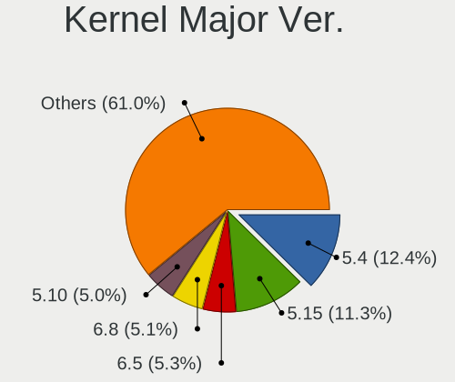
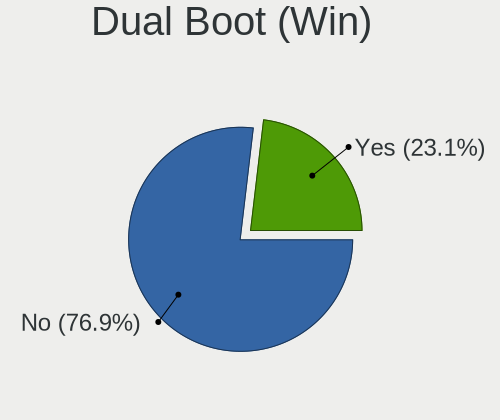
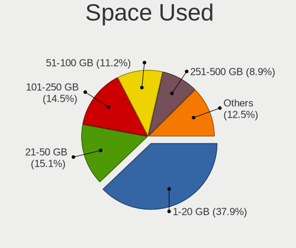
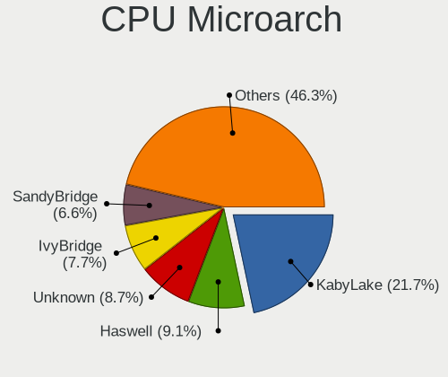
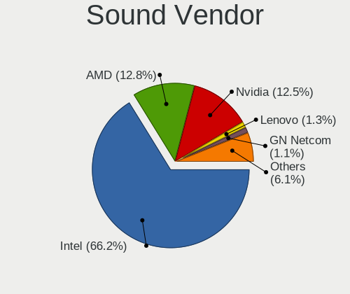
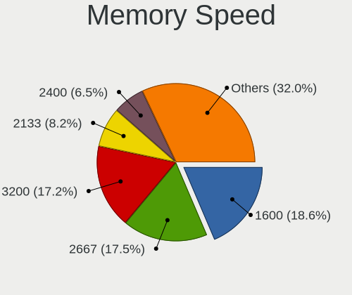
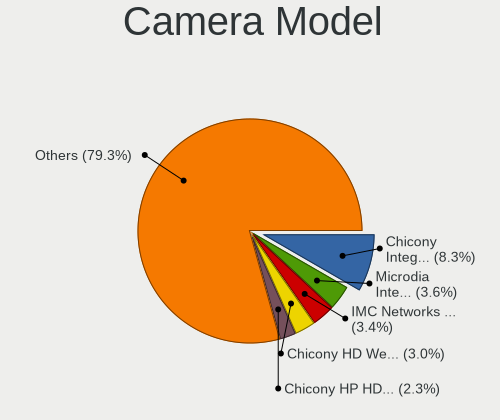
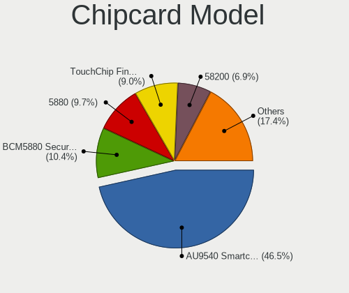

Linux in Switzerland - Tested Hardware & Statistics (Notebooks)
---------------------------------------------------------------

A project to collect tested hardware configurations for Linux in Switzerland.

Anyone can contribute to this report by the [hw-probe](https://github.com/linuxhw/hw-probe) tool:

    sudo -E hw-probe -all -upload

Please contribute! Especially if your hardware is rare.

Contents
--------

* [ Test Cases ](#test-cases)

* [ System ](#system)
  - [ OS                       ](#os)
  - [ OS Family                ](#os-family)
  - [ Kernel                   ](#kernel)
  - [ Kernel Family            ](#kernel-family)
  - [ Kernel Major Ver.        ](#kernel-major-ver)
  - [ Arch                     ](#arch)
  - [ DE                       ](#de)
  - [ Display Server           ](#display-server)
  - [ Display Manager          ](#display-manager)
  - [ OS Lang                  ](#os-lang)
  - [ Boot Mode                ](#boot-mode)
  - [ Filesystem               ](#filesystem)
  - [ Part. scheme             ](#part-scheme)
  - [ Dual Boot with Linux/BSD ](#dual-boot-with-linuxbsd)
  - [ Dual Boot (Win)          ](#dual-boot-win)

* [ Board ](#board)
  - [ Vendor                   ](#vendor)
  - [ Model                    ](#model)
  - [ Model Family             ](#model-family)
  - [ MFG Year                 ](#mfg-year)
  - [ Form Factor              ](#form-factor)
  - [ Secure Boot              ](#secure-boot)
  - [ Coreboot                 ](#coreboot)
  - [ RAM Size                 ](#ram-size)
  - [ RAM Used                 ](#ram-used)
  - [ Total Drives             ](#total-drives)
  - [ Has CD-ROM               ](#has-cd-rom)
  - [ Has Ethernet             ](#has-ethernet)
  - [ Has WiFi                 ](#has-wifi)
  - [ Has Bluetooth            ](#has-bluetooth)

* [ Location ](#location)
  - [ Country                  ](#country)
  - [ City                     ](#city)

* [ Drives ](#drives)
  - [ Drive Vendor             ](#drive-vendor)
  - [ Drive Model              ](#drive-model)
  - [ HDD Vendor               ](#hdd-vendor)
  - [ SSD Vendor               ](#ssd-vendor)
  - [ Drive Kind               ](#drive-kind)
  - [ Drive Connector          ](#drive-connector)
  - [ Drive Size               ](#drive-size)
  - [ Space Total              ](#space-total)
  - [ Space Used               ](#space-used)
  - [ Malfunc. Drives          ](#malfunc-drives)
  - [ Malfunc. Drive Vendor    ](#malfunc-drive-vendor)
  - [ Malfunc. HDD Vendor      ](#malfunc-hdd-vendor)
  - [ Malfunc. Drive Kind      ](#malfunc-drive-kind)
  - [ Failed Drives            ](#failed-drives)
  - [ Failed Drive Vendor      ](#failed-drive-vendor)
  - [ Drive Status             ](#drive-status)

* [ Storage controller ](#storage-controller)
  - [ Storage Vendor           ](#storage-vendor)
  - [ Storage Model            ](#storage-model)
  - [ Storage Kind             ](#storage-kind)

* [ Processor ](#processor)
  - [ CPU Vendor               ](#cpu-vendor)
  - [ CPU Model                ](#cpu-model)
  - [ CPU Model Family         ](#cpu-model-family)
  - [ CPU Cores                ](#cpu-cores)
  - [ CPU Sockets              ](#cpu-sockets)
  - [ CPU Threads              ](#cpu-threads)
  - [ CPU Op-Modes             ](#cpu-op-modes)
  - [ CPU Microcode            ](#cpu-microcode)
  - [ CPU Microarch            ](#cpu-microarch)

* [ Graphics ](#graphics)
  - [ GPU Vendor               ](#gpu-vendor)
  - [ GPU Model                ](#gpu-model)
  - [ GPU Combo                ](#gpu-combo)
  - [ GPU Driver               ](#gpu-driver)
  - [ GPU Memory               ](#gpu-memory)

* [ Monitor ](#monitor)
  - [ Monitor Vendor           ](#monitor-vendor)
  - [ Monitor Model            ](#monitor-model)
  - [ Monitor Resolution       ](#monitor-resolution)
  - [ Monitor Diagonal         ](#monitor-diagonal)
  - [ Monitor Width            ](#monitor-width)
  - [ Aspect Ratio             ](#aspect-ratio)
  - [ Monitor Area             ](#monitor-area)
  - [ Pixel Density            ](#pixel-density)
  - [ Multiple Monitors        ](#multiple-monitors)

* [ Network ](#network)
  - [ Net Controller Vendor    ](#net-controller-vendor)
  - [ Net Controller Model     ](#net-controller-model)
  - [ Wireless Vendor          ](#wireless-vendor)
  - [ Wireless Model           ](#wireless-model)
  - [ Ethernet Vendor          ](#ethernet-vendor)
  - [ Ethernet Model           ](#ethernet-model)
  - [ Net Controller Kind      ](#net-controller-kind)
  - [ Used Controller          ](#used-controller)
  - [ NICs                     ](#nics)
  - [ IPv6                     ](#ipv6)

* [ Bluetooth ](#bluetooth)
  - [ Bluetooth Vendor         ](#bluetooth-vendor)
  - [ Bluetooth Model          ](#bluetooth-model)

* [ Sound ](#sound)
  - [ Sound Vendor             ](#sound-vendor)
  - [ Sound Model              ](#sound-model)

* [ Memory ](#memory)
  - [ Memory Vendor            ](#memory-vendor)
  - [ Memory Model             ](#memory-model)
  - [ Memory Kind              ](#memory-kind)
  - [ Memory Form Factor       ](#memory-form-factor)
  - [ Memory Size              ](#memory-size)
  - [ Memory Speed             ](#memory-speed)

* [ Printers & scanners ](#printers--scanners)
  - [ Printer Vendor           ](#printer-vendor)
  - [ Printer Model            ](#printer-model)
  - [ Scanner Vendor           ](#scanner-vendor)
  - [ Scanner Model            ](#scanner-model)

* [ Camera ](#camera)
  - [ Camera Vendor            ](#camera-vendor)
  - [ Camera Model             ](#camera-model)

* [ Security ](#security)
  - [ Fingerprint Vendor       ](#fingerprint-vendor)
  - [ Fingerprint Model        ](#fingerprint-model)
  - [ Chipcard Vendor          ](#chipcard-vendor)
  - [ Chipcard Model           ](#chipcard-model)

* [ Unsupported ](#unsupported)
  - [ Unsupported Devices      ](#unsupported-devices)
  - [ Unsupported Device Types ](#unsupported-device-types)

Test Cases
----------

Total: 1234

| Vendor        | Model                       | Probe                                                      | Date         |
|---------------|-----------------------------|------------------------------------------------------------|--------------|
| HUAWEI        | MACH-WX9                    | [a37f48c68a](https://linux-hardware.org/?probe=a37f48c68a) | Dec 01, 2022 |
| Dell          | XPS 15 9560                 | [3ee313dd51](https://linux-hardware.org/?probe=3ee313dd51) | Dec 01, 2022 |
| Dell          | XPS 15 9560                 | [fde8194d5c](https://linux-hardware.org/?probe=fde8194d5c) | Dec 01, 2022 |
| HP            | ENVY dv7                    | [1cef09f19a](https://linux-hardware.org/?probe=1cef09f19a) | Dec 01, 2022 |
| Lenovo        | ThinkPad X220 4291WSH       | [3e67e44d23](https://linux-hardware.org/?probe=3e67e44d23) | Nov 30, 2022 |
| HP            | Pavilion dv9000 (RP919EA... | [dcdd31c3d5](https://linux-hardware.org/?probe=dcdd31c3d5) | Nov 30, 2022 |
| Notebook      | L140PU                      | [8893420e06](https://linux-hardware.org/?probe=8893420e06) | Nov 28, 2022 |
| Dell          | XPS 13 9370                 | [d353a1624b](https://linux-hardware.org/?probe=d353a1624b) | Nov 28, 2022 |
| Dell          | Latitude E6420              | [15ee6e2e20](https://linux-hardware.org/?probe=15ee6e2e20) | Nov 28, 2022 |
| Acer          | Aspire A515-45              | [4cec4d0e04](https://linux-hardware.org/?probe=4cec4d0e04) | Nov 27, 2022 |
| Apple         | MacBookAir6,2               | [8e266a1137](https://linux-hardware.org/?probe=8e266a1137) | Nov 27, 2022 |
| Lenovo        | ThinkPad T450 20BUS08L00    | [080bbeb75a](https://linux-hardware.org/?probe=080bbeb75a) | Nov 22, 2022 |
| Lenovo        | ThinkPad P52 20M90017MX     | [65c874adbd](https://linux-hardware.org/?probe=65c874adbd) | Nov 20, 2022 |
| Dell          | XPS 9320                    | [e590d602a9](https://linux-hardware.org/?probe=e590d602a9) | Nov 19, 2022 |
| ASUSTek       | ZenBook UX450FDX_UX450FD... | [27084d9125](https://linux-hardware.org/?probe=27084d9125) | Nov 17, 2022 |
| ASUSTek       | T100TA                      | [871be7733f](https://linux-hardware.org/?probe=871be7733f) | Nov 17, 2022 |
| MPMAN         | CONVERTER8                  | [0c8f7446f7](https://linux-hardware.org/?probe=0c8f7446f7) | Nov 17, 2022 |
| Lenovo        | ThinkPad E15 Gen 2 20T80... | [6f2f504425](https://linux-hardware.org/?probe=6f2f504425) | Nov 16, 2022 |
| Lenovo        | ThinkPad Edge 03192AG       | [48da1b11bc](https://linux-hardware.org/?probe=48da1b11bc) | Nov 16, 2022 |
| HP            | Compaq 15                   | [d437023699](https://linux-hardware.org/?probe=d437023699) | Nov 16, 2022 |
| GPD           | G1619-04                    | [c1e365fd5d](https://linux-hardware.org/?probe=c1e365fd5d) | Nov 16, 2022 |
| Clevo         | W240EU/W250EUQ/W270EUQ      | [71a871168d](https://linux-hardware.org/?probe=71a871168d) | Nov 15, 2022 |
| Acer          | Aspire V3-771               | [5682e576ad](https://linux-hardware.org/?probe=5682e576ad) | Nov 14, 2022 |
| Dell          | XPS 15 9560                 | [d7a20bdac6](https://linux-hardware.org/?probe=d7a20bdac6) | Nov 09, 2022 |
| Apple         | MacBookPro4,1               | [69c1a004e6](https://linux-hardware.org/?probe=69c1a004e6) | Nov 03, 2022 |
| Dell          | XPS 13 9380                 | [9224a599b3](https://linux-hardware.org/?probe=9224a599b3) | Nov 03, 2022 |
| Dell          | Precision 5520              | [e1a819ec3e](https://linux-hardware.org/?probe=e1a819ec3e) | Nov 01, 2022 |
| Lenovo        | ThinkPad X1 Carbon 7th 2... | [e101d9d50a](https://linux-hardware.org/?probe=e101d9d50a) | Nov 01, 2022 |
| GPD           | G1619-04                    | [898bbfb591](https://linux-hardware.org/?probe=898bbfb591) | Nov 01, 2022 |
| Lenovo        | ThinkPad L15 Gen 2 20X30... | [a75bc2ff26](https://linux-hardware.org/?probe=a75bc2ff26) | Oct 30, 2022 |
| Lenovo        | ThinkPad X220 4291WSH       | [a4eebe6485](https://linux-hardware.org/?probe=a4eebe6485) | Oct 30, 2022 |
| Lenovo        | ThinkPad T470s 20HGS2W30... | [8e0c00531b](https://linux-hardware.org/?probe=8e0c00531b) | Oct 29, 2022 |
| HP            | Laptop 15-da0xxx            | [6047d5d94a](https://linux-hardware.org/?probe=6047d5d94a) | Oct 29, 2022 |
| ASUSTek       | K55VJ                       | [6dc11e517b](https://linux-hardware.org/?probe=6dc11e517b) | Oct 29, 2022 |
| Dell          | Latitude E4310              | [fe6c65dd77](https://linux-hardware.org/?probe=fe6c65dd77) | Oct 29, 2022 |
| Dell          | Latitude E4310              | [7a610ca46d](https://linux-hardware.org/?probe=7a610ca46d) | Oct 29, 2022 |
| HP            | ProBook 6570b               | [b5d48f6adb](https://linux-hardware.org/?probe=b5d48f6adb) | Oct 29, 2022 |
| Lenovo        | ThinkPad T420 4236NUG       | [d0e3fa9699](https://linux-hardware.org/?probe=d0e3fa9699) | Oct 28, 2022 |
| Lenovo        | ThinkPad X1 Carbon Gen 9... | [c3bbb31b04](https://linux-hardware.org/?probe=c3bbb31b04) | Oct 24, 2022 |
| Lenovo        | ThinkPad X1 Carbon Gen 8... | [85510879a5](https://linux-hardware.org/?probe=85510879a5) | Oct 24, 2022 |
| ASUSTek       | N750JK                      | [849800f3f3](https://linux-hardware.org/?probe=849800f3f3) | Oct 24, 2022 |
| Lenovo        | ThinkPad X1 Carbon Gen 9... | [c16378c914](https://linux-hardware.org/?probe=c16378c914) | Oct 23, 2022 |
| Lenovo        | ThinkPad T480 20L50004MZ    | [7fe25296ef](https://linux-hardware.org/?probe=7fe25296ef) | Oct 21, 2022 |
| Medion        | S15449                      | [c737a8be4a](https://linux-hardware.org/?probe=c737a8be4a) | Oct 20, 2022 |
| Lenovo        | ThinkPad L15 Gen 2 20X30... | [f5073cd7a2](https://linux-hardware.org/?probe=f5073cd7a2) | Oct 20, 2022 |
| ASUSTek       | ZenBook 13 UX331FAL_UX33... | [3e8ca06ac6](https://linux-hardware.org/?probe=3e8ca06ac6) | Oct 17, 2022 |
| Lenovo        | Yoga S740-14IIL 81RS        | [8bd50f112b](https://linux-hardware.org/?probe=8bd50f112b) | Oct 15, 2022 |
| Lenovo        | Yoga S740-14IIL 81RS        | [88497baf29](https://linux-hardware.org/?probe=88497baf29) | Oct 15, 2022 |
| Google        | Lars                        | [b607a23c77](https://linux-hardware.org/?probe=b607a23c77) | Oct 14, 2022 |
| HP            | ENVY Laptop 15-ep1xxx       | [b02e3ede3f](https://linux-hardware.org/?probe=b02e3ede3f) | Oct 14, 2022 |
| HP            | ENVY Laptop 15-ep1xxx       | [33efe8c37a](https://linux-hardware.org/?probe=33efe8c37a) | Oct 14, 2022 |
| HP            | ENVY 15                     | [71c0056a73](https://linux-hardware.org/?probe=71c0056a73) | Oct 13, 2022 |
| Acer          | Aspire 7250G                | [34966259d6](https://linux-hardware.org/?probe=34966259d6) | Oct 13, 2022 |
| HP            | ENVY Laptop 17-cr0xxx       | [67532c45cb](https://linux-hardware.org/?probe=67532c45cb) | Oct 12, 2022 |
| Lenovo        | ThinkPad S1 Yoga 12 20DK... | [5112d236ce](https://linux-hardware.org/?probe=5112d236ce) | Oct 12, 2022 |
| Samsung       | RC530/RC730                 | [ee62bfc634](https://linux-hardware.org/?probe=ee62bfc634) | Oct 07, 2022 |
| Lenovo        | ThinkPad X1 Carbon Gen 1... | [ff847da23a](https://linux-hardware.org/?probe=ff847da23a) | Oct 07, 2022 |
| Lenovo        | ThinkPad X1 Carbon Gen 1... | [fceffec337](https://linux-hardware.org/?probe=fceffec337) | Oct 07, 2022 |
| Notebook      | W65_67SZ                    | [a3a056691b](https://linux-hardware.org/?probe=a3a056691b) | Oct 07, 2022 |
| Gigabyte      | RC14UD                      | [e48bdade3d](https://linux-hardware.org/?probe=e48bdade3d) | Oct 06, 2022 |
| Dell          | Latitude E6410              | [f7baa71813](https://linux-hardware.org/?probe=f7baa71813) | Oct 05, 2022 |
| HP            | ProBook 640 G2              | [e4cc03e802](https://linux-hardware.org/?probe=e4cc03e802) | Oct 03, 2022 |
| ASUSTek       | K55VJ                       | [e405dee0bd](https://linux-hardware.org/?probe=e405dee0bd) | Oct 02, 2022 |
| Gigabyte      | RC14UD                      | [744143bdd6](https://linux-hardware.org/?probe=744143bdd6) | Sep 30, 2022 |
| HP            | EliteBook 850 G7 Noteboo... | [9a1514cc61](https://linux-hardware.org/?probe=9a1514cc61) | Sep 26, 2022 |
| Lenovo        | Yoga S730-13IWL 81J0        | [fee2b2d57e](https://linux-hardware.org/?probe=fee2b2d57e) | Sep 24, 2022 |
| System76      | Darter Pro                  | [012968a4a3](https://linux-hardware.org/?probe=012968a4a3) | Sep 22, 2022 |
| System76      | Darter Pro                  | [8d3bdb7585](https://linux-hardware.org/?probe=8d3bdb7585) | Sep 22, 2022 |
| Acer          | Aspire E5-571               | [dc6bf82565](https://linux-hardware.org/?probe=dc6bf82565) | Sep 22, 2022 |
| ASUSTek       | K56CB                       | [7a7717e793](https://linux-hardware.org/?probe=7a7717e793) | Sep 21, 2022 |
| Acer          | Aspire E5-571               | [dddf15cbf5](https://linux-hardware.org/?probe=dddf15cbf5) | Sep 21, 2022 |
| Acer          | Aspire E5-571               | [21404b14d1](https://linux-hardware.org/?probe=21404b14d1) | Sep 21, 2022 |
| HP            | EliteBook Folio 1040 G2     | [3aa36dda04](https://linux-hardware.org/?probe=3aa36dda04) | Sep 18, 2022 |
| HP            | ProBook 440 G8 Notebook ... | [81d620ed2f](https://linux-hardware.org/?probe=81d620ed2f) | Sep 14, 2022 |
| HP            | Notebook                    | [963af7e07b](https://linux-hardware.org/?probe=963af7e07b) | Sep 13, 2022 |
| HP            | ProBook 440 G8 Notebook ... | [4aa1954c0c](https://linux-hardware.org/?probe=4aa1954c0c) | Sep 13, 2022 |
| Lenovo        | ThinkPad T430 2350A26       | [7374ee44fa](https://linux-hardware.org/?probe=7374ee44fa) | Sep 10, 2022 |
| HP            | EliteBook 840 G1            | [e72b842ab6](https://linux-hardware.org/?probe=e72b842ab6) | Sep 10, 2022 |
| Acer          | Aspire S5-371               | [ed31a97b57](https://linux-hardware.org/?probe=ed31a97b57) | Sep 05, 2022 |
| ASUSTek       | VivoBook_ASUSLaptop X515... | [d7c3304983](https://linux-hardware.org/?probe=d7c3304983) | Sep 04, 2022 |
| Acer          | Aspire 5942                 | [c2c893f2c2](https://linux-hardware.org/?probe=c2c893f2c2) | Sep 02, 2022 |
| HP            | EliteBook 840 G8 Noteboo... | [4808984401](https://linux-hardware.org/?probe=4808984401) | Aug 31, 2022 |
| Lenovo        | ThinkPad P43s 20RJS0D100    | [afbf0f6021](https://linux-hardware.org/?probe=afbf0f6021) | Aug 31, 2022 |
| Lenovo        | V330 81AX                   | [1457fc2903](https://linux-hardware.org/?probe=1457fc2903) | Aug 30, 2022 |
| Lenovo        | V330 81AX                   | [0699372547](https://linux-hardware.org/?probe=0699372547) | Aug 30, 2022 |
| Lenovo        | ThinkPad P50 20EQS33R0J     | [72f6962ac8](https://linux-hardware.org/?probe=72f6962ac8) | Aug 30, 2022 |
| Acer          | V3-771                      | [3efe8f2f41](https://linux-hardware.org/?probe=3efe8f2f41) | Aug 28, 2022 |
| Shuttle       | DS437                       | [9b866a79d6](https://linux-hardware.org/?probe=9b866a79d6) | Aug 27, 2022 |
| Acer          | Aspire VN7-592G             | [cec4df79eb](https://linux-hardware.org/?probe=cec4df79eb) | Aug 26, 2022 |
| Acer          | Aspire 5942                 | [528e0a954b](https://linux-hardware.org/?probe=528e0a954b) | Aug 26, 2022 |
| Lenovo        | ThinkPad X13 Gen 2a 20XH... | [d0b18cffdb](https://linux-hardware.org/?probe=d0b18cffdb) | Aug 23, 2022 |
| TUXEDO        | Pulse 15 Gen1               | [936ce5ca55](https://linux-hardware.org/?probe=936ce5ca55) | Aug 22, 2022 |
| Acer          | TravelMate 5730             | [ec6fd6cddb](https://linux-hardware.org/?probe=ec6fd6cddb) | Aug 22, 2022 |
| Acer          | Swift SFX14-41G             | [959dda5404](https://linux-hardware.org/?probe=959dda5404) | Aug 22, 2022 |
| Acer          | Swift SFX14-41G             | [3de1fd7f2c](https://linux-hardware.org/?probe=3de1fd7f2c) | Aug 21, 2022 |
| Acer          | Predator G9-791             | [782f581f0b](https://linux-hardware.org/?probe=782f581f0b) | Aug 21, 2022 |
| Dell          | Inspiron 5570               | [a6de4113fa](https://linux-hardware.org/?probe=a6de4113fa) | Aug 17, 2022 |
| Apple         | MacBookPro13,3              | [6cf76ee482](https://linux-hardware.org/?probe=6cf76ee482) | Aug 15, 2022 |
| Panasonic     | CF-31JBGNNDM                | [008621e9e0](https://linux-hardware.org/?probe=008621e9e0) | Aug 14, 2022 |
| Lenovo        | Y70-70 Touch 80DU           | [7817924a07](https://linux-hardware.org/?probe=7817924a07) | Aug 14, 2022 |
| HP            | Unknown                     | [7375604d06](https://linux-hardware.org/?probe=7375604d06) | Aug 13, 2022 |
| Lenovo        | IdeaPad Gaming 3 15ARH05... | [3d37c741c8](https://linux-hardware.org/?probe=3d37c741c8) | Aug 12, 2022 |
| Acer          | Aspire V3-772G              | [283eb3c040](https://linux-hardware.org/?probe=283eb3c040) | Aug 06, 2022 |
| MSI           | GT72S 6QE                   | [9cb4896eba](https://linux-hardware.org/?probe=9cb4896eba) | Jul 28, 2022 |
| Lenovo        | ThinkPad T470s 20HGS36K0... | [caf10d48a0](https://linux-hardware.org/?probe=caf10d48a0) | Jul 28, 2022 |
| HP            | ProBook 440 G8 Notebook ... | [b08a0deeff](https://linux-hardware.org/?probe=b08a0deeff) | Jul 28, 2022 |
| Lenovo        | ThinkPad P51 20HH001RMZ     | [3fee9267ba](https://linux-hardware.org/?probe=3fee9267ba) | Jul 27, 2022 |
| Lenovo        | ThinkPad P1 Gen 4i 20Y4S... | [44a5e2107e](https://linux-hardware.org/?probe=44a5e2107e) | Jul 27, 2022 |
| Timi          | Mi Laptop Pro 15 2020       | [5455e664e0](https://linux-hardware.org/?probe=5455e664e0) | Jul 26, 2022 |
| Acer          | Aspire 5738                 | [8b9c2d3dc0](https://linux-hardware.org/?probe=8b9c2d3dc0) | Jul 22, 2022 |
| Sony          | SVE1513R1EB                 | [61c51541dd](https://linux-hardware.org/?probe=61c51541dd) | Jul 21, 2022 |
| Alienware     | 17 R5                       | [29b538f1c0](https://linux-hardware.org/?probe=29b538f1c0) | Jul 20, 2022 |
| Lenovo        | ThinkPad L480 20LSCTO1WW    | [51dd660f49](https://linux-hardware.org/?probe=51dd660f49) | Jul 20, 2022 |
| Acer          | V3-771                      | [809bd80b9a](https://linux-hardware.org/?probe=809bd80b9a) | Jul 17, 2022 |
| Lenovo        | ThinkPad T410 25379UG       | [00478c63ba](https://linux-hardware.org/?probe=00478c63ba) | Jul 16, 2022 |
| Lenovo        | ThinkPad T470s W10DG 20J... | [41c6118825](https://linux-hardware.org/?probe=41c6118825) | Jul 15, 2022 |
| HP            | Pavilion dv7                | [4065c23b56](https://linux-hardware.org/?probe=4065c23b56) | Jul 15, 2022 |
| HP            | EliteBook 8540p             | [52a3abee65](https://linux-hardware.org/?probe=52a3abee65) | Jul 15, 2022 |
| Lenovo        | ThinkPad X201 Tablet 309... | [7a661a1449](https://linux-hardware.org/?probe=7a661a1449) | Jul 15, 2022 |
| HP            | Pavilion dv6700             | [c8bf7e091c](https://linux-hardware.org/?probe=c8bf7e091c) | Jul 14, 2022 |
| HP            | EliteBook 8460p             | [c3f5c82808](https://linux-hardware.org/?probe=c3f5c82808) | Jul 14, 2022 |
| HP            | ProBook 440 G6              | [6a065093ba](https://linux-hardware.org/?probe=6a065093ba) | Jul 10, 2022 |
| HUAWEI        | KLVL-WXXW                   | [0e5d573899](https://linux-hardware.org/?probe=0e5d573899) | Jul 09, 2022 |
| HP            | EliteBook Folio 1040 G2     | [c58559e78c](https://linux-hardware.org/?probe=c58559e78c) | Jul 09, 2022 |
| Lenovo        | Legion 5 15ACH6H 82JU       | [d58dd09f25](https://linux-hardware.org/?probe=d58dd09f25) | Jul 06, 2022 |
| HP            | Pavilion dv7                | [ee1a040981](https://linux-hardware.org/?probe=ee1a040981) | Jul 06, 2022 |
| MSI           | GE62 2QF                    | [789826020e](https://linux-hardware.org/?probe=789826020e) | Jul 03, 2022 |
| Lenovo        | ThinkPad E14 20RA001MMZ     | [4bf795762d](https://linux-hardware.org/?probe=4bf795762d) | Jul 02, 2022 |
| Dell          | Latitude 7530               | [0d40af60b2](https://linux-hardware.org/?probe=0d40af60b2) | Jul 01, 2022 |
| HP            | Pavilion Aero Laptop 13-... | [9b8bb07ff0](https://linux-hardware.org/?probe=9b8bb07ff0) | Jul 01, 2022 |
| Dell          | Latitude 7530               | [a66aca8921](https://linux-hardware.org/?probe=a66aca8921) | Jul 01, 2022 |
| Acer          | Aspire V3-772G              | [21cba60be3](https://linux-hardware.org/?probe=21cba60be3) | Jun 30, 2022 |
| Acer          | Aspire V3-772G              | [0dcbb35983](https://linux-hardware.org/?probe=0dcbb35983) | Jun 30, 2022 |
| Acer          | Aspire V3-772G              | [d8190f3da8](https://linux-hardware.org/?probe=d8190f3da8) | Jun 29, 2022 |
| HP            | ENVY dv7                    | [9f64d5f095](https://linux-hardware.org/?probe=9f64d5f095) | Jun 29, 2022 |
| Lenovo        | ThinkPad X220 4291WSH       | [7406ba0eb2](https://linux-hardware.org/?probe=7406ba0eb2) | Jun 29, 2022 |
| Dell          | Precision M6800             | [027cb621ef](https://linux-hardware.org/?probe=027cb621ef) | Jun 28, 2022 |
| HP            | ENVY dv7                    | [00ce30e950](https://linux-hardware.org/?probe=00ce30e950) | Jun 28, 2022 |
| Lenovo        | Yoga Slim 7 Pro 14ACH5 8... | [2103486702](https://linux-hardware.org/?probe=2103486702) | Jun 23, 2022 |
| HP            | EliteBook 850 G8 Noteboo... | [7d5a943ab0](https://linux-hardware.org/?probe=7d5a943ab0) | Jun 23, 2022 |
| HP            | EliteBook 8470p             | [2ba22aa099](https://linux-hardware.org/?probe=2ba22aa099) | Jun 22, 2022 |
| HP            | EliteBook 8470p             | [eea8da46bd](https://linux-hardware.org/?probe=eea8da46bd) | Jun 22, 2022 |
| HUAWEI        | MACH-WX9                    | [c6f721f315](https://linux-hardware.org/?probe=c6f721f315) | Jun 21, 2022 |
| Apple         | MacBookPro15,2              | [c931d0e7bf](https://linux-hardware.org/?probe=c931d0e7bf) | Jun 20, 2022 |
| Lenovo        | Yoga 3 Pro-1370 80HE        | [9c4b7a7742](https://linux-hardware.org/?probe=9c4b7a7742) | Jun 20, 2022 |
| ASUSTek       | ZenBook UX391FA_UX391FA     | [faa0749731](https://linux-hardware.org/?probe=faa0749731) | Jun 20, 2022 |
| Acer          | Aspire V3-772G              | [21f78f9cf4](https://linux-hardware.org/?probe=21f78f9cf4) | Jun 19, 2022 |
| Schenker      | VISION 15 (SVS15E21)        | [8845a2219f](https://linux-hardware.org/?probe=8845a2219f) | Jun 17, 2022 |
| Lenovo        | G70-70 80HW                 | [de123e03c3](https://linux-hardware.org/?probe=de123e03c3) | Jun 16, 2022 |
| Lenovo        | G70-70 80HW                 | [31aa19ff98](https://linux-hardware.org/?probe=31aa19ff98) | Jun 16, 2022 |
| Clevo         | W150ER                      | [9121da24a8](https://linux-hardware.org/?probe=9121da24a8) | Jun 13, 2022 |
| TrekStor      | Surfbook A13                | [2c8d07851d](https://linux-hardware.org/?probe=2c8d07851d) | Jun 12, 2022 |
| HP            | 255 G8 Notebook PC          | [b31c452186](https://linux-hardware.org/?probe=b31c452186) | Jun 11, 2022 |
| Dell          | XPS 13 9380                 | [6a14acf011](https://linux-hardware.org/?probe=6a14acf011) | Jun 07, 2022 |
| Dell          | XPS 13 9380                 | [0fbc627b7e](https://linux-hardware.org/?probe=0fbc627b7e) | Jun 07, 2022 |
| Lenovo        | ThinkPad X1 Extreme 2nd ... | [13e2575e63](https://linux-hardware.org/?probe=13e2575e63) | Jun 05, 2022 |
| Lenovo        | ThinkPad T450 20BUS0HA0G    | [878cae499d](https://linux-hardware.org/?probe=878cae499d) | Jun 04, 2022 |
| Lenovo        | ThinkPad T450 20BUS0HA0G    | [0c53f7240c](https://linux-hardware.org/?probe=0c53f7240c) | Jun 03, 2022 |
| Toshiba       | Satellite L850-1D5          | [c8a260ef80](https://linux-hardware.org/?probe=c8a260ef80) | Jun 03, 2022 |
| HUAWEI        | MACH-WX9                    | [70ad46aa8e](https://linux-hardware.org/?probe=70ad46aa8e) | Jun 01, 2022 |
| Acer          | Swift SF515-51T             | [d4283c0b8b](https://linux-hardware.org/?probe=d4283c0b8b) | May 31, 2022 |
| Acer          | Swift SF515-51T             | [1d0b1a1c50](https://linux-hardware.org/?probe=1d0b1a1c50) | May 31, 2022 |
| HP            | ENVY Laptop 15-ep1xxx       | [e6145c7453](https://linux-hardware.org/?probe=e6145c7453) | May 30, 2022 |
| Lenovo        | ThinkPad L15 Gen 2 20X30... | [03a4099a33](https://linux-hardware.org/?probe=03a4099a33) | May 28, 2022 |
| HUAWEI        | NBLB-WAX9N                  | [7ae101b473](https://linux-hardware.org/?probe=7ae101b473) | May 28, 2022 |
| HUAWEI        | NBLB-WAX9N                  | [469ed3f68b](https://linux-hardware.org/?probe=469ed3f68b) | May 28, 2022 |
| Dell          | XPS 13 9380                 | [7220b6a007](https://linux-hardware.org/?probe=7220b6a007) | May 28, 2022 |
| Dell          | XPS 13 9380                 | [962defa2c3](https://linux-hardware.org/?probe=962defa2c3) | May 28, 2022 |
| HP            | ENVY TS 15                  | [cde5dba599](https://linux-hardware.org/?probe=cde5dba599) | May 27, 2022 |
| HP            | ENVY TS 15                  | [e6ee61fdd8](https://linux-hardware.org/?probe=e6ee61fdd8) | May 27, 2022 |
| Lenovo        | V320-17IKB 81AH             | [c5d9a03264](https://linux-hardware.org/?probe=c5d9a03264) | May 27, 2022 |
| Lenovo        | ThinkPad E15 Gen 3 20YG0... | [071bc80c0b](https://linux-hardware.org/?probe=071bc80c0b) | May 27, 2022 |
| Timi          | TM1613                      | [695d8d5ff0](https://linux-hardware.org/?probe=695d8d5ff0) | May 21, 2022 |
| Acer          | V3-771                      | [8bcab66496](https://linux-hardware.org/?probe=8bcab66496) | May 20, 2022 |
| Razer         | Blade 15 Mid 2019-Base      | [0d4945774e](https://linux-hardware.org/?probe=0d4945774e) | May 18, 2022 |
| Razer         | Blade 15 Mid 2019-Base      | [e771dc589b](https://linux-hardware.org/?probe=e771dc589b) | May 18, 2022 |
| Lenovo        | ThinkPad E15 Gen 2 20T80... | [61c1716210](https://linux-hardware.org/?probe=61c1716210) | May 16, 2022 |
| Dell          | XPS 15 7590                 | [7f7463682a](https://linux-hardware.org/?probe=7f7463682a) | May 16, 2022 |
| HP            | Notebook                    | [e672632acf](https://linux-hardware.org/?probe=e672632acf) | May 13, 2022 |
| TUXEDO        | N2x0WU                      | [b70a08c999](https://linux-hardware.org/?probe=b70a08c999) | May 12, 2022 |
| Lenovo        | ThinkPad W530 2463A64       | [f45c19aa6c](https://linux-hardware.org/?probe=f45c19aa6c) | May 11, 2022 |
| Sony          | VPCF23S1E                   | [5eb4b61ffb](https://linux-hardware.org/?probe=5eb4b61ffb) | May 10, 2022 |
| Toshiba       | TECRA R840                  | [38ff1a3344](https://linux-hardware.org/?probe=38ff1a3344) | May 07, 2022 |
| Lenovo        | Yoga Slim 7 14ITL05 82A3    | [7894bd4591](https://linux-hardware.org/?probe=7894bd4591) | May 07, 2022 |
| Apple         | MacBookPro9,2               | [e281a8eee2](https://linux-hardware.org/?probe=e281a8eee2) | May 06, 2022 |
| Dell          | Inspiron 1720               | [e95b0172b4](https://linux-hardware.org/?probe=e95b0172b4) | May 06, 2022 |
| Dell          | Inspiron 1720               | [a888a93774](https://linux-hardware.org/?probe=a888a93774) | May 06, 2022 |
| HP            | ProBook 450 G4              | [1332984f5d](https://linux-hardware.org/?probe=1332984f5d) | May 06, 2022 |
| ASUSTek       | VivoBook 15_ASUS Laptop ... | [94806fd9bf](https://linux-hardware.org/?probe=94806fd9bf) | May 05, 2022 |
| ASUSTek       | VivoBook 15_ASUS Laptop ... | [ebc49550d4](https://linux-hardware.org/?probe=ebc49550d4) | May 05, 2022 |
| Apple         | MacBookPro11,3              | [21f611f3c7](https://linux-hardware.org/?probe=21f611f3c7) | May 03, 2022 |
| Dell          | XPS 13 9380                 | [aa294d2650](https://linux-hardware.org/?probe=aa294d2650) | May 02, 2022 |
| Acer          | Aspire A515-56              | [a10b79694f](https://linux-hardware.org/?probe=a10b79694f) | Apr 29, 2022 |
| HP            | ENVY 17                     | [c33b35becc](https://linux-hardware.org/?probe=c33b35becc) | Apr 26, 2022 |
| Dell          | XPS 13 9380                 | [c052066ee4](https://linux-hardware.org/?probe=c052066ee4) | Apr 26, 2022 |
| Lenovo        | ThinkPad X1 Extreme 2nd ... | [85cc720515](https://linux-hardware.org/?probe=85cc720515) | Apr 24, 2022 |
| Lenovo        | ThinkPad P43s 20RH0023UK    | [1cabdda156](https://linux-hardware.org/?probe=1cabdda156) | Apr 21, 2022 |
| Lenovo        | ThinkPad E580 20KS006EMZ    | [4d54c594ff](https://linux-hardware.org/?probe=4d54c594ff) | Apr 20, 2022 |
| System76      | Galago Pro                  | [32b09fd215](https://linux-hardware.org/?probe=32b09fd215) | Apr 19, 2022 |
| Acer          | Aspire ES1-731              | [451ce5305a](https://linux-hardware.org/?probe=451ce5305a) | Apr 19, 2022 |
| Acer          | Aspire ES1-731              | [fa843a199c](https://linux-hardware.org/?probe=fa843a199c) | Apr 19, 2022 |
| TUXEDO        | Pulse 15 Gen1               | [46dd37cb4b](https://linux-hardware.org/?probe=46dd37cb4b) | Apr 16, 2022 |
| Lenovo        | ThinkBook 14 G2 ARE 20VF    | [6d63a9c8bc](https://linux-hardware.org/?probe=6d63a9c8bc) | Apr 15, 2022 |
| Lenovo        | ThinkPad X201 Tablet 311... | [e3ab162648](https://linux-hardware.org/?probe=e3ab162648) | Apr 15, 2022 |
| Apple         | MacBookPro10,1              | [0d7edf2aa9](https://linux-hardware.org/?probe=0d7edf2aa9) | Apr 15, 2022 |
| Acer          | TMP455-M                    | [451dbf0a20](https://linux-hardware.org/?probe=451dbf0a20) | Apr 15, 2022 |
| Acer          | TMP455-M                    | [b7b9924190](https://linux-hardware.org/?probe=b7b9924190) | Apr 15, 2022 |
| Acer          | Swift SF514-51              | [147a0161aa](https://linux-hardware.org/?probe=147a0161aa) | Apr 13, 2022 |
| Lenovo        | ThinkPad T490s 20NY000JM... | [e93e7d9ad1](https://linux-hardware.org/?probe=e93e7d9ad1) | Apr 13, 2022 |
| Dell          | Latitude E7240              | [1a08843719](https://linux-hardware.org/?probe=1a08843719) | Apr 13, 2022 |
| Lenovo        | ThinkPad Helix 36986CG      | [f0aa04a603](https://linux-hardware.org/?probe=f0aa04a603) | Apr 12, 2022 |
| Dell          | Latitude D400               | [46981d939b](https://linux-hardware.org/?probe=46981d939b) | Apr 11, 2022 |
| Apple         | MacBookPro10,1              | [b53427c0f4](https://linux-hardware.org/?probe=b53427c0f4) | Apr 07, 2022 |
| HP            | ProBook 4530s               | [1b32584f41](https://linux-hardware.org/?probe=1b32584f41) | Apr 06, 2022 |
| HP            | ProBook 4530s               | [f4dfc894d9](https://linux-hardware.org/?probe=f4dfc894d9) | Apr 06, 2022 |
| HP            | ProBook 450 G5              | [3aa8c7cbc6](https://linux-hardware.org/?probe=3aa8c7cbc6) | Apr 04, 2022 |
| Acer          | Swift SF314-57              | [e43f33eef1](https://linux-hardware.org/?probe=e43f33eef1) | Apr 03, 2022 |
| Quanmax       | Platin SE                   | [5090da9cbf](https://linux-hardware.org/?probe=5090da9cbf) | Apr 03, 2022 |
| Apple         | MacBookPro10,1              | [d1c62a1f93](https://linux-hardware.org/?probe=d1c62a1f93) | Apr 03, 2022 |
| Quanmax       | Platin SE                   | [2388fe9587](https://linux-hardware.org/?probe=2388fe9587) | Apr 03, 2022 |
| Lenovo        | ThinkPad X201 Tablet 311... | [7f48dd5612](https://linux-hardware.org/?probe=7f48dd5612) | Apr 02, 2022 |
| Acer          | Aspire E5-773G              | [b43b436e59](https://linux-hardware.org/?probe=b43b436e59) | Mar 31, 2022 |
| HP            | Pavilion g7                 | [44a6ea06b0](https://linux-hardware.org/?probe=44a6ea06b0) | Mar 28, 2022 |
| HP            | ZBook Studio G7 Mobile W... | [edbd5fd6aa](https://linux-hardware.org/?probe=edbd5fd6aa) | Mar 27, 2022 |
| Lenovo        | ThinkPad T430 2349U4B       | [95526f5b3e](https://linux-hardware.org/?probe=95526f5b3e) | Mar 25, 2022 |
| Lenovo        | ThinkPad L15 Gen 2 20X30... | [ed949b0853](https://linux-hardware.org/?probe=ed949b0853) | Mar 24, 2022 |
| Lenovo        | ThinkPad L15 Gen 2 20X30... | [684a4fd3c3](https://linux-hardware.org/?probe=684a4fd3c3) | Mar 24, 2022 |
| Dell          | XPS 15 7590                 | [96244433f0](https://linux-hardware.org/?probe=96244433f0) | Mar 23, 2022 |
| Dell          | Inspiron 7400               | [a17dc3be48](https://linux-hardware.org/?probe=a17dc3be48) | Mar 23, 2022 |
| Lenovo        | ThinkPad T15 Gen 2i 20W4... | [9391fc9592](https://linux-hardware.org/?probe=9391fc9592) | Mar 23, 2022 |
| HP            | EliteBook 840 G5            | [dd13dcfd89](https://linux-hardware.org/?probe=dd13dcfd89) | Mar 22, 2022 |
| ASUSTek       | K73E                        | [75069bd642](https://linux-hardware.org/?probe=75069bd642) | Mar 20, 2022 |
| Lenovo        | Yoga Slim 7 15IIL05 82AA    | [161ca16bc2](https://linux-hardware.org/?probe=161ca16bc2) | Mar 19, 2022 |
| HP            | OMEN Laptop 15-en1xxx       | [7664c536f4](https://linux-hardware.org/?probe=7664c536f4) | Mar 18, 2022 |
| Lenovo        | ThinkPad T15 Gen 2i 20W4... | [81ec123b24](https://linux-hardware.org/?probe=81ec123b24) | Mar 15, 2022 |
| HP            | EliteBook 850 G8 Noteboo... | [7649fad366](https://linux-hardware.org/?probe=7649fad366) | Mar 14, 2022 |
| Dell          | Latitude 5400               | [e23429d8ea](https://linux-hardware.org/?probe=e23429d8ea) | Mar 13, 2022 |
| Fujitsu       | LIFEBOOK E782               | [77b3a7f272](https://linux-hardware.org/?probe=77b3a7f272) | Mar 13, 2022 |
| ASUSTek       | VivoBook 15_ASUS Laptop ... | [f735730566](https://linux-hardware.org/?probe=f735730566) | Mar 11, 2022 |
| ASUSTek       | VivoBook 15_ASUS Laptop ... | [e8ffb57db8](https://linux-hardware.org/?probe=e8ffb57db8) | Mar 11, 2022 |
| Acer          | Aspire V3-772G              | [1526117b64](https://linux-hardware.org/?probe=1526117b64) | Mar 10, 2022 |
| HP            | ProBook 470 G5              | [c98fcbec3c](https://linux-hardware.org/?probe=c98fcbec3c) | Mar 10, 2022 |
| HUAWEI        | WRT-WX9                     | [2bd4f9201a](https://linux-hardware.org/?probe=2bd4f9201a) | Mar 09, 2022 |
| Lenovo        | Yoga Slim 7 15IIL05 82AA    | [1eaa06bf11](https://linux-hardware.org/?probe=1eaa06bf11) | Mar 06, 2022 |
| Dell          | XPS 13 9350                 | [ce5fd5227f](https://linux-hardware.org/?probe=ce5fd5227f) | Mar 05, 2022 |
| ASUSTek       | G551JK                      | [a9f394c585](https://linux-hardware.org/?probe=a9f394c585) | Mar 05, 2022 |
| Dell          | Latitude 7490               | [64f0d004ce](https://linux-hardware.org/?probe=64f0d004ce) | Mar 05, 2022 |
| Apple         | MacBookPro6,2               | [a2f1d82d9c](https://linux-hardware.org/?probe=a2f1d82d9c) | Mar 05, 2022 |
| HP            | EliteBook 820 G3            | [fd01513251](https://linux-hardware.org/?probe=fd01513251) | Mar 04, 2022 |
| Acer          | Swift SF314-42              | [5c8b94d514](https://linux-hardware.org/?probe=5c8b94d514) | Mar 03, 2022 |
| Dell          | XPS 13 9370                 | [75b63c2d2c](https://linux-hardware.org/?probe=75b63c2d2c) | Mar 02, 2022 |
| Medion        | P6624                       | [0a502fd230](https://linux-hardware.org/?probe=0a502fd230) | Feb 28, 2022 |
| Dell          | XPS 15 9560                 | [4c72ebcb41](https://linux-hardware.org/?probe=4c72ebcb41) | Feb 25, 2022 |
| Notebook      | N13xWU                      | [50acf36954](https://linux-hardware.org/?probe=50acf36954) | Feb 25, 2022 |
| Acer          | TMP455-MG                   | [f1a500ae43](https://linux-hardware.org/?probe=f1a500ae43) | Feb 25, 2022 |
| Dell          | Precision 3551              | [9394fc8844](https://linux-hardware.org/?probe=9394fc8844) | Feb 24, 2022 |
| Lenovo        | ThinkPad X1 Extreme Gen ... | [923930ee4e](https://linux-hardware.org/?probe=923930ee4e) | Feb 22, 2022 |
| Dell          | XPS 15 9570                 | [226452fec0](https://linux-hardware.org/?probe=226452fec0) | Feb 21, 2022 |
| ASUSTek       | G551JK                      | [93e40c8fbc](https://linux-hardware.org/?probe=93e40c8fbc) | Feb 20, 2022 |
| Lenovo        | IdeaPad Y700-15ISK 80NV     | [b0e0d82d12](https://linux-hardware.org/?probe=b0e0d82d12) | Feb 20, 2022 |
| Dell          | Latitude 7490               | [2620ebab43](https://linux-hardware.org/?probe=2620ebab43) | Feb 15, 2022 |
| Acer          | Aspire 3820                 | [7364dc5d5e](https://linux-hardware.org/?probe=7364dc5d5e) | Feb 14, 2022 |
| HUAWEI        | BOHB-WAX9                   | [34bb725d27](https://linux-hardware.org/?probe=34bb725d27) | Feb 14, 2022 |
| HUAWEI        | BOHB-WAX9                   | [3dd59d8ebe](https://linux-hardware.org/?probe=3dd59d8ebe) | Feb 13, 2022 |
| HP            | Compaq 15                   | [fa22db8854](https://linux-hardware.org/?probe=fa22db8854) | Feb 12, 2022 |
| Acer          | Aspire V3-772G              | [6a16b1953c](https://linux-hardware.org/?probe=6a16b1953c) | Feb 11, 2022 |
| Lenovo        | IdeaPad Y700-15ISK 80NV     | [8b31b460fc](https://linux-hardware.org/?probe=8b31b460fc) | Feb 11, 2022 |
| PC Special... | NH5x_7xRCx,RDx              | [3fad293703](https://linux-hardware.org/?probe=3fad293703) | Feb 10, 2022 |
| Lenovo        | ThinkPad E490 20N8CTO1WW    | [cf4fbc7ab1](https://linux-hardware.org/?probe=cf4fbc7ab1) | Feb 09, 2022 |
| Dell          | XPS 15 7590                 | [e06f742b06](https://linux-hardware.org/?probe=e06f742b06) | Feb 09, 2022 |
| whyopencom... | Unknown                     | [ed4f02d91d](https://linux-hardware.org/?probe=ed4f02d91d) | Feb 09, 2022 |
| HP            | Pavilion 11 x360 PC         | [f252168753](https://linux-hardware.org/?probe=f252168753) | Feb 08, 2022 |
| Lenovo        | IdeaPad S145-15IWL 81MV     | [73738d3f0c](https://linux-hardware.org/?probe=73738d3f0c) | Feb 08, 2022 |
| Quanta        | TW8/SW8/DW8                 | [a542c42556](https://linux-hardware.org/?probe=a542c42556) | Feb 08, 2022 |
| Dell          | Latitude E5410              | [fd73c50faa](https://linux-hardware.org/?probe=fd73c50faa) | Feb 07, 2022 |
| Acer          | Aspire A515-52G             | [cfc69482e3](https://linux-hardware.org/?probe=cfc69482e3) | Feb 07, 2022 |
| ASUSTek       | VivoBook_ASUSLaptop X513... | [99770a5e77](https://linux-hardware.org/?probe=99770a5e77) | Feb 06, 2022 |
| Packard Be... | EasyNote TV44HC             | [60aaa89bfa](https://linux-hardware.org/?probe=60aaa89bfa) | Feb 03, 2022 |
| Acer          | Aspire V3-772G              | [1e4b8a880e](https://linux-hardware.org/?probe=1e4b8a880e) | Jan 29, 2022 |
| Clevo         | W76x/M77xCUH                | [48d0efb057](https://linux-hardware.org/?probe=48d0efb057) | Jan 26, 2022 |
| AMI           | Cherry Trail Tablet         | [0560bf99e5](https://linux-hardware.org/?probe=0560bf99e5) | Jan 25, 2022 |
| ASUSTek       | VivoBook_ASUSLaptop X712... | [dbeeb0a6f3](https://linux-hardware.org/?probe=dbeeb0a6f3) | Jan 24, 2022 |
| HP            | ProBook 445 G8 Notebook ... | [8ee01c475e](https://linux-hardware.org/?probe=8ee01c475e) | Jan 23, 2022 |
| Packard Be... | EasyNote TV44HC             | [38fb76e085](https://linux-hardware.org/?probe=38fb76e085) | Jan 23, 2022 |
| Apple         | MacBookPro5,3               | [e0b61bcde4](https://linux-hardware.org/?probe=e0b61bcde4) | Jan 22, 2022 |
| Packard Be... | EasyNote TV44HC             | [d2a1835844](https://linux-hardware.org/?probe=d2a1835844) | Jan 22, 2022 |
| Notebook      | PCx0Dx                      | [95b7ce0007](https://linux-hardware.org/?probe=95b7ce0007) | Jan 22, 2022 |
| Notebook      | PCx0Dx                      | [07b8344de7](https://linux-hardware.org/?probe=07b8344de7) | Jan 21, 2022 |
| Notebook      | PCx0Dx                      | [3bdae5c5ac](https://linux-hardware.org/?probe=3bdae5c5ac) | Jan 21, 2022 |
| HP            | Pavilion g7                 | [064474c7e0](https://linux-hardware.org/?probe=064474c7e0) | Jan 20, 2022 |
| Lenovo        | ThinkPad T530 24296HG       | [e2161b5856](https://linux-hardware.org/?probe=e2161b5856) | Jan 20, 2022 |
| ASUSTek       | UX330UAK                    | [3749e7dc2e](https://linux-hardware.org/?probe=3749e7dc2e) | Jan 19, 2022 |
| Apple         | MacBookPro11,1              | [3afcc4b1c0](https://linux-hardware.org/?probe=3afcc4b1c0) | Jan 18, 2022 |
| ASUSTek       | VivoBook_ASUSLaptop X521... | [1478a3da5a](https://linux-hardware.org/?probe=1478a3da5a) | Jan 17, 2022 |
| Notebook      | PCx0Dx                      | [1c35674fd1](https://linux-hardware.org/?probe=1c35674fd1) | Jan 17, 2022 |
| Acer          | Aspire E5-511               | [c2691bf00b](https://linux-hardware.org/?probe=c2691bf00b) | Jan 16, 2022 |
| ASUSTek       | TUF Gaming FX705GE_FX705... | [80a80d7619](https://linux-hardware.org/?probe=80a80d7619) | Jan 16, 2022 |
| ASUSTek       | ZenBook UX425EA_UX425EA     | [ff75719a4e](https://linux-hardware.org/?probe=ff75719a4e) | Jan 15, 2022 |
| Acer          | Aspire V3-772G              | [c6dc2d8971](https://linux-hardware.org/?probe=c6dc2d8971) | Jan 14, 2022 |
| Dell          | XPS 15 9510                 | [642e01d970](https://linux-hardware.org/?probe=642e01d970) | Jan 13, 2022 |
| HP            | ProBook 635 Aero G8 Note... | [06f3fa0e22](https://linux-hardware.org/?probe=06f3fa0e22) | Jan 12, 2022 |
| HP            | ProBook 635 Aero G8 Note... | [ec88cd8e93](https://linux-hardware.org/?probe=ec88cd8e93) | Jan 12, 2022 |
| Acer          | Aspire V3-772G              | [aaf1227ec4](https://linux-hardware.org/?probe=aaf1227ec4) | Jan 11, 2022 |
| Lenovo        | ThinkPad T14 Gen 2a 20XL... | [7ce7a30da1](https://linux-hardware.org/?probe=7ce7a30da1) | Jan 10, 2022 |
| Lenovo        | ThinkPad T14 Gen 2a 20XL... | [ac620bc1b6](https://linux-hardware.org/?probe=ac620bc1b6) | Jan 10, 2022 |
| Acer          | Aspire R7-572G              | [dc4a930b99](https://linux-hardware.org/?probe=dc4a930b99) | Jan 08, 2022 |
| TUXEDO        | Pulse 15 Gen1               | [a519d3f9af](https://linux-hardware.org/?probe=a519d3f9af) | Jan 07, 2022 |
| ASUSTek       | ROG Strix G733QS_G733QS     | [4d67659f6c](https://linux-hardware.org/?probe=4d67659f6c) | Jan 07, 2022 |
| ASUSTek       | ROG Strix G733QS_G733QS     | [b3428338c0](https://linux-hardware.org/?probe=b3428338c0) | Jan 07, 2022 |
| ASUSTek       | K53U                        | [62410e0adc](https://linux-hardware.org/?probe=62410e0adc) | Jan 07, 2022 |
| Apple         | MacBookPro14,3              | [96b76bc44b](https://linux-hardware.org/?probe=96b76bc44b) | Jan 05, 2022 |
| HP            | EliteBook 8440p             | [d0d2edf745](https://linux-hardware.org/?probe=d0d2edf745) | Jan 04, 2022 |
| Lenovo        | ThinkPad E14 Gen 3 20Y7C... | [0551fb871e](https://linux-hardware.org/?probe=0551fb871e) | Dec 31, 2021 |
| Lenovo        | ThinkPad L15 Gen 2 20X30... | [40eee8c893](https://linux-hardware.org/?probe=40eee8c893) | Dec 30, 2021 |
| Dell          | Latitude E5420              | [a2d1902586](https://linux-hardware.org/?probe=a2d1902586) | Dec 29, 2021 |
| HP            | EliteBook 840 G1            | [ca7f3a7275](https://linux-hardware.org/?probe=ca7f3a7275) | Dec 29, 2021 |
| Acer          | Aspire V3-572               | [57f2afd2a3](https://linux-hardware.org/?probe=57f2afd2a3) | Dec 28, 2021 |
| HP            | Pavilion dv7                | [79cc0303f4](https://linux-hardware.org/?probe=79cc0303f4) | Dec 27, 2021 |
| HP            | Pavilion dv7                | [3ab4ebdbfd](https://linux-hardware.org/?probe=3ab4ebdbfd) | Dec 27, 2021 |
| HP            | Pavilion dv7                | [d9456116de](https://linux-hardware.org/?probe=d9456116de) | Dec 27, 2021 |
| HP            | 300-250                     | [94f3405ce4](https://linux-hardware.org/?probe=94f3405ce4) | Dec 26, 2021 |
| HP            | Laptop 15s-fq2xxx           | [cb4cb1ea51](https://linux-hardware.org/?probe=cb4cb1ea51) | Dec 26, 2021 |
| Lenovo        | B50-10 80QR                 | [0195687c06](https://linux-hardware.org/?probe=0195687c06) | Dec 26, 2021 |
| Lenovo        | IdeaPad 3 17ITL6 82H9       | [7ebdb585ab](https://linux-hardware.org/?probe=7ebdb585ab) | Dec 26, 2021 |
| Acer          | Aspire ES1-571              | [4973bd9cc7](https://linux-hardware.org/?probe=4973bd9cc7) | Dec 25, 2021 |
| Sony          | VPCEB1M1E                   | [1e9385a74f](https://linux-hardware.org/?probe=1e9385a74f) | Dec 25, 2021 |
| HP            | ProBook 4740s               | [149c7edca2](https://linux-hardware.org/?probe=149c7edca2) | Dec 23, 2021 |
| Acer          | Aspire A315-31              | [a55ed0d992](https://linux-hardware.org/?probe=a55ed0d992) | Dec 20, 2021 |
| HP            | Pavilion dv7                | [e1ac371752](https://linux-hardware.org/?probe=e1ac371752) | Dec 18, 2021 |
| HP            | ProBook 650 G8 Notebook ... | [6e8ba23594](https://linux-hardware.org/?probe=6e8ba23594) | Dec 16, 2021 |
| HP            | ProBook 650 G8 Notebook ... | [70a9d341b1](https://linux-hardware.org/?probe=70a9d341b1) | Dec 16, 2021 |
| Dell          | Latitude E5410              | [433ad50dd3](https://linux-hardware.org/?probe=433ad50dd3) | Dec 16, 2021 |
| ASUSTek       | ZenBook S UX391UA           | [d103baf427](https://linux-hardware.org/?probe=d103baf427) | Dec 16, 2021 |
| Lenovo        | ThinkPad X1 Extreme 2nd ... | [0fc861a848](https://linux-hardware.org/?probe=0fc861a848) | Dec 16, 2021 |
| ASUSTek       | ZenBook UX481FLY_UX481FL    | [d680085d25](https://linux-hardware.org/?probe=d680085d25) | Dec 15, 2021 |
| Dell          | Inspiron 16 7610            | [e0d697a356](https://linux-hardware.org/?probe=e0d697a356) | Dec 14, 2021 |
| Apple         | MacBookAir3,1               | [edebb4d39b](https://linux-hardware.org/?probe=edebb4d39b) | Dec 12, 2021 |
| ASUSTek       | G75VW                       | [4fce5a6b3b](https://linux-hardware.org/?probe=4fce5a6b3b) | Dec 12, 2021 |
| ASUSTek       | N551JW                      | [95f2828cd6](https://linux-hardware.org/?probe=95f2828cd6) | Dec 12, 2021 |
| ASUSTek       | VivoBook_ASUSLaptop X513... | [1dba035790](https://linux-hardware.org/?probe=1dba035790) | Dec 07, 2021 |
| Acer          | Aspire E5-511               | [9e8fd519f0](https://linux-hardware.org/?probe=9e8fd519f0) | Dec 07, 2021 |
| HP            | ENVY dv7                    | [1ab140a424](https://linux-hardware.org/?probe=1ab140a424) | Dec 06, 2021 |
| Apple         | MacBookPro11,1              | [f454c30e46](https://linux-hardware.org/?probe=f454c30e46) | Dec 05, 2021 |
| HP            | EliteBook 840 G7 Noteboo... | [d78c027940](https://linux-hardware.org/?probe=d78c027940) | Dec 05, 2021 |
| ASUSTek       | VivoBook_ASUSLaptop X521... | [fc540c3951](https://linux-hardware.org/?probe=fc540c3951) | Dec 05, 2021 |
| ASUSTek       | ZenBook Pro Duo UX582LR_... | [26964d4c51](https://linux-hardware.org/?probe=26964d4c51) | Dec 04, 2021 |
| Razer         | Blade Stealth               | [03738c7e11](https://linux-hardware.org/?probe=03738c7e11) | Dec 04, 2021 |
| HP            | ProBook 450 G4              | [0cc317d213](https://linux-hardware.org/?probe=0cc317d213) | Dec 04, 2021 |
| Lenovo        | G50-70 20351                | [6de772fed7](https://linux-hardware.org/?probe=6de772fed7) | Nov 27, 2021 |
| MSI           | MS-17G                      | [0fd0763f15](https://linux-hardware.org/?probe=0fd0763f15) | Nov 26, 2021 |
| MSI           | MS-17G                      | [00c3cd9a83](https://linux-hardware.org/?probe=00c3cd9a83) | Nov 26, 2021 |
| HP            | EliteBook 850 G8 Noteboo... | [fbec23b579](https://linux-hardware.org/?probe=fbec23b579) | Nov 26, 2021 |
| Polaroid      | MP1464PR001                 | [6475eec282](https://linux-hardware.org/?probe=6475eec282) | Nov 25, 2021 |
| Polaroid      | MP1464PR001                 | [244042f0d1](https://linux-hardware.org/?probe=244042f0d1) | Nov 25, 2021 |
| Toshiba       | Satellite C660              | [ab7e1ab2f6](https://linux-hardware.org/?probe=ab7e1ab2f6) | Nov 23, 2021 |
| Lenovo        | ThinkPad P53 20QN000SMZ     | [bf8a290d91](https://linux-hardware.org/?probe=bf8a290d91) | Nov 23, 2021 |
| Lenovo        | ThinkPad P53 20QN000SMZ     | [3b2959cf2d](https://linux-hardware.org/?probe=3b2959cf2d) | Nov 23, 2021 |
| HP            | Notebook                    | [9e9ce14e95](https://linux-hardware.org/?probe=9e9ce14e95) | Nov 22, 2021 |
| Lenovo        | ThinkPad X250 20CM004UGE    | [26bd0cd883](https://linux-hardware.org/?probe=26bd0cd883) | Nov 22, 2021 |
| Lenovo        | ThinkPad E490 20N8CTO1WW    | [80d0bc77b6](https://linux-hardware.org/?probe=80d0bc77b6) | Nov 20, 2021 |
| Dell          | Latitude E7440              | [a4581f0839](https://linux-hardware.org/?probe=a4581f0839) | Nov 20, 2021 |
| Google        | Lars                        | [c346746b7e](https://linux-hardware.org/?probe=c346746b7e) | Nov 18, 2021 |
| Lenovo        | ThinkPad X1 Extreme Gen ... | [2067df0e1e](https://linux-hardware.org/?probe=2067df0e1e) | Nov 16, 2021 |
| Acer          | Aspire V3-772G              | [1e66881588](https://linux-hardware.org/?probe=1e66881588) | Nov 16, 2021 |
| HP            | ZBook 15 G2                 | [f40c4458aa](https://linux-hardware.org/?probe=f40c4458aa) | Nov 16, 2021 |
| Dell          | Latitude E7240              | [aaf6395a70](https://linux-hardware.org/?probe=aaf6395a70) | Nov 14, 2021 |
| Dell          | Latitude E7270              | [b462d15a6b](https://linux-hardware.org/?probe=b462d15a6b) | Nov 14, 2021 |
| HP            | EliteBook 735 G5            | [79600db29f](https://linux-hardware.org/?probe=79600db29f) | Nov 14, 2021 |
| HP            | Pavilion 15                 | [366558c9a6](https://linux-hardware.org/?probe=366558c9a6) | Nov 11, 2021 |
| Lenovo        | ThinkPad T440p 20AWS18U0... | [f9f140b132](https://linux-hardware.org/?probe=f9f140b132) | Nov 10, 2021 |
| Lenovo        | ThinkPad T14 Gen 1 20UES... | [3876a60641](https://linux-hardware.org/?probe=3876a60641) | Nov 10, 2021 |
| Lenovo        | ThinkPad T14 Gen 1 20UES... | [92b50813ac](https://linux-hardware.org/?probe=92b50813ac) | Nov 10, 2021 |
| Lenovo        | ThinkPad T440p 20AWS18U0... | [258574fc87](https://linux-hardware.org/?probe=258574fc87) | Nov 10, 2021 |
| ASUSTek       | UX430UNR                    | [292992ce5a](https://linux-hardware.org/?probe=292992ce5a) | Nov 07, 2021 |
| Dell          | XPS 15 9510                 | [6f9b7bffd1](https://linux-hardware.org/?probe=6f9b7bffd1) | Nov 06, 2021 |
| Acer          | V3-771                      | [bf99ad481c](https://linux-hardware.org/?probe=bf99ad481c) | Nov 04, 2021 |
| ASUSTek       | U36SD                       | [84e47bb477](https://linux-hardware.org/?probe=84e47bb477) | Nov 03, 2021 |
| PC Special... | NH5x_7xRCx,RDx              | [8686d92d45](https://linux-hardware.org/?probe=8686d92d45) | Nov 03, 2021 |
| Lenovo        | ThinkPad T480s 20L70026U... | [7205a2ab55](https://linux-hardware.org/?probe=7205a2ab55) | Nov 03, 2021 |
| ASUSTek       | ROG Zephyrus G15 GA503QS... | [3f7a2585fe](https://linux-hardware.org/?probe=3f7a2585fe) | Oct 31, 2021 |
| ASUSTek       | ROG Zephyrus G15 GA503QS... | [e6958a71d6](https://linux-hardware.org/?probe=e6958a71d6) | Oct 31, 2021 |
| Acer          | TravelMate P459-G2-MG       | [05087f89c1](https://linux-hardware.org/?probe=05087f89c1) | Oct 30, 2021 |
| Lenovo        | ThinkPad T480s 20L70026U... | [eeb181f50b](https://linux-hardware.org/?probe=eeb181f50b) | Oct 30, 2021 |
| Acer          | TravelMate P459-G2-MG       | [4a80b949aa](https://linux-hardware.org/?probe=4a80b949aa) | Oct 30, 2021 |
| HP            | EliteBook 840 G6            | [d0307fd66e](https://linux-hardware.org/?probe=d0307fd66e) | Oct 29, 2021 |
| HP            | EliteBook 840 G6            | [a5abf5d5ee](https://linux-hardware.org/?probe=a5abf5d5ee) | Oct 29, 2021 |
| Medion        | S3409 MD60234               | [4bb4415dae](https://linux-hardware.org/?probe=4bb4415dae) | Oct 27, 2021 |
| Lenovo        | ThinkPad T470s 20HGS0B80... | [a567978a3c](https://linux-hardware.org/?probe=a567978a3c) | Oct 26, 2021 |
| Acer          | V3-771                      | [b953b67d06](https://linux-hardware.org/?probe=b953b67d06) | Oct 25, 2021 |
| TUXEDO        | BC1510 1710                 | [90be7d16be](https://linux-hardware.org/?probe=90be7d16be) | Oct 24, 2021 |
| TUXEDO        | BC1510 1710                 | [49b52175c5](https://linux-hardware.org/?probe=49b52175c5) | Oct 24, 2021 |
| Packard Be... | EasyNote TV44HC             | [5ebedd4a1c](https://linux-hardware.org/?probe=5ebedd4a1c) | Oct 23, 2021 |
| Lenovo        | ThinkPad X1 Extreme 2nd ... | [3517455df5](https://linux-hardware.org/?probe=3517455df5) | Oct 22, 2021 |
| Schenker      | XMG FUSION 15 (XFU15L19)    | [b198944ad7](https://linux-hardware.org/?probe=b198944ad7) | Oct 22, 2021 |
| Acer          | Swift SF314-43              | [ef2da9ecca](https://linux-hardware.org/?probe=ef2da9ecca) | Oct 21, 2021 |
| Medion        | E6226                       | [ebc0f3d72b](https://linux-hardware.org/?probe=ebc0f3d72b) | Oct 20, 2021 |
| HP            | EliteBook 840 G7 Noteboo... | [4f400bb9ab](https://linux-hardware.org/?probe=4f400bb9ab) | Oct 20, 2021 |
| HP            | EliteBook 840 G7 Noteboo... | [4d7535970d](https://linux-hardware.org/?probe=4d7535970d) | Oct 20, 2021 |
| ASUSTek       | ROG Zephyrus G15 GA503QS... | [d8302cc197](https://linux-hardware.org/?probe=d8302cc197) | Oct 19, 2021 |
| Acer          | Aspire 1410                 | [dc42de3c30](https://linux-hardware.org/?probe=dc42de3c30) | Oct 18, 2021 |
| ASUSTek       | ROG Zephyrus G15 GA503QS... | [dda062734d](https://linux-hardware.org/?probe=dda062734d) | Oct 17, 2021 |
| Dell          | XPS 15 7590                 | [ff55772306](https://linux-hardware.org/?probe=ff55772306) | Oct 15, 2021 |
| HP            | Pavilion Laptop 15-eg0xx... | [3dfc4362d9](https://linux-hardware.org/?probe=3dfc4362d9) | Oct 14, 2021 |
| Dell          | Latitude 5410               | [bdd46a0cd7](https://linux-hardware.org/?probe=bdd46a0cd7) | Oct 14, 2021 |
| Lenovo        | ThinkPad L14 Gen 2 20X10... | [62872f38de](https://linux-hardware.org/?probe=62872f38de) | Oct 14, 2021 |
| Acer          | Swift SF515-51T             | [203a3b399d](https://linux-hardware.org/?probe=203a3b399d) | Oct 13, 2021 |
| Lenovo        | ThinkPad X230 232578G       | [b72f6d9f64](https://linux-hardware.org/?probe=b72f6d9f64) | Oct 08, 2021 |
| Lenovo        | IdeaPad 5 15ITL05 82FG      | [770a47642f](https://linux-hardware.org/?probe=770a47642f) | Oct 03, 2021 |
| Acer          | Aspire A515-52              | [1f5c815672](https://linux-hardware.org/?probe=1f5c815672) | Oct 02, 2021 |
| Lenovo        | ThinkPad X1 Carbon Gen 8... | [feed153041](https://linux-hardware.org/?probe=feed153041) | Sep 28, 2021 |
| Acer          | Aspire 1410                 | [8db88d13ec](https://linux-hardware.org/?probe=8db88d13ec) | Sep 25, 2021 |
| HP            | Pavilion Laptop 15-cs0xx... | [25d01e8fc6](https://linux-hardware.org/?probe=25d01e8fc6) | Sep 23, 2021 |
| Dell          | XPS 15 9560                 | [cc4ac84959](https://linux-hardware.org/?probe=cc4ac84959) | Sep 22, 2021 |
| Lenovo        | ThinkPad X1 Extreme 2nd ... | [2c7e4f944f](https://linux-hardware.org/?probe=2c7e4f944f) | Sep 18, 2021 |
| Acer          | Swift SF515-51T             | [a0a6460520](https://linux-hardware.org/?probe=a0a6460520) | Sep 17, 2021 |
| Lenovo        | Legion 5 Pro 16ACH6H 82J... | [ab2e5dcff2](https://linux-hardware.org/?probe=ab2e5dcff2) | Sep 14, 2021 |
| Lenovo        | Legion 5 Pro 16ACH6H 82J... | [f01a6435b7](https://linux-hardware.org/?probe=f01a6435b7) | Sep 14, 2021 |
| Lenovo        | ThinkPad T550 20CJS03300    | [2b53cd0d2d](https://linux-hardware.org/?probe=2b53cd0d2d) | Sep 11, 2021 |
| Lenovo        | ThinkPad W540 20BHS27X02    | [60ee8c9731](https://linux-hardware.org/?probe=60ee8c9731) | Sep 10, 2021 |
| Lenovo        | ThinkPad W540 20BHS27X02    | [c11d22f126](https://linux-hardware.org/?probe=c11d22f126) | Sep 10, 2021 |
| Lenovo        | ThinkPad L15 Gen 2 20X30... | [3333d2aabd](https://linux-hardware.org/?probe=3333d2aabd) | Sep 09, 2021 |
| Lenovo        | ThinkPad L460 20FVS01500    | [065324adcb](https://linux-hardware.org/?probe=065324adcb) | Sep 09, 2021 |
| Lenovo        | ThinkPad P14s Gen 1 20Y1... | [8404b1fc92](https://linux-hardware.org/?probe=8404b1fc92) | Sep 08, 2021 |
| Medion        | S3409 MD60234               | [30a93543cd](https://linux-hardware.org/?probe=30a93543cd) | Sep 07, 2021 |
| Medion        | S3409 MD60234               | [274fe63960](https://linux-hardware.org/?probe=274fe63960) | Sep 06, 2021 |
| Acer          | Swift SF114-32              | [41a2fef2aa](https://linux-hardware.org/?probe=41a2fef2aa) | Sep 05, 2021 |
| HP            | Laptop 15-bw0xx             | [11722e3cd0](https://linux-hardware.org/?probe=11722e3cd0) | Sep 04, 2021 |
| Packard Be... | EasyNote TV44HC             | [87353376d7](https://linux-hardware.org/?probe=87353376d7) | Aug 31, 2021 |
| Lenovo        | ThinkPad X1 Carbon Gen 8... | [4fc1ff5f76](https://linux-hardware.org/?probe=4fc1ff5f76) | Aug 31, 2021 |
| Lenovo        | ThinkPad X1 Carbon Gen 8... | [2087b72fe1](https://linux-hardware.org/?probe=2087b72fe1) | Aug 31, 2021 |
| Packard Be... | EasyNote TV44HC             | [4d4510dbfb](https://linux-hardware.org/?probe=4d4510dbfb) | Aug 30, 2021 |
| Lenovo        | ThinkPad T420 4236NGG       | [6f82a1cdeb](https://linux-hardware.org/?probe=6f82a1cdeb) | Aug 30, 2021 |
| Samsung       | 700G7C                      | [9bdbd478e5](https://linux-hardware.org/?probe=9bdbd478e5) | Aug 29, 2021 |
| TUXEDO        | BC1510 1710                 | [9061a72f3a](https://linux-hardware.org/?probe=9061a72f3a) | Aug 29, 2021 |
| Acer          | Aspire ES1-512              | [666660f555](https://linux-hardware.org/?probe=666660f555) | Aug 29, 2021 |
| Dell          | Precision M6700             | [c1e66e1633](https://linux-hardware.org/?probe=c1e66e1633) | Aug 28, 2021 |
| TrekStor      | Surfbook E11B               | [9014dfda1f](https://linux-hardware.org/?probe=9014dfda1f) | Aug 26, 2021 |
| Dell          | Precision 5520              | [12782a8da6](https://linux-hardware.org/?probe=12782a8da6) | Aug 24, 2021 |
| ASUSTek       | ZenBook UX431DA             | [76b34b8383](https://linux-hardware.org/?probe=76b34b8383) | Aug 24, 2021 |
| ASUSTek       | ZenBook UX431DA             | [35b4ea3ba9](https://linux-hardware.org/?probe=35b4ea3ba9) | Aug 24, 2021 |
| Dell          | Precision 5520              | [43f1c9c69c](https://linux-hardware.org/?probe=43f1c9c69c) | Aug 24, 2021 |
| Lenovo        | ThinkPad L15 Gen 2 20X30... | [3598b4e555](https://linux-hardware.org/?probe=3598b4e555) | Aug 23, 2021 |
| Dell          | Latitude E5550              | [186ab38330](https://linux-hardware.org/?probe=186ab38330) | Aug 23, 2021 |
| Lenovo        | Yoga 3 Pro-1370 80HE        | [e59555689c](https://linux-hardware.org/?probe=e59555689c) | Aug 23, 2021 |
| HP            | EliteBook Folio 9470m       | [ddd4cdd7ca](https://linux-hardware.org/?probe=ddd4cdd7ca) | Aug 22, 2021 |
| Lenovo        | IdeaPad Y700-15ISK 80NV     | [47cea1b5c7](https://linux-hardware.org/?probe=47cea1b5c7) | Aug 20, 2021 |
| Dell          | Precision 5520              | [bb6728e105](https://linux-hardware.org/?probe=bb6728e105) | Aug 19, 2021 |
| Dell          | Precision 5520              | [87389dc90a](https://linux-hardware.org/?probe=87389dc90a) | Aug 19, 2021 |
| Acer          | V3-771                      | [5235c8cb39](https://linux-hardware.org/?probe=5235c8cb39) | Aug 18, 2021 |
| Acer          | Aspire 5253                 | [8d12d69ada](https://linux-hardware.org/?probe=8d12d69ada) | Aug 18, 2021 |
| Toshiba       | Satellite C660D             | [eb50acee36](https://linux-hardware.org/?probe=eb50acee36) | Aug 16, 2021 |
| Toshiba       | Satellite C660D             | [2afd21c6f7](https://linux-hardware.org/?probe=2afd21c6f7) | Aug 16, 2021 |
| Acer          | Aspire 5253                 | [06a6ece9cb](https://linux-hardware.org/?probe=06a6ece9cb) | Aug 16, 2021 |
| PC Special... | NH5x_7xRCx,RDx              | [d628c6c320](https://linux-hardware.org/?probe=d628c6c320) | Aug 16, 2021 |
| Acer          | Swift SF114-33              | [2cd1a890fa](https://linux-hardware.org/?probe=2cd1a890fa) | Aug 16, 2021 |
| HP            | ProBook 650 G2              | [8bd4184e25](https://linux-hardware.org/?probe=8bd4184e25) | Aug 15, 2021 |
| PC Special... | NH5x_7xRCx,RDx              | [4b51090679](https://linux-hardware.org/?probe=4b51090679) | Aug 13, 2021 |
| Dell          | Latitude 7490               | [f78358fed7](https://linux-hardware.org/?probe=f78358fed7) | Aug 13, 2021 |
| Dell          | Latitude 7490               | [3c3c535058](https://linux-hardware.org/?probe=3c3c535058) | Aug 13, 2021 |
| Lenovo        | ThinkPad T14s Gen 1 20UH... | [4dc4a0efe0](https://linux-hardware.org/?probe=4dc4a0efe0) | Aug 13, 2021 |
| Lenovo        | ThinkPad T14s Gen 1 20UH... | [6e44d2998d](https://linux-hardware.org/?probe=6e44d2998d) | Aug 13, 2021 |
| HP            | ProBook 650 G2              | [9fef85ae5d](https://linux-hardware.org/?probe=9fef85ae5d) | Aug 11, 2021 |
| HP            | ProBook 650 G2              | [ca250625bd](https://linux-hardware.org/?probe=ca250625bd) | Aug 11, 2021 |
| HP            | ProBook 650 G2              | [7705938f1f](https://linux-hardware.org/?probe=7705938f1f) | Aug 11, 2021 |
| ASUSTek       | GL702ZC                     | [7cb34b0a2e](https://linux-hardware.org/?probe=7cb34b0a2e) | Aug 10, 2021 |
| Dell          | Latitude E7440              | [33a205253e](https://linux-hardware.org/?probe=33a205253e) | Aug 10, 2021 |
| HP            | ENVY dv7                    | [888257031e](https://linux-hardware.org/?probe=888257031e) | Aug 10, 2021 |
| Lenovo        | ThinkPad L15 Gen 2 20X30... | [92fb2e26c0](https://linux-hardware.org/?probe=92fb2e26c0) | Aug 10, 2021 |
| Dell          | Latitude E7440              | [89a521499a](https://linux-hardware.org/?probe=89a521499a) | Aug 10, 2021 |
| ASUSTek       | GL702ZC                     | [8ab07e196d](https://linux-hardware.org/?probe=8ab07e196d) | Aug 09, 2021 |
| HP            | EliteBook 855 G7 Noteboo... | [05628cae80](https://linux-hardware.org/?probe=05628cae80) | Aug 09, 2021 |
| Lenovo        | ThinkPad W500 406152G       | [b400f1bc46](https://linux-hardware.org/?probe=b400f1bc46) | Aug 08, 2021 |
| GPD           | P2 MAX                      | [bf70dbe409](https://linux-hardware.org/?probe=bf70dbe409) | Aug 07, 2021 |
| GPD           | P2 MAX                      | [a4e8eb7d9e](https://linux-hardware.org/?probe=a4e8eb7d9e) | Aug 07, 2021 |
| TUXEDO        | Unknown                     | [15b26f4936](https://linux-hardware.org/?probe=15b26f4936) | Aug 07, 2021 |
| Acer          | Aspire E5-571G              | [ed862d4cb6](https://linux-hardware.org/?probe=ed862d4cb6) | Aug 07, 2021 |
| Lenovo        | ThinkPad T550 20CK0002MZ    | [701a99b60f](https://linux-hardware.org/?probe=701a99b60f) | Aug 07, 2021 |
| Lenovo        | ThinkPad X200 7458B64       | [110a19b1b7](https://linux-hardware.org/?probe=110a19b1b7) | Aug 07, 2021 |
| HP            | ProBook 650 G2              | [15257858f3](https://linux-hardware.org/?probe=15257858f3) | Aug 07, 2021 |
| Lenovo        | ThinkPad T510 43494JG       | [80fafef64f](https://linux-hardware.org/?probe=80fafef64f) | Aug 05, 2021 |
| Dell          | Inspiron 15-5578            | [1169a22f51](https://linux-hardware.org/?probe=1169a22f51) | Aug 05, 2021 |
| Lenovo        | ThinkPad T410s 2924AM7      | [0724f0e60d](https://linux-hardware.org/?probe=0724f0e60d) | Aug 01, 2021 |
| Lenovo        | ThinkPad T420 4236NGG       | [5b70933531](https://linux-hardware.org/?probe=5b70933531) | Aug 01, 2021 |
| Lenovo        | Yoga 500-15IBD 80N6         | [e2db581d0b](https://linux-hardware.org/?probe=e2db581d0b) | Jul 31, 2021 |
| Lenovo        | Yoga 500-15IBD 80N6         | [b893ad294a](https://linux-hardware.org/?probe=b893ad294a) | Jul 31, 2021 |
| Lenovo        | ThinkPad X1 Carbon 7th 2... | [730d886e60](https://linux-hardware.org/?probe=730d886e60) | Jul 31, 2021 |
| HP            | Pavilion dv7                | [e9254ad52f](https://linux-hardware.org/?probe=e9254ad52f) | Jul 31, 2021 |
| Acer          | Aspire E1-572G              | [3963220295](https://linux-hardware.org/?probe=3963220295) | Jul 31, 2021 |
| Acer          | Aspire E1-572G              | [f8eb40a0a3](https://linux-hardware.org/?probe=f8eb40a0a3) | Jul 30, 2021 |
| ASUSTek       | VivoBook S15 X530UA         | [9cf9065745](https://linux-hardware.org/?probe=9cf9065745) | Jul 30, 2021 |
| Dell          | Latitude E5550              | [84d60c9f30](https://linux-hardware.org/?probe=84d60c9f30) | Jul 30, 2021 |
| Dell          | XPS 13 9310                 | [4ad09b336f](https://linux-hardware.org/?probe=4ad09b336f) | Jul 29, 2021 |
| Lenovo        | ThinkPad X1 Carbon 7th 2... | [423bc2b7a1](https://linux-hardware.org/?probe=423bc2b7a1) | Jul 28, 2021 |
| Lenovo        | IdeaPad 720-15IKB 81AG      | [cde8deea7e](https://linux-hardware.org/?probe=cde8deea7e) | Jul 26, 2021 |
| Lenovo        | ThinkPad T420 4236WNU       | [d817abc511](https://linux-hardware.org/?probe=d817abc511) | Jul 25, 2021 |
| Lenovo        | ThinkPad X250 20CLS1G70A    | [7330b29e94](https://linux-hardware.org/?probe=7330b29e94) | Jul 25, 2021 |
| Lenovo        | ThinkPad X250 20CLS1G70A    | [1a104c4440](https://linux-hardware.org/?probe=1a104c4440) | Jul 25, 2021 |
| Lenovo        | ThinkPad X201 3626ES3       | [c18f4c4102](https://linux-hardware.org/?probe=c18f4c4102) | Jul 25, 2021 |
| Apple         | MacBookPro8,1               | [b0e58bf8de](https://linux-hardware.org/?probe=b0e58bf8de) | Jul 24, 2021 |
| GPD           | P2 MAX                      | [43075e1581](https://linux-hardware.org/?probe=43075e1581) | Jul 23, 2021 |
| Lenovo        | G580 20150                  | [a52bc56d5e](https://linux-hardware.org/?probe=a52bc56d5e) | Jul 23, 2021 |
| Medion        | E6226                       | [aee8a0be6f](https://linux-hardware.org/?probe=aee8a0be6f) | Jul 22, 2021 |
| HP            | Pavilion g7                 | [59f46869ee](https://linux-hardware.org/?probe=59f46869ee) | Jul 21, 2021 |
| HP            | Pavilion g7                 | [b71a21e87a](https://linux-hardware.org/?probe=b71a21e87a) | Jul 21, 2021 |
| HP            | ProBook 450 G3              | [8b355a2630](https://linux-hardware.org/?probe=8b355a2630) | Jul 20, 2021 |
| Medion        | P6618                       | [d8b3d2db11](https://linux-hardware.org/?probe=d8b3d2db11) | Jul 20, 2021 |
| Lenovo        | ThinkPad L15 Gen 2 20X30... | [5c3f0aef89](https://linux-hardware.org/?probe=5c3f0aef89) | Jul 17, 2021 |
| Sony          | SVE14A2V1EW                 | [2b1ce53eca](https://linux-hardware.org/?probe=2b1ce53eca) | Jul 16, 2021 |
| Lenovo        | IdeaPad 720-15IKB 81AG      | [c61db52d00](https://linux-hardware.org/?probe=c61db52d00) | Jul 16, 2021 |
| Dell          | XPS 13 9360                 | [90fcb82f7e](https://linux-hardware.org/?probe=90fcb82f7e) | Jul 13, 2021 |
| ASUSTek       | ROG Zephyrus G15 GA503QS... | [427828621f](https://linux-hardware.org/?probe=427828621f) | Jul 12, 2021 |
| Acer          | Swift SF114-33              | [7aa338a8dc](https://linux-hardware.org/?probe=7aa338a8dc) | Jul 12, 2021 |
| Toshiba       | NB550D                      | [6e4b998cc0](https://linux-hardware.org/?probe=6e4b998cc0) | Jul 12, 2021 |
| ASUSTek       | ROG Zephyrus G15 GA503QS... | [04163e3fa8](https://linux-hardware.org/?probe=04163e3fa8) | Jul 12, 2021 |
| Notebook      | NS50MU                      | [6841e398e3](https://linux-hardware.org/?probe=6841e398e3) | Jul 09, 2021 |
| Lenovo        | ThinkPad P1 Gen 3 20TJS3... | [6c9599ccf7](https://linux-hardware.org/?probe=6c9599ccf7) | Jul 07, 2021 |
| Lenovo        | ThinkPad L15 Gen 2 20X30... | [8887f14351](https://linux-hardware.org/?probe=8887f14351) | Jul 06, 2021 |
| Lenovo        | ThinkPad X1 Extreme 2nd ... | [70c0bc44a2](https://linux-hardware.org/?probe=70c0bc44a2) | Jul 05, 2021 |
| Lenovo        | ThinkPad E570 20H5006VMZ    | [7bbd48efde](https://linux-hardware.org/?probe=7bbd48efde) | Jul 03, 2021 |
| Lenovo        | ThinkPad T450s 20BX004KM... | [dbd8629d3c](https://linux-hardware.org/?probe=dbd8629d3c) | Jul 02, 2021 |
| HP            | Laptop 15-bs0xx             | [78ad5dbea0](https://linux-hardware.org/?probe=78ad5dbea0) | Jul 01, 2021 |
| Lenovo        | ThinkPad T14 Gen 1 20UES... | [6fde0ddd03](https://linux-hardware.org/?probe=6fde0ddd03) | Jul 01, 2021 |
| HP            | Laptop 15-bs0xx             | [934190169c](https://linux-hardware.org/?probe=934190169c) | Jun 30, 2021 |
| Lenovo        | ThinkPad E570 20H5006VMZ    | [05a46ada33](https://linux-hardware.org/?probe=05a46ada33) | Jun 25, 2021 |
| Lenovo        | ThinkPad L15 Gen 2 20X30... | [ea4ab7e535](https://linux-hardware.org/?probe=ea4ab7e535) | Jun 22, 2021 |
| HP            | ProBook 470 G5              | [94fbab0837](https://linux-hardware.org/?probe=94fbab0837) | Jun 19, 2021 |
| ASUSTek       | ROG Zephyrus GX550LXS_GX... | [822acd5e9b](https://linux-hardware.org/?probe=822acd5e9b) | Jun 19, 2021 |
| HUAWEI        | MACH-WX9                    | [4c0b858cde](https://linux-hardware.org/?probe=4c0b858cde) | Jun 19, 2021 |
| Lenovo        | ThinkPad X1 Carbon 7th 2... | [32c83da9dd](https://linux-hardware.org/?probe=32c83da9dd) | Jun 19, 2021 |
| Apple         | MacBookPro14,1              | [a69ed7dfd9](https://linux-hardware.org/?probe=a69ed7dfd9) | Jun 18, 2021 |
| HP            | EliteBook Folio 9470m       | [33fce68a70](https://linux-hardware.org/?probe=33fce68a70) | Jun 18, 2021 |
| SLIMBOOK      | PROX15-AMD                  | [790371eae7](https://linux-hardware.org/?probe=790371eae7) | Jun 15, 2021 |
| Lenovo        | ThinkPad L15 Gen 2 20X30... | [96ee62e1dc](https://linux-hardware.org/?probe=96ee62e1dc) | Jun 15, 2021 |
| Lenovo        | ThinkPad X230 2325AT6       | [f0a5e0cbb6](https://linux-hardware.org/?probe=f0a5e0cbb6) | Jun 13, 2021 |
| Dell          | Latitude E6510              | [ee7157e97d](https://linux-hardware.org/?probe=ee7157e97d) | Jun 11, 2021 |
| Acer          | Aspire E5-571G              | [455a20d0a7](https://linux-hardware.org/?probe=455a20d0a7) | Jun 10, 2021 |
| Acer          | Aspire E5-571G              | [467c46c227](https://linux-hardware.org/?probe=467c46c227) | Jun 08, 2021 |
| Dell          | XPS 13 9310                 | [5456739d8f](https://linux-hardware.org/?probe=5456739d8f) | Jun 08, 2021 |
| Toshiba       | Satellite Pro C850-1GR      | [0a5cb29f98](https://linux-hardware.org/?probe=0a5cb29f98) | Jun 07, 2021 |
| HP            | ProBook 4510s (NX684EA)     | [55591c1e24](https://linux-hardware.org/?probe=55591c1e24) | Jun 07, 2021 |
| Toshiba       | Satellite Pro C850-1GR      | [29f66db2d1](https://linux-hardware.org/?probe=29f66db2d1) | Jun 07, 2021 |
| Dell          | Inspiron 5577               | [188fcc64df](https://linux-hardware.org/?probe=188fcc64df) | Jun 06, 2021 |
| Dell          | XPS 15 7590                 | [08b1e4c99f](https://linux-hardware.org/?probe=08b1e4c99f) | Jun 05, 2021 |
| Acer          | Aspire 1410                 | [c0022674fa](https://linux-hardware.org/?probe=c0022674fa) | Jun 04, 2021 |
| HP            | ZBook Studio G5             | [c3162a0346](https://linux-hardware.org/?probe=c3162a0346) | Jun 04, 2021 |
| HP            | ZBook Studio G5             | [1a9225e48c](https://linux-hardware.org/?probe=1a9225e48c) | Jun 04, 2021 |
| Dell          | Latitude E7440              | [32b9a694b3](https://linux-hardware.org/?probe=32b9a694b3) | Jun 04, 2021 |
| HP            | Pavilion Laptop 15-cs3xx... | [59df1ed0f5](https://linux-hardware.org/?probe=59df1ed0f5) | Jun 03, 2021 |
| HP            | ProBook 440 G8 Notebook ... | [c1ec69ad60](https://linux-hardware.org/?probe=c1ec69ad60) | Jun 02, 2021 |
| HP            | 355 G2                      | [c80a118e90](https://linux-hardware.org/?probe=c80a118e90) | May 29, 2021 |
| Acer          | Aspire 7736                 | [f8cf9b2aa2](https://linux-hardware.org/?probe=f8cf9b2aa2) | May 29, 2021 |
| HP            | ENVY 17                     | [bdaee2e27b](https://linux-hardware.org/?probe=bdaee2e27b) | May 28, 2021 |
| Acer          | Aspire F5-573G              | [d0c45f9b31](https://linux-hardware.org/?probe=d0c45f9b31) | May 28, 2021 |
| Lenovo        | ThinkPad T530 24296HG       | [88cee1e822](https://linux-hardware.org/?probe=88cee1e822) | May 28, 2021 |
| Lenovo        | ThinkPad X230 2325AT6       | [049671564e](https://linux-hardware.org/?probe=049671564e) | May 27, 2021 |
| Lenovo        | ThinkPad X230 2325AT6       | [cb5051e015](https://linux-hardware.org/?probe=cb5051e015) | May 27, 2021 |
| HP            | Unknown                     | [42eeaf84d9](https://linux-hardware.org/?probe=42eeaf84d9) | May 24, 2021 |
| Acer          | TravelMate P215-53          | [dc89b4797f](https://linux-hardware.org/?probe=dc89b4797f) | May 24, 2021 |
| Acer          | TravelMate P215-53          | [18ea2a888a](https://linux-hardware.org/?probe=18ea2a888a) | May 23, 2021 |
| Notebook      | NH5x_7xDPx                  | [4a9dd7d6a1](https://linux-hardware.org/?probe=4a9dd7d6a1) | May 22, 2021 |
| Lenovo        | ThinkPad P14s Gen 1 20Y1... | [901f37d11b](https://linux-hardware.org/?probe=901f37d11b) | May 19, 2021 |
| Lenovo        | ThinkPad P14s Gen 1 20Y1... | [39f2002b6b](https://linux-hardware.org/?probe=39f2002b6b) | May 19, 2021 |
| Acer          | Aspire 1410                 | [877462fbca](https://linux-hardware.org/?probe=877462fbca) | May 18, 2021 |
| Lenovo        | Yoga Slim 7 14ITL05 82A3    | [abdc61ad94](https://linux-hardware.org/?probe=abdc61ad94) | May 18, 2021 |
| HP            | Compaq CQ58                 | [710fdca60a](https://linux-hardware.org/?probe=710fdca60a) | May 16, 2021 |
| HP            | Pavilion Laptop 15-cs3xx... | [96c336b648](https://linux-hardware.org/?probe=96c336b648) | May 15, 2021 |
| HP            | ProBook 455 G4              | [aca836bae8](https://linux-hardware.org/?probe=aca836bae8) | May 14, 2021 |
| TUXEDO        | Pulse 15 Gen1               | [674a800477](https://linux-hardware.org/?probe=674a800477) | May 14, 2021 |
| Lenovo        | ThinkPad L15 Gen 2 20X30... | [42a1bf7901](https://linux-hardware.org/?probe=42a1bf7901) | May 14, 2021 |
| HP            | Pavilion 15                 | [7e38915bdc](https://linux-hardware.org/?probe=7e38915bdc) | May 13, 2021 |
| HP            | OMEN by Laptop              | [43907153c2](https://linux-hardware.org/?probe=43907153c2) | May 13, 2021 |
| HP            | EliteBook 855 G7 Noteboo... | [36ade7dd15](https://linux-hardware.org/?probe=36ade7dd15) | May 13, 2021 |
| HP            | EliteBook 855 G7 Noteboo... | [06c1bbc65e](https://linux-hardware.org/?probe=06c1bbc65e) | May 13, 2021 |
| Lenovo        | ThinkPad L15 Gen 2 20X30... | [b313183fd5](https://linux-hardware.org/?probe=b313183fd5) | May 11, 2021 |
| Acer          | Swift SF114-33              | [e2d8f58e1e](https://linux-hardware.org/?probe=e2d8f58e1e) | May 11, 2021 |
| Lenovo        | ThinkPad L15 Gen 2 20X30... | [e126e1aa0c](https://linux-hardware.org/?probe=e126e1aa0c) | May 10, 2021 |
| Lenovo        | ThinkPad X1 Carbon 7th 2... | [952093c613](https://linux-hardware.org/?probe=952093c613) | May 09, 2021 |
| Acer          | Swift SF114-33              | [a6ed80ed47](https://linux-hardware.org/?probe=a6ed80ed47) | May 08, 2021 |
| Google        | Lars                        | [2cba94fe45](https://linux-hardware.org/?probe=2cba94fe45) | May 08, 2021 |
| HP            | Compaq nc4400 (EN004AV)     | [eedf4bb0ca](https://linux-hardware.org/?probe=eedf4bb0ca) | May 08, 2021 |
| Acer          | Swift SF314-42              | [f28c9e243e](https://linux-hardware.org/?probe=f28c9e243e) | May 07, 2021 |
| HP            | Compaq nc4400 (EN004AV)     | [d6154d7955](https://linux-hardware.org/?probe=d6154d7955) | May 06, 2021 |
| Lenovo        | ThinkPad X1 Extreme 2nd ... | [06d44f569d](https://linux-hardware.org/?probe=06d44f569d) | May 06, 2021 |
| Lenovo        | ThinkPad T480s 20L7001LM... | [0b155bcbcd](https://linux-hardware.org/?probe=0b155bcbcd) | May 04, 2021 |
| HP            | Notebook                    | [4e09e8ff3b](https://linux-hardware.org/?probe=4e09e8ff3b) | May 03, 2021 |
| HP            | 2133                        | [e81cac058d](https://linux-hardware.org/?probe=e81cac058d) | May 03, 2021 |
| Alienware     | m15 R2                      | [4884d06d2e](https://linux-hardware.org/?probe=4884d06d2e) | May 02, 2021 |
| HP            | EliteBook Folio 1040 G1     | [226f359e79](https://linux-hardware.org/?probe=226f359e79) | May 01, 2021 |
| HP            | 250 G7 Notebook PC          | [e69f0b2a6e](https://linux-hardware.org/?probe=e69f0b2a6e) | May 01, 2021 |
| Lenovo        | ThinkPad T580 20LAS3NJ08    | [7efd61973c](https://linux-hardware.org/?probe=7efd61973c) | Apr 30, 2021 |
| Lenovo        | Z50-70 20354                | [93033f85c6](https://linux-hardware.org/?probe=93033f85c6) | Apr 29, 2021 |
| HP            | 2133                        | [fd8d7a6a94](https://linux-hardware.org/?probe=fd8d7a6a94) | Apr 29, 2021 |
| Lenovo        | ThinkPad T14 Gen 1 20UES... | [0ebae8c8ec](https://linux-hardware.org/?probe=0ebae8c8ec) | Apr 28, 2021 |
| Alienware     | m15 R2                      | [77d90d2a91](https://linux-hardware.org/?probe=77d90d2a91) | Apr 27, 2021 |
| Apple         | MacBookPro8,1               | [909c049308](https://linux-hardware.org/?probe=909c049308) | Apr 26, 2021 |
| Lenovo        | ThinkPad E15 Gen 2 20T80... | [6fd9f38406](https://linux-hardware.org/?probe=6fd9f38406) | Apr 26, 2021 |
| Dell          | Latitude E7440              | [b8c6136bd0](https://linux-hardware.org/?probe=b8c6136bd0) | Apr 26, 2021 |
| HP            | EliteBook 2170p             | [98a664ebcc](https://linux-hardware.org/?probe=98a664ebcc) | Apr 26, 2021 |
| ASUSTek       | K72Jr                       | [ff3ba69d3e](https://linux-hardware.org/?probe=ff3ba69d3e) | Apr 25, 2021 |
| Lenovo        | ThinkPad X1 Carbon Gen 9... | [e4b338aa1a](https://linux-hardware.org/?probe=e4b338aa1a) | Apr 25, 2021 |
| OriginPC      | ND-17                       | [8ff850fe97](https://linux-hardware.org/?probe=8ff850fe97) | Apr 25, 2021 |
| ASUSTek       | K72Jr                       | [bcc4e8b350](https://linux-hardware.org/?probe=bcc4e8b350) | Apr 25, 2021 |
| Lenovo        | ThinkPad P14s Gen 1 20Y1... | [b6b305b0bd](https://linux-hardware.org/?probe=b6b305b0bd) | Apr 24, 2021 |
| Lenovo        | ThinkPad X250 20CLS1G70A    | [101cc9e3ae](https://linux-hardware.org/?probe=101cc9e3ae) | Apr 23, 2021 |
| ASUSTek       | ZenBook UX534FTC_UX534FT    | [41ade399b3](https://linux-hardware.org/?probe=41ade399b3) | Apr 22, 2021 |
| Lenovo        | ThinkPad X1 Carbon Gen 9... | [926fa9f69a](https://linux-hardware.org/?probe=926fa9f69a) | Apr 21, 2021 |
| HP            | ENVY Laptop 17-cg1xxx       | [38221d2991](https://linux-hardware.org/?probe=38221d2991) | Apr 21, 2021 |
| Acer          | Aspire 1410                 | [7288f31e3c](https://linux-hardware.org/?probe=7288f31e3c) | Apr 20, 2021 |
| Lenovo        | Z50-70 20354                | [b1a5f6b663](https://linux-hardware.org/?probe=b1a5f6b663) | Apr 18, 2021 |
| Lenovo        | Z50-70 20354                | [fd354e9bec](https://linux-hardware.org/?probe=fd354e9bec) | Apr 18, 2021 |
| Lenovo        | ThinkPad E15 Gen 2 20T80... | [5b66c48c4a](https://linux-hardware.org/?probe=5b66c48c4a) | Apr 16, 2021 |
| Lenovo        | ThinkPad T530 24296HG       | [4967255e37](https://linux-hardware.org/?probe=4967255e37) | Apr 14, 2021 |
| Lenovo        | ThinkPad T530 24296HG       | [e1a5725060](https://linux-hardware.org/?probe=e1a5725060) | Apr 14, 2021 |
| Dell          | Latitude E7240              | [45870a7f89](https://linux-hardware.org/?probe=45870a7f89) | Apr 14, 2021 |
| whyopencom... | Unknown                     | [aad3ad526f](https://linux-hardware.org/?probe=aad3ad526f) | Apr 13, 2021 |
| HP            | 250 G6 Notebook PC          | [bc738ac65f](https://linux-hardware.org/?probe=bc738ac65f) | Apr 11, 2021 |
| Dell          | XPS 13 9343                 | [4d759a05db](https://linux-hardware.org/?probe=4d759a05db) | Apr 09, 2021 |
| Dell          | Latitude E6500              | [3bdee6855c](https://linux-hardware.org/?probe=3bdee6855c) | Apr 07, 2021 |
| Lenovo        | IdeaPad Yoga 13 2191        | [44aa3ba48f](https://linux-hardware.org/?probe=44aa3ba48f) | Apr 05, 2021 |
| Dell          | XPS 15 9570                 | [f74fdee693](https://linux-hardware.org/?probe=f74fdee693) | Apr 01, 2021 |
| TrekStor      | Surfbook E11B               | [464dce7796](https://linux-hardware.org/?probe=464dce7796) | Apr 01, 2021 |
| Dell          | Latitude E5450              | [5ce2bad1c1](https://linux-hardware.org/?probe=5ce2bad1c1) | Mar 29, 2021 |
| Lenovo        | ThinkPad E14 20RA001HMZ     | [449ee0c3ef](https://linux-hardware.org/?probe=449ee0c3ef) | Mar 28, 2021 |
| Lenovo        | ThinkPad E14 20RA001HMZ     | [44e41b06e8](https://linux-hardware.org/?probe=44e41b06e8) | Mar 28, 2021 |
| Medion        | S3409 MD60234               | [eee4e7256b](https://linux-hardware.org/?probe=eee4e7256b) | Mar 26, 2021 |
| HP            | EliteBook 840 G7 Noteboo... | [7e10f0b649](https://linux-hardware.org/?probe=7e10f0b649) | Mar 25, 2021 |
| HP            | EliteBook 840 G7 Noteboo... | [27a3733dc4](https://linux-hardware.org/?probe=27a3733dc4) | Mar 25, 2021 |
| HP            | EliteBook 840 G7 Noteboo... | [f00d8623c8](https://linux-hardware.org/?probe=f00d8623c8) | Mar 24, 2021 |
| Lenovo        | ThinkPad T460s 20F9005CS... | [c03bed695b](https://linux-hardware.org/?probe=c03bed695b) | Mar 24, 2021 |
| HP            | 250 G8 Notebook PC          | [8889dc5ad5](https://linux-hardware.org/?probe=8889dc5ad5) | Mar 22, 2021 |
| Lenovo        | ThinkPad T420 4236PFG       | [045f977209](https://linux-hardware.org/?probe=045f977209) | Mar 22, 2021 |
| Acer          | V3-771                      | [a602c93819](https://linux-hardware.org/?probe=a602c93819) | Mar 21, 2021 |
| Apple         | MacBookAir5,2               | [23d38894c7](https://linux-hardware.org/?probe=23d38894c7) | Mar 20, 2021 |
| Dell          | Inspiron 7577               | [25f556cacf](https://linux-hardware.org/?probe=25f556cacf) | Mar 18, 2021 |
| HP            | EliteBook 2760p             | [49ee1765af](https://linux-hardware.org/?probe=49ee1765af) | Mar 16, 2021 |
| HP            | EliteBook 2760p             | [20bf0cfe70](https://linux-hardware.org/?probe=20bf0cfe70) | Mar 16, 2021 |
| Lenovo        | ThinkPad X1 Extreme 2nd ... | [1deb9edb46](https://linux-hardware.org/?probe=1deb9edb46) | Mar 14, 2021 |
| Lenovo        | ThinkPad T470s 20HFCTO1W... | [6c33ce2e79](https://linux-hardware.org/?probe=6c33ce2e79) | Mar 14, 2021 |
| ASUSTek       | GL702ZC                     | [1d220bf375](https://linux-hardware.org/?probe=1d220bf375) | Mar 14, 2021 |
| HP            | Laptop 15-bs1xx             | [bd1886f540](https://linux-hardware.org/?probe=bd1886f540) | Mar 14, 2021 |
| Acer          | Aspire E1-731               | [23ea26d43f](https://linux-hardware.org/?probe=23ea26d43f) | Mar 12, 2021 |
| Acer          | Aspire 7736                 | [f3777d97b2](https://linux-hardware.org/?probe=f3777d97b2) | Mar 11, 2021 |
| Medion        | E6226                       | [fd72b6bbc9](https://linux-hardware.org/?probe=fd72b6bbc9) | Mar 11, 2021 |
| Dell          | Latitude E7440              | [4521f4c1a3](https://linux-hardware.org/?probe=4521f4c1a3) | Mar 10, 2021 |
| HP            | ProBook 4720s               | [1dbaa2aa4b](https://linux-hardware.org/?probe=1dbaa2aa4b) | Mar 10, 2021 |
| GPD           | P2 MAX                      | [931b98f992](https://linux-hardware.org/?probe=931b98f992) | Mar 09, 2021 |
| Acer          | Nitro AN515-52              | [332460236a](https://linux-hardware.org/?probe=332460236a) | Mar 09, 2021 |
| Lenovo        | G50-80 80E5                 | [7d142fb2ab](https://linux-hardware.org/?probe=7d142fb2ab) | Mar 09, 2021 |
| Lenovo        | ThinkPad T530 24296HG       | [09ff2814ff](https://linux-hardware.org/?probe=09ff2814ff) | Mar 08, 2021 |
| Fujitsu       | LIFEBOOK E782               | [b926f7249f](https://linux-hardware.org/?probe=b926f7249f) | Mar 06, 2021 |
| Acer          | Aspire V3-771               | [6aea799f3a](https://linux-hardware.org/?probe=6aea799f3a) | Mar 06, 2021 |
| Acer          | Aspire V3-771               | [f87b2a351a](https://linux-hardware.org/?probe=f87b2a351a) | Mar 06, 2021 |
| Lenovo        | ThinkPad T410s 2924AM7      | [c1211fb175](https://linux-hardware.org/?probe=c1211fb175) | Mar 04, 2021 |
| Lenovo        | ThinkPad X1 Extreme 2nd ... | [025319ae47](https://linux-hardware.org/?probe=025319ae47) | Mar 03, 2021 |
| Lenovo        | ThinkPad W530 2441B32       | [fb9b49c1d9](https://linux-hardware.org/?probe=fb9b49c1d9) | Mar 02, 2021 |
| Acer          | Aspire A315-42              | [44974397a8](https://linux-hardware.org/?probe=44974397a8) | Mar 01, 2021 |
| Fujitsu       | LIFEBOOK E782               | [0c2c32289a](https://linux-hardware.org/?probe=0c2c32289a) | Feb 28, 2021 |
| HP            | Pavilion Notebook g6        | [e8fb0d80d6](https://linux-hardware.org/?probe=e8fb0d80d6) | Feb 27, 2021 |
| Medion        | P6624                       | [29fba6cccc](https://linux-hardware.org/?probe=29fba6cccc) | Feb 24, 2021 |
| HP            | Pavilion Notebook g6        | [786a3e39df](https://linux-hardware.org/?probe=786a3e39df) | Feb 21, 2021 |
| Toshiba       | QOSMIO X770                 | [1d2a7b2b7a](https://linux-hardware.org/?probe=1d2a7b2b7a) | Feb 20, 2021 |
| Acer          | V3-771                      | [b6e90947b8](https://linux-hardware.org/?probe=b6e90947b8) | Feb 20, 2021 |
| HP            | Pavilion g7                 | [35f315adb8](https://linux-hardware.org/?probe=35f315adb8) | Feb 19, 2021 |
| HP            | Pavilion g7                 | [93b1476aa8](https://linux-hardware.org/?probe=93b1476aa8) | Feb 19, 2021 |
| HP            | Laptop 15-bs0xx             | [f80d7003a7](https://linux-hardware.org/?probe=f80d7003a7) | Feb 18, 2021 |
| TUXEDO        | N13xWU                      | [905dae2b25](https://linux-hardware.org/?probe=905dae2b25) | Feb 18, 2021 |
| Lenovo        | ThinkPad X1 Extreme 2nd ... | [fd4dd43574](https://linux-hardware.org/?probe=fd4dd43574) | Feb 16, 2021 |
| ASUSTek       | GL702ZC                     | [8730756c6f](https://linux-hardware.org/?probe=8730756c6f) | Feb 16, 2021 |
| Samsung       | 730U3E/740U3E               | [094783ff7a](https://linux-hardware.org/?probe=094783ff7a) | Feb 15, 2021 |
| ASUSTek       | X550ZE                      | [d8957c1789](https://linux-hardware.org/?probe=d8957c1789) | Feb 14, 2021 |
| Acer          | Aspire E5-774G              | [f002df90ed](https://linux-hardware.org/?probe=f002df90ed) | Feb 14, 2021 |
| HP            | EliteBook 850 G7 Noteboo... | [6e7025de29](https://linux-hardware.org/?probe=6e7025de29) | Feb 14, 2021 |
| Medion        | S621xT                      | [3b77cd1079](https://linux-hardware.org/?probe=3b77cd1079) | Feb 14, 2021 |
| HP            | EliteBook 850 G7 Noteboo... | [d955eb3433](https://linux-hardware.org/?probe=d955eb3433) | Feb 14, 2021 |
| HP            | ENVY 15                     | [ab6ef5e4cf](https://linux-hardware.org/?probe=ab6ef5e4cf) | Feb 12, 2021 |
| Samsung       | 730U3E/740U3E               | [df4eb897c9](https://linux-hardware.org/?probe=df4eb897c9) | Feb 12, 2021 |
| Apple         | MacBookPro10,1              | [0fdb263ea1](https://linux-hardware.org/?probe=0fdb263ea1) | Feb 11, 2021 |
| Acer          | V3-771                      | [525217a48b](https://linux-hardware.org/?probe=525217a48b) | Feb 07, 2021 |
| Dell          | Latitude E5440              | [421629b6e9](https://linux-hardware.org/?probe=421629b6e9) | Feb 07, 2021 |
| Medion        | X782X                       | [384e3543dd](https://linux-hardware.org/?probe=384e3543dd) | Feb 05, 2021 |
| Apple         | MacBookPro9,2               | [c3062ebba4](https://linux-hardware.org/?probe=c3062ebba4) | Feb 04, 2021 |
| Apple         | MacBookPro9,2               | [2203826b83](https://linux-hardware.org/?probe=2203826b83) | Feb 04, 2021 |
| HP            | OMEN by Laptop 15-dc1xxx    | [1bdd227b6f](https://linux-hardware.org/?probe=1bdd227b6f) | Feb 02, 2021 |
| Sony          | SVE1511F4E                  | [6e713387ef](https://linux-hardware.org/?probe=6e713387ef) | Feb 01, 2021 |
| ASUSTek       | VivoBook 17_ASUS Laptop ... | [669829c000](https://linux-hardware.org/?probe=669829c000) | Jan 31, 2021 |
| HP            | ZBook 17 G2                 | [ccf18d4e4e](https://linux-hardware.org/?probe=ccf18d4e4e) | Jan 31, 2021 |
| MSI           | Prestige 14 A10SC           | [4af6bad702](https://linux-hardware.org/?probe=4af6bad702) | Jan 31, 2021 |
| Hampoo        | Cherry Trail CR             | [ecaf6db2cc](https://linux-hardware.org/?probe=ecaf6db2cc) | Jan 31, 2021 |
| Schenker      | VIA 15 Pro                  | [4f091c50f8](https://linux-hardware.org/?probe=4f091c50f8) | Jan 30, 2021 |
| Acer          | V3-771                      | [84fb01f37b](https://linux-hardware.org/?probe=84fb01f37b) | Jan 30, 2021 |
| HP            | Pavilion zd8000 (PW934EA... | [640a4d1741](https://linux-hardware.org/?probe=640a4d1741) | Jan 29, 2021 |
| Acer          | Aspire 7736                 | [361d552fde](https://linux-hardware.org/?probe=361d552fde) | Jan 28, 2021 |
| Sony          | VGN-AR61ZU                  | [32858b781b](https://linux-hardware.org/?probe=32858b781b) | Jan 25, 2021 |
| Sony          | SVE1511N1ESI                | [aa8a372738](https://linux-hardware.org/?probe=aa8a372738) | Jan 23, 2021 |
| Sony          | SVE1511N1ESI                | [69689785e4](https://linux-hardware.org/?probe=69689785e4) | Jan 22, 2021 |
| Lenovo        | ThinkPad X260 20F6CT01WW    | [6f921d73e3](https://linux-hardware.org/?probe=6f921d73e3) | Jan 20, 2021 |
| Lenovo        | ThinkPad Edge E530 32597... | [bb6fc12e56](https://linux-hardware.org/?probe=bb6fc12e56) | Jan 20, 2021 |
| Dell          | XPS 17 9700                 | [d2bc47e82b](https://linux-hardware.org/?probe=d2bc47e82b) | Jan 20, 2021 |
| Sony          | SVE14A2V1EW                 | [baaf829145](https://linux-hardware.org/?probe=baaf829145) | Jan 20, 2021 |
| Lenovo        | ThinkPad T430 2349G5G       | [f552a37632](https://linux-hardware.org/?probe=f552a37632) | Jan 20, 2021 |
| Dell          | Latitude E5430 non-vPro     | [db6d4d3deb](https://linux-hardware.org/?probe=db6d4d3deb) | Jan 20, 2021 |
| ASUSTek       | K53SD                       | [81d9e91c01](https://linux-hardware.org/?probe=81d9e91c01) | Jan 19, 2021 |
| ASUSTek       | GL702ZC                     | [ba6a149cba](https://linux-hardware.org/?probe=ba6a149cba) | Jan 17, 2021 |
| Acer          | Nitro AN515-52              | [f5873c65c2](https://linux-hardware.org/?probe=f5873c65c2) | Jan 17, 2021 |
| GPD           | P2 MAX                      | [cdc2c0ab67](https://linux-hardware.org/?probe=cdc2c0ab67) | Jan 17, 2021 |
| Lenovo        | ThinkPad X1 Extreme 2nd ... | [951df975ad](https://linux-hardware.org/?probe=951df975ad) | Jan 17, 2021 |
| whyopencom... | Unknown                     | [c120bc7ad7](https://linux-hardware.org/?probe=c120bc7ad7) | Jan 17, 2021 |
| ASUSTek       | F5RL                        | [79907a946b](https://linux-hardware.org/?probe=79907a946b) | Jan 16, 2021 |
| Lenovo        | ThinkPad X1 Extreme 2nd ... | [e07ae256e7](https://linux-hardware.org/?probe=e07ae256e7) | Jan 16, 2021 |
| Notebook      | W65_67SZ                    | [1992f23f11](https://linux-hardware.org/?probe=1992f23f11) | Jan 15, 2021 |
| whyopencom... | Unknown                     | [05e1dc54c4](https://linux-hardware.org/?probe=05e1dc54c4) | Jan 15, 2021 |
| Lenovo        | ThinkPad X1 Extreme 2nd ... | [680db2a270](https://linux-hardware.org/?probe=680db2a270) | Jan 14, 2021 |
| HP            | Laptop 15s-eq1xxx           | [51f542581b](https://linux-hardware.org/?probe=51f542581b) | Jan 13, 2021 |
| Sony          | SVE1511F4E                  | [18f6b7a23f](https://linux-hardware.org/?probe=18f6b7a23f) | Jan 13, 2021 |
| HP            | EliteBook 840 G4            | [2e35accad4](https://linux-hardware.org/?probe=2e35accad4) | Jan 12, 2021 |
| Dell          | Latitude XT2                | [958e277130](https://linux-hardware.org/?probe=958e277130) | Jan 12, 2021 |
| Acer          | V3-771                      | [816da2c056](https://linux-hardware.org/?probe=816da2c056) | Jan 11, 2021 |
| Lenovo        | ThinkPad X1 Extreme 2nd ... | [1209b7ddaa](https://linux-hardware.org/?probe=1209b7ddaa) | Jan 10, 2021 |
| Dell          | XPS 13 7390                 | [ee990dcfb4](https://linux-hardware.org/?probe=ee990dcfb4) | Jan 10, 2021 |
| Lenovo        | ThinkPad T490 20N3S4AF00    | [88d0c92974](https://linux-hardware.org/?probe=88d0c92974) | Jan 05, 2021 |
| ASUSTek       | ROG Zephyrus GX550LXS_GX... | [6226d61b8d](https://linux-hardware.org/?probe=6226d61b8d) | Jan 05, 2021 |
| Lenovo        | ThinkPad X200 74591P0       | [0280683b9f](https://linux-hardware.org/?probe=0280683b9f) | Jan 04, 2021 |
| Lenovo        | ThinkPad E15 Gen 2 20T80... | [0f6cbbdc40](https://linux-hardware.org/?probe=0f6cbbdc40) | Jan 03, 2021 |
| Dell          | XPS 13 7390                 | [7fcac0b28e](https://linux-hardware.org/?probe=7fcac0b28e) | Jan 01, 2021 |
| HP            | ProBook 650 G2              | [4e4dfa1185](https://linux-hardware.org/?probe=4e4dfa1185) | Jan 01, 2021 |
| SLIMBOOK      | PROX15-AMD                  | [7c5bea876e](https://linux-hardware.org/?probe=7c5bea876e) | Dec 30, 2020 |
| Sony          | SVE1511F4E                  | [2482a9cf42](https://linux-hardware.org/?probe=2482a9cf42) | Dec 29, 2020 |
| Sony          | SVE1511F4E                  | [9ddcb0cab8](https://linux-hardware.org/?probe=9ddcb0cab8) | Dec 29, 2020 |
| Lenovo        | ThinkPad X1 Carbon 2nd 2... | [9e768a771f](https://linux-hardware.org/?probe=9e768a771f) | Dec 29, 2020 |
| Dell          | Latitude E7470              | [5e06bae0e3](https://linux-hardware.org/?probe=5e06bae0e3) | Dec 28, 2020 |
| Lenovo        | IdeaPad 5 14IIL05 81YH      | [0566fe029e](https://linux-hardware.org/?probe=0566fe029e) | Dec 28, 2020 |
| Lenovo        | IdeaPad 5 14IIL05 81YH      | [ff668fef04](https://linux-hardware.org/?probe=ff668fef04) | Dec 28, 2020 |
| HP            | OMEN by Laptop 15-dc1xxx    | [d28d862d9f](https://linux-hardware.org/?probe=d28d862d9f) | Dec 28, 2020 |
| Acer          | Nitro AN515-44              | [017b4363ac](https://linux-hardware.org/?probe=017b4363ac) | Dec 26, 2020 |
| HP            | Pavilion 17                 | [b07af847e2](https://linux-hardware.org/?probe=b07af847e2) | Dec 26, 2020 |
| Lenovo        | ThinkPad P1 Gen 3 20TJS1... | [c5acd280dc](https://linux-hardware.org/?probe=c5acd280dc) | Dec 25, 2020 |
| Sony          | VPCEH2P1E                   | [f68b654e04](https://linux-hardware.org/?probe=f68b654e04) | Dec 24, 2020 |
| Acer          | Nitro AN515-44              | [28a3b8bc6f](https://linux-hardware.org/?probe=28a3b8bc6f) | Dec 24, 2020 |
| Lenovo        | ThinkPad T460 20FMS08Q1B    | [97f9380c82](https://linux-hardware.org/?probe=97f9380c82) | Dec 24, 2020 |
| Samsung       | 700T1C                      | [0f8a8671f2](https://linux-hardware.org/?probe=0f8a8671f2) | Dec 24, 2020 |
| Acer          | Aspire 7741                 | [bb04468cdd](https://linux-hardware.org/?probe=bb04468cdd) | Dec 22, 2020 |
| Apple         | MacBookPro11,1              | [7b60dbe66e](https://linux-hardware.org/?probe=7b60dbe66e) | Dec 22, 2020 |
| Lenovo        | ThinkPad P14s Gen 1 20Y1... | [9736b48f8d](https://linux-hardware.org/?probe=9736b48f8d) | Dec 22, 2020 |
| SLIMBOOK      | PROX15-AMD                  | [1746196bea](https://linux-hardware.org/?probe=1746196bea) | Dec 22, 2020 |
| ASUSTek       | UX331UA                     | [f570bd4fca](https://linux-hardware.org/?probe=f570bd4fca) | Dec 21, 2020 |
| Apple         | MacBookPro11,1              | [86f1e40ed8](https://linux-hardware.org/?probe=86f1e40ed8) | Dec 21, 2020 |
| Lenovo        | ThinkPad P1 Gen 3 20TJS1... | [991d88e936](https://linux-hardware.org/?probe=991d88e936) | Dec 21, 2020 |
| Lenovo        | ThinkPad P1 Gen 3 20TJS1... | [f5320272b1](https://linux-hardware.org/?probe=f5320272b1) | Dec 21, 2020 |
| Lenovo        | ThinkPad X220 Tablet 429... | [1dddf64cc8](https://linux-hardware.org/?probe=1dddf64cc8) | Dec 20, 2020 |
| IGEL Techn... | M330C                       | [e2f47ddf56](https://linux-hardware.org/?probe=e2f47ddf56) | Dec 20, 2020 |
| IGEL Techn... | M330C                       | [e22d107c2b](https://linux-hardware.org/?probe=e22d107c2b) | Dec 20, 2020 |
| Dell          | Vostro 7590                 | [d71985d7a7](https://linux-hardware.org/?probe=d71985d7a7) | Dec 16, 2020 |
| Lenovo        | ThinkPad E15 Gen 2 20T80... | [a1b69bb2a0](https://linux-hardware.org/?probe=a1b69bb2a0) | Dec 14, 2020 |
| Lenovo        | ThinkPad T440p 20AWS37D0... | [c35140641b](https://linux-hardware.org/?probe=c35140641b) | Dec 13, 2020 |
| Lenovo        | ThinkPad T500 20828YG       | [d89c8f909d](https://linux-hardware.org/?probe=d89c8f909d) | Dec 12, 2020 |
| HP            | ProBook 650 G2              | [88c6bb8d12](https://linux-hardware.org/?probe=88c6bb8d12) | Dec 11, 2020 |
| Packard Be... | EasyNote TE11HC             | [ecfcd2d772](https://linux-hardware.org/?probe=ecfcd2d772) | Dec 10, 2020 |
| Acer          | Aspire F5-771G              | [6d732fe2b5](https://linux-hardware.org/?probe=6d732fe2b5) | Dec 10, 2020 |
| ASUSTek       | G771JW                      | [0ebe86b001](https://linux-hardware.org/?probe=0ebe86b001) | Dec 08, 2020 |
| ASUSTek       | BU201LA                     | [4120fa5430](https://linux-hardware.org/?probe=4120fa5430) | Dec 07, 2020 |
| Lenovo        | ThinkPad P15 Gen 1 20STC... | [307334cdad](https://linux-hardware.org/?probe=307334cdad) | Dec 07, 2020 |
| ASUSTek       | BU201LA                     | [f3fea11b14](https://linux-hardware.org/?probe=f3fea11b14) | Dec 07, 2020 |
| ASUSTek       | BU201LA                     | [efdfbd73d5](https://linux-hardware.org/?probe=efdfbd73d5) | Dec 06, 2020 |
| Acer          | Aspire V3-772G              | [5c75458a8d](https://linux-hardware.org/?probe=5c75458a8d) | Dec 05, 2020 |
| Lenovo        | ThinkPad S1 Yoga 20C0S0X... | [112d12030c](https://linux-hardware.org/?probe=112d12030c) | Dec 04, 2020 |
| Lenovo        | ThinkPad T540p 20BFS0UD0... | [992060a459](https://linux-hardware.org/?probe=992060a459) | Dec 02, 2020 |
| Samsung       | 730U3E/740U3E               | [f392da9fc9](https://linux-hardware.org/?probe=f392da9fc9) | Dec 02, 2020 |
| Lenovo        | ThinkPad T540p 20BFS0UD0... | [47e51b151b](https://linux-hardware.org/?probe=47e51b151b) | Dec 01, 2020 |
| Lenovo        | IdeaPad Y510P 20217         | [b80ed54426](https://linux-hardware.org/?probe=b80ed54426) | Dec 01, 2020 |
| Lenovo        | ThinkPad SL510 28479UU      | [f805d10499](https://linux-hardware.org/?probe=f805d10499) | Nov 28, 2020 |
| Lenovo        | ThinkPad E15 Gen 2 20T80... | [afff87899c](https://linux-hardware.org/?probe=afff87899c) | Nov 28, 2020 |
| Toshiba       | TECRA R950                  | [e9755d13c3](https://linux-hardware.org/?probe=e9755d13c3) | Nov 28, 2020 |
| Samsung       | QX310/QX410/QX510/SF310/... | [dec24f879f](https://linux-hardware.org/?probe=dec24f879f) | Nov 26, 2020 |
| Dell          | XPS 15 9560                 | [7da87ec366](https://linux-hardware.org/?probe=7da87ec366) | Nov 26, 2020 |
| Dell          | XPS 15 9560                 | [30c4a823d8](https://linux-hardware.org/?probe=30c4a823d8) | Nov 26, 2020 |
| HP            | ProBook 440 G6              | [d4f0cf4cf6](https://linux-hardware.org/?probe=d4f0cf4cf6) | Nov 25, 2020 |
| Lenovo        | ThinkPad T500 20828YG       | [814797bb7b](https://linux-hardware.org/?probe=814797bb7b) | Nov 24, 2020 |
| Lenovo        | ThinkPad T500 20828YG       | [a45fc859a5](https://linux-hardware.org/?probe=a45fc859a5) | Nov 24, 2020 |
| ARIMA         | W622-DCX                    | [07cc1e0952](https://linux-hardware.org/?probe=07cc1e0952) | Nov 22, 2020 |
| ARIMA         | W622-DCX                    | [7388498d54](https://linux-hardware.org/?probe=7388498d54) | Nov 22, 2020 |
| Dell          | Latitude E6430              | [a1d7b0f9ab](https://linux-hardware.org/?probe=a1d7b0f9ab) | Nov 20, 2020 |
| Lenovo        | ThinkPad X1 Carbon 6th 2... | [07b3330478](https://linux-hardware.org/?probe=07b3330478) | Nov 19, 2020 |
| HP            | ProBook 455 G7              | [86e6b8d3b3](https://linux-hardware.org/?probe=86e6b8d3b3) | Nov 18, 2020 |
| Lenovo        | ThinkPad T530 24296HG       | [04b88a5f7b](https://linux-hardware.org/?probe=04b88a5f7b) | Nov 16, 2020 |
| Lenovo        | ThinkPad E14 Gen 2 20T60... | [eafab55a01](https://linux-hardware.org/?probe=eafab55a01) | Nov 15, 2020 |
| HP            | EliteBook Folio 1040 G1     | [572a7393df](https://linux-hardware.org/?probe=572a7393df) | Nov 14, 2020 |
| HP            | ENVY 15                     | [fb33289aed](https://linux-hardware.org/?probe=fb33289aed) | Nov 13, 2020 |
| Dell          | Precision 7530              | [2dca9dbf01](https://linux-hardware.org/?probe=2dca9dbf01) | Nov 12, 2020 |
| HP            | Laptop 15s-fq0xxx           | [7c89e8677b](https://linux-hardware.org/?probe=7c89e8677b) | Nov 12, 2020 |
| HP            | Laptop 15s-fq0xxx           | [e996126e7f](https://linux-hardware.org/?probe=e996126e7f) | Nov 12, 2020 |
| HP            | EliteBook x360 1040 G5      | [77d6b5680d](https://linux-hardware.org/?probe=77d6b5680d) | Nov 11, 2020 |
| HP            | Pavilion x2 Detachable P... | [f2fb66005f](https://linux-hardware.org/?probe=f2fb66005f) | Nov 11, 2020 |
| Lenovo        | ThinkPad E15 20RD003HMZ     | [3895f41e90](https://linux-hardware.org/?probe=3895f41e90) | Nov 10, 2020 |
| Acer          | Swift SF314-56              | [0a2c9a74a4](https://linux-hardware.org/?probe=0a2c9a74a4) | Nov 10, 2020 |
| Lenovo        | ThinkBook 13s-IWL 20R9      | [233b60886e](https://linux-hardware.org/?probe=233b60886e) | Nov 10, 2020 |
| Acer          | Aspire S7-391               | [b2b78adbd5](https://linux-hardware.org/?probe=b2b78adbd5) | Nov 10, 2020 |
| Lenovo        | ThinkPad X1 Carbon 7th 2... | [04dd6da950](https://linux-hardware.org/?probe=04dd6da950) | Nov 09, 2020 |
| Lenovo        | Yoga 3 Pro-1370 80HE        | [d7abac1c02](https://linux-hardware.org/?probe=d7abac1c02) | Nov 07, 2020 |
| HP            | EliteBook 8560w             | [8393d44a56](https://linux-hardware.org/?probe=8393d44a56) | Nov 06, 2020 |
| Acer          | Aspire V3-772G              | [ef2f846e22](https://linux-hardware.org/?probe=ef2f846e22) | Nov 04, 2020 |
| ASUSTek       | F3U                         | [a48a07cbcf](https://linux-hardware.org/?probe=a48a07cbcf) | Nov 03, 2020 |
| ASUSTek       | F3U                         | [828ad4fe18](https://linux-hardware.org/?probe=828ad4fe18) | Nov 03, 2020 |
| Acer          | Aspire V3-772G              | [754191159a](https://linux-hardware.org/?probe=754191159a) | Nov 03, 2020 |
| Lenovo        | ThinkPad X1 Extreme 2nd ... | [e68efeb7b8](https://linux-hardware.org/?probe=e68efeb7b8) | Nov 01, 2020 |
| Schenker      | SLIM15 SSL15L19             | [fa9a4ec7af](https://linux-hardware.org/?probe=fa9a4ec7af) | Oct 31, 2020 |
| Acer          | Aspire V3-772G              | [5eaea33f57](https://linux-hardware.org/?probe=5eaea33f57) | Oct 31, 2020 |
| HP            | EliteBook 850 G6            | [14f636e00d](https://linux-hardware.org/?probe=14f636e00d) | Oct 30, 2020 |
| HP            | ENVY 17 Leap Motion SE N... | [cd1259f1c9](https://linux-hardware.org/?probe=cd1259f1c9) | Oct 29, 2020 |
| Dell          | Latitude E7240              | [60701e4df3](https://linux-hardware.org/?probe=60701e4df3) | Oct 29, 2020 |
| HP            | OMEN by Laptop              | [5f09eb2168](https://linux-hardware.org/?probe=5f09eb2168) | Oct 26, 2020 |
| Lenovo        | ThinkBook 13s-IML 20RR      | [3ed569dfa5](https://linux-hardware.org/?probe=3ed569dfa5) | Oct 25, 2020 |
| Lenovo        | ThinkBook 13s-IML 20RR      | [72335ec621](https://linux-hardware.org/?probe=72335ec621) | Oct 25, 2020 |
| Lenovo        | IdeaPad 330-15IKB 81DE      | [5aa23a1d7e](https://linux-hardware.org/?probe=5aa23a1d7e) | Oct 23, 2020 |
| Lenovo        | IdeaPad 330-15IKB 81DE      | [94a8a3e5b3](https://linux-hardware.org/?probe=94a8a3e5b3) | Oct 22, 2020 |
| HP            | EliteBook x360 1040 G5      | [78cbc1663e](https://linux-hardware.org/?probe=78cbc1663e) | Oct 22, 2020 |
| Acer          | V3-771                      | [25aef0ed9b](https://linux-hardware.org/?probe=25aef0ed9b) | Oct 22, 2020 |
| Acer          | V3-771                      | [a360f75508](https://linux-hardware.org/?probe=a360f75508) | Oct 22, 2020 |
| HP            | EliteBook 840 G2            | [3b00a26eab](https://linux-hardware.org/?probe=3b00a26eab) | Oct 22, 2020 |
| HP            | ProBook 650 G2              | [0e8e3a9c90](https://linux-hardware.org/?probe=0e8e3a9c90) | Oct 21, 2020 |
| ASUSTek       | ZenBook UX433FN_UX433FN     | [4a883571a1](https://linux-hardware.org/?probe=4a883571a1) | Oct 21, 2020 |
| Lenovo        | ThinkPad E15 Gen 2 20T80... | [c527497a87](https://linux-hardware.org/?probe=c527497a87) | Oct 20, 2020 |
| TUXEDO        | Book XC1711                 | [85474c7447](https://linux-hardware.org/?probe=85474c7447) | Oct 19, 2020 |
| Unknown       | Unknown                     | [f786cfb7ca](https://linux-hardware.org/?probe=f786cfb7ca) | Oct 18, 2020 |
| Lenovo        | ThinkPad W510 4389A16       | [4d825513e3](https://linux-hardware.org/?probe=4d825513e3) | Oct 18, 2020 |
| HP            | Pavilion dv6700             | [632f3c5363](https://linux-hardware.org/?probe=632f3c5363) | Oct 18, 2020 |
| HP            | Pavilion dv6700             | [7fee612d83](https://linux-hardware.org/?probe=7fee612d83) | Oct 18, 2020 |
| Lenovo        | ThinkPad E15 Gen 2 20T80... | [25c98f28de](https://linux-hardware.org/?probe=25c98f28de) | Oct 15, 2020 |
| Lenovo        | ThinkPad R500 2732BHG       | [ce5551a52f](https://linux-hardware.org/?probe=ce5551a52f) | Oct 15, 2020 |
| Dell          | Latitude 7490               | [8b6e96473e](https://linux-hardware.org/?probe=8b6e96473e) | Oct 15, 2020 |
| Dell          | XPS 13 9350                 | [f99a03a6fa](https://linux-hardware.org/?probe=f99a03a6fa) | Oct 14, 2020 |
| Lenovo        | Z51-70 80K6                 | [1392da5d39](https://linux-hardware.org/?probe=1392da5d39) | Oct 14, 2020 |
| Lenovo        | ThinkPad T61 7661WBL        | [f19b646a14](https://linux-hardware.org/?probe=f19b646a14) | Oct 14, 2020 |
| Lenovo        | ThinkPad Edge E530 3259A... | [ee0934ca90](https://linux-hardware.org/?probe=ee0934ca90) | Oct 10, 2020 |
| ASUSTek       | K73SD                       | [776517f452](https://linux-hardware.org/?probe=776517f452) | Oct 10, 2020 |
| Lenovo        | ThinkPad E15 Gen 2 20T80... | [83ae97a2cc](https://linux-hardware.org/?probe=83ae97a2cc) | Oct 08, 2020 |
| Lenovo        | ThinkPad X230 2325AT6       | [fb75c1edd7](https://linux-hardware.org/?probe=fb75c1edd7) | Oct 05, 2020 |
| Lenovo        | B71-80 80RJ                 | [a5135ffb54](https://linux-hardware.org/?probe=a5135ffb54) | Oct 04, 2020 |
| Dell          | Latitude E6400              | [5d51e1eab7](https://linux-hardware.org/?probe=5d51e1eab7) | Oct 04, 2020 |
| Apple         | MacBookAir5,2               | [ae92ea7a52](https://linux-hardware.org/?probe=ae92ea7a52) | Oct 04, 2020 |
| Lenovo        | IdeaPad S340-15IIL 81VW     | [b02303b4f3](https://linux-hardware.org/?probe=b02303b4f3) | Oct 04, 2020 |
| Lenovo        | ThinkPad S1 Yoga 20CDCTO... | [6b46fbb6cd](https://linux-hardware.org/?probe=6b46fbb6cd) | Oct 04, 2020 |
| Unknown       | Unknown                     | [fd16de3c7f](https://linux-hardware.org/?probe=fd16de3c7f) | Oct 03, 2020 |
| Lenovo        | B71-80 80RJ                 | [7f6ed6799f](https://linux-hardware.org/?probe=7f6ed6799f) | Oct 03, 2020 |
| Sony          | VPCYB3V1E                   | [f116097e48](https://linux-hardware.org/?probe=f116097e48) | Oct 02, 2020 |
| Samsung       | NC10                        | [8ba791387e](https://linux-hardware.org/?probe=8ba791387e) | Oct 02, 2020 |
| Lenovo        | ThinkPad X1 Carbon 7th 2... | [a295a656f1](https://linux-hardware.org/?probe=a295a656f1) | Sep 30, 2020 |
| Sony          | VGN-AR61ZU                  | [b7d1817106](https://linux-hardware.org/?probe=b7d1817106) | Sep 29, 2020 |
| Dell          | Latitude 7490               | [13cb89196f](https://linux-hardware.org/?probe=13cb89196f) | Sep 29, 2020 |
| Lenovo        | ThinkPad X1 Carbon 2nd 2... | [5faa8e4ca3](https://linux-hardware.org/?probe=5faa8e4ca3) | Sep 28, 2020 |
| ASUSTek       | X510URR                     | [e0520a6f96](https://linux-hardware.org/?probe=e0520a6f96) | Sep 21, 2020 |
| Dell          | XPS 13 9300                 | [b66433f2e6](https://linux-hardware.org/?probe=b66433f2e6) | Sep 20, 2020 |
| ASUSTek       | X541UAK                     | [d0712e5a04](https://linux-hardware.org/?probe=d0712e5a04) | Sep 19, 2020 |
| HP            | Laptop 15-bs1xx             | [711a85f008](https://linux-hardware.org/?probe=711a85f008) | Sep 19, 2020 |
| Lenovo        | ThinkPad T470s 20HGS0B80... | [123de4a1c7](https://linux-hardware.org/?probe=123de4a1c7) | Sep 17, 2020 |
| Toshiba       | Satellite P50-C             | [6245fb1a20](https://linux-hardware.org/?probe=6245fb1a20) | Sep 17, 2020 |
| HP            | ZBook 15 G6                 | [4e73019ac5](https://linux-hardware.org/?probe=4e73019ac5) | Sep 16, 2020 |
| Sony          | SVE1511F4E                  | [891f09413c](https://linux-hardware.org/?probe=891f09413c) | Sep 16, 2020 |
| Lenovo        | IdeaPad 5 15ARE05 81YQ      | [6130ae6b01](https://linux-hardware.org/?probe=6130ae6b01) | Sep 16, 2020 |
| ASUSTek       | K73SD                       | [67507a1125](https://linux-hardware.org/?probe=67507a1125) | Sep 16, 2020 |
| Lenovo        | ThinkPad P51 20HJS20100     | [0f91d1ee1f](https://linux-hardware.org/?probe=0f91d1ee1f) | Sep 16, 2020 |
| Lenovo        | ThinkPad P51 20HJS20100     | [1288fee0ed](https://linux-hardware.org/?probe=1288fee0ed) | Sep 16, 2020 |
| HP            | Laptop 15-dw0xxx            | [4c0cfd6509](https://linux-hardware.org/?probe=4c0cfd6509) | Sep 16, 2020 |
| HP            | EliteBook 840 G5            | [5511ff7784](https://linux-hardware.org/?probe=5511ff7784) | Sep 15, 2020 |
| HP            | Pavilion Laptop 15-cs0xx... | [4c15a9819a](https://linux-hardware.org/?probe=4c15a9819a) | Sep 14, 2020 |
| HP            | OMEN by Laptop              | [1aca06c6ec](https://linux-hardware.org/?probe=1aca06c6ec) | Sep 14, 2020 |
| HP            | Compaq 15                   | [3c3d5c4299](https://linux-hardware.org/?probe=3c3d5c4299) | Sep 12, 2020 |
| HP            | Compaq 15                   | [8ae9fd7bff](https://linux-hardware.org/?probe=8ae9fd7bff) | Sep 12, 2020 |
| Razer         | Blade                       | [8a242cff29](https://linux-hardware.org/?probe=8a242cff29) | Sep 11, 2020 |
| Toshiba       | PORTEGE Z10T-A              | [0a43ad62d7](https://linux-hardware.org/?probe=0a43ad62d7) | Sep 08, 2020 |
| HP            | EliteBook 840 G5            | [a4465c328f](https://linux-hardware.org/?probe=a4465c328f) | Sep 08, 2020 |
| Lenovo        | ThinkPad Edge E530 3259A... | [deca89911a](https://linux-hardware.org/?probe=deca89911a) | Sep 07, 2020 |
| Dell          | Latitude E7470              | [42f49c6394](https://linux-hardware.org/?probe=42f49c6394) | Sep 07, 2020 |
| Apple         | MacBookPro9,2               | [96509c0af6](https://linux-hardware.org/?probe=96509c0af6) | Sep 06, 2020 |
| Lenovo        | ThinkPad X230 2325AT6       | [59ed33b893](https://linux-hardware.org/?probe=59ed33b893) | Sep 06, 2020 |
| Lenovo        | ThinkPad T590 20N4000BMZ    | [ff7f82b032](https://linux-hardware.org/?probe=ff7f82b032) | Sep 04, 2020 |
| Lenovo        | ThinkPad T590 20N4000BMZ    | [587d4d9277](https://linux-hardware.org/?probe=587d4d9277) | Sep 04, 2020 |
| HP            | Pavilion g6                 | [522ff3c9c7](https://linux-hardware.org/?probe=522ff3c9c7) | Sep 03, 2020 |
| Apple         | MacBookPro9,2               | [6b4ddf377d](https://linux-hardware.org/?probe=6b4ddf377d) | Sep 03, 2020 |
| HP            | Pavilion g6                 | [ad8002e60e](https://linux-hardware.org/?probe=ad8002e60e) | Sep 01, 2020 |
| HP            | Laptop 15s-fq1xxx           | [5e853f5521](https://linux-hardware.org/?probe=5e853f5521) | Aug 31, 2020 |
| ASUSTek       | GL752VW                     | [d350d76726](https://linux-hardware.org/?probe=d350d76726) | Aug 29, 2020 |
| HP            | ProBook 650 G2              | [ad27d76a1a](https://linux-hardware.org/?probe=ad27d76a1a) | Aug 25, 2020 |
| HP            | Laptop 15s-fq1xxx           | [f58e055469](https://linux-hardware.org/?probe=f58e055469) | Aug 25, 2020 |
| HP            | Laptop 15s-fq1xxx           | [d19c11c74a](https://linux-hardware.org/?probe=d19c11c74a) | Aug 25, 2020 |
| Apple         | MacBookAir4,1               | [b6d976fc76](https://linux-hardware.org/?probe=b6d976fc76) | Aug 24, 2020 |
| Lenovo        | ThinkPad X230 23252S4       | [5fe0becd60](https://linux-hardware.org/?probe=5fe0becd60) | Aug 22, 2020 |
| Lenovo        | ThinkPad T580 20LAS1VW00    | [f75ec41143](https://linux-hardware.org/?probe=f75ec41143) | Aug 20, 2020 |
| Lenovo        | ThinkPad X280 20KES3DB00    | [c5e30308a8](https://linux-hardware.org/?probe=c5e30308a8) | Aug 19, 2020 |
| ASUSTek       | GL702ZC                     | [f685b1bfc0](https://linux-hardware.org/?probe=f685b1bfc0) | Aug 18, 2020 |
| HP            | Laptop 15s-fq1xxx           | [3f770a739d](https://linux-hardware.org/?probe=3f770a739d) | Aug 18, 2020 |
| HP            | ZBook 14u G6                | [ad30c07ac3](https://linux-hardware.org/?probe=ad30c07ac3) | Aug 17, 2020 |
| Acer          | TMP455-M                    | [8ebc259273](https://linux-hardware.org/?probe=8ebc259273) | Aug 17, 2020 |
| HP            | Laptop 15s-fq1xxx           | [19d3840414](https://linux-hardware.org/?probe=19d3840414) | Aug 17, 2020 |
| Fujitsu Si... | LIFEBOOK S6410              | [0aebb46ce0](https://linux-hardware.org/?probe=0aebb46ce0) | Aug 16, 2020 |
| Lenovo        | ThinkPad W530 24415QG       | [03d4068143](https://linux-hardware.org/?probe=03d4068143) | Aug 14, 2020 |
| Razer         | Blade Stealth 13 Late 20... | [32d0727725](https://linux-hardware.org/?probe=32d0727725) | Aug 13, 2020 |
| HP            | Pavilion dm1                | [60fa55c570](https://linux-hardware.org/?probe=60fa55c570) | Aug 12, 2020 |
| HP            | ZBook 14u G6                | [10911e8e46](https://linux-hardware.org/?probe=10911e8e46) | Aug 11, 2020 |
| Lenovo        | ThinkPad X1 Carbon 7th 2... | [ac527dcde7](https://linux-hardware.org/?probe=ac527dcde7) | Aug 11, 2020 |
| Acer          | Aspire E1-572G              | [1a738a3991](https://linux-hardware.org/?probe=1a738a3991) | Aug 08, 2020 |
| PC Special... | X170SM                      | [0c9f2dc741](https://linux-hardware.org/?probe=0c9f2dc741) | Aug 07, 2020 |
| Dell          | Inspiron 15 7000 Gaming     | [1b44a0dac4](https://linux-hardware.org/?probe=1b44a0dac4) | Jul 31, 2020 |
| HP            | EliteBook Folio 1040 G1     | [379f2065ae](https://linux-hardware.org/?probe=379f2065ae) | Jul 31, 2020 |
| HP            | EliteBook Folio 1040 G1     | [50c100fc45](https://linux-hardware.org/?probe=50c100fc45) | Jul 31, 2020 |
| Dell          | Latitude E7470              | [b01705d65a](https://linux-hardware.org/?probe=b01705d65a) | Jul 31, 2020 |
| Dell          | System XPS L502X            | [2d4d18566a](https://linux-hardware.org/?probe=2d4d18566a) | Jul 28, 2020 |
| Dell          | System XPS L502X            | [8bb4b95768](https://linux-hardware.org/?probe=8bb4b95768) | Jul 28, 2020 |
| HP            | Pavilion dm1                | [db3461a440](https://linux-hardware.org/?probe=db3461a440) | Jul 25, 2020 |
| HP            | EliteBook 2560p             | [dd251c0a0c](https://linux-hardware.org/?probe=dd251c0a0c) | Jul 25, 2020 |
| TUXEDO        | Unknown                     | [472fe9bea2](https://linux-hardware.org/?probe=472fe9bea2) | Jul 23, 2020 |
| HP            | EliteBook 840 G6            | [cdc922b41d](https://linux-hardware.org/?probe=cdc922b41d) | Jul 23, 2020 |
| Dell          | XPS 15 9500                 | [de8b60de3d](https://linux-hardware.org/?probe=de8b60de3d) | Jul 23, 2020 |
| Dell          | XPS 15 9560                 | [c90f589ae7](https://linux-hardware.org/?probe=c90f589ae7) | Jul 21, 2020 |
| HP            | OMEN by Laptop              | [a9202a9c5e](https://linux-hardware.org/?probe=a9202a9c5e) | Jul 20, 2020 |
| HP            | Pavilion dm1                | [84fc871f29](https://linux-hardware.org/?probe=84fc871f29) | Jul 18, 2020 |
| HP            | Pavilion dm1                | [ccc4a944e8](https://linux-hardware.org/?probe=ccc4a944e8) | Jul 18, 2020 |
| Lenovo        | ThinkPad T530 24296JG       | [4a78a5df90](https://linux-hardware.org/?probe=4a78a5df90) | Jul 17, 2020 |
| HP            | OMEN by Laptop              | [2b163aed02](https://linux-hardware.org/?probe=2b163aed02) | Jul 16, 2020 |
| Lenovo        | ThinkPad T410 2522FY2       | [0b82f79ac2](https://linux-hardware.org/?probe=0b82f79ac2) | Jul 16, 2020 |
| Dell          | XPS 13 9300                 | [26cc806766](https://linux-hardware.org/?probe=26cc806766) | Jul 15, 2020 |
| whyopencom... | Unknown                     | [8d75881990](https://linux-hardware.org/?probe=8d75881990) | Jul 14, 2020 |
| Lenovo        | V340-17IWL 81RG             | [49816db41b](https://linux-hardware.org/?probe=49816db41b) | Jul 13, 2020 |
| Lenovo        | ThinkPad S1 Yoga 20CDCTO... | [e8a304ecb6](https://linux-hardware.org/?probe=e8a304ecb6) | Jul 10, 2020 |
| HP            | EliteBook 820 G2            | [312aabd74a](https://linux-hardware.org/?probe=312aabd74a) | Jul 09, 2020 |
| HP            | EliteBook 820 G2            | [74b86d62c3](https://linux-hardware.org/?probe=74b86d62c3) | Jul 08, 2020 |
| HP            | EliteBook 820 G2            | [317f89a84a](https://linux-hardware.org/?probe=317f89a84a) | Jul 08, 2020 |
| Dell          | Latitude E4200              | [562288b958](https://linux-hardware.org/?probe=562288b958) | Jun 27, 2020 |
| Acer          | Aspire E1-522               | [e386d1b82d](https://linux-hardware.org/?probe=e386d1b82d) | Jun 22, 2020 |
| Acer          | Aspire E1-522               | [0a89c3643f](https://linux-hardware.org/?probe=0a89c3643f) | Jun 22, 2020 |
| Fujitsu       | LIFEBOOK S782               | [a7efefc897](https://linux-hardware.org/?probe=a7efefc897) | Jun 20, 2020 |
| ASUSTek       | X550EA                      | [98ccbfcea2](https://linux-hardware.org/?probe=98ccbfcea2) | Jun 19, 2020 |
| ASUSTek       | UX303UB                     | [822415c699](https://linux-hardware.org/?probe=822415c699) | Jun 17, 2020 |
| Lenovo        | ThinkPad T430s 2356GU7      | [287790c54d](https://linux-hardware.org/?probe=287790c54d) | Jun 17, 2020 |
| GPD           | P2 MAX                      | [8786ccb6b6](https://linux-hardware.org/?probe=8786ccb6b6) | Jun 17, 2020 |
| Toshiba       | Satellite L770D-10M         | [6d5d87e5a8](https://linux-hardware.org/?probe=6d5d87e5a8) | Jun 17, 2020 |
| Acer          | Nitro AN515-52              | [37b7bdbe2b](https://linux-hardware.org/?probe=37b7bdbe2b) | Jun 17, 2020 |
| HP            | EliteBook Folio 1040 G1     | [b6fee1670d](https://linux-hardware.org/?probe=b6fee1670d) | Jun 16, 2020 |
| Apple         | MacBookPro6,2               | [e22d69a6c7](https://linux-hardware.org/?probe=e22d69a6c7) | Jun 14, 2020 |
| HP            | Pavilion g7                 | [ee9eefa3e9](https://linux-hardware.org/?probe=ee9eefa3e9) | Jun 14, 2020 |
| HP            | EliteBook 735 G5            | [f0fd278615](https://linux-hardware.org/?probe=f0fd278615) | Jun 13, 2020 |
| Lenovo        | ThinkPad X230 2325AT6       | [b7b58ba2d6](https://linux-hardware.org/?probe=b7b58ba2d6) | Jun 10, 2020 |
| HP            | ProBook 650 G2              | [3c556d8bae](https://linux-hardware.org/?probe=3c556d8bae) | Jun 10, 2020 |
| ASUSTek       | GL553VD                     | [aa6d4f78a1](https://linux-hardware.org/?probe=aa6d4f78a1) | Jun 09, 2020 |
| ASUSTek       | GL553VD                     | [cc19d86c6b](https://linux-hardware.org/?probe=cc19d86c6b) | Jun 09, 2020 |
| Dell          | Latitude E7470              | [91977e2445](https://linux-hardware.org/?probe=91977e2445) | Jun 07, 2020 |
| Lenovo        | Z51-70 80K6                 | [00d1356ce8](https://linux-hardware.org/?probe=00d1356ce8) | Jun 06, 2020 |
| Lenovo        | ThinkPad T410 2539FN8       | [cd7eaa3370](https://linux-hardware.org/?probe=cd7eaa3370) | Jun 06, 2020 |
| HP            | EliteBook Folio 1040 G1     | [c7abaff76b](https://linux-hardware.org/?probe=c7abaff76b) | Jun 02, 2020 |
| Apple         | MacBook5,1                  | [57f813b6d6](https://linux-hardware.org/?probe=57f813b6d6) | May 30, 2020 |
| Toshiba       | Satellite L770D-10M         | [45d7d93e61](https://linux-hardware.org/?probe=45d7d93e61) | May 27, 2020 |
| GPD           | P2 MAX                      | [0ab7631fa0](https://linux-hardware.org/?probe=0ab7631fa0) | May 27, 2020 |
| HP            | Pavilion Laptop 15-cw1xx... | [520b0f5836](https://linux-hardware.org/?probe=520b0f5836) | May 26, 2020 |
| HP            | Pavilion Laptop 15-cw1xx... | [bf07595146](https://linux-hardware.org/?probe=bf07595146) | May 26, 2020 |
| Lenovo        | ThinkPad T430 2349K63       | [43257c3441](https://linux-hardware.org/?probe=43257c3441) | May 26, 2020 |
| HP            | ProBook 4720s               | [8a930097b3](https://linux-hardware.org/?probe=8a930097b3) | May 25, 2020 |
| Apple         | MacBookPro11,1              | [316c2aa080](https://linux-hardware.org/?probe=316c2aa080) | May 24, 2020 |
| HP            | Spectre XT Ultrabook PC     | [33888211a1](https://linux-hardware.org/?probe=33888211a1) | May 23, 2020 |
| HP            | Pavilion Notebook           | [fc33c76bdd](https://linux-hardware.org/?probe=fc33c76bdd) | May 23, 2020 |
| HP            | ENVY 15                     | [0cb17045b2](https://linux-hardware.org/?probe=0cb17045b2) | May 23, 2020 |
| HP            | Presario M2000 (EF152EA#... | [0fe7032974](https://linux-hardware.org/?probe=0fe7032974) | May 21, 2020 |
| Dell          | Latitude 5580               | [39fa074546](https://linux-hardware.org/?probe=39fa074546) | May 21, 2020 |
| HP            | ZBook 17 G5                 | [81b70e2c63](https://linux-hardware.org/?probe=81b70e2c63) | May 21, 2020 |
| HP            | EliteBook 840 G2            | [9db9c52de8](https://linux-hardware.org/?probe=9db9c52de8) | May 21, 2020 |
| Dell          | Inspiron MM061              | [a6bb0bfd0b](https://linux-hardware.org/?probe=a6bb0bfd0b) | May 21, 2020 |
| HP            | Pavilion Notebook           | [2450db4a51](https://linux-hardware.org/?probe=2450db4a51) | May 20, 2020 |
| HP            | Pavilion Notebook           | [4afdcc3247](https://linux-hardware.org/?probe=4afdcc3247) | May 20, 2020 |
| HP            | Pavilion Notebook           | [651828652f](https://linux-hardware.org/?probe=651828652f) | May 19, 2020 |
| HP            | EliteBook 840 G2            | [7e2e078ed7](https://linux-hardware.org/?probe=7e2e078ed7) | May 17, 2020 |
| Toshiba       | Satellite L770D-10M         | [0535faa68f](https://linux-hardware.org/?probe=0535faa68f) | May 16, 2020 |
| HP            | EliteBook 850 G1            | [dcf31c4bd0](https://linux-hardware.org/?probe=dcf31c4bd0) | May 16, 2020 |
| Lenovo        | ThinkPad X230 2325AT6       | [f3c754042c](https://linux-hardware.org/?probe=f3c754042c) | May 16, 2020 |
| Lenovo        | Legion Y530-15ICH 81FV      | [0478994a03](https://linux-hardware.org/?probe=0478994a03) | May 15, 2020 |
| HP            | ProBook 4510s (NX684EA)     | [d5ef290d7c](https://linux-hardware.org/?probe=d5ef290d7c) | May 11, 2020 |
| Dell          | Latitude E7470              | [faf9979211](https://linux-hardware.org/?probe=faf9979211) | May 10, 2020 |
| HP            | Pavilion dv7                | [886f774f58](https://linux-hardware.org/?probe=886f774f58) | May 07, 2020 |
| Fujitsu       | STYLISTIC Q702              | [df6eb0ead4](https://linux-hardware.org/?probe=df6eb0ead4) | May 06, 2020 |
| Notebook      | N130BU                      | [a82966c663](https://linux-hardware.org/?probe=a82966c663) | May 05, 2020 |
| HP            | Notebook                    | [b181cd3ea7](https://linux-hardware.org/?probe=b181cd3ea7) | May 05, 2020 |
| Lenovo        | Yoga S940-14IWL 81Q7        | [59cab1b572](https://linux-hardware.org/?probe=59cab1b572) | May 04, 2020 |
| Lenovo        | ThinkPad X230 2325AT6       | [cfa1314238](https://linux-hardware.org/?probe=cfa1314238) | May 04, 2020 |
| Dell          | XPS 15 9550                 | [10f7deeb9a](https://linux-hardware.org/?probe=10f7deeb9a) | May 03, 2020 |
| Dell          | Latitude E4200              | [aa2e8b7fd6](https://linux-hardware.org/?probe=aa2e8b7fd6) | May 03, 2020 |
| Apple         | MacBookPro8,1               | [b2b19968b0](https://linux-hardware.org/?probe=b2b19968b0) | May 03, 2020 |
| HP            | EliteBook 820 G1            | [4962abc204](https://linux-hardware.org/?probe=4962abc204) | May 02, 2020 |
| Razer         | Blade                       | [295cd53ffd](https://linux-hardware.org/?probe=295cd53ffd) | May 01, 2020 |
| ASUSTek       | K54HR                       | [4e3b225150](https://linux-hardware.org/?probe=4e3b225150) | May 01, 2020 |
| HP            | Presario CQ62               | [dbca6018f8](https://linux-hardware.org/?probe=dbca6018f8) | Apr 30, 2020 |
| HP            | EliteBook Folio 1040 G1     | [41cc636255](https://linux-hardware.org/?probe=41cc636255) | Apr 30, 2020 |
| HP            | Presario M2000 (EF152EA#... | [306e665622](https://linux-hardware.org/?probe=306e665622) | Apr 29, 2020 |
| Lenovo        | ThinkPad S1 Yoga 20C0S0X... | [88f3f693f1](https://linux-hardware.org/?probe=88f3f693f1) | Apr 28, 2020 |
| ASUSTek       | X751LA                      | [b2d722393a](https://linux-hardware.org/?probe=b2d722393a) | Apr 28, 2020 |
| ASUSTek       | X751LA                      | [803678b78d](https://linux-hardware.org/?probe=803678b78d) | Apr 28, 2020 |
| Dell          | XPS 13 7390                 | [e1dad7a6ef](https://linux-hardware.org/?probe=e1dad7a6ef) | Apr 27, 2020 |
| Dell          | XPS 15 9550                 | [81a846949f](https://linux-hardware.org/?probe=81a846949f) | Apr 27, 2020 |
| ASUSTek       | UX32LA                      | [5324d81db6](https://linux-hardware.org/?probe=5324d81db6) | Apr 26, 2020 |
| ASUSTek       | X205TA                      | [ff7c3fbf23](https://linux-hardware.org/?probe=ff7c3fbf23) | Apr 25, 2020 |
| Lenovo        | ThinkPad W530 24415QG       | [68355ffdc7](https://linux-hardware.org/?probe=68355ffdc7) | Apr 25, 2020 |
| Notebook      | W65_67SZ                    | [dd1415c69a](https://linux-hardware.org/?probe=dd1415c69a) | Apr 22, 2020 |
| ASUSTek       | X205TA                      | [a51b445475](https://linux-hardware.org/?probe=a51b445475) | Apr 21, 2020 |
| Lenovo        | ThinkPad X230 Tablet 343... | [ad2959d25b](https://linux-hardware.org/?probe=ad2959d25b) | Apr 20, 2020 |
| Lenovo        | ThinkPad R61e/R61i 76508... | [6c8a68f429](https://linux-hardware.org/?probe=6c8a68f429) | Apr 19, 2020 |

...

See full list of test cases in the file [Test_Cases.md](</Location/Switzerland/Notebook/Test_Cases.md>).

System
------

OS
--

Installed operating systems

| Name                         | Notebooks | Percent |
|------------------------------|-----------|---------|
| Ubuntu 20.04                 | 130       | 15.03%  |
| Ubuntu 18.04                 | 89        | 10.29%  |
| Linux Mint 20.3              | 26        | 3.01%   |
| Ubuntu 22.04                 | 24        | 2.77%   |
| Debian 10                    | 24        | 2.77%   |
| Debian 11                    | 23        | 2.66%   |
| OpenMandriva 4.3             | 22        | 2.54%   |
| Linux Mint 20.1              | 20        | 2.31%   |
| Linux Mint 20.2              | 19        | 2.2%    |
| Ubuntu 21.10                 | 17        | 1.97%   |
| KDE neon 20.04               | 17        | 1.97%   |
| OpenMandriva 4.2             | 16        | 1.85%   |
| Ubuntu 20.10                 | 14        | 1.62%   |
| Ubuntu 19.10                 | 13        | 1.5%    |
| Pop!_OS 21.04                | 12        | 1.39%   |
| Manjaro                      | 12        | 1.39%   |
| Arch                         | 12        | 1.39%   |
| Zorin 16                     | 11        | 1.27%   |
| Pop!_OS 20.10                | 11        | 1.27%   |
| Linux Mint 19.3              | 11        | 1.27%   |
| Fedora 34                    | 11        | 1.27%   |
| Fedora 32                    | 11        | 1.27%   |
| ArcoLinux Rolling            | 11        | 1.27%   |
| Arch Rolling                 | 11        | 1.27%   |
| Pop!_OS 22.04                | 10        | 1.16%   |
| Pop!_OS 20.04                | 10        | 1.16%   |
| openSUSE Tumbleweed-XXXXXXXX | 10        | 1.16%   |
| Fedora 35                    | 10        | 1.16%   |
| Kubuntu 20.04                | 9         | 1.04%   |
| Fedora 33                    | 9         | 1.04%   |
| Zorin 15                     | 8         | 0.92%   |
| Ubuntu MATE 20.04            | 7         | 0.81%   |
| LMDE 4                       | 7         | 0.81%   |
| Fedora 36                    | 7         | 0.81%   |
| Fedora 31                    | 7         | 0.81%   |
| Ubuntu 21.04                 | 6         | 0.69%   |
| Ubuntu 19.04                 | 6         | 0.69%   |
| Fedora 37                    | 6         | 0.69%   |
| Linux Mint 20                | 5         | 0.58%   |
| Linux Mint 19.1              | 5         | 0.58%   |

OS Family
---------

OS without a version

| Name          | Notebooks | Percent |
|---------------|-----------|---------|
| Ubuntu        | 282       | 35.07%  |
| Linux Mint    | 80        | 9.95%   |
| Fedora        | 57        | 7.09%   |
| Debian        | 54        | 6.72%   |
| Pop!_OS       | 44        | 5.47%   |
| OpenMandriva  | 43        | 5.35%   |
| Manjaro       | 30        | 3.73%   |
| Arch          | 22        | 2.74%   |
| Zorin         | 19        | 2.36%   |
| Kubuntu       | 19        | 2.36%   |
| KDE neon      | 17        | 2.11%   |
| ROSA          | 14        | 1.74%   |
| ArcoLinux     | 14        | 1.74%   |
| openSUSE      | 13        | 1.62%   |
| Ubuntu MATE   | 10        | 1.24%   |
| Xubuntu       | 8         | 1%      |
| LMDE          | 7         | 0.87%   |
| Kali          | 7         | 0.87%   |
| Gentoo        | 7         | 0.87%   |
| Endless       | 6         | 0.75%   |
| Elementary    | 6         | 0.75%   |
| Lubuntu       | 5         | 0.62%   |
| BlackPanther  | 5         | 0.62%   |
| Ubuntu Budgie | 4         | 0.5%    |
| Void Linux    | 3         | 0.37%   |
| Ubuntu Unity  | 3         | 0.37%   |
| RHEL          | 3         | 0.37%   |
| Feren OS      | 3         | 0.37%   |
| Clear Linux   | 3         | 0.37%   |
| Parrot        | 2         | 0.25%   |
| Artix         | 2         | 0.25%   |
| Solus         | 1         | 0.12%   |
| Redcore       | 1         | 0.12%   |
| Reborn OS     | 1         | 0.12%   |
| Peppermint    | 1         | 0.12%   |
| NixOS         | 1         | 0.12%   |
| MX            | 1         | 0.12%   |
| KaOS          | 1         | 0.12%   |
| Kaisen        | 1         | 0.12%   |
| Guix          | 1         | 0.12%   |

Kernel
------

Version of the Linux kernel

| Version                  | Notebooks | Percent |
|--------------------------|-----------|---------|
| 5.16.7-desktop-1omv4003  | 20        | 2.07%   |
| 5.10.14-desktop-1omv4002 | 16        | 1.65%   |
| 5.4.0-42-generic         | 14        | 1.45%   |
| 5.4.0-52-generic         | 12        | 1.24%   |
| 5.4.0-58-generic         | 10        | 1.03%   |
| 5.4.0-47-generic         | 10        | 1.03%   |
| 5.15.0-52-generic        | 9         | 0.93%   |
| 5.8.0-55-generic         | 8         | 0.83%   |
| 5.4.0-91-generic         | 8         | 0.83%   |
| 5.4.0-80-generic         | 8         | 0.83%   |
| 5.3.0-28-generic         | 8         | 0.83%   |
| 5.8.0-59-generic         | 7         | 0.72%   |
| 5.4.0-72-generic         | 7         | 0.72%   |
| 5.4.0-65-generic         | 7         | 0.72%   |
| 5.4.0-62-generic         | 7         | 0.72%   |
| 5.4.0-48-generic         | 7         | 0.72%   |
| 5.15.0-48-generic        | 7         | 0.72%   |
| 5.13.0-30-generic        | 7         | 0.72%   |
| 5.11.0-43-generic        | 7         | 0.72%   |
| 5.10.0-8-amd64           | 7         | 0.72%   |
| 5.0.0-37-generic         | 7         | 0.72%   |
| 5.4.0-81-generic         | 6         | 0.62%   |
| 5.4.0-51-generic         | 6         | 0.62%   |
| 5.4.0-37-generic         | 6         | 0.62%   |
| 5.3.0-51-generic         | 6         | 0.62%   |
| 5.3.0-40-generic         | 6         | 0.62%   |
| 5.13.0-39-generic        | 6         | 0.62%   |
| 5.13.0-35-generic        | 6         | 0.62%   |
| 5.11.0-7620-generic      | 6         | 0.62%   |
| 5.11.0-40-generic        | 6         | 0.62%   |
| 5.11.0-38-generic        | 6         | 0.62%   |
| 4.15.0-96-generic        | 6         | 0.62%   |
| 5.8.0-53-generic         | 5         | 0.52%   |
| 5.4.0-73-generic         | 5         | 0.52%   |
| 5.4.0-66-generic         | 5         | 0.52%   |
| 5.4.0-45-generic         | 5         | 0.52%   |
| 5.4.0-33-generic         | 5         | 0.52%   |
| 5.4.0-29-generic         | 5         | 0.52%   |
| 5.3.0-53-generic         | 5         | 0.52%   |
| 5.17.5-76051705-generic  | 5         | 0.52%   |

Kernel Family
-------------

Linux kernel without a distro release

| Version | Notebooks | Percent |
|---------|-----------|---------|
| 5.4.0   | 173       | 19.33%  |
| 5.8.0   | 60        | 6.7%    |
| 4.15.0  | 56        | 6.26%   |
| 5.11.0  | 55        | 6.15%   |
| 5.13.0  | 50        | 5.59%   |
| 5.15.0  | 46        | 5.14%   |
| 5.3.0   | 40        | 4.47%   |
| 5.10.0  | 27        | 3.02%   |
| 4.19.0  | 27        | 3.02%   |
| 5.0.0   | 26        | 2.91%   |
| 5.16.7  | 20        | 2.23%   |
| 4.18.0  | 18        | 2.01%   |
| 5.10.14 | 17        | 1.9%    |
| 5.14.0  | 10        | 1.12%   |
| 5.6.0   | 7         | 0.78%   |
| 5.19.0  | 7         | 0.78%   |
| 5.17.5  | 7         | 0.78%   |
| 5.6.14  | 5         | 0.56%   |
| 5.9.16  | 4         | 0.45%   |
| 5.5.8   | 4         | 0.45%   |
| 5.18.0  | 4         | 0.45%   |
| 4.18.16 | 4         | 0.45%   |
| 6.0.8   | 3         | 0.34%   |
| 5.9.8   | 3         | 0.34%   |
| 5.9.11  | 3         | 0.34%   |
| 5.7.0   | 3         | 0.34%   |
| 5.6.4   | 3         | 0.34%   |
| 5.17.6  | 3         | 0.34%   |
| 5.16.0  | 3         | 0.34%   |
| 5.13.8  | 3         | 0.34%   |
| 5.12.9  | 3         | 0.34%   |
| 5.11.4  | 3         | 0.34%   |
| 5.11.2  | 3         | 0.34%   |
| 5.10.7  | 3         | 0.34%   |
| 4.9.60  | 3         | 0.34%   |
| 5.9.14  | 2         | 0.22%   |
| 5.9.10  | 2         | 0.22%   |
| 5.8.18  | 2         | 0.22%   |
| 5.8.15  | 2         | 0.22%   |
| 5.7.9   | 2         | 0.22%   |

Kernel Major Ver.
-----------------

Linux kernel major version

| Version | Notebooks | Percent |
|---------|-----------|---------|
| 5.4     | 181       | 20.45%  |
| 5.8     | 71        | 8.02%   |
| 5.11    | 71        | 8.02%   |
| 5.15    | 67        | 7.57%   |
| 5.13    | 61        | 6.89%   |
| 5.10    | 57        | 6.44%   |
| 4.15    | 56        | 6.33%   |
| 5.3     | 45        | 5.08%   |
| 5.16    | 35        | 3.95%   |
| 4.19    | 32        | 3.62%   |
| 5.0     | 28        | 3.16%   |
| 4.18    | 24        | 2.71%   |
| 5.17    | 21        | 2.37%   |
| 5.6     | 18        | 2.03%   |
| 5.9     | 17        | 1.92%   |
| 5.14    | 16        | 1.81%   |
| 5.19    | 14        | 1.58%   |
| 5.18    | 13        | 1.47%   |
| 5.12    | 12        | 1.36%   |
| 5.7     | 11        | 1.24%   |
| 4.9     | 11        | 1.24%   |
| 6.0     | 8         | 0.9%    |
| 5.5     | 6         | 0.68%   |
| 5.2     | 2         | 0.23%   |
| 4.4     | 2         | 0.23%   |
| 4.14    | 2         | 0.23%   |
| 4.1     | 2         | 0.23%   |
| 4.20    | 1         | 0.11%   |
| 4.10    | 1         | 0.11%   |

Arch
----

OS architecture (x86_64, i586, etc.)

| Name   | Notebooks | Percent |
|--------|-----------|---------|
| x86_64 | 758       | 97.68%  |
| i686   | 18        | 2.32%   |

DE
--

Desktop Environment

| Name            | Notebooks | Percent |
|-----------------|-----------|---------|
| GNOME           | 353       | 43.1%   |
| KDE5            | 121       | 14.77%  |
| Unknown         | 114       | 13.92%  |
| X-Cinnamon      | 70        | 8.55%   |
| XFCE            | 41        | 5.01%   |
| MATE            | 25        | 3.05%   |
| KDE             | 15        | 1.83%   |
| Cinnamon        | 14        | 1.71%   |
| LXDE            | 11        | 1.34%   |
| LXQt            | 8         | 0.98%   |
| KDE4            | 8         | 0.98%   |
| i3              | 8         | 0.98%   |
| Pantheon        | 6         | 0.73%   |
| GNOME Flashback | 6         | 0.73%   |
| Budgie          | 6         | 0.73%   |
| bspwm           | 4         | 0.49%   |
| Unity           | 2         | 0.24%   |
| qtile           | 2         | 0.24%   |
| sway            | 1         | 0.12%   |
| openbox         | 1         | 0.12%   |
| herbstluftwm    | 1         | 0.12%   |
| GNUstep         | 1         | 0.12%   |
| GNOME Classic   | 1         | 0.12%   |

Display Server
--------------

X11 or Wayland

| Name    | Notebooks | Percent |
|---------|-----------|---------|
| X11     | 596       | 73.95%  |
| Wayland | 126       | 15.63%  |
| Unknown | 72        | 8.93%   |
| Tty     | 12        | 1.49%   |

Display Manager
---------------

SDDM, LightDM, etc.

| Name    | Notebooks | Percent |
|---------|-----------|---------|
| Unknown | 399       | 49.32%  |
| GDM     | 115       | 14.22%  |
| SDDM    | 103       | 12.73%  |
| LightDM | 79        | 9.77%   |
| GDM3    | 61        | 7.54%   |
| TDM     | 40        | 4.94%   |
| KDM     | 8         | 0.99%   |
| XDM     | 2         | 0.25%   |
| LXDM    | 1         | 0.12%   |
| GREETD  | 1         | 0.12%   |

OS Lang
-------

Language

| Lang    | Notebooks | Percent |
|---------|-----------|---------|
| en_US   | 274       | 34.21%  |
| de_CH   | 185       | 23.1%   |
| Unknown | 120       | 14.98%  |
| fr_CH   | 57        | 7.12%   |
| de_DE   | 46        | 5.74%   |
| en_GB   | 37        | 4.62%   |
| C       | 17        | 2.12%   |
| fr_FR   | 16        | 2%      |
| pt_PT   | 10        | 1.25%   |
| it_IT   | 7         | 0.87%   |
| it_CH   | 6         | 0.75%   |
| pl_PL   | 3         | 0.37%   |
| es_ES   | 3         | 0.37%   |
| en_CH   | 3         | 0.37%   |
| de_AT   | 3         | 0.37%   |
| en_IE   | 2         | 0.25%   |
| en_CA   | 2         | 0.25%   |
| en_AU   | 2         | 0.25%   |
| tr_TR   | 1         | 0.12%   |
| ru_UA   | 1         | 0.12%   |
| ru_RU   | 1         | 0.12%   |
| POSIX   | 1         | 0.12%   |
| nl_BE   | 1         | 0.12%   |
| de_LI   | 1         | 0.12%   |
| de_IT   | 1         | 0.12%   |
| ca_ES   | 1         | 0.12%   |

Boot Mode
---------

EFI or BIOS

| Mode | Notebooks | Percent |
|------|-----------|---------|
| EFI  | 450       | 57.25%  |
| BIOS | 336       | 42.75%  |

Filesystem
----------

Type of filesystem

| Type    | Notebooks | Percent |
|---------|-----------|---------|
| Ext4    | 621       | 78.11%  |
| Btrfs   | 60        | 7.55%   |
| Overlay | 54        | 6.79%   |
| Unknown | 37        | 4.65%   |
| Xfs     | 10        | 1.26%   |
| Zfs     | 7         | 0.88%   |
| Ext2    | 4         | 0.5%    |
| F2fs    | 1         | 0.13%   |
| Ext3    | 1         | 0.13%   |

Part. scheme
------------

Scheme of partitioning

| Type    | Notebooks | Percent |
|---------|-----------|---------|
| Unknown | 417       | 52.52%  |
| GPT     | 295       | 37.15%  |
| MBR     | 82        | 10.33%  |

Dual Boot with Linux/BSD
------------------------

Hosting more than one Linux/BSD

| Dual boot | Notebooks | Percent |
|-----------|-----------|---------|
| No        | 701       | 88.73%  |
| Yes       | 89        | 11.27%  |

Dual Boot (Win)
---------------

Hosting Linux and Windows

| Dual boot | Notebooks | Percent |
|-----------|-----------|---------|
| No        | 609       | 77.19%  |
| Yes       | 180       | 22.81%  |

Board
-----

Vendor
------

Motherboard manufacturer

| Name                | Notebooks | Percent |
|---------------------|-----------|---------|
| Lenovo              | 200       | 25.81%  |
| Hewlett-Packard     | 182       | 23.48%  |
| Dell                | 93        | 12%     |
| Acer                | 76        | 9.81%   |
| ASUSTek Computer    | 63        | 8.13%   |
| Apple               | 31        | 4%      |
| Toshiba             | 16        | 2.06%   |
| Sony                | 12        | 1.55%   |
| TUXEDO              | 10        | 1.29%   |
| Notebook            | 9         | 1.16%   |
| Medion              | 9         | 1.16%   |
| Samsung Electronics | 8         | 1.03%   |
| HUAWEI              | 7         | 0.9%    |
| Razer               | 6         | 0.77%   |
| Schenker            | 4         | 0.52%   |
| MSI                 | 4         | 0.52%   |
| Fujitsu             | 4         | 0.52%   |
| GPD                 | 3         | 0.39%   |
| Clevo               | 3         | 0.39%   |
| Alienware           | 3         | 0.39%   |
| whyopencomputing    | 2         | 0.26%   |
| TrekStor            | 2         | 0.26%   |
| Timi                | 2         | 0.26%   |
| System76            | 2         | 0.26%   |
| PC Specialist       | 2         | 0.26%   |
| Packard Bell        | 2         | 0.26%   |
| MPMAN               | 2         | 0.26%   |
| SLIMBOOK            | 1         | 0.13%   |
| Shuttle             | 1         | 0.13%   |
| Quanta              | 1         | 0.13%   |
| Quanmax             | 1         | 0.13%   |
| Purism              | 1         | 0.13%   |
| Polaroid            | 1         | 0.13%   |
| Panasonic           | 1         | 0.13%   |
| OriginPC            | 1         | 0.13%   |
| LG Electronics      | 1         | 0.13%   |
| Intel               | 1         | 0.13%   |
| IGEL Technology     | 1         | 0.13%   |
| Hampoo              | 1         | 0.13%   |
| Google              | 1         | 0.13%   |

Model
-----

Motherboard model

| Name                                       | Notebooks | Percent |
|--------------------------------------------|-----------|---------|
| HP Pavilion dv7                            | 7         | 0.9%    |
| Unknown                                    | 7         | 0.9%    |
| HP Notebook                                | 5         | 0.65%   |
| HP ENVY 15                                 | 5         | 0.65%   |
| Dell XPS 15 9570                           | 5         | 0.65%   |
| Dell Latitude E7240                        | 5         | 0.65%   |
| Dell Latitude 7490                         | 5         | 0.65%   |
| HP Pavilion g7                             | 4         | 0.52%   |
| HP Pavilion dv6                            | 4         | 0.52%   |
| HP Laptop 15-bs1xx                         | 4         | 0.52%   |
| HP EliteBook Folio 1040 G1                 | 4         | 0.52%   |
| Dell XPS 15 9560                           | 4         | 0.52%   |
| Dell XPS 15 7590                           | 4         | 0.52%   |
| Apple MacBookPro9,2                        | 4         | 0.52%   |
| TUXEDO Pulse 15 Gen1                       | 3         | 0.39%   |
| Razer Blade                                | 3         | 0.39%   |
| Lenovo Yoga 3 Pro-1370 80HE                | 3         | 0.39%   |
| Lenovo ThinkPad X1 Carbon Gen 9 20XWCTO1WW | 3         | 0.39%   |
| HUAWEI MACH-WX9                            | 3         | 0.39%   |
| HP ProBook 440 G8 Notebook PC              | 3         | 0.39%   |
| HP ProBook 440 G6                          | 3         | 0.39%   |
| HP Pavilion g6                             | 3         | 0.39%   |
| HP Pavilion dv6700                         | 3         | 0.39%   |
| HP Pavilion 15                             | 3         | 0.39%   |
| HP ENVY dv7                                | 3         | 0.39%   |
| HP EliteBook 840 G6                        | 3         | 0.39%   |
| HP EliteBook 840 G5                        | 3         | 0.39%   |
| Dell XPS 13 9370                           | 3         | 0.39%   |
| Dell XPS 13 7390                           | 3         | 0.39%   |
| Dell Latitude E7470                        | 3         | 0.39%   |
| Apple MacBookPro8,1                        | 3         | 0.39%   |
| Apple MacBookPro6,2                        | 3         | 0.39%   |
| Apple MacBookPro11,1                       | 3         | 0.39%   |
| Apple MacBookPro10,1                       | 3         | 0.39%   |
| Acer Aspire V3-772G                        | 3         | 0.39%   |
| Acer Aspire A515-51                        | 3         | 0.39%   |
| TUXEDO BC1510 1710                         | 2         | 0.26%   |
| Toshiba Satellite C660                     | 2         | 0.26%   |
| Samsung 700G7C                             | 2         | 0.26%   |
| Notebook W65_67SZ                          | 2         | 0.26%   |

Model Family
------------

Motherboard model prefix

| Name               | Notebooks | Percent |
|--------------------|-----------|---------|
| Lenovo ThinkPad    | 149       | 19.23%  |
| Acer Aspire        | 50        | 6.45%   |
| HP EliteBook       | 47        | 6.06%   |
| Dell Latitude      | 40        | 5.16%   |
| HP Pavilion        | 39        | 5.03%   |
| Dell XPS           | 34        | 4.39%   |
| HP ProBook         | 26        | 3.35%   |
| Lenovo IdeaPad     | 16        | 2.06%   |
| HP Laptop          | 16        | 2.06%   |
| HP ENVY            | 16        | 2.06%   |
| Acer Swift         | 12        | 1.55%   |
| Toshiba Satellite  | 11        | 1.42%   |
| Lenovo Yoga        | 11        | 1.42%   |
| Dell Inspiron      | 11        | 1.42%   |
| ASUS ZenBook       | 10        | 1.29%   |
| ASUS VivoBook      | 10        | 1.29%   |
| HP ZBook           | 9         | 1.16%   |
| HP Compaq          | 7         | 0.9%    |
| Unknown            | 7         | 0.9%    |
| Razer Blade        | 6         | 0.77%   |
| Dell Precision     | 6         | 0.77%   |
| HP Notebook        | 5         | 0.65%   |
| Apple MacBookPro11 | 5         | 0.65%   |
| Apple MacBookPro9  | 4         | 0.52%   |
| Acer TravelMate    | 4         | 0.52%   |
| TUXEDO Pulse       | 3         | 0.39%   |
| Lenovo ThinkBook   | 3         | 0.39%   |
| Lenovo Legion      | 3         | 0.39%   |
| HUAWEI MACH-WX9    | 3         | 0.39%   |
| HP OMEN            | 3         | 0.39%   |
| HP 250             | 3         | 0.39%   |
| Fujitsu LIFEBOOK   | 3         | 0.39%   |
| ASUS ROG           | 3         | 0.39%   |
| Apple MacBookPro8  | 3         | 0.39%   |
| Apple MacBookPro6  | 3         | 0.39%   |
| Apple MacBookPro10 | 3         | 0.39%   |
| Acer Extensa       | 3         | 0.39%   |
| TUXEDO BC1510      | 2         | 0.26%   |
| TrekStor Surfbook  | 2         | 0.26%   |
| Toshiba TECRA      | 2         | 0.26%   |

MFG Year
--------

Motherboard manufacture year

| Year | Notebooks | Percent |
|------|-----------|---------|
| 2018 | 86        | 11.1%   |
| 2020 | 78        | 10.06%  |
| 2019 | 77        | 9.94%   |
| 2012 | 65        | 8.39%   |
| 2017 | 56        | 7.23%   |
| 2011 | 56        | 7.23%   |
| 2013 | 51        | 6.58%   |
| 2015 | 49        | 6.32%   |
| 2014 | 49        | 6.32%   |
| 2010 | 46        | 5.94%   |
| 2021 | 45        | 5.81%   |
| 2016 | 37        | 4.77%   |
| 2008 | 25        | 3.23%   |
| 2007 | 19        | 2.45%   |
| 2009 | 18        | 2.32%   |
| 2022 | 8         | 1.03%   |
| 2005 | 5         | 0.65%   |
| 2006 | 4         | 0.52%   |
| 2004 | 1         | 0.13%   |

Form Factor
-----------

Physical design of the computer

| Name     | Notebooks | Percent |
|----------|-----------|---------|
| Notebook | 775       | 100%    |

Secure Boot
-----------

Enabled or disabled

| State    | Notebooks | Percent |
|----------|-----------|---------|
| Disabled | 683       | 87.01%  |
| Enabled  | 102       | 12.99%  |

Coreboot
--------

Have coreboot on board

| Used | Notebooks | Percent |
|------|-----------|---------|
| No   | 769       | 99.23%  |
| Yes  | 6         | 0.77%   |

RAM Size
--------

Total RAM memory

| Size in GB  | Notebooks | Percent |
|-------------|-----------|---------|
| 16.01-24.0  | 195       | 24.59%  |
| 4.01-8.0    | 181       | 22.82%  |
| 8.01-16.0   | 145       | 18.28%  |
| 3.01-4.0    | 123       | 15.51%  |
| 32.01-64.0  | 85        | 10.72%  |
| 1.01-2.0    | 23        | 2.9%    |
| 24.01-32.0  | 15        | 1.89%   |
| 2.01-3.0    | 9         | 1.13%   |
| 64.01-256.0 | 9         | 1.13%   |
| 0.51-1.0    | 8         | 1.01%   |

RAM Used
--------

Used RAM memory

| Used GB    | Notebooks | Percent |
|------------|-----------|---------|
| 1.01-2.0   | 301       | 34.64%  |
| 2.01-3.0   | 213       | 24.51%  |
| 4.01-8.0   | 144       | 16.57%  |
| 3.01-4.0   | 105       | 12.08%  |
| 0.51-1.0   | 56        | 6.44%   |
| 8.01-16.0  | 35        | 4.03%   |
| 16.01-24.0 | 7         | 0.81%   |
| 0.01-0.5   | 5         | 0.58%   |
| 24.01-32.0 | 3         | 0.35%   |

Total Drives
------------

Number of drives on board

| Drives | Notebooks | Percent |
|--------|-----------|---------|
| 1      | 605       | 76.01%  |
| 2      | 157       | 19.72%  |
| 3      | 22        | 2.76%   |
| 0      | 8         | 1.01%   |
| 5      | 3         | 0.38%   |
| 4      | 1         | 0.13%   |

Has CD-ROM
----------

Has CD-ROM on board

| Presented | Notebooks | Percent |
|-----------|-----------|---------|
| No        | 509       | 65.42%  |
| Yes       | 269       | 34.58%  |

Has Ethernet
------------

Has Ethernet on board

| Presented | Notebooks | Percent |
|-----------|-----------|---------|
| Yes       | 635       | 81.2%   |
| No        | 147       | 18.8%   |

Has WiFi
--------

Has WiFi module

| Presented | Notebooks | Percent |
|-----------|-----------|---------|
| Yes       | 763       | 98.45%  |
| No        | 12        | 1.55%   |

Has Bluetooth
-------------

Has Bluetooth module

| Presented | Notebooks | Percent |
|-----------|-----------|---------|
| Yes       | 617       | 78.2%   |
| No        | 172       | 21.8%   |

Location
--------

Country
-------

Geographic location (country)

| Country     | Notebooks | Percent |
|-------------|-----------|---------|
| Switzerland | 775       | 100%    |

City
----

Geographic location (city)

| City          | Notebooks | Percent |
|---------------|-----------|---------|
| Zurich        | 197       | 23.51%  |
| Bern          | 43        | 5.13%   |
| Geneva        | 34        | 4.06%   |
| Winterthur    | 17        | 2.03%   |
| Lucerne       | 16        | 1.91%   |
| Neuchatel     | 15        | 1.79%   |
| Basel         | 15        | 1.79%   |
| Lausanne      | 13        | 1.55%   |
| Lugano        | 9         | 1.07%   |
| Herrliberg    | 9         | 1.07%   |
| Thun          | 8         | 0.95%   |
| St. Gallen    | 8         | 0.95%   |
| Lyss          | 7         | 0.84%   |
| Wettingen     | 6         | 0.72%   |
| Munchenstein  | 6         | 0.72%   |
| Dietikon      | 6         | 0.72%   |
| Wohlen        | 5         | 0.6%    |
| Willisau      | 5         | 0.6%    |
| Wil           | 5         | 0.6%    |
| Sion          | 5         | 0.6%    |
| Grabs         | 5         | 0.6%    |
| Gerlafingen   | 5         | 0.6%    |
| Bussigny      | 5         | 0.6%    |
| Vernier       | 4         | 0.48%   |
| Onex          | 4         | 0.48%   |
| Munsingen     | 4         | 0.48%   |
| Morges        | 4         | 0.48%   |
| Effretikon    | 4         | 0.48%   |
| Dubendorf     | 4         | 0.48%   |
| Biel/Bienne   | 4         | 0.48%   |
| Baar          | 4         | 0.48%   |
| Zweidlen-Dorf | 3         | 0.36%   |
| Wettswil      | 3         | 0.36%   |
| Suhr          | 3         | 0.36%   |
| Solothurn     | 3         | 0.36%   |
| Schwarzenbach | 3         | 0.36%   |
| Schaffhausen  | 3         | 0.36%   |
| Rothenburg    | 3         | 0.36%   |
| Riehen        | 3         | 0.36%   |
| Prilly        | 3         | 0.36%   |

Drives
------

Drive Vendor
------------

Hard drive vendors

| Vendor                         | Notebooks | Drives | Percent |
|--------------------------------|-----------|--------|---------|
| Samsung Electronics            | 247       | 357    | 26.05%  |
| WDC                            | 94        | 127    | 9.92%   |
| Seagate                        | 91        | 109    | 9.6%    |
| Toshiba                        | 71        | 94     | 7.49%   |
| SanDisk                        | 59        | 72     | 6.22%   |
| Intel                          | 56        | 68     | 5.91%   |
| SK hynix                       | 45        | 56     | 4.75%   |
| Unknown                        | 43        | 61     | 4.54%   |
| Hitachi                        | 29        | 38     | 3.06%   |
| Crucial                        | 27        | 42     | 2.85%   |
| Micron Technology              | 22        | 28     | 2.32%   |
| Kingston                       | 19        | 33     | 2%      |
| HGST                           | 18        | 22     | 1.9%    |
| Apple                          | 17        | 19     | 1.79%   |
| LITEON                         | 15        | 20     | 1.58%   |
| LITEONIT                       | 8         | 9      | 0.84%   |
| OCZ                            | 7         | 7      | 0.74%   |
| Intenso                        | 7         | 7      | 0.74%   |
| Transcend                      | 6         | 9      | 0.63%   |
| KIOXIA                         | 6         | 7      | 0.63%   |
| A-DATA Technology              | 6         | 11     | 0.63%   |
| Fujitsu                        | 5         | 8      | 0.53%   |
| Corsair                        | 4         | 5      | 0.42%   |
| ASMT                           | 4         | 5      | 0.42%   |
| Phison                         | 3         | 5      | 0.32%   |
| Lenovo                         | 3         | 3      | 0.32%   |
| JMicron Technology             | 3         | 3      | 0.32%   |
| SPCC                           | 2         | 2      | 0.21%   |
| Silicon Motion                 | 2         | 3      | 0.21%   |
| Phison Electronics             | 2         | 8      | 0.21%   |
| Lite-On                        | 2         | 2      | 0.21%   |
| LaCie                          | 2         | 2      | 0.21%   |
| External                       | 2         | 2      | 0.21%   |
| USB3.0                         | 1         | 2      | 0.11%   |
| Unknown (CF)                   | 1         | 1      | 0.11%   |
| Solid State Storage Technology | 1         | 2      | 0.11%   |
| SABRENT                        | 1         | 1      | 0.11%   |
| PNY                            | 1         | 1      | 0.11%   |
| Plextor                        | 1         | 1      | 0.11%   |
| ORICO                          | 1         | 1      | 0.11%   |

Drive Model
-----------

Hard drive models

| Model                                  | Notebooks | Percent |
|----------------------------------------|-----------|---------|
| SK hynix NVMe SSD Drive 512GB          | 11        | 1.11%   |
| HGST HTS721010A9E630 1TB               | 11        | 1.11%   |
| Unknown MMC Card  32GB                 | 9         | 0.91%   |
| Seagate ST1000LM035-1RK172 1TB         | 9         | 0.91%   |
| Seagate ST1000LM024 HN-M101MBB 1TB     | 9         | 0.91%   |
| Samsung SM963 2.5" NVMe PCIe SSD 256GB | 9         | 0.91%   |
| Samsung NVMe SSD Drive 1024GB          | 9         | 0.91%   |
| SanDisk NVMe SSD Drive 512GB           | 8         | 0.81%   |
| Samsung SSD 850 EVO 500GB              | 8         | 0.81%   |
| Unknown MMC Card  128GB                | 7         | 0.71%   |
| Toshiba MQ01ABD100 1TB                 | 7         | 0.71%   |
| Seagate ST1000LM048-2E7172 1TB         | 7         | 0.71%   |
| Samsung SSD 860 EVO 500GB              | 7         | 0.71%   |
| Samsung SSD 860 EVO 250GB              | 7         | 0.71%   |
| Samsung SSD 860 EVO 1TB                | 7         | 0.71%   |
| Samsung NVMe SSD Drive 512GB           | 7         | 0.71%   |
| Intel NVMe SSD Drive 512GB             | 7         | 0.71%   |
| Seagate ST2000LM015-2E8174 2TB         | 6         | 0.61%   |
| Samsung SSD 970 EVO Plus 500GB         | 6         | 0.61%   |
| Samsung SSD 970 EVO 1TB                | 6         | 0.61%   |
| Samsung SSD 850 EVO 250GB              | 6         | 0.61%   |
| Samsung NVMe SSD Drive 2TB             | 6         | 0.61%   |
| Crucial CT1000MX500SSD1 1TB            | 6         | 0.61%   |
| WDC WD10JPVX-22JC3T0 1TB               | 5         | 0.51%   |
| Unknown MMC Card  64GB                 | 5         | 0.51%   |
| Toshiba NVMe SSD Drive 512GB           | 5         | 0.51%   |
| Samsung NVMe SSD Drive 500GB           | 5         | 0.51%   |
| Samsung NVMe SSD Drive 1TB             | 5         | 0.51%   |
| Micron 1100_MTFDDAV256TBN 256GB SSD    | 5         | 0.51%   |
| Intel NVMe SSD Drive 1024GB            | 5         | 0.51%   |
| Hitachi HTS547575A9E384 752GB          | 5         | 0.51%   |
| WDC WDS120G2G0A-00JH30 120GB SSD       | 4         | 0.4%    |
| WDC WD3200BEVT-22ZCT0 320GB            | 4         | 0.4%    |
| WDC WD10SPZX-21Z10T0 1TB               | 4         | 0.4%    |
| WDC PC SN730 SDBQNTY-1T00-1001 1TB     | 4         | 0.4%    |
| WDC PC SN530 SDBPNPZ-512G-1006 512GB   | 4         | 0.4%    |
| Toshiba NVMe SSD Drive 256GB           | 4         | 0.4%    |
| Toshiba MQ01ABF050 500GB               | 4         | 0.4%    |
| SK hynix NVMe SSD Drive 1024GB         | 4         | 0.4%    |
| Seagate ST9320325AS 320GB              | 4         | 0.4%    |

HDD Vendor
----------

Hard disk drive vendors

| Vendor              | Notebooks | Drives | Percent |
|---------------------|-----------|--------|---------|
| Seagate             | 88        | 106    | 37.77%  |
| WDC                 | 48        | 68     | 20.6%   |
| Toshiba             | 33        | 37     | 14.16%  |
| Hitachi             | 29        | 38     | 12.45%  |
| HGST                | 18        | 22     | 7.73%   |
| Fujitsu             | 5         | 8      | 2.15%   |
| Samsung Electronics | 3         | 3      | 1.29%   |
| ASMT                | 3         | 4      | 1.29%   |
| Unknown             | 2         | 2      | 0.86%   |
| Unknown (CF)        | 1         | 1      | 0.43%   |
| Intenso             | 1         | 1      | 0.43%   |
| HGST HTS            | 1         | 1      | 0.43%   |
| ASMedia             | 1         | 1      | 0.43%   |

SSD Vendor
----------

Solid state drive vendors

| Vendor              | Notebooks | Drives | Percent |
|---------------------|-----------|--------|---------|
| Samsung Electronics | 125       | 158    | 34.44%  |
| SanDisk             | 38        | 47     | 10.47%  |
| Crucial             | 24        | 39     | 6.61%   |
| Intel               | 23        | 27     | 6.34%   |
| WDC                 | 19        | 24     | 5.23%   |
| LITEON              | 15        | 20     | 4.13%   |
| Micron Technology   | 14        | 19     | 3.86%   |
| Kingston            | 14        | 28     | 3.86%   |
| Apple               | 14        | 15     | 3.86%   |
| Toshiba             | 13        | 21     | 3.58%   |
| SK hynix            | 13        | 15     | 3.58%   |
| LITEONIT            | 8         | 9      | 2.2%    |
| OCZ                 | 7         | 7      | 1.93%   |
| Transcend           | 6         | 9      | 1.65%   |
| Intenso             | 6         | 6      | 1.65%   |
| Corsair             | 4         | 5      | 1.1%    |
| A-DATA Technology   | 4         | 7      | 1.1%    |
| JMicron Technology  | 2         | 2      | 0.55%   |
| USB3.0              | 1         | 2      | 0.28%   |
| SPCC                | 1         | 1      | 0.28%   |
| Seagate             | 1         | 1      | 0.28%   |
| PNY                 | 1         | 1      | 0.28%   |
| Plextor             | 1         | 1      | 0.28%   |
| Phison              | 1         | 3      | 0.28%   |
| ORICO               | 1         | 1      | 0.28%   |
| Mushkin             | 1         | 1      | 0.28%   |
| Kolink              | 1         | 1      | 0.28%   |
| KingSpec            | 1         | 1      | 0.28%   |
| KingDian            | 1         | 1      | 0.28%   |
| GOODRAM             | 1         | 2      | 0.28%   |
| China               | 1         | 1      | 0.28%   |
| BIWIN               | 1         | 1      | 0.28%   |

Drive Kind
----------

HDD or SSD

| Kind    | Notebooks | Drives | Percent |
|---------|-----------|--------|---------|
| SSD     | 336       | 476    | 36.92%  |
| NVMe    | 293       | 428    | 32.2%   |
| HDD     | 230       | 292    | 25.27%  |
| MMC     | 44        | 62     | 4.84%   |
| Unknown | 7         | 10     | 0.77%   |

Drive Connector
---------------

SATA, SAS, NVMe, etc.

| Type | Notebooks | Drives | Percent |
|------|-----------|--------|---------|
| SATA | 492       | 740    | 57.21%  |
| NVMe | 291       | 426    | 33.84%  |
| MMC  | 44        | 62     | 5.12%   |
| SAS  | 33        | 40     | 3.84%   |

Drive Size
----------

Size of hard drive

| Size in TB | Notebooks | Drives | Percent |
|------------|-----------|--------|---------|
| 0.01-0.5   | 369       | 520    | 65.66%  |
| 0.51-1.0   | 173       | 225    | 30.78%  |
| 1.01-2.0   | 16        | 19     | 2.85%   |
| 3.01-4.0   | 2         | 2      | 0.36%   |
| 2.01-3.0   | 1         | 1      | 0.18%   |
| 4.01-10.0  | 1         | 1      | 0.18%   |

Space Total
-----------

Amount of disk space available on the file system

| Size in GB     | Notebooks | Percent |
|----------------|-----------|---------|
| 101-250        | 210       | 25.39%  |
| 251-500        | 206       | 24.91%  |
| 501-1000       | 142       | 17.17%  |
| 1-20           | 63        | 7.62%   |
| 1001-2000      | 61        | 7.38%   |
| 51-100         | 51        | 6.17%   |
| Unknown        | 40        | 4.84%   |
| 21-50          | 32        | 3.87%   |
| 2001-3000      | 13        | 1.57%   |
| More than 3000 | 9         | 1.09%   |

Space Used
----------

Amount of used disk space

| Used GB   | Notebooks | Percent |
|-----------|-----------|---------|
| 1-20      | 341       | 39.65%  |
| 21-50     | 132       | 15.35%  |
| 101-250   | 118       | 13.72%  |
| 51-100    | 100       | 11.63%  |
| 251-500   | 71        | 8.26%   |
| Unknown   | 40        | 4.65%   |
| 501-1000  | 39        | 4.53%   |
| 1001-2000 | 16        | 1.86%   |
| 2001-3000 | 3         | 0.35%   |

Malfunc. Drives
---------------

Drive models with a malfunction

| Model                                          | Notebooks | Drives | Percent |
|------------------------------------------------|-----------|--------|---------|
| Seagate ST9320325AS 320GB                      | 2         | 2      | 5%      |
| Hitachi HTS545050B9A300 500GB                  | 2         | 2      | 5%      |
| WDC WD1600BEKT-60A25T1 160GB                   | 1         | 1      | 2.5%    |
| Toshiba MQ01ABF050 500GB                       | 1         | 1      | 2.5%    |
| Toshiba MQ01ABD100 1TB                         | 1         | 1      | 2.5%    |
| Toshiba MQ01ABD075 752GB                       | 1         | 1      | 2.5%    |
| Toshiba MK1652GSX 160GB                        | 1         | 1      | 2.5%    |
| Toshiba MK1255GSX H 120GB                      | 1         | 1      | 2.5%    |
| SK hynix SC401 SATA 512GB SSD                  | 1         | 2      | 2.5%    |
| SK hynix SC210 mSATA 256GB SSD                 | 1         | 1      | 2.5%    |
| SK hynix HFS256GD9TNG-62A0A 256GB              | 1         | 1      | 2.5%    |
| SK hynix HFS256G39TND-N210A 256GB SSD          | 1         | 1      | 2.5%    |
| SK hynix HFS128G39TND-N210A 128GB SSD          | 1         | 1      | 2.5%    |
| Seagate ST9500420AS 500GB                      | 1         | 2      | 2.5%    |
| Seagate ST9250827AS 250GB                      | 1         | 1      | 2.5%    |
| Seagate ST9120822AS 120GB                      | 1         | 1      | 2.5%    |
| Seagate ST1000LM035-1RK172 1TB                 | 1         | 1      | 2.5%    |
| Seagate ST1000LM014-1EJ164-SSHD 1TB            | 1         | 1      | 2.5%    |
| SanDisk SD8SN8U-512G-1006 512GB SSD            | 1         | 1      | 2.5%    |
| SanDisk SD8SN8U-256G-1006 256GB SSD            | 1         | 1      | 2.5%    |
| SanDisk SD7SB3Q256G1002 256GB SSD              | 1         | 2      | 2.5%    |
| Samsung Electronics SSD 870 EVO 500GB          | 1         | 1      | 2.5%    |
| Samsung Electronics SSD 860 EVO M.2 1TB        | 1         | 1      | 2.5%    |
| Samsung Electronics SSD 840 PRO Series 256GB   | 1         | 3      | 2.5%    |
| Samsung Electronics HM500JI 500GB              | 1         | 1      | 2.5%    |
| Micron Technology C300-MTFDDAC064MAG 64GB SSD  | 1         | 1      | 2.5%    |
| Micron Technology 1100_MTFDDAV256TBN 256GB SSD | 1         | 1      | 2.5%    |
| LITEONIT LAT-256M3S 256GB SSD                  | 1         | 1      | 2.5%    |
| Kingston SUV400S37240G 240GB SSD               | 1         | 1      | 2.5%    |
| Intenso SSD Sata III 256GB                     | 1         | 1      | 2.5%    |
| Intel SSDSCKKF256G8H 256GB                     | 1         | 1      | 2.5%    |
| Intel SSDSC2BF180A4H 180GB                     | 1         | 1      | 2.5%    |
| Intel SSDPEKKW256G7 256GB                      | 1         | 1      | 2.5%    |
| Hitachi HTS723232A7A364 320GB                  | 1         | 1      | 2.5%    |
| Hitachi HTS543232A7A384 320GB                  | 1         | 1      | 2.5%    |
| HGST HTS721010A9E630 1TB                       | 1         | 1      | 2.5%    |
| HGST HTS541075A9E680 752GB                     | 1         | 1      | 2.5%    |
| Crucial CT512MX100SSD1 512GB                   | 1         | 1      | 2.5%    |

Malfunc. Drive Vendor
---------------------

Vendors of faulty drives

| Vendor              | Notebooks | Drives | Percent |
|---------------------|-----------|--------|---------|
| Seagate             | 7         | 8      | 17.5%   |
| Toshiba             | 5         | 5      | 12.5%   |
| SK hynix            | 5         | 6      | 12.5%   |
| Samsung Electronics | 4         | 6      | 10%     |
| Hitachi             | 4         | 4      | 10%     |
| SanDisk             | 3         | 4      | 7.5%    |
| Intel               | 3         | 3      | 7.5%    |
| Micron Technology   | 2         | 2      | 5%      |
| HGST                | 2         | 2      | 5%      |
| WDC                 | 1         | 1      | 2.5%    |
| LITEONIT            | 1         | 1      | 2.5%    |
| Kingston            | 1         | 1      | 2.5%    |
| Intenso             | 1         | 1      | 2.5%    |
| Crucial             | 1         | 1      | 2.5%    |

Malfunc. HDD Vendor
-------------------

Vendors of faulty HDD drives

| Vendor              | Notebooks | Drives | Percent |
|---------------------|-----------|--------|---------|
| Seagate             | 7         | 8      | 35%     |
| Toshiba             | 5         | 5      | 25%     |
| Hitachi             | 4         | 4      | 20%     |
| HGST                | 2         | 2      | 10%     |
| WDC                 | 1         | 1      | 5%      |
| Samsung Electronics | 1         | 1      | 5%      |

Malfunc. Drive Kind
-------------------

Kinds of faulty drives

| Kind | Notebooks | Drives | Percent |
|------|-----------|--------|---------|
| HDD  | 20        | 21     | 50%     |
| SSD  | 18        | 22     | 45%     |
| NVMe | 2         | 2      | 5%      |

Failed Drives
-------------

Failed drive models

Zero info for selected period =(

Failed Drive Vendor
-------------------

Failed drive vendors

Zero info for selected period =(

Drive Status
------------

Number of failed and malfunc. drives

| Status   | Notebooks | Drives | Percent |
|----------|-----------|--------|---------|
| Detected | 464       | 750    | 55.84%  |
| Works    | 328       | 473    | 39.47%  |
| Malfunc  | 39        | 45     | 4.69%   |

Storage controller
------------------

Storage Vendor
--------------

Storage controller vendors

| Vendor                         | Notebooks | Percent |
|--------------------------------|-----------|---------|
| Intel                          | 563       | 62.63%  |
| Samsung Electronics            | 131       | 14.57%  |
| AMD                            | 51        | 5.67%   |
| SanDisk                        | 45        | 5.01%   |
| SK hynix                       | 30        | 3.34%   |
| Toshiba America Info Systems   | 28        | 3.11%   |
| Micron Technology              | 9         | 1%      |
| Nvidia                         | 6         | 0.67%   |
| Phison Electronics             | 5         | 0.56%   |
| Kingston Technology Company    | 5         | 0.56%   |
| Marvell Technology Group       | 4         | 0.44%   |
| KIOXIA                         | 4         | 0.44%   |
| Lite-On Technology             | 3         | 0.33%   |
| Lenovo                         | 3         | 0.33%   |
| VIA Technologies               | 2         | 0.22%   |
| Silicon Motion                 | 2         | 0.22%   |
| Micron/Crucial Technology      | 2         | 0.22%   |
| Apple                          | 2         | 0.22%   |
| Solid State Storage Technology | 1         | 0.11%   |
| Realtek Semiconductor          | 1         | 0.11%   |
| Biwin Storage Technology       | 1         | 0.11%   |
| ADATA Technology               | 1         | 0.11%   |

Storage Model
-------------

Storage controller models

| Model                                                                          | Notebooks | Percent |
|--------------------------------------------------------------------------------|-----------|---------|
| Samsung NVMe SSD Controller SM981/PM981/PM983                                  | 78        | 8.1%    |
| Intel 7 Series Chipset Family 6-port SATA Controller [AHCI mode]               | 75        | 7.79%   |
| Intel Sunrise Point-LP SATA Controller [AHCI mode]                             | 68        | 7.06%   |
| Intel 82801 Mobile SATA Controller [RAID mode]                                 | 46        | 4.78%   |
| Intel 6 Series/C200 Series Chipset Family 6 port Mobile SATA AHCI Controller   | 44        | 4.57%   |
| Intel 8 Series SATA Controller 1 [AHCI mode]                                   | 41        | 4.26%   |
| AMD FCH SATA Controller [AHCI mode]                                            | 37        | 3.84%   |
| Intel Volume Management Device NVMe RAID Controller                            | 30        | 3.12%   |
| Intel Wildcat Point-LP SATA Controller [AHCI Mode]                             | 27        | 2.8%    |
| Intel 8 Series/C220 Series Chipset Family 6-port SATA Controller 1 [AHCI mode] | 25        | 2.6%    |
| Intel Cannon Lake Mobile PCH SATA AHCI Controller                              | 24        | 2.49%   |
| Intel 82801IBM/IEM (ICH9M/ICH9M-E) 4 port SATA Controller [AHCI mode]          | 19        | 1.97%   |
| Intel SSD 660P Series                                                          | 17        | 1.77%   |
| Samsung NVMe SSD Controller SM961/PM961/SM963                                  | 16        | 1.66%   |
| Samsung NVMe SSD Controller 980                                                | 16        | 1.66%   |
| Samsung NVMe SSD Controller PM9A1/PM9A3/980PRO                                 | 15        | 1.56%   |
| Intel HM170/QM170 Chipset SATA Controller [AHCI Mode]                          | 15        | 1.56%   |
| Intel 5 Series/3400 Series Chipset 6 port SATA AHCI Controller                 | 15        | 1.56%   |
| Intel 5 Series/3400 Series Chipset 4 port SATA AHCI Controller                 | 15        | 1.56%   |
| SanDisk WD Black SN750 / PC SN730 NVMe SSD                                     | 14        | 1.45%   |
| Intel 82801HM/HEM (ICH8M/ICH8M-E) IDE Controller                               | 14        | 1.45%   |
| Toshiba America Info Systems XG6 NVMe SSD Controller                           | 13        | 1.35%   |
| Intel 82801HM/HEM (ICH8M/ICH8M-E) SATA Controller [AHCI mode]                  | 13        | 1.35%   |
| SanDisk WD Blue SN550 NVMe SSD                                                 | 12        | 1.25%   |
| Intel Cannon Point-LP SATA Controller [AHCI Mode]                              | 12        | 1.25%   |
| Intel SSD Pro 7600p/760p/E 6100p Series                                        | 11        | 1.14%   |
| AMD SB7x0/SB8x0/SB9x0 SATA Controller [AHCI mode]                              | 11        | 1.14%   |
| SK hynix Non-Volatile memory controller                                        | 10        | 1.04%   |
| Intel Comet Lake SATA AHCI Controller                                          | 10        | 1.04%   |
| Micron Non-Volatile memory controller                                          | 9         | 0.93%   |
| Intel Tiger Lake-LP SATA Controller                                            | 9         | 0.93%   |
| SanDisk WD Blue SN500 / PC SN520 NVMe SSD                                      | 8         | 0.83%   |
| Intel Celeron/Pentium Silver Processor SATA Controller                         | 8         | 0.83%   |
| Intel Atom Processor E3800 Series SATA AHCI Controller                         | 8         | 0.83%   |
| Toshiba America Info Systems XG5 NVMe SSD Controller                           | 7         | 0.73%   |
| SK hynix Gold P31/PC711 NVMe Solid State Drive                                 | 7         | 0.73%   |
| Intel 82801GBM/GHM (ICH7-M Family) SATA Controller [IDE mode]                  | 7         | 0.73%   |
| SK hynix BC501 NVMe Solid State Drive                                          | 6         | 0.62%   |
| Toshiba America Info Systems XG4 NVMe SSD Controller                           | 5         | 0.52%   |
| SanDisk WD Black 2018/SN750 / PC SN720 NVMe SSD                                | 5         | 0.52%   |

Storage Kind
------------

Kind of storage controller (IDE, SATA, NVMe, SAS, ...)

| Kind | Notebooks | Percent |
|------|-----------|---------|
| SATA | 510       | 54.66%  |
| NVMe | 293       | 31.4%   |
| RAID | 79        | 8.47%   |
| IDE  | 51        | 5.47%   |

Processor
---------

CPU Vendor
----------

Processor vendors

| Vendor       | Notebooks | Percent |
|--------------|-----------|---------|
| Intel        | 693       | 89.42%  |
| AMD          | 80        | 10.32%  |
| CentaurHauls | 2         | 0.26%   |

CPU Model
---------

Processor models

| Model                                      | Notebooks | Percent |
|--------------------------------------------|-----------|---------|
| Intel Core i7-8565U CPU @ 1.80GHz          | 32        | 4.13%   |
| Intel Core i7-8550U CPU @ 1.80GHz          | 28        | 3.61%   |
| Intel 11th Gen Core i7-1165G7 @ 2.80GHz    | 25        | 3.23%   |
| Intel Core i5-8250U CPU @ 1.60GHz          | 15        | 1.94%   |
| Intel Core i7-9750H CPU @ 2.60GHz          | 14        | 1.81%   |
| Intel Core i7-4600U CPU @ 2.10GHz          | 14        | 1.81%   |
| Intel Core i7-10510U CPU @ 1.80GHz         | 13        | 1.68%   |
| Intel Core i5-7200U CPU @ 2.50GHz          | 13        | 1.68%   |
| Intel Core i7-8750H CPU @ 2.20GHz          | 12        | 1.55%   |
| Intel Core i7-7500U CPU @ 2.70GHz          | 10        | 1.29%   |
| Intel Core i5-2520M CPU @ 2.50GHz          | 10        | 1.29%   |
| Intel Core i7-8650U CPU @ 1.90GHz          | 9         | 1.16%   |
| Intel Core i7-3630QM CPU @ 2.40GHz         | 9         | 1.16%   |
| Intel Core i5-8265U CPU @ 1.60GHz          | 9         | 1.16%   |
| Intel Core i5-5300U CPU @ 2.30GHz          | 9         | 1.16%   |
| AMD Ryzen 7 PRO 4750U with Radeon Graphics | 9         | 1.16%   |
| Intel Core i7-7700HQ CPU @ 2.80GHz         | 8         | 1.03%   |
| Intel Core i7-6700HQ CPU @ 2.60GHz         | 8         | 1.03%   |
| Intel Core i7-1065G7 CPU @ 1.30GHz         | 8         | 1.03%   |
| Intel Core i5-6200U CPU @ 2.30GHz          | 8         | 1.03%   |
| Intel Core i5-3320M CPU @ 2.60GHz          | 8         | 1.03%   |
| Intel Core i5-3210M CPU @ 2.50GHz          | 8         | 1.03%   |
| Intel Core i7-4510U CPU @ 2.00GHz          | 7         | 0.9%    |
| Intel Core i7-3610QM CPU @ 2.30GHz         | 7         | 0.9%    |
| Intel Core i7-2630QM CPU @ 2.00GHz         | 7         | 0.9%    |
| Intel Core i7 CPU M 620 @ 2.67GHz          | 7         | 0.9%    |
| Intel Core i5-5200U CPU @ 2.20GHz          | 7         | 0.9%    |
| Intel Core i5-4210U CPU @ 1.70GHz          | 7         | 0.9%    |
| Intel Core i5-4200U CPU @ 1.60GHz          | 7         | 0.9%    |
| Intel 11th Gen Core i5-1135G7 @ 2.40GHz    | 7         | 0.9%    |
| AMD Ryzen 7 4800H with Radeon Graphics     | 7         | 0.9%    |
| Intel Core i7-5500U CPU @ 2.40GHz          | 6         | 0.77%   |
| Intel Core i7-4702MQ CPU @ 2.20GHz         | 6         | 0.77%   |
| Intel Core i7-2620M CPU @ 2.70GHz          | 6         | 0.77%   |
| Intel Core i5-10210U CPU @ 1.60GHz         | 6         | 0.77%   |
| Intel Celeron N4000 CPU @ 1.10GHz          | 6         | 0.77%   |
| Intel Core i7-6600U CPU @ 2.60GHz          | 5         | 0.65%   |
| Intel Core i7-6500U CPU @ 2.50GHz          | 5         | 0.65%   |
| Intel Core i7-5600U CPU @ 2.60GHz          | 5         | 0.65%   |
| Intel Core i7-4700MQ CPU @ 2.40GHz         | 5         | 0.65%   |

CPU Model Family
----------------

Processor model prefix

| Model                   | Notebooks | Percent |
|-------------------------|-----------|---------|
| Intel Core i7           | 322       | 41.55%  |
| Intel Core i5           | 180       | 23.23%  |
| Other                   | 50        | 6.45%   |
| Intel Core 2 Duo        | 33        | 4.26%   |
| Intel Celeron           | 23        | 2.97%   |
| AMD Ryzen 7             | 23        | 2.97%   |
| Intel Core i3           | 20        | 2.58%   |
| Intel Pentium           | 18        | 2.32%   |
| Intel Atom              | 13        | 1.68%   |
| AMD Ryzen 5             | 12        | 1.55%   |
| AMD Ryzen 7 PRO         | 11        | 1.42%   |
| Intel Core 2            | 8         | 1.03%   |
| Intel Core i9           | 7         | 0.9%    |
| AMD E                   | 6         | 0.77%   |
| Intel Pentium Dual-Core | 5         | 0.65%   |
| Intel Pentium M         | 3         | 0.39%   |
| Intel Core M            | 3         | 0.39%   |
| AMD E1                  | 3         | 0.39%   |
| AMD A8                  | 3         | 0.39%   |
| Intel Xeon              | 2         | 0.26%   |
| Intel Pentium Silver    | 2         | 0.26%   |
| AMD Turion 64 X2 Mobile | 2         | 0.26%   |
| AMD Ryzen 9             | 2         | 0.26%   |
| AMD Ryzen 3             | 2         | 0.26%   |
| AMD Phenom II           | 2         | 0.26%   |
| AMD E2                  | 2         | 0.26%   |
| AMD C-50                | 2         | 0.26%   |
| AMD A4                  | 2         | 0.26%   |
| Intel Pentium Gold      | 1         | 0.13%   |
| Intel Pentium Dual      | 1         | 0.13%   |
| Intel Pentium 4         | 1         | 0.13%   |
| Intel Genuine           | 1         | 0.13%   |
| Intel Core m3           | 1         | 0.13%   |
| Intel Celeron Dual-Core | 1         | 0.13%   |
| CentaurHauls VIA Eden   | 1         | 0.13%   |
| CentaurHauls VIA C7     | 1         | 0.13%   |
| AMD Turion 64 Mobile    | 1         | 0.13%   |
| AMD Ryzen 5 PRO         | 1         | 0.13%   |
| AMD FX                  | 1         | 0.13%   |
| AMD C-60                | 1         | 0.13%   |

CPU Cores
---------

Number of processor cores

| Number  | Notebooks | Percent |
|---------|-----------|---------|
| 2       | 352       | 45.36%  |
| 4       | 300       | 38.66%  |
| 8       | 52        | 6.7%    |
| 6       | 52        | 6.7%    |
| 1       | 13        | 1.68%   |
| 12      | 3         | 0.39%   |
| 10      | 3         | 0.39%   |
| Unknown | 1         | 0.13%   |

CPU Sockets
-----------

Number of sockets

| Number | Notebooks | Percent |
|--------|-----------|---------|
| 1      | 775       | 100%    |

CPU Threads
-----------

Threads per core (Hyper-Threading)

| Number  | Notebooks | Percent |
|---------|-----------|---------|
| 2       | 630       | 81.08%  |
| 1       | 146       | 18.79%  |
| Unknown | 1         | 0.13%   |

CPU Op-Modes
------------

CPU Operation Modes (32-bit, 64-bit)

| Op mode        | Notebooks | Percent |
|----------------|-----------|---------|
| 32-bit, 64-bit | 756       | 97.05%  |
| Unknown        | 17        | 2.18%   |
| 32-bit         | 6         | 0.77%   |

CPU Microcode
-------------

Microcode number

| Number     | Notebooks | Percent |
|------------|-----------|---------|
| Unknown    | 148       | 18.59%  |
| 0x306a9    | 65        | 8.17%   |
| 0x806ea    | 52        | 6.53%   |
| 0x206a7    | 50        | 6.28%   |
| 0x40651    | 46        | 5.78%   |
| 0x806ec    | 36        | 4.52%   |
| 0x806c1    | 32        | 4.02%   |
| 0x906ea    | 29        | 3.64%   |
| 0x806e9    | 26        | 3.27%   |
| 0x306d4    | 26        | 3.27%   |
| 0x1067a    | 22        | 2.76%   |
| 0x20655    | 20        | 2.51%   |
| 0x306c3    | 19        | 2.39%   |
| 0x406e3    | 15        | 1.88%   |
| 0xa0652    | 12        | 1.51%   |
| 0x806eb    | 12        | 1.51%   |
| 0x30678    | 12        | 1.51%   |
| 0x906e9    | 9         | 1.13%   |
| 0x706e5    | 9         | 1.13%   |
| 0x506e3    | 9         | 1.13%   |
| 0x20652    | 9         | 1.13%   |
| 0x0a50000c | 9         | 1.13%   |
| 0x08600103 | 9         | 1.13%   |
| 0x10676    | 8         | 1.01%   |
| 0x6fd      | 7         | 0.88%   |
| 0x08600106 | 7         | 0.88%   |
| 0x706a1    | 6         | 0.75%   |
| 0x6f6      | 6         | 0.75%   |
| 0x406c4    | 6         | 0.75%   |
| 0x05000119 | 5         | 0.63%   |
| 0x05000029 | 4         | 0.5%    |
| 0xa0660    | 3         | 0.38%   |
| 0x906ed    | 3         | 0.38%   |
| 0x906a4    | 3         | 0.38%   |
| 0x906a3    | 3         | 0.38%   |
| 0x106ca    | 3         | 0.38%   |
| 0x08608103 | 3         | 0.38%   |
| 0x08608102 | 3         | 0.38%   |
| 0x08108102 | 3         | 0.38%   |
| 0x806d1    | 2         | 0.25%   |

CPU Microarch
-------------

Microarchitecture

| Name             | Notebooks | Percent |
|------------------|-----------|---------|
| KabyLake         | 208       | 26.8%   |
| Haswell          | 80        | 10.31%  |
| IvyBridge        | 77        | 9.92%   |
| SandyBridge      | 57        | 7.35%   |
| TigerLake        | 38        | 4.9%    |
| Skylake          | 35        | 4.51%   |
| Penryn           | 34        | 4.38%   |
| Westmere         | 32        | 4.12%   |
| Broadwell        | 31        | 3.99%   |
| Zen 2            | 24        | 3.09%   |
| Silvermont       | 24        | 3.09%   |
| CometLake        | 18        | 2.32%   |
| Core             | 17        | 2.19%   |
| Unknown          | 15        | 1.93%   |
| IceLake          | 13        | 1.68%   |
| Zen 3            | 12        | 1.55%   |
| Bobcat           | 11        | 1.42%   |
| Goldmont plus    | 8         | 1.03%   |
| Alderlake Hybrid | 6         | 0.77%   |
| Zen+             | 4         | 0.52%   |
| K8 Hammer        | 4         | 0.52%   |
| Bonnell          | 4         | 0.52%   |
| P6               | 3         | 0.39%   |
| Jaguar           | 3         | 0.39%   |
| Excavator        | 3         | 0.39%   |
| Zen              | 2         | 0.26%   |
| Puma             | 2         | 0.26%   |
| Nehalem          | 2         | 0.26%   |
| K10 Llano        | 2         | 0.26%   |
| K10              | 2         | 0.26%   |
| Goldmont         | 2         | 0.26%   |
| Steamroller      | 1         | 0.13%   |
| Piledriver       | 1         | 0.13%   |
| NetBurst         | 1         | 0.13%   |

Graphics
--------

GPU Vendor
----------

Vendors of graphics cards

| Vendor           | Notebooks | Percent |
|------------------|-----------|---------|
| Intel            | 621       | 62.98%  |
| Nvidia           | 232       | 23.53%  |
| AMD              | 131       | 13.29%  |
| VIA Technologies | 2         | 0.2%    |

GPU Model
---------

Graphics card models

| Model                                                                                    | Notebooks | Percent |
|------------------------------------------------------------------------------------------|-----------|---------|
| Intel 3rd Gen Core processor Graphics Controller                                         | 70        | 6.99%   |
| Intel UHD Graphics 620                                                                   | 56        | 5.59%   |
| Intel Haswell-ULT Integrated Graphics Controller                                         | 50        | 4.99%   |
| Intel WhiskeyLake-U GT2 [UHD Graphics 620]                                               | 46        | 4.59%   |
| Intel 2nd Generation Core Processor Family Integrated Graphics Controller                | 46        | 4.59%   |
| Intel TigerLake-LP GT2 [Iris Xe Graphics]                                                | 37        | 3.69%   |
| Intel CoffeeLake-H GT2 [UHD Graphics 630]                                                | 32        | 3.19%   |
| Intel HD Graphics 620                                                                    | 28        | 2.79%   |
| Intel HD Graphics 5500                                                                   | 27        | 2.69%   |
| Intel 4th Gen Core Processor Integrated Graphics Controller                              | 26        | 2.59%   |
| AMD Renoir                                                                               | 24        | 2.4%    |
| Intel Skylake GT2 [HD Graphics 520]                                                      | 23        | 2.3%    |
| Intel Core Processor Integrated Graphics Controller                                      | 22        | 2.2%    |
| Intel CometLake-U GT2 [UHD Graphics]                                                     | 20        | 2%      |
| Intel Mobile 4 Series Chipset Integrated Graphics Controller                             | 17        | 1.7%    |
| Intel Atom Processor Z36xxx/Z37xxx Series Graphics & Display                             | 14        | 1.4%    |
| Intel CometLake-H GT2 [UHD Graphics]                                                     | 12        | 1.2%    |
| Intel HD Graphics 630                                                                    | 11        | 1.1%    |
| Nvidia TU117M [GeForce GTX 1650 Mobile / Max-Q]                                          | 10        | 1%      |
| Nvidia GP107M [GeForce GTX 1050 Mobile]                                                  | 10        | 1%      |
| Intel Atom/Celeron/Pentium Processor x5-E8000/J3xxx/N3xxx Integrated Graphics Controller | 10        | 1%      |
| AMD Seymour [Radeon HD 6400M/7400M Series]                                               | 10        | 1%      |
| AMD Cezanne [Radeon Vega Series / Radeon Vega Mobile Series]                             | 10        | 1%      |
| Nvidia GP107M [GeForce GTX 1050 Ti Mobile]                                               | 9         | 0.9%    |
| Nvidia GP108M [GeForce MX150]                                                            | 8         | 0.8%    |
| Intel Iris Plus Graphics G7                                                              | 8         | 0.8%    |
| Intel HD Graphics 530                                                                    | 8         | 0.8%    |
| Nvidia GM107M [GeForce GTX 960M]                                                         | 7         | 0.7%    |
| AMD Lucienne                                                                             | 7         | 0.7%    |
| Nvidia GK107M [GeForce GT 750M]                                                          | 6         | 0.6%    |
| Nvidia GA106M [GeForce RTX 3060 Mobile / Max-Q]                                          | 6         | 0.6%    |
| Intel Mobile GM965/GL960 Integrated Graphics Controller (secondary)                      | 6         | 0.6%    |
| Intel Mobile GM965/GL960 Integrated Graphics Controller (primary)                        | 6         | 0.6%    |
| Intel GeminiLake [UHD Graphics 600]                                                      | 6         | 0.6%    |
| Nvidia GM108M [GeForce 840M]                                                             | 5         | 0.5%    |
| Nvidia GM107M [GeForce GTX 850M]                                                         | 5         | 0.5%    |
| Nvidia GK208M [GeForce GT 740M]                                                          | 5         | 0.5%    |
| Nvidia GF108M [NVS 5400M]                                                                | 5         | 0.5%    |
| Nvidia GF108M [GeForce GT 620M/630M/635M/640M LE]                                        | 5         | 0.5%    |
| Intel TigerLake-H GT1 [UHD Graphics]                                                     | 5         | 0.5%    |

GPU Combo
---------

Combinations of graphics cards

| Name           | Notebooks | Percent |
|----------------|-----------|---------|
| 1 x Intel      | 419       | 53.79%  |
| Intel + Nvidia | 178       | 22.85%  |
| 1 x AMD        | 95        | 12.2%   |
| 1 x Nvidia     | 48        | 6.16%   |
| Intel + AMD    | 25        | 3.21%   |
| AMD + Nvidia   | 6         | 0.77%   |
| 2 x AMD        | 4         | 0.51%   |
| 1 x VIA        | 2         | 0.26%   |
| Other          | 1         | 0.13%   |
| 2 x Nvidia     | 1         | 0.13%   |

GPU Driver
----------

Free vs proprietary

| Driver      | Notebooks | Percent |
|-------------|-----------|---------|
| Free        | 654       | 83.85%  |
| Proprietary | 105       | 13.46%  |
| Unknown     | 21        | 2.69%   |

GPU Memory
----------

Total video memory

| Size in GB | Notebooks | Percent |
|------------|-----------|---------|
| Unknown    | 487       | 61.41%  |
| 1.01-2.0   | 99        | 12.48%  |
| 0.01-0.5   | 82        | 10.34%  |
| 3.01-4.0   | 62        | 7.82%   |
| 0.51-1.0   | 41        | 5.17%   |
| 7.01-8.0   | 12        | 1.51%   |
| 5.01-6.0   | 7         | 0.88%   |
| 2.01-3.0   | 3         | 0.38%   |

Monitor
-------

Monitor Vendor
--------------

Monitor vendors

| Vendor                  | Notebooks | Percent |
|-------------------------|-----------|---------|
| AU Optronics            | 191       | 21.2%   |
| LG Display              | 157       | 17.43%  |
| Chimei Innolux          | 89        | 9.88%   |
| Samsung Electronics     | 78        | 8.66%   |
| BOE                     | 68        | 7.55%   |
| Sharp                   | 41        | 4.55%   |
| Lenovo                  | 33        | 3.66%   |
| Apple                   | 33        | 3.66%   |
| Dell                    | 28        | 3.11%   |
| Chi Mei Optoelectronics | 21        | 2.33%   |
| Hewlett-Packard         | 19        | 2.11%   |
| Acer                    | 19        | 2.11%   |
| Philips                 | 17        | 1.89%   |
| Goldstar                | 13        | 1.44%   |
| BenQ                    | 13        | 1.44%   |
| CSO                     | 10        | 1.11%   |
| InfoVision              | 9         | 1%      |
| PANDA                   | 5         | 0.55%   |
| LG Philips              | 5         | 0.55%   |
| Ancor Communications    | 5         | 0.55%   |
| Toshiba                 | 4         | 0.44%   |
| Sony                    | 4         | 0.44%   |
| JDI                     | 4         | 0.44%   |
| Eizo                    | 4         | 0.44%   |
| Vestel Elektronik       | 3         | 0.33%   |
| Iiyama                  | 3         | 0.33%   |
| HannStar                | 3         | 0.33%   |
| AOC                     | 3         | 0.33%   |
| Panasonic               | 2         | 0.22%   |
| LGD                     | 2         | 0.22%   |
| ASUSTek Computer        | 2         | 0.22%   |
| ViewSonic               | 1         | 0.11%   |
| Unknown                 | 1         | 0.11%   |
| Tianma XM               | 1         | 0.11%   |
| Nvidia                  | 1         | 0.11%   |
| MSI                     | 1         | 0.11%   |
| Matrox                  | 1         | 0.11%   |
| LPL                     | 1         | 0.11%   |
| KDC                     | 1         | 0.11%   |
| IBM                     | 1         | 0.11%   |

Monitor Model
-------------

Monitor models

| Model                                                                     | Notebooks | Percent |
|---------------------------------------------------------------------------|-----------|---------|
| AU Optronics LCD Monitor AUO38ED 1920x1080 344x193mm 15.5-inch            | 8         | 0.87%   |
| Chimei Innolux LCD Monitor CMN1735 1920x1080 382x215mm 17.3-inch          | 7         | 0.76%   |
| Sharp LQ156M1JW01 SHP14C3 1920x1080 344x194mm 15.5-inch                   | 6         | 0.65%   |
| LG Display LCD Monitor LGD02D8 1366x768 277x156mm 12.5-inch               | 6         | 0.65%   |
| Chimei Innolux LCD Monitor CMN14D4 1920x1080 309x173mm 13.9-inch          | 6         | 0.65%   |
| AU Optronics LCD Monitor AUO61ED 1920x1080 344x193mm 15.5-inch            | 6         | 0.65%   |
| AU Optronics LCD Monitor AUO573D 1920x1080 309x174mm 14.0-inch            | 6         | 0.65%   |
| AU Optronics LCD Monitor AUO133D 1920x1080 309x173mm 13.9-inch            | 6         | 0.65%   |
| Lenovo LCD Monitor LEN40B2 1920x1080 344x193mm 15.5-inch                  | 5         | 0.54%   |
| AU Optronics LCD Monitor AUO123D 1920x1080 309x173mm 13.9-inch            | 5         | 0.54%   |
| Sharp LCD Monitor SHP1476 3840x2160 346x194mm 15.6-inch                   | 4         | 0.44%   |
| Samsung Electronics LCD Monitor SEC5441 1366x768 344x194mm 15.5-inch      | 4         | 0.44%   |
| LG Display LCD Monitor LGD046F 1920x1080 345x194mm 15.6-inch              | 4         | 0.44%   |
| LG Display LCD Monitor LGD0437 1920x1080 276x156mm 12.5-inch              | 4         | 0.44%   |
| LG Display LCD Monitor LGD040A 1920x1080 309x175mm 14.0-inch              | 4         | 0.44%   |
| Lenovo LCD Monitor LEN40BA 1920x1080 344x194mm 15.5-inch                  | 4         | 0.44%   |
| Lenovo LCD Monitor LEN4036 1440x900 303x190mm 14.1-inch                   | 4         | 0.44%   |
| InfoVision LCD Monitor IVO057F 1920x1080 309x174mm 14.0-inch              | 4         | 0.44%   |
| Chimei Innolux LCD Monitor CMN1738 1920x1080 381x214mm 17.2-inch          | 4         | 0.44%   |
| Chimei Innolux LCD Monitor CMN15C3 1920x1080 344x193mm 15.5-inch          | 4         | 0.44%   |
| Chi Mei Optoelectronics LCD Monitor CMO1720 1920x1080 382x215mm 17.3-inch | 4         | 0.44%   |
| Chi Mei Optoelectronics LCD Monitor CMO15A7 1366x768 344x193mm 15.5-inch  | 4         | 0.44%   |
| BOE LCD Monitor BOE06EE 1920x1080 309x173mm 13.9-inch                     | 4         | 0.44%   |
| BOE LCD Monitor BOE0687 1920x1080 344x193mm 15.5-inch                     | 4         | 0.44%   |
| AU Optronics LCD Monitor AUO5B2D 1920x1080 293x162mm 13.2-inch            | 4         | 0.44%   |
| AU Optronics LCD Monitor AUO26EC 1366x768 344x193mm 15.5-inch             | 4         | 0.44%   |
| AU Optronics LCD Monitor AUO213E 1600x900 309x174mm 14.0-inch             | 4         | 0.44%   |
| AU Optronics LCD Monitor AUO139E 1600x900 382x214mm 17.2-inch             | 4         | 0.44%   |
| Vestel Elektronik 55UHD_LCD_TV VES3700 3840x2160 1872x1053mm 84.6-inch    | 3         | 0.33%   |
| Sharp LCD Monitor SHP149A 1920x1080 344x194mm 15.5-inch                   | 3         | 0.33%   |
| Samsung Electronics LCD Monitor SDC434A 3200x1800 293x165mm 13.2-inch     | 3         | 0.33%   |
| Philips PHL 273V7 PHLC156 1920x1080 598x336mm 27.0-inch                   | 3         | 0.33%   |
| LG Display LCD Monitor LGD062E 1920x1080 344x194mm 15.5-inch              | 3         | 0.33%   |
| LG Display LCD Monitor LGD0618 1920x1080 344x194mm 15.5-inch              | 3         | 0.33%   |
| LG Display LCD Monitor LGD05EE 2560x1440 309x174mm 14.0-inch              | 3         | 0.33%   |
| LG Display LCD Monitor LGD05E5 1920x1080 344x194mm 15.5-inch              | 3         | 0.33%   |
| LG Display LCD Monitor LGD05C0 1920x1080 344x194mm 15.5-inch              | 3         | 0.33%   |
| LG Display LCD Monitor LGD0521 1920x1080 309x174mm 14.0-inch              | 3         | 0.33%   |
| LG Display LCD Monitor LGD02DC 1366x768 344x194mm 15.5-inch               | 3         | 0.33%   |
| LG Display LCD Monitor LGD027A 1600x900 382x215mm 17.3-inch               | 3         | 0.33%   |

Monitor Resolution
------------------

Monitor screen resolution

| Resolution         | Notebooks | Percent |
|--------------------|-----------|---------|
| 1920x1080 (FHD)    | 394       | 46.08%  |
| 1366x768 (WXGA)    | 129       | 15.09%  |
| 1600x900 (HD+)     | 70        | 8.19%   |
| 3840x2160 (4K)     | 56        | 6.55%   |
| 2560x1440 (QHD)    | 41        | 4.8%    |
| 1280x800 (WXGA)    | 34        | 3.98%   |
| 1440x900 (WXGA+)   | 22        | 2.57%   |
| 1920x1200 (WUXGA)  | 18        | 2.11%   |
| 1680x1050 (WSXGA+) | 12        | 1.4%    |
| 2560x1600          | 10        | 1.17%   |
| 2880x1800          | 9         | 1.05%   |
| 3440x1440          | 7         | 0.82%   |
| 3200x1800 (QHD+)   | 7         | 0.82%   |
| 1280x1024 (SXGA)   | 6         | 0.7%    |
| 3840x2400          | 5         | 0.58%   |
| 1024x600           | 5         | 0.58%   |
| 2560x1080          | 4         | 0.47%   |
| 3840x1600          | 3         | 0.35%   |
| 3000x2000          | 3         | 0.35%   |
| 2160x1440          | 3         | 0.35%   |
| 1600x1200          | 3         | 0.35%   |
| 3840x1100          | 2         | 0.23%   |
| 1360x768           | 2         | 0.23%   |
| 1024x768 (XGA)     | 2         | 0.23%   |
| 3840x1080          | 1         | 0.12%   |
| 3286x1080          | 1         | 0.12%   |
| 3072x1920          | 1         | 0.12%   |
| 2560x1024          | 1         | 0.12%   |
| 2288x1287          | 1         | 0.12%   |
| 2048x1152          | 1         | 0.12%   |
| 1920x515           | 1         | 0.12%   |
| Unknown            | 1         | 0.12%   |

Monitor Diagonal
----------------

Diagonal size in inches

| Inches  | Notebooks | Percent |
|---------|-----------|---------|
| 15      | 322       | 35.5%   |
| 13      | 127       | 14%     |
| 14      | 113       | 12.46%  |
| 17      | 94        | 10.36%  |
| 27      | 60        | 6.62%   |
| 12      | 41        | 4.52%   |
| 24      | 29        | 3.2%    |
| 23      | 16        | 1.76%   |
| Unknown | 14        | 1.54%   |
| 21      | 13        | 1.43%   |
| 34      | 11        | 1.21%   |
| 31      | 10        | 1.1%    |
| 11      | 9         | 0.99%   |
| 84      | 4         | 0.44%   |
| 32      | 4         | 0.44%   |
| 22      | 4         | 0.44%   |
| 20      | 4         | 0.44%   |
| 10      | 4         | 0.44%   |
| 40      | 3         | 0.33%   |
| 37      | 3         | 0.33%   |
| 25      | 3         | 0.33%   |
| 19      | 3         | 0.33%   |
| 16      | 3         | 0.33%   |
| 54      | 2         | 0.22%   |
| 48      | 2         | 0.22%   |
| 18      | 2         | 0.22%   |
| 142     | 1         | 0.11%   |
| 72      | 1         | 0.11%   |
| 65      | 1         | 0.11%   |
| 55      | 1         | 0.11%   |
| 46      | 1         | 0.11%   |
| 26      | 1         | 0.11%   |
| 9       | 1         | 0.11%   |

Monitor Width
-------------

Physical width

| Width in mm    | Notebooks | Percent |
|----------------|-----------|---------|
| 301-350        | 482       | 53.67%  |
| 201-300        | 126       | 14.03%  |
| 351-400        | 104       | 11.58%  |
| 501-600        | 101       | 11.25%  |
| 401-500        | 23        | 2.56%   |
| 701-800        | 15        | 1.67%   |
| Unknown        | 14        | 1.56%   |
| 601-700        | 13        | 1.45%   |
| 1001-1500      | 7         | 0.78%   |
| 801-900        | 6         | 0.67%   |
| 1501-2000      | 5         | 0.56%   |
| More than 2000 | 1         | 0.11%   |
| 101-200        | 1         | 0.11%   |

Aspect Ratio
------------

Proportional relationship between the width and the height

| Ratio   | Notebooks | Percent |
|---------|-----------|---------|
| 16/9    | 636       | 80.51%  |
| 16/10   | 103       | 13.04%  |
| 21/9    | 14        | 1.77%   |
| 3/2     | 10        | 1.27%   |
| Unknown | 10        | 1.27%   |
| 4/3     | 6         | 0.76%   |
| 5/4     | 5         | 0.63%   |
| 3.40    | 2         | 0.25%   |
| 32/9    | 1         | 0.13%   |
| 3.73    | 1         | 0.13%   |
| 2.50    | 1         | 0.13%   |
| 1.00    | 1         | 0.13%   |

Monitor Area
------------

Area in inch

| Area in inch | Notebooks | Percent |
|----------------|-----------|---------|
| 101-110        | 319       | 35.21%  |
| 81-90          | 177       | 19.54%  |
| 121-130        | 81        | 8.94%   |
| 301-350        | 61        | 6.73%   |
| 71-80          | 60        | 6.62%   |
| 201-250        | 49        | 5.41%   |
| 61-70          | 41        | 4.53%   |
| 351-500        | 25        | 2.76%   |
| 251-300        | 15        | 1.66%   |
| Unknown        | 14        | 1.55%   |
| More than 1000 | 11        | 1.21%   |
| 51-60          | 11        | 1.21%   |
| 131-140        | 11        | 1.21%   |
| 151-200        | 8         | 0.88%   |
| 501-1000       | 8         | 0.88%   |
| 41-50          | 4         | 0.44%   |
| 111-120        | 4         | 0.44%   |
| 141-150        | 3         | 0.33%   |
| 91-100         | 3         | 0.33%   |
| 1-40           | 1         | 0.11%   |

Pixel Density
-------------

Pixels per inch

| Density       | Notebooks | Percent |
|---------------|-----------|---------|
| 121-160       | 382       | 43.12%  |
| 101-120       | 208       | 23.48%  |
| 51-100        | 137       | 15.46%  |
| 161-240       | 84        | 9.48%   |
| More than 240 | 52        | 5.87%   |
| Unknown       | 14        | 1.58%   |
| 1-50          | 9         | 1.02%   |

Multiple Monitors
-----------------

Total monitors connected

| Total | Notebooks | Percent |
|-------|-----------|---------|
| 1     | 616       | 77.1%   |
| 2     | 142       | 17.77%  |
| 0     | 22        | 2.75%   |
| 3     | 19        | 2.38%   |

Network
-------

Net Controller Vendor
---------------------

Controller vendors

| Vendor                            | Notebooks | Percent |
|-----------------------------------|-----------|---------|
| Intel                             | 503       | 40.7%   |
| Realtek Semiconductor             | 314       | 25.4%   |
| Qualcomm Atheros                  | 132       | 10.68%  |
| Broadcom                          | 82        | 6.63%   |
| Broadcom Limited                  | 24        | 1.94%   |
| Ralink                            | 21        | 1.7%    |
| Lenovo                            | 16        | 1.29%   |
| Hewlett-Packard                   | 14        | 1.13%   |
| MediaTek                          | 12        | 0.97%   |
| Dell                              | 12        | 0.97%   |
| Sierra Wireless                   | 11        | 0.89%   |
| Marvell Technology Group          | 11        | 0.89%   |
| ASIX Electronics                  | 10        | 0.81%   |
| Ericsson Business Mobile Networks | 9         | 0.73%   |
| Huawei Technologies               | 8         | 0.65%   |
| DisplayLink                       | 8         | 0.65%   |
| Samsung Electronics               | 5         | 0.4%    |
| Nvidia                            | 5         | 0.4%    |
| Ralink Technology                 | 4         | 0.32%   |
| Fibocom                           | 4         | 0.32%   |
| ASUSTek Computer                  | 4         | 0.32%   |
| TP-Link                           | 3         | 0.24%   |
| Qualcomm                          | 3         | 0.24%   |
| Edimax Technology                 | 3         | 0.24%   |
| NetGear                           | 2         | 0.16%   |
| Linksys                           | 2         | 0.16%   |
| D-Link                            | 2         | 0.16%   |
| Xiaomi                            | 1         | 0.08%   |
| Wilocity                          | 1         | 0.08%   |
| OnePlus Technology (Shenzhen)     | 1         | 0.08%   |
| Novatek Microelectronics          | 1         | 0.08%   |
| MosChip Semiconductor             | 1         | 0.08%   |
| JMicron Technology                | 1         | 0.08%   |
| Intersil                          | 1         | 0.08%   |
| HMD Global                        | 1         | 0.08%   |
| AVM                               | 1         | 0.08%   |
| Arduino SA                        | 1         | 0.08%   |
| Apple                             | 1         | 0.08%   |
| AMD                               | 1         | 0.08%   |

Net Controller Model
--------------------

Controller models

| Model                                                             | Notebooks | Percent |
|-------------------------------------------------------------------|-----------|---------|
| Realtek RTL8111/8168/8411 PCI Express Gigabit Ethernet Controller | 218       | 14.3%   |
| Intel Wi-Fi 6 AX200                                               | 60        | 3.93%   |
| Intel Wireless 8265 / 8275                                        | 55        | 3.61%   |
| Intel 82579LM Gigabit Network Connection (Lewisville)             | 49        | 3.21%   |
| Intel Wireless 7260                                               | 40        | 2.62%   |
| Realtek RTL8153 Gigabit Ethernet Adapter                          | 39        | 2.56%   |
| Realtek RTL810xE PCI Express Fast Ethernet controller             | 39        | 2.56%   |
| Intel Wireless 7265                                               | 32        | 2.1%    |
| Intel Centrino Advanced-N 6205 [Taylor Peak]                      | 32        | 2.1%    |
| Intel Wi-Fi 6 AX201                                               | 28        | 1.84%   |
| Intel Cannon Point-LP CNVi [Wireless-AC]                          | 24        | 1.57%   |
| Qualcomm Atheros QCA6174 802.11ac Wireless Network Adapter        | 23        | 1.51%   |
| Intel Ethernet Connection I218-LM                                 | 20        | 1.31%   |
| Intel Comet Lake PCH-LP CNVi WiFi                                 | 20        | 1.31%   |
| Qualcomm Atheros AR9485 Wireless Network Adapter                  | 19        | 1.25%   |
| Intel Wireless 8260                                               | 18        | 1.18%   |
| Intel Centrino Ultimate-N 6300                                    | 18        | 1.18%   |
| Qualcomm Atheros AR8151 v2.0 Gigabit Ethernet                     | 16        | 1.05%   |
| Intel 82577LM Gigabit Network Connection                          | 16        | 1.05%   |
| Qualcomm Atheros QCA9565 / AR9565 Wireless Network Adapter        | 15        | 0.98%   |
| Qualcomm Atheros AR9285 Wireless Network Adapter (PCI-Express)    | 15        | 0.98%   |
| Realtek RTL8821CE 802.11ac PCIe Wireless Network Adapter          | 14        | 0.92%   |
| Intel Ethernet Connection (6) I219-V                              | 14        | 0.92%   |
| Intel Ethernet Connection (4) I219-LM                             | 14        | 0.92%   |
| Qualcomm Atheros QCA9377 802.11ac Wireless Network Adapter        | 13        | 0.85%   |
| Qualcomm Atheros AR9462 Wireless Network Adapter                  | 13        | 0.85%   |
| Intel Ethernet Connection (3) I218-LM                             | 13        | 0.85%   |
| Intel Ethernet Connection (4) I219-V                              | 12        | 0.79%   |
| Intel Cannon Lake PCH CNVi WiFi                                   | 12        | 0.79%   |
| Intel Dual Band Wireless-AC 3165 Plus Bluetooth                   | 11        | 0.72%   |
| Intel Comet Lake PCH CNVi WiFi                                    | 11        | 0.72%   |
| Broadcom BCM4313 802.11bgn Wireless Network Adapter               | 11        | 0.72%   |
| Realtek RTL8822CE 802.11ac PCIe Wireless Network Adapter          | 10        | 0.66%   |
| MediaTek MT7921 802.11ax PCI Express Wireless Network Adapter     | 10        | 0.66%   |
| Intel Wireless-AC 9260                                            | 10        | 0.66%   |
| Intel Wireless 3165                                               | 10        | 0.66%   |
| Intel Wireless 3160                                               | 10        | 0.66%   |
| Intel Ethernet Connection I219-LM                                 | 10        | 0.66%   |
| Intel Centrino Advanced-N 6235                                    | 10        | 0.66%   |
| Intel Centrino Advanced-N 6200                                    | 10        | 0.66%   |

Wireless Vendor
---------------

Wireless vendors

| Vendor                | Notebooks | Percent |
|-----------------------|-----------|---------|
| Intel                 | 491       | 60.47%  |
| Qualcomm Atheros      | 113       | 13.92%  |
| Broadcom              | 60        | 7.39%   |
| Realtek Semiconductor | 53        | 6.53%   |
| Ralink                | 21        | 2.59%   |
| Broadcom Limited      | 14        | 1.72%   |
| Sierra Wireless       | 11        | 1.35%   |
| MediaTek              | 10        | 1.23%   |
| Hewlett-Packard       | 8         | 0.99%   |
| Dell                  | 6         | 0.74%   |
| Ralink Technology     | 4         | 0.49%   |
| Fibocom               | 4         | 0.49%   |
| ASUSTek Computer      | 4         | 0.49%   |
| Edimax Technology     | 3         | 0.37%   |
| TP-Link               | 2         | 0.25%   |
| Qualcomm              | 2         | 0.25%   |
| NetGear               | 2         | 0.25%   |
| Wilocity              | 1         | 0.12%   |
| Linksys               | 1         | 0.12%   |
| D-Link                | 1         | 0.12%   |
| AVM                   | 1         | 0.12%   |

Wireless Model
--------------

Wireless models

| Model                                                                   | Notebooks | Percent |
|-------------------------------------------------------------------------|-----------|---------|
| Intel Wi-Fi 6 AX200                                                     | 60        | 7.34%   |
| Intel Wireless 8265 / 8275                                              | 55        | 6.73%   |
| Intel Wireless 7260                                                     | 40        | 4.9%    |
| Intel Wireless 7265                                                     | 32        | 3.92%   |
| Intel Centrino Advanced-N 6205 [Taylor Peak]                            | 32        | 3.92%   |
| Intel Wi-Fi 6 AX201                                                     | 28        | 3.43%   |
| Intel Cannon Point-LP CNVi [Wireless-AC]                                | 24        | 2.94%   |
| Qualcomm Atheros QCA6174 802.11ac Wireless Network Adapter              | 23        | 2.82%   |
| Intel Comet Lake PCH-LP CNVi WiFi                                       | 20        | 2.45%   |
| Qualcomm Atheros AR9485 Wireless Network Adapter                        | 19        | 2.33%   |
| Intel Wireless 8260                                                     | 18        | 2.2%    |
| Intel Centrino Ultimate-N 6300                                          | 18        | 2.2%    |
| Qualcomm Atheros QCA9565 / AR9565 Wireless Network Adapter              | 15        | 1.84%   |
| Qualcomm Atheros AR9285 Wireless Network Adapter (PCI-Express)          | 15        | 1.84%   |
| Realtek RTL8821CE 802.11ac PCIe Wireless Network Adapter                | 14        | 1.71%   |
| Qualcomm Atheros QCA9377 802.11ac Wireless Network Adapter              | 13        | 1.59%   |
| Qualcomm Atheros AR9462 Wireless Network Adapter                        | 13        | 1.59%   |
| Intel Cannon Lake PCH CNVi WiFi                                         | 12        | 1.47%   |
| Intel Dual Band Wireless-AC 3165 Plus Bluetooth                         | 11        | 1.35%   |
| Intel Comet Lake PCH CNVi WiFi                                          | 11        | 1.35%   |
| Broadcom BCM4313 802.11bgn Wireless Network Adapter                     | 11        | 1.35%   |
| Realtek RTL8822CE 802.11ac PCIe Wireless Network Adapter                | 10        | 1.22%   |
| MediaTek MT7921 802.11ax PCI Express Wireless Network Adapter           | 10        | 1.22%   |
| Intel Wireless-AC 9260                                                  | 10        | 1.22%   |
| Intel Wireless 3165                                                     | 10        | 1.22%   |
| Intel Wireless 3160                                                     | 10        | 1.22%   |
| Intel Centrino Advanced-N 6235                                          | 10        | 1.22%   |
| Intel Centrino Advanced-N 6200                                          | 10        | 1.22%   |
| Ralink RT3290 Wireless 802.11n 1T/1R PCIe                               | 9         | 1.1%    |
| Intel PRO/Wireless 3945ABG [Golan] Network Connection                   | 9         | 1.1%    |
| Intel Ice Lake-LP PCH CNVi WiFi                                         | 8         | 0.98%   |
| Broadcom BCM43142 802.11b/g/n                                           | 8         | 0.98%   |
| Qualcomm Atheros AR242x / AR542x Wireless Network Adapter (PCI-Express) | 7         | 0.86%   |
| Intel PRO/Wireless 4965 AG or AGN [Kedron] Network Connection           | 7         | 0.86%   |
| Intel Centrino Wireless-N 2230                                          | 7         | 0.86%   |
| HP lt4112 Gobi 4G Module Network Device                                 | 7         | 0.86%   |
| Broadcom BCM43228 802.11a/b/g/n                                         | 7         | 0.86%   |
| Broadcom BCM43224 802.11a/b/g/n                                         | 7         | 0.86%   |
| Realtek RTL8723BE PCIe Wireless Network Adapter                         | 6         | 0.73%   |
| Realtek RTL8188CE 802.11b/g/n WiFi Adapter                              | 6         | 0.73%   |

Ethernet Vendor
---------------

Ethernet vendors

| Vendor                        | Notebooks | Percent |
|-------------------------------|-----------|---------|
| Realtek Semiconductor         | 298       | 44.61%  |
| Intel                         | 213       | 31.89%  |
| Qualcomm Atheros              | 40        | 5.99%   |
| Broadcom                      | 37        | 5.54%   |
| Lenovo                        | 16        | 2.4%    |
| Marvell Technology Group      | 11        | 1.65%   |
| Broadcom Limited              | 10        | 1.5%    |
| ASIX Electronics              | 10        | 1.5%    |
| DisplayLink                   | 8         | 1.2%    |
| Samsung Electronics           | 5         | 0.75%   |
| Nvidia                        | 5         | 0.75%   |
| Huawei Technologies           | 3         | 0.45%   |
| MediaTek                      | 2         | 0.3%    |
| Xiaomi                        | 1         | 0.15%   |
| TP-Link                       | 1         | 0.15%   |
| Qualcomm                      | 1         | 0.15%   |
| OnePlus Technology (Shenzhen) | 1         | 0.15%   |
| MosChip Semiconductor         | 1         | 0.15%   |
| Linksys                       | 1         | 0.15%   |
| JMicron Technology            | 1         | 0.15%   |
| HMD Global                    | 1         | 0.15%   |
| D-Link                        | 1         | 0.15%   |
| Apple                         | 1         | 0.15%   |

Ethernet Model
--------------

Ethernet models

| Model                                                             | Notebooks | Percent |
|-------------------------------------------------------------------|-----------|---------|
| Realtek RTL8111/8168/8411 PCI Express Gigabit Ethernet Controller | 218       | 32.39%  |
| Intel 82579LM Gigabit Network Connection (Lewisville)             | 49        | 7.28%   |
| Realtek RTL8153 Gigabit Ethernet Adapter                          | 39        | 5.79%   |
| Realtek RTL810xE PCI Express Fast Ethernet controller             | 39        | 5.79%   |
| Intel Ethernet Connection I218-LM                                 | 20        | 2.97%   |
| Qualcomm Atheros AR8151 v2.0 Gigabit Ethernet                     | 16        | 2.38%   |
| Intel 82577LM Gigabit Network Connection                          | 16        | 2.38%   |
| Intel Ethernet Connection (6) I219-V                              | 14        | 2.08%   |
| Intel Ethernet Connection (4) I219-LM                             | 14        | 2.08%   |
| Intel Ethernet Connection (3) I218-LM                             | 13        | 1.93%   |
| Intel Ethernet Connection (4) I219-V                              | 12        | 1.78%   |
| Intel Ethernet Connection I219-LM                                 | 10        | 1.49%   |
| ASIX AX88179 Gigabit Ethernet                                     | 9         | 1.34%   |
| Intel Ethernet Connection I217-LM                                 | 7         | 1.04%   |
| Intel Ethernet Connection (7) I219-LM                             | 7         | 1.04%   |
| Intel 82567LM Gigabit Network Connection                          | 7         | 1.04%   |
| Broadcom NetXtreme BCM57786 Gigabit Ethernet PCIe                 | 7         | 1.04%   |
| Broadcom NetXtreme BCM57765 Gigabit Ethernet PCIe                 | 7         | 1.04%   |
| Lenovo ThinkPad TBT 3 Dock                                        | 6         | 0.89%   |
| Qualcomm Atheros AR8131 Gigabit Ethernet                          | 5         | 0.74%   |
| Lenovo ThinkPad Lan                                               | 5         | 0.74%   |
| Intel Ethernet Connection I219-V                                  | 5         | 0.74%   |
| Intel Ethernet Connection (13) I219-V                             | 5         | 0.74%   |
| Intel 82566MM Gigabit Network Connection                          | 5         | 0.74%   |
| Broadcom NetXtreme BCM5764M Gigabit Ethernet PCIe                 | 5         | 0.74%   |
| Intel Ethernet Connection (7) I219-V                              | 4         | 0.59%   |
| Intel Ethernet Connection (6) I219-LM                             | 4         | 0.59%   |
| Intel 82579V Gigabit Network Connection                           | 4         | 0.59%   |
| Broadcom Limited NetLink BCM57780 Gigabit Ethernet PCIe           | 4         | 0.59%   |
| Samsung GT-I9070 (network tethering, USB debugging enabled)       | 3         | 0.45%   |
| Qualcomm Atheros QCA8171 Gigabit Ethernet                         | 3         | 0.45%   |
| Qualcomm Atheros Killer E220x Gigabit Ethernet Controller         | 3         | 0.45%   |
| Qualcomm Atheros AR8152 v2.0 Fast Ethernet                        | 3         | 0.45%   |
| Nvidia MCP79 Ethernet                                             | 3         | 0.45%   |
| Lenovo USB-C Dock Ethernet                                        | 3         | 0.45%   |
| Intel Ethernet Connection (10) I219-V                             | 3         | 0.45%   |
| DisplayLink USB-C Dual-4K Dock                                    | 3         | 0.45%   |
| DisplayLink Dell Universal Dock D6000                             | 3         | 0.45%   |
| Broadcom NetLink BCM5787M Gigabit Ethernet PCI Express            | 3         | 0.45%   |
| Broadcom NetLink BCM5784M Gigabit Ethernet PCIe                   | 3         | 0.45%   |

Net Controller Kind
-------------------

Ethernet, WiFi or modem

| Kind     | Notebooks | Percent |
|----------|-----------|---------|
| WiFi     | 763       | 53.39%  |
| Ethernet | 632       | 44.23%  |
| Modem    | 33        | 2.31%   |
| Unknown  | 1         | 0.07%   |

Used Controller
---------------

Currently used network controller

| Kind     | Notebooks | Percent |
|----------|-----------|---------|
| WiFi     | 618       | 76.01%  |
| Ethernet | 195       | 23.99%  |

NICs
----

Total network controllers on board

| Total | Notebooks | Percent |
|-------|-----------|---------|
| 2     | 560       | 72.26%  |
| 1     | 192       | 24.77%  |
| 3     | 13        | 1.68%   |
| 0     | 10        | 1.29%   |

IPv6
----

IPv6 vs IPv4

| Used | Notebooks | Percent |
|------|-----------|---------|
| No   | 642       | 81.27%  |
| Yes  | 148       | 18.73%  |

Bluetooth
---------

Bluetooth Vendor
----------------

Controller vendors

| Vendor                          | Notebooks | Percent |
|---------------------------------|-----------|---------|
| Intel                           | 355       | 57.17%  |
| Broadcom                        | 53        | 8.53%   |
| Qualcomm Atheros Communications | 32        | 5.15%   |
| Foxconn / Hon Hai               | 31        | 4.99%   |
| Realtek Semiconductor           | 28        | 4.51%   |
| Lite-On Technology              | 26        | 4.19%   |
| Apple                           | 26        | 4.19%   |
| IMC Networks                    | 13        | 2.09%   |
| Hewlett-Packard                 | 13        | 2.09%   |
| Dell                            | 11        | 1.77%   |
| Ralink                          | 9         | 1.45%   |
| Cambridge Silicon Radio         | 7         | 1.13%   |
| Toshiba                         | 3         | 0.48%   |
| Alps Electric                   | 3         | 0.48%   |
| Ralink Technology               | 2         | 0.32%   |
| ASUSTek Computer                | 2         | 0.32%   |
| USI                             | 1         | 0.16%   |
| Taiyo Yuden                     | 1         | 0.16%   |
| Realtek                         | 1         | 0.16%   |
| Micro Star International        | 1         | 0.16%   |
| Fujitsu                         | 1         | 0.16%   |
| Foxconn International           | 1         | 0.16%   |
| Chicony Electronics             | 1         | 0.16%   |

Bluetooth Model
---------------

Controller models

| Model                                               | Notebooks | Percent |
|-----------------------------------------------------|-----------|---------|
| Intel Bluetooth wireless interface                  | 160       | 25.72%  |
| Intel AX201 Bluetooth                               | 58        | 9.32%   |
| Intel AX200 Bluetooth                               | 58        | 9.32%   |
| Intel Bluetooth 9460/9560 Jefferson Peak (JfP)      | 39        | 6.27%   |
| Realtek Bluetooth Radio                             | 17        | 2.73%   |
| Apple Bluetooth Host Controller                     | 17        | 2.73%   |
| Intel Centrino Bluetooth Wireless Transceiver       | 16        | 2.57%   |
| Qualcomm Atheros QCA61x4 Bluetooth 4.0              | 15        | 2.41%   |
| Broadcom BCM2045B (BDC-2.1)                         | 14        | 2.25%   |
| Foxconn / Hon Hai BCM20702A0                        | 11        | 1.77%   |
| Broadcom BCM20702 Bluetooth 4.0 [ThinkPad]          | 11        | 1.77%   |
| Realtek  Bluetooth 4.2 Adapter                      | 10        | 1.61%   |
| Intel Wireless-AC 9260 Bluetooth Adapter            | 10        | 1.61%   |
| Foxconn / Hon Hai Bluetooth Device                  | 10        | 1.61%   |
| Ralink RT3290 Bluetooth                             | 9         | 1.45%   |
| Lite-On Qualcomm Atheros QCA9377 Bluetooth          | 7         | 1.13%   |
| Lite-On Atheros AR3012 Bluetooth                    | 7         | 1.13%   |
| Cambridge Silicon Radio Bluetooth Dongle (HCI mode) | 7         | 1.13%   |
| Qualcomm Atheros AR3011 Bluetooth                   | 6         | 0.96%   |
| Intel Wireless-AC 3168 Bluetooth                    | 6         | 0.96%   |
| Intel Bluetooth Device                              | 6         | 0.96%   |
| HP Broadcom 2070 Bluetooth Combo                    | 6         | 0.96%   |
| HP Bluetooth 2.0 Interface [Broadcom BCM2045]       | 6         | 0.96%   |
| Qualcomm Atheros  Bluetooth Device                  | 5         | 0.8%    |
| Qualcomm Atheros AR3012 Bluetooth 4.0               | 5         | 0.8%    |
| Lite-On Bluetooth Device                            | 5         | 0.8%    |
| Dell DW375 Bluetooth Module                         | 5         | 0.8%    |
| Apple Bluetooth USB Host Controller                 | 5         | 0.8%    |
| IMC Networks Bluetooth Radio                        | 4         | 0.64%   |
| Foxconn / Hon Hai Wireless_Device                   | 4         | 0.64%   |
| Broadcom BCM43142A0 Bluetooth 4.0                   | 4         | 0.64%   |
| Lite-On Wireless_Device                             | 3         | 0.48%   |
| Intel AX210 Bluetooth                               | 3         | 0.48%   |
| IMC Networks Wireless_Device                        | 3         | 0.48%   |
| IMC Networks Bluetooth Device                       | 3         | 0.48%   |
| Foxconn / Hon Hai Bluetooth USB Host Controller     | 3         | 0.48%   |
| Broadcom HP Portable SoftSailing                    | 3         | 0.48%   |
| Broadcom BCM2070 Bluetooth 2.1 + EDR                | 3         | 0.48%   |
| Broadcom BCM2045B (BDC-2.1) [Bluetooth Controller]  | 3         | 0.48%   |
| Broadcom BCM2045 Bluetooth                          | 3         | 0.48%   |

Sound
-----

Sound Vendor
------------

Sound card vendors

| Vendor                   | Notebooks | Percent |
|--------------------------|-----------|---------|
| Intel                    | 679       | 70.58%  |
| Nvidia                   | 112       | 11.64%  |
| AMD                      | 102       | 10.6%   |
| Lenovo                   | 11        | 1.14%   |
| GN Netcom                | 9         | 0.94%   |
| Hewlett-Packard          | 7         | 0.73%   |
| Realtek Semiconductor    | 5         | 0.52%   |
| C-Media Electronics      | 5         | 0.52%   |
| Plantronics              | 4         | 0.42%   |
| Logitech                 | 4         | 0.42%   |
| VIA Technologies         | 2         | 0.21%   |
| SteelSeries ApS          | 2         | 0.21%   |
| Conexant Systems         | 2         | 0.21%   |
| BEHRINGER International  | 2         | 0.21%   |
| Tenx Technology          | 1         | 0.1%    |
| RODE Microphones         | 1         | 0.1%    |
| Other World Computing    | 1         | 0.1%    |
| Nordic Semiconductor ASA | 1         | 0.1%    |
| miniDSP                  | 1         | 0.1%    |
| Magic Control Technology | 1         | 0.1%    |
| Kingston Technology      | 1         | 0.1%    |
| JMTek                    | 1         | 0.1%    |
| Griffin Technology       | 1         | 0.1%    |
| freeVoice                | 1         | 0.1%    |
| Elite Silicon            | 1         | 0.1%    |
| Cambridge Silicon Radio  | 1         | 0.1%    |
| AudioQuest               | 1         | 0.1%    |
| Astro Gaming             | 1         | 0.1%    |
| Apple                    | 1         | 0.1%    |
| Afatech                  | 1         | 0.1%    |

Sound Model
-----------

Sound card models

| Model                                                                                             | Notebooks | Percent |
|---------------------------------------------------------------------------------------------------|-----------|---------|
| Intel Sunrise Point-LP HD Audio                                                                   | 112       | 9.84%   |
| Intel 7 Series/C216 Chipset Family High Definition Audio Controller                               | 84        | 7.38%   |
| Intel Haswell-ULT HD Audio Controller                                                             | 51        | 4.48%   |
| Intel 8 Series HD Audio Controller                                                                | 51        | 4.48%   |
| Intel 6 Series/C200 Series Chipset Family High Definition Audio Controller                        | 50        | 4.39%   |
| AMD Family 17h/19h HD Audio Controller                                                            | 49        | 4.31%   |
| Intel Cannon Point-LP High Definition Audio Controller                                            | 47        | 4.13%   |
| Intel Tiger Lake-LP Smart Sound Technology Audio Controller                                       | 38        | 3.34%   |
| Intel Cannon Lake PCH cAVS                                                                        | 38        | 3.34%   |
| AMD Renoir Radeon High Definition Audio Controller                                                | 38        | 3.34%   |
| Intel 5 Series/3400 Series Chipset High Definition Audio                                          | 34        | 2.99%   |
| Intel Wildcat Point-LP High Definition Audio Controller                                           | 31        | 2.72%   |
| Intel Broadwell-U Audio Controller                                                                | 31        | 2.72%   |
| Intel 8 Series/C220 Series Chipset High Definition Audio Controller                               | 29        | 2.55%   |
| Intel 82801I (ICH9 Family) HD Audio Controller                                                    | 25        | 2.2%    |
| Intel Comet Lake PCH-LP cAVS                                                                      | 24        | 2.11%   |
| Intel Xeon E3-1200 v3/4th Gen Core Processor HD Audio Controller                                  | 23        | 2.02%   |
| Nvidia GF108 High Definition Audio Controller                                                     | 15        | 1.32%   |
| Intel Comet Lake PCH cAVS                                                                         | 14        | 1.23%   |
| Intel 82801H (ICH8 Family) HD Audio Controller                                                    | 14        | 1.23%   |
| Nvidia GK107 HDMI Audio Controller                                                                | 13        | 1.14%   |
| Intel CM238 HD Audio Controller                                                                   | 13        | 1.14%   |
| AMD SBx00 Azalia (Intel HDA)                                                                      | 13        | 1.14%   |
| Intel 100 Series/C230 Series Chipset Family HD Audio Controller                                   | 12        | 1.05%   |
| Nvidia GP107GL High Definition Audio Controller                                                   | 11        | 0.97%   |
| Intel NM10/ICH7 Family High Definition Audio Controller                                           | 11        | 0.97%   |
| Intel Ice Lake-LP Smart Sound Technology Audio Controller                                         | 11        | 0.97%   |
| AMD FCH Azalia Controller                                                                         | 11        | 0.97%   |
| Nvidia TU107 GeForce GTX 1650 High Definition Audio Controller                                    | 9         | 0.79%   |
| Intel Celeron/Pentium Silver Processor High Definition Audio                                      | 8         | 0.7%    |
| Intel Atom Processor Z36xxx/Z37xxx Series High Definition Audio Controller                        | 8         | 0.7%    |
| AMD Wrestler HDMI Audio                                                                           | 8         | 0.7%    |
| Nvidia GP104 High Definition Audio Controller                                                     | 7         | 0.62%   |
| Intel Atom/Celeron/Pentium Processor x5-E8000/J3xxx/N3xxx Series High Definition Audio Controller | 7         | 0.62%   |
| Nvidia GT216 HDMI Audio Controller                                                                | 6         | 0.53%   |
| Nvidia GA106 High Definition Audio Controller                                                     | 6         | 0.53%   |
| Lenovo ThinkPad Thunderbolt 3 Dock USB Audio                                                      | 6         | 0.53%   |
| Intel Alder Lake PCH-P High Definition Audio Controller                                           | 6         | 0.53%   |
| AMD RV710/730 HDMI Audio [Radeon HD 4000 series]                                                  | 6         | 0.53%   |
| AMD Caicos HDMI Audio [Radeon HD 6450 / 7450/8450/8490 OEM / R5 230/235/235X OEM]                 | 6         | 0.53%   |

Memory
------

Memory Vendor
-------------

Memory module vendors

| Vendor              | Notebooks | Percent |
|---------------------|-----------|---------|
| Samsung Electronics | 177       | 34.3%   |
| SK hynix            | 128       | 24.81%  |
| Micron Technology   | 57        | 11.05%  |
| Kingston            | 51        | 9.88%   |
| Unknown             | 33        | 6.4%    |
| Crucial             | 17        | 3.29%   |
| Elpida              | 11        | 2.13%   |
| Corsair             | 11        | 2.13%   |
| Ramaxel Technology  | 9         | 1.74%   |
| A-DATA Technology   | 9         | 1.74%   |
| Nanya Technology    | 4         | 0.78%   |
| Unknown             | 4         | 0.78%   |
| G.Skill             | 2         | 0.39%   |
| Unknown (08AE)      | 1         | 0.19%   |
| OnBoard             | 1         | 0.19%   |
| ASint Technology    | 1         | 0.19%   |

Memory Model
------------

Memory module models

| Model                                                            | Notebooks | Percent |
|------------------------------------------------------------------|-----------|---------|
| Samsung RAM M471B5273DH0-CH9 4GB SODIMM DDR3 1334MT/s            | 12        | 2.17%   |
| Samsung RAM M471B1G73QH0-YK0 8GB SODIMM DDR3 1600MT/s            | 11        | 1.99%   |
| SK hynix RAM HMT41GS6BFR8A-PB 8GB SODIMM DDR3 1600MT/s           | 10        | 1.81%   |
| SK hynix RAM HMA81GS6AFR8N-UH 8GB SODIMM DDR4 2667MT/s           | 10        | 1.81%   |
| Samsung RAM M471A1K43CB1-CTD 8GB SODIMM DDR4 2667MT/s            | 7         | 1.26%   |
| Samsung RAM M471B5273CH0-CH9 4GB SODIMM DDR3 1334MT/s            | 6         | 1.08%   |
| Samsung RAM M471B5173DB0-YK0 4096MB SODIMM DDR3 1600MT/s         | 6         | 1.08%   |
| Samsung RAM M471B1G73EB0-YK0 8GB SODIMM DDR3 1600MT/s            | 6         | 1.08%   |
| Samsung RAM M471A2K43DB1-CWE 16GB SODIMM DDR4 3200MT/s           | 6         | 1.08%   |
| Samsung RAM M471A2K43DB1-CTD 16GB SODIMM DDR4 2667MT/s           | 6         | 1.08%   |
| SK hynix RAM HMT351S6CFR8C-PB 4GB SODIMM DDR3 1600MT/s           | 5         | 0.9%    |
| SK hynix RAM HMAA1GS6CJR6N-XN 8GB SODIMM DDR4 3200MT/s           | 5         | 0.9%    |
| SK hynix RAM HMA82GS6AFR8N-UH 16384MB SODIMM DDR4 2667MT/s       | 5         | 0.9%    |
| Samsung RAM M471B1G73DB0-YK0 8GB SODIMM DDR3 1600MT/s            | 5         | 0.9%    |
| Samsung RAM M471A5244CB0-CTD 4GB SODIMM DDR4 3266MT/s            | 5         | 0.9%    |
| Samsung RAM M471A4G43MB1-CTD 32GB SODIMM DDR4 2667MT/s           | 5         | 0.9%    |
| Samsung RAM M471A1G44AB0-CWE 8GB SODIMM DDR4 3200MT/s            | 5         | 0.9%    |
| Samsung RAM K4EBE304EB-EGCG 8GB Row Of Chips LPDDR3 2133MT/s     | 5         | 0.9%    |
| SK hynix RAM Module 16384MB SODIMM DDR4 2667MT/s                 | 4         | 0.72%   |
| SK hynix RAM HMA851S6AFR6N-UH 4GB SODIMM DDR4 2667MT/s           | 4         | 0.72%   |
| SK hynix RAM HMA81GS6CJR8N-VK 8GB SODIMM DDR4 2667MT/s           | 4         | 0.72%   |
| SK hynix RAM H9CCNNNCLGALAR-NVD 8GB Row Of Chips LPDDR3 2133MT/s | 4         | 0.72%   |
| Samsung RAM M471A2G44AM0-CWE 16GB SODIMM DDR4 3200MT/s           | 4         | 0.72%   |
| Samsung RAM M471A1K43CB1-CRC 8GB SODIMM DDR4 2667MT/s            | 4         | 0.72%   |
| Micron RAM 16KTF1G64HZ-1G6E1 8GB SODIMM DDR3 1600MT/s            | 4         | 0.72%   |
| Micron RAM 16JSF51264HZ-1G4D1 4096MB SODIMM DDR3 1334MT/s        | 4         | 0.72%   |
| Unknown                                                          | 4         | 0.72%   |
| SK hynix RAM Module 8192MB Row Of Chips LPDDR3 2133MT/s          | 3         | 0.54%   |
| SK hynix RAM HMT851S6AMR6R-PB 4GB SODIMM DDR3 1600MT/s           | 3         | 0.54%   |
| SK hynix RAM HMT41GS6AFR8A-PB 8GB SODIMM DDR3 1600MT/s           | 3         | 0.54%   |
| SK hynix RAM HMT351S6EFR8A-PB 4GB SODIMM DDR3 1600MT/s           | 3         | 0.54%   |
| SK hynix RAM HMT351S6BFR8C-H9 4GB SODIMM 1334MT/s                | 3         | 0.54%   |
| SK hynix RAM HMA81GS6JJR8N-VK 8GB SODIMM DDR4 2667MT/s           | 3         | 0.54%   |
| SK hynix RAM HMA81GS6DJR8N-XN 8GB SODIMM DDR4 3200MT/s           | 3         | 0.54%   |
| Samsung RAM Module 16384MB SODIMM DDR4 2667MT/s                  | 3         | 0.54%   |
| Samsung RAM M471B5673FH0-CH9 2GB SODIMM DDR3 1334MT/s            | 3         | 0.54%   |
| Samsung RAM M471A5244CB0-CRC 4GB SODIMM DDR4 2667MT/s            | 3         | 0.54%   |
| Samsung RAM M471A4G43AB1-CWE 32GB SODIMM DDR4 3200MT/s           | 3         | 0.54%   |
| Samsung RAM M471A2K43CB1-CTD 16GB SODIMM DDR4 8400MT/s           | 3         | 0.54%   |
| Samsung RAM M471A2K43CB1-CRC 16GB SODIMM DDR4 2667MT/s           | 3         | 0.54%   |

Memory Kind
-----------

Memory module kinds

| Kind    | Notebooks | Percent |
|---------|-----------|---------|
| DDR4    | 200       | 44.94%  |
| DDR3    | 162       | 36.4%   |
| LPDDR3  | 35        | 7.87%   |
| LPDDR4  | 21        | 4.72%   |
| DDR2    | 14        | 3.15%   |
| SDRAM   | 6         | 1.35%   |
| LPDDR5  | 3         | 0.67%   |
| DDR     | 3         | 0.67%   |
| Unknown | 1         | 0.22%   |

Memory Form Factor
------------------

Physical design of the memory module

| Name         | Notebooks | Percent |
|--------------|-----------|---------|
| SODIMM       | 381       | 86%     |
| Row Of Chips | 51        | 11.51%  |
| Chip         | 7         | 1.58%   |
| DIMM         | 2         | 0.45%   |
| Unknown      | 2         | 0.45%   |

Memory Size
-----------

Memory module size

| Size  | Notebooks | Percent |
|-------|-----------|---------|
| 8192  | 200       | 41.15%  |
| 4096  | 126       | 25.93%  |
| 16384 | 89        | 18.31%  |
| 2048  | 45        | 9.26%   |
| 1024  | 13        | 2.67%   |
| 32768 | 12        | 2.47%   |
| 512   | 1         | 0.21%   |

Memory Speed
------------

Memory module speed

| Speed   | Notebooks | Percent |
|---------|-----------|---------|
| 1600    | 104       | 21.76%  |
| 2667    | 101       | 21.13%  |
| 3200    | 73        | 15.27%  |
| 2133    | 46        | 9.62%   |
| 1334    | 34        | 7.11%   |
| 2400    | 32        | 6.69%   |
| 1333    | 19        | 3.97%   |
| 4267    | 9         | 1.88%   |
| 1067    | 9         | 1.88%   |
| Unknown | 8         | 1.67%   |
| 667     | 7         | 1.46%   |
| 3266    | 5         | 1.05%   |
| 800     | 4         | 0.84%   |
| 8400    | 3         | 0.63%   |
| 6400    | 3         | 0.63%   |
| 4266    | 3         | 0.63%   |
| 2048    | 3         | 0.63%   |
| 1867    | 3         | 0.63%   |
| 4199    | 2         | 0.42%   |
| 3733    | 2         | 0.42%   |
| 1066    | 2         | 0.42%   |
| 975     | 2         | 0.42%   |
| 3000    | 1         | 0.21%   |
| 1639    | 1         | 0.21%   |
| 333     | 1         | 0.21%   |
| 266     | 1         | 0.21%   |

Printers & scanners
-------------------

Printer Vendor
--------------

Printer device vendors

| Vendor              | Notebooks | Percent |
|---------------------|-----------|---------|
| Brother Industries  | 4         | 44.44%  |
| Samsung Electronics | 1         | 11.11%  |
| Prolific Technology | 1         | 11.11%  |
| Konica Minolta      | 1         | 11.11%  |
| Hewlett-Packard     | 1         | 11.11%  |
| Canon               | 1         | 11.11%  |

Printer Model
-------------

Printer device models

| Model                          | Notebooks | Percent |
|--------------------------------|-----------|---------|
| Samsung M337x 387x 407x Series | 1         | 11.11%  |
| Prolific PL2305 Parallel Port  | 1         | 11.11%  |
| Konica Minolta Printer         | 1         | 11.11%  |
| HP Laserjet P1505              | 1         | 11.11%  |
| Canon PIXMA TS6250             | 1         | 11.11%  |
| Brother MFC Composite Device   | 1         | 11.11%  |
| Brother HL-3040CN series       | 1         | 11.11%  |
| Brother HL-2030 Laser Printer  | 1         | 11.11%  |
| Brother DCP-7055W              | 1         | 11.11%  |

Scanner Vendor
--------------

Scanner device vendors

| Vendor            | Notebooks | Percent |
|-------------------|-----------|---------|
| Seiko Epson       | 1         | 50%     |
| Canon Electronics | 1         | 50%     |

Scanner Model
-------------

Scanner device models

| Model                                                   | Notebooks | Percent |
|---------------------------------------------------------|-----------|---------|
| Seiko Epson GT-F730 [GT-S630/Perfection V33/V330 Photo] | 1         | 50%     |
| Canon P-150 Scanner                                     | 1         | 50%     |

Camera
------

Camera Vendor
-------------

Camera device vendors

| Vendor                                 | Notebooks | Percent |
|----------------------------------------|-----------|---------|
| Chicony Electronics                    | 224       | 31.46%  |
| Acer                                   | 58        | 8.15%   |
| IMC Networks                           | 56        | 7.87%   |
| Microdia                               | 50        | 7.02%   |
| Realtek Semiconductor                  | 43        | 6.04%   |
| Sunplus Innovation Technology          | 36        | 5.06%   |
| Cheng Uei Precision Industry (Foxlink) | 34        | 4.78%   |
| Quanta                                 | 33        | 4.63%   |
| Apple                                  | 27        | 3.79%   |
| Suyin                                  | 26        | 3.65%   |
| Lite-On Technology                     | 25        | 3.51%   |
| Lenovo                                 | 16        | 2.25%   |
| Syntek                                 | 11        | 1.54%   |
| Ricoh                                  | 11        | 1.54%   |
| Logitech                               | 11        | 1.54%   |
| Alcor Micro                            | 8         | 1.12%   |
| Silicon Motion                         | 6         | 0.84%   |
| Samsung Electronics                    | 4         | 0.56%   |
| Primax Electronics                     | 4         | 0.56%   |
| Luxvisions Innotech Limited            | 4         | 0.56%   |
| Z-Star Microelectronics                | 3         | 0.42%   |
| ALi                                    | 3         | 0.42%   |
| Tripath Technology                     | 2         | 0.28%   |
| OmniVision Technologies                | 2         | 0.28%   |
| DigiTech                               | 2         | 0.28%   |
| Xiaomi                                 | 1         | 0.14%   |
| Tobii Technology AB                    | 1         | 0.14%   |
| Sonix Technology                       | 1         | 0.14%   |
| Pixart Imaging                         | 1         | 0.14%   |
| Novatek Microelectronics               | 1         | 0.14%   |
| Nikon                                  | 1         | 0.14%   |
| Mimaki Engineering                     | 1         | 0.14%   |
| Leap Motion                            | 1         | 0.14%   |
| Importek                               | 1         | 0.14%   |
| Genesys Logic                          | 1         | 0.14%   |
| Generalplus Technology                 | 1         | 0.14%   |
| Foxconn / Hon Hai                      | 1         | 0.14%   |
| 8SSC20F27142V1GZ17M2049                | 1         | 0.14%   |

Camera Model
------------

Camera device models

| Model                                    | Notebooks | Percent |
|------------------------------------------|-----------|---------|
| Chicony Integrated Camera                | 49        | 6.81%   |
| Microdia Integrated_Webcam_HD            | 29        | 4.03%   |
| Chicony HD WebCam                        | 28        | 3.89%   |
| IMC Networks Integrated Camera           | 22        | 3.06%   |
| Chicony HP HD Camera                     | 19        | 2.64%   |
| Realtek Integrated_Webcam_HD             | 17        | 2.36%   |
| IMC Networks USB2.0 HD UVC WebCam        | 14        | 1.94%   |
| Lite-On Integrated Camera                | 13        | 1.81%   |
| Chicony USB2.0 Camera                    | 13        | 1.81%   |
| Acer Integrated Camera                   | 13        | 1.81%   |
| Sunplus HD WebCam                        | 11        | 1.53%   |
| Quanta HP HD Camera                      | 11        | 1.53%   |
| Chicony HP Truevision HD                 | 11        | 1.53%   |
| Acer Lenovo EasyCamera                   | 9         | 1.25%   |
| Sunplus Integrated_Webcam_HD             | 8         | 1.11%   |
| Microdia Integrated Webcam               | 8         | 1.11%   |
| Chicony Integrated Camera (1280x720@30)  | 8         | 1.11%   |
| Suyin HP Truevision HD                   | 7         | 0.97%   |
| Lenovo Integrated Webcam                 | 7         | 0.97%   |
| Apple FaceTime HD Camera                 | 7         | 0.97%   |
| Apple Built-in iSight                    | 7         | 0.97%   |
| Quanta HD Webcam                         | 6         | 0.83%   |
| Lite-On HP HD Camera                     | 6         | 0.83%   |
| Lenovo Integrated Webcam [R5U877]        | 6         | 0.83%   |
| Chicony HP HD Webcam                     | 6         | 0.83%   |
| Chicony HD User Facing                   | 6         | 0.83%   |
| Chicony CNF9055 Toshiba Webcam           | 6         | 0.83%   |
| Acer SunplusIT Integrated Camera         | 6         | 0.83%   |
| Syntek Lenovo EasyCamera                 | 5         | 0.69%   |
| Realtek USB2.0 HD UVC WebCam             | 5         | 0.69%   |
| IMC Networks USB2.0 VGA UVC WebCam       | 5         | 0.69%   |
| Chicony TOSHIBA Web Camera - HD          | 5         | 0.69%   |
| Chicony HP Wide Vision HD Camera         | 5         | 0.69%   |
| Chicony HP TrueVision HD Camera          | 5         | 0.69%   |
| Apple iPhone 5/5C/5S/6/SE                | 5         | 0.69%   |
| Acer ThinkPad Integrated Camera          | 5         | 0.69%   |
| Acer BisonCam, NB Pro                    | 5         | 0.69%   |
| Syntek Integrated Camera                 | 4         | 0.56%   |
| Suyin HP TrueVision HD Integrated Webcam | 4         | 0.56%   |
| Samsung Galaxy series, misc. (MTP mode)  | 4         | 0.56%   |

Security
--------

Fingerprint Vendor
------------------

Fingerprint sensor vendors

| Vendor                     | Notebooks | Percent |
|----------------------------|-----------|---------|
| Validity Sensors           | 96        | 39.51%  |
| Synaptics                  | 74        | 30.45%  |
| Shenzhen Goodix Technology | 19        | 7.82%   |
| Upek                       | 16        | 6.58%   |
| AuthenTec                  | 14        | 5.76%   |
| Elan Microelectronics      | 13        | 5.35%   |
| LighTuning Technology      | 9         | 3.7%    |
| STMicroelectronics         | 2         | 0.82%   |

Fingerprint Model
-----------------

Fingerprint sensor models

| Model                                                                      | Notebooks | Percent |
|----------------------------------------------------------------------------|-----------|---------|
| Synaptics Prometheus MIS Touch Fingerprint Reader                          | 31        | 12.76%  |
| Validity Sensors VFS495 Fingerprint Reader                                 | 22        | 9.05%   |
| Upek Biometric Touchchip/Touchstrip Fingerprint Sensor                     | 16        | 6.58%   |
| Validity Sensors VFS 5011 fingerprint sensor                               | 12        | 4.94%   |
| Synaptics Metallica MIS Touch Fingerprint Reader                           | 11        | 4.53%   |
| Unknown                                                                    | 11        | 4.53%   |
| Validity Sensors Swipe Fingerprint Sensor                                  | 9         | 3.7%    |
| Shenzhen Goodix  Fingerprint Device                                        | 9         | 3.7%    |
| Elan ELAN:ARM-M4                                                           | 9         | 3.7%    |
| Validity Sensors Fingerprint scanner                                       | 8         | 3.29%   |
| Validity Sensors VFS491                                                    | 7         | 2.88%   |
| Validity Sensors VFS471 Fingerprint Reader                                 | 7         | 2.88%   |
| Validity Sensors Synaptics WBDI                                            | 7         | 2.88%   |
| Validity Sensors Synaptics VFS7552 Touch Fingerprint Sensor with PurePrint | 7         | 2.88%   |
| Synaptics  FS7604 Touch Fingerprint Sensor with PurePrint                  | 7         | 2.88%   |
| LighTuning EgisTec Touch Fingerprint Sensor                                | 6         | 2.47%   |
| Synaptics  VFS7552 Touch Fingerprint Sensor with PurePrint                 | 5         | 2.06%   |
| Synaptics Metallica MOH Touch Fingerprint Reader                           | 5         | 2.06%   |
| Shenzhen Goodix Fingerprint Reader                                         | 5         | 2.06%   |
| Shenzhen Goodix FingerPrint                                                | 5         | 2.06%   |
| AuthenTec AES2810                                                          | 5         | 2.06%   |
| AuthenTec AES2501 Fingerprint Sensor                                       | 5         | 2.06%   |
| Validity Sensors VFS451 Fingerprint Reader                                 | 4         | 1.65%   |
| Elan ELAN:Fingerprint                                                      | 4         | 1.65%   |
| AuthenTec Fingerprint Sensor                                               | 4         | 1.65%   |
| Validity Sensors VFS7552 Touch Fingerprint Sensor                          | 3         | 1.23%   |
| Validity Sensors VFS7500 Touch Fingerprint Sensor                          | 3         | 1.23%   |
| Synaptics  WBDI                                                            | 3         | 1.23%   |
| Validity Sensors VFS5011 Fingerprint Reader                                | 2         | 0.82%   |
| Validity Sensors VFS301 Fingerprint Reader                                 | 2         | 0.82%   |
| Validity Sensors VFS101 Fingerprint Reader                                 | 2         | 0.82%   |
| STMicroelectronics Fingerprint Reader                                      | 2         | 0.82%   |
| LighTuning ES603 Swipe Fingerprint Sensor                                  | 2         | 0.82%   |
| Validity Sensors VFS Fingerprint sensor                                    | 1         | 0.41%   |
| Synaptics WBDI Device                                                      | 1         | 0.41%   |
| LighTuning Fingerprint Reader                                              | 1         | 0.41%   |

Chipcard Vendor
---------------

Chipcard module vendors

| Vendor                    | Notebooks | Percent |
|---------------------------|-----------|---------|
| Broadcom                  | 34        | 39.53%  |
| Alcor Micro               | 33        | 38.37%  |
| Upek                      | 8         | 9.3%    |
| O2 Micro                  | 3         | 3.49%   |
| Lenovo                    | 3         | 3.49%   |
| Yubico.com                | 1         | 1.16%   |
| OmniKey                   | 1         | 1.16%   |
| Gemalto (was Gemplus)     | 1         | 1.16%   |
| Clay Logic                | 1         | 1.16%   |
| Aladdin Knowledge Systems | 1         | 1.16%   |

Chipcard Model
--------------

Chipcard module models

| Model                                                                        | Notebooks | Percent |
|------------------------------------------------------------------------------|-----------|---------|
| Alcor Micro AU9540 Smartcard Reader                                          | 33        | 38.37%  |
| Broadcom BCM5880 Secure Applications Processor                               | 12        | 13.95%  |
| Broadcom 5880                                                                | 10        | 11.63%  |
| Upek TouchChip Fingerprint Coprocessor (WBF advanced mode)                   | 8         | 9.3%    |
| Broadcom BCM5880 Secure Applications Processor with fingerprint swipe sensor | 7         | 8.14%   |
| Broadcom 58200                                                               | 5         | 5.81%   |
| O2 Micro OZ776 CCID Smartcard Reader                                         | 3         | 3.49%   |
| Lenovo Integrated Smart Card Reader                                          | 3         | 3.49%   |
| Yubico.com Yubikey 4/5 U2F+CCID                                              | 1         | 1.16%   |
| OmniKey CardMan 4321                                                         | 1         | 1.16%   |
| Gemalto (was Gemplus) Compact Smart Card Reader Writer                       | 1         | 1.16%   |
| Clay Logic Nitrokey Pro                                                      | 1         | 1.16%   |
| Aladdin Knowledge Systems Token JC                                           | 1         | 1.16%   |

Unsupported
-----------

Unsupported Devices
-------------------

Total unsupported devices on board

| Total | Notebooks | Percent |
|-------|-----------|---------|
| 0     | 398       | 49.87%  |
| 1     | 308       | 38.6%   |
| 2     | 76        | 9.52%   |
| 3     | 12        | 1.5%    |
| 7     | 2         | 0.25%   |
| 4     | 2         | 0.25%   |

Unsupported Device Types
------------------------

Types of unsupported devices

| Type                     | Notebooks | Percent |
|--------------------------|-----------|---------|
| Fingerprint reader       | 239       | 47.23%  |
| Chipcard                 | 76        | 15.02%  |
| Graphics card            | 67        | 13.24%  |
| Net/wireless             | 35        | 6.92%   |
| Multimedia controller    | 18        | 3.56%   |
| Bluetooth                | 15        | 2.96%   |
| Camera                   | 12        | 2.37%   |
| Communication controller | 10        | 1.98%   |
| Card reader              | 9         | 1.78%   |
| Storage                  | 6         | 1.19%   |
| Net/ethernet             | 6         | 1.19%   |
| Modem                    | 4         | 0.79%   |
| Sound                    | 3         | 0.59%   |
| Network                  | 2         | 0.4%    |
| Unassigned class         | 1         | 0.2%    |
| Storage/nvme             | 1         | 0.2%    |
| Flash memory             | 1         | 0.2%    |
| Dvb card                 | 1         | 0.2%    |

