Linux in Switzerland - Tested Hardware & Statistics
---------------------------------------------------

A project to collect tested hardware configurations for Linux in Switzerland.

Anyone can contribute to this report by the [hw-probe](https://github.com/linuxhw/hw-probe) tool:

    sudo -E hw-probe -all -upload

Please contribute! Especially if your hardware is rare.

This is a report for all computer types. See also reports for [desktops](/Location/Switzerland/Desktop/README.md) and [notebooks](/Location/Switzerland/Notebook/README.md).

Contents
--------

* [ Test Cases ](#test-cases)

* [ System ](#system)
  - [ OS                       ](#os)
  - [ OS Family                ](#os-family)
  - [ Kernel                   ](#kernel)
  - [ Kernel Family            ](#kernel-family)
  - [ Kernel Major Ver.        ](#kernel-major-ver)
  - [ Arch                     ](#arch)
  - [ DE                       ](#de)
  - [ Display Server           ](#display-server)
  - [ Display Manager          ](#display-manager)
  - [ OS Lang                  ](#os-lang)
  - [ Boot Mode                ](#boot-mode)
  - [ Filesystem               ](#filesystem)
  - [ Part. scheme             ](#part-scheme)
  - [ Dual Boot with Linux/BSD ](#dual-boot-with-linuxbsd)
  - [ Dual Boot (Win)          ](#dual-boot-win)

* [ Board ](#board)
  - [ Vendor                   ](#vendor)
  - [ Model                    ](#model)
  - [ Model Family             ](#model-family)
  - [ MFG Year                 ](#mfg-year)
  - [ Form Factor              ](#form-factor)
  - [ Secure Boot              ](#secure-boot)
  - [ Coreboot                 ](#coreboot)
  - [ RAM Size                 ](#ram-size)
  - [ RAM Used                 ](#ram-used)
  - [ Total Drives             ](#total-drives)
  - [ Has CD-ROM               ](#has-cd-rom)
  - [ Has Ethernet             ](#has-ethernet)
  - [ Has WiFi                 ](#has-wifi)
  - [ Has Bluetooth            ](#has-bluetooth)

* [ Location ](#location)
  - [ Country                  ](#country)
  - [ City                     ](#city)

* [ Drives ](#drives)
  - [ Drive Vendor             ](#drive-vendor)
  - [ Drive Model              ](#drive-model)
  - [ HDD Vendor               ](#hdd-vendor)
  - [ SSD Vendor               ](#ssd-vendor)
  - [ Drive Kind               ](#drive-kind)
  - [ Drive Connector          ](#drive-connector)
  - [ Drive Size               ](#drive-size)
  - [ Space Total              ](#space-total)
  - [ Space Used               ](#space-used)
  - [ Malfunc. Drives          ](#malfunc-drives)
  - [ Malfunc. Drive Vendor    ](#malfunc-drive-vendor)
  - [ Malfunc. HDD Vendor      ](#malfunc-hdd-vendor)
  - [ Malfunc. Drive Kind      ](#malfunc-drive-kind)
  - [ Failed Drives            ](#failed-drives)
  - [ Failed Drive Vendor      ](#failed-drive-vendor)
  - [ Drive Status             ](#drive-status)

* [ Storage controller ](#storage-controller)
  - [ Storage Vendor           ](#storage-vendor)
  - [ Storage Model            ](#storage-model)
  - [ Storage Kind             ](#storage-kind)

* [ Processor ](#processor)
  - [ CPU Vendor               ](#cpu-vendor)
  - [ CPU Model                ](#cpu-model)
  - [ CPU Model Family         ](#cpu-model-family)
  - [ CPU Cores                ](#cpu-cores)
  - [ CPU Sockets              ](#cpu-sockets)
  - [ CPU Threads              ](#cpu-threads)
  - [ CPU Op-Modes             ](#cpu-op-modes)
  - [ CPU Microcode            ](#cpu-microcode)
  - [ CPU Microarch            ](#cpu-microarch)

* [ Graphics ](#graphics)
  - [ GPU Vendor               ](#gpu-vendor)
  - [ GPU Model                ](#gpu-model)
  - [ GPU Combo                ](#gpu-combo)
  - [ GPU Driver               ](#gpu-driver)
  - [ GPU Memory               ](#gpu-memory)

* [ Monitor ](#monitor)
  - [ Monitor Vendor           ](#monitor-vendor)
  - [ Monitor Model            ](#monitor-model)
  - [ Monitor Resolution       ](#monitor-resolution)
  - [ Monitor Diagonal         ](#monitor-diagonal)
  - [ Monitor Width            ](#monitor-width)
  - [ Aspect Ratio             ](#aspect-ratio)
  - [ Monitor Area             ](#monitor-area)
  - [ Pixel Density            ](#pixel-density)
  - [ Multiple Monitors        ](#multiple-monitors)

* [ Network ](#network)
  - [ Net Controller Vendor    ](#net-controller-vendor)
  - [ Net Controller Model     ](#net-controller-model)
  - [ Wireless Vendor          ](#wireless-vendor)
  - [ Wireless Model           ](#wireless-model)
  - [ Ethernet Vendor          ](#ethernet-vendor)
  - [ Ethernet Model           ](#ethernet-model)
  - [ Net Controller Kind      ](#net-controller-kind)
  - [ Used Controller          ](#used-controller)
  - [ NICs                     ](#nics)
  - [ IPv6                     ](#ipv6)

* [ Bluetooth ](#bluetooth)
  - [ Bluetooth Vendor         ](#bluetooth-vendor)
  - [ Bluetooth Model          ](#bluetooth-model)

* [ Sound ](#sound)
  - [ Sound Vendor             ](#sound-vendor)
  - [ Sound Model              ](#sound-model)

* [ Memory ](#memory)
  - [ Memory Vendor            ](#memory-vendor)
  - [ Memory Model             ](#memory-model)
  - [ Memory Kind              ](#memory-kind)
  - [ Memory Form Factor       ](#memory-form-factor)
  - [ Memory Size              ](#memory-size)
  - [ Memory Speed             ](#memory-speed)

* [ Printers & scanners ](#printers--scanners)
  - [ Printer Vendor           ](#printer-vendor)
  - [ Printer Model            ](#printer-model)
  - [ Scanner Vendor           ](#scanner-vendor)
  - [ Scanner Model            ](#scanner-model)

* [ Camera ](#camera)
  - [ Camera Vendor            ](#camera-vendor)
  - [ Camera Model             ](#camera-model)

* [ Security ](#security)
  - [ Fingerprint Vendor       ](#fingerprint-vendor)
  - [ Fingerprint Model        ](#fingerprint-model)
  - [ Chipcard Vendor          ](#chipcard-vendor)
  - [ Chipcard Model           ](#chipcard-model)

* [ Unsupported ](#unsupported)
  - [ Unsupported Devices      ](#unsupported-devices)
  - [ Unsupported Device Types ](#unsupported-device-types)

Test Cases
----------

Total: 5569

| Vendor        | Model                       | Form-Factor | Probe                                                      | Date         |
|---------------|-----------------------------|-------------|------------------------------------------------------------|--------------|
| Acer          | Nitro AN515-45              | Notebook    | [5a9317a7dd](https://linux-hardware.org/?probe=5a9317a7dd) | Jan 03, 2026 |
| Lenovo        | Yoga 9 14IRP8 83B1          | Convertible | [b9c79e034b](https://linux-hardware.org/?probe=b9c79e034b) | Jan 03, 2026 |
| ASUSTek       | GL502VSK                    | Notebook    | [54eeec2058](https://linux-hardware.org/?probe=54eeec2058) | Jan 03, 2026 |
| Apple         | Mac-031AEE4D24BFF0B1 Mac... | Mini pc     | [19442657fc](https://linux-hardware.org/?probe=19442657fc) | Jan 03, 2026 |
| ASUSTek       | NUC15CRBU7 60AS00K0-MBKA... | Mini pc     | [9f5ca4cc62](https://linux-hardware.org/?probe=9f5ca4cc62) | Dec 31, 2025 |
| Acer          | Predator PO5-615s V:1.0     | Desktop     | [e3694850c3](https://linux-hardware.org/?probe=e3694850c3) | Dec 31, 2025 |
| Lenovo        | ThinkPad T14s Gen 1 20T0... | Notebook    | [752f7202d0](https://linux-hardware.org/?probe=752f7202d0) | Dec 31, 2025 |
| Dell          | Latitude E6540              | Notebook    | [c31853478c](https://linux-hardware.org/?probe=c31853478c) | Dec 31, 2025 |
| ASUSTek       | PRIME B760-PLUS             | Desktop     | [a1e088f15e](https://linux-hardware.org/?probe=a1e088f15e) | Dec 30, 2025 |
| Lenovo        | Yoga Book 9 14IAH10 83KJ    | Convertible | [658d541952](https://linux-hardware.org/?probe=658d541952) | Dec 30, 2025 |
| ASUSTek       | ROG STRIX X870E-H GAMING... | Desktop     | [671ce4322d](https://linux-hardware.org/?probe=671ce4322d) | Dec 30, 2025 |
| Gigabyte      | B450 AORUS ELITE V2         | Desktop     | [8d162cf5f1](https://linux-hardware.org/?probe=8d162cf5f1) | Dec 30, 2025 |
| ASUSTek       | PRIME B550-PLUS             | Desktop     | [8d3b9df361](https://linux-hardware.org/?probe=8d3b9df361) | Dec 30, 2025 |
| Supermicro    | X11SAA-AS060                | Server      | [21680fac8d](https://linux-hardware.org/?probe=21680fac8d) | Dec 29, 2025 |
| Lenovo        | ThinkPad X220 4291B24       | Notebook    | [574f038999](https://linux-hardware.org/?probe=574f038999) | Dec 29, 2025 |
| Gigabyte      | Z170X-Gaming 7              | Desktop     | [18fb68e40a](https://linux-hardware.org/?probe=18fb68e40a) | Dec 29, 2025 |
| ASUSTek       | PRIME Z270-P                | Desktop     | [cfc7c8117e](https://linux-hardware.org/?probe=cfc7c8117e) | Dec 28, 2025 |
| ASUSTek       | P8B75-M LX                  | Desktop     | [271e9d3d9b](https://linux-hardware.org/?probe=271e9d3d9b) | Dec 28, 2025 |
| ASUSTek       | PRIME Z390-A                | Desktop     | [ae8965d372](https://linux-hardware.org/?probe=ae8965d372) | Dec 28, 2025 |
| Lenovo        | ThinkPad SL 2746EHG         | Notebook    | [5244ca87d3](https://linux-hardware.org/?probe=5244ca87d3) | Dec 28, 2025 |
| Acer          | Swift SF314-42              | Notebook    | [ce40cc4f9f](https://linux-hardware.org/?probe=ce40cc4f9f) | Dec 28, 2025 |
| Lenovo        | IdeaPad 710S-13IKB 80VQ     | Notebook    | [e6ea5a6921](https://linux-hardware.org/?probe=e6ea5a6921) | Dec 28, 2025 |
| Gigabyte      | X870E AORUS ELITE WIFI7     | Desktop     | [450934971f](https://linux-hardware.org/?probe=450934971f) | Dec 28, 2025 |
| ASUSTek       | ROG STRIX X870E-H GAMING... | Desktop     | [253fa68ba1](https://linux-hardware.org/?probe=253fa68ba1) | Dec 28, 2025 |
| Gigabyte      | X670E AORUS XTREME          | Desktop     | [9d0e89323a](https://linux-hardware.org/?probe=9d0e89323a) | Dec 27, 2025 |
| Apple         | Mac-BE088AF8C5EB4FA2 iMa... | All in one  | [5c5630546e](https://linux-hardware.org/?probe=5c5630546e) | Dec 26, 2025 |
| Medion        | MS-7848                     | Desktop     | [c03b042850](https://linux-hardware.org/?probe=c03b042850) | Dec 25, 2025 |
| Lenovo        | ThinkPad L15 Gen 2 20X30... | Notebook    | [03dae8e570](https://linux-hardware.org/?probe=03dae8e570) | Dec 25, 2025 |
| ASUSTek       | PRIME Z390-A                | Desktop     | [eac61889fd](https://linux-hardware.org/?probe=eac61889fd) | Dec 24, 2025 |
| MSI           | MPG X870E CARBON WIFI       | Desktop     | [762e909916](https://linux-hardware.org/?probe=762e909916) | Dec 24, 2025 |
| ASUSTek       | Maximus III Extreme         | Desktop     | [94cfec9183](https://linux-hardware.org/?probe=94cfec9183) | Dec 24, 2025 |
| ASRock        | FM2A88X Extreme6+           | Desktop     | [36c825a858](https://linux-hardware.org/?probe=36c825a858) | Dec 23, 2025 |
| ASUSTek       | ROG STRIX Z790-F GAMING ... | Desktop     | [70e7e13a89](https://linux-hardware.org/?probe=70e7e13a89) | Dec 23, 2025 |
| HP            | 250 G8 Notebook PC          | Notebook    | [14973b5b8b](https://linux-hardware.org/?probe=14973b5b8b) | Dec 22, 2025 |
| Unknown       | Unknown                     | Notebook    | [7e24f2099d](https://linux-hardware.org/?probe=7e24f2099d) | Dec 22, 2025 |
| Google        | Taeko                       | Notebook    | [ab911c106f](https://linux-hardware.org/?probe=ab911c106f) | Dec 22, 2025 |
| Lenovo        | ThinkPad SL 2746EHG         | Notebook    | [378aecab98](https://linux-hardware.org/?probe=378aecab98) | Dec 21, 2025 |
| Gigabyte      | Z590 GAMING X               | Desktop     | [49685e95ce](https://linux-hardware.org/?probe=49685e95ce) | Dec 21, 2025 |
| Acer          | Aspire A715-75G             | Notebook    | [e2184f09c9](https://linux-hardware.org/?probe=e2184f09c9) | Dec 21, 2025 |
| Acer          | Aspire A515-57              | Notebook    | [4f6eb2489b](https://linux-hardware.org/?probe=4f6eb2489b) | Dec 21, 2025 |
| Gigabyte      | H87-HD3                     | Desktop     | [3db5ef91f6](https://linux-hardware.org/?probe=3db5ef91f6) | Dec 21, 2025 |
| ASUSTek       | ROG STRIX B850-E GAMING ... | Desktop     | [7f450f4e51](https://linux-hardware.org/?probe=7f450f4e51) | Dec 21, 2025 |
| Lenovo        | IdeaPad 5 2-in-1 14AHP9 ... | Convertible | [dadcc5c1d5](https://linux-hardware.org/?probe=dadcc5c1d5) | Dec 20, 2025 |
| Acer          | Aspire A515-57G             | Notebook    | [ae729a51b7](https://linux-hardware.org/?probe=ae729a51b7) | Dec 19, 2025 |
| Packard Be... | EasyNote TV44HC             | Notebook    | [48edc79d87](https://linux-hardware.org/?probe=48edc79d87) | Dec 19, 2025 |
| Valve         | Jupiter                     | Notebook    | [4a7038a092](https://linux-hardware.org/?probe=4a7038a092) | Dec 18, 2025 |
| Unknown       | Apple MacBook Air (13-in... | Notebook    | [23bfcbd48a](https://linux-hardware.org/?probe=23bfcbd48a) | Dec 18, 2025 |
| Lenovo        | IdeaPad Slim 3 16IRH10 8... | Notebook    | [69eeff43e2](https://linux-hardware.org/?probe=69eeff43e2) | Dec 17, 2025 |
| Dell          | Precision 5490              | Notebook    | [1a952384d1](https://linux-hardware.org/?probe=1a952384d1) | Dec 17, 2025 |
| Medion        | MS-7667                     | Desktop     | [367ed7c1d5](https://linux-hardware.org/?probe=367ed7c1d5) | Dec 16, 2025 |
| HUAWEI        | HKD-WXX                     | Notebook    | [0b71a65199](https://linux-hardware.org/?probe=0b71a65199) | Dec 16, 2025 |
| Medion        | Crawler E25                 | Notebook    | [87a588a0ae](https://linux-hardware.org/?probe=87a588a0ae) | Dec 16, 2025 |
| Lenovo        | 32E9 SDK0T76461 WIN 3422... | Desktop     | [b013805e01](https://linux-hardware.org/?probe=b013805e01) | Dec 16, 2025 |
| Acer          | Aspire V3-772               | Notebook    | [1f50ac7ca7](https://linux-hardware.org/?probe=1f50ac7ca7) | Dec 15, 2025 |
| HP            | 84DE 01100                  | All in one  | [a097544ae1](https://linux-hardware.org/?probe=a097544ae1) | Dec 15, 2025 |
| Alienware     | M17xR4                      | Notebook    | [d53c636aca](https://linux-hardware.org/?probe=d53c636aca) | Dec 15, 2025 |
| MSI           | H110I PRO                   | Desktop     | [176d25ca2c](https://linux-hardware.org/?probe=176d25ca2c) | Dec 15, 2025 |
| Lenovo        | Yoga Pro 7 14IAH10 83KF     | Notebook    | [c6e608f8a7](https://linux-hardware.org/?probe=c6e608f8a7) | Dec 14, 2025 |
| Acer          | Predator G9-793             | Notebook    | [d632a2779b](https://linux-hardware.org/?probe=d632a2779b) | Dec 14, 2025 |
| Acer          | Aspire A315-58              | Notebook    | [a5cdc78cdd](https://linux-hardware.org/?probe=a5cdc78cdd) | Dec 14, 2025 |
| ASUSTek       | ROG STRIX Z370-F GAMING     | Desktop     | [128479f1a4](https://linux-hardware.org/?probe=128479f1a4) | Dec 13, 2025 |
| ASRock        | Z790 Nova WiFi              | Desktop     | [5a376139b1](https://linux-hardware.org/?probe=5a376139b1) | Dec 13, 2025 |
| Dell          | 073MMW A02                  | Desktop     | [d8bf229930](https://linux-hardware.org/?probe=d8bf229930) | Dec 13, 2025 |
| ASUSTek       | PRIME B450M-K II            | Desktop     | [16528d0f81](https://linux-hardware.org/?probe=16528d0f81) | Dec 12, 2025 |
| Kontron       | K3851-R1 K3851-R1           | Desktop     | [15c79939d1](https://linux-hardware.org/?probe=15c79939d1) | Dec 12, 2025 |
| Kontron       | K3851-R1 K3851-R1           | Desktop     | [02948f16a7](https://linux-hardware.org/?probe=02948f16a7) | Dec 12, 2025 |
| HP            | Compaq Mini CQ10-500        | Notebook    | [e650be230d](https://linux-hardware.org/?probe=e650be230d) | Dec 12, 2025 |
| Acer          | Aspire A515-45              | Notebook    | [526a782890](https://linux-hardware.org/?probe=526a782890) | Dec 11, 2025 |
| Gigabyte      | B550 AORUS ELITE            | Desktop     | [c6ae368e3b](https://linux-hardware.org/?probe=c6ae368e3b) | Dec 10, 2025 |
| Sony          | VPCF11M1E                   | Notebook    | [9ea5dd76eb](https://linux-hardware.org/?probe=9ea5dd76eb) | Dec 10, 2025 |
| ASRock        | TRX40 Creator               | Desktop     | [566e30fb60](https://linux-hardware.org/?probe=566e30fb60) | Dec 10, 2025 |
| HP            | ZBook 17                    | Notebook    | [8cab3f0676](https://linux-hardware.org/?probe=8cab3f0676) | Dec 09, 2025 |
| Gigabyte      | Z790 AORUS ELITE AX         | Desktop     | [e7f8fac6c9](https://linux-hardware.org/?probe=e7f8fac6c9) | Dec 08, 2025 |
| MSI           | X670E GAMING PLUS WIFI      | Desktop     | [4aec450cf1](https://linux-hardware.org/?probe=4aec450cf1) | Dec 08, 2025 |
| ASUSTek       | ROG STRIX X870E-E GAMING... | Desktop     | [b1ff4603e3](https://linux-hardware.org/?probe=b1ff4603e3) | Dec 08, 2025 |
| ASUSTek       | VivoBook_ASUSLaptop X571... | Notebook    | [dc6e3c74cb](https://linux-hardware.org/?probe=dc6e3c74cb) | Dec 08, 2025 |
| Lenovo        | Legion Y740-15IRHg 81UH     | Notebook    | [45481da193](https://linux-hardware.org/?probe=45481da193) | Dec 08, 2025 |
| ASRock        | X570 Pro4                   | Desktop     | [50df70b096](https://linux-hardware.org/?probe=50df70b096) | Dec 07, 2025 |
| Apple         | MacBookPro5,5               | Notebook    | [93819d18fc](https://linux-hardware.org/?probe=93819d18fc) | Dec 07, 2025 |
| Toshiba       | Satellite Pro C850-1DX      | Notebook    | [005f44ef0a](https://linux-hardware.org/?probe=005f44ef0a) | Dec 07, 2025 |
| ASUSTek       | ROG ZENITH II EXTREME       | Desktop     | [db8fa7e68a](https://linux-hardware.org/?probe=db8fa7e68a) | Dec 07, 2025 |
| Acer          | Aspire V3-772               | Notebook    | [93c8493ecc](https://linux-hardware.org/?probe=93c8493ecc) | Dec 07, 2025 |
| ASUSTek       | ROG Zephyrus M16 GU604VY... | Notebook    | [1e2e978779](https://linux-hardware.org/?probe=1e2e978779) | Dec 06, 2025 |
| Microsoft     | Surface Laptop Go 3         | Tablet      | [24e7ea9346](https://linux-hardware.org/?probe=24e7ea9346) | Dec 06, 2025 |
| MSI           | MAG X570 TOMAHAWK WIFI      | Desktop     | [958f12e549](https://linux-hardware.org/?probe=958f12e549) | Dec 06, 2025 |
| ASUSTek       | VivoBook_ASUSLaptop K340... | Notebook    | [f86aa25a9a](https://linux-hardware.org/?probe=f86aa25a9a) | Dec 06, 2025 |
| Medion        | B360H4-EM V1.0              | Desktop     | [bab575ecee](https://linux-hardware.org/?probe=bab575ecee) | Dec 06, 2025 |
| Acer          | Swift SF114-34              | Notebook    | [c5a2f424d5](https://linux-hardware.org/?probe=c5a2f424d5) | Dec 06, 2025 |
| Acer          | Swift SF114-34              | Notebook    | [bbddcbb908](https://linux-hardware.org/?probe=bbddcbb908) | Dec 06, 2025 |
| MSI           | PRO B850-P WIFI             | Desktop     | [eaac1e89e6](https://linux-hardware.org/?probe=eaac1e89e6) | Dec 06, 2025 |
| Fujitsu       | D3062-A1 S26361-D3062-A1    | Desktop     | [7295c6b822](https://linux-hardware.org/?probe=7295c6b822) | Dec 06, 2025 |
| Microsoft     | Surface Pro 7               | Tablet      | [bcaf9ef2ab](https://linux-hardware.org/?probe=bcaf9ef2ab) | Dec 06, 2025 |
| Intel         | DH67CL AAG10212-210         | Desktop     | [ce52ce5d77](https://linux-hardware.org/?probe=ce52ce5d77) | Dec 06, 2025 |
| Apple         | MacBookPro12,1              | Notebook    | [25b3c3bc55](https://linux-hardware.org/?probe=25b3c3bc55) | Dec 06, 2025 |
| Unknown       | Unknown                     | Notebook    | [784a5b6b1e](https://linux-hardware.org/?probe=784a5b6b1e) | Dec 06, 2025 |
| MSI           | MAG B650 TOMAHAWK WIFI      | Desktop     | [207c945ae7](https://linux-hardware.org/?probe=207c945ae7) | Dec 05, 2025 |
| Shenzhen M... | HPBSD                       | Mini pc     | [841f5f4138](https://linux-hardware.org/?probe=841f5f4138) | Dec 05, 2025 |
| ASUSTek       | ASUS Zenbook S 14 UX5406... | Notebook    | [f65b68efcb](https://linux-hardware.org/?probe=f65b68efcb) | Dec 05, 2025 |
| ASRock        | X570 PG Velocita            | Desktop     | [d76200a58a](https://linux-hardware.org/?probe=d76200a58a) | Dec 05, 2025 |
| Lenovo        | ThinkPad X1 Yoga Gen 6 2... | Convertible | [8336fcced3](https://linux-hardware.org/?probe=8336fcced3) | Dec 04, 2025 |
| TongFang      | GX4HRXL                     | Notebook    | [b41383f833](https://linux-hardware.org/?probe=b41383f833) | Dec 04, 2025 |
| HP            | ENVY TS 15                  | Notebook    | [5b26bf3b8a](https://linux-hardware.org/?probe=5b26bf3b8a) | Dec 04, 2025 |
| Dell          | 07KY25 A01                  | Desktop     | [fbee8c0021](https://linux-hardware.org/?probe=fbee8c0021) | Dec 04, 2025 |
| Mini PC       | Rev ADLN62-315              | Mini pc     | [bd82e4df18](https://linux-hardware.org/?probe=bd82e4df18) | Dec 04, 2025 |
| Lenovo        | IdeaPad Gaming 3 15ARH05... | Notebook    | [b3a4f958da](https://linux-hardware.org/?probe=b3a4f958da) | Dec 04, 2025 |
| ASUSTek       | ProArt X570-CREATOR WIFI    | Desktop     | [954ce910b0](https://linux-hardware.org/?probe=954ce910b0) | Dec 03, 2025 |
| Apple         | MacBookPro12,1              | Notebook    | [462f20555a](https://linux-hardware.org/?probe=462f20555a) | Dec 03, 2025 |
| Nvidia        | Jetson Orin NX Engineeri... | Soc         | [1db2346af3](https://linux-hardware.org/?probe=1db2346af3) | Dec 03, 2025 |
| HP            | Spectre x360 Convertible... | Convertible | [4beb027660](https://linux-hardware.org/?probe=4beb027660) | Dec 03, 2025 |
| ASUSTek       | G11CD-K                     | Desktop     | [2aa067ffdf](https://linux-hardware.org/?probe=2aa067ffdf) | Dec 02, 2025 |
| Tianbei       | GEM12                       | Desktop     | [1942420532](https://linux-hardware.org/?probe=1942420532) | Dec 02, 2025 |
| ASUSTek       | ROG STRIX X570-E GAMING     | Desktop     | [495c51e043](https://linux-hardware.org/?probe=495c51e043) | Dec 01, 2025 |
| HP            | Pavilion x360 Convertibl... | Convertible | [4e48c31815](https://linux-hardware.org/?probe=4e48c31815) | Dec 01, 2025 |
| Dell          | Precision 5520              | Notebook    | [b318b8b4f2](https://linux-hardware.org/?probe=b318b8b4f2) | Dec 01, 2025 |
| MSI           | Z97 GAMING 9 AC             | Desktop     | [aa2695777a](https://linux-hardware.org/?probe=aa2695777a) | Nov 30, 2025 |
| ASUSTek       | ROG Maximus XI HERO         | Desktop     | [14352c2fdc](https://linux-hardware.org/?probe=14352c2fdc) | Nov 30, 2025 |
| Shenzhen M... | HPBSD                       | Mini pc     | [d69fb56bd5](https://linux-hardware.org/?probe=d69fb56bd5) | Nov 29, 2025 |
| ASUSTek       | VivoBook 15_ASUS Laptop ... | Notebook    | [2c536452cb](https://linux-hardware.org/?probe=2c536452cb) | Nov 28, 2025 |
| Lenovo        | MIIX 720-12IKB 80VV         | Tablet      | [9bd005d354](https://linux-hardware.org/?probe=9bd005d354) | Nov 28, 2025 |
| MSI           | PRESTIGE X570 CREATION      | Desktop     | [6cbd6de07e](https://linux-hardware.org/?probe=6cbd6de07e) | Nov 27, 2025 |
| ASUSTek       | Z170-K                      | Desktop     | [0c85d088ae](https://linux-hardware.org/?probe=0c85d088ae) | Nov 27, 2025 |
| Lenovo        | IdeaPad Slim 3 16ABR8 82... | Notebook    | [3d9334f909](https://linux-hardware.org/?probe=3d9334f909) | Nov 26, 2025 |
| Lenovo        | ThinkPad E15 20RD0015MZ     | Notebook    | [5d5aecfe27](https://linux-hardware.org/?probe=5d5aecfe27) | Nov 26, 2025 |
| Pegatron      | IPMSB-GS                    | Desktop     | [9292cdd450](https://linux-hardware.org/?probe=9292cdd450) | Nov 25, 2025 |
| ASUSTek       | VivoBook_ASUSLaptop X140... | Notebook    | [73677cb1a9](https://linux-hardware.org/?probe=73677cb1a9) | Nov 25, 2025 |
| Acer          | Aspire E1-571               | Notebook    | [0c2f474a71](https://linux-hardware.org/?probe=0c2f474a71) | Nov 25, 2025 |
| Acer          | Nitro AN515-58              | Notebook    | [0354189e99](https://linux-hardware.org/?probe=0354189e99) | Nov 25, 2025 |
| Acer          | Nitro AN515-58              | Notebook    | [61c9f091f5](https://linux-hardware.org/?probe=61c9f091f5) | Nov 25, 2025 |
| ASUSTek       | ZenBook UX482EG_UX482EG     | Notebook    | [38e15410e8](https://linux-hardware.org/?probe=38e15410e8) | Nov 25, 2025 |
| ASUSTek       | Maximus IV Extreme-Z        | Desktop     | [8cabbf21d2](https://linux-hardware.org/?probe=8cabbf21d2) | Nov 25, 2025 |
| Acer          | Aspire VN7-591G             | Notebook    | [108d20e677](https://linux-hardware.org/?probe=108d20e677) | Nov 24, 2025 |
| Gigabyte      | EX58-UD3R                   | Desktop     | [f70f693f8a](https://linux-hardware.org/?probe=f70f693f8a) | Nov 24, 2025 |
| Unknown       | Apple MacBook Pro (13-in... | Notebook    | [ac31cb4315](https://linux-hardware.org/?probe=ac31cb4315) | Nov 24, 2025 |
| Lenovo        | ThinkPad X380 Yoga 20LJS... | Convertible | [64732cd758](https://linux-hardware.org/?probe=64732cd758) | Nov 24, 2025 |
| Lenovo        | V15 G4 AMN 82YU             | Notebook    | [93f0e5a661](https://linux-hardware.org/?probe=93f0e5a661) | Nov 23, 2025 |
| Pegatron      | IPMSB-GS                    | Desktop     | [cfcc6523c6](https://linux-hardware.org/?probe=cfcc6523c6) | Nov 23, 2025 |
| HP            | Spectre x360 Convertible... | Convertible | [a8ae9c9ea9](https://linux-hardware.org/?probe=a8ae9c9ea9) | Nov 23, 2025 |
| Sony          | VPCEA2S1E                   | Notebook    | [3336686f97](https://linux-hardware.org/?probe=3336686f97) | Nov 22, 2025 |
| ASUSTek       | VivoBook_ASUSLaptop X160... | Notebook    | [28c6e681e2](https://linux-hardware.org/?probe=28c6e681e2) | Nov 22, 2025 |
| Lenovo        | 310B SDK0J40697 WIN 3305... | Mini pc     | [b4da53323f](https://linux-hardware.org/?probe=b4da53323f) | Nov 21, 2025 |
| Medion        | MS-7667                     | Desktop     | [1da7b1f20b](https://linux-hardware.org/?probe=1da7b1f20b) | Nov 21, 2025 |
| Medion        | MS-7667                     | Desktop     | [bf10489cd0](https://linux-hardware.org/?probe=bf10489cd0) | Nov 21, 2025 |
| Apple         | MacBook9,1                  | Notebook    | [19d66c5c58](https://linux-hardware.org/?probe=19d66c5c58) | Nov 21, 2025 |
| Alienware     | M17xR4                      | Notebook    | [17fad449e7](https://linux-hardware.org/?probe=17fad449e7) | Nov 21, 2025 |
| Lenovo        | ThinkPad W530 2447EB8       | Notebook    | [1c7792733a](https://linux-hardware.org/?probe=1c7792733a) | Nov 20, 2025 |
| Lenovo        | ThinkPad W530 2447EB8       | Notebook    | [c2c591e1b5](https://linux-hardware.org/?probe=c2c591e1b5) | Nov 20, 2025 |
| MSI           | MAG B860 TOMAHAWK WIFI      | Desktop     | [5faf137a5a](https://linux-hardware.org/?probe=5faf137a5a) | Nov 20, 2025 |
| Dell          | Latitude 7220 Rugged Ext... | Notebook    | [120a6077a7](https://linux-hardware.org/?probe=120a6077a7) | Nov 19, 2025 |
| ASUSTek       | VivoBook_ASUSLaptop M360... | Notebook    | [6ddf85f653](https://linux-hardware.org/?probe=6ddf85f653) | Nov 19, 2025 |
| HP            | Pavilion dv7                | Notebook    | [6d0401b5e3](https://linux-hardware.org/?probe=6d0401b5e3) | Nov 19, 2025 |
| ASUSTek       | PRIME B450-PLUS             | Desktop     | [49f2951bb0](https://linux-hardware.org/?probe=49f2951bb0) | Nov 18, 2025 |
| Lenovo        | V130-15IKB 81HN             | Notebook    | [9e4746a652](https://linux-hardware.org/?probe=9e4746a652) | Nov 18, 2025 |
| Lenovo        | ThinkPad X1 Yoga Gen 8 2... | Convertible | [2cb9999f68](https://linux-hardware.org/?probe=2cb9999f68) | Nov 16, 2025 |
| Intel         | DH67CL AAG10212-210         | Desktop     | [b6a2005e70](https://linux-hardware.org/?probe=b6a2005e70) | Nov 15, 2025 |
| Lenovo        | ThinkPad SL 2746EHG         | Notebook    | [2dbd8cf1eb](https://linux-hardware.org/?probe=2dbd8cf1eb) | Nov 15, 2025 |
| ASUSTek       | ROG STRIX B650E-F GAMING... | Desktop     | [01cf143819](https://linux-hardware.org/?probe=01cf143819) | Nov 14, 2025 |
| HP            | OMEN by Gaming Laptop 16... | Notebook    | [b811b227bc](https://linux-hardware.org/?probe=b811b227bc) | Nov 14, 2025 |
| HP            | 8AC3                        | Mini pc     | [d391f268b0](https://linux-hardware.org/?probe=d391f268b0) | Nov 13, 2025 |
| HP            | 8AC3                        | Mini pc     | [5aeaf7914f](https://linux-hardware.org/?probe=5aeaf7914f) | Nov 13, 2025 |
| ASRock        | M3A UCC                     | Desktop     | [731a345406](https://linux-hardware.org/?probe=731a345406) | Nov 13, 2025 |
| HP            | ProBook 4535s               | Notebook    | [6cf219d62e](https://linux-hardware.org/?probe=6cf219d62e) | Nov 13, 2025 |
| HP            | Spectre Pro x360 G2         | Notebook    | [5d4c553ea0](https://linux-hardware.org/?probe=5d4c553ea0) | Nov 12, 2025 |
| Dell          | G15 5511                    | Notebook    | [ac4bc1df7f](https://linux-hardware.org/?probe=ac4bc1df7f) | Nov 12, 2025 |
| Medion        | Z170H4-EA                   | Desktop     | [70914df926](https://linux-hardware.org/?probe=70914df926) | Nov 11, 2025 |
| Shenzhen M... | F8BAC                       | Mini pc     | [6d9ad5253a](https://linux-hardware.org/?probe=6d9ad5253a) | Nov 10, 2025 |
| ASUSTek       | PRIME Z790-P WIFI           | Desktop     | [65a3a4f45a](https://linux-hardware.org/?probe=65a3a4f45a) | Nov 09, 2025 |
| ASUSTek       | VivoBook_ASUSLaptop X150... | Notebook    | [f7f0f5dd09](https://linux-hardware.org/?probe=f7f0f5dd09) | Nov 07, 2025 |
| ASUSTek       | VivoBook_ASUSLaptop X150... | Notebook    | [04c5d5f5b9](https://linux-hardware.org/?probe=04c5d5f5b9) | Nov 07, 2025 |
| Acer          | Aspire E5-575               | Notebook    | [c6b4a7aa18](https://linux-hardware.org/?probe=c6b4a7aa18) | Nov 07, 2025 |
| MSI           | B450 GAMING PRO CARBON A... | Desktop     | [0350df4e32](https://linux-hardware.org/?probe=0350df4e32) | Nov 07, 2025 |
| ASUSTek       | PRIME B760-PLUS             | Desktop     | [65c1dae8f7](https://linux-hardware.org/?probe=65c1dae8f7) | Nov 05, 2025 |
| Bosgame       | AXB35-02                    | Mini pc     | [3e416baf59](https://linux-hardware.org/?probe=3e416baf59) | Nov 05, 2025 |
| ASRock        | X870E Taichi Lite           | Desktop     | [4154b7ae0f](https://linux-hardware.org/?probe=4154b7ae0f) | Nov 04, 2025 |
| Intel         | NUC12WSBi7 M46422-304       | Mini pc     | [68d7c1b5a9](https://linux-hardware.org/?probe=68d7c1b5a9) | Nov 04, 2025 |
| ASUSTek       | ROG STRIX Z490-G GAMING     | Desktop     | [57ca1c42e8](https://linux-hardware.org/?probe=57ca1c42e8) | Nov 03, 2025 |
| Apple         | Mac-F2218FA9                | All in one  | [c6f573b0d7](https://linux-hardware.org/?probe=c6f573b0d7) | Nov 03, 2025 |
| HP            | Dragonfly 13.5 inch G4 N... | Notebook    | [81f3e30346](https://linux-hardware.org/?probe=81f3e30346) | Nov 02, 2025 |
| Lenovo        | ThinkPad L15 Gen 2 20X30... | Notebook    | [d09d93f883](https://linux-hardware.org/?probe=d09d93f883) | Nov 02, 2025 |
| HP            | Dragonfly 13.5 inch G4 N... | Notebook    | [be846d59c4](https://linux-hardware.org/?probe=be846d59c4) | Nov 02, 2025 |
| Alienware     | m15 Ryzen Ed. R5            | Notebook    | [05baff1bcf](https://linux-hardware.org/?probe=05baff1bcf) | Nov 02, 2025 |
| ASUSTek       | ROG STRIX Z790-E GAMING ... | Desktop     | [a1a376ab92](https://linux-hardware.org/?probe=a1a376ab92) | Nov 02, 2025 |
| GPD           | P2 MAX                      | Notebook    | [4cb4001558](https://linux-hardware.org/?probe=4cb4001558) | Nov 02, 2025 |
| Acer          | Nitro AN515-52              | Notebook    | [78330f0d61](https://linux-hardware.org/?probe=78330f0d61) | Nov 02, 2025 |
| Unknown       | Unknown                     | Tablet      | [a897247381](https://linux-hardware.org/?probe=a897247381) | Nov 02, 2025 |
| HP            | ProBook 650 G1              | Notebook    | [c32b016e54](https://linux-hardware.org/?probe=c32b016e54) | Nov 01, 2025 |
| ASUSTek       | CM6340                      | Desktop     | [6bce82d8ee](https://linux-hardware.org/?probe=6bce82d8ee) | Oct 30, 2025 |
| Microsoft     | Surface Go                  | Tablet      | [52c8b4d633](https://linux-hardware.org/?probe=52c8b4d633) | Oct 29, 2025 |
| ASUSTek       | Zenbook UN5401QA_UN5401Q... | Convertible | [00ea4b6ac0](https://linux-hardware.org/?probe=00ea4b6ac0) | Oct 29, 2025 |
| ASUSTek       | G53SW                       | Notebook    | [d2e9336e88](https://linux-hardware.org/?probe=d2e9336e88) | Oct 28, 2025 |
| Dell          | Latitude 3450               | Notebook    | [b78334236f](https://linux-hardware.org/?probe=b78334236f) | Oct 28, 2025 |
| Lenovo        | ThinkPad W530 24411M9       | Notebook    | [f71ed1af14](https://linux-hardware.org/?probe=f71ed1af14) | Oct 27, 2025 |
| Intel         | NUC5i7RYB H73774-102        | Mini pc     | [7d7ae8ab9f](https://linux-hardware.org/?probe=7d7ae8ab9f) | Oct 26, 2025 |
| ASUSTek       | PRIME B450M-A               | Desktop     | [304e97e2b7](https://linux-hardware.org/?probe=304e97e2b7) | Oct 24, 2025 |
| HP            | Pavilion dv7                | Notebook    | [3e8e542e6d](https://linux-hardware.org/?probe=3e8e542e6d) | Oct 24, 2025 |
| HP            | ProBook 650 G1              | Notebook    | [064d508ca5](https://linux-hardware.org/?probe=064d508ca5) | Oct 24, 2025 |
| Valve         | Galileo                     | Notebook    | [2968e2b7b7](https://linux-hardware.org/?probe=2968e2b7b7) | Oct 24, 2025 |
| Valve         | Galileo                     | Notebook    | [8d0a9a009d](https://linux-hardware.org/?probe=8d0a9a009d) | Oct 24, 2025 |
| Unknown       | Unknown                     | Desktop     | [e2ea26cf93](https://linux-hardware.org/?probe=e2ea26cf93) | Oct 23, 2025 |
| MSI           | MAG B550M MORTAR WIFI       | Desktop     | [f66becaaaf](https://linux-hardware.org/?probe=f66becaaaf) | Oct 23, 2025 |
| HP            | 802F                        | Desktop     | [1b332ede20](https://linux-hardware.org/?probe=1b332ede20) | Oct 23, 2025 |
| Acer          | Aspire U27-880              | All in one  | [e94adf761e](https://linux-hardware.org/?probe=e94adf761e) | Oct 23, 2025 |
| ASUSTek       | ROG Zephyrus G14 GA402RJ    | Notebook    | [57dc559222](https://linux-hardware.org/?probe=57dc559222) | Oct 22, 2025 |
| Lenovo        | B590 37613FG                | Notebook    | [0f10dde710](https://linux-hardware.org/?probe=0f10dde710) | Oct 21, 2025 |
| Intel         | NUC7i5DNB J57626-514        | Mini pc     | [423c845dd8](https://linux-hardware.org/?probe=423c845dd8) | Oct 21, 2025 |
| Lenovo        | Yoga Pro 9 16IAH10 83L0     | Notebook    | [8861b600b3](https://linux-hardware.org/?probe=8861b600b3) | Oct 20, 2025 |
| ASUSTek       | Zenbook UN5401QAB_UN5401... | Convertible | [95a0b0a999](https://linux-hardware.org/?probe=95a0b0a999) | Oct 20, 2025 |
| Sony          | VGN-AW11Z_B                 | Notebook    | [6b3cf30322](https://linux-hardware.org/?probe=6b3cf30322) | Oct 20, 2025 |
| Unknown       | Unknown                     | Tablet      | [973c3c8b9f](https://linux-hardware.org/?probe=973c3c8b9f) | Oct 20, 2025 |
| HP            | ENVY Laptop 17-cg1xxx       | Notebook    | [1f7aa5ac70](https://linux-hardware.org/?probe=1f7aa5ac70) | Oct 19, 2025 |
| Microsoft     | Surface Book 2              | Tablet      | [8aeefbfe45](https://linux-hardware.org/?probe=8aeefbfe45) | Oct 18, 2025 |
| Apple         | Mac-031B6874CF7F642A iMa... | All in one  | [8d26f69d91](https://linux-hardware.org/?probe=8d26f69d91) | Oct 17, 2025 |
| Lenovo        | ThinkPad X1 Carbon Gen 1... | Notebook    | [aa0bd83386](https://linux-hardware.org/?probe=aa0bd83386) | Oct 17, 2025 |
| Lenovo        | ThinkPad SL 2746EHG         | Notebook    | [5ee6cd2270](https://linux-hardware.org/?probe=5ee6cd2270) | Oct 17, 2025 |
| Lenovo        | ThinkPad X1 Carbon 7th 2... | Notebook    | [ab9364f69c](https://linux-hardware.org/?probe=ab9364f69c) | Oct 17, 2025 |
| Microsoft     | Surface Book 2              | Tablet      | [dc7c8633d8](https://linux-hardware.org/?probe=dc7c8633d8) | Oct 17, 2025 |
| Acer          | Aspire A15-51M              | Notebook    | [d9cc748ead](https://linux-hardware.org/?probe=d9cc748ead) | Oct 17, 2025 |
| ASUSTek       | ProArt X870E-CREATOR WIF... | Desktop     | [65e08522c5](https://linux-hardware.org/?probe=65e08522c5) | Oct 16, 2025 |
| Lenovo        | ThinkPad T450 20BUS0580G    | Notebook    | [f5a0fc67a6](https://linux-hardware.org/?probe=f5a0fc67a6) | Oct 16, 2025 |
| Lenovo        | ThinkPad T450 20BUS0580G    | Notebook    | [8a4fc41cfc](https://linux-hardware.org/?probe=8a4fc41cfc) | Oct 16, 2025 |
| Apple         | MacBookPro9,2               | Notebook    | [29419a0c7d](https://linux-hardware.org/?probe=29419a0c7d) | Oct 16, 2025 |
| Apple         | MacBookPro11,1              | Notebook    | [0f73bdab09](https://linux-hardware.org/?probe=0f73bdab09) | Oct 15, 2025 |
| ASUSTek       | ROG STRIX B550-F GAMING ... | Desktop     | [0d8e1546cb](https://linux-hardware.org/?probe=0d8e1546cb) | Oct 15, 2025 |
| ASUSTek       | ProArt X870E-CREATOR WIF... | Desktop     | [c5d26c8668](https://linux-hardware.org/?probe=c5d26c8668) | Oct 15, 2025 |
| Acer          | Extensa 2511                | Notebook    | [b5be4879f0](https://linux-hardware.org/?probe=b5be4879f0) | Oct 15, 2025 |
| TUXEDO        | InfinityBook Pro AMD Gen... | Notebook    | [0fce454da1](https://linux-hardware.org/?probe=0fce454da1) | Oct 15, 2025 |
| Lenovo        | ThinkPad T430 2349K66       | Notebook    | [a5cfb5cdab](https://linux-hardware.org/?probe=a5cfb5cdab) | Oct 15, 2025 |
| GPD           | G1688-08                    | Notebook    | [5c48c9cfa1](https://linux-hardware.org/?probe=5c48c9cfa1) | Oct 15, 2025 |
| Acer          | MCP73PV NVIDIA MCP73        | Desktop     | [07c88d3eed](https://linux-hardware.org/?probe=07c88d3eed) | Oct 15, 2025 |
| Dell          | Latitude 7285               | Tablet      | [fe62cfc818](https://linux-hardware.org/?probe=fe62cfc818) | Oct 14, 2025 |
| Dell          | G16 7630                    | Notebook    | [8c91a6f297](https://linux-hardware.org/?probe=8c91a6f297) | Oct 14, 2025 |
| Supermicro    | C7P67 V1.02                 | Desktop     | [a98eeff932](https://linux-hardware.org/?probe=a98eeff932) | Oct 13, 2025 |
| HP            | 83F0                        | Desktop     | [8812daed0b](https://linux-hardware.org/?probe=8812daed0b) | Oct 13, 2025 |
| ASUSTek       | ROG Zephyrus G16 GU603VI... | Notebook    | [de4d55fd89](https://linux-hardware.org/?probe=de4d55fd89) | Oct 12, 2025 |
| ASUSTek       | ROG Zephyrus G16 GU603VI... | Notebook    | [f357bf4c1a](https://linux-hardware.org/?probe=f357bf4c1a) | Oct 12, 2025 |
| HP            | ProBook 4730s               | Notebook    | [e4fa6f7446](https://linux-hardware.org/?probe=e4fa6f7446) | Oct 12, 2025 |
| ASUSTek       | M51AC                       | Desktop     | [183d577a1d](https://linux-hardware.org/?probe=183d577a1d) | Oct 11, 2025 |
| Dell          | XPS 13 9343                 | Notebook    | [5cdb16a990](https://linux-hardware.org/?probe=5cdb16a990) | Oct 11, 2025 |
| Acer          | Aspire A317-55P             | Notebook    | [2e4c4c39cb](https://linux-hardware.org/?probe=2e4c4c39cb) | Oct 11, 2025 |
| ASUSTek       | UX390UAK                    | Notebook    | [a94841922d](https://linux-hardware.org/?probe=a94841922d) | Oct 11, 2025 |
| HP            | EliteBook 850 G2            | Notebook    | [7d5bec8152](https://linux-hardware.org/?probe=7d5bec8152) | Oct 11, 2025 |
| HP            | EliteBook 850 G2            | Notebook    | [20c554cdf9](https://linux-hardware.org/?probe=20c554cdf9) | Oct 11, 2025 |
| Acer          | Aspire V5-573               | Notebook    | [0200752dbc](https://linux-hardware.org/?probe=0200752dbc) | Oct 10, 2025 |
| Lenovo        | 337B NOK                    | Mini pc     | [fc1f40dd45](https://linux-hardware.org/?probe=fc1f40dd45) | Oct 09, 2025 |
| MSI           | B550-A PRO                  | Desktop     | [48e05f122a](https://linux-hardware.org/?probe=48e05f122a) | Oct 09, 2025 |
| Lenovo        | ThinkPad L13 Yoga Gen 2 ... | Convertible | [40bbe183f3](https://linux-hardware.org/?probe=40bbe183f3) | Oct 09, 2025 |
| MSI           | MAG X870 TOMAHAWK WIFI      | Desktop     | [addc6775fe](https://linux-hardware.org/?probe=addc6775fe) | Oct 09, 2025 |
| HP            | Pavilion x360 Convertibl... | Convertible | [c4d8aa3ac1](https://linux-hardware.org/?probe=c4d8aa3ac1) | Oct 08, 2025 |
| Gigabyte      | X570 AORUS ELITE            | Desktop     | [62dae84ec7](https://linux-hardware.org/?probe=62dae84ec7) | Oct 08, 2025 |
| Lenovo        | Yoga 7 2-in-1 14ILL10 83... | Convertible | [80eecb2fb4](https://linux-hardware.org/?probe=80eecb2fb4) | Oct 08, 2025 |
| Lenovo        | ThinkPad E16 Gen 2 21M50... | Notebook    | [3d8e3279ae](https://linux-hardware.org/?probe=3d8e3279ae) | Oct 08, 2025 |
| VALE          | Notebook Evolution i5-11... | Notebook    | [a6994e5bb1](https://linux-hardware.org/?probe=a6994e5bb1) | Oct 08, 2025 |
| Gigabyte      | B550 AORUS ELITE            | Desktop     | [cc8b3bd6e7](https://linux-hardware.org/?probe=cc8b3bd6e7) | Oct 07, 2025 |
| ASUSTek       | Zenbook UN5401QA_UN5401Q... | Convertible | [43cd19ff40](https://linux-hardware.org/?probe=43cd19ff40) | Oct 07, 2025 |
| Acer          | Aspire 8943G                | Notebook    | [454b7f863e](https://linux-hardware.org/?probe=454b7f863e) | Oct 06, 2025 |
| Dell          | G16 7630                    | Notebook    | [71e359db63](https://linux-hardware.org/?probe=71e359db63) | Oct 06, 2025 |
| ASRock        | TRX40 Creator               | Desktop     | [8b67326947](https://linux-hardware.org/?probe=8b67326947) | Oct 06, 2025 |
| Gigabyte      | X399 AORUS XTREME-CF        | Desktop     | [9795baff7d](https://linux-hardware.org/?probe=9795baff7d) | Oct 06, 2025 |
| ECS           | A320-SF110                  | Desktop     | [f40b51e354](https://linux-hardware.org/?probe=f40b51e354) | Oct 06, 2025 |
| Lenovo        | ThinkPad T14 Gen 5 21MC0... | Notebook    | [1e76cb2e02](https://linux-hardware.org/?probe=1e76cb2e02) | Oct 05, 2025 |
| Intel         | DH67CL AAG10212-210         | Desktop     | [0313883b99](https://linux-hardware.org/?probe=0313883b99) | Oct 05, 2025 |
| Lenovo        | Yoga 7 2-in-1 14ILL10 83... | Convertible | [64f59bb15a](https://linux-hardware.org/?probe=64f59bb15a) | Oct 04, 2025 |
| MSI           | MAG X870 TOMAHAWK WIFI      | Desktop     | [ae8264d5d8](https://linux-hardware.org/?probe=ae8264d5d8) | Oct 04, 2025 |
| ASUSTek       | ROG Maximus XII HERO        | Desktop     | [75dbd772ab](https://linux-hardware.org/?probe=75dbd772ab) | Oct 04, 2025 |
| Lenovo        | ThinkPad T430s 2355C19      | Notebook    | [9bfbdbba5a](https://linux-hardware.org/?probe=9bfbdbba5a) | Oct 04, 2025 |
| Lenovo        | ThinkPad X260 20F600A2MZ    | Notebook    | [da4f2bdeb9](https://linux-hardware.org/?probe=da4f2bdeb9) | Oct 04, 2025 |
| Lenovo        | ThinkPad X260 20F600A2MZ    | Notebook    | [bc6752c689](https://linux-hardware.org/?probe=bc6752c689) | Oct 04, 2025 |
| ASUSTek       | M51AC                       | Desktop     | [b3b09a0eef](https://linux-hardware.org/?probe=b3b09a0eef) | Oct 04, 2025 |
| HP            | Pavilion Laptop 15-eg0xx... | Notebook    | [15c73146ba](https://linux-hardware.org/?probe=15c73146ba) | Oct 03, 2025 |
| Lenovo        | ThinkPad SL 2746EHG         | Notebook    | [35758963bb](https://linux-hardware.org/?probe=35758963bb) | Oct 03, 2025 |
| MSI           | B450M PRO-M2 MAX            | Desktop     | [de31e5948f](https://linux-hardware.org/?probe=de31e5948f) | Oct 03, 2025 |
| Apple         | Mac-8ED6AF5B48C039E1 Mac... | Mini pc     | [ea603b9bb8](https://linux-hardware.org/?probe=ea603b9bb8) | Oct 03, 2025 |
| ASUSTek       | P7P55D-E                    | Desktop     | [7ad45014c5](https://linux-hardware.org/?probe=7ad45014c5) | Oct 02, 2025 |
| ASUSTek       | P8H67                       | Desktop     | [d66edd5cc6](https://linux-hardware.org/?probe=d66edd5cc6) | Oct 02, 2025 |
| Dell          | XPS 13 9300                 | Notebook    | [0ecbbbd70a](https://linux-hardware.org/?probe=0ecbbbd70a) | Oct 01, 2025 |
| Lenovo        | 36E8 SDK0J40697 WIN 3305... | Desktop     | [55e03572ba](https://linux-hardware.org/?probe=55e03572ba) | Oct 01, 2025 |
| HP            | ProBook 655 G1              | Notebook    | [a4a4ee278c](https://linux-hardware.org/?probe=a4a4ee278c) | Sep 30, 2025 |
| HP            | Pavilion Laptop 15-eg0xx... | Notebook    | [d3190e4ccc](https://linux-hardware.org/?probe=d3190e4ccc) | Sep 30, 2025 |
| ASUSTek       | UX390UAK                    | Notebook    | [f217e27b6e](https://linux-hardware.org/?probe=f217e27b6e) | Sep 30, 2025 |
| Dell          | Precision 3580              | Notebook    | [905ae1a14d](https://linux-hardware.org/?probe=905ae1a14d) | Sep 30, 2025 |
| MSI           | B650M GAMING PLUS WIFI      | Desktop     | [b02140af98](https://linux-hardware.org/?probe=b02140af98) | Sep 29, 2025 |
| VALE          | Notebook Evolution i5-11... | Notebook    | [979ae13d56](https://linux-hardware.org/?probe=979ae13d56) | Sep 28, 2025 |
| ASRock        | Q2900-ITX                   | Desktop     | [64912518ac](https://linux-hardware.org/?probe=64912518ac) | Sep 28, 2025 |
| Acer          | Aspire E5-575               | Notebook    | [1aa8a9dd8f](https://linux-hardware.org/?probe=1aa8a9dd8f) | Sep 28, 2025 |
| Lenovo        | ThinkPad SL 2746EHG         | Notebook    | [2e3cab13b9](https://linux-hardware.org/?probe=2e3cab13b9) | Sep 27, 2025 |
| MSI           | MAG X870 TOMAHAWK WIFI      | Desktop     | [80e785b1a6](https://linux-hardware.org/?probe=80e785b1a6) | Sep 24, 2025 |
| Microsoft     | Surface Laptop              | Tablet      | [9598dd1822](https://linux-hardware.org/?probe=9598dd1822) | Sep 24, 2025 |
| HP            | EliteBook x360 1040 G8 N... | Convertible | [41a8e523ce](https://linux-hardware.org/?probe=41a8e523ce) | Sep 24, 2025 |
| Framework     | Laptop 13 (AMD Ryzen 704... | Notebook    | [d17492fca0](https://linux-hardware.org/?probe=d17492fca0) | Sep 22, 2025 |
| Unknown       | Apple MacBook Air (13-in... | Notebook    | [9273087606](https://linux-hardware.org/?probe=9273087606) | Sep 20, 2025 |
| ASRock        | B850 Pro-A WiFi             | Desktop     | [f9b7821332](https://linux-hardware.org/?probe=f9b7821332) | Sep 18, 2025 |
| Lenovo        | Yoga 7 2-in-1 14AHP9 83D... | Convertible | [32784c2a15](https://linux-hardware.org/?probe=32784c2a15) | Sep 18, 2025 |
| ASUSTek       | ASUS EXPERTBOOK B9403CVA... | Notebook    | [650f6cf6e7](https://linux-hardware.org/?probe=650f6cf6e7) | Sep 17, 2025 |
| ASUSTek       | CM6870                      | Desktop     | [dddfad73a8](https://linux-hardware.org/?probe=dddfad73a8) | Sep 16, 2025 |
| ASUSTek       | P8Z68-V LX                  | Desktop     | [6f28c934d0](https://linux-hardware.org/?probe=6f28c934d0) | Sep 16, 2025 |
| ASUSTek       | PRIME H610M-A D4            | Desktop     | [30535e364a](https://linux-hardware.org/?probe=30535e364a) | Sep 16, 2025 |
| Lenovo        | Yoga Pro 7 14ASP10 83LX     | Notebook    | [b63bb04e18](https://linux-hardware.org/?probe=b63bb04e18) | Sep 15, 2025 |
| Acer          | Aspire F5-571               | Notebook    | [b4691f9e1c](https://linux-hardware.org/?probe=b4691f9e1c) | Sep 15, 2025 |
| Lenovo        | Yoga C940-14IIL 81Q9        | Convertible | [263a9221e4](https://linux-hardware.org/?probe=263a9221e4) | Sep 15, 2025 |
| Lenovo        | Yoga Slim 7 Carbon 13ITL... | Notebook    | [4a4bc27345](https://linux-hardware.org/?probe=4a4bc27345) | Sep 15, 2025 |
| Medion        | B560M AORUS PRO AX          | Desktop     | [29fd168253](https://linux-hardware.org/?probe=29fd168253) | Sep 13, 2025 |
| Toshiba       | TECRA R850                  | Notebook    | [b9b4e1969f](https://linux-hardware.org/?probe=b9b4e1969f) | Sep 13, 2025 |
| ASUSTek       | ROG STRIX B560-E GAMING ... | Desktop     | [ab4096c580](https://linux-hardware.org/?probe=ab4096c580) | Sep 13, 2025 |
| Lenovo        | IdeaPad 5 2-in-1 14AHP9 ... | Convertible | [0c6aafc65d](https://linux-hardware.org/?probe=0c6aafc65d) | Sep 12, 2025 |
| ASUSTek       | Z97-K                       | Desktop     | [4cb20f8d4f](https://linux-hardware.org/?probe=4cb20f8d4f) | Sep 12, 2025 |
| Dell          | XPS 13 9365                 | Convertible | [8513d3b467](https://linux-hardware.org/?probe=8513d3b467) | Sep 12, 2025 |
| Fujitsu       | D3402-A1 S26361-D3402-A1    | Desktop     | [5545bfca7b](https://linux-hardware.org/?probe=5545bfca7b) | Sep 12, 2025 |
| ERYING        | Polestar H770 ATX D5        | Desktop     | [8018d6101b](https://linux-hardware.org/?probe=8018d6101b) | Sep 11, 2025 |
| Acer          | Aspire A15-51M              | Notebook    | [1a7b0ec222](https://linux-hardware.org/?probe=1a7b0ec222) | Sep 11, 2025 |
| Lenovo        | V320-17IKB 81AH             | Notebook    | [7c2dbcbb5b](https://linux-hardware.org/?probe=7c2dbcbb5b) | Sep 11, 2025 |
| HP            | ENVY Laptop 17-da0xxx       | Notebook    | [7e2d2fd388](https://linux-hardware.org/?probe=7e2d2fd388) | Sep 09, 2025 |
| HP            | OMEN by Laptop 15-dc1xxx    | Notebook    | [b715a5bbb7](https://linux-hardware.org/?probe=b715a5bbb7) | Sep 09, 2025 |
| Lenovo        | ThinkPad T480 20L6S04000    | Notebook    | [956334c969](https://linux-hardware.org/?probe=956334c969) | Sep 08, 2025 |
| Gigabyte      | Z97-HD3                     | Desktop     | [04f7730010](https://linux-hardware.org/?probe=04f7730010) | Sep 07, 2025 |
| HP            | Victus by Laptop 16-d0xx... | Notebook    | [d195da9d7f](https://linux-hardware.org/?probe=d195da9d7f) | Sep 07, 2025 |
| Intel         | DH67CL AAG10212-210         | Desktop     | [856cc9bde6](https://linux-hardware.org/?probe=856cc9bde6) | Sep 07, 2025 |
| Gigabyte      | B650E AORUS MASTER          | Desktop     | [22827dfe9e](https://linux-hardware.org/?probe=22827dfe9e) | Sep 06, 2025 |
| ASUSTek       | Pro WS WRX80E-SAGE SE WI... | Desktop     | [02d5b6d42b](https://linux-hardware.org/?probe=02d5b6d42b) | Sep 06, 2025 |
| ASUSTek       | Pro WS WRX90E-SAGE SE       | Desktop     | [744af99a4e](https://linux-hardware.org/?probe=744af99a4e) | Sep 06, 2025 |
| Gigabyte      | B650E AORUS MASTER          | Desktop     | [bb15a00cc9](https://linux-hardware.org/?probe=bb15a00cc9) | Sep 06, 2025 |
| ASRock        | Z790 PG-ITX/TB4             | Desktop     | [840584b3ea](https://linux-hardware.org/?probe=840584b3ea) | Sep 06, 2025 |
| Dell          | 0Y7WYT A00                  | Desktop     | [33271454f4](https://linux-hardware.org/?probe=33271454f4) | Sep 05, 2025 |
| Apple         | MacBookPro14,1              | Notebook    | [893d196d22](https://linux-hardware.org/?probe=893d196d22) | Sep 05, 2025 |
| ASUSTek       | Z97-K                       | Desktop     | [1913016672](https://linux-hardware.org/?probe=1913016672) | Sep 04, 2025 |
| Lenovo        | ThinkPad X270 20HNCTO1WW    | Notebook    | [c5564fa84d](https://linux-hardware.org/?probe=c5564fa84d) | Sep 04, 2025 |
| Lenovo        | Legion 5 Pro 16ITH6H 82J... | Notebook    | [a2a10572b0](https://linux-hardware.org/?probe=a2a10572b0) | Sep 03, 2025 |
| HP            | Laptop 17-cn0xxx            | Notebook    | [75254f1134](https://linux-hardware.org/?probe=75254f1134) | Sep 03, 2025 |
| Gigabyte      | X470 AORUS GAMING 7 WIFI... | Desktop     | [f9aacfd6af](https://linux-hardware.org/?probe=f9aacfd6af) | Sep 03, 2025 |
| MACHINIST     | E5-V2.82H V1.0              | Desktop     | [cf104831b7](https://linux-hardware.org/?probe=cf104831b7) | Sep 03, 2025 |
| ASUSTek       | PRIME Z270-K                | Desktop     | [e78e5b8870](https://linux-hardware.org/?probe=e78e5b8870) | Sep 02, 2025 |
| MSI           | B365M PRO-VH                | Desktop     | [da42ca1571](https://linux-hardware.org/?probe=da42ca1571) | Sep 02, 2025 |
| HP            | Pavilion dv7                | Notebook    | [4d67b8ffd1](https://linux-hardware.org/?probe=4d67b8ffd1) | Sep 01, 2025 |
| HP            | ZBook Ultra G1a 14 inch ... | Notebook    | [4dcf9410ac](https://linux-hardware.org/?probe=4dcf9410ac) | Sep 01, 2025 |
| Microsoft     | Surface Laptop Go 3         | Tablet      | [165f0b8dd2](https://linux-hardware.org/?probe=165f0b8dd2) | Aug 31, 2025 |
| Lenovo        | ThinkPad W530 2447EB8       | Notebook    | [962b01dad5](https://linux-hardware.org/?probe=962b01dad5) | Aug 31, 2025 |
| Apple         | MacBookPro8,3               | Notebook    | [01dc00ebc9](https://linux-hardware.org/?probe=01dc00ebc9) | Aug 31, 2025 |
| Schenker      | XMG EVO (E25)               | Notebook    | [4971f11ab5](https://linux-hardware.org/?probe=4971f11ab5) | Aug 31, 2025 |
| MSI           | MAG B550M MORTAR WIFI       | Desktop     | [7cb809ff65](https://linux-hardware.org/?probe=7cb809ff65) | Aug 30, 2025 |
| Lenovo        | ThinkPad Yoga 370 20JJS3... | Convertible | [eb921b0fd8](https://linux-hardware.org/?probe=eb921b0fd8) | Aug 30, 2025 |
| MSI           | X670E GAMING PLUS WIFI      | Desktop     | [2137a7e11b](https://linux-hardware.org/?probe=2137a7e11b) | Aug 30, 2025 |
| Lenovo        | ThinkPad SL 2746EHG         | Notebook    | [b2858bf034](https://linux-hardware.org/?probe=b2858bf034) | Aug 29, 2025 |
| MSI           | X299 TOMAHAWK ARCTIC        | Desktop     | [d6fe84a329](https://linux-hardware.org/?probe=d6fe84a329) | Aug 29, 2025 |
| ASUSTek       | X99-DELUXE                  | Desktop     | [e6f015e5ee](https://linux-hardware.org/?probe=e6f015e5ee) | Aug 28, 2025 |
| MSI           | MPG Z690 FORCE WIFI         | Desktop     | [1298d7e3a4](https://linux-hardware.org/?probe=1298d7e3a4) | Aug 27, 2025 |
| Lenovo        | 32E9 SDK0T76461 WIN 3422... | Desktop     | [ee22947ff3](https://linux-hardware.org/?probe=ee22947ff3) | Aug 24, 2025 |
| ASRock        | Z97E-ITX/ac                 | Desktop     | [0479f60a65](https://linux-hardware.org/?probe=0479f60a65) | Aug 23, 2025 |
| Dell          | Latitude 7300               | Notebook    | [e9a0c215e5](https://linux-hardware.org/?probe=e9a0c215e5) | Aug 23, 2025 |
| Shenzhen M... | HPBSD                       | Mini pc     | [348be1cddf](https://linux-hardware.org/?probe=348be1cddf) | Aug 23, 2025 |
| Apple         | Mac-F65AE981FFA204ED Mac... | Mini pc     | [cd19316bc3](https://linux-hardware.org/?probe=cd19316bc3) | Aug 22, 2025 |
| ASUSTek       | P8H77-M LE                  | Desktop     | [04dd4f08e2](https://linux-hardware.org/?probe=04dd4f08e2) | Aug 22, 2025 |
| Clevo         | W240EU/W250EUQ/W270EUQ      | Notebook    | [c64adaf5d8](https://linux-hardware.org/?probe=c64adaf5d8) | Aug 21, 2025 |
| ASUSTek       | PRIME B450M-K II            | Desktop     | [42df288e33](https://linux-hardware.org/?probe=42df288e33) | Aug 21, 2025 |
| ASUSTek       | PRIME B450M-K II            | Desktop     | [34c67fdaee](https://linux-hardware.org/?probe=34c67fdaee) | Aug 21, 2025 |
| ASUSTek       | PRIME Z890-P WIFI           | Desktop     | [ebdf41b00d](https://linux-hardware.org/?probe=ebdf41b00d) | Aug 21, 2025 |
| HP            | ProBook 4740s               | Notebook    | [17e1ca63e4](https://linux-hardware.org/?probe=17e1ca63e4) | Aug 19, 2025 |
| Unknown       | Unknown                     | Desktop     | [e6b8cb2d54](https://linux-hardware.org/?probe=e6b8cb2d54) | Aug 19, 2025 |
| ASRock        | B650M Pro RS                | Desktop     | [c0ec60c17b](https://linux-hardware.org/?probe=c0ec60c17b) | Aug 19, 2025 |
| Intel         | NUC13ANBi3 M89896-203       | Mini pc     | [3a133dfcf3](https://linux-hardware.org/?probe=3a133dfcf3) | Aug 19, 2025 |
| Intel         | NUC7JYB M37329-601          | Mini pc     | [0d6c7c52b7](https://linux-hardware.org/?probe=0d6c7c52b7) | Aug 19, 2025 |
| HP            | EliteBook x360 830 G7 No... | Convertible | [3f505986a4](https://linux-hardware.org/?probe=3f505986a4) | Aug 19, 2025 |
| HP            | 8750                        | Desktop     | [0f704c6a2c](https://linux-hardware.org/?probe=0f704c6a2c) | Aug 18, 2025 |
| Lenovo        | IdeaPadFlex 5 14ALC7 82R... | Convertible | [921ad5deaf](https://linux-hardware.org/?probe=921ad5deaf) | Aug 18, 2025 |
| HP            | EliteBook x360 830 G7 No... | Convertible | [67c92157a6](https://linux-hardware.org/?probe=67c92157a6) | Aug 18, 2025 |
| HP            | ProBook 4740s               | Notebook    | [af7e4bce19](https://linux-hardware.org/?probe=af7e4bce19) | Aug 18, 2025 |
| ASUSTek       | P8H77-M LE                  | Desktop     | [2e70d545df](https://linux-hardware.org/?probe=2e70d545df) | Aug 17, 2025 |
| ASUSTek       | TUF Gaming B550M-PLUS WI... | Desktop     | [844d5ef776](https://linux-hardware.org/?probe=844d5ef776) | Aug 14, 2025 |
| ASUSTek       | X99-DELUXE                  | Desktop     | [4f7ce4565d](https://linux-hardware.org/?probe=4f7ce4565d) | Aug 13, 2025 |
| Lenovo        | V15 G4 IRU 83A1             | Notebook    | [2a8cb6a696](https://linux-hardware.org/?probe=2a8cb6a696) | Aug 13, 2025 |
| HP            | Compaq 15                   | Notebook    | [bc9449e7a9](https://linux-hardware.org/?probe=bc9449e7a9) | Aug 12, 2025 |
| Lenovo        | V15 G4 IRU 83A1             | Notebook    | [3bcd7f432c](https://linux-hardware.org/?probe=3bcd7f432c) | Aug 12, 2025 |
| Apple         | Mac-F226BEC8 PVT            | All in one  | [ce9e8f6894](https://linux-hardware.org/?probe=ce9e8f6894) | Aug 12, 2025 |
| Acer          | Aspire E5-774               | Notebook    | [0e2fdf26a1](https://linux-hardware.org/?probe=0e2fdf26a1) | Aug 12, 2025 |
| ASUSTek       | ASUS TUF Gaming A16 FA61... | Notebook    | [a48b018b8c](https://linux-hardware.org/?probe=a48b018b8c) | Aug 12, 2025 |
| Fujitsu       | LIFEBOOK E756               | Notebook    | [5568c46049](https://linux-hardware.org/?probe=5568c46049) | Aug 12, 2025 |
| Lenovo        | IdeaPad S340-15IIL 81VW     | Notebook    | [1c5b11a20b](https://linux-hardware.org/?probe=1c5b11a20b) | Aug 11, 2025 |
| Medion        | Defender P40                | Notebook    | [69f1cc4532](https://linux-hardware.org/?probe=69f1cc4532) | Aug 11, 2025 |
| Apple         | MacBookAir6,1               | Notebook    | [b73b6c64ac](https://linux-hardware.org/?probe=b73b6c64ac) | Aug 11, 2025 |
| Acer          | Veriton X4620G v1.0         | Desktop     | [6e62ea5b80](https://linux-hardware.org/?probe=6e62ea5b80) | Aug 09, 2025 |
| Toshiba       | TECRA R850                  | Notebook    | [a53974dafe](https://linux-hardware.org/?probe=a53974dafe) | Aug 09, 2025 |
| MACHINIST     | E5-V2.82H V1.0              | Desktop     | [77d83ec3f3](https://linux-hardware.org/?probe=77d83ec3f3) | Aug 09, 2025 |
| Lenovo        | B70-80 80MR                 | Notebook    | [b64028df11](https://linux-hardware.org/?probe=b64028df11) | Aug 08, 2025 |
| ASUSTek       | ProArt Z890-CREATOR WIFI    | Desktop     | [2728e9e5da](https://linux-hardware.org/?probe=2728e9e5da) | Aug 07, 2025 |
| SUPoX COMP... | Intel Z77 Series            | Desktop     | [d35ab19dc1](https://linux-hardware.org/?probe=d35ab19dc1) | Aug 07, 2025 |
| Gigabyte      | B650 AORUS ELITE AX V2      | Desktop     | [859540378e](https://linux-hardware.org/?probe=859540378e) | Aug 06, 2025 |
| HP            | 3396                        | Desktop     | [30ce2db74b](https://linux-hardware.org/?probe=30ce2db74b) | Aug 06, 2025 |
| Lenovo        | IdeaPad 710S-13IKB 80VQ     | Notebook    | [0bebcd5516](https://linux-hardware.org/?probe=0bebcd5516) | Aug 06, 2025 |
| Acer          | Swift SFG14-64              | Notebook    | [dff210b1ed](https://linux-hardware.org/?probe=dff210b1ed) | Aug 05, 2025 |
| Notebook      | NV4XMB,ME,MZ                | Notebook    | [e9f9faa57b](https://linux-hardware.org/?probe=e9f9faa57b) | Aug 05, 2025 |
| Dell          | XPS L421X                   | Notebook    | [f1f1d245ac](https://linux-hardware.org/?probe=f1f1d245ac) | Aug 04, 2025 |
| ASRock        | B450 Gaming-ITX/ac          | Desktop     | [2ae73630cf](https://linux-hardware.org/?probe=2ae73630cf) | Aug 04, 2025 |
| Acer          | Swift SFG14-64              | Notebook    | [02cfac7de2](https://linux-hardware.org/?probe=02cfac7de2) | Aug 04, 2025 |
| HP            | 89E9 0100                   | All in one  | [4945688b76](https://linux-hardware.org/?probe=4945688b76) | Aug 02, 2025 |
| Apple         | MacBook10,1                 | Notebook    | [850490253d](https://linux-hardware.org/?probe=850490253d) | Aug 02, 2025 |
| Lenovo        | IdeaPad C340-14IML 81TK     | Convertible | [cf89f38150](https://linux-hardware.org/?probe=cf89f38150) | Aug 02, 2025 |
| HP            | 89E9 0100                   | All in one  | [e47fd6803a](https://linux-hardware.org/?probe=e47fd6803a) | Aug 01, 2025 |
| Intel         | DH67CL AAG10212-210         | Desktop     | [47c0aeec73](https://linux-hardware.org/?probe=47c0aeec73) | Aug 01, 2025 |
| Shuttle       | FS36V4                      | Desktop     | [94ba904deb](https://linux-hardware.org/?probe=94ba904deb) | Aug 01, 2025 |
| ASUSTek       | VivoBook_ASUSLaptop X515... | Notebook    | [10fe88c9aa](https://linux-hardware.org/?probe=10fe88c9aa) | Aug 01, 2025 |
| Dell          | XPS 16 9640                 | Notebook    | [4bcefb1acf](https://linux-hardware.org/?probe=4bcefb1acf) | Aug 01, 2025 |
| Lenovo        | ThinkPad E15 Gen 2 20T80... | Notebook    | [c799aad74e](https://linux-hardware.org/?probe=c799aad74e) | Jul 31, 2025 |
| HP            | OmniBook Ultra Flip Lapt... | Convertible | [eed2a1cd60](https://linux-hardware.org/?probe=eed2a1cd60) | Jul 28, 2025 |
| Apple         | MacBookPro8,2               | Notebook    | [e23ba1ad40](https://linux-hardware.org/?probe=e23ba1ad40) | Jul 27, 2025 |
| HP            | Spectre x360 2-in-1 Lapt... | Convertible | [9dd16595b2](https://linux-hardware.org/?probe=9dd16595b2) | Jul 27, 2025 |
| HP            | Spectre x360 2-in-1 Lapt... | Convertible | [754a2c6b51](https://linux-hardware.org/?probe=754a2c6b51) | Jul 27, 2025 |
| Lenovo        | ThinkPad Helix 37024D1      | Notebook    | [c04e97958c](https://linux-hardware.org/?probe=c04e97958c) | Jul 26, 2025 |
| ZOTAC         | ZBOX-EN374070C/EN374070W... | Mini pc     | [65fbe1736b](https://linux-hardware.org/?probe=65fbe1736b) | Jul 26, 2025 |
| Gigabyte      | EP45-DS3                    | Desktop     | [31636c49c1](https://linux-hardware.org/?probe=31636c49c1) | Jul 25, 2025 |
| Lenovo        | ThinkPad X13 Yoga Gen 2 ... | Convertible | [0bf771004f](https://linux-hardware.org/?probe=0bf771004f) | Jul 24, 2025 |
| Lenovo        | ThinkPad E490 20N8CTO1WW    | Notebook    | [2c4ddba0b4](https://linux-hardware.org/?probe=2c4ddba0b4) | Jul 24, 2025 |
| ASUSTek       | X556UAK                     | Notebook    | [0c505b607b](https://linux-hardware.org/?probe=0c505b607b) | Jul 24, 2025 |
| Lenovo        | ThinkPad T590 20N5S68P00    | Notebook    | [b5e6ed2b9f](https://linux-hardware.org/?probe=b5e6ed2b9f) | Jul 23, 2025 |
| Lenovo        | IdeaPadFlex 5 14ALC7 82R... | Convertible | [2afd57a02a](https://linux-hardware.org/?probe=2afd57a02a) | Jul 23, 2025 |
| Gigabyte      | B650E AORUS ELITE X AX I... | Desktop     | [45a88d218a](https://linux-hardware.org/?probe=45a88d218a) | Jul 22, 2025 |
| ASUSTek       | X556UAK                     | Notebook    | [5c0795e31e](https://linux-hardware.org/?probe=5c0795e31e) | Jul 22, 2025 |
| Lenovo        | ThinkPad X13 Gen 6 21RMC... | Notebook    | [447b3cc09a](https://linux-hardware.org/?probe=447b3cc09a) | Jul 22, 2025 |
| Dell          | 0WR7PY A01                  | Notebook    | [fd84c24b19](https://linux-hardware.org/?probe=fd84c24b19) | Jul 22, 2025 |
| PC Engines    | APU2                        | Desktop     | [8918bac6f8](https://linux-hardware.org/?probe=8918bac6f8) | Jul 22, 2025 |
| Dell          | G5 5590                     | Notebook    | [b3ff20fe4c](https://linux-hardware.org/?probe=b3ff20fe4c) | Jul 22, 2025 |
| ASUSTek       | Maximus VI EXTREME          | Desktop     | [fe49bfae1e](https://linux-hardware.org/?probe=fe49bfae1e) | Jul 21, 2025 |
| ASUSTek       | P9D-I Series                | Server      | [49a273e21b](https://linux-hardware.org/?probe=49a273e21b) | Jul 20, 2025 |
| HP            | Dragonfly 13.5 inch G4 N... | Notebook    | [94e4434f8e](https://linux-hardware.org/?probe=94e4434f8e) | Jul 20, 2025 |
| Biostar       | X370GT7                     | Desktop     | [71d6002d29](https://linux-hardware.org/?probe=71d6002d29) | Jul 20, 2025 |
| Intel         | DH67CL AAG10212-210         | Desktop     | [f4d365ee63](https://linux-hardware.org/?probe=f4d365ee63) | Jul 20, 2025 |
| ASRock        | X670E PG Lightning          | Desktop     | [3e53aa47b4](https://linux-hardware.org/?probe=3e53aa47b4) | Jul 20, 2025 |
| ASUSTek       | PRIME Z270-K                | Desktop     | [f47c725123](https://linux-hardware.org/?probe=f47c725123) | Jul 18, 2025 |
| HP            | ZBook Power 16 inch G11 ... | Notebook    | [a13d426185](https://linux-hardware.org/?probe=a13d426185) | Jul 18, 2025 |
| MSI           | B350I PRO AC                | Desktop     | [6b6be681ef](https://linux-hardware.org/?probe=6b6be681ef) | Jul 18, 2025 |
| ASRock        | B450 Pro4 R2.0              | Desktop     | [8a332697e5](https://linux-hardware.org/?probe=8a332697e5) | Jul 18, 2025 |
| MSI           | B350I PRO AC                | Desktop     | [9c85af111d](https://linux-hardware.org/?probe=9c85af111d) | Jul 18, 2025 |
| ASRock        | B450 Pro4 R2.0              | Desktop     | [f3cd786d11](https://linux-hardware.org/?probe=f3cd786d11) | Jul 18, 2025 |
| HP            | ZBook Power 16 inch G11 ... | Notebook    | [9bb74f5d65](https://linux-hardware.org/?probe=9bb74f5d65) | Jul 18, 2025 |
| Supermicro    | X11SSH-F                    | Server      | [815ee75517](https://linux-hardware.org/?probe=815ee75517) | Jul 17, 2025 |
| Shenzhen M... | F8BAC                       | Mini pc     | [76b0d560a3](https://linux-hardware.org/?probe=76b0d560a3) | Jul 17, 2025 |
| Lenovo        | ThinkPad SL 2746EHG         | Notebook    | [4aab9e61ba](https://linux-hardware.org/?probe=4aab9e61ba) | Jul 16, 2025 |
| ASUSTek       | NUC13ANB-M 60AS0040-MB0A... | Mini pc     | [a65067c84d](https://linux-hardware.org/?probe=a65067c84d) | Jul 15, 2025 |
| Dell          | 0Y7WYT A00                  | Desktop     | [36ae885069](https://linux-hardware.org/?probe=36ae885069) | Jul 14, 2025 |
| Lenovo        | ThinkPad P15 Gen 1 20SUS... | Notebook    | [d694fa0335](https://linux-hardware.org/?probe=d694fa0335) | Jul 13, 2025 |
| Lenovo        | ThinkPad L560 20F2S1PM00    | Notebook    | [d96c799ad5](https://linux-hardware.org/?probe=d96c799ad5) | Jul 12, 2025 |
| Gigabyte      | X570S AORUS MASTER          | Desktop     | [367422053d](https://linux-hardware.org/?probe=367422053d) | Jul 10, 2025 |
| Lenovo        | ThinkPad T14 Gen 1 20UDC... | Notebook    | [68dde11c25](https://linux-hardware.org/?probe=68dde11c25) | Jul 10, 2025 |
| Lenovo        | SHARKBAY 31900058 STD       | Desktop     | [f334352772](https://linux-hardware.org/?probe=f334352772) | Jul 10, 2025 |
| Lenovo        | ThinkPad T440s 20ARS2YY0... | Notebook    | [ad7843f956](https://linux-hardware.org/?probe=ad7843f956) | Jul 09, 2025 |
| Schenker      | XMG APEX (Mid 2021)         | Notebook    | [3147eb6917](https://linux-hardware.org/?probe=3147eb6917) | Jul 08, 2025 |
| Lenovo        | IdeaPad 5 2-in-1 14AHP9 ... | Convertible | [ba2dbf4a8f](https://linux-hardware.org/?probe=ba2dbf4a8f) | Jul 08, 2025 |
| Lenovo        | Yoga 7 2-in-1 14AKP10 83... | Convertible | [52af76965a](https://linux-hardware.org/?probe=52af76965a) | Jul 07, 2025 |
| Unknown       | Unknown                     | Desktop     | [db6eed7960](https://linux-hardware.org/?probe=db6eed7960) | Jul 06, 2025 |
| Lenovo        | 3111 SDK0J40697 WIN 3305... | Desktop     | [a58f5c51b2](https://linux-hardware.org/?probe=a58f5c51b2) | Jul 05, 2025 |
| MSI           | Summit E16Flip A12UCT       | Notebook    | [f2e41b9e11](https://linux-hardware.org/?probe=f2e41b9e11) | Jul 04, 2025 |
| Lenovo        | ThinkPad L15 Gen 2 20X30... | Notebook    | [af9cc677dc](https://linux-hardware.org/?probe=af9cc677dc) | Jul 03, 2025 |
| Fujitsu       | LIFEBOOK E756               | Notebook    | [100518e56d](https://linux-hardware.org/?probe=100518e56d) | Jul 03, 2025 |
| Acer          | Aspire A517-58GM            | Notebook    | [632944ea3e](https://linux-hardware.org/?probe=632944ea3e) | Jul 01, 2025 |
| Toshiba       | TECRA R850                  | Notebook    | [aecd825e4e](https://linux-hardware.org/?probe=aecd825e4e) | Jul 01, 2025 |
| Toshiba       | TECRA R850                  | Notebook    | [de54de04d8](https://linux-hardware.org/?probe=de54de04d8) | Jul 01, 2025 |
| HP            | 0B4Ch D                     | Desktop     | [bd3129115c](https://linux-hardware.org/?probe=bd3129115c) | Jul 01, 2025 |
| Gigabyte      | F2A88XM-D3H                 | Desktop     | [8a7812bcbf](https://linux-hardware.org/?probe=8a7812bcbf) | Jun 30, 2025 |
| ASUSTek       | TUF Gaming B760-PLUS WIF... | Desktop     | [4c3b78fbad](https://linux-hardware.org/?probe=4c3b78fbad) | Jun 29, 2025 |
| Lenovo        | IdeaPad 5 15ITL05 82FG      | Notebook    | [67ee038d9a](https://linux-hardware.org/?probe=67ee038d9a) | Jun 29, 2025 |
| Fujitsu       | LIFEBOOK E548               | Notebook    | [6488d7e73a](https://linux-hardware.org/?probe=6488d7e73a) | Jun 29, 2025 |
| MSI           | X470 GAMING PLUS MAX        | Desktop     | [695eb01bde](https://linux-hardware.org/?probe=695eb01bde) | Jun 28, 2025 |
| ASRock        | H510 Pro BTC+               | Desktop     | [20a493e44e](https://linux-hardware.org/?probe=20a493e44e) | Jun 27, 2025 |
| ASUSTek       | PRIME X299-DELUXE II        | Desktop     | [6b07c2fe13](https://linux-hardware.org/?probe=6b07c2fe13) | Jun 27, 2025 |
| Dell          | Latitude E6540              | Notebook    | [f5563e2c00](https://linux-hardware.org/?probe=f5563e2c00) | Jun 26, 2025 |
| ASUSTek       | PRIME Z270-K                | Desktop     | [ff2060cf76](https://linux-hardware.org/?probe=ff2060cf76) | Jun 26, 2025 |
| ASUSTek       | ProArt X870E-CREATOR WIF... | Desktop     | [185ba25aea](https://linux-hardware.org/?probe=185ba25aea) | Jun 26, 2025 |
| ASUSTek       | PRIME B650-PLUS WIFI        | Desktop     | [e907ff02f6](https://linux-hardware.org/?probe=e907ff02f6) | Jun 26, 2025 |
| Intel         | S2600WT2 H21573-361         | Server      | [9a093fa112](https://linux-hardware.org/?probe=9a093fa112) | Jun 26, 2025 |
| Intel         | SVRBD-ROW_P G49987-502      | Server      | [41ce26e64f](https://linux-hardware.org/?probe=41ce26e64f) | Jun 26, 2025 |
| Gigabyte      | B760 GAMING X DDR4          | Desktop     | [29bf1e0816](https://linux-hardware.org/?probe=29bf1e0816) | Jun 25, 2025 |
| Acer          | Swift SFG14-73              | Notebook    | [0151c1041f](https://linux-hardware.org/?probe=0151c1041f) | Jun 25, 2025 |
| ASUSTek       | STRIX Z270H GAMING          | Desktop     | [2ebe7f13bf](https://linux-hardware.org/?probe=2ebe7f13bf) | Jun 24, 2025 |
| Lenovo        | Unknown                     | Notebook    | [c6a19b39f4](https://linux-hardware.org/?probe=c6a19b39f4) | Jun 24, 2025 |
| Lenovo        | ThinkPad X201 3323PMG       | Notebook    | [4fdbd6fa0d](https://linux-hardware.org/?probe=4fdbd6fa0d) | Jun 23, 2025 |
| Dell          | Latitude 5520               | Notebook    | [c2d0d2828d](https://linux-hardware.org/?probe=c2d0d2828d) | Jun 23, 2025 |
| MACHINIST     | E5-V2.82H V1.0              | Desktop     | [ab7a51ee98](https://linux-hardware.org/?probe=ab7a51ee98) | Jun 23, 2025 |
| HP            | 1495                        | Desktop     | [7a8a81502f](https://linux-hardware.org/?probe=7a8a81502f) | Jun 22, 2025 |
| MSI           | X470 GAMING PLUS MAX        | Desktop     | [8544b90850](https://linux-hardware.org/?probe=8544b90850) | Jun 21, 2025 |
| Microsoft     | Surface Pro                 | Tablet      | [18780e5c30](https://linux-hardware.org/?probe=18780e5c30) | Jun 21, 2025 |
| ASUSTek       | ROG STRIX B650E-F GAMING... | Desktop     | [09bafec73a](https://linux-hardware.org/?probe=09bafec73a) | Jun 21, 2025 |
| HP            | Pavilion Gaming Laptop 1... | Notebook    | [b2ebda868b](https://linux-hardware.org/?probe=b2ebda868b) | Jun 18, 2025 |
| Lenovo        | 3136 SDK0J40697 WIN 3305... | Mini pc     | [179aecdd4f](https://linux-hardware.org/?probe=179aecdd4f) | Jun 17, 2025 |
| HP            | Dragonfly 13.5 inch G4 N... | Notebook    | [45ccb18089](https://linux-hardware.org/?probe=45ccb18089) | Jun 17, 2025 |
| HP            | Spectre x360 Convertible... | Convertible | [65d2fe52c4](https://linux-hardware.org/?probe=65d2fe52c4) | Jun 16, 2025 |
| HP            | Pavilion g7                 | Notebook    | [e38b7fcbe0](https://linux-hardware.org/?probe=e38b7fcbe0) | Jun 16, 2025 |
| ASUSTek       | T101HA                      | Tablet      | [629bf6161e](https://linux-hardware.org/?probe=629bf6161e) | Jun 15, 2025 |
| ASRock        | Z690M-ITX/ax                | Desktop     | [562f056fe8](https://linux-hardware.org/?probe=562f056fe8) | Jun 15, 2025 |
| Lenovo        | ThinkPad X1 Extreme 20MF... | Notebook    | [24fc5457b7](https://linux-hardware.org/?probe=24fc5457b7) | Jun 14, 2025 |
| MSI           | MAG X870E TOMAHAWK WIFI     | Desktop     | [a7b91c7932](https://linux-hardware.org/?probe=a7b91c7932) | Jun 14, 2025 |
| Lenovo        | ThinkPad SL 2746EHG         | Notebook    | [e4d39c2a86](https://linux-hardware.org/?probe=e4d39c2a86) | Jun 13, 2025 |
| Lenovo        | ThinkPad T14 Gen 4 21HD0... | Notebook    | [df5e349477](https://linux-hardware.org/?probe=df5e349477) | Jun 13, 2025 |
| HP            | 212B                        | Desktop     | [815a9366cc](https://linux-hardware.org/?probe=815a9366cc) | Jun 13, 2025 |
| Lenovo        | ThinkPad T14 Gen 4 21HD0... | Notebook    | [cb1ef705a2](https://linux-hardware.org/?probe=cb1ef705a2) | Jun 13, 2025 |
| Lenovo        | IdeaPad S145-15IWL 81MV     | Notebook    | [8a7dd7422c](https://linux-hardware.org/?probe=8a7dd7422c) | Jun 13, 2025 |
| ASUSTek       | TUF Gaming B650M-E WIFI     | Desktop     | [a54f944f23](https://linux-hardware.org/?probe=a54f944f23) | Jun 12, 2025 |
| ASUSTek       | VivoBook_ASUSLaptop X150... | Notebook    | [85d8d61922](https://linux-hardware.org/?probe=85d8d61922) | Jun 11, 2025 |
| MSI           | MAG B850 TOMAHAWK MAX WI... | Desktop     | [5ec2f208c4](https://linux-hardware.org/?probe=5ec2f208c4) | Jun 11, 2025 |
| Lenovo        | 3136 SDK0J40697 WIN 3305... | Mini pc     | [3798659222](https://linux-hardware.org/?probe=3798659222) | Jun 10, 2025 |
| Acer          | Swift SF16-51               | Notebook    | [0dde4000b3](https://linux-hardware.org/?probe=0dde4000b3) | Jun 10, 2025 |
| Lenovo        | Legion Pro 7 16IAX10H 83... | Notebook    | [00920646e3](https://linux-hardware.org/?probe=00920646e3) | Jun 10, 2025 |
| Lenovo        | Yoga 9 14IRP8 83B1          | Convertible | [4e3d1b7450](https://linux-hardware.org/?probe=4e3d1b7450) | Jun 10, 2025 |
| Lenovo        | Legion Pro 7 16IAX10H 83... | Notebook    | [57d996afdc](https://linux-hardware.org/?probe=57d996afdc) | Jun 10, 2025 |
| MSI           | MAG B850 TOMAHAWK MAX WI... | Desktop     | [3a676d35da](https://linux-hardware.org/?probe=3a676d35da) | Jun 10, 2025 |
| Lenovo        | ThinkPad T480 20L6S03X00    | Notebook    | [213327a2e0](https://linux-hardware.org/?probe=213327a2e0) | Jun 09, 2025 |
| Lenovo        | ThinkPad SL 2746EHG         | Notebook    | [9cfc12a7c5](https://linux-hardware.org/?probe=9cfc12a7c5) | Jun 09, 2025 |
| Gigabyte      | B650 EAGLE                  | Desktop     | [39b1922465](https://linux-hardware.org/?probe=39b1922465) | Jun 08, 2025 |
| Fujitsu       | LIFEBOOK E548               | Notebook    | [ac4d93e357](https://linux-hardware.org/?probe=ac4d93e357) | Jun 07, 2025 |
| Acer          | Spin SP111-32N              | Convertible | [aefcbd83a4](https://linux-hardware.org/?probe=aefcbd83a4) | Jun 07, 2025 |
| Dell          | 0NW6H5 A00                  | Desktop     | [c7082d1845](https://linux-hardware.org/?probe=c7082d1845) | Jun 07, 2025 |
| ASUSTek       | ROG Strix G533QS_G533QS     | Notebook    | [59482c9a61](https://linux-hardware.org/?probe=59482c9a61) | Jun 06, 2025 |
| Acer          | Spin SP111-32N              | Convertible | [911a307469](https://linux-hardware.org/?probe=911a307469) | Jun 05, 2025 |
| Intel         | NUC7i5BNB J31144-310        | Mini pc     | [47cfc62a8c](https://linux-hardware.org/?probe=47cfc62a8c) | Jun 05, 2025 |
| Gigabyte      | B550M DS3H AC               | Desktop     | [8e78a7d2b0](https://linux-hardware.org/?probe=8e78a7d2b0) | Jun 05, 2025 |
| ZOTAC         | ZBOX-EN374070C/EN374070W... | Mini pc     | [4a9cbb7c29](https://linux-hardware.org/?probe=4a9cbb7c29) | Jun 04, 2025 |
| HP            | 8594                        | Desktop     | [5a43a6e768](https://linux-hardware.org/?probe=5a43a6e768) | Jun 04, 2025 |
| Intel         | NUC7i5BNB J31144-310        | Mini pc     | [d33467e5ff](https://linux-hardware.org/?probe=d33467e5ff) | Jun 04, 2025 |
| Framework     | Laptop 13 (AMD Ryzen AI ... | Notebook    | [330c180b80](https://linux-hardware.org/?probe=330c180b80) | Jun 03, 2025 |
| Lenovo        | ThinkPad T14s Gen 4 21F8... | Notebook    | [b8e9137b79](https://linux-hardware.org/?probe=b8e9137b79) | Jun 03, 2025 |
| ASUSTek       | PRIME Z690-P WIFI D4        | Desktop     | [dd08361da6](https://linux-hardware.org/?probe=dd08361da6) | Jun 03, 2025 |
| ASUSTek       | PRIME X299-DELUXE II        | Desktop     | [e08cb9c2cd](https://linux-hardware.org/?probe=e08cb9c2cd) | Jun 02, 2025 |
| ASUSTek       | VivoBook_ASUSLaptop X150... | Notebook    | [55150f9752](https://linux-hardware.org/?probe=55150f9752) | Jun 02, 2025 |
| ASUSTek       | ASUS Zenbook S 14 UX5406... | Notebook    | [7e1ed9d233](https://linux-hardware.org/?probe=7e1ed9d233) | Jun 02, 2025 |
| Acer          | Aspire A3SP14-31PT          | Convertible | [b3a0a4b81c](https://linux-hardware.org/?probe=b3a0a4b81c) | Jun 01, 2025 |
| Microsoft     | Surface Pro 2               | Tablet      | [7333ce6d9e](https://linux-hardware.org/?probe=7333ce6d9e) | Jun 01, 2025 |
| ASUSTek       | ASUS EXPERTBOOK P5405CSA... | Notebook    | [102d53220d](https://linux-hardware.org/?probe=102d53220d) | Jun 01, 2025 |
| Acer          | Aspire A3SP14-31PT          | Convertible | [25786eee27](https://linux-hardware.org/?probe=25786eee27) | May 31, 2025 |
| Shenzhen M... | F8BAC                       | Mini pc     | [998ce34a8d](https://linux-hardware.org/?probe=998ce34a8d) | May 30, 2025 |
| ASUSTek       | VivoBook_ASUSLaptop X150... | Notebook    | [50c004219f](https://linux-hardware.org/?probe=50c004219f) | May 29, 2025 |
| Intel         | DH67CL AAG10212-210         | Desktop     | [0443797788](https://linux-hardware.org/?probe=0443797788) | May 29, 2025 |
| HP            | Spectre x360 2-in-1 Lapt... | Convertible | [4fe9de96fd](https://linux-hardware.org/?probe=4fe9de96fd) | May 28, 2025 |
| Dell          | 0599V5 A01                  | Server      | [458483fd28](https://linux-hardware.org/?probe=458483fd28) | May 28, 2025 |
| Gigabyte      | X670E AORUS MASTER          | Desktop     | [3df84b0b7f](https://linux-hardware.org/?probe=3df84b0b7f) | May 28, 2025 |
| ASUSTek       | SABERTOOTH P67              | Desktop     | [ca1eb05b6e](https://linux-hardware.org/?probe=ca1eb05b6e) | May 28, 2025 |
| Gigabyte      | Z68XP-UD3P                  | Desktop     | [76cbcd05b1](https://linux-hardware.org/?probe=76cbcd05b1) | May 27, 2025 |
| HP            | 250 G7 Notebook PC          | Notebook    | [425249e142](https://linux-hardware.org/?probe=425249e142) | May 26, 2025 |
| GMKtec        | NucBox K8                   | Mini pc     | [f5d9ba4948](https://linux-hardware.org/?probe=f5d9ba4948) | May 26, 2025 |
| HP            | EliteBook x360 1040 G5      | Convertible | [8390577411](https://linux-hardware.org/?probe=8390577411) | May 25, 2025 |
| Lenovo        | ThinkPad X1 Titanium Gen... | Convertible | [97fa93e4d3](https://linux-hardware.org/?probe=97fa93e4d3) | May 25, 2025 |
| Lenovo        | ThinkPad X1 Titanium Gen... | Convertible | [b713105640](https://linux-hardware.org/?probe=b713105640) | May 25, 2025 |
| Lenovo        | ThinkPad X1 Titanium Gen... | Convertible | [8515992f72](https://linux-hardware.org/?probe=8515992f72) | May 25, 2025 |
| Gigabyte      | Z390 GAMING X-CF            | Desktop     | [43d7a17b4d](https://linux-hardware.org/?probe=43d7a17b4d) | May 25, 2025 |
| HP            | Pavilion Notebook           | Notebook    | [372f4efe68](https://linux-hardware.org/?probe=372f4efe68) | May 24, 2025 |
| Lenovo        | Legion Slim 5 16AHP9 83D... | Notebook    | [a84ca02c75](https://linux-hardware.org/?probe=a84ca02c75) | May 24, 2025 |
| ASUSTek       | PRIME B450-PLUS             | Desktop     | [2fd7eba4bb](https://linux-hardware.org/?probe=2fd7eba4bb) | May 24, 2025 |
| HP            | EliteBook 860 16 inch G1... | Notebook    | [c78c55fc62](https://linux-hardware.org/?probe=c78c55fc62) | May 24, 2025 |
| HP            | EliteBook 860 16 inch G1... | Notebook    | [2c0b5f664d](https://linux-hardware.org/?probe=2c0b5f664d) | May 24, 2025 |
| Lenovo        | IdeaPad 320-15IKB 80YE      | Notebook    | [60fa6cdeae](https://linux-hardware.org/?probe=60fa6cdeae) | May 23, 2025 |
| Toshiba       | TECRA R850                  | Notebook    | [340243d3ea](https://linux-hardware.org/?probe=340243d3ea) | May 23, 2025 |
| HP            | Laptop 15-fd0xxx            | Notebook    | [2a19d0fdd1](https://linux-hardware.org/?probe=2a19d0fdd1) | May 22, 2025 |
| ASUSTek       | PRIME X570-P                | Desktop     | [09a83d7134](https://linux-hardware.org/?probe=09a83d7134) | May 21, 2025 |
| Toshiba       | TECRA R850                  | Notebook    | [265ade790a](https://linux-hardware.org/?probe=265ade790a) | May 21, 2025 |
| Apple         | Mac-35C5E08120C7EEAF Mac... | Mini pc     | [2c8489a837](https://linux-hardware.org/?probe=2c8489a837) | May 21, 2025 |
| TUXEDO        | InfinityBook Pro Gen8 (M... | Notebook    | [a6b8189891](https://linux-hardware.org/?probe=a6b8189891) | May 21, 2025 |
| Dell          | Inspiron 5579               | Notebook    | [ee3ae3a2a1](https://linux-hardware.org/?probe=ee3ae3a2a1) | May 21, 2025 |
| Dell          | Vostro 16 5640              | Notebook    | [55eb278e51](https://linux-hardware.org/?probe=55eb278e51) | May 20, 2025 |
| Dell          | Vostro 16 5640              | Notebook    | [34c30e94f5](https://linux-hardware.org/?probe=34c30e94f5) | May 20, 2025 |
| Lenovo        | ThinkPad T480 20L6S03X00    | Notebook    | [2db012da4e](https://linux-hardware.org/?probe=2db012da4e) | May 19, 2025 |
| HP            | 3032h                       | Desktop     | [dc8f92d9a8](https://linux-hardware.org/?probe=dc8f92d9a8) | May 19, 2025 |
| Lenovo        | Yoga Slim 7 14ILL10 83JX    | Notebook    | [d73dc80740](https://linux-hardware.org/?probe=d73dc80740) | May 19, 2025 |
| Dell          | Latitude 7490               | Notebook    | [fb2a2b1fbf](https://linux-hardware.org/?probe=fb2a2b1fbf) | May 18, 2025 |
| Lenovo        | Yoga 500-15IBD 80N6         | Notebook    | [e90a5518bb](https://linux-hardware.org/?probe=e90a5518bb) | May 16, 2025 |
| Lenovo        | IdeaPad 110-17IKB 80VK      | Notebook    | [dd4b241fe3](https://linux-hardware.org/?probe=dd4b241fe3) | May 14, 2025 |
| ASUSTek       | VivoBook_ASUSLaptop K660... | Notebook    | [1a168130ba](https://linux-hardware.org/?probe=1a168130ba) | May 14, 2025 |
| Advantech     | AIMB-788G2                  | Desktop     | [0fec49033d](https://linux-hardware.org/?probe=0fec49033d) | May 13, 2025 |
| HP            | Notebook                    | Notebook    | [42436e9c8e](https://linux-hardware.org/?probe=42436e9c8e) | May 13, 2025 |
| Lenovo        | IdeaPad Slim 5 15ARP10 8... | Notebook    | [4049184161](https://linux-hardware.org/?probe=4049184161) | May 13, 2025 |
| HP            | ProBook 470 G0              | Notebook    | [77c1f0c3ef](https://linux-hardware.org/?probe=77c1f0c3ef) | May 12, 2025 |
| Gigabyte      | EP45-DS3                    | Desktop     | [f54f1f82d7](https://linux-hardware.org/?probe=f54f1f82d7) | May 11, 2025 |
| ASUSTek       | ROG Maximus XIII HERO       | Desktop     | [f5833f93e1](https://linux-hardware.org/?probe=f5833f93e1) | May 11, 2025 |
| Intel         | NUC8BEB J72692-309          | Mini pc     | [7484312508](https://linux-hardware.org/?probe=7484312508) | May 10, 2025 |
| Gigabyte      | H510M H                     | Desktop     | [6714b874ca](https://linux-hardware.org/?probe=6714b874ca) | May 07, 2025 |
| Apple         | Mac-65CE76090165799A iMa... | All in one  | [19d687d25c](https://linux-hardware.org/?probe=19d687d25c) | May 07, 2025 |
| HP            | Laptop 15-fd0xxx            | Notebook    | [0ffbe74d31](https://linux-hardware.org/?probe=0ffbe74d31) | May 07, 2025 |
| Biostar       | B350ET2                     | Desktop     | [319e73b776](https://linux-hardware.org/?probe=319e73b776) | May 06, 2025 |
| Acer          | Aspire A515-52G             | Notebook    | [6291689c03](https://linux-hardware.org/?probe=6291689c03) | May 06, 2025 |
| HP            | ProLiant ML150 G6           | Desktop     | [9f166b0367](https://linux-hardware.org/?probe=9f166b0367) | May 06, 2025 |
| Apple         | Mac-65CE76090165799A iMa... | All in one  | [ecf62651e2](https://linux-hardware.org/?probe=ecf62651e2) | May 06, 2025 |
| Unknown       | Apple MacBook Pro (13-in... | Notebook    | [8a0d23ac9b](https://linux-hardware.org/?probe=8a0d23ac9b) | May 06, 2025 |
| Intel         | W2600CR G21602-302          | Server      | [94f7791ecb](https://linux-hardware.org/?probe=94f7791ecb) | May 06, 2025 |
| Dell          | 0M9KCM A01                  | Desktop     | [0d0773458a](https://linux-hardware.org/?probe=0d0773458a) | May 06, 2025 |
| ASUSTek       | N55SF                       | Notebook    | [c1e547b937](https://linux-hardware.org/?probe=c1e547b937) | May 06, 2025 |
| Hardkernel    | ODROID-N2Plus               | Soc         | [b44df1ec72](https://linux-hardware.org/?probe=b44df1ec72) | May 06, 2025 |
| Gigabyte      | B760 GAMING X AX            | Desktop     | [0fdd65474b](https://linux-hardware.org/?probe=0fdd65474b) | May 06, 2025 |
| Acer          | Aspire V3-771               | Notebook    | [97aec77061](https://linux-hardware.org/?probe=97aec77061) | May 05, 2025 |
| Lenovo        | ThinkPad SL 2746EHG         | Notebook    | [3ede3ed669](https://linux-hardware.org/?probe=3ede3ed669) | May 05, 2025 |
| Hardkernel    | ODROID-N2Plus               | Soc         | [74a09f38c7](https://linux-hardware.org/?probe=74a09f38c7) | May 05, 2025 |
| Framework     | Laptop 13 (AMD Ryzen AI ... | Notebook    | [9c1b3011c7](https://linux-hardware.org/?probe=9c1b3011c7) | May 05, 2025 |
| Lenovo        | ThinkPad E16 Gen 1 21JT0... | Notebook    | [55bb4f153d](https://linux-hardware.org/?probe=55bb4f153d) | May 05, 2025 |
| ASRock        | X870E Nova WiFi             | Desktop     | [303deef8fc](https://linux-hardware.org/?probe=303deef8fc) | May 04, 2025 |
| HP            | Elite x2 1012 G2            | Tablet      | [da3d65a869](https://linux-hardware.org/?probe=da3d65a869) | May 04, 2025 |
| Framework     | Laptop 13 (AMD Ryzen AI ... | Notebook    | [92ceb58f3b](https://linux-hardware.org/?probe=92ceb58f3b) | May 04, 2025 |
| Lenovo        | ThinkPad T440p 20AWS2G90... | Notebook    | [26770dc202](https://linux-hardware.org/?probe=26770dc202) | May 04, 2025 |
| MSI           | GL75 9SD                    | Notebook    | [4b1eb52e7f](https://linux-hardware.org/?probe=4b1eb52e7f) | May 04, 2025 |
| Lenovo        | IdeaPad C340-14API 81N6     | Notebook    | [1cac08ffc6](https://linux-hardware.org/?probe=1cac08ffc6) | May 04, 2025 |
| Apple         | Mac-F65AE981FFA204ED Mac... | Mini pc     | [1d22016561](https://linux-hardware.org/?probe=1d22016561) | May 04, 2025 |
| HP            | Pavilion x360 Convertibl... | Convertible | [4d375827ec](https://linux-hardware.org/?probe=4d375827ec) | May 03, 2025 |
| ASUSTek       | ROG Flow X13 GV301RA_GV3... | Convertible | [5df7b02d7a](https://linux-hardware.org/?probe=5df7b02d7a) | May 03, 2025 |
| Lenovo        | ThinkPad T440p 20AWS2G90... | Notebook    | [eb1fab77fb](https://linux-hardware.org/?probe=eb1fab77fb) | May 03, 2025 |
| ASUSTek       | SABERTOOTH P67              | Desktop     | [56d35680f5](https://linux-hardware.org/?probe=56d35680f5) | May 03, 2025 |
| Lenovo        | IdeaPad 5 2-in-1 14AHP9 ... | Convertible | [b495080aad](https://linux-hardware.org/?probe=b495080aad) | May 02, 2025 |
| ASUSTek       | ROG STRIX B550-I GAMING     | Desktop     | [7da131096f](https://linux-hardware.org/?probe=7da131096f) | May 02, 2025 |
| Intel         | DH67CL AAG10212-210         | Desktop     | [4664a11792](https://linux-hardware.org/?probe=4664a11792) | May 01, 2025 |
| ASRock        | H110M-HDV R3.0              | Desktop     | [56778ab159](https://linux-hardware.org/?probe=56778ab159) | May 01, 2025 |
| Apple         | Mac-F65AE981FFA204ED Mac... | Mini pc     | [fefd711ddf](https://linux-hardware.org/?probe=fefd711ddf) | May 01, 2025 |
| Apple         | MacBookPro9,2               | Notebook    | [d200e8d312](https://linux-hardware.org/?probe=d200e8d312) | May 01, 2025 |
| Apple         | MacBookPro9,2               | Notebook    | [984b2ad348](https://linux-hardware.org/?probe=984b2ad348) | May 01, 2025 |
| Gigabyte      | B760 GAMING X AX            | Desktop     | [805cdd91ac](https://linux-hardware.org/?probe=805cdd91ac) | May 01, 2025 |
| ASUSTek       | ROG Ally X RC72LA_RC72LA    | Tablet      | [8277a387b1](https://linux-hardware.org/?probe=8277a387b1) | Apr 29, 2025 |
| BESSTAR Te... | B550                        | Desktop     | [7014a8f529](https://linux-hardware.org/?probe=7014a8f529) | Apr 29, 2025 |
| Packard Be... | IMEDIA S2883                | Desktop     | [957b89eb13](https://linux-hardware.org/?probe=957b89eb13) | Apr 29, 2025 |
| HP            | 83E0                        | Desktop     | [4c9bbbc407](https://linux-hardware.org/?probe=4c9bbbc407) | Apr 28, 2025 |
| Apple         | Mac-35C5E08120C7EEAF Mac... | Mini pc     | [c79131d0bc](https://linux-hardware.org/?probe=c79131d0bc) | Apr 27, 2025 |
| Inventec      | D CLASS A02                 | Desktop     | [a9e62aa2bb](https://linux-hardware.org/?probe=a9e62aa2bb) | Apr 27, 2025 |
| ASUSTek       | PRIME B450M-A II            | Desktop     | [664ace710b](https://linux-hardware.org/?probe=664ace710b) | Apr 27, 2025 |
| Gigabyte      | EP45-DS3                    | Desktop     | [048edf5e3b](https://linux-hardware.org/?probe=048edf5e3b) | Apr 27, 2025 |
| Gigabyte      | Z790 AORUS ELITE AX         | Desktop     | [73b0524e8f](https://linux-hardware.org/?probe=73b0524e8f) | Apr 27, 2025 |
| Gigabyte      | B760 GAMING X AX            | Desktop     | [723fb4f1e3](https://linux-hardware.org/?probe=723fb4f1e3) | Apr 27, 2025 |
| HUAWEI        | MACHC-WAX9                  | Notebook    | [cf6ed76c29](https://linux-hardware.org/?probe=cf6ed76c29) | Apr 26, 2025 |
| HP            | EliteBook 860 16 inch G1... | Notebook    | [c9be85fbb4](https://linux-hardware.org/?probe=c9be85fbb4) | Apr 25, 2025 |
| ASUSTek       | PRIME X670E-PRO WIFI        | Desktop     | [f4038cfee3](https://linux-hardware.org/?probe=f4038cfee3) | Apr 25, 2025 |
| Lenovo        | IdeaPad Gaming 3 15IMH05... | Notebook    | [171d0dda5b](https://linux-hardware.org/?probe=171d0dda5b) | Apr 24, 2025 |
| HP            | Laptop 15-fd0xxx            | Notebook    | [b1de9ca110](https://linux-hardware.org/?probe=b1de9ca110) | Apr 24, 2025 |
| Gigabyte      | EP35-DS4                    | Desktop     | [412c0a794a](https://linux-hardware.org/?probe=412c0a794a) | Apr 24, 2025 |
| Lenovo        | IdeaPadFlex 5 14ALC7 82R... | Convertible | [1c3bacb672](https://linux-hardware.org/?probe=1c3bacb672) | Apr 24, 2025 |
| HPE           | ProLiant DL20 Gen11         | Server      | [a63222d6f4](https://linux-hardware.org/?probe=a63222d6f4) | Apr 23, 2025 |
| MSI           | MAG X870E TOMAHAWK WIFI     | Desktop     | [1c31afdf7c](https://linux-hardware.org/?probe=1c31afdf7c) | Apr 23, 2025 |
| HP            | ENVY x360 2-in-1 Laptop ... | Convertible | [bf6fdcc6a9](https://linux-hardware.org/?probe=bf6fdcc6a9) | Apr 23, 2025 |
| ASRock        | B550M Steel Legend          | Desktop     | [e5223b2ebf](https://linux-hardware.org/?probe=e5223b2ebf) | Apr 23, 2025 |
| Lenovo        | ThinkPad Yoga 370 20JJS1... | Convertible | [4ecf141a00](https://linux-hardware.org/?probe=4ecf141a00) | Apr 22, 2025 |
| ASRock        | X670E Steel Legend          | Desktop     | [1f273b8079](https://linux-hardware.org/?probe=1f273b8079) | Apr 22, 2025 |
| HP            | ProBook 450 G7              | Notebook    | [e766d8fb29](https://linux-hardware.org/?probe=e766d8fb29) | Apr 22, 2025 |
| Dell          | Latitude E5540              | Notebook    | [82ce2367a0](https://linux-hardware.org/?probe=82ce2367a0) | Apr 21, 2025 |
| Apple         | MacBookPro11,1              | Notebook    | [f9f1ae917a](https://linux-hardware.org/?probe=f9f1ae917a) | Apr 20, 2025 |
| Lenovo        | T480                        | Notebook    | [f930e54b16](https://linux-hardware.org/?probe=f930e54b16) | Apr 20, 2025 |
| Lenovo        | ThinkPad E16 Gen 1 21JT0... | Notebook    | [65a811ac69](https://linux-hardware.org/?probe=65a811ac69) | Apr 19, 2025 |
| Lenovo        | Yoga 6 13ALC6 82ND          | Convertible | [67dee8f6f9](https://linux-hardware.org/?probe=67dee8f6f9) | Apr 19, 2025 |
| Acer          | Aspire A315-59              | Notebook    | [9cdbd233f1](https://linux-hardware.org/?probe=9cdbd233f1) | Apr 19, 2025 |
| HP            | Laptop 15s-eq1xxx           | Notebook    | [6c87b2991b](https://linux-hardware.org/?probe=6c87b2991b) | Apr 19, 2025 |
| ASUSTek       | ROG Strix G531GT_G531GT     | Notebook    | [a6a899b1eb](https://linux-hardware.org/?probe=a6a899b1eb) | Apr 19, 2025 |
| Lenovo        | ThinkBook 14 2-in-1 G4 I... | Convertible | [0da706fb5b](https://linux-hardware.org/?probe=0da706fb5b) | Apr 19, 2025 |
| ASUSTek       | ROG Strix G531GT_G531GT     | Notebook    | [a7601ae099](https://linux-hardware.org/?probe=a7601ae099) | Apr 18, 2025 |
| Lenovo        | ThinkPad X1 Carbon Gen 1... | Notebook    | [39638273af](https://linux-hardware.org/?probe=39638273af) | Apr 18, 2025 |
| HP            | Laptop 15-fd0xxx            | Notebook    | [7618bdc644](https://linux-hardware.org/?probe=7618bdc644) | Apr 18, 2025 |
| Panasonic     | CF-54-2                     | Notebook    | [5efc17df50](https://linux-hardware.org/?probe=5efc17df50) | Apr 18, 2025 |
| MSI           | PRO B760M-P DDR4            | Desktop     | [bf9d592692](https://linux-hardware.org/?probe=bf9d592692) | Apr 17, 2025 |
| Lenovo        | Yoga Slim 7 15ILL9 83HM     | Notebook    | [57b2b06041](https://linux-hardware.org/?probe=57b2b06041) | Apr 17, 2025 |
| HP            | Spectre x360 2-in-1 Lapt... | Convertible | [4c34504981](https://linux-hardware.org/?probe=4c34504981) | Apr 17, 2025 |
| ASUSTek       | Pro A620M-DASH              | Desktop     | [59075a056b](https://linux-hardware.org/?probe=59075a056b) | Apr 17, 2025 |
| HP            | 8298                        | Desktop     | [70be841b38](https://linux-hardware.org/?probe=70be841b38) | Apr 17, 2025 |
| Apple         | Mac-942B59F58194171B iMa... | All in one  | [d16fe98a8c](https://linux-hardware.org/?probe=d16fe98a8c) | Apr 17, 2025 |
| ASUSTek       | N55SF                       | Notebook    | [bb712760d5](https://linux-hardware.org/?probe=bb712760d5) | Apr 17, 2025 |
| ASUSTek       | N55SF                       | Notebook    | [6b95dc7b5e](https://linux-hardware.org/?probe=6b95dc7b5e) | Apr 17, 2025 |
| ASUSTek       | ROG Ally X RC72LA_RC72LA    | Tablet      | [f2e4a5c355](https://linux-hardware.org/?probe=f2e4a5c355) | Apr 16, 2025 |
| Intel         | NUC5i3RYB H41000-503        | Mini pc     | [79560a5ed7](https://linux-hardware.org/?probe=79560a5ed7) | Apr 16, 2025 |
| Dell          | 0NW6H5 A00                  | Desktop     | [a92a2d2259](https://linux-hardware.org/?probe=a92a2d2259) | Apr 16, 2025 |
| Unknown       | AX15                        | Notebook    | [60bfdf3f78](https://linux-hardware.org/?probe=60bfdf3f78) | Apr 16, 2025 |
| Lenovo        | Yoga 9 14IRP8 83B1          | Convertible | [ab582b2c45](https://linux-hardware.org/?probe=ab582b2c45) | Apr 15, 2025 |
| Panasonic     | CF-54-2                     | Notebook    | [de42d8b669](https://linux-hardware.org/?probe=de42d8b669) | Apr 14, 2025 |
| TUXEDO        | Sirius 16 Gen2              | Notebook    | [3b4ba24108](https://linux-hardware.org/?probe=3b4ba24108) | Apr 14, 2025 |
| Shenzhen M... | F7BFD                       | Desktop     | [7d2e65c035](https://linux-hardware.org/?probe=7d2e65c035) | Apr 14, 2025 |
| Lenovo        | ThinkPad X1 Carbon Gen 8... | Notebook    | [4d5e8b77ed](https://linux-hardware.org/?probe=4d5e8b77ed) | Apr 14, 2025 |
| Intel         | DH67CL AAG10212-210         | Desktop     | [0ee579d5e0](https://linux-hardware.org/?probe=0ee579d5e0) | Apr 13, 2025 |
| Lenovo        | ThinkPad SL 2746EHG         | Notebook    | [01d505e12e](https://linux-hardware.org/?probe=01d505e12e) | Apr 13, 2025 |
| MSI           | GL63 8SE                    | Notebook    | [d264a29b44](https://linux-hardware.org/?probe=d264a29b44) | Apr 13, 2025 |
| Gigabyte      | X870E AORUS ELITE WIFI7     | Desktop     | [568b47c9ed](https://linux-hardware.org/?probe=568b47c9ed) | Apr 13, 2025 |
| Lenovo        | T480S                       | Notebook    | [d41e7a581b](https://linux-hardware.org/?probe=d41e7a581b) | Apr 13, 2025 |
| Acer          | TravelMate P414-51          | Notebook    | [f992fd62b7](https://linux-hardware.org/?probe=f992fd62b7) | Apr 12, 2025 |
| MSI           | GL75 9SD                    | Notebook    | [8b642f435e](https://linux-hardware.org/?probe=8b642f435e) | Apr 12, 2025 |
| Lenovo        | ThinkPad T440p 20AWS2G90... | Notebook    | [3c0598a339](https://linux-hardware.org/?probe=3c0598a339) | Apr 12, 2025 |
| ASUSTek       | ROG Flow X13 GV301RA_GV3... | Convertible | [3d87e74a36](https://linux-hardware.org/?probe=3d87e74a36) | Apr 12, 2025 |
| ASUSTek       | ROG Flow X13 GV301RA_GV3... | Convertible | [9bec6695f7](https://linux-hardware.org/?probe=9bec6695f7) | Apr 12, 2025 |
| Lenovo        | ThinkPad SL 2746EHG         | Notebook    | [7452528b1f](https://linux-hardware.org/?probe=7452528b1f) | Apr 11, 2025 |
| Toshiba       | PORTEGE Z30t-A              | Notebook    | [871b0d2df6](https://linux-hardware.org/?probe=871b0d2df6) | Apr 09, 2025 |
| Apple         | MacBookPro7,1               | Notebook    | [506ee64a80](https://linux-hardware.org/?probe=506ee64a80) | Apr 08, 2025 |
| ASUSTek       | PRIME X299-DELUXE II        | Desktop     | [1ba1c732f1](https://linux-hardware.org/?probe=1ba1c732f1) | Apr 08, 2025 |
| HP            | 8AC1                        | Desktop     | [b82ae11bd9](https://linux-hardware.org/?probe=b82ae11bd9) | Apr 08, 2025 |
| Apple         | Mac-4B682C642B45593E iMa... | All in one  | [ccd54793e8](https://linux-hardware.org/?probe=ccd54793e8) | Apr 08, 2025 |
| Lenovo        | IdeaPadFlex 5 16ABR8 82X... | Convertible | [0674a28e00](https://linux-hardware.org/?probe=0674a28e00) | Apr 07, 2025 |
| Lenovo        | ThinkPad T440p 20AWS2G90... | Notebook    | [5d781e38fc](https://linux-hardware.org/?probe=5d781e38fc) | Apr 07, 2025 |
| Gigabyte      | X870E AORUS PRO ICE         | Desktop     | [9716462967](https://linux-hardware.org/?probe=9716462967) | Apr 07, 2025 |
| Lenovo        | IdeaPad 81TK                | Convertible | [da23f71b3f](https://linux-hardware.org/?probe=da23f71b3f) | Apr 07, 2025 |
| Lenovo        | ThinkPad X1 Yoga 4th 20Q... | Convertible | [60561d5ea9](https://linux-hardware.org/?probe=60561d5ea9) | Apr 05, 2025 |
| Lenovo        | ThinkPad X1 Yoga 4th 20Q... | Convertible | [ef381feb75](https://linux-hardware.org/?probe=ef381feb75) | Apr 05, 2025 |
| ASRock        | X670E Pro RS                | Desktop     | [a1a01534ab](https://linux-hardware.org/?probe=a1a01534ab) | Apr 05, 2025 |
| HP            | EliteBook 840 G1            | Notebook    | [9f94ed6bc1](https://linux-hardware.org/?probe=9f94ed6bc1) | Apr 05, 2025 |
| Apple         | MacBookPro8,1               | Notebook    | [c9686a20ee](https://linux-hardware.org/?probe=c9686a20ee) | Apr 05, 2025 |
| MSI           | MAG X870 TOMAHAWK WIFI      | Desktop     | [0e7dae8e0a](https://linux-hardware.org/?probe=0e7dae8e0a) | Apr 04, 2025 |
| Microsoft     | Surface Pro                 | Tablet      | [55e5ef1af8](https://linux-hardware.org/?probe=55e5ef1af8) | Apr 04, 2025 |
| HP            | 1825                        | Desktop     | [401e5e243e](https://linux-hardware.org/?probe=401e5e243e) | Apr 02, 2025 |
| Google        | Cyan                        | Notebook    | [e8b3f57544](https://linux-hardware.org/?probe=e8b3f57544) | Apr 01, 2025 |
| MSI           | GL63 8SE                    | Notebook    | [fda53418d3](https://linux-hardware.org/?probe=fda53418d3) | Apr 01, 2025 |
| ASUSTek       | PRIME X299-DELUXE II        | Desktop     | [fc98af94dc](https://linux-hardware.org/?probe=fc98af94dc) | Mar 31, 2025 |
| ASUSTek       | ROG STRIX B450-I GAMING     | Desktop     | [8bcae72bba](https://linux-hardware.org/?probe=8bcae72bba) | Mar 31, 2025 |
| ASUSTek       | ROG STRIX B450-I GAMING     | Desktop     | [55a3fa1097](https://linux-hardware.org/?probe=55a3fa1097) | Mar 31, 2025 |
| Dell          | Inspiron 14 Plus 7440       | Notebook    | [95790c355c](https://linux-hardware.org/?probe=95790c355c) | Mar 29, 2025 |
| ASUSTek       | ROG STRIX X670E-E GAMING... | Desktop     | [e8dee6930c](https://linux-hardware.org/?probe=e8dee6930c) | Mar 28, 2025 |
| Gigabyte      | A520M S2H                   | Desktop     | [63d406e650](https://linux-hardware.org/?probe=63d406e650) | Mar 28, 2025 |
| Lenovo        | ThinkPad SL 2746EHG         | Notebook    | [3ca45c70ac](https://linux-hardware.org/?probe=3ca45c70ac) | Mar 28, 2025 |
| Lenovo        | IdeaPad Y700-15ISK 80NV     | Notebook    | [1b9949d1a7](https://linux-hardware.org/?probe=1b9949d1a7) | Mar 28, 2025 |
| MSI           | Z97-GD65 GAMING             | Desktop     | [107af7630f](https://linux-hardware.org/?probe=107af7630f) | Mar 28, 2025 |
| Apple         | MacBookAir8,2               | Notebook    | [cd8487865d](https://linux-hardware.org/?probe=cd8487865d) | Mar 28, 2025 |
| Lenovo        | IdeaPad C340-14IML 81TK     | Convertible | [1fa2a5162e](https://linux-hardware.org/?probe=1fa2a5162e) | Mar 27, 2025 |
| ASUSTek       | Z170 PRO GAMING             | Desktop     | [bec25f2cf7](https://linux-hardware.org/?probe=bec25f2cf7) | Mar 27, 2025 |
| Acer          | Aspire A315-59              | Notebook    | [27ddc8370a](https://linux-hardware.org/?probe=27ddc8370a) | Mar 27, 2025 |
| Lenovo        | ThinkPad T14 Gen 5 21MDS... | Notebook    | [ec434c6c49](https://linux-hardware.org/?probe=ec434c6c49) | Mar 27, 2025 |
| HP            | 8058                        | All in one  | [394847156c](https://linux-hardware.org/?probe=394847156c) | Mar 26, 2025 |
| ASRock        | 4X4-4000 Series             | Desktop     | [532ae79d74](https://linux-hardware.org/?probe=532ae79d74) | Mar 26, 2025 |
| HP            | Pavilion g7                 | Notebook    | [ee02c16d32](https://linux-hardware.org/?probe=ee02c16d32) | Mar 26, 2025 |
| HP            | Pavilion g7                 | Notebook    | [3e84e2a8fb](https://linux-hardware.org/?probe=3e84e2a8fb) | Mar 26, 2025 |
| Dell          | Precision 5680              | Notebook    | [935eaca8bc](https://linux-hardware.org/?probe=935eaca8bc) | Mar 25, 2025 |
| ASUSTek       | VivoBook_ASUSLaptop M160... | Notebook    | [e02ff3872b](https://linux-hardware.org/?probe=e02ff3872b) | Mar 24, 2025 |
| Inventec      | D CLASS A02                 | Desktop     | [55d0584743](https://linux-hardware.org/?probe=55d0584743) | Mar 24, 2025 |
| Lenovo        | V15 G4 AMN 82YU             | Notebook    | [3c867f8e74](https://linux-hardware.org/?probe=3c867f8e74) | Mar 24, 2025 |
| Intel         | DH67CL AAG10212-210         | Desktop     | [1c477b18bd](https://linux-hardware.org/?probe=1c477b18bd) | Mar 23, 2025 |
| Dell          | 03VTJ7 A01                  | All in one  | [f2e0ea4a0f](https://linux-hardware.org/?probe=f2e0ea4a0f) | Mar 23, 2025 |
| Dell          | 03VTJ7 A01                  | All in one  | [0342ae4419](https://linux-hardware.org/?probe=0342ae4419) | Mar 23, 2025 |
| Lenovo        | ThinkPad L14 Gen 1 20U10... | Notebook    | [9fb5870c79](https://linux-hardware.org/?probe=9fb5870c79) | Mar 23, 2025 |
| Lenovo        | ThinkPad L14 Gen 1 20U10... | Notebook    | [2c41964850](https://linux-hardware.org/?probe=2c41964850) | Mar 23, 2025 |
| TUXEDO        | Stellaris 16 Intel Gen6     | Notebook    | [224d85cdd3](https://linux-hardware.org/?probe=224d85cdd3) | Mar 22, 2025 |
| Lenovo        | ThinkPad T410 2537A72       | Notebook    | [abbd069ea1](https://linux-hardware.org/?probe=abbd069ea1) | Mar 21, 2025 |
| MSI           | Vector GP76 12UGSO          | Notebook    | [9f6874142c](https://linux-hardware.org/?probe=9f6874142c) | Mar 21, 2025 |
| Lenovo        | IdeaPadFlex 5 14ALC7 82R... | Convertible | [133fcb9b02](https://linux-hardware.org/?probe=133fcb9b02) | Mar 20, 2025 |
| MSI           | GE62VR 7RF                  | Notebook    | [97f3fdc662](https://linux-hardware.org/?probe=97f3fdc662) | Mar 20, 2025 |
| Lenovo        | V15 G4 ABP 82YY             | Notebook    | [3bab797a04](https://linux-hardware.org/?probe=3bab797a04) | Mar 19, 2025 |
| Lenovo        | V15 G4 ABP 82YY             | Notebook    | [10d1e92a15](https://linux-hardware.org/?probe=10d1e92a15) | Mar 19, 2025 |
| Inventec      | D CLASS A02                 | Desktop     | [b764feeeae](https://linux-hardware.org/?probe=b764feeeae) | Mar 19, 2025 |
| MSI           | GT83 Titan 8RG              | Notebook    | [bb3a138e6b](https://linux-hardware.org/?probe=bb3a138e6b) | Mar 18, 2025 |
| MSI           | GT83 Titan 8RG              | Notebook    | [f4541be0ba](https://linux-hardware.org/?probe=f4541be0ba) | Mar 17, 2025 |
| MSI           | MAG B760M MORTAR WIFI II    | Desktop     | [945b0c6772](https://linux-hardware.org/?probe=945b0c6772) | Mar 17, 2025 |
| Acer          | Aspire ES1-512              | Notebook    | [3966c4bb71](https://linux-hardware.org/?probe=3966c4bb71) | Mar 17, 2025 |
| Gigabyte      | Z790 AORUS ELITE AX         | Desktop     | [dc9846c8a5](https://linux-hardware.org/?probe=dc9846c8a5) | Mar 16, 2025 |
| Lenovo        | ThinkPad SL 2746EHG         | Notebook    | [0ddf481ee1](https://linux-hardware.org/?probe=0ddf481ee1) | Mar 16, 2025 |
| AZW           | SER V10                     | Mini pc     | [534e2d383e](https://linux-hardware.org/?probe=534e2d383e) | Mar 15, 2025 |
| Inventec      | D CLASS A02                 | Desktop     | [3bd57fdda1](https://linux-hardware.org/?probe=3bd57fdda1) | Mar 15, 2025 |
| Dell          | 0WR7PY A01                  | Desktop     | [40fc09dc43](https://linux-hardware.org/?probe=40fc09dc43) | Mar 15, 2025 |
| Dell          | 0WR7PY A01                  | Desktop     | [cb5692227e](https://linux-hardware.org/?probe=cb5692227e) | Mar 15, 2025 |
| Lenovo        | ThinkPad L13 Yoga Gen 3 ... | Notebook    | [0c8712e2b8](https://linux-hardware.org/?probe=0c8712e2b8) | Mar 15, 2025 |
| MSI           | Z270I GAMING PRO CARBON ... | Desktop     | [10375b46e0](https://linux-hardware.org/?probe=10375b46e0) | Mar 15, 2025 |
| ASUSTek       | PN41                        | Mini pc     | [960f77b0fc](https://linux-hardware.org/?probe=960f77b0fc) | Mar 15, 2025 |
| Acer          | Veriton X4620G v1.0         | Desktop     | [3a757bc3c3](https://linux-hardware.org/?probe=3a757bc3c3) | Mar 14, 2025 |
| MSI           | MAG B760M MORTAR WIFI II    | Desktop     | [fea92b0ec7](https://linux-hardware.org/?probe=fea92b0ec7) | Mar 14, 2025 |
| Acer          | Aspire A315-59              | Notebook    | [09d0376efe](https://linux-hardware.org/?probe=09d0376efe) | Mar 13, 2025 |
| Gigabyte      | Z390 GAMING X-CF            | Desktop     | [102ec9de93](https://linux-hardware.org/?probe=102ec9de93) | Mar 12, 2025 |
| Gigabyte      | Z390 GAMING X-CF            | Desktop     | [6f1ff0921d](https://linux-hardware.org/?probe=6f1ff0921d) | Mar 12, 2025 |
| Microsoft     | Surface Pro 2               | Tablet      | [e3bbba23fc](https://linux-hardware.org/?probe=e3bbba23fc) | Mar 12, 2025 |
| Medion        | Major X10                   | Notebook    | [e376f7283e](https://linux-hardware.org/?probe=e376f7283e) | Mar 12, 2025 |
| Intel         | NUC6i3SYB H81132-505        | Mini pc     | [897c8c8ce7](https://linux-hardware.org/?probe=897c8c8ce7) | Mar 11, 2025 |
| Lenovo        | ThinkPad X270 20HN0016MZ    | Notebook    | [aacba561e1](https://linux-hardware.org/?probe=aacba561e1) | Mar 11, 2025 |
| Lenovo        | ThinkPad E14 Gen 4 21EB0... | Notebook    | [7591143b10](https://linux-hardware.org/?probe=7591143b10) | Mar 11, 2025 |
| Notebook      | N24_25BU                    | Notebook    | [fb97806c0a](https://linux-hardware.org/?probe=fb97806c0a) | Mar 11, 2025 |
| Intel         | NUC6i3SYB H81132-505        | Mini pc     | [d19342b4ef](https://linux-hardware.org/?probe=d19342b4ef) | Mar 11, 2025 |
| Toshiba       | Satellite L750              | Notebook    | [d5c8babf81](https://linux-hardware.org/?probe=d5c8babf81) | Mar 10, 2025 |
| Intel         | DH67CL AAG10212-210         | Desktop     | [55321ce15d](https://linux-hardware.org/?probe=55321ce15d) | Mar 09, 2025 |
| ASUSTek       | PRIME B450M-A II            | Desktop     | [5ea9180505](https://linux-hardware.org/?probe=5ea9180505) | Mar 08, 2025 |
| HP            | 8298                        | Desktop     | [d09d9b4767](https://linux-hardware.org/?probe=d09d9b4767) | Mar 08, 2025 |
| ASUSTek       | TUF Gaming X670E-PLUS WI... | Desktop     | [ec562bb4fd](https://linux-hardware.org/?probe=ec562bb4fd) | Mar 07, 2025 |
| ASUSTek       | TUF Gaming X670E-PLUS WI... | Desktop     | [4605f2bd8a](https://linux-hardware.org/?probe=4605f2bd8a) | Mar 07, 2025 |
| Fujitsu       | LIFEBOOK E736               | Notebook    | [2f4a569798](https://linux-hardware.org/?probe=2f4a569798) | Mar 06, 2025 |
| Gigabyte      | B460M DS3H                  | Desktop     | [0542478c14](https://linux-hardware.org/?probe=0542478c14) | Mar 05, 2025 |
| ASRock        | X570 Phantom Gaming 4S      | Desktop     | [ec6a9e0c4b](https://linux-hardware.org/?probe=ec6a9e0c4b) | Mar 04, 2025 |
| HP            | 839F                        | Desktop     | [ccb6a05889](https://linux-hardware.org/?probe=ccb6a05889) | Mar 04, 2025 |
| Intel         | H81                         | Desktop     | [a4844f3105](https://linux-hardware.org/?probe=a4844f3105) | Mar 04, 2025 |
| HP            | ProBook 450 15.6 inch G9... | Notebook    | [e5cac2ec0f](https://linux-hardware.org/?probe=e5cac2ec0f) | Mar 03, 2025 |
| HP            | ProBook 450 15.6 inch G9... | Notebook    | [e81f689bee](https://linux-hardware.org/?probe=e81f689bee) | Mar 03, 2025 |
| HP            | ZBook Fury 16 G10 Mobile... | Notebook    | [bd8b7b747f](https://linux-hardware.org/?probe=bd8b7b747f) | Mar 03, 2025 |
| ASUSTek       | PRIME B650-PLUS             | Desktop     | [c42290886b](https://linux-hardware.org/?probe=c42290886b) | Mar 02, 2025 |
| Dell          | Precision M4600             | Notebook    | [96a1812264](https://linux-hardware.org/?probe=96a1812264) | Mar 01, 2025 |
| Notebook      | N130BU                      | Notebook    | [02be79a2ad](https://linux-hardware.org/?probe=02be79a2ad) | Mar 01, 2025 |
| HP            | EliteBook 8540p             | Notebook    | [6d4feeaf82](https://linux-hardware.org/?probe=6d4feeaf82) | Feb 28, 2025 |
| Lenovo        | ThinkPad P15s Gen 1 20T4... | Notebook    | [9e6f31ccd1](https://linux-hardware.org/?probe=9e6f31ccd1) | Feb 28, 2025 |
| ASUSTek       | ROG CROSSHAIR VIII DARK ... | Desktop     | [e057783d3f](https://linux-hardware.org/?probe=e057783d3f) | Feb 27, 2025 |
| Apple         | Mac-942B59F58194171B iMa... | All in one  | [f219100a02](https://linux-hardware.org/?probe=f219100a02) | Feb 25, 2025 |
| HUAWEI        | MACHD-WXX9                  | Notebook    | [81fed0b384](https://linux-hardware.org/?probe=81fed0b384) | Feb 24, 2025 |
| ASUSTek       | PRIME Z790-P                | Desktop     | [779b520ede](https://linux-hardware.org/?probe=779b520ede) | Feb 24, 2025 |
| Gigabyte      | GA-MA790X-DS4               | Desktop     | [25de5ee1db](https://linux-hardware.org/?probe=25de5ee1db) | Feb 24, 2025 |
| ASUSTek       | PRIME Z790-P                | Desktop     | [878db1b7a6](https://linux-hardware.org/?probe=878db1b7a6) | Feb 22, 2025 |
| Lenovo        | ThinkPad T460s 20FAS1NF0... | Notebook    | [72c5b1b57e](https://linux-hardware.org/?probe=72c5b1b57e) | Feb 22, 2025 |
| Medion        | Major X10                   | Notebook    | [858f978015](https://linux-hardware.org/?probe=858f978015) | Feb 21, 2025 |
| ASUSTek       | ROG STRIX B650E-F GAMING... | Desktop     | [fd1401a2e1](https://linux-hardware.org/?probe=fd1401a2e1) | Feb 21, 2025 |
| Lenovo        | ThinkPad SL 2746EHG         | Notebook    | [bc89d3c42e](https://linux-hardware.org/?probe=bc89d3c42e) | Feb 20, 2025 |
| Acer          | TravelMate B113             | Notebook    | [c39a4b0239](https://linux-hardware.org/?probe=c39a4b0239) | Feb 20, 2025 |
| Acer          | TravelMate B113             | Notebook    | [449d7ffd1c](https://linux-hardware.org/?probe=449d7ffd1c) | Feb 19, 2025 |
| Lenovo        | ThinkPad T470p 20J6S0NX0... | Notebook    | [a4c6376acf](https://linux-hardware.org/?probe=a4c6376acf) | Feb 19, 2025 |
| Dell          | Precision 5680              | Notebook    | [88374bfbdb](https://linux-hardware.org/?probe=88374bfbdb) | Feb 18, 2025 |
| ASUSTek       | H97-PLUS                    | Desktop     | [c13769a214](https://linux-hardware.org/?probe=c13769a214) | Feb 18, 2025 |
| ASUSTek       | TUF Gaming X670E-PLUS WI... | Desktop     | [cf454f8e9b](https://linux-hardware.org/?probe=cf454f8e9b) | Feb 18, 2025 |
| Lenovo        | IdeaPad 5 2-in-1 14AHP9 ... | Convertible | [ca2b4ec84d](https://linux-hardware.org/?probe=ca2b4ec84d) | Feb 17, 2025 |
| Fujitsu Si... | AMILO Xa 1526 REFERENCE     | Notebook    | [8f7e9adb3d](https://linux-hardware.org/?probe=8f7e9adb3d) | Feb 16, 2025 |
| ASUSTek       | ROG STRIX B550-F GAMING     | Desktop     | [ad55cfb0fd](https://linux-hardware.org/?probe=ad55cfb0fd) | Feb 16, 2025 |
| Lenovo        | IdeaPad 5 Pro 16ACH6 82L... | Notebook    | [f67ad3136b](https://linux-hardware.org/?probe=f67ad3136b) | Feb 16, 2025 |
| Dell          | Latitude E6420              | Notebook    | [15438a274c](https://linux-hardware.org/?probe=15438a274c) | Feb 16, 2025 |
| ASUSTek       | ASUS TUF Gaming A17 FA70... | Notebook    | [17f466b09e](https://linux-hardware.org/?probe=17f466b09e) | Feb 15, 2025 |
| ASUSTek       | ROG Zephyrus G14 GA401IV    | Notebook    | [3befb46e5a](https://linux-hardware.org/?probe=3befb46e5a) | Feb 15, 2025 |
| Lenovo        | Legion 7 16IRX9 83FD        | Notebook    | [54e8fab2f7](https://linux-hardware.org/?probe=54e8fab2f7) | Feb 14, 2025 |
| Microsoft     | Surface Pro 2               | Tablet      | [b8d58f1493](https://linux-hardware.org/?probe=b8d58f1493) | Feb 13, 2025 |
| Apple         | MacBookAir7,2               | Notebook    | [bbd3013e16](https://linux-hardware.org/?probe=bbd3013e16) | Feb 13, 2025 |
| Apple         | MacBookAir4,2               | Notebook    | [16c250f9e9](https://linux-hardware.org/?probe=16c250f9e9) | Feb 13, 2025 |
| HP            | ProLiant MicroServer        | Desktop     | [1b107968e2](https://linux-hardware.org/?probe=1b107968e2) | Feb 11, 2025 |
| Lenovo        | ThinkPad T440 20B7S19L00    | Notebook    | [a0862378d3](https://linux-hardware.org/?probe=a0862378d3) | Feb 11, 2025 |
| Acer          | Aspire ES1-531              | Notebook    | [7a1cc21d30](https://linux-hardware.org/?probe=7a1cc21d30) | Feb 11, 2025 |
| Medion        | H81H3-EM2 H81EM2W08.309     | Desktop     | [088dc32ed1](https://linux-hardware.org/?probe=088dc32ed1) | Feb 11, 2025 |
| Lenovo        | ThinkPad P52 20M9CTO1WW     | Notebook    | [99cf444eba](https://linux-hardware.org/?probe=99cf444eba) | Feb 11, 2025 |
| HP            | ProBook 4730s               | Notebook    | [db691313dc](https://linux-hardware.org/?probe=db691313dc) | Feb 10, 2025 |
| Intel         | X79M-S                      | Desktop     | [05ecdd650e](https://linux-hardware.org/?probe=05ecdd650e) | Feb 09, 2025 |
| Lenovo        | ThinkPad X390 Yoga 20NN0... | Convertible | [26bd776734](https://linux-hardware.org/?probe=26bd776734) | Feb 09, 2025 |
| Lenovo        | Legion 9 16IRX9 83G0        | Notebook    | [eb20a4d594](https://linux-hardware.org/?probe=eb20a4d594) | Feb 09, 2025 |
| Apple         | MacBookAir6,2               | Notebook    | [31752f4f72](https://linux-hardware.org/?probe=31752f4f72) | Feb 08, 2025 |
| Dell          | Vostro 15 3515              | Notebook    | [e5b0daf84f](https://linux-hardware.org/?probe=e5b0daf84f) | Feb 08, 2025 |
| Lenovo        | Yoga 900S-12ISK 80ML        | Notebook    | [11aa2457ef](https://linux-hardware.org/?probe=11aa2457ef) | Feb 08, 2025 |
| HP            | 3397                        | Desktop     | [3b1cbfe5ce](https://linux-hardware.org/?probe=3b1cbfe5ce) | Feb 08, 2025 |
| HP            | 2B47                        | Desktop     | [a677c2aef6](https://linux-hardware.org/?probe=a677c2aef6) | Feb 08, 2025 |
| Lenovo        | ThinkPad T440p 20AWS2G90... | Notebook    | [ae7b58b56a](https://linux-hardware.org/?probe=ae7b58b56a) | Feb 07, 2025 |
| Lenovo        | ThinkPad T440p 20AWS2G90... | Notebook    | [4147b2da94](https://linux-hardware.org/?probe=4147b2da94) | Feb 07, 2025 |
| Acer          | Aspire V3-772               | Notebook    | [646b47eb87](https://linux-hardware.org/?probe=646b47eb87) | Feb 07, 2025 |
| MSI           | GE75 Raider 8SE             | Notebook    | [1321c03757](https://linux-hardware.org/?probe=1321c03757) | Feb 07, 2025 |
| Acer          | Aspire E5-772G              | Notebook    | [df1b1865dc](https://linux-hardware.org/?probe=df1b1865dc) | Feb 07, 2025 |
| HP            | EliteBook 840 G1            | Notebook    | [036f88369e](https://linux-hardware.org/?probe=036f88369e) | Feb 06, 2025 |
| HP            | EliteBook 840 G1            | Notebook    | [dc87d6b7dd](https://linux-hardware.org/?probe=dc87d6b7dd) | Feb 06, 2025 |
| Intel         | NUC7i7BNB J31145-303        | Mini pc     | [0911a816ab](https://linux-hardware.org/?probe=0911a816ab) | Feb 06, 2025 |
| MSI           | MAG B650 TOMAHAWK WIFI      | Desktop     | [60904700c4](https://linux-hardware.org/?probe=60904700c4) | Feb 05, 2025 |
| Dell          | XPS 15 9560                 | Notebook    | [fca441f909](https://linux-hardware.org/?probe=fca441f909) | Feb 05, 2025 |
| ASUSTek       | ROG STRIX B550-I GAMING     | Desktop     | [8af6a1262e](https://linux-hardware.org/?probe=8af6a1262e) | Feb 05, 2025 |
| Unknown       | Unknown                     | Desktop     | [b55f499e8b](https://linux-hardware.org/?probe=b55f499e8b) | Feb 05, 2025 |
| MSI           | MPG X670E CARBON WIFI       | Desktop     | [4cd5de0084](https://linux-hardware.org/?probe=4cd5de0084) | Feb 05, 2025 |
| Lenovo        | Yoga Slim 7 ProX 14ARH7 ... | Notebook    | [657043e116](https://linux-hardware.org/?probe=657043e116) | Feb 05, 2025 |
| ASUSTek       | PRIME B450-PLUS             | Desktop     | [953e380764](https://linux-hardware.org/?probe=953e380764) | Feb 04, 2025 |
| Lenovo        | ThinkPad T470p 20J6S0NX0... | Notebook    | [c241a322ea](https://linux-hardware.org/?probe=c241a322ea) | Feb 04, 2025 |
| Apple         | Mac-F60DEB81FF30ACF6 Mac... | Desktop     | [ab56fa64b0](https://linux-hardware.org/?probe=ab56fa64b0) | Feb 04, 2025 |
| Apple         | Mac-F60DEB81FF30ACF6 Mac... | Desktop     | [8ed39e04b4](https://linux-hardware.org/?probe=8ed39e04b4) | Feb 04, 2025 |
| ASUSTek       | NUC14RVB 60AS0080-MB0A01    | Mini pc     | [c383840614](https://linux-hardware.org/?probe=c383840614) | Feb 04, 2025 |
| Apple         | Mac-942B5BF58194151B        | All in one  | [8de8c8cf74](https://linux-hardware.org/?probe=8de8c8cf74) | Feb 03, 2025 |
| ASUSTek       | ZenBook UX325EA_UX325EA     | Notebook    | [c30edd1adb](https://linux-hardware.org/?probe=c30edd1adb) | Feb 03, 2025 |
| Lenovo        | ThinkPad T400 276552G       | Notebook    | [2d2909b555](https://linux-hardware.org/?probe=2d2909b555) | Feb 03, 2025 |
| Intel         | DH67CL AAG10212-210         | Desktop     | [22a8afdf56](https://linux-hardware.org/?probe=22a8afdf56) | Feb 03, 2025 |
| HP            | 250 15.6 inch G10 Notebo... | Notebook    | [0e972b3696](https://linux-hardware.org/?probe=0e972b3696) | Feb 02, 2025 |
| Acer          | Aspire 5735                 | Notebook    | [858c9f0c7b](https://linux-hardware.org/?probe=858c9f0c7b) | Feb 02, 2025 |
| Lenovo        | ThinkPad P16v Gen 1 21FE... | Notebook    | [3d79f668fa](https://linux-hardware.org/?probe=3d79f668fa) | Feb 01, 2025 |
| ASRock        | AB350 Gaming-ITX/ac         | Desktop     | [5c17f992f2](https://linux-hardware.org/?probe=5c17f992f2) | Jan 31, 2025 |
| HP            | 250 15.6 inch G10 Notebo... | Notebook    | [139170fe1e](https://linux-hardware.org/?probe=139170fe1e) | Jan 31, 2025 |
| HP            | Presario CQ62               | Notebook    | [3fbe3a2859](https://linux-hardware.org/?probe=3fbe3a2859) | Jan 30, 2025 |
| HP            | 212B                        | Desktop     | [1b486e4ecf](https://linux-hardware.org/?probe=1b486e4ecf) | Jan 29, 2025 |
| HP            | EliteBook 840 G7 Noteboo... | Notebook    | [1ae83f1e92](https://linux-hardware.org/?probe=1ae83f1e92) | Jan 29, 2025 |
| HP            | 250 G7 Notebook PC          | Notebook    | [1748d482b3](https://linux-hardware.org/?probe=1748d482b3) | Jan 29, 2025 |
| Dell          | XPS 17 9710                 | Notebook    | [f81f6d3c08](https://linux-hardware.org/?probe=f81f6d3c08) | Jan 29, 2025 |
| HP            | ENVY Laptop 17-cr0xxx       | Notebook    | [43b5c0f542](https://linux-hardware.org/?probe=43b5c0f542) | Jan 27, 2025 |
| Toshiba       | Satellite Pro C70-B         | Notebook    | [e4abc8f1d2](https://linux-hardware.org/?probe=e4abc8f1d2) | Jan 27, 2025 |
| ASUSTek       | P8H77-M LE                  | Desktop     | [92d3e8dea0](https://linux-hardware.org/?probe=92d3e8dea0) | Jan 27, 2025 |
| Dell          | Inspiron 7706 2n1           | Convertible | [0c68e5a8f7](https://linux-hardware.org/?probe=0c68e5a8f7) | Jan 26, 2025 |
| Acer          | Aspire ES1-571              | Notebook    | [672e7d07c5](https://linux-hardware.org/?probe=672e7d07c5) | Jan 26, 2025 |
| Acer          | Aspire A515-56              | Notebook    | [25c1cbbea5](https://linux-hardware.org/?probe=25c1cbbea5) | Jan 26, 2025 |
| HP            | ZBook 17 G6                 | Notebook    | [c51690e6e4](https://linux-hardware.org/?probe=c51690e6e4) | Jan 25, 2025 |
| ASUSTek       | VivoBook_ASUSLaptop E210... | Notebook    | [e859d8c428](https://linux-hardware.org/?probe=e859d8c428) | Jan 25, 2025 |
| ASRockRack    | B650D4U-2L2T/BCM            | Server      | [bd1da12a11](https://linux-hardware.org/?probe=bd1da12a11) | Jan 25, 2025 |
| ASUSTek       | ROG Ally RC71L_RC71L        | Tablet      | [d75aba9f13](https://linux-hardware.org/?probe=d75aba9f13) | Jan 24, 2025 |
| ASUSTek       | NUC12WSB-M 60AS00F0-MB5A... | Mini pc     | [958a08754b](https://linux-hardware.org/?probe=958a08754b) | Jan 24, 2025 |
| ASUSTek       | ROG Maximus Z790 HERO       | Desktop     | [5b581dfced](https://linux-hardware.org/?probe=5b581dfced) | Jan 21, 2025 |
| Lenovo        | ThinkPad X1 Yoga Gen 7 2... | Convertible | [cbba13fc3d](https://linux-hardware.org/?probe=cbba13fc3d) | Jan 21, 2025 |
| HP            | ProBook 650 G1              | Notebook    | [f3f908adae](https://linux-hardware.org/?probe=f3f908adae) | Jan 21, 2025 |
| Apple         | Mac-65CE76090165799A iMa... | All in one  | [6f5b07fb30](https://linux-hardware.org/?probe=6f5b07fb30) | Jan 21, 2025 |
| Acer          | TravelMate P414-51          | Notebook    | [5120687f32](https://linux-hardware.org/?probe=5120687f32) | Jan 20, 2025 |
| Lenovo        | ThinkPad T480s 20L8SAEA1... | Notebook    | [c2c8f177b5](https://linux-hardware.org/?probe=c2c8f177b5) | Jan 20, 2025 |
| Intel         | X79M-S                      | Desktop     | [a4711f7c0e](https://linux-hardware.org/?probe=a4711f7c0e) | Jan 20, 2025 |
| Supermicro    | X10DRG-Q                    | Desktop     | [1b6b2964d1](https://linux-hardware.org/?probe=1b6b2964d1) | Jan 20, 2025 |
| Lenovo        | Yoga 7 2-in-1 14AHP9 83D... | Convertible | [dbab1979ee](https://linux-hardware.org/?probe=dbab1979ee) | Jan 20, 2025 |
| HP            | ZBook 17 G6                 | Notebook    | [a52e5d8f7a](https://linux-hardware.org/?probe=a52e5d8f7a) | Jan 19, 2025 |
| Lenovo        | ThinkPad Yoga 370 20JJS3... | Convertible | [4990dc8c82](https://linux-hardware.org/?probe=4990dc8c82) | Jan 19, 2025 |
| Dell          | Inspiron 7520               | Notebook    | [47ecede2c1](https://linux-hardware.org/?probe=47ecede2c1) | Jan 19, 2025 |
| Acer          | Aspire 5520                 | Notebook    | [ba4b85acb4](https://linux-hardware.org/?probe=ba4b85acb4) | Jan 19, 2025 |
| Apple         | Mac-AA95B1DDAB278B95 iMa... | All in one  | [d6a2e23ce1](https://linux-hardware.org/?probe=d6a2e23ce1) | Jan 19, 2025 |
| Lenovo        | IdeaPad 1 15ALC7 82R4       | Notebook    | [284de96bec](https://linux-hardware.org/?probe=284de96bec) | Jan 18, 2025 |
| Lenovo        | IdeaPad 1 15ALC7 82R4       | Notebook    | [b2f12e4a8e](https://linux-hardware.org/?probe=b2f12e4a8e) | Jan 18, 2025 |
| Medion        | B360H4-EM V1.0              | Desktop     | [56e8cff9cf](https://linux-hardware.org/?probe=56e8cff9cf) | Jan 18, 2025 |
| ASUSTek       | ROG STRIX X670E-F GAMING... | Desktop     | [52a8969249](https://linux-hardware.org/?probe=52a8969249) | Jan 18, 2025 |
| Lenovo        | ThinkPad SL 2746EHG         | Notebook    | [08a59f4340](https://linux-hardware.org/?probe=08a59f4340) | Jan 17, 2025 |
| Lenovo        | ThinkBook 14 G6 ABP 21KJ    | Notebook    | [2be8ae17d6](https://linux-hardware.org/?probe=2be8ae17d6) | Jan 17, 2025 |
| Lenovo        | ThinkPad X380 Yoga 20LJS... | Convertible | [2b8502327a](https://linux-hardware.org/?probe=2b8502327a) | Jan 17, 2025 |
| Acer          | Nitro AN517-52              | Notebook    | [b1bab2ffe3](https://linux-hardware.org/?probe=b1bab2ffe3) | Jan 16, 2025 |
| Acer          | Nitro AN517-52              | Notebook    | [d9bce41c8a](https://linux-hardware.org/?probe=d9bce41c8a) | Jan 16, 2025 |
| Apple         | MacBookPro11,4              | Notebook    | [88fd685c97](https://linux-hardware.org/?probe=88fd685c97) | Jan 16, 2025 |
| Lenovo        | ThinkPad T580 20L90025GE    | Notebook    | [0c37b78f9d](https://linux-hardware.org/?probe=0c37b78f9d) | Jan 15, 2025 |
| Lenovo        | IdeaPad 710S-13IKB 80VQ     | Notebook    | [9f73913f75](https://linux-hardware.org/?probe=9f73913f75) | Jan 15, 2025 |
| ASUSTek       | Z97-A                       | Desktop     | [1ba96d29e9](https://linux-hardware.org/?probe=1ba96d29e9) | Jan 14, 2025 |
| Dell          | 02DXT3 A00                  | Mini pc     | [29592b3dee](https://linux-hardware.org/?probe=29592b3dee) | Jan 14, 2025 |
| Dell          | Precision 5520              | Notebook    | [c1cd1bf814](https://linux-hardware.org/?probe=c1cd1bf814) | Jan 13, 2025 |
| Dell          | Precision 5520              | Notebook    | [61d9fca101](https://linux-hardware.org/?probe=61d9fca101) | Jan 13, 2025 |
| HP            | Pavilion Notebook           | Notebook    | [83e7744171](https://linux-hardware.org/?probe=83e7744171) | Jan 13, 2025 |
| ASUSTek       | N56VZ                       | Notebook    | [4f2cf9c9f8](https://linux-hardware.org/?probe=4f2cf9c9f8) | Jan 13, 2025 |
| ASUSTek       | PRIME B450M-A II            | Desktop     | [83d7ee7bba](https://linux-hardware.org/?probe=83d7ee7bba) | Jan 13, 2025 |
| Medion        | Major X10                   | Notebook    | [5093e4abc5](https://linux-hardware.org/?probe=5093e4abc5) | Jan 13, 2025 |
| Medion        | BEAST X25                   | Notebook    | [8a801258ab](https://linux-hardware.org/?probe=8a801258ab) | Jan 12, 2025 |
| Lenovo        | Yoga Slim 7 15ITL05 82AC    | Notebook    | [bc7857ad85](https://linux-hardware.org/?probe=bc7857ad85) | Jan 12, 2025 |
| ASUSTek       | H81M-PLUS                   | Desktop     | [2f4a9252b6](https://linux-hardware.org/?probe=2f4a9252b6) | Jan 12, 2025 |
| HP            | ProBook 455 G2              | Notebook    | [054f1ac868](https://linux-hardware.org/?probe=054f1ac868) | Jan 12, 2025 |
| ASUSTek       | M4A79T Deluxe               | Desktop     | [2246aa7fe7](https://linux-hardware.org/?probe=2246aa7fe7) | Jan 11, 2025 |
| MSI           | B550-A PRO                  | Desktop     | [6ecf99e299](https://linux-hardware.org/?probe=6ecf99e299) | Jan 11, 2025 |
| Dell          | XPS 15 9560                 | Notebook    | [110aee8325](https://linux-hardware.org/?probe=110aee8325) | Jan 10, 2025 |
| Dell          | XPS 15 9560                 | Notebook    | [9d30d876e6](https://linux-hardware.org/?probe=9d30d876e6) | Jan 10, 2025 |
| Apple         | MacBookPro10,1              | Notebook    | [8f378b476d](https://linux-hardware.org/?probe=8f378b476d) | Jan 09, 2025 |
| ASUSTek       | K501UQ                      | Notebook    | [b73a8c77cf](https://linux-hardware.org/?probe=b73a8c77cf) | Jan 09, 2025 |
| ASUSTek       | VivoBook_ASUSLaptop X160... | Notebook    | [33ac4169d3](https://linux-hardware.org/?probe=33ac4169d3) | Jan 09, 2025 |
| ASUSTek       | VivoBook_ASUSLaptop X160... | Notebook    | [806aa85282](https://linux-hardware.org/?probe=806aa85282) | Jan 09, 2025 |
| Lenovo        | Yoga 9 14IRP8 83B1          | Convertible | [f85d84039c](https://linux-hardware.org/?probe=f85d84039c) | Jan 09, 2025 |
| Acer          | Aspire A315-59              | Notebook    | [1fa627037f](https://linux-hardware.org/?probe=1fa627037f) | Jan 08, 2025 |
| Acer          | V5-131                      | Notebook    | [3242df4cbf](https://linux-hardware.org/?probe=3242df4cbf) | Jan 08, 2025 |
| Acer          | Swift SF314-56G             | Notebook    | [f567471929](https://linux-hardware.org/?probe=f567471929) | Jan 07, 2025 |
| ASUSTek       | M4A79T Deluxe               | Desktop     | [7572888f1d](https://linux-hardware.org/?probe=7572888f1d) | Jan 07, 2025 |
| ECS           | Z790H7-A                    | Desktop     | [8f0339aa73](https://linux-hardware.org/?probe=8f0339aa73) | Jan 07, 2025 |
| AWOW          | AK10 PRO Prod               | Desktop     | [c21cae99bb](https://linux-hardware.org/?probe=c21cae99bb) | Jan 07, 2025 |
| Lenovo        | IdeaPad 3 15ITL05 81X8      | Notebook    | [d2d88decc8](https://linux-hardware.org/?probe=d2d88decc8) | Jan 06, 2025 |
| ASUSTek       | M4A79T Deluxe               | Desktop     | [0b63013a2a](https://linux-hardware.org/?probe=0b63013a2a) | Jan 05, 2025 |
| Acer          | Aspire A115-32              | Notebook    | [2c6043fd56](https://linux-hardware.org/?probe=2c6043fd56) | Jan 05, 2025 |
| HP            | 3397                        | Desktop     | [95cc9c1997](https://linux-hardware.org/?probe=95cc9c1997) | Jan 05, 2025 |
| HP            | Laptop 15-db1xxx            | Notebook    | [7bc8aeba55](https://linux-hardware.org/?probe=7bc8aeba55) | Jan 04, 2025 |
| Acer          | Swift SF713-51              | Notebook    | [0b49901d64](https://linux-hardware.org/?probe=0b49901d64) | Jan 04, 2025 |
| Acer          | Swift SF713-51              | Notebook    | [9dc8059968](https://linux-hardware.org/?probe=9dc8059968) | Jan 04, 2025 |
| Lenovo        | SHARKBAY 31900058 STD       | Desktop     | [3a2c8d629f](https://linux-hardware.org/?probe=3a2c8d629f) | Jan 04, 2025 |
| Gigabyte      | X570 AORUS ULTRA            | Desktop     | [1f3cf34c48](https://linux-hardware.org/?probe=1f3cf34c48) | Jan 04, 2025 |
| Dell          | Inspiron 7386               | Notebook    | [aecd7bdb44](https://linux-hardware.org/?probe=aecd7bdb44) | Jan 04, 2025 |
| Acer          | Predator PO3-640            | Desktop     | [6fef01063d](https://linux-hardware.org/?probe=6fef01063d) | Jan 03, 2025 |
| Acer          | Predator PO3-640            | Desktop     | [391df0e144](https://linux-hardware.org/?probe=391df0e144) | Jan 03, 2025 |
| MSI           | X470 GAMING PLUS MAX        | Desktop     | [b35c367d58](https://linux-hardware.org/?probe=b35c367d58) | Jan 03, 2025 |
| Dell          | Latitude E7450              | Notebook    | [03b4f85891](https://linux-hardware.org/?probe=03b4f85891) | Jan 03, 2025 |
| Dell          | Latitude 7440               | Notebook    | [5e2a44e27d](https://linux-hardware.org/?probe=5e2a44e27d) | Jan 03, 2025 |
| ASUSTek       | ROG Strix G713PI_G713PI     | Notebook    | [d086aef8fc](https://linux-hardware.org/?probe=d086aef8fc) | Jan 02, 2025 |
| ASRock        | B450 Gaming-ITX/ac          | Desktop     | [b487e51342](https://linux-hardware.org/?probe=b487e51342) | Jan 02, 2025 |
| HP            | 805A                        | Desktop     | [06248fdac7](https://linux-hardware.org/?probe=06248fdac7) | Dec 31, 2024 |
| HP            | Pavilion 13                 | Notebook    | [fece21c1ee](https://linux-hardware.org/?probe=fece21c1ee) | Dec 31, 2024 |
| Lenovo        | ThinkPad SL 2746EHG         | Notebook    | [c058e70d59](https://linux-hardware.org/?probe=c058e70d59) | Dec 30, 2024 |
| ASUSTek       | ROG STRIX B550-E GAMING     | Desktop     | [1fc44cea15](https://linux-hardware.org/?probe=1fc44cea15) | Dec 29, 2024 |
| HP            | 250 15.6 inch G10 Notebo... | Notebook    | [c4a512bb62](https://linux-hardware.org/?probe=c4a512bb62) | Dec 28, 2024 |
| ASUSTek       | ASUS TUF Gaming A17 FA70... | Notebook    | [2831363437](https://linux-hardware.org/?probe=2831363437) | Dec 28, 2024 |
| ASUSTek       | ASUS TUF Gaming A17 FA70... | Notebook    | [ae31e6ad1c](https://linux-hardware.org/?probe=ae31e6ad1c) | Dec 26, 2024 |
| Intel         | NUC7i5DNB J57626-514        | Mini pc     | [ef0b742827](https://linux-hardware.org/?probe=ef0b742827) | Dec 26, 2024 |
| MSI           | Z270I GAMING PRO CARBON ... | Desktop     | [deae2e3249](https://linux-hardware.org/?probe=deae2e3249) | Dec 26, 2024 |
| Intel         | NUC8BEB J72692-309          | Mini pc     | [31f432f98b](https://linux-hardware.org/?probe=31f432f98b) | Dec 26, 2024 |
| MSI           | Z270I GAMING PRO CARBON ... | Desktop     | [20b0460a24](https://linux-hardware.org/?probe=20b0460a24) | Dec 25, 2024 |
| Gigabyte      | X570 AORUS PRO              | Desktop     | [c7cf8562c2](https://linux-hardware.org/?probe=c7cf8562c2) | Dec 25, 2024 |
| ASUSTek       | M4A79T Deluxe               | Desktop     | [54be938049](https://linux-hardware.org/?probe=54be938049) | Dec 24, 2024 |
| ASUSTek       | P6T                         | Desktop     | [1c4b7e24bb](https://linux-hardware.org/?probe=1c4b7e24bb) | Dec 22, 2024 |
| Fujitsu       | LIFEBOOK A532               | Notebook    | [188aa532e9](https://linux-hardware.org/?probe=188aa532e9) | Dec 22, 2024 |
| ASUSTek       | ASUS Zenbook 14 UX3405MA... | Notebook    | [0f99359a6d](https://linux-hardware.org/?probe=0f99359a6d) | Dec 21, 2024 |
| Acer          | Aspire A315-59              | Notebook    | [0b5921ac5c](https://linux-hardware.org/?probe=0b5921ac5c) | Dec 21, 2024 |
| Acer          | Aspire A315-59              | Notebook    | [be2a0dc527](https://linux-hardware.org/?probe=be2a0dc527) | Dec 21, 2024 |
| HP            | EliteBook 840 G6            | Notebook    | [fdcfe34b78](https://linux-hardware.org/?probe=fdcfe34b78) | Dec 21, 2024 |
| Intel         | NUC11TNBi7 M11895-402       | Mini pc     | [7bed793675](https://linux-hardware.org/?probe=7bed793675) | Dec 20, 2024 |
| Dell          | Latitude E5440              | Notebook    | [f75e103bdb](https://linux-hardware.org/?probe=f75e103bdb) | Dec 20, 2024 |
| Lenovo        | ThinkPad T440p 20AWS2G90... | Notebook    | [d2137239af](https://linux-hardware.org/?probe=d2137239af) | Dec 19, 2024 |
| Lenovo        | ThinkPad T440p 20AWS2G90... | Notebook    | [559aebb775](https://linux-hardware.org/?probe=559aebb775) | Dec 19, 2024 |
| Intel         | NUC13ANBi3 M89896-203       | Mini pc     | [12c2b86ed3](https://linux-hardware.org/?probe=12c2b86ed3) | Dec 18, 2024 |
| Gigabyte      | B550 AORUS ELITE            | Desktop     | [dfb9ab7ad3](https://linux-hardware.org/?probe=dfb9ab7ad3) | Dec 18, 2024 |
| ASUSTek       | PRIME X670E-PRO WIFI        | Desktop     | [2207400569](https://linux-hardware.org/?probe=2207400569) | Dec 17, 2024 |
| ASUSTek       | VivoBook_ASUSLaptop M350... | Notebook    | [305afea5b8](https://linux-hardware.org/?probe=305afea5b8) | Dec 17, 2024 |
| Lenovo        | ThinkPad T440p 20AWS2G90... | Notebook    | [58411691ad](https://linux-hardware.org/?probe=58411691ad) | Dec 17, 2024 |
| Lenovo        | Yoga Pro 9 16IRP8 83BY      | Notebook    | [6501a529f5](https://linux-hardware.org/?probe=6501a529f5) | Dec 16, 2024 |
| Lenovo        | ThinkPad P1 Gen 7 21KVCT... | Notebook    | [729d84aff8](https://linux-hardware.org/?probe=729d84aff8) | Dec 15, 2024 |
| Apple         | MacBookAir7,2               | Notebook    | [047d8ffeee](https://linux-hardware.org/?probe=047d8ffeee) | Dec 15, 2024 |
| HP            | 8918                        | Desktop     | [6a8241e53c](https://linux-hardware.org/?probe=6a8241e53c) | Dec 14, 2024 |
| MSI           | Z790 GAMING PLUS WIFI       | Desktop     | [b6b7052f46](https://linux-hardware.org/?probe=b6b7052f46) | Dec 14, 2024 |
| Lenovo        | ThinkPad SL 2746EHG         | Notebook    | [af38d9b12e](https://linux-hardware.org/?probe=af38d9b12e) | Dec 12, 2024 |
| Samsung       | 900X3C/900X3D/900X3E/900... | Notebook    | [dba79b373a](https://linux-hardware.org/?probe=dba79b373a) | Dec 12, 2024 |
| TUXEDO        | InfinityBook Pro AMD Gen... | Notebook    | [1a2e3700f4](https://linux-hardware.org/?probe=1a2e3700f4) | Dec 11, 2024 |
| TUXEDO        | InfinityBook Pro AMD Gen... | Notebook    | [f730a13e27](https://linux-hardware.org/?probe=f730a13e27) | Dec 11, 2024 |
| Apple         | MacBookPro11,5              | Notebook    | [31b95c4a85](https://linux-hardware.org/?probe=31b95c4a85) | Dec 10, 2024 |
| Apple         | MacBookPro12,1              | Notebook    | [229c569c62](https://linux-hardware.org/?probe=229c569c62) | Dec 10, 2024 |
| Apple         | MacBookPro12,1              | Notebook    | [deca3fd9a5](https://linux-hardware.org/?probe=deca3fd9a5) | Dec 10, 2024 |
| MSI           | Z270 SLI PLUS               | Desktop     | [4bd957e3ec](https://linux-hardware.org/?probe=4bd957e3ec) | Dec 10, 2024 |
| Lenovo        | ThinkPad P1 Gen 7 21KVS0... | Notebook    | [4bf04dd3d9](https://linux-hardware.org/?probe=4bf04dd3d9) | Dec 10, 2024 |
| ASUSTek       | ASUS TUF Gaming A14 FA40... | Notebook    | [3e1d32a05a](https://linux-hardware.org/?probe=3e1d32a05a) | Dec 10, 2024 |
| HP            | ENVY Laptop 16-h0xxx        | Notebook    | [876b9eb39e](https://linux-hardware.org/?probe=876b9eb39e) | Dec 08, 2024 |
| ASUSTek       | ASUS Zenbook 14 UX3405MA... | Notebook    | [1a7bbb4067](https://linux-hardware.org/?probe=1a7bbb4067) | Dec 08, 2024 |
| HP            | ProBook 440 G6              | Notebook    | [38431440fa](https://linux-hardware.org/?probe=38431440fa) | Dec 08, 2024 |
| Acer          | Aspire ES1-512              | Notebook    | [21750c8987](https://linux-hardware.org/?probe=21750c8987) | Dec 07, 2024 |
| Fujitsu       | LIFEBOOK A532               | Notebook    | [1a8413b8c1](https://linux-hardware.org/?probe=1a8413b8c1) | Dec 07, 2024 |
| Apple         | MacBookPro4,1               | Notebook    | [4dba947354](https://linux-hardware.org/?probe=4dba947354) | Dec 06, 2024 |
| Lenovo        | ThinkPad T400 27658JG       | Notebook    | [0e628ec7f3](https://linux-hardware.org/?probe=0e628ec7f3) | Dec 06, 2024 |
| Lenovo        | ThinkPad T400 27658JG       | Notebook    | [19da4f0a7b](https://linux-hardware.org/?probe=19da4f0a7b) | Dec 06, 2024 |
| Shuttle       | DS10U                       | Desktop     | [e5de028bb7](https://linux-hardware.org/?probe=e5de028bb7) | Dec 06, 2024 |
| Lenovo        | ThinkPad X1 Carbon 6th 2... | Notebook    | [47ec30dab5](https://linux-hardware.org/?probe=47ec30dab5) | Dec 05, 2024 |
| TUXEDO        | InfinityBook Pro AMD Gen... | Notebook    | [a7a5047657](https://linux-hardware.org/?probe=a7a5047657) | Dec 05, 2024 |
| ASRock        | X570 Taichi                 | Desktop     | [095dc95b9d](https://linux-hardware.org/?probe=095dc95b9d) | Dec 04, 2024 |
| Intel         | NUC7JYB M37316-600          | Mini pc     | [0ccff77660](https://linux-hardware.org/?probe=0ccff77660) | Dec 04, 2024 |
| HP            | ProBook x360 435 G8 Note... | Convertible | [65653915c4](https://linux-hardware.org/?probe=65653915c4) | Dec 04, 2024 |
| HP            | ENVY x360 2-in-1 Laptop ... | Convertible | [22d0b65b43](https://linux-hardware.org/?probe=22d0b65b43) | Dec 04, 2024 |
| MSI           | B550-A PRO                  | Desktop     | [1026f15c3a](https://linux-hardware.org/?probe=1026f15c3a) | Dec 04, 2024 |
| HP            | ENVY x360 2-in-1 Laptop ... | Convertible | [a48146faba](https://linux-hardware.org/?probe=a48146faba) | Dec 04, 2024 |
| Apple         | MacBookAir6,2               | Notebook    | [f880b60a76](https://linux-hardware.org/?probe=f880b60a76) | Dec 03, 2024 |
| Apple         | MacBookAir6,2               | Notebook    | [43eaee20f2](https://linux-hardware.org/?probe=43eaee20f2) | Dec 03, 2024 |
| Samsung       | 900X3C/900X3D/900X3E/900... | Notebook    | [33eb230c2a](https://linux-hardware.org/?probe=33eb230c2a) | Dec 03, 2024 |
| Lenovo        | ThinkPad T14 Gen 5 21MC0... | Notebook    | [e2e17a6a88](https://linux-hardware.org/?probe=e2e17a6a88) | Dec 03, 2024 |
| HP            | 240 G8 Notebook PC          | Notebook    | [e28f3d21e4](https://linux-hardware.org/?probe=e28f3d21e4) | Dec 01, 2024 |
| HP            | EliteBook x360 1040 G6      | Convertible | [a88839824b](https://linux-hardware.org/?probe=a88839824b) | Nov 30, 2024 |
| Lenovo        | ThinkPad T14 Gen 5 21MMS... | Notebook    | [cf0dcbdaff](https://linux-hardware.org/?probe=cf0dcbdaff) | Nov 30, 2024 |
| Dell          | Latitude 5290 2-in-1        | Tablet      | [fc1f50762a](https://linux-hardware.org/?probe=fc1f50762a) | Nov 29, 2024 |
| ASUSTek       | P8H77-M LE                  | Desktop     | [8c2c6856ce](https://linux-hardware.org/?probe=8c2c6856ce) | Nov 29, 2024 |
| HP            | Laptop 15s-eq1xxx           | Notebook    | [3a04adcfd6](https://linux-hardware.org/?probe=3a04adcfd6) | Nov 29, 2024 |
| HP            | Pavilion x360 Convertibl... | Convertible | [b6c39c161d](https://linux-hardware.org/?probe=b6c39c161d) | Nov 29, 2024 |
| Lenovo        | ThinkPad T14 Gen 5 21MC0... | Notebook    | [a529dc0e1a](https://linux-hardware.org/?probe=a529dc0e1a) | Nov 29, 2024 |
| HP            | Pavilion x360 Convertibl... | Convertible | [374734cc0b](https://linux-hardware.org/?probe=374734cc0b) | Nov 29, 2024 |
| HP            | ProBook x360 435 G8 Note... | Convertible | [fe1aa7683d](https://linux-hardware.org/?probe=fe1aa7683d) | Nov 29, 2024 |
| Lenovo        | ThinkPad P1 Gen 3 20THCT... | Notebook    | [fbac8e7a75](https://linux-hardware.org/?probe=fbac8e7a75) | Nov 28, 2024 |
| Dell          | Latitude 5290 2-in-1        | Tablet      | [1aab837de8](https://linux-hardware.org/?probe=1aab837de8) | Nov 28, 2024 |
| Intel         | NUC10i7FNB K61360-302       | Mini pc     | [9d0494ea1b](https://linux-hardware.org/?probe=9d0494ea1b) | Nov 28, 2024 |
| AYANEO        | GEEK                        | Tablet      | [4a110cbe5e](https://linux-hardware.org/?probe=4a110cbe5e) | Nov 28, 2024 |
| MSI           | Z270 SLI PLUS               | Desktop     | [0298a65f1d](https://linux-hardware.org/?probe=0298a65f1d) | Nov 28, 2024 |

...

See full list of test cases in the file [Test_Cases.md](</Location/Switzerland/All/Test_Cases.md>).

System
------

OS
--

Installed operating systems

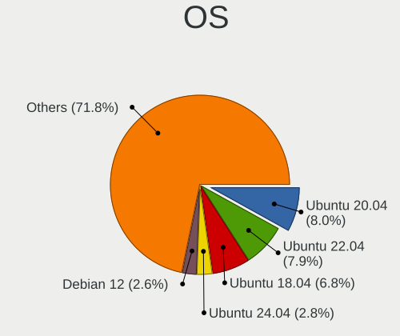

| Name                         | Computers | Percent |
|------------------------------|-----------|---------|
| Ubuntu 20.04                 | 321       | 8.05%   |
| Ubuntu 22.04                 | 314       | 7.87%   |
| Ubuntu 18.04                 | 273       | 6.84%   |
| Ubuntu 24.04                 | 113       | 2.83%   |
| Debian 12                    | 105       | 2.63%   |
| Debian 11                    | 104       | 2.61%   |
| Arch Rolling                 | 93        | 2.33%   |
| Pop!_OS 22.04                | 70        | 1.75%   |
| Linux Mint 20.3              | 59        | 1.48%   |
| openSUSE Tumbleweed-XXXXXXXX | 56        | 1.4%    |
| Zorin 17                     | 51        | 1.28%   |
| Linux Mint 22.1              | 50        | 1.25%   |
| Fedora 39                    | 50        | 1.25%   |
| OpenMandriva 4.3             | 46        | 1.15%   |
| Linux Mint 21.3              | 46        | 1.15%   |
| Fedora 42                    | 46        | 1.15%   |
| Linux Mint 22.2              | 43        | 1.08%   |
| Linux Mint 21.2              | 43        | 1.08%   |
| Debian 10                    | 43        | 1.08%   |
| Zorin 16                     | 41        | 1.03%   |
| Fedora 41                    | 41        | 1.03%   |
| Fedora 40                    | 39        | 0.98%   |
| Ubuntu 21.10                 | 38        | 0.95%   |
| Manjaro                      | 38        | 0.95%   |
| Linux Mint 20.1              | 37        | 0.93%   |
| Linux Mint 21.1              | 36        | 0.9%    |
| Linux Mint 20.2              | 36        | 0.9%    |
| KDE neon 20.04               | 36        | 0.9%    |
| ArcoLinux Rolling            | 35        | 0.88%   |
| OpenMandriva 4.2             | 32        | 0.8%    |
| Fedora 38                    | 31        | 0.78%   |
| Ubuntu 23.10                 | 29        | 0.73%   |
| OpenMandriva 24.12           | 29        | 0.73%   |
| Arch                         | 28        | 0.7%    |
| Linux Mint 22                | 27        | 0.68%   |
| Ubuntu 20.10                 | 26        | 0.65%   |
| EndeavourOS Rolling          | 26        | 0.65%   |
| Debian                       | 25        | 0.63%   |
| Ubuntu 22.10                 | 24        | 0.6%    |
| OpenMandriva 23.01           | 24        | 0.6%    |

OS Family
---------

OS without a version

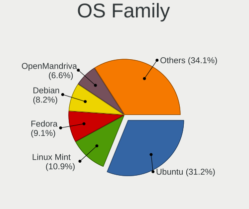

| Name          | Computers | Percent |
|---------------|-----------|---------|
| Ubuntu        | 1145      | 31.16%  |
| Linux Mint    | 400       | 10.89%  |
| Fedora        | 333       | 9.06%   |
| Debian        | 303       | 8.25%   |
| OpenMandriva  | 242       | 6.59%   |
| Pop!_OS       | 136       | 3.7%    |
| Zorin         | 123       | 3.35%   |
| Arch          | 119       | 3.24%   |
| Manjaro       | 102       | 2.78%   |
| openSUSE      | 78        | 2.12%   |
| Kubuntu       | 75        | 2.04%   |
| KDE neon      | 54        | 1.47%   |
| ArcoLinux     | 38        | 1.03%   |
| Xubuntu       | 37        | 1.01%   |
| Elementary    | 30        | 0.82%   |
| Gentoo        | 28        | 0.76%   |
| EndeavourOS   | 28        | 0.76%   |
| ROSA          | 27        | 0.73%   |
| Ubuntu MATE   | 25        | 0.68%   |
| Bazzite       | 23        | 0.63%   |
| Lubuntu       | 22        | 0.6%    |
| Kali          | 22        | 0.6%    |
| CachyOS       | 17        | 0.46%   |
| LMDE          | 16        | 0.44%   |
| NixOS         | 15        | 0.41%   |
| Feren OS      | 13        | 0.35%   |
| SteamOS       | 12        | 0.33%   |
| MX            | 12        | 0.33%   |
| CentOS        | 12        | 0.33%   |
| Ubuntu Budgie | 11        | 0.3%    |
| Nobara        | 11        | 0.3%    |
| Ubuntu Unity  | 10        | 0.27%   |
| Clear Linux   | 9         | 0.24%   |
| Artix         | 9         | 0.24%   |
| RHEL          | 8         | 0.22%   |
| Garuda Linux  | 8         | 0.22%   |
| TUXEDO OS     | 7         | 0.19%   |
| Parrot        | 7         | 0.19%   |
| Endless       | 7         | 0.19%   |
| BlackPanther  | 7         | 0.19%   |

Kernel
------

Version of the Linux kernel

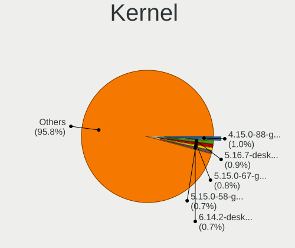

| Version                  | Computers | Percent |
|--------------------------|-----------|---------|
| 4.15.0-88-generic        | 44        | 0.98%   |
| 5.16.7-desktop-1omv4003  | 41        | 0.92%   |
| 5.15.0-67-generic        | 37        | 0.83%   |
| 5.15.0-58-generic        | 33        | 0.74%   |
| 6.14.2-desktop-3omv2590  | 32        | 0.71%   |
| 5.4.0-42-generic         | 32        | 0.71%   |
| 6.8.0-51-generic         | 31        | 0.69%   |
| 5.15.0-56-generic        | 31        | 0.69%   |
| 5.10.14-desktop-1omv4002 | 31        | 0.69%   |
| 5.15.0-69-generic        | 30        | 0.67%   |
| 4.15.0-91-generic        | 27        | 0.6%    |
| 6.12.1-desktop-1omv2490  | 25        | 0.56%   |
| 5.15.0-46-generic        | 25        | 0.56%   |
| 5.15.0-91-generic        | 24        | 0.54%   |
| 6.14.0-36-generic        | 22        | 0.49%   |
| 5.4.0-52-generic         | 22        | 0.49%   |
| 5.4.0-48-generic         | 22        | 0.49%   |
| 5.19.0-35-generic        | 22        | 0.49%   |
| 4.15.0-96-generic        | 22        | 0.49%   |
| 6.1.1-desktop-1omv2290   | 20        | 0.45%   |
| 5.4.0-58-generic         | 20        | 0.45%   |
| 6.8.0-48-generic         | 19        | 0.42%   |
| 6.8.0-52-generic         | 18        | 0.4%    |
| 6.2.6-desktop-1omv2390   | 17        | 0.38%   |
| 6.14.0-33-generic        | 17        | 0.38%   |
| 5.10.0-8-arm64           | 17        | 0.38%   |
| 6.8.0-60-generic         | 16        | 0.36%   |
| 6.5.0-35-generic         | 16        | 0.36%   |
| 6.9.3-76060903-generic   | 15        | 0.33%   |
| 6.6.2-desktop-1omv2390   | 15        | 0.33%   |
| 6.2.0-26-generic         | 15        | 0.33%   |
| 6.14.0-29-generic        | 15        | 0.33%   |
| 5.8.0-43-generic         | 15        | 0.33%   |
| 5.15.0-60-generic        | 15        | 0.33%   |
| 5.10.0-21-amd64          | 15        | 0.33%   |
| 6.8.0-49-generic         | 14        | 0.31%   |
| 6.8.0-45-generic         | 14        | 0.31%   |
| 6.5.0-14-generic         | 14        | 0.31%   |
| 5.4.0-91-generic         | 14        | 0.31%   |
| 5.4.0-26-generic         | 14        | 0.31%   |

Kernel Family
-------------

Linux kernel without a distro release

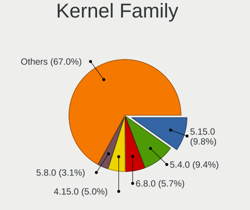

| Version | Computers | Percent |
|---------|-----------|---------|
| 5.15.0  | 409       | 9.83%   |
| 5.4.0   | 390       | 9.38%   |
| 6.8.0   | 237       | 5.7%    |
| 4.15.0  | 208       | 5%      |
| 5.8.0   | 129       | 3.1%    |
| 6.5.0   | 123       | 2.96%   |
| 5.11.0  | 117       | 2.81%   |
| 6.1.0   | 114       | 2.74%   |
| 5.10.0  | 110       | 2.64%   |
| 6.14.0  | 108       | 2.6%    |
| 5.13.0  | 108       | 2.6%    |
| 6.2.0   | 92        | 2.21%   |
| 5.19.0  | 86        | 2.07%   |
| 5.3.0   | 72        | 1.73%   |
| 5.0.0   | 51        | 1.23%   |
| 6.11.0  | 43        | 1.03%   |
| 5.16.7  | 42        | 1.01%   |
| 4.18.0  | 42        | 1.01%   |
| 6.14.2  | 40        | 0.96%   |
| 4.19.0  | 37        | 0.89%   |
| 6.12.1  | 33        | 0.79%   |
| 5.10.14 | 32        | 0.77%   |
| 6.1.1   | 24        | 0.58%   |
| 6.2.6   | 23        | 0.55%   |
| 5.14.0  | 22        | 0.53%   |
| 6.9.3   | 18        | 0.43%   |
| 6.6.2   | 17        | 0.41%   |
| 5.17.5  | 14        | 0.34%   |
| 6.4.11  | 13        | 0.31%   |
| 6.17.7  | 13        | 0.31%   |
| 6.12.10 | 12        | 0.29%   |
| 6.11.5  | 12        | 0.29%   |
| 6.5.6   | 11        | 0.26%   |
| 6.12.6  | 11        | 0.26%   |
| 6.0.0   | 11        | 0.26%   |
| 5.6.0   | 11        | 0.26%   |
| 6.17.9  | 10        | 0.24%   |
| 6.17.0  | 10        | 0.24%   |
| 6.17.8  | 9         | 0.22%   |
| 6.12.9  | 9         | 0.22%   |

Kernel Major Ver.
-----------------

Linux kernel major version

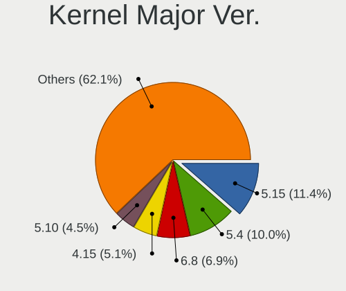

| Version | Computers | Percent |
|---------|-----------|---------|
| 5.15    | 467       | 11.42%  |
| 5.4     | 409       | 10%     |
| 6.8     | 284       | 6.94%   |
| 4.15    | 209       | 5.11%   |
| 5.10    | 183       | 4.47%   |
| 6.1     | 179       | 4.38%   |
| 6.14    | 171       | 4.18%   |
| 6.5     | 169       | 4.13%   |
| 5.8     | 162       | 3.96%   |
| 5.11    | 146       | 3.57%   |
| 6.2     | 139       | 3.4%    |
| 6.12    | 135       | 3.3%    |
| 5.13    | 125       | 3.06%   |
| 5.19    | 99        | 2.42%   |
| 6.6     | 86        | 2.1%    |
| 6.11    | 85        | 2.08%   |
| 5.3     | 85        | 2.08%   |
| 5.16    | 78        | 1.91%   |
| 6.17    | 66        | 1.61%   |
| 5.0     | 56        | 1.37%   |
| 4.18    | 50        | 1.22%   |
| 6.0     | 49        | 1.2%    |
| 5.14    | 49        | 1.2%    |
| 4.19    | 44        | 1.08%   |
| 6.4     | 42        | 1.03%   |
| 6.10    | 42        | 1.03%   |
| 5.6     | 42        | 1.03%   |
| 5.17    | 41        | 1%      |
| 6.9     | 40        | 0.98%   |
| 6.15    | 39        | 0.95%   |
| 6.16    | 32        | 0.78%   |
| 6.3     | 30        | 0.73%   |
| 6.13    | 30        | 0.73%   |
| 5.9     | 29        | 0.71%   |
| 5.7     | 29        | 0.71%   |
| 5.18    | 28        | 0.68%   |
| 6.7     | 27        | 0.66%   |
| 5.12    | 25        | 0.61%   |
| 4.9     | 23        | 0.56%   |
| 5.5     | 11        | 0.27%   |

Arch
----

OS architecture (x86_64, i586, etc.)

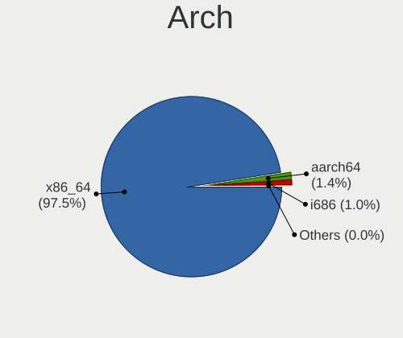

| Name    | Computers | Percent |
|---------|-----------|---------|
| x86_64  | 3442      | 97.51%  |
| aarch64 | 49        | 1.39%   |
| i686    | 35        | 0.99%   |
| armv7l  | 2         | 0.06%   |
| riscv64 | 1         | 0.03%   |
| armv8l  | 1         | 0.03%   |

DE
--

Desktop Environment

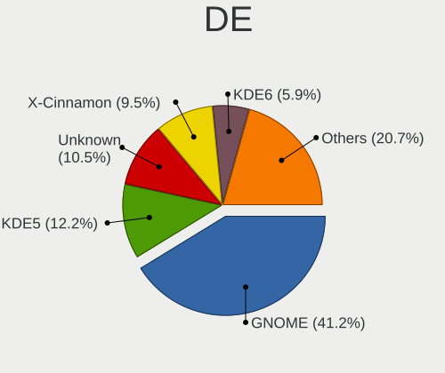

| Name            | Computers | Percent |
|-----------------|-----------|---------|
| GNOME           | 1528      | 41.24%  |
| KDE5            | 451       | 12.17%  |
| Unknown         | 389       | 10.5%   |
| X-Cinnamon      | 352       | 9.5%    |
| KDE6            | 219       | 5.91%   |
| XFCE            | 184       | 4.97%   |
| GNUstep         | 157       | 4.24%   |
| MATE            | 84        | 2.27%   |
| KDE             | 54        | 1.46%   |
| Cinnamon        | 41        | 1.11%   |
| LXQt            | 35        | 0.94%   |
| Pantheon        | 31        | 0.84%   |
| KDE4            | 24        | 0.65%   |
| i3              | 24        | 0.65%   |
| LXDE            | 22        | 0.59%   |
| Budgie          | 19        | 0.51%   |
| Hyprland        | 17        | 0.46%   |
| GNOME Flashback | 17        | 0.46%   |
| Unity           | 8         | 0.22%   |
| Trinity         | 5         | 0.13%   |
| qtile           | 5         | 0.13%   |
| COSMIC          | 5         | 0.13%   |
| bspwm           | 5         | 0.13%   |
| sway            | 4         | 0.11%   |
| GNOME Classic   | 4         | 0.11%   |
| ICEWM           | 2         | 0.05%   |
| fluxbox         | 2         | 0.05%   |
| Enlightenment   | 2         | 0.05%   |
| DWM             | 2         | 0.05%   |
| Deepin          | 2         | 0.05%   |
| awesome         | 2         | 0.05%   |
| xmonad-session  | 1         | 0.03%   |
| xmonad          | 1         | 0.03%   |
| sway:wlroots    | 1         | 0.03%   |
| openbox         | 1         | 0.03%   |
| none+i3         | 1         | 0.03%   |
| none+awesome    | 1         | 0.03%   |
| niri            | 1         | 0.03%   |
| KDE:KDE-Wayland | 1         | 0.03%   |
| herbstluftwm    | 1         | 0.03%   |

Display Server
--------------

X11 or Wayland

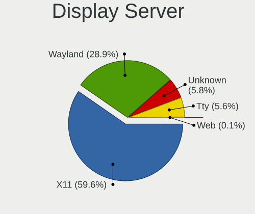

| Name    | Computers | Percent |
|---------|-----------|---------|
| X11     | 2218      | 59.64%  |
| Wayland | 1073      | 28.85%  |
| Unknown | 214       | 5.75%   |
| Tty     | 210       | 5.65%   |
| Web     | 4         | 0.11%   |

Display Manager
---------------

SDDM, LightDM, etc.

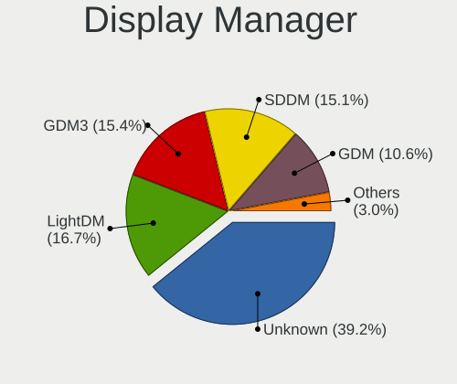

| Name           | Computers | Percent |
|----------------|-----------|---------|
| Unknown        | 1451      | 39.17%  |
| LightDM        | 617       | 16.66%  |
| GDM3           | 571       | 15.42%  |
| SDDM           | 560       | 15.12%  |
| GDM            | 394       | 10.64%  |
| TDM            | 81        | 2.19%   |
| KDM            | 15        | 0.4%    |
| XDM            | 4         | 0.11%   |
| SLiM           | 4         | 0.11%   |
| LY-DM          | 3         | 0.08%   |
| NODM           | 1         | 0.03%   |
| LXDM           | 1         | 0.03%   |
| GREETD         | 1         | 0.03%   |
| COSMIC-GREETER | 1         | 0.03%   |

OS Lang
-------

Language

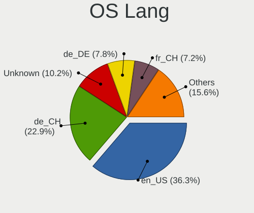

| Lang       | Computers | Percent |
|------------|-----------|---------|
| en_US      | 1337      | 36.26%  |
| de_CH      | 845       | 22.92%  |
| Unknown    | 377       | 10.23%  |
| de_DE      | 287       | 7.78%   |
| fr_CH      | 264       | 7.16%   |
| en_GB      | 183       | 4.96%   |
| fr_FR      | 108       | 2.93%   |
| C          | 90        | 2.44%   |
| it_CH      | 43        | 1.17%   |
| it_IT      | 37        | 1%      |
| pt_PT      | 19        | 0.52%   |
| es_ES      | 13        | 0.35%   |
| ru_RU      | 12        | 0.33%   |
| pl_PL      | 10        | 0.27%   |
| en_AU      | 9         | 0.24%   |
| en_CH      | 8         | 0.22%   |
| de_AT      | 5         | 0.14%   |
| en_IE      | 4         | 0.11%   |
| POSIX      | 3         | 0.08%   |
| de_IT      | 3         | 0.08%   |
| sk_SK      | 2         | 0.05%   |
| hu_HU      | 2         | 0.05%   |
| fi_FI      | 2         | 0.05%   |
| en_CA      | 2         | 0.05%   |
| en_AG      | 2         | 0.05%   |
| de_LI      | 2         | 0.05%   |
| de_CH.UTF8 | 2         | 0.05%   |
| C.UTF8     | 2         | 0.05%   |
| tr_TR      | 1         | 0.03%   |
| ru_UA      | 1         | 0.03%   |
| pt_BR      | 1         | 0.03%   |
| nl_BE      | 1         | 0.03%   |
| nb_NO      | 1         | 0.03%   |
| hsb_DE     | 1         | 0.03%   |
| gsw_CH     | 1         | 0.03%   |
| fr_CA      | 1         | 0.03%   |
| es_PE      | 1         | 0.03%   |
| en_IN      | 1         | 0.03%   |
| en_DK      | 1         | 0.03%   |
| da_DK      | 1         | 0.03%   |

Boot Mode
---------

EFI or BIOS

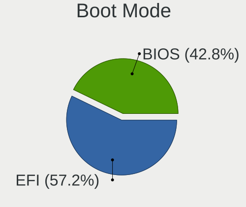

| Mode | Computers | Percent |
|------|-----------|---------|
| EFI  | 2068      | 57.16%  |
| BIOS | 1550      | 42.84%  |

Filesystem
----------

Type of filesystem

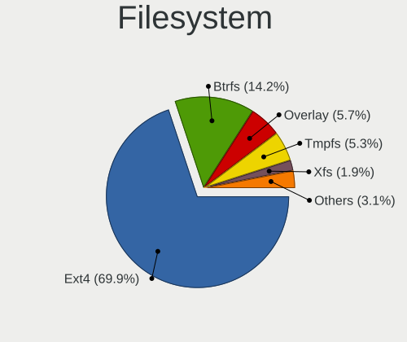

| Type    | Computers | Percent |
|---------|-----------|---------|
| Ext4    | 2560      | 69.91%  |
| Btrfs   | 519       | 14.17%  |
| Overlay | 207       | 5.65%   |
| Tmpfs   | 195       | 5.32%   |
| Xfs     | 68        | 1.86%   |
| Unknown | 65        | 1.77%   |
| Zfs     | 24        | 0.66%   |
| Ext2    | 9         | 0.25%   |
| Ext3    | 7         | 0.19%   |
| F2fs    | 4         | 0.11%   |
| Rootfs  | 1         | 0.03%   |
| Jfs     | 1         | 0.03%   |
| ExX4    | 1         | 0.03%   |
| Aufs    | 1         | 0.03%   |

Part. scheme
------------

Scheme of partitioning

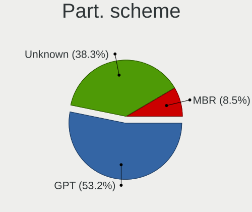

| Type    | Computers | Percent |
|---------|-----------|---------|
| GPT     | 1931      | 53.2%   |
| Unknown | 1392      | 38.35%  |
| MBR     | 307       | 8.46%   |

Dual Boot with Linux/BSD
------------------------

Hosting more than one Linux/BSD

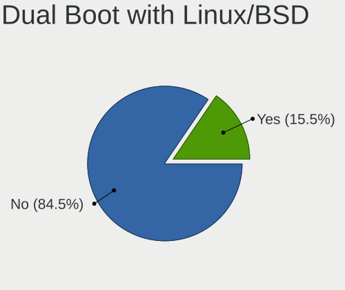

| Dual boot | Computers | Percent |
|-----------|-----------|---------|
| No        | 3059      | 84.53%  |
| Yes       | 560       | 15.47%  |

Dual Boot (Win)
---------------

Hosting Linux and Windows

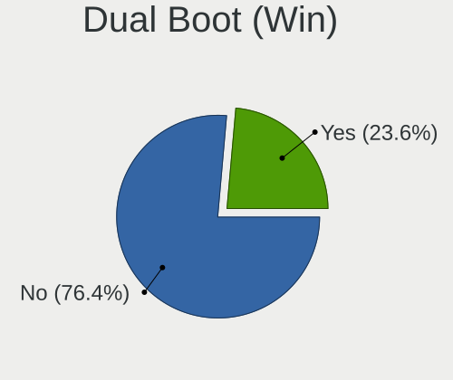

| Dual boot | Computers | Percent |
|-----------|-----------|---------|
| No        | 2745      | 76.4%   |
| Yes       | 848       | 23.6%   |

Board
-----

Vendor
------

Motherboard manufacturer

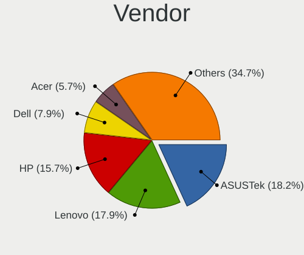

| Name                                 | Computers | Percent |
|--------------------------------------|-----------|---------|
| ASUSTek Computer                     | 641       | 18.17%  |
| Lenovo                               | 631       | 17.89%  |
| Hewlett-Packard                      | 554       | 15.7%   |
| Dell                                 | 277       | 7.85%   |
| Acer                                 | 202       | 5.73%   |
| Apple                                | 171       | 4.85%   |
| Gigabyte Technology                  | 156       | 4.42%   |
| MSI                                  | 144       | 4.08%   |
| ASRock                               | 104       | 2.95%   |
| Intel                                | 95        | 2.69%   |
| Fujitsu                              | 50        | 1.42%   |
| Medion                               | 46        | 1.3%    |
| Raspberry Pi Foundation              | 37        | 1.05%   |
| Microsoft                            | 31        | 0.88%   |
| Unknown                              | 30        | 0.85%   |
| Supermicro                           | 24        | 0.68%   |
| Sony                                 | 24        | 0.68%   |
| Toshiba                              | 23        | 0.65%   |
| TUXEDO                               | 22        | 0.62%   |
| Samsung Electronics                  | 16        | 0.45%   |
| Notebook                             | 16        | 0.45%   |
| Shuttle                              | 13        | 0.37%   |
| HUAWEI                               | 13        | 0.37%   |
| ZOTAC                                | 9         | 0.26%   |
| Valve                                | 9         | 0.26%   |
| Shenzhen Meigao Electronic Equipment | 9         | 0.26%   |
| PC Engines                           | 9         | 0.26%   |
| Alienware                            | 8         | 0.23%   |
| TrekStor                             | 7         | 0.2%    |
| Schenker                             | 7         | 0.2%    |
| Razer                                | 7         | 0.2%    |
| Pegatron                             | 7         | 0.2%    |
| Packard Bell                         | 7         | 0.2%    |
| DALCO AG Switzerland                 | 6         | 0.17%   |
| Biostar                              | 6         | 0.17%   |
| Google                               | 5         | 0.14%   |
| Clevo                                | 5         | 0.14%   |
| Inventec                             | 4         | 0.11%   |
| GPD                                  | 4         | 0.11%   |
| Fujitsu Siemens                      | 4         | 0.11%   |

Model
-----

Motherboard model

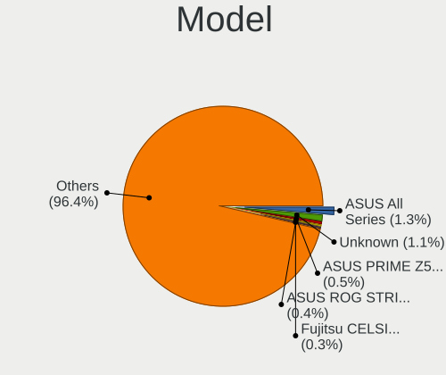

| Name                                  | Computers | Percent |
|---------------------------------------|-----------|---------|
| ASUS All Series                       | 47        | 1.33%   |
| Unknown                               | 39        | 1.11%   |
| ASUS PRIME Z590-P                     | 17        | 0.48%   |
| ASUS ROG STRIX X570-E GAMING          | 13        | 0.37%   |
| Fujitsu CELSIUS_W550                  | 12        | 0.34%   |
| ASUS PRIME X570-PRO                   | 12        | 0.34%   |
| Apple MacBookPro8,1                   | 11        | 0.31%   |
| RPi Raspberry Pi 4 Model B Rev 1.2    | 10        | 0.28%   |
| HP Pavilion dv7                       | 10        | 0.28%   |
| ASUS PRIME B550M-A                    | 10        | 0.28%   |
| Apple iMac12,2                        | 10        | 0.28%   |
| RPi Raspberry Pi 4 Model B Rev 1.1    | 9         | 0.26%   |
| MSI MS-7C02                           | 9         | 0.26%   |
| Apple MacBookPro9,2                   | 9         | 0.26%   |
| RPi Raspberry Pi 3 Model B Rev 1.2    | 8         | 0.23%   |
| HP EliteBook 840 G5                   | 8         | 0.23%   |
| Dell OptiPlex 7010                    | 8         | 0.23%   |
| Dell Latitude 7490                    | 8         | 0.23%   |
| ASUS STRIX Z270F GAMING               | 8         | 0.23%   |
| Apple MacPro5,1                       | 8         | 0.23%   |
| Microsoft Surface Pro 4               | 7         | 0.2%    |
| HP Pavilion dv6                       | 7         | 0.2%    |
| HP Notebook                           | 7         | 0.2%    |
| ASUS ROG STRIX Z370-F GAMING          | 7         | 0.2%    |
| ASUS P9X79 WS                         | 7         | 0.2%    |
| ASUS P8Z77-V LX                       | 7         | 0.2%    |
| Apple iMac10,1                        | 7         | 0.2%    |
| Valve Jupiter                         | 6         | 0.17%   |
| PC Engines APU2                       | 6         | 0.17%   |
| Lenovo IdeaPadFlex 5 14ALC05 82HU     | 6         | 0.17%   |
| HP Pavilion g7                        | 6         | 0.17%   |
| HP EliteBook 840 G6                   | 6         | 0.17%   |
| Dell XPS 15 9570                      | 6         | 0.17%   |
| Dell XPS 15 9560                      | 6         | 0.17%   |
| Dell Precision Tower 5810             | 6         | 0.17%   |
| Dell OptiPlex 9020                    | 6         | 0.17%   |
| DALCO AG Switzerland +41 44 908 38 38 | 6         | 0.17%   |
| Apple MacBookPro11,1                  | 6         | 0.17%   |
| Apple MacBookPro10,1                  | 6         | 0.17%   |
| Apple iMac8,1                         | 6         | 0.17%   |

Model Family
------------

Motherboard model prefix

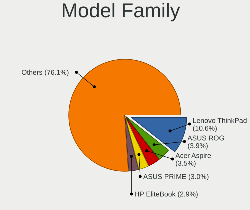

| Name               | Computers | Percent |
|--------------------|-----------|---------|
| Lenovo ThinkPad    | 375       | 10.63%  |
| ASUS ROG           | 136       | 3.85%   |
| Acer Aspire        | 123       | 3.49%   |
| ASUS PRIME         | 106       | 3%      |
| HP EliteBook       | 104       | 2.95%   |
| HP Pavilion        | 80        | 2.27%   |
| Dell Latitude      | 80        | 2.27%   |
| Dell XPS           | 74        | 2.1%    |
| Lenovo Yoga        | 71        | 2.01%   |
| HP ProBook         | 62        | 1.76%   |
| Lenovo IdeaPad     | 54        | 1.53%   |
| ASUS All           | 47        | 1.33%   |
| HP ENVY            | 45        | 1.28%   |
| Dell OptiPlex      | 43        | 1.22%   |
| ASUS VivoBook      | 40        | 1.13%   |
| Unknown            | 39        | 1.11%   |
| RPi Raspberry      | 36        | 1.02%   |
| HP Compaq          | 36        | 1.02%   |
| HP EliteDesk       | 32        | 0.91%   |
| Microsoft Surface  | 31        | 0.88%   |
| ASUS TUF           | 31        | 0.88%   |
| Fujitsu CELSIUS    | 28        | 0.79%   |
| HP Laptop          | 27        | 0.77%   |
| Dell Precision     | 27        | 0.77%   |
| Acer Swift         | 26        | 0.74%   |
| HP ZBook           | 25        | 0.71%   |
| Dell Inspiron      | 25        | 0.71%   |
| Lenovo Legion      | 20        | 0.57%   |
| Lenovo IdeaPadFlex | 18        | 0.51%   |
| ASUS ASUS          | 18        | 0.51%   |
| HP Spectre         | 17        | 0.48%   |
| Lenovo ThinkCentre | 16        | 0.45%   |
| HP OMEN            | 16        | 0.45%   |
| Toshiba Satellite  | 15        | 0.43%   |
| ASUS ZenBook       | 15        | 0.43%   |
| Apple iMac12       | 14        | 0.4%    |
| Acer Predator      | 14        | 0.4%    |
| Apple MacBookPro8  | 13        | 0.37%   |
| Lenovo ThinkBook   | 12        | 0.34%   |
| Gigabyte X570      | 11        | 0.31%   |

MFG Year
--------

Motherboard manufacture year

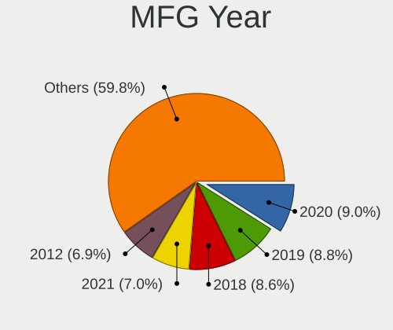

| Year    | Computers | Percent |
|---------|-----------|---------|
| 2020    | 317       | 8.99%   |
| 2019    | 309       | 8.76%   |
| 2018    | 303       | 8.59%   |
| 2021    | 248       | 7.03%   |
| 2012    | 243       | 6.89%   |
| 2017    | 241       | 6.83%   |
| 2022    | 213       | 6.04%   |
| 2013    | 192       | 5.44%   |
| 2011    | 192       | 5.44%   |
| 2014    | 188       | 5.33%   |
| 2015    | 179       | 5.07%   |
| 2016    | 175       | 4.96%   |
| 2023    | 174       | 4.93%   |
| 2010    | 132       | 3.74%   |
| 2024    | 111       | 3.15%   |
| 2008    | 90        | 2.55%   |
| 2009    | 78        | 2.21%   |
| 2007    | 40        | 1.13%   |
| Unknown | 38        | 1.08%   |
| 2025    | 32        | 0.91%   |
| 2006    | 22        | 0.62%   |
| 2005    | 7         | 0.2%    |
| 2004    | 3         | 0.09%   |
| 2003    | 1         | 0.03%   |

Form Factor
-----------

Physical design of the computer

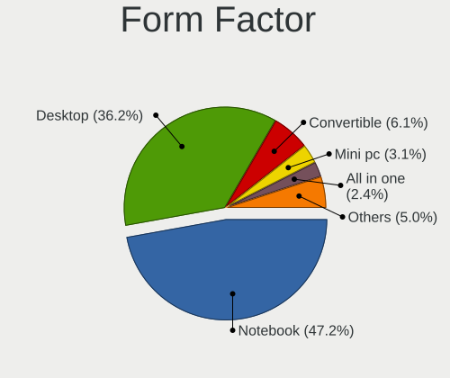

| Name           | Computers | Percent |
|----------------|-----------|---------|
| Notebook       | 1664      | 47.17%  |
| Desktop        | 1277      | 36.2%   |
| Convertible    | 214       | 6.07%   |
| Mini pc        | 110       | 3.12%   |
| All in one     | 85        | 2.41%   |
| Tablet         | 67        | 1.9%    |
| Server         | 61        | 1.73%   |
| System on chip | 47        | 1.33%   |
| Phone          | 3         | 0.09%   |

Secure Boot
-----------

Enabled or disabled

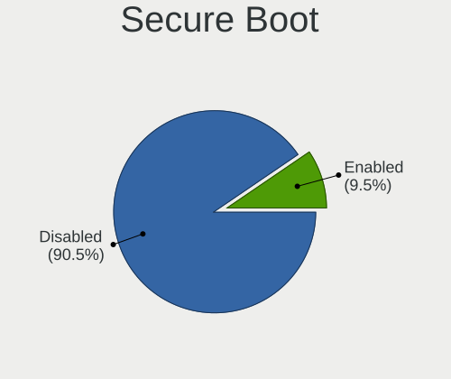

| State    | Computers | Percent |
|----------|-----------|---------|
| Disabled | 3224      | 90.49%  |
| Enabled  | 339       | 9.51%   |

Coreboot
--------

Have coreboot on board

| Used | Computers | Percent |
|------|-----------|---------|
| No   | 3505      | 99.35%  |
| Yes  | 23        | 0.65%   |

RAM Size
--------

Total RAM memory

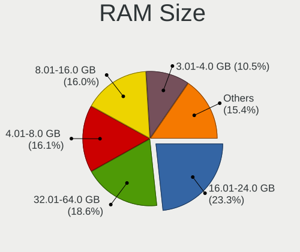

| Size in GB      | Computers | Percent |
|-----------------|-----------|---------|
| 16.01-24.0      | 838       | 23.32%  |
| 32.01-64.0      | 668       | 18.59%  |
| 4.01-8.0        | 579       | 16.11%  |
| 8.01-16.0       | 576       | 16.03%  |
| 3.01-4.0        | 379       | 10.55%  |
| 64.01-256.0     | 283       | 7.87%   |
| 24.01-32.0      | 128       | 3.56%   |
| 1.01-2.0        | 64        | 1.78%   |
| More than 256.0 | 35        | 0.97%   |
| 0.51-1.0        | 25        | 0.7%    |
| 2.01-3.0        | 18        | 0.5%    |
| 0.01-0.5        | 1         | 0.03%   |

RAM Used
--------

Used RAM memory

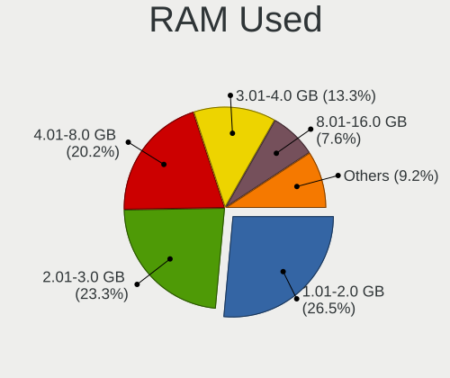

| Used GB         | Computers | Percent |
|-----------------|-----------|---------|
| 1.01-2.0        | 1066      | 26.45%  |
| 2.01-3.0        | 938       | 23.28%  |
| 4.01-8.0        | 815       | 20.22%  |
| 3.01-4.0        | 535       | 13.28%  |
| 8.01-16.0       | 305       | 7.57%   |
| 0.51-1.0        | 207       | 5.14%   |
| 16.01-24.0      | 56        | 1.39%   |
| 0.01-0.5        | 56        | 1.39%   |
| 24.01-32.0      | 19        | 0.47%   |
| 32.01-64.0      | 14        | 0.35%   |
| 64.01-256.0     | 12        | 0.3%    |
| Unknown         | 4         | 0.1%    |
| More than 256.0 | 3         | 0.07%   |

Total Drives
------------

Number of drives on board

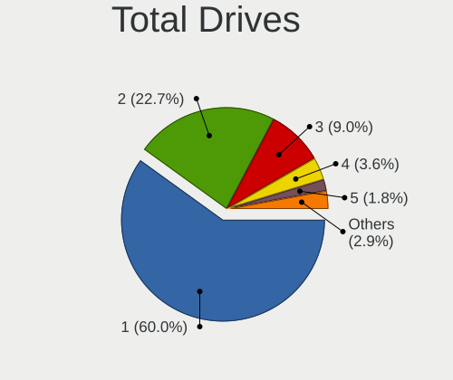

| Drives  | Computers | Percent |
|---------|-----------|---------|
| 1       | 2194      | 59.96%  |
| 2       | 832       | 22.74%  |
| 3       | 328       | 8.96%   |
| 4       | 133       | 3.63%   |
| 5       | 66        | 1.8%    |
| 6       | 34        | 0.93%   |
| 0       | 30        | 0.82%   |
| 7       | 25        | 0.68%   |
| 9       | 5         | 0.14%   |
| 14      | 3         | 0.08%   |
| 8       | 3         | 0.08%   |
| 13      | 2         | 0.05%   |
| 11      | 2         | 0.05%   |
| 18      | 1         | 0.03%   |
| Unknown | 1         | 0.03%   |

Has CD-ROM
----------

Has CD-ROM on board

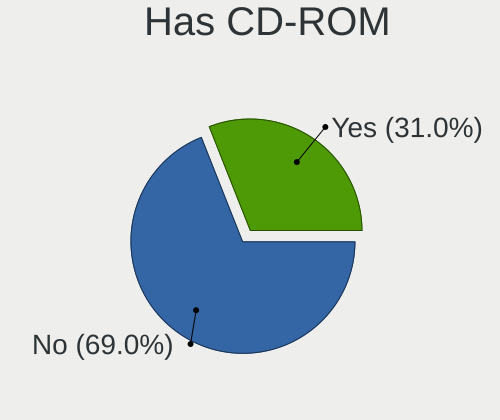

| Presented | Computers | Percent |
|-----------|-----------|---------|
| No        | 2460      | 69%     |
| Yes       | 1105      | 31%     |

Has Ethernet
------------

Has Ethernet on board

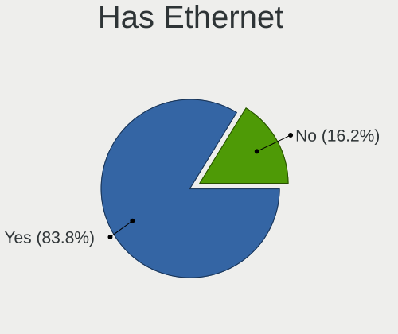

| Presented | Computers | Percent |
|-----------|-----------|---------|
| Yes       | 2979      | 83.77%  |
| No        | 577       | 16.23%  |

Has WiFi
--------

Has WiFi module

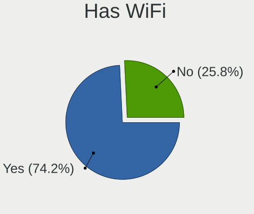

| Presented | Computers | Percent |
|-----------|-----------|---------|
| Yes       | 2636      | 74.23%  |
| No        | 915       | 25.77%  |

Has Bluetooth
-------------

Has Bluetooth module

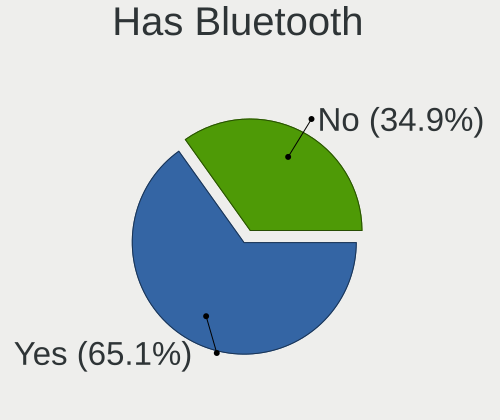

| Presented | Computers | Percent |
|-----------|-----------|---------|
| Yes       | 2326      | 65.14%  |
| No        | 1245      | 34.86%  |

Location
--------

Country
-------

Geographic location (country)

| Country     | Computers | Percent |
|-------------|-----------|---------|
| Switzerland | 3528      | 100%    |

City
----

Geographic location (city)

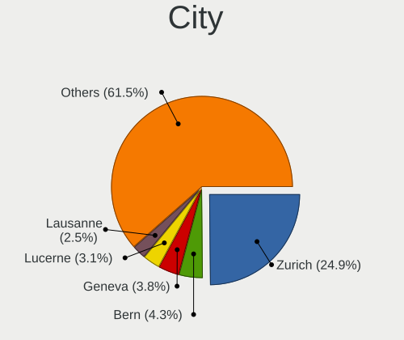

| City                               | Computers | Percent |
|------------------------------------|-----------|---------|
| Zurich                             | 959       | 24.85%  |
| Bern                               | 165       | 4.28%   |
| Geneva                             | 145       | 3.76%   |
| Lucerne                            | 121       | 3.14%   |
| Lausanne                           | 96        | 2.49%   |
| Winterthur                         | 71        | 1.84%   |
| Basel                              | 67        | 1.74%   |
| Dietikon                           | 43        | 1.11%   |
| St. Gallen                         | 42        | 1.09%   |
| Thun                               | 39        | 1.01%   |
| Neuchatel                          | 38        | 0.98%   |
| Lugano                             | 37        | 0.96%   |
| Wiesendangen / Wiesendangen (Dorf) | 33        | 0.86%   |
| Biel/Bienne                        | 27        | 0.7%    |
| Wil                                | 25        | 0.65%   |
| Zweidlen-Dorf                      | 24        | 0.62%   |
| Lyss                               | 22        | 0.57%   |
| Ittigen                            | 22        | 0.57%   |
| Zollikofen                         | 18        | 0.47%   |
| Sion                               | 18        | 0.47%   |
| Aarburg                            | 18        | 0.47%   |
| Suhr                               | 17        | 0.44%   |
| Bulle                              | 17        | 0.44%   |
| Herrliberg                         | 16        | 0.41%   |
| Aarau                              | 16        | 0.41%   |
| Onex                               | 15        | 0.39%   |
| Dubendorf                          | 15        | 0.39%   |
| Bulach                             | 15        | 0.39%   |
| Wetzikon                           | 14        | 0.36%   |
| Wettingen                          | 14        | 0.36%   |
| Prilly                             | 14        | 0.36%   |
| Gossau                             | 14        | 0.36%   |
| Glattbrugg                         | 14        | 0.36%   |
| Zug                                | 13        | 0.34%   |
| Solothurn                          | 13        | 0.34%   |
| Muttenz                            | 13        | 0.34%   |
| Munchenstein                       | 13        | 0.34%   |
| Bellinzona                         | 13        | 0.34%   |
| Yverdon-les-Bains                  | 12        | 0.31%   |
| Thalwil                            | 12        | 0.31%   |

Drives
------

Drive Vendor
------------

Hard drive vendors

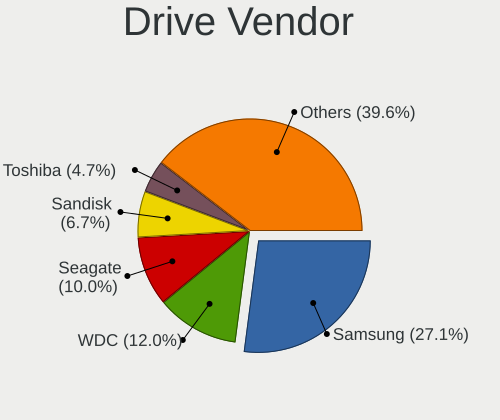

| Vendor                      | Computers | Drives | Percent |
|-----------------------------|-----------|--------|---------|
| Samsung Electronics         | 1377      | 2462   | 27.07%  |
| WDC                         | 610       | 1062   | 11.99%  |
| Seagate                     | 510       | 771    | 10.03%  |
| Sandisk                     | 339       | 447    | 6.66%   |
| Toshiba                     | 238       | 343    | 4.68%   |
| Unknown                     | 196       | 305    | 3.85%   |
| Intel                       | 193       | 276    | 3.79%   |
| SK hynix                    | 175       | 222    | 3.44%   |
| Kingston                    | 160       | 230    | 3.15%   |
| Crucial                     | 138       | 193    | 2.71%   |
| Hitachi                     | 125       | 174    | 2.46%   |
| Micron Technology           | 124       | 165    | 2.44%   |
| Apple                       | 86        | 129    | 1.69%   |
| Phison Electronics          | 60        | 86     | 1.18%   |
| HGST                        | 47        | 67     | 0.92%   |
| KIOXIA                      | 43        | 63     | 0.85%   |
| Micron/Crucial Technology   | 39        | 46     | 0.77%   |
| A-DATA Technology           | 38        | 51     | 0.75%   |
| Kingston Technology Company | 37        | 48     | 0.73%   |
| Corsair                     | 33        | 39     | 0.65%   |
| Intenso                     | 31        | 39     | 0.61%   |
| OCZ                         | 28        | 34     | 0.55%   |
| LITEON                      | 25        | 33     | 0.49%   |
| Phison                      | 23        | 36     | 0.45%   |
| China                       | 19        | 27     | 0.37%   |
| LITEONIT                    | 18        | 20     | 0.35%   |
| Transcend                   | 16        | 26     | 0.31%   |
| Unknown                     | 15        | 22     | 0.29%   |
| JMicron Technology          | 14        | 14     | 0.28%   |
| Hewlett-Packard             | 14        | 22     | 0.28%   |
| Patriot                     | 13        | 14     | 0.26%   |
| MAXIO Technology (Hangzhou) | 13        | 15     | 0.26%   |
| KingSpec                    | 12        | 19     | 0.24%   |
| ASMT                        | 12        | 18     | 0.24%   |
| SPCC                        | 11        | 13     | 0.22%   |
| Silicon Motion              | 11        | 12     | 0.22%   |
| PNY                         | 9         | 14     | 0.18%   |
| LaCie                       | 9         | 9      | 0.18%   |
| Fujitsu                     | 8         | 11     | 0.16%   |
| ADATA Technology            | 8         | 11     | 0.16%   |

Drive Model
-----------

Hard drive models

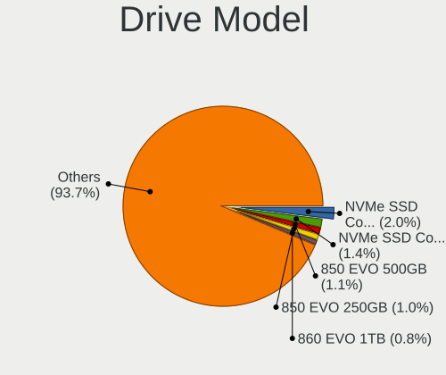

| Model                                                | Computers | Percent |
|------------------------------------------------------|-----------|---------|
| Samsung NVMe SSD Controller SM981/PM981/PM983 1TB    | 114       | 1.99%   |
| Samsung NVMe SSD Controller PM9A1/PM9A3/980PRO 1TB   | 83        | 1.45%   |
| Samsung SSD 850 EVO 500GB                            | 61        | 1.06%   |
| Samsung SSD 850 EVO 250GB                            | 56        | 0.98%   |
| Samsung SSD 860 EVO 1TB                              | 46        | 0.8%    |
| Samsung SSD 860 EVO 500GB                            | 39        | 0.68%   |
| Samsung SSD 860 EVO 250GB                            | 34        | 0.59%   |
| Samsung NVMe SSD Drive 1TB                           | 34        | 0.59%   |
| Samsung SSD 970 EVO Plus 1TB                         | 31        | 0.54%   |
| Samsung SSD 980 PRO 1TB                              | 30        | 0.52%   |
| Samsung SSD 870 EVO 1TB                              | 29        | 0.51%   |
| Samsung NVMe SSD Controller SM961/PM961/SM963 1024GB | 28        | 0.49%   |
| Seagate ST2000DM008-2FR102 2TB                       | 26        | 0.45%   |
| Samsung SSD 990 PRO 2TB                              | 26        | 0.45%   |
| Crucial CT1000MX500SSD1 1TB                          | 26        | 0.45%   |
| Unknown MMC Card  32GB                               | 25        | 0.44%   |
| SanDisk NVMe SSD Drive 1TB                           | 25        | 0.44%   |
| Samsung SSD 840 EVO 250GB                            | 25        | 0.44%   |
| Samsung NVMe SSD Drive 512GB                         | 24        | 0.42%   |
| Samsung SSD 850 EVO 1TB                              | 23        | 0.4%    |
| WDC WDS100T2B0A-00SM50 1TB SSD                       | 22        | 0.38%   |
| Unknown MMC Card  64GB                               | 22        | 0.38%   |
| Samsung SSD 860 QVO 1TB                              | 22        | 0.38%   |
| Unknown MMC Card  128GB                              | 21        | 0.37%   |
| Seagate Expansion 2TB                                | 21        | 0.37%   |
| Seagate ST2000DM006-2DM164 2TB                       | 20        | 0.35%   |
| SanDisk NVMe SSD Drive 512GB                         | 20        | 0.35%   |
| Samsung SSD 870 EVO 500GB                            | 20        | 0.35%   |
| Phison E12 NVMe Controller 1TB                       | 20        | 0.35%   |
| Toshiba DT01ACA100 1TB                               | 19        | 0.33%   |
| Samsung SSD 850 PRO 512GB                            | 19        | 0.33%   |
| HGST HTS721010A9E630 1TB                             | 19        | 0.33%   |
| Unknown SD/MMC/MS PRO 2GB                            | 18        | 0.31%   |
| Seagate ST4000DM004-2CV104 4TB                       | 18        | 0.31%   |
| Samsung SSD 850 PRO 256GB                            | 18        | 0.31%   |
| Samsung NVMe SSD Drive 500GB                         | 18        | 0.31%   |
| Samsung SSD 970 EVO Plus 500GB                       | 17        | 0.3%    |
| Samsung SSD 870 QVO 1TB                              | 17        | 0.3%    |
| Toshiba MQ01ABD100 1TB                               | 16        | 0.28%   |
| Seagate ST2000DM001-1ER164 2TB                       | 16        | 0.28%   |

HDD Vendor
----------

Hard disk drive vendors

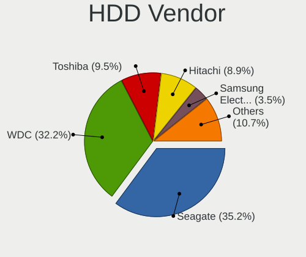

| Vendor              | Computers | Drives | Percent |
|---------------------|-----------|--------|---------|
| Seagate             | 496       | 731    | 35.15%  |
| WDC                 | 455       | 831    | 32.25%  |
| Toshiba             | 134       | 182    | 9.5%    |
| Hitachi             | 125       | 174    | 8.86%   |
| Samsung Electronics | 50        | 82     | 3.54%   |
| HGST                | 47        | 67     | 3.33%   |
| Apple               | 24        | 26     | 1.7%    |
| Unknown             | 19        | 22     | 1.35%   |
| JMicron Technology  | 9         | 9      | 0.64%   |
| Fujitsu             | 8         | 11     | 0.57%   |
| Hewlett-Packard     | 7         | 15     | 0.5%    |
| Maxtor              | 5         | 7      | 0.35%   |
| Intenso             | 4         | 4      | 0.28%   |
| External            | 3         | 3      | 0.21%   |
| ASMT                | 3         | 4      | 0.21%   |
| USB3.0              | 2         | 3      | 0.14%   |
| Initio              | 2         | 2      | 0.14%   |
| HPE                 | 2         | 9      | 0.14%   |
| HGST HTS            | 2         | 2      | 0.14%   |
| ASMedia             | 2         | 2      | 0.14%   |
| USB                 | 1         | 2      | 0.07%   |
| Unknown (CF)        | 1         | 1      | 0.07%   |
| TO Exter            | 1         | 1      | 0.07%   |
| SSK                 | 1         | 1      | 0.07%   |
| NVME USB            | 1         | 1      | 0.07%   |
| MARVELL             | 1         | 1      | 0.07%   |
| LaCie               | 1         | 1      | 0.07%   |
| IET                 | 1         | 1      | 0.07%   |
| ICY BOX             | 1         | 1      | 0.07%   |
| HUAWEI              | 1         | 16     | 0.07%   |
| ExcelStor           | 1         | 2      | 0.07%   |
| ASMT109x            | 1         | 1      | 0.07%   |

SSD Vendor
----------

Solid state drive vendors

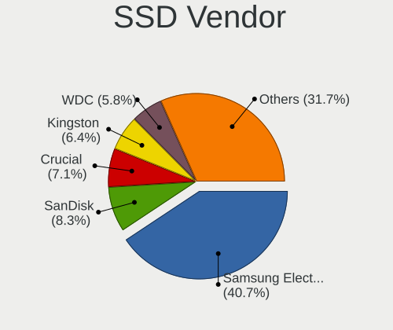

| Vendor              | Computers | Drives | Percent |
|---------------------|-----------|--------|---------|
| Samsung Electronics | 694       | 1181   | 40.68%  |
| SanDisk             | 142       | 189    | 8.32%   |
| Crucial             | 121       | 171    | 7.09%   |
| Kingston            | 110       | 160    | 6.45%   |
| WDC                 | 99        | 135    | 5.8%    |
| Intel               | 81        | 104    | 4.75%   |
| Apple               | 45        | 53     | 2.64%   |
| Micron Technology   | 41        | 59     | 2.4%    |
| Toshiba             | 38        | 56     | 2.23%   |
| SK hynix            | 29        | 36     | 1.7%    |
| OCZ                 | 28        | 34     | 1.64%   |
| A-DATA Technology   | 28        | 37     | 1.64%   |
| LITEON              | 24        | 32     | 1.41%   |
| Intenso             | 24        | 29     | 1.41%   |
| China               | 19        | 27     | 1.11%   |
| LITEONIT            | 18        | 20     | 1.06%   |
| Corsair             | 15        | 17     | 0.88%   |
| Transcend           | 13        | 23     | 0.76%   |
| Patriot             | 13        | 14     | 0.76%   |
| KingSpec            | 11        | 18     | 0.64%   |
| SPCC                | 8         | 10     | 0.47%   |
| ASMT                | 8         | 13     | 0.47%   |
| PNY                 | 7         | 8      | 0.41%   |
| Plextor             | 7         | 8      | 0.41%   |
| Verbatim            | 6         | 6      | 0.35%   |
| Seagate             | 5         | 6      | 0.29%   |
| KIOXIA-EXCERIA      | 5         | 6      | 0.29%   |
| XSTAR               | 3         | 3      | 0.18%   |
| OWC                 | 3         | 3      | 0.18%   |
| HPE                 | 3         | 4      | 0.18%   |
| Hewlett-Packard     | 3         | 4      | 0.18%   |
| Vi550               | 2         | 2      | 0.12%   |
| Team                | 2         | 2      | 0.12%   |
| Phison              | 2         | 4      | 0.12%   |
| Mushkin             | 2         | 2      | 0.12%   |
| Leven               | 2         | 2      | 0.12%   |
| FORESEE             | 2         | 2      | 0.12%   |
| Dogfish             | 2         | 3      | 0.12%   |
| Apacer              | 2         | 3      | 0.12%   |
| Adaptec             | 2         | 2      | 0.12%   |

Drive Kind
----------

HDD or SSD

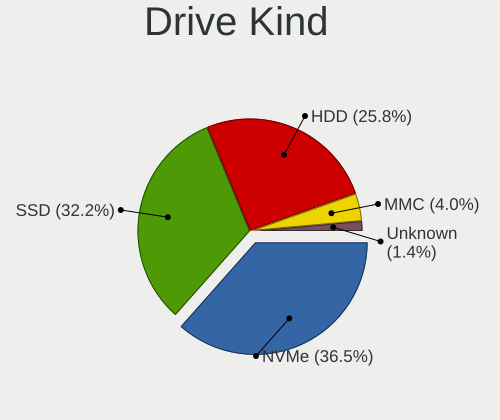

| Kind    | Computers | Drives | Percent |
|---------|-----------|--------|---------|
| NVMe    | 1699      | 2736   | 36.54%  |
| SSD     | 1499      | 2535   | 32.24%  |
| HDD     | 1200      | 2215   | 25.81%  |
| MMC     | 186       | 276    | 4%      |
| Unknown | 66        | 112    | 1.42%   |

Drive Connector
---------------

SATA, SAS, NVMe, etc.

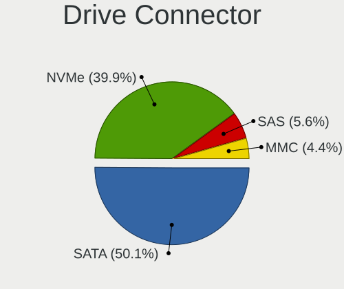

| Type | Computers | Drives | Percent |
|------|-----------|--------|---------|
| SATA | 2126      | 4527   | 50.11%  |
| NVMe | 1692      | 2708   | 39.88%  |
| SAS  | 239       | 363    | 5.63%   |
| MMC  | 186       | 276    | 4.38%   |

Drive Size
----------

Size of hard drive

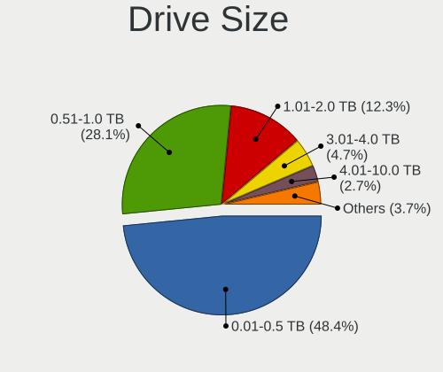

| Size in TB | Computers | Drives | Percent |
|------------|-----------|--------|---------|
| 0.01-0.5   | 1411      | 2247   | 48.44%  |
| 0.51-1.0   | 819       | 1338   | 28.12%  |
| 1.01-2.0   | 358       | 628    | 12.29%  |
| 3.01-4.0   | 138       | 256    | 4.74%   |
| 4.01-10.0  | 79        | 113    | 2.71%   |
| 2.01-3.0   | 77        | 119    | 2.64%   |
| 10.01-20.0 | 30        | 45     | 1.03%   |
| 20.01-50.0 | 1         | 4      | 0.03%   |

Space Total
-----------

Amount of disk space available on the file system

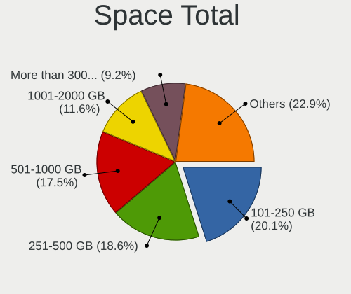

| Size in GB     | Computers | Percent |
|----------------|-----------|---------|
| 101-250        | 767       | 20.12%  |
| 251-500        | 710       | 18.63%  |
| 501-1000       | 667       | 17.5%   |
| 1001-2000      | 442       | 11.59%  |
| More than 3000 | 352       | 9.23%   |
| 1-20           | 285       | 7.48%   |
| 2001-3000      | 167       | 4.38%   |
| Unknown        | 167       | 4.38%   |
| 51-100         | 155       | 4.07%   |
| 21-50          | 100       | 2.62%   |

Space Used
----------

Amount of used disk space

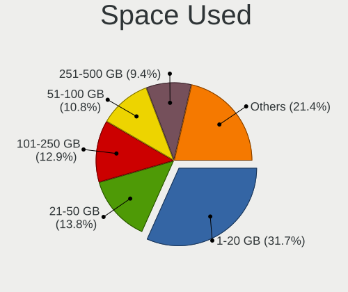

| Used GB        | Computers | Percent |
|----------------|-----------|---------|
| 1-20           | 1257      | 31.7%   |
| 21-50          | 548       | 13.82%  |
| 101-250        | 510       | 12.86%  |
| 51-100         | 430       | 10.84%  |
| 251-500        | 371       | 9.36%   |
| 501-1000       | 315       | 7.94%   |
| 1001-2000      | 172       | 4.34%   |
| Unknown        | 167       | 4.21%   |
| More than 3000 | 125       | 3.15%   |
| 2001-3000      | 63        | 1.59%   |
| 0              | 7         | 0.18%   |

Malfunc. Drives
---------------

Drive models with a malfunction

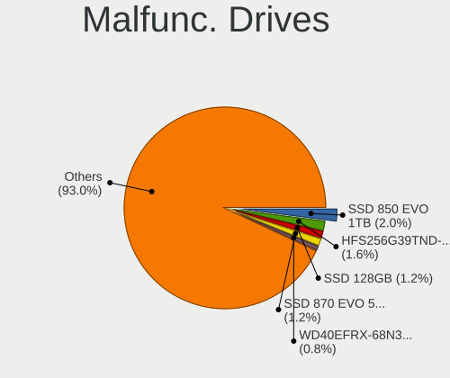

| Model                                                         | Computers | Drives | Percent |
|---------------------------------------------------------------|-----------|--------|---------|
| Samsung Electronics SSD 850 EVO 1TB                           | 5         | 5      | 2.05%   |
| SK hynix HFS256G39TND-N210A 256GB SSD                         | 4         | 4      | 1.64%   |
| XSTAR SSD 128GB                                               | 3         | 3      | 1.23%   |
| Samsung Electronics SSD 870 EVO 500GB                         | 3         | 3      | 1.23%   |
| WDC WD40EFRX-68N32N0 4TB                                      | 2         | 4      | 0.82%   |
| WDC WD3000HLHX-01JJPV0 304GB                                  | 2         | 2      | 0.82%   |
| WDC WD20EZRZ-00Z5HB0 2TB                                      | 2         | 2      | 0.82%   |
| WDC WD20EARS-00J99B0 2TB                                      | 2         | 2      | 0.82%   |
| WDC WD10EARS-00Y5B1 1TB                                       | 2         | 2      | 0.82%   |
| WDC WD10EADS-00L5B1 1TB                                       | 2         | 2      | 0.82%   |
| WDC WD1002FAEX-00Z3A0 1TB                                     | 2         | 2      | 0.82%   |
| Toshiba MQ01ACF050 500GB                                      | 2         | 2      | 0.82%   |
| Toshiba MQ01ABD100 1TB                                        | 2         | 2      | 0.82%   |
| Toshiba DT01ACA100 1TB                                        | 2         | 2      | 0.82%   |
| Seagate ST9320325AS 320GB                                     | 2         | 2      | 0.82%   |
| Seagate ST3250310AS 250GB                                     | 2         | 2      | 0.82%   |
| Seagate ST31500341AS 1TB                                      | 2         | 5      | 0.82%   |
| Seagate ST31000528AS 1TB                                      | 2         | 2      | 0.82%   |
| Seagate ST1000LM035-1RK172 1TB                                | 2         | 3      | 0.82%   |
| Samsung Electronics NVMe SSD Controller SM981/PM981/PM983 1TB | 2         | 2      | 0.82%   |
| Samsung Electronics MZVLQ512HBLU-00B 512GB                    | 2         | 2      | 0.82%   |
| Samsung Electronics HD154UI 1TB                               | 2         | 2      | 0.82%   |
| Kingston SA400S37120G 120GB SSD                               | 2         | 3      | 0.82%   |
| Intel SSDSCKKF256G8H 256GB                                    | 2         | 2      | 0.82%   |
| Initio 3639S 1TB                                              | 2         | 2      | 0.82%   |
| Hitachi HUA722020ALA330 2TB                                   | 2         | 2      | 0.82%   |
| Hitachi HTS727550A9E364 500GB                                 | 2         | 2      | 0.82%   |
| Hitachi HTS545050B9SA00 500GB                                 | 2         | 2      | 0.82%   |
| Hitachi HTS545050B9A300 500GB                                 | 2         | 2      | 0.82%   |
| HGST HTS725050A7E630 500GB                                    | 2         | 4      | 0.82%   |
| HGST HTS721010A9E630 1TB                                      | 2         | 2      | 0.82%   |
| Crucial CT240M500SSD1 240GB                                   | 2         | 2      | 0.82%   |
| Apple HDD HTS547550A9E384 500GB                               | 2         | 2      | 0.82%   |
| XPG SPECTRIX S40G 1TB                                         | 1         | 1      | 0.41%   |
| WDC WDS240G2G0B-00EPW0 240GB SSD                              | 1         | 1      | 0.41%   |
| WDC WD60EFRX-68MYMN1 6TB                                      | 1         | 2      | 0.41%   |
| WDC WD5000LPCX-24C6HT0 500GB                                  | 1         | 1      | 0.41%   |
| WDC WD5000BEVT-55A0RT0 500GB                                  | 1         | 1      | 0.41%   |
| WDC WD5000AAKS-65A7B0 500GB                                   | 1         | 1      | 0.41%   |
| WDC WD5000AAKS-00TMA0 500GB                                   | 1         | 2      | 0.41%   |

Malfunc. Drive Vendor
---------------------

Vendors of faulty drives

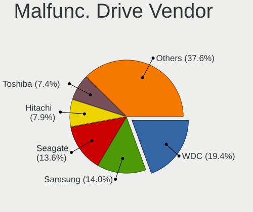

| Vendor                    | Computers | Drives | Percent |
|---------------------------|-----------|--------|---------|
| WDC                       | 47        | 55     | 19.42%  |
| Samsung Electronics       | 34        | 39     | 14.05%  |
| Seagate                   | 33        | 48     | 13.64%  |
| Hitachi                   | 19        | 20     | 7.85%   |
| Toshiba                   | 18        | 22     | 7.44%   |
| SK hynix                  | 14        | 15     | 5.79%   |
| Intel                     | 12        | 13     | 4.96%   |
| SanDisk                   | 8         | 9      | 3.31%   |
| HGST                      | 7         | 9      | 2.89%   |
| Crucial                   | 7         | 7      | 2.89%   |
| Kingston                  | 6         | 7      | 2.48%   |
| Micron Technology         | 5         | 8      | 2.07%   |
| Apple                     | 4         | 4      | 1.65%   |
| A-DATA Technology         | 4         | 6      | 1.65%   |
| XSTAR                     | 3         | 3      | 1.24%   |
| OCZ                       | 3         | 4      | 1.24%   |
| Intenso                   | 2         | 3      | 0.83%   |
| Initio                    | 2         | 2      | 0.83%   |
| Fujitsu                   | 2         | 2      | 0.83%   |
| XPG                       | 1         | 1      | 0.41%   |
| Transcend                 | 1         | 1      | 0.41%   |
| TCSUNBOW                  | 1         | 1      | 0.41%   |
| PNY                       | 1         | 1      | 0.41%   |
| Patriot                   | 1         | 2      | 0.41%   |
| Micron/Crucial Technology | 1         | 1      | 0.41%   |
| Maxtor                    | 1         | 1      | 0.41%   |
| LITEONIT                  | 1         | 1      | 0.41%   |
| Hewlett-Packard           | 1         | 1      | 0.41%   |
| China                     | 1         | 1      | 0.41%   |
| BAITITON                  | 1         | 1      | 0.41%   |
| ASMedia                   | 1         | 1      | 0.41%   |

Malfunc. HDD Vendor
-------------------

Vendors of faulty HDD drives

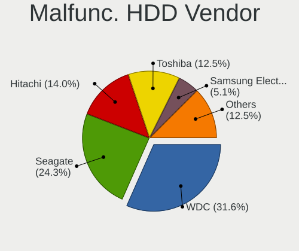

| Vendor              | Computers | Drives | Percent |
|---------------------|-----------|--------|---------|
| WDC                 | 43        | 51     | 31.62%  |
| Seagate             | 33        | 48     | 24.26%  |
| Hitachi             | 19        | 20     | 13.97%  |
| Toshiba             | 17        | 21     | 12.5%   |
| Samsung Electronics | 7         | 10     | 5.15%   |
| HGST                | 7         | 9      | 5.15%   |
| Apple               | 3         | 3      | 2.21%   |
| Initio              | 2         | 2      | 1.47%   |
| Fujitsu             | 2         | 2      | 1.47%   |
| Maxtor              | 1         | 1      | 0.74%   |
| Hewlett-Packard     | 1         | 1      | 0.74%   |
| ASMedia             | 1         | 1      | 0.74%   |

Malfunc. Drive Kind
-------------------

Kinds of faulty drives

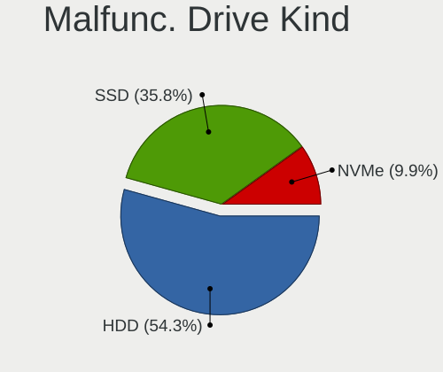

| Kind | Computers | Drives | Percent |
|------|-----------|--------|---------|
| HDD  | 126       | 169    | 54.31%  |
| SSD  | 83        | 96     | 35.78%  |
| NVMe | 23        | 24     | 9.91%   |

Failed Drives
-------------

Failed drive models

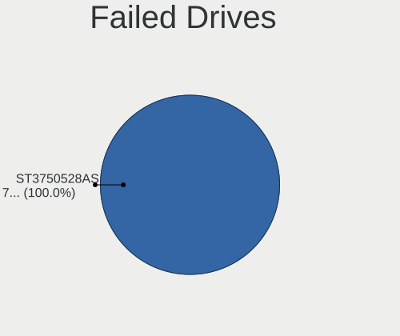

| Model                     | Computers | Drives | Percent |
|---------------------------|-----------|--------|---------|
| Seagate ST3750528AS 752GB | 1         | 1      | 100%    |

Failed Drive Vendor
-------------------

Failed drive vendors

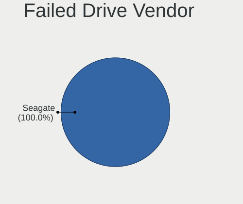

| Vendor  | Computers | Drives | Percent |
|---------|-----------|--------|---------|
| Seagate | 1         | 1      | 100%    |

Drive Status
------------

Number of failed and malfunc. drives

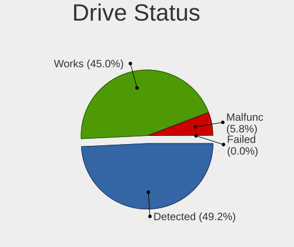

| Status   | Computers | Drives | Percent |
|----------|-----------|--------|---------|
| Detected | 1906      | 4155   | 49.24%  |
| Works    | 1741      | 3429   | 44.98%  |
| Malfunc  | 223       | 289    | 5.76%   |
| Failed   | 1         | 1      | 0.03%   |

Storage controller
------------------

Storage Vendor
--------------

Storage controller vendors

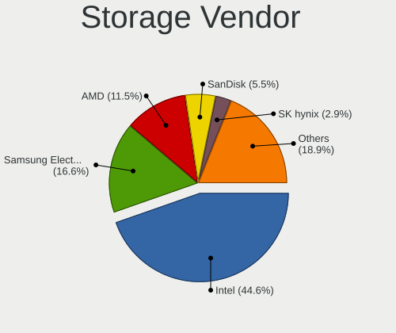

| Vendor                                  | Computers | Percent |
|-----------------------------------------|-----------|---------|
| Intel                                   | 2136      | 44.65%  |
| Samsung Electronics                     | 792       | 16.56%  |
| AMD                                     | 549       | 11.48%  |
| SanDisk                                 | 265       | 5.54%   |
| SK hynix                                | 137       | 2.86%   |
| Phison Electronics                      | 99        | 2.07%   |
| ASMedia Technology                      | 96        | 2.01%   |
| Kingston Technology Company             | 88        | 1.84%   |
| Micron Technology                       | 86        | 1.8%    |
| Toshiba America Info Systems            | 72        | 1.51%   |
| Marvell Technology Group                | 72        | 1.51%   |
| Micron/Crucial Technology               | 53        | 1.11%   |
| JMicron Technology                      | 48        | 1%      |
| Nvidia                                  | 44        | 0.92%   |
| KIOXIA                                  | 41        | 0.86%   |
| LSI Logic / Symbios Logic               | 19        | 0.4%    |
| ADATA Technology                        | 19        | 0.4%    |
| Silicon Motion                          | 18        | 0.38%   |
| Seagate Technology                      | 18        | 0.38%   |
| MAXIO Technology (Hangzhou)             | 16        | 0.33%   |
| Areca Technology                        | 14        | 0.29%   |
| Shenzhen Longsys Electronics            | 13        | 0.27%   |
| Broadcom / LSI                          | 12        | 0.25%   |
| Apple                                   | 11        | 0.23%   |
| Realtek Semiconductor                   | 9         | 0.19%   |
| Union Memory (Shenzhen)                 | 8         | 0.17%   |
| Hewlett-Packard                         | 8         | 0.17%   |
| Lite-On Technology                      | 7         | 0.15%   |
| Solid State Storage Technology          | 6         | 0.13%   |
| VIA Technologies                        | 4         | 0.08%   |
| Lenovo                                  | 4         | 0.08%   |
| Adaptec                                 | 4         | 0.08%   |
| Shenzhen Unionmemory Information System | 3         | 0.06%   |
| Yangtze Memory Technologies             | 2         | 0.04%   |
| Transcend                               | 2         | 0.04%   |
| Silicon Image                           | 2         | 0.04%   |
| Tekram Technology                       | 1         | 0.02%   |
| Solidigm                                | 1         | 0.02%   |
| OCZ Technology Group                    | 1         | 0.02%   |
| Hosin Global Electronics                | 1         | 0.02%   |

Storage Model
-------------

Storage controller models

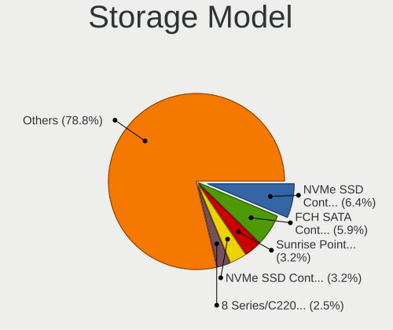

| Model                                                                          | Computers | Percent |
|--------------------------------------------------------------------------------|-----------|---------|
| Samsung NVMe SSD Controller SM981/PM981/PM983                                  | 340       | 6.37%   |
| AMD FCH SATA Controller [AHCI mode]                                            | 316       | 5.92%   |
| Intel Sunrise Point-LP SATA Controller [AHCI mode]                             | 173       | 3.24%   |
| Samsung NVMe SSD Controller PM9A1/PM9A3/980PRO                                 | 172       | 3.22%   |
| Intel 8 Series/C220 Series Chipset Family 6-port SATA Controller 1 [AHCI mode] | 133       | 2.49%   |
| Intel 7 Series Chipset Family 6-port SATA Controller [AHCI mode]               | 129       | 2.42%   |
| Intel Volume Management Device NVMe RAID Controller                            | 99        | 1.85%   |
| Intel Q170/Q150/B150/H170/H110/Z170/CM236 Chipset SATA Controller [AHCI Mode]  | 96        | 1.8%    |
| Intel 82801 Mobile SATA Controller [RAID mode]                                 | 93        | 1.74%   |
| Samsung NVMe SSD Controller SM961/PM961/SM963                                  | 90        | 1.69%   |
| Intel 6 Series/C200 Series Chipset Family 6 port Mobile SATA AHCI Controller   | 90        | 1.69%   |
| ASMedia ASM1061/ASM1062 Serial ATA Controller                                  | 88        | 1.65%   |
| Intel 200 Series PCH SATA controller [AHCI mode]                               | 77        | 1.44%   |
| Intel 8 Series SATA Controller 1 [AHCI mode]                                   | 74        | 1.39%   |
| AMD 400 Series Chipset SATA Controller                                         | 74        | 1.39%   |
| Samsung NVMe SSD Controller 980 (DRAM-less)                                    | 71        | 1.33%   |
| AMD 500 Series Chipset SATA Controller                                         | 70        | 1.31%   |
| Intel 6 Series/C200 Series Chipset Family 6 port Desktop SATA AHCI Controller  | 68        | 1.27%   |
| Intel 7 Series/C210 Series Chipset Family 6-port SATA Controller [AHCI mode]   | 67        | 1.26%   |
| Intel SATA Controller [RAID mode]                                              | 66        | 1.24%   |
| AMD 600 Series Chipset SATA Controller                                         | 66        | 1.24%   |
| Samsung NVMe SSD Controller S4LV008[Pascal]                                    | 53        | 0.99%   |
| Intel Wildcat Point-LP SATA Controller [AHCI Mode]                             | 53        | 0.99%   |
| SanDisk Extreme Pro / WD Black SN750 / PC SN730 / Red SN700 NVMe SSD           | 50        | 0.94%   |
| Intel 5 Series/3400 Series Chipset 6 port SATA AHCI Controller                 | 50        | 0.94%   |
| Intel Cannon Lake PCH SATA AHCI Controller                                     | 49        | 0.92%   |
| Intel SSD 660P Series                                                          | 44        | 0.82%   |
| AMD SB7x0/SB8x0/SB9x0 SATA Controller [AHCI mode]                              | 44        | 0.82%   |
| Intel Comet Lake SATA AHCI Controller                                          | 42        | 0.79%   |
| Intel Cannon Lake Mobile PCH SATA AHCI Controller                              | 41        | 0.77%   |
| Intel C600/X79 series chipset 6-Port SATA AHCI Controller                      | 39        | 0.73%   |
| Intel 500 Series Chipset Family SATA AHCI Controller                           | 39        | 0.73%   |
| SanDisk Ultra 3D / WD PC SN530, IX SN530, Blue SN550 NVMe SSD (DRAM-less)      | 38        | 0.71%   |
| Phison E12 NVMe Controller                                                     | 38        | 0.71%   |
| Intel 9 Series Chipset Family SATA Controller [AHCI Mode]                      | 38        | 0.71%   |
| Sandisk WD Black SN850X NVMe SSD                                               | 37        | 0.69%   |
| SanDisk WD SN560/SN740/SN770/SN5000 NVMe SSD                                   | 35        | 0.66%   |
| Intel 82801IBM/IEM (ICH9M/ICH9M-E) 4 port SATA Controller [AHCI mode]          | 35        | 0.66%   |
| Intel RST Volume Management Device Controller                                  | 34        | 0.64%   |
| Intel Alder Lake-S PCH SATA Controller [AHCI Mode]                             | 33        | 0.62%   |

Storage Kind
------------

Kind of storage controller (IDE, SATA, NVMe, SAS, ...)

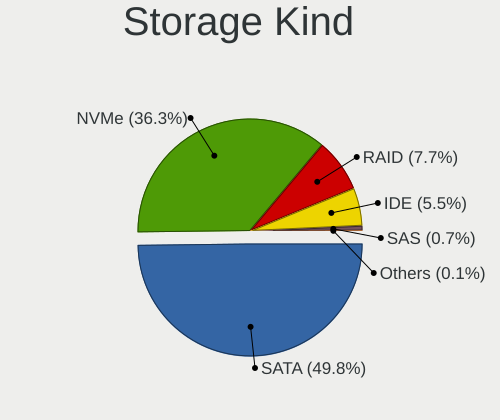

| Kind | Computers | Percent |
|------|-----------|---------|
| SATA | 2324      | 49.81%  |
| NVMe | 1694      | 36.31%  |
| RAID | 358       | 7.67%   |
| IDE  | 255       | 5.47%   |
| SAS  | 32        | 0.69%   |
| SCSI | 3         | 0.06%   |

Processor
---------

CPU Vendor
----------

Processor vendors

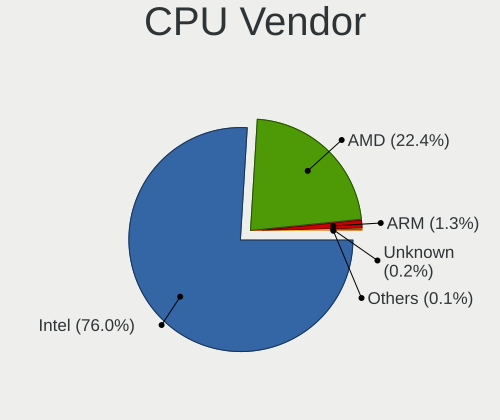

| Vendor        | Computers | Percent |
|---------------|-----------|---------|
| Intel         | 2681      | 75.97%  |
| AMD           | 791       | 22.41%  |
| ARM           | 45        | 1.28%   |
| Unknown       | 7         | 0.2%    |
| QUALCOMM      | 2         | 0.06%   |
| CentaurHauls  | 2         | 0.06%   |
| sifive,u74-mc | 1         | 0.03%   |

CPU Model
---------

Processor models

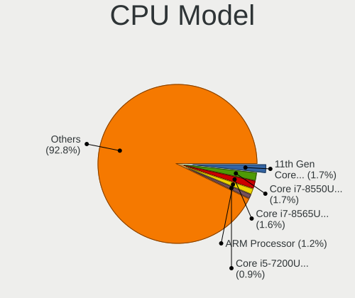

| Model                                   | Computers | Percent |
|-----------------------------------------|-----------|---------|
| Intel 11th Gen Core i7-1165G7 @ 2.80GHz | 61        | 1.73%   |
| Intel Core i7-8550U CPU @ 1.80GHz       | 60        | 1.7%    |
| Intel Core i7-8565U CPU @ 1.80GHz       | 57        | 1.61%   |
| ARM Processor                           | 43        | 1.22%   |
| Intel Core i5-7200U CPU @ 2.50GHz       | 33        | 0.93%   |
| AMD Ryzen 7 5800X 8-Core Processor      | 33        | 0.93%   |
| Intel Core i5-8250U CPU @ 1.60GHz       | 32        | 0.91%   |
| Intel Core i7-7500U CPU @ 2.70GHz       | 31        | 0.88%   |
| Intel Core i7-10510U CPU @ 1.80GHz      | 31        | 0.88%   |
| Intel 11th Gen Core i5-1135G7 @ 2.40GHz | 31        | 0.88%   |
| Intel Core i7-6700 CPU @ 3.40GHz        | 29        | 0.82%   |
| Intel Core i7-3770 CPU @ 3.40GHz        | 29        | 0.82%   |
| Intel Core i5-6300U CPU @ 2.40GHz       | 26        | 0.74%   |
| Intel Core i7-9750H CPU @ 2.60GHz       | 25        | 0.71%   |
| AMD Ryzen 7 3700X 8-Core Processor      | 25        | 0.71%   |
| Intel Core i7-4790 CPU @ 3.60GHz        | 24        | 0.68%   |
| Intel Core i5-8265U CPU @ 1.60GHz       | 24        | 0.68%   |
| AMD Ryzen 5 3600 6-Core Processor       | 24        | 0.68%   |
| Intel Core i7-2600 CPU @ 3.40GHz        | 23        | 0.65%   |
| AMD Ryzen 9 3900X 12-Core Processor     | 23        | 0.65%   |
| Intel Core i5-6200U CPU @ 2.30GHz       | 22        | 0.62%   |
| Intel Core i7-8650U CPU @ 1.90GHz       | 20        | 0.57%   |
| Intel Core i7-4770 CPU @ 3.40GHz        | 20        | 0.57%   |
| Intel 13th Gen Core i7-1355U            | 20        | 0.57%   |
| Intel Core i7-7700K CPU @ 4.20GHz       | 19        | 0.54%   |
| Intel Core i7-1065G7 CPU @ 1.30GHz      | 19        | 0.54%   |
| Intel 12th Gen Core i7-1260P            | 19        | 0.54%   |
| Intel Core i7-4600U CPU @ 2.10GHz       | 18        | 0.51%   |
| Intel Core i5-3210M CPU @ 2.50GHz       | 17        | 0.48%   |
| Intel Core i5-2520M CPU @ 2.50GHz       | 17        | 0.48%   |
| Intel Core i7-8700K CPU @ 3.70GHz       | 16        | 0.45%   |
| Intel Core i7-6500U CPU @ 2.50GHz       | 16        | 0.45%   |
| Intel Core i5-8350U CPU @ 1.70GHz       | 16        | 0.45%   |
| Intel Atom x5-Z8350 CPU @ 1.44GHz       | 16        | 0.45%   |
| Intel 11th Gen Core i9-11900F @ 2.50GHz | 16        | 0.45%   |
| AMD Ryzen 9 5900X 12-Core Processor     | 16        | 0.45%   |
| Intel Core i7-8750H CPU @ 2.20GHz       | 15        | 0.42%   |
| Intel Core i7-6600U CPU @ 2.60GHz       | 15        | 0.42%   |
| Intel Core i7-4790K CPU @ 4.00GHz       | 15        | 0.42%   |
| Intel Core i5-10210U CPU @ 1.60GHz      | 15        | 0.42%   |

CPU Model Family
----------------

Processor model prefix

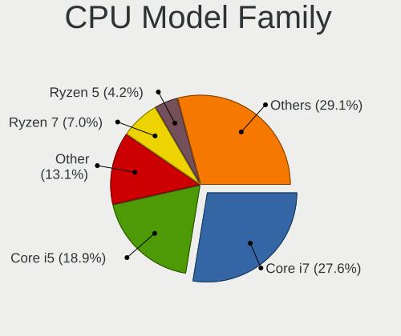

| Model                   | Computers | Percent |
|-------------------------|-----------|---------|
| Intel Core i7           | 974       | 27.58%  |
| Intel Core i5           | 667       | 18.88%  |
| Other                   | 463       | 13.11%  |
| AMD Ryzen 7             | 249       | 7.05%   |
| AMD Ryzen 5             | 150       | 4.25%   |
| Intel Xeon              | 124       | 3.51%   |
| AMD Ryzen 9             | 124       | 3.51%   |
| Intel Core 2 Duo        | 98        | 2.77%   |
| Intel Core i3           | 85        | 2.41%   |
| Intel Celeron           | 81        | 2.29%   |
| Intel Core              | 48        | 1.36%   |
| AMD Ryzen 7 PRO         | 43        | 1.22%   |
| Intel Pentium           | 42        | 1.19%   |
| Intel Atom              | 42        | 1.19%   |
| Intel Core i9           | 38        | 1.08%   |
| AMD FX                  | 22        | 0.62%   |
| AMD Ryzen Threadripper  | 21        | 0.59%   |
| AMD Ryzen 3             | 18        | 0.51%   |
| Intel Pentium Dual-Core | 17        | 0.48%   |
| Intel Core 2 Quad       | 15        | 0.42%   |
| Intel Core 2            | 15        | 0.42%   |
| AMD Ryzen 5 PRO         | 12        | 0.34%   |
| AMD GX                  | 11        | 0.31%   |
| AMD A8                  | 11        | 0.31%   |
| AMD EPYC                | 9         | 0.25%   |
| AMD A10                 | 9         | 0.25%   |
| Intel Xeon Gold         | 8         | 0.23%   |
| AMD Quad-Core Opteron   | 8         | 0.23%   |
| AMD Phenom II X4        | 8         | 0.23%   |
| Intel Pentium Silver    | 7         | 0.2%    |
| AMD Athlon              | 7         | 0.2%    |
| Intel Pentium 4         | 6         | 0.17%   |
| Intel Core M            | 6         | 0.17%   |
| AMD E                   | 6         | 0.17%   |
| AMD Opteron             | 5         | 0.14%   |
| AMD A4                  | 5         | 0.14%   |
| Intel Genuine           | 4         | 0.11%   |
| Intel Core m3           | 4         | 0.11%   |
| AMD Phenom II X6        | 4         | 0.11%   |
| AMD G                   | 4         | 0.11%   |

CPU Cores
---------

Number of processor cores

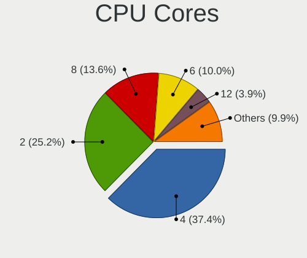

| Number  | Computers | Percent |
|---------|-----------|---------|
| 4       | 1322      | 37.39%  |
| 2       | 892       | 25.23%  |
| 8       | 481       | 13.6%   |
| 6       | 352       | 9.95%   |
| 12      | 139       | 3.93%   |
| 16      | 97        | 2.74%   |
| 10      | 71        | 2.01%   |
| 14      | 63        | 1.78%   |
| 24      | 35        | 0.99%   |
| 1       | 26        | 0.74%   |
| 32      | 14        | 0.4%    |
| Unknown | 9         | 0.25%   |
| 20      | 8         | 0.23%   |
| 3       | 8         | 0.23%   |
| 40      | 5         | 0.14%   |
| 128     | 3         | 0.08%   |
| 48      | 3         | 0.08%   |
| 18      | 3         | 0.08%   |
| 64      | 2         | 0.06%   |
| 36      | 1         | 0.03%   |
| 22      | 1         | 0.03%   |
| 11      | 1         | 0.03%   |

CPU Sockets
-----------

Number of sockets

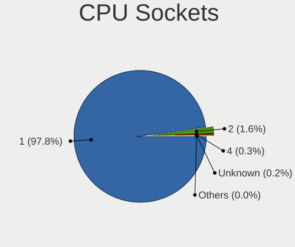

| Number  | Computers | Percent |
|---------|-----------|---------|
| 1       | 3451      | 97.79%  |
| 2       | 57        | 1.62%   |
| 4       | 12        | 0.34%   |
| Unknown | 7         | 0.2%    |
| 11      | 1         | 0.03%   |
| 3       | 1         | 0.03%   |

CPU Threads
-----------

Threads per core (Hyper-Threading)

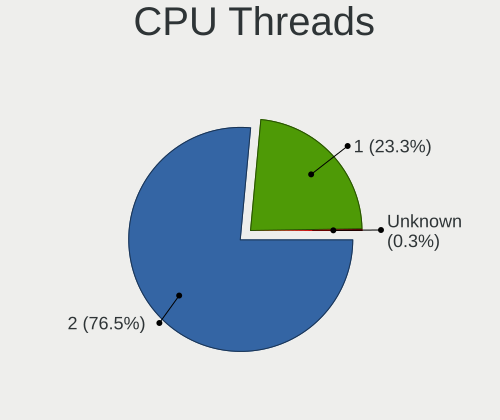

| Number  | Computers | Percent |
|---------|-----------|---------|
| 2       | 2708      | 76.48%  |
| 1       | 824       | 23.27%  |
| Unknown | 9         | 0.25%   |

CPU Op-Modes
------------

CPU Operation Modes (32-bit, 64-bit)

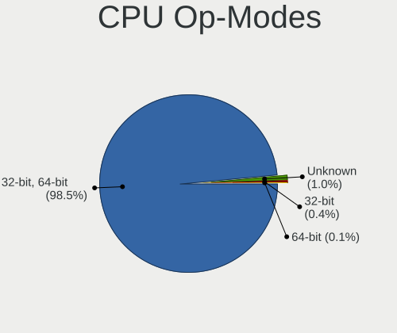

| Op mode        | Computers | Percent |
|----------------|-----------|---------|
| 32-bit, 64-bit | 3482      | 98.5%   |
| Unknown        | 35        | 0.99%   |
| 32-bit         | 13        | 0.37%   |
| 64-bit         | 5         | 0.14%   |

CPU Microcode
-------------

Microcode number

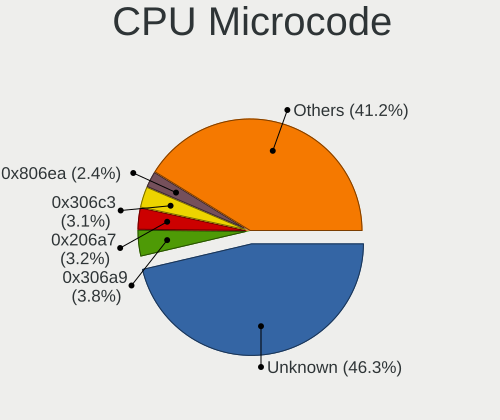

| Number     | Computers | Percent |
|------------|-----------|---------|
| Unknown    | 1702      | 46.34%  |
| 0x306a9    | 141       | 3.84%   |
| 0x206a7    | 117       | 3.19%   |
| 0x306c3    | 113       | 3.08%   |
| 0x806ea    | 87        | 2.37%   |
| 0x506e3    | 72        | 1.96%   |
| 0x906ea    | 64        | 1.74%   |
| 0x806ec    | 63        | 1.72%   |
| 0x806c1    | 61        | 1.66%   |
| 0x1067a    | 60        | 1.63%   |
| 0x806e9    | 59        | 1.61%   |
| 0x40651    | 57        | 1.55%   |
| 0x906e9    | 41        | 1.12%   |
| 0x306d4    | 36        | 0.98%   |
| 0x406e3    | 35        | 0.95%   |
| 0x08701021 | 32        | 0.87%   |
| 0x20655    | 25        | 0.68%   |
| 0x30678    | 24        | 0.65%   |
| 0x0a404102 | 22        | 0.6%    |
| 0x0a50000c | 21        | 0.57%   |
| 0x0800820d | 21        | 0.57%   |
| 0xa0671    | 20        | 0.54%   |
| 0xa0655    | 19        | 0.52%   |
| 0x706e5    | 19        | 0.52%   |
| 0x406c4    | 18        | 0.49%   |
| 0x206d7    | 18        | 0.49%   |
| 0x10676    | 18        | 0.49%   |
| 0x906a3    | 17        | 0.46%   |
| 0x806eb    | 17        | 0.46%   |
| 0x306f2    | 17        | 0.46%   |
| 0x20652    | 17        | 0.46%   |
| 0x106e5    | 17        | 0.46%   |
| 0x0a201016 | 16        | 0.44%   |
| 0xa0652    | 15        | 0.41%   |
| 0x906ed    | 15        | 0.41%   |
| 0x50654    | 15        | 0.41%   |
| 0x306e4    | 14        | 0.38%   |
| 0x08701013 | 14        | 0.38%   |
| 0x08608103 | 14        | 0.38%   |
| 0x08600106 | 14        | 0.38%   |

CPU Microarch
-------------

Microarchitecture

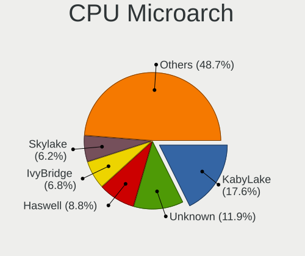

| Name               | Computers | Percent |
|--------------------|-----------|---------|
| KabyLake           | 626       | 17.64%  |
| Unknown            | 421       | 11.86%  |
| Haswell            | 311       | 8.76%   |
| IvyBridge          | 240       | 6.76%   |
| Skylake            | 221       | 6.23%   |
| SandyBridge        | 211       | 5.95%   |
| Zen 3              | 172       | 4.85%   |
| Zen 2              | 153       | 4.31%   |
| Alderlake Hybrid   | 145       | 4.09%   |
| TigerLake          | 115       | 3.24%   |
| Penryn             | 112       | 3.16%   |
| Westmere           | 83        | 2.34%   |
| Broadwell          | 82        | 2.31%   |
| CometLake          | 74        | 2.09%   |
| Silvermont         | 71        | 2%      |
| IceLake            | 67        | 1.89%   |
| Zen+               | 64        | 1.8%    |
| Nehalem            | 49        | 1.38%   |
| Zen                | 44        | 1.24%   |
| Core               | 43        | 1.21%   |
| K10                | 35        | 0.99%   |
| Goldmont plus      | 29        | 0.82%   |
| Piledriver         | 28        | 0.79%   |
| Bobcat             | 16        | 0.45%   |
| Meteorlake Hybrid  | 15        | 0.42%   |
| Goldmont           | 14        | 0.39%   |
| Puma               | 12        | 0.34%   |
| Lunarlake Hybrid   | 11        | 0.31%   |
| K8 Hammer          | 11        | 0.31%   |
| Jaguar             | 10        | 0.28%   |
| Gracemont          | 10        | 0.28%   |
| Tremont            | 8         | 0.23%   |
| Steamroller        | 7         | 0.2%    |
| Excavator          | 7         | 0.2%    |
| Bonnell            | 7         | 0.2%    |
| P6                 | 6         | 0.17%   |
| NetBurst           | 6         | 0.17%   |
| K10 Llano          | 6         | 0.17%   |
| Bulldozer          | 5         | 0.14%   |
| ArrowLake-H Hybrid | 2         | 0.06%   |

Graphics
--------

GPU Vendor
----------

Vendors of graphics cards

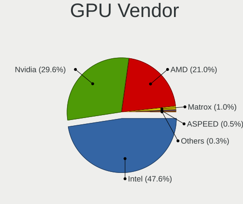

| Vendor                                       | Computers | Percent |
|----------------------------------------------|-----------|---------|
| Intel                                        | 1946      | 47.58%  |
| Nvidia                                       | 1212      | 29.63%  |
| AMD                                          | 859       | 21%     |
| Matrox Electronics Systems                   | 40        | 0.98%   |
| ASPEED Technology                            | 22        | 0.54%   |
| XGI Technology (eXtreme Graphics Innovation) | 9         | 0.22%   |
| VIA Technologies                             | 2         | 0.05%   |

GPU Model
---------

Graphics card models

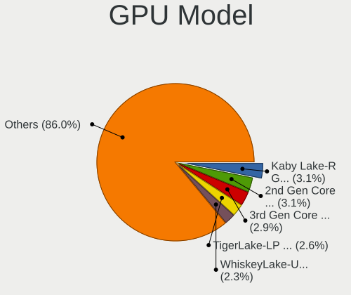

| Model                                                                                    | Computers | Percent |
|------------------------------------------------------------------------------------------|-----------|---------|
| Intel Kaby Lake-R GT2 [UHD Graphics 620]                                                 | 131       | 3.12%   |
| Intel 2nd Generation Core Processor Family Integrated Graphics Controller                | 129       | 3.08%   |
| Intel 3rd Gen Core processor Graphics Controller                                         | 123       | 2.93%   |
| Intel TigerLake-LP GT2 [Iris Xe Graphics]                                                | 108       | 2.58%   |
| Intel WhiskeyLake-U GT2 [UHD Graphics 620]                                               | 95        | 2.27%   |
| Intel Haswell-ULT Integrated Graphics Controller                                         | 94        | 2.24%   |
| Intel Kaby Lake-U GT2 [HD Graphics 620]                                                  | 88        | 2.1%    |
| Intel Skylake-U GT2 [HD Graphics 520]                                                    | 82        | 1.96%   |
| AMD Cezanne [Radeon Vega Series / Radeon Vega Mobile Series]                             | 57        | 1.36%   |
| Intel Raptor Lake-P [Iris Xe Graphics]                                                   | 55        | 1.31%   |
| AMD Ellesmere [Radeon RX 470/480/570/570X/580/580X/590]                                  | 55        | 1.31%   |
| Intel Xeon E3-1200 v3/4th Gen Core Processor Integrated Graphics Controller              | 54        | 1.29%   |
| Intel 4th Gen Core Processor Integrated Graphics Controller                              | 53        | 1.26%   |
| AMD Renoir [Radeon Vega Series / Radeon Vega Mobile Series]                              | 53        | 1.26%   |
| Intel CoffeeLake-H GT2 [UHD Graphics 630]                                                | 51        | 1.22%   |
| Intel CometLake-U GT2 [UHD Graphics]                                                     | 49        | 1.17%   |
| Intel Alder Lake-P GT2 [Iris Xe Graphics]                                                | 49        | 1.17%   |
| Intel Broadwell-U GT2 [HD Graphics 5500]                                                 | 44        | 1.05%   |
| AMD Rembrandt [Radeon 680M]                                                              | 43        | 1.03%   |
| AMD Raphael                                                                              | 42        | 1%      |
| Intel Skylake-S GT2 [HD Graphics 530]                                                    | 38        | 0.91%   |
| Intel CoffeeLake-S GT2 [UHD Graphics 630]                                                | 38        | 0.91%   |
| Intel Atom Processor Z36xxx/Z37xxx Series Graphics & Display                             | 37        | 0.88%   |
| Intel Core Processor Integrated Graphics Controller                                      | 34        | 0.81%   |
| Intel Atom/Celeron/Pentium Processor x5-E8000/J3xxx/N3xxx Integrated Graphics Controller | 34        | 0.81%   |
| AMD Lucienne                                                                             | 30        | 0.72%   |
| AMD Phoenix1                                                                             | 29        | 0.69%   |
| Intel Mobile 4 Series Chipset Integrated Graphics Controller                             | 25        | 0.6%    |
| Nvidia GP102 [GeForce GTX 1080 Ti]                                                       | 24        | 0.57%   |
| Intel GeminiLake [UHD Graphics 600]                                                      | 24        | 0.57%   |
| Intel CometLake-H GT2 [UHD Graphics]                                                     | 24        | 0.57%   |
| AMD Picasso/Raven 2 [Radeon Vega Series / Radeon Vega Mobile Series]                     | 24        | 0.57%   |
| Nvidia GP106 [GeForce GTX 1060 6GB]                                                      | 23        | 0.55%   |
| Nvidia TU117M [GeForce GTX 1650 Mobile / Max-Q]                                          | 22        | 0.52%   |
| Nvidia GK208B [GeForce GT 710]                                                           | 22        | 0.52%   |
| Nvidia GA104 [GeForce RTX 3070 Lite Hash Rate]                                           | 22        | 0.52%   |
| ASPEED Technology ASPEED Graphics Family                                                 | 22        | 0.52%   |
| AMD Lexa PRO [Radeon 540/540X/550/550X / RX 540X/550/550X]                               | 22        | 0.52%   |
| AMD Navi 31 [Radeon RX 7900 XT/7900 XTX/7900 GRE/7900M]                                  | 21        | 0.5%    |
| AMD HawkPoint1                                                                           | 21        | 0.5%    |

GPU Combo
---------

Combinations of graphics cards

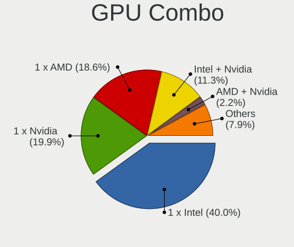

| Name                     | Computers | Percent |
|--------------------------|-----------|---------|
| 1 x Intel                | 1424      | 40.03%  |
| 1 x Nvidia               | 709       | 19.93%  |
| 1 x AMD                  | 662       | 18.61%  |
| Intel + Nvidia           | 403       | 11.33%  |
| AMD + Nvidia             | 78        | 2.19%   |
| Intel + AMD              | 74        | 2.08%   |
| Other                    | 66        | 1.86%   |
| 2 x AMD                  | 44        | 1.24%   |
| 1 x Matrox               | 37        | 1.04%   |
| 1 x ASPEED               | 14        | 0.39%   |
| 2 x Nvidia               | 11        | 0.31%   |
| 1 x XGI                  | 9         | 0.25%   |
| Nvidia + ASPEED          | 7         | 0.2%    |
| 2 x Intel                | 5         | 0.14%   |
| 2 x AMD + 1 x Nvidia     | 2         | 0.06%   |
| 1 x VIA                  | 2         | 0.06%   |
| Nvidia + Matrox          | 2         | 0.06%   |
| Intel + 2 x Nvidia       | 2         | 0.06%   |
| Intel + AMD + 1 x Nvidia | 2         | 0.06%   |
| 3 x Nvidia               | 1         | 0.03%   |
| 2 x Nvidia + 1 x ASPEED  | 1         | 0.03%   |
| 1 x Intel + 3 x Nvidia   | 1         | 0.03%   |
| AMD + Matrox             | 1         | 0.03%   |

GPU Driver
----------

Free vs proprietary

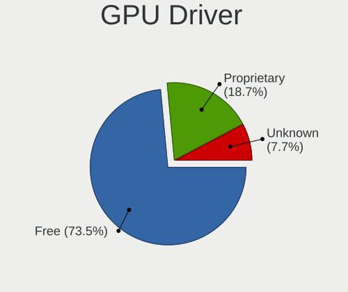

| Driver      | Computers | Percent |
|-------------|-----------|---------|
| Free        | 2632      | 73.52%  |
| Proprietary | 671       | 18.74%  |
| Unknown     | 277       | 7.74%   |

GPU Memory
----------

Total video memory

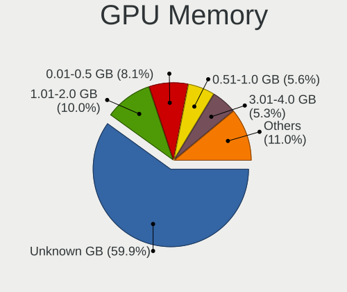

| Size in GB     | Computers | Percent |
|----------------|-----------|---------|
| Unknown        | 2170      | 59.93%  |
| 1.01-2.0       | 361       | 9.97%   |
| 0.01-0.5       | 295       | 8.15%   |
| 0.51-1.0       | 204       | 5.63%   |
| 3.01-4.0       | 192       | 5.3%    |
| 7.01-8.0       | 166       | 4.58%   |
| 8.01-16.0      | 128       | 3.53%   |
| 5.01-6.0       | 53        | 1.46%   |
| 16.01-24.0     | 28        | 0.77%   |
| 2.01-3.0       | 20        | 0.55%   |
| 4.01-5.0       | 2         | 0.06%   |
| More than 64.0 | 1         | 0.03%   |
| 32.01-64.0     | 1         | 0.03%   |

Monitor
-------

Monitor Vendor
--------------

Monitor vendors

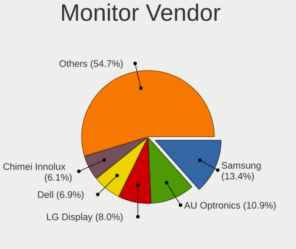

| Vendor                  | Computers | Percent |
|-------------------------|-----------|---------|
| Samsung Electronics     | 529       | 13.43%  |
| AU Optronics            | 428       | 10.87%  |
| LG Display              | 315       | 8%      |
| Dell                    | 273       | 6.93%   |
| Chimei Innolux          | 241       | 6.12%   |
| BOE                     | 240       | 6.09%   |
| Hewlett-Packard         | 165       | 4.19%   |
| Apple                   | 159       | 4.04%   |
| Acer                    | 149       | 3.78%   |
| Philips                 | 148       | 3.76%   |
| Ancor Communications    | 115       | 2.92%   |
| Lenovo                  | 113       | 2.87%   |
| BenQ                    | 106       | 2.69%   |
| AOC                     | 103       | 2.61%   |
| Sharp                   | 95        | 2.41%   |
| Goldstar                | 92        | 2.34%   |
| ASUSTek Computer        | 75        | 1.9%    |
| Eizo                    | 62        | 1.57%   |
| InfoVision              | 41        | 1.04%   |
| CSO                     | 35        | 0.89%   |
| Unknown                 | 33        | 0.84%   |
| Sony                    | 33        | 0.84%   |
| Chi Mei Optoelectronics | 33        | 0.84%   |
| Iiyama                  | 28        | 0.71%   |
| NEC Computers           | 18        | 0.46%   |
| Gigabyte Technology     | 18        | 0.46%   |
| Panasonic               | 17        | 0.43%   |
| PANDA                   | 16        | 0.41%   |
| MSI                     | 15        | 0.38%   |
| Toshiba                 | 12        | 0.3%    |
| Fujitsu Siemens         | 12        | 0.3%    |
| CSOT                    | 12        | 0.3%    |
| ViewSonic               | 9         | 0.23%   |
| Vestel Elektronik       | 9         | 0.23%   |
| Valve                   | 9         | 0.23%   |
| TMX                     | 9         | 0.23%   |
| Medion                  | 7         | 0.18%   |
| AUS                     | 7         | 0.18%   |
| LG Philips              | 6         | 0.15%   |
| CSW                     | 6         | 0.15%   |

Monitor Model
-------------

Monitor models

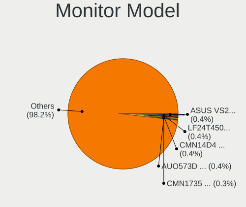

| Model                                                                     | Computers | Percent |
|---------------------------------------------------------------------------|-----------|---------|
| Ancor Communications ASUS VS247 ACI249A 1920x1080 521x293mm 23.5-inch     | 18        | 0.44%   |
| Samsung Electronics LCD Monitor LF24T450F 1920x1080                       | 16        | 0.39%   |
| Chimei Innolux LCD Monitor CMN14D4 1920x1080 309x173mm 13.9-inch          | 15        | 0.36%   |
| AU Optronics LCD Monitor AUO573D 1920x1080 309x174mm 14.0-inch            | 15        | 0.36%   |
| Chimei Innolux LCD Monitor CMN1735 1920x1080 381x214mm 17.2-inch          | 12        | 0.29%   |
| Samsung Electronics LCD Monitor SyncMaster 1920x1200                      | 11        | 0.27%   |
| AU Optronics LCD Monitor AUO38ED 1920x1080 344x193mm 15.5-inch            | 11        | 0.27%   |
| Chimei Innolux LCD Monitor CMN15E7 1920x1080 344x193mm 15.5-inch          | 10        | 0.24%   |
| AU Optronics LCD Monitor AUO133D 1920x1080 309x173mm 13.9-inch            | 10        | 0.24%   |
| AOC Q3279WG5B AOC3279 2560x1440 730x430mm 33.4-inch                       | 10        | 0.24%   |
| AOC 27G2G4 AOC2702 1920x1080 598x336mm 27.0-inch                          | 10        | 0.24%   |
| Vestel Elektronik 40UHD_LCD_TV VES3700 3840x2160 880x500mm 39.8-inch      | 9         | 0.22%   |
| Panasonic VVX11F009G00 MEI96A2 1920x1080 344x193mm 15.5-inch              | 9         | 0.22%   |
| LG Display LCD Monitor LGD0555 2736x1824 260x173mm 12.3-inch              | 9         | 0.22%   |
| LG Display LCD Monitor LGD0521 1920x1080 309x174mm 14.0-inch              | 9         | 0.22%   |
| AU Optronics LCD Monitor AUO403D 1920x1080 309x174mm 14.0-inch            | 9         | 0.22%   |
| Apple iMac APPA007 2560x1440 597x336mm 27.0-inch                          | 9         | 0.22%   |
| LG Display LCD Monitor LGD046F 1920x1080 344x194mm 15.5-inch              | 8         | 0.19%   |
| Lenovo LCD Monitor LEN40B2 1920x1080 344x193mm 15.5-inch                  | 8         | 0.19%   |
| Chimei Innolux LCD Monitor CMN15C3 1920x1080 344x193mm 15.5-inch          | 8         | 0.19%   |
| Apple iMac APPA012 1920x1080 475x267mm 21.5-inch                          | 8         | 0.19%   |
| Apple iMac APPA00C 1920x1080 475x267mm 21.5-inch                          | 8         | 0.19%   |
| Ancor Communications ASUS PB278 ACI27A3 2560x1440 597x336mm 27.0-inch     | 8         | 0.19%   |
| Unknown LCD Monitor FFFF 2288x1287 2550x2550mm 142.0-inch                 | 7         | 0.17%   |
| Sharp LQ156M1JW01 SHP14C3 1920x1080 344x194mm 15.5-inch                   | 7         | 0.17%   |
| Philips LCD Monitor PHL 272S4L 2560x1440                                  | 7         | 0.17%   |
| LG Display LCD Monitor LGD02D8 1366x768 277x156mm 12.5-inch               | 7         | 0.17%   |
| Lenovo LCD Monitor LEN40BA 1920x1080 344x194mm 15.5-inch                  | 7         | 0.17%   |
| Lenovo LCD Monitor LEN4036 1440x900 303x190mm 14.1-inch                   | 7         | 0.17%   |
| Goldstar HDR 4K GSM7706 3840x2160 600x340mm 27.2-inch                     | 7         | 0.17%   |
| Dell LCD Monitor P2719H 3840x1080                                         | 7         | 0.17%   |
| Dell LCD Monitor P2719H                                                   | 7         | 0.17%   |
| CSO LCD Monitor CSO1500 3840x2160 344x194mm 15.5-inch                     | 7         | 0.17%   |
| Chimei Innolux LCD Monitor CMN1738 1920x1080 381x214mm 17.2-inch          | 7         | 0.17%   |
| Chimei Innolux LCD Monitor CMN15F5 1920x1080 344x193mm 15.5-inch          | 7         | 0.17%   |
| Chimei Innolux LCD Monitor CMN1387 1920x1080 293x165mm 13.2-inch          | 7         | 0.17%   |
| Chi Mei Optoelectronics LCD Monitor CMO1720 1920x1080 382x215mm 17.3-inch | 7         | 0.17%   |
| BOE LCD Monitor BOE0687 1920x1080 344x193mm 15.5-inch                     | 7         | 0.17%   |
| BenQ GW2480 BNQ78E7 1920x1080 527x296mm 23.8-inch                         | 7         | 0.17%   |
| AU Optronics LCD Monitor AUO21ED 1920x1080 344x193mm 15.5-inch            | 7         | 0.17%   |

Monitor Resolution
------------------

Monitor screen resolution

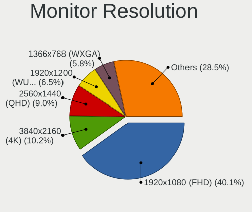

| Resolution         | Computers | Percent |
|--------------------|-----------|---------|
| 1920x1080 (FHD)    | 1524      | 40.08%  |
| 3840x2160 (4K)     | 386       | 10.15%  |
| 2560x1440 (QHD)    | 342       | 9%      |
| 1920x1200 (WUXGA)  | 248       | 6.52%   |
| 1366x768 (WXGA)    | 220       | 5.79%   |
| 1600x900 (HD+)     | 131       | 3.45%   |
| 1680x1050 (WSXGA+) | 108       | 2.84%   |
| 3440x1440          | 102       | 2.68%   |
| 2560x1600          | 81        | 2.13%   |
| Unknown            | 78        | 2.05%   |
| 1280x1024 (SXGA)   | 76        | 2%      |
| 2880x1800          | 59        | 1.55%   |
| 1280x800 (WXGA)    | 54        | 1.42%   |
| 1440x900 (WXGA+)   | 49        | 1.29%   |
| 3840x1080          | 46        | 1.21%   |
| 1600x1200          | 30        | 0.79%   |
| 3840x2400          | 24        | 0.63%   |
| 3200x1800 (QHD+)   | 19        | 0.5%    |
| 3840x1600          | 16        | 0.42%   |
| 2880x1920          | 15        | 0.39%   |
| 2560x1080          | 15        | 0.39%   |
| 3840x1200          | 12        | 0.32%   |
| 800x1280           | 10        | 0.26%   |
| 3000x2000          | 10        | 0.26%   |
| 2736x1824          | 9         | 0.24%   |
| 1360x768           | 9         | 0.24%   |
| 1920x540           | 8         | 0.21%   |
| 3200x2000          | 7         | 0.18%   |
| 2288x1287          | 7         | 0.18%   |
| 2160x1440          | 7         | 0.18%   |
| 1920x1280          | 7         | 0.18%   |
| 1024x768 (XGA)     | 7         | 0.18%   |
| 4480x1440          | 6         | 0.16%   |
| 3072x1920          | 6         | 0.16%   |
| 1024x600           | 6         | 0.16%   |
| 3456x2160          | 5         | 0.13%   |
| 7680x2160          | 4         | 0.11%   |
| 3520x1200          | 4         | 0.11%   |
| 2048x1152          | 4         | 0.11%   |
| 5120x1440          | 3         | 0.08%   |

Monitor Diagonal
----------------

Diagonal size in inches

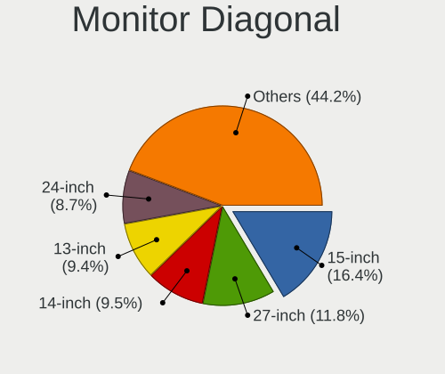

| Inches  | Computers | Percent |
|---------|-----------|---------|
| 15      | 645       | 16.43%  |
| 27      | 462       | 11.77%  |
| 14      | 374       | 9.53%   |
| 13      | 368       | 9.38%   |
| 24      | 340       | 8.66%   |
| Unknown | 253       | 6.45%   |
| 17      | 212       | 5.4%    |
| 23      | 183       | 4.66%   |
| 31      | 141       | 3.59%   |
| 21      | 135       | 3.44%   |
| 16      | 97        | 2.47%   |
| 34      | 95        | 2.42%   |
| 12      | 85        | 2.17%   |
| 22      | 58        | 1.48%   |
| 20      | 46        | 1.17%   |
| 19      | 45        | 1.15%   |
| 84      | 33        | 0.84%   |
| 32      | 31        | 0.79%   |
| 25      | 27        | 0.69%   |
| 72      | 26        | 0.66%   |
| 11      | 24        | 0.61%   |
| 48      | 21        | 0.54%   |
| 37      | 20        | 0.51%   |
| 26      | 17        | 0.43%   |
| 18      | 17        | 0.43%   |
| 40      | 15        | 0.38%   |
| 29      | 15        | 0.38%   |
| 33      | 14        | 0.36%   |
| 54      | 12        | 0.31%   |
| 46      | 12        | 0.31%   |
| 7       | 12        | 0.31%   |
| 49      | 11        | 0.28%   |
| 28      | 10        | 0.25%   |
| 10      | 10        | 0.25%   |
| 142     | 7         | 0.18%   |
| 65      | 7         | 0.18%   |
| 63      | 7         | 0.18%   |
| 43      | 5         | 0.13%   |
| 42      | 5         | 0.13%   |
| 55      | 3         | 0.08%   |

Monitor Width
-------------

Physical width

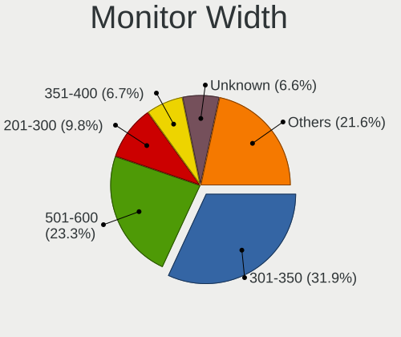

| Width in mm    | Computers | Percent |
|----------------|-----------|---------|
| 301-350        | 1221      | 31.91%  |
| 501-600        | 892       | 23.31%  |
| 201-300        | 376       | 9.83%   |
| 351-400        | 257       | 6.72%   |
| Unknown        | 253       | 6.61%   |
| 401-500        | 251       | 6.56%   |
| 601-700        | 219       | 5.72%   |
| 701-800        | 138       | 3.61%   |
| 1001-1500      | 84        | 2.2%    |
| 1501-2000      | 63        | 1.65%   |
| 801-900        | 43        | 1.12%   |
| 901-1000       | 9         | 0.24%   |
| 1-100          | 9         | 0.24%   |
| More than 2000 | 7         | 0.18%   |
| 101-200        | 4         | 0.1%    |

Aspect Ratio
------------

Proportional relationship between the width and the height

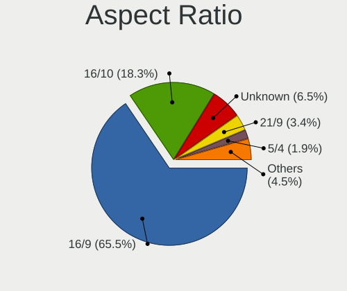

| Ratio   | Computers | Percent |
|---------|-----------|---------|
| 16/9    | 2319      | 65.53%  |
| 16/10   | 646       | 18.25%  |
| Unknown | 229       | 6.47%   |
| 21/9    | 120       | 3.39%   |
| 5/4     | 67        | 1.89%   |
| 3/2     | 64        | 1.81%   |
| 4/3     | 32        | 0.9%    |
| 32/9    | 26        | 0.73%   |
| 1.00    | 9         | 0.25%   |
| 0.67    | 6         | 0.17%   |
| 6/5     | 5         | 0.14%   |
| 0.62    | 4         | 0.11%   |
| 3.20    | 3         | 0.08%   |
| 3.73    | 2         | 0.06%   |
| 3.40    | 2         | 0.06%   |
| 0.56    | 2         | 0.06%   |
| 2.50    | 1         | 0.03%   |
| 0.89    | 1         | 0.03%   |
| 0.79    | 1         | 0.03%   |

Monitor Area
------------

Area in inch²

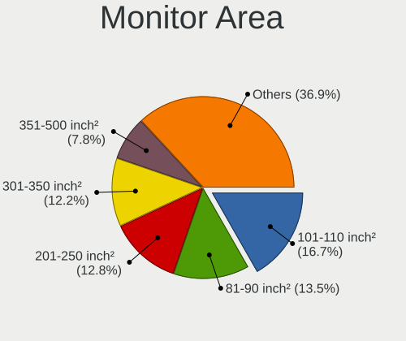

| Area in inch² | Computers | Percent |
|----------------|-----------|---------|
| 101-110        | 649       | 16.74%  |
| 81-90          | 525       | 13.54%  |
| 201-250        | 495       | 12.77%  |
| 301-350        | 473       | 12.2%   |
| 351-500        | 304       | 7.84%   |
| Unknown        | 253       | 6.53%   |
| 71-80          | 202       | 5.21%   |
| 251-300        | 193       | 4.98%   |
| 121-130        | 169       | 4.36%   |
| 151-200        | 127       | 3.28%   |
| More than 1000 | 114       | 2.94%   |
| 111-120        | 88        | 2.27%   |
| 61-70          | 84        | 2.17%   |
| 501-1000       | 82        | 2.12%   |
| 141-150        | 32        | 0.83%   |
| 51-60          | 28        | 0.72%   |
| 131-140        | 23        | 0.59%   |
| 91-100         | 14        | 0.36%   |
| 1-40           | 13        | 0.34%   |
| 41-50          | 8         | 0.21%   |

Pixel Density
-------------

Pixels per inch

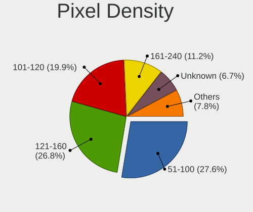

| Density       | Computers | Percent |
|---------------|-----------|---------|
| 51-100        | 1038      | 27.58%  |
| 121-160       | 1008      | 26.78%  |
| 101-120       | 749       | 19.9%   |
| 161-240       | 423       | 11.24%  |
| Unknown       | 253       | 6.72%   |
| More than 240 | 205       | 5.45%   |
| 1-50          | 88        | 2.34%   |

Multiple Monitors
-----------------

Total monitors connected

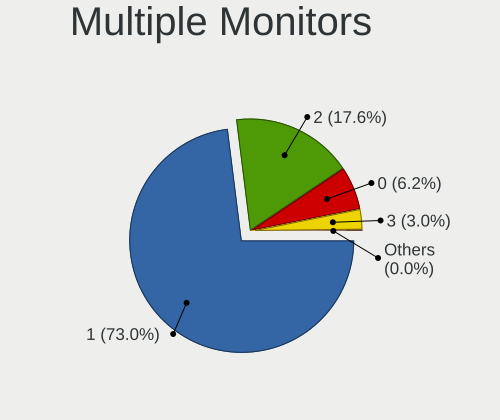

| Total | Computers | Percent |
|-------|-----------|---------|
| 1     | 2666      | 73.02%  |
| 2     | 642       | 17.58%  |
| 0     | 228       | 6.24%   |
| 3     | 108       | 2.96%   |
| 4     | 6         | 0.16%   |
| 5     | 1         | 0.03%   |

Network
-------

Net Controller Vendor
---------------------

Controller vendors

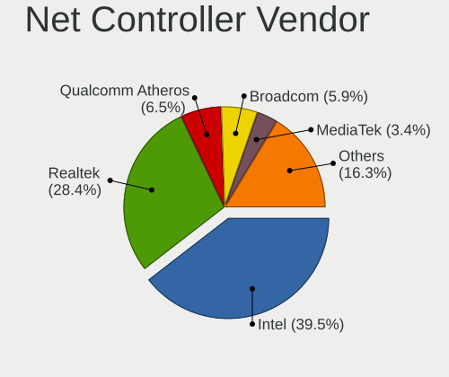

| Vendor                                 | Computers | Percent |
|----------------------------------------|-----------|---------|
| Intel                                  | 2087      | 39.52%  |
| Realtek Semiconductor                  | 1501      | 28.42%  |
| Qualcomm Atheros                       | 344       | 6.51%   |
| Broadcom                               | 310       | 5.87%   |
| MediaTek                               | 177       | 3.35%   |
| Broadcom Limited                       | 71        | 1.34%   |
| Marvell Technology Group               | 61        | 1.16%   |
| Aquantia                               | 52        | 0.98%   |
| ASIX Electronics                       | 48        | 0.91%   |
| TP-Link                                | 41        | 0.78%   |
| Ralink                                 | 40        | 0.76%   |
| Lenovo                                 | 38        | 0.72%   |
| Qualcomm                               | 37        | 0.7%    |
| Nvidia                                 | 35        | 0.66%   |
| Ralink Technology                      | 33        | 0.62%   |
| Sierra Wireless                        | 32        | 0.61%   |
| DisplayLink                            | 27        | 0.51%   |
| Dell                                   | 23        | 0.44%   |
| Hewlett-Packard                        | 20        | 0.38%   |
| NetGear                                | 18        | 0.34%   |
| Ericsson Business Mobile Networks      | 18        | 0.34%   |
| D-Link                                 | 17        | 0.32%   |
| Microsoft                              | 16        | 0.3%    |
| Edimax Technology                      | 16        | 0.3%    |
| Shenzhen Goodix Technology             | 15        | 0.28%   |
| Samsung Electronics                    | 15        | 0.28%   |
| Huawei Technologies                    | 15        | 0.28%   |
| ASUSTek Computer                       | 13        | 0.25%   |
| Xiaomi                                 | 12        | 0.23%   |
| Microchip Technology                   | 12        | 0.23%   |
| Qualcomm Technologies                  | 8         | 0.15%   |
| Fibocom                                | 8         | 0.15%   |
| AVM                                    | 8         | 0.15%   |
| Mellanox Technologies                  | 7         | 0.13%   |
| IMC Networks                           | 7         | 0.13%   |
| Linksys                                | 6         | 0.11%   |
| D-Link System                          | 5         | 0.09%   |
| Arduino SA                             | 5         | 0.09%   |
| Wilocity                               | 4         | 0.08%   |
| Suzhou Motorcomm Electronic Technology | 4         | 0.08%   |

Net Controller Model
--------------------

Controller models

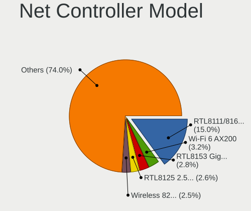

| Model                                                                  | Computers | Percent |
|------------------------------------------------------------------------|-----------|---------|
| Realtek RTL8111/8168/8211/8411 PCI Express Gigabit Ethernet Controller | 947       | 14.96%  |
| Intel Wi-Fi 6 AX200                                                    | 202       | 3.19%   |
| Realtek RTL8153 Gigabit Ethernet Adapter                               | 175       | 2.76%   |
| Realtek RTL8125 2.5GbE Controller                                      | 165       | 2.61%   |
| Intel Wireless 8265 / 8275                                             | 159       | 2.51%   |
| Intel I211 Gigabit Network Connection                                  | 123       | 1.94%   |
| Intel 82579LM Gigabit Network Connection (Lewisville)                  | 120       | 1.9%    |
| Intel Wi-Fi 6 AX201                                                    | 96        | 1.52%   |
| Intel Ethernet Connection (2) I219-V                                   | 77        | 1.22%   |
| Intel Wireless 7260                                                    | 75        | 1.18%   |
| MediaTek MT7922 802.11ax PCI Express Wireless Network Adapter          | 73        | 1.15%   |
| Intel Wireless 8260                                                    | 71        | 1.12%   |
| Intel Ethernet Controller I225-V                                       | 71        | 1.12%   |
| Intel Wireless 7265                                                    | 66        | 1.04%   |
| Intel Alder Lake-P PCH CNVi WiFi                                       | 61        | 0.96%   |
| Intel Ethernet Connection I217-LM                                      | 60        | 0.95%   |
| Realtek RTL810xE PCI Express Fast Ethernet controller                  | 59        | 0.93%   |
| Realtek RTL8822CE 802.11ac PCIe Wireless Network Adapter               | 58        | 0.92%   |
| Intel Cannon Point-LP CNVi [Wireless-AC]                               | 58        | 0.92%   |
| Qualcomm Atheros QCA6174 802.11ac Wireless Network Adapter             | 57        | 0.9%    |
| Realtek RTL8821CE 802.11ac PCIe Wireless Network Adapter               | 53        | 0.84%   |
| Intel Raptor Lake PCH CNVi WiFi                                        | 52        | 0.82%   |
| MediaTek MT7921 802.11ax PCIe Wireless Network Adapter [Filogic 330]   | 50        | 0.79%   |
| Intel Centrino Advanced-N 6205 [Taylor Peak]                           | 50        | 0.79%   |
| Intel Wi-Fi 6E(802.11ax) AX210/AX1675* 2x2 [Typhoon Peak]              | 49        | 0.77%   |
| Intel Ethernet Connection (2) I219-LM                                  | 48        | 0.76%   |
| Intel Comet Lake PCH-LP CNVi WiFi                                      | 47        | 0.74%   |
| Intel 82579V Gigabit Network Connection                                | 45        | 0.71%   |
| Intel Cannon Lake PCH CNVi WiFi                                        | 44        | 0.69%   |
| Intel 82574L Gigabit Network Connection                                | 42        | 0.66%   |
| ASIX AX88179 Gigabit Ethernet                                          | 42        | 0.66%   |
| Qualcomm Atheros QCA9377 802.11ac Wireless Network Adapter             | 40        | 0.63%   |
| Intel Ethernet Connection (4) I219-V                                   | 39        | 0.62%   |
| Intel Ethernet Connection (4) I219-LM                                  | 39        | 0.62%   |
| Broadcom NetXtreme BCM57765 Gigabit Ethernet PCIe                      | 38        | 0.6%    |
| Intel Ethernet Connection I219-LM                                      | 37        | 0.58%   |
| Intel Comet Lake PCH CNVi WiFi                                         | 36        | 0.57%   |
| Intel Wireless 3165                                                    | 35        | 0.55%   |
| Intel Wi-Fi 5(802.11ac) Wireless-AC 9x6x [Thunder Peak]                | 35        | 0.55%   |
| Intel Ethernet Connection (6) I219-V                                   | 35        | 0.55%   |

Wireless Vendor
---------------

Wireless vendors

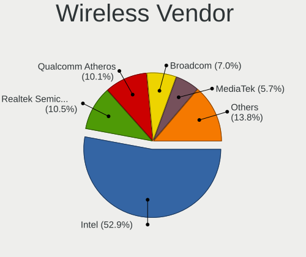

| Vendor                                | Computers | Percent |
|---------------------------------------|-----------|---------|
| Intel                                 | 1477      | 52.92%  |
| Realtek Semiconductor                 | 293       | 10.5%   |
| Qualcomm Atheros                      | 282       | 10.1%   |
| Broadcom                              | 196       | 7.02%   |
| MediaTek                              | 159       | 5.7%    |
| Broadcom Limited                      | 49        | 1.76%   |
| Ralink                                | 40        | 1.43%   |
| TP-Link                               | 34        | 1.22%   |
| Ralink Technology                     | 33        | 1.18%   |
| Sierra Wireless                       | 32        | 1.15%   |
| Qualcomm                              | 31        | 1.11%   |
| NetGear                               | 17        | 0.61%   |
| Marvell Technology Group              | 17        | 0.61%   |
| Edimax Technology                     | 16        | 0.57%   |
| D-Link                                | 16        | 0.57%   |
| Dell                                  | 15        | 0.54%   |
| ASUSTek Computer                      | 13        | 0.47%   |
| Microsoft                             | 12        | 0.43%   |
| Hewlett-Packard                       | 8         | 0.29%   |
| Fibocom                               | 8         | 0.29%   |
| AVM                                   | 8         | 0.29%   |
| IMC Networks                          | 7         | 0.25%   |
| Wilocity                              | 4         | 0.14%   |
| Qualcomm Atheros Communications       | 4         | 0.14%   |
| D-Link System                         | 3         | 0.11%   |
| Micro Star International              | 2         | 0.07%   |
| 802.11g Adapter [Linksys WUSB54GC v3] | 2         | 0.07%   |
| ZyXEL Communications                  | 1         | 0.04%   |
| Quectel Wireless Solutions            | 1         | 0.04%   |
| Qualcomm Technologies                 | 1         | 0.04%   |
| Philips (or NXP)                      | 1         | 0.04%   |
| Netopia                               | 1         | 0.04%   |
| Linksys                               | 1         | 0.04%   |
| Gemtek                                | 1         | 0.04%   |
| Fujitsu Siemens Computers             | 1         | 0.04%   |
| CyberTAN Technology                   | 1         | 0.04%   |
| Belkin Components                     | 1         | 0.04%   |
| Arduino SA                            | 1         | 0.04%   |
| Acer Peripherals (now BenQ)           | 1         | 0.04%   |
| 3Com                                  | 1         | 0.04%   |

Wireless Model
--------------

Wireless models

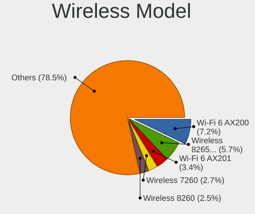

| Model                                                                | Computers | Percent |
|----------------------------------------------------------------------|-----------|---------|
| Intel Wi-Fi 6 AX200                                                  | 202       | 7.19%   |
| Intel Wireless 8265 / 8275                                           | 159       | 5.66%   |
| Intel Wi-Fi 6 AX201                                                  | 96        | 3.42%   |
| Intel Wireless 7260                                                  | 75        | 2.67%   |
| Intel Wireless 8260                                                  | 71        | 2.53%   |
| MediaTek MT7922 802.11ax PCI Express Wireless Network Adapter        | 66        | 2.35%   |
| Intel Wireless 7265                                                  | 66        | 2.35%   |
| Realtek RTL8822CE 802.11ac PCIe Wireless Network Adapter             | 58        | 2.06%   |
| Intel Cannon Point-LP CNVi [Wireless-AC]                             | 58        | 2.06%   |
| Qualcomm Atheros QCA6174 802.11ac Wireless Network Adapter           | 57        | 2.03%   |
| Realtek RTL8821CE 802.11ac PCIe Wireless Network Adapter             | 53        | 1.89%   |
| Intel Raptor Lake PCH CNVi WiFi                                      | 52        | 1.85%   |
| MediaTek MT7921 802.11ax PCIe Wireless Network Adapter [Filogic 330] | 50        | 1.78%   |
| Intel Centrino Advanced-N 6205 [Taylor Peak]                         | 50        | 1.78%   |
| Intel Wi-Fi 6E(802.11ax) AX210/AX1675* 2x2 [Typhoon Peak]            | 49        | 1.74%   |
| Intel Comet Lake PCH-LP CNVi WiFi                                    | 47        | 1.67%   |
| Intel Cannon Lake PCH CNVi WiFi                                      | 44        | 1.57%   |
| Intel Alder Lake-P PCH CNVi WiFi                                     | 43        | 1.53%   |
| Qualcomm Atheros QCA9377 802.11ac Wireless Network Adapter           | 40        | 1.42%   |
| Intel Comet Lake PCH CNVi WiFi                                       | 36        | 1.28%   |
| Intel Wireless 3165                                                  | 35        | 1.25%   |
| Intel Wi-Fi 5(802.11ac) Wireless-AC 9x6x [Thunder Peak]              | 35        | 1.25%   |
| Qualcomm Atheros AR9485 Wireless Network Adapter                     | 34        | 1.21%   |
| Intel 700 Series Chipset CNVi WiFi                                   | 34        | 1.21%   |
| Qualcomm Atheros QCA9565 / AR9565 Wireless Network Adapter           | 32        | 1.14%   |
| Intel Centrino Ultimate-N 6300                                       | 30        | 1.07%   |
| Qualcomm QCNFA765 Wireless Network Adapter                           | 29        | 1.03%   |
| Intel Dual Band Wireless-AC 3168NGW [Stone Peak]                     | 29        | 1.03%   |
| Qualcomm Atheros AR9285 Wireless Network Adapter (PCI-Express)       | 28        | 1%      |
| Broadcom BCM4331 802.11a/b/g/n                                       | 26        | 0.93%   |
| Qualcomm Atheros AR9462 Wireless Network Adapter                     | 25        | 0.89%   |
| Intel Dual Band Wireless-AC 3165 Plus Bluetooth                      | 25        | 0.89%   |
| Realtek RTL8822BE 802.11a/b/g/n/ac WiFi adapter                      | 23        | 0.82%   |
| Qualcomm Atheros AR928X Wireless Network Adapter (PCI-Express)       | 23        | 0.82%   |
| Intel Ice Lake-LP PCH CNVi WiFi                                      | 23        | 0.82%   |
| Broadcom Limited BCM4360 802.11ac Dual Band Wireless Network Adapter | 22        | 0.78%   |
| Broadcom BCM43602 802.11ac Wireless LAN SoC                          | 20        | 0.71%   |
| Broadcom BCM4322 802.11a/b/g/n Wireless LAN Controller               | 20        | 0.71%   |
| Intel Wireless 3160                                                  | 19        | 0.68%   |
| Intel Centrino Advanced-N 6235                                       | 19        | 0.68%   |

Ethernet Vendor
---------------

Ethernet vendors

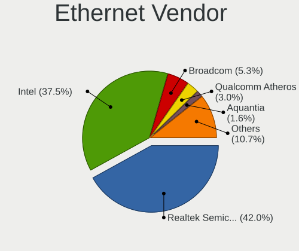

| Vendor                                 | Computers | Percent |
|----------------------------------------|-----------|---------|
| Realtek Semiconductor                  | 1379      | 41.98%  |
| Intel                                  | 1231      | 37.47%  |
| Broadcom                               | 173       | 5.27%   |
| Qualcomm Atheros                       | 98        | 2.98%   |
| Aquantia                               | 52        | 1.58%   |
| ASIX Electronics                       | 48        | 1.46%   |
| Marvell Technology Group               | 44        | 1.34%   |
| Lenovo                                 | 36        | 1.1%    |
| Nvidia                                 | 35        | 1.07%   |
| DisplayLink                            | 27        | 0.82%   |
| Broadcom Limited                       | 22        | 0.67%   |
| MediaTek                               | 16        | 0.49%   |
| Samsung Electronics                    | 15        | 0.46%   |
| Xiaomi                                 | 12        | 0.37%   |
| Microchip Technology                   | 10        | 0.3%    |
| Huawei Technologies                    | 9         | 0.27%   |
| TP-Link                                | 7         | 0.21%   |
| Qualcomm Technologies                  | 7         | 0.21%   |
| Qualcomm                               | 6         | 0.18%   |
| Mellanox Technologies                  | 6         | 0.18%   |
| Linksys                                | 5         | 0.15%   |
| Suzhou Motorcomm Electronic Technology | 4         | 0.12%   |
| NetXen Incorporated                    | 4         | 0.12%   |
| ICS Advent                             | 4         | 0.12%   |
| Microsoft                              | 3         | 0.09%   |
| HMD Global                             | 3         | 0.09%   |
| Google                                 | 3         | 0.09%   |
| Raspberry Pi                           | 2         | 0.06%   |
| OPPO Electronics                       | 2         | 0.06%   |
| Motorcomm Microelectronics.            | 2         | 0.06%   |
| Hewlett-Packard                        | 2         | 0.06%   |
| D-Link System                          | 2         | 0.06%   |
| Apple                                  | 2         | 0.06%   |
| American Megatrends                    | 2         | 0.06%   |
| ADMtek                                 | 2         | 0.06%   |
| Tehuti Networks                        | 1         | 0.03%   |
| Spreadtrum Communications              | 1         | 0.03%   |
| QNAP System                            | 1         | 0.03%   |
| OnePlus Technology (Shenzhen)          | 1         | 0.03%   |
| NetGear                                | 1         | 0.03%   |

Ethernet Model
--------------

Ethernet models

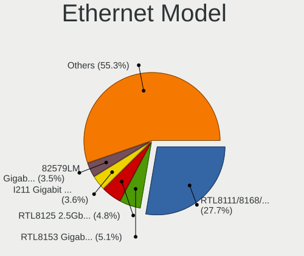

| Model                                                                          | Computers | Percent |
|--------------------------------------------------------------------------------|-----------|---------|
| Realtek RTL8111/8168/8211/8411 PCI Express Gigabit Ethernet Controller         | 947       | 27.68%  |
| Realtek RTL8153 Gigabit Ethernet Adapter                                       | 175       | 5.12%   |
| Realtek RTL8125 2.5GbE Controller                                              | 165       | 4.82%   |
| Intel I211 Gigabit Network Connection                                          | 123       | 3.6%    |
| Intel 82579LM Gigabit Network Connection (Lewisville)                          | 120       | 3.51%   |
| Intel Ethernet Connection (2) I219-V                                           | 77        | 2.25%   |
| Intel Ethernet Controller I225-V                                               | 71        | 2.08%   |
| Intel Ethernet Connection I217-LM                                              | 60        | 1.75%   |
| Realtek RTL810xE PCI Express Fast Ethernet controller                          | 59        | 1.72%   |
| Intel Ethernet Connection (2) I219-LM                                          | 48        | 1.4%    |
| Intel 82579V Gigabit Network Connection                                        | 45        | 1.32%   |
| Intel 82574L Gigabit Network Connection                                        | 42        | 1.23%   |
| ASIX AX88179 Gigabit Ethernet                                                  | 42        | 1.23%   |
| Intel Ethernet Connection (4) I219-V                                           | 39        | 1.14%   |
| Intel Ethernet Connection (4) I219-LM                                          | 39        | 1.14%   |
| Broadcom NetXtreme BCM57765 Gigabit Ethernet PCIe                              | 38        | 1.11%   |
| Intel Ethernet Connection I219-LM                                              | 37        | 1.08%   |
| Intel Ethernet Connection (6) I219-V                                           | 35        | 1.02%   |
| Intel I210 Gigabit Network Connection                                          | 34        | 0.99%   |
| Intel Ethernet Connection I218-LM                                              | 32        | 0.94%   |
| Broadcom NetXtreme BCM57766 Gigabit Ethernet PCIe                              | 31        | 0.91%   |
| Intel Ethernet Connection (2) I218-V                                           | 30        | 0.88%   |
| Qualcomm Atheros AR8151 v2.0 Gigabit Ethernet                                  | 29        | 0.85%   |
| Aquantia AQtion AQC107 NBase-T/IEEE 802.3an Ethernet Controller [Atlantic 10G] | 28        | 0.82%   |
| Intel Ethernet Connection (7) I219-V                                           | 27        | 0.79%   |
| Intel Ethernet Connection (7) I219-LM                                          | 25        | 0.73%   |
| Intel I350 Gigabit Network Connection                                          | 24        | 0.7%    |
| Intel Ethernet Controller I226-V                                               | 22        | 0.64%   |
| Intel Ethernet Connection (3) I218-LM                                          | 22        | 0.64%   |
| Intel 82577LM Gigabit Network Connection                                       | 22        | 0.64%   |
| Intel Ethernet Connection I219-V                                               | 20        | 0.58%   |
| Broadcom NetXtreme BCM5764M Gigabit Ethernet PCIe                              | 19        | 0.56%   |
| Nvidia MCP79 Ethernet                                                          | 18        | 0.53%   |
| Intel Ethernet Connection I217-V                                               | 18        | 0.53%   |
| Intel Alder Lake-P PCH CNVi WiFi                                               | 18        | 0.53%   |
| Realtek USB 10/100/1G/2.5 LAN                                                  | 16        | 0.47%   |
| Intel Ethernet Connection (10) I219-V                                          | 16        | 0.47%   |
| Qualcomm Atheros Killer E2400 Gigabit Ethernet Controller                      | 14        | 0.41%   |
| Intel Ethernet Connection (13) I219-V                                          | 14        | 0.41%   |
| Intel Ethernet Connection (6) I219-LM                                          | 13        | 0.38%   |

Net Controller Kind
-------------------

Ethernet, WiFi or modem

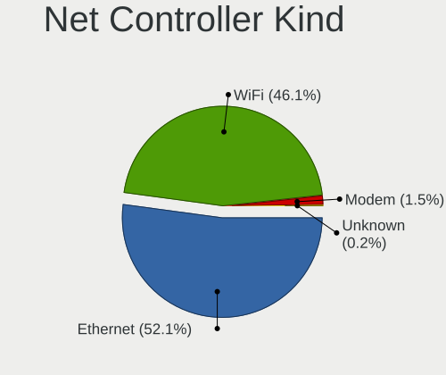

| Kind     | Computers | Percent |
|----------|-----------|---------|
| Ethernet | 2970      | 52.13%  |
| WiFi     | 2628      | 46.13%  |
| Modem    | 86        | 1.51%   |
| Unknown  | 13        | 0.23%   |

Used Controller
---------------

Currently used network controller

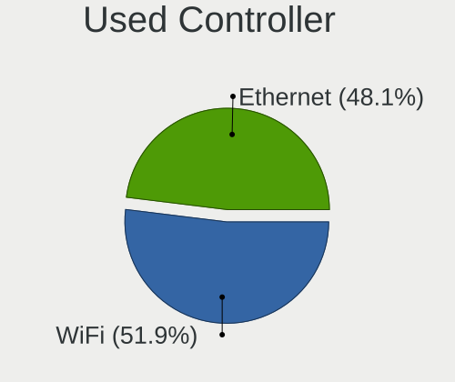

| Kind     | Computers | Percent |
|----------|-----------|---------|
| WiFi     | 1884      | 51.94%  |
| Ethernet | 1743      | 48.06%  |

NICs
----

Total network controllers on board

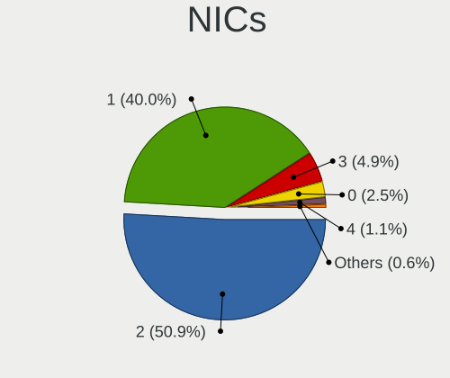

| Total | Computers | Percent |
|-------|-----------|---------|
| 2     | 1807      | 50.9%   |
| 1     | 1419      | 39.97%  |
| 3     | 173       | 4.87%   |
| 0     | 90        | 2.54%   |
| 4     | 39        | 1.1%    |
| 6     | 11        | 0.31%   |
| 5     | 6         | 0.17%   |
| 10    | 2         | 0.06%   |
| 8     | 2         | 0.06%   |
| 7     | 1         | 0.03%   |

IPv6
----

IPv6 vs IPv4

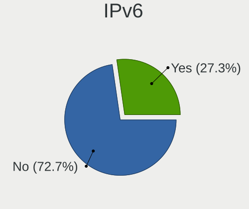

| Used | Computers | Percent |
|------|-----------|---------|
| No   | 2646      | 72.71%  |
| Yes  | 993       | 27.29%  |

Bluetooth
---------

Bluetooth Vendor
----------------

Controller vendors

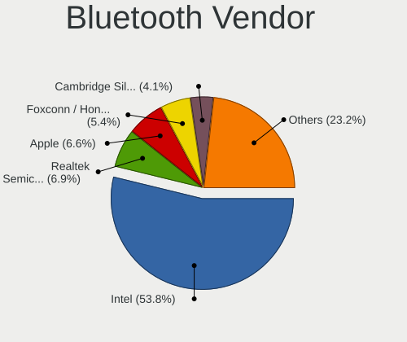

| Vendor                          | Computers | Percent |
|---------------------------------|-----------|---------|
| Intel                           | 1268      | 53.8%   |
| Realtek Semiconductor           | 162       | 6.87%   |
| Apple                           | 156       | 6.62%   |
| Foxconn / Hon Hai               | 127       | 5.39%   |
| Cambridge Silicon Radio         | 96        | 4.07%   |
| IMC Networks                    | 94        | 3.99%   |
| Broadcom                        | 93        | 3.95%   |
| Qualcomm Atheros Communications | 87        | 3.69%   |
| ASUSTek Computer                | 51        | 2.16%   |
| Lite-On Technology              | 49        | 2.08%   |
| MediaTek                        | 48        | 2.04%   |
| Hewlett-Packard                 | 22        | 0.93%   |
| USI                             | 21        | 0.89%   |
| Dell                            | 18        | 0.76%   |
| Marvell Semiconductor           | 17        | 0.72%   |
| Ralink                          | 10        | 0.42%   |
| Alps Electric                   | 5         | 0.21%   |
| Toshiba                         | 4         | 0.17%   |
| Edimax Technology               | 4         | 0.17%   |
| TP-Link                         | 3         | 0.13%   |
| Realtek                         | 3         | 0.13%   |
| Quectel Wireless Solutions      | 3         | 0.13%   |
| Micro Star International        | 3         | 0.13%   |
| Ralink Technology               | 2         | 0.08%   |
| Chicony Electronics             | 2         | 0.08%   |
| Unknown                         | 2         | 0.08%   |
| Taiyo Yuden                     | 1         | 0.04%   |
| Nordic Semiconductor ASA        | 1         | 0.04%   |
| Mercucys                        | 1         | 0.04%   |
| Logitech                        | 1         | 0.04%   |
| Integrated System Solution      | 1         | 0.04%   |
| Fujitsu                         | 1         | 0.04%   |
| Foxconn International           | 1         | 0.04%   |

Bluetooth Model
---------------

Controller models

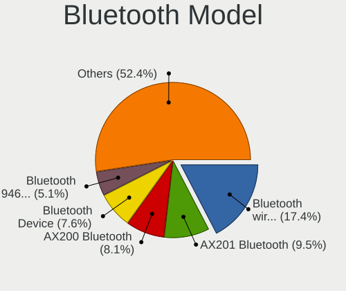

| Model                                               | Computers | Percent |
|-----------------------------------------------------|-----------|---------|
| Intel Bluetooth wireless interface                  | 410       | 17.37%  |
| Intel AX201 Bluetooth                               | 224       | 9.49%   |
| Intel AX200 Bluetooth                               | 191       | 8.09%   |
| Intel Bluetooth Device                              | 179       | 7.58%   |
| Intel Bluetooth 9460/9560 Jefferson Peak (JfP)      | 120       | 5.08%   |
| Realtek Bluetooth Radio                             | 117       | 4.96%   |
| Cambridge Silicon Radio Bluetooth Dongle (HCI mode) | 96        | 4.07%   |
| Apple Bluetooth Host Controller                     | 56        | 2.37%   |
| Foxconn / Hon Hai Wireless_Device                   | 50        | 2.12%   |
| MediaTek Wireless_Device                            | 48        | 2.03%   |
| Apple Bluetooth USB Host Controller                 | 45        | 1.91%   |
| Intel AX210 Bluetooth                               | 44        | 1.86%   |
| Apple Built-in Bluetooth 2.0+EDR HCI                | 42        | 1.78%   |
| IMC Networks Wireless_Device                        | 39        | 1.65%   |
| Intel Wireless-AC 9260 Bluetooth Adapter            | 36        | 1.52%   |
| IMC Networks Bluetooth Radio                        | 36        | 1.52%   |
| Realtek  Bluetooth 4.2 Adapter                      | 33        | 1.4%    |
| Intel Centrino Bluetooth Wireless Transceiver       | 33        | 1.4%    |
| Qualcomm Atheros QCA61x4 Bluetooth 4.0              | 30        | 1.27%   |
| Intel Wireless-AC 3168 Bluetooth                    | 29        | 1.23%   |
| Foxconn / Hon Hai Bluetooth Device                  | 29        | 1.23%   |
| Qualcomm Atheros  Bluetooth Device                  | 27        | 1.14%   |
| Foxconn / Hon Hai MediaTek Bluetooth Adapter        | 23        | 0.97%   |
| USI Bluetooth Device                                | 21        | 0.89%   |
| ASUS ASUS USB-BT500                                 | 19        | 0.8%    |
| Broadcom BCM2045B (BDC-2.1)                         | 18        | 0.76%   |
| Qualcomm Atheros AR3011 Bluetooth                   | 17        | 0.72%   |
| Broadcom BCM20702 Bluetooth 4.0 [ThinkPad]          | 15        | 0.64%   |
| Lite-On Qualcomm Atheros QCA9377 Bluetooth          | 13        | 0.55%   |
| Apple Bluetooth HCI                                 | 13        | 0.55%   |
| Marvell Bluetooth and Wireless LAN Composite        | 12        | 0.51%   |
| Lite-On Atheros AR3012 Bluetooth                    | 12        | 0.51%   |
| IMC Networks Bluetooth Device                       | 12        | 0.51%   |
| HP Broadcom 2070 Bluetooth Combo                    | 12        | 0.51%   |
| Ralink RT3290 Bluetooth                             | 10        | 0.42%   |
| Lite-On Bluetooth Device                            | 10        | 0.42%   |
| Qualcomm Atheros AR3012 Bluetooth 4.0               | 8         | 0.34%   |
| Lite-On Wireless_Device                             | 8         | 0.34%   |
| HP Bluetooth 2.0 Interface [Broadcom BCM2045]       | 8         | 0.34%   |
| Broadcom BCM20702A0 Bluetooth 4.0                   | 8         | 0.34%   |

Sound
-----

Sound Vendor
------------

Sound card vendors

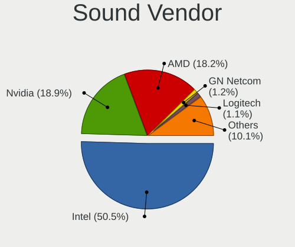

| Vendor                                       | Computers | Percent |
|----------------------------------------------|-----------|---------|
| Intel                                        | 2559      | 50.46%  |
| Nvidia                                       | 956       | 18.85%  |
| AMD                                          | 924       | 18.22%  |
| GN Netcom                                    | 60        | 1.18%   |
| Logitech                                     | 58        | 1.14%   |
| C-Media Electronics                          | 57        | 1.12%   |
| ASUSTek Computer                             | 41        | 0.81%   |
| Lenovo                                       | 31        | 0.61%   |
| Plantronics                                  | 23        | 0.45%   |
| Hewlett-Packard                              | 22        | 0.43%   |
| SteelSeries ApS                              | 20        | 0.39%   |
| Realtek Semiconductor                        | 20        | 0.39%   |
| Creative Labs                                | 20        | 0.39%   |
| Micro Star International                     | 16        | 0.32%   |
| Kingston Technology                          | 15        | 0.3%    |
| Razer USA                                    | 12        | 0.24%   |
| Focusrite-Novation                           | 12        | 0.24%   |
| RODE Microphones                             | 11        | 0.22%   |
| JMTek                                        | 10        | 0.2%    |
| Creative Technology                          | 10        | 0.2%    |
| Texas Instruments                            | 9         | 0.18%   |
| Samson Technologies                          | 9         | 0.18%   |
| Generalplus Technology                       | 8         | 0.16%   |
| Astro Gaming                                 | 8         | 0.16%   |
| Apple                                        | 8         | 0.16%   |
| DSEA A/S                                     | 7         | 0.14%   |
| BEHRINGER International                      | 7         | 0.14%   |
| Sony                                         | 6         | 0.12%   |
| Corsair                                      | 6         | 0.12%   |
| Tenx Technology                              | 5         | 0.1%    |
| Conexant Systems                             | 5         | 0.1%    |
| ASRock                                       | 5         | 0.1%    |
| Zoran Co. Personal Media Division (Nogatech) | 4         | 0.08%   |
| FiiO Electronics Technology                  | 4         | 0.08%   |
| Dell                                         | 4         | 0.08%   |
| XMOS                                         | 3         | 0.06%   |
| VIA Technologies                             | 3         | 0.06%   |
| Roland                                       | 3         | 0.06%   |
| ROCCAT                                       | 3         | 0.06%   |
| Nordic Semiconductor ASA                     | 3         | 0.06%   |

Sound Model
-----------

Sound card models

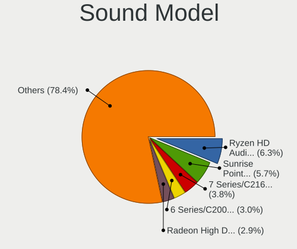

| Model                                                                      | Computers | Percent |
|----------------------------------------------------------------------------|-----------|---------|
| AMD Ryzen HD Audio Controller                                              | 373       | 6.25%   |
| Intel Sunrise Point-LP HD Audio                                            | 339       | 5.68%   |
| Intel 7 Series/C216 Chipset Family High Definition Audio Controller        | 224       | 3.76%   |
| Intel 6 Series/C200 Series Chipset Family High Definition Audio Controller | 179       | 3%      |
| AMD Radeon High Definition Audio Controller                                | 175       | 2.93%   |
| AMD Starship/Matisse HD Audio Controller                                   | 172       | 2.88%   |
| AMD Renoir/Cezanne HDMI/DP Audio Controller                                | 155       | 2.6%    |
| Intel 8 Series/C220 Series Chipset High Definition Audio Controller        | 150       | 2.51%   |
| Intel 100 Series/C230 Series Chipset Family HD Audio Controller            | 118       | 1.98%   |
| Intel Cannon Lake PCH cAVS                                                 | 117       | 1.96%   |
| Intel Tiger Lake-LP Smart Sound Technology Audio Controller                | 115       | 1.93%   |
| Intel Xeon E3-1200 v3/4th Gen Core Processor HD Audio Controller           | 105       | 1.76%   |
| Intel Cannon Point-LP High Definition Audio Controller                     | 104       | 1.74%   |
| Intel Haswell-ULT HD Audio Controller                                      | 95        | 1.59%   |
| Intel 8 Series HD Audio Controller                                         | 95        | 1.59%   |
| Intel 5 Series/3400 Series Chipset High Definition Audio                   | 91        | 1.53%   |
| Intel 200 Series PCH HD Audio                                              | 81        | 1.36%   |
| Intel Alder Lake PCH-P High Definition Audio Controller                    | 74        | 1.24%   |
| Nvidia GA104 High Definition Audio Controller                              | 71        | 1.19%   |
| Intel Raptor Lake-P/U/H cAVS                                               | 67        | 1.12%   |
| Intel Broadwell-U Audio Controller                                         | 67        | 1.12%   |
| Nvidia GP107GL High Definition Audio Controller                            | 65        | 1.09%   |
| Nvidia GK107 HDMI Audio Controller                                         | 65        | 1.09%   |
| Intel Wildcat Point-LP High Definition Audio Controller                    | 65        | 1.09%   |
| AMD Family 17h (Models 00h-0fh) HD Audio Controller                        | 64        | 1.07%   |
| Intel Comet Lake PCH-LP cAVS                                               | 61        | 1.02%   |
| AMD Ellesmere HDMI Audio [Radeon RX 470/480 / 570/580/590]                 | 56        | 0.94%   |
| AMD SBx00 Azalia (Intel HDA)                                               | 55        | 0.92%   |
| Intel 82801I (ICH9 Family) HD Audio Controller                             | 54        | 0.91%   |
| Intel Tiger Lake-H HD Audio Controller                                     | 52        | 0.87%   |
| Intel Comet Lake PCH cAVS                                                  | 48        | 0.8%    |
| AMD Navi 21/23 HDMI/DP Audio Controller                                    | 47        | 0.79%   |
| Nvidia GP104 High Definition Audio Controller                              | 46        | 0.77%   |
| Intel Raptor Lake High Definition Audio Controller                         | 43        | 0.72%   |
| Nvidia GF108 High Definition Audio Controller                              | 42        | 0.7%    |
| Nvidia GK208 HDMI/DP Audio Controller                                      | 41        | 0.69%   |
| Nvidia TU107 GeForce GTX 1650 High Definition Audio Controller             | 40        | 0.67%   |
| AMD FCH Azalia Controller                                                  | 39        | 0.65%   |
| Intel 82801H (ICH8 Family) HD Audio Controller                             | 38        | 0.64%   |
| AMD Raven/Raven2/Fenghuang HDMI/DP Audio Controller                        | 38        | 0.64%   |

Memory
------

Memory Vendor
-------------

Memory module vendors

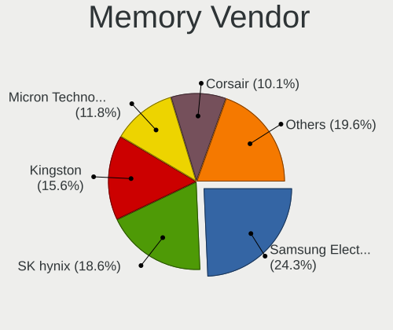

| Vendor                                  | Computers | Percent |
|-----------------------------------------|-----------|---------|
| Samsung Electronics                     | 583       | 24.31%  |
| SK hynix                                | 446       | 18.6%   |
| Kingston                                | 374       | 15.6%   |
| Micron Technology                       | 283       | 11.8%   |
| Corsair                                 | 243       | 10.13%  |
| Unknown                                 | 136       | 5.67%   |
| Crucial                                 | 85        | 3.54%   |
| G.Skill                                 | 77        | 3.21%   |
| Elpida                                  | 35        | 1.46%   |
| Ramaxel Technology                      | 24        | 1%      |
| A-DATA Technology                       | 21        | 0.88%   |
| Unknown                                 | 19        | 0.79%   |
| Nanya Technology                        | 14        | 0.58%   |
| Patriot                                 | 8         | 0.33%   |
| Unknown (ABCD)                          | 4         | 0.17%   |
| ASint Technology                        | 4         | 0.17%   |
| Hewlett-Packard                         | 3         | 0.13%   |
| Avant                                   | 3         | 0.13%   |
| Unknown (0x9801)                        | 2         | 0.08%   |
| Team                                    | 2         | 0.08%   |
| Kingmax                                 | 2         | 0.08%   |
| Apacer                                  | 2         | 0.08%   |
| Wilk                                    | 1         | 0.04%   |
| Unknown (0x198)                         | 1         | 0.04%   |
| Unknown (0x0EB9)                        | 1         | 0.04%   |
| Unknown (0x0E9D)                        | 1         | 0.04%   |
| Unknown (0x0C3B)                        | 1         | 0.04%   |
| Unknown (08AE)                          | 1         | 0.04%   |
| Unifosa                                 | 1         | 0.04%   |
| Smart                                   | 1         | 0.04%   |
| SK_Hynix                                | 1         | 0.04%   |
| Silicon Power Computer & Communications | 1         | 0.04%   |
| Princeton                               | 1         | 0.04%   |
| Patriot Memory                          | 1         | 0.04%   |
| OnBoard                                 | 1         | 0.04%   |
| OCZ                                     | 1         | 0.04%   |
| Melco                                   | 1         | 0.04%   |
| Lexar                                   | 1         | 0.04%   |
| King Tiger                              | 1         | 0.04%   |
| KANMEIQi                                | 1         | 0.04%   |

Memory Model
------------

Memory module models

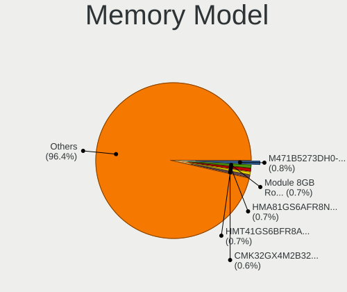

| Model                                                        | Computers | Percent |
|--------------------------------------------------------------|-----------|---------|
| Samsung RAM M471B5273DH0-CH9 4GB SODIMM DDR3 1600MT/s        | 21        | 0.82%   |
| Unknown                                                      | 19        | 0.74%   |
| SK hynix RAM HMA81GS6AFR8N-UH 8GB SODIMM DDR4 2667MT/s       | 18        | 0.71%   |
| SK hynix RAM HMT41GS6BFR8A-PB 8GB SODIMM DDR3 2667MT/s       | 17        | 0.67%   |
| Corsair RAM CMK32GX4M2B3200C16 16GB DIMM DDR4 3800MT/s       | 16        | 0.63%   |
| Samsung RAM M471B1G73QH0-YK0 8GB SODIMM DDR3 1600MT/s        | 15        | 0.59%   |
| Samsung RAM M471A1K43EB1-CWE 8GB SODIMM DDR4 3200MT/s        | 14        | 0.55%   |
| Kingston RAM 9905734-415.A00G 16GB DIMM DDR4 3200MT/s        | 14        | 0.55%   |
| SK hynix RAM HMAA1GS6CJR6N-XN 8GB SODIMM DDR4 3200MT/s       | 13        | 0.51%   |
| Samsung RAM M471A1K43BB1-CRC 8GB SODIMM DDR4 2667MT/s        | 13        | 0.51%   |
| Samsung RAM M471A1G44AB0-CWE 8GiB SODIMM DDR4 3200MT/s       | 13        | 0.51%   |
| SK hynix RAM HMT451S6BFR8A-PB 4GB SODIMM DDR3 1600MT/s       | 12        | 0.47%   |
| Samsung RAM M471A1K43CB1-CRC 8GB SODIMM DDR4 8400MT/s        | 12        | 0.47%   |
| Samsung RAM M471A1G44BB0-CWE 8GB SODIMM DDR4 3200MT/s        | 11        | 0.43%   |
| Corsair RAM CMK16GX4M2B3000C15 8GB DIMM DDR4 3600MT/s        | 11        | 0.43%   |
| Samsung RAM M471A5244CB0-CTD 4GB SODIMM DDR4 3266MT/s        | 10        | 0.39%   |
| Samsung RAM M471A4G43AB1-CWE 32GB SODIMM DDR4 3200MT/s       | 10        | 0.39%   |
| Samsung RAM M471A1K43DB1-CTD 8GB SODIMM DDR4 2667MT/s        | 10        | 0.39%   |
| Samsung RAM K4EBE304EB-EGCG 8GB Row Of Chips LPDDR3 2133MT/s | 10        | 0.39%   |
| Corsair RAM CMK32GX4M2A2666C16 16GB DIMM DDR4 2667MT/s       | 10        | 0.39%   |
| Corsair RAM CMK16GX4M2B3200C16 8GB DIMM DDR4 3600MT/s        | 10        | 0.39%   |
| SK hynix RAM HMA82GS6AFR8N-UH 16GB SODIMM DDR4 2667MT/s      | 9         | 0.35%   |
| Samsung RAM M471B5273CH0-CH9 4GB SODIMM DDR3 1334MT/s        | 9         | 0.35%   |
| Samsung RAM M471B5173DB0-YK0 4GB SODIMM DDR3 1600MT/s        | 9         | 0.35%   |
| Samsung RAM M471B1G73EB0-YK0 8192MB SODIMM DDR3 1600MT/s     | 9         | 0.35%   |
| Samsung RAM M471B1G73DB0-YK0 8GB SODIMM DDR3 1600MT/s        | 9         | 0.35%   |
| Samsung RAM M471A4G43MB1-CTD 32GB SODIMM DDR4 2667MT/s       | 9         | 0.35%   |
| Samsung RAM M471A1K43DB1-CWE 8GB SODIMM DDR4 3200MT/s        | 9         | 0.35%   |
| Samsung RAM M471A1K43CB1-CTD 8GB SODIMM DDR4 3200MT/s        | 9         | 0.35%   |
| Kingston RAM 9905734-016.A00G 16GB DIMM DDR4 3200MT/s        | 9         | 0.35%   |
| Corsair RAM CMK32GX4M2D3600C18 16GB DIMM DDR4 3800MT/s       | 9         | 0.35%   |
| SK hynix RAM Module 4GB SODIMM DDR3 1600MT/s                 | 8         | 0.31%   |
| SK hynix RAM HMT351S6CFR8C-PB 4GB SODIMM DDR3 1600MT/s       | 8         | 0.31%   |
| SK hynix RAM HMA851S6CJR6N-VK 4GB SODIMM DDR4 2667MT/s       | 8         | 0.31%   |
| SK hynix RAM HMA81GS6CJR8N-VK 8GB SODIMM DDR4 2667MT/s       | 8         | 0.31%   |
| Samsung RAM M471A2K43DB1-CWE 16GB SODIMM DDR4 3200MT/s       | 8         | 0.31%   |
| Samsung RAM M471A2K43DB1-CTD 16GB SODIMM DDR4 2667MT/s       | 8         | 0.31%   |
| Samsung RAM M425R2GA3BB0-CQKOL 16GB SODIMM DDR5 4800MT/s     | 8         | 0.31%   |
| Samsung RAM K3KL9L90CM-MGCT 4GB Row Of Chips LPDDR5 7500MT/s | 8         | 0.31%   |
| Micron RAM Module 4GB Row Of Chips LPDDR5 8533MT/s           | 8         | 0.31%   |

Memory Kind
-----------

Memory module kinds

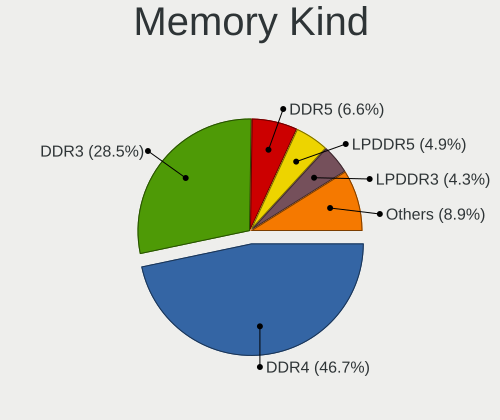

| Kind    | Computers | Percent |
|---------|-----------|---------|
| DDR4    | 1013      | 46.7%   |
| DDR3    | 619       | 28.54%  |
| DDR5    | 144       | 6.64%   |
| LPDDR5  | 107       | 4.93%   |
| LPDDR3  | 93        | 4.29%   |
| LPDDR4  | 71        | 3.27%   |
| DDR2    | 50        | 2.31%   |
| Unknown | 31        | 1.43%   |
| SDRAM   | 26        | 1.2%    |
| DDR     | 9         | 0.41%   |
| DRAM    | 6         | 0.28%   |

Memory Form Factor
------------------

Physical design of the memory module

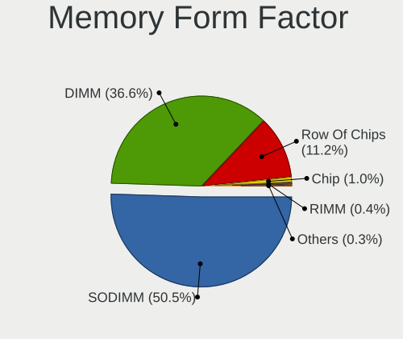

| Name         | Computers | Percent |
|--------------|-----------|---------|
| SODIMM       | 1098      | 50.51%  |
| DIMM         | 795       | 36.57%  |
| Row Of Chips | 244       | 11.22%  |
| Chip         | 21        | 0.97%   |
| RIMM         | 9         | 0.41%   |
| Unknown      | 6         | 0.28%   |
| FB-DIMM      | 1         | 0.05%   |

Memory Size
-----------

Memory module size

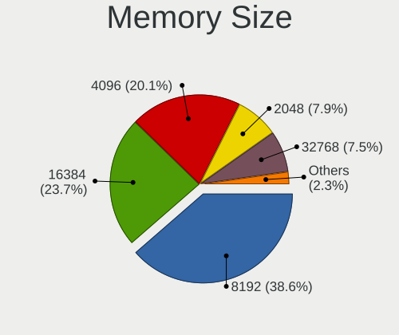

| Size  | Computers | Percent |
|-------|-----------|---------|
| 8192  | 889       | 38.6%   |
| 16384 | 545       | 23.66%  |
| 4096  | 463       | 20.1%   |
| 2048  | 181       | 7.86%   |
| 32768 | 173       | 7.51%   |
| 1024  | 36        | 1.56%   |
| 49152 | 7         | 0.3%    |
| 65536 | 6         | 0.26%   |
| 6144  | 2         | 0.09%   |
| 512   | 1         | 0.04%   |

Memory Speed
------------

Memory module speed

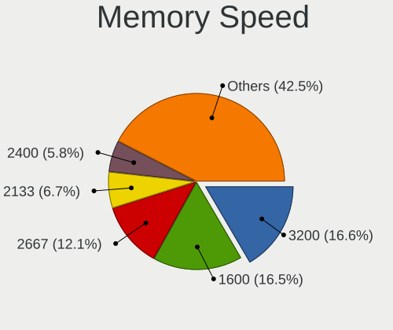

| Speed   | Computers | Percent |
|---------|-----------|---------|
| 3200    | 382       | 16.57%  |
| 1600    | 380       | 16.48%  |
| 2667    | 278       | 12.06%  |
| 2133    | 154       | 6.68%   |
| 2400    | 133       | 5.77%   |
| 1333    | 128       | 5.55%   |
| 3600    | 71        | 3.08%   |
| 6400    | 59        | 2.56%   |
| 4800    | 54        | 2.34%   |
| 5600    | 49        | 2.12%   |
| 1867    | 48        | 2.08%   |
| 4267    | 42        | 1.82%   |
| 1334    | 42        | 1.82%   |
| 3800    | 33        | 1.43%   |
| 1067    | 31        | 1.34%   |
| 7500    | 30        | 1.3%    |
| 800     | 29        | 1.26%   |
| 6000    | 26        | 1.13%   |
| 2666    | 26        | 1.13%   |
| 3000    | 22        | 0.95%   |
| 667     | 22        | 0.95%   |
| Unknown | 21        | 0.91%   |
| 8400    | 20        | 0.87%   |
| 8533    | 18        | 0.78%   |
| 3733    | 17        | 0.74%   |
| 3266    | 17        | 0.74%   |
| 1066    | 15        | 0.65%   |
| 1866    | 14        | 0.61%   |
| 3400    | 12        | 0.52%   |
| 3100    | 11        | 0.48%   |
| 2933    | 9         | 0.39%   |
| 1800    | 8         | 0.35%   |
| 7467    | 7         | 0.3%    |
| 4266    | 7         | 0.3%    |
| 4199    | 7         | 0.3%    |
| 4000    | 7         | 0.3%    |
| 2000    | 6         | 0.26%   |
| 6200    | 5         | 0.22%   |
| 3933    | 5         | 0.22%   |
| 3500    | 5         | 0.22%   |

Printers & scanners
-------------------

Printer Vendor
--------------

Printer device vendors

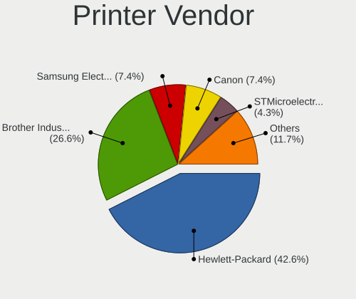

| Vendor                   | Computers | Percent |
|--------------------------|-----------|---------|
| Hewlett-Packard          | 40        | 42.55%  |
| Brother Industries       | 25        | 26.6%   |
| Samsung Electronics      | 7         | 7.45%   |
| Canon                    | 7         | 7.45%   |
| STMicroelectronics       | 4         | 4.26%   |
| Seiko Epson              | 3         | 3.19%   |
| Prolific Technology      | 2         | 2.13%   |
| Oki Data                 | 2         | 2.13%   |
| Dymo-CoStar              | 2         | 2.13%   |
| Zhuhai Poskey Technology | 1         | 1.06%   |
| Konica Minolta           | 1         | 1.06%   |

Printer Model
-------------

Printer device models

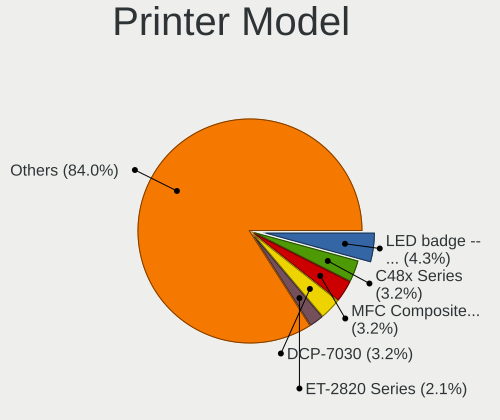

| Model                                                      | Computers | Percent |
|------------------------------------------------------------|-----------|---------|
| STMicroelectronics LED badge -- mini LED display -- 11x44  | 4         | 4.26%   |
| Samsung C48x Series                                        | 3         | 3.19%   |
| Brother MFC Composite Device                               | 3         | 3.19%   |
| Brother DCP-7030                                           | 3         | 3.19%   |
| Seiko Epson ET-2820 Series                                 | 2         | 2.13%   |
| Samsung M337x 387x 407x Series                             | 2         | 2.13%   |
| Prolific PL2305 Parallel Port                              | 2         | 2.13%   |
| Oki Data USB Device                                        | 2         | 2.13%   |
| HP OfficeJet Pro 7730 series                               | 2         | 2.13%   |
| HP OfficeJet 6950                                          | 2         | 2.13%   |
| HP OfficeJet 4650 series                                   | 2         | 2.13%   |
| HP LaserJet Pro M148f-M149f                                | 2         | 2.13%   |
| HP LaserJet P1102                                          | 2         | 2.13%   |
| HP LaserJet 3020                                           | 2         | 2.13%   |
| HP ENVY 5540 series                                        | 2         | 2.13%   |
| HP ENVY 4520 series                                        | 2         | 2.13%   |
| HP Deskjet 2540 series                                     | 2         | 2.13%   |
| Dymo-CoStar LabelWriter 450                                | 2         | 2.13%   |
| Brother Printer                                            | 2         | 2.13%   |
| Brother DCP-L8450CDW                                       | 2         | 2.13%   |
| Zhuhai Poskey Printer                                      | 1         | 1.06%   |
| Seiko Epson ET-4750 [WorkForce ET-4750 EcoTank All-in-One] | 1         | 1.06%   |
| Samsung M332x 382x 402x Series                             | 1         | 1.06%   |
| Samsung C1860 Series                                       | 1         | 1.06%   |
| Konica Minolta Printer                                     | 1         | 1.06%   |
| HP Smart Tank Plus 550 series                              | 1         | 1.06%   |
| HP Smart Tank 7000 series                                  | 1         | 1.06%   |
| HP Officejet 4630 series                                   | 1         | 1.06%   |
| HP LaserJet Pro M148-M149                                  | 1         | 1.06%   |
| HP LaserJet P3010 Series                                   | 1         | 1.06%   |
| HP LaserJet P2055 series                                   | 1         | 1.06%   |
| HP Laserjet P1505                                          | 1         | 1.06%   |
| HP LaserJet 400 M401dne                                    | 1         | 1.06%   |
| HP LaserJet 3050                                           | 1         | 1.06%   |
| HP LaserJet 1320                                           | 1         | 1.06%   |
| HP LaserJet 1022                                           | 1         | 1.06%   |
| HP LaserJet 1020                                           | 1         | 1.06%   |
| HP HP Laser 107w                                           | 1         | 1.06%   |
| HP ENVY Photo 7800 series                                  | 1         | 1.06%   |
| HP ENVY Photo 6200 series                                  | 1         | 1.06%   |

Scanner Vendor
--------------

Scanner device vendors

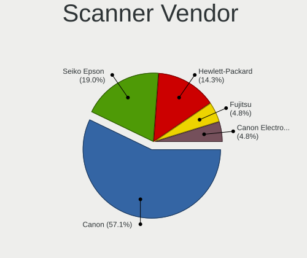

| Vendor            | Computers | Percent |
|-------------------|-----------|---------|
| Canon             | 12        | 57.14%  |
| Seiko Epson       | 4         | 19.05%  |
| Hewlett-Packard   | 3         | 14.29%  |
| Fujitsu           | 1         | 4.76%   |
| Canon Electronics | 1         | 4.76%   |

Scanner Model
-------------

Scanner device models

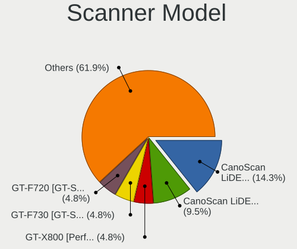

| Model                                                         | Computers | Percent |
|---------------------------------------------------------------|-----------|---------|
| Canon CanoScan LiDE 220                                       | 3         | 14.29%  |
| Canon CanoScan LiDE 100                                       | 2         | 9.52%   |
| Seiko Epson GT-X800 [Perfection 4990 PHOTO]                   | 1         | 4.76%   |
| Seiko Epson GT-F730 [GT-S630/Perfection V33/V330 Photo]       | 1         | 4.76%   |
| Seiko Epson GT-F720 [GT-S620/Perfection V30/V300 Photo]       | 1         | 4.76%   |
| Seiko Epson GT-8700/GT-8700F [Perfection 1640SU/1640SU PHOTO] | 1         | 4.76%   |
| HP Scanjet G2710                                              | 1         | 4.76%   |
| HP ScanJet 4070 PhotoSmart                                    | 1         | 4.76%   |
| HP ScanJet 2400c                                              | 1         | 4.76%   |
| Fujitsu ScanSnap SV600                                        | 1         | 4.76%   |
| Canon P-150 Scanner                                           | 1         | 4.76%   |
| Canon CanoScan N670U/N676U/LiDE 20                            | 1         | 4.76%   |
| Canon CanoScan N650U/N656U                                    | 1         | 4.76%   |
| Canon CanoScan LiDE 700F                                      | 1         | 4.76%   |
| Canon CanoScan LiDE 50/LiDE 35/LiDE 40                        | 1         | 4.76%   |
| Canon CanoScan LIDE 25                                        | 1         | 4.76%   |
| Canon CanoScan LiDE 210                                       | 1         | 4.76%   |
| Canon CanoScan LiDE 200                                       | 1         | 4.76%   |

Camera
------

Camera Vendor
-------------

Camera device vendors

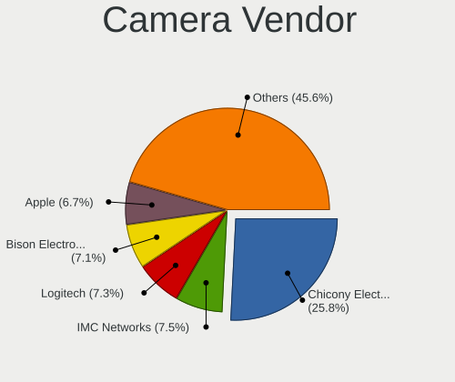

| Vendor                                 | Computers | Percent |
|----------------------------------------|-----------|---------|
| Chicony Electronics                    | 540       | 25.79%  |
| IMC Networks                           | 158       | 7.55%   |
| Logitech                               | 153       | 7.31%   |
| Bison Electronics                      | 148       | 7.07%   |
| Apple                                  | 141       | 6.73%   |
| Microdia                               | 116       | 5.54%   |
| Realtek Semiconductor                  | 112       | 5.35%   |
| Quanta                                 | 103       | 4.92%   |
| Sunplus Innovation Technology          | 81        | 3.87%   |
| Cheng Uei Precision Industry (Foxlink) | 71        | 3.39%   |
| Luxvisions Innotech Limited            | 70        | 3.34%   |
| Lite-On Technology                     | 52        | 2.48%   |
| Syntek                                 | 49        | 2.34%   |
| Suyin                                  | 46        | 2.2%    |
| Microsoft                              | 26        | 1.24%   |
| Lenovo                                 | 23        | 1.1%    |
| Alcor Micro                            | 19        | 0.91%   |
| Ricoh                                  | 18        | 0.86%   |
| Sonix Technology                       | 16        | 0.76%   |
| Shinetech                              | 14        | 0.67%   |
| Samsung Electronics                    | 14        | 0.67%   |
| Silicon Motion                         | 9         | 0.43%   |
| Z-Star Microelectronics                | 7         | 0.33%   |
| Generalplus Technology                 | 6         | 0.29%   |
| ALi                                    | 6         | 0.29%   |
| Acer                                   | 6         | 0.29%   |
| Primax Electronics                     | 5         | 0.24%   |
| KYE Systems (Mouse Systems)            | 5         | 0.24%   |
| kingcome                               | 5         | 0.24%   |
| webcam                                 | 4         | 0.19%   |
| Xiaomi                                 | 3         | 0.14%   |
| SunplusIT                              | 3         | 0.14%   |
| Intel                                  | 3         | 0.14%   |
| Framework                              | 3         | 0.14%   |
| Creative Technology                    | 3         | 0.14%   |
| Trust                                  | 2         | 0.1%    |
| Tripath Technology                     | 2         | 0.1%    |
| Tobii Technology AB                    | 2         | 0.1%    |
| Remo Tech                              | 2         | 0.1%    |
| OmniVision Technologies                | 2         | 0.1%    |

Camera Model
------------

Camera device models

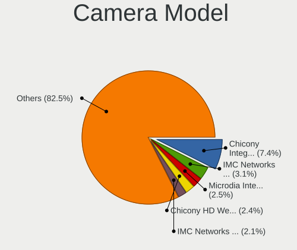

| Model                                             | Computers | Percent |
|---------------------------------------------------|-----------|---------|
| Chicony Integrated Camera                         | 158       | 7.43%   |
| IMC Networks Integrated Camera                    | 67        | 3.15%   |
| Microdia Integrated_Webcam_HD                     | 53        | 2.49%   |
| Chicony HD WebCam                                 | 50        | 2.35%   |
| IMC Networks USB2.0 HD UVC WebCam                 | 45        | 2.12%   |
| Bison Integrated Camera                           | 43        | 2.02%   |
| Apple FaceTime HD Camera (Built-in)               | 43        | 2.02%   |
| Apple Built-in iSight                             | 41        | 1.93%   |
| Realtek Integrated_Webcam_HD                      | 33        | 1.55%   |
| Chicony HP HD Camera                              | 33        | 1.55%   |
| Syntek Integrated Camera                          | 32        | 1.5%    |
| Logitech HD Pro Webcam C920                       | 29        | 1.36%   |
| Quanta HP HD Camera                               | 25        | 1.18%   |
| Apple iPhone 5/5C/5S/6/SE/7/8/X                   | 24        | 1.13%   |
| Apple FaceTime HD Camera                          | 23        | 1.08%   |
| Logitech Webcam C270                              | 22        | 1.03%   |
| Lite-On Integrated Camera                         | 22        | 1.03%   |
| Luxvisions Innotech Limited Integrated RGB Camera | 20        | 0.94%   |
| Luxvisions Innotech Limited Integrated Camera     | 20        | 0.94%   |
| Chicony HP Wide Vision HD Camera                  | 19        | 0.89%   |
| Bison Integrated RGB Camera                       | 18        | 0.85%   |
| Sunplus HD WebCam                                 | 17        | 0.8%    |
| Chicony Integrated Camera (1280x720@30)           | 17        | 0.8%    |
| Sunplus Integrated_Webcam_HD                      | 16        | 0.75%   |
| IMC Networks USB2.0 VGA UVC WebCam                | 16        | 0.75%   |
| Chicony HD User Facing                            | 16        | 0.75%   |
| Chicony HP Truevision HD                          | 15        | 0.71%   |
| Chicony HP HD Webcam                              | 15        | 0.71%   |
| Samsung Galaxy series, misc. (MTP mode)           | 14        | 0.66%   |
| Microdia Integrated Webcam                        | 14        | 0.66%   |
| Chicony Chicony USB2.0 Camera                     | 14        | 0.66%   |
| Bison SunplusIT Integrated Camera                 | 14        | 0.66%   |
| Bison Lenovo EasyCamera                           | 14        | 0.66%   |
| Lite-On HP HD Camera                              | 13        | 0.61%   |
| Suyin HP TrueVision HD                            | 12        | 0.56%   |
| Quanta HD User Facing                             | 12        | 0.56%   |
| Logitech BRIO Ultra HD Webcam                     | 12        | 0.56%   |
| Chicony Integrated IR Camera                      | 12        | 0.56%   |
| Logitech StreamCam                                | 11        | 0.52%   |
| Logitech HD Webcam C525                           | 11        | 0.52%   |

Security
--------

Fingerprint Vendor
------------------

Fingerprint sensor vendors

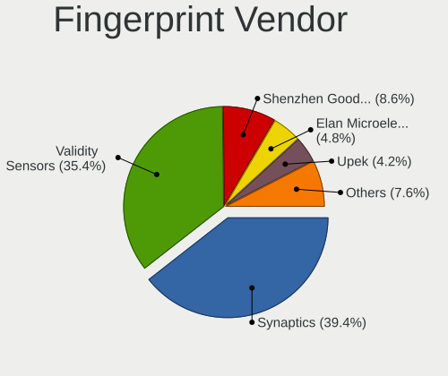

| Vendor                             | Computers | Percent |
|------------------------------------|-----------|---------|
| Synaptics                          | 224       | 39.44%  |
| Validity Sensors                   | 201       | 35.39%  |
| Shenzhen Goodix Technology         | 49        | 8.63%   |
| Elan Microelectronics              | 27        | 4.75%   |
| Upek                               | 24        | 4.23%   |
| AuthenTec                          | 20        | 3.52%   |
| LighTuning Technology              | 17        | 2.99%   |
| STMicroelectronics                 | 3         | 0.53%   |
| Realtek USB2.0 Finger Print Bridge | 3         | 0.53%   |

Fingerprint Model
-----------------

Fingerprint sensor models

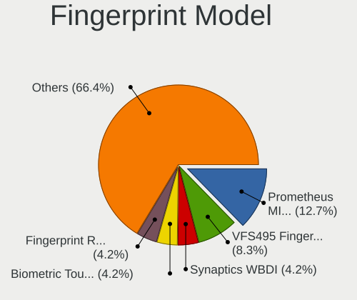

| Model                                                                      | Computers | Percent |
|----------------------------------------------------------------------------|-----------|---------|
| Synaptics Prometheus MIS Touch Fingerprint Reader                          | 72        | 12.68%  |
| Validity Sensors VFS495 Fingerprint Reader                                 | 47        | 8.27%   |
| Validity Sensors Synaptics WBDI                                            | 24        | 4.23%   |
| Upek Biometric Touchchip/Touchstrip Fingerprint Sensor                     | 24        | 4.23%   |
| Shenzhen Goodix Fingerprint Reader                                         | 24        | 4.23%   |
| Validity Sensors Synaptics VFS7552 Touch Fingerprint Sensor with PurePrint | 20        | 3.52%   |
| Synaptics Metallica MIS Touch Fingerprint Reader                           | 20        | 3.52%   |
| Elan ELAN:ARM-M4                                                           | 19        | 3.35%   |
| Validity Sensors VFS 5011 fingerprint sensor                               | 18        | 3.17%   |
| Synaptics Prometheus Fingerprint Reader                                    | 17        | 2.99%   |
| Synaptics FS7604 Touch Fingerprint Sensor with PurePrint                   | 17        | 2.99%   |
| Shenzhen Goodix  Fingerprint Device                                        | 17        | 2.99%   |
| Synaptics  FS7604 Touch Fingerprint Sensor with PurePrint                  | 16        | 2.82%   |
| Synaptics  WBDI                                                            | 15        | 2.64%   |
| Synaptics UWP WBDI Device                                                  | 14        | 2.46%   |
| Validity Sensors Swipe Fingerprint Sensor                                  | 13        | 2.29%   |
| Validity Sensors VFS7500 Touch Fingerprint Sensor                          | 11        | 1.94%   |
| Validity Sensors VFS491                                                    | 11        | 1.94%   |
| Validity Sensors VFS471 Fingerprint Reader                                 | 11        | 1.94%   |
| Validity Sensors Fingerprint scanner                                       | 11        | 1.94%   |
| Synaptics UWP WBDI                                                         | 11        | 1.94%   |
| Synaptics Metallica MOH Touch Fingerprint Reader                           | 11        | 1.94%   |
| Synaptics Fingerprint reader [HP G6]                                       | 11        | 1.94%   |
| LighTuning EgisTec Touch Fingerprint Sensor                                | 11        | 1.94%   |
| Validity Sensors VFS451 Fingerprint Reader                                 | 9         | 1.58%   |
| Shenzhen Goodix FingerPrint                                                | 8         | 1.41%   |
| Elan ELAN:Fingerprint                                                      | 8         | 1.41%   |
| AuthenTec AES2810                                                          | 8         | 1.41%   |
| Validity Sensors VFS5011 Fingerprint Reader                                | 7         | 1.23%   |
| Validity Sensors VFS7552 Touch Fingerprint Sensor                          | 6         | 1.06%   |
| AuthenTec AES2501 Fingerprint Sensor                                       | 6         | 1.06%   |
| Synaptics Fingerprint scanner                                              | 5         | 0.88%   |
| AuthenTec Fingerprint Sensor                                               | 5         | 0.88%   |
| Validity Sensors VFS301 Fingerprint Reader                                 | 4         | 0.7%    |
| Validity Sensors VFS101 Fingerprint Reader                                 | 4         | 0.7%    |
| Validity Sensors Synaptics VFS7552 Touch Fingerprint Sensor                | 4         | 0.7%    |
| Synaptics WBDI                                                             | 4         | 0.7%    |
| Synaptics WBDI Fingerprint Reader USB 086                                  | 3         | 0.53%   |
| STMicroelectronics Fingerprint Reader                                      | 3         | 0.53%   |
| Realtek USB2.0 Finger Print Bridge FocalTech Fingerprint Device            | 3         | 0.53%   |

Chipcard Vendor
---------------

Chipcard module vendors

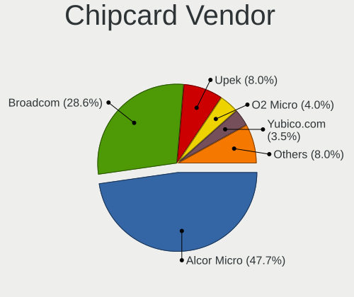

| Vendor                    | Computers | Percent |
|---------------------------|-----------|---------|
| Alcor Micro               | 95        | 47.74%  |
| Broadcom                  | 57        | 28.64%  |
| Upek                      | 16        | 8.04%   |
| O2 Micro                  | 8         | 4.02%   |
| Yubico.com                | 7         | 3.52%   |
| Lenovo                    | 5         | 2.51%   |
| Gemalto (was Gemplus)     | 2         | 1.01%   |
| Clay Logic                | 2         | 1.01%   |
| Aladdin Knowledge Systems | 2         | 1.01%   |
| Realtek Semiconductor     | 1         | 0.5%    |
| OmniKey                   | 1         | 0.5%    |
| Cherry                    | 1         | 0.5%    |
| Bit4id                    | 1         | 0.5%    |
| Advanced Card Systems     | 1         | 0.5%    |

Chipcard Model
--------------

Chipcard module models

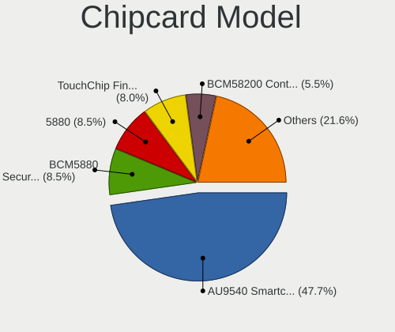

| Model                                                                        | Computers | Percent |
|------------------------------------------------------------------------------|-----------|---------|
| Alcor Micro AU9540 Smartcard Reader                                          | 95        | 47.74%  |
| Broadcom BCM5880 Secure Applications Processor                               | 17        | 8.54%   |
| Broadcom 5880                                                                | 17        | 8.54%   |
| Upek TouchChip Fingerprint Coprocessor (WBF advanced mode)                   | 16        | 8.04%   |
| Broadcom BCM58200 ControlVault 3 (FingerPrint sensor + Contacted SmartCard)  | 11        | 5.53%   |
| O2 Micro OZ776 CCID Smartcard Reader                                         | 8         | 4.02%   |
| Broadcom BCM5880 Secure Applications Processor with fingerprint swipe sensor | 8         | 4.02%   |
| Yubico.com Yubikey 4/5 U2F+CCID                                              | 5         | 2.51%   |
| Lenovo Integrated Smart Card Reader                                          | 5         | 2.51%   |
| Broadcom 58200                                                               | 4         | 2.01%   |
| Aladdin Knowledge Systems Token JC                                           | 2         | 1.01%   |
| Yubico.com Yubikey NEO(-N) U2F+CCID                                          | 1         | 0.5%    |
| Yubico.com Yubikey NEO(-N) OTP+CCID                                          | 1         | 0.5%    |
| Realtek Semiconductor Smart Card Reader Interface                            | 1         | 0.5%    |
| OmniKey CardMan 4321                                                         | 1         | 0.5%    |
| Gemalto (was Gemplus) GemPC Twin SmartCard Reader                            | 1         | 0.5%    |
| Gemalto (was Gemplus) Compact Smart Card Reader Writer                       | 1         | 0.5%    |
| Clay Logic Nitrokey Start                                                    | 1         | 0.5%    |
| Clay Logic Nitrokey Pro                                                      | 1         | 0.5%    |
| Cherry Smart Terminal XX44                                                   | 1         | 0.5%    |
| Bit4id miniLector-s                                                          | 1         | 0.5%    |
| Advanced Card Systems ACR122U                                                | 1         | 0.5%    |

Unsupported
-----------

Unsupported Devices
-------------------

Total unsupported devices on board

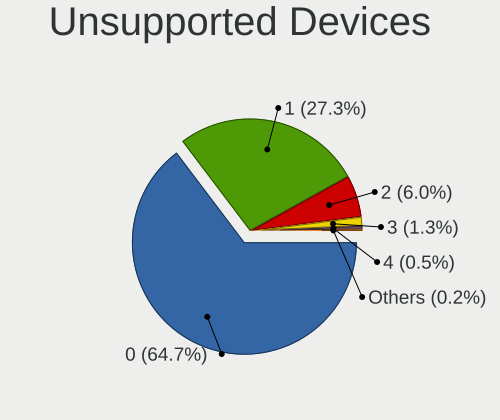

| Total | Computers | Percent |
|-------|-----------|---------|
| 0     | 2355      | 64.7%   |
| 1     | 992       | 27.25%  |
| 2     | 219       | 6.02%   |
| 3     | 47        | 1.29%   |
| 4     | 19        | 0.52%   |
| 6     | 3         | 0.08%   |
| 5     | 3         | 0.08%   |
| 7     | 2         | 0.05%   |

Unsupported Device Types
------------------------

Types of unsupported devices

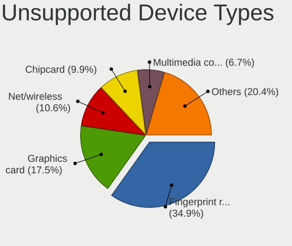

| Type                     | Computers | Percent |
|--------------------------|-----------|---------|
| Fingerprint reader       | 561       | 34.87%  |
| Graphics card            | 281       | 17.46%  |
| Net/wireless             | 171       | 10.63%  |
| Chipcard                 | 160       | 9.94%   |
| Multimedia controller    | 107       | 6.65%   |
| Communication controller | 74        | 4.6%    |
| Unassigned class         | 55        | 3.42%   |
| Camera                   | 51        | 3.17%   |
| Bluetooth                | 29        | 1.8%    |
| Sound                    | 26        | 1.62%   |
| Card reader              | 24        | 1.49%   |
| Net/ethernet             | 19        | 1.18%   |
| Storage                  | 13        | 0.81%   |
| Network                  | 12        | 0.75%   |
| Storage/raid             | 9         | 0.56%   |
| Modem                    | 7         | 0.44%   |
| Dvb card                 | 4         | 0.25%   |
| Storage/nvme             | 2         | 0.12%   |
| Wireless                 | 1         | 0.06%   |
| Storage/ata              | 1         | 0.06%   |
| Flash memory             | 1         | 0.06%   |
| Firewire controller      | 1         | 0.06%   |

