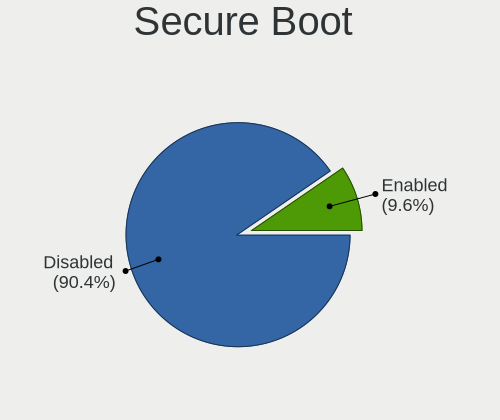
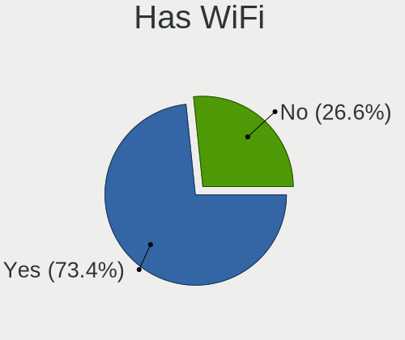
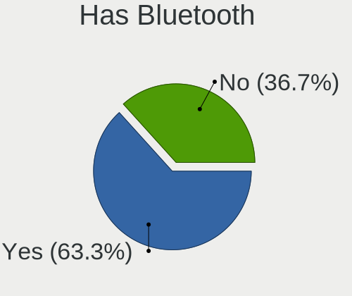
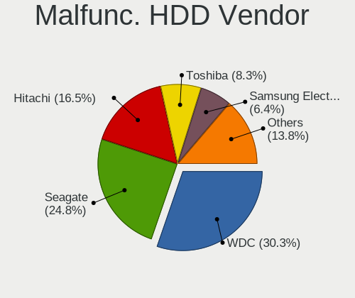
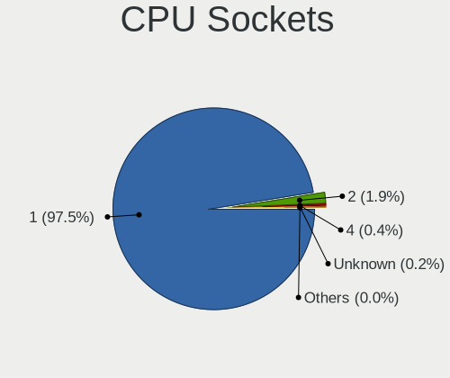
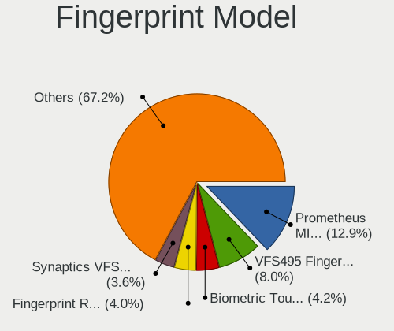

Linux in Switzerland - Tested Hardware & Statistics
---------------------------------------------------

A project to collect tested hardware configurations for Linux in Switzerland.

Anyone can contribute to this report by the [hw-probe](https://github.com/linuxhw/hw-probe) tool:

    sudo -E hw-probe -all -upload

Please contribute! Especially if your hardware is rare.

This is a report for all computer types. See also reports for [desktops](/Location/Switzerland/Desktop/README.md) and [notebooks](/Location/Switzerland/Notebook/README.md).

Contents
--------

* [ Test Cases ](#test-cases)

* [ System ](#system)
  - [ OS                       ](#os)
  - [ OS Family                ](#os-family)
  - [ Kernel                   ](#kernel)
  - [ Kernel Family            ](#kernel-family)
  - [ Kernel Major Ver.        ](#kernel-major-ver)
  - [ Arch                     ](#arch)
  - [ DE                       ](#de)
  - [ Display Server           ](#display-server)
  - [ Display Manager          ](#display-manager)
  - [ OS Lang                  ](#os-lang)
  - [ Boot Mode                ](#boot-mode)
  - [ Filesystem               ](#filesystem)
  - [ Part. scheme             ](#part-scheme)
  - [ Dual Boot with Linux/BSD ](#dual-boot-with-linuxbsd)
  - [ Dual Boot (Win)          ](#dual-boot-win)

* [ Board ](#board)
  - [ Vendor                   ](#vendor)
  - [ Model                    ](#model)
  - [ Model Family             ](#model-family)
  - [ MFG Year                 ](#mfg-year)
  - [ Form Factor              ](#form-factor)
  - [ Secure Boot              ](#secure-boot)
  - [ Coreboot                 ](#coreboot)
  - [ RAM Size                 ](#ram-size)
  - [ RAM Used                 ](#ram-used)
  - [ Total Drives             ](#total-drives)
  - [ Has CD-ROM               ](#has-cd-rom)
  - [ Has Ethernet             ](#has-ethernet)
  - [ Has WiFi                 ](#has-wifi)
  - [ Has Bluetooth            ](#has-bluetooth)

* [ Location ](#location)
  - [ Country                  ](#country)
  - [ City                     ](#city)

* [ Drives ](#drives)
  - [ Drive Vendor             ](#drive-vendor)
  - [ Drive Model              ](#drive-model)
  - [ HDD Vendor               ](#hdd-vendor)
  - [ SSD Vendor               ](#ssd-vendor)
  - [ Drive Kind               ](#drive-kind)
  - [ Drive Connector          ](#drive-connector)
  - [ Drive Size               ](#drive-size)
  - [ Space Total              ](#space-total)
  - [ Space Used               ](#space-used)
  - [ Malfunc. Drives          ](#malfunc-drives)
  - [ Malfunc. Drive Vendor    ](#malfunc-drive-vendor)
  - [ Malfunc. HDD Vendor      ](#malfunc-hdd-vendor)
  - [ Malfunc. Drive Kind      ](#malfunc-drive-kind)
  - [ Failed Drives            ](#failed-drives)
  - [ Failed Drive Vendor      ](#failed-drive-vendor)
  - [ Drive Status             ](#drive-status)

* [ Storage controller ](#storage-controller)
  - [ Storage Vendor           ](#storage-vendor)
  - [ Storage Model            ](#storage-model)
  - [ Storage Kind             ](#storage-kind)

* [ Processor ](#processor)
  - [ CPU Vendor               ](#cpu-vendor)
  - [ CPU Model                ](#cpu-model)
  - [ CPU Model Family         ](#cpu-model-family)
  - [ CPU Cores                ](#cpu-cores)
  - [ CPU Sockets              ](#cpu-sockets)
  - [ CPU Threads              ](#cpu-threads)
  - [ CPU Op-Modes             ](#cpu-op-modes)
  - [ CPU Microcode            ](#cpu-microcode)
  - [ CPU Microarch            ](#cpu-microarch)

* [ Graphics ](#graphics)
  - [ GPU Vendor               ](#gpu-vendor)
  - [ GPU Model                ](#gpu-model)
  - [ GPU Combo                ](#gpu-combo)
  - [ GPU Driver               ](#gpu-driver)
  - [ GPU Memory               ](#gpu-memory)

* [ Monitor ](#monitor)
  - [ Monitor Vendor           ](#monitor-vendor)
  - [ Monitor Model            ](#monitor-model)
  - [ Monitor Resolution       ](#monitor-resolution)
  - [ Monitor Diagonal         ](#monitor-diagonal)
  - [ Monitor Width            ](#monitor-width)
  - [ Aspect Ratio             ](#aspect-ratio)
  - [ Monitor Area             ](#monitor-area)
  - [ Pixel Density            ](#pixel-density)
  - [ Multiple Monitors        ](#multiple-monitors)

* [ Network ](#network)
  - [ Net Controller Vendor    ](#net-controller-vendor)
  - [ Net Controller Model     ](#net-controller-model)
  - [ Wireless Vendor          ](#wireless-vendor)
  - [ Wireless Model           ](#wireless-model)
  - [ Ethernet Vendor          ](#ethernet-vendor)
  - [ Ethernet Model           ](#ethernet-model)
  - [ Net Controller Kind      ](#net-controller-kind)
  - [ Used Controller          ](#used-controller)
  - [ NICs                     ](#nics)
  - [ IPv6                     ](#ipv6)

* [ Bluetooth ](#bluetooth)
  - [ Bluetooth Vendor         ](#bluetooth-vendor)
  - [ Bluetooth Model          ](#bluetooth-model)

* [ Sound ](#sound)
  - [ Sound Vendor             ](#sound-vendor)
  - [ Sound Model              ](#sound-model)

* [ Memory ](#memory)
  - [ Memory Vendor            ](#memory-vendor)
  - [ Memory Model             ](#memory-model)
  - [ Memory Kind              ](#memory-kind)
  - [ Memory Form Factor       ](#memory-form-factor)
  - [ Memory Size              ](#memory-size)
  - [ Memory Speed             ](#memory-speed)

* [ Printers & scanners ](#printers--scanners)
  - [ Printer Vendor           ](#printer-vendor)
  - [ Printer Model            ](#printer-model)
  - [ Scanner Vendor           ](#scanner-vendor)
  - [ Scanner Model            ](#scanner-model)

* [ Camera ](#camera)
  - [ Camera Vendor            ](#camera-vendor)
  - [ Camera Model             ](#camera-model)

* [ Security ](#security)
  - [ Fingerprint Vendor       ](#fingerprint-vendor)
  - [ Fingerprint Model        ](#fingerprint-model)
  - [ Chipcard Vendor          ](#chipcard-vendor)
  - [ Chipcard Model           ](#chipcard-model)

* [ Unsupported ](#unsupported)
  - [ Unsupported Devices      ](#unsupported-devices)
  - [ Unsupported Device Types ](#unsupported-device-types)

Test Cases
----------

Total: 4663

| Vendor        | Model                       | Form-Factor | Probe                                                      | Date         |
|---------------|-----------------------------|-------------|------------------------------------------------------------|--------------|
| ASUSTek       | M4A79T Deluxe               | Desktop     | [0b63013a2a](https://linux-hardware.org/?probe=0b63013a2a) | Jan 05, 2025 |
| Acer          | Aspire A115-32              | Notebook    | [2c6043fd56](https://linux-hardware.org/?probe=2c6043fd56) | Jan 05, 2025 |
| HP            | 3397                        | Desktop     | [95cc9c1997](https://linux-hardware.org/?probe=95cc9c1997) | Jan 05, 2025 |
| HP            | Laptop 15-db1xxx            | Notebook    | [7bc8aeba55](https://linux-hardware.org/?probe=7bc8aeba55) | Jan 04, 2025 |
| Acer          | Swift SF713-51              | Notebook    | [0b49901d64](https://linux-hardware.org/?probe=0b49901d64) | Jan 04, 2025 |
| Acer          | Swift SF713-51              | Notebook    | [9dc8059968](https://linux-hardware.org/?probe=9dc8059968) | Jan 04, 2025 |
| Lenovo        | SHARKBAY 31900058 STD       | Desktop     | [3a2c8d629f](https://linux-hardware.org/?probe=3a2c8d629f) | Jan 04, 2025 |
| Gigabyte      | X570 AORUS ULTRA            | Desktop     | [1f3cf34c48](https://linux-hardware.org/?probe=1f3cf34c48) | Jan 04, 2025 |
| Dell          | Inspiron 7386               | Notebook    | [aecd7bdb44](https://linux-hardware.org/?probe=aecd7bdb44) | Jan 04, 2025 |
| Acer          | Predator PO3-640            | Desktop     | [6fef01063d](https://linux-hardware.org/?probe=6fef01063d) | Jan 03, 2025 |
| Acer          | Predator PO3-640            | Desktop     | [391df0e144](https://linux-hardware.org/?probe=391df0e144) | Jan 03, 2025 |
| MSI           | X470 GAMING PLUS MAX        | Desktop     | [b35c367d58](https://linux-hardware.org/?probe=b35c367d58) | Jan 03, 2025 |
| Dell          | Latitude E7450              | Notebook    | [03b4f85891](https://linux-hardware.org/?probe=03b4f85891) | Jan 03, 2025 |
| Dell          | Latitude 7440               | Notebook    | [5e2a44e27d](https://linux-hardware.org/?probe=5e2a44e27d) | Jan 03, 2025 |
| ASUSTek       | ROG Strix G713PI_G713PI     | Notebook    | [d086aef8fc](https://linux-hardware.org/?probe=d086aef8fc) | Jan 02, 2025 |
| ASRock        | B450 Gaming-ITX/ac          | Desktop     | [b487e51342](https://linux-hardware.org/?probe=b487e51342) | Jan 02, 2025 |
| HP            | 805A                        | Desktop     | [06248fdac7](https://linux-hardware.org/?probe=06248fdac7) | Dec 31, 2024 |
| HP            | Pavilion 13                 | Notebook    | [fece21c1ee](https://linux-hardware.org/?probe=fece21c1ee) | Dec 31, 2024 |
| Lenovo        | ThinkPad SL 2746EHG         | Notebook    | [c058e70d59](https://linux-hardware.org/?probe=c058e70d59) | Dec 30, 2024 |
| ASUSTek       | ROG STRIX B550-E GAMING     | Desktop     | [1fc44cea15](https://linux-hardware.org/?probe=1fc44cea15) | Dec 29, 2024 |
| HP            | 250 15.6 inch G10 Notebo... | Notebook    | [c4a512bb62](https://linux-hardware.org/?probe=c4a512bb62) | Dec 28, 2024 |
| ASUSTek       | ASUS TUF Gaming A17 FA70... | Notebook    | [2831363437](https://linux-hardware.org/?probe=2831363437) | Dec 28, 2024 |
| ASUSTek       | ASUS TUF Gaming A17 FA70... | Notebook    | [ae31e6ad1c](https://linux-hardware.org/?probe=ae31e6ad1c) | Dec 26, 2024 |
| Intel         | NUC7i5DNB J57626-514        | Mini pc     | [ef0b742827](https://linux-hardware.org/?probe=ef0b742827) | Dec 26, 2024 |
| MSI           | Z270I GAMING PRO CARBON ... | Desktop     | [deae2e3249](https://linux-hardware.org/?probe=deae2e3249) | Dec 26, 2024 |
| Intel         | NUC8BEB J72692-309          | Mini pc     | [31f432f98b](https://linux-hardware.org/?probe=31f432f98b) | Dec 26, 2024 |
| MSI           | Z270I GAMING PRO CARBON ... | Desktop     | [20b0460a24](https://linux-hardware.org/?probe=20b0460a24) | Dec 25, 2024 |
| Gigabyte      | X570 AORUS PRO              | Desktop     | [c7cf8562c2](https://linux-hardware.org/?probe=c7cf8562c2) | Dec 25, 2024 |
| ASUSTek       | M4A79T Deluxe               | Desktop     | [54be938049](https://linux-hardware.org/?probe=54be938049) | Dec 24, 2024 |
| ASUSTek       | P6T                         | Desktop     | [1c4b7e24bb](https://linux-hardware.org/?probe=1c4b7e24bb) | Dec 22, 2024 |
| Fujitsu       | LIFEBOOK A532               | Notebook    | [188aa532e9](https://linux-hardware.org/?probe=188aa532e9) | Dec 22, 2024 |
| ASUSTek       | ASUS Zenbook 14 UX3405MA... | Notebook    | [0f99359a6d](https://linux-hardware.org/?probe=0f99359a6d) | Dec 21, 2024 |
| Acer          | Aspire A315-59              | Notebook    | [0b5921ac5c](https://linux-hardware.org/?probe=0b5921ac5c) | Dec 21, 2024 |
| Acer          | Aspire A315-59              | Notebook    | [be2a0dc527](https://linux-hardware.org/?probe=be2a0dc527) | Dec 21, 2024 |
| HP            | EliteBook 840 G6            | Notebook    | [fdcfe34b78](https://linux-hardware.org/?probe=fdcfe34b78) | Dec 21, 2024 |
| Intel         | NUC11TNBi7 M11895-402       | Mini pc     | [7bed793675](https://linux-hardware.org/?probe=7bed793675) | Dec 20, 2024 |
| Dell          | Latitude E5440              | Notebook    | [f75e103bdb](https://linux-hardware.org/?probe=f75e103bdb) | Dec 20, 2024 |
| Lenovo        | ThinkPad T440p 20AWS2G90... | Notebook    | [d2137239af](https://linux-hardware.org/?probe=d2137239af) | Dec 19, 2024 |
| Lenovo        | ThinkPad T440p 20AWS2G90... | Notebook    | [559aebb775](https://linux-hardware.org/?probe=559aebb775) | Dec 19, 2024 |
| Intel         | NUC13ANBi3 M89896-203       | Mini pc     | [12c2b86ed3](https://linux-hardware.org/?probe=12c2b86ed3) | Dec 18, 2024 |
| Gigabyte      | B550 AORUS ELITE            | Desktop     | [dfb9ab7ad3](https://linux-hardware.org/?probe=dfb9ab7ad3) | Dec 18, 2024 |
| ASUSTek       | PRIME X670E-PRO WIFI        | Desktop     | [2207400569](https://linux-hardware.org/?probe=2207400569) | Dec 17, 2024 |
| ASUSTek       | VivoBook_ASUSLaptop M350... | Notebook    | [305afea5b8](https://linux-hardware.org/?probe=305afea5b8) | Dec 17, 2024 |
| Lenovo        | ThinkPad T440p 20AWS2G90... | Notebook    | [58411691ad](https://linux-hardware.org/?probe=58411691ad) | Dec 17, 2024 |
| Lenovo        | Yoga Pro 9 16IRP8 83BY      | Notebook    | [6501a529f5](https://linux-hardware.org/?probe=6501a529f5) | Dec 16, 2024 |
| Lenovo        | ThinkPad P1 Gen 7 21KVCT... | Notebook    | [729d84aff8](https://linux-hardware.org/?probe=729d84aff8) | Dec 15, 2024 |
| Apple         | MacBookAir7,2               | Notebook    | [047d8ffeee](https://linux-hardware.org/?probe=047d8ffeee) | Dec 15, 2024 |
| HP            | 8918                        | Desktop     | [6a8241e53c](https://linux-hardware.org/?probe=6a8241e53c) | Dec 14, 2024 |
| MSI           | Z790 GAMING PLUS WIFI       | Desktop     | [b6b7052f46](https://linux-hardware.org/?probe=b6b7052f46) | Dec 14, 2024 |
| Lenovo        | ThinkPad SL 2746EHG         | Notebook    | [af38d9b12e](https://linux-hardware.org/?probe=af38d9b12e) | Dec 12, 2024 |
| Samsung       | 900X3C/900X3D/900X3E/900... | Notebook    | [dba79b373a](https://linux-hardware.org/?probe=dba79b373a) | Dec 12, 2024 |
| TUXEDO        | InfinityBook Pro AMD Gen... | Notebook    | [1a2e3700f4](https://linux-hardware.org/?probe=1a2e3700f4) | Dec 11, 2024 |
| TUXEDO        | InfinityBook Pro AMD Gen... | Notebook    | [f730a13e27](https://linux-hardware.org/?probe=f730a13e27) | Dec 11, 2024 |
| Apple         | MacBookPro11,5              | Notebook    | [31b95c4a85](https://linux-hardware.org/?probe=31b95c4a85) | Dec 10, 2024 |
| Apple         | MacBookPro12,1              | Notebook    | [229c569c62](https://linux-hardware.org/?probe=229c569c62) | Dec 10, 2024 |
| Apple         | MacBookPro12,1              | Notebook    | [deca3fd9a5](https://linux-hardware.org/?probe=deca3fd9a5) | Dec 10, 2024 |
| MSI           | Z270 SLI PLUS               | Desktop     | [4bd957e3ec](https://linux-hardware.org/?probe=4bd957e3ec) | Dec 10, 2024 |
| Lenovo        | ThinkPad P1 Gen 7 21KVS0... | Notebook    | [4bf04dd3d9](https://linux-hardware.org/?probe=4bf04dd3d9) | Dec 10, 2024 |
| ASUSTek       | ASUS TUF Gaming A14 FA40... | Notebook    | [3e1d32a05a](https://linux-hardware.org/?probe=3e1d32a05a) | Dec 10, 2024 |
| HP            | ENVY Laptop 16-h0xxx        | Notebook    | [876b9eb39e](https://linux-hardware.org/?probe=876b9eb39e) | Dec 08, 2024 |
| ASUSTek       | ASUS Zenbook 14 UX3405MA... | Notebook    | [1a7bbb4067](https://linux-hardware.org/?probe=1a7bbb4067) | Dec 08, 2024 |
| HP            | ProBook 440 G6              | Notebook    | [38431440fa](https://linux-hardware.org/?probe=38431440fa) | Dec 08, 2024 |
| Acer          | Aspire ES1-512              | Notebook    | [21750c8987](https://linux-hardware.org/?probe=21750c8987) | Dec 07, 2024 |
| Fujitsu       | LIFEBOOK A532               | Notebook    | [1a8413b8c1](https://linux-hardware.org/?probe=1a8413b8c1) | Dec 07, 2024 |
| Apple         | MacBookPro4,1               | Notebook    | [4dba947354](https://linux-hardware.org/?probe=4dba947354) | Dec 06, 2024 |
| Lenovo        | ThinkPad T400 27658JG       | Notebook    | [0e628ec7f3](https://linux-hardware.org/?probe=0e628ec7f3) | Dec 06, 2024 |
| Lenovo        | ThinkPad T400 27658JG       | Notebook    | [19da4f0a7b](https://linux-hardware.org/?probe=19da4f0a7b) | Dec 06, 2024 |
| Shuttle       | DS10U                       | Desktop     | [e5de028bb7](https://linux-hardware.org/?probe=e5de028bb7) | Dec 06, 2024 |
| Lenovo        | ThinkPad X1 Carbon 6th 2... | Notebook    | [47ec30dab5](https://linux-hardware.org/?probe=47ec30dab5) | Dec 05, 2024 |
| TUXEDO        | InfinityBook Pro AMD Gen... | Notebook    | [a7a5047657](https://linux-hardware.org/?probe=a7a5047657) | Dec 05, 2024 |
| ASRock        | X570 Taichi                 | Desktop     | [095dc95b9d](https://linux-hardware.org/?probe=095dc95b9d) | Dec 04, 2024 |
| Intel         | NUC7JYB M37316-600          | Mini pc     | [0ccff77660](https://linux-hardware.org/?probe=0ccff77660) | Dec 04, 2024 |
| HP            | ProBook x360 435 G8 Note... | Convertible | [65653915c4](https://linux-hardware.org/?probe=65653915c4) | Dec 04, 2024 |
| HP            | ENVY x360 2-in-1 Laptop ... | Convertible | [22d0b65b43](https://linux-hardware.org/?probe=22d0b65b43) | Dec 04, 2024 |
| MSI           | B550-A PRO                  | Desktop     | [1026f15c3a](https://linux-hardware.org/?probe=1026f15c3a) | Dec 04, 2024 |
| HP            | ENVY x360 2-in-1 Laptop ... | Convertible | [a48146faba](https://linux-hardware.org/?probe=a48146faba) | Dec 04, 2024 |
| Apple         | MacBookAir6,2               | Notebook    | [f880b60a76](https://linux-hardware.org/?probe=f880b60a76) | Dec 03, 2024 |
| Apple         | MacBookAir6,2               | Notebook    | [43eaee20f2](https://linux-hardware.org/?probe=43eaee20f2) | Dec 03, 2024 |
| Samsung       | 900X3C/900X3D/900X3E/900... | Notebook    | [33eb230c2a](https://linux-hardware.org/?probe=33eb230c2a) | Dec 03, 2024 |
| Lenovo        | ThinkPad T14 Gen 5 21MC0... | Notebook    | [e2e17a6a88](https://linux-hardware.org/?probe=e2e17a6a88) | Dec 03, 2024 |
| HP            | 240 G8 Notebook PC          | Notebook    | [e28f3d21e4](https://linux-hardware.org/?probe=e28f3d21e4) | Dec 01, 2024 |
| HP            | EliteBook x360 1040 G6      | Convertible | [a88839824b](https://linux-hardware.org/?probe=a88839824b) | Nov 30, 2024 |
| Lenovo        | ThinkPad T14 Gen 5 21MMS... | Notebook    | [cf0dcbdaff](https://linux-hardware.org/?probe=cf0dcbdaff) | Nov 30, 2024 |
| Dell          | Latitude 5290 2-in-1        | Tablet      | [fc1f50762a](https://linux-hardware.org/?probe=fc1f50762a) | Nov 29, 2024 |
| ASUSTek       | P8H77-M LE                  | Desktop     | [8c2c6856ce](https://linux-hardware.org/?probe=8c2c6856ce) | Nov 29, 2024 |
| HP            | Laptop 15s-eq1xxx           | Notebook    | [3a04adcfd6](https://linux-hardware.org/?probe=3a04adcfd6) | Nov 29, 2024 |
| HP            | Pavilion x360 Convertibl... | Convertible | [b6c39c161d](https://linux-hardware.org/?probe=b6c39c161d) | Nov 29, 2024 |
| Lenovo        | ThinkPad T14 Gen 5 21MC0... | Notebook    | [a529dc0e1a](https://linux-hardware.org/?probe=a529dc0e1a) | Nov 29, 2024 |
| HP            | Pavilion x360 Convertibl... | Convertible | [374734cc0b](https://linux-hardware.org/?probe=374734cc0b) | Nov 29, 2024 |
| HP            | ProBook x360 435 G8 Note... | Convertible | [fe1aa7683d](https://linux-hardware.org/?probe=fe1aa7683d) | Nov 29, 2024 |
| Lenovo        | ThinkPad P1 Gen 3 20THCT... | Notebook    | [fbac8e7a75](https://linux-hardware.org/?probe=fbac8e7a75) | Nov 28, 2024 |
| Dell          | Latitude 5290 2-in-1        | Tablet      | [1aab837de8](https://linux-hardware.org/?probe=1aab837de8) | Nov 28, 2024 |
| Intel         | NUC10i7FNB K61360-302       | Mini pc     | [9d0494ea1b](https://linux-hardware.org/?probe=9d0494ea1b) | Nov 28, 2024 |
| AYANEO        | GEEK                        | Tablet      | [4a110cbe5e](https://linux-hardware.org/?probe=4a110cbe5e) | Nov 28, 2024 |
| MSI           | Z270 SLI PLUS               | Desktop     | [0298a65f1d](https://linux-hardware.org/?probe=0298a65f1d) | Nov 28, 2024 |
| Intel         | DH67CL AAG10212-210         | Desktop     | [bf9ae5d4ce](https://linux-hardware.org/?probe=bf9ae5d4ce) | Nov 27, 2024 |
| Gigabyte      | B550 AORUS ELITE            | Desktop     | [0df7b81985](https://linux-hardware.org/?probe=0df7b81985) | Nov 27, 2024 |
| MSI           | WT72 6QM                    | Notebook    | [6c800a258c](https://linux-hardware.org/?probe=6c800a258c) | Nov 27, 2024 |
| ASUSTek       | PN52                        | Mini pc     | [195b7ac36c](https://linux-hardware.org/?probe=195b7ac36c) | Nov 27, 2024 |
| Intel         | DH67CL AAG10212-210         | Desktop     | [26a2f9f5a2](https://linux-hardware.org/?probe=26a2f9f5a2) | Nov 26, 2024 |
| ASRock        | B550M Pro4                  | Desktop     | [9a00405288](https://linux-hardware.org/?probe=9a00405288) | Nov 25, 2024 |
| ASUSTek       | ROG STRIX Z390-F GAMING     | Desktop     | [d0a689e692](https://linux-hardware.org/?probe=d0a689e692) | Nov 25, 2024 |
| AYANEO        | GEEK                        | Tablet      | [e0cd6ee1ff](https://linux-hardware.org/?probe=e0cd6ee1ff) | Nov 25, 2024 |
| Apple         | MacBookAir7,2               | Notebook    | [78de1913a3](https://linux-hardware.org/?probe=78de1913a3) | Nov 24, 2024 |
| Acer          | Aspire VN7-791              | Notebook    | [44d9810a30](https://linux-hardware.org/?probe=44d9810a30) | Nov 23, 2024 |
| Apple         | Mac-77F17D7DA9285301 iMa... | All in one  | [8b9610f096](https://linux-hardware.org/?probe=8b9610f096) | Nov 23, 2024 |
| ASUSTek       | PRIME Z490-A                | Desktop     | [44c31fe85c](https://linux-hardware.org/?probe=44c31fe85c) | Nov 23, 2024 |
| Acer          | Aspire A115-32              | Notebook    | [fbfb9310ce](https://linux-hardware.org/?probe=fbfb9310ce) | Nov 23, 2024 |
| HP            | ZBook Studio 16 inch G9 ... | Notebook    | [39084b6ee1](https://linux-hardware.org/?probe=39084b6ee1) | Nov 22, 2024 |
| HP            | 250 G7 Notebook PC          | Notebook    | [6be5b2a8ec](https://linux-hardware.org/?probe=6be5b2a8ec) | Nov 21, 2024 |
| Dell          | Inspiron 5770               | Notebook    | [e0781253b5](https://linux-hardware.org/?probe=e0781253b5) | Nov 21, 2024 |
| ASUSTek       | VivoBook_ASUSLaptop X150... | Notebook    | [9365a57030](https://linux-hardware.org/?probe=9365a57030) | Nov 20, 2024 |
| Lenovo        | Yoga 900S-12ISK 80ML        | Notebook    | [548d21fd0e](https://linux-hardware.org/?probe=548d21fd0e) | Nov 19, 2024 |
| HP            | ProBook 455 G2              | Notebook    | [a739af0867](https://linux-hardware.org/?probe=a739af0867) | Nov 19, 2024 |
| Apple         | MacBookAir7,2               | Notebook    | [ba3ba814ee](https://linux-hardware.org/?probe=ba3ba814ee) | Nov 18, 2024 |
| Apple         | MacBookPro8,1               | Notebook    | [ba64567726](https://linux-hardware.org/?probe=ba64567726) | Nov 18, 2024 |
| Apple         | Mac-942B59F58194171B iMa... | All in one  | [8aa6854223](https://linux-hardware.org/?probe=8aa6854223) | Nov 17, 2024 |
| HP            | EliteBook 830 G5            | Notebook    | [83ae373757](https://linux-hardware.org/?probe=83ae373757) | Nov 17, 2024 |
| Lenovo        | ThinkPad X270 W10DG 20K5... | Notebook    | [4ecadd4fa2](https://linux-hardware.org/?probe=4ecadd4fa2) | Nov 17, 2024 |
| HP            | EliteBook 830 G5            | Notebook    | [0d7c47ffe5](https://linux-hardware.org/?probe=0d7c47ffe5) | Nov 17, 2024 |
| Acer          | Swift SF314-54              | Notebook    | [ae323153bc](https://linux-hardware.org/?probe=ae323153bc) | Nov 15, 2024 |
| Acer          | Swift SF314-54              | Notebook    | [86276b9cec](https://linux-hardware.org/?probe=86276b9cec) | Nov 15, 2024 |
| Shuttle       | FS77U                       | Desktop     | [1b7d0b4aea](https://linux-hardware.org/?probe=1b7d0b4aea) | Nov 14, 2024 |
| HP            | OMEN Laptop 15-ek0xxx       | Notebook    | [a28646da71](https://linux-hardware.org/?probe=a28646da71) | Nov 13, 2024 |
| Gigabyte      | Z97-HD3                     | Desktop     | [37416e4e8a](https://linux-hardware.org/?probe=37416e4e8a) | Nov 12, 2024 |
| Lenovo        | ThinkPad T440 20B7S1MF0J    | Notebook    | [b8a9aa94e7](https://linux-hardware.org/?probe=b8a9aa94e7) | Nov 12, 2024 |
| Intel         | NUC10i7FNB K61360-302       | Mini pc     | [08f4efbfdd](https://linux-hardware.org/?probe=08f4efbfdd) | Nov 12, 2024 |
| Lenovo        | ThinkPad E15 20RES6DF01     | Notebook    | [00f82a6232](https://linux-hardware.org/?probe=00f82a6232) | Nov 11, 2024 |
| MSI           | B450 TOMAHAWK MAX           | Desktop     | [7dccc81e4c](https://linux-hardware.org/?probe=7dccc81e4c) | Nov 11, 2024 |
| HUAWEI        | MACHD-WXX9                  | Notebook    | [ad91a529fc](https://linux-hardware.org/?probe=ad91a529fc) | Nov 11, 2024 |
| Apple         | MacBookPro8,1               | Notebook    | [2f0fa7a4fa](https://linux-hardware.org/?probe=2f0fa7a4fa) | Nov 11, 2024 |
| MSI           | H510M-A PRO                 | Desktop     | [109560b470](https://linux-hardware.org/?probe=109560b470) | Nov 11, 2024 |
| MSI           | Z270 SLI PLUS               | Desktop     | [ed80f0f9d6](https://linux-hardware.org/?probe=ed80f0f9d6) | Nov 11, 2024 |
| HP            | 84EE 1100                   | All in one  | [e4c2aba747](https://linux-hardware.org/?probe=e4c2aba747) | Nov 10, 2024 |
| Acer          | AOD270                      | Notebook    | [59b2793787](https://linux-hardware.org/?probe=59b2793787) | Nov 10, 2024 |
| Medion        | MS-7800                     | Desktop     | [b772a8fc86](https://linux-hardware.org/?probe=b772a8fc86) | Nov 10, 2024 |
| Intel         | DH67CL AAG10212-210         | Desktop     | [367b18be9c](https://linux-hardware.org/?probe=367b18be9c) | Nov 10, 2024 |
| HP            | EliteBook x360 1040 G8 N... | Convertible | [ee28dd46d5](https://linux-hardware.org/?probe=ee28dd46d5) | Nov 10, 2024 |
| ASUSTek       | H97-PLUS                    | Desktop     | [0db6435686](https://linux-hardware.org/?probe=0db6435686) | Nov 10, 2024 |
| Apple         | Mac-F60DEB81FF30ACF6 Mac... | Desktop     | [628d0e7ba3](https://linux-hardware.org/?probe=628d0e7ba3) | Nov 09, 2024 |
| HP            | ProBook 455 G2              | Notebook    | [6fe664f991](https://linux-hardware.org/?probe=6fe664f991) | Nov 09, 2024 |
| Shenzhen M... | F7BSC                       | Mini pc     | [bae098eaab](https://linux-hardware.org/?probe=bae098eaab) | Nov 09, 2024 |
| Acer          | Aspire ES1-531              | Notebook    | [a7c11e81f1](https://linux-hardware.org/?probe=a7c11e81f1) | Nov 09, 2024 |
| Acer          | Aspire ES1-531              | Notebook    | [eda5406b2d](https://linux-hardware.org/?probe=eda5406b2d) | Nov 09, 2024 |
| Medion        | MS-7800                     | Desktop     | [cf4e10c88e](https://linux-hardware.org/?probe=cf4e10c88e) | Nov 09, 2024 |
| ASRock        | B550M Pro4                  | Desktop     | [0655c261f9](https://linux-hardware.org/?probe=0655c261f9) | Nov 09, 2024 |
| HP            | 250 G7 Notebook PC          | Notebook    | [fdac2e572a](https://linux-hardware.org/?probe=fdac2e572a) | Nov 09, 2024 |
| ASUSTek       | ASUS Zenbook 14 UM3406HA... | Notebook    | [ef73511c69](https://linux-hardware.org/?probe=ef73511c69) | Nov 09, 2024 |
| ASUSTek       | Vivobook ASUSLaptop TP34... | Convertible | [c706095c4b](https://linux-hardware.org/?probe=c706095c4b) | Nov 08, 2024 |
| Acer          | Aspire A115-32              | Notebook    | [20018392dc](https://linux-hardware.org/?probe=20018392dc) | Nov 07, 2024 |
| MSI           | B360 GAMING PRO CARBON      | Desktop     | [8622f5cac7](https://linux-hardware.org/?probe=8622f5cac7) | Nov 07, 2024 |
| Lenovo        | ThinkPad Yoga 370 20JJS3... | Convertible | [3e64c9422a](https://linux-hardware.org/?probe=3e64c9422a) | Nov 06, 2024 |
| ASUSTek       | ASUS Zenbook S 14 UX5406... | Notebook    | [9e252f86d2](https://linux-hardware.org/?probe=9e252f86d2) | Nov 05, 2024 |
| Lenovo        | Yoga Pro 7 14IMH9 83E2      | Notebook    | [8bf53827ed](https://linux-hardware.org/?probe=8bf53827ed) | Nov 04, 2024 |
| Apple         | MacBook8,1                  | Notebook    | [f2389d5563](https://linux-hardware.org/?probe=f2389d5563) | Nov 04, 2024 |
| Acer          | Aspire A515-52              | Notebook    | [5466d381ed](https://linux-hardware.org/?probe=5466d381ed) | Nov 04, 2024 |
| Lenovo        | ThinkPad P53 20QNCTO1WW     | Notebook    | [83cc7bdc1c](https://linux-hardware.org/?probe=83cc7bdc1c) | Nov 04, 2024 |
| HP            | Dragonfly 13.5 inch G4 N... | Notebook    | [5eb398d916](https://linux-hardware.org/?probe=5eb398d916) | Nov 04, 2024 |
| Lenovo        | Yoga Pro 7 14IMH9 83E2      | Notebook    | [c996bdf561](https://linux-hardware.org/?probe=c996bdf561) | Nov 04, 2024 |
| HP            | 250 G8                      | Notebook    | [a1a11558dd](https://linux-hardware.org/?probe=a1a11558dd) | Nov 04, 2024 |
| HP            | 250 G8                      | Notebook    | [e38560cea7](https://linux-hardware.org/?probe=e38560cea7) | Nov 04, 2024 |
| Acer          | Swift SF314-56G             | Notebook    | [1c9ca4707d](https://linux-hardware.org/?probe=1c9ca4707d) | Nov 04, 2024 |
| HP            | ZBook Studio 16 inch G9 ... | Notebook    | [c1d52a840a](https://linux-hardware.org/?probe=c1d52a840a) | Nov 03, 2024 |
| Intel         | NUC8BEB J72692-309          | Mini pc     | [11a8379f5e](https://linux-hardware.org/?probe=11a8379f5e) | Nov 03, 2024 |
| Apple         | Mac-4B682C642B45593E iMa... | All in one  | [76cb3b0e14](https://linux-hardware.org/?probe=76cb3b0e14) | Nov 03, 2024 |
| ASUSTek       | ROG Maximus XII HERO        | Desktop     | [b0875016ac](https://linux-hardware.org/?probe=b0875016ac) | Nov 02, 2024 |
| Apple         | MacBookPro6,1               | Notebook    | [a3b81fc716](https://linux-hardware.org/?probe=a3b81fc716) | Nov 02, 2024 |
| Dell          | Latitude E4300              | Notebook    | [90b6823b82](https://linux-hardware.org/?probe=90b6823b82) | Nov 02, 2024 |
| Lenovo        | ThinkPad T14s Gen 4 21F8... | Notebook    | [59116a075c](https://linux-hardware.org/?probe=59116a075c) | Nov 01, 2024 |
| Dell          | XPS 15 7590                 | Notebook    | [597318b1e3](https://linux-hardware.org/?probe=597318b1e3) | Nov 01, 2024 |
| Dell          | Latitude E4300              | Notebook    | [2c7555b016](https://linux-hardware.org/?probe=2c7555b016) | Oct 31, 2024 |
| ASUSTek       | Maximus VIII RANGER         | Desktop     | [01770ecd81](https://linux-hardware.org/?probe=01770ecd81) | Oct 30, 2024 |
| Acer          | Aspire XC-1785              | Desktop     | [4202544e3f](https://linux-hardware.org/?probe=4202544e3f) | Oct 30, 2024 |
| Lenovo        | ThinkPad Yoga 370 20JJS3... | Convertible | [721ffed217](https://linux-hardware.org/?probe=721ffed217) | Oct 30, 2024 |
| Lenovo        | Yoga 9 14IRP8 83B1          | Convertible | [5f10f85089](https://linux-hardware.org/?probe=5f10f85089) | Oct 30, 2024 |
| Shuttle       | FZ87                        | Desktop     | [87e4a221d2](https://linux-hardware.org/?probe=87e4a221d2) | Oct 29, 2024 |
| Wistron       | ProLiant ML110 G6           | Desktop     | [f3177fa0fe](https://linux-hardware.org/?probe=f3177fa0fe) | Oct 29, 2024 |
| ASUSTek       | ROG STRIX B550-F GAMING ... | Desktop     | [b76f5739fb](https://linux-hardware.org/?probe=b76f5739fb) | Oct 29, 2024 |
| ASUSTek       | SABERTOOTH X58              | Desktop     | [787510b4a6](https://linux-hardware.org/?probe=787510b4a6) | Oct 28, 2024 |
| Acer          | Predator G3-605             | Desktop     | [82a4e8511c](https://linux-hardware.org/?probe=82a4e8511c) | Oct 28, 2024 |
| ASRock        | B550M-ITX/ac                | Desktop     | [4acd5178ba](https://linux-hardware.org/?probe=4acd5178ba) | Oct 28, 2024 |
| Apple         | Mac-F226BEC8 PVT            | All in one  | [cd7ca76c96](https://linux-hardware.org/?probe=cd7ca76c96) | Oct 27, 2024 |
| Apple         | MacBookPro8,1               | Notebook    | [9a9ae9d765](https://linux-hardware.org/?probe=9a9ae9d765) | Oct 24, 2024 |
| ASUSTek       | ROG STRIX B550-I GAMING     | Desktop     | [2eb1201de2](https://linux-hardware.org/?probe=2eb1201de2) | Oct 24, 2024 |
| MSI           | A88XM-E35                   | Desktop     | [c584f313b4](https://linux-hardware.org/?probe=c584f313b4) | Oct 23, 2024 |
| MSI           | B550-A PRO                  | Desktop     | [d45e241c72](https://linux-hardware.org/?probe=d45e241c72) | Oct 21, 2024 |
| Acer          | Aspire A315-44P             | Notebook    | [757f809c22](https://linux-hardware.org/?probe=757f809c22) | Oct 20, 2024 |
| MSI           | X99S XPOWER AC              | Desktop     | [b089ed1300](https://linux-hardware.org/?probe=b089ed1300) | Oct 20, 2024 |
| Lenovo        | ThinkPad T480s 20L8S05A0... | Notebook    | [50c322a885](https://linux-hardware.org/?probe=50c322a885) | Oct 20, 2024 |
| Lenovo        | IdeaPad 330-17IKB 81DK      | Notebook    | [cd5f8e38ff](https://linux-hardware.org/?probe=cd5f8e38ff) | Oct 20, 2024 |
| Microsoft     | Surface Pro 4               | Tablet      | [d438a13bac](https://linux-hardware.org/?probe=d438a13bac) | Oct 19, 2024 |
| ASRock        | Z77 Pro4                    | Desktop     | [484a1c621c](https://linux-hardware.org/?probe=484a1c621c) | Oct 19, 2024 |
| ASUSTek       | VivoBook_ASUSLaptop TP14... | Convertible | [df83b7b526](https://linux-hardware.org/?probe=df83b7b526) | Oct 17, 2024 |
| Apple         | Mac-77F17D7DA9285301 iMa... | All in one  | [3bdfd7779b](https://linux-hardware.org/?probe=3bdfd7779b) | Oct 16, 2024 |
| Dell          | Latitude 7390 2-in-1        | Notebook    | [ae0ebdeca8](https://linux-hardware.org/?probe=ae0ebdeca8) | Oct 16, 2024 |
| Apple         | MacBookPro8,1               | Notebook    | [18cc7921db](https://linux-hardware.org/?probe=18cc7921db) | Oct 15, 2024 |
| Apple         | MacBookPro8,1               | Notebook    | [e6891ad523](https://linux-hardware.org/?probe=e6891ad523) | Oct 15, 2024 |
| Lenovo        | ThinkPad L15 Gen 2 20X30... | Notebook    | [7d183cab91](https://linux-hardware.org/?probe=7d183cab91) | Oct 14, 2024 |
| Apple         | MacBookPro8,2               | Notebook    | [f20e6b3dc8](https://linux-hardware.org/?probe=f20e6b3dc8) | Oct 13, 2024 |
| Apple         | MacBookPro8,2               | Notebook    | [ecf92c84fe](https://linux-hardware.org/?probe=ecf92c84fe) | Oct 13, 2024 |
| PC Engines    | apu4                        | Desktop     | [b587708f94](https://linux-hardware.org/?probe=b587708f94) | Oct 13, 2024 |
| Dell          | 0CRWCR A01                  | All in one  | [aeaa9dbcfc](https://linux-hardware.org/?probe=aeaa9dbcfc) | Oct 13, 2024 |
| Apple         | MacBookAir7,2               | Notebook    | [cdac18ce01](https://linux-hardware.org/?probe=cdac18ce01) | Oct 13, 2024 |
| Gigabyte      | B550M AORUS ELITE           | Desktop     | [a00d2eda9a](https://linux-hardware.org/?probe=a00d2eda9a) | Oct 13, 2024 |
| HP            | EliteBook 845 G7 Noteboo... | Notebook    | [b4a4852367](https://linux-hardware.org/?probe=b4a4852367) | Oct 13, 2024 |
| Lenovo        | ThinkPad T540p 20BFS3H00... | Notebook    | [9e26809480](https://linux-hardware.org/?probe=9e26809480) | Oct 12, 2024 |
| ASUSTek       | Rampage IV BLACK EDITION    | Desktop     | [2ec97504aa](https://linux-hardware.org/?probe=2ec97504aa) | Oct 12, 2024 |
| Lenovo        | ThinkPad X1 Carbon Gen 1... | Notebook    | [c9a54bde4c](https://linux-hardware.org/?probe=c9a54bde4c) | Oct 11, 2024 |
| HP            | 250 G7 Notebook PC          | Notebook    | [6c9c0f7683](https://linux-hardware.org/?probe=6c9c0f7683) | Oct 11, 2024 |
| Apple         | MacBookPro8,2               | Notebook    | [b40e0a8447](https://linux-hardware.org/?probe=b40e0a8447) | Oct 11, 2024 |
| HP            | 250 G7 Notebook PC          | Notebook    | [9d7205990c](https://linux-hardware.org/?probe=9d7205990c) | Oct 11, 2024 |
| Dell          | XPS 13 9300                 | Notebook    | [76d3595387](https://linux-hardware.org/?probe=76d3595387) | Oct 11, 2024 |
| MSI           | X470 GAMING PRO CARBON      | Desktop     | [685ba31b0b](https://linux-hardware.org/?probe=685ba31b0b) | Oct 10, 2024 |
| ASUSTek       | T100TA                      | Notebook    | [27cc9eff0c](https://linux-hardware.org/?probe=27cc9eff0c) | Oct 09, 2024 |
| Lenovo        | ThinkPad P1 Gen 6 21FV00... | Notebook    | [31c9a18f01](https://linux-hardware.org/?probe=31c9a18f01) | Oct 09, 2024 |
| VALE          | Notebook Evolution i5-11... | Notebook    | [bdc3ddf356](https://linux-hardware.org/?probe=bdc3ddf356) | Oct 09, 2024 |
| HP            | 805F                        | Desktop     | [3a3912d236](https://linux-hardware.org/?probe=3a3912d236) | Oct 09, 2024 |
| Lenovo        | ThinkBook 16 G6 IRL 21KH    | Notebook    | [a010c0db0b](https://linux-hardware.org/?probe=a010c0db0b) | Oct 09, 2024 |
| ASUSTek       | ROG Maximus Z790 HERO       | Desktop     | [2245ee40ab](https://linux-hardware.org/?probe=2245ee40ab) | Oct 08, 2024 |
| Polaroid      | MP1464PR001                 | Notebook    | [3abfe5c9f6](https://linux-hardware.org/?probe=3abfe5c9f6) | Oct 07, 2024 |
| MSI           | B550-A PRO                  | Desktop     | [d08380a82b](https://linux-hardware.org/?probe=d08380a82b) | Oct 07, 2024 |
| Gigabyte      | GA-MA790X-DS4               | Desktop     | [14349a429c](https://linux-hardware.org/?probe=14349a429c) | Oct 07, 2024 |
| Gigabyte      | GA-MA790X-DS4               | Desktop     | [b1b3551bb8](https://linux-hardware.org/?probe=b1b3551bb8) | Oct 07, 2024 |
| Gigabyte      | Z97-HD3                     | Desktop     | [36aa1c57ca](https://linux-hardware.org/?probe=36aa1c57ca) | Oct 06, 2024 |
| Lenovo        | Yoga Slim 7 ProX 14ARH7 ... | Notebook    | [b2ca6c0d91](https://linux-hardware.org/?probe=b2ca6c0d91) | Oct 06, 2024 |
| ASUSTek       | VivoBook_ASUSLaptop M160... | Notebook    | [12798a0ecf](https://linux-hardware.org/?probe=12798a0ecf) | Oct 06, 2024 |
| Valve         | Jupiter                     | Notebook    | [1989d5320d](https://linux-hardware.org/?probe=1989d5320d) | Oct 05, 2024 |
| Intel         | DH67CL AAG10212-210         | Desktop     | [3a7108ce89](https://linux-hardware.org/?probe=3a7108ce89) | Oct 05, 2024 |
| Acer          | Swift SF314-56G             | Notebook    | [2bbadf63d0](https://linux-hardware.org/?probe=2bbadf63d0) | Oct 05, 2024 |
| Sony          | VPCEC3L1E                   | Notebook    | [748694aa38](https://linux-hardware.org/?probe=748694aa38) | Oct 05, 2024 |
| HP            | OMEN Transcend Gaming La... | Notebook    | [1d5ef3c0cd](https://linux-hardware.org/?probe=1d5ef3c0cd) | Oct 03, 2024 |
| Apple         | Mac-F226BEC8 PVT            | All in one  | [a3cab13a1b](https://linux-hardware.org/?probe=a3cab13a1b) | Oct 02, 2024 |
| ASUSTek       | VivoBook_ASUSLaptop M160... | Notebook    | [bcf10922f9](https://linux-hardware.org/?probe=bcf10922f9) | Oct 02, 2024 |
| HP            | Victus by Gaming Laptop ... | Notebook    | [c64be37a13](https://linux-hardware.org/?probe=c64be37a13) | Sep 30, 2024 |
| ASUSTek       | H81M-PLUS                   | Desktop     | [9c0542b834](https://linux-hardware.org/?probe=9c0542b834) | Sep 30, 2024 |
| ASUSTek       | Pro WS C621-64L SAGE-10G... | Server      | [664827dd6c](https://linux-hardware.org/?probe=664827dd6c) | Sep 29, 2024 |
| Acer          | Swift SF314-54              | Notebook    | [f68cbf046f](https://linux-hardware.org/?probe=f68cbf046f) | Sep 28, 2024 |
| Acer          | Swift SF314-54              | Notebook    | [72d85702bc](https://linux-hardware.org/?probe=72d85702bc) | Sep 28, 2024 |
| Acer          | Spin SP513-53N              | Convertible | [e0a0689e0e](https://linux-hardware.org/?probe=e0a0689e0e) | Sep 28, 2024 |
| HP            | 83E2                        | Desktop     | [cd3b2554eb](https://linux-hardware.org/?probe=cd3b2554eb) | Sep 28, 2024 |
| ASUSTek       | PRIME Z690-P D4             | Desktop     | [3a3e6463dd](https://linux-hardware.org/?probe=3a3e6463dd) | Sep 28, 2024 |
| HP            | ProBook 4740s               | Notebook    | [8a7c9fbe9c](https://linux-hardware.org/?probe=8a7c9fbe9c) | Sep 27, 2024 |
| Polaroid      | MP1464PR001                 | Notebook    | [10cbba3b2d](https://linux-hardware.org/?probe=10cbba3b2d) | Sep 27, 2024 |
| Dell          | 0HD5W2 A01                  | Desktop     | [e21b766bf5](https://linux-hardware.org/?probe=e21b766bf5) | Sep 27, 2024 |
| ASUSTek       | UX305FA                     | Notebook    | [cab58b19a5](https://linux-hardware.org/?probe=cab58b19a5) | Sep 27, 2024 |
| Samsung       | 750XED                      | Notebook    | [f1cbdee67a](https://linux-hardware.org/?probe=f1cbdee67a) | Sep 26, 2024 |
| Samsung       | 750XED                      | Notebook    | [a39a7e8d42](https://linux-hardware.org/?probe=a39a7e8d42) | Sep 26, 2024 |
| Lenovo        | ThinkPad T460 20FNCTO1WW    | Notebook    | [a6b33db736](https://linux-hardware.org/?probe=a6b33db736) | Sep 25, 2024 |
| ASUSTek       | TUF Gaming X670E-PLUS WI... | Desktop     | [4bffdf9667](https://linux-hardware.org/?probe=4bffdf9667) | Sep 24, 2024 |
| HP            | EliteBook 840 G6            | Notebook    | [89171aecc7](https://linux-hardware.org/?probe=89171aecc7) | Sep 24, 2024 |
| Intel         | DH67CL AAG10212-210         | Desktop     | [a520fa6ccf](https://linux-hardware.org/?probe=a520fa6ccf) | Sep 24, 2024 |
| Lenovo        | Yoga 9 14IAP7 82LU          | Convertible | [3878ac78bd](https://linux-hardware.org/?probe=3878ac78bd) | Sep 23, 2024 |
| HP            | EliteBook 840 G5            | Notebook    | [a6c2ea003a](https://linux-hardware.org/?probe=a6c2ea003a) | Sep 23, 2024 |
| Lenovo        | ThinkBook 13s G4 ARB 21A... | Notebook    | [bc68caf4f6](https://linux-hardware.org/?probe=bc68caf4f6) | Sep 22, 2024 |
| MSI           | B550-A PRO                  | Desktop     | [c1644f7080](https://linux-hardware.org/?probe=c1644f7080) | Sep 22, 2024 |
| HP            | EliteBook x360 830 G7 No... | Convertible | [ae0f10f6e7](https://linux-hardware.org/?probe=ae0f10f6e7) | Sep 22, 2024 |
| ASUSTek       | Maximus VII RANGER          | Desktop     | [46ce9f6b32](https://linux-hardware.org/?probe=46ce9f6b32) | Sep 21, 2024 |
| Lenovo        | ThinkBook 13s G4 ARB 21A... | Notebook    | [450daa1a07](https://linux-hardware.org/?probe=450daa1a07) | Sep 21, 2024 |
| Dell          | System XPS L702X            | Notebook    | [d2662fe6a6](https://linux-hardware.org/?probe=d2662fe6a6) | Sep 20, 2024 |
| Lenovo        | ThinkPad P14s Gen 4 21K6... | Notebook    | [a806838bbf](https://linux-hardware.org/?probe=a806838bbf) | Sep 20, 2024 |
| Raspberry ... | Raspberry Pi 5 Model B R... | Soc         | [4bd065bbe3](https://linux-hardware.org/?probe=4bd065bbe3) | Sep 20, 2024 |
| HP            | EliteBook x360 1030 G3      | Convertible | [1f5d5dbaa3](https://linux-hardware.org/?probe=1f5d5dbaa3) | Sep 20, 2024 |
| Medion        | MS-7800                     | Desktop     | [c1e96ba793](https://linux-hardware.org/?probe=c1e96ba793) | Sep 18, 2024 |
| Apple         | MacBookPro12,1              | Notebook    | [3a67e2619d](https://linux-hardware.org/?probe=3a67e2619d) | Sep 17, 2024 |
| CompuLab      | Intense-PC2                 | Mini pc     | [41e5feecd5](https://linux-hardware.org/?probe=41e5feecd5) | Sep 16, 2024 |
| HP            | 8876 11                     | Desktop     | [741c593987](https://linux-hardware.org/?probe=741c593987) | Sep 15, 2024 |
| Samsung       | 900X3C/900X3D/900X3E/900... | Notebook    | [c1fca7c250](https://linux-hardware.org/?probe=c1fca7c250) | Sep 15, 2024 |
| Acer          | Predator G3-605             | Desktop     | [0986180fe7](https://linux-hardware.org/?probe=0986180fe7) | Sep 14, 2024 |
| Lenovo        | 3741 SDK0T76463 WIN 3422... | Desktop     | [2e0b97edbb](https://linux-hardware.org/?probe=2e0b97edbb) | Sep 14, 2024 |
| Apple         | Mac-F2238BAE iMac11,3       | All in one  | [510bb09c29](https://linux-hardware.org/?probe=510bb09c29) | Sep 14, 2024 |
| AXDIA Inte... | WINBOOK 13                  | Notebook    | [ac236a8450](https://linux-hardware.org/?probe=ac236a8450) | Sep 14, 2024 |
| Samsung       | Galaxy Book 12              | Tablet      | [55967569d3](https://linux-hardware.org/?probe=55967569d3) | Sep 13, 2024 |
| Gigabyte      | Z97-HD3                     | Desktop     | [d4b48bd314](https://linux-hardware.org/?probe=d4b48bd314) | Sep 12, 2024 |
| Lenovo        | ThinkPad P1 Gen 6 21FWS1... | Notebook    | [286d8bff4c](https://linux-hardware.org/?probe=286d8bff4c) | Sep 12, 2024 |
| Intel         | DH77KC AAG39641-400         | Desktop     | [2478ecb6d7](https://linux-hardware.org/?probe=2478ecb6d7) | Sep 12, 2024 |
| ASUSTek       | P9X79 PRO                   | Desktop     | [6a0c8993e8](https://linux-hardware.org/?probe=6a0c8993e8) | Sep 09, 2024 |
| ASUSTek       | ROG STRIX B550-F GAMING     | Desktop     | [ac0c806aba](https://linux-hardware.org/?probe=ac0c806aba) | Sep 08, 2024 |
| HP            | EliteBook x360 830 G7 No... | Convertible | [44dfeac000](https://linux-hardware.org/?probe=44dfeac000) | Sep 08, 2024 |
| Gigabyte      | Z87-HD3                     | Desktop     | [5ce754d8ac](https://linux-hardware.org/?probe=5ce754d8ac) | Sep 08, 2024 |
| HP            | ENVY x360 Convertible 15... | Convertible | [e399f5ee81](https://linux-hardware.org/?probe=e399f5ee81) | Sep 08, 2024 |
| HP            | ProBook 440 G8 Notebook ... | Notebook    | [228aee06a5](https://linux-hardware.org/?probe=228aee06a5) | Sep 07, 2024 |
| MSI           | X470 GAMING PLUS MAX        | Desktop     | [5db59ecfa9](https://linux-hardware.org/?probe=5db59ecfa9) | Sep 07, 2024 |
| Shenzhen M... | F7BAA                       | Desktop     | [104be4d8b9](https://linux-hardware.org/?probe=104be4d8b9) | Sep 07, 2024 |
| Acer          | Aspire A515-56              | Notebook    | [8a2ae21fc4](https://linux-hardware.org/?probe=8a2ae21fc4) | Sep 05, 2024 |
| Samsung       | 900X3C/900X3D/900X3E/900... | Notebook    | [b37cf62016](https://linux-hardware.org/?probe=b37cf62016) | Sep 05, 2024 |
| ASUSTek       | ROG STRIX B550-F GAMING ... | Desktop     | [8476eea702](https://linux-hardware.org/?probe=8476eea702) | Sep 05, 2024 |
| Lenovo        | Yoga 7 2-in-1 14IML9 83D... | Convertible | [6fbd0188cd](https://linux-hardware.org/?probe=6fbd0188cd) | Sep 04, 2024 |
| Lenovo        | Yoga 7 2-in-1 14IML9 83D... | Convertible | [f23454ee94](https://linux-hardware.org/?probe=f23454ee94) | Sep 04, 2024 |
| Apple         | MacBookAir6,2               | Notebook    | [3045eea974](https://linux-hardware.org/?probe=3045eea974) | Sep 04, 2024 |
| HP            | EliteBook 8460p             | Notebook    | [f0361f66d3](https://linux-hardware.org/?probe=f0361f66d3) | Sep 03, 2024 |
| Lenovo        | ThinkPad T14 Gen 3 21CGS... | Notebook    | [f76edee790](https://linux-hardware.org/?probe=f76edee790) | Sep 01, 2024 |
| ASUSTek       | P8Z77-V LX                  | Desktop     | [dc9c97d37a](https://linux-hardware.org/?probe=dc9c97d37a) | Sep 01, 2024 |
| HP            | Pavilion x360 Convertibl... | Convertible | [982670955f](https://linux-hardware.org/?probe=982670955f) | Aug 31, 2024 |
| HP            | ZBook Studio G5             | Notebook    | [441ce69609](https://linux-hardware.org/?probe=441ce69609) | Aug 29, 2024 |
| HP            | ZBook Studio G5             | Notebook    | [01c25ba48a](https://linux-hardware.org/?probe=01c25ba48a) | Aug 29, 2024 |
| Dell          | XPS 16 9640                 | Notebook    | [4978f9a29c](https://linux-hardware.org/?probe=4978f9a29c) | Aug 28, 2024 |
| ASUSTek       | TUF Gaming B550-PLUS        | Desktop     | [470a4f14c0](https://linux-hardware.org/?probe=470a4f14c0) | Aug 28, 2024 |
| Dell          | 0M9KCM A01                  | Desktop     | [b08e8aa26c](https://linux-hardware.org/?probe=b08e8aa26c) | Aug 28, 2024 |
| Unknown       | Unknown                     | Notebook    | [d64075ee63](https://linux-hardware.org/?probe=d64075ee63) | Aug 28, 2024 |
| ASUSTek       | G750JX                      | Notebook    | [9e273b8471](https://linux-hardware.org/?probe=9e273b8471) | Aug 27, 2024 |
| MSI           | MAG H670 TOMAHAWK WIFI D... | Desktop     | [458acc7189](https://linux-hardware.org/?probe=458acc7189) | Aug 27, 2024 |
| ASUSTek       | G750JX                      | Notebook    | [24468fe950](https://linux-hardware.org/?probe=24468fe950) | Aug 27, 2024 |
| ASUSTek       | ROG STRIX X670E-F GAMING... | Desktop     | [2efe1e804e](https://linux-hardware.org/?probe=2efe1e804e) | Aug 27, 2024 |
| Gigabyte      | Z97-HD3                     | Desktop     | [ad8d4cea54](https://linux-hardware.org/?probe=ad8d4cea54) | Aug 26, 2024 |
| Apple         | MacBookAir4,2               | Notebook    | [ba05c4958d](https://linux-hardware.org/?probe=ba05c4958d) | Aug 26, 2024 |
| HP            | 8618                        | Desktop     | [6f804c5758](https://linux-hardware.org/?probe=6f804c5758) | Aug 26, 2024 |
| Shuttle       | DL30N                       | Desktop     | [ef01c624ef](https://linux-hardware.org/?probe=ef01c624ef) | Aug 26, 2024 |
| HP            | ProBook 450 G5              | Notebook    | [691e208374](https://linux-hardware.org/?probe=691e208374) | Aug 25, 2024 |
| HP            | EliteBook x360 830 G7 No... | Convertible | [5fa2ba4bca](https://linux-hardware.org/?probe=5fa2ba4bca) | Aug 24, 2024 |
| HP            | EliteBook x360 830 G7 No... | Convertible | [602cfe9282](https://linux-hardware.org/?probe=602cfe9282) | Aug 24, 2024 |
| Dell          | Latitude 9450 2-in-1        | Notebook    | [c703c4f4cd](https://linux-hardware.org/?probe=c703c4f4cd) | Aug 23, 2024 |
| Lenovo        | ThinkPad P16 Gen 1 21D6C... | Notebook    | [a45b840580](https://linux-hardware.org/?probe=a45b840580) | Aug 23, 2024 |
| Lenovo        | ThinkPad P16 Gen 1 21D6C... | Notebook    | [41baef1112](https://linux-hardware.org/?probe=41baef1112) | Aug 22, 2024 |
| Dell          | Latitude 9450 2-in-1        | Notebook    | [a96e1b3995](https://linux-hardware.org/?probe=a96e1b3995) | Aug 22, 2024 |
| Dell          | 0YGR09 A00                  | All in one  | [dfae42fb86](https://linux-hardware.org/?probe=dfae42fb86) | Aug 22, 2024 |
| Fujitsu       | D3164-A1 S26361-D3164-A1    | Desktop     | [350c609158](https://linux-hardware.org/?probe=350c609158) | Aug 21, 2024 |
| Supermicro    | X10DRW-i                    | Server      | [34dde21779](https://linux-hardware.org/?probe=34dde21779) | Aug 21, 2024 |
| Lenovo        | 3741 SDK0T76463 WIN 3422... | Desktop     | [f6b5d49b9b](https://linux-hardware.org/?probe=f6b5d49b9b) | Aug 20, 2024 |
| Lenovo        | ThinkPad T14 Gen 1 20S00... | Notebook    | [3f162bf157](https://linux-hardware.org/?probe=3f162bf157) | Aug 19, 2024 |
| Lenovo        | ThinkPad T14 Gen 1 20S00... | Notebook    | [95fdad7017](https://linux-hardware.org/?probe=95fdad7017) | Aug 19, 2024 |
| HP            | EliteBook 8540p             | Notebook    | [9e8a7b912b](https://linux-hardware.org/?probe=9e8a7b912b) | Aug 19, 2024 |
| TUXEDO        | InfinityBook S 15/17 Gen... | Notebook    | [7e6f232032](https://linux-hardware.org/?probe=7e6f232032) | Aug 18, 2024 |
| Gigabyte      | B650M AORUS ELITE AX ICE    | Desktop     | [3789ae6cbb](https://linux-hardware.org/?probe=3789ae6cbb) | Aug 18, 2024 |
| ASRock        | B450M Pro4                  | Desktop     | [00d088b955](https://linux-hardware.org/?probe=00d088b955) | Aug 18, 2024 |
| AZW           | MINI S                      | Desktop     | [04b8dec4be](https://linux-hardware.org/?probe=04b8dec4be) | Aug 17, 2024 |
| Lenovo        | IdeaPad S130-14IGM 81J2     | Notebook    | [d4e9ec66bb](https://linux-hardware.org/?probe=d4e9ec66bb) | Aug 17, 2024 |
| ASUSTek       | VivoBook_ASUSLaptop M160... | Notebook    | [097b659dbb](https://linux-hardware.org/?probe=097b659dbb) | Aug 17, 2024 |
| ASRock        | B450M Pro4                  | Desktop     | [a23b8c7657](https://linux-hardware.org/?probe=a23b8c7657) | Aug 16, 2024 |
| Lenovo        | Yoga 9 14IRP8 83B1          | Convertible | [9c73ab97c2](https://linux-hardware.org/?probe=9c73ab97c2) | Aug 15, 2024 |
| ASUSTek       | Z170-DELUXE                 | Desktop     | [03a0b28016](https://linux-hardware.org/?probe=03a0b28016) | Aug 15, 2024 |
| ASUSTek       | X556URK                     | Notebook    | [7bf3e1b423](https://linux-hardware.org/?probe=7bf3e1b423) | Aug 14, 2024 |
| Lenovo        | ThinkPad T470p 20J7S1KX0... | Notebook    | [8606bb3052](https://linux-hardware.org/?probe=8606bb3052) | Aug 14, 2024 |
| ASUSTek       | TUF Gaming X570-PLUS        | Desktop     | [a25f1be119](https://linux-hardware.org/?probe=a25f1be119) | Aug 13, 2024 |
| Lenovo        | ThinkPad X1 Carbon Gen 1... | Notebook    | [f3bc04961a](https://linux-hardware.org/?probe=f3bc04961a) | Aug 13, 2024 |
| MSI           | MS-B9071                    | Desktop     | [968548e225](https://linux-hardware.org/?probe=968548e225) | Aug 12, 2024 |
| ASUSTek       | STRIX Z270H GAMING          | Desktop     | [2c285f749d](https://linux-hardware.org/?probe=2c285f749d) | Aug 12, 2024 |
| HP            | Pavilion x360 Convertibl... | Convertible | [3f930fd7e1](https://linux-hardware.org/?probe=3f930fd7e1) | Aug 11, 2024 |
| Lenovo        | ThinkPad T495 20NKS01Y00    | Notebook    | [5d349896cb](https://linux-hardware.org/?probe=5d349896cb) | Aug 11, 2024 |
| Unknown       | HX90                        | Desktop     | [0ba195ace8](https://linux-hardware.org/?probe=0ba195ace8) | Aug 10, 2024 |
| Lenovo        | Yoga 9 14IAP7 82LU          | Convertible | [9ee97c93e5](https://linux-hardware.org/?probe=9ee97c93e5) | Aug 10, 2024 |
| HP            | 829A                        | Mini pc     | [c2aea2c9e4](https://linux-hardware.org/?probe=c2aea2c9e4) | Aug 09, 2024 |
| Apple         | MacBookAir6,2               | Notebook    | [f8aa316fae](https://linux-hardware.org/?probe=f8aa316fae) | Aug 09, 2024 |
| Lenovo        | ThinkPad E580 20KS001JMZ    | Notebook    | [8f39a4a627](https://linux-hardware.org/?probe=8f39a4a627) | Aug 08, 2024 |
| Dell          | 0K240Y A01                  | Desktop     | [094974159f](https://linux-hardware.org/?probe=094974159f) | Aug 07, 2024 |
| Dell          | 0NK70N A03                  | Desktop     | [48df7f93af](https://linux-hardware.org/?probe=48df7f93af) | Aug 07, 2024 |
| ASUSTek       | ROG Rampage VI EXTREME      | Desktop     | [11254a8b12](https://linux-hardware.org/?probe=11254a8b12) | Aug 07, 2024 |
| ASUSTek       | ROG Rampage VI EXTREME      | Desktop     | [efa698feaa](https://linux-hardware.org/?probe=efa698feaa) | Aug 06, 2024 |
| Gigabyte      | AB350-Gaming 3-CF           | Desktop     | [5ccd399a8a](https://linux-hardware.org/?probe=5ccd399a8a) | Aug 05, 2024 |
| Lenovo        | ThinkPad T14 Gen 3 21CFC... | Notebook    | [63b390b2b6](https://linux-hardware.org/?probe=63b390b2b6) | Aug 05, 2024 |
| Lenovo        | 3178 SDK0J40697 WIN 3305... | Desktop     | [49665d68a3](https://linux-hardware.org/?probe=49665d68a3) | Aug 05, 2024 |
| Gigabyte      | X670 GAMING X AX V2         | Desktop     | [5ae98ceb7b](https://linux-hardware.org/?probe=5ae98ceb7b) | Aug 05, 2024 |
| Dell          | 0GXM1W A00                  | Desktop     | [e80fba5694](https://linux-hardware.org/?probe=e80fba5694) | Aug 05, 2024 |
| Acer          | Aspire F5-571G              | Notebook    | [c6894a9467](https://linux-hardware.org/?probe=c6894a9467) | Aug 04, 2024 |
| ASUSTek       | Z170M-PLUS                  | Desktop     | [2aec4b586f](https://linux-hardware.org/?probe=2aec4b586f) | Aug 04, 2024 |
| Dell          | 0HHV7N A00                  | Desktop     | [cdb750e171](https://linux-hardware.org/?probe=cdb750e171) | Aug 03, 2024 |
| AXDIA Inte... | WINBOOK 13                  | Notebook    | [444e5f5564](https://linux-hardware.org/?probe=444e5f5564) | Aug 03, 2024 |
| ASUSTek       | ProArt Z790-CREATOR WIFI    | Desktop     | [10e887bb5b](https://linux-hardware.org/?probe=10e887bb5b) | Aug 03, 2024 |
| ASUSTek       | GA15DH                      | Desktop     | [e8adcb55f6](https://linux-hardware.org/?probe=e8adcb55f6) | Aug 03, 2024 |
| Dell          | 0WG261                      | Desktop     | [4cb003db71](https://linux-hardware.org/?probe=4cb003db71) | Aug 01, 2024 |
| ASUSTek       | X540LA                      | Notebook    | [802e2c494e](https://linux-hardware.org/?probe=802e2c494e) | Aug 01, 2024 |
| ASUSTek       | X540LA                      | Notebook    | [5db4299943](https://linux-hardware.org/?probe=5db4299943) | Aug 01, 2024 |
| Dell          | XPS 13 9300                 | Notebook    | [ba70115a51](https://linux-hardware.org/?probe=ba70115a51) | Aug 01, 2024 |
| Gigabyte      | X670 GAMING X AX            | Desktop     | [8fc63684ca](https://linux-hardware.org/?probe=8fc63684ca) | Aug 01, 2024 |
| Dell          | 0NW6H5 A00                  | Desktop     | [7f2f4f1151](https://linux-hardware.org/?probe=7f2f4f1151) | Aug 01, 2024 |
| AXDIA Inte... | WINBOOK 13                  | Notebook    | [60eb3cce73](https://linux-hardware.org/?probe=60eb3cce73) | Aug 01, 2024 |
| Gigabyte      | X670 GAMING X AX            | Desktop     | [76160087f0](https://linux-hardware.org/?probe=76160087f0) | Aug 01, 2024 |
| Lenovo        | Yoga 900-13ISK 80MK         | Notebook    | [7c9476154d](https://linux-hardware.org/?probe=7c9476154d) | Jul 29, 2024 |
| ASUSTek       | UN68U                       | Mini pc     | [fcbf63953d](https://linux-hardware.org/?probe=fcbf63953d) | Jul 29, 2024 |
| ASUSTek       | N56VZ                       | Notebook    | [faf4684833](https://linux-hardware.org/?probe=faf4684833) | Jul 27, 2024 |
| Apple         | MacBookPro14,2              | Notebook    | [76deccaa1b](https://linux-hardware.org/?probe=76deccaa1b) | Jul 26, 2024 |
| Lenovo        | IdeaPad Slim 5 14AHP9 83... | Notebook    | [7cc3ee612a](https://linux-hardware.org/?probe=7cc3ee612a) | Jul 26, 2024 |
| HP            | 2AF7                        | Desktop     | [09f9029668](https://linux-hardware.org/?probe=09f9029668) | Jul 25, 2024 |
| HP            | 2AF7                        | Desktop     | [2d3a654d52](https://linux-hardware.org/?probe=2d3a654d52) | Jul 25, 2024 |
| Lenovo        | ThinkPad T490s 20NYS12E0... | Notebook    | [1e7a4734ce](https://linux-hardware.org/?probe=1e7a4734ce) | Jul 25, 2024 |
| Lenovo        | ThinkPad X1 Carbon Gen 1... | Notebook    | [75748267b4](https://linux-hardware.org/?probe=75748267b4) | Jul 25, 2024 |
| Acer          | Aspire E1-531               | Notebook    | [07ce6ddc7c](https://linux-hardware.org/?probe=07ce6ddc7c) | Jul 24, 2024 |
| Gigabyte      | H55M-S2H                    | Desktop     | [bc9baba360](https://linux-hardware.org/?probe=bc9baba360) | Jul 24, 2024 |
| Lenovo        | 32E9 SDK0T76461 WIN 3422... | Desktop     | [776835c3f3](https://linux-hardware.org/?probe=776835c3f3) | Jul 24, 2024 |
| Apple         | Mac-942B59F58194171B iMa... | All in one  | [91a2df7676](https://linux-hardware.org/?probe=91a2df7676) | Jul 24, 2024 |
| Lenovo        | ThinkPad T490s 20NYS12E0... | Notebook    | [c80f2e729d](https://linux-hardware.org/?probe=c80f2e729d) | Jul 23, 2024 |
| MSI           | MAG Z790 TOMAHAWK WIFI      | Desktop     | [02a38bdfb2](https://linux-hardware.org/?probe=02a38bdfb2) | Jul 23, 2024 |
| Acer          | Aspire V3-772               | Notebook    | [f1bab48127](https://linux-hardware.org/?probe=f1bab48127) | Jul 23, 2024 |
| HP            | Pavilion x360 Convertibl... | Convertible | [d31f21a909](https://linux-hardware.org/?probe=d31f21a909) | Jul 22, 2024 |
| ASUSTek       | ProArt X670E-CREATOR WIF... | Desktop     | [2c279e3d69](https://linux-hardware.org/?probe=2c279e3d69) | Jul 22, 2024 |
| ASUSTek       | ROG Strix G834JY_G834JY     | Notebook    | [7fd40ce962](https://linux-hardware.org/?probe=7fd40ce962) | Jul 22, 2024 |
| Google        | Rammus                      | Notebook    | [3e8da4bbf6](https://linux-hardware.org/?probe=3e8da4bbf6) | Jul 22, 2024 |
| MSI           | B350 TOMAHAWK               | Desktop     | [5136767f26](https://linux-hardware.org/?probe=5136767f26) | Jul 22, 2024 |
| MSI           | MAG Z790 TOMAHAWK WIFI      | Desktop     | [ae9443b715](https://linux-hardware.org/?probe=ae9443b715) | Jul 21, 2024 |
| Dell          | Latitude E5540              | Notebook    | [34bee156ca](https://linux-hardware.org/?probe=34bee156ca) | Jul 21, 2024 |
| Apple         | Mac-7BA5B2DFE22DDD8C Mac... | Mini pc     | [c7147d93d2](https://linux-hardware.org/?probe=c7147d93d2) | Jul 20, 2024 |
| MSI           | PRO B650-S WIFI             | Desktop     | [adca8296ef](https://linux-hardware.org/?probe=adca8296ef) | Jul 20, 2024 |
| Apple         | MacBookPro7,1               | Notebook    | [2a71582dde](https://linux-hardware.org/?probe=2a71582dde) | Jul 20, 2024 |
| Apple         | Mac-7BA5B2DFE22DDD8C Mac... | Mini pc     | [21e90f3608](https://linux-hardware.org/?probe=21e90f3608) | Jul 19, 2024 |
| Apple         | MacBookPro7,1               | Notebook    | [e741128eca](https://linux-hardware.org/?probe=e741128eca) | Jul 19, 2024 |
| HP            | Spectre x360 Convertible... | Convertible | [7014945d1a](https://linux-hardware.org/?probe=7014945d1a) | Jul 17, 2024 |
| Dell          | 0NW6H5 A00                  | Desktop     | [1c13c5e774](https://linux-hardware.org/?probe=1c13c5e774) | Jul 17, 2024 |
| Lenovo        | IdeaPad Slim 3 15ABR8 82... | Notebook    | [93dfbb775e](https://linux-hardware.org/?probe=93dfbb775e) | Jul 16, 2024 |
| HP            | 8918                        | Desktop     | [938d05445e](https://linux-hardware.org/?probe=938d05445e) | Jul 13, 2024 |
| MSI           | X470 GAMING PLUS MAX        | Desktop     | [a1eee06fd3](https://linux-hardware.org/?probe=a1eee06fd3) | Jul 12, 2024 |
| Intel         | NUC11TNBi7 M11895-402       | Mini pc     | [74f686b279](https://linux-hardware.org/?probe=74f686b279) | Jul 12, 2024 |
| HP            | Laptop 15s-fq2xxx           | Notebook    | [6373f603ae](https://linux-hardware.org/?probe=6373f603ae) | Jul 12, 2024 |
| HP            | Laptop 15s-fq2xxx           | Notebook    | [734da0aed5](https://linux-hardware.org/?probe=734da0aed5) | Jul 11, 2024 |
| Intel         | NUC11TNBi7 M11895-402       | Mini pc     | [331cc17ed6](https://linux-hardware.org/?probe=331cc17ed6) | Jul 09, 2024 |
| ASUSTek       | STRIX Z270H GAMING          | Desktop     | [c3c412960d](https://linux-hardware.org/?probe=c3c412960d) | Jul 09, 2024 |
| Lenovo        | ThinkPad X1 Carbon Gen 1... | Notebook    | [724097a358](https://linux-hardware.org/?probe=724097a358) | Jul 08, 2024 |
| ASUSTek       | ROG CROSSHAIR VIII HERO     | Desktop     | [14954c0293](https://linux-hardware.org/?probe=14954c0293) | Jul 08, 2024 |
| Dell          | Latitude E7470              | Notebook    | [5ad6dfee76](https://linux-hardware.org/?probe=5ad6dfee76) | Jul 08, 2024 |
| Dell          | Latitude E7470              | Notebook    | [f115f462d4](https://linux-hardware.org/?probe=f115f462d4) | Jul 08, 2024 |
| Lenovo        | ThinkPad L15 Gen 2 20X30... | Notebook    | [2679ed2c9a](https://linux-hardware.org/?probe=2679ed2c9a) | Jul 07, 2024 |
| Gigabyte      | B450 AORUS M                | Desktop     | [238b732a4e](https://linux-hardware.org/?probe=238b732a4e) | Jul 07, 2024 |
| Dell          | 0HHV7N A00                  | Desktop     | [9313e32d5f](https://linux-hardware.org/?probe=9313e32d5f) | Jul 05, 2024 |
| Lenovo        | IdeaPad Slim 3 16ABR8 82... | Notebook    | [9804cf789a](https://linux-hardware.org/?probe=9804cf789a) | Jul 05, 2024 |
| Lenovo        | Yoga 720-12IKB              | Convertible | [206ee81154](https://linux-hardware.org/?probe=206ee81154) | Jul 05, 2024 |
| ASUSTek       | P8H61 PRO                   | Desktop     | [fa1250d324](https://linux-hardware.org/?probe=fa1250d324) | Jul 05, 2024 |
| Lenovo        | Y50-70 20378                | Notebook    | [21494fd560](https://linux-hardware.org/?probe=21494fd560) | Jul 04, 2024 |
| HP            | Compaq 8710w (GC125EA#UU... | Notebook    | [c5f7d9e9bb](https://linux-hardware.org/?probe=c5f7d9e9bb) | Jul 04, 2024 |
| Acer          | Aspire E1-772               | Notebook    | [f2ced6fdae](https://linux-hardware.org/?probe=f2ced6fdae) | Jul 04, 2024 |
| Intel         | NUC5i7RYB H73774-105        | Mini pc     | [abe9d3d679](https://linux-hardware.org/?probe=abe9d3d679) | Jul 04, 2024 |
| HP            | EliteBook 840 G5            | Notebook    | [2b70c363fa](https://linux-hardware.org/?probe=2b70c363fa) | Jul 03, 2024 |
| Lenovo        | IdeaPad S340-15IIL 81VW     | Notebook    | [9125035c38](https://linux-hardware.org/?probe=9125035c38) | Jul 03, 2024 |
| Lenovo        | ThinkPad T14s Gen 2i 20W... | Notebook    | [953aa1d90a](https://linux-hardware.org/?probe=953aa1d90a) | Jul 02, 2024 |
| Lenovo        | Yoga 9 14IRP8 83B1          | Convertible | [b7704e9cfe](https://linux-hardware.org/?probe=b7704e9cfe) | Jul 01, 2024 |
| HP            | 83E2                        | Desktop     | [4190d43762](https://linux-hardware.org/?probe=4190d43762) | Jul 01, 2024 |
| HP            | 83E2                        | Desktop     | [a1d78122ac](https://linux-hardware.org/?probe=a1d78122ac) | Jul 01, 2024 |
| ASUSTek       | ROG Zephyrus G14 GA401QE... | Notebook    | [034de7bdb0](https://linux-hardware.org/?probe=034de7bdb0) | Jul 01, 2024 |
| Lenovo        | ThinkPad X1 Carbon 4th 2... | Convertible | [d356049812](https://linux-hardware.org/?probe=d356049812) | Jun 30, 2024 |
| Unknown       | Unknown                     | Soc         | [82ec51672e](https://linux-hardware.org/?probe=82ec51672e) | Jun 30, 2024 |
| Lenovo        | Legion 9 16IRX8 83AG        | Notebook    | [94b1f32a89](https://linux-hardware.org/?probe=94b1f32a89) | Jun 29, 2024 |
| Lenovo        | Legion 9 16IRX8 83AG        | Notebook    | [74a2a1e5b3](https://linux-hardware.org/?probe=74a2a1e5b3) | Jun 29, 2024 |
| MSI           | MAG Z790 TOMAHAWK WIFI      | Desktop     | [4070fa9d3e](https://linux-hardware.org/?probe=4070fa9d3e) | Jun 28, 2024 |
| Raspberry ... | BCM2835                     | Soc         | [9a0ad9cec1](https://linux-hardware.org/?probe=9a0ad9cec1) | Jun 27, 2024 |
| Dell          | Latitude E5270              | Notebook    | [175a48f67e](https://linux-hardware.org/?probe=175a48f67e) | Jun 27, 2024 |
| ASUSTek       | PRIME X670-P                | Desktop     | [c1f891461c](https://linux-hardware.org/?probe=c1f891461c) | Jun 25, 2024 |
| Gigabyte      | X570 AORUS ULTRA            | Desktop     | [5048cd2ba9](https://linux-hardware.org/?probe=5048cd2ba9) | Jun 23, 2024 |
| Lenovo        | IdeaPad 3 15ALC6 82KU       | Notebook    | [3581972f03](https://linux-hardware.org/?probe=3581972f03) | Jun 23, 2024 |
| MSI           | Summit E16Flip A12UCT       | Notebook    | [3179a899d0](https://linux-hardware.org/?probe=3179a899d0) | Jun 22, 2024 |
| MSI           | Summit E16Flip A12UCT       | Notebook    | [abe30071da](https://linux-hardware.org/?probe=abe30071da) | Jun 22, 2024 |
| ASUSTek       | Pro WS WRX80E-SAGE SE WI... | Desktop     | [392cb57f53](https://linux-hardware.org/?probe=392cb57f53) | Jun 22, 2024 |
| HP            | ProLiant MicroServer        | Desktop     | [9c05a4ef2d](https://linux-hardware.org/?probe=9c05a4ef2d) | Jun 20, 2024 |
| Lenovo        | IdeaPadFlex 5 14ALC05 82... | Convertible | [1650473d9f](https://linux-hardware.org/?probe=1650473d9f) | Jun 20, 2024 |
| Dell          | System Vostro 3750          | Notebook    | [11b4029c69](https://linux-hardware.org/?probe=11b4029c69) | Jun 19, 2024 |
| Lenovo        | ThinkPad X1 Carbon Gen 1... | Notebook    | [f28969678d](https://linux-hardware.org/?probe=f28969678d) | Jun 19, 2024 |
| Apple         | Mac-F221BEC8                | Desktop     | [6e268a171b](https://linux-hardware.org/?probe=6e268a171b) | Jun 19, 2024 |
| ASRock        | H510 Pro BTC+               | Desktop     | [49d94371c8](https://linux-hardware.org/?probe=49d94371c8) | Jun 18, 2024 |
| MSI           | MAG Z790 TOMAHAWK WIFI      | Desktop     | [e1f8a0d9cc](https://linux-hardware.org/?probe=e1f8a0d9cc) | Jun 18, 2024 |
| ASRock        | H510 Pro BTC+               | Desktop     | [09fe9680f7](https://linux-hardware.org/?probe=09fe9680f7) | Jun 18, 2024 |
| Gigabyte      | B550M DS3H AC               | Desktop     | [8dfe0412a5](https://linux-hardware.org/?probe=8dfe0412a5) | Jun 17, 2024 |
| ASUSTek       | PRIME B660M-A WIFI D4       | Desktop     | [ec8b733e34](https://linux-hardware.org/?probe=ec8b733e34) | Jun 16, 2024 |
| Dell          | System Vostro 3750          | Notebook    | [314b7f9b95](https://linux-hardware.org/?probe=314b7f9b95) | Jun 16, 2024 |
| Dell          | Vostro 5481                 | Notebook    | [296f6684ba](https://linux-hardware.org/?probe=296f6684ba) | Jun 16, 2024 |
| Dell          | Vostro 5481                 | Notebook    | [78b78a9764](https://linux-hardware.org/?probe=78b78a9764) | Jun 15, 2024 |
| Sony          | VPCF23S1E                   | Notebook    | [7f890685d2](https://linux-hardware.org/?probe=7f890685d2) | Jun 15, 2024 |
| Lenovo        | 3741 SDK0T76463 WIN 3422... | Desktop     | [c003b74b65](https://linux-hardware.org/?probe=c003b74b65) | Jun 15, 2024 |
| Lenovo        | Y50-70 20378                | Notebook    | [299f7049e2](https://linux-hardware.org/?probe=299f7049e2) | Jun 14, 2024 |
| Lenovo        | ThinkPad T420 4236A38       | Notebook    | [eec5a148c0](https://linux-hardware.org/?probe=eec5a148c0) | Jun 14, 2024 |
| Valve         | Galileo                     | Notebook    | [0dcc255711](https://linux-hardware.org/?probe=0dcc255711) | Jun 14, 2024 |
| Lenovo        | ThinkPad T460s 20F90044M... | Notebook    | [eb4143f8ad](https://linux-hardware.org/?probe=eb4143f8ad) | Jun 14, 2024 |
| Unknown       | Unknown                     | Desktop     | [4ad0ab15bb](https://linux-hardware.org/?probe=4ad0ab15bb) | Jun 14, 2024 |
| Dell          | Precision 3480              | Notebook    | [f28eb31809](https://linux-hardware.org/?probe=f28eb31809) | Jun 14, 2024 |
| Lenovo        | ThinkPad T420 4236A38       | Notebook    | [fb0d42ccdd](https://linux-hardware.org/?probe=fb0d42ccdd) | Jun 13, 2024 |
| MSI           | Z370 GAMING PRO CARBON      | Desktop     | [1e9836317d](https://linux-hardware.org/?probe=1e9836317d) | Jun 13, 2024 |
| HP            | ProBook 450 G5              | Notebook    | [d063316527](https://linux-hardware.org/?probe=d063316527) | Jun 13, 2024 |
| Lenovo        | ThinkPad T14 Gen 2a 20XL... | Notebook    | [8721ba0af6](https://linux-hardware.org/?probe=8721ba0af6) | Jun 13, 2024 |
| ASUSTek       | ROG STRIX X570-E GAMING     | Desktop     | [8219ec1dff](https://linux-hardware.org/?probe=8219ec1dff) | Jun 13, 2024 |
| ASRock        | B550M Pro4                  | Desktop     | [3b7a6f7c77](https://linux-hardware.org/?probe=3b7a6f7c77) | Jun 12, 2024 |
| Intel         | NUC13ANBi5 M89647-202       | Mini pc     | [546a5abd1c](https://linux-hardware.org/?probe=546a5abd1c) | Jun 11, 2024 |
| Apple         | MacBookPro9,2               | Notebook    | [5b38d05c90](https://linux-hardware.org/?probe=5b38d05c90) | Jun 11, 2024 |
| Apple         | MacBookPro9,2               | Notebook    | [2ef5accb7e](https://linux-hardware.org/?probe=2ef5accb7e) | Jun 11, 2024 |
| HP            | 212B                        | Desktop     | [d2b5511725](https://linux-hardware.org/?probe=d2b5511725) | Jun 11, 2024 |
| HP            | Laptop 15s-fq2xxx           | Notebook    | [e1e9c3ba78](https://linux-hardware.org/?probe=e1e9c3ba78) | Jun 10, 2024 |
| HP            | EliteBook 840 G5            | Notebook    | [c22f374397](https://linux-hardware.org/?probe=c22f374397) | Jun 10, 2024 |
| Valve         | Galileo                     | Notebook    | [de8af0eb2d](https://linux-hardware.org/?probe=de8af0eb2d) | Jun 10, 2024 |
| Lenovo        | ThinkPad T400 2765TDG       | Notebook    | [e51bc89e3b](https://linux-hardware.org/?probe=e51bc89e3b) | Jun 09, 2024 |
| Gigabyte      | Z97P-D3                     | Desktop     | [8eaa686806](https://linux-hardware.org/?probe=8eaa686806) | Jun 08, 2024 |
| Gigabyte      | AB350-Gaming 3-CF           | Desktop     | [23a5829030](https://linux-hardware.org/?probe=23a5829030) | Jun 07, 2024 |
| HP            | Elite Dragonfly             | Notebook    | [249269989d](https://linux-hardware.org/?probe=249269989d) | Jun 06, 2024 |
| Lenovo        | ThinkPad X1 Carbon 34442... | Notebook    | [e96b185dba](https://linux-hardware.org/?probe=e96b185dba) | Jun 04, 2024 |
| Dell          | G15 5520                    | Notebook    | [1012b8f366](https://linux-hardware.org/?probe=1012b8f366) | Jun 04, 2024 |
| Gigabyte      | B550 AORUS ELITE            | Desktop     | [d38d89e679](https://linux-hardware.org/?probe=d38d89e679) | Jun 02, 2024 |
| Lenovo        | Legion Y7000P IRH8 82YA     | Notebook    | [a0fd42501a](https://linux-hardware.org/?probe=a0fd42501a) | May 31, 2024 |
| Apple         | MacBookPro9,2               | Notebook    | [a1f1457ffa](https://linux-hardware.org/?probe=a1f1457ffa) | May 31, 2024 |
| Acer          | Swift SF314-54              | Notebook    | [4b1a7ce6c5](https://linux-hardware.org/?probe=4b1a7ce6c5) | May 31, 2024 |
| Acer          | Swift SF314-54              | Notebook    | [1de77abab0](https://linux-hardware.org/?probe=1de77abab0) | May 31, 2024 |
| Apple         | MacBookPro9,2               | Notebook    | [4180537bd8](https://linux-hardware.org/?probe=4180537bd8) | May 30, 2024 |
| Gigabyte      | H510M H V2                  | Desktop     | [8948939472](https://linux-hardware.org/?probe=8948939472) | May 30, 2024 |
| ASUSTek       | ASUS TUF Gaming A15 FA50... | Notebook    | [e4547bc1b7](https://linux-hardware.org/?probe=e4547bc1b7) | May 29, 2024 |
| Acer          | Aspire A517-58GM            | Notebook    | [d5a67825e7](https://linux-hardware.org/?probe=d5a67825e7) | May 29, 2024 |
| Lenovo        | ThinkPad T14 Gen 1 20S0C... | Notebook    | [3d5ddf1e32](https://linux-hardware.org/?probe=3d5ddf1e32) | May 29, 2024 |
| Lenovo        | ThinkPad X1 Carbon 4th 2... | Convertible | [f126c85e0b](https://linux-hardware.org/?probe=f126c85e0b) | May 29, 2024 |
| MSI           | B450-A PRO MAX              | Desktop     | [104968c706](https://linux-hardware.org/?probe=104968c706) | May 28, 2024 |
| Supermicro    | X9DRD-7LN4F                 | Server      | [d791606410](https://linux-hardware.org/?probe=d791606410) | May 28, 2024 |
| Apple         | Mac-DB15BD556843C820 iMa... | All in one  | [8fbcf9b3d7](https://linux-hardware.org/?probe=8fbcf9b3d7) | May 28, 2024 |
| Intel         | NUC7i5DNB J57626-514        | Mini pc     | [9c408725cf](https://linux-hardware.org/?probe=9c408725cf) | May 28, 2024 |
| ASUSTek       | Zenbook UN5401QA_UN5401Q... | Convertible | [9914e252c1](https://linux-hardware.org/?probe=9914e252c1) | May 28, 2024 |
| MSI           | PRO Z790-P WIFI             | Desktop     | [36169324eb](https://linux-hardware.org/?probe=36169324eb) | May 27, 2024 |
| Lenovo        | Yoga 7 14ARP8 82YM          | Convertible | [6c0f3162d6](https://linux-hardware.org/?probe=6c0f3162d6) | May 27, 2024 |
| ASUSTek       | TUF Gaming B550-PLUS        | Desktop     | [9556a1217e](https://linux-hardware.org/?probe=9556a1217e) | May 26, 2024 |
| Lenovo        | ThinkPad X1 Carbon 4th 2... | Convertible | [314df3745c](https://linux-hardware.org/?probe=314df3745c) | May 26, 2024 |
| HP            | Pavilion dv6                | Notebook    | [70239d9c62](https://linux-hardware.org/?probe=70239d9c62) | May 25, 2024 |
| Unknown       | Unknown                     | Desktop     | [a2578f75ed](https://linux-hardware.org/?probe=a2578f75ed) | May 25, 2024 |
| Lenovo        | ThinkPad T480 20L6SF3R00    | Notebook    | [4e442b5935](https://linux-hardware.org/?probe=4e442b5935) | May 24, 2024 |
| Lenovo        | Legion Pro 7 16IRX8H 82W... | Notebook    | [8fe97e5cbb](https://linux-hardware.org/?probe=8fe97e5cbb) | May 24, 2024 |
| ASUSTek       | H97M-E                      | Desktop     | [de4b3a3e5a](https://linux-hardware.org/?probe=de4b3a3e5a) | May 24, 2024 |
| ASUSTek       | X751LK                      | Notebook    | [1a7aa6c23d](https://linux-hardware.org/?probe=1a7aa6c23d) | May 23, 2024 |
| Valve         | Jupiter                     | Notebook    | [e03f67a310](https://linux-hardware.org/?probe=e03f67a310) | May 22, 2024 |
| ASUSTek       | Zenbook UN5401QA_UN5401Q... | Convertible | [9f638ebeae](https://linux-hardware.org/?probe=9f638ebeae) | May 21, 2024 |
| Lenovo        | ThinkPad X1 Carbon Gen 1... | Notebook    | [620518bc05](https://linux-hardware.org/?probe=620518bc05) | May 21, 2024 |
| ASRock        | B550M Steel Legend          | Desktop     | [8e8f62fc2c](https://linux-hardware.org/?probe=8e8f62fc2c) | May 20, 2024 |
| ASRock        | TRX40 Creator               | Desktop     | [dec33e0565](https://linux-hardware.org/?probe=dec33e0565) | May 20, 2024 |
| HP            | 1905                        | Desktop     | [70be23e4c9](https://linux-hardware.org/?probe=70be23e4c9) | May 20, 2024 |
| HP            | EliteBook 840 14 inch G9... | Notebook    | [7ccc346dd5](https://linux-hardware.org/?probe=7ccc346dd5) | May 19, 2024 |
| ASUSTek       | D500TC                      | Desktop     | [33c72fdb4b](https://linux-hardware.org/?probe=33c72fdb4b) | May 19, 2024 |
| Gigabyte      | X399 AORUS XTREME-CF        | Desktop     | [577923c33f](https://linux-hardware.org/?probe=577923c33f) | May 18, 2024 |
| ASUSTek       | PRIME B350-PLUS             | Desktop     | [7d4fc8fddc](https://linux-hardware.org/?probe=7d4fc8fddc) | May 18, 2024 |
| ASRock        | Z370 Pro4                   | Desktop     | [56006f70d6](https://linux-hardware.org/?probe=56006f70d6) | May 18, 2024 |
| HP            | Laptop 15s-fq2xxx           | Notebook    | [0f3322c110](https://linux-hardware.org/?probe=0f3322c110) | May 17, 2024 |
| HP            | 1905                        | Desktop     | [73b873f4c4](https://linux-hardware.org/?probe=73b873f4c4) | May 17, 2024 |
| Gigabyte      | B550M DS3H                  | Desktop     | [29a80e0d9a](https://linux-hardware.org/?probe=29a80e0d9a) | May 17, 2024 |
| Gigabyte      | Z390 GAMING X-CF            | Desktop     | [c42a0e48e6](https://linux-hardware.org/?probe=c42a0e48e6) | May 16, 2024 |
| MSI           | Summit E14Evo A12M          | Notebook    | [02bfb3adf7](https://linux-hardware.org/?probe=02bfb3adf7) | May 16, 2024 |
| Dell          | Latitude 7200 2-in-1        | Tablet      | [8d53a4b7ab](https://linux-hardware.org/?probe=8d53a4b7ab) | May 15, 2024 |
| ASRock        | A320M-HDV R4.0              | Desktop     | [ba2b633561](https://linux-hardware.org/?probe=ba2b633561) | May 15, 2024 |
| Dell          | 0MWYPT A01                  | Desktop     | [4e18ec8df0](https://linux-hardware.org/?probe=4e18ec8df0) | May 15, 2024 |
| ASRock        | A320M-HDV R4.0              | Desktop     | [454a080b18](https://linux-hardware.org/?probe=454a080b18) | May 15, 2024 |
| Lenovo        | 3741 SDK0T76463 WIN 3422... | Desktop     | [5fd4014ac6](https://linux-hardware.org/?probe=5fd4014ac6) | May 14, 2024 |
| ASUSTek       | VivoBook_ASUSLaptop X160... | Notebook    | [bcb19049e8](https://linux-hardware.org/?probe=bcb19049e8) | May 14, 2024 |
| Lenovo        | ThinkPad L450 20DT0003XS    | Notebook    | [76c50cca06](https://linux-hardware.org/?probe=76c50cca06) | May 13, 2024 |
| Lenovo        | ThinkBook 14 2-in-1 G4 I... | Convertible | [831b53bb8d](https://linux-hardware.org/?probe=831b53bb8d) | May 13, 2024 |
| HP            | ENVY x360 2-in-1 Laptop ... | Convertible | [33cbfbce5d](https://linux-hardware.org/?probe=33cbfbce5d) | May 13, 2024 |
| HP            | 304Ah                       | Desktop     | [061ea07c74](https://linux-hardware.org/?probe=061ea07c74) | May 12, 2024 |
| ASRock        | TRX40 Creator               | Desktop     | [2946c1bf07](https://linux-hardware.org/?probe=2946c1bf07) | May 11, 2024 |
| Lenovo        | ThinkPad T460s 20F9CTO1W... | Notebook    | [e2c0ec6c03](https://linux-hardware.org/?probe=e2c0ec6c03) | May 11, 2024 |
| Lenovo        | Yoga 9 14IRP8 83B1          | Convertible | [d60345adbc](https://linux-hardware.org/?probe=d60345adbc) | May 10, 2024 |
| Gigabyte      | GA-990X-Gaming SLI-CF       | Desktop     | [d7ff14f406](https://linux-hardware.org/?probe=d7ff14f406) | May 09, 2024 |
| HP            | 1905                        | Desktop     | [8e94c4bb4e](https://linux-hardware.org/?probe=8e94c4bb4e) | May 09, 2024 |
| VALE          | Notebook Evolution i5-11... | Notebook    | [55764ee04d](https://linux-hardware.org/?probe=55764ee04d) | May 08, 2024 |
| HP            | Laptop 15s-fq2xxx           | Notebook    | [31a04e0322](https://linux-hardware.org/?probe=31a04e0322) | May 08, 2024 |
| HP            | EliteBook 840 G8            | Notebook    | [6d255e156e](https://linux-hardware.org/?probe=6d255e156e) | May 08, 2024 |
| Acer          | Swift SF314-52              | Notebook    | [d112cef6d2](https://linux-hardware.org/?probe=d112cef6d2) | May 07, 2024 |
| Gigabyte      | Z97-HD3                     | Desktop     | [85dee8d963](https://linux-hardware.org/?probe=85dee8d963) | May 07, 2024 |
| HP            | EliteBook 840 G8            | Notebook    | [f60faaeec0](https://linux-hardware.org/?probe=f60faaeec0) | May 07, 2024 |
| ASUSTek       | ASUS TUF Gaming A15 FA50... | Notebook    | [84cc2abe63](https://linux-hardware.org/?probe=84cc2abe63) | May 06, 2024 |
| Dell          | XPS 13 7390                 | Notebook    | [3132f4ff24](https://linux-hardware.org/?probe=3132f4ff24) | May 06, 2024 |
| Lenovo        | IdeaPadFlex 5 14ABR8 82X... | Convertible | [b87692bb4f](https://linux-hardware.org/?probe=b87692bb4f) | May 06, 2024 |
| Lenovo        | 3741 SDK0T76463 WIN 3422... | Desktop     | [42a7c6fb23](https://linux-hardware.org/?probe=42a7c6fb23) | May 06, 2024 |
| ASUSTek       | Zenbook UN5401QA_UN5401Q... | Convertible | [6c0c235ec2](https://linux-hardware.org/?probe=6c0c235ec2) | May 06, 2024 |
| HP            | Laptop 15s-fq2xxx           | Notebook    | [c9843fc5d2](https://linux-hardware.org/?probe=c9843fc5d2) | May 05, 2024 |
| ASUSTek       | X510UAR                     | Notebook    | [3317acbe53](https://linux-hardware.org/?probe=3317acbe53) | May 05, 2024 |
| ASRock        | B650 PG Lightning           | Desktop     | [d0b08c1666](https://linux-hardware.org/?probe=d0b08c1666) | May 05, 2024 |
| ASRock        | B650 PG Lightning           | Desktop     | [d9c907af86](https://linux-hardware.org/?probe=d9c907af86) | May 05, 2024 |
| Gigabyte      | AB350-Gaming 3-CF           | Desktop     | [a099133a32](https://linux-hardware.org/?probe=a099133a32) | May 05, 2024 |
| Gigabyte      | X670E AORUS PRO X           | Desktop     | [e1dcda5e45](https://linux-hardware.org/?probe=e1dcda5e45) | May 04, 2024 |
| ASUSTek       | ROG Strix G512LV_G512LV     | Notebook    | [7c2c0a0fc2](https://linux-hardware.org/?probe=7c2c0a0fc2) | May 04, 2024 |
| Getac         | S410                        | Notebook    | [a05cbbe577](https://linux-hardware.org/?probe=a05cbbe577) | May 04, 2024 |
| Lenovo        | Yoga 7 16IRL8 82YN          | Notebook    | [a70e2b13ca](https://linux-hardware.org/?probe=a70e2b13ca) | May 03, 2024 |
| HP            | Spectre x360 2-in-1 Lapt... | Convertible | [e4b21078a4](https://linux-hardware.org/?probe=e4b21078a4) | May 02, 2024 |
| Acer          | Aspire M5910                | Desktop     | [61b5809dc9](https://linux-hardware.org/?probe=61b5809dc9) | May 01, 2024 |
| Gigabyte      | GA-A75-D3H                  | Desktop     | [9fbe4e85f5](https://linux-hardware.org/?probe=9fbe4e85f5) | May 01, 2024 |
| ASUSTek       | M3N WS                      | Desktop     | [c6b3363b76](https://linux-hardware.org/?probe=c6b3363b76) | May 01, 2024 |
| TUXEDO        | InfinityBook S Gen8         | Notebook    | [19d3fc9c13](https://linux-hardware.org/?probe=19d3fc9c13) | Apr 30, 2024 |
| Acer          | Aspire 7745G                | Notebook    | [1854a5b427](https://linux-hardware.org/?probe=1854a5b427) | Apr 30, 2024 |
| Lenovo        | ThinkPad P1 Gen 5 21DCS0... | Notebook    | [4f23a4a44b](https://linux-hardware.org/?probe=4f23a4a44b) | Apr 30, 2024 |
| ASUSTek       | STRIX Z270H GAMING          | Desktop     | [8a21aa2463](https://linux-hardware.org/?probe=8a21aa2463) | Apr 30, 2024 |
| Lenovo        | IdeaPad S145-15IWL 81MV     | Notebook    | [274c1ee480](https://linux-hardware.org/?probe=274c1ee480) | Apr 30, 2024 |
| Lenovo        | Legion 7 16ARHA7 82UH       | Notebook    | [5514986c5d](https://linux-hardware.org/?probe=5514986c5d) | Apr 30, 2024 |
| ASUSTek       | K53SD                       | Notebook    | [058d33ec3c](https://linux-hardware.org/?probe=058d33ec3c) | Apr 29, 2024 |
| Apple         | MacBookPro10,1              | Notebook    | [404e775920](https://linux-hardware.org/?probe=404e775920) | Apr 28, 2024 |
| Dell          | Latitude 5290 2-in-1        | Tablet      | [c7fee93564](https://linux-hardware.org/?probe=c7fee93564) | Apr 27, 2024 |
| ASUSTek       | ASUS TUF Gaming A15 FA50... | Notebook    | [f619fc2cb1](https://linux-hardware.org/?probe=f619fc2cb1) | Apr 26, 2024 |
| Lenovo        | ThinkPad T460 20FNCTO1WW    | Notebook    | [3727b60089](https://linux-hardware.org/?probe=3727b60089) | Apr 26, 2024 |
| HP            | 8648                        | Desktop     | [996bb0e2b3](https://linux-hardware.org/?probe=996bb0e2b3) | Apr 26, 2024 |
| HP            | Spectre x360 2-in-1 Lapt... | Convertible | [d8e25ffed2](https://linux-hardware.org/?probe=d8e25ffed2) | Apr 25, 2024 |
| Lenovo        | ThinkPad T14 Gen 3 21CGS... | Notebook    | [c207bea569](https://linux-hardware.org/?probe=c207bea569) | Apr 25, 2024 |
| Dell          | Inspiron 17-7779            | Notebook    | [4d2fec89a1](https://linux-hardware.org/?probe=4d2fec89a1) | Apr 24, 2024 |
| PC Special... | Ionico 16                   | Notebook    | [d75ee89a24](https://linux-hardware.org/?probe=d75ee89a24) | Apr 24, 2024 |
| Lenovo        | ThinkPad X220 4291WSH       | Notebook    | [ff6227451a](https://linux-hardware.org/?probe=ff6227451a) | Apr 23, 2024 |
| Gigabyte      | GA-A75-D3H                  | Desktop     | [741937c8be](https://linux-hardware.org/?probe=741937c8be) | Apr 23, 2024 |
| Dell          | XPS 15 9520                 | Notebook    | [359a02a8cb](https://linux-hardware.org/?probe=359a02a8cb) | Apr 23, 2024 |
| Acer          | Swift SF314-42              | Notebook    | [c5ab9f2681](https://linux-hardware.org/?probe=c5ab9f2681) | Apr 22, 2024 |
| Lenovo        | Yoga Slim 7 14APU8 83AA     | Notebook    | [f586504622](https://linux-hardware.org/?probe=f586504622) | Apr 22, 2024 |
| Minix         | NEO Z83-4 V1.1              | Desktop     | [546846d640](https://linux-hardware.org/?probe=546846d640) | Apr 22, 2024 |
| Gigabyte      | Z97-HD3                     | Desktop     | [0247606ff3](https://linux-hardware.org/?probe=0247606ff3) | Apr 21, 2024 |
| Lenovo        | ThinkPad E14 Gen 5 21JR0... | Notebook    | [7cecfee468](https://linux-hardware.org/?probe=7cecfee468) | Apr 21, 2024 |
| Lenovo        | 3741 SDK0T76463 WIN 3422... | Desktop     | [cf7eac1515](https://linux-hardware.org/?probe=cf7eac1515) | Apr 21, 2024 |
| Gigabyte      | Z77-D3H                     | Desktop     | [6808539c26](https://linux-hardware.org/?probe=6808539c26) | Apr 21, 2024 |
| ASRock        | X570 Taichi                 | Desktop     | [2de05483c5](https://linux-hardware.org/?probe=2de05483c5) | Apr 19, 2024 |
| HP            | EliteBook x360 1030 G4      | Convertible | [019a0a3f80](https://linux-hardware.org/?probe=019a0a3f80) | Apr 18, 2024 |
| HP            | ProBook 6560b               | Notebook    | [5ea8af85bf](https://linux-hardware.org/?probe=5ea8af85bf) | Apr 17, 2024 |
| ASUSTek       | VivoBook_ASUSLaptop X150... | Notebook    | [a776a9677a](https://linux-hardware.org/?probe=a776a9677a) | Apr 17, 2024 |
| ASUSTek       | VivoBook_ASUSLaptop X150... | Notebook    | [4f7d67acb4](https://linux-hardware.org/?probe=4f7d67acb4) | Apr 17, 2024 |
| ASRock        | IMB-181-D                   | Desktop     | [ef7d4868ef](https://linux-hardware.org/?probe=ef7d4868ef) | Apr 16, 2024 |
| ASRock        | IMB-181-D                   | Desktop     | [11f5297b12](https://linux-hardware.org/?probe=11f5297b12) | Apr 16, 2024 |
| ASUSTek       | P8H77-M                     | Desktop     | [01c795b7dc](https://linux-hardware.org/?probe=01c795b7dc) | Apr 16, 2024 |
| ASUSTek       | P8H77-M                     | Desktop     | [5fb2bd243d](https://linux-hardware.org/?probe=5fb2bd243d) | Apr 16, 2024 |
| Acer          | Nitro AN515-52              | Notebook    | [397f8b0836](https://linux-hardware.org/?probe=397f8b0836) | Apr 15, 2024 |
| ASUSTek       | GL702ZC                     | Notebook    | [bf6ba63bb3](https://linux-hardware.org/?probe=bf6ba63bb3) | Apr 15, 2024 |
| Sony          | VPCF12M1E                   | Notebook    | [a07e465b04](https://linux-hardware.org/?probe=a07e465b04) | Apr 15, 2024 |
| Acer          | Aspire 5742G                | Notebook    | [91d047cef5](https://linux-hardware.org/?probe=91d047cef5) | Apr 15, 2024 |
| ASUSTek       | ROG STRIX B450-F GAMING ... | Desktop     | [2b471c5586](https://linux-hardware.org/?probe=2b471c5586) | Apr 14, 2024 |
| Gigabyte      | X570 AORUS ULTRA            | Desktop     | [776d567b36](https://linux-hardware.org/?probe=776d567b36) | Apr 14, 2024 |
| Lenovo        | ThinkPad T14 Gen 3 21CGS... | Notebook    | [c28ddacfd6](https://linux-hardware.org/?probe=c28ddacfd6) | Apr 13, 2024 |
| Sony          | VPCF12M1E                   | Notebook    | [b4adc4cd67](https://linux-hardware.org/?probe=b4adc4cd67) | Apr 13, 2024 |
| HP            | 1905                        | Desktop     | [85c5b91f0d](https://linux-hardware.org/?probe=85c5b91f0d) | Apr 13, 2024 |
| Gigabyte      | Z170XP-SLI-CF               | Desktop     | [16f0af2047](https://linux-hardware.org/?probe=16f0af2047) | Apr 12, 2024 |
| Gigabyte      | Z170XP-SLI-CF               | Desktop     | [2ee7ec3b1f](https://linux-hardware.org/?probe=2ee7ec3b1f) | Apr 12, 2024 |
| Lenovo        | Yoga 9 14IRP8 83B1          | Convertible | [dcabc6c4f7](https://linux-hardware.org/?probe=dcabc6c4f7) | Apr 12, 2024 |
| Lenovo        | G550 2958                   | Notebook    | [2cebfc34df](https://linux-hardware.org/?probe=2cebfc34df) | Apr 12, 2024 |
| ASUSTek       | H97M-E                      | Desktop     | [480b3f6149](https://linux-hardware.org/?probe=480b3f6149) | Apr 11, 2024 |
| Lenovo        | ThinkPad E470 20H10056MZ    | Notebook    | [589fd95069](https://linux-hardware.org/?probe=589fd95069) | Apr 11, 2024 |
| Gigabyte      | Z77-D3H                     | Desktop     | [f40e03ec71](https://linux-hardware.org/?probe=f40e03ec71) | Apr 10, 2024 |
| Lenovo        | ThinkPad L15 Gen 2 20X30... | Notebook    | [6988114e9a](https://linux-hardware.org/?probe=6988114e9a) | Apr 10, 2024 |
| Lenovo        | ThinkPad L15 Gen 2 20X30... | Notebook    | [217f8e21a7](https://linux-hardware.org/?probe=217f8e21a7) | Apr 10, 2024 |
| ASUSTek       | ROG Flow X16 GV601RM_GV6... | Convertible | [c732528b5f](https://linux-hardware.org/?probe=c732528b5f) | Apr 09, 2024 |
| Dell          | Inspiron 3521               | Notebook    | [f09f64c924](https://linux-hardware.org/?probe=f09f64c924) | Apr 09, 2024 |
| Dell          | Inspiron 3521               | Notebook    | [690cbe6f29](https://linux-hardware.org/?probe=690cbe6f29) | Apr 09, 2024 |
| Lenovo        | ThinkPad X1 Carbon Gen 1... | Notebook    | [d21570a024](https://linux-hardware.org/?probe=d21570a024) | Apr 09, 2024 |
| Lenovo        | ThinkPad X1 Carbon Gen 1... | Notebook    | [97879c1052](https://linux-hardware.org/?probe=97879c1052) | Apr 08, 2024 |
| Lenovo        | Yoga 900S-12ISK 80ML        | Notebook    | [9099f440bc](https://linux-hardware.org/?probe=9099f440bc) | Apr 08, 2024 |
| Apple         | Mac-F2268CC8                | All in one  | [d77641d5f8](https://linux-hardware.org/?probe=d77641d5f8) | Apr 07, 2024 |
| Apple         | Mac-F2268CC8                | All in one  | [b274e076c3](https://linux-hardware.org/?probe=b274e076c3) | Apr 07, 2024 |
| Apple         | Mac-F2238AC8                | All in one  | [62598c6d50](https://linux-hardware.org/?probe=62598c6d50) | Apr 06, 2024 |
| Dell          | Studio 1747                 | Notebook    | [33e2d94187](https://linux-hardware.org/?probe=33e2d94187) | Apr 05, 2024 |
| Dell          | Vostro1710                  | Notebook    | [811cef5fac](https://linux-hardware.org/?probe=811cef5fac) | Apr 05, 2024 |
| ASRock        | Z97 Extreme4                | Desktop     | [b3391cd116](https://linux-hardware.org/?probe=b3391cd116) | Apr 05, 2024 |
| Lenovo        | ThinkPad E14 Gen 5 21JR0... | Notebook    | [f7f399c411](https://linux-hardware.org/?probe=f7f399c411) | Apr 04, 2024 |
| MSI           | GX780R/GT780R/GT780DXR      | Notebook    | [c4e752d06c](https://linux-hardware.org/?probe=c4e752d06c) | Apr 04, 2024 |
| MSI           | GX780R/GT780R/GT780DXR      | Notebook    | [100d6d2fcd](https://linux-hardware.org/?probe=100d6d2fcd) | Apr 04, 2024 |
| HP            | EliteBook 8460p             | Notebook    | [6e1fd1f1b0](https://linux-hardware.org/?probe=6e1fd1f1b0) | Apr 04, 2024 |
| Acer          | Predator PH18-71            | Notebook    | [1c854f7ef4](https://linux-hardware.org/?probe=1c854f7ef4) | Apr 04, 2024 |
| HP            | ProBook 650 G1              | Notebook    | [d81b4ee2e3](https://linux-hardware.org/?probe=d81b4ee2e3) | Apr 03, 2024 |
| GPD           | P2 MAX                      | Notebook    | [8e53b3ed39](https://linux-hardware.org/?probe=8e53b3ed39) | Apr 01, 2024 |
| ASUSTek       | TUF Gaming A620M-PLUS WI... | Desktop     | [ab873cae00](https://linux-hardware.org/?probe=ab873cae00) | Apr 01, 2024 |
| Lenovo        | 3769 NO DPK                 | Desktop     | [c532b6c4ed](https://linux-hardware.org/?probe=c532b6c4ed) | Apr 01, 2024 |
| Lenovo        | ThinkPad T14 Gen 3 21CGS... | Notebook    | [9d19446a7f](https://linux-hardware.org/?probe=9d19446a7f) | Apr 01, 2024 |
| Lenovo        | ThinkPad T450 20BV001XMZ    | Notebook    | [cb709fd91f](https://linux-hardware.org/?probe=cb709fd91f) | Mar 31, 2024 |
| MSI           | X370 GAMING PRO CARBON      | Desktop     | [84b0e3e2af](https://linux-hardware.org/?probe=84b0e3e2af) | Mar 31, 2024 |
| Lenovo        | IdeaPad Pro 5 16APH8 83A... | Notebook    | [c9ece96124](https://linux-hardware.org/?probe=c9ece96124) | Mar 31, 2024 |
| Lenovo        | ThinkPad E580 20KS006FMZ    | Notebook    | [94d109d91e](https://linux-hardware.org/?probe=94d109d91e) | Mar 30, 2024 |
| HP            | ENVY x360 Convertible 15... | Convertible | [b2c5315c94](https://linux-hardware.org/?probe=b2c5315c94) | Mar 30, 2024 |
| Lenovo        | 3741 SDK0T76463 WIN 3422... | Desktop     | [cf27d76a8a](https://linux-hardware.org/?probe=cf27d76a8a) | Mar 29, 2024 |
| Gigabyte      | Z370 AORUS Gaming 7         | Desktop     | [c62e89dd15](https://linux-hardware.org/?probe=c62e89dd15) | Mar 29, 2024 |
| Acer          | Predator PH18-71            | Notebook    | [09854145ed](https://linux-hardware.org/?probe=09854145ed) | Mar 28, 2024 |
| Apple         | MacBookPro9,1               | Notebook    | [a5715d4c3e](https://linux-hardware.org/?probe=a5715d4c3e) | Mar 28, 2024 |
| Unknown       | Unknown                     | Desktop     | [dcdb71e975](https://linux-hardware.org/?probe=dcdb71e975) | Mar 28, 2024 |
| Gigabyte      | P67A-D3-B3                  | Desktop     | [e5f263a343](https://linux-hardware.org/?probe=e5f263a343) | Mar 28, 2024 |
| Apple         | MacBookPro8,1               | Notebook    | [48eae7912e](https://linux-hardware.org/?probe=48eae7912e) | Mar 27, 2024 |
| Lenovo        | ThinkPad X1 Yoga 2nd 20J... | Convertible | [e3e959a108](https://linux-hardware.org/?probe=e3e959a108) | Mar 27, 2024 |
| Dell          | Inspiron 17-7779            | Notebook    | [deecf7220f](https://linux-hardware.org/?probe=deecf7220f) | Mar 27, 2024 |
| ASUSTek       | ROG Zephyrus G16 GU603VI... | Notebook    | [e7501b45b5](https://linux-hardware.org/?probe=e7501b45b5) | Mar 27, 2024 |
| ASUSTek       | ROG Zephyrus G16 GU603VI... | Notebook    | [23c0ad0c6d](https://linux-hardware.org/?probe=23c0ad0c6d) | Mar 25, 2024 |
| HP            | EliteBook 840 G7 Noteboo... | Notebook    | [5263d017a2](https://linux-hardware.org/?probe=5263d017a2) | Mar 25, 2024 |
| ASUSTek       | ROG Strix G713PI_G713PI     | Notebook    | [fad6108f0a](https://linux-hardware.org/?probe=fad6108f0a) | Mar 24, 2024 |
| Lenovo        | Legion 9 16IRX8 83AG        | Notebook    | [c214e5588e](https://linux-hardware.org/?probe=c214e5588e) | Mar 23, 2024 |
| HP            | 2ADC                        | Desktop     | [d94b5fa4e7](https://linux-hardware.org/?probe=d94b5fa4e7) | Mar 23, 2024 |
| Dell          | 048DY8 A01                  | Desktop     | [05267117e8](https://linux-hardware.org/?probe=05267117e8) | Mar 23, 2024 |
| ASUSTek       | ROG STRIX B650E-F GAMING... | Desktop     | [ebc7895287](https://linux-hardware.org/?probe=ebc7895287) | Mar 23, 2024 |
| ASUSTek       | P8H77-M                     | Desktop     | [86485df1b9](https://linux-hardware.org/?probe=86485df1b9) | Mar 22, 2024 |
| HP            | 3398                        | Desktop     | [2c0c0a04d7](https://linux-hardware.org/?probe=2c0c0a04d7) | Mar 21, 2024 |
| Acer          | Swift SFE16-43              | Notebook    | [23667b0d01](https://linux-hardware.org/?probe=23667b0d01) | Mar 21, 2024 |
| Fujitsu       | LIFEBOOK E734               | Notebook    | [840661dcba](https://linux-hardware.org/?probe=840661dcba) | Mar 21, 2024 |
| Razer         | Blade 14 - RZ09-0482        | Notebook    | [1c48b858c2](https://linux-hardware.org/?probe=1c48b858c2) | Mar 20, 2024 |
| Dell          | XPS 15 9520                 | Notebook    | [d9ffc0afaf](https://linux-hardware.org/?probe=d9ffc0afaf) | Mar 20, 2024 |
| Lenovo        | ThinkPad E470 20H10056MZ    | Notebook    | [0e0638700d](https://linux-hardware.org/?probe=0e0638700d) | Mar 20, 2024 |
| ASUSTek       | PRIME Z270-A                | Desktop     | [1aab338075](https://linux-hardware.org/?probe=1aab338075) | Mar 20, 2024 |
| Lenovo        | ThinkPad E470 20H10056MZ    | Notebook    | [e8c3803d3c](https://linux-hardware.org/?probe=e8c3803d3c) | Mar 20, 2024 |
| ASRock        | 4X4-4000 Series             | Desktop     | [3f61116a9d](https://linux-hardware.org/?probe=3f61116a9d) | Mar 20, 2024 |
| Acer          | Aspire A315-59              | Notebook    | [6c38602470](https://linux-hardware.org/?probe=6c38602470) | Mar 19, 2024 |
| ASUSTek       | H97M-E                      | Desktop     | [842c8ac6e4](https://linux-hardware.org/?probe=842c8ac6e4) | Mar 19, 2024 |
| HP            | EliteBook 840 G5            | Notebook    | [e47dc593db](https://linux-hardware.org/?probe=e47dc593db) | Mar 19, 2024 |
| ASUSTek       | Pro WS W680-ACE             | Desktop     | [c1ef51d3b0](https://linux-hardware.org/?probe=c1ef51d3b0) | Mar 19, 2024 |
| ASUSTek       | Pro WS W680-ACE             | Desktop     | [2c5708d956](https://linux-hardware.org/?probe=2c5708d956) | Mar 19, 2024 |
| Lenovo        | ThinkPad E16 Gen 1 21JT0... | Notebook    | [01f3900ba8](https://linux-hardware.org/?probe=01f3900ba8) | Mar 18, 2024 |
| HP            | 2ADC                        | Desktop     | [8c1fc992f0](https://linux-hardware.org/?probe=8c1fc992f0) | Mar 17, 2024 |
| ASUSTek       | E5402WHA                    | All in one  | [e2d997bcd2](https://linux-hardware.org/?probe=e2d997bcd2) | Mar 17, 2024 |
| HP            | ENVY x360 Convertible 13... | Convertible | [89b3ca44e4](https://linux-hardware.org/?probe=89b3ca44e4) | Mar 17, 2024 |
| HP            | Victus by Laptop 16-e0xx... | Notebook    | [901b436ec2](https://linux-hardware.org/?probe=901b436ec2) | Mar 17, 2024 |
| ASUSTek       | ASUS BR1100FKA BR1100FKA... | Convertible | [f0c6f9e60c](https://linux-hardware.org/?probe=f0c6f9e60c) | Mar 17, 2024 |
| Lenovo        | Yoga 9 14IRP8 83B1          | Convertible | [37fbbc175c](https://linux-hardware.org/?probe=37fbbc175c) | Mar 16, 2024 |
| ASUSTek       | TX201LA                     | Notebook    | [a558be2fb3](https://linux-hardware.org/?probe=a558be2fb3) | Mar 15, 2024 |
| Apple         | MacBookPro11,1              | Notebook    | [e8882adc5a](https://linux-hardware.org/?probe=e8882adc5a) | Mar 14, 2024 |
| Dell          | Latitude 5521               | Notebook    | [0e9ce42ba8](https://linux-hardware.org/?probe=0e9ce42ba8) | Mar 14, 2024 |
| ASUSTek       | ROG Flow X16 GV601RW_GV6... | Convertible | [3bd7c8ccf4](https://linux-hardware.org/?probe=3bd7c8ccf4) | Mar 14, 2024 |
| Apple         | MacBookPro11,1              | Notebook    | [22fa6eee3e](https://linux-hardware.org/?probe=22fa6eee3e) | Mar 14, 2024 |
| ASUSTek       | ROG Flow X16 GV601RW_GV6... | Convertible | [de707827fb](https://linux-hardware.org/?probe=de707827fb) | Mar 13, 2024 |
| Lenovo        | ThinkPad E14 20RA001HMZ     | Notebook    | [6d944c4cae](https://linux-hardware.org/?probe=6d944c4cae) | Mar 13, 2024 |
| GEEKOM        | A7                          | Desktop     | [41bbc04266](https://linux-hardware.org/?probe=41bbc04266) | Mar 13, 2024 |
| Lenovo        | 102F SDK0E50510 WIN 2625... | Desktop     | [25ae3017eb](https://linux-hardware.org/?probe=25ae3017eb) | Mar 13, 2024 |
| Gigabyte      | X670E AORUS MASTER          | Desktop     | [862dd3ff41](https://linux-hardware.org/?probe=862dd3ff41) | Mar 13, 2024 |
| Lenovo        | ThinkPad T15p Gen 3 21DA... | Notebook    | [2417a59037](https://linux-hardware.org/?probe=2417a59037) | Mar 12, 2024 |
| Lenovo        | Yoga 7 16IRL8 82YN          | Notebook    | [5d521873b9](https://linux-hardware.org/?probe=5d521873b9) | Mar 10, 2024 |
| ASUSTek       | X556UAK                     | Notebook    | [b3cf89e59b](https://linux-hardware.org/?probe=b3cf89e59b) | Mar 10, 2024 |
| Dell          | Inspiron 14 Plus 7440       | Notebook    | [98c56ac1d0](https://linux-hardware.org/?probe=98c56ac1d0) | Mar 10, 2024 |
| Lenovo        | ThinkPad T460s 20F9002YC... | Notebook    | [b4721b40b9](https://linux-hardware.org/?probe=b4721b40b9) | Mar 10, 2024 |
| Apple         | Mac-35C5E08120C7EEAF Mac... | Mini pc     | [4041f41e98](https://linux-hardware.org/?probe=4041f41e98) | Mar 09, 2024 |
| Lenovo        | IdeaPadFlex 5 14ALC05 82... | Convertible | [aa1d68bd1e](https://linux-hardware.org/?probe=aa1d68bd1e) | Mar 09, 2024 |
| HP            | Spectre x360 2-in-1 Lapt... | Convertible | [c3cbce8cfe](https://linux-hardware.org/?probe=c3cbce8cfe) | Mar 08, 2024 |
| Dell          | XPS 15 9520                 | Notebook    | [c68539af0e](https://linux-hardware.org/?probe=c68539af0e) | Mar 07, 2024 |
| Microsoft     | Surface Laptop 4            | Tablet      | [a131647ae7](https://linux-hardware.org/?probe=a131647ae7) | Mar 07, 2024 |
| Lenovo        | Y50-70 20378                | Notebook    | [025b4a7dc8](https://linux-hardware.org/?probe=025b4a7dc8) | Mar 06, 2024 |
| Lenovo        | ThinkPad X1 Carbon Gen 1... | Notebook    | [dadfd2990c](https://linux-hardware.org/?probe=dadfd2990c) | Mar 06, 2024 |
| Acer          | Aspire 4820TG               | Notebook    | [a71f8d3b86](https://linux-hardware.org/?probe=a71f8d3b86) | Mar 06, 2024 |
| Acer          | Aspire 4820TG               | Notebook    | [bc8a80bc2f](https://linux-hardware.org/?probe=bc8a80bc2f) | Mar 05, 2024 |
| HP            | 1905                        | Desktop     | [e98cd386ed](https://linux-hardware.org/?probe=e98cd386ed) | Mar 03, 2024 |
| Lenovo        | ThinkPad X220 429143G       | Notebook    | [65eafaffa2](https://linux-hardware.org/?probe=65eafaffa2) | Mar 03, 2024 |
| ASUSTek       | ROG STRIX Z370-F GAMING     | Desktop     | [13c3d127e8](https://linux-hardware.org/?probe=13c3d127e8) | Mar 01, 2024 |
| HP            | EliteBook 845 14 inch G9... | Notebook    | [322cb37784](https://linux-hardware.org/?probe=322cb37784) | Mar 01, 2024 |
| HP            | ProBook 6540b               | Notebook    | [f37e1b63b3](https://linux-hardware.org/?probe=f37e1b63b3) | Feb 27, 2024 |
| ASUSTek       | Maximus IV Extreme          | Desktop     | [5065697ab6](https://linux-hardware.org/?probe=5065697ab6) | Feb 26, 2024 |
| Intel         | NUC12WSBi5 M46425-304       | Mini pc     | [0dbdc841e7](https://linux-hardware.org/?probe=0dbdc841e7) | Feb 26, 2024 |
| Apple         | Mac-F2268DC8                | All in one  | [67b969d75d](https://linux-hardware.org/?probe=67b969d75d) | Feb 24, 2024 |
| Raspberry ... | Raspberry Pi 5 Model B R... | Soc         | [d5783523e6](https://linux-hardware.org/?probe=d5783523e6) | Feb 24, 2024 |
| MSI           | IONA                        | Desktop     | [f46b07b063](https://linux-hardware.org/?probe=f46b07b063) | Feb 23, 2024 |
| MSI           | IONA                        | Desktop     | [8b67b61db6](https://linux-hardware.org/?probe=8b67b61db6) | Feb 23, 2024 |
| HP            | ZBook 15u G3                | Notebook    | [3da083192b](https://linux-hardware.org/?probe=3da083192b) | Feb 22, 2024 |
| ASUSTek       | VivoBook_ASUSLaptop X160... | Notebook    | [cd90e283a6](https://linux-hardware.org/?probe=cd90e283a6) | Feb 22, 2024 |
| Raspberry ... | Raspberry Pi 5 Model B R... | Soc         | [51e6701198](https://linux-hardware.org/?probe=51e6701198) | Feb 22, 2024 |
| Apple         | MacBookPro5,4               | Notebook    | [44c33e3e95](https://linux-hardware.org/?probe=44c33e3e95) | Feb 22, 2024 |
| ASUSTek       | ROG STRIX B550-E GAMING     | Desktop     | [e9af1989be](https://linux-hardware.org/?probe=e9af1989be) | Feb 21, 2024 |
| Lenovo        | Yoga 9 14IRP8 83B1          | Convertible | [2ebb655b44](https://linux-hardware.org/?probe=2ebb655b44) | Feb 20, 2024 |
| HP            | 843B                        | Desktop     | [ff704137de](https://linux-hardware.org/?probe=ff704137de) | Feb 20, 2024 |
| HP            | Spectre x360 2-in-1 Lapt... | Convertible | [d9db772cdc](https://linux-hardware.org/?probe=d9db772cdc) | Feb 19, 2024 |
| Lenovo        | ThinkPad P15s Gen 2i 20W... | Notebook    | [c766f7fd38](https://linux-hardware.org/?probe=c766f7fd38) | Feb 19, 2024 |
| Dell          | 0NK70N A02                  | Desktop     | [d2f650f757](https://linux-hardware.org/?probe=d2f650f757) | Feb 19, 2024 |
| Dell          | 0NK70N A02                  | Desktop     | [b6fb7a2af2](https://linux-hardware.org/?probe=b6fb7a2af2) | Feb 19, 2024 |
| Lenovo        | ThinkPad X1 Yoga 2nd 20J... | Convertible | [e2cf0f279d](https://linux-hardware.org/?probe=e2cf0f279d) | Feb 19, 2024 |
| Lenovo        | Yoga 900S-12ISK 80ML        | Notebook    | [0fc22adf3c](https://linux-hardware.org/?probe=0fc22adf3c) | Feb 18, 2024 |
| MSI           | MEG Z790 ACE                | Desktop     | [88d07ab0fd](https://linux-hardware.org/?probe=88d07ab0fd) | Feb 18, 2024 |
| Gigabyte      | Z690 AORUS PRO              | Desktop     | [6b11953f07](https://linux-hardware.org/?probe=6b11953f07) | Feb 18, 2024 |
| ASUSTek       | ROG STRIX B550-E GAMING     | Desktop     | [a003d712e7](https://linux-hardware.org/?probe=a003d712e7) | Feb 18, 2024 |
| HP            | 8918                        | Desktop     | [a7c74bb428](https://linux-hardware.org/?probe=a7c74bb428) | Feb 17, 2024 |
| HP            | Spectre x360 2-in-1 Lapt... | Convertible | [a66fb2161f](https://linux-hardware.org/?probe=a66fb2161f) | Feb 17, 2024 |
| Lenovo        | ThinkPad Yoga 260 20FD00... | Convertible | [488eacc926](https://linux-hardware.org/?probe=488eacc926) | Feb 17, 2024 |
| Lenovo        | Y50-70 20378                | Notebook    | [73e4b28a26](https://linux-hardware.org/?probe=73e4b28a26) | Feb 16, 2024 |
| MSI           | B450M PRO-VDH MAX           | Desktop     | [16a3b93921](https://linux-hardware.org/?probe=16a3b93921) | Feb 16, 2024 |
| Apple         | MacBookPro5,2               | Notebook    | [ef6d436777](https://linux-hardware.org/?probe=ef6d436777) | Feb 15, 2024 |
| Unknown       | Unknown                     | Notebook    | [d26317ef4d](https://linux-hardware.org/?probe=d26317ef4d) | Feb 15, 2024 |
| Lenovo        | IdeaPad 5 15ALC05 82LN      | Notebook    | [64f9d9da39](https://linux-hardware.org/?probe=64f9d9da39) | Feb 15, 2024 |
| Acer          | Swift SF515-51T             | Notebook    | [15c680d4ba](https://linux-hardware.org/?probe=15c680d4ba) | Feb 14, 2024 |
| Lenovo        | ThinkPad L15 Gen 4 21H30... | Notebook    | [d7abe330f5](https://linux-hardware.org/?probe=d7abe330f5) | Feb 14, 2024 |
| Lenovo        | ThinkPad Edge E531 68859... | Notebook    | [45a495ee7d](https://linux-hardware.org/?probe=45a495ee7d) | Feb 14, 2024 |
| Acer          | Aspire TC-1660 V:1.1        | Desktop     | [1c0656fae9](https://linux-hardware.org/?probe=1c0656fae9) | Feb 14, 2024 |
| HP            | EliteBook 820 G3            | Notebook    | [113a4666b5](https://linux-hardware.org/?probe=113a4666b5) | Feb 13, 2024 |
| MSI           | MAG Z790 TOMAHAWK WIFI      | Desktop     | [a58bc4b65a](https://linux-hardware.org/?probe=a58bc4b65a) | Feb 13, 2024 |
| Lenovo        | ThinkPad T14s Gen 2i 20W... | Notebook    | [4c3d70277f](https://linux-hardware.org/?probe=4c3d70277f) | Feb 11, 2024 |
| ASUSTek       | ROG Zephyrus G14 GA401IV    | Notebook    | [07b16ebca5](https://linux-hardware.org/?probe=07b16ebca5) | Feb 11, 2024 |
| Lenovo        | ThinkPad T14s Gen 3 21BR... | Notebook    | [d54444ec11](https://linux-hardware.org/?probe=d54444ec11) | Feb 11, 2024 |
| TUXEDO        | InfinityBook 14 v2          | Notebook    | [7c8c800b34](https://linux-hardware.org/?probe=7c8c800b34) | Feb 11, 2024 |
| Intel         | NUC6i5SYB H81131-503        | Mini pc     | [5257ae05f3](https://linux-hardware.org/?probe=5257ae05f3) | Feb 11, 2024 |
| Unknown       | Unknown                     | Notebook    | [5b951e583b](https://linux-hardware.org/?probe=5b951e583b) | Feb 10, 2024 |
| Gigabyte      | B560M AORUS PRO AX          | Desktop     | [cff5a68e2f](https://linux-hardware.org/?probe=cff5a68e2f) | Feb 10, 2024 |
| Lenovo        | ThinkPad T460s 20FAS1NF0... | Notebook    | [1d5c5c6bdc](https://linux-hardware.org/?probe=1d5c5c6bdc) | Feb 07, 2024 |
| Apple         | Mac-F221BEC8                | Desktop     | [ff83698147](https://linux-hardware.org/?probe=ff83698147) | Feb 07, 2024 |
| Dell          | Latitude 5490               | Notebook    | [e98fe7a023](https://linux-hardware.org/?probe=e98fe7a023) | Feb 07, 2024 |
| Shenzhen M... | F7BSD                       | Mini pc     | [80270fd106](https://linux-hardware.org/?probe=80270fd106) | Feb 07, 2024 |
| Shenzhen M... | F7BSD                       | Mini pc     | [5136f59a7b](https://linux-hardware.org/?probe=5136f59a7b) | Feb 07, 2024 |
| Microsoft     | Surface Book 2              | Tablet      | [0434a0132b](https://linux-hardware.org/?probe=0434a0132b) | Feb 06, 2024 |
| Biostar       | A10N-9830E                  | Desktop     | [a9adf0cdbe](https://linux-hardware.org/?probe=a9adf0cdbe) | Feb 06, 2024 |
| Lenovo        | ThinkPad T440p 20AN0079M... | Notebook    | [8be6ec6c09](https://linux-hardware.org/?probe=8be6ec6c09) | Feb 06, 2024 |
| Lenovo        | ThinkPad T440p 20AN0079M... | Notebook    | [318c101ce1](https://linux-hardware.org/?probe=318c101ce1) | Feb 06, 2024 |
| HP            | Pavilion Laptop 15-eg0xx... | Notebook    | [2de7038910](https://linux-hardware.org/?probe=2de7038910) | Feb 05, 2024 |
| Lenovo        | ThinkPad P15s Gen 2i 20W... | Notebook    | [cc3af3614a](https://linux-hardware.org/?probe=cc3af3614a) | Feb 04, 2024 |
| Lenovo        | ThinkPad T14 Gen 4 21K4S... | Notebook    | [5b810ece22](https://linux-hardware.org/?probe=5b810ece22) | Feb 04, 2024 |
| HP            | 8618                        | Desktop     | [df55ae931a](https://linux-hardware.org/?probe=df55ae931a) | Feb 04, 2024 |
| Dell          | Inspiron 14 Plus 7440       | Notebook    | [1e2603f833](https://linux-hardware.org/?probe=1e2603f833) | Feb 04, 2024 |
| MSI           | MAG Z790 TOMAHAWK WIFI      | Desktop     | [c06ad0ce81](https://linux-hardware.org/?probe=c06ad0ce81) | Feb 03, 2024 |
| Apple         | Mac-F221BEC8                | Desktop     | [7e71a3a029](https://linux-hardware.org/?probe=7e71a3a029) | Feb 02, 2024 |
| Biostar       | A10N-9830E                  | Desktop     | [672938d127](https://linux-hardware.org/?probe=672938d127) | Feb 01, 2024 |
| Lenovo        | V15 G4 AMN 82YU             | Notebook    | [7bfa72f494](https://linux-hardware.org/?probe=7bfa72f494) | Feb 01, 2024 |
| Lenovo        | V15 G4 AMN 82YU             | Notebook    | [e17ca19651](https://linux-hardware.org/?probe=e17ca19651) | Feb 01, 2024 |
| Lenovo        | ThinkPad T450 20BUS0EW11    | Notebook    | [f7020952b0](https://linux-hardware.org/?probe=f7020952b0) | Jan 31, 2024 |
| Apple         | MacBookPro7,1               | Notebook    | [973c263365](https://linux-hardware.org/?probe=973c263365) | Jan 30, 2024 |
| Dell          | 0NK70N A03                  | Desktop     | [6b2538c626](https://linux-hardware.org/?probe=6b2538c626) | Jan 29, 2024 |
| Radxa         | ROCK Pi 4B                  | Soc         | [b1450de77f](https://linux-hardware.org/?probe=b1450de77f) | Jan 29, 2024 |
| ASUSTek       | ROG STRIX Z690-F GAMING ... | Desktop     | [6f0ef9d6df](https://linux-hardware.org/?probe=6f0ef9d6df) | Jan 29, 2024 |
| Acer          | Swift SF314-56G             | Notebook    | [a6aac17123](https://linux-hardware.org/?probe=a6aac17123) | Jan 29, 2024 |
| Acer          | Swift SF314-56G             | Notebook    | [b259912831](https://linux-hardware.org/?probe=b259912831) | Jan 29, 2024 |
| Gigabyte      | AX370-Gaming 5              | Desktop     | [c3f740ce88](https://linux-hardware.org/?probe=c3f740ce88) | Jan 28, 2024 |
| Intel         | NUC8BEB J72692-309          | Mini pc     | [380fafe6a3](https://linux-hardware.org/?probe=380fafe6a3) | Jan 27, 2024 |
| ASUSTek       | ROG STRIX B550-E GAMING     | Desktop     | [48d7c58756](https://linux-hardware.org/?probe=48d7c58756) | Jan 27, 2024 |
| Apple         | Mac-F221BEC8                | Desktop     | [9fb7827c5f](https://linux-hardware.org/?probe=9fb7827c5f) | Jan 27, 2024 |
| ASUSTek       | ROG STRIX B550-E GAMING     | Desktop     | [ff65cf66c3](https://linux-hardware.org/?probe=ff65cf66c3) | Jan 27, 2024 |
| Dell          | Latitude E7450              | Notebook    | [d427866522](https://linux-hardware.org/?probe=d427866522) | Jan 27, 2024 |
| Lenovo        | ThinkPad T14 Gen 4 21K4S... | Notebook    | [275a598957](https://linux-hardware.org/?probe=275a598957) | Jan 26, 2024 |
| Medion        | MS-7800                     | Desktop     | [15badb57d1](https://linux-hardware.org/?probe=15badb57d1) | Jan 25, 2024 |
| ASUSTek       | H97M-E                      | Desktop     | [9af2e6044e](https://linux-hardware.org/?probe=9af2e6044e) | Jan 25, 2024 |
| Medion        | MS-7800                     | Desktop     | [11c02b5cbe](https://linux-hardware.org/?probe=11c02b5cbe) | Jan 24, 2024 |
| Lenovo        | 3741 SDK0T76463 WIN 3422... | Desktop     | [343af19ed9](https://linux-hardware.org/?probe=343af19ed9) | Jan 24, 2024 |
| MSI           | MAG Z790 TOMAHAWK WIFI      | Desktop     | [8b61369e83](https://linux-hardware.org/?probe=8b61369e83) | Jan 24, 2024 |
| Apple         | MacBookPro8,1               | Notebook    | [bbacd3adf8](https://linux-hardware.org/?probe=bbacd3adf8) | Jan 23, 2024 |
| ASUSTek       | VivoBook_ASUSLaptop X170... | Notebook    | [f9da9c2d2e](https://linux-hardware.org/?probe=f9da9c2d2e) | Jan 23, 2024 |
| Dell          | 0NW6H5 A00                  | Desktop     | [3249fff726](https://linux-hardware.org/?probe=3249fff726) | Jan 22, 2024 |
| MSI           | MAG Z790 TOMAHAWK WIFI      | Desktop     | [acda86de05](https://linux-hardware.org/?probe=acda86de05) | Jan 22, 2024 |
| AZW           | EQ MINI 10                  | Desktop     | [c6ee420879](https://linux-hardware.org/?probe=c6ee420879) | Jan 21, 2024 |
| HP            | 8618                        | Desktop     | [d1bd70f41d](https://linux-hardware.org/?probe=d1bd70f41d) | Jan 21, 2024 |
| HP            | ProBook 650 G2              | Notebook    | [9d5289d615](https://linux-hardware.org/?probe=9d5289d615) | Jan 21, 2024 |
| Lenovo        | ThinkBook 15 G2 ARE 20VG    | Notebook    | [5df8be927b](https://linux-hardware.org/?probe=5df8be927b) | Jan 20, 2024 |
| Apple         | Mac-F221BEC8                | Desktop     | [e435385c77](https://linux-hardware.org/?probe=e435385c77) | Jan 20, 2024 |
| HP            | ProBook 6570b               | Notebook    | [a70ac4fd39](https://linux-hardware.org/?probe=a70ac4fd39) | Jan 20, 2024 |
| HP            | Spectre x360 2-in-1 Lapt... | Convertible | [d898d5bac9](https://linux-hardware.org/?probe=d898d5bac9) | Jan 20, 2024 |
| ASUSTek       | K53SD                       | Notebook    | [0b62b854c0](https://linux-hardware.org/?probe=0b62b854c0) | Jan 20, 2024 |
| Lenovo        | Legion 9 16IRX8 83AG        | Notebook    | [4ec76f803c](https://linux-hardware.org/?probe=4ec76f803c) | Jan 20, 2024 |
| Lenovo        | Legion 9 16IRX8 83AG        | Notebook    | [fbcde01158](https://linux-hardware.org/?probe=fbcde01158) | Jan 20, 2024 |
| Apple         | Mac-77EB7D7DAF985301 iMa... | All in one  | [917e91868b](https://linux-hardware.org/?probe=917e91868b) | Jan 20, 2024 |
| Apple         | Mac-942B59F58194171B iMa... | All in one  | [d80c69c807](https://linux-hardware.org/?probe=d80c69c807) | Jan 19, 2024 |
| ASUSTek       | VivoBook 17_ASUS Laptop ... | Notebook    | [9d2dbd96a5](https://linux-hardware.org/?probe=9d2dbd96a5) | Jan 19, 2024 |
| HP            | Pavilion dv7                | Notebook    | [f1d80ed16c](https://linux-hardware.org/?probe=f1d80ed16c) | Jan 19, 2024 |
| Dell          | Latitude 7330               | Notebook    | [d8b532bbee](https://linux-hardware.org/?probe=d8b532bbee) | Jan 19, 2024 |
| Lenovo        | ThinkPad E14 Gen 4 21E30... | Notebook    | [70a816897a](https://linux-hardware.org/?probe=70a816897a) | Jan 18, 2024 |
| Lenovo        | IdeaPad 3 15ALC6 82KU       | Notebook    | [ae841d1af4](https://linux-hardware.org/?probe=ae841d1af4) | Jan 17, 2024 |
| Apple         | Mac-F2218EA9                | All in one  | [bc4379cee4](https://linux-hardware.org/?probe=bc4379cee4) | Jan 17, 2024 |
| HP            | EliteBook 840 G3            | Notebook    | [d88b2acd84](https://linux-hardware.org/?probe=d88b2acd84) | Jan 16, 2024 |
| Medion        | Scout E10                   | Notebook    | [10da5c077d](https://linux-hardware.org/?probe=10da5c077d) | Jan 16, 2024 |
| Fujitsu       | D3162-A1 S26361-D3162-A1    | Desktop     | [f373d5a65c](https://linux-hardware.org/?probe=f373d5a65c) | Jan 15, 2024 |
| MSI           | B150M BAZOOKA               | Desktop     | [44444075fd](https://linux-hardware.org/?probe=44444075fd) | Jan 14, 2024 |
| HP            | ENVY x360 Convertible 15... | Convertible | [416aea7097](https://linux-hardware.org/?probe=416aea7097) | Jan 14, 2024 |
| ASUSTek       | ROG STRIX X570-I GAMING     | Desktop     | [ef9d738ae9](https://linux-hardware.org/?probe=ef9d738ae9) | Jan 14, 2024 |
| Lenovo        | ThinkPad P16s Gen 1 21CK... | Notebook    | [ea56655c50](https://linux-hardware.org/?probe=ea56655c50) | Jan 14, 2024 |
| ASUSTek       | ROG STRIX X670E-A GAMING... | Desktop     | [90337c194c](https://linux-hardware.org/?probe=90337c194c) | Jan 14, 2024 |
| Fujitsu       | D3162-A1 S26361-D3162-A1    | Desktop     | [e14f42ae8c](https://linux-hardware.org/?probe=e14f42ae8c) | Jan 13, 2024 |
| Lenovo        | IdeaPad 5 Pro 16ARH7 82S... | Notebook    | [6f915e2f99](https://linux-hardware.org/?probe=6f915e2f99) | Jan 13, 2024 |
| Lenovo        | IdeaPad 5 Pro 16ARH7 82S... | Notebook    | [f68b62b601](https://linux-hardware.org/?probe=f68b62b601) | Jan 13, 2024 |
| ASUSTek       | PRIME X670-P WIFI           | Desktop     | [1e616f7505](https://linux-hardware.org/?probe=1e616f7505) | Jan 13, 2024 |
| Unknown       | Unknown                     | Notebook    | [13ba69dada](https://linux-hardware.org/?probe=13ba69dada) | Jan 13, 2024 |
| Dell          | Precision 3581              | Notebook    | [07c4e8e9b5](https://linux-hardware.org/?probe=07c4e8e9b5) | Jan 12, 2024 |
| Lenovo        | ThinkPad T14 Gen 1 20UES... | Notebook    | [7dac43c256](https://linux-hardware.org/?probe=7dac43c256) | Jan 12, 2024 |
| Lenovo        | ThinkPad X390 Yoga 20NQS... | Convertible | [f40c009358](https://linux-hardware.org/?probe=f40c009358) | Jan 11, 2024 |
| ASRock        | B550 Pro4                   | Desktop     | [96741b129f](https://linux-hardware.org/?probe=96741b129f) | Jan 10, 2024 |
| HP            | 8618                        | Desktop     | [0abc5ffc81](https://linux-hardware.org/?probe=0abc5ffc81) | Jan 10, 2024 |
| Lenovo        | ThinkPad T14 Gen 4 21K4S... | Notebook    | [8d20d6aac5](https://linux-hardware.org/?probe=8d20d6aac5) | Jan 10, 2024 |
| VALE          | Notebook Classic C171V      | Notebook    | [8ecf376e28](https://linux-hardware.org/?probe=8ecf376e28) | Jan 10, 2024 |
| HP            | EliteBook 860 16 inch G1... | Notebook    | [efb5e0a5f7](https://linux-hardware.org/?probe=efb5e0a5f7) | Jan 09, 2024 |
| Lenovo        | ThinkPad E15 Gen 2 20T80... | Notebook    | [b6445a9a78](https://linux-hardware.org/?probe=b6445a9a78) | Jan 09, 2024 |
| HP            | ProBook 6545b               | Notebook    | [278d4aea3c](https://linux-hardware.org/?probe=278d4aea3c) | Jan 09, 2024 |
| Dell          | 00V62H A01                  | Desktop     | [6f8302ddde](https://linux-hardware.org/?probe=6f8302ddde) | Jan 08, 2024 |
| Lenovo        | ThinkPad T14 Gen 3 21CGS... | Notebook    | [c16e85c0b1](https://linux-hardware.org/?probe=c16e85c0b1) | Jan 08, 2024 |
| Shuttle       | FZ87                        | Desktop     | [e06b37d26f](https://linux-hardware.org/?probe=e06b37d26f) | Jan 08, 2024 |
| Unknown       | Unknown                     | Notebook    | [3ea94ff775](https://linux-hardware.org/?probe=3ea94ff775) | Jan 08, 2024 |
| Lenovo        | ThinkPad T14 Gen 3 21CF0... | Notebook    | [8d2846dc8e](https://linux-hardware.org/?probe=8d2846dc8e) | Jan 08, 2024 |
| ASUSTek       | ROG Strix G713PI_G713PI     | Notebook    | [fbc5c2c851](https://linux-hardware.org/?probe=fbc5c2c851) | Jan 08, 2024 |
| Medion        | S15449                      | Notebook    | [89a6d2fd3f](https://linux-hardware.org/?probe=89a6d2fd3f) | Jan 07, 2024 |
| HP            | EliteBook 840 G6            | Notebook    | [dfe9486065](https://linux-hardware.org/?probe=dfe9486065) | Jan 07, 2024 |
| HP            | Spectre x360 Laptop 14-e... | Convertible | [949e152d54](https://linux-hardware.org/?probe=949e152d54) | Jan 07, 2024 |
| Notebook      | P7xxDM-G                    | Notebook    | [7213fe2836](https://linux-hardware.org/?probe=7213fe2836) | Jan 06, 2024 |
| ASUSTek       | UX331UN                     | Notebook    | [dbfb01b59d](https://linux-hardware.org/?probe=dbfb01b59d) | Jan 06, 2024 |
| Lenovo        | 3741 SDK0T76463 WIN 3422... | Desktop     | [0e9f707dea](https://linux-hardware.org/?probe=0e9f707dea) | Jan 06, 2024 |
| Lenovo        | Yoga C940-14IIL 81Q9        | Convertible | [0db892b1e2](https://linux-hardware.org/?probe=0db892b1e2) | Jan 06, 2024 |
| Dell          | 00V62H A01                  | Desktop     | [a44b8f65f6](https://linux-hardware.org/?probe=a44b8f65f6) | Jan 06, 2024 |
| MSI           | B450-A PRO MAX              | Desktop     | [c58bf7eae4](https://linux-hardware.org/?probe=c58bf7eae4) | Jan 05, 2024 |
| Lenovo        | ThinkPad P16s Gen 2 21K9... | Notebook    | [90b8ceb64c](https://linux-hardware.org/?probe=90b8ceb64c) | Jan 05, 2024 |
| ASUSTek       | ProArt X570-CREATOR WIFI    | Desktop     | [f1b2c46af1](https://linux-hardware.org/?probe=f1b2c46af1) | Jan 05, 2024 |
| Lenovo        | ThinkPad X390 Yoga 20NQS... | Convertible | [34c9582792](https://linux-hardware.org/?probe=34c9582792) | Jan 05, 2024 |
| ASUSTek       | ProArt X570-CREATOR WIFI    | Desktop     | [f5b3cddf2f](https://linux-hardware.org/?probe=f5b3cddf2f) | Jan 05, 2024 |
| Lenovo        | ThinkPad X1 Yoga 2nd 20J... | Convertible | [9eae8a5c83](https://linux-hardware.org/?probe=9eae8a5c83) | Jan 04, 2024 |
| Dell          | XPS 15 9520                 | Notebook    | [5b8e6d2ed8](https://linux-hardware.org/?probe=5b8e6d2ed8) | Jan 04, 2024 |
| Intel         | DH67CL AAG10212-210         | Desktop     | [2a3b786aa0](https://linux-hardware.org/?probe=2a3b786aa0) | Jan 04, 2024 |
| Dell          | XPS 15 9520                 | Notebook    | [c0b874f6b0](https://linux-hardware.org/?probe=c0b874f6b0) | Jan 04, 2024 |
| Framework     | Laptop (13th Gen Intel C... | Notebook    | [183851c797](https://linux-hardware.org/?probe=183851c797) | Jan 04, 2024 |
| HP            | 8AC1                        | Desktop     | [c530036ac7](https://linux-hardware.org/?probe=c530036ac7) | Jan 04, 2024 |
| HP            | ENVY x360 Convertible 15... | Convertible | [63d4243a7a](https://linux-hardware.org/?probe=63d4243a7a) | Jan 04, 2024 |
| Dell          | Latitude 7440               | Convertible | [b25cb79b49](https://linux-hardware.org/?probe=b25cb79b49) | Jan 03, 2024 |
| HP            | 2B36                        | Desktop     | [adbdd18377](https://linux-hardware.org/?probe=adbdd18377) | Jan 03, 2024 |
| HP            | 2B36                        | Desktop     | [5c8c804c7e](https://linux-hardware.org/?probe=5c8c804c7e) | Jan 03, 2024 |
| Dell          | XPS 15 9570                 | Notebook    | [08ce6196e7](https://linux-hardware.org/?probe=08ce6196e7) | Jan 03, 2024 |
| Intel         | DH67CL AAG10212-210         | Desktop     | [539b56ef0f](https://linux-hardware.org/?probe=539b56ef0f) | Jan 03, 2024 |
| Apple         | MacBookPro7,1               | Notebook    | [476b332391](https://linux-hardware.org/?probe=476b332391) | Jan 03, 2024 |
| HP            | Spectre x360 2-in-1 Lapt... | Convertible | [c9651ea27f](https://linux-hardware.org/?probe=c9651ea27f) | Jan 02, 2024 |
| Clevo         | W150ER                      | Notebook    | [c451a552db](https://linux-hardware.org/?probe=c451a552db) | Jan 02, 2024 |
| Clevo         | W150ER                      | Notebook    | [28eb341269](https://linux-hardware.org/?probe=28eb341269) | Jan 02, 2024 |
| Lenovo        | ThinkPad T14 Gen 3 21CF0... | Notebook    | [a333274a33](https://linux-hardware.org/?probe=a333274a33) | Jan 02, 2024 |
| HP            | OMEN by Laptop              | Notebook    | [cb6a8b401a](https://linux-hardware.org/?probe=cb6a8b401a) | Jan 02, 2024 |
| HP            | Pavilion dv3                | Notebook    | [351a45926e](https://linux-hardware.org/?probe=351a45926e) | Jan 02, 2024 |
| HP            | ENVY x360 Convertible 15... | Convertible | [a3d3e92cce](https://linux-hardware.org/?probe=a3d3e92cce) | Jan 01, 2024 |
| Apple         | Mac-F42386C8 PVT            | All in one  | [4e8ac17eb6](https://linux-hardware.org/?probe=4e8ac17eb6) | Dec 31, 2023 |
| HP            | Pavilion x360 Convertibl... | Convertible | [96395212e8](https://linux-hardware.org/?probe=96395212e8) | Dec 31, 2023 |
| Apple         | Mac-35C5E08120C7EEAF Mac... | Mini pc     | [12c41e6a5f](https://linux-hardware.org/?probe=12c41e6a5f) | Dec 31, 2023 |
| Apple         | Mac-35C5E08120C7EEAF Mac... | Mini pc     | [c0381749ea](https://linux-hardware.org/?probe=c0381749ea) | Dec 31, 2023 |
| HP            | 8918                        | Desktop     | [0e8d4a626d](https://linux-hardware.org/?probe=0e8d4a626d) | Dec 31, 2023 |
| Dell          | Latitude 5480               | Notebook    | [cf678e4c6d](https://linux-hardware.org/?probe=cf678e4c6d) | Dec 31, 2023 |
| Microsoft     | Surface Book 2              | Tablet      | [4351871367](https://linux-hardware.org/?probe=4351871367) | Dec 30, 2023 |
| Dell          | Latitude 5480               | Notebook    | [a1bc8df9e4](https://linux-hardware.org/?probe=a1bc8df9e4) | Dec 30, 2023 |
| Lenovo        | ThinkPad P53 20QNCTO1WW     | Notebook    | [76f94ce16a](https://linux-hardware.org/?probe=76f94ce16a) | Dec 29, 2023 |
| Lenovo        | ThinkPad L390 20NSS29K00    | Notebook    | [a0860fbefb](https://linux-hardware.org/?probe=a0860fbefb) | Dec 28, 2023 |
| Lenovo        | ThinkPad T14 Gen 4 21K4S... | Notebook    | [a135119148](https://linux-hardware.org/?probe=a135119148) | Dec 28, 2023 |
| HP            | Laptop 15-dw3xxx            | Notebook    | [76305a2c98](https://linux-hardware.org/?probe=76305a2c98) | Dec 28, 2023 |
| ASUSTek       | K73SV                       | Notebook    | [2a36715319](https://linux-hardware.org/?probe=2a36715319) | Dec 28, 2023 |
| Gigabyte      | Z97-HD3                     | Desktop     | [a271d8355d](https://linux-hardware.org/?probe=a271d8355d) | Dec 26, 2023 |
| HUAWEI        | KLVD-WXX9                   | Notebook    | [ee7b7ce7cc](https://linux-hardware.org/?probe=ee7b7ce7cc) | Dec 24, 2023 |
| HP            | Elite x2 1012 G2            | Tablet      | [fd17cc0e66](https://linux-hardware.org/?probe=fd17cc0e66) | Dec 23, 2023 |
| Lenovo        | ThinkPad T550 20CK0002MZ    | Notebook    | [dbfd9ef700](https://linux-hardware.org/?probe=dbfd9ef700) | Dec 22, 2023 |
| HP            | EliteBook 850 G3            | Notebook    | [5e8dc79e2c](https://linux-hardware.org/?probe=5e8dc79e2c) | Dec 22, 2023 |
| HP            | Spectre x360 Laptop 14-e... | Convertible | [f3bc7a2912](https://linux-hardware.org/?probe=f3bc7a2912) | Dec 22, 2023 |
| ASRock        | X300M-STX                   | Desktop     | [9109738b7f](https://linux-hardware.org/?probe=9109738b7f) | Dec 22, 2023 |
| ASRock        | X300M-STX                   | Desktop     | [4017c676bf](https://linux-hardware.org/?probe=4017c676bf) | Dec 22, 2023 |
| Apple         | Mac-F2268DAE                | All in one  | [3e49a75ff4](https://linux-hardware.org/?probe=3e49a75ff4) | Dec 22, 2023 |
| Lenovo        | 3731 SDK0J40697 WIN 3305... | Desktop     | [090681a459](https://linux-hardware.org/?probe=090681a459) | Dec 22, 2023 |
| HP            | Laptop 15-dw3xxx            | Notebook    | [1b860f6465](https://linux-hardware.org/?probe=1b860f6465) | Dec 21, 2023 |
| HP            | Compaq 15                   | Notebook    | [e97b5e227e](https://linux-hardware.org/?probe=e97b5e227e) | Dec 21, 2023 |
| Acer          | Aspire 6930G                | Notebook    | [3013bf91cd](https://linux-hardware.org/?probe=3013bf91cd) | Dec 20, 2023 |
| Acer          | Aspire 6930G                | Notebook    | [6bc25073be](https://linux-hardware.org/?probe=6bc25073be) | Dec 20, 2023 |
| HP            | Compaq 15                   | Notebook    | [8224a8ab3d](https://linux-hardware.org/?probe=8224a8ab3d) | Dec 20, 2023 |
| HP            | Laptop 15-dw3xxx            | Notebook    | [17ce825521](https://linux-hardware.org/?probe=17ce825521) | Dec 20, 2023 |
| HP            | Spectre x360 Laptop 14-e... | Convertible | [a1957f79c1](https://linux-hardware.org/?probe=a1957f79c1) | Dec 20, 2023 |
| ASUSTek       | ROG STRIX Z690-F GAMING ... | Desktop     | [176468573a](https://linux-hardware.org/?probe=176468573a) | Dec 19, 2023 |
| Lenovo        | ThinkPad T14 Gen 4 21K4S... | Notebook    | [85531f6788](https://linux-hardware.org/?probe=85531f6788) | Dec 19, 2023 |
| Lenovo        | ThinkPad T14 Gen 4 21K4S... | Notebook    | [4715b83a8c](https://linux-hardware.org/?probe=4715b83a8c) | Dec 19, 2023 |
| Apple         | MacBookPro7,1               | Notebook    | [79499893b8](https://linux-hardware.org/?probe=79499893b8) | Dec 19, 2023 |
| Acer          | TravelMate Spin P614RN-5... | Convertible | [ebf90075c5](https://linux-hardware.org/?probe=ebf90075c5) | Dec 18, 2023 |
| HP            | Pavilion x360 Convertibl... | Convertible | [7c88ff72d7](https://linux-hardware.org/?probe=7c88ff72d7) | Dec 18, 2023 |
| HP            | Pavilion x360 Convertibl... | Convertible | [6533a19479](https://linux-hardware.org/?probe=6533a19479) | Dec 18, 2023 |
| Lenovo        | ThinkPad T14s Gen 3 21BR... | Notebook    | [45a0b94112](https://linux-hardware.org/?probe=45a0b94112) | Dec 18, 2023 |
| Lenovo        | Yoga 2 Pro 20266            | Notebook    | [4802066fc1](https://linux-hardware.org/?probe=4802066fc1) | Dec 17, 2023 |
| Lenovo        | IdeaPad MIIX 700-12ISK 8... | Notebook    | [6ac6a904be](https://linux-hardware.org/?probe=6ac6a904be) | Dec 17, 2023 |
| ASUSTek       | ROG Zephyrus G16 GU603VI... | Notebook    | [5a439f3bc5](https://linux-hardware.org/?probe=5a439f3bc5) | Dec 17, 2023 |
| Apple         | MacBookPro5,3               | Notebook    | [8143805d8a](https://linux-hardware.org/?probe=8143805d8a) | Dec 17, 2023 |
| Lenovo        | ThinkPad P15s Gen 2i 20W... | Notebook    | [f8cfc75a8a](https://linux-hardware.org/?probe=f8cfc75a8a) | Dec 17, 2023 |
| HP            | ProBook 455 G2              | Notebook    | [4935ac1297](https://linux-hardware.org/?probe=4935ac1297) | Dec 17, 2023 |
| Apple         | MacBookPro8,1               | Notebook    | [f0ed04c975](https://linux-hardware.org/?probe=f0ed04c975) | Dec 16, 2023 |
| Dell          | XPS 15 9530                 | Notebook    | [c35aa056cf](https://linux-hardware.org/?probe=c35aa056cf) | Dec 16, 2023 |
| Shenzhen M... | F7BSD                       | Mini pc     | [10527fec61](https://linux-hardware.org/?probe=10527fec61) | Dec 16, 2023 |
| ASUSTek       | ROG STRIX B760-F GAMING ... | Desktop     | [f3938de13a](https://linux-hardware.org/?probe=f3938de13a) | Dec 16, 2023 |
| Dell          | Vostro 3525                 | Notebook    | [c9de3b068b](https://linux-hardware.org/?probe=c9de3b068b) | Dec 15, 2023 |
| Fujitsu       | D3233-A1 S26361-D3233-A1    | Desktop     | [a785d6574b](https://linux-hardware.org/?probe=a785d6574b) | Dec 15, 2023 |
| ASUSTek       | VivoBook_ASUSLaptop X170... | Notebook    | [42b02a9d8e](https://linux-hardware.org/?probe=42b02a9d8e) | Dec 14, 2023 |
| Lenovo        | 3731 SDK0J40697 WIN 3305... | Desktop     | [71e69ec2bd](https://linux-hardware.org/?probe=71e69ec2bd) | Dec 14, 2023 |
| Fujitsu       | LIFEBOOK E736               | Notebook    | [7f788f5265](https://linux-hardware.org/?probe=7f788f5265) | Dec 14, 2023 |
| Lenovo        | ThinkPad T480 20L50004MX    | Notebook    | [691f1ae82f](https://linux-hardware.org/?probe=691f1ae82f) | Dec 13, 2023 |
| Lenovo        | ThinkPad E560 20EV000SMZ    | Notebook    | [13b8795a4e](https://linux-hardware.org/?probe=13b8795a4e) | Dec 13, 2023 |
| Lenovo        | ThinkBook 16p Gen 2 20YM    | Notebook    | [e70de29c90](https://linux-hardware.org/?probe=e70de29c90) | Dec 13, 2023 |
| Lenovo        | ThinkPad X1 Yoga 1st 20F... | Convertible | [f845d7a88e](https://linux-hardware.org/?probe=f845d7a88e) | Dec 13, 2023 |
| Dell          | XPS 13 9350                 | Notebook    | [149a7f254a](https://linux-hardware.org/?probe=149a7f254a) | Dec 13, 2023 |
| Lenovo        | ThinkPad E560 20EV000SMZ    | Notebook    | [1bb8694fda](https://linux-hardware.org/?probe=1bb8694fda) | Dec 12, 2023 |
| Lenovo        | ThinkPad X13 Gen 4 21J3C... | Notebook    | [e99a0bd1db](https://linux-hardware.org/?probe=e99a0bd1db) | Dec 12, 2023 |
| HP            | Notebook                    | Notebook    | [972e86b7cf](https://linux-hardware.org/?probe=972e86b7cf) | Dec 12, 2023 |
| HC Technol... | HCAR5000-MI                 | Desktop     | [d5cb60727d](https://linux-hardware.org/?probe=d5cb60727d) | Dec 12, 2023 |
| Intel         | NUC5PPYB H76558-102         | Mini pc     | [c05cd1b8c9](https://linux-hardware.org/?probe=c05cd1b8c9) | Dec 12, 2023 |
| Lenovo        | ThinkPad T15 Gen 2i 20W5... | Notebook    | [e340ad2e3a](https://linux-hardware.org/?probe=e340ad2e3a) | Dec 12, 2023 |
| ASUSTek       | T101HA                      | Tablet      | [350f7fc217](https://linux-hardware.org/?probe=350f7fc217) | Dec 10, 2023 |
| Acer          | Aspire A515-56              | Notebook    | [ec970d7248](https://linux-hardware.org/?probe=ec970d7248) | Dec 10, 2023 |
| ASUSTek       | ROG ZENITH EXTREME          | Desktop     | [11def2bc79](https://linux-hardware.org/?probe=11def2bc79) | Dec 10, 2023 |
| Gigabyte      | B550I AORUS PRO AX          | Notebook    | [9f6ce5cca9](https://linux-hardware.org/?probe=9f6ce5cca9) | Dec 10, 2023 |
| Lenovo        | ThinkPad E15 Gen 2 20T80... | Notebook    | [a0670e0719](https://linux-hardware.org/?probe=a0670e0719) | Dec 09, 2023 |
| HP            | Pavilion dv6                | Notebook    | [3ffa0f12b7](https://linux-hardware.org/?probe=3ffa0f12b7) | Dec 08, 2023 |
| Toshiba       | Satellite L50-A-19P         | Notebook    | [cd3314169e](https://linux-hardware.org/?probe=cd3314169e) | Dec 08, 2023 |
| MSI           | MEG X399 CREATION           | Desktop     | [02adc5ef8b](https://linux-hardware.org/?probe=02adc5ef8b) | Dec 08, 2023 |
| Dell          | XPS 9320                    | Notebook    | [60c734eb9c](https://linux-hardware.org/?probe=60c734eb9c) | Dec 08, 2023 |
| ASUSTek       | H110M-K                     | Desktop     | [12186f9887](https://linux-hardware.org/?probe=12186f9887) | Dec 07, 2023 |
| Lenovo        | ThinkPad T440 20B7S0N10F    | Notebook    | [350da642e5](https://linux-hardware.org/?probe=350da642e5) | Dec 07, 2023 |
| ASUSTek       | ROG Zephyrus G16 GU603VI... | Notebook    | [a7bb755e20](https://linux-hardware.org/?probe=a7bb755e20) | Dec 06, 2023 |
| HP            | ENVY 17                     | Notebook    | [b6048f107e](https://linux-hardware.org/?probe=b6048f107e) | Dec 06, 2023 |
| HP            | 2AF7                        | Desktop     | [4d98ac755f](https://linux-hardware.org/?probe=4d98ac755f) | Dec 06, 2023 |
| Acer          | TravelMate Spin P614RN-5... | Convertible | [8ed8e8f644](https://linux-hardware.org/?probe=8ed8e8f644) | Dec 05, 2023 |
| HP            | Laptop 15-dw3xxx            | Notebook    | [8167f60069](https://linux-hardware.org/?probe=8167f60069) | Dec 05, 2023 |
| ASUSTek       | ROG STRIX TRX40-XE GAMIN... | Desktop     | [31b3b0fd94](https://linux-hardware.org/?probe=31b3b0fd94) | Dec 05, 2023 |
| Apple         | Mac-F2268DC8                | All in one  | [8132e0caf0](https://linux-hardware.org/?probe=8132e0caf0) | Dec 04, 2023 |
| Lenovo        | IdeaPadFlex 5 14ALC7 82R... | Convertible | [0184d32d26](https://linux-hardware.org/?probe=0184d32d26) | Dec 04, 2023 |
| Shuttle       | DS10U                       | Desktop     | [4e3fa0f845](https://linux-hardware.org/?probe=4e3fa0f845) | Dec 02, 2023 |
| Polaroid      | MP1464PR001                 | Notebook    | [bd3fa27cfe](https://linux-hardware.org/?probe=bd3fa27cfe) | Dec 02, 2023 |
| ASUSTek       | ROG Zephyrus G16 GU603VI... | Notebook    | [b127bbd876](https://linux-hardware.org/?probe=b127bbd876) | Dec 01, 2023 |
| HP            | 3398                        | Desktop     | [26c9b1fa25](https://linux-hardware.org/?probe=26c9b1fa25) | Dec 01, 2023 |
| ASUSTek       | ROG STRIX X670E-A GAMING... | Desktop     | [0338afa4db](https://linux-hardware.org/?probe=0338afa4db) | Dec 01, 2023 |
| Gigabyte      | B760M DS3H AX DDR4          | Desktop     | [8a625099b1](https://linux-hardware.org/?probe=8a625099b1) | Dec 01, 2023 |
| Medion        | Erazer P7643 MD60133        | Notebook    | [65f090fe28](https://linux-hardware.org/?probe=65f090fe28) | Nov 28, 2023 |
| ASRock        | B550M Pro4                  | Desktop     | [364235417e](https://linux-hardware.org/?probe=364235417e) | Nov 28, 2023 |
| HP            | EliteBook 840 14 inch G9... | Notebook    | [bbfe8e99fc](https://linux-hardware.org/?probe=bbfe8e99fc) | Nov 28, 2023 |
| Sony          | VPCF13M1E                   | Notebook    | [4a6e054f68](https://linux-hardware.org/?probe=4a6e054f68) | Nov 28, 2023 |
| Sony          | VPCSB1Z9E                   | Notebook    | [4eed6bb4ef](https://linux-hardware.org/?probe=4eed6bb4ef) | Nov 28, 2023 |
| Lenovo        | IdeaPad 5 15ITL05 82FG      | Notebook    | [ada466b7a0](https://linux-hardware.org/?probe=ada466b7a0) | Nov 27, 2023 |
| HP            | 2B36                        | Desktop     | [3e8b681ec7](https://linux-hardware.org/?probe=3e8b681ec7) | Nov 27, 2023 |
| Lenovo        | IdeaPad Gaming 3 15IAH7 ... | Notebook    | [ade10d9872](https://linux-hardware.org/?probe=ade10d9872) | Nov 27, 2023 |
| Acer          | Aspire S5-371               | Notebook    | [d3efa32b61](https://linux-hardware.org/?probe=d3efa32b61) | Nov 26, 2023 |
| Dell          | Precision M6700             | Notebook    | [1817097d25](https://linux-hardware.org/?probe=1817097d25) | Nov 25, 2023 |
| Lenovo        | ThinkPad E14 20RA001HMZ     | Notebook    | [a58a5557e6](https://linux-hardware.org/?probe=a58a5557e6) | Nov 24, 2023 |
| PC Special... | Ionico 16                   | Notebook    | [2e5bce2d86](https://linux-hardware.org/?probe=2e5bce2d86) | Nov 24, 2023 |
| ASRock        | TRX40 Creator               | Desktop     | [268acfb942](https://linux-hardware.org/?probe=268acfb942) | Nov 24, 2023 |
| Lenovo        | Legion 9 16IRX8 83AG        | Notebook    | [f511dac11e](https://linux-hardware.org/?probe=f511dac11e) | Nov 24, 2023 |
| Apple         | Mac-F221BEC8                | Desktop     | [b11d29c96b](https://linux-hardware.org/?probe=b11d29c96b) | Nov 24, 2023 |
| Lenovo        | ThinkPad E14 20RA001HMZ     | Notebook    | [7cd9c24a07](https://linux-hardware.org/?probe=7cd9c24a07) | Nov 23, 2023 |
| HP            | ZBook Fury 16 G9 Mobile ... | Notebook    | [49ec5aa905](https://linux-hardware.org/?probe=49ec5aa905) | Nov 23, 2023 |
| ASUSTek       | Q87T                        | Desktop     | [9f4fa65adc](https://linux-hardware.org/?probe=9f4fa65adc) | Nov 23, 2023 |
| ASUSTek       | Maximus VIII RANGER         | Desktop     | [c5a84018e9](https://linux-hardware.org/?probe=c5a84018e9) | Nov 23, 2023 |
| ASUSTek       | Q87T                        | Desktop     | [2b57cf5c8e](https://linux-hardware.org/?probe=2b57cf5c8e) | Nov 23, 2023 |
| HP            | Spectre x360 2-in-1 Lapt... | Convertible | [4929f843b8](https://linux-hardware.org/?probe=4929f843b8) | Nov 22, 2023 |
| Dell          | Latitude 5280               | Notebook    | [c2d1b79aeb](https://linux-hardware.org/?probe=c2d1b79aeb) | Nov 22, 2023 |
| HP            | EliteBook Folio 1020 G1     | Notebook    | [022f885fe9](https://linux-hardware.org/?probe=022f885fe9) | Nov 22, 2023 |
| Acer          | Aspire A515-56              | Notebook    | [f1adb28e44](https://linux-hardware.org/?probe=f1adb28e44) | Nov 21, 2023 |
| ASUSTek       | ROG STRIX TRX40-E GAMING    | Desktop     | [c69c8e4cbd](https://linux-hardware.org/?probe=c69c8e4cbd) | Nov 21, 2023 |
| Lenovo        | 32E4 SDK0T76538 WIN 3556... | Mini pc     | [ee9366dce5](https://linux-hardware.org/?probe=ee9366dce5) | Nov 21, 2023 |
| Intel         | DH67CL AAG10212-210         | Desktop     | [700d0d389d](https://linux-hardware.org/?probe=700d0d389d) | Nov 21, 2023 |
| MSI           | B550-A PRO                  | Desktop     | [1a76ee51c6](https://linux-hardware.org/?probe=1a76ee51c6) | Nov 21, 2023 |
| Lenovo        | ThinkPad T490s 20NY000JM... | Notebook    | [a8668f58d9](https://linux-hardware.org/?probe=a8668f58d9) | Nov 21, 2023 |
| Medion        | S1219T MD99667              | Tablet      | [21166d1dc5](https://linux-hardware.org/?probe=21166d1dc5) | Nov 20, 2023 |
| Lenovo        | ThinkPad E14 20RA001HMZ     | Notebook    | [b7e16888b9](https://linux-hardware.org/?probe=b7e16888b9) | Nov 20, 2023 |
| Dell          | XPS 13 9370                 | Notebook    | [6ef90e528f](https://linux-hardware.org/?probe=6ef90e528f) | Nov 20, 2023 |
| Dell          | XPS 13 9370                 | Notebook    | [f3a2125fad](https://linux-hardware.org/?probe=f3a2125fad) | Nov 20, 2023 |
| HP            | Spectre x360 Convertible... | Convertible | [9065a31617](https://linux-hardware.org/?probe=9065a31617) | Nov 20, 2023 |
| Gigabyte      | Z97-HD3                     | Desktop     | [4949cbc96a](https://linux-hardware.org/?probe=4949cbc96a) | Nov 19, 2023 |
| Gigabyte      | Z97-HD3                     | Desktop     | [36ce4210e3](https://linux-hardware.org/?probe=36ce4210e3) | Nov 19, 2023 |
| Gigabyte      | B550 AORUS ELITE AX V2      | Desktop     | [cc1d17df2e](https://linux-hardware.org/?probe=cc1d17df2e) | Nov 19, 2023 |
| Lenovo        | Yoga 2 Pro 20266            | Notebook    | [65f7027c84](https://linux-hardware.org/?probe=65f7027c84) | Nov 19, 2023 |
| MSI           | PRO Z790-A MAX WIFI         | Desktop     | [674a7d1154](https://linux-hardware.org/?probe=674a7d1154) | Nov 18, 2023 |
| MSI           | PRO Z790-A MAX WIFI         | Desktop     | [34b83fef89](https://linux-hardware.org/?probe=34b83fef89) | Nov 17, 2023 |

...

See full list of test cases in the file [Test_Cases.md](</Location/Switzerland/All/Test_Cases.md>).

System
------

OS
--

Installed operating systems

| Name                         | Computers | Percent |
|------------------------------|-----------|---------|
| Ubuntu 20.04                 | 315       | 9.53%   |
| Ubuntu 22.04                 | 300       | 9.07%   |
| Ubuntu 18.04                 | 271       | 8.2%    |
| Debian 11                    | 103       | 3.12%   |
| Debian 12                    | 76        | 2.3%    |
| Arch Rolling                 | 73        | 2.21%   |
| Ubuntu 24.04                 | 58        | 1.75%   |
| Pop!_OS 22.04                | 58        | 1.75%   |
| Linux Mint 20.3              | 58        | 1.75%   |
| Fedora 39                    | 50        | 1.51%   |
| openSUSE Tumbleweed-XXXXXXXX | 47        | 1.42%   |
| OpenMandriva 4.3             | 45        | 1.36%   |
| Debian 10                    | 43        | 1.3%    |
| Zorin 16                     | 41        | 1.24%   |
| Linux Mint 21.2              | 41        | 1.24%   |
| Fedora 40                    | 39        | 1.18%   |
| Ubuntu 21.10                 | 38        | 1.15%   |
| Manjaro                      | 38        | 1.15%   |
| Linux Mint 21.3              | 38        | 1.15%   |
| Linux Mint 21.1              | 36        | 1.09%   |
| Linux Mint 20.2              | 36        | 1.09%   |
| Linux Mint 20.1              | 36        | 1.09%   |
| KDE neon 20.04               | 36        | 1.09%   |
| OpenMandriva 4.2             | 32        | 0.97%   |
| Fedora 38                    | 31        | 0.94%   |
| ArcoLinux Rolling            | 30        | 0.91%   |
| Ubuntu 23.10                 | 29        | 0.88%   |
| Arch                         | 28        | 0.85%   |
| Ubuntu 20.10                 | 26        | 0.79%   |
| Zorin 17                     | 25        | 0.76%   |
| Ubuntu 22.10                 | 24        | 0.73%   |
| OpenMandriva 23.01           | 24        | 0.73%   |
| Fedora 32                    | 24        | 0.73%   |
| Kubuntu 22.04                | 23        | 0.7%    |
| Fedora 37                    | 23        | 0.7%    |
| Fedora 34                    | 23        | 0.7%    |
| Ubuntu 21.04                 | 22        | 0.67%   |
| Linux Mint 21                | 22        | 0.67%   |
| EndeavourOS Rolling          | 22        | 0.67%   |
| Ubuntu 23.04                 | 21        | 0.64%   |

OS Family
---------

OS without a version

| Name          | Computers | Percent |
|---------------|-----------|---------|
| Ubuntu        | 1045      | 34.48%  |
| Linux Mint    | 291       | 9.6%    |
| Fedora        | 257       | 8.48%   |
| Debian        | 254       | 8.38%   |
| OpenMandriva  | 166       | 5.48%   |
| Pop!_OS       | 121       | 3.99%   |
| Arch          | 100       | 3.3%    |
| Manjaro       | 91        | 3%      |
| Zorin         | 81        | 2.67%   |
| Kubuntu       | 67        | 2.21%   |
| openSUSE      | 65        | 2.14%   |
| KDE neon      | 48        | 1.58%   |
| Xubuntu       | 33        | 1.09%   |
| ArcoLinux     | 33        | 1.09%   |
| ROSA          | 26        | 0.86%   |
| Elementary    | 25        | 0.82%   |
| EndeavourOS   | 24        | 0.79%   |
| Gentoo        | 23        | 0.76%   |
| Ubuntu MATE   | 21        | 0.69%   |
| Kali          | 20        | 0.66%   |
| Lubuntu       | 19        | 0.63%   |
| LMDE          | 12        | 0.4%    |
| Feren OS      | 12        | 0.4%    |
| CentOS        | 12        | 0.4%    |
| Ubuntu Unity  | 10        | 0.33%   |
| Ubuntu Budgie | 10        | 0.33%   |
| MX            | 10        | 0.33%   |
| Clear Linux   | 9         | 0.3%    |
| Artix         | 9         | 0.3%    |
| SteamOS       | 8         | 0.26%   |
| NixOS         | 8         | 0.26%   |
| Garuda Linux  | 8         | 0.26%   |
| Endless       | 7         | 0.23%   |
| BlackPanther  | 7         | 0.23%   |
| RHEL          | 6         | 0.2%    |
| Nobara        | 6         | 0.2%    |
| TUXEDO OS     | 5         | 0.16%   |
| Void Linux    | 4         | 0.13%   |
| Q4OS          | 4         | 0.13%   |
| Parrot        | 4         | 0.13%   |

Kernel
------

Version of the Linux kernel

| Version                  | Computers | Percent |
|--------------------------|-----------|---------|
| 4.15.0-88-generic        | 44        | 1.19%   |
| 5.16.7-desktop-1omv4003  | 40        | 1.08%   |
| 5.15.0-67-generic        | 35        | 0.94%   |
| 5.15.0-58-generic        | 33        | 0.89%   |
| 5.4.0-42-generic         | 32        | 0.86%   |
| 5.15.0-56-generic        | 31        | 0.84%   |
| 5.10.14-desktop-1omv4002 | 31        | 0.84%   |
| 5.15.0-69-generic        | 30        | 0.81%   |
| 4.15.0-91-generic        | 27        | 0.73%   |
| 5.15.0-46-generic        | 25        | 0.67%   |
| 5.15.0-91-generic        | 24        | 0.65%   |
| 5.4.0-52-generic         | 22        | 0.59%   |
| 5.4.0-48-generic         | 22        | 0.59%   |
| 5.19.0-35-generic        | 22        | 0.59%   |
| 4.15.0-96-generic        | 22        | 0.59%   |
| 6.1.1-desktop-1omv2290   | 20        | 0.54%   |
| 5.4.0-58-generic         | 20        | 0.54%   |
| 6.8.0-48-generic         | 18        | 0.49%   |
| 6.2.6-desktop-1omv2390   | 17        | 0.46%   |
| 5.10.0-8-arm64           | 17        | 0.46%   |
| 6.5.0-35-generic         | 16        | 0.43%   |
| 5.8.0-43-generic         | 15        | 0.4%    |
| 5.15.0-60-generic        | 15        | 0.4%    |
| 5.10.0-21-amd64          | 15        | 0.4%    |
| 6.8.0-49-generic         | 14        | 0.38%   |
| 6.8.0-45-generic         | 14        | 0.38%   |
| 6.6.2-desktop-1omv2390   | 14        | 0.38%   |
| 6.5.0-14-generic         | 14        | 0.38%   |
| 6.2.0-26-generic         | 14        | 0.38%   |
| 5.4.0-91-generic         | 14        | 0.38%   |
| 5.4.0-26-generic         | 14        | 0.38%   |
| 5.13.0-35-generic        | 14        | 0.38%   |
| 6.9.3-76060903-generic   | 13        | 0.35%   |
| 6.5.0-28-generic         | 13        | 0.35%   |
| 5.4.0-80-generic         | 13        | 0.35%   |
| 5.15.0-52-generic        | 13        | 0.35%   |
| 5.11.0-43-generic        | 13        | 0.35%   |
| 5.11.0-27-generic        | 13        | 0.35%   |
| 6.8.0-40-generic         | 12        | 0.32%   |
| 6.8.0-31-generic         | 12        | 0.32%   |

Kernel Family
-------------

Linux kernel without a distro release

| Version | Computers | Percent |
|---------|-----------|---------|
| 5.15.0  | 392       | 11.35%  |
| 5.4.0   | 385       | 11.15%  |
| 4.15.0  | 208       | 6.02%   |
| 5.8.0   | 129       | 3.74%   |
| 6.5.0   | 122       | 3.53%   |
| 5.11.0  | 117       | 3.39%   |
| 6.8.0   | 114       | 3.3%    |
| 5.10.0  | 109       | 3.16%   |
| 5.13.0  | 108       | 3.13%   |
| 6.2.0   | 91        | 2.64%   |
| 5.19.0  | 86        | 2.49%   |
| 6.1.0   | 85        | 2.46%   |
| 5.3.0   | 72        | 2.09%   |
| 5.0.0   | 51        | 1.48%   |
| 4.18.0  | 42        | 1.22%   |
| 5.16.7  | 41        | 1.19%   |
| 4.19.0  | 37        | 1.07%   |
| 5.10.14 | 32        | 0.93%   |
| 6.1.1   | 24        | 0.7%    |
| 6.2.6   | 23        | 0.67%   |
| 5.14.0  | 20        | 0.58%   |
| 6.9.3   | 16        | 0.46%   |
| 6.6.2   | 16        | 0.46%   |
| 5.17.5  | 14        | 0.41%   |
| 6.4.11  | 13        | 0.38%   |
| 6.11.5  | 12        | 0.35%   |
| 6.5.6   | 11        | 0.32%   |
| 6.12.1  | 11        | 0.32%   |
| 6.0.0   | 11        | 0.32%   |
| 5.6.0   | 11        | 0.32%   |
| 6.11.0  | 10        | 0.29%   |
| 5.7.0   | 9         | 0.26%   |
| 5.18.0  | 9         | 0.26%   |
| 6.6.8   | 8         | 0.23%   |
| 6.6.10  | 8         | 0.23%   |
| 6.12.4  | 8         | 0.23%   |
| 6.11.6  | 8         | 0.23%   |
| 5.16.13 | 8         | 0.23%   |
| 5.14.21 | 8         | 0.23%   |
| 3.10.0  | 8         | 0.23%   |

Kernel Major Ver.
-----------------

Linux kernel major version

| Version | Computers | Percent |
|---------|-----------|---------|
| 5.15    | 449       | 13.24%  |
| 5.4     | 404       | 11.91%  |
| 4.15    | 209       | 6.16%   |
| 5.10    | 182       | 5.37%   |
| 6.5     | 168       | 4.95%   |
| 5.8     | 162       | 4.78%   |
| 6.8     | 157       | 4.63%   |
| 6.1     | 149       | 4.39%   |
| 5.11    | 146       | 4.31%   |
| 6.2     | 138       | 4.07%   |
| 5.13    | 125       | 3.69%   |
| 5.19    | 99        | 2.92%   |
| 5.3     | 85        | 2.51%   |
| 6.6     | 78        | 2.3%    |
| 5.16    | 77        | 2.27%   |
| 5.0     | 56        | 1.65%   |
| 4.18    | 50        | 1.47%   |
| 6.0     | 49        | 1.45%   |
| 5.14    | 47        | 1.39%   |
| 6.11    | 46        | 1.36%   |
| 4.19    | 44        | 1.3%    |
| 5.6     | 41        | 1.21%   |
| 5.17    | 41        | 1.21%   |
| 6.4     | 39        | 1.15%   |
| 6.9     | 38        | 1.12%   |
| 6.10    | 37        | 1.09%   |
| 6.3     | 30        | 0.88%   |
| 6.12    | 29        | 0.86%   |
| 5.9     | 29        | 0.86%   |
| 5.7     | 29        | 0.86%   |
| 5.18    | 28        | 0.83%   |
| 6.7     | 26        | 0.77%   |
| 5.12    | 25        | 0.74%   |
| 4.9     | 23        | 0.68%   |
| 5.5     | 11        | 0.32%   |
| 3.10    | 8         | 0.24%   |
| 4.4     | 6         | 0.18%   |
| 4.14    | 4         | 0.12%   |
| 5.2     | 3         | 0.09%   |
| 4.20    | 3         | 0.09%   |

Arch
----

OS architecture (x86_64, i586, etc.)

| Name    | Computers | Percent |
|---------|-----------|---------|
| x86_64  | 2828      | 97.12%  |
| aarch64 | 45        | 1.55%   |
| i686    | 35        | 1.2%    |
| armv7l  | 2         | 0.07%   |
| riscv64 | 1         | 0.03%   |
| armv8l  | 1         | 0.03%   |

DE
--

Desktop Environment

| Name            | Computers | Percent |
|-----------------|-----------|---------|
| GNOME           | 1287      | 42.22%  |
| KDE5            | 436       | 14.3%   |
| Unknown         | 359       | 11.78%  |
| X-Cinnamon      | 252       | 8.27%   |
| XFCE            | 155       | 5.09%   |
| GNUstep         | 155       | 5.09%   |
| MATE            | 72        | 2.36%   |
| KDE             | 49        | 1.61%   |
| KDE6            | 44        | 1.44%   |
| Cinnamon        | 38        | 1.25%   |
| LXQt            | 31        | 1.02%   |
| Pantheon        | 26        | 0.85%   |
| i3              | 23        | 0.75%   |
| LXDE            | 19        | 0.62%   |
| KDE4            | 19        | 0.62%   |
| GNOME Flashback | 17        | 0.56%   |
| Budgie          | 16        | 0.52%   |
| Unity           | 8         | 0.26%   |
| Hyprland        | 8         | 0.26%   |
| qtile           | 5         | 0.16%   |
| bspwm           | 5         | 0.16%   |
| Trinity         | 4         | 0.13%   |
| GNOME Classic   | 4         | 0.13%   |
| sway            | 2         | 0.07%   |
| ICEWM           | 2         | 0.07%   |
| fluxbox         | 2         | 0.07%   |
| DWM             | 2         | 0.07%   |
| awesome         | 2         | 0.07%   |
| xmonad          | 1         | 0.03%   |
| openbox         | 1         | 0.03%   |
| none+awesome    | 1         | 0.03%   |
| herbstluftwm    | 1         | 0.03%   |
| Enlightenment   | 1         | 0.03%   |
| Deepin          | 1         | 0.03%   |

Display Server
--------------

X11 or Wayland

| Name    | Computers | Percent |
|---------|-----------|---------|
| X11     | 1930      | 62.68%  |
| Wayland | 766       | 24.88%  |
| Unknown | 192       | 6.24%   |
| Tty     | 187       | 6.07%   |
| Web     | 4         | 0.13%   |

Display Manager
---------------

SDDM, LightDM, etc.

| Name    | Computers | Percent |
|---------|-----------|---------|
| Unknown | 1193      | 38.96%  |
| LightDM | 536       | 17.5%   |
| GDM3    | 454       | 14.83%  |
| SDDM    | 420       | 13.72%  |
| GDM     | 350       | 11.43%  |
| TDM     | 81        | 2.65%   |
| KDM     | 15        | 0.49%   |
| XDM     | 4         | 0.13%   |
| SLiM    | 4         | 0.13%   |
| LY-DM   | 2         | 0.07%   |
| NODM    | 1         | 0.03%   |
| LXDM    | 1         | 0.03%   |
| GREETD  | 1         | 0.03%   |

OS Lang
-------

Language

| Lang       | Computers | Percent |
|------------|-----------|---------|
| en_US      | 1115      | 36.5%   |
| de_CH      | 699       | 22.88%  |
| Unknown    | 367       | 12.01%  |
| de_DE      | 218       | 7.14%   |
| fr_CH      | 215       | 7.04%   |
| en_GB      | 142       | 4.65%   |
| fr_FR      | 74        | 2.42%   |
| C          | 67        | 2.19%   |
| it_CH      | 31        | 1.01%   |
| it_IT      | 26        | 0.85%   |
| pt_PT      | 17        | 0.56%   |
| es_ES      | 12        | 0.39%   |
| ru_RU      | 10        | 0.33%   |
| pl_PL      | 9         | 0.29%   |
| en_CH      | 8         | 0.26%   |
| en_AU      | 6         | 0.2%    |
| en_IE      | 4         | 0.13%   |
| de_AT      | 4         | 0.13%   |
| POSIX      | 3         | 0.1%    |
| de_IT      | 3         | 0.1%    |
| sk_SK      | 2         | 0.07%   |
| fi_FI      | 2         | 0.07%   |
| en_CA      | 2         | 0.07%   |
| en_AG      | 2         | 0.07%   |
| de_LI      | 2         | 0.07%   |
| de_CH.UTF8 | 2         | 0.07%   |
| C.UTF8     | 2         | 0.07%   |
| tr_TR      | 1         | 0.03%   |
| ru_UA      | 1         | 0.03%   |
| pt_BR      | 1         | 0.03%   |
| nl_BE      | 1         | 0.03%   |
| nb_NO      | 1         | 0.03%   |
| hu_HU      | 1         | 0.03%   |
| hsb_DE     | 1         | 0.03%   |
| gsw_CH     | 1         | 0.03%   |
| fr_CA      | 1         | 0.03%   |
| cs_CZ      | 1         | 0.03%   |
| ca_ES      | 1         | 0.03%   |

Boot Mode
---------

EFI or BIOS

| Mode | Computers | Percent |
|------|-----------|---------|
| EFI  | 1716      | 57.37%  |
| BIOS | 1275      | 42.63%  |

Filesystem
----------

Type of filesystem

| Type    | Computers | Percent |
|---------|-----------|---------|
| Ext4    | 2199      | 72.74%  |
| Btrfs   | 367       | 12.14%  |
| Overlay | 168       | 5.56%   |
| Tmpfs   | 127       | 4.2%    |
| Unknown | 65        | 2.15%   |
| Xfs     | 55        | 1.82%   |
| Zfs     | 22        | 0.73%   |
| Ext2    | 7         | 0.23%   |
| Ext3    | 6         | 0.2%    |
| F2fs    | 4         | 0.13%   |
| Jfs     | 1         | 0.03%   |
| ExX4    | 1         | 0.03%   |
| Aufs    | 1         | 0.03%   |

Part. scheme
------------

Scheme of partitioning

| Type    | Computers | Percent |
|---------|-----------|---------|
| GPT     | 1547      | 51.67%  |
| Unknown | 1164      | 38.88%  |
| MBR     | 283       | 9.45%   |

Dual Boot with Linux/BSD
------------------------

Hosting more than one Linux/BSD

| Dual boot | Computers | Percent |
|-----------|-----------|---------|
| No        | 2530      | 84.81%  |
| Yes       | 453       | 15.19%  |

Dual Boot (Win)
---------------

Hosting Linux and Windows

| Dual boot | Computers | Percent |
|-----------|-----------|---------|
| No        | 2247      | 75.68%  |
| Yes       | 722       | 24.32%  |

Board
-----

Vendor
------

Motherboard manufacturer

| Name                                 | Computers | Percent |
|--------------------------------------|-----------|---------|
| ASUSTek Computer                     | 526       | 18.08%  |
| Lenovo                               | 512       | 17.59%  |
| Hewlett-Packard                      | 477       | 16.39%  |
| Dell                                 | 241       | 8.28%   |
| Acer                                 | 161       | 5.53%   |
| Apple                                | 139       | 4.78%   |
| Gigabyte Technology                  | 128       | 4.4%    |
| MSI                                  | 109       | 3.75%   |
| Intel                                | 83        | 2.85%   |
| ASRock                               | 83        | 2.85%   |
| Fujitsu                              | 46        | 1.58%   |
| Raspberry Pi Foundation              | 37        | 1.27%   |
| Medion                               | 35        | 1.2%    |
| Sony                                 | 21        | 0.72%   |
| Microsoft                            | 21        | 0.72%   |
| Supermicro                           | 20        | 0.69%   |
| Unknown                              | 20        | 0.69%   |
| TUXEDO                               | 18        | 0.62%   |
| Toshiba                              | 18        | 0.62%   |
| Samsung Electronics                  | 16        | 0.55%   |
| Notebook                             | 14        | 0.48%   |
| Shuttle                              | 12        | 0.41%   |
| HUAWEI                               | 11        | 0.38%   |
| ZOTAC                                | 8         | 0.27%   |
| Valve                                | 8         | 0.27%   |
| PC Engines                           | 8         | 0.27%   |
| TrekStor                             | 7         | 0.24%   |
| Razer                                | 7         | 0.24%   |
| Pegatron                             | 7         | 0.24%   |
| DALCO AG Switzerland                 | 6         | 0.21%   |
| Alienware                            | 6         | 0.21%   |
| Schenker                             | 5         | 0.17%   |
| Packard Bell                         | 5         | 0.17%   |
| Biostar                              | 5         | 0.17%   |
| Shenzhen Meigao Electronic Equipment | 4         | 0.14%   |
| Clevo                                | 4         | 0.14%   |
| AMI                                  | 4         | 0.14%   |
| Timi                                 | 3         | 0.1%    |
| System76                             | 3         | 0.1%    |
| Polaroid                             | 3         | 0.1%    |

Model
-----

Motherboard model

| Name                                  | Computers | Percent |
|---------------------------------------|-----------|---------|
| ASUS All Series                       | 42        | 1.44%   |
| Unknown                               | 28        | 0.96%   |
| ASUS PRIME Z590-P                     | 17        | 0.58%   |
| Fujitsu CELSIUS_W550                  | 12        | 0.41%   |
| ASUS ROG STRIX X570-E GAMING          | 12        | 0.41%   |
| ASUS PRIME X570-PRO                   | 12        | 0.41%   |
| RPi Raspberry Pi 4 Model B Rev 1.2    | 10        | 0.34%   |
| ASUS PRIME B550M-A                    | 10        | 0.34%   |
| Apple MacBookPro8,1                   | 10        | 0.34%   |
| RPi Raspberry Pi 4 Model B Rev 1.1    | 9         | 0.31%   |
| MSI MS-7C02                           | 9         | 0.31%   |
| Apple iMac12,2                        | 9         | 0.31%   |
| RPi Raspberry Pi 3 Model B Rev 1.2    | 8         | 0.27%   |
| HP Pavilion dv7                       | 8         | 0.27%   |
| HP EliteBook 840 G5                   | 8         | 0.27%   |
| ASUS STRIX Z270F GAMING               | 8         | 0.27%   |
| Apple MacPro5,1                       | 8         | 0.27%   |
| Microsoft Surface Pro 4               | 7         | 0.24%   |
| HP Pavilion dv6                       | 7         | 0.24%   |
| Dell Latitude 7490                    | 7         | 0.24%   |
| ASUS P9X79 WS                         | 7         | 0.24%   |
| ASUS P8Z77-V LX                       | 7         | 0.24%   |
| Apple MacBookPro9,2                   | 7         | 0.24%   |
| Apple iMac10,1                        | 7         | 0.24%   |
| Valve Jupiter                         | 6         | 0.21%   |
| Lenovo IdeaPadFlex 5 14ALC05 82HU     | 6         | 0.21%   |
| HP Notebook                           | 6         | 0.21%   |
| HP EliteBook 840 G6                   | 6         | 0.21%   |
| Dell XPS 15 9570                      | 6         | 0.21%   |
| Dell Precision Tower 5810             | 6         | 0.21%   |
| Dell OptiPlex 9020                    | 6         | 0.21%   |
| Dell OptiPlex 7010                    | 6         | 0.21%   |
| DALCO AG Switzerland +41 44 908 38 38 | 6         | 0.21%   |
| ASUS ROG STRIX Z370-F GAMING          | 6         | 0.21%   |
| PC Engines APU2                       | 5         | 0.17%   |
| Intel S4600LH                         | 5         | 0.17%   |
| Intel DP67BA AAG10219-303             | 5         | 0.17%   |
| HP ProBook 440 G8 Notebook PC         | 5         | 0.17%   |
| HP ENVY 15                            | 5         | 0.17%   |
| HP EliteDesk 800 G1 SFF               | 5         | 0.17%   |

Model Family
------------

Motherboard model prefix

| Name               | Computers | Percent |
|--------------------|-----------|---------|
| Lenovo ThinkPad    | 317       | 10.89%  |
| ASUS ROG           | 107       | 3.68%   |
| Acer Aspire        | 96        | 3.3%    |
| HP EliteBook       | 95        | 3.26%   |
| ASUS PRIME         | 84        | 2.89%   |
| Dell Latitude      | 73        | 2.51%   |
| HP Pavilion        | 70        | 2.41%   |
| Dell XPS           | 65        | 2.23%   |
| Lenovo Yoga        | 55        | 1.89%   |
| HP ProBook         | 52        | 1.79%   |
| HP ENVY            | 42        | 1.44%   |
| ASUS All           | 42        | 1.44%   |
| Dell OptiPlex      | 38        | 1.31%   |
| RPi Raspberry      | 36        | 1.24%   |
| Lenovo IdeaPad     | 36        | 1.24%   |
| HP Compaq          | 30        | 1.03%   |
| ASUS VivoBook      | 29        | 1%      |
| HP EliteDesk       | 28        | 0.96%   |
| Fujitsu CELSIUS    | 28        | 0.96%   |
| Unknown            | 28        | 0.96%   |
| ASUS TUF           | 26        | 0.89%   |
| HP Laptop          | 24        | 0.82%   |
| Dell Precision     | 23        | 0.79%   |
| Acer Swift         | 22        | 0.76%   |
| Microsoft Surface  | 21        | 0.72%   |
| Dell Inspiron      | 21        | 0.72%   |
| HP ZBook           | 20        | 0.69%   |
| Lenovo IdeaPadFlex | 16        | 0.55%   |
| Lenovo Legion      | 13        | 0.45%   |
| HP OMEN            | 13        | 0.45%   |
| ASUS ASUS          | 13        | 0.45%   |
| Toshiba Satellite  | 12        | 0.41%   |
| Lenovo ThinkCentre | 12        | 0.41%   |
| HP Spectre         | 12        | 0.41%   |
| Apple iMac12       | 12        | 0.41%   |
| Acer Predator      | 12        | 0.41%   |
| ASUS ZenBook       | 11        | 0.38%   |
| ASUS STRIX         | 11        | 0.38%   |
| Apple MacBookPro8  | 11        | 0.38%   |
| Lenovo ThinkBook   | 10        | 0.34%   |

MFG Year
--------

Motherboard manufacture year

| Year    | Computers | Percent |
|---------|-----------|---------|
| 2019    | 274       | 9.42%   |
| 2020    | 273       | 9.38%   |
| 2018    | 266       | 9.14%   |
| 2017    | 218       | 7.49%   |
| 2021    | 205       | 7.04%   |
| 2012    | 199       | 6.84%   |
| 2014    | 169       | 5.81%   |
| 2011    | 167       | 5.74%   |
| 2013    | 165       | 5.67%   |
| 2022    | 162       | 5.57%   |
| 2015    | 147       | 5.05%   |
| 2016    | 146       | 5.02%   |
| 2010    | 122       | 4.19%   |
| 2023    | 115       | 3.95%   |
| 2008    | 81        | 2.78%   |
| 2009    | 71        | 2.44%   |
| 2007    | 41        | 1.41%   |
| Unknown | 34        | 1.17%   |
| 2024    | 27        | 0.93%   |
| 2006    | 17        | 0.58%   |
| 2005    | 7         | 0.24%   |
| 2004    | 3         | 0.1%    |
| 2003    | 1         | 0.03%   |

Form Factor
-----------

Physical design of the computer

| Name           | Computers | Percent |
|----------------|-----------|---------|
| Notebook       | 1378      | 47.35%  |
| Desktop        | 1065      | 36.6%   |
| Convertible    | 169       | 5.81%   |
| Mini pc        | 78        | 2.68%   |
| All in one     | 71        | 2.44%   |
| Server         | 53        | 1.82%   |
| Tablet         | 49        | 1.68%   |
| System on chip | 44        | 1.51%   |
| Phone          | 3         | 0.1%    |

Secure Boot
-----------

Enabled or disabled

| State    | Computers | Percent |
|----------|-----------|---------|
| Disabled | 2658      | 90.44%  |
| Enabled  | 281       | 9.56%   |

Coreboot
--------

Have coreboot on board

| Used | Computers | Percent |
|------|-----------|---------|
| No   | 2892      | 99.38%  |
| Yes  | 18        | 0.62%   |

RAM Size
--------

Total RAM memory

| Size in GB      | Computers | Percent |
|-----------------|-----------|---------|
| 16.01-24.0      | 712       | 24.02%  |
| 32.01-64.0      | 522       | 17.61%  |
| 4.01-8.0        | 484       | 16.33%  |
| 8.01-16.0       | 477       | 16.09%  |
| 3.01-4.0        | 335       | 11.3%   |
| 64.01-256.0     | 211       | 7.12%   |
| 24.01-32.0      | 88        | 2.97%   |
| 1.01-2.0        | 61        | 2.06%   |
| More than 256.0 | 31        | 1.05%   |
| 0.51-1.0        | 25        | 0.84%   |
| 2.01-3.0        | 17        | 0.57%   |
| 0.01-0.5        | 1         | 0.03%   |

RAM Used
--------

Used RAM memory

| Used GB         | Computers | Percent |
|-----------------|-----------|---------|
| 1.01-2.0        | 927       | 27.84%  |
| 2.01-3.0        | 778       | 23.36%  |
| 4.01-8.0        | 621       | 18.65%  |
| 3.01-4.0        | 442       | 13.27%  |
| 8.01-16.0       | 232       | 6.97%   |
| 0.51-1.0        | 194       | 5.83%   |
| 0.01-0.5        | 50        | 1.5%    |
| 16.01-24.0      | 45        | 1.35%   |
| 24.01-32.0      | 15        | 0.45%   |
| 32.01-64.0      | 11        | 0.33%   |
| 64.01-256.0     | 9         | 0.27%   |
| Unknown         | 4         | 0.12%   |
| More than 256.0 | 2         | 0.06%   |

Total Drives
------------

Number of drives on board

| Drives  | Computers | Percent |
|---------|-----------|---------|
| 1       | 1831      | 60.63%  |
| 2       | 693       | 22.95%  |
| 3       | 252       | 8.34%   |
| 4       | 105       | 3.48%   |
| 5       | 55        | 1.82%   |
| 6       | 30        | 0.99%   |
| 0       | 24        | 0.79%   |
| 7       | 21        | 0.7%    |
| 14      | 2         | 0.07%   |
| 11      | 2         | 0.07%   |
| 8       | 2         | 0.07%   |
| 13      | 1         | 0.03%   |
| 9       | 1         | 0.03%   |
| Unknown | 1         | 0.03%   |

Has CD-ROM
----------

Has CD-ROM on board

| Presented | Computers | Percent |
|-----------|-----------|---------|
| No        | 1993      | 67.65%  |
| Yes       | 953       | 32.35%  |

Has Ethernet
------------

Has Ethernet on board

| Presented | Computers | Percent |
|-----------|-----------|---------|
| Yes       | 2463      | 83.98%  |
| No        | 470       | 16.02%  |

Has WiFi
--------

Has WiFi module

| Presented | Computers | Percent |
|-----------|-----------|---------|
| Yes       | 2151      | 73.36%  |
| No        | 781       | 26.64%  |

Has Bluetooth
-------------

Has Bluetooth module

| Presented | Computers | Percent |
|-----------|-----------|---------|
| Yes       | 1864      | 63.29%  |
| No        | 1081      | 36.71%  |

Location
--------

Country
-------

Geographic location (country)

| Country     | Computers | Percent |
|-------------|-----------|---------|
| Switzerland | 2910      | 100%    |

City
----

Geographic location (city)

| City                               | Computers | Percent |
|------------------------------------|-----------|---------|
| Zurich                             | 793       | 24.97%  |
| Bern                               | 144       | 4.53%   |
| Geneva                             | 115       | 3.62%   |
| Lucerne                            | 94        | 2.96%   |
| Lausanne                           | 71        | 2.24%   |
| Basel                              | 55        | 1.73%   |
| Winterthur                         | 52        | 1.64%   |
| Dietikon                           | 36        | 1.13%   |
| Wiesendangen / Wiesendangen (Dorf) | 33        | 1.04%   |
| Thun                               | 33        | 1.04%   |
| Neuchatel                          | 33        | 1.04%   |
| St. Gallen                         | 31        | 0.98%   |
| Lugano                             | 31        | 0.98%   |
| Wil                                | 22        | 0.69%   |
| Lyss                               | 22        | 0.69%   |
| Biel/Bienne                        | 22        | 0.69%   |
| Herrliberg                         | 16        | 0.5%    |
| Zweidlen-Dorf                      | 15        | 0.47%   |
| Sion                               | 15        | 0.47%   |
| Suhr                               | 14        | 0.44%   |
| Ittigen                            | 14        | 0.44%   |
| Dubendorf                          | 14        | 0.44%   |
| Aarau                              | 14        | 0.44%   |
| Munchenstein                       | 13        | 0.41%   |
| Wettingen                          | 12        | 0.38%   |
| Solothurn                          | 12        | 0.38%   |
| Prilly                             | 12        | 0.38%   |
| Onex                               | 12        | 0.38%   |
| Gossau                             | 12        | 0.38%   |
| Glattbrugg                         | 12        | 0.38%   |
| Aarburg                            | 12        | 0.38%   |
| Muttenz                            | 11        | 0.35%   |
| Bulle                              | 11        | 0.35%   |
| Zug                                | 10        | 0.31%   |
| Zollikofen                         | 10        | 0.31%   |
| Wetzikon                           | 10        | 0.31%   |
| Gerlafingen                        | 10        | 0.31%   |
| Chur                               | 10        | 0.31%   |
| Bellinzona                         | 10        | 0.31%   |
| Baden                              | 10        | 0.31%   |

Drives
------

Drive Vendor
------------

Hard drive vendors

| Vendor                      | Computers | Drives | Percent |
|-----------------------------|-----------|--------|---------|
| Samsung Electronics         | 1117      | 1999   | 26.96%  |
| WDC                         | 532       | 895    | 12.84%  |
| Seagate                     | 432       | 654    | 10.43%  |
| SanDisk                     | 260       | 340    | 6.28%   |
| Toshiba                     | 197       | 284    | 4.76%   |
| Unknown                     | 176       | 278    | 4.25%   |
| Intel                       | 165       | 239    | 3.98%   |
| SK hynix                    | 147       | 185    | 3.55%   |
| Kingston                    | 129       | 189    | 3.11%   |
| Crucial                     | 121       | 171    | 2.92%   |
| Hitachi                     | 114       | 158    | 2.75%   |
| Micron Technology           | 88        | 118    | 2.12%   |
| Apple                       | 64        | 86     | 1.54%   |
| HGST                        | 44        | 58     | 1.06%   |
| Phison Electronics          | 36        | 54     | 0.87%   |
| KIOXIA                      | 29        | 46     | 0.7%    |
| Corsair                     | 29        | 35     | 0.7%    |
| A-DATA Technology           | 27        | 39     | 0.65%   |
| Intenso                     | 26        | 31     | 0.63%   |
| OCZ                         | 25        | 30     | 0.6%    |
| Phison                      | 22        | 33     | 0.53%   |
| LITEON                      | 22        | 28     | 0.53%   |
| LITEONIT                    | 17        | 19     | 0.41%   |
| Transcend                   | 16        | 26     | 0.39%   |
| Micron/Crucial Technology   | 15        | 18     | 0.36%   |
| China                       | 15        | 18     | 0.36%   |
| Unknown                     | 15        | 21     | 0.36%   |
| Hewlett-Packard             | 14        | 19     | 0.34%   |
| Kingston Technology Company | 13        | 17     | 0.31%   |
| SPCC                        | 11        | 13     | 0.27%   |
| JMicron Technology          | 11        | 11     | 0.27%   |
| ASMT                        | 11        | 16     | 0.27%   |
| Silicon Motion              | 10        | 11     | 0.24%   |
| Patriot                     | 8         | 9      | 0.19%   |
| LaCie                       | 8         | 8      | 0.19%   |
| KingSpec                    | 8         | 13     | 0.19%   |
| Fujitsu                     | 8         | 11     | 0.19%   |
| Plextor                     | 7         | 8      | 0.17%   |
| PNY                         | 6         | 11     | 0.14%   |
| Union Memory (Shenzhen)     | 5         | 5      | 0.12%   |

Drive Model
-----------

Hard drive models

| Model                                                | Computers | Percent |
|------------------------------------------------------|-----------|---------|
| Samsung NVMe SSD Controller SM981/PM981/PM983 512GB  | 73        | 1.56%   |
| Samsung NVMe SSD Controller PM9A1/PM9A3/980PRO 512GB | 62        | 1.32%   |
| Samsung SSD 850 EVO 500GB                            | 57        | 1.22%   |
| Samsung SSD 850 EVO 250GB                            | 46        | 0.98%   |
| Samsung SSD 860 EVO 1TB                              | 39        | 0.83%   |
| Samsung SSD 860 EVO 500GB                            | 35        | 0.75%   |
| Samsung NVMe SSD Drive 1TB                           | 34        | 0.73%   |
| Samsung SSD 860 EVO 250GB                            | 32        | 0.68%   |
| Samsung SSD 980 PRO 1TB                              | 30        | 0.64%   |
| Samsung SSD 970 EVO Plus 1TB                         | 28        | 0.6%    |
| Seagate ST2000DM008-2FR102 2TB                       | 26        | 0.56%   |
| Unknown MMC Card  32GB                               | 24        | 0.51%   |
| Samsung SSD 840 EVO 250GB                            | 24        | 0.51%   |
| Samsung NVMe SSD Drive 512GB                         | 24        | 0.51%   |
| Samsung SSD 850 EVO 1TB                              | 21        | 0.45%   |
| Unknown MMC Card  64GB                               | 20        | 0.43%   |
| Seagate ST2000DM006-2DM164 2TB                       | 20        | 0.43%   |
| SanDisk NVMe SSD Drive 1TB                           | 20        | 0.43%   |
| Samsung SSD 870 EVO 1TB                              | 20        | 0.43%   |
| Crucial CT1000MX500SSD1 1TB                          | 20        | 0.43%   |
| Unknown MMC Card  128GB                              | 19        | 0.41%   |
| WDC WDS100T2B0A-00SM50 1TB SSD                       | 18        | 0.38%   |
| Seagate Expansion 1TB                                | 18        | 0.38%   |
| SanDisk NVMe SSD Drive 512GB                         | 18        | 0.38%   |
| Samsung NVMe SSD Drive 500GB                         | 18        | 0.38%   |
| HGST HTS721010A9E630 1TB                             | 18        | 0.38%   |
| Seagate ST4000DM004-2CV104 4TB                       | 17        | 0.36%   |
| Samsung SSD 870 EVO 500GB                            | 17        | 0.36%   |
| Toshiba DT01ACA100 1TB                               | 16        | 0.34%   |
| Samsung SSD 970 EVO Plus 500GB                       | 16        | 0.34%   |
| Samsung SSD 970 EVO Plus 2TB                         | 16        | 0.34%   |
| Samsung SSD 860 QVO 1TB                              | 16        | 0.34%   |
| Samsung SSD 850 PRO 256GB                            | 15        | 0.32%   |
| Unknown                                              | 15        | 0.32%   |
| Seagate ST2000DM001-1ER164 2TB                       | 14        | 0.3%    |
| Samsung NVMe SSD Drive 1024GB                        | 14        | 0.3%    |
| WDC WD10JPVX-22JC3T0 1TB                             | 13        | 0.28%   |
| Unknown SD/MMC/MS PRO 128GB                          | 13        | 0.28%   |
| SK hynix NVMe SSD Drive 512GB                        | 13        | 0.28%   |
| Samsung SSD 990 PRO 2TB                              | 13        | 0.28%   |

HDD Vendor
----------

Hard disk drive vendors

| Vendor              | Computers | Drives | Percent |
|---------------------|-----------|--------|---------|
| Seagate             | 420       | 626    | 34.71%  |
| WDC                 | 393       | 692    | 32.48%  |
| Hitachi             | 114       | 158    | 9.42%   |
| Toshiba             | 105       | 141    | 8.68%   |
| Samsung Electronics | 47        | 76     | 3.88%   |
| HGST                | 44        | 58     | 3.64%   |
| Apple               | 16        | 17     | 1.32%   |
| Unknown             | 14        | 17     | 1.16%   |
| ASMT                | 9         | 14     | 0.74%   |
| Fujitsu             | 8         | 11     | 0.66%   |
| Hewlett-Packard     | 7         | 12     | 0.58%   |
| JMicron Technology  | 6         | 6      | 0.5%    |
| Maxtor              | 5         | 7      | 0.41%   |
| Intenso             | 4         | 4      | 0.33%   |
| Initio              | 2         | 2      | 0.17%   |
| External            | 2         | 2      | 0.17%   |
| ASMedia             | 2         | 2      | 0.17%   |
| USB                 | 1         | 2      | 0.08%   |
| Unknown (CF)        | 1         | 1      | 0.08%   |
| TO Exter            | 1         | 1      | 0.08%   |
| SABRENT             | 1         | 1      | 0.08%   |
| MARVELL             | 1         | 1      | 0.08%   |
| LaCie               | 1         | 1      | 0.08%   |
| IET                 | 1         | 1      | 0.08%   |
| ICY BOX             | 1         | 1      | 0.08%   |
| HPE                 | 1         | 6      | 0.08%   |
| HGST HTS            | 1         | 1      | 0.08%   |
| ExcelStor           | 1         | 2      | 0.08%   |
| ASMT109x            | 1         | 1      | 0.08%   |

SSD Vendor
----------

Solid state drive vendors

| Vendor              | Computers | Drives | Percent |
|---------------------|-----------|--------|---------|
| Samsung Electronics | 582       | 983    | 40.67%  |
| SanDisk             | 124       | 158    | 8.67%   |
| Crucial             | 105       | 150    | 7.34%   |
| Kingston            | 92        | 135    | 6.43%   |
| WDC                 | 83        | 110    | 5.8%    |
| Intel               | 72        | 92     | 5.03%   |
| Micron Technology   | 37        | 51     | 2.59%   |
| Apple               | 36        | 40     | 2.52%   |
| Toshiba             | 33        | 50     | 2.31%   |
| SK hynix            | 28        | 33     | 1.96%   |
| OCZ                 | 25        | 30     | 1.75%   |
| LITEON              | 21        | 27     | 1.47%   |
| Intenso             | 19        | 22     | 1.33%   |
| A-DATA Technology   | 18        | 27     | 1.26%   |
| LITEONIT            | 17        | 19     | 1.19%   |
| China               | 15        | 18     | 1.05%   |
| Corsair             | 14        | 16     | 0.98%   |
| Transcend           | 13        | 23     | 0.91%   |
| SPCC                | 8         | 10     | 0.56%   |
| Patriot             | 8         | 9      | 0.56%   |
| KingSpec            | 8         | 13     | 0.56%   |
| Plextor             | 7         | 8      | 0.49%   |
| Seagate             | 5         | 6      | 0.35%   |
| KIOXIA-EXCERIA      | 5         | 6      | 0.35%   |
| PNY                 | 4         | 5      | 0.28%   |
| Verbatim            | 3         | 3      | 0.21%   |
| OWC                 | 3         | 3      | 0.21%   |
| HPE                 | 3         | 4      | 0.21%   |
| Hewlett-Packard     | 3         | 4      | 0.21%   |
| Phison              | 2         | 4      | 0.14%   |
| Mushkin             | 2         | 2      | 0.14%   |
| FORESEE             | 2         | 2      | 0.14%   |
| Dogfish             | 2         | 3      | 0.14%   |
| Adaptec             | 2         | 2      | 0.14%   |
| Unknown             | 2         | 2      | 0.14%   |
| XSTAR               | 1         | 1      | 0.07%   |
| WHALEKOM            | 1         | 1      | 0.07%   |
| WDC WDS1            | 1         | 1      | 0.07%   |
| WDC WDS             | 1         | 1      | 0.07%   |
| WALRAM              | 1         | 1      | 0.07%   |

Drive Kind
----------

HDD or SSD

| Kind    | Computers | Drives | Percent |
|---------|-----------|--------|---------|
| NVMe    | 1296      | 2062   | 34.04%  |
| SSD     | 1255      | 2106   | 32.97%  |
| HDD     | 1026      | 1864   | 26.95%  |
| MMC     | 173       | 257    | 4.54%   |
| Unknown | 57        | 94     | 1.5%    |

Drive Connector
---------------

SATA, SAS, NVMe, etc.

| Type | Computers | Drives | Percent |
|------|-----------|--------|---------|
| SATA | 1806      | 3810   | 52.21%  |
| NVMe | 1291      | 2044   | 37.32%  |
| SAS  | 189       | 272    | 5.46%   |
| MMC  | 173       | 257    | 5%      |

Drive Size
----------

Size of hard drive

| Size in TB | Computers | Drives | Percent |
|------------|-----------|--------|---------|
| 0.01-0.5   | 1233      | 1975   | 50.2%   |
| 0.51-1.0   | 693       | 1116   | 28.22%  |
| 1.01-2.0   | 284       | 492    | 11.56%  |
| 3.01-4.0   | 104       | 182    | 4.23%   |
| 2.01-3.0   | 62        | 91     | 2.52%   |
| 4.01-10.0  | 54        | 78     | 2.2%    |
| 10.01-20.0 | 26        | 36     | 1.06%   |

Space Total
-----------

Amount of disk space available on the file system

| Size in GB     | Computers | Percent |
|----------------|-----------|---------|
| 101-250        | 669       | 21.28%  |
| 251-500        | 603       | 19.18%  |
| 501-1000       | 537       | 17.08%  |
| 1001-2000      | 353       | 11.23%  |
| More than 3000 | 264       | 8.4%    |
| 1-20           | 227       | 7.22%   |
| 51-100         | 138       | 4.39%   |
| 2001-3000      | 133       | 4.23%   |
| Unknown        | 132       | 4.2%    |
| 21-50          | 88        | 2.8%    |

Space Used
----------

Amount of used disk space

| Used GB        | Computers | Percent |
|----------------|-----------|---------|
| 1-20           | 1073      | 32.8%   |
| 21-50          | 431       | 13.18%  |
| 101-250        | 414       | 12.66%  |
| 51-100         | 364       | 11.13%  |
| 251-500        | 312       | 9.54%   |
| 501-1000       | 260       | 7.95%   |
| 1001-2000      | 135       | 4.13%   |
| Unknown        | 132       | 4.04%   |
| More than 3000 | 100       | 3.06%   |
| 2001-3000      | 49        | 1.5%    |
| 0              | 1         | 0.03%   |

Malfunc. Drives
---------------

Drive models with a malfunction

| Model                                      | Computers | Drives | Percent |
|--------------------------------------------|-----------|--------|---------|
| SK hynix HFS256G39TND-N210A 256GB SSD      | 4         | 4      | 2.05%   |
| Samsung Electronics SSD 850 EVO 1TB        | 4         | 4      | 2.05%   |
| WDC WD3000HLHX-01JJPV0 304GB               | 2         | 2      | 1.03%   |
| WDC WD20EARS-00J99B0 2TB                   | 2         | 2      | 1.03%   |
| WDC WD10EARS-00Y5B1 1TB                    | 2         | 2      | 1.03%   |
| WDC WD10EADS-00L5B1 1TB                    | 2         | 2      | 1.03%   |
| WDC WD1002FAEX-00Z3A0 1TB                  | 2         | 2      | 1.03%   |
| Seagate ST9320325AS 320GB                  | 2         | 2      | 1.03%   |
| Seagate ST3250310AS 250GB                  | 2         | 2      | 1.03%   |
| Seagate ST31500341AS 1TB                   | 2         | 5      | 1.03%   |
| Seagate ST31000528AS 1TB                   | 2         | 2      | 1.03%   |
| Samsung Electronics SSD 870 EVO 500GB      | 2         | 2      | 1.03%   |
| Samsung Electronics MZVLQ512HBLU-00B 512GB | 2         | 2      | 1.03%   |
| Samsung Electronics HD154UI 1TB            | 2         | 2      | 1.03%   |
| Kingston SA400S37120G 120GB SSD            | 2         | 3      | 1.03%   |
| Intel SSDSCKKF256G8H 256GB                 | 2         | 2      | 1.03%   |
| Initio 3639S 500GB                         | 2         | 2      | 1.03%   |
| Hitachi HUA722020ALA330 2TB                | 2         | 2      | 1.03%   |
| Hitachi HTS727550A9E364 500GB              | 2         | 2      | 1.03%   |
| Hitachi HTS545050B9SA00 500GB              | 2         | 2      | 1.03%   |
| Hitachi HTS545050B9A300 500GB              | 2         | 2      | 1.03%   |
| HGST HTS725050A7E630 500GB                 | 2         | 4      | 1.03%   |
| XSTAR SSD 128GB                            | 1         | 1      | 0.51%   |
| WDC WDS240G2G0B-00EPW0 240GB SSD           | 1         | 1      | 0.51%   |
| WDC WD5000BEVT-55A0RT0 500GB               | 1         | 1      | 0.51%   |
| WDC WD5000AAKS-65A7B0 500GB                | 1         | 1      | 0.51%   |
| WDC WD5000AAKS-00TMA0 500GB                | 1         | 2      | 0.51%   |
| WDC WD5000AAKS-00E4A0 500GB                | 1         | 1      | 0.51%   |
| WDC WD40PURX-64GVNY0 4TB                   | 1         | 1      | 0.51%   |
| WDC WD40EZRZ-00WN9B0 4TB                   | 1         | 1      | 0.51%   |
| WDC WD40EFRX-68N32N0 4TB                   | 1         | 2      | 0.51%   |
| WDC WD4003FZEX-00Z4SA0 4TB                 | 1         | 2      | 0.51%   |
| WDC WD3200AAKS-00B3A0 320GB                | 1         | 1      | 0.51%   |
| WDC WD3200AAJS-40VWA1 320GB                | 1         | 1      | 0.51%   |
| WDC WD30EZRX-00D8PB0 3TB                   | 1         | 1      | 0.51%   |
| WDC WD2502ABYS-01B7A0 256GB                | 1         | 1      | 0.51%   |
| WDC WD20EZRZ-00Z5HB0 2TB                   | 1         | 1      | 0.51%   |
| WDC WD20EZRX-00D8PB0 2TB                   | 1         | 2      | 0.51%   |
| WDC WD20EFRX-68AX9N0 2TB                   | 1         | 1      | 0.51%   |
| WDC WD20EARS-00J2GB0 2TB                   | 1         | 1      | 0.51%   |

Malfunc. Drive Vendor
---------------------

Vendors of faulty drives

| Vendor              | Computers | Drives | Percent |
|---------------------|-----------|--------|---------|
| WDC                 | 35        | 40     | 18.13%  |
| Seagate             | 27        | 40     | 13.99%  |
| Samsung Electronics | 27        | 31     | 13.99%  |
| Hitachi             | 18        | 19     | 9.33%   |
| SK hynix            | 13        | 14     | 6.74%   |
| Toshiba             | 10        | 13     | 5.18%   |
| Intel               | 9         | 10     | 4.66%   |
| SanDisk             | 7         | 8      | 3.63%   |
| Kingston            | 6         | 7      | 3.11%   |
| HGST                | 6         | 8      | 3.11%   |
| Micron Technology   | 5         | 7      | 2.59%   |
| Crucial             | 5         | 5      | 2.59%   |
| OCZ                 | 3         | 4      | 1.55%   |
| Apple               | 3         | 3      | 1.55%   |
| A-DATA Technology   | 3         | 5      | 1.55%   |
| Intenso             | 2         | 3      | 1.04%   |
| Initio              | 2         | 2      | 1.04%   |
| Fujitsu             | 2         | 2      | 1.04%   |
| XSTAR               | 1         | 1      | 0.52%   |
| Transcend           | 1         | 1      | 0.52%   |
| TCSUNBOW            | 1         | 1      | 0.52%   |
| PNY                 | 1         | 1      | 0.52%   |
| Patriot             | 1         | 2      | 0.52%   |
| Maxtor              | 1         | 1      | 0.52%   |
| LITEONIT            | 1         | 1      | 0.52%   |
| Hewlett-Packard     | 1         | 1      | 0.52%   |
| China               | 1         | 1      | 0.52%   |
| ASMedia             | 1         | 1      | 0.52%   |

Malfunc. HDD Vendor
-------------------

Vendors of faulty HDD drives

| Vendor              | Computers | Drives | Percent |
|---------------------|-----------|--------|---------|
| WDC                 | 33        | 38     | 30.28%  |
| Seagate             | 27        | 40     | 24.77%  |
| Hitachi             | 18        | 19     | 16.51%  |
| Toshiba             | 9         | 12     | 8.26%   |
| Samsung Electronics | 7         | 9      | 6.42%   |
| HGST                | 6         | 8      | 5.5%    |
| Initio              | 2         | 2      | 1.83%   |
| Fujitsu             | 2         | 2      | 1.83%   |
| Apple               | 2         | 2      | 1.83%   |
| Maxtor              | 1         | 1      | 0.92%   |
| Hewlett-Packard     | 1         | 1      | 0.92%   |
| ASMedia             | 1         | 1      | 0.92%   |

Malfunc. Drive Kind
-------------------

Kinds of faulty drives

| Kind | Computers | Drives | Percent |
|------|-----------|--------|---------|
| HDD  | 101       | 135    | 54.59%  |
| SSD  | 69        | 81     | 37.3%   |
| NVMe | 15        | 16     | 8.11%   |

Failed Drives
-------------

Failed drive models

| Model                     | Computers | Drives | Percent |
|---------------------------|-----------|--------|---------|
| Seagate ST3750528AS 752GB | 1         | 1      | 100%    |

Failed Drive Vendor
-------------------

Failed drive vendors

| Vendor  | Computers | Drives | Percent |
|---------|-----------|--------|---------|
| Seagate | 1         | 1      | 100%    |

Drive Status
------------

Number of failed and malfunc. drives

| Status   | Computers | Drives | Percent |
|----------|-----------|--------|---------|
| Detected | 1581      | 3361   | 49.56%  |
| Works    | 1432      | 2789   | 44.89%  |
| Malfunc  | 176       | 232    | 5.52%   |
| Failed   | 1         | 1      | 0.03%   |

Storage controller
------------------

Storage Vendor
--------------

Storage controller vendors

| Vendor                                  | Computers | Percent |
|-----------------------------------------|-----------|---------|
| Intel                                   | 1808      | 47.03%  |
| Samsung Electronics                     | 618       | 16.08%  |
| AMD                                     | 443       | 11.52%  |
| Sandisk                                 | 197       | 5.12%   |
| SK hynix                                | 110       | 2.86%   |
| ASMedia Technology                      | 77        | 2%      |
| Phison Electronics                      | 72        | 1.87%   |
| Toshiba America Info Systems            | 65        | 1.69%   |
| Marvell Technology Group                | 64        | 1.66%   |
| Micron Technology                       | 53        | 1.38%   |
| Kingston Technology Company             | 50        | 1.3%    |
| Nvidia                                  | 38        | 0.99%   |
| JMicron Technology                      | 38        | 0.99%   |
| Micron/Crucial Technology               | 29        | 0.75%   |
| KIOXIA                                  | 27        | 0.7%    |
| Silicon Motion                          | 17        | 0.44%   |
| LSI Logic / Symbios Logic               | 17        | 0.44%   |
| ADATA Technology                        | 15        | 0.39%   |
| Areca Technology                        | 13        | 0.34%   |
| Seagate Technology                      | 11        | 0.29%   |
| Broadcom / LSI                          | 11        | 0.29%   |
| Hewlett-Packard                         | 8         | 0.21%   |
| Apple                                   | 8         | 0.21%   |
| Union Memory (Shenzhen)                 | 6         | 0.16%   |
| Solid State Storage Technology          | 6         | 0.16%   |
| Realtek Semiconductor                   | 6         | 0.16%   |
| Lite-On Technology                      | 6         | 0.16%   |
| Shenzhen Longsys Electronics            | 5         | 0.13%   |
| MAXIO Technology (Hangzhou)             | 5         | 0.13%   |
| Lenovo                                  | 4         | 0.1%    |
| Adaptec                                 | 4         | 0.1%    |
| VIA Technologies                        | 3         | 0.08%   |
| Yangtze Memory Technologies             | 2         | 0.05%   |
| Transcend                               | 2         | 0.05%   |
| Silicon Image                           | 2         | 0.05%   |
| Shenzhen Unionmemory Information System | 2         | 0.05%   |
| Tekram Technology                       | 1         | 0.03%   |
| Biwin Storage Technology                | 1         | 0.03%   |

Storage Model
-------------

Storage controller models

| Model                                                                          | Computers | Percent |
|--------------------------------------------------------------------------------|-----------|---------|
| Samsung NVMe SSD Controller SM981/PM981/PM983                                  | 287       | 6.66%   |
| AMD FCH SATA Controller [AHCI mode]                                            | 273       | 6.33%   |
| Intel Sunrise Point-LP SATA Controller [AHCI mode]                             | 148       | 3.43%   |
| Samsung NVMe SSD Controller PM9A1/PM9A3/980PRO                                 | 146       | 3.39%   |
| Intel 8 Series/C220 Series Chipset Family 6-port SATA Controller 1 [AHCI mode] | 119       | 2.76%   |
| Intel 7 Series Chipset Family 6-port SATA Controller [AHCI mode]               | 106       | 2.46%   |
| Intel Q170/Q150/B150/H170/H110/Z170/CM236 Chipset SATA Controller [AHCI Mode]  | 81        | 1.88%   |
| Intel 82801 Mobile SATA Controller [RAID mode]                                 | 79        | 1.83%   |
| Intel Volume Management Device NVMe RAID Controller                            | 78        | 1.81%   |
| Intel 6 Series/C200 Series Chipset Family 6 port Mobile SATA AHCI Controller   | 77        | 1.79%   |
| ASMedia ASM1061/ASM1062 Serial ATA Controller                                  | 72        | 1.67%   |
| Samsung NVMe SSD Controller SM961/PM961/SM963                                  | 70        | 1.62%   |
| Intel 200 Series PCH SATA controller [AHCI mode]                               | 67        | 1.55%   |
| Intel 8 Series SATA Controller 1 [AHCI mode]                                   | 63        | 1.46%   |
| Intel 7 Series/C210 Series Chipset Family 6-port SATA Controller [AHCI mode]   | 60        | 1.39%   |
| AMD 500 Series Chipset SATA Controller                                         | 60        | 1.39%   |
| Intel SATA Controller [RAID mode]                                              | 59        | 1.37%   |
| Samsung NVMe SSD Controller 980 (DRAM-less)                                    | 58        | 1.35%   |
| AMD 400 Series Chipset SATA Controller                                         | 58        | 1.35%   |
| Intel 6 Series/C200 Series Chipset Family 6 port Desktop SATA AHCI Controller  | 57        | 1.32%   |
| Intel 5 Series/3400 Series Chipset 6 port SATA AHCI Controller                 | 45        | 1.04%   |
| Intel Wildcat Point-LP SATA Controller [AHCI Mode]                             | 44        | 1.02%   |
| Intel Cannon Lake PCH SATA AHCI Controller                                     | 41        | 0.95%   |
| AMD SB7x0/SB8x0/SB9x0 SATA Controller [AHCI mode]                              | 41        | 0.95%   |
| SanDisk Extreme Pro / WD Black SN750 / PC SN730 / Red SN700 NVMe SSD           | 39        | 0.9%    |
| Intel SSD 660P Series                                                          | 39        | 0.9%    |
| Intel Comet Lake SATA AHCI Controller                                          | 37        | 0.86%   |
| Intel C600/X79 series chipset 6-Port SATA AHCI Controller                      | 37        | 0.86%   |
| Intel 9 Series Chipset Family SATA Controller [AHCI Mode]                      | 33        | 0.77%   |
| Intel 500 Series Chipset Family SATA AHCI Controller                           | 33        | 0.77%   |
| SanDisk Ultra 3D / WD PC SN530, IX SN530, Blue SN550 NVMe SSD (DRAM-less)      | 32        | 0.74%   |
| Intel Cannon Lake Mobile PCH SATA AHCI Controller                              | 31        | 0.72%   |
| Intel 82801IBM/IEM (ICH9M/ICH9M-E) 4 port SATA Controller [AHCI mode]          | 31        | 0.72%   |
| Phison E12 NVMe Controller                                                     | 29        | 0.67%   |
| Intel Cannon Point-LP SATA Controller [AHCI Mode]                              | 28        | 0.65%   |
| Intel 82801HM/HEM (ICH8M/ICH8M-E) IDE Controller                               | 28        | 0.65%   |
| Intel C610/X99 series chipset 6-Port SATA Controller [AHCI mode]               | 27        | 0.63%   |
| Intel 82801HM/HEM (ICH8M/ICH8M-E) SATA Controller [AHCI mode]                  | 27        | 0.63%   |
| SK hynix Gold P31/BC711/PC711 NVMe Solid State Drive                           | 26        | 0.6%    |
| Intel 82801JI (ICH10 Family) SATA AHCI Controller                              | 26        | 0.6%    |

Storage Kind
------------

Kind of storage controller (IDE, SATA, NVMe, SAS, ...)

| Kind | Computers | Percent |
|------|-----------|---------|
| SATA | 1942      | 51.2%   |
| NVMe | 1295      | 34.14%  |
| RAID | 294       | 7.75%   |
| IDE  | 232       | 6.12%   |
| SAS  | 29        | 0.76%   |
| SCSI | 1         | 0.03%   |

Processor
---------

CPU Vendor
----------

Processor vendors

| Vendor        | Computers | Percent |
|---------------|-----------|---------|
| Intel         | 2241      | 76.98%  |
| AMD           | 618       | 21.23%  |
| ARM           | 43        | 1.48%   |
| Unknown       | 4         | 0.14%   |
| QUALCOMM      | 2         | 0.07%   |
| CentaurHauls  | 2         | 0.07%   |
| sifive,u74-mc | 1         | 0.03%   |

CPU Model
---------

Processor models

| Model                                   | Computers | Percent |
|-----------------------------------------|-----------|---------|
| Intel Core i7-8550U CPU @ 1.80GHz       | 55        | 1.89%   |
| Intel Core i7-8565U CPU @ 1.80GHz       | 54        | 1.85%   |
| Intel 11th Gen Core i7-1165G7 @ 2.80GHz | 54        | 1.85%   |
| ARM Processor                           | 41        | 1.41%   |
| AMD Ryzen 7 5800X 8-Core Processor      | 32        | 1.1%    |
| Intel Core i5-8250U CPU @ 1.60GHz       | 29        | 0.99%   |
| Intel Core i7-6700 CPU @ 3.40GHz        | 25        | 0.86%   |
| Intel Core i5-7200U CPU @ 2.50GHz       | 25        | 0.86%   |
| Intel Core i7-3770 CPU @ 3.40GHz        | 24        | 0.82%   |
| Intel Core i7-10510U CPU @ 1.80GHz      | 24        | 0.82%   |
| Intel Core i7-7500U CPU @ 2.70GHz       | 23        | 0.79%   |
| Intel Core i5-8265U CPU @ 1.60GHz       | 23        | 0.79%   |
| Intel Core i5-6300U CPU @ 2.40GHz       | 23        | 0.79%   |
| AMD Ryzen 7 3700X 8-Core Processor      | 23        | 0.79%   |
| Intel Core i7-4790 CPU @ 3.60GHz        | 22        | 0.75%   |
| Intel 11th Gen Core i5-1135G7 @ 2.40GHz | 22        | 0.75%   |
| AMD Ryzen 5 3600 6-Core Processor       | 21        | 0.72%   |
| Intel Core i7-2600 CPU @ 3.40GHz        | 20        | 0.69%   |
| Intel Core i5-6200U CPU @ 2.30GHz       | 20        | 0.69%   |
| Intel Core i7-9750H CPU @ 2.60GHz       | 19        | 0.65%   |
| Intel Core i7-8650U CPU @ 1.90GHz       | 19        | 0.65%   |
| AMD Ryzen 9 3900X 12-Core Processor     | 19        | 0.65%   |
| Intel Core i7-4770 CPU @ 3.40GHz        | 18        | 0.62%   |
| Intel Core i7-1065G7 CPU @ 1.30GHz      | 18        | 0.62%   |
| Intel 12th Gen Core i7-1260P            | 17        | 0.58%   |
| Intel Core i7-7700K CPU @ 4.20GHz       | 16        | 0.55%   |
| Intel 13th Gen Core i7-1355U            | 16        | 0.55%   |
| Intel 11th Gen Core i9-11900F @ 2.50GHz | 16        | 0.55%   |
| Intel Core i7-8700K CPU @ 3.70GHz       | 15        | 0.51%   |
| Intel Core i7-6600U CPU @ 2.60GHz       | 15        | 0.51%   |
| Intel Core i7-4600U CPU @ 2.10GHz       | 15        | 0.51%   |
| Intel Core i5-2520M CPU @ 2.50GHz       | 15        | 0.51%   |
| Intel Atom x5-Z8350 CPU @ 1.44GHz       | 15        | 0.51%   |
| Intel Core i7-6700K CPU @ 4.00GHz       | 14        | 0.48%   |
| Intel Core i5-3210M CPU @ 2.50GHz       | 14        | 0.48%   |
| Intel Core i5-10210U CPU @ 1.60GHz      | 14        | 0.48%   |
| AMD Ryzen 7 5700U with Radeon Graphics  | 14        | 0.48%   |
| Intel Core i7-6500U CPU @ 2.50GHz       | 13        | 0.45%   |
| Intel Core i7-3630QM CPU @ 2.40GHz      | 13        | 0.45%   |
| AMD Ryzen 9 5900X 12-Core Processor     | 13        | 0.45%   |

CPU Model Family
----------------

Processor model prefix

| Model                   | Computers | Percent |
|-------------------------|-----------|---------|
| Intel Core i7           | 837       | 28.72%  |
| Intel Core i5           | 569       | 19.53%  |
| Other                   | 353       | 12.11%  |
| AMD Ryzen 7             | 194       | 6.66%   |
| AMD Ryzen 5             | 116       | 3.98%   |
| Intel Xeon              | 110       | 3.77%   |
| Intel Core 2 Duo        | 90        | 3.09%   |
| AMD Ryzen 9             | 83        | 2.85%   |
| Intel Core i3           | 69        | 2.37%   |
| Intel Celeron           | 66        | 2.26%   |
| Intel Atom              | 40        | 1.37%   |
| AMD Ryzen 7 PRO         | 37        | 1.27%   |
| Intel Pentium           | 35        | 1.2%    |
| Intel Core i9           | 27        | 0.93%   |
| AMD FX                  | 22        | 0.75%   |
| AMD Ryzen Threadripper  | 19        | 0.65%   |
| Intel Pentium Dual-Core | 16        | 0.55%   |
| Intel Core 2            | 15        | 0.51%   |
| AMD Ryzen 3             | 15        | 0.51%   |
| Intel Core              | 14        | 0.48%   |
| Intel Core 2 Quad       | 13        | 0.45%   |
| AMD Ryzen 5 PRO         | 11        | 0.38%   |
| AMD A8                  | 11        | 0.38%   |
| AMD GX                  | 10        | 0.34%   |
| Intel Xeon Gold         | 8         | 0.27%   |
| AMD Quad-Core Opteron   | 8         | 0.27%   |
| AMD EPYC                | 8         | 0.27%   |
| AMD Phenom II X4        | 7         | 0.24%   |
| Intel Pentium 4         | 6         | 0.21%   |
| Intel Core M            | 6         | 0.21%   |
| AMD E                   | 6         | 0.21%   |
| AMD Athlon              | 6         | 0.21%   |
| AMD A10                 | 6         | 0.21%   |
| Intel Pentium Silver    | 5         | 0.17%   |
| AMD Opteron             | 5         | 0.17%   |
| Intel Genuine           | 4         | 0.14%   |
| AMD Phenom II X6        | 4         | 0.14%   |
| AMD A6                  | 4         | 0.14%   |
| Intel Pentium M         | 3         | 0.1%    |
| Intel Core m3           | 3         | 0.1%    |

CPU Cores
---------

Number of processor cores

| Number  | Computers | Percent |
|---------|-----------|---------|
| 4       | 1145      | 39.25%  |
| 2       | 761       | 26.09%  |
| 8       | 372       | 12.75%  |
| 6       | 287       | 9.84%   |
| 12      | 102       | 3.5%    |
| 16      | 61        | 2.09%   |
| 10      | 48        | 1.65%   |
| 14      | 44        | 1.51%   |
| 1       | 24        | 0.82%   |
| 24      | 23        | 0.79%   |
| 32      | 12        | 0.41%   |
| Unknown | 9         | 0.31%   |
| 3       | 8         | 0.27%   |
| 40      | 5         | 0.17%   |
| 128     | 3         | 0.1%    |
| 48      | 3         | 0.1%    |
| 20      | 3         | 0.1%    |
| 18      | 3         | 0.1%    |
| 64      | 2         | 0.07%   |
| 22      | 1         | 0.03%   |
| 11      | 1         | 0.03%   |

CPU Sockets
-----------

Number of sockets

| Number  | Computers | Percent |
|---------|-----------|---------|
| 1       | 2837      | 97.46%  |
| 2       | 54        | 1.86%   |
| 4       | 11        | 0.38%   |
| Unknown | 7         | 0.24%   |
| 11      | 1         | 0.03%   |
| 3       | 1         | 0.03%   |

CPU Threads
-----------

Threads per core (Hyper-Threading)

| Number  | Computers | Percent |
|---------|-----------|---------|
| 2       | 2211      | 75.64%  |
| 1       | 703       | 24.05%  |
| Unknown | 9         | 0.31%   |

CPU Op-Modes
------------

CPU Operation Modes (32-bit, 64-bit)

| Op mode        | Computers | Percent |
|----------------|-----------|---------|
| 32-bit, 64-bit | 2868      | 98.32%  |
| Unknown        | 34        | 1.17%   |
| 32-bit         | 12        | 0.41%   |
| 64-bit         | 3         | 0.1%    |

CPU Microcode
-------------

Microcode number

| Number     | Computers | Percent |
|------------|-----------|---------|
| Unknown    | 1108      | 36.56%  |
| 0x306a9    | 136       | 4.49%   |
| 0x206a7    | 114       | 3.76%   |
| 0x306c3    | 111       | 3.66%   |
| 0x806ea    | 86        | 2.84%   |
| 0x506e3    | 71        | 2.34%   |
| 0x906ea    | 63        | 2.08%   |
| 0x806ec    | 62        | 2.05%   |
| 0x806c1    | 59        | 1.95%   |
| 0x1067a    | 58        | 1.91%   |
| 0x40651    | 57        | 1.88%   |
| 0x806e9    | 55        | 1.81%   |
| 0x906e9    | 41        | 1.35%   |
| 0x406e3    | 35        | 1.15%   |
| 0x306d4    | 35        | 1.15%   |
| 0x08701021 | 32        | 1.06%   |
| 0x20655    | 25        | 0.82%   |
| 0x30678    | 24        | 0.79%   |
| 0x0a404102 | 22        | 0.73%   |
| 0x0a50000c | 21        | 0.69%   |
| 0xa0671    | 20        | 0.66%   |
| 0x0800820d | 20        | 0.66%   |
| 0xa0655    | 19        | 0.63%   |
| 0x706e5    | 19        | 0.63%   |
| 0x406c4    | 18        | 0.59%   |
| 0x10676    | 18        | 0.59%   |
| 0x906a3    | 17        | 0.56%   |
| 0x806eb    | 17        | 0.56%   |
| 0x306f2    | 17        | 0.56%   |
| 0x106e5    | 17        | 0.56%   |
| 0x20652    | 16        | 0.53%   |
| 0x0a201016 | 16        | 0.53%   |
| 0xa0652    | 15        | 0.49%   |
| 0x906ed    | 15        | 0.49%   |
| 0x206d7    | 15        | 0.49%   |
| 0x50654    | 14        | 0.46%   |
| 0x306e4    | 14        | 0.46%   |
| 0x08608103 | 14        | 0.46%   |
| 0x08600106 | 14        | 0.46%   |
| 0x08701013 | 13        | 0.43%   |

CPU Microarch
-------------

Microarchitecture

| Name              | Computers | Percent |
|-------------------|-----------|---------|
| KabyLake          | 525       | 17.94%  |
| Haswell           | 273       | 9.33%   |
| Unknown           | 270       | 9.22%   |
| IvyBridge         | 203       | 6.94%   |
| Skylake           | 192       | 6.56%   |
| SandyBridge       | 183       | 6.25%   |
| Zen 2             | 139       | 4.75%   |
| Zen 3             | 132       | 4.51%   |
| Penryn            | 103       | 3.52%   |
| Alderlake Hybrid  | 103       | 3.52%   |
| TigerLake         | 95        | 3.25%   |
| Westmere          | 76        | 2.6%    |
| Broadwell         | 68        | 2.32%   |
| Silvermont        | 64        | 2.19%   |
| CometLake         | 64        | 2.19%   |
| Icelake           | 59        | 2.02%   |
| Zen+              | 56        | 1.91%   |
| Nehalem           | 45        | 1.54%   |
| Zen               | 40        | 1.37%   |
| Core              | 40        | 1.37%   |
| K10               | 34        | 1.16%   |
| Piledriver        | 26        | 0.89%   |
| Goldmont plus     | 24        | 0.82%   |
| Goldmont          | 13        | 0.44%   |
| Bobcat            | 13        | 0.44%   |
| Puma              | 11        | 0.38%   |
| Jaguar            | 10        | 0.34%   |
| K8 Hammer         | 9         | 0.31%   |
| Meteorlake Hybrid | 7         | 0.24%   |
| Excavator         | 7         | 0.24%   |
| Tremont           | 6         | 0.2%    |
| P6                | 6         | 0.2%    |
| NetBurst          | 6         | 0.2%    |
| Bonnell           | 6         | 0.2%    |
| Steamroller       | 5         | 0.17%   |
| K10 Llano         | 5         | 0.17%   |
| Bulldozer         | 5         | 0.17%   |
| Gracemont         | 3         | 0.1%    |
| Lunarlake Hybrid  | 1         | 0.03%   |

Graphics
--------

GPU Vendor
----------

Vendors of graphics cards

| Vendor                                       | Computers | Percent |
|----------------------------------------------|-----------|---------|
| Intel                                        | 1615      | 47.99%  |
| Nvidia                                       | 1007      | 29.93%  |
| AMD                                          | 678       | 20.15%  |
| Matrox Electronics Systems                   | 36        | 1.07%   |
| ASPEED Technology                            | 18        | 0.53%   |
| XGI Technology (eXtreme Graphics Innovation) | 9         | 0.27%   |
| VIA Technologies                             | 2         | 0.06%   |

GPU Model
---------

Graphics card models

| Model                                                                                    | Computers | Percent |
|------------------------------------------------------------------------------------------|-----------|---------|
| Intel UHD Graphics 620                                                                   | 117       | 3.4%    |
| Intel 2nd Generation Core Processor Family Integrated Graphics Controller                | 111       | 3.23%   |
| Intel 3rd Gen Core processor Graphics Controller                                         | 102       | 2.97%   |
| Intel TigerLake-LP GT2 [Iris Xe Graphics]                                                | 91        | 2.65%   |
| Intel WhiskeyLake-U GT2 [UHD Graphics 620]                                               | 88        | 2.56%   |
| Intel Haswell-ULT Integrated Graphics Controller                                         | 81        | 2.36%   |
| Intel Skylake GT2 [HD Graphics 520]                                                      | 73        | 2.12%   |
| Intel HD Graphics 620                                                                    | 67        | 1.95%   |
| AMD Ellesmere [Radeon RX 470/480/570/570X/580/580X/590]                                  | 52        | 1.51%   |
| Intel Xeon E3-1200 v3/4th Gen Core Processor Integrated Graphics Controller              | 51        | 1.48%   |
| AMD Renoir [Radeon Vega Series / Radeon Vega Mobile Series]                              | 49        | 1.43%   |
| Intel HD Graphics 530                                                                    | 47        | 1.37%   |
| Intel 4th Gen Core Processor Integrated Graphics Controller                              | 46        | 1.34%   |
| Intel CoffeeLake-H GT2 [UHD Graphics 630]                                                | 43        | 1.25%   |
| AMD Cezanne [Radeon Vega Series / Radeon Vega Mobile Series]                             | 43        | 1.25%   |
| Intel Raptor Lake-P [Iris Xe Graphics]                                                   | 42        | 1.22%   |
| Intel Alder Lake-P GT2 [Iris Xe Graphics]                                                | 41        | 1.19%   |
| Intel CometLake-U GT2 [UHD Graphics]                                                     | 40        | 1.16%   |
| Intel HD Graphics 5500                                                                   | 37        | 1.08%   |
| AMD Rembrandt [Radeon 680M]                                                              | 35        | 1.02%   |
| Intel CoffeeLake-S GT2 [UHD Graphics 630]                                                | 33        | 0.96%   |
| Intel Atom Processor Z36xxx/Z37xxx Series Graphics & Display                             | 33        | 0.96%   |
| Intel Core Processor Integrated Graphics Controller                                      | 32        | 0.93%   |
| Intel Atom/Celeron/Pentium Processor x5-E8000/J3xxx/N3xxx Integrated Graphics Controller | 31        | 0.9%    |
| Intel HD Graphics 630                                                                    | 30        | 0.87%   |
| AMD Lucienne                                                                             | 26        | 0.76%   |
| AMD Raphael                                                                              | 24        | 0.7%    |
| Nvidia GP102 [GeForce GTX 1080 Ti]                                                       | 22        | 0.64%   |
| Intel Mobile 4 Series Chipset Integrated Graphics Controller                             | 22        | 0.64%   |
| AMD Phoenix1                                                                             | 22        | 0.64%   |
| Nvidia GP106 [GeForce GTX 1060 6GB]                                                      | 21        | 0.61%   |
| Nvidia GA104 [GeForce RTX 3070 Lite Hash Rate]                                           | 21        | 0.61%   |
| Intel CometLake-H GT2 [UHD Graphics]                                                     | 21        | 0.61%   |
| AMD Picasso/Raven 2 [Radeon Vega Series / Radeon Vega Mobile Series]                     | 21        | 0.61%   |
| Nvidia GP107GL [Quadro P400]                                                             | 20        | 0.58%   |
| Nvidia GK208B [GeForce GT 710]                                                           | 20        | 0.58%   |
| Intel GeminiLake [UHD Graphics 600]                                                      | 20        | 0.58%   |
| AMD Lexa PRO [Radeon 540/540X/550/550X / RX 540X/550/550X]                               | 19        | 0.55%   |
| Nvidia TU117M [GeForce GTX 1650 Mobile / Max-Q]                                          | 18        | 0.52%   |
| Intel Iris Plus Graphics G7                                                              | 18        | 0.52%   |

GPU Combo
---------

Combinations of graphics cards

| Name                     | Computers | Percent |
|--------------------------|-----------|---------|
| 1 x Intel                | 1181      | 40.24%  |
| 1 x Nvidia               | 599       | 20.41%  |
| 1 x AMD                  | 540       | 18.4%   |
| Intel + Nvidia           | 338       | 11.52%  |
| Other                    | 60        | 2.04%   |
| Intel + AMD              | 58        | 1.98%   |
| AMD + Nvidia             | 54        | 1.84%   |
| 1 x Matrox               | 33        | 1.12%   |
| 2 x AMD                  | 24        | 0.82%   |
| 1 x ASPEED               | 11        | 0.37%   |
| 2 x Nvidia               | 9         | 0.31%   |
| 1 x XGI                  | 9         | 0.31%   |
| Nvidia + ASPEED          | 6         | 0.2%    |
| 2 x Intel                | 3         | 0.1%    |
| 1 x VIA                  | 2         | 0.07%   |
| Nvidia + Matrox          | 2         | 0.07%   |
| 2 x Nvidia + 1 x ASPEED  | 1         | 0.03%   |
| 2 x AMD + 1 x Nvidia     | 1         | 0.03%   |
| 1 x Intel + 3 x Nvidia   | 1         | 0.03%   |
| Intel + 2 x Nvidia       | 1         | 0.03%   |
| Intel + AMD + 1 x Nvidia | 1         | 0.03%   |
| AMD + Matrox             | 1         | 0.03%   |

GPU Driver
----------

Free vs proprietary

| Driver      | Computers | Percent |
|-------------|-----------|---------|
| Free        | 2161      | 73.23%  |
| Proprietary | 606       | 20.54%  |
| Unknown     | 184       | 6.24%   |

GPU Memory
----------

Total video memory

| Size in GB | Computers | Percent |
|------------|-----------|---------|
| Unknown    | 1709      | 57.1%   |
| 1.01-2.0   | 321       | 10.73%  |
| 0.01-0.5   | 264       | 8.82%   |
| 0.51-1.0   | 179       | 5.98%   |
| 3.01-4.0   | 178       | 5.95%   |
| 7.01-8.0   | 149       | 4.98%   |
| 8.01-16.0  | 102       | 3.41%   |
| 5.01-6.0   | 49        | 1.64%   |
| 16.01-24.0 | 21        | 0.7%    |
| 2.01-3.0   | 19        | 0.63%   |
| 4.01-5.0   | 2         | 0.07%   |

Monitor
-------

Monitor Vendor
--------------

Monitor vendors

| Vendor                  | Computers | Percent |
|-------------------------|-----------|---------|
| Samsung Electronics     | 429       | 13.33%  |
| AU Optronics            | 358       | 11.12%  |
| LG Display              | 270       | 8.39%   |
| Dell                    | 219       | 6.8%    |
| Chimei Innolux          | 197       | 6.12%   |
| BOE                     | 192       | 5.96%   |
| Hewlett-Packard         | 142       | 4.41%   |
| Apple                   | 134       | 4.16%   |
| Acer                    | 126       | 3.91%   |
| Philips                 | 124       | 3.85%   |
| Ancor Communications    | 100       | 3.11%   |
| BenQ                    | 90        | 2.8%    |
| Sharp                   | 82        | 2.55%   |
| Lenovo                  | 82        | 2.55%   |
| AOC                     | 74        | 2.3%    |
| Goldstar                | 73        | 2.27%   |
| ASUSTek Computer        | 56        | 1.74%   |
| Eizo                    | 53        | 1.65%   |
| CSO                     | 35        | 1.09%   |
| InfoVision              | 33        | 1.03%   |
| Chi Mei Optoelectronics | 30        | 0.93%   |
| Unknown                 | 28        | 0.87%   |
| Sony                    | 28        | 0.87%   |
| Iiyama                  | 21        | 0.65%   |
| NEC Computers           | 16        | 0.5%    |
| Panasonic               | 15        | 0.47%   |
| PANDA                   | 12        | 0.37%   |
| Toshiba                 | 11        | 0.34%   |
| Vestel Elektronik       | 9         | 0.28%   |
| Gigabyte Technology     | 9         | 0.28%   |
| Valve                   | 8         | 0.25%   |
| Fujitsu Siemens         | 8         | 0.25%   |
| ViewSonic               | 7         | 0.22%   |
| MSI                     | 7         | 0.22%   |
| Medion                  | 7         | 0.22%   |
| AUS                     | 7         | 0.22%   |
| LG Philips              | 6         | 0.19%   |
| LG Electronics          | 5         | 0.16%   |
| Denver                  | 5         | 0.16%   |
| Onkyo                   | 4         | 0.12%   |

Monitor Model
-------------

Monitor models

| Model                                                                     | Computers | Percent |
|---------------------------------------------------------------------------|-----------|---------|
| Samsung Electronics LCD Monitor LF24T450F 1920x1080                       | 16        | 0.47%   |
| AU Optronics LCD Monitor AUO573D 1920x1080 309x174mm 14.0-inch            | 15        | 0.44%   |
| Ancor Communications ASUS VS247 ACI249A 1920x1080 521x293mm 23.5-inch     | 15        | 0.44%   |
| Chimei Innolux LCD Monitor CMN14D4 1920x1080 309x173mm 13.9-inch          | 13        | 0.38%   |
| Samsung Electronics LCD Monitor SyncMaster 1920x1200                      | 11        | 0.32%   |
| Chimei Innolux LCD Monitor CMN1735 1920x1080 382x215mm 17.3-inch          | 10        | 0.3%    |
| AU Optronics LCD Monitor AUO38ED 1920x1080 344x193mm 15.5-inch            | 10        | 0.3%    |
| AOC Q3279WG5B AOC3279 2560x1440 730x430mm 33.4-inch                       | 10        | 0.3%    |
| Vestel Elektronik 49FHD_LCD_TV VES3700 1920x1080 1280x720mm 57.8-inch     | 9         | 0.27%   |
| AU Optronics LCD Monitor AUO133D 1920x1080 309x173mm 13.9-inch            | 9         | 0.27%   |
| Panasonic LCD Monitor MEI96A2 2560x1440 309x173mm 13.9-inch               | 8         | 0.24%   |
| Chimei Innolux LCD Monitor CMN15C3 1920x1080 344x193mm 15.5-inch          | 8         | 0.24%   |
| AU Optronics LCD Monitor AUO403D 1920x1080 309x174mm 14.0-inch            | 8         | 0.24%   |
| Apple iMac APPA007 2560x1440 597x336mm 27.0-inch                          | 8         | 0.24%   |
| Ancor Communications ASUS PB278 ACI27A3 2560x1440 597x336mm 27.0-inch     | 8         | 0.24%   |
| Sharp LQ156M1JW01 SHP14C3 1920x1080 344x194mm 15.5-inch                   | 7         | 0.21%   |
| Philips LCD Monitor PHL 272S4L 2560x1440                                  | 7         | 0.21%   |
| LG Display LCD Monitor LGD0521 1920x1080 309x174mm 14.0-inch              | 7         | 0.21%   |
| LG Display LCD Monitor LGD046F 1920x1080 344x194mm 15.5-inch              | 7         | 0.21%   |
| LG Display LCD Monitor LGD02D8 1366x768 277x156mm 12.5-inch               | 7         | 0.21%   |
| Dell LCD Monitor P2719H 3840x1080                                         | 7         | 0.21%   |
| Dell LCD Monitor P2719H                                                   | 7         | 0.21%   |
| CSO LCD Monitor CSO1500 3840x2160 344x194mm 15.5-inch                     | 7         | 0.21%   |
| Chi Mei Optoelectronics LCD Monitor CMO1720 1920x1080 382x215mm 17.3-inch | 7         | 0.21%   |
| Apple iMac APPA012 1920x1080 475x267mm 21.5-inch                          | 7         | 0.21%   |
| Apple iMac APPA00C 1920x1080 475x267mm 21.5-inch                          | 7         | 0.21%   |
| AOC Q27G2WG4 AOC2702 2560x1440 597x336mm 27.0-inch                        | 7         | 0.21%   |
| Valve ANX7530 U VLV3001 800x1280 100x150mm 7.1-inch                       | 6         | 0.18%   |
| Samsung Electronics SyncMaster SAM0587 1920x1200 518x324mm 24.1-inch      | 6         | 0.18%   |
| Samsung Electronics SMS24A450 SAM083A 1920x1200 518x324mm 24.1-inch       | 6         | 0.18%   |
| Samsung Electronics LCD Monitor SDC3853 2736x1824 260x173mm 12.3-inch     | 6         | 0.18%   |
| Lenovo LCD Monitor LEN40B2 1920x1080 344x193mm 15.5-inch                  | 6         | 0.18%   |
| Chimei Innolux LCD Monitor CMN1738 1920x1080 381x214mm 17.2-inch          | 6         | 0.18%   |
| AU Optronics LCD Monitor AUO213E 1600x900 309x174mm 14.0-inch             | 6         | 0.18%   |
| AU Optronics LCD Monitor AUO139E 1600x900 382x214mm 17.2-inch             | 6         | 0.18%   |
| AU Optronics LCD Monitor AUO123D 1920x1080 309x173mm 13.9-inch            | 6         | 0.18%   |
| Apple LCD Monitor APP9CCB 1280x800 286x179mm 13.3-inch                    | 6         | 0.18%   |
| Apple Color LCD APP9CDF 1440x900 286x179mm 13.3-inch                      | 6         | 0.18%   |
| Ancor Communications ASUS MG279 ACI27A7 2560x1440 597x336mm 27.0-inch     | 6         | 0.18%   |
| Unknown LCD Monitor FFFF 2288x1287 2550x2550mm 142.0-inch                 | 5         | 0.15%   |

Monitor Resolution
------------------

Monitor screen resolution

| Resolution         | Computers | Percent |
|--------------------|-----------|---------|
| 1920x1080 (FHD)    | 1279      | 41.07%  |
| 3840x2160 (4K)     | 298       | 9.57%   |
| 2560x1440 (QHD)    | 261       | 8.38%   |
| 1366x768 (WXGA)    | 199       | 6.39%   |
| 1920x1200 (WUXGA)  | 187       | 6.01%   |
| 1600x900 (HD+)     | 111       | 3.56%   |
| 1680x1050 (WSXGA+) | 94        | 3.02%   |
| 1280x1024 (SXGA)   | 72        | 2.31%   |
| Unknown            | 70        | 2.25%   |
| 3440x1440          | 68        | 2.18%   |
| 2560x1600          | 60        | 1.93%   |
| 1280x800 (WXGA)    | 47        | 1.51%   |
| 1440x900 (WXGA+)   | 43        | 1.38%   |
| 3840x1080          | 39        | 1.25%   |
| 2880x1800          | 34        | 1.09%   |
| 1600x1200          | 30        | 0.96%   |
| 3840x2400          | 21        | 0.67%   |
| 3200x1800 (QHD+)   | 17        | 0.55%   |
| 2560x1080          | 14        | 0.45%   |
| 3840x1600          | 13        | 0.42%   |
| 3840x1200          | 11        | 0.35%   |
| 800x1280           | 9         | 0.29%   |
| 3000x2000          | 8         | 0.26%   |
| 2736x1824          | 8         | 0.26%   |
| 1920x540           | 8         | 0.26%   |
| 2160x1440          | 7         | 0.22%   |
| 1360x768           | 7         | 0.22%   |
| 1024x768 (XGA)     | 7         | 0.22%   |
| 4480x1440          | 6         | 0.19%   |
| 1024x600           | 6         | 0.19%   |
| 3456x2160          | 5         | 0.16%   |
| 2880x1920          | 5         | 0.16%   |
| 2288x1287          | 5         | 0.16%   |
| 1920x1280          | 5         | 0.16%   |
| 3520x1200          | 4         | 0.13%   |
| 3200x2000          | 4         | 0.13%   |
| 3072x1920          | 4         | 0.13%   |
| 2048x1152          | 4         | 0.13%   |
| 7680x2160          | 3         | 0.1%    |
| 5120x1440          | 3         | 0.1%    |

Monitor Diagonal
----------------

Diagonal size in inches

| Inches  | Computers | Percent |
|---------|-----------|---------|
| 15      | 541       | 16.86%  |
| 27      | 374       | 11.65%  |
| 13      | 308       | 9.6%    |
| 14      | 300       | 9.35%   |
| 24      | 270       | 8.41%   |
| Unknown | 234       | 7.29%   |
| 17      | 178       | 5.55%   |
| 23      | 160       | 4.99%   |
| 21      | 123       | 3.83%   |
| 31      | 94        | 2.93%   |
| 12      | 74        | 2.31%   |
| 34      | 67        | 2.09%   |
| 16      | 63        | 1.96%   |
| 22      | 48        | 1.5%    |
| 20      | 41        | 1.28%   |
| 19      | 39        | 1.22%   |
| 84      | 24        | 0.75%   |
| 32      | 23        | 0.72%   |
| 72      | 21        | 0.65%   |
| 25      | 20        | 0.62%   |
| 37      | 17        | 0.53%   |
| 11      | 17        | 0.53%   |
| 40      | 15        | 0.47%   |
| 48      | 14        | 0.44%   |
| 33      | 13        | 0.41%   |
| 18      | 13        | 0.41%   |
| 46      | 12        | 0.37%   |
| 54      | 10        | 0.31%   |
| 29      | 10        | 0.31%   |
| 28      | 10        | 0.31%   |
| 26      | 9         | 0.28%   |
| 49      | 8         | 0.25%   |
| 10      | 8         | 0.25%   |
| 7       | 8         | 0.25%   |
| 65      | 6         | 0.19%   |
| 142     | 5         | 0.16%   |
| 42      | 4         | 0.12%   |
| 35      | 4         | 0.12%   |
| 55      | 3         | 0.09%   |
| 43      | 3         | 0.09%   |

Monitor Width
-------------

Physical width

| Width in mm    | Computers | Percent |
|----------------|-----------|---------|
| 301-350        | 1003      | 32.01%  |
| 501-600        | 721       | 23.01%  |
| 201-300        | 305       | 9.74%   |
| Unknown        | 234       | 7.47%   |
| 401-500        | 224       | 7.15%   |
| 351-400        | 214       | 6.83%   |
| 601-700        | 160       | 5.11%   |
| 701-800        | 102       | 3.26%   |
| 1001-1500      | 63        | 2.01%   |
| 1501-2000      | 47        | 1.5%    |
| 801-900        | 39        | 1.24%   |
| 1-100          | 8         | 0.26%   |
| 901-1000       | 7         | 0.22%   |
| More than 2000 | 5         | 0.16%   |
| 101-200        | 1         | 0.03%   |

Aspect Ratio
------------

Proportional relationship between the width and the height

| Ratio   | Computers | Percent |
|---------|-----------|---------|
| 16/9    | 1910      | 66.04%  |
| 16/10   | 490       | 16.94%  |
| Unknown | 216       | 7.47%   |
| 21/9    | 88        | 3.04%   |
| 5/4     | 63        | 2.18%   |
| 3/2     | 44        | 1.52%   |
| 4/3     | 32        | 1.11%   |
| 32/9    | 19        | 0.66%   |
| 1.00    | 7         | 0.24%   |
| 0.67    | 6         | 0.21%   |
| 6/5     | 5         | 0.17%   |
| 0.62    | 3         | 0.1%    |
| 3.40    | 2         | 0.07%   |
| 3.20    | 2         | 0.07%   |
| 0.56    | 2         | 0.07%   |
| 3.73    | 1         | 0.03%   |
| 2.50    | 1         | 0.03%   |
| 0.89    | 1         | 0.03%   |

Monitor Area
------------

Area in inch

| Area in inch | Computers | Percent |
|----------------|-----------|---------|
| 101-110        | 542       | 17.09%  |
| 81-90          | 427       | 13.46%  |
| 201-250        | 420       | 13.24%  |
| 301-350        | 380       | 11.98%  |
| Unknown        | 234       | 7.38%   |
| 351-500        | 219       | 6.9%    |
| 71-80          | 170       | 5.36%   |
| 251-300        | 149       | 4.7%    |
| 121-130        | 137       | 4.32%   |
| 151-200        | 117       | 3.69%   |
| More than 1000 | 82        | 2.59%   |
| 61-70          | 73        | 2.3%    |
| 501-1000       | 69        | 2.18%   |
| 111-120        | 58        | 1.83%   |
| 141-150        | 29        | 0.91%   |
| 51-60          | 20        | 0.63%   |
| 131-140        | 20        | 0.63%   |
| 91-100         | 10        | 0.32%   |
| 1-40           | 9         | 0.28%   |
| 41-50          | 7         | 0.22%   |

Pixel Density
-------------

Pixels per inch

| Density       | Computers | Percent |
|---------------|-----------|---------|
| 51-100        | 865       | 28.15%  |
| 121-160       | 821       | 26.72%  |
| 101-120       | 607       | 19.75%  |
| 161-240       | 316       | 10.28%  |
| Unknown       | 234       | 7.61%   |
| More than 240 | 158       | 5.14%   |
| 1-50          | 72        | 2.34%   |

Multiple Monitors
-----------------

Total monitors connected

| Total | Computers | Percent |
|-------|-----------|---------|
| 1     | 2200      | 72.9%   |
| 2     | 534       | 17.69%  |
| 0     | 193       | 6.39%   |
| 3     | 86        | 2.85%   |
| 4     | 5         | 0.17%   |

Network
-------

Net Controller Vendor
---------------------

Controller vendors

| Vendor                            | Computers | Percent |
|-----------------------------------|-----------|---------|
| Intel                             | 1755      | 40.65%  |
| Realtek Semiconductor             | 1204      | 27.89%  |
| Qualcomm Atheros                  | 293       | 6.79%   |
| Broadcom                          | 252       | 5.84%   |
| MediaTek                          | 108       | 2.5%    |
| Broadcom Limited                  | 61        | 1.41%   |
| Marvell Technology Group          | 52        | 1.2%    |
| ASIX Electronics                  | 43        | 1%      |
| Aquantia                          | 42        | 0.97%   |
| Ralink                            | 37        | 0.86%   |
| Lenovo                            | 33        | 0.76%   |
| Nvidia                            | 30        | 0.69%   |
| TP-Link                           | 29        | 0.67%   |
| Sierra Wireless                   | 29        | 0.67%   |
| Qualcomm                          | 29        | 0.67%   |
| Ralink Technology                 | 28        | 0.65%   |
| DisplayLink                       | 23        | 0.53%   |
| Hewlett-Packard                   | 20        | 0.46%   |
| Dell                              | 20        | 0.46%   |
| NetGear                           | 16        | 0.37%   |
| Edimax Technology                 | 15        | 0.35%   |
| Samsung Electronics               | 14        | 0.32%   |
| Huawei Technologies               | 14        | 0.32%   |
| Ericsson Business Mobile Networks | 14        | 0.32%   |
| Xiaomi                            | 12        | 0.28%   |
| Microchip Technology              | 12        | 0.28%   |
| D-Link                            | 12        | 0.28%   |
| ASUSTek Computer                  | 12        | 0.28%   |
| Microsoft                         | 9         | 0.21%   |
| AVM                               | 7         | 0.16%   |
| IMC Networks                      | 6         | 0.14%   |
| Fibocom                           | 6         | 0.14%   |
| D-Link System                     | 5         | 0.12%   |
| Arduino SA                        | 5         | 0.12%   |
| Wilocity                          | 4         | 0.09%   |
| Qualcomm Atheros Communications   | 4         | 0.09%   |
| NetXen Incorporated               | 4         | 0.09%   |
| Mellanox Technologies             | 4         | 0.09%   |
| Linksys                           | 4         | 0.09%   |
| ICS Advent                        | 4         | 0.09%   |

Net Controller Model
--------------------

Controller models

| Model                                                                  | Computers | Percent |
|------------------------------------------------------------------------|-----------|---------|
| Realtek RTL8111/8168/8211/8411 PCI Express Gigabit Ethernet Controller | 789       | 15.26%  |
| Intel Wi-Fi 6 AX200                                                    | 176       | 3.4%    |
| Realtek RTL8153 Gigabit Ethernet Adapter                               | 137       | 2.65%   |
| Intel Wireless 8265 / 8275                                             | 135       | 2.61%   |
| Intel I211 Gigabit Network Connection                                  | 112       | 2.17%   |
| Realtek RTL8125 2.5GbE Controller                                      | 107       | 2.07%   |
| Intel 82579LM Gigabit Network Connection (Lewisville)                  | 107       | 2.07%   |
| Intel Wi-Fi 6 AX201                                                    | 79        | 1.53%   |
| Intel Ethernet Connection (2) I219-V                                   | 70        | 1.35%   |
| Intel Wireless 7260                                                    | 66        | 1.28%   |
| Intel Wireless 8260                                                    | 61        | 1.18%   |
| Intel Wireless 7265                                                    | 59        | 1.14%   |
| Intel Ethernet Connection I217-LM                                      | 57        | 1.1%    |
| Qualcomm Atheros QCA6174 802.11ac Wireless Network Adapter             | 52        | 1.01%   |
| Intel Cannon Point-LP CNVi [Wireless-AC]                               | 52        | 1.01%   |
| Intel Ethernet Controller I225-V                                       | 51        | 0.99%   |
| Realtek RTL8822CE 802.11ac PCIe Wireless Network Adapter               | 50        | 0.97%   |
| Realtek RTL810xE PCI Express Fast Ethernet controller                  | 50        | 0.97%   |
| Intel Alder Lake-P PCH CNVi WiFi                                       | 50        | 0.97%   |
| MediaTek MT7922 802.11ax PCI Express Wireless Network Adapter          | 45        | 0.87%   |
| Intel Centrino Advanced-N 6205 [Taylor Peak]                           | 45        | 0.87%   |
| Realtek RTL8821CE 802.11ac PCIe Wireless Network Adapter               | 42        | 0.81%   |
| Intel Ethernet Connection (2) I219-LM                                  | 42        | 0.81%   |
| Intel 82579V Gigabit Network Connection                                | 42        | 0.81%   |
| Intel 82574L Gigabit Network Connection                                | 41        | 0.79%   |
| Intel Comet Lake PCH-LP CNVi WiFi                                      | 40        | 0.77%   |
| Intel Raptor Lake PCH CNVi WiFi                                        | 37        | 0.72%   |
| ASIX AX88179 Gigabit Ethernet                                          | 37        | 0.72%   |
| MediaTek MT7921 802.11ax PCI Express Wireless Network Adapter          | 35        | 0.68%   |
| Intel Wi-Fi 6E(802.11ax) AX210/AX1675* 2x2 [Typhoon Peak]              | 35        | 0.68%   |
| Intel Ethernet Connection I219-LM                                      | 35        | 0.68%   |
| Intel Ethernet Connection (6) I219-V                                   | 32        | 0.62%   |
| Qualcomm Atheros QCA9377 802.11ac Wireless Network Adapter             | 31        | 0.6%    |
| Intel Ethernet Connection (4) I219-LM                                  | 31        | 0.6%    |
| Broadcom NetXtreme BCM57765 Gigabit Ethernet PCIe                      | 31        | 0.6%    |
| Qualcomm Atheros AR9485 Wireless Network Adapter                       | 30        | 0.58%   |
| Intel Ethernet Connection (4) I219-V                                   | 30        | 0.58%   |
| Intel Comet Lake PCH CNVi WiFi                                         | 30        | 0.58%   |
| Qualcomm Atheros QCA9565 / AR9565 Wireless Network Adapter             | 29        | 0.56%   |
| Intel Wireless 3165                                                    | 29        | 0.56%   |

Wireless Vendor
---------------

Wireless vendors

| Vendor                                | Computers | Percent |
|---------------------------------------|-----------|---------|
| Intel                                 | 1242      | 54.43%  |
| Qualcomm Atheros                      | 241       | 10.56%  |
| Realtek Semiconductor                 | 238       | 10.43%  |
| Broadcom                              | 154       | 6.75%   |
| MediaTek                              | 83        | 3.64%   |
| Broadcom Limited                      | 43        | 1.88%   |
| Ralink                                | 37        | 1.62%   |
| Sierra Wireless                       | 29        | 1.27%   |
| Ralink Technology                     | 28        | 1.23%   |
| Qualcomm                              | 26        | 1.14%   |
| TP-Link                               | 23        | 1.01%   |
| NetGear                               | 15        | 0.66%   |
| Edimax Technology                     | 15        | 0.66%   |
| Marvell Technology Group              | 13        | 0.57%   |
| Dell                                  | 13        | 0.57%   |
| ASUSTek Computer                      | 12        | 0.53%   |
| D-Link                                | 11        | 0.48%   |
| Hewlett-Packard                       | 8         | 0.35%   |
| AVM                                   | 7         | 0.31%   |
| Microsoft                             | 6         | 0.26%   |
| IMC Networks                          | 6         | 0.26%   |
| Fibocom                               | 6         | 0.26%   |
| Wilocity                              | 4         | 0.18%   |
| Qualcomm Atheros Communications       | 4         | 0.18%   |
| D-Link System                         | 3         | 0.13%   |
| Micro Star International              | 2         | 0.09%   |
| 802.11g Adapter [Linksys WUSB54GC v3] | 2         | 0.09%   |
| ZyXEL Communications                  | 1         | 0.04%   |
| Qualcomm Technologies                 | 1         | 0.04%   |
| Philips (or NXP)                      | 1         | 0.04%   |
| Netopia                               | 1         | 0.04%   |
| Linksys                               | 1         | 0.04%   |
| Gemtek                                | 1         | 0.04%   |
| CyberTAN Technology                   | 1         | 0.04%   |
| Belkin Components                     | 1         | 0.04%   |
| Arduino SA                            | 1         | 0.04%   |
| Acer Peripherals (now BenQ)           | 1         | 0.04%   |
| 3Com                                  | 1         | 0.04%   |

Wireless Model
--------------

Wireless models

| Model                                                                | Computers | Percent |
|----------------------------------------------------------------------|-----------|---------|
| Intel Wi-Fi 6 AX200                                                  | 176       | 7.67%   |
| Intel Wireless 8265 / 8275                                           | 135       | 5.88%   |
| Intel Wi-Fi 6 AX201                                                  | 79        | 3.44%   |
| Intel Wireless 7260                                                  | 66        | 2.87%   |
| Intel Wireless 8260                                                  | 61        | 2.66%   |
| Intel Wireless 7265                                                  | 59        | 2.57%   |
| Qualcomm Atheros QCA6174 802.11ac Wireless Network Adapter           | 52        | 2.26%   |
| Intel Cannon Point-LP CNVi [Wireless-AC]                             | 52        | 2.26%   |
| Realtek RTL8822CE 802.11ac PCIe Wireless Network Adapter             | 50        | 2.18%   |
| Intel Alder Lake-P PCH CNVi WiFi                                     | 50        | 2.18%   |
| Intel Centrino Advanced-N 6205 [Taylor Peak]                         | 45        | 1.96%   |
| Realtek RTL8821CE 802.11ac PCIe Wireless Network Adapter             | 42        | 1.83%   |
| Intel Comet Lake PCH-LP CNVi WiFi                                    | 40        | 1.74%   |
| Intel Raptor Lake PCH CNVi WiFi                                      | 37        | 1.61%   |
| MediaTek MT7921 802.11ax PCI Express Wireless Network Adapter        | 35        | 1.52%   |
| Intel Wi-Fi 6E(802.11ax) AX210/AX1675* 2x2 [Typhoon Peak]            | 35        | 1.52%   |
| Qualcomm Atheros QCA9377 802.11ac Wireless Network Adapter           | 31        | 1.35%   |
| Qualcomm Atheros AR9485 Wireless Network Adapter                     | 30        | 1.31%   |
| Intel Comet Lake PCH CNVi WiFi                                       | 30        | 1.31%   |
| Qualcomm Atheros QCA9565 / AR9565 Wireless Network Adapter           | 29        | 1.26%   |
| Intel Wireless 3165                                                  | 29        | 1.26%   |
| Intel Cannon Lake PCH CNVi WiFi                                      | 29        | 1.26%   |
| Intel Wi-Fi 5(802.11ac) Wireless-AC 9x6x [Thunder Peak]              | 28        | 1.22%   |
| Intel Dual Band Wireless-AC 3168NGW [Stone Peak]                     | 26        | 1.13%   |
| Intel Centrino Ultimate-N 6300                                       | 25        | 1.09%   |
| Qualcomm QCNFA765 Wireless Network Adapter                           | 24        | 1.05%   |
| MediaTek MT7922 802.11ax PCI Express Wireless Network Adapter        | 24        | 1.05%   |
| Qualcomm Atheros AR928X Wireless Network Adapter (PCI-Express)       | 21        | 0.91%   |
| Qualcomm Atheros AR9285 Wireless Network Adapter (PCI-Express)       | 21        | 0.91%   |
| Intel Ice Lake-LP PCH CNVi WiFi                                      | 21        | 0.91%   |
| Intel Dual Band Wireless-AC 3165 Plus Bluetooth                      | 21        | 0.91%   |
| Intel Alder Lake-S PCH CNVi WiFi                                     | 21        | 0.91%   |
| Qualcomm Atheros AR9462 Wireless Network Adapter                     | 20        | 0.87%   |
| Realtek RTL8822BE 802.11a/b/g/n/ac WiFi adapter                      | 19        | 0.83%   |
| Broadcom BCM4331 802.11a/b/g/n                                       | 19        | 0.83%   |
| Intel Wireless 3160                                                  | 18        | 0.78%   |
| Intel Raptor Lake-S PCH CNVi WiFi                                    | 18        | 0.78%   |
| Broadcom Limited BCM4360 802.11ac Dual Band Wireless Network Adapter | 18        | 0.78%   |
| Broadcom BCM4313 802.11bgn Wireless Network Adapter                  | 18        | 0.78%   |
| Intel Centrino Advanced-N 6235                                       | 17        | 0.74%   |

Ethernet Vendor
---------------

Ethernet vendors

| Vendor                                 | Computers | Percent |
|----------------------------------------|-----------|---------|
| Realtek Semiconductor                  | 1100      | 40.77%  |
| Intel                                  | 1037      | 38.44%  |
| Broadcom                               | 143       | 5.3%    |
| Qualcomm Atheros                       | 82        | 3.04%   |
| ASIX Electronics                       | 43        | 1.59%   |
| Aquantia                               | 42        | 1.56%   |
| Marvell Technology Group               | 39        | 1.45%   |
| Lenovo                                 | 32        | 1.19%   |
| Nvidia                                 | 30        | 1.11%   |
| MediaTek                               | 24        | 0.89%   |
| DisplayLink                            | 23        | 0.85%   |
| Broadcom Limited                       | 18        | 0.67%   |
| Xiaomi                                 | 12        | 0.44%   |
| Microchip Technology                   | 10        | 0.37%   |
| Huawei Technologies                    | 8         | 0.3%    |
| Samsung Electronics                    | 7         | 0.26%   |
| TP-Link                                | 6         | 0.22%   |
| NetXen Incorporated                    | 4         | 0.15%   |
| ICS Advent                             | 4         | 0.15%   |
| Qualcomm                               | 3         | 0.11%   |
| Mellanox Technologies                  | 3         | 0.11%   |
| Linksys                                | 3         | 0.11%   |
| Suzhou Motorcomm Electronic Technology | 2         | 0.07%   |
| Raspberry Pi                           | 2         | 0.07%   |
| Microsoft                              | 2         | 0.07%   |
| Hewlett-Packard                        | 2         | 0.07%   |
| Google                                 | 2         | 0.07%   |
| D-Link System                          | 2         | 0.07%   |
| ADMtek                                 | 2         | 0.07%   |
| Spreadtrum Communications              | 1         | 0.04%   |
| QNAP System                            | 1         | 0.04%   |
| OnePlus Technology (Shenzhen)          | 1         | 0.04%   |
| NetGear                                | 1         | 0.04%   |
| Netchip Technology                     | 1         | 0.04%   |
| MosChip Semiconductor                  | 1         | 0.04%   |
| JMicron Technology                     | 1         | 0.04%   |
| HMD Global                             | 1         | 0.04%   |
| D-Link                                 | 1         | 0.04%   |
| Cypress Semiconductor                  | 1         | 0.04%   |
| Apple                                  | 1         | 0.04%   |

Ethernet Model
--------------

Ethernet models

| Model                                                                          | Computers | Percent |
|--------------------------------------------------------------------------------|-----------|---------|
| Realtek RTL8111/8168/8211/8411 PCI Express Gigabit Ethernet Controller         | 789       | 28.19%  |
| Realtek RTL8153 Gigabit Ethernet Adapter                                       | 137       | 4.89%   |
| Intel I211 Gigabit Network Connection                                          | 112       | 4%      |
| Realtek RTL8125 2.5GbE Controller                                              | 107       | 3.82%   |
| Intel 82579LM Gigabit Network Connection (Lewisville)                          | 107       | 3.82%   |
| Intel Ethernet Connection (2) I219-V                                           | 70        | 2.5%    |
| Intel Ethernet Connection I217-LM                                              | 57        | 2.04%   |
| Intel Ethernet Controller I225-V                                               | 51        | 1.82%   |
| Realtek RTL810xE PCI Express Fast Ethernet controller                          | 50        | 1.79%   |
| Intel Ethernet Connection (2) I219-LM                                          | 42        | 1.5%    |
| Intel 82579V Gigabit Network Connection                                        | 42        | 1.5%    |
| Intel 82574L Gigabit Network Connection                                        | 41        | 1.46%   |
| ASIX AX88179 Gigabit Ethernet                                                  | 37        | 1.32%   |
| Intel Ethernet Connection I219-LM                                              | 35        | 1.25%   |
| Intel Ethernet Connection (6) I219-V                                           | 32        | 1.14%   |
| Intel Ethernet Connection (4) I219-LM                                          | 31        | 1.11%   |
| Broadcom NetXtreme BCM57765 Gigabit Ethernet PCIe                              | 31        | 1.11%   |
| Intel Ethernet Connection (4) I219-V                                           | 30        | 1.07%   |
| Intel Ethernet Connection I218-LM                                              | 28        | 1%      |
| Intel I210 Gigabit Network Connection                                          | 27        | 0.96%   |
| Intel Ethernet Connection (2) I218-V                                           | 27        | 0.96%   |
| Aquantia AQtion AQC107 NBase-T/IEEE 802.3an Ethernet Controller [Atlantic 10G] | 27        | 0.96%   |
| Qualcomm Atheros AR8151 v2.0 Gigabit Ethernet                                  | 25        | 0.89%   |
| Intel Ethernet Connection (7) I219-V                                           | 24        | 0.86%   |
| Broadcom NetXtreme BCM57766 Gigabit Ethernet PCIe                              | 22        | 0.79%   |
| MediaTek MT7922 802.11ax PCI Express Wireless Network Adapter                  | 21        | 0.75%   |
| Intel I350 Gigabit Network Connection                                          | 21        | 0.75%   |
| Intel Ethernet Connection (7) I219-LM                                          | 20        | 0.71%   |
| Intel Ethernet Connection (3) I218-LM                                          | 20        | 0.71%   |
| Intel 82577LM Gigabit Network Connection                                       | 19        | 0.68%   |
| Intel Ethernet Connection I219-V                                               | 17        | 0.61%   |
| Broadcom NetXtreme BCM5764M Gigabit Ethernet PCIe                              | 17        | 0.61%   |
| Nvidia MCP79 Ethernet                                                          | 16        | 0.57%   |
| Intel Ethernet Connection I217-V                                               | 15        | 0.54%   |
| Intel Ethernet Connection (13) I219-V                                          | 13        | 0.46%   |
| Intel Ethernet Connection (10) I219-V                                          | 13        | 0.46%   |
| Intel Ethernet Connection (6) I219-LM                                          | 12        | 0.43%   |
| Qualcomm Atheros Killer E2400 Gigabit Ethernet Controller                      | 11        | 0.39%   |
| Marvell Group 88E8058 PCI-E Gigabit Ethernet Controller                        | 10        | 0.36%   |
| Lenovo Thinkpad LAN                                                            | 10        | 0.36%   |

Net Controller Kind
-------------------

Ethernet, WiFi or modem

| Kind     | Computers | Percent |
|----------|-----------|---------|
| Ethernet | 2452      | 52.48%  |
| WiFi     | 2145      | 45.91%  |
| Modem    | 66        | 1.41%   |
| Unknown  | 9         | 0.19%   |

Used Controller
---------------

Currently used network controller

| Kind     | Computers | Percent |
|----------|-----------|---------|
| WiFi     | 1547      | 51.93%  |
| Ethernet | 1431      | 48.04%  |
| Modem    | 1         | 0.03%   |

NICs
----

Total network controllers on board

| Total | Computers | Percent |
|-------|-----------|---------|
| 2     | 1480      | 50.51%  |
| 1     | 1181      | 40.31%  |
| 3     | 135       | 4.61%   |
| 0     | 82        | 2.8%    |
| 4     | 33        | 1.13%   |
| 6     | 9         | 0.31%   |
| 5     | 6         | 0.2%    |
| 8     | 2         | 0.07%   |
| 10    | 1         | 0.03%   |
| 7     | 1         | 0.03%   |

IPv6
----

IPv6 vs IPv4

| Used | Computers | Percent |
|------|-----------|---------|
| No   | 2244      | 74.75%  |
| Yes  | 758       | 25.25%  |

Bluetooth
---------

Bluetooth Vendor
----------------

Controller vendors

| Vendor                          | Computers | Percent |
|---------------------------------|-----------|---------|
| Intel                           | 1026      | 54.4%   |
| Apple                           | 129       | 6.84%   |
| Realtek Semiconductor           | 126       | 6.68%   |
| Foxconn / Hon Hai               | 87        | 4.61%   |
| Broadcom                        | 84        | 4.45%   |
| Cambridge Silicon Radio         | 79        | 4.19%   |
| IMC Networks                    | 72        | 3.82%   |
| Qualcomm Atheros Communications | 70        | 3.71%   |
| ASUSTek Computer                | 43        | 2.28%   |
| Lite-On Technology              | 41        | 2.17%   |
| MediaTek                        | 22        | 1.17%   |
| Hewlett-Packard                 | 21        | 1.11%   |
| USI                             | 17        | 0.9%    |
| Dell                            | 17        | 0.9%    |
| Marvell Semiconductor           | 11        | 0.58%   |
| Ralink                          | 9         | 0.48%   |
| Toshiba                         | 4         | 0.21%   |
| Edimax Technology               | 4         | 0.21%   |
| Alps Electric                   | 4         | 0.21%   |
| TP-Link                         | 3         | 0.16%   |
| Realtek                         | 3         | 0.16%   |
| Micro Star International        | 3         | 0.16%   |
| Ralink Technology               | 2         | 0.11%   |
| Chicony Electronics             | 2         | 0.11%   |
| Taiyo Yuden                     | 1         | 0.05%   |
| Nordic Semiconductor ASA        | 1         | 0.05%   |
| Logitech                        | 1         | 0.05%   |
| Integrated System Solution      | 1         | 0.05%   |
| Fujitsu                         | 1         | 0.05%   |
| Foxconn International           | 1         | 0.05%   |
| Unknown                         | 1         | 0.05%   |

Bluetooth Model
---------------

Controller models

| Model                                               | Computers | Percent |
|-----------------------------------------------------|-----------|---------|
| Intel Bluetooth wireless interface                  | 357       | 18.91%  |
| Intel AX201 Bluetooth                               | 181       | 9.59%   |
| Intel AX200 Bluetooth                               | 166       | 8.79%   |
| Intel AX211 Bluetooth                               | 110       | 5.83%   |
| Intel Bluetooth 9460/9560 Jefferson Peak (JfP)      | 93        | 4.93%   |
| Cambridge Silicon Radio Bluetooth Dongle (HCI mode) | 79        | 4.18%   |
| Realtek Bluetooth Radio                             | 68        | 3.6%    |
| Apple Bluetooth Host Controller                     | 45        | 2.38%   |
| Apple Built-in Bluetooth 2.0+EDR HCI                | 38        | 2.01%   |
| Foxconn / Hon Hai Wireless_Device                   | 34        | 1.8%    |
| Apple Bluetooth USB Host Controller                 | 34        | 1.8%    |
| Realtek  Bluetooth 4.2 Adapter                      | 30        | 1.59%   |
| Intel AX210 Bluetooth                               | 30        | 1.59%   |
| Intel Wireless-AC 9260 Bluetooth Adapter            | 29        | 1.54%   |
| Intel Centrino Bluetooth Wireless Transceiver       | 28        | 1.48%   |
| IMC Networks Wireless_Device                        | 28        | 1.48%   |
| IMC Networks Bluetooth Radio                        | 28        | 1.48%   |
| Qualcomm Atheros QCA61x4 Bluetooth 4.0              | 27        | 1.43%   |
| Intel Wireless-AC 3168 Bluetooth                    | 26        | 1.38%   |
| MediaTek Wireless_Device                            | 22        | 1.17%   |
| Qualcomm Atheros  Bluetooth Device                  | 19        | 1.01%   |
| Realtek 802.11ac WLAN Adapter                       | 18        | 0.95%   |
| USI Bluetooth Device                                | 17        | 0.9%    |
| Foxconn / Hon Hai Bluetooth Device                  | 17        | 0.9%    |
| Broadcom BCM2045B (BDC-2.1)                         | 16        | 0.85%   |
| Foxconn / Hon Hai MediaTek Bluetooth Adapter        | 14        | 0.74%   |
| ASUS ASUS USB-BT500                                 | 14        | 0.74%   |
| Broadcom BCM20702 Bluetooth 4.0 [ThinkPad]          | 13        | 0.69%   |
| Qualcomm Atheros AR3011 Bluetooth                   | 12        | 0.64%   |
| Lite-On Qualcomm Atheros QCA9377 Bluetooth          | 12        | 0.64%   |
| Apple Bluetooth HCI                                 | 12        | 0.64%   |
| Lite-On Atheros AR3012 Bluetooth                    | 11        | 0.58%   |
| HP Broadcom 2070 Bluetooth Combo                    | 11        | 0.58%   |
| IMC Networks Bluetooth Device                       | 10        | 0.53%   |
| Ralink RT3290 Bluetooth                             | 9         | 0.48%   |
| Lite-On Bluetooth Device                            | 9         | 0.48%   |
| Qualcomm Atheros AR3012 Bluetooth 4.0               | 8         | 0.42%   |
| Marvell Bluetooth and Wireless LAN Composite        | 8         | 0.42%   |
| HP Bluetooth 2.0 Interface [Broadcom BCM2045]       | 8         | 0.42%   |
| Broadcom BCM20702A0 Bluetooth 4.0                   | 8         | 0.42%   |

Sound
-----

Sound Vendor
------------

Sound card vendors

| Vendor                    | Computers | Percent |
|---------------------------|-----------|---------|
| Intel                     | 2131      | 51.75%  |
| Nvidia                    | 776       | 18.84%  |
| AMD                       | 726       | 17.63%  |
| GN Netcom                 | 50        | 1.21%   |
| Logitech                  | 49        | 1.19%   |
| C-Media Electronics       | 43        | 1.04%   |
| ASUSTek Computer          | 29        | 0.7%    |
| Lenovo                    | 25        | 0.61%   |
| Plantronics               | 18        | 0.44%   |
| Creative Labs             | 17        | 0.41%   |
| Hewlett-Packard           | 16        | 0.39%   |
| Realtek Semiconductor     | 15        | 0.36%   |
| SteelSeries ApS           | 12        | 0.29%   |
| Kingston Technology       | 12        | 0.29%   |
| Razer USA                 | 11        | 0.27%   |
| RODE Microphones          | 10        | 0.24%   |
| Creative Technology       | 8         | 0.19%   |
| Texas Instruments         | 7         | 0.17%   |
| Micro Star International  | 7         | 0.17%   |
| Focusrite-Novation        | 7         | 0.17%   |
| Apple                     | 7         | 0.17%   |
| Samson Technologies       | 6         | 0.15%   |
| JMTek                     | 6         | 0.15%   |
| Generalplus Technology    | 6         | 0.15%   |
| BEHRINGER International   | 6         | 0.15%   |
| Tenx Technology           | 5         | 0.12%   |
| Sony                      | 5         | 0.12%   |
| Conexant Systems          | 5         | 0.12%   |
| Astro Gaming              | 5         | 0.12%   |
| DSEA A/S                  | 4         | 0.1%    |
| Corsair                   | 4         | 0.1%    |
| XMOS                      | 3         | 0.07%   |
| Sennheiser Communications | 3         | 0.07%   |
| Roland                    | 3         | 0.07%   |
| ROCCAT                    | 3         | 0.07%   |
| GYROCOM C&C               | 3         | 0.07%   |
| Giga-Byte Technology      | 3         | 0.07%   |
| Elgato Systems            | 3         | 0.07%   |
| Dell                      | 3         | 0.07%   |
| Blue Microphones          | 3         | 0.07%   |

Sound Model
-----------

Sound card models

| Model                                                                      | Computers | Percent |
|----------------------------------------------------------------------------|-----------|---------|
| Intel Sunrise Point-LP HD Audio                                            | 282       | 5.86%   |
| AMD Family 17h/19h/1ah HD Audio Controller                                 | 251       | 5.22%   |
| Intel 7 Series/C216 Chipset Family High Definition Audio Controller        | 189       | 3.93%   |
| Intel 6 Series/C200 Series Chipset Family High Definition Audio Controller | 152       | 3.16%   |
| AMD Starship/Matisse HD Audio Controller                                   | 149       | 3.1%    |
| Intel 8 Series/C220 Series Chipset High Definition Audio Controller        | 134       | 2.78%   |
| AMD Renoir Radeon High Definition Audio Controller                         | 124       | 2.58%   |
| Intel 100 Series/C230 Series Chipset Family HD Audio Controller            | 100       | 2.08%   |
| Intel Cannon Point-LP High Definition Audio Controller                     | 97        | 2.02%   |
| Intel Xeon E3-1200 v3/4th Gen Core Processor HD Audio Controller           | 96        | 1.99%   |
| Intel Cannon Lake PCH cAVS                                                 | 96        | 1.99%   |
| Intel Tiger Lake-LP Smart Sound Technology Audio Controller                | 95        | 1.97%   |
| AMD Rembrandt Radeon High Definition Audio Controller                      | 94        | 1.95%   |
| Intel Haswell-ULT HD Audio Controller                                      | 82        | 1.7%    |
| Intel 8 Series HD Audio Controller                                         | 82        | 1.7%    |
| Intel 5 Series/3400 Series Chipset High Definition Audio                   | 82        | 1.7%    |
| Intel 200 Series PCH HD Audio                                              | 71        | 1.48%   |
| Intel Alder Lake PCH-P High Definition Audio Controller                    | 59        | 1.23%   |
| Nvidia GP107GL High Definition Audio Controller                            | 58        | 1.21%   |
| Nvidia GK107 HDMI Audio Controller                                         | 57        | 1.18%   |
| AMD Family 17h (Models 00h-0fh) HD Audio Controller                        | 57        | 1.18%   |
| Intel Broadwell-U Audio Controller                                         | 56        | 1.16%   |
| Intel Wildcat Point-LP High Definition Audio Controller                    | 54        | 1.12%   |
| Nvidia GA104 High Definition Audio Controller                              | 53        | 1.1%    |
| AMD Ellesmere HDMI Audio [Radeon RX 470/480 / 570/580/590]                 | 53        | 1.1%    |
| AMD SBx00 Azalia (Intel HDA)                                               | 51        | 1.06%   |
| Intel Comet Lake PCH-LP cAVS                                               | 50        | 1.04%   |
| Intel 82801I (ICH9 Family) HD Audio Controller                             | 49        | 1.02%   |
| Intel Raptor Lake-P/U/H cAVS                                               | 46        | 0.96%   |
| Intel Tiger Lake-H HD Audio Controller                                     | 43        | 0.89%   |
| Intel Comet Lake PCH cAVS                                                  | 42        | 0.87%   |
| Nvidia GF108 High Definition Audio Controller                              | 38        | 0.79%   |
| Intel 82801H (ICH8 Family) HD Audio Controller                             | 37        | 0.77%   |
| AMD Navi 21/23 HDMI/DP Audio Controller                                    | 37        | 0.77%   |
| Nvidia GP104 High Definition Audio Controller                              | 35        | 0.73%   |
| Nvidia GK208 HDMI/DP Audio Controller                                      | 34        | 0.71%   |
| Intel 82801JI (ICH10 Family) HD Audio Controller                           | 34        | 0.71%   |
| AMD FCH Azalia Controller                                                  | 34        | 0.71%   |
| Nvidia TU107 GeForce GTX 1650 High Definition Audio Controller             | 33        | 0.69%   |
| AMD Raven/Raven2/Fenghuang HDMI/DP Audio Controller                        | 33        | 0.69%   |

Memory
------

Memory Vendor
-------------

Memory module vendors

| Vendor                                  | Computers | Percent |
|-----------------------------------------|-----------|---------|
| Samsung Electronics                     | 477       | 23.8%   |
| SK hynix                                | 382       | 19.06%  |
| Kingston                                | 317       | 15.82%  |
| Micron Technology                       | 230       | 11.48%  |
| Corsair                                 | 201       | 10.03%  |
| Unknown                                 | 127       | 6.34%   |
| Crucial                                 | 73        | 3.64%   |
| G.Skill                                 | 54        | 2.69%   |
| Elpida                                  | 32        | 1.6%    |
| Ramaxel Technology                      | 20        | 1%      |
| A-DATA Technology                       | 17        | 0.85%   |
| Unknown                                 | 15        | 0.75%   |
| Nanya Technology                        | 12        | 0.6%    |
| Patriot                                 | 6         | 0.3%    |
| Unknown (ABCD)                          | 4         | 0.2%    |
| Hewlett-Packard                         | 3         | 0.15%   |
| Avant                                   | 3         | 0.15%   |
| ASint Technology                        | 3         | 0.15%   |
| Unknown (0x9801)                        | 2         | 0.1%    |
| Team                                    | 2         | 0.1%    |
| Kingmax                                 | 2         | 0.1%    |
| Apacer                                  | 2         | 0.1%    |
| Unknown (0x198)                         | 1         | 0.05%   |
| Unknown (08AE)                          | 1         | 0.05%   |
| Unifosa                                 | 1         | 0.05%   |
| Smart                                   | 1         | 0.05%   |
| Silicon Power Computer & Communications | 1         | 0.05%   |
| Princeton                               | 1         | 0.05%   |
| Patriot Memory                          | 1         | 0.05%   |
| OnBoard                                 | 1         | 0.05%   |
| OCZ                                     | 1         | 0.05%   |
| Melco                                   | 1         | 0.05%   |
| Lexar                                   | 1         | 0.05%   |
| King Tiger                              | 1         | 0.05%   |
| KANMEIQi                                | 1         | 0.05%   |
| HPE                                     | 1         | 0.05%   |
| GOODRAM                                 | 1         | 0.05%   |
| G-Alantic                               | 1         | 0.05%   |
| CSX                                     | 1         | 0.05%   |
| Advantech                               | 1         | 0.05%   |

Memory Model
------------

Memory module models

| Model                                                         | Computers | Percent |
|---------------------------------------------------------------|-----------|---------|
| Samsung RAM M471B5273DH0-CH9 4GB SODIMM DDR3 1334MT/s         | 20        | 0.93%   |
| SK hynix RAM HMA81GS6AFR8N-UH 8GB SODIMM DDR4 2667MT/s        | 18        | 0.84%   |
| SK hynix RAM HMT41GS6BFR8A-PB 8GB SODIMM DDR3 1600MT/s        | 16        | 0.75%   |
| Corsair RAM CMK32GX4M2B3200C16 16GB DIMM DDR4 3800MT/s        | 15        | 0.7%    |
| Unknown                                                       | 15        | 0.7%    |
| Kingston RAM 9905734-415.A00G 16GB DIMM DDR4 3200MT/s         | 14        | 0.65%   |
| Samsung RAM M471B1G73QH0-YK0 8GB SODIMM DDR3 1600MT/s         | 13        | 0.61%   |
| Samsung RAM M471A1G44AB0-CWE 8GB SODIMM DDR4 3200MT/s         | 12        | 0.56%   |
| Samsung RAM M471A1K43EB1-CWE 8GB SODIMM DDR4 3200MT/s         | 11        | 0.51%   |
| Samsung RAM M471A1K43BB1-CRC 8GB SODIMM DDR4 2667MT/s         | 11        | 0.51%   |
| SK hynix RAM HMAA1GS6CJR6N-XN 8GB SODIMM DDR4 3200MT/s        | 10        | 0.47%   |
| Samsung RAM M471A1K43CB1-CRC 8GB SODIMM DDR4 2667MT/s         | 10        | 0.47%   |
| Samsung RAM M471B5173DB0-YK0 4GB SODIMM DDR3 1600MT/s         | 9         | 0.42%   |
| Samsung RAM K4EBE304EB-EGCG 8GB Row Of Chips LPDDR3 2133MT/s  | 9         | 0.42%   |
| Kingston RAM 9905734-016.A00G 16GB DIMM DDR4 3200MT/s         | 9         | 0.42%   |
| Corsair RAM CMK16GX4M2B3200C16 8GB DIMM DDR4 3600MT/s         | 9         | 0.42%   |
| SK hynix RAM HMA81GS6CJR8N-VK 8GB SODIMM DDR4 2667MT/s        | 8         | 0.37%   |
| Samsung RAM M471B1G73DB0-YK0 8GB SODIMM DDR3 1600MT/s         | 8         | 0.37%   |
| Samsung RAM M471A5244CB0-CTD 4GB SODIMM DDR4 3266MT/s         | 8         | 0.37%   |
| Samsung RAM M471A4G43MB1-CTD 32GB SODIMM DDR4 2667MT/s        | 8         | 0.37%   |
| Samsung RAM M471A4G43AB1-CWE 32GB SODIMM DDR4 3200MT/s        | 8         | 0.37%   |
| Samsung RAM M471A2K43DB1-CTD 16GB SODIMM DDR4 2667MT/s        | 8         | 0.37%   |
| Samsung RAM M471A1K43CB1-CTD 8GB SODIMM DDR4 2667MT/s         | 8         | 0.37%   |
| Samsung RAM M471A1G44BB0-CWE 8GB SODIMM DDR4 3200MT/s         | 8         | 0.37%   |
| Corsair RAM CMK16GX4M2B3000C15 8GB DIMM DDR4 3600MT/s         | 8         | 0.37%   |
| Corsair RAM CM4X16GC3000C16K4D 16GB DIMM DDR4 3000MT/s        | 8         | 0.37%   |
| SK hynix RAM Module 4GB SODIMM DDR3 1600MT/s                  | 7         | 0.33%   |
| SK hynix RAM HMT351S6CFR8C-PB 4GB SODIMM DDR3 1600MT/s        | 7         | 0.33%   |
| SK hynix RAM HMA82GS6AFR8N-UH 16GB SODIMM DDR4 2667MT/s       | 7         | 0.33%   |
| Samsung RAM M471B5273CH0-CH9 4GB SODIMM DDR3 1334MT/s         | 7         | 0.33%   |
| Samsung RAM M471B1G73EB0-YK0 8GB SODIMM DDR3 1600MT/s         | 7         | 0.33%   |
| Samsung RAM M471A2K43DB1-CWE 16GB SODIMM DDR4 3200MT/s        | 7         | 0.33%   |
| Samsung RAM M471A1K43DB1-CWE 8GB SODIMM DDR4 3200MT/s         | 7         | 0.33%   |
| Samsung RAM M471A1K43DB1-CTD 8GB SODIMM DDR4 2667MT/s         | 7         | 0.33%   |
| Samsung RAM M425R2GA3BB0-CQKOL 16GB SODIMM DDR5 4800MT/s      | 7         | 0.33%   |
| Micron RAM MT52L1G32D4PG-093 8GB Row Of Chips LPDDR3 2133MT/s | 7         | 0.33%   |
| Corsair RAM CMK32GX4M2D3600C18 16GB DIMM DDR4 3800MT/s        | 7         | 0.33%   |
| Corsair RAM CMK32GX4M2B3000C15 16GB DIMM DDR4 3000MT/s        | 7         | 0.33%   |
| SK hynix RAM HMAB2GS6AMR6N-XN 16GB SODIMM DDR4 3200MT/s       | 6         | 0.28%   |
| SK hynix RAM HMAA2GS6CJR8N-XN 16GB SODIMM DDR4 3200MT/s       | 6         | 0.28%   |

Memory Kind
-----------

Memory module kinds

| Kind    | Computers | Percent |
|---------|-----------|---------|
| DDR4    | 878       | 48.4%   |
| DDR3    | 545       | 30.04%  |
| LPDDR3  | 81        | 4.47%   |
| DDR5    | 80        | 4.41%   |
| LPDDR5  | 62        | 3.42%   |
| LPDDR4  | 62        | 3.42%   |
| DDR2    | 45        | 2.48%   |
| Unknown | 31        | 1.71%   |
| SDRAM   | 19        | 1.05%   |
| DDR     | 7         | 0.39%   |
| DRAM    | 4         | 0.22%   |

Memory Form Factor
------------------

Physical design of the memory module

| Name         | Computers | Percent |
|--------------|-----------|---------|
| SODIMM       | 924       | 50.8%   |
| DIMM         | 682       | 37.49%  |
| Row Of Chips | 181       | 9.95%   |
| Chip         | 17        | 0.93%   |
| RIMM         | 9         | 0.49%   |
| Unknown      | 5         | 0.27%   |
| FB-DIMM      | 1         | 0.05%   |

Memory Size
-----------

Memory module size

| Size  | Computers | Percent |
|-------|-----------|---------|
| 8192  | 751       | 38.93%  |
| 16384 | 454       | 23.54%  |
| 4096  | 404       | 20.94%  |
| 2048  | 160       | 8.29%   |
| 32768 | 116       | 6.01%   |
| 1024  | 35        | 1.81%   |
| 65536 | 6         | 0.31%   |
| 49152 | 2         | 0.1%    |
| 512   | 1         | 0.05%   |

Memory Speed
------------

Memory module speed

| Speed   | Computers | Percent |
|---------|-----------|---------|
| 1600    | 322       | 16.73%  |
| 3200    | 299       | 15.53%  |
| 2667    | 246       | 12.78%  |
| 2133    | 133       | 6.91%   |
| 2400    | 120       | 6.23%   |
| 1333    | 117       | 6.08%   |
| 1334    | 58        | 3.01%   |
| 3600    | 51        | 2.65%   |
| 4800    | 43        | 2.23%   |
| 1867    | 43        | 2.23%   |
| 6400    | 38        | 1.97%   |
| 4267    | 35        | 1.82%   |
| 3000    | 31        | 1.61%   |
| 3800    | 30        | 1.56%   |
| 2666    | 27        | 1.4%    |
| 800     | 27        | 1.4%    |
| 1067    | 25        | 1.3%    |
| 5600    | 23        | 1.19%   |
| 667     | 22        | 1.14%   |
| Unknown | 18        | 0.94%   |
| 7500    | 16        | 0.83%   |
| 3266    | 15        | 0.78%   |
| 1066    | 15        | 0.78%   |
| 3733    | 13        | 0.68%   |
| 1866    | 12        | 0.62%   |
| 3400    | 11        | 0.57%   |
| 2933    | 10        | 0.52%   |
| 6000    | 8         | 0.42%   |
| 7467    | 7         | 0.36%   |
| 3100    | 7         | 0.36%   |
| 1800    | 7         | 0.36%   |
| 8400    | 6         | 0.31%   |
| 5808    | 6         | 0.31%   |
| 4266    | 6         | 0.31%   |
| 2000    | 6         | 0.31%   |
| 4000    | 5         | 0.26%   |
| 3933    | 5         | 0.26%   |
| 4199    | 4         | 0.21%   |
| 3666    | 4         | 0.21%   |
| 3500    | 4         | 0.21%   |

Printers & scanners
-------------------

Printer Vendor
--------------

Printer device vendors

| Vendor                   | Computers | Percent |
|--------------------------|-----------|---------|
| Hewlett-Packard          | 33        | 42.31%  |
| Brother Industries       | 19        | 24.36%  |
| Samsung Electronics      | 6         | 7.69%   |
| Canon                    | 6         | 7.69%   |
| STMicroelectronics       | 4         | 5.13%   |
| Seiko Epson              | 3         | 3.85%   |
| Prolific Technology      | 2         | 2.56%   |
| Oki Data                 | 2         | 2.56%   |
| Zhuhai Poskey Technology | 1         | 1.28%   |
| Konica Minolta           | 1         | 1.28%   |
| Dymo-CoStar              | 1         | 1.28%   |

Printer Model
-------------

Printer device models

| Model                                                      | Computers | Percent |
|------------------------------------------------------------|-----------|---------|
| STMicroelectronics LED badge -- mini LED display -- 11x44  | 4         | 5.13%   |
| Brother MFC Composite Device                               | 3         | 3.85%   |
| Seiko Epson ET-2820 Series                                 | 2         | 2.56%   |
| Samsung M337x 387x 407x Series                             | 2         | 2.56%   |
| Samsung C48x Series Color Laser Multifunction Printer      | 2         | 2.56%   |
| Prolific PL2305 Parallel Port                              | 2         | 2.56%   |
| Oki Data USB Device                                        | 2         | 2.56%   |
| HP OfficeJet Pro 7730 series                               | 2         | 2.56%   |
| HP OfficeJet 6950                                          | 2         | 2.56%   |
| HP OfficeJet 4650 series                                   | 2         | 2.56%   |
| HP LaserJet Pro M148f-M149f                                | 2         | 2.56%   |
| HP LaserJet P1102                                          | 2         | 2.56%   |
| HP LaserJet 3020                                           | 2         | 2.56%   |
| HP ENVY 5540 series                                        | 2         | 2.56%   |
| HP Deskjet 2540 series                                     | 2         | 2.56%   |
| Brother Printer                                            | 2         | 2.56%   |
| Brother DCP-7030                                           | 2         | 2.56%   |
| Zhuhai Poskey Printer                                      | 1         | 1.28%   |
| Seiko Epson ET-4750 [WorkForce ET-4750 EcoTank All-in-One] | 1         | 1.28%   |
| Samsung M332x 382x 402x Series                             | 1         | 1.28%   |
| Samsung C1860 Series                                       | 1         | 1.28%   |
| Konica Minolta Printer                                     | 1         | 1.28%   |
| HP Smart Tank Plus 550 series                              | 1         | 1.28%   |
| HP Smart Tank 7000 series                                  | 1         | 1.28%   |
| HP Officejet 4630 series                                   | 1         | 1.28%   |
| HP LaserJet Pro M148-M149                                  | 1         | 1.28%   |
| HP LaserJet P3010 Series                                   | 1         | 1.28%   |
| HP LaserJet P2055 series                                   | 1         | 1.28%   |
| HP Laserjet P1505                                          | 1         | 1.28%   |
| HP LaserJet 3050                                           | 1         | 1.28%   |
| HP LaserJet 1320                                           | 1         | 1.28%   |
| HP LaserJet 1022                                           | 1         | 1.28%   |
| HP LaserJet 1020                                           | 1         | 1.28%   |
| HP HP Laser 107w                                           | 1         | 1.28%   |
| HP ENVY Photo 7800 series                                  | 1         | 1.28%   |
| HP ENVY Photo 6200 series                                  | 1         | 1.28%   |
| HP ENVY 6400 series                                        | 1         | 1.28%   |
| HP ENVY 4520 series                                        | 1         | 1.28%   |
| HP DeskJet F2100 Printer series                            | 1         | 1.28%   |
| Dymo-CoStar LabelWriter 450                                | 1         | 1.28%   |

Scanner Vendor
--------------

Scanner device vendors

| Vendor            | Computers | Percent |
|-------------------|-----------|---------|
| Canon             | 9         | 52.94%  |
| Seiko Epson       | 4         | 23.53%  |
| Hewlett-Packard   | 2         | 11.76%  |
| Fujitsu           | 1         | 5.88%   |
| Canon Electronics | 1         | 5.88%   |

Scanner Model
-------------

Scanner device models

| Model                                                         | Computers | Percent |
|---------------------------------------------------------------|-----------|---------|
| Canon CanoScan LiDE 220                                       | 2         | 11.76%  |
| Seiko Epson GT-X800 [Perfection 4990 PHOTO]                   | 1         | 5.88%   |
| Seiko Epson GT-F730 [GT-S630/Perfection V33/V330 Photo]       | 1         | 5.88%   |
| Seiko Epson GT-F720 [GT-S620/Perfection V30/V300 Photo]       | 1         | 5.88%   |
| Seiko Epson GT-8700/GT-8700F [Perfection 1640SU/1640SU PHOTO] | 1         | 5.88%   |
| HP ScanJet 4070 PhotoSmart                                    | 1         | 5.88%   |
| HP ScanJet 2400c                                              | 1         | 5.88%   |
| Fujitsu ScanSnap SV600                                        | 1         | 5.88%   |
| Canon P-150 Scanner                                           | 1         | 5.88%   |
| Canon CanoScan N670U/N676U/LiDE 20                            | 1         | 5.88%   |
| Canon CanoScan N650U/N656U                                    | 1         | 5.88%   |
| Canon CanoScan LiDE 50/LiDE 35/LiDE 40                        | 1         | 5.88%   |
| Canon CanoScan LIDE 25                                        | 1         | 5.88%   |
| Canon CanoScan LiDE 210                                       | 1         | 5.88%   |
| Canon CanoScan LiDE 200                                       | 1         | 5.88%   |
| Canon CanoScan LiDE 100                                       | 1         | 5.88%   |

Camera
------

Camera Vendor
-------------

Camera device vendors

| Vendor                                 | Computers | Percent |
|----------------------------------------|-----------|---------|
| Chicony Electronics                    | 445       | 25.92%  |
| IMC Networks                           | 127       | 7.4%    |
| Apple                                  | 121       | 7.05%   |
| Logitech                               | 119       | 6.93%   |
| Microdia                               | 102       | 5.94%   |
| Bison Electronics                      | 97        | 5.65%   |
| Realtek Semiconductor                  | 92        | 5.36%   |
| Quanta                                 | 85        | 4.95%   |
| Sunplus Innovation Technology          | 65        | 3.79%   |
| Cheng Uei Precision Industry (Foxlink) | 61        | 3.55%   |
| Luxvisions Innotech Limited            | 52        | 3.03%   |
| Lite-On Technology                     | 43        | 2.5%    |
| Suyin                                  | 39        | 2.27%   |
| Syntek                                 | 34        | 1.98%   |
| Acer                                   | 32        | 1.86%   |
| Lenovo                                 | 20        | 1.16%   |
| Microsoft                              | 18        | 1.05%   |
| Ricoh                                  | 17        | 0.99%   |
| Alcor Micro                            | 17        | 0.99%   |
| Samsung Electronics                    | 14        | 0.82%   |
| Sonix Technology                       | 12        | 0.7%    |
| Shinetech                              | 10        | 0.58%   |
| Silicon Motion                         | 9         | 0.52%   |
| Z-Star Microelectronics                | 7         | 0.41%   |
| ALi                                    | 6         | 0.35%   |
| Primax Electronics                     | 5         | 0.29%   |
| Generalplus Technology                 | 5         | 0.29%   |
| Xiaomi                                 | 3         | 0.17%   |
| KYE Systems (Mouse Systems)            | 3         | 0.17%   |
| Intel                                  | 3         | 0.17%   |
| Trust                                  | 2         | 0.12%   |
| Tripath Technology                     | 2         | 0.12%   |
| Tobii Technology AB                    | 2         | 0.12%   |
| SunplusIT                              | 2         | 0.12%   |
| OmniVision Technologies                | 2         | 0.12%   |
| MacroSilicon                           | 2         | 0.12%   |
| Google                                 | 2         | 0.12%   |
| Genesys Logic                          | 2         | 0.12%   |
| DigiTech                               | 2         | 0.12%   |
| Creative Technology                    | 2         | 0.12%   |

Camera Model
------------

Camera device models

| Model                                               | Computers | Percent |
|-----------------------------------------------------|-----------|---------|
| Chicony Integrated Camera                           | 129       | 7.41%   |
| IMC Networks Integrated Camera                      | 57        | 3.27%   |
| Microdia Integrated_Webcam_HD                       | 48        | 2.76%   |
| Chicony HD WebCam                                   | 40        | 2.3%    |
| Apple Built-in iSight                               | 37        | 2.13%   |
| Apple FaceTime HD Camera (Built-in)                 | 35        | 2.01%   |
| Chicony HP HD Camera                                | 33        | 1.9%    |
| Bison Integrated Camera                             | 32        | 1.84%   |
| IMC Networks USB2.0 HD UVC WebCam                   | 30        | 1.72%   |
| Realtek Integrated_Webcam_HD                        | 28        | 1.61%   |
| Logitech HD Pro Webcam C920                         | 26        | 1.49%   |
| Syntek Integrated Camera                            | 23        | 1.32%   |
| Quanta HP HD Camera                                 | 22        | 1.26%   |
| Apple iPhone 5/5C/5S/6/SE/7/8/X/XR                  | 21        | 1.21%   |
| Logitech Webcam C270                                | 20        | 1.15%   |
| Apple FaceTime HD Camera                            | 19        | 1.09%   |
| Lite-On Integrated Camera                           | 18        | 1.03%   |
| Luxvisions Innotech Limited Integrated RGB Camera   | 17        | 0.98%   |
| Chicony HP Wide Vision HD Camera                    | 17        | 0.98%   |
| Chicony USB2.0 Camera                               | 16        | 0.92%   |
| Sunplus HD WebCam                                   | 15        | 0.86%   |
| Sunplus Integrated_Webcam_HD                        | 14        | 0.8%    |
| Samsung Galaxy series, misc. (MTP mode)             | 14        | 0.8%    |
| Chicony Integrated Camera (1280x720@30)             | 14        | 0.8%    |
| Microdia Integrated Webcam                          | 13        | 0.75%   |
| Lite-On HP HD Camera                                | 13        | 0.75%   |
| Luxvisions Innotech Limited Integrated Camera       | 12        | 0.69%   |
| IMC Networks USB2.0 VGA UVC WebCam                  | 12        | 0.69%   |
| Chicony HD User Facing                              | 12        | 0.69%   |
| Suyin HP Truevision HD                              | 11        | 0.63%   |
| Chicony HP Truevision HD                            | 11        | 0.63%   |
| Chicony HP HD Webcam                                | 11        | 0.63%   |
| Cheng Uei Precision Industry (Foxlink) HP HD Camera | 11        | 0.63%   |
| Bison SunplusIT Integrated Camera                   | 11        | 0.63%   |
| Bison Integrated RGB Camera                         | 10        | 0.57%   |
| Realtek Integrated Webcam HD                        | 9         | 0.52%   |
| Quanta HD User Facing                               | 9         | 0.52%   |
| Logitech StreamCam                                  | 9         | 0.52%   |
| Lenovo Integrated Webcam                            | 9         | 0.52%   |
| Chicony Integrated IR Camera                        | 9         | 0.52%   |

Security
--------

Fingerprint Vendor
------------------

Fingerprint sensor vendors

| Vendor                             | Computers | Percent |
|------------------------------------|-----------|---------|
| Synaptics                          | 197       | 39.64%  |
| Validity Sensors                   | 174       | 35.01%  |
| Shenzhen Goodix Technology         | 42        | 8.45%   |
| Elan Microelectronics              | 24        | 4.83%   |
| Upek                               | 21        | 4.23%   |
| AuthenTec                          | 18        | 3.62%   |
| LighTuning Technology              | 16        | 3.22%   |
| STMicroelectronics                 | 3         | 0.6%    |
| Realtek USB2.0 Finger Print Bridge | 2         | 0.4%    |

Fingerprint Model
-----------------

Fingerprint sensor models

| Model                                                                      | Computers | Percent |
|----------------------------------------------------------------------------|-----------|---------|
| Synaptics Prometheus MIS Touch Fingerprint Reader                          | 64        | 12.88%  |
| Validity Sensors VFS495 Fingerprint Reader                                 | 40        | 8.05%   |
| Upek Biometric Touchchip/Touchstrip Fingerprint Sensor                     | 21        | 4.23%   |
| Shenzhen Goodix Fingerprint Reader                                         | 20        | 4.02%   |
| Validity Sensors Synaptics VFS7552 Touch Fingerprint Sensor with PurePrint | 18        | 3.62%   |
| Validity Sensors VFS 5011 fingerprint sensor                               | 17        | 3.42%   |
| Validity Sensors Synaptics WBDI                                            | 17        | 3.42%   |
| Elan ELAN:ARM-M4                                                           | 17        | 3.42%   |
| Synaptics Metallica MIS Touch Fingerprint Reader                           | 16        | 3.22%   |
| Synaptics FS7604 Touch Fingerprint Sensor with PurePrint                   | 15        | 3.02%   |
| Shenzhen Goodix  Fingerprint Device                                        | 15        | 3.02%   |
| Synaptics  WBDI                                                            | 14        | 2.82%   |
| Synaptics Prometheus Fingerprint Reader                                    | 14        | 2.82%   |
| Synaptics  FS7604 Touch Fingerprint Sensor with PurePrint                  | 13        | 2.62%   |
| Validity Sensors VFS7500 Touch Fingerprint Sensor                          | 11        | 2.21%   |
| Validity Sensors Swipe Fingerprint Sensor                                  | 11        | 2.21%   |
| Synaptics UWP WBDI                                                         | 11        | 2.21%   |
| Synaptics Fingerprint reader [HP G6]                                       | 11        | 2.21%   |
| LighTuning EgisTec Touch Fingerprint Sensor                                | 11        | 2.21%   |
| Validity Sensors VFS491                                                    | 10        | 2.01%   |
| Validity Sensors Fingerprint scanner                                       | 10        | 2.01%   |
| Synaptics UWP WBDI Device                                                  | 10        | 2.01%   |
| Synaptics Metallica MOH Touch Fingerprint Reader                           | 10        | 2.01%   |
| Validity Sensors VFS471 Fingerprint Reader                                 | 9         | 1.81%   |
| Validity Sensors VFS451 Fingerprint Reader                                 | 8         | 1.61%   |
| Validity Sensors VFS5011 Fingerprint Reader                                | 7         | 1.41%   |
| Shenzhen Goodix FingerPrint                                                | 7         | 1.41%   |
| AuthenTec AES2810                                                          | 7         | 1.41%   |
| AuthenTec AES2501 Fingerprint Sensor                                       | 6         | 1.21%   |
| Validity Sensors VFS7552 Touch Fingerprint Sensor                          | 5         | 1.01%   |
| Validity Sensors VFS101 Fingerprint Reader                                 | 4         | 0.8%    |
| Synaptics WBDI                                                             | 4         | 0.8%    |
| Synaptics Fingerprint scanner                                              | 4         | 0.8%    |
| Elan ELAN:Fingerprint                                                      | 4         | 0.8%    |
| AuthenTec Fingerprint Sensor                                               | 4         | 0.8%    |
| Validity Sensors VFS301 Fingerprint Reader                                 | 3         | 0.6%    |
| Validity Sensors Synaptics VFS7552 Touch Fingerprint Sensor                | 3         | 0.6%    |
| Synaptics WBDI Fingerprint Reader USB 086                                  | 3         | 0.6%    |
| STMicroelectronics Fingerprint Reader                                      | 3         | 0.6%    |
| LighTuning ES603 Swipe Fingerprint Sensor                                  | 3         | 0.6%    |

Chipcard Vendor
---------------

Chipcard module vendors

| Vendor                    | Computers | Percent |
|---------------------------|-----------|---------|
| Alcor Micro               | 75        | 46.58%  |
| Broadcom                  | 51        | 31.68%  |
| Upek                      | 13        | 8.07%   |
| O2 Micro                  | 7         | 4.35%   |
| Yubico.com                | 5         | 3.11%   |
| Lenovo                    | 3         | 1.86%   |
| Clay Logic                | 2         | 1.24%   |
| OmniKey                   | 1         | 0.62%   |
| Gemalto (was Gemplus)     | 1         | 0.62%   |
| Bit4id                    | 1         | 0.62%   |
| Aladdin Knowledge Systems | 1         | 0.62%   |
| Advanced Card Systems     | 1         | 0.62%   |

Chipcard Model
--------------

Chipcard module models

| Model                                                                        | Computers | Percent |
|------------------------------------------------------------------------------|-----------|---------|
| Alcor Micro AU9540 Smartcard Reader                                          | 75        | 46.58%  |
| Broadcom 5880                                                                | 16        | 9.94%   |
| Broadcom BCM5880 Secure Applications Processor                               | 15        | 9.32%   |
| Upek TouchChip Fingerprint Coprocessor (WBF advanced mode)                   | 13        | 8.07%   |
| Broadcom 58200                                                               | 12        | 7.45%   |
| Broadcom BCM5880 Secure Applications Processor with fingerprint swipe sensor | 8         | 4.97%   |
| O2 Micro OZ776 CCID Smartcard Reader                                         | 7         | 4.35%   |
| Yubico.com Yubikey 4/5 U2F+CCID                                              | 3         | 1.86%   |
| Lenovo Integrated Smart Card Reader                                          | 3         | 1.86%   |
| Yubico.com Yubikey NEO(-N) U2F+CCID                                          | 1         | 0.62%   |
| Yubico.com Yubikey NEO(-N) OTP+CCID                                          | 1         | 0.62%   |
| OmniKey CardMan 4321                                                         | 1         | 0.62%   |
| Gemalto (was Gemplus) Compact Smart Card Reader Writer                       | 1         | 0.62%   |
| Clay Logic Nitrokey Start                                                    | 1         | 0.62%   |
| Clay Logic Nitrokey Pro                                                      | 1         | 0.62%   |
| Bit4id miniLector-s                                                          | 1         | 0.62%   |
| Aladdin Knowledge Systems Token JC                                           | 1         | 0.62%   |
| Advanced Card Systems ACR122U                                                | 1         | 0.62%   |

Unsupported
-----------

Unsupported Devices
-------------------

Total unsupported devices on board

| Total | Computers | Percent |
|-------|-----------|---------|
| 0     | 1900      | 63.23%  |
| 1     | 851       | 28.32%  |
| 2     | 191       | 6.36%   |
| 3     | 39        | 1.3%    |
| 4     | 16        | 0.53%   |
| 6     | 3         | 0.1%    |
| 5     | 3         | 0.1%    |
| 7     | 2         | 0.07%   |

Unsupported Device Types
------------------------

Types of unsupported devices

| Type                     | Computers | Percent |
|--------------------------|-----------|---------|
| Fingerprint reader       | 492       | 35.57%  |
| Graphics card            | 244       | 17.64%  |
| Net/wireless             | 145       | 10.48%  |
| Chipcard                 | 132       | 9.54%   |
| Multimedia controller    | 89        | 6.44%   |
| Communication controller | 57        | 4.12%   |
| Unassigned class         | 49        | 3.54%   |
| Camera                   | 48        | 3.47%   |
| Bluetooth                | 26        | 1.88%   |
| Sound                    | 22        | 1.59%   |
| Card reader              | 18        | 1.3%    |
| Net/ethernet             | 17        | 1.23%   |
| Storage                  | 10        | 0.72%   |
| Storage/raid             | 9         | 0.65%   |
| Network                  | 9         | 0.65%   |
| Modem                    | 7         | 0.51%   |
| Dvb card                 | 3         | 0.22%   |
| Storage/nvme             | 2         | 0.14%   |
| Wireless                 | 1         | 0.07%   |
| Storage/ata              | 1         | 0.07%   |
| Flash memory             | 1         | 0.07%   |
| Firewire controller      | 1         | 0.07%   |

