Linux in Taiwan - Tested Hardware & Statistics
----------------------------------------------

A project to collect tested hardware configurations for Linux in Taiwan.

Anyone can contribute to this report by the [hw-probe](https://github.com/linuxhw/hw-probe) tool:

    sudo -E hw-probe -all -upload

Please contribute! Especially if your hardware is rare.

This is a report for all computer types. See also reports for [desktops](/Location/Taiwan/Desktop/README.md) and [notebooks](/Location/Taiwan/Notebook/README.md).

Contents
--------

* [ Test Cases ](#test-cases)

* [ System ](#system)
  - [ OS                       ](#os)
  - [ OS Family                ](#os-family)
  - [ Kernel                   ](#kernel)
  - [ Kernel Family            ](#kernel-family)
  - [ Kernel Major Ver.        ](#kernel-major-ver)
  - [ Arch                     ](#arch)
  - [ DE                       ](#de)
  - [ Display Server           ](#display-server)
  - [ Display Manager          ](#display-manager)
  - [ OS Lang                  ](#os-lang)
  - [ Boot Mode                ](#boot-mode)
  - [ Filesystem               ](#filesystem)
  - [ Part. scheme             ](#part-scheme)
  - [ Dual Boot with Linux/BSD ](#dual-boot-with-linuxbsd)
  - [ Dual Boot (Win)          ](#dual-boot-win)

* [ Board ](#board)
  - [ Vendor                   ](#vendor)
  - [ Model                    ](#model)
  - [ Model Family             ](#model-family)
  - [ MFG Year                 ](#mfg-year)
  - [ Form Factor              ](#form-factor)
  - [ Secure Boot              ](#secure-boot)
  - [ Coreboot                 ](#coreboot)
  - [ RAM Size                 ](#ram-size)
  - [ RAM Used                 ](#ram-used)
  - [ Total Drives             ](#total-drives)
  - [ Has CD-ROM               ](#has-cd-rom)
  - [ Has Ethernet             ](#has-ethernet)
  - [ Has WiFi                 ](#has-wifi)
  - [ Has Bluetooth            ](#has-bluetooth)

* [ Location ](#location)
  - [ Country                  ](#country)
  - [ City                     ](#city)

* [ Drives ](#drives)
  - [ Drive Vendor             ](#drive-vendor)
  - [ Drive Model              ](#drive-model)
  - [ HDD Vendor               ](#hdd-vendor)
  - [ SSD Vendor               ](#ssd-vendor)
  - [ Drive Kind               ](#drive-kind)
  - [ Drive Connector          ](#drive-connector)
  - [ Drive Size               ](#drive-size)
  - [ Space Total              ](#space-total)
  - [ Space Used               ](#space-used)
  - [ Malfunc. Drives          ](#malfunc-drives)
  - [ Malfunc. Drive Vendor    ](#malfunc-drive-vendor)
  - [ Malfunc. HDD Vendor      ](#malfunc-hdd-vendor)
  - [ Malfunc. Drive Kind      ](#malfunc-drive-kind)
  - [ Failed Drives            ](#failed-drives)
  - [ Failed Drive Vendor      ](#failed-drive-vendor)
  - [ Drive Status             ](#drive-status)

* [ Storage controller ](#storage-controller)
  - [ Storage Vendor           ](#storage-vendor)
  - [ Storage Model            ](#storage-model)
  - [ Storage Kind             ](#storage-kind)

* [ Processor ](#processor)
  - [ CPU Vendor               ](#cpu-vendor)
  - [ CPU Model                ](#cpu-model)
  - [ CPU Model Family         ](#cpu-model-family)
  - [ CPU Cores                ](#cpu-cores)
  - [ CPU Sockets              ](#cpu-sockets)
  - [ CPU Threads              ](#cpu-threads)
  - [ CPU Op-Modes             ](#cpu-op-modes)
  - [ CPU Microcode            ](#cpu-microcode)
  - [ CPU Microarch            ](#cpu-microarch)

* [ Graphics ](#graphics)
  - [ GPU Vendor               ](#gpu-vendor)
  - [ GPU Model                ](#gpu-model)
  - [ GPU Combo                ](#gpu-combo)
  - [ GPU Driver               ](#gpu-driver)
  - [ GPU Memory               ](#gpu-memory)

* [ Monitor ](#monitor)
  - [ Monitor Vendor           ](#monitor-vendor)
  - [ Monitor Model            ](#monitor-model)
  - [ Monitor Resolution       ](#monitor-resolution)
  - [ Monitor Diagonal         ](#monitor-diagonal)
  - [ Monitor Width            ](#monitor-width)
  - [ Aspect Ratio             ](#aspect-ratio)
  - [ Monitor Area             ](#monitor-area)
  - [ Pixel Density            ](#pixel-density)
  - [ Multiple Monitors        ](#multiple-monitors)

* [ Network ](#network)
  - [ Net Controller Vendor    ](#net-controller-vendor)
  - [ Net Controller Model     ](#net-controller-model)
  - [ Wireless Vendor          ](#wireless-vendor)
  - [ Wireless Model           ](#wireless-model)
  - [ Ethernet Vendor          ](#ethernet-vendor)
  - [ Ethernet Model           ](#ethernet-model)
  - [ Net Controller Kind      ](#net-controller-kind)
  - [ Used Controller          ](#used-controller)
  - [ NICs                     ](#nics)
  - [ IPv6                     ](#ipv6)

* [ Bluetooth ](#bluetooth)
  - [ Bluetooth Vendor         ](#bluetooth-vendor)
  - [ Bluetooth Model          ](#bluetooth-model)

* [ Sound ](#sound)
  - [ Sound Vendor             ](#sound-vendor)
  - [ Sound Model              ](#sound-model)

* [ Memory ](#memory)
  - [ Memory Vendor            ](#memory-vendor)
  - [ Memory Model             ](#memory-model)
  - [ Memory Kind              ](#memory-kind)
  - [ Memory Form Factor       ](#memory-form-factor)
  - [ Memory Size              ](#memory-size)
  - [ Memory Speed             ](#memory-speed)

* [ Printers & scanners ](#printers--scanners)
  - [ Printer Vendor           ](#printer-vendor)
  - [ Printer Model            ](#printer-model)
  - [ Scanner Vendor           ](#scanner-vendor)
  - [ Scanner Model            ](#scanner-model)

* [ Camera ](#camera)
  - [ Camera Vendor            ](#camera-vendor)
  - [ Camera Model             ](#camera-model)

* [ Security ](#security)
  - [ Fingerprint Vendor       ](#fingerprint-vendor)
  - [ Fingerprint Model        ](#fingerprint-model)
  - [ Chipcard Vendor          ](#chipcard-vendor)
  - [ Chipcard Model           ](#chipcard-model)

* [ Unsupported ](#unsupported)
  - [ Unsupported Devices      ](#unsupported-devices)
  - [ Unsupported Device Types ](#unsupported-device-types)

Test Cases
----------

Total: 532

| Vendor        | Model                       | Form-Factor | Probe                                                      | Date         |
|---------------|-----------------------------|-------------|------------------------------------------------------------|--------------|
| Gigabyte      | B460 AORUS PRO AC           | Desktop     | [2966cd34b8](https://linux-hardware.org/?probe=2966cd34b8) | May 31, 2022 |
| Dell EMC      | Edge Gateway 3200           | Mini pc     | [15d4b0e11d](https://linux-hardware.org/?probe=15d4b0e11d) | May 27, 2022 |
| Dell          | Latitude 5420               | Notebook    | [fedd7d10fb](https://linux-hardware.org/?probe=fedd7d10fb) | May 25, 2022 |
| MSI           | B150M BAZOOKA               | Desktop     | [b8ec3bee43](https://linux-hardware.org/?probe=b8ec3bee43) | May 22, 2022 |
| Lex           | 3I610DW                     | Notebook    | [145688ea36](https://linux-hardware.org/?probe=145688ea36) | May 17, 2022 |
| Lex           | 3I610DW                     | Notebook    | [8baf27bb6a](https://linux-hardware.org/?probe=8baf27bb6a) | May 17, 2022 |
| Lex           | 3I610DW                     | Notebook    | [6c61eabd7c](https://linux-hardware.org/?probe=6c61eabd7c) | May 17, 2022 |
| Lex           | 3I610DW                     | Notebook    | [8a75530d17](https://linux-hardware.org/?probe=8a75530d17) | May 17, 2022 |
| ASUSTek       | ROG STRIX B550-F GAMING     | Desktop     | [2c8abb0fed](https://linux-hardware.org/?probe=2c8abb0fed) | May 12, 2022 |
| Ruckus Wir... | SCG-100                     | Desktop     | [781560aa15](https://linux-hardware.org/?probe=781560aa15) | May 09, 2022 |
| ASUSTek       | Pro WS C621-64L SAGE-10G... | Desktop     | [4ebf4d9cc8](https://linux-hardware.org/?probe=4ebf4d9cc8) | May 09, 2022 |
| ASUSTek       | K53SD                       | Notebook    | [0c04c6cb24](https://linux-hardware.org/?probe=0c04c6cb24) | May 07, 2022 |
| ASUSTek       | VivoBook_ASUSLaptop K340... | Notebook    | [1863683cb7](https://linux-hardware.org/?probe=1863683cb7) | May 06, 2022 |
| Samsung       | 700Z3A/700Z4A/700Z5A/700... | Notebook    | [1c94d4293a](https://linux-hardware.org/?probe=1c94d4293a) | May 02, 2022 |
| Samsung       | 700Z3A/700Z4A/700Z5A/700... | Notebook    | [b61c12247c](https://linux-hardware.org/?probe=b61c12247c) | May 02, 2022 |
| HP            | 15                          | Notebook    | [5d7a22faa6](https://linux-hardware.org/?probe=5d7a22faa6) | Apr 28, 2022 |
| ASUSTek       | PRIME B660M-A WIFI D4       | Desktop     | [288bb26592](https://linux-hardware.org/?probe=288bb26592) | Apr 27, 2022 |
| Acer          | Aspire 1410                 | Notebook    | [0399a90ade](https://linux-hardware.org/?probe=0399a90ade) | Apr 23, 2022 |
| ASUSTek       | TUF Gaming B550M-PLUS       | Desktop     | [6af9cfacd0](https://linux-hardware.org/?probe=6af9cfacd0) | Apr 23, 2022 |
| Dell          | Precision 3260              | Desktop     | [70a8481a89](https://linux-hardware.org/?probe=70a8481a89) | Apr 19, 2022 |
| Gigabyte      | B550I AORUS PRO AX          | Desktop     | [9d2aeecf05](https://linux-hardware.org/?probe=9d2aeecf05) | Apr 15, 2022 |
| HP            | ProBook 430 G7              | Notebook    | [a084a48023](https://linux-hardware.org/?probe=a084a48023) | Apr 15, 2022 |
| ASUSTek       | ROG Zephyrus G15 GA502IU... | Notebook    | [1a35138280](https://linux-hardware.org/?probe=1a35138280) | Apr 14, 2022 |
| HP            | EliteBook 840 G8 Noteboo... | Notebook    | [b6834625e2](https://linux-hardware.org/?probe=b6834625e2) | Apr 14, 2022 |
| ASUSTek       | VivoBook_ASUS Laptop E21... | Notebook    | [dccdc2c9f5](https://linux-hardware.org/?probe=dccdc2c9f5) | Apr 12, 2022 |
| Lenovo        | ThinkPad 13 2nd Gen 20J1... | Notebook    | [f8c3b429a2](https://linux-hardware.org/?probe=f8c3b429a2) | Apr 09, 2022 |
| MSI           | GE70 0NC/GE70 0ND           | Notebook    | [369aac0795](https://linux-hardware.org/?probe=369aac0795) | Apr 09, 2022 |
| Acer          | Aspire 1410                 | Notebook    | [41ed1dae3d](https://linux-hardware.org/?probe=41ed1dae3d) | Apr 08, 2022 |
| Gigabyte      | B75M-D3H                    | Desktop     | [79aee125b7](https://linux-hardware.org/?probe=79aee125b7) | Apr 05, 2022 |
| MSI           | GE70 0NC/GE70 0ND           | Notebook    | [46b4d12526](https://linux-hardware.org/?probe=46b4d12526) | Apr 04, 2022 |
| ASUSTek       | M3A78-EMH HDMI              | Desktop     | [4462ffed73](https://linux-hardware.org/?probe=4462ffed73) | Apr 01, 2022 |
| ASUSTek       | X580VD                      | Notebook    | [192125a71f](https://linux-hardware.org/?probe=192125a71f) | Mar 29, 2022 |
| Gigabyte      | EP31-DS3L                   | Desktop     | [7a4dfc156e](https://linux-hardware.org/?probe=7a4dfc156e) | Mar 28, 2022 |
| Acer          | Aspire 4750                 | Notebook    | [b89fa9f260](https://linux-hardware.org/?probe=b89fa9f260) | Mar 23, 2022 |
| Acer          | Aspire 4750                 | Notebook    | [ce61872360](https://linux-hardware.org/?probe=ce61872360) | Mar 23, 2022 |
| Gigabyte      | X570S AERO G                | Desktop     | [97cfd592c5](https://linux-hardware.org/?probe=97cfd592c5) | Mar 22, 2022 |
| ASUSTek       | ZenBook UX433FN_U4300FN     | Notebook    | [0228881558](https://linux-hardware.org/?probe=0228881558) | Mar 18, 2022 |
| ASUSTek       | P8H77-M PRO                 | Desktop     | [f7ee97d348](https://linux-hardware.org/?probe=f7ee97d348) | Mar 16, 2022 |
| ASRock        | X300M-STX                   | Desktop     | [5b18945822](https://linux-hardware.org/?probe=5b18945822) | Mar 15, 2022 |
| Acer          | Swift SF514-54GT            | Notebook    | [a170593a67](https://linux-hardware.org/?probe=a170593a67) | Mar 13, 2022 |
| Gigabyte      | X570 AORUS ELITE WIFI       | Desktop     | [8d52e31d86](https://linux-hardware.org/?probe=8d52e31d86) | Mar 09, 2022 |
| ASUSTek       | ASUS TUF Dash F15 FX516P... | Notebook    | [ea52efd6b6](https://linux-hardware.org/?probe=ea52efd6b6) | Mar 07, 2022 |
| ASRock        | A300M-STX                   | Desktop     | [d9c28765e7](https://linux-hardware.org/?probe=d9c28765e7) | Mar 03, 2022 |
| MSI           | GV72 8RC                    | Notebook    | [60382ef4e5](https://linux-hardware.org/?probe=60382ef4e5) | Feb 25, 2022 |
| MSI           | GV72 8RC                    | Notebook    | [9cfacc57c2](https://linux-hardware.org/?probe=9cfacc57c2) | Feb 24, 2022 |
| MSI           | P65 Creator 9SD             | Notebook    | [093c9b9f41](https://linux-hardware.org/?probe=093c9b9f41) | Feb 24, 2022 |
| Unknown       | Unknown                     | Soc         | [1f1fc02023](https://linux-hardware.org/?probe=1f1fc02023) | Feb 24, 2022 |
| ASUSTek       | ROG Zephyrus M16 GU603HE... | Notebook    | [076c8f6e01](https://linux-hardware.org/?probe=076c8f6e01) | Feb 23, 2022 |
| ASUSTek       | ROG Zephyrus M16 GU603HE... | Notebook    | [85c09f63f0](https://linux-hardware.org/?probe=85c09f63f0) | Feb 23, 2022 |
| MSI           | P65 Creator 9SD             | Notebook    | [2782f833c9](https://linux-hardware.org/?probe=2782f833c9) | Feb 23, 2022 |
| Gigabyte      | X570 AORUS ELITE WIFI       | Desktop     | [c11d937631](https://linux-hardware.org/?probe=c11d937631) | Feb 23, 2022 |
| ASUSTek       | B75M-PLUS                   | Desktop     | [c408f72a53](https://linux-hardware.org/?probe=c408f72a53) | Feb 23, 2022 |
| HP            | DevX                        | Notebook    | [8dc3513586](https://linux-hardware.org/?probe=8dc3513586) | Feb 16, 2022 |
| HP            | DevX                        | Notebook    | [c6f8c8e65b](https://linux-hardware.org/?probe=c6f8c8e65b) | Feb 16, 2022 |
| CJSCOPE       | Z Series                    | Notebook    | [c594abda0a](https://linux-hardware.org/?probe=c594abda0a) | Feb 16, 2022 |
| Dell          | XPS 13 9365                 | Convertible | [92456282bc](https://linux-hardware.org/?probe=92456282bc) | Feb 14, 2022 |
| ASRock        | H81M-ITX                    | Desktop     | [bf52168e79](https://linux-hardware.org/?probe=bf52168e79) | Feb 14, 2022 |
| Dell          | Latitude 5420               | Notebook    | [3c5cf0b4e7](https://linux-hardware.org/?probe=3c5cf0b4e7) | Feb 07, 2022 |
| Sony          | VAIO                        | All in one  | [d1d4080f45](https://linux-hardware.org/?probe=d1d4080f45) | Feb 07, 2022 |
| Dell          | Latitude E7450              | Notebook    | [dd81e34279](https://linux-hardware.org/?probe=dd81e34279) | Feb 07, 2022 |
| ASUSTek       | CM6630_CM6730_CM6830        | Desktop     | [bb588fd423](https://linux-hardware.org/?probe=bb588fd423) | Feb 07, 2022 |
| Apple         | MacBookPro11,2              | Notebook    | [9d00f74637](https://linux-hardware.org/?probe=9d00f74637) | Feb 05, 2022 |
| LG Electro... | 16Z90P-G.AA78C              | Notebook    | [30ddfbc611](https://linux-hardware.org/?probe=30ddfbc611) | Feb 03, 2022 |
| Intel Clie... | LAPBC710                    | Notebook    | [76dff27038](https://linux-hardware.org/?probe=76dff27038) | Feb 02, 2022 |
| Intel Clie... | LAPBC710                    | Notebook    | [a4c71279a4](https://linux-hardware.org/?probe=a4c71279a4) | Feb 02, 2022 |
| Lenovo        | ThinkPad X1 Carbon 6th 2... | Notebook    | [2a4563231b](https://linux-hardware.org/?probe=2a4563231b) | Feb 02, 2022 |
| LG Electro... | 16Z90P-G.AA78C              | Notebook    | [992ee00a94](https://linux-hardware.org/?probe=992ee00a94) | Feb 02, 2022 |
| Gigabyte      | Z87X-UD3H-CF                | Desktop     | [589137e95b](https://linux-hardware.org/?probe=589137e95b) | Feb 02, 2022 |
| ASUSTek       | ROG Zephyrus G15 GA502IU... | Notebook    | [0a04b2d1b1](https://linux-hardware.org/?probe=0a04b2d1b1) | Jan 31, 2022 |
| Acer          | Aspire V3-571G              | Notebook    | [43011b8d27](https://linux-hardware.org/?probe=43011b8d27) | Jan 30, 2022 |
| Lenovo        | IdeaPad 100-14IBD 80RK      | Notebook    | [e6af97e09c](https://linux-hardware.org/?probe=e6af97e09c) | Jan 29, 2022 |
| ASUSTek       | ASUS TUF Dash F15 FX516P... | Notebook    | [f653016830](https://linux-hardware.org/?probe=f653016830) | Jan 28, 2022 |
| ASUSTek       | PU403UA                     | Notebook    | [25ac7ce226](https://linux-hardware.org/?probe=25ac7ce226) | Jan 28, 2022 |
| ASUSTek       | P5P41T/USB3                 | Desktop     | [f45dc3454a](https://linux-hardware.org/?probe=f45dc3454a) | Jan 25, 2022 |
| ASUSTek       | ASUS TUF Dash F15 FX516P... | Notebook    | [40d8a83107](https://linux-hardware.org/?probe=40d8a83107) | Jan 25, 2022 |
| ASUSTek       | P5P41T/USB3                 | Desktop     | [105593cece](https://linux-hardware.org/?probe=105593cece) | Jan 23, 2022 |
| ASUSTek       | P5P41T/USB3                 | Desktop     | [8db65bef56](https://linux-hardware.org/?probe=8db65bef56) | Jan 20, 2022 |
| Gigabyte      | P65                         | Notebook    | [4664ba9c41](https://linux-hardware.org/?probe=4664ba9c41) | Jan 17, 2022 |
| ASUSTek       | ROG Zephyrus G15 GA502IU... | Notebook    | [fb4c60c7b1](https://linux-hardware.org/?probe=fb4c60c7b1) | Jan 14, 2022 |
| ASUSTek       | ROG Zephyrus G15 GA502IU... | Notebook    | [0b302317eb](https://linux-hardware.org/?probe=0b302317eb) | Jan 14, 2022 |
| ASUSTek       | ROG Zephyrus G15 GA502IU... | Notebook    | [94988f80b6](https://linux-hardware.org/?probe=94988f80b6) | Jan 09, 2022 |
| Acer          | Aspire M3970                | Desktop     | [e10ce7d132](https://linux-hardware.org/?probe=e10ce7d132) | Dec 31, 2021 |
| ASUSTek       | Pro WS X570-ACE             | Desktop     | [cbb5305dc7](https://linux-hardware.org/?probe=cbb5305dc7) | Dec 30, 2021 |
| MSI           | MAG Z590 TOMAHAWK WIFI      | Desktop     | [8eec04fc92](https://linux-hardware.org/?probe=8eec04fc92) | Dec 29, 2021 |
| DFI           | HD330-Q87CR                 | Desktop     | [000e53fce1](https://linux-hardware.org/?probe=000e53fce1) | Dec 28, 2021 |
| ASUSTek       | TUF Gaming Z690-PLUS WIF... | Desktop     | [f8a6ac527d](https://linux-hardware.org/?probe=f8a6ac527d) | Dec 27, 2021 |
| ASUSTek       | TUF Gaming Z690-PLUS WIF... | Desktop     | [85bcddc2e5](https://linux-hardware.org/?probe=85bcddc2e5) | Dec 27, 2021 |
| Dell          | Inspiron 5480               | Notebook    | [217737fa73](https://linux-hardware.org/?probe=217737fa73) | Dec 24, 2021 |
| Dell          | System Vostro 3450          | Notebook    | [482adf74be](https://linux-hardware.org/?probe=482adf74be) | Dec 21, 2021 |
| Dell          | System Vostro 3450          | Notebook    | [965939d30a](https://linux-hardware.org/?probe=965939d30a) | Dec 21, 2021 |
| ASUSTek       | ROG Zephyrus G15 GA502IU... | Notebook    | [041e50f6a8](https://linux-hardware.org/?probe=041e50f6a8) | Dec 20, 2021 |
| ASUSTek       | ROG Zephyrus G15 GA502IU... | Notebook    | [f9fbdf780e](https://linux-hardware.org/?probe=f9fbdf780e) | Dec 20, 2021 |
| Acer          | Aspire F5-573G              | Notebook    | [2e9fd50292](https://linux-hardware.org/?probe=2e9fd50292) | Dec 20, 2021 |
| Acer          | Aspire F5-573G              | Notebook    | [452b8c0ac4](https://linux-hardware.org/?probe=452b8c0ac4) | Dec 20, 2021 |
| ASUSTek       | VivoBook_ASUSLaptop X409... | Notebook    | [0f6fd49686](https://linux-hardware.org/?probe=0f6fd49686) | Dec 16, 2021 |
| ASUSTek       | VivoBook_ASUSLaptop X409... | Notebook    | [aae6578de1](https://linux-hardware.org/?probe=aae6578de1) | Dec 16, 2021 |
| Apple         | Mac-63001698E7A34814 iMa... | All in one  | [d5faa621cc](https://linux-hardware.org/?probe=d5faa621cc) | Dec 08, 2021 |
| Unknown       | Unknown                     | Notebook    | [d07ab607e1](https://linux-hardware.org/?probe=d07ab607e1) | Dec 08, 2021 |
| Unknown       | Unknown                     | Notebook    | [8705e3aea1](https://linux-hardware.org/?probe=8705e3aea1) | Dec 07, 2021 |
| Huanan        | B85                         | Desktop     | [d2b55c013c](https://linux-hardware.org/?probe=d2b55c013c) | Dec 07, 2021 |
| Dell          | Vostro 14 5410              | Notebook    | [ef6f4cf593](https://linux-hardware.org/?probe=ef6f4cf593) | Dec 05, 2021 |
| ASUSTek       | ROG Zephyrus G15 GA502IU... | Notebook    | [2965330cf0](https://linux-hardware.org/?probe=2965330cf0) | Dec 02, 2021 |
| Dell          | Vostro 14 5410              | Notebook    | [6ab102bc84](https://linux-hardware.org/?probe=6ab102bc84) | Nov 30, 2021 |
| Acer          | EG43LMK                     | Desktop     | [28e31230a4](https://linux-hardware.org/?probe=28e31230a4) | Nov 28, 2021 |
| Lenovo        | IdeaPad 5 14ALC05 82LM      | Notebook    | [a99a51f4e0](https://linux-hardware.org/?probe=a99a51f4e0) | Nov 23, 2021 |
| ASUSTek       | ROG STRIX X570-E GAMING     | Desktop     | [8fb57be688](https://linux-hardware.org/?probe=8fb57be688) | Nov 22, 2021 |
| Acer          | Aspire E5-432G              | Notebook    | [d6fe7992f3](https://linux-hardware.org/?probe=d6fe7992f3) | Nov 21, 2021 |
| MSI           | PRO Z690-A DDR4             | Desktop     | [ae15f235e1](https://linux-hardware.org/?probe=ae15f235e1) | Nov 20, 2021 |
| ASRock        | G41C-VS                     | Desktop     | [e4a0a0c2c1](https://linux-hardware.org/?probe=e4a0a0c2c1) | Nov 19, 2021 |
| Lenovo        | ThinkPad L14 Gen 1 20U5S... | Notebook    | [0315115315](https://linux-hardware.org/?probe=0315115315) | Nov 07, 2021 |
| ASUSTek       | ROG Zephyrus G15 GA502IU... | Notebook    | [9ebc122525](https://linux-hardware.org/?probe=9ebc122525) | Nov 02, 2021 |
| HP            | ProBook 455 G7              | Notebook    | [1719b2dc9d](https://linux-hardware.org/?probe=1719b2dc9d) | Oct 30, 2021 |
| MSI           | MPG B560I GAMING EDGE WI... | Desktop     | [edc27953c6](https://linux-hardware.org/?probe=edc27953c6) | Oct 28, 2021 |
| eMachines     | EMCP73VT-PM                 | Desktop     | [6fe6c2d416](https://linux-hardware.org/?probe=6fe6c2d416) | Oct 27, 2021 |
| ASUSTek       | PRIME B350M-A               | Desktop     | [f20f2bfc32](https://linux-hardware.org/?probe=f20f2bfc32) | Oct 26, 2021 |
| eMachines     | EMCP73VT-PM                 | Desktop     | [22fd625209](https://linux-hardware.org/?probe=22fd625209) | Oct 26, 2021 |
| Acer          | AS1830                      | Notebook    | [bcef8c44a6](https://linux-hardware.org/?probe=bcef8c44a6) | Oct 26, 2021 |
| Lenovo        | ThinkPad E585 20KVCTO1WW    | Notebook    | [204598f27d](https://linux-hardware.org/?probe=204598f27d) | Oct 26, 2021 |
| Raspberry ... | Raspberry Pi                | Soc         | [f8dc8086fb](https://linux-hardware.org/?probe=f8dc8086fb) | Oct 25, 2021 |
| PANSHI        | B85-S1 V1.0                 | Desktop     | [963f2f28d4](https://linux-hardware.org/?probe=963f2f28d4) | Oct 24, 2021 |
| ASUSTek       | PRIME H310M-K R2.0          | Desktop     | [09e3d5da46](https://linux-hardware.org/?probe=09e3d5da46) | Oct 21, 2021 |
| HP            | 84FD 10                     | Desktop     | [fb32fc7215](https://linux-hardware.org/?probe=fb32fc7215) | Oct 14, 2021 |
| MSI           | MAG Z590 TOMAHAWK WIFI      | Desktop     | [caeaeaddf2](https://linux-hardware.org/?probe=caeaeaddf2) | Oct 12, 2021 |
| MSI           | MAG Z590 TOMAHAWK WIFI      | Desktop     | [eef22ec3df](https://linux-hardware.org/?probe=eef22ec3df) | Oct 10, 2021 |
| Lenovo        | Z50-70 20354                | Notebook    | [22e290b148](https://linux-hardware.org/?probe=22e290b148) | Oct 08, 2021 |
| HP            | 21D0                        | Desktop     | [4fccb60381](https://linux-hardware.org/?probe=4fccb60381) | Oct 08, 2021 |
| win elemen... | MBOX WS001                  | Notebook    | [95cb9076bc](https://linux-hardware.org/?probe=95cb9076bc) | Oct 04, 2021 |
| Acer          | TMP645-M                    | Notebook    | [c3daab516f](https://linux-hardware.org/?probe=c3daab516f) | Oct 03, 2021 |
| ASUSTek       | ROG Maximus Z690 EXTREME    | Desktop     | [4b370353e4](https://linux-hardware.org/?probe=4b370353e4) | Sep 29, 2021 |
| Gigabyte      | H81M-H                      | Desktop     | [b961548815](https://linux-hardware.org/?probe=b961548815) | Sep 26, 2021 |
| Toshiba       | PORTEGE R830                | Notebook    | [fbe6b1147d](https://linux-hardware.org/?probe=fbe6b1147d) | Sep 24, 2021 |
| HP            | Pavilion Laptop 14-bf1xx    | Notebook    | [6174640bb5](https://linux-hardware.org/?probe=6174640bb5) | Sep 23, 2021 |
| HP            | Pavilion Laptop 14-bf1xx    | Notebook    | [97a692e271](https://linux-hardware.org/?probe=97a692e271) | Sep 23, 2021 |
| MSI           | GS76 Stealth 11UH           | Notebook    | [0589c1c238](https://linux-hardware.org/?probe=0589c1c238) | Sep 18, 2021 |
| Lenovo        | ThinkPad X230 2324CD1       | Notebook    | [348eb8e841](https://linux-hardware.org/?probe=348eb8e841) | Sep 18, 2021 |
| ASUSTek       | ROG Zephyrus G15 GA502IU... | Notebook    | [7725289d30](https://linux-hardware.org/?probe=7725289d30) | Sep 17, 2021 |
| Acer          | Swift SF514-55TA            | Notebook    | [b4ff244fa1](https://linux-hardware.org/?probe=b4ff244fa1) | Sep 14, 2021 |
| Acer          | Swift SF514-55TA            | Notebook    | [ca370567d0](https://linux-hardware.org/?probe=ca370567d0) | Sep 14, 2021 |
| ASUSTek       | M5A78L-M/USB3               | Desktop     | [7114ee3f72](https://linux-hardware.org/?probe=7114ee3f72) | Sep 13, 2021 |
| Acer          | Swift SF514-55TA            | Notebook    | [c3a4ff2798](https://linux-hardware.org/?probe=c3a4ff2798) | Sep 12, 2021 |
| HP            | Pavilion dv7                | Notebook    | [6ed3caac2b](https://linux-hardware.org/?probe=6ed3caac2b) | Sep 10, 2021 |
| ASUSTek       | ROG Zephyrus G15 GA502IU... | Notebook    | [ddb9671a92](https://linux-hardware.org/?probe=ddb9671a92) | Sep 09, 2021 |
| ASUSTek       | ROG Zephyrus G15 GA502IU... | Notebook    | [b59922b47b](https://linux-hardware.org/?probe=b59922b47b) | Sep 09, 2021 |
| Acer          | Aspire Z1801                | All in one  | [82c1656309](https://linux-hardware.org/?probe=82c1656309) | Aug 31, 2021 |
| Lenovo        | ThinkCentre M58 7627AA9     | Desktop     | [e5bedff47d](https://linux-hardware.org/?probe=e5bedff47d) | Aug 29, 2021 |
| HP            | 802E                        | Desktop     | [3ee51e8a56](https://linux-hardware.org/?probe=3ee51e8a56) | Aug 25, 2021 |
| HP            | EliteBook 845 G8 Noteboo... | Notebook    | [1674818018](https://linux-hardware.org/?probe=1674818018) | Aug 23, 2021 |
| MSI           | Modern 14 B11M              | Notebook    | [63c6a56896](https://linux-hardware.org/?probe=63c6a56896) | Aug 22, 2021 |
| MSI           | Modern 14 B11M              | Notebook    | [f73a28166b](https://linux-hardware.org/?probe=f73a28166b) | Aug 22, 2021 |
| ASUSTek       | H61-PLUS                    | Desktop     | [806118d8b3](https://linux-hardware.org/?probe=806118d8b3) | Aug 22, 2021 |
| ASUSTek       | GL552VW                     | Notebook    | [b48b810fc9](https://linux-hardware.org/?probe=b48b810fc9) | Aug 21, 2021 |
| Acer          | Aspire A515-46              | Notebook    | [ad8f403c6d](https://linux-hardware.org/?probe=ad8f403c6d) | Aug 17, 2021 |
| AVITA         | NE14A2                      | Notebook    | [cd5b403f7b](https://linux-hardware.org/?probe=cd5b403f7b) | Aug 16, 2021 |
| Lenovo        | Yoga 730-13IWL 81JR         | Convertible | [65567a1be4](https://linux-hardware.org/?probe=65567a1be4) | Aug 10, 2021 |
| Gigabyte      | Z97MX-Gaming 5              | Desktop     | [51947c0182](https://linux-hardware.org/?probe=51947c0182) | Aug 07, 2021 |
| Apple         | MacBookPro10,1              | Notebook    | [a1565d1576](https://linux-hardware.org/?probe=a1565d1576) | Aug 05, 2021 |
| Unknown       | Unknown                     | Notebook    | [d4db86e4ac](https://linux-hardware.org/?probe=d4db86e4ac) | Aug 05, 2021 |
| Unknown       | Unknown                     | Notebook    | [bcb72c9247](https://linux-hardware.org/?probe=bcb72c9247) | Aug 05, 2021 |
| Gigabyte      | H110M-H-CF                  | Desktop     | [37ac6809ad](https://linux-hardware.org/?probe=37ac6809ad) | Jul 31, 2021 |
| Raspberry ... | Raspberry Pi                | Soc         | [6b8e73456f](https://linux-hardware.org/?probe=6b8e73456f) | Jul 31, 2021 |
| MSI           | B250M MORTAR                | Desktop     | [6c6e37fbfe](https://linux-hardware.org/?probe=6c6e37fbfe) | Jul 31, 2021 |
| Intel         | NUC11PABi7 K90104-302       | Mini pc     | [90d8b30078](https://linux-hardware.org/?probe=90d8b30078) | Jul 30, 2021 |
| Acer          | Swift SF313-52G             | Notebook    | [cf9d89a2f5](https://linux-hardware.org/?probe=cf9d89a2f5) | Jul 28, 2021 |
| AMI           | Unknown                     | Notebook    | [455466668e](https://linux-hardware.org/?probe=455466668e) | Jul 16, 2021 |
| Lenovo        | ThinkPad T510 4384CJ7       | Notebook    | [744091f92e](https://linux-hardware.org/?probe=744091f92e) | Jul 12, 2021 |
| Lenovo        | ThinkPad T510 4384CJ7       | Notebook    | [9f572c562f](https://linux-hardware.org/?probe=9f572c562f) | Jul 11, 2021 |
| Microsoft     | Surface Book 3              | Tablet      | [c8fb985280](https://linux-hardware.org/?probe=c8fb985280) | Jul 10, 2021 |
| ASUSTek       | E203NA                      | Notebook    | [a4aa015f4e](https://linux-hardware.org/?probe=a4aa015f4e) | Jul 09, 2021 |
| Dell          | Latitude 5420               | Notebook    | [7dc37e8b8c](https://linux-hardware.org/?probe=7dc37e8b8c) | Jul 09, 2021 |
| Dell          | Latitude 5420               | Notebook    | [1c11a8170f](https://linux-hardware.org/?probe=1c11a8170f) | Jul 09, 2021 |
| ASUSTek       | SABERTOOTH 990FX R2.0       | Desktop     | [a8c5113f4c](https://linux-hardware.org/?probe=a8c5113f4c) | Jul 06, 2021 |
| Gigabyte      | H67MA-UD2H-B3               | Desktop     | [e014f9e41f](https://linux-hardware.org/?probe=e014f9e41f) | Jul 05, 2021 |
| ASUSTek       | WS-C621E-SAGE Series        | Server      | [55bdc0f976](https://linux-hardware.org/?probe=55bdc0f976) | Jun 28, 2021 |
| ASUSTek       | PRIME H310M-K R2.0          | Desktop     | [d90a6deaeb](https://linux-hardware.org/?probe=d90a6deaeb) | Jun 27, 2021 |
| ASUSTek       | PRIME H310M-K R2.0          | Desktop     | [0e6ca5f944](https://linux-hardware.org/?probe=0e6ca5f944) | Jun 27, 2021 |
| Acer          | TravelMate P653-M           | Notebook    | [f8509314e3](https://linux-hardware.org/?probe=f8509314e3) | Jun 27, 2021 |
| Gigabyte      | X470 AORUS ULTRA GAMING-... | Desktop     | [42090bac96](https://linux-hardware.org/?probe=42090bac96) | Jun 27, 2021 |
| Toshiba       | Satellite L850              | Notebook    | [4632f9e875](https://linux-hardware.org/?probe=4632f9e875) | Jun 26, 2021 |
| ASUSTek       | ZenBook UX325UA_UM325UA     | Notebook    | [0624df0c82](https://linux-hardware.org/?probe=0624df0c82) | Jun 26, 2021 |
| ASUSTek       | BM6AD_BM1AD_BP1AD           | Desktop     | [cf9f5ab2b6](https://linux-hardware.org/?probe=cf9f5ab2b6) | Jun 23, 2021 |
| Toshiba       | Satellite L850              | Notebook    | [a1f2e3a8a2](https://linux-hardware.org/?probe=a1f2e3a8a2) | Jun 23, 2021 |
| Acer          | Swift SF514-52T             | Notebook    | [9e0f7fa4a4](https://linux-hardware.org/?probe=9e0f7fa4a4) | Jun 22, 2021 |
| ASUSTek       | P8Z77-V LX                  | Desktop     | [98be9faa06](https://linux-hardware.org/?probe=98be9faa06) | Jun 21, 2021 |
| ASUSTek       | ROG Zephyrus G14 GA401IU... | Notebook    | [6b7a4709ca](https://linux-hardware.org/?probe=6b7a4709ca) | Jun 20, 2021 |
| ASUSTek       | ROG Zephyrus G14 GA401IU... | Notebook    | [b48bc39bc2](https://linux-hardware.org/?probe=b48bc39bc2) | Jun 20, 2021 |
| Acer          | Aspire U5-710               | All in one  | [c2ff1a33ee](https://linux-hardware.org/?probe=c2ff1a33ee) | Jun 19, 2021 |
| HP            | ProBook 430 G6              | Notebook    | [7bf43ae0d0](https://linux-hardware.org/?probe=7bf43ae0d0) | Jun 19, 2021 |
| HP            | ProBook 430 G6              | Notebook    | [9a4e288f49](https://linux-hardware.org/?probe=9a4e288f49) | Jun 19, 2021 |
| AMD           | Celadon-CZN                 | Notebook    | [cfad33c72b](https://linux-hardware.org/?probe=cfad33c72b) | Jun 16, 2021 |
| Supermicro    | C9Z490-PGW                  | Desktop     | [9b89e87202](https://linux-hardware.org/?probe=9b89e87202) | Jun 15, 2021 |
| ASUSTek       | ROG STRIX B450-I GAMING     | Desktop     | [18b2fc7e21](https://linux-hardware.org/?probe=18b2fc7e21) | Jun 15, 2021 |
| ASUSTek       | ROG STRIX B450-I GAMING     | Desktop     | [db99ef3085](https://linux-hardware.org/?probe=db99ef3085) | Jun 14, 2021 |
| Lenovo        | ThinkPad T440s 20ARS3RM0... | Notebook    | [cb69a79f5c](https://linux-hardware.org/?probe=cb69a79f5c) | Jun 14, 2021 |
| Intel         | SHARKBAY                    | Desktop     | [2b38485e94](https://linux-hardware.org/?probe=2b38485e94) | Jun 13, 2021 |
| Dell          | 05GD68 A00                  | Desktop     | [b87ca56da6](https://linux-hardware.org/?probe=b87ca56da6) | Jun 11, 2021 |
| ASUSTek       | ROG Zephyrus G14 GA401QM... | Notebook    | [5221d99db7](https://linux-hardware.org/?probe=5221d99db7) | Jun 10, 2021 |
| HP            | Unknown                     | Notebook    | [e59d9dcf16](https://linux-hardware.org/?probe=e59d9dcf16) | Jun 08, 2021 |
| ASUSTek       | P5P41T/USB3                 | Desktop     | [be02c1622c](https://linux-hardware.org/?probe=be02c1622c) | Jun 06, 2021 |
| MSI           | PE62 8RD                    | Notebook    | [30bb43121d](https://linux-hardware.org/?probe=30bb43121d) | Jun 01, 2021 |
| ASUSTek       | P8Z77-V DELUXE              | Desktop     | [ba117fef7e](https://linux-hardware.org/?probe=ba117fef7e) | May 31, 2021 |
| ASUSTek       | P5P41T/USB3                 | Desktop     | [e7eca73b93](https://linux-hardware.org/?probe=e7eca73b93) | May 30, 2021 |
| Dell          | 0RY206                      | Desktop     | [f02982ff12](https://linux-hardware.org/?probe=f02982ff12) | May 29, 2021 |
| ASRock        | H310M-ITX/ac                | Desktop     | [839b20476a](https://linux-hardware.org/?probe=839b20476a) | May 29, 2021 |
| ASRock        | X300M-STX                   | Desktop     | [6b0f0cd327](https://linux-hardware.org/?probe=6b0f0cd327) | May 27, 2021 |
| Lenovo        | V330-15IGM                  | Notebook    | [02894a3c1d](https://linux-hardware.org/?probe=02894a3c1d) | May 26, 2021 |
| Lenovo        | IdeaPad Y700-15ISK 80NV     | Notebook    | [d63399b396](https://linux-hardware.org/?probe=d63399b396) | May 19, 2021 |
| Intel         | NUC7i5BNB J31144-303        | Mini pc     | [616e5444ca](https://linux-hardware.org/?probe=616e5444ca) | May 19, 2021 |
| Gigabyte      | Z390 UD                     | Desktop     | [bbc8131c67](https://linux-hardware.org/?probe=bbc8131c67) | May 05, 2021 |
| Lenovo        | ThinkPad L14 Gen 1 20U5S... | Notebook    | [fdbc72ed13](https://linux-hardware.org/?probe=fdbc72ed13) | May 05, 2021 |
| ASUSTek       | P9D-X Series                | Server      | [ae3bfe95c9](https://linux-hardware.org/?probe=ae3bfe95c9) | May 03, 2021 |
| Toshiba       | Satellite L850              | Notebook    | [3f32e7ed1e](https://linux-hardware.org/?probe=3f32e7ed1e) | May 02, 2021 |
| Lenovo        | MAHOBAY                     | Desktop     | [6928edc4c3](https://linux-hardware.org/?probe=6928edc4c3) | Apr 30, 2021 |
| ASRock        | H55M/USB3                   | Desktop     | [8041f40ea2](https://linux-hardware.org/?probe=8041f40ea2) | Apr 22, 2021 |
| ASUSTek       | P8Z68-V LX                  | Desktop     | [060122f540](https://linux-hardware.org/?probe=060122f540) | Apr 19, 2021 |
| Acer          | Aspire Z1-751               | All in one  | [6cca1f0784](https://linux-hardware.org/?probe=6cca1f0784) | Apr 18, 2021 |
| HP            | 0AECh D                     | Desktop     | [4e2517cb92](https://linux-hardware.org/?probe=4e2517cb92) | Apr 17, 2021 |
| ASUSTek       | P8Z68-V LX                  | Desktop     | [f67c224c2d](https://linux-hardware.org/?probe=f67c224c2d) | Apr 17, 2021 |
| Acer          | Aspire Z1-751               | All in one  | [088ee04d43](https://linux-hardware.org/?probe=088ee04d43) | Apr 16, 2021 |
| ASUSTek       | VivoBook_ASUSLaptop X509... | Notebook    | [0c83abd0f8](https://linux-hardware.org/?probe=0c83abd0f8) | Apr 11, 2021 |
| Advantech     | VEGA-6301M                  | Soc         | [cfbb1b9f64](https://linux-hardware.org/?probe=cfbb1b9f64) | Mar 24, 2021 |
| ASUSTek       | ROG STRIX B550-I GAMING     | Desktop     | [3dcec36efc](https://linux-hardware.org/?probe=3dcec36efc) | Mar 24, 2021 |
| Acer          | M1930                       | Desktop     | [ecd09c75f9](https://linux-hardware.org/?probe=ecd09c75f9) | Mar 23, 2021 |
| Lenovo        | ThinkPad 13 2nd Gen 20J1... | Notebook    | [ecbfcfa59d](https://linux-hardware.org/?probe=ecbfcfa59d) | Mar 23, 2021 |
| ASUSTek       | TUF X470-PLUS GAMING        | Desktop     | [6fed85f2b6](https://linux-hardware.org/?probe=6fed85f2b6) | Mar 21, 2021 |
| MSI           | GL65 9SD                    | Notebook    | [e3c6065246](https://linux-hardware.org/?probe=e3c6065246) | Mar 16, 2021 |
| Acer          | Aspire A515-56G             | Notebook    | [8bedf1b6da](https://linux-hardware.org/?probe=8bedf1b6da) | Mar 13, 2021 |
| Dell          | Latitude E7240              | Notebook    | [448e25eb93](https://linux-hardware.org/?probe=448e25eb93) | Mar 04, 2021 |
| ASUSTek       | K53SV                       | Notebook    | [743ce0ed2d](https://linux-hardware.org/?probe=743ce0ed2d) | Mar 03, 2021 |
| Dell          | Latitude E7240              | Notebook    | [adcc4f6449](https://linux-hardware.org/?probe=adcc4f6449) | Feb 25, 2021 |
| Acer          | Veriton L4630G V:1.0        | Desktop     | [d5413884e0](https://linux-hardware.org/?probe=d5413884e0) | Feb 15, 2021 |
| Lenovo        | IdeaPad S410 20301          | Notebook    | [90bb71374c](https://linux-hardware.org/?probe=90bb71374c) | Feb 14, 2021 |
| AMI           | Aptio CRB                   | Mini pc     | [207fe36973](https://linux-hardware.org/?probe=207fe36973) | Feb 07, 2021 |
| Gigabyte      | B75M-D3H                    | Desktop     | [626560cf30](https://linux-hardware.org/?probe=626560cf30) | Feb 04, 2021 |
| ASRock        | HM87-MXM                    | Desktop     | [95efd1e9a2](https://linux-hardware.org/?probe=95efd1e9a2) | Feb 04, 2021 |
| Acer          | Aspire 4755                 | Notebook    | [1ce988a158](https://linux-hardware.org/?probe=1ce988a158) | Jan 30, 2021 |
| Acer          | IPIMB-AR                    | Desktop     | [eb7a1feeff](https://linux-hardware.org/?probe=eb7a1feeff) | Jan 25, 2021 |
| Acer          | Aspire 5742G                | Notebook    | [b40787d632](https://linux-hardware.org/?probe=b40787d632) | Jan 24, 2021 |
| MSI           | 760GM-P23                   | Desktop     | [8fdb02babb](https://linux-hardware.org/?probe=8fdb02babb) | Jan 24, 2021 |
| MSI           | 760GM-P23                   | Desktop     | [9ebcac45bd](https://linux-hardware.org/?probe=9ebcac45bd) | Jan 24, 2021 |
| ASUSTek       | TUF Gaming A520M-PLUS       | Desktop     | [ac56dd5c89](https://linux-hardware.org/?probe=ac56dd5c89) | Jan 23, 2021 |
| Acer          | Aspire 5742G                | Notebook    | [3cd78291fc](https://linux-hardware.org/?probe=3cd78291fc) | Jan 23, 2021 |
| Gigabyte      | Z97MX-Gaming 5              | Desktop     | [1deb2b04c5](https://linux-hardware.org/?probe=1deb2b04c5) | Jan 21, 2021 |
| ASRock        | X300M-STX                   | Desktop     | [b690109a78](https://linux-hardware.org/?probe=b690109a78) | Jan 16, 2021 |
| Gigabyte      | G31M-ES2L                   | Desktop     | [7ade5574be](https://linux-hardware.org/?probe=7ade5574be) | Jan 14, 2021 |
| Dell          | Inspiron 5537               | Notebook    | [b6a804b8b9](https://linux-hardware.org/?probe=b6a804b8b9) | Jan 10, 2021 |
| Dell          | Inspiron 5537               | Notebook    | [c88fbbaa7b](https://linux-hardware.org/?probe=c88fbbaa7b) | Jan 10, 2021 |
| Lenovo        | ThinkPad 13 2nd Gen 20J1... | Notebook    | [4758f7fd48](https://linux-hardware.org/?probe=4758f7fd48) | Jan 07, 2021 |
| Gigabyte      | B550I AORUS PRO AX          | Desktop     | [e5dc6589db](https://linux-hardware.org/?probe=e5dc6589db) | Jan 05, 2021 |
| Gigabyte      | B550I AORUS PRO AX          | Desktop     | [1effa5938b](https://linux-hardware.org/?probe=1effa5938b) | Dec 31, 2020 |
| ASUSTek       | P5P41T/USB3                 | Desktop     | [f8f8546b66](https://linux-hardware.org/?probe=f8f8546b66) | Dec 28, 2020 |
| Raspberry ... | Raspberry Pi 4 Model B R... | Soc         | [f0d6282b73](https://linux-hardware.org/?probe=f0d6282b73) | Dec 23, 2020 |
| Gigabyte      | H310M H                     | Desktop     | [dfa5c13a96](https://linux-hardware.org/?probe=dfa5c13a96) | Dec 22, 2020 |
| MSI           | AM1M                        | Desktop     | [e7e7d1e0cc](https://linux-hardware.org/?probe=e7e7d1e0cc) | Dec 21, 2020 |
| HP            | ZBook 15 G6                 | Notebook    | [d4e634a972](https://linux-hardware.org/?probe=d4e634a972) | Dec 20, 2020 |
| ASUSTek       | PU403UA                     | Notebook    | [aee4dc13b7](https://linux-hardware.org/?probe=aee4dc13b7) | Dec 19, 2020 |
| Acer          | Aspire 4720Z                | Notebook    | [88bd8075b2](https://linux-hardware.org/?probe=88bd8075b2) | Dec 16, 2020 |
| Acer          | Aspire 4720Z                | Notebook    | [93cfeab463](https://linux-hardware.org/?probe=93cfeab463) | Dec 16, 2020 |
| ASUSTek       | ROG STRIX B550-E GAMING     | Desktop     | [fb4b7a114e](https://linux-hardware.org/?probe=fb4b7a114e) | Dec 14, 2020 |
| Gigabyte      | H87-HD3                     | Desktop     | [55f095e43d](https://linux-hardware.org/?probe=55f095e43d) | Dec 13, 2020 |
| Dell          | Inspiron 5437               | Notebook    | [db6ca10333](https://linux-hardware.org/?probe=db6ca10333) | Dec 02, 2020 |
| Gigabyte      | EP43-S3L                    | Desktop     | [7c9b5cd232](https://linux-hardware.org/?probe=7c9b5cd232) | Nov 28, 2020 |
| Gigabyte      | EP43-S3L                    | Desktop     | [218d68cc94](https://linux-hardware.org/?probe=218d68cc94) | Nov 27, 2020 |
| ASUSTek       | ZenBook UX425EA_UX425EA     | Notebook    | [f1f4d46046](https://linux-hardware.org/?probe=f1f4d46046) | Nov 26, 2020 |
| ASUSTek       | TUF Gaming X570-PLUS        | Desktop     | [799008f314](https://linux-hardware.org/?probe=799008f314) | Nov 26, 2020 |
| Gigabyte      | EP43-S3L                    | Desktop     | [c91fdcd723](https://linux-hardware.org/?probe=c91fdcd723) | Nov 26, 2020 |
| ASUSTek       | GR8 II-K                    | Desktop     | [dce0e65158](https://linux-hardware.org/?probe=dce0e65158) | Nov 24, 2020 |
| ASUSTek       | H97-PRO                     | Desktop     | [df130b5488](https://linux-hardware.org/?probe=df130b5488) | Nov 23, 2020 |
| Unknown       | CMGB                        | Mini pc     | [66a02f462f](https://linux-hardware.org/?probe=66a02f462f) | Nov 19, 2020 |
| Nvidia        | Tegra                       | Soc         | [d03c207bf2](https://linux-hardware.org/?probe=d03c207bf2) | Nov 18, 2020 |
| Nvidia        | Tegra                       | Soc         | [df2ccd3ed4](https://linux-hardware.org/?probe=df2ccd3ed4) | Nov 18, 2020 |
| Gigabyte      | AB350M-Gaming 3-CF          | Desktop     | [8b7818376f](https://linux-hardware.org/?probe=8b7818376f) | Nov 18, 2020 |
| Gigabyte      | AB350M-Gaming 3-CF          | Desktop     | [3d64c2bcc8](https://linux-hardware.org/?probe=3d64c2bcc8) | Nov 17, 2020 |
| Acer          | Swift SF514-54GT            | Notebook    | [3301702747](https://linux-hardware.org/?probe=3301702747) | Nov 14, 2020 |
| Acer          | Swift SF514-54GT            | Notebook    | [70015c39cf](https://linux-hardware.org/?probe=70015c39cf) | Nov 14, 2020 |
| ASUSTek       | PRIME B250M-K               | Desktop     | [35bc246b54](https://linux-hardware.org/?probe=35bc246b54) | Nov 13, 2020 |
| Acer          | Switch SW512-52             | Tablet      | [4b0ed624fa](https://linux-hardware.org/?probe=4b0ed624fa) | Nov 12, 2020 |
| Acer          | Aspire 4755                 | Notebook    | [5251bda552](https://linux-hardware.org/?probe=5251bda552) | Nov 11, 2020 |
| ASRock        | HM87-MXM                    | Desktop     | [d47723e369](https://linux-hardware.org/?probe=d47723e369) | Nov 03, 2020 |
| Unknown       | Unknown                     | Desktop     | [3ed3ea4f60](https://linux-hardware.org/?probe=3ed3ea4f60) | Oct 29, 2020 |
| Unknown       | Unknown                     | Desktop     | [c80fe9e03a](https://linux-hardware.org/?probe=c80fe9e03a) | Oct 29, 2020 |
| Intel         | NUC8BEB J72692-308          | Mini pc     | [3735b2bb7d](https://linux-hardware.org/?probe=3735b2bb7d) | Oct 27, 2020 |
| Gigabyte      | B85M-D2V                    | Desktop     | [1f2b50c872](https://linux-hardware.org/?probe=1f2b50c872) | Oct 24, 2020 |
| Lenovo        | XiaoXinAir 15ARE 2021 82... | Notebook    | [2f285baee5](https://linux-hardware.org/?probe=2f285baee5) | Oct 23, 2020 |
| Lenovo        | ThinkPad Edge E531 68853... | Notebook    | [acbd72739e](https://linux-hardware.org/?probe=acbd72739e) | Oct 20, 2020 |
| Lenovo        | XiaoXinAir 15ARE 2021 82... | Notebook    | [d800296611](https://linux-hardware.org/?probe=d800296611) | Oct 16, 2020 |
| Gigabyte      | B75M-D3H                    | Desktop     | [352ce3d09c](https://linux-hardware.org/?probe=352ce3d09c) | Oct 16, 2020 |
| ASUSTek       | K30AM-J_A_F_K31AM-J         | Desktop     | [8de90e5004](https://linux-hardware.org/?probe=8de90e5004) | Oct 12, 2020 |
| MSI           | B450M-A PRO MAX             | Desktop     | [3712afebf5](https://linux-hardware.org/?probe=3712afebf5) | Oct 09, 2020 |
| Apple         | Mac-F226BEC8 PVT            | All in one  | [8b4ffad831](https://linux-hardware.org/?probe=8b4ffad831) | Oct 06, 2020 |
| Acer          | Aspire A715-71G             | Notebook    | [cd05576b34](https://linux-hardware.org/?probe=cd05576b34) | Oct 04, 2020 |
| ASUSTek       | M5A78L-M/USB3               | Desktop     | [605fe21a48](https://linux-hardware.org/?probe=605fe21a48) | Oct 03, 2020 |
| ASUSTek       | M4A785D-M PRO               | Desktop     | [c8033471fb](https://linux-hardware.org/?probe=c8033471fb) | Oct 01, 2020 |
| HP            | ProBook 455 G7              | Notebook    | [62da42ec3c](https://linux-hardware.org/?probe=62da42ec3c) | Sep 27, 2020 |
| HP            | G62                         | Notebook    | [c9c310542a](https://linux-hardware.org/?probe=c9c310542a) | Sep 27, 2020 |
| ASUSTek       | P2440UA                     | Notebook    | [4c196d17c7](https://linux-hardware.org/?probe=4c196d17c7) | Sep 25, 2020 |
| HP            | ProBook 455 G7              | Notebook    | [b2cdadc21e](https://linux-hardware.org/?probe=b2cdadc21e) | Sep 25, 2020 |
| Acer          | TravelMate P614-51TG        | Notebook    | [e0fbefb33a](https://linux-hardware.org/?probe=e0fbefb33a) | Sep 23, 2020 |
| IBM           | 49Y6512                     | Server      | [5c4a86988b](https://linux-hardware.org/?probe=5c4a86988b) | Sep 19, 2020 |
| HP            | 339A                        | Desktop     | [84f1e1735f](https://linux-hardware.org/?probe=84f1e1735f) | Sep 19, 2020 |
| HP            | Pavilion 11 x360 PC         | Notebook    | [558b4c758d](https://linux-hardware.org/?probe=558b4c758d) | Sep 18, 2020 |
| Acer          | Swift SF514-52T             | Notebook    | [570875f21d](https://linux-hardware.org/?probe=570875f21d) | Sep 12, 2020 |
| ASUSTek       | PU403UA                     | Notebook    | [bdae065e30](https://linux-hardware.org/?probe=bdae065e30) | Sep 11, 2020 |
| Acer          | TravelMate P633-M           | Notebook    | [a7fdf21400](https://linux-hardware.org/?probe=a7fdf21400) | Sep 11, 2020 |
| IBM           | 49Y6512                     | Server      | [7bb9b3d0f9](https://linux-hardware.org/?probe=7bb9b3d0f9) | Sep 11, 2020 |
| HP            | Pavilion 11 x360 PC         | Notebook    | [d2b7da6eeb](https://linux-hardware.org/?probe=d2b7da6eeb) | Sep 11, 2020 |
| Lenovo        | Yoga C940-14IIL 81Q9        | Convertible | [d22bad4798](https://linux-hardware.org/?probe=d22bad4798) | Sep 09, 2020 |
| HP            | Pavilion Laptop 14-ce3xx... | Notebook    | [72ffc70b7f](https://linux-hardware.org/?probe=72ffc70b7f) | Sep 07, 2020 |
| Dell          | 0RY206                      | Desktop     | [40e7b0cafb](https://linux-hardware.org/?probe=40e7b0cafb) | Sep 05, 2020 |
| ASUSTek       | B85M-K                      | Desktop     | [8fe74ac1ad](https://linux-hardware.org/?probe=8fe74ac1ad) | Sep 04, 2020 |
| Unknown       | Unknown                     | Desktop     | [e5e9a43e32](https://linux-hardware.org/?probe=e5e9a43e32) | Sep 04, 2020 |
| MSI           | GS63 7RE                    | Notebook    | [e95a9b9d20](https://linux-hardware.org/?probe=e95a9b9d20) | Sep 03, 2020 |
| MSI           | GS63 7RE                    | Notebook    | [c21eb43b7a](https://linux-hardware.org/?probe=c21eb43b7a) | Sep 03, 2020 |
| Nexcom        | SKLD4-P1                    | Desktop     | [23c5f53c73](https://linux-hardware.org/?probe=23c5f53c73) | Sep 03, 2020 |
| Nexcom        | SKLD4-P1                    | Desktop     | [e27e3df3f3](https://linux-hardware.org/?probe=e27e3df3f3) | Sep 03, 2020 |
| ASUSTek       | ROG STRIX B350-F GAMING     | Desktop     | [26c3ba8ef4](https://linux-hardware.org/?probe=26c3ba8ef4) | Sep 03, 2020 |
| ASUSTek       | ROG STRIX B350-F GAMING     | Desktop     | [066c04a858](https://linux-hardware.org/?probe=066c04a858) | Sep 02, 2020 |
| Nvidia        | Tegra                       | Soc         | [a1e1fc9259](https://linux-hardware.org/?probe=a1e1fc9259) | Sep 01, 2020 |
| MSI           | B450M-A PRO MAX             | Desktop     | [e46d6617a9](https://linux-hardware.org/?probe=e46d6617a9) | Aug 28, 2020 |
| Lenovo        | 7Z74                        | Desktop     | [84586c4db2](https://linux-hardware.org/?probe=84586c4db2) | Aug 27, 2020 |
| Acer          | Switch SW512-52             | Tablet      | [6e4861e310](https://linux-hardware.org/?probe=6e4861e310) | Aug 25, 2020 |
| ASUSTek       | B85M-K                      | Desktop     | [9fd11c530f](https://linux-hardware.org/?probe=9fd11c530f) | Aug 21, 2020 |
| Gigabyte      | H170-Gaming 3               | Desktop     | [b4bad24684](https://linux-hardware.org/?probe=b4bad24684) | Aug 21, 2020 |
| Intel         | NUC5i5RYB H40999-504        | Mini pc     | [f7ea5d964e](https://linux-hardware.org/?probe=f7ea5d964e) | Aug 21, 2020 |
| Intel         | NUC5i5RYB H40999-504        | Mini pc     | [68f311bdd9](https://linux-hardware.org/?probe=68f311bdd9) | Aug 21, 2020 |
| Acer          | Swift SF314-42              | Notebook    | [bec5ea27a1](https://linux-hardware.org/?probe=bec5ea27a1) | Aug 13, 2020 |
| Gigabyte      | B450 I AORUS PRO WIFI-CF    | Desktop     | [67cf1d26af](https://linux-hardware.org/?probe=67cf1d26af) | Aug 12, 2020 |
| Dell          | Inspiron 5759               | Notebook    | [6484055ab4](https://linux-hardware.org/?probe=6484055ab4) | Aug 10, 2020 |
| Intel         | JV10_CS                     | Notebook    | [f031e01d35](https://linux-hardware.org/?probe=f031e01d35) | Aug 09, 2020 |
| Dell          | XPS 13 9380                 | Notebook    | [5e3aebe1ec](https://linux-hardware.org/?probe=5e3aebe1ec) | Aug 02, 2020 |
| MSI           | CX62 6QD                    | Notebook    | [7484f1f7b0](https://linux-hardware.org/?probe=7484f1f7b0) | Jul 31, 2020 |
| Acer          | Aspire one                  | Notebook    | [534968996d](https://linux-hardware.org/?probe=534968996d) | Jul 24, 2020 |
| ASUSTek       | E203NA                      | Notebook    | [818318440a](https://linux-hardware.org/?probe=818318440a) | Jul 11, 2020 |
| Lenovo        | 0B98401 WIN                 | Desktop     | [20cb7c14f8](https://linux-hardware.org/?probe=20cb7c14f8) | Jul 10, 2020 |
| Gigabyte      | B450 I AORUS PRO WIFI-CF    | Desktop     | [e012c28e4a](https://linux-hardware.org/?probe=e012c28e4a) | Jul 06, 2020 |
| Lenovo        | ThinkPad T420s 4171A18      | Notebook    | [aba119c0fe](https://linux-hardware.org/?probe=aba119c0fe) | Jul 03, 2020 |
| Lenovo        | ThinkPad T420s 4171A18      | Notebook    | [b23ac2b9df](https://linux-hardware.org/?probe=b23ac2b9df) | Jul 03, 2020 |
| HP            | Pavilion dv7                | Notebook    | [cdb63f485d](https://linux-hardware.org/?probe=cdb63f485d) | Jul 02, 2020 |
| HP            | Pavilion dv7                | Notebook    | [c130b59bb4](https://linux-hardware.org/?probe=c130b59bb4) | Jul 02, 2020 |
| MSI           | GS63 7RE                    | Notebook    | [2fe77551dc](https://linux-hardware.org/?probe=2fe77551dc) | Jun 30, 2020 |
| MSI           | PE72 8RD                    | Notebook    | [f91a312928](https://linux-hardware.org/?probe=f91a312928) | Jun 24, 2020 |
| ASUSTek       | UX30                        | Notebook    | [2b613d2551](https://linux-hardware.org/?probe=2b613d2551) | Jun 20, 2020 |
| MSI           | GS63 7RE                    | Notebook    | [3ddf7394d8](https://linux-hardware.org/?probe=3ddf7394d8) | Jun 18, 2020 |
| Gigabyte      | B75M-D3H                    | Desktop     | [925fdfd7c7](https://linux-hardware.org/?probe=925fdfd7c7) | Jun 16, 2020 |
| Acer          | Aspire E5-553G              | Notebook    | [7ac3604857](https://linux-hardware.org/?probe=7ac3604857) | Jun 14, 2020 |
| MSI           | GS63 7RE                    | Notebook    | [8f4591f672](https://linux-hardware.org/?probe=8f4591f672) | Jun 09, 2020 |
| HP            | ProBook 430 G3              | Notebook    | [208f945a87](https://linux-hardware.org/?probe=208f945a87) | Jun 02, 2020 |
| HUAWEI        | KPRC-WX0                    | Notebook    | [6e02cd7e95](https://linux-hardware.org/?probe=6e02cd7e95) | Jun 01, 2020 |
| Dell          | 0RY206                      | Desktop     | [648bdee6ec](https://linux-hardware.org/?probe=648bdee6ec) | May 29, 2020 |
| Gigabyte      | G31M-ES2L                   | Desktop     | [9c2d3cb657](https://linux-hardware.org/?probe=9c2d3cb657) | May 24, 2020 |
| ASRock        | N68-GS4/USB3 FX             | Desktop     | [baefccea96](https://linux-hardware.org/?probe=baefccea96) | May 22, 2020 |
| Gigabyte      | B85M-D2V                    | Desktop     | [ec5da680aa](https://linux-hardware.org/?probe=ec5da680aa) | May 16, 2020 |
| HP            | ProBook 430 G3              | Notebook    | [e9ce68b09f](https://linux-hardware.org/?probe=e9ce68b09f) | May 12, 2020 |
| Gigabyte      | B75M-D3H                    | Desktop     | [1069d9adc6](https://linux-hardware.org/?probe=1069d9adc6) | May 10, 2020 |
| Accton        | SAU5041                     | Desktop     | [b1efc2e064](https://linux-hardware.org/?probe=b1efc2e064) | May 07, 2020 |
| HP            | ProBook 430 G3              | Notebook    | [86b491fad9](https://linux-hardware.org/?probe=86b491fad9) | May 06, 2020 |
| ASUSTek       | P8H77-V LE                  | Desktop     | [5ef719f7d8](https://linux-hardware.org/?probe=5ef719f7d8) | May 06, 2020 |
| Gigabyte      | B75M-D3H                    | Desktop     | [235c047618](https://linux-hardware.org/?probe=235c047618) | May 04, 2020 |
| ASUSTek       | P5Q                         | Desktop     | [c6681e044f](https://linux-hardware.org/?probe=c6681e044f) | May 02, 2020 |
| ASUSTek       | P5Q                         | Desktop     | [e620caac82](https://linux-hardware.org/?probe=e620caac82) | May 02, 2020 |
| ASUSTek       | VivoBook_ASUSLaptop X512... | Notebook    | [74697bc4d6](https://linux-hardware.org/?probe=74697bc4d6) | May 01, 2020 |
| Lenovo        | 0B98401 WIN                 | Desktop     | [e818900359](https://linux-hardware.org/?probe=e818900359) | May 01, 2020 |
| ASUSTek       | X550VC                      | Notebook    | [e783786489](https://linux-hardware.org/?probe=e783786489) | May 01, 2020 |
| ASUSTek       | X550VC                      | Notebook    | [f46665f241](https://linux-hardware.org/?probe=f46665f241) | May 01, 2020 |
| ASUSTek       | X550VC                      | Notebook    | [c1036b76de](https://linux-hardware.org/?probe=c1036b76de) | May 01, 2020 |
| Lenovo        | 0B98401 WIN                 | Desktop     | [ef970e6611](https://linux-hardware.org/?probe=ef970e6611) | Apr 30, 2020 |
| Gigabyte      | H77M-D3H                    | Desktop     | [b34b605dda](https://linux-hardware.org/?probe=b34b605dda) | Apr 30, 2020 |
| ASUSTek       | ASUSPRO B9440UAM            | Notebook    | [f77e6bd465](https://linux-hardware.org/?probe=f77e6bd465) | Apr 27, 2020 |
| ASUSTek       | ASUSPRO B9440UAM            | Notebook    | [96bb90cb10](https://linux-hardware.org/?probe=96bb90cb10) | Apr 27, 2020 |
| MSI           | GT63 Titan 9SG              | Notebook    | [c521df4d98](https://linux-hardware.org/?probe=c521df4d98) | Apr 25, 2020 |
| Gigabyte      | B75M-D3H                    | Desktop     | [530e0b1725](https://linux-hardware.org/?probe=530e0b1725) | Apr 24, 2020 |
| MSI           | B450M MORTAR TITANIUM       | Desktop     | [a90f89123d](https://linux-hardware.org/?probe=a90f89123d) | Apr 20, 2020 |
| Accton        | SAU5041                     | Desktop     | [c23eb2c1bb](https://linux-hardware.org/?probe=c23eb2c1bb) | Apr 13, 2020 |
| ASUSTek       | ZenBook 13 UX331UAL         | Notebook    | [188bcc68c0](https://linux-hardware.org/?probe=188bcc68c0) | Apr 11, 2020 |
| Dell          | Precision 7540              | Notebook    | [9b4e4569fc](https://linux-hardware.org/?probe=9b4e4569fc) | Apr 10, 2020 |
| Unknown       | Unknown                     | Desktop     | [c3983e6074](https://linux-hardware.org/?probe=c3983e6074) | Mar 31, 2020 |
| Unknown       | Unknown                     | Desktop     | [df51a87843](https://linux-hardware.org/?probe=df51a87843) | Mar 31, 2020 |
| MSI           | B450M MORTAR TITANIUM       | Desktop     | [5568d1765b](https://linux-hardware.org/?probe=5568d1765b) | Mar 30, 2020 |
| Acer          | Switch SW512-52             | Tablet      | [3964989fab](https://linux-hardware.org/?probe=3964989fab) | Mar 30, 2020 |
| MSI           | MEG X299 CREATION           | Desktop     | [8112942b50](https://linux-hardware.org/?probe=8112942b50) | Mar 26, 2020 |
| Gigabyte      | Z77-D3H                     | Desktop     | [0a6d8786dc](https://linux-hardware.org/?probe=0a6d8786dc) | Mar 22, 2020 |
| Gigabyte      | Z77-D3H                     | Desktop     | [0b49d54fce](https://linux-hardware.org/?probe=0b49d54fce) | Mar 20, 2020 |
| ASUSTek       | D340MC-C                    | Desktop     | [e1396240d9](https://linux-hardware.org/?probe=e1396240d9) | Mar 19, 2020 |
| ASUSTek       | TAICHI31                    | Notebook    | [e942e4a43e](https://linux-hardware.org/?probe=e942e4a43e) | Mar 17, 2020 |
| ASUSTek       | D840MB                      | Desktop     | [c2599225a3](https://linux-hardware.org/?probe=c2599225a3) | Mar 11, 2020 |
| HP            | 250 G7 Notebook PC          | Notebook    | [d491751516](https://linux-hardware.org/?probe=d491751516) | Mar 09, 2020 |
| Lenovo        | Board                       | Desktop     | [81650f1328](https://linux-hardware.org/?probe=81650f1328) | Mar 03, 2020 |
| MSI           | MEG X299 CREATION           | Desktop     | [dc2b1917fc](https://linux-hardware.org/?probe=dc2b1917fc) | Mar 02, 2020 |
| Acer          | Aspire one                  | Notebook    | [a956e8a20c](https://linux-hardware.org/?probe=a956e8a20c) | Mar 02, 2020 |
| Lenovo        | Legion Y540-15IRH-PG0 81... | Notebook    | [c291b5b947](https://linux-hardware.org/?probe=c291b5b947) | Feb 28, 2020 |
| ASRock        | A300M-STX                   | Desktop     | [fed0334ebb](https://linux-hardware.org/?probe=fed0334ebb) | Feb 25, 2020 |
| Acer          | Aspire E5-572G              | Notebook    | [1215219438](https://linux-hardware.org/?probe=1215219438) | Feb 24, 2020 |
| Gigabyte      | B360 M AORUS PRO-CF         | Desktop     | [8b8bf9eb3c](https://linux-hardware.org/?probe=8b8bf9eb3c) | Feb 05, 2020 |
| Acer          | Aspire V5-591G              | Notebook    | [a3dd0ecbb3](https://linux-hardware.org/?probe=a3dd0ecbb3) | Feb 04, 2020 |
| Acer          | Aspire V5-591G              | Notebook    | [06a759a4a5](https://linux-hardware.org/?probe=06a759a4a5) | Feb 04, 2020 |
| Gigabyte      | Z68A-D3H-B3                 | Desktop     | [ec012fce91](https://linux-hardware.org/?probe=ec012fce91) | Jan 30, 2020 |
| ASUSTek       | M5A78L-M LE/USB3            | Desktop     | [871b431e0b](https://linux-hardware.org/?probe=871b431e0b) | Jan 23, 2020 |
| Gigabyte      | P55A-UD4                    | Desktop     | [0765c0e746](https://linux-hardware.org/?probe=0765c0e746) | Jan 23, 2020 |
| Acer          | Predator PH317-53           | Notebook    | [553a1a04cd](https://linux-hardware.org/?probe=553a1a04cd) | Jan 21, 2020 |
| Acer          | Predator PH317-53           | Notebook    | [c515f18bdf](https://linux-hardware.org/?probe=c515f18bdf) | Jan 21, 2020 |
| ASUSTek       | S551LN                      | Notebook    | [1672f62e6a](https://linux-hardware.org/?probe=1672f62e6a) | Jan 18, 2020 |
| Acer          | Aspire one                  | Notebook    | [e5a2828fc4](https://linux-hardware.org/?probe=e5a2828fc4) | Jan 18, 2020 |
| ASUSTek       | P8H61-M LX PLUS             | Desktop     | [e1061f8758](https://linux-hardware.org/?probe=e1061f8758) | Jan 17, 2020 |
| Dell          | 0TP412                      | Desktop     | [92059b060a](https://linux-hardware.org/?probe=92059b060a) | Jan 15, 2020 |
| ASUSTek       | Z87-PRO                     | Desktop     | [4c444b85d5](https://linux-hardware.org/?probe=4c444b85d5) | Jan 11, 2020 |
| Foxconn       | 2ADA                        | Desktop     | [161e031506](https://linux-hardware.org/?probe=161e031506) | Jan 11, 2020 |
| Acer          | Aspire one                  | Notebook    | [5e43adead0](https://linux-hardware.org/?probe=5e43adead0) | Jan 10, 2020 |
| NEC Comput... | Milo3-H                     | All in one  | [5c63f6a905](https://linux-hardware.org/?probe=5c63f6a905) | Jan 07, 2020 |
| MSI           | K9N6PGM2-V2                 | Desktop     | [93e77f9dc3](https://linux-hardware.org/?probe=93e77f9dc3) | Dec 26, 2019 |
| MSI           | K9N6PGM2-V2                 | Desktop     | [7cac7cc3cc](https://linux-hardware.org/?probe=7cac7cc3cc) | Dec 26, 2019 |
| Foxconn       | 2ADA                        | Desktop     | [61f3387aaa](https://linux-hardware.org/?probe=61f3387aaa) | Dec 19, 2019 |
| Acer          | M1930                       | Desktop     | [6f798ab348](https://linux-hardware.org/?probe=6f798ab348) | Dec 16, 2019 |
| HP            | ProBook 4310s               | Notebook    | [e835f92f9b](https://linux-hardware.org/?probe=e835f92f9b) | Dec 05, 2019 |
| ASRock        | 960GC-GS FX                 | Desktop     | [3e7a8d31ef](https://linux-hardware.org/?probe=3e7a8d31ef) | Dec 03, 2019 |
| ASUSTek       | P8Z77-V LX                  | Desktop     | [9f10e816c5](https://linux-hardware.org/?probe=9f10e816c5) | Nov 21, 2019 |
| ASUSTek       | P8Z77-V LX                  | Desktop     | [ad60feb203](https://linux-hardware.org/?probe=ad60feb203) | Nov 21, 2019 |
| VIZIO         | CT14                        | Notebook    | [2959768de4](https://linux-hardware.org/?probe=2959768de4) | Oct 28, 2019 |
| MSI           | P45 Platinum                | Desktop     | [178de664ca](https://linux-hardware.org/?probe=178de664ca) | Oct 28, 2019 |
| VIZIO         | CT14                        | Notebook    | [83072575a5](https://linux-hardware.org/?probe=83072575a5) | Oct 28, 2019 |
| Acer          | Makalu                      | Notebook    | [00dd5c3407](https://linux-hardware.org/?probe=00dd5c3407) | Oct 19, 2019 |
| Lenovo        | ThinkCentre M58 7627AA9     | Desktop     | [4ca1d19d3a](https://linux-hardware.org/?probe=4ca1d19d3a) | Oct 18, 2019 |
| Acer          | Aspire 4745G                | Notebook    | [1842d2a0dd](https://linux-hardware.org/?probe=1842d2a0dd) | Oct 17, 2019 |
| MSI           | K9N6PGM2-V2                 | Desktop     | [8dd08d1a97](https://linux-hardware.org/?probe=8dd08d1a97) | Oct 09, 2019 |
| ASUSTek       | M5A78L-M/USB3               | Desktop     | [0a39f948fd](https://linux-hardware.org/?probe=0a39f948fd) | Sep 29, 2019 |
| ASRock        | H81M-ITX                    | Desktop     | [ce10f2cbfe](https://linux-hardware.org/?probe=ce10f2cbfe) | Sep 26, 2019 |
| ASRock        | H81M-ITX                    | Desktop     | [aed359375a](https://linux-hardware.org/?probe=aed359375a) | Sep 26, 2019 |
| Unknown       | Unknown                     | Phone       | [ade7a886f0](https://linux-hardware.org/?probe=ade7a886f0) | Sep 24, 2019 |
| MSI           | X399 SLI PLUS               | Desktop     | [b281f9ca55](https://linux-hardware.org/?probe=b281f9ca55) | Sep 15, 2019 |
| MSI           | X399 SLI PLUS               | Desktop     | [130f51b891](https://linux-hardware.org/?probe=130f51b891) | Sep 11, 2019 |
| MSI           | X399 SLI PLUS               | Desktop     | [8da6642033](https://linux-hardware.org/?probe=8da6642033) | Sep 11, 2019 |
| Neousys Te... | NVS-8208 Rev. A1            | Server      | [78cdbbd363](https://linux-hardware.org/?probe=78cdbbd363) | Sep 04, 2019 |
| Dell          | Inspiron 5437               | Notebook    | [3896fc1c82](https://linux-hardware.org/?probe=3896fc1c82) | Aug 18, 2019 |
| Lenovo        | ThinkPad T410 2537F34       | Notebook    | [25fa16d561](https://linux-hardware.org/?probe=25fa16d561) | Aug 17, 2019 |
| MiTAC         | Xeon D 411C41900030         | Server      | [06197ccb84](https://linux-hardware.org/?probe=06197ccb84) | Aug 16, 2019 |
| MSI           | GE70 2PE                    | Notebook    | [bba7f1b63c](https://linux-hardware.org/?probe=bba7f1b63c) | Aug 13, 2019 |
| MSI           | GE70 2PE                    | Notebook    | [1363b81c32](https://linux-hardware.org/?probe=1363b81c32) | Aug 11, 2019 |
| ASRock        | H81M-VG4 R2.0               | Desktop     | [a6a357de21](https://linux-hardware.org/?probe=a6a357de21) | Aug 08, 2019 |
| Gigabyte      | EX58-UD3R                   | Desktop     | [f5c15b4975](https://linux-hardware.org/?probe=f5c15b4975) | Aug 01, 2019 |
| ASUSTek       | P7H55-M/USB3                | Desktop     | [517d2f4be4](https://linux-hardware.org/?probe=517d2f4be4) | Jul 31, 2019 |
| Gigabyte      | MZGLKCH-SI                  | Desktop     | [0f78f0b23e](https://linux-hardware.org/?probe=0f78f0b23e) | Jul 24, 2019 |
| Sony          | SVP13229PWB                 | Notebook    | [3aa37419af](https://linux-hardware.org/?probe=3aa37419af) | Jul 23, 2019 |
| Unknown       | Unknown                     | Desktop     | [55981af24a](https://linux-hardware.org/?probe=55981af24a) | Jul 17, 2019 |
| Unknown       | Unknown                     | Desktop     | [efe95ef406](https://linux-hardware.org/?probe=efe95ef406) | Jul 17, 2019 |
| Intel         | NUC6i7KYB H90766-406        | Mini pc     | [a11552d6ec](https://linux-hardware.org/?probe=a11552d6ec) | Jul 15, 2019 |
| Unknown       | Unknown                     | Desktop     | [e8900d6721](https://linux-hardware.org/?probe=e8900d6721) | Jul 15, 2019 |
| Acer          | Veriton M4630G V:1.0        | Desktop     | [087f924e20](https://linux-hardware.org/?probe=087f924e20) | Jul 15, 2019 |
| Unknown       | Unknown                     | Desktop     | [e58e143a7f](https://linux-hardware.org/?probe=e58e143a7f) | Jul 15, 2019 |
| Acer          | Veriton M4630G V:1.0        | Desktop     | [683b87be0f](https://linux-hardware.org/?probe=683b87be0f) | Jul 15, 2019 |
| Unknown       | Unknown                     | Notebook    | [13f65e01c3](https://linux-hardware.org/?probe=13f65e01c3) | Jul 15, 2019 |
| Acer          | Veriton M4630G V:1.0        | Desktop     | [43db5dc346](https://linux-hardware.org/?probe=43db5dc346) | Jul 15, 2019 |
| Unknown       | Unknown                     | Desktop     | [4124a2b6aa](https://linux-hardware.org/?probe=4124a2b6aa) | Jul 12, 2019 |
| ASUSTek       | Z170-DELUXE                 | Desktop     | [093c4071fd](https://linux-hardware.org/?probe=093c4071fd) | Jul 10, 2019 |
| Unknown       | Unknown                     | Notebook    | [7762bb952e](https://linux-hardware.org/?probe=7762bb952e) | Jul 09, 2019 |
| Unknown       | Unknown                     | Desktop     | [25b6099cd2](https://linux-hardware.org/?probe=25b6099cd2) | Jul 09, 2019 |
| Unknown       | Unknown                     | Desktop     | [c9ae4d965c](https://linux-hardware.org/?probe=c9ae4d965c) | Jul 09, 2019 |
| Unknown       | Unknown                     | Desktop     | [1e3ba128f6](https://linux-hardware.org/?probe=1e3ba128f6) | Jul 08, 2019 |
| Intel         | S1200BTL E98681-352         | Server      | [daa63a315c](https://linux-hardware.org/?probe=daa63a315c) | Jul 07, 2019 |
| ASUSTek       | M5A78L-M LE/USB3            | Desktop     | [44650751a9](https://linux-hardware.org/?probe=44650751a9) | Jul 04, 2019 |
| Gigabyte      | B450M GAMING                | Desktop     | [154fbbffd3](https://linux-hardware.org/?probe=154fbbffd3) | Jul 04, 2019 |
| NEXCOM        | B537-I                      | Notebook    | [ce97b8b28b](https://linux-hardware.org/?probe=ce97b8b28b) | Jun 27, 2019 |
| Gigabyte      | G1.Sniper Z97               | Desktop     | [7552a8cb4c](https://linux-hardware.org/?probe=7552a8cb4c) | Jun 20, 2019 |
| ASUSTek       | ASUSPRO B9440UAM            | Notebook    | [56aa80a6c4](https://linux-hardware.org/?probe=56aa80a6c4) | Jun 20, 2019 |
| ASUSTek       | N53Jl                       | Notebook    | [0df8ea73f2](https://linux-hardware.org/?probe=0df8ea73f2) | Jun 14, 2019 |
| ASUSTek       | N53Jl                       | Notebook    | [0e4db84a2e](https://linux-hardware.org/?probe=0e4db84a2e) | Jun 14, 2019 |
| Gigabyte      | GA-M56S-S3                  | Desktop     | [21fb8f59a4](https://linux-hardware.org/?probe=21fb8f59a4) | Jun 07, 2019 |
| Gigabyte      | Z370P D3-CF                 | Desktop     | [a210ba04d3](https://linux-hardware.org/?probe=a210ba04d3) | Jun 04, 2019 |
| Gigabyte      | AB350N-Gaming WIFI-CF       | Desktop     | [d2e0085e5f](https://linux-hardware.org/?probe=d2e0085e5f) | Jun 04, 2019 |
| Gigabyte      | AB350N-Gaming WIFI-CF       | Desktop     | [f96a5f5393](https://linux-hardware.org/?probe=f96a5f5393) | Jun 04, 2019 |
| Acer          | Aspire E5-553G              | Notebook    | [41e017c4ae](https://linux-hardware.org/?probe=41e017c4ae) | Jun 02, 2019 |
| Unknown       | Unknown                     | Server      | [4391dff8d2](https://linux-hardware.org/?probe=4391dff8d2) | May 28, 2019 |
| Unknown       | Unknown                     | Server      | [5b11f4c63c](https://linux-hardware.org/?probe=5b11f4c63c) | May 28, 2019 |
| Unknown       | Unknown                     | Server      | [1edcb7e6c2](https://linux-hardware.org/?probe=1edcb7e6c2) | May 28, 2019 |
| Unknown       | Unknown                     | Server      | [17de525522](https://linux-hardware.org/?probe=17de525522) | May 28, 2019 |
| Unknown       | Unknown                     | Server      | [6ee0d55160](https://linux-hardware.org/?probe=6ee0d55160) | May 28, 2019 |
| Unknown       | Unknown                     | Server      | [a47a28ccd5](https://linux-hardware.org/?probe=a47a28ccd5) | May 27, 2019 |
| Unknown       | Unknown                     | Server      | [33fd391144](https://linux-hardware.org/?probe=33fd391144) | May 27, 2019 |
| Unknown       | Unknown                     | Server      | [1d08524e85](https://linux-hardware.org/?probe=1d08524e85) | May 27, 2019 |
| Unknown       | Unknown                     | Server      | [daa1cc7f09](https://linux-hardware.org/?probe=daa1cc7f09) | May 27, 2019 |
| Unknown       | Unknown                     | Server      | [ba6b02c8ef](https://linux-hardware.org/?probe=ba6b02c8ef) | May 27, 2019 |
| Unknown       | Unknown                     | Server      | [a5c9b3c764](https://linux-hardware.org/?probe=a5c9b3c764) | May 27, 2019 |
| Unknown       | Unknown                     | Server      | [16220ef317](https://linux-hardware.org/?probe=16220ef317) | May 27, 2019 |
| Unknown       | Unknown                     | Server      | [003fec0a88](https://linux-hardware.org/?probe=003fec0a88) | May 27, 2019 |
| Unknown       | Unknown                     | Server      | [10cf68eb0e](https://linux-hardware.org/?probe=10cf68eb0e) | May 27, 2019 |
| Unknown       | Unknown                     | Server      | [076bcef32e](https://linux-hardware.org/?probe=076bcef32e) | May 27, 2019 |
| Unknown       | Unknown                     | Server      | [7466852d2e](https://linux-hardware.org/?probe=7466852d2e) | May 27, 2019 |
| Unknown       | Unknown                     | Server      | [1c7a26effc](https://linux-hardware.org/?probe=1c7a26effc) | May 27, 2019 |
| Unknown       | Unknown                     | Server      | [ae057b1a60](https://linux-hardware.org/?probe=ae057b1a60) | May 27, 2019 |
| Unknown       | Unknown                     | Server      | [f14d72c244](https://linux-hardware.org/?probe=f14d72c244) | May 27, 2019 |
| Unknown       | Unknown                     | Server      | [f256fc5b80](https://linux-hardware.org/?probe=f256fc5b80) | May 23, 2019 |
| ASUSTek       | WS X299 PRO                 | Desktop     | [510ae49df2](https://linux-hardware.org/?probe=510ae49df2) | May 22, 2019 |
| Acer          | Veriton M6620G v1.0         | Desktop     | [4f1a9afa27](https://linux-hardware.org/?probe=4f1a9afa27) | May 21, 2019 |
| Sony          | VPCCB15FW                   | Notebook    | [f1c5d4c3c4](https://linux-hardware.org/?probe=f1c5d4c3c4) | May 17, 2019 |
| Gigabyte      | Z170M-HERO-CF               | Desktop     | [0d7f7b5382](https://linux-hardware.org/?probe=0d7f7b5382) | Apr 28, 2019 |
| Acer          | Veriton M6620G v1.0         | Desktop     | [d5403368f6](https://linux-hardware.org/?probe=d5403368f6) | Apr 28, 2019 |
| Acer          | Veriton M6620G v1.0         | Desktop     | [1c42aae9b4](https://linux-hardware.org/?probe=1c42aae9b4) | Apr 27, 2019 |
| Gigabyte      | G41M-Combo                  | Desktop     | [f70f72098a](https://linux-hardware.org/?probe=f70f72098a) | Apr 21, 2019 |
| HP            | Pavilion Notebook           | Notebook    | [4452107fd7](https://linux-hardware.org/?probe=4452107fd7) | Apr 14, 2019 |
| ASRock        | 960GC-GS FX                 | Desktop     | [2ab4402059](https://linux-hardware.org/?probe=2ab4402059) | Apr 13, 2019 |
| Dell          | Vostro 15-3568              | Notebook    | [417000b97b](https://linux-hardware.org/?probe=417000b97b) | Apr 13, 2019 |
| MSI           | Z68MA-G45                   | Desktop     | [c3e718dfec](https://linux-hardware.org/?probe=c3e718dfec) | Apr 09, 2019 |
| HP            | ProLiant ML150 Gen9         | Desktop     | [d9b1ec3c37](https://linux-hardware.org/?probe=d9b1ec3c37) | Apr 09, 2019 |
| HP            | ProLiant ML150 Gen9         | Desktop     | [d61584bf4e](https://linux-hardware.org/?probe=d61584bf4e) | Apr 09, 2019 |
| HP            | Pavilion dv4                | Notebook    | [8f256add2b](https://linux-hardware.org/?probe=8f256add2b) | Apr 08, 2019 |
| HP            | ENVY Sleekbook 6 PC         | Notebook    | [7720ed3668](https://linux-hardware.org/?probe=7720ed3668) | Apr 08, 2019 |
| ASRock        | 960GC-GS FX                 | Desktop     | [925ee04320](https://linux-hardware.org/?probe=925ee04320) | Apr 07, 2019 |
| HP            | Compaq Presario CQ45        | Notebook    | [79588ac19b](https://linux-hardware.org/?probe=79588ac19b) | Apr 05, 2019 |
| ASUSTek       | BM1AF_BP1AF_BM6AF           | Desktop     | [dcf80c3fe6](https://linux-hardware.org/?probe=dcf80c3fe6) | Apr 03, 2019 |
| Gigabyte      | F2A88X-D3H                  | Desktop     | [d9a29354a7](https://linux-hardware.org/?probe=d9a29354a7) | Feb 19, 2019 |
| Gigabyte      | F2A88X-D3H                  | Desktop     | [a3a29982fd](https://linux-hardware.org/?probe=a3a29982fd) | Feb 19, 2019 |
| ASRock        | H310M-ITX/ac                | Desktop     | [0ae0ba17de](https://linux-hardware.org/?probe=0ae0ba17de) | Feb 02, 2019 |
| Gigabyte      | H87M-D3H                    | Desktop     | [dd3cc86ec3](https://linux-hardware.org/?probe=dd3cc86ec3) | Jan 29, 2019 |
| ASRock        | H310M-ITX/ac                | Desktop     | [899220711e](https://linux-hardware.org/?probe=899220711e) | Jan 25, 2019 |
| HP            | 8381 1000                   | All in one  | [8ed375662d](https://linux-hardware.org/?probe=8ed375662d) | Jan 23, 2019 |
| Lenovo        | ThinkPad T480 20L5CTO1WW    | Notebook    | [660901d55e](https://linux-hardware.org/?probe=660901d55e) | Jan 23, 2019 |
| Dell          | Inspiron 5442               | Notebook    | [2a64f0ce54](https://linux-hardware.org/?probe=2a64f0ce54) | Jan 22, 2019 |
| Gigabyte      | H87M-D3H                    | Desktop     | [90a29cddfa](https://linux-hardware.org/?probe=90a29cddfa) | Dec 21, 2018 |
| ASUSTek       | X555LB                      | Notebook    | [87f78b7843](https://linux-hardware.org/?probe=87f78b7843) | Dec 18, 2018 |
| ASUSTek       | X555LB                      | Notebook    | [02891bd4ea](https://linux-hardware.org/?probe=02891bd4ea) | Dec 18, 2018 |
| ASUSTek       | X555LB                      | Notebook    | [314622e44e](https://linux-hardware.org/?probe=314622e44e) | Dec 17, 2018 |
| ASUSTek       | X555LB                      | Notebook    | [062f1d59ce](https://linux-hardware.org/?probe=062f1d59ce) | Dec 17, 2018 |
| Dell          | XPS 13 9380                 | Notebook    | [d809782cbd](https://linux-hardware.org/?probe=d809782cbd) | Dec 12, 2018 |
| ASRock        | H310M-STX/COM               | Desktop     | [d350550408](https://linux-hardware.org/?probe=d350550408) | Dec 07, 2018 |
| ASUSTek       | K30AD_M31AD_M51AD_M32AD     | Desktop     | [3eaee61f5f](https://linux-hardware.org/?probe=3eaee61f5f) | Nov 29, 2018 |
| Gigabyte      | H310 D3                     | Desktop     | [eb95ee1f27](https://linux-hardware.org/?probe=eb95ee1f27) | Nov 20, 2018 |
| MSI           | FM2-A75MA-E35               | Desktop     | [d4730289c0](https://linux-hardware.org/?probe=d4730289c0) | Nov 12, 2018 |
| ASUSTek       | X510UQ                      | Notebook    | [5e508f8f1a](https://linux-hardware.org/?probe=5e508f8f1a) | Nov 09, 2018 |
| ASUSTek       | X510UQ                      | Notebook    | [5a5df173fb](https://linux-hardware.org/?probe=5a5df173fb) | Nov 09, 2018 |
| Acer          | Aspire 3820                 | Notebook    | [664332711f](https://linux-hardware.org/?probe=664332711f) | Nov 09, 2018 |
| Acer          | Aspire 3820                 | Notebook    | [7becdb1438](https://linux-hardware.org/?probe=7becdb1438) | Nov 09, 2018 |
| ASUSTek       | P8H67                       | Desktop     | [821e6f68ce](https://linux-hardware.org/?probe=821e6f68ce) | Sep 17, 2018 |
| Unknown       | Unknown                     | Server      | [f8d0599716](https://linux-hardware.org/?probe=f8d0599716) | Mar 09, 2018 |
| Unknown       | Unknown                     | Server      | [edf0dc6de6](https://linux-hardware.org/?probe=edf0dc6de6) | Mar 09, 2018 |
| Dell          | XPS 13 9360                 | Notebook    | [8a7077867f](https://linux-hardware.org/?probe=8a7077867f) | Mar 10, 2017 |

System
------

OS
--

Installed operating systems

| Name                | Computers | Percent |
|---------------------|-----------|---------|
| Ubuntu 18.04        | 89        | 22.82%  |
| Ubuntu 20.04        | 74        | 18.97%  |
| OpenMandriva 4.2    | 14        | 3.59%   |
| Pop!_OS 20.04       | 10        | 2.56%   |
| Arch Rolling        | 9         | 2.31%   |
| Ubuntu 19.04        | 7         | 1.79%   |
| Ubuntu 22.04        | 6         | 1.54%   |
| Ubuntu 20.10        | 6         | 1.54%   |
| Ubuntu 16.04        | 6         | 1.54%   |
| Linux Mint 20.3     | 6         | 1.54%   |
| Xubuntu 18.04       | 5         | 1.28%   |
| Ubuntu 21.04        | 5         | 1.28%   |
| Ubuntu 19.10        | 5         | 1.28%   |
| OpenMandriva 4.3    | 5         | 1.28%   |
| Zorin 16            | 4         | 1.03%   |
| Ubuntu 21.10        | 4         | 1.03%   |
| Ubuntu 18.10        | 4         | 1.03%   |
| Linux Mint 20.1     | 4         | 1.03%   |
| Kubuntu 20.04       | 4         | 1.03%   |
| KDE neon 20.04      | 4         | 1.03%   |
| Fedora 34           | 4         | 1.03%   |
| Xubuntu 20.04       | 3         | 0.77%   |
| Ubuntu MATE 20.04   | 3         | 0.77%   |
| Pop!_OS 21.04       | 3         | 0.77%   |
| Manjaro 20.1        | 3         | 0.77%   |
| Kali 2020.2         | 3         | 0.77%   |
| Fedora 35           | 3         | 0.77%   |
| Fedora 33           | 3         | 0.77%   |
| Debian Testing      | 3         | 0.77%   |
| Debian 11           | 3         | 0.77%   |
| Debian 10           | 3         | 0.77%   |
| Arch                | 3         | 0.77%   |
| Zorin 15            | 2         | 0.51%   |
| Ubuntu Studio 20.04 | 2         | 0.51%   |
| Ubuntu MATE 18.04   | 2         | 0.51%   |
| ROSA R11            | 2         | 0.51%   |
| Pop!_OS 21.10       | 2         | 0.51%   |
| openSUSE Leap-15.0  | 2         | 0.51%   |
| OpenMandriva 4.50   | 2         | 0.51%   |
| Manjaro 21.2.2      | 2         | 0.51%   |
| Manjaro 21.1.3      | 2         | 0.51%   |
| Manjaro 21.1.0      | 2         | 0.51%   |
| Manjaro 20.0        | 2         | 0.51%   |
| Manjaro 18.0.0      | 2         | 0.51%   |
| Manjaro             | 2         | 0.51%   |
| Linux Mint 20       | 2         | 0.51%   |
| Linux Mint 19.3     | 2         | 0.51%   |
| Linux Mint 19.2     | 2         | 0.51%   |
| Gentoo 2.7          | 2         | 0.51%   |
| Fedora 31           | 2         | 0.51%   |
| Endless 3.5.4       | 2         | 0.51%   |
| Debian 9            | 2         | 0.51%   |
| CentOS 7            | 2         | 0.51%   |
| Xubuntu 19.04       | 1         | 0.26%   |
| Xubuntu 17.10       | 1         | 0.26%   |
| Xubuntu 16.04       | 1         | 0.26%   |
| Ubuntu Core 20      | 1         | 0.26%   |
| Ubuntu Budgie 20.04 | 1         | 0.26%   |
| Ubuntu 17.10        | 1         | 0.26%   |
| Pop!_OS 20.10       | 1         | 0.26%   |

OS Family
---------

OS without a version

| Name          | Computers | Percent |
|---------------|-----------|---------|
| Ubuntu        | 201       | 53.32%  |
| Manjaro       | 22        | 5.84%   |
| OpenMandriva  | 21        | 5.57%   |
| Linux Mint    | 18        | 4.77%   |
| Pop!_OS       | 16        | 4.24%   |
| Fedora        | 13        | 3.45%   |
| Arch          | 12        | 3.18%   |
| Xubuntu       | 11        | 2.92%   |
| Debian        | 10        | 2.65%   |
| Endless       | 7         | 1.86%   |
| Zorin         | 6         | 1.59%   |
| Ubuntu MATE   | 5         | 1.33%   |
| Kubuntu       | 5         | 1.33%   |
| KDE neon      | 4         | 1.06%   |
| Kali          | 3         | 0.8%    |
| Gentoo        | 3         | 0.8%    |
| Clear Linux   | 3         | 0.8%    |
| CentOS        | 3         | 0.8%    |
| Ubuntu Studio | 2         | 0.53%   |
| ROSA          | 2         | 0.53%   |
| openSUSE      | 2         | 0.53%   |
| Lubuntu       | 2         | 0.53%   |
| Ubuntu Budgie | 1         | 0.27%   |
| Mageia        | 1         | 0.27%   |
| EndeavourOS   | 1         | 0.27%   |
| Elementary    | 1         | 0.27%   |
| BlackPanther  | 1         | 0.27%   |
| Android       | 1         | 0.27%   |

Kernel
------

Version of the Linux kernel

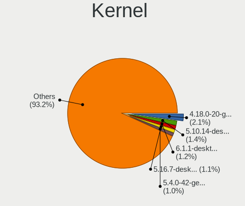

| Version                  | Computers | Percent |
|--------------------------|-----------|---------|
| 4.18.0-20-generic        | 18        | 4.36%   |
| 5.10.14-desktop-1omv4002 | 12        | 2.91%   |
| 5.4.0-42-generic         | 8         | 1.94%   |
| 5.11.0-27-generic        | 6         | 1.45%   |
| 5.3.0-40-generic         | 5         | 1.21%   |
| 5.16.7-desktop-1omv4003  | 5         | 1.21%   |
| 5.8.0-7630-generic       | 4         | 0.97%   |
| 5.8.0-59-generic         | 4         | 0.97%   |
| 5.8.0-50-generic         | 4         | 0.97%   |
| 5.8.0-43-generic         | 4         | 0.97%   |
| 5.4.0-58-generic         | 4         | 0.97%   |
| 5.4.0-52-generic         | 4         | 0.97%   |
| 5.4.0-48-generic         | 4         | 0.97%   |
| 5.4.0-45-generic         | 4         | 0.97%   |
| 5.4.0-28-generic         | 4         | 0.97%   |
| 5.3.0-46-generic         | 4         | 0.97%   |
| 5.11.0-43-generic        | 4         | 0.97%   |
| 5.11.0-25-generic        | 4         | 0.97%   |
| 5.0.0-37-generic         | 4         | 0.97%   |
| 5.0.0-23-generic         | 4         | 0.97%   |
| 4.15.0-43-generic        | 4         | 0.97%   |
| 5.8.0-53-generic         | 3         | 0.73%   |
| 5.4.0-7642-generic       | 3         | 0.73%   |
| 5.4.0-26-generic         | 3         | 0.73%   |
| 5.13.0-30-generic        | 3         | 0.73%   |
| 4.18.0-25-generic        | 3         | 0.73%   |
| 4.18.0-17-generic        | 3         | 0.73%   |
| 4.18.0-15-generic        | 3         | 0.73%   |
| 4.18.0-12-generic        | 3         | 0.73%   |
| 4.15.0-66-generic        | 3         | 0.73%   |
| 4.15.0-47-generic        | 3         | 0.73%   |
| 4.15.0-29-generic        | 3         | 0.73%   |
| 4.15.0-20-generic        | 3         | 0.73%   |
| 5.9.8-1000.native        | 2         | 0.48%   |
| 5.8.10-arch1-1           | 2         | 0.48%   |
| 5.8.0-55-generic         | 2         | 0.48%   |
| 5.8.0-48-generic         | 2         | 0.48%   |
| 5.8.0-38-generic         | 2         | 0.48%   |
| 5.8.0-14-generic         | 2         | 0.48%   |
| 5.5.0-kali2-amd64        | 2         | 0.48%   |
| 5.4.64-1-MANJARO         | 2         | 0.48%   |
| 5.4.0-91-generic         | 2         | 0.48%   |
| 5.4.0-88-generic         | 2         | 0.48%   |
| 5.4.0-81-generic         | 2         | 0.48%   |
| 5.4.0-80-generic         | 2         | 0.48%   |
| 5.4.0-77-generic         | 2         | 0.48%   |
| 5.4.0-74-generic         | 2         | 0.48%   |
| 5.4.0-66-generic         | 2         | 0.48%   |
| 5.4.0-54-generic         | 2         | 0.48%   |
| 5.4.0-53-generic         | 2         | 0.48%   |
| 5.4.0-37-generic         | 2         | 0.48%   |
| 5.4.0-29-generic         | 2         | 0.48%   |
| 5.3.0-28-generic         | 2         | 0.48%   |
| 5.16.18-200.fc35.x86_64  | 2         | 0.48%   |
| 5.16.11-2-MANJARO        | 2         | 0.48%   |
| 5.15.0-27-generic        | 2         | 0.48%   |
| 5.13.15-1-MANJARO        | 2         | 0.48%   |
| 5.13.0-39-generic        | 2         | 0.48%   |
| 5.13.0-35-generic        | 2         | 0.48%   |
| 5.12.9-300.fc34.x86_64   | 2         | 0.48%   |

Kernel Family
-------------

Linux kernel without a distro release

| Version | Computers | Percent |
|---------|-----------|---------|
| 5.4.0   | 71        | 17.88%  |
| 4.15.0  | 40        | 10.08%  |
| 5.8.0   | 35        | 8.82%   |
| 4.18.0  | 35        | 8.82%   |
| 5.11.0  | 27        | 6.8%    |
| 5.3.0   | 17        | 4.28%   |
| 5.0.0   | 17        | 4.28%   |
| 5.13.0  | 15        | 3.78%   |
| 5.10.14 | 12        | 3.02%   |
| 5.10.0  | 6         | 1.51%   |
| 5.16.7  | 5         | 1.26%   |
| 5.15.0  | 5         | 1.26%   |
| 5.14.0  | 4         | 1.01%   |
| 5.16.11 | 3         | 0.76%   |
| 5.9.8   | 2         | 0.5%    |
| 5.8.18  | 2         | 0.5%    |
| 5.8.10  | 2         | 0.5%    |
| 5.7.1   | 2         | 0.5%    |
| 5.7.0   | 2         | 0.5%    |
| 5.5.0   | 2         | 0.5%    |
| 5.4.64  | 2         | 0.5%    |
| 5.16.18 | 2         | 0.5%    |
| 5.15.32 | 2         | 0.5%    |
| 5.15.23 | 2         | 0.5%    |
| 5.15.21 | 2         | 0.5%    |
| 5.15.16 | 2         | 0.5%    |
| 5.13.15 | 2         | 0.5%    |
| 5.12.9  | 2         | 0.5%    |
| 5.11.12 | 2         | 0.5%    |
| 4.9.140 | 2         | 0.5%    |
| 4.19.57 | 2         | 0.5%    |
| 4.19.0  | 2         | 0.5%    |
| 4.13.0  | 2         | 0.5%    |
| 4.12.14 | 2         | 0.5%    |
| 3.10.0  | 2         | 0.5%    |
| 5.9.16  | 1         | 0.25%   |
| 5.9.0   | 1         | 0.25%   |
| 5.8.5   | 1         | 0.25%   |
| 5.8.3   | 1         | 0.25%   |
| 5.8.16  | 1         | 0.25%   |
| 5.8.12  | 1         | 0.25%   |
| 5.7.8   | 1         | 0.25%   |
| 5.7.4   | 1         | 0.25%   |
| 5.7.2   | 1         | 0.25%   |
| 5.7.19  | 1         | 0.25%   |
| 5.7.12  | 1         | 0.25%   |
| 5.7.11  | 1         | 0.25%   |
| 5.7.10  | 1         | 0.25%   |
| 5.6.7   | 1         | 0.25%   |
| 5.6.3   | 1         | 0.25%   |
| 5.6.15  | 1         | 0.25%   |
| 5.6.0   | 1         | 0.25%   |
| 5.5.5   | 1         | 0.25%   |
| 5.5.11  | 1         | 0.25%   |
| 5.4.55  | 1         | 0.25%   |
| 5.4.35  | 1         | 0.25%   |
| 5.2.6   | 1         | 0.25%   |
| 5.17.6  | 1         | 0.25%   |
| 5.17.5  | 1         | 0.25%   |
| 5.16.19 | 1         | 0.25%   |

Kernel Major Ver.
-----------------

Linux kernel major version

| Version | Computers | Percent |
|---------|-----------|---------|
| 5.4     | 75        | 18.99%  |
| 5.8     | 43        | 10.89%  |
| 4.15    | 40        | 10.13%  |
| 4.18    | 36        | 9.11%   |
| 5.11    | 32        | 8.1%    |
| 5.10    | 25        | 6.33%   |
| 5.13    | 20        | 5.06%   |
| 5.0     | 20        | 5.06%   |
| 5.15    | 19        | 4.81%   |
| 5.3     | 17        | 4.3%    |
| 5.16    | 13        | 3.29%   |
| 5.7     | 10        | 2.53%   |
| 5.14    | 6         | 1.52%   |
| 4.19    | 5         | 1.27%   |
| 5.9     | 4         | 1.01%   |
| 5.6     | 4         | 1.01%   |
| 5.5     | 4         | 1.01%   |
| 5.12    | 4         | 1.01%   |
| 4.9     | 3         | 0.76%   |
| 4.14    | 3         | 0.76%   |
| 5.17    | 2         | 0.51%   |
| 4.13    | 2         | 0.51%   |
| 4.12    | 2         | 0.51%   |
| 3.10    | 2         | 0.51%   |
| 5.2     | 1         | 0.25%   |
| 5.1     | 1         | 0.25%   |
| 4.4     | 1         | 0.25%   |
| 4.10    | 1         | 0.25%   |

Arch
----

OS architecture (x86_64, i586, etc.)

| Name    | Computers | Percent |
|---------|-----------|---------|
| x86_64  | 356       | 95.7%   |
| i686    | 9         | 2.42%   |
| aarch64 | 7         | 1.88%   |

DE
--

Desktop Environment

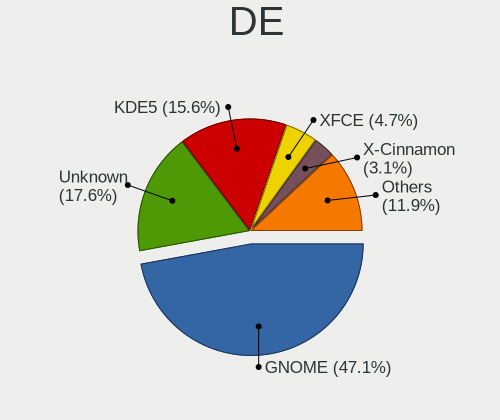

| Name            | Computers | Percent |
|-----------------|-----------|---------|
| GNOME           | 171       | 44.42%  |
| Unknown         | 102       | 26.49%  |
| KDE5            | 42        | 10.91%  |
| XFCE            | 18        | 4.68%   |
| X-Cinnamon      | 10        | 2.6%    |
| MATE            | 9         | 2.34%   |
| KDE             | 8         | 2.08%   |
| Cinnamon        | 5         | 1.3%    |
| Unity           | 4         | 1.04%   |
| LXQt            | 3         | 0.78%   |
| i3              | 3         | 0.78%   |
| GNOME Flashback | 2         | 0.52%   |
| Deepin          | 2         | 0.52%   |
| sway            | 1         | 0.26%   |
| Pantheon        | 1         | 0.26%   |
| LXDE            | 1         | 0.26%   |
| KDE4            | 1         | 0.26%   |
| GNOME Classic   | 1         | 0.26%   |
| Budgie          | 1         | 0.26%   |

Display Server
--------------

X11 or Wayland

| Name    | Computers | Percent |
|---------|-----------|---------|
| X11     | 293       | 77.31%  |
| Unknown | 49        | 12.93%  |
| Wayland | 31        | 8.18%   |
| Tty     | 6         | 1.58%   |

Display Manager
---------------

SDDM, LightDM, etc.

| Name    | Computers | Percent |
|---------|-----------|---------|
| Unknown | 225       | 59.06%  |
| GDM     | 61        | 16.01%  |
| SDDM    | 44        | 11.55%  |
| GDM3    | 20        | 5.25%   |
| LightDM | 14        | 3.67%   |
| TDM     | 13        | 3.41%   |
| SLiM    | 3         | 0.79%   |
| KDM     | 1         | 0.26%   |

OS Lang
-------

Language

| Lang    | Computers | Percent |
|---------|-----------|---------|
| en_US   | 132       | 34.65%  |
| zh_TW   | 123       | 32.28%  |
| Unknown | 94        | 24.67%  |
| C       | 6         | 1.57%   |
| zh_CN   | 4         | 1.05%   |
| en_GB   | 4         | 1.05%   |
| ru_RU   | 3         | 0.79%   |
| zh_HK   | 2         | 0.52%   |
| lzh_TW  | 2         | 0.52%   |
| en_HK   | 2         | 0.52%   |
| zh_SG   | 1         | 0.26%   |
| ja_JP   | 1         | 0.26%   |
| it_IT   | 1         | 0.26%   |
| es_ES   | 1         | 0.26%   |
| en_SG   | 1         | 0.26%   |
| en_IE   | 1         | 0.26%   |
| en_AU   | 1         | 0.26%   |
| de_DE   | 1         | 0.26%   |
| C.UTF8  | 1         | 0.26%   |

Boot Mode
---------

EFI or BIOS

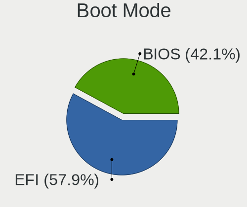

| Mode | Computers | Percent |
|------|-----------|---------|
| EFI  | 202       | 53.72%  |
| BIOS | 174       | 46.28%  |

Filesystem
----------

Type of filesystem

| Type    | Computers | Percent |
|---------|-----------|---------|
| Ext4    | 311       | 82.93%  |
| Overlay | 21        | 5.6%    |
| Btrfs   | 14        | 3.73%   |
| Unknown | 14        | 3.73%   |
| Xfs     | 9         | 2.4%    |
| Ext2    | 5         | 1.33%   |
| F2fs    | 1         | 0.27%   |

Part. scheme
------------

Scheme of partitioning

| Type    | Computers | Percent |
|---------|-----------|---------|
| Unknown | 227       | 60.7%   |
| GPT     | 118       | 31.55%  |
| MBR     | 29        | 7.75%   |

Dual Boot with Linux/BSD
------------------------

Hosting more than one Linux/BSD

| Dual boot | Computers | Percent |
|-----------|-----------|---------|
| No        | 318       | 84.57%  |
| Yes       | 58        | 15.43%  |

Dual Boot (Win)
---------------

Hosting Linux and Windows

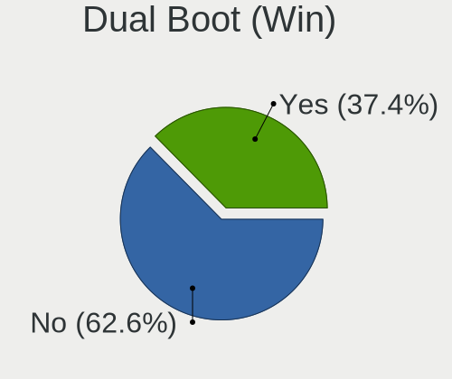

| Dual boot | Computers | Percent |
|-----------|-----------|---------|
| No        | 233       | 61.97%  |
| Yes       | 143       | 38.03%  |

Board
-----

Vendor
------

Motherboard manufacturer

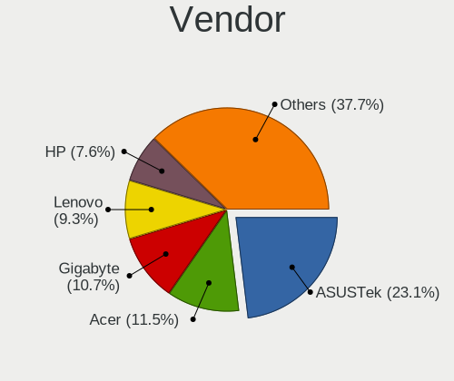

| Name                    | Computers | Percent |
|-------------------------|-----------|---------|
| ASUSTek Computer        | 83        | 22.31%  |
| Gigabyte Technology     | 46        | 12.37%  |
| Acer                    | 43        | 11.56%  |
| Hewlett-Packard         | 29        | 7.8%    |
| MSI                     | 28        | 7.53%   |
| Lenovo                  | 28        | 7.53%   |
| Unknown                 | 28        | 7.53%   |
| Dell                    | 21        | 5.65%   |
| ASRock                  | 14        | 3.76%   |
| Intel                   | 8         | 2.15%   |
| Apple                   | 4         | 1.08%   |
| Sony                    | 3         | 0.81%   |
| Raspberry Pi Foundation | 3         | 0.81%   |
| Toshiba                 | 2         | 0.54%   |
| Nvidia                  | 2         | 0.54%   |
| NEXCOM                  | 2         | 0.54%   |
| Lex                     | 2         | 0.54%   |
| AMI                     | 2         | 0.54%   |
| win element             | 1         | 0.27%   |
| VIZIO                   | 1         | 0.27%   |
| Supermicro              | 1         | 0.27%   |
| Samsung Electronics     | 1         | 0.27%   |
| Ruckus Wireless         | 1         | 0.27%   |
| PANSHI                  | 1         | 0.27%   |
| Neousys Technology      | 1         | 0.27%   |
| NEC Computers           | 1         | 0.27%   |
| MiTAC                   | 1         | 0.27%   |
| Microsoft               | 1         | 0.27%   |
| LG Electronics          | 1         | 0.27%   |
| Intel Client Systems    | 1         | 0.27%   |
| IBM                     | 1         | 0.27%   |
| HUAWEI                  | 1         | 0.27%   |
| Huanan                  | 1         | 0.27%   |
| Foxconn                 | 1         | 0.27%   |
| eMachines               | 1         | 0.27%   |
| DFI                     | 1         | 0.27%   |
| Dell EMC                | 1         | 0.27%   |
| CJSCOPE                 | 1         | 0.27%   |
| AVITA                   | 1         | 0.27%   |
| AMD                     | 1         | 0.27%   |
| Advantech               | 1         | 0.27%   |
| Accton                  | 1         | 0.27%   |

Model
-----

Motherboard model

| Name                                | Computers | Percent |
|-------------------------------------|-----------|---------|
| Unknown                             | 30        | 8.06%   |
| Gigabyte B75M-D3H                   | 4         | 1.08%   |
| Lenovo ThinkCentre M58 7627AA9      | 3         | 0.81%   |
| Gigabyte B550I AORUS PRO AX         | 3         | 0.81%   |
| Dell Inspiron 531s                  | 3         | 0.81%   |
| ASUS M5A78L-M/USB3                  | 3         | 0.81%   |
| ASUS All Series                     | 3         | 0.81%   |
| RPi Raspberry Pi                    | 2         | 0.54%   |
| Nvidia Tegra                        | 2         | 0.54%   |
| MSI GS63 7RE                        | 2         | 0.54%   |
| Lex 3I610DW                         | 2         | 0.54%   |
| HP Pavilion dv7                     | 2         | 0.54%   |
| Gigabyte Z97MX-Gaming 5             | 2         | 0.54%   |
| Gigabyte B85M-D2V                   | 2         | 0.54%   |
| Dell XPS 13 9380                    | 2         | 0.54%   |
| ASUS ROG STRIX B350-F GAMING        | 2         | 0.54%   |
| ASUS P8Z77-V LX                     | 2         | 0.54%   |
| ASRock H310M-ITX/ac                 | 2         | 0.54%   |
| ASRock A300M-STX                    | 2         | 0.54%   |
| ASRock 960GC-GS FX                  | 2         | 0.54%   |
| Acer Swift SF514-52T                | 2         | 0.54%   |
| Acer Aspire 4755                    | 2         | 0.54%   |
| win element MBOX                    | 1         | 0.27%   |
| VIZIO CT14                          | 1         | 0.27%   |
| Toshiba Satellite L850              | 1         | 0.27%   |
| Toshiba PORTEGE R830                | 1         | 0.27%   |
| Supermicro C9Z490-PGW               | 1         | 0.27%   |
| Sony VPCJ118FW                      | 1         | 0.27%   |
| Sony VPCCB15FW                      | 1         | 0.27%   |
| Sony SVP13229PWB                    | 1         | 0.27%   |
| Samsung 700Z3A/700Z4A/700Z5A/700Z5B | 1         | 0.27%   |
| Ruckus Wireless SCG-100             | 1         | 0.27%   |
| RPi Raspberry Pi 4 Model B Rev 1.4  | 1         | 0.27%   |
| PANSHI B85-S1 V1.0                  | 1         | 0.27%   |
| Nexcom SKLD4-P1                     | 1         | 0.27%   |
| NEXCOM B537-I                       | 1         | 0.27%   |
| Neousys Nuvo-8208GC Series          | 1         | 0.27%   |
| NEC Computers Milo3-H               | 1         | 0.27%   |
| MSI PE72 8RD                        | 1         | 0.27%   |
| MSI PE62 8RD                        | 1         | 0.27%   |
| MSI P65 Creator 9SD                 | 1         | 0.27%   |
| MSI MS-7D25                         | 1         | 0.27%   |
| MSI MS-7D19                         | 1         | 0.27%   |
| MSI MS-7D08                         | 1         | 0.27%   |
| MSI MS-7C52                         | 1         | 0.27%   |
| MSI MS-7C06                         | 1         | 0.27%   |
| MSI MS-7B89                         | 1         | 0.27%   |
| MSI MS-7B09                         | 1         | 0.27%   |
| MSI MS-7A69                         | 1         | 0.27%   |
| MSI MS-7982                         | 1         | 0.27%   |
| MSI MS-7865                         | 1         | 0.27%   |
| MSI MS-7721                         | 1         | 0.27%   |
| MSI MS-7676                         | 1         | 0.27%   |
| MSI MS-7641                         | 1         | 0.27%   |
| MSI MS-7512                         | 1         | 0.27%   |
| MSI MS-7309                         | 1         | 0.27%   |
| MSI Modern 14 B11M                  | 1         | 0.27%   |
| MSI GV72 8RC                        | 1         | 0.27%   |
| MSI GT63 Titan 9SG                  | 1         | 0.27%   |
| MSI GS76 Stealth 11UH               | 1         | 0.27%   |

Model Family
------------

Motherboard model prefix

| Name                    | Computers | Percent |
|-------------------------|-----------|---------|
| Unknown                 | 30        | 8.06%   |
| Acer Aspire             | 26        | 6.99%   |
| Lenovo ThinkPad         | 12        | 3.23%   |
| ASUS ROG                | 12        | 3.23%   |
| Dell Inspiron           | 9         | 2.42%   |
| HP Pavilion             | 7         | 1.88%   |
| Acer Swift              | 6         | 1.61%   |
| HP ProBook              | 5         | 1.34%   |
| ASUS VivoBook           | 5         | 1.34%   |
| ASUS TUF                | 5         | 1.34%   |
| Lenovo IdeaPad          | 4         | 1.08%   |
| Gigabyte B75M-D3H       | 4         | 1.08%   |
| ASUS ZenBook            | 4         | 1.08%   |
| ASUS PRIME              | 4         | 1.08%   |
| ASUS M5A78L-M           | 4         | 1.08%   |
| Acer Veriton            | 4         | 1.08%   |
| RPi Raspberry           | 3         | 0.81%   |
| Lenovo ThinkCentre      | 3         | 0.81%   |
| Gigabyte B550I          | 3         | 0.81%   |
| Dell XPS                | 3         | 0.81%   |
| Dell Precision          | 3         | 0.81%   |
| Dell Latitude           | 3         | 0.81%   |
| ASUS P8Z77-V            | 3         | 0.81%   |
| ASUS ASUSPRO            | 3         | 0.81%   |
| ASUS All                | 3         | 0.81%   |
| Acer TravelMate         | 3         | 0.81%   |
| Nvidia Tegra            | 2         | 0.54%   |
| MSI GS63                | 2         | 0.54%   |
| MSI GE70                | 2         | 0.54%   |
| Lex 3I610DW             | 2         | 0.54%   |
| Lenovo Yoga             | 2         | 0.54%   |
| HP EliteBook            | 2         | 0.54%   |
| HP Compaq               | 2         | 0.54%   |
| Gigabyte Z97MX-Gaming   | 2         | 0.54%   |
| Gigabyte B85M-D2V       | 2         | 0.54%   |
| Dell Vostro             | 2         | 0.54%   |
| ASUS Pro                | 2         | 0.54%   |
| ASRock H310M-ITX        | 2         | 0.54%   |
| ASRock A300M-STX        | 2         | 0.54%   |
| ASRock 960GC-GS         | 2         | 0.54%   |
| win element MBOX        | 1         | 0.27%   |
| VIZIO CT14              | 1         | 0.27%   |
| Toshiba Satellite       | 1         | 0.27%   |
| Toshiba PORTEGE         | 1         | 0.27%   |
| Supermicro C9Z490-PGW   | 1         | 0.27%   |
| Sony VPCJ118FW          | 1         | 0.27%   |
| Sony VPCCB15FW          | 1         | 0.27%   |
| Sony SVP13229PWB        | 1         | 0.27%   |
| Samsung 700Z3A          | 1         | 0.27%   |
| Ruckus Wireless SCG-100 | 1         | 0.27%   |
| PANSHI B85-S1           | 1         | 0.27%   |
| Nexcom SKLD4-P1         | 1         | 0.27%   |
| NEXCOM B537-I           | 1         | 0.27%   |
| Neousys Nuvo-8208GC     | 1         | 0.27%   |
| NEC Computers Milo3-H   | 1         | 0.27%   |
| MSI PE72                | 1         | 0.27%   |
| MSI PE62                | 1         | 0.27%   |
| MSI P65                 | 1         | 0.27%   |
| MSI MS-7D25             | 1         | 0.27%   |
| MSI MS-7D19             | 1         | 0.27%   |

MFG Year
--------

Motherboard manufacture year

| Year    | Computers | Percent |
|---------|-----------|---------|
| 2018    | 47        | 12.63%  |
| 2019    | 42        | 11.29%  |
| 2020    | 38        | 10.22%  |
| 2012    | 28        | 7.53%   |
| 2014    | 27        | 7.26%   |
| 2021    | 26        | 6.99%   |
| 2017    | 25        | 6.72%   |
| 2011    | 25        | 6.72%   |
| 2016    | 20        | 5.38%   |
| 2013    | 20        | 5.38%   |
| 2015    | 16        | 4.3%    |
| 2010    | 14        | 3.76%   |
| 2009    | 14        | 3.76%   |
| 2008    | 13        | 3.49%   |
| Unknown | 6         | 1.61%   |
| 2022    | 5         | 1.34%   |
| 2007    | 5         | 1.34%   |
| 2004    | 1         | 0.27%   |

Form Factor
-----------

Physical design of the computer

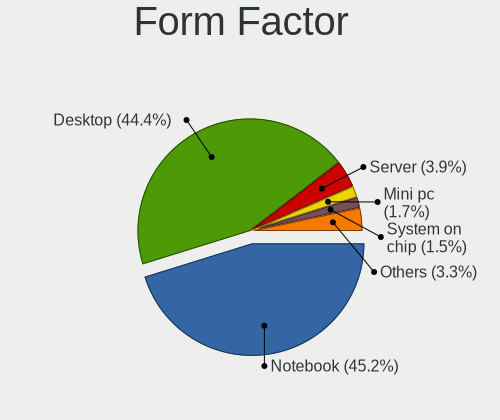

| Name           | Computers | Percent |
|----------------|-----------|---------|
| Desktop        | 167       | 44.89%  |
| Notebook       | 154       | 41.4%   |
| Server         | 23        | 6.18%   |
| Mini pc        | 8         | 2.15%   |
| All in one     | 8         | 2.15%   |
| System on chip | 7         | 1.88%   |
| Tablet         | 2         | 0.54%   |
| Convertible    | 2         | 0.54%   |
| Phone          | 1         | 0.27%   |

Secure Boot
-----------

Enabled or disabled

| State    | Computers | Percent |
|----------|-----------|---------|
| Disabled | 354       | 94.91%  |
| Enabled  | 19        | 5.09%   |

Coreboot
--------

Have coreboot on board

| Used | Computers | Percent |
|------|-----------|---------|
| No   | 372       | 100%    |

RAM Size
--------

Total RAM memory

| Size in GB      | Computers | Percent |
|-----------------|-----------|---------|
| 16.01-24.0      | 98        | 25.99%  |
| 4.01-8.0        | 82        | 21.75%  |
| 8.01-16.0       | 62        | 16.45%  |
| 3.01-4.0        | 55        | 14.59%  |
| 32.01-64.0      | 46        | 12.2%   |
| 64.01-256.0     | 14        | 3.71%   |
| 24.01-32.0      | 8         | 2.12%   |
| 1.01-2.0        | 8         | 2.12%   |
| 2.01-3.0        | 2         | 0.53%   |
| More than 256.0 | 1         | 0.27%   |
| 0.51-1.0        | 1         | 0.27%   |

RAM Used
--------

Used RAM memory

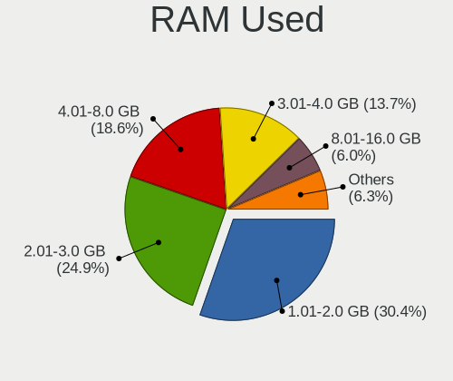

| Used GB    | Computers | Percent |
|------------|-----------|---------|
| 1.01-2.0   | 157       | 39.45%  |
| 2.01-3.0   | 98        | 24.62%  |
| 4.01-8.0   | 55        | 13.82%  |
| 3.01-4.0   | 52        | 13.07%  |
| 0.51-1.0   | 15        | 3.77%   |
| 8.01-16.0  | 12        | 3.02%   |
| 24.01-32.0 | 3         | 0.75%   |
| 0.01-0.5   | 3         | 0.75%   |
| 16.01-24.0 | 2         | 0.5%    |
| 32.01-64.0 | 1         | 0.25%   |

Total Drives
------------

Number of drives on board

| Drives  | Computers | Percent |
|---------|-----------|---------|
| 1       | 190       | 50.26%  |
| 2       | 105       | 27.78%  |
| 3       | 37        | 9.79%   |
| 0       | 19        | 5.03%   |
| 4       | 11        | 2.91%   |
| 5       | 9         | 2.38%   |
| 6       | 3         | 0.79%   |
| 7       | 2         | 0.53%   |
| 14      | 1         | 0.26%   |
| Unknown | 1         | 0.26%   |

Has CD-ROM
----------

Has CD-ROM on board

| Presented | Computers | Percent |
|-----------|-----------|---------|
| No        | 263       | 70.51%  |
| Yes       | 110       | 29.49%  |

Has Ethernet
------------

Has Ethernet on board

| Presented | Computers | Percent |
|-----------|-----------|---------|
| Yes       | 330       | 88.47%  |
| No        | 43        | 11.53%  |

Has WiFi
--------

Has WiFi module

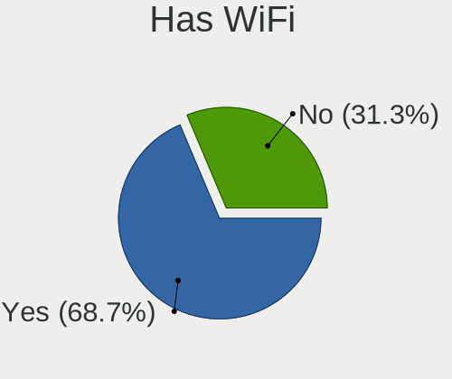

| Presented | Computers | Percent |
|-----------|-----------|---------|
| Yes       | 235       | 63.17%  |
| No        | 137       | 36.83%  |

Has Bluetooth
-------------

Has Bluetooth module

| Presented | Computers | Percent |
|-----------|-----------|---------|
| Yes       | 206       | 54.79%  |
| No        | 170       | 45.21%  |

Location
--------

Country
-------

Geographic location (country)

| Country | Computers | Percent |
|---------|-----------|---------|
| Taiwan  | 372       | 100%    |

City
----

Geographic location (city)

| City              | Computers | Percent |
|-------------------|-----------|---------|
| Taipei            | 110       | 28.21%  |
| New Taipei        | 63        | 16.15%  |
| Taoyuan District  | 55        | 14.1%   |
| Hsinchu           | 30        | 7.69%   |
| Taichung          | 28        | 7.18%   |
| Kaohsiung City    | 24        | 6.15%   |
| Tainan City       | 18        | 4.62%   |
| Hsinchu County    | 8         | 2.05%   |
| Chang-hua         | 7         | 1.79%   |
| Pingtung City     | 5         | 1.28%   |
| Keelung           | 5         | 1.28%   |
| Zhudong           | 4         | 1.03%   |
| Yunlin            | 3         | 0.77%   |
| Miaoli            | 3         | 0.77%   |
| Shulin District   | 2         | 0.51%   |
| Nantou City       | 2         | 0.51%   |
| Kanzijiao         | 2         | 0.51%   |
| Chiayi            | 2         | 0.51%   |
| Zhubei            | 1         | 0.26%   |
| Xinzhuang         | 1         | 0.26%   |
| Xindian           | 1         | 0.26%   |
| Xiatayou          | 1         | 0.26%   |
| Taoyuan City      | 1         | 0.26%   |
| Taishan           | 1         | 0.26%   |
| Taichung City     | 1         | 0.26%   |
| Sanchong District | 1         | 0.26%   |
| Penghu County     | 1         | 0.26%   |
| Neihu             | 1         | 0.26%   |
| Minxiong          | 1         | 0.26%   |
| Magong            | 1         | 0.26%   |
| Hualien City      | 1         | 0.26%   |
| Fenjihu           | 1         | 0.26%   |
| Chongde           | 1         | 0.26%   |
| Chiayi City       | 1         | 0.26%   |
| Chenggong         | 1         | 0.26%   |
| Bao'an            | 1         | 0.26%   |
| Aquan             | 1         | 0.26%   |

Drives
------

Drive Vendor
------------

Hard drive vendors

| Vendor                       | Computers | Drives  | Percent |
|------------------------------|-----------|---------|---------|
| WDC                          | 80        | 118     | 14.29%  |
| Seagate                      | 75        | 120     | 13.39%  |
| Toshiba                      | 45        | 57      | 8.04%   |
| Crucial                      | 39        | 48      | 6.96%   |
| Samsung Electronics          | 31        | 43      | 5.54%   |
| Kingston                     | 28        | 39      | 5%      |
| Intel                        | 27        | 33      | 4.82%   |
| Unknown                      | 25        | 27      | 4.46%   |
| Sandisk                      | 24        | 30      | 4.29%   |
| Hitachi                      | 22        | 28      | 3.93%   |
| A-DATA Technology            | 15        | 16      | 2.68%   |
| HGST                         | 13        | 15      | 2.32%   |
| Transcend                    | 12        | 13      | 2.14%   |
| SK Hynix                     | 11        | 12      | 1.96%   |
| Lite-On                      | 10        | 10      | 1.79%   |
| PLEXTOR                      | 8         | 9       | 1.43%   |
| Micron Technology            | 8         | 8       | 1.43%   |
| Apacer                       | 7         | 9       | 1.25%   |
| ASMT                         | 6         | 6       | 1.07%   |
| SPCC                         | 5         | 6       | 0.89%   |
| Silicon Motion               | 5         | 5       | 0.89%   |
| Micron/Crucial Technology    | 4         | 5       | 0.71%   |
| Phison                       | 3         | 4       | 0.54%   |
| OCZ                          | 3         | 3       | 0.54%   |
| MAXTOR                       | 3         | 3       | 0.54%   |
| LITEONIT                     | 3         | 3       | 0.54%   |
| JMicron                      | 3         | 6       | 0.54%   |
| AGI                          | 3         | 4       | 0.54%   |
| Unknown                      | 3         | 3       | 0.54%   |
| PIONEER                      | 2         | 2       | 0.36%   |
| Patriot                      | 2         | 2       | 0.36%   |
| Apple                        | 2         | 2       | 0.36%   |
| ANACOMDA                     | 2         | 2       | 0.36%   |
| ZHITAI                       | 1         | 1       | 0.18%   |
| Yangtze Memory Technologies  | 1         | 1       | 0.18%   |
| XPG                          | 1         | 1       | 0.18%   |
| USB3.2                       | 1         | 1       | 0.18%   |
| Unknown (583)                | 1         | 1       | 0.18%   |
| Union Memory                 | 1         | 1       | 0.18%   |
| Toshiba America Info Systems | 1         | 2       | 0.18%   |
| Team                         | 1         | 2       | 0.18%   |
| StoreJet                     | 1         | 2       | 0.18%   |
| SSSTC                        | 1         | 1       | 0.18%   |
| Sony                         | 1         | 1       | 0.18%   |
| OCZ-VECT                     | 1         | 1       | 0.18%   |
| OCZ-REVODRIVE                | 1         | 4       | 0.18%   |
| NETAPP                       | 1         | 2       | 0.18%   |
| NeoTech                      | 1         | 1       | 0.18%   |
| MX                           | 1         | 1       | 0.18%   |
| MemoCom                      | 1         | 2       | 0.18%   |
| KLEVV                        | 1         | 1       | 0.18%   |
| KIOXIA                       | 1         | 1       | 0.18%   |
| IBM-ESXS                     | 1         | Unknown | 0.18%   |
| Hikvision                    | 1         | 1       | 0.18%   |
| HGST HTE                     | 1         | 1       | 0.18%   |
| Hewlett-Packard              | 1         | 1       | 0.18%   |
| Gigabyte Technology          | 1         | 1       | 0.18%   |
| Fujitsu                      | 1         | 2       | 0.18%   |
| EZLINK                       | 1         | 1       | 0.18%   |
| China                        | 1         | 1       | 0.18%   |

Drive Model
-----------

Hard drive models

| Model                               | Computers | Percent |
|-------------------------------------|-----------|---------|
| Crucial CT500MX500SSD1 500GB        | 14        | 2.31%   |
| Toshiba DT01ACA200 2TB              | 9         | 1.49%   |
| Toshiba DT01ACA100 1TB              | 9         | 1.49%   |
| Seagate ST2000DM008-2FR102 2TB      | 8         | 1.32%   |
| Lite-On NVMe SSD Drive 512GB        | 8         | 1.32%   |
| Unknown MMC Card  32GB              | 5         | 0.83%   |
| Toshiba MQ01ABD100 1TB              | 5         | 0.83%   |
| Toshiba MQ01ABD032 320GB            | 5         | 0.83%   |
| Seagate ST500DM002-1BD142 500GB     | 5         | 0.83%   |
| Seagate ST3500418AS 500GB           | 5         | 0.83%   |
| Seagate ST1000LM035-1RK172 1TB      | 5         | 0.83%   |
| HGST HTS721010A9E630 1TB            | 5         | 0.83%   |
| Crucial CT240BX500SSD1 240GB        | 5         | 0.83%   |
| Crucial CT1000MX500SSD1 1TB         | 5         | 0.83%   |
| WDC WDS250G1B0B-00AS40 250GB SSD    | 4         | 0.66%   |
| Unknown MMC Card  64GB              | 4         | 0.66%   |
| Silicon Motion NVMe SSD Drive 512GB | 4         | 0.66%   |
| Seagate ST1000LM049-2GH172 1TB      | 4         | 0.66%   |
| Sandisk NVMe SSD Drive 512GB        | 4         | 0.66%   |
| Sandisk NVMe SSD Drive 256GB        | 4         | 0.66%   |
| Sandisk NVMe SSD Drive 1TB          | 4         | 0.66%   |
| ASMT 2115 2TB                       | 4         | 0.66%   |
| WDC WD6402AAEX-00Z3A0 640GB         | 3         | 0.5%    |
| WDC WD1600AAJS-08L7A0 160GB         | 3         | 0.5%    |
| WDC WD10JPVX-22JC3T0 1TB            | 3         | 0.5%    |
| WDC WD10EZEX-08WN4A0 1TB            | 3         | 0.5%    |
| Unknown 004G60  4GB                 | 3         | 0.5%    |
| Transcend TS128GSSD340 128GB        | 3         | 0.5%    |
| Seagate ST750LX003-1AC154 752GB     | 3         | 0.5%    |
| Seagate ST2000DM001-1CH164 2TB      | 3         | 0.5%    |
| Seagate ST1000DM003-1ER162 1TB      | 3         | 0.5%    |
| Micron/Crucial NVMe SSD Drive 1TB   | 3         | 0.5%    |
| Kingston SA400S37480G 480GB SSD     | 3         | 0.5%    |
| Kingston SA400S37240G 240GB SSD     | 3         | 0.5%    |
| Kingston SA2000M8500G 500GB         | 3         | 0.5%    |
| Intel SSDSC2KW256G8 256GB           | 3         | 0.5%    |
| Intel SSDPEKKW256G7 256GB           | 3         | 0.5%    |
| Crucial CT500MX500SSD4 500GB        | 3         | 0.5%    |
| Apacer 256GB SATA Flash Drive SSD   | 3         | 0.5%    |
| A-DATA SU800 512GB SSD              | 3         | 0.5%    |
| Unknown                             | 3         | 0.5%    |
| WDC WDS500G3X0C-00SJG0 500GB        | 2         | 0.33%   |
| WDC WDS250G2B0A-00SM50 250GB SSD    | 2         | 0.33%   |
| WDC WDS240G2G0A-00JH30 240GB SSD    | 2         | 0.33%   |
| WDC WDS100T2B0C-00PXH0 1TB          | 2         | 0.33%   |
| WDC WD5000AAKX-001CA0 500GB         | 2         | 0.33%   |
| WDC WD20EARX-00PASB0 2TB            | 2         | 0.33%   |
| WDC WD1001FALS-00J7B1 1TB           | 2         | 0.33%   |
| Toshiba MQ04ABF100 1TB              | 2         | 0.33%   |
| Toshiba MQ02ABF050H 500GB           | 2         | 0.33%   |
| Toshiba DT02ABA400 4TB              | 2         | 0.33%   |
| SPCC Solid State Disk 240GB         | 2         | 0.33%   |
| SPCC Solid State Disk 120GB         | 2         | 0.33%   |
| SK Hynix HFM512GD3JX013N 512GB      | 2         | 0.33%   |
| Seagate ST6000DM003-2CY186 6TB      | 2         | 0.33%   |
| Seagate ST4000VN000-1H4168 4TB      | 2         | 0.33%   |
| Seagate ST3500413AS 500GB           | 2         | 0.33%   |
| Seagate ST3320613AS 320GB           | 2         | 0.33%   |
| Seagate ST1000LM014-1EJ164 1TB      | 2         | 0.33%   |
| Seagate ST1000DM010-2EP102 1TB      | 2         | 0.33%   |

HDD Vendor
----------

Hard disk drive vendors

| Vendor        | Computers | Drives | Percent |
|---------------|-----------|--------|---------|
| Seagate       | 75        | 117    | 34.56%  |
| WDC           | 50        | 72     | 23.04%  |
| Toshiba       | 41        | 53     | 18.89%  |
| Hitachi       | 22        | 28     | 10.14%  |
| HGST          | 13        | 15     | 5.99%   |
| ASMT          | 5         | 5      | 2.3%    |
| MAXTOR        | 3         | 3      | 1.38%   |
| Unknown (583) | 1         | 1      | 0.46%   |
| Unknown       | 1         | 1      | 0.46%   |
| StoreJet      | 1         | 2      | 0.46%   |
| NETAPP        | 1         | 2      | 0.46%   |
| NeoTech       | 1         | 1      | 0.46%   |
| JMicron       | 1         | 3      | 0.46%   |
| Fujitsu       | 1         | 2      | 0.46%   |
| Apple         | 1         | 1      | 0.46%   |

SSD Vendor
----------

Solid state drive vendors

| Vendor              | Computers | Drives | Percent |
|---------------------|-----------|--------|---------|
| Crucial             | 36        | 44     | 19.35%  |
| Kingston            | 16        | 19     | 8.6%    |
| WDC                 | 15        | 22     | 8.06%   |
| Intel               | 15        | 17     | 8.06%   |
| A-DATA Technology   | 14        | 15     | 7.53%   |
| Transcend           | 12        | 13     | 6.45%   |
| Samsung Electronics | 11        | 13     | 5.91%   |
| SanDisk             | 10        | 12     | 5.38%   |
| PLEXTOR             | 7         | 8      | 3.76%   |
| Apacer              | 6         | 8      | 3.23%   |
| SPCC                | 5         | 6      | 2.69%   |
| Micron Technology   | 5         | 5      | 2.69%   |
| Toshiba             | 3         | 3      | 1.61%   |
| OCZ                 | 3         | 3      | 1.61%   |
| LITEONIT            | 3         | 3      | 1.61%   |
| SK Hynix            | 2         | 2      | 1.08%   |
| Patriot             | 2         | 2      | 1.08%   |
| ANACOMDA            | 2         | 2      | 1.08%   |
| Unknown             | 2         | 2      | 1.08%   |
| Unknown             | 1         | 1      | 0.54%   |
| Team                | 1         | 2      | 0.54%   |
| Sony                | 1         | 1      | 0.54%   |
| OCZ-VECT            | 1         | 1      | 0.54%   |
| OCZ-REVODRIVE       | 1         | 4      | 0.54%   |
| MX                  | 1         | 1      | 0.54%   |
| MemoCom             | 1         | 2      | 0.54%   |
| KLEVV               | 1         | 1      | 0.54%   |
| JMicron             | 1         | 1      | 0.54%   |
| Hewlett-Packard     | 1         | 1      | 0.54%   |
| EZLINK              | 1         | 1      | 0.54%   |
| China               | 1         | 1      | 0.54%   |
| AXIOMTEK            | 1         | 1      | 0.54%   |
| Aura                | 1         | 1      | 0.54%   |
| ATP                 | 1         | 1      | 0.54%   |
| ASMT                | 1         | 1      | 0.54%   |
| Apple               | 1         | 1      | 0.54%   |

Drive Kind
----------

HDD or SSD

| Kind    | Computers | Drives | Percent |
|---------|-----------|--------|---------|
| HDD     | 183       | 306    | 36.9%   |
| SSD     | 161       | 221    | 32.46%  |
| NVMe    | 118       | 164    | 23.79%  |
| MMC     | 18        | 19     | 3.63%   |
| Unknown | 16        | 20     | 3.23%   |

Drive Connector
---------------

SATA, SAS, NVMe, etc.

| Type | Computers | Drives | Percent |
|------|-----------|--------|---------|
| SATA | 277       | 502    | 63.24%  |
| NVMe | 118       | 164    | 26.94%  |
| SAS  | 25        | 45     | 5.71%   |
| MMC  | 18        | 19     | 4.11%   |

Drive Size
----------

Size of hard drive

| Size in TB | Computers | Drives | Percent |
|------------|-----------|--------|---------|
| 0.01-0.5   | 196       | 289    | 53.41%  |
| 0.51-1.0   | 111       | 142    | 30.25%  |
| 1.01-2.0   | 38        | 60     | 10.35%  |
| 3.01-4.0   | 8         | 8      | 2.18%   |
| 4.01-10.0  | 7         | 19     | 1.91%   |
| 2.01-3.0   | 6         | 8      | 1.63%   |
| 10.01-20.0 | 1         | 1      | 0.27%   |

Space Total
-----------

Amount of disk space available on the file system

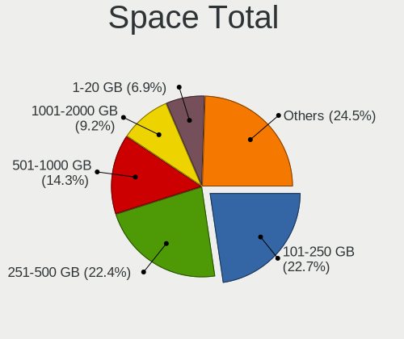

| Size in GB     | Computers | Percent |
|----------------|-----------|---------|
| 251-500        | 107       | 27.86%  |
| 101-250        | 99        | 25.78%  |
| 501-1000       | 46        | 11.98%  |
| 1001-2000      | 34        | 8.85%   |
| 51-100         | 24        | 6.25%   |
| 21-50          | 22        | 5.73%   |
| 1-20           | 17        | 4.43%   |
| 2001-3000      | 15        | 3.91%   |
| More than 3000 | 10        | 2.6%    |
| Unknown        | 10        | 2.6%    |

Space Used
----------

Amount of used disk space

| Used GB        | Computers | Percent |
|----------------|-----------|---------|
| 1-20           | 161       | 41.18%  |
| 21-50          | 62        | 15.86%  |
| 101-250        | 48        | 12.28%  |
| 51-100         | 46        | 11.76%  |
| 251-500        | 30        | 7.67%   |
| 501-1000       | 18        | 4.6%    |
| 1001-2000      | 11        | 2.81%   |
| Unknown        | 10        | 2.56%   |
| 2001-3000      | 3         | 0.77%   |
| More than 3000 | 2         | 0.51%   |

Malfunc. Drives
---------------

Drive models with a malfunction

| Model                                          | Computers | Drives | Percent |
|------------------------------------------------|-----------|--------|---------|
| WDC WD5000AAKX-001CA0 500GB                    | 1         | 1      | 4.55%   |
| WDC WD5000AADS-00L4B1 500GB                    | 1         | 1      | 4.55%   |
| WDC WD20EARX-00PASB0 2TB                       | 1         | 1      | 4.55%   |
| WDC WD20EARS-00MVWB0 2TB                       | 1         | 1      | 4.55%   |
| WDC WD10EALS-00Z8A0 1TB                        | 1         | 1      | 4.55%   |
| Transcend TS64GSSD340 64GB                     | 1         | 1      | 4.55%   |
| SK Hynix PC711 HFS512GDE9X073N 512GB           | 1         | 1      | 4.55%   |
| Seagate ST3500418AS 500GB                      | 1         | 1      | 4.55%   |
| Seagate ST3160811AS 160GB                      | 1         | 1      | 4.55%   |
| Seagate ST2000VN000-1H3164 2TB                 | 1         | 2      | 4.55%   |
| PLEXTOR PX-128M6Pro 128GB SSD                  | 1         | 1      | 4.55%   |
| Micron Technology 1100_MTFDDAV512TBN 512GB SSD | 1         | 1      | 4.55%   |
| LITEONIT E200-080 80GB SSD                     | 1         | 1      | 4.55%   |
| Kingston SV300S37A60G 64GB SSD                 | 1         | 1      | 4.55%   |
| Intel SSDPEKKW256G7 256GB                      | 1         | 1      | 4.55%   |
| Hitachi HTS545050A7E380 500GB                  | 1         | 1      | 4.55%   |
| Hitachi HDT721010SLA360 1TB                    | 1         | 1      | 4.55%   |
| Hitachi HDS723020BLA642 2TB                    | 1         | 2      | 4.55%   |
| HGST HTS545050A7E680 500GB                     | 1         | 1      | 4.55%   |
| Crucial CT275MX300SSD4 275GB                   | 1         | 1      | 4.55%   |
| ASMT 2115 2TB                                  | 1         | 1      | 4.55%   |
| A-DATA Technology IMSS332-960GB SSD            | 1         | 1      | 4.55%   |

Malfunc. Drive Vendor
---------------------

Vendors of faulty drives

| Vendor            | Computers | Drives | Percent |
|-------------------|-----------|--------|---------|
| WDC               | 5         | 5      | 22.73%  |
| Seagate           | 3         | 4      | 13.64%  |
| Hitachi           | 3         | 4      | 13.64%  |
| Transcend         | 1         | 1      | 4.55%   |
| SK Hynix          | 1         | 1      | 4.55%   |
| PLEXTOR           | 1         | 1      | 4.55%   |
| Micron Technology | 1         | 1      | 4.55%   |
| LITEONIT          | 1         | 1      | 4.55%   |
| Kingston          | 1         | 1      | 4.55%   |
| Intel             | 1         | 1      | 4.55%   |
| HGST              | 1         | 1      | 4.55%   |
| Crucial           | 1         | 1      | 4.55%   |
| ASMT              | 1         | 1      | 4.55%   |
| A-DATA Technology | 1         | 1      | 4.55%   |

Malfunc. HDD Vendor
-------------------

Vendors of faulty HDD drives

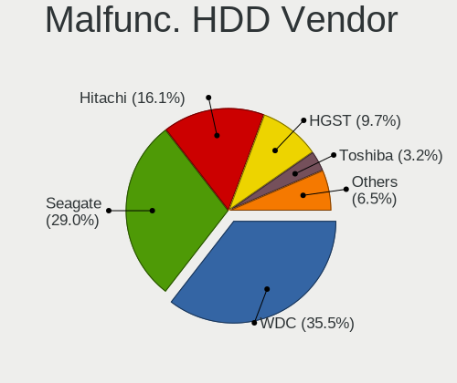

| Vendor  | Computers | Drives | Percent |
|---------|-----------|--------|---------|
| WDC     | 5         | 5      | 38.46%  |
| Seagate | 3         | 4      | 23.08%  |
| Hitachi | 3         | 4      | 23.08%  |
| HGST    | 1         | 1      | 7.69%   |
| ASMT    | 1         | 1      | 7.69%   |

Malfunc. Drive Kind
-------------------

Kinds of faulty drives

| Kind | Computers | Drives | Percent |
|------|-----------|--------|---------|
| HDD  | 12        | 15     | 57.14%  |
| SSD  | 7         | 7      | 33.33%  |
| NVMe | 2         | 2      | 9.52%   |

Failed Drives
-------------

Failed drive models

Zero info for selected period =(

Failed Drive Vendor
-------------------

Failed drive vendors

Zero info for selected period =(

Drive Status
------------

Number of failed and malfunc. drives

| Status   | Computers | Drives | Percent |
|----------|-----------|--------|---------|
| Detected | 233       | 477    | 60.05%  |
| Works    | 134       | 229    | 34.54%  |
| Malfunc  | 21        | 24     | 5.41%   |

Storage controller
------------------

Storage Vendor
--------------

Storage controller vendors

| Vendor                         | Computers | Percent |
|--------------------------------|-----------|---------|
| Intel                          | 258       | 54.43%  |
| AMD                            | 54        | 11.39%  |
| Samsung Electronics            | 35        | 7.38%   |
| Sandisk                        | 30        | 6.33%   |
| Kingston Technology Company    | 12        | 2.53%   |
| ASMedia Technology             | 11        | 2.32%   |
| Lite-On Technology             | 10        | 2.11%   |
| SK Hynix                       | 9         | 1.9%    |
| Nvidia                         | 7         | 1.48%   |
| Micron/Crucial Technology      | 7         | 1.48%   |
| Marvell Technology Group       | 7         | 1.48%   |
| Silicon Motion                 | 5         | 1.05%   |
| Phison Electronics             | 5         | 1.05%   |
| Micron Technology              | 4         | 0.84%   |
| Toshiba America Info Systems   | 3         | 0.63%   |
| LSI Logic / Symbios Logic      | 3         | 0.63%   |
| JMicron Technology             | 3         | 0.63%   |
| ADATA Technology               | 3         | 0.63%   |
| Solid State Storage Technology | 2         | 0.42%   |
| Broadcom / LSI                 | 2         | 0.42%   |
| Yangtze Memory Technologies    | 1         | 0.21%   |
| Union Memory (Shenzhen)        | 1         | 0.21%   |
| Silicon Image                  | 1         | 0.21%   |
| Integrated Technology Express  | 1         | 0.21%   |

Storage Model
-------------

Storage controller models

| Model                                                                                   | Computers | Percent |
|-----------------------------------------------------------------------------------------|-----------|---------|
| AMD FCH SATA Controller [AHCI mode]                                                     | 35        | 6.38%   |
| Intel 8 Series/C220 Series Chipset Family 6-port SATA Controller 1 [AHCI mode]          | 22        | 4.01%   |
| Samsung NVMe SSD Controller SM981/PM981/PM983                                           | 20        | 3.64%   |
| Intel Sunrise Point-LP SATA Controller [AHCI mode]                                      | 19        | 3.46%   |
| Intel 6 Series/C200 Series Chipset Family 6 port Desktop SATA AHCI Controller           | 13        | 2.37%   |
| Intel 6 Series/C200 Series Chipset Family 6 port Mobile SATA AHCI Controller            | 12        | 2.19%   |
| Intel HM170/QM170 Chipset SATA Controller [AHCI Mode]                                   | 11        | 2%      |
| Intel Cannon Lake PCH SATA AHCI Controller                                              | 11        | 2%      |
| Intel 7 Series Chipset Family 6-port SATA Controller [AHCI mode]                        | 10        | 1.82%   |
| Sandisk WD Blue SN550 NVMe SSD                                                          | 9         | 1.64%   |
| Intel Volume Management Device NVMe RAID Controller                                     | 9         | 1.64%   |
| Intel 8 Series SATA Controller 1 [AHCI mode]                                            | 9         | 1.64%   |
| Intel 7 Series/C210 Series Chipset Family 6-port SATA Controller [AHCI mode]            | 9         | 1.64%   |
| Intel 5 Series/3400 Series Chipset 4 port SATA AHCI Controller                          | 9         | 1.64%   |
| AMD SB7x0/SB8x0/SB9x0 IDE Controller                                                    | 9         | 1.64%   |
| Intel Q170/Q150/B150/H170/H110/Z170/CM236 Chipset SATA Controller [AHCI Mode]           | 8         | 1.46%   |
| Intel Cannon Lake Mobile PCH SATA AHCI Controller                                       | 8         | 1.46%   |
| Intel 82801 Mobile SATA Controller [RAID mode]                                          | 8         | 1.46%   |
| AMD 500 Series Chipset SATA Controller                                                  | 8         | 1.46%   |
| Sandisk WD Black 2018/SN750 / PC SN720 NVMe SSD                                         | 7         | 1.28%   |
| Lite-On Non-Volatile memory controller                                                  | 7         | 1.28%   |
| Intel Celeron/Pentium Silver Processor SATA Controller                                  | 7         | 1.28%   |
| Intel 7 Series/C210 Series Chipset Family 4-port SATA Controller [IDE mode]             | 7         | 1.28%   |
| Intel 7 Series/C210 Series Chipset Family 2-port SATA Controller [IDE mode]             | 7         | 1.28%   |
| Intel 200 Series PCH SATA controller [AHCI mode]                                        | 7         | 1.28%   |
| AMD SB7x0/SB8x0/SB9x0 SATA Controller [IDE mode]                                        | 7         | 1.28%   |
| AMD 400 Series Chipset SATA Controller                                                  | 7         | 1.28%   |
| Kingston Company A2000 NVMe SSD                                                         | 6         | 1.09%   |
| Intel SSD Pro 7600p/760p/E 6100p Series                                                 | 6         | 1.09%   |
| ASMedia ASM1062 Serial ATA Controller                                                   | 6         | 1.09%   |
| Sandisk WD Blue SN500 / PC SN520 NVMe SSD                                               | 5         | 0.91%   |
| Sandisk WD Black SN750 / PC SN730 NVMe SSD                                              | 5         | 0.91%   |
| Samsung NVMe SSD Controller SM961/PM961/SM963                                           | 5         | 0.91%   |
| Nvidia MCP61 SATA Controller                                                            | 5         | 0.91%   |
| Nvidia MCP61 IDE                                                                        | 5         | 0.91%   |
| Micron/Crucial P2 NVMe PCIe SSD                                                         | 5         | 0.91%   |
| Intel SATA Controller [RAID mode]                                                       | 5         | 0.91%   |
| Intel NM10/ICH7 Family SATA Controller [IDE mode]                                       | 5         | 0.91%   |
| Intel Alder Lake-S PCH SATA Controller [AHCI Mode]                                      | 5         | 0.91%   |
| Intel 82801IBM/IEM (ICH9M/ICH9M-E) 4 port SATA Controller [AHCI mode]                   | 5         | 0.91%   |
| ASMedia 106x SATA/RAID Controller                                                       | 5         | 0.91%   |
| AMD 300 Series Chipset SATA Controller                                                  | 5         | 0.91%   |
| SK Hynix Gold P31 SSD                                                                   | 4         | 0.73%   |
| Silicon Motion SM2263EN/SM2263XT SSD Controller                                         | 4         | 0.73%   |
| Samsung NVMe SSD Controller PM9A1/PM9A3/980PRO                                          | 4         | 0.73%   |
| Samsung NVMe SSD Controller 980                                                         | 4         | 0.73%   |
| Micron Non-Volatile memory controller                                                   | 4         | 0.73%   |
| Kingston Company U-SNS8154P3 NVMe SSD                                                   | 4         | 0.73%   |
| Intel Wildcat Point-LP SATA Controller [AHCI Mode]                                      | 4         | 0.73%   |
| Intel Cannon Point-LP SATA Controller [AHCI Mode]                                       | 4         | 0.73%   |
| Intel C620 Series Chipset Family SATA Controller [AHCI mode]                            | 4         | 0.73%   |
| Intel 82801JI (ICH10 Family) 4 port SATA IDE Controller #1                              | 4         | 0.73%   |
| Intel 82801JI (ICH10 Family) 2 port SATA IDE Controller #2                              | 4         | 0.73%   |
| Intel Tiger Lake-LP SATA Controller [AHCI mode]                                         | 3         | 0.55%   |
| Intel SSD 600P Series                                                                   | 3         | 0.55%   |
| Intel 82801JI (ICH10 Family) SATA AHCI Controller                                       | 3         | 0.55%   |
| Intel 82801JD/DO (ICH10 Family) 4-port SATA IDE Controller                              | 3         | 0.55%   |
| Intel 82801JD/DO (ICH10 Family) 2-port SATA IDE Controller                              | 3         | 0.55%   |
| Intel 82801G (ICH7 Family) IDE Controller                                               | 3         | 0.55%   |
| Intel 6 Series/C200 Series Chipset Family Desktop SATA Controller (IDE mode, ports 4-5) | 3         | 0.55%   |

Storage Kind
------------

Kind of storage controller (IDE, SATA, NVMe, SAS, ...)

| Kind | Computers | Percent |
|------|-----------|---------|
| SATA | 267       | 56.21%  |
| NVMe | 129       | 27.16%  |
| IDE  | 50        | 10.53%  |
| RAID | 25        | 5.26%   |
| SAS  | 2         | 0.42%   |
| SCSI | 2         | 0.42%   |

Processor
---------

CPU Vendor
----------

Processor vendors

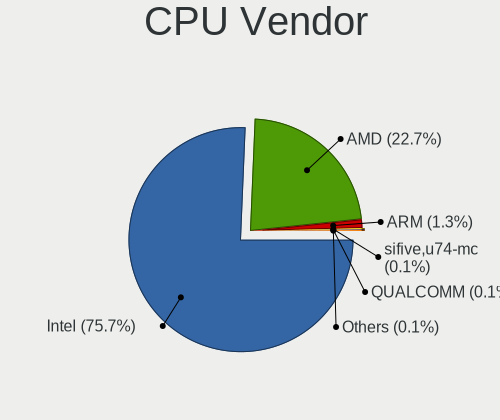

| Vendor   | Computers | Percent |
|----------|-----------|---------|
| Intel    | 296       | 79.57%  |
| AMD      | 69        | 18.55%  |
| ARM      | 5         | 1.34%   |
| QUALCOMM | 1         | 0.27%   |
| Unknown  | 1         | 0.27%   |

CPU Model
---------

Processor models

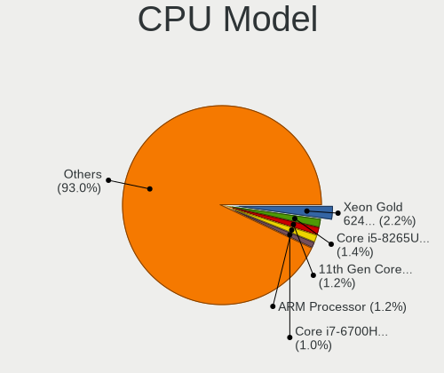

| Model                                       | Computers | Percent |
|---------------------------------------------|-----------|---------|
| Intel Xeon Gold 6248 CPU @ 2.50GHz          | 16        | 4.28%   |
| Intel Core i5-8265U CPU @ 1.60GHz           | 6         | 1.6%    |
| Intel Core i7-7700HQ CPU @ 2.80GHz          | 5         | 1.34%   |
| ARM Processor                               | 5         | 1.34%   |
| Intel Core i7-9750H CPU @ 2.60GHz           | 4         | 1.07%   |
| Intel Core i7-8550U CPU @ 1.80GHz           | 4         | 1.07%   |
| Intel Core i7-4500U CPU @ 1.80GHz           | 4         | 1.07%   |
| Intel Core i7-1065G7 CPU @ 1.30GHz          | 4         | 1.07%   |
| Intel Core i5-2400 CPU @ 3.10GHz            | 4         | 1.07%   |
| Intel Core i3-4160 CPU @ 3.60GHz            | 4         | 1.07%   |
| Intel 11th Gen Core i7-1165G7 @ 2.80GHz     | 4         | 1.07%   |
| Intel 11th Gen Core i5-1135G7 @ 2.40GHz     | 4         | 1.07%   |
| AMD Ryzen 5 3600 6-Core Processor           | 4         | 1.07%   |
| Intel Xeon CPU E3-1231 v3 @ 3.40GHz         | 3         | 0.8%    |
| Intel Pentium CPU G840 @ 2.80GHz            | 3         | 0.8%    |
| Intel Core i7-7500U CPU @ 2.70GHz           | 3         | 0.8%    |
| Intel Core i7-6700HQ CPU @ 2.60GHz          | 3         | 0.8%    |
| Intel Core i5-8250U CPU @ 1.60GHz           | 3         | 0.8%    |
| Intel Core i5-7200U CPU @ 2.50GHz           | 3         | 0.8%    |
| Intel Core i5-6200U CPU @ 2.30GHz           | 3         | 0.8%    |
| Intel Core i5-3230M CPU @ 2.60GHz           | 3         | 0.8%    |
| Intel Core i3-8100 CPU @ 3.60GHz            | 3         | 0.8%    |
| Intel Core 2 Duo CPU E7300 @ 2.66GHz        | 3         | 0.8%    |
| Intel Celeron J4105 CPU @ 1.50GHz           | 3         | 0.8%    |
| AMD Ryzen 5 2400G with Radeon Vega Graphics | 3         | 0.8%    |
| Intel Pentium Gold G5500 CPU @ 3.80GHz      | 2         | 0.53%   |
| Intel Core i7-8750H CPU @ 2.20GHz           | 2         | 0.53%   |
| Intel Core i7-8565U CPU @ 1.80GHz           | 2         | 0.53%   |
| Intel Core i7-6700 CPU @ 3.40GHz            | 2         | 0.53%   |
| Intel Core i7-4770K CPU @ 3.50GHz           | 2         | 0.53%   |
| Intel Core i7-4712MQ CPU @ 2.30GHz          | 2         | 0.53%   |
| Intel Core i7-4600U CPU @ 2.10GHz           | 2         | 0.53%   |
| Intel Core i7-3770 CPU @ 3.40GHz            | 2         | 0.53%   |
| Intel Core i7-2670QM CPU @ 2.20GHz          | 2         | 0.53%   |
| Intel Core i5-8400 CPU @ 2.80GHz            | 2         | 0.53%   |
| Intel Core i5-8300H CPU @ 2.30GHz           | 2         | 0.53%   |
| Intel Core i5-6400 CPU @ 2.70GHz            | 2         | 0.53%   |
| Intel Core i5-4590 CPU @ 3.30GHz            | 2         | 0.53%   |
| Intel Core i5-4460 CPU @ 3.20GHz            | 2         | 0.53%   |
| Intel Core i5-4210U CPU @ 1.70GHz           | 2         | 0.53%   |
| Intel Core i5-3470 CPU @ 3.20GHz            | 2         | 0.53%   |
| Intel Core i5-3450 CPU @ 3.10GHz            | 2         | 0.53%   |
| Intel Core i5-2450M CPU @ 2.50GHz           | 2         | 0.53%   |
| Intel Core i5-2410M CPU @ 2.30GHz           | 2         | 0.53%   |
| Intel Core i5-2310 CPU @ 2.90GHz            | 2         | 0.53%   |
| Intel Core i5-1035G4 CPU @ 1.10GHz          | 2         | 0.53%   |
| Intel Core i5 CPU M 520 @ 2.40GHz           | 2         | 0.53%   |
| Intel Core i5 CPU M 460 @ 2.53GHz           | 2         | 0.53%   |
| Intel Core i3-3220 CPU @ 3.30GHz            | 2         | 0.53%   |
| Intel Core i3-2100 CPU @ 3.10GHz            | 2         | 0.53%   |
| Intel Core i3-10100 CPU @ 3.60GHz           | 2         | 0.53%   |
| Intel Core 2 Quad CPU Q9550 @ 2.83GHz       | 2         | 0.53%   |
| Intel Core 2 Quad CPU Q6600 @ 2.40GHz       | 2         | 0.53%   |
| Intel Celeron N4020 CPU @ 1.10GHz           | 2         | 0.53%   |
| Intel Celeron CPU N3350 @ 1.10GHz           | 2         | 0.53%   |
| Intel Celeron CPU 3955U @ 2.00GHz           | 2         | 0.53%   |
| Intel 11th Gen Core i7-11370H @ 3.30GHz     | 2         | 0.53%   |
| AMD Ryzen 9 5950X 16-Core Processor         | 2         | 0.53%   |
| AMD Ryzen 7 4800HS with Radeon Graphics     | 2         | 0.53%   |
| AMD Ryzen 7 4700U with Radeon Graphics      | 2         | 0.53%   |

CPU Model Family
----------------

Processor model prefix

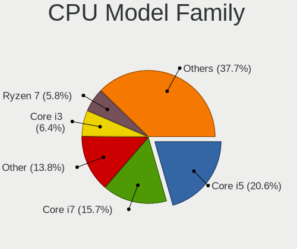

| Model                   | Computers | Percent |
|-------------------------|-----------|---------|
| Intel Core i5           | 77        | 20.59%  |
| Intel Core i7           | 72        | 19.25%  |
| Intel Core i3           | 32        | 8.56%   |
| Other                   | 29        | 7.75%   |
| AMD Ryzen 7             | 17        | 4.55%   |
| Intel Xeon Gold         | 16        | 4.28%   |
| Intel Xeon              | 16        | 4.28%   |
| AMD Ryzen 5             | 16        | 4.28%   |
| Intel Celeron           | 14        | 3.74%   |
| Intel Pentium           | 13        | 3.48%   |
| Intel Core 2 Duo        | 8         | 2.14%   |
| Intel Core 2 Quad       | 7         | 1.87%   |
| AMD FX                  | 7         | 1.87%   |
| AMD Ryzen 9             | 6         | 1.6%    |
| Intel Genuine           | 5         | 1.34%   |
| Intel Atom              | 4         | 1.07%   |
| AMD Athlon 64 X2        | 4         | 1.07%   |
| Intel Pentium Gold      | 3         | 0.8%    |
| Intel Pentium Dual-Core | 2         | 0.53%   |
| Intel Core i9           | 2         | 0.53%   |
| AMD Ryzen 7 PRO         | 2         | 0.53%   |
| AMD Ryzen 5 PRO         | 2         | 0.53%   |
| AMD Ryzen 3             | 2         | 0.53%   |
| AMD Phenom II X4        | 2         | 0.53%   |
| AMD Athlon II X2        | 2         | 0.53%   |
| QUALCOMM AArch64        | 1         | 0.27%   |
| Intel Xeon Silver       | 1         | 0.27%   |
| Intel Xeon Platinum     | 1         | 0.27%   |
| Intel Pentium Silver    | 1         | 0.27%   |
| Intel Pentium Dual      | 1         | 0.27%   |
| Intel Core 2 Solo       | 1         | 0.27%   |
| AMD Sempron             | 1         | 0.27%   |
| AMD Ryzen Threadripper  | 1         | 0.27%   |
| AMD Phenom II X6        | 1         | 0.27%   |
| AMD Phenom II X2        | 1         | 0.27%   |
| AMD Embedded            | 1         | 0.27%   |
| AMD E2                  | 1         | 0.27%   |
| AMD A8                  | 1         | 0.27%   |
| AMD A10                 | 1         | 0.27%   |

CPU Cores
---------

Number of processor cores

| Number | Computers | Percent |
|--------|-----------|---------|
| 4      | 154       | 41.29%  |
| 2      | 118       | 31.64%  |
| 8      | 31        | 8.31%   |
| 6      | 27        | 7.24%   |
| 20     | 16        | 4.29%   |
| 12     | 8         | 2.14%   |
| 16     | 7         | 1.88%   |
| 1      | 4         | 1.07%   |
| 28     | 2         | 0.54%   |
| 3      | 2         | 0.54%   |
| 48     | 1         | 0.27%   |
| 44     | 1         | 0.27%   |
| 18     | 1         | 0.27%   |
| 10     | 1         | 0.27%   |

CPU Sockets
-----------

Number of sockets

| Number | Computers | Percent |
|--------|-----------|---------|
| 1      | 365       | 98.12%  |
| 2      | 5         | 1.34%   |
| 4      | 1         | 0.27%   |
| 3      | 1         | 0.27%   |

CPU Threads
-----------

Threads per core (Hyper-Threading)

| Number | Computers | Percent |
|--------|-----------|---------|
| 2      | 251       | 67.11%  |
| 1      | 123       | 32.89%  |

CPU Op-Modes
------------

CPU Operation Modes (32-bit, 64-bit)

| Op mode        | Computers | Percent |
|----------------|-----------|---------|
| 32-bit, 64-bit | 360       | 96.51%  |
| Unknown        | 12        | 3.22%   |
| 32-bit         | 1         | 0.27%   |

CPU Microcode
-------------

Microcode number

| Number     | Computers | Percent |
|------------|-----------|---------|
| Unknown    | 67        | 17.63%  |
| 0x306c3    | 24        | 6.32%   |
| 0x306a9    | 24        | 6.32%   |
| 0x206a7    | 24        | 6.32%   |
| 0x50657    | 17        | 4.47%   |
| 0x906ea    | 11        | 2.89%   |
| 0x506e3    | 11        | 2.89%   |
| 0x806c1    | 10        | 2.63%   |
| 0x40651    | 10        | 2.63%   |
| 0x806ea    | 8         | 2.11%   |
| 0x20655    | 8         | 2.11%   |
| 0x1067a    | 8         | 2.11%   |
| 0x906e9    | 7         | 1.84%   |
| 0x806eb    | 7         | 1.84%   |
| 0x806e9    | 7         | 1.84%   |
| 0x906eb    | 6         | 1.58%   |
| 0x706e5    | 6         | 1.58%   |
| 0x406e3    | 6         | 1.58%   |
| 0x706a1    | 5         | 1.32%   |
| 0x306d4    | 5         | 1.32%   |
| 0x10676    | 5         | 1.32%   |
| 0x0a50000c | 5         | 1.32%   |
| 0x08701021 | 5         | 1.32%   |
| 0x08600106 | 4         | 1.05%   |
| 0x906ed    | 3         | 0.79%   |
| 0x90672    | 3         | 0.79%   |
| 0x406c4    | 3         | 0.79%   |
| 0x106e5    | 3         | 0.79%   |
| 0x0810100b | 3         | 0.79%   |
| 0x08001138 | 3         | 0.79%   |
| 0x06000852 | 3         | 0.79%   |
| 0xa0655    | 2         | 0.53%   |
| 0xa0653    | 2         | 0.53%   |
| 0x706a8    | 2         | 0.53%   |
| 0x6fd      | 2         | 0.53%   |
| 0x6fb      | 2         | 0.53%   |
| 0x50654    | 2         | 0.53%   |
| 0x30678    | 2         | 0.53%   |
| 0x106a5    | 2         | 0.53%   |
| 0x10677    | 2         | 0.53%   |
| 0x0a201016 | 2         | 0.53%   |
| 0x0a201009 | 2         | 0.53%   |
| 0x08608103 | 2         | 0.53%   |
| 0x0800820b | 2         | 0.53%   |
| 0x06006705 | 2         | 0.53%   |
| 0x010000c8 | 2         | 0.53%   |
| 0xa0671    | 1         | 0.26%   |
| 0x906a3    | 1         | 0.26%   |
| 0x90671    | 1         | 0.26%   |
| 0x90661    | 1         | 0.26%   |
| 0x806ec    | 1         | 0.26%   |
| 0x806d1    | 1         | 0.26%   |
| 0x606a4    | 1         | 0.26%   |
| 0x506ca    | 1         | 0.26%   |
| 0x506c9    | 1         | 0.26%   |
| 0x50664    | 1         | 0.26%   |
| 0x406f0    | 1         | 0.26%   |
| 0x406c3    | 1         | 0.26%   |
| 0x40661    | 1         | 0.26%   |
| 0x306f2    | 1         | 0.26%   |

CPU Microarch
-------------

Microarchitecture

| Name             | Computers | Percent |
|------------------|-----------|---------|
| KabyLake         | 61        | 16.35%  |
| Skylake          | 42        | 11.26%  |
| Haswell          | 41        | 10.99%  |
| IvyBridge        | 29        | 7.77%   |
| SandyBridge      | 28        | 7.51%   |
| Zen 2            | 18        | 4.83%   |
| Penryn           | 17        | 4.56%   |
| Unknown          | 15        | 4.02%   |
| Westmere         | 12        | 3.22%   |
| TigerLake        | 12        | 3.22%   |
| Zen 3            | 11        | 2.95%   |
| Zen              | 9         | 2.41%   |
| IceLake          | 9         | 2.41%   |
| K10              | 7         | 1.88%   |
| Goldmont plus    | 7         | 1.88%   |
| Broadwell        | 7         | 1.88%   |
| Zen+             | 6         | 1.61%   |
| Silvermont       | 6         | 1.61%   |
| Piledriver       | 6         | 1.61%   |
| Nehalem          | 5         | 1.34%   |
| K8 Hammer        | 4         | 1.07%   |
| Excavator        | 4         | 1.07%   |
| Core             | 4         | 1.07%   |
| CometLake        | 4         | 1.07%   |
| Goldmont         | 2         | 0.54%   |
| Alderlake Hybrid | 2         | 0.54%   |
| Tremont          | 1         | 0.27%   |
| Steamroller      | 1         | 0.27%   |
| Jaguar           | 1         | 0.27%   |
| Bulldozer        | 1         | 0.27%   |
| Bonnell          | 1         | 0.27%   |

Graphics
--------

GPU Vendor
----------

Vendors of graphics cards

| Vendor                     | Computers | Percent |
|----------------------------|-----------|---------|
| Intel                      | 204       | 44.74%  |
| Nvidia                     | 155       | 33.99%  |
| AMD                        | 72        | 15.79%  |
| ASPEED Technology          | 21        | 4.61%   |
| Matrox Electronics Systems | 4         | 0.88%   |

GPU Model
---------

Graphics card models

| Model                                                                                    | Computers | Percent |
|------------------------------------------------------------------------------------------|-----------|---------|
| ASPEED Technology ASPEED Graphics Family                                                 | 21        | 4.56%   |
| Intel 2nd Generation Core Processor Family Integrated Graphics Controller                | 18        | 3.9%    |
| Nvidia 3D controller                                                                     | 15        | 3.25%   |
| Intel TigerLake-LP GT2 [Iris Xe Graphics]                                                | 12        | 2.6%    |
| Intel Haswell-ULT Integrated Graphics Controller                                         | 11        | 2.39%   |
| Intel 3rd Gen Core processor Graphics Controller                                         | 11        | 2.39%   |
| Nvidia GP106 [GeForce GTX 1060 6GB]                                                      | 9         | 1.95%   |
| Intel Xeon E3-1200 v3/4th Gen Core Processor Integrated Graphics Controller              | 9         | 1.95%   |
| Intel WhiskeyLake-U GT2 [UHD Graphics 620]                                               | 9         | 1.95%   |
| Intel Core Processor Integrated Graphics Controller                                      | 9         | 1.95%   |
| AMD Renoir                                                                               | 9         | 1.95%   |
| Intel UHD Graphics 620                                                                   | 8         | 1.74%   |
| Intel HD Graphics 630                                                                    | 8         | 1.74%   |
| Intel HD Graphics 530                                                                    | 8         | 1.74%   |
| Intel CoffeeLake-H GT2 [UHD Graphics 630]                                                | 8         | 1.74%   |
| Nvidia GP108 [GeForce GT 1030]                                                           | 7         | 1.52%   |
| Intel Xeon E3-1200 v2/3rd Gen Core processor Graphics Controller                         | 7         | 1.52%   |
| Nvidia TU116M [GeForce GTX 1660 Ti Mobile]                                               | 6         | 1.3%    |
| Nvidia GK208B [GeForce GT 710]                                                           | 6         | 1.3%    |
| Intel HD Graphics 620                                                                    | 6         | 1.3%    |
| Intel GeminiLake [UHD Graphics 600]                                                      | 6         | 1.3%    |
| Intel CoffeeLake-S GT2 [UHD Graphics 630]                                                | 6         | 1.3%    |
| Intel 4th Generation Core Processor Family Integrated Graphics Controller                | 6         | 1.3%    |
| AMD Cezanne                                                                              | 6         | 1.3%    |
| Nvidia GP107M [GeForce GTX 1050 Ti Mobile]                                               | 5         | 1.08%   |
| Intel 4 Series Chipset Integrated Graphics Controller                                    | 5         | 1.08%   |
| Nvidia C61 [GeForce 6150SE nForce 430]                                                   | 4         | 0.87%   |
| Intel Skylake GT2 [HD Graphics 520]                                                      | 4         | 0.87%   |
| Intel IvyBridge GT2 [HD Graphics 4000]                                                   | 4         | 0.87%   |
| Intel Iris Plus Graphics G7                                                              | 4         | 0.87%   |
| Intel HD Graphics 5500                                                                   | 4         | 0.87%   |
| Intel Atom/Celeron/Pentium Processor x5-E8000/J3xxx/N3xxx Integrated Graphics Controller | 4         | 0.87%   |
| Intel AlderLake-S GT1                                                                    | 4         | 0.87%   |
| AMD Whistler [Radeon HD 6630M/6650M/6750M/7670M/7690M]                                   | 4         | 0.87%   |
| AMD Raven Ridge [Radeon Vega Series / Radeon Vega Mobile Series]                         | 4         | 0.87%   |
| Nvidia GP107M [GeForce MX350]                                                            | 3         | 0.65%   |
| Nvidia GP107M [GeForce GTX 1050 Mobile]                                                  | 3         | 0.65%   |
| Nvidia GM108M [GeForce 840M]                                                             | 3         | 0.65%   |
| Nvidia GM107 [GeForce GTX 750 Ti]                                                        | 3         | 0.65%   |
| Nvidia GF116 [GeForce GTX 550 Ti]                                                        | 3         | 0.65%   |
| Nvidia GF108M [GeForce GT 540M]                                                          | 3         | 0.65%   |
| Intel TigerLake-H GT1 [UHD Graphics]                                                     | 3         | 0.65%   |
| Intel HD Graphics 510                                                                    | 3         | 0.65%   |
| Intel CometLake-S GT2 [UHD Graphics 630]                                                 | 3         | 0.65%   |
| Intel 4th Gen Core Processor Integrated Graphics Controller                              | 3         | 0.65%   |
| AMD RS780L [Radeon 3000]                                                                 | 3         | 0.65%   |
| AMD Madison [Mobility Radeon HD 5650/5750 / 6530M/6550M]                                 | 3         | 0.65%   |
| AMD Ellesmere [Radeon RX 470/480/570/570X/580/580X/590]                                  | 3         | 0.65%   |
| AMD Cedar [Radeon HD 5000/6000/7350/8350 Series]                                         | 3         | 0.65%   |
| Nvidia TU116 [GeForce GTX 1660]                                                          | 2         | 0.43%   |
| Nvidia TU106 [GeForce RTX 2060 Rev. A]                                                   | 2         | 0.43%   |
| Nvidia GP108M [GeForce MX330]                                                            | 2         | 0.43%   |
| Nvidia GP107 [GeForce GTX 1050]                                                          | 2         | 0.43%   |
| Nvidia GP107 [GeForce GTX 1050 Ti]                                                       | 2         | 0.43%   |
| Nvidia GP106 [GeForce GTX 1060 3GB]                                                      | 2         | 0.43%   |
| Nvidia GM206 [GeForce GTX 960]                                                           | 2         | 0.43%   |
| Nvidia GM108M [GeForce 940M]                                                             | 2         | 0.43%   |
| Nvidia GM108M [GeForce 940MX]                                                            | 2         | 0.43%   |
| Nvidia GK208B [GeForce GT 730]                                                           | 2         | 0.43%   |
| Nvidia GK107M [GeForce GT 640M]                                                          | 2         | 0.43%   |

GPU Combo
---------

Combinations of graphics cards

| Name            | Computers | Percent |
|-----------------|-----------|---------|
| 1 x Intel       | 135       | 36.1%   |
| 1 x Nvidia      | 75        | 20.05%  |
| Intel + Nvidia  | 59        | 15.78%  |
| 1 x AMD         | 57        | 15.24%  |
| Nvidia + ASPEED | 17        | 4.55%   |
| Intel + AMD     | 11        | 2.94%   |
| Other           | 8         | 2.14%   |
| 1 x Matrox      | 4         | 1.07%   |
| 1 x ASPEED      | 4         | 1.07%   |
| AMD + Nvidia    | 3         | 0.8%    |
| 2 x AMD         | 1         | 0.27%   |

GPU Driver
----------

Free vs proprietary

| Driver      | Computers | Percent |
|-------------|-----------|---------|
| Free        | 261       | 69.23%  |
| Proprietary | 92        | 24.4%   |
| Unknown     | 24        | 6.37%   |

GPU Memory
----------

Total video memory

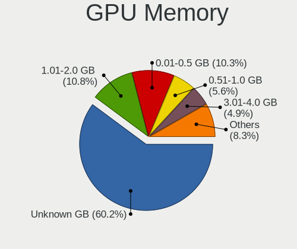

| Size in GB | Computers | Percent |
|------------|-----------|---------|
| Unknown    | 205       | 53.39%  |
| 1.01-2.0   | 58        | 15.1%   |
| 0.01-0.5   | 35        | 9.11%   |
| 0.51-1.0   | 27        | 7.03%   |
| 3.01-4.0   | 26        | 6.77%   |
| 5.01-6.0   | 21        | 5.47%   |
| 7.01-8.0   | 7         | 1.82%   |
| 2.01-3.0   | 2         | 0.52%   |
| 8.01-16.0  | 2         | 0.52%   |
| 16.01-24.0 | 1         | 0.26%   |

Monitor
-------

Monitor Vendor
--------------

Monitor vendors

| Vendor                  | Computers | Percent |
|-------------------------|-----------|---------|
| AU Optronics            | 46        | 11.83%  |
| BenQ                    | 30        | 7.71%   |
| Ancor Communications    | 29        | 7.46%   |
| LG Display              | 26        | 6.68%   |
| Chimei Innolux          | 26        | 6.68%   |
| Philips                 | 25        | 6.43%   |
| Acer                    | 23        | 5.91%   |
| ViewSonic               | 21        | 5.4%    |
| Samsung Electronics     | 19        | 4.88%   |
| Dell                    | 19        | 4.88%   |
| BOE                     | 19        | 4.88%   |
| Goldstar                | 13        | 3.34%   |
| AOC                     | 11        | 2.83%   |
| Hewlett-Packard         | 8         | 2.06%   |
| ASUSTek Computer        | 7         | 1.8%    |
| NEX                     | 5         | 1.29%   |
| Eizo                    | 5         | 1.29%   |
| Unknown                 | 4         | 1.03%   |
| Sharp                   | 4         | 1.03%   |
| LG Electronics          | 4         | 1.03%   |
| Sony                    | 3         | 0.77%   |
| Envision Peripherals    | 3         | 0.77%   |
| Chi Mei Optoelectronics | 3         | 0.77%   |
| Apple                   | 3         | 0.77%   |
| Vizio                   | 2         | 0.51%   |
| Unknown (XXX)           | 2         | 0.51%   |
| PANDA                   | 2         | 0.51%   |
| Lenovo                  | 2         | 0.51%   |
| AUS                     | 2         | 0.51%   |
| ___                     | 1         | 0.26%   |
| WST                     | 1         | 0.26%   |
| VIZ                     | 1         | 0.26%   |
| Toshiba                 | 1         | 0.26%   |
| TMX                     | 1         | 0.26%   |
| RTK                     | 1         | 0.26%   |
| Panasonic               | 1         | 0.26%   |
| Olevia                  | 1         | 0.26%   |
| NEC Computers           | 1         | 0.26%   |
| MStar                   | 1         | 0.26%   |
| MSI                     | 1         | 0.26%   |
| LG Philips              | 1         | 0.26%   |
| KTC                     | 1         | 0.26%   |
| KEB                     | 1         | 0.26%   |
| InfoVision              | 1         | 0.26%   |
| GLE                     | 1         | 0.26%   |
| CHR                     | 1         | 0.26%   |
| BOE Technology Group    | 1         | 0.26%   |
| AVX                     | 1         | 0.26%   |
| Arnos Instruments       | 1         | 0.26%   |
| AMT International       | 1         | 0.26%   |
| AGT                     | 1         | 0.26%   |
| Unknown                 | 1         | 0.26%   |

Monitor Model
-------------

Monitor models

| Model                                                                 | Computers | Percent |
|-----------------------------------------------------------------------|-----------|---------|
| Philips 190S PHL086B 1280x1024 376x301mm 19.0-inch                    | 15        | 3.81%   |
| ViewSonic VX2718-2KPC VSCB73A 2560x1440 598x336mm 27.0-inch           | 5         | 1.27%   |
| Samsung Electronics SyncMaster SAM03C2 1680x1050 459x296mm 21.5-inch  | 4         | 1.02%   |
| Chimei Innolux LCD Monitor CMN14D4 1920x1080 309x173mm 13.9-inch      | 4         | 1.02%   |
| Ancor Communications ASUS VS228 ACI22FD 1920x1080 476x268mm 21.5-inch | 4         | 1.02%   |
| LG Display LCD Monitor LGD02DC 1366x768 344x194mm 15.5-inch           | 3         | 0.76%   |
| Goldstar ULTRAWIDE GSM59F1 2560x1080 673x284mm 28.8-inch              | 3         | 0.76%   |
| Goldstar IPS FULLHD GSM5AB8 1920x1080 480x270mm 21.7-inch             | 3         | 0.76%   |
| Dell U2415 DELA0B9 1920x1200 518x324mm 24.1-inch                      | 3         | 0.76%   |
| Chimei Innolux LCD Monitor CMN1735 1920x1080 382x215mm 17.3-inch      | 3         | 0.76%   |
| BenQ GW2470 BNQ78D9 1920x1080 527x296mm 23.8-inch                     | 3         | 0.76%   |
| BenQ GL2450H BNQ78A6 1920x1080 531x298mm 24.0-inch                    | 3         | 0.76%   |
| AU Optronics LCD Monitor AUO183C 1366x768 309x173mm 13.9-inch         | 3         | 0.76%   |
| ASUSTek Computer VA24E AUS24D1 1920x1080 530x300mm 24.0-inch          | 3         | 0.76%   |
| Ancor Communications ASUS VS207 ACI20F2 1600x900 432x240mm 19.5-inch  | 3         | 0.76%   |
| Ancor Communications ASUS VP247 ACI24C7 1920x1080 520x290mm 23.4-inch | 3         | 0.76%   |
| ViewSonic VX2476 Series VSCD332 1920x1080 527x296mm 23.8-inch         | 2         | 0.51%   |
| ViewSonic VA916 Series VSC7C20 1280x1024 376x301mm 19.0-inch          | 2         | 0.51%   |
| Unknown LCD Monitor SAMSUNG 1920x1080                                 | 2         | 0.51%   |
| Philips PHL 288P6L PHL08F2 3840x2160 621x341mm 27.9-inch              | 2         | 0.51%   |
| Philips PHL 243V7 PHLC155 1920x1080 527x296mm 23.8-inch               | 2         | 0.51%   |
| LG Electronics LCD Monitor LG ULTRAWIDE 2560x1080                     | 2         | 0.51%   |
| LG Display LCD Monitor LGD046F 1920x1080 344x194mm 15.5-inch          | 2         | 0.51%   |
| Goldstar HDR WFHD GSM7714 2560x1080 798x334mm 34.1-inch               | 2         | 0.51%   |
| Envision Peripherals LED 2271wh ENV2271 1920x1080 470x260mm 21.1-inch | 2         | 0.51%   |
| Eizo S2231W ENC1918 1680x1050 474x297mm 22.0-inch                     | 2         | 0.51%   |
| Chimei Innolux LCD Monitor CMN15D2 1920x1080 344x193mm 15.5-inch      | 2         | 0.51%   |
| BOE LCD Monitor BOE08D7 1920x1080 309x174mm 14.0-inch                 | 2         | 0.51%   |
| BenQ GW2760HS BNQ78CA 1920x1080 598x336mm 27.0-inch                   | 2         | 0.51%   |
| BenQ GW2450H BNQ78C1 1920x1080 531x298mm 24.0-inch                    | 2         | 0.51%   |
| BenQ GL2450 BNQ78A5 1920x1080 531x298mm 24.0-inch                     | 2         | 0.51%   |
| BenQ EW2730V BNQ7931 1920x1080 597x336mm 27.0-inch                    | 2         | 0.51%   |
| AU Optronics LCD Monitor AUO71EC 1366x768 344x193mm 15.5-inch         | 2         | 0.51%   |
| AU Optronics LCD Monitor AUO38ED 1920x1080 344x193mm 15.5-inch        | 2         | 0.51%   |
| AU Optronics LCD Monitor AUO36ED 1920x1080 344x193mm 15.5-inch        | 2         | 0.51%   |
| AU Optronics LCD Monitor AUO323D 1920x1080 309x173mm 13.9-inch        | 2         | 0.51%   |
| AU Optronics LCD Monitor AUO2E3C 1366x768 309x173mm 13.9-inch         | 2         | 0.51%   |
| AU Optronics LCD Monitor AUO253D 1920x1080 309x174mm 14.0-inch        | 2         | 0.51%   |
| AOC 2260WG5 AOC2260 1920x1080 477x268mm 21.5-inch                     | 2         | 0.51%   |
| Ancor Communications ASUS VW247 ACI2496 1920x1080 531x299mm 24.0-inch | 2         | 0.51%   |
| Ancor Communications ASUS VW193S ACI19D4 1440x900 408x255mm 18.9-inch | 2         | 0.51%   |
| Ancor Communications ASUS VS229 ACI22C2 1920x1080 477x268mm 21.5-inch | 2         | 0.51%   |
| Acer KA220HQ ACR0467 1920x1080 477x268mm 21.5-inch                    | 2         | 0.51%   |
| ___ LCD Monitor ___0217 1920x1080 930x530mm 42.1-inch                 | 1         | 0.25%   |
| WST LCD Monitor WST4416 2160x1440 254x169mm 12.0-inch                 | 1         | 0.25%   |
| Vizio VO42LFHDTV10A VIZ0043 1920x1080 930x520mm 41.9-inch             | 1         | 0.25%   |
| Vizio E3D420VX-TW VIZ0078 1920x1080 930x523mm 42.0-inch               | 1         | 0.25%   |
| VIZ LCD Monitor SV472XVT-T 1920x1080                                  | 1         | 0.25%   |
| ViewSonic VX2457 VSCB931 1920x1080 521x293mm 23.5-inch                | 1         | 0.25%   |
| ViewSonic VX2376 Series VSC3B32 1920x1080 509x286mm 23.0-inch         | 1         | 0.25%   |
| ViewSonic VX2263 Series VSC692F 1920x1080 476x268mm 21.5-inch         | 1         | 0.25%   |
| ViewSonic VE150 VSC5547 1024x768 304x228mm 15.0-inch                  | 1         | 0.25%   |
| ViewSonic VA2732-FHD VSC0D3A 1920x1080 598x336mm 27.0-inch            | 1         | 0.25%   |
| ViewSonic VA2719 Series VSCC132 1920x1080 598x336mm 27.0-inch         | 1         | 0.25%   |
| ViewSonic VA2446 SERIES VSC732E 1920x1080 521x293mm 23.5-inch         | 1         | 0.25%   |
| ViewSonic VA2431 Series VSCD824 1920x1080 521x293mm 23.5-inch         | 1         | 0.25%   |
| ViewSonic VA2246 SERIES VSC6F2E 1920x1080 477x268mm 21.5-inch         | 1         | 0.25%   |
| ViewSonic LCD Monitor VX2270 SERIES 1920x1080                         | 1         | 0.25%   |
| ViewSonic LCD Monitor VA2246 SERIES 1920x1080                         | 1         | 0.25%   |
| ViewSonic LCD Monitor VA2216w-4 1680x1050                             | 1         | 0.25%   |

Monitor Resolution
------------------

Monitor screen resolution

| Resolution         | Computers | Percent |
|--------------------|-----------|---------|
| 1920x1080 (FHD)    | 191       | 52.33%  |
| 1366x768 (WXGA)    | 47        | 12.88%  |
| 1280x1024 (SXGA)   | 25        | 6.85%   |
| 3840x2160 (4K)     | 18        | 4.93%   |
| 2560x1440 (QHD)    | 17        | 4.66%   |
| 1600x900 (HD+)     | 12        | 3.29%   |
| 1680x1050 (WSXGA+) | 11        | 3.01%   |
| 2560x1080          | 8         | 2.19%   |
| 1440x900 (WXGA+)   | 7         | 1.92%   |
| Unknown            | 5         | 1.37%   |
| 3840x1080          | 2         | 0.55%   |
| 3440x1440          | 2         | 0.55%   |
| 2880x1800          | 2         | 0.55%   |
| 2560x1600          | 2         | 0.55%   |
| 1920x1200 (WUXGA)  | 2         | 0.55%   |
| 1280x800 (WXGA)    | 2         | 0.55%   |
| 1024x768 (XGA)     | 2         | 0.55%   |
| 3240x2160          | 1         | 0.27%   |
| 3200x1800 (QHD+)   | 1         | 0.27%   |
| 2288x1287          | 1         | 0.27%   |
| 2256x1504          | 1         | 0.27%   |
| 2160x1440          | 1         | 0.27%   |
| 2048x1152          | 1         | 0.27%   |
| 1920x540           | 1         | 0.27%   |
| 1680x945           | 1         | 0.27%   |
| 1280x720 (HD)      | 1         | 0.27%   |
| 1024x600           | 1         | 0.27%   |

Monitor Diagonal
----------------

Diagonal size in inches

| Inches  | Computers | Percent |
|---------|-----------|---------|
| 15      | 59        | 15.21%  |
| 24      | 37        | 9.54%   |
| 19      | 36        | 9.28%   |
| Unknown | 35        | 9.02%   |
| 21      | 34        | 8.76%   |
| 14      | 32        | 8.25%   |
| 27      | 31        | 7.99%   |
| 23      | 30        | 7.73%   |
| 13      | 30        | 7.73%   |
| 17      | 10        | 2.58%   |
| 34      | 8         | 2.06%   |
| 22      | 8         | 2.06%   |
| 18      | 6         | 1.55%   |
| 12      | 5         | 1.29%   |
| 11      | 5         | 1.29%   |
| 31      | 3         | 0.77%   |
| 20      | 3         | 0.77%   |
| 54      | 2         | 0.52%   |
| 43      | 2         | 0.52%   |
| 42      | 2         | 0.52%   |
| 26      | 2         | 0.52%   |
| 16      | 2         | 0.52%   |
| 65      | 1         | 0.26%   |
| 55      | 1         | 0.26%   |
| 52      | 1         | 0.26%   |
| 41      | 1         | 0.26%   |
| 25      | 1         | 0.26%   |
| 10      | 1         | 0.26%   |

Monitor Width
-------------

Physical width

| Width in mm | Computers | Percent |
|-------------|-----------|---------|
| 301-350     | 108       | 28.27%  |
| 501-600     | 91        | 23.82%  |
| 401-500     | 65        | 17.02%  |
| Unknown     | 35        | 9.16%   |
| 351-400     | 31        | 8.12%   |
| 201-300     | 26        | 6.81%   |
| 701-800     | 8         | 2.09%   |
| 601-700     | 8         | 2.09%   |
| 1001-1500   | 5         | 1.31%   |
| 901-1000    | 5         | 1.31%   |

Aspect Ratio
------------

Proportional relationship between the width and the height

| Ratio   | Computers | Percent |
|---------|-----------|---------|
| 16/9    | 249       | 69.94%  |
| 16/10   | 36        | 10.11%  |
| Unknown | 33        | 9.27%   |
| 5/4     | 23        | 6.46%   |
| 21/9    | 8         | 2.25%   |
| 3/2     | 3         | 0.84%   |
| 4/3     | 2         | 0.56%   |
| 6/5     | 1         | 0.28%   |
| 32/9    | 1         | 0.28%   |

Monitor Area
------------

Area in inch

| Area in inch | Computers | Percent |
|----------------|-----------|---------|
| 201-250        | 90        | 23.32%  |
| 101-110        | 58        | 15.03%  |
| 81-90          | 49        | 12.69%  |
| 151-200        | 49        | 12.69%  |
| Unknown        | 35        | 9.07%   |
| 301-350        | 33        | 8.55%   |
| 71-80          | 14        | 3.63%   |
| 351-500        | 11        | 2.85%   |
| 121-130        | 9         | 2.33%   |
| 251-300        | 8         | 2.07%   |
| 141-150        | 8         | 2.07%   |
| More than 1000 | 5         | 1.3%    |
| 51-60          | 5         | 1.3%    |
| 501-1000       | 5         | 1.3%    |
| 61-70          | 4         | 1.04%   |
| 111-120        | 2         | 0.52%   |
| 41-50          | 1         | 0.26%   |

Pixel Density
-------------

Pixels per inch

| Density       | Computers | Percent |
|---------------|-----------|---------|
| 51-100        | 155       | 40.47%  |
| 121-160       | 84        | 21.93%  |
| 101-120       | 80        | 20.89%  |
| Unknown       | 35        | 9.14%   |
| 161-240       | 16        | 4.18%   |
| More than 240 | 9         | 2.35%   |
| 1-50          | 4         | 1.04%   |

Multiple Monitors
-----------------

Total monitors connected

| Total | Computers | Percent |
|-------|-----------|---------|
| 1     | 311       | 82.93%  |
| 2     | 40        | 10.67%  |
| 0     | 22        | 5.87%   |
| 3     | 2         | 0.53%   |

Network
-------

Net Controller Vendor
---------------------

Controller vendors

| Vendor                   | Computers | Percent |
|--------------------------|-----------|---------|
| Intel                    | 195       | 34.33%  |
| Realtek Semiconductor    | 178       | 31.34%  |
| Qualcomm Atheros         | 62        | 10.92%  |
| Broadcom                 | 29        | 5.11%   |
| American Megatrends      | 16        | 2.82%   |
| Ralink Technology        | 9         | 1.58%   |
| MEDIATEK                 | 8         | 1.41%   |
| Aquantia                 | 7         | 1.23%   |
| Edimax Technology        | 6         | 1.06%   |
| Broadcom Limited         | 6         | 1.06%   |
| TP-Link                  | 5         | 0.88%   |
| Ralink                   | 5         | 0.88%   |
| Marvell Technology Group | 4         | 0.7%    |
| HTC (High Tech Computer) | 4         | 0.7%    |
| Nvidia                   | 3         | 0.53%   |
| D-Link                   | 3         | 0.53%   |
| ASUSTek Computer         | 3         | 0.53%   |
| Microsoft                | 2         | 0.35%   |
| IBM                      | 2         | 0.35%   |
| ASIX Electronics         | 2         | 0.35%   |
| ZyXEL Communications     | 1         | 0.18%   |
| U-Blox                   | 1         | 0.18%   |
| SparkFun                 | 1         | 0.18%   |
| Samsung Electronics      | 1         | 0.18%   |
| Prolific Technology      | 1         | 0.18%   |
| OPPO Electronics         | 1         | 0.18%   |
| Mercucys                 | 1         | 0.18%   |
| Luminary Micro           | 1         | 0.18%   |
| LG Electronics           | 1         | 0.18%   |
| Lenovo                   | 1         | 0.18%   |
| Huawei Technologies      | 1         | 0.18%   |
| Google                   | 1         | 0.18%   |
| Gemalto M2M              | 1         | 0.18%   |
| D-Link System            | 1         | 0.18%   |
| BUFFALO                  | 1         | 0.18%   |
| Arduino SA               | 1         | 0.18%   |
| Apple                    | 1         | 0.18%   |
| Accton Technology        | 1         | 0.18%   |
| 3Com                     | 1         | 0.18%   |

Net Controller Model
--------------------

Controller models

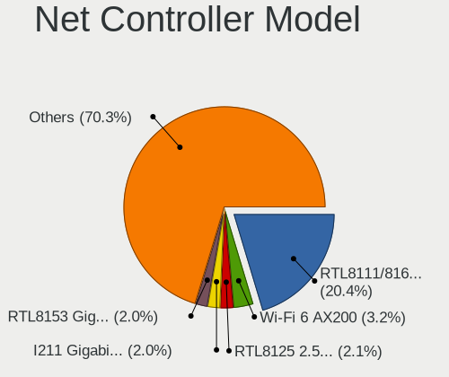

| Model                                                             | Computers | Percent |
|-------------------------------------------------------------------|-----------|---------|
| Realtek RTL8111/8168/8411 PCI Express Gigabit Ethernet Controller | 138       | 21.17%  |
| Intel Wi-Fi 6 AX200                                               | 20        | 3.07%   |
| Intel I211 Gigabit Network Connection                             | 17        | 2.61%   |
| Intel Ethernet Connection (3) I219-LM                             | 17        | 2.61%   |
| American Megatrends Virtual Ethernet                              | 16        | 2.45%   |
| Intel Wireless 8265 / 8275                                        | 14        | 2.15%   |
| Intel Wi-Fi 6 AX201                                               | 12        | 1.84%   |
| Realtek RTL8153 Gigabit Ethernet Adapter                          | 11        | 1.69%   |
| Realtek RTL810xE PCI Express Fast Ethernet controller             | 11        | 1.69%   |
| Intel I210 Gigabit Network Connection                             | 11        | 1.69%   |
| Intel Ethernet Controller I225-V                                  | 10        | 1.53%   |
| Realtek RTL8125 2.5GbE Controller                                 | 8         | 1.23%   |
| Intel Wireless-AC 9260                                            | 8         | 1.23%   |
| Intel Cannon Lake PCH CNVi WiFi                                   | 8         | 1.23%   |
| Ralink MT7601U Wireless Adapter                                   | 7         | 1.07%   |
| Intel Wireless 7265                                               | 7         | 1.07%   |
| Intel Dual Band Wireless-AC 3168NGW [Stone Peak]                  | 7         | 1.07%   |
| Intel 82579LM Gigabit Network Connection (Lewisville)             | 7         | 1.07%   |
| Qualcomm Atheros QCA9377 802.11ac Wireless Network Adapter        | 6         | 0.92%   |
| Qualcomm Atheros QCA8171 Gigabit Ethernet                         | 6         | 0.92%   |
| Qualcomm Atheros AR9285 Wireless Network Adapter (PCI-Express)    | 6         | 0.92%   |
| Intel Ice Lake-LP PCH CNVi WiFi                                   | 6         | 0.92%   |
| Aquantia AQC107 NBase-T/IEEE 802.3bz Ethernet Controller [AQtion] | 6         | 0.92%   |
| Realtek RTL8152 Fast Ethernet Adapter                             | 5         | 0.77%   |
| Qualcomm Atheros QCA9565 / AR9565 Wireless Network Adapter        | 5         | 0.77%   |
| Qualcomm Atheros QCA6174 802.11ac Wireless Network Adapter        | 5         | 0.77%   |
| Qualcomm Atheros Killer E220x Gigabit Ethernet Controller         | 5         | 0.77%   |
| Qualcomm Atheros AR9462 Wireless Network Adapter                  | 5         | 0.77%   |
| Intel Wireless 8260                                               | 5         | 0.77%   |
| Intel Wireless 7260                                               | 5         | 0.77%   |
| Intel Wireless 3165                                               | 5         | 0.77%   |
| Intel Wi-Fi 6 AX210/AX211/AX411 160MHz                            | 5         | 0.77%   |
| Intel Ethernet Connection (7) I219-LM                             | 5         | 0.77%   |
| Intel Ethernet Connection (2) I219-V                              | 5         | 0.77%   |
| Intel Cannon Point-LP CNVi [Wireless-AC]                          | 5         | 0.77%   |
| Realtek RTL8821CE 802.11ac PCIe Wireless Network Adapter          | 4         | 0.61%   |
| Qualcomm Atheros Killer E2500 Gigabit Ethernet Controller         | 4         | 0.61%   |
| Qualcomm Atheros AR9485 Wireless Network Adapter                  | 4         | 0.61%   |
| Qualcomm Atheros AR9287 Wireless Network Adapter (PCI-Express)    | 4         | 0.61%   |
| Qualcomm Atheros AR8151 v2.0 Gigabit Ethernet                     | 4         | 0.61%   |
| Qualcomm Atheros AR8151 v1.0 Gigabit Ethernet                     | 4         | 0.61%   |
| Qualcomm Atheros AR8131 Gigabit Ethernet                          | 4         | 0.61%   |
| Intel Ethernet Connection I217-V                                  | 4         | 0.61%   |
| Intel Ethernet Connection I217-LM                                 | 4         | 0.61%   |
| Intel Ethernet Connection (7) I219-V                              | 4         | 0.61%   |
| Intel Ethernet Connection (4) I219-V                              | 4         | 0.61%   |
| Intel Ethernet Connection (2) I219-LM                             | 4         | 0.61%   |
| HTC (High Tech Computer) Desire HD (modem mode)                   | 4         | 0.61%   |
| Edimax EW-7811Un 802.11n Wireless Adapter [Realtek RTL8188CUS]    | 4         | 0.61%   |
| Broadcom NetLink BCM57785 Gigabit Ethernet PCIe                   | 4         | 0.61%   |
| Broadcom BCM43225 802.11b/g/n                                     | 4         | 0.61%   |
| Realtek RTL8723BU 802.11b/g/n WLAN Adapter                        | 3         | 0.46%   |
| Realtek RTL8723BE PCIe Wireless Network Adapter                   | 3         | 0.46%   |
| Ralink RT3290 Wireless 802.11n 1T/1R PCIe                         | 3         | 0.46%   |
| MEDIATEK MT7921 802.11ax PCI Express Wireless Network Adapter     | 3         | 0.46%   |
| Intel Ethernet Connection I218-LM                                 | 3         | 0.46%   |
| Intel 82579V Gigabit Network Connection                           | 3         | 0.46%   |
| Intel 82574L Gigabit Network Connection                           | 3         | 0.46%   |
| Broadcom BCM4313 802.11bgn Wireless Network Adapter               | 3         | 0.46%   |
| Realtek RTL8822CE 802.11ac PCIe Wireless Network Adapter          | 2         | 0.31%   |

Wireless Vendor
---------------

Wireless vendors

| Vendor                | Computers | Percent |
|-----------------------|-----------|---------|
| Intel                 | 129       | 52.65%  |
| Qualcomm Atheros      | 36        | 14.69%  |
| Broadcom              | 17        | 6.94%   |
| Realtek Semiconductor | 16        | 6.53%   |
| Ralink Technology     | 9         | 3.67%   |
| MediaTek              | 8         | 3.27%   |
| Edimax Technology     | 6         | 2.45%   |
| Ralink                | 5         | 2.04%   |
| Broadcom Limited      | 4         | 1.63%   |
| TP-Link               | 3         | 1.22%   |
| D-Link                | 3         | 1.22%   |
| ASUSTek Computer      | 3         | 1.22%   |
| ZyXEL Communications  | 1         | 0.41%   |
| Microsoft             | 1         | 0.41%   |
| Mercucys              | 1         | 0.41%   |
| D-Link System         | 1         | 0.41%   |
| BUFFALO               | 1         | 0.41%   |
| Accton Technology     | 1         | 0.41%   |

Wireless Model
--------------

Wireless models

| Model                                                                   | Computers | Percent |
|-------------------------------------------------------------------------|-----------|---------|
| Intel Wi-Fi 6 AX200                                                     | 20        | 8.13%   |
| Intel Wireless 8265 / 8275                                              | 14        | 5.69%   |
| Intel Wi-Fi 6 AX201                                                     | 12        | 4.88%   |
| Intel Wireless-AC 9260                                                  | 8         | 3.25%   |
| Intel Cannon Lake PCH CNVi WiFi                                         | 8         | 3.25%   |
| Ralink MT7601U Wireless Adapter                                         | 7         | 2.85%   |
| Intel Wireless 7265                                                     | 7         | 2.85%   |
| Intel Dual Band Wireless-AC 3168NGW [Stone Peak]                        | 7         | 2.85%   |
| Qualcomm Atheros QCA9377 802.11ac Wireless Network Adapter              | 6         | 2.44%   |
| Qualcomm Atheros AR9285 Wireless Network Adapter (PCI-Express)          | 6         | 2.44%   |
| Intel Ice Lake-LP PCH CNVi WiFi                                         | 6         | 2.44%   |
| Qualcomm Atheros QCA9565 / AR9565 Wireless Network Adapter              | 5         | 2.03%   |
| Qualcomm Atheros QCA6174 802.11ac Wireless Network Adapter              | 5         | 2.03%   |
| Qualcomm Atheros AR9462 Wireless Network Adapter                        | 5         | 2.03%   |
| Intel Wireless 8260                                                     | 5         | 2.03%   |
| Intel Wireless 7260                                                     | 5         | 2.03%   |
| Intel Wireless 3165                                                     | 5         | 2.03%   |
| Intel Wi-Fi 6 AX210/AX211/AX411 160MHz                                  | 5         | 2.03%   |
| Intel Cannon Point-LP CNVi [Wireless-AC]                                | 5         | 2.03%   |
| Realtek RTL8821CE 802.11ac PCIe Wireless Network Adapter                | 4         | 1.63%   |
| Qualcomm Atheros AR9485 Wireless Network Adapter                        | 4         | 1.63%   |
| Qualcomm Atheros AR9287 Wireless Network Adapter (PCI-Express)          | 4         | 1.63%   |
| Edimax EW-7811Un 802.11n Wireless Adapter [Realtek RTL8188CUS]          | 4         | 1.63%   |
| Broadcom BCM43225 802.11b/g/n                                           | 4         | 1.63%   |
| Realtek RTL8723BU 802.11b/g/n WLAN Adapter                              | 3         | 1.22%   |
| Realtek RTL8723BE PCIe Wireless Network Adapter                         | 3         | 1.22%   |
| Ralink RT3290 Wireless 802.11n 1T/1R PCIe                               | 3         | 1.22%   |
| MEDIATEK MT7921 802.11ax PCI Express Wireless Network Adapter           | 3         | 1.22%   |
| Broadcom BCM4313 802.11bgn Wireless Network Adapter                     | 3         | 1.22%   |
| Realtek RTL8822CE 802.11ac PCIe Wireless Network Adapter                | 2         | 0.81%   |
| Realtek RTL8822BE 802.11a/b/g/n/ac WiFi adapter                         | 2         | 0.81%   |
| Ralink RT2870/RT3070 Wireless Adapter                                   | 2         | 0.81%   |
| MediaTek Wireless                                                       | 2         | 0.81%   |
| MEDIATEK MT7921K (RZ608) Wi-Fi 6E 80MHz                                 | 2         | 0.81%   |
| Intel Wireless 3160                                                     | 2         | 0.81%   |
| Intel Centrino Advanced-N 6235                                          | 2         | 0.81%   |
| Intel Centrino Advanced-N 6205 [Taylor Peak]                            | 2         | 0.81%   |
| Intel Centrino Advanced-N 6200                                          | 2         | 0.81%   |
| Intel Alder Lake-S PCH CNVi WiFi                                        | 2         | 0.81%   |
| D-Link DWA-131 Wireless N Nano Adapter (Rev. E1) [Realtek RTL8192EU]    | 2         | 0.81%   |
| Broadcom BCM4360 802.11ac Wireless Network Adapter                      | 2         | 0.81%   |
| ASUS 802.11ac NIC                                                       | 2         | 0.81%   |
| ZyXEL NWD2205 802.11n Wireless N Adapter [Realtek RTL8192CU]            | 1         | 0.41%   |
| TP-Link TL-WN722N v2/v3 [Realtek RTL8188EUS]                            | 1         | 0.41%   |
| TP-Link Archer T4U ver.3                                                | 1         | 0.41%   |
| TP-Link Archer T3U [Realtek RTL8812BU]                                  | 1         | 0.41%   |
| Realtek RTL8852AE 802.11ax PCIe Wireless Network Adapter                | 1         | 0.41%   |
| Realtek RTL8812AU 802.11a/b/g/n/ac 2T2R DB WLAN Adapter                 | 1         | 0.41%   |
| Realtek RTL8188CUS 802.11n WLAN Adapter                                 | 1         | 0.41%   |
| Ralink RT3091 Wireless 802.11n 1T/2R PCIe                               | 1         | 0.41%   |
| Ralink RT3090 Wireless 802.11n 1T/1R PCIe                               | 1         | 0.41%   |
| Qualcomm Atheros AR242x / AR542x Wireless Network Adapter (PCI-Express) | 1         | 0.41%   |
| Microsoft Xbox 360 Wireless Adapter                                     | 1         | 0.41%   |
| Mercucys 802.11n NIC                                                    | 1         | 0.41%   |
| MediaTek WiFi                                                           | 1         | 0.41%   |
| Intel WiFi Link 5100                                                    | 1         | 0.41%   |
| Intel Tiger Lake PCH CNVi WiFi                                          | 1         | 0.41%   |
| Intel PRO/Wireless 5100 AGN [Shiloh] Network Connection                 | 1         | 0.41%   |
| Intel PRO/Wireless 2200BG [Calexico2] Network Connection                | 1         | 0.41%   |
| Intel Dual Band Wireless-AC 3165 Plus Bluetooth                         | 1         | 0.41%   |

Ethernet Vendor
---------------

Ethernet vendors

| Vendor                   | Computers | Percent |
|--------------------------|-----------|---------|
| Realtek Semiconductor    | 169       | 44.83%  |
| Intel                    | 109       | 28.91%  |
| Qualcomm Atheros         | 35        | 9.28%   |
| American Megatrends      | 16        | 4.24%   |
| Broadcom                 | 14        | 3.71%   |
| Aquantia                 | 7         | 1.86%   |
| Marvell Technology Group | 4         | 1.06%   |
| HTC (High Tech Computer) | 4         | 1.06%   |
| Nvidia                   | 3         | 0.8%    |
| TP-Link                  | 2         | 0.53%   |
| IBM                      | 2         | 0.53%   |
| Broadcom Limited         | 2         | 0.53%   |
| ASIX Electronics         | 2         | 0.53%   |
| Samsung Electronics      | 1         | 0.27%   |
| OPPO Electronics         | 1         | 0.27%   |
| Microsoft                | 1         | 0.27%   |
| LG Electronics           | 1         | 0.27%   |
| Lenovo                   | 1         | 0.27%   |
| Huawei Technologies      | 1         | 0.27%   |
| Apple                    | 1         | 0.27%   |
| 3Com                     | 1         | 0.27%   |

Ethernet Model
--------------

Ethernet models

| Model                                                                          | Computers | Percent |
|--------------------------------------------------------------------------------|-----------|---------|
| Realtek RTL8111/8168/8411 PCI Express Gigabit Ethernet Controller              | 138       | 34.59%  |
| Intel I211 Gigabit Network Connection                                          | 17        | 4.26%   |
| Intel Ethernet Connection (3) I219-LM                                          | 17        | 4.26%   |
| American Megatrends Virtual Ethernet                                           | 16        | 4.01%   |
| Realtek RTL8153 Gigabit Ethernet Adapter                                       | 11        | 2.76%   |
| Realtek RTL810xE PCI Express Fast Ethernet controller                          | 11        | 2.76%   |
| Intel I210 Gigabit Network Connection                                          | 11        | 2.76%   |
| Intel Ethernet Controller I225-V                                               | 10        | 2.51%   |
| Realtek RTL8125 2.5GbE Controller                                              | 8         | 2.01%   |
| Intel 82579LM Gigabit Network Connection (Lewisville)                          | 7         | 1.75%   |
| Qualcomm Atheros QCA8171 Gigabit Ethernet                                      | 6         | 1.5%    |
| Aquantia AQC107 NBase-T/IEEE 802.3bz Ethernet Controller [AQtion]              | 6         | 1.5%    |
| Realtek RTL8152 Fast Ethernet Adapter                                          | 5         | 1.25%   |
| Qualcomm Atheros Killer E220x Gigabit Ethernet Controller                      | 5         | 1.25%   |
| Intel Ethernet Connection (7) I219-LM                                          | 5         | 1.25%   |
| Intel Ethernet Connection (2) I219-V                                           | 5         | 1.25%   |
| Qualcomm Atheros Killer E2500 Gigabit Ethernet Controller                      | 4         | 1%      |
| Qualcomm Atheros AR8151 v2.0 Gigabit Ethernet                                  | 4         | 1%      |
| Qualcomm Atheros AR8151 v1.0 Gigabit Ethernet                                  | 4         | 1%      |
| Qualcomm Atheros AR8131 Gigabit Ethernet                                       | 4         | 1%      |
| Intel Ethernet Connection I217-V                                               | 4         | 1%      |
| Intel Ethernet Connection I217-LM                                              | 4         | 1%      |
| Intel Ethernet Connection (7) I219-V                                           | 4         | 1%      |
| Intel Ethernet Connection (4) I219-V                                           | 4         | 1%      |
| Intel Ethernet Connection (2) I219-LM                                          | 4         | 1%      |
| HTC (High Tech Computer) Desire HD (modem mode)                                | 4         | 1%      |
| Broadcom NetLink BCM57785 Gigabit Ethernet PCIe                                | 4         | 1%      |
| Intel Ethernet Connection I218-LM                                              | 3         | 0.75%   |
| Intel 82579V Gigabit Network Connection                                        | 3         | 0.75%   |
| Intel 82574L Gigabit Network Connection                                        | 3         | 0.75%   |
| Qualcomm Atheros AR8161 Gigabit Ethernet                                       | 2         | 0.5%    |
| Qualcomm Atheros AR8132 Fast Ethernet                                          | 2         | 0.5%    |
| Qualcomm Atheros AR8121/AR8113/AR8114 Gigabit or Fast Ethernet                 | 2         | 0.5%    |
| Nvidia MCP61 Ethernet                                                          | 2         | 0.5%    |
| Intel Ethernet Connection (13) I219-LM                                         | 2         | 0.5%    |
| Intel 82599ES 10-Gigabit SFI/SFP+ Network Connection                           | 2         | 0.5%    |
| Intel 82577LM Gigabit Network Connection                                       | 2         | 0.5%    |
| IBM RNDIS/CDC ETHER                                                            | 2         | 0.5%    |
| Broadcom NetXtreme BCM57761 Gigabit Ethernet PCIe                              | 2         | 0.5%    |
| ASIX AX88179 Gigabit Ethernet                                                  | 2         | 0.5%    |
| TP-Link USB 10/100/1000 LAN                                                    | 1         | 0.25%   |
| TP-Link USB 10/100 LAN                                                         | 1         | 0.25%   |
| Samsung Galaxy series, misc. (tethering mode)                                  | 1         | 0.25%   |
| Realtek Realtek Ethernet controller                                            | 1         | 0.25%   |
| Realtek Killer E3000 2.5GbE Controller                                         | 1         | 0.25%   |
| Qualcomm Atheros Osprey Emulation Wireless Network Adapter                     | 1         | 0.25%   |
| Qualcomm Atheros Killer E2400 Gigabit Ethernet Controller                      | 1         | 0.25%   |
| OPPO realme X50 5G                                                             | 1         | 0.25%   |
| Nvidia MCP65 Ethernet                                                          | 1         | 0.25%   |
| Microsoft RTL8153B GigE [Surface Ethernet Adapter]                             | 1         | 0.25%   |
| Marvell Group Yukon Optima 88E8059 [PCIe Gigabit Ethernet Controller with AVB] | 1         | 0.25%   |
| Marvell Group 88E8072 PCI-E Gigabit Ethernet Controller                        | 1         | 0.25%   |
| Marvell Group 88E8071 PCI-E Gigabit Ethernet Controller                        | 1         | 0.25%   |
| Marvell Group 88E8058 PCI-E Gigabit Ethernet Controller                        | 1         | 0.25%   |
| LG LM-X420xxx/G2 Android Phone (USB tethering mode)                            | 1         | 0.25%   |
| Lenovo USB-C Hub                                                               | 1         | 0.25%   |
| Intel I350 Gigabit Network Connection                                          | 1         | 0.25%   |
| Intel Ethernet Controller X710 for 10GbE SFP+                                  | 1         | 0.25%   |
| Intel Ethernet Controller X550                                                 | 1         | 0.25%   |
| Intel Ethernet Controller (2) I225-IT                                          | 1         | 0.25%   |

Net Controller Kind
-------------------

Ethernet, WiFi or modem

| Kind     | Computers | Percent |
|----------|-----------|---------|
| Ethernet | 328       | 57.54%  |
| WiFi     | 235       | 41.23%  |
| Modem    | 7         | 1.23%   |

Used Controller
---------------

Currently used network controller

| Kind     | Computers | Percent |
|----------|-----------|---------|
| Ethernet | 213       | 56.65%  |
| WiFi     | 163       | 43.35%  |

NICs
----

Total network controllers on board

| Total | Computers | Percent |
|-------|-----------|---------|
| 2     | 181       | 48.66%  |
| 1     | 160       | 43.01%  |
| 0     | 13        | 3.49%   |
| 3     | 10        | 2.69%   |
| 4     | 3         | 0.81%   |
| 6     | 2         | 0.54%   |
| 5     | 2         | 0.54%   |
| 10    | 1         | 0.27%   |

IPv6
----

IPv6 vs IPv4

| Used | Computers | Percent |
|------|-----------|---------|
| No   | 348       | 92.8%   |
| Yes  | 27        | 7.2%    |

Bluetooth
---------

Bluetooth Vendor
----------------

Controller vendors

| Vendor                          | Computers | Percent |
|---------------------------------|-----------|---------|
| Intel                           | 119       | 57.77%  |
| Cambridge Silicon Radio         | 13        | 6.31%   |
| Broadcom                        | 13        | 6.31%   |
| Qualcomm Atheros Communications | 11        | 5.34%   |
| IMC Networks                    | 10        | 4.85%   |
| Foxconn / Hon Hai               | 9         | 4.37%   |
| Realtek Semiconductor           | 8         | 3.88%   |
| Lite-On Technology              | 6         | 2.91%   |
| ASUSTek Computer                | 4         | 1.94%   |
| Apple                           | 4         | 1.94%   |
| Ralink                          | 3         | 1.46%   |
| MediaTek                        | 2         | 0.97%   |
| Hewlett-Packard                 | 2         | 0.97%   |
| Toshiba                         | 1         | 0.49%   |
| Realtek                         | 1         | 0.49%   |

Bluetooth Model
---------------

Controller models

| Model                                                                               | Computers | Percent |
|-------------------------------------------------------------------------------------|-----------|---------|
| Intel Bluetooth wireless interface                                                  | 40        | 19.42%  |
| Intel AX201 Bluetooth                                                               | 21        | 10.19%  |
| Intel AX200 Bluetooth                                                               | 20        | 9.71%   |
| Intel Bluetooth 9460/9560 Jefferson Peak (JfP)                                      | 14        | 6.8%    |
| Cambridge Silicon Radio Bluetooth Dongle (HCI mode)                                 | 13        | 6.31%   |
| Intel Wireless-AC 9260 Bluetooth Adapter                                            | 8         | 3.88%   |
| Intel Wireless-AC 3168 Bluetooth                                                    | 7         | 3.4%    |
| Intel AX210 Bluetooth                                                               | 5         | 2.43%   |
| Realtek Bluetooth Radio                                                             | 4         | 1.94%   |
| Qualcomm Atheros AR3011 Bluetooth                                                   | 4         | 1.94%   |
| IMC Networks Bluetooth Device                                                       | 4         | 1.94%   |
| Ralink RT3290 Bluetooth                                                             | 3         | 1.46%   |
| Qualcomm Atheros AR3012 Bluetooth 4.0                                               | 3         | 1.46%   |
| Lite-On Qualcomm Atheros QCA9377 Bluetooth                                          | 3         | 1.46%   |
| Foxconn / Hon Hai Bluetooth Device                                                  | 3         | 1.46%   |
| Broadcom BCM2045 Bluetooth                                                          | 3         | 1.46%   |
| Realtek  Bluetooth 4.2 Adapter                                                      | 2         | 0.97%   |
| Qualcomm Atheros  Bluetooth Device                                                  | 2         | 0.97%   |
| Qualcomm Atheros QCA61x4 Bluetooth 4.0                                              | 2         | 0.97%   |
| MediaTek Wireless_Device                                                            | 2         | 0.97%   |
| Lite-On Bluetooth Device                                                            | 2         | 0.97%   |
| Intel Centrino Bluetooth Wireless Transceiver                                       | 2         | 0.97%   |
| IMC Networks Wireless_Device                                                        | 2         | 0.97%   |
| HP Broadcom 2070 Bluetooth Combo                                                    | 2         | 0.97%   |
| Foxconn / Hon Hai Foxconn T77H114 BCM2070 [Single-Chip Bluetooth 2.1 + EDR Adapter] | 2         | 0.97%   |
| Foxconn / Hon Hai Acer Bluetooth module                                             | 2         | 0.97%   |
| Broadcom BCM20702A0 Bluetooth 4.0                                                   | 2         | 0.97%   |
| Broadcom BCM2045B (BDC-2.1)                                                         | 2         | 0.97%   |
| Apple Bluetooth Host Controller                                                     | 2         | 0.97%   |
| Toshiba Bluetooth USB Host Controller                                               | 1         | 0.49%   |
| Realtek RTL8723B Bluetooth                                                          | 1         | 0.49%   |
| Realtek 802.11ac WLAN Adapter                                                       | 1         | 0.49%   |
| Realtek Bluetooth Radio                                                             | 1         | 0.49%   |
| Lite-On Atheros AR3012 Bluetooth                                                    | 1         | 0.49%   |
| Intel Centrino Advanced-N 6230 Bluetooth adapter                                    | 1         | 0.49%   |
| Intel Bluetooth Device                                                              | 1         | 0.49%   |
| IMC Networks Bluetooth USB Host Controller                                          | 1         | 0.49%   |
| IMC Networks Bluetooth Radio                                                        | 1         | 0.49%   |
| IMC Networks BCM20702A0                                                             | 1         | 0.49%   |
| IMC Networks Atheros AR3012 Bluetooth 4.0 Adapter                                   | 1         | 0.49%   |
| Foxconn / Hon Hai Wireless_Device                                                   | 1         | 0.49%   |
| Foxconn / Hon Hai Bluetooth USB Host Controller                                     | 1         | 0.49%   |
| Broadcom HP Portable Valentine                                                      | 1         | 0.49%   |
| Broadcom Bluetooth Device                                                           | 1         | 0.49%   |
| Broadcom Bluetooth                                                                  | 1         | 0.49%   |
| Broadcom BCM20702A0                                                                 | 1         | 0.49%   |
| Broadcom BCM20702 Bluetooth 4.0 [ThinkPad]                                          | 1         | 0.49%   |
| Broadcom BCM2070 Bluetooth 2.1 + EDR                                                | 1         | 0.49%   |
| ASUS BT-270 Bluetooth Adapter                                                       | 1         | 0.49%   |
| ASUS BT-253 Bluetooth Adapter                                                       | 1         | 0.49%   |
| ASUS Broadcom BCM20702 Single-Chip Bluetooth 4.0 + LE                               | 1         | 0.49%   |
| ASUS Bluetooth Radio                                                                | 1         | 0.49%   |
| Apple Bluetooth USB Host Controller                                                 | 1         | 0.49%   |
| Apple Bluetooth HCI                                                                 | 1         | 0.49%   |

Sound
-----

Sound Vendor
------------

Sound card vendors

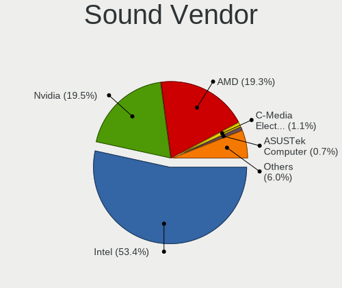

| Vendor                   | Computers | Percent |
|--------------------------|-----------|---------|
| Intel                    | 268       | 55.6%   |
| Nvidia                   | 98        | 20.33%  |
| AMD                      | 83        | 17.22%  |
| ASUSTek Computer         | 4         | 0.83%   |
| GN Netcom                | 3         | 0.62%   |
| Generalplus Technology   | 3         | 0.62%   |
| C-Media Electronics      | 3         | 0.62%   |
| Texas Instruments        | 2         | 0.41%   |
| Focusrite-Novation       | 2         | 0.41%   |
| ZOOM                     | 1         | 0.21%   |
| Yamaha                   | 1         | 0.21%   |
| XMOS                     | 1         | 0.21%   |
| Sony                     | 1         | 0.21%   |
| SAVITECH                 | 1         | 0.21%   |
| Realtek Semiconductor    | 1         | 0.21%   |
| Nuforce                  | 1         | 0.21%   |
| Novra/IDC/Wegener        | 1         | 0.21%   |
| Microsoft                | 1         | 0.21%   |
| Micro Star International | 1         | 0.21%   |
| ESS Technology           | 1         | 0.21%   |
| Elite Silicon            | 1         | 0.21%   |
| Dell                     | 1         | 0.21%   |
| Creative Technology      | 1         | 0.21%   |
| Creative Labs            | 1         | 0.21%   |
| Cambridge Silicon Radio  | 1         | 0.21%   |

Sound Model
-----------

Sound card models

| Model                                                                      | Computers | Percent |
|----------------------------------------------------------------------------|-----------|---------|
| Intel 7 Series/C216 Chipset Family High Definition Audio Controller        | 28        | 5.01%   |
| Intel 6 Series/C200 Series Chipset Family High Definition Audio Controller | 26        | 4.65%   |
| AMD Family 17h/19h HD Audio Controller                                     | 25        | 4.47%   |
| Intel 8 Series/C220 Series Chipset High Definition Audio Controller        | 24        | 4.29%   |
| Intel Sunrise Point-LP HD Audio                                            | 23        | 4.11%   |
| Intel Cannon Lake PCH cAVS                                                 | 22        | 3.94%   |
| AMD Renoir Radeon High Definition Audio Controller                         | 18        | 3.22%   |
| Intel Xeon E3-1200 v3/4th Gen Core Processor HD Audio Controller           | 16        | 2.86%   |
| Intel 5 Series/3400 Series Chipset High Definition Audio                   | 14        | 2.5%    |
| Intel 100 Series/C230 Series Chipset Family HD Audio Controller            | 14        | 2.5%    |
| AMD Starship/Matisse HD Audio Controller                                   | 13        | 2.33%   |
| Intel Tiger Lake-LP Smart Sound Technology Audio Controller                | 12        | 2.15%   |
| Nvidia GP106 High Definition Audio Controller                              | 11        | 1.97%   |
| Intel Haswell-ULT HD Audio Controller                                      | 11        | 1.97%   |
| Intel 8 Series HD Audio Controller                                         | 11        | 1.97%   |
| Intel Cannon Point-LP High Definition Audio Controller                     | 10        | 1.79%   |
| AMD SBx00 Azalia (Intel HDA)                                               | 10        | 1.79%   |
| Nvidia GK208 HDMI/DP Audio Controller                                      | 9         | 1.61%   |
| Nvidia TU116 High Definition Audio Controller                              | 8         | 1.43%   |
| AMD Family 17h (Models 00h-0fh) HD Audio Controller                        | 8         | 1.43%   |
| Nvidia GP108 High Definition Audio Controller                              | 7         | 1.25%   |
| Nvidia GM107 High Definition Audio Controller [GeForce 940MX]              | 7         | 1.25%   |
| Intel CM238 HD Audio Controller                                            | 7         | 1.25%   |
| Intel Celeron/Pentium Silver Processor High Definition Audio               | 7         | 1.25%   |
| Intel 200 Series PCH HD Audio                                              | 7         | 1.25%   |
| Intel NM10/ICH7 Family High Definition Audio Controller                    | 6         | 1.07%   |
| Intel Ice Lake-LP Smart Sound Technology Audio Controller                  | 6         | 1.07%   |
| Intel 82801JI (ICH10 Family) HD Audio Controller                           | 6         | 1.07%   |
| Intel 82801I (ICH9 Family) HD Audio Controller                             | 6         | 1.07%   |
| AMD Raven/Raven2/Fenghuang HDMI/DP Audio Controller                        | 6         | 1.07%   |
| Nvidia MCP61 High Definition Audio                                         | 5         | 0.89%   |
| Nvidia GP107GL High Definition Audio Controller                            | 5         | 0.89%   |
| Nvidia GF116 High Definition Audio Controller                              | 5         | 0.89%   |
| Nvidia GF108 High Definition Audio Controller                              | 5         | 0.89%   |
| Intel Wildcat Point-LP High Definition Audio Controller                    | 5         | 0.89%   |
| Intel Broadwell-U Audio Controller                                         | 5         | 0.89%   |
| Intel Alder Lake-S HD Audio Controller                                     | 5         | 0.89%   |
| AMD Baffin HDMI/DP Audio [Radeon RX 550 640SP / RX 560/560X]               | 5         | 0.89%   |
| Nvidia GK107 HDMI Audio Controller                                         | 4         | 0.72%   |
| Intel Tiger Lake-H HD Audio Controller                                     | 4         | 0.72%   |
| Intel 9 Series Chipset Family HD Audio Controller                          | 4         | 0.72%   |
| AMD Redwood HDMI Audio [Radeon HD 5000 Series]                             | 4         | 0.72%   |
| AMD Family 15h (Models 60h-6fh) Audio Controller                           | 4         | 0.72%   |
| AMD Cedar HDMI Audio [Radeon HD 5400/6300/7300 Series]                     | 4         | 0.72%   |
| Nvidia TU106 High Definition Audio Controller                              | 3         | 0.54%   |
| Nvidia GM206 High Definition Audio Controller                              | 3         | 0.54%   |
| Nvidia GA104 High Definition Audio Controller                              | 3         | 0.54%   |
| Nvidia GA102 High Definition Audio Controller                              | 3         | 0.54%   |
| Nvidia Audio device                                                        | 3         | 0.54%   |
| Intel Lewisburg MROM 0                                                     | 3         | 0.54%   |
| Intel 82801JD/DO (ICH10 Family) HD Audio Controller                        | 3         | 0.54%   |
| Generalplus Technology Usb Audio Device                                    | 3         | 0.54%   |
| C-Media Electronics CM108 Audio Controller                                 | 3         | 0.54%   |
| AMD Oland/Hainan/Cape Verde/Pitcairn HDMI Audio [Radeon HD 7000 Series]    | 3         | 0.54%   |
| AMD Kabini HDMI/DP Audio                                                   | 3         | 0.54%   |
| AMD FCH Azalia Controller                                                  | 3         | 0.54%   |
| AMD Ellesmere HDMI Audio [Radeon RX 470/480 / 570/580/590]                 | 3         | 0.54%   |
| Nvidia TU107 GeForce GTX 1650 High Definition Audio Controller             | 2         | 0.36%   |
| Nvidia TU104 HD Audio Controller                                           | 2         | 0.36%   |
| Nvidia GP104 High Definition Audio Controller                              | 2         | 0.36%   |

Memory
------

Memory Vendor
-------------

Memory module vendors

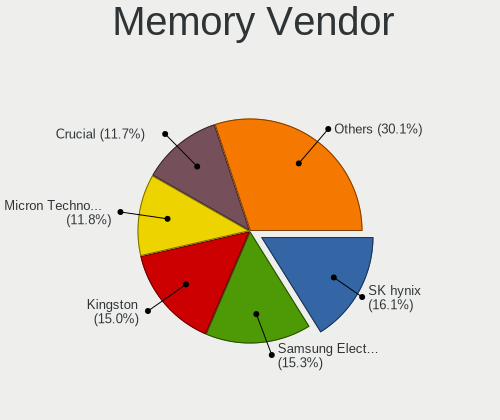

| Vendor              | Computers | Percent |
|---------------------|-----------|---------|
| SK Hynix            | 38        | 17.43%  |
| Kingston            | 35        | 16.06%  |
| Samsung Electronics | 27        | 12.39%  |
| Micron Technology   | 24        | 11.01%  |
| Crucial             | 18        | 8.26%   |
| Unknown             | 17        | 7.8%    |
| Transcend           | 17        | 7.8%    |
| A-DATA Technology   | 11        | 5.05%   |
| Apacer              | 6         | 2.75%   |
| G.Skill             | 4         | 1.83%   |
| Unifosa             | 3         | 1.38%   |
| Ramaxel Technology  | 3         | 1.38%   |
| G-Alantic           | 2         | 0.92%   |
| V-Color             | 1         | 0.46%   |
| Unknown (ABCD)      | 1         | 0.46%   |
| Unknown (08AE)      | 1         | 0.46%   |
| UMAX                | 1         | 0.46%   |
| Team                | 1         | 0.46%   |
| Silicon Power       | 1         | 0.46%   |
| Patriot             | 1         | 0.46%   |
| KLEVV               | 1         | 0.46%   |
| Goldkey             | 1         | 0.46%   |
| Elpida              | 1         | 0.46%   |
| Avant               | 1         | 0.46%   |
| ASint Technology    | 1         | 0.46%   |
| Unknown             | 1         | 0.46%   |

Memory Model
------------

Memory module models

| Model                                                             | Computers | Percent |
|-------------------------------------------------------------------|-----------|---------|
| A-DATA RAM Module 4096MB SODIMM DDR4 2400MT/s                     | 4         | 1.67%   |
| SK Hynix RAM HMT451S6AFR8A-PB 4GB SODIMM DDR3 1600MT/s            | 3         | 1.26%   |
| Kingston RAM 9905624-033.A00G 8192MB SODIMM DDR4 2400MT/s         | 3         | 1.26%   |
| A-DATA RAM DDR4 3000 2OZ 4GB DIMM DDR4 3000MT/s                   | 3         | 1.26%   |
| Transcend RAM TS1GLK64V6H 8GB DIMM DDR3 1600MT/s                  | 2         | 0.84%   |
| Transcend RAM JM1333KLN-4G 4GB DIMM DDR3 1333MT/s                 | 2         | 0.84%   |
| SK Hynix RAM HMA851S6AFR6N-UH 4GB SODIMM DDR4 2667MT/s            | 2         | 0.84%   |
| SK Hynix RAM HCNNNCPMMLXR-NEE 2GB Row Of Chips LPDDR4 4267MT/s    | 2         | 0.84%   |
| SK Hynix RAM H9CCNNNCLGALAR-NVD 8GB Row Of Chips LPDDR3 2133MT/s  | 2         | 0.84%   |
| Samsung RAM M471A1K43DB1-CWE 8GB SODIMM DDR4 3200MT/s             | 2         | 0.84%   |
| Samsung RAM M471A1K43CB1-CWE 8192MB SODIMM DDR4 3200MT/s          | 2         | 0.84%   |
| Micron RAM MT52L512M32D2PF-10 4096MB Row Of Chips LPDDR3 1867MT/s | 2         | 0.84%   |
| Micron RAM 8ATF1G64HZ-2G6E1 8GB SODIMM DDR4 2667MT/s              | 2         | 0.84%   |
| Kingston RAM MSI24D4S7S8MB-8 8GB SODIMM DDR4 2400MT/s             | 2         | 0.84%   |
| Kingston RAM KHX3200C16D4/16GX 16GB DIMM DDR4 3600MT/s            | 2         | 0.84%   |
| Kingston RAM KHX1866C10D3/8G 8GB DIMM DDR3 1867MT/s               | 2         | 0.84%   |
| G-Alantic RAM D4SS12161SH26A-C 4GB SODIMM DDR4 2133MT/s           | 2         | 0.84%   |
| Crucial RAM CT8G4SFS8266.M8FE 8192MB SODIMM DDR4 2667MT/s         | 2         | 0.84%   |
| Crucial RAM CT8G4DFS8266.M8FD 8GB DIMM DDR4 2667MT/s              | 2         | 0.84%   |
| Crucial RAM CT16G4SFD832A.M16FR 16GB SODIMM DDR4 3200MT/s         | 2         | 0.84%   |
| V-Color RAM TD4G8C11-H11 4GB DIMM DDR3 1600MT/s                   | 1         | 0.42%   |
| Unknown RAM Module 8GB SODIMM DDR3 1600MT/s                       | 1         | 0.42%   |
| Unknown RAM Module 8GB DIMM DDR3 1333MT/s                         | 1         | 0.42%   |
| Unknown RAM Module 8192MB SODIMM LPDDR4 4266MT/s                  | 1         | 0.42%   |
| Unknown RAM Module 8192MB DIMM DDR3 1600MT/s                      | 1         | 0.42%   |
| Unknown RAM Module 8192MB DIMM 1600MT/s                           | 1         | 0.42%   |
| Unknown RAM Module 4GB SODIMM DDR4 2400MT/s                       | 1         | 0.42%   |
| Unknown RAM Module 4GB DIMM DDR3 1600MT/s                         | 1         | 0.42%   |
| Unknown RAM Module 4096MB SODIMM DDR4 2133MT/s                    | 1         | 0.42%   |
| Unknown RAM Module 4096MB DIMM 1600MT/s                           | 1         | 0.42%   |
| Unknown RAM Module 4096MB DIMM 1333MT/s                           | 1         | 0.42%   |
| Unknown RAM Module 2GB SODIMM DDR3                                | 1         | 0.42%   |
| Unknown RAM Module 2GB DIMM 667MT/s                               | 1         | 0.42%   |
| Unknown RAM Module 2GB DIMM 1066MT/s                              | 1         | 0.42%   |
| Unknown RAM Module 2048MB SODIMM DDR2 800MT/s                     | 1         | 0.42%   |
| Unknown RAM Module 2048MB DIMM DDR2 667MT/s                       | 1         | 0.42%   |
| Unknown RAM Module 1GB DIMM 533MT/s                               | 1         | 0.42%   |
| Unknown RAM Module 16GB SODIMM DDR4 2400MT/s                      | 1         | 0.42%   |
| Unknown RAM Module 16384MB SODIMM DDR4 2400MT/s                   | 1         | 0.42%   |
| Unknown RAM Module 16384MB DIMM DDR4 2133MT/s                     | 1         | 0.42%   |
| Unknown RAM Module 1024MB SODIMM DDR2 800MT/s                     | 1         | 0.42%   |
| Unknown (ABCD) RAM 123456789012345678 2GB SODIMM DDR4 2400MT/s    | 1         | 0.42%   |
| Unknown (08AE) RAM Module 4GB SODIMM DDR3 1600MT/s                | 1         | 0.42%   |
| Unifosa RAM Module 2GB DIMM DDR3 1333MT/s                         | 1         | 0.42%   |
| Unifosa RAM Module 2048MB SODIMM DDR3 1333MT/s                    | 1         | 0.42%   |
| Unifosa RAM Module 2048MB DIMM DDR3 1333MT/s                      | 1         | 0.42%   |
| UMAX RAM D4-3200-16G-2048X8-L 16384MB DIMM DDR4 3200MT/s          | 1         | 0.42%   |
| Transcend RAM TX2400KLN-8GK 4096MB DIMM DDR3 1600MT/s             | 1         | 0.42%   |
| Transcend RAM TX2133KLN-8GK 4096MB DIMM DDR3 2000MT/s             | 1         | 0.42%   |
| Transcend RAM TS512MSK64V6N 4096MB SODIMM DDR3 1600MT/s           | 1         | 0.42%   |
| Transcend RAM TS512MLK72V6N 4GB DIMM DDR3 1600MT/s                | 1         | 0.42%   |
| Transcend RAM TS512MLK72V6H 4GB DIMM DDR3 1600MT/s                | 1         | 0.42%   |
| Transcend RAM TS2GSH64V2E-I 16GB SODIMM DDR4 3200MT/s             | 1         | 0.42%   |
| Transcend RAM Module 4GB DIMM DDR3 1600MT/s                       | 1         | 0.42%   |
| Transcend RAM JM3200HSE-16G 16384MB SODIMM DDR4 3200MT/s          | 1         | 0.42%   |
| Transcend RAM JM3200HSB-16G 16GB SODIMM DDR4 3200MT/s             | 1         | 0.42%   |
| Transcend RAM JM1600KLN-4G 4096MB DIMM DDR3 1600MT/s              | 1         | 0.42%   |
| Transcend RAM JM1600KLH-8G 8GB DIMM DDR3 1600MT/s                 | 1         | 0.42%   |
| Transcend RAM JM1600KLH-16GK 8192MB DIMM DDR3 1600MT/s            | 1         | 0.42%   |
| Transcend RAM JM1333KSN-4G 4096MB SODIMM DDR3 1334MT/s            | 1         | 0.42%   |

Memory Kind
-----------

Memory module kinds

| Kind    | Computers | Percent |
|---------|-----------|---------|
| DDR4    | 99        | 54.1%   |
| DDR3    | 51        | 27.87%  |
| LPDDR4  | 13        | 7.1%    |
| Unknown | 8         | 4.37%   |
| LPDDR3  | 7         | 3.83%   |
| DDR2    | 5         | 2.73%   |

Memory Form Factor
------------------

Physical design of the memory module

| Name         | Computers | Percent |
|--------------|-----------|---------|
| SODIMM       | 91        | 50%     |
| DIMM         | 72        | 39.56%  |
| Row Of Chips | 18        | 9.89%   |
| Chip         | 1         | 0.55%   |

Memory Size
-----------

Memory module size

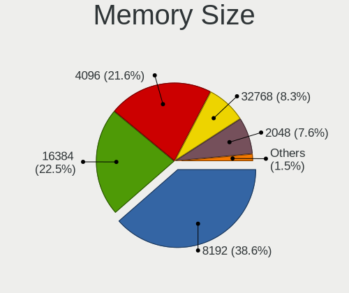

| Size  | Computers | Percent |
|-------|-----------|---------|
| 8192  | 77        | 39.29%  |
| 4096  | 56        | 28.57%  |
| 16384 | 37        | 18.88%  |
| 2048  | 12        | 6.12%   |
| 32768 | 10        | 5.1%    |
| 1024  | 4         | 2.04%   |

Memory Speed
------------

Memory module speed

| Speed   | Computers | Percent |
|---------|-----------|---------|
| 1600    | 41        | 20.81%  |
| 3200    | 37        | 18.78%  |
| 2667    | 25        | 12.69%  |
| 2400    | 23        | 11.68%  |
| 2133    | 11        | 5.58%   |
| 1333    | 10        | 5.08%   |
| 4267    | 6         | 3.05%   |
| 1867    | 5         | 2.54%   |
| 3000    | 4         | 2.03%   |
| 800     | 4         | 2.03%   |
| 4800    | 3         | 1.52%   |
| 3600    | 3         | 1.52%   |
| 667     | 3         | 1.52%   |
| 4266    | 2         | 1.02%   |
| 3733    | 2         | 1.02%   |
| 3466    | 2         | 1.02%   |
| 2933    | 2         | 1.02%   |
| 2666    | 2         | 1.02%   |
| 2000    | 2         | 1.02%   |
| 1334    | 2         | 1.02%   |
| 1066    | 2         | 1.02%   |
| 533     | 2         | 1.02%   |
| 4000    | 1         | 0.51%   |
| 3266    | 1         | 0.51%   |
| 400     | 1         | 0.51%   |
| Unknown | 1         | 0.51%   |

Printers & scanners
-------------------

Printer Vendor
--------------

Printer device vendors

| Vendor          | Computers | Percent |
|-----------------|-----------|---------|
| Hewlett-Packard | 3         | 60%     |
| Seiko Epson     | 2         | 40%     |

Printer Model
-------------

Printer device models

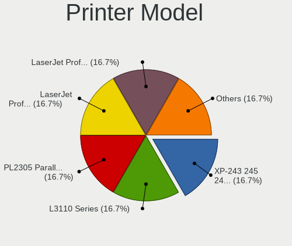

| Model                             | Computers | Percent |
|-----------------------------------|-----------|---------|
| Seiko Epson XP-243 245 247 Series | 1         | 20%     |
| Seiko Epson L3110 Series          | 1         | 20%     |
| HP LaserJet Professional P1102w   | 1         | 20%     |
| HP LaserJet Professional P 1102w  | 1         | 20%     |
| HP LaserJet 1020                  | 1         | 20%     |

Scanner Vendor
--------------

Scanner device vendors

Zero info for selected period =(

Scanner Model
-------------

Scanner device models

Zero info for selected period =(

Camera
------

Camera Vendor
-------------

Camera device vendors

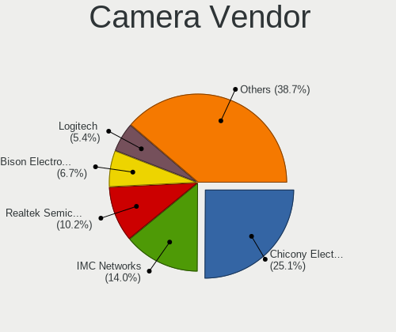

| Vendor                                 | Computers | Percent |
|----------------------------------------|-----------|---------|
| Chicony Electronics                    | 38        | 24.84%  |
| Realtek Semiconductor                  | 18        | 11.76%  |
| IMC Networks                           | 18        | 11.76%  |
| Logitech                               | 12        | 7.84%   |
| Acer                                   | 10        | 6.54%   |
| Sunplus Innovation Technology          | 9         | 5.88%   |
| Quanta                                 | 8         | 5.23%   |
| Microdia                               | 6         | 3.92%   |
| Cheng Uei Precision Industry (Foxlink) | 6         | 3.92%   |
| Suyin                                  | 5         | 3.27%   |
| Apple                                  | 5         | 3.27%   |
| ALi                                    | 3         | 1.96%   |
| Syntek                                 | 2         | 1.31%   |
| Sunplus Technology                     | 2         | 1.31%   |
| Ricoh                                  | 2         | 1.31%   |
| Lite-On Technology                     | 2         | 1.31%   |
| Silicon Motion                         | 1         | 0.65%   |
| Lenovo                                 | 1         | 0.65%   |
| KYE Systems (Mouse Systems)            | 1         | 0.65%   |
| Intel                                  | 1         | 0.65%   |
| Google                                 | 1         | 0.65%   |
| Generalplus Technology                 | 1         | 0.65%   |
| A4Tech                                 | 1         | 0.65%   |

Camera Model
------------

Camera device models

| Model                                                                      | Computers | Percent |
|----------------------------------------------------------------------------|-----------|---------|
| Chicony HD WebCam                                                          | 7         | 4.58%   |
| IMC Networks USB2.0 HD UVC WebCam                                          | 6         | 3.92%   |
| Chicony Integrated Camera                                                  | 6         | 3.92%   |
| Realtek Integrated_Webcam_HD                                               | 5         | 3.27%   |
| Chicony HP HD Camera                                                       | 5         | 3.27%   |
| Sunplus HD WebCam                                                          | 4         | 2.61%   |
| Quanta HD User Facing                                                      | 4         | 2.61%   |
| IMC Networks Integrated Camera                                             | 4         | 2.61%   |
| Realtek USB Camera                                                         | 3         | 1.96%   |
| Realtek HD WebCam                                                          | 3         | 1.96%   |
| Microdia Integrated_Webcam_HD                                              | 3         | 1.96%   |
| Logitech Webcam C270                                                       | 3         | 1.96%   |
| Logitech Webcam C120                                                       | 3         | 1.96%   |
| IMC Networks USB2.0 VGA UVC WebCam                                         | 3         | 1.96%   |
| Chicony USB2.0 HD UVC WebCam                                               | 3         | 1.96%   |
| Chicony Lenovo EasyCamera                                                  | 3         | 1.96%   |
| Cheng Uei Precision Industry (Foxlink) HP Wide Vision HD Integrated Webcam | 3         | 1.96%   |
| ALi Gateway Webcam                                                         | 3         | 1.96%   |
| Acer HD Webcam                                                             | 3         | 1.96%   |
| Sunplus 1.3M HD WebCam                                                     | 2         | 1.31%   |
| Realtek USB2.0 HD UVC WebCam                                               | 2         | 1.31%   |
| IMC Networks UVC VGA Webcam                                                | 2         | 1.31%   |
| Chicony USB 2.0 Webcam Device                                              | 2         | 1.31%   |
| Cheng Uei Precision Industry (Foxlink) Webcam                              | 2         | 1.31%   |
| Apple iPhone 5/5C/5S/6/SE                                                  | 2         | 1.31%   |
| Apple FaceTime HD Camera (Built-in)                                        | 2         | 1.31%   |
| Acer Integrated Camera                                                     | 2         | 1.31%   |
| Acer BisonCam, NB Pro                                                      | 2         | 1.31%   |
| Syntek Lenovo EasyCamera                                                   | 1         | 0.65%   |
| Syntek HP TrueVision HD                                                    | 1         | 0.65%   |
| Suyin UVC 1.3MPixel WebCam                                                 | 1         | 0.65%   |
| Suyin Acer/Lenovo Webcam [CN0316]                                          | 1         | 0.65%   |
| Suyin Acer/HP Integrated Webcam [CN0314]                                   | 1         | 0.65%   |
| Suyin Acer CrystalEye Webcam                                               | 1         | 0.65%   |
| Suyin 1.3M HD WebCam                                                       | 1         | 0.65%   |
| Sunplus Integrated_Webcam_HD                                               | 1         | 0.65%   |
| Sunplus Integrated_Webcam_FHD                                              | 1         | 0.65%   |
| Sunplus HP Truevision HD                                                   | 1         | 0.65%   |
| Sunplus HD User Facing                                                     | 1         | 0.65%   |
| Sunplus ezcap U3 capture-04                                                | 1         | 0.65%   |
| Silicon Motion WebCam SC-13HDL11431N                                       | 1         | 0.65%   |
| Ricoh USB2.0 Camera                                                        | 1         | 0.65%   |
| Ricoh Laptop_Integrated_Webcam_FHD                                         | 1         | 0.65%   |
| Realtek MTD camera                                                         | 1         | 0.65%   |
| Realtek LG Camera                                                          | 1         | 0.65%   |
| Realtek HP Wide Vision FHD Camera                                          | 1         | 0.65%   |
| Realtek HD Webcam - Realtek                                                | 1         | 0.65%   |
| Realtek Front Camera                                                       | 1         | 0.65%   |
| Quanta HP HD Camera                                                        | 1         | 0.65%   |
| Quanta hm1091_techfront                                                    | 1         | 0.65%   |
| Quanta HD Webcam                                                           | 1         | 0.65%   |
| Quanta FHD User Facing                                                     | 1         | 0.65%   |
| Microdia USB 2.0 Camera                                                    | 1         | 0.65%   |
| Microdia Integrated Webcam                                                 | 1         | 0.65%   |
| Microdia Dell Laptop Integrated Webcam HD                                  | 1         | 0.65%   |
| Logitech Webcam C930e                                                      | 1         | 0.65%   |
| Logitech Webcam C170                                                       | 1         | 0.65%   |
| Logitech QuickCam Home                                                     | 1         | 0.65%   |
| Logitech QuickCam E 3500                                                   | 1         | 0.65%   |
| Logitech HP Webcam                                                         | 1         | 0.65%   |

Security
--------

Fingerprint Vendor
------------------

Fingerprint sensor vendors

| Vendor                     | Computers | Percent |
|----------------------------|-----------|---------|
| Synaptics                  | 9         | 25%     |
| Validity Sensors           | 8         | 22.22%  |
| LighTuning Technology      | 7         | 19.44%  |
| Shenzhen Goodix Technology | 4         | 11.11%  |
| Elan Microelectronics      | 4         | 11.11%  |
| Upek                       | 3         | 8.33%   |
| AuthenTec                  | 1         | 2.78%   |

Fingerprint Model
-----------------

Fingerprint sensor models

| Model                                                      | Computers | Percent |
|------------------------------------------------------------|-----------|---------|
| Unknown                                                    | 5         | 13.89%  |
| LighTuning EgisTec Touch Fingerprint Sensor                | 4         | 11.11%  |
| Validity Sensors VFS5011 Fingerprint Reader                | 3         | 8.33%   |
| Upek Biometric Touchchip/Touchstrip Fingerprint Sensor     | 3         | 8.33%   |
| LighTuning ES603 Swipe Fingerprint Sensor                  | 3         | 8.33%   |
| Elan ELAN:Fingerprint                                      | 3         | 8.33%   |
| Validity Sensors VFS Fingerprint sensor                    | 2         | 5.56%   |
| Shenzhen Goodix  FingerPrint Device                        | 2         | 5.56%   |
| Shenzhen Goodix Fingerprint Reader                         | 2         | 5.56%   |
| Validity Sensors VFS495 Fingerprint Reader                 | 1         | 2.78%   |
| Validity Sensors VFS301 Fingerprint Reader                 | 1         | 2.78%   |
| Validity Sensors Fingerprint scanner                       | 1         | 2.78%   |
| Synaptics  WBDI Fingerprint Reader - USB 052               | 1         | 2.78%   |
| Synaptics  VFS7552 Touch Fingerprint Sensor with PurePrint | 1         | 2.78%   |
| Synaptics  FS7604 Touch Fingerprint Sensor with PurePrint  | 1         | 2.78%   |
| Synaptics Metallica MIS Touch Fingerprint Reader           | 1         | 2.78%   |
| Elan fingerprint sensor [FeinTech FPS00200]                | 1         | 2.78%   |
| AuthenTec AES2810                                          | 1         | 2.78%   |

Chipcard Vendor
---------------

Chipcard module vendors

| Vendor                | Computers | Percent |
|-----------------------|-----------|---------|
| Alcor Micro           | 4         | 44.44%  |
| Broadcom              | 3         | 33.33%  |
| Upek                  | 1         | 11.11%  |
| Gemalto (was Gemplus) | 1         | 11.11%  |

Chipcard Model
--------------

Chipcard module models

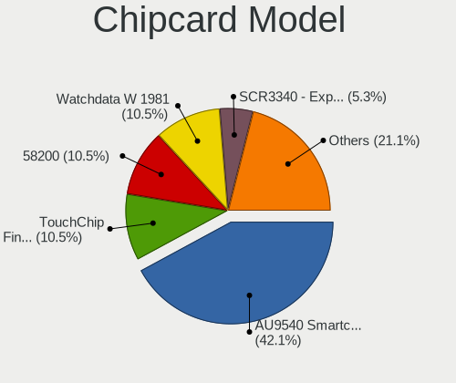

| Model                                                                        | Computers | Percent |
|------------------------------------------------------------------------------|-----------|---------|
| Broadcom 58200                                                               | 2         | 22.22%  |
| Alcor Micro Watchdata W 1981                                                 | 2         | 22.22%  |
| Alcor Micro AU9540 Smartcard Reader                                          | 2         | 22.22%  |
| Upek TouchChip Fingerprint Coprocessor (WBF advanced mode)                   | 1         | 11.11%  |
| Gemalto (was Gemplus) GemPC Twin SmartCard Reader                            | 1         | 11.11%  |
| Broadcom BCM5880 Secure Applications Processor with fingerprint swipe sensor | 1         | 11.11%  |

Unsupported
-----------

Unsupported Devices
-------------------

Total unsupported devices on board

| Total | Computers | Percent |
|-------|-----------|---------|
| 0     | 255       | 66.93%  |
| 1     | 86        | 22.57%  |
| 3     | 17        | 4.46%   |
| 2     | 17        | 4.46%   |
| 4     | 5         | 1.31%   |
| 5     | 1         | 0.26%   |

Unsupported Device Types
------------------------

Types of unsupported devices

| Type                     | Computers | Percent |
|--------------------------|-----------|---------|
| Fingerprint reader       | 36        | 21.95%  |
| Graphics card            | 34        | 20.73%  |
| Communication controller | 26        | 15.85%  |
| Unassigned class         | 23        | 14.02%  |
| Chipcard                 | 7         | 4.27%   |
| Card reader              | 6         | 3.66%   |
| Camera                   | 6         | 3.66%   |
| Net/wireless             | 5         | 3.05%   |
| Multimedia controller    | 5         | 3.05%   |
| Bluetooth                | 5         | 3.05%   |
| Net/ethernet             | 3         | 1.83%   |
| Storage/nvme             | 2         | 1.22%   |
| Sound                    | 2         | 1.22%   |
| Network                  | 2         | 1.22%   |
| Storage/raid             | 1         | 0.61%   |
| Storage                  | 1         | 0.61%   |

