Linux in Taiwan - Tested Hardware & Statistics
----------------------------------------------

A project to collect tested hardware configurations for Linux in Taiwan.

Anyone can contribute to this report by the [hw-probe](https://github.com/linuxhw/hw-probe) tool:

    sudo -E hw-probe -all -upload

Please contribute! Especially if your hardware is rare.

This is a report for all computer types. See also reports for [desktops](/Location/Taiwan/Desktop/README.md) and [notebooks](/Location/Taiwan/Notebook/README.md).

Contents
--------

* [ Test Cases ](#test-cases)

* [ System ](#system)
  - [ OS                       ](#os)
  - [ OS Family                ](#os-family)
  - [ Kernel                   ](#kernel)
  - [ Kernel Family            ](#kernel-family)
  - [ Kernel Major Ver.        ](#kernel-major-ver)
  - [ Arch                     ](#arch)
  - [ DE                       ](#de)
  - [ Display Server           ](#display-server)
  - [ Display Manager          ](#display-manager)
  - [ OS Lang                  ](#os-lang)
  - [ Boot Mode                ](#boot-mode)
  - [ Filesystem               ](#filesystem)
  - [ Part. scheme             ](#part-scheme)
  - [ Dual Boot with Linux/BSD ](#dual-boot-with-linuxbsd)
  - [ Dual Boot (Win)          ](#dual-boot-win)

* [ Board ](#board)
  - [ Vendor                   ](#vendor)
  - [ Model                    ](#model)
  - [ Model Family             ](#model-family)
  - [ MFG Year                 ](#mfg-year)
  - [ Form Factor              ](#form-factor)
  - [ Secure Boot              ](#secure-boot)
  - [ Coreboot                 ](#coreboot)
  - [ RAM Size                 ](#ram-size)
  - [ RAM Used                 ](#ram-used)
  - [ Total Drives             ](#total-drives)
  - [ Has CD-ROM               ](#has-cd-rom)
  - [ Has Ethernet             ](#has-ethernet)
  - [ Has WiFi                 ](#has-wifi)
  - [ Has Bluetooth            ](#has-bluetooth)

* [ Location ](#location)
  - [ Country                  ](#country)
  - [ City                     ](#city)

* [ Drives ](#drives)
  - [ Drive Vendor             ](#drive-vendor)
  - [ Drive Model              ](#drive-model)
  - [ HDD Vendor               ](#hdd-vendor)
  - [ SSD Vendor               ](#ssd-vendor)
  - [ Drive Kind               ](#drive-kind)
  - [ Drive Connector          ](#drive-connector)
  - [ Drive Size               ](#drive-size)
  - [ Space Total              ](#space-total)
  - [ Space Used               ](#space-used)
  - [ Malfunc. Drives          ](#malfunc-drives)
  - [ Malfunc. Drive Vendor    ](#malfunc-drive-vendor)
  - [ Malfunc. HDD Vendor      ](#malfunc-hdd-vendor)
  - [ Malfunc. Drive Kind      ](#malfunc-drive-kind)
  - [ Failed Drives            ](#failed-drives)
  - [ Failed Drive Vendor      ](#failed-drive-vendor)
  - [ Drive Status             ](#drive-status)

* [ Storage controller ](#storage-controller)
  - [ Storage Vendor           ](#storage-vendor)
  - [ Storage Model            ](#storage-model)
  - [ Storage Kind             ](#storage-kind)

* [ Processor ](#processor)
  - [ CPU Vendor               ](#cpu-vendor)
  - [ CPU Model                ](#cpu-model)
  - [ CPU Model Family         ](#cpu-model-family)
  - [ CPU Cores                ](#cpu-cores)
  - [ CPU Sockets              ](#cpu-sockets)
  - [ CPU Threads              ](#cpu-threads)
  - [ CPU Op-Modes             ](#cpu-op-modes)
  - [ CPU Microcode            ](#cpu-microcode)
  - [ CPU Microarch            ](#cpu-microarch)

* [ Graphics ](#graphics)
  - [ GPU Vendor               ](#gpu-vendor)
  - [ GPU Model                ](#gpu-model)
  - [ GPU Combo                ](#gpu-combo)
  - [ GPU Driver               ](#gpu-driver)
  - [ GPU Memory               ](#gpu-memory)

* [ Monitor ](#monitor)
  - [ Monitor Vendor           ](#monitor-vendor)
  - [ Monitor Model            ](#monitor-model)
  - [ Monitor Resolution       ](#monitor-resolution)
  - [ Monitor Diagonal         ](#monitor-diagonal)
  - [ Monitor Width            ](#monitor-width)
  - [ Aspect Ratio             ](#aspect-ratio)
  - [ Monitor Area             ](#monitor-area)
  - [ Pixel Density            ](#pixel-density)
  - [ Multiple Monitors        ](#multiple-monitors)

* [ Network ](#network)
  - [ Net Controller Vendor    ](#net-controller-vendor)
  - [ Net Controller Model     ](#net-controller-model)
  - [ Wireless Vendor          ](#wireless-vendor)
  - [ Wireless Model           ](#wireless-model)
  - [ Ethernet Vendor          ](#ethernet-vendor)
  - [ Ethernet Model           ](#ethernet-model)
  - [ Net Controller Kind      ](#net-controller-kind)
  - [ Used Controller          ](#used-controller)
  - [ NICs                     ](#nics)
  - [ IPv6                     ](#ipv6)

* [ Bluetooth ](#bluetooth)
  - [ Bluetooth Vendor         ](#bluetooth-vendor)
  - [ Bluetooth Model          ](#bluetooth-model)

* [ Sound ](#sound)
  - [ Sound Vendor             ](#sound-vendor)
  - [ Sound Model              ](#sound-model)

* [ Memory ](#memory)
  - [ Memory Vendor            ](#memory-vendor)
  - [ Memory Model             ](#memory-model)
  - [ Memory Kind              ](#memory-kind)
  - [ Memory Form Factor       ](#memory-form-factor)
  - [ Memory Size              ](#memory-size)
  - [ Memory Speed             ](#memory-speed)

* [ Printers & scanners ](#printers--scanners)
  - [ Printer Vendor           ](#printer-vendor)
  - [ Printer Model            ](#printer-model)
  - [ Scanner Vendor           ](#scanner-vendor)
  - [ Scanner Model            ](#scanner-model)

* [ Camera ](#camera)
  - [ Camera Vendor            ](#camera-vendor)
  - [ Camera Model             ](#camera-model)

* [ Security ](#security)
  - [ Fingerprint Vendor       ](#fingerprint-vendor)
  - [ Fingerprint Model        ](#fingerprint-model)
  - [ Chipcard Vendor          ](#chipcard-vendor)
  - [ Chipcard Model           ](#chipcard-model)

* [ Unsupported ](#unsupported)
  - [ Unsupported Devices      ](#unsupported-devices)
  - [ Unsupported Device Types ](#unsupported-device-types)

Test Cases
----------

Total: 852

| Vendor        | Model                       | Form-Factor | Probe                                                      | Date         |
|---------------|-----------------------------|-------------|------------------------------------------------------------|--------------|
| MSI           | GL65 9SD                    | Notebook    | [d831c2e78e](https://linux-hardware.org/?probe=d831c2e78e) | Nov 06, 2023 |
| Acer          | Aspire A514-55              | Notebook    | [b9ad0e270f](https://linux-hardware.org/?probe=b9ad0e270f) | Nov 04, 2023 |
| HP            | ENVY x360 Convertible 13... | Convertible | [ca1b93a5ca](https://linux-hardware.org/?probe=ca1b93a5ca) | Nov 02, 2023 |
| ASRock        | H97M Anniversary            | Desktop     | [6c66e3862d](https://linux-hardware.org/?probe=6c66e3862d) | Nov 01, 2023 |
| Lenovo        | 370A SDK0J40700 WIN 3258... | Desktop     | [39f8a7c959](https://linux-hardware.org/?probe=39f8a7c959) | Nov 01, 2023 |
| Acer          | Aspire A514-55              | Notebook    | [985bf8e919](https://linux-hardware.org/?probe=985bf8e919) | Nov 01, 2023 |
| ASUSTek       | PRIME B360M-C               | Desktop     | [874efda598](https://linux-hardware.org/?probe=874efda598) | Oct 31, 2023 |
| ASUSTek       | PRIME B360M-C               | Desktop     | [16da68741a](https://linux-hardware.org/?probe=16da68741a) | Oct 31, 2023 |
| ASUSTek       | P5E Deluxe                  | Desktop     | [5601096ffc](https://linux-hardware.org/?probe=5601096ffc) | Oct 29, 2023 |
| Gigabyte      | GA-770TA-UD3                | Desktop     | [f1a5d466cd](https://linux-hardware.org/?probe=f1a5d466cd) | Oct 29, 2023 |
| ASUSTek       | H81M-E                      | Desktop     | [1cd579935b](https://linux-hardware.org/?probe=1cd579935b) | Oct 27, 2023 |
| Dell          | G7 7590                     | Notebook    | [90cbef58c2](https://linux-hardware.org/?probe=90cbef58c2) | Oct 27, 2023 |
| ASUSTek       | M5A78L-M/USB3               | Desktop     | [d49188de1a](https://linux-hardware.org/?probe=d49188de1a) | Oct 26, 2023 |
| Gigabyte      | GA-770TA-UD3                | Desktop     | [6944656466](https://linux-hardware.org/?probe=6944656466) | Oct 26, 2023 |
| ASUSTek       | TUF Gaming B550M-PLUS       | Desktop     | [bb6c63a5b3](https://linux-hardware.org/?probe=bb6c63a5b3) | Oct 26, 2023 |
| Dell          | 097YXY A00                  | Desktop     | [31dc22d5af](https://linux-hardware.org/?probe=31dc22d5af) | Oct 24, 2023 |
| Gigabyte      | AORUS 5 SE                  | Notebook    | [bf6473691f](https://linux-hardware.org/?probe=bf6473691f) | Oct 21, 2023 |
| ASUSTek       | ASUS EXPERTBOOK B9403CVA... | Notebook    | [eaffd30f59](https://linux-hardware.org/?probe=eaffd30f59) | Oct 21, 2023 |
| ASUSTek       | ASUS EXPERTBOOK B9403CVA... | Notebook    | [aafd893b0d](https://linux-hardware.org/?probe=aafd893b0d) | Oct 21, 2023 |
| ASUSTek       | M5A78L-M/USB3               | Desktop     | [3130876407](https://linux-hardware.org/?probe=3130876407) | Oct 17, 2023 |
| Acer          | EG31M P01-A0                | Desktop     | [1e500b6b4a](https://linux-hardware.org/?probe=1e500b6b4a) | Oct 17, 2023 |
| ONDA          | H110CD3 VER1.01             | Desktop     | [df23b03be3](https://linux-hardware.org/?probe=df23b03be3) | Oct 15, 2023 |
| MSI           | Alpha 17 C7VG               | Notebook    | [aa9ed0c963](https://linux-hardware.org/?probe=aa9ed0c963) | Oct 13, 2023 |
| MSI           | Alpha 17 C7VG               | Notebook    | [3cf39a38db](https://linux-hardware.org/?probe=3cf39a38db) | Oct 12, 2023 |
| HP            | 802F                        | Desktop     | [ed3a09f912](https://linux-hardware.org/?probe=ed3a09f912) | Oct 12, 2023 |
| MSI           | PRO H610M-G DDR4            | Desktop     | [c698bae21a](https://linux-hardware.org/?probe=c698bae21a) | Oct 12, 2023 |
| MSI           | PRO H610M-G DDR4            | Desktop     | [167f75f814](https://linux-hardware.org/?probe=167f75f814) | Oct 12, 2023 |
| HP            | 802F                        | Desktop     | [c2b0f9720e](https://linux-hardware.org/?probe=c2b0f9720e) | Oct 12, 2023 |
| ASUSTek       | P5Q3 DELUXE                 | Desktop     | [29bb46e198](https://linux-hardware.org/?probe=29bb46e198) | Oct 12, 2023 |
| Acer          | Swift SFX14-41G             | Notebook    | [ad1ae13902](https://linux-hardware.org/?probe=ad1ae13902) | Oct 11, 2023 |
| Apple         | Mac-F60DEB81FF30ACF6 Mac... | Desktop     | [a5904a1aeb](https://linux-hardware.org/?probe=a5904a1aeb) | Oct 07, 2023 |
| MSI           | GL65 9SD                    | Notebook    | [0e94bdcf1d](https://linux-hardware.org/?probe=0e94bdcf1d) | Oct 05, 2023 |
| MSI           | GL65 9SD                    | Notebook    | [32b5c9a302](https://linux-hardware.org/?probe=32b5c9a302) | Oct 05, 2023 |
| CHIPHD        | NT125D                      | Notebook    | [7e966b32de](https://linux-hardware.org/?probe=7e966b32de) | Sep 26, 2023 |
| Dell          | 00010C A00                  | Desktop     | [40d7defca4](https://linux-hardware.org/?probe=40d7defca4) | Sep 23, 2023 |
| Centerm       | C92                         | Desktop     | [022344ea10](https://linux-hardware.org/?probe=022344ea10) | Sep 22, 2023 |
| Acer          | Revo RN86                   | Desktop     | [315559ee42](https://linux-hardware.org/?probe=315559ee42) | Sep 21, 2023 |
| Lenovo        | ThinkPad T450 20BV000BUS    | Notebook    | [3959de124c](https://linux-hardware.org/?probe=3959de124c) | Sep 14, 2023 |
| ASUSTek       | Z170-P D3                   | Desktop     | [fad69be075](https://linux-hardware.org/?probe=fad69be075) | Sep 12, 2023 |
| Toshiba       | Satellite L640              | Notebook    | [ac5a264fea](https://linux-hardware.org/?probe=ac5a264fea) | Sep 12, 2023 |
| Lenovo        | Legion Pro 5 16ARX8 82WM    | Notebook    | [55b8608662](https://linux-hardware.org/?probe=55b8608662) | Sep 08, 2023 |
| MSI           | MS-B0A81                    | Desktop     | [2c4cc9e78f](https://linux-hardware.org/?probe=2c4cc9e78f) | Sep 05, 2023 |
| Raspberry ... | Raspberry Pi 4 Model B R... | Soc         | [8a6408f82b](https://linux-hardware.org/?probe=8a6408f82b) | Sep 05, 2023 |
| Gigabyte      | GB-BKi3A-7100               | Notebook    | [40c832efb9](https://linux-hardware.org/?probe=40c832efb9) | Sep 04, 2023 |
| HP            | ProBook 440 G8 Notebook ... | Notebook    | [b132ff749e](https://linux-hardware.org/?probe=b132ff749e) | Sep 01, 2023 |
| Lenovo        | IdeaPad 1 15ADA7 82R1       | Notebook    | [ed4fafcabd](https://linux-hardware.org/?probe=ed4fafcabd) | Aug 31, 2023 |
| Sony          | VGN-C15TP_W                 | Notebook    | [591d0b778e](https://linux-hardware.org/?probe=591d0b778e) | Aug 30, 2023 |
| Gigabyte      | GA-770TA-UD3                | Desktop     | [6bd78c519f](https://linux-hardware.org/?probe=6bd78c519f) | Aug 25, 2023 |
| ASUSTek       | M11AD                       | Desktop     | [a107c7eb20](https://linux-hardware.org/?probe=a107c7eb20) | Aug 25, 2023 |
| Sony          | VGN-C15TP_W                 | Notebook    | [a63433e04d](https://linux-hardware.org/?probe=a63433e04d) | Aug 25, 2023 |
| Acer          | Predator G3610              | Desktop     | [008082be63](https://linux-hardware.org/?probe=008082be63) | Aug 19, 2023 |
| Acer          | Predator G3610              | Desktop     | [d362c81682](https://linux-hardware.org/?probe=d362c81682) | Aug 19, 2023 |
| Acer          | Swift SFX14-41G             | Notebook    | [576626db19](https://linux-hardware.org/?probe=576626db19) | Aug 17, 2023 |
| Acer          | Aspire one                  | Notebook    | [47131c09b2](https://linux-hardware.org/?probe=47131c09b2) | Aug 16, 2023 |
| Lenovo        | IdeaPad 300-14ISK 80Q6      | Notebook    | [a94c8dc31f](https://linux-hardware.org/?probe=a94c8dc31f) | Aug 16, 2023 |
| Lenovo        | ThinkPad T480 20L5S2J200    | Notebook    | [66c997fdec](https://linux-hardware.org/?probe=66c997fdec) | Aug 16, 2023 |
| Lenovo        | ThinkPad T480 20L5S2J200    | Notebook    | [e57e76260c](https://linux-hardware.org/?probe=e57e76260c) | Aug 16, 2023 |
| HP            | ENVY x360 Convertible 13... | Convertible | [4e79ef6905](https://linux-hardware.org/?probe=4e79ef6905) | Aug 15, 2023 |
| ASUSTek       | BM6875_BM6675_BP6375        | Desktop     | [0a2cdad4c1](https://linux-hardware.org/?probe=0a2cdad4c1) | Aug 15, 2023 |
| ASUSTek       | UX31LA                      | Notebook    | [0695e3bb09](https://linux-hardware.org/?probe=0695e3bb09) | Aug 08, 2023 |
| MSI           | GL65 9SD                    | Notebook    | [b3ef4f1363](https://linux-hardware.org/?probe=b3ef4f1363) | Aug 07, 2023 |
| MSI           | GL65 9SD                    | Notebook    | [2539f4ad7a](https://linux-hardware.org/?probe=2539f4ad7a) | Aug 06, 2023 |
| Gigabyte      | B550M K                     | Desktop     | [139e314619](https://linux-hardware.org/?probe=139e314619) | Jul 31, 2023 |
| MSI           | PS63 Modern 8M              | Notebook    | [96e7b96787](https://linux-hardware.org/?probe=96e7b96787) | Jul 27, 2023 |
| ASUSTek       | VivoBook_ASUSLaptop TN34... | Convertible | [04aeffbcf4](https://linux-hardware.org/?probe=04aeffbcf4) | Jul 26, 2023 |
| MSI           | GL65 9SD                    | Notebook    | [a3f9991e22](https://linux-hardware.org/?probe=a3f9991e22) | Jul 23, 2023 |
| Dell          | 00010C A00                  | Desktop     | [71eca6ee4c](https://linux-hardware.org/?probe=71eca6ee4c) | Jul 20, 2023 |
| Altos         | BrainSphere P10 F7          | Desktop     | [8608df7a38](https://linux-hardware.org/?probe=8608df7a38) | Jul 20, 2023 |
| AAEON         | GENE-CML5 V1.0              | Desktop     | [4120e07431](https://linux-hardware.org/?probe=4120e07431) | Jul 19, 2023 |
| ASUSTek       | PRIME B660M-A WIFI D4       | Desktop     | [62238aaf82](https://linux-hardware.org/?probe=62238aaf82) | Jul 17, 2023 |
| MSI           | GL65 9SD                    | Notebook    | [57c6b0a7dd](https://linux-hardware.org/?probe=57c6b0a7dd) | Jul 15, 2023 |
| ASUSTek       | VivoBook_ASUSLaptop TP34... | Convertible | [be7dcafaba](https://linux-hardware.org/?probe=be7dcafaba) | Jul 14, 2023 |
| Acer          | Aspire TC-895 V:1.0         | Desktop     | [bc805d82a7](https://linux-hardware.org/?probe=bc805d82a7) | Jul 13, 2023 |
| ASUSTek       | PRIME B660M-K D4            | Desktop     | [36b6c49552](https://linux-hardware.org/?probe=36b6c49552) | Jul 09, 2023 |
| ASUSTek       | PRIME B660M-K D4            | Desktop     | [ffa5984711](https://linux-hardware.org/?probe=ffa5984711) | Jul 09, 2023 |
| HP            | 250 G5 Notebook PC          | Notebook    | [030ecef01c](https://linux-hardware.org/?probe=030ecef01c) | Jul 08, 2023 |
| HP            | 250 G5 Notebook PC          | Notebook    | [56683a6866](https://linux-hardware.org/?probe=56683a6866) | Jul 08, 2023 |
| ASUSTek       | M5A78L-M LX PLUS            | Desktop     | [e5d4d7b4a7](https://linux-hardware.org/?probe=e5d4d7b4a7) | Jul 06, 2023 |
| ASUSTek       | TUF Gaming B660-PLUS WIF... | Desktop     | [f15cf1d31b](https://linux-hardware.org/?probe=f15cf1d31b) | Jul 02, 2023 |
| Intel         | X99                         | Desktop     | [81dbd5c4f0](https://linux-hardware.org/?probe=81dbd5c4f0) | Jul 01, 2023 |
| Google        | Cave                        | Notebook    | [cc3b1bb1a3](https://linux-hardware.org/?probe=cc3b1bb1a3) | Jun 24, 2023 |
| Google        | Cave                        | Notebook    | [199eb4826d](https://linux-hardware.org/?probe=199eb4826d) | Jun 24, 2023 |
| Gigabyte      | B650I AORUS ULTRA           | Desktop     | [e72c8358c4](https://linux-hardware.org/?probe=e72c8358c4) | Jun 22, 2023 |
| Acer          | Aspire A515-53G             | Notebook    | [430cfefc6a](https://linux-hardware.org/?probe=430cfefc6a) | Jun 21, 2023 |
| ASRock        | X370 Killer SLI             | Desktop     | [10939cb152](https://linux-hardware.org/?probe=10939cb152) | Jun 20, 2023 |
| Lenovo        | ThinkPad X230 2324CD1       | Notebook    | [9ee6ed4144](https://linux-hardware.org/?probe=9ee6ed4144) | Jun 18, 2023 |
| ASUSTek       | ASUSPRO P5440UF             | Notebook    | [cf08c655b9](https://linux-hardware.org/?probe=cf08c655b9) | Jun 17, 2023 |
| ASUSTek       | ASUSPRO P5440UF             | Notebook    | [272d8de237](https://linux-hardware.org/?probe=272d8de237) | Jun 16, 2023 |
| ASUSTek       | PRIME B650M-A WIFI          | Desktop     | [2734ce8c5d](https://linux-hardware.org/?probe=2734ce8c5d) | Jun 16, 2023 |
| Lenovo        | IdeaPad 5 Pro 14IAP7 82S... | Notebook    | [dd5aaca858](https://linux-hardware.org/?probe=dd5aaca858) | Jun 15, 2023 |
| MSI           | B250M MORTAR ARCTIC         | Desktop     | [5e0e6586b7](https://linux-hardware.org/?probe=5e0e6586b7) | Jun 11, 2023 |
| Lenovo        | ThinkPad X13 Gen 3 21BNC... | Notebook    | [ba129cd52d](https://linux-hardware.org/?probe=ba129cd52d) | Jun 11, 2023 |
| Acidanther... | MacBookPro15,2              | Notebook    | [fb30b2eb35](https://linux-hardware.org/?probe=fb30b2eb35) | Jun 10, 2023 |
| Lenovo        | Z50-70 20354                | Notebook    | [05a473a2be](https://linux-hardware.org/?probe=05a473a2be) | Jun 06, 2023 |
| Apple         | MacBookPro7,1               | Notebook    | [e92db65759](https://linux-hardware.org/?probe=e92db65759) | Jun 05, 2023 |
| Timi          | Redmi Book Pro 15 2022      | Notebook    | [a3089228b1](https://linux-hardware.org/?probe=a3089228b1) | Jun 05, 2023 |
| MSI           | H97 GAMING 3                | Desktop     | [f9c0a669c5](https://linux-hardware.org/?probe=f9c0a669c5) | Jun 02, 2023 |
| ASUSTek       | UX430UNR                    | Notebook    | [00ab711e0a](https://linux-hardware.org/?probe=00ab711e0a) | Jun 02, 2023 |
| ASUSTek       | M5A78L-M LX PLUS            | Desktop     | [fc4e2630c0](https://linux-hardware.org/?probe=fc4e2630c0) | Jun 01, 2023 |
| ASUSTek       | M5A78L-M LX PLUS            | Desktop     | [f02c7845e5](https://linux-hardware.org/?probe=f02c7845e5) | Jun 01, 2023 |
| Raspberry ... | Raspberry Pi 4 Model B R... | Soc         | [fade8c50be](https://linux-hardware.org/?probe=fade8c50be) | May 30, 2023 |
| Raspberry ... | Raspberry Pi 4 Model B R... | Soc         | [8bafef9e33](https://linux-hardware.org/?probe=8bafef9e33) | May 30, 2023 |
| Supermicro    | X13SAN-L                    | Server      | [e0b7939357](https://linux-hardware.org/?probe=e0b7939357) | May 30, 2023 |
| Apple         | MacBookPro7,1               | Notebook    | [47ac3b9c43](https://linux-hardware.org/?probe=47ac3b9c43) | May 28, 2023 |
| Acer          | Swift SF514-54GT            | Notebook    | [dd79b67b18](https://linux-hardware.org/?probe=dd79b67b18) | May 27, 2023 |
| Acer          | Aspire TC-895 V:1.0         | Desktop     | [936b06e11f](https://linux-hardware.org/?probe=936b06e11f) | May 25, 2023 |
| Apple         | MacBookPro7,1               | Notebook    | [324a8d5c88](https://linux-hardware.org/?probe=324a8d5c88) | May 22, 2023 |
| Apple         | MacBookPro7,1               | Notebook    | [88830e9fe8](https://linux-hardware.org/?probe=88830e9fe8) | May 22, 2023 |
| Gigabyte      | X570S AORUS ELITE AX        | Desktop     | [2adc02040e](https://linux-hardware.org/?probe=2adc02040e) | May 21, 2023 |
| Win elemen... | M600                        | Desktop     | [4c5d685663](https://linux-hardware.org/?probe=4c5d685663) | May 21, 2023 |
| Win elemen... | M600                        | Desktop     | [84de4a3207](https://linux-hardware.org/?probe=84de4a3207) | May 20, 2023 |
| Lenovo        | ThinkPad P14s Gen 2a 21A... | Notebook    | [fb58a4d348](https://linux-hardware.org/?probe=fb58a4d348) | May 14, 2023 |
| Unknown       | Unknown                     | Desktop     | [661a7cf306](https://linux-hardware.org/?probe=661a7cf306) | May 11, 2023 |
| Lenovo        | IdeaPad 5 Pro 14IAP7 82S... | Notebook    | [02fb267cbc](https://linux-hardware.org/?probe=02fb267cbc) | May 07, 2023 |
| HP            | 250 G5 Notebook PC          | Notebook    | [e12a1d28ba](https://linux-hardware.org/?probe=e12a1d28ba) | May 06, 2023 |
| ASUSTek       | ROG STRIX Z390-F GAMING     | Desktop     | [867e98f955](https://linux-hardware.org/?probe=867e98f955) | May 05, 2023 |
| MSI           | H55M-P31                    | Desktop     | [386b720202](https://linux-hardware.org/?probe=386b720202) | May 04, 2023 |
| Raspberry ... | Raspberry Pi 400 Rev 1.0    | Soc         | [71ff8cca4e](https://linux-hardware.org/?probe=71ff8cca4e) | May 03, 2023 |
| HP            | 250 G5 Notebook PC          | Notebook    | [4cb6025c16](https://linux-hardware.org/?probe=4cb6025c16) | May 03, 2023 |
| Acer          | Veriton M2630G V:1.0        | Desktop     | [7ffa9c83d7](https://linux-hardware.org/?probe=7ffa9c83d7) | May 03, 2023 |
| Gigabyte      | Z97X-UD3H-CF                | Desktop     | [e5051f5355](https://linux-hardware.org/?probe=e5051f5355) | May 02, 2023 |
| AMD           | Volcano                     | Server      | [b7e67f8130](https://linux-hardware.org/?probe=b7e67f8130) | Apr 27, 2023 |
| HP            | 83E2                        | Desktop     | [f10d975821](https://linux-hardware.org/?probe=f10d975821) | Apr 26, 2023 |
| ASRock        | X300M-STX                   | Desktop     | [4a8d662bee](https://linux-hardware.org/?probe=4a8d662bee) | Apr 25, 2023 |
| Apple         | MacBookPro11,1              | Notebook    | [7309ce024f](https://linux-hardware.org/?probe=7309ce024f) | Apr 25, 2023 |
| Gigabyte      | H81N                        | Desktop     | [5729c6c6a9](https://linux-hardware.org/?probe=5729c6c6a9) | Apr 20, 2023 |
| Valve         | Jupiter                     | Notebook    | [b2a94c7310](https://linux-hardware.org/?probe=b2a94c7310) | Apr 18, 2023 |
| Acer          | Predator G3610              | Desktop     | [3d1841fa41](https://linux-hardware.org/?probe=3d1841fa41) | Apr 17, 2023 |
| Acer          | EG43LMK                     | Desktop     | [78b389b848](https://linux-hardware.org/?probe=78b389b848) | Apr 15, 2023 |
| Acer          | Predator G3610              | Desktop     | [d49e4d680c](https://linux-hardware.org/?probe=d49e4d680c) | Apr 14, 2023 |
| Valve         | Jupiter                     | Notebook    | [965de2bcc4](https://linux-hardware.org/?probe=965de2bcc4) | Apr 11, 2023 |
| MSI           | X370 GAMING PRO CARBON      | Desktop     | [ad8009e647](https://linux-hardware.org/?probe=ad8009e647) | Apr 11, 2023 |
| Lenovo        | IdeaPad 5 Pro 14IAP7 82S... | Notebook    | [c0901def8d](https://linux-hardware.org/?probe=c0901def8d) | Apr 10, 2023 |
| Win elemen... | M600                        | Desktop     | [7723a03558](https://linux-hardware.org/?probe=7723a03558) | Apr 10, 2023 |
| Win elemen... | M600                        | Desktop     | [e20927ec15](https://linux-hardware.org/?probe=e20927ec15) | Apr 10, 2023 |
| Lenovo        | IdeaPad S145-14AST 81ST     | Notebook    | [c8173d40cd](https://linux-hardware.org/?probe=c8173d40cd) | Apr 09, 2023 |
| ASUSTek       | PN41                        | Mini pc     | [8f34b2347f](https://linux-hardware.org/?probe=8f34b2347f) | Apr 07, 2023 |
| Dell          | Latitude 7490               | Notebook    | [01957ea955](https://linux-hardware.org/?probe=01957ea955) | Apr 07, 2023 |
| HP            | ENVY x360 Convertible 13... | Convertible | [f89b2c8b2a](https://linux-hardware.org/?probe=f89b2c8b2a) | Apr 05, 2023 |
| Toshiba       | Satellite L850              | Notebook    | [2635da1e14](https://linux-hardware.org/?probe=2635da1e14) | Apr 03, 2023 |
| Gigabyte      | F2A78M-DS2                  | Desktop     | [0528b2df2b](https://linux-hardware.org/?probe=0528b2df2b) | Apr 01, 2023 |
| Unknown       | Unknown                     | Desktop     | [8f1561c37b](https://linux-hardware.org/?probe=8f1561c37b) | Mar 28, 2023 |
| Lenovo        | ThinkPad X13 Gen 3 21BNC... | Notebook    | [649b881439](https://linux-hardware.org/?probe=649b881439) | Mar 25, 2023 |
| ASRock        | N68-GS4/USB3 FX             | Desktop     | [b846b11174](https://linux-hardware.org/?probe=b846b11174) | Mar 25, 2023 |
| Insyde        | CherryTrail                 | Notebook    | [9e658f67a2](https://linux-hardware.org/?probe=9e658f67a2) | Mar 25, 2023 |
| ASUSTek       | H110M-K D3                  | Desktop     | [24a568ad05](https://linux-hardware.org/?probe=24a568ad05) | Mar 25, 2023 |
| Raspberry ... | Raspberry Pi 4 Model B R... | Soc         | [de369a751a](https://linux-hardware.org/?probe=de369a751a) | Mar 25, 2023 |
| MSI           | H55M-P31                    | Desktop     | [07a5228600](https://linux-hardware.org/?probe=07a5228600) | Mar 25, 2023 |
| Gigabyte      | B360 AORUS GAMING 3 WIFI... | Desktop     | [b03324de35](https://linux-hardware.org/?probe=b03324de35) | Mar 24, 2023 |
| Lenovo        | ThinkPad Twist 33472HU      | Notebook    | [a49ece0e6c](https://linux-hardware.org/?probe=a49ece0e6c) | Mar 22, 2023 |
| Lenovo        | ThinkPad Twist 33472HU      | Notebook    | [315f2256c6](https://linux-hardware.org/?probe=315f2256c6) | Mar 22, 2023 |
| Gigabyte      | B75N                        | Desktop     | [8a16ffed3b](https://linux-hardware.org/?probe=8a16ffed3b) | Mar 21, 2023 |
| Intel         | N5095-AIO T1 E1.0G          | All in one  | [4af4017da0](https://linux-hardware.org/?probe=4af4017da0) | Mar 21, 2023 |
| ASUSTek       | TUF Gaming H470-PRO         | Desktop     | [7d1cd9aded](https://linux-hardware.org/?probe=7d1cd9aded) | Mar 20, 2023 |
| Lenovo        | IdeaPad Gaming 3 15IAH7 ... | Notebook    | [882f82cf2c](https://linux-hardware.org/?probe=882f82cf2c) | Mar 20, 2023 |
| Acer          | Aspire V3-571G              | Notebook    | [6aee8060e9](https://linux-hardware.org/?probe=6aee8060e9) | Mar 17, 2023 |
| OEM           | B85 JHS359                  | Desktop     | [1d5d7e95fc](https://linux-hardware.org/?probe=1d5d7e95fc) | Mar 16, 2023 |
| HP            | ENVY x360 Convertible 13... | Convertible | [dfd3b8546c](https://linux-hardware.org/?probe=dfd3b8546c) | Mar 14, 2023 |
| Valve         | Jupiter                     | Notebook    | [db30abe51b](https://linux-hardware.org/?probe=db30abe51b) | Mar 13, 2023 |
| Toshiba       | Satellite C665              | Notebook    | [e95e34e3ba](https://linux-hardware.org/?probe=e95e34e3ba) | Mar 11, 2023 |
| Lenovo        | ThinkPad X1 Carbon Gen 1... | Notebook    | [7f3075e65e](https://linux-hardware.org/?probe=7f3075e65e) | Mar 08, 2023 |
| Gigabyte      | G31M-ES2L                   | Desktop     | [f5535f53dc](https://linux-hardware.org/?probe=f5535f53dc) | Mar 08, 2023 |
| Lenovo        | ThinkPad T14 Gen 1 20S0S... | Notebook    | [2e864ba25e](https://linux-hardware.org/?probe=2e864ba25e) | Mar 08, 2023 |
| Valve         | Jupiter                     | Notebook    | [367bc56a15](https://linux-hardware.org/?probe=367bc56a15) | Mar 05, 2023 |
| Valve         | Jupiter                     | Notebook    | [c329f5f1c1](https://linux-hardware.org/?probe=c329f5f1c1) | Mar 05, 2023 |
| ASUSTek       | H81M-E                      | Desktop     | [fc1a09013d](https://linux-hardware.org/?probe=fc1a09013d) | Mar 05, 2023 |
| MSI           | MEG X670E ACE               | Desktop     | [ee356bc253](https://linux-hardware.org/?probe=ee356bc253) | Mar 02, 2023 |
| ASRock        | X300M-STX                   | Desktop     | [061edbf583](https://linux-hardware.org/?probe=061edbf583) | Mar 01, 2023 |
| Valve         | Jupiter                     | Notebook    | [2143a36dc5](https://linux-hardware.org/?probe=2143a36dc5) | Feb 28, 2023 |
| ASRock        | X300M-STX                   | Desktop     | [97a1558878](https://linux-hardware.org/?probe=97a1558878) | Feb 25, 2023 |
| Acer          | Swift SF514-54GT            | Notebook    | [dbccc5afa9](https://linux-hardware.org/?probe=dbccc5afa9) | Feb 23, 2023 |
| ASUSTek       | X202E                       | Notebook    | [6627e10e70](https://linux-hardware.org/?probe=6627e10e70) | Feb 19, 2023 |
| Dell          | Latitude E6320              | Notebook    | [467b45072e](https://linux-hardware.org/?probe=467b45072e) | Feb 19, 2023 |
| Lenovo        | ThinkPad X61 7673D13        | Notebook    | [b5399b39de](https://linux-hardware.org/?probe=b5399b39de) | Feb 19, 2023 |
| Acer          | Swift SF514-54GT            | Notebook    | [b7e961dae3](https://linux-hardware.org/?probe=b7e961dae3) | Feb 13, 2023 |
| Valve         | Jupiter                     | Notebook    | [e5f4ad1053](https://linux-hardware.org/?probe=e5f4ad1053) | Feb 12, 2023 |
| Maxtang       | EHL30 V1.0                  | Desktop     | [4d133c615c](https://linux-hardware.org/?probe=4d133c615c) | Feb 10, 2023 |
| ASRockRack    | X570D4U                     | Desktop     | [bb2c98768e](https://linux-hardware.org/?probe=bb2c98768e) | Feb 10, 2023 |
| ASUSTek       | G73Sw                       | Notebook    | [42e7c32817](https://linux-hardware.org/?probe=42e7c32817) | Feb 06, 2023 |
| HP            | Notebook                    | Notebook    | [41f5c97a09](https://linux-hardware.org/?probe=41f5c97a09) | Feb 06, 2023 |
| Gigabyte      | Z170-HD3P-CF                | Desktop     | [7f895dc97f](https://linux-hardware.org/?probe=7f895dc97f) | Feb 04, 2023 |
| AVITA         | NE14A2                      | Notebook    | [c5d9f8e3ac](https://linux-hardware.org/?probe=c5d9f8e3ac) | Feb 02, 2023 |
| Gigabyte      | Z170-HD3P-CF                | Desktop     | [9e9deedf0d](https://linux-hardware.org/?probe=9e9deedf0d) | Jan 31, 2023 |
| ASUSTek       | PRIME Z790-P WIFI           | Desktop     | [65e298b3ee](https://linux-hardware.org/?probe=65e298b3ee) | Jan 27, 2023 |
| ASUSTek       | VivoBook_ASUSLaptop K340... | Notebook    | [37059de5b7](https://linux-hardware.org/?probe=37059de5b7) | Jan 27, 2023 |
| Gigabyte      | H81N                        | Desktop     | [e7cf6a4216](https://linux-hardware.org/?probe=e7cf6a4216) | Jan 27, 2023 |
| ASUSTek       | PRIME Z790-P WIFI           | Desktop     | [5c55d923ff](https://linux-hardware.org/?probe=5c55d923ff) | Jan 26, 2023 |
| MSI           | Alpha 15 B5EEK              | Notebook    | [d815a80782](https://linux-hardware.org/?probe=d815a80782) | Jan 24, 2023 |
| MSI           | Alpha 15 B5EEK              | Notebook    | [d2c9a02f60](https://linux-hardware.org/?probe=d2c9a02f60) | Jan 24, 2023 |
| HP            | ProBook 430 G8 Notebook ... | Notebook    | [335275777a](https://linux-hardware.org/?probe=335275777a) | Jan 23, 2023 |
| Dell          | Latitude 7490               | Notebook    | [e40bb2f01f](https://linux-hardware.org/?probe=e40bb2f01f) | Jan 23, 2023 |
| Dell          | Latitude 7490               | Notebook    | [31789ae630](https://linux-hardware.org/?probe=31789ae630) | Jan 23, 2023 |
| HP            | ProBook 430 G2              | Notebook    | [24a0f33638](https://linux-hardware.org/?probe=24a0f33638) | Jan 22, 2023 |
| HP            | Compaq 6510b (GM108UC#AB... | Notebook    | [45ae9ca3c9](https://linux-hardware.org/?probe=45ae9ca3c9) | Jan 20, 2023 |
| Acer          | Aspire XC-105               | Desktop     | [8192fe90a8](https://linux-hardware.org/?probe=8192fe90a8) | Jan 19, 2023 |
| ASUSTek       | ROG Flow X13 GV301RA_GV3... | Convertible | [05df631dca](https://linux-hardware.org/?probe=05df631dca) | Jan 15, 2023 |
| HP            | Laptop 15s-eq2xxx           | Notebook    | [958ecc4388](https://linux-hardware.org/?probe=958ecc4388) | Jan 15, 2023 |
| Gigabyte      | GB-BKi3A-7100               | Notebook    | [8263d65b20](https://linux-hardware.org/?probe=8263d65b20) | Jan 08, 2023 |
| Gigabyte      | G5 GE                       | Notebook    | [d6a4584809](https://linux-hardware.org/?probe=d6a4584809) | Jan 07, 2023 |
| System76      | Lemur Pro                   | Notebook    | [36156d9aa7](https://linux-hardware.org/?probe=36156d9aa7) | Jan 07, 2023 |
| Acer          | FMCP7A-ION-LE               | Desktop     | [84a2abec03](https://linux-hardware.org/?probe=84a2abec03) | Jan 07, 2023 |
| Dell          | Inspiron 13 5320            | Notebook    | [0007a36030](https://linux-hardware.org/?probe=0007a36030) | Jan 07, 2023 |
| Timi          | Mi Laptop Pro 15            | Notebook    | [7ea6f8ee94](https://linux-hardware.org/?probe=7ea6f8ee94) | Jan 06, 2023 |
| Lenovo        | ThinkPad T14 Gen 2i 20W0... | Notebook    | [9e535c1e8e](https://linux-hardware.org/?probe=9e535c1e8e) | Jan 01, 2023 |
| Lenovo        | ThinkPad T14 Gen 2i 20W0... | Notebook    | [2abdc57712](https://linux-hardware.org/?probe=2abdc57712) | Dec 31, 2022 |
| Lenovo        | ThinkPad T14 Gen 2i 20W0... | Notebook    | [632515014d](https://linux-hardware.org/?probe=632515014d) | Dec 31, 2022 |
| MSI           | Modern 15 A5M               | Notebook    | [e0cb4d278d](https://linux-hardware.org/?probe=e0cb4d278d) | Dec 31, 2022 |
| Unknown       | Unknown                     | Desktop     | [34b6109940](https://linux-hardware.org/?probe=34b6109940) | Dec 29, 2022 |
| MSI           | Modern 15 A5M               | Notebook    | [1e7182cb70](https://linux-hardware.org/?probe=1e7182cb70) | Dec 29, 2022 |
| ASUSTek       | VivoBook_ASUSLaptop K340... | Notebook    | [ee7b1d707c](https://linux-hardware.org/?probe=ee7b1d707c) | Dec 26, 2022 |
| ASUSTek       | VivoBook_ASUSLaptop K340... | Notebook    | [7c8560a87e](https://linux-hardware.org/?probe=7c8560a87e) | Dec 25, 2022 |
| Acer          | Aspire 4750                 | Notebook    | [3256c282db](https://linux-hardware.org/?probe=3256c282db) | Dec 23, 2022 |
| ASUSTek       | VivoBook_ASUSLaptop K340... | Notebook    | [9462031346](https://linux-hardware.org/?probe=9462031346) | Dec 22, 2022 |
| ASUSTek       | VivoBook_ASUSLaptop K340... | Notebook    | [7eb6658e3a](https://linux-hardware.org/?probe=7eb6658e3a) | Dec 21, 2022 |
| ASUSTek       | VivoBook_ASUSLaptop K340... | Notebook    | [7a14c8194f](https://linux-hardware.org/?probe=7a14c8194f) | Dec 20, 2022 |
| ASUSTek       | PRIME H510M-K               | Desktop     | [9b1f8e9a10](https://linux-hardware.org/?probe=9b1f8e9a10) | Dec 18, 2022 |
| HUAWEI        | KLVL-WXX9                   | Notebook    | [a767e0fbf0](https://linux-hardware.org/?probe=a767e0fbf0) | Dec 16, 2022 |
| HP            | Pavilion x360 Convertibl... | Convertible | [9bfd668093](https://linux-hardware.org/?probe=9bfd668093) | Dec 16, 2022 |
| Lenovo        | ThinkPad W530 243858U       | Notebook    | [9dc4fb1abb](https://linux-hardware.org/?probe=9dc4fb1abb) | Dec 16, 2022 |
| Acer          | Aspire Z1801                | All in one  | [9d1453b919](https://linux-hardware.org/?probe=9d1453b919) | Dec 14, 2022 |
| ASUSTek       | ASUSPRO P1440FAC_P1440FA    | Notebook    | [44484456f8](https://linux-hardware.org/?probe=44484456f8) | Dec 14, 2022 |
| ASUSTek       | CM1530                      | Desktop     | [3990cff263](https://linux-hardware.org/?probe=3990cff263) | Dec 06, 2022 |
| Dell          | 0NNFGG A00                  | Desktop     | [b955357ccc](https://linux-hardware.org/?probe=b955357ccc) | Dec 05, 2022 |
| ASUSTek       | PU403UA                     | Notebook    | [20007b4296](https://linux-hardware.org/?probe=20007b4296) | Dec 05, 2022 |
| Gigabyte      | Z370M DS3H-CF               | Desktop     | [580b716020](https://linux-hardware.org/?probe=580b716020) | Dec 03, 2022 |
| Dell          | Vostro 5481                 | Notebook    | [6c58c07e64](https://linux-hardware.org/?probe=6c58c07e64) | Dec 03, 2022 |
| ASUSTek       | Z97-K                       | Desktop     | [52aaeb537b](https://linux-hardware.org/?probe=52aaeb537b) | Dec 03, 2022 |
| ASRock        | X300M-STX                   | Desktop     | [97ceee65f3](https://linux-hardware.org/?probe=97ceee65f3) | Dec 01, 2022 |
| ASRock        | X300M-STX                   | Desktop     | [5b7f983a24](https://linux-hardware.org/?probe=5b7f983a24) | Dec 01, 2022 |
| ASRock        | X300M-STX                   | Desktop     | [42ddb2463e](https://linux-hardware.org/?probe=42ddb2463e) | Dec 01, 2022 |
| Dell          | 0XJ5V0 A03                  | Desktop     | [b954e4c174](https://linux-hardware.org/?probe=b954e4c174) | Nov 30, 2022 |
| ASUSTek       | VivoBook_ASUSLaptop X140... | Notebook    | [55d95654c4](https://linux-hardware.org/?probe=55d95654c4) | Nov 30, 2022 |
| Supermicro    | X11SCA-FA                   | Server      | [5c1a9bfc40](https://linux-hardware.org/?probe=5c1a9bfc40) | Nov 24, 2022 |
| Supermicro    | X11SCA-FA                   | Server      | [89eb0756b2](https://linux-hardware.org/?probe=89eb0756b2) | Nov 24, 2022 |
| ASUSTek       | ROG STRIX X299-E GAMING     | Desktop     | [aea7b4c016](https://linux-hardware.org/?probe=aea7b4c016) | Nov 23, 2022 |
| Supermicro    | M12SWA-TF                   | Server      | [8eb4e40bf5](https://linux-hardware.org/?probe=8eb4e40bf5) | Nov 22, 2022 |
| HP            | ProBook 430 G8 Notebook ... | Notebook    | [8a773e7358](https://linux-hardware.org/?probe=8a773e7358) | Nov 22, 2022 |
| Lenovo        | ThinkPad X13 Gen 1 20UFS... | Notebook    | [678cfec38b](https://linux-hardware.org/?probe=678cfec38b) | Nov 20, 2022 |
| Gigabyte      | Z490 AORUS PRO AX           | Desktop     | [abe3da973c](https://linux-hardware.org/?probe=abe3da973c) | Nov 19, 2022 |
| MSI           | GE62 6QD                    | Notebook    | [3d2dd5419a](https://linux-hardware.org/?probe=3d2dd5419a) | Nov 18, 2022 |
| Intel         | Burnside                    | Desktop     | [5db283bd1f](https://linux-hardware.org/?probe=5db283bd1f) | Nov 17, 2022 |
| ASRock        | A320M-HDV R4.0              | Desktop     | [7764c0fea2](https://linux-hardware.org/?probe=7764c0fea2) | Nov 15, 2022 |
| ASUSTek       | X550VX                      | Notebook    | [8e55592803](https://linux-hardware.org/?probe=8e55592803) | Nov 15, 2022 |
| Acer          | Swift SFX14-41G             | Notebook    | [a8023a34a0](https://linux-hardware.org/?probe=a8023a34a0) | Nov 11, 2022 |
| MSI           | U270DX                      | Notebook    | [2a68a6ba02](https://linux-hardware.org/?probe=2a68a6ba02) | Nov 10, 2022 |
| Lenovo        | IdeaPad 5 14ALC05 82LM      | Notebook    | [52080bf6ef](https://linux-hardware.org/?probe=52080bf6ef) | Nov 09, 2022 |
| HP            | EliteBook x360 1030 G4      | Notebook    | [4fa71c1d6d](https://linux-hardware.org/?probe=4fa71c1d6d) | Nov 09, 2022 |
| MSI           | A320M PRO-VH                | Desktop     | [70ba1bf558](https://linux-hardware.org/?probe=70ba1bf558) | Nov 08, 2022 |
| Lenovo        | IdeaPadFlex 5 14ALC7 82R... | Convertible | [ebdd62cbe3](https://linux-hardware.org/?probe=ebdd62cbe3) | Oct 28, 2022 |
| ASUSTek       | P5Q3 DELUXE                 | Desktop     | [a25c84e8f1](https://linux-hardware.org/?probe=a25c84e8f1) | Oct 25, 2022 |
| MSI           | A320M PRO-VH                | Desktop     | [5f1aeaf170](https://linux-hardware.org/?probe=5f1aeaf170) | Oct 22, 2022 |
| HP            | 1589                        | Desktop     | [a6be3ee931](https://linux-hardware.org/?probe=a6be3ee931) | Oct 17, 2022 |
| Dell          | Inspiron 13 5320            | Notebook    | [9ac52708ad](https://linux-hardware.org/?probe=9ac52708ad) | Oct 17, 2022 |
| HP            | 1589                        | Desktop     | [c36aa260eb](https://linux-hardware.org/?probe=c36aa260eb) | Oct 17, 2022 |
| Intel Clie... | LAPRC710                    | Notebook    | [4a1e71b56a](https://linux-hardware.org/?probe=4a1e71b56a) | Oct 15, 2022 |
| ASUSTek       | ASUS TUF Dash F15 FX516P... | Notebook    | [e940ddf8a7](https://linux-hardware.org/?probe=e940ddf8a7) | Oct 12, 2022 |
| ASUSTek       | X99-A/USB                   | Desktop     | [11fc608e0a](https://linux-hardware.org/?probe=11fc608e0a) | Oct 10, 2022 |
| ASUSTek       | P8H61-M LX3 R2.0            | Desktop     | [5c45d7b1bf](https://linux-hardware.org/?probe=5c45d7b1bf) | Oct 09, 2022 |
| ASUSTek       | PU403UA                     | Notebook    | [8bf4879487](https://linux-hardware.org/?probe=8bf4879487) | Oct 04, 2022 |
| ASUSTek       | CM6330_CM6630_CM6730_CM6... | Desktop     | [0d7188c951](https://linux-hardware.org/?probe=0d7188c951) | Oct 03, 2022 |
| ASUSTek       | ASUS EXPERTBOOK B1400CBA    | Notebook    | [4cad2a770c](https://linux-hardware.org/?probe=4cad2a770c) | Sep 30, 2022 |
| Lenovo        | ThinkPad T480s 20L7001YU... | Notebook    | [929514123f](https://linux-hardware.org/?probe=929514123f) | Sep 30, 2022 |
| Gigabyte      | AORUS 5 SE                  | Notebook    | [c188e2c5b5](https://linux-hardware.org/?probe=c188e2c5b5) | Sep 24, 2022 |
| Lenovo        | IdeaPad 5 14ALC05 82LM      | Notebook    | [5503282548](https://linux-hardware.org/?probe=5503282548) | Sep 20, 2022 |
| ASUSTek       | CM6330_CM6630_CM6730_CM6... | Desktop     | [dbe024bea9](https://linux-hardware.org/?probe=dbe024bea9) | Sep 16, 2022 |
| AZW           | SER V01                     | Mini pc     | [169da4cd8a](https://linux-hardware.org/?probe=169da4cd8a) | Sep 14, 2022 |
| DNI           | SNDTP-1513N 5508015890      | Desktop     | [9570ee789c](https://linux-hardware.org/?probe=9570ee789c) | Aug 30, 2022 |
| Acer          | Aspire A515-45              | Notebook    | [c0b89ea222](https://linux-hardware.org/?probe=c0b89ea222) | Aug 26, 2022 |
| ASUSTek       | Pro WS X570-ACE             | Desktop     | [96a87ada26](https://linux-hardware.org/?probe=96a87ada26) | Aug 26, 2022 |
| Sony          | SVS15115FWB                 | Notebook    | [6844bd3288](https://linux-hardware.org/?probe=6844bd3288) | Aug 21, 2022 |
| ASUSTek       | ROG STRIX B450-E GAMING     | Desktop     | [aaf726faa0](https://linux-hardware.org/?probe=aaf726faa0) | Aug 20, 2022 |
| Sony          | SVS15115FWB                 | Notebook    | [2fb1c4ab2d](https://linux-hardware.org/?probe=2fb1c4ab2d) | Aug 20, 2022 |
| Acer          | TravelMate P653-M           | Notebook    | [1e33abf031](https://linux-hardware.org/?probe=1e33abf031) | Aug 17, 2022 |
| Dell          | Inspiron 13 5320            | Notebook    | [cee0d5a717](https://linux-hardware.org/?probe=cee0d5a717) | Aug 14, 2022 |
| ASRock        | B550M-ITX/ac                | Desktop     | [8898e9247d](https://linux-hardware.org/?probe=8898e9247d) | Aug 11, 2022 |
| Microsoft     | Surface Go 3                | Tablet      | [f97852a196](https://linux-hardware.org/?probe=f97852a196) | Aug 08, 2022 |
| ASUSTek       | TUF Gaming X570-PRO WIFI... | Desktop     | [2d41c9a29f](https://linux-hardware.org/?probe=2d41c9a29f) | Aug 08, 2022 |
| Microsoft     | Surface Go 3                | Tablet      | [ca880d8154](https://linux-hardware.org/?probe=ca880d8154) | Aug 06, 2022 |
| Gigabyte      | B550I AORUS PRO AX          | Desktop     | [21d06392bc](https://linux-hardware.org/?probe=21d06392bc) | Aug 06, 2022 |
| Dell          | Vostro 3525                 | Notebook    | [d6630abc3a](https://linux-hardware.org/?probe=d6630abc3a) | Aug 03, 2022 |
| Gigabyte      | B550M DS3H                  | Desktop     | [69188053f5](https://linux-hardware.org/?probe=69188053f5) | Aug 02, 2022 |
| ASUSTek       | K501LX                      | Notebook    | [8ea0c7daa9](https://linux-hardware.org/?probe=8ea0c7daa9) | Jul 30, 2022 |
| Acer          | Aspire A515-57G             | Notebook    | [a44d178033](https://linux-hardware.org/?probe=a44d178033) | Jul 30, 2022 |
| MSI           | X370 GAMING PRO CARBON      | Desktop     | [6f083e1754](https://linux-hardware.org/?probe=6f083e1754) | Jul 27, 2022 |
| Gigabyte      | H310MSTX-HD3-CF             | Desktop     | [13e7ed20e1](https://linux-hardware.org/?probe=13e7ed20e1) | Jul 27, 2022 |
| LG Electro... | LE50-5BC6H1                 | Notebook    | [010123b7d5](https://linux-hardware.org/?probe=010123b7d5) | Jul 26, 2022 |
| BESSTAR Te... | HM90                        | Desktop     | [cb4da5b649](https://linux-hardware.org/?probe=cb4da5b649) | Jul 23, 2022 |
| BESSTAR Te... | HM90                        | Desktop     | [380230bbf6](https://linux-hardware.org/?probe=380230bbf6) | Jul 22, 2022 |
| Acer          | Aspire K50-20               | Notebook    | [1f4543c39e](https://linux-hardware.org/?probe=1f4543c39e) | Jul 20, 2022 |
| Acer          | Aspire K50-20               | Notebook    | [3f0e68ecf5](https://linux-hardware.org/?probe=3f0e68ecf5) | Jul 20, 2022 |
| Acer          | TravelMate 8371             | Notebook    | [4af529e1c4](https://linux-hardware.org/?probe=4af529e1c4) | Jul 20, 2022 |
| ASUSTek       | CM6330_CM6630_CM6730_CM6... | Desktop     | [d88edfec1f](https://linux-hardware.org/?probe=d88edfec1f) | Jul 20, 2022 |
| Acer          | Aspire A515-45              | Notebook    | [4189e96860](https://linux-hardware.org/?probe=4189e96860) | Jul 19, 2022 |
| ASUSTek       | CM6330_CM6630_CM6730_CM6... | Desktop     | [f32b12f921](https://linux-hardware.org/?probe=f32b12f921) | Jul 19, 2022 |
| Dell          | Inspiron 5577               | Notebook    | [54fda2d2bc](https://linux-hardware.org/?probe=54fda2d2bc) | Jul 16, 2022 |
| Acer          | Aspire A515-57G             | Notebook    | [43a9aeb04d](https://linux-hardware.org/?probe=43a9aeb04d) | Jul 15, 2022 |
| ASUSTek       | TUF Gaming B550M-PLUS       | Desktop     | [11fc460e29](https://linux-hardware.org/?probe=11fc460e29) | Jul 13, 2022 |
| ASUSTek       | ROG Zephyrus G15 GA502IV... | Notebook    | [5f3670ea60](https://linux-hardware.org/?probe=5f3670ea60) | Jul 12, 2022 |
| MSI           | H81M-P33                    | Desktop     | [e523b324e6](https://linux-hardware.org/?probe=e523b324e6) | Jul 11, 2022 |
| Dell          | Vostro 3525                 | Notebook    | [2174c6314a](https://linux-hardware.org/?probe=2174c6314a) | Jul 11, 2022 |
| Dell          | Vostro 3525                 | Notebook    | [ff38c8714c](https://linux-hardware.org/?probe=ff38c8714c) | Jul 11, 2022 |
| Acer          | Swift SF514-54GT            | Notebook    | [554171275d](https://linux-hardware.org/?probe=554171275d) | Jul 07, 2022 |
| ASUSTek       | TUF Gaming B560M-PLUS WI... | Desktop     | [32e2995911](https://linux-hardware.org/?probe=32e2995911) | Jun 30, 2022 |
| Acer          | Aspire A315-55G             | Notebook    | [e6d7a2a642](https://linux-hardware.org/?probe=e6d7a2a642) | Jun 30, 2022 |
| Lenovo        | ThinkPad T410 2518A37       | Notebook    | [4e15b37546](https://linux-hardware.org/?probe=4e15b37546) | Jun 30, 2022 |
| Dell          | Vostro 5625                 | Notebook    | [0a047126ba](https://linux-hardware.org/?probe=0a047126ba) | Jun 30, 2022 |
| MSI           | H81M-P33                    | Desktop     | [1a0e20ab20](https://linux-hardware.org/?probe=1a0e20ab20) | Jun 29, 2022 |
| MSI           | PE60 6QE                    | Notebook    | [4c7beba4e2](https://linux-hardware.org/?probe=4c7beba4e2) | Jun 29, 2022 |
| MSI           | H81M-P33                    | Desktop     | [e25d17a838](https://linux-hardware.org/?probe=e25d17a838) | Jun 25, 2022 |
| ASUSTek       | ROG Zephyrus G15 GA503RW... | Notebook    | [43a27bb2dd](https://linux-hardware.org/?probe=43a27bb2dd) | Jun 23, 2022 |
| ASUSTek       | ProArt X570-CREATOR WIFI    | Desktop     | [39cc29c976](https://linux-hardware.org/?probe=39cc29c976) | Jun 23, 2022 |
| ASUSTek       | ROG Zephyrus G15 GA503RW... | Notebook    | [f993d31672](https://linux-hardware.org/?probe=f993d31672) | Jun 22, 2022 |
| Dell          | Inspiron 14 5425            | Notebook    | [16e98704b5](https://linux-hardware.org/?probe=16e98704b5) | Jun 22, 2022 |
| ASUSTek       | TUF Gaming B550M-PLUS       | Desktop     | [d610c245f8](https://linux-hardware.org/?probe=d610c245f8) | Jun 22, 2022 |
| Acer          | Aspire R7-371T              | Notebook    | [b791797ef3](https://linux-hardware.org/?probe=b791797ef3) | Jun 12, 2022 |
| Acer          | Aspire R7-371T              | Notebook    | [d573a80e21](https://linux-hardware.org/?probe=d573a80e21) | Jun 12, 2022 |
| ASUSTek       | Pro WS X570-ACE             | Desktop     | [73c4749082](https://linux-hardware.org/?probe=73c4749082) | Jun 10, 2022 |
| Sony          | SVS15115FWB                 | Notebook    | [da41314683](https://linux-hardware.org/?probe=da41314683) | Jun 09, 2022 |
| Sony          | SVS15115FWB                 | Notebook    | [ab97043dbe](https://linux-hardware.org/?probe=ab97043dbe) | Jun 09, 2022 |
| Lenovo        | ThinkPad T410 2518A37       | Notebook    | [04e81b8b3f](https://linux-hardware.org/?probe=04e81b8b3f) | Jun 04, 2022 |
| Gigabyte      | B460 AORUS PRO AC           | Desktop     | [2966cd34b8](https://linux-hardware.org/?probe=2966cd34b8) | May 31, 2022 |
| Dell EMC      | Edge Gateway 3200           | Mini pc     | [15d4b0e11d](https://linux-hardware.org/?probe=15d4b0e11d) | May 27, 2022 |
| Dell          | Latitude 5420               | Notebook    | [fedd7d10fb](https://linux-hardware.org/?probe=fedd7d10fb) | May 25, 2022 |
| MSI           | B150M BAZOOKA               | Desktop     | [b8ec3bee43](https://linux-hardware.org/?probe=b8ec3bee43) | May 22, 2022 |
| Lex           | 3I610DW                     | Notebook    | [145688ea36](https://linux-hardware.org/?probe=145688ea36) | May 17, 2022 |
| Lex           | 3I610DW                     | Notebook    | [8baf27bb6a](https://linux-hardware.org/?probe=8baf27bb6a) | May 17, 2022 |
| Lex           | 3I610DW                     | Notebook    | [6c61eabd7c](https://linux-hardware.org/?probe=6c61eabd7c) | May 17, 2022 |
| Lex           | 3I610DW                     | Notebook    | [8a75530d17](https://linux-hardware.org/?probe=8a75530d17) | May 17, 2022 |
| ASUSTek       | ROG STRIX B550-F GAMING     | Desktop     | [2c8abb0fed](https://linux-hardware.org/?probe=2c8abb0fed) | May 12, 2022 |
| Ruckus Wir... | SCG-100                     | Desktop     | [781560aa15](https://linux-hardware.org/?probe=781560aa15) | May 09, 2022 |
| ASUSTek       | Pro WS C621-64L SAGE-10G... | Desktop     | [4ebf4d9cc8](https://linux-hardware.org/?probe=4ebf4d9cc8) | May 09, 2022 |
| ASUSTek       | K53SD                       | Notebook    | [0c04c6cb24](https://linux-hardware.org/?probe=0c04c6cb24) | May 07, 2022 |
| ASUSTek       | VivoBook_ASUSLaptop K340... | Notebook    | [1863683cb7](https://linux-hardware.org/?probe=1863683cb7) | May 06, 2022 |
| Samsung       | 700Z3A/700Z4A/700Z5A/700... | Notebook    | [1c94d4293a](https://linux-hardware.org/?probe=1c94d4293a) | May 02, 2022 |
| Samsung       | 700Z3A/700Z4A/700Z5A/700... | Notebook    | [b61c12247c](https://linux-hardware.org/?probe=b61c12247c) | May 02, 2022 |
| HP            | 15                          | Notebook    | [5d7a22faa6](https://linux-hardware.org/?probe=5d7a22faa6) | Apr 28, 2022 |
| ASUSTek       | PRIME B660M-A WIFI D4       | Desktop     | [288bb26592](https://linux-hardware.org/?probe=288bb26592) | Apr 27, 2022 |
| Acer          | Aspire 1410                 | Notebook    | [0399a90ade](https://linux-hardware.org/?probe=0399a90ade) | Apr 23, 2022 |
| ASUSTek       | TUF Gaming B550M-PLUS       | Desktop     | [6af9cfacd0](https://linux-hardware.org/?probe=6af9cfacd0) | Apr 23, 2022 |
| Dell          | Precision 3260              | Desktop     | [70a8481a89](https://linux-hardware.org/?probe=70a8481a89) | Apr 19, 2022 |
| Gigabyte      | B550I AORUS PRO AX          | Desktop     | [9d2aeecf05](https://linux-hardware.org/?probe=9d2aeecf05) | Apr 15, 2022 |
| HP            | ProBook 430 G7              | Notebook    | [a084a48023](https://linux-hardware.org/?probe=a084a48023) | Apr 15, 2022 |
| ASUSTek       | ROG Zephyrus G15 GA502IU... | Notebook    | [1a35138280](https://linux-hardware.org/?probe=1a35138280) | Apr 14, 2022 |
| HP            | EliteBook 840 G8 Noteboo... | Notebook    | [b6834625e2](https://linux-hardware.org/?probe=b6834625e2) | Apr 14, 2022 |
| ASUSTek       | VivoBook_ASUS Laptop E21... | Notebook    | [dccdc2c9f5](https://linux-hardware.org/?probe=dccdc2c9f5) | Apr 12, 2022 |
| Lenovo        | ThinkPad 13 2nd Gen 20J1... | Notebook    | [f8c3b429a2](https://linux-hardware.org/?probe=f8c3b429a2) | Apr 09, 2022 |
| MSI           | GE70 0NC/GE70 0ND           | Notebook    | [369aac0795](https://linux-hardware.org/?probe=369aac0795) | Apr 09, 2022 |
| Acer          | Aspire 1410                 | Notebook    | [41ed1dae3d](https://linux-hardware.org/?probe=41ed1dae3d) | Apr 08, 2022 |
| Gigabyte      | B75M-D3H                    | Desktop     | [79aee125b7](https://linux-hardware.org/?probe=79aee125b7) | Apr 05, 2022 |
| MSI           | GE70 0NC/GE70 0ND           | Notebook    | [46b4d12526](https://linux-hardware.org/?probe=46b4d12526) | Apr 04, 2022 |
| ASUSTek       | M3A78-EMH HDMI              | Desktop     | [4462ffed73](https://linux-hardware.org/?probe=4462ffed73) | Apr 01, 2022 |
| ASUSTek       | X580VD                      | Notebook    | [192125a71f](https://linux-hardware.org/?probe=192125a71f) | Mar 29, 2022 |
| Gigabyte      | EP31-DS3L                   | Desktop     | [7a4dfc156e](https://linux-hardware.org/?probe=7a4dfc156e) | Mar 28, 2022 |
| Acer          | Aspire 4750                 | Notebook    | [b89fa9f260](https://linux-hardware.org/?probe=b89fa9f260) | Mar 23, 2022 |
| Acer          | Aspire 4750                 | Notebook    | [ce61872360](https://linux-hardware.org/?probe=ce61872360) | Mar 23, 2022 |
| Gigabyte      | X570S AERO G                | Desktop     | [97cfd592c5](https://linux-hardware.org/?probe=97cfd592c5) | Mar 22, 2022 |
| ASUSTek       | ZenBook UX433FN_U4300FN     | Notebook    | [0228881558](https://linux-hardware.org/?probe=0228881558) | Mar 18, 2022 |
| ASUSTek       | P8H77-M PRO                 | Desktop     | [f7ee97d348](https://linux-hardware.org/?probe=f7ee97d348) | Mar 16, 2022 |
| ASRock        | X300M-STX                   | Desktop     | [5b18945822](https://linux-hardware.org/?probe=5b18945822) | Mar 15, 2022 |
| Acer          | Swift SF514-54GT            | Notebook    | [a170593a67](https://linux-hardware.org/?probe=a170593a67) | Mar 13, 2022 |
| Gigabyte      | X570 AORUS ELITE WIFI       | Desktop     | [8d52e31d86](https://linux-hardware.org/?probe=8d52e31d86) | Mar 09, 2022 |
| ASUSTek       | ASUS TUF Dash F15 FX516P... | Notebook    | [ea52efd6b6](https://linux-hardware.org/?probe=ea52efd6b6) | Mar 07, 2022 |
| ASRock        | A300M-STX                   | Desktop     | [d9c28765e7](https://linux-hardware.org/?probe=d9c28765e7) | Mar 03, 2022 |
| MSI           | GV72 8RC                    | Notebook    | [60382ef4e5](https://linux-hardware.org/?probe=60382ef4e5) | Feb 25, 2022 |
| MSI           | GV72 8RC                    | Notebook    | [9cfacc57c2](https://linux-hardware.org/?probe=9cfacc57c2) | Feb 24, 2022 |
| MSI           | P65 Creator 9SD             | Notebook    | [093c9b9f41](https://linux-hardware.org/?probe=093c9b9f41) | Feb 24, 2022 |
| Unknown       | Unknown                     | Soc         | [1f1fc02023](https://linux-hardware.org/?probe=1f1fc02023) | Feb 24, 2022 |
| ASUSTek       | ROG Zephyrus M16 GU603HE... | Notebook    | [076c8f6e01](https://linux-hardware.org/?probe=076c8f6e01) | Feb 23, 2022 |
| ASUSTek       | ROG Zephyrus M16 GU603HE... | Notebook    | [85c09f63f0](https://linux-hardware.org/?probe=85c09f63f0) | Feb 23, 2022 |
| MSI           | P65 Creator 9SD             | Notebook    | [2782f833c9](https://linux-hardware.org/?probe=2782f833c9) | Feb 23, 2022 |
| Gigabyte      | X570 AORUS ELITE WIFI       | Desktop     | [c11d937631](https://linux-hardware.org/?probe=c11d937631) | Feb 23, 2022 |
| ASUSTek       | B75M-PLUS                   | Desktop     | [c408f72a53](https://linux-hardware.org/?probe=c408f72a53) | Feb 23, 2022 |
| HP            | DevX                        | Notebook    | [8dc3513586](https://linux-hardware.org/?probe=8dc3513586) | Feb 16, 2022 |
| HP            | DevX                        | Notebook    | [c6f8c8e65b](https://linux-hardware.org/?probe=c6f8c8e65b) | Feb 16, 2022 |
| CJSCOPE       | Z Series                    | Notebook    | [c594abda0a](https://linux-hardware.org/?probe=c594abda0a) | Feb 16, 2022 |
| Dell          | XPS 13 9365                 | Convertible | [92456282bc](https://linux-hardware.org/?probe=92456282bc) | Feb 14, 2022 |
| ASRock        | H81M-ITX                    | Desktop     | [bf52168e79](https://linux-hardware.org/?probe=bf52168e79) | Feb 14, 2022 |
| Dell          | Latitude 5420               | Notebook    | [3c5cf0b4e7](https://linux-hardware.org/?probe=3c5cf0b4e7) | Feb 07, 2022 |
| Sony          | VAIO                        | All in one  | [d1d4080f45](https://linux-hardware.org/?probe=d1d4080f45) | Feb 07, 2022 |
| Dell          | Latitude E7450              | Notebook    | [dd81e34279](https://linux-hardware.org/?probe=dd81e34279) | Feb 07, 2022 |
| ASUSTek       | CM6630_CM6730_CM6830        | Desktop     | [bb588fd423](https://linux-hardware.org/?probe=bb588fd423) | Feb 07, 2022 |
| Apple         | MacBookPro11,2              | Notebook    | [9d00f74637](https://linux-hardware.org/?probe=9d00f74637) | Feb 05, 2022 |
| LG Electro... | 16Z90P-G.AA78C              | Notebook    | [30ddfbc611](https://linux-hardware.org/?probe=30ddfbc611) | Feb 03, 2022 |
| Intel Clie... | LAPBC710                    | Notebook    | [76dff27038](https://linux-hardware.org/?probe=76dff27038) | Feb 02, 2022 |
| Intel Clie... | LAPBC710                    | Notebook    | [a4c71279a4](https://linux-hardware.org/?probe=a4c71279a4) | Feb 02, 2022 |
| Lenovo        | ThinkPad X1 Carbon 6th 2... | Notebook    | [2a4563231b](https://linux-hardware.org/?probe=2a4563231b) | Feb 02, 2022 |
| LG Electro... | 16Z90P-G.AA78C              | Notebook    | [992ee00a94](https://linux-hardware.org/?probe=992ee00a94) | Feb 02, 2022 |
| Gigabyte      | Z87X-UD3H-CF                | Desktop     | [589137e95b](https://linux-hardware.org/?probe=589137e95b) | Feb 02, 2022 |
| ASUSTek       | ROG Zephyrus G15 GA502IU... | Notebook    | [0a04b2d1b1](https://linux-hardware.org/?probe=0a04b2d1b1) | Jan 31, 2022 |
| Acer          | Aspire V3-571G              | Notebook    | [43011b8d27](https://linux-hardware.org/?probe=43011b8d27) | Jan 30, 2022 |
| Lenovo        | IdeaPad 100-14IBD 80RK      | Notebook    | [e6af97e09c](https://linux-hardware.org/?probe=e6af97e09c) | Jan 29, 2022 |
| ASUSTek       | ASUS TUF Dash F15 FX516P... | Notebook    | [f653016830](https://linux-hardware.org/?probe=f653016830) | Jan 28, 2022 |
| ASUSTek       | PU403UA                     | Notebook    | [25ac7ce226](https://linux-hardware.org/?probe=25ac7ce226) | Jan 28, 2022 |
| ASUSTek       | P5P41T/USB3                 | Desktop     | [f45dc3454a](https://linux-hardware.org/?probe=f45dc3454a) | Jan 25, 2022 |
| ASUSTek       | ASUS TUF Dash F15 FX516P... | Notebook    | [40d8a83107](https://linux-hardware.org/?probe=40d8a83107) | Jan 25, 2022 |
| ASUSTek       | P5P41T/USB3                 | Desktop     | [105593cece](https://linux-hardware.org/?probe=105593cece) | Jan 23, 2022 |
| ASUSTek       | P5P41T/USB3                 | Desktop     | [8db65bef56](https://linux-hardware.org/?probe=8db65bef56) | Jan 20, 2022 |
| Gigabyte      | P65                         | Notebook    | [4664ba9c41](https://linux-hardware.org/?probe=4664ba9c41) | Jan 17, 2022 |
| ASUSTek       | ROG Zephyrus G15 GA502IU... | Notebook    | [fb4c60c7b1](https://linux-hardware.org/?probe=fb4c60c7b1) | Jan 14, 2022 |
| ASUSTek       | ROG Zephyrus G15 GA502IU... | Notebook    | [0b302317eb](https://linux-hardware.org/?probe=0b302317eb) | Jan 14, 2022 |
| ASUSTek       | ROG Zephyrus G15 GA502IU... | Notebook    | [94988f80b6](https://linux-hardware.org/?probe=94988f80b6) | Jan 09, 2022 |
| Acer          | Aspire M3970                | Desktop     | [e10ce7d132](https://linux-hardware.org/?probe=e10ce7d132) | Dec 31, 2021 |
| ASUSTek       | Pro WS X570-ACE             | Desktop     | [cbb5305dc7](https://linux-hardware.org/?probe=cbb5305dc7) | Dec 30, 2021 |
| MSI           | MAG Z590 TOMAHAWK WIFI      | Desktop     | [8eec04fc92](https://linux-hardware.org/?probe=8eec04fc92) | Dec 29, 2021 |
| DFI           | HD330-Q87CR                 | Desktop     | [000e53fce1](https://linux-hardware.org/?probe=000e53fce1) | Dec 28, 2021 |
| ASUSTek       | TUF Gaming Z690-PLUS WIF... | Desktop     | [f8a6ac527d](https://linux-hardware.org/?probe=f8a6ac527d) | Dec 27, 2021 |
| ASUSTek       | TUF Gaming Z690-PLUS WIF... | Desktop     | [85bcddc2e5](https://linux-hardware.org/?probe=85bcddc2e5) | Dec 27, 2021 |
| Dell          | Inspiron 5480               | Notebook    | [217737fa73](https://linux-hardware.org/?probe=217737fa73) | Dec 24, 2021 |
| Dell          | System Vostro 3450          | Notebook    | [482adf74be](https://linux-hardware.org/?probe=482adf74be) | Dec 21, 2021 |
| Dell          | System Vostro 3450          | Notebook    | [965939d30a](https://linux-hardware.org/?probe=965939d30a) | Dec 21, 2021 |
| ASUSTek       | ROG Zephyrus G15 GA502IU... | Notebook    | [041e50f6a8](https://linux-hardware.org/?probe=041e50f6a8) | Dec 20, 2021 |
| ASUSTek       | ROG Zephyrus G15 GA502IU... | Notebook    | [f9fbdf780e](https://linux-hardware.org/?probe=f9fbdf780e) | Dec 20, 2021 |
| Acer          | Aspire F5-573G              | Notebook    | [2e9fd50292](https://linux-hardware.org/?probe=2e9fd50292) | Dec 20, 2021 |
| Acer          | Aspire F5-573G              | Notebook    | [452b8c0ac4](https://linux-hardware.org/?probe=452b8c0ac4) | Dec 20, 2021 |
| ASUSTek       | VivoBook_ASUSLaptop X409... | Notebook    | [0f6fd49686](https://linux-hardware.org/?probe=0f6fd49686) | Dec 16, 2021 |
| ASUSTek       | VivoBook_ASUSLaptop X409... | Notebook    | [aae6578de1](https://linux-hardware.org/?probe=aae6578de1) | Dec 16, 2021 |
| Apple         | Mac-63001698E7A34814 iMa... | All in one  | [d5faa621cc](https://linux-hardware.org/?probe=d5faa621cc) | Dec 08, 2021 |
| Unknown       | Unknown                     | Notebook    | [d07ab607e1](https://linux-hardware.org/?probe=d07ab607e1) | Dec 08, 2021 |
| Unknown       | Unknown                     | Notebook    | [8705e3aea1](https://linux-hardware.org/?probe=8705e3aea1) | Dec 07, 2021 |
| Huanan        | B85                         | Desktop     | [d2b55c013c](https://linux-hardware.org/?probe=d2b55c013c) | Dec 07, 2021 |
| Dell          | Vostro 14 5410              | Notebook    | [ef6f4cf593](https://linux-hardware.org/?probe=ef6f4cf593) | Dec 05, 2021 |
| ASUSTek       | ROG Zephyrus G15 GA502IU... | Notebook    | [2965330cf0](https://linux-hardware.org/?probe=2965330cf0) | Dec 02, 2021 |
| Dell          | Vostro 14 5410              | Notebook    | [6ab102bc84](https://linux-hardware.org/?probe=6ab102bc84) | Nov 30, 2021 |
| Acer          | EG43LMK                     | Desktop     | [28e31230a4](https://linux-hardware.org/?probe=28e31230a4) | Nov 28, 2021 |
| Lenovo        | IdeaPad 5 14ALC05 82LM      | Notebook    | [a99a51f4e0](https://linux-hardware.org/?probe=a99a51f4e0) | Nov 23, 2021 |
| ASUSTek       | ROG STRIX X570-E GAMING     | Desktop     | [8fb57be688](https://linux-hardware.org/?probe=8fb57be688) | Nov 22, 2021 |
| Acer          | Aspire E5-432G              | Notebook    | [d6fe7992f3](https://linux-hardware.org/?probe=d6fe7992f3) | Nov 21, 2021 |
| MSI           | PRO Z690-A DDR4             | Desktop     | [ae15f235e1](https://linux-hardware.org/?probe=ae15f235e1) | Nov 20, 2021 |
| ASRock        | G41C-VS                     | Desktop     | [e4a0a0c2c1](https://linux-hardware.org/?probe=e4a0a0c2c1) | Nov 19, 2021 |
| Lenovo        | ThinkPad L14 Gen 1 20U5S... | Notebook    | [0315115315](https://linux-hardware.org/?probe=0315115315) | Nov 07, 2021 |
| ASUSTek       | ROG Zephyrus G15 GA502IU... | Notebook    | [9ebc122525](https://linux-hardware.org/?probe=9ebc122525) | Nov 02, 2021 |
| HP            | ProBook 455 G7              | Notebook    | [1719b2dc9d](https://linux-hardware.org/?probe=1719b2dc9d) | Oct 30, 2021 |
| MSI           | MPG B560I GAMING EDGE WI... | Desktop     | [edc27953c6](https://linux-hardware.org/?probe=edc27953c6) | Oct 28, 2021 |
| eMachines     | EMCP73VT-PM                 | Desktop     | [6fe6c2d416](https://linux-hardware.org/?probe=6fe6c2d416) | Oct 27, 2021 |
| ASUSTek       | PRIME B350M-A               | Desktop     | [f20f2bfc32](https://linux-hardware.org/?probe=f20f2bfc32) | Oct 26, 2021 |
| eMachines     | EMCP73VT-PM                 | Desktop     | [22fd625209](https://linux-hardware.org/?probe=22fd625209) | Oct 26, 2021 |
| Acer          | AS1830                      | Notebook    | [bcef8c44a6](https://linux-hardware.org/?probe=bcef8c44a6) | Oct 26, 2021 |
| Lenovo        | ThinkPad E585 20KVCTO1WW    | Notebook    | [204598f27d](https://linux-hardware.org/?probe=204598f27d) | Oct 26, 2021 |
| Raspberry ... | Raspberry Pi                | Soc         | [f8dc8086fb](https://linux-hardware.org/?probe=f8dc8086fb) | Oct 25, 2021 |
| PANSHI        | B85-S1 V1.0                 | Desktop     | [963f2f28d4](https://linux-hardware.org/?probe=963f2f28d4) | Oct 24, 2021 |
| ASUSTek       | PRIME H310M-K R2.0          | Desktop     | [09e3d5da46](https://linux-hardware.org/?probe=09e3d5da46) | Oct 21, 2021 |
| HP            | 84FD 10                     | Desktop     | [fb32fc7215](https://linux-hardware.org/?probe=fb32fc7215) | Oct 14, 2021 |
| MSI           | MAG Z590 TOMAHAWK WIFI      | Desktop     | [caeaeaddf2](https://linux-hardware.org/?probe=caeaeaddf2) | Oct 12, 2021 |
| MSI           | MAG Z590 TOMAHAWK WIFI      | Desktop     | [eef22ec3df](https://linux-hardware.org/?probe=eef22ec3df) | Oct 10, 2021 |
| Lenovo        | Z50-70 20354                | Notebook    | [22e290b148](https://linux-hardware.org/?probe=22e290b148) | Oct 08, 2021 |
| HP            | 21D0                        | Desktop     | [4fccb60381](https://linux-hardware.org/?probe=4fccb60381) | Oct 08, 2021 |
| win elemen... | MBOX WS001                  | Notebook    | [95cb9076bc](https://linux-hardware.org/?probe=95cb9076bc) | Oct 04, 2021 |
| Acer          | TMP645-M                    | Notebook    | [c3daab516f](https://linux-hardware.org/?probe=c3daab516f) | Oct 03, 2021 |
| ASUSTek       | ROG Maximus Z690 EXTREME    | Desktop     | [4b370353e4](https://linux-hardware.org/?probe=4b370353e4) | Sep 29, 2021 |
| Gigabyte      | H81M-H                      | Desktop     | [b961548815](https://linux-hardware.org/?probe=b961548815) | Sep 26, 2021 |
| Toshiba       | PORTEGE R830                | Notebook    | [fbe6b1147d](https://linux-hardware.org/?probe=fbe6b1147d) | Sep 24, 2021 |
| HP            | Pavilion Laptop 14-bf1xx    | Notebook    | [6174640bb5](https://linux-hardware.org/?probe=6174640bb5) | Sep 23, 2021 |
| HP            | Pavilion Laptop 14-bf1xx    | Notebook    | [97a692e271](https://linux-hardware.org/?probe=97a692e271) | Sep 23, 2021 |
| MSI           | GS76 Stealth 11UH           | Notebook    | [0589c1c238](https://linux-hardware.org/?probe=0589c1c238) | Sep 18, 2021 |
| Lenovo        | ThinkPad X230 2324CD1       | Notebook    | [348eb8e841](https://linux-hardware.org/?probe=348eb8e841) | Sep 18, 2021 |
| ASUSTek       | ROG Zephyrus G15 GA502IU... | Notebook    | [7725289d30](https://linux-hardware.org/?probe=7725289d30) | Sep 17, 2021 |
| Acer          | Swift SF514-55TA            | Notebook    | [b4ff244fa1](https://linux-hardware.org/?probe=b4ff244fa1) | Sep 14, 2021 |
| Acer          | Swift SF514-55TA            | Notebook    | [ca370567d0](https://linux-hardware.org/?probe=ca370567d0) | Sep 14, 2021 |
| ASUSTek       | M5A78L-M/USB3               | Desktop     | [7114ee3f72](https://linux-hardware.org/?probe=7114ee3f72) | Sep 13, 2021 |
| Acer          | Swift SF514-55TA            | Notebook    | [c3a4ff2798](https://linux-hardware.org/?probe=c3a4ff2798) | Sep 12, 2021 |
| HP            | Pavilion dv7                | Notebook    | [6ed3caac2b](https://linux-hardware.org/?probe=6ed3caac2b) | Sep 10, 2021 |
| ASUSTek       | ROG Zephyrus G15 GA502IU... | Notebook    | [ddb9671a92](https://linux-hardware.org/?probe=ddb9671a92) | Sep 09, 2021 |
| ASUSTek       | ROG Zephyrus G15 GA502IU... | Notebook    | [b59922b47b](https://linux-hardware.org/?probe=b59922b47b) | Sep 09, 2021 |
| Acer          | Aspire Z1801                | All in one  | [82c1656309](https://linux-hardware.org/?probe=82c1656309) | Aug 31, 2021 |
| Lenovo        | ThinkCentre M58 7627AA9     | Desktop     | [e5bedff47d](https://linux-hardware.org/?probe=e5bedff47d) | Aug 29, 2021 |
| HP            | 802E                        | Desktop     | [3ee51e8a56](https://linux-hardware.org/?probe=3ee51e8a56) | Aug 25, 2021 |
| HP            | EliteBook 845 G8 Noteboo... | Notebook    | [1674818018](https://linux-hardware.org/?probe=1674818018) | Aug 23, 2021 |
| MSI           | Modern 14 B11M              | Notebook    | [63c6a56896](https://linux-hardware.org/?probe=63c6a56896) | Aug 22, 2021 |
| MSI           | Modern 14 B11M              | Notebook    | [f73a28166b](https://linux-hardware.org/?probe=f73a28166b) | Aug 22, 2021 |
| ASUSTek       | H61-PLUS                    | Desktop     | [806118d8b3](https://linux-hardware.org/?probe=806118d8b3) | Aug 22, 2021 |
| ASUSTek       | GL552VW                     | Notebook    | [b48b810fc9](https://linux-hardware.org/?probe=b48b810fc9) | Aug 21, 2021 |
| Acer          | Aspire A515-46              | Notebook    | [ad8f403c6d](https://linux-hardware.org/?probe=ad8f403c6d) | Aug 17, 2021 |
| AVITA         | NE14A2                      | Notebook    | [cd5b403f7b](https://linux-hardware.org/?probe=cd5b403f7b) | Aug 16, 2021 |
| Lenovo        | Yoga 730-13IWL 81JR         | Convertible | [65567a1be4](https://linux-hardware.org/?probe=65567a1be4) | Aug 10, 2021 |
| Gigabyte      | Z97MX-Gaming 5              | Desktop     | [51947c0182](https://linux-hardware.org/?probe=51947c0182) | Aug 07, 2021 |
| Apple         | MacBookPro10,1              | Notebook    | [a1565d1576](https://linux-hardware.org/?probe=a1565d1576) | Aug 05, 2021 |
| Unknown       | Unknown                     | Notebook    | [d4db86e4ac](https://linux-hardware.org/?probe=d4db86e4ac) | Aug 05, 2021 |
| Unknown       | Unknown                     | Notebook    | [bcb72c9247](https://linux-hardware.org/?probe=bcb72c9247) | Aug 05, 2021 |
| Gigabyte      | H110M-H-CF                  | Desktop     | [37ac6809ad](https://linux-hardware.org/?probe=37ac6809ad) | Jul 31, 2021 |
| Raspberry ... | Raspberry Pi                | Soc         | [6b8e73456f](https://linux-hardware.org/?probe=6b8e73456f) | Jul 31, 2021 |
| MSI           | B250M MORTAR                | Desktop     | [6c6e37fbfe](https://linux-hardware.org/?probe=6c6e37fbfe) | Jul 31, 2021 |
| Intel         | NUC11PABi7 K90104-302       | Mini pc     | [90d8b30078](https://linux-hardware.org/?probe=90d8b30078) | Jul 30, 2021 |
| Acer          | Swift SF313-52G             | Notebook    | [cf9d89a2f5](https://linux-hardware.org/?probe=cf9d89a2f5) | Jul 28, 2021 |
| AMI           | Unknown                     | Notebook    | [455466668e](https://linux-hardware.org/?probe=455466668e) | Jul 16, 2021 |
| Lenovo        | ThinkPad T510 4384CJ7       | Notebook    | [744091f92e](https://linux-hardware.org/?probe=744091f92e) | Jul 12, 2021 |
| Lenovo        | ThinkPad T510 4384CJ7       | Notebook    | [9f572c562f](https://linux-hardware.org/?probe=9f572c562f) | Jul 11, 2021 |
| Microsoft     | Surface Book 3              | Tablet      | [c8fb985280](https://linux-hardware.org/?probe=c8fb985280) | Jul 10, 2021 |
| ASUSTek       | E203NA                      | Notebook    | [a4aa015f4e](https://linux-hardware.org/?probe=a4aa015f4e) | Jul 09, 2021 |
| Dell          | Latitude 5420               | Notebook    | [7dc37e8b8c](https://linux-hardware.org/?probe=7dc37e8b8c) | Jul 09, 2021 |
| Dell          | Latitude 5420               | Notebook    | [1c11a8170f](https://linux-hardware.org/?probe=1c11a8170f) | Jul 09, 2021 |
| ASUSTek       | SABERTOOTH 990FX R2.0       | Desktop     | [a8c5113f4c](https://linux-hardware.org/?probe=a8c5113f4c) | Jul 06, 2021 |
| Gigabyte      | H67MA-UD2H-B3               | Desktop     | [e014f9e41f](https://linux-hardware.org/?probe=e014f9e41f) | Jul 05, 2021 |
| ASUSTek       | WS-C621E-SAGE Series        | Server      | [55bdc0f976](https://linux-hardware.org/?probe=55bdc0f976) | Jun 28, 2021 |
| ASUSTek       | PRIME H310M-K R2.0          | Desktop     | [d90a6deaeb](https://linux-hardware.org/?probe=d90a6deaeb) | Jun 27, 2021 |
| ASUSTek       | PRIME H310M-K R2.0          | Desktop     | [0e6ca5f944](https://linux-hardware.org/?probe=0e6ca5f944) | Jun 27, 2021 |
| Acer          | TravelMate P653-M           | Notebook    | [f8509314e3](https://linux-hardware.org/?probe=f8509314e3) | Jun 27, 2021 |
| Gigabyte      | X470 AORUS ULTRA GAMING-... | Desktop     | [42090bac96](https://linux-hardware.org/?probe=42090bac96) | Jun 27, 2021 |
| Toshiba       | Satellite L850              | Notebook    | [4632f9e875](https://linux-hardware.org/?probe=4632f9e875) | Jun 26, 2021 |
| ASUSTek       | ZenBook UX325UA_UM325UA     | Notebook    | [0624df0c82](https://linux-hardware.org/?probe=0624df0c82) | Jun 26, 2021 |
| ASUSTek       | BM6AD_BM1AD_BP1AD           | Desktop     | [cf9f5ab2b6](https://linux-hardware.org/?probe=cf9f5ab2b6) | Jun 23, 2021 |
| Toshiba       | Satellite L850              | Notebook    | [a1f2e3a8a2](https://linux-hardware.org/?probe=a1f2e3a8a2) | Jun 23, 2021 |
| Acer          | Swift SF514-52T             | Notebook    | [9e0f7fa4a4](https://linux-hardware.org/?probe=9e0f7fa4a4) | Jun 22, 2021 |
| ASUSTek       | P8Z77-V LX                  | Desktop     | [98be9faa06](https://linux-hardware.org/?probe=98be9faa06) | Jun 21, 2021 |
| ASUSTek       | ROG Zephyrus G14 GA401IU... | Notebook    | [6b7a4709ca](https://linux-hardware.org/?probe=6b7a4709ca) | Jun 20, 2021 |
| ASUSTek       | ROG Zephyrus G14 GA401IU... | Notebook    | [b48bc39bc2](https://linux-hardware.org/?probe=b48bc39bc2) | Jun 20, 2021 |
| Acer          | Aspire U5-710               | All in one  | [c2ff1a33ee](https://linux-hardware.org/?probe=c2ff1a33ee) | Jun 19, 2021 |
| HP            | ProBook 430 G6              | Notebook    | [7bf43ae0d0](https://linux-hardware.org/?probe=7bf43ae0d0) | Jun 19, 2021 |
| HP            | ProBook 430 G6              | Notebook    | [9a4e288f49](https://linux-hardware.org/?probe=9a4e288f49) | Jun 19, 2021 |
| AMD           | Celadon-CZN                 | Notebook    | [cfad33c72b](https://linux-hardware.org/?probe=cfad33c72b) | Jun 16, 2021 |
| Supermicro    | C9Z490-PGW                  | Desktop     | [9b89e87202](https://linux-hardware.org/?probe=9b89e87202) | Jun 15, 2021 |
| ASUSTek       | ROG STRIX B450-I GAMING     | Desktop     | [18b2fc7e21](https://linux-hardware.org/?probe=18b2fc7e21) | Jun 15, 2021 |
| ASUSTek       | ROG STRIX B450-I GAMING     | Desktop     | [db99ef3085](https://linux-hardware.org/?probe=db99ef3085) | Jun 14, 2021 |
| Lenovo        | ThinkPad T440s 20ARS3RM0... | Notebook    | [cb69a79f5c](https://linux-hardware.org/?probe=cb69a79f5c) | Jun 14, 2021 |
| Intel         | SHARKBAY                    | Desktop     | [2b38485e94](https://linux-hardware.org/?probe=2b38485e94) | Jun 13, 2021 |
| Dell          | 05GD68 A00                  | Desktop     | [b87ca56da6](https://linux-hardware.org/?probe=b87ca56da6) | Jun 11, 2021 |
| ASUSTek       | ROG Zephyrus G14 GA401QM... | Notebook    | [5221d99db7](https://linux-hardware.org/?probe=5221d99db7) | Jun 10, 2021 |
| HP            | Unknown                     | Notebook    | [e59d9dcf16](https://linux-hardware.org/?probe=e59d9dcf16) | Jun 08, 2021 |
| ASUSTek       | P5P41T/USB3                 | Desktop     | [be02c1622c](https://linux-hardware.org/?probe=be02c1622c) | Jun 06, 2021 |
| MSI           | PE62 8RD                    | Notebook    | [30bb43121d](https://linux-hardware.org/?probe=30bb43121d) | Jun 01, 2021 |
| ASUSTek       | P8Z77-V DELUXE              | Desktop     | [ba117fef7e](https://linux-hardware.org/?probe=ba117fef7e) | May 31, 2021 |
| ASUSTek       | P5P41T/USB3                 | Desktop     | [e7eca73b93](https://linux-hardware.org/?probe=e7eca73b93) | May 30, 2021 |
| Dell          | 0RY206                      | Desktop     | [f02982ff12](https://linux-hardware.org/?probe=f02982ff12) | May 29, 2021 |
| ASRock        | H310M-ITX/ac                | Desktop     | [839b20476a](https://linux-hardware.org/?probe=839b20476a) | May 29, 2021 |
| ASRock        | X300M-STX                   | Desktop     | [6b0f0cd327](https://linux-hardware.org/?probe=6b0f0cd327) | May 27, 2021 |
| Lenovo        | V330-15IGM                  | Notebook    | [02894a3c1d](https://linux-hardware.org/?probe=02894a3c1d) | May 26, 2021 |
| Lenovo        | IdeaPad Y700-15ISK 80NV     | Notebook    | [d63399b396](https://linux-hardware.org/?probe=d63399b396) | May 19, 2021 |
| Intel         | NUC7i5BNB J31144-303        | Mini pc     | [616e5444ca](https://linux-hardware.org/?probe=616e5444ca) | May 19, 2021 |
| Gigabyte      | Z390 UD                     | Desktop     | [bbc8131c67](https://linux-hardware.org/?probe=bbc8131c67) | May 05, 2021 |
| Lenovo        | ThinkPad L14 Gen 1 20U5S... | Notebook    | [fdbc72ed13](https://linux-hardware.org/?probe=fdbc72ed13) | May 05, 2021 |
| ASUSTek       | P9D-X Series                | Server      | [ae3bfe95c9](https://linux-hardware.org/?probe=ae3bfe95c9) | May 03, 2021 |
| Toshiba       | Satellite L850              | Notebook    | [3f32e7ed1e](https://linux-hardware.org/?probe=3f32e7ed1e) | May 02, 2021 |
| Lenovo        | MAHOBAY                     | Desktop     | [6928edc4c3](https://linux-hardware.org/?probe=6928edc4c3) | Apr 30, 2021 |
| ASRock        | H55M/USB3                   | Desktop     | [8041f40ea2](https://linux-hardware.org/?probe=8041f40ea2) | Apr 22, 2021 |
| ASUSTek       | P8Z68-V LX                  | Desktop     | [060122f540](https://linux-hardware.org/?probe=060122f540) | Apr 19, 2021 |
| Acer          | Aspire Z1-751               | All in one  | [6cca1f0784](https://linux-hardware.org/?probe=6cca1f0784) | Apr 18, 2021 |
| HP            | 0AECh D                     | Desktop     | [4e2517cb92](https://linux-hardware.org/?probe=4e2517cb92) | Apr 17, 2021 |
| ASUSTek       | P8Z68-V LX                  | Desktop     | [f67c224c2d](https://linux-hardware.org/?probe=f67c224c2d) | Apr 17, 2021 |
| Acer          | Aspire Z1-751               | All in one  | [088ee04d43](https://linux-hardware.org/?probe=088ee04d43) | Apr 16, 2021 |
| ASUSTek       | VivoBook_ASUSLaptop X509... | Notebook    | [0c83abd0f8](https://linux-hardware.org/?probe=0c83abd0f8) | Apr 11, 2021 |
| Advantech     | VEGA-6301M                  | Soc         | [cfbb1b9f64](https://linux-hardware.org/?probe=cfbb1b9f64) | Mar 24, 2021 |
| ASUSTek       | ROG STRIX B550-I GAMING     | Desktop     | [3dcec36efc](https://linux-hardware.org/?probe=3dcec36efc) | Mar 24, 2021 |
| Acer          | M1930                       | Desktop     | [ecd09c75f9](https://linux-hardware.org/?probe=ecd09c75f9) | Mar 23, 2021 |
| Lenovo        | ThinkPad 13 2nd Gen 20J1... | Notebook    | [ecbfcfa59d](https://linux-hardware.org/?probe=ecbfcfa59d) | Mar 23, 2021 |
| ASUSTek       | TUF X470-PLUS GAMING        | Desktop     | [6fed85f2b6](https://linux-hardware.org/?probe=6fed85f2b6) | Mar 21, 2021 |
| MSI           | GL65 9SD                    | Notebook    | [e3c6065246](https://linux-hardware.org/?probe=e3c6065246) | Mar 16, 2021 |
| Acer          | Aspire A515-56G             | Notebook    | [8bedf1b6da](https://linux-hardware.org/?probe=8bedf1b6da) | Mar 13, 2021 |
| Dell          | Latitude E7240              | Notebook    | [448e25eb93](https://linux-hardware.org/?probe=448e25eb93) | Mar 04, 2021 |
| ASUSTek       | K53SV                       | Notebook    | [743ce0ed2d](https://linux-hardware.org/?probe=743ce0ed2d) | Mar 03, 2021 |
| Dell          | Latitude E7240              | Notebook    | [adcc4f6449](https://linux-hardware.org/?probe=adcc4f6449) | Feb 25, 2021 |
| Acer          | Veriton L4630G V:1.0        | Desktop     | [d5413884e0](https://linux-hardware.org/?probe=d5413884e0) | Feb 15, 2021 |
| Lenovo        | IdeaPad S410 20301          | Notebook    | [90bb71374c](https://linux-hardware.org/?probe=90bb71374c) | Feb 14, 2021 |
| AMI           | Aptio CRB                   | Mini pc     | [207fe36973](https://linux-hardware.org/?probe=207fe36973) | Feb 07, 2021 |
| Gigabyte      | B75M-D3H                    | Desktop     | [626560cf30](https://linux-hardware.org/?probe=626560cf30) | Feb 04, 2021 |
| ASRock        | HM87-MXM                    | Desktop     | [95efd1e9a2](https://linux-hardware.org/?probe=95efd1e9a2) | Feb 04, 2021 |
| Acer          | Aspire 4755                 | Notebook    | [1ce988a158](https://linux-hardware.org/?probe=1ce988a158) | Jan 30, 2021 |
| Acer          | IPIMB-AR                    | Desktop     | [eb7a1feeff](https://linux-hardware.org/?probe=eb7a1feeff) | Jan 25, 2021 |
| Acer          | Aspire 5742G                | Notebook    | [b40787d632](https://linux-hardware.org/?probe=b40787d632) | Jan 24, 2021 |
| MSI           | 760GM-P23                   | Desktop     | [8fdb02babb](https://linux-hardware.org/?probe=8fdb02babb) | Jan 24, 2021 |
| MSI           | 760GM-P23                   | Desktop     | [9ebcac45bd](https://linux-hardware.org/?probe=9ebcac45bd) | Jan 24, 2021 |
| ASUSTek       | TUF Gaming A520M-PLUS       | Desktop     | [ac56dd5c89](https://linux-hardware.org/?probe=ac56dd5c89) | Jan 23, 2021 |
| Acer          | Aspire 5742G                | Notebook    | [3cd78291fc](https://linux-hardware.org/?probe=3cd78291fc) | Jan 23, 2021 |
| Gigabyte      | Z97MX-Gaming 5              | Desktop     | [1deb2b04c5](https://linux-hardware.org/?probe=1deb2b04c5) | Jan 21, 2021 |
| ASRock        | X300M-STX                   | Desktop     | [b690109a78](https://linux-hardware.org/?probe=b690109a78) | Jan 16, 2021 |
| Gigabyte      | G31M-ES2L                   | Desktop     | [7ade5574be](https://linux-hardware.org/?probe=7ade5574be) | Jan 14, 2021 |
| Dell          | Inspiron 5537               | Notebook    | [b6a804b8b9](https://linux-hardware.org/?probe=b6a804b8b9) | Jan 10, 2021 |
| Dell          | Inspiron 5537               | Notebook    | [c88fbbaa7b](https://linux-hardware.org/?probe=c88fbbaa7b) | Jan 10, 2021 |
| Lenovo        | ThinkPad 13 2nd Gen 20J1... | Notebook    | [4758f7fd48](https://linux-hardware.org/?probe=4758f7fd48) | Jan 07, 2021 |
| Gigabyte      | B550I AORUS PRO AX          | Desktop     | [e5dc6589db](https://linux-hardware.org/?probe=e5dc6589db) | Jan 05, 2021 |
| Gigabyte      | B550I AORUS PRO AX          | Desktop     | [1effa5938b](https://linux-hardware.org/?probe=1effa5938b) | Dec 31, 2020 |
| ASUSTek       | P5P41T/USB3                 | Desktop     | [f8f8546b66](https://linux-hardware.org/?probe=f8f8546b66) | Dec 28, 2020 |
| Raspberry ... | Raspberry Pi 4 Model B R... | Soc         | [f0d6282b73](https://linux-hardware.org/?probe=f0d6282b73) | Dec 23, 2020 |
| Gigabyte      | H310M H                     | Desktop     | [dfa5c13a96](https://linux-hardware.org/?probe=dfa5c13a96) | Dec 22, 2020 |
| MSI           | AM1M                        | Desktop     | [e7e7d1e0cc](https://linux-hardware.org/?probe=e7e7d1e0cc) | Dec 21, 2020 |
| HP            | ZBook 15 G6                 | Notebook    | [d4e634a972](https://linux-hardware.org/?probe=d4e634a972) | Dec 20, 2020 |
| ASUSTek       | PU403UA                     | Notebook    | [aee4dc13b7](https://linux-hardware.org/?probe=aee4dc13b7) | Dec 19, 2020 |
| Acer          | Aspire 4720Z                | Notebook    | [88bd8075b2](https://linux-hardware.org/?probe=88bd8075b2) | Dec 16, 2020 |
| Acer          | Aspire 4720Z                | Notebook    | [93cfeab463](https://linux-hardware.org/?probe=93cfeab463) | Dec 16, 2020 |
| ASUSTek       | ROG STRIX B550-E GAMING     | Desktop     | [fb4b7a114e](https://linux-hardware.org/?probe=fb4b7a114e) | Dec 14, 2020 |
| Gigabyte      | H87-HD3                     | Desktop     | [55f095e43d](https://linux-hardware.org/?probe=55f095e43d) | Dec 13, 2020 |
| Dell          | Inspiron 5437               | Notebook    | [db6ca10333](https://linux-hardware.org/?probe=db6ca10333) | Dec 02, 2020 |
| Gigabyte      | EP43-S3L                    | Desktop     | [7c9b5cd232](https://linux-hardware.org/?probe=7c9b5cd232) | Nov 28, 2020 |
| Gigabyte      | EP43-S3L                    | Desktop     | [218d68cc94](https://linux-hardware.org/?probe=218d68cc94) | Nov 27, 2020 |
| ASUSTek       | ZenBook UX425EA_UX425EA     | Notebook    | [f1f4d46046](https://linux-hardware.org/?probe=f1f4d46046) | Nov 26, 2020 |
| ASUSTek       | TUF Gaming X570-PLUS        | Desktop     | [799008f314](https://linux-hardware.org/?probe=799008f314) | Nov 26, 2020 |
| Gigabyte      | EP43-S3L                    | Desktop     | [c91fdcd723](https://linux-hardware.org/?probe=c91fdcd723) | Nov 26, 2020 |
| ASUSTek       | GR8 II-K                    | Desktop     | [dce0e65158](https://linux-hardware.org/?probe=dce0e65158) | Nov 24, 2020 |
| ASUSTek       | H97-PRO                     | Desktop     | [df130b5488](https://linux-hardware.org/?probe=df130b5488) | Nov 23, 2020 |
| Unknown       | CMGB                        | Mini pc     | [66a02f462f](https://linux-hardware.org/?probe=66a02f462f) | Nov 19, 2020 |
| Nvidia        | Tegra                       | Soc         | [d03c207bf2](https://linux-hardware.org/?probe=d03c207bf2) | Nov 18, 2020 |
| Nvidia        | Tegra                       | Soc         | [df2ccd3ed4](https://linux-hardware.org/?probe=df2ccd3ed4) | Nov 18, 2020 |
| Gigabyte      | AB350M-Gaming 3-CF          | Desktop     | [8b7818376f](https://linux-hardware.org/?probe=8b7818376f) | Nov 18, 2020 |
| Gigabyte      | AB350M-Gaming 3-CF          | Desktop     | [3d64c2bcc8](https://linux-hardware.org/?probe=3d64c2bcc8) | Nov 17, 2020 |
| Acer          | Swift SF514-54GT            | Notebook    | [3301702747](https://linux-hardware.org/?probe=3301702747) | Nov 14, 2020 |
| Acer          | Swift SF514-54GT            | Notebook    | [70015c39cf](https://linux-hardware.org/?probe=70015c39cf) | Nov 14, 2020 |
| ASUSTek       | PRIME B250M-K               | Desktop     | [35bc246b54](https://linux-hardware.org/?probe=35bc246b54) | Nov 13, 2020 |
| Acer          | Switch SW512-52             | Tablet      | [4b0ed624fa](https://linux-hardware.org/?probe=4b0ed624fa) | Nov 12, 2020 |
| Acer          | Aspire 4755                 | Notebook    | [5251bda552](https://linux-hardware.org/?probe=5251bda552) | Nov 11, 2020 |
| ASRock        | HM87-MXM                    | Desktop     | [d47723e369](https://linux-hardware.org/?probe=d47723e369) | Nov 03, 2020 |
| Unknown       | Unknown                     | Desktop     | [3ed3ea4f60](https://linux-hardware.org/?probe=3ed3ea4f60) | Oct 29, 2020 |
| Unknown       | Unknown                     | Desktop     | [c80fe9e03a](https://linux-hardware.org/?probe=c80fe9e03a) | Oct 29, 2020 |
| Intel         | NUC8BEB J72692-308          | Mini pc     | [3735b2bb7d](https://linux-hardware.org/?probe=3735b2bb7d) | Oct 27, 2020 |
| Gigabyte      | B85M-D2V                    | Desktop     | [1f2b50c872](https://linux-hardware.org/?probe=1f2b50c872) | Oct 24, 2020 |
| Lenovo        | XiaoXinAir 15ARE 2021 82... | Notebook    | [2f285baee5](https://linux-hardware.org/?probe=2f285baee5) | Oct 23, 2020 |
| Lenovo        | ThinkPad Edge E531 68853... | Notebook    | [acbd72739e](https://linux-hardware.org/?probe=acbd72739e) | Oct 20, 2020 |
| Lenovo        | XiaoXinAir 15ARE 2021 82... | Notebook    | [d800296611](https://linux-hardware.org/?probe=d800296611) | Oct 16, 2020 |
| Gigabyte      | B75M-D3H                    | Desktop     | [352ce3d09c](https://linux-hardware.org/?probe=352ce3d09c) | Oct 16, 2020 |
| ASUSTek       | K30AM-J_A_F_K31AM-J         | Desktop     | [8de90e5004](https://linux-hardware.org/?probe=8de90e5004) | Oct 12, 2020 |
| MSI           | B450M-A PRO MAX             | Desktop     | [3712afebf5](https://linux-hardware.org/?probe=3712afebf5) | Oct 09, 2020 |
| Apple         | Mac-F226BEC8 PVT            | All in one  | [8b4ffad831](https://linux-hardware.org/?probe=8b4ffad831) | Oct 06, 2020 |
| Acer          | Aspire A715-71G             | Notebook    | [cd05576b34](https://linux-hardware.org/?probe=cd05576b34) | Oct 04, 2020 |
| ASUSTek       | M5A78L-M/USB3               | Desktop     | [605fe21a48](https://linux-hardware.org/?probe=605fe21a48) | Oct 03, 2020 |
| ASUSTek       | M4A785D-M PRO               | Desktop     | [c8033471fb](https://linux-hardware.org/?probe=c8033471fb) | Oct 01, 2020 |
| HP            | ProBook 455 G7              | Notebook    | [62da42ec3c](https://linux-hardware.org/?probe=62da42ec3c) | Sep 27, 2020 |
| HP            | G62                         | Notebook    | [c9c310542a](https://linux-hardware.org/?probe=c9c310542a) | Sep 27, 2020 |
| ASUSTek       | P2440UA                     | Notebook    | [4c196d17c7](https://linux-hardware.org/?probe=4c196d17c7) | Sep 25, 2020 |
| HP            | ProBook 455 G7              | Notebook    | [b2cdadc21e](https://linux-hardware.org/?probe=b2cdadc21e) | Sep 25, 2020 |
| Acer          | TravelMate P614-51TG        | Notebook    | [e0fbefb33a](https://linux-hardware.org/?probe=e0fbefb33a) | Sep 23, 2020 |
| IBM           | 49Y6512                     | Server      | [5c4a86988b](https://linux-hardware.org/?probe=5c4a86988b) | Sep 19, 2020 |
| HP            | 339A                        | Desktop     | [84f1e1735f](https://linux-hardware.org/?probe=84f1e1735f) | Sep 19, 2020 |
| HP            | Pavilion 11 x360 PC         | Notebook    | [558b4c758d](https://linux-hardware.org/?probe=558b4c758d) | Sep 18, 2020 |
| Acer          | Swift SF514-52T             | Notebook    | [570875f21d](https://linux-hardware.org/?probe=570875f21d) | Sep 12, 2020 |
| ASUSTek       | PU403UA                     | Notebook    | [bdae065e30](https://linux-hardware.org/?probe=bdae065e30) | Sep 11, 2020 |
| Acer          | TravelMate P633-M           | Notebook    | [a7fdf21400](https://linux-hardware.org/?probe=a7fdf21400) | Sep 11, 2020 |
| IBM           | 49Y6512                     | Server      | [7bb9b3d0f9](https://linux-hardware.org/?probe=7bb9b3d0f9) | Sep 11, 2020 |
| HP            | Pavilion 11 x360 PC         | Notebook    | [d2b7da6eeb](https://linux-hardware.org/?probe=d2b7da6eeb) | Sep 11, 2020 |
| Lenovo        | Yoga C940-14IIL 81Q9        | Convertible | [d22bad4798](https://linux-hardware.org/?probe=d22bad4798) | Sep 09, 2020 |
| HP            | Pavilion Laptop 14-ce3xx... | Notebook    | [72ffc70b7f](https://linux-hardware.org/?probe=72ffc70b7f) | Sep 07, 2020 |
| Dell          | 0RY206                      | Desktop     | [40e7b0cafb](https://linux-hardware.org/?probe=40e7b0cafb) | Sep 05, 2020 |
| ASUSTek       | B85M-K                      | Desktop     | [8fe74ac1ad](https://linux-hardware.org/?probe=8fe74ac1ad) | Sep 04, 2020 |
| Unknown       | Unknown                     | Desktop     | [e5e9a43e32](https://linux-hardware.org/?probe=e5e9a43e32) | Sep 04, 2020 |
| MSI           | GS63 7RE                    | Notebook    | [e95a9b9d20](https://linux-hardware.org/?probe=e95a9b9d20) | Sep 03, 2020 |
| MSI           | GS63 7RE                    | Notebook    | [c21eb43b7a](https://linux-hardware.org/?probe=c21eb43b7a) | Sep 03, 2020 |
| NEXCOM        | SKLD4-P1                    | Desktop     | [23c5f53c73](https://linux-hardware.org/?probe=23c5f53c73) | Sep 03, 2020 |
| NEXCOM        | SKLD4-P1                    | Desktop     | [e27e3df3f3](https://linux-hardware.org/?probe=e27e3df3f3) | Sep 03, 2020 |
| ASUSTek       | ROG STRIX B350-F GAMING     | Desktop     | [26c3ba8ef4](https://linux-hardware.org/?probe=26c3ba8ef4) | Sep 03, 2020 |
| ASUSTek       | ROG STRIX B350-F GAMING     | Desktop     | [066c04a858](https://linux-hardware.org/?probe=066c04a858) | Sep 02, 2020 |
| Nvidia        | Tegra                       | Soc         | [a1e1fc9259](https://linux-hardware.org/?probe=a1e1fc9259) | Sep 01, 2020 |
| MSI           | B450M-A PRO MAX             | Desktop     | [e46d6617a9](https://linux-hardware.org/?probe=e46d6617a9) | Aug 28, 2020 |
| Lenovo        | 7Z74                        | Desktop     | [84586c4db2](https://linux-hardware.org/?probe=84586c4db2) | Aug 27, 2020 |
| Acer          | Switch SW512-52             | Tablet      | [6e4861e310](https://linux-hardware.org/?probe=6e4861e310) | Aug 25, 2020 |
| ASUSTek       | B85M-K                      | Desktop     | [9fd11c530f](https://linux-hardware.org/?probe=9fd11c530f) | Aug 21, 2020 |
| Gigabyte      | H170-Gaming 3               | Desktop     | [b4bad24684](https://linux-hardware.org/?probe=b4bad24684) | Aug 21, 2020 |
| Intel         | NUC5i5RYB H40999-504        | Mini pc     | [f7ea5d964e](https://linux-hardware.org/?probe=f7ea5d964e) | Aug 21, 2020 |
| Intel         | NUC5i5RYB H40999-504        | Mini pc     | [68f311bdd9](https://linux-hardware.org/?probe=68f311bdd9) | Aug 21, 2020 |
| Acer          | Swift SF314-42              | Notebook    | [bec5ea27a1](https://linux-hardware.org/?probe=bec5ea27a1) | Aug 13, 2020 |
| Gigabyte      | B450 I AORUS PRO WIFI-CF    | Desktop     | [67cf1d26af](https://linux-hardware.org/?probe=67cf1d26af) | Aug 12, 2020 |
| Dell          | Inspiron 5759               | Notebook    | [6484055ab4](https://linux-hardware.org/?probe=6484055ab4) | Aug 10, 2020 |
| Intel         | JV10_CS                     | Notebook    | [f031e01d35](https://linux-hardware.org/?probe=f031e01d35) | Aug 09, 2020 |
| Dell          | XPS 13 9380                 | Notebook    | [5e3aebe1ec](https://linux-hardware.org/?probe=5e3aebe1ec) | Aug 02, 2020 |
| MSI           | CX62 6QD                    | Notebook    | [7484f1f7b0](https://linux-hardware.org/?probe=7484f1f7b0) | Jul 31, 2020 |
| Acer          | Aspire one                  | Notebook    | [534968996d](https://linux-hardware.org/?probe=534968996d) | Jul 24, 2020 |
| ASUSTek       | E203NA                      | Notebook    | [818318440a](https://linux-hardware.org/?probe=818318440a) | Jul 11, 2020 |
| Lenovo        | 0B98401 WIN                 | Desktop     | [20cb7c14f8](https://linux-hardware.org/?probe=20cb7c14f8) | Jul 10, 2020 |
| Gigabyte      | B450 I AORUS PRO WIFI-CF    | Desktop     | [e012c28e4a](https://linux-hardware.org/?probe=e012c28e4a) | Jul 06, 2020 |
| Lenovo        | ThinkPad T420s 4171A18      | Notebook    | [aba119c0fe](https://linux-hardware.org/?probe=aba119c0fe) | Jul 03, 2020 |
| Lenovo        | ThinkPad T420s 4171A18      | Notebook    | [b23ac2b9df](https://linux-hardware.org/?probe=b23ac2b9df) | Jul 03, 2020 |
| HP            | Pavilion dv7                | Notebook    | [cdb63f485d](https://linux-hardware.org/?probe=cdb63f485d) | Jul 02, 2020 |
| HP            | Pavilion dv7                | Notebook    | [c130b59bb4](https://linux-hardware.org/?probe=c130b59bb4) | Jul 02, 2020 |
| MSI           | GS63 7RE                    | Notebook    | [2fe77551dc](https://linux-hardware.org/?probe=2fe77551dc) | Jun 30, 2020 |
| MSI           | PE72 8RD                    | Notebook    | [f91a312928](https://linux-hardware.org/?probe=f91a312928) | Jun 24, 2020 |
| ASUSTek       | UX30                        | Notebook    | [2b613d2551](https://linux-hardware.org/?probe=2b613d2551) | Jun 20, 2020 |
| MSI           | GS63 7RE                    | Notebook    | [3ddf7394d8](https://linux-hardware.org/?probe=3ddf7394d8) | Jun 18, 2020 |
| Gigabyte      | B75M-D3H                    | Desktop     | [925fdfd7c7](https://linux-hardware.org/?probe=925fdfd7c7) | Jun 16, 2020 |
| Acer          | Aspire E5-553G              | Notebook    | [7ac3604857](https://linux-hardware.org/?probe=7ac3604857) | Jun 14, 2020 |
| MSI           | GS63 7RE                    | Notebook    | [8f4591f672](https://linux-hardware.org/?probe=8f4591f672) | Jun 09, 2020 |
| HP            | ProBook 430 G3              | Notebook    | [208f945a87](https://linux-hardware.org/?probe=208f945a87) | Jun 02, 2020 |
| HUAWEI        | KPRC-WX0                    | Notebook    | [6e02cd7e95](https://linux-hardware.org/?probe=6e02cd7e95) | Jun 01, 2020 |
| Dell          | 0RY206                      | Desktop     | [648bdee6ec](https://linux-hardware.org/?probe=648bdee6ec) | May 29, 2020 |
| Gigabyte      | G31M-ES2L                   | Desktop     | [9c2d3cb657](https://linux-hardware.org/?probe=9c2d3cb657) | May 24, 2020 |
| ASRock        | N68-GS4/USB3 FX             | Desktop     | [baefccea96](https://linux-hardware.org/?probe=baefccea96) | May 22, 2020 |
| Gigabyte      | B85M-D2V                    | Desktop     | [ec5da680aa](https://linux-hardware.org/?probe=ec5da680aa) | May 16, 2020 |
| HP            | ProBook 430 G3              | Notebook    | [e9ce68b09f](https://linux-hardware.org/?probe=e9ce68b09f) | May 12, 2020 |
| Gigabyte      | B75M-D3H                    | Desktop     | [1069d9adc6](https://linux-hardware.org/?probe=1069d9adc6) | May 10, 2020 |
| Accton        | SAU5041                     | Desktop     | [b1efc2e064](https://linux-hardware.org/?probe=b1efc2e064) | May 07, 2020 |
| HP            | ProBook 430 G3              | Notebook    | [86b491fad9](https://linux-hardware.org/?probe=86b491fad9) | May 06, 2020 |
| ASUSTek       | P8H77-V LE                  | Desktop     | [5ef719f7d8](https://linux-hardware.org/?probe=5ef719f7d8) | May 06, 2020 |
| Gigabyte      | B75M-D3H                    | Desktop     | [235c047618](https://linux-hardware.org/?probe=235c047618) | May 04, 2020 |
| ASUSTek       | P5Q                         | Desktop     | [c6681e044f](https://linux-hardware.org/?probe=c6681e044f) | May 02, 2020 |
| ASUSTek       | P5Q                         | Desktop     | [e620caac82](https://linux-hardware.org/?probe=e620caac82) | May 02, 2020 |
| ASUSTek       | VivoBook_ASUSLaptop X512... | Notebook    | [74697bc4d6](https://linux-hardware.org/?probe=74697bc4d6) | May 01, 2020 |
| Lenovo        | 0B98401 WIN                 | Desktop     | [e818900359](https://linux-hardware.org/?probe=e818900359) | May 01, 2020 |
| ASUSTek       | X550VC                      | Notebook    | [e783786489](https://linux-hardware.org/?probe=e783786489) | May 01, 2020 |
| ASUSTek       | X550VC                      | Notebook    | [f46665f241](https://linux-hardware.org/?probe=f46665f241) | May 01, 2020 |
| ASUSTek       | X550VC                      | Notebook    | [c1036b76de](https://linux-hardware.org/?probe=c1036b76de) | May 01, 2020 |
| Lenovo        | 0B98401 WIN                 | Desktop     | [ef970e6611](https://linux-hardware.org/?probe=ef970e6611) | Apr 30, 2020 |
| Gigabyte      | H77M-D3H                    | Desktop     | [b34b605dda](https://linux-hardware.org/?probe=b34b605dda) | Apr 30, 2020 |
| ASUSTek       | ASUSPRO B9440UAM            | Notebook    | [f77e6bd465](https://linux-hardware.org/?probe=f77e6bd465) | Apr 27, 2020 |
| ASUSTek       | ASUSPRO B9440UAM            | Notebook    | [96bb90cb10](https://linux-hardware.org/?probe=96bb90cb10) | Apr 27, 2020 |
| MSI           | GT63 Titan 9SG              | Notebook    | [c521df4d98](https://linux-hardware.org/?probe=c521df4d98) | Apr 25, 2020 |
| Gigabyte      | B75M-D3H                    | Desktop     | [530e0b1725](https://linux-hardware.org/?probe=530e0b1725) | Apr 24, 2020 |
| MSI           | B450M MORTAR TITANIUM       | Desktop     | [a90f89123d](https://linux-hardware.org/?probe=a90f89123d) | Apr 20, 2020 |
| Accton        | SAU5041                     | Desktop     | [c23eb2c1bb](https://linux-hardware.org/?probe=c23eb2c1bb) | Apr 13, 2020 |
| ASUSTek       | ZenBook 13 UX331UAL         | Notebook    | [188bcc68c0](https://linux-hardware.org/?probe=188bcc68c0) | Apr 11, 2020 |
| Dell          | Precision 7540              | Notebook    | [9b4e4569fc](https://linux-hardware.org/?probe=9b4e4569fc) | Apr 10, 2020 |
| Unknown       | Unknown                     | Desktop     | [c3983e6074](https://linux-hardware.org/?probe=c3983e6074) | Mar 31, 2020 |
| Unknown       | Unknown                     | Desktop     | [df51a87843](https://linux-hardware.org/?probe=df51a87843) | Mar 31, 2020 |
| MSI           | B450M MORTAR TITANIUM       | Desktop     | [5568d1765b](https://linux-hardware.org/?probe=5568d1765b) | Mar 30, 2020 |
| Acer          | Switch SW512-52             | Tablet      | [3964989fab](https://linux-hardware.org/?probe=3964989fab) | Mar 30, 2020 |
| MSI           | MEG X299 CREATION           | Desktop     | [8112942b50](https://linux-hardware.org/?probe=8112942b50) | Mar 26, 2020 |
| Gigabyte      | Z77-D3H                     | Desktop     | [0a6d8786dc](https://linux-hardware.org/?probe=0a6d8786dc) | Mar 22, 2020 |
| Gigabyte      | Z77-D3H                     | Desktop     | [0b49d54fce](https://linux-hardware.org/?probe=0b49d54fce) | Mar 20, 2020 |
| ASUSTek       | D340MC-C                    | Desktop     | [e1396240d9](https://linux-hardware.org/?probe=e1396240d9) | Mar 19, 2020 |
| ASUSTek       | TAICHI31                    | Notebook    | [e942e4a43e](https://linux-hardware.org/?probe=e942e4a43e) | Mar 17, 2020 |
| ASUSTek       | D840MB                      | Desktop     | [c2599225a3](https://linux-hardware.org/?probe=c2599225a3) | Mar 11, 2020 |
| HP            | 250 G7 Notebook PC          | Notebook    | [d491751516](https://linux-hardware.org/?probe=d491751516) | Mar 09, 2020 |
| Lenovo        | Board                       | Desktop     | [81650f1328](https://linux-hardware.org/?probe=81650f1328) | Mar 03, 2020 |
| MSI           | MEG X299 CREATION           | Desktop     | [dc2b1917fc](https://linux-hardware.org/?probe=dc2b1917fc) | Mar 02, 2020 |
| Acer          | Aspire one                  | Notebook    | [a956e8a20c](https://linux-hardware.org/?probe=a956e8a20c) | Mar 02, 2020 |
| Lenovo        | Legion Y540-15IRH-PG0 81... | Notebook    | [c291b5b947](https://linux-hardware.org/?probe=c291b5b947) | Feb 28, 2020 |
| ASRock        | A300M-STX                   | Desktop     | [fed0334ebb](https://linux-hardware.org/?probe=fed0334ebb) | Feb 25, 2020 |
| Acer          | Aspire E5-572G              | Notebook    | [1215219438](https://linux-hardware.org/?probe=1215219438) | Feb 24, 2020 |
| Gigabyte      | B360 M AORUS PRO-CF         | Desktop     | [8b8bf9eb3c](https://linux-hardware.org/?probe=8b8bf9eb3c) | Feb 05, 2020 |
| Acer          | Aspire V5-591G              | Notebook    | [a3dd0ecbb3](https://linux-hardware.org/?probe=a3dd0ecbb3) | Feb 04, 2020 |
| Acer          | Aspire V5-591G              | Notebook    | [06a759a4a5](https://linux-hardware.org/?probe=06a759a4a5) | Feb 04, 2020 |
| Gigabyte      | Z68A-D3H-B3                 | Desktop     | [ec012fce91](https://linux-hardware.org/?probe=ec012fce91) | Jan 30, 2020 |
| ASUSTek       | M5A78L-M LE/USB3            | Desktop     | [871b431e0b](https://linux-hardware.org/?probe=871b431e0b) | Jan 23, 2020 |
| Gigabyte      | P55A-UD4                    | Desktop     | [0765c0e746](https://linux-hardware.org/?probe=0765c0e746) | Jan 23, 2020 |
| Acer          | Predator PH317-53           | Notebook    | [553a1a04cd](https://linux-hardware.org/?probe=553a1a04cd) | Jan 21, 2020 |
| Acer          | Predator PH317-53           | Notebook    | [c515f18bdf](https://linux-hardware.org/?probe=c515f18bdf) | Jan 21, 2020 |
| ASUSTek       | S551LN                      | Notebook    | [1672f62e6a](https://linux-hardware.org/?probe=1672f62e6a) | Jan 18, 2020 |
| Acer          | Aspire one                  | Notebook    | [e5a2828fc4](https://linux-hardware.org/?probe=e5a2828fc4) | Jan 18, 2020 |
| ASUSTek       | P8H61-M LX PLUS             | Desktop     | [e1061f8758](https://linux-hardware.org/?probe=e1061f8758) | Jan 17, 2020 |
| Dell          | 0TP412                      | Desktop     | [92059b060a](https://linux-hardware.org/?probe=92059b060a) | Jan 15, 2020 |
| ASUSTek       | Z87-PRO                     | Desktop     | [4c444b85d5](https://linux-hardware.org/?probe=4c444b85d5) | Jan 11, 2020 |
| Foxconn       | 2ADA                        | Desktop     | [161e031506](https://linux-hardware.org/?probe=161e031506) | Jan 11, 2020 |
| Acer          | Aspire one                  | Notebook    | [5e43adead0](https://linux-hardware.org/?probe=5e43adead0) | Jan 10, 2020 |
| NEC Comput... | Milo3-H                     | All in one  | [5c63f6a905](https://linux-hardware.org/?probe=5c63f6a905) | Jan 07, 2020 |
| MSI           | K9N6PGM2-V2                 | Desktop     | [93e77f9dc3](https://linux-hardware.org/?probe=93e77f9dc3) | Dec 26, 2019 |
| MSI           | K9N6PGM2-V2                 | Desktop     | [7cac7cc3cc](https://linux-hardware.org/?probe=7cac7cc3cc) | Dec 26, 2019 |
| Foxconn       | 2ADA                        | Desktop     | [61f3387aaa](https://linux-hardware.org/?probe=61f3387aaa) | Dec 19, 2019 |
| Acer          | M1930                       | Desktop     | [6f798ab348](https://linux-hardware.org/?probe=6f798ab348) | Dec 16, 2019 |
| HP            | ProBook 4310s               | Notebook    | [e835f92f9b](https://linux-hardware.org/?probe=e835f92f9b) | Dec 05, 2019 |
| ASRock        | 960GC-GS FX                 | Desktop     | [3e7a8d31ef](https://linux-hardware.org/?probe=3e7a8d31ef) | Dec 03, 2019 |
| ASUSTek       | P8Z77-V LX                  | Desktop     | [9f10e816c5](https://linux-hardware.org/?probe=9f10e816c5) | Nov 21, 2019 |
| ASUSTek       | P8Z77-V LX                  | Desktop     | [ad60feb203](https://linux-hardware.org/?probe=ad60feb203) | Nov 21, 2019 |
| Vizio         | CT14                        | Notebook    | [2959768de4](https://linux-hardware.org/?probe=2959768de4) | Oct 28, 2019 |
| MSI           | P45 Platinum                | Desktop     | [178de664ca](https://linux-hardware.org/?probe=178de664ca) | Oct 28, 2019 |
| Vizio         | CT14                        | Notebook    | [83072575a5](https://linux-hardware.org/?probe=83072575a5) | Oct 28, 2019 |
| Acer          | Makalu                      | Notebook    | [00dd5c3407](https://linux-hardware.org/?probe=00dd5c3407) | Oct 19, 2019 |
| Lenovo        | ThinkCentre M58 7627AA9     | Desktop     | [4ca1d19d3a](https://linux-hardware.org/?probe=4ca1d19d3a) | Oct 18, 2019 |
| Acer          | Aspire 4745G                | Notebook    | [1842d2a0dd](https://linux-hardware.org/?probe=1842d2a0dd) | Oct 17, 2019 |
| MSI           | K9N6PGM2-V2                 | Desktop     | [8dd08d1a97](https://linux-hardware.org/?probe=8dd08d1a97) | Oct 09, 2019 |
| ASUSTek       | M5A78L-M/USB3               | Desktop     | [0a39f948fd](https://linux-hardware.org/?probe=0a39f948fd) | Sep 29, 2019 |
| ASRock        | H81M-ITX                    | Desktop     | [ce10f2cbfe](https://linux-hardware.org/?probe=ce10f2cbfe) | Sep 26, 2019 |
| ASRock        | H81M-ITX                    | Desktop     | [aed359375a](https://linux-hardware.org/?probe=aed359375a) | Sep 26, 2019 |
| Unknown       | Unknown                     | Phone       | [ade7a886f0](https://linux-hardware.org/?probe=ade7a886f0) | Sep 24, 2019 |
| MSI           | X399 SLI PLUS               | Desktop     | [b281f9ca55](https://linux-hardware.org/?probe=b281f9ca55) | Sep 15, 2019 |
| MSI           | X399 SLI PLUS               | Desktop     | [130f51b891](https://linux-hardware.org/?probe=130f51b891) | Sep 11, 2019 |
| MSI           | X399 SLI PLUS               | Desktop     | [8da6642033](https://linux-hardware.org/?probe=8da6642033) | Sep 11, 2019 |
| Neousys Te... | NVS-8208 Rev. A1            | Server      | [78cdbbd363](https://linux-hardware.org/?probe=78cdbbd363) | Sep 04, 2019 |
| Dell          | Inspiron 5437               | Notebook    | [3896fc1c82](https://linux-hardware.org/?probe=3896fc1c82) | Aug 18, 2019 |
| Lenovo        | ThinkPad T410 2537F34       | Notebook    | [25fa16d561](https://linux-hardware.org/?probe=25fa16d561) | Aug 17, 2019 |
| MiTAC         | Xeon D 411C41900030         | Server      | [06197ccb84](https://linux-hardware.org/?probe=06197ccb84) | Aug 16, 2019 |
| MSI           | GE70 2PE                    | Notebook    | [bba7f1b63c](https://linux-hardware.org/?probe=bba7f1b63c) | Aug 13, 2019 |
| MSI           | GE70 2PE                    | Notebook    | [1363b81c32](https://linux-hardware.org/?probe=1363b81c32) | Aug 11, 2019 |
| ASRock        | H81M-VG4 R2.0               | Desktop     | [a6a357de21](https://linux-hardware.org/?probe=a6a357de21) | Aug 08, 2019 |
| Gigabyte      | EX58-UD3R                   | Desktop     | [f5c15b4975](https://linux-hardware.org/?probe=f5c15b4975) | Aug 01, 2019 |
| ASUSTek       | P7H55-M/USB3                | Desktop     | [517d2f4be4](https://linux-hardware.org/?probe=517d2f4be4) | Jul 31, 2019 |
| Gigabyte      | MZGLKCH-SI                  | Desktop     | [0f78f0b23e](https://linux-hardware.org/?probe=0f78f0b23e) | Jul 24, 2019 |
| Sony          | SVP13229PWB                 | Notebook    | [3aa37419af](https://linux-hardware.org/?probe=3aa37419af) | Jul 23, 2019 |
| Unknown       | Unknown                     | Desktop     | [55981af24a](https://linux-hardware.org/?probe=55981af24a) | Jul 17, 2019 |
| Unknown       | Unknown                     | Desktop     | [efe95ef406](https://linux-hardware.org/?probe=efe95ef406) | Jul 17, 2019 |
| Intel         | NUC6i7KYB H90766-406        | Mini pc     | [a11552d6ec](https://linux-hardware.org/?probe=a11552d6ec) | Jul 15, 2019 |
| Unknown       | Unknown                     | Desktop     | [e8900d6721](https://linux-hardware.org/?probe=e8900d6721) | Jul 15, 2019 |
| Acer          | Veriton M4630G V:1.0        | Desktop     | [087f924e20](https://linux-hardware.org/?probe=087f924e20) | Jul 15, 2019 |
| Unknown       | Unknown                     | Desktop     | [e58e143a7f](https://linux-hardware.org/?probe=e58e143a7f) | Jul 15, 2019 |
| Acer          | Veriton M4630G V:1.0        | Desktop     | [683b87be0f](https://linux-hardware.org/?probe=683b87be0f) | Jul 15, 2019 |
| Unknown       | Unknown                     | Notebook    | [13f65e01c3](https://linux-hardware.org/?probe=13f65e01c3) | Jul 15, 2019 |
| Acer          | Veriton M4630G V:1.0        | Desktop     | [43db5dc346](https://linux-hardware.org/?probe=43db5dc346) | Jul 15, 2019 |
| Unknown       | Unknown                     | Desktop     | [4124a2b6aa](https://linux-hardware.org/?probe=4124a2b6aa) | Jul 12, 2019 |
| ASUSTek       | Z170-DELUXE                 | Desktop     | [093c4071fd](https://linux-hardware.org/?probe=093c4071fd) | Jul 10, 2019 |
| Unknown       | Unknown                     | Notebook    | [7762bb952e](https://linux-hardware.org/?probe=7762bb952e) | Jul 09, 2019 |
| Unknown       | Unknown                     | Desktop     | [25b6099cd2](https://linux-hardware.org/?probe=25b6099cd2) | Jul 09, 2019 |
| Unknown       | Unknown                     | Desktop     | [c9ae4d965c](https://linux-hardware.org/?probe=c9ae4d965c) | Jul 09, 2019 |
| Unknown       | Unknown                     | Desktop     | [1e3ba128f6](https://linux-hardware.org/?probe=1e3ba128f6) | Jul 08, 2019 |
| Intel         | S1200BTL E98681-352         | Server      | [daa63a315c](https://linux-hardware.org/?probe=daa63a315c) | Jul 07, 2019 |
| ASUSTek       | M5A78L-M LE/USB3            | Desktop     | [44650751a9](https://linux-hardware.org/?probe=44650751a9) | Jul 04, 2019 |
| Gigabyte      | B450M GAMING                | Desktop     | [154fbbffd3](https://linux-hardware.org/?probe=154fbbffd3) | Jul 04, 2019 |
| NEXCOM        | B537-I                      | Notebook    | [ce97b8b28b](https://linux-hardware.org/?probe=ce97b8b28b) | Jun 27, 2019 |
| Gigabyte      | G1.Sniper Z97               | Desktop     | [7552a8cb4c](https://linux-hardware.org/?probe=7552a8cb4c) | Jun 20, 2019 |
| ASUSTek       | ASUSPRO B9440UAM            | Notebook    | [56aa80a6c4](https://linux-hardware.org/?probe=56aa80a6c4) | Jun 20, 2019 |
| ASUSTek       | N53Jl                       | Notebook    | [0df8ea73f2](https://linux-hardware.org/?probe=0df8ea73f2) | Jun 14, 2019 |
| ASUSTek       | N53Jl                       | Notebook    | [0e4db84a2e](https://linux-hardware.org/?probe=0e4db84a2e) | Jun 14, 2019 |
| Gigabyte      | GA-M56S-S3                  | Desktop     | [21fb8f59a4](https://linux-hardware.org/?probe=21fb8f59a4) | Jun 07, 2019 |
| Gigabyte      | Z370P D3-CF                 | Desktop     | [a210ba04d3](https://linux-hardware.org/?probe=a210ba04d3) | Jun 04, 2019 |
| Gigabyte      | AB350N-Gaming WIFI-CF       | Desktop     | [d2e0085e5f](https://linux-hardware.org/?probe=d2e0085e5f) | Jun 04, 2019 |
| Gigabyte      | AB350N-Gaming WIFI-CF       | Desktop     | [f96a5f5393](https://linux-hardware.org/?probe=f96a5f5393) | Jun 04, 2019 |
| Acer          | Aspire E5-553G              | Notebook    | [41e017c4ae](https://linux-hardware.org/?probe=41e017c4ae) | Jun 02, 2019 |
| Unknown       | Unknown                     | Server      | [4391dff8d2](https://linux-hardware.org/?probe=4391dff8d2) | May 28, 2019 |
| Unknown       | Unknown                     | Server      | [5b11f4c63c](https://linux-hardware.org/?probe=5b11f4c63c) | May 28, 2019 |
| Unknown       | Unknown                     | Server      | [1edcb7e6c2](https://linux-hardware.org/?probe=1edcb7e6c2) | May 28, 2019 |
| Unknown       | Unknown                     | Server      | [17de525522](https://linux-hardware.org/?probe=17de525522) | May 28, 2019 |
| Unknown       | Unknown                     | Server      | [6ee0d55160](https://linux-hardware.org/?probe=6ee0d55160) | May 28, 2019 |
| Unknown       | Unknown                     | Server      | [a47a28ccd5](https://linux-hardware.org/?probe=a47a28ccd5) | May 27, 2019 |
| Unknown       | Unknown                     | Server      | [33fd391144](https://linux-hardware.org/?probe=33fd391144) | May 27, 2019 |
| Unknown       | Unknown                     | Server      | [1d08524e85](https://linux-hardware.org/?probe=1d08524e85) | May 27, 2019 |
| Unknown       | Unknown                     | Server      | [daa1cc7f09](https://linux-hardware.org/?probe=daa1cc7f09) | May 27, 2019 |
| Unknown       | Unknown                     | Server      | [ba6b02c8ef](https://linux-hardware.org/?probe=ba6b02c8ef) | May 27, 2019 |
| Unknown       | Unknown                     | Server      | [a5c9b3c764](https://linux-hardware.org/?probe=a5c9b3c764) | May 27, 2019 |
| Unknown       | Unknown                     | Server      | [16220ef317](https://linux-hardware.org/?probe=16220ef317) | May 27, 2019 |
| Unknown       | Unknown                     | Server      | [003fec0a88](https://linux-hardware.org/?probe=003fec0a88) | May 27, 2019 |
| Unknown       | Unknown                     | Server      | [10cf68eb0e](https://linux-hardware.org/?probe=10cf68eb0e) | May 27, 2019 |
| Unknown       | Unknown                     | Server      | [076bcef32e](https://linux-hardware.org/?probe=076bcef32e) | May 27, 2019 |
| Unknown       | Unknown                     | Server      | [7466852d2e](https://linux-hardware.org/?probe=7466852d2e) | May 27, 2019 |
| Unknown       | Unknown                     | Server      | [1c7a26effc](https://linux-hardware.org/?probe=1c7a26effc) | May 27, 2019 |
| Unknown       | Unknown                     | Server      | [ae057b1a60](https://linux-hardware.org/?probe=ae057b1a60) | May 27, 2019 |
| Unknown       | Unknown                     | Server      | [f14d72c244](https://linux-hardware.org/?probe=f14d72c244) | May 27, 2019 |
| Unknown       | Unknown                     | Server      | [f256fc5b80](https://linux-hardware.org/?probe=f256fc5b80) | May 23, 2019 |
| ASUSTek       | WS X299 PRO                 | Desktop     | [510ae49df2](https://linux-hardware.org/?probe=510ae49df2) | May 22, 2019 |
| Acer          | Veriton M6620G v1.0         | Desktop     | [4f1a9afa27](https://linux-hardware.org/?probe=4f1a9afa27) | May 21, 2019 |
| Sony          | VPCCB15FW                   | Notebook    | [f1c5d4c3c4](https://linux-hardware.org/?probe=f1c5d4c3c4) | May 17, 2019 |
| Gigabyte      | Z170M-HERO-CF               | Desktop     | [0d7f7b5382](https://linux-hardware.org/?probe=0d7f7b5382) | Apr 28, 2019 |
| Acer          | Veriton M6620G v1.0         | Desktop     | [d5403368f6](https://linux-hardware.org/?probe=d5403368f6) | Apr 28, 2019 |
| Acer          | Veriton M6620G v1.0         | Desktop     | [1c42aae9b4](https://linux-hardware.org/?probe=1c42aae9b4) | Apr 27, 2019 |
| Gigabyte      | G41M-Combo                  | Desktop     | [f70f72098a](https://linux-hardware.org/?probe=f70f72098a) | Apr 21, 2019 |
| HP            | Pavilion Notebook           | Notebook    | [4452107fd7](https://linux-hardware.org/?probe=4452107fd7) | Apr 14, 2019 |
| ASRock        | 960GC-GS FX                 | Desktop     | [2ab4402059](https://linux-hardware.org/?probe=2ab4402059) | Apr 13, 2019 |
| Dell          | Vostro 15-3568              | Notebook    | [417000b97b](https://linux-hardware.org/?probe=417000b97b) | Apr 13, 2019 |
| MSI           | Z68MA-G45                   | Desktop     | [c3e718dfec](https://linux-hardware.org/?probe=c3e718dfec) | Apr 09, 2019 |
| HP            | ProLiant ML150 Gen9         | Desktop     | [d9b1ec3c37](https://linux-hardware.org/?probe=d9b1ec3c37) | Apr 09, 2019 |
| HP            | ProLiant ML150 Gen9         | Desktop     | [d61584bf4e](https://linux-hardware.org/?probe=d61584bf4e) | Apr 09, 2019 |
| HP            | Pavilion dv4                | Notebook    | [8f256add2b](https://linux-hardware.org/?probe=8f256add2b) | Apr 08, 2019 |
| HP            | ENVY Sleekbook 6 PC         | Notebook    | [7720ed3668](https://linux-hardware.org/?probe=7720ed3668) | Apr 08, 2019 |
| ASRock        | 960GC-GS FX                 | Desktop     | [925ee04320](https://linux-hardware.org/?probe=925ee04320) | Apr 07, 2019 |
| HP            | Compaq Presario CQ45        | Notebook    | [79588ac19b](https://linux-hardware.org/?probe=79588ac19b) | Apr 05, 2019 |
| ASUSTek       | BM1AF_BP1AF_BM6AF           | Desktop     | [dcf80c3fe6](https://linux-hardware.org/?probe=dcf80c3fe6) | Apr 03, 2019 |
| Gigabyte      | F2A88X-D3H                  | Desktop     | [d9a29354a7](https://linux-hardware.org/?probe=d9a29354a7) | Feb 19, 2019 |
| Gigabyte      | F2A88X-D3H                  | Desktop     | [a3a29982fd](https://linux-hardware.org/?probe=a3a29982fd) | Feb 19, 2019 |
| ASRock        | H310M-ITX/ac                | Desktop     | [0ae0ba17de](https://linux-hardware.org/?probe=0ae0ba17de) | Feb 02, 2019 |
| Gigabyte      | H87M-D3H                    | Desktop     | [dd3cc86ec3](https://linux-hardware.org/?probe=dd3cc86ec3) | Jan 29, 2019 |
| ASRock        | H310M-ITX/ac                | Desktop     | [899220711e](https://linux-hardware.org/?probe=899220711e) | Jan 25, 2019 |
| HP            | 8381 1000                   | All in one  | [8ed375662d](https://linux-hardware.org/?probe=8ed375662d) | Jan 23, 2019 |
| Lenovo        | ThinkPad T480 20L5CTO1WW    | Notebook    | [660901d55e](https://linux-hardware.org/?probe=660901d55e) | Jan 23, 2019 |
| Dell          | Inspiron 5442               | Notebook    | [2a64f0ce54](https://linux-hardware.org/?probe=2a64f0ce54) | Jan 22, 2019 |
| Gigabyte      | H87M-D3H                    | Desktop     | [90a29cddfa](https://linux-hardware.org/?probe=90a29cddfa) | Dec 21, 2018 |
| ASUSTek       | X555LB                      | Notebook    | [87f78b7843](https://linux-hardware.org/?probe=87f78b7843) | Dec 18, 2018 |
| ASUSTek       | X555LB                      | Notebook    | [02891bd4ea](https://linux-hardware.org/?probe=02891bd4ea) | Dec 18, 2018 |
| ASUSTek       | X555LB                      | Notebook    | [314622e44e](https://linux-hardware.org/?probe=314622e44e) | Dec 17, 2018 |
| ASUSTek       | X555LB                      | Notebook    | [062f1d59ce](https://linux-hardware.org/?probe=062f1d59ce) | Dec 17, 2018 |
| Dell          | XPS 13 9380                 | Notebook    | [d809782cbd](https://linux-hardware.org/?probe=d809782cbd) | Dec 12, 2018 |
| ASRock        | H310M-STX/COM               | Desktop     | [d350550408](https://linux-hardware.org/?probe=d350550408) | Dec 07, 2018 |
| ASUSTek       | K30AD_M31AD_M51AD_M32AD     | Desktop     | [3eaee61f5f](https://linux-hardware.org/?probe=3eaee61f5f) | Nov 29, 2018 |
| Gigabyte      | H310 D3                     | Desktop     | [eb95ee1f27](https://linux-hardware.org/?probe=eb95ee1f27) | Nov 20, 2018 |
| MSI           | FM2-A75MA-E35               | Desktop     | [d4730289c0](https://linux-hardware.org/?probe=d4730289c0) | Nov 12, 2018 |
| ASUSTek       | X510UQ                      | Notebook    | [5e508f8f1a](https://linux-hardware.org/?probe=5e508f8f1a) | Nov 09, 2018 |
| ASUSTek       | X510UQ                      | Notebook    | [5a5df173fb](https://linux-hardware.org/?probe=5a5df173fb) | Nov 09, 2018 |
| Acer          | Aspire 3820                 | Notebook    | [664332711f](https://linux-hardware.org/?probe=664332711f) | Nov 09, 2018 |
| Acer          | Aspire 3820                 | Notebook    | [7becdb1438](https://linux-hardware.org/?probe=7becdb1438) | Nov 09, 2018 |
| ASUSTek       | P8H67                       | Desktop     | [821e6f68ce](https://linux-hardware.org/?probe=821e6f68ce) | Sep 17, 2018 |
| Unknown       | Unknown                     | Server      | [f8d0599716](https://linux-hardware.org/?probe=f8d0599716) | Mar 09, 2018 |
| Unknown       | Unknown                     | Server      | [edf0dc6de6](https://linux-hardware.org/?probe=edf0dc6de6) | Mar 09, 2018 |
| Dell          | XPS 13 9360                 | Notebook    | [8a7077867f](https://linux-hardware.org/?probe=8a7077867f) | Mar 10, 2017 |

...

See full list of test cases in the file [Test_Cases.md](</Location/Taiwan/All/Test_Cases.md>).

System
------

OS
--

Installed operating systems

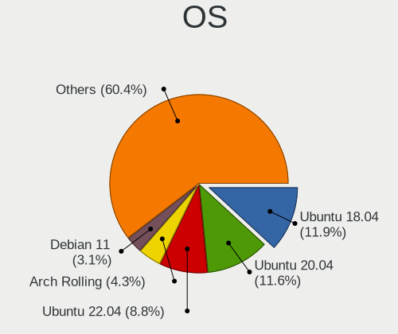

| Name               | Computers | Percent |
|--------------------|-----------|---------|
| Ubuntu 18.04       | 92        | 14.74%  |
| Ubuntu 20.04       | 86        | 13.78%  |
| Ubuntu 22.04       | 45        | 7.21%   |
| Debian 11          | 24        | 3.85%   |
| Arch Rolling       | 24        | 3.85%   |
| Fedora 37          | 15        | 2.4%    |
| OpenMandriva 4.2   | 14        | 2.24%   |
| Pop!_OS 20.04      | 10        | 1.6%    |
| OpenMandriva 23.01 | 10        | 1.6%    |
| Linux Mint 20.3    | 9         | 1.44%   |
| OpenMandriva 4.3   | 8         | 1.28%   |
| Ubuntu 19.04       | 7         | 1.12%   |
| Fedora 38          | 7         | 1.12%   |
| Ubuntu 22.10       | 6         | 0.96%   |
| Ubuntu 20.10       | 6         | 0.96%   |
| OpenMandriva 23.03 | 6         | 0.96%   |
| KDE neon 20.04     | 6         | 0.96%   |
| Xubuntu 18.04      | 5         | 0.8%    |
| Ubuntu 21.04       | 5         | 0.8%    |
| Ubuntu 19.10       | 5         | 0.8%    |
| Ubuntu 16.04       | 5         | 0.8%    |
| Fedora 36          | 5         | 0.8%    |
| Zorin 16           | 4         | 0.64%   |
| Xubuntu 20.04      | 4         | 0.64%   |
| Ubuntu 21.10       | 4         | 0.64%   |
| Ubuntu 18.10       | 4         | 0.64%   |
| SteamOS 3.4.4      | 4         | 0.64%   |
| Manjaro            | 4         | 0.64%   |
| Linux Mint 21.2    | 4         | 0.64%   |
| Linux Mint 20.1    | 4         | 0.64%   |
| Kubuntu 20.04      | 4         | 0.64%   |
| Fedora 34          | 4         | 0.64%   |
| Arch               | 4         | 0.64%   |
| Ubuntu MATE 20.04  | 3         | 0.48%   |
| Ubuntu 23.04       | 3         | 0.48%   |
| Pop!_OS 22.04      | 3         | 0.48%   |
| Pop!_OS 21.04      | 3         | 0.48%   |
| OpenMandriva 23.08 | 3         | 0.48%   |
| Manjaro 20.1       | 3         | 0.48%   |
| Linux Mint 21.1    | 3         | 0.48%   |

OS Family
---------

OS without a version

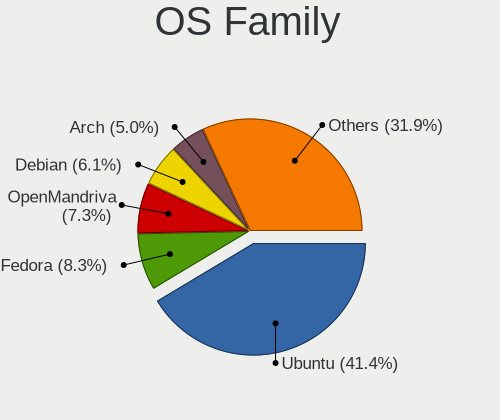

| Name             | Computers | Percent |
|------------------|-----------|---------|
| Ubuntu           | 263       | 43.98%  |
| OpenMandriva     | 44        | 7.36%   |
| Fedora           | 39        | 6.52%   |
| Debian           | 34        | 5.69%   |
| Manjaro          | 31        | 5.18%   |
| Linux Mint       | 30        | 5.02%   |
| Arch             | 28        | 4.68%   |
| Pop!_OS          | 19        | 3.18%   |
| Xubuntu          | 15        | 2.51%   |
| Kubuntu          | 11        | 1.84%   |
| Ubuntu MATE      | 7         | 1.17%   |
| KDE neon         | 7         | 1.17%   |
| Gentoo           | 7         | 1.17%   |
| Endless          | 7         | 1.17%   |
| Zorin            | 6         | 1%      |
| Kali             | 6         | 1%      |
| Lubuntu          | 5         | 0.84%   |
| Ubuntu Unity     | 4         | 0.67%   |
| SteamOS          | 4         | 0.67%   |
| openSUSE         | 4         | 0.67%   |
| Clear Linux      | 3         | 0.5%    |
| CentOS           | 3         | 0.5%    |
| Ubuntu Studio    | 2         | 0.33%   |
| Ubuntu Budgie    | 2         | 0.33%   |
| ROSA             | 2         | 0.33%   |
| org.kde.Platform | 2         | 0.33%   |
| EndeavourOS      | 2         | 0.33%   |
| Rocky Linux      | 1         | 0.17%   |
| Nobara           | 1         | 0.17%   |
| NixOS            | 1         | 0.17%   |
| Mageia           | 1         | 0.17%   |
| Lilidog          | 1         | 0.17%   |
| Kylin            | 1         | 0.17%   |
| Garuda Linux     | 1         | 0.17%   |
| Elementary       | 1         | 0.17%   |
| BlackPanther     | 1         | 0.17%   |
| ArcoLinux        | 1         | 0.17%   |
| Android          | 1         | 0.17%   |

Kernel
------

Version of the Linux kernel

| Version                  | Computers | Percent |
|--------------------------|-----------|---------|
| 4.18.0-20-generic        | 18        | 2.68%   |
| 5.10.14-desktop-1omv4002 | 12        | 1.79%   |
| 6.1.1-desktop-1omv2290   | 10        | 1.49%   |
| 5.4.0-42-generic         | 8         | 1.19%   |
| 5.16.7-desktop-1omv4003  | 8         | 1.19%   |
| 5.11.0-27-generic        | 7         | 1.04%   |
| 6.2.6-desktop-1omv2390   | 5         | 0.74%   |
| 5.3.0-40-generic         | 5         | 0.74%   |
| 5.19.0-46-generic        | 5         | 0.74%   |
| 5.15.0-53-generic        | 5         | 0.74%   |
| 5.8.0-7630-generic       | 4         | 0.6%    |
| 5.8.0-59-generic         | 4         | 0.6%    |
| 5.8.0-50-generic         | 4         | 0.6%    |
| 5.8.0-43-generic         | 4         | 0.6%    |
| 5.4.0-58-generic         | 4         | 0.6%    |
| 5.4.0-52-generic         | 4         | 0.6%    |
| 5.4.0-48-generic         | 4         | 0.6%    |
| 5.4.0-45-generic         | 4         | 0.6%    |
| 5.4.0-28-generic         | 4         | 0.6%    |
| 5.3.0-46-generic         | 4         | 0.6%    |
| 5.19.0-38-generic        | 4         | 0.6%    |
| 5.15.0-58-generic        | 4         | 0.6%    |
| 5.13.0-valve36-1-neptune | 4         | 0.6%    |
| 5.13.0-30-generic        | 4         | 0.6%    |
| 5.11.0-43-generic        | 4         | 0.6%    |
| 5.11.0-25-generic        | 4         | 0.6%    |
| 5.0.0-37-generic         | 4         | 0.6%    |
| 5.0.0-23-generic         | 4         | 0.6%    |
| 4.15.0-43-generic        | 4         | 0.6%    |
| 6.4.11-desktop-1omv2390  | 3         | 0.45%   |
| 6.2.0-35-generic         | 3         | 0.45%   |
| 6.2.0-26-generic         | 3         | 0.45%   |
| 6.0.12-300.fc37.x86_64   | 3         | 0.45%   |
| 5.8.0-53-generic         | 3         | 0.45%   |
| 5.4.0-84-generic         | 3         | 0.45%   |
| 5.4.0-7642-generic       | 3         | 0.45%   |
| 5.4.0-66-generic         | 3         | 0.45%   |
| 5.4.0-26-generic         | 3         | 0.45%   |
| 5.19.0-32-generic        | 3         | 0.45%   |
| 5.15.0-48-generic        | 3         | 0.45%   |

Kernel Family
-------------

Linux kernel without a distro release

| Version | Computers | Percent |
|---------|-----------|---------|
| 5.4.0   | 84        | 13.13%  |
| 5.15.0  | 43        | 6.72%   |
| 4.15.0  | 40        | 6.25%   |
| 4.18.0  | 36        | 5.63%   |
| 5.8.0   | 35        | 5.47%   |
| 5.11.0  | 29        | 4.53%   |
| 5.13.0  | 25        | 3.91%   |
| 5.19.0  | 21        | 3.28%   |
| 5.10.0  | 19        | 2.97%   |
| 5.0.0   | 18        | 2.81%   |
| 5.3.0   | 17        | 2.66%   |
| 6.2.0   | 16        | 2.5%    |
| 6.1.1   | 13        | 2.03%   |
| 5.10.14 | 12        | 1.88%   |
| 5.16.7  | 8         | 1.25%   |
| 6.2.6   | 7         | 1.09%   |
| 5.14.0  | 5         | 0.78%   |
| 6.0.0   | 4         | 0.63%   |
| 6.5.0   | 3         | 0.47%   |
| 6.4.11  | 3         | 0.47%   |
| 6.2.9   | 3         | 0.47%   |
| 6.2.2   | 3         | 0.47%   |
| 6.1.0   | 3         | 0.47%   |
| 6.0.12  | 3         | 0.47%   |
| 6.0.11  | 3         | 0.47%   |
| 5.16.18 | 3         | 0.47%   |
| 5.16.11 | 3         | 0.47%   |
| 6.5.6   | 2         | 0.31%   |
| 6.5.5   | 2         | 0.31%   |
| 6.4.0   | 2         | 0.31%   |
| 6.3.5   | 2         | 0.31%   |
| 6.3.2   | 2         | 0.31%   |
| 6.2.12  | 2         | 0.31%   |
| 6.2.11  | 2         | 0.31%   |
| 6.1.9   | 2         | 0.31%   |
| 6.1.7   | 2         | 0.31%   |
| 6.1.31  | 2         | 0.31%   |
| 6.0.8   | 2         | 0.31%   |
| 6.0.7   | 2         | 0.31%   |
| 6.0.2   | 2         | 0.31%   |

Kernel Major Ver.
-----------------

Linux kernel major version

| Version | Computers | Percent |
|---------|-----------|---------|
| 5.4     | 88        | 13.81%  |
| 5.15    | 65        | 10.2%   |
| 5.8     | 43        | 6.75%   |
| 5.10    | 40        | 6.28%   |
| 4.15    | 40        | 6.28%   |
| 6.2     | 38        | 5.97%   |
| 4.18    | 37        | 5.81%   |
| 5.11    | 34        | 5.34%   |
| 5.13    | 30        | 4.71%   |
| 6.1     | 27        | 4.24%   |
| 5.19    | 26        | 4.08%   |
| 5.0     | 21        | 3.3%    |
| 6.0     | 19        | 2.98%   |
| 5.3     | 17        | 2.67%   |
| 5.16    | 16        | 2.51%   |
| 6.5     | 10        | 1.57%   |
| 5.7     | 10        | 1.57%   |
| 6.3     | 9         | 1.41%   |
| 6.4     | 8         | 1.26%   |
| 5.14    | 8         | 1.26%   |
| 5.18    | 7         | 1.1%    |
| 5.17    | 5         | 0.78%   |
| 4.19    | 5         | 0.78%   |
| 5.9     | 4         | 0.63%   |
| 5.6     | 4         | 0.63%   |
| 5.5     | 4         | 0.63%   |
| 5.12    | 4         | 0.63%   |
| 4.9     | 3         | 0.47%   |
| 4.14    | 3         | 0.47%   |
| 4.4     | 2         | 0.31%   |
| 4.13    | 2         | 0.31%   |
| 4.12    | 2         | 0.31%   |
| 3.10    | 2         | 0.31%   |
| 6.6     | 1         | 0.16%   |
| 5.2     | 1         | 0.16%   |
| 5.1     | 1         | 0.16%   |
| 4.10    | 1         | 0.16%   |

Arch
----

OS architecture (x86_64, i586, etc.)

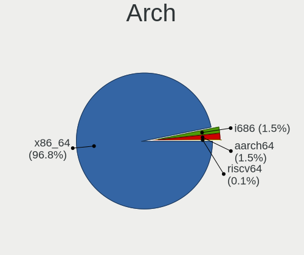

| Name    | Computers | Percent |
|---------|-----------|---------|
| x86_64  | 563       | 96.24%  |
| i686    | 11        | 1.88%   |
| aarch64 | 10        | 1.71%   |
| riscv64 | 1         | 0.17%   |

DE
--

Desktop Environment

| Name             | Computers | Percent |
|------------------|-----------|---------|
| GNOME            | 275       | 45.53%  |
| Unknown          | 119       | 19.7%   |
| KDE5             | 95        | 15.73%  |
| XFCE             | 31        | 5.13%   |
| X-Cinnamon       | 17        | 2.81%   |
| MATE             | 14        | 2.32%   |
| LXQt             | 9         | 1.49%   |
| KDE              | 9         | 1.49%   |
| Cinnamon         | 7         | 1.16%   |
| LXDE             | 5         | 0.83%   |
| Unity            | 4         | 0.66%   |
| i3               | 4         | 0.66%   |
| Openbox          | 2         | 0.33%   |
| GNOME Flashback  | 2         | 0.33%   |
| Deepin           | 2         | 0.33%   |
| Budgie           | 2         | 0.33%   |
| sway             | 1         | 0.17%   |
| qtile            | 1         | 0.17%   |
| Pantheon         | 1         | 0.17%   |
| lightdm-xsession | 1         | 0.17%   |
| KDE4             | 1         | 0.17%   |
| Hyprland         | 1         | 0.17%   |
| GNOME Classic    | 1         | 0.17%   |

Display Server
--------------

X11 or Wayland

| Name    | Computers | Percent |
|---------|-----------|---------|
| X11     | 424       | 70.32%  |
| Wayland | 104       | 17.25%  |
| Unknown | 56        | 9.29%   |
| Tty     | 19        | 3.15%   |

Display Manager
---------------

SDDM, LightDM, etc.

| Name    | Computers | Percent |
|---------|-----------|---------|
| Unknown | 277       | 45.94%  |
| GDM     | 101       | 16.75%  |
| SDDM    | 91        | 15.09%  |
| GDM3    | 76        | 12.6%   |
| LightDM | 38        | 6.3%    |
| TDM     | 13        | 2.16%   |
| SLiM    | 3         | 0.5%    |
| KDM     | 2         | 0.33%   |
| XDM     | 1         | 0.17%   |
| LXDM    | 1         | 0.17%   |

OS Lang
-------

Language

| Lang    | Computers | Percent |
|---------|-----------|---------|
| en_US   | 260       | 43.62%  |
| zh_TW   | 182       | 30.54%  |
| Unknown | 100       | 16.78%  |
| C       | 14        | 2.35%   |
| zh_CN   | 7         | 1.17%   |
| en_GB   | 7         | 1.17%   |
| zh_HK   | 3         | 0.5%    |
| ru_RU   | 3         | 0.5%    |
| lzh_TW  | 3         | 0.5%    |
| C.UTF8  | 3         | 0.5%    |
| en_SG   | 2         | 0.34%   |
| en_HK   | 2         | 0.34%   |
| de_DE   | 2         | 0.34%   |
| zh_SG   | 1         | 0.17%   |
| ja_JP   | 1         | 0.17%   |
| it_IT   | 1         | 0.17%   |
| es_ES   | 1         | 0.17%   |
| en_PH   | 1         | 0.17%   |
| en_IE   | 1         | 0.17%   |
| en_CA   | 1         | 0.17%   |
| en_AU   | 1         | 0.17%   |

Boot Mode
---------

EFI or BIOS

| Mode | Computers | Percent |
|------|-----------|---------|
| EFI  | 340       | 57.24%  |
| BIOS | 254       | 42.76%  |

Filesystem
----------

Type of filesystem

| Type    | Computers | Percent |
|---------|-----------|---------|
| Ext4    | 451       | 76.18%  |
| Btrfs   | 53        | 8.95%   |
| Overlay | 35        | 5.91%   |
| Tmpfs   | 15        | 2.53%   |
| Xfs     | 14        | 2.36%   |
| Unknown | 14        | 2.36%   |
| Ext2    | 5         | 0.84%   |
| Ext3    | 2         | 0.34%   |
| XXXXXXX | 1         | 0.17%   |
| Rootfs  | 1         | 0.17%   |
| F2fs    | 1         | 0.17%   |

Part. scheme
------------

Scheme of partitioning

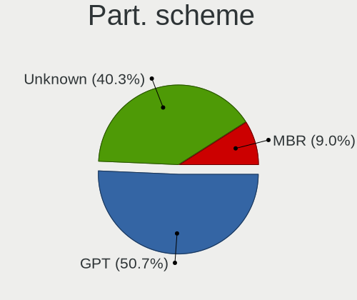

| Type    | Computers | Percent |
|---------|-----------|---------|
| GPT     | 271       | 45.55%  |
| Unknown | 270       | 45.38%  |
| MBR     | 54        | 9.08%   |

Dual Boot with Linux/BSD
------------------------

Hosting more than one Linux/BSD

| Dual boot | Computers | Percent |
|-----------|-----------|---------|
| No        | 492       | 83.11%  |
| Yes       | 100       | 16.89%  |

Dual Boot (Win)
---------------

Hosting Linux and Windows

| Dual boot | Computers | Percent |
|-----------|-----------|---------|
| No        | 370       | 62.29%  |
| Yes       | 224       | 37.71%  |

Board
-----

Vendor
------

Motherboard manufacturer

| Name                    | Computers | Percent |
|-------------------------|-----------|---------|
| ASUSTek Computer        | 133       | 22.74%  |
| Gigabyte Technology     | 66        | 11.28%  |
| Acer                    | 65        | 11.11%  |
| Lenovo                  | 50        | 8.55%   |
| MSI                     | 44        | 7.52%   |
| Hewlett-Packard         | 44        | 7.52%   |
| Dell                    | 34        | 5.81%   |
| Unknown                 | 31        | 5.3%    |
| ASRock                  | 21        | 3.59%   |
| Intel                   | 11        | 1.88%   |
| Apple                   | 7         | 1.2%    |
| Raspberry Pi Foundation | 6         | 1.03%   |
| Toshiba                 | 5         | 0.85%   |
| Sony                    | 5         | 0.85%   |
| Valve                   | 4         | 0.68%   |
| Supermicro              | 4         | 0.68%   |
| win element             | 2         | 0.34%   |
| Timi                    | 2         | 0.34%   |
| Nvidia                  | 2         | 0.34%   |
| NEXCOM                  | 2         | 0.34%   |
| Microsoft               | 2         | 0.34%   |
| LG Electronics          | 2         | 0.34%   |
| Lex                     | 2         | 0.34%   |
| Intel Client Systems    | 2         | 0.34%   |
| HUAWEI                  | 2         | 0.34%   |
| AVITA                   | 2         | 0.34%   |
| AMI                     | 2         | 0.34%   |
| AMD                     | 2         | 0.34%   |
| Vizio                   | 1         | 0.17%   |
| System76                | 1         | 0.17%   |
| Samsung Electronics     | 1         | 0.17%   |
| Ruckus Wireless         | 1         | 0.17%   |
| PANSHI                  | 1         | 0.17%   |
| ONDA                    | 1         | 0.17%   |
| OEM                     | 1         | 0.17%   |
| Neousys Technology      | 1         | 0.17%   |
| NEC Computers           | 1         | 0.17%   |
| MiTAC                   | 1         | 0.17%   |
| Maxtang                 | 1         | 0.17%   |
| Insyde                  | 1         | 0.17%   |

Model
-----

Motherboard model

| Name                               | Computers | Percent |
|------------------------------------|-----------|---------|
| Unknown                            | 33        | 5.64%   |
| ASUS All Series                    | 7         | 1.2%    |
| Valve Jupiter                      | 4         | 0.68%   |
| Gigabyte B75M-D3H                  | 4         | 0.68%   |
| Gigabyte B550I AORUS PRO AX        | 4         | 0.68%   |
| ASUS M5A78L-M/USB3                 | 4         | 0.68%   |
| Lenovo ThinkCentre M58 7627AA9     | 3         | 0.51%   |
| Dell Inspiron 531s                 | 3         | 0.51%   |
| ASUS TUF Gaming B550M-PLUS         | 3         | 0.51%   |
| ASRock X300M-STX                   | 3         | 0.51%   |
| Acer Swift SFX14-41G               | 3         | 0.51%   |
| Toshiba Satellite L850             | 2         | 0.34%   |
| Supermicro Super Server            | 2         | 0.34%   |
| RPi Raspberry Pi 4 Model B Rev 1.4 | 2         | 0.34%   |
| RPi Raspberry Pi                   | 2         | 0.34%   |
| Nvidia Tegra                       | 2         | 0.34%   |
| MSI MS-7C52                        | 2         | 0.34%   |
| MSI MS-7A69                        | 2         | 0.34%   |
| MSI GS63 7RE                       | 2         | 0.34%   |
| Lex 3I610DW                        | 2         | 0.34%   |
| Lenovo IdeaPad 5 14ALC05 82LM      | 2         | 0.34%   |
| HP ProBook 430 G8 Notebook PC      | 2         | 0.34%   |
| HP Pavilion dv7                    | 2         | 0.34%   |
| Gigabyte Z97MX-Gaming 5            | 2         | 0.34%   |
| Gigabyte H81N                      | 2         | 0.34%   |
| Gigabyte G31M-ES2L                 | 2         | 0.34%   |
| Gigabyte B85M-D2V                  | 2         | 0.34%   |
| Dell XPS 13 9380                   | 2         | 0.34%   |
| AVITA NE14A2                       | 2         | 0.34%   |
| ASUS ROG STRIX B350-F GAMING       | 2         | 0.34%   |
| ASUS Pro WS X570-ACE               | 2         | 0.34%   |
| ASUS PRIME B660M-A WIFI D4         | 2         | 0.34%   |
| ASUS P8Z77-V LX                    | 2         | 0.34%   |
| ASUS CM6630_CM6730_CM6830          | 2         | 0.34%   |
| ASRock N68-GS4/USB3 FX             | 2         | 0.34%   |
| ASRock H310M-ITX/ac                | 2         | 0.34%   |
| ASRock A300M-STX                   | 2         | 0.34%   |
| ASRock 960GC-GS FX                 | 2         | 0.34%   |
| Acer Veriton L480                  | 2         | 0.34%   |
| Acer Swift SF514-52T               | 2         | 0.34%   |

Model Family
------------

Motherboard model prefix

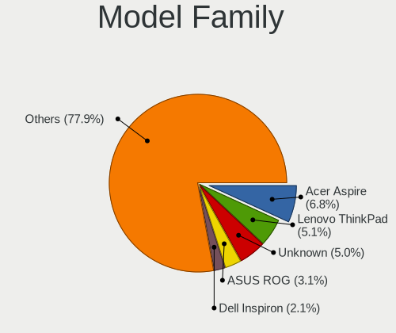

| Name               | Computers | Percent |
|--------------------|-----------|---------|
| Acer Aspire        | 40        | 6.84%   |
| Unknown            | 33        | 5.64%   |
| Lenovo ThinkPad    | 25        | 4.27%   |
| ASUS ROG           | 18        | 3.08%   |
| Dell Inspiron      | 13        | 2.22%   |
| ASUS TUF           | 11        | 1.88%   |
| Lenovo IdeaPad     | 10        | 1.71%   |
| ASUS PRIME         | 10        | 1.71%   |
| HP ProBook         | 9         | 1.54%   |
| ASUS VivoBook      | 9         | 1.54%   |
| Acer Swift         | 9         | 1.54%   |
| HP Pavilion        | 8         | 1.37%   |
| ASUS All           | 7         | 1.2%    |
| RPi Raspberry      | 6         | 1.03%   |
| ASUS M5A78L-M      | 6         | 1.03%   |
| Dell Vostro        | 5         | 0.85%   |
| Dell Latitude      | 5         | 0.85%   |
| ASUS ASUSPRO       | 5         | 0.85%   |
| Acer Veriton       | 5         | 0.85%   |
| Valve Jupiter      | 4         | 0.68%   |
| Toshiba Satellite  | 4         | 0.68%   |
| Gigabyte B75M-D3H  | 4         | 0.68%   |
| Gigabyte B550I     | 4         | 0.68%   |
| ASUS ZenBook       | 4         | 0.68%   |
| Acer TravelMate    | 4         | 0.68%   |
| Lenovo ThinkCentre | 3         | 0.51%   |
| HP ENVY            | 3         | 0.51%   |
| HP EliteBook       | 3         | 0.51%   |
| HP Compaq          | 3         | 0.51%   |
| Dell XPS           | 3         | 0.51%   |
| Dell Precision     | 3         | 0.51%   |
| Dell OptiPlex      | 3         | 0.51%   |
| ASUS Pro           | 3         | 0.51%   |
| ASUS P8Z77-V       | 3         | 0.51%   |
| ASUS ASUS          | 3         | 0.51%   |
| ASRock X300M-STX   | 3         | 0.51%   |
| Supermicro Super   | 2         | 0.34%   |
| Nvidia Tegra       | 2         | 0.34%   |
| MSI MS-7C52        | 2         | 0.34%   |
| MSI MS-7A69        | 2         | 0.34%   |

MFG Year
--------

Motherboard manufacture year

| Year    | Computers | Percent |
|---------|-----------|---------|
| 2020    | 61        | 10.43%  |
| 2021    | 59        | 10.09%  |
| 2019    | 56        | 9.57%   |
| 2018    | 56        | 9.57%   |
| 2022    | 42        | 7.18%   |
| 2012    | 42        | 7.18%   |
| 2014    | 39        | 6.67%   |
| 2011    | 34        | 5.81%   |
| 2017    | 32        | 5.47%   |
| 2013    | 31        | 5.3%    |
| 2016    | 26        | 4.44%   |
| 2015    | 24        | 4.1%    |
| 2009    | 21        | 3.59%   |
| 2010    | 19        | 3.25%   |
| 2008    | 16        | 2.74%   |
| Unknown | 10        | 1.71%   |
| 2023    | 8         | 1.37%   |
| 2007    | 6         | 1.03%   |
| 2006    | 2         | 0.34%   |
| 2004    | 1         | 0.17%   |

Form Factor
-----------

Physical design of the computer

| Name           | Computers | Percent |
|----------------|-----------|---------|
| Desktop        | 264       | 45.13%  |
| Notebook       | 252       | 43.08%  |
| Server         | 27        | 4.62%   |
| System on chip | 10        | 1.71%   |
| Mini pc        | 10        | 1.71%   |
| Convertible    | 9         | 1.54%   |
| All in one     | 9         | 1.54%   |
| Tablet         | 3         | 0.51%   |
| Phone          | 1         | 0.17%   |

Secure Boot
-----------

Enabled or disabled

| State    | Computers | Percent |
|----------|-----------|---------|
| Disabled | 551       | 93.55%  |
| Enabled  | 38        | 6.45%   |

Coreboot
--------

Have coreboot on board

| Used | Computers | Percent |
|------|-----------|---------|
| No   | 583       | 99.66%  |
| Yes  | 2         | 0.34%   |

RAM Size
--------

Total RAM memory

| Size in GB      | Computers | Percent |
|-----------------|-----------|---------|
| 16.01-24.0      | 149       | 25.13%  |
| 4.01-8.0        | 122       | 20.57%  |
| 8.01-16.0       | 100       | 16.86%  |
| 3.01-4.0        | 83        | 14%     |
| 32.01-64.0      | 76        | 12.82%  |
| 64.01-256.0     | 27        | 4.55%   |
| 24.01-32.0      | 17        | 2.87%   |
| 1.01-2.0        | 13        | 2.19%   |
| 2.01-3.0        | 3         | 0.51%   |
| More than 256.0 | 2         | 0.34%   |
| 0.51-1.0        | 1         | 0.17%   |

RAM Used
--------

Used RAM memory

| Used GB    | Computers | Percent |
|------------|-----------|---------|
| 1.01-2.0   | 213       | 33.39%  |
| 2.01-3.0   | 161       | 25.24%  |
| 4.01-8.0   | 109       | 17.08%  |
| 3.01-4.0   | 84        | 13.17%  |
| 8.01-16.0  | 32        | 5.02%   |
| 0.51-1.0   | 23        | 3.61%   |
| 0.01-0.5   | 6         | 0.94%   |
| 24.01-32.0 | 5         | 0.78%   |
| 16.01-24.0 | 3         | 0.47%   |
| 32.01-64.0 | 2         | 0.31%   |

Total Drives
------------

Number of drives on board

| Drives  | Computers | Percent |
|---------|-----------|---------|
| 1       | 307       | 51.6%   |
| 2       | 171       | 28.74%  |
| 3       | 58        | 9.75%   |
| 0       | 22        | 3.7%    |
| 4       | 18        | 3.03%   |
| 5       | 10        | 1.68%   |
| 6       | 4         | 0.67%   |
| 7       | 3         | 0.5%    |
| 14      | 1         | 0.17%   |
| Unknown | 1         | 0.17%   |

Has CD-ROM
----------

Has CD-ROM on board

| Presented | Computers | Percent |
|-----------|-----------|---------|
| No        | 418       | 71.09%  |
| Yes       | 170       | 28.91%  |

Has Ethernet
------------

Has Ethernet on board

| Presented | Computers | Percent |
|-----------|-----------|---------|
| Yes       | 507       | 86.37%  |
| No        | 80        | 13.63%  |

Has WiFi
--------

Has WiFi module

| Presented | Computers | Percent |
|-----------|-----------|---------|
| Yes       | 393       | 67.06%  |
| No        | 193       | 32.94%  |

Has Bluetooth
-------------

Has Bluetooth module

| Presented | Computers | Percent |
|-----------|-----------|---------|
| Yes       | 352       | 59.56%  |
| No        | 239       | 40.44%  |

Location
--------

Country
-------

Geographic location (country)

| Country | Computers | Percent |
|---------|-----------|---------|
| Taiwan  | 585       | 100%    |

City
----

Geographic location (city)

| City              | Computers | Percent |
|-------------------|-----------|---------|
| Taipei            | 176       | 28.43%  |
| New Taipei        | 114       | 18.42%  |
| Taoyuan District  | 65        | 10.5%   |
| Taichung          | 48        | 7.75%   |
| Hsinchu           | 43        | 6.95%   |
| Kaohsiung City    | 38        | 6.14%   |
| Tainan City       | 26        | 4.2%    |
| Hsinchu County    | 16        | 2.58%   |
| Chang-hua         | 9         | 1.45%   |
| Keelung           | 7         | 1.13%   |
| Zhudong           | 5         | 0.81%   |
| Zhongli District  | 5         | 0.81%   |
| Pingtung City     | 5         | 0.81%   |
| Yunlin            | 4         | 0.65%   |
| Nantou City       | 4         | 0.65%   |
| Miaoli            | 4         | 0.65%   |
| Zhubei            | 3         | 0.48%   |
| Yilan             | 3         | 0.48%   |
| Taoyuan City      | 3         | 0.48%   |
| Yangmei District  | 2         | 0.32%   |
| Taichung City     | 2         | 0.32%   |
| Shulin District   | 2         | 0.32%   |
| Kanzijiao         | 2         | 0.32%   |
| Chiayi City       | 2         | 0.32%   |
| Chiayi            | 2         | 0.32%   |
| Banqiao           | 2         | 0.32%   |
| Baitang           | 2         | 0.32%   |
| Xinzhuang         | 1         | 0.16%   |
| Xindian           | 1         | 0.16%   |
| Xiawanzi          | 1         | 0.16%   |
| Xiatayou          | 1         | 0.16%   |
| Tuniugou          | 1         | 0.16%   |
| Taitung           | 1         | 0.16%   |
| Taishan           | 1         | 0.16%   |
| Sanchong District | 1         | 0.16%   |
| Pingzhen District | 1         | 0.16%   |
| Penghu County     | 1         | 0.16%   |
| Neihu             | 1         | 0.16%   |
| Minxiong          | 1         | 0.16%   |
| Magong            | 1         | 0.16%   |

Drives
------

Drive Vendor
------------

Hard drive vendors

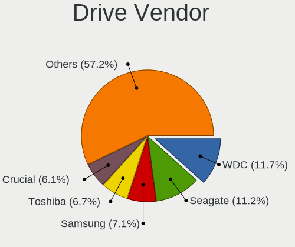

| Vendor                      | Computers | Drives | Percent |
|-----------------------------|-----------|--------|---------|
| WDC                         | 114       | 163    | 12.72%  |
| Seagate                     | 105       | 165    | 11.72%  |
| Toshiba                     | 65        | 83     | 7.25%   |
| Crucial                     | 58        | 73     | 6.47%   |
| Samsung Electronics         | 54        | 69     | 6.03%   |
| Unknown                     | 41        | 49     | 4.58%   |
| Sandisk                     | 41        | 59     | 4.58%   |
| Kingston                    | 40        | 51     | 4.46%   |
| Intel                       | 40        | 59     | 4.46%   |
| Hitachi                     | 33        | 40     | 3.68%   |
| A-DATA Technology           | 27        | 32     | 3.01%   |
| SK hynix                    | 25        | 30     | 2.79%   |
| HGST                        | 22        | 24     | 2.46%   |
| Transcend                   | 18        | 19     | 2.01%   |
| Micron Technology           | 18        | 19     | 2.01%   |
| Micron/Crucial Technology   | 10        | 13     | 1.12%   |
| Lite-On                     | 10        | 10     | 1.12%   |
| KIOXIA                      | 9         | 11     | 1%      |
| Apacer                      | 9         | 11     | 1%      |
| Plextor                     | 8         | 9      | 0.89%   |
| Phison Electronics          | 8         | 11     | 0.89%   |
| Unknown                     | 8         | 8      | 0.89%   |
| ASMT                        | 7         | 7      | 0.78%   |
| ANACOMDA                    | 7         | 7      | 0.78%   |
| SPCC                        | 6         | 7      | 0.67%   |
| Silicon Motion              | 6         | 6      | 0.67%   |
| Phison                      | 6         | 7      | 0.67%   |
| Patriot                     | 5         | 5      | 0.56%   |
| Kingston Technology Company | 5         | 6      | 0.56%   |
| AGI                         | 5         | 6      | 0.56%   |
| XPG                         | 4         | 4      | 0.45%   |
| Team                        | 4         | 5      | 0.45%   |
| PNY                         | 4         | 7      | 0.45%   |
| OCZ                         | 3         | 3      | 0.33%   |
| Maxtor                      | 3         | 3      | 0.33%   |
| LITEONIT                    | 3         | 3      | 0.33%   |
| JMicron Technology          | 3         | 7      | 0.33%   |
| China                       | 3         | 3      | 0.33%   |
| ADATA Technology            | 3         | 3      | 0.33%   |
| ZHITAI                      | 2         | 2      | 0.22%   |

Drive Model
-----------

Hard drive models

| Model                                   | Computers | Percent |
|-----------------------------------------|-----------|---------|
| Crucial CT500MX500SSD1 500GB            | 19        | 1.98%   |
| Toshiba DT01ACA100 1TB                  | 14        | 1.46%   |
| Crucial CT1000MX500SSD1 1TB             | 14        | 1.46%   |
| Toshiba DT01ACA200 2TB                  | 12        | 1.25%   |
| Seagate ST2000DM008-2FR102 2TB          | 10        | 1.04%   |
| Lite-On NVMe SSD Drive 512GB            | 8         | 0.83%   |
| HGST HTS721010A9E630 1TB                | 8         | 0.83%   |
| Unknown                                 | 8         | 0.83%   |
| SanDisk NVMe SSD Drive 1TB              | 7         | 0.73%   |
| Unknown MMC Card  64GB                  | 6         | 0.62%   |
| Toshiba MQ01ABD100 1TB                  | 6         | 0.62%   |
| Seagate ST3500418AS 500GB               | 6         | 0.62%   |
| Seagate ST1000LM035-1RK172 1TB          | 6         | 0.62%   |
| Crucial CT240BX500SSD1 240GB            | 6         | 0.62%   |
| Unknown MMC Card  32GB                  | 5         | 0.52%   |
| Toshiba MQ04ABF100 1TB                  | 5         | 0.52%   |
| Toshiba MQ01ABD032 320GB                | 5         | 0.52%   |
| Seagate ST500DM002-1BD142 500GB         | 5         | 0.52%   |
| Micron/Crucial P2 NVMe PCIe SSD 500GB   | 5         | 0.52%   |
| A-DATA SU800 512GB SSD                  | 5         | 0.52%   |
| WDC WDS250G1B0B-00AS40 250GB SSD        | 4         | 0.42%   |
| WDC WD10EZEX-75WN4A1 1TB                | 4         | 0.42%   |
| SK hynix HFM512GD3JX016N 512GB          | 4         | 0.42%   |
| Silicon Motion NVMe SSD Drive 512GB     | 4         | 0.42%   |
| Seagate ST2000DM001-1CH164 2TB          | 4         | 0.42%   |
| Seagate ST1000LM049-2GH172 1TB          | 4         | 0.42%   |
| Seagate ST1000DM003-1ER162 1TB          | 4         | 0.42%   |
| SanDisk NVMe SSD Drive 512GB            | 4         | 0.42%   |
| SanDisk NVMe SSD Drive 500GB            | 4         | 0.42%   |
| SanDisk NVMe SSD Drive 256GB            | 4         | 0.42%   |
| Phison PS5013 E13 NVMe Controller 256GB | 4         | 0.42%   |
| Patriot Burst 120GB SSD                 | 4         | 0.42%   |
| Kingston SA400S37480G 480GB SSD         | 4         | 0.42%   |
| Kingston SA400S37240G 240GB SSD         | 4         | 0.42%   |
| Kingston SA2000M8500G 500GB             | 4         | 0.42%   |
| HGST HTS541010A9E680 1TB                | 4         | 0.42%   |
| ASMT 2115 1TB                           | 4         | 0.42%   |
| A-DATA SU800 256GB SSD                  | 4         | 0.42%   |
| WDC WDS500G3X0C-00SJG0 500GB            | 3         | 0.31%   |
| WDC WDS250G2B0A-00SM50 250GB SSD        | 3         | 0.31%   |

HDD Vendor
----------

Hard disk drive vendors

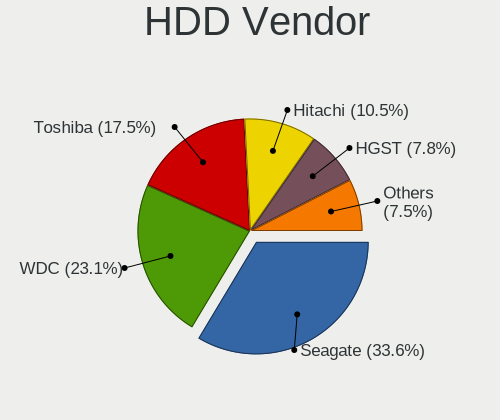

| Vendor              | Computers | Drives | Percent |
|---------------------|-----------|--------|---------|
| Seagate             | 104       | 161    | 34.21%  |
| WDC                 | 74        | 106    | 24.34%  |
| Toshiba             | 56        | 74     | 18.42%  |
| Hitachi             | 33        | 40     | 10.86%  |
| HGST                | 22        | 24     | 7.24%   |
| Unknown             | 4         | 5      | 1.32%   |
| Maxtor              | 3         | 3      | 0.99%   |
| StoreJet            | 1         | 2      | 0.33%   |
| Samsung Electronics | 1         | 2      | 0.33%   |
| NETAPP              | 1         | 2      | 0.33%   |
| NeoTech             | 1         | 1      | 0.33%   |
| JMicron Technology  | 1         | 4      | 0.33%   |
| Fujitsu             | 1         | 2      | 0.33%   |
| External            | 1         | 1      | 0.33%   |
| Apple               | 1         | 1      | 0.33%   |

SSD Vendor
----------

Solid state drive vendors

| Vendor              | Computers | Drives | Percent |
|---------------------|-----------|--------|---------|
| Crucial             | 55        | 68     | 19.16%  |
| A-DATA Technology   | 24        | 28     | 8.36%   |
| Kingston            | 21        | 24     | 7.32%   |
| Intel               | 19        | 29     | 6.62%   |
| Transcend           | 18        | 19     | 6.27%   |
| WDC                 | 17        | 24     | 5.92%   |
| SanDisk             | 16        | 19     | 5.57%   |
| Samsung Electronics | 13        | 15     | 4.53%   |
| Micron Technology   | 8         | 9      | 2.79%   |
| Toshiba             | 7         | 7      | 2.44%   |
| Plextor             | 7         | 8      | 2.44%   |
| ASMT                | 7         | 7      | 2.44%   |
| Apacer              | 7         | 9      | 2.44%   |
| ANACOMDA            | 7         | 7      | 2.44%   |
| SPCC                | 6         | 7      | 2.09%   |
| Patriot             | 5         | 5      | 1.74%   |
| Team                | 3         | 4      | 1.05%   |
| SK hynix            | 3         | 3      | 1.05%   |
| OCZ                 | 3         | 3      | 1.05%   |
| LITEONIT            | 3         | 3      | 1.05%   |
| China               | 3         | 3      | 1.05%   |
| AGI                 | 3         | 4      | 1.05%   |
| Unknown             | 3         | 3      | 1.05%   |
| Leven               | 2         | 2      | 0.7%    |
| KLEVV               | 2         | 2      | 0.7%    |
| Gigastone           | 2         | 2      | 0.7%    |
| FORESEE             | 2         | 2      | 0.7%    |
| ZHITAI              | 1         | 1      | 0.35%   |
| Wintec              | 1         | 1      | 0.35%   |
| Unknown             | 1         | 1      | 0.35%   |
| TO Exter            | 1         | 1      | 0.35%   |
| T-FORCE             | 1         | 1      | 0.35%   |
| Sony                | 1         | 1      | 0.35%   |
| OCZ-VECT            | 1         | 1      | 0.35%   |
| OCZ-REVODRIVE       | 1         | 4      | 0.35%   |
| MyDigitalSSD        | 1         | 1      | 0.35%   |
| MX                  | 1         | 1      | 0.35%   |
| MemoCom             | 1         | 2      | 0.35%   |
| LITEON              | 1         | 1      | 0.35%   |
| Kingchuxing         | 1         | 1      | 0.35%   |

Drive Kind
----------

HDD or SSD

| Kind    | Computers | Drives | Percent |
|---------|-----------|--------|---------|
| HDD     | 259       | 428    | 33.04%  |
| SSD     | 247       | 342    | 31.51%  |
| NVMe    | 231       | 338    | 29.46%  |
| MMC     | 32        | 37     | 4.08%   |
| Unknown | 15        | 18     | 1.91%   |

Drive Connector
---------------

SATA, SAS, NVMe, etc.

| Type | Computers | Drives | Percent |
|------|-----------|--------|---------|
| SATA | 406       | 733    | 57.83%  |
| NVMe | 229       | 335    | 32.62%  |
| SAS  | 35        | 58     | 4.99%   |
| MMC  | 32        | 37     | 4.56%   |

Drive Size
----------

Size of hard drive

| Size in TB | Computers | Drives | Percent |
|------------|-----------|--------|---------|
| 0.01-0.5   | 272       | 406    | 50.65%  |
| 0.51-1.0   | 174       | 226    | 32.4%   |
| 1.01-2.0   | 53        | 80     | 9.87%   |
| 3.01-4.0   | 14        | 20     | 2.61%   |
| 2.01-3.0   | 11        | 18     | 2.05%   |
| 4.01-10.0  | 10        | 17     | 1.86%   |
| 10.01-20.0 | 3         | 3      | 0.56%   |

Space Total
-----------

Amount of disk space available on the file system

| Size in GB     | Computers | Percent |
|----------------|-----------|---------|
| 251-500        | 145       | 23.65%  |
| 101-250        | 143       | 23.33%  |
| 501-1000       | 81        | 13.21%  |
| 1001-2000      | 53        | 8.65%   |
| 1-20           | 44        | 7.18%   |
| 51-100         | 41        | 6.69%   |
| 21-50          | 34        | 5.55%   |
| 2001-3000      | 28        | 4.57%   |
| More than 3000 | 23        | 3.75%   |
| Unknown        | 21        | 3.43%   |

Space Used
----------

Amount of used disk space

| Used GB        | Computers | Percent |
|----------------|-----------|---------|
| 1-20           | 253       | 40.22%  |
| 21-50          | 91        | 14.47%  |
| 101-250        | 78        | 12.4%   |
| 51-100         | 74        | 11.76%  |
| 251-500        | 51        | 8.11%   |
| 501-1000       | 30        | 4.77%   |
| Unknown        | 21        | 3.34%   |
| 1001-2000      | 17        | 2.7%    |
| More than 3000 | 8         | 1.27%   |
| 2001-3000      | 6         | 0.95%   |

Malfunc. Drives
---------------

Drive models with a malfunction

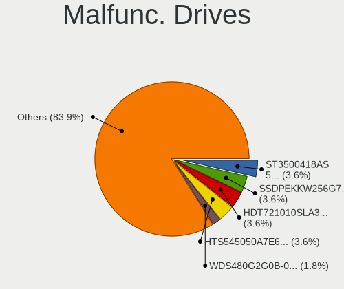

| Model                                          | Computers | Drives | Percent |
|------------------------------------------------|-----------|--------|---------|
| Intel SSDPEKKW256G7 256GB                      | 2         | 3      | 5.26%   |
| WDC WD5000AAKX-60U6AA0 500GB                   | 1         | 1      | 2.63%   |
| WDC WD5000AAKX-001CA0 500GB                    | 1         | 1      | 2.63%   |
| WDC WD5000AADS-00L4B1 500GB                    | 1         | 1      | 2.63%   |
| WDC WD3200AAKS-00L9A0 320GB                    | 1         | 1      | 2.63%   |
| WDC WD20EARX-00PASB0 2TB                       | 1         | 1      | 2.63%   |
| WDC WD20EARS-00MVWB0 2TB                       | 1         | 1      | 2.63%   |
| WDC WD10EFRX-68JCSN0 1TB                       | 1         | 1      | 2.63%   |
| WDC WD10EALS-00Z8A0 1TB                        | 1         | 1      | 2.63%   |
| WDC WD1002FAEX-00Z3A0 1TB                      | 1         | 1      | 2.63%   |
| Transcend TS64GSSD340 64GB                     | 1         | 1      | 2.63%   |
| SK hynix PC711 HFS512GDE9X073N 512GB           | 1         | 1      | 2.63%   |
| SK hynix HFS128G39MNC-2300A 128GB SSD          | 1         | 1      | 2.63%   |
| Seagate ST9500325AS 500GB                      | 1         | 1      | 2.63%   |
| Seagate ST500LM000-1EJ162 500GB                | 1         | 1      | 2.63%   |
| Seagate ST4000DX001-1CE168 4TB                 | 1         | 2      | 2.63%   |
| Seagate ST3500418AS 500GB                      | 1         | 1      | 2.63%   |
| Seagate ST3500410SV 500GB                      | 1         | 1      | 2.63%   |
| Seagate ST3160811AS 160GB                      | 1         | 1      | 2.63%   |
| Seagate ST2000VN000-1H3164 2TB                 | 1         | 2      | 2.63%   |
| Samsung Electronics HM321HI 320GB              | 1         | 2      | 2.63%   |
| Plextor PX-128M6Pro 128GB SSD                  | 1         | 1      | 2.63%   |
| Micron Technology 1100_MTFDDAV512TBN 512GB SSD | 1         | 1      | 2.63%   |
| LITEONIT E200-080 80GB SSD                     | 1         | 1      | 2.63%   |
| KLEVV SSD NEO N500 240GB                       | 1         | 1      | 2.63%   |
| Kingston SV300S37A60G 64GB SSD                 | 1         | 1      | 2.63%   |
| Intel SSDSC2BW080A4 80GB                       | 1         | 1      | 2.63%   |
| Intel SSDSC2BB016T7 2TB                        | 1         | 1      | 2.63%   |
| Hitachi HTS722080K9SA00 80GB                   | 1         | 1      | 2.63%   |
| Hitachi HTS545050A7E380 500GB                  | 1         | 1      | 2.63%   |
| Hitachi HDT721010SLA360 1TB                    | 1         | 1      | 2.63%   |
| Hitachi HDS723020BLA642 2TB                    | 1         | 2      | 2.63%   |
| HGST HTS725050A7E630 500GB                     | 1         | 1      | 2.63%   |
| HGST HTS545050A7E680 500GB                     | 1         | 1      | 2.63%   |
| Crucial CT275MX300SSD4 275GB                   | 1         | 1      | 2.63%   |
| ASMT 2115 1TB                                  | 1         | 1      | 2.63%   |
| A-DATA Technology IMSS332-960GB SSD            | 1         | 1      | 2.63%   |

Malfunc. Drive Vendor
---------------------

Vendors of faulty drives

| Vendor              | Computers | Drives | Percent |
|---------------------|-----------|--------|---------|
| WDC                 | 9         | 9      | 23.68%  |
| Seagate             | 7         | 9      | 18.42%  |
| Intel               | 4         | 5      | 10.53%  |
| Hitachi             | 4         | 5      | 10.53%  |
| SK hynix            | 2         | 2      | 5.26%   |
| HGST                | 2         | 2      | 5.26%   |
| Transcend           | 1         | 1      | 2.63%   |
| Samsung Electronics | 1         | 2      | 2.63%   |
| Plextor             | 1         | 1      | 2.63%   |
| Micron Technology   | 1         | 1      | 2.63%   |
| LITEONIT            | 1         | 1      | 2.63%   |
| KLEVV               | 1         | 1      | 2.63%   |
| Kingston            | 1         | 1      | 2.63%   |
| Crucial             | 1         | 1      | 2.63%   |
| ASMT                | 1         | 1      | 2.63%   |
| A-DATA Technology   | 1         | 1      | 2.63%   |

Malfunc. HDD Vendor
-------------------

Vendors of faulty HDD drives

| Vendor              | Computers | Drives | Percent |
|---------------------|-----------|--------|---------|
| WDC                 | 9         | 9      | 39.13%  |
| Seagate             | 7         | 9      | 30.43%  |
| Hitachi             | 4         | 5      | 17.39%  |
| HGST                | 2         | 2      | 8.7%    |
| Samsung Electronics | 1         | 2      | 4.35%   |

Malfunc. Drive Kind
-------------------

Kinds of faulty drives

| Kind | Computers | Drives | Percent |
|------|-----------|--------|---------|
| HDD  | 21        | 27     | 58.33%  |
| SSD  | 12        | 12     | 33.33%  |
| NVMe | 3         | 4      | 8.33%   |

Failed Drives
-------------

Failed drive models

Zero info for selected period =(

Failed Drive Vendor
-------------------

Failed drive vendors

Zero info for selected period =(

Drive Status
------------

Number of failed and malfunc. drives

| Status   | Computers | Drives | Percent |
|----------|-----------|--------|---------|
| Detected | 326       | 669    | 52.58%  |
| Works    | 258       | 451    | 41.61%  |
| Malfunc  | 36        | 43     | 5.81%   |

Storage controller
------------------

Storage Vendor
--------------

Storage controller vendors

| Vendor                         | Computers | Percent |
|--------------------------------|-----------|---------|
| Intel                          | 387       | 50.06%  |
| AMD                            | 97        | 12.55%  |
| Samsung Electronics            | 55        | 7.12%   |
| SanDisk                        | 47        | 6.08%   |
| SK hynix                       | 22        | 2.85%   |
| Kingston Technology Company    | 22        | 2.85%   |
| Phison Electronics             | 19        | 2.46%   |
| ASMedia Technology             | 15        | 1.94%   |
| Micron/Crucial Technology      | 14        | 1.81%   |
| Micron Technology              | 11        | 1.42%   |
| Nvidia                         | 10        | 1.29%   |
| Lite-On Technology             | 10        | 1.29%   |
| ADATA Technology               | 9         | 1.16%   |
| Marvell Technology Group       | 8         | 1.03%   |
| Silicon Motion                 | 7         | 0.91%   |
| KIOXIA                         | 7         | 0.91%   |
| Toshiba America Info Systems   | 5         | 0.65%   |
| JMicron Technology             | 4         | 0.52%   |
| Yangtze Memory Technologies    | 3         | 0.39%   |
| Solid State Storage Technology | 3         | 0.39%   |
| Realtek Semiconductor          | 3         | 0.39%   |
| LSI Logic / Symbios Logic      | 3         | 0.39%   |
| Solidigm                       | 2         | 0.26%   |
| MAXIO Technology (Hangzhou)    | 2         | 0.26%   |
| Broadcom / LSI                 | 2         | 0.26%   |
| Union Memory (Shenzhen)        | 1         | 0.13%   |
| Silicon Image                  | 1         | 0.13%   |
| Seagate Technology             | 1         | 0.13%   |
| Integrated Technology Express  | 1         | 0.13%   |
| INNOGRIT                       | 1         | 0.13%   |
| Innodisk                       | 1         | 0.13%   |

Storage Model
-------------

Storage controller models

| Model                                                                          | Computers | Percent |
|--------------------------------------------------------------------------------|-----------|---------|
| AMD FCH SATA Controller [AHCI mode]                                            | 66        | 7.46%   |
| Intel 8 Series/C220 Series Chipset Family 6-port SATA Controller 1 [AHCI mode] | 31        | 3.5%    |
| Samsung NVMe SSD Controller SM981/PM981/PM983                                  | 28        | 3.16%   |
| Intel Sunrise Point-LP SATA Controller [AHCI mode]                             | 28        | 3.16%   |
| Intel Volume Management Device NVMe RAID Controller                            | 22        | 2.49%   |
| Intel Cannon Lake PCH SATA AHCI Controller                                     | 19        | 2.15%   |
| Intel 7 Series Chipset Family 6-port SATA Controller [AHCI mode]               | 16        | 1.81%   |
| Intel HM170/QM170 Chipset SATA Controller [AHCI Mode]                          | 15        | 1.69%   |
| Intel 6 Series/C200 Series Chipset Family 6 port Mobile SATA AHCI Controller   | 15        | 1.69%   |
| SanDisk Ultra 3D / WD Blue SN550 NVMe SSD                                      | 14        | 1.58%   |
| Intel 6 Series/C200 Series Chipset Family 6 port Desktop SATA AHCI Controller  | 14        | 1.58%   |
| AMD 500 Series Chipset SATA Controller                                         | 14        | 1.58%   |
| AMD SB7x0/SB8x0/SB9x0 IDE Controller                                           | 13        | 1.47%   |
| SK hynix Gold P31/BC711/PC711 NVMe Solid State Drive                           | 12        | 1.36%   |
| Intel Q170/Q150/B150/H170/H110/Z170/CM236 Chipset SATA Controller [AHCI Mode]  | 12        | 1.36%   |
| Intel 8 Series SATA Controller 1 [AHCI mode]                                   | 11        | 1.24%   |
| Samsung NVMe SSD Controller 980 (DRAM-less)                                    | 10        | 1.13%   |
| Micron/Crucial P2 [Nick P2] / P3 / P3 Plus NVMe PCIe SSD (DRAM-less)           | 10        | 1.13%   |
| Intel SSD DC P4101/Pro 7600p/760p/E 6100p Series                               | 10        | 1.13%   |
| Intel Alder Lake-S PCH SATA Controller [AHCI Mode]                             | 10        | 1.13%   |
| Intel 82801 Mobile SATA Controller [RAID mode]                                 | 10        | 1.13%   |
| Intel 7 Series/C210 Series Chipset Family 6-port SATA Controller [AHCI mode]   | 10        | 1.13%   |
| Intel 5 Series/3400 Series Chipset 4 port SATA AHCI Controller                 | 10        | 1.13%   |
| Intel 200 Series PCH SATA controller [AHCI mode]                               | 10        | 1.13%   |
| ASMedia ASM1062 Serial ATA Controller                                          | 10        | 1.13%   |
| AMD SB7x0/SB8x0/SB9x0 SATA Controller [IDE mode]                               | 10        | 1.13%   |
| SanDisk Extreme Pro / WD Black 2018/SN750/PC SN720 NVMe SSD                    | 9         | 1.02%   |
| Samsung NVMe SSD Controller PM9A1/PM9A3/980PRO                                 | 9         | 1.02%   |
| Intel Cannon Lake Mobile PCH SATA AHCI Controller                              | 9         | 1.02%   |
| Phison PS5013-E13 PCIe3 NVMe Controller (DRAM-less)                            | 8         | 0.9%    |
| Kingston Company A2000 NVMe SSD SM2263EN                                       | 8         | 0.9%    |
| Intel SATA Controller [RAID mode]                                              | 8         | 0.9%    |
| Intel Celeron/Pentium Silver Processor SATA Controller                         | 8         | 0.9%    |
| Intel Cannon Point-LP SATA Controller [AHCI Mode]                              | 8         | 0.9%    |
| Intel 7 Series/C210 Series Chipset Family 4-port SATA Controller [IDE mode]    | 8         | 0.9%    |
| Intel 7 Series/C210 Series Chipset Family 2-port SATA Controller [IDE mode]    | 8         | 0.9%    |
| AMD 400 Series Chipset SATA Controller                                         | 8         | 0.9%    |
| ADATA XPG SX8200 Pro PCIe Gen3x4 M.2 2280 Solid State Drive                    | 8         | 0.9%    |
| SanDisk WD Blue SN500 / PC SN520 x2 M.2 2280 NVMe SSD                          | 7         | 0.79%   |
| SanDisk Extreme Pro / WD Black SN750 / PC SN730 / Red SN700 NVMe SSD           | 7         | 0.79%   |

Storage Kind
------------

Kind of storage controller (IDE, SATA, NVMe, SAS, ...)

| Kind | Computers | Percent |
|------|-----------|---------|
| SATA | 413       | 53.36%  |
| NVMe | 240       | 31.01%  |
| IDE  | 70        | 9.04%   |
| RAID | 46        | 5.94%   |
| SAS  | 3         | 0.39%   |
| SCSI | 2         | 0.26%   |

Processor
---------

CPU Vendor
----------

Processor vendors

| Vendor        | Computers | Percent |
|---------------|-----------|---------|
| Intel         | 441       | 75.38%  |
| AMD           | 133       | 22.74%  |
| ARM           | 8         | 1.37%   |
| sifive,u74-mc | 1         | 0.17%   |
| QUALCOMM      | 1         | 0.17%   |
| Unknown       | 1         | 0.17%   |

CPU Model
---------

Processor models

| Model                                   | Computers | Percent |
|-----------------------------------------|-----------|---------|
| Intel Xeon Gold 6248 CPU @ 2.50GHz      | 16        | 2.73%   |
| Intel Core i5-8265U CPU @ 1.60GHz       | 9         | 1.53%   |
| ARM Processor                           | 8         | 1.36%   |
| Intel Core i7-7700HQ CPU @ 2.80GHz      | 6         | 1.02%   |
| Intel Core i7-6700HQ CPU @ 2.60GHz      | 6         | 1.02%   |
| Intel Core i5-8250U CPU @ 1.60GHz       | 6         | 1.02%   |
| Intel 11th Gen Core i7-1165G7 @ 2.80GHz | 6         | 1.02%   |
| Intel 11th Gen Core i5-1135G7 @ 2.40GHz | 6         | 1.02%   |
| Intel Core i5-7200U CPU @ 2.50GHz       | 5         | 0.85%   |
| Intel Core i5-6200U CPU @ 2.30GHz       | 5         | 0.85%   |
| Intel Core i5-2400 CPU @ 3.10GHz        | 5         | 0.85%   |
| Intel Core i3-4160 CPU @ 3.60GHz        | 5         | 0.85%   |
| Intel 12th Gen Core i5-12500H           | 5         | 0.85%   |
| AMD Ryzen 5 3600 6-Core Processor       | 5         | 0.85%   |
| Intel Core i7-9750H CPU @ 2.60GHz       | 4         | 0.68%   |
| Intel Core i7-8550U CPU @ 1.80GHz       | 4         | 0.68%   |
| Intel Core i7-4500U CPU @ 1.80GHz       | 4         | 0.68%   |
| Intel Core i7-1065G7 CPU @ 1.30GHz      | 4         | 0.68%   |
| Intel Core i5-5200U CPU @ 2.20GHz       | 4         | 0.68%   |
| Intel Core i5-3230M CPU @ 2.60GHz       | 4         | 0.68%   |
| Intel Core i5-10210U CPU @ 1.60GHz      | 4         | 0.68%   |
| Intel Core i3-8100 CPU @ 3.60GHz        | 4         | 0.68%   |
| AMD Ryzen 7 5800U with Radeon Graphics  | 4         | 0.68%   |
| AMD Ryzen 7 5700U with Radeon Graphics  | 4         | 0.68%   |
| AMD Custom APU 0405                     | 4         | 0.68%   |
| Intel Xeon CPU E3-1231 v3 @ 3.40GHz     | 3         | 0.51%   |
| Intel Pentium CPU G840 @ 2.80GHz        | 3         | 0.51%   |
| Intel Core i7-8750H CPU @ 2.20GHz       | 3         | 0.51%   |
| Intel Core i7-7500U CPU @ 2.70GHz       | 3         | 0.51%   |
| Intel Core i7-6700 CPU @ 3.40GHz        | 3         | 0.51%   |
| Intel Core i7-4790K CPU @ 4.00GHz       | 3         | 0.51%   |
| Intel Core i7-3770 CPU @ 3.40GHz        | 3         | 0.51%   |
| Intel Core i7-10700 CPU @ 2.90GHz       | 3         | 0.51%   |
| Intel Core i5-4460 CPU @ 3.20GHz        | 3         | 0.51%   |
| Intel Core i5-3210M CPU @ 2.50GHz       | 3         | 0.51%   |
| Intel Core i5 CPU M 520 @ 2.40GHz       | 3         | 0.51%   |
| Intel Core 2 Duo CPU E7300 @ 2.66GHz    | 3         | 0.51%   |
| Intel Celeron N4020 CPU @ 1.10GHz       | 3         | 0.51%   |
| Intel Celeron J4105 CPU @ 1.50GHz       | 3         | 0.51%   |
| Intel Celeron CPU N3350 @ 1.10GHz       | 3         | 0.51%   |

CPU Model Family
----------------

Processor model prefix

| Model                   | Computers | Percent |
|-------------------------|-----------|---------|
| Intel Core i5           | 116       | 19.76%  |
| Intel Core i7           | 99        | 16.87%  |
| Other                   | 66        | 11.24%  |
| Intel Core i3           | 43        | 7.33%   |
| AMD Ryzen 7             | 35        | 5.96%   |
| AMD Ryzen 5             | 31        | 5.28%   |
| Intel Celeron           | 25        | 4.26%   |
| Intel Xeon              | 24        | 4.09%   |
| Intel Xeon Gold         | 16        | 2.73%   |
| Intel Pentium           | 15        | 2.56%   |
| AMD Ryzen 9             | 14        | 2.39%   |
| Intel Core 2 Duo        | 12        | 2.04%   |
| Intel Core 2 Quad       | 9         | 1.53%   |
| AMD FX                  | 9         | 1.53%   |
| Intel Atom              | 7         | 1.19%   |
| Intel Genuine           | 6         | 1.02%   |
| AMD Ryzen 7 PRO         | 5         | 0.85%   |
| Intel Pentium Gold      | 4         | 0.68%   |
| Intel Pentium Dual-Core | 4         | 0.68%   |
| AMD Ryzen 3             | 4         | 0.68%   |
| AMD Athlon 64 X2        | 4         | 0.68%   |
| Intel Core i9           | 3         | 0.51%   |
| AMD Ryzen 5 PRO         | 3         | 0.51%   |
| AMD Phenom II X4        | 3         | 0.51%   |
| Intel Pentium Silver    | 2         | 0.34%   |
| AMD Ryzen Threadripper  | 2         | 0.34%   |
| AMD E2                  | 2         | 0.34%   |
| AMD Athlon II X4        | 2         | 0.34%   |
| AMD Athlon II X2        | 2         | 0.34%   |
| AMD Athlon              | 2         | 0.34%   |
| AMD A8                  | 2         | 0.34%   |
| QUALCOMM AArch64        | 1         | 0.17%   |
| Intel Xeon Silver       | 1         | 0.17%   |
| Intel Xeon Platinum     | 1         | 0.17%   |
| Intel Pentium M         | 1         | 0.17%   |
| Intel Pentium Dual      | 1         | 0.17%   |
| Intel Core m7           | 1         | 0.17%   |
| Intel Core 2 Solo       | 1         | 0.17%   |
| Intel Core 2            | 1         | 0.17%   |
| AMD Sempron             | 1         | 0.17%   |

CPU Cores
---------

Number of processor cores

| Number  | Computers | Percent |
|---------|-----------|---------|
| 4       | 223       | 38.05%  |
| 2       | 167       | 28.5%   |
| 8       | 61        | 10.41%  |
| 6       | 58        | 9.9%    |
| 12      | 22        | 3.75%   |
| 20      | 16        | 2.73%   |
| 16      | 9         | 1.54%   |
| 10      | 7         | 1.19%   |
| 1       | 6         | 1.02%   |
| 28      | 3         | 0.51%   |
| 3       | 3         | 0.51%   |
| Unknown | 3         | 0.51%   |
| 24      | 2         | 0.34%   |
| 192     | 1         | 0.17%   |
| 64      | 1         | 0.17%   |
| 48      | 1         | 0.17%   |
| 44      | 1         | 0.17%   |
| 18      | 1         | 0.17%   |
| 14      | 1         | 0.17%   |

CPU Sockets
-----------

Number of sockets

| Number  | Computers | Percent |
|---------|-----------|---------|
| 1       | 573       | 97.95%  |
| 2       | 7         | 1.2%    |
| Unknown | 3         | 0.51%   |
| 4       | 1         | 0.17%   |
| 3       | 1         | 0.17%   |

CPU Threads
-----------

Threads per core (Hyper-Threading)

| Number  | Computers | Percent |
|---------|-----------|---------|
| 2       | 402       | 68.48%  |
| 1       | 182       | 31.01%  |
| Unknown | 3         | 0.51%   |

CPU Op-Modes
------------

CPU Operation Modes (32-bit, 64-bit)

| Op mode        | Computers | Percent |
|----------------|-----------|---------|
| 32-bit, 64-bit | 570       | 97.27%  |
| Unknown        | 13        | 2.22%   |
| 32-bit         | 3         | 0.51%   |

CPU Microcode
-------------

Microcode number

| Number     | Computers | Percent |
|------------|-----------|---------|
| Unknown    | 161       | 26.52%  |
| 0x306a9    | 30        | 4.94%   |
| 0x306c3    | 29        | 4.78%   |
| 0x206a7    | 29        | 4.78%   |
| 0x50657    | 17        | 2.8%    |
| 0x506e3    | 15        | 2.47%   |
| 0x906ea    | 14        | 2.31%   |
| 0x806c1    | 13        | 2.14%   |
| 0x0a50000c | 13        | 2.14%   |
| 0x806ea    | 11        | 1.81%   |
| 0x40651    | 11        | 1.81%   |
| 0x1067a    | 11        | 1.81%   |
| 0x806e9    | 10        | 1.65%   |
| 0x906e9    | 9         | 1.48%   |
| 0x806eb    | 9         | 1.48%   |
| 0x08701021 | 9         | 1.48%   |
| 0x406e3    | 8         | 1.32%   |
| 0x306d4    | 8         | 1.32%   |
| 0x20655    | 8         | 1.32%   |
| 0x906eb    | 7         | 1.15%   |
| 0x08600106 | 7         | 1.15%   |
| 0x806ec    | 6         | 0.99%   |
| 0x706e5    | 6         | 0.99%   |
| 0x10676    | 6         | 0.99%   |
| 0x906a4    | 5         | 0.82%   |
| 0x906a3    | 5         | 0.82%   |
| 0x706a1    | 5         | 0.82%   |
| 0x08608103 | 5         | 0.82%   |
| 0x06000852 | 5         | 0.82%   |
| 0x906ed    | 4         | 0.66%   |
| 0x90672    | 4         | 0.66%   |
| 0x0a601203 | 4         | 0.66%   |
| 0xa0655    | 3         | 0.49%   |
| 0xa0653    | 3         | 0.49%   |
| 0x706a8    | 3         | 0.49%   |
| 0x6fd      | 3         | 0.49%   |
| 0x406c4    | 3         | 0.49%   |
| 0x106e5    | 3         | 0.49%   |
| 0x106c2    | 3         | 0.49%   |
| 0x0a50000d | 3         | 0.49%   |

CPU Microarch
-------------

Microarchitecture

| Name             | Computers | Percent |
|------------------|-----------|---------|
| KabyLake         | 96        | 16.38%  |
| Haswell          | 57        | 9.73%   |
| Skylake          | 52        | 8.87%   |
| Unknown          | 45        | 7.68%   |
| IvyBridge        | 38        | 6.48%   |
| SandyBridge      | 36        | 6.14%   |
| Zen 3            | 30        | 5.12%   |
| Zen 2            | 30        | 5.12%   |
| Penryn           | 25        | 4.27%   |
| Alderlake Hybrid | 19        | 3.24%   |
| Westmere         | 16        | 2.73%   |
| TigerLake        | 16        | 2.73%   |
| Broadwell        | 12        | 2.05%   |
| Zen              | 11        | 1.88%   |
| K10              | 10        | 1.71%   |
| Icelake          | 10        | 1.71%   |
| CometLake        | 10        | 1.71%   |
| Zen+             | 9         | 1.54%   |
| Piledriver       | 9         | 1.54%   |
| Silvermont       | 8         | 1.37%   |
| Goldmont plus    | 8         | 1.37%   |
| Core             | 7         | 1.19%   |
| Tremont          | 5         | 0.85%   |
| Nehalem          | 5         | 0.85%   |
| Excavator        | 5         | 0.85%   |
| K8 Hammer        | 4         | 0.68%   |
| Goldmont         | 4         | 0.68%   |
| Bonnell          | 3         | 0.51%   |
| Jaguar           | 2         | 0.34%   |
| Steamroller      | 1         | 0.17%   |
| P6               | 1         | 0.17%   |
| Bulldozer        | 1         | 0.17%   |
| Bobcat           | 1         | 0.17%   |

Graphics
--------

GPU Vendor
----------

Vendors of graphics cards

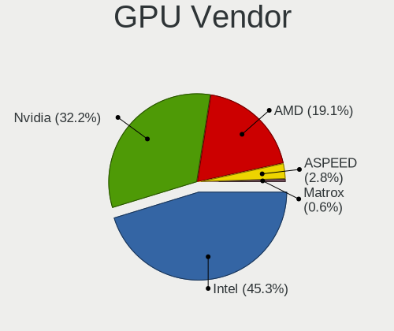

| Vendor                     | Computers | Percent |
|----------------------------|-----------|---------|
| Intel                      | 312       | 44.19%  |
| Nvidia                     | 230       | 32.58%  |
| AMD                        | 135       | 19.12%  |
| ASPEED Technology          | 25        | 3.54%   |
| Matrox Electronics Systems | 4         | 0.57%   |

GPU Model
---------

Graphics card models

| Model                                                                                    | Computers | Percent |
|------------------------------------------------------------------------------------------|-----------|---------|
| ASPEED Technology ASPEED Graphics Family                                                 | 25        | 3.49%   |
| Intel 2nd Generation Core Processor Family Integrated Graphics Controller                | 22        | 3.07%   |
| AMD Cezanne [Radeon Vega Series / Radeon Vega Mobile Series]                             | 17        | 2.37%   |
| Intel TigerLake-LP GT2 [Iris Xe Graphics]                                                | 16        | 2.23%   |
| Intel 3rd Gen Core processor Graphics Controller                                         | 16        | 2.23%   |
| AMD Renoir [Radeon RX Vega 6 (Ryzen 4000/5000 Mobile Series)]                            | 16        | 2.23%   |
| Nvidia TU104GL [PG189 SKU600]                                                            | 15        | 2.09%   |
| Intel Xeon E3-1200 v3/4th Gen Core Processor Integrated Graphics Controller              | 15        | 2.09%   |
| Intel Haswell-ULT Integrated Graphics Controller                                         | 14        | 1.96%   |
| Intel CoffeeLake-S GT2 [UHD Graphics 630]                                                | 14        | 1.96%   |
| Intel WhiskeyLake-U GT2 [UHD Graphics 620]                                               | 13        | 1.82%   |
| Intel UHD Graphics 620                                                                   | 13        | 1.82%   |
| Intel HD Graphics 530                                                                    | 13        | 1.82%   |
| Nvidia GP106 [GeForce GTX 1060 6GB]                                                      | 9         | 1.26%   |
| Intel HD Graphics 630                                                                    | 9         | 1.26%   |
| Intel HD Graphics 620                                                                    | 9         | 1.26%   |
| Intel Core Processor Integrated Graphics Controller                                      | 9         | 1.26%   |
| Intel CoffeeLake-H GT2 [UHD Graphics 630]                                                | 9         | 1.26%   |
| Nvidia GP108 [GeForce GT 1030]                                                           | 8         | 1.12%   |
| Intel Alder Lake-P GT2 [Iris Xe Graphics]                                                | 8         | 1.12%   |
| Intel 4th Generation Core Processor Family Integrated Graphics Controller                | 8         | 1.12%   |
| Nvidia GK208B [GeForce GT 710]                                                           | 7         | 0.98%   |
| Intel Xeon E3-1200 v2/3rd Gen Core processor Graphics Controller                         | 7         | 0.98%   |
| Intel HD Graphics 5500                                                                   | 7         | 0.98%   |
| Intel GeminiLake [UHD Graphics 600]                                                      | 7         | 0.98%   |
| AMD Lucienne                                                                             | 7         | 0.98%   |
| Nvidia TU116M [GeForce GTX 1660 Ti Mobile]                                               | 6         | 0.84%   |
| Nvidia GP107M [GeForce GTX 1050 Ti Mobile]                                               | 6         | 0.84%   |
| Intel Skylake GT2 [HD Graphics 520]                                                      | 6         | 0.84%   |
| Intel CometLake-U GT2 [UHD Graphics]                                                     | 6         | 0.84%   |
| Intel CometLake-S GT2 [UHD Graphics 630]                                                 | 6         | 0.84%   |
| Intel 4 Series Chipset Integrated Graphics Controller                                    | 6         | 0.84%   |
| Intel Atom/Celeron/Pentium Processor x5-E8000/J3xxx/N3xxx Integrated Graphics Controller | 5         | 0.7%    |
| Intel AlderLake-S GT1                                                                    | 5         | 0.7%    |
| AMD RS780L [Radeon 3000]                                                                 | 5         | 0.7%    |
| AMD Raven Ridge [Radeon Vega Series / Radeon Vega Mobile Series]                         | 5         | 0.7%    |
| AMD Ellesmere [Radeon RX 470/480/570/570X/580/580X/590]                                  | 5         | 0.7%    |
| Nvidia GP107M [GeForce GTX 1050 Mobile]                                                  | 4         | 0.56%   |
| Nvidia GP106 [GeForce GTX 1060 3GB]                                                      | 4         | 0.56%   |
| Nvidia GM107 [GeForce GTX 750 Ti]                                                        | 4         | 0.56%   |

GPU Combo
---------

Combinations of graphics cards

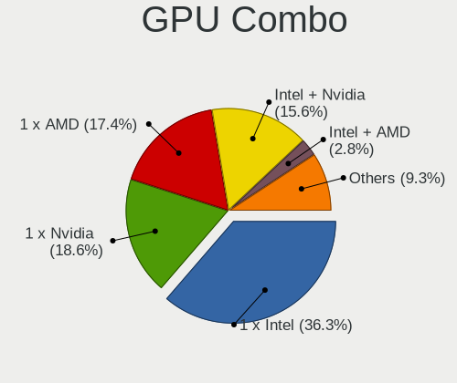

| Name            | Computers | Percent |
|-----------------|-----------|---------|
| 1 x Intel       | 210       | 35.78%  |
| 1 x Nvidia      | 115       | 19.59%  |
| 1 x AMD         | 105       | 17.89%  |
| Intel + Nvidia  | 86        | 14.65%  |
| Nvidia + ASPEED | 17        | 2.9%    |
| Intel + AMD     | 15        | 2.56%   |
| Other           | 13        | 2.21%   |
| AMD + Nvidia    | 11        | 1.87%   |
| 1 x ASPEED      | 7         | 1.19%   |
| 1 x Matrox      | 4         | 0.68%   |
| 2 x AMD         | 3         | 0.51%   |
| AMD + ASPEED    | 1         | 0.17%   |

GPU Driver
----------

Free vs proprietary

| Driver      | Computers | Percent |
|-------------|-----------|---------|
| Free        | 430       | 72.03%  |
| Proprietary | 126       | 21.11%  |
| Unknown     | 41        | 6.87%   |

GPU Memory
----------

Total video memory

| Size in GB | Computers | Percent |
|------------|-----------|---------|
| Unknown    | 343       | 57.17%  |
| 1.01-2.0   | 74        | 12.33%  |
| 0.01-0.5   | 66        | 11%     |
| 0.51-1.0   | 36        | 6%      |
| 3.01-4.0   | 32        | 5.33%   |
| 5.01-6.0   | 24        | 4%      |
| 7.01-8.0   | 13        | 2.17%   |
| 8.01-16.0  | 8         | 1.33%   |
| 2.01-3.0   | 3         | 0.5%    |
| 16.01-24.0 | 1         | 0.17%   |

Monitor
-------

Monitor Vendor
--------------

Monitor vendors

| Vendor                  | Computers | Percent |
|-------------------------|-----------|---------|
| AU Optronics            | 68        | 11.17%  |
| Ancor Communications    | 46        | 7.55%   |
| Chimei Innolux          | 44        | 7.22%   |
| BenQ                    | 43        | 7.06%   |
| BOE                     | 41        | 6.73%   |
| LG Display              | 39        | 6.4%    |
| Acer                    | 37        | 6.08%   |
| ViewSonic               | 30        | 4.93%   |
| Philips                 | 30        | 4.93%   |
| Dell                    | 30        | 4.93%   |
| Samsung Electronics     | 27        | 4.43%   |
| Goldstar                | 20        | 3.28%   |
| AOC                     | 16        | 2.63%   |
| ASUSTek Computer        | 13        | 2.13%   |
| Eizo                    | 9         | 1.48%   |
| NEX                     | 8         | 1.31%   |
| Hewlett-Packard         | 8         | 1.31%   |
| Envision Peripherals    | 7         | 1.15%   |
| Sharp                   | 6         | 0.99%   |
| Unknown                 | 5         | 0.82%   |
| Lenovo                  | 5         | 0.82%   |
| Apple                   | 5         | 0.82%   |
| Valve                   | 4         | 0.66%   |
| PANDA                   | 4         | 0.66%   |
| LG Electronics          | 4         | 0.66%   |
| Vizio                   | 3         | 0.49%   |
| Sony                    | 3         | 0.49%   |
| InfoVision              | 3         | 0.49%   |
| Chi Mei Optoelectronics | 3         | 0.49%   |
| Unknown                 | 3         | 0.49%   |
| Wacom                   | 2         | 0.33%   |
| Unknown (XXX)           | 2         | 0.33%   |
| TMX                     | 2         | 0.33%   |
| MStar                   | 2         | 0.33%   |
| MSI                     | 2         | 0.33%   |
| LG Philips              | 2         | 0.33%   |
| Gigabyte Technology     | 2         | 0.33%   |
| CSO                     | 2         | 0.33%   |
| AUS                     | 2         | 0.33%   |
| ___                     | 1         | 0.16%   |

Monitor Model
-------------

Monitor models

| Model                                                                 | Computers | Percent |
|-----------------------------------------------------------------------|-----------|---------|
| Philips 190S PHL086B 1280x1024 376x301mm 19.0-inch                    | 15        | 2.44%   |
| ViewSonic VX2718-2KPC VSCB73A 2560x1440 598x336mm 27.0-inch           | 7         | 1.14%   |
| Goldstar LG IPS FULLHD GSM5AB8 1920x1080 480x270mm 21.7-inch          | 6         | 0.98%   |
| Chimei Innolux LCD Monitor CMN14D4 1920x1080 309x173mm 13.9-inch      | 6         | 0.98%   |
| Valve ANX7530 U VLV3001 800x1280 100x150mm 7.1-inch                   | 4         | 0.65%   |
| Samsung Electronics SyncMaster SAM03C2 1680x1050 459x296mm 21.5-inch  | 4         | 0.65%   |
| LG Display LCD Monitor LGD02DC 1366x768 344x194mm 15.5-inch           | 4         | 0.65%   |
| Goldstar LG ULTRAWIDE GSM59F1 2560x1080 800x340mm 34.2-inch           | 4         | 0.65%   |
| AU Optronics LCD Monitor AUO183C 1366x768 309x173mm 13.9-inch         | 4         | 0.65%   |
| ASUSTek Computer VA24E AUS24D1 1920x1080 527x296mm 23.8-inch          | 4         | 0.65%   |
| Ancor Communications ASUS VS229 ACI22C2 1920x1080 477x268mm 21.5-inch | 4         | 0.65%   |
| Ancor Communications ASUS VS228 ACI22FD 1920x1080 476x268mm 21.5-inch | 4         | 0.65%   |
| Acer KA220HQ ACR0467 1920x1080 477x268mm 21.5-inch                    | 4         | 0.65%   |
| Samsung Electronics LCD Monitor SDC4171 2880x1800 302x189mm 14.0-inch | 3         | 0.49%   |
| LG Display LCD Monitor LGD046F 1920x1080 345x194mm 15.6-inch          | 3         | 0.49%   |
| Envision Peripherals LED H963wLs ENV1963 1366x768 410x230mm 18.5-inch | 3         | 0.49%   |
| Envision Peripherals LCD2271W ENV2271 1920x1080 476x268mm 21.5-inch   | 3         | 0.49%   |
| Dell U2415 DELA0B9 1920x1200 518x324mm 24.1-inch                      | 3         | 0.49%   |
| Chimei Innolux LCD Monitor CMN1735 1920x1080 381x214mm 17.2-inch      | 3         | 0.49%   |
| Chimei Innolux LCD Monitor CMN15C4 1920x1080 344x193mm 15.5-inch      | 3         | 0.49%   |
| BenQ GW2470 BNQ78E4 1920x1080 527x296mm 23.8-inch                     | 3         | 0.49%   |
| BenQ GW2470 BNQ78D9 1920x1080 527x296mm 23.8-inch                     | 3         | 0.49%   |
| BenQ GW2450H BNQ78C1 1920x1080 531x298mm 24.0-inch                    | 3         | 0.49%   |
| BenQ GL2450H BNQ78A6 1920x1080 531x298mm 24.0-inch                    | 3         | 0.49%   |
| BenQ GC2870 BNQ78DD 1920x1080 620x340mm 27.8-inch                     | 3         | 0.49%   |
| AU Optronics LCD Monitor AUO683D 1920x1080 309x174mm 14.0-inch        | 3         | 0.49%   |
| AU Optronics LCD Monitor AUO38ED 1920x1080 344x193mm 15.5-inch        | 3         | 0.49%   |
| Ancor Communications ASUS VW247 ACI2496 1920x1080 531x299mm 24.0-inch | 3         | 0.49%   |
| Ancor Communications ASUS VS207 ACI20F2 1600x900 432x240mm 19.5-inch  | 3         | 0.49%   |
| Ancor Communications ASUS VP247 ACI24C7 1920x1080 520x290mm 23.4-inch | 3         | 0.49%   |
| Ancor Communications ASUS VH228 ACI22FC 1920x1080 477x268mm 21.5-inch | 3         | 0.49%   |
| Ancor Communications ASUS PA238 ACI23B1 1920x1080 509x286mm 23.0-inch | 3         | 0.49%   |
| Unknown                                                               | 3         | 0.49%   |
| Wacom Cintiq 13HD WAC1040 1920x1080 293x165mm 13.2-inch               | 2         | 0.33%   |
| ViewSonic VX2476 Series VSCD332 1920x1080 527x296mm 23.8-inch         | 2         | 0.33%   |
| ViewSonic VA916 Series VSC7C20 1280x1024 376x301mm 19.0-inch          | 2         | 0.33%   |
| ViewSonic VA2246 SERIES VSC6F2E 1920x1080 480x270mm 21.7-inch         | 2         | 0.33%   |
| Unknown LCD Monitor SAMSUNG 1920x1080                                 | 2         | 0.33%   |
| Unknown LCD Monitor Kingston Technology 43 TV 1920x1080               | 2         | 0.33%   |
| Samsung Electronics LCD Monitor SEC554E 1024x600 223x125mm 10.1-inch  | 2         | 0.33%   |

Monitor Resolution
------------------

Monitor screen resolution

| Resolution         | Computers | Percent |
|--------------------|-----------|---------|
| 1920x1080 (FHD)    | 302       | 52.98%  |
| 1366x768 (WXGA)    | 71        | 12.46%  |
| 3840x2160 (4K)     | 31        | 5.44%   |
| 2560x1440 (QHD)    | 31        | 5.44%   |
| 1280x1024 (SXGA)   | 26        | 4.56%   |
| 1920x1200 (WUXGA)  | 16        | 2.81%   |
| 1600x900 (HD+)     | 16        | 2.81%   |
| 1680x1050 (WSXGA+) | 13        | 2.28%   |
| 2560x1080          | 9         | 1.58%   |
| 1440x900 (WXGA+)   | 8         | 1.4%    |
| 2880x1800          | 5         | 0.88%   |
| 2560x1600          | 5         | 0.88%   |
| Unknown            | 5         | 0.88%   |
| 800x1280           | 4         | 0.7%    |
| 1280x800 (WXGA)    | 4         | 0.7%    |
| 3840x1080          | 3         | 0.53%   |
| 3440x1440          | 3         | 0.53%   |
| 2160x1440          | 2         | 0.35%   |
| 1024x768 (XGA)     | 2         | 0.35%   |
| 1024x600           | 2         | 0.35%   |
| 3240x2160          | 1         | 0.18%   |
| 3200x2000          | 1         | 0.18%   |
| 3200x1800 (QHD+)   | 1         | 0.18%   |
| 2288x1287          | 1         | 0.18%   |
| 2256x1504          | 1         | 0.18%   |
| 2240x1400          | 1         | 0.18%   |
| 2048x1152          | 1         | 0.18%   |
| 1920x540           | 1         | 0.18%   |
| 1920x1280          | 1         | 0.18%   |
| 1680x945           | 1         | 0.18%   |
| 1360x768           | 1         | 0.18%   |
| 1280x720 (HD)      | 1         | 0.18%   |

Monitor Diagonal
----------------

Diagonal size in inches

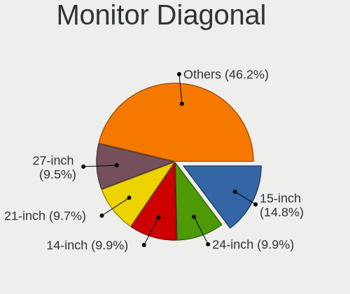

| Inches  | Computers | Percent |
|---------|-----------|---------|
| 15      | 88        | 14.52%  |
| 21      | 62        | 10.23%  |
| 24      | 61        | 10.07%  |
| 13      | 59        | 9.74%   |
| 14      | 56        | 9.24%   |
| 27      | 52        | 8.58%   |
| 23      | 42        | 6.93%   |
| Unknown | 42        | 6.93%   |
| 19      | 38        | 6.27%   |
| 31      | 12        | 1.98%   |
| 18      | 12        | 1.98%   |
| 17      | 12        | 1.98%   |
| 34      | 9         | 1.49%   |
| 22      | 9         | 1.49%   |
| 12      | 8         | 1.32%   |
| 11      | 8         | 1.32%   |
| 20      | 4         | 0.66%   |
| 16      | 4         | 0.66%   |
| 7       | 4         | 0.66%   |
| 10      | 3         | 0.5%    |
| 54      | 2         | 0.33%   |
| 52      | 2         | 0.33%   |
| 49      | 2         | 0.33%   |
| 43      | 2         | 0.33%   |
| 40      | 2         | 0.33%   |
| 26      | 2         | 0.33%   |
| 84      | 1         | 0.17%   |
| 69      | 1         | 0.17%   |
| 65      | 1         | 0.17%   |
| 55      | 1         | 0.17%   |
| 48      | 1         | 0.17%   |
| 46      | 1         | 0.17%   |
| 42      | 1         | 0.17%   |
| 41      | 1         | 0.17%   |
| 25      | 1         | 0.17%   |

Monitor Width
-------------

Physical width

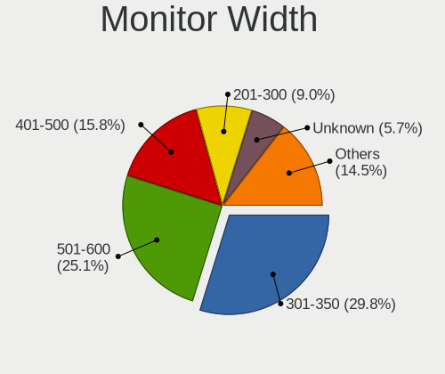

| Width in mm | Computers | Percent |
|-------------|-----------|---------|
| 301-350     | 174       | 29%     |
| 501-600     | 144       | 24%     |
| 401-500     | 102       | 17%     |
| 201-300     | 52        | 8.67%   |
| Unknown     | 42        | 7%      |
| 351-400     | 34        | 5.67%   |
| 601-700     | 21        | 3.5%    |
| 1001-1500   | 10        | 1.67%   |
| 701-800     | 9         | 1.5%    |
| 901-1000    | 4         | 0.67%   |
| 1-100       | 4         | 0.67%   |
| 801-900     | 2         | 0.33%   |
| 1501-2000   | 2         | 0.33%   |

Aspect Ratio
------------

Proportional relationship between the width and the height

| Ratio   | Computers | Percent |
|---------|-----------|---------|
| 16/9    | 400       | 72.73%  |
| 16/10   | 61        | 11.09%  |
| Unknown | 40        | 7.27%   |
| 5/4     | 24        | 4.36%   |
| 21/9    | 9         | 1.64%   |
| 3/2     | 6         | 1.09%   |
| 0.67    | 4         | 0.73%   |
| 32/9    | 3         | 0.55%   |
| 4/3     | 2         | 0.36%   |
| 6/5     | 1         | 0.18%   |

Monitor Area
------------

Area in inch

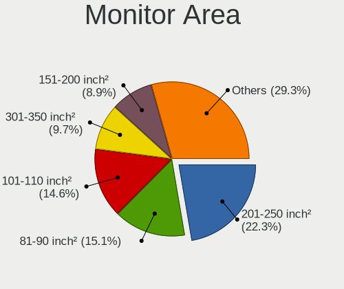

| Area in inch | Computers | Percent |
|----------------|-----------|---------|
| 201-250        | 139       | 23.05%  |
| 81-90          | 87        | 14.43%  |
| 101-110        | 86        | 14.26%  |
| 151-200        | 59        | 9.78%   |
| 301-350        | 54        | 8.96%   |
| Unknown        | 42        | 6.97%   |
| 71-80          | 30        | 4.98%   |
| 351-500        | 21        | 3.48%   |
| 251-300        | 16        | 2.65%   |
| 141-150        | 14        | 2.32%   |
| 121-130        | 11        | 1.82%   |
| More than 1000 | 9         | 1.49%   |
| 51-60          | 9         | 1.49%   |
| 501-1000       | 9         | 1.49%   |
| 61-70          | 6         | 1%      |
| 111-120        | 5         | 0.83%   |
| 1-40           | 4         | 0.66%   |
| 41-50          | 2         | 0.33%   |

Pixel Density
-------------

Pixels per inch

| Density       | Computers | Percent |
|---------------|-----------|---------|
| 51-100        | 222       | 37.31%  |
| 121-160       | 134       | 22.52%  |
| 101-120       | 128       | 21.51%  |
| 161-240       | 49        | 8.24%   |
| Unknown       | 42        | 7.06%   |
| More than 240 | 13        | 2.18%   |
| 1-50          | 7         | 1.18%   |

Multiple Monitors
-----------------

Total monitors connected

| Total | Computers | Percent |
|-------|-----------|---------|
| 1     | 473       | 79.9%   |
| 2     | 71        | 11.99%  |
| 0     | 44        | 7.43%   |
| 3     | 4         | 0.68%   |

Network
-------

Net Controller Vendor
---------------------

Controller vendors

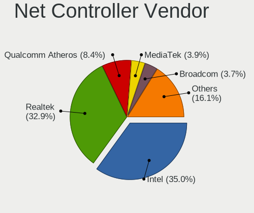

| Vendor                                 | Computers | Percent |
|----------------------------------------|-----------|---------|
| Intel                                  | 307       | 34.3%   |
| Realtek Semiconductor                  | 292       | 32.63%  |
| Qualcomm Atheros                       | 77        | 8.6%    |
| Broadcom                               | 37        | 4.13%   |
| MediaTek                               | 31        | 3.46%   |
| American Megatrends                    | 17        | 1.9%    |
| Ralink Technology                      | 12        | 1.34%   |
| Aquantia                               | 12        | 1.34%   |
| Broadcom Limited                       | 10        | 1.12%   |
| ASIX Electronics                       | 10        | 1.12%   |
| TP-Link                                | 9         | 1.01%   |
| Marvell Technology Group               | 9         | 1.01%   |
| Edimax Technology                      | 9         | 1.01%   |
| Ralink                                 | 6         | 0.67%   |
| ASUSTek Computer                       | 6         | 0.67%   |
| Nvidia                                 | 5         | 0.56%   |
| Samsung Electronics                    | 4         | 0.45%   |
| HTC (High Tech Computer)               | 4         | 0.45%   |
| D-Link                                 | 4         | 0.45%   |
| OPPO Electronics                       | 3         | 0.34%   |
| Microsoft                              | 2         | 0.22%   |
| Mellanox Technologies                  | 2         | 0.22%   |
| IBM                                    | 2         | 0.22%   |
| Google                                 | 2         | 0.22%   |
| ZyXEL Communications                   | 1         | 0.11%   |
| U-Blox                                 | 1         | 0.11%   |
| SparkFun                               | 1         | 0.11%   |
| Sony Ericsson Mobile Communications AB | 1         | 0.11%   |
| Senao                                  | 1         | 0.11%   |
| Qualcomm Technologies                  | 1         | 0.11%   |
| Qualcomm Atheros Communications        | 1         | 0.11%   |
| Prolific Technology                    | 1         | 0.11%   |
| Microchip Technology                   | 1         | 0.11%   |
| Mercucys                               | 1         | 0.11%   |
| Luminary Micro                         | 1         | 0.11%   |
| LG Electronics                         | 1         | 0.11%   |
| Lenovo                                 | 1         | 0.11%   |
| Insyde Software                        | 1         | 0.11%   |
| Huawei Technologies                    | 1         | 0.11%   |
| HMD Global                             | 1         | 0.11%   |

Net Controller Model
--------------------

Controller models

| Model                                                             | Computers | Percent |
|-------------------------------------------------------------------|-----------|---------|
| Realtek RTL8111/8168/8411 PCI Express Gigabit Ethernet Controller | 213       | 20.58%  |
| Intel Wi-Fi 6 AX200                                               | 34        | 3.29%   |
| Intel I211 Gigabit Network Connection                             | 23        | 2.22%   |
| Realtek RTL8125 2.5GbE Controller                                 | 22        | 2.13%   |
| Realtek RTL8153 Gigabit Ethernet Adapter                          | 20        | 1.93%   |
| Intel Wireless 8265 / 8275                                        | 19        | 1.84%   |
| Intel Ethernet Connection (3) I219-LM                             | 17        | 1.64%   |
| American Megatrends Virtual Ethernet.                             | 17        | 1.64%   |
| Intel Ethernet Controller I225-V                                  | 16        | 1.55%   |
| Intel Wi-Fi 6 AX201                                               | 15        | 1.45%   |
| Intel I210 Gigabit Network Connection                             | 15        | 1.45%   |
| Intel Dual Band Wireless-AC 3168NGW [Stone Peak]                  | 14        | 1.35%   |
| Realtek RTL810xE PCI Express Fast Ethernet controller             | 13        | 1.26%   |
| Intel Alder Lake-P PCH CNVi WiFi                                  | 12        | 1.16%   |
| MediaTek MT7921 802.11ax PCI Express Wireless Network Adapter     | 11        | 1.06%   |
| Intel 82579LM Gigabit Network Connection (Lewisville)             | 11        | 1.06%   |
| Intel Wireless 7265                                               | 10        | 0.97%   |
| Intel Wi-Fi 6 AX210/AX211/AX411 160MHz                            | 10        | 0.97%   |
| Intel Cannon Lake PCH CNVi WiFi                                   | 10        | 0.97%   |
| Realtek RTL8152 Fast Ethernet Adapter                             | 9         | 0.87%   |
| MediaTek MT7921K (RZ608) Wi-Fi 6E 80MHz                           | 9         | 0.87%   |
| Intel Wireless-AC 9260                                            | 9         | 0.87%   |
| Intel Wireless 3165                                               | 9         | 0.87%   |
| Intel Ethernet Connection (7) I219-V                              | 9         | 0.87%   |
| Ralink MT7601U Wireless Adapter                                   | 8         | 0.77%   |
| Qualcomm Atheros QCA9377 802.11ac Wireless Network Adapter        | 8         | 0.77%   |
| Intel Wireless 7260                                               | 8         | 0.77%   |
| Intel Ethernet Connection (7) I219-LM                             | 8         | 0.77%   |
| Intel Cannon Point-LP CNVi [Wireless-AC]                          | 8         | 0.77%   |
| Aquantia AQC107 NBase-T/IEEE 802.3bz Ethernet Controller [AQtion] | 8         | 0.77%   |
| Realtek RTL8822CE 802.11ac PCIe Wireless Network Adapter          | 7         | 0.68%   |
| Qualcomm Atheros QCA8171 Gigabit Ethernet                         | 7         | 0.68%   |
| Qualcomm Atheros AR9285 Wireless Network Adapter (PCI-Express)    | 7         | 0.68%   |
| Intel Ethernet Connection (2) I219-V                              | 7         | 0.68%   |
| Realtek RTL8852BE PCIe 802.11ax Wireless Network Controller       | 6         | 0.58%   |
| Realtek RTL8821CE 802.11ac PCIe Wireless Network Adapter          | 6         | 0.58%   |
| Qualcomm Atheros QCA9565 / AR9565 Wireless Network Adapter        | 6         | 0.58%   |
| Qualcomm Atheros QCA6174 802.11ac Wireless Network Adapter        | 6         | 0.58%   |
| Qualcomm Atheros Killer E220x Gigabit Ethernet Controller         | 6         | 0.58%   |
| Qualcomm Atheros AR9462 Wireless Network Adapter                  | 6         | 0.58%   |

Wireless Vendor
---------------

Wireless vendors

| Vendor                          | Computers | Percent |
|---------------------------------|-----------|---------|
| Intel                           | 210       | 51.34%  |
| Realtek Semiconductor           | 46        | 11.25%  |
| Qualcomm Atheros                | 44        | 10.76%  |
| MediaTek                        | 29        | 7.09%   |
| Broadcom                        | 22        | 5.38%   |
| Ralink Technology               | 12        | 2.93%   |
| Edimax Technology               | 9         | 2.2%    |
| Broadcom Limited                | 7         | 1.71%   |
| TP-Link                         | 6         | 1.47%   |
| Ralink                          | 6         | 1.47%   |
| ASUSTek Computer                | 6         | 1.47%   |
| D-Link                          | 4         | 0.98%   |
| ZyXEL Communications            | 1         | 0.24%   |
| Senao                           | 1         | 0.24%   |
| Qualcomm Atheros Communications | 1         | 0.24%   |
| Microsoft                       | 1         | 0.24%   |
| Mercucys                        | 1         | 0.24%   |
| D-Link System                   | 1         | 0.24%   |
| BUFFALO                         | 1         | 0.24%   |
| Accton Technology               | 1         | 0.24%   |

Wireless Model
--------------

Wireless models

| Model                                                          | Computers | Percent |
|----------------------------------------------------------------|-----------|---------|
| Intel Wi-Fi 6 AX200                                            | 34        | 8.23%   |
| Intel Wireless 8265 / 8275                                     | 19        | 4.6%    |
| Intel Wi-Fi 6 AX201                                            | 15        | 3.63%   |
| Intel Dual Band Wireless-AC 3168NGW [Stone Peak]               | 14        | 3.39%   |
| Intel Alder Lake-P PCH CNVi WiFi                               | 12        | 2.91%   |
| MediaTek MT7921 802.11ax PCI Express Wireless Network Adapter  | 11        | 2.66%   |
| Intel Wireless 7265                                            | 10        | 2.42%   |
| Intel Wi-Fi 6 AX210/AX211/AX411 160MHz                         | 10        | 2.42%   |
| Intel Cannon Lake PCH CNVi WiFi                                | 10        | 2.42%   |
| MediaTek MT7921K (RZ608) Wi-Fi 6E 80MHz                        | 9         | 2.18%   |
| Intel Wireless-AC 9260                                         | 9         | 2.18%   |
| Intel Wireless 3165                                            | 9         | 2.18%   |
| Ralink MT7601U Wireless Adapter                                | 8         | 1.94%   |
| Qualcomm Atheros QCA9377 802.11ac Wireless Network Adapter     | 8         | 1.94%   |
| Intel Wireless 7260                                            | 8         | 1.94%   |
| Intel Cannon Point-LP CNVi [Wireless-AC]                       | 8         | 1.94%   |
| Realtek RTL8822CE 802.11ac PCIe Wireless Network Adapter       | 7         | 1.69%   |
| Qualcomm Atheros AR9285 Wireless Network Adapter (PCI-Express) | 7         | 1.69%   |
| Realtek RTL8852BE PCIe 802.11ax Wireless Network Controller    | 6         | 1.45%   |
| Realtek RTL8821CE 802.11ac PCIe Wireless Network Adapter       | 6         | 1.45%   |
| Qualcomm Atheros QCA9565 / AR9565 Wireless Network Adapter     | 6         | 1.45%   |
| Qualcomm Atheros QCA6174 802.11ac Wireless Network Adapter     | 6         | 1.45%   |
| Qualcomm Atheros AR9462 Wireless Network Adapter               | 6         | 1.45%   |
| Intel Ice Lake-LP PCH CNVi WiFi                                | 6         | 1.45%   |
| Qualcomm Atheros AR9485 Wireless Network Adapter               | 5         | 1.21%   |
| Qualcomm Atheros AR9287 Wireless Network Adapter (PCI-Express) | 5         | 1.21%   |
| Intel Wireless 8260                                            | 5         | 1.21%   |
| Realtek RTL8723BU 802.11b/g/n WLAN Adapter                     | 4         | 0.97%   |
| Realtek RTL8723BE PCIe Wireless Network Adapter                | 4         | 0.97%   |
| MediaTek MT7922 802.11ax PCI Express Wireless Network Adapter  | 4         | 0.97%   |
| Intel Comet Lake PCH-LP CNVi WiFi                              | 4         | 0.97%   |
| Intel Alder Lake-S PCH CNVi WiFi                               | 4         | 0.97%   |
| Edimax EW-7811Un 802.11n Wireless Adapter [Realtek RTL8188CUS] | 4         | 0.97%   |
| Broadcom BCM43225 802.11b/g/n                                  | 4         | 0.97%   |
| Broadcom BCM4313 802.11bgn Wireless Network Adapter            | 4         | 0.97%   |
| ASUS 802.11ac NIC                                              | 4         | 0.97%   |
| Realtek RTL8852AE 802.11ax PCIe Wireless Network Adapter       | 3         | 0.73%   |
| Realtek RTL8822BE 802.11a/b/g/n/ac WiFi adapter                | 3         | 0.73%   |
| Realtek RTL8188EUS 802.11n Wireless Network Adapter            | 3         | 0.73%   |
| Realtek 802.11ac NIC                                           | 3         | 0.73%   |

Ethernet Vendor
---------------

Ethernet vendors

| Vendor                   | Computers | Percent |
|--------------------------|-----------|---------|
| Realtek Semiconductor    | 269       | 46.3%   |
| Intel                    | 162       | 27.88%  |
| Qualcomm Atheros         | 44        | 7.57%   |
| Broadcom                 | 19        | 3.27%   |
| American Megatrends      | 17        | 2.93%   |
| Aquantia                 | 12        | 2.07%   |
| ASIX Electronics         | 10        | 1.72%   |
| Marvell Technology Group | 9         | 1.55%   |
| Nvidia                   | 5         | 0.86%   |
| Samsung Electronics      | 4         | 0.69%   |
| HTC (High Tech Computer) | 4         | 0.69%   |
| TP-Link                  | 3         | 0.52%   |
| OPPO Electronics         | 3         | 0.52%   |
| Broadcom Limited         | 3         | 0.52%   |
| Mellanox Technologies    | 2         | 0.34%   |
| MediaTek                 | 2         | 0.34%   |
| IBM                      | 2         | 0.34%   |
| Google                   | 2         | 0.34%   |
| Microsoft                | 1         | 0.17%   |
| Microchip Technology     | 1         | 0.17%   |
| LG Electronics           | 1         | 0.17%   |
| Lenovo                   | 1         | 0.17%   |
| Insyde Software          | 1         | 0.17%   |
| Huawei Technologies      | 1         | 0.17%   |
| HMD Global               | 1         | 0.17%   |
| Apple                    | 1         | 0.17%   |
| 3Com                     | 1         | 0.17%   |

Ethernet Model
--------------

Ethernet models

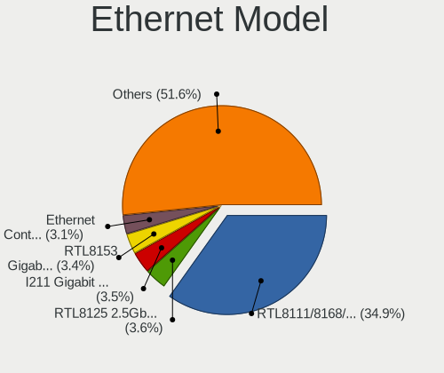

| Model                                                               | Computers | Percent |
|---------------------------------------------------------------------|-----------|---------|
| Realtek RTL8111/8168/8411 PCI Express Gigabit Ethernet Controller   | 213       | 34.69%  |
| Intel I211 Gigabit Network Connection                               | 23        | 3.75%   |
| Realtek RTL8125 2.5GbE Controller                                   | 22        | 3.58%   |
| Realtek RTL8153 Gigabit Ethernet Adapter                            | 20        | 3.26%   |
| Intel Ethernet Connection (3) I219-LM                               | 17        | 2.77%   |
| American Megatrends Virtual Ethernet.                               | 17        | 2.77%   |
| Intel Ethernet Controller I225-V                                    | 16        | 2.61%   |
| Intel I210 Gigabit Network Connection                               | 15        | 2.44%   |
| Realtek RTL810xE PCI Express Fast Ethernet controller               | 13        | 2.12%   |
| Intel 82579LM Gigabit Network Connection (Lewisville)               | 11        | 1.79%   |
| Realtek RTL8152 Fast Ethernet Adapter                               | 9         | 1.47%   |
| Intel Ethernet Connection (7) I219-V                                | 9         | 1.47%   |
| Intel Ethernet Connection (7) I219-LM                               | 8         | 1.3%    |
| Aquantia AQC107 NBase-T/IEEE 802.3bz Ethernet Controller [AQtion]   | 8         | 1.3%    |
| Qualcomm Atheros QCA8171 Gigabit Ethernet                           | 7         | 1.14%   |
| Intel Ethernet Connection (2) I219-V                                | 7         | 1.14%   |
| Qualcomm Atheros Killer E220x Gigabit Ethernet Controller           | 6         | 0.98%   |
| Broadcom NetLink BCM57785 Gigabit Ethernet PCIe                     | 6         | 0.98%   |
| ASIX AX88179 Gigabit Ethernet                                       | 6         | 0.98%   |
| Qualcomm Atheros AR8131 Gigabit Ethernet                            | 5         | 0.81%   |
| Intel Ethernet Connection I217-V                                    | 5         | 0.81%   |
| Intel Ethernet Connection (4) I219-V                                | 5         | 0.81%   |
| Intel Ethernet Connection (2) I219-LM                               | 5         | 0.81%   |
| Intel 82574L Gigabit Network Connection                             | 5         | 0.81%   |
| Samsung Galaxy series, misc. (tethering mode)                       | 4         | 0.65%   |
| Qualcomm Atheros Killer E2500 Gigabit Ethernet Controller           | 4         | 0.65%   |
| Qualcomm Atheros AR8151 v2.0 Gigabit Ethernet                       | 4         | 0.65%   |
| Qualcomm Atheros AR8151 v1.0 Gigabit Ethernet                       | 4         | 0.65%   |
| Intel Ethernet Connection I218-LM                                   | 4         | 0.65%   |
| Intel Ethernet Connection I217-LM                                   | 4         | 0.65%   |
| HTC (High Tech Computer) Desire HD (modem mode)                     | 4         | 0.65%   |
| Qualcomm Atheros AR8161 Gigabit Ethernet                            | 3         | 0.49%   |
| Qualcomm Atheros AR8132 Fast Ethernet                               | 3         | 0.49%   |
| OPPO RMX2027                                                        | 3         | 0.49%   |
| Nvidia MCP61 Ethernet                                               | 3         | 0.49%   |
| Intel Ethernet Connection (17) I219-V                               | 3         | 0.49%   |
| Intel 82579V Gigabit Network Connection                             | 3         | 0.49%   |
| Intel 82577LM Gigabit Network Connection                            | 3         | 0.49%   |
| Aquantia AQC113CS NBase-T/IEEE 802.3bz Ethernet Controller [AQtion] | 3         | 0.49%   |
| TP-Link UE300 10/100/1000 LAN (ethernet mode) [Realtek RTL8153]     | 2         | 0.33%   |

Net Controller Kind
-------------------

Ethernet, WiFi or modem

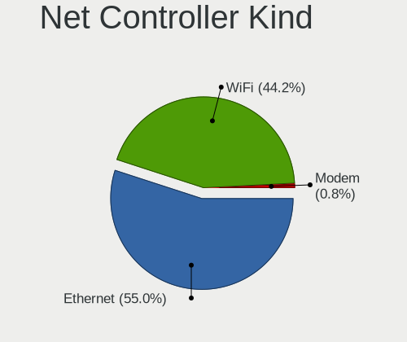

| Kind     | Computers | Percent |
|----------|-----------|---------|
| Ethernet | 505       | 55.74%  |
| WiFi     | 393       | 43.38%  |
| Modem    | 6         | 0.66%   |
| Unknown  | 2         | 0.22%   |

Used Controller
---------------

Currently used network controller

| Kind     | Computers | Percent |
|----------|-----------|---------|
| Ethernet | 322       | 53.67%  |
| WiFi     | 277       | 46.17%  |
| Unknown  | 1         | 0.17%   |

NICs
----

Total network controllers on board

| Total | Computers | Percent |
|-------|-----------|---------|
| 2     | 283       | 48.29%  |
| 1     | 252       | 43%     |
| 3     | 20        | 3.41%   |
| 0     | 20        | 3.41%   |
| 4     | 5         | 0.85%   |
| 10    | 2         | 0.34%   |
| 6     | 2         | 0.34%   |
| 5     | 2         | 0.34%   |

IPv6
----

IPv6 vs IPv4

| Used | Computers | Percent |
|------|-----------|---------|
| No   | 519       | 87.52%  |
| Yes  | 74        | 12.48%  |

Bluetooth
---------

Bluetooth Vendor
----------------

Controller vendors

| Vendor                          | Computers | Percent |
|---------------------------------|-----------|---------|
| Intel                           | 192       | 54.55%  |
| Realtek Semiconductor           | 20        | 5.68%   |
| IMC Networks                    | 20        | 5.68%   |
| Cambridge Silicon Radio         | 19        | 5.4%    |
| Broadcom                        | 19        | 5.4%    |
| Foxconn / Hon Hai               | 17        | 4.83%   |
| Qualcomm Atheros Communications | 15        | 4.26%   |
| MediaTek                        | 11        | 3.13%   |
| Lite-On Technology              | 11        | 3.13%   |
| Apple                           | 7         | 1.99%   |
| ASUSTek Computer                | 5         | 1.42%   |
| Toshiba                         | 3         | 0.85%   |
| Realtek                         | 3         | 0.85%   |
| Ralink                          | 3         | 0.85%   |
| Hewlett-Packard                 | 3         | 0.85%   |
| TP-Link                         | 1         | 0.28%   |
| Opticis                         | 1         | 0.28%   |
| Dell                            | 1         | 0.28%   |
| Alps Electric                   | 1         | 0.28%   |

Bluetooth Model
---------------

Controller models

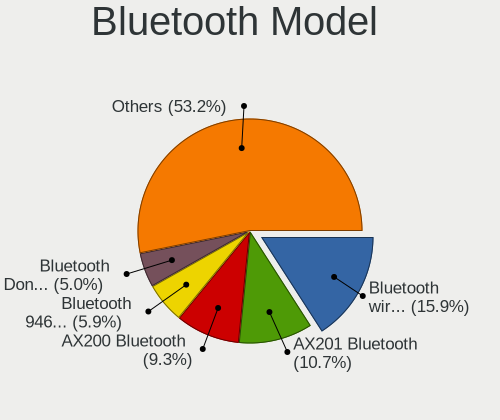

| Model                                                                               | Computers | Percent |
|-------------------------------------------------------------------------------------|-----------|---------|
| Intel Bluetooth wireless interface                                                  | 56        | 15.91%  |
| Intel AX201 Bluetooth                                                               | 34        | 9.66%   |
| Intel AX200 Bluetooth                                                               | 34        | 9.66%   |
| Intel Bluetooth 9460/9560 Jefferson Peak (JfP)                                      | 21        | 5.97%   |
| Cambridge Silicon Radio Bluetooth Dongle (HCI mode)                                 | 19        | 5.4%    |
| Realtek Bluetooth Radio                                                             | 17        | 4.83%   |
| Intel Wireless-AC 3168 Bluetooth                                                    | 14        | 3.98%   |
| MediaTek Wireless_Device                                                            | 11        | 3.13%   |
| Intel Bluetooth Device                                                              | 11        | 3.13%   |
| Intel AX210 Bluetooth                                                               | 10        | 2.84%   |
| Intel Wireless-AC 9260 Bluetooth Adapter                                            | 9         | 2.56%   |
| Qualcomm Atheros AR3011 Bluetooth                                                   | 6         | 1.7%    |
| IMC Networks Bluetooth Radio                                                        | 6         | 1.7%    |
| Lite-On Qualcomm Atheros QCA9377 Bluetooth                                          | 5         | 1.42%   |
| IMC Networks Wireless_Device                                                        | 5         | 1.42%   |
| Foxconn / Hon Hai Bluetooth Device                                                  | 5         | 1.42%   |
| Apple Bluetooth Host Controller                                                     | 5         | 1.42%   |
| IMC Networks Bluetooth Device                                                       | 4         | 1.14%   |
| Realtek Bluetooth Radio                                                             | 3         | 0.85%   |
| Ralink RT3290 Bluetooth                                                             | 3         | 0.85%   |
| Qualcomm Atheros  Bluetooth Device                                                  | 3         | 0.85%   |
| Qualcomm Atheros AR3012 Bluetooth 4.0                                               | 3         | 0.85%   |
| Lite-On Wireless_Device                                                             | 3         | 0.85%   |
| Intel Centrino Bluetooth Wireless Transceiver                                       | 3         | 0.85%   |
| Foxconn / Hon Hai Wireless_Device                                                   | 3         | 0.85%   |
| Foxconn / Hon Hai MediaTek MT7921 Bluetooth                                         | 3         | 0.85%   |
| Foxconn / Hon Hai Acer Bluetooth module                                             | 3         | 0.85%   |
| Broadcom BCM2045B (BDC-2.1)                                                         | 3         | 0.85%   |
| Broadcom BCM2045 Bluetooth                                                          | 3         | 0.85%   |
| Toshiba Bluetooth USB Host Controller                                               | 2         | 0.57%   |
| Realtek  Bluetooth 4.2 Adapter                                                      | 2         | 0.57%   |
| Qualcomm Atheros QCA61x4 Bluetooth 4.0                                              | 2         | 0.57%   |
| Lite-On Bluetooth Device                                                            | 2         | 0.57%   |
| IMC Networks BCM20702A0                                                             | 2         | 0.57%   |
| HP Broadcom 2070 Bluetooth Combo                                                    | 2         | 0.57%   |
| Foxconn / Hon Hai Foxconn T77H114 BCM2070 [Single-Chip Bluetooth 2.1 + EDR Adapter] | 2         | 0.57%   |
| Broadcom Bluetooth                                                                  | 2         | 0.57%   |
| Broadcom BCM20702A0 Bluetooth 4.0                                                   | 2         | 0.57%   |
| Broadcom BCM20702A0                                                                 | 2         | 0.57%   |
| Broadcom BCM20702 Bluetooth 4.0 [ThinkPad]                                          | 2         | 0.57%   |

Sound
-----

Sound Vendor
------------

Sound card vendors

| Vendor                               | Computers | Percent |
|--------------------------------------|-----------|---------|
| Intel                                | 408       | 52.85%  |
| Nvidia                               | 152       | 19.69%  |
| AMD                                  | 152       | 19.69%  |
| C-Media Electronics                  | 8         | 1.04%   |
| ASUSTek Computer                     | 6         | 0.78%   |
| Logitech                             | 4         | 0.52%   |
| Texas Instruments                    | 3         | 0.39%   |
| GN Netcom                            | 3         | 0.39%   |
| Generalplus Technology               | 3         | 0.39%   |
| XMOS                                 | 2         | 0.26%   |
| SAVITECH                             | 2         | 0.26%   |
| Realtek Semiconductor                | 2         | 0.26%   |
| Micro Star International             | 2         | 0.26%   |
| KORG                                 | 2         | 0.26%   |
| Focusrite-Novation                   | 2         | 0.26%   |
| Dell                                 | 2         | 0.26%   |
| Audio-Technica                       | 2         | 0.26%   |
| ZOOM                                 | 1         | 0.13%   |
| Yamaha                               | 1         | 0.13%   |
| Thesycon Systemsoftware & Consulting | 1         | 0.13%   |
| Sony                                 | 1         | 0.13%   |
| OPPO Electronics                     | 1         | 0.13%   |
| Novra/IDC/Wegener                    | 1         | 0.13%   |
| Microsoft                            | 1         | 0.13%   |
| Microdia                             | 1         | 0.13%   |
| JMTek                                | 1         | 0.13%   |
| Harman                               | 1         | 0.13%   |
| Giga-Byte Technology                 | 1         | 0.13%   |
| ESS Technology                       | 1         | 0.13%   |
| Elite Silicon                        | 1         | 0.13%   |
| Creative Technology                  | 1         | 0.13%   |
| Creative Labs                        | 1         | 0.13%   |
| Cambridge Silicon Radio              | 1         | 0.13%   |
| 2.4G Composite Device                | 1         | 0.13%   |

Sound Model
-----------

Sound card models

| Model                                                                      | Computers | Percent |
|----------------------------------------------------------------------------|-----------|---------|
| AMD Family 17h/19h HD Audio Controller                                     | 62        | 6.82%   |
| AMD Renoir Radeon High Definition Audio Controller                         | 44        | 4.84%   |
| Intel 7 Series/C216 Chipset Family High Definition Audio Controller        | 36        | 3.96%   |
| Intel Sunrise Point-LP HD Audio                                            | 35        | 3.85%   |
| Intel 6 Series/C200 Series Chipset Family High Definition Audio Controller | 33        | 3.63%   |
| Intel Cannon Lake PCH cAVS                                                 | 32        | 3.52%   |
| Intel 8 Series/C220 Series Chipset High Definition Audio Controller        | 32        | 3.52%   |
| Intel Xeon E3-1200 v3/4th Gen Core Processor HD Audio Controller           | 22        | 2.42%   |
| Intel 100 Series/C230 Series Chipset Family HD Audio Controller            | 22        | 2.42%   |
| AMD Starship/Matisse HD Audio Controller                                   | 22        | 2.42%   |
| Intel 5 Series/3400 Series Chipset High Definition Audio                   | 17        | 1.87%   |
| Intel Tiger Lake-LP Smart Sound Technology Audio Controller                | 16        | 1.76%   |
| Intel Alder Lake PCH-P High Definition Audio Controller                    | 16        | 1.76%   |
| Intel Cannon Point-LP High Definition Audio Controller                     | 15        | 1.65%   |
| Nvidia GP106 High Definition Audio Controller                              | 14        | 1.54%   |
| Intel Haswell-ULT HD Audio Controller                                      | 14        | 1.54%   |
| Intel 8 Series HD Audio Controller                                         | 14        | 1.54%   |
| AMD SBx00 Azalia (Intel HDA)                                               | 14        | 1.54%   |
| Intel 200 Series PCH HD Audio                                              | 11        | 1.21%   |
| AMD Rembrandt Radeon High Definition Audio Controller                      | 11        | 1.21%   |
| Nvidia TU116 High Definition Audio Controller                              | 10        | 1.1%    |
| Nvidia GM107 High Definition Audio Controller [GeForce 940MX]              | 10        | 1.1%    |
| Nvidia GK208 HDMI/DP Audio Controller                                      | 10        | 1.1%    |
| Intel NM10/ICH7 Family High Definition Audio Controller                    | 10        | 1.1%    |
| Intel Alder Lake-S HD Audio Controller                                     | 10        | 1.1%    |
| AMD Family 17h (Models 00h-0fh) HD Audio Controller                        | 10        | 1.1%    |
| Nvidia GP107GL High Definition Audio Controller                            | 9         | 0.99%   |
| Nvidia GF108 High Definition Audio Controller                              | 9         | 0.99%   |
| Intel 82801JI (ICH10 Family) HD Audio Controller                           | 9         | 0.99%   |
| Intel 82801I (ICH9 Family) HD Audio Controller                             | 9         | 0.99%   |
| AMD Raven/Raven2/Fenghuang HDMI/DP Audio Controller                        | 9         | 0.99%   |
| Nvidia GP108 High Definition Audio Controller                              | 8         | 0.88%   |
| Nvidia GK107 HDMI Audio Controller                                         | 8         | 0.88%   |
| Intel Wildcat Point-LP High Definition Audio Controller                    | 8         | 0.88%   |
| Intel CM238 HD Audio Controller                                            | 8         | 0.88%   |
| Intel Celeron/Pentium Silver Processor High Definition Audio               | 8         | 0.88%   |
| Intel Broadwell-U Audio Controller                                         | 8         | 0.88%   |
| Intel 9 Series Chipset Family HD Audio Controller                          | 8         | 0.88%   |
| Nvidia GA104 High Definition Audio Controller                              | 7         | 0.77%   |
| Nvidia MCP61 High Definition Audio                                         | 6         | 0.66%   |

Memory
------

Memory Vendor
-------------

Memory module vendors

| Vendor              | Computers | Percent |
|---------------------|-----------|---------|
| SK hynix            | 65        | 16.29%  |
| Samsung Electronics | 61        | 15.29%  |
| Kingston            | 54        | 13.53%  |
| Crucial             | 50        | 12.53%  |
| Micron Technology   | 45        | 11.28%  |
| Transcend           | 29        | 7.27%   |
| Unknown             | 26        | 6.52%   |
| A-DATA Technology   | 19        | 4.76%   |
| Apacer              | 7         | 1.75%   |
| Unifosa             | 4         | 1%      |
| Team                | 4         | 1%      |
| G.Skill             | 4         | 1%      |
| Ramaxel Technology  | 3         | 0.75%   |
| Patriot             | 3         | 0.75%   |
| Unknown             | 3         | 0.75%   |
| Unknown (ABCD)      | 2         | 0.5%    |
| Silicon Power       | 2         | 0.5%    |
| Goldkey             | 2         | 0.5%    |
| G-Alantic           | 2         | 0.5%    |
| Elpida              | 2         | 0.5%    |
| ASint Technology    | 2         | 0.5%    |
| V-Color             | 1         | 0.25%   |
| Unknown (08AE)      | 1         | 0.25%   |
| UMAX                | 1         | 0.25%   |
| PNY                 | 1         | 0.25%   |
| Nanya Technology    | 1         | 0.25%   |
| Lexar               | 1         | 0.25%   |
| KLEVV               | 1         | 0.25%   |
| GLOWAY              | 1         | 0.25%   |
| CUSO                | 1         | 0.25%   |
| Avant               | 1         | 0.25%   |

Memory Model
------------

Memory module models

| Model                                                            | Computers | Percent |
|------------------------------------------------------------------|-----------|---------|
| Kingston RAM KHX1866C10D3/8G 8GB DIMM DDR3 2133MT/s              | 4         | 0.94%   |
| Crucial RAM CT8G4SFS8266.M8FE 8GB SODIMM DDR4 2667MT/s           | 4         | 0.94%   |
| A-DATA RAM Module 4096MB SODIMM DDR4 2400MT/s                    | 4         | 0.94%   |
| Transcend RAM TS1GLK64V6H 8GB DIMM DDR3 1600MT/s                 | 3         | 0.7%    |
| Transcend RAM Module 4GB DIMM DDR3 1600MT/s                      | 3         | 0.7%    |
| SK hynix RAM HMT451S6AFR8A-PB 4GB SODIMM DDR3 1600MT/s           | 3         | 0.7%    |
| SK hynix RAM HMA851S6DJR6N-XN 4GB SODIMM DDR4 3200MT/s           | 3         | 0.7%    |
| SK hynix RAM HMA81GS6CJR8N-VK 8GB SODIMM DDR4 2667MT/s           | 3         | 0.7%    |
| Samsung RAM M471A1K43EB1-CWE 8GB SODIMM DDR4 3200MT/s            | 3         | 0.7%    |
| Samsung RAM M471A1G44BB0-CWE 8GB SODIMM DDR4 3200MT/s            | 3         | 0.7%    |
| Samsung RAM K4UBE3D4AA-MGCR 8GB SODIMM LPDDR4 4266MT/s           | 3         | 0.7%    |
| Micron RAM 4ATF1G64HZ-3G2E1 8GB Row Of Chips DDR4 3200MT/s       | 3         | 0.7%    |
| Kingston RAM 9905624-033.A00G 8GB SODIMM DDR4 2400MT/s           | 3         | 0.7%    |
| A-DATA RAM DDR4 3000 2OZ 16GB DIMM DDR4 3000MT/s                 | 3         | 0.7%    |
| Unknown                                                          | 3         | 0.7%    |
| Unknown RAM Module 2GB DIMM DDR2 800MT/s                         | 2         | 0.47%   |
| Transcend RAM Module 16GB SODIMM DDR4 3200MT/s                   | 2         | 0.47%   |
| Transcend RAM JM1333KLN-4G 4096MB DIMM SDRAM 1600MT/s            | 2         | 0.47%   |
| Team RAM TEAMGROUP-UD4-3200 8192MB DIMM DDR4 3733MT/s            | 2         | 0.47%   |
| SK hynix RAM HMAB2GS6AMR6N-XN 16GB SODIMM DDR4 3200MT/s          | 2         | 0.47%   |
| SK hynix RAM HMA851S6CJR6N-VK 4GB SODIMM DDR4 2667MT/s           | 2         | 0.47%   |
| SK hynix RAM HMA851S6AFR6N-UH 4GB SODIMM DDR4 2667MT/s           | 2         | 0.47%   |
| SK hynix RAM HMA81GU6JJR8N-VK 8GB DIMM DDR4 2667MT/s             | 2         | 0.47%   |
| SK hynix RAM HMA41GS6AFR8N-TF 8GB SODIMM DDR4 2667MT/s           | 2         | 0.47%   |
| SK hynix RAM HCNNNCPMMLXR-NEE 2GB Row Of Chips LPDDR4 4267MT/s   | 2         | 0.47%   |
| SK hynix RAM H9CCNNNCLGALAR-NVD 8GB Row Of Chips LPDDR3 2133MT/s | 2         | 0.47%   |
| Samsung RAM M471A1K43DB1-CWE 8GB SODIMM DDR4 3200MT/s            | 2         | 0.47%   |
| Samsung RAM M471A1K43CB1-CWE 8GB SODIMM DDR4 3200MT/s            | 2         | 0.47%   |
| Samsung RAM M471A1K43CB1-CRC 8GB SODIMM DDR4 2667MT/s            | 2         | 0.47%   |
| Micron RAM MT52L512M32D2PF-10 4GB Row Of Chips LPDDR3 1867MT/s   | 2         | 0.47%   |
| Micron RAM 8ATF1G64HZ-2G6E1 8GB SODIMM DDR4 2667MT/s             | 2         | 0.47%   |
| Micron RAM 4ATF51264HZ-2G6E1 4GB SODIMM DDR4 2667MT/s            | 2         | 0.47%   |
| Micron RAM 4ATF1G64HZ-3G2E1 8GB SODIMM DDR4 3200MT/s             | 2         | 0.47%   |
| Kingston RAM MSI24D4S7S8MB-8 8GB SODIMM DDR4 2667MT/s            | 2         | 0.47%   |
| Kingston RAM KHX3200C16D4/16GX 16GB DIMM DDR4 3600MT/s           | 2         | 0.47%   |
| Kingston RAM KHX1600C9D3/4GX 4GB DIMM DDR3 1600MT/s              | 2         | 0.47%   |
| G-Alantic RAM D4SS12161SH26A-C 4GB SODIMM DDR4 2133MT/s          | 2         | 0.47%   |
| Crucial RAM CT8G4SFS632A.C4FE 8GB SODIMM DDR4 3200MT/s           | 2         | 0.47%   |
| Crucial RAM CT8G4DFS8266.M8FD 8GB DIMM DDR4 3600MT/s             | 2         | 0.47%   |
| Crucial RAM CT16G4SFRA32A.C8FE 16GB SODIMM DDR4 3200MT/s         | 2         | 0.47%   |

Memory Kind
-----------

Memory module kinds

| Kind    | Computers | Percent |
|---------|-----------|---------|
| DDR4    | 185       | 54.57%  |
| DDR3    | 81        | 23.89%  |
| LPDDR4  | 18        | 5.31%   |
| Unknown | 13        | 3.83%   |
| LPDDR3  | 11        | 3.24%   |
| DDR2    | 9         | 2.65%   |
| LPDDR5  | 8         | 2.36%   |
| DDR5    | 8         | 2.36%   |
| SDRAM   | 5         | 1.47%   |
| DDR     | 1         | 0.29%   |

Memory Form Factor
------------------

Physical design of the memory module

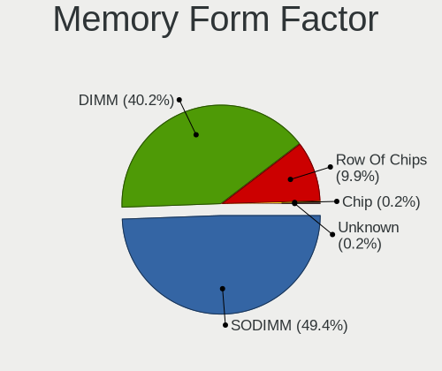

| Name         | Computers | Percent |
|--------------|-----------|---------|
| SODIMM       | 164       | 48.52%  |
| DIMM         | 139       | 41.12%  |
| Row Of Chips | 33        | 9.76%   |
| Chip         | 1         | 0.3%    |
| Unknown      | 1         | 0.3%    |

Memory Size
-----------

Memory module size

| Size  | Computers | Percent |
|-------|-----------|---------|
| 8192  | 141       | 38.84%  |
| 4096  | 85        | 23.42%  |
| 16384 | 81        | 22.31%  |
| 2048  | 27        | 7.44%   |
| 32768 | 24        | 6.61%   |
| 1024  | 4         | 1.1%    |
| 8072  | 1         | 0.28%   |

Memory Speed
------------

Memory module speed

| Speed | Computers | Percent |
|-------|-----------|---------|
| 3200  | 81        | 22.19%  |
| 1600  | 65        | 17.81%  |
| 2667  | 50        | 13.7%   |
| 2400  | 30        | 8.22%   |
| 2133  | 22        | 6.03%   |
| 1333  | 14        | 3.84%   |
| 6400  | 8         | 2.19%   |
| 4800  | 8         | 2.19%   |
| 800   | 8         | 2.19%   |
| 4267  | 7         | 1.92%   |
| 3600  | 7         | 1.92%   |
| 1867  | 6         | 1.64%   |
| 1334  | 6         | 1.64%   |
| 4266  | 5         | 1.37%   |
| 3733  | 5         | 1.37%   |
| 3000  | 5         | 1.37%   |
| 2933  | 3         | 0.82%   |
| 2666  | 3         | 0.82%   |
| 1066  | 3         | 0.82%   |
| 667   | 3         | 0.82%   |
| 533   | 3         | 0.82%   |
| 3466  | 2         | 0.55%   |
| 3400  | 2         | 0.55%   |
| 2000  | 2         | 0.55%   |
| 8400  | 1         | 0.27%   |
| 6000  | 1         | 0.27%   |
| 5600  | 1         | 0.27%   |
| 5200  | 1         | 0.27%   |
| 4333  | 1         | 0.27%   |
| 4000  | 1         | 0.27%   |
| 3866  | 1         | 0.27%   |
| 3800  | 1         | 0.27%   |
| 3334  | 1         | 0.27%   |
| 3266  | 1         | 0.27%   |
| 3134  | 1         | 0.27%   |
| 2866  | 1         | 0.27%   |
| 1632  | 1         | 0.27%   |
| 1067  | 1         | 0.27%   |
| 975   | 1         | 0.27%   |
| 400   | 1         | 0.27%   |

Printers & scanners
-------------------

Printer Vendor
--------------

Printer device vendors

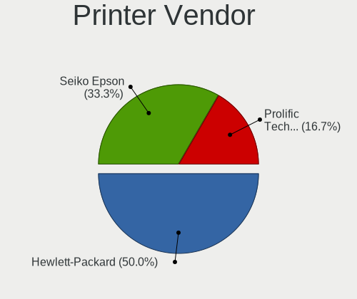

| Vendor          | Computers | Percent |
|-----------------|-----------|---------|
| Hewlett-Packard | 3         | 60%     |
| Seiko Epson     | 2         | 40%     |

Printer Model
-------------

Printer device models

| Model                            | Computers | Percent |
|----------------------------------|-----------|---------|
| Seiko Epson XP-240 Series        | 1         | 20%     |
| Seiko Epson L3110 Series         | 1         | 20%     |
| HP LaserJet Professional P1102w  | 1         | 20%     |
| HP LaserJet Professional P 1102w | 1         | 20%     |
| HP LaserJet 1020                 | 1         | 20%     |

Scanner Vendor
--------------

Scanner device vendors

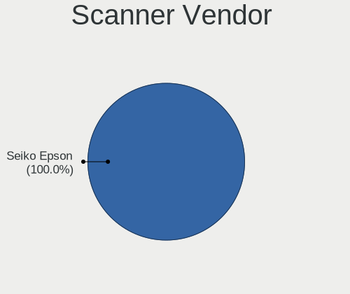

| Vendor      | Computers | Percent |
|-------------|-----------|---------|
| Seiko Epson | 1         | 100%    |

Scanner Model
-------------

Scanner device models

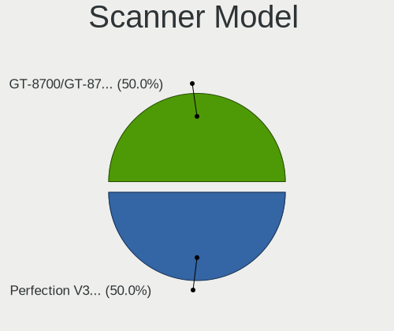

| Model                                                         | Computers | Percent |
|---------------------------------------------------------------|-----------|---------|
| Seiko Epson GT-8700/GT-8700F [Perfection 1640SU/1640SU PHOTO] | 1         | 100%    |

Camera
------

Camera Vendor
-------------

Camera device vendors

| Vendor                                 | Computers | Percent |
|----------------------------------------|-----------|---------|
| Chicony Electronics                    | 64        | 25.4%   |
| IMC Networks                           | 32        | 12.7%   |
| Realtek Semiconductor                  | 23        | 9.13%   |
| Bison Electronics                      | 18        | 7.14%   |
| Logitech                               | 16        | 6.35%   |
| Microdia                               | 13        | 5.16%   |
| Sunplus Innovation Technology          | 12        | 4.76%   |
| Quanta                                 | 11        | 4.37%   |
| Suyin                                  | 8         | 3.17%   |
| Cheng Uei Precision Industry (Foxlink) | 8         | 3.17%   |
| Apple                                  | 6         | 2.38%   |
| Luxvisions Innotech Limited            | 5         | 1.98%   |
| Syntek                                 | 4         | 1.59%   |
| Generalplus Technology                 | 3         | 1.19%   |
| ALi                                    | 3         | 1.19%   |
| Acer                                   | 3         | 1.19%   |
| Sunplus Technology                     | 2         | 0.79%   |
| Sonix Technology                       | 2         | 0.79%   |
| Samsung Electronics                    | 2         | 0.79%   |
| Ricoh                                  | 2         | 0.79%   |
| Lite-On Technology                     | 2         | 0.79%   |
| Lenovo                                 | 2         | 0.79%   |
| Importek                               | 2         | 0.79%   |
| SunplusIT                              | 1         | 0.4%    |
| Silicon Motion                         | 1         | 0.4%    |
| Shinetech                              | 1         | 0.4%    |
| KYE Systems (Mouse Systems)            | 1         | 0.4%    |
| Intel                                  | 1         | 0.4%    |
| Google                                 | 1         | 0.4%    |
| Foxconn / Hon Hai                      | 1         | 0.4%    |
| eMeet                                  | 1         | 0.4%    |
| A4Tech                                 | 1         | 0.4%    |

Camera Model
------------

Camera device models

| Model                                                                      | Computers | Percent |
|----------------------------------------------------------------------------|-----------|---------|
| IMC Networks USB2.0 HD UVC WebCam                                          | 16        | 6.32%   |
| Chicony Integrated Camera                                                  | 14        | 5.53%   |
| Chicony HD WebCam                                                          | 9         | 3.56%   |
| Bison HD Webcam                                                            | 8         | 3.16%   |
| Realtek Integrated_Webcam_HD                                               | 7         | 2.77%   |
| IMC Networks Integrated Camera                                             | 6         | 2.37%   |
| Sunplus HD WebCam                                                          | 5         | 1.98%   |
| Logitech Webcam C270                                                       | 5         | 1.98%   |
| Chicony HP HD Camera                                                       | 5         | 1.98%   |
| Chicony HD User Facing                                                     | 5         | 1.98%   |
| Quanta HD User Facing                                                      | 4         | 1.58%   |
| Microdia Integrated_Webcam_HD                                              | 4         | 1.58%   |
| Chicony USB2.0 HD UVC WebCam                                               | 4         | 1.58%   |
| Chicony Lenovo EasyCamera                                                  | 4         | 1.58%   |
| Realtek USB Camera                                                         | 3         | 1.19%   |
| Realtek HD WebCam                                                          | 3         | 1.19%   |
| Microdia Integrated_Webcam_FHD                                             | 3         | 1.19%   |
| Logitech Webcam C120                                                       | 3         | 1.19%   |
| IMC Networks USB2.0 VGA UVC WebCam                                         | 3         | 1.19%   |
| Cheng Uei Precision Industry (Foxlink) HP Wide Vision HD Integrated Webcam | 3         | 1.19%   |
| ALi Gateway Webcam                                                         | 3         | 1.19%   |
| Acer Integrated Camera                                                     | 3         | 1.19%   |
| Syntek Integrated Camera                                                   | 2         | 0.79%   |
| Suyin Acer/Lenovo Webcam [CN0316]                                          | 2         | 0.79%   |
| Suyin 1.3M HD WebCam                                                       | 2         | 0.79%   |
| Sunplus 1.3M HD WebCam                                                     | 2         | 0.79%   |
| Sunplus Integrated_Webcam_HD                                               | 2         | 0.79%   |
| Samsung Galaxy series, misc. (MTP mode)                                    | 2         | 0.79%   |
| Realtek USB2.0 HD UVC WebCam                                               | 2         | 0.79%   |
| Realtek USB2.0 camera                                                      | 2         | 0.79%   |
| Quanta HP HD Camera                                                        | 2         | 0.79%   |
| Luxvisions Innotech Limited Integrated Camera                              | 2         | 0.79%   |
| Luxvisions Innotech Limited HP HD Camera                                   | 2         | 0.79%   |
| Logitech Webcam C930e                                                      | 2         | 0.79%   |
| Lenovo Integrated Webcam [R5U877]                                          | 2         | 0.79%   |
| IMC Networks UVC VGA Webcam                                                | 2         | 0.79%   |
| IMC Networks USB2.0 UVC HD Webcam                                          | 2         | 0.79%   |
| Generalplus GENERAL WEBCAM                                                 | 2         | 0.79%   |
| Chicony Webcam                                                             | 2         | 0.79%   |
| Chicony USB2.0 VGA UVC WebCam                                              | 2         | 0.79%   |

Security
--------

Fingerprint Vendor
------------------

Fingerprint sensor vendors

| Vendor                             | Computers | Percent |
|------------------------------------|-----------|---------|
| Synaptics                          | 18        | 30%     |
| Validity Sensors                   | 10        | 16.67%  |
| Shenzhen Goodix Technology         | 9         | 15%     |
| LighTuning Technology              | 8         | 13.33%  |
| Elan Microelectronics              | 6         | 10%     |
| Upek                               | 4         | 6.67%   |
| AuthenTec                          | 3         | 5%      |
| Realtek USB2.0 Finger Print Bridge | 2         | 3.33%   |

Fingerprint Model
-----------------

Fingerprint sensor models

| Model                                                           | Computers | Percent |
|-----------------------------------------------------------------|-----------|---------|
| Shenzhen Goodix Fingerprint Reader                              | 5         | 8.33%   |
| Elan ELAN:Fingerprint                                           | 5         | 8.33%   |
| Upek Biometric Touchchip/Touchstrip Fingerprint Sensor          | 4         | 6.67%   |
| Shenzhen Goodix  Fingerprint Device                             | 4         | 6.67%   |
| LighTuning EgisTec Touch Fingerprint Sensor                     | 4         | 6.67%   |
| Validity Sensors VFS5011 Fingerprint Reader                     | 3         | 5%      |
| Synaptics Prometheus MIS Touch Fingerprint Reader               | 3         | 5%      |
| Synaptics Metallica MIS Touch Fingerprint Reader                | 3         | 5%      |
| LighTuning ES603 Swipe Fingerprint Sensor                       | 3         | 5%      |
| Validity Sensors VFS495 Fingerprint Reader                      | 2         | 3.33%   |
| Validity Sensors VFS Fingerprint sensor                         | 2         | 3.33%   |
| Synaptics WBDI Fingerprint Reader USB 086                       | 2         | 3.33%   |
| Synaptics WBDI                                                  | 2         | 3.33%   |
| Synaptics UWP WBDI                                              | 2         | 3.33%   |
| Synaptics FS7604 Touch Fingerprint Sensor with PurePrint        | 2         | 3.33%   |
| Synaptics Fingerprint reader [HP G6]                            | 2         | 3.33%   |
| Realtek USB2.0 Finger Print Bridge FocalTech Fingerprint Device | 2         | 3.33%   |
| Validity Sensors VFS301 Fingerprint Reader                      | 1         | 1.67%   |
| Validity Sensors VFS 5011 fingerprint sensor                    | 1         | 1.67%   |
| Validity Sensors Fingerprint scanner                            | 1         | 1.67%   |
| Synaptics  WBDI Fingerprint Reader - USB 052                    | 1         | 1.67%   |
| Synaptics  FS7604 Touch Fingerprint Sensor with PurePrint       | 1         | 1.67%   |
| LighTuning Fingerprint Reader                                   | 1         | 1.67%   |
| Elan fingerprint sensor [FeinTech FPS00200]                     | 1         | 1.67%   |
| AuthenTec AES2810                                               | 1         | 1.67%   |
| AuthenTec AES2501 Fingerprint Sensor                            | 1         | 1.67%   |
| AuthenTec AES1660 Fingerprint Sensor                            | 1         | 1.67%   |

Chipcard Vendor
---------------

Chipcard module vendors

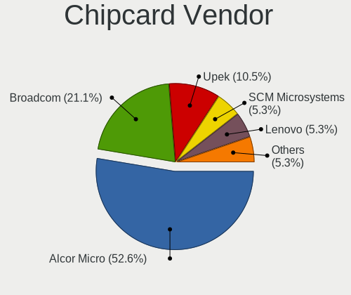

| Vendor                | Computers | Percent |
|-----------------------|-----------|---------|
| Alcor Micro           | 6         | 40%     |
| Broadcom              | 4         | 26.67%  |
| Upek                  | 2         | 13.33%  |
| SCM Microsystems      | 1         | 6.67%   |
| Lenovo                | 1         | 6.67%   |
| Gemalto (was Gemplus) | 1         | 6.67%   |

Chipcard Model
--------------

Chipcard module models

| Model                                                                        | Computers | Percent |
|------------------------------------------------------------------------------|-----------|---------|
| Alcor Micro AU9540 Smartcard Reader                                          | 4         | 26.67%  |
| Upek TouchChip Fingerprint Coprocessor (WBF advanced mode)                   | 2         | 13.33%  |
| Broadcom 58200                                                               | 2         | 13.33%  |
| Alcor Micro Watchdata W 1981                                                 | 2         | 13.33%  |
| SCM Microsystems SCR3340 - ExpressCard54 Smart Card Reader                   | 1         | 6.67%   |
| Lenovo Integrated Smart Card Reader                                          | 1         | 6.67%   |
| Gemalto (was Gemplus) GemPC Twin SmartCard Reader                            | 1         | 6.67%   |
| Broadcom BCM5880 Secure Applications Processor with fingerprint swipe sensor | 1         | 6.67%   |
| Broadcom BCM5880 Secure Applications Processor                               | 1         | 6.67%   |

Unsupported
-----------

Unsupported Devices
-------------------

Total unsupported devices on board

| Total | Computers | Percent |
|-------|-----------|---------|
| 0     | 398       | 66.22%  |
| 1     | 145       | 24.13%  |
| 2     | 32        | 5.32%   |
| 3     | 20        | 3.33%   |
| 4     | 5         | 0.83%   |
| 5     | 1         | 0.17%   |

Unsupported Device Types
------------------------

Types of unsupported devices

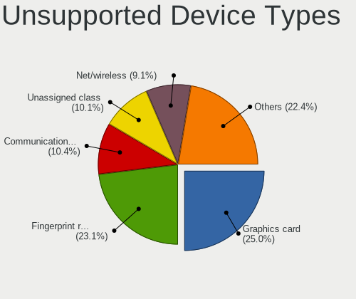

| Type                     | Computers | Percent |
|--------------------------|-----------|---------|
| Graphics card            | 62        | 24.6%   |
| Fingerprint reader       | 60        | 23.81%  |
| Communication controller | 30        | 11.9%   |
| Unassigned class         | 26        | 10.32%  |
| Net/wireless             | 20        | 7.94%   |
| Chipcard                 | 10        | 3.97%   |
| Multimedia controller    | 9         | 3.57%   |
| Camera                   | 9         | 3.57%   |
| Card reader              | 6         | 2.38%   |
| Net/ethernet             | 5         | 1.98%   |
| Bluetooth                | 5         | 1.98%   |
| Sound                    | 3         | 1.19%   |
| Storage/raid             | 2         | 0.79%   |
| Storage/nvme             | 2         | 0.79%   |
| Network                  | 2         | 0.79%   |
| Storage                  | 1         | 0.4%    |

