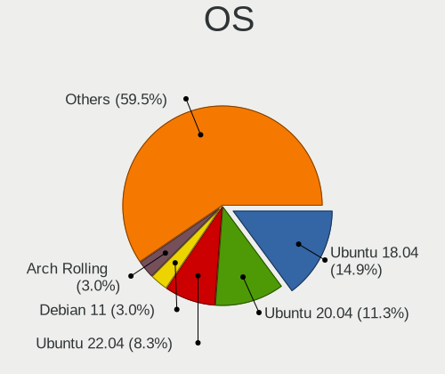
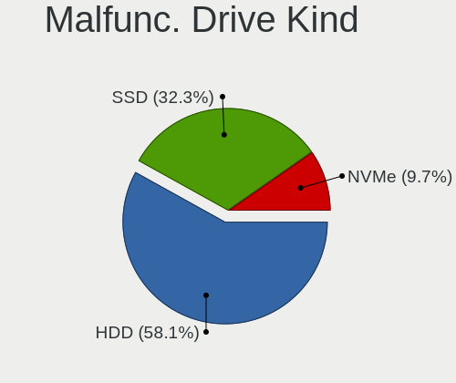
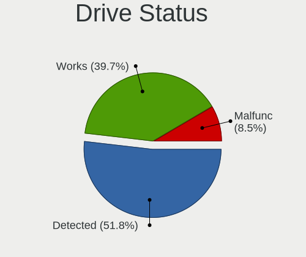
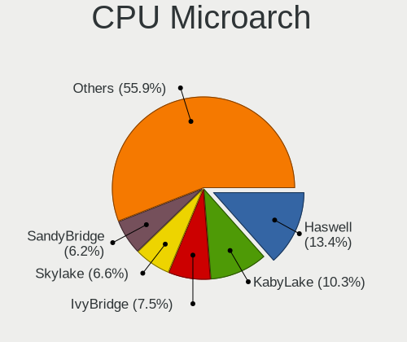
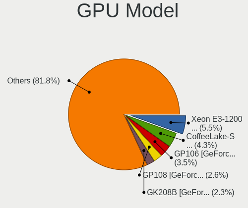
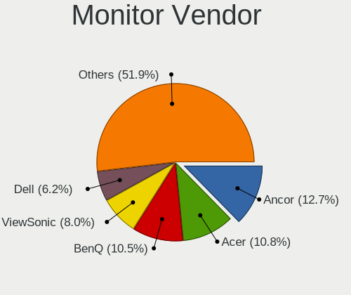
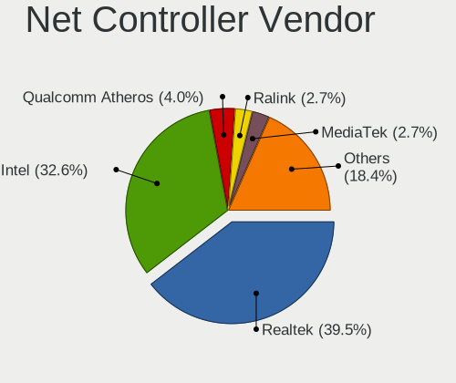
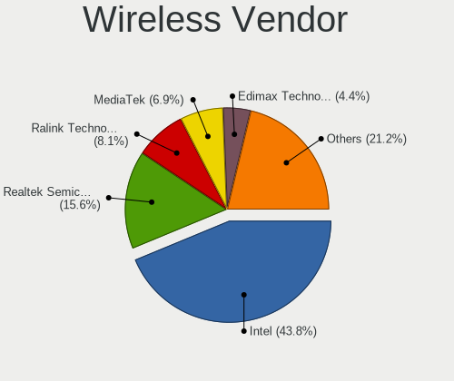
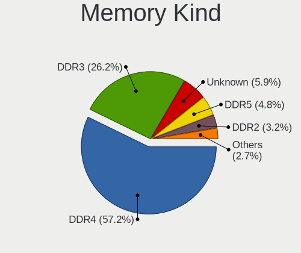
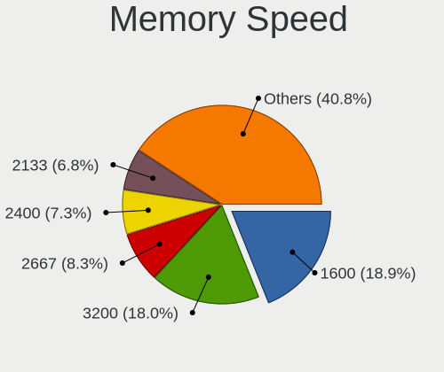

Linux in Taiwan - Tested Hardware & Statistics (Desktops)
---------------------------------------------------------

A project to collect tested hardware configurations for Linux in Taiwan.

Anyone can contribute to this report by the [hw-probe](https://github.com/linuxhw/hw-probe) tool:

    sudo -E hw-probe -all -upload

Please contribute! Especially if your hardware is rare.

Contents
--------

* [ Test Cases ](#test-cases)

* [ System ](#system)
  - [ OS                       ](#os)
  - [ OS Family                ](#os-family)
  - [ Kernel                   ](#kernel)
  - [ Kernel Family            ](#kernel-family)
  - [ Kernel Major Ver.        ](#kernel-major-ver)
  - [ Arch                     ](#arch)
  - [ DE                       ](#de)
  - [ Display Server           ](#display-server)
  - [ Display Manager          ](#display-manager)
  - [ OS Lang                  ](#os-lang)
  - [ Boot Mode                ](#boot-mode)
  - [ Filesystem               ](#filesystem)
  - [ Part. scheme             ](#part-scheme)
  - [ Dual Boot with Linux/BSD ](#dual-boot-with-linuxbsd)
  - [ Dual Boot (Win)          ](#dual-boot-win)

* [ Board ](#board)
  - [ Vendor                   ](#vendor)
  - [ Model                    ](#model)
  - [ Model Family             ](#model-family)
  - [ MFG Year                 ](#mfg-year)
  - [ Form Factor              ](#form-factor)
  - [ Secure Boot              ](#secure-boot)
  - [ Coreboot                 ](#coreboot)
  - [ RAM Size                 ](#ram-size)
  - [ RAM Used                 ](#ram-used)
  - [ Total Drives             ](#total-drives)
  - [ Has CD-ROM               ](#has-cd-rom)
  - [ Has Ethernet             ](#has-ethernet)
  - [ Has WiFi                 ](#has-wifi)
  - [ Has Bluetooth            ](#has-bluetooth)

* [ Location ](#location)
  - [ Country                  ](#country)
  - [ City                     ](#city)

* [ Drives ](#drives)
  - [ Drive Vendor             ](#drive-vendor)
  - [ Drive Model              ](#drive-model)
  - [ HDD Vendor               ](#hdd-vendor)
  - [ SSD Vendor               ](#ssd-vendor)
  - [ Drive Kind               ](#drive-kind)
  - [ Drive Connector          ](#drive-connector)
  - [ Drive Size               ](#drive-size)
  - [ Space Total              ](#space-total)
  - [ Space Used               ](#space-used)
  - [ Malfunc. Drives          ](#malfunc-drives)
  - [ Malfunc. Drive Vendor    ](#malfunc-drive-vendor)
  - [ Malfunc. HDD Vendor      ](#malfunc-hdd-vendor)
  - [ Malfunc. Drive Kind      ](#malfunc-drive-kind)
  - [ Failed Drives            ](#failed-drives)
  - [ Failed Drive Vendor      ](#failed-drive-vendor)
  - [ Drive Status             ](#drive-status)

* [ Storage controller ](#storage-controller)
  - [ Storage Vendor           ](#storage-vendor)
  - [ Storage Model            ](#storage-model)
  - [ Storage Kind             ](#storage-kind)

* [ Processor ](#processor)
  - [ CPU Vendor               ](#cpu-vendor)
  - [ CPU Model                ](#cpu-model)
  - [ CPU Model Family         ](#cpu-model-family)
  - [ CPU Cores                ](#cpu-cores)
  - [ CPU Sockets              ](#cpu-sockets)
  - [ CPU Threads              ](#cpu-threads)
  - [ CPU Op-Modes             ](#cpu-op-modes)
  - [ CPU Microcode            ](#cpu-microcode)
  - [ CPU Microarch            ](#cpu-microarch)

* [ Graphics ](#graphics)
  - [ GPU Vendor               ](#gpu-vendor)
  - [ GPU Model                ](#gpu-model)
  - [ GPU Combo                ](#gpu-combo)
  - [ GPU Driver               ](#gpu-driver)
  - [ GPU Memory               ](#gpu-memory)

* [ Monitor ](#monitor)
  - [ Monitor Vendor           ](#monitor-vendor)
  - [ Monitor Model            ](#monitor-model)
  - [ Monitor Resolution       ](#monitor-resolution)
  - [ Monitor Diagonal         ](#monitor-diagonal)
  - [ Monitor Width            ](#monitor-width)
  - [ Aspect Ratio             ](#aspect-ratio)
  - [ Monitor Area             ](#monitor-area)
  - [ Pixel Density            ](#pixel-density)
  - [ Multiple Monitors        ](#multiple-monitors)

* [ Network ](#network)
  - [ Net Controller Vendor    ](#net-controller-vendor)
  - [ Net Controller Model     ](#net-controller-model)
  - [ Wireless Vendor          ](#wireless-vendor)
  - [ Wireless Model           ](#wireless-model)
  - [ Ethernet Vendor          ](#ethernet-vendor)
  - [ Ethernet Model           ](#ethernet-model)
  - [ Net Controller Kind      ](#net-controller-kind)
  - [ Used Controller          ](#used-controller)
  - [ NICs                     ](#nics)
  - [ IPv6                     ](#ipv6)

* [ Bluetooth ](#bluetooth)
  - [ Bluetooth Vendor         ](#bluetooth-vendor)
  - [ Bluetooth Model          ](#bluetooth-model)

* [ Sound ](#sound)
  - [ Sound Vendor             ](#sound-vendor)
  - [ Sound Model              ](#sound-model)

* [ Memory ](#memory)
  - [ Memory Vendor            ](#memory-vendor)
  - [ Memory Model             ](#memory-model)
  - [ Memory Kind              ](#memory-kind)
  - [ Memory Form Factor       ](#memory-form-factor)
  - [ Memory Size              ](#memory-size)
  - [ Memory Speed             ](#memory-speed)

* [ Printers & scanners ](#printers--scanners)
  - [ Printer Vendor           ](#printer-vendor)
  - [ Printer Model            ](#printer-model)
  - [ Scanner Vendor           ](#scanner-vendor)
  - [ Scanner Model            ](#scanner-model)

* [ Camera ](#camera)
  - [ Camera Vendor            ](#camera-vendor)
  - [ Camera Model             ](#camera-model)

* [ Security ](#security)
  - [ Fingerprint Vendor       ](#fingerprint-vendor)
  - [ Fingerprint Model        ](#fingerprint-model)
  - [ Chipcard Vendor          ](#chipcard-vendor)
  - [ Chipcard Model           ](#chipcard-model)

* [ Unsupported ](#unsupported)
  - [ Unsupported Devices      ](#unsupported-devices)
  - [ Unsupported Device Types ](#unsupported-device-types)

Test Cases
----------

Total: 446

| Vendor        | Model                       | Probe                                                      | Date         |
|---------------|-----------------------------|------------------------------------------------------------|--------------|
| Dell          | 04Y8V0 A02                  | [2864d95f71](https://linux-hardware.org/?probe=2864d95f71) | Jan 01, 2025 |
| Dell          | 04Y8V0 A02                  | [dd5b8644a1](https://linux-hardware.org/?probe=dd5b8644a1) | Jan 01, 2025 |
| Gigabyte      | X570 AORUS ULTRA            | [8b12a21b9a](https://linux-hardware.org/?probe=8b12a21b9a) | Dec 31, 2024 |
| ASUSTek       | TUF B350M-PLUS GAMING       | [a4872cd0ec](https://linux-hardware.org/?probe=a4872cd0ec) | Dec 27, 2024 |
| MSI           | A78M-E35 V2                 | [37ed0bfc1f](https://linux-hardware.org/?probe=37ed0bfc1f) | Dec 24, 2024 |
| ASUSTek       | PRIME Z390M-PLUS            | [da6ad47fac](https://linux-hardware.org/?probe=da6ad47fac) | Dec 23, 2024 |
| ASUSTek       | PRIME Z390M-PLUS            | [0a0b737503](https://linux-hardware.org/?probe=0a0b737503) | Dec 23, 2024 |
| ASUSTek       | BM6660                      | [6a96fbe6fb](https://linux-hardware.org/?probe=6a96fbe6fb) | Dec 21, 2024 |
| Acer          | A Power T200                | [c3aefafdb9](https://linux-hardware.org/?probe=c3aefafdb9) | Dec 14, 2024 |
| JGINYUE       | X99-8D4G Server             | [9d7190d871](https://linux-hardware.org/?probe=9d7190d871) | Dec 10, 2024 |
| Tianbei       | GEM12                       | [a9116936ae](https://linux-hardware.org/?probe=a9116936ae) | Nov 29, 2024 |
| Acer          | A Power T200                | [5cb8f1ede1](https://linux-hardware.org/?probe=5cb8f1ede1) | Nov 27, 2024 |
| Acer          | A Power T200                | [c34c318d09](https://linux-hardware.org/?probe=c34c318d09) | Nov 18, 2024 |
| Gigabyte      | Z170X-Gaming 5              | [ac49d10d4b](https://linux-hardware.org/?probe=ac49d10d4b) | Nov 08, 2024 |
| ASUSTek       | BM5295                      | [0e8c2a71ad](https://linux-hardware.org/?probe=0e8c2a71ad) | Nov 03, 2024 |
| ASUSTek       | UN62                        | [8a9a9a8a39](https://linux-hardware.org/?probe=8a9a9a8a39) | Oct 25, 2024 |
| MSI           | B650 GAMING PLUS WIFI       | [8a56d14426](https://linux-hardware.org/?probe=8a56d14426) | Oct 16, 2024 |
| MSI           | Z370 GAMING PRO CARBON      | [3143d75e4c](https://linux-hardware.org/?probe=3143d75e4c) | Oct 15, 2024 |
| MSI           | Z370 GAMING PRO CARBON      | [0c3c722b3e](https://linux-hardware.org/?probe=0c3c722b3e) | Oct 15, 2024 |
| Gigabyte      | H67M-D2-B3                  | [126c347ac7](https://linux-hardware.org/?probe=126c347ac7) | Sep 19, 2024 |
| Dell          | 0NW73C A00                  | [b9955b6aed](https://linux-hardware.org/?probe=b9955b6aed) | Sep 10, 2024 |
| ASUSTek       | TUF Gaming X570-PRO         | [79ffedea38](https://linux-hardware.org/?probe=79ffedea38) | Jul 25, 2024 |
| Gigabyte      | MJPLNCB-00                  | [ade57b33b2](https://linux-hardware.org/?probe=ade57b33b2) | Jul 24, 2024 |
| Gigabyte      | MJPLNCB-00                  | [083b19f9d8](https://linux-hardware.org/?probe=083b19f9d8) | Jul 24, 2024 |
| Acer          | Veriton M6620G v1.0         | [24727969e0](https://linux-hardware.org/?probe=24727969e0) | Jul 22, 2024 |
| Gigabyte      | B450 I AORUS PRO WIFI-CF    | [dcb993f549](https://linux-hardware.org/?probe=dcb993f549) | Jul 05, 2024 |
| HP            | 2129                        | [5f6c1730b6](https://linux-hardware.org/?probe=5f6c1730b6) | Jul 05, 2024 |
| MSI           | PRO Z790-A WIFI             | [52e9dbfb7d](https://linux-hardware.org/?probe=52e9dbfb7d) | Jul 01, 2024 |
| ASUSTek       | TUF Gaming Z690-PLUS D4     | [7e0f424897](https://linux-hardware.org/?probe=7e0f424897) | Jun 30, 2024 |
| Gigabyte      | MJPLNCB-00                  | [3674335450](https://linux-hardware.org/?probe=3674335450) | Jun 13, 2024 |
| HP            | 21D0                        | [1d1b18c4a7](https://linux-hardware.org/?probe=1d1b18c4a7) | Jun 12, 2024 |
| MSI           | PRO Z790-A WIFI             | [5df0be9868](https://linux-hardware.org/?probe=5df0be9868) | Jun 12, 2024 |
| ASUSTek       | PRIME H610M-K D4            | [3ef05260af](https://linux-hardware.org/?probe=3ef05260af) | Jun 08, 2024 |
| Gigabyte      | MJPLNCB-00                  | [1b40f81d23](https://linux-hardware.org/?probe=1b40f81d23) | Jun 05, 2024 |
| HP            | 870B                        | [a1ea4b1730](https://linux-hardware.org/?probe=a1ea4b1730) | May 22, 2024 |
| HP            | 870B                        | [10cd820ee4](https://linux-hardware.org/?probe=10cd820ee4) | May 22, 2024 |
| ASRock        | X300M-STX                   | [df3903c990](https://linux-hardware.org/?probe=df3903c990) | May 18, 2024 |
| Huanan        | X99-TF V3.0 JX              | [bb51640f19](https://linux-hardware.org/?probe=bb51640f19) | Apr 21, 2024 |
| ASUSTek       | H170M-PLUS                  | [36ed031c7f](https://linux-hardware.org/?probe=36ed031c7f) | Apr 17, 2024 |
| ASUSTek       | WS C422 PRO_SE              | [f4279202a4](https://linux-hardware.org/?probe=f4279202a4) | Apr 12, 2024 |
| Lenovo        | 36C5 SDK0L77767 WIN 3423... | [79cb6ea23b](https://linux-hardware.org/?probe=79cb6ea23b) | Apr 10, 2024 |
| Gigabyte      | GA-H61TN-SI                 | [3f6b496eb7](https://linux-hardware.org/?probe=3f6b496eb7) | Apr 02, 2024 |
| ASUSTek       | ROG STRIX B660-I GAMING ... | [d1554bd2c0](https://linux-hardware.org/?probe=d1554bd2c0) | Apr 01, 2024 |
| JGINYUE       | X99M-PLUS D4 V3.1           | [e44ab52f45](https://linux-hardware.org/?probe=e44ab52f45) | Mar 29, 2024 |
| ASUSTek       | PRIME B560M-K               | [75a6f1b690](https://linux-hardware.org/?probe=75a6f1b690) | Mar 29, 2024 |
| Gigabyte      | GA-770TA-UD3                | [2b6ed8b07a](https://linux-hardware.org/?probe=2b6ed8b07a) | Mar 26, 2024 |
| Gigabyte      | GA-770TA-UD3                | [04474844f0](https://linux-hardware.org/?probe=04474844f0) | Mar 26, 2024 |
| ASRock        | X300M-STX                   | [41f3f09405](https://linux-hardware.org/?probe=41f3f09405) | Mar 23, 2024 |
| JGINYUE       | X99 TITANIUM D3             | [4ba18d3790](https://linux-hardware.org/?probe=4ba18d3790) | Mar 22, 2024 |
| ASUSTek       | Pro WS X570-ACE             | [fe713b8d04](https://linux-hardware.org/?probe=fe713b8d04) | Mar 21, 2024 |
| MSI           | H110M PRO-VD                | [29f63e63c9](https://linux-hardware.org/?probe=29f63e63c9) | Mar 16, 2024 |
| EBN           | MA1N                        | [03917cfce5](https://linux-hardware.org/?probe=03917cfce5) | Mar 06, 2024 |
| OEM           | B85 JHS359                  | [30c44600e2](https://linux-hardware.org/?probe=30c44600e2) | Mar 06, 2024 |
| Huanan        | B85                         | [22ee4d4c6d](https://linux-hardware.org/?probe=22ee4d4c6d) | Mar 05, 2024 |
| ASUSTek       | TUF Gaming X570-PRO         | [a4297d40d4](https://linux-hardware.org/?probe=a4297d40d4) | Feb 13, 2024 |
| Centerm       | C92                         | [5b7b85d16b](https://linux-hardware.org/?probe=5b7b85d16b) | Feb 03, 2024 |
| EBN           | MA1N                        | [302ea43954](https://linux-hardware.org/?probe=302ea43954) | Feb 01, 2024 |
| Gigabyte      | B460 AORUS PRO AC           | [276a0b5785](https://linux-hardware.org/?probe=276a0b5785) | Jan 19, 2024 |
| Unknown       | Unknown                     | [1c86716af5](https://linux-hardware.org/?probe=1c86716af5) | Jan 15, 2024 |
| Unknown       | Unknown                     | [5e8d8eb89f](https://linux-hardware.org/?probe=5e8d8eb89f) | Jan 15, 2024 |
| Gigabyte      | X670E AORUS MASTER          | [537c95bdae](https://linux-hardware.org/?probe=537c95bdae) | Jan 11, 2024 |
| Gigabyte      | Z77M-D3H                    | [d20dfe448d](https://linux-hardware.org/?probe=d20dfe448d) | Jan 06, 2024 |
| ASRock        | X300M-STX                   | [a9f024df00](https://linux-hardware.org/?probe=a9f024df00) | Jan 03, 2024 |
| ASUSTek       | TUF Gaming X570-PRO         | [ca2b52b64f](https://linux-hardware.org/?probe=ca2b52b64f) | Dec 31, 2023 |
| Gigabyte      | X670 AORUS ELITE AX         | [da58685854](https://linux-hardware.org/?probe=da58685854) | Dec 25, 2023 |
| Gigabyte      | G1.Sniper B5-CF             | [9d3fa026ff](https://linux-hardware.org/?probe=9d3fa026ff) | Dec 25, 2023 |
| ASUSTek       | D500MD                      | [21870febdd](https://linux-hardware.org/?probe=21870febdd) | Dec 25, 2023 |
| HP            | 21D0                        | [733191fd29](https://linux-hardware.org/?probe=733191fd29) | Dec 24, 2023 |
| Gigabyte      | B660I AORUS PRO DDR4        | [f9552f9e38](https://linux-hardware.org/?probe=f9552f9e38) | Dec 21, 2023 |
| Dell          | 0101XX A00                  | [13751aa80b](https://linux-hardware.org/?probe=13751aa80b) | Dec 21, 2023 |
| HP            | 8061                        | [9700867e8c](https://linux-hardware.org/?probe=9700867e8c) | Dec 13, 2023 |
| ASUSTek       | CM6330_CM6630_CM6730_CM6... | [6ed556a0a1](https://linux-hardware.org/?probe=6ed556a0a1) | Dec 03, 2023 |
| HP            | 8061                        | [8f86201dfb](https://linux-hardware.org/?probe=8f86201dfb) | Dec 01, 2023 |
| HP            | 83E2                        | [b580eaa5fa](https://linux-hardware.org/?probe=b580eaa5fa) | Nov 27, 2023 |
| ASUSTek       | CM6330_CM6630_CM6730_CM6... | [15c6e07487](https://linux-hardware.org/?probe=15c6e07487) | Nov 27, 2023 |
| ASUSTek       | TUF Gaming X570-PRO         | [84b3b5a3a1](https://linux-hardware.org/?probe=84b3b5a3a1) | Nov 25, 2023 |
| HP            | 21D0                        | [3e85a284ec](https://linux-hardware.org/?probe=3e85a284ec) | Nov 23, 2023 |
| ASRock        | B660M-STX                   | [883a70813a](https://linux-hardware.org/?probe=883a70813a) | Nov 19, 2023 |
| Acer          | EG43LMK                     | [bc1ab38f8f](https://linux-hardware.org/?probe=bc1ab38f8f) | Nov 18, 2023 |
| ASUSTek       | W580/SYS                    | [31a696a5bc](https://linux-hardware.org/?probe=31a696a5bc) | Nov 14, 2023 |
| MSI           | B550M PRO-VDH WIFI          | [61b583fe07](https://linux-hardware.org/?probe=61b583fe07) | Nov 12, 2023 |
| Unknown       | ADL-N Prod                  | [c3e54c030c](https://linux-hardware.org/?probe=c3e54c030c) | Nov 08, 2023 |
| Unknown       | ADL-N Prod                  | [023eb019ba](https://linux-hardware.org/?probe=023eb019ba) | Nov 08, 2023 |
| ASRock        | H97M Anniversary            | [6c66e3862d](https://linux-hardware.org/?probe=6c66e3862d) | Nov 01, 2023 |
| Lenovo        | 370A SDK0J40700 WIN 3258... | [39f8a7c959](https://linux-hardware.org/?probe=39f8a7c959) | Nov 01, 2023 |
| ASUSTek       | PRIME B360M-C               | [874efda598](https://linux-hardware.org/?probe=874efda598) | Oct 31, 2023 |
| ASUSTek       | PRIME B360M-C               | [16da68741a](https://linux-hardware.org/?probe=16da68741a) | Oct 31, 2023 |
| ASUSTek       | P5E Deluxe                  | [5601096ffc](https://linux-hardware.org/?probe=5601096ffc) | Oct 29, 2023 |
| Gigabyte      | GA-770TA-UD3                | [f1a5d466cd](https://linux-hardware.org/?probe=f1a5d466cd) | Oct 29, 2023 |
| ASUSTek       | H81M-E                      | [1cd579935b](https://linux-hardware.org/?probe=1cd579935b) | Oct 27, 2023 |
| ASUSTek       | M5A78L-M/USB3               | [d49188de1a](https://linux-hardware.org/?probe=d49188de1a) | Oct 26, 2023 |
| Gigabyte      | GA-770TA-UD3                | [6944656466](https://linux-hardware.org/?probe=6944656466) | Oct 26, 2023 |
| ASUSTek       | TUF Gaming B550M-PLUS       | [bb6c63a5b3](https://linux-hardware.org/?probe=bb6c63a5b3) | Oct 26, 2023 |
| Dell          | 097YXY A00                  | [31dc22d5af](https://linux-hardware.org/?probe=31dc22d5af) | Oct 24, 2023 |
| ASUSTek       | M5A78L-M/USB3               | [3130876407](https://linux-hardware.org/?probe=3130876407) | Oct 17, 2023 |
| Acer          | EG31M P01-A0                | [1e500b6b4a](https://linux-hardware.org/?probe=1e500b6b4a) | Oct 17, 2023 |
| ONDA          | H110CD3 VER1.01             | [df23b03be3](https://linux-hardware.org/?probe=df23b03be3) | Oct 15, 2023 |
| HP            | 802F                        | [ed3a09f912](https://linux-hardware.org/?probe=ed3a09f912) | Oct 12, 2023 |
| MSI           | PRO H610M-G DDR4            | [c698bae21a](https://linux-hardware.org/?probe=c698bae21a) | Oct 12, 2023 |
| MSI           | PRO H610M-G DDR4            | [167f75f814](https://linux-hardware.org/?probe=167f75f814) | Oct 12, 2023 |
| HP            | 802F                        | [c2b0f9720e](https://linux-hardware.org/?probe=c2b0f9720e) | Oct 12, 2023 |
| ASUSTek       | P5Q3 DELUXE                 | [29bb46e198](https://linux-hardware.org/?probe=29bb46e198) | Oct 12, 2023 |
| Apple         | Mac-F60DEB81FF30ACF6 Mac... | [a5904a1aeb](https://linux-hardware.org/?probe=a5904a1aeb) | Oct 07, 2023 |
| Dell          | 00010C A00                  | [40d7defca4](https://linux-hardware.org/?probe=40d7defca4) | Sep 23, 2023 |
| Centerm       | C92                         | [022344ea10](https://linux-hardware.org/?probe=022344ea10) | Sep 22, 2023 |
| Acer          | Revo RN86                   | [315559ee42](https://linux-hardware.org/?probe=315559ee42) | Sep 21, 2023 |
| ASUSTek       | Z170-P D3                   | [fad69be075](https://linux-hardware.org/?probe=fad69be075) | Sep 12, 2023 |
| MSI           | MS-B0A81                    | [2c4cc9e78f](https://linux-hardware.org/?probe=2c4cc9e78f) | Sep 05, 2023 |
| Gigabyte      | GA-770TA-UD3                | [6bd78c519f](https://linux-hardware.org/?probe=6bd78c519f) | Aug 25, 2023 |
| ASUSTek       | M11AD                       | [a107c7eb20](https://linux-hardware.org/?probe=a107c7eb20) | Aug 25, 2023 |
| Acer          | Predator G3610              | [008082be63](https://linux-hardware.org/?probe=008082be63) | Aug 19, 2023 |
| Acer          | Predator G3610              | [d362c81682](https://linux-hardware.org/?probe=d362c81682) | Aug 19, 2023 |
| ASUSTek       | BM6875_BM6675_BP6375        | [0a2cdad4c1](https://linux-hardware.org/?probe=0a2cdad4c1) | Aug 15, 2023 |
| Gigabyte      | B550M K                     | [139e314619](https://linux-hardware.org/?probe=139e314619) | Jul 31, 2023 |
| Dell          | 00010C A00                  | [71eca6ee4c](https://linux-hardware.org/?probe=71eca6ee4c) | Jul 20, 2023 |
| Altos         | BrainSphere P10 F7          | [8608df7a38](https://linux-hardware.org/?probe=8608df7a38) | Jul 20, 2023 |
| AAEON         | GENE-CML5 V1.0              | [4120e07431](https://linux-hardware.org/?probe=4120e07431) | Jul 19, 2023 |
| ASUSTek       | PRIME B660M-A WIFI D4       | [62238aaf82](https://linux-hardware.org/?probe=62238aaf82) | Jul 17, 2023 |
| Acer          | Aspire TC-895 V:1.0         | [bc805d82a7](https://linux-hardware.org/?probe=bc805d82a7) | Jul 13, 2023 |
| ASUSTek       | PRIME B660M-K D4            | [36b6c49552](https://linux-hardware.org/?probe=36b6c49552) | Jul 09, 2023 |
| ASUSTek       | PRIME B660M-K D4            | [ffa5984711](https://linux-hardware.org/?probe=ffa5984711) | Jul 09, 2023 |
| ASUSTek       | M5A78L-M LX PLUS            | [e5d4d7b4a7](https://linux-hardware.org/?probe=e5d4d7b4a7) | Jul 06, 2023 |
| ASUSTek       | TUF Gaming B660-PLUS WIF... | [f15cf1d31b](https://linux-hardware.org/?probe=f15cf1d31b) | Jul 02, 2023 |
| Intel         | X99                         | [81dbd5c4f0](https://linux-hardware.org/?probe=81dbd5c4f0) | Jul 01, 2023 |
| Gigabyte      | B650I AORUS ULTRA           | [e72c8358c4](https://linux-hardware.org/?probe=e72c8358c4) | Jun 22, 2023 |
| ASRock        | X370 Killer SLI             | [10939cb152](https://linux-hardware.org/?probe=10939cb152) | Jun 20, 2023 |
| ASUSTek       | PRIME B650M-A WIFI          | [2734ce8c5d](https://linux-hardware.org/?probe=2734ce8c5d) | Jun 16, 2023 |
| MSI           | B250M MORTAR ARCTIC         | [5e0e6586b7](https://linux-hardware.org/?probe=5e0e6586b7) | Jun 11, 2023 |
| MSI           | H97 GAMING 3                | [f9c0a669c5](https://linux-hardware.org/?probe=f9c0a669c5) | Jun 02, 2023 |
| ASUSTek       | M5A78L-M LX PLUS            | [fc4e2630c0](https://linux-hardware.org/?probe=fc4e2630c0) | Jun 01, 2023 |
| ASUSTek       | M5A78L-M LX PLUS            | [f02c7845e5](https://linux-hardware.org/?probe=f02c7845e5) | Jun 01, 2023 |
| Acer          | Aspire TC-895 V:1.0         | [936b06e11f](https://linux-hardware.org/?probe=936b06e11f) | May 25, 2023 |
| Gigabyte      | X570S AORUS ELITE AX        | [2adc02040e](https://linux-hardware.org/?probe=2adc02040e) | May 21, 2023 |
| Win elemen... | M600                        | [4c5d685663](https://linux-hardware.org/?probe=4c5d685663) | May 21, 2023 |
| Win elemen... | M600                        | [84de4a3207](https://linux-hardware.org/?probe=84de4a3207) | May 20, 2023 |
| Unknown       | Unknown                     | [661a7cf306](https://linux-hardware.org/?probe=661a7cf306) | May 11, 2023 |
| ASUSTek       | ROG STRIX Z390-F GAMING     | [867e98f955](https://linux-hardware.org/?probe=867e98f955) | May 05, 2023 |
| MSI           | H55M-P31                    | [386b720202](https://linux-hardware.org/?probe=386b720202) | May 04, 2023 |
| Acer          | Veriton M2630G V:1.0        | [7ffa9c83d7](https://linux-hardware.org/?probe=7ffa9c83d7) | May 03, 2023 |
| Gigabyte      | Z97X-UD3H-CF                | [e5051f5355](https://linux-hardware.org/?probe=e5051f5355) | May 02, 2023 |
| HP            | 83E2                        | [f10d975821](https://linux-hardware.org/?probe=f10d975821) | Apr 26, 2023 |
| ASRock        | X300M-STX                   | [4a8d662bee](https://linux-hardware.org/?probe=4a8d662bee) | Apr 25, 2023 |
| Gigabyte      | H81N                        | [5729c6c6a9](https://linux-hardware.org/?probe=5729c6c6a9) | Apr 20, 2023 |
| Acer          | Predator G3610              | [3d1841fa41](https://linux-hardware.org/?probe=3d1841fa41) | Apr 17, 2023 |
| Acer          | EG43LMK                     | [78b389b848](https://linux-hardware.org/?probe=78b389b848) | Apr 15, 2023 |
| Acer          | Predator G3610              | [d49e4d680c](https://linux-hardware.org/?probe=d49e4d680c) | Apr 14, 2023 |
| MSI           | X370 GAMING PRO CARBON      | [ad8009e647](https://linux-hardware.org/?probe=ad8009e647) | Apr 11, 2023 |
| Win elemen... | M600                        | [7723a03558](https://linux-hardware.org/?probe=7723a03558) | Apr 10, 2023 |
| Win elemen... | M600                        | [e20927ec15](https://linux-hardware.org/?probe=e20927ec15) | Apr 10, 2023 |
| Gigabyte      | F2A78M-DS2                  | [0528b2df2b](https://linux-hardware.org/?probe=0528b2df2b) | Apr 01, 2023 |
| Unknown       | Unknown                     | [8f1561c37b](https://linux-hardware.org/?probe=8f1561c37b) | Mar 28, 2023 |
| ASRock        | N68-GS4/USB3 FX             | [b846b11174](https://linux-hardware.org/?probe=b846b11174) | Mar 25, 2023 |
| ASUSTek       | H110M-K D3                  | [24a568ad05](https://linux-hardware.org/?probe=24a568ad05) | Mar 25, 2023 |
| MSI           | H55M-P31                    | [07a5228600](https://linux-hardware.org/?probe=07a5228600) | Mar 25, 2023 |
| Gigabyte      | B360 AORUS GAMING 3 WIFI... | [b03324de35](https://linux-hardware.org/?probe=b03324de35) | Mar 24, 2023 |
| Gigabyte      | B75N                        | [8a16ffed3b](https://linux-hardware.org/?probe=8a16ffed3b) | Mar 21, 2023 |
| ASUSTek       | TUF Gaming H470-PRO         | [7d1cd9aded](https://linux-hardware.org/?probe=7d1cd9aded) | Mar 20, 2023 |
| OEM           | B85 JHS359                  | [1d5d7e95fc](https://linux-hardware.org/?probe=1d5d7e95fc) | Mar 16, 2023 |
| Gigabyte      | G31M-ES2L                   | [f5535f53dc](https://linux-hardware.org/?probe=f5535f53dc) | Mar 08, 2023 |
| ASUSTek       | H81M-E                      | [fc1a09013d](https://linux-hardware.org/?probe=fc1a09013d) | Mar 05, 2023 |
| MSI           | MEG X670E ACE               | [ee356bc253](https://linux-hardware.org/?probe=ee356bc253) | Mar 02, 2023 |
| ASRock        | X300M-STX                   | [061edbf583](https://linux-hardware.org/?probe=061edbf583) | Mar 01, 2023 |
| ASRock        | X300M-STX                   | [97a1558878](https://linux-hardware.org/?probe=97a1558878) | Feb 25, 2023 |
| Maxtang       | EHL30 V1.0                  | [4d133c615c](https://linux-hardware.org/?probe=4d133c615c) | Feb 10, 2023 |
| ASRockRack    | X570D4U                     | [bb2c98768e](https://linux-hardware.org/?probe=bb2c98768e) | Feb 10, 2023 |
| Gigabyte      | Z170-HD3P-CF                | [7f895dc97f](https://linux-hardware.org/?probe=7f895dc97f) | Feb 04, 2023 |
| Gigabyte      | Z170-HD3P-CF                | [9e9deedf0d](https://linux-hardware.org/?probe=9e9deedf0d) | Jan 31, 2023 |
| ASUSTek       | PRIME Z790-P WIFI           | [65e298b3ee](https://linux-hardware.org/?probe=65e298b3ee) | Jan 27, 2023 |
| Gigabyte      | H81N                        | [e7cf6a4216](https://linux-hardware.org/?probe=e7cf6a4216) | Jan 27, 2023 |
| ASUSTek       | PRIME Z790-P WIFI           | [5c55d923ff](https://linux-hardware.org/?probe=5c55d923ff) | Jan 26, 2023 |
| Acer          | Aspire XC-105               | [8192fe90a8](https://linux-hardware.org/?probe=8192fe90a8) | Jan 19, 2023 |
| Acer          | FMCP7A-ION-LE               | [84a2abec03](https://linux-hardware.org/?probe=84a2abec03) | Jan 07, 2023 |
| Unknown       | Unknown                     | [34b6109940](https://linux-hardware.org/?probe=34b6109940) | Dec 29, 2022 |
| ASUSTek       | PRIME H510M-K               | [9b1f8e9a10](https://linux-hardware.org/?probe=9b1f8e9a10) | Dec 18, 2022 |
| ASUSTek       | CM1530                      | [3990cff263](https://linux-hardware.org/?probe=3990cff263) | Dec 06, 2022 |
| Dell          | 0NNFGG A00                  | [b955357ccc](https://linux-hardware.org/?probe=b955357ccc) | Dec 05, 2022 |
| Gigabyte      | Z370M DS3H-CF               | [580b716020](https://linux-hardware.org/?probe=580b716020) | Dec 03, 2022 |
| ASUSTek       | Z97-K                       | [52aaeb537b](https://linux-hardware.org/?probe=52aaeb537b) | Dec 03, 2022 |
| ASRock        | X300M-STX                   | [97ceee65f3](https://linux-hardware.org/?probe=97ceee65f3) | Dec 01, 2022 |
| ASRock        | X300M-STX                   | [5b7f983a24](https://linux-hardware.org/?probe=5b7f983a24) | Dec 01, 2022 |
| ASRock        | X300M-STX                   | [42ddb2463e](https://linux-hardware.org/?probe=42ddb2463e) | Dec 01, 2022 |
| Dell          | 0XJ5V0 A03                  | [b954e4c174](https://linux-hardware.org/?probe=b954e4c174) | Nov 30, 2022 |
| ASUSTek       | ROG STRIX X299-E GAMING     | [aea7b4c016](https://linux-hardware.org/?probe=aea7b4c016) | Nov 23, 2022 |
| Gigabyte      | Z490 AORUS PRO AX           | [abe3da973c](https://linux-hardware.org/?probe=abe3da973c) | Nov 19, 2022 |
| Intel         | Burnside                    | [5db283bd1f](https://linux-hardware.org/?probe=5db283bd1f) | Nov 17, 2022 |
| ASRock        | A320M-HDV R4.0              | [7764c0fea2](https://linux-hardware.org/?probe=7764c0fea2) | Nov 15, 2022 |
| MSI           | A320M PRO-VH                | [70ba1bf558](https://linux-hardware.org/?probe=70ba1bf558) | Nov 08, 2022 |
| ASUSTek       | P5Q3 DELUXE                 | [a25c84e8f1](https://linux-hardware.org/?probe=a25c84e8f1) | Oct 25, 2022 |
| MSI           | A320M PRO-VH                | [5f1aeaf170](https://linux-hardware.org/?probe=5f1aeaf170) | Oct 22, 2022 |
| HP            | 1589                        | [a6be3ee931](https://linux-hardware.org/?probe=a6be3ee931) | Oct 17, 2022 |
| HP            | 1589                        | [c36aa260eb](https://linux-hardware.org/?probe=c36aa260eb) | Oct 17, 2022 |
| ASUSTek       | X99-A/USB                   | [11fc608e0a](https://linux-hardware.org/?probe=11fc608e0a) | Oct 10, 2022 |
| ASUSTek       | P8H61-M LX3 R2.0            | [5c45d7b1bf](https://linux-hardware.org/?probe=5c45d7b1bf) | Oct 09, 2022 |
| ASUSTek       | CM6330_CM6630_CM6730_CM6... | [0d7188c951](https://linux-hardware.org/?probe=0d7188c951) | Oct 03, 2022 |
| ASUSTek       | CM6330_CM6630_CM6730_CM6... | [dbe024bea9](https://linux-hardware.org/?probe=dbe024bea9) | Sep 16, 2022 |
| DNI           | SNDTP-1513N 5508015890      | [9570ee789c](https://linux-hardware.org/?probe=9570ee789c) | Aug 30, 2022 |
| ASUSTek       | Pro WS X570-ACE             | [96a87ada26](https://linux-hardware.org/?probe=96a87ada26) | Aug 26, 2022 |
| ASUSTek       | ROG STRIX B450-E GAMING     | [aaf726faa0](https://linux-hardware.org/?probe=aaf726faa0) | Aug 20, 2022 |
| ASRock        | B550M-ITX/ac                | [8898e9247d](https://linux-hardware.org/?probe=8898e9247d) | Aug 11, 2022 |
| ASUSTek       | TUF Gaming X570-PRO WIFI... | [2d41c9a29f](https://linux-hardware.org/?probe=2d41c9a29f) | Aug 08, 2022 |
| Gigabyte      | B550I AORUS PRO AX          | [21d06392bc](https://linux-hardware.org/?probe=21d06392bc) | Aug 06, 2022 |
| Gigabyte      | B550M DS3H                  | [69188053f5](https://linux-hardware.org/?probe=69188053f5) | Aug 02, 2022 |
| MSI           | X370 GAMING PRO CARBON      | [6f083e1754](https://linux-hardware.org/?probe=6f083e1754) | Jul 27, 2022 |
| Gigabyte      | H310MSTX-HD3-CF             | [13e7ed20e1](https://linux-hardware.org/?probe=13e7ed20e1) | Jul 27, 2022 |
| BESSTAR Te... | HM90                        | [cb4da5b649](https://linux-hardware.org/?probe=cb4da5b649) | Jul 23, 2022 |
| BESSTAR Te... | HM90                        | [380230bbf6](https://linux-hardware.org/?probe=380230bbf6) | Jul 22, 2022 |
| ASUSTek       | CM6330_CM6630_CM6730_CM6... | [d88edfec1f](https://linux-hardware.org/?probe=d88edfec1f) | Jul 20, 2022 |
| ASUSTek       | CM6330_CM6630_CM6730_CM6... | [f32b12f921](https://linux-hardware.org/?probe=f32b12f921) | Jul 19, 2022 |
| ASUSTek       | TUF Gaming B550M-PLUS       | [11fc460e29](https://linux-hardware.org/?probe=11fc460e29) | Jul 13, 2022 |
| MSI           | H81M-P33                    | [e523b324e6](https://linux-hardware.org/?probe=e523b324e6) | Jul 11, 2022 |
| ASUSTek       | TUF Gaming B560M-PLUS WI... | [32e2995911](https://linux-hardware.org/?probe=32e2995911) | Jun 30, 2022 |
| MSI           | H81M-P33                    | [1a0e20ab20](https://linux-hardware.org/?probe=1a0e20ab20) | Jun 29, 2022 |
| MSI           | H81M-P33                    | [e25d17a838](https://linux-hardware.org/?probe=e25d17a838) | Jun 25, 2022 |
| ASUSTek       | ProArt X570-CREATOR WIFI    | [39cc29c976](https://linux-hardware.org/?probe=39cc29c976) | Jun 23, 2022 |
| ASUSTek       | TUF Gaming B550M-PLUS       | [d610c245f8](https://linux-hardware.org/?probe=d610c245f8) | Jun 22, 2022 |
| ASUSTek       | Pro WS X570-ACE             | [73c4749082](https://linux-hardware.org/?probe=73c4749082) | Jun 10, 2022 |
| Gigabyte      | B460 AORUS PRO AC           | [2966cd34b8](https://linux-hardware.org/?probe=2966cd34b8) | May 31, 2022 |
| MSI           | B150M BAZOOKA               | [b8ec3bee43](https://linux-hardware.org/?probe=b8ec3bee43) | May 22, 2022 |
| ASUSTek       | ROG STRIX B550-F GAMING     | [2c8abb0fed](https://linux-hardware.org/?probe=2c8abb0fed) | May 12, 2022 |
| Ruckus Wir... | SCG-100                     | [781560aa15](https://linux-hardware.org/?probe=781560aa15) | May 09, 2022 |
| ASUSTek       | Pro WS C621-64L SAGE-10G... | [4ebf4d9cc8](https://linux-hardware.org/?probe=4ebf4d9cc8) | May 09, 2022 |
| ASUSTek       | PRIME B660M-A WIFI D4       | [288bb26592](https://linux-hardware.org/?probe=288bb26592) | Apr 27, 2022 |
| ASUSTek       | TUF Gaming B550M-PLUS       | [6af9cfacd0](https://linux-hardware.org/?probe=6af9cfacd0) | Apr 23, 2022 |
| Dell          | Precision 3260              | [70a8481a89](https://linux-hardware.org/?probe=70a8481a89) | Apr 19, 2022 |
| Gigabyte      | B550I AORUS PRO AX          | [9d2aeecf05](https://linux-hardware.org/?probe=9d2aeecf05) | Apr 15, 2022 |
| Gigabyte      | B75M-D3H                    | [79aee125b7](https://linux-hardware.org/?probe=79aee125b7) | Apr 05, 2022 |
| ASUSTek       | M3A78-EMH HDMI              | [4462ffed73](https://linux-hardware.org/?probe=4462ffed73) | Apr 01, 2022 |
| Gigabyte      | EP31-DS3L                   | [7a4dfc156e](https://linux-hardware.org/?probe=7a4dfc156e) | Mar 28, 2022 |
| Gigabyte      | X570S AERO G                | [97cfd592c5](https://linux-hardware.org/?probe=97cfd592c5) | Mar 22, 2022 |
| ASUSTek       | P8H77-M PRO                 | [f7ee97d348](https://linux-hardware.org/?probe=f7ee97d348) | Mar 16, 2022 |
| ASRock        | X300M-STX                   | [5b18945822](https://linux-hardware.org/?probe=5b18945822) | Mar 15, 2022 |
| Gigabyte      | X570 AORUS ELITE WIFI       | [8d52e31d86](https://linux-hardware.org/?probe=8d52e31d86) | Mar 09, 2022 |
| ASRock        | A300M-STX                   | [d9c28765e7](https://linux-hardware.org/?probe=d9c28765e7) | Mar 03, 2022 |
| Gigabyte      | X570 AORUS ELITE WIFI       | [c11d937631](https://linux-hardware.org/?probe=c11d937631) | Feb 23, 2022 |
| ASUSTek       | B75M-PLUS                   | [c408f72a53](https://linux-hardware.org/?probe=c408f72a53) | Feb 23, 2022 |
| ASRock        | H81M-ITX                    | [bf52168e79](https://linux-hardware.org/?probe=bf52168e79) | Feb 14, 2022 |
| ASUSTek       | CM6630_CM6730_CM6830        | [bb588fd423](https://linux-hardware.org/?probe=bb588fd423) | Feb 07, 2022 |
| Gigabyte      | Z87X-UD3H-CF                | [589137e95b](https://linux-hardware.org/?probe=589137e95b) | Feb 02, 2022 |
| ASUSTek       | P5P41T/USB3                 | [f45dc3454a](https://linux-hardware.org/?probe=f45dc3454a) | Jan 25, 2022 |
| ASUSTek       | P5P41T/USB3                 | [105593cece](https://linux-hardware.org/?probe=105593cece) | Jan 23, 2022 |
| ASUSTek       | P5P41T/USB3                 | [8db65bef56](https://linux-hardware.org/?probe=8db65bef56) | Jan 20, 2022 |
| Acer          | Aspire M3970                | [e10ce7d132](https://linux-hardware.org/?probe=e10ce7d132) | Dec 31, 2021 |
| ASUSTek       | Pro WS X570-ACE             | [cbb5305dc7](https://linux-hardware.org/?probe=cbb5305dc7) | Dec 30, 2021 |
| MSI           | MAG Z590 TOMAHAWK WIFI      | [8eec04fc92](https://linux-hardware.org/?probe=8eec04fc92) | Dec 29, 2021 |
| DFI           | HD330-Q87CR                 | [000e53fce1](https://linux-hardware.org/?probe=000e53fce1) | Dec 28, 2021 |
| ASUSTek       | TUF Gaming Z690-PLUS WIF... | [f8a6ac527d](https://linux-hardware.org/?probe=f8a6ac527d) | Dec 27, 2021 |
| ASUSTek       | TUF Gaming Z690-PLUS WIF... | [85bcddc2e5](https://linux-hardware.org/?probe=85bcddc2e5) | Dec 27, 2021 |
| Huanan        | B85                         | [d2b55c013c](https://linux-hardware.org/?probe=d2b55c013c) | Dec 07, 2021 |
| Acer          | EG43LMK                     | [28e31230a4](https://linux-hardware.org/?probe=28e31230a4) | Nov 28, 2021 |
| ASUSTek       | ROG STRIX X570-E GAMING     | [8fb57be688](https://linux-hardware.org/?probe=8fb57be688) | Nov 22, 2021 |
| MSI           | PRO Z690-A DDR4             | [ae15f235e1](https://linux-hardware.org/?probe=ae15f235e1) | Nov 20, 2021 |
| ASRock        | G41C-VS                     | [e4a0a0c2c1](https://linux-hardware.org/?probe=e4a0a0c2c1) | Nov 19, 2021 |
| MSI           | MPG B560I GAMING EDGE WI... | [edc27953c6](https://linux-hardware.org/?probe=edc27953c6) | Oct 28, 2021 |
| eMachines     | EMCP73VT-PM                 | [6fe6c2d416](https://linux-hardware.org/?probe=6fe6c2d416) | Oct 27, 2021 |
| ASUSTek       | PRIME B350M-A               | [f20f2bfc32](https://linux-hardware.org/?probe=f20f2bfc32) | Oct 26, 2021 |
| eMachines     | EMCP73VT-PM                 | [22fd625209](https://linux-hardware.org/?probe=22fd625209) | Oct 26, 2021 |
| PANSHI        | B85-S1 V1.0                 | [963f2f28d4](https://linux-hardware.org/?probe=963f2f28d4) | Oct 24, 2021 |
| ASUSTek       | PRIME H310M-K R2.0          | [09e3d5da46](https://linux-hardware.org/?probe=09e3d5da46) | Oct 21, 2021 |
| HP            | 84FD 10                     | [fb32fc7215](https://linux-hardware.org/?probe=fb32fc7215) | Oct 14, 2021 |
| MSI           | MAG Z590 TOMAHAWK WIFI      | [caeaeaddf2](https://linux-hardware.org/?probe=caeaeaddf2) | Oct 12, 2021 |
| MSI           | MAG Z590 TOMAHAWK WIFI      | [eef22ec3df](https://linux-hardware.org/?probe=eef22ec3df) | Oct 10, 2021 |
| HP            | 21D0                        | [4fccb60381](https://linux-hardware.org/?probe=4fccb60381) | Oct 08, 2021 |
| ASUSTek       | ROG Maximus Z690 EXTREME    | [4b370353e4](https://linux-hardware.org/?probe=4b370353e4) | Sep 29, 2021 |
| Gigabyte      | H81M-H                      | [b961548815](https://linux-hardware.org/?probe=b961548815) | Sep 26, 2021 |
| ASUSTek       | M5A78L-M/USB3               | [7114ee3f72](https://linux-hardware.org/?probe=7114ee3f72) | Sep 13, 2021 |
| Lenovo        | ThinkCentre M58 7627AA9     | [e5bedff47d](https://linux-hardware.org/?probe=e5bedff47d) | Aug 29, 2021 |
| HP            | 802E                        | [3ee51e8a56](https://linux-hardware.org/?probe=3ee51e8a56) | Aug 25, 2021 |
| ASUSTek       | H61-PLUS                    | [806118d8b3](https://linux-hardware.org/?probe=806118d8b3) | Aug 22, 2021 |
| Gigabyte      | Z97MX-Gaming 5              | [51947c0182](https://linux-hardware.org/?probe=51947c0182) | Aug 07, 2021 |
| Gigabyte      | H110M-H-CF                  | [37ac6809ad](https://linux-hardware.org/?probe=37ac6809ad) | Jul 31, 2021 |
| MSI           | B250M MORTAR                | [6c6e37fbfe](https://linux-hardware.org/?probe=6c6e37fbfe) | Jul 31, 2021 |
| ASUSTek       | SABERTOOTH 990FX R2.0       | [a8c5113f4c](https://linux-hardware.org/?probe=a8c5113f4c) | Jul 06, 2021 |
| Gigabyte      | H67MA-UD2H-B3               | [e014f9e41f](https://linux-hardware.org/?probe=e014f9e41f) | Jul 05, 2021 |
| ASUSTek       | PRIME H310M-K R2.0          | [d90a6deaeb](https://linux-hardware.org/?probe=d90a6deaeb) | Jun 27, 2021 |
| ASUSTek       | PRIME H310M-K R2.0          | [0e6ca5f944](https://linux-hardware.org/?probe=0e6ca5f944) | Jun 27, 2021 |
| Gigabyte      | X470 AORUS ULTRA GAMING-... | [42090bac96](https://linux-hardware.org/?probe=42090bac96) | Jun 27, 2021 |
| ASUSTek       | BM6AD_BM1AD_BP1AD           | [cf9f5ab2b6](https://linux-hardware.org/?probe=cf9f5ab2b6) | Jun 23, 2021 |
| ASUSTek       | P8Z77-V LX                  | [98be9faa06](https://linux-hardware.org/?probe=98be9faa06) | Jun 21, 2021 |
| Supermicro    | C9Z490-PGW                  | [9b89e87202](https://linux-hardware.org/?probe=9b89e87202) | Jun 15, 2021 |
| ASUSTek       | ROG STRIX B450-I GAMING     | [18b2fc7e21](https://linux-hardware.org/?probe=18b2fc7e21) | Jun 15, 2021 |
| ASUSTek       | ROG STRIX B450-I GAMING     | [db99ef3085](https://linux-hardware.org/?probe=db99ef3085) | Jun 14, 2021 |
| Intel         | SHARKBAY                    | [2b38485e94](https://linux-hardware.org/?probe=2b38485e94) | Jun 13, 2021 |
| Dell          | 05GD68 A00                  | [b87ca56da6](https://linux-hardware.org/?probe=b87ca56da6) | Jun 11, 2021 |
| ASUSTek       | P5P41T/USB3                 | [be02c1622c](https://linux-hardware.org/?probe=be02c1622c) | Jun 06, 2021 |
| ASUSTek       | P8Z77-V DELUXE              | [ba117fef7e](https://linux-hardware.org/?probe=ba117fef7e) | May 31, 2021 |
| ASUSTek       | P5P41T/USB3                 | [e7eca73b93](https://linux-hardware.org/?probe=e7eca73b93) | May 30, 2021 |
| Dell          | 0RY206                      | [f02982ff12](https://linux-hardware.org/?probe=f02982ff12) | May 29, 2021 |
| ASRock        | H310M-ITX/ac                | [839b20476a](https://linux-hardware.org/?probe=839b20476a) | May 29, 2021 |
| ASRock        | X300M-STX                   | [6b0f0cd327](https://linux-hardware.org/?probe=6b0f0cd327) | May 27, 2021 |
| Gigabyte      | Z390 UD                     | [bbc8131c67](https://linux-hardware.org/?probe=bbc8131c67) | May 05, 2021 |
| Lenovo        | MAHOBAY                     | [6928edc4c3](https://linux-hardware.org/?probe=6928edc4c3) | Apr 30, 2021 |
| ASRock        | H55M/USB3                   | [8041f40ea2](https://linux-hardware.org/?probe=8041f40ea2) | Apr 22, 2021 |
| ASUSTek       | P8Z68-V LX                  | [060122f540](https://linux-hardware.org/?probe=060122f540) | Apr 19, 2021 |
| HP            | 0AECh D                     | [4e2517cb92](https://linux-hardware.org/?probe=4e2517cb92) | Apr 17, 2021 |
| ASUSTek       | P8Z68-V LX                  | [f67c224c2d](https://linux-hardware.org/?probe=f67c224c2d) | Apr 17, 2021 |
| ASUSTek       | ROG STRIX B550-I GAMING     | [3dcec36efc](https://linux-hardware.org/?probe=3dcec36efc) | Mar 24, 2021 |
| Acer          | M1930                       | [ecd09c75f9](https://linux-hardware.org/?probe=ecd09c75f9) | Mar 23, 2021 |
| ASUSTek       | TUF X470-PLUS GAMING        | [6fed85f2b6](https://linux-hardware.org/?probe=6fed85f2b6) | Mar 21, 2021 |
| Acer          | Veriton L4630G V:1.0        | [d5413884e0](https://linux-hardware.org/?probe=d5413884e0) | Feb 15, 2021 |
| Gigabyte      | B75M-D3H                    | [626560cf30](https://linux-hardware.org/?probe=626560cf30) | Feb 04, 2021 |
| ASRock        | HM87-MXM                    | [95efd1e9a2](https://linux-hardware.org/?probe=95efd1e9a2) | Feb 04, 2021 |
| Acer          | IPIMB-AR                    | [eb7a1feeff](https://linux-hardware.org/?probe=eb7a1feeff) | Jan 25, 2021 |
| MSI           | 760GM-P23                   | [8fdb02babb](https://linux-hardware.org/?probe=8fdb02babb) | Jan 24, 2021 |
| MSI           | 760GM-P23                   | [9ebcac45bd](https://linux-hardware.org/?probe=9ebcac45bd) | Jan 24, 2021 |
| ASUSTek       | TUF Gaming A520M-PLUS       | [ac56dd5c89](https://linux-hardware.org/?probe=ac56dd5c89) | Jan 23, 2021 |
| Gigabyte      | Z97MX-Gaming 5              | [1deb2b04c5](https://linux-hardware.org/?probe=1deb2b04c5) | Jan 21, 2021 |
| ASRock        | X300M-STX                   | [b690109a78](https://linux-hardware.org/?probe=b690109a78) | Jan 16, 2021 |
| Gigabyte      | G31M-ES2L                   | [7ade5574be](https://linux-hardware.org/?probe=7ade5574be) | Jan 14, 2021 |
| Gigabyte      | B550I AORUS PRO AX          | [e5dc6589db](https://linux-hardware.org/?probe=e5dc6589db) | Jan 05, 2021 |
| Gigabyte      | B550I AORUS PRO AX          | [1effa5938b](https://linux-hardware.org/?probe=1effa5938b) | Dec 31, 2020 |
| ASUSTek       | P5P41T/USB3                 | [f8f8546b66](https://linux-hardware.org/?probe=f8f8546b66) | Dec 28, 2020 |
| Gigabyte      | H310M H                     | [dfa5c13a96](https://linux-hardware.org/?probe=dfa5c13a96) | Dec 22, 2020 |
| MSI           | AM1M                        | [e7e7d1e0cc](https://linux-hardware.org/?probe=e7e7d1e0cc) | Dec 21, 2020 |
| ASUSTek       | ROG STRIX B550-E GAMING     | [fb4b7a114e](https://linux-hardware.org/?probe=fb4b7a114e) | Dec 14, 2020 |
| Gigabyte      | H87-HD3                     | [55f095e43d](https://linux-hardware.org/?probe=55f095e43d) | Dec 13, 2020 |
| Gigabyte      | EP43-S3L                    | [7c9b5cd232](https://linux-hardware.org/?probe=7c9b5cd232) | Nov 28, 2020 |
| Gigabyte      | EP43-S3L                    | [218d68cc94](https://linux-hardware.org/?probe=218d68cc94) | Nov 27, 2020 |
| ASUSTek       | TUF Gaming X570-PLUS        | [799008f314](https://linux-hardware.org/?probe=799008f314) | Nov 26, 2020 |
| Gigabyte      | EP43-S3L                    | [c91fdcd723](https://linux-hardware.org/?probe=c91fdcd723) | Nov 26, 2020 |
| ASUSTek       | GR8 II-K                    | [dce0e65158](https://linux-hardware.org/?probe=dce0e65158) | Nov 24, 2020 |
| ASUSTek       | H97-PRO                     | [df130b5488](https://linux-hardware.org/?probe=df130b5488) | Nov 23, 2020 |
| Gigabyte      | AB350M-Gaming 3-CF          | [8b7818376f](https://linux-hardware.org/?probe=8b7818376f) | Nov 18, 2020 |
| Gigabyte      | AB350M-Gaming 3-CF          | [3d64c2bcc8](https://linux-hardware.org/?probe=3d64c2bcc8) | Nov 17, 2020 |
| ASUSTek       | PRIME B250M-K               | [35bc246b54](https://linux-hardware.org/?probe=35bc246b54) | Nov 13, 2020 |
| ASRock        | HM87-MXM                    | [d47723e369](https://linux-hardware.org/?probe=d47723e369) | Nov 03, 2020 |
| Unknown       | Unknown                     | [3ed3ea4f60](https://linux-hardware.org/?probe=3ed3ea4f60) | Oct 29, 2020 |
| Unknown       | Unknown                     | [c80fe9e03a](https://linux-hardware.org/?probe=c80fe9e03a) | Oct 29, 2020 |
| Gigabyte      | B85M-D2V                    | [1f2b50c872](https://linux-hardware.org/?probe=1f2b50c872) | Oct 24, 2020 |
| Gigabyte      | B75M-D3H                    | [352ce3d09c](https://linux-hardware.org/?probe=352ce3d09c) | Oct 16, 2020 |
| ASUSTek       | K30AM-J_A_F_K31AM-J         | [8de90e5004](https://linux-hardware.org/?probe=8de90e5004) | Oct 12, 2020 |
| MSI           | B450M-A PRO MAX             | [3712afebf5](https://linux-hardware.org/?probe=3712afebf5) | Oct 09, 2020 |
| ASUSTek       | M5A78L-M/USB3               | [605fe21a48](https://linux-hardware.org/?probe=605fe21a48) | Oct 03, 2020 |
| ASUSTek       | M4A785D-M PRO               | [c8033471fb](https://linux-hardware.org/?probe=c8033471fb) | Oct 01, 2020 |
| HP            | 339A                        | [84f1e1735f](https://linux-hardware.org/?probe=84f1e1735f) | Sep 19, 2020 |
| Dell          | 0RY206                      | [40e7b0cafb](https://linux-hardware.org/?probe=40e7b0cafb) | Sep 05, 2020 |
| ASUSTek       | B85M-K                      | [8fe74ac1ad](https://linux-hardware.org/?probe=8fe74ac1ad) | Sep 04, 2020 |
| Unknown       | Unknown                     | [e5e9a43e32](https://linux-hardware.org/?probe=e5e9a43e32) | Sep 04, 2020 |
| NEXCOM        | SKLD4-P1                    | [23c5f53c73](https://linux-hardware.org/?probe=23c5f53c73) | Sep 03, 2020 |
| NEXCOM        | SKLD4-P1                    | [e27e3df3f3](https://linux-hardware.org/?probe=e27e3df3f3) | Sep 03, 2020 |
| ASUSTek       | ROG STRIX B350-F GAMING     | [26c3ba8ef4](https://linux-hardware.org/?probe=26c3ba8ef4) | Sep 03, 2020 |
| ASUSTek       | ROG STRIX B350-F GAMING     | [066c04a858](https://linux-hardware.org/?probe=066c04a858) | Sep 02, 2020 |
| MSI           | B450M-A PRO MAX             | [e46d6617a9](https://linux-hardware.org/?probe=e46d6617a9) | Aug 28, 2020 |
| Lenovo        | 7Z74                        | [84586c4db2](https://linux-hardware.org/?probe=84586c4db2) | Aug 27, 2020 |
| ASUSTek       | B85M-K                      | [9fd11c530f](https://linux-hardware.org/?probe=9fd11c530f) | Aug 21, 2020 |
| Gigabyte      | H170-Gaming 3               | [b4bad24684](https://linux-hardware.org/?probe=b4bad24684) | Aug 21, 2020 |
| Gigabyte      | B450 I AORUS PRO WIFI-CF    | [67cf1d26af](https://linux-hardware.org/?probe=67cf1d26af) | Aug 12, 2020 |
| Lenovo        | 0B98401 WIN                 | [20cb7c14f8](https://linux-hardware.org/?probe=20cb7c14f8) | Jul 10, 2020 |
| Gigabyte      | B450 I AORUS PRO WIFI-CF    | [e012c28e4a](https://linux-hardware.org/?probe=e012c28e4a) | Jul 06, 2020 |
| Gigabyte      | B75M-D3H                    | [925fdfd7c7](https://linux-hardware.org/?probe=925fdfd7c7) | Jun 16, 2020 |
| Dell          | 0RY206                      | [648bdee6ec](https://linux-hardware.org/?probe=648bdee6ec) | May 29, 2020 |
| Gigabyte      | G31M-ES2L                   | [9c2d3cb657](https://linux-hardware.org/?probe=9c2d3cb657) | May 24, 2020 |
| ASRock        | N68-GS4/USB3 FX             | [baefccea96](https://linux-hardware.org/?probe=baefccea96) | May 22, 2020 |
| Gigabyte      | B85M-D2V                    | [ec5da680aa](https://linux-hardware.org/?probe=ec5da680aa) | May 16, 2020 |
| Gigabyte      | B75M-D3H                    | [1069d9adc6](https://linux-hardware.org/?probe=1069d9adc6) | May 10, 2020 |
| Accton        | SAU5041                     | [b1efc2e064](https://linux-hardware.org/?probe=b1efc2e064) | May 07, 2020 |
| ASUSTek       | P8H77-V LE                  | [5ef719f7d8](https://linux-hardware.org/?probe=5ef719f7d8) | May 06, 2020 |
| Gigabyte      | B75M-D3H                    | [235c047618](https://linux-hardware.org/?probe=235c047618) | May 04, 2020 |
| ASUSTek       | P5Q                         | [c6681e044f](https://linux-hardware.org/?probe=c6681e044f) | May 02, 2020 |
| ASUSTek       | P5Q                         | [e620caac82](https://linux-hardware.org/?probe=e620caac82) | May 02, 2020 |
| Lenovo        | 0B98401 WIN                 | [e818900359](https://linux-hardware.org/?probe=e818900359) | May 01, 2020 |
| Lenovo        | 0B98401 WIN                 | [ef970e6611](https://linux-hardware.org/?probe=ef970e6611) | Apr 30, 2020 |
| Gigabyte      | H77M-D3H                    | [b34b605dda](https://linux-hardware.org/?probe=b34b605dda) | Apr 30, 2020 |
| Gigabyte      | B75M-D3H                    | [530e0b1725](https://linux-hardware.org/?probe=530e0b1725) | Apr 24, 2020 |
| MSI           | B450M MORTAR TITANIUM       | [a90f89123d](https://linux-hardware.org/?probe=a90f89123d) | Apr 20, 2020 |
| Accton        | SAU5041                     | [c23eb2c1bb](https://linux-hardware.org/?probe=c23eb2c1bb) | Apr 13, 2020 |
| Unknown       | Unknown                     | [c3983e6074](https://linux-hardware.org/?probe=c3983e6074) | Mar 31, 2020 |
| Unknown       | Unknown                     | [df51a87843](https://linux-hardware.org/?probe=df51a87843) | Mar 31, 2020 |
| MSI           | B450M MORTAR TITANIUM       | [5568d1765b](https://linux-hardware.org/?probe=5568d1765b) | Mar 30, 2020 |
| MSI           | MEG X299 CREATION           | [8112942b50](https://linux-hardware.org/?probe=8112942b50) | Mar 26, 2020 |
| Gigabyte      | Z77-D3H                     | [0a6d8786dc](https://linux-hardware.org/?probe=0a6d8786dc) | Mar 22, 2020 |
| Gigabyte      | Z77-D3H                     | [0b49d54fce](https://linux-hardware.org/?probe=0b49d54fce) | Mar 20, 2020 |
| ASUSTek       | D340MC-C                    | [e1396240d9](https://linux-hardware.org/?probe=e1396240d9) | Mar 19, 2020 |
| ASUSTek       | D840MB                      | [c2599225a3](https://linux-hardware.org/?probe=c2599225a3) | Mar 11, 2020 |
| Lenovo        | Board                       | [81650f1328](https://linux-hardware.org/?probe=81650f1328) | Mar 03, 2020 |
| MSI           | MEG X299 CREATION           | [dc2b1917fc](https://linux-hardware.org/?probe=dc2b1917fc) | Mar 02, 2020 |
| ASRock        | A300M-STX                   | [fed0334ebb](https://linux-hardware.org/?probe=fed0334ebb) | Feb 25, 2020 |
| Gigabyte      | B360 M AORUS PRO-CF         | [8b8bf9eb3c](https://linux-hardware.org/?probe=8b8bf9eb3c) | Feb 05, 2020 |
| Gigabyte      | Z68A-D3H-B3                 | [ec012fce91](https://linux-hardware.org/?probe=ec012fce91) | Jan 30, 2020 |
| ASUSTek       | M5A78L-M LE/USB3            | [871b431e0b](https://linux-hardware.org/?probe=871b431e0b) | Jan 23, 2020 |
| Gigabyte      | P55A-UD4                    | [0765c0e746](https://linux-hardware.org/?probe=0765c0e746) | Jan 23, 2020 |
| ASUSTek       | P8H61-M LX PLUS             | [e1061f8758](https://linux-hardware.org/?probe=e1061f8758) | Jan 17, 2020 |
| Dell          | 0TP412                      | [92059b060a](https://linux-hardware.org/?probe=92059b060a) | Jan 15, 2020 |
| ASUSTek       | Z87-PRO                     | [4c444b85d5](https://linux-hardware.org/?probe=4c444b85d5) | Jan 11, 2020 |
| Foxconn       | 2ADA                        | [161e031506](https://linux-hardware.org/?probe=161e031506) | Jan 11, 2020 |
| MSI           | K9N6PGM2-V2                 | [93e77f9dc3](https://linux-hardware.org/?probe=93e77f9dc3) | Dec 26, 2019 |
| MSI           | K9N6PGM2-V2                 | [7cac7cc3cc](https://linux-hardware.org/?probe=7cac7cc3cc) | Dec 26, 2019 |
| Foxconn       | 2ADA                        | [61f3387aaa](https://linux-hardware.org/?probe=61f3387aaa) | Dec 19, 2019 |
| Acer          | M1930                       | [6f798ab348](https://linux-hardware.org/?probe=6f798ab348) | Dec 16, 2019 |
| ASRock        | 960GC-GS FX                 | [3e7a8d31ef](https://linux-hardware.org/?probe=3e7a8d31ef) | Dec 03, 2019 |
| ASUSTek       | P8Z77-V LX                  | [9f10e816c5](https://linux-hardware.org/?probe=9f10e816c5) | Nov 21, 2019 |
| ASUSTek       | P8Z77-V LX                  | [ad60feb203](https://linux-hardware.org/?probe=ad60feb203) | Nov 21, 2019 |
| MSI           | P45 Platinum                | [178de664ca](https://linux-hardware.org/?probe=178de664ca) | Oct 28, 2019 |
| Lenovo        | ThinkCentre M58 7627AA9     | [4ca1d19d3a](https://linux-hardware.org/?probe=4ca1d19d3a) | Oct 18, 2019 |
| MSI           | K9N6PGM2-V2                 | [8dd08d1a97](https://linux-hardware.org/?probe=8dd08d1a97) | Oct 09, 2019 |
| ASUSTek       | M5A78L-M/USB3               | [0a39f948fd](https://linux-hardware.org/?probe=0a39f948fd) | Sep 29, 2019 |
| ASRock        | H81M-ITX                    | [ce10f2cbfe](https://linux-hardware.org/?probe=ce10f2cbfe) | Sep 26, 2019 |
| ASRock        | H81M-ITX                    | [aed359375a](https://linux-hardware.org/?probe=aed359375a) | Sep 26, 2019 |
| MSI           | X399 SLI PLUS               | [b281f9ca55](https://linux-hardware.org/?probe=b281f9ca55) | Sep 15, 2019 |
| MSI           | X399 SLI PLUS               | [130f51b891](https://linux-hardware.org/?probe=130f51b891) | Sep 11, 2019 |
| MSI           | X399 SLI PLUS               | [8da6642033](https://linux-hardware.org/?probe=8da6642033) | Sep 11, 2019 |
| ASRock        | H81M-VG4 R2.0               | [a6a357de21](https://linux-hardware.org/?probe=a6a357de21) | Aug 08, 2019 |
| Gigabyte      | EX58-UD3R                   | [f5c15b4975](https://linux-hardware.org/?probe=f5c15b4975) | Aug 01, 2019 |
| ASUSTek       | P7H55-M/USB3                | [517d2f4be4](https://linux-hardware.org/?probe=517d2f4be4) | Jul 31, 2019 |
| Gigabyte      | MZGLKCH-SI                  | [0f78f0b23e](https://linux-hardware.org/?probe=0f78f0b23e) | Jul 24, 2019 |
| Unknown       | Unknown                     | [55981af24a](https://linux-hardware.org/?probe=55981af24a) | Jul 17, 2019 |
| Unknown       | Unknown                     | [efe95ef406](https://linux-hardware.org/?probe=efe95ef406) | Jul 17, 2019 |
| Unknown       | Unknown                     | [e8900d6721](https://linux-hardware.org/?probe=e8900d6721) | Jul 15, 2019 |
| Acer          | Veriton M4630G V:1.0        | [087f924e20](https://linux-hardware.org/?probe=087f924e20) | Jul 15, 2019 |
| Unknown       | Unknown                     | [e58e143a7f](https://linux-hardware.org/?probe=e58e143a7f) | Jul 15, 2019 |
| Acer          | Veriton M4630G V:1.0        | [683b87be0f](https://linux-hardware.org/?probe=683b87be0f) | Jul 15, 2019 |
| Acer          | Veriton M4630G V:1.0        | [43db5dc346](https://linux-hardware.org/?probe=43db5dc346) | Jul 15, 2019 |
| Unknown       | Unknown                     | [4124a2b6aa](https://linux-hardware.org/?probe=4124a2b6aa) | Jul 12, 2019 |
| ASUSTek       | Z170-DELUXE                 | [093c4071fd](https://linux-hardware.org/?probe=093c4071fd) | Jul 10, 2019 |
| Unknown       | Unknown                     | [25b6099cd2](https://linux-hardware.org/?probe=25b6099cd2) | Jul 09, 2019 |
| Unknown       | Unknown                     | [c9ae4d965c](https://linux-hardware.org/?probe=c9ae4d965c) | Jul 09, 2019 |
| Unknown       | Unknown                     | [1e3ba128f6](https://linux-hardware.org/?probe=1e3ba128f6) | Jul 08, 2019 |
| ASUSTek       | M5A78L-M LE/USB3            | [44650751a9](https://linux-hardware.org/?probe=44650751a9) | Jul 04, 2019 |
| Gigabyte      | B450M GAMING                | [154fbbffd3](https://linux-hardware.org/?probe=154fbbffd3) | Jul 04, 2019 |
| Gigabyte      | G1.Sniper Z97               | [7552a8cb4c](https://linux-hardware.org/?probe=7552a8cb4c) | Jun 20, 2019 |
| Gigabyte      | GA-M56S-S3                  | [21fb8f59a4](https://linux-hardware.org/?probe=21fb8f59a4) | Jun 07, 2019 |
| Gigabyte      | Z370P D3-CF                 | [a210ba04d3](https://linux-hardware.org/?probe=a210ba04d3) | Jun 04, 2019 |
| Gigabyte      | AB350N-Gaming WIFI-CF       | [d2e0085e5f](https://linux-hardware.org/?probe=d2e0085e5f) | Jun 04, 2019 |
| Gigabyte      | AB350N-Gaming WIFI-CF       | [f96a5f5393](https://linux-hardware.org/?probe=f96a5f5393) | Jun 04, 2019 |
| ASUSTek       | WS X299 PRO                 | [510ae49df2](https://linux-hardware.org/?probe=510ae49df2) | May 22, 2019 |
| Acer          | Veriton M6620G v1.0         | [4f1a9afa27](https://linux-hardware.org/?probe=4f1a9afa27) | May 21, 2019 |
| Gigabyte      | Z170M-HERO-CF               | [0d7f7b5382](https://linux-hardware.org/?probe=0d7f7b5382) | Apr 28, 2019 |
| Acer          | Veriton M6620G v1.0         | [d5403368f6](https://linux-hardware.org/?probe=d5403368f6) | Apr 28, 2019 |
| Acer          | Veriton M6620G v1.0         | [1c42aae9b4](https://linux-hardware.org/?probe=1c42aae9b4) | Apr 27, 2019 |
| Gigabyte      | G41M-Combo                  | [f70f72098a](https://linux-hardware.org/?probe=f70f72098a) | Apr 21, 2019 |
| ASRock        | 960GC-GS FX                 | [2ab4402059](https://linux-hardware.org/?probe=2ab4402059) | Apr 13, 2019 |
| MSI           | Z68MA-G45                   | [c3e718dfec](https://linux-hardware.org/?probe=c3e718dfec) | Apr 09, 2019 |
| HP            | ProLiant ML150 Gen9         | [d9b1ec3c37](https://linux-hardware.org/?probe=d9b1ec3c37) | Apr 09, 2019 |
| HP            | ProLiant ML150 Gen9         | [d61584bf4e](https://linux-hardware.org/?probe=d61584bf4e) | Apr 09, 2019 |
| ASRock        | 960GC-GS FX                 | [925ee04320](https://linux-hardware.org/?probe=925ee04320) | Apr 07, 2019 |
| ASUSTek       | BM1AF_BP1AF_BM6AF           | [dcf80c3fe6](https://linux-hardware.org/?probe=dcf80c3fe6) | Apr 03, 2019 |
| Gigabyte      | F2A88X-D3H                  | [d9a29354a7](https://linux-hardware.org/?probe=d9a29354a7) | Feb 19, 2019 |
| Gigabyte      | F2A88X-D3H                  | [a3a29982fd](https://linux-hardware.org/?probe=a3a29982fd) | Feb 19, 2019 |
| ASRock        | H310M-ITX/ac                | [0ae0ba17de](https://linux-hardware.org/?probe=0ae0ba17de) | Feb 02, 2019 |
| Gigabyte      | H87M-D3H                    | [dd3cc86ec3](https://linux-hardware.org/?probe=dd3cc86ec3) | Jan 29, 2019 |
| ASRock        | H310M-ITX/ac                | [899220711e](https://linux-hardware.org/?probe=899220711e) | Jan 25, 2019 |
| Gigabyte      | H87M-D3H                    | [90a29cddfa](https://linux-hardware.org/?probe=90a29cddfa) | Dec 21, 2018 |
| ASRock        | H310M-STX/COM               | [d350550408](https://linux-hardware.org/?probe=d350550408) | Dec 07, 2018 |
| ASUSTek       | K30AD_M31AD_M51AD_M32AD     | [3eaee61f5f](https://linux-hardware.org/?probe=3eaee61f5f) | Nov 29, 2018 |
| Gigabyte      | H310 D3                     | [eb95ee1f27](https://linux-hardware.org/?probe=eb95ee1f27) | Nov 20, 2018 |
| MSI           | FM2-A75MA-E35               | [d4730289c0](https://linux-hardware.org/?probe=d4730289c0) | Nov 12, 2018 |
| ASUSTek       | P8H67                       | [821e6f68ce](https://linux-hardware.org/?probe=821e6f68ce) | Sep 17, 2018 |

System
------

OS
--

Installed operating systems

| Name               | Desktops | Percent |
|--------------------|----------|---------|
| Ubuntu 18.04       | 50       | 14.88%  |
| Ubuntu 20.04       | 38       | 11.31%  |
| Ubuntu 22.04       | 28       | 8.33%   |
| Debian 11          | 10       | 2.98%   |
| Arch Rolling       | 10       | 2.98%   |
| OpenMandriva 4.2   | 9        | 2.68%   |
| Linux Mint 20.3    | 7        | 2.08%   |
| Debian 12          | 7        | 2.08%   |
| Ubuntu 24.04       | 6        | 1.79%   |
| OpenMandriva 23.01 | 6        | 1.79%   |
| Xubuntu 20.04      | 5        | 1.49%   |
| Xubuntu 18.04      | 5        | 1.49%   |
| OpenMandriva 4.3   | 5        | 1.49%   |
| OpenMandriva 23.03 | 5        | 1.49%   |
| Fedora 39          | 5        | 1.49%   |
| Pop!_OS 20.04      | 4        | 1.19%   |
| Fedora 38          | 4        | 1.19%   |
| Fedora 37          | 4        | 1.19%   |
| Ubuntu 21.10       | 3        | 0.89%   |
| Ubuntu 19.04       | 3        | 0.89%   |
| OpenMandriva 23.08 | 3        | 0.89%   |
| Kubuntu 20.04      | 3        | 0.89%   |
| Fedora 41          | 3        | 0.89%   |
| Zorin 16           | 2        | 0.6%    |
| Ubuntu 23.10       | 2        | 0.6%    |
| Ubuntu 23.04       | 2        | 0.6%    |
| Ubuntu 22.10       | 2        | 0.6%    |
| Ubuntu 20.10       | 2        | 0.6%    |
| Ubuntu 19.10       | 2        | 0.6%    |
| Ubuntu 18.10       | 2        | 0.6%    |
| Ubuntu 16.04       | 2        | 0.6%    |
| ROSA R11           | 2        | 0.6%    |
| openSUSE Leap-15.0 | 2        | 0.6%    |
| OpenMandriva 4.90  | 2        | 0.6%    |
| OpenMandriva 24.01 | 2        | 0.6%    |
| OpenMandriva 23.11 | 2        | 0.6%    |
| OpenMandriva 23.10 | 2        | 0.6%    |
| Manjaro 23.0.0     | 2        | 0.6%    |
| Manjaro            | 2        | 0.6%    |
| Linux Mint 21.2    | 2        | 0.6%    |

OS Family
---------

OS without a version

| Name          | Desktops | Percent |
|---------------|----------|---------|
| Ubuntu        | 141      | 43.52%  |
| OpenMandriva  | 33       | 10.19%  |
| Fedora        | 23       | 7.1%    |
| Debian        | 20       | 6.17%   |
| Linux Mint    | 16       | 4.94%   |
| Xubuntu       | 13       | 4.01%   |
| Arch          | 11       | 3.4%    |
| Manjaro       | 10       | 3.09%   |
| Pop!_OS       | 6        | 1.85%   |
| Kubuntu       | 5        | 1.54%   |
| Kali          | 5        | 1.54%   |
| Zorin         | 4        | 1.23%   |
| openSUSE      | 4        | 1.23%   |
| Endless       | 4        | 1.23%   |
| Ubuntu MATE   | 3        | 0.93%   |
| ROSA          | 3        | 0.93%   |
| Gentoo        | 3        | 0.93%   |
| NixOS         | 2        | 0.62%   |
| Lubuntu       | 2        | 0.62%   |
| KDE neon      | 2        | 0.62%   |
| Clear Linux   | 2        | 0.62%   |
| CentOS        | 2        | 0.62%   |
| Ubuntu Unity  | 1        | 0.31%   |
| Ubuntu Budgie | 1        | 0.31%   |
| SteamOS       | 1        | 0.31%   |
| OpenEuler     | 1        | 0.31%   |
| Mageia        | 1        | 0.31%   |
| Lilidog       | 1        | 0.31%   |
| Garuda Linux  | 1        | 0.31%   |
| EndeavourOS   | 1        | 0.31%   |
| BlackPanther  | 1        | 0.31%   |
| ArcoLinux     | 1        | 0.31%   |

Kernel
------

Version of the Linux kernel

| Version                  | Desktops | Percent |
|--------------------------|----------|---------|
| 5.10.14-desktop-1omv4002 | 7        | 1.91%   |
| 6.1.1-desktop-1omv2290   | 6        | 1.64%   |
| 6.6.2-desktop-1omv2390   | 5        | 1.37%   |
| 5.4.0-42-generic         | 5        | 1.37%   |
| 5.16.7-desktop-1omv4003  | 5        | 1.37%   |
| 6.2.6-desktop-1omv2390   | 4        | 1.09%   |
| 5.8.0-50-generic         | 4        | 1.09%   |
| 5.4.0-45-generic         | 4        | 1.09%   |
| 5.4.0-28-generic         | 4        | 1.09%   |
| 6.8.0-45-generic         | 3        | 0.82%   |
| 6.5.0-27-generic         | 3        | 0.82%   |
| 5.4.0-58-generic         | 3        | 0.82%   |
| 5.19.0-46-generic        | 3        | 0.82%   |
| 5.11.0-27-generic        | 3        | 0.82%   |
| 5.0.0-37-generic         | 3        | 0.82%   |
| 5.0.0-23-generic         | 3        | 0.82%   |
| 4.15.0-66-generic        | 3        | 0.82%   |
| 4.15.0-29-generic        | 3        | 0.82%   |
| 6.5.5-desktop-1omv2390   | 2        | 0.55%   |
| 6.5.0-35-generic         | 2        | 0.55%   |
| 6.4.11-desktop-1omv2390  | 2        | 0.55%   |
| 6.2.0-35-generic         | 2        | 0.55%   |
| 5.8.0-55-generic         | 2        | 0.55%   |
| 5.8.0-43-generic         | 2        | 0.55%   |
| 5.8.0-38-generic         | 2        | 0.55%   |
| 5.5.0-kali2-amd64        | 2        | 0.55%   |
| 5.4.0-81-generic         | 2        | 0.55%   |
| 5.4.0-80-generic         | 2        | 0.55%   |
| 5.4.0-77-generic         | 2        | 0.55%   |
| 5.4.0-66-generic         | 2        | 0.55%   |
| 5.4.0-54-generic         | 2        | 0.55%   |
| 5.4.0-53-generic         | 2        | 0.55%   |
| 5.4.0-48-generic         | 2        | 0.55%   |
| 5.4.0-122-generic        | 2        | 0.55%   |
| 5.3.0-40-generic         | 2        | 0.55%   |
| 5.3.0-28-generic         | 2        | 0.55%   |
| 5.19.0-38-generic        | 2        | 0.55%   |
| 5.18.12-desktop-3omv4090 | 2        | 0.55%   |
| 5.15.83-1-pve            | 2        | 0.55%   |
| 5.15.0-91-generic        | 2        | 0.55%   |

Kernel Family
-------------

Linux kernel without a distro release

| Version | Desktops | Percent |
|---------|----------|---------|
| 5.4.0   | 54       | 15.7%   |
| 4.15.0  | 27       | 7.85%   |
| 5.15.0  | 18       | 5.23%   |
| 6.5.0   | 14       | 4.07%   |
| 5.8.0   | 13       | 3.78%   |
| 5.11.0  | 11       | 3.2%    |
| 5.0.0   | 11       | 3.2%    |
| 4.18.0  | 10       | 2.91%   |
| 6.2.0   | 9        | 2.62%   |
| 5.3.0   | 9        | 2.62%   |
| 5.19.0  | 9        | 2.62%   |
| 6.8.0   | 8        | 2.33%   |
| 5.13.0  | 8        | 2.33%   |
| 6.1.0   | 7        | 2.03%   |
| 5.10.14 | 7        | 2.03%   |
| 6.6.2   | 6        | 1.74%   |
| 6.1.1   | 6        | 1.74%   |
| 5.16.7  | 5        | 1.45%   |
| 5.10.0  | 5        | 1.45%   |
| 6.2.6   | 4        | 1.16%   |
| 6.4.0   | 3        | 0.87%   |
| 6.5.5   | 2        | 0.58%   |
| 6.4.11  | 2        | 0.58%   |
| 6.2.2   | 2        | 0.58%   |
| 6.2.12  | 2        | 0.58%   |
| 5.5.0   | 2        | 0.58%   |
| 5.18.12 | 2        | 0.58%   |
| 5.15.83 | 2        | 0.58%   |
| 5.15.23 | 2        | 0.58%   |
| 5.11.12 | 2        | 0.58%   |
| 4.19.57 | 2        | 0.58%   |
| 4.19.0  | 2        | 0.58%   |
| 4.12.14 | 2        | 0.58%   |
| 6.9.3   | 1        | 0.29%   |
| 6.8.5   | 1        | 0.29%   |
| 6.8.12  | 1        | 0.29%   |
| 6.7.9   | 1        | 0.29%   |
| 6.7.10  | 1        | 0.29%   |
| 6.6.9   | 1        | 0.29%   |
| 6.6.8   | 1        | 0.29%   |

Kernel Major Ver.
-----------------

Linux kernel major version

| Version | Desktops | Percent |
|---------|----------|---------|
| 5.4     | 54       | 15.84%  |
| 5.15    | 27       | 7.92%   |
| 4.15    | 27       | 7.92%   |
| 6.5     | 22       | 6.45%   |
| 6.2     | 21       | 6.16%   |
| 6.1     | 17       | 4.99%   |
| 5.10    | 17       | 4.99%   |
| 5.8     | 15       | 4.4%    |
| 5.11    | 14       | 4.11%   |
| 5.0     | 12       | 3.52%   |
| 6.6     | 11       | 3.23%   |
| 4.18    | 11       | 3.23%   |
| 6.8     | 10       | 2.93%   |
| 5.19    | 10       | 2.93%   |
| 5.3     | 9        | 2.64%   |
| 5.13    | 8        | 2.35%   |
| 6.4     | 7        | 2.05%   |
| 5.16    | 7        | 2.05%   |
| 6.0     | 6        | 1.76%   |
| 6.3     | 4        | 1.17%   |
| 4.19    | 4        | 1.17%   |
| 6.11    | 3        | 0.88%   |
| 5.5     | 3        | 0.88%   |
| 5.18    | 3        | 0.88%   |
| 6.7     | 2        | 0.59%   |
| 6.12    | 2        | 0.59%   |
| 4.12    | 2        | 0.59%   |
| 6.9     | 1        | 0.29%   |
| 6.13    | 1        | 0.29%   |
| 6.10    | 1        | 0.29%   |
| 5.9     | 1        | 0.29%   |
| 5.7     | 1        | 0.29%   |
| 5.17    | 1        | 0.29%   |
| 5.14    | 1        | 0.29%   |
| 5.12    | 1        | 0.29%   |
| 5.1     | 1        | 0.29%   |
| 4.9     | 1        | 0.29%   |
| 4.4     | 1        | 0.29%   |
| 4.14    | 1        | 0.29%   |
| 3.10    | 1        | 0.29%   |

Arch
----

OS architecture (x86_64, i586, etc.)

| Name    | Desktops | Percent |
|---------|----------|---------|
| x86_64  | 312      | 97.81%  |
| i686    | 6        | 1.88%   |
| riscv64 | 1        | 0.31%   |

DE
--

Desktop Environment

| Name             | Desktops | Percent |
|------------------|----------|---------|
| GNOME            | 156      | 47.71%  |
| Unknown          | 57       | 17.43%  |
| KDE5             | 53       | 16.21%  |
| XFCE             | 19       | 5.81%   |
| X-Cinnamon       | 8        | 2.45%   |
| LXQt             | 6        | 1.83%   |
| Cinnamon         | 6        | 1.83%   |
| MATE             | 5        | 1.53%   |
| KDE              | 4        | 1.22%   |
| LXDE             | 2        | 0.61%   |
| Hyprland         | 2        | 0.61%   |
| GNOME Classic    | 2        | 0.61%   |
| Unity            | 1        | 0.31%   |
| lightdm-xsession | 1        | 0.31%   |
| KDE6             | 1        | 0.31%   |
| KDE4             | 1        | 0.31%   |
| i3               | 1        | 0.31%   |
| Deepin           | 1        | 0.31%   |
| Budgie           | 1        | 0.31%   |

Display Server
--------------

X11 or Wayland

| Name    | Desktops | Percent |
|---------|----------|---------|
| X11     | 223      | 66.37%  |
| Wayland | 73       | 21.73%  |
| Unknown | 29       | 8.63%   |
| Tty     | 11       | 3.27%   |

Display Manager
---------------

SDDM, LightDM, etc.

| Name    | Desktops | Percent |
|---------|----------|---------|
| Unknown | 139      | 42.77%  |
| SDDM    | 53       | 16.31%  |
| GDM3    | 52       | 16%     |
| GDM     | 51       | 15.69%  |
| LightDM | 20       | 6.15%   |
| TDM     | 8        | 2.46%   |
| KDM     | 2        | 0.62%   |

OS Lang
-------

Language

| Lang       | Desktops | Percent |
|------------|----------|---------|
| en_US      | 136      | 41.72%  |
| zh_TW      | 114      | 34.97%  |
| Unknown    | 48       | 14.72%  |
| C          | 9        | 2.76%   |
| zh_CN      | 5        | 1.53%   |
| zh_HK      | 2        | 0.61%   |
| en_HK      | 2        | 0.61%   |
| en_GB      | 2        | 0.61%   |
| POSIX      | 1        | 0.31%   |
| lzh_TW     | 1        | 0.31%   |
| it_IT      | 1        | 0.31%   |
| es_ES      | 1        | 0.31%   |
| en_US.UTF8 | 1        | 0.31%   |
| en_SG      | 1        | 0.31%   |
| en_PH      | 1        | 0.31%   |
| en_AU      | 1        | 0.31%   |

Boot Mode
---------

EFI or BIOS

| Mode | Desktops | Percent |
|------|----------|---------|
| EFI  | 172      | 52.76%  |
| BIOS | 154      | 47.24%  |

Filesystem
----------

Type of filesystem

| Type    | Desktops | Percent |
|---------|----------|---------|
| Ext4    | 213      | 65.74%  |
| Btrfs   | 39       | 12.04%  |
| Tmpfs   | 23       | 7.1%    |
| Overlay | 23       | 7.1%    |
| Xfs     | 14       | 4.32%   |
| Unknown | 7        | 2.16%   |
| Ext2    | 3        | 0.93%   |
| Rootfs  | 1        | 0.31%   |
| Ext3    | 1        | 0.31%   |

Part. scheme
------------

Scheme of partitioning

| Type    | Desktops | Percent |
|---------|----------|---------|
| GPT     | 170      | 52.31%  |
| Unknown | 129      | 39.69%  |
| MBR     | 26       | 8%      |

Dual Boot with Linux/BSD
------------------------

Hosting more than one Linux/BSD

| Dual boot | Desktops | Percent |
|-----------|----------|---------|
| No        | 245      | 75.62%  |
| Yes       | 79       | 24.38%  |

Dual Boot (Win)
---------------

Hosting Linux and Windows

| Dual boot | Desktops | Percent |
|-----------|----------|---------|
| No        | 187      | 57.19%  |
| Yes       | 140      | 42.81%  |

Board
-----

Vendor
------

Motherboard manufacturer

| Name                | Desktops | Percent |
|---------------------|----------|---------|
| ASUSTek Computer    | 100      | 31.35%  |
| Gigabyte Technology | 73       | 22.88%  |
| MSI                 | 30       | 9.4%    |
| ASRock              | 23       | 7.21%   |
| Acer                | 19       | 5.96%   |
| Hewlett-Packard     | 13       | 4.08%   |
| Dell                | 13       | 4.08%   |
| Unknown             | 10       | 3.13%   |
| Lenovo              | 8        | 2.51%   |
| JGINYUE             | 3        | 0.94%   |
| Intel               | 3        | 0.94%   |
| Huanan              | 2        | 0.63%   |
| EBN                 | 2        | 0.63%   |
| Win element         | 1        | 0.31%   |
| Tianbei             | 1        | 0.31%   |
| Supermicro          | 1        | 0.31%   |
| Ruckus Wireless     | 1        | 0.31%   |
| PANSHI              | 1        | 0.31%   |
| ONDA                | 1        | 0.31%   |
| OEM                 | 1        | 0.31%   |
| NEXCOM              | 1        | 0.31%   |
| Maxtang             | 1        | 0.31%   |
| Foxconn             | 1        | 0.31%   |
| eMachines           | 1        | 0.31%   |
| DNI                 | 1        | 0.31%   |
| DFI                 | 1        | 0.31%   |
| Centerm             | 1        | 0.31%   |
| BESSTAR Tech        | 1        | 0.31%   |
| ASRockRack          | 1        | 0.31%   |
| Apple               | 1        | 0.31%   |
| Altos               | 1        | 0.31%   |
| Accton              | 1        | 0.31%   |
| AAEON               | 1        | 0.31%   |

Model
-----

Motherboard model

| Name                           | Desktops | Percent |
|--------------------------------|----------|---------|
| Unknown                        | 10       | 3.13%   |
| ASUS All Series                | 7        | 2.19%   |
| Gigabyte B75M-D3H              | 4        | 1.25%   |
| Gigabyte B550I AORUS PRO AX    | 4        | 1.25%   |
| ASUS M5A78L-M/USB3             | 4        | 1.25%   |
| ASRock X300M-STX               | 4        | 1.25%   |
| Lenovo ThinkCentre M58 7627AA9 | 3        | 0.94%   |
| Dell Inspiron 531s             | 3        | 0.94%   |
| ASUS TUF Gaming B550M-PLUS     | 3        | 0.94%   |
| ASUS Pro WS X570-ACE           | 3        | 0.94%   |
| ASUS CM6630_CM6730_CM6830      | 3        | 0.94%   |
| Acer Veriton L480              | 3        | 0.94%   |
| MSI MS-7C52                    | 2        | 0.63%   |
| MSI MS-7A69                    | 2        | 0.63%   |
| MSI MS-7721                    | 2        | 0.63%   |
| HP ProDesk 600 G1 DM           | 2        | 0.63%   |
| Gigabyte Z97MX-Gaming 5        | 2        | 0.63%   |
| Gigabyte H81N                  | 2        | 0.63%   |
| Gigabyte G31M-ES2L             | 2        | 0.63%   |
| Gigabyte B85M-D2V              | 2        | 0.63%   |
| Gigabyte B450 I AORUS PRO WIFI | 2        | 0.63%   |
| ASUS ROG STRIX B350-F GAMING   | 2        | 0.63%   |
| ASUS PRIME B660M-A WIFI D4     | 2        | 0.63%   |
| ASUS P8Z77-V LX                | 2        | 0.63%   |
| ASRock N68-GS4/USB3 FX         | 2        | 0.63%   |
| ASRock H310M-ITX/ac            | 2        | 0.63%   |
| ASRock A300M-STX               | 2        | 0.63%   |
| ASRock 960GC-GS FX             | 2        | 0.63%   |
| Acer Veriton M6620G            | 2        | 0.63%   |
| Win element M600               | 1        | 0.31%   |
| Tianbei GEM12                  | 1        | 0.31%   |
| Supermicro C9Z490-PGW          | 1        | 0.31%   |
| Ruckus Wireless SCG-100        | 1        | 0.31%   |
| PANSHI B85-S1 V1.0             | 1        | 0.31%   |
| ONDA H110CD3                   | 1        | 0.31%   |
| OEM B85 JHS359                 | 1        | 0.31%   |
| NEXCOM SKLD4-P1                | 1        | 0.31%   |
| MSI PRO ADL-U Cubi 5 (MS-B0A8) | 1        | 0.31%   |
| MSI MS-7E26                    | 1        | 0.31%   |
| MSI MS-7E07                    | 1        | 0.31%   |

Model Family
------------

Motherboard model prefix

| Name                  | Desktops | Percent |
|-----------------------|----------|---------|
| ASUS TUF              | 14       | 4.39%   |
| ASUS PRIME            | 13       | 4.08%   |
| ASUS ROG              | 12       | 3.76%   |
| Unknown               | 10       | 3.13%   |
| Acer Aspire           | 8        | 2.51%   |
| ASUS All              | 7        | 2.19%   |
| Acer Veriton          | 7        | 2.19%   |
| ASUS M5A78L-M         | 6        | 1.88%   |
| Dell Inspiron         | 5        | 1.57%   |
| ASUS Pro              | 5        | 1.57%   |
| Gigabyte B75M-D3H     | 4        | 1.25%   |
| Gigabyte B550I        | 4        | 1.25%   |
| Dell OptiPlex         | 4        | 1.25%   |
| ASRock X300M-STX      | 4        | 1.25%   |
| Lenovo ThinkCentre    | 3        | 0.94%   |
| HP ProDesk            | 3        | 0.94%   |
| ASUS P8Z77-V          | 3        | 0.94%   |
| ASUS CM6630           | 3        | 0.94%   |
| MSI MS-7C52           | 2        | 0.63%   |
| MSI MS-7A69           | 2        | 0.63%   |
| MSI MS-7721           | 2        | 0.63%   |
| Lenovo IdeaCentre     | 2        | 0.63%   |
| HP Z240               | 2        | 0.63%   |
| Gigabyte Z97MX-Gaming | 2        | 0.63%   |
| Gigabyte X570S        | 2        | 0.63%   |
| Gigabyte X570         | 2        | 0.63%   |
| Gigabyte H81N         | 2        | 0.63%   |
| Gigabyte G31M-ES2L    | 2        | 0.63%   |
| Gigabyte G1.Sniper    | 2        | 0.63%   |
| Gigabyte B85M-D2V     | 2        | 0.63%   |
| Gigabyte B550M        | 2        | 0.63%   |
| Gigabyte B450         | 2        | 0.63%   |
| Gigabyte B360         | 2        | 0.63%   |
| Dell Precision        | 2        | 0.63%   |
| ASUS WS               | 2        | 0.63%   |
| ASUS P8H61-M          | 2        | 0.63%   |
| ASUS ASUSPRO          | 2        | 0.63%   |
| ASRock N68-GS4        | 2        | 0.63%   |
| ASRock H310M-ITX      | 2        | 0.63%   |
| ASRock A300M-STX      | 2        | 0.63%   |

MFG Year
--------

Motherboard manufacture year

| Year    | Desktops | Percent |
|---------|----------|---------|
| 2020    | 36       | 11.29%  |
| 2018    | 33       | 10.34%  |
| 2021    | 28       | 8.78%   |
| 2012    | 26       | 8.15%   |
| 2014    | 25       | 7.84%   |
| 2013    | 25       | 7.84%   |
| 2022    | 23       | 7.21%   |
| 2011    | 18       | 5.64%   |
| 2019    | 15       | 4.7%    |
| 2017    | 15       | 4.7%    |
| 2009    | 15       | 4.7%    |
| 2016    | 13       | 4.08%   |
| 2015    | 13       | 4.08%   |
| 2008    | 10       | 3.13%   |
| 2010    | 9        | 2.82%   |
| 2023    | 8        | 2.51%   |
| 2007    | 4        | 1.25%   |
| 2024    | 2        | 0.63%   |
| Unknown | 1        | 0.31%   |

Form Factor
-----------

Physical design of the computer

| Name    | Desktops | Percent |
|---------|----------|---------|
| Desktop | 319      | 100%    |

Secure Boot
-----------

Enabled or disabled

| State    | Desktops | Percent |
|----------|----------|---------|
| Disabled | 309      | 96.56%  |
| Enabled  | 11       | 3.44%   |

Coreboot
--------

Have coreboot on board

| Used | Desktops | Percent |
|------|----------|---------|
| No   | 319      | 100%    |

RAM Size
--------

Total RAM memory

| Size in GB      | Desktops | Percent |
|-----------------|----------|---------|
| 16.01-24.0      | 76       | 23.38%  |
| 32.01-64.0      | 65       | 20%     |
| 8.01-16.0       | 46       | 14.15%  |
| 4.01-8.0        | 45       | 13.85%  |
| 3.01-4.0        | 45       | 13.85%  |
| 64.01-256.0     | 30       | 9.23%   |
| 24.01-32.0      | 10       | 3.08%   |
| 1.01-2.0        | 6        | 1.85%   |
| More than 256.0 | 2        | 0.62%   |

RAM Used
--------

Used RAM memory

| Used GB    | Desktops | Percent |
|------------|----------|---------|
| 1.01-2.0   | 115      | 32.49%  |
| 2.01-3.0   | 81       | 22.88%  |
| 4.01-8.0   | 60       | 16.95%  |
| 3.01-4.0   | 47       | 13.28%  |
| 8.01-16.0  | 24       | 6.78%   |
| 0.51-1.0   | 11       | 3.11%   |
| 16.01-24.0 | 6        | 1.69%   |
| 0.01-0.5   | 4        | 1.13%   |
| 32.01-64.0 | 3        | 0.85%   |
| 24.01-32.0 | 3        | 0.85%   |

Total Drives
------------

Number of drives on board

| Drives | Desktops | Percent |
|--------|----------|---------|
| 1      | 123      | 37.61%  |
| 2      | 97       | 29.66%  |
| 3      | 56       | 17.13%  |
| 4      | 21       | 6.42%   |
| 5      | 13       | 3.98%   |
| 0      | 7        | 2.14%   |
| 6      | 6        | 1.83%   |
| 7      | 2        | 0.61%   |
| 14     | 1        | 0.31%   |
| 9      | 1        | 0.31%   |

Has CD-ROM
----------

Has CD-ROM on board

| Presented | Desktops | Percent |
|-----------|----------|---------|
| No        | 226      | 70.4%   |
| Yes       | 95       | 29.6%   |

Has Ethernet
------------

Has Ethernet on board

| Presented | Desktops | Percent |
|-----------|----------|---------|
| Yes       | 317      | 99.37%  |
| No        | 2        | 0.63%   |

Has WiFi
--------

Has WiFi module

| Presented | Desktops | Percent |
|-----------|----------|---------|
| No        | 170      | 52.96%  |
| Yes       | 151      | 47.04%  |

Has Bluetooth
-------------

Has Bluetooth module

| Presented | Desktops | Percent |
|-----------|----------|---------|
| No        | 205      | 62.88%  |
| Yes       | 121      | 37.12%  |

Location
--------

Country
-------

Geographic location (country)

| Country | Desktops | Percent |
|---------|----------|---------|
| Taiwan  | 319      | 100%    |

City
----

Geographic location (city)

| City              | Desktops | Percent |
|-------------------|----------|---------|
| Taipei            | 90       | 27.19%  |
| New Taipei        | 67       | 20.24%  |
| Hsinchu           | 29       | 8.76%   |
| Taichung          | 28       | 8.46%   |
| Taoyuan District  | 22       | 6.65%   |
| Kaohsiung City    | 20       | 6.04%   |
| Tainan City       | 16       | 4.83%   |
| Hsinchu County    | 6        | 1.81%   |
| Chang-hua         | 5        | 1.51%   |
| Keelung           | 4        | 1.21%   |
| Taichung City     | 3        | 0.91%   |
| Miaoli            | 3        | 0.91%   |
| Zhudong           | 2        | 0.6%    |
| Yilan             | 2        | 0.6%    |
| Yangmei District  | 2        | 0.6%    |
| Nantou City       | 2        | 0.6%    |
| Kanzijiao         | 2        | 0.6%    |
| Chiayi City       | 2        | 0.6%    |
| Baitang           | 2        | 0.6%    |
| Zhubei            | 1        | 0.3%    |
| Zhongli District  | 1        | 0.3%    |
| Yingge District   | 1        | 0.3%    |
| Xinzhuang         | 1        | 0.3%    |
| Xindian           | 1        | 0.3%    |
| Xiatayou          | 1        | 0.3%    |
| Taoyuan City      | 1        | 0.3%    |
| Taitung           | 1        | 0.3%    |
| Taishan           | 1        | 0.3%    |
| Sanchong District | 1        | 0.3%    |
| Pingzhen District | 1        | 0.3%    |
| Neihu District    | 1        | 0.3%    |
| Magong            | 1        | 0.3%    |
| Longtan District  | 1        | 0.3%    |
| Hualien City      | 1        | 0.3%    |
| Fongshan District | 1        | 0.3%    |
| Dawan             | 1        | 0.3%    |
| Daan              | 1        | 0.3%    |
| Chongde           | 1        | 0.3%    |
| Chiayi            | 1        | 0.3%    |
| Beimiao           | 1        | 0.3%    |

Drives
------

Drive Vendor
------------

Hard drive vendors

| Vendor                      | Desktops | Drives | Percent |
|-----------------------------|----------|--------|---------|
| Seagate                     | 90       | 154    | 15%     |
| WDC                         | 88       | 131    | 14.67%  |
| Toshiba                     | 50       | 67     | 8.33%   |
| Crucial                     | 42       | 57     | 7%      |
| Intel                       | 32       | 46     | 5.33%   |
| Samsung Electronics         | 24       | 29     | 4%      |
| Hitachi                     | 24       | 28     | 4%      |
| A-DATA Technology           | 21       | 24     | 3.5%    |
| Kingston                    | 19       | 25     | 3.17%   |
| SanDisk                     | 16       | 23     | 2.67%   |
| Unknown                     | 15       | 20     | 2.5%    |
| Transcend                   | 15       | 16     | 2.5%    |
| ANACOMDA                    | 10       | 14     | 1.67%   |
| Apacer                      | 9        | 12     | 1.5%    |
| Plextor                     | 8        | 9      | 1.33%   |
| Micron/Crucial Technology   | 8        | 11     | 1.33%   |
| Phison Electronics          | 7        | 8      | 1.17%   |
| SPCC                        | 6        | 7      | 1%      |
| Silicon Motion              | 6        | 6      | 1%      |
| Micron Technology           | 6        | 6      | 1%      |
| SK hynix                    | 5        | 5      | 0.83%   |
| XPG                         | 4        | 5      | 0.67%   |
| PNY                         | 4        | 7      | 0.67%   |
| Patriot                     | 4        | 4      | 0.67%   |
| Lite-On                     | 4        | 4      | 0.67%   |
| KLEVV                       | 4        | 6      | 0.67%   |
| China                       | 4        | 4      | 0.67%   |
| ADATA Technology            | 4        | 8      | 0.67%   |
| Unknown                     | 4        | 4      | 0.67%   |
| Team                        | 3        | 4      | 0.5%    |
| Phison                      | 3        | 4      | 0.5%    |
| Maxtor                      | 3        | 3      | 0.5%    |
| MAXIO Technology (Hangzhou) | 3        | 3      | 0.5%    |
| KIOXIA                      | 3        | 3      | 0.5%    |
| HGST                        | 3        | 5      | 0.5%    |
| Fujitsu                     | 3        | 4      | 0.5%    |
| TOPMORE                     | 2        | 2      | 0.33%   |
| Realtek Semiconductor       | 2        | 3      | 0.33%   |
| OCZ                         | 2        | 2      | 0.33%   |
| Leven                       | 2        | 2      | 0.33%   |

Drive Model
-----------

Hard drive models

| Model                                                | Desktops | Percent |
|------------------------------------------------------|----------|---------|
| Toshiba DT01ACA100 1TB                               | 19       | 2.86%   |
| Crucial CT500MX500SSD1 500GB                         | 14       | 2.11%   |
| Toshiba DT01ACA200 2TB                               | 12       | 1.8%    |
| Crucial CT1000MX500SSD1 1TB                          | 10       | 1.5%    |
| Seagate ST2000DM008-2FR102 2TB                       | 8        | 1.2%    |
| Seagate ST3500418AS 500GB                            | 7        | 1.05%   |
| Seagate ST500DM002-1BD142 500GB                      | 6        | 0.9%    |
| Toshiba MQ01ABD032 320GB                             | 5        | 0.75%   |
| Seagate ST1000DM010-2EP102 1TB                       | 5        | 0.75%   |
| SanDisk NVMe SSD Drive 500GB                         | 5        | 0.75%   |
| WDC WDS250G1B0B-00AS40 250GB SSD                     | 4        | 0.6%    |
| WDC WDS100T2B0C-00PXH0 1TB                           | 4        | 0.6%    |
| WDC WD10EZEX-75WN4A1 1TB                             | 4        | 0.6%    |
| Unknown SD/MMC/MS PRO 128GB                          | 4        | 0.6%    |
| Seagate ST2000DM001-1CH164 2TB                       | 4        | 0.6%    |
| Seagate ST1000DM003-1SB102 1TB                       | 4        | 0.6%    |
| Seagate ST1000DM003-1ER162 1TB                       | 4        | 0.6%    |
| Phison E16 PCIe4 NVMe Controller 1TB                 | 4        | 0.6%    |
| Patriot Burst 120GB SSD                              | 4        | 0.6%    |
| Kingston SA400S37480G 480GB SSD                      | 4        | 0.6%    |
| Hitachi HDT721010SLA360 1TB                          | 4        | 0.6%    |
| Crucial CT2000MX500SSD1 2TB                          | 4        | 0.6%    |
| A-DATA SU800 512GB SSD                               | 4        | 0.6%    |
| A-DATA SU800 256GB SSD                               | 4        | 0.6%    |
| Unknown                                              | 4        | 0.6%    |
| WDC WD6402AAEX-00Z3A0 640GB                          | 3        | 0.45%   |
| WDC WD3200AAKS-00L9A0 320GB                          | 3        | 0.45%   |
| WDC WD1600AAJS-08L7A0 160GB                          | 3        | 0.45%   |
| WDC WD10EZEX-08WN4A0 1TB                             | 3        | 0.45%   |
| Unknown 004G60  4GB                                  | 3        | 0.45%   |
| Silicon Motion NVMe SSD Drive 512GB                  | 3        | 0.45%   |
| Seagate ST750LX003-1AC154 752GB                      | 3        | 0.45%   |
| Seagate ST6000DM003-2CY186 6TB                       | 3        | 0.45%   |
| Seagate ST3320613AS 320GB                            | 3        | 0.45%   |
| SanDisk NVMe SSD Drive 1TB                           | 3        | 0.45%   |
| Samsung NVMe SSD Controller PM9A1/PM9A3/980PRO 512GB | 3        | 0.45%   |
| PNY CS3030 2TB SSD                                   | 3        | 0.45%   |
| Micron/Crucial P2 NVMe PCIe SSD 500GB                | 3        | 0.45%   |
| Micron/Crucial NVMe SSD Drive 1TB                    | 3        | 0.45%   |
| MAXIO (Hangzhou) NVMe SSD Controller MAP1202 512GB   | 3        | 0.45%   |

HDD Vendor
----------

Hard disk drive vendors

| Vendor              | Desktops | Drives | Percent |
|---------------------|----------|--------|---------|
| Seagate             | 89       | 151    | 36.48%  |
| WDC                 | 68       | 101    | 27.87%  |
| Toshiba             | 48       | 65     | 19.67%  |
| Hitachi             | 24       | 28     | 9.84%   |
| Unknown             | 5        | 7      | 2.05%   |
| Maxtor              | 3        | 3      | 1.23%   |
| HGST                | 3        | 5      | 1.23%   |
| Samsung Electronics | 2        | 3      | 0.82%   |
| Fujitsu             | 1        | 2      | 0.41%   |
| ASMT                | 1        | 1      | 0.41%   |

SSD Vendor
----------

Solid state drive vendors

| Vendor              | Desktops | Drives | Percent |
|---------------------|----------|--------|---------|
| Crucial             | 40       | 53     | 20%     |
| Intel               | 17       | 24     | 8.5%    |
| A-DATA Technology   | 17       | 20     | 8.5%    |
| Transcend           | 14       | 15     | 7%      |
| WDC                 | 12       | 17     | 6%      |
| Kingston            | 12       | 15     | 6%      |
| ANACOMDA            | 10       | 14     | 5%      |
| Plextor             | 7        | 8      | 3.5%    |
| Samsung Electronics | 6        | 6      | 3%      |
| Apacer              | 6        | 8      | 3%      |
| SPCC                | 5        | 6      | 2.5%    |
| SanDisk             | 5        | 6      | 2.5%    |
| Patriot             | 4        | 4      | 2%      |
| KLEVV               | 4        | 6      | 2%      |
| China               | 4        | 4      | 2%      |
| Micron Technology   | 3        | 3      | 1.5%    |
| Toshiba             | 2        | 2      | 1%      |
| Team                | 2        | 3      | 1%      |
| OCZ                 | 2        | 2      | 1%      |
| Leven               | 2        | 2      | 1%      |
| Gigastone           | 2        | 2      | 1%      |
| Fujitsu             | 2        | 2      | 1%      |
| ZHITAI              | 1        | 1      | 0.5%    |
| Wintec              | 1        | 1      | 0.5%    |
| Unknown             | 1        | 1      | 0.5%    |
| T-FORCE             | 1        | 1      | 0.5%    |
| Sony                | 1        | 1      | 0.5%    |
| SK hynix            | 1        | 1      | 0.5%    |
| SINKER              | 1        | 1      | 0.5%    |
| SCY                 | 1        | 1      | 0.5%    |
| Pioneer             | 1        | 1      | 0.5%    |
| OCZ-VECT            | 1        | 1      | 0.5%    |
| OCZ-REVODRIVE       | 1        | 4      | 0.5%    |
| MemoCom             | 1        | 2      | 0.5%    |
| LITEONIT            | 1        | 1      | 0.5%    |
| Lite-On             | 1        | 1      | 0.5%    |
| Hewlett-Packard     | 1        | 1      | 0.5%    |
| FORESEE             | 1        | 2      | 0.5%    |
| EZLINK              | 1        | 1      | 0.5%    |
| AXIOMTEK            | 1        | 1      | 0.5%    |

Drive Kind
----------

HDD or SSD

| Kind    | Desktops | Drives | Percent |
|---------|----------|--------|---------|
| HDD     | 191      | 366    | 39.38%  |
| SSD     | 160      | 250    | 32.99%  |
| NVMe    | 121      | 190    | 24.95%  |
| Unknown | 8        | 10     | 1.65%   |
| MMC     | 5        | 5      | 1.03%   |

Drive Connector
---------------

SATA, SAS, NVMe, etc.

| Type | Desktops | Drives | Percent |
|------|----------|--------|---------|
| SATA | 269      | 590    | 64.82%  |
| NVMe | 120      | 189    | 28.92%  |
| SAS  | 21       | 37     | 5.06%   |
| MMC  | 5        | 5      | 1.2%    |

Drive Size
----------

Size of hard drive

| Size in TB | Desktops | Drives | Percent |
|------------|----------|--------|---------|
| 0.01-0.5   | 183      | 315    | 46.68%  |
| 0.51-1.0   | 117      | 164    | 29.85%  |
| 1.01-2.0   | 48       | 73     | 12.24%  |
| 3.01-4.0   | 20       | 24     | 5.1%    |
| 2.01-3.0   | 11       | 12     | 2.81%   |
| 4.01-10.0  | 10       | 25     | 2.55%   |
| 10.01-20.0 | 3        | 3      | 0.77%   |

Space Total
-----------

Amount of disk space available on the file system

| Size in GB     | Desktops | Percent |
|----------------|----------|---------|
| 101-250        | 76       | 22.35%  |
| 251-500        | 53       | 15.59%  |
| 1001-2000      | 43       | 12.65%  |
| 501-1000       | 43       | 12.65%  |
| More than 3000 | 27       | 7.94%   |
| 2001-3000      | 27       | 7.94%   |
| 51-100         | 23       | 6.76%   |
| 1-20           | 19       | 5.59%   |
| 21-50          | 15       | 4.41%   |
| Unknown        | 14       | 4.12%   |

Space Used
----------

Amount of used disk space

| Used GB        | Desktops | Percent |
|----------------|----------|---------|
| 1-20           | 122      | 35.06%  |
| 21-50          | 45       | 12.93%  |
| 101-250        | 44       | 12.64%  |
| 51-100         | 43       | 12.36%  |
| 251-500        | 23       | 6.61%   |
| 501-1000       | 21       | 6.03%   |
| 1001-2000      | 20       | 5.75%   |
| Unknown        | 14       | 4.02%   |
| More than 3000 | 10       | 2.87%   |
| 2001-3000      | 6        | 1.72%   |

Malfunc. Drives
---------------

Drive models with a malfunction

| Model                               | Desktops | Drives | Percent |
|-------------------------------------|----------|--------|---------|
| Intel SSDPEKKW256G7 256GB           | 2        | 3      | 6.06%   |
| Hitachi HDT721010SLA360 1TB         | 2        | 2      | 6.06%   |
| WDC WDS100T2B0C-00PXH0 1TB          | 1        | 1      | 3.03%   |
| WDC WD5000AAKX-60U6AA0 500GB        | 1        | 1      | 3.03%   |
| WDC WD5000AAKX-001CA0 500GB         | 1        | 1      | 3.03%   |
| WDC WD5000AADS-00L4B1 500GB         | 1        | 1      | 3.03%   |
| WDC WD3200AAKS-00L9A0 320GB         | 1        | 1      | 3.03%   |
| WDC WD20EARX-00PASB0 2TB            | 1        | 1      | 3.03%   |
| WDC WD20EARS-00MVWB0 2TB            | 1        | 1      | 3.03%   |
| WDC WD10EFRX-68JCSN0 1TB            | 1        | 1      | 3.03%   |
| WDC WD10EALS-00Z8A0 1TB             | 1        | 1      | 3.03%   |
| WDC WD1002FAEX-00Z3A0 1TB           | 1        | 1      | 3.03%   |
| Transcend TS64GSSD340 64GB          | 1        | 1      | 3.03%   |
| Seagate ST9250315AS 250GB           | 1        | 1      | 3.03%   |
| Seagate ST500LM000-1EJ162 500GB     | 1        | 1      | 3.03%   |
| Seagate ST4000DX001-1CE168 4TB      | 1        | 2      | 3.03%   |
| Seagate ST3500418AS 500GB           | 1        | 1      | 3.03%   |
| Seagate ST3500410SV 500GB           | 1        | 1      | 3.03%   |
| Seagate ST3160811AS 160GB           | 1        | 1      | 3.03%   |
| Seagate ST2000VN000-1H3164 2TB      | 1        | 2      | 3.03%   |
| SanDisk SDSSDX240GG25 240GB         | 1        | 1      | 3.03%   |
| Samsung Electronics HM321HI 320GB   | 1        | 2      | 3.03%   |
| Plextor PX-128M6Pro 128GB SSD       | 1        | 1      | 3.03%   |
| LITEONIT E200-080 80GB SSD          | 1        | 1      | 3.03%   |
| KLEVV SSD NEO N500 240GB            | 1        | 1      | 3.03%   |
| Kingston SV300S37A60G 64GB SSD      | 1        | 1      | 3.03%   |
| Intel SSDSC2BB016T7 2TB             | 1        | 1      | 3.03%   |
| Hitachi HDS723020BLA642 2TB         | 1        | 2      | 3.03%   |
| Fujitsu F500S-480GB SSD             | 1        | 1      | 3.03%   |
| Crucial CT275MX300SSD4 275GB        | 1        | 1      | 3.03%   |
| A-DATA Technology IMSS332-960GB SSD | 1        | 1      | 3.03%   |

Malfunc. Drive Vendor
---------------------

Vendors of faulty drives

| Vendor              | Desktops | Drives | Percent |
|---------------------|----------|--------|---------|
| WDC                 | 10       | 10     | 30.3%   |
| Seagate             | 7        | 9      | 21.21%  |
| Intel               | 3        | 4      | 9.09%   |
| Hitachi             | 3        | 4      | 9.09%   |
| Transcend           | 1        | 1      | 3.03%   |
| SanDisk             | 1        | 1      | 3.03%   |
| Samsung Electronics | 1        | 2      | 3.03%   |
| Plextor             | 1        | 1      | 3.03%   |
| LITEONIT            | 1        | 1      | 3.03%   |
| KLEVV               | 1        | 1      | 3.03%   |
| Kingston            | 1        | 1      | 3.03%   |
| Fujitsu             | 1        | 1      | 3.03%   |
| Crucial             | 1        | 1      | 3.03%   |
| A-DATA Technology   | 1        | 1      | 3.03%   |

Malfunc. HDD Vendor
-------------------

Vendors of faulty HDD drives

| Vendor              | Desktops | Drives | Percent |
|---------------------|----------|--------|---------|
| WDC                 | 9        | 9      | 45%     |
| Seagate             | 7        | 9      | 35%     |
| Hitachi             | 3        | 4      | 15%     |
| Samsung Electronics | 1        | 2      | 5%      |

Malfunc. Drive Kind
-------------------

Kinds of faulty drives

| Kind | Desktops | Drives | Percent |
|------|----------|--------|---------|
| HDD  | 18       | 24     | 58.06%  |
| SSD  | 10       | 10     | 32.26%  |
| NVMe | 3        | 4      | 9.68%   |

Failed Drives
-------------

Failed drive models

Zero info for selected period =(

Failed Drive Vendor
-------------------

Failed drive vendors

Zero info for selected period =(

Drive Status
------------

Number of failed and malfunc. drives

| Status   | Desktops | Drives | Percent |
|----------|----------|--------|---------|
| Detected | 184      | 463    | 51.83%  |
| Works    | 141      | 320    | 39.72%  |
| Malfunc  | 30       | 38     | 8.45%   |

Storage controller
------------------

Storage Vendor
--------------

Storage controller vendors

| Vendor                         | Desktops | Percent |
|--------------------------------|----------|---------|
| Intel                          | 224      | 47.26%  |
| AMD                            | 81       | 17.09%  |
| SanDisk                        | 21       | 4.43%   |
| Phison Electronics             | 20       | 4.22%   |
| Samsung Electronics            | 16       | 3.38%   |
| ASMedia Technology             | 16       | 3.38%   |
| Micron/Crucial Technology      | 12       | 2.53%   |
| Nvidia                         | 9        | 1.9%    |
| ADATA Technology               | 9        | 1.9%    |
| Silicon Motion                 | 8        | 1.69%   |
| Kingston Technology Company    | 8        | 1.69%   |
| Marvell Technology Group       | 6        | 1.27%   |
| MAXIO Technology (Hangzhou)    | 5        | 1.05%   |
| JMicron Technology             | 5        | 1.05%   |
| SK hynix                       | 4        | 0.84%   |
| Realtek Semiconductor          | 3        | 0.63%   |
| Micron Technology              | 3        | 0.63%   |
| Lite-On Technology             | 3        | 0.63%   |
| KIOXIA                         | 3        | 0.63%   |
| Solidigm                       | 2        | 0.42%   |
| Solid State Storage Technology | 2        | 0.42%   |
| LSI Logic / Symbios Logic      | 2        | 0.42%   |
| INNOGRIT                       | 2        | 0.42%   |
| Broadcom / LSI                 | 2        | 0.42%   |
| Biwin Storage Technology       | 2        | 0.42%   |
| Yangtze Memory Technologies    | 1        | 0.21%   |
| Silicon Image                  | 1        | 0.21%   |
| Shenzhen Longsys Electronics   | 1        | 0.21%   |
| Seagate Technology             | 1        | 0.21%   |
| Integrated Technology Express  | 1        | 0.21%   |
| Innodisk                       | 1        | 0.21%   |

Storage Model
-------------

Storage controller models

| Model                                                                                   | Desktops | Percent |
|-----------------------------------------------------------------------------------------|----------|---------|
| AMD FCH SATA Controller [AHCI mode]                                                     | 42       | 7.25%   |
| Intel 8 Series/C220 Series Chipset Family 6-port SATA Controller 1 [AHCI mode]          | 30       | 5.18%   |
| Intel Cannon Lake PCH SATA AHCI Controller                                              | 18       | 3.11%   |
| Intel Alder Lake-S PCH SATA Controller [AHCI Mode]                                      | 16       | 2.76%   |
| Intel Q170/Q150/B150/H170/H110/Z170/CM236 Chipset SATA Controller [AHCI Mode]           | 15       | 2.59%   |
| Intel 6 Series/C200 Series Chipset Family 6 port Desktop SATA AHCI Controller           | 15       | 2.59%   |
| AMD 500 Series Chipset SATA Controller                                                  | 15       | 2.59%   |
| Intel 7 Series/C210 Series Chipset Family 6-port SATA Controller [AHCI mode]            | 13       | 2.25%   |
| AMD SB7x0/SB8x0/SB9x0 IDE Controller                                                    | 13       | 2.25%   |
| Intel 200 Series PCH SATA controller [AHCI mode]                                        | 12       | 2.07%   |
| ASMedia ASM1061/ASM1062 Serial ATA Controller                                           | 12       | 2.07%   |
| AMD SB7x0/SB8x0/SB9x0 SATA Controller [IDE mode]                                        | 10       | 1.73%   |
| SanDisk Ultra 3D / WD PC SN530, IX SN530, Blue SN550 NVMe SSD (DRAM-less)               | 9        | 1.55%   |
| Micron/Crucial P2 [Nick P2] / P3 / P3 Plus NVMe PCIe SSD (DRAM-less)                    | 9        | 1.55%   |
| Intel SATA Controller [RAID mode]                                                       | 9        | 1.55%   |
| AMD 400 Series Chipset SATA Controller                                                  | 9        | 1.55%   |
| Intel Volume Management Device NVMe RAID Controller                                     | 8        | 1.38%   |
| Intel 7 Series/C210 Series Chipset Family 4-port SATA Controller [IDE mode]             | 8        | 1.38%   |
| Intel 7 Series/C210 Series Chipset Family 2-port SATA Controller [IDE mode]             | 8        | 1.38%   |
| Phison PS5013-E13 PCIe3 NVMe Controller (DRAM-less)                                     | 7        | 1.21%   |
| Intel NM10/ICH7 Family SATA Controller [IDE mode]                                       | 7        | 1.21%   |
| Intel 500 Series Chipset Family SATA AHCI Controller                                    | 7        | 1.21%   |
| Phison E16 PCIe4 NVMe Controller                                                        | 6        | 1.04%   |
| Nvidia MCP61 SATA Controller                                                            | 6        | 1.04%   |
| Nvidia MCP61 IDE                                                                        | 6        | 1.04%   |
| Intel SSD DC P4101/Pro 7600p/760p/E 6100p Series                                        | 6        | 1.04%   |
| Intel 9 Series Chipset Family SATA Controller [AHCI Mode]                               | 6        | 1.04%   |
| Intel 6 Series/C200 Series Chipset Family Desktop SATA Controller (IDE mode, ports 4-5) | 6        | 1.04%   |
| AMD 600 Series Chipset SATA Controller                                                  | 6        | 1.04%   |
| AMD 300 Series Chipset SATA Controller                                                  | 6        | 1.04%   |
| ADATA XPG SX8200 Pro PCIe Gen3x4 M.2 2280 Solid State Drive                             | 6        | 1.04%   |
| Silicon Motion SM2263EN/SM2263XT (DRAM-less) NVMe SSD Controllers                       | 5        | 0.86%   |
| Samsung NVMe SSD Controller PM9A1/PM9A3/980PRO                                          | 5        | 0.86%   |
| Phison E12 NVMe Controller                                                              | 5        | 0.86%   |
| Intel Comet Lake SATA AHCI Controller                                                   | 5        | 0.86%   |
| Intel 82801JI (ICH10 Family) SATA AHCI Controller                                       | 5        | 0.86%   |
| Intel 82801JI (ICH10 Family) 4 port SATA IDE Controller #1                              | 5        | 0.86%   |
| Intel 82801JI (ICH10 Family) 2 port SATA IDE Controller #2                              | 5        | 0.86%   |
| Intel 6 Series/C200 Series Chipset Family Desktop SATA Controller (IDE mode, ports 0-3) | 5        | 0.86%   |
| Intel 5 Series/3400 Series Chipset 4 port SATA IDE Controller                           | 5        | 0.86%   |

Storage Kind
------------

Kind of storage controller (IDE, SATA, NVMe, SAS, ...)

| Kind | Desktops | Percent |
|------|----------|---------|
| SATA | 259      | 55.22%  |
| NVMe | 120      | 25.59%  |
| IDE  | 63       | 13.43%  |
| RAID | 21       | 4.48%   |
| SAS  | 4        | 0.85%   |
| SCSI | 2        | 0.43%   |

Processor
---------

CPU Vendor
----------

Processor vendors

| Vendor        | Desktops | Percent |
|---------------|----------|---------|
| Intel         | 228      | 71.47%  |
| AMD           | 90       | 28.21%  |
| sifive,u74-mc | 1        | 0.31%   |

CPU Model
---------

Processor models

| Model                                       | Desktops | Percent |
|---------------------------------------------|----------|---------|
| Intel 12th Gen Core i7-12700                | 6        | 1.85%   |
| Intel Core i7-3770 CPU @ 3.40GHz            | 5        | 1.54%   |
| Intel Core i5-2400 CPU @ 3.10GHz            | 5        | 1.54%   |
| Intel Core i3-4160 CPU @ 3.60GHz            | 5        | 1.54%   |
| AMD Ryzen 5 3600 6-Core Processor           | 5        | 1.54%   |
| Intel Core i7-6700 CPU @ 3.40GHz            | 4        | 1.23%   |
| Intel Core i5-4460 CPU @ 3.20GHz            | 4        | 1.23%   |
| AMD Ryzen 9 5950X 16-Core Processor         | 4        | 1.23%   |
| Intel Xeon CPU E5-2680 v4 @ 2.40GHz         | 3        | 0.93%   |
| Intel Xeon CPU E3-1231 v3 @ 3.40GHz         | 3        | 0.93%   |
| Intel Pentium CPU G840 @ 2.80GHz            | 3        | 0.93%   |
| Intel Core i7-8700 CPU @ 3.20GHz            | 3        | 0.93%   |
| Intel Core i7-4790K CPU @ 4.00GHz           | 3        | 0.93%   |
| Intel Core i7-10700 CPU @ 2.90GHz           | 3        | 0.93%   |
| Intel Core i5-6500 CPU @ 3.20GHz            | 3        | 0.93%   |
| Intel Core i5-4670T CPU @ 2.30GHz           | 3        | 0.93%   |
| Intel Core i5-3470 CPU @ 3.20GHz            | 3        | 0.93%   |
| Intel Core i3-8100 CPU @ 3.60GHz            | 3        | 0.93%   |
| Intel Core i3-6100 CPU @ 3.70GHz            | 3        | 0.93%   |
| Intel Core 2 Duo CPU E7300 @ 2.66GHz        | 3        | 0.93%   |
| Intel Celeron J4105 CPU @ 1.50GHz           | 3        | 0.93%   |
| Intel 11th Gen Core i5-11400 @ 2.60GHz      | 3        | 0.93%   |
| AMD Ryzen 9 5900X 12-Core Processor         | 3        | 0.93%   |
| AMD Ryzen 7 3700X 8-Core Processor          | 3        | 0.93%   |
| AMD Ryzen 5 PRO 4650G with Radeon Graphics  | 3        | 0.93%   |
| AMD Ryzen 5 5600X 6-Core Processor          | 3        | 0.93%   |
| AMD Ryzen 5 5600G with Radeon Graphics      | 3        | 0.93%   |
| AMD Ryzen 5 2400G with Radeon Vega Graphics | 3        | 0.93%   |
| AMD FX-6300 Six-Core Processor              | 3        | 0.93%   |
| Intel Xeon CPU E3-1230 V2 @ 3.30GHz         | 2        | 0.62%   |
| Intel Pentium Gold G5500 CPU @ 3.80GHz      | 2        | 0.62%   |
| Intel N97                                   | 2        | 0.62%   |
| Intel N100                                  | 2        | 0.62%   |
| Intel Core i7-9700 CPU @ 3.00GHz            | 2        | 0.62%   |
| Intel Core i7-4790 CPU @ 3.60GHz            | 2        | 0.62%   |
| Intel Core i7-4770K CPU @ 3.50GHz           | 2        | 0.62%   |
| Intel Core i7-10700K CPU @ 3.80GHz          | 2        | 0.62%   |
| Intel Core i5-9400F CPU @ 2.90GHz           | 2        | 0.62%   |
| Intel Core i5-9400 CPU @ 2.90GHz            | 2        | 0.62%   |
| Intel Core i5-8400 CPU @ 2.80GHz            | 2        | 0.62%   |

CPU Model Family
----------------

Processor model prefix

| Model                   | Desktops | Percent |
|-------------------------|----------|---------|
| Intel Core i5           | 53       | 16.36%  |
| Intel Core i7           | 41       | 12.65%  |
| Other                   | 29       | 8.95%   |
| Intel Core i3           | 29       | 8.95%   |
| Intel Xeon              | 25       | 7.72%   |
| AMD Ryzen 5             | 25       | 7.72%   |
| AMD Ryzen 7             | 17       | 5.25%   |
| Intel Celeron           | 14       | 4.32%   |
| AMD Ryzen 9             | 12       | 3.7%    |
| Intel Core 2 Quad       | 11       | 3.4%    |
| Intel Pentium           | 10       | 3.09%   |
| AMD FX                  | 8        | 2.47%   |
| Intel Core 2 Duo        | 5        | 1.54%   |
| AMD Ryzen 5 PRO         | 5        | 1.54%   |
| Intel Pentium Gold      | 4        | 1.23%   |
| Intel Pentium Dual-Core | 4        | 1.23%   |
| Intel Core i9           | 4        | 1.23%   |
| AMD Athlon 64 X2        | 4        | 1.23%   |
| Intel Genuine           | 3        | 0.93%   |
| AMD Phenom II X4        | 3        | 0.93%   |
| AMD Athlon II X4        | 2        | 0.62%   |
| AMD Athlon II X2        | 2        | 0.62%   |
| AMD A8                  | 2        | 0.62%   |
| AMD A4                  | 2        | 0.62%   |
| Intel Pentium Silver    | 1        | 0.31%   |
| Intel Atom              | 1        | 0.31%   |
| AMD Sempron             | 1        | 0.31%   |
| AMD Ryzen Threadripper  | 1        | 0.31%   |
| AMD Ryzen 7 PRO         | 1        | 0.31%   |
| AMD Ryzen 3             | 1        | 0.31%   |
| AMD Phenom II X6        | 1        | 0.31%   |
| AMD Phenom II X2        | 1        | 0.31%   |
| AMD Athlon              | 1        | 0.31%   |
| AMD A10                 | 1        | 0.31%   |

CPU Cores
---------

Number of processor cores

| Number  | Desktops | Percent |
|---------|----------|---------|
| 4       | 125      | 38.7%   |
| 2       | 69       | 21.36%  |
| 6       | 49       | 15.17%  |
| 8       | 34       | 10.53%  |
| 12      | 18       | 5.57%   |
| 16      | 9        | 2.79%   |
| 28      | 4        | 1.24%   |
| 3       | 3        | 0.93%   |
| 24      | 2        | 0.62%   |
| 14      | 2        | 0.62%   |
| 10      | 2        | 0.62%   |
| 48      | 1        | 0.31%   |
| 44      | 1        | 0.31%   |
| 22      | 1        | 0.31%   |
| 18      | 1        | 0.31%   |
| 1       | 1        | 0.31%   |
| Unknown | 1        | 0.31%   |

CPU Sockets
-----------

Number of sockets

| Number  | Desktops | Percent |
|---------|----------|---------|
| 1       | 310      | 97.18%  |
| 2       | 8        | 2.51%   |
| Unknown | 1        | 0.31%   |

CPU Threads
-----------

Threads per core (Hyper-Threading)

| Number  | Desktops | Percent |
|---------|----------|---------|
| 2       | 190      | 58.82%  |
| 1       | 132      | 40.87%  |
| Unknown | 1        | 0.31%   |

CPU Op-Modes
------------

CPU Operation Modes (32-bit, 64-bit)

| Op mode        | Desktops | Percent |
|----------------|----------|---------|
| 32-bit, 64-bit | 313      | 97.81%  |
| Unknown        | 7        | 2.19%   |

CPU Microcode
-------------

Microcode number

| Number     | Desktops | Percent |
|------------|----------|---------|
| Unknown    | 114      | 34.13%  |
| 0x306c3    | 27       | 8.08%   |
| 0x306a9    | 17       | 5.09%   |
| 0x206a7    | 14       | 4.19%   |
| 0x506e3    | 10       | 2.99%   |
| 0x08701021 | 9        | 2.69%   |
| 0x1067a    | 8        | 2.4%    |
| 0x906ea    | 7        | 2.1%    |
| 0x906eb    | 6        | 1.8%    |
| 0x06000852 | 5        | 1.5%    |
| 0x90672    | 4        | 1.2%    |
| 0x706a1    | 4        | 1.2%    |
| 0x10676    | 4        | 1.2%    |
| 0xa0655    | 3        | 0.9%    |
| 0xa0653    | 3        | 0.9%    |
| 0x406f1    | 3        | 0.9%    |
| 0x10677    | 3        | 0.9%    |
| 0x0a601203 | 3        | 0.9%    |
| 0x0a50000d | 3        | 0.9%    |
| 0x0a201009 | 3        | 0.9%    |
| 0x0810100b | 3        | 0.9%    |
| 0x08001138 | 3        | 0.9%    |
| 0x06001119 | 3        | 0.9%    |
| 0x010000c8 | 3        | 0.9%    |
| 0xb0671    | 2        | 0.6%    |
| 0xa0671    | 2        | 0.6%    |
| 0x906ed    | 2        | 0.6%    |
| 0x6fb      | 2        | 0.6%    |
| 0x50654    | 2        | 0.6%    |
| 0x306f2    | 2        | 0.6%    |
| 0x306e4    | 2        | 0.6%    |
| 0x206c2    | 2        | 0.6%    |
| 0x106e5    | 2        | 0.6%    |
| 0x0a50000c | 2        | 0.6%    |
| 0x0a20120a | 2        | 0.6%    |
| 0x0a20102b | 2        | 0.6%    |
| 0x0a201016 | 2        | 0.6%    |
| 0x08600106 | 2        | 0.6%    |
| 0x08101016 | 2        | 0.6%    |
| 0x0800820d | 2        | 0.6%    |

CPU Microarch
-------------

Microarchitecture

| Name             | Desktops | Percent |
|------------------|----------|---------|
| Haswell          | 43       | 13.44%  |
| KabyLake         | 33       | 10.31%  |
| IvyBridge        | 24       | 7.5%    |
| Skylake          | 21       | 6.56%   |
| SandyBridge      | 20       | 6.25%   |
| Unknown          | 20       | 6.25%   |
| Zen 3            | 19       | 5.94%   |
| Zen 2            | 19       | 5.94%   |
| Penryn           | 19       | 5.94%   |
| Alderlake Hybrid | 13       | 4.06%   |
| CometLake        | 11       | 3.44%   |
| Zen              | 10       | 3.13%   |
| Piledriver       | 10       | 3.13%   |
| K10              | 10       | 3.13%   |
| Zen+             | 7        | 2.19%   |
| Broadwell        | 7        | 2.19%   |
| Icelake          | 5        | 1.56%   |
| Westmere         | 4        | 1.25%   |
| Nehalem          | 4        | 1.25%   |
| K8 Hammer        | 4        | 1.25%   |
| Goldmont plus    | 4        | 1.25%   |
| Tremont          | 2        | 0.63%   |
| Silvermont       | 2        | 0.63%   |
| Jaguar           | 2        | 0.63%   |
| Core             | 2        | 0.63%   |
| Steamroller      | 1        | 0.31%   |
| Gracemont        | 1        | 0.31%   |
| Goldmont         | 1        | 0.31%   |
| Bulldozer        | 1        | 0.31%   |
| Bonnell          | 1        | 0.31%   |

Graphics
--------

GPU Vendor
----------

Vendors of graphics cards

| Vendor                     | Desktops | Percent |
|----------------------------|----------|---------|
| Nvidia                     | 138      | 40.71%  |
| Intel                      | 126      | 37.17%  |
| AMD                        | 70       | 20.65%  |
| ASPEED Technology          | 3        | 0.88%   |
| Matrox Electronics Systems | 2        | 0.59%   |

GPU Model
---------

Graphics card models

| Model                                                                       | Desktops | Percent |
|-----------------------------------------------------------------------------|----------|---------|
| Intel Xeon E3-1200 v3/4th Gen Core Processor Integrated Graphics Controller | 19       | 5.48%   |
| Intel CoffeeLake-S GT2 [UHD Graphics 630]                                   | 15       | 4.32%   |
| Nvidia GP106 [GeForce GTX 1060 6GB]                                         | 12       | 3.46%   |
| Nvidia GP108 [GeForce GT 1030]                                              | 9        | 2.59%   |
| Nvidia GK208B [GeForce GT 710]                                              | 8        | 2.31%   |
| Intel Xeon E3-1200 v2/3rd Gen Core processor Graphics Controller            | 8        | 2.31%   |
| Intel HD Graphics 530                                                       | 8        | 2.31%   |
| Intel 4th Generation Core Processor Family Integrated Graphics Controller   | 8        | 2.31%   |
| Intel CometLake-S GT2 [UHD Graphics 630]                                    | 7        | 2.02%   |
| Intel AlderLake-S GT1                                                       | 7        | 2.02%   |
| Intel 4 Series Chipset Integrated Graphics Controller                       | 7        | 2.02%   |
| Intel 2nd Generation Core Processor Family Integrated Graphics Controller   | 7        | 2.02%   |
| AMD Ellesmere [Radeon RX 470/480/570/570X/580/580X/590]                     | 6        | 1.73%   |
| AMD Cezanne [Radeon Vega Series / Radeon Vega Mobile Series]                | 6        | 1.73%   |
| Nvidia TU106 [GeForce RTX 2060 Rev. A]                                      | 5        | 1.44%   |
| Nvidia GF116 [GeForce GTX 550 Ti]                                           | 5        | 1.44%   |
| Nvidia GA106 [GeForce RTX 3060 Lite Hash Rate]                              | 5        | 1.44%   |
| Intel IvyBridge GT2 [HD Graphics 4000]                                      | 5        | 1.44%   |
| AMD RS780L [Radeon 3000]                                                    | 5        | 1.44%   |
| AMD Renoir [Radeon Vega Series / Radeon Vega Mobile Series]                 | 5        | 1.44%   |
| AMD Cedar [Radeon HD 5000/6000/7350/8350 Series]                            | 5        | 1.44%   |
| Nvidia GP106 [GeForce GTX 1060 3GB]                                         | 4        | 1.15%   |
| Nvidia GM107 [GeForce GTX 750 Ti]                                           | 4        | 1.15%   |
| Nvidia C61 [GeForce 6150SE nForce 430]                                      | 4        | 1.15%   |
| Intel Alder Lake-N [UHD Graphics]                                           | 4        | 1.15%   |
| AMD Raven Ridge [Radeon Vega Series / Radeon Vega Mobile Series]            | 4        | 1.15%   |
| AMD Raphael                                                                 | 4        | 1.15%   |
| Nvidia GP107 [GeForce GTX 1050]                                             | 3        | 0.86%   |
| Nvidia GP107 [GeForce GTX 1050 Ti]                                          | 3        | 0.86%   |
| Nvidia GM206 [GeForce GTX 960]                                              | 3        | 0.86%   |
| Nvidia GF108 [GeForce GT 630]                                               | 3        | 0.86%   |
| Nvidia GA102 [GeForce RTX 3080 Lite Hash Rate]                              | 3        | 0.86%   |
| Intel RocketLake-S GT1 [UHD Graphics 730]                                   | 3        | 0.86%   |
| Intel GeminiLake [UHD Graphics 600]                                         | 3        | 0.86%   |
| ASPEED Technology ASPEED Graphics Family                                    | 3        | 0.86%   |
| Nvidia TU117 [GeForce GTX 1650]                                             | 2        | 0.58%   |
| Nvidia TU116 [GeForce GTX 1660]                                             | 2        | 0.58%   |
| Nvidia TU116 [GeForce GTX 1660 SUPER]                                       | 2        | 0.58%   |
| Nvidia GP107GL [Quadro P600]                                                | 2        | 0.58%   |
| Nvidia GP104 [GeForce GTX 1080]                                             | 2        | 0.58%   |

GPU Combo
---------

Combinations of graphics cards

| Name           | Desktops | Percent |
|----------------|----------|---------|
| 1 x Nvidia     | 122      | 37.89%  |
| 1 x Intel      | 111      | 34.47%  |
| 1 x AMD        | 61       | 18.94%  |
| Intel + Nvidia | 11       | 3.42%   |
| AMD + Nvidia   | 5        | 1.55%   |
| Other          | 3        | 0.93%   |
| 2 x AMD        | 2        | 0.62%   |
| 1 x Matrox     | 2        | 0.62%   |
| 1 x ASPEED     | 2        | 0.62%   |
| 2 x Nvidia     | 1        | 0.31%   |
| Intel + AMD    | 1        | 0.31%   |
| AMD + ASPEED   | 1        | 0.31%   |

GPU Driver
----------

Free vs proprietary

| Driver      | Desktops | Percent |
|-------------|----------|---------|
| Free        | 225      | 69.02%  |
| Proprietary | 76       | 23.31%  |
| Unknown     | 25       | 7.67%   |

GPU Memory
----------

Total video memory

| Size in GB | Desktops | Percent |
|------------|----------|---------|
| Unknown    | 170      | 51.52%  |
| 1.01-2.0   | 37       | 11.21%  |
| 0.01-0.5   | 28       | 8.48%   |
| 0.51-1.0   | 27       | 8.18%   |
| 3.01-4.0   | 22       | 6.67%   |
| 5.01-6.0   | 18       | 5.45%   |
| 7.01-8.0   | 11       | 3.33%   |
| 8.01-16.0  | 11       | 3.33%   |
| 2.01-3.0   | 3        | 0.91%   |
| 16.01-24.0 | 3        | 0.91%   |

Monitor
-------

Monitor Vendor
--------------

Monitor vendors

| Vendor               | Desktops | Percent |
|----------------------|----------|---------|
| Ancor Communications | 41       | 12.65%  |
| Acer                 | 35       | 10.8%   |
| BenQ                 | 34       | 10.49%  |
| ViewSonic            | 26       | 8.02%   |
| Dell                 | 20       | 6.17%   |
| Goldstar             | 19       | 5.86%   |
| ASUSTek Computer     | 19       | 5.86%   |
| AOC                  | 15       | 4.63%   |
| Samsung Electronics  | 13       | 4.01%   |
| Philips              | 12       | 3.7%    |
| NEX                  | 9        | 2.78%   |
| Hewlett-Packard      | 7        | 2.16%   |
| Gigabyte Technology  | 7        | 2.16%   |
| Eizo                 | 7        | 2.16%   |
| Unknown              | 5        | 1.54%   |
| Envision Peripherals | 5        | 1.54%   |
| LG Electronics       | 4        | 1.23%   |
| Vizio                | 3        | 0.93%   |
| MSI                  | 3        | 0.93%   |
| Unknown              | 3        | 0.93%   |
| Wacom                | 2        | 0.62%   |
| Unknown (XXX)        | 2        | 0.62%   |
| Sony                 | 2        | 0.62%   |
| KTC                  | 2        | 0.62%   |
| AUS                  | 2        | 0.62%   |
| AOpen                | 2        | 0.62%   |
| ___                  | 1        | 0.31%   |
| VIZ                  | 1        | 0.31%   |
| Toshiba              | 1        | 0.31%   |
| Tatung               | 1        | 0.31%   |
| SMP                  | 1        | 0.31%   |
| Sharp                | 1        | 0.31%   |
| RTK                  | 1        | 0.31%   |
| PFH                  | 1        | 0.31%   |
| NEC Computers        | 1        | 0.31%   |
| NCS                  | 1        | 0.31%   |
| Mi                   | 1        | 0.31%   |
| LKM                  | 1        | 0.31%   |
| KEB                  | 1        | 0.31%   |
| ITE                  | 1        | 0.31%   |

Monitor Model
-------------

Monitor models

| Model                                                                 | Desktops | Percent |
|-----------------------------------------------------------------------|----------|---------|
| ViewSonic VX2718-2KPC VSCB73A 2560x1440 598x336mm 27.0-inch           | 8        | 2.43%   |
| Goldstar IPS FULLHD GSM5AB8 1920x1080 480x270mm 21.7-inch             | 5        | 1.52%   |
| Gigabyte Technology GS32QC GBT3212 2560x1440 709x403mm 32.1-inch      | 5        | 1.52%   |
| Samsung Electronics SyncMaster SAM03C2 1680x1050 440x300mm 21.0-inch  | 4        | 1.22%   |
| Goldstar ULTRAWIDE GSM59F1 2560x1080 677x290mm 29.0-inch              | 4        | 1.22%   |
| Ancor Communications VX239 ACI23E1 1920x1080 510x290mm 23.1-inch      | 4        | 1.22%   |
| Acer KA220HQ ACR0467 1920x1080 477x268mm 21.5-inch                    | 4        | 1.22%   |
| BenQ GC2870 BNQ78DD 1920x1080 621x341mm 27.9-inch                     | 3        | 0.91%   |
| Ancor Communications ASUS VS228 ACI22FD 1920x1080 476x268mm 21.5-inch | 3        | 0.91%   |
| Ancor Communications ASUS VS207 ACI20F2 1600x900 432x240mm 19.5-inch  | 3        | 0.91%   |
| Ancor Communications ASUS VH228 ACI22FC 1920x1080 477x268mm 21.5-inch | 3        | 0.91%   |
| Acer V226HQL ACR0335 1920x1080 477x268mm 21.5-inch                    | 3        | 0.91%   |
| Unknown                                                               | 3        | 0.91%   |
| Wacom Cintiq 13HD WAC1040 1920x1080 293x165mm 13.2-inch               | 2        | 0.61%   |
| ViewSonic VX2476 Series VSCD332 1920x1080 527x296mm 23.8-inch         | 2        | 0.61%   |
| ViewSonic VA916 Series VSC7C20 1280x1024 376x301mm 19.0-inch          | 2        | 0.61%   |
| ViewSonic VA2246 Series VSC6F2E 1920x1080 477x268mm 21.5-inch         | 2        | 0.61%   |
| Unknown LCD Monitor SAMSUNG 1920x1080                                 | 2        | 0.61%   |
| Unknown LCD Monitor Kingston Technology 43 TV 1920x1080               | 2        | 0.61%   |
| Philips PHL BDM4350 PHL08FA 3840x2160 953x543mm 43.2-inch             | 2        | 0.61%   |
| Philips PHL 243V7 PHLC155 1920x1080 527x296mm 23.8-inch               | 2        | 0.61%   |
| LG Electronics LCD Monitor LG ULTRAWIDE 2560x1080                     | 2        | 0.61%   |
| KTC 43'TV KTC4300 3840x2160 953x543mm 43.2-inch                       | 2        | 0.61%   |
| Goldstar IPS FULLHD GSM5AB7 1920x1080 480x270mm 21.7-inch             | 2        | 0.61%   |
| Goldstar HDR WFHD GSM7714 2560x1080 798x334mm 34.1-inch               | 2        | 0.61%   |
| Envision Peripherals LED H963wLs ENV1963 1366x768 410x230mm 18.5-inch | 2        | 0.61%   |
| Envision Peripherals LCD2271W ENV2271 1920x1080 476x268mm 21.5-inch   | 2        | 0.61%   |
| Dell U2412M DELA07A 1920x1200 518x324mm 24.1-inch                     | 2        | 0.61%   |
| BenQ GW2470 BNQ78D9 1920x1080 527x296mm 23.8-inch                     | 2        | 0.61%   |
| BenQ GW2455 BNQ78D8 1920x1080 521x293mm 23.5-inch                     | 2        | 0.61%   |
| BenQ GW2450H BNQ78C1 1920x1080 531x298mm 24.0-inch                    | 2        | 0.61%   |
| BenQ GW2280 BNQ78E8 1920x1080 476x268mm 21.5-inch                     | 2        | 0.61%   |
| BenQ GL2450H BNQ78A6 1920x1080 531x298mm 24.0-inch                    | 2        | 0.61%   |
| BenQ EW2775ZH BNQ7944 1920x1080 598x336mm 27.0-inch                   | 2        | 0.61%   |
| BenQ EW2730V BNQ7931 1920x1080 597x336mm 27.0-inch                    | 2        | 0.61%   |
| BenQ EW2480 BNQ7951 1920x1080 530x300mm 24.0-inch                     | 2        | 0.61%   |
| ASUSTek Computer VA27EHE AUS27D2 1920x1080 598x336mm 27.0-inch        | 2        | 0.61%   |
| ASUSTek Computer VA24E AUS24D1 1920x1080 527x296mm 23.8-inch          | 2        | 0.61%   |
| AOC 2260WG5 AOC2260 1920x1080 477x268mm 21.5-inch                     | 2        | 0.61%   |
| Ancor Communications ASUS VW247 ACI2496 1920x1080 530x300mm 24.0-inch | 2        | 0.61%   |

Monitor Resolution
------------------

Monitor screen resolution

| Resolution         | Desktops | Percent |
|--------------------|----------|---------|
| 1920x1080 (FHD)    | 174      | 56.68%  |
| 2560x1440 (QHD)    | 30       | 9.77%   |
| 3840x2160 (4K)     | 25       | 8.14%   |
| 1366x768 (WXGA)    | 16       | 5.21%   |
| 2560x1080          | 10       | 3.26%   |
| 1680x1050 (WSXGA+) | 10       | 3.26%   |
| 1280x1024 (SXGA)   | 10       | 3.26%   |
| 1920x1200 (WUXGA)  | 8        | 2.61%   |
| 1600x900 (HD+)     | 7        | 2.28%   |
| 1440x900 (WXGA+)   | 6        | 1.95%   |
| 3840x1080          | 2        | 0.65%   |
| 3440x1440          | 2        | 0.65%   |
| 1024x768 (XGA)     | 2        | 0.65%   |
| Unknown            | 2        | 0.65%   |
| 1920x540           | 1        | 0.33%   |
| 1600x1200          | 1        | 0.33%   |
| 1360x768           | 1        | 0.33%   |

Monitor Diagonal
----------------

Diagonal size in inches

| Inches  | Desktops | Percent |
|---------|----------|---------|
| 27      | 55       | 17.08%  |
| 21      | 54       | 16.77%  |
| 24      | 47       | 14.6%   |
| 23      | 35       | 10.87%  |
| Unknown | 35       | 10.87%  |
| 19      | 20       | 6.21%   |
| 31      | 13       | 4.04%   |
| 34      | 9        | 2.8%    |
| 18      | 9        | 2.8%    |
| 22      | 7        | 2.17%   |
| 15      | 6        | 1.86%   |
| 43      | 5        | 1.55%   |
| 32      | 5        | 1.55%   |
| 20      | 3        | 0.93%   |
| 54      | 2        | 0.62%   |
| 42      | 2        | 0.62%   |
| 40      | 2        | 0.62%   |
| 17      | 2        | 0.62%   |
| 13      | 2        | 0.62%   |
| 84      | 1        | 0.31%   |
| 69      | 1        | 0.31%   |
| 65      | 1        | 0.31%   |
| 49      | 1        | 0.31%   |
| 48      | 1        | 0.31%   |
| 47      | 1        | 0.31%   |
| 41      | 1        | 0.31%   |
| 25      | 1        | 0.31%   |
| 12      | 1        | 0.31%   |

Monitor Width
-------------

Physical width

| Width in mm | Desktops | Percent |
|-------------|----------|---------|
| 501-600     | 125      | 39.56%  |
| 401-500     | 85       | 26.9%   |
| Unknown     | 35       | 11.08%  |
| 601-700     | 21       | 6.65%   |
| 701-800     | 14       | 4.43%   |
| 901-1000    | 8        | 2.53%   |
| 351-400     | 7        | 2.22%   |
| 301-350     | 7        | 2.22%   |
| 1001-1500   | 6        | 1.9%    |
| 201-300     | 4        | 1.27%   |
| 801-900     | 2        | 0.63%   |
| 1501-2000   | 2        | 0.63%   |

Aspect Ratio
------------

Proportional relationship between the width and the height

| Ratio   | Desktops | Percent |
|---------|----------|---------|
| 16/9    | 212      | 70.67%  |
| Unknown | 34       | 11.33%  |
| 16/10   | 27       | 9%      |
| 5/4     | 9        | 3%      |
| 21/9    | 9        | 3%      |
| 4/3     | 4        | 1.33%   |
| 32/9    | 3        | 1%      |
| 6/5     | 1        | 0.33%   |
| 3/2     | 1        | 0.33%   |

Monitor Area
------------

Area in inch

| Area in inch | Desktops | Percent |
|----------------|----------|---------|
| 201-250        | 113      | 35.42%  |
| 301-350        | 55       | 17.24%  |
| 151-200        | 40       | 12.54%  |
| Unknown        | 35       | 10.97%  |
| 351-500        | 27       | 8.46%   |
| 501-1000       | 13       | 4.08%   |
| 251-300        | 11       | 3.45%   |
| 141-150        | 11       | 3.45%   |
| More than 1000 | 5        | 1.57%   |
| 101-110        | 4        | 1.25%   |
| 71-80          | 3        | 0.94%   |
| 121-130        | 1        | 0.31%   |
| 111-120        | 1        | 0.31%   |

Pixel Density
-------------

Pixels per inch

| Density | Desktops | Percent |
|---------|----------|---------|
| 51-100  | 184      | 59.16%  |
| 101-120 | 72       | 23.15%  |
| Unknown | 35       | 11.25%  |
| 121-160 | 10       | 3.22%   |
| 161-240 | 7        | 2.25%   |
| 1-50    | 3        | 0.96%   |

Multiple Monitors
-----------------

Total monitors connected

| Total | Desktops | Percent |
|-------|----------|---------|
| 1     | 267      | 82.41%  |
| 0     | 29       | 8.95%   |
| 2     | 25       | 7.72%   |
| 3     | 2        | 0.62%   |
| 4     | 1        | 0.31%   |

Network
-------

Net Controller Vendor
---------------------

Controller vendors

| Vendor                                 | Desktops | Percent |
|----------------------------------------|----------|---------|
| Realtek Semiconductor                  | 187      | 39.53%  |
| Intel                                  | 154      | 32.56%  |
| Qualcomm Atheros                       | 19       | 4.02%   |
| Ralink Technology                      | 13       | 2.75%   |
| MediaTek                               | 13       | 2.75%   |
| Aquantia                               | 11       | 2.33%   |
| Broadcom                               | 9        | 1.9%    |
| Edimax Technology                      | 7        | 1.48%   |
| ASUSTek Computer                       | 7        | 1.48%   |
| TP-Link                                | 6        | 1.27%   |
| Nvidia                                 | 5        | 1.06%   |
| Marvell Technology Group               | 5        | 1.06%   |
| HTC (High Tech Computer)               | 4        | 0.85%   |
| Winbond Electronics                    | 2        | 0.42%   |
| Samsung Electronics                    | 2        | 0.42%   |
| Ralink                                 | 2        | 0.42%   |
| Microsoft                              | 2        | 0.42%   |
| Mercucys                               | 2        | 0.42%   |
| D-Link                                 | 2        | 0.42%   |
| ZyXEL Communications                   | 1        | 0.21%   |
| SparkFun                               | 1        | 0.21%   |
| Sony Ericsson Mobile Communications AB | 1        | 0.21%   |
| Senao                                  | 1        | 0.21%   |
| Qualcomm Atheros Communications        | 1        | 0.21%   |
| Qualcomm                               | 1        | 0.21%   |
| Prolific Technology                    | 1        | 0.21%   |
| OPPO Electronics                       | 1        | 0.21%   |
| Mellanox Technologies                  | 1        | 0.21%   |
| IBM                                    | 1        | 0.21%   |
| Huawei Technologies                    | 1        | 0.21%   |
| Google                                 | 1        | 0.21%   |
| DisplayLink                            | 1        | 0.21%   |
| D-Link System                          | 1        | 0.21%   |
| BUFFALO                                | 1        | 0.21%   |
| ASIX Electronics                       | 1        | 0.21%   |
| Arduino SA                             | 1        | 0.21%   |
| Apple                                  | 1        | 0.21%   |
| American Megatrends                    | 1        | 0.21%   |
| Accton Technology                      | 1        | 0.21%   |
| 3Com                                   | 1        | 0.21%   |

Net Controller Model
--------------------

Controller models

| Model                                                                           | Desktops | Percent |
|---------------------------------------------------------------------------------|----------|---------|
| Realtek RTL8111/8168/8211/8411 PCI Express Gigabit Ethernet Controller          | 147      | 26.73%  |
| Intel I211 Gigabit Network Connection                                           | 23       | 4.18%   |
| Intel Ethernet Controller I225-V                                                | 22       | 4%      |
| Intel Wi-Fi 6 AX200                                                             | 21       | 3.82%   |
| Realtek RTL8125 2.5GbE Controller                                               | 20       | 3.64%   |
| Intel Ethernet Connection (7) I219-V                                            | 10       | 1.82%   |
| Intel Ethernet Connection (2) I219-V                                            | 10       | 1.82%   |
| Intel Wi-Fi 6E(802.11ax) AX210/AX1675* 2x2 [Typhoon Peak]                       | 9        | 1.64%   |
| Intel I210 Gigabit Network Connection                                           | 9        | 1.64%   |
| Intel Dual Band Wireless-AC 3168NGW [Stone Peak]                                | 9        | 1.64%   |
| Ralink MT7601U Wireless Adapter                                                 | 8        | 1.45%   |
| Intel 82579LM Gigabit Network Connection (Lewisville)                           | 8        | 1.45%   |
| MediaTek MT7921K (RZ608) Wi-Fi 6E 80MHz                                         | 6        | 1.09%   |
| Intel Wi-Fi 5(802.11ac) Wireless-AC 9x6x [Thunder Peak]                         | 6        | 1.09%   |
| Intel Ethernet Connection I217-V                                                | 6        | 1.09%   |
| Intel Alder Lake-S PCH CNVi WiFi                                                | 6        | 1.09%   |
| Realtek RTL8723BU 802.11b/g/n WLAN Adapter                                      | 5        | 0.91%   |
| Realtek RTL8188EUS 802.11n Wireless Network Adapter                             | 5        | 0.91%   |
| Intel Ethernet Connection I217-LM                                               | 5        | 0.91%   |
| Intel Ethernet Connection (17) I219-V                                           | 5        | 0.91%   |
| Aquantia AQtion AQC107 NBase-T/IEEE 802.3an Ethernet Controller [Atlantic 10G]  | 5        | 0.91%   |
| Realtek RTL8153 Gigabit Ethernet Adapter                                        | 4        | 0.73%   |
| Qualcomm Atheros Killer E220x Gigabit Ethernet Controller                       | 4        | 0.73%   |
| MediaTek MT7922 802.11ax PCI Express Wireless Network Adapter                   | 4        | 0.73%   |
| Intel Ethernet Controller I226-V                                                | 4        | 0.73%   |
| Intel Ethernet Connection (7) I219-LM                                           | 4        | 0.73%   |
| Intel 82574L Gigabit Network Connection                                         | 4        | 0.73%   |
| HTC (High Tech Computer) Desire HD (modem mode)                                 | 4        | 0.73%   |
| Edimax EW-7811Un 802.11n Wireless Adapter [Realtek RTL8188CUS]                  | 4        | 0.73%   |
| Aquantia AQtion AQC113CS NBase-T/IEEE 802.3an Ethernet Controller [Antigua 10G] | 4        | 0.73%   |
| Realtek RTL8822BE 802.11a/b/g/n/ac WiFi adapter                                 | 3        | 0.55%   |
| Realtek RTL8723BE PCIe Wireless Network Adapter                                 | 3        | 0.55%   |
| Realtek RTL8152 Fast Ethernet Adapter                                           | 3        | 0.55%   |
| Realtek RTL8111/8168/8411 PCI Express Gigabit Ethernet Controller               | 3        | 0.55%   |
| Ralink RT2870/RT3070 Wireless Adapter                                           | 3        | 0.55%   |
| Nvidia MCP61 Ethernet                                                           | 3        | 0.55%   |
| Marvell Group 88E8071 PCI-E Gigabit Ethernet Controller                         | 3        | 0.55%   |
| Intel Ethernet Connection (14) I219-V                                           | 3        | 0.55%   |
| Intel Comet Lake PCH CNVi WiFi                                                  | 3        | 0.55%   |
| Intel Cannon Lake PCH CNVi WiFi                                                 | 3        | 0.55%   |

Wireless Vendor
---------------

Wireless vendors

| Vendor                          | Desktops | Percent |
|---------------------------------|----------|---------|
| Intel                           | 70       | 43.75%  |
| Realtek Semiconductor           | 25       | 15.63%  |
| Ralink Technology               | 13       | 8.13%   |
| MediaTek                        | 11       | 6.88%   |
| Edimax Technology               | 7        | 4.38%   |
| ASUSTek Computer                | 7        | 4.38%   |
| TP-Link                         | 4        | 2.5%    |
| Qualcomm Atheros                | 4        | 2.5%    |
| Broadcom                        | 4        | 2.5%    |
| Ralink                          | 2        | 1.25%   |
| Microsoft                       | 2        | 1.25%   |
| Mercucys                        | 2        | 1.25%   |
| D-Link                          | 2        | 1.25%   |
| ZyXEL Communications            | 1        | 0.63%   |
| Senao                           | 1        | 0.63%   |
| Qualcomm Atheros Communications | 1        | 0.63%   |
| Qualcomm                        | 1        | 0.63%   |
| D-Link System                   | 1        | 0.63%   |
| BUFFALO                         | 1        | 0.63%   |
| Accton Technology               | 1        | 0.63%   |

Wireless Model
--------------

Wireless models

| Model                                                          | Desktops | Percent |
|----------------------------------------------------------------|----------|---------|
| Intel Wi-Fi 6 AX200                                            | 21       | 12.8%   |
| Intel Wi-Fi 6E(802.11ax) AX210/AX1675* 2x2 [Typhoon Peak]      | 9        | 5.49%   |
| Intel Dual Band Wireless-AC 3168NGW [Stone Peak]               | 9        | 5.49%   |
| Ralink MT7601U Wireless Adapter                                | 8        | 4.88%   |
| MediaTek MT7921K (RZ608) Wi-Fi 6E 80MHz                        | 6        | 3.66%   |
| Intel Wi-Fi 5(802.11ac) Wireless-AC 9x6x [Thunder Peak]        | 6        | 3.66%   |
| Intel Alder Lake-S PCH CNVi WiFi                               | 6        | 3.66%   |
| Realtek RTL8723BU 802.11b/g/n WLAN Adapter                     | 5        | 3.05%   |
| Realtek RTL8188EUS 802.11n Wireless Network Adapter            | 5        | 3.05%   |
| MediaTek MT7922 802.11ax PCI Express Wireless Network Adapter  | 4        | 2.44%   |
| Edimax EW-7811Un 802.11n Wireless Adapter [Realtek RTL8188CUS] | 4        | 2.44%   |
| Realtek RTL8822BE 802.11a/b/g/n/ac WiFi adapter                | 3        | 1.83%   |
| Realtek RTL8723BE PCIe Wireless Network Adapter                | 3        | 1.83%   |
| Ralink RT2870/RT3070 Wireless Adapter                          | 3        | 1.83%   |
| Intel Comet Lake PCH CNVi WiFi                                 | 3        | 1.83%   |
| Intel Cannon Lake PCH CNVi WiFi                                | 3        | 1.83%   |
| ASUS 802.11ac NIC                                              | 3        | 1.83%   |
| Realtek RTL8812AU 802.11a/b/g/n/ac 2T2R DB WLAN Adapter        | 2        | 1.22%   |
| Realtek RTL8188EE Wireless Network Adapter                     | 2        | 1.22%   |
| Realtek RTL8188CUS 802.11n WLAN Adapter                        | 2        | 1.22%   |
| Realtek 802.11ac NIC                                           | 2        | 1.22%   |
| Ralink MT7610U ("Archer T2U" 2.4G+5G WLAN Adapter              | 2        | 1.22%   |
| Intel Wireless 8265 / 8275                                     | 2        | 1.22%   |
| Intel Wireless 3165                                            | 2        | 1.22%   |
| Intel Raptor Lake-S PCH CNVi WiFi                              | 2        | 1.22%   |
| Intel Dual Band Wireless-AC 3165 Plus Bluetooth                | 2        | 1.22%   |
| Broadcom BCM4360 802.11ac Dual Band Wireless Network Adapter   | 2        | 1.22%   |
| ZyXEL NWD2205 802.11n Wireless N Adapter [Realtek RTL8192CU]   | 1        | 0.61%   |
| TP-Link Archer T3U [Realtek RTL8812BU]                         | 1        | 0.61%   |
| TP-Link Archer T2U PLUS [RTL8821AU]                            | 1        | 0.61%   |
| TP-Link AC600 wireless Realtek RTL8811AU [Archer T2U Nano]     | 1        | 0.61%   |
| TP-Link 802.11ac NIC                                           | 1        | 0.61%   |
| Senao 802.11 n WLAN                                            | 1        | 0.61%   |
| Realtek RTL88x2bu [AC1200 Techkey]                             | 1        | 0.61%   |
| Realtek RTL8821AE 802.11ac PCIe Wireless Network Adapter       | 1        | 0.61%   |
| Realtek RTL8188SU 802.11n WLAN Adapter                         | 1        | 0.61%   |
| Realtek RTL8188FTV 802.11b/g/n 1T1R 2.4G WLAN Adapter          | 1        | 0.61%   |
| Ralink RT3290 Wireless 802.11n 1T/1R PCIe                      | 1        | 0.61%   |
| Ralink RT3090 Wireless 802.11n 1T/1R PCIe                      | 1        | 0.61%   |
| Qualcomm QCNFA765 Wireless Network Adapter                     | 1        | 0.61%   |

Ethernet Vendor
---------------

Ethernet vendors

| Vendor                                 | Desktops | Percent |
|----------------------------------------|----------|---------|
| Realtek Semiconductor                  | 173      | 48.32%  |
| Intel                                  | 123      | 34.36%  |
| Qualcomm Atheros                       | 15       | 4.19%   |
| Aquantia                               | 11       | 3.07%   |
| Broadcom                               | 6        | 1.68%   |
| Nvidia                                 | 5        | 1.4%    |
| Marvell Technology Group               | 5        | 1.4%    |
| HTC (High Tech Computer)               | 4        | 1.12%   |
| TP-Link                                | 2        | 0.56%   |
| Samsung Electronics                    | 2        | 0.56%   |
| MediaTek                               | 2        | 0.56%   |
| Sony Ericsson Mobile Communications AB | 1        | 0.28%   |
| OPPO Electronics                       | 1        | 0.28%   |
| Mellanox Technologies                  | 1        | 0.28%   |
| IBM                                    | 1        | 0.28%   |
| Huawei Technologies                    | 1        | 0.28%   |
| DisplayLink                            | 1        | 0.28%   |
| ASIX Electronics                       | 1        | 0.28%   |
| Apple                                  | 1        | 0.28%   |
| American Megatrends                    | 1        | 0.28%   |
| 3Com                                   | 1        | 0.28%   |

Ethernet Model
--------------

Ethernet models

| Model                                                                           | Desktops | Percent |
|---------------------------------------------------------------------------------|----------|---------|
| Realtek RTL8111/8168/8211/8411 PCI Express Gigabit Ethernet Controller          | 147      | 38.68%  |
| Intel I211 Gigabit Network Connection                                           | 23       | 6.05%   |
| Intel Ethernet Controller I225-V                                                | 22       | 5.79%   |
| Realtek RTL8125 2.5GbE Controller                                               | 20       | 5.26%   |
| Intel Ethernet Connection (7) I219-V                                            | 10       | 2.63%   |
| Intel Ethernet Connection (2) I219-V                                            | 10       | 2.63%   |
| Intel I210 Gigabit Network Connection                                           | 9        | 2.37%   |
| Intel 82579LM Gigabit Network Connection (Lewisville)                           | 8        | 2.11%   |
| Intel Ethernet Connection I217-V                                                | 6        | 1.58%   |
| Intel Ethernet Connection I217-LM                                               | 5        | 1.32%   |
| Intel Ethernet Connection (17) I219-V                                           | 5        | 1.32%   |
| Aquantia AQtion AQC107 NBase-T/IEEE 802.3an Ethernet Controller [Atlantic 10G]  | 5        | 1.32%   |
| Realtek RTL8153 Gigabit Ethernet Adapter                                        | 4        | 1.05%   |
| Qualcomm Atheros Killer E220x Gigabit Ethernet Controller                       | 4        | 1.05%   |
| Intel Ethernet Controller I226-V                                                | 4        | 1.05%   |
| Intel Ethernet Connection (7) I219-LM                                           | 4        | 1.05%   |
| Intel 82574L Gigabit Network Connection                                         | 4        | 1.05%   |
| HTC (High Tech Computer) Desire HD (modem mode)                                 | 4        | 1.05%   |
| Aquantia AQtion AQC113CS NBase-T/IEEE 802.3an Ethernet Controller [Antigua 10G] | 4        | 1.05%   |
| Realtek RTL8152 Fast Ethernet Adapter                                           | 3        | 0.79%   |
| Realtek RTL8111/8168/8411 PCI Express Gigabit Ethernet Controller               | 3        | 0.79%   |
| Nvidia MCP61 Ethernet                                                           | 3        | 0.79%   |
| Marvell Group 88E8071 PCI-E Gigabit Ethernet Controller                         | 3        | 0.79%   |
| Intel Ethernet Connection (14) I219-V                                           | 3        | 0.79%   |
| Aquantia AQC107 NBase-T/IEEE 802.3bz Ethernet Controller [AQtion]               | 3        | 0.79%   |
| Samsung Galaxy series, misc. (tethering mode)                                   | 2        | 0.53%   |
| Realtek RTL810xE PCI Express Fast Ethernet controller                           | 2        | 0.53%   |
| Qualcomm Atheros Killer E2400 Gigabit Ethernet Controller                       | 2        | 0.53%   |
| Qualcomm Atheros AR8161 Gigabit Ethernet                                        | 2        | 0.53%   |
| Qualcomm Atheros AR8151 v2.0 Gigabit Ethernet                                   | 2        | 0.53%   |
| Qualcomm Atheros AR8131 Gigabit Ethernet                                        | 2        | 0.53%   |
| MediaTek Infinix SMART 5                                                        | 2        | 0.53%   |
| Marvell Group 88E8056 PCI-E Gigabit Ethernet Controller                         | 2        | 0.53%   |
| Intel I350 Gigabit Network Connection                                           | 2        | 0.53%   |
| Intel Ethernet Connection (2) I219-LM                                           | 2        | 0.53%   |
| Intel Ethernet Connection (2) I218-V                                            | 2        | 0.53%   |
| Intel Ethernet Connection (17) I219-LM                                          | 2        | 0.53%   |
| Intel Ethernet Connection (11) I219-V                                           | 2        | 0.53%   |
| Intel Ethernet Connection (11) I219-LM                                          | 2        | 0.53%   |
| Intel 82599ES 10-Gigabit SFI/SFP+ Network Connection                            | 2        | 0.53%   |

Net Controller Kind
-------------------

Ethernet, WiFi or modem

| Kind     | Desktops | Percent |
|----------|----------|---------|
| Ethernet | 315      | 66.74%  |
| WiFi     | 151      | 31.99%  |
| Modem    | 6        | 1.27%   |

Used Controller
---------------

Currently used network controller

| Kind     | Desktops | Percent |
|----------|----------|---------|
| Ethernet | 249      | 75.68%  |
| WiFi     | 80       | 24.32%  |

NICs
----

Total network controllers on board

| Total | Desktops | Percent |
|-------|----------|---------|
| 1     | 167      | 51.86%  |
| 2     | 119      | 36.96%  |
| 3     | 20       | 6.21%   |
| 0     | 9        | 2.8%    |
| 4     | 4        | 1.24%   |
| 6     | 2        | 0.62%   |
| 10    | 1        | 0.31%   |

IPv6
----

IPv6 vs IPv4

| Used | Desktops | Percent |
|------|----------|---------|
| No   | 275      | 84.88%  |
| Yes  | 49       | 15.12%  |

Bluetooth
---------

Bluetooth Vendor
----------------

Controller vendors

| Vendor                          | Desktops | Percent |
|---------------------------------|----------|---------|
| Intel                           | 67       | 54.47%  |
| Cambridge Silicon Radio         | 21       | 17.07%  |
| MediaTek                        | 10       | 8.13%   |
| ASUSTek Computer                | 6        | 4.88%   |
| Realtek Semiconductor           | 5        | 4.07%   |
| IMC Networks                    | 3        | 2.44%   |
| Broadcom                        | 3        | 2.44%   |
| TP-Link                         | 2        | 1.63%   |
| Qualcomm Atheros Communications | 2        | 1.63%   |
| Apple                           | 2        | 1.63%   |
| Ralink                          | 1        | 0.81%   |
| Foxconn / Hon Hai               | 1        | 0.81%   |

Bluetooth Model
---------------

Controller models

| Model                                                 | Desktops | Percent |
|-------------------------------------------------------|----------|---------|
| Intel AX200 Bluetooth                                 | 21       | 17.07%  |
| Cambridge Silicon Radio Bluetooth Dongle (HCI mode)   | 21       | 17.07%  |
| MediaTek Wireless_Device                              | 10       | 8.13%   |
| Intel AX201 Bluetooth                                 | 10       | 8.13%   |
| Intel Wireless-AC 3168 Bluetooth                      | 9        | 7.32%   |
| Intel Bluetooth wireless interface                    | 8        | 6.5%    |
| Intel AX210 Bluetooth                                 | 7        | 5.69%   |
| Intel Wireless-AC 9260 Bluetooth Adapter              | 6        | 4.88%   |
| Realtek Bluetooth Radio                               | 4        | 3.25%   |
| Intel Bluetooth 9460/9560 Jefferson Peak (JfP)        | 3        | 2.44%   |
| Intel AX211 Bluetooth                                 | 3        | 2.44%   |
| ASUS Bluetooth Radio                                  | 3        | 2.44%   |
| TP-Link TP-Link Bluetooth USB Adapter                 | 2        | 1.63%   |
| Broadcom BCM20702A0 Bluetooth 4.0                     | 2        | 1.63%   |
| ASUS ASUS USB-BT500                                   | 2        | 1.63%   |
| Realtek  Bluetooth 4.2 Adapter                        | 1        | 0.81%   |
| Ralink RT3290 Bluetooth                               | 1        | 0.81%   |
| Qualcomm Atheros  Bluetooth Device                    | 1        | 0.81%   |
| Qualcomm Atheros QCA61x4 Bluetooth 4.0                | 1        | 0.81%   |
| IMC Networks Bluetooth Radio                          | 1        | 0.81%   |
| IMC Networks Bluetooth Device                         | 1        | 0.81%   |
| IMC Networks BCM20702A0                               | 1        | 0.81%   |
| Foxconn / Hon Hai Bluetooth Device                    | 1        | 0.81%   |
| Broadcom BCM2045 Bluetooth                            | 1        | 0.81%   |
| ASUS Broadcom BCM20702 Single-Chip Bluetooth 4.0 + LE | 1        | 0.81%   |
| Apple Bluetooth USB Host Controller                   | 1        | 0.81%   |
| Apple Bluetooth Host Controller                       | 1        | 0.81%   |

Sound
-----

Sound Vendor
------------

Sound card vendors

| Vendor                               | Desktops | Percent |
|--------------------------------------|----------|---------|
| Intel                                | 221      | 43.42%  |
| Nvidia                               | 130      | 25.54%  |
| AMD                                  | 102      | 20.04%  |
| C-Media Electronics                  | 7        | 1.38%   |
| Logitech                             | 4        | 0.79%   |
| Generalplus Technology               | 4        | 0.79%   |
| ASUSTek Computer                     | 4        | 0.79%   |
| Texas Instruments                    | 3        | 0.59%   |
| Micro Star International             | 3        | 0.59%   |
| JMTek                                | 3        | 0.59%   |
| XMOS                                 | 2        | 0.39%   |
| SAVITECH                             | 2        | 0.39%   |
| KORG                                 | 2        | 0.39%   |
| Focusrite-Novation                   | 2        | 0.39%   |
| Audio-Technica                       | 2        | 0.39%   |
| ZOOM                                 | 1        | 0.2%    |
| Yamaha                               | 1        | 0.2%    |
| Thesycon Systemsoftware & Consulting | 1        | 0.2%    |
| Sony                                 | 1        | 0.2%    |
| Realtek Semiconductor                | 1        | 0.2%    |
| OPPO Electronics                     | 1        | 0.2%    |
| Novra/IDC/Wegener                    | 1        | 0.2%    |
| Microdia                             | 1        | 0.2%    |
| Harman                               | 1        | 0.2%    |
| GN Netcom                            | 1        | 0.2%    |
| Giga-Byte Technology                 | 1        | 0.2%    |
| Elite Silicon                        | 1        | 0.2%    |
| EDIFIER                              | 1        | 0.2%    |
| Dell                                 | 1        | 0.2%    |
| Creative Technology                  | 1        | 0.2%    |
| Creative Labs                        | 1        | 0.2%    |
| AVerMedia Technologies               | 1        | 0.2%    |
| 2.4G Composite Device                | 1        | 0.2%    |

Sound Model
-----------

Sound card models

| Model                                                                      | Desktops | Percent |
|----------------------------------------------------------------------------|----------|---------|
| Intel 8 Series/C220 Series Chipset High Definition Audio Controller        | 33       | 5.63%   |
| AMD Starship/Matisse HD Audio Controller                                   | 25       | 4.27%   |
| AMD Family 17h/19h/1ah HD Audio Controller                                 | 25       | 4.27%   |
| Intel Xeon E3-1200 v3/4th Gen Core Processor HD Audio Controller           | 22       | 3.75%   |
| Intel Cannon Lake PCH cAVS                                                 | 21       | 3.58%   |
| Intel 7 Series/C216 Chipset Family High Definition Audio Controller        | 21       | 3.58%   |
| Intel 6 Series/C200 Series Chipset Family High Definition Audio Controller | 19       | 3.24%   |
| Intel 100 Series/C230 Series Chipset Family HD Audio Controller            | 17       | 2.9%    |
| Nvidia GP106 High Definition Audio Controller                              | 16       | 2.73%   |
| Intel Alder Lake-S HD Audio Controller                                     | 16       | 2.73%   |
| Intel 200 Series PCH HD Audio                                              | 14       | 2.39%   |
| AMD SBx00 Azalia (Intel HDA)                                               | 14       | 2.39%   |
| AMD Renoir Radeon High Definition Audio Controller                         | 12       | 2.05%   |
| Intel 82801JI (ICH10 Family) HD Audio Controller                           | 10       | 1.71%   |
| AMD Family 17h (Models 00h-0fh) HD Audio Controller                        | 10       | 1.71%   |
| Nvidia GP108 High Definition Audio Controller                              | 9        | 1.54%   |
| Nvidia GM107 High Definition Audio Controller [GeForce 940MX]              | 9        | 1.54%   |
| Nvidia GK208 HDMI/DP Audio Controller                                      | 9        | 1.54%   |
| Nvidia GP107GL High Definition Audio Controller                            | 8        | 1.37%   |
| Intel 9 Series Chipset Family HD Audio Controller                          | 8        | 1.37%   |
| Nvidia GF116 High Definition Audio Controller                              | 7        | 1.19%   |
| Nvidia GA106 High Definition Audio Controller                              | 7        | 1.19%   |
| Intel NM10/ICH7 Family High Definition Audio Controller                    | 7        | 1.19%   |
| AMD Rembrandt Radeon High Definition Audio Controller                      | 7        | 1.19%   |
| Nvidia MCP61 High Definition Audio                                         | 6        | 1.02%   |
| Nvidia GA102 High Definition Audio Controller                              | 6        | 1.02%   |
| AMD Oland/Hainan/Cape Verde/Pitcairn HDMI Audio [Radeon HD 7000 Series]    | 6        | 1.02%   |
| AMD FCH Azalia Controller                                                  | 6        | 1.02%   |
| AMD Ellesmere HDMI Audio [Radeon RX 470/480 / 570/580/590]                 | 6        | 1.02%   |
| Nvidia TU116 High Definition Audio Controller                              | 5        | 0.85%   |
| Nvidia TU106 High Definition Audio Controller                              | 5        | 0.85%   |
| Nvidia GM206 High Definition Audio Controller                              | 5        | 0.85%   |
| Nvidia GF108 High Definition Audio Controller                              | 5        | 0.85%   |
| Nvidia GA104 High Definition Audio Controller                              | 5        | 0.85%   |
| Intel Tiger Lake-H HD Audio Controller                                     | 5        | 0.85%   |
| Intel Comet Lake PCH cAVS                                                  | 5        | 0.85%   |
| Intel C610/X99 series chipset HD Audio Controller                          | 5        | 0.85%   |
| Intel 5 Series/3400 Series Chipset High Definition Audio                   | 5        | 0.85%   |
| AMD Raven/Raven2/Fenghuang HDMI/DP Audio Controller                        | 5        | 0.85%   |
| AMD Cedar HDMI Audio [Radeon HD 5400/6300/7300 Series]                     | 5        | 0.85%   |

Memory
------

Memory Vendor
-------------

Memory module vendors

| Vendor              | Desktops | Percent |
|---------------------|----------|---------|
| Kingston            | 40       | 18.78%  |
| Crucial             | 36       | 16.9%   |
| Transcend           | 21       | 9.86%   |
| Unknown             | 20       | 9.39%   |
| Samsung Electronics | 19       | 8.92%   |
| A-DATA Technology   | 17       | 7.98%   |
| Micron Technology   | 14       | 6.57%   |
| SK hynix            | 13       | 6.1%    |
| Team                | 4        | 1.88%   |
| G.Skill             | 4        | 1.88%   |
| Unknown             | 4        | 1.88%   |
| Unifosa             | 3        | 1.41%   |
| Silicon Power       | 3        | 1.41%   |
| Patriot             | 2        | 0.94%   |
| KLEVV               | 2        | 0.94%   |
| ASint Technology    | 2        | 0.94%   |
| Apacer              | 2        | 0.94%   |
| V-Color             | 1        | 0.47%   |
| Unknown (09A4)      | 1        | 0.47%   |
| UMAX                | 1        | 0.47%   |
| Ramaxel Technology  | 1        | 0.47%   |
| GLOWAY              | 1        | 0.47%   |
| CUSO                | 1        | 0.47%   |
| Corsair             | 1        | 0.47%   |

Memory Model
------------

Memory module models

| Model                                                     | Desktops | Percent |
|-----------------------------------------------------------|----------|---------|
| Kingston RAM KHX1866C10D3/8G 8GB DIMM DDR3 2133MT/s       | 4        | 1.76%   |
| Unknown                                                   | 4        | 1.76%   |
| Transcend RAM TS1GLK64V6H 8GB DIMM DDR3 1600MT/s          | 3        | 1.32%   |
| Transcend RAM Module 4GB DIMM DDR3 1600MT/s               | 3        | 1.32%   |
| A-DATA RAM Module 4096MB SODIMM DDR4 2400MT/s             | 3        | 1.32%   |
| A-DATA RAM DDR4 3000 2OZ 8GB DIMM DDR4 3000MT/s           | 3        | 1.32%   |
| Unknown RAM Module 2GB DIMM DDR2 800MT/s                  | 2        | 0.88%   |
| Transcend RAM JM1333KLN-4G 4GB DIMM DDR3 1600MT/s         | 2        | 0.88%   |
| Team RAM TEAMGROUP-UD4-3200 8GB DIMM DDR4 3733MT/s        | 2        | 0.88%   |
| SK hynix RAM HMA82GU6MFR8N-TF 16GB DIMM DDR4 2133MT/s     | 2        | 0.88%   |
| SK hynix RAM HMA81GU6JJR8N-VK 8GB DIMM DDR4 2667MT/s      | 2        | 0.88%   |
| Silicon Power RAM SP008GBLTU160N02 8GB DIMM DDR3 1600MT/s | 2        | 0.88%   |
| Samsung RAM M393A2G40DB1-CRC 16GB DIMM DDR4 2400MT/s      | 2        | 0.88%   |
| Micron RAM 8ATF1G64AZ-2G6E1 8GB DIMM DDR4 2667MT/s        | 2        | 0.88%   |
| Kingston RAM KHX3200C16D4/16GX 16GB DIMM DDR4 3600MT/s    | 2        | 0.88%   |
| Kingston RAM KHX1600C9D3/4GX 4GB DIMM DDR3 1800MT/s       | 2        | 0.88%   |
| Kingston RAM 99U5471-037.A00LF 8GB DIMM DDR3 1600MT/s     | 2        | 0.88%   |
| Kingston RAM 99U5471-020.A00LF 4GB DIMM DDR3 1600MT/s     | 2        | 0.88%   |
| Crucial RAM CT8G4SFS8266.M8FE 8GB SODIMM DDR4 2667MT/s    | 2        | 0.88%   |
| Crucial RAM CT8G4DFS8266.M8FD 8192MB DIMM DDR4 3600MT/s   | 2        | 0.88%   |
| Crucial RAM CT32G4DFD832A.C16FE 32GB DIMM DDR4 3200MT/s   | 2        | 0.88%   |
| Crucial RAM BL16G36C16U4W.M16FE1 16GB DIMM DDR4 3733MT/s  | 2        | 0.88%   |
| A-DATA RAM Module 4GB DIMM DDR3 1333MT/s                  | 2        | 0.88%   |
| V-Color RAM TD4G8C11-H11 4GB DIMM DDR3 1600MT/s           | 1        | 0.44%   |
| Unknown RAM Module 8GB DIMM DDR3 1600MT/s                 | 1        | 0.44%   |
| Unknown RAM Module 8GB DIMM DDR3 1333MT/s                 | 1        | 0.44%   |
| Unknown RAM Module 8GB DIMM 667MT/s                       | 1        | 0.44%   |
| Unknown RAM Module 8192MB DIMM DDR3 1600MT/s              | 1        | 0.44%   |
| Unknown RAM Module 8192MB DIMM 1600MT/s                   | 1        | 0.44%   |
| Unknown RAM Module 4GB DIMM DDR3 1600MT/s                 | 1        | 0.44%   |
| Unknown RAM Module 4GB DIMM DDR3 1333MT/s                 | 1        | 0.44%   |
| Unknown RAM Module 4GB DIMM 1600MT/s                      | 1        | 0.44%   |
| Unknown RAM Module 4GB DIMM 1333MT/s                      | 1        | 0.44%   |
| Unknown RAM Module 4096MB DIMM 1600MT/s                   | 1        | 0.44%   |
| Unknown RAM Module 4096MB DIMM 1333MT/s                   | 1        | 0.44%   |
| Unknown RAM Module 2GB DIMM DDR 1333MT/s                  | 1        | 0.44%   |
| Unknown RAM Module 2GB DIMM 800MT/s                       | 1        | 0.44%   |
| Unknown RAM Module 2GB DIMM 667MT/s                       | 1        | 0.44%   |
| Unknown RAM Module 2GB DIMM 1066MT/s                      | 1        | 0.44%   |
| Unknown RAM Module 2048MB DIMM DDR2 667MT/s               | 1        | 0.44%   |

Memory Kind
-----------

Memory module kinds

| Kind    | Desktops | Percent |
|---------|----------|---------|
| DDR4    | 107      | 57.22%  |
| DDR3    | 49       | 26.2%   |
| Unknown | 11       | 5.88%   |
| DDR5    | 9        | 4.81%   |
| DDR2    | 6        | 3.21%   |
| SDRAM   | 4        | 2.14%   |
| DDR     | 1        | 0.53%   |

Memory Form Factor
------------------

Physical design of the memory module

| Name   | Desktops | Percent |
|--------|----------|---------|
| DIMM   | 162      | 86.63%  |
| SODIMM | 25       | 13.37%  |

Memory Size
-----------

Memory module size

| Size  | Desktops | Percent |
|-------|----------|---------|
| 8192  | 68       | 34.52%  |
| 16384 | 56       | 28.43%  |
| 4096  | 30       | 15.23%  |
| 32768 | 21       | 10.66%  |
| 2048  | 19       | 9.64%   |
| 1024  | 2        | 1.02%   |
| 65536 | 1        | 0.51%   |

Memory Speed
------------

Memory module speed

| Speed | Desktops | Percent |
|-------|----------|---------|
| 1600  | 39       | 18.93%  |
| 3200  | 37       | 17.96%  |
| 2667  | 17       | 8.25%   |
| 2400  | 15       | 7.28%   |
| 2133  | 14       | 6.8%    |
| 1333  | 14       | 6.8%    |
| 3600  | 9        | 4.37%   |
| 3733  | 6        | 2.91%   |
| 800   | 6        | 2.91%   |
| 3000  | 5        | 2.43%   |
| 4800  | 4        | 1.94%   |
| 4000  | 4        | 1.94%   |
| 6000  | 3        | 1.46%   |
| 2933  | 3        | 1.46%   |
| 667   | 3        | 1.46%   |
| 3800  | 2        | 0.97%   |
| 3466  | 2        | 0.97%   |
| 3400  | 2        | 0.97%   |
| 2666  | 2        | 0.97%   |
| 1334  | 2        | 0.97%   |
| 1066  | 2        | 0.97%   |
| 5800  | 1        | 0.49%   |
| 5200  | 1        | 0.49%   |
| 4333  | 1        | 0.49%   |
| 3866  | 1        | 0.49%   |
| 3334  | 1        | 0.49%   |
| 3134  | 1        | 0.49%   |
| 2866  | 1        | 0.49%   |
| 2448  | 1        | 0.49%   |
| 2000  | 1        | 0.49%   |
| 1867  | 1        | 0.49%   |
| 1800  | 1        | 0.49%   |
| 1632  | 1        | 0.49%   |
| 1067  | 1        | 0.49%   |
| 533   | 1        | 0.49%   |
| 400   | 1        | 0.49%   |

Printers & scanners
-------------------

Printer Vendor
--------------

Printer device vendors

| Vendor              | Desktops | Percent |
|---------------------|----------|---------|
| Hewlett-Packard     | 3        | 60%     |
| Seiko Epson         | 1        | 20%     |
| Prolific Technology | 1        | 20%     |

Printer Model
-------------

Printer device models

| Model                             | Desktops | Percent |
|-----------------------------------|----------|---------|
| Seiko Epson XP-243 245 247 Series | 1        | 20%     |
| Prolific PL2305 Parallel Port     | 1        | 20%     |
| HP LaserJet Professional P1102w   | 1        | 20%     |
| HP LaserJet Professional P 1102w  | 1        | 20%     |
| HP LaserJet 1020                  | 1        | 20%     |

Scanner Vendor
--------------

Scanner device vendors

| Vendor      | Desktops | Percent |
|-------------|----------|---------|
| Seiko Epson | 2        | 100%    |

Scanner Model
-------------

Scanner device models

| Model                                                         | Desktops | Percent |
|---------------------------------------------------------------|----------|---------|
| Seiko Epson Perfection V37/V370                               | 1        | 50%     |
| Seiko Epson GT-8700/GT-8700F [Perfection 1640SU/1640SU PHOTO] | 1        | 50%     |

Camera
------

Camera Vendor
-------------

Camera device vendors

| Vendor                        | Desktops | Percent |
|-------------------------------|----------|---------|
| Logitech                      | 15       | 57.69%  |
| Sunplus Innovation Technology | 2        | 7.69%   |
| Microdia                      | 2        | 7.69%   |
| Generalplus Technology        | 2        | 7.69%   |
| Samsung Electronics           | 1        | 3.85%   |
| KYE Systems (Mouse Systems)   | 1        | 3.85%   |
| eMeet                         | 1        | 3.85%   |
| Apple                         | 1        | 3.85%   |
| A4Tech                        | 1        | 3.85%   |

Camera Model
------------

Camera device models

| Model                                           | Desktops | Percent |
|-------------------------------------------------|----------|---------|
| Logitech Webcam C270                            | 5        | 19.23%  |
| Logitech Webcam C120                            | 3        | 11.54%  |
| Logitech Webcam C930e                           | 2        | 7.69%   |
| Sunplus HanChen Wise Camera                     | 1        | 3.85%   |
| Sunplus ezcap U3 capture-04                     | 1        | 3.85%   |
| Samsung Galaxy series, misc. (MTP mode)         | 1        | 3.85%   |
| Microdia USB 2.0 Camera                         | 1        | 3.85%   |
| Microdia Integrated Camera                      | 1        | 3.85%   |
| Logitech Webcam C170                            | 1        | 3.85%   |
| Logitech QuickCam Sphere                        | 1        | 3.85%   |
| Logitech QuickCam Home                          | 1        | 3.85%   |
| Logitech QuickCam E 3500                        | 1        | 3.85%   |
| Logitech HD Pro Webcam C920                     | 1        | 3.85%   |
| KYE Systems (Mouse Systems) Genius WideCam F100 | 1        | 3.85%   |
| Generalplus GENERAL WEBCAM                      | 1        | 3.85%   |
| Generalplus 808 Camera #9 (web-cam mode)        | 1        | 3.85%   |
| eMeet HD Webcam C960                            | 1        | 3.85%   |
| Apple iPhone 5/5C/5S/6/SE/7/8/X/XR              | 1        | 3.85%   |
| A4Tech FHD 1080P PC Camera                      | 1        | 3.85%   |

Security
--------

Fingerprint Vendor
------------------

Fingerprint sensor vendors

Zero info for selected period =(

Fingerprint Model
-----------------

Fingerprint sensor models

Zero info for selected period =(

Chipcard Vendor
---------------

Chipcard module vendors

Zero info for selected period =(

Chipcard Model
--------------

Chipcard module models

Zero info for selected period =(

Unsupported
-----------

Unsupported Devices
-------------------

Total unsupported devices on board

| Total | Desktops | Percent |
|-------|----------|---------|
| 0     | 258      | 78.9%   |
| 1     | 56       | 17.13%  |
| 2     | 7        | 2.14%   |
| 3     | 3        | 0.92%   |
| 5     | 2        | 0.61%   |
| 4     | 1        | 0.31%   |

Unsupported Device Types
------------------------

Types of unsupported devices

| Type                     | Desktops | Percent |
|--------------------------|----------|---------|
| Graphics card            | 31       | 39.24%  |
| Net/wireless             | 15       | 18.99%  |
| Unassigned class         | 12       | 15.19%  |
| Communication controller | 7        | 8.86%   |
| Card reader              | 3        | 3.8%    |
| Storage/raid             | 2        | 2.53%   |
| Sound                    | 2        | 2.53%   |
| Net/ethernet             | 2        | 2.53%   |
| Bluetooth                | 2        | 2.53%   |
| Network                  | 1        | 1.27%   |
| Multimedia controller    | 1        | 1.27%   |
| Camera                   | 1        | 1.27%   |

