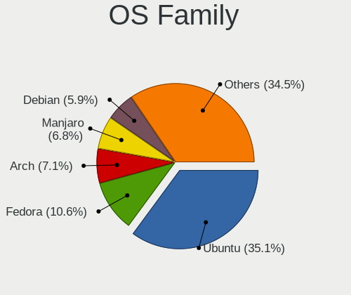
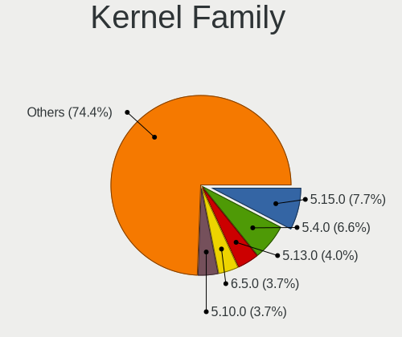
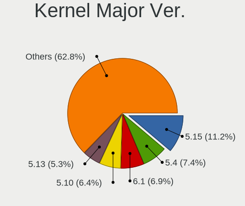
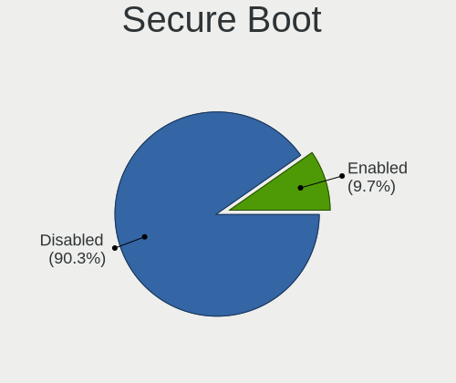
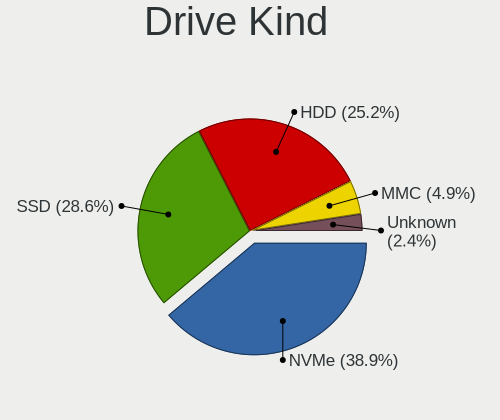
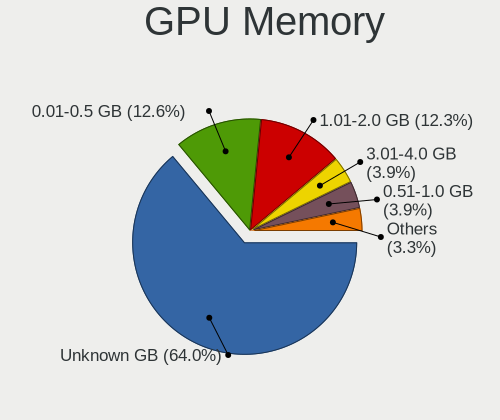
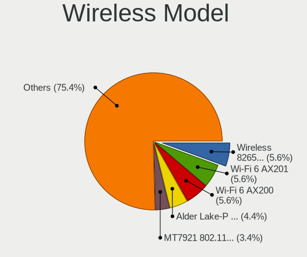
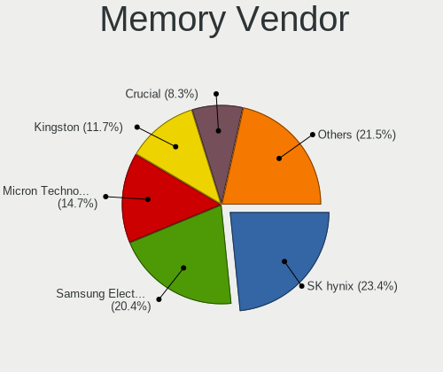

Linux in Taiwan - Tested Hardware & Statistics (Notebooks)
----------------------------------------------------------

A project to collect tested hardware configurations for Linux in Taiwan.

Anyone can contribute to this report by the [hw-probe](https://github.com/linuxhw/hw-probe) tool:

    sudo -E hw-probe -all -upload

Please contribute! Especially if your hardware is rare.

Contents
--------

* [ Test Cases ](#test-cases)

* [ System ](#system)
  - [ OS                       ](#os)
  - [ OS Family                ](#os-family)
  - [ Kernel                   ](#kernel)
  - [ Kernel Family            ](#kernel-family)
  - [ Kernel Major Ver.        ](#kernel-major-ver)
  - [ Arch                     ](#arch)
  - [ DE                       ](#de)
  - [ Display Server           ](#display-server)
  - [ Display Manager          ](#display-manager)
  - [ OS Lang                  ](#os-lang)
  - [ Boot Mode                ](#boot-mode)
  - [ Filesystem               ](#filesystem)
  - [ Part. scheme             ](#part-scheme)
  - [ Dual Boot with Linux/BSD ](#dual-boot-with-linuxbsd)
  - [ Dual Boot (Win)          ](#dual-boot-win)

* [ Board ](#board)
  - [ Vendor                   ](#vendor)
  - [ Model                    ](#model)
  - [ Model Family             ](#model-family)
  - [ MFG Year                 ](#mfg-year)
  - [ Form Factor              ](#form-factor)
  - [ Secure Boot              ](#secure-boot)
  - [ Coreboot                 ](#coreboot)
  - [ RAM Size                 ](#ram-size)
  - [ RAM Used                 ](#ram-used)
  - [ Total Drives             ](#total-drives)
  - [ Has CD-ROM               ](#has-cd-rom)
  - [ Has Ethernet             ](#has-ethernet)
  - [ Has WiFi                 ](#has-wifi)
  - [ Has Bluetooth            ](#has-bluetooth)

* [ Location ](#location)
  - [ Country                  ](#country)
  - [ City                     ](#city)

* [ Drives ](#drives)
  - [ Drive Vendor             ](#drive-vendor)
  - [ Drive Model              ](#drive-model)
  - [ HDD Vendor               ](#hdd-vendor)
  - [ SSD Vendor               ](#ssd-vendor)
  - [ Drive Kind               ](#drive-kind)
  - [ Drive Connector          ](#drive-connector)
  - [ Drive Size               ](#drive-size)
  - [ Space Total              ](#space-total)
  - [ Space Used               ](#space-used)
  - [ Malfunc. Drives          ](#malfunc-drives)
  - [ Malfunc. Drive Vendor    ](#malfunc-drive-vendor)
  - [ Malfunc. HDD Vendor      ](#malfunc-hdd-vendor)
  - [ Malfunc. Drive Kind      ](#malfunc-drive-kind)
  - [ Failed Drives            ](#failed-drives)
  - [ Failed Drive Vendor      ](#failed-drive-vendor)
  - [ Drive Status             ](#drive-status)

* [ Storage controller ](#storage-controller)
  - [ Storage Vendor           ](#storage-vendor)
  - [ Storage Model            ](#storage-model)
  - [ Storage Kind             ](#storage-kind)

* [ Processor ](#processor)
  - [ CPU Vendor               ](#cpu-vendor)
  - [ CPU Model                ](#cpu-model)
  - [ CPU Model Family         ](#cpu-model-family)
  - [ CPU Cores                ](#cpu-cores)
  - [ CPU Sockets              ](#cpu-sockets)
  - [ CPU Threads              ](#cpu-threads)
  - [ CPU Op-Modes             ](#cpu-op-modes)
  - [ CPU Microcode            ](#cpu-microcode)
  - [ CPU Microarch            ](#cpu-microarch)

* [ Graphics ](#graphics)
  - [ GPU Vendor               ](#gpu-vendor)
  - [ GPU Model                ](#gpu-model)
  - [ GPU Combo                ](#gpu-combo)
  - [ GPU Driver               ](#gpu-driver)
  - [ GPU Memory               ](#gpu-memory)

* [ Monitor ](#monitor)
  - [ Monitor Vendor           ](#monitor-vendor)
  - [ Monitor Model            ](#monitor-model)
  - [ Monitor Resolution       ](#monitor-resolution)
  - [ Monitor Diagonal         ](#monitor-diagonal)
  - [ Monitor Width            ](#monitor-width)
  - [ Aspect Ratio             ](#aspect-ratio)
  - [ Monitor Area             ](#monitor-area)
  - [ Pixel Density            ](#pixel-density)
  - [ Multiple Monitors        ](#multiple-monitors)

* [ Network ](#network)
  - [ Net Controller Vendor    ](#net-controller-vendor)
  - [ Net Controller Model     ](#net-controller-model)
  - [ Wireless Vendor          ](#wireless-vendor)
  - [ Wireless Model           ](#wireless-model)
  - [ Ethernet Vendor          ](#ethernet-vendor)
  - [ Ethernet Model           ](#ethernet-model)
  - [ Net Controller Kind      ](#net-controller-kind)
  - [ Used Controller          ](#used-controller)
  - [ NICs                     ](#nics)
  - [ IPv6                     ](#ipv6)

* [ Bluetooth ](#bluetooth)
  - [ Bluetooth Vendor         ](#bluetooth-vendor)
  - [ Bluetooth Model          ](#bluetooth-model)

* [ Sound ](#sound)
  - [ Sound Vendor             ](#sound-vendor)
  - [ Sound Model              ](#sound-model)

* [ Memory ](#memory)
  - [ Memory Vendor            ](#memory-vendor)
  - [ Memory Model             ](#memory-model)
  - [ Memory Kind              ](#memory-kind)
  - [ Memory Form Factor       ](#memory-form-factor)
  - [ Memory Size              ](#memory-size)
  - [ Memory Speed             ](#memory-speed)

* [ Printers & scanners ](#printers--scanners)
  - [ Printer Vendor           ](#printer-vendor)
  - [ Printer Model            ](#printer-model)
  - [ Scanner Vendor           ](#scanner-vendor)
  - [ Scanner Model            ](#scanner-model)

* [ Camera ](#camera)
  - [ Camera Vendor            ](#camera-vendor)
  - [ Camera Model             ](#camera-model)

* [ Security ](#security)
  - [ Fingerprint Vendor       ](#fingerprint-vendor)
  - [ Fingerprint Model        ](#fingerprint-model)
  - [ Chipcard Vendor          ](#chipcard-vendor)
  - [ Chipcard Model           ](#chipcard-model)

* [ Unsupported ](#unsupported)
  - [ Unsupported Devices      ](#unsupported-devices)
  - [ Unsupported Device Types ](#unsupported-device-types)

Test Cases
----------

Total: 456

| Vendor        | Model                       | Probe                                                      | Date         |
|---------------|-----------------------------|------------------------------------------------------------|--------------|
| ASUSTek       | GL553VW                     | [c51bf874e5](https://linux-hardware.org/?probe=c51bf874e5) | May 06, 2024 |
| HP            | Pavilion dm3                | [cb32e79169](https://linux-hardware.org/?probe=cb32e79169) | May 03, 2024 |
| Acer          | Aspire A514-55              | [3f25790115](https://linux-hardware.org/?probe=3f25790115) | Apr 30, 2024 |
| Dell          | Latitude 7490               | [12d9f9cce2](https://linux-hardware.org/?probe=12d9f9cce2) | Apr 27, 2024 |
| Samsung       | 940X3G/930X3G               | [7ae2ace4e3](https://linux-hardware.org/?probe=7ae2ace4e3) | Apr 17, 2024 |
| Samsung       | 940X3G/930X3G               | [ebcb51ed9c](https://linux-hardware.org/?probe=ebcb51ed9c) | Apr 16, 2024 |
| Acer          | Aspire E5-473G              | [e2f4ed0b39](https://linux-hardware.org/?probe=e2f4ed0b39) | Apr 03, 2024 |
| Acer          | Swift SF514-54GT            | [c0a1536935](https://linux-hardware.org/?probe=c0a1536935) | Mar 28, 2024 |
| HP            | Presario V3000 (RD462PA#... | [1fbccb2f58](https://linux-hardware.org/?probe=1fbccb2f58) | Mar 27, 2024 |
| Valve         | Galileo                     | [14e646cf21](https://linux-hardware.org/?probe=14e646cf21) | Mar 22, 2024 |
| Lenovo        | ThinkPad E14 20RA002LCD     | [0ee7bfce17](https://linux-hardware.org/?probe=0ee7bfce17) | Mar 22, 2024 |
| Valve         | Galileo                     | [cd0fb4513f](https://linux-hardware.org/?probe=cd0fb4513f) | Mar 21, 2024 |
| Lenovo        | ThinkPad P14s Gen 4 21K5... | [83a22f435d](https://linux-hardware.org/?probe=83a22f435d) | Mar 21, 2024 |
| Apple         | MacBookAir6,1               | [8575151105](https://linux-hardware.org/?probe=8575151105) | Mar 14, 2024 |
| Genuine       | ZEUS 15H (GNB15H-9G650)     | [1cdfbc79db](https://linux-hardware.org/?probe=1cdfbc79db) | Mar 09, 2024 |
| Acer          | Aspire A515-57              | [7995029372](https://linux-hardware.org/?probe=7995029372) | Mar 06, 2024 |
| MECHREVO      | WUJIE14 PRO                 | [5b2bd502f2](https://linux-hardware.org/?probe=5b2bd502f2) | Mar 05, 2024 |
| HP            | Pavilion Plus Laptop 14-... | [a7108bda20](https://linux-hardware.org/?probe=a7108bda20) | Mar 05, 2024 |
| HP            | Pavilion Plus Laptop 14-... | [e14a9fae0a](https://linux-hardware.org/?probe=e14a9fae0a) | Mar 05, 2024 |
| Jumper        | EZpad                       | [526ffbb0c5](https://linux-hardware.org/?probe=526ffbb0c5) | Feb 28, 2024 |
| HP            | EliteBook 845 G7 Noteboo... | [caf3ea0d9a](https://linux-hardware.org/?probe=caf3ea0d9a) | Feb 20, 2024 |
| Sony          | SVT11215CWB                 | [89248167bd](https://linux-hardware.org/?probe=89248167bd) | Feb 18, 2024 |
| Acer          | Aspire VX5-591G             | [2fb2ff6aed](https://linux-hardware.org/?probe=2fb2ff6aed) | Feb 09, 2024 |
| ASUSTek       | X555LB                      | [5f19079461](https://linux-hardware.org/?probe=5f19079461) | Feb 06, 2024 |
| Gigabyte      | AORUS 5 SE                  | [09dc6d2649](https://linux-hardware.org/?probe=09dc6d2649) | Feb 03, 2024 |
| Acer          | Swift SF314-56              | [159a1c3a0f](https://linux-hardware.org/?probe=159a1c3a0f) | Feb 02, 2024 |
| LG Electro... | 16Z90Q-G.AA54C2             | [34806d0240](https://linux-hardware.org/?probe=34806d0240) | Jan 26, 2024 |
| LG Electro... | 16Z90Q-G.AA54C2             | [d847e907f7](https://linux-hardware.org/?probe=d847e907f7) | Jan 20, 2024 |
| ASUSTek       | VivoBook_ASUSLaptop K340... | [2ddefbdd81](https://linux-hardware.org/?probe=2ddefbdd81) | Jan 17, 2024 |
| HP            | Pavilion Plus Laptop 14-... | [8118029878](https://linux-hardware.org/?probe=8118029878) | Jan 06, 2024 |
| Lenovo        | ThinkPad E14 Gen 5 21JK0... | [a46e855825](https://linux-hardware.org/?probe=a46e855825) | Jan 05, 2024 |
| HP            | ProBook 430 G2              | [c56ad1ad48](https://linux-hardware.org/?probe=c56ad1ad48) | Jan 02, 2024 |
| Acer          | Aspire SW5-012              | [efc348dbe0](https://linux-hardware.org/?probe=efc348dbe0) | Dec 31, 2023 |
| Google        | Delbin                      | [51a51a978d](https://linux-hardware.org/?probe=51a51a978d) | Dec 31, 2023 |
| Valve         | Galileo                     | [e21296767e](https://linux-hardware.org/?probe=e21296767e) | Dec 25, 2023 |
| ASUSTek       | ASUS TUF Gaming F15 FX50... | [08e2f4eacc](https://linux-hardware.org/?probe=08e2f4eacc) | Dec 25, 2023 |
| Dynabook      | CS40L-HB                    | [da68e155cd](https://linux-hardware.org/?probe=da68e155cd) | Dec 20, 2023 |
| Acer          | Swift SF314-57G             | [b822161722](https://linux-hardware.org/?probe=b822161722) | Dec 19, 2023 |
| ASUSTek       | X450CC                      | [0af8e99fe6](https://linux-hardware.org/?probe=0af8e99fe6) | Dec 19, 2023 |
| ASUSTek       | X450CC                      | [238d032255](https://linux-hardware.org/?probe=238d032255) | Dec 19, 2023 |
| HP            | Pavilion 15                 | [8ea538629f](https://linux-hardware.org/?probe=8ea538629f) | Dec 17, 2023 |
| Lenovo        | ThinkBook 14 G2 ITL 20VD    | [5f19b6ce4f](https://linux-hardware.org/?probe=5f19b6ce4f) | Dec 16, 2023 |
| Acer          | Aspire V5-431               | [6e56833b2a](https://linux-hardware.org/?probe=6e56833b2a) | Dec 09, 2023 |
| Framework     | Laptop 13 (AMD Ryzen 704... | [21847052d3](https://linux-hardware.org/?probe=21847052d3) | Dec 07, 2023 |
| Lenovo        | IdeaPad 300-14ISK 80Q6      | [68784031ca](https://linux-hardware.org/?probe=68784031ca) | Dec 05, 2023 |
| Lenovo        | ThinkPad T480 20L5S2J200    | [75603d3c20](https://linux-hardware.org/?probe=75603d3c20) | Dec 04, 2023 |
| Lenovo        | Yoga 14sARE 2020 82A8       | [b5086b8a65](https://linux-hardware.org/?probe=b5086b8a65) | Dec 01, 2023 |
| Lenovo        | Yoga 14sARE 2020 82A8       | [13d2cf2679](https://linux-hardware.org/?probe=13d2cf2679) | Nov 30, 2023 |
| CHIPHD        | NT125D                      | [44dab561a1](https://linux-hardware.org/?probe=44dab561a1) | Nov 21, 2023 |
| Dell          | Latitude 5440               | [107b422b2c](https://linux-hardware.org/?probe=107b422b2c) | Nov 20, 2023 |
| Dell          | Inspiron 7375               | [b72b8abe13](https://linux-hardware.org/?probe=b72b8abe13) | Nov 19, 2023 |
| Dell          | Latitude 5440               | [ed0b97c0a4](https://linux-hardware.org/?probe=ed0b97c0a4) | Nov 19, 2023 |
| Dell          | Latitude 5440               | [1f337ab4b1](https://linux-hardware.org/?probe=1f337ab4b1) | Nov 15, 2023 |
| Acer          | Aspire V3-471G              | [f027c1d470](https://linux-hardware.org/?probe=f027c1d470) | Nov 14, 2023 |
| Lenovo        | ThinkPad P14s Gen 4 21K5... | [51e8be0935](https://linux-hardware.org/?probe=51e8be0935) | Nov 12, 2023 |
| MSI           | GL65 9SD                    | [d831c2e78e](https://linux-hardware.org/?probe=d831c2e78e) | Nov 06, 2023 |
| Acer          | Aspire A514-55              | [b9ad0e270f](https://linux-hardware.org/?probe=b9ad0e270f) | Nov 04, 2023 |
| Acer          | Aspire A514-55              | [985bf8e919](https://linux-hardware.org/?probe=985bf8e919) | Nov 01, 2023 |
| Dell          | G7 7590                     | [90cbef58c2](https://linux-hardware.org/?probe=90cbef58c2) | Oct 27, 2023 |
| Gigabyte      | AORUS 5 SE                  | [bf6473691f](https://linux-hardware.org/?probe=bf6473691f) | Oct 21, 2023 |
| ASUSTek       | ASUS EXPERTBOOK B9403CVA... | [eaffd30f59](https://linux-hardware.org/?probe=eaffd30f59) | Oct 21, 2023 |
| ASUSTek       | ASUS EXPERTBOOK B9403CVA... | [aafd893b0d](https://linux-hardware.org/?probe=aafd893b0d) | Oct 21, 2023 |
| MSI           | Alpha 17 C7VG               | [aa9ed0c963](https://linux-hardware.org/?probe=aa9ed0c963) | Oct 13, 2023 |
| MSI           | Alpha 17 C7VG               | [3cf39a38db](https://linux-hardware.org/?probe=3cf39a38db) | Oct 12, 2023 |
| Acer          | Swift SFX14-41G             | [ad1ae13902](https://linux-hardware.org/?probe=ad1ae13902) | Oct 11, 2023 |
| MSI           | GL65 9SD                    | [0e94bdcf1d](https://linux-hardware.org/?probe=0e94bdcf1d) | Oct 05, 2023 |
| MSI           | GL65 9SD                    | [32b5c9a302](https://linux-hardware.org/?probe=32b5c9a302) | Oct 05, 2023 |
| CHIPHD        | NT125D                      | [7e966b32de](https://linux-hardware.org/?probe=7e966b32de) | Sep 26, 2023 |
| Lenovo        | ThinkPad T450 20BV000BUS    | [3959de124c](https://linux-hardware.org/?probe=3959de124c) | Sep 14, 2023 |
| Toshiba       | Satellite L640              | [ac5a264fea](https://linux-hardware.org/?probe=ac5a264fea) | Sep 12, 2023 |
| Lenovo        | Legion Pro 5 16ARX8 82WM    | [55b8608662](https://linux-hardware.org/?probe=55b8608662) | Sep 08, 2023 |
| Gigabyte      | GB-BKi3A-7100               | [40c832efb9](https://linux-hardware.org/?probe=40c832efb9) | Sep 04, 2023 |
| HP            | ProBook 440 G8 Notebook ... | [b132ff749e](https://linux-hardware.org/?probe=b132ff749e) | Sep 01, 2023 |
| Lenovo        | IdeaPad 1 15ADA7 82R1       | [ed4fafcabd](https://linux-hardware.org/?probe=ed4fafcabd) | Aug 31, 2023 |
| Sony          | VGN-C15TP_W                 | [591d0b778e](https://linux-hardware.org/?probe=591d0b778e) | Aug 30, 2023 |
| Sony          | VGN-C15TP_W                 | [a63433e04d](https://linux-hardware.org/?probe=a63433e04d) | Aug 25, 2023 |
| Acer          | Swift SFX14-41G             | [576626db19](https://linux-hardware.org/?probe=576626db19) | Aug 17, 2023 |
| Acer          | Aspire one                  | [47131c09b2](https://linux-hardware.org/?probe=47131c09b2) | Aug 16, 2023 |
| Lenovo        | IdeaPad 300-14ISK 80Q6      | [a94c8dc31f](https://linux-hardware.org/?probe=a94c8dc31f) | Aug 16, 2023 |
| Lenovo        | ThinkPad T480 20L5S2J200    | [66c997fdec](https://linux-hardware.org/?probe=66c997fdec) | Aug 16, 2023 |
| Lenovo        | ThinkPad T480 20L5S2J200    | [e57e76260c](https://linux-hardware.org/?probe=e57e76260c) | Aug 16, 2023 |
| ASUSTek       | UX31LA                      | [0695e3bb09](https://linux-hardware.org/?probe=0695e3bb09) | Aug 08, 2023 |
| MSI           | GL65 9SD                    | [b3ef4f1363](https://linux-hardware.org/?probe=b3ef4f1363) | Aug 07, 2023 |
| MSI           | GL65 9SD                    | [2539f4ad7a](https://linux-hardware.org/?probe=2539f4ad7a) | Aug 06, 2023 |
| MSI           | PS63 Modern 8M              | [96e7b96787](https://linux-hardware.org/?probe=96e7b96787) | Jul 27, 2023 |
| MSI           | GL65 9SD                    | [a3f9991e22](https://linux-hardware.org/?probe=a3f9991e22) | Jul 23, 2023 |
| MSI           | GL65 9SD                    | [57c6b0a7dd](https://linux-hardware.org/?probe=57c6b0a7dd) | Jul 15, 2023 |
| HP            | 250 G5 Notebook PC          | [030ecef01c](https://linux-hardware.org/?probe=030ecef01c) | Jul 08, 2023 |
| HP            | 250 G5 Notebook PC          | [56683a6866](https://linux-hardware.org/?probe=56683a6866) | Jul 08, 2023 |
| Google        | Cave                        | [cc3b1bb1a3](https://linux-hardware.org/?probe=cc3b1bb1a3) | Jun 24, 2023 |
| Google        | Cave                        | [199eb4826d](https://linux-hardware.org/?probe=199eb4826d) | Jun 24, 2023 |
| Acer          | Aspire A515-53G             | [430cfefc6a](https://linux-hardware.org/?probe=430cfefc6a) | Jun 21, 2023 |
| Lenovo        | ThinkPad X230 2324CD1       | [9ee6ed4144](https://linux-hardware.org/?probe=9ee6ed4144) | Jun 18, 2023 |
| ASUSTek       | ASUSPRO P5440UF             | [cf08c655b9](https://linux-hardware.org/?probe=cf08c655b9) | Jun 17, 2023 |
| ASUSTek       | ASUSPRO P5440UF             | [272d8de237](https://linux-hardware.org/?probe=272d8de237) | Jun 16, 2023 |
| Lenovo        | IdeaPad 5 Pro 14IAP7 82S... | [dd5aaca858](https://linux-hardware.org/?probe=dd5aaca858) | Jun 15, 2023 |
| Lenovo        | ThinkPad X13 Gen 3 21BNC... | [ba129cd52d](https://linux-hardware.org/?probe=ba129cd52d) | Jun 11, 2023 |
| Acidanther... | MacBookPro15,2              | [fb30b2eb35](https://linux-hardware.org/?probe=fb30b2eb35) | Jun 10, 2023 |
| Lenovo        | Z50-70 20354                | [05a473a2be](https://linux-hardware.org/?probe=05a473a2be) | Jun 06, 2023 |
| Apple         | MacBookPro7,1               | [e92db65759](https://linux-hardware.org/?probe=e92db65759) | Jun 05, 2023 |
| Timi          | Redmi Book Pro 15 2022      | [a3089228b1](https://linux-hardware.org/?probe=a3089228b1) | Jun 05, 2023 |
| ASUSTek       | UX430UNR                    | [00ab711e0a](https://linux-hardware.org/?probe=00ab711e0a) | Jun 02, 2023 |
| Apple         | MacBookPro7,1               | [47ac3b9c43](https://linux-hardware.org/?probe=47ac3b9c43) | May 28, 2023 |
| Acer          | Swift SF514-54GT            | [dd79b67b18](https://linux-hardware.org/?probe=dd79b67b18) | May 27, 2023 |
| Apple         | MacBookPro7,1               | [324a8d5c88](https://linux-hardware.org/?probe=324a8d5c88) | May 22, 2023 |
| Apple         | MacBookPro7,1               | [88830e9fe8](https://linux-hardware.org/?probe=88830e9fe8) | May 22, 2023 |
| Lenovo        | ThinkPad P14s Gen 2a 21A... | [fb58a4d348](https://linux-hardware.org/?probe=fb58a4d348) | May 14, 2023 |
| Lenovo        | IdeaPad 5 Pro 14IAP7 82S... | [02fb267cbc](https://linux-hardware.org/?probe=02fb267cbc) | May 07, 2023 |
| HP            | 250 G5 Notebook PC          | [e12a1d28ba](https://linux-hardware.org/?probe=e12a1d28ba) | May 06, 2023 |
| HP            | 250 G5 Notebook PC          | [4cb6025c16](https://linux-hardware.org/?probe=4cb6025c16) | May 03, 2023 |
| Apple         | MacBookPro11,1              | [7309ce024f](https://linux-hardware.org/?probe=7309ce024f) | Apr 25, 2023 |
| Valve         | Jupiter                     | [b2a94c7310](https://linux-hardware.org/?probe=b2a94c7310) | Apr 18, 2023 |
| Valve         | Jupiter                     | [965de2bcc4](https://linux-hardware.org/?probe=965de2bcc4) | Apr 11, 2023 |
| Lenovo        | IdeaPad 5 Pro 14IAP7 82S... | [c0901def8d](https://linux-hardware.org/?probe=c0901def8d) | Apr 10, 2023 |
| Lenovo        | IdeaPad S145-14AST 81ST     | [c8173d40cd](https://linux-hardware.org/?probe=c8173d40cd) | Apr 09, 2023 |
| Dell          | Latitude 7490               | [01957ea955](https://linux-hardware.org/?probe=01957ea955) | Apr 07, 2023 |
| Toshiba       | Satellite L850              | [2635da1e14](https://linux-hardware.org/?probe=2635da1e14) | Apr 03, 2023 |
| Lenovo        | ThinkPad X13 Gen 3 21BNC... | [649b881439](https://linux-hardware.org/?probe=649b881439) | Mar 25, 2023 |
| Insyde        | CherryTrail                 | [9e658f67a2](https://linux-hardware.org/?probe=9e658f67a2) | Mar 25, 2023 |
| Lenovo        | ThinkPad Twist 33472HU      | [a49ece0e6c](https://linux-hardware.org/?probe=a49ece0e6c) | Mar 22, 2023 |
| Lenovo        | ThinkPad Twist 33472HU      | [315f2256c6](https://linux-hardware.org/?probe=315f2256c6) | Mar 22, 2023 |
| Lenovo        | IdeaPad Gaming 3 15IAH7 ... | [882f82cf2c](https://linux-hardware.org/?probe=882f82cf2c) | Mar 20, 2023 |
| Acer          | Aspire V3-571G              | [6aee8060e9](https://linux-hardware.org/?probe=6aee8060e9) | Mar 17, 2023 |
| Valve         | Jupiter                     | [db30abe51b](https://linux-hardware.org/?probe=db30abe51b) | Mar 13, 2023 |
| Toshiba       | Satellite C665              | [e95e34e3ba](https://linux-hardware.org/?probe=e95e34e3ba) | Mar 11, 2023 |
| Lenovo        | ThinkPad X1 Carbon Gen 1... | [7f3075e65e](https://linux-hardware.org/?probe=7f3075e65e) | Mar 08, 2023 |
| Lenovo        | ThinkPad T14 Gen 1 20S0S... | [2e864ba25e](https://linux-hardware.org/?probe=2e864ba25e) | Mar 08, 2023 |
| Valve         | Jupiter                     | [367bc56a15](https://linux-hardware.org/?probe=367bc56a15) | Mar 05, 2023 |
| Valve         | Jupiter                     | [c329f5f1c1](https://linux-hardware.org/?probe=c329f5f1c1) | Mar 05, 2023 |
| Valve         | Jupiter                     | [2143a36dc5](https://linux-hardware.org/?probe=2143a36dc5) | Feb 28, 2023 |
| Acer          | Swift SF514-54GT            | [dbccc5afa9](https://linux-hardware.org/?probe=dbccc5afa9) | Feb 23, 2023 |
| ASUSTek       | X202E                       | [6627e10e70](https://linux-hardware.org/?probe=6627e10e70) | Feb 19, 2023 |
| Dell          | Latitude E6320              | [467b45072e](https://linux-hardware.org/?probe=467b45072e) | Feb 19, 2023 |
| Lenovo        | ThinkPad X61 7673D13        | [b5399b39de](https://linux-hardware.org/?probe=b5399b39de) | Feb 19, 2023 |
| Acer          | Swift SF514-54GT            | [b7e961dae3](https://linux-hardware.org/?probe=b7e961dae3) | Feb 13, 2023 |
| Valve         | Jupiter                     | [e5f4ad1053](https://linux-hardware.org/?probe=e5f4ad1053) | Feb 12, 2023 |
| ASUSTek       | G73Sw                       | [42e7c32817](https://linux-hardware.org/?probe=42e7c32817) | Feb 06, 2023 |
| HP            | Notebook                    | [41f5c97a09](https://linux-hardware.org/?probe=41f5c97a09) | Feb 06, 2023 |
| AVITA         | NE14A2                      | [c5d9f8e3ac](https://linux-hardware.org/?probe=c5d9f8e3ac) | Feb 02, 2023 |
| ASUSTek       | VivoBook_ASUSLaptop K340... | [37059de5b7](https://linux-hardware.org/?probe=37059de5b7) | Jan 27, 2023 |
| MSI           | Alpha 15 B5EEK              | [d815a80782](https://linux-hardware.org/?probe=d815a80782) | Jan 24, 2023 |
| MSI           | Alpha 15 B5EEK              | [d2c9a02f60](https://linux-hardware.org/?probe=d2c9a02f60) | Jan 24, 2023 |
| HP            | ProBook 430 G8 Notebook ... | [335275777a](https://linux-hardware.org/?probe=335275777a) | Jan 23, 2023 |
| Dell          | Latitude 7490               | [e40bb2f01f](https://linux-hardware.org/?probe=e40bb2f01f) | Jan 23, 2023 |
| Dell          | Latitude 7490               | [31789ae630](https://linux-hardware.org/?probe=31789ae630) | Jan 23, 2023 |
| HP            | ProBook 430 G2              | [24a0f33638](https://linux-hardware.org/?probe=24a0f33638) | Jan 22, 2023 |
| HP            | Compaq 6510b (GM108UC#AB... | [45ae9ca3c9](https://linux-hardware.org/?probe=45ae9ca3c9) | Jan 20, 2023 |
| HP            | Laptop 15s-eq2xxx           | [958ecc4388](https://linux-hardware.org/?probe=958ecc4388) | Jan 15, 2023 |
| Gigabyte      | GB-BKi3A-7100               | [8263d65b20](https://linux-hardware.org/?probe=8263d65b20) | Jan 08, 2023 |
| Gigabyte      | G5 GE                       | [d6a4584809](https://linux-hardware.org/?probe=d6a4584809) | Jan 07, 2023 |
| System76      | Lemur Pro                   | [36156d9aa7](https://linux-hardware.org/?probe=36156d9aa7) | Jan 07, 2023 |
| Dell          | Inspiron 13 5320            | [0007a36030](https://linux-hardware.org/?probe=0007a36030) | Jan 07, 2023 |
| Timi          | Mi Laptop Pro 15            | [7ea6f8ee94](https://linux-hardware.org/?probe=7ea6f8ee94) | Jan 06, 2023 |
| Lenovo        | ThinkPad T14 Gen 2i 20W0... | [9e535c1e8e](https://linux-hardware.org/?probe=9e535c1e8e) | Jan 01, 2023 |
| Lenovo        | ThinkPad T14 Gen 2i 20W0... | [2abdc57712](https://linux-hardware.org/?probe=2abdc57712) | Dec 31, 2022 |
| Lenovo        | ThinkPad T14 Gen 2i 20W0... | [632515014d](https://linux-hardware.org/?probe=632515014d) | Dec 31, 2022 |
| MSI           | Modern 15 A5M               | [e0cb4d278d](https://linux-hardware.org/?probe=e0cb4d278d) | Dec 31, 2022 |
| MSI           | Modern 15 A5M               | [1e7182cb70](https://linux-hardware.org/?probe=1e7182cb70) | Dec 29, 2022 |
| ASUSTek       | VivoBook_ASUSLaptop K340... | [ee7b1d707c](https://linux-hardware.org/?probe=ee7b1d707c) | Dec 26, 2022 |
| ASUSTek       | VivoBook_ASUSLaptop K340... | [7c8560a87e](https://linux-hardware.org/?probe=7c8560a87e) | Dec 25, 2022 |
| Acer          | Aspire 4750                 | [3256c282db](https://linux-hardware.org/?probe=3256c282db) | Dec 23, 2022 |
| ASUSTek       | VivoBook_ASUSLaptop K340... | [9462031346](https://linux-hardware.org/?probe=9462031346) | Dec 22, 2022 |
| ASUSTek       | VivoBook_ASUSLaptop K340... | [7eb6658e3a](https://linux-hardware.org/?probe=7eb6658e3a) | Dec 21, 2022 |
| ASUSTek       | VivoBook_ASUSLaptop K340... | [7a14c8194f](https://linux-hardware.org/?probe=7a14c8194f) | Dec 20, 2022 |
| HUAWEI        | KLVL-WXX9                   | [a767e0fbf0](https://linux-hardware.org/?probe=a767e0fbf0) | Dec 16, 2022 |
| Lenovo        | ThinkPad W530 243858U       | [9dc4fb1abb](https://linux-hardware.org/?probe=9dc4fb1abb) | Dec 16, 2022 |
| ASUSTek       | ASUSPRO P1440FAC_P1440FA    | [44484456f8](https://linux-hardware.org/?probe=44484456f8) | Dec 14, 2022 |
| ASUSTek       | PU403UA                     | [20007b4296](https://linux-hardware.org/?probe=20007b4296) | Dec 05, 2022 |
| Dell          | Vostro 5481                 | [6c58c07e64](https://linux-hardware.org/?probe=6c58c07e64) | Dec 03, 2022 |
| ASUSTek       | VivoBook_ASUSLaptop X140... | [55d95654c4](https://linux-hardware.org/?probe=55d95654c4) | Nov 30, 2022 |
| HP            | ProBook 430 G8 Notebook ... | [8a773e7358](https://linux-hardware.org/?probe=8a773e7358) | Nov 22, 2022 |
| Lenovo        | ThinkPad X13 Gen 1 20UFS... | [678cfec38b](https://linux-hardware.org/?probe=678cfec38b) | Nov 20, 2022 |
| MSI           | GE62 6QD                    | [3d2dd5419a](https://linux-hardware.org/?probe=3d2dd5419a) | Nov 18, 2022 |
| ASUSTek       | X550VX                      | [8e55592803](https://linux-hardware.org/?probe=8e55592803) | Nov 15, 2022 |
| Acer          | Swift SFX14-41G             | [a8023a34a0](https://linux-hardware.org/?probe=a8023a34a0) | Nov 11, 2022 |
| MSI           | U270DX                      | [2a68a6ba02](https://linux-hardware.org/?probe=2a68a6ba02) | Nov 10, 2022 |
| Lenovo        | IdeaPad 5 14ALC05 82LM      | [52080bf6ef](https://linux-hardware.org/?probe=52080bf6ef) | Nov 09, 2022 |
| HP            | EliteBook x360 1030 G4      | [4fa71c1d6d](https://linux-hardware.org/?probe=4fa71c1d6d) | Nov 09, 2022 |
| Dell          | Inspiron 13 5320            | [9ac52708ad](https://linux-hardware.org/?probe=9ac52708ad) | Oct 17, 2022 |
| Intel Clie... | LAPRC710                    | [4a1e71b56a](https://linux-hardware.org/?probe=4a1e71b56a) | Oct 15, 2022 |
| ASUSTek       | ASUS TUF Dash F15 FX516P... | [e940ddf8a7](https://linux-hardware.org/?probe=e940ddf8a7) | Oct 12, 2022 |
| ASUSTek       | PU403UA                     | [8bf4879487](https://linux-hardware.org/?probe=8bf4879487) | Oct 04, 2022 |
| ASUSTek       | ASUS EXPERTBOOK B1400CBA    | [4cad2a770c](https://linux-hardware.org/?probe=4cad2a770c) | Sep 30, 2022 |
| Lenovo        | ThinkPad T480s 20L7001YU... | [929514123f](https://linux-hardware.org/?probe=929514123f) | Sep 30, 2022 |
| Gigabyte      | AORUS 5 SE                  | [c188e2c5b5](https://linux-hardware.org/?probe=c188e2c5b5) | Sep 24, 2022 |
| Lenovo        | IdeaPad 5 14ALC05 82LM      | [5503282548](https://linux-hardware.org/?probe=5503282548) | Sep 20, 2022 |
| Acer          | Aspire A515-45              | [c0b89ea222](https://linux-hardware.org/?probe=c0b89ea222) | Aug 26, 2022 |
| Sony          | SVS15115FWB                 | [6844bd3288](https://linux-hardware.org/?probe=6844bd3288) | Aug 21, 2022 |
| Sony          | SVS15115FWB                 | [2fb1c4ab2d](https://linux-hardware.org/?probe=2fb1c4ab2d) | Aug 20, 2022 |
| Acer          | TravelMate P653-M           | [1e33abf031](https://linux-hardware.org/?probe=1e33abf031) | Aug 17, 2022 |
| Dell          | Inspiron 13 5320            | [cee0d5a717](https://linux-hardware.org/?probe=cee0d5a717) | Aug 14, 2022 |
| Dell          | Vostro 3525                 | [d6630abc3a](https://linux-hardware.org/?probe=d6630abc3a) | Aug 03, 2022 |
| ASUSTek       | K501LX                      | [8ea0c7daa9](https://linux-hardware.org/?probe=8ea0c7daa9) | Jul 30, 2022 |
| Acer          | Aspire A515-57G             | [a44d178033](https://linux-hardware.org/?probe=a44d178033) | Jul 30, 2022 |
| LG Electro... | LE50-5BC6H1                 | [010123b7d5](https://linux-hardware.org/?probe=010123b7d5) | Jul 26, 2022 |
| Acer          | Aspire K50-20               | [1f4543c39e](https://linux-hardware.org/?probe=1f4543c39e) | Jul 20, 2022 |
| Acer          | Aspire K50-20               | [3f0e68ecf5](https://linux-hardware.org/?probe=3f0e68ecf5) | Jul 20, 2022 |
| Acer          | TravelMate 8371             | [4af529e1c4](https://linux-hardware.org/?probe=4af529e1c4) | Jul 20, 2022 |
| Acer          | Aspire A515-45              | [4189e96860](https://linux-hardware.org/?probe=4189e96860) | Jul 19, 2022 |
| Dell          | Inspiron 5577               | [54fda2d2bc](https://linux-hardware.org/?probe=54fda2d2bc) | Jul 16, 2022 |
| Acer          | Aspire A515-57G             | [43a9aeb04d](https://linux-hardware.org/?probe=43a9aeb04d) | Jul 15, 2022 |
| ASUSTek       | ROG Zephyrus G15 GA502IV... | [5f3670ea60](https://linux-hardware.org/?probe=5f3670ea60) | Jul 12, 2022 |
| Dell          | Vostro 3525                 | [2174c6314a](https://linux-hardware.org/?probe=2174c6314a) | Jul 11, 2022 |
| Dell          | Vostro 3525                 | [ff38c8714c](https://linux-hardware.org/?probe=ff38c8714c) | Jul 11, 2022 |
| Acer          | Swift SF514-54GT            | [554171275d](https://linux-hardware.org/?probe=554171275d) | Jul 07, 2022 |
| Acer          | Aspire A315-55G             | [e6d7a2a642](https://linux-hardware.org/?probe=e6d7a2a642) | Jun 30, 2022 |
| Lenovo        | ThinkPad T410 2518A37       | [4e15b37546](https://linux-hardware.org/?probe=4e15b37546) | Jun 30, 2022 |
| Dell          | Vostro 5625                 | [0a047126ba](https://linux-hardware.org/?probe=0a047126ba) | Jun 30, 2022 |
| MSI           | PE60 6QE                    | [4c7beba4e2](https://linux-hardware.org/?probe=4c7beba4e2) | Jun 29, 2022 |
| ASUSTek       | ROG Zephyrus G15 GA503RW... | [43a27bb2dd](https://linux-hardware.org/?probe=43a27bb2dd) | Jun 23, 2022 |
| ASUSTek       | ROG Zephyrus G15 GA503RW... | [f993d31672](https://linux-hardware.org/?probe=f993d31672) | Jun 22, 2022 |
| Dell          | Inspiron 14 5425            | [16e98704b5](https://linux-hardware.org/?probe=16e98704b5) | Jun 22, 2022 |
| Acer          | Aspire R7-371T              | [b791797ef3](https://linux-hardware.org/?probe=b791797ef3) | Jun 12, 2022 |
| Acer          | Aspire R7-371T              | [d573a80e21](https://linux-hardware.org/?probe=d573a80e21) | Jun 12, 2022 |
| Sony          | SVS15115FWB                 | [da41314683](https://linux-hardware.org/?probe=da41314683) | Jun 09, 2022 |
| Sony          | SVS15115FWB                 | [ab97043dbe](https://linux-hardware.org/?probe=ab97043dbe) | Jun 09, 2022 |
| Lenovo        | ThinkPad T410 2518A37       | [04e81b8b3f](https://linux-hardware.org/?probe=04e81b8b3f) | Jun 04, 2022 |
| Dell          | Latitude 5420               | [fedd7d10fb](https://linux-hardware.org/?probe=fedd7d10fb) | May 25, 2022 |
| Lex           | 3I610DW                     | [145688ea36](https://linux-hardware.org/?probe=145688ea36) | May 17, 2022 |
| Lex           | 3I610DW                     | [8baf27bb6a](https://linux-hardware.org/?probe=8baf27bb6a) | May 17, 2022 |
| Lex           | 3I610DW                     | [6c61eabd7c](https://linux-hardware.org/?probe=6c61eabd7c) | May 17, 2022 |
| Lex           | 3I610DW                     | [8a75530d17](https://linux-hardware.org/?probe=8a75530d17) | May 17, 2022 |
| ASUSTek       | K53SD                       | [0c04c6cb24](https://linux-hardware.org/?probe=0c04c6cb24) | May 07, 2022 |
| ASUSTek       | VivoBook_ASUSLaptop K340... | [1863683cb7](https://linux-hardware.org/?probe=1863683cb7) | May 06, 2022 |
| Samsung       | 700Z3A/700Z4A/700Z5A/700... | [1c94d4293a](https://linux-hardware.org/?probe=1c94d4293a) | May 02, 2022 |
| Samsung       | 700Z3A/700Z4A/700Z5A/700... | [b61c12247c](https://linux-hardware.org/?probe=b61c12247c) | May 02, 2022 |
| HP            | 15                          | [5d7a22faa6](https://linux-hardware.org/?probe=5d7a22faa6) | Apr 28, 2022 |
| Acer          | Aspire 1410                 | [0399a90ade](https://linux-hardware.org/?probe=0399a90ade) | Apr 23, 2022 |
| HP            | ProBook 430 G7              | [a084a48023](https://linux-hardware.org/?probe=a084a48023) | Apr 15, 2022 |
| ASUSTek       | ROG Zephyrus G15 GA502IU... | [1a35138280](https://linux-hardware.org/?probe=1a35138280) | Apr 14, 2022 |
| HP            | EliteBook 840 G8 Noteboo... | [b6834625e2](https://linux-hardware.org/?probe=b6834625e2) | Apr 14, 2022 |
| ASUSTek       | VivoBook_ASUS Laptop E21... | [dccdc2c9f5](https://linux-hardware.org/?probe=dccdc2c9f5) | Apr 12, 2022 |
| Lenovo        | ThinkPad 13 2nd Gen 20J1... | [f8c3b429a2](https://linux-hardware.org/?probe=f8c3b429a2) | Apr 09, 2022 |
| MSI           | GE70 0NC/GE70 0ND           | [369aac0795](https://linux-hardware.org/?probe=369aac0795) | Apr 09, 2022 |
| Acer          | Aspire 1410                 | [41ed1dae3d](https://linux-hardware.org/?probe=41ed1dae3d) | Apr 08, 2022 |
| MSI           | GE70 0NC/GE70 0ND           | [46b4d12526](https://linux-hardware.org/?probe=46b4d12526) | Apr 04, 2022 |
| ASUSTek       | X580VD                      | [192125a71f](https://linux-hardware.org/?probe=192125a71f) | Mar 29, 2022 |
| Acer          | Aspire 4750                 | [b89fa9f260](https://linux-hardware.org/?probe=b89fa9f260) | Mar 23, 2022 |
| Acer          | Aspire 4750                 | [ce61872360](https://linux-hardware.org/?probe=ce61872360) | Mar 23, 2022 |
| ASUSTek       | ZenBook UX433FN_U4300FN     | [0228881558](https://linux-hardware.org/?probe=0228881558) | Mar 18, 2022 |
| Acer          | Swift SF514-54GT            | [a170593a67](https://linux-hardware.org/?probe=a170593a67) | Mar 13, 2022 |
| ASUSTek       | ASUS TUF Dash F15 FX516P... | [ea52efd6b6](https://linux-hardware.org/?probe=ea52efd6b6) | Mar 07, 2022 |
| MSI           | GV72 8RC                    | [60382ef4e5](https://linux-hardware.org/?probe=60382ef4e5) | Feb 25, 2022 |
| MSI           | GV72 8RC                    | [9cfacc57c2](https://linux-hardware.org/?probe=9cfacc57c2) | Feb 24, 2022 |
| MSI           | P65 Creator 9SD             | [093c9b9f41](https://linux-hardware.org/?probe=093c9b9f41) | Feb 24, 2022 |
| ASUSTek       | ROG Zephyrus M16 GU603HE... | [076c8f6e01](https://linux-hardware.org/?probe=076c8f6e01) | Feb 23, 2022 |
| ASUSTek       | ROG Zephyrus M16 GU603HE... | [85c09f63f0](https://linux-hardware.org/?probe=85c09f63f0) | Feb 23, 2022 |
| MSI           | P65 Creator 9SD             | [2782f833c9](https://linux-hardware.org/?probe=2782f833c9) | Feb 23, 2022 |
| HP            | DevX                        | [8dc3513586](https://linux-hardware.org/?probe=8dc3513586) | Feb 16, 2022 |
| HP            | DevX                        | [c6f8c8e65b](https://linux-hardware.org/?probe=c6f8c8e65b) | Feb 16, 2022 |
| CJSCOPE       | Z Series                    | [c594abda0a](https://linux-hardware.org/?probe=c594abda0a) | Feb 16, 2022 |
| Dell          | Latitude 5420               | [3c5cf0b4e7](https://linux-hardware.org/?probe=3c5cf0b4e7) | Feb 07, 2022 |
| Dell          | Latitude E7450              | [dd81e34279](https://linux-hardware.org/?probe=dd81e34279) | Feb 07, 2022 |
| Apple         | MacBookPro11,2              | [9d00f74637](https://linux-hardware.org/?probe=9d00f74637) | Feb 05, 2022 |
| LG Electro... | 16Z90P-G.AA78C              | [30ddfbc611](https://linux-hardware.org/?probe=30ddfbc611) | Feb 03, 2022 |
| Intel Clie... | LAPBC710                    | [76dff27038](https://linux-hardware.org/?probe=76dff27038) | Feb 02, 2022 |
| Intel Clie... | LAPBC710                    | [a4c71279a4](https://linux-hardware.org/?probe=a4c71279a4) | Feb 02, 2022 |
| Lenovo        | ThinkPad X1 Carbon 6th 2... | [2a4563231b](https://linux-hardware.org/?probe=2a4563231b) | Feb 02, 2022 |
| LG Electro... | 16Z90P-G.AA78C              | [992ee00a94](https://linux-hardware.org/?probe=992ee00a94) | Feb 02, 2022 |
| ASUSTek       | ROG Zephyrus G15 GA502IU... | [0a04b2d1b1](https://linux-hardware.org/?probe=0a04b2d1b1) | Jan 31, 2022 |
| Acer          | Aspire V3-571G              | [43011b8d27](https://linux-hardware.org/?probe=43011b8d27) | Jan 30, 2022 |
| Lenovo        | IdeaPad 100-14IBD 80RK      | [e6af97e09c](https://linux-hardware.org/?probe=e6af97e09c) | Jan 29, 2022 |
| ASUSTek       | ASUS TUF Dash F15 FX516P... | [f653016830](https://linux-hardware.org/?probe=f653016830) | Jan 28, 2022 |
| ASUSTek       | PU403UA                     | [25ac7ce226](https://linux-hardware.org/?probe=25ac7ce226) | Jan 28, 2022 |
| ASUSTek       | ASUS TUF Dash F15 FX516P... | [40d8a83107](https://linux-hardware.org/?probe=40d8a83107) | Jan 25, 2022 |
| Gigabyte      | P65                         | [4664ba9c41](https://linux-hardware.org/?probe=4664ba9c41) | Jan 17, 2022 |
| ASUSTek       | ROG Zephyrus G15 GA502IU... | [fb4c60c7b1](https://linux-hardware.org/?probe=fb4c60c7b1) | Jan 14, 2022 |
| ASUSTek       | ROG Zephyrus G15 GA502IU... | [0b302317eb](https://linux-hardware.org/?probe=0b302317eb) | Jan 14, 2022 |
| ASUSTek       | ROG Zephyrus G15 GA502IU... | [94988f80b6](https://linux-hardware.org/?probe=94988f80b6) | Jan 09, 2022 |
| Dell          | Inspiron 5480               | [217737fa73](https://linux-hardware.org/?probe=217737fa73) | Dec 24, 2021 |
| Dell          | System Vostro 3450          | [482adf74be](https://linux-hardware.org/?probe=482adf74be) | Dec 21, 2021 |
| Dell          | System Vostro 3450          | [965939d30a](https://linux-hardware.org/?probe=965939d30a) | Dec 21, 2021 |
| ASUSTek       | ROG Zephyrus G15 GA502IU... | [041e50f6a8](https://linux-hardware.org/?probe=041e50f6a8) | Dec 20, 2021 |
| ASUSTek       | ROG Zephyrus G15 GA502IU... | [f9fbdf780e](https://linux-hardware.org/?probe=f9fbdf780e) | Dec 20, 2021 |
| Acer          | Aspire F5-573G              | [2e9fd50292](https://linux-hardware.org/?probe=2e9fd50292) | Dec 20, 2021 |
| Acer          | Aspire F5-573G              | [452b8c0ac4](https://linux-hardware.org/?probe=452b8c0ac4) | Dec 20, 2021 |
| ASUSTek       | VivoBook_ASUSLaptop X409... | [0f6fd49686](https://linux-hardware.org/?probe=0f6fd49686) | Dec 16, 2021 |
| ASUSTek       | VivoBook_ASUSLaptop X409... | [aae6578de1](https://linux-hardware.org/?probe=aae6578de1) | Dec 16, 2021 |
| Unknown       | Unknown                     | [d07ab607e1](https://linux-hardware.org/?probe=d07ab607e1) | Dec 08, 2021 |
| Unknown       | Unknown                     | [8705e3aea1](https://linux-hardware.org/?probe=8705e3aea1) | Dec 07, 2021 |
| Dell          | Vostro 14 5410              | [ef6f4cf593](https://linux-hardware.org/?probe=ef6f4cf593) | Dec 05, 2021 |
| ASUSTek       | ROG Zephyrus G15 GA502IU... | [2965330cf0](https://linux-hardware.org/?probe=2965330cf0) | Dec 02, 2021 |
| Dell          | Vostro 14 5410              | [6ab102bc84](https://linux-hardware.org/?probe=6ab102bc84) | Nov 30, 2021 |
| Lenovo        | IdeaPad 5 14ALC05 82LM      | [a99a51f4e0](https://linux-hardware.org/?probe=a99a51f4e0) | Nov 23, 2021 |
| Acer          | Aspire E5-432G              | [d6fe7992f3](https://linux-hardware.org/?probe=d6fe7992f3) | Nov 21, 2021 |
| Lenovo        | ThinkPad L14 Gen 1 20U5S... | [0315115315](https://linux-hardware.org/?probe=0315115315) | Nov 07, 2021 |
| ASUSTek       | ROG Zephyrus G15 GA502IU... | [9ebc122525](https://linux-hardware.org/?probe=9ebc122525) | Nov 02, 2021 |
| HP            | ProBook 455 G7              | [1719b2dc9d](https://linux-hardware.org/?probe=1719b2dc9d) | Oct 30, 2021 |
| Acer          | AS1830                      | [bcef8c44a6](https://linux-hardware.org/?probe=bcef8c44a6) | Oct 26, 2021 |
| Lenovo        | ThinkPad E585 20KVCTO1WW    | [204598f27d](https://linux-hardware.org/?probe=204598f27d) | Oct 26, 2021 |
| Lenovo        | Z50-70 20354                | [22e290b148](https://linux-hardware.org/?probe=22e290b148) | Oct 08, 2021 |
| win elemen... | MBOX WS001                  | [95cb9076bc](https://linux-hardware.org/?probe=95cb9076bc) | Oct 04, 2021 |
| Acer          | TMP645-M                    | [c3daab516f](https://linux-hardware.org/?probe=c3daab516f) | Oct 03, 2021 |
| Toshiba       | PORTEGE R830                | [fbe6b1147d](https://linux-hardware.org/?probe=fbe6b1147d) | Sep 24, 2021 |
| HP            | Pavilion Laptop 14-bf1xx    | [6174640bb5](https://linux-hardware.org/?probe=6174640bb5) | Sep 23, 2021 |
| HP            | Pavilion Laptop 14-bf1xx    | [97a692e271](https://linux-hardware.org/?probe=97a692e271) | Sep 23, 2021 |
| MSI           | GS76 Stealth 11UH           | [0589c1c238](https://linux-hardware.org/?probe=0589c1c238) | Sep 18, 2021 |
| Lenovo        | ThinkPad X230 2324CD1       | [348eb8e841](https://linux-hardware.org/?probe=348eb8e841) | Sep 18, 2021 |
| ASUSTek       | ROG Zephyrus G15 GA502IU... | [7725289d30](https://linux-hardware.org/?probe=7725289d30) | Sep 17, 2021 |
| Acer          | Swift SF514-55TA            | [b4ff244fa1](https://linux-hardware.org/?probe=b4ff244fa1) | Sep 14, 2021 |
| Acer          | Swift SF514-55TA            | [ca370567d0](https://linux-hardware.org/?probe=ca370567d0) | Sep 14, 2021 |
| Acer          | Swift SF514-55TA            | [c3a4ff2798](https://linux-hardware.org/?probe=c3a4ff2798) | Sep 12, 2021 |
| HP            | Pavilion dv7                | [6ed3caac2b](https://linux-hardware.org/?probe=6ed3caac2b) | Sep 10, 2021 |
| ASUSTek       | ROG Zephyrus G15 GA502IU... | [ddb9671a92](https://linux-hardware.org/?probe=ddb9671a92) | Sep 09, 2021 |
| ASUSTek       | ROG Zephyrus G15 GA502IU... | [b59922b47b](https://linux-hardware.org/?probe=b59922b47b) | Sep 09, 2021 |
| HP            | EliteBook 845 G8 Noteboo... | [1674818018](https://linux-hardware.org/?probe=1674818018) | Aug 23, 2021 |
| MSI           | Modern 14 B11M              | [63c6a56896](https://linux-hardware.org/?probe=63c6a56896) | Aug 22, 2021 |
| MSI           | Modern 14 B11M              | [f73a28166b](https://linux-hardware.org/?probe=f73a28166b) | Aug 22, 2021 |
| ASUSTek       | GL552VW                     | [b48b810fc9](https://linux-hardware.org/?probe=b48b810fc9) | Aug 21, 2021 |
| Acer          | Aspire A515-46              | [ad8f403c6d](https://linux-hardware.org/?probe=ad8f403c6d) | Aug 17, 2021 |
| AVITA         | NE14A2                      | [cd5b403f7b](https://linux-hardware.org/?probe=cd5b403f7b) | Aug 16, 2021 |
| Apple         | MacBookPro10,1              | [a1565d1576](https://linux-hardware.org/?probe=a1565d1576) | Aug 05, 2021 |
| Unknown       | Unknown                     | [d4db86e4ac](https://linux-hardware.org/?probe=d4db86e4ac) | Aug 05, 2021 |
| Unknown       | Unknown                     | [bcb72c9247](https://linux-hardware.org/?probe=bcb72c9247) | Aug 05, 2021 |
| Acer          | Swift SF313-52G             | [cf9d89a2f5](https://linux-hardware.org/?probe=cf9d89a2f5) | Jul 28, 2021 |
| AMI           | Unknown                     | [455466668e](https://linux-hardware.org/?probe=455466668e) | Jul 16, 2021 |
| Lenovo        | ThinkPad T510 4384CJ7       | [744091f92e](https://linux-hardware.org/?probe=744091f92e) | Jul 12, 2021 |
| Lenovo        | ThinkPad T510 4384CJ7       | [9f572c562f](https://linux-hardware.org/?probe=9f572c562f) | Jul 11, 2021 |
| ASUSTek       | E203NA                      | [a4aa015f4e](https://linux-hardware.org/?probe=a4aa015f4e) | Jul 09, 2021 |
| Dell          | Latitude 5420               | [7dc37e8b8c](https://linux-hardware.org/?probe=7dc37e8b8c) | Jul 09, 2021 |
| Dell          | Latitude 5420               | [1c11a8170f](https://linux-hardware.org/?probe=1c11a8170f) | Jul 09, 2021 |
| Acer          | TravelMate P653-M           | [f8509314e3](https://linux-hardware.org/?probe=f8509314e3) | Jun 27, 2021 |
| Toshiba       | Satellite L850              | [4632f9e875](https://linux-hardware.org/?probe=4632f9e875) | Jun 26, 2021 |
| ASUSTek       | ZenBook UX325UA_UM325UA     | [0624df0c82](https://linux-hardware.org/?probe=0624df0c82) | Jun 26, 2021 |
| Toshiba       | Satellite L850              | [a1f2e3a8a2](https://linux-hardware.org/?probe=a1f2e3a8a2) | Jun 23, 2021 |
| Acer          | Swift SF514-52T             | [9e0f7fa4a4](https://linux-hardware.org/?probe=9e0f7fa4a4) | Jun 22, 2021 |
| ASUSTek       | ROG Zephyrus G14 GA401IU... | [6b7a4709ca](https://linux-hardware.org/?probe=6b7a4709ca) | Jun 20, 2021 |
| ASUSTek       | ROG Zephyrus G14 GA401IU... | [b48bc39bc2](https://linux-hardware.org/?probe=b48bc39bc2) | Jun 20, 2021 |
| HP            | ProBook 430 G6              | [7bf43ae0d0](https://linux-hardware.org/?probe=7bf43ae0d0) | Jun 19, 2021 |
| HP            | ProBook 430 G6              | [9a4e288f49](https://linux-hardware.org/?probe=9a4e288f49) | Jun 19, 2021 |
| AMD           | Celadon-CZN                 | [cfad33c72b](https://linux-hardware.org/?probe=cfad33c72b) | Jun 16, 2021 |
| Lenovo        | ThinkPad T440s 20ARS3RM0... | [cb69a79f5c](https://linux-hardware.org/?probe=cb69a79f5c) | Jun 14, 2021 |
| ASUSTek       | ROG Zephyrus G14 GA401QM... | [5221d99db7](https://linux-hardware.org/?probe=5221d99db7) | Jun 10, 2021 |
| HP            | Unknown                     | [e59d9dcf16](https://linux-hardware.org/?probe=e59d9dcf16) | Jun 08, 2021 |
| MSI           | PE62 8RD                    | [30bb43121d](https://linux-hardware.org/?probe=30bb43121d) | Jun 01, 2021 |
| Lenovo        | V330-15IGM                  | [02894a3c1d](https://linux-hardware.org/?probe=02894a3c1d) | May 26, 2021 |
| Lenovo        | IdeaPad Y700-15ISK 80NV     | [d63399b396](https://linux-hardware.org/?probe=d63399b396) | May 19, 2021 |
| Lenovo        | ThinkPad L14 Gen 1 20U5S... | [fdbc72ed13](https://linux-hardware.org/?probe=fdbc72ed13) | May 05, 2021 |
| Toshiba       | Satellite L850              | [3f32e7ed1e](https://linux-hardware.org/?probe=3f32e7ed1e) | May 02, 2021 |
| ASUSTek       | VivoBook_ASUSLaptop X509... | [0c83abd0f8](https://linux-hardware.org/?probe=0c83abd0f8) | Apr 11, 2021 |
| Lenovo        | ThinkPad 13 2nd Gen 20J1... | [ecbfcfa59d](https://linux-hardware.org/?probe=ecbfcfa59d) | Mar 23, 2021 |
| MSI           | GL65 9SD                    | [e3c6065246](https://linux-hardware.org/?probe=e3c6065246) | Mar 16, 2021 |
| Acer          | Aspire A515-56G             | [8bedf1b6da](https://linux-hardware.org/?probe=8bedf1b6da) | Mar 13, 2021 |
| Dell          | Latitude E7240              | [448e25eb93](https://linux-hardware.org/?probe=448e25eb93) | Mar 04, 2021 |
| ASUSTek       | K53SV                       | [743ce0ed2d](https://linux-hardware.org/?probe=743ce0ed2d) | Mar 03, 2021 |
| Dell          | Latitude E7240              | [adcc4f6449](https://linux-hardware.org/?probe=adcc4f6449) | Feb 25, 2021 |
| Lenovo        | IdeaPad S410 20301          | [90bb71374c](https://linux-hardware.org/?probe=90bb71374c) | Feb 14, 2021 |
| Acer          | Aspire 4755                 | [1ce988a158](https://linux-hardware.org/?probe=1ce988a158) | Jan 30, 2021 |
| Acer          | Aspire 5742G                | [b40787d632](https://linux-hardware.org/?probe=b40787d632) | Jan 24, 2021 |
| Acer          | Aspire 5742G                | [3cd78291fc](https://linux-hardware.org/?probe=3cd78291fc) | Jan 23, 2021 |
| Dell          | Inspiron 5537               | [b6a804b8b9](https://linux-hardware.org/?probe=b6a804b8b9) | Jan 10, 2021 |
| Dell          | Inspiron 5537               | [c88fbbaa7b](https://linux-hardware.org/?probe=c88fbbaa7b) | Jan 10, 2021 |
| Lenovo        | ThinkPad 13 2nd Gen 20J1... | [4758f7fd48](https://linux-hardware.org/?probe=4758f7fd48) | Jan 07, 2021 |
| HP            | ZBook 15 G6                 | [d4e634a972](https://linux-hardware.org/?probe=d4e634a972) | Dec 20, 2020 |
| ASUSTek       | PU403UA                     | [aee4dc13b7](https://linux-hardware.org/?probe=aee4dc13b7) | Dec 19, 2020 |
| Acer          | Aspire 4720Z                | [88bd8075b2](https://linux-hardware.org/?probe=88bd8075b2) | Dec 16, 2020 |
| Acer          | Aspire 4720Z                | [93cfeab463](https://linux-hardware.org/?probe=93cfeab463) | Dec 16, 2020 |
| Dell          | Inspiron 5437               | [db6ca10333](https://linux-hardware.org/?probe=db6ca10333) | Dec 02, 2020 |
| ASUSTek       | ZenBook UX425EA_UX425EA     | [f1f4d46046](https://linux-hardware.org/?probe=f1f4d46046) | Nov 26, 2020 |
| Acer          | Swift SF514-54GT            | [3301702747](https://linux-hardware.org/?probe=3301702747) | Nov 14, 2020 |
| Acer          | Swift SF514-54GT            | [70015c39cf](https://linux-hardware.org/?probe=70015c39cf) | Nov 14, 2020 |
| Acer          | Aspire 4755                 | [5251bda552](https://linux-hardware.org/?probe=5251bda552) | Nov 11, 2020 |
| Lenovo        | XiaoXinAir 15ARE 2021 82... | [2f285baee5](https://linux-hardware.org/?probe=2f285baee5) | Oct 23, 2020 |
| Lenovo        | ThinkPad Edge E531 68853... | [acbd72739e](https://linux-hardware.org/?probe=acbd72739e) | Oct 20, 2020 |
| Lenovo        | XiaoXinAir 15ARE 2021 82... | [d800296611](https://linux-hardware.org/?probe=d800296611) | Oct 16, 2020 |
| Acer          | Aspire A715-71G             | [cd05576b34](https://linux-hardware.org/?probe=cd05576b34) | Oct 04, 2020 |
| HP            | ProBook 455 G7              | [62da42ec3c](https://linux-hardware.org/?probe=62da42ec3c) | Sep 27, 2020 |
| HP            | G62                         | [c9c310542a](https://linux-hardware.org/?probe=c9c310542a) | Sep 27, 2020 |
| ASUSTek       | P2440UA                     | [4c196d17c7](https://linux-hardware.org/?probe=4c196d17c7) | Sep 25, 2020 |
| HP            | ProBook 455 G7              | [b2cdadc21e](https://linux-hardware.org/?probe=b2cdadc21e) | Sep 25, 2020 |
| Acer          | TravelMate P614-51TG        | [e0fbefb33a](https://linux-hardware.org/?probe=e0fbefb33a) | Sep 23, 2020 |
| HP            | Pavilion 11 x360 PC         | [558b4c758d](https://linux-hardware.org/?probe=558b4c758d) | Sep 18, 2020 |
| Acer          | Swift SF514-52T             | [570875f21d](https://linux-hardware.org/?probe=570875f21d) | Sep 12, 2020 |
| ASUSTek       | PU403UA                     | [bdae065e30](https://linux-hardware.org/?probe=bdae065e30) | Sep 11, 2020 |
| Acer          | TravelMate P633-M           | [a7fdf21400](https://linux-hardware.org/?probe=a7fdf21400) | Sep 11, 2020 |
| HP            | Pavilion 11 x360 PC         | [d2b7da6eeb](https://linux-hardware.org/?probe=d2b7da6eeb) | Sep 11, 2020 |
| HP            | Pavilion Laptop 14-ce3xx... | [72ffc70b7f](https://linux-hardware.org/?probe=72ffc70b7f) | Sep 07, 2020 |
| MSI           | GS63 7RE                    | [e95a9b9d20](https://linux-hardware.org/?probe=e95a9b9d20) | Sep 03, 2020 |
| MSI           | GS63 7RE                    | [c21eb43b7a](https://linux-hardware.org/?probe=c21eb43b7a) | Sep 03, 2020 |
| Acer          | Swift SF314-42              | [bec5ea27a1](https://linux-hardware.org/?probe=bec5ea27a1) | Aug 13, 2020 |
| Dell          | Inspiron 5759               | [6484055ab4](https://linux-hardware.org/?probe=6484055ab4) | Aug 10, 2020 |
| Intel         | JV10_CS                     | [f031e01d35](https://linux-hardware.org/?probe=f031e01d35) | Aug 09, 2020 |
| Dell          | XPS 13 9380                 | [5e3aebe1ec](https://linux-hardware.org/?probe=5e3aebe1ec) | Aug 02, 2020 |
| MSI           | CX62 6QD                    | [7484f1f7b0](https://linux-hardware.org/?probe=7484f1f7b0) | Jul 31, 2020 |
| Acer          | Aspire one                  | [534968996d](https://linux-hardware.org/?probe=534968996d) | Jul 24, 2020 |
| ASUSTek       | E203NA                      | [818318440a](https://linux-hardware.org/?probe=818318440a) | Jul 11, 2020 |
| Lenovo        | ThinkPad T420s 4171A18      | [aba119c0fe](https://linux-hardware.org/?probe=aba119c0fe) | Jul 03, 2020 |
| Lenovo        | ThinkPad T420s 4171A18      | [b23ac2b9df](https://linux-hardware.org/?probe=b23ac2b9df) | Jul 03, 2020 |
| HP            | Pavilion dv7                | [cdb63f485d](https://linux-hardware.org/?probe=cdb63f485d) | Jul 02, 2020 |
| HP            | Pavilion dv7                | [c130b59bb4](https://linux-hardware.org/?probe=c130b59bb4) | Jul 02, 2020 |
| MSI           | GS63 7RE                    | [2fe77551dc](https://linux-hardware.org/?probe=2fe77551dc) | Jun 30, 2020 |
| MSI           | PE72 8RD                    | [f91a312928](https://linux-hardware.org/?probe=f91a312928) | Jun 24, 2020 |
| ASUSTek       | UX30                        | [2b613d2551](https://linux-hardware.org/?probe=2b613d2551) | Jun 20, 2020 |
| MSI           | GS63 7RE                    | [3ddf7394d8](https://linux-hardware.org/?probe=3ddf7394d8) | Jun 18, 2020 |
| Acer          | Aspire E5-553G              | [7ac3604857](https://linux-hardware.org/?probe=7ac3604857) | Jun 14, 2020 |
| MSI           | GS63 7RE                    | [8f4591f672](https://linux-hardware.org/?probe=8f4591f672) | Jun 09, 2020 |
| HP            | ProBook 430 G3              | [208f945a87](https://linux-hardware.org/?probe=208f945a87) | Jun 02, 2020 |
| HUAWEI        | KPRC-WX0                    | [6e02cd7e95](https://linux-hardware.org/?probe=6e02cd7e95) | Jun 01, 2020 |
| HP            | ProBook 430 G3              | [e9ce68b09f](https://linux-hardware.org/?probe=e9ce68b09f) | May 12, 2020 |
| HP            | ProBook 430 G3              | [86b491fad9](https://linux-hardware.org/?probe=86b491fad9) | May 06, 2020 |
| ASUSTek       | VivoBook_ASUSLaptop X512... | [74697bc4d6](https://linux-hardware.org/?probe=74697bc4d6) | May 01, 2020 |
| ASUSTek       | X550VC                      | [e783786489](https://linux-hardware.org/?probe=e783786489) | May 01, 2020 |
| ASUSTek       | X550VC                      | [f46665f241](https://linux-hardware.org/?probe=f46665f241) | May 01, 2020 |
| ASUSTek       | X550VC                      | [c1036b76de](https://linux-hardware.org/?probe=c1036b76de) | May 01, 2020 |
| ASUSTek       | ASUSPRO B9440UAM            | [f77e6bd465](https://linux-hardware.org/?probe=f77e6bd465) | Apr 27, 2020 |
| ASUSTek       | ASUSPRO B9440UAM            | [96bb90cb10](https://linux-hardware.org/?probe=96bb90cb10) | Apr 27, 2020 |
| MSI           | GT63 Titan 9SG              | [c521df4d98](https://linux-hardware.org/?probe=c521df4d98) | Apr 25, 2020 |
| ASUSTek       | ZenBook 13 UX331UAL         | [188bcc68c0](https://linux-hardware.org/?probe=188bcc68c0) | Apr 11, 2020 |
| Dell          | Precision 7540              | [9b4e4569fc](https://linux-hardware.org/?probe=9b4e4569fc) | Apr 10, 2020 |
| ASUSTek       | TAICHI31                    | [e942e4a43e](https://linux-hardware.org/?probe=e942e4a43e) | Mar 17, 2020 |
| HP            | 250 G7 Notebook PC          | [d491751516](https://linux-hardware.org/?probe=d491751516) | Mar 09, 2020 |
| Acer          | Aspire one                  | [a956e8a20c](https://linux-hardware.org/?probe=a956e8a20c) | Mar 02, 2020 |
| Lenovo        | Legion Y540-15IRH-PG0 81... | [c291b5b947](https://linux-hardware.org/?probe=c291b5b947) | Feb 28, 2020 |
| Acer          | Aspire E5-572G              | [1215219438](https://linux-hardware.org/?probe=1215219438) | Feb 24, 2020 |
| Acer          | Aspire V5-591G              | [a3dd0ecbb3](https://linux-hardware.org/?probe=a3dd0ecbb3) | Feb 04, 2020 |
| Acer          | Aspire V5-591G              | [06a759a4a5](https://linux-hardware.org/?probe=06a759a4a5) | Feb 04, 2020 |
| Acer          | Predator PH317-53           | [553a1a04cd](https://linux-hardware.org/?probe=553a1a04cd) | Jan 21, 2020 |
| Acer          | Predator PH317-53           | [c515f18bdf](https://linux-hardware.org/?probe=c515f18bdf) | Jan 21, 2020 |
| ASUSTek       | S551LN                      | [1672f62e6a](https://linux-hardware.org/?probe=1672f62e6a) | Jan 18, 2020 |
| Acer          | Aspire one                  | [e5a2828fc4](https://linux-hardware.org/?probe=e5a2828fc4) | Jan 18, 2020 |
| Acer          | Aspire one                  | [5e43adead0](https://linux-hardware.org/?probe=5e43adead0) | Jan 10, 2020 |
| HP            | ProBook 4310s               | [e835f92f9b](https://linux-hardware.org/?probe=e835f92f9b) | Dec 05, 2019 |
| Vizio         | CT14                        | [2959768de4](https://linux-hardware.org/?probe=2959768de4) | Oct 28, 2019 |
| Vizio         | CT14                        | [83072575a5](https://linux-hardware.org/?probe=83072575a5) | Oct 28, 2019 |
| Acer          | Makalu                      | [00dd5c3407](https://linux-hardware.org/?probe=00dd5c3407) | Oct 19, 2019 |
| Acer          | Aspire 4745G                | [1842d2a0dd](https://linux-hardware.org/?probe=1842d2a0dd) | Oct 17, 2019 |
| Dell          | Inspiron 5437               | [3896fc1c82](https://linux-hardware.org/?probe=3896fc1c82) | Aug 18, 2019 |
| Lenovo        | ThinkPad T410 2537F34       | [25fa16d561](https://linux-hardware.org/?probe=25fa16d561) | Aug 17, 2019 |
| MSI           | GE70 2PE                    | [bba7f1b63c](https://linux-hardware.org/?probe=bba7f1b63c) | Aug 13, 2019 |
| MSI           | GE70 2PE                    | [1363b81c32](https://linux-hardware.org/?probe=1363b81c32) | Aug 11, 2019 |
| Sony          | SVP13229PWB                 | [3aa37419af](https://linux-hardware.org/?probe=3aa37419af) | Jul 23, 2019 |
| Unknown       | Unknown                     | [13f65e01c3](https://linux-hardware.org/?probe=13f65e01c3) | Jul 15, 2019 |
| Unknown       | Unknown                     | [7762bb952e](https://linux-hardware.org/?probe=7762bb952e) | Jul 09, 2019 |
| NEXCOM        | B537-I                      | [ce97b8b28b](https://linux-hardware.org/?probe=ce97b8b28b) | Jun 27, 2019 |
| ASUSTek       | ASUSPRO B9440UAM            | [56aa80a6c4](https://linux-hardware.org/?probe=56aa80a6c4) | Jun 20, 2019 |
| ASUSTek       | N53Jl                       | [0df8ea73f2](https://linux-hardware.org/?probe=0df8ea73f2) | Jun 14, 2019 |
| ASUSTek       | N53Jl                       | [0e4db84a2e](https://linux-hardware.org/?probe=0e4db84a2e) | Jun 14, 2019 |
| Acer          | Aspire E5-553G              | [41e017c4ae](https://linux-hardware.org/?probe=41e017c4ae) | Jun 02, 2019 |
| Sony          | VPCCB15FW                   | [f1c5d4c3c4](https://linux-hardware.org/?probe=f1c5d4c3c4) | May 17, 2019 |
| HP            | Pavilion Notebook           | [4452107fd7](https://linux-hardware.org/?probe=4452107fd7) | Apr 14, 2019 |
| Dell          | Vostro 15-3568              | [417000b97b](https://linux-hardware.org/?probe=417000b97b) | Apr 13, 2019 |
| HP            | Pavilion dv4                | [8f256add2b](https://linux-hardware.org/?probe=8f256add2b) | Apr 08, 2019 |
| HP            | ENVY Sleekbook 6 PC         | [7720ed3668](https://linux-hardware.org/?probe=7720ed3668) | Apr 08, 2019 |
| HP            | Compaq Presario CQ45        | [79588ac19b](https://linux-hardware.org/?probe=79588ac19b) | Apr 05, 2019 |
| Lenovo        | ThinkPad T480 20L5CTO1WW    | [660901d55e](https://linux-hardware.org/?probe=660901d55e) | Jan 23, 2019 |
| Dell          | Inspiron 5442               | [2a64f0ce54](https://linux-hardware.org/?probe=2a64f0ce54) | Jan 22, 2019 |
| ASUSTek       | X555LB                      | [87f78b7843](https://linux-hardware.org/?probe=87f78b7843) | Dec 18, 2018 |
| ASUSTek       | X555LB                      | [02891bd4ea](https://linux-hardware.org/?probe=02891bd4ea) | Dec 18, 2018 |
| ASUSTek       | X555LB                      | [314622e44e](https://linux-hardware.org/?probe=314622e44e) | Dec 17, 2018 |
| ASUSTek       | X555LB                      | [062f1d59ce](https://linux-hardware.org/?probe=062f1d59ce) | Dec 17, 2018 |
| Dell          | XPS 13 9380                 | [d809782cbd](https://linux-hardware.org/?probe=d809782cbd) | Dec 12, 2018 |
| ASUSTek       | X510UQ                      | [5e508f8f1a](https://linux-hardware.org/?probe=5e508f8f1a) | Nov 09, 2018 |
| ASUSTek       | X510UQ                      | [5a5df173fb](https://linux-hardware.org/?probe=5a5df173fb) | Nov 09, 2018 |
| Acer          | Aspire 3820                 | [664332711f](https://linux-hardware.org/?probe=664332711f) | Nov 09, 2018 |
| Acer          | Aspire 3820                 | [7becdb1438](https://linux-hardware.org/?probe=7becdb1438) | Nov 09, 2018 |
| Dell          | XPS 13 9360                 | [8a7077867f](https://linux-hardware.org/?probe=8a7077867f) | Mar 10, 2017 |

System
------

OS
--

Installed operating systems

| Name                        | Notebooks | Percent |
|-----------------------------|-----------|---------|
| Ubuntu 20.04                | 41        | 12.69%  |
| Ubuntu 22.04                | 28        | 8.67%   |
| Ubuntu 18.04                | 20        | 6.19%   |
| Arch Rolling                | 18        | 5.57%   |
| Debian 11                   | 11        | 3.41%   |
| Fedora 37                   | 10        | 3.1%    |
| Pop!_OS 22.04               | 7         | 2.17%   |
| Pop!_OS 20.04               | 5         | 1.55%   |
| OpenMandriva 4.2            | 5         | 1.55%   |
| Ubuntu 19.04                | 4         | 1.24%   |
| SteamOS 3.4.4               | 4         | 1.24%   |
| Linux Mint 20.3             | 4         | 1.24%   |
| KDE neon 20.04              | 4         | 1.24%   |
| Fedora 38                   | 4         | 1.24%   |
| Fedora 36                   | 4         | 1.24%   |
| EndeavourOS Rolling         | 4         | 1.24%   |
| Debian 12                   | 4         | 1.24%   |
| Ubuntu 21.04                | 3         | 0.93%   |
| Ubuntu 19.10                | 3         | 0.93%   |
| Pop!_OS 21.04               | 3         | 0.93%   |
| OpenMandriva 4.3            | 3         | 0.93%   |
| OpenMandriva 23.01          | 3         | 0.93%   |
| Manjaro                     | 3         | 0.93%   |
| Linux Mint 21.2             | 3         | 0.93%   |
| Linux Mint 21.1             | 3         | 0.93%   |
| Kubuntu 22.04               | 3         | 0.93%   |
| Fedora 34                   | 3         | 0.93%   |
| Debian Testing              | 3         | 0.93%   |
| Debian                      | 3         | 0.93%   |
| Arch                        | 3         | 0.93%   |
| Ubuntu 23.10                | 2         | 0.62%   |
| Ubuntu 22.10                | 2         | 0.62%   |
| Ubuntu 20.10                | 2         | 0.62%   |
| Ubuntu 18.10                | 2         | 0.62%   |
| Ubuntu 16.04                | 2         | 0.62%   |
| SteamOS 3.4.6               | 2         | 0.62%   |
| Pop!_OS 21.10               | 2         | 0.62%   |
| org.kde.Platform 5.15-21.08 | 2         | 0.62%   |
| OpenMandriva 4.50           | 2         | 0.62%   |
| OpenMandriva 23.08          | 2         | 0.62%   |

OS Family
---------

OS without a version

| Name             | Notebooks | Percent |
|------------------|-----------|---------|
| Ubuntu           | 106       | 35.33%  |
| Fedora           | 27        | 9%      |
| Manjaro          | 23        | 7.67%   |
| Arch             | 21        | 7%      |
| Debian           | 19        | 6.33%   |
| Pop!_OS          | 17        | 5.67%   |
| OpenMandriva     | 17        | 5.67%   |
| Linux Mint       | 16        | 5.33%   |
| Kubuntu          | 7         | 2.33%   |
| SteamOS          | 6         | 2%      |
| KDE neon         | 5         | 1.67%   |
| EndeavourOS      | 4         | 1.33%   |
| Ubuntu MATE      | 3         | 1%      |
| Lubuntu          | 3         | 1%      |
| Gentoo           | 3         | 1%      |
| Zorin            | 2         | 0.67%   |
| Xubuntu          | 2         | 0.67%   |
| org.kde.Platform | 2         | 0.67%   |
| Nobara           | 2         | 0.67%   |
| Kali             | 2         | 0.67%   |
| Endless          | 2         | 0.67%   |
| ArcoLinux        | 2         | 0.67%   |
| Ubuntu Unity     | 1         | 0.33%   |
| Ubuntu Studio    | 1         | 0.33%   |
| Ubuntu Budgie    | 1         | 0.33%   |
| Slackware        | 1         | 0.33%   |
| Rocky Linux      | 1         | 0.33%   |
| NixOS            | 1         | 0.33%   |
| Kylin            | 1         | 0.33%   |
| Elementary       | 1         | 0.33%   |
| CentOS           | 1         | 0.33%   |

Kernel
------

Version of the Linux kernel

| Version                  | Notebooks | Percent |
|--------------------------|-----------|---------|
| 5.10.14-desktop-1omv4002 | 5         | 1.45%   |
| 5.13.0-valve36-1-neptune | 4         | 1.16%   |
| 6.5.0-14-generic         | 3         | 0.87%   |
| 6.1.1-desktop-1omv2290   | 3         | 0.87%   |
| 5.8.0-7630-generic       | 3         | 0.87%   |
| 5.4.0-42-generic         | 3         | 0.87%   |
| 5.3.0-46-generic         | 3         | 0.87%   |
| 5.3.0-40-generic         | 3         | 0.87%   |
| 5.16.7-desktop-1omv4003  | 3         | 0.87%   |
| 5.15.0-91-generic        | 3         | 0.87%   |
| 5.15.0-58-generic        | 3         | 0.87%   |
| 5.15.0-40-generic        | 3         | 0.87%   |
| 5.11.0-43-generic        | 3         | 0.87%   |
| 5.11.0-25-generic        | 3         | 0.87%   |
| 6.6.10-76060610-generic  | 2         | 0.58%   |
| 6.5.0-9-generic          | 2         | 0.58%   |
| 6.4.11-desktop-1omv2390  | 2         | 0.58%   |
| 6.2.6-desktop-1omv2390   | 2         | 0.58%   |
| 6.2.6-76060206-generic   | 2         | 0.58%   |
| 6.2.0-32-generic         | 2         | 0.58%   |
| 6.2.0-26-generic         | 2         | 0.58%   |
| 6.1.0-13-amd64           | 2         | 0.58%   |
| 6.0.8-300.fc37.x86_64    | 2         | 0.58%   |
| 5.8.10-arch1-1           | 2         | 0.58%   |
| 5.8.0-53-generic         | 2         | 0.58%   |
| 5.8.0-43-generic         | 2         | 0.58%   |
| 5.4.64-1-MANJARO         | 2         | 0.58%   |
| 5.4.0-84-generic         | 2         | 0.58%   |
| 5.4.0-52-generic         | 2         | 0.58%   |
| 5.4.0-26-generic         | 2         | 0.58%   |
| 5.19.0-46-generic        | 2         | 0.58%   |
| 5.19.0-38-generic        | 2         | 0.58%   |
| 5.19.0-32-generic        | 2         | 0.58%   |
| 5.16.11-2-MANJARO        | 2         | 0.58%   |
| 5.15.0-53-generic        | 2         | 0.58%   |
| 5.15.0-48-generic        | 2         | 0.58%   |
| 5.13.15-1-MANJARO        | 2         | 0.58%   |
| 5.13.0-30-generic        | 2         | 0.58%   |
| 5.11.0-7620-generic      | 2         | 0.58%   |
| 5.11.0-41-generic        | 2         | 0.58%   |

Kernel Family
-------------

Linux kernel without a distro release

| Version | Notebooks | Percent |
|---------|-----------|---------|
| 5.15.0  | 27        | 8.08%   |
| 5.4.0   | 25        | 7.49%   |
| 5.13.0  | 15        | 4.49%   |
| 5.10.0  | 14        | 4.19%   |
| 5.8.0   | 13        | 3.89%   |
| 5.11.0  | 13        | 3.89%   |
| 5.19.0  | 10        | 2.99%   |
| 4.18.0  | 10        | 2.99%   |
| 6.2.0   | 9         | 2.69%   |
| 4.15.0  | 9         | 2.69%   |
| 6.5.0   | 8         | 2.4%    |
| 5.3.0   | 7         | 2.1%    |
| 5.0.0   | 7         | 2.1%    |
| 6.1.1   | 6         | 1.8%    |
| 6.1.0   | 6         | 1.8%    |
| 5.10.14 | 5         | 1.5%    |
| 6.2.6   | 4         | 1.2%    |
| 5.14.0  | 4         | 1.2%    |
| 6.0.0   | 3         | 0.9%    |
| 5.16.7  | 3         | 0.9%    |
| 5.16.11 | 3         | 0.9%    |
| 6.8.8   | 2         | 0.6%    |
| 6.7.6   | 2         | 0.6%    |
| 6.6.9   | 2         | 0.6%    |
| 6.6.2   | 2         | 0.6%    |
| 6.6.10  | 2         | 0.6%    |
| 6.5.6   | 2         | 0.6%    |
| 6.4.11  | 2         | 0.6%    |
| 6.2.9   | 2         | 0.6%    |
| 6.1.9   | 2         | 0.6%    |
| 6.1.7   | 2         | 0.6%    |
| 6.1.52  | 2         | 0.6%    |
| 6.0.8   | 2         | 0.6%    |
| 5.8.10  | 2         | 0.6%    |
| 5.7.1   | 2         | 0.6%    |
| 5.7.0   | 2         | 0.6%    |
| 5.4.64  | 2         | 0.6%    |
| 5.18.7  | 2         | 0.6%    |
| 5.17.5  | 2         | 0.6%    |
| 5.16.18 | 2         | 0.6%    |

Kernel Major Ver.
-----------------

Linux kernel major version

| Version | Notebooks | Percent |
|---------|-----------|---------|
| 5.15    | 40        | 12.08%  |
| 5.4     | 28        | 8.46%   |
| 6.1     | 24        | 7.25%   |
| 5.10    | 24        | 7.25%   |
| 5.13    | 20        | 6.04%   |
| 6.2     | 19        | 5.74%   |
| 5.8     | 18        | 5.44%   |
| 5.11    | 15        | 4.53%   |
| 5.19    | 14        | 4.23%   |
| 6.5     | 12        | 3.63%   |
| 6.6     | 10        | 3.02%   |
| 6.0     | 10        | 3.02%   |
| 4.18    | 10        | 3.02%   |
| 5.16    | 9         | 2.72%   |
| 4.15    | 9         | 2.72%   |
| 5.0     | 8         | 2.42%   |
| 5.7     | 7         | 2.11%   |
| 5.3     | 7         | 2.11%   |
| 5.14    | 6         | 1.81%   |
| 6.8     | 5         | 1.51%   |
| 6.7     | 5         | 1.51%   |
| 6.3     | 5         | 1.51%   |
| 5.6     | 4         | 1.21%   |
| 5.17    | 4         | 1.21%   |
| 6.4     | 3         | 0.91%   |
| 5.18    | 3         | 0.91%   |
| 5.12    | 3         | 0.91%   |
| 5.9     | 2         | 0.6%    |
| 5.2     | 1         | 0.3%    |
| 4.4     | 1         | 0.3%    |
| 4.19    | 1         | 0.3%    |
| 4.14    | 1         | 0.3%    |
| 4.13    | 1         | 0.3%    |
| 4.10    | 1         | 0.3%    |
| 3.10    | 1         | 0.3%    |

Arch
----

OS architecture (x86_64, i586, etc.)

| Name   | Notebooks | Percent |
|--------|-----------|---------|
| x86_64 | 284       | 98.27%  |
| i686   | 5         | 1.73%   |

DE
--

Desktop Environment

| Name             | Notebooks | Percent |
|------------------|-----------|---------|
| GNOME            | 141       | 46.53%  |
| KDE5             | 57        | 18.81%  |
| Unknown          | 40        | 13.2%   |
| XFCE             | 14        | 4.62%   |
| X-Cinnamon       | 13        | 4.29%   |
| MATE             | 7         | 2.31%   |
| KDE              | 7         | 2.31%   |
| LXQt             | 4         | 1.32%   |
| i3               | 4         | 1.32%   |
| Openbox          | 2         | 0.66%   |
| LXDE             | 2         | 0.66%   |
| GNOME Flashback  | 2         | 0.66%   |
| Deepin           | 2         | 0.66%   |
| Unity            | 1         | 0.33%   |
| sway             | 1         | 0.33%   |
| qtile            | 1         | 0.33%   |
| Pantheon         | 1         | 0.33%   |
| lightdm-xsession | 1         | 0.33%   |
| KDE6             | 1         | 0.33%   |
| Hyprland         | 1         | 0.33%   |
| Budgie           | 1         | 0.33%   |

Display Server
--------------

X11 or Wayland

| Name    | Notebooks | Percent |
|---------|-----------|---------|
| X11     | 202       | 67.33%  |
| Wayland | 69        | 23%     |
| Unknown | 23        | 7.67%   |
| Tty     | 6         | 2%      |

Display Manager
---------------

SDDM, LightDM, etc.

| Name    | Notebooks | Percent |
|---------|-----------|---------|
| Unknown | 115       | 38.08%  |
| SDDM    | 55        | 18.21%  |
| GDM     | 51        | 16.89%  |
| GDM3    | 46        | 15.23%  |
| LightDM | 27        | 8.94%   |
| TDM     | 4         | 1.32%   |
| SLiM    | 2         | 0.66%   |
| XDM     | 1         | 0.33%   |
| LXDM    | 1         | 0.33%   |

OS Lang
-------

Language

| Lang    | Notebooks | Percent |
|---------|-----------|---------|
| en_US   | 147       | 49.16%  |
| zh_TW   | 88        | 29.43%  |
| Unknown | 30        | 10.03%  |
| C       | 9         | 3.01%   |
| zh_CN   | 6         | 2.01%   |
| en_GB   | 5         | 1.67%   |
| ru_RU   | 3         | 1%      |
| lzh_TW  | 2         | 0.67%   |
| de_DE   | 2         | 0.67%   |
| zh_SG   | 1         | 0.33%   |
| zh_HK   | 1         | 0.33%   |
| ja_JP   | 1         | 0.33%   |
| en_SG   | 1         | 0.33%   |
| en_IE   | 1         | 0.33%   |
| en_DK   | 1         | 0.33%   |
| C.UTF8  | 1         | 0.33%   |

Boot Mode
---------

EFI or BIOS

| Mode | Notebooks | Percent |
|------|-----------|---------|
| EFI  | 181       | 61.77%  |
| BIOS | 112       | 38.23%  |

Filesystem
----------

Type of filesystem

| Type    | Notebooks | Percent |
|---------|-----------|---------|
| Ext4    | 220       | 74.83%  |
| Btrfs   | 35        | 11.9%   |
| Overlay | 16        | 5.44%   |
| Tmpfs   | 8         | 2.72%   |
| Xfs     | 7         | 2.38%   |
| Unknown | 4         | 1.36%   |
| Ext2    | 2         | 0.68%   |
| F2fs    | 1         | 0.34%   |
| Ext3    | 1         | 0.34%   |

Part. scheme
------------

Scheme of partitioning

| Type    | Notebooks | Percent |
|---------|-----------|---------|
| GPT     | 151       | 51.54%  |
| Unknown | 116       | 39.59%  |
| MBR     | 26        | 8.87%   |

Dual Boot with Linux/BSD
------------------------

Hosting more than one Linux/BSD

| Dual boot | Notebooks | Percent |
|-----------|-----------|---------|
| No        | 253       | 86.64%  |
| Yes       | 39        | 13.36%  |

Dual Boot (Win)
---------------

Hosting Linux and Windows

| Dual boot | Notebooks | Percent |
|-----------|-----------|---------|
| No        | 186       | 63.48%  |
| Yes       | 107       | 36.52%  |

Board
-----

Vendor
------

Motherboard manufacturer

| Name                 | Notebooks | Percent |
|----------------------|-----------|---------|
| Acer                 | 55        | 19.03%  |
| ASUSTek Computer     | 47        | 16.26%  |
| Lenovo               | 45        | 15.57%  |
| Hewlett-Packard      | 36        | 12.46%  |
| Dell                 | 26        | 9%      |
| MSI                  | 20        | 6.92%   |
| Valve                | 6         | 2.08%   |
| Toshiba              | 5         | 1.73%   |
| Sony                 | 5         | 1.73%   |
| Apple                | 5         | 1.73%   |
| Gigabyte Technology  | 4         | 1.38%   |
| LG Electronics       | 3         | 1.04%   |
| Unknown              | 3         | 1.04%   |
| Timi                 | 2         | 0.69%   |
| Samsung Electronics  | 2         | 0.69%   |
| Lex                  | 2         | 0.69%   |
| Intel Client Systems | 2         | 0.69%   |
| HUAWEI               | 2         | 0.69%   |
| Google               | 2         | 0.69%   |
| AVITA                | 2         | 0.69%   |
| win element          | 1         | 0.35%   |
| Vizio                | 1         | 0.35%   |
| System76             | 1         | 0.35%   |
| NEXCOM               | 1         | 0.35%   |
| Jumper               | 1         | 0.35%   |
| Intel                | 1         | 0.35%   |
| Insyde               | 1         | 0.35%   |
| Genuine              | 1         | 0.35%   |
| Framework            | 1         | 0.35%   |
| Dynabook             | 1         | 0.35%   |
| CJSCOPE              | 1         | 0.35%   |
| CHIPHD               | 1         | 0.35%   |
| AMI                  | 1         | 0.35%   |
| AMD                  | 1         | 0.35%   |
| Acidanthera          | 1         | 0.35%   |

Model
-----

Motherboard model

| Name                                | Notebooks | Percent |
|-------------------------------------|-----------|---------|
| Unknown                             | 5         | 1.73%   |
| Valve Jupiter                       | 4         | 1.38%   |
| Acer Swift SFX14-41G                | 3         | 1.04%   |
| Valve Galileo                       | 2         | 0.69%   |
| Toshiba Satellite L850              | 2         | 0.69%   |
| MSI GS63 7RE                        | 2         | 0.69%   |
| Lex 3I610DW                         | 2         | 0.69%   |
| Lenovo IdeaPad 5 14ALC05 82LM       | 2         | 0.69%   |
| HP ProBook 430 G8 Notebook PC       | 2         | 0.69%   |
| HP Pavilion dv7                     | 2         | 0.69%   |
| Dell XPS 13 9380                    | 2         | 0.69%   |
| AVITA NE14A2                        | 2         | 0.69%   |
| ASUS X555LB                         | 2         | 0.69%   |
| Acer Swift SF514-54GT               | 2         | 0.69%   |
| Acer Swift SF514-52T                | 2         | 0.69%   |
| Acer Aspire V3-571G                 | 2         | 0.69%   |
| Acer Aspire one                     | 2         | 0.69%   |
| Acer Aspire A514-55                 | 2         | 0.69%   |
| Acer Aspire 4755                    | 2         | 0.69%   |
| Acer Aspire 4750                    | 2         | 0.69%   |
| win element MBOX                    | 1         | 0.35%   |
| Vizio CT14                          | 1         | 0.35%   |
| Toshiba Satellite L640              | 1         | 0.35%   |
| Toshiba Satellite C665              | 1         | 0.35%   |
| Toshiba PORTEGE R830                | 1         | 0.35%   |
| Timi Redmi Book Pro 15 2022         | 1         | 0.35%   |
| Timi Mi Laptop Pro 15               | 1         | 0.35%   |
| System76 Lemur Pro                  | 1         | 0.35%   |
| Sony VPCCB15FW                      | 1         | 0.35%   |
| Sony VGN-C15TP_W                    | 1         | 0.35%   |
| Sony SVT11215CWB                    | 1         | 0.35%   |
| Sony SVS15115FWB                    | 1         | 0.35%   |
| Sony SVP13229PWB                    | 1         | 0.35%   |
| Samsung 940X3G/930X3G               | 1         | 0.35%   |
| Samsung 700Z3A/700Z4A/700Z5A/700Z5B | 1         | 0.35%   |
| NEXCOM B537-I                       | 1         | 0.35%   |
| MSI U270DX                          | 1         | 0.35%   |
| MSI PS63 Modern 8M                  | 1         | 0.35%   |
| MSI PE72 8RD                        | 1         | 0.35%   |
| MSI PE62 8RD                        | 1         | 0.35%   |

Model Family
------------

Motherboard model prefix

| Name               | Notebooks | Percent |
|--------------------|-----------|---------|
| Acer Aspire        | 36        | 12.46%  |
| Lenovo ThinkPad    | 28        | 9.69%   |
| Acer Swift         | 12        | 4.15%   |
| Lenovo IdeaPad     | 10        | 3.46%   |
| HP Pavilion        | 10        | 3.46%   |
| HP ProBook         | 9         | 3.11%   |
| Dell Inspiron      | 9         | 3.11%   |
| ASUS VivoBook      | 7         | 2.42%   |
| Dell Latitude      | 6         | 2.08%   |
| ASUS ROG           | 6         | 2.08%   |
| Dell Vostro        | 5         | 1.73%   |
| Unknown            | 5         | 1.73%   |
| Valve Jupiter      | 4         | 1.38%   |
| Toshiba Satellite  | 4         | 1.38%   |
| HP EliteBook       | 4         | 1.38%   |
| ASUS ZenBook       | 4         | 1.38%   |
| ASUS ASUS          | 4         | 1.38%   |
| Acer TravelMate    | 4         | 1.38%   |
| Dell XPS           | 3         | 1.04%   |
| ASUS ASUSPRO       | 3         | 1.04%   |
| Valve Galileo      | 2         | 0.69%   |
| MSI Modern         | 2         | 0.69%   |
| MSI GS63           | 2         | 0.69%   |
| MSI GE70           | 2         | 0.69%   |
| MSI Alpha          | 2         | 0.69%   |
| Lex 3I610DW        | 2         | 0.69%   |
| Lenovo Legion      | 2         | 0.69%   |
| HP Compaq          | 2         | 0.69%   |
| HP 250             | 2         | 0.69%   |
| AVITA NE14A2       | 2         | 0.69%   |
| ASUS X555LB        | 2         | 0.69%   |
| Apple MacBookPro11 | 2         | 0.69%   |
| win element MBOX   | 1         | 0.35%   |
| Vizio CT14         | 1         | 0.35%   |
| Toshiba PORTEGE    | 1         | 0.35%   |
| Timi Redmi         | 1         | 0.35%   |
| Timi Mi            | 1         | 0.35%   |
| System76 Lemur     | 1         | 0.35%   |
| Sony VPCCB15FW     | 1         | 0.35%   |
| Sony VGN-C15TP     | 1         | 0.35%   |

MFG Year
--------

Motherboard manufacture year

| Year | Notebooks | Percent |
|------|-----------|---------|
| 2021 | 35        | 12.11%  |
| 2022 | 28        | 9.69%   |
| 2019 | 27        | 9.34%   |
| 2020 | 24        | 8.3%    |
| 2018 | 22        | 7.61%   |
| 2017 | 20        | 6.92%   |
| 2014 | 19        | 6.57%   |
| 2012 | 19        | 6.57%   |
| 2015 | 16        | 5.54%   |
| 2011 | 16        | 5.54%   |
| 2016 | 13        | 4.5%    |
| 2013 | 11        | 3.81%   |
| 2023 | 10        | 3.46%   |
| 2009 | 9         | 3.11%   |
| 2010 | 8         | 2.77%   |
| 2008 | 7         | 2.42%   |
| 2007 | 2         | 0.69%   |
| 2006 | 2         | 0.69%   |
| 2004 | 1         | 0.35%   |

Form Factor
-----------

Physical design of the computer

| Name     | Notebooks | Percent |
|----------|-----------|---------|
| Notebook | 289       | 100%    |

Secure Boot
-----------

Enabled or disabled

| State    | Notebooks | Percent |
|----------|-----------|---------|
| Disabled | 263       | 90.07%  |
| Enabled  | 29        | 9.93%   |

Coreboot
--------

Have coreboot on board

| Used | Notebooks | Percent |
|------|-----------|---------|
| No   | 286       | 98.96%  |
| Yes  | 3         | 1.04%   |

RAM Size
--------

Total RAM memory

| Size in GB  | Notebooks | Percent |
|-------------|-----------|---------|
| 4.01-8.0    | 79        | 26.96%  |
| 16.01-24.0  | 68        | 23.21%  |
| 8.01-16.0   | 54        | 18.43%  |
| 3.01-4.0    | 40        | 13.65%  |
| 32.01-64.0  | 24        | 8.19%   |
| 24.01-32.0  | 10        | 3.41%   |
| 64.01-256.0 | 8         | 2.73%   |
| 1.01-2.0    | 6         | 2.05%   |
| 2.01-3.0    | 3         | 1.02%   |
| 0.51-1.0    | 1         | 0.34%   |

RAM Used
--------

Used RAM memory

| Used GB    | Notebooks | Percent |
|------------|-----------|---------|
| 2.01-3.0   | 92        | 28.75%  |
| 1.01-2.0   | 80        | 25%     |
| 4.01-8.0   | 65        | 20.31%  |
| 3.01-4.0   | 48        | 15%     |
| 8.01-16.0  | 20        | 6.25%   |
| 0.51-1.0   | 8         | 2.5%    |
| 24.01-32.0 | 2         | 0.63%   |
| 16.01-24.0 | 2         | 0.63%   |
| 0.01-0.5   | 2         | 0.63%   |
| 32.01-64.0 | 1         | 0.31%   |

Total Drives
------------

Number of drives on board

| Drives | Notebooks | Percent |
|--------|-----------|---------|
| 1      | 188       | 62.88%  |
| 2      | 89        | 29.77%  |
| 3      | 14        | 4.68%   |
| 0      | 5         | 1.67%   |
| 4      | 2         | 0.67%   |
| 5      | 1         | 0.33%   |

Has CD-ROM
----------

Has CD-ROM on board

| Presented | Notebooks | Percent |
|-----------|-----------|---------|
| No        | 226       | 77.93%  |
| Yes       | 64        | 22.07%  |

Has Ethernet
------------

Has Ethernet on board

| Presented | Notebooks | Percent |
|-----------|-----------|---------|
| Yes       | 214       | 73.79%  |
| No        | 76        | 26.21%  |

Has WiFi
--------

Has WiFi module

| Presented | Notebooks | Percent |
|-----------|-----------|---------|
| Yes       | 279       | 96.54%  |
| No        | 10        | 3.46%   |

Has Bluetooth
-------------

Has Bluetooth module

| Presented | Notebooks | Percent |
|-----------|-----------|---------|
| Yes       | 257       | 88.62%  |
| No        | 33        | 11.38%  |

Location
--------

Country
-------

Geographic location (country)

| Country | Notebooks | Percent |
|---------|-----------|---------|
| Taiwan  | 289       | 100%    |

City
----

Geographic location (city)

| City             | Notebooks | Percent |
|------------------|-----------|---------|
| Taipei           | 99        | 31.23%  |
| New Taipei       | 50        | 15.77%  |
| Hsinchu          | 28        | 8.83%   |
| Taoyuan District | 26        | 8.2%    |
| Taichung         | 26        | 8.2%    |
| Kaohsiung City   | 20        | 6.31%   |
| Tainan City      | 8         | 2.52%   |
| Hsinchu County   | 7         | 2.21%   |
| Chang-hua        | 6         | 1.89%   |
| Zhongli District | 4         | 1.26%   |
| Zhudong          | 3         | 0.95%   |
| Zhubei           | 3         | 0.95%   |
| Yunlin           | 3         | 0.95%   |
| Pingtung City    | 3         | 0.95%   |
| Nantou City      | 3         | 0.95%   |
| Keelung          | 3         | 0.95%   |
| Taoyuan City     | 2         | 0.63%   |
| Shulin District  | 2         | 0.63%   |
| Miaoli           | 2         | 0.63%   |
| Lugu             | 2         | 0.63%   |
| Banqiao          | 2         | 0.63%   |
| Yilan            | 1         | 0.32%   |
| Yangmei District | 1         | 0.32%   |
| Xiawanzi         | 1         | 0.32%   |
| Tuniugou         | 1         | 0.32%   |
| Taichung City    | 1         | 0.32%   |
| Penghu County    | 1         | 0.32%   |
| Neihu            | 1         | 0.32%   |
| Jincheng         | 1         | 0.32%   |
| Fenjihu          | 1         | 0.32%   |
| Dawan            | 1         | 0.32%   |
| Daan             | 1         | 0.32%   |
| Chiayi County    | 1         | 0.32%   |
| Chenggong        | 1         | 0.32%   |
| Buxin            | 1         | 0.32%   |
| Bao'an           | 1         | 0.32%   |

Drives
------

Drive Vendor
------------

Hard drive vendors

| Vendor                       | Notebooks | Drives | Percent |
|------------------------------|-----------|--------|---------|
| Samsung Electronics          | 41        | 53     | 10.28%  |
| WDC                          | 37        | 47     | 9.27%   |
| Sandisk                      | 29        | 39     | 7.27%   |
| SK hynix                     | 28        | 34     | 7.02%   |
| Seagate                      | 26        | 29     | 6.52%   |
| Crucial                      | 26        | 32     | 6.52%   |
| Kingston                     | 23        | 30     | 5.76%   |
| HGST                         | 23        | 24     | 5.76%   |
| Toshiba                      | 22        | 24     | 5.51%   |
| Unknown                      | 20        | 26     | 5.01%   |
| Micron Technology            | 14        | 16     | 3.51%   |
| Intel                        | 12        | 19     | 3.01%   |
| Hitachi                      | 11        | 12     | 2.76%   |
| Phison Electronics           | 6         | 8      | 1.5%    |
| Transcend                    | 5         | 6      | 1.25%   |
| KIOXIA                       | 5         | 7      | 1.25%   |
| Unknown                      | 5         | 5      | 1.25%   |
| Micron/Crucial Technology    | 4         | 4      | 1%      |
| ASMT                         | 4         | 4      | 1%      |
| AGI                          | 4         | 4      | 1%      |
| Kingston Technology Company  | 3         | 3      | 0.75%   |
| JMicron Technology           | 3         | 7      | 0.75%   |
| A-DATA Technology            | 3         | 4      | 0.75%   |
| SPCC                         | 2         | 3      | 0.5%    |
| Silicon Motion               | 2         | 3      | 0.5%    |
| Realtek Semiconductor        | 2         | 2      | 0.5%    |
| Phison                       | 2         | 2      | 0.5%    |
| NeoTech                      | 2         | 2      | 0.5%    |
| LITEON                       | 2         | 2      | 0.5%    |
| Apple                        | 2         | 2      | 0.5%    |
| Apacer                       | 2         | 2      | 0.5%    |
| ZHITAI                       | 1         | 1      | 0.25%   |
| Yangtze Memory Technologies  | 1         | 1      | 0.25%   |
| XPG                          | 1         | 1      | 0.25%   |
| USB3.2                       | 1         | 1      | 0.25%   |
| USB3.0                       | 1         | 1      | 0.25%   |
| Union Memory                 | 1         | 1      | 0.25%   |
| Toshiba America Info Systems | 1         | 2      | 0.25%   |
| Team                         | 1         | 1      | 0.25%   |
| StoreJet                     | 1         | 2      | 0.25%   |

Drive Model
-----------

Hard drive models

| Model                                            | Notebooks | Percent |
|--------------------------------------------------|-----------|---------|
| HGST HTS721010A9E630 1TB                         | 8         | 1.92%   |
| Crucial CT500MX500SSD1 500GB                     | 7         | 1.68%   |
| Crucial CT1000MX500SSD1 1TB                      | 7         | 1.68%   |
| Unknown MMC Card  64GB                           | 6         | 1.44%   |
| Toshiba MQ01ABD100 1TB                           | 5         | 1.2%    |
| Seagate ST1000LM035-1RK172 1TB                   | 5         | 1.2%    |
| Phison PS5013 E13 NVMe Controller 512GB          | 5         | 1.2%    |
| Unknown                                          | 5         | 1.2%    |
| Toshiba MQ04ABF100 1TB                           | 4         | 0.96%   |
| SK hynix HFM512GD3JX016N 512GB                   | 4         | 0.96%   |
| Seagate ST1000LM049-2GH172 1TB                   | 4         | 0.96%   |
| SanDisk NVMe SSD Drive 1TB                       | 4         | 0.96%   |
| HGST HTS541010A9E680 1TB                         | 4         | 0.96%   |
| Crucial CT240BX500SSD1 240GB                     | 4         | 0.96%   |
| Unknown MMC Card  32GB                           | 3         | 0.72%   |
| Sandisk WD Blue SN500 / PC SN520 NVMe SSD 512GB  | 3         | 0.72%   |
| SanDisk NVMe SSD Drive 512GB                     | 3         | 0.72%   |
| SanDisk NVMe SSD Drive 256GB                     | 3         | 0.72%   |
| Kingston SA400S37240G 240GB SSD                  | 3         | 0.72%   |
| HGST HTS725050A7E630 500GB                       | 3         | 0.72%   |
| HGST HTS545050A7E680 500GB                       | 3         | 0.72%   |
| HGST HTS541010B7E610 1TB                         | 3         | 0.72%   |
| Crucial CT500MX500SSD4 500GB                     | 3         | 0.72%   |
| WDC WDS500G3X0C-00SJG0 500GB                     | 2         | 0.48%   |
| WDC WDS250G2B0A-00SM50 250GB SSD                 | 2         | 0.48%   |
| WDC WD10SPZX-08Z10 1TB                           | 2         | 0.48%   |
| WDC WD10JPVX-22JC3T0 1TB                         | 2         | 0.48%   |
| WDC PC SN730 SDBQNTY-512G-1001 512GB             | 2         | 0.48%   |
| Unknown MMC Card  512GB                          | 2         | 0.48%   |
| Unknown MMC Card  128GB                          | 2         | 0.48%   |
| SPCC Solid State Disk 240GB                      | 2         | 0.48%   |
| SK hynix NVMe SSD Drive 512GB                    | 2         | 0.48%   |
| SK hynix HFM512GD3JX013N 512GB                   | 2         | 0.48%   |
| SK hynix BC711 NVMe 512GB                        | 2         | 0.48%   |
| Seagate ST9500420AS 500GB                        | 2         | 0.48%   |
| Seagate ST1000LX015-1U7172 1TB                   | 2         | 0.48%   |
| Seagate ST1000LM014-1EJ164 1TB                   | 2         | 0.48%   |
| Sandisk WD Blue SN550 NVMe SSD 2TB               | 2         | 0.48%   |
| Sandisk WD Black SN750 / PC SN730 NVMe SSD 512GB | 2         | 0.48%   |
| Samsung PM963 2.5" NVMe PCIe SSD 256GB           | 2         | 0.48%   |

HDD Vendor
----------

Hard disk drive vendors

| Vendor             | Notebooks | Drives | Percent |
|--------------------|-----------|--------|---------|
| Seagate            | 26        | 28     | 27.37%  |
| HGST               | 23        | 24     | 24.21%  |
| WDC                | 14        | 17     | 14.74%  |
| Toshiba            | 14        | 16     | 14.74%  |
| Hitachi            | 11        | 12     | 11.58%  |
| NeoTech            | 2         | 2      | 2.11%   |
| JMicron Technology | 2         | 6      | 2.11%   |
| Unknown            | 1         | 1      | 1.05%   |
| StoreJet           | 1         | 2      | 1.05%   |
| Fujitsu            | 1         | 1      | 1.05%   |

SSD Vendor
----------

Solid state drive vendors

| Vendor              | Notebooks | Drives | Percent |
|---------------------|-----------|--------|---------|
| Crucial             | 24        | 29     | 19.67%  |
| SanDisk             | 11        | 14     | 9.02%   |
| Samsung Electronics | 11        | 13     | 9.02%   |
| Kingston            | 11        | 13     | 9.02%   |
| WDC                 | 7         | 9      | 5.74%   |
| Toshiba             | 6         | 6      | 4.92%   |
| Transcend           | 5         | 6      | 4.1%    |
| Micron Technology   | 5         | 7      | 4.1%    |
| Intel               | 5         | 10     | 4.1%    |
| SK hynix            | 4         | 4      | 3.28%   |
| ASMT                | 4         | 4      | 3.28%   |
| A-DATA Technology   | 3         | 4      | 2.46%   |
| Unknown             | 3         | 3      | 2.46%   |
| SPCC                | 2         | 3      | 1.64%   |
| LITEON              | 2         | 2      | 1.64%   |
| Apple               | 2         | 2      | 1.64%   |
| Apacer              | 2         | 2      | 1.64%   |
| AGI                 | 2         | 2      | 1.64%   |
| Team                | 1         | 1      | 0.82%   |
| Plextor             | 1         | 1      | 0.82%   |
| Patriot             | 1         | 1      | 0.82%   |
| OCZ                 | 1         | 1      | 0.82%   |
| NT-512              | 1         | 1      | 0.82%   |
| MyDigitalSSD        | 1         | 1      | 0.82%   |
| MX                  | 1         | 1      | 0.82%   |
| LITEONIT            | 1         | 1      | 0.82%   |
| Kingchuxing         | 1         | 1      | 0.82%   |
| FORESEE             | 1         | 1      | 0.82%   |
| External            | 1         | 1      | 0.82%   |
| Aura                | 1         | 1      | 0.82%   |
| Acer                | 1         | 2      | 0.82%   |

Drive Kind
----------

HDD or SSD

| Kind    | Notebooks | Drives | Percent |
|---------|-----------|--------|---------|
| NVMe    | 137       | 197    | 37.23%  |
| SSD     | 110       | 147    | 29.89%  |
| HDD     | 92        | 109    | 25%     |
| MMC     | 19        | 25     | 5.16%   |
| Unknown | 10        | 11     | 2.72%   |

Drive Connector
---------------

SATA, SAS, NVMe, etc.

| Type | Notebooks | Drives | Percent |
|------|-----------|--------|---------|
| SATA | 172       | 243    | 49.71%  |
| NVMe | 137       | 197    | 39.6%   |
| MMC  | 19        | 25     | 5.49%   |
| SAS  | 18        | 24     | 5.2%    |

Drive Size
----------

Size of hard drive

| Size in TB | Notebooks | Drives | Percent |
|------------|-----------|--------|---------|
| 0.01-0.5   | 118       | 156    | 59.3%   |
| 0.51-1.0   | 76        | 91     | 38.19%  |
| 1.01-2.0   | 4         | 5      | 2.01%   |
| 4.01-10.0  | 1         | 4      | 0.5%    |

Space Total
-----------

Amount of disk space available on the file system

| Size in GB     | Notebooks | Percent |
|----------------|-----------|---------|
| 251-500        | 84        | 27.45%  |
| 101-250        | 78        | 25.49%  |
| 501-1000       | 53        | 17.32%  |
| 1-20           | 26        | 8.5%    |
| 1001-2000      | 19        | 6.21%   |
| 51-100         | 16        | 5.23%   |
| 21-50          | 13        | 4.25%   |
| 2001-3000      | 9         | 2.94%   |
| Unknown        | 7         | 2.29%   |
| More than 3000 | 1         | 0.33%   |

Space Used
----------

Amount of used disk space

| Used GB        | Notebooks | Percent |
|----------------|-----------|---------|
| 1-20           | 125       | 39.43%  |
| 101-250        | 47        | 14.83%  |
| 21-50          | 44        | 13.88%  |
| 51-100         | 40        | 12.62%  |
| 251-500        | 34        | 10.73%  |
| 501-1000       | 16        | 5.05%   |
| Unknown        | 7         | 2.21%   |
| 1001-2000      | 2         | 0.63%   |
| More than 3000 | 1         | 0.32%   |
| 2001-3000      | 1         | 0.32%   |

Malfunc. Drives
---------------

Drive models with a malfunction

| Model                                          | Notebooks | Drives | Percent |
|------------------------------------------------|-----------|--------|---------|
| HGST HTS545050A7E680 500GB                     | 2         | 2      | 13.33%  |
| WDC WDS240G2G0B-00EPW0 240GB SSD               | 1         | 1      | 6.67%   |
| WDC WD3200BEKT-60V5T1 320GB                    | 1         | 1      | 6.67%   |
| Toshiba MQ01ABD075 752GB                       | 1         | 1      | 6.67%   |
| SK hynix PC711 HFS512GDE9X073N 512GB           | 1         | 1      | 6.67%   |
| SK hynix HFS128G39MNC-2300A 128GB SSD          | 1         | 1      | 6.67%   |
| Seagate ST9500325AS 500GB                      | 1         | 1      | 6.67%   |
| Samsung Electronics MZVPV256HDGL-00000 256GB   | 1         | 1      | 6.67%   |
| Micron Technology 1100_MTFDDAV512TBN 512GB SSD | 1         | 1      | 6.67%   |
| Hitachi HTS722080K9SA00 80GB                   | 1         | 1      | 6.67%   |
| Hitachi HTS545050A7E380 500GB                  | 1         | 1      | 6.67%   |
| HGST HTS725050A7E630 500GB                     | 1         | 1      | 6.67%   |
| ASMT 2115 128GB                                | 1         | 1      | 6.67%   |
| Apacer AS350 256GB SSD                         | 1         | 1      | 6.67%   |

Malfunc. Drive Vendor
---------------------

Vendors of faulty drives

| Vendor              | Notebooks | Drives | Percent |
|---------------------|-----------|--------|---------|
| HGST                | 3         | 3      | 20%     |
| WDC                 | 2         | 2      | 13.33%  |
| SK hynix            | 2         | 2      | 13.33%  |
| Hitachi             | 2         | 2      | 13.33%  |
| Toshiba             | 1         | 1      | 6.67%   |
| Seagate             | 1         | 1      | 6.67%   |
| Samsung Electronics | 1         | 1      | 6.67%   |
| Micron Technology   | 1         | 1      | 6.67%   |
| ASMT                | 1         | 1      | 6.67%   |
| Apacer              | 1         | 1      | 6.67%   |

Malfunc. HDD Vendor
-------------------

Vendors of faulty HDD drives

| Vendor  | Notebooks | Drives | Percent |
|---------|-----------|--------|---------|
| HGST    | 3         | 3      | 37.5%   |
| Hitachi | 2         | 2      | 25%     |
| WDC     | 1         | 1      | 12.5%   |
| Toshiba | 1         | 1      | 12.5%   |
| Seagate | 1         | 1      | 12.5%   |

Malfunc. Drive Kind
-------------------

Kinds of faulty drives

| Kind | Notebooks | Drives | Percent |
|------|-----------|--------|---------|
| HDD  | 8         | 8      | 53.33%  |
| SSD  | 5         | 5      | 33.33%  |
| NVMe | 2         | 2      | 13.33%  |

Failed Drives
-------------

Failed drive models

| Model                    | Notebooks | Drives | Percent |
|--------------------------|-----------|--------|---------|
| HGST HTS541010A9E680 1TB | 1         | 1      | 100%    |

Failed Drive Vendor
-------------------

Failed drive vendors

| Vendor | Notebooks | Drives | Percent |
|--------|-----------|--------|---------|
| HGST   | 1         | 1      | 100%    |

Drive Status
------------

Number of failed and malfunc. drives

| Status   | Notebooks | Drives | Percent |
|----------|-----------|--------|---------|
| Detected | 152       | 251    | 48.72%  |
| Works    | 145       | 222    | 46.47%  |
| Malfunc  | 14        | 15     | 4.49%   |
| Failed   | 1         | 1      | 0.32%   |

Storage controller
------------------

Storage Vendor
--------------

Storage controller vendors

| Vendor                         | Notebooks | Percent |
|--------------------------------|-----------|---------|
| Intel                          | 193       | 52.73%  |
| Samsung Electronics            | 34        | 9.29%   |
| SanDisk                        | 31        | 8.47%   |
| SK hynix                       | 24        | 6.56%   |
| AMD                            | 24        | 6.56%   |
| Kingston Technology Company    | 14        | 3.83%   |
| Micron Technology              | 10        | 2.73%   |
| Toshiba America Info Systems   | 6         | 1.64%   |
| Phison Electronics             | 6         | 1.64%   |
| Micron/Crucial Technology      | 6         | 1.64%   |
| KIOXIA                         | 3         | 0.82%   |
| Silicon Motion                 | 2         | 0.55%   |
| Realtek Semiconductor          | 2         | 0.55%   |
| Nvidia                         | 2         | 0.55%   |
| Yangtze Memory Technologies    | 1         | 0.27%   |
| Union Memory (Shenzhen)        | 1         | 0.27%   |
| Solidigm                       | 1         | 0.27%   |
| Solid State Storage Technology | 1         | 0.27%   |
| MAXIO Technology (Hangzhou)    | 1         | 0.27%   |
| Marvell Technology Group       | 1         | 0.27%   |
| Lite-On Technology             | 1         | 0.27%   |
| Biwin Storage Technology       | 1         | 0.27%   |
| ADATA Technology               | 1         | 0.27%   |

Storage Model
-------------

Storage controller models

| Model                                                                          | Notebooks | Percent |
|--------------------------------------------------------------------------------|-----------|---------|
| Intel Sunrise Point-LP SATA Controller [AHCI mode]                             | 27        | 6.99%   |
| AMD FCH SATA Controller [AHCI mode]                                            | 23        | 5.96%   |
| Intel Volume Management Device NVMe RAID Controller                            | 20        | 5.18%   |
| Intel 7 Series Chipset Family 6-port SATA Controller [AHCI mode]               | 19        | 4.92%   |
| Intel HM170/QM170 Chipset SATA Controller [AHCI Mode]                          | 16        | 4.15%   |
| Intel 6 Series/C200 Series Chipset Family 6 port Mobile SATA AHCI Controller   | 15        | 3.89%   |
| Samsung NVMe SSD Controller SM981/PM981/PM983                                  | 14        | 3.63%   |
| SK hynix Gold P31/BC711/PC711 NVMe Solid State Drive                           | 13        | 3.37%   |
| Intel 8 Series SATA Controller 1 [AHCI mode]                                   | 13        | 3.37%   |
| Intel Cannon Lake Mobile PCH SATA AHCI Controller                              | 10        | 2.59%   |
| SanDisk Ultra 3D / WD Blue SN550 NVMe SSD                                      | 9         | 2.33%   |
| Intel 82801 Mobile SATA Controller [RAID mode]                                 | 9         | 2.33%   |
| Intel 5 Series/3400 Series Chipset 4 port SATA AHCI Controller                 | 9         | 2.33%   |
| Intel Cannon Point-LP SATA Controller [AHCI Mode]                              | 8         | 2.07%   |
| SanDisk WD Blue SN500 / PC SN520 x2 M.2 2280 NVMe SSD                          | 7         | 1.81%   |
| Samsung NVMe SSD Controller PM9A1/PM9A3/980PRO                                 | 7         | 1.81%   |
| Intel 82801IBM/IEM (ICH9M/ICH9M-E) 4 port SATA Controller [AHCI mode]          | 7         | 1.81%   |
| Samsung NVMe SSD Controller 980 (DRAM-less)                                    | 6         | 1.55%   |
| Intel Wildcat Point-LP SATA Controller [AHCI Mode]                             | 6         | 1.55%   |
| Intel Alder Lake-P SATA AHCI Controller                                        | 6         | 1.55%   |
| SanDisk Extreme Pro / WD Black 2018/SN750/PC SN720 NVMe SSD                    | 5         | 1.3%    |
| Samsung NVMe SSD Controller SM961/PM961/SM963                                  | 5         | 1.3%    |
| Phison PS5013-E13 PCIe3 NVMe Controller (DRAM-less)                            | 5         | 1.3%    |
| SanDisk Extreme Pro / WD Black SN750 / PC SN730 / Red SN700 NVMe SSD           | 4         | 1.04%   |
| Intel SSD DC P4101/Pro 7600p/760p/E 6100p Series                               | 4         | 1.04%   |
| Intel Comet Lake SATA AHCI Controller                                          | 4         | 1.04%   |
| Intel Celeron/Pentium Silver Processor SATA Controller                         | 4         | 1.04%   |
| Toshiba America Info Systems XG6 NVMe SSD Controller                           | 3         | 0.78%   |
| SK hynix BC501 NVMe Solid State Drive                                          | 3         | 0.78%   |
| Micron/Crucial P2 [Nick P2] / P3 / P3 Plus NVMe PCIe SSD (DRAM-less)           | 3         | 0.78%   |
| Micron 2450 NVMe SSD [HendrixV] (DRAM-less)                                    | 3         | 0.78%   |
| Micron 2210 NVMe SSD [Cobain]                                                  | 3         | 0.78%   |
| Kingston Company A2000 NVMe SSD SM2263EN                                       | 3         | 0.78%   |
| Kingston Company A1000/U-SNS8154P3 x2 NVMe SSD                                 | 3         | 0.78%   |
| Intel 82801HM/HEM (ICH8M/ICH8M-E) SATA Controller [AHCI mode]                  | 3         | 0.78%   |
| Intel 82801HM/HEM (ICH8M/ICH8M-E) IDE Controller                               | 3         | 0.78%   |
| Intel 8 Series/C220 Series Chipset Family 6-port SATA Controller 1 [AHCI mode] | 3         | 0.78%   |
| Intel 5 Series/3400 Series Chipset 6 port SATA AHCI Controller                 | 3         | 0.78%   |
| SK hynix Platinum P41/PC801 NVMe Solid State Drive                             | 2         | 0.52%   |
| SK hynix BC511 NVMe SSD                                                        | 2         | 0.52%   |

Storage Kind
------------

Kind of storage controller (IDE, SATA, NVMe, SAS, ...)

| Kind | Notebooks | Percent |
|------|-----------|---------|
| SATA | 192       | 52.17%  |
| NVMe | 138       | 37.5%   |
| RAID | 30        | 8.15%   |
| IDE  | 8         | 2.17%   |

Processor
---------

CPU Vendor
----------

Processor vendors

| Vendor | Notebooks | Percent |
|--------|-----------|---------|
| Intel  | 235       | 81.31%  |
| AMD    | 54        | 18.69%  |

CPU Model
---------

Processor models

| Model                                      | Notebooks | Percent |
|--------------------------------------------|-----------|---------|
| Intel Core i5-8265U CPU @ 1.60GHz          | 10        | 3.46%   |
| Intel Core i7-6700HQ CPU @ 2.60GHz         | 7         | 2.42%   |
| Intel 11th Gen Core i5-1135G7 @ 2.40GHz    | 7         | 2.42%   |
| Intel Core i7-7700HQ CPU @ 2.80GHz         | 6         | 2.08%   |
| Intel Core i5-8250U CPU @ 1.60GHz          | 6         | 2.08%   |
| Intel Core i5-5200U CPU @ 2.20GHz          | 6         | 2.08%   |
| Intel 11th Gen Core i7-1165G7 @ 2.80GHz    | 6         | 2.08%   |
| Intel Core i7-9750H CPU @ 2.60GHz          | 5         | 1.73%   |
| Intel Core i5-7200U CPU @ 2.50GHz          | 5         | 1.73%   |
| Intel 12th Gen Core i5-12500H              | 5         | 1.73%   |
| AMD Custom APU 0405                        | 5         | 1.73%   |
| Intel Core i7-8550U CPU @ 1.80GHz          | 4         | 1.38%   |
| Intel Core i7-4500U CPU @ 1.80GHz          | 4         | 1.38%   |
| Intel Core i5-6200U CPU @ 2.30GHz          | 4         | 1.38%   |
| Intel Core i5-3230M CPU @ 2.60GHz          | 4         | 1.38%   |
| Intel Core i5-3210M CPU @ 2.50GHz          | 4         | 1.38%   |
| Intel Core i5-10210U CPU @ 1.60GHz         | 4         | 1.38%   |
| Intel 12th Gen Core i5-1235U               | 4         | 1.38%   |
| Intel Core i7-8750H CPU @ 2.20GHz          | 3         | 1.04%   |
| Intel Core i7-1065G7 CPU @ 1.30GHz         | 3         | 1.04%   |
| Intel Core i7-10510U CPU @ 1.80GHz         | 3         | 1.04%   |
| Intel Celeron N4020 CPU @ 1.10GHz          | 3         | 1.04%   |
| AMD Ryzen 7 PRO 4750U with Radeon Graphics | 3         | 1.04%   |
| AMD Ryzen 7 5800U with Radeon Graphics     | 3         | 1.04%   |
| AMD Ryzen 7 5700U with Radeon Graphics     | 3         | 1.04%   |
| AMD Ryzen 7 4800HS with Radeon Graphics    | 3         | 1.04%   |
| Intel Core i7-8650U CPU @ 1.90GHz          | 2         | 0.69%   |
| Intel Core i7-7Y75 CPU @ 1.30GHz           | 2         | 0.69%   |
| Intel Core i7-7500U CPU @ 2.70GHz          | 2         | 0.69%   |
| Intel Core i7-4600U CPU @ 2.10GHz          | 2         | 0.69%   |
| Intel Core i7-2670QM CPU @ 2.20GHz         | 2         | 0.69%   |
| Intel Core i7-2630QM CPU @ 2.00GHz         | 2         | 0.69%   |
| Intel Core i5-8300H CPU @ 2.30GHz          | 2         | 0.69%   |
| Intel Core i5-7300HQ CPU @ 2.50GHz         | 2         | 0.69%   |
| Intel Core i5-4210U CPU @ 1.70GHz          | 2         | 0.69%   |
| Intel Core i5-4200U CPU @ 1.60GHz          | 2         | 0.69%   |
| Intel Core i5-3337U CPU @ 1.80GHz          | 2         | 0.69%   |
| Intel Core i5-3317U CPU @ 1.70GHz          | 2         | 0.69%   |
| Intel Core i5-2450M CPU @ 2.50GHz          | 2         | 0.69%   |
| Intel Core i5-2410M CPU @ 2.30GHz          | 2         | 0.69%   |

CPU Model Family
----------------

Processor model prefix

| Model              | Notebooks | Percent |
|--------------------|-----------|---------|
| Intel Core i5      | 80        | 27.68%  |
| Intel Core i7      | 63        | 21.8%   |
| Other              | 48        | 16.61%  |
| AMD Ryzen 7        | 19        | 6.57%   |
| Intel Core i3      | 12        | 4.15%   |
| Intel Celeron      | 10        | 3.46%   |
| AMD Ryzen 5        | 9         | 3.11%   |
| Intel Pentium      | 7         | 2.42%   |
| Intel Core 2 Duo   | 6         | 2.08%   |
| Intel Atom         | 6         | 2.08%   |
| AMD Ryzen 7 PRO    | 6         | 2.08%   |
| Intel Genuine      | 4         | 1.38%   |
| AMD Ryzen 9        | 4         | 1.38%   |
| AMD Ryzen 3        | 3         | 1.04%   |
| Intel Xeon         | 1         | 0.35%   |
| Intel Pentium M    | 1         | 0.35%   |
| Intel Pentium Dual | 1         | 0.35%   |
| Intel Core m7      | 1         | 0.35%   |
| Intel Core 2 Solo  | 1         | 0.35%   |
| Intel Core 2       | 1         | 0.35%   |
| AMD Turion 64 X2   | 1         | 0.35%   |
| AMD FX             | 1         | 0.35%   |
| AMD Embedded       | 1         | 0.35%   |
| AMD E2             | 1         | 0.35%   |
| AMD Athlon         | 1         | 0.35%   |
| AMD A6             | 1         | 0.35%   |

CPU Cores
---------

Number of processor cores

| Number | Notebooks | Percent |
|--------|-----------|---------|
| 4      | 109       | 37.72%  |
| 2      | 104       | 35.99%  |
| 8      | 31        | 10.73%  |
| 6      | 16        | 5.54%   |
| 12     | 13        | 4.5%    |
| 10     | 7         | 2.42%   |
| 1      | 6         | 2.08%   |
| 14     | 2         | 0.69%   |
| 16     | 1         | 0.35%   |

CPU Sockets
-----------

Number of sockets

| Number | Notebooks | Percent |
|--------|-----------|---------|
| 1      | 289       | 100%    |

CPU Threads
-----------

Threads per core (Hyper-Threading)

| Number | Notebooks | Percent |
|--------|-----------|---------|
| 2      | 235       | 81.31%  |
| 1      | 54        | 18.69%  |

CPU Op-Modes
------------

CPU Operation Modes (32-bit, 64-bit)

| Op mode        | Notebooks | Percent |
|----------------|-----------|---------|
| 32-bit, 64-bit | 285       | 98.62%  |
| 32-bit         | 3         | 1.04%   |
| Unknown        | 1         | 0.35%   |

CPU Microcode
-------------

Microcode number

| Number     | Notebooks | Percent |
|------------|-----------|---------|
| Unknown    | 98        | 32.56%  |
| 0x306a9    | 15        | 4.98%   |
| 0x806c1    | 13        | 4.32%   |
| 0x206a7    | 13        | 4.32%   |
| 0x40651    | 12        | 3.99%   |
| 0x806ea    | 10        | 3.32%   |
| 0x0a50000c | 10        | 3.32%   |
| 0x906e9    | 8         | 2.66%   |
| 0x806eb    | 8         | 2.66%   |
| 0x806ec    | 7         | 2.33%   |
| 0x806e9    | 7         | 2.33%   |
| 0x406e3    | 7         | 2.33%   |
| 0x306d4    | 6         | 1.99%   |
| 0x20655    | 6         | 1.99%   |
| 0x906ea    | 5         | 1.66%   |
| 0x906a4    | 5         | 1.66%   |
| 0x906a3    | 5         | 1.66%   |
| 0x506e3    | 5         | 1.66%   |
| 0x08600106 | 5         | 1.66%   |
| 0x706e5    | 4         | 1.33%   |
| 0x08608103 | 4         | 1.33%   |
| 0x706a8    | 3         | 1%      |
| 0x6fd      | 3         | 1%      |
| 0x1067a    | 3         | 1%      |
| 0x906ed    | 2         | 0.66%   |
| 0x406c4    | 2         | 0.66%   |
| 0x306c3    | 2         | 0.66%   |
| 0x30678    | 2         | 0.66%   |
| 0x106c2    | 2         | 0.66%   |
| 0x0a601203 | 2         | 0.66%   |
| 0x08600104 | 2         | 0.66%   |
| 0x08108109 | 2         | 0.66%   |
| 0x06006705 | 2         | 0.66%   |
| 0xb06a2    | 1         | 0.33%   |
| 0x806d1    | 1         | 0.33%   |
| 0x706a1    | 1         | 0.33%   |
| 0x506c9    | 1         | 0.33%   |
| 0x406c3    | 1         | 0.33%   |
| 0x40661    | 1         | 0.33%   |
| 0x306a8    | 1         | 0.33%   |

CPU Microarch
-------------

Microarchitecture

| Name             | Notebooks | Percent |
|------------------|-----------|---------|
| KabyLake         | 65        | 22.49%  |
| Unknown          | 26        | 9%      |
| Haswell          | 21        | 7.27%   |
| IvyBridge        | 20        | 6.92%   |
| Skylake          | 17        | 5.88%   |
| SandyBridge      | 17        | 5.88%   |
| TigerLake        | 16        | 5.54%   |
| Alderlake Hybrid | 16        | 5.54%   |
| Zen 3            | 13        | 4.5%    |
| Zen 2            | 12        | 4.15%   |
| Westmere         | 11        | 3.81%   |
| IceLake          | 8         | 2.77%   |
| Broadwell        | 8         | 2.77%   |
| Penryn           | 7         | 2.42%   |
| Silvermont       | 6         | 2.08%   |
| Core             | 5         | 1.73%   |
| Goldmont plus    | 4         | 1.38%   |
| Excavator        | 4         | 1.38%   |
| Zen+             | 3         | 1.04%   |
| Zen              | 2         | 0.69%   |
| Goldmont         | 2         | 0.69%   |
| Bonnell          | 2         | 0.69%   |
| P6               | 1         | 0.35%   |
| Nehalem          | 1         | 0.35%   |
| K8 Hammer        | 1         | 0.35%   |
| Bobcat           | 1         | 0.35%   |

Graphics
--------

GPU Vendor
----------

Vendors of graphics cards

| Vendor | Notebooks | Percent |
|--------|-----------|---------|
| Intel  | 219       | 54.48%  |
| Nvidia | 106       | 26.37%  |
| AMD    | 77        | 19.15%  |

GPU Model
---------

Graphics card models

| Model                                                                                    | Notebooks | Percent |
|------------------------------------------------------------------------------------------|-----------|---------|
| Intel 3rd Gen Core processor Graphics Controller                                         | 18        | 4.4%    |
| Intel TigerLake-LP GT2 [Iris Xe Graphics]                                                | 16        | 3.91%   |
| Intel Haswell-ULT Integrated Graphics Controller                                         | 16        | 3.91%   |
| Intel 2nd Generation Core Processor Family Integrated Graphics Controller                | 15        | 3.67%   |
| Intel WhiskeyLake-U GT2 [UHD Graphics 620]                                               | 13        | 3.18%   |
| Intel UHD Graphics 620                                                                   | 13        | 3.18%   |
| AMD Renoir [Radeon RX Vega 6 (Ryzen 4000/5000 Mobile Series)]                            | 12        | 2.93%   |
| Intel CoffeeLake-H GT2 [UHD Graphics 630]                                                | 10        | 2.44%   |
| Intel Alder Lake-P GT2 [Iris Xe Graphics]                                                | 10        | 2.44%   |
| AMD Cezanne [Radeon Vega Series / Radeon Vega Mobile Series]                             | 10        | 2.44%   |
| Intel HD Graphics 630                                                                    | 9         | 2.2%    |
| Intel HD Graphics 620                                                                    | 8         | 1.96%   |
| Intel HD Graphics 5500                                                                   | 8         | 1.96%   |
| Intel HD Graphics 530                                                                    | 8         | 1.96%   |
| Intel Core Processor Integrated Graphics Controller                                      | 8         | 1.96%   |
| Intel CometLake-U GT2 [UHD Graphics]                                                     | 7         | 1.71%   |
| Nvidia GP107M [GeForce GTX 1050 Ti Mobile]                                               | 6         | 1.47%   |
| AMD Lucienne                                                                             | 6         | 1.47%   |
| Nvidia TU116M [GeForce GTX 1660 Ti Mobile]                                               | 5         | 1.22%   |
| Nvidia GP107M [GeForce GTX 1050 Mobile]                                                  | 5         | 1.22%   |
| Intel Skylake GT2 [HD Graphics 520]                                                      | 5         | 1.22%   |
| Intel Alder Lake-UP3 GT2 [Iris Xe Graphics]                                              | 5         | 1.22%   |
| AMD Sun XT [Radeon HD 8670A/8670M/8690M / R5 M330 / M430 / Radeon 520 Mobile]            | 5         | 1.22%   |
| Nvidia GP107M [GeForce MX350]                                                            | 4         | 0.98%   |
| Nvidia GM107M [GeForce GTX 960M]                                                         | 4         | 0.98%   |
| Nvidia GA107M [GeForce RTX 3050 Mobile]                                                  | 4         | 0.98%   |
| Intel Mobile 4 Series Chipset Integrated Graphics Controller                             | 4         | 0.98%   |
| Intel GeminiLake [UHD Graphics 600]                                                      | 4         | 0.98%   |
| Intel Atom/Celeron/Pentium Processor x5-E8000/J3xxx/N3xxx Integrated Graphics Controller | 4         | 0.98%   |
| AMD Whistler [Radeon HD 6630M/6650M/6750M/7670M/7690M]                                   | 4         | 0.98%   |
| AMD VanGogh [AMD Custom GPU 0405]                                                        | 4         | 0.98%   |
| AMD Madison [Mobility Radeon HD 5650/5750 / 6530M/6550M]                                 | 4         | 0.98%   |
| Nvidia TU117M [GeForce MX450]                                                            | 3         | 0.73%   |
| Nvidia GP108M [GeForce MX330]                                                            | 3         | 0.73%   |
| Nvidia GM108M [GeForce MX130]                                                            | 3         | 0.73%   |
| Nvidia GM108M [GeForce 940M]                                                             | 3         | 0.73%   |
| Nvidia GM108M [GeForce 840M]                                                             | 3         | 0.73%   |
| Nvidia GM107M [GeForce GTX 950M]                                                         | 3         | 0.73%   |
| Nvidia GF117M [GeForce 610M/710M/810M/820M / GT 620M/625M/630M/720M]                     | 3         | 0.73%   |
| Nvidia GF108M [GeForce GT 540M]                                                          | 3         | 0.73%   |

GPU Combo
---------

Combinations of graphics cards

| Name           | Notebooks | Percent |
|----------------|-----------|---------|
| 1 x Intel      | 116       | 40%     |
| Intel + Nvidia | 87        | 30%     |
| 1 x AMD        | 49        | 16.9%   |
| Intel + AMD    | 17        | 5.86%   |
| 1 x Nvidia     | 10        | 3.45%   |
| AMD + Nvidia   | 9         | 3.1%    |
| 2 x AMD        | 2         | 0.69%   |

GPU Driver
----------

Free vs proprietary

| Driver      | Notebooks | Percent |
|-------------|-----------|---------|
| Free        | 235       | 79.66%  |
| Proprietary | 54        | 18.31%  |
| Unknown     | 6         | 2.03%   |

GPU Memory
----------

Total video memory

| Size in GB | Notebooks | Percent |
|------------|-----------|---------|
| Unknown    | 186       | 63.05%  |
| 1.01-2.0   | 40        | 13.56%  |
| 0.01-0.5   | 37        | 12.54%  |
| 3.01-4.0   | 12        | 4.07%   |
| 0.51-1.0   | 11        | 3.73%   |
| 5.01-6.0   | 7         | 2.37%   |
| 7.01-8.0   | 2         | 0.68%   |

Monitor
-------

Monitor Vendor
--------------

Monitor vendors

| Vendor                  | Notebooks | Percent |
|-------------------------|-----------|---------|
| AU Optronics            | 73        | 22.05%  |
| Chimei Innolux          | 49        | 14.8%   |
| LG Display              | 43        | 12.99%  |
| BOE                     | 43        | 12.99%  |
| Samsung Electronics     | 18        | 5.44%   |
| Dell                    | 9         | 2.72%   |
| Ancor Communications    | 9         | 2.72%   |
| BenQ                    | 8         | 2.42%   |
| ViewSonic               | 6         | 1.81%   |
| Valve                   | 6         | 1.81%   |
| Sharp                   | 6         | 1.81%   |
| Acer                    | 6         | 1.81%   |
| Philips                 | 5         | 1.51%   |
| PANDA                   | 5         | 1.51%   |
| Lenovo                  | 4         | 1.21%   |
| Apple                   | 4         | 1.21%   |
| Goldstar                | 3         | 0.91%   |
| Eizo                    | 3         | 0.91%   |
| ASUSTek Computer        | 3         | 0.91%   |
| AOC                     | 3         | 0.91%   |
| TMX                     | 2         | 0.6%    |
| Panasonic               | 2         | 0.6%    |
| NEX                     | 2         | 0.6%    |
| LG Philips              | 2         | 0.6%    |
| IPS                     | 2         | 0.6%    |
| InfoVision              | 2         | 0.6%    |
| CSO                     | 2         | 0.6%    |
| WST                     | 1         | 0.3%    |
| Sony                    | 1         | 0.3%    |
| Olevia                  | 1         | 0.3%    |
| MStar                   | 1         | 0.3%    |
| Envision Peripherals    | 1         | 0.3%    |
| CPT                     | 1         | 0.3%    |
| CHR                     | 1         | 0.3%    |
| Chi Mei Optoelectronics | 1         | 0.3%    |
| BOE Technology Group    | 1         | 0.3%    |
| AVX                     | 1         | 0.3%    |
| AGT                     | 1         | 0.3%    |

Monitor Model
-------------

Monitor models

| Model                                                                 | Notebooks | Percent |
|-----------------------------------------------------------------------|-----------|---------|
| Chimei Innolux LCD Monitor CMN14D4 1920x1080 309x173mm 13.9-inch      | 9         | 2.69%   |
| Valve ANX7530 U VLV3001 800x1280 100x150mm 7.1-inch                   | 4         | 1.19%   |
| LG Display LCD Monitor LGD046F 1920x1080 340x190mm 15.3-inch          | 4         | 1.19%   |
| LG Display LCD Monitor LGD02DC 1366x768 344x194mm 15.5-inch           | 4         | 1.19%   |
| AU Optronics LCD Monitor AUO683D 1920x1080 309x174mm 14.0-inch        | 4         | 1.19%   |
| AU Optronics LCD Monitor AUO183C 1366x768 309x173mm 13.9-inch         | 4         | 1.19%   |
| Samsung Electronics LCD Monitor SDC4171 2880x1800 302x189mm 14.0-inch | 3         | 0.9%    |
| Philips PHL 243V5 PHLC0D1 1920x1080 521x293mm 23.5-inch               | 3         | 0.9%    |
| Chimei Innolux LCD Monitor CMN1735 1920x1080 382x215mm 17.3-inch      | 3         | 0.9%    |
| Chimei Innolux LCD Monitor CMN15C4 1920x1080 344x193mm 15.5-inch      | 3         | 0.9%    |
| BOE LCD Monitor BOE0A56 1920x1080 344x194mm 15.5-inch                 | 3         | 0.9%    |
| AU Optronics LCD Monitor AUO38ED 1920x1080 344x193mm 15.5-inch        | 3         | 0.9%    |
| AU Optronics LCD Monitor AUO36ED 1920x1080 344x193mm 15.5-inch        | 3         | 0.9%    |
| AU Optronics LCD Monitor AUO253D 1920x1080 309x174mm 14.0-inch        | 3         | 0.9%    |
| Valve ANX7530 U VLV3003 800x1280 100x160mm 7.4-inch                   | 2         | 0.6%    |
| Samsung Electronics LCD Monitor SEC554E 1024x600 223x125mm 10.1-inch  | 2         | 0.6%    |
| Philips PHL 288P6L PHL08F2 3840x2160 621x341mm 27.9-inch              | 2         | 0.6%    |
| Philips PHL 223V5 PHLC0CF 1920x1080 477x268mm 21.5-inch               | 2         | 0.6%    |
| PANDA LCD Monitor NCP004D 1920x1080 344x194mm 15.5-inch               | 2         | 0.6%    |
| PANDA LCD Monitor NCP0046 1920x1080 344x194mm 15.5-inch               | 2         | 0.6%    |
| Panasonic VVX13F009G00 MEI96A2 1920x1080 344x193mm 15.5-inch          | 2         | 0.6%    |
| LG Display LCD Monitor LGD06CA 1920x1080 309x174mm 14.0-inch          | 2         | 0.6%    |
| LG Display LCD Monitor LGD0323 1920x1080 345x194mm 15.6-inch          | 2         | 0.6%    |
| Chimei Innolux LCD Monitor CMN15D2 1920x1080 344x193mm 15.5-inch      | 2         | 0.6%    |
| Chimei Innolux LCD Monitor CMN1521 1920x1080 344x193mm 15.5-inch      | 2         | 0.6%    |
| Chimei Innolux LCD Monitor CMN14D6 1366x768 309x173mm 13.9-inch       | 2         | 0.6%    |
| Chimei Innolux LCD Monitor CMN14D5 1920x1080 309x173mm 13.9-inch      | 2         | 0.6%    |
| Chimei Innolux LCD Monitor CMN14A7 1920x1080 308x173mm 13.9-inch      | 2         | 0.6%    |
| Chimei Innolux LCD Monitor CMN1487 1366x768 309x173mm 13.9-inch       | 2         | 0.6%    |
| BOE LCD Monitor BOE08D7 1920x1080 309x174mm 14.0-inch                 | 2         | 0.6%    |
| BOE LCD Monitor BOE08A6 1920x1080 294x165mm 13.3-inch                 | 2         | 0.6%    |
| BenQ GW2470 BNQ78E4 1920x1080 530x300mm 24.0-inch                     | 2         | 0.6%    |
| AU Optronics LCD Monitor AUO71EC 1366x768 344x193mm 15.5-inch         | 2         | 0.6%    |
| AU Optronics LCD Monitor AUO403D 1920x1080 309x174mm 14.0-inch        | 2         | 0.6%    |
| AU Optronics LCD Monitor AUO332C 1366x768 293x165mm 13.2-inch         | 2         | 0.6%    |
| AU Optronics LCD Monitor AUO323D 1920x1080 309x174mm 14.0-inch        | 2         | 0.6%    |
| AU Optronics LCD Monitor AUO305C 1366x768 256x144mm 11.6-inch         | 2         | 0.6%    |
| AU Optronics LCD Monitor AUO2E3C 1366x768 309x173mm 13.9-inch         | 2         | 0.6%    |
| AU Optronics LCD Monitor AUO2A3C 1366x768 309x173mm 13.9-inch         | 2         | 0.6%    |
| AU Optronics LCD Monitor AUO139E 1600x900 382x214mm 17.2-inch         | 2         | 0.6%    |

Monitor Resolution
------------------

Monitor screen resolution

| Resolution         | Notebooks | Percent |
|--------------------|-----------|---------|
| 1920x1080 (FHD)    | 158       | 52.84%  |
| 1366x768 (WXGA)    | 61        | 20.4%   |
| 3840x2160 (4K)     | 10        | 3.34%   |
| 2560x1440 (QHD)    | 10        | 3.34%   |
| 1920x1200 (WUXGA)  | 10        | 3.34%   |
| 800x1280           | 6         | 2.01%   |
| 2880x1800          | 6         | 2.01%   |
| 2560x1600          | 6         | 2.01%   |
| 1600x900 (HD+)     | 6         | 2.01%   |
| 1280x800 (WXGA)    | 4         | 1.34%   |
| 1680x1050 (WSXGA+) | 3         | 1%      |
| 3200x1800 (QHD+)   | 2         | 0.67%   |
| 2256x1504          | 2         | 0.67%   |
| 2160x1440          | 2         | 0.67%   |
| 1024x600           | 2         | 0.67%   |
| 3840x1080          | 1         | 0.33%   |
| 3200x2000          | 1         | 0.33%   |
| 2560x1080          | 1         | 0.33%   |
| 2288x1287          | 1         | 0.33%   |
| 2048x1152          | 1         | 0.33%   |
| 1680x945           | 1         | 0.33%   |
| 1600x2560          | 1         | 0.33%   |
| 1440x900 (WXGA+)   | 1         | 0.33%   |
| 1280x720 (HD)      | 1         | 0.33%   |
| 1280x1024 (SXGA)   | 1         | 0.33%   |
| Unknown            | 1         | 0.33%   |

Monitor Diagonal
----------------

Diagonal size in inches

| Inches  | Notebooks | Percent |
|---------|-----------|---------|
| 15      | 92        | 27.71%  |
| 13      | 64        | 19.28%  |
| 14      | 61        | 18.37%  |
| 24      | 19        | 5.72%   |
| 23      | 17        | 5.12%   |
| 17      | 11        | 3.31%   |
| 27      | 10        | 3.01%   |
| 21      | 10        | 3.01%   |
| 12      | 8         | 2.41%   |
| 11      | 8         | 2.41%   |
| 7       | 6         | 1.81%   |
| 16      | 5         | 1.51%   |
| 22      | 4         | 1.2%    |
| 18      | 4         | 1.2%    |
| 31      | 3         | 0.9%    |
| 10      | 2         | 0.6%    |
| Unknown | 2         | 0.6%    |
| 55      | 1         | 0.3%    |
| 52      | 1         | 0.3%    |
| 49      | 1         | 0.3%    |
| 40      | 1         | 0.3%    |
| 34      | 1         | 0.3%    |
| 19      | 1         | 0.3%    |

Monitor Width
-------------

Physical width

| Width in mm | Notebooks | Percent |
|-------------|-----------|---------|
| 301-350     | 189       | 57.27%  |
| 201-300     | 49        | 14.85%  |
| 501-600     | 43        | 13.03%  |
| 401-500     | 18        | 5.45%   |
| 351-400     | 13        | 3.94%   |
| 1-100       | 6         | 1.82%   |
| 601-700     | 5         | 1.52%   |
| 1001-1500   | 3         | 0.91%   |
| Unknown     | 2         | 0.61%   |
| 801-900     | 1         | 0.3%    |
| 701-800     | 1         | 0.3%    |

Aspect Ratio
------------

Proportional relationship between the width and the height

| Ratio   | Notebooks | Percent |
|---------|-----------|---------|
| 16/9    | 236       | 83.69%  |
| 16/10   | 34        | 12.06%  |
| 3/2     | 4         | 1.42%   |
| 0.67    | 4         | 1.42%   |
| 0.62    | 2         | 0.71%   |
| 21/9    | 1         | 0.35%   |
| Unknown | 1         | 0.35%   |

Monitor Area
------------

Area in inch

| Area in inch | Notebooks | Percent |
|----------------|-----------|---------|
| 81-90          | 99        | 30.18%  |
| 101-110        | 92        | 28.05%  |
| 201-250        | 38        | 11.59%  |
| 71-80          | 28        | 8.54%   |
| 121-130        | 11        | 3.35%   |
| 301-350        | 10        | 3.05%   |
| 51-60          | 8         | 2.44%   |
| 251-300        | 8         | 2.44%   |
| 61-70          | 6         | 1.83%   |
| 1-40           | 6         | 1.83%   |
| 111-120        | 5         | 1.52%   |
| 351-500        | 4         | 1.22%   |
| 141-150        | 4         | 1.22%   |
| More than 1000 | 3         | 0.91%   |
| 41-50          | 2         | 0.61%   |
| Unknown        | 2         | 0.61%   |
| 151-200        | 1         | 0.3%    |
| 501-1000       | 1         | 0.3%    |

Pixel Density
-------------

Pixels per inch

| Density       | Notebooks | Percent |
|---------------|-----------|---------|
| 121-160       | 143       | 43.87%  |
| 101-120       | 69        | 21.17%  |
| 51-100        | 52        | 15.95%  |
| 161-240       | 43        | 13.19%  |
| More than 240 | 14        | 4.29%   |
| 1-50          | 3         | 0.92%   |
| Unknown       | 2         | 0.61%   |

Multiple Monitors
-----------------

Total monitors connected

| Total | Notebooks | Percent |
|-------|-----------|---------|
| 1     | 227       | 77.21%  |
| 2     | 52        | 17.69%  |
| 0     | 9         | 3.06%   |
| 3     | 6         | 2.04%   |

Network
-------

Net Controller Vendor
---------------------

Controller vendors

| Vendor                   | Notebooks | Percent |
|--------------------------|-----------|---------|
| Intel                    | 164       | 35.89%  |
| Realtek Semiconductor    | 143       | 31.29%  |
| Qualcomm Atheros         | 63        | 13.79%  |
| Broadcom                 | 25        | 5.47%   |
| MediaTek                 | 15        | 3.28%   |
| Broadcom Limited         | 11        | 2.41%   |
| ASIX Electronics         | 8         | 1.75%   |
| Ralink                   | 4         | 0.88%   |
| TP-Link                  | 3         | 0.66%   |
| Qualcomm                 | 3         | 0.66%   |
| OPPO Electronics         | 3         | 0.66%   |
| Marvell Technology Group | 3         | 0.66%   |
| Edimax Technology        | 2         | 0.44%   |
| D-Link                   | 2         | 0.44%   |
| U-Blox                   | 1         | 0.22%   |
| Ralink Technology        | 1         | 0.22%   |
| Qualcomm Technologies    | 1         | 0.22%   |
| Nvidia                   | 1         | 0.22%   |
| Microchip Technology     | 1         | 0.22%   |
| Lenovo                   | 1         | 0.22%   |
| Google                   | 1         | 0.22%   |
| ASUSTek Computer         | 1         | 0.22%   |

Net Controller Model
--------------------

Controller models

| Model                                                                  | Notebooks | Percent |
|------------------------------------------------------------------------|-----------|---------|
| Realtek RTL8111/8168/8211/8411 PCI Express Gigabit Ethernet Controller | 94        | 17.94%  |
| Realtek RTL8153 Gigabit Ethernet Adapter                               | 17        | 3.24%   |
| Intel Wi-Fi 6 AX200                                                    | 17        | 3.24%   |
| Intel Wireless 8265 / 8275                                             | 16        | 3.05%   |
| Intel Wi-Fi 6 AX201                                                    | 14        | 2.67%   |
| Realtek RTL810xE PCI Express Fast Ethernet controller                  | 13        | 2.48%   |
| Intel Alder Lake-P PCH CNVi WiFi                                       | 13        | 2.48%   |
| MediaTek MT7921 802.11ax PCI Express Wireless Network Adapter          | 10        | 1.91%   |
| Intel Wireless 7260                                                    | 10        | 1.91%   |
| Qualcomm Atheros QCA9377 802.11ac Wireless Network Adapter             | 9         | 1.72%   |
| Realtek RTL8822CE 802.11ac PCIe Wireless Network Adapter               | 8         | 1.53%   |
| Intel Wireless 7265                                                    | 8         | 1.53%   |
| Intel Wireless 3165                                                    | 8         | 1.53%   |
| Intel Cannon Point-LP CNVi [Wireless-AC]                               | 8         | 1.53%   |
| Intel Cannon Lake PCH CNVi WiFi                                        | 8         | 1.53%   |
| Qualcomm Atheros AR9285 Wireless Network Adapter (PCI-Express)         | 7         | 1.34%   |
| Intel Ice Lake-LP PCH CNVi WiFi                                        | 7         | 1.34%   |
| Realtek RTL8852BE PCIe 802.11ax Wireless Network Controller            | 6         | 1.15%   |
| Qualcomm Atheros QCA8171 Gigabit Ethernet                              | 6         | 1.15%   |
| Qualcomm Atheros QCA6174 802.11ac Wireless Network Adapter             | 6         | 1.15%   |
| Qualcomm Atheros AR9485 Wireless Network Adapter                       | 6         | 1.15%   |
| Broadcom NetLink BCM57785 Gigabit Ethernet PCIe                        | 6         | 1.15%   |
| ASIX AX88179 Gigabit Ethernet                                          | 6         | 1.15%   |
| Realtek RTL8821CE 802.11ac PCIe Wireless Network Adapter               | 5         | 0.95%   |
| Realtek RTL8152 Fast Ethernet Adapter                                  | 5         | 0.95%   |
| Qualcomm Atheros QCA9565 / AR9565 Wireless Network Adapter             | 5         | 0.95%   |
| Qualcomm Atheros AR9462 Wireless Network Adapter                       | 5         | 0.95%   |
| Qualcomm Atheros AR9287 Wireless Network Adapter (PCI-Express)         | 5         | 0.95%   |
| Intel Wi-Fi 6E(802.11ax) AX210/AX1675* 2x2 [Typhoon Peak]              | 5         | 0.95%   |
| Intel Comet Lake PCH-LP CNVi WiFi                                      | 5         | 0.95%   |
| Realtek RTL8125 2.5GbE Controller                                      | 4         | 0.76%   |
| Qualcomm Atheros Killer E2500 Gigabit Ethernet Controller              | 4         | 0.76%   |
| Qualcomm Atheros AR8151 v1.0 Gigabit Ethernet                          | 4         | 0.76%   |
| Intel Raptor Lake PCH CNVi WiFi                                        | 4         | 0.76%   |
| Intel Ethernet Connection I218-LM                                      | 4         | 0.76%   |
| Intel Ethernet Connection (4) I219-V                                   | 4         | 0.76%   |
| Intel Dual Band Wireless-AC 3168NGW [Stone Peak]                       | 4         | 0.76%   |
| Intel 82579LM Gigabit Network Connection (Lewisville)                  | 4         | 0.76%   |
| Broadcom BCM43225 802.11b/g/n                                          | 4         | 0.76%   |
| Broadcom BCM4313 802.11bgn Wireless Network Adapter                    | 4         | 0.76%   |

Wireless Vendor
---------------

Wireless vendors

| Vendor                | Notebooks | Percent |
|-----------------------|-----------|---------|
| Intel                 | 158       | 55.05%  |
| Qualcomm Atheros      | 44        | 15.33%  |
| Realtek Semiconductor | 29        | 10.1%   |
| Broadcom              | 17        | 5.92%   |
| MediaTek              | 15        | 5.23%   |
| Broadcom Limited      | 8         | 2.79%   |
| Ralink                | 4         | 1.39%   |
| Qualcomm              | 3         | 1.05%   |
| TP-Link               | 2         | 0.7%    |
| Edimax Technology     | 2         | 0.7%    |
| D-Link                | 2         | 0.7%    |
| Ralink Technology     | 1         | 0.35%   |
| Qualcomm Technologies | 1         | 0.35%   |
| ASUSTek Computer      | 1         | 0.35%   |

Wireless Model
--------------

Wireless models

| Model                                                          | Notebooks | Percent |
|----------------------------------------------------------------|-----------|---------|
| Intel Wi-Fi 6 AX200                                            | 17        | 5.9%    |
| Intel Wireless 8265 / 8275                                     | 16        | 5.56%   |
| Intel Wi-Fi 6 AX201                                            | 14        | 4.86%   |
| Intel Alder Lake-P PCH CNVi WiFi                               | 13        | 4.51%   |
| MediaTek MT7921 802.11ax PCI Express Wireless Network Adapter  | 10        | 3.47%   |
| Intel Wireless 7260                                            | 10        | 3.47%   |
| Qualcomm Atheros QCA9377 802.11ac Wireless Network Adapter     | 9         | 3.13%   |
| Realtek RTL8822CE 802.11ac PCIe Wireless Network Adapter       | 8         | 2.78%   |
| Intel Wireless 7265                                            | 8         | 2.78%   |
| Intel Wireless 3165                                            | 8         | 2.78%   |
| Intel Cannon Point-LP CNVi [Wireless-AC]                       | 8         | 2.78%   |
| Intel Cannon Lake PCH CNVi WiFi                                | 8         | 2.78%   |
| Qualcomm Atheros AR9285 Wireless Network Adapter (PCI-Express) | 7         | 2.43%   |
| Intel Ice Lake-LP PCH CNVi WiFi                                | 7         | 2.43%   |
| Realtek RTL8852BE PCIe 802.11ax Wireless Network Controller    | 6         | 2.08%   |
| Qualcomm Atheros QCA6174 802.11ac Wireless Network Adapter     | 6         | 2.08%   |
| Qualcomm Atheros AR9485 Wireless Network Adapter               | 6         | 2.08%   |
| Realtek RTL8821CE 802.11ac PCIe Wireless Network Adapter       | 5         | 1.74%   |
| Qualcomm Atheros QCA9565 / AR9565 Wireless Network Adapter     | 5         | 1.74%   |
| Qualcomm Atheros AR9462 Wireless Network Adapter               | 5         | 1.74%   |
| Qualcomm Atheros AR9287 Wireless Network Adapter (PCI-Express) | 5         | 1.74%   |
| Intel Wi-Fi 6E(802.11ax) AX210/AX1675* 2x2 [Typhoon Peak]      | 5         | 1.74%   |
| Intel Comet Lake PCH-LP CNVi WiFi                              | 5         | 1.74%   |
| Intel Raptor Lake PCH CNVi WiFi                                | 4         | 1.39%   |
| Intel Dual Band Wireless-AC 3168NGW [Stone Peak]               | 4         | 1.39%   |
| Broadcom BCM43225 802.11b/g/n                                  | 4         | 1.39%   |
| Broadcom BCM4313 802.11bgn Wireless Network Adapter            | 4         | 1.39%   |
| Ralink RT3290 Wireless 802.11n 1T/1R PCIe                      | 3         | 1.04%   |
| Qualcomm QCNFA765 Wireless Network Adapter                     | 3         | 1.04%   |
| Intel Wireless 8260                                            | 3         | 1.04%   |
| Intel Wireless 3160                                            | 3         | 1.04%   |
| Intel Centrino Advanced-N 6235                                 | 3         | 1.04%   |
| Intel Centrino Advanced-N 6205 [Taylor Peak]                   | 3         | 1.04%   |
| Broadcom BCM43228 802.11a/b/g/n                                | 3         | 1.04%   |
| Realtek RTL8852AE 802.11ax PCIe Wireless Network Adapter       | 2         | 0.69%   |
| Realtek RTL8723BE PCIe Wireless Network Adapter                | 2         | 0.69%   |
| Realtek 802.11ac NIC                                           | 2         | 0.69%   |
| MediaTek MT7922 802.11ax PCI Express Wireless Network Adapter  | 2         | 0.69%   |
| MediaTek MT7921K (RZ608) Wi-Fi 6E 80MHz                        | 2         | 0.69%   |
| Intel WiFi Link 5100                                           | 2         | 0.69%   |

Ethernet Vendor
---------------

Ethernet vendors

| Vendor                   | Notebooks | Percent |
|--------------------------|-----------|---------|
| Realtek Semiconductor    | 128       | 56.14%  |
| Intel                    | 38        | 16.67%  |
| Qualcomm Atheros         | 30        | 13.16%  |
| Broadcom                 | 10        | 4.39%   |
| ASIX Electronics         | 8         | 3.51%   |
| OPPO Electronics         | 3         | 1.32%   |
| Marvell Technology Group | 3         | 1.32%   |
| Broadcom Limited         | 3         | 1.32%   |
| TP-Link                  | 1         | 0.44%   |
| Nvidia                   | 1         | 0.44%   |
| Microchip Technology     | 1         | 0.44%   |
| Lenovo                   | 1         | 0.44%   |
| Google                   | 1         | 0.44%   |

Ethernet Model
--------------

Ethernet models

| Model                                                                  | Notebooks | Percent |
|------------------------------------------------------------------------|-----------|---------|
| Realtek RTL8111/8168/8211/8411 PCI Express Gigabit Ethernet Controller | 94        | 40%     |
| Realtek RTL8153 Gigabit Ethernet Adapter                               | 17        | 7.23%   |
| Realtek RTL810xE PCI Express Fast Ethernet controller                  | 13        | 5.53%   |
| Qualcomm Atheros QCA8171 Gigabit Ethernet                              | 6         | 2.55%   |
| Broadcom NetLink BCM57785 Gigabit Ethernet PCIe                        | 6         | 2.55%   |
| ASIX AX88179 Gigabit Ethernet                                          | 6         | 2.55%   |
| Realtek RTL8152 Fast Ethernet Adapter                                  | 5         | 2.13%   |
| Realtek RTL8125 2.5GbE Controller                                      | 4         | 1.7%    |
| Qualcomm Atheros Killer E2500 Gigabit Ethernet Controller              | 4         | 1.7%    |
| Qualcomm Atheros AR8151 v1.0 Gigabit Ethernet                          | 4         | 1.7%    |
| Intel Ethernet Connection I218-LM                                      | 4         | 1.7%    |
| Intel Ethernet Connection (4) I219-V                                   | 4         | 1.7%    |
| Intel 82579LM Gigabit Network Connection (Lewisville)                  | 4         | 1.7%    |
| Qualcomm Atheros AR8131 Gigabit Ethernet                               | 3         | 1.28%   |
| OPPO SM8350-MTP _SN:9338D66C                                           | 3         | 1.28%   |
| Intel I211 Gigabit Network Connection                                  | 3         | 1.28%   |
| Intel 82577LM Gigabit Network Connection                               | 3         | 1.28%   |
| Qualcomm Atheros Killer E220x Gigabit Ethernet Controller              | 2         | 0.85%   |
| Qualcomm Atheros AR8161 Gigabit Ethernet                               | 2         | 0.85%   |
| Qualcomm Atheros AR8151 v2.0 Gigabit Ethernet                          | 2         | 0.85%   |
| Qualcomm Atheros AR8132 Fast Ethernet                                  | 2         | 0.85%   |
| Marvell Group 88E8036 PCI-E Fast Ethernet Controller                   | 2         | 0.85%   |
| Intel Ethernet Connection (7) I219-LM                                  | 2         | 0.85%   |
| Intel Ethernet Connection (4) I219-LM                                  | 2         | 0.85%   |
| Intel Ethernet Connection (23) I219-V                                  | 2         | 0.85%   |
| Broadcom NetXtreme BCM57761 Gigabit Ethernet PCIe                      | 2         | 0.85%   |
| Broadcom Limited NetLink BCM5787M Gigabit Ethernet PCI Express         | 2         | 0.85%   |
| TP-Link UE300 10/100/1000 LAN (ethernet mode) [Realtek RTL8153]        | 1         | 0.43%   |
| Realtek PCIe GbE Family Controller                                     | 1         | 0.43%   |
| Realtek Killer E3000 2.5GbE Controller                                 | 1         | 0.43%   |
| Qualcomm Atheros Killer E2400 Gigabit Ethernet Controller              | 1         | 0.43%   |
| Qualcomm Atheros AR8162 Fast Ethernet                                  | 1         | 0.43%   |
| Qualcomm Atheros AR8152 v2.0 Fast Ethernet                             | 1         | 0.43%   |
| Qualcomm Atheros AR8152 v1.1 Fast Ethernet                             | 1         | 0.43%   |
| Qualcomm Atheros AR8121/AR8113/AR8114 Gigabit or Fast Ethernet         | 1         | 0.43%   |
| Nvidia MCP51 Ethernet Controller                                       | 1         | 0.43%   |
| Microchip SMSC9512/9514 Fast Ethernet Adapter                          | 1         | 0.43%   |
| Marvell Group 88E8072 PCI-E Gigabit Ethernet Controller                | 1         | 0.43%   |
| Lenovo Lenovo USB-C Hub                                                | 1         | 0.43%   |
| Intel WiMAX Connection 2400m                                           | 1         | 0.43%   |

Net Controller Kind
-------------------

Ethernet, WiFi or modem

| Kind     | Notebooks | Percent |
|----------|-----------|---------|
| WiFi     | 279       | 56.48%  |
| Ethernet | 214       | 43.32%  |
| Modem    | 1         | 0.2%    |

Used Controller
---------------

Currently used network controller

| Kind     | Notebooks | Percent |
|----------|-----------|---------|
| WiFi     | 227       | 74.18%  |
| Ethernet | 79        | 25.82%  |

NICs
----

Total network controllers on board

| Total | Notebooks | Percent |
|-------|-----------|---------|
| 2     | 187       | 64.71%  |
| 1     | 97        | 33.56%  |
| 0     | 3         | 1.04%   |
| 5     | 1         | 0.35%   |
| 3     | 1         | 0.35%   |

IPv6
----

IPv6 vs IPv4

| Used | Notebooks | Percent |
|------|-----------|---------|
| No   | 251       | 85.67%  |
| Yes  | 42        | 14.33%  |

Bluetooth
---------

Bluetooth Vendor
----------------

Controller vendors

| Vendor                          | Notebooks | Percent |
|---------------------------------|-----------|---------|
| Intel                           | 140       | 54.47%  |
| Realtek Semiconductor           | 16        | 6.23%   |
| Broadcom                        | 16        | 6.23%   |
| Qualcomm Atheros Communications | 15        | 5.84%   |
| IMC Networks                    | 15        | 5.84%   |
| Foxconn / Hon Hai               | 15        | 5.84%   |
| Lite-On Technology              | 13        | 5.06%   |
| Apple                           | 5         | 1.95%   |
| Hewlett-Packard                 | 4         | 1.56%   |
| Toshiba                         | 3         | 1.17%   |
| Realtek                         | 3         | 1.17%   |
| Ralink                          | 3         | 1.17%   |
| MediaTek                        | 3         | 1.17%   |
| ASUSTek Computer                | 2         | 0.78%   |
| USI                             | 1         | 0.39%   |
| Opticis                         | 1         | 0.39%   |
| Dell                            | 1         | 0.39%   |
| Alps Electric                   | 1         | 0.39%   |

Bluetooth Model
---------------

Controller models

| Model                                             | Notebooks | Percent |
|---------------------------------------------------|-----------|---------|
| Intel Bluetooth wireless interface                | 32        | 12.45%  |
| Intel AX201 Bluetooth                             | 27        | 10.51%  |
| Intel Bluetooth Device                            | 19        | 7.39%   |
| Intel Bluetooth 9460/9560 Jefferson Peak (JfP)    | 18        | 7%      |
| Intel AX200 Bluetooth                             | 17        | 6.61%   |
| Realtek Bluetooth Radio                           | 14        | 5.45%   |
| Intel AX211 Bluetooth                             | 12        | 4.67%   |
| Qualcomm Atheros AR3011 Bluetooth                 | 6         | 2.33%   |
| Lite-On Qualcomm Atheros QCA9377 Bluetooth        | 6         | 2.33%   |
| Intel AX210 Bluetooth                             | 5         | 1.95%   |
| IMC Networks Bluetooth Radio                      | 5         | 1.95%   |
| Foxconn / Hon Hai Bluetooth Device                | 5         | 1.95%   |
| Lite-On Wireless_Device                           | 4         | 1.56%   |
| Intel Wireless-AC 3168 Bluetooth                  | 4         | 1.56%   |
| Apple Bluetooth Host Controller                   | 4         | 1.56%   |
| Realtek Bluetooth Radio                           | 3         | 1.17%   |
| Ralink RT3290 Bluetooth                           | 3         | 1.17%   |
| Qualcomm Atheros  Bluetooth Device                | 3         | 1.17%   |
| Qualcomm Atheros AR3012 Bluetooth 4.0             | 3         | 1.17%   |
| MediaTek Wireless_Device                          | 3         | 1.17%   |
| Intel Centrino Bluetooth Wireless Transceiver     | 3         | 1.17%   |
| IMC Networks Bluetooth Device                     | 3         | 1.17%   |
| Foxconn / Hon Hai MediaTek MT7921 Bluetooth       | 3         | 1.17%   |
| Foxconn / Hon Hai Acer Bluetooth module           | 3         | 1.17%   |
| Broadcom BCM2045B (BDC-2.1)                       | 3         | 1.17%   |
| Toshiba Bluetooth USB Host Controller             | 2         | 0.78%   |
| Qualcomm Atheros QCA61x4 Bluetooth 4.0            | 2         | 0.78%   |
| Lite-On Bluetooth Device                          | 2         | 0.78%   |
| Intel Wireless-AC 9260 Bluetooth Adapter          | 2         | 0.78%   |
| IMC Networks Wireless_Device                      | 2         | 0.78%   |
| IMC Networks Atheros AR3012 Bluetooth 4.0 Adapter | 2         | 0.78%   |
| HP Broadcom 2070 Bluetooth Combo                  | 2         | 0.78%   |
| HP Bluetooth 2.0 Interface [Broadcom BCM2045]     | 2         | 0.78%   |
| Broadcom Bluetooth                                | 2         | 0.78%   |
| Broadcom BCM20702A0                               | 2         | 0.78%   |
| Broadcom BCM20702 Bluetooth 4.0 [ThinkPad]        | 2         | 0.78%   |
| Broadcom BCM2045 Bluetooth                        | 2         | 0.78%   |
| USI Bluetooth Device                              | 1         | 0.39%   |
| Toshiba Askey Bluetooth Module                    | 1         | 0.39%   |
| Realtek RTL8723B Bluetooth                        | 1         | 0.39%   |

Sound
-----

Sound Vendor
------------

Sound card vendors

| Vendor                  | Notebooks | Percent |
|-------------------------|-----------|---------|
| Intel                   | 229       | 66.18%  |
| AMD                     | 62        | 17.92%  |
| Nvidia                  | 42        | 12.14%  |
| C-Media Electronics     | 3         | 0.87%   |
| Texas Instruments       | 2         | 0.58%   |
| ASUSTek Computer        | 2         | 0.58%   |
| Realtek Semiconductor   | 1         | 0.29%   |
| Logitech                | 1         | 0.29%   |
| GN Netcom               | 1         | 0.29%   |
| ESS Technology          | 1         | 0.29%   |
| Dell                    | 1         | 0.29%   |
| Cambridge Silicon Radio | 1         | 0.29%   |

Sound Model
-----------

Sound card models

| Model                                                                      | Notebooks | Percent |
|----------------------------------------------------------------------------|-----------|---------|
| AMD Family 17h/19h HD Audio Controller                                     | 42        | 9.91%   |
| Intel Sunrise Point-LP HD Audio                                            | 32        | 7.55%   |
| AMD Renoir Radeon High Definition Audio Controller                         | 31        | 7.31%   |
| Intel 7 Series/C216 Chipset Family High Definition Audio Controller        | 21        | 4.95%   |
| Intel Alder Lake PCH-P High Definition Audio Controller                    | 18        | 4.25%   |
| Intel Haswell-ULT HD Audio Controller                                      | 17        | 4.01%   |
| Intel 8 Series HD Audio Controller                                         | 17        | 4.01%   |
| Intel Tiger Lake-LP Smart Sound Technology Audio Controller                | 16        | 3.77%   |
| Intel 6 Series/C200 Series Chipset Family High Definition Audio Controller | 16        | 3.77%   |
| Intel Cannon Point-LP High Definition Audio Controller                     | 14        | 3.3%    |
| Intel Cannon Lake PCH cAVS                                                 | 12        | 2.83%   |
| Intel 5 Series/3400 Series Chipset High Definition Audio                   | 12        | 2.83%   |
| AMD Rembrandt Radeon High Definition Audio Controller                      | 11        | 2.59%   |
| Intel 100 Series/C230 Series Chipset Family HD Audio Controller            | 9         | 2.12%   |
| Intel Wildcat Point-LP High Definition Audio Controller                    | 8         | 1.89%   |
| Intel CM238 HD Audio Controller                                            | 8         | 1.89%   |
| Intel Broadwell-U Audio Controller                                         | 8         | 1.89%   |
| Intel Ice Lake-LP Smart Sound Technology Audio Controller                  | 7         | 1.65%   |
| Intel Comet Lake PCH-LP cAVS                                               | 7         | 1.65%   |
| Intel 82801I (ICH9 Family) HD Audio Controller                             | 7         | 1.65%   |
| Nvidia TU116 High Definition Audio Controller                              | 5         | 1.18%   |
| AMD Raven/Raven2/Fenghuang HDMI/DP Audio Controller                        | 5         | 1.18%   |
| Nvidia GK107 HDMI Audio Controller                                         | 4         | 0.94%   |
| Nvidia GF108 High Definition Audio Controller                              | 4         | 0.94%   |
| Nvidia GA104 High Definition Audio Controller                              | 4         | 0.94%   |
| Intel Raptor Lake-P/U/H cAVS                                               | 4         | 0.94%   |
| Intel Celeron/Pentium Silver Processor High Definition Audio               | 4         | 0.94%   |
| Intel 8 Series/C220 Series Chipset High Definition Audio Controller        | 4         | 0.94%   |
| AMD Redwood HDMI Audio [Radeon HD 5000 Series]                             | 4         | 0.94%   |
| AMD Family 15h (Models 60h-6fh) Audio Controller                           | 4         | 0.94%   |
| Nvidia TU107 GeForce GTX 1650 High Definition Audio Controller             | 3         | 0.71%   |
| Nvidia High Definition Audio Controller                                    | 3         | 0.71%   |
| Nvidia GM107 High Definition Audio Controller [GeForce 940MX]              | 3         | 0.71%   |
| Nvidia GA106 High Definition Audio Controller                              | 3         | 0.71%   |
| Nvidia Audio device                                                        | 3         | 0.71%   |
| Intel Xeon E3-1200 v3/4th Gen Core Processor HD Audio Controller           | 3         | 0.71%   |
| Intel Tiger Lake-H HD Audio Controller                                     | 3         | 0.71%   |
| Intel NM10/ICH7 Family High Definition Audio Controller                    | 3         | 0.71%   |
| Intel 82801H (ICH8 Family) HD Audio Controller                             | 3         | 0.71%   |
| Nvidia GP107GL High Definition Audio Controller                            | 2         | 0.47%   |

Memory
------

Memory Vendor
-------------

Memory module vendors

| Vendor              | Notebooks | Percent |
|---------------------|-----------|---------|
| SK hynix            | 56        | 23.93%  |
| Samsung Electronics | 47        | 20.09%  |
| Micron Technology   | 34        | 14.53%  |
| Kingston            | 25        | 10.68%  |
| Crucial             | 20        | 8.55%   |
| Transcend           | 11        | 4.7%    |
| Unknown             | 8         | 3.42%   |
| A-DATA Technology   | 7         | 2.99%   |
| Elpida              | 3         | 1.28%   |
| Apacer              | 3         | 1.28%   |
| Unknown (ABCD)      | 2         | 0.85%   |
| Team                | 2         | 0.85%   |
| Ramaxel Technology  | 2         | 0.85%   |
| Nanya Technology    | 2         | 0.85%   |
| Goldkey             | 2         | 0.85%   |
| G-Alantic           | 2         | 0.85%   |
| Unknown (08AE)      | 1         | 0.43%   |
| PNY                 | 1         | 0.43%   |
| Patriot             | 1         | 0.43%   |
| Lexar               | 1         | 0.43%   |
| G.Skill             | 1         | 0.43%   |
| Avant               | 1         | 0.43%   |
| ASint Technology    | 1         | 0.43%   |
| Unknown             | 1         | 0.43%   |

Memory Model
------------

Memory module models

| Model                                                            | Notebooks | Percent |
|------------------------------------------------------------------|-----------|---------|
| Samsung RAM M471A1K43EB1-CWE 8GB SODIMM DDR4 3200MT/s            | 4         | 1.59%   |
| Samsung RAM M471A1G44BB0-CWE 8GB SODIMM DDR4 3200MT/s            | 3         | 1.2%    |
| Samsung RAM K4UBE3D4AA-MGCR 8GB SODIMM LPDDR4 4266MT/s           | 3         | 1.2%    |
| Micron RAM 4ATF51264HZ-2G6E1 4GB SODIMM DDR4 2667MT/s            | 3         | 1.2%    |
| Micron RAM 4ATF1G64HZ-3G2E1 8GB Row Of Chips DDR4 3200MT/s       | 3         | 1.2%    |
| Kingston RAM 9905624-033.A00G 8GB SODIMM DDR4 2400MT/s           | 3         | 1.2%    |
| Transcend RAM Module 16GB SODIMM DDR4 3200MT/s                   | 2         | 0.8%    |
| SK hynix RAM HMT451S6AFR8A-PB 4096MB SODIMM DDR3 1600MT/s        | 2         | 0.8%    |
| SK hynix RAM HMAB2GS6AMR6N-XN 16GB SODIMM DDR4 3200MT/s          | 2         | 0.8%    |
| SK hynix RAM HMAA1GS6CJR6N-XN 8GB SODIMM DDR4 3200MT/s           | 2         | 0.8%    |
| SK hynix RAM HMA851S6DJR6N-XN 4GB SODIMM DDR4 3200MT/s           | 2         | 0.8%    |
| SK hynix RAM HMA851S6CJR6N-VK 8GB SODIMM DDR4 2667MT/s           | 2         | 0.8%    |
| SK hynix RAM HMA851S6AFR6N-UH 4GB SODIMM DDR4 2667MT/s           | 2         | 0.8%    |
| SK hynix RAM HMA81GS6CJR8N-VK 8GB SODIMM DDR4 2667MT/s           | 2         | 0.8%    |
| SK hynix RAM HMA81GS6AFR8N-UH 8GB SODIMM DDR4 2667MT/s           | 2         | 0.8%    |
| SK hynix RAM HMA41GS6AFR8N-TF 8GB SODIMM DDR4 2667MT/s           | 2         | 0.8%    |
| SK hynix RAM HCNNNCPMMLXR-NEE 2GB Row Of Chips LPDDR4 4267MT/s   | 2         | 0.8%    |
| SK hynix RAM H9HCNNNCPMALHR-NEE 8GB Row Of Chips LPDDR4 4800MT/s | 2         | 0.8%    |
| SK hynix RAM H9CCNNNCLGALAR-NVD 8GB Row Of Chips LPDDR3 2133MT/s | 2         | 0.8%    |
| Samsung RAM M471A1K43DB1-CWE 8GB SODIMM DDR4 3200MT/s            | 2         | 0.8%    |
| Samsung RAM M471A1K43CB1-CWE 8GB SODIMM DDR4 3200MT/s            | 2         | 0.8%    |
| Samsung RAM M471A1K43CB1-CRC 8GB SODIMM DDR4 2667MT/s            | 2         | 0.8%    |
| Micron RAM MT40A1G16TB-062E:F 8GB SODIMM DDR4 3200MT/s           | 2         | 0.8%    |
| Micron RAM 8KTF51264HZ-1G6N1 4096MB SODIMM DDR3 1600MT/s         | 2         | 0.8%    |
| Micron RAM 4ATF1G64HZ-3G2E1 8GB SODIMM DDR4 3200MT/s             | 2         | 0.8%    |
| Kingston RAM MSI24D4S7S8MB-8 8GB SODIMM DDR4 2667MT/s            | 2         | 0.8%    |
| Kingston RAM ACR16D3LS1KNG/4G 4GB SODIMM DDR3 1600MT/s           | 2         | 0.8%    |
| G-Alantic RAM D4SS12161SH26A-C 4GB SODIMM DDR4 2133MT/s          | 2         | 0.8%    |
| Crucial RAM CT8G4SFS8266.M8FE 8GB SODIMM DDR4 2667MT/s           | 2         | 0.8%    |
| Crucial RAM CT8G4SFS632A.C4FE 8GB SODIMM DDR4 3200MT/s           | 2         | 0.8%    |
| Crucial RAM CT16G4SFRA32A.C8FE 16384MB SODIMM DDR4 3200MT/s      | 2         | 0.8%    |
| Crucial RAM CT16G4SFD832A.M16FR 16GB SODIMM DDR4 3200MT/s        | 2         | 0.8%    |
| Crucial RAM CT16G4SFD8266.M16FE 16GB SODIMM DDR4 2667MT/s        | 2         | 0.8%    |
| Unknown RAM Module 8GB SODIMM DDR3 1600MT/s                      | 1         | 0.4%    |
| Unknown RAM Module 8192MB SODIMM LPDDR4 4266MT/s                 | 1         | 0.4%    |
| Unknown RAM Module 4GB SODIMM DDR4 2400MT/s                      | 1         | 0.4%    |
| Unknown RAM Module 4096MB SODIMM DDR4 2133MT/s                   | 1         | 0.4%    |
| Unknown RAM Module 2GB SODIMM DDR3 1333MT/s                      | 1         | 0.4%    |
| Unknown RAM Module 2GB SODIMM DDR3                               | 1         | 0.4%    |
| Unknown RAM Module 2048MB SODIMM DDR3 1600MT/s                   | 1         | 0.4%    |

Memory Kind
-----------

Memory module kinds

| Kind    | Notebooks | Percent |
|---------|-----------|---------|
| DDR4    | 96        | 50.53%  |
| DDR3    | 44        | 23.16%  |
| LPDDR4  | 18        | 9.47%   |
| LPDDR3  | 10        | 5.26%   |
| LPDDR5  | 9         | 4.74%   |
| DDR5    | 5         | 2.63%   |
| SDRAM   | 3         | 1.58%   |
| DDR2    | 3         | 1.58%   |
| Unknown | 2         | 1.05%   |

Memory Form Factor
------------------

Physical design of the memory module

| Name         | Notebooks | Percent |
|--------------|-----------|---------|
| SODIMM       | 152       | 80.42%  |
| Row Of Chips | 33        | 17.46%  |
| DIMM         | 2         | 1.06%   |
| Chip         | 1         | 0.53%   |
| Unknown      | 1         | 0.53%   |

Memory Size
-----------

Memory module size

| Size  | Notebooks | Percent |
|-------|-----------|---------|
| 8192  | 84        | 40.19%  |
| 4096  | 56        | 26.79%  |
| 16384 | 39        | 18.66%  |
| 2048  | 15        | 7.18%   |
| 32768 | 12        | 5.74%   |
| 1024  | 2         | 0.96%   |
| 8072  | 1         | 0.48%   |

Memory Speed
------------

Memory module speed

| Speed   | Notebooks | Percent |
|---------|-----------|---------|
| 3200    | 52        | 25.74%  |
| 2667    | 36        | 17.82%  |
| 1600    | 33        | 16.34%  |
| 2400    | 14        | 6.93%   |
| 2133    | 12        | 5.94%   |
| 6400    | 8         | 3.96%   |
| 1334    | 8         | 3.96%   |
| 4266    | 6         | 2.97%   |
| 4267    | 5         | 2.48%   |
| 4800    | 4         | 1.98%   |
| 1867    | 4         | 1.98%   |
| 5600    | 3         | 1.49%   |
| 4199    | 2         | 0.99%   |
| 800     | 2         | 0.99%   |
| 533     | 2         | 0.99%   |
| 8400    | 1         | 0.5%    |
| 7500    | 1         | 0.5%    |
| 3733    | 1         | 0.5%    |
| 3266    | 1         | 0.5%    |
| 2666    | 1         | 0.5%    |
| 2000    | 1         | 0.5%    |
| 1333    | 1         | 0.5%    |
| 1067    | 1         | 0.5%    |
| 1066    | 1         | 0.5%    |
| 975     | 1         | 0.5%    |
| Unknown | 1         | 0.5%    |

Printers & scanners
-------------------

Printer Vendor
--------------

Printer device vendors

| Vendor      | Notebooks | Percent |
|-------------|-----------|---------|
| Seiko Epson | 1         | 100%    |

Printer Model
-------------

Printer device models

| Model                    | Notebooks | Percent |
|--------------------------|-----------|---------|
| Seiko Epson L3110 Series | 1         | 100%    |

Scanner Vendor
--------------

Scanner device vendors

Zero info for selected period =(

Scanner Model
-------------

Scanner device models

Zero info for selected period =(

Camera
------

Camera Vendor
-------------

Camera device vendors

| Vendor                                 | Notebooks | Percent |
|----------------------------------------|-----------|---------|
| Chicony Electronics                    | 68        | 28.22%  |
| IMC Networks                           | 31        | 12.86%  |
| Realtek Semiconductor                  | 30        | 12.45%  |
| Bison Electronics                      | 19        | 7.88%   |
| Quanta                                 | 15        | 6.22%   |
| Sunplus Innovation Technology          | 13        | 5.39%   |
| Microdia                               | 10        | 4.15%   |
| Suyin                                  | 8         | 3.32%   |
| Luxvisions Innotech Limited            | 6         | 2.49%   |
| Cheng Uei Precision Industry (Foxlink) | 6         | 2.49%   |
| Syntek                                 | 5         | 2.07%   |
| Apple                                  | 3         | 1.24%   |
| ALi                                    | 3         | 1.24%   |
| Sunplus Technology                     | 2         | 0.83%   |
| Sonix Technology                       | 2         | 0.83%   |
| Silicon Motion                         | 2         | 0.83%   |
| Ricoh                                  | 2         | 0.83%   |
| Lite-On Technology                     | 2         | 0.83%   |
| Lenovo                                 | 2         | 0.83%   |
| Importek                               | 2         | 0.83%   |
| SunplusIT                              | 1         | 0.41%   |
| Shinetech                              | 1         | 0.41%   |
| Samsung Electronics                    | 1         | 0.41%   |
| Novatek Microelectronics               | 1         | 0.41%   |
| Logitech                               | 1         | 0.41%   |
| Google                                 | 1         | 0.41%   |
| Generalplus Technology                 | 1         | 0.41%   |
| Foxconn / Hon Hai                      | 1         | 0.41%   |
| Aspeed Technology                      | 1         | 0.41%   |
| Acer                                   | 1         | 0.41%   |

Camera Model
------------

Camera device models

| Model                                                                      | Notebooks | Percent |
|----------------------------------------------------------------------------|-----------|---------|
| Chicony Integrated Camera                                                  | 15        | 6.2%    |
| IMC Networks USB2.0 HD UVC WebCam                                          | 14        | 5.79%   |
| Chicony HD WebCam                                                          | 12        | 4.96%   |
| Realtek Integrated_Webcam_HD                                               | 8         | 3.31%   |
| Bison HD Webcam                                                            | 8         | 3.31%   |
| IMC Networks Integrated Camera                                             | 7         | 2.89%   |
| Sunplus HD WebCam                                                          | 6         | 2.48%   |
| Chicony HP HD Camera                                                       | 6         | 2.48%   |
| Realtek USB Camera                                                         | 5         | 2.07%   |
| Chicony HD User Facing                                                     | 5         | 2.07%   |
| Quanta HD User Facing                                                      | 4         | 1.65%   |
| Microdia Integrated_Webcam_HD                                              | 4         | 1.65%   |
| Chicony USB2.0 HD UVC WebCam                                               | 4         | 1.65%   |
| Chicony Lenovo EasyCamera                                                  | 4         | 1.65%   |
| Syntek Integrated Camera                                                   | 3         | 1.24%   |
| Realtek USB2.0 HD UVC WebCam                                               | 3         | 1.24%   |
| Realtek HD WebCam                                                          | 3         | 1.24%   |
| Quanta ACER HD User Facing                                                 | 3         | 1.24%   |
| Microdia Integrated_Webcam_FHD                                             | 3         | 1.24%   |
| IMC Networks USB2.0 VGA UVC WebCam                                         | 3         | 1.24%   |
| Chicony USB2.0 Camera                                                      | 3         | 1.24%   |
| Cheng Uei Precision Industry (Foxlink) HP Wide Vision HD Integrated Webcam | 3         | 1.24%   |
| Bison Integrated Camera                                                    | 3         | 1.24%   |
| ALi Gateway Webcam                                                         | 3         | 1.24%   |
| Suyin Acer/Lenovo Webcam [CN0316]                                          | 2         | 0.83%   |
| Suyin 1.3M HD WebCam                                                       | 2         | 0.83%   |
| Sunplus 1.3M HD WebCam                                                     | 2         | 0.83%   |
| Sunplus Integrated_Webcam_HD                                               | 2         | 0.83%   |
| Sunplus Integrated_Webcam_FHD                                              | 2         | 0.83%   |
| Sonix USB2.0 HD UVC WebCam                                                 | 2         | 0.83%   |
| Realtek HD Webcam - Realtek                                                | 2         | 0.83%   |
| Quanta HP HD Camera                                                        | 2         | 0.83%   |
| Luxvisions Innotech Limited Integrated Camera                              | 2         | 0.83%   |
| Luxvisions Innotech Limited HP HD Camera                                   | 2         | 0.83%   |
| Lenovo Integrated Webcam [R5U877]                                          | 2         | 0.83%   |
| IMC Networks UVC VGA Webcam                                                | 2         | 0.83%   |
| IMC Networks USB2.0 UVC HD Webcam                                          | 2         | 0.83%   |
| Chicony Webcam                                                             | 2         | 0.83%   |
| Chicony USB2.0 VGA UVC WebCam                                              | 2         | 0.83%   |
| Chicony USB 2.0 Webcam Device                                              | 2         | 0.83%   |

Security
--------

Fingerprint Vendor
------------------

Fingerprint sensor vendors

| Vendor                             | Notebooks | Percent |
|------------------------------------|-----------|---------|
| Synaptics                          | 16        | 27.12%  |
| LighTuning Technology              | 11        | 18.64%  |
| Validity Sensors                   | 10        | 16.95%  |
| Shenzhen Goodix Technology         | 8         | 13.56%  |
| Elan Microelectronics              | 6         | 10.17%  |
| Upek                               | 4         | 6.78%   |
| AuthenTec                          | 3         | 5.08%   |
| Realtek USB2.0 Finger Print Bridge | 1         | 1.69%   |

Fingerprint Model
-----------------

Fingerprint sensor models

| Model                                                           | Notebooks | Percent |
|-----------------------------------------------------------------|-----------|---------|
| LighTuning EgisTec Touch Fingerprint Sensor                     | 7         | 11.86%  |
| Shenzhen Goodix  FingerPrint Device                             | 5         | 8.47%   |
| Elan ELAN:Fingerprint                                           | 5         | 8.47%   |
| Upek Biometric Touchchip/Touchstrip Fingerprint Sensor          | 4         | 6.78%   |
| Validity Sensors VFS5011 Fingerprint Reader                     | 3         | 5.08%   |
| Synaptics Prometheus MIS Touch Fingerprint Reader               | 3         | 5.08%   |
| Synaptics Metallica MIS Touch Fingerprint Reader                | 3         | 5.08%   |
| Shenzhen Goodix Fingerprint Reader                              | 3         | 5.08%   |
| LighTuning ES603 Swipe Fingerprint Sensor                       | 3         | 5.08%   |
| Validity Sensors VFS495 Fingerprint Reader                      | 2         | 3.39%   |
| Validity Sensors VFS Fingerprint sensor                         | 2         | 3.39%   |
| Synaptics WBDI Fingerprint Reader USB 086                       | 2         | 3.39%   |
| Synaptics  FS7604 Touch Fingerprint Sensor with PurePrint       | 2         | 3.39%   |
| Synaptics FS7604 Touch Fingerprint Sensor with PurePrint        | 2         | 3.39%   |
| Synaptics Fingerprint reader [HP G6]                            | 2         | 3.39%   |
| Validity Sensors VFS301 Fingerprint Reader                      | 1         | 1.69%   |
| Validity Sensors VFS 5011 fingerprint sensor                    | 1         | 1.69%   |
| Validity Sensors Fingerprint scanner                            | 1         | 1.69%   |
| Synaptics WBDI                                                  | 1         | 1.69%   |
| Synaptics  WBDI Fingerprint Reader - USB 052                    | 1         | 1.69%   |
| Realtek USB2.0 Finger Print Bridge FocalTech Fingerprint Device | 1         | 1.69%   |
| LighTuning Fingerprint Reader                                   | 1         | 1.69%   |
| Elan fingerprint sensor [FeinTech FPS00200]                     | 1         | 1.69%   |
| AuthenTec AES2810                                               | 1         | 1.69%   |
| AuthenTec AES2501 Fingerprint Sensor                            | 1         | 1.69%   |
| AuthenTec AES1660 Fingerprint Sensor                            | 1         | 1.69%   |

Chipcard Vendor
---------------

Chipcard module vendors

| Vendor                | Notebooks | Percent |
|-----------------------|-----------|---------|
| Alcor Micro           | 5         | 35.71%  |
| Broadcom              | 4         | 28.57%  |
| Upek                  | 2         | 14.29%  |
| SCM Microsystems      | 1         | 7.14%   |
| Lenovo                | 1         | 7.14%   |
| Gemalto (was Gemplus) | 1         | 7.14%   |

Chipcard Model
--------------

Chipcard module models

| Model                                                                        | Notebooks | Percent |
|------------------------------------------------------------------------------|-----------|---------|
| Alcor Micro AU9540 Smartcard Reader                                          | 4         | 28.57%  |
| Upek TouchChip Fingerprint Coprocessor (WBF advanced mode)                   | 2         | 14.29%  |
| Broadcom 58200                                                               | 2         | 14.29%  |
| SCM Microsystems SCR3340 - ExpressCard54 Smart Card Reader                   | 1         | 7.14%   |
| Lenovo Integrated Smart Card Reader                                          | 1         | 7.14%   |
| Gemalto (was Gemplus) GemPC Twin SmartCard Reader                            | 1         | 7.14%   |
| Broadcom BCM5880 Secure Applications Processor with fingerprint swipe sensor | 1         | 7.14%   |
| Broadcom BCM5880 Secure Applications Processor                               | 1         | 7.14%   |
| Alcor Micro Watchdata W 1981                                                 | 1         | 7.14%   |

Unsupported
-----------

Unsupported Devices
-------------------

Total unsupported devices on board

| Total | Notebooks | Percent |
|-------|-----------|---------|
| 0     | 177       | 59%     |
| 1     | 99        | 33%     |
| 2     | 21        | 7%      |
| 3     | 2         | 0.67%   |
| 4     | 1         | 0.33%   |

Unsupported Device Types
------------------------

Types of unsupported devices

| Type                     | Notebooks | Percent |
|--------------------------|-----------|---------|
| Fingerprint reader       | 59        | 43.07%  |
| Graphics card            | 32        | 23.36%  |
| Chipcard                 | 10        | 7.3%    |
| Net/wireless             | 9         | 6.57%   |
| Camera                   | 9         | 6.57%   |
| Multimedia controller    | 6         | 4.38%   |
| Bluetooth                | 4         | 2.92%   |
| Card reader              | 3         | 2.19%   |
| Net/ethernet             | 2         | 1.46%   |
| Storage/nvme             | 1         | 0.73%   |
| Sound                    | 1         | 0.73%   |
| Communication controller | 1         | 0.73%   |

