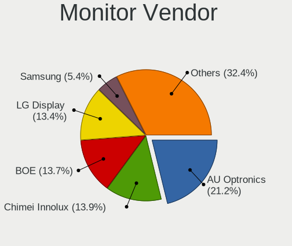
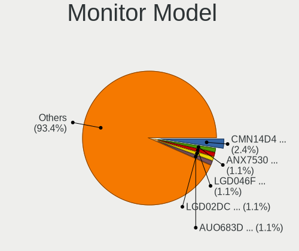
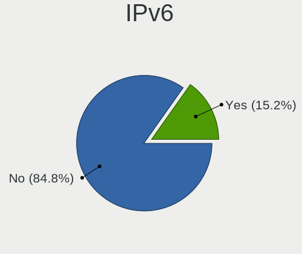
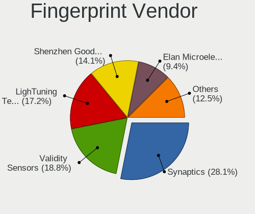
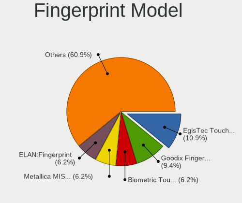

Linux in Taiwan - Tested Hardware & Statistics (Notebooks)
----------------------------------------------------------

A project to collect tested hardware configurations for Linux in Taiwan.

Anyone can contribute to this report by the [hw-probe](https://github.com/linuxhw/hw-probe) tool:

    sudo -E hw-probe -all -upload

Please contribute! Especially if your hardware is rare.

Contents
--------

* [ Test Cases ](#test-cases)

* [ System ](#system)
  - [ OS                       ](#os)
  - [ OS Family                ](#os-family)
  - [ Kernel                   ](#kernel)
  - [ Kernel Family            ](#kernel-family)
  - [ Kernel Major Ver.        ](#kernel-major-ver)
  - [ Arch                     ](#arch)
  - [ DE                       ](#de)
  - [ Display Server           ](#display-server)
  - [ Display Manager          ](#display-manager)
  - [ OS Lang                  ](#os-lang)
  - [ Boot Mode                ](#boot-mode)
  - [ Filesystem               ](#filesystem)
  - [ Part. scheme             ](#part-scheme)
  - [ Dual Boot with Linux/BSD ](#dual-boot-with-linuxbsd)
  - [ Dual Boot (Win)          ](#dual-boot-win)

* [ Board ](#board)
  - [ Vendor                   ](#vendor)
  - [ Model                    ](#model)
  - [ Model Family             ](#model-family)
  - [ MFG Year                 ](#mfg-year)
  - [ Form Factor              ](#form-factor)
  - [ Secure Boot              ](#secure-boot)
  - [ Coreboot                 ](#coreboot)
  - [ RAM Size                 ](#ram-size)
  - [ RAM Used                 ](#ram-used)
  - [ Total Drives             ](#total-drives)
  - [ Has CD-ROM               ](#has-cd-rom)
  - [ Has Ethernet             ](#has-ethernet)
  - [ Has WiFi                 ](#has-wifi)
  - [ Has Bluetooth            ](#has-bluetooth)

* [ Location ](#location)
  - [ Country                  ](#country)
  - [ City                     ](#city)

* [ Drives ](#drives)
  - [ Drive Vendor             ](#drive-vendor)
  - [ Drive Model              ](#drive-model)
  - [ HDD Vendor               ](#hdd-vendor)
  - [ SSD Vendor               ](#ssd-vendor)
  - [ Drive Kind               ](#drive-kind)
  - [ Drive Connector          ](#drive-connector)
  - [ Drive Size               ](#drive-size)
  - [ Space Total              ](#space-total)
  - [ Space Used               ](#space-used)
  - [ Malfunc. Drives          ](#malfunc-drives)
  - [ Malfunc. Drive Vendor    ](#malfunc-drive-vendor)
  - [ Malfunc. HDD Vendor      ](#malfunc-hdd-vendor)
  - [ Malfunc. Drive Kind      ](#malfunc-drive-kind)
  - [ Failed Drives            ](#failed-drives)
  - [ Failed Drive Vendor      ](#failed-drive-vendor)
  - [ Drive Status             ](#drive-status)

* [ Storage controller ](#storage-controller)
  - [ Storage Vendor           ](#storage-vendor)
  - [ Storage Model            ](#storage-model)
  - [ Storage Kind             ](#storage-kind)

* [ Processor ](#processor)
  - [ CPU Vendor               ](#cpu-vendor)
  - [ CPU Model                ](#cpu-model)
  - [ CPU Model Family         ](#cpu-model-family)
  - [ CPU Cores                ](#cpu-cores)
  - [ CPU Sockets              ](#cpu-sockets)
  - [ CPU Threads              ](#cpu-threads)
  - [ CPU Op-Modes             ](#cpu-op-modes)
  - [ CPU Microcode            ](#cpu-microcode)
  - [ CPU Microarch            ](#cpu-microarch)

* [ Graphics ](#graphics)
  - [ GPU Vendor               ](#gpu-vendor)
  - [ GPU Model                ](#gpu-model)
  - [ GPU Combo                ](#gpu-combo)
  - [ GPU Driver               ](#gpu-driver)
  - [ GPU Memory               ](#gpu-memory)

* [ Monitor ](#monitor)
  - [ Monitor Vendor           ](#monitor-vendor)
  - [ Monitor Model            ](#monitor-model)
  - [ Monitor Resolution       ](#monitor-resolution)
  - [ Monitor Diagonal         ](#monitor-diagonal)
  - [ Monitor Width            ](#monitor-width)
  - [ Aspect Ratio             ](#aspect-ratio)
  - [ Monitor Area             ](#monitor-area)
  - [ Pixel Density            ](#pixel-density)
  - [ Multiple Monitors        ](#multiple-monitors)

* [ Network ](#network)
  - [ Net Controller Vendor    ](#net-controller-vendor)
  - [ Net Controller Model     ](#net-controller-model)
  - [ Wireless Vendor          ](#wireless-vendor)
  - [ Wireless Model           ](#wireless-model)
  - [ Ethernet Vendor          ](#ethernet-vendor)
  - [ Ethernet Model           ](#ethernet-model)
  - [ Net Controller Kind      ](#net-controller-kind)
  - [ Used Controller          ](#used-controller)
  - [ NICs                     ](#nics)
  - [ IPv6                     ](#ipv6)

* [ Bluetooth ](#bluetooth)
  - [ Bluetooth Vendor         ](#bluetooth-vendor)
  - [ Bluetooth Model          ](#bluetooth-model)

* [ Sound ](#sound)
  - [ Sound Vendor             ](#sound-vendor)
  - [ Sound Model              ](#sound-model)

* [ Memory ](#memory)
  - [ Memory Vendor            ](#memory-vendor)
  - [ Memory Model             ](#memory-model)
  - [ Memory Kind              ](#memory-kind)
  - [ Memory Form Factor       ](#memory-form-factor)
  - [ Memory Size              ](#memory-size)
  - [ Memory Speed             ](#memory-speed)

* [ Printers & scanners ](#printers--scanners)
  - [ Printer Vendor           ](#printer-vendor)
  - [ Printer Model            ](#printer-model)
  - [ Scanner Vendor           ](#scanner-vendor)
  - [ Scanner Model            ](#scanner-model)

* [ Camera ](#camera)
  - [ Camera Vendor            ](#camera-vendor)
  - [ Camera Model             ](#camera-model)

* [ Security ](#security)
  - [ Fingerprint Vendor       ](#fingerprint-vendor)
  - [ Fingerprint Model        ](#fingerprint-model)
  - [ Chipcard Vendor          ](#chipcard-vendor)
  - [ Chipcard Model           ](#chipcard-model)

* [ Unsupported ](#unsupported)
  - [ Unsupported Devices      ](#unsupported-devices)
  - [ Unsupported Device Types ](#unsupported-device-types)

Test Cases
----------

Total: 367

| Vendor        | Model                       | Probe                                                      | Date         |
|---------------|-----------------------------|------------------------------------------------------------|--------------|
| Google        | Cave                        | [cc3b1bb1a3](https://linux-hardware.org/?probe=cc3b1bb1a3) | Jun 24, 2023 |
| Google        | Cave                        | [199eb4826d](https://linux-hardware.org/?probe=199eb4826d) | Jun 24, 2023 |
| Acer          | Aspire A515-53G             | [430cfefc6a](https://linux-hardware.org/?probe=430cfefc6a) | Jun 21, 2023 |
| Lenovo        | ThinkPad X230 2324CD1       | [9ee6ed4144](https://linux-hardware.org/?probe=9ee6ed4144) | Jun 18, 2023 |
| ASUSTek       | ASUSPRO P5440UF             | [cf08c655b9](https://linux-hardware.org/?probe=cf08c655b9) | Jun 17, 2023 |
| ASUSTek       | ASUSPRO P5440UF             | [272d8de237](https://linux-hardware.org/?probe=272d8de237) | Jun 16, 2023 |
| Lenovo        | IdeaPad 5 Pro 14IAP7 82S... | [dd5aaca858](https://linux-hardware.org/?probe=dd5aaca858) | Jun 15, 2023 |
| Lenovo        | ThinkPad X13 Gen 3 21BNC... | [ba129cd52d](https://linux-hardware.org/?probe=ba129cd52d) | Jun 11, 2023 |
| Acidanther... | MacBookPro15,2              | [fb30b2eb35](https://linux-hardware.org/?probe=fb30b2eb35) | Jun 10, 2023 |
| Lenovo        | Z50-70 20354                | [05a473a2be](https://linux-hardware.org/?probe=05a473a2be) | Jun 06, 2023 |
| Apple         | MacBookPro7,1               | [e92db65759](https://linux-hardware.org/?probe=e92db65759) | Jun 05, 2023 |
| Timi          | Redmi Book Pro 15 2022      | [a3089228b1](https://linux-hardware.org/?probe=a3089228b1) | Jun 05, 2023 |
| ASUSTek       | UX430UNR                    | [00ab711e0a](https://linux-hardware.org/?probe=00ab711e0a) | Jun 02, 2023 |
| Apple         | MacBookPro7,1               | [47ac3b9c43](https://linux-hardware.org/?probe=47ac3b9c43) | May 28, 2023 |
| Acer          | Swift SF514-54GT            | [dd79b67b18](https://linux-hardware.org/?probe=dd79b67b18) | May 27, 2023 |
| Apple         | MacBookPro7,1               | [324a8d5c88](https://linux-hardware.org/?probe=324a8d5c88) | May 22, 2023 |
| Apple         | MacBookPro7,1               | [88830e9fe8](https://linux-hardware.org/?probe=88830e9fe8) | May 22, 2023 |
| Lenovo        | ThinkPad P14s Gen 2a 21A... | [fb58a4d348](https://linux-hardware.org/?probe=fb58a4d348) | May 14, 2023 |
| Lenovo        | IdeaPad 5 Pro 14IAP7 82S... | [02fb267cbc](https://linux-hardware.org/?probe=02fb267cbc) | May 07, 2023 |
| HP            | 250 G5 Notebook PC          | [e12a1d28ba](https://linux-hardware.org/?probe=e12a1d28ba) | May 06, 2023 |
| HP            | 250 G5 Notebook PC          | [4cb6025c16](https://linux-hardware.org/?probe=4cb6025c16) | May 03, 2023 |
| Apple         | MacBookPro11,1              | [7309ce024f](https://linux-hardware.org/?probe=7309ce024f) | Apr 25, 2023 |
| Valve         | Jupiter                     | [b2a94c7310](https://linux-hardware.org/?probe=b2a94c7310) | Apr 18, 2023 |
| Valve         | Jupiter                     | [965de2bcc4](https://linux-hardware.org/?probe=965de2bcc4) | Apr 11, 2023 |
| Lenovo        | IdeaPad 5 Pro 14IAP7 82S... | [c0901def8d](https://linux-hardware.org/?probe=c0901def8d) | Apr 10, 2023 |
| Lenovo        | IdeaPad S145-14AST 81ST     | [c8173d40cd](https://linux-hardware.org/?probe=c8173d40cd) | Apr 09, 2023 |
| Dell          | Latitude 7490               | [01957ea955](https://linux-hardware.org/?probe=01957ea955) | Apr 07, 2023 |
| Toshiba       | Satellite L850              | [2635da1e14](https://linux-hardware.org/?probe=2635da1e14) | Apr 03, 2023 |
| Lenovo        | ThinkPad X13 Gen 3 21BNC... | [649b881439](https://linux-hardware.org/?probe=649b881439) | Mar 25, 2023 |
| Insyde        | CherryTrail                 | [9e658f67a2](https://linux-hardware.org/?probe=9e658f67a2) | Mar 25, 2023 |
| Lenovo        | ThinkPad Twist 33472HU      | [a49ece0e6c](https://linux-hardware.org/?probe=a49ece0e6c) | Mar 22, 2023 |
| Lenovo        | ThinkPad Twist 33472HU      | [315f2256c6](https://linux-hardware.org/?probe=315f2256c6) | Mar 22, 2023 |
| Lenovo        | IdeaPad Gaming 3 15IAH7 ... | [882f82cf2c](https://linux-hardware.org/?probe=882f82cf2c) | Mar 20, 2023 |
| Acer          | Aspire V3-571G              | [6aee8060e9](https://linux-hardware.org/?probe=6aee8060e9) | Mar 17, 2023 |
| Valve         | Jupiter                     | [db30abe51b](https://linux-hardware.org/?probe=db30abe51b) | Mar 13, 2023 |
| Toshiba       | Satellite C665              | [e95e34e3ba](https://linux-hardware.org/?probe=e95e34e3ba) | Mar 11, 2023 |
| Lenovo        | ThinkPad X1 Carbon Gen 1... | [7f3075e65e](https://linux-hardware.org/?probe=7f3075e65e) | Mar 08, 2023 |
| Lenovo        | ThinkPad T14 Gen 1 20S0S... | [2e864ba25e](https://linux-hardware.org/?probe=2e864ba25e) | Mar 08, 2023 |
| Valve         | Jupiter                     | [367bc56a15](https://linux-hardware.org/?probe=367bc56a15) | Mar 05, 2023 |
| Valve         | Jupiter                     | [c329f5f1c1](https://linux-hardware.org/?probe=c329f5f1c1) | Mar 05, 2023 |
| Valve         | Jupiter                     | [2143a36dc5](https://linux-hardware.org/?probe=2143a36dc5) | Feb 28, 2023 |
| Acer          | Swift SF514-54GT            | [dbccc5afa9](https://linux-hardware.org/?probe=dbccc5afa9) | Feb 23, 2023 |
| ASUSTek       | X202E                       | [6627e10e70](https://linux-hardware.org/?probe=6627e10e70) | Feb 19, 2023 |
| Dell          | Latitude E6320              | [467b45072e](https://linux-hardware.org/?probe=467b45072e) | Feb 19, 2023 |
| Lenovo        | ThinkPad X61 7673D13        | [b5399b39de](https://linux-hardware.org/?probe=b5399b39de) | Feb 19, 2023 |
| Acer          | Swift SF514-54GT            | [b7e961dae3](https://linux-hardware.org/?probe=b7e961dae3) | Feb 13, 2023 |
| Valve         | Jupiter                     | [e5f4ad1053](https://linux-hardware.org/?probe=e5f4ad1053) | Feb 12, 2023 |
| ASUSTek       | G73Sw                       | [42e7c32817](https://linux-hardware.org/?probe=42e7c32817) | Feb 06, 2023 |
| HP            | Notebook                    | [41f5c97a09](https://linux-hardware.org/?probe=41f5c97a09) | Feb 06, 2023 |
| AVITA         | NE14A2                      | [c5d9f8e3ac](https://linux-hardware.org/?probe=c5d9f8e3ac) | Feb 02, 2023 |
| ASUSTek       | VivoBook_ASUSLaptop K340... | [37059de5b7](https://linux-hardware.org/?probe=37059de5b7) | Jan 27, 2023 |
| MSI           | Alpha 15 B5EEK              | [d815a80782](https://linux-hardware.org/?probe=d815a80782) | Jan 24, 2023 |
| MSI           | Alpha 15 B5EEK              | [d2c9a02f60](https://linux-hardware.org/?probe=d2c9a02f60) | Jan 24, 2023 |
| HP            | ProBook 430 G8 Notebook ... | [335275777a](https://linux-hardware.org/?probe=335275777a) | Jan 23, 2023 |
| Dell          | Latitude 7490               | [e40bb2f01f](https://linux-hardware.org/?probe=e40bb2f01f) | Jan 23, 2023 |
| Dell          | Latitude 7490               | [31789ae630](https://linux-hardware.org/?probe=31789ae630) | Jan 23, 2023 |
| HP            | ProBook 430 G2              | [24a0f33638](https://linux-hardware.org/?probe=24a0f33638) | Jan 22, 2023 |
| HP            | Compaq 6510b (GM108UC#AB... | [45ae9ca3c9](https://linux-hardware.org/?probe=45ae9ca3c9) | Jan 20, 2023 |
| HP            | Laptop 15s-eq2xxx           | [958ecc4388](https://linux-hardware.org/?probe=958ecc4388) | Jan 15, 2023 |
| Gigabyte      | GB-BKi3A-7100               | [8263d65b20](https://linux-hardware.org/?probe=8263d65b20) | Jan 08, 2023 |
| Gigabyte      | G5 GE                       | [d6a4584809](https://linux-hardware.org/?probe=d6a4584809) | Jan 07, 2023 |
| System76      | Lemur Pro                   | [36156d9aa7](https://linux-hardware.org/?probe=36156d9aa7) | Jan 07, 2023 |
| Dell          | Inspiron 13 5320            | [0007a36030](https://linux-hardware.org/?probe=0007a36030) | Jan 07, 2023 |
| Timi          | Mi Laptop Pro 15            | [7ea6f8ee94](https://linux-hardware.org/?probe=7ea6f8ee94) | Jan 06, 2023 |
| Lenovo        | ThinkPad T14 Gen 2i 20W0... | [9e535c1e8e](https://linux-hardware.org/?probe=9e535c1e8e) | Jan 01, 2023 |
| Lenovo        | ThinkPad T14 Gen 2i 20W0... | [2abdc57712](https://linux-hardware.org/?probe=2abdc57712) | Dec 31, 2022 |
| Lenovo        | ThinkPad T14 Gen 2i 20W0... | [632515014d](https://linux-hardware.org/?probe=632515014d) | Dec 31, 2022 |
| MSI           | Modern 15 A5M               | [e0cb4d278d](https://linux-hardware.org/?probe=e0cb4d278d) | Dec 31, 2022 |
| MSI           | Modern 15 A5M               | [1e7182cb70](https://linux-hardware.org/?probe=1e7182cb70) | Dec 29, 2022 |
| ASUSTek       | VivoBook_ASUSLaptop K340... | [ee7b1d707c](https://linux-hardware.org/?probe=ee7b1d707c) | Dec 26, 2022 |
| ASUSTek       | VivoBook_ASUSLaptop K340... | [7c8560a87e](https://linux-hardware.org/?probe=7c8560a87e) | Dec 25, 2022 |
| Acer          | Aspire 4750                 | [3256c282db](https://linux-hardware.org/?probe=3256c282db) | Dec 23, 2022 |
| ASUSTek       | VivoBook_ASUSLaptop K340... | [9462031346](https://linux-hardware.org/?probe=9462031346) | Dec 22, 2022 |
| ASUSTek       | VivoBook_ASUSLaptop K340... | [7eb6658e3a](https://linux-hardware.org/?probe=7eb6658e3a) | Dec 21, 2022 |
| ASUSTek       | VivoBook_ASUSLaptop K340... | [7a14c8194f](https://linux-hardware.org/?probe=7a14c8194f) | Dec 20, 2022 |
| HUAWEI        | KLVL-WXX9                   | [a767e0fbf0](https://linux-hardware.org/?probe=a767e0fbf0) | Dec 16, 2022 |
| Lenovo        | ThinkPad W530 243858U       | [9dc4fb1abb](https://linux-hardware.org/?probe=9dc4fb1abb) | Dec 16, 2022 |
| ASUSTek       | ASUSPRO P1440FAC_P1440FA    | [44484456f8](https://linux-hardware.org/?probe=44484456f8) | Dec 14, 2022 |
| ASUSTek       | PU403UA                     | [20007b4296](https://linux-hardware.org/?probe=20007b4296) | Dec 05, 2022 |
| Dell          | Vostro 5481                 | [6c58c07e64](https://linux-hardware.org/?probe=6c58c07e64) | Dec 03, 2022 |
| ASUSTek       | VivoBook_ASUSLaptop X140... | [55d95654c4](https://linux-hardware.org/?probe=55d95654c4) | Nov 30, 2022 |
| HP            | ProBook 430 G8 Notebook ... | [8a773e7358](https://linux-hardware.org/?probe=8a773e7358) | Nov 22, 2022 |
| Lenovo        | ThinkPad X13 Gen 1 20UFS... | [678cfec38b](https://linux-hardware.org/?probe=678cfec38b) | Nov 20, 2022 |
| MSI           | GE62 6QD                    | [3d2dd5419a](https://linux-hardware.org/?probe=3d2dd5419a) | Nov 18, 2022 |
| ASUSTek       | X550VX                      | [8e55592803](https://linux-hardware.org/?probe=8e55592803) | Nov 15, 2022 |
| Acer          | Swift SFX14-41G             | [a8023a34a0](https://linux-hardware.org/?probe=a8023a34a0) | Nov 11, 2022 |
| MSI           | U270DX                      | [2a68a6ba02](https://linux-hardware.org/?probe=2a68a6ba02) | Nov 10, 2022 |
| Lenovo        | IdeaPad 5 14ALC05 82LM      | [52080bf6ef](https://linux-hardware.org/?probe=52080bf6ef) | Nov 09, 2022 |
| HP            | EliteBook x360 1030 G4      | [4fa71c1d6d](https://linux-hardware.org/?probe=4fa71c1d6d) | Nov 09, 2022 |
| Dell          | Inspiron 13 5320            | [9ac52708ad](https://linux-hardware.org/?probe=9ac52708ad) | Oct 17, 2022 |
| Intel Clie... | LAPRC710                    | [4a1e71b56a](https://linux-hardware.org/?probe=4a1e71b56a) | Oct 15, 2022 |
| ASUSTek       | ASUS TUF Dash F15 FX516P... | [e940ddf8a7](https://linux-hardware.org/?probe=e940ddf8a7) | Oct 12, 2022 |
| ASUSTek       | PU403UA                     | [8bf4879487](https://linux-hardware.org/?probe=8bf4879487) | Oct 04, 2022 |
| ASUSTek       | ASUS EXPERTBOOK B1400CBA    | [4cad2a770c](https://linux-hardware.org/?probe=4cad2a770c) | Sep 30, 2022 |
| Lenovo        | ThinkPad T480s 20L7001YU... | [929514123f](https://linux-hardware.org/?probe=929514123f) | Sep 30, 2022 |
| Gigabyte      | AORUS 5 SE                  | [c188e2c5b5](https://linux-hardware.org/?probe=c188e2c5b5) | Sep 24, 2022 |
| Lenovo        | IdeaPad 5 14ALC05 82LM      | [5503282548](https://linux-hardware.org/?probe=5503282548) | Sep 20, 2022 |
| Acer          | Aspire A515-45              | [c0b89ea222](https://linux-hardware.org/?probe=c0b89ea222) | Aug 26, 2022 |
| Sony          | SVS15115FWB                 | [6844bd3288](https://linux-hardware.org/?probe=6844bd3288) | Aug 21, 2022 |
| Sony          | SVS15115FWB                 | [2fb1c4ab2d](https://linux-hardware.org/?probe=2fb1c4ab2d) | Aug 20, 2022 |
| Acer          | TravelMate P653-M           | [1e33abf031](https://linux-hardware.org/?probe=1e33abf031) | Aug 17, 2022 |
| Dell          | Inspiron 13 5320            | [cee0d5a717](https://linux-hardware.org/?probe=cee0d5a717) | Aug 14, 2022 |
| Dell          | Vostro 3525                 | [d6630abc3a](https://linux-hardware.org/?probe=d6630abc3a) | Aug 03, 2022 |
| ASUSTek       | K501LX                      | [8ea0c7daa9](https://linux-hardware.org/?probe=8ea0c7daa9) | Jul 30, 2022 |
| Acer          | Aspire A515-57G             | [a44d178033](https://linux-hardware.org/?probe=a44d178033) | Jul 30, 2022 |
| LG Electro... | LE50-5BC6H1                 | [010123b7d5](https://linux-hardware.org/?probe=010123b7d5) | Jul 26, 2022 |
| Acer          | Aspire K50-20               | [1f4543c39e](https://linux-hardware.org/?probe=1f4543c39e) | Jul 20, 2022 |
| Acer          | Aspire K50-20               | [3f0e68ecf5](https://linux-hardware.org/?probe=3f0e68ecf5) | Jul 20, 2022 |
| Acer          | TravelMate 8371             | [4af529e1c4](https://linux-hardware.org/?probe=4af529e1c4) | Jul 20, 2022 |
| Acer          | Aspire A515-45              | [4189e96860](https://linux-hardware.org/?probe=4189e96860) | Jul 19, 2022 |
| Dell          | Inspiron 5577               | [54fda2d2bc](https://linux-hardware.org/?probe=54fda2d2bc) | Jul 16, 2022 |
| Acer          | Aspire A515-57G             | [43a9aeb04d](https://linux-hardware.org/?probe=43a9aeb04d) | Jul 15, 2022 |
| ASUSTek       | ROG Zephyrus G15 GA502IV... | [5f3670ea60](https://linux-hardware.org/?probe=5f3670ea60) | Jul 12, 2022 |
| Dell          | Vostro 3525                 | [2174c6314a](https://linux-hardware.org/?probe=2174c6314a) | Jul 11, 2022 |
| Dell          | Vostro 3525                 | [ff38c8714c](https://linux-hardware.org/?probe=ff38c8714c) | Jul 11, 2022 |
| Acer          | Swift SF514-54GT            | [554171275d](https://linux-hardware.org/?probe=554171275d) | Jul 07, 2022 |
| Acer          | Aspire A315-55G             | [e6d7a2a642](https://linux-hardware.org/?probe=e6d7a2a642) | Jun 30, 2022 |
| Lenovo        | ThinkPad T410 2518A37       | [4e15b37546](https://linux-hardware.org/?probe=4e15b37546) | Jun 30, 2022 |
| Dell          | Vostro 5625                 | [0a047126ba](https://linux-hardware.org/?probe=0a047126ba) | Jun 30, 2022 |
| MSI           | PE60 6QE                    | [4c7beba4e2](https://linux-hardware.org/?probe=4c7beba4e2) | Jun 29, 2022 |
| ASUSTek       | ROG Zephyrus G15 GA503RW... | [43a27bb2dd](https://linux-hardware.org/?probe=43a27bb2dd) | Jun 23, 2022 |
| ASUSTek       | ROG Zephyrus G15 GA503RW... | [f993d31672](https://linux-hardware.org/?probe=f993d31672) | Jun 22, 2022 |
| Dell          | Inspiron 14 5425            | [16e98704b5](https://linux-hardware.org/?probe=16e98704b5) | Jun 22, 2022 |
| Acer          | Aspire R7-371T              | [b791797ef3](https://linux-hardware.org/?probe=b791797ef3) | Jun 12, 2022 |
| Acer          | Aspire R7-371T              | [d573a80e21](https://linux-hardware.org/?probe=d573a80e21) | Jun 12, 2022 |
| Sony          | SVS15115FWB                 | [da41314683](https://linux-hardware.org/?probe=da41314683) | Jun 09, 2022 |
| Sony          | SVS15115FWB                 | [ab97043dbe](https://linux-hardware.org/?probe=ab97043dbe) | Jun 09, 2022 |
| Lenovo        | ThinkPad T410 2518A37       | [04e81b8b3f](https://linux-hardware.org/?probe=04e81b8b3f) | Jun 04, 2022 |
| Dell          | Latitude 5420               | [fedd7d10fb](https://linux-hardware.org/?probe=fedd7d10fb) | May 25, 2022 |
| Lex           | 3I610DW                     | [145688ea36](https://linux-hardware.org/?probe=145688ea36) | May 17, 2022 |
| Lex           | 3I610DW                     | [8baf27bb6a](https://linux-hardware.org/?probe=8baf27bb6a) | May 17, 2022 |
| Lex           | 3I610DW                     | [6c61eabd7c](https://linux-hardware.org/?probe=6c61eabd7c) | May 17, 2022 |
| Lex           | 3I610DW                     | [8a75530d17](https://linux-hardware.org/?probe=8a75530d17) | May 17, 2022 |
| ASUSTek       | K53SD                       | [0c04c6cb24](https://linux-hardware.org/?probe=0c04c6cb24) | May 07, 2022 |
| ASUSTek       | VivoBook_ASUSLaptop K340... | [1863683cb7](https://linux-hardware.org/?probe=1863683cb7) | May 06, 2022 |
| Samsung       | 700Z3A/700Z4A/700Z5A/700... | [1c94d4293a](https://linux-hardware.org/?probe=1c94d4293a) | May 02, 2022 |
| Samsung       | 700Z3A/700Z4A/700Z5A/700... | [b61c12247c](https://linux-hardware.org/?probe=b61c12247c) | May 02, 2022 |
| HP            | 15                          | [5d7a22faa6](https://linux-hardware.org/?probe=5d7a22faa6) | Apr 28, 2022 |
| Acer          | Aspire 1410                 | [0399a90ade](https://linux-hardware.org/?probe=0399a90ade) | Apr 23, 2022 |
| HP            | ProBook 430 G7              | [a084a48023](https://linux-hardware.org/?probe=a084a48023) | Apr 15, 2022 |
| ASUSTek       | ROG Zephyrus G15 GA502IU... | [1a35138280](https://linux-hardware.org/?probe=1a35138280) | Apr 14, 2022 |
| HP            | EliteBook 840 G8 Noteboo... | [b6834625e2](https://linux-hardware.org/?probe=b6834625e2) | Apr 14, 2022 |
| ASUSTek       | VivoBook_ASUS Laptop E21... | [dccdc2c9f5](https://linux-hardware.org/?probe=dccdc2c9f5) | Apr 12, 2022 |
| Lenovo        | ThinkPad 13 2nd Gen 20J1... | [f8c3b429a2](https://linux-hardware.org/?probe=f8c3b429a2) | Apr 09, 2022 |
| MSI           | GE70 0NC/GE70 0ND           | [369aac0795](https://linux-hardware.org/?probe=369aac0795) | Apr 09, 2022 |
| Acer          | Aspire 1410                 | [41ed1dae3d](https://linux-hardware.org/?probe=41ed1dae3d) | Apr 08, 2022 |
| MSI           | GE70 0NC/GE70 0ND           | [46b4d12526](https://linux-hardware.org/?probe=46b4d12526) | Apr 04, 2022 |
| ASUSTek       | X580VD                      | [192125a71f](https://linux-hardware.org/?probe=192125a71f) | Mar 29, 2022 |
| Acer          | Aspire 4750                 | [b89fa9f260](https://linux-hardware.org/?probe=b89fa9f260) | Mar 23, 2022 |
| Acer          | Aspire 4750                 | [ce61872360](https://linux-hardware.org/?probe=ce61872360) | Mar 23, 2022 |
| ASUSTek       | ZenBook UX433FN_U4300FN     | [0228881558](https://linux-hardware.org/?probe=0228881558) | Mar 18, 2022 |
| Acer          | Swift SF514-54GT            | [a170593a67](https://linux-hardware.org/?probe=a170593a67) | Mar 13, 2022 |
| ASUSTek       | ASUS TUF Dash F15 FX516P... | [ea52efd6b6](https://linux-hardware.org/?probe=ea52efd6b6) | Mar 07, 2022 |
| MSI           | GV72 8RC                    | [60382ef4e5](https://linux-hardware.org/?probe=60382ef4e5) | Feb 25, 2022 |
| MSI           | GV72 8RC                    | [9cfacc57c2](https://linux-hardware.org/?probe=9cfacc57c2) | Feb 24, 2022 |
| MSI           | P65 Creator 9SD             | [093c9b9f41](https://linux-hardware.org/?probe=093c9b9f41) | Feb 24, 2022 |
| ASUSTek       | ROG Zephyrus M16 GU603HE... | [076c8f6e01](https://linux-hardware.org/?probe=076c8f6e01) | Feb 23, 2022 |
| ASUSTek       | ROG Zephyrus M16 GU603HE... | [85c09f63f0](https://linux-hardware.org/?probe=85c09f63f0) | Feb 23, 2022 |
| MSI           | P65 Creator 9SD             | [2782f833c9](https://linux-hardware.org/?probe=2782f833c9) | Feb 23, 2022 |
| HP            | DevX                        | [8dc3513586](https://linux-hardware.org/?probe=8dc3513586) | Feb 16, 2022 |
| HP            | DevX                        | [c6f8c8e65b](https://linux-hardware.org/?probe=c6f8c8e65b) | Feb 16, 2022 |
| CJSCOPE       | Z Series                    | [c594abda0a](https://linux-hardware.org/?probe=c594abda0a) | Feb 16, 2022 |
| Dell          | Latitude 5420               | [3c5cf0b4e7](https://linux-hardware.org/?probe=3c5cf0b4e7) | Feb 07, 2022 |
| Dell          | Latitude E7450              | [dd81e34279](https://linux-hardware.org/?probe=dd81e34279) | Feb 07, 2022 |
| Apple         | MacBookPro11,2              | [9d00f74637](https://linux-hardware.org/?probe=9d00f74637) | Feb 05, 2022 |
| LG Electro... | 16Z90P-G.AA78C              | [30ddfbc611](https://linux-hardware.org/?probe=30ddfbc611) | Feb 03, 2022 |
| Intel Clie... | LAPBC710                    | [76dff27038](https://linux-hardware.org/?probe=76dff27038) | Feb 02, 2022 |
| Intel Clie... | LAPBC710                    | [a4c71279a4](https://linux-hardware.org/?probe=a4c71279a4) | Feb 02, 2022 |
| Lenovo        | ThinkPad X1 Carbon 6th 2... | [2a4563231b](https://linux-hardware.org/?probe=2a4563231b) | Feb 02, 2022 |
| LG Electro... | 16Z90P-G.AA78C              | [992ee00a94](https://linux-hardware.org/?probe=992ee00a94) | Feb 02, 2022 |
| ASUSTek       | ROG Zephyrus G15 GA502IU... | [0a04b2d1b1](https://linux-hardware.org/?probe=0a04b2d1b1) | Jan 31, 2022 |
| Acer          | Aspire V3-571G              | [43011b8d27](https://linux-hardware.org/?probe=43011b8d27) | Jan 30, 2022 |
| Lenovo        | IdeaPad 100-14IBD 80RK      | [e6af97e09c](https://linux-hardware.org/?probe=e6af97e09c) | Jan 29, 2022 |
| ASUSTek       | ASUS TUF Dash F15 FX516P... | [f653016830](https://linux-hardware.org/?probe=f653016830) | Jan 28, 2022 |
| ASUSTek       | PU403UA                     | [25ac7ce226](https://linux-hardware.org/?probe=25ac7ce226) | Jan 28, 2022 |
| ASUSTek       | ASUS TUF Dash F15 FX516P... | [40d8a83107](https://linux-hardware.org/?probe=40d8a83107) | Jan 25, 2022 |
| Gigabyte      | P65                         | [4664ba9c41](https://linux-hardware.org/?probe=4664ba9c41) | Jan 17, 2022 |
| ASUSTek       | ROG Zephyrus G15 GA502IU... | [fb4c60c7b1](https://linux-hardware.org/?probe=fb4c60c7b1) | Jan 14, 2022 |
| ASUSTek       | ROG Zephyrus G15 GA502IU... | [0b302317eb](https://linux-hardware.org/?probe=0b302317eb) | Jan 14, 2022 |
| ASUSTek       | ROG Zephyrus G15 GA502IU... | [94988f80b6](https://linux-hardware.org/?probe=94988f80b6) | Jan 09, 2022 |
| Dell          | Inspiron 5480               | [217737fa73](https://linux-hardware.org/?probe=217737fa73) | Dec 24, 2021 |
| Dell          | System Vostro 3450          | [482adf74be](https://linux-hardware.org/?probe=482adf74be) | Dec 21, 2021 |
| Dell          | System Vostro 3450          | [965939d30a](https://linux-hardware.org/?probe=965939d30a) | Dec 21, 2021 |
| ASUSTek       | ROG Zephyrus G15 GA502IU... | [041e50f6a8](https://linux-hardware.org/?probe=041e50f6a8) | Dec 20, 2021 |
| ASUSTek       | ROG Zephyrus G15 GA502IU... | [f9fbdf780e](https://linux-hardware.org/?probe=f9fbdf780e) | Dec 20, 2021 |
| Acer          | Aspire F5-573G              | [2e9fd50292](https://linux-hardware.org/?probe=2e9fd50292) | Dec 20, 2021 |
| Acer          | Aspire F5-573G              | [452b8c0ac4](https://linux-hardware.org/?probe=452b8c0ac4) | Dec 20, 2021 |
| ASUSTek       | VivoBook_ASUSLaptop X409... | [0f6fd49686](https://linux-hardware.org/?probe=0f6fd49686) | Dec 16, 2021 |
| ASUSTek       | VivoBook_ASUSLaptop X409... | [aae6578de1](https://linux-hardware.org/?probe=aae6578de1) | Dec 16, 2021 |
| Unknown       | Unknown                     | [d07ab607e1](https://linux-hardware.org/?probe=d07ab607e1) | Dec 08, 2021 |
| Unknown       | Unknown                     | [8705e3aea1](https://linux-hardware.org/?probe=8705e3aea1) | Dec 07, 2021 |
| Dell          | Vostro 14 5410              | [ef6f4cf593](https://linux-hardware.org/?probe=ef6f4cf593) | Dec 05, 2021 |
| ASUSTek       | ROG Zephyrus G15 GA502IU... | [2965330cf0](https://linux-hardware.org/?probe=2965330cf0) | Dec 02, 2021 |
| Dell          | Vostro 14 5410              | [6ab102bc84](https://linux-hardware.org/?probe=6ab102bc84) | Nov 30, 2021 |
| Lenovo        | IdeaPad 5 14ALC05 82LM      | [a99a51f4e0](https://linux-hardware.org/?probe=a99a51f4e0) | Nov 23, 2021 |
| Acer          | Aspire E5-432G              | [d6fe7992f3](https://linux-hardware.org/?probe=d6fe7992f3) | Nov 21, 2021 |
| Lenovo        | ThinkPad L14 Gen 1 20U5S... | [0315115315](https://linux-hardware.org/?probe=0315115315) | Nov 07, 2021 |
| ASUSTek       | ROG Zephyrus G15 GA502IU... | [9ebc122525](https://linux-hardware.org/?probe=9ebc122525) | Nov 02, 2021 |
| HP            | ProBook 455 G7              | [1719b2dc9d](https://linux-hardware.org/?probe=1719b2dc9d) | Oct 30, 2021 |
| Acer          | AS1830                      | [bcef8c44a6](https://linux-hardware.org/?probe=bcef8c44a6) | Oct 26, 2021 |
| Lenovo        | ThinkPad E585 20KVCTO1WW    | [204598f27d](https://linux-hardware.org/?probe=204598f27d) | Oct 26, 2021 |
| Lenovo        | Z50-70 20354                | [22e290b148](https://linux-hardware.org/?probe=22e290b148) | Oct 08, 2021 |
| win elemen... | MBOX WS001                  | [95cb9076bc](https://linux-hardware.org/?probe=95cb9076bc) | Oct 04, 2021 |
| Acer          | TMP645-M                    | [c3daab516f](https://linux-hardware.org/?probe=c3daab516f) | Oct 03, 2021 |
| Toshiba       | PORTEGE R830                | [fbe6b1147d](https://linux-hardware.org/?probe=fbe6b1147d) | Sep 24, 2021 |
| HP            | Pavilion Laptop 14-bf1xx    | [6174640bb5](https://linux-hardware.org/?probe=6174640bb5) | Sep 23, 2021 |
| HP            | Pavilion Laptop 14-bf1xx    | [97a692e271](https://linux-hardware.org/?probe=97a692e271) | Sep 23, 2021 |
| MSI           | GS76 Stealth 11UH           | [0589c1c238](https://linux-hardware.org/?probe=0589c1c238) | Sep 18, 2021 |
| Lenovo        | ThinkPad X230 2324CD1       | [348eb8e841](https://linux-hardware.org/?probe=348eb8e841) | Sep 18, 2021 |
| ASUSTek       | ROG Zephyrus G15 GA502IU... | [7725289d30](https://linux-hardware.org/?probe=7725289d30) | Sep 17, 2021 |
| Acer          | Swift SF514-55TA            | [b4ff244fa1](https://linux-hardware.org/?probe=b4ff244fa1) | Sep 14, 2021 |
| Acer          | Swift SF514-55TA            | [ca370567d0](https://linux-hardware.org/?probe=ca370567d0) | Sep 14, 2021 |
| Acer          | Swift SF514-55TA            | [c3a4ff2798](https://linux-hardware.org/?probe=c3a4ff2798) | Sep 12, 2021 |
| HP            | Pavilion dv7                | [6ed3caac2b](https://linux-hardware.org/?probe=6ed3caac2b) | Sep 10, 2021 |
| ASUSTek       | ROG Zephyrus G15 GA502IU... | [ddb9671a92](https://linux-hardware.org/?probe=ddb9671a92) | Sep 09, 2021 |
| ASUSTek       | ROG Zephyrus G15 GA502IU... | [b59922b47b](https://linux-hardware.org/?probe=b59922b47b) | Sep 09, 2021 |
| HP            | EliteBook 845 G8 Noteboo... | [1674818018](https://linux-hardware.org/?probe=1674818018) | Aug 23, 2021 |
| MSI           | Modern 14 B11M              | [63c6a56896](https://linux-hardware.org/?probe=63c6a56896) | Aug 22, 2021 |
| MSI           | Modern 14 B11M              | [f73a28166b](https://linux-hardware.org/?probe=f73a28166b) | Aug 22, 2021 |
| ASUSTek       | GL552VW                     | [b48b810fc9](https://linux-hardware.org/?probe=b48b810fc9) | Aug 21, 2021 |
| Acer          | Aspire A515-46              | [ad8f403c6d](https://linux-hardware.org/?probe=ad8f403c6d) | Aug 17, 2021 |
| AVITA         | NE14A2                      | [cd5b403f7b](https://linux-hardware.org/?probe=cd5b403f7b) | Aug 16, 2021 |
| Apple         | MacBookPro10,1              | [a1565d1576](https://linux-hardware.org/?probe=a1565d1576) | Aug 05, 2021 |
| Unknown       | Unknown                     | [d4db86e4ac](https://linux-hardware.org/?probe=d4db86e4ac) | Aug 05, 2021 |
| Unknown       | Unknown                     | [bcb72c9247](https://linux-hardware.org/?probe=bcb72c9247) | Aug 05, 2021 |
| Acer          | Swift SF313-52G             | [cf9d89a2f5](https://linux-hardware.org/?probe=cf9d89a2f5) | Jul 28, 2021 |
| AMI           | Unknown                     | [455466668e](https://linux-hardware.org/?probe=455466668e) | Jul 16, 2021 |
| Lenovo        | ThinkPad T510 4384CJ7       | [744091f92e](https://linux-hardware.org/?probe=744091f92e) | Jul 12, 2021 |
| Lenovo        | ThinkPad T510 4384CJ7       | [9f572c562f](https://linux-hardware.org/?probe=9f572c562f) | Jul 11, 2021 |
| ASUSTek       | E203NA                      | [a4aa015f4e](https://linux-hardware.org/?probe=a4aa015f4e) | Jul 09, 2021 |
| Dell          | Latitude 5420               | [7dc37e8b8c](https://linux-hardware.org/?probe=7dc37e8b8c) | Jul 09, 2021 |
| Dell          | Latitude 5420               | [1c11a8170f](https://linux-hardware.org/?probe=1c11a8170f) | Jul 09, 2021 |
| Acer          | TravelMate P653-M           | [f8509314e3](https://linux-hardware.org/?probe=f8509314e3) | Jun 27, 2021 |
| Toshiba       | Satellite L850              | [4632f9e875](https://linux-hardware.org/?probe=4632f9e875) | Jun 26, 2021 |
| ASUSTek       | ZenBook UX325UA_UM325UA     | [0624df0c82](https://linux-hardware.org/?probe=0624df0c82) | Jun 26, 2021 |
| Toshiba       | Satellite L850              | [a1f2e3a8a2](https://linux-hardware.org/?probe=a1f2e3a8a2) | Jun 23, 2021 |
| Acer          | Swift SF514-52T             | [9e0f7fa4a4](https://linux-hardware.org/?probe=9e0f7fa4a4) | Jun 22, 2021 |
| ASUSTek       | ROG Zephyrus G14 GA401IU... | [6b7a4709ca](https://linux-hardware.org/?probe=6b7a4709ca) | Jun 20, 2021 |
| ASUSTek       | ROG Zephyrus G14 GA401IU... | [b48bc39bc2](https://linux-hardware.org/?probe=b48bc39bc2) | Jun 20, 2021 |
| HP            | ProBook 430 G6              | [7bf43ae0d0](https://linux-hardware.org/?probe=7bf43ae0d0) | Jun 19, 2021 |
| HP            | ProBook 430 G6              | [9a4e288f49](https://linux-hardware.org/?probe=9a4e288f49) | Jun 19, 2021 |
| AMD           | Celadon-CZN                 | [cfad33c72b](https://linux-hardware.org/?probe=cfad33c72b) | Jun 16, 2021 |
| Lenovo        | ThinkPad T440s 20ARS3RM0... | [cb69a79f5c](https://linux-hardware.org/?probe=cb69a79f5c) | Jun 14, 2021 |
| ASUSTek       | ROG Zephyrus G14 GA401QM... | [5221d99db7](https://linux-hardware.org/?probe=5221d99db7) | Jun 10, 2021 |
| HP            | Unknown                     | [e59d9dcf16](https://linux-hardware.org/?probe=e59d9dcf16) | Jun 08, 2021 |
| MSI           | PE62 8RD                    | [30bb43121d](https://linux-hardware.org/?probe=30bb43121d) | Jun 01, 2021 |
| Lenovo        | V330-15IGM                  | [02894a3c1d](https://linux-hardware.org/?probe=02894a3c1d) | May 26, 2021 |
| Lenovo        | IdeaPad Y700-15ISK 80NV     | [d63399b396](https://linux-hardware.org/?probe=d63399b396) | May 19, 2021 |
| Lenovo        | ThinkPad L14 Gen 1 20U5S... | [fdbc72ed13](https://linux-hardware.org/?probe=fdbc72ed13) | May 05, 2021 |
| Toshiba       | Satellite L850              | [3f32e7ed1e](https://linux-hardware.org/?probe=3f32e7ed1e) | May 02, 2021 |
| ASUSTek       | VivoBook_ASUSLaptop X509... | [0c83abd0f8](https://linux-hardware.org/?probe=0c83abd0f8) | Apr 11, 2021 |
| Lenovo        | ThinkPad 13 2nd Gen 20J1... | [ecbfcfa59d](https://linux-hardware.org/?probe=ecbfcfa59d) | Mar 23, 2021 |
| MSI           | GL65 9SD                    | [e3c6065246](https://linux-hardware.org/?probe=e3c6065246) | Mar 16, 2021 |
| Acer          | Aspire A515-56G             | [8bedf1b6da](https://linux-hardware.org/?probe=8bedf1b6da) | Mar 13, 2021 |
| Dell          | Latitude E7240              | [448e25eb93](https://linux-hardware.org/?probe=448e25eb93) | Mar 04, 2021 |
| ASUSTek       | K53SV                       | [743ce0ed2d](https://linux-hardware.org/?probe=743ce0ed2d) | Mar 03, 2021 |
| Dell          | Latitude E7240              | [adcc4f6449](https://linux-hardware.org/?probe=adcc4f6449) | Feb 25, 2021 |
| Lenovo        | IdeaPad S410 20301          | [90bb71374c](https://linux-hardware.org/?probe=90bb71374c) | Feb 14, 2021 |
| Acer          | Aspire 4755                 | [1ce988a158](https://linux-hardware.org/?probe=1ce988a158) | Jan 30, 2021 |
| Acer          | Aspire 5742G                | [b40787d632](https://linux-hardware.org/?probe=b40787d632) | Jan 24, 2021 |
| Acer          | Aspire 5742G                | [3cd78291fc](https://linux-hardware.org/?probe=3cd78291fc) | Jan 23, 2021 |
| Dell          | Inspiron 5537               | [b6a804b8b9](https://linux-hardware.org/?probe=b6a804b8b9) | Jan 10, 2021 |
| Dell          | Inspiron 5537               | [c88fbbaa7b](https://linux-hardware.org/?probe=c88fbbaa7b) | Jan 10, 2021 |
| Lenovo        | ThinkPad 13 2nd Gen 20J1... | [4758f7fd48](https://linux-hardware.org/?probe=4758f7fd48) | Jan 07, 2021 |
| HP            | ZBook 15 G6                 | [d4e634a972](https://linux-hardware.org/?probe=d4e634a972) | Dec 20, 2020 |
| ASUSTek       | PU403UA                     | [aee4dc13b7](https://linux-hardware.org/?probe=aee4dc13b7) | Dec 19, 2020 |
| Acer          | Aspire 4720Z                | [88bd8075b2](https://linux-hardware.org/?probe=88bd8075b2) | Dec 16, 2020 |
| Acer          | Aspire 4720Z                | [93cfeab463](https://linux-hardware.org/?probe=93cfeab463) | Dec 16, 2020 |
| Dell          | Inspiron 5437               | [db6ca10333](https://linux-hardware.org/?probe=db6ca10333) | Dec 02, 2020 |
| ASUSTek       | ZenBook UX425EA_UX425EA     | [f1f4d46046](https://linux-hardware.org/?probe=f1f4d46046) | Nov 26, 2020 |
| Acer          | Swift SF514-54GT            | [3301702747](https://linux-hardware.org/?probe=3301702747) | Nov 14, 2020 |
| Acer          | Swift SF514-54GT            | [70015c39cf](https://linux-hardware.org/?probe=70015c39cf) | Nov 14, 2020 |
| Acer          | Aspire 4755                 | [5251bda552](https://linux-hardware.org/?probe=5251bda552) | Nov 11, 2020 |
| Lenovo        | XiaoXinAir 15ARE 2021 82... | [2f285baee5](https://linux-hardware.org/?probe=2f285baee5) | Oct 23, 2020 |
| Lenovo        | ThinkPad Edge E531 68853... | [acbd72739e](https://linux-hardware.org/?probe=acbd72739e) | Oct 20, 2020 |
| Lenovo        | XiaoXinAir 15ARE 2021 82... | [d800296611](https://linux-hardware.org/?probe=d800296611) | Oct 16, 2020 |
| Acer          | Aspire A715-71G             | [cd05576b34](https://linux-hardware.org/?probe=cd05576b34) | Oct 04, 2020 |
| HP            | ProBook 455 G7              | [62da42ec3c](https://linux-hardware.org/?probe=62da42ec3c) | Sep 27, 2020 |
| HP            | G62                         | [c9c310542a](https://linux-hardware.org/?probe=c9c310542a) | Sep 27, 2020 |
| ASUSTek       | P2440UA                     | [4c196d17c7](https://linux-hardware.org/?probe=4c196d17c7) | Sep 25, 2020 |
| HP            | ProBook 455 G7              | [b2cdadc21e](https://linux-hardware.org/?probe=b2cdadc21e) | Sep 25, 2020 |
| Acer          | TravelMate P614-51TG        | [e0fbefb33a](https://linux-hardware.org/?probe=e0fbefb33a) | Sep 23, 2020 |
| HP            | Pavilion 11 x360 PC         | [558b4c758d](https://linux-hardware.org/?probe=558b4c758d) | Sep 18, 2020 |
| Acer          | Swift SF514-52T             | [570875f21d](https://linux-hardware.org/?probe=570875f21d) | Sep 12, 2020 |
| ASUSTek       | PU403UA                     | [bdae065e30](https://linux-hardware.org/?probe=bdae065e30) | Sep 11, 2020 |
| Acer          | TravelMate P633-M           | [a7fdf21400](https://linux-hardware.org/?probe=a7fdf21400) | Sep 11, 2020 |
| HP            | Pavilion 11 x360 PC         | [d2b7da6eeb](https://linux-hardware.org/?probe=d2b7da6eeb) | Sep 11, 2020 |
| HP            | Pavilion Laptop 14-ce3xx... | [72ffc70b7f](https://linux-hardware.org/?probe=72ffc70b7f) | Sep 07, 2020 |
| MSI           | GS63 7RE                    | [e95a9b9d20](https://linux-hardware.org/?probe=e95a9b9d20) | Sep 03, 2020 |
| MSI           | GS63 7RE                    | [c21eb43b7a](https://linux-hardware.org/?probe=c21eb43b7a) | Sep 03, 2020 |
| Acer          | Swift SF314-42              | [bec5ea27a1](https://linux-hardware.org/?probe=bec5ea27a1) | Aug 13, 2020 |
| Dell          | Inspiron 5759               | [6484055ab4](https://linux-hardware.org/?probe=6484055ab4) | Aug 10, 2020 |
| Intel         | JV10_CS                     | [f031e01d35](https://linux-hardware.org/?probe=f031e01d35) | Aug 09, 2020 |
| Dell          | XPS 13 9380                 | [5e3aebe1ec](https://linux-hardware.org/?probe=5e3aebe1ec) | Aug 02, 2020 |
| MSI           | CX62 6QD                    | [7484f1f7b0](https://linux-hardware.org/?probe=7484f1f7b0) | Jul 31, 2020 |
| Acer          | Aspire one                  | [534968996d](https://linux-hardware.org/?probe=534968996d) | Jul 24, 2020 |
| ASUSTek       | E203NA                      | [818318440a](https://linux-hardware.org/?probe=818318440a) | Jul 11, 2020 |
| Lenovo        | ThinkPad T420s 4171A18      | [aba119c0fe](https://linux-hardware.org/?probe=aba119c0fe) | Jul 03, 2020 |
| Lenovo        | ThinkPad T420s 4171A18      | [b23ac2b9df](https://linux-hardware.org/?probe=b23ac2b9df) | Jul 03, 2020 |
| HP            | Pavilion dv7                | [cdb63f485d](https://linux-hardware.org/?probe=cdb63f485d) | Jul 02, 2020 |
| HP            | Pavilion dv7                | [c130b59bb4](https://linux-hardware.org/?probe=c130b59bb4) | Jul 02, 2020 |
| MSI           | GS63 7RE                    | [2fe77551dc](https://linux-hardware.org/?probe=2fe77551dc) | Jun 30, 2020 |
| MSI           | PE72 8RD                    | [f91a312928](https://linux-hardware.org/?probe=f91a312928) | Jun 24, 2020 |
| ASUSTek       | UX30                        | [2b613d2551](https://linux-hardware.org/?probe=2b613d2551) | Jun 20, 2020 |
| MSI           | GS63 7RE                    | [3ddf7394d8](https://linux-hardware.org/?probe=3ddf7394d8) | Jun 18, 2020 |
| Acer          | Aspire E5-553G              | [7ac3604857](https://linux-hardware.org/?probe=7ac3604857) | Jun 14, 2020 |
| MSI           | GS63 7RE                    | [8f4591f672](https://linux-hardware.org/?probe=8f4591f672) | Jun 09, 2020 |
| HP            | ProBook 430 G3              | [208f945a87](https://linux-hardware.org/?probe=208f945a87) | Jun 02, 2020 |
| HUAWEI        | KPRC-WX0                    | [6e02cd7e95](https://linux-hardware.org/?probe=6e02cd7e95) | Jun 01, 2020 |
| HP            | ProBook 430 G3              | [e9ce68b09f](https://linux-hardware.org/?probe=e9ce68b09f) | May 12, 2020 |
| HP            | ProBook 430 G3              | [86b491fad9](https://linux-hardware.org/?probe=86b491fad9) | May 06, 2020 |
| ASUSTek       | VivoBook_ASUSLaptop X512... | [74697bc4d6](https://linux-hardware.org/?probe=74697bc4d6) | May 01, 2020 |
| ASUSTek       | X550VC                      | [e783786489](https://linux-hardware.org/?probe=e783786489) | May 01, 2020 |
| ASUSTek       | X550VC                      | [f46665f241](https://linux-hardware.org/?probe=f46665f241) | May 01, 2020 |
| ASUSTek       | X550VC                      | [c1036b76de](https://linux-hardware.org/?probe=c1036b76de) | May 01, 2020 |
| ASUSTek       | ASUSPRO B9440UAM            | [f77e6bd465](https://linux-hardware.org/?probe=f77e6bd465) | Apr 27, 2020 |
| ASUSTek       | ASUSPRO B9440UAM            | [96bb90cb10](https://linux-hardware.org/?probe=96bb90cb10) | Apr 27, 2020 |
| MSI           | GT63 Titan 9SG              | [c521df4d98](https://linux-hardware.org/?probe=c521df4d98) | Apr 25, 2020 |
| ASUSTek       | ZenBook 13 UX331UAL         | [188bcc68c0](https://linux-hardware.org/?probe=188bcc68c0) | Apr 11, 2020 |
| Dell          | Precision 7540              | [9b4e4569fc](https://linux-hardware.org/?probe=9b4e4569fc) | Apr 10, 2020 |
| ASUSTek       | TAICHI31                    | [e942e4a43e](https://linux-hardware.org/?probe=e942e4a43e) | Mar 17, 2020 |
| HP            | 250 G7 Notebook PC          | [d491751516](https://linux-hardware.org/?probe=d491751516) | Mar 09, 2020 |
| Acer          | Aspire one                  | [a956e8a20c](https://linux-hardware.org/?probe=a956e8a20c) | Mar 02, 2020 |
| Lenovo        | Legion Y540-15IRH-PG0 81... | [c291b5b947](https://linux-hardware.org/?probe=c291b5b947) | Feb 28, 2020 |
| Acer          | Aspire E5-572G              | [1215219438](https://linux-hardware.org/?probe=1215219438) | Feb 24, 2020 |
| Acer          | Aspire V5-591G              | [a3dd0ecbb3](https://linux-hardware.org/?probe=a3dd0ecbb3) | Feb 04, 2020 |
| Acer          | Aspire V5-591G              | [06a759a4a5](https://linux-hardware.org/?probe=06a759a4a5) | Feb 04, 2020 |
| Acer          | Predator PH317-53           | [553a1a04cd](https://linux-hardware.org/?probe=553a1a04cd) | Jan 21, 2020 |
| Acer          | Predator PH317-53           | [c515f18bdf](https://linux-hardware.org/?probe=c515f18bdf) | Jan 21, 2020 |
| ASUSTek       | S551LN                      | [1672f62e6a](https://linux-hardware.org/?probe=1672f62e6a) | Jan 18, 2020 |
| Acer          | Aspire one                  | [e5a2828fc4](https://linux-hardware.org/?probe=e5a2828fc4) | Jan 18, 2020 |
| Acer          | Aspire one                  | [5e43adead0](https://linux-hardware.org/?probe=5e43adead0) | Jan 10, 2020 |
| HP            | ProBook 4310s               | [e835f92f9b](https://linux-hardware.org/?probe=e835f92f9b) | Dec 05, 2019 |
| Vizio         | CT14                        | [2959768de4](https://linux-hardware.org/?probe=2959768de4) | Oct 28, 2019 |
| Vizio         | CT14                        | [83072575a5](https://linux-hardware.org/?probe=83072575a5) | Oct 28, 2019 |
| Acer          | Makalu                      | [00dd5c3407](https://linux-hardware.org/?probe=00dd5c3407) | Oct 19, 2019 |
| Acer          | Aspire 4745G                | [1842d2a0dd](https://linux-hardware.org/?probe=1842d2a0dd) | Oct 17, 2019 |
| Dell          | Inspiron 5437               | [3896fc1c82](https://linux-hardware.org/?probe=3896fc1c82) | Aug 18, 2019 |
| Lenovo        | ThinkPad T410 2537F34       | [25fa16d561](https://linux-hardware.org/?probe=25fa16d561) | Aug 17, 2019 |
| MSI           | GE70 2PE                    | [bba7f1b63c](https://linux-hardware.org/?probe=bba7f1b63c) | Aug 13, 2019 |
| MSI           | GE70 2PE                    | [1363b81c32](https://linux-hardware.org/?probe=1363b81c32) | Aug 11, 2019 |
| Sony          | SVP13229PWB                 | [3aa37419af](https://linux-hardware.org/?probe=3aa37419af) | Jul 23, 2019 |
| Unknown       | Unknown                     | [13f65e01c3](https://linux-hardware.org/?probe=13f65e01c3) | Jul 15, 2019 |
| Unknown       | Unknown                     | [7762bb952e](https://linux-hardware.org/?probe=7762bb952e) | Jul 09, 2019 |
| NEXCOM        | B537-I                      | [ce97b8b28b](https://linux-hardware.org/?probe=ce97b8b28b) | Jun 27, 2019 |
| ASUSTek       | ASUSPRO B9440UAM            | [56aa80a6c4](https://linux-hardware.org/?probe=56aa80a6c4) | Jun 20, 2019 |
| ASUSTek       | N53Jl                       | [0df8ea73f2](https://linux-hardware.org/?probe=0df8ea73f2) | Jun 14, 2019 |
| ASUSTek       | N53Jl                       | [0e4db84a2e](https://linux-hardware.org/?probe=0e4db84a2e) | Jun 14, 2019 |
| Acer          | Aspire E5-553G              | [41e017c4ae](https://linux-hardware.org/?probe=41e017c4ae) | Jun 02, 2019 |
| Sony          | VPCCB15FW                   | [f1c5d4c3c4](https://linux-hardware.org/?probe=f1c5d4c3c4) | May 17, 2019 |
| HP            | Pavilion Notebook           | [4452107fd7](https://linux-hardware.org/?probe=4452107fd7) | Apr 14, 2019 |
| Dell          | Vostro 15-3568              | [417000b97b](https://linux-hardware.org/?probe=417000b97b) | Apr 13, 2019 |
| HP            | Pavilion dv4                | [8f256add2b](https://linux-hardware.org/?probe=8f256add2b) | Apr 08, 2019 |
| HP            | ENVY Sleekbook 6 PC         | [7720ed3668](https://linux-hardware.org/?probe=7720ed3668) | Apr 08, 2019 |
| HP            | Compaq Presario CQ45        | [79588ac19b](https://linux-hardware.org/?probe=79588ac19b) | Apr 05, 2019 |
| Lenovo        | ThinkPad T480 20L5CTO1WW    | [660901d55e](https://linux-hardware.org/?probe=660901d55e) | Jan 23, 2019 |
| Dell          | Inspiron 5442               | [2a64f0ce54](https://linux-hardware.org/?probe=2a64f0ce54) | Jan 22, 2019 |
| ASUSTek       | X555LB                      | [87f78b7843](https://linux-hardware.org/?probe=87f78b7843) | Dec 18, 2018 |
| ASUSTek       | X555LB                      | [02891bd4ea](https://linux-hardware.org/?probe=02891bd4ea) | Dec 18, 2018 |
| ASUSTek       | X555LB                      | [314622e44e](https://linux-hardware.org/?probe=314622e44e) | Dec 17, 2018 |
| ASUSTek       | X555LB                      | [062f1d59ce](https://linux-hardware.org/?probe=062f1d59ce) | Dec 17, 2018 |
| Dell          | XPS 13 9380                 | [d809782cbd](https://linux-hardware.org/?probe=d809782cbd) | Dec 12, 2018 |
| ASUSTek       | X510UQ                      | [5e508f8f1a](https://linux-hardware.org/?probe=5e508f8f1a) | Nov 09, 2018 |
| ASUSTek       | X510UQ                      | [5a5df173fb](https://linux-hardware.org/?probe=5a5df173fb) | Nov 09, 2018 |
| Acer          | Aspire 3820                 | [664332711f](https://linux-hardware.org/?probe=664332711f) | Nov 09, 2018 |
| Acer          | Aspire 3820                 | [7becdb1438](https://linux-hardware.org/?probe=7becdb1438) | Nov 09, 2018 |
| Dell          | XPS 13 9360                 | [8a7077867f](https://linux-hardware.org/?probe=8a7077867f) | Mar 10, 2017 |

System
------

OS
--

Installed operating systems

| Name               | Notebooks | Percent |
|--------------------|-----------|---------|
| Ubuntu 20.04       | 39        | 14.89%  |
| Ubuntu 22.04       | 22        | 8.4%    |
| Ubuntu 18.04       | 20        | 7.63%   |
| Arch Rolling       | 14        | 5.34%   |
| Fedora 37          | 10        | 3.82%   |
| Debian 11          | 9         | 3.44%   |
| Pop!_OS 20.04      | 5         | 1.91%   |
| OpenMandriva 4.2   | 5         | 1.91%   |
| Ubuntu 19.04       | 4         | 1.53%   |
| SteamOS 3.4.4      | 4         | 1.53%   |
| KDE neon 20.04     | 4         | 1.53%   |
| Fedora 36          | 4         | 1.53%   |
| Ubuntu 21.04       | 3         | 1.15%   |
| Ubuntu 19.10       | 3         | 1.15%   |
| Pop!_OS 21.04      | 3         | 1.15%   |
| OpenMandriva 4.3   | 3         | 1.15%   |
| OpenMandriva 23.01 | 3         | 1.15%   |
| Manjaro            | 3         | 1.15%   |
| Linux Mint 21.1    | 3         | 1.15%   |
| Linux Mint 20.3    | 3         | 1.15%   |
| Fedora 38          | 3         | 1.15%   |
| Fedora 34          | 3         | 1.15%   |
| Debian Testing     | 3         | 1.15%   |
| Arch               | 3         | 1.15%   |
| Ubuntu 22.10       | 2         | 0.76%   |
| Ubuntu 20.10       | 2         | 0.76%   |
| Ubuntu 18.10       | 2         | 0.76%   |
| Ubuntu 16.04       | 2         | 0.76%   |
| SteamOS 3.4.6      | 2         | 0.76%   |
| Pop!_OS 22.04      | 2         | 0.76%   |
| Pop!_OS 21.10      | 2         | 0.76%   |
| OpenMandriva 4.50  | 2         | 0.76%   |
| OpenMandriva 23.03 | 2         | 0.76%   |
| Manjaro 21.2.2     | 2         | 0.76%   |
| Manjaro 21.1.3     | 2         | 0.76%   |
| Manjaro 21.1.0     | 2         | 0.76%   |
| Manjaro 20.1       | 2         | 0.76%   |
| Manjaro 20.0       | 2         | 0.76%   |
| Manjaro 18.0.0     | 2         | 0.76%   |
| Linux Mint 20.1    | 2         | 0.76%   |

OS Family
---------

OS without a version

| Name             | Notebooks | Percent |
|------------------|-----------|---------|
| Ubuntu           | 97        | 39.75%  |
| Fedora           | 23        | 9.43%   |
| Manjaro          | 21        | 8.61%   |
| Arch             | 17        | 6.97%   |
| OpenMandriva     | 14        | 5.74%   |
| Debian           | 13        | 5.33%   |
| Pop!_OS          | 12        | 4.92%   |
| Linux Mint       | 10        | 4.1%    |
| KDE neon         | 5         | 2.05%   |
| SteamOS          | 4         | 1.64%   |
| Lubuntu          | 3         | 1.23%   |
| Kubuntu          | 3         | 1.23%   |
| Gentoo           | 3         | 1.23%   |
| Zorin            | 2         | 0.82%   |
| Xubuntu          | 2         | 0.82%   |
| Ubuntu MATE      | 2         | 0.82%   |
| Endless          | 2         | 0.82%   |
| EndeavourOS      | 2         | 0.82%   |
| Ubuntu Unity     | 1         | 0.41%   |
| Ubuntu Studio    | 1         | 0.41%   |
| Ubuntu Budgie    | 1         | 0.41%   |
| Rocky Linux      | 1         | 0.41%   |
| org.kde.Platform | 1         | 0.41%   |
| Nobara           | 1         | 0.41%   |
| Kali             | 1         | 0.41%   |
| Elementary       | 1         | 0.41%   |
| CentOS           | 1         | 0.41%   |

Kernel
------

Version of the Linux kernel

| Version                  | Notebooks | Percent |
|--------------------------|-----------|---------|
| 5.10.14-desktop-1omv4002 | 5         | 1.82%   |
| 5.13.0-valve36-1-neptune | 4         | 1.45%   |
| 6.1.1-desktop-1omv2290   | 3         | 1.09%   |
| 5.8.0-7630-generic       | 3         | 1.09%   |
| 5.4.0-42-generic         | 3         | 1.09%   |
| 5.3.0-46-generic         | 3         | 1.09%   |
| 5.3.0-40-generic         | 3         | 1.09%   |
| 5.16.7-desktop-1omv4003  | 3         | 1.09%   |
| 5.15.0-58-generic        | 3         | 1.09%   |
| 5.15.0-40-generic        | 3         | 1.09%   |
| 5.11.0-25-generic        | 3         | 1.09%   |
| 6.2.6-desktop-1omv2390   | 2         | 0.73%   |
| 6.2.6-76060206-generic   | 2         | 0.73%   |
| 6.0.8-300.fc37.x86_64    | 2         | 0.73%   |
| 5.8.10-arch1-1           | 2         | 0.73%   |
| 5.8.0-53-generic         | 2         | 0.73%   |
| 5.8.0-43-generic         | 2         | 0.73%   |
| 5.4.64-1-MANJARO         | 2         | 0.73%   |
| 5.4.0-84-generic         | 2         | 0.73%   |
| 5.4.0-52-generic         | 2         | 0.73%   |
| 5.4.0-26-generic         | 2         | 0.73%   |
| 5.19.0-38-generic        | 2         | 0.73%   |
| 5.19.0-32-generic        | 2         | 0.73%   |
| 5.16.11-2-MANJARO        | 2         | 0.73%   |
| 5.15.0-56-generic        | 2         | 0.73%   |
| 5.15.0-53-generic        | 2         | 0.73%   |
| 5.13.15-1-MANJARO        | 2         | 0.73%   |
| 5.13.0-30-generic        | 2         | 0.73%   |
| 5.11.0-7620-generic      | 2         | 0.73%   |
| 5.11.0-43-generic        | 2         | 0.73%   |
| 5.11.0-41-generic        | 2         | 0.73%   |
| 5.11.0-27-generic        | 2         | 0.73%   |
| 5.10.0-8-amd64           | 2         | 0.73%   |
| 5.10.0-20-amd64          | 2         | 0.73%   |
| 5.10.0-16-amd64          | 2         | 0.73%   |
| 4.18.0-17-generic        | 2         | 0.73%   |
| 4.18.0-15-generic        | 2         | 0.73%   |
| 4.15.0-47-generic        | 2         | 0.73%   |
| 4.15.0-43-generic        | 2         | 0.73%   |
| 6.3.8-arch1-1            | 1         | 0.36%   |

Kernel Family
-------------

Linux kernel without a distro release

| Version | Notebooks | Percent |
|---------|-----------|---------|
| 5.4.0   | 24        | 8.92%   |
| 5.15.0  | 21        | 7.81%   |
| 5.13.0  | 15        | 5.58%   |
| 5.8.0   | 13        | 4.83%   |
| 5.11.0  | 13        | 4.83%   |
| 5.10.0  | 12        | 4.46%   |
| 4.18.0  | 10        | 3.72%   |
| 5.19.0  | 9         | 3.35%   |
| 4.15.0  | 9         | 3.35%   |
| 5.3.0   | 7         | 2.6%    |
| 5.0.0   | 7         | 2.6%    |
| 6.1.1   | 6         | 2.23%   |
| 5.10.14 | 5         | 1.86%   |
| 6.2.6   | 4         | 1.49%   |
| 5.14.0  | 4         | 1.49%   |
| 6.0.0   | 3         | 1.12%   |
| 5.16.7  | 3         | 1.12%   |
| 5.16.11 | 3         | 1.12%   |
| 6.2.9   | 2         | 0.74%   |
| 6.1.9   | 2         | 0.74%   |
| 6.1.7   | 2         | 0.74%   |
| 6.0.8   | 2         | 0.74%   |
| 5.8.10  | 2         | 0.74%   |
| 5.7.1   | 2         | 0.74%   |
| 5.7.0   | 2         | 0.74%   |
| 5.4.64  | 2         | 0.74%   |
| 5.18.7  | 2         | 0.74%   |
| 5.17.5  | 2         | 0.74%   |
| 5.16.18 | 2         | 0.74%   |
| 5.15.21 | 2         | 0.74%   |
| 5.15.16 | 2         | 0.74%   |
| 5.13.15 | 2         | 0.74%   |
| 6.3.8   | 1         | 0.37%   |
| 6.3.7   | 1         | 0.37%   |
| 6.3.6   | 1         | 0.37%   |
| 6.3.5   | 1         | 0.37%   |
| 6.3.2   | 1         | 0.37%   |
| 6.2.8   | 1         | 0.37%   |
| 6.2.2   | 1         | 0.37%   |
| 6.2.14  | 1         | 0.37%   |

Kernel Major Ver.
-----------------

Linux kernel major version

| Version | Notebooks | Percent |
|---------|-----------|---------|
| 5.15    | 33        | 12.36%  |
| 5.4     | 27        | 10.11%  |
| 5.10    | 22        | 8.24%   |
| 5.13    | 20        | 7.49%   |
| 5.8     | 18        | 6.74%   |
| 5.11    | 15        | 5.62%   |
| 6.1     | 14        | 5.24%   |
| 5.19    | 13        | 4.87%   |
| 6.2     | 11        | 4.12%   |
| 6.0     | 10        | 3.75%   |
| 4.18    | 10        | 3.75%   |
| 5.16    | 9         | 3.37%   |
| 4.15    | 9         | 3.37%   |
| 5.0     | 8         | 3%      |
| 5.7     | 7         | 2.62%   |
| 5.3     | 7         | 2.62%   |
| 5.14    | 6         | 2.25%   |
| 6.3     | 5         | 1.87%   |
| 5.6     | 4         | 1.5%    |
| 5.17    | 4         | 1.5%    |
| 5.18    | 3         | 1.12%   |
| 5.12    | 3         | 1.12%   |
| 5.9     | 2         | 0.75%   |
| 5.2     | 1         | 0.37%   |
| 4.4     | 1         | 0.37%   |
| 4.19    | 1         | 0.37%   |
| 4.14    | 1         | 0.37%   |
| 4.13    | 1         | 0.37%   |
| 4.10    | 1         | 0.37%   |
| 3.10    | 1         | 0.37%   |

Arch
----

OS architecture (x86_64, i586, etc.)

| Name   | Notebooks | Percent |
|--------|-----------|---------|
| x86_64 | 230       | 98.29%  |
| i686   | 4         | 1.71%   |

DE
--

Desktop Environment

| Name            | Notebooks | Percent |
|-----------------|-----------|---------|
| GNOME           | 118       | 47.77%  |
| KDE5            | 43        | 17.41%  |
| Unknown         | 39        | 15.79%  |
| XFCE            | 10        | 4.05%   |
| X-Cinnamon      | 7         | 2.83%   |
| MATE            | 6         | 2.43%   |
| KDE             | 6         | 2.43%   |
| LXQt            | 3         | 1.21%   |
| Openbox         | 2         | 0.81%   |
| LXDE            | 2         | 0.81%   |
| i3              | 2         | 0.81%   |
| GNOME Flashback | 2         | 0.81%   |
| Deepin          | 2         | 0.81%   |
| Unity           | 1         | 0.4%    |
| sway            | 1         | 0.4%    |
| qtile           | 1         | 0.4%    |
| Pantheon        | 1         | 0.4%    |
| Budgie          | 1         | 0.4%    |

Display Server
--------------

X11 or Wayland

| Name    | Notebooks | Percent |
|---------|-----------|---------|
| X11     | 172       | 71.37%  |
| Wayland | 43        | 17.84%  |
| Unknown | 21        | 8.71%   |
| Tty     | 5         | 2.07%   |

Display Manager
---------------

SDDM, LightDM, etc.

| Name    | Notebooks | Percent |
|---------|-----------|---------|
| Unknown | 103       | 42.04%  |
| GDM     | 45        | 18.37%  |
| SDDM    | 41        | 16.73%  |
| GDM3    | 32        | 13.06%  |
| LightDM | 17        | 6.94%   |
| TDM     | 4         | 1.63%   |
| SLiM    | 2         | 0.82%   |
| LXDM    | 1         | 0.41%   |

OS Lang
-------

Language

| Lang    | Notebooks | Percent |
|---------|-----------|---------|
| en_US   | 116       | 48.13%  |
| zh_TW   | 71        | 29.46%  |
| Unknown | 30        | 12.45%  |
| zh_CN   | 4         | 1.66%   |
| en_GB   | 4         | 1.66%   |
| C       | 4         | 1.66%   |
| ru_RU   | 3         | 1.24%   |
| lzh_TW  | 2         | 0.83%   |
| de_DE   | 2         | 0.83%   |
| zh_SG   | 1         | 0.41%   |
| ja_JP   | 1         | 0.41%   |
| en_SG   | 1         | 0.41%   |
| en_IE   | 1         | 0.41%   |
| C.UTF8  | 1         | 0.41%   |

Boot Mode
---------

EFI or BIOS

| Mode | Notebooks | Percent |
|------|-----------|---------|
| EFI  | 142       | 59.66%  |
| BIOS | 96        | 40.34%  |

Filesystem
----------

Type of filesystem

| Type    | Notebooks | Percent |
|---------|-----------|---------|
| Ext4    | 185       | 78.06%  |
| Btrfs   | 23        | 9.7%    |
| Overlay | 14        | 5.91%   |
| Xfs     | 6         | 2.53%   |
| Unknown | 4         | 1.69%   |
| Tmpfs   | 2         | 0.84%   |
| Ext2    | 2         | 0.84%   |
| F2fs    | 1         | 0.42%   |

Part. scheme
------------

Scheme of partitioning

| Type    | Notebooks | Percent |
|---------|-----------|---------|
| GPT     | 113       | 47.68%  |
| Unknown | 104       | 43.88%  |
| MBR     | 20        | 8.44%   |

Dual Boot with Linux/BSD
------------------------

Hosting more than one Linux/BSD

| Dual boot | Notebooks | Percent |
|-----------|-----------|---------|
| No        | 206       | 87.29%  |
| Yes       | 30        | 12.71%  |

Dual Boot (Win)
---------------

Hosting Linux and Windows

| Dual boot | Notebooks | Percent |
|-----------|-----------|---------|
| No        | 147       | 61.76%  |
| Yes       | 91        | 38.24%  |

Board
-----

Vendor
------

Motherboard manufacturer

| Name                 | Notebooks | Percent |
|----------------------|-----------|---------|
| ASUSTek Computer     | 41        | 17.52%  |
| Acer                 | 41        | 17.52%  |
| Lenovo               | 35        | 14.96%  |
| Hewlett-Packard      | 30        | 12.82%  |
| Dell                 | 23        | 9.83%   |
| MSI                  | 18        | 7.69%   |
| Valve                | 4         | 1.71%   |
| Toshiba              | 4         | 1.71%   |
| Gigabyte Technology  | 4         | 1.71%   |
| Apple                | 4         | 1.71%   |
| Sony                 | 3         | 1.28%   |
| Unknown              | 3         | 1.28%   |
| Timi                 | 2         | 0.85%   |
| LG Electronics       | 2         | 0.85%   |
| Lex                  | 2         | 0.85%   |
| Intel Client Systems | 2         | 0.85%   |
| HUAWEI               | 2         | 0.85%   |
| AVITA                | 2         | 0.85%   |
| win element          | 1         | 0.43%   |
| Vizio                | 1         | 0.43%   |
| System76             | 1         | 0.43%   |
| Samsung Electronics  | 1         | 0.43%   |
| NEXCOM               | 1         | 0.43%   |
| Intel                | 1         | 0.43%   |
| Insyde               | 1         | 0.43%   |
| Google               | 1         | 0.43%   |
| CJSCOPE              | 1         | 0.43%   |
| AMI                  | 1         | 0.43%   |
| AMD                  | 1         | 0.43%   |
| Acidanthera          | 1         | 0.43%   |

Model
-----

Motherboard model

| Name                                | Notebooks | Percent |
|-------------------------------------|-----------|---------|
| Unknown                             | 5         | 2.14%   |
| Valve Jupiter                       | 4         | 1.71%   |
| Toshiba Satellite L850              | 2         | 0.85%   |
| MSI GS63 7RE                        | 2         | 0.85%   |
| Lex 3I610DW                         | 2         | 0.85%   |
| Lenovo IdeaPad 5 14ALC05 82LM       | 2         | 0.85%   |
| HP ProBook 430 G8 Notebook PC       | 2         | 0.85%   |
| HP Pavilion dv7                     | 2         | 0.85%   |
| Dell XPS 13 9380                    | 2         | 0.85%   |
| AVITA NE14A2                        | 2         | 0.85%   |
| Acer Swift SF514-52T                | 2         | 0.85%   |
| Acer Aspire V3-571G                 | 2         | 0.85%   |
| Acer Aspire 4755                    | 2         | 0.85%   |
| Acer Aspire 4750                    | 2         | 0.85%   |
| win element MBOX                    | 1         | 0.43%   |
| Vizio CT14                          | 1         | 0.43%   |
| Toshiba Satellite C665              | 1         | 0.43%   |
| Toshiba PORTEGE R830                | 1         | 0.43%   |
| Timi Redmi Book Pro 15 2022         | 1         | 0.43%   |
| Timi Mi Laptop Pro 15               | 1         | 0.43%   |
| System76 Lemur Pro                  | 1         | 0.43%   |
| Sony VPCCB15FW                      | 1         | 0.43%   |
| Sony SVS15115FWB                    | 1         | 0.43%   |
| Sony SVP13229PWB                    | 1         | 0.43%   |
| Samsung 700Z3A/700Z4A/700Z5A/700Z5B | 1         | 0.43%   |
| NEXCOM B537-I                       | 1         | 0.43%   |
| MSI U270DX                          | 1         | 0.43%   |
| MSI PE72 8RD                        | 1         | 0.43%   |
| MSI PE62 8RD                        | 1         | 0.43%   |
| MSI PE60 6QE                        | 1         | 0.43%   |
| MSI P65 Creator 9SD                 | 1         | 0.43%   |
| MSI Modern 15 A5M                   | 1         | 0.43%   |
| MSI Modern 14 B11M                  | 1         | 0.43%   |
| MSI GV72 8RC                        | 1         | 0.43%   |
| MSI GT63 Titan 9SG                  | 1         | 0.43%   |
| MSI GS76 Stealth 11UH               | 1         | 0.43%   |
| MSI GL65 9SD                        | 1         | 0.43%   |
| MSI GE70 2PE                        | 1         | 0.43%   |
| MSI GE70 0NC/GE70 0ND               | 1         | 0.43%   |
| MSI GE62 6QD                        | 1         | 0.43%   |

Model Family
------------

Motherboard model prefix

| Name               | Notebooks | Percent |
|--------------------|-----------|---------|
| Acer Aspire        | 27        | 11.54%  |
| Lenovo ThinkPad    | 23        | 9.83%   |
| Lenovo IdeaPad     | 8         | 3.42%   |
| HP ProBook         | 8         | 3.42%   |
| Dell Inspiron      | 8         | 3.42%   |
| HP Pavilion        | 7         | 2.99%   |
| ASUS VivoBook      | 7         | 2.99%   |
| Acer Swift         | 7         | 2.99%   |
| ASUS ROG           | 6         | 2.56%   |
| Dell Vostro        | 5         | 2.14%   |
| Dell Latitude      | 5         | 2.14%   |
| Unknown            | 5         | 2.14%   |
| Valve Jupiter      | 4         | 1.71%   |
| ASUS ZenBook       | 4         | 1.71%   |
| Acer TravelMate    | 4         | 1.71%   |
| Toshiba Satellite  | 3         | 1.28%   |
| HP EliteBook       | 3         | 1.28%   |
| Dell XPS           | 3         | 1.28%   |
| ASUS ASUSPRO       | 3         | 1.28%   |
| MSI Modern         | 2         | 0.85%   |
| MSI GS63           | 2         | 0.85%   |
| MSI GE70           | 2         | 0.85%   |
| Lex 3I610DW        | 2         | 0.85%   |
| HP Compaq          | 2         | 0.85%   |
| HP 250             | 2         | 0.85%   |
| AVITA NE14A2       | 2         | 0.85%   |
| ASUS ASUS          | 2         | 0.85%   |
| Apple MacBookPro11 | 2         | 0.85%   |
| win element MBOX   | 1         | 0.43%   |
| Vizio CT14         | 1         | 0.43%   |
| Toshiba PORTEGE    | 1         | 0.43%   |
| Timi Redmi         | 1         | 0.43%   |
| Timi Mi            | 1         | 0.43%   |
| System76 Lemur     | 1         | 0.43%   |
| Sony VPCCB15FW     | 1         | 0.43%   |
| Sony SVS15115FWB   | 1         | 0.43%   |
| Sony SVP13229PWB   | 1         | 0.43%   |
| Samsung 700Z3A     | 1         | 0.43%   |
| NEXCOM B537-I      | 1         | 0.43%   |
| MSI U270DX         | 1         | 0.43%   |

MFG Year
--------

Motherboard manufacture year

| Year | Notebooks | Percent |
|------|-----------|---------|
| 2021 | 31        | 13.25%  |
| 2019 | 23        | 9.83%   |
| 2020 | 21        | 8.97%   |
| 2022 | 20        | 8.55%   |
| 2018 | 18        | 7.69%   |
| 2017 | 18        | 7.69%   |
| 2012 | 18        | 7.69%   |
| 2014 | 15        | 6.41%   |
| 2011 | 15        | 6.41%   |
| 2016 | 13        | 5.56%   |
| 2015 | 11        | 4.7%    |
| 2013 | 7         | 2.99%   |
| 2010 | 7         | 2.99%   |
| 2009 | 7         | 2.99%   |
| 2008 | 5         | 2.14%   |
| 2007 | 2         | 0.85%   |
| 2023 | 1         | 0.43%   |
| 2006 | 1         | 0.43%   |
| 2004 | 1         | 0.43%   |

Form Factor
-----------

Physical design of the computer

| Name     | Notebooks | Percent |
|----------|-----------|---------|
| Notebook | 234       | 100%    |

Secure Boot
-----------

Enabled or disabled

| State    | Notebooks | Percent |
|----------|-----------|---------|
| Disabled | 210       | 88.61%  |
| Enabled  | 27        | 11.39%  |

Coreboot
--------

Have coreboot on board

| Used | Notebooks | Percent |
|------|-----------|---------|
| No   | 232       | 99.15%  |
| Yes  | 2         | 0.85%   |

RAM Size
--------

Total RAM memory

| Size in GB  | Notebooks | Percent |
|-------------|-----------|---------|
| 4.01-8.0    | 65        | 27.31%  |
| 16.01-24.0  | 59        | 24.79%  |
| 8.01-16.0   | 46        | 19.33%  |
| 3.01-4.0    | 32        | 13.45%  |
| 32.01-64.0  | 17        | 7.14%   |
| 24.01-32.0  | 6         | 2.52%   |
| 64.01-256.0 | 6         | 2.52%   |
| 1.01-2.0    | 4         | 1.68%   |
| 2.01-3.0    | 2         | 0.84%   |
| 0.51-1.0    | 1         | 0.42%   |

RAM Used
--------

Used RAM memory

| Used GB    | Notebooks | Percent |
|------------|-----------|---------|
| 2.01-3.0   | 73        | 28.29%  |
| 1.01-2.0   | 72        | 27.91%  |
| 4.01-8.0   | 44        | 17.05%  |
| 3.01-4.0   | 41        | 15.89%  |
| 8.01-16.0  | 16        | 6.2%    |
| 0.51-1.0   | 7         | 2.71%   |
| 24.01-32.0 | 2         | 0.78%   |
| 0.01-0.5   | 2         | 0.78%   |
| 32.01-64.0 | 1         | 0.39%   |

Total Drives
------------

Number of drives on board

| Drives | Notebooks | Percent |
|--------|-----------|---------|
| 1      | 148       | 61.41%  |
| 2      | 74        | 30.71%  |
| 3      | 11        | 4.56%   |
| 0      | 5         | 2.07%   |
| 4      | 2         | 0.83%   |
| 5      | 1         | 0.41%   |

Has CD-ROM
----------

Has CD-ROM on board

| Presented | Notebooks | Percent |
|-----------|-----------|---------|
| No        | 177       | 75%     |
| Yes       | 59        | 25%     |

Has Ethernet
------------

Has Ethernet on board

| Presented | Notebooks | Percent |
|-----------|-----------|---------|
| Yes       | 178       | 75.74%  |
| No        | 57        | 24.26%  |

Has WiFi
--------

Has WiFi module

| Presented | Notebooks | Percent |
|-----------|-----------|---------|
| Yes       | 225       | 96.15%  |
| No        | 9         | 3.85%   |

Has Bluetooth
-------------

Has Bluetooth module

| Presented | Notebooks | Percent |
|-----------|-----------|---------|
| Yes       | 210       | 89.36%  |
| No        | 25        | 10.64%  |

Location
--------

Country
-------

Geographic location (country)

| Country | Notebooks | Percent |
|---------|-----------|---------|
| Taiwan  | 234       | 100%    |

City
----

Geographic location (city)

| City             | Notebooks | Percent |
|------------------|-----------|---------|
| Taipei           | 79        | 30.86%  |
| New Taipei       | 43        | 16.8%   |
| Taoyuan District | 23        | 8.98%   |
| Hsinchu          | 21        | 8.2%    |
| Taichung         | 18        | 7.03%   |
| Kaohsiung City   | 16        | 6.25%   |
| Tainan City      | 8         | 3.13%   |
| Hsinchu County   | 6         | 2.34%   |
| Chang-hua        | 5         | 1.95%   |
| Zhongli District | 4         | 1.56%   |
| Zhudong          | 3         | 1.17%   |
| Yunlin           | 3         | 1.17%   |
| Pingtung City    | 3         | 1.17%   |
| Keelung          | 3         | 1.17%   |
| Taoyuan City     | 2         | 0.78%   |
| Shulin District  | 2         | 0.78%   |
| Nantou City      | 2         | 0.78%   |
| Zhubei           | 1         | 0.39%   |
| Yilan            | 1         | 0.39%   |
| Yangmei District | 1         | 0.39%   |
| Xiawanzi         | 1         | 0.39%   |
| Tuniugou         | 1         | 0.39%   |
| Taichung City    | 1         | 0.39%   |
| Penghu County    | 1         | 0.39%   |
| Neihu            | 1         | 0.39%   |
| Miaoli           | 1         | 0.39%   |
| Fenjihu          | 1         | 0.39%   |
| Daan             | 1         | 0.39%   |
| Chiayi County    | 1         | 0.39%   |
| Chenggong        | 1         | 0.39%   |
| Buxin            | 1         | 0.39%   |
| Bao'an           | 1         | 0.39%   |

Drives
------

Drive Vendor
------------

Hard drive vendors

| Vendor                         | Notebooks | Drives | Percent |
|--------------------------------|-----------|--------|---------|
| Samsung Electronics            | 32        | 44     | 9.82%   |
| WDC                            | 31        | 40     | 9.51%   |
| Crucial                        | 24        | 30     | 7.36%   |
| SanDisk                        | 23        | 28     | 7.06%   |
| Seagate                        | 22        | 25     | 6.75%   |
| SK hynix                       | 20        | 25     | 6.13%   |
| Kingston                       | 20        | 26     | 6.13%   |
| HGST                           | 19        | 20     | 5.83%   |
| Toshiba                        | 18        | 19     | 5.52%   |
| Unknown                        | 16        | 19     | 4.91%   |
| Micron Technology              | 11        | 12     | 3.37%   |
| Intel                          | 11        | 13     | 3.37%   |
| Hitachi                        | 8         | 9      | 2.45%   |
| Phison Electronics             | 5         | 7      | 1.53%   |
| KIOXIA                         | 5         | 7      | 1.53%   |
| Unknown                        | 5         | 5      | 1.53%   |
| Transcend                      | 4         | 4      | 1.23%   |
| Micron/Crucial Technology      | 4         | 4      | 1.23%   |
| ASMT                           | 4         | 4      | 1.23%   |
| AGI                            | 4         | 4      | 1.23%   |
| JMicron Technology             | 3         | 7      | 0.92%   |
| A-DATA Technology              | 3         | 4      | 0.92%   |
| SPCC                           | 2         | 3      | 0.61%   |
| ZHITAI                         | 1         | 1      | 0.31%   |
| Yangtze Memory Technologies    | 1         | 1      | 0.31%   |
| XPG                            | 1         | 1      | 0.31%   |
| USB3.2                         | 1         | 1      | 0.31%   |
| Union Memory                   | 1         | 1      | 0.31%   |
| Toshiba America Info Systems   | 1         | 2      | 0.31%   |
| Team                           | 1         | 1      | 0.31%   |
| StoreJet                       | 1         | 2      | 0.31%   |
| Solid State Storage Technology | 1         | 1      | 0.31%   |
| Silicon Motion                 | 1         | 1      | 0.31%   |
| Realtek Semiconductor          | 1         | 1      | 0.31%   |
| Plextor                        | 1         | 1      | 0.31%   |
| Pioneer                        | 1         | 1      | 0.31%   |
| Phison                         | 1         | 1      | 0.31%   |
| Patriot                        | 1         | 1      | 0.31%   |
| OCZ                            | 1         | 1      | 0.31%   |
| NeoTech                        | 1         | 1      | 0.31%   |

Drive Model
-----------

Hard drive models

| Model                                            | Notebooks | Percent |
|--------------------------------------------------|-----------|---------|
| HGST HTS721010A9E630 1TB                         | 8         | 2.35%   |
| Crucial CT500MX500SSD1 500GB                     | 7         | 2.06%   |
| Crucial CT1000MX500SSD1 1TB                      | 6         | 1.76%   |
| Unknown MMC Card  64GB                           | 5         | 1.47%   |
| Seagate ST1000LM035-1RK172 1TB                   | 5         | 1.47%   |
| Unknown                                          | 5         | 1.47%   |
| Toshiba MQ01ABD100 1TB                           | 4         | 1.18%   |
| Seagate ST1000LM049-2GH172 1TB                   | 4         | 1.18%   |
| Phison PS5013 E13 NVMe Controller 512GB          | 4         | 1.18%   |
| Toshiba MQ04ABF100 1TB                           | 3         | 0.88%   |
| SanDisk NVMe SSD Drive 512GB                     | 3         | 0.88%   |
| SanDisk NVMe SSD Drive 256GB                     | 3         | 0.88%   |
| SanDisk NVMe SSD Drive 1TB                       | 3         | 0.88%   |
| Kingston SA400S37240G 240GB SSD                  | 3         | 0.88%   |
| HGST HTS541010B7E610 1TB                         | 3         | 0.88%   |
| HGST HTS541010A9E680 1TB                         | 3         | 0.88%   |
| Crucial CT500MX500SSD4 500GB                     | 3         | 0.88%   |
| Crucial CT240BX500SSD1 240GB                     | 3         | 0.88%   |
| WDC WDS500G3X0C-00SJG0 500GB                     | 2         | 0.59%   |
| WDC WDS250G2B0A-00SM50 250GB SSD                 | 2         | 0.59%   |
| WDC WD10JPVX-22JC3T0 1TB                         | 2         | 0.59%   |
| WDC PC SN730 SDBQNTY-512G-1001 512GB             | 2         | 0.59%   |
| Unknown MMC Card  32GB                           | 2         | 0.59%   |
| Unknown MMC Card  128GB                          | 2         | 0.59%   |
| SPCC Solid State Disk 240GB                      | 2         | 0.59%   |
| SK hynix NVMe SSD Drive 512GB                    | 2         | 0.59%   |
| SK hynix HFM512GD3JX016N 512GB                   | 2         | 0.59%   |
| SK hynix HFM512GD3JX013N 512GB                   | 2         | 0.59%   |
| SK hynix BC711 NVMe 512GB                        | 2         | 0.59%   |
| Seagate ST1000LM014-1EJ164 1TB                   | 2         | 0.59%   |
| Sandisk WD Black SN750 / PC SN730 NVMe SSD 500GB | 2         | 0.59%   |
| Samsung NVMe SSD Drive 256GB                     | 2         | 0.59%   |
| Samsung NVMe SSD Drive 1024GB                    | 2         | 0.59%   |
| Samsung MZVLW256HEHP-00000 256GB                 | 2         | 0.59%   |
| Micron/Crucial P2 NVMe PCIe SSD 4TB              | 2         | 0.59%   |
| Micron MTFDHBA512QFD 512GB                       | 2         | 0.59%   |
| Micron 1100_MTFDDAV512TBN 512GB SSD              | 2         | 0.59%   |
| KIOXIA KXG60ZNV1T02 1TB                          | 2         | 0.59%   |
| Kingston SA400S37120G 120GB SSD                  | 2         | 0.59%   |
| Kingston SA2000M8500G 500GB                      | 2         | 0.59%   |

HDD Vendor
----------

Hard disk drive vendors

| Vendor             | Notebooks | Drives | Percent |
|--------------------|-----------|--------|---------|
| Seagate            | 22        | 24     | 28.57%  |
| HGST               | 19        | 20     | 24.68%  |
| WDC                | 12        | 14     | 15.58%  |
| Toshiba            | 11        | 12     | 14.29%  |
| Hitachi            | 8         | 9      | 10.39%  |
| Unknown            | 1         | 1      | 1.3%    |
| StoreJet           | 1         | 2      | 1.3%    |
| NeoTech            | 1         | 1      | 1.3%    |
| JMicron Technology | 1         | 4      | 1.3%    |
| ASMT               | 1         | 1      | 1.3%    |

SSD Vendor
----------

Solid state drive vendors

| Vendor              | Notebooks | Drives | Percent |
|---------------------|-----------|--------|---------|
| Crucial             | 22        | 27     | 20.75%  |
| SanDisk             | 10        | 12     | 9.43%   |
| Kingston            | 10        | 11     | 9.43%   |
| Samsung Electronics | 9         | 11     | 8.49%   |
| WDC                 | 5         | 7      | 4.72%   |
| Toshiba             | 5         | 5      | 4.72%   |
| Micron Technology   | 5         | 6      | 4.72%   |
| Intel               | 5         | 6      | 4.72%   |
| Transcend           | 4         | 4      | 3.77%   |
| SK hynix            | 3         | 3      | 2.83%   |
| ASMT                | 3         | 3      | 2.83%   |
| A-DATA Technology   | 3         | 4      | 2.83%   |
| Unknown             | 3         | 3      | 2.83%   |
| SPCC                | 2         | 3      | 1.89%   |
| AGI                 | 2         | 2      | 1.89%   |
| Team                | 1         | 1      | 0.94%   |
| Plextor             | 1         | 1      | 0.94%   |
| Patriot             | 1         | 1      | 0.94%   |
| OCZ                 | 1         | 1      | 0.94%   |
| MyDigitalSSD        | 1         | 1      | 0.94%   |
| MX                  | 1         | 1      | 0.94%   |
| LITEONIT            | 1         | 1      | 0.94%   |
| LITEON              | 1         | 1      | 0.94%   |
| Kingchuxing         | 1         | 1      | 0.94%   |
| FORESEE             | 1         | 1      | 0.94%   |
| External            | 1         | 1      | 0.94%   |
| Aura                | 1         | 1      | 0.94%   |
| Apple               | 1         | 1      | 0.94%   |
| Apacer              | 1         | 1      | 0.94%   |
| Acer                | 1         | 2      | 0.94%   |

Drive Kind
----------

HDD or SSD

| Kind    | Notebooks | Drives | Percent |
|---------|-----------|--------|---------|
| NVMe    | 108       | 157    | 35.88%  |
| SSD     | 96        | 123    | 31.89%  |
| HDD     | 75        | 88     | 24.92%  |
| MMC     | 15        | 18     | 4.98%   |
| Unknown | 7         | 8      | 2.33%   |

Drive Connector
---------------

SATA, SAS, NVMe, etc.

| Type | Notebooks | Drives | Percent |
|------|-----------|--------|---------|
| SATA | 146       | 200    | 51.59%  |
| NVMe | 107       | 155    | 37.81%  |
| SAS  | 15        | 21     | 5.3%    |
| MMC  | 15        | 18     | 5.3%    |

Drive Size
----------

Size of hard drive

| Size in TB | Notebooks | Drives | Percent |
|------------|-----------|--------|---------|
| 0.01-0.5   | 102       | 131    | 60.36%  |
| 0.51-1.0   | 62        | 74     | 36.69%  |
| 1.01-2.0   | 5         | 6      | 2.96%   |

Space Total
-----------

Amount of disk space available on the file system

| Size in GB     | Notebooks | Percent |
|----------------|-----------|---------|
| 251-500        | 71        | 28.86%  |
| 101-250        | 66        | 26.83%  |
| 501-1000       | 34        | 13.82%  |
| 1-20           | 23        | 9.35%   |
| 1001-2000      | 15        | 6.1%    |
| 51-100         | 13        | 5.28%   |
| 21-50          | 12        | 4.88%   |
| Unknown        | 7         | 2.85%   |
| 2001-3000      | 4         | 1.63%   |
| More than 3000 | 1         | 0.41%   |

Space Used
----------

Amount of used disk space

| Used GB        | Notebooks | Percent |
|----------------|-----------|---------|
| 1-20           | 108       | 42.69%  |
| 21-50          | 36        | 14.23%  |
| 101-250        | 34        | 13.44%  |
| 51-100         | 30        | 11.86%  |
| 251-500        | 26        | 10.28%  |
| 501-1000       | 11        | 4.35%   |
| Unknown        | 7         | 2.77%   |
| More than 3000 | 1         | 0.4%    |

Malfunc. Drives
---------------

Drive models with a malfunction

| Model                                          | Notebooks | Drives | Percent |
|------------------------------------------------|-----------|--------|---------|
| SK hynix PC711 HFS512GDE9X073N 512GB           | 1         | 1      | 12.5%   |
| SK hynix HFS128G39MNC-2300A 128GB SSD          | 1         | 1      | 12.5%   |
| Seagate ST9500325AS 500GB                      | 1         | 1      | 12.5%   |
| Micron Technology 1100_MTFDDAV512TBN 512GB SSD | 1         | 1      | 12.5%   |
| Hitachi HTS722080K9SA00 80GB                   | 1         | 1      | 12.5%   |
| Hitachi HTS545050A7E380 500GB                  | 1         | 1      | 12.5%   |
| HGST HTS545050A7E680 500GB                     | 1         | 1      | 12.5%   |
| ASMT 2115 160GB                                | 1         | 1      | 12.5%   |

Malfunc. Drive Vendor
---------------------

Vendors of faulty drives

| Vendor            | Notebooks | Drives | Percent |
|-------------------|-----------|--------|---------|
| SK hynix          | 2         | 2      | 25%     |
| Hitachi           | 2         | 2      | 25%     |
| Seagate           | 1         | 1      | 12.5%   |
| Micron Technology | 1         | 1      | 12.5%   |
| HGST              | 1         | 1      | 12.5%   |
| ASMT              | 1         | 1      | 12.5%   |

Malfunc. HDD Vendor
-------------------

Vendors of faulty HDD drives

| Vendor  | Notebooks | Drives | Percent |
|---------|-----------|--------|---------|
| Hitachi | 2         | 2      | 50%     |
| Seagate | 1         | 1      | 25%     |
| HGST    | 1         | 1      | 25%     |

Malfunc. Drive Kind
-------------------

Kinds of faulty drives

| Kind | Notebooks | Drives | Percent |
|------|-----------|--------|---------|
| HDD  | 4         | 4      | 50%     |
| SSD  | 3         | 3      | 37.5%   |
| NVMe | 1         | 1      | 12.5%   |

Failed Drives
-------------

Failed drive models

Zero info for selected period =(

Failed Drive Vendor
-------------------

Failed drive vendors

Zero info for selected period =(

Drive Status
------------

Number of failed and malfunc. drives

| Status   | Notebooks | Drives | Percent |
|----------|-----------|--------|---------|
| Detected | 128       | 205    | 51.41%  |
| Works    | 113       | 181    | 45.38%  |
| Malfunc  | 8         | 8      | 3.21%   |

Storage controller
------------------

Storage Vendor
--------------

Storage controller vendors

| Vendor                         | Notebooks | Percent |
|--------------------------------|-----------|---------|
| Intel                          | 161       | 54.21%  |
| Samsung Electronics            | 27        | 9.09%   |
| SanDisk                        | 24        | 8.08%   |
| AMD                            | 21        | 7.07%   |
| SK hynix                       | 17        | 5.72%   |
| Kingston Technology Company    | 10        | 3.37%   |
| Micron Technology              | 7         | 2.36%   |
| Micron/Crucial Technology      | 6         | 2.02%   |
| Toshiba America Info Systems   | 5         | 1.68%   |
| Phison Electronics             | 5         | 1.68%   |
| KIOXIA                         | 3         | 1.01%   |
| Yangtze Memory Technologies    | 1         | 0.34%   |
| Union Memory (Shenzhen)        | 1         | 0.34%   |
| Solidigm                       | 1         | 0.34%   |
| Solid State Storage Technology | 1         | 0.34%   |
| Silicon Motion                 | 1         | 0.34%   |
| Realtek Semiconductor          | 1         | 0.34%   |
| Nvidia                         | 1         | 0.34%   |
| MAXIO Technology (Hangzhou)    | 1         | 0.34%   |
| Marvell Technology Group       | 1         | 0.34%   |
| Lite-On Technology             | 1         | 0.34%   |
| ADATA Technology               | 1         | 0.34%   |

Storage Model
-------------

Storage controller models

| Model                                                                        | Notebooks | Percent |
|------------------------------------------------------------------------------|-----------|---------|
| Intel Sunrise Point-LP SATA Controller [AHCI mode]                           | 24        | 7.74%   |
| AMD FCH SATA Controller [AHCI mode]                                          | 20        | 6.45%   |
| Intel 7 Series Chipset Family 6-port SATA Controller [AHCI mode]             | 16        | 5.16%   |
| Intel Volume Management Device NVMe RAID Controller                          | 15        | 4.84%   |
| Intel 6 Series/C200 Series Chipset Family 6 port Mobile SATA AHCI Controller | 15        | 4.84%   |
| Intel HM170/QM170 Chipset SATA Controller [AHCI Mode]                        | 14        | 4.52%   |
| Samsung NVMe SSD Controller SM981/PM981/PM983                                | 11        | 3.55%   |
| SK hynix Gold P31/BC711/PC711 NVMe Solid State Drive                         | 10        | 3.23%   |
| Intel 82801 Mobile SATA Controller [RAID mode]                               | 9         | 2.9%    |
| Intel 8 Series SATA Controller 1 [AHCI mode]                                 | 9         | 2.9%    |
| Intel Cannon Lake Mobile PCH SATA AHCI Controller                            | 8         | 2.58%   |
| Intel 5 Series/3400 Series Chipset 4 port SATA AHCI Controller               | 8         | 2.58%   |
| SanDisk WD Blue SN550 NVMe SSD                                               | 7         | 2.26%   |
| Samsung NVMe SSD Controller 980                                              | 6         | 1.94%   |
| Intel Cannon Point-LP SATA Controller [AHCI Mode]                            | 6         | 1.94%   |
| Intel 82801IBM/IEM (ICH9M/ICH9M-E) 4 port SATA Controller [AHCI mode]        | 6         | 1.94%   |
| SanDisk WD Blue SN500 / PC SN520 NVMe SSD                                    | 5         | 1.61%   |
| SanDisk WD Black 2018/SN750 / PC SN720 NVMe SSD                              | 5         | 1.61%   |
| Samsung NVMe SSD Controller SM961/PM961/SM963                                | 5         | 1.61%   |
| Micron NVMe Storage Controller                                               | 5         | 1.61%   |
| SanDisk WD Black SN750 / PC SN730 NVMe SSD                                   | 4         | 1.29%   |
| Samsung NVMe SSD Controller PM9A1/PM9A3/980PRO                               | 4         | 1.29%   |
| Phison PS5013 E13 NVMe Controller                                            | 4         | 1.29%   |
| Intel Wildcat Point-LP SATA Controller [AHCI Mode]                           | 4         | 1.29%   |
| Intel Celeron/Pentium Silver Processor SATA Controller                       | 4         | 1.29%   |
| Toshiba America Info Systems XG6 NVMe SSD Controller                         | 3         | 0.97%   |
| Micron/Crucial P2 NVMe PCIe SSD                                              | 3         | 0.97%   |
| Kingston Company U-SNS8154P3 NVMe SSD                                        | 3         | 0.97%   |
| Kingston Company A2000 NVMe SSD                                              | 3         | 0.97%   |
| Intel SSD Pro 7600p/760p/E 6100p Series                                      | 3         | 0.97%   |
| Intel Comet Lake SATA AHCI Controller                                        | 3         | 0.97%   |
| Intel Alder Lake-P SATA AHCI Controller                                      | 3         | 0.97%   |
| Intel 82801HM/HEM (ICH8M/ICH8M-E) SATA Controller [AHCI mode]                | 3         | 0.97%   |
| Intel 82801HM/HEM (ICH8M/ICH8M-E) IDE Controller                             | 3         | 0.97%   |
| Intel 5 Series/3400 Series Chipset 6 port SATA AHCI Controller               | 3         | 0.97%   |
| SK hynix BC511 NVMe SSD                                                      | 2         | 0.65%   |
| SK hynix BC501 NVMe Solid State Drive                                        | 2         | 0.65%   |
| Micron/Crucial P1 NVMe PCIe SSD                                              | 2         | 0.65%   |
| Micron 2450 NVMe SSD (DRAM-less)                                             | 2         | 0.65%   |
| KIOXIA Non-Volatile memory controller                                        | 2         | 0.65%   |

Storage Kind
------------

Kind of storage controller (IDE, SATA, NVMe, SAS, ...)

| Kind | Notebooks | Percent |
|------|-----------|---------|
| SATA | 159       | 53.54%  |
| NVMe | 108       | 36.36%  |
| RAID | 24        | 8.08%   |
| IDE  | 6         | 2.02%   |

Processor
---------

CPU Vendor
----------

Processor vendors

| Vendor | Notebooks | Percent |
|--------|-----------|---------|
| Intel  | 193       | 82.48%  |
| AMD    | 41        | 17.52%  |

CPU Model
---------

Processor models

| Model                                   | Notebooks | Percent |
|-----------------------------------------|-----------|---------|
| Intel Core i5-8265U CPU @ 1.60GHz       | 8         | 3.42%   |
| Intel Core i7-7700HQ CPU @ 2.80GHz      | 6         | 2.56%   |
| Intel Core i7-6700HQ CPU @ 2.60GHz      | 6         | 2.56%   |
| Intel Core i5-8250U CPU @ 1.60GHz       | 5         | 2.14%   |
| Intel Core i5-7200U CPU @ 2.50GHz       | 5         | 2.14%   |
| Intel 12th Gen Core i5-12500H           | 5         | 2.14%   |
| Intel 11th Gen Core i7-1165G7 @ 2.80GHz | 5         | 2.14%   |
| Intel 11th Gen Core i5-1135G7 @ 2.40GHz | 5         | 2.14%   |
| Intel Core i7-9750H CPU @ 2.60GHz       | 4         | 1.71%   |
| Intel Core i7-8550U CPU @ 1.80GHz       | 4         | 1.71%   |
| Intel Core i7-4500U CPU @ 1.80GHz       | 4         | 1.71%   |
| Intel Core i5-5200U CPU @ 2.20GHz       | 4         | 1.71%   |
| Intel Core i5-3230M CPU @ 2.60GHz       | 4         | 1.71%   |
| Intel Core i5-10210U CPU @ 1.60GHz      | 4         | 1.71%   |
| AMD Custom APU 0405                     | 4         | 1.71%   |
| Intel Core i5-6200U CPU @ 2.30GHz       | 3         | 1.28%   |
| Intel Core i5-3210M CPU @ 2.50GHz       | 3         | 1.28%   |
| Intel Celeron N4020 CPU @ 1.10GHz       | 3         | 1.28%   |
| AMD Ryzen 7 5700U with Radeon Graphics  | 3         | 1.28%   |
| AMD Ryzen 7 4800HS with Radeon Graphics | 3         | 1.28%   |
| Intel Core i7-8750H CPU @ 2.20GHz       | 2         | 0.85%   |
| Intel Core i7-8650U CPU @ 1.90GHz       | 2         | 0.85%   |
| Intel Core i7-7500U CPU @ 2.70GHz       | 2         | 0.85%   |
| Intel Core i7-4600U CPU @ 2.10GHz       | 2         | 0.85%   |
| Intel Core i7-2670QM CPU @ 2.20GHz      | 2         | 0.85%   |
| Intel Core i7-2630QM CPU @ 2.00GHz      | 2         | 0.85%   |
| Intel Core i7-1065G7 CPU @ 1.30GHz      | 2         | 0.85%   |
| Intel Core i7-10510U CPU @ 1.80GHz      | 2         | 0.85%   |
| Intel Core i5-8300H CPU @ 2.30GHz       | 2         | 0.85%   |
| Intel Core i5-4210U CPU @ 1.70GHz       | 2         | 0.85%   |
| Intel Core i5-3317U CPU @ 1.70GHz       | 2         | 0.85%   |
| Intel Core i5-2450M CPU @ 2.50GHz       | 2         | 0.85%   |
| Intel Core i5-2410M CPU @ 2.30GHz       | 2         | 0.85%   |
| Intel Core i5-1035G4 CPU @ 1.10GHz      | 2         | 0.85%   |
| Intel Core i5 CPU M 520 @ 2.40GHz       | 2         | 0.85%   |
| Intel Core i5 CPU M 460 @ 2.53GHz       | 2         | 0.85%   |
| Intel Core i3-3217U CPU @ 1.80GHz       | 2         | 0.85%   |
| Intel Core i3-2330M CPU @ 2.20GHz       | 2         | 0.85%   |
| Intel Celeron CPU 3955U @ 2.00GHz       | 2         | 0.85%   |
| Intel Atom x5-Z8350 CPU @ 1.44GHz       | 2         | 0.85%   |

CPU Model Family
----------------

Processor model prefix

| Model              | Notebooks | Percent |
|--------------------|-----------|---------|
| Intel Core i5      | 64        | 27.35%  |
| Intel Core i7      | 56        | 23.93%  |
| Other              | 34        | 14.53%  |
| AMD Ryzen 7        | 15        | 6.41%   |
| Intel Core i3      | 11        | 4.7%    |
| Intel Celeron      | 9         | 3.85%   |
| AMD Ryzen 5        | 7         | 2.99%   |
| Intel Pentium      | 6         | 2.56%   |
| Intel Core 2 Duo   | 6         | 2.56%   |
| Intel Atom         | 4         | 1.71%   |
| AMD Ryzen 7 PRO    | 4         | 1.71%   |
| Intel Genuine      | 3         | 1.28%   |
| AMD Ryzen 9        | 3         | 1.28%   |
| AMD Ryzen 3        | 3         | 1.28%   |
| Intel Xeon         | 1         | 0.43%   |
| Intel Pentium M    | 1         | 0.43%   |
| Intel Pentium Dual | 1         | 0.43%   |
| Intel Core m7      | 1         | 0.43%   |
| Intel Core 2 Solo  | 1         | 0.43%   |
| AMD FX             | 1         | 0.43%   |
| AMD Embedded       | 1         | 0.43%   |
| AMD E2             | 1         | 0.43%   |
| AMD A6             | 1         | 0.43%   |

CPU Cores
---------

Number of processor cores

| Number | Notebooks | Percent |
|--------|-----------|---------|
| 4      | 91        | 38.89%  |
| 2      | 87        | 37.18%  |
| 8      | 25        | 10.68%  |
| 6      | 13        | 5.56%   |
| 12     | 9         | 3.85%   |
| 1      | 5         | 2.14%   |
| 10     | 3         | 1.28%   |
| 14     | 1         | 0.43%   |

CPU Sockets
-----------

Number of sockets

| Number | Notebooks | Percent |
|--------|-----------|---------|
| 1      | 234       | 100%    |

CPU Threads
-----------

Threads per core (Hyper-Threading)

| Number | Notebooks | Percent |
|--------|-----------|---------|
| 2      | 189       | 80.77%  |
| 1      | 45        | 19.23%  |

CPU Op-Modes
------------

CPU Operation Modes (32-bit, 64-bit)

| Op mode        | Notebooks | Percent |
|----------------|-----------|---------|
| 32-bit, 64-bit | 231       | 98.72%  |
| 32-bit         | 2         | 0.85%   |
| Unknown        | 1         | 0.43%   |

CPU Microcode
-------------

Microcode number

| Number     | Notebooks | Percent |
|------------|-----------|---------|
| Unknown    | 62        | 25.41%  |
| 0x306a9    | 14        | 5.74%   |
| 0x806c1    | 12        | 4.92%   |
| 0x206a7    | 12        | 4.92%   |
| 0x806ea    | 10        | 4.1%    |
| 0x40651    | 10        | 4.1%    |
| 0x806eb    | 8         | 3.28%   |
| 0x0a50000c | 8         | 3.28%   |
| 0x906e9    | 7         | 2.87%   |
| 0x806e9    | 7         | 2.87%   |
| 0x406e3    | 7         | 2.87%   |
| 0x806ec    | 6         | 2.46%   |
| 0x306d4    | 6         | 2.46%   |
| 0x20655    | 6         | 2.46%   |
| 0x906ea    | 5         | 2.05%   |
| 0x906a3    | 5         | 2.05%   |
| 0x506e3    | 5         | 2.05%   |
| 0x706e5    | 4         | 1.64%   |
| 0x08608103 | 4         | 1.64%   |
| 0x08600106 | 4         | 1.64%   |
| 0x906a4    | 3         | 1.23%   |
| 0x706a8    | 3         | 1.23%   |
| 0x6fd      | 3         | 1.23%   |
| 0x1067a    | 3         | 1.23%   |
| 0x906ed    | 2         | 0.82%   |
| 0x406c4    | 2         | 0.82%   |
| 0x306c3    | 2         | 0.82%   |
| 0x08600104 | 2         | 0.82%   |
| 0x06006705 | 2         | 0.82%   |
| 0x806d1    | 1         | 0.41%   |
| 0x706a1    | 1         | 0.41%   |
| 0x506c9    | 1         | 0.41%   |
| 0x406c3    | 1         | 0.41%   |
| 0x40661    | 1         | 0.41%   |
| 0x306a8    | 1         | 0.41%   |
| 0x30678    | 1         | 0.41%   |
| 0x20652    | 1         | 0.41%   |
| 0x106e5    | 1         | 0.41%   |
| 0x106c2    | 1         | 0.41%   |
| 0x10676    | 1         | 0.41%   |

CPU Microarch
-------------

Microarchitecture

| Name             | Notebooks | Percent |
|------------------|-----------|---------|
| KabyLake         | 57        | 24.36%  |
| Unknown          | 19        | 8.12%   |
| IvyBridge        | 18        | 7.69%   |
| SandyBridge      | 16        | 6.84%   |
| Skylake          | 15        | 6.41%   |
| Haswell          | 15        | 6.41%   |
| TigerLake        | 13        | 5.56%   |
| Zen 3            | 11        | 4.7%    |
| Zen 2            | 10        | 4.27%   |
| Westmere         | 10        | 4.27%   |
| Alderlake Hybrid | 8         | 3.42%   |
| Penryn           | 6         | 2.56%   |
| Broadwell        | 6         | 2.56%   |
| Silvermont       | 5         | 2.14%   |
| IceLake          | 5         | 2.14%   |
| Goldmont plus    | 4         | 1.71%   |
| Excavator        | 4         | 1.71%   |
| Core             | 4         | 1.71%   |
| Zen+             | 2         | 0.85%   |
| Zen              | 1         | 0.43%   |
| P6               | 1         | 0.43%   |
| Nehalem          | 1         | 0.43%   |
| Goldmont         | 1         | 0.43%   |
| Bonnell          | 1         | 0.43%   |
| Bobcat           | 1         | 0.43%   |

Graphics
--------

GPU Vendor
----------

Vendors of graphics cards

| Vendor | Notebooks | Percent |
|--------|-----------|---------|
| Intel  | 179       | 54.57%  |
| Nvidia | 88        | 26.83%  |
| AMD    | 61        | 18.6%   |

GPU Model
---------

Graphics card models

| Model                                                                                    | Notebooks | Percent |
|------------------------------------------------------------------------------------------|-----------|---------|
| Intel 3rd Gen Core processor Graphics Controller                                         | 16        | 4.79%   |
| Intel 2nd Generation Core Processor Family Integrated Graphics Controller                | 14        | 4.19%   |
| Intel TigerLake-LP GT2 [Iris Xe Graphics]                                                | 13        | 3.89%   |
| Intel UHD Graphics 620                                                                   | 12        | 3.59%   |
| Intel Haswell-ULT Integrated Graphics Controller                                         | 12        | 3.59%   |
| Intel WhiskeyLake-U GT2 [UHD Graphics 620]                                               | 11        | 3.29%   |
| Intel Alder Lake-P Integrated Graphics Controller                                        | 10        | 2.99%   |
| AMD Renoir                                                                               | 10        | 2.99%   |
| Intel HD Graphics 630                                                                    | 8         | 2.4%    |
| Intel HD Graphics 620                                                                    | 8         | 2.4%    |
| Intel Core Processor Integrated Graphics Controller                                      | 8         | 2.4%    |
| Intel CoffeeLake-H GT2 [UHD Graphics 630]                                                | 8         | 2.4%    |
| AMD Cezanne [Radeon Vega Series / Radeon Vega Mobile Series]                             | 8         | 2.4%    |
| Intel HD Graphics 530                                                                    | 7         | 2.1%    |
| Intel HD Graphics 5500                                                                   | 6         | 1.8%    |
| Intel CometLake-U GT2 [UHD Graphics]                                                     | 6         | 1.8%    |
| AMD Lucienne                                                                             | 6         | 1.8%    |
| Nvidia TU116M [GeForce GTX 1660 Ti Mobile]                                               | 5         | 1.5%    |
| Nvidia GP107M [GeForce GTX 1050 Ti Mobile]                                               | 5         | 1.5%    |
| Nvidia GP107M [GeForce GTX 1050 Mobile]                                                  | 4         | 1.2%    |
| Intel Skylake GT2 [HD Graphics 520]                                                      | 4         | 1.2%    |
| Intel GeminiLake [UHD Graphics 600]                                                      | 4         | 1.2%    |
| Intel Atom/Celeron/Pentium Processor x5-E8000/J3xxx/N3xxx Integrated Graphics Controller | 4         | 1.2%    |
| AMD Whistler [Radeon HD 6630M/6650M/6750M/7670M/7690M]                                   | 4         | 1.2%    |
| AMD VanGogh [AMD Custom GPU 0405]                                                        | 4         | 1.2%    |
| Nvidia GP108M [GeForce MX330]                                                            | 3         | 0.9%    |
| Nvidia GP107M [GeForce MX350]                                                            | 3         | 0.9%    |
| Nvidia GM108M [GeForce MX130]                                                            | 3         | 0.9%    |
| Nvidia GM108M [GeForce 840M]                                                             | 3         | 0.9%    |
| Nvidia GM107M [GeForce GTX 960M]                                                         | 3         | 0.9%    |
| Nvidia GM107M [GeForce GTX 950M]                                                         | 3         | 0.9%    |
| Nvidia GF108M [GeForce GT 540M]                                                          | 3         | 0.9%    |
| Intel TigerLake-H GT1 [UHD Graphics]                                                     | 3         | 0.9%    |
| Intel Mobile GM965/GL960 Integrated Graphics Controller (secondary)                      | 3         | 0.9%    |
| Intel Mobile GM965/GL960 Integrated Graphics Controller (primary)                        | 3         | 0.9%    |
| Intel Mobile 4 Series Chipset Integrated Graphics Controller                             | 3         | 0.9%    |
| Intel HD Graphics 510                                                                    | 3         | 0.9%    |
| Intel Alder Lake-UP3 GT2 [Iris Xe Graphics]                                              | 3         | 0.9%    |
| AMD Sun XT [Radeon HD 8670A/8670M/8690M / R5 M330 / M430 / Radeon 520 Mobile]            | 3         | 0.9%    |
| AMD Madison [Mobility Radeon HD 5650/5750 / 6530M/6550M]                                 | 3         | 0.9%    |

GPU Combo
---------

Combinations of graphics cards

| Name           | Notebooks | Percent |
|----------------|-----------|---------|
| 1 x Intel      | 90        | 38.46%  |
| Intel + Nvidia | 75        | 32.05%  |
| 1 x AMD        | 40        | 17.09%  |
| Intel + AMD    | 14        | 5.98%   |
| 1 x Nvidia     | 8         | 3.42%   |
| AMD + Nvidia   | 5         | 2.14%   |
| 2 x AMD        | 2         | 0.85%   |

GPU Driver
----------

Free vs proprietary

| Driver      | Notebooks | Percent |
|-------------|-----------|---------|
| Free        | 192       | 80.33%  |
| Proprietary | 41        | 17.15%  |
| Unknown     | 6         | 2.51%   |

GPU Memory
----------

Total video memory

| Size in GB | Notebooks | Percent |
|------------|-----------|---------|
| Unknown    | 142       | 59.41%  |
| 1.01-2.0   | 36        | 15.06%  |
| 0.01-0.5   | 29        | 12.13%  |
| 3.01-4.0   | 12        | 5.02%   |
| 0.51-1.0   | 11        | 4.6%    |
| 5.01-6.0   | 7         | 2.93%   |
| 7.01-8.0   | 2         | 0.84%   |

Monitor
-------

Monitor Vendor
--------------

Monitor vendors

| Vendor                  | Notebooks | Percent |
|-------------------------|-----------|---------|
| AU Optronics            | 64        | 24.06%  |
| Chimei Innolux          | 39        | 14.66%  |
| BOE                     | 35        | 13.16%  |
| LG Display              | 34        | 12.78%  |
| Samsung Electronics     | 13        | 4.89%   |
| Ancor Communications    | 9         | 3.38%   |
| Dell                    | 8         | 3.01%   |
| BenQ                    | 8         | 3.01%   |
| Sharp                   | 6         | 2.26%   |
| ViewSonic               | 4         | 1.5%    |
| Valve                   | 4         | 1.5%    |
| Lenovo                  | 4         | 1.5%    |
| Acer                    | 4         | 1.5%    |
| PANDA                   | 3         | 1.13%   |
| ASUSTek Computer        | 3         | 1.13%   |
| Apple                   | 3         | 1.13%   |
| TMX                     | 2         | 0.75%   |
| Philips                 | 2         | 0.75%   |
| LG Philips              | 2         | 0.75%   |
| InfoVision              | 2         | 0.75%   |
| Goldstar                | 2         | 0.75%   |
| Eizo                    | 2         | 0.75%   |
| AOC                     | 2         | 0.75%   |
| Sony                    | 1         | 0.38%   |
| Panasonic               | 1         | 0.38%   |
| Olevia                  | 1         | 0.38%   |
| NEX                     | 1         | 0.38%   |
| MStar                   | 1         | 0.38%   |
| IPS                     | 1         | 0.38%   |
| CHR                     | 1         | 0.38%   |
| Chi Mei Optoelectronics | 1         | 0.38%   |
| BOE Technology Group    | 1         | 0.38%   |
| AVX                     | 1         | 0.38%   |
| AGT                     | 1         | 0.38%   |

Monitor Model
-------------

Monitor models

| Model                                                                 | Notebooks | Percent |
|-----------------------------------------------------------------------|-----------|---------|
| Chimei Innolux LCD Monitor CMN14D4 1920x1080 309x173mm 13.9-inch      | 5         | 1.87%   |
| Valve ANX7530 U VLV3001 800x1280 100x150mm 7.1-inch                   | 4         | 1.49%   |
| LG Display LCD Monitor LGD02DC 1366x768 344x194mm 15.5-inch           | 4         | 1.49%   |
| AU Optronics LCD Monitor AUO183C 1366x768 309x173mm 13.9-inch         | 4         | 1.49%   |
| LG Display LCD Monitor LGD046F 1920x1080 350x190mm 15.7-inch          | 3         | 1.12%   |
| Chimei Innolux LCD Monitor CMN1735 1920x1080 382x215mm 17.3-inch      | 3         | 1.12%   |
| Chimei Innolux LCD Monitor CMN15C4 1920x1080 344x193mm 15.5-inch      | 3         | 1.12%   |
| AU Optronics LCD Monitor AUO38ED 1920x1080 344x193mm 15.5-inch        | 3         | 1.12%   |
| Samsung Electronics LCD Monitor SDC4171 2880x1800 302x189mm 14.0-inch | 2         | 0.75%   |
| Philips PHL 288P6L PHL08F2 3840x2160 621x341mm 27.9-inch              | 2         | 0.75%   |
| PANDA LCD Monitor NCP004D 1920x1080 344x194mm 15.5-inch               | 2         | 0.75%   |
| LG Display LCD Monitor LGD0323 1920x1080 345x194mm 15.6-inch          | 2         | 0.75%   |
| Chimei Innolux LCD Monitor CMN15D2 1920x1080 344x193mm 15.5-inch      | 2         | 0.75%   |
| Chimei Innolux LCD Monitor CMN1521 1920x1080 344x193mm 15.5-inch      | 2         | 0.75%   |
| Chimei Innolux LCD Monitor CMN14D6 1366x768 309x173mm 13.9-inch       | 2         | 0.75%   |
| Chimei Innolux LCD Monitor CMN14D5 1920x1080 309x173mm 13.9-inch      | 2         | 0.75%   |
| BOE LCD Monitor BOE0A56 1920x1080 344x194mm 15.5-inch                 | 2         | 0.75%   |
| BOE LCD Monitor BOE08D7 1920x1080 309x174mm 14.0-inch                 | 2         | 0.75%   |
| BOE LCD Monitor BOE08A6 1920x1080 294x165mm 13.3-inch                 | 2         | 0.75%   |
| BenQ GW2470 BNQ78E4 1920x1080 527x296mm 23.8-inch                     | 2         | 0.75%   |
| AU Optronics LCD Monitor AUO71EC 1366x768 344x193mm 15.5-inch         | 2         | 0.75%   |
| AU Optronics LCD Monitor AUO36ED 1920x1080 344x193mm 15.5-inch        | 2         | 0.75%   |
| AU Optronics LCD Monitor AUO332C 1366x768 293x165mm 13.2-inch         | 2         | 0.75%   |
| AU Optronics LCD Monitor AUO323D 1920x1080 309x174mm 14.0-inch        | 2         | 0.75%   |
| AU Optronics LCD Monitor AUO305C 1366x768 256x144mm 11.6-inch         | 2         | 0.75%   |
| AU Optronics LCD Monitor AUO2E3C 1366x768 309x173mm 13.9-inch         | 2         | 0.75%   |
| AU Optronics LCD Monitor AUO253D 1920x1080 309x174mm 14.0-inch        | 2         | 0.75%   |
| AU Optronics LCD Monitor AUO139E 1600x900 382x214mm 17.2-inch         | 2         | 0.75%   |
| ASUSTek Computer VA24E AUS24D1 1920x1080 527x296mm 23.8-inch          | 2         | 0.75%   |
| Ancor Communications ASUS VP247 ACI24C7 1920x1080 521x293mm 23.5-inch | 2         | 0.75%   |
| ViewSonic VX3276-QHD VSCE635 2560x1440 698x393mm 31.5-inch            | 1         | 0.37%   |
| ViewSonic VX2376 Series VSC3B32 1920x1080 509x286mm 23.0-inch         | 1         | 0.37%   |
| ViewSonic VA2732-FHD VSC0D3A 1920x1080 598x336mm 27.0-inch            | 1         | 0.37%   |
| ViewSonic VA2465 SERIES VSCB730 1920x1080 520x290mm 23.4-inch         | 1         | 0.37%   |
| TMX TL156MDMP11-0 TMX1560 3200x2000 336x210mm 15.6-inch               | 1         | 0.37%   |
| TMX TL140BDXP02-0 TMX1400 2560x1440 310x174mm 14.0-inch               | 1         | 0.37%   |
| Sony TV SNY8200 1920x1080 560x420mm 27.6-inch                         | 1         | 0.37%   |
| Sharp LQ156M1JW01 SHP14C3 1920x1080 344x194mm 15.5-inch               | 1         | 0.37%   |
| Sharp LQ140M1JW46 SHP14F1 1920x1080 309x174mm 14.0-inch               | 1         | 0.37%   |
| Sharp LQ133M1JW07 SHP1435 1920x1080 294x165mm 13.3-inch               | 1         | 0.37%   |

Monitor Resolution
------------------

Monitor screen resolution

| Resolution         | Notebooks | Percent |
|--------------------|-----------|---------|
| 1920x1080 (FHD)    | 128       | 53.33%  |
| 1366x768 (WXGA)    | 52        | 21.67%  |
| 3840x2160 (4K)     | 8         | 3.33%   |
| 2560x1440 (QHD)    | 8         | 3.33%   |
| 1920x1200 (WUXGA)  | 7         | 2.92%   |
| 1600x900 (HD+)     | 5         | 2.08%   |
| 800x1280           | 4         | 1.67%   |
| 2880x1800          | 4         | 1.67%   |
| 2560x1600          | 4         | 1.67%   |
| 1280x800 (WXGA)    | 4         | 1.67%   |
| 1680x1050 (WSXGA+) | 2         | 0.83%   |
| 3840x1080          | 1         | 0.42%   |
| 3200x2000          | 1         | 0.42%   |
| 3200x1800 (QHD+)   | 1         | 0.42%   |
| 2560x1080          | 1         | 0.42%   |
| 2288x1287          | 1         | 0.42%   |
| 2256x1504          | 1         | 0.42%   |
| 2160x1440          | 1         | 0.42%   |
| 2048x1152          | 1         | 0.42%   |
| 1680x945           | 1         | 0.42%   |
| 1440x900 (WXGA+)   | 1         | 0.42%   |
| 1280x720 (HD)      | 1         | 0.42%   |
| 1280x1024 (SXGA)   | 1         | 0.42%   |
| 1024x600           | 1         | 0.42%   |
| Unknown            | 1         | 0.42%   |

Monitor Diagonal
----------------

Diagonal size in inches

| Inches  | Notebooks | Percent |
|---------|-----------|---------|
| 15      | 80        | 30.19%  |
| 13      | 51        | 19.25%  |
| 14      | 45        | 16.98%  |
| 24      | 16        | 6.04%   |
| 23      | 14        | 5.28%   |
| 27      | 10        | 3.77%   |
| 17      | 9         | 3.4%    |
| 11      | 7         | 2.64%   |
| 12      | 6         | 2.26%   |
| 21      | 5         | 1.89%   |
| 7       | 4         | 1.51%   |
| 31      | 3         | 1.13%   |
| 22      | 3         | 1.13%   |
| 18      | 3         | 1.13%   |
| 16      | 3         | 1.13%   |
| Unknown | 2         | 0.75%   |
| 55      | 1         | 0.38%   |
| 52      | 1         | 0.38%   |
| 34      | 1         | 0.38%   |
| 10      | 1         | 0.38%   |

Monitor Width
-------------

Physical width

| Width in mm | Notebooks | Percent |
|-------------|-----------|---------|
| 301-350     | 151       | 57.2%   |
| 201-300     | 40        | 15.15%  |
| 501-600     | 37        | 14.02%  |
| 401-500     | 11        | 4.17%   |
| 351-400     | 11        | 4.17%   |
| 601-700     | 5         | 1.89%   |
| 1-100       | 4         | 1.52%   |
| 1001-1500   | 2         | 0.76%   |
| Unknown     | 2         | 0.76%   |
| 701-800     | 1         | 0.38%   |

Aspect Ratio
------------

Proportional relationship between the width and the height

| Ratio   | Notebooks | Percent |
|---------|-----------|---------|
| 16/9    | 193       | 84.65%  |
| 16/10   | 27        | 11.84%  |
| 0.67    | 4         | 1.75%   |
| 3/2     | 2         | 0.88%   |
| 21/9    | 1         | 0.44%   |
| Unknown | 1         | 0.44%   |

Monitor Area
------------

Area in inch

| Area in inch | Notebooks | Percent |
|----------------|-----------|---------|
| 101-110        | 80        | 30.3%   |
| 81-90          | 73        | 27.65%  |
| 201-250        | 32        | 12.12%  |
| 71-80          | 24        | 9.09%   |
| 301-350        | 10        | 3.79%   |
| 121-130        | 9         | 3.41%   |
| 51-60          | 7         | 2.65%   |
| 61-70          | 5         | 1.89%   |
| 251-300        | 5         | 1.89%   |
| 351-500        | 4         | 1.52%   |
| 1-40           | 4         | 1.52%   |
| 141-150        | 3         | 1.14%   |
| 111-120        | 3         | 1.14%   |
| More than 1000 | 2         | 0.76%   |
| Unknown        | 2         | 0.76%   |
| 41-50          | 1         | 0.38%   |

Pixel Density
-------------

Pixels per inch

| Density       | Notebooks | Percent |
|---------------|-----------|---------|
| 121-160       | 117       | 44.66%  |
| 101-120       | 56        | 21.37%  |
| 51-100        | 44        | 16.79%  |
| 161-240       | 31        | 11.83%  |
| More than 240 | 10        | 3.82%   |
| 1-50          | 2         | 0.76%   |
| Unknown       | 2         | 0.76%   |

Multiple Monitors
-----------------

Total monitors connected

| Total | Notebooks | Percent |
|-------|-----------|---------|
| 1     | 185       | 78.06%  |
| 2     | 43        | 18.14%  |
| 0     | 7         | 2.95%   |
| 3     | 2         | 0.84%   |

Network
-------

Net Controller Vendor
---------------------

Controller vendors

| Vendor                   | Notebooks | Percent |
|--------------------------|-----------|---------|
| Intel                    | 135       | 36%     |
| Realtek Semiconductor    | 116       | 30.93%  |
| Qualcomm Atheros         | 55        | 14.67%  |
| Broadcom                 | 23        | 6.13%   |
| MediaTek                 | 11        | 2.93%   |
| Broadcom Limited         | 8         | 2.13%   |
| ASIX Electronics         | 7         | 1.87%   |
| TP-Link                  | 3         | 0.8%    |
| Ralink                   | 3         | 0.8%    |
| OPPO Electronics         | 2         | 0.53%   |
| Marvell Technology Group | 2         | 0.53%   |
| Edimax Technology        | 2         | 0.53%   |
| D-Link                   | 2         | 0.53%   |
| U-Blox                   | 1         | 0.27%   |
| Ralink Technology        | 1         | 0.27%   |
| Microchip Technology     | 1         | 0.27%   |
| Lenovo                   | 1         | 0.27%   |
| Google                   | 1         | 0.27%   |
| ASUSTek Computer         | 1         | 0.27%   |

Net Controller Model
--------------------

Controller models

| Model                                                             | Notebooks | Percent |
|-------------------------------------------------------------------|-----------|---------|
| Realtek RTL8111/8168/8411 PCI Express Gigabit Ethernet Controller | 75        | 17.52%  |
| Intel Wi-Fi 6 AX200                                               | 16        | 3.74%   |
| Intel Wireless 8265 / 8275                                        | 15        | 3.5%    |
| Realtek RTL8153 Gigabit Ethernet Adapter                          | 13        | 3.04%   |
| Intel Wi-Fi 6 AX201                                               | 12        | 2.8%    |
| Realtek RTL810xE PCI Express Fast Ethernet controller             | 11        | 2.57%   |
| Intel Alder Lake-P PCH CNVi WiFi                                  | 11        | 2.57%   |
| Realtek RTL8822CE 802.11ac PCIe Wireless Network Adapter          | 7         | 1.64%   |
| Qualcomm Atheros QCA9377 802.11ac Wireless Network Adapter        | 7         | 1.64%   |
| MediaTek MT7921 802.11ax PCI Express Wireless Network Adapter     | 7         | 1.64%   |
| Intel Cannon Lake PCH CNVi WiFi                                   | 7         | 1.64%   |
| Qualcomm Atheros QCA8171 Gigabit Ethernet                         | 6         | 1.4%    |
| Qualcomm Atheros AR9285 Wireless Network Adapter (PCI-Express)    | 6         | 1.4%    |
| Intel Wireless 7265                                               | 6         | 1.4%    |
| Intel Wireless 7260                                               | 6         | 1.4%    |
| Intel Wireless 3165                                               | 6         | 1.4%    |
| Intel Cannon Point-LP CNVi [Wireless-AC]                          | 6         | 1.4%    |
| Broadcom NetLink BCM57785 Gigabit Ethernet PCIe                   | 6         | 1.4%    |
| ASIX AX88179 Gigabit Ethernet                                     | 6         | 1.4%    |
| Realtek RTL8821CE 802.11ac PCIe Wireless Network Adapter          | 5         | 1.17%   |
| Qualcomm Atheros QCA9565 / AR9565 Wireless Network Adapter        | 5         | 1.17%   |
| Qualcomm Atheros QCA6174 802.11ac Wireless Network Adapter        | 5         | 1.17%   |
| Qualcomm Atheros AR9485 Wireless Network Adapter                  | 5         | 1.17%   |
| Qualcomm Atheros AR9287 Wireless Network Adapter (PCI-Express)    | 5         | 1.17%   |
| Qualcomm Atheros Killer E2500 Gigabit Ethernet Controller         | 4         | 0.93%   |
| Qualcomm Atheros AR9462 Wireless Network Adapter                  | 4         | 0.93%   |
| Qualcomm Atheros AR8151 v1.0 Gigabit Ethernet                     | 4         | 0.93%   |
| Intel Wi-Fi 6 AX210/AX211/AX411 160MHz                            | 4         | 0.93%   |
| Intel Ice Lake-LP PCH CNVi WiFi                                   | 4         | 0.93%   |
| Intel Dual Band Wireless-AC 3168NGW [Stone Peak]                  | 4         | 0.93%   |
| Intel Comet Lake PCH-LP CNVi WiFi                                 | 4         | 0.93%   |
| Intel 82579LM Gigabit Network Connection (Lewisville)             | 4         | 0.93%   |
| Broadcom BCM43225 802.11b/g/n                                     | 4         | 0.93%   |
| Realtek RTL8852BE PCIe 802.11ax Wireless Network Controller       | 3         | 0.7%    |
| Realtek RTL8152 Fast Ethernet Adapter                             | 3         | 0.7%    |
| Realtek RTL8125 2.5GbE Controller                                 | 3         | 0.7%    |
| Qualcomm Atheros AR8131 Gigabit Ethernet                          | 3         | 0.7%    |
| Intel Wireless 8260                                               | 3         | 0.7%    |
| Intel I211 Gigabit Network Connection                             | 3         | 0.7%    |
| Intel Ethernet Connection I218-LM                                 | 3         | 0.7%    |

Wireless Vendor
---------------

Wireless vendors

| Vendor                | Notebooks | Percent |
|-----------------------|-----------|---------|
| Intel                 | 129       | 55.6%   |
| Qualcomm Atheros      | 38        | 16.38%  |
| Realtek Semiconductor | 23        | 9.91%   |
| Broadcom              | 15        | 6.47%   |
| MediaTek              | 11        | 4.74%   |
| Broadcom Limited      | 5         | 2.16%   |
| Ralink                | 3         | 1.29%   |
| TP-Link               | 2         | 0.86%   |
| Edimax Technology     | 2         | 0.86%   |
| D-Link                | 2         | 0.86%   |
| Ralink Technology     | 1         | 0.43%   |
| ASUSTek Computer      | 1         | 0.43%   |

Wireless Model
--------------

Wireless models

| Model                                                          | Notebooks | Percent |
|----------------------------------------------------------------|-----------|---------|
| Intel Wi-Fi 6 AX200                                            | 16        | 6.9%    |
| Intel Wireless 8265 / 8275                                     | 15        | 6.47%   |
| Intel Wi-Fi 6 AX201                                            | 12        | 5.17%   |
| Intel Alder Lake-P PCH CNVi WiFi                               | 11        | 4.74%   |
| Realtek RTL8822CE 802.11ac PCIe Wireless Network Adapter       | 7         | 3.02%   |
| Qualcomm Atheros QCA9377 802.11ac Wireless Network Adapter     | 7         | 3.02%   |
| MediaTek MT7921 802.11ax PCI Express Wireless Network Adapter  | 7         | 3.02%   |
| Intel Cannon Lake PCH CNVi WiFi                                | 7         | 3.02%   |
| Qualcomm Atheros AR9285 Wireless Network Adapter (PCI-Express) | 6         | 2.59%   |
| Intel Wireless 7265                                            | 6         | 2.59%   |
| Intel Wireless 7260                                            | 6         | 2.59%   |
| Intel Wireless 3165                                            | 6         | 2.59%   |
| Intel Cannon Point-LP CNVi [Wireless-AC]                       | 6         | 2.59%   |
| Realtek RTL8821CE 802.11ac PCIe Wireless Network Adapter       | 5         | 2.16%   |
| Qualcomm Atheros QCA9565 / AR9565 Wireless Network Adapter     | 5         | 2.16%   |
| Qualcomm Atheros QCA6174 802.11ac Wireless Network Adapter     | 5         | 2.16%   |
| Qualcomm Atheros AR9485 Wireless Network Adapter               | 5         | 2.16%   |
| Qualcomm Atheros AR9287 Wireless Network Adapter (PCI-Express) | 5         | 2.16%   |
| Qualcomm Atheros AR9462 Wireless Network Adapter               | 4         | 1.72%   |
| Intel Wi-Fi 6 AX210/AX211/AX411 160MHz                         | 4         | 1.72%   |
| Intel Ice Lake-LP PCH CNVi WiFi                                | 4         | 1.72%   |
| Intel Dual Band Wireless-AC 3168NGW [Stone Peak]               | 4         | 1.72%   |
| Intel Comet Lake PCH-LP CNVi WiFi                              | 4         | 1.72%   |
| Broadcom BCM43225 802.11b/g/n                                  | 4         | 1.72%   |
| Realtek RTL8852BE PCIe 802.11ax Wireless Network Controller    | 3         | 1.29%   |
| Intel Wireless 8260                                            | 3         | 1.29%   |
| Intel Centrino Advanced-N 6235                                 | 3         | 1.29%   |
| Intel Centrino Advanced-N 6205 [Taylor Peak]                   | 3         | 1.29%   |
| Broadcom BCM4313 802.11bgn Wireless Network Adapter            | 3         | 1.29%   |
| Realtek RTL8852AE 802.11ax PCIe Wireless Network Adapter       | 2         | 0.86%   |
| Realtek RTL8723BE PCIe Wireless Network Adapter                | 2         | 0.86%   |
| Ralink RT3290 Wireless 802.11n 1T/1R PCIe                      | 2         | 0.86%   |
| MediaTek MT7921K (RZ608) Wi-Fi 6E 80MHz                        | 2         | 0.86%   |
| Intel Wireless-AC 9260                                         | 2         | 0.86%   |
| Intel Wireless 3160                                            | 2         | 0.86%   |
| Intel WiFi Link 5100                                           | 2         | 0.86%   |
| Intel Centrino Advanced-N 6200                                 | 2         | 0.86%   |
| Intel Centrino Advanced-N + WiMAX 6250 [Kilmer Peak]           | 2         | 0.86%   |
| Broadcom Limited BCM43228 802.11a/b/g/n                        | 2         | 0.86%   |
| Broadcom BCM43228 802.11a/b/g/n                                | 2         | 0.86%   |

Ethernet Vendor
---------------

Ethernet vendors

| Vendor                   | Notebooks | Percent |
|--------------------------|-----------|---------|
| Realtek Semiconductor    | 102       | 53.68%  |
| Intel                    | 32        | 16.84%  |
| Qualcomm Atheros         | 28        | 14.74%  |
| Broadcom                 | 10        | 5.26%   |
| ASIX Electronics         | 7         | 3.68%   |
| Broadcom Limited         | 3         | 1.58%   |
| OPPO Electronics         | 2         | 1.05%   |
| Marvell Technology Group | 2         | 1.05%   |
| TP-Link                  | 1         | 0.53%   |
| Microchip Technology     | 1         | 0.53%   |
| Lenovo                   | 1         | 0.53%   |
| Google                   | 1         | 0.53%   |

Ethernet Model
--------------

Ethernet models

| Model                                                             | Notebooks | Percent |
|-------------------------------------------------------------------|-----------|---------|
| Realtek RTL8111/8168/8411 PCI Express Gigabit Ethernet Controller | 75        | 38.46%  |
| Realtek RTL8153 Gigabit Ethernet Adapter                          | 13        | 6.67%   |
| Realtek RTL810xE PCI Express Fast Ethernet controller             | 11        | 5.64%   |
| Qualcomm Atheros QCA8171 Gigabit Ethernet                         | 6         | 3.08%   |
| Broadcom NetLink BCM57785 Gigabit Ethernet PCIe                   | 6         | 3.08%   |
| ASIX AX88179 Gigabit Ethernet                                     | 6         | 3.08%   |
| Qualcomm Atheros Killer E2500 Gigabit Ethernet Controller         | 4         | 2.05%   |
| Qualcomm Atheros AR8151 v1.0 Gigabit Ethernet                     | 4         | 2.05%   |
| Intel 82579LM Gigabit Network Connection (Lewisville)             | 4         | 2.05%   |
| Realtek RTL8152 Fast Ethernet Adapter                             | 3         | 1.54%   |
| Realtek RTL8125 2.5GbE Controller                                 | 3         | 1.54%   |
| Qualcomm Atheros AR8131 Gigabit Ethernet                          | 3         | 1.54%   |
| Intel I211 Gigabit Network Connection                             | 3         | 1.54%   |
| Intel Ethernet Connection I218-LM                                 | 3         | 1.54%   |
| Intel Ethernet Connection (4) I219-V                              | 3         | 1.54%   |
| Intel 82577LM Gigabit Network Connection                          | 3         | 1.54%   |
| Qualcomm Atheros Killer E220x Gigabit Ethernet Controller         | 2         | 1.03%   |
| Qualcomm Atheros AR8161 Gigabit Ethernet                          | 2         | 1.03%   |
| Qualcomm Atheros AR8151 v2.0 Gigabit Ethernet                     | 2         | 1.03%   |
| OPPO CPH2411                                                      | 2         | 1.03%   |
| Intel Ethernet Connection (7) I219-LM                             | 2         | 1.03%   |
| Intel Ethernet Connection (4) I219-LM                             | 2         | 1.03%   |
| Broadcom NetXtreme BCM57761 Gigabit Ethernet PCIe                 | 2         | 1.03%   |
| Broadcom Limited NetLink BCM5787M Gigabit Ethernet PCI Express    | 2         | 1.03%   |
| TP-Link UE300 10/100/1000 LAN (ethernet mode) [Realtek RTL8153]   | 1         | 0.51%   |
| Realtek PCIe GbE Family Controller                                | 1         | 0.51%   |
| Realtek Killer E3000 2.5GbE Controller                            | 1         | 0.51%   |
| Qualcomm Atheros Killer E2400 Gigabit Ethernet Controller         | 1         | 0.51%   |
| Qualcomm Atheros AR8162 Fast Ethernet                             | 1         | 0.51%   |
| Qualcomm Atheros AR8152 v2.0 Fast Ethernet                        | 1         | 0.51%   |
| Qualcomm Atheros AR8132 Fast Ethernet                             | 1         | 0.51%   |
| Qualcomm Atheros AR8121/AR8113/AR8114 Gigabit or Fast Ethernet    | 1         | 0.51%   |
| Microchip SMSC9512/9514 Fast Ethernet Adapter                     | 1         | 0.51%   |
| Marvell Group 88E8072 PCI-E Gigabit Ethernet Controller           | 1         | 0.51%   |
| Marvell Group 88E8036 PCI-E Fast Ethernet Controller              | 1         | 0.51%   |
| Lenovo USB-C Hub                                                  | 1         | 0.51%   |
| Intel WiMAX Connection 2400m                                      | 1         | 0.51%   |
| Intel I210 Gigabit Network Connection                             | 1         | 0.51%   |
| Intel Ethernet Connection I219-LM                                 | 1         | 0.51%   |
| Intel Ethernet Connection (6) I219-LM                             | 1         | 0.51%   |

Net Controller Kind
-------------------

Ethernet, WiFi or modem

| Kind     | Notebooks | Percent |
|----------|-----------|---------|
| WiFi     | 225       | 55.69%  |
| Ethernet | 178       | 44.06%  |
| Modem    | 1         | 0.25%   |

Used Controller
---------------

Currently used network controller

| Kind     | Notebooks | Percent |
|----------|-----------|---------|
| WiFi     | 182       | 73.68%  |
| Ethernet | 65        | 26.32%  |

NICs
----

Total network controllers on board

| Total | Notebooks | Percent |
|-------|-----------|---------|
| 2     | 155       | 66.24%  |
| 1     | 75        | 32.05%  |
| 0     | 2         | 0.85%   |
| 5     | 1         | 0.43%   |
| 3     | 1         | 0.43%   |

IPv6
----

IPv6 vs IPv4

| Used | Notebooks | Percent |
|------|-----------|---------|
| No   | 208       | 88.14%  |
| Yes  | 28        | 11.86%  |

Bluetooth
---------

Bluetooth Vendor
----------------

Controller vendors

| Vendor                          | Notebooks | Percent |
|---------------------------------|-----------|---------|
| Intel                           | 113       | 53.81%  |
| Broadcom                        | 16        | 7.62%   |
| IMC Networks                    | 14        | 6.67%   |
| Qualcomm Atheros Communications | 13        | 6.19%   |
| Foxconn / Hon Hai               | 13        | 6.19%   |
| Realtek Semiconductor           | 12        | 5.71%   |
| Lite-On Technology              | 9         | 4.29%   |
| Apple                           | 4         | 1.9%    |
| Realtek                         | 3         | 1.43%   |
| Hewlett-Packard                 | 3         | 1.43%   |
| Toshiba                         | 2         | 0.95%   |
| Ralink                          | 2         | 0.95%   |
| MediaTek                        | 2         | 0.95%   |
| ASUSTek Computer                | 2         | 0.95%   |
| Opticis                         | 1         | 0.48%   |
| Dell                            | 1         | 0.48%   |

Bluetooth Model
---------------

Controller models

| Model                                            | Notebooks | Percent |
|--------------------------------------------------|-----------|---------|
| Intel Bluetooth wireless interface               | 40        | 19.05%  |
| Intel AX201 Bluetooth                            | 20        | 9.52%   |
| Intel AX200 Bluetooth                            | 16        | 7.62%   |
| Intel Bluetooth 9460/9560 Jefferson Peak (JfP)   | 15        | 7.14%   |
| Realtek Bluetooth Radio                          | 11        | 5.24%   |
| Intel Bluetooth Device                           | 8         | 3.81%   |
| Qualcomm Atheros AR3011 Bluetooth                | 6         | 2.86%   |
| Lite-On Qualcomm Atheros QCA9377 Bluetooth       | 5         | 2.38%   |
| IMC Networks Bluetooth Radio                     | 5         | 2.38%   |
| Intel Wireless-AC 3168 Bluetooth                 | 4         | 1.9%    |
| Intel AX210 Bluetooth                            | 4         | 1.9%    |
| Foxconn / Hon Hai Bluetooth Device               | 4         | 1.9%    |
| Apple Bluetooth Host Controller                  | 4         | 1.9%    |
| Realtek Bluetooth Radio                          | 3         | 1.43%   |
| Qualcomm Atheros AR3012 Bluetooth 4.0            | 3         | 1.43%   |
| Intel Centrino Bluetooth Wireless Transceiver    | 3         | 1.43%   |
| IMC Networks Bluetooth Device                    | 3         | 1.43%   |
| Foxconn / Hon Hai MediaTek MT7921 Bluetooth      | 3         | 1.43%   |
| Broadcom BCM2045B (BDC-2.1)                      | 3         | 1.43%   |
| Toshiba Bluetooth USB Host Controller            | 2         | 0.95%   |
| Ralink RT3290 Bluetooth                          | 2         | 0.95%   |
| Qualcomm Atheros QCA61x4 Bluetooth 4.0           | 2         | 0.95%   |
| MediaTek Wireless_Device                         | 2         | 0.95%   |
| Lite-On Bluetooth Device                         | 2         | 0.95%   |
| Intel Wireless-AC 9260 Bluetooth Adapter         | 2         | 0.95%   |
| IMC Networks Wireless_Device                     | 2         | 0.95%   |
| HP Broadcom 2070 Bluetooth Combo                 | 2         | 0.95%   |
| Foxconn / Hon Hai Acer Bluetooth module          | 2         | 0.95%   |
| Broadcom Bluetooth                               | 2         | 0.95%   |
| Broadcom BCM20702A0                              | 2         | 0.95%   |
| Broadcom BCM20702 Bluetooth 4.0 [ThinkPad]       | 2         | 0.95%   |
| Broadcom BCM2045 Bluetooth                       | 2         | 0.95%   |
| Realtek RTL8723B Bluetooth                       | 1         | 0.48%   |
| Qualcomm Atheros  Bluetooth Device               | 1         | 0.48%   |
| Qualcomm Atheros AR9462 Bluetooth                | 1         | 0.48%   |
| Opticis Bluetooth Radio                          | 1         | 0.48%   |
| Lite-On Wireless_Device                          | 1         | 0.48%   |
| Lite-On Atheros AR3012 Bluetooth                 | 1         | 0.48%   |
| Intel Centrino Advanced-N 6230 Bluetooth adapter | 1         | 0.48%   |
| IMC Networks Bluetooth USB Host Controller       | 1         | 0.48%   |

Sound
-----

Sound Vendor
------------

Sound card vendors

| Vendor                  | Notebooks | Percent |
|-------------------------|-----------|---------|
| Intel                   | 188       | 66.9%   |
| AMD                     | 49        | 17.44%  |
| Nvidia                  | 35        | 12.46%  |
| C-Media Electronics     | 2         | 0.71%   |
| Texas Instruments       | 1         | 0.36%   |
| Realtek Semiconductor   | 1         | 0.36%   |
| GN Netcom               | 1         | 0.36%   |
| ESS Technology          | 1         | 0.36%   |
| Dell                    | 1         | 0.36%   |
| Cambridge Silicon Radio | 1         | 0.36%   |
| ASUSTek Computer        | 1         | 0.36%   |

Sound Model
-----------

Sound card models

| Model                                                                      | Notebooks | Percent |
|----------------------------------------------------------------------------|-----------|---------|
| AMD Family 17h/19h HD Audio Controller                                     | 32        | 9.36%   |
| Intel Sunrise Point-LP HD Audio                                            | 29        | 8.48%   |
| AMD Renoir Radeon High Definition Audio Controller                         | 27        | 7.89%   |
| Intel 7 Series/C216 Chipset Family High Definition Audio Controller        | 18        | 5.26%   |
| Intel 6 Series/C200 Series Chipset Family High Definition Audio Controller | 16        | 4.68%   |
| Intel Tiger Lake-LP Smart Sound Technology Audio Controller                | 13        | 3.8%    |
| Intel Alder Lake PCH-P High Definition Audio Controller                    | 13        | 3.8%    |
| Intel Haswell-ULT HD Audio Controller                                      | 12        | 3.51%   |
| Intel Cannon Point-LP High Definition Audio Controller                     | 12        | 3.51%   |
| Intel 8 Series HD Audio Controller                                         | 12        | 3.51%   |
| Intel 5 Series/3400 Series Chipset High Definition Audio                   | 11        | 3.22%   |
| Intel Cannon Lake PCH cAVS                                                 | 10        | 2.92%   |
| Intel 100 Series/C230 Series Chipset Family HD Audio Controller            | 8         | 2.34%   |
| Intel CM238 HD Audio Controller                                            | 7         | 2.05%   |
| Intel Wildcat Point-LP High Definition Audio Controller                    | 6         | 1.75%   |
| Intel Comet Lake PCH-LP cAVS                                               | 6         | 1.75%   |
| Intel Broadwell-U Audio Controller                                         | 6         | 1.75%   |
| Intel 82801I (ICH9 Family) HD Audio Controller                             | 6         | 1.75%   |
| AMD Rembrandt Radeon High Definition Audio Controller                      | 6         | 1.75%   |
| Nvidia TU116 High Definition Audio Controller                              | 5         | 1.46%   |
| Nvidia GK107 HDMI Audio Controller                                         | 4         | 1.17%   |
| Nvidia GF108 High Definition Audio Controller                              | 4         | 1.17%   |
| Nvidia GA104 High Definition Audio Controller                              | 4         | 1.17%   |
| Intel Ice Lake-LP Smart Sound Technology Audio Controller                  | 4         | 1.17%   |
| Intel Celeron/Pentium Silver Processor High Definition Audio               | 4         | 1.17%   |
| AMD Family 15h (Models 60h-6fh) Audio Controller                           | 4         | 1.17%   |
| Nvidia GM107 High Definition Audio Controller [GeForce 940MX]              | 3         | 0.88%   |
| Intel Tiger Lake-H HD Audio Controller                                     | 3         | 0.88%   |
| Intel 82801H (ICH8 Family) HD Audio Controller                             | 3         | 0.88%   |
| Intel 8 Series/C220 Series Chipset High Definition Audio Controller        | 3         | 0.88%   |
| AMD Redwood HDMI Audio [Radeon HD 5000 Series]                             | 3         | 0.88%   |
| AMD Raven/Raven2/Fenghuang HDMI/DP Audio Controller                        | 3         | 0.88%   |
| Nvidia TU107 GeForce GTX 1650 High Definition Audio Controller             | 2         | 0.58%   |
| Nvidia High Definition Audio Controller                                    | 2         | 0.58%   |
| Nvidia GA106 High Definition Audio Controller                              | 2         | 0.58%   |
| Intel Xeon E3-1200 v3/4th Gen Core Processor HD Audio Controller           | 2         | 0.58%   |
| Intel USB PnP Sound Device                                                 | 2         | 0.58%   |
| AMD Turks HDMI Audio [Radeon HD 6500/6600 / 6700M Series]                  | 2         | 0.58%   |
| AMD Kabini HDMI/DP Audio                                                   | 2         | 0.58%   |
| AMD High Definition Audio Controller                                       | 2         | 0.58%   |

Memory
------

Memory Vendor
-------------

Memory module vendors

| Vendor              | Notebooks | Percent |
|---------------------|-----------|---------|
| SK hynix            | 44        | 24.18%  |
| Samsung Electronics | 41        | 22.53%  |
| Micron Technology   | 26        | 14.29%  |
| Kingston            | 17        | 9.34%   |
| Crucial             | 17        | 9.34%   |
| Transcend           | 9         | 4.95%   |
| Unknown             | 6         | 3.3%    |
| Apacer              | 3         | 1.65%   |
| Ramaxel Technology  | 2         | 1.1%    |
| Goldkey             | 2         | 1.1%    |
| G-Alantic           | 2         | 1.1%    |
| A-DATA Technology   | 2         | 1.1%    |
| Unknown (ABCD)      | 1         | 0.55%   |
| Unknown (08AE)      | 1         | 0.55%   |
| PNY                 | 1         | 0.55%   |
| Patriot             | 1         | 0.55%   |
| Nanya Technology    | 1         | 0.55%   |
| Lexar               | 1         | 0.55%   |
| G.Skill             | 1         | 0.55%   |
| Elpida              | 1         | 0.55%   |
| Avant               | 1         | 0.55%   |
| ASint Technology    | 1         | 0.55%   |
| Unknown             | 1         | 0.55%   |

Memory Model
------------

Memory module models

| Model                                                            | Notebooks | Percent |
|------------------------------------------------------------------|-----------|---------|
| SK hynix RAM HMT451S6AFR8A-PB 4GB SODIMM DDR3 1600MT/s           | 3         | 1.53%   |
| Samsung RAM M471A1K43EB1-CWE 8GB SODIMM DDR4 3200MT/s            | 3         | 1.53%   |
| Micron RAM 4ATF1G64HZ-3G2E1 8GB Row Of Chips DDR4 3200MT/s       | 3         | 1.53%   |
| Kingston RAM 9905624-033.A00G 8GB SODIMM DDR4 2400MT/s           | 3         | 1.53%   |
| SK hynix RAM HMAB2GS6AMR6N-XN 16GB SODIMM DDR4 3200MT/s          | 2         | 1.02%   |
| SK hynix RAM HMA851S6DJR6N-XN 4GB SODIMM DDR4 3200MT/s           | 2         | 1.02%   |
| SK hynix RAM HMA851S6AFR6N-UH 4GB SODIMM DDR4 2667MT/s           | 2         | 1.02%   |
| SK hynix RAM HMA81GS6CJR8N-VK 8192MB SODIMM DDR4 2667MT/s        | 2         | 1.02%   |
| SK hynix RAM HMA41GS6AFR8N-TF 8GB SODIMM DDR4 2667MT/s           | 2         | 1.02%   |
| SK hynix RAM HCNNNCPMMLXR-NEE 2GB Row Of Chips LPDDR4 4267MT/s   | 2         | 1.02%   |
| SK hynix RAM H9CCNNNCLGALAR-NVD 8GB Row Of Chips LPDDR3 2133MT/s | 2         | 1.02%   |
| Samsung RAM M471A1K43DB1-CWE 8GB SODIMM DDR4 3200MT/s            | 2         | 1.02%   |
| Samsung RAM M471A1K43CB1-CWE 8192MB SODIMM DDR4 3200MT/s         | 2         | 1.02%   |
| Samsung RAM M471A1K43CB1-CRC 8GB SODIMM DDR4 2667MT/s            | 2         | 1.02%   |
| Samsung RAM M471A1G44BB0-CWE 8GB SODIMM DDR4 3200MT/s            | 2         | 1.02%   |
| Micron RAM 4ATF51264HZ-2G6E1 4GB SODIMM DDR4 2667MT/s            | 2         | 1.02%   |
| Micron RAM 4ATF1G64HZ-3G2E1 8GB SODIMM DDR4 3200MT/s             | 2         | 1.02%   |
| Kingston RAM MSI24D4S7S8MB-8 8GB SODIMM DDR4 2400MT/s            | 2         | 1.02%   |
| G-Alantic RAM D4SS12161SH26A-C 4GB SODIMM DDR4 2133MT/s          | 2         | 1.02%   |
| Crucial RAM CT8G4SFS8266.M8FE 8GB SODIMM DDR4 2667MT/s           | 2         | 1.02%   |
| Crucial RAM CT8G4SFS632A.C4FE 8GB SODIMM DDR4 3200MT/s           | 2         | 1.02%   |
| Crucial RAM CT16G4SFRA32A.C8FE 16GB SODIMM DDR4 3200MT/s         | 2         | 1.02%   |
| Crucial RAM CT16G4SFD832A.M16FR 16GB SODIMM DDR4 3200MT/s        | 2         | 1.02%   |
| Unknown RAM Module 8GB SODIMM DDR3 1600MT/s                      | 1         | 0.51%   |
| Unknown RAM Module 8192MB SODIMM LPDDR4 4266MT/s                 | 1         | 0.51%   |
| Unknown RAM Module 4GB SODIMM DDR4 2400MT/s                      | 1         | 0.51%   |
| Unknown RAM Module 4096MB SODIMM DDR4 2133MT/s                   | 1         | 0.51%   |
| Unknown RAM Module 2048MB SODIMM DDR3 1600MT/s                   | 1         | 0.51%   |
| Unknown RAM Module 2048MB SODIMM DDR2 800MT/s                    | 1         | 0.51%   |
| Unknown RAM Module 1024MB SODIMM DDR2 800MT/s                    | 1         | 0.51%   |
| Unknown (ABCD) RAM 123456789012345678 3GB SODIMM LPDDR4 2400MT/s | 1         | 0.51%   |
| Unknown (08AE) RAM Module 4GB SODIMM DDR3 1600MT/s               | 1         | 0.51%   |
| Transcend RAM TS512MSK64W6H 4GB SODIMM DDR3 1600MT/s             | 1         | 0.51%   |
| Transcend RAM TS512MSK64V6N 4096MB SODIMM DDR3 1600MT/s          | 1         | 0.51%   |
| Transcend RAM TS1GSK64W6H 8GB SODIMM DDR3 1600MT/s               | 1         | 0.51%   |
| Transcend RAM Module 16GB SODIMM DDR4 3200MT/s                   | 1         | 0.51%   |
| Transcend RAM JM800QSU-2G 2GB SODIMM DDR2                        | 1         | 0.51%   |
| Transcend RAM JM3200HSE-32G 32GB SODIMM DDR4 3200MT/s            | 1         | 0.51%   |
| Transcend RAM JM3200HSE-16G 16384MB SODIMM DDR4 3200MT/s         | 1         | 0.51%   |
| Transcend RAM JM3200HSB-16G 16GB SODIMM DDR4 3200MT/s            | 1         | 0.51%   |

Memory Kind
-----------

Memory module kinds

| Kind    | Notebooks | Percent |
|---------|-----------|---------|
| DDR4    | 81        | 55.1%   |
| DDR3    | 33        | 22.45%  |
| LPDDR4  | 12        | 8.16%   |
| LPDDR3  | 9         | 6.12%   |
| LPDDR5  | 6         | 4.08%   |
| DDR2    | 2         | 1.36%   |
| Unknown | 2         | 1.36%   |
| SDRAM   | 1         | 0.68%   |
| DDR5    | 1         | 0.68%   |

Memory Form Factor
------------------

Physical design of the memory module

| Name         | Notebooks | Percent |
|--------------|-----------|---------|
| SODIMM       | 118       | 80.82%  |
| Row Of Chips | 25        | 17.12%  |
| DIMM         | 1         | 0.68%   |
| Chip         | 1         | 0.68%   |
| Unknown      | 1         | 0.68%   |

Memory Size
-----------

Memory module size

| Size  | Notebooks | Percent |
|-------|-----------|---------|
| 8192  | 66        | 40.99%  |
| 4096  | 45        | 27.95%  |
| 16384 | 29        | 18.01%  |
| 2048  | 10        | 6.21%   |
| 32768 | 8         | 4.97%   |
| 1024  | 2         | 1.24%   |
| 8072  | 1         | 0.62%   |

Memory Speed
------------

Memory module speed

| Speed | Notebooks | Percent |
|-------|-----------|---------|
| 3200  | 43        | 28.1%   |
| 2667  | 27        | 17.65%  |
| 1600  | 26        | 16.99%  |
| 2133  | 12        | 7.84%   |
| 2400  | 11        | 7.19%   |
| 6400  | 6         | 3.92%   |
| 1334  | 6         | 3.92%   |
| 4267  | 4         | 2.61%   |
| 4266  | 3         | 1.96%   |
| 1867  | 3         | 1.96%   |
| 4800  | 2         | 1.31%   |
| 8400  | 1         | 0.65%   |
| 3733  | 1         | 0.65%   |
| 3266  | 1         | 0.65%   |
| 2666  | 1         | 0.65%   |
| 2000  | 1         | 0.65%   |
| 1067  | 1         | 0.65%   |
| 1066  | 1         | 0.65%   |
| 975   | 1         | 0.65%   |
| 800   | 1         | 0.65%   |
| 533   | 1         | 0.65%   |

Printers & scanners
-------------------

Printer Vendor
--------------

Printer device vendors

| Vendor      | Notebooks | Percent |
|-------------|-----------|---------|
| Seiko Epson | 1         | 100%    |

Printer Model
-------------

Printer device models

| Model                    | Notebooks | Percent |
|--------------------------|-----------|---------|
| Seiko Epson L3110 Series | 1         | 100%    |

Scanner Vendor
--------------

Scanner device vendors

Zero info for selected period =(

Scanner Model
-------------

Scanner device models

Zero info for selected period =(

Camera
------

Camera Vendor
-------------

Camera device vendors

| Vendor                                 | Notebooks | Percent |
|----------------------------------------|-----------|---------|
| Chicony Electronics                    | 53        | 27.46%  |
| IMC Networks                           | 30        | 15.54%  |
| Realtek Semiconductor                  | 20        | 10.36%  |
| Quanta                                 | 11        | 5.7%    |
| Bison Electronics                      | 11        | 5.7%    |
| Sunplus Innovation Technology          | 10        | 5.18%   |
| Microdia                               | 10        | 5.18%   |
| Suyin                                  | 7         | 3.63%   |
| Cheng Uei Precision Industry (Foxlink) | 6         | 3.11%   |
| Syntek                                 | 4         | 2.07%   |
| Acer                                   | 4         | 2.07%   |
| Luxvisions Innotech Limited            | 3         | 1.55%   |
| Apple                                  | 3         | 1.55%   |
| ALi                                    | 3         | 1.55%   |
| Sunplus Technology                     | 2         | 1.04%   |
| Ricoh                                  | 2         | 1.04%   |
| Lite-On Technology                     | 2         | 1.04%   |
| Lenovo                                 | 2         | 1.04%   |
| Importek                               | 2         | 1.04%   |
| SunplusIT                              | 1         | 0.52%   |
| Sonix Technology                       | 1         | 0.52%   |
| Silicon Motion                         | 1         | 0.52%   |
| Samsung Electronics                    | 1         | 0.52%   |
| Logitech                               | 1         | 0.52%   |
| Google                                 | 1         | 0.52%   |
| Generalplus Technology                 | 1         | 0.52%   |
| Foxconn / Hon Hai                      | 1         | 0.52%   |

Camera Model
------------

Camera device models

| Model                                                                      | Notebooks | Percent |
|----------------------------------------------------------------------------|-----------|---------|
| IMC Networks USB2.0 HD UVC WebCam                                          | 14        | 7.22%   |
| Chicony Integrated Camera                                                  | 11        | 5.67%   |
| Chicony HD WebCam                                                          | 8         | 4.12%   |
| Realtek Integrated_Webcam_HD                                               | 6         | 3.09%   |
| IMC Networks Integrated Camera                                             | 6         | 3.09%   |
| Sunplus HD WebCam                                                          | 5         | 2.58%   |
| Chicony HP HD Camera                                                       | 5         | 2.58%   |
| Quanta HD User Facing                                                      | 4         | 2.06%   |
| Microdia Integrated_Webcam_HD                                              | 4         | 2.06%   |
| Realtek HD WebCam                                                          | 3         | 1.55%   |
| Microdia Integrated_Webcam_FHD                                             | 3         | 1.55%   |
| IMC Networks USB2.0 VGA UVC WebCam                                         | 3         | 1.55%   |
| Chicony USB2.0 HD UVC WebCam                                               | 3         | 1.55%   |
| Chicony Lenovo EasyCamera                                                  | 3         | 1.55%   |
| Chicony HD User Facing                                                     | 3         | 1.55%   |
| Cheng Uei Precision Industry (Foxlink) HP Wide Vision HD Integrated Webcam | 3         | 1.55%   |
| ALi Gateway Webcam                                                         | 3         | 1.55%   |
| Acer HD Webcam                                                             | 3         | 1.55%   |
| Syntek Integrated Camera                                                   | 2         | 1.03%   |
| Suyin 1.3M HD WebCam                                                       | 2         | 1.03%   |
| Sunplus 1.3M HD WebCam                                                     | 2         | 1.03%   |
| Sunplus Integrated_Webcam_HD                                               | 2         | 1.03%   |
| Realtek USB2.0 HD UVC WebCam                                               | 2         | 1.03%   |
| Realtek USB2.0 camera                                                      | 2         | 1.03%   |
| Realtek USB Camera                                                         | 2         | 1.03%   |
| Quanta HP HD Camera                                                        | 2         | 1.03%   |
| Lenovo Integrated Webcam [R5U877]                                          | 2         | 1.03%   |
| IMC Networks UVC VGA Webcam                                                | 2         | 1.03%   |
| IMC Networks USB2.0 UVC HD Webcam                                          | 2         | 1.03%   |
| Chicony Webcam                                                             | 2         | 1.03%   |
| Chicony USB2.0 VGA UVC WebCam                                              | 2         | 1.03%   |
| Chicony USB2.0 Camera                                                      | 2         | 1.03%   |
| Chicony USB 2.0 Webcam Device                                              | 2         | 1.03%   |
| Cheng Uei Precision Industry (Foxlink) Webcam                              | 2         | 1.03%   |
| Bison Integrated Camera                                                    | 2         | 1.03%   |
| Bison HD Webcam                                                            | 2         | 1.03%   |
| Bison BisonCam, NB Pro                                                     | 2         | 1.03%   |
| Syntek Lenovo EasyCamera                                                   | 1         | 0.52%   |
| Syntek HP TrueVision HD                                                    | 1         | 0.52%   |
| Suyin UVC 1.3MPixel WebCam                                                 | 1         | 0.52%   |

Security
--------

Fingerprint Vendor
------------------

Fingerprint sensor vendors

| Vendor                             | Notebooks | Percent |
|------------------------------------|-----------|---------|
| Synaptics                          | 13        | 26%     |
| Validity Sensors                   | 9         | 18%     |
| LighTuning Technology              | 8         | 16%     |
| Shenzhen Goodix Technology         | 6         | 12%     |
| Elan Microelectronics              | 6         | 12%     |
| Upek                               | 4         | 8%      |
| AuthenTec                          | 3         | 6%      |
| Realtek USB2.0 Finger Print Bridge | 1         | 2%      |

Fingerprint Model
-----------------

Fingerprint sensor models

| Model                                                           | Notebooks | Percent |
|-----------------------------------------------------------------|-----------|---------|
| Elan ELAN:Fingerprint                                           | 5         | 10%     |
| Upek Biometric Touchchip/Touchstrip Fingerprint Sensor          | 4         | 8%      |
| Shenzhen Goodix  Fingerprint Device                             | 4         | 8%      |
| LighTuning EgisTec Touch Fingerprint Sensor                     | 4         | 8%      |
| Validity Sensors VFS5011 Fingerprint Reader                     | 3         | 6%      |
| Synaptics Prometheus MIS Touch Fingerprint Reader               | 3         | 6%      |
| LighTuning ES603 Swipe Fingerprint Sensor                       | 3         | 6%      |
| Validity Sensors VFS495 Fingerprint Reader                      | 2         | 4%      |
| Validity Sensors VFS Fingerprint sensor                         | 2         | 4%      |
| Synaptics  VFS7552 Touch Fingerprint Sensor with PurePrint      | 2         | 4%      |
| Synaptics Metallica MIS Touch Fingerprint Reader                | 2         | 4%      |
| Synaptics FS7604 Touch Fingerprint Sensor with PurePrint        | 2         | 4%      |
| Shenzhen Goodix Fingerprint Reader                              | 2         | 4%      |
| Validity Sensors VFS301 Fingerprint Reader                      | 1         | 2%      |
| Validity Sensors Fingerprint scanner                            | 1         | 2%      |
| Synaptics WBDI Fingerprint Reader USB 086                       | 1         | 2%      |
| Synaptics WBDI                                                  | 1         | 2%      |
| Synaptics  WBDI Fingerprint Reader - USB 052                    | 1         | 2%      |
| Synaptics  FS7604 Touch Fingerprint Sensor with PurePrint       | 1         | 2%      |
| Realtek USB2.0 Finger Print Bridge FocalTech Fingerprint Device | 1         | 2%      |
| LighTuning Fingerprint Reader                                   | 1         | 2%      |
| Elan fingerprint sensor [FeinTech FPS00200]                     | 1         | 2%      |
| AuthenTec AES2810                                               | 1         | 2%      |
| AuthenTec AES2501 Fingerprint Sensor                            | 1         | 2%      |
| AuthenTec AES1660 Fingerprint Sensor                            | 1         | 2%      |

Chipcard Vendor
---------------

Chipcard module vendors

| Vendor                | Notebooks | Percent |
|-----------------------|-----------|---------|
| Alcor Micro           | 5         | 35.71%  |
| Broadcom              | 4         | 28.57%  |
| Upek                  | 2         | 14.29%  |
| SCM Microsystems      | 1         | 7.14%   |
| Lenovo                | 1         | 7.14%   |
| Gemalto (was Gemplus) | 1         | 7.14%   |

Chipcard Model
--------------

Chipcard module models

| Model                                                                        | Notebooks | Percent |
|------------------------------------------------------------------------------|-----------|---------|
| Alcor Micro AU9540 Smartcard Reader                                          | 4         | 28.57%  |
| Upek TouchChip Fingerprint Coprocessor (WBF advanced mode)                   | 2         | 14.29%  |
| Broadcom 58200                                                               | 2         | 14.29%  |
| SCM Microsystems SCR3340 - ExpressCard54 Smart Card Reader                   | 1         | 7.14%   |
| Lenovo Integrated Smart Card Reader                                          | 1         | 7.14%   |
| Gemalto (was Gemplus) GemPC Twin SmartCard Reader                            | 1         | 7.14%   |
| Broadcom BCM5880 Secure Applications Processor with fingerprint swipe sensor | 1         | 7.14%   |
| Broadcom BCM5880 Secure Applications Processor                               | 1         | 7.14%   |
| Alcor Micro Watchdata W 1981                                                 | 1         | 7.14%   |

Unsupported
-----------

Unsupported Devices
-------------------

Total unsupported devices on board

| Total | Notebooks | Percent |
|-------|-----------|---------|
| 0     | 144       | 59.02%  |
| 1     | 77        | 31.56%  |
| 2     | 20        | 8.2%    |
| 3     | 2         | 0.82%   |
| 4     | 1         | 0.41%   |

Unsupported Device Types
------------------------

Types of unsupported devices

| Type                     | Notebooks | Percent |
|--------------------------|-----------|---------|
| Fingerprint reader       | 50        | 43.86%  |
| Graphics card            | 26        | 22.81%  |
| Chipcard                 | 10        | 8.77%   |
| Net/wireless             | 7         | 6.14%   |
| Camera                   | 6         | 5.26%   |
| Multimedia controller    | 4         | 3.51%   |
| Card reader              | 3         | 2.63%   |
| Bluetooth                | 3         | 2.63%   |
| Net/ethernet             | 2         | 1.75%   |
| Storage/nvme             | 1         | 0.88%   |
| Sound                    | 1         | 0.88%   |
| Communication controller | 1         | 0.88%   |

