Linux in Taiwan - Tested Hardware & Statistics
----------------------------------------------

A project to collect tested hardware configurations for Linux in Taiwan.

Anyone can contribute to this report by the [hw-probe](https://github.com/linuxhw/hw-probe) tool:

    sudo -E hw-probe -all -upload

Please contribute! Especially if your hardware is rare.

This is a report for all computer types. See also reports for [desktops](/Location/Taiwan/Desktop/README.md) and [notebooks](/Location/Taiwan/Notebook/README.md).

Contents
--------

* [ Test Cases ](#test-cases)

* [ System ](#system)
  - [ OS                       ](#os)
  - [ OS Family                ](#os-family)
  - [ Kernel                   ](#kernel)
  - [ Kernel Family            ](#kernel-family)
  - [ Kernel Major Ver.        ](#kernel-major-ver)
  - [ Arch                     ](#arch)
  - [ DE                       ](#de)
  - [ Display Server           ](#display-server)
  - [ Display Manager          ](#display-manager)
  - [ OS Lang                  ](#os-lang)
  - [ Boot Mode                ](#boot-mode)
  - [ Filesystem               ](#filesystem)
  - [ Part. scheme             ](#part-scheme)
  - [ Dual Boot with Linux/BSD ](#dual-boot-with-linuxbsd)
  - [ Dual Boot (Win)          ](#dual-boot-win)

* [ Board ](#board)
  - [ Vendor                   ](#vendor)
  - [ Model                    ](#model)
  - [ Model Family             ](#model-family)
  - [ MFG Year                 ](#mfg-year)
  - [ Form Factor              ](#form-factor)
  - [ Secure Boot              ](#secure-boot)
  - [ Coreboot                 ](#coreboot)
  - [ RAM Size                 ](#ram-size)
  - [ RAM Used                 ](#ram-used)
  - [ Total Drives             ](#total-drives)
  - [ Has CD-ROM               ](#has-cd-rom)
  - [ Has Ethernet             ](#has-ethernet)
  - [ Has WiFi                 ](#has-wifi)
  - [ Has Bluetooth            ](#has-bluetooth)

* [ Location ](#location)
  - [ Country                  ](#country)
  - [ City                     ](#city)

* [ Drives ](#drives)
  - [ Drive Vendor             ](#drive-vendor)
  - [ Drive Model              ](#drive-model)
  - [ HDD Vendor               ](#hdd-vendor)
  - [ SSD Vendor               ](#ssd-vendor)
  - [ Drive Kind               ](#drive-kind)
  - [ Drive Connector          ](#drive-connector)
  - [ Drive Size               ](#drive-size)
  - [ Space Total              ](#space-total)
  - [ Space Used               ](#space-used)
  - [ Malfunc. Drives          ](#malfunc-drives)
  - [ Malfunc. Drive Vendor    ](#malfunc-drive-vendor)
  - [ Malfunc. HDD Vendor      ](#malfunc-hdd-vendor)
  - [ Malfunc. Drive Kind      ](#malfunc-drive-kind)
  - [ Failed Drives            ](#failed-drives)
  - [ Failed Drive Vendor      ](#failed-drive-vendor)
  - [ Drive Status             ](#drive-status)

* [ Storage controller ](#storage-controller)
  - [ Storage Vendor           ](#storage-vendor)
  - [ Storage Model            ](#storage-model)
  - [ Storage Kind             ](#storage-kind)

* [ Processor ](#processor)
  - [ CPU Vendor               ](#cpu-vendor)
  - [ CPU Model                ](#cpu-model)
  - [ CPU Model Family         ](#cpu-model-family)
  - [ CPU Cores                ](#cpu-cores)
  - [ CPU Sockets              ](#cpu-sockets)
  - [ CPU Threads              ](#cpu-threads)
  - [ CPU Op-Modes             ](#cpu-op-modes)
  - [ CPU Microcode            ](#cpu-microcode)
  - [ CPU Microarch            ](#cpu-microarch)

* [ Graphics ](#graphics)
  - [ GPU Vendor               ](#gpu-vendor)
  - [ GPU Model                ](#gpu-model)
  - [ GPU Combo                ](#gpu-combo)
  - [ GPU Driver               ](#gpu-driver)
  - [ GPU Memory               ](#gpu-memory)

* [ Monitor ](#monitor)
  - [ Monitor Vendor           ](#monitor-vendor)
  - [ Monitor Model            ](#monitor-model)
  - [ Monitor Resolution       ](#monitor-resolution)
  - [ Monitor Diagonal         ](#monitor-diagonal)
  - [ Monitor Width            ](#monitor-width)
  - [ Aspect Ratio             ](#aspect-ratio)
  - [ Monitor Area             ](#monitor-area)
  - [ Pixel Density            ](#pixel-density)
  - [ Multiple Monitors        ](#multiple-monitors)

* [ Network ](#network)
  - [ Net Controller Vendor    ](#net-controller-vendor)
  - [ Net Controller Model     ](#net-controller-model)
  - [ Wireless Vendor          ](#wireless-vendor)
  - [ Wireless Model           ](#wireless-model)
  - [ Ethernet Vendor          ](#ethernet-vendor)
  - [ Ethernet Model           ](#ethernet-model)
  - [ Net Controller Kind      ](#net-controller-kind)
  - [ Used Controller          ](#used-controller)
  - [ NICs                     ](#nics)
  - [ IPv6                     ](#ipv6)

* [ Bluetooth ](#bluetooth)
  - [ Bluetooth Vendor         ](#bluetooth-vendor)
  - [ Bluetooth Model          ](#bluetooth-model)

* [ Sound ](#sound)
  - [ Sound Vendor             ](#sound-vendor)
  - [ Sound Model              ](#sound-model)

* [ Memory ](#memory)
  - [ Memory Vendor            ](#memory-vendor)
  - [ Memory Model             ](#memory-model)
  - [ Memory Kind              ](#memory-kind)
  - [ Memory Form Factor       ](#memory-form-factor)
  - [ Memory Size              ](#memory-size)
  - [ Memory Speed             ](#memory-speed)

* [ Printers & scanners ](#printers--scanners)
  - [ Printer Vendor           ](#printer-vendor)
  - [ Printer Model            ](#printer-model)
  - [ Scanner Vendor           ](#scanner-vendor)
  - [ Scanner Model            ](#scanner-model)

* [ Camera ](#camera)
  - [ Camera Vendor            ](#camera-vendor)
  - [ Camera Model             ](#camera-model)

* [ Security ](#security)
  - [ Fingerprint Vendor       ](#fingerprint-vendor)
  - [ Fingerprint Model        ](#fingerprint-model)
  - [ Chipcard Vendor          ](#chipcard-vendor)
  - [ Chipcard Model           ](#chipcard-model)

* [ Unsupported ](#unsupported)
  - [ Unsupported Devices      ](#unsupported-devices)
  - [ Unsupported Device Types ](#unsupported-device-types)

Test Cases
----------

Total: 1219

| Vendor        | Model                       | Form-Factor | Probe                                                      | Date         |
|---------------|-----------------------------|-------------|------------------------------------------------------------|--------------|
| Acer          | Swift SF514-54GT            | Notebook    | [fade0c3a6c](https://linux-hardware.org/?probe=fade0c3a6c) | Jan 02, 2026 |
| Lenovo        | ThinkCentre M90 5474AE9     | Desktop     | [5fb2a43c33](https://linux-hardware.org/?probe=5fb2a43c33) | Dec 31, 2025 |
| ASUSTek       | Pro H610M-C                 | Desktop     | [3e9c303fb2](https://linux-hardware.org/?probe=3e9c303fb2) | Dec 30, 2025 |
| ASUSTek       | VivoBook_ASUSLaptop X150... | Notebook    | [063d8dc14f](https://linux-hardware.org/?probe=063d8dc14f) | Dec 29, 2025 |
| Sony          | VPCZ115GW                   | Notebook    | [650e265c01](https://linux-hardware.org/?probe=650e265c01) | Dec 29, 2025 |
| Lenovo        | ThinkCentre M90 5474AE9     | Desktop     | [888b8ba895](https://linux-hardware.org/?probe=888b8ba895) | Dec 25, 2025 |
| Lenovo        | G50-80 80E5                 | Notebook    | [e34326cd99](https://linux-hardware.org/?probe=e34326cd99) | Dec 20, 2025 |
| Lenovo        | G50-80 80E5                 | Notebook    | [0849ddf4e0](https://linux-hardware.org/?probe=0849ddf4e0) | Dec 20, 2025 |
| OEM           | PB-1900-A                   | Desktop     | [495d273691](https://linux-hardware.org/?probe=495d273691) | Dec 18, 2025 |
| Apple         | MacBookPro10,1              | Notebook    | [b12f1c4749](https://linux-hardware.org/?probe=b12f1c4749) | Dec 14, 2025 |
| ASUSTek       | ROG Flow Z13 GZ301ZC_GZ3... | Tablet      | [59449cbe7b](https://linux-hardware.org/?probe=59449cbe7b) | Dec 13, 2025 |
| MSI           | MS-B0A91                    | Desktop     | [25d69e44da](https://linux-hardware.org/?probe=25d69e44da) | Dec 12, 2025 |
| MSI           | B450M MORTAR MAX            | Desktop     | [46702f2299](https://linux-hardware.org/?probe=46702f2299) | Dec 10, 2025 |
| Dell          | 0C2YT8 A00                  | All in one  | [8d0652ef94](https://linux-hardware.org/?probe=8d0652ef94) | Dec 08, 2025 |
| MSI           | PRO H610M-E DDR4            | Desktop     | [7cc05e8413](https://linux-hardware.org/?probe=7cc05e8413) | Dec 07, 2025 |
| AZW           | GTR Pro                     | Mini pc     | [a33d10f212](https://linux-hardware.org/?probe=a33d10f212) | Dec 04, 2025 |
| Apple         | MacBookPro10,1              | Notebook    | [11252d03d3](https://linux-hardware.org/?probe=11252d03d3) | Dec 02, 2025 |
| Lenovo        | IdeaPad S410 20301          | Notebook    | [6c4cca2892](https://linux-hardware.org/?probe=6c4cca2892) | Nov 30, 2025 |
| Gigabyte      | AERO X16 1VH                | Notebook    | [a59b31d77f](https://linux-hardware.org/?probe=a59b31d77f) | Nov 25, 2025 |
| MSI           | Thin GF63 12UCX             | Notebook    | [08eaf8cfa6](https://linux-hardware.org/?probe=08eaf8cfa6) | Nov 23, 2025 |
| Gigabyte      | Z97MX-Gaming 5              | Desktop     | [0867935d51](https://linux-hardware.org/?probe=0867935d51) | Nov 22, 2025 |
| Gigabyte      | Z97MX-Gaming 5              | Desktop     | [3448eb22e1](https://linux-hardware.org/?probe=3448eb22e1) | Nov 22, 2025 |
| ASUSTek       | Z170M-PLUS                  | Desktop     | [feba3de312](https://linux-hardware.org/?probe=feba3de312) | Nov 21, 2025 |
| ASUSTek       | X540SA                      | Notebook    | [3b8768adc7](https://linux-hardware.org/?probe=3b8768adc7) | Nov 17, 2025 |
| Acer          | Aspire A515-56G             | Notebook    | [dc5da2d8d9](https://linux-hardware.org/?probe=dc5da2d8d9) | Nov 17, 2025 |
| ASUSTek       | Z170M-PLUS                  | Desktop     | [528fd43f7f](https://linux-hardware.org/?probe=528fd43f7f) | Nov 17, 2025 |
| Shenzhen M... | HPBSD                       | Mini pc     | [fea69d8735](https://linux-hardware.org/?probe=fea69d8735) | Nov 16, 2025 |
| MSI           | MS-B0A91                    | Desktop     | [27dae67dfa](https://linux-hardware.org/?probe=27dae67dfa) | Nov 06, 2025 |
| ASUSTek       | ROG Flow Z13 GZ302EA_GZ3... | Tablet      | [e670916baa](https://linux-hardware.org/?probe=e670916baa) | Nov 05, 2025 |
| ASUSTek       | ROG Flow Z13 GZ302EA_GZ3... | Tablet      | [1ac28522fc](https://linux-hardware.org/?probe=1ac28522fc) | Nov 03, 2025 |
| ASUSTek       | PRIME B650M-K               | Desktop     | [b843e7ab4e](https://linux-hardware.org/?probe=b843e7ab4e) | Oct 31, 2025 |
| Lenovo        | Yoga Pro 14s ASP9 83HN      | Notebook    | [246e71860a](https://linux-hardware.org/?probe=246e71860a) | Oct 29, 2025 |
| Lenovo        | ThinkPad X1 Yoga Gen 7 2... | Convertible | [58272f0db5](https://linux-hardware.org/?probe=58272f0db5) | Oct 27, 2025 |
| ASUSTek       | F2A85-M                     | Desktop     | [32a5190340](https://linux-hardware.org/?probe=32a5190340) | Oct 21, 2025 |
| AZW           | EQ                          | Desktop     | [e3bbac8ecd](https://linux-hardware.org/?probe=e3bbac8ecd) | Oct 17, 2025 |
| Intel         | ADL-F10                     | Desktop     | [5421ddd946](https://linux-hardware.org/?probe=5421ddd946) | Oct 14, 2025 |
| ASUSTek       | P5K-E                       | Desktop     | [78ec0abf04](https://linux-hardware.org/?probe=78ec0abf04) | Oct 12, 2025 |
| ASUSTek       | PRIME A520M-K               | Desktop     | [138f614e7a](https://linux-hardware.org/?probe=138f614e7a) | Oct 12, 2025 |
| HP            | Pavilion Gaming Laptop 1... | Notebook    | [c49b710ac9](https://linux-hardware.org/?probe=c49b710ac9) | Oct 07, 2025 |
| ASUSTek       | ProArt Z790-CREATOR WIFI    | Desktop     | [dbdc8fabd0](https://linux-hardware.org/?probe=dbdc8fabd0) | Sep 26, 2025 |
| ASUSTek       | P8B75-M                     | Desktop     | [5c24cc8dab](https://linux-hardware.org/?probe=5c24cc8dab) | Sep 26, 2025 |
| HC Technol... | HCAR6000-MI2                | Desktop     | [e77956cff8](https://linux-hardware.org/?probe=e77956cff8) | Sep 25, 2025 |
| ASUSTek       | UX32VD                      | Notebook    | [56ec858317](https://linux-hardware.org/?probe=56ec858317) | Sep 24, 2025 |
| Gigabyte      | B75M-D3H                    | Desktop     | [301e25532a](https://linux-hardware.org/?probe=301e25532a) | Sep 23, 2025 |
| HP            | EliteBook x360 830 G6       | Convertible | [0a2a80fab1](https://linux-hardware.org/?probe=0a2a80fab1) | Sep 22, 2025 |
| ASUSTek       | ASUS TUF Gaming A14 FA40... | Notebook    | [bf838c02c9](https://linux-hardware.org/?probe=bf838c02c9) | Sep 19, 2025 |
| Valve         | Galileo                     | Notebook    | [2f0e5e43d1](https://linux-hardware.org/?probe=2f0e5e43d1) | Sep 13, 2025 |
| ASUSTek       | ASUS TUF Gaming F15 FX50... | Notebook    | [ab02cb504d](https://linux-hardware.org/?probe=ab02cb504d) | Sep 10, 2025 |
| ASUSTek       | PRIME A520M-K               | Desktop     | [0e05567765](https://linux-hardware.org/?probe=0e05567765) | Sep 09, 2025 |
| HP            | 21D0                        | Desktop     | [288d8697c8](https://linux-hardware.org/?probe=288d8697c8) | Sep 05, 2025 |
| Dell          | Pro 13 Premium PA13250      | Convertible | [f11b2683fe](https://linux-hardware.org/?probe=f11b2683fe) | Sep 01, 2025 |
| Lenovo        | ThinkPad E15 Gen 2 20TDS... | Notebook    | [a1381da059](https://linux-hardware.org/?probe=a1381da059) | Sep 01, 2025 |
| ASUSTek       | PRIME B360M-A               | Desktop     | [6e350f18cb](https://linux-hardware.org/?probe=6e350f18cb) | Sep 01, 2025 |
| ASUSTek       | X553MA                      | Notebook    | [f0e7d71a95](https://linux-hardware.org/?probe=f0e7d71a95) | Aug 30, 2025 |
| Dell          | Latitude 7490               | Notebook    | [fffb98fb64](https://linux-hardware.org/?probe=fffb98fb64) | Aug 28, 2025 |
| Gigabyte      | X670E AORUS MASTER          | Desktop     | [ae0eb5ba93](https://linux-hardware.org/?probe=ae0eb5ba93) | Aug 19, 2025 |
| MSI           | GF75 Thin 9RCX              | Notebook    | [79e129d839](https://linux-hardware.org/?probe=79e129d839) | Aug 17, 2025 |
| MSI           | GF75 Thin 9RCX              | Notebook    | [539e44efae](https://linux-hardware.org/?probe=539e44efae) | Aug 17, 2025 |
| Unknown       | Unknown                     | Desktop     | [b312736120](https://linux-hardware.org/?probe=b312736120) | Aug 13, 2025 |
| ASUSTek       | ROG Strix G733PY_G733PY_... | Notebook    | [d95da2c3eb](https://linux-hardware.org/?probe=d95da2c3eb) | Aug 12, 2025 |
| Apple         | MacBookAir7,2               | Notebook    | [2b0e8cc054](https://linux-hardware.org/?probe=2b0e8cc054) | Aug 01, 2025 |
| Apple         | MacBookAir7,2               | Notebook    | [85f6fbba81](https://linux-hardware.org/?probe=85f6fbba81) | Jul 31, 2025 |
| HUAWEI        | MCLG-XX                     | Notebook    | [42ab7c09fd](https://linux-hardware.org/?probe=42ab7c09fd) | Jul 28, 2025 |
| Lenovo        | Yoga Pro 14s ASP9 83HN      | Notebook    | [a2b0db43c1](https://linux-hardware.org/?probe=a2b0db43c1) | Jul 27, 2025 |
| Acer          | Swift SF514-55TA            | Notebook    | [4a11d9cccb](https://linux-hardware.org/?probe=4a11d9cccb) | Jul 25, 2025 |
| Samsung       | Galaxy E7                   | Notebook    | [0ec8c8c45f](https://linux-hardware.org/?probe=0ec8c8c45f) | Jul 21, 2025 |
| Gigabyte      | B660M D2H DDR4              | Desktop     | [6f29ad608f](https://linux-hardware.org/?probe=6f29ad608f) | Jul 18, 2025 |
| Gigabyte      | B850 AORUS ELITE WIFI7      | Desktop     | [1b333ab690](https://linux-hardware.org/?probe=1b333ab690) | Jul 17, 2025 |
| HP            | 83EF                        | Desktop     | [da37391138](https://linux-hardware.org/?probe=da37391138) | Jul 16, 2025 |
| HP            | ProBook 440 G7              | Notebook    | [e369a93b82](https://linux-hardware.org/?probe=e369a93b82) | Jul 14, 2025 |
| HP            | ProBook 440 G7              | Notebook    | [3c1581c683](https://linux-hardware.org/?probe=3c1581c683) | Jul 14, 2025 |
| Dell          | XPS 13 9300                 | Notebook    | [b6dc188e41](https://linux-hardware.org/?probe=b6dc188e41) | Jul 12, 2025 |
| Lenovo        | Yoga Pro 14s ASP9 83HN      | Notebook    | [eebdda9981](https://linux-hardware.org/?probe=eebdda9981) | Jul 12, 2025 |
| ASUSTek       | TUF Gaming B560M-PLUS WI... | Desktop     | [486d440aea](https://linux-hardware.org/?probe=486d440aea) | Jul 06, 2025 |
| HP            | 895C                        | Desktop     | [75cba3aaae](https://linux-hardware.org/?probe=75cba3aaae) | Jul 05, 2025 |
| MECHREVO      | WUJIE Series                | Notebook    | [b6a6d67f75](https://linux-hardware.org/?probe=b6a6d67f75) | Jul 03, 2025 |
| Gigabyte      | B850 AORUS ELITE WIFI7      | Desktop     | [47e1d567d6](https://linux-hardware.org/?probe=47e1d567d6) | Jul 03, 2025 |
| Dell          | 03X0YG A00                  | Desktop     | [217535d3a1](https://linux-hardware.org/?probe=217535d3a1) | Jun 29, 2025 |
| HP            | Pavilion Plus Laptop 14-... | Notebook    | [2d2409da6d](https://linux-hardware.org/?probe=2d2409da6d) | Jun 22, 2025 |
| ASUSTek       | TUF Gaming B650M-E WIFI     | Desktop     | [c4083c7539](https://linux-hardware.org/?probe=c4083c7539) | Jun 18, 2025 |
| MECHREVO      | Kuangshi16Pro Series GM6... | Notebook    | [de6e490411](https://linux-hardware.org/?probe=de6e490411) | Jun 16, 2025 |
| ASUSTek       | ASUS TUF Gaming A14 FA40... | Notebook    | [f931802066](https://linux-hardware.org/?probe=f931802066) | Jun 13, 2025 |
| Acer          | Aspire M1470                | Desktop     | [dfbd4e48f4](https://linux-hardware.org/?probe=dfbd4e48f4) | Jun 11, 2025 |
| Dell          | Pro 14 Plus PB14255         | Convertible | [fda33b3f48](https://linux-hardware.org/?probe=fda33b3f48) | Jun 07, 2025 |
| Dell          | Pro 14 Plus PB14255         | Convertible | [46c51dd8ee](https://linux-hardware.org/?probe=46c51dd8ee) | Jun 07, 2025 |
| Acer          | Aspire 5830TG               | Notebook    | [e0625b6b82](https://linux-hardware.org/?probe=e0625b6b82) | Jun 05, 2025 |
| ASUSTek       | ASUS EXPERTBOOK P5405CSA    | Notebook    | [f527439afa](https://linux-hardware.org/?probe=f527439afa) | Jun 04, 2025 |
| HONOR         | BRI-XX                      | Notebook    | [8a384bf513](https://linux-hardware.org/?probe=8a384bf513) | May 31, 2025 |
| Dell          | G15 5511                    | Notebook    | [636d032a05](https://linux-hardware.org/?probe=636d032a05) | May 28, 2025 |
| HP            | Pavilion Aero Laptop 13-... | Notebook    | [49d8a9c60b](https://linux-hardware.org/?probe=49d8a9c60b) | May 21, 2025 |
| Apple         | MacBookAir4,2               | Notebook    | [00bc6d0125](https://linux-hardware.org/?probe=00bc6d0125) | May 20, 2025 |
| Lenovo        | ThinkPad X1 Nano Gen 3 2... | Notebook    | [e8153b3eb6](https://linux-hardware.org/?probe=e8153b3eb6) | May 19, 2025 |
| Lenovo        | ThinkPad X1 Nano Gen 3 2... | Notebook    | [c9c3bb8a7f](https://linux-hardware.org/?probe=c9c3bb8a7f) | May 19, 2025 |
| Gigabyte      | TRX50 AI TOP                | Desktop     | [7b0c722a8c](https://linux-hardware.org/?probe=7b0c722a8c) | May 18, 2025 |
| Gigabyte      | TRX50 AI TOP                | Desktop     | [92c68148a5](https://linux-hardware.org/?probe=92c68148a5) | May 18, 2025 |
| ASUSTek       | ROG STRIX X670E-F GAMING... | Desktop     | [0805bc99b8](https://linux-hardware.org/?probe=0805bc99b8) | May 17, 2025 |
| Framework     | Laptop 13 (AMD Ryzen 704... | Notebook    | [52deaa130e](https://linux-hardware.org/?probe=52deaa130e) | May 16, 2025 |
| Huanan        | B85                         | Desktop     | [5d1cb73604](https://linux-hardware.org/?probe=5d1cb73604) | May 14, 2025 |
| ASUSTek       | ROG Flow Z13 GZ302EA_GZ3... | Tablet      | [2d5960a7f0](https://linux-hardware.org/?probe=2d5960a7f0) | May 13, 2025 |
| Lenovo        | IdeaPad S145-14AST 81ST     | Notebook    | [b97aeb5625](https://linux-hardware.org/?probe=b97aeb5625) | May 12, 2025 |
| Red Hat       | RHEL RHEL-9.4.0 PC          | Desktop     | [2993f98162](https://linux-hardware.org/?probe=2993f98162) | May 03, 2025 |
| Gigabyte      | GA-78LMT-USB3 x.x           | Desktop     | [580e4b4766](https://linux-hardware.org/?probe=580e4b4766) | May 03, 2025 |
| Lenovo        | IdeaPad S145-14AST 81ST     | Notebook    | [e4da88239a](https://linux-hardware.org/?probe=e4da88239a) | Apr 29, 2025 |
| Gigabyte      | Z77M-D3H                    | Desktop     | [1788881b72](https://linux-hardware.org/?probe=1788881b72) | Apr 28, 2025 |
| ASUSTek       | X450JB                      | Notebook    | [f5793d3417](https://linux-hardware.org/?probe=f5793d3417) | Apr 28, 2025 |
| ASRock        | B660M-STX                   | Desktop     | [d177db2a83](https://linux-hardware.org/?probe=d177db2a83) | Apr 27, 2025 |
| HP            | 250 15.6 inch G10           | Notebook    | [e2d0e0432f](https://linux-hardware.org/?probe=e2d0e0432f) | Apr 21, 2025 |
| MECHREVO      | WUJIE Series                | Notebook    | [1b32b0ef63](https://linux-hardware.org/?probe=1b32b0ef63) | Apr 20, 2025 |
| MECHREVO      | WUJIE Series                | Notebook    | [9644eb38d8](https://linux-hardware.org/?probe=9644eb38d8) | Apr 20, 2025 |
| ASUSTek       | ROG Strix G512LU_G512LU     | Notebook    | [b3e3f074c7](https://linux-hardware.org/?probe=b3e3f074c7) | Apr 18, 2025 |
| Acer          | Aspire 4755                 | Notebook    | [3387a0091f](https://linux-hardware.org/?probe=3387a0091f) | Apr 17, 2025 |
| MECHREVO      | WUJIE Series                | Notebook    | [30d550c779](https://linux-hardware.org/?probe=30d550c779) | Apr 17, 2025 |
| Acer          | Nitro AN515-55              | Notebook    | [87687855ea](https://linux-hardware.org/?probe=87687855ea) | Apr 16, 2025 |
| ASRock        | X79 Champion                | Desktop     | [cd9df643eb](https://linux-hardware.org/?probe=cd9df643eb) | Apr 14, 2025 |
| MSI           | WS75 10TM                   | Notebook    | [186083243b](https://linux-hardware.org/?probe=186083243b) | Apr 12, 2025 |
| ASUSTek       | BM6630_BM6330_BP6230        | Desktop     | [7661e69618](https://linux-hardware.org/?probe=7661e69618) | Apr 09, 2025 |
| MSI           | MPG Z790 EDGE TI MAX WIF... | Desktop     | [8e6702b5d9](https://linux-hardware.org/?probe=8e6702b5d9) | Apr 06, 2025 |
| MSI           | U90/U100                    | Notebook    | [5006e02c05](https://linux-hardware.org/?probe=5006e02c05) | Apr 03, 2025 |
| ASUSTek       | ROG Strix G533QS_G533QS     | Notebook    | [912e48280f](https://linux-hardware.org/?probe=912e48280f) | Mar 31, 2025 |
| Acer          | Aspire E1-471               | Notebook    | [254c63c52b](https://linux-hardware.org/?probe=254c63c52b) | Mar 27, 2025 |
| Gigabyte      | Z77M-D3H                    | Desktop     | [edf5cb6673](https://linux-hardware.org/?probe=edf5cb6673) | Mar 27, 2025 |
| Acer          | Aspire A315-59              | Notebook    | [6571acc657](https://linux-hardware.org/?probe=6571acc657) | Mar 26, 2025 |
| Gigabyte      | B650M AORUS ELITE AX ICE    | Desktop     | [64e8a92518](https://linux-hardware.org/?probe=64e8a92518) | Mar 20, 2025 |
| MSI           | B550M PRO-VDH WIFI          | Desktop     | [8c43862415](https://linux-hardware.org/?probe=8c43862415) | Mar 18, 2025 |
| ASUSTek       | ROG Flow Z13 GZ302EA_GZ3... | Tablet      | [a755653eef](https://linux-hardware.org/?probe=a755653eef) | Mar 16, 2025 |
| ASUSTek       | ROG Flow Z13 GZ302EA_GZ3... | Tablet      | [9a3187e7eb](https://linux-hardware.org/?probe=9a3187e7eb) | Mar 16, 2025 |
| Toshiba       | Satellite C55-B             | Notebook    | [5c5411dc9a](https://linux-hardware.org/?probe=5c5411dc9a) | Mar 13, 2025 |
| Gigabyte      | B450 AORUS PRO WIFI-CF      | Desktop     | [86be6255cb](https://linux-hardware.org/?probe=86be6255cb) | Mar 09, 2025 |
| ASUSTek       | F50GX                       | Notebook    | [06970244ed](https://linux-hardware.org/?probe=06970244ed) | Mar 09, 2025 |
| ASRock        | X79 Champion                | Desktop     | [9970f3187a](https://linux-hardware.org/?probe=9970f3187a) | Mar 03, 2025 |
| Intel         | SHARKBAY                    | Desktop     | [0129a78b8a](https://linux-hardware.org/?probe=0129a78b8a) | Mar 02, 2025 |
| ASRock        | X79 Champion                | Desktop     | [e60f60a23e](https://linux-hardware.org/?probe=e60f60a23e) | Mar 01, 2025 |
| ASUSTek       | ROG Ally X RC72LA_RC72LA    | Tablet      | [9200fd3ca2](https://linux-hardware.org/?probe=9200fd3ca2) | Feb 27, 2025 |
| ASUSTek       | ROG Ally X RC72LA_RC72LA    | Tablet      | [edf5c50715](https://linux-hardware.org/?probe=edf5c50715) | Feb 27, 2025 |
| ASUSTek       | ROG Strix G713PI            | Notebook    | [438bb275de](https://linux-hardware.org/?probe=438bb275de) | Feb 27, 2025 |
| Standard      | EL Series                   | Desktop     | [579196360c](https://linux-hardware.org/?probe=579196360c) | Feb 26, 2025 |
| Apple         | MacBookAir3,1               | Notebook    | [0441f27f9d](https://linux-hardware.org/?probe=0441f27f9d) | Feb 25, 2025 |
| Apple         | MacBookAir3,1               | Notebook    | [764b58d7b9](https://linux-hardware.org/?probe=764b58d7b9) | Feb 25, 2025 |
| Intel         | NUC13ANBi7 M89645-203       | Mini pc     | [248b0a7f5d](https://linux-hardware.org/?probe=248b0a7f5d) | Feb 25, 2025 |
| ASRock        | A320M-HDV R4.0              | Desktop     | [fba7f06d5d](https://linux-hardware.org/?probe=fba7f06d5d) | Feb 24, 2025 |
| Framework     | Laptop 16 (AMD Ryzen 704... | Notebook    | [e35a91f559](https://linux-hardware.org/?probe=e35a91f559) | Feb 21, 2025 |
| Acer          | Aspire A114-33              | Notebook    | [d128a58dae](https://linux-hardware.org/?probe=d128a58dae) | Feb 20, 2025 |
| Acer          | Aspire A114-33              | Notebook    | [6c7613cf0b](https://linux-hardware.org/?probe=6c7613cf0b) | Feb 20, 2025 |
| ASUSTek       | ASUS TUF Gaming F15 FX50... | Notebook    | [1db279fda7](https://linux-hardware.org/?probe=1db279fda7) | Feb 19, 2025 |
| ASUSTek       | ASUS EXPERTBOOK P5405CSA... | Notebook    | [227310b3e5](https://linux-hardware.org/?probe=227310b3e5) | Feb 19, 2025 |
| Fujitsu       | FMV UH-X                    | Notebook    | [b4a2cf3474](https://linux-hardware.org/?probe=b4a2cf3474) | Feb 19, 2025 |
| ASUSTek       | ASUS EXPERTBOOK P5405CSA... | Notebook    | [3ca4265a3c](https://linux-hardware.org/?probe=3ca4265a3c) | Feb 19, 2025 |
| Raspberry ... | Raspberry Pi 400 Rev 1.0    | Soc         | [6e217bd8e1](https://linux-hardware.org/?probe=6e217bd8e1) | Feb 18, 2025 |
| Gigabyte      | B550M DS3H AC               | Desktop     | [94f74377db](https://linux-hardware.org/?probe=94f74377db) | Feb 18, 2025 |
| Shenzhen M... | F8BNB                       | Mini pc     | [011044a8f9](https://linux-hardware.org/?probe=011044a8f9) | Feb 15, 2025 |
| Shenzhen M... | F8BNB                       | Mini pc     | [27fe9628e8](https://linux-hardware.org/?probe=27fe9628e8) | Feb 14, 2025 |
| MSI           | MPG X570 GAMING PRO CARB... | Desktop     | [130989a3cc](https://linux-hardware.org/?probe=130989a3cc) | Feb 12, 2025 |
| ASUSTek       | X411UA                      | Notebook    | [aa17c04026](https://linux-hardware.org/?probe=aa17c04026) | Feb 09, 2025 |
| Dell          | Inspiron 13 5320            | Notebook    | [a085741730](https://linux-hardware.org/?probe=a085741730) | Feb 09, 2025 |
| Acer          | Aspire R7-371T              | Notebook    | [fbebedb662](https://linux-hardware.org/?probe=fbebedb662) | Feb 09, 2025 |
| ASUSTek       | ASUS EXPERTBOOK P5405CSA... | Notebook    | [55268ea610](https://linux-hardware.org/?probe=55268ea610) | Feb 07, 2025 |
| Framework     | Laptop 13 (AMD Ryzen 704... | Notebook    | [addf883006](https://linux-hardware.org/?probe=addf883006) | Feb 06, 2025 |
| Dell          | 0NK5PH A00                  | Desktop     | [ec5ece324f](https://linux-hardware.org/?probe=ec5ece324f) | Feb 06, 2025 |
| ASUSTek       | ROG Zephyrus M16 GU603ZM... | Notebook    | [dbc0263b4e](https://linux-hardware.org/?probe=dbc0263b4e) | Jan 31, 2025 |
| AURES         | 7300X7D2 04                 | Desktop     | [c63acad854](https://linux-hardware.org/?probe=c63acad854) | Jan 24, 2025 |
| Gigabyte      | H81N                        | Desktop     | [edbcbf2d92](https://linux-hardware.org/?probe=edbcbf2d92) | Jan 22, 2025 |
| Gigabyte      | H81N                        | Desktop     | [052bbd961d](https://linux-hardware.org/?probe=052bbd961d) | Jan 20, 2025 |
| ASUSTek       | PRIME A520M-K               | Desktop     | [b03b54b323](https://linux-hardware.org/?probe=b03b54b323) | Jan 18, 2025 |
| ASUSTek       | GL503VD                     | Notebook    | [989dc979b5](https://linux-hardware.org/?probe=989dc979b5) | Jan 16, 2025 |
| ASUSTek       | PRIME A520M-K               | Desktop     | [7149a4eec1](https://linux-hardware.org/?probe=7149a4eec1) | Jan 15, 2025 |
| Microsoft     | Surface Go 2                | Tablet      | [af9d4b7177](https://linux-hardware.org/?probe=af9d4b7177) | Jan 15, 2025 |
| CHIPHD        | NT125D                      | Notebook    | [04d925de4c](https://linux-hardware.org/?probe=04d925de4c) | Jan 09, 2025 |
| Unknown       | Unknown                     | Desktop     | [2c69d75780](https://linux-hardware.org/?probe=2c69d75780) | Jan 08, 2025 |
| ASUSTek       | BM6820_BM6620_BP6320-8      | Desktop     | [f01c6a5473](https://linux-hardware.org/?probe=f01c6a5473) | Jan 08, 2025 |
| Unknown       | Unknown                     | Desktop     | [52f6250403](https://linux-hardware.org/?probe=52f6250403) | Jan 08, 2025 |
| ASUSTek       | ASUS EXPERTBOOK B7402FEA... | Convertible | [0b0c4edb5a](https://linux-hardware.org/?probe=0b0c4edb5a) | Jan 02, 2025 |
| Dell          | 04Y8V0 A02                  | Desktop     | [2864d95f71](https://linux-hardware.org/?probe=2864d95f71) | Jan 01, 2025 |
| Dell          | 04Y8V0 A02                  | Desktop     | [dd5b8644a1](https://linux-hardware.org/?probe=dd5b8644a1) | Jan 01, 2025 |
| Gigabyte      | X570 AORUS ULTRA            | Desktop     | [8b12a21b9a](https://linux-hardware.org/?probe=8b12a21b9a) | Dec 31, 2024 |
| ASUSTek       | ASUS EXPERTBOOK B3302CEA    | Notebook    | [4e8ff6d2b4](https://linux-hardware.org/?probe=4e8ff6d2b4) | Dec 28, 2024 |
| ASUSTek       | TUF B350M-PLUS GAMING       | Desktop     | [a4872cd0ec](https://linux-hardware.org/?probe=a4872cd0ec) | Dec 27, 2024 |
| MSI           | A78M-E35 V2                 | Desktop     | [37ed0bfc1f](https://linux-hardware.org/?probe=37ed0bfc1f) | Dec 24, 2024 |
| ASUSTek       | PRIME Z390M-PLUS            | Desktop     | [da6ad47fac](https://linux-hardware.org/?probe=da6ad47fac) | Dec 23, 2024 |
| ASUSTek       | PRIME Z390M-PLUS            | Desktop     | [0a0b737503](https://linux-hardware.org/?probe=0a0b737503) | Dec 23, 2024 |
| ASUSTek       | BM6660                      | Desktop     | [6a96fbe6fb](https://linux-hardware.org/?probe=6a96fbe6fb) | Dec 21, 2024 |
| Acer          | Aspire A15-41M              | Notebook    | [559864f811](https://linux-hardware.org/?probe=559864f811) | Dec 17, 2024 |
| Acer          | A Power T200                | Desktop     | [c3aefafdb9](https://linux-hardware.org/?probe=c3aefafdb9) | Dec 14, 2024 |
| JGINYUE       | X99-8D4G Server             | Desktop     | [9d7190d871](https://linux-hardware.org/?probe=9d7190d871) | Dec 10, 2024 |
| MSI           | GF63 Thin 10SCXR            | Notebook    | [8c3060eca2](https://linux-hardware.org/?probe=8c3060eca2) | Dec 05, 2024 |
| Lenovo        | ThinkPad X280 20KESD1P00    | Notebook    | [181f001f7a](https://linux-hardware.org/?probe=181f001f7a) | Nov 30, 2024 |
| Tianbei       | GEM12                       | Desktop     | [a9116936ae](https://linux-hardware.org/?probe=a9116936ae) | Nov 29, 2024 |
| Acer          | A Power T200                | Desktop     | [5cb8f1ede1](https://linux-hardware.org/?probe=5cb8f1ede1) | Nov 27, 2024 |
| HP            | Pavilion Plus Laptop 14-... | Notebook    | [44489ab77c](https://linux-hardware.org/?probe=44489ab77c) | Nov 22, 2024 |
| Acer          | A Power T200                | Desktop     | [c34c318d09](https://linux-hardware.org/?probe=c34c318d09) | Nov 18, 2024 |
| Framework     | Laptop 13 (AMD Ryzen 704... | Notebook    | [0a1c8d8087](https://linux-hardware.org/?probe=0a1c8d8087) | Nov 16, 2024 |
| ASUSTek       | X555LD                      | Notebook    | [c48f5a2ac0](https://linux-hardware.org/?probe=c48f5a2ac0) | Nov 13, 2024 |
| ASUSTek       | X555LD                      | Notebook    | [78ffea197c](https://linux-hardware.org/?probe=78ffea197c) | Nov 13, 2024 |
| Gigabyte      | Z170X-Gaming 5              | Desktop     | [ac49d10d4b](https://linux-hardware.org/?probe=ac49d10d4b) | Nov 08, 2024 |
| Lenovo        | ThinkPad X230 23256V1       | Notebook    | [08af8a55a1](https://linux-hardware.org/?probe=08af8a55a1) | Nov 03, 2024 |
| ASUSTek       | BM5295                      | Desktop     | [0e8c2a71ad](https://linux-hardware.org/?probe=0e8c2a71ad) | Nov 03, 2024 |
| Lenovo        | ThinkPad T460 20FNA06ACD    | Notebook    | [2444611c6c](https://linux-hardware.org/?probe=2444611c6c) | Oct 31, 2024 |
| ASUSTek       | VivoBook_ASUSLaptop M350... | Notebook    | [72cd76d953](https://linux-hardware.org/?probe=72cd76d953) | Oct 31, 2024 |
| Lenovo        | Yoga Pro 14s ASP9 83HN      | Notebook    | [414716466d](https://linux-hardware.org/?probe=414716466d) | Oct 30, 2024 |
| IP3 Tech      | AB4                         | Mini pc     | [327a884d55](https://linux-hardware.org/?probe=327a884d55) | Oct 29, 2024 |
| ASUSTek       | UN62                        | Desktop     | [8a9a9a8a39](https://linux-hardware.org/?probe=8a9a9a8a39) | Oct 25, 2024 |
| Insyde        | BayTrail                    | Notebook    | [83fca1d770](https://linux-hardware.org/?probe=83fca1d770) | Oct 17, 2024 |
| ASUSTek       | ZenBook UX431FN             | Notebook    | [54c4e9d189](https://linux-hardware.org/?probe=54c4e9d189) | Oct 17, 2024 |
| ASUSTek       | ZenBook UX431FN             | Notebook    | [d11c735e16](https://linux-hardware.org/?probe=d11c735e16) | Oct 17, 2024 |
| MSI           | B650 GAMING PLUS WIFI       | Desktop     | [8a56d14426](https://linux-hardware.org/?probe=8a56d14426) | Oct 16, 2024 |
| MSI           | Z370 GAMING PRO CARBON      | Desktop     | [3143d75e4c](https://linux-hardware.org/?probe=3143d75e4c) | Oct 15, 2024 |
| Lenovo        | ThinkPad E15 Gen 2 20TDS... | Notebook    | [d2c23ff5c0](https://linux-hardware.org/?probe=d2c23ff5c0) | Oct 15, 2024 |
| MSI           | Z370 GAMING PRO CARBON      | Desktop     | [0c3c722b3e](https://linux-hardware.org/?probe=0c3c722b3e) | Oct 15, 2024 |
| MSI           | CX420/CX420 MX              | Notebook    | [0b0e48a33a](https://linux-hardware.org/?probe=0b0e48a33a) | Oct 11, 2024 |
| MSI           | CX420/CX420 MX              | Notebook    | [9629b8daa3](https://linux-hardware.org/?probe=9629b8daa3) | Oct 11, 2024 |
| ASUSTek       | ROG Zephyrus G14 GA402XZ... | Notebook    | [bdfad7f253](https://linux-hardware.org/?probe=bdfad7f253) | Oct 09, 2024 |
| Acer          | Nitro AN515-56              | Notebook    | [7d9e391f34](https://linux-hardware.org/?probe=7d9e391f34) | Oct 09, 2024 |
| Dell          | 08D89F A00                  | Server      | [50dab2c292](https://linux-hardware.org/?probe=50dab2c292) | Oct 08, 2024 |
| Lenovo        | ThinkPad X13 Gen 4 21EXS... | Notebook    | [fc5ef42d30](https://linux-hardware.org/?probe=fc5ef42d30) | Oct 08, 2024 |
| Lenovo        | ThinkPad E15 Gen 2 20TD0... | Notebook    | [c183bc0fcb](https://linux-hardware.org/?probe=c183bc0fcb) | Oct 05, 2024 |
| Framework     | Laptop 13 (AMD Ryzen 704... | Notebook    | [9b63d50504](https://linux-hardware.org/?probe=9b63d50504) | Sep 26, 2024 |
| Lenovo        | ThinkPad X13 Gen 4 21EXS... | Notebook    | [9cec35ca8e](https://linux-hardware.org/?probe=9cec35ca8e) | Sep 26, 2024 |
| Acer          | Aspire E5-511G              | Notebook    | [eb212c1295](https://linux-hardware.org/?probe=eb212c1295) | Sep 21, 2024 |
| Gigabyte      | H67M-D2-B3                  | Desktop     | [126c347ac7](https://linux-hardware.org/?probe=126c347ac7) | Sep 19, 2024 |
| Acer          | Aspire E5-511G              | Notebook    | [0b1a846a69](https://linux-hardware.org/?probe=0b1a846a69) | Sep 17, 2024 |
| ASUSTek       | ROG Zephyrus M16 GU603ZM... | Notebook    | [0464949c73](https://linux-hardware.org/?probe=0464949c73) | Sep 13, 2024 |
| Dell          | 0NW73C A00                  | Desktop     | [b9955b6aed](https://linux-hardware.org/?probe=b9955b6aed) | Sep 10, 2024 |
| Intel         | NUC5i5RYB H40999-504        | Mini pc     | [ba2147836a](https://linux-hardware.org/?probe=ba2147836a) | Sep 06, 2024 |
| Lenovo        | ThinkPad T430 2344A15       | Notebook    | [ef361a731b](https://linux-hardware.org/?probe=ef361a731b) | Sep 05, 2024 |
| Acer          | AOD255                      | Notebook    | [3dace1f171](https://linux-hardware.org/?probe=3dace1f171) | Sep 03, 2024 |
| Acer          | AOD255                      | Notebook    | [7d7265c514](https://linux-hardware.org/?probe=7d7265c514) | Sep 03, 2024 |
| HP            | Pavilion Plus Laptop 14-... | Notebook    | [14f6df4d7c](https://linux-hardware.org/?probe=14f6df4d7c) | Sep 01, 2024 |
| HP            | EliteBook 840 G1            | Notebook    | [64a0f64289](https://linux-hardware.org/?probe=64a0f64289) | Aug 28, 2024 |
| ASUSTek       | ROG Strix G733PY_G733PY_... | Notebook    | [d3a8fc48e3](https://linux-hardware.org/?probe=d3a8fc48e3) | Aug 22, 2024 |
| Lenovo        | IdeaPad S205 Brazos         | Notebook    | [e40f1ca18f](https://linux-hardware.org/?probe=e40f1ca18f) | Aug 15, 2024 |
| Acer          | Predator PH315-52           | Notebook    | [06245f5b64](https://linux-hardware.org/?probe=06245f5b64) | Aug 13, 2024 |
| Toshiba       | Satellite C50-A             | Notebook    | [5134fda652](https://linux-hardware.org/?probe=5134fda652) | Aug 03, 2024 |
| ASUSTek       | VivoBook_ASUSLaptop M350... | Notebook    | [9d7d8667c1](https://linux-hardware.org/?probe=9d7d8667c1) | Aug 01, 2024 |
| ASUSTek       | VivoBook_ASUSLaptop M350... | Notebook    | [4220088ba6](https://linux-hardware.org/?probe=4220088ba6) | Aug 01, 2024 |
| ASUSTek       | TUF Gaming X570-PRO         | Desktop     | [79ffedea38](https://linux-hardware.org/?probe=79ffedea38) | Jul 25, 2024 |
| Gigabyte      | MJPLNCB-00                  | Desktop     | [ade57b33b2](https://linux-hardware.org/?probe=ade57b33b2) | Jul 24, 2024 |
| Gigabyte      | MJPLNCB-00                  | Desktop     | [083b19f9d8](https://linux-hardware.org/?probe=083b19f9d8) | Jul 24, 2024 |
| Unknown       | B&R X20 Edge gateway        | Soc         | [b2e96371b8](https://linux-hardware.org/?probe=b2e96371b8) | Jul 23, 2024 |
| Acer          | Veriton M6620G v1.0         | Desktop     | [24727969e0](https://linux-hardware.org/?probe=24727969e0) | Jul 22, 2024 |
| HP            | Pavilion Plus Laptop 14-... | Notebook    | [c38f999077](https://linux-hardware.org/?probe=c38f999077) | Jul 20, 2024 |
| Intel         | NUC5i5RYB H40999-504        | Mini pc     | [ef46a1640f](https://linux-hardware.org/?probe=ef46a1640f) | Jul 15, 2024 |
| Dell          | Latitude 5440               | Notebook    | [d2345051fa](https://linux-hardware.org/?probe=d2345051fa) | Jul 08, 2024 |
| Gigabyte      | B450 I AORUS PRO WIFI-CF    | Desktop     | [dcb993f549](https://linux-hardware.org/?probe=dcb993f549) | Jul 05, 2024 |
| HP            | 2129                        | Desktop     | [5f6c1730b6](https://linux-hardware.org/?probe=5f6c1730b6) | Jul 05, 2024 |
| Lenovo        | ThinkPad L14 Gen 3 21C5Z... | Notebook    | [a9a670c9c7](https://linux-hardware.org/?probe=a9a670c9c7) | Jul 02, 2024 |
| MSI           | PRO Z790-A WIFI             | Desktop     | [52e9dbfb7d](https://linux-hardware.org/?probe=52e9dbfb7d) | Jul 01, 2024 |
| ASUSTek       | TUF Gaming Z690-PLUS D4     | Desktop     | [7e0f424897](https://linux-hardware.org/?probe=7e0f424897) | Jun 30, 2024 |
| Dynabook      | PORTEGE X40L-K              | Notebook    | [b186e464f5](https://linux-hardware.org/?probe=b186e464f5) | Jun 27, 2024 |
| ASUSTek       | TUF Gaming FX504GD_FX80G... | Notebook    | [8b92f42365](https://linux-hardware.org/?probe=8b92f42365) | Jun 25, 2024 |
| ASUSTek       | ASUS TUF Gaming F15 FX50... | Notebook    | [7fdf0f1e50](https://linux-hardware.org/?probe=7fdf0f1e50) | Jun 23, 2024 |
| Gigabyte      | MJPLNCB-00                  | Desktop     | [3674335450](https://linux-hardware.org/?probe=3674335450) | Jun 13, 2024 |
| HP            | 21D0                        | Desktop     | [1d1b18c4a7](https://linux-hardware.org/?probe=1d1b18c4a7) | Jun 12, 2024 |
| MSI           | PRO Z790-A WIFI             | Desktop     | [5df0be9868](https://linux-hardware.org/?probe=5df0be9868) | Jun 12, 2024 |
| ASUSTek       | PRIME H610M-K D4            | Desktop     | [3ef05260af](https://linux-hardware.org/?probe=3ef05260af) | Jun 08, 2024 |
| HP            | EliteBook 840 G5            | Notebook    | [d9aa22a316](https://linux-hardware.org/?probe=d9aa22a316) | Jun 08, 2024 |
| Gigabyte      | MJPLNCB-00                  | Desktop     | [1b40f81d23](https://linux-hardware.org/?probe=1b40f81d23) | Jun 05, 2024 |
| ASUSTek       | K46CM                       | Notebook    | [e7fb56dd1b](https://linux-hardware.org/?probe=e7fb56dd1b) | Jun 04, 2024 |
| Acer          | Aspire Z1-751               | All in one  | [91e4b42366](https://linux-hardware.org/?probe=91e4b42366) | Jun 01, 2024 |
| ASUSTek       | TUF Gaming FX504GD_FX80G... | Notebook    | [358ec467bf](https://linux-hardware.org/?probe=358ec467bf) | May 26, 2024 |
| ASUSTek       | Vivobook Go E1504FA_E150... | Notebook    | [599aca7ecd](https://linux-hardware.org/?probe=599aca7ecd) | May 23, 2024 |
| Dell          | Inspiron 14 5425            | Notebook    | [50e62805a1](https://linux-hardware.org/?probe=50e62805a1) | May 23, 2024 |
| HP            | 870B                        | Desktop     | [a1ea4b1730](https://linux-hardware.org/?probe=a1ea4b1730) | May 22, 2024 |
| HP            | 870B                        | Desktop     | [10cd820ee4](https://linux-hardware.org/?probe=10cd820ee4) | May 22, 2024 |
| Lenovo        | ThinkPad X240 20AMA1P1TW    | Notebook    | [86dc66767e](https://linux-hardware.org/?probe=86dc66767e) | May 21, 2024 |
| ASRock        | X300M-STX                   | Desktop     | [df3903c990](https://linux-hardware.org/?probe=df3903c990) | May 18, 2024 |
| Lenovo        | ThinkPad E15 Gen 2 20TDS... | Notebook    | [8f9768a181](https://linux-hardware.org/?probe=8f9768a181) | May 13, 2024 |
| ASUSTek       | GL553VW                     | Notebook    | [c51bf874e5](https://linux-hardware.org/?probe=c51bf874e5) | May 06, 2024 |
| HP            | Pavilion dm3                | Notebook    | [cb32e79169](https://linux-hardware.org/?probe=cb32e79169) | May 03, 2024 |
| Acer          | Aspire A514-55              | Notebook    | [3f25790115](https://linux-hardware.org/?probe=3f25790115) | Apr 30, 2024 |
| Dell          | Latitude 7490               | Notebook    | [12d9f9cce2](https://linux-hardware.org/?probe=12d9f9cce2) | Apr 27, 2024 |
| Huanan        | X99-TF V3.0 JX              | Desktop     | [bb51640f19](https://linux-hardware.org/?probe=bb51640f19) | Apr 21, 2024 |
| ASUSTek       | H170M-PLUS                  | Desktop     | [36ed031c7f](https://linux-hardware.org/?probe=36ed031c7f) | Apr 17, 2024 |
| Samsung       | 940X3G/930X3G               | Notebook    | [7ae2ace4e3](https://linux-hardware.org/?probe=7ae2ace4e3) | Apr 17, 2024 |
| Samsung       | 940X3G/930X3G               | Notebook    | [ebcb51ed9c](https://linux-hardware.org/?probe=ebcb51ed9c) | Apr 16, 2024 |
| ASUSTek       | WS C422 PRO_SE              | Desktop     | [f4279202a4](https://linux-hardware.org/?probe=f4279202a4) | Apr 12, 2024 |
| Lenovo        | 36C5 SDK0L77767 WIN 3423... | Desktop     | [79cb6ea23b](https://linux-hardware.org/?probe=79cb6ea23b) | Apr 10, 2024 |
| Acer          | Aspire E5-473G              | Notebook    | [e2f4ed0b39](https://linux-hardware.org/?probe=e2f4ed0b39) | Apr 03, 2024 |
| Gigabyte      | GA-H61TN-SI                 | Desktop     | [3f6b496eb7](https://linux-hardware.org/?probe=3f6b496eb7) | Apr 02, 2024 |
| ASUSTek       | ROG STRIX B660-I GAMING ... | Desktop     | [d1554bd2c0](https://linux-hardware.org/?probe=d1554bd2c0) | Apr 01, 2024 |
| JGINYUE       | X99M-PLUS D4 V3.1           | Desktop     | [e44ab52f45](https://linux-hardware.org/?probe=e44ab52f45) | Mar 29, 2024 |
| ASUSTek       | PRIME B560M-K               | Desktop     | [75a6f1b690](https://linux-hardware.org/?probe=75a6f1b690) | Mar 29, 2024 |
| Acer          | Swift SF514-54GT            | Notebook    | [c0a1536935](https://linux-hardware.org/?probe=c0a1536935) | Mar 28, 2024 |
| HP            | Presario V3000 (RD462PA#... | Notebook    | [1fbccb2f58](https://linux-hardware.org/?probe=1fbccb2f58) | Mar 27, 2024 |
| Gigabyte      | GA-770TA-UD3                | Desktop     | [2b6ed8b07a](https://linux-hardware.org/?probe=2b6ed8b07a) | Mar 26, 2024 |
| Gigabyte      | GA-770TA-UD3                | Desktop     | [04474844f0](https://linux-hardware.org/?probe=04474844f0) | Mar 26, 2024 |
| ASRock        | X300M-STX                   | Desktop     | [41f3f09405](https://linux-hardware.org/?probe=41f3f09405) | Mar 23, 2024 |
| Valve         | Galileo                     | Notebook    | [14e646cf21](https://linux-hardware.org/?probe=14e646cf21) | Mar 22, 2024 |
| Lenovo        | ThinkPad E14 20RA002LCD     | Notebook    | [0ee7bfce17](https://linux-hardware.org/?probe=0ee7bfce17) | Mar 22, 2024 |
| JGINYUE       | X99 TITANIUM D3             | Desktop     | [4ba18d3790](https://linux-hardware.org/?probe=4ba18d3790) | Mar 22, 2024 |
| Valve         | Galileo                     | Notebook    | [cd0fb4513f](https://linux-hardware.org/?probe=cd0fb4513f) | Mar 21, 2024 |
| ASUSTek       | Pro WS X570-ACE             | Desktop     | [fe713b8d04](https://linux-hardware.org/?probe=fe713b8d04) | Mar 21, 2024 |
| Lenovo        | ThinkPad P14s Gen 4 21K5... | Notebook    | [83a22f435d](https://linux-hardware.org/?probe=83a22f435d) | Mar 21, 2024 |
| MSI           | H110M PRO-VD                | Desktop     | [29f63e63c9](https://linux-hardware.org/?probe=29f63e63c9) | Mar 16, 2024 |
| Apple         | MacBookAir6,1               | Notebook    | [8575151105](https://linux-hardware.org/?probe=8575151105) | Mar 14, 2024 |
| Genuine       | ZEUS 15H (GNB15H-9G650)     | Notebook    | [1cdfbc79db](https://linux-hardware.org/?probe=1cdfbc79db) | Mar 09, 2024 |
| Acer          | Aspire A515-57              | Notebook    | [7995029372](https://linux-hardware.org/?probe=7995029372) | Mar 06, 2024 |
| EBN           | MA1N                        | Desktop     | [03917cfce5](https://linux-hardware.org/?probe=03917cfce5) | Mar 06, 2024 |
| OEM           | B85 JHS359                  | Desktop     | [30c44600e2](https://linux-hardware.org/?probe=30c44600e2) | Mar 06, 2024 |
| MECHREVO      | WUJIE14 PRO                 | Notebook    | [5b2bd502f2](https://linux-hardware.org/?probe=5b2bd502f2) | Mar 05, 2024 |
| Huanan        | B85                         | Desktop     | [22ee4d4c6d](https://linux-hardware.org/?probe=22ee4d4c6d) | Mar 05, 2024 |
| HP            | Pavilion Plus Laptop 14-... | Notebook    | [a7108bda20](https://linux-hardware.org/?probe=a7108bda20) | Mar 05, 2024 |
| HP            | Pavilion Plus Laptop 14-... | Notebook    | [e14a9fae0a](https://linux-hardware.org/?probe=e14a9fae0a) | Mar 05, 2024 |
| Jumper        | EZpad                       | Notebook    | [526ffbb0c5](https://linux-hardware.org/?probe=526ffbb0c5) | Feb 28, 2024 |
| HP            | EliteBook 845 G7 Noteboo... | Notebook    | [caf3ea0d9a](https://linux-hardware.org/?probe=caf3ea0d9a) | Feb 20, 2024 |
| Sony          | SVT11215CWB                 | Notebook    | [89248167bd](https://linux-hardware.org/?probe=89248167bd) | Feb 18, 2024 |
| ASUSTek       | TUF Gaming X570-PRO         | Desktop     | [a4297d40d4](https://linux-hardware.org/?probe=a4297d40d4) | Feb 13, 2024 |
| Acer          | Aspire VX5-591G             | Notebook    | [2fb2ff6aed](https://linux-hardware.org/?probe=2fb2ff6aed) | Feb 09, 2024 |
| ASUSTek       | X555LB                      | Notebook    | [5f19079461](https://linux-hardware.org/?probe=5f19079461) | Feb 06, 2024 |
| Gigabyte      | AORUS 5 SE                  | Notebook    | [09dc6d2649](https://linux-hardware.org/?probe=09dc6d2649) | Feb 03, 2024 |
| Centerm       | C92                         | Desktop     | [5b7b85d16b](https://linux-hardware.org/?probe=5b7b85d16b) | Feb 03, 2024 |
| Acer          | Swift SF314-56              | Notebook    | [159a1c3a0f](https://linux-hardware.org/?probe=159a1c3a0f) | Feb 02, 2024 |
| EBN           | MA1N                        | Desktop     | [302ea43954](https://linux-hardware.org/?probe=302ea43954) | Feb 01, 2024 |
| LG Electro... | 16Z90Q-G.AA54C2             | Notebook    | [34806d0240](https://linux-hardware.org/?probe=34806d0240) | Jan 26, 2024 |
| LG Electro... | 16Z90Q-G.AA54C2             | Notebook    | [d847e907f7](https://linux-hardware.org/?probe=d847e907f7) | Jan 20, 2024 |
| Gigabyte      | B460 AORUS PRO AC           | Desktop     | [276a0b5785](https://linux-hardware.org/?probe=276a0b5785) | Jan 19, 2024 |
| ASUSTek       | VivoBook_ASUSLaptop K340... | Notebook    | [2ddefbdd81](https://linux-hardware.org/?probe=2ddefbdd81) | Jan 17, 2024 |
| Unknown       | Unknown                     | Desktop     | [1c86716af5](https://linux-hardware.org/?probe=1c86716af5) | Jan 15, 2024 |
| Unknown       | Unknown                     | Desktop     | [5e8d8eb89f](https://linux-hardware.org/?probe=5e8d8eb89f) | Jan 15, 2024 |
| Gigabyte      | X670E AORUS MASTER          | Desktop     | [537c95bdae](https://linux-hardware.org/?probe=537c95bdae) | Jan 11, 2024 |
| HP            | Pavilion Plus Laptop 14-... | Notebook    | [8118029878](https://linux-hardware.org/?probe=8118029878) | Jan 06, 2024 |
| Gigabyte      | Z77M-D3H                    | Desktop     | [d20dfe448d](https://linux-hardware.org/?probe=d20dfe448d) | Jan 06, 2024 |
| Lenovo        | ThinkPad E14 Gen 5 21JK0... | Notebook    | [a46e855825](https://linux-hardware.org/?probe=a46e855825) | Jan 05, 2024 |
| ASRock        | X300M-STX                   | Desktop     | [a9f024df00](https://linux-hardware.org/?probe=a9f024df00) | Jan 03, 2024 |
| HP            | ProBook 430 G2              | Notebook    | [c56ad1ad48](https://linux-hardware.org/?probe=c56ad1ad48) | Jan 02, 2024 |
| ASUSTek       | T102HA                      | Tablet      | [9238ebe65d](https://linux-hardware.org/?probe=9238ebe65d) | Jan 01, 2024 |
| Acer          | Aspire SW5-012              | Notebook    | [efc348dbe0](https://linux-hardware.org/?probe=efc348dbe0) | Dec 31, 2023 |
| ASUSTek       | TUF Gaming X570-PRO         | Desktop     | [ca2b52b64f](https://linux-hardware.org/?probe=ca2b52b64f) | Dec 31, 2023 |
| Google        | Delbin                      | Notebook    | [51a51a978d](https://linux-hardware.org/?probe=51a51a978d) | Dec 31, 2023 |
| Valve         | Galileo                     | Notebook    | [e21296767e](https://linux-hardware.org/?probe=e21296767e) | Dec 25, 2023 |
| Gigabyte      | X670 AORUS ELITE AX         | Desktop     | [da58685854](https://linux-hardware.org/?probe=da58685854) | Dec 25, 2023 |
| ASUSTek       | ASUS TUF Gaming F15 FX50... | Notebook    | [08e2f4eacc](https://linux-hardware.org/?probe=08e2f4eacc) | Dec 25, 2023 |
| Gigabyte      | G1.Sniper B5-CF             | Desktop     | [9d3fa026ff](https://linux-hardware.org/?probe=9d3fa026ff) | Dec 25, 2023 |
| ASUSTek       | D500MD                      | Desktop     | [21870febdd](https://linux-hardware.org/?probe=21870febdd) | Dec 25, 2023 |
| HP            | 21D0                        | Desktop     | [733191fd29](https://linux-hardware.org/?probe=733191fd29) | Dec 24, 2023 |
| Gigabyte      | B660I AORUS PRO DDR4        | Desktop     | [f9552f9e38](https://linux-hardware.org/?probe=f9552f9e38) | Dec 21, 2023 |
| Dell          | 0101XX A00                  | Desktop     | [13751aa80b](https://linux-hardware.org/?probe=13751aa80b) | Dec 21, 2023 |
| Dynabook      | CS40L-HB                    | Notebook    | [da68e155cd](https://linux-hardware.org/?probe=da68e155cd) | Dec 20, 2023 |
| Acer          | Swift SF314-57G             | Notebook    | [b822161722](https://linux-hardware.org/?probe=b822161722) | Dec 19, 2023 |
| ASUSTek       | X450CC                      | Notebook    | [0af8e99fe6](https://linux-hardware.org/?probe=0af8e99fe6) | Dec 19, 2023 |
| ASUSTek       | X450CC                      | Notebook    | [238d032255](https://linux-hardware.org/?probe=238d032255) | Dec 19, 2023 |
| HP            | Pavilion 15                 | Notebook    | [8ea538629f](https://linux-hardware.org/?probe=8ea538629f) | Dec 17, 2023 |
| Lenovo        | ThinkBook 14 G2 ITL 20VD    | Notebook    | [5f19b6ce4f](https://linux-hardware.org/?probe=5f19b6ce4f) | Dec 16, 2023 |
| HP            | 8061                        | Desktop     | [9700867e8c](https://linux-hardware.org/?probe=9700867e8c) | Dec 13, 2023 |
| Acer          | Aspire V5-431               | Notebook    | [6e56833b2a](https://linux-hardware.org/?probe=6e56833b2a) | Dec 09, 2023 |
| Framework     | Laptop 13 (AMD Ryzen 704... | Notebook    | [21847052d3](https://linux-hardware.org/?probe=21847052d3) | Dec 07, 2023 |
| Lenovo        | IdeaPad 300-14ISK 80Q6      | Notebook    | [68784031ca](https://linux-hardware.org/?probe=68784031ca) | Dec 05, 2023 |
| Lenovo        | ThinkPad T480 20L5S2J200    | Notebook    | [75603d3c20](https://linux-hardware.org/?probe=75603d3c20) | Dec 04, 2023 |
| ASUSTek       | CM6330_CM6630_CM6730_CM6... | Desktop     | [6ed556a0a1](https://linux-hardware.org/?probe=6ed556a0a1) | Dec 03, 2023 |
| Lenovo        | Yoga 14sARE 2020 82A8       | Notebook    | [b5086b8a65](https://linux-hardware.org/?probe=b5086b8a65) | Dec 01, 2023 |
| HP            | 8061                        | Desktop     | [8f86201dfb](https://linux-hardware.org/?probe=8f86201dfb) | Dec 01, 2023 |
| Lenovo        | Yoga 14sARE 2020 82A8       | Notebook    | [13d2cf2679](https://linux-hardware.org/?probe=13d2cf2679) | Nov 30, 2023 |
| HP            | 83E2                        | Desktop     | [b580eaa5fa](https://linux-hardware.org/?probe=b580eaa5fa) | Nov 27, 2023 |
| ASUSTek       | CM6330_CM6630_CM6730_CM6... | Desktop     | [15c6e07487](https://linux-hardware.org/?probe=15c6e07487) | Nov 27, 2023 |
| ASUSTek       | TUF Gaming X570-PRO         | Desktop     | [84b3b5a3a1](https://linux-hardware.org/?probe=84b3b5a3a1) | Nov 25, 2023 |
| HP            | 21D0                        | Desktop     | [3e85a284ec](https://linux-hardware.org/?probe=3e85a284ec) | Nov 23, 2023 |
| CHIPHD        | NT125D                      | Notebook    | [44dab561a1](https://linux-hardware.org/?probe=44dab561a1) | Nov 21, 2023 |
| Dell          | Latitude 5440               | Notebook    | [107b422b2c](https://linux-hardware.org/?probe=107b422b2c) | Nov 20, 2023 |
| ASRock        | B660M-STX                   | Desktop     | [883a70813a](https://linux-hardware.org/?probe=883a70813a) | Nov 19, 2023 |
| Dell          | Inspiron 7375               | Notebook    | [b72b8abe13](https://linux-hardware.org/?probe=b72b8abe13) | Nov 19, 2023 |
| Dell          | Latitude 5440               | Notebook    | [ed0b97c0a4](https://linux-hardware.org/?probe=ed0b97c0a4) | Nov 19, 2023 |
| Acer          | EG43LMK                     | Desktop     | [bc1ab38f8f](https://linux-hardware.org/?probe=bc1ab38f8f) | Nov 18, 2023 |
| Dell          | Latitude 5440               | Notebook    | [1f337ab4b1](https://linux-hardware.org/?probe=1f337ab4b1) | Nov 15, 2023 |
| Acer          | Aspire V3-471G              | Notebook    | [f027c1d470](https://linux-hardware.org/?probe=f027c1d470) | Nov 14, 2023 |
| ASUSTek       | W580/SYS                    | Desktop     | [31a696a5bc](https://linux-hardware.org/?probe=31a696a5bc) | Nov 14, 2023 |
| MSI           | B550M PRO-VDH WIFI          | Desktop     | [61b583fe07](https://linux-hardware.org/?probe=61b583fe07) | Nov 12, 2023 |
| Lenovo        | ThinkPad P14s Gen 4 21K5... | Notebook    | [51e8be0935](https://linux-hardware.org/?probe=51e8be0935) | Nov 12, 2023 |
| Unknown       | ADL-N Prod                  | Desktop     | [c3e54c030c](https://linux-hardware.org/?probe=c3e54c030c) | Nov 08, 2023 |
| Unknown       | ADL-N Prod                  | Desktop     | [023eb019ba](https://linux-hardware.org/?probe=023eb019ba) | Nov 08, 2023 |
| MSI           | GL65 9SD                    | Notebook    | [d831c2e78e](https://linux-hardware.org/?probe=d831c2e78e) | Nov 06, 2023 |
| Acer          | Aspire A514-55              | Notebook    | [b9ad0e270f](https://linux-hardware.org/?probe=b9ad0e270f) | Nov 04, 2023 |
| HP            | ENVY x360 Convertible 13... | Convertible | [ca1b93a5ca](https://linux-hardware.org/?probe=ca1b93a5ca) | Nov 02, 2023 |
| ASRock        | H97M Anniversary            | Desktop     | [6c66e3862d](https://linux-hardware.org/?probe=6c66e3862d) | Nov 01, 2023 |
| Lenovo        | 370A SDK0J40700 WIN 3258... | Desktop     | [39f8a7c959](https://linux-hardware.org/?probe=39f8a7c959) | Nov 01, 2023 |
| Acer          | Aspire A514-55              | Notebook    | [985bf8e919](https://linux-hardware.org/?probe=985bf8e919) | Nov 01, 2023 |
| ASUSTek       | PRIME B360M-C               | Desktop     | [874efda598](https://linux-hardware.org/?probe=874efda598) | Oct 31, 2023 |
| ASUSTek       | PRIME B360M-C               | Desktop     | [16da68741a](https://linux-hardware.org/?probe=16da68741a) | Oct 31, 2023 |
| ASUSTek       | P5E Deluxe                  | Desktop     | [5601096ffc](https://linux-hardware.org/?probe=5601096ffc) | Oct 29, 2023 |
| Gigabyte      | GA-770TA-UD3                | Desktop     | [f1a5d466cd](https://linux-hardware.org/?probe=f1a5d466cd) | Oct 29, 2023 |
| ASUSTek       | H81M-E                      | Desktop     | [1cd579935b](https://linux-hardware.org/?probe=1cd579935b) | Oct 27, 2023 |
| Dell          | G7 7590                     | Notebook    | [90cbef58c2](https://linux-hardware.org/?probe=90cbef58c2) | Oct 27, 2023 |
| ASUSTek       | M5A78L-M/USB3               | Desktop     | [d49188de1a](https://linux-hardware.org/?probe=d49188de1a) | Oct 26, 2023 |
| Gigabyte      | GA-770TA-UD3                | Desktop     | [6944656466](https://linux-hardware.org/?probe=6944656466) | Oct 26, 2023 |
| ASUSTek       | TUF Gaming B550M-PLUS       | Desktop     | [bb6c63a5b3](https://linux-hardware.org/?probe=bb6c63a5b3) | Oct 26, 2023 |
| Dell          | 097YXY A00                  | Desktop     | [31dc22d5af](https://linux-hardware.org/?probe=31dc22d5af) | Oct 24, 2023 |
| Gigabyte      | AORUS 5 SE                  | Notebook    | [bf6473691f](https://linux-hardware.org/?probe=bf6473691f) | Oct 21, 2023 |
| ASUSTek       | ASUS EXPERTBOOK B9403CVA... | Notebook    | [eaffd30f59](https://linux-hardware.org/?probe=eaffd30f59) | Oct 21, 2023 |
| ASUSTek       | ASUS EXPERTBOOK B9403CVA... | Notebook    | [aafd893b0d](https://linux-hardware.org/?probe=aafd893b0d) | Oct 21, 2023 |
| ASUSTek       | M5A78L-M/USB3               | Desktop     | [3130876407](https://linux-hardware.org/?probe=3130876407) | Oct 17, 2023 |
| Acer          | EG31M P01-A0                | Desktop     | [1e500b6b4a](https://linux-hardware.org/?probe=1e500b6b4a) | Oct 17, 2023 |
| ONDA          | H110CD3 VER1.01             | Desktop     | [df23b03be3](https://linux-hardware.org/?probe=df23b03be3) | Oct 15, 2023 |
| MSI           | Alpha 17 C7VG               | Notebook    | [aa9ed0c963](https://linux-hardware.org/?probe=aa9ed0c963) | Oct 13, 2023 |
| MSI           | Alpha 17 C7VG               | Notebook    | [3cf39a38db](https://linux-hardware.org/?probe=3cf39a38db) | Oct 12, 2023 |
| HP            | 802F                        | Desktop     | [ed3a09f912](https://linux-hardware.org/?probe=ed3a09f912) | Oct 12, 2023 |
| MSI           | PRO H610M-G DDR4            | Desktop     | [c698bae21a](https://linux-hardware.org/?probe=c698bae21a) | Oct 12, 2023 |
| MSI           | PRO H610M-G DDR4            | Desktop     | [167f75f814](https://linux-hardware.org/?probe=167f75f814) | Oct 12, 2023 |
| HP            | 802F                        | Desktop     | [c2b0f9720e](https://linux-hardware.org/?probe=c2b0f9720e) | Oct 12, 2023 |
| ASUSTek       | P5Q3 DELUXE                 | Desktop     | [29bb46e198](https://linux-hardware.org/?probe=29bb46e198) | Oct 12, 2023 |
| Acer          | Swift SFX14-41G             | Notebook    | [ad1ae13902](https://linux-hardware.org/?probe=ad1ae13902) | Oct 11, 2023 |
| Apple         | Mac-F60DEB81FF30ACF6 Mac... | Desktop     | [a5904a1aeb](https://linux-hardware.org/?probe=a5904a1aeb) | Oct 07, 2023 |
| MSI           | GL65 9SD                    | Notebook    | [0e94bdcf1d](https://linux-hardware.org/?probe=0e94bdcf1d) | Oct 05, 2023 |
| MSI           | GL65 9SD                    | Notebook    | [32b5c9a302](https://linux-hardware.org/?probe=32b5c9a302) | Oct 05, 2023 |
| CHIPHD        | NT125D                      | Notebook    | [7e966b32de](https://linux-hardware.org/?probe=7e966b32de) | Sep 26, 2023 |
| Dell          | 00010C A00                  | Desktop     | [40d7defca4](https://linux-hardware.org/?probe=40d7defca4) | Sep 23, 2023 |
| Centerm       | C92                         | Desktop     | [022344ea10](https://linux-hardware.org/?probe=022344ea10) | Sep 22, 2023 |
| Acer          | Revo RN86                   | Desktop     | [315559ee42](https://linux-hardware.org/?probe=315559ee42) | Sep 21, 2023 |
| Lenovo        | ThinkPad T450 20BV000BUS    | Notebook    | [3959de124c](https://linux-hardware.org/?probe=3959de124c) | Sep 14, 2023 |
| ASUSTek       | Z170-P D3                   | Desktop     | [fad69be075](https://linux-hardware.org/?probe=fad69be075) | Sep 12, 2023 |
| Toshiba       | Satellite L640              | Notebook    | [ac5a264fea](https://linux-hardware.org/?probe=ac5a264fea) | Sep 12, 2023 |
| Lenovo        | Legion Pro 5 16ARX8 82WM    | Notebook    | [55b8608662](https://linux-hardware.org/?probe=55b8608662) | Sep 08, 2023 |
| MSI           | MS-B0A81                    | Desktop     | [2c4cc9e78f](https://linux-hardware.org/?probe=2c4cc9e78f) | Sep 05, 2023 |
| Raspberry ... | Raspberry Pi 4 Model B R... | Soc         | [8a6408f82b](https://linux-hardware.org/?probe=8a6408f82b) | Sep 05, 2023 |
| Gigabyte      | GB-BKi3A-7100               | Notebook    | [40c832efb9](https://linux-hardware.org/?probe=40c832efb9) | Sep 04, 2023 |
| HP            | ProBook 440 G8 Notebook ... | Notebook    | [b132ff749e](https://linux-hardware.org/?probe=b132ff749e) | Sep 01, 2023 |
| Lenovo        | IdeaPad 1 15ADA7 82R1       | Notebook    | [ed4fafcabd](https://linux-hardware.org/?probe=ed4fafcabd) | Aug 31, 2023 |
| Sony          | VGN-C15TP_W                 | Notebook    | [591d0b778e](https://linux-hardware.org/?probe=591d0b778e) | Aug 30, 2023 |
| Gigabyte      | GA-770TA-UD3                | Desktop     | [6bd78c519f](https://linux-hardware.org/?probe=6bd78c519f) | Aug 25, 2023 |
| ASUSTek       | M11AD                       | Desktop     | [a107c7eb20](https://linux-hardware.org/?probe=a107c7eb20) | Aug 25, 2023 |
| Sony          | VGN-C15TP_W                 | Notebook    | [a63433e04d](https://linux-hardware.org/?probe=a63433e04d) | Aug 25, 2023 |
| Acer          | Predator G3610              | Desktop     | [008082be63](https://linux-hardware.org/?probe=008082be63) | Aug 19, 2023 |
| Acer          | Predator G3610              | Desktop     | [d362c81682](https://linux-hardware.org/?probe=d362c81682) | Aug 19, 2023 |
| Acer          | Swift SFX14-41G             | Notebook    | [576626db19](https://linux-hardware.org/?probe=576626db19) | Aug 17, 2023 |
| Acer          | Aspire one                  | Notebook    | [47131c09b2](https://linux-hardware.org/?probe=47131c09b2) | Aug 16, 2023 |
| Lenovo        | IdeaPad 300-14ISK 80Q6      | Notebook    | [a94c8dc31f](https://linux-hardware.org/?probe=a94c8dc31f) | Aug 16, 2023 |
| Lenovo        | ThinkPad T480 20L5S2J200    | Notebook    | [66c997fdec](https://linux-hardware.org/?probe=66c997fdec) | Aug 16, 2023 |
| Lenovo        | ThinkPad T480 20L5S2J200    | Notebook    | [e57e76260c](https://linux-hardware.org/?probe=e57e76260c) | Aug 16, 2023 |
| HP            | ENVY x360 Convertible 13... | Convertible | [4e79ef6905](https://linux-hardware.org/?probe=4e79ef6905) | Aug 15, 2023 |
| ASUSTek       | BM6875_BM6675_BP6375        | Desktop     | [0a2cdad4c1](https://linux-hardware.org/?probe=0a2cdad4c1) | Aug 15, 2023 |
| ASUSTek       | UX31LA                      | Notebook    | [0695e3bb09](https://linux-hardware.org/?probe=0695e3bb09) | Aug 08, 2023 |
| MSI           | GL65 9SD                    | Notebook    | [b3ef4f1363](https://linux-hardware.org/?probe=b3ef4f1363) | Aug 07, 2023 |
| MSI           | GL65 9SD                    | Notebook    | [2539f4ad7a](https://linux-hardware.org/?probe=2539f4ad7a) | Aug 06, 2023 |
| Gigabyte      | B550M K                     | Desktop     | [139e314619](https://linux-hardware.org/?probe=139e314619) | Jul 31, 2023 |
| MSI           | PS63 Modern 8M              | Notebook    | [96e7b96787](https://linux-hardware.org/?probe=96e7b96787) | Jul 27, 2023 |
| ASUSTek       | VivoBook_ASUSLaptop TN34... | Convertible | [04aeffbcf4](https://linux-hardware.org/?probe=04aeffbcf4) | Jul 26, 2023 |
| MSI           | GL65 9SD                    | Notebook    | [a3f9991e22](https://linux-hardware.org/?probe=a3f9991e22) | Jul 23, 2023 |
| Dell          | 00010C A00                  | Desktop     | [71eca6ee4c](https://linux-hardware.org/?probe=71eca6ee4c) | Jul 20, 2023 |
| Altos         | BrainSphere P10 F7          | Desktop     | [8608df7a38](https://linux-hardware.org/?probe=8608df7a38) | Jul 20, 2023 |
| AAEON         | GENE-CML5 V1.0              | Desktop     | [4120e07431](https://linux-hardware.org/?probe=4120e07431) | Jul 19, 2023 |
| ASUSTek       | PRIME B660M-A WIFI D4       | Desktop     | [62238aaf82](https://linux-hardware.org/?probe=62238aaf82) | Jul 17, 2023 |
| MSI           | GL65 9SD                    | Notebook    | [57c6b0a7dd](https://linux-hardware.org/?probe=57c6b0a7dd) | Jul 15, 2023 |
| ASUSTek       | VivoBook_ASUSLaptop TP34... | Convertible | [be7dcafaba](https://linux-hardware.org/?probe=be7dcafaba) | Jul 14, 2023 |
| Acer          | Aspire TC-895 V:1.0         | Desktop     | [bc805d82a7](https://linux-hardware.org/?probe=bc805d82a7) | Jul 13, 2023 |
| ASUSTek       | PRIME B660M-K D4            | Desktop     | [36b6c49552](https://linux-hardware.org/?probe=36b6c49552) | Jul 09, 2023 |
| ASUSTek       | PRIME B660M-K D4            | Desktop     | [ffa5984711](https://linux-hardware.org/?probe=ffa5984711) | Jul 09, 2023 |
| HP            | 250 G5 Notebook PC          | Notebook    | [030ecef01c](https://linux-hardware.org/?probe=030ecef01c) | Jul 08, 2023 |
| HP            | 250 G5 Notebook PC          | Notebook    | [56683a6866](https://linux-hardware.org/?probe=56683a6866) | Jul 08, 2023 |
| ASUSTek       | M5A78L-M LX PLUS            | Desktop     | [e5d4d7b4a7](https://linux-hardware.org/?probe=e5d4d7b4a7) | Jul 06, 2023 |
| ASUSTek       | TUF Gaming B660-PLUS WIF... | Desktop     | [f15cf1d31b](https://linux-hardware.org/?probe=f15cf1d31b) | Jul 02, 2023 |
| Intel         | X99                         | Desktop     | [81dbd5c4f0](https://linux-hardware.org/?probe=81dbd5c4f0) | Jul 01, 2023 |
| Google        | Cave                        | Notebook    | [cc3b1bb1a3](https://linux-hardware.org/?probe=cc3b1bb1a3) | Jun 24, 2023 |
| Google        | Cave                        | Notebook    | [199eb4826d](https://linux-hardware.org/?probe=199eb4826d) | Jun 24, 2023 |
| Gigabyte      | B650I AORUS ULTRA           | Desktop     | [e72c8358c4](https://linux-hardware.org/?probe=e72c8358c4) | Jun 22, 2023 |
| Acer          | Aspire A515-53G             | Notebook    | [430cfefc6a](https://linux-hardware.org/?probe=430cfefc6a) | Jun 21, 2023 |
| ASRock        | X370 Killer SLI             | Desktop     | [10939cb152](https://linux-hardware.org/?probe=10939cb152) | Jun 20, 2023 |
| Lenovo        | ThinkPad X230 2324CD1       | Notebook    | [9ee6ed4144](https://linux-hardware.org/?probe=9ee6ed4144) | Jun 18, 2023 |
| ASUSTek       | ASUSPRO P5440UF             | Notebook    | [cf08c655b9](https://linux-hardware.org/?probe=cf08c655b9) | Jun 17, 2023 |
| ASUSTek       | ASUSPRO P5440UF             | Notebook    | [272d8de237](https://linux-hardware.org/?probe=272d8de237) | Jun 16, 2023 |
| ASUSTek       | PRIME B650M-A WIFI          | Desktop     | [2734ce8c5d](https://linux-hardware.org/?probe=2734ce8c5d) | Jun 16, 2023 |
| Lenovo        | IdeaPad 5 Pro 14IAP7 82S... | Notebook    | [dd5aaca858](https://linux-hardware.org/?probe=dd5aaca858) | Jun 15, 2023 |
| MSI           | B250M MORTAR ARCTIC         | Desktop     | [5e0e6586b7](https://linux-hardware.org/?probe=5e0e6586b7) | Jun 11, 2023 |
| Lenovo        | ThinkPad X13 Gen 3 21BNC... | Notebook    | [ba129cd52d](https://linux-hardware.org/?probe=ba129cd52d) | Jun 11, 2023 |
| Acidanther... | MacBookPro15,2              | Notebook    | [fb30b2eb35](https://linux-hardware.org/?probe=fb30b2eb35) | Jun 10, 2023 |
| Lenovo        | Z50-70 20354                | Notebook    | [05a473a2be](https://linux-hardware.org/?probe=05a473a2be) | Jun 06, 2023 |
| Apple         | MacBookPro7,1               | Notebook    | [e92db65759](https://linux-hardware.org/?probe=e92db65759) | Jun 05, 2023 |
| Timi          | Redmi Book Pro 15 2022      | Notebook    | [a3089228b1](https://linux-hardware.org/?probe=a3089228b1) | Jun 05, 2023 |
| MSI           | H97 GAMING 3                | Desktop     | [f9c0a669c5](https://linux-hardware.org/?probe=f9c0a669c5) | Jun 02, 2023 |
| ASUSTek       | UX430UNR                    | Notebook    | [00ab711e0a](https://linux-hardware.org/?probe=00ab711e0a) | Jun 02, 2023 |
| ASUSTek       | M5A78L-M LX PLUS            | Desktop     | [fc4e2630c0](https://linux-hardware.org/?probe=fc4e2630c0) | Jun 01, 2023 |
| ASUSTek       | M5A78L-M LX PLUS            | Desktop     | [f02c7845e5](https://linux-hardware.org/?probe=f02c7845e5) | Jun 01, 2023 |
| Raspberry ... | Raspberry Pi 4 Model B R... | Soc         | [fade8c50be](https://linux-hardware.org/?probe=fade8c50be) | May 30, 2023 |
| Raspberry ... | Raspberry Pi 4 Model B R... | Soc         | [8bafef9e33](https://linux-hardware.org/?probe=8bafef9e33) | May 30, 2023 |
| Supermicro    | X13SAN-L                    | Server      | [e0b7939357](https://linux-hardware.org/?probe=e0b7939357) | May 30, 2023 |
| Apple         | MacBookPro7,1               | Notebook    | [47ac3b9c43](https://linux-hardware.org/?probe=47ac3b9c43) | May 28, 2023 |
| Acer          | Swift SF514-54GT            | Notebook    | [dd79b67b18](https://linux-hardware.org/?probe=dd79b67b18) | May 27, 2023 |
| Acer          | Aspire TC-895 V:1.0         | Desktop     | [936b06e11f](https://linux-hardware.org/?probe=936b06e11f) | May 25, 2023 |
| Apple         | MacBookPro7,1               | Notebook    | [324a8d5c88](https://linux-hardware.org/?probe=324a8d5c88) | May 22, 2023 |
| Apple         | MacBookPro7,1               | Notebook    | [88830e9fe8](https://linux-hardware.org/?probe=88830e9fe8) | May 22, 2023 |
| Gigabyte      | X570S AORUS ELITE AX        | Desktop     | [2adc02040e](https://linux-hardware.org/?probe=2adc02040e) | May 21, 2023 |
| Win elemen... | M600                        | Desktop     | [4c5d685663](https://linux-hardware.org/?probe=4c5d685663) | May 21, 2023 |
| Win elemen... | M600                        | Desktop     | [84de4a3207](https://linux-hardware.org/?probe=84de4a3207) | May 20, 2023 |
| Lenovo        | ThinkPad P14s Gen 2a 21A... | Notebook    | [fb58a4d348](https://linux-hardware.org/?probe=fb58a4d348) | May 14, 2023 |
| Unknown       | Unknown                     | Desktop     | [661a7cf306](https://linux-hardware.org/?probe=661a7cf306) | May 11, 2023 |
| Lenovo        | IdeaPad 5 Pro 14IAP7 82S... | Notebook    | [02fb267cbc](https://linux-hardware.org/?probe=02fb267cbc) | May 07, 2023 |
| HP            | 250 G5 Notebook PC          | Notebook    | [e12a1d28ba](https://linux-hardware.org/?probe=e12a1d28ba) | May 06, 2023 |
| ASUSTek       | ROG STRIX Z390-F GAMING     | Desktop     | [867e98f955](https://linux-hardware.org/?probe=867e98f955) | May 05, 2023 |
| MSI           | H55M-P31                    | Desktop     | [386b720202](https://linux-hardware.org/?probe=386b720202) | May 04, 2023 |
| Raspberry ... | Raspberry Pi 400 Rev 1.0    | Soc         | [71ff8cca4e](https://linux-hardware.org/?probe=71ff8cca4e) | May 03, 2023 |
| HP            | 250 G5 Notebook PC          | Notebook    | [4cb6025c16](https://linux-hardware.org/?probe=4cb6025c16) | May 03, 2023 |
| Acer          | Veriton M2630G V:1.0        | Desktop     | [7ffa9c83d7](https://linux-hardware.org/?probe=7ffa9c83d7) | May 03, 2023 |
| Gigabyte      | Z97X-UD3H-CF                | Desktop     | [e5051f5355](https://linux-hardware.org/?probe=e5051f5355) | May 02, 2023 |
| AMD           | Volcano                     | Server      | [b7e67f8130](https://linux-hardware.org/?probe=b7e67f8130) | Apr 27, 2023 |
| HP            | 83E2                        | Desktop     | [f10d975821](https://linux-hardware.org/?probe=f10d975821) | Apr 26, 2023 |
| ASRock        | X300M-STX                   | Desktop     | [4a8d662bee](https://linux-hardware.org/?probe=4a8d662bee) | Apr 25, 2023 |
| Apple         | MacBookPro11,1              | Notebook    | [7309ce024f](https://linux-hardware.org/?probe=7309ce024f) | Apr 25, 2023 |
| Gigabyte      | H81N                        | Desktop     | [5729c6c6a9](https://linux-hardware.org/?probe=5729c6c6a9) | Apr 20, 2023 |
| Valve         | Jupiter                     | Notebook    | [b2a94c7310](https://linux-hardware.org/?probe=b2a94c7310) | Apr 18, 2023 |
| Acer          | Predator G3610              | Desktop     | [3d1841fa41](https://linux-hardware.org/?probe=3d1841fa41) | Apr 17, 2023 |
| Acer          | EG43LMK                     | Desktop     | [78b389b848](https://linux-hardware.org/?probe=78b389b848) | Apr 15, 2023 |
| Acer          | Predator G3610              | Desktop     | [d49e4d680c](https://linux-hardware.org/?probe=d49e4d680c) | Apr 14, 2023 |
| Valve         | Jupiter                     | Notebook    | [965de2bcc4](https://linux-hardware.org/?probe=965de2bcc4) | Apr 11, 2023 |
| MSI           | X370 GAMING PRO CARBON      | Desktop     | [ad8009e647](https://linux-hardware.org/?probe=ad8009e647) | Apr 11, 2023 |
| Lenovo        | IdeaPad 5 Pro 14IAP7 82S... | Notebook    | [c0901def8d](https://linux-hardware.org/?probe=c0901def8d) | Apr 10, 2023 |
| Win elemen... | M600                        | Desktop     | [7723a03558](https://linux-hardware.org/?probe=7723a03558) | Apr 10, 2023 |
| Win elemen... | M600                        | Desktop     | [e20927ec15](https://linux-hardware.org/?probe=e20927ec15) | Apr 10, 2023 |
| Lenovo        | IdeaPad S145-14AST 81ST     | Notebook    | [c8173d40cd](https://linux-hardware.org/?probe=c8173d40cd) | Apr 09, 2023 |
| ASUSTek       | PN41                        | Mini pc     | [8f34b2347f](https://linux-hardware.org/?probe=8f34b2347f) | Apr 07, 2023 |
| Dell          | Latitude 7490               | Notebook    | [01957ea955](https://linux-hardware.org/?probe=01957ea955) | Apr 07, 2023 |
| HP            | ENVY x360 Convertible 13... | Convertible | [f89b2c8b2a](https://linux-hardware.org/?probe=f89b2c8b2a) | Apr 05, 2023 |
| Toshiba       | Satellite L850              | Notebook    | [2635da1e14](https://linux-hardware.org/?probe=2635da1e14) | Apr 03, 2023 |
| Gigabyte      | F2A78M-DS2                  | Desktop     | [0528b2df2b](https://linux-hardware.org/?probe=0528b2df2b) | Apr 01, 2023 |
| Unknown       | Unknown                     | Desktop     | [8f1561c37b](https://linux-hardware.org/?probe=8f1561c37b) | Mar 28, 2023 |
| Lenovo        | ThinkPad X13 Gen 3 21BNC... | Notebook    | [649b881439](https://linux-hardware.org/?probe=649b881439) | Mar 25, 2023 |
| ASRock        | N68-GS4/USB3 FX             | Desktop     | [b846b11174](https://linux-hardware.org/?probe=b846b11174) | Mar 25, 2023 |
| Insyde        | CherryTrail                 | Notebook    | [9e658f67a2](https://linux-hardware.org/?probe=9e658f67a2) | Mar 25, 2023 |
| ASUSTek       | H110M-K D3                  | Desktop     | [24a568ad05](https://linux-hardware.org/?probe=24a568ad05) | Mar 25, 2023 |
| Raspberry ... | Raspberry Pi 4 Model B R... | Soc         | [de369a751a](https://linux-hardware.org/?probe=de369a751a) | Mar 25, 2023 |
| MSI           | H55M-P31                    | Desktop     | [07a5228600](https://linux-hardware.org/?probe=07a5228600) | Mar 25, 2023 |
| Gigabyte      | B360 AORUS GAMING 3 WIFI... | Desktop     | [b03324de35](https://linux-hardware.org/?probe=b03324de35) | Mar 24, 2023 |
| Lenovo        | ThinkPad Twist 33472HU      | Notebook    | [a49ece0e6c](https://linux-hardware.org/?probe=a49ece0e6c) | Mar 22, 2023 |
| Lenovo        | ThinkPad Twist 33472HU      | Notebook    | [315f2256c6](https://linux-hardware.org/?probe=315f2256c6) | Mar 22, 2023 |
| Gigabyte      | B75N                        | Desktop     | [8a16ffed3b](https://linux-hardware.org/?probe=8a16ffed3b) | Mar 21, 2023 |
| Intel         | N5095-AIO T1 E1.0G          | All in one  | [4af4017da0](https://linux-hardware.org/?probe=4af4017da0) | Mar 21, 2023 |
| ASUSTek       | TUF Gaming H470-PRO         | Desktop     | [7d1cd9aded](https://linux-hardware.org/?probe=7d1cd9aded) | Mar 20, 2023 |
| Lenovo        | IdeaPad Gaming 3 15IAH7 ... | Notebook    | [882f82cf2c](https://linux-hardware.org/?probe=882f82cf2c) | Mar 20, 2023 |
| Acer          | Aspire V3-571G              | Notebook    | [6aee8060e9](https://linux-hardware.org/?probe=6aee8060e9) | Mar 17, 2023 |
| OEM           | B85 JHS359                  | Desktop     | [1d5d7e95fc](https://linux-hardware.org/?probe=1d5d7e95fc) | Mar 16, 2023 |
| HP            | ENVY x360 Convertible 13... | Convertible | [dfd3b8546c](https://linux-hardware.org/?probe=dfd3b8546c) | Mar 14, 2023 |
| Valve         | Jupiter                     | Notebook    | [db30abe51b](https://linux-hardware.org/?probe=db30abe51b) | Mar 13, 2023 |
| Toshiba       | Satellite C665              | Notebook    | [e95e34e3ba](https://linux-hardware.org/?probe=e95e34e3ba) | Mar 11, 2023 |
| Lenovo        | ThinkPad X1 Carbon Gen 1... | Notebook    | [7f3075e65e](https://linux-hardware.org/?probe=7f3075e65e) | Mar 08, 2023 |
| Gigabyte      | G31M-ES2L                   | Desktop     | [f5535f53dc](https://linux-hardware.org/?probe=f5535f53dc) | Mar 08, 2023 |
| Lenovo        | ThinkPad T14 Gen 1 20S0S... | Notebook    | [2e864ba25e](https://linux-hardware.org/?probe=2e864ba25e) | Mar 08, 2023 |
| Valve         | Jupiter                     | Notebook    | [367bc56a15](https://linux-hardware.org/?probe=367bc56a15) | Mar 05, 2023 |
| Valve         | Jupiter                     | Notebook    | [c329f5f1c1](https://linux-hardware.org/?probe=c329f5f1c1) | Mar 05, 2023 |
| ASUSTek       | H81M-E                      | Desktop     | [fc1a09013d](https://linux-hardware.org/?probe=fc1a09013d) | Mar 05, 2023 |
| MSI           | MEG X670E ACE               | Desktop     | [ee356bc253](https://linux-hardware.org/?probe=ee356bc253) | Mar 02, 2023 |
| ASRock        | X300M-STX                   | Desktop     | [061edbf583](https://linux-hardware.org/?probe=061edbf583) | Mar 01, 2023 |
| Valve         | Jupiter                     | Notebook    | [2143a36dc5](https://linux-hardware.org/?probe=2143a36dc5) | Feb 28, 2023 |
| ASRock        | X300M-STX                   | Desktop     | [97a1558878](https://linux-hardware.org/?probe=97a1558878) | Feb 25, 2023 |
| Acer          | Swift SF514-54GT            | Notebook    | [dbccc5afa9](https://linux-hardware.org/?probe=dbccc5afa9) | Feb 23, 2023 |
| ASUSTek       | X202E                       | Notebook    | [6627e10e70](https://linux-hardware.org/?probe=6627e10e70) | Feb 19, 2023 |
| Dell          | Latitude E6320              | Notebook    | [467b45072e](https://linux-hardware.org/?probe=467b45072e) | Feb 19, 2023 |
| Lenovo        | ThinkPad X61 7673D13        | Notebook    | [b5399b39de](https://linux-hardware.org/?probe=b5399b39de) | Feb 19, 2023 |
| Acer          | Swift SF514-54GT            | Notebook    | [b7e961dae3](https://linux-hardware.org/?probe=b7e961dae3) | Feb 13, 2023 |
| Valve         | Jupiter                     | Notebook    | [e5f4ad1053](https://linux-hardware.org/?probe=e5f4ad1053) | Feb 12, 2023 |
| Maxtang       | EHL30 V1.0                  | Desktop     | [4d133c615c](https://linux-hardware.org/?probe=4d133c615c) | Feb 10, 2023 |
| ASRockRack    | X570D4U                     | Desktop     | [bb2c98768e](https://linux-hardware.org/?probe=bb2c98768e) | Feb 10, 2023 |
| ASUSTek       | G73Sw                       | Notebook    | [42e7c32817](https://linux-hardware.org/?probe=42e7c32817) | Feb 06, 2023 |
| HP            | Notebook                    | Notebook    | [41f5c97a09](https://linux-hardware.org/?probe=41f5c97a09) | Feb 06, 2023 |
| Gigabyte      | Z170-HD3P-CF                | Desktop     | [7f895dc97f](https://linux-hardware.org/?probe=7f895dc97f) | Feb 04, 2023 |
| AVITA         | NE14A2                      | Notebook    | [c5d9f8e3ac](https://linux-hardware.org/?probe=c5d9f8e3ac) | Feb 02, 2023 |
| Gigabyte      | Z170-HD3P-CF                | Desktop     | [9e9deedf0d](https://linux-hardware.org/?probe=9e9deedf0d) | Jan 31, 2023 |
| ASUSTek       | PRIME Z790-P WIFI           | Desktop     | [65e298b3ee](https://linux-hardware.org/?probe=65e298b3ee) | Jan 27, 2023 |
| ASUSTek       | VivoBook_ASUSLaptop K340... | Notebook    | [37059de5b7](https://linux-hardware.org/?probe=37059de5b7) | Jan 27, 2023 |
| Gigabyte      | H81N                        | Desktop     | [e7cf6a4216](https://linux-hardware.org/?probe=e7cf6a4216) | Jan 27, 2023 |
| ASUSTek       | PRIME Z790-P WIFI           | Desktop     | [5c55d923ff](https://linux-hardware.org/?probe=5c55d923ff) | Jan 26, 2023 |
| MSI           | Alpha 15 B5EEK              | Notebook    | [d815a80782](https://linux-hardware.org/?probe=d815a80782) | Jan 24, 2023 |
| MSI           | Alpha 15 B5EEK              | Notebook    | [d2c9a02f60](https://linux-hardware.org/?probe=d2c9a02f60) | Jan 24, 2023 |
| HP            | ProBook 430 G8 Notebook ... | Notebook    | [335275777a](https://linux-hardware.org/?probe=335275777a) | Jan 23, 2023 |
| Dell          | Latitude 7490               | Notebook    | [e40bb2f01f](https://linux-hardware.org/?probe=e40bb2f01f) | Jan 23, 2023 |
| Dell          | Latitude 7490               | Notebook    | [31789ae630](https://linux-hardware.org/?probe=31789ae630) | Jan 23, 2023 |
| HP            | ProBook 430 G2              | Notebook    | [24a0f33638](https://linux-hardware.org/?probe=24a0f33638) | Jan 22, 2023 |
| HP            | Compaq 6510b (GM108UC#AB... | Notebook    | [45ae9ca3c9](https://linux-hardware.org/?probe=45ae9ca3c9) | Jan 20, 2023 |
| Acer          | Aspire XC-105               | Desktop     | [8192fe90a8](https://linux-hardware.org/?probe=8192fe90a8) | Jan 19, 2023 |
| ASUSTek       | ROG Flow X13 GV301RA_GV3... | Convertible | [05df631dca](https://linux-hardware.org/?probe=05df631dca) | Jan 15, 2023 |
| HP            | Laptop 15s-eq2xxx           | Notebook    | [958ecc4388](https://linux-hardware.org/?probe=958ecc4388) | Jan 15, 2023 |
| Gigabyte      | GB-BKi3A-7100               | Notebook    | [8263d65b20](https://linux-hardware.org/?probe=8263d65b20) | Jan 08, 2023 |
| Gigabyte      | G5 GE                       | Notebook    | [d6a4584809](https://linux-hardware.org/?probe=d6a4584809) | Jan 07, 2023 |
| System76      | Lemur Pro                   | Notebook    | [36156d9aa7](https://linux-hardware.org/?probe=36156d9aa7) | Jan 07, 2023 |
| Acer          | FMCP7A-ION-LE               | Desktop     | [84a2abec03](https://linux-hardware.org/?probe=84a2abec03) | Jan 07, 2023 |
| Dell          | Inspiron 13 5320            | Notebook    | [0007a36030](https://linux-hardware.org/?probe=0007a36030) | Jan 07, 2023 |
| Timi          | Mi Laptop Pro 15            | Notebook    | [7ea6f8ee94](https://linux-hardware.org/?probe=7ea6f8ee94) | Jan 06, 2023 |
| Lenovo        | ThinkPad T14 Gen 2i 20W0... | Notebook    | [9e535c1e8e](https://linux-hardware.org/?probe=9e535c1e8e) | Jan 01, 2023 |
| Lenovo        | ThinkPad T14 Gen 2i 20W0... | Notebook    | [2abdc57712](https://linux-hardware.org/?probe=2abdc57712) | Dec 31, 2022 |
| Lenovo        | ThinkPad T14 Gen 2i 20W0... | Notebook    | [632515014d](https://linux-hardware.org/?probe=632515014d) | Dec 31, 2022 |
| MSI           | Modern 15 A5M               | Notebook    | [e0cb4d278d](https://linux-hardware.org/?probe=e0cb4d278d) | Dec 31, 2022 |
| Unknown       | Unknown                     | Desktop     | [34b6109940](https://linux-hardware.org/?probe=34b6109940) | Dec 29, 2022 |
| MSI           | Modern 15 A5M               | Notebook    | [1e7182cb70](https://linux-hardware.org/?probe=1e7182cb70) | Dec 29, 2022 |
| ASUSTek       | VivoBook_ASUSLaptop K340... | Notebook    | [ee7b1d707c](https://linux-hardware.org/?probe=ee7b1d707c) | Dec 26, 2022 |
| ASUSTek       | VivoBook_ASUSLaptop K340... | Notebook    | [7c8560a87e](https://linux-hardware.org/?probe=7c8560a87e) | Dec 25, 2022 |
| Acer          | Aspire 4750                 | Notebook    | [3256c282db](https://linux-hardware.org/?probe=3256c282db) | Dec 23, 2022 |
| ASUSTek       | VivoBook_ASUSLaptop K340... | Notebook    | [9462031346](https://linux-hardware.org/?probe=9462031346) | Dec 22, 2022 |
| ASUSTek       | VivoBook_ASUSLaptop K340... | Notebook    | [7eb6658e3a](https://linux-hardware.org/?probe=7eb6658e3a) | Dec 21, 2022 |
| ASUSTek       | VivoBook_ASUSLaptop K340... | Notebook    | [7a14c8194f](https://linux-hardware.org/?probe=7a14c8194f) | Dec 20, 2022 |
| ASUSTek       | PRIME H510M-K               | Desktop     | [9b1f8e9a10](https://linux-hardware.org/?probe=9b1f8e9a10) | Dec 18, 2022 |
| HUAWEI        | KLVL-WXX9                   | Notebook    | [a767e0fbf0](https://linux-hardware.org/?probe=a767e0fbf0) | Dec 16, 2022 |
| HP            | Pavilion x360 Convertibl... | Convertible | [9bfd668093](https://linux-hardware.org/?probe=9bfd668093) | Dec 16, 2022 |
| Lenovo        | ThinkPad W530 243858U       | Notebook    | [9dc4fb1abb](https://linux-hardware.org/?probe=9dc4fb1abb) | Dec 16, 2022 |
| Acer          | Aspire Z1801                | All in one  | [9d1453b919](https://linux-hardware.org/?probe=9d1453b919) | Dec 14, 2022 |
| ASUSTek       | ASUSPRO P1440FAC_P1440FA    | Notebook    | [44484456f8](https://linux-hardware.org/?probe=44484456f8) | Dec 14, 2022 |
| ASUSTek       | CM1530                      | Desktop     | [3990cff263](https://linux-hardware.org/?probe=3990cff263) | Dec 06, 2022 |
| Dell          | 0NNFGG A00                  | Desktop     | [b955357ccc](https://linux-hardware.org/?probe=b955357ccc) | Dec 05, 2022 |
| ASUSTek       | PU403UA                     | Notebook    | [20007b4296](https://linux-hardware.org/?probe=20007b4296) | Dec 05, 2022 |
| Gigabyte      | Z370M DS3H-CF               | Desktop     | [580b716020](https://linux-hardware.org/?probe=580b716020) | Dec 03, 2022 |
| Dell          | Vostro 5481                 | Notebook    | [6c58c07e64](https://linux-hardware.org/?probe=6c58c07e64) | Dec 03, 2022 |
| ASUSTek       | Z97-K                       | Desktop     | [52aaeb537b](https://linux-hardware.org/?probe=52aaeb537b) | Dec 03, 2022 |
| ASRock        | X300M-STX                   | Desktop     | [97ceee65f3](https://linux-hardware.org/?probe=97ceee65f3) | Dec 01, 2022 |
| ASRock        | X300M-STX                   | Desktop     | [5b7f983a24](https://linux-hardware.org/?probe=5b7f983a24) | Dec 01, 2022 |
| ASRock        | X300M-STX                   | Desktop     | [42ddb2463e](https://linux-hardware.org/?probe=42ddb2463e) | Dec 01, 2022 |
| Dell          | 0XJ5V0 A03                  | Desktop     | [b954e4c174](https://linux-hardware.org/?probe=b954e4c174) | Nov 30, 2022 |
| ASUSTek       | VivoBook_ASUSLaptop X140... | Notebook    | [55d95654c4](https://linux-hardware.org/?probe=55d95654c4) | Nov 30, 2022 |
| Supermicro    | X11SCA-FA                   | Server      | [5c1a9bfc40](https://linux-hardware.org/?probe=5c1a9bfc40) | Nov 24, 2022 |
| Supermicro    | X11SCA-FA                   | Server      | [89eb0756b2](https://linux-hardware.org/?probe=89eb0756b2) | Nov 24, 2022 |
| ASUSTek       | ROG STRIX X299-E GAMING     | Desktop     | [aea7b4c016](https://linux-hardware.org/?probe=aea7b4c016) | Nov 23, 2022 |
| Supermicro    | M12SWA-TF                   | Server      | [8eb4e40bf5](https://linux-hardware.org/?probe=8eb4e40bf5) | Nov 22, 2022 |
| HP            | ProBook 430 G8 Notebook ... | Notebook    | [8a773e7358](https://linux-hardware.org/?probe=8a773e7358) | Nov 22, 2022 |
| Lenovo        | ThinkPad X13 Gen 1 20UFS... | Notebook    | [678cfec38b](https://linux-hardware.org/?probe=678cfec38b) | Nov 20, 2022 |
| Gigabyte      | Z490 AORUS PRO AX           | Desktop     | [abe3da973c](https://linux-hardware.org/?probe=abe3da973c) | Nov 19, 2022 |
| MSI           | GE62 6QD                    | Notebook    | [3d2dd5419a](https://linux-hardware.org/?probe=3d2dd5419a) | Nov 18, 2022 |
| Intel         | Burnside                    | Desktop     | [5db283bd1f](https://linux-hardware.org/?probe=5db283bd1f) | Nov 17, 2022 |
| ASRock        | A320M-HDV R4.0              | Desktop     | [7764c0fea2](https://linux-hardware.org/?probe=7764c0fea2) | Nov 15, 2022 |
| ASUSTek       | X550VX                      | Notebook    | [8e55592803](https://linux-hardware.org/?probe=8e55592803) | Nov 15, 2022 |
| Acer          | Swift SFX14-41G             | Notebook    | [a8023a34a0](https://linux-hardware.org/?probe=a8023a34a0) | Nov 11, 2022 |
| MSI           | U270DX                      | Notebook    | [2a68a6ba02](https://linux-hardware.org/?probe=2a68a6ba02) | Nov 10, 2022 |
| Lenovo        | IdeaPad 5 14ALC05 82LM      | Notebook    | [52080bf6ef](https://linux-hardware.org/?probe=52080bf6ef) | Nov 09, 2022 |
| HP            | EliteBook x360 1030 G4      | Notebook    | [4fa71c1d6d](https://linux-hardware.org/?probe=4fa71c1d6d) | Nov 09, 2022 |
| MSI           | A320M PRO-VH                | Desktop     | [70ba1bf558](https://linux-hardware.org/?probe=70ba1bf558) | Nov 08, 2022 |
| Lenovo        | IdeaPadFlex 5 14ALC7 82R... | Convertible | [ebdd62cbe3](https://linux-hardware.org/?probe=ebdd62cbe3) | Oct 28, 2022 |
| ASUSTek       | P5Q3 DELUXE                 | Desktop     | [a25c84e8f1](https://linux-hardware.org/?probe=a25c84e8f1) | Oct 25, 2022 |
| MSI           | A320M PRO-VH                | Desktop     | [5f1aeaf170](https://linux-hardware.org/?probe=5f1aeaf170) | Oct 22, 2022 |
| HP            | 1589                        | Desktop     | [a6be3ee931](https://linux-hardware.org/?probe=a6be3ee931) | Oct 17, 2022 |
| Dell          | Inspiron 13 5320            | Notebook    | [9ac52708ad](https://linux-hardware.org/?probe=9ac52708ad) | Oct 17, 2022 |
| HP            | 1589                        | Desktop     | [c36aa260eb](https://linux-hardware.org/?probe=c36aa260eb) | Oct 17, 2022 |
| Intel Clie... | LAPRC710                    | Notebook    | [4a1e71b56a](https://linux-hardware.org/?probe=4a1e71b56a) | Oct 15, 2022 |
| ASUSTek       | ASUS TUF Dash F15 FX516P... | Notebook    | [e940ddf8a7](https://linux-hardware.org/?probe=e940ddf8a7) | Oct 12, 2022 |
| ASUSTek       | X99-A/USB                   | Desktop     | [11fc608e0a](https://linux-hardware.org/?probe=11fc608e0a) | Oct 10, 2022 |
| ASUSTek       | P8H61-M LX3 R2.0            | Desktop     | [5c45d7b1bf](https://linux-hardware.org/?probe=5c45d7b1bf) | Oct 09, 2022 |
| ASUSTek       | PU403UA                     | Notebook    | [8bf4879487](https://linux-hardware.org/?probe=8bf4879487) | Oct 04, 2022 |
| ASUSTek       | CM6330_CM6630_CM6730_CM6... | Desktop     | [0d7188c951](https://linux-hardware.org/?probe=0d7188c951) | Oct 03, 2022 |
| ASUSTek       | ASUS EXPERTBOOK B1400CBA    | Notebook    | [4cad2a770c](https://linux-hardware.org/?probe=4cad2a770c) | Sep 30, 2022 |
| Lenovo        | ThinkPad T480s 20L7001YU... | Notebook    | [929514123f](https://linux-hardware.org/?probe=929514123f) | Sep 30, 2022 |
| Gigabyte      | AORUS 5 SE                  | Notebook    | [c188e2c5b5](https://linux-hardware.org/?probe=c188e2c5b5) | Sep 24, 2022 |
| Lenovo        | IdeaPad 5 14ALC05 82LM      | Notebook    | [5503282548](https://linux-hardware.org/?probe=5503282548) | Sep 20, 2022 |
| ASUSTek       | CM6330_CM6630_CM6730_CM6... | Desktop     | [dbe024bea9](https://linux-hardware.org/?probe=dbe024bea9) | Sep 16, 2022 |
| AZW           | SER V01                     | Mini pc     | [169da4cd8a](https://linux-hardware.org/?probe=169da4cd8a) | Sep 14, 2022 |
| DNI           | SNDTP-1513N 5508015890      | Desktop     | [9570ee789c](https://linux-hardware.org/?probe=9570ee789c) | Aug 30, 2022 |
| Acer          | Aspire A515-45              | Notebook    | [c0b89ea222](https://linux-hardware.org/?probe=c0b89ea222) | Aug 26, 2022 |
| ASUSTek       | Pro WS X570-ACE             | Desktop     | [96a87ada26](https://linux-hardware.org/?probe=96a87ada26) | Aug 26, 2022 |
| Sony          | SVS15115FWB                 | Notebook    | [6844bd3288](https://linux-hardware.org/?probe=6844bd3288) | Aug 21, 2022 |
| ASUSTek       | ROG STRIX B450-E GAMING     | Desktop     | [aaf726faa0](https://linux-hardware.org/?probe=aaf726faa0) | Aug 20, 2022 |
| Sony          | SVS15115FWB                 | Notebook    | [2fb1c4ab2d](https://linux-hardware.org/?probe=2fb1c4ab2d) | Aug 20, 2022 |
| Acer          | TravelMate P653-M           | Notebook    | [1e33abf031](https://linux-hardware.org/?probe=1e33abf031) | Aug 17, 2022 |
| Dell          | Inspiron 13 5320            | Notebook    | [cee0d5a717](https://linux-hardware.org/?probe=cee0d5a717) | Aug 14, 2022 |
| ASRock        | B550M-ITX/ac                | Desktop     | [8898e9247d](https://linux-hardware.org/?probe=8898e9247d) | Aug 11, 2022 |
| Microsoft     | Surface Go 3                | Tablet      | [f97852a196](https://linux-hardware.org/?probe=f97852a196) | Aug 08, 2022 |
| ASUSTek       | TUF Gaming X570-PRO WIFI... | Desktop     | [2d41c9a29f](https://linux-hardware.org/?probe=2d41c9a29f) | Aug 08, 2022 |
| Microsoft     | Surface Go 3                | Tablet      | [ca880d8154](https://linux-hardware.org/?probe=ca880d8154) | Aug 06, 2022 |
| Gigabyte      | B550I AORUS PRO AX          | Desktop     | [21d06392bc](https://linux-hardware.org/?probe=21d06392bc) | Aug 06, 2022 |
| Dell          | Vostro 3525                 | Notebook    | [d6630abc3a](https://linux-hardware.org/?probe=d6630abc3a) | Aug 03, 2022 |
| Gigabyte      | B550M DS3H                  | Desktop     | [69188053f5](https://linux-hardware.org/?probe=69188053f5) | Aug 02, 2022 |
| ASUSTek       | K501LX                      | Notebook    | [8ea0c7daa9](https://linux-hardware.org/?probe=8ea0c7daa9) | Jul 30, 2022 |
| Acer          | Aspire A515-57G             | Notebook    | [a44d178033](https://linux-hardware.org/?probe=a44d178033) | Jul 30, 2022 |
| MSI           | X370 GAMING PRO CARBON      | Desktop     | [6f083e1754](https://linux-hardware.org/?probe=6f083e1754) | Jul 27, 2022 |
| Gigabyte      | H310MSTX-HD3-CF             | Desktop     | [13e7ed20e1](https://linux-hardware.org/?probe=13e7ed20e1) | Jul 27, 2022 |
| LG Electro... | LE50-5BC6H1                 | Notebook    | [010123b7d5](https://linux-hardware.org/?probe=010123b7d5) | Jul 26, 2022 |
| BESSTAR Te... | HM90                        | Desktop     | [cb4da5b649](https://linux-hardware.org/?probe=cb4da5b649) | Jul 23, 2022 |
| BESSTAR Te... | HM90                        | Desktop     | [380230bbf6](https://linux-hardware.org/?probe=380230bbf6) | Jul 22, 2022 |
| Acer          | Aspire K50-20               | Notebook    | [1f4543c39e](https://linux-hardware.org/?probe=1f4543c39e) | Jul 20, 2022 |
| Acer          | Aspire K50-20               | Notebook    | [3f0e68ecf5](https://linux-hardware.org/?probe=3f0e68ecf5) | Jul 20, 2022 |
| Acer          | TravelMate 8371             | Notebook    | [4af529e1c4](https://linux-hardware.org/?probe=4af529e1c4) | Jul 20, 2022 |
| ASUSTek       | CM6330_CM6630_CM6730_CM6... | Desktop     | [d88edfec1f](https://linux-hardware.org/?probe=d88edfec1f) | Jul 20, 2022 |
| Acer          | Aspire A515-45              | Notebook    | [4189e96860](https://linux-hardware.org/?probe=4189e96860) | Jul 19, 2022 |
| ASUSTek       | CM6330_CM6630_CM6730_CM6... | Desktop     | [f32b12f921](https://linux-hardware.org/?probe=f32b12f921) | Jul 19, 2022 |
| Dell          | Inspiron 5577               | Notebook    | [54fda2d2bc](https://linux-hardware.org/?probe=54fda2d2bc) | Jul 16, 2022 |
| Acer          | Aspire A515-57G             | Notebook    | [43a9aeb04d](https://linux-hardware.org/?probe=43a9aeb04d) | Jul 15, 2022 |
| ASUSTek       | TUF Gaming B550M-PLUS       | Desktop     | [11fc460e29](https://linux-hardware.org/?probe=11fc460e29) | Jul 13, 2022 |
| ASUSTek       | ROG Zephyrus G15 GA502IV... | Notebook    | [5f3670ea60](https://linux-hardware.org/?probe=5f3670ea60) | Jul 12, 2022 |
| MSI           | H81M-P33                    | Desktop     | [e523b324e6](https://linux-hardware.org/?probe=e523b324e6) | Jul 11, 2022 |
| Dell          | Vostro 3525                 | Notebook    | [2174c6314a](https://linux-hardware.org/?probe=2174c6314a) | Jul 11, 2022 |
| Dell          | Vostro 3525                 | Notebook    | [ff38c8714c](https://linux-hardware.org/?probe=ff38c8714c) | Jul 11, 2022 |
| Acer          | Swift SF514-54GT            | Notebook    | [554171275d](https://linux-hardware.org/?probe=554171275d) | Jul 07, 2022 |
| ASUSTek       | TUF Gaming B560M-PLUS WI... | Desktop     | [32e2995911](https://linux-hardware.org/?probe=32e2995911) | Jun 30, 2022 |
| Acer          | Aspire A315-55G             | Notebook    | [e6d7a2a642](https://linux-hardware.org/?probe=e6d7a2a642) | Jun 30, 2022 |
| Lenovo        | ThinkPad T410 2518A37       | Notebook    | [4e15b37546](https://linux-hardware.org/?probe=4e15b37546) | Jun 30, 2022 |
| Dell          | Vostro 5625                 | Notebook    | [0a047126ba](https://linux-hardware.org/?probe=0a047126ba) | Jun 30, 2022 |
| MSI           | H81M-P33                    | Desktop     | [1a0e20ab20](https://linux-hardware.org/?probe=1a0e20ab20) | Jun 29, 2022 |
| MSI           | PE60 6QE                    | Notebook    | [4c7beba4e2](https://linux-hardware.org/?probe=4c7beba4e2) | Jun 29, 2022 |
| MSI           | H81M-P33                    | Desktop     | [e25d17a838](https://linux-hardware.org/?probe=e25d17a838) | Jun 25, 2022 |
| ASUSTek       | ROG Zephyrus G15 GA503RW... | Notebook    | [43a27bb2dd](https://linux-hardware.org/?probe=43a27bb2dd) | Jun 23, 2022 |
| ASUSTek       | ProArt X570-CREATOR WIFI    | Desktop     | [39cc29c976](https://linux-hardware.org/?probe=39cc29c976) | Jun 23, 2022 |
| ASUSTek       | ROG Zephyrus G15 GA503RW... | Notebook    | [f993d31672](https://linux-hardware.org/?probe=f993d31672) | Jun 22, 2022 |
| Dell          | Inspiron 14 5425            | Notebook    | [16e98704b5](https://linux-hardware.org/?probe=16e98704b5) | Jun 22, 2022 |
| ASUSTek       | TUF Gaming B550M-PLUS       | Desktop     | [d610c245f8](https://linux-hardware.org/?probe=d610c245f8) | Jun 22, 2022 |
| Acer          | Aspire R7-371T              | Notebook    | [b791797ef3](https://linux-hardware.org/?probe=b791797ef3) | Jun 12, 2022 |
| Acer          | Aspire R7-371T              | Notebook    | [d573a80e21](https://linux-hardware.org/?probe=d573a80e21) | Jun 12, 2022 |
| ASUSTek       | Pro WS X570-ACE             | Desktop     | [73c4749082](https://linux-hardware.org/?probe=73c4749082) | Jun 10, 2022 |
| Sony          | SVS15115FWB                 | Notebook    | [da41314683](https://linux-hardware.org/?probe=da41314683) | Jun 09, 2022 |
| Sony          | SVS15115FWB                 | Notebook    | [ab97043dbe](https://linux-hardware.org/?probe=ab97043dbe) | Jun 09, 2022 |
| Lenovo        | ThinkPad T410 2518A37       | Notebook    | [04e81b8b3f](https://linux-hardware.org/?probe=04e81b8b3f) | Jun 04, 2022 |
| Gigabyte      | B460 AORUS PRO AC           | Desktop     | [2966cd34b8](https://linux-hardware.org/?probe=2966cd34b8) | May 31, 2022 |
| Dell EMC      | Edge Gateway 3200           | Mini pc     | [15d4b0e11d](https://linux-hardware.org/?probe=15d4b0e11d) | May 27, 2022 |
| Dell          | Latitude 5420               | Notebook    | [fedd7d10fb](https://linux-hardware.org/?probe=fedd7d10fb) | May 25, 2022 |
| MSI           | B150M BAZOOKA               | Desktop     | [b8ec3bee43](https://linux-hardware.org/?probe=b8ec3bee43) | May 22, 2022 |
| Lex           | 3I610DW                     | Notebook    | [145688ea36](https://linux-hardware.org/?probe=145688ea36) | May 17, 2022 |
| Lex           | 3I610DW                     | Notebook    | [8baf27bb6a](https://linux-hardware.org/?probe=8baf27bb6a) | May 17, 2022 |
| Lex           | 3I610DW                     | Notebook    | [6c61eabd7c](https://linux-hardware.org/?probe=6c61eabd7c) | May 17, 2022 |
| Lex           | 3I610DW                     | Notebook    | [8a75530d17](https://linux-hardware.org/?probe=8a75530d17) | May 17, 2022 |
| ASUSTek       | ROG STRIX B550-F GAMING     | Desktop     | [2c8abb0fed](https://linux-hardware.org/?probe=2c8abb0fed) | May 12, 2022 |
| Ruckus Wir... | SCG-100                     | Desktop     | [781560aa15](https://linux-hardware.org/?probe=781560aa15) | May 09, 2022 |
| ASUSTek       | Pro WS C621-64L SAGE-10G... | Desktop     | [4ebf4d9cc8](https://linux-hardware.org/?probe=4ebf4d9cc8) | May 09, 2022 |
| ASUSTek       | K53SD                       | Notebook    | [0c04c6cb24](https://linux-hardware.org/?probe=0c04c6cb24) | May 07, 2022 |
| ASUSTek       | VivoBook_ASUSLaptop K340... | Notebook    | [1863683cb7](https://linux-hardware.org/?probe=1863683cb7) | May 06, 2022 |
| Samsung       | 700Z3A/700Z4A/700Z5A/700... | Notebook    | [1c94d4293a](https://linux-hardware.org/?probe=1c94d4293a) | May 02, 2022 |
| Samsung       | 700Z3A/700Z4A/700Z5A/700... | Notebook    | [b61c12247c](https://linux-hardware.org/?probe=b61c12247c) | May 02, 2022 |
| HP            | 15                          | Notebook    | [5d7a22faa6](https://linux-hardware.org/?probe=5d7a22faa6) | Apr 28, 2022 |
| ASUSTek       | PRIME B660M-A WIFI D4       | Desktop     | [288bb26592](https://linux-hardware.org/?probe=288bb26592) | Apr 27, 2022 |
| Acer          | Aspire 1410                 | Notebook    | [0399a90ade](https://linux-hardware.org/?probe=0399a90ade) | Apr 23, 2022 |
| ASUSTek       | TUF Gaming B550M-PLUS       | Desktop     | [6af9cfacd0](https://linux-hardware.org/?probe=6af9cfacd0) | Apr 23, 2022 |
| Dell          | Precision 3260              | Desktop     | [70a8481a89](https://linux-hardware.org/?probe=70a8481a89) | Apr 19, 2022 |
| Gigabyte      | B550I AORUS PRO AX          | Desktop     | [9d2aeecf05](https://linux-hardware.org/?probe=9d2aeecf05) | Apr 15, 2022 |
| HP            | ProBook 430 G7              | Notebook    | [a084a48023](https://linux-hardware.org/?probe=a084a48023) | Apr 15, 2022 |
| ASUSTek       | ROG Zephyrus G15 GA502IU... | Notebook    | [1a35138280](https://linux-hardware.org/?probe=1a35138280) | Apr 14, 2022 |
| HP            | EliteBook 840 G8 Noteboo... | Notebook    | [b6834625e2](https://linux-hardware.org/?probe=b6834625e2) | Apr 14, 2022 |
| ASUSTek       | VivoBook_ASUS Laptop E21... | Notebook    | [dccdc2c9f5](https://linux-hardware.org/?probe=dccdc2c9f5) | Apr 12, 2022 |
| Lenovo        | ThinkPad 13 2nd Gen 20J1... | Notebook    | [f8c3b429a2](https://linux-hardware.org/?probe=f8c3b429a2) | Apr 09, 2022 |
| MSI           | GE70 0NC/GE70 0ND           | Notebook    | [369aac0795](https://linux-hardware.org/?probe=369aac0795) | Apr 09, 2022 |
| Acer          | Aspire 1410                 | Notebook    | [41ed1dae3d](https://linux-hardware.org/?probe=41ed1dae3d) | Apr 08, 2022 |
| Gigabyte      | B75M-D3H                    | Desktop     | [79aee125b7](https://linux-hardware.org/?probe=79aee125b7) | Apr 05, 2022 |
| MSI           | GE70 0NC/GE70 0ND           | Notebook    | [46b4d12526](https://linux-hardware.org/?probe=46b4d12526) | Apr 04, 2022 |
| ASUSTek       | M3A78-EMH HDMI              | Desktop     | [4462ffed73](https://linux-hardware.org/?probe=4462ffed73) | Apr 01, 2022 |
| ASUSTek       | X580VD                      | Notebook    | [192125a71f](https://linux-hardware.org/?probe=192125a71f) | Mar 29, 2022 |
| Gigabyte      | EP31-DS3L                   | Desktop     | [7a4dfc156e](https://linux-hardware.org/?probe=7a4dfc156e) | Mar 28, 2022 |
| Acer          | Aspire 4750                 | Notebook    | [b89fa9f260](https://linux-hardware.org/?probe=b89fa9f260) | Mar 23, 2022 |
| Acer          | Aspire 4750                 | Notebook    | [ce61872360](https://linux-hardware.org/?probe=ce61872360) | Mar 23, 2022 |
| Gigabyte      | X570S AERO G                | Desktop     | [97cfd592c5](https://linux-hardware.org/?probe=97cfd592c5) | Mar 22, 2022 |
| ASUSTek       | ZenBook UX433FN_U4300FN     | Notebook    | [0228881558](https://linux-hardware.org/?probe=0228881558) | Mar 18, 2022 |
| ASUSTek       | P8H77-M PRO                 | Desktop     | [f7ee97d348](https://linux-hardware.org/?probe=f7ee97d348) | Mar 16, 2022 |
| ASRock        | X300M-STX                   | Desktop     | [5b18945822](https://linux-hardware.org/?probe=5b18945822) | Mar 15, 2022 |
| Acer          | Swift SF514-54GT            | Notebook    | [a170593a67](https://linux-hardware.org/?probe=a170593a67) | Mar 13, 2022 |
| Gigabyte      | X570 AORUS ELITE WIFI       | Desktop     | [8d52e31d86](https://linux-hardware.org/?probe=8d52e31d86) | Mar 09, 2022 |
| ASUSTek       | ASUS TUF Dash F15 FX516P... | Notebook    | [ea52efd6b6](https://linux-hardware.org/?probe=ea52efd6b6) | Mar 07, 2022 |
| ASRock        | A300M-STX                   | Desktop     | [d9c28765e7](https://linux-hardware.org/?probe=d9c28765e7) | Mar 03, 2022 |
| MSI           | GV72 8RC                    | Notebook    | [60382ef4e5](https://linux-hardware.org/?probe=60382ef4e5) | Feb 25, 2022 |
| MSI           | GV72 8RC                    | Notebook    | [9cfacc57c2](https://linux-hardware.org/?probe=9cfacc57c2) | Feb 24, 2022 |
| MSI           | P65 Creator 9SD             | Notebook    | [093c9b9f41](https://linux-hardware.org/?probe=093c9b9f41) | Feb 24, 2022 |
| Unknown       | Unknown                     | Soc         | [1f1fc02023](https://linux-hardware.org/?probe=1f1fc02023) | Feb 24, 2022 |
| ASUSTek       | ROG Zephyrus M16 GU603HE... | Notebook    | [076c8f6e01](https://linux-hardware.org/?probe=076c8f6e01) | Feb 23, 2022 |
| ASUSTek       | ROG Zephyrus M16 GU603HE... | Notebook    | [85c09f63f0](https://linux-hardware.org/?probe=85c09f63f0) | Feb 23, 2022 |
| MSI           | P65 Creator 9SD             | Notebook    | [2782f833c9](https://linux-hardware.org/?probe=2782f833c9) | Feb 23, 2022 |
| Gigabyte      | X570 AORUS ELITE WIFI       | Desktop     | [c11d937631](https://linux-hardware.org/?probe=c11d937631) | Feb 23, 2022 |
| ASUSTek       | B75M-PLUS                   | Desktop     | [c408f72a53](https://linux-hardware.org/?probe=c408f72a53) | Feb 23, 2022 |
| HP            | DevX                        | Notebook    | [8dc3513586](https://linux-hardware.org/?probe=8dc3513586) | Feb 16, 2022 |
| HP            | DevX                        | Notebook    | [c6f8c8e65b](https://linux-hardware.org/?probe=c6f8c8e65b) | Feb 16, 2022 |
| CJSCOPE       | Z Series                    | Notebook    | [c594abda0a](https://linux-hardware.org/?probe=c594abda0a) | Feb 16, 2022 |
| Dell          | XPS 13 9365                 | Convertible | [92456282bc](https://linux-hardware.org/?probe=92456282bc) | Feb 14, 2022 |
| ASRock        | H81M-ITX                    | Desktop     | [bf52168e79](https://linux-hardware.org/?probe=bf52168e79) | Feb 14, 2022 |
| Dell          | Latitude 5420               | Notebook    | [3c5cf0b4e7](https://linux-hardware.org/?probe=3c5cf0b4e7) | Feb 07, 2022 |
| Sony          | VAIO                        | All in one  | [d1d4080f45](https://linux-hardware.org/?probe=d1d4080f45) | Feb 07, 2022 |
| Dell          | Latitude E7450              | Notebook    | [dd81e34279](https://linux-hardware.org/?probe=dd81e34279) | Feb 07, 2022 |
| ASUSTek       | CM6630_CM6730_CM6830        | Desktop     | [bb588fd423](https://linux-hardware.org/?probe=bb588fd423) | Feb 07, 2022 |
| Apple         | MacBookPro11,2              | Notebook    | [9d00f74637](https://linux-hardware.org/?probe=9d00f74637) | Feb 05, 2022 |
| LG Electro... | 16Z90P-G.AA78C              | Notebook    | [30ddfbc611](https://linux-hardware.org/?probe=30ddfbc611) | Feb 03, 2022 |
| Intel Clie... | LAPBC710                    | Notebook    | [76dff27038](https://linux-hardware.org/?probe=76dff27038) | Feb 02, 2022 |
| Intel Clie... | LAPBC710                    | Notebook    | [a4c71279a4](https://linux-hardware.org/?probe=a4c71279a4) | Feb 02, 2022 |
| Lenovo        | ThinkPad X1 Carbon 6th 2... | Notebook    | [2a4563231b](https://linux-hardware.org/?probe=2a4563231b) | Feb 02, 2022 |
| LG Electro... | 16Z90P-G.AA78C              | Notebook    | [992ee00a94](https://linux-hardware.org/?probe=992ee00a94) | Feb 02, 2022 |
| Gigabyte      | Z87X-UD3H-CF                | Desktop     | [589137e95b](https://linux-hardware.org/?probe=589137e95b) | Feb 02, 2022 |
| ASUSTek       | ROG Zephyrus G15 GA502IU... | Notebook    | [0a04b2d1b1](https://linux-hardware.org/?probe=0a04b2d1b1) | Jan 31, 2022 |
| Acer          | Aspire V3-571G              | Notebook    | [43011b8d27](https://linux-hardware.org/?probe=43011b8d27) | Jan 30, 2022 |
| Lenovo        | IdeaPad 100-14IBD 80RK      | Notebook    | [e6af97e09c](https://linux-hardware.org/?probe=e6af97e09c) | Jan 29, 2022 |
| ASUSTek       | ASUS TUF Dash F15 FX516P... | Notebook    | [f653016830](https://linux-hardware.org/?probe=f653016830) | Jan 28, 2022 |
| ASUSTek       | PU403UA                     | Notebook    | [25ac7ce226](https://linux-hardware.org/?probe=25ac7ce226) | Jan 28, 2022 |
| ASUSTek       | P5P41T/USB3                 | Desktop     | [f45dc3454a](https://linux-hardware.org/?probe=f45dc3454a) | Jan 25, 2022 |
| ASUSTek       | ASUS TUF Dash F15 FX516P... | Notebook    | [40d8a83107](https://linux-hardware.org/?probe=40d8a83107) | Jan 25, 2022 |
| ASUSTek       | P5P41T/USB3                 | Desktop     | [105593cece](https://linux-hardware.org/?probe=105593cece) | Jan 23, 2022 |
| ASUSTek       | P5P41T/USB3                 | Desktop     | [8db65bef56](https://linux-hardware.org/?probe=8db65bef56) | Jan 20, 2022 |
| Gigabyte      | P65                         | Notebook    | [4664ba9c41](https://linux-hardware.org/?probe=4664ba9c41) | Jan 17, 2022 |
| ASUSTek       | ROG Zephyrus G15 GA502IU... | Notebook    | [fb4c60c7b1](https://linux-hardware.org/?probe=fb4c60c7b1) | Jan 14, 2022 |
| ASUSTek       | ROG Zephyrus G15 GA502IU... | Notebook    | [0b302317eb](https://linux-hardware.org/?probe=0b302317eb) | Jan 14, 2022 |
| ASUSTek       | ROG Zephyrus G15 GA502IU... | Notebook    | [94988f80b6](https://linux-hardware.org/?probe=94988f80b6) | Jan 09, 2022 |
| Acer          | Aspire M3970                | Desktop     | [e10ce7d132](https://linux-hardware.org/?probe=e10ce7d132) | Dec 31, 2021 |
| ASUSTek       | Pro WS X570-ACE             | Desktop     | [cbb5305dc7](https://linux-hardware.org/?probe=cbb5305dc7) | Dec 30, 2021 |
| MSI           | MAG Z590 TOMAHAWK WIFI      | Desktop     | [8eec04fc92](https://linux-hardware.org/?probe=8eec04fc92) | Dec 29, 2021 |
| DFI           | HD330-Q87CR                 | Desktop     | [000e53fce1](https://linux-hardware.org/?probe=000e53fce1) | Dec 28, 2021 |
| ASUSTek       | TUF Gaming Z690-PLUS WIF... | Desktop     | [f8a6ac527d](https://linux-hardware.org/?probe=f8a6ac527d) | Dec 27, 2021 |
| ASUSTek       | TUF Gaming Z690-PLUS WIF... | Desktop     | [85bcddc2e5](https://linux-hardware.org/?probe=85bcddc2e5) | Dec 27, 2021 |
| Dell          | Inspiron 5480               | Notebook    | [217737fa73](https://linux-hardware.org/?probe=217737fa73) | Dec 24, 2021 |
| Dell          | System Vostro 3450          | Notebook    | [482adf74be](https://linux-hardware.org/?probe=482adf74be) | Dec 21, 2021 |
| Dell          | System Vostro 3450          | Notebook    | [965939d30a](https://linux-hardware.org/?probe=965939d30a) | Dec 21, 2021 |
| ASUSTek       | ROG Zephyrus G15 GA502IU... | Notebook    | [041e50f6a8](https://linux-hardware.org/?probe=041e50f6a8) | Dec 20, 2021 |
| ASUSTek       | ROG Zephyrus G15 GA502IU... | Notebook    | [f9fbdf780e](https://linux-hardware.org/?probe=f9fbdf780e) | Dec 20, 2021 |
| Acer          | Aspire F5-573G              | Notebook    | [2e9fd50292](https://linux-hardware.org/?probe=2e9fd50292) | Dec 20, 2021 |
| Acer          | Aspire F5-573G              | Notebook    | [452b8c0ac4](https://linux-hardware.org/?probe=452b8c0ac4) | Dec 20, 2021 |
| ASUSTek       | VivoBook_ASUSLaptop X409... | Notebook    | [0f6fd49686](https://linux-hardware.org/?probe=0f6fd49686) | Dec 16, 2021 |
| ASUSTek       | VivoBook_ASUSLaptop X409... | Notebook    | [aae6578de1](https://linux-hardware.org/?probe=aae6578de1) | Dec 16, 2021 |
| Apple         | Mac-63001698E7A34814 iMa... | All in one  | [d5faa621cc](https://linux-hardware.org/?probe=d5faa621cc) | Dec 08, 2021 |
| Unknown       | Unknown                     | Notebook    | [d07ab607e1](https://linux-hardware.org/?probe=d07ab607e1) | Dec 08, 2021 |
| Unknown       | Unknown                     | Notebook    | [8705e3aea1](https://linux-hardware.org/?probe=8705e3aea1) | Dec 07, 2021 |
| Huanan        | B85                         | Desktop     | [d2b55c013c](https://linux-hardware.org/?probe=d2b55c013c) | Dec 07, 2021 |
| Dell          | Vostro 14 5410              | Notebook    | [ef6f4cf593](https://linux-hardware.org/?probe=ef6f4cf593) | Dec 05, 2021 |
| ASUSTek       | ROG Zephyrus G15 GA502IU... | Notebook    | [2965330cf0](https://linux-hardware.org/?probe=2965330cf0) | Dec 02, 2021 |
| Dell          | Vostro 14 5410              | Notebook    | [6ab102bc84](https://linux-hardware.org/?probe=6ab102bc84) | Nov 30, 2021 |
| Acer          | EG43LMK                     | Desktop     | [28e31230a4](https://linux-hardware.org/?probe=28e31230a4) | Nov 28, 2021 |
| Lenovo        | IdeaPad 5 14ALC05 82LM      | Notebook    | [a99a51f4e0](https://linux-hardware.org/?probe=a99a51f4e0) | Nov 23, 2021 |
| ASUSTek       | ROG STRIX X570-E GAMING     | Desktop     | [8fb57be688](https://linux-hardware.org/?probe=8fb57be688) | Nov 22, 2021 |
| Acer          | Aspire E5-432G              | Notebook    | [d6fe7992f3](https://linux-hardware.org/?probe=d6fe7992f3) | Nov 21, 2021 |
| MSI           | PRO Z690-A DDR4             | Desktop     | [ae15f235e1](https://linux-hardware.org/?probe=ae15f235e1) | Nov 20, 2021 |
| ASRock        | G41C-VS                     | Desktop     | [e4a0a0c2c1](https://linux-hardware.org/?probe=e4a0a0c2c1) | Nov 19, 2021 |
| Lenovo        | ThinkPad L14 Gen 1 20U5S... | Notebook    | [0315115315](https://linux-hardware.org/?probe=0315115315) | Nov 07, 2021 |
| ASUSTek       | ROG Zephyrus G15 GA502IU... | Notebook    | [9ebc122525](https://linux-hardware.org/?probe=9ebc122525) | Nov 02, 2021 |
| HP            | ProBook 455 G7              | Notebook    | [1719b2dc9d](https://linux-hardware.org/?probe=1719b2dc9d) | Oct 30, 2021 |
| MSI           | MPG B560I GAMING EDGE WI... | Desktop     | [edc27953c6](https://linux-hardware.org/?probe=edc27953c6) | Oct 28, 2021 |
| eMachines     | EMCP73VT-PM                 | Desktop     | [6fe6c2d416](https://linux-hardware.org/?probe=6fe6c2d416) | Oct 27, 2021 |
| ASUSTek       | PRIME B350M-A               | Desktop     | [f20f2bfc32](https://linux-hardware.org/?probe=f20f2bfc32) | Oct 26, 2021 |
| eMachines     | EMCP73VT-PM                 | Desktop     | [22fd625209](https://linux-hardware.org/?probe=22fd625209) | Oct 26, 2021 |
| Acer          | AS1830                      | Notebook    | [bcef8c44a6](https://linux-hardware.org/?probe=bcef8c44a6) | Oct 26, 2021 |
| Lenovo        | ThinkPad E585 20KVCTO1WW    | Notebook    | [204598f27d](https://linux-hardware.org/?probe=204598f27d) | Oct 26, 2021 |
| Raspberry ... | Raspberry Pi                | Soc         | [f8dc8086fb](https://linux-hardware.org/?probe=f8dc8086fb) | Oct 25, 2021 |
| PANSHI        | B85-S1 V1.0                 | Desktop     | [963f2f28d4](https://linux-hardware.org/?probe=963f2f28d4) | Oct 24, 2021 |
| ASUSTek       | PRIME H310M-K R2.0          | Desktop     | [09e3d5da46](https://linux-hardware.org/?probe=09e3d5da46) | Oct 21, 2021 |
| HP            | 84FD 10                     | Desktop     | [fb32fc7215](https://linux-hardware.org/?probe=fb32fc7215) | Oct 14, 2021 |
| MSI           | MAG Z590 TOMAHAWK WIFI      | Desktop     | [caeaeaddf2](https://linux-hardware.org/?probe=caeaeaddf2) | Oct 12, 2021 |
| MSI           | MAG Z590 TOMAHAWK WIFI      | Desktop     | [eef22ec3df](https://linux-hardware.org/?probe=eef22ec3df) | Oct 10, 2021 |
| Lenovo        | Z50-70 20354                | Notebook    | [22e290b148](https://linux-hardware.org/?probe=22e290b148) | Oct 08, 2021 |
| HP            | 21D0                        | Desktop     | [4fccb60381](https://linux-hardware.org/?probe=4fccb60381) | Oct 08, 2021 |
| win elemen... | MBOX WS001                  | Notebook    | [95cb9076bc](https://linux-hardware.org/?probe=95cb9076bc) | Oct 04, 2021 |
| Acer          | TMP645-M                    | Notebook    | [c3daab516f](https://linux-hardware.org/?probe=c3daab516f) | Oct 03, 2021 |
| ASUSTek       | ROG Maximus Z690 EXTREME    | Desktop     | [4b370353e4](https://linux-hardware.org/?probe=4b370353e4) | Sep 29, 2021 |
| Gigabyte      | H81M-H                      | Desktop     | [b961548815](https://linux-hardware.org/?probe=b961548815) | Sep 26, 2021 |
| Toshiba       | PORTEGE R830                | Notebook    | [fbe6b1147d](https://linux-hardware.org/?probe=fbe6b1147d) | Sep 24, 2021 |
| HP            | Pavilion Laptop 14-bf1xx    | Notebook    | [6174640bb5](https://linux-hardware.org/?probe=6174640bb5) | Sep 23, 2021 |
| HP            | Pavilion Laptop 14-bf1xx    | Notebook    | [97a692e271](https://linux-hardware.org/?probe=97a692e271) | Sep 23, 2021 |
| MSI           | GS76 Stealth 11UH           | Notebook    | [0589c1c238](https://linux-hardware.org/?probe=0589c1c238) | Sep 18, 2021 |
| Lenovo        | ThinkPad X230 2324CD1       | Notebook    | [348eb8e841](https://linux-hardware.org/?probe=348eb8e841) | Sep 18, 2021 |
| ASUSTek       | ROG Zephyrus G15 GA502IU... | Notebook    | [7725289d30](https://linux-hardware.org/?probe=7725289d30) | Sep 17, 2021 |
| Acer          | Swift SF514-55TA            | Notebook    | [b4ff244fa1](https://linux-hardware.org/?probe=b4ff244fa1) | Sep 14, 2021 |
| Acer          | Swift SF514-55TA            | Notebook    | [ca370567d0](https://linux-hardware.org/?probe=ca370567d0) | Sep 14, 2021 |
| ASUSTek       | M5A78L-M/USB3               | Desktop     | [7114ee3f72](https://linux-hardware.org/?probe=7114ee3f72) | Sep 13, 2021 |
| Acer          | Swift SF514-55TA            | Notebook    | [c3a4ff2798](https://linux-hardware.org/?probe=c3a4ff2798) | Sep 12, 2021 |
| HP            | Pavilion dv7                | Notebook    | [6ed3caac2b](https://linux-hardware.org/?probe=6ed3caac2b) | Sep 10, 2021 |
| ASUSTek       | ROG Zephyrus G15 GA502IU... | Notebook    | [ddb9671a92](https://linux-hardware.org/?probe=ddb9671a92) | Sep 09, 2021 |
| ASUSTek       | ROG Zephyrus G15 GA502IU... | Notebook    | [b59922b47b](https://linux-hardware.org/?probe=b59922b47b) | Sep 09, 2021 |
| Acer          | Aspire Z1801                | All in one  | [82c1656309](https://linux-hardware.org/?probe=82c1656309) | Aug 31, 2021 |
| Lenovo        | ThinkCentre M58 7627AA9     | Desktop     | [e5bedff47d](https://linux-hardware.org/?probe=e5bedff47d) | Aug 29, 2021 |
| HP            | 802E                        | Desktop     | [3ee51e8a56](https://linux-hardware.org/?probe=3ee51e8a56) | Aug 25, 2021 |
| HP            | EliteBook 845 G8 Noteboo... | Notebook    | [1674818018](https://linux-hardware.org/?probe=1674818018) | Aug 23, 2021 |
| MSI           | Modern 14 B11M              | Notebook    | [63c6a56896](https://linux-hardware.org/?probe=63c6a56896) | Aug 22, 2021 |
| MSI           | Modern 14 B11M              | Notebook    | [f73a28166b](https://linux-hardware.org/?probe=f73a28166b) | Aug 22, 2021 |
| ASUSTek       | H61-PLUS                    | Desktop     | [806118d8b3](https://linux-hardware.org/?probe=806118d8b3) | Aug 22, 2021 |
| ASUSTek       | GL552VW                     | Notebook    | [b48b810fc9](https://linux-hardware.org/?probe=b48b810fc9) | Aug 21, 2021 |
| Acer          | Aspire A515-46              | Notebook    | [ad8f403c6d](https://linux-hardware.org/?probe=ad8f403c6d) | Aug 17, 2021 |
| AVITA         | NE14A2                      | Notebook    | [cd5b403f7b](https://linux-hardware.org/?probe=cd5b403f7b) | Aug 16, 2021 |
| Lenovo        | Yoga 730-13IWL 81JR         | Convertible | [65567a1be4](https://linux-hardware.org/?probe=65567a1be4) | Aug 10, 2021 |
| Gigabyte      | Z97MX-Gaming 5              | Desktop     | [51947c0182](https://linux-hardware.org/?probe=51947c0182) | Aug 07, 2021 |
| Apple         | MacBookPro10,1              | Notebook    | [a1565d1576](https://linux-hardware.org/?probe=a1565d1576) | Aug 05, 2021 |
| Unknown       | Unknown                     | Notebook    | [d4db86e4ac](https://linux-hardware.org/?probe=d4db86e4ac) | Aug 05, 2021 |
| Unknown       | Unknown                     | Notebook    | [bcb72c9247](https://linux-hardware.org/?probe=bcb72c9247) | Aug 05, 2021 |
| Gigabyte      | H110M-H-CF                  | Desktop     | [37ac6809ad](https://linux-hardware.org/?probe=37ac6809ad) | Jul 31, 2021 |
| Raspberry ... | Raspberry Pi                | Soc         | [6b8e73456f](https://linux-hardware.org/?probe=6b8e73456f) | Jul 31, 2021 |
| MSI           | B250M MORTAR                | Desktop     | [6c6e37fbfe](https://linux-hardware.org/?probe=6c6e37fbfe) | Jul 31, 2021 |
| Intel         | NUC11PABi7 K90104-302       | Mini pc     | [90d8b30078](https://linux-hardware.org/?probe=90d8b30078) | Jul 30, 2021 |
| Acer          | Swift SF313-52G             | Notebook    | [cf9d89a2f5](https://linux-hardware.org/?probe=cf9d89a2f5) | Jul 28, 2021 |
| AMI           | Unknown                     | Notebook    | [455466668e](https://linux-hardware.org/?probe=455466668e) | Jul 16, 2021 |
| Lenovo        | ThinkPad T510 4384CJ7       | Notebook    | [744091f92e](https://linux-hardware.org/?probe=744091f92e) | Jul 12, 2021 |
| Lenovo        | ThinkPad T510 4384CJ7       | Notebook    | [9f572c562f](https://linux-hardware.org/?probe=9f572c562f) | Jul 11, 2021 |
| Microsoft     | Surface Book 3              | Tablet      | [c8fb985280](https://linux-hardware.org/?probe=c8fb985280) | Jul 10, 2021 |
| ASUSTek       | E203NA                      | Notebook    | [a4aa015f4e](https://linux-hardware.org/?probe=a4aa015f4e) | Jul 09, 2021 |
| Dell          | Latitude 5420               | Notebook    | [7dc37e8b8c](https://linux-hardware.org/?probe=7dc37e8b8c) | Jul 09, 2021 |
| Dell          | Latitude 5420               | Notebook    | [1c11a8170f](https://linux-hardware.org/?probe=1c11a8170f) | Jul 09, 2021 |
| ASUSTek       | SABERTOOTH 990FX R2.0       | Desktop     | [a8c5113f4c](https://linux-hardware.org/?probe=a8c5113f4c) | Jul 06, 2021 |
| Gigabyte      | H67MA-UD2H-B3               | Desktop     | [e014f9e41f](https://linux-hardware.org/?probe=e014f9e41f) | Jul 05, 2021 |
| ASUSTek       | WS-C621E-SAGE Series        | Server      | [55bdc0f976](https://linux-hardware.org/?probe=55bdc0f976) | Jun 28, 2021 |
| ASUSTek       | PRIME H310M-K R2.0          | Desktop     | [d90a6deaeb](https://linux-hardware.org/?probe=d90a6deaeb) | Jun 27, 2021 |
| ASUSTek       | PRIME H310M-K R2.0          | Desktop     | [0e6ca5f944](https://linux-hardware.org/?probe=0e6ca5f944) | Jun 27, 2021 |
| Acer          | TravelMate P653-M           | Notebook    | [f8509314e3](https://linux-hardware.org/?probe=f8509314e3) | Jun 27, 2021 |
| Gigabyte      | X470 AORUS ULTRA GAMING-... | Desktop     | [42090bac96](https://linux-hardware.org/?probe=42090bac96) | Jun 27, 2021 |
| Toshiba       | Satellite L850              | Notebook    | [4632f9e875](https://linux-hardware.org/?probe=4632f9e875) | Jun 26, 2021 |
| ASUSTek       | ZenBook UX325UA_UM325UA     | Notebook    | [0624df0c82](https://linux-hardware.org/?probe=0624df0c82) | Jun 26, 2021 |
| ASUSTek       | BM6AD_BM1AD_BP1AD           | Desktop     | [cf9f5ab2b6](https://linux-hardware.org/?probe=cf9f5ab2b6) | Jun 23, 2021 |
| Toshiba       | Satellite L850              | Notebook    | [a1f2e3a8a2](https://linux-hardware.org/?probe=a1f2e3a8a2) | Jun 23, 2021 |
| Acer          | Swift SF514-52T             | Notebook    | [9e0f7fa4a4](https://linux-hardware.org/?probe=9e0f7fa4a4) | Jun 22, 2021 |
| ASUSTek       | P8Z77-V LX                  | Desktop     | [98be9faa06](https://linux-hardware.org/?probe=98be9faa06) | Jun 21, 2021 |
| ASUSTek       | ROG Zephyrus G14 GA401IU... | Notebook    | [6b7a4709ca](https://linux-hardware.org/?probe=6b7a4709ca) | Jun 20, 2021 |
| ASUSTek       | ROG Zephyrus G14 GA401IU... | Notebook    | [b48bc39bc2](https://linux-hardware.org/?probe=b48bc39bc2) | Jun 20, 2021 |
| Acer          | Aspire U5-710               | All in one  | [c2ff1a33ee](https://linux-hardware.org/?probe=c2ff1a33ee) | Jun 19, 2021 |
| HP            | ProBook 430 G6              | Notebook    | [7bf43ae0d0](https://linux-hardware.org/?probe=7bf43ae0d0) | Jun 19, 2021 |
| HP            | ProBook 430 G6              | Notebook    | [9a4e288f49](https://linux-hardware.org/?probe=9a4e288f49) | Jun 19, 2021 |
| AMD           | Celadon-CZN                 | Notebook    | [cfad33c72b](https://linux-hardware.org/?probe=cfad33c72b) | Jun 16, 2021 |
| Supermicro    | C9Z490-PGW                  | Desktop     | [9b89e87202](https://linux-hardware.org/?probe=9b89e87202) | Jun 15, 2021 |
| ASUSTek       | ROG STRIX B450-I GAMING     | Desktop     | [18b2fc7e21](https://linux-hardware.org/?probe=18b2fc7e21) | Jun 15, 2021 |
| ASUSTek       | ROG STRIX B450-I GAMING     | Desktop     | [db99ef3085](https://linux-hardware.org/?probe=db99ef3085) | Jun 14, 2021 |
| Lenovo        | ThinkPad T440s 20ARS3RM0... | Notebook    | [cb69a79f5c](https://linux-hardware.org/?probe=cb69a79f5c) | Jun 14, 2021 |
| Intel         | SHARKBAY                    | Desktop     | [2b38485e94](https://linux-hardware.org/?probe=2b38485e94) | Jun 13, 2021 |
| Dell          | 05GD68 A00                  | Desktop     | [b87ca56da6](https://linux-hardware.org/?probe=b87ca56da6) | Jun 11, 2021 |
| ASUSTek       | ROG Zephyrus G14 GA401QM... | Notebook    | [5221d99db7](https://linux-hardware.org/?probe=5221d99db7) | Jun 10, 2021 |
| HP            | Unknown                     | Notebook    | [e59d9dcf16](https://linux-hardware.org/?probe=e59d9dcf16) | Jun 08, 2021 |
| ASUSTek       | P5P41T/USB3                 | Desktop     | [be02c1622c](https://linux-hardware.org/?probe=be02c1622c) | Jun 06, 2021 |
| MSI           | PE62 8RD                    | Notebook    | [30bb43121d](https://linux-hardware.org/?probe=30bb43121d) | Jun 01, 2021 |
| ASUSTek       | P8Z77-V DELUXE              | Desktop     | [ba117fef7e](https://linux-hardware.org/?probe=ba117fef7e) | May 31, 2021 |
| ASUSTek       | P5P41T/USB3                 | Desktop     | [e7eca73b93](https://linux-hardware.org/?probe=e7eca73b93) | May 30, 2021 |
| Dell          | 0RY206                      | Desktop     | [f02982ff12](https://linux-hardware.org/?probe=f02982ff12) | May 29, 2021 |
| ASRock        | H310M-ITX/ac                | Desktop     | [839b20476a](https://linux-hardware.org/?probe=839b20476a) | May 29, 2021 |
| ASRock        | X300M-STX                   | Desktop     | [6b0f0cd327](https://linux-hardware.org/?probe=6b0f0cd327) | May 27, 2021 |
| Lenovo        | V330-15IGM                  | Notebook    | [02894a3c1d](https://linux-hardware.org/?probe=02894a3c1d) | May 26, 2021 |
| Lenovo        | IdeaPad Y700-15ISK 80NV     | Notebook    | [d63399b396](https://linux-hardware.org/?probe=d63399b396) | May 19, 2021 |
| Intel         | NUC7i5BNB J31144-303        | Mini pc     | [616e5444ca](https://linux-hardware.org/?probe=616e5444ca) | May 19, 2021 |
| Gigabyte      | Z390 UD                     | Desktop     | [bbc8131c67](https://linux-hardware.org/?probe=bbc8131c67) | May 05, 2021 |
| Lenovo        | ThinkPad L14 Gen 1 20U5S... | Notebook    | [fdbc72ed13](https://linux-hardware.org/?probe=fdbc72ed13) | May 05, 2021 |
| ASUSTek       | P9D-X Series                | Server      | [ae3bfe95c9](https://linux-hardware.org/?probe=ae3bfe95c9) | May 03, 2021 |
| Toshiba       | Satellite L850              | Notebook    | [3f32e7ed1e](https://linux-hardware.org/?probe=3f32e7ed1e) | May 02, 2021 |
| Lenovo        | MAHOBAY                     | Desktop     | [6928edc4c3](https://linux-hardware.org/?probe=6928edc4c3) | Apr 30, 2021 |
| ASRock        | H55M/USB3                   | Desktop     | [8041f40ea2](https://linux-hardware.org/?probe=8041f40ea2) | Apr 22, 2021 |
| ASUSTek       | P8Z68-V LX                  | Desktop     | [060122f540](https://linux-hardware.org/?probe=060122f540) | Apr 19, 2021 |
| Acer          | Aspire Z1-751               | All in one  | [6cca1f0784](https://linux-hardware.org/?probe=6cca1f0784) | Apr 18, 2021 |
| HP            | 0AECh D                     | Desktop     | [4e2517cb92](https://linux-hardware.org/?probe=4e2517cb92) | Apr 17, 2021 |
| ASUSTek       | P8Z68-V LX                  | Desktop     | [f67c224c2d](https://linux-hardware.org/?probe=f67c224c2d) | Apr 17, 2021 |
| Acer          | Aspire Z1-751               | All in one  | [088ee04d43](https://linux-hardware.org/?probe=088ee04d43) | Apr 16, 2021 |
| ASUSTek       | VivoBook_ASUSLaptop X509... | Notebook    | [0c83abd0f8](https://linux-hardware.org/?probe=0c83abd0f8) | Apr 11, 2021 |
| Advantech     | VEGA-6301M                  | Soc         | [cfbb1b9f64](https://linux-hardware.org/?probe=cfbb1b9f64) | Mar 24, 2021 |
| ASUSTek       | ROG STRIX B550-I GAMING     | Desktop     | [3dcec36efc](https://linux-hardware.org/?probe=3dcec36efc) | Mar 24, 2021 |
| Acer          | M1930                       | Desktop     | [ecd09c75f9](https://linux-hardware.org/?probe=ecd09c75f9) | Mar 23, 2021 |
| Lenovo        | ThinkPad 13 2nd Gen 20J1... | Notebook    | [ecbfcfa59d](https://linux-hardware.org/?probe=ecbfcfa59d) | Mar 23, 2021 |
| ASUSTek       | TUF X470-PLUS GAMING        | Desktop     | [6fed85f2b6](https://linux-hardware.org/?probe=6fed85f2b6) | Mar 21, 2021 |
| MSI           | GL65 9SD                    | Notebook    | [e3c6065246](https://linux-hardware.org/?probe=e3c6065246) | Mar 16, 2021 |
| Acer          | Aspire A515-56G             | Notebook    | [8bedf1b6da](https://linux-hardware.org/?probe=8bedf1b6da) | Mar 13, 2021 |
| Dell          | Latitude E7240              | Notebook    | [448e25eb93](https://linux-hardware.org/?probe=448e25eb93) | Mar 04, 2021 |
| ASUSTek       | K53SV                       | Notebook    | [743ce0ed2d](https://linux-hardware.org/?probe=743ce0ed2d) | Mar 03, 2021 |
| Dell          | Latitude E7240              | Notebook    | [adcc4f6449](https://linux-hardware.org/?probe=adcc4f6449) | Feb 25, 2021 |
| Acer          | Veriton L4630G V:1.0        | Desktop     | [d5413884e0](https://linux-hardware.org/?probe=d5413884e0) | Feb 15, 2021 |
| Lenovo        | IdeaPad S410 20301          | Notebook    | [90bb71374c](https://linux-hardware.org/?probe=90bb71374c) | Feb 14, 2021 |
| AMI           | Aptio CRB                   | Mini pc     | [207fe36973](https://linux-hardware.org/?probe=207fe36973) | Feb 07, 2021 |
| Gigabyte      | B75M-D3H                    | Desktop     | [626560cf30](https://linux-hardware.org/?probe=626560cf30) | Feb 04, 2021 |
| ASRock        | HM87-MXM                    | Desktop     | [95efd1e9a2](https://linux-hardware.org/?probe=95efd1e9a2) | Feb 04, 2021 |
| Acer          | Aspire 4755                 | Notebook    | [1ce988a158](https://linux-hardware.org/?probe=1ce988a158) | Jan 30, 2021 |
| Acer          | IPIMB-AR                    | Desktop     | [eb7a1feeff](https://linux-hardware.org/?probe=eb7a1feeff) | Jan 25, 2021 |
| Acer          | Aspire 5742G                | Notebook    | [b40787d632](https://linux-hardware.org/?probe=b40787d632) | Jan 24, 2021 |
| MSI           | 760GM-P23                   | Desktop     | [8fdb02babb](https://linux-hardware.org/?probe=8fdb02babb) | Jan 24, 2021 |
| MSI           | 760GM-P23                   | Desktop     | [9ebcac45bd](https://linux-hardware.org/?probe=9ebcac45bd) | Jan 24, 2021 |
| ASUSTek       | TUF Gaming A520M-PLUS       | Desktop     | [ac56dd5c89](https://linux-hardware.org/?probe=ac56dd5c89) | Jan 23, 2021 |
| Acer          | Aspire 5742G                | Notebook    | [3cd78291fc](https://linux-hardware.org/?probe=3cd78291fc) | Jan 23, 2021 |
| Gigabyte      | Z97MX-Gaming 5              | Desktop     | [1deb2b04c5](https://linux-hardware.org/?probe=1deb2b04c5) | Jan 21, 2021 |
| ASRock        | X300M-STX                   | Desktop     | [b690109a78](https://linux-hardware.org/?probe=b690109a78) | Jan 16, 2021 |
| Gigabyte      | G31M-ES2L                   | Desktop     | [7ade5574be](https://linux-hardware.org/?probe=7ade5574be) | Jan 14, 2021 |
| Dell          | Inspiron 5537               | Notebook    | [b6a804b8b9](https://linux-hardware.org/?probe=b6a804b8b9) | Jan 10, 2021 |
| Dell          | Inspiron 5537               | Notebook    | [c88fbbaa7b](https://linux-hardware.org/?probe=c88fbbaa7b) | Jan 10, 2021 |
| Lenovo        | ThinkPad 13 2nd Gen 20J1... | Notebook    | [4758f7fd48](https://linux-hardware.org/?probe=4758f7fd48) | Jan 07, 2021 |
| Gigabyte      | B550I AORUS PRO AX          | Desktop     | [e5dc6589db](https://linux-hardware.org/?probe=e5dc6589db) | Jan 05, 2021 |
| Gigabyte      | B550I AORUS PRO AX          | Desktop     | [1effa5938b](https://linux-hardware.org/?probe=1effa5938b) | Dec 31, 2020 |
| ASUSTek       | P5P41T/USB3                 | Desktop     | [f8f8546b66](https://linux-hardware.org/?probe=f8f8546b66) | Dec 28, 2020 |
| Raspberry ... | Raspberry Pi 4 Model B R... | Soc         | [f0d6282b73](https://linux-hardware.org/?probe=f0d6282b73) | Dec 23, 2020 |
| Gigabyte      | H310M H                     | Desktop     | [dfa5c13a96](https://linux-hardware.org/?probe=dfa5c13a96) | Dec 22, 2020 |
| MSI           | AM1M                        | Desktop     | [e7e7d1e0cc](https://linux-hardware.org/?probe=e7e7d1e0cc) | Dec 21, 2020 |
| HP            | ZBook 15 G6                 | Notebook    | [d4e634a972](https://linux-hardware.org/?probe=d4e634a972) | Dec 20, 2020 |
| ASUSTek       | PU403UA                     | Notebook    | [aee4dc13b7](https://linux-hardware.org/?probe=aee4dc13b7) | Dec 19, 2020 |
| Acer          | Aspire 4720Z                | Notebook    | [88bd8075b2](https://linux-hardware.org/?probe=88bd8075b2) | Dec 16, 2020 |
| Acer          | Aspire 4720Z                | Notebook    | [93cfeab463](https://linux-hardware.org/?probe=93cfeab463) | Dec 16, 2020 |
| ASUSTek       | ROG STRIX B550-E GAMING     | Desktop     | [fb4b7a114e](https://linux-hardware.org/?probe=fb4b7a114e) | Dec 14, 2020 |
| Gigabyte      | H87-HD3                     | Desktop     | [55f095e43d](https://linux-hardware.org/?probe=55f095e43d) | Dec 13, 2020 |
| Dell          | Inspiron 5437               | Notebook    | [db6ca10333](https://linux-hardware.org/?probe=db6ca10333) | Dec 02, 2020 |
| Gigabyte      | EP43-S3L                    | Desktop     | [7c9b5cd232](https://linux-hardware.org/?probe=7c9b5cd232) | Nov 28, 2020 |
| Gigabyte      | EP43-S3L                    | Desktop     | [218d68cc94](https://linux-hardware.org/?probe=218d68cc94) | Nov 27, 2020 |
| ASUSTek       | ZenBook UX425EA_UX425EA     | Notebook    | [f1f4d46046](https://linux-hardware.org/?probe=f1f4d46046) | Nov 26, 2020 |
| ASUSTek       | TUF Gaming X570-PLUS        | Desktop     | [799008f314](https://linux-hardware.org/?probe=799008f314) | Nov 26, 2020 |
| Gigabyte      | EP43-S3L                    | Desktop     | [c91fdcd723](https://linux-hardware.org/?probe=c91fdcd723) | Nov 26, 2020 |
| ASUSTek       | GR8 II-K                    | Desktop     | [dce0e65158](https://linux-hardware.org/?probe=dce0e65158) | Nov 24, 2020 |
| ASUSTek       | H97-PRO                     | Desktop     | [df130b5488](https://linux-hardware.org/?probe=df130b5488) | Nov 23, 2020 |
| Unknown       | CMGB                        | Mini pc     | [66a02f462f](https://linux-hardware.org/?probe=66a02f462f) | Nov 19, 2020 |
| Nvidia        | Tegra                       | Soc         | [d03c207bf2](https://linux-hardware.org/?probe=d03c207bf2) | Nov 18, 2020 |
| Nvidia        | Tegra                       | Soc         | [df2ccd3ed4](https://linux-hardware.org/?probe=df2ccd3ed4) | Nov 18, 2020 |
| Gigabyte      | AB350M-Gaming 3-CF          | Desktop     | [8b7818376f](https://linux-hardware.org/?probe=8b7818376f) | Nov 18, 2020 |
| Gigabyte      | AB350M-Gaming 3-CF          | Desktop     | [3d64c2bcc8](https://linux-hardware.org/?probe=3d64c2bcc8) | Nov 17, 2020 |
| Acer          | Swift SF514-54GT            | Notebook    | [3301702747](https://linux-hardware.org/?probe=3301702747) | Nov 14, 2020 |
| Acer          | Swift SF514-54GT            | Notebook    | [70015c39cf](https://linux-hardware.org/?probe=70015c39cf) | Nov 14, 2020 |
| ASUSTek       | PRIME B250M-K               | Desktop     | [35bc246b54](https://linux-hardware.org/?probe=35bc246b54) | Nov 13, 2020 |
| Acer          | Switch SW512-52             | Tablet      | [4b0ed624fa](https://linux-hardware.org/?probe=4b0ed624fa) | Nov 12, 2020 |
| Acer          | Aspire 4755                 | Notebook    | [5251bda552](https://linux-hardware.org/?probe=5251bda552) | Nov 11, 2020 |
| ASRock        | HM87-MXM                    | Desktop     | [d47723e369](https://linux-hardware.org/?probe=d47723e369) | Nov 03, 2020 |
| Unknown       | Unknown                     | Desktop     | [3ed3ea4f60](https://linux-hardware.org/?probe=3ed3ea4f60) | Oct 29, 2020 |
| Unknown       | Unknown                     | Desktop     | [c80fe9e03a](https://linux-hardware.org/?probe=c80fe9e03a) | Oct 29, 2020 |
| Intel         | NUC8BEB J72692-308          | Mini pc     | [3735b2bb7d](https://linux-hardware.org/?probe=3735b2bb7d) | Oct 27, 2020 |
| Gigabyte      | B85M-D2V                    | Desktop     | [1f2b50c872](https://linux-hardware.org/?probe=1f2b50c872) | Oct 24, 2020 |
| Lenovo        | XiaoXinAir 15ARE 2021 82... | Notebook    | [2f285baee5](https://linux-hardware.org/?probe=2f285baee5) | Oct 23, 2020 |
| Lenovo        | ThinkPad Edge E531 68853... | Notebook    | [acbd72739e](https://linux-hardware.org/?probe=acbd72739e) | Oct 20, 2020 |
| Lenovo        | XiaoXinAir 15ARE 2021 82... | Notebook    | [d800296611](https://linux-hardware.org/?probe=d800296611) | Oct 16, 2020 |
| Gigabyte      | B75M-D3H                    | Desktop     | [352ce3d09c](https://linux-hardware.org/?probe=352ce3d09c) | Oct 16, 2020 |
| ASUSTek       | K30AM-J_A_F_K31AM-J         | Desktop     | [8de90e5004](https://linux-hardware.org/?probe=8de90e5004) | Oct 12, 2020 |
| MSI           | B450M-A PRO MAX             | Desktop     | [3712afebf5](https://linux-hardware.org/?probe=3712afebf5) | Oct 09, 2020 |
| Apple         | Mac-F226BEC8 PVT            | All in one  | [8b4ffad831](https://linux-hardware.org/?probe=8b4ffad831) | Oct 06, 2020 |
| Acer          | Aspire A715-71G             | Notebook    | [cd05576b34](https://linux-hardware.org/?probe=cd05576b34) | Oct 04, 2020 |
| ASUSTek       | M5A78L-M/USB3               | Desktop     | [605fe21a48](https://linux-hardware.org/?probe=605fe21a48) | Oct 03, 2020 |
| ASUSTek       | M4A785D-M PRO               | Desktop     | [c8033471fb](https://linux-hardware.org/?probe=c8033471fb) | Oct 01, 2020 |
| HP            | ProBook 455 G7              | Notebook    | [62da42ec3c](https://linux-hardware.org/?probe=62da42ec3c) | Sep 27, 2020 |
| HP            | G62                         | Notebook    | [c9c310542a](https://linux-hardware.org/?probe=c9c310542a) | Sep 27, 2020 |
| ASUSTek       | P2440UA                     | Notebook    | [4c196d17c7](https://linux-hardware.org/?probe=4c196d17c7) | Sep 25, 2020 |
| HP            | ProBook 455 G7              | Notebook    | [b2cdadc21e](https://linux-hardware.org/?probe=b2cdadc21e) | Sep 25, 2020 |
| Acer          | TravelMate P614-51TG        | Notebook    | [e0fbefb33a](https://linux-hardware.org/?probe=e0fbefb33a) | Sep 23, 2020 |
| IBM           | 49Y6512                     | Server      | [5c4a86988b](https://linux-hardware.org/?probe=5c4a86988b) | Sep 19, 2020 |
| HP            | 339A                        | Desktop     | [84f1e1735f](https://linux-hardware.org/?probe=84f1e1735f) | Sep 19, 2020 |
| HP            | Pavilion 11 x360 PC         | Notebook    | [558b4c758d](https://linux-hardware.org/?probe=558b4c758d) | Sep 18, 2020 |
| Acer          | Swift SF514-52T             | Notebook    | [570875f21d](https://linux-hardware.org/?probe=570875f21d) | Sep 12, 2020 |
| ASUSTek       | PU403UA                     | Notebook    | [bdae065e30](https://linux-hardware.org/?probe=bdae065e30) | Sep 11, 2020 |
| Acer          | TravelMate P633-M           | Notebook    | [a7fdf21400](https://linux-hardware.org/?probe=a7fdf21400) | Sep 11, 2020 |
| IBM           | 49Y6512                     | Server      | [7bb9b3d0f9](https://linux-hardware.org/?probe=7bb9b3d0f9) | Sep 11, 2020 |
| HP            | Pavilion 11 x360 PC         | Notebook    | [d2b7da6eeb](https://linux-hardware.org/?probe=d2b7da6eeb) | Sep 11, 2020 |
| Lenovo        | Yoga C940-14IIL 81Q9        | Convertible | [d22bad4798](https://linux-hardware.org/?probe=d22bad4798) | Sep 09, 2020 |
| HP            | Pavilion Laptop 14-ce3xx... | Notebook    | [72ffc70b7f](https://linux-hardware.org/?probe=72ffc70b7f) | Sep 07, 2020 |
| Dell          | 0RY206                      | Desktop     | [40e7b0cafb](https://linux-hardware.org/?probe=40e7b0cafb) | Sep 05, 2020 |
| ASUSTek       | B85M-K                      | Desktop     | [8fe74ac1ad](https://linux-hardware.org/?probe=8fe74ac1ad) | Sep 04, 2020 |
| Unknown       | Unknown                     | Desktop     | [e5e9a43e32](https://linux-hardware.org/?probe=e5e9a43e32) | Sep 04, 2020 |
| MSI           | GS63 7RE                    | Notebook    | [e95a9b9d20](https://linux-hardware.org/?probe=e95a9b9d20) | Sep 03, 2020 |
| MSI           | GS63 7RE                    | Notebook    | [c21eb43b7a](https://linux-hardware.org/?probe=c21eb43b7a) | Sep 03, 2020 |
| NEXCOM        | SKLD4-P1                    | Desktop     | [23c5f53c73](https://linux-hardware.org/?probe=23c5f53c73) | Sep 03, 2020 |
| NEXCOM        | SKLD4-P1                    | Desktop     | [e27e3df3f3](https://linux-hardware.org/?probe=e27e3df3f3) | Sep 03, 2020 |

...

See full list of test cases in the file [Test_Cases.md](</Location/Taiwan/All/Test_Cases.md>).

System
------

OS
--

Installed operating systems

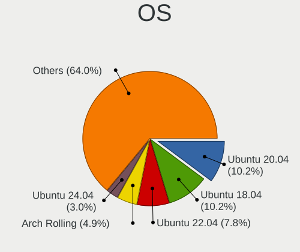

| Name                | Computers | Percent |
|---------------------|-----------|---------|
| Ubuntu 20.04        | 93        | 10.18%  |
| Ubuntu 18.04        | 93        | 10.18%  |
| Ubuntu 22.04        | 71        | 7.77%   |
| Arch Rolling        | 45        | 4.92%   |
| Ubuntu 24.04        | 27        | 2.95%   |
| Debian 11           | 24        | 2.63%   |
| Fedora 37           | 16        | 1.75%   |
| Debian 12           | 16        | 1.75%   |
| OpenMandriva 4.2    | 14        | 1.53%   |
| Fedora 41           | 12        | 1.31%   |
| Linux Mint 20.3     | 11        | 1.2%    |
| Pop!_OS 20.04       | 10        | 1.09%   |
| OpenMandriva 23.01  | 10        | 1.09%   |
| Pop!_OS 22.04       | 9         | 0.98%   |
| OpenMandriva 4.3    | 9         | 0.98%   |
| Fedora 40           | 9         | 0.98%   |
| OpenMandriva 23.03  | 8         | 0.88%   |
| Fedora 39           | 8         | 0.88%   |
| Fedora 38           | 8         | 0.88%   |
| Ubuntu 19.04        | 7         | 0.77%   |
| OpenMandriva 24.12  | 7         | 0.77%   |
| Ubuntu 22.10        | 6         | 0.66%   |
| Ubuntu 20.10        | 6         | 0.66%   |
| OpenMandriva 25.90  | 6         | 0.66%   |
| OpenMandriva 23.08  | 6         | 0.66%   |
| Linux Mint 22.1     | 6         | 0.66%   |
| KDE neon 20.04      | 6         | 0.66%   |
| EndeavourOS Rolling | 6         | 0.66%   |
| Zorin 17            | 5         | 0.55%   |
| Xubuntu 20.04       | 5         | 0.55%   |
| Xubuntu 18.04       | 5         | 0.55%   |
| Ubuntu 23.10        | 5         | 0.55%   |
| Ubuntu 21.04        | 5         | 0.55%   |
| Ubuntu 19.10        | 5         | 0.55%   |
| Ubuntu 16.04        | 5         | 0.55%   |
| OpenMandriva 5.0    | 5         | 0.55%   |
| Manjaro             | 5         | 0.55%   |
| Linux Mint 21.2     | 5         | 0.55%   |
| Kubuntu 22.04       | 5         | 0.55%   |
| Fedora 42           | 5         | 0.55%   |

OS Family
---------

OS without a version

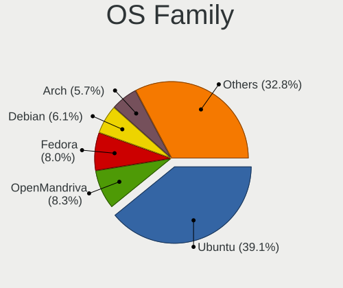

| Name             | Computers | Percent |
|------------------|-----------|---------|
| Ubuntu           | 338       | 39.12%  |
| OpenMandriva     | 72        | 8.33%   |
| Fedora           | 69        | 7.99%   |
| Debian           | 53        | 6.13%   |
| Arch             | 49        | 5.67%   |
| Linux Mint       | 46        | 5.32%   |
| Manjaro          | 35        | 4.05%   |
| Pop!_OS          | 26        | 3.01%   |
| Xubuntu          | 16        | 1.85%   |
| Zorin            | 15        | 1.74%   |
| Kubuntu          | 15        | 1.74%   |
| Ubuntu MATE      | 10        | 1.16%   |
| SteamOS          | 8         | 0.93%   |
| openSUSE         | 8         | 0.93%   |
| KDE neon         | 8         | 0.93%   |
| Gentoo           | 8         | 0.93%   |
| Lubuntu          | 7         | 0.81%   |
| Kali             | 7         | 0.81%   |
| Endless          | 7         | 0.81%   |
| EndeavourOS      | 6         | 0.69%   |
| Bazzite          | 6         | 0.69%   |
| NixOS            | 5         | 0.58%   |
| ArcoLinux        | 5         | 0.58%   |
| Ubuntu Unity     | 4         | 0.46%   |
| ROSA             | 4         | 0.46%   |
| TUXEDO OS        | 3         | 0.35%   |
| org.kde.Platform | 3         | 0.35%   |
| Elementary       | 3         | 0.35%   |
| Clear Linux      | 3         | 0.35%   |
| CentOS           | 3         | 0.35%   |
| Ubuntu Studio    | 2         | 0.23%   |
| Ubuntu Budgie    | 2         | 0.23%   |
| Nobara           | 2         | 0.23%   |
| MX               | 2         | 0.23%   |
| Slackware        | 1         | 0.12%   |
| Rocky Linux      | 1         | 0.12%   |
| OpenEuler        | 1         | 0.12%   |
| Mauna            | 1         | 0.12%   |
| Mageia           | 1         | 0.12%   |
| Lilidog          | 1         | 0.12%   |

Kernel
------

Version of the Linux kernel

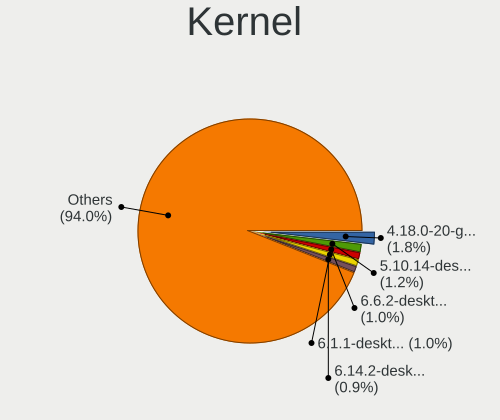

| Version                  | Computers | Percent |
|--------------------------|-----------|---------|
| 4.18.0-20-generic        | 18        | 1.83%   |
| 5.10.14-desktop-1omv4002 | 12        | 1.22%   |
| 6.6.2-desktop-1omv2390   | 10        | 1.02%   |
| 6.1.1-desktop-1omv2290   | 10        | 1.02%   |
| 6.14.2-desktop-3omv2590  | 9         | 0.92%   |
| 5.16.7-desktop-1omv4003  | 9         | 0.92%   |
| 5.4.0-42-generic         | 8         | 0.81%   |
| 6.2.6-desktop-1omv2390   | 7         | 0.71%   |
| 6.8.0-45-generic         | 6         | 0.61%   |
| 5.11.0-27-generic        | 6         | 0.61%   |
| 6.5.0-35-generic         | 5         | 0.51%   |
| 5.3.0-40-generic         | 5         | 0.51%   |
| 5.19.0-46-generic        | 5         | 0.51%   |
| 5.15.0-91-generic        | 5         | 0.51%   |
| 5.15.0-53-generic        | 5         | 0.51%   |
| 5.11.0-43-generic        | 5         | 0.51%   |
| 6.8.0-51-generic         | 4         | 0.41%   |
| 6.4.11-desktop-1omv2390  | 4         | 0.41%   |
| 6.14.0-29-generic        | 4         | 0.41%   |
| 6.13.2-arch1-1           | 4         | 0.41%   |
| 6.12.1-desktop-1omv2490  | 4         | 0.41%   |
| 6.11.0-26-generic        | 4         | 0.41%   |
| 5.8.0-7630-generic       | 4         | 0.41%   |
| 5.8.0-59-generic         | 4         | 0.41%   |
| 5.8.0-50-generic         | 4         | 0.41%   |
| 5.8.0-43-generic         | 4         | 0.41%   |
| 5.4.0-58-generic         | 4         | 0.41%   |
| 5.4.0-52-generic         | 4         | 0.41%   |
| 5.4.0-48-generic         | 4         | 0.41%   |
| 5.4.0-45-generic         | 4         | 0.41%   |
| 5.4.0-28-generic         | 4         | 0.41%   |
| 5.3.0-46-generic         | 4         | 0.41%   |
| 5.19.0-38-generic        | 4         | 0.41%   |
| 5.15.0-58-generic        | 4         | 0.41%   |
| 5.15.0-48-generic        | 4         | 0.41%   |
| 5.13.0-valve36-1-neptune | 4         | 0.41%   |
| 5.13.0-30-generic        | 4         | 0.41%   |
| 5.11.0-25-generic        | 4         | 0.41%   |
| 5.0.0-37-generic         | 4         | 0.41%   |
| 5.0.0-23-generic         | 4         | 0.41%   |

Kernel Family
-------------

Linux kernel without a distro release

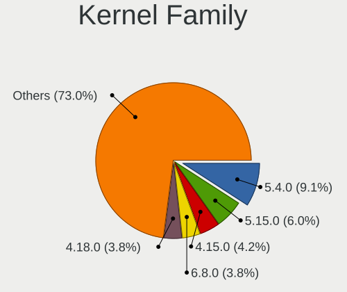

| Version | Computers | Percent |
|---------|-----------|---------|
| 5.4.0   | 86        | 9.12%   |
| 5.15.0  | 57        | 6.04%   |
| 4.15.0  | 40        | 4.24%   |
| 6.8.0   | 36        | 3.82%   |
| 4.18.0  | 36        | 3.82%   |
| 5.8.0   | 35        | 3.71%   |
| 5.11.0  | 29        | 3.08%   |
| 6.5.0   | 28        | 2.97%   |
| 5.13.0  | 25        | 2.65%   |
| 6.14.0  | 22        | 2.33%   |
| 5.19.0  | 22        | 2.33%   |
| 5.10.0  | 21        | 2.23%   |
| 6.2.0   | 18        | 1.91%   |
| 5.0.0   | 18        | 1.91%   |
| 5.3.0   | 17        | 1.8%    |
| 6.11.0  | 16        | 1.7%    |
| 6.1.0   | 16        | 1.7%    |
| 6.1.1   | 13        | 1.38%   |
| 6.6.2   | 12        | 1.27%   |
| 5.10.14 | 12        | 1.27%   |
| 6.2.6   | 9         | 0.95%   |
| 6.14.2  | 9         | 0.95%   |
| 5.16.7  | 9         | 0.95%   |
| 6.12.1  | 6         | 0.64%   |
| 6.13.2  | 5         | 0.53%   |
| 5.14.0  | 5         | 0.53%   |
| 6.4.11  | 4         | 0.42%   |
| 6.13.1  | 4         | 0.42%   |
| 6.12.9  | 4         | 0.42%   |
| 6.0.0   | 4         | 0.42%   |
| 6.6.9   | 3         | 0.32%   |
| 6.5.6   | 3         | 0.32%   |
| 6.4.0   | 3         | 0.32%   |
| 6.2.9   | 3         | 0.32%   |
| 6.2.2   | 3         | 0.32%   |
| 6.17.7  | 3         | 0.32%   |
| 6.12.57 | 3         | 0.32%   |
| 6.11.5  | 3         | 0.32%   |
| 6.0.12  | 3         | 0.32%   |
| 6.0.11  | 3         | 0.32%   |

Kernel Major Ver.
-----------------

Linux kernel major version

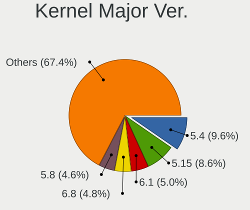

| Version | Computers | Percent |
|---------|-----------|---------|
| 5.4     | 90        | 9.63%   |
| 5.15    | 80        | 8.56%   |
| 6.1     | 47        | 5.03%   |
| 6.8     | 45        | 4.81%   |
| 5.8     | 43        | 4.6%    |
| 5.10    | 43        | 4.6%    |
| 6.2     | 42        | 4.49%   |
| 6.5     | 40        | 4.28%   |
| 4.15    | 40        | 4.28%   |
| 4.18    | 37        | 3.96%   |
| 6.14    | 36        | 3.85%   |
| 5.11    | 34        | 3.64%   |
| 5.13    | 30        | 3.21%   |
| 6.6     | 28        | 2.99%   |
| 5.19    | 27        | 2.89%   |
| 6.12    | 26        | 2.78%   |
| 6.11    | 26        | 2.78%   |
| 5.0     | 21        | 2.25%   |
| 6.0     | 19        | 2.03%   |
| 5.3     | 17        | 1.82%   |
| 5.16    | 17        | 1.82%   |
| 6.13    | 14        | 1.5%    |
| 6.4     | 12        | 1.28%   |
| 5.7     | 10        | 1.07%   |
| 6.3     | 9         | 0.96%   |
| 6.10    | 9         | 0.96%   |
| 6.17    | 8         | 0.86%   |
| 5.14    | 8         | 0.86%   |
| 6.9     | 7         | 0.75%   |
| 6.7     | 7         | 0.75%   |
| 6.15    | 7         | 0.75%   |
| 5.18    | 7         | 0.75%   |
| 5.17    | 6         | 0.64%   |
| 6.16    | 5         | 0.53%   |
| 4.19    | 5         | 0.53%   |
| 5.9     | 4         | 0.43%   |
| 5.6     | 4         | 0.43%   |
| 5.5     | 4         | 0.43%   |
| 5.12    | 4         | 0.43%   |
| 4.9     | 3         | 0.32%   |

Arch
----

OS architecture (x86_64, i586, etc.)

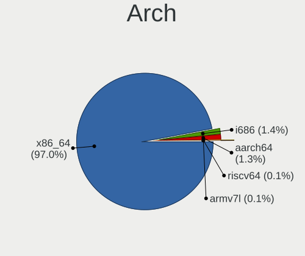

| Name    | Computers | Percent |
|---------|-----------|---------|
| x86_64  | 815       | 97.02%  |
| i686    | 12        | 1.43%   |
| aarch64 | 11        | 1.31%   |
| riscv64 | 1         | 0.12%   |
| armv7l  | 1         | 0.12%   |

DE
--

Desktop Environment

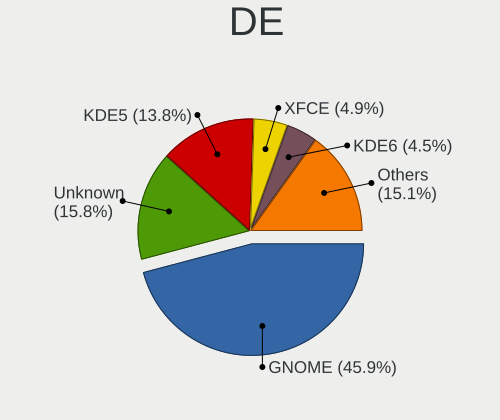

| Name             | Computers | Percent |
|------------------|-----------|---------|
| GNOME            | 401       | 45.88%  |
| Unknown          | 138       | 15.79%  |
| KDE5             | 121       | 13.84%  |
| XFCE             | 43        | 4.92%   |
| KDE6             | 39        | 4.46%   |
| X-Cinnamon       | 30        | 3.43%   |
| MATE             | 18        | 2.06%   |
| LXQt             | 15        | 1.72%   |
| KDE              | 15        | 1.72%   |
| Cinnamon         | 8         | 0.92%   |
| Hyprland         | 6         | 0.69%   |
| LXDE             | 5         | 0.57%   |
| i3               | 5         | 0.57%   |
| Unity            | 4         | 0.46%   |
| Pantheon         | 3         | 0.34%   |
| Openbox          | 3         | 0.34%   |
| Deepin           | 3         | 0.34%   |
| sway             | 2         | 0.23%   |
| lightdm-xsession | 2         | 0.23%   |
| GNOME Flashback  | 2         | 0.23%   |
| GNOME Classic    | 2         | 0.23%   |
| Budgie           | 2         | 0.23%   |
| qtile:wlroots    | 1         | 0.11%   |
| qtile            | 1         | 0.11%   |
| niri             | 1         | 0.11%   |
| KDE4             | 1         | 0.11%   |
| fluxbox          | 1         | 0.11%   |
| COSMIC           | 1         | 0.11%   |
| bspwm            | 1         | 0.11%   |

Display Server
--------------

X11 or Wayland

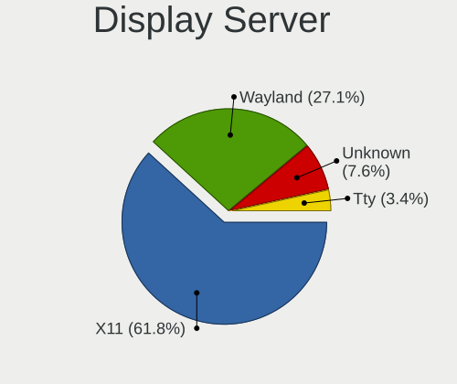

| Name    | Computers | Percent |
|---------|-----------|---------|
| X11     | 542       | 61.8%   |
| Wayland | 238       | 27.14%  |
| Unknown | 67        | 7.64%   |
| Tty     | 30        | 3.42%   |

Display Manager
---------------

SDDM, LightDM, etc.

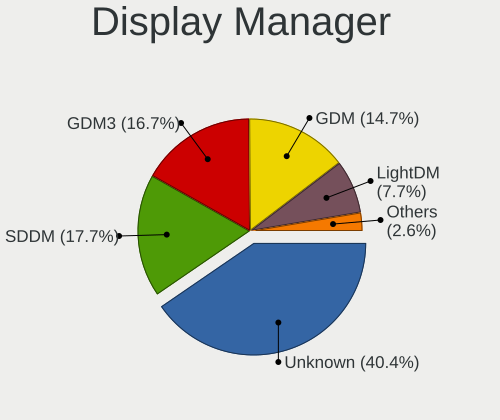

| Name    | Computers | Percent |
|---------|-----------|---------|
| Unknown | 351       | 40.44%  |
| SDDM    | 154       | 17.74%  |
| GDM3    | 145       | 16.71%  |
| GDM     | 128       | 14.75%  |
| LightDM | 67        | 7.72%   |
| TDM     | 13        | 1.5%    |
| SLiM    | 4         | 0.46%   |
| KDM     | 2         | 0.23%   |
| GREETD  | 2         | 0.23%   |
| XDM     | 1         | 0.12%   |
| LXDM    | 1         | 0.12%   |

OS Lang
-------

Language

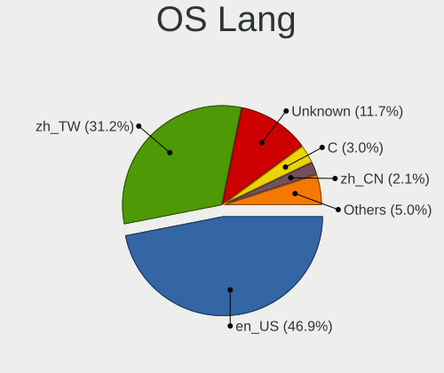

| Lang       | Computers | Percent |
|------------|-----------|---------|
| en_US      | 404       | 46.92%  |
| zh_TW      | 269       | 31.24%  |
| Unknown    | 101       | 11.73%  |
| C          | 26        | 3.02%   |
| zh_CN      | 18        | 2.09%   |
| en_GB      | 11        | 1.28%   |
| lzh_TW     | 4         | 0.46%   |
| zh_HK      | 3         | 0.35%   |
| ru_RU      | 3         | 0.35%   |
| C.UTF8     | 3         | 0.35%   |
| POSIX      | 2         | 0.23%   |
| en_SG      | 2         | 0.23%   |
| en_IE      | 2         | 0.23%   |
| en_HK      | 2         | 0.23%   |
| de_DE      | 2         | 0.23%   |
| zh_SG      | 1         | 0.12%   |
| ja_JP      | 1         | 0.12%   |
| it_IT      | 1         | 0.12%   |
| es_ES      | 1         | 0.12%   |
| en_US.UTF8 | 1         | 0.12%   |
| en_PH      | 1         | 0.12%   |
| en_DK      | 1         | 0.12%   |
| en_CA      | 1         | 0.12%   |
| en_AU      | 1         | 0.12%   |

Boot Mode
---------

EFI or BIOS

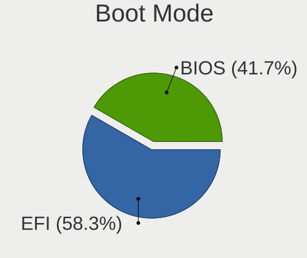

| Mode | Computers | Percent |
|------|-----------|---------|
| EFI  | 498       | 58.31%  |
| BIOS | 356       | 41.69%  |

Filesystem
----------

Type of filesystem

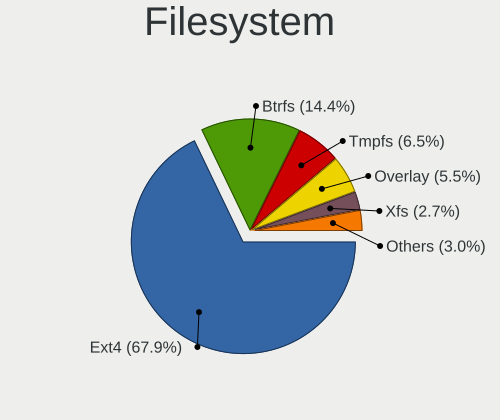

| Type    | Computers | Percent |
|---------|-----------|---------|
| Ext4    | 583       | 67.87%  |
| Btrfs   | 124       | 14.44%  |
| Tmpfs   | 56        | 6.52%   |
| Overlay | 47        | 5.47%   |
| Xfs     | 23        | 2.68%   |
| Unknown | 14        | 1.63%   |
| Ext2    | 6         | 0.7%    |
| Ext3    | 2         | 0.23%   |
| Zfs     | 1         | 0.12%   |
| XXXXXXX | 1         | 0.12%   |
| Rootfs  | 1         | 0.12%   |
| F2fs    | 1         | 0.12%   |

Part. scheme
------------

Scheme of partitioning

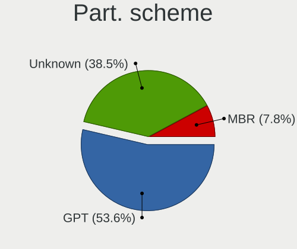

| Type    | Computers | Percent |
|---------|-----------|---------|
| GPT     | 458       | 53.63%  |
| Unknown | 329       | 38.52%  |
| MBR     | 67        | 7.85%   |

Dual Boot with Linux/BSD
------------------------

Hosting more than one Linux/BSD

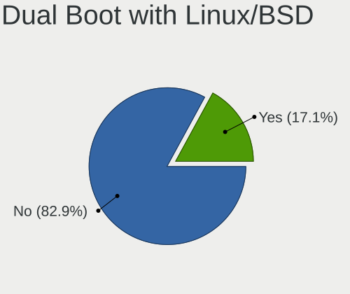

| Dual boot | Computers | Percent |
|-----------|-----------|---------|
| No        | 705       | 82.94%  |
| Yes       | 145       | 17.06%  |

Dual Boot (Win)
---------------

Hosting Linux and Windows

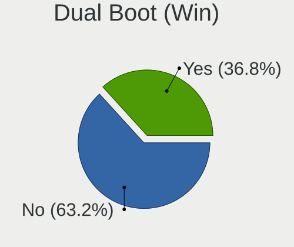

| Dual boot | Computers | Percent |
|-----------|-----------|---------|
| No        | 542       | 63.24%  |
| Yes       | 315       | 36.76%  |

Board
-----

Vendor
------

Motherboard manufacturer

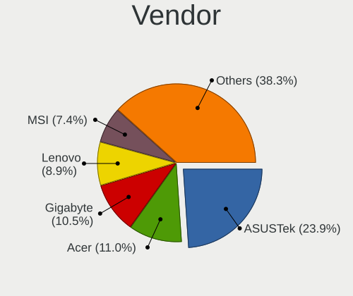

| Name                                 | Computers | Percent |
|--------------------------------------|-----------|---------|
| ASUSTek Computer                     | 201       | 23.93%  |
| Acer                                 | 92        | 10.95%  |
| Gigabyte Technology                  | 88        | 10.48%  |
| Lenovo                               | 75        | 8.93%   |
| MSI                                  | 62        | 7.38%   |
| Hewlett-Packard                      | 62        | 7.38%   |
| Dell                                 | 48        | 5.71%   |
| Unknown                              | 36        | 4.29%   |
| ASRock                               | 25        | 2.98%   |
| Intel                                | 15        | 1.79%   |
| Apple                                | 12        | 1.43%   |
| Valve                                | 7         | 0.83%   |
| Toshiba                              | 7         | 0.83%   |
| Sony                                 | 7         | 0.83%   |
| Raspberry Pi Foundation              | 6         | 0.71%   |
| Framework                            | 5         | 0.6%    |
| Supermicro                           | 4         | 0.48%   |
| Samsung Electronics                  | 3         | 0.36%   |
| Microsoft                            | 3         | 0.36%   |
| MECHREVO                             | 3         | 0.36%   |
| LG Electronics                       | 3         | 0.36%   |
| JGINYUE                              | 3         | 0.36%   |
| HUAWEI                               | 3         | 0.36%   |
| AZW                                  | 3         | 0.36%   |
| Win element                          | 2         | 0.24%   |
| Timi                                 | 2         | 0.24%   |
| Shenzhen Meigao Electronic Equipment | 2         | 0.24%   |
| OEM                                  | 2         | 0.24%   |
| Nvidia                               | 2         | 0.24%   |
| NEXCOM                               | 2         | 0.24%   |
| Lex                                  | 2         | 0.24%   |
| Intel Client Systems                 | 2         | 0.24%   |
| Insyde                               | 2         | 0.24%   |
| Huanan                               | 2         | 0.24%   |
| Google                               | 2         | 0.24%   |
| EBN                                  | 2         | 0.24%   |
| Dynabook                             | 2         | 0.24%   |
| AVITA                                | 2         | 0.24%   |
| AMI                                  | 2         | 0.24%   |
| AMD                                  | 2         | 0.24%   |

Model
-----

Motherboard model

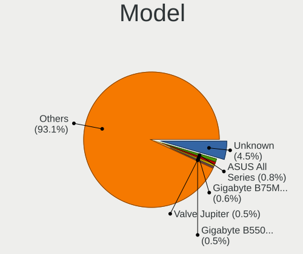

| Name                                                  | Computers | Percent |
|-------------------------------------------------------|-----------|---------|
| Unknown                                               | 38        | 4.52%   |
| ASUS All Series                                       | 7         | 0.83%   |
| Gigabyte B75M-D3H                                     | 5         | 0.6%    |
| Valve Jupiter                                         | 4         | 0.48%   |
| Gigabyte B550I AORUS PRO AX                           | 4         | 0.48%   |
| Framework Laptop 13 (AMD Ryzen 7040Series)            | 4         | 0.48%   |
| ASUS M5A78L-M/USB3                                    | 4         | 0.48%   |
| ASRock X300M-STX                                      | 4         | 0.48%   |
| Valve Galileo                                         | 3         | 0.36%   |
| Lenovo ThinkCentre M58 7627AA9                        | 3         | 0.36%   |
| Gigabyte Z97MX-Gaming 5                               | 3         | 0.36%   |
| Dell Inspiron 531s                                    | 3         | 0.36%   |
| ASUS TUF Gaming B550M-PLUS                            | 3         | 0.36%   |
| ASUS ROG Flow Z13 GZ302EA_GZ302EA                     | 3         | 0.36%   |
| ASUS Pro WS X570-ACE                                  | 3         | 0.36%   |
| ASUS CM6630_CM6730_CM6830                             | 3         | 0.36%   |
| Acer Veriton L480                                     | 3         | 0.36%   |
| Acer Swift SFX14-41G                                  | 3         | 0.36%   |
| Acer Aspire 4755                                      | 3         | 0.36%   |
| Toshiba Satellite L850                                | 2         | 0.24%   |
| Supermicro Super Server                               | 2         | 0.24%   |
| Shenzhen Meigao Electronic Equipment EliteMini Series | 2         | 0.24%   |
| RPi Raspberry Pi 4 Model B Rev 1.4                    | 2         | 0.24%   |
| RPi Raspberry Pi                                      | 2         | 0.24%   |
| Nvidia Tegra                                          | 2         | 0.24%   |
| MSI MS-7C95                                           | 2         | 0.24%   |
| MSI MS-7C52                                           | 2         | 0.24%   |
| MSI MS-7B89                                           | 2         | 0.24%   |
| MSI MS-7A69                                           | 2         | 0.24%   |
| MSI MS-7721                                           | 2         | 0.24%   |
| MSI GS63 7RE                                          | 2         | 0.24%   |
| MECHREVO WUJIE Series                                 | 2         | 0.24%   |
| Lex 3I610DW                                           | 2         | 0.24%   |
| Lenovo Yoga Pro 14s ASP9 83HN                         | 2         | 0.24%   |
| Lenovo IdeaPad S410 20301                             | 2         | 0.24%   |
| Lenovo IdeaPad S145-14AST 81ST                        | 2         | 0.24%   |
| Lenovo IdeaPad 5 14ALC05 82LM                         | 2         | 0.24%   |
| Intel SHARKBAY                                        | 2         | 0.24%   |
| Intel NUC5i5RYB H40999-504                            | 2         | 0.24%   |
| HP ProDesk 600 G1 DM                                  | 2         | 0.24%   |

Model Family
------------

Motherboard model prefix

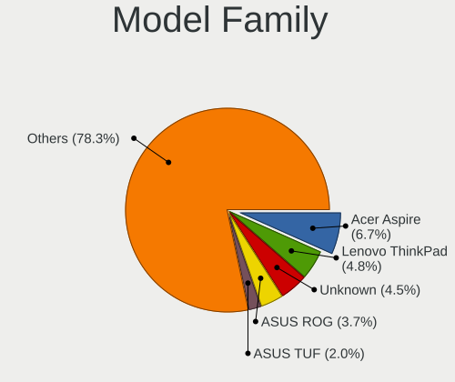

| Name               | Computers | Percent |
|--------------------|-----------|---------|
| Acer Aspire        | 56        | 6.67%   |
| Lenovo ThinkPad    | 40        | 4.76%   |
| Unknown            | 38        | 4.52%   |
| ASUS ROG           | 31        | 3.69%   |
| ASUS TUF           | 17        | 2.02%   |
| Dell Inspiron      | 16        | 1.9%    |
| ASUS PRIME         | 16        | 1.9%    |
| Lenovo IdeaPad     | 13        | 1.55%   |
| HP Pavilion        | 13        | 1.55%   |
| ASUS ASUS          | 13        | 1.55%   |
| Acer Swift         | 13        | 1.55%   |
| ASUS VivoBook      | 12        | 1.43%   |
| HP ProBook         | 10        | 1.19%   |
| HP EliteBook       | 7         | 0.83%   |
| ASUS All           | 7         | 0.83%   |
| Acer Veriton       | 7         | 0.83%   |
| Toshiba Satellite  | 6         | 0.71%   |
| RPi Raspberry      | 6         | 0.71%   |
| Dell Latitude      | 6         | 0.71%   |
| ASUS Pro           | 6         | 0.71%   |
| ASUS M5A78L-M      | 6         | 0.71%   |
| Lenovo Yoga        | 5         | 0.6%    |
| Gigabyte B75M-D3H  | 5         | 0.6%    |
| Framework Laptop   | 5         | 0.6%    |
| Dell XPS           | 5         | 0.6%    |
| Dell Vostro        | 5         | 0.6%    |
| Dell Precision     | 5         | 0.6%    |
| ASUS ZenBook       | 5         | 0.6%    |
| ASUS ASUSPRO       | 5         | 0.6%    |
| Valve Jupiter      | 4         | 0.48%   |
| Lenovo ThinkCentre | 4         | 0.48%   |
| HP ProDesk         | 4         | 0.48%   |
| Gigabyte B550I     | 4         | 0.48%   |
| Dell OptiPlex      | 4         | 0.48%   |
| ASRock X300M-STX   | 4         | 0.48%   |
| Acer TravelMate    | 4         | 0.48%   |
| Valve Galileo      | 3         | 0.36%   |
| Microsoft Surface  | 3         | 0.36%   |
| HP ENVY            | 3         | 0.36%   |
| HP Compaq          | 3         | 0.36%   |

MFG Year
--------

Motherboard manufacture year

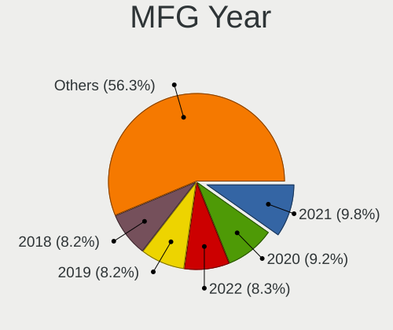

| Year    | Computers | Percent |
|---------|-----------|---------|
| 2021    | 82        | 9.76%   |
| 2020    | 77        | 9.17%   |
| 2022    | 70        | 8.33%   |
| 2019    | 69        | 8.21%   |
| 2018    | 69        | 8.21%   |
| 2012    | 58        | 6.9%    |
| 2014    | 54        | 6.43%   |
| 2011    | 43        | 5.12%   |
| 2013    | 41        | 4.88%   |
| 2017    | 40        | 4.76%   |
| 2023    | 39        | 4.64%   |
| 2015    | 39        | 4.64%   |
| 2016    | 32        | 3.81%   |
| 2009    | 26        | 3.1%    |
| 2024    | 25        | 2.98%   |
| 2010    | 23        | 2.74%   |
| 2008    | 19        | 2.26%   |
| 2025    | 12        | 1.43%   |
| Unknown | 11        | 1.31%   |
| 2007    | 7         | 0.83%   |
| 2006    | 3         | 0.36%   |
| 2004    | 1         | 0.12%   |

Form Factor
-----------

Physical design of the computer

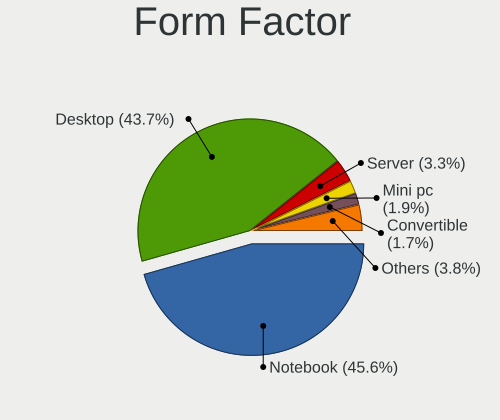

| Name           | Computers | Percent |
|----------------|-----------|---------|
| Notebook       | 383       | 45.6%   |
| Desktop        | 367       | 43.69%  |
| Server         | 28        | 3.33%   |
| Mini pc        | 16        | 1.9%    |
| Convertible    | 14        | 1.67%   |
| System on chip | 11        | 1.31%   |
| Tablet         | 10        | 1.19%   |
| All in one     | 10        | 1.19%   |
| Phone          | 1         | 0.12%   |

Secure Boot
-----------

Enabled or disabled

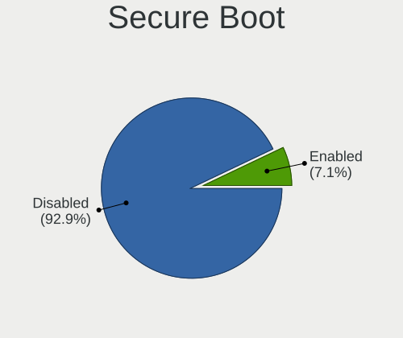

| State    | Computers | Percent |
|----------|-----------|---------|
| Disabled | 787       | 92.92%  |
| Enabled  | 60        | 7.08%   |

Coreboot
--------

Have coreboot on board

| Used | Computers | Percent |
|------|-----------|---------|
| No   | 837       | 99.64%  |
| Yes  | 3         | 0.36%   |

RAM Size
--------

Total RAM memory

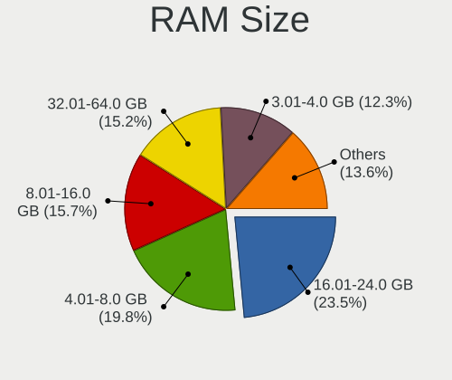

| Size in GB      | Computers | Percent |
|-----------------|-----------|---------|
| 16.01-24.0      | 201       | 23.51%  |
| 4.01-8.0        | 169       | 19.77%  |
| 8.01-16.0       | 134       | 15.67%  |
| 32.01-64.0      | 130       | 15.2%   |
| 3.01-4.0        | 105       | 12.28%  |
| 64.01-256.0     | 55        | 6.43%   |
| 24.01-32.0      | 35        | 4.09%   |
| 1.01-2.0        | 17        | 1.99%   |
| More than 256.0 | 4         | 0.47%   |
| 2.01-3.0        | 3         | 0.35%   |
| 0.51-1.0        | 2         | 0.23%   |

RAM Used
--------

Used RAM memory

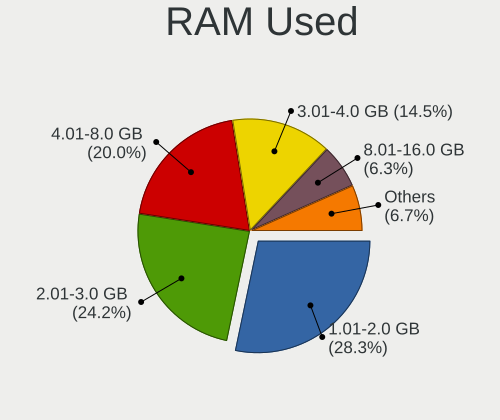

| Used GB    | Computers | Percent |
|------------|-----------|---------|
| 1.01-2.0   | 263       | 28.28%  |
| 2.01-3.0   | 225       | 24.19%  |
| 4.01-8.0   | 186       | 20%     |
| 3.01-4.0   | 135       | 14.52%  |
| 8.01-16.0  | 59        | 6.34%   |
| 0.51-1.0   | 32        | 3.44%   |
| 16.01-24.0 | 10        | 1.08%   |
| 0.01-0.5   | 8         | 0.86%   |
| 24.01-32.0 | 7         | 0.75%   |
| 32.01-64.0 | 5         | 0.54%   |

Total Drives
------------

Number of drives on board

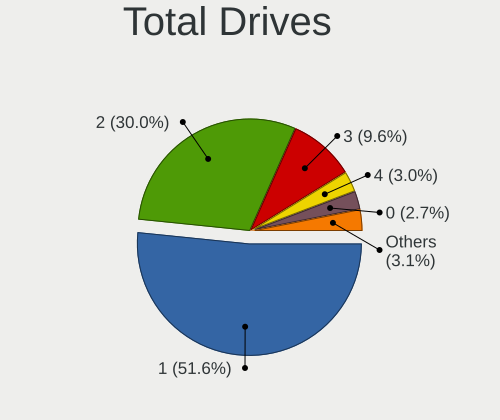

| Drives  | Computers | Percent |
|---------|-----------|---------|
| 1       | 447       | 51.62%  |
| 2       | 260       | 30.02%  |
| 3       | 83        | 9.58%   |
| 4       | 26        | 3%      |
| 0       | 23        | 2.66%   |
| 5       | 15        | 1.73%   |
| 6       | 6         | 0.69%   |
| 7       | 3         | 0.35%   |
| 14      | 1         | 0.12%   |
| 9       | 1         | 0.12%   |
| Unknown | 1         | 0.12%   |

Has CD-ROM
----------

Has CD-ROM on board

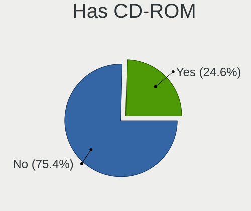

| Presented | Computers | Percent |
|-----------|-----------|---------|
| No        | 638       | 75.41%  |
| Yes       | 208       | 24.59%  |

Has Ethernet
------------

Has Ethernet on board

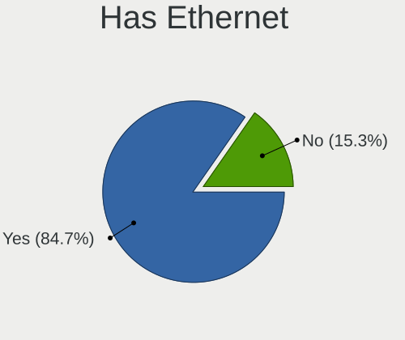

| Presented | Computers | Percent |
|-----------|-----------|---------|
| Yes       | 713       | 84.68%  |
| No        | 129       | 15.32%  |

Has WiFi
--------

Has WiFi module

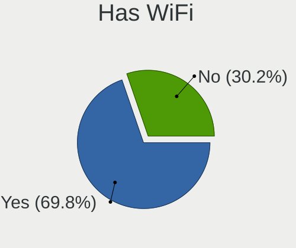

| Presented | Computers | Percent |
|-----------|-----------|---------|
| Yes       | 588       | 69.75%  |
| No        | 255       | 30.25%  |

Has Bluetooth
-------------

Has Bluetooth module

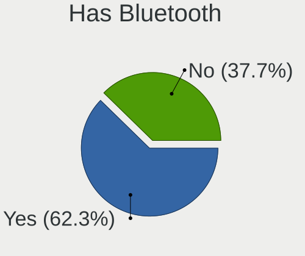

| Presented | Computers | Percent |
|-----------|-----------|---------|
| Yes       | 529       | 62.31%  |
| No        | 320       | 37.69%  |

Location
--------

Country
-------

Geographic location (country)

| Country | Computers | Percent |
|---------|-----------|---------|
| Taiwan  | 840       | 100%    |

City
----

Geographic location (city)

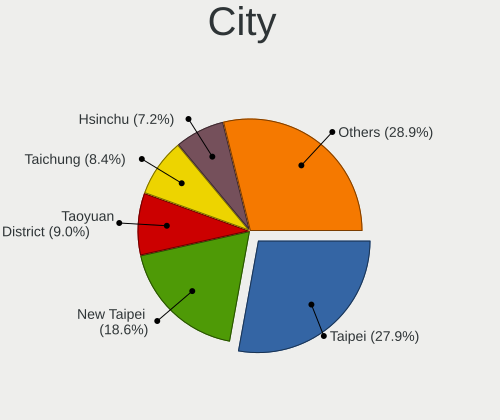

| City              | Computers | Percent |
|-------------------|-----------|---------|
| Taipei            | 251       | 27.86%  |
| New Taipei        | 168       | 18.65%  |
| Taoyuan District  | 81        | 8.99%   |
| Taichung          | 76        | 8.44%   |
| Hsinchu           | 65        | 7.21%   |
| Kaohsiung City    | 56        | 6.22%   |
| Tainan City       | 36        | 4%      |
| Hsinchu County    | 21        | 2.33%   |
| Chang-hua         | 13        | 1.44%   |
| Zhongli District  | 12        | 1.33%   |
| Keelung           | 8         | 0.89%   |
| Zhubei            | 7         | 0.78%   |
| Pingtung City     | 6         | 0.67%   |
| Nantou City       | 6         | 0.67%   |
| Zhudong           | 5         | 0.55%   |
| Yunlin            | 5         | 0.55%   |
| Miaoli            | 5         | 0.55%   |
| Taichung City     | 4         | 0.44%   |
| Chiayi City       | 4         | 0.44%   |
| Banqiao           | 4         | 0.44%   |
| Yilan             | 3         | 0.33%   |
| Yangmei District  | 3         | 0.33%   |
| Taoyuan City      | 3         | 0.33%   |
| Shulin District   | 3         | 0.33%   |
| Daan              | 3         | 0.33%   |
| Sanchong District | 2         | 0.22%   |
| Lugu              | 2         | 0.22%   |
| Kanzijiao         | 2         | 0.22%   |
| Hualien City      | 2         | 0.22%   |
| Dawan             | 2         | 0.22%   |
| Chiayi            | 2         | 0.22%   |
| Changhua          | 2         | 0.22%   |
| Beimiao           | 2         | 0.22%   |
| Baitang           | 2         | 0.22%   |
| Yingge District   | 1         | 0.11%   |
| Xinzhuang         | 1         | 0.11%   |
| Xindian District  | 1         | 0.11%   |
| Xindian           | 1         | 0.11%   |
| Xiawanzi          | 1         | 0.11%   |
| Xiatayou          | 1         | 0.11%   |

Drives
------

Drive Vendor
------------

Hard drive vendors

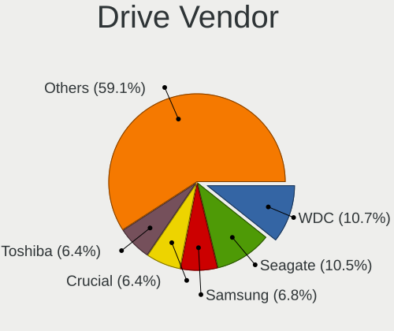

| Vendor                      | Computers | Drives | Percent |
|-----------------------------|-----------|--------|---------|
| WDC                         | 141       | 196    | 10.69%  |
| Seagate                     | 139       | 214    | 10.54%  |
| Samsung Electronics         | 90        | 109    | 6.82%   |
| Crucial                     | 85        | 110    | 6.44%   |
| Toshiba                     | 84        | 104    | 6.37%   |
| SanDisk                     | 68        | 92     | 5.16%   |
| Intel                       | 61        | 87     | 4.62%   |
| Unknown                     | 58        | 75     | 4.4%    |
| Kingston                    | 55        | 70     | 4.17%   |
| Hitachi                     | 42        | 49     | 3.18%   |
| SK hynix                    | 41        | 54     | 3.11%   |
| A-DATA Technology           | 34        | 39     | 2.58%   |
| Micron Technology           | 32        | 39     | 2.43%   |
| HGST                        | 32        | 36     | 2.43%   |
| Transcend                   | 27        | 29     | 2.05%   |
| Micron/Crucial Technology   | 20        | 23     | 1.52%   |
| Phison Electronics          | 19        | 25     | 1.44%   |
| KIOXIA                      | 15        | 18     | 1.14%   |
| SPCC                        | 11        | 14     | 0.83%   |
| Lite-On                     | 11        | 11     | 0.83%   |
| Apacer                      | 11        | 15     | 0.83%   |
| ANACOMDA                    | 11        | 16     | 0.83%   |
| ADATA Technology            | 11        | 18     | 0.83%   |
| Unknown                     | 11        | 11     | 0.83%   |
| Silicon Motion              | 10        | 11     | 0.76%   |
| Plextor                     | 9         | 10     | 0.68%   |
| MAXIO Technology (Hangzhou) | 9         | 11     | 0.68%   |
| Kingston Technology Company | 9         | 11     | 0.68%   |
| China                       | 9         | 10     | 0.68%   |
| Team                        | 8         | 10     | 0.61%   |
| Phison                      | 8         | 9      | 0.61%   |
| ASMT                        | 7         | 7      | 0.53%   |
| XPG                         | 6         | 7      | 0.45%   |
| JMicron Technology          | 6         | 10     | 0.45%   |
| Fujitsu                     | 6         | 8      | 0.45%   |
| Apple                       | 6         | 7      | 0.45%   |
| Patriot                     | 5         | 7      | 0.38%   |
| KLEVV                       | 5         | 8      | 0.38%   |
| AGI                         | 5         | 6      | 0.38%   |
| Realtek Semiconductor       | 4         | 5      | 0.3%    |

Drive Model
-----------

Hard drive models

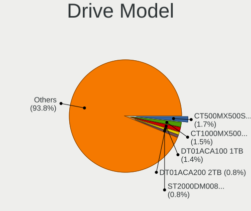

| Model                                                              | Computers | Percent |
|--------------------------------------------------------------------|-----------|---------|
| Crucial CT500MX500SSD1 500GB                                       | 24        | 1.69%   |
| Crucial CT1000MX500SSD1 1TB                                        | 21        | 1.48%   |
| Toshiba DT01ACA100 1TB                                             | 20        | 1.41%   |
| Toshiba DT01ACA200 2TB                                             | 12        | 0.85%   |
| Seagate ST2000DM008-2FR102 2TB                                     | 11        | 0.78%   |
| Crucial CT240BX500SSD1 240GB                                       | 11        | 0.78%   |
| Unknown                                                            | 11        | 0.78%   |
| HGST HTS721010A9E630 1TB                                           | 10        | 0.7%    |
| Toshiba MQ01ABD100 1TB                                             | 9         | 0.63%   |
| SanDisk NVMe SSD Drive 1TB                                         | 9         | 0.63%   |
| Unknown MMC Card  64GB                                             | 8         | 0.56%   |
| Seagate ST3500418AS 500GB                                          | 8         | 0.56%   |
| Samsung NVMe SSD Controller PM9A1/PM9A3/980PRO 1TB                 | 8         | 0.56%   |
| Phison PS5013 E13 NVMe Controller 500GB                            | 8         | 0.56%   |
| Lite-On NVMe SSD Drive 512GB                                       | 8         | 0.56%   |
| Unknown MMC Card  32GB                                             | 7         | 0.49%   |
| Unknown MMC Card  128GB                                            | 7         | 0.49%   |
| Seagate ST500DM002-1BD142 500GB                                    | 7         | 0.49%   |
| Seagate ST1000LM035-1RK172 1TB                                     | 7         | 0.49%   |
| Seagate ST1000DM010-2EP102 1TB                                     | 7         | 0.49%   |
| Samsung NVMe SSD Controller SM981/PM981/PM983 1TB                  | 7         | 0.49%   |
| A-DATA SU800 512GB SSD                                             | 7         | 0.49%   |
| SanDisk NVMe SSD Drive 512GB                                       | 6         | 0.42%   |
| Phison E16 PCIe4 NVMe Controller 1TB                               | 6         | 0.42%   |
| WDC WDS100T2B0C-00PXH0 1TB                                         | 5         | 0.35%   |
| Unknown SD/MMC/MS PRO 2GB                                          | 5         | 0.35%   |
| Toshiba MQ04ABF100 1TB                                             | 5         | 0.35%   |
| Toshiba MQ01ABD032 320GB                                           | 5         | 0.35%   |
| Seagate ST2000DM001-1CH164 2TB                                     | 5         | 0.35%   |
| Seagate ST1000LM049-2GH172 1TB                                     | 5         | 0.35%   |
| Seagate ST1000DM003-1SB102 1TB                                     | 5         | 0.35%   |
| Sandisk WD Blue SN550 NVMe SSD 1024GB                              | 5         | 0.35%   |
| SanDisk NVMe SSD Drive 500GB                                       | 5         | 0.35%   |
| Micron/Crucial P2 NVMe PCIe SSD 2TB                                | 5         | 0.35%   |
| Intel SSDPEKNU512GZ 512GB                                          | 5         | 0.35%   |
| HGST HTS545050A7E680 500GB                                         | 5         | 0.35%   |
| HGST HTS541010A9E680 1TB                                           | 5         | 0.35%   |
| Crucial CT2000MX500SSD1 2TB                                        | 5         | 0.35%   |
| ADATA XPG SX8200 Pro PCIe Gen3x4 M.2 2280 Solid State Drive 1024GB | 5         | 0.35%   |
| WDC WDS250G1B0B-00AS40 250GB SSD                                   | 4         | 0.28%   |

HDD Vendor
----------

Hard disk drive vendors

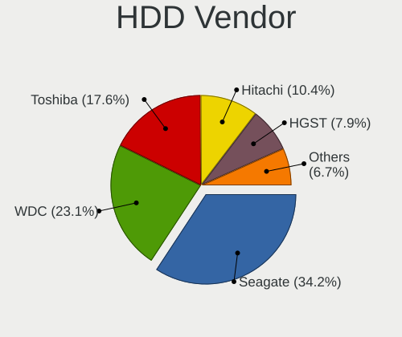

| Vendor              | Computers | Drives | Percent |
|---------------------|-----------|--------|---------|
| Seagate             | 138       | 210    | 34.24%  |
| WDC                 | 93        | 131    | 23.08%  |
| Toshiba             | 71        | 90     | 17.62%  |
| Hitachi             | 42        | 49     | 10.42%  |
| HGST                | 32        | 36     | 7.94%   |
| Unknown             | 6         | 8      | 1.49%   |
| Maxtor              | 3         | 3      | 0.74%   |
| JMicron Technology  | 3         | 7      | 0.74%   |
| Fujitsu             | 3         | 4      | 0.74%   |
| Samsung Electronics | 2         | 3      | 0.5%    |
| NeoTech             | 2         | 2      | 0.5%    |
| USB                 | 1         | 2      | 0.25%   |
| TO Exter            | 1         | 1      | 0.25%   |
| StoreJet            | 1         | 2      | 0.25%   |
| SSK                 | 1         | 1      | 0.25%   |
| NETAPP              | 1         | 2      | 0.25%   |
| External            | 1         | 1      | 0.25%   |
| ASMT                | 1         | 1      | 0.25%   |
| Apple               | 1         | 1      | 0.25%   |

SSD Vendor
----------

Solid state drive vendors

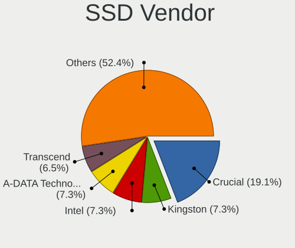

| Vendor              | Computers | Drives | Percent |
|---------------------|-----------|--------|---------|
| Crucial             | 76        | 97     | 19.14%  |
| Kingston            | 29        | 36     | 7.3%    |
| Intel               | 29        | 42     | 7.3%    |
| A-DATA Technology   | 29        | 33     | 7.3%    |
| Transcend           | 26        | 28     | 6.55%   |
| WDC                 | 21        | 28     | 5.29%   |
| SanDisk             | 19        | 24     | 4.79%   |
| Samsung Electronics | 19        | 21     | 4.79%   |
| SPCC                | 10        | 13     | 2.52%   |
| Micron Technology   | 10        | 13     | 2.52%   |
| ANACOMDA            | 10        | 15     | 2.52%   |
| Toshiba             | 8         | 8      | 2.02%   |
| Plextor             | 8         | 9      | 2.02%   |
| China               | 8         | 9      | 2.02%   |
| Apacer              | 8         | 10     | 2.02%   |
| Team                | 6         | 7      | 1.51%   |
| SK hynix            | 6         | 6      | 1.51%   |
| ASMT                | 6         | 6      | 1.51%   |
| Patriot             | 5         | 7      | 1.26%   |
| KLEVV               | 5         | 8      | 1.26%   |
| Apple               | 5         | 6      | 1.26%   |
| Unknown             | 4         | 4      | 1.01%   |
| OCZ                 | 3         | 3      | 0.76%   |
| LITEONIT            | 3         | 3      | 0.76%   |
| AGI                 | 3         | 4      | 0.76%   |
| Pioneer             | 2         | 2      | 0.5%    |
| LITEON              | 2         | 2      | 0.5%    |
| Leven               | 2         | 2      | 0.5%    |
| Kingchuxing         | 2         | 2      | 0.5%    |
| Gigastone           | 2         | 2      | 0.5%    |
| Fujitsu             | 2         | 2      | 0.5%    |
| FORESEE             | 2         | 3      | 0.5%    |
| ZHITAI              | 1         | 1      | 0.25%   |
| Wintec              | 1         | 1      | 0.25%   |
| Unknown             | 1         | 1      | 0.25%   |
| UNITEK              | 1         | 1      | 0.25%   |
| UMAX                | 1         | 1      | 0.25%   |
| T-FORCE             | 1         | 1      | 0.25%   |
| Sony                | 1         | 1      | 0.25%   |
| SINKER              | 1         | 1      | 0.25%   |

Drive Kind
----------

HDD or SSD

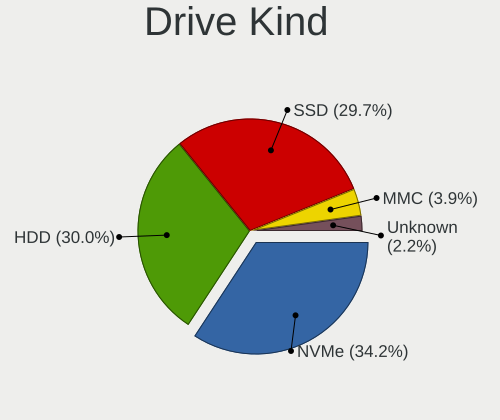

| Kind    | Computers | Drives | Percent |
|---------|-----------|--------|---------|
| NVMe    | 392       | 578    | 34.24%  |
| HDD     | 343       | 554    | 29.96%  |
| SSD     | 340       | 487    | 29.69%  |
| MMC     | 45        | 57     | 3.93%   |
| Unknown | 25        | 28     | 2.18%   |

Drive Connector
---------------

SATA, SAS, NVMe, etc.

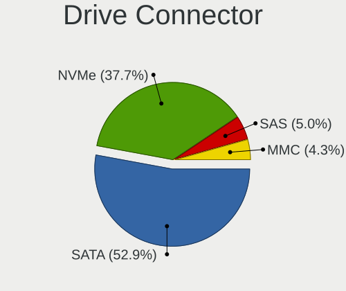

| Type | Computers | Drives | Percent |
|------|-----------|--------|---------|
| SATA | 548       | 993    | 52.9%   |
| NVMe | 391       | 577    | 37.74%  |
| SAS  | 52        | 77     | 5.02%   |
| MMC  | 45        | 57     | 4.34%   |

Drive Size
----------

Size of hard drive

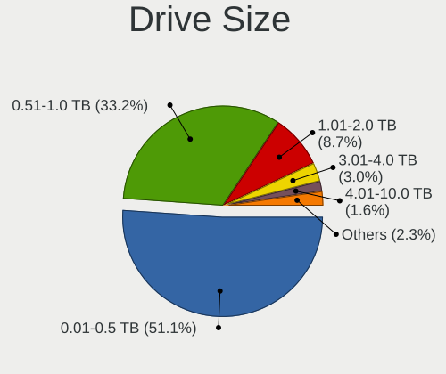

| Size in TB | Computers | Drives | Percent |
|------------|-----------|--------|---------|
| 0.01-0.5   | 372       | 559    | 51.1%   |
| 0.51-1.0   | 242       | 315    | 33.24%  |
| 1.01-2.0   | 63        | 94     | 8.65%   |
| 3.01-4.0   | 22        | 33     | 3.02%   |
| 4.01-10.0  | 12        | 22     | 1.65%   |
| 2.01-3.0   | 11        | 12     | 1.51%   |
| 10.01-20.0 | 5         | 5      | 0.69%   |
| 20.01-50.0 | 1         | 1      | 0.14%   |

Space Total
-----------

Amount of disk space available on the file system

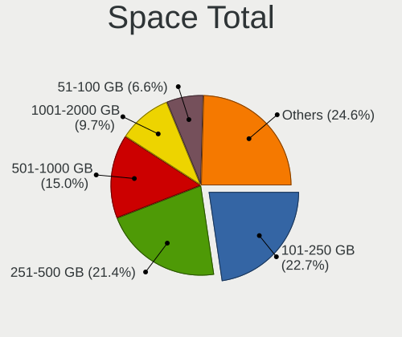

| Size in GB     | Computers | Percent |
|----------------|-----------|---------|
| 101-250        | 202       | 22.67%  |
| 251-500        | 191       | 21.44%  |
| 501-1000       | 134       | 15.04%  |
| 1001-2000      | 86        | 9.65%   |
| 51-100         | 59        | 6.62%   |
| 1-20           | 58        | 6.51%   |
| More than 3000 | 49        | 5.5%    |
| 2001-3000      | 43        | 4.83%   |
| 21-50          | 39        | 4.38%   |
| Unknown        | 30        | 3.37%   |

Space Used
----------

Amount of used disk space

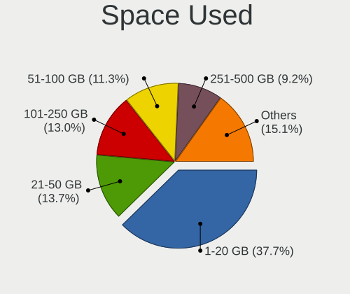

| Used GB        | Computers | Percent |
|----------------|-----------|---------|
| 1-20           | 346       | 37.69%  |
| 21-50          | 126       | 13.73%  |
| 101-250        | 119       | 12.96%  |
| 51-100         | 104       | 11.33%  |
| 251-500        | 84        | 9.15%   |
| 501-1000       | 49        | 5.34%   |
| 1001-2000      | 34        | 3.7%    |
| Unknown        | 30        | 3.27%   |
| More than 3000 | 16        | 1.74%   |
| 2001-3000      | 9         | 0.98%   |
| 0              | 1         | 0.11%   |

Malfunc. Drives
---------------

Drive models with a malfunction

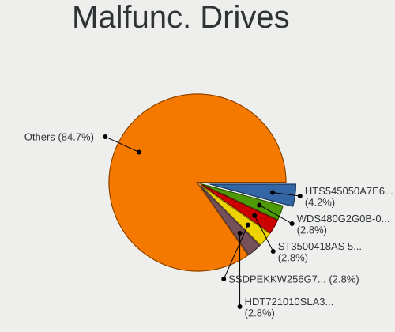

| Model                                 | Computers | Drives | Percent |
|---------------------------------------|-----------|--------|---------|
| HGST HTS545050A7E680 500GB            | 3         | 3      | 4.17%   |
| WDC WDS480G2G0B-00EPW0 480GB SSD      | 2         | 2      | 2.78%   |
| Seagate ST3500418AS 500GB             | 2         | 2      | 2.78%   |
| Intel SSDPEKKW256G7 256GB             | 2         | 3      | 2.78%   |
| Hitachi HDT721010SLA360 1TB           | 2         | 2      | 2.78%   |
| WDC WDS240G2G0B-00EPW0 240GB SSD      | 1         | 1      | 1.39%   |
| WDC WDS100T2B0C-00PXH0 1TB            | 1         | 1      | 1.39%   |
| WDC WD5000AAKX-60U6AA0 500GB          | 1         | 1      | 1.39%   |
| WDC WD5000AAKX-001CA0 500GB           | 1         | 1      | 1.39%   |
| WDC WD5000AADS-00L4B1 500GB           | 1         | 1      | 1.39%   |
| WDC WD3200BEKT-60V5T1 320GB           | 1         | 1      | 1.39%   |
| WDC WD3200AAKS-00L9A0 320GB           | 1         | 1      | 1.39%   |
| WDC WD20EARX-00PASB0 2TB              | 1         | 1      | 1.39%   |
| WDC WD20EARS-00MVWB0 2TB              | 1         | 1      | 1.39%   |
| WDC WD1600BEVT-22A23T0 160GB          | 1         | 1      | 1.39%   |
| WDC WD10EFRX-68JCSN0 1TB              | 1         | 1      | 1.39%   |
| WDC WD10EALS-00Z8A0 1TB               | 1         | 1      | 1.39%   |
| WDC WD1002FAEX-00Z3A0 1TB             | 1         | 1      | 1.39%   |
| Transcend TS64GSSD340 64GB            | 1         | 1      | 1.39%   |
| Transcend TS240GMTS420S 240GB SSD     | 1         | 1      | 1.39%   |
| Toshiba MQ01ABD075 752GB              | 1         | 1      | 1.39%   |
| Toshiba KBG30ZMV512G 512GB            | 1         | 1      | 1.39%   |
| Toshiba DT01ACA100 1TB                | 1         | 1      | 1.39%   |
| Toshiba BG3 NVMe SSD Controller 256GB | 1         | 1      | 1.39%   |
| Team TM8FP4004T 4TB                   | 1         | 2      | 1.39%   |
| SK hynix PC711 HFS512GDE9X073N 512GB  | 1         | 1      | 1.39%   |
| SK hynix HFS256G39TND-N210A 256GB SSD | 1         | 1      | 1.39%   |
| SK hynix HFS128G39MNC-2300A 128GB SSD | 1         | 1      | 1.39%   |
| Seagate ST9500325AS 500GB             | 1         | 1      | 1.39%   |
| Seagate ST9250315AS 250GB             | 1         | 1      | 1.39%   |
| Seagate ST500LM000-1EJ162 500GB       | 1         | 1      | 1.39%   |
| Seagate ST4000DX001-1CE168 4TB        | 1         | 2      | 1.39%   |
| Seagate ST380811AS 80GB               | 1         | 1      | 1.39%   |
| Seagate ST3500410SV 500GB             | 1         | 1      | 1.39%   |
| Seagate ST3160811AS 160GB             | 1         | 1      | 1.39%   |
| Seagate ST31000528AS 1TB              | 1         | 1      | 1.39%   |
| Seagate ST2000VN000-1H3164 2TB        | 1         | 2      | 1.39%   |
| Seagate ST2000DM001-1ER164 2TB        | 1         | 1      | 1.39%   |
| Seagate ST1000LM048-2E7172 1TB        | 1         | 1      | 1.39%   |
| Seagate ST1000DM010-2EP102 1TB        | 1         | 1      | 1.39%   |

Malfunc. Drive Vendor
---------------------

Vendors of faulty drives

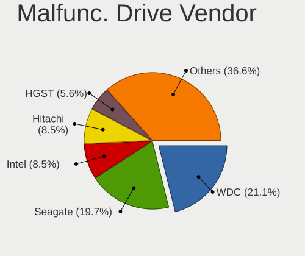

| Vendor              | Computers | Drives | Percent |
|---------------------|-----------|--------|---------|
| WDC                 | 15        | 15     | 21.13%  |
| Seagate             | 14        | 16     | 19.72%  |
| Intel               | 6         | 7      | 8.45%   |
| Hitachi             | 6         | 7      | 8.45%   |
| HGST                | 4         | 4      | 5.63%   |
| Toshiba             | 3         | 4      | 4.23%   |
| SK hynix            | 3         | 3      | 4.23%   |
| Samsung Electronics | 3         | 4      | 4.23%   |
| Transcend           | 2         | 2      | 2.82%   |
| SanDisk             | 2         | 3      | 2.82%   |
| Kingston            | 2         | 2      | 2.82%   |
| Team                | 1         | 2      | 1.41%   |
| SD                  | 1         | 1      | 1.41%   |
| Plextor             | 1         | 1      | 1.41%   |
| Micron Technology   | 1         | 1      | 1.41%   |
| LITEONIT            | 1         | 1      | 1.41%   |
| KLEVV               | 1         | 1      | 1.41%   |
| Fujitsu             | 1         | 1      | 1.41%   |
| Crucial             | 1         | 1      | 1.41%   |
| ASMT                | 1         | 1      | 1.41%   |
| Apacer              | 1         | 1      | 1.41%   |
| A-DATA Technology   | 1         | 1      | 1.41%   |

Malfunc. HDD Vendor
-------------------

Vendors of faulty HDD drives

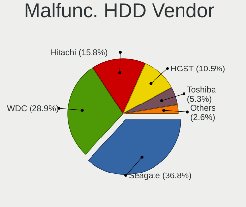

| Vendor              | Computers | Drives | Percent |
|---------------------|-----------|--------|---------|
| Seagate             | 14        | 16     | 36.84%  |
| WDC                 | 11        | 11     | 28.95%  |
| Hitachi             | 6         | 7      | 15.79%  |
| HGST                | 4         | 4      | 10.53%  |
| Toshiba             | 2         | 2      | 5.26%   |
| Samsung Electronics | 1         | 2      | 2.63%   |

Malfunc. Drive Kind
-------------------

Kinds of faulty drives

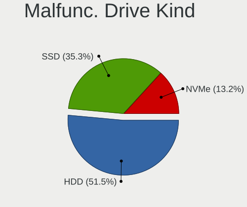

| Kind | Computers | Drives | Percent |
|------|-----------|--------|---------|
| HDD  | 35        | 42     | 51.47%  |
| SSD  | 24        | 25     | 35.29%  |
| NVMe | 9         | 12     | 13.24%  |

Failed Drives
-------------

Failed drive models

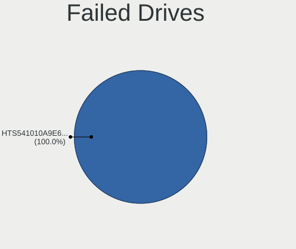

| Model                    | Computers | Drives | Percent |
|--------------------------|-----------|--------|---------|
| HGST HTS541010A9E680 1TB | 1         | 1      | 100%    |

Failed Drive Vendor
-------------------

Failed drive vendors

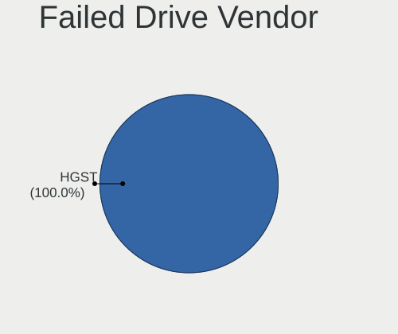

| Vendor | Computers | Drives | Percent |
|--------|-----------|--------|---------|
| HGST   | 1         | 1      | 100%    |

Drive Status
------------

Number of failed and malfunc. drives

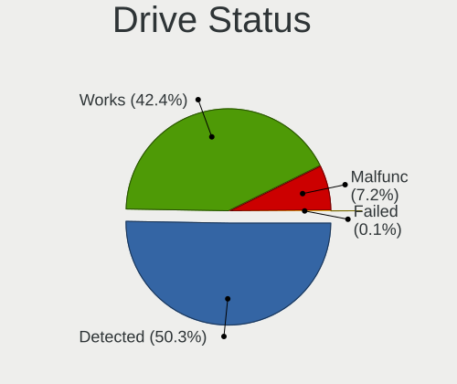

| Status   | Computers | Drives | Percent |
|----------|-----------|--------|---------|
| Detected | 461       | 914    | 50.27%  |
| Works    | 389       | 710    | 42.42%  |
| Malfunc  | 66        | 79     | 7.2%    |
| Failed   | 1         | 1      | 0.11%   |

Storage controller
------------------

Storage Vendor
--------------

Storage controller vendors

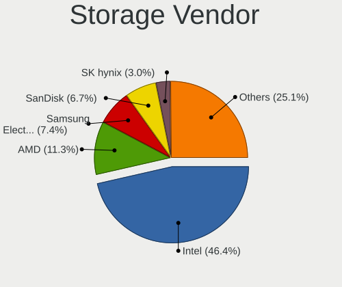

| Vendor                                  | Computers | Percent |
|-----------------------------------------|-----------|---------|
| Intel                                   | 534       | 46.43%  |
| AMD                                     | 130       | 11.3%   |
| Samsung Electronics                     | 85        | 7.39%   |
| SanDisk                                 | 77        | 6.7%    |
| SK hynix                                | 35        | 3.04%   |
| Phison Electronics                      | 35        | 3.04%   |
| Kingston Technology Company             | 33        | 2.87%   |
| Micron/Crucial Technology               | 30        | 2.61%   |
| Micron Technology                       | 25        | 2.17%   |
| ASMedia Technology                      | 21        | 1.83%   |
| ADATA Technology                        | 20        | 1.74%   |
| Nvidia                                  | 13        | 1.13%   |
| KIOXIA                                  | 13        | 1.13%   |
| Silicon Motion                          | 12        | 1.04%   |
| MAXIO Technology (Hangzhou)             | 11        | 0.96%   |
| Lite-On Technology                      | 10        | 0.87%   |
| Toshiba America Info Systems            | 9         | 0.78%   |
| Marvell Technology Group                | 9         | 0.78%   |
| Realtek Semiconductor                   | 6         | 0.52%   |
| JMicron Technology                      | 6         | 0.52%   |
| Broadcom / LSI                          | 5         | 0.43%   |
| Yangtze Memory Technologies             | 4         | 0.35%   |
| INNOGRIT                                | 4         | 0.35%   |
| Solidigm                                | 3         | 0.26%   |
| Solid State Storage Technology          | 3         | 0.26%   |
| Shenzhen Unionmemory Information System | 3         | 0.26%   |
| LSI Logic / Symbios Logic               | 3         | 0.26%   |
| Biwin Storage Technology                | 3         | 0.26%   |
| Shenzhen Longsys Electronics            | 2         | 0.17%   |
| Union Memory (Shenzhen)                 | 1         | 0.09%   |
| Silicon Image                           | 1         | 0.09%   |
| Shenzhen Techwinsemi Technology         | 1         | 0.09%   |
| Seagate Technology                      | 1         | 0.09%   |
| Integrated Technology Express           | 1         | 0.09%   |
| Innodisk                                | 1         | 0.09%   |

Storage Model
-------------

Storage controller models

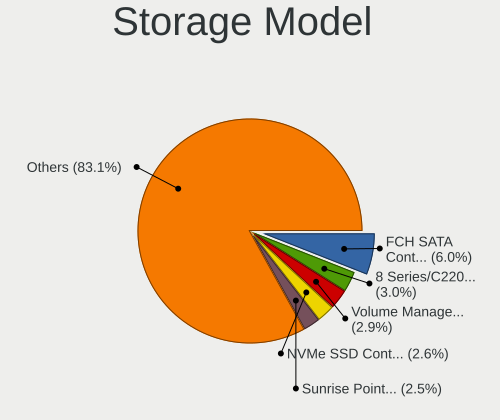

| Model                                                                          | Computers | Percent |
|--------------------------------------------------------------------------------|-----------|---------|
| AMD FCH SATA Controller [AHCI mode]                                            | 78        | 5.98%   |
| Intel 8 Series/C220 Series Chipset Family 6-port SATA Controller 1 [AHCI mode] | 39        | 2.99%   |
| Intel Volume Management Device NVMe RAID Controller                            | 38        | 2.91%   |
| Samsung NVMe SSD Controller SM981/PM981/PM983                                  | 34        | 2.61%   |
| Intel Sunrise Point-LP SATA Controller [AHCI mode]                             | 32        | 2.45%   |
| Intel 7 Series Chipset Family 6-port SATA Controller [AHCI mode]               | 25        | 1.92%   |
| Intel Cannon Lake PCH SATA AHCI Controller                                     | 23        | 1.76%   |
| SanDisk Ultra 3D / WD PC SN530, IX SN530, Blue SN550 NVMe SSD (DRAM-less)      | 21        | 1.61%   |
| Intel Alder Lake-S PCH SATA Controller [AHCI Mode]                             | 20        | 1.53%   |
| Samsung NVMe SSD Controller PM9A1/PM9A3/980PRO                                 | 18        | 1.38%   |
| Intel Q170/Q150/B150/H170/H110/Z170/CM236 Chipset SATA Controller [AHCI Mode]  | 18        | 1.38%   |
| Intel 8 Series SATA Controller 1 [AHCI mode]                                   | 18        | 1.38%   |
| Intel 6 Series/C200 Series Chipset Family 6 port Mobile SATA AHCI Controller   | 18        | 1.38%   |
| Intel 6 Series/C200 Series Chipset Family 6 port Desktop SATA AHCI Controller  | 18        | 1.38%   |
| AMD 500 Series Chipset SATA Controller                                         | 18        | 1.38%   |
| Intel HM170/QM170 Chipset SATA Controller [AHCI Mode]                          | 17        | 1.3%    |
| SK hynix Gold P31/BC711/PC711 NVMe Solid State Drive                           | 16        | 1.23%   |
| Samsung NVMe SSD Controller 980 (DRAM-less)                                    | 16        | 1.23%   |
| ASMedia ASM1061/ASM1062 Serial ATA Controller                                  | 15        | 1.15%   |
| Phison PS5013-E13 PCIe3 NVMe Controller (DRAM-less)                            | 14        | 1.07%   |
| Intel Cannon Lake Mobile PCH SATA AHCI Controller                              | 14        | 1.07%   |
| AMD SB7x0/SB8x0/SB9x0 IDE Controller                                           | 14        | 1.07%   |
| Intel 7 Series/C210 Series Chipset Family 6-port SATA Controller [AHCI mode]   | 13        | 1%      |
| Micron/Crucial P2 [Nick P2] / P3 / P3 Plus NVMe PCIe SSD (DRAM-less)           | 12        | 0.92%   |
| Intel SSD DC P4101/Pro 7600p/760p/E 6100p Series                               | 12        | 0.92%   |
| Intel 82801 Mobile SATA Controller [RAID mode]                                 | 12        | 0.92%   |
| Intel 7 Series/C210 Series Chipset Family 4-port SATA Controller [IDE mode]    | 12        | 0.92%   |
| Intel 7 Series/C210 Series Chipset Family 2-port SATA Controller [IDE mode]    | 12        | 0.92%   |
| Intel 200 Series PCH SATA controller [AHCI mode]                               | 12        | 0.92%   |
| AMD 600 Series Chipset SATA Controller                                         | 12        | 0.92%   |
| SanDisk Extreme Pro / WD Black 2018/SN750/PC SN720 NVMe SSD                    | 11        | 0.84%   |
| Intel Cannon Point-LP SATA Controller [AHCI Mode]                              | 11        | 0.84%   |
| Intel Alder Lake-P SATA AHCI Controller                                        | 11        | 0.84%   |
| Intel 5 Series/3400 Series Chipset 4 port SATA AHCI Controller                 | 11        | 0.84%   |
| AMD SB7x0/SB8x0/SB9x0 SATA Controller [IDE mode]                               | 11        | 0.84%   |
| AMD 400 Series Chipset SATA Controller                                         | 11        | 0.84%   |
| SanDisk WD SN560/SN740/SN770/SN5000 NVMe SSD                                   | 10        | 0.77%   |
| Intel SATA Controller [RAID mode]                                              | 10        | 0.77%   |
| Intel Comet Lake SATA AHCI Controller                                          | 10        | 0.77%   |
| ADATA XPG SX8200 Pro PCIe Gen3x4 M.2 2280 Solid State Drive                    | 10        | 0.77%   |

Storage Kind
------------

Kind of storage controller (IDE, SATA, NVMe, SAS, ...)

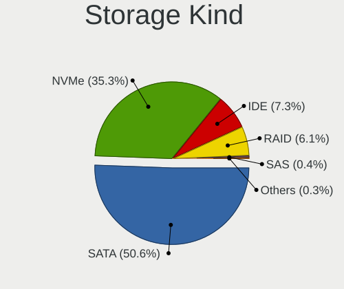

| Kind | Computers | Percent |
|------|-----------|---------|
| SATA | 576       | 50.57%  |
| NVMe | 402       | 35.29%  |
| IDE  | 83        | 7.29%   |
| RAID | 70        | 6.15%   |
| SAS  | 5         | 0.44%   |
| SCSI | 3         | 0.26%   |

Processor
---------

CPU Vendor
----------

Processor vendors

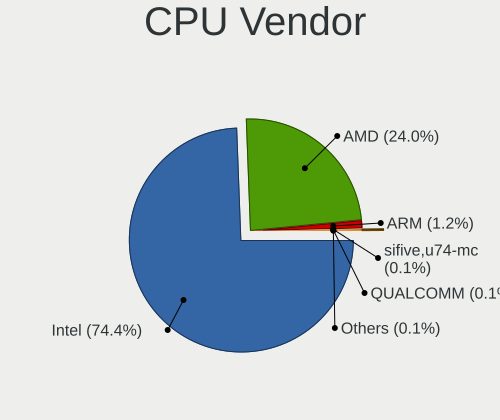

| Vendor        | Computers | Percent |
|---------------|-----------|---------|
| Intel         | 625       | 74.4%   |
| AMD           | 202       | 24.05%  |
| ARM           | 10        | 1.19%   |
| sifive,u74-mc | 1         | 0.12%   |
| QUALCOMM      | 1         | 0.12%   |
| Unknown       | 1         | 0.12%   |

CPU Model
---------

Processor models

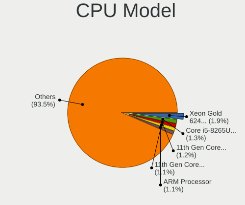

| Model                                   | Computers | Percent |
|-----------------------------------------|-----------|---------|
| Intel Xeon Gold 6248 CPU @ 2.50GHz      | 16        | 1.89%   |
| Intel Core i5-8265U CPU @ 1.60GHz       | 11        | 1.3%    |
| Intel 11th Gen Core i7-1165G7 @ 2.80GHz | 10        | 1.18%   |
| Intel 11th Gen Core i5-1135G7 @ 2.40GHz | 9         | 1.06%   |
| ARM Processor                           | 9         | 1.06%   |
| Intel Core i5-8250U CPU @ 1.60GHz       | 8         | 0.95%   |
| Intel Core i7-9750H CPU @ 2.60GHz       | 7         | 0.83%   |
| Intel Core i7-7700HQ CPU @ 2.80GHz      | 7         | 0.83%   |
| Intel Core i7-6700HQ CPU @ 2.60GHz      | 7         | 0.83%   |
| Intel 12th Gen Core i7-12700            | 7         | 0.83%   |
| Intel Core i7-3770 CPU @ 3.40GHz        | 6         | 0.71%   |
| Intel Core i5-6200U CPU @ 2.30GHz       | 6         | 0.71%   |
| Intel Core i5-5200U CPU @ 2.20GHz       | 6         | 0.71%   |
| AMD Ryzen 5 3600 6-Core Processor       | 6         | 0.71%   |
| Intel Core i7-1065G7 CPU @ 1.30GHz      | 5         | 0.59%   |
| Intel Core i5-7200U CPU @ 2.50GHz       | 5         | 0.59%   |
| Intel Core i5-3210M CPU @ 2.50GHz       | 5         | 0.59%   |
| Intel Core i5-2400 CPU @ 3.10GHz        | 5         | 0.59%   |
| Intel Core i3-4160 CPU @ 3.60GHz        | 5         | 0.59%   |
| Intel 12th Gen Core i5-12500H           | 5         | 0.59%   |
| Intel 12th Gen Core i5-1235U            | 5         | 0.59%   |
| AMD Custom APU 0405                     | 5         | 0.59%   |
| Intel N100                              | 4         | 0.47%   |
| Intel Core i7-8750H CPU @ 2.20GHz       | 4         | 0.47%   |
| Intel Core i7-8550U CPU @ 1.80GHz       | 4         | 0.47%   |
| Intel Core i7-6700 CPU @ 3.40GHz        | 4         | 0.47%   |
| Intel Core i7-4500U CPU @ 1.80GHz       | 4         | 0.47%   |
| Intel Core i7-10510U CPU @ 1.80GHz      | 4         | 0.47%   |
| Intel Core i5-4670T CPU @ 2.30GHz       | 4         | 0.47%   |
| Intel Core i5-4460 CPU @ 3.20GHz        | 4         | 0.47%   |
| Intel Core i5-3470 CPU @ 3.20GHz        | 4         | 0.47%   |
| Intel Core i5-3317U CPU @ 1.70GHz       | 4         | 0.47%   |
| Intel Core i5-3230M CPU @ 2.60GHz       | 4         | 0.47%   |
| Intel Core i5-10210U CPU @ 1.60GHz      | 4         | 0.47%   |
| Intel Core i3-8100 CPU @ 3.60GHz        | 4         | 0.47%   |
| Intel 13th Gen Core i7-1360P            | 4         | 0.47%   |
| Intel 12th Gen Core i7-12700H           | 4         | 0.47%   |
| Intel 12th Gen Core i5-12400            | 4         | 0.47%   |
| Intel 11th Gen Core i5-11400 @ 2.60GHz  | 4         | 0.47%   |
| AMD RYZEN AI MAX+ 395 w/ Radeon 8060S   | 4         | 0.47%   |

CPU Model Family
----------------

Processor model prefix

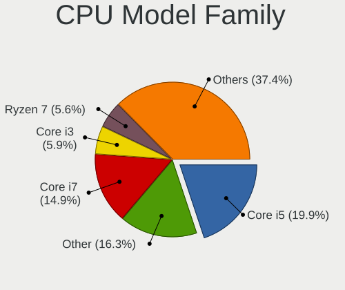

| Model                   | Computers | Percent |
|-------------------------|-----------|---------|
| Intel Core i5           | 168       | 19.88%  |
| Other                   | 138       | 16.33%  |
| Intel Core i7           | 126       | 14.91%  |
| Intel Core i3           | 50        | 5.92%   |
| AMD Ryzen 7             | 47        | 5.56%   |
| AMD Ryzen 5             | 47        | 5.56%   |
| Intel Xeon              | 34        | 4.02%   |
| Intel Celeron           | 32        | 3.79%   |
| Intel Pentium           | 25        | 2.96%   |
| AMD Ryzen 9             | 23        | 2.72%   |
| Intel Xeon Gold         | 17        | 2.01%   |
| Intel Core 2 Duo        | 13        | 1.54%   |
| Intel Atom              | 13        | 1.54%   |
| Intel Core 2 Quad       | 12        | 1.42%   |
| AMD FX                  | 10        | 1.18%   |
| Intel Genuine           | 7         | 0.83%   |
| AMD Ryzen 7 PRO         | 7         | 0.83%   |
| AMD Ryzen 3             | 6         | 0.71%   |
| Intel Pentium Dual-Core | 5         | 0.59%   |
| Intel Core i9           | 5         | 0.59%   |
| Intel Core              | 5         | 0.59%   |
| AMD Ryzen 5 PRO         | 5         | 0.59%   |
| Intel Pentium Gold      | 4         | 0.47%   |
| AMD Athlon 64 X2        | 4         | 0.47%   |
| AMD Ryzen Threadripper  | 3         | 0.36%   |
| AMD Phenom II X4        | 3         | 0.36%   |
| AMD E                   | 3         | 0.36%   |
| AMD A6                  | 3         | 0.36%   |
| Intel Pentium Silver    | 2         | 0.24%   |
| AMD E2                  | 2         | 0.24%   |
| AMD Athlon II X4        | 2         | 0.24%   |
| AMD Athlon II X2        | 2         | 0.24%   |
| AMD Athlon              | 2         | 0.24%   |
| AMD A8                  | 2         | 0.24%   |
| AMD A4                  | 2         | 0.24%   |
| AMD A10                 | 2         | 0.24%   |
| QUALCOMM AArch64        | 1         | 0.12%   |
| Intel Xeon Silver       | 1         | 0.12%   |
| Intel Xeon Platinum     | 1         | 0.12%   |
| Intel Pentium M         | 1         | 0.12%   |

CPU Cores
---------

Number of processor cores

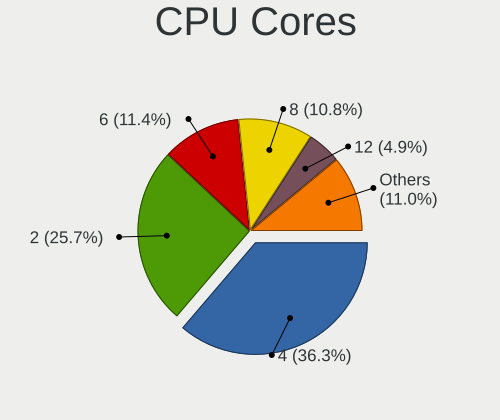

| Number  | Computers | Percent |
|---------|-----------|---------|
| 4       | 306       | 36.26%  |
| 2       | 217       | 25.71%  |
| 6       | 96        | 11.37%  |
| 8       | 91        | 10.78%  |
| 12      | 41        | 4.86%   |
| 16      | 19        | 2.25%   |
| 20      | 17        | 2.01%   |
| 10      | 17        | 2.01%   |
| 1       | 9         | 1.07%   |
| 14      | 8         | 0.95%   |
| 28      | 5         | 0.59%   |
| 24      | 4         | 0.47%   |
| Unknown | 4         | 0.47%   |
| 3       | 3         | 0.36%   |
| 192     | 1         | 0.12%   |
| 64      | 1         | 0.12%   |
| 48      | 1         | 0.12%   |
| 44      | 1         | 0.12%   |
| 32      | 1         | 0.12%   |
| 22      | 1         | 0.12%   |
| 18      | 1         | 0.12%   |

CPU Sockets
-----------

Number of sockets

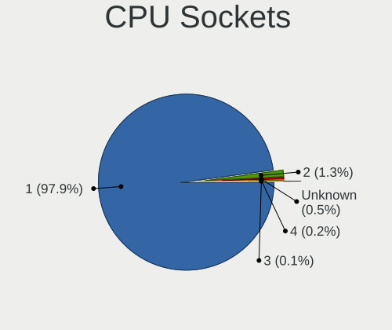

| Number  | Computers | Percent |
|---------|-----------|---------|
| 1       | 822       | 97.86%  |
| 2       | 11        | 1.31%   |
| Unknown | 4         | 0.48%   |
| 4       | 2         | 0.24%   |
| 3       | 1         | 0.12%   |

CPU Threads
-----------

Threads per core (Hyper-Threading)

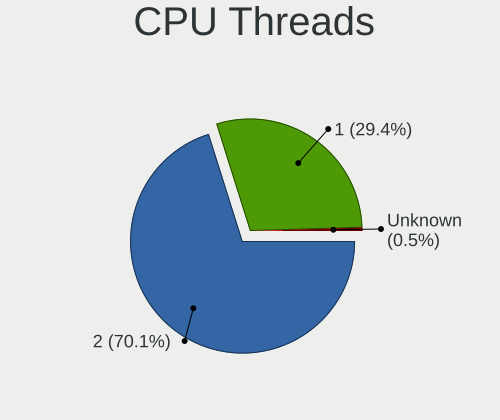

| Number  | Computers | Percent |
|---------|-----------|---------|
| 2       | 592       | 70.14%  |
| 1       | 248       | 29.38%  |
| Unknown | 4         | 0.47%   |

CPU Op-Modes
------------

CPU Operation Modes (32-bit, 64-bit)

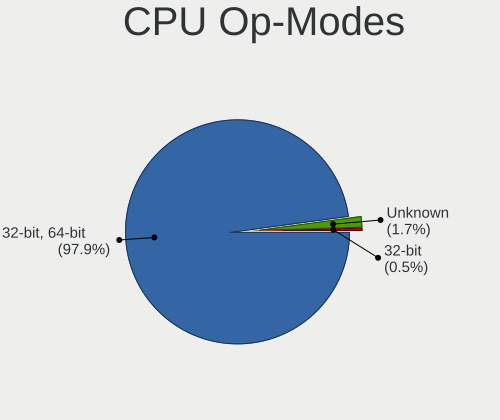

| Op mode        | Computers | Percent |
|----------------|-----------|---------|
| 32-bit, 64-bit | 823       | 97.86%  |
| Unknown        | 14        | 1.66%   |
| 32-bit         | 4         | 0.48%   |

CPU Microcode
-------------

Microcode number

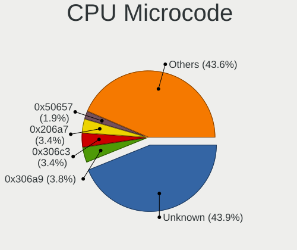

| Number     | Computers | Percent |
|------------|-----------|---------|
| Unknown    | 385       | 43.9%   |
| 0x306a9    | 33        | 3.76%   |
| 0x306c3    | 30        | 3.42%   |
| 0x206a7    | 30        | 3.42%   |
| 0x50657    | 17        | 1.94%   |
| 0x506e3    | 16        | 1.82%   |
| 0x806c1    | 15        | 1.71%   |
| 0x906ea    | 14        | 1.6%    |
| 0x0a50000c | 13        | 1.48%   |
| 0x40651    | 12        | 1.37%   |
| 0x806ea    | 11        | 1.25%   |
| 0x1067a    | 11        | 1.25%   |
| 0x906e9    | 10        | 1.14%   |
| 0x806e9    | 10        | 1.14%   |
| 0x806ec    | 9         | 1.03%   |
| 0x806eb    | 9         | 1.03%   |
| 0x306d4    | 9         | 1.03%   |
| 0x08701021 | 9         | 1.03%   |
| 0x406e3    | 8         | 0.91%   |
| 0x20655    | 8         | 0.91%   |
| 0x08600106 | 8         | 0.91%   |
| 0x906eb    | 7         | 0.8%    |
| 0x906a4    | 6         | 0.68%   |
| 0x906a3    | 6         | 0.68%   |
| 0x706e5    | 6         | 0.68%   |
| 0x10676    | 6         | 0.68%   |
| 0x706a1    | 5         | 0.57%   |
| 0x0a601203 | 5         | 0.57%   |
| 0x08608103 | 5         | 0.57%   |
| 0x06000852 | 5         | 0.57%   |
| 0x906ed    | 4         | 0.46%   |
| 0x90672    | 4         | 0.46%   |
| 0x106c2    | 4         | 0.46%   |
| 0x0a50000d | 4         | 0.46%   |
| 0xa0655    | 3         | 0.34%   |
| 0xa0653    | 3         | 0.34%   |
| 0x90661    | 3         | 0.34%   |
| 0x706a8    | 3         | 0.34%   |
| 0x6fd      | 3         | 0.34%   |
| 0x50654    | 3         | 0.34%   |

CPU Microarch
-------------

Microarchitecture

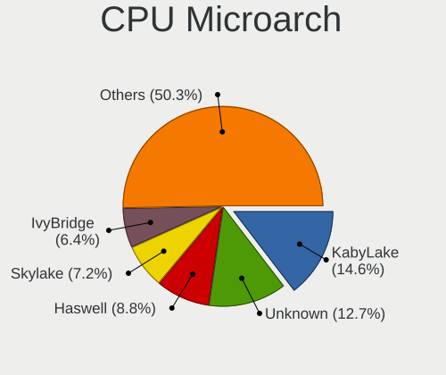

| Name              | Computers | Percent |
|-------------------|-----------|---------|
| KabyLake          | 123       | 14.59%  |
| Unknown           | 107       | 12.69%  |
| Haswell           | 74        | 8.78%   |
| Skylake           | 61        | 7.24%   |
| IvyBridge         | 54        | 6.41%   |
| SandyBridge       | 46        | 5.46%   |
| Alderlake Hybrid  | 46        | 5.46%   |
| Zen 3             | 39        | 4.63%   |
| Zen 2             | 38        | 4.51%   |
| Penryn            | 30        | 3.56%   |
| TigerLake         | 26        | 3.08%   |
| Broadwell         | 21        | 2.49%   |
| Westmere          | 19        | 2.25%   |
| Silvermont        | 17        | 2.02%   |
| CometLake         | 17        | 2.02%   |
| Icelake           | 16        | 1.9%    |
| Zen+              | 12        | 1.42%   |
| Zen               | 12        | 1.42%   |
| Piledriver        | 12        | 1.42%   |
| K10               | 10        | 1.19%   |
| Goldmont plus     | 8         | 0.95%   |
| Tremont           | 7         | 0.83%   |
| Core              | 7         | 0.83%   |
| Nehalem           | 6         | 0.71%   |
| Excavator         | 6         | 0.71%   |
| K8 Hammer         | 5         | 0.59%   |
| Goldmont          | 5         | 0.59%   |
| Bonnell           | 5         | 0.59%   |
| Lunarlake Hybrid  | 3         | 0.36%   |
| Jaguar            | 2         | 0.24%   |
| Gracemont         | 2         | 0.24%   |
| Bobcat            | 2         | 0.24%   |
| Steamroller       | 1         | 0.12%   |
| P6                | 1         | 0.12%   |
| Meteorlake Hybrid | 1         | 0.12%   |
| K10 Llano         | 1         | 0.12%   |
| Bulldozer         | 1         | 0.12%   |

Graphics
--------

GPU Vendor
----------

Vendors of graphics cards

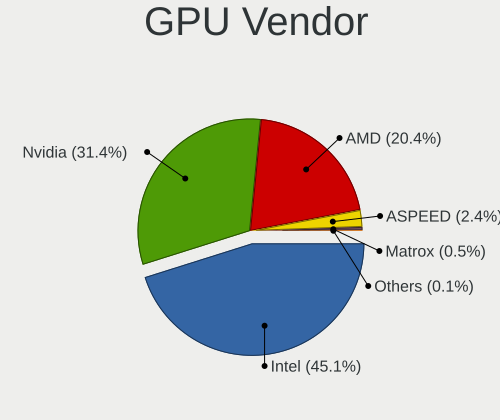

| Vendor                     | Computers | Percent |
|----------------------------|-----------|---------|
| Intel                      | 464       | 45.14%  |
| Nvidia                     | 323       | 31.42%  |
| AMD                        | 210       | 20.43%  |
| ASPEED Technology          | 25        | 2.43%   |
| Matrox Electronics Systems | 5         | 0.49%   |
| Red Hat                    | 1         | 0.1%    |

GPU Model
---------

Graphics card models

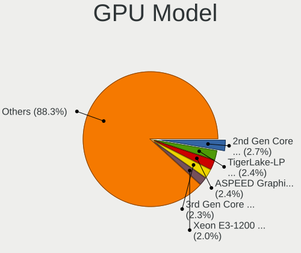

| Model                                                                                    | Computers | Percent |
|------------------------------------------------------------------------------------------|-----------|---------|
| Intel 2nd Generation Core Processor Family Integrated Graphics Controller                | 28        | 2.67%   |
| Intel TigerLake-LP GT2 [Iris Xe Graphics]                                                | 25        | 2.39%   |
| ASPEED Technology ASPEED Graphics Family                                                 | 25        | 2.39%   |
| Intel 3rd Gen Core processor Graphics Controller                                         | 24        | 2.29%   |
| Intel Xeon E3-1200 v3/4th Gen Core Processor Integrated Graphics Controller              | 21        | 2%      |
| Intel Haswell-ULT Integrated Graphics Controller                                         | 21        | 2%      |
| AMD Cezanne [Radeon Vega Series / Radeon Vega Mobile Series]                             | 20        | 1.91%   |
| AMD Renoir [Radeon Vega Series / Radeon Vega Mobile Series]                              | 19        | 1.81%   |
| Intel WhiskeyLake-U GT2 [UHD Graphics 620]                                               | 17        | 1.62%   |
| Intel CoffeeLake-S GT2 [UHD Graphics 630]                                                | 17        | 1.62%   |
| Intel Kaby Lake-R GT2 [UHD Graphics 620]                                                 | 16        | 1.53%   |
| Nvidia TU104GL [PG189 SKU600]                                                            | 15        | 1.43%   |
| Intel CoffeeLake-H GT2 [UHD Graphics 630]                                                | 14        | 1.34%   |
| Intel Alder Lake-P GT2 [Iris Xe Graphics]                                                | 13        | 1.24%   |
| Nvidia GP106 [GeForce GTX 1060 6GB]                                                      | 12        | 1.15%   |
| Intel Core Processor Integrated Graphics Controller                                      | 11        | 1.05%   |
| AMD Phoenix1                                                                             | 11        | 1.05%   |
| Nvidia GP108 [GeForce GT 1030]                                                           | 10        | 0.95%   |
| Intel Xeon E3-1200 v2/3rd Gen Core processor Graphics Controller                         | 10        | 0.95%   |
| Intel Skylake-S GT2 [HD Graphics 530]                                                    | 10        | 0.95%   |
| Intel Kaby Lake-U GT2 [HD Graphics 620]                                                  | 10        | 0.95%   |
| Intel Kaby Lake-H GT2 [HD Graphics 630]                                                  | 10        | 0.95%   |
| Intel Broadwell-U GT2 [HD Graphics 5500]                                                 | 10        | 0.95%   |
| AMD Raphael                                                                              | 10        | 0.95%   |
| Intel Atom Processor Z36xxx/Z37xxx Series Graphics & Display                             | 9         | 0.86%   |
| Intel Alder Lake-S GT1 [UHD Graphics 770]                                                | 9         | 0.86%   |
| Nvidia TU116M [GeForce GTX 1660 Ti Mobile]                                               | 8         | 0.76%   |
| Nvidia GK208B [GeForce GT 710]                                                           | 8         | 0.76%   |
| Intel Skylake-H GT2 [HD Graphics 530]                                                    | 8         | 0.76%   |
| Intel Raptor Lake-P [Iris Xe Graphics]                                                   | 8         | 0.76%   |
| Intel CometLake-U GT2 [UHD Graphics]                                                     | 8         | 0.76%   |
| Intel Atom/Celeron/Pentium Processor x5-E8000/J3xxx/N3xxx Integrated Graphics Controller | 8         | 0.76%   |
| Intel Alder Lake-N [UHD Graphics]                                                        | 8         | 0.76%   |
| Intel 4th Generation Core Processor Family Integrated Graphics Controller                | 8         | 0.76%   |
| Nvidia GP107M [GeForce GTX 1050 Ti Mobile]                                               | 7         | 0.67%   |
| Nvidia GP107M [GeForce GTX 1050 Mobile]                                                  | 7         | 0.67%   |
| Intel Skylake-U GT2 [HD Graphics 520]                                                    | 7         | 0.67%   |
| Intel GeminiLake [UHD Graphics 600]                                                      | 7         | 0.67%   |
| Intel CometLake-S GT2 [UHD Graphics 630]                                                 | 7         | 0.67%   |
| Intel Alder Lake-UP3 GT2 [Iris Xe Graphics]                                              | 7         | 0.67%   |

GPU Combo
---------

Combinations of graphics cards

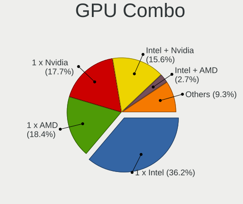

| Name            | Computers | Percent |
|-----------------|-----------|---------|
| 1 x Intel       | 306       | 36.17%  |
| 1 x AMD         | 156       | 18.44%  |
| 1 x Nvidia      | 150       | 17.73%  |
| Intel + Nvidia  | 132       | 15.6%   |
| Intel + AMD     | 23        | 2.72%   |
| AMD + Nvidia    | 23        | 2.72%   |
| Nvidia + ASPEED | 17        | 2.01%   |
| Other           | 15        | 1.77%   |
| 2 x AMD         | 7         | 0.83%   |
| 1 x ASPEED      | 7         | 0.83%   |
| 1 x Matrox      | 4         | 0.47%   |
| 2 x Intel       | 2         | 0.24%   |
| 2 x Nvidia      | 1         | 0.12%   |
| 1 x Red Hat     | 1         | 0.12%   |
| Nvidia + Matrox | 1         | 0.12%   |
| AMD + ASPEED    | 1         | 0.12%   |

GPU Driver
----------

Free vs proprietary

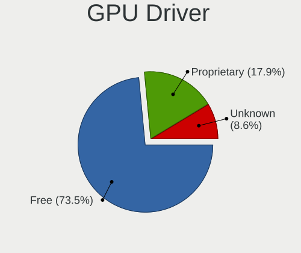

| Driver      | Computers | Percent |
|-------------|-----------|---------|
| Free        | 629       | 73.48%  |
| Proprietary | 153       | 17.87%  |
| Unknown     | 74        | 8.64%   |

GPU Memory
----------

Total video memory

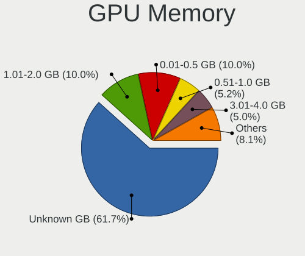

| Size in GB | Computers | Percent |
|------------|-----------|---------|
| Unknown    | 531       | 61.67%  |
| 1.01-2.0   | 86        | 9.99%   |
| 0.01-0.5   | 86        | 9.99%   |
| 0.51-1.0   | 45        | 5.23%   |
| 3.01-4.0   | 43        | 4.99%   |
| 5.01-6.0   | 27        | 3.14%   |
| 8.01-16.0  | 18        | 2.09%   |
| 7.01-8.0   | 17        | 1.97%   |
| 16.01-24.0 | 4         | 0.46%   |
| 2.01-3.0   | 3         | 0.35%   |
| 24.01-32.0 | 1         | 0.12%   |

Monitor
-------

Monitor Vendor
--------------

Monitor vendors

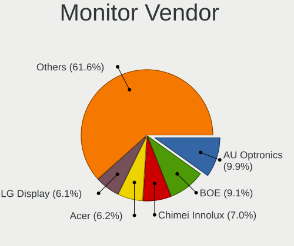

| Vendor                  | Computers | Percent |
|-------------------------|-----------|---------|
| AU Optronics            | 89        | 9.9%    |
| BOE                     | 82        | 9.12%   |
| Chimei Innolux          | 63        | 7.01%   |
| Acer                    | 56        | 6.23%   |
| LG Display              | 55        | 6.12%   |
| Ancor Communications    | 55        | 6.12%   |
| BenQ                    | 53        | 5.9%    |
| Dell                    | 42        | 4.67%   |
| ViewSonic               | 40        | 4.45%   |
| Samsung Electronics     | 38        | 4.23%   |
| Philips                 | 34        | 3.78%   |
| Goldstar                | 31        | 3.45%   |
| ASUSTek Computer        | 27        | 3%      |
| AOC                     | 26        | 2.89%   |
| NEX                     | 12        | 1.33%   |
| Eizo                    | 11        | 1.22%   |
| Hewlett-Packard         | 10        | 1.11%   |
| Apple                   | 10        | 1.11%   |
| Sharp                   | 9         | 1%      |
| PANDA                   | 9         | 1%      |
| Lenovo                  | 9         | 1%      |
| Gigabyte Technology     | 9         | 1%      |
| Envision Peripherals    | 9         | 1%      |
| MSI                     | 8         | 0.89%   |
| Valve                   | 7         | 0.78%   |
| InfoVision              | 6         | 0.67%   |
| Unknown                 | 5         | 0.56%   |
| TMX                     | 5         | 0.56%   |
| Sony                    | 5         | 0.56%   |
| LG Electronics          | 4         | 0.44%   |
| Vizio                   | 3         | 0.33%   |
| TMA                     | 3         | 0.33%   |
| MStar                   | 3         | 0.33%   |
| IPS                     | 3         | 0.33%   |
| Compal                  | 3         | 0.33%   |
| Chi Mei Optoelectronics | 3         | 0.33%   |
| Unknown                 | 3         | 0.33%   |
| WST                     | 2         | 0.22%   |
| Wacom                   | 2         | 0.22%   |
| Unknown (XXX)           | 2         | 0.22%   |

Monitor Model
-------------

Monitor models

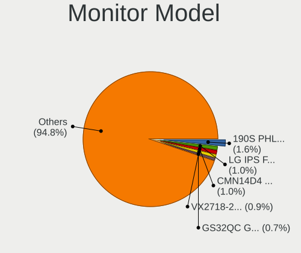

| Model                                                                 | Computers | Percent |
|-----------------------------------------------------------------------|-----------|---------|
| Philips 190S PHL086B 1280x1024 376x301mm 19.0-inch                    | 15        | 1.64%   |
| Goldstar LG IPS FULLHD GSM5AB8 1920x1080 480x270mm 21.7-inch          | 9         | 0.99%   |
| Chimei Innolux LCD Monitor CMN14D4 1920x1080 309x173mm 13.9-inch      | 9         | 0.99%   |
| ViewSonic VX2718-2KPC VSCB73A 2560x1440 598x336mm 27.0-inch           | 8         | 0.88%   |
| Gigabyte Technology GS32QC GBT3212 2560x1440 709x403mm 32.1-inch      | 6         | 0.66%   |
| PANDA LCD Monitor NCP004D 1920x1080 344x194mm 15.5-inch               | 5         | 0.55%   |
| Goldstar LG ULTRAWIDE GSM59F1 2560x1080 670x280mm 28.6-inch           | 5         | 0.55%   |
| BenQ EW2480 BNQ7951 1920x1080 527x296mm 23.8-inch                     | 5         | 0.55%   |
| ASUSTek Computer VA24E AUS24D1 1920x1080 527x296mm 23.8-inch          | 5         | 0.55%   |
| Valve ANX7530 U VLV3001 800x1280 100x150mm 7.1-inch                   | 4         | 0.44%   |
| Samsung Electronics SyncMaster SAM03C2 1680x1050 459x296mm 21.5-inch  | 4         | 0.44%   |
| Philips PHL 243V5 PHLC0D1 1920x1080 521x293mm 23.5-inch               | 4         | 0.44%   |
| LG Display LCD Monitor LGD046F 1920x1080 344x194mm 15.5-inch          | 4         | 0.44%   |
| LG Display LCD Monitor LGD02DC 1366x768 344x194mm 15.5-inch           | 4         | 0.44%   |
| Envision Peripherals LED 2271wh ENV2271 1920x1080 476x268mm 21.5-inch | 4         | 0.44%   |
| AU Optronics LCD Monitor AUO683D 1920x1080 309x174mm 14.0-inch        | 4         | 0.44%   |
| AU Optronics LCD Monitor AUO183C 1366x768 309x173mm 13.9-inch         | 4         | 0.44%   |
| Ancor Communications VX239 ACI23E1 1920x1080 510x290mm 23.1-inch      | 4         | 0.44%   |
| Ancor Communications ASUS VS229 ACI22C2 1920x1080 477x268mm 21.5-inch | 4         | 0.44%   |
| Ancor Communications ASUS VS228 ACI22FD 1920x1080 476x268mm 21.5-inch | 4         | 0.44%   |
| Ancor Communications ASUS VH228 ACI22FC 1920x1080 477x268mm 21.5-inch | 4         | 0.44%   |
| Ancor Communications ASUS PA238 ACI23B1 1920x1080 509x286mm 23.0-inch | 4         | 0.44%   |
| Acer KA220HQ ACR0467 1920x1080 477x268mm 21.5-inch                    | 4         | 0.44%   |
| Valve ANX7530 U VLV3003 800x1280 100x160mm 7.4-inch                   | 3         | 0.33%   |
| TMA TL134ADXP03 TMA0803 2560x1600 288x180mm 13.4-inch                 | 3         | 0.33%   |
| Samsung Electronics LCD Monitor SDC4171 2880x1800 302x189mm 14.0-inch | 3         | 0.33%   |
| MStar Demo MST0030 1920x1080 708x398mm 32.0-inch                      | 3         | 0.33%   |
| Envision Peripherals LED H963wLs ENV1963 1366x768 410x230mm 18.5-inch | 3         | 0.33%   |
| Dell U2415 DELA0B9 1920x1200 518x324mm 24.1-inch                      | 3         | 0.33%   |
| Chimei Innolux LCD Monitor CMN1735 1920x1080 381x214mm 17.2-inch      | 3         | 0.33%   |
| Chimei Innolux LCD Monitor CMN15CA 1366x768 344x193mm 15.5-inch       | 3         | 0.33%   |
| Chimei Innolux LCD Monitor CMN15C4 1920x1080 344x193mm 15.5-inch      | 3         | 0.33%   |
| Chimei Innolux LCD Monitor CMN1521 1920x1080 344x193mm 15.5-inch      | 3         | 0.33%   |
| Chimei Innolux LCD Monitor CMN14D6 1366x768 309x173mm 13.9-inch       | 3         | 0.33%   |
| BOE NE135A1M-NY1 BOE0CB4 2880x1920 285x190mm 13.5-inch                | 3         | 0.33%   |
| BOE LCD Monitor BOE0BC7 2560x1600 302x188mm 14.0-inch                 | 3         | 0.33%   |
| BOE LCD Monitor BOE0A56 1920x1080 344x194mm 15.5-inch                 | 3         | 0.33%   |
| BenQ GW2470 BNQ78E4 1920x1080 527x296mm 23.8-inch                     | 3         | 0.33%   |
| BenQ GW2470 BNQ78D9 1920x1080 527x296mm 23.8-inch                     | 3         | 0.33%   |
| BenQ GW2450H BNQ78C1 1920x1080 531x298mm 24.0-inch                    | 3         | 0.33%   |

Monitor Resolution
------------------

Monitor screen resolution

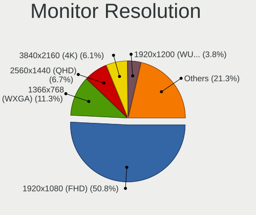

| Resolution         | Computers | Percent |
|--------------------|-----------|---------|
| 1920x1080 (FHD)    | 426       | 50.77%  |
| 1366x768 (WXGA)    | 95        | 11.32%  |
| 2560x1440 (QHD)    | 56        | 6.67%   |
| 3840x2160 (4K)     | 51        | 6.08%   |
| 1920x1200 (WUXGA)  | 32        | 3.81%   |
| 1280x1024 (SXGA)   | 26        | 3.1%    |
| 2560x1600          | 22        | 2.62%   |
| 1600x900 (HD+)     | 20        | 2.38%   |
| 1680x1050 (WSXGA+) | 15        | 1.79%   |
| 2560x1080          | 13        | 1.55%   |
| 1440x900 (WXGA+)   | 12        | 1.43%   |
| 800x1280           | 7         | 0.83%   |
| 2880x1800          | 7         | 0.83%   |
| 3440x1440          | 5         | 0.6%    |
| Unknown            | 5         | 0.6%    |
| 3840x1080          | 4         | 0.48%   |
| 2880x1920          | 4         | 0.48%   |
| 1280x800 (WXGA)    | 4         | 0.48%   |
| 2256x1504          | 3         | 0.36%   |
| 2160x1440          | 3         | 0.36%   |
| 1024x600           | 3         | 0.36%   |
| 3840x2400          | 2         | 0.24%   |
| 3200x2000          | 2         | 0.24%   |
| 3200x1800 (QHD+)   | 2         | 0.24%   |
| 3072x1920          | 2         | 0.24%   |
| 1920x540           | 2         | 0.24%   |
| 1920x1280          | 2         | 0.24%   |
| 1024x768 (XGA)     | 2         | 0.24%   |
| 3240x2160          | 1         | 0.12%   |
| 2560x1397          | 1         | 0.12%   |
| 2288x1287          | 1         | 0.12%   |
| 2240x1400          | 1         | 0.12%   |
| 2200x1650          | 1         | 0.12%   |
| 2160x1350          | 1         | 0.12%   |
| 2048x1152          | 1         | 0.12%   |
| 1680x945           | 1         | 0.12%   |
| 1600x2560          | 1         | 0.12%   |
| 1600x1200          | 1         | 0.12%   |
| 1360x768           | 1         | 0.12%   |
| 1280x720 (HD)      | 1         | 0.12%   |

Monitor Diagonal
----------------

Diagonal size in inches

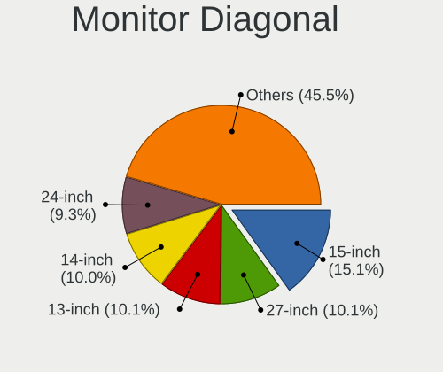

| Inches  | Computers | Percent |
|---------|-----------|---------|
| 15      | 135       | 15.12%  |
| 27      | 90        | 10.08%  |
| 13      | 90        | 10.08%  |
| 14      | 89        | 9.97%   |
| 24      | 83        | 9.29%   |
| 21      | 81        | 9.07%   |
| 23      | 66        | 7.39%   |
| Unknown | 43        | 4.82%   |
| 19      | 41        | 4.59%   |
| 31      | 19        | 2.13%   |
| 18      | 16        | 1.79%   |
| 17      | 16        | 1.79%   |
| 12      | 13        | 1.46%   |
| 34      | 12        | 1.34%   |
| 22      | 11        | 1.23%   |
| 16      | 11        | 1.23%   |
| 11      | 11        | 1.23%   |
| 32      | 9         | 1.01%   |
| 7       | 8         | 0.9%    |
| 43      | 5         | 0.56%   |
| 20      | 5         | 0.56%   |
| 10      | 5         | 0.56%   |
| 49      | 4         | 0.45%   |
| 40      | 4         | 0.45%   |
| 63      | 3         | 0.34%   |
| 52      | 3         | 0.34%   |
| 42      | 3         | 0.34%   |
| 26      | 3         | 0.34%   |
| 65      | 2         | 0.22%   |
| 48      | 2         | 0.22%   |
| 84      | 1         | 0.11%   |
| 75      | 1         | 0.11%   |
| 69      | 1         | 0.11%   |
| 64      | 1         | 0.11%   |
| 55      | 1         | 0.11%   |
| 54      | 1         | 0.11%   |
| 41      | 1         | 0.11%   |
| 35      | 1         | 0.11%   |
| 29      | 1         | 0.11%   |
| 25      | 1         | 0.11%   |

Monitor Width
-------------

Physical width

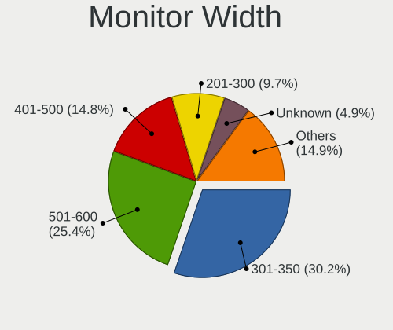

| Width in mm | Computers | Percent |
|-------------|-----------|---------|
| 301-350     | 267       | 30.24%  |
| 501-600     | 224       | 25.37%  |
| 401-500     | 131       | 14.84%  |
| 201-300     | 86        | 9.74%   |
| Unknown     | 43        | 4.87%   |
| 351-400     | 39        | 4.42%   |
| 601-700     | 30        | 3.4%    |
| 701-800     | 21        | 2.38%   |
| 1001-1500   | 17        | 1.93%   |
| 901-1000    | 9         | 1.02%   |
| 1-100       | 7         | 0.79%   |
| 801-900     | 5         | 0.57%   |
| 1501-2000   | 3         | 0.34%   |
| 101-200     | 1         | 0.11%   |

Aspect Ratio
------------

Proportional relationship between the width and the height

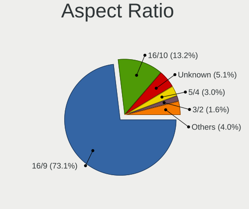

| Ratio   | Computers | Percent |
|---------|-----------|---------|
| 16/9    | 587       | 73.1%   |
| 16/10   | 106       | 13.2%   |
| Unknown | 41        | 5.11%   |
| 5/4     | 24        | 2.99%   |
| 3/2     | 13        | 1.62%   |
| 21/9    | 13        | 1.62%   |
| 32/9    | 6         | 0.75%   |
| 4/3     | 5         | 0.62%   |
| 0.67    | 4         | 0.5%    |
| 0.62    | 3         | 0.37%   |
| 6/5     | 1         | 0.12%   |

Monitor Area
------------

Area in inch²

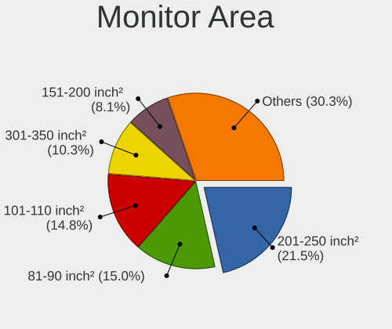

| Area in inch² | Computers | Percent |
|----------------|-----------|---------|
| 201-250        | 191       | 21.48%  |
| 81-90          | 133       | 14.96%  |
| 101-110        | 132       | 14.85%  |
| 301-350        | 92        | 10.35%  |
| 151-200        | 72        | 8.1%    |
| 71-80          | 47        | 5.29%   |
| Unknown        | 43        | 4.84%   |
| 351-500        | 42        | 4.72%   |
| 251-300        | 24        | 2.7%    |
| 501-1000       | 18        | 2.02%   |
| 141-150        | 16        | 1.8%    |
| More than 1000 | 15        | 1.69%   |
| 121-130        | 15        | 1.69%   |
| 51-60          | 13        | 1.46%   |
| 111-120        | 13        | 1.46%   |
| 61-70          | 10        | 1.12%   |
| 1-40           | 8         | 0.9%    |
| 41-50          | 3         | 0.34%   |
| 91-100         | 2         | 0.22%   |

Pixel Density
-------------

Pixels per inch

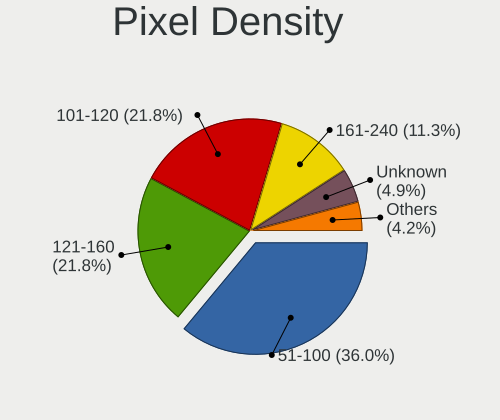

| Density       | Computers | Percent |
|---------------|-----------|---------|
| 51-100        | 316       | 36.03%  |
| 121-160       | 191       | 21.78%  |
| 101-120       | 191       | 21.78%  |
| 161-240       | 99        | 11.29%  |
| Unknown       | 43        | 4.9%    |
| More than 240 | 24        | 2.74%   |
| 1-50          | 13        | 1.48%   |

Multiple Monitors
-----------------

Total monitors connected

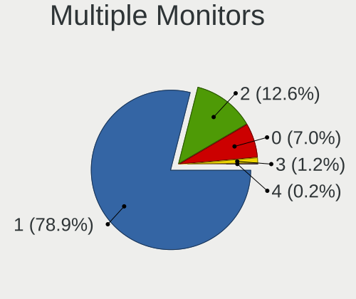

| Total | Computers | Percent |
|-------|-----------|---------|
| 1     | 675       | 78.95%  |
| 2     | 108       | 12.63%  |
| 0     | 60        | 7.02%   |
| 3     | 10        | 1.17%   |
| 4     | 2         | 0.23%   |

Network
-------

Net Controller Vendor
---------------------

Controller vendors

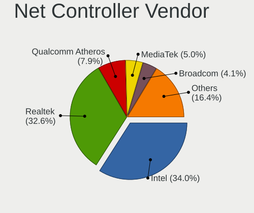

| Vendor                                 | Computers | Percent |
|----------------------------------------|-----------|---------|
| Intel                                  | 439       | 34.03%  |
| Realtek Semiconductor                  | 421       | 32.64%  |
| Qualcomm Atheros                       | 102       | 7.91%   |
| MediaTek                               | 64        | 4.96%   |
| Broadcom                               | 53        | 4.11%   |
| American Megatrends                    | 17        | 1.32%   |
| Ralink Technology                      | 16        | 1.24%   |
| Aquantia                               | 15        | 1.16%   |
| Broadcom Limited                       | 14        | 1.09%   |
| TP-Link                                | 12        | 0.93%   |
| Edimax Technology                      | 12        | 0.93%   |
| ASIX Electronics                       | 12        | 0.93%   |
| Marvell Technology Group               | 11        | 0.85%   |
| ASUSTek Computer                       | 11        | 0.85%   |
| Ralink                                 | 9         | 0.7%    |
| Nvidia                                 | 7         | 0.54%   |
| Qualcomm                               | 6         | 0.47%   |
| D-Link                                 | 6         | 0.47%   |
| Samsung Electronics                    | 5         | 0.39%   |
| Sony Ericsson Mobile Communications AB | 4         | 0.31%   |
| OPPO Electronics                       | 4         | 0.31%   |
| Microsoft                              | 4         | 0.31%   |
| HTC (High Tech Computer)               | 4         | 0.31%   |
| Google                                 | 3         | 0.23%   |
| Winbond Electronics                    | 2         | 0.16%   |
| Shenzhen Goodix Technology             | 2         | 0.16%   |
| Qualcomm Technologies                  | 2         | 0.16%   |
| Qualcomm Atheros Communications        | 2         | 0.16%   |
| Motorcomm Microelectronics.            | 2         | 0.16%   |
| Mercucys                               | 2         | 0.16%   |
| Mellanox Technologies                  | 2         | 0.16%   |
| IBM                                    | 2         | 0.16%   |
| ZyXEL Communications                   | 1         | 0.08%   |
| Xiaomi                                 | 1         | 0.08%   |
| U-Blox                                 | 1         | 0.08%   |
| SparkFun                               | 1         | 0.08%   |
| Senao                                  | 1         | 0.08%   |
| Prolific Technology                    | 1         | 0.08%   |
| Motorola PCS                           | 1         | 0.08%   |
| Microchip Technology                   | 1         | 0.08%   |

Net Controller Model
--------------------

Controller models

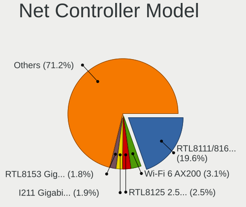

| Model                                                                  | Computers | Percent |
|------------------------------------------------------------------------|-----------|---------|
| Realtek RTL8111/8168/8211/8411 PCI Express Gigabit Ethernet Controller | 293       | 19.61%  |
| Intel Wi-Fi 6 AX200                                                    | 46        | 3.08%   |
| Realtek RTL8125 2.5GbE Controller                                      | 37        | 2.48%   |
| Intel I211 Gigabit Network Connection                                  | 28        | 1.87%   |
| Realtek RTL8153 Gigabit Ethernet Adapter                               | 27        | 1.81%   |
| Intel Ethernet Controller I225-V                                       | 26        | 1.74%   |
| MediaTek MT7922 802.11ax PCI Express Wireless Network Adapter          | 23        | 1.54%   |
| Intel Wi-Fi 6 AX201                                                    | 23        | 1.54%   |
| Intel Wireless 8265 / 8275                                             | 22        | 1.47%   |
| Realtek RTL810xE PCI Express Fast Ethernet controller                  | 21        | 1.41%   |
| Intel Wi-Fi 6E(802.11ax) AX210/AX1675* 2x2 [Typhoon Peak]              | 21        | 1.41%   |
| Intel I210 Gigabit Network Connection                                  | 19        | 1.27%   |
| Intel Alder Lake-P PCH CNVi WiFi                                       | 18        | 1.2%    |
| Intel Ethernet Connection (3) I219-LM                                  | 17        | 1.14%   |
| American Megatrends Virtual Ethernet.                                  | 17        | 1.14%   |
| MediaTek MT7921 802.11ax PCIe Wireless Network Adapter [Filogic 330]   | 16        | 1.07%   |
| Intel Dual Band Wireless-AC 3168NGW [Stone Peak]                       | 16        | 1.07%   |
| Intel 82579LM Gigabit Network Connection (Lewisville)                  | 16        | 1.07%   |
| Intel Cannon Lake PCH CNVi WiFi                                        | 14        | 0.94%   |
| Qualcomm Atheros QCA9377 802.11ac Wireless Network Adapter             | 12        | 0.8%    |
| Intel Wireless 7265                                                    | 12        | 0.8%    |
| Intel Wireless 7260                                                    | 12        | 0.8%    |
| Qualcomm Atheros QCA9565 / AR9565 Wireless Network Adapter             | 11        | 0.74%   |
| Intel Wireless 3165                                                    | 11        | 0.74%   |
| Intel Ethernet Connection (2) I219-V                                   | 11        | 0.74%   |
| Realtek RTL8152 Fast Ethernet Adapter                                  | 10        | 0.67%   |
| Qualcomm Atheros AR9285 Wireless Network Adapter (PCI-Express)         | 10        | 0.67%   |
| Intel Raptor Lake PCH CNVi WiFi                                        | 10        | 0.67%   |
| Intel Ice Lake-LP PCH CNVi WiFi                                        | 10        | 0.67%   |
| Intel Ethernet Connection (7) I219-V                                   | 10        | 0.67%   |
| Intel Cannon Point-LP CNVi [Wireless-AC]                               | 10        | 0.67%   |
| Realtek RTL8852BE PCIe 802.11ax Wireless Network Controller            | 9         | 0.6%    |
| Ralink MT7601U Wireless Adapter                                        | 9         | 0.6%    |
| Qualcomm Atheros AR9485 Wireless Network Adapter                       | 9         | 0.6%    |
| MediaTek MT7921K (RZ608) Wi-Fi 6E 80MHz                                | 9         | 0.6%    |
| Intel Wi-Fi 5(802.11ac) Wireless-AC 9x6x [Thunder Peak]                | 9         | 0.6%    |
| Intel Ethernet Connection (7) I219-LM                                  | 9         | 0.6%    |
| Realtek RTL8822CE 802.11ac PCIe Wireless Network Adapter               | 8         | 0.54%   |
| Realtek RTL8821CE 802.11ac PCIe Wireless Network Adapter               | 8         | 0.54%   |
| Realtek 802.11ac NIC                                                   | 8         | 0.54%   |

Wireless Vendor
---------------

Wireless vendors

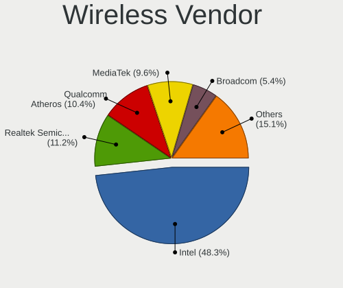

| Vendor                          | Computers | Percent |
|---------------------------------|-----------|---------|
| Intel                           | 297       | 48.29%  |
| Realtek Semiconductor           | 69        | 11.22%  |
| Qualcomm Atheros                | 64        | 10.41%  |
| MediaTek                        | 59        | 9.59%   |
| Broadcom                        | 33        | 5.37%   |
| Ralink Technology               | 16        | 2.6%    |
| Edimax Technology               | 12        | 1.95%   |
| Broadcom Limited                | 11        | 1.79%   |
| ASUSTek Computer                | 11        | 1.79%   |
| TP-Link                         | 9         | 1.46%   |
| Ralink                          | 9         | 1.46%   |
| Qualcomm                        | 6         | 0.98%   |
| D-Link                          | 6         | 0.98%   |
| Qualcomm Atheros Communications | 2         | 0.33%   |
| Microsoft                       | 2         | 0.33%   |
| Mercucys                        | 2         | 0.33%   |
| ZyXEL Communications            | 1         | 0.16%   |
| Xiaomi                          | 1         | 0.16%   |
| Senao                           | 1         | 0.16%   |
| Qualcomm Technologies           | 1         | 0.16%   |
| D-Link System                   | 1         | 0.16%   |
| BUFFALO                         | 1         | 0.16%   |
| Accton Technology               | 1         | 0.16%   |

Wireless Model
--------------

Wireless models

| Model                                                                           | Computers | Percent |
|---------------------------------------------------------------------------------|-----------|---------|
| Intel Wi-Fi 6 AX200                                                             | 46        | 7.38%   |
| Intel Wi-Fi 6 AX201                                                             | 23        | 3.69%   |
| Intel Wireless 8265 / 8275                                                      | 22        | 3.53%   |
| Intel Wi-Fi 6E(802.11ax) AX210/AX1675* 2x2 [Typhoon Peak]                       | 21        | 3.37%   |
| MediaTek MT7922 802.11ax PCI Express Wireless Network Adapter                   | 20        | 3.21%   |
| MediaTek MT7921 802.11ax PCIe Wireless Network Adapter [Filogic 330]            | 16        | 2.57%   |
| Intel Dual Band Wireless-AC 3168NGW [Stone Peak]                                | 16        | 2.57%   |
| Intel Cannon Lake PCH CNVi WiFi                                                 | 14        | 2.25%   |
| Qualcomm Atheros QCA9377 802.11ac Wireless Network Adapter                      | 12        | 1.93%   |
| Intel Wireless 7265                                                             | 12        | 1.93%   |
| Intel Wireless 7260                                                             | 12        | 1.93%   |
| Qualcomm Atheros QCA9565 / AR9565 Wireless Network Adapter                      | 11        | 1.77%   |
| Intel Wireless 3165                                                             | 11        | 1.77%   |
| Qualcomm Atheros AR9285 Wireless Network Adapter (PCI-Express)                  | 10        | 1.61%   |
| Intel Raptor Lake PCH CNVi WiFi                                                 | 10        | 1.61%   |
| Intel Ice Lake-LP PCH CNVi WiFi                                                 | 10        | 1.61%   |
| Intel Cannon Point-LP CNVi [Wireless-AC]                                        | 10        | 1.61%   |
| Intel Alder Lake-P PCH CNVi WiFi                                                | 10        | 1.61%   |
| Ralink MT7601U Wireless Adapter                                                 | 9         | 1.44%   |
| Qualcomm Atheros AR9485 Wireless Network Adapter                                | 9         | 1.44%   |
| MediaTek MT7921K (RZ608) Wi-Fi 6E 80MHz                                         | 9         | 1.44%   |
| Intel Wi-Fi 5(802.11ac) Wireless-AC 9x6x [Thunder Peak]                         | 9         | 1.44%   |
| Realtek RTL8852BE PCIe 802.11ax Wireless Network Controller                     | 8         | 1.28%   |
| Realtek RTL8822CE 802.11ac PCIe Wireless Network Adapter                        | 8         | 1.28%   |
| Realtek RTL8821CE 802.11ac PCIe Wireless Network Adapter                        | 8         | 1.28%   |
| Realtek 802.11ac NIC                                                            | 8         | 1.28%   |
| Intel Comet Lake PCH CNVi WiFi                                                  | 8         | 1.28%   |
| Realtek RTL8188EUS 802.11n Wireless Network Adapter                             | 7         | 1.12%   |
| Qualcomm Atheros QCA6174 802.11ac Wireless Network Adapter                      | 7         | 1.12%   |
| Qualcomm Atheros AR9462 Wireless Network Adapter                                | 7         | 1.12%   |
| Realtek RTL8723BE PCIe Wireless Network Adapter                                 | 6         | 0.96%   |
| Qualcomm QCNFA765 Wireless Network Adapter                                      | 6         | 0.96%   |
| Qualcomm Atheros AR9287 Wireless Network Adapter (PCI-Express)                  | 6         | 0.96%   |
| Intel Wireless 8260                                                             | 6         | 0.96%   |
| Intel Comet Lake PCH-LP CNVi WiFi                                               | 6         | 0.96%   |
| Realtek RTL8723BU 802.11b/g/n WLAN Adapter                                      | 5         | 0.8%    |
| Ralink RT2870/RT3070 Wireless Adapter                                           | 5         | 0.8%    |
| MediaTek MT7925 802.11be 160MHz 2x2 PCIe Wireless Network Adapter [Filogic 360] | 5         | 0.8%    |
| MediaTek MT7902 802.11ax PCIe Wireless Network Adapter [Filogic 310]            | 5         | 0.8%    |
| Intel Centrino Advanced-N 6205 [Taylor Peak]                                    | 5         | 0.8%    |

Ethernet Vendor
---------------

Ethernet vendors

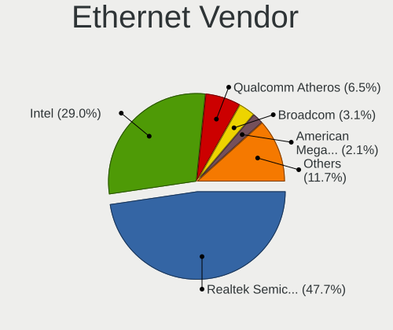

| Vendor                                 | Computers | Percent |
|----------------------------------------|-----------|---------|
| Realtek Semiconductor                  | 388       | 47.67%  |
| Intel                                  | 236       | 28.99%  |
| Qualcomm Atheros                       | 53        | 6.51%   |
| Broadcom                               | 25        | 3.07%   |
| American Megatrends                    | 17        | 2.09%   |
| Aquantia                               | 15        | 1.84%   |
| ASIX Electronics                       | 12        | 1.47%   |
| Marvell Technology Group               | 11        | 1.35%   |
| Nvidia                                 | 7         | 0.86%   |
| Samsung Electronics                    | 5         | 0.61%   |
| MediaTek                               | 5         | 0.61%   |
| OPPO Electronics                       | 4         | 0.49%   |
| HTC (High Tech Computer)               | 4         | 0.49%   |
| TP-Link                                | 3         | 0.37%   |
| Sony Ericsson Mobile Communications AB | 3         | 0.37%   |
| Google                                 | 3         | 0.37%   |
| Broadcom Limited                       | 3         | 0.37%   |
| Motorcomm Microelectronics.            | 2         | 0.25%   |
| Microsoft                              | 2         | 0.25%   |
| Mellanox Technologies                  | 2         | 0.25%   |
| IBM                                    | 2         | 0.25%   |
| Qualcomm Technologies                  | 1         | 0.12%   |
| Motorola PCS                           | 1         | 0.12%   |
| Microchip Technology                   | 1         | 0.12%   |
| LG Electronics                         | 1         | 0.12%   |
| Lenovo                                 | 1         | 0.12%   |
| Insyde Software                        | 1         | 0.12%   |
| ICS Advent                             | 1         | 0.12%   |
| Huawei Technologies                    | 1         | 0.12%   |
| HMD Global                             | 1         | 0.12%   |
| DisplayLink                            | 1         | 0.12%   |
| Apple                                  | 1         | 0.12%   |
| 3Com                                   | 1         | 0.12%   |

Ethernet Model
--------------

Ethernet models

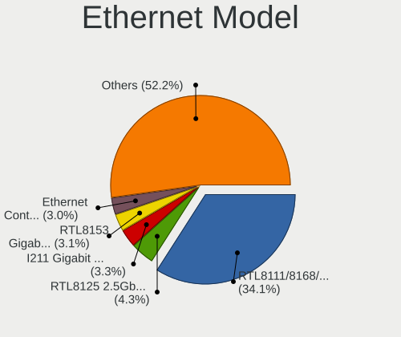

| Model                                                                           | Computers | Percent |
|---------------------------------------------------------------------------------|-----------|---------|
| Realtek RTL8111/8168/8211/8411 PCI Express Gigabit Ethernet Controller          | 293       | 34.07%  |
| Realtek RTL8125 2.5GbE Controller                                               | 37        | 4.3%    |
| Intel I211 Gigabit Network Connection                                           | 28        | 3.26%   |
| Realtek RTL8153 Gigabit Ethernet Adapter                                        | 27        | 3.14%   |
| Intel Ethernet Controller I225-V                                                | 26        | 3.02%   |
| Realtek RTL810xE PCI Express Fast Ethernet controller                           | 21        | 2.44%   |
| Intel I210 Gigabit Network Connection                                           | 19        | 2.21%   |
| Intel Ethernet Connection (3) I219-LM                                           | 17        | 1.98%   |
| American Megatrends Virtual Ethernet.                                           | 17        | 1.98%   |
| Intel 82579LM Gigabit Network Connection (Lewisville)                           | 16        | 1.86%   |
| Intel Ethernet Connection (2) I219-V                                            | 11        | 1.28%   |
| Realtek RTL8152 Fast Ethernet Adapter                                           | 10        | 1.16%   |
| Intel Ethernet Connection (7) I219-V                                            | 10        | 1.16%   |
| Intel Ethernet Connection (7) I219-LM                                           | 9         | 1.05%   |
| Qualcomm Atheros QCA8171 Gigabit Ethernet                                       | 8         | 0.93%   |
| Intel Ethernet Controller I226-V                                                | 8         | 0.93%   |
| Intel Alder Lake-P PCH CNVi WiFi                                                | 8         | 0.93%   |
| ASIX AX88179 Gigabit Ethernet                                                   | 8         | 0.93%   |
| Qualcomm Atheros Killer E220x Gigabit Ethernet Controller                       | 7         | 0.81%   |
| Intel Ethernet Connection I217-LM                                               | 7         | 0.81%   |
| Broadcom NetLink BCM57785 Gigabit Ethernet PCIe                                 | 7         | 0.81%   |
| Intel Ethernet Connection I218-LM                                               | 6         | 0.7%    |
| Intel Ethernet Connection I217-V                                                | 6         | 0.7%    |
| Intel Ethernet Connection (4) I219-V                                            | 6         | 0.7%    |
| Intel Ethernet Connection (17) I219-V                                           | 6         | 0.7%    |
| Intel 82574L Gigabit Network Connection                                         | 6         | 0.7%    |
| Aquantia AQtion AQC107 NBase-T/IEEE 802.3an Ethernet Controller [Atlantic 10G]  | 6         | 0.7%    |
| Samsung Galaxy series, misc. (tethering mode)                                   | 5         | 0.58%   |
| Qualcomm Atheros Killer E2500 Gigabit Ethernet Controller                       | 5         | 0.58%   |
| Qualcomm Atheros AR8161 Gigabit Ethernet                                        | 5         | 0.58%   |
| Qualcomm Atheros AR8151 v2.0 Gigabit Ethernet                                   | 5         | 0.58%   |
| Qualcomm Atheros AR8131 Gigabit Ethernet                                        | 5         | 0.58%   |
| Intel Ethernet Connection (2) I219-LM                                           | 5         | 0.58%   |
| Aquantia AQtion AQC113CS NBase-T/IEEE 802.3an Ethernet Controller [Antigua 10G] | 5         | 0.58%   |
| Realtek USB 10/100/1G/2.5 LAN                                                   | 4         | 0.47%   |
| Qualcomm Atheros AR8151 v1.0 Gigabit Ethernet                                   | 4         | 0.47%   |
| OPPO Ace 3V                                                                     | 4         | 0.47%   |
| Intel 82579V Gigabit Network Connection                                         | 4         | 0.47%   |
| HTC (High Tech Computer) Desire HD (modem mode)                                 | 4         | 0.47%   |
| Realtek RTL8111/8168/8411 PCI Express Gigabit Ethernet Controller               | 3         | 0.35%   |

Net Controller Kind
-------------------

Ethernet, WiFi or modem

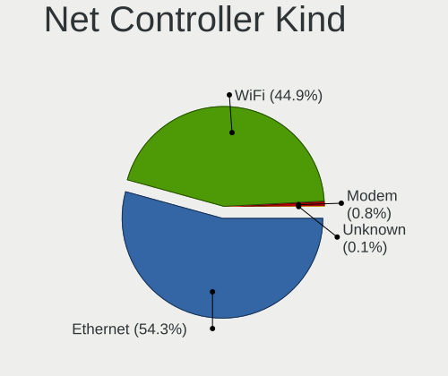

| Kind     | Computers | Percent |
|----------|-----------|---------|
| Ethernet | 711       | 54.27%  |
| WiFi     | 588       | 44.89%  |
| Modem    | 10        | 0.76%   |
| Unknown  | 1         | 0.08%   |

Used Controller
---------------

Currently used network controller

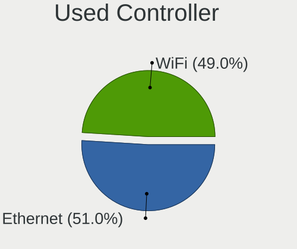

| Kind     | Computers | Percent |
|----------|-----------|---------|
| Ethernet | 438       | 50.99%  |
| WiFi     | 421       | 49.01%  |

NICs
----

Total network controllers on board

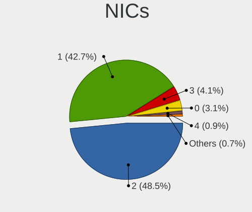

| Total | Computers | Percent |
|-------|-----------|---------|
| 2     | 409       | 48.46%  |
| 1     | 360       | 42.65%  |
| 3     | 35        | 4.15%   |
| 0     | 26        | 3.08%   |
| 4     | 8         | 0.95%   |
| 10    | 2         | 0.24%   |
| 6     | 2         | 0.24%   |
| 5     | 2         | 0.24%   |

IPv6
----

IPv6 vs IPv4

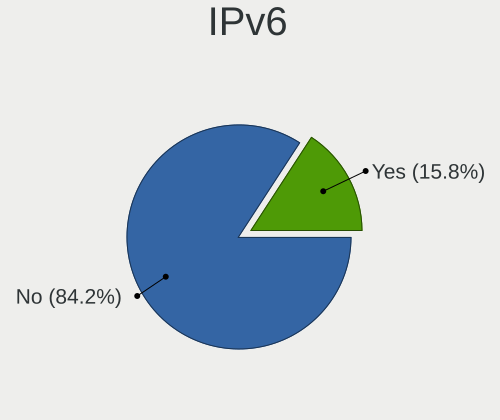

| Used | Computers | Percent |
|------|-----------|---------|
| No   | 718       | 84.17%  |
| Yes  | 135       | 15.83%  |

Bluetooth
---------

Bluetooth Vendor
----------------

Controller vendors

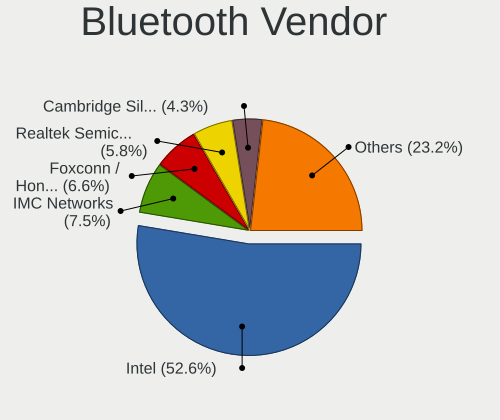

| Vendor                          | Computers | Percent |
|---------------------------------|-----------|---------|
| Intel                           | 281       | 52.62%  |
| IMC Networks                    | 40        | 7.49%   |
| Foxconn / Hon Hai               | 35        | 6.55%   |
| Realtek Semiconductor           | 31        | 5.81%   |
| Cambridge Silicon Radio         | 23        | 4.31%   |
| MediaTek                        | 20        | 3.75%   |
| Broadcom                        | 20        | 3.75%   |
| Qualcomm Atheros Communications | 18        | 3.37%   |
| Lite-On Technology              | 15        | 2.81%   |
| Apple                           | 13        | 2.43%   |
| ASUSTek Computer                | 9         | 1.69%   |
| Toshiba                         | 4         | 0.75%   |
| Ralink                          | 4         | 0.75%   |
| Hewlett-Packard                 | 4         | 0.75%   |
| TP-Link                         | 3         | 0.56%   |
| Realtek                         | 3         | 0.56%   |
| USI                             | 2         | 0.37%   |
| Micro Star International        | 2         | 0.37%   |
| Opticis                         | 1         | 0.19%   |
| Mercucys                        | 1         | 0.19%   |
| Foxconn International           | 1         | 0.19%   |
| Edimax Technology               | 1         | 0.19%   |
| Dell                            | 1         | 0.19%   |
| Alps Electric                   | 1         | 0.19%   |
| Unknown                         | 1         | 0.19%   |

Bluetooth Model
---------------

Controller models

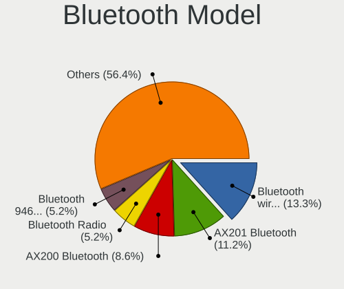

| Model                                                                               | Computers | Percent |
|-------------------------------------------------------------------------------------|-----------|---------|
| Intel Bluetooth wireless interface                                                  | 71        | 13.3%   |
| Intel AX201 Bluetooth                                                               | 60        | 11.24%  |
| Intel AX200 Bluetooth                                                               | 46        | 8.61%   |
| Realtek Bluetooth Radio                                                             | 28        | 5.24%   |
| Intel Bluetooth 9460/9560 Jefferson Peak (JfP)                                      | 28        | 5.24%   |
| Intel Bluetooth Device                                                              | 27        | 5.06%   |
| Cambridge Silicon Radio Bluetooth Dongle (HCI mode)                                 | 23        | 4.31%   |
| MediaTek Wireless_Device                                                            | 20        | 3.75%   |
| Intel AX210 Bluetooth                                                               | 19        | 3.56%   |
| IMC Networks Wireless_Device                                                        | 17        | 3.18%   |
| Intel Wireless-AC 3168 Bluetooth                                                    | 16        | 3%      |
| Foxconn / Hon Hai Wireless_Device                                                   | 10        | 1.87%   |
| Intel Wireless-AC 9260 Bluetooth Adapter                                            | 9         | 1.69%   |
| Foxconn / Hon Hai Bluetooth Device                                                  | 9         | 1.69%   |
| IMC Networks Bluetooth Device                                                       | 8         | 1.5%    |
| IMC Networks Bluetooth Radio                                                        | 7         | 1.31%   |
| Apple Bluetooth Host Controller                                                     | 7         | 1.31%   |
| Qualcomm Atheros AR3011 Bluetooth                                                   | 6         | 1.12%   |
| Lite-On Qualcomm Atheros QCA9377 Bluetooth                                          | 6         | 1.12%   |
| Lite-On Wireless_Device                                                             | 5         | 0.94%   |
| Ralink RT3290 Bluetooth                                                             | 4         | 0.75%   |
| Qualcomm Atheros  Bluetooth Device                                                  | 4         | 0.75%   |
| Qualcomm Atheros AR3012 Bluetooth 4.0                                               | 4         | 0.75%   |
| Apple Bluetooth USB Host Controller                                                 | 4         | 0.75%   |
| TP-Link TP-T@- UB500 Adapter                                                        | 3         | 0.56%   |
| Realtek Bluetooth Radio                                                             | 3         | 0.56%   |
| Qualcomm Atheros QCA61x4 Bluetooth 4.0                                              | 3         | 0.56%   |
| Lite-On Bluetooth Device                                                            | 3         | 0.56%   |
| Intel Centrino Bluetooth Wireless Transceiver                                       | 3         | 0.56%   |
| IMC Networks BCM20702A0                                                             | 3         | 0.56%   |
| IMC Networks Atheros AR3012 Bluetooth 4.0 Adapter                                   | 3         | 0.56%   |
| Foxconn / Hon Hai MediaTek MT7921 Bluetooth                                         | 3         | 0.56%   |
| Foxconn / Hon Hai MediaTek Bluetooth Adapter                                        | 3         | 0.56%   |
| Foxconn / Hon Hai Foxconn T77H114 BCM2070 [Single-Chip Bluetooth 2.1 + EDR Adapter] | 3         | 0.56%   |
| Foxconn / Hon Hai Acer Bluetooth module                                             | 3         | 0.56%   |
| Broadcom BCM2045B (BDC-2.1)                                                         | 3         | 0.56%   |
| Broadcom BCM2045 Bluetooth                                                          | 3         | 0.56%   |
| ASUS Bluetooth Radio                                                                | 3         | 0.56%   |
| Toshiba Bluetooth USB Host Controller                                               | 2         | 0.37%   |
| Realtek  Bluetooth 4.2 Adapter                                                      | 2         | 0.37%   |

Sound
-----

Sound Vendor
------------

Sound card vendors

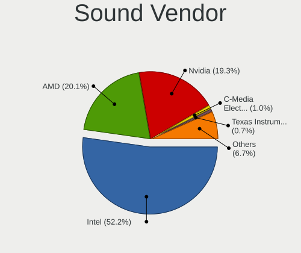

| Vendor                                       | Computers | Percent |
|----------------------------------------------|-----------|---------|
| Intel                                        | 586       | 52.23%  |
| AMD                                          | 225       | 20.05%  |
| Nvidia                                       | 217       | 19.34%  |
| C-Media Electronics                          | 11        | 0.98%   |
| Texas Instruments                            | 8         | 0.71%   |
| ASUSTek Computer                             | 8         | 0.71%   |
| Logitech                                     | 6         | 0.53%   |
| Generalplus Technology                       | 5         | 0.45%   |
| XMOS                                         | 4         | 0.36%   |
| Micro Star International                     | 4         | 0.36%   |
| Realtek Semiconductor                        | 3         | 0.27%   |
| JMTek                                        | 3         | 0.27%   |
| GN Netcom                                    | 3         | 0.27%   |
| Dell                                         | 3         | 0.27%   |
| SAVITECH                                     | 2         | 0.18%   |
| KORG                                         | 2         | 0.18%   |
| Giga-Byte Technology                         | 2         | 0.18%   |
| Focusrite-Novation                           | 2         | 0.18%   |
| Comtrue                                      | 2         | 0.18%   |
| Audio-Technica                               | 2         | 0.18%   |
| Zoran Co. Personal Media Division (Nogatech) | 1         | 0.09%   |
| ZOOM                                         | 1         | 0.09%   |
| Yamaha                                       | 1         | 0.09%   |
| USB Audio                                    | 1         | 0.09%   |
| Turtle Beach                                 | 1         | 0.09%   |
| Thesycon Systemsoftware & Consulting         | 1         | 0.09%   |
| SteelSeries ApS                              | 1         | 0.09%   |
| Sony                                         | 1         | 0.09%   |
| RME                                          | 1         | 0.09%   |
| OPPO Electronics                             | 1         | 0.09%   |
| Novra/IDC/Wegener                            | 1         | 0.09%   |
| Microsoft                                    | 1         | 0.09%   |
| Microdia                                     | 1         | 0.09%   |
| Linux Foundation                             | 1         | 0.09%   |
| Kingston Technology                          | 1         | 0.09%   |
| Harman                                       | 1         | 0.09%   |
| ESS Technology                               | 1         | 0.09%   |
| Elite Silicon                                | 1         | 0.09%   |
| EDIFIER                                      | 1         | 0.09%   |
| Creative Technology                          | 1         | 0.09%   |

Sound Model
-----------

Sound card models

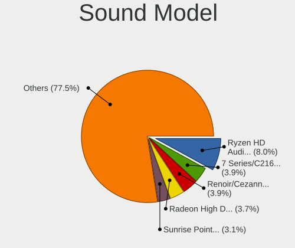

| Model                                                                      | Computers | Percent |
|----------------------------------------------------------------------------|-----------|---------|
| AMD Ryzen HD Audio Controller                                              | 107       | 7.98%   |
| Intel 7 Series/C216 Chipset Family High Definition Audio Controller        | 52        | 3.88%   |
| AMD Renoir/Cezanne HDMI/DP Audio Controller                                | 52        | 3.88%   |
| AMD Radeon High Definition Audio Controller                                | 49        | 3.65%   |
| Intel Sunrise Point-LP HD Audio                                            | 42        | 3.13%   |
| Intel Cannon Lake PCH cAVS                                                 | 42        | 3.13%   |
| Intel 6 Series/C200 Series Chipset Family High Definition Audio Controller | 42        | 3.13%   |
| Intel 8 Series/C220 Series Chipset High Definition Audio Controller        | 40        | 2.98%   |
| AMD Starship/Matisse HD Audio Controller                                   | 31        | 2.31%   |
| Intel 100 Series/C230 Series Chipset Family HD Audio Controller            | 29        | 2.16%   |
| Intel Xeon E3-1200 v3/4th Gen Core Processor HD Audio Controller           | 28        | 2.09%   |
| Intel Tiger Lake-LP Smart Sound Technology Audio Controller                | 26        | 1.94%   |
| Intel Alder Lake PCH-P High Definition Audio Controller                    | 25        | 1.86%   |
| Intel Haswell-ULT HD Audio Controller                                      | 22        | 1.64%   |
| Intel 8 Series HD Audio Controller                                         | 22        | 1.64%   |
| Intel Alder Lake-S HD Audio Controller                                     | 21        | 1.57%   |
| Intel 5 Series/3400 Series Chipset High Definition Audio                   | 21        | 1.57%   |
| Intel Cannon Point-LP High Definition Audio Controller                     | 19        | 1.42%   |
| Nvidia GP106 High Definition Audio Controller                              | 17        | 1.27%   |
| AMD SBx00 Azalia (Intel HDA)                                               | 16        | 1.19%   |
| Intel 200 Series PCH HD Audio                                              | 14        | 1.04%   |
| Nvidia GM107 High Definition Audio Controller [GeForce 940MX]              | 13        | 0.97%   |
| Nvidia GK208 HDMI/DP Audio Controller                                      | 13        | 0.97%   |
| Nvidia GF108 High Definition Audio Controller                              | 13        | 0.97%   |
| Nvidia GA106 High Definition Audio Controller                              | 13        | 0.97%   |
| Intel Wildcat Point-LP High Definition Audio Controller                    | 13        | 0.97%   |
| Intel Broadwell-U Audio Controller                                         | 13        | 0.97%   |
| Nvidia TU116 High Definition Audio Controller                              | 12        | 0.89%   |
| Nvidia GA104 High Definition Audio Controller                              | 12        | 0.89%   |
| Intel Raptor Lake-P/U/H cAVS                                               | 12        | 0.89%   |
| Intel NM10/ICH7 Family High Definition Audio Controller                    | 12        | 0.89%   |
| Nvidia GP107GL High Definition Audio Controller                            | 11        | 0.82%   |
| Intel Comet Lake PCH cAVS                                                  | 11        | 0.82%   |
| Intel 82801I (ICH9 Family) HD Audio Controller                             | 11        | 0.82%   |
| AMD Raven/Raven2/Fenghuang HDMI/DP Audio Controller                        | 11        | 0.82%   |
| AMD Family 17h (Models 00h-0fh) HD Audio Controller                        | 11        | 0.82%   |
| Nvidia GP108 High Definition Audio Controller                              | 10        | 0.75%   |
| Intel Tiger Lake-H HD Audio Controller                                     | 10        | 0.75%   |
| Intel Ice Lake-LP Smart Sound Technology Audio Controller                  | 10        | 0.75%   |
| Intel CM238 HD Audio Controller                                            | 10        | 0.75%   |

Memory
------

Memory Vendor
-------------

Memory module vendors

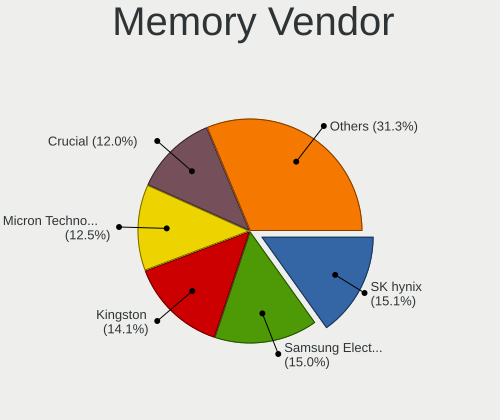

| Vendor                 | Computers | Percent |
|------------------------|-----------|---------|
| SK hynix               | 91        | 15.14%  |
| Samsung Electronics    | 90        | 14.98%  |
| Kingston               | 85        | 14.14%  |
| Micron Technology      | 75        | 12.48%  |
| Crucial                | 72        | 11.98%  |
| Transcend              | 38        | 6.32%   |
| Unknown                | 37        | 6.16%   |
| A-DATA Technology      | 30        | 4.99%   |
| Unknown                | 9         | 1.5%    |
| Team                   | 8         | 1.33%   |
| Apacer                 | 8         | 1.33%   |
| G.Skill                | 7         | 1.16%   |
| Unifosa                | 4         | 0.67%   |
| Silicon Power          | 4         | 0.67%   |
| Patriot                | 4         | 0.67%   |
| Nanya Technology       | 4         | 0.67%   |
| UMAX                   | 3         | 0.5%    |
| Ramaxel Technology     | 3         | 0.5%    |
| Elpida                 | 3         | 0.5%    |
| ASint Technology       | 3         | 0.5%    |
| Unknown (ABCD)         | 2         | 0.33%   |
| KLEVV                  | 2         | 0.33%   |
| Goldkey                | 2         | 0.33%   |
| G-Alantic              | 2         | 0.33%   |
| Essencore Limited      | 2         | 0.33%   |
| V-Color                | 1         | 0.17%   |
| Unknown (09A4)         | 1         | 0.17%   |
| Unknown (08AE)         | 1         | 0.17%   |
| Unknown (00000000F08B) | 1         | 0.17%   |
| Red Hat                | 1         | 0.17%   |
| PNY                    | 1         | 0.17%   |
| Lexar                  | 1         | 0.17%   |
| GLOWAY                 | 1         | 0.17%   |
| CUSO                   | 1         | 0.17%   |
| Corsair                | 1         | 0.17%   |
| Avant                  | 1         | 0.17%   |
| Advantech              | 1         | 0.17%   |
| ACPI Digital           | 1         | 0.17%   |

Memory Model
------------

Memory module models

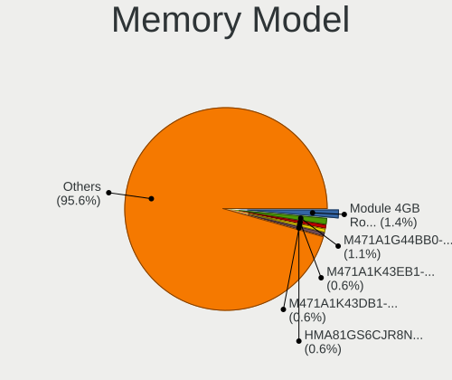

| Model                                                             | Computers | Percent |
|-------------------------------------------------------------------|-----------|---------|
| Unknown                                                           | 9         | 1.4%    |
| Samsung RAM M471A1G44BB0-CWE 8GB SODIMM DDR4 3200MT/s             | 7         | 1.09%   |
| SK hynix RAM HMA81GS6CJR8N-VK 8GB SODIMM DDR4 2667MT/s            | 4         | 0.62%   |
| Samsung RAM M471A1K43EB1-CWE 8GB SODIMM DDR4 3200MT/s             | 4         | 0.62%   |
| Samsung RAM M471A1K43DB1-CWE 8GB SODIMM DDR4 3200MT/s             | 4         | 0.62%   |
| Kingston RAM KHX1866C10D3/8G 8GB DIMM DDR3 1867MT/s               | 4         | 0.62%   |
| Crucial RAM CT8G4SFS8266.M8FE 8GB SODIMM DDR4 2667MT/s            | 4         | 0.62%   |
| A-DATA RAM Module 4096MB SODIMM DDR4 2400MT/s                     | 4         | 0.62%   |
| Transcend RAM TS1GLK64V6H 8GB DIMM DDR3 1600MT/s                  | 3         | 0.47%   |
| Transcend RAM Module 4GB DIMM DDR3 1600MT/s                       | 3         | 0.47%   |
| SK hynix RAM HMT451S6AFR8A-PB 4GB SODIMM DDR3 1600MT/s            | 3         | 0.47%   |
| SK hynix RAM HMAA1GS6CJR6N-XN 8GB SODIMM DDR4 3200MT/s            | 3         | 0.47%   |
| SK hynix RAM HMA851S6DJR6N-XN 4GB SODIMM DDR4 3200MT/s            | 3         | 0.47%   |
| SK hynix RAM HCNNNCPMMLXR-NEE 2GB Row Of Chips LPDDR4 4267MT/s    | 3         | 0.47%   |
| Samsung RAM K4UBE3D4AA-MGCR 8GB SODIMM LPDDR4 4266MT/s            | 3         | 0.47%   |
| Micron RAM 4ATF51264HZ-2G6E1 4GB SODIMM DDR4 2667MT/s             | 3         | 0.47%   |
| Micron RAM 4ATF1G64HZ-3G2E1 8GB SODIMM DDR4 3200MT/s              | 3         | 0.47%   |
| Micron RAM 4ATF1G64HZ-3G2E1 8GB Row Of Chips DDR4 3200MT/s        | 3         | 0.47%   |
| Kingston RAM 99U5471-020.A00LF 4GB DIMM 1600MT/s                  | 3         | 0.47%   |
| Kingston RAM 9905624-033.A00G 8GB SODIMM DDR4 2400MT/s            | 3         | 0.47%   |
| Crucial RAM CT16G4SFRA32A.C8FE 16GB SODIMM DDR4 3200MT/s          | 3         | 0.47%   |
| A-DATA RAM DDR4 3000 2OZ 8GB DIMM DDR4 3000MT/s                   | 3         | 0.47%   |
| Unknown RAM Module 8GB SODIMM DDR3 1600MT/s                       | 2         | 0.31%   |
| Unknown RAM Module 2GB SODIMM DDR3 1333MT/s                       | 2         | 0.31%   |
| Unknown RAM Module 2GB SODIMM DDR3                                | 2         | 0.31%   |
| Unknown RAM Module 2GB DIMM DDR2 800MT/s                          | 2         | 0.31%   |
| Transcend RAM Module 16GB SODIMM DDR4 3200MT/s                    | 2         | 0.31%   |
| Transcend RAM JM3200HSB-8G 8GB SODIMM DDR4 3200MT/s               | 2         | 0.31%   |
| Transcend RAM JM1333KLN-4G 4GB DIMM DDR3 1333MT/s                 | 2         | 0.31%   |
| Team RAM TEAMGROUP-UD4-3200 8GB DIMM DDR4 3733MT/s                | 2         | 0.31%   |
| SK hynix RAM HMT451S6BFR8A-PB 4GB SODIMM DDR3 1600MT/s            | 2         | 0.31%   |
| SK hynix RAM HMAB2GS6AMR6N-XN 16GB SODIMM DDR4 3200MT/s           | 2         | 0.31%   |
| SK hynix RAM HMA851S6CJR6N-VK 4GB SODIMM DDR4 2667MT/s            | 2         | 0.31%   |
| SK hynix RAM HMA851S6AFR6N-UH 4GB SODIMM DDR4 2667MT/s            | 2         | 0.31%   |
| SK hynix RAM HMA82GU6MFR8N-TF 16GB DIMM DDR4 2133MT/s             | 2         | 0.31%   |
| SK hynix RAM HMA81GU6JJR8N-VK 8GB DIMM DDR4 2667MT/s              | 2         | 0.31%   |
| SK hynix RAM HMA81GS6AFR8N-UH 8GB SODIMM DDR4 2667MT/s            | 2         | 0.31%   |
| SK hynix RAM HMA41GS6AFR8N-TF 8GB SODIMM DDR4 2667MT/s            | 2         | 0.31%   |
| SK hynix RAM H9HCNNNCPMALHR-NEE 8GiB Row Of Chips LPDDR4 4800MT/s | 2         | 0.31%   |
| SK hynix RAM H9CCNNNCPTALBR-NUD 4GB Row Of Chips LPDDR3 1867MT/s  | 2         | 0.31%   |

Memory Kind
-----------

Memory module kinds

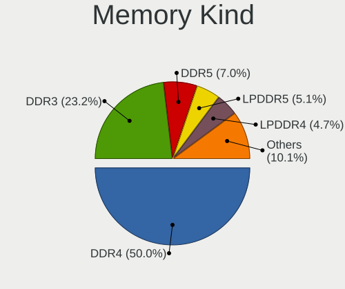

| Kind    | Computers | Percent |
|---------|-----------|---------|
| DDR4    | 257       | 50%     |
| DDR3    | 119       | 23.15%  |
| DDR5    | 36        | 7%      |
| LPDDR5  | 26        | 5.06%   |
| LPDDR4  | 24        | 4.67%   |
| Unknown | 17        | 3.31%   |
| LPDDR3  | 14        | 2.72%   |
| DDR2    | 11        | 2.14%   |
| SDRAM   | 8         | 1.56%   |
| RAM     | 1         | 0.19%   |
| DDR     | 1         | 0.19%   |

Memory Form Factor
------------------

Physical design of the memory module

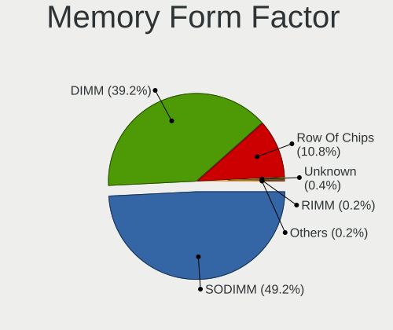

| Name         | Computers | Percent |
|--------------|-----------|---------|
| SODIMM       | 251       | 49.22%  |
| DIMM         | 200       | 39.22%  |
| Row Of Chips | 55        | 10.78%  |
| Unknown      | 2         | 0.39%   |
| RIMM         | 1         | 0.2%    |
| Chip         | 1         | 0.2%    |

Memory Size
-----------

Memory module size

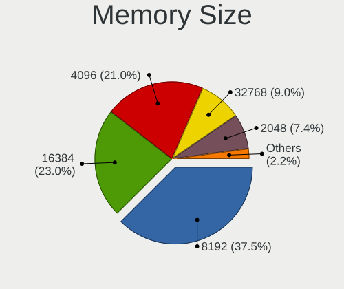

| Size  | Computers | Percent |
|-------|-----------|---------|
| 8192  | 209       | 37.52%  |
| 16384 | 128       | 22.98%  |
| 4096  | 117       | 21.01%  |
| 32768 | 50        | 8.98%   |
| 2048  | 41        | 7.36%   |
| 1024  | 6         | 1.08%   |
| 98304 | 1         | 0.18%   |
| 65536 | 1         | 0.18%   |
| 49152 | 1         | 0.18%   |
| 24576 | 1         | 0.18%   |
| 9000  | 1         | 0.18%   |
| 8072  | 1         | 0.18%   |

Memory Speed
------------

Memory module speed

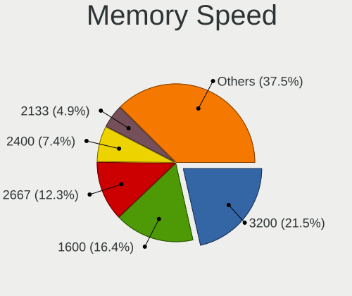

| Speed   | Computers | Percent |
|---------|-----------|---------|
| 3200    | 119       | 21.48%  |
| 1600    | 91        | 16.43%  |
| 2667    | 68        | 12.27%  |
| 2400    | 41        | 7.4%    |
| 2133    | 27        | 4.87%   |
| 1333    | 22        | 3.97%   |
| 4800    | 16        | 2.89%   |
| 6400    | 14        | 2.53%   |
| 5600    | 14        | 2.53%   |
| 4267    | 11        | 1.99%   |
| 3600    | 10        | 1.81%   |
| 1867    | 9         | 1.62%   |
| 1334    | 9         | 1.62%   |
| 800     | 9         | 1.62%   |
| 3733    | 8         | 1.44%   |
| 7500    | 7         | 1.26%   |
| 4266    | 6         | 1.08%   |
| 8533    | 5         | 0.9%    |
| 6000    | 5         | 0.9%    |
| 3000    | 5         | 0.9%    |
| 667     | 5         | 0.9%    |
| Unknown | 5         | 0.9%    |
| 4000    | 4         | 0.72%   |
| 8400    | 3         | 0.54%   |
| 3800    | 3         | 0.54%   |
| 2933    | 3         | 0.54%   |
| 2666    | 3         | 0.54%   |
| 1066    | 3         | 0.54%   |
| 533     | 3         | 0.54%   |
| 5200    | 2         | 0.36%   |
| 4199    | 2         | 0.36%   |
| 3466    | 2         | 0.36%   |
| 2000    | 2         | 0.36%   |
| 1067    | 2         | 0.36%   |
| 8000    | 1         | 0.18%   |
| 6200    | 1         | 0.18%   |
| 5800    | 1         | 0.18%   |
| 4333    | 1         | 0.18%   |
| 3866    | 1         | 0.18%   |
| 3400    | 1         | 0.18%   |

Printers & scanners
-------------------

Printer Vendor
--------------

Printer device vendors

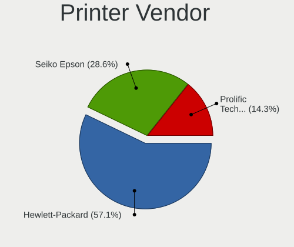

| Vendor              | Computers | Percent |
|---------------------|-----------|---------|
| Hewlett-Packard     | 4         | 57.14%  |
| Seiko Epson         | 2         | 28.57%  |
| Prolific Technology | 1         | 14.29%  |

Printer Model
-------------

Printer device models

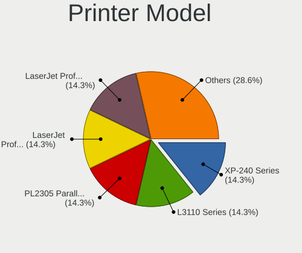

| Model                            | Computers | Percent |
|----------------------------------|-----------|---------|
| Seiko Epson XP-240 Series        | 1         | 14.29%  |
| Seiko Epson L3110 Series         | 1         | 14.29%  |
| Prolific PL2305 Parallel Port    | 1         | 14.29%  |
| HP LaserJet Professional P1102w  | 1         | 14.29%  |
| HP LaserJet Professional P 1102w | 1         | 14.29%  |
| HP LaserJet M402dn               | 1         | 14.29%  |
| HP LaserJet 1020                 | 1         | 14.29%  |

Scanner Vendor
--------------

Scanner device vendors

| Vendor      | Computers | Percent |
|-------------|-----------|---------|
| Seiko Epson | 2         | 100%    |

Scanner Model
-------------

Scanner device models

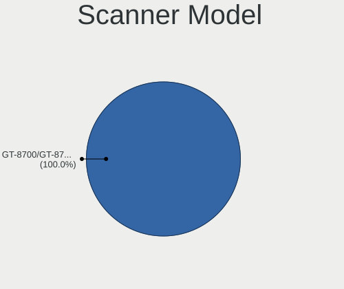

| Model                                                         | Computers | Percent |
|---------------------------------------------------------------|-----------|---------|
| Seiko Epson Perfection V37/V370                               | 1         | 50%     |
| Seiko Epson GT-8700/GT-8700F [Perfection 1640SU/1640SU PHOTO] | 1         | 50%     |

Camera
------

Camera Vendor
-------------

Camera device vendors

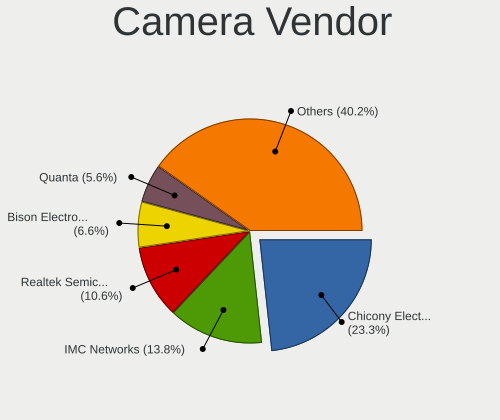

| Vendor                                 | Computers | Percent |
|----------------------------------------|-----------|---------|
| Chicony Electronics                    | 88        | 23.28%  |
| IMC Networks                           | 52        | 13.76%  |
| Realtek Semiconductor                  | 40        | 10.58%  |
| Bison Electronics                      | 25        | 6.61%   |
| Quanta                                 | 21        | 5.56%   |
| Microdia                               | 18        | 4.76%   |
| Logitech                               | 17        | 4.5%    |
| Sunplus Innovation Technology          | 16        | 4.23%   |
| Cheng Uei Precision Industry (Foxlink) | 10        | 2.65%   |
| Apple                                  | 10        | 2.65%   |
| Suyin                                  | 9         | 2.38%   |
| Luxvisions Innotech Limited            | 9         | 2.38%   |
| Sonix Technology                       | 7         | 1.85%   |
| Syntek                                 | 5         | 1.32%   |
| Lite-On Technology                     | 4         | 1.06%   |
| Generalplus Technology                 | 4         | 1.06%   |
| ALi                                    | 4         | 1.06%   |
| SunplusIT                              | 3         | 0.79%   |
| Ricoh                                  | 3         | 0.79%   |
| BillionPixels                          | 3         | 0.79%   |
| Acer                                   | 3         | 0.79%   |
| Sunplus Technology                     | 2         | 0.53%   |
| Silicon Motion                         | 2         | 0.53%   |
| Samsung Electronics                    | 2         | 0.53%   |
| Lenovo                                 | 2         | 0.53%   |
| Importek                               | 2         | 0.53%   |
| Framework                              | 2         | 0.53%   |
| Unison                                 | 1         | 0.26%   |
| Sunwingroup                            | 1         | 0.26%   |
| Shinetech                              | 1         | 0.26%   |
| ShineOptics                            | 1         | 0.26%   |
| Novatek Microelectronics               | 1         | 0.26%   |
| MacroSilicon                           | 1         | 0.26%   |
| KYE Systems (Mouse Systems)            | 1         | 0.26%   |
| Intel                                  | 1         | 0.26%   |
| Google                                 | 1         | 0.26%   |
| Foxconn / Hon Hai                      | 1         | 0.26%   |
| eMeet                                  | 1         | 0.26%   |
| ASUSTek Computer                       | 1         | 0.26%   |
| Aspeed Technology                      | 1         | 0.26%   |

Camera Model
------------

Camera device models

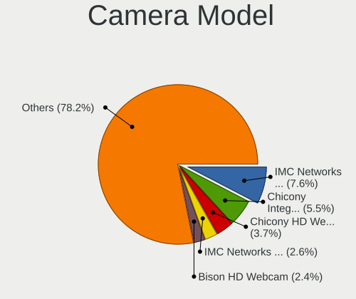

| Model                                                                      | Computers | Percent |
|----------------------------------------------------------------------------|-----------|---------|
| IMC Networks USB2.0 HD UVC WebCam                                          | 29        | 7.63%   |
| Chicony Integrated Camera                                                  | 21        | 5.53%   |
| Chicony HD WebCam                                                          | 14        | 3.68%   |
| IMC Networks Integrated Camera                                             | 10        | 2.63%   |
| Bison HD Webcam                                                            | 9         | 2.37%   |
| Realtek Integrated_Webcam_HD                                               | 8         | 2.11%   |
| Sunplus HD WebCam                                                          | 7         | 1.84%   |
| Quanta HD User Facing                                                      | 7         | 1.84%   |
| Chicony HD User Facing                                                     | 7         | 1.84%   |
| Chicony HP HD Camera                                                       | 6         | 1.58%   |
| Realtek USB Camera                                                         | 5         | 1.32%   |
| Quanta HD Webcam                                                           | 5         | 1.32%   |
| Microdia Integrated_Webcam_HD                                              | 5         | 1.32%   |
| Logitech Webcam C270                                                       | 5         | 1.32%   |
| Chicony USB2.0 HD UVC WebCam                                               | 5         | 1.32%   |
| Microdia Integrated_Webcam_FHD                                             | 4         | 1.05%   |
| Luxvisions Innotech Limited Integrated Camera                              | 4         | 1.05%   |
| Chicony Lenovo EasyCamera                                                  | 4         | 1.05%   |
| Cheng Uei Precision Industry (Foxlink) HP Wide Vision HD Integrated Webcam | 4         | 1.05%   |
| Apple iPhone 5/5C/5S/6/SE/7/8/X                                            | 4         | 1.05%   |
| ALi Gateway Webcam                                                         | 4         | 1.05%   |
| Syntek Integrated Camera                                                   | 3         | 0.79%   |
| Sonix USB2.0 HD UVC WebCam                                                 | 3         | 0.79%   |
| Sonix USB2.0 FHD UVC WebCam                                                | 3         | 0.79%   |
| Realtek USB2.0 HD UVC WebCam                                               | 3         | 0.79%   |
| Realtek HD WebCam                                                          | 3         | 0.79%   |
| Realtek ASUS 5M webcam                                                     | 3         | 0.79%   |
| Quanta HP HD Camera                                                        | 3         | 0.79%   |
| Logitech Webcam C120                                                       | 3         | 0.79%   |
| IMC Networks USB2.0 VGA UVC WebCam                                         | 3         | 0.79%   |
| Generalplus GENERAL WEBCAM                                                 | 3         | 0.79%   |
| Chicony USB2.0 VGA UVC WebCam                                              | 3         | 0.79%   |
| Bison Integrated Camera                                                    | 3         | 0.79%   |
| BillionPixels USB2.0 FHD UVC WebCam                                        | 3         | 0.79%   |
| Apple FaceTime HD Camera (Built-in)                                        | 3         | 0.79%   |
| Suyin Acer/Lenovo Webcam [CN0316]                                          | 2         | 0.53%   |
| Suyin 1.3M HD WebCam                                                       | 2         | 0.53%   |
| SunplusIT HD Webcam                                                        | 2         | 0.53%   |
| Sunplus 1.3M HD WebCam                                                     | 2         | 0.53%   |
| Sunplus Integrated_Webcam_HD                                               | 2         | 0.53%   |

Security
--------

Fingerprint Vendor
------------------

Fingerprint sensor vendors

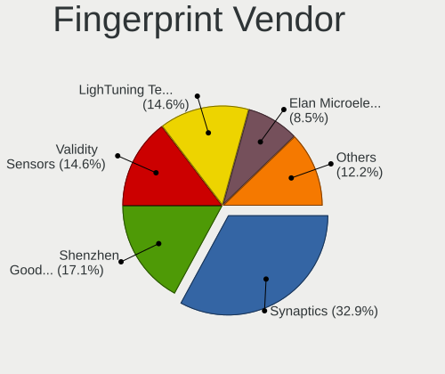

| Vendor                             | Computers | Percent |
|------------------------------------|-----------|---------|
| Synaptics                          | 27        | 32.93%  |
| Shenzhen Goodix Technology         | 14        | 17.07%  |
| Validity Sensors                   | 12        | 14.63%  |
| LighTuning Technology              | 12        | 14.63%  |
| Elan Microelectronics              | 7         | 8.54%   |
| Upek                               | 5         | 6.1%    |
| AuthenTec                          | 3         | 3.66%   |
| Realtek USB2.0 Finger Print Bridge | 2         | 2.44%   |

Fingerprint Model
-----------------

Fingerprint sensor models

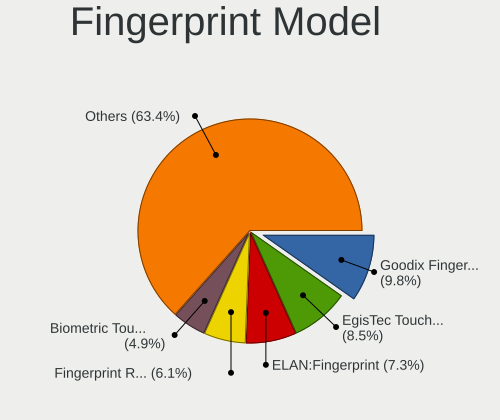

| Model                                                                      | Computers | Percent |
|----------------------------------------------------------------------------|-----------|---------|
| Shenzhen Goodix  FingerPrint Device                                        | 8         | 9.76%   |
| LighTuning EgisTec Touch Fingerprint Sensor                                | 7         | 8.54%   |
| Elan ELAN:Fingerprint                                                      | 6         | 7.32%   |
| Shenzhen Goodix Fingerprint Reader                                         | 5         | 6.1%    |
| Upek Biometric Touchchip/Touchstrip Fingerprint Sensor                     | 4         | 4.88%   |
| Synaptics  FS7604 Touch Fingerprint Sensor with PurePrint                  | 4         | 4.88%   |
| Synaptics Prometheus MIS Touch Fingerprint Reader                          | 4         | 4.88%   |
| Synaptics Metallica MIS Touch Fingerprint Reader                           | 4         | 4.88%   |
| Validity Sensors VFS5011 Fingerprint Reader                                | 3         | 3.66%   |
| Synaptics WBDI Fingerprint Reader USB 086                                  | 3         | 3.66%   |
| Synaptics Fingerprint reader [HP G6]                                       | 3         | 3.66%   |
| LighTuning ES603 Swipe Fingerprint Sensor                                  | 3         | 3.66%   |
| Validity Sensors VFS495 Fingerprint Reader                                 | 2         | 2.44%   |
| Validity Sensors VFS Fingerprint sensor                                    | 2         | 2.44%   |
| Validity Sensors VFS 5011 fingerprint sensor                               | 2         | 2.44%   |
| Synaptics WBDI                                                             | 2         | 2.44%   |
| Synaptics UWP WBDI                                                         | 2         | 2.44%   |
| Synaptics Prometheus Fingerprint Reader                                    | 2         | 2.44%   |
| Synaptics FS7604 Touch Fingerprint Sensor with PurePrint                   | 2         | 2.44%   |
| Realtek USB2.0 Finger Print Bridge FocalTech Fingerprint Device            | 2         | 2.44%   |
| Validity Sensors VFS301 Fingerprint Reader                                 | 1         | 1.22%   |
| Validity Sensors Synaptics VFS7552 Touch Fingerprint Sensor with PurePrint | 1         | 1.22%   |
| Validity Sensors Fingerprint scanner                                       | 1         | 1.22%   |
| Upek TCS5B Fingerprint sensor                                              | 1         | 1.22%   |
| Synaptics  WBDI Fingerprint Reader - USB 052                               | 1         | 1.22%   |
| Shenzhen Goodix FingerPrint                                                | 1         | 1.22%   |
| LighTuning Fingerprint Sensor                                              | 1         | 1.22%   |
| LighTuning Fingerprint Reader                                              | 1         | 1.22%   |
| Elan fingerprint sensor [FeinTech FPS00200]                                | 1         | 1.22%   |
| AuthenTec AES2810                                                          | 1         | 1.22%   |
| AuthenTec AES2501 Fingerprint Sensor                                       | 1         | 1.22%   |
| AuthenTec AES1660 Fingerprint Sensor                                       | 1         | 1.22%   |

Chipcard Vendor
---------------

Chipcard module vendors

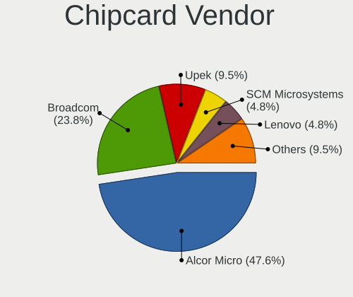

| Vendor                | Computers | Percent |
|-----------------------|-----------|---------|
| Alcor Micro           | 10        | 47.62%  |
| Broadcom              | 5         | 23.81%  |
| Upek                  | 2         | 9.52%   |
| SCM Microsystems      | 1         | 4.76%   |
| Lenovo                | 1         | 4.76%   |
| Gemalto (was Gemplus) | 1         | 4.76%   |
| Clay Logic            | 1         | 4.76%   |

Chipcard Model
--------------

Chipcard module models

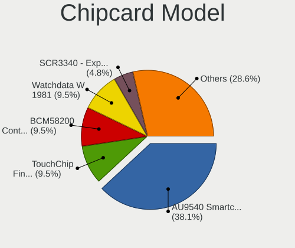

| Model                                                                        | Computers | Percent |
|------------------------------------------------------------------------------|-----------|---------|
| Alcor Micro AU9540 Smartcard Reader                                          | 8         | 38.1%   |
| Upek TouchChip Fingerprint Coprocessor (WBF advanced mode)                   | 2         | 9.52%   |
| Broadcom BCM58200 ControlVault 3 (FingerPrint sensor + Contacted SmartCard)  | 2         | 9.52%   |
| Alcor Micro Watchdata W 1981                                                 | 2         | 9.52%   |
| SCM Microsystems SCR3340 - ExpressCard54 Smart Card Reader                   | 1         | 4.76%   |
| Lenovo Integrated Smart Card Reader                                          | 1         | 4.76%   |
| Gemalto (was Gemplus) GemPC Twin SmartCard Reader                            | 1         | 4.76%   |
| Clay Logic CanoKey Canary                                                    | 1         | 4.76%   |
| Broadcom BCM5880 Secure Applications Processor with fingerprint swipe sensor | 1         | 4.76%   |
| Broadcom BCM5880 Secure Applications Processor                               | 1         | 4.76%   |
| Broadcom 58200                                                               | 1         | 4.76%   |

Unsupported
-----------

Unsupported Devices
-------------------

Total unsupported devices on board

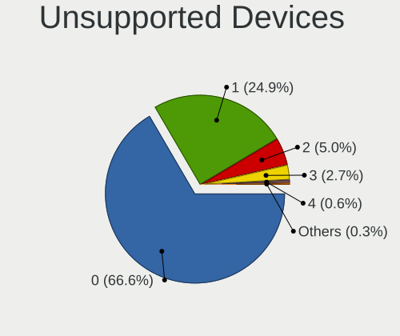

| Total | Computers | Percent |
|-------|-----------|---------|
| 0     | 576       | 66.59%  |
| 1     | 215       | 24.86%  |
| 2     | 43        | 4.97%   |
| 3     | 23        | 2.66%   |
| 4     | 5         | 0.58%   |
| 5     | 2         | 0.23%   |
| 9     | 1         | 0.12%   |

Unsupported Device Types
------------------------

Types of unsupported devices

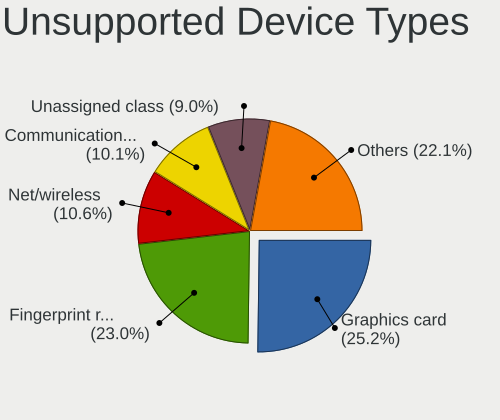

| Type                     | Computers | Percent |
|--------------------------|-----------|---------|
| Graphics card            | 90        | 25.21%  |
| Fingerprint reader       | 82        | 22.97%  |
| Net/wireless             | 38        | 10.64%  |
| Communication controller | 36        | 10.08%  |
| Unassigned class         | 32        | 8.96%   |
| Multimedia controller    | 16        | 4.48%   |
| Chipcard                 | 15        | 4.2%    |
| Camera                   | 11        | 3.08%   |
| Net/ethernet             | 9         | 2.52%   |
| Card reader              | 9         | 2.52%   |
| Bluetooth                | 7         | 1.96%   |
| Sound                    | 5         | 1.4%    |
| Storage/raid             | 2         | 0.56%   |
| Storage/nvme             | 2         | 0.56%   |
| Network                  | 2         | 0.56%   |
| Storage                  | 1         | 0.28%   |

