Linux in Thailand - Tested Hardware & Statistics
------------------------------------------------

A project to collect tested hardware configurations for Linux in Thailand.

Anyone can contribute to this report by the [hw-probe](https://github.com/linuxhw/hw-probe) tool:

    sudo -E hw-probe -all -upload

Please contribute! Especially if your hardware is rare.

This is a report for all computer types. See also reports for [desktops](/Location/Thailand/Desktop/README.md) and [notebooks](/Location/Thailand/Notebook/README.md).

Contents
--------

* [ Test Cases ](#test-cases)

* [ System ](#system)
  - [ OS                       ](#os)
  - [ OS Family                ](#os-family)
  - [ Kernel                   ](#kernel)
  - [ Kernel Family            ](#kernel-family)
  - [ Kernel Major Ver.        ](#kernel-major-ver)
  - [ Arch                     ](#arch)
  - [ DE                       ](#de)
  - [ Display Server           ](#display-server)
  - [ Display Manager          ](#display-manager)
  - [ OS Lang                  ](#os-lang)
  - [ Boot Mode                ](#boot-mode)
  - [ Filesystem               ](#filesystem)
  - [ Part. scheme             ](#part-scheme)
  - [ Dual Boot with Linux/BSD ](#dual-boot-with-linuxbsd)
  - [ Dual Boot (Win)          ](#dual-boot-win)

* [ Board ](#board)
  - [ Vendor                   ](#vendor)
  - [ Model                    ](#model)
  - [ Model Family             ](#model-family)
  - [ MFG Year                 ](#mfg-year)
  - [ Form Factor              ](#form-factor)
  - [ Secure Boot              ](#secure-boot)
  - [ Coreboot                 ](#coreboot)
  - [ RAM Size                 ](#ram-size)
  - [ RAM Used                 ](#ram-used)
  - [ Total Drives             ](#total-drives)
  - [ Has CD-ROM               ](#has-cd-rom)
  - [ Has Ethernet             ](#has-ethernet)
  - [ Has WiFi                 ](#has-wifi)
  - [ Has Bluetooth            ](#has-bluetooth)

* [ Location ](#location)
  - [ Country                  ](#country)
  - [ City                     ](#city)

* [ Drives ](#drives)
  - [ Drive Vendor             ](#drive-vendor)
  - [ Drive Model              ](#drive-model)
  - [ HDD Vendor               ](#hdd-vendor)
  - [ SSD Vendor               ](#ssd-vendor)
  - [ Drive Kind               ](#drive-kind)
  - [ Drive Connector          ](#drive-connector)
  - [ Drive Size               ](#drive-size)
  - [ Space Total              ](#space-total)
  - [ Space Used               ](#space-used)
  - [ Malfunc. Drives          ](#malfunc-drives)
  - [ Malfunc. Drive Vendor    ](#malfunc-drive-vendor)
  - [ Malfunc. HDD Vendor      ](#malfunc-hdd-vendor)
  - [ Malfunc. Drive Kind      ](#malfunc-drive-kind)
  - [ Failed Drives            ](#failed-drives)
  - [ Failed Drive Vendor      ](#failed-drive-vendor)
  - [ Drive Status             ](#drive-status)

* [ Storage controller ](#storage-controller)
  - [ Storage Vendor           ](#storage-vendor)
  - [ Storage Model            ](#storage-model)
  - [ Storage Kind             ](#storage-kind)

* [ Processor ](#processor)
  - [ CPU Vendor               ](#cpu-vendor)
  - [ CPU Model                ](#cpu-model)
  - [ CPU Model Family         ](#cpu-model-family)
  - [ CPU Cores                ](#cpu-cores)
  - [ CPU Sockets              ](#cpu-sockets)
  - [ CPU Threads              ](#cpu-threads)
  - [ CPU Op-Modes             ](#cpu-op-modes)
  - [ CPU Microcode            ](#cpu-microcode)
  - [ CPU Microarch            ](#cpu-microarch)

* [ Graphics ](#graphics)
  - [ GPU Vendor               ](#gpu-vendor)
  - [ GPU Model                ](#gpu-model)
  - [ GPU Combo                ](#gpu-combo)
  - [ GPU Driver               ](#gpu-driver)
  - [ GPU Memory               ](#gpu-memory)

* [ Monitor ](#monitor)
  - [ Monitor Vendor           ](#monitor-vendor)
  - [ Monitor Model            ](#monitor-model)
  - [ Monitor Resolution       ](#monitor-resolution)
  - [ Monitor Diagonal         ](#monitor-diagonal)
  - [ Monitor Width            ](#monitor-width)
  - [ Aspect Ratio             ](#aspect-ratio)
  - [ Monitor Area             ](#monitor-area)
  - [ Pixel Density            ](#pixel-density)
  - [ Multiple Monitors        ](#multiple-monitors)

* [ Network ](#network)
  - [ Net Controller Vendor    ](#net-controller-vendor)
  - [ Net Controller Model     ](#net-controller-model)
  - [ Wireless Vendor          ](#wireless-vendor)
  - [ Wireless Model           ](#wireless-model)
  - [ Ethernet Vendor          ](#ethernet-vendor)
  - [ Ethernet Model           ](#ethernet-model)
  - [ Net Controller Kind      ](#net-controller-kind)
  - [ Used Controller          ](#used-controller)
  - [ NICs                     ](#nics)
  - [ IPv6                     ](#ipv6)

* [ Bluetooth ](#bluetooth)
  - [ Bluetooth Vendor         ](#bluetooth-vendor)
  - [ Bluetooth Model          ](#bluetooth-model)

* [ Sound ](#sound)
  - [ Sound Vendor             ](#sound-vendor)
  - [ Sound Model              ](#sound-model)

* [ Memory ](#memory)
  - [ Memory Vendor            ](#memory-vendor)
  - [ Memory Model             ](#memory-model)
  - [ Memory Kind              ](#memory-kind)
  - [ Memory Form Factor       ](#memory-form-factor)
  - [ Memory Size              ](#memory-size)
  - [ Memory Speed             ](#memory-speed)

* [ Printers & scanners ](#printers--scanners)
  - [ Printer Vendor           ](#printer-vendor)
  - [ Printer Model            ](#printer-model)
  - [ Scanner Vendor           ](#scanner-vendor)
  - [ Scanner Model            ](#scanner-model)

* [ Camera ](#camera)
  - [ Camera Vendor            ](#camera-vendor)
  - [ Camera Model             ](#camera-model)

* [ Security ](#security)
  - [ Fingerprint Vendor       ](#fingerprint-vendor)
  - [ Fingerprint Model        ](#fingerprint-model)
  - [ Chipcard Vendor          ](#chipcard-vendor)
  - [ Chipcard Model           ](#chipcard-model)

* [ Unsupported ](#unsupported)
  - [ Unsupported Devices      ](#unsupported-devices)
  - [ Unsupported Device Types ](#unsupported-device-types)

Test Cases
----------

Total: 1330

| Vendor        | Model                       | Form-Factor | Probe                                                      | Date         |
|---------------|-----------------------------|-------------|------------------------------------------------------------|--------------|
| MSI           | Z270 GAMING M5              | Desktop     | [6cac3c4292](https://linux-hardware.org/?probe=6cac3c4292) | Jan 02, 2026 |
| ASUSTek       | H170-PRO                    | Desktop     | [a8a9697752](https://linux-hardware.org/?probe=a8a9697752) | Jan 02, 2026 |
| Sony          | VGN-Z46SD_B                 | Notebook    | [8dc5027b7a](https://linux-hardware.org/?probe=8dc5027b7a) | Dec 31, 2025 |
| AMI           | Intel                       | Convertible | [8defd7f10d](https://linux-hardware.org/?probe=8defd7f10d) | Dec 29, 2025 |
| Microsoft     | Surface Go 2                | Tablet      | [20565259aa](https://linux-hardware.org/?probe=20565259aa) | Dec 28, 2025 |
| Dell          | 0TWW5Y A01                  | Server      | [7f0b8db0db](https://linux-hardware.org/?probe=7f0b8db0db) | Dec 26, 2025 |
| Lenovo        | Yoga Pro 7 14ASP9 83HN      | Notebook    | [31d49d725d](https://linux-hardware.org/?probe=31d49d725d) | Dec 25, 2025 |
| Fujitsu       | JIM76YK3                    | Desktop     | [38e37e4978](https://linux-hardware.org/?probe=38e37e4978) | Dec 24, 2025 |
| Fujitsu       | JIM76YK3                    | Desktop     | [65d187f09a](https://linux-hardware.org/?probe=65d187f09a) | Dec 24, 2025 |
| MSI           | MPG X870E CARBON WIFI       | Desktop     | [5b798d9208](https://linux-hardware.org/?probe=5b798d9208) | Dec 23, 2025 |
| Lenovo        | 312D SDK0L77767 WIN 3423... | Mini pc     | [13238c8978](https://linux-hardware.org/?probe=13238c8978) | Dec 23, 2025 |
| MSI           | A520M PRO-VH                | Desktop     | [904442a876](https://linux-hardware.org/?probe=904442a876) | Dec 22, 2025 |
| Microsoft     | Surface Go 3                | Tablet      | [c2b5eb6be5](https://linux-hardware.org/?probe=c2b5eb6be5) | Dec 22, 2025 |
| Microsoft     | Surface Go 2                | Tablet      | [b63a87dcc1](https://linux-hardware.org/?probe=b63a87dcc1) | Dec 22, 2025 |
| HP            | ENVY x360 Convertible 15... | Convertible | [d58555a3a4](https://linux-hardware.org/?probe=d58555a3a4) | Dec 21, 2025 |
| MSI           | MEG X570 ACE                | Desktop     | [d3c4133215](https://linux-hardware.org/?probe=d3c4133215) | Dec 20, 2025 |
| Acer          | Swift SF514-52T             | Notebook    | [a9bec15c08](https://linux-hardware.org/?probe=a9bec15c08) | Dec 17, 2025 |
| Lenovo        | ThinkPad X270 W10DG 20K5... | Notebook    | [3ba94bf760](https://linux-hardware.org/?probe=3ba94bf760) | Dec 16, 2025 |
| Acer          | Aspire A315-24P             | Notebook    | [dbde99cea4](https://linux-hardware.org/?probe=dbde99cea4) | Dec 14, 2025 |
| Dell          | 0N4YC8 A00                  | Desktop     | [ad2dfcd1b6](https://linux-hardware.org/?probe=ad2dfcd1b6) | Dec 13, 2025 |
| Apple         | MacBookPro14,1              | Notebook    | [ffff679c86](https://linux-hardware.org/?probe=ffff679c86) | Dec 10, 2025 |
| Dell          | 0JP3NX A01                  | Desktop     | [72a648b662](https://linux-hardware.org/?probe=72a648b662) | Dec 10, 2025 |
| ASUSTek       | ROG Flow Z13 GZ301VV_GZ3... | Tablet      | [26ba90f1bf](https://linux-hardware.org/?probe=26ba90f1bf) | Dec 10, 2025 |
| ASUSTek       | VivoBook_ASUSLaptop K360... | Notebook    | [6e07758276](https://linux-hardware.org/?probe=6e07758276) | Dec 09, 2025 |
| ASRock        | B550M Steel Legend          | Desktop     | [d483f94145](https://linux-hardware.org/?probe=d483f94145) | Dec 09, 2025 |
| ASUSTek       | ASUS Vivobook S 16 S3607... | Notebook    | [56541110d2](https://linux-hardware.org/?probe=56541110d2) | Dec 08, 2025 |
| HP            | 2B0D A01                    | All in one  | [f52d2de05b](https://linux-hardware.org/?probe=f52d2de05b) | Dec 08, 2025 |
| ASRock        | B650M PG Lightning          | Desktop     | [a23007c264](https://linux-hardware.org/?probe=a23007c264) | Dec 07, 2025 |
| HP            | EliteBook 860 16 inch G1... | Notebook    | [d2cc0ed9ae](https://linux-hardware.org/?probe=d2cc0ed9ae) | Dec 07, 2025 |
| Lenovo        | 3704 SDK0Q55756 WIN 3273... | Desktop     | [9b1ccbb763](https://linux-hardware.org/?probe=9b1ccbb763) | Dec 07, 2025 |
| Huanan        | X79 249PC V2.1              | Desktop     | [443e7c4662](https://linux-hardware.org/?probe=443e7c4662) | Dec 06, 2025 |
| ASUSTek       | ASUS Vivobook S 16 S3607... | Notebook    | [e2570b6879](https://linux-hardware.org/?probe=e2570b6879) | Dec 06, 2025 |
| Dell          | 0FDY5C A00                  | Desktop     | [e2b445fa22](https://linux-hardware.org/?probe=e2b445fa22) | Dec 06, 2025 |
| Lenovo        | ThinkPad T480s 20L8S39T0... | Notebook    | [27e1678f79](https://linux-hardware.org/?probe=27e1678f79) | Dec 06, 2025 |
| HP            | Laptop 15s-du3xxx           | Notebook    | [9743cc75be](https://linux-hardware.org/?probe=9743cc75be) | Dec 06, 2025 |
| ASUSTek       | ProArt PX13 HN7306WV_HN7... | Convertible | [b54a79803f](https://linux-hardware.org/?probe=b54a79803f) | Dec 06, 2025 |
| Acer          | RB102-05U                   | Mini pc     | [e7255df25d](https://linux-hardware.org/?probe=e7255df25d) | Dec 02, 2025 |
| Acer          | RB102-05U                   | Mini pc     | [4ace00bea3](https://linux-hardware.org/?probe=4ace00bea3) | Dec 02, 2025 |
| MSI           | MPG X870E CARBON WIFI       | Desktop     | [50962e3f4a](https://linux-hardware.org/?probe=50962e3f4a) | Dec 02, 2025 |
| ASUSTek       | Vivobook Go E1504FA_E150... | Notebook    | [533f7586be](https://linux-hardware.org/?probe=533f7586be) | Dec 01, 2025 |
| Dell          | XPS 15 9500                 | Notebook    | [a330cbbde5](https://linux-hardware.org/?probe=a330cbbde5) | Dec 01, 2025 |
| Acer          | Aspire 7736                 | Notebook    | [3fc0431f30](https://linux-hardware.org/?probe=3fc0431f30) | Nov 29, 2025 |
| ASUSTek       | P8Z68-V LX                  | Desktop     | [37b7e444e6](https://linux-hardware.org/?probe=37b7e444e6) | Nov 29, 2025 |
| Acer          | Aspire A315-44P             | Notebook    | [7b498db6f6](https://linux-hardware.org/?probe=7b498db6f6) | Nov 28, 2025 |
| MiTAC         | PD10EHI                     | Desktop     | [d0468751ee](https://linux-hardware.org/?probe=d0468751ee) | Nov 26, 2025 |
| ASUSTek       | ZenBook Pro Duo UX581GV_... | Notebook    | [d3bc839e12](https://linux-hardware.org/?probe=d3bc839e12) | Nov 25, 2025 |
| Acer          | Aspire A15-41M              | Notebook    | [8154ff0513](https://linux-hardware.org/?probe=8154ff0513) | Nov 23, 2025 |
| Acer          | Veriton X4630G V:1.0        | Desktop     | [722edb4ffc](https://linux-hardware.org/?probe=722edb4ffc) | Nov 21, 2025 |
| Lenovo        | ThinkPad E15 20RDS00Y00     | Notebook    | [1a90ccc21b](https://linux-hardware.org/?probe=1a90ccc21b) | Nov 19, 2025 |
| MSI           | PRO B650M-A WIFI            | Desktop     | [a3f7256f32](https://linux-hardware.org/?probe=a3f7256f32) | Nov 14, 2025 |
| MiTAC         | PD10EHI                     | Desktop     | [eef8a0a628](https://linux-hardware.org/?probe=eef8a0a628) | Nov 12, 2025 |
| Acer          | Nitro ANV15-51              | Notebook    | [967c196a80](https://linux-hardware.org/?probe=967c196a80) | Nov 12, 2025 |
| Acer          | Nitro ANV15-51              | Notebook    | [5870a19f34](https://linux-hardware.org/?probe=5870a19f34) | Nov 12, 2025 |
| Fujitsu       | FARQ2201FZ                  | Tablet      | [fa56562b38](https://linux-hardware.org/?probe=fa56562b38) | Nov 11, 2025 |
| Dell          | Latitude E6520              | Notebook    | [e6dae2a1d9](https://linux-hardware.org/?probe=e6dae2a1d9) | Nov 11, 2025 |
| Dell          | Latitude E6520              | Notebook    | [69ac0eded0](https://linux-hardware.org/?probe=69ac0eded0) | Nov 09, 2025 |
| Dell          | 0T10XW A02                  | Desktop     | [f0dfc6359f](https://linux-hardware.org/?probe=f0dfc6359f) | Nov 06, 2025 |
| Fujitsu       | FARQ2201FZ                  | Tablet      | [9c498a4f3c](https://linux-hardware.org/?probe=9c498a4f3c) | Nov 05, 2025 |
| Lenovo        | ThinkPad T495s 20QKS0SD2... | Notebook    | [31f0f088d1](https://linux-hardware.org/?probe=31f0f088d1) | Nov 04, 2025 |
| Dell          | Latitude 5320               | Notebook    | [8b12054048](https://linux-hardware.org/?probe=8b12054048) | Nov 02, 2025 |
| Intel         | X99                         | Desktop     | [6e3b113f1e](https://linux-hardware.org/?probe=6e3b113f1e) | Nov 01, 2025 |
| Unknown       | Unknown                     | Desktop     | [ef117f837d](https://linux-hardware.org/?probe=ef117f837d) | Oct 27, 2025 |
| Gigabyte      | X570 AORUS ELITE            | Desktop     | [e1b6411f96](https://linux-hardware.org/?probe=e1b6411f96) | Oct 27, 2025 |
| ASUSTek       | ASUS EXPERTBOOK B9400CEA... | Notebook    | [a1ed140a77](https://linux-hardware.org/?probe=a1ed140a77) | Oct 25, 2025 |
| Acer          | Aspire A515-45              | Notebook    | [3cb422437c](https://linux-hardware.org/?probe=3cb422437c) | Oct 22, 2025 |
| Apple         | MacBookPro11,3              | Notebook    | [c35d7281dc](https://linux-hardware.org/?probe=c35d7281dc) | Oct 22, 2025 |
| Apple         | MacBookPro11,3              | Notebook    | [263ceb84e5](https://linux-hardware.org/?probe=263ceb84e5) | Oct 21, 2025 |
| Intel         | AB2L .A002                  | Mini pc     | [4c98f12474](https://linux-hardware.org/?probe=4c98f12474) | Oct 18, 2025 |
| Microsoft     | Surface Go 3                | Tablet      | [67d752e44a](https://linux-hardware.org/?probe=67d752e44a) | Oct 18, 2025 |
| Microsoft     | Surface Pro 7               | Tablet      | [93e0d8af4f](https://linux-hardware.org/?probe=93e0d8af4f) | Oct 17, 2025 |
| ASUSTek       | Rampage IV FORMULA          | Desktop     | [602ef1894b](https://linux-hardware.org/?probe=602ef1894b) | Oct 16, 2025 |
| ASUSTek       | Rampage IV FORMULA          | Desktop     | [63ade5755c](https://linux-hardware.org/?probe=63ade5755c) | Oct 16, 2025 |
| MSI           | GF65 Thin 10UE              | Notebook    | [91408468c3](https://linux-hardware.org/?probe=91408468c3) | Oct 15, 2025 |
| Acer          | Aspire A315-44P             | Notebook    | [a39d4440ff](https://linux-hardware.org/?probe=a39d4440ff) | Oct 12, 2025 |
| Acer          | Aspire A515-45              | Notebook    | [c03183c3e3](https://linux-hardware.org/?probe=c03183c3e3) | Oct 12, 2025 |
| Acer          | Swift SF314-511             | Notebook    | [db38659f8a](https://linux-hardware.org/?probe=db38659f8a) | Oct 11, 2025 |
| AMI           | Intel                       | Desktop     | [c609343d97](https://linux-hardware.org/?probe=c609343d97) | Oct 10, 2025 |
| Apple         | MacBookPro11,3              | Notebook    | [9b128af533](https://linux-hardware.org/?probe=9b128af533) | Oct 09, 2025 |
| Microsoft     | Surface Go                  | Tablet      | [119a74d825](https://linux-hardware.org/?probe=119a74d825) | Oct 08, 2025 |
| Microsoft     | Surface Go                  | Tablet      | [84ae3020a6](https://linux-hardware.org/?probe=84ae3020a6) | Oct 07, 2025 |
| ASRock        | B850 Pro-A WiFi             | Desktop     | [fbec14ce83](https://linux-hardware.org/?probe=fbec14ce83) | Oct 07, 2025 |
| Apple         | MacBookPro11,3              | Notebook    | [6b50171817](https://linux-hardware.org/?probe=6b50171817) | Oct 06, 2025 |
| ASUSTek       | P8H61-M LE                  | Desktop     | [0e2f07ffb0](https://linux-hardware.org/?probe=0e2f07ffb0) | Oct 05, 2025 |
| ASUSTek       | P8H61-M LE                  | Desktop     | [dc7ab616f6](https://linux-hardware.org/?probe=dc7ab616f6) | Oct 05, 2025 |
| ASRock        | H610M-H2/M.2                | Desktop     | [61f654fb96](https://linux-hardware.org/?probe=61f654fb96) | Oct 05, 2025 |
| ASRock        | H610M-H2/M.2                | Desktop     | [91ca51a852](https://linux-hardware.org/?probe=91ca51a852) | Oct 04, 2025 |
| ASUSTek       | VivoBook_ASUSLaptop K360... | Notebook    | [ac4316fa87](https://linux-hardware.org/?probe=ac4316fa87) | Oct 04, 2025 |
| MSI           | PRO Z790-S WIFI             | Desktop     | [ba2a67d6ee](https://linux-hardware.org/?probe=ba2a67d6ee) | Oct 03, 2025 |
| MSI           | PRO Z790-S WIFI             | Desktop     | [25068aa0fd](https://linux-hardware.org/?probe=25068aa0fd) | Oct 02, 2025 |
| Chuwi         | Hi10 X1                     | Tablet      | [9604dc54b8](https://linux-hardware.org/?probe=9604dc54b8) | Oct 02, 2025 |
| Microsoft     | Surface Go 2                | Tablet      | [17c7c8441e](https://linux-hardware.org/?probe=17c7c8441e) | Oct 01, 2025 |
| Acer          | Swift SF314-59              | Notebook    | [920567a8fd](https://linux-hardware.org/?probe=920567a8fd) | Sep 27, 2025 |
| Chuwi         | Hi10 X1                     | Tablet      | [099d99b4d3](https://linux-hardware.org/?probe=099d99b4d3) | Sep 24, 2025 |
| Timi          | RedmiBook 15                | Notebook    | [38d56ec332](https://linux-hardware.org/?probe=38d56ec332) | Sep 23, 2025 |
| Dell          | 0YXT71 A01                  | Desktop     | [ef314092c0](https://linux-hardware.org/?probe=ef314092c0) | Sep 19, 2025 |
| Lenovo        | IdeaPad 320S-13IKB 81AK     | Notebook    | [48b86ce93a](https://linux-hardware.org/?probe=48b86ce93a) | Sep 16, 2025 |
| Acer          | Swift SF314-59              | Notebook    | [da94ac6ffc](https://linux-hardware.org/?probe=da94ac6ffc) | Sep 16, 2025 |
| Dell          | 0PC10G A00                  | Mini pc     | [9bce1e86dd](https://linux-hardware.org/?probe=9bce1e86dd) | Sep 15, 2025 |
| T-bao         | MINI PC V1.0                | Desktop     | [aea3873660](https://linux-hardware.org/?probe=aea3873660) | Sep 15, 2025 |
| Lenovo        | IdeaPad 320S-13IKB 81AK     | Notebook    | [2b8e7030f6](https://linux-hardware.org/?probe=2b8e7030f6) | Sep 14, 2025 |
| ASUSTek       | F1A55-M LX PLUS             | Desktop     | [42633bdec8](https://linux-hardware.org/?probe=42633bdec8) | Sep 12, 2025 |
| ASUSTek       | VivoBook_ASUSLaptop K360... | Notebook    | [d8964789d8](https://linux-hardware.org/?probe=d8964789d8) | Sep 09, 2025 |
| Acer          | Aspire 7736                 | Notebook    | [b5460d9a04](https://linux-hardware.org/?probe=b5460d9a04) | Sep 03, 2025 |
| Fujitsu       | FARQ04004                   | Notebook    | [6e06dec860](https://linux-hardware.org/?probe=6e06dec860) | Sep 02, 2025 |
| Gigabyte      | H97M-D3H                    | Desktop     | [4a89568676](https://linux-hardware.org/?probe=4a89568676) | Sep 02, 2025 |
| Lenovo        | ThinkPad X1 Carbon Gen 1... | Notebook    | [51b1869ab3](https://linux-hardware.org/?probe=51b1869ab3) | Sep 01, 2025 |
| Lenovo        | ThinkPad X1 Carbon Gen 1... | Notebook    | [a7ca8790e2](https://linux-hardware.org/?probe=a7ca8790e2) | Sep 01, 2025 |
| Apple         | MacBookPro14,1              | Notebook    | [c85210f218](https://linux-hardware.org/?probe=c85210f218) | Sep 01, 2025 |
| Lenovo        | ThinkPad X13 Gen 4 21J3S... | Notebook    | [e4a8f7cc6a](https://linux-hardware.org/?probe=e4a8f7cc6a) | Aug 29, 2025 |
| Acer          | Nitro ANV15-41              | Notebook    | [181268113c](https://linux-hardware.org/?probe=181268113c) | Aug 26, 2025 |
| Fujitsu       | FARQ04004                   | Notebook    | [2001a0b585](https://linux-hardware.org/?probe=2001a0b585) | Aug 23, 2025 |
| Apple         | MacBookPro13,2              | Notebook    | [7c6d73780a](https://linux-hardware.org/?probe=7c6d73780a) | Aug 21, 2025 |
| Chuwi         | Hi10 X1                     | Tablet      | [47d4ec10bc](https://linux-hardware.org/?probe=47d4ec10bc) | Aug 20, 2025 |
| MSI           | A320M PRO-VH PLUS           | Desktop     | [68eadaa0d0](https://linux-hardware.org/?probe=68eadaa0d0) | Aug 20, 2025 |
| Acer          | Aspire 7736                 | Notebook    | [6912496d4c](https://linux-hardware.org/?probe=6912496d4c) | Aug 18, 2025 |
| Microsoft     | Surface Go                  | Tablet      | [6df1bdb2c9](https://linux-hardware.org/?probe=6df1bdb2c9) | Aug 18, 2025 |
| Lenovo        | ThinkPad X1 Carbon Gen 1... | Notebook    | [902cc0aee3](https://linux-hardware.org/?probe=902cc0aee3) | Aug 17, 2025 |
| ASUSTek       | NUC13ANB-M 60AS0040-MB2A... | Mini pc     | [4152bae710](https://linux-hardware.org/?probe=4152bae710) | Aug 17, 2025 |
| ASUSTek       | ROG Strix G733QS_G743QS     | Notebook    | [684c54fe45](https://linux-hardware.org/?probe=684c54fe45) | Aug 14, 2025 |
| Acer          | Veriton M490G               | Desktop     | [a40a11bcbd](https://linux-hardware.org/?probe=a40a11bcbd) | Aug 13, 2025 |
| ASUSTek       | ROG Ally RC71L_RC71L        | Tablet      | [28f6b22e20](https://linux-hardware.org/?probe=28f6b22e20) | Aug 13, 2025 |
| Dell          | 0FDY5C A00                  | Desktop     | [44964b5147](https://linux-hardware.org/?probe=44964b5147) | Aug 11, 2025 |
| Sony          | SVT13115FHS                 | Notebook    | [7bfa7cc4a1](https://linux-hardware.org/?probe=7bfa7cc4a1) | Aug 10, 2025 |
| AZW           | MINI S 10                   | Desktop     | [faad910f30](https://linux-hardware.org/?probe=faad910f30) | Aug 09, 2025 |
| Dell          | Inspiron 15-3567            | Notebook    | [b3cf0f28d3](https://linux-hardware.org/?probe=b3cf0f28d3) | Aug 02, 2025 |
| Lenovo        | SKYBAY SDK0K13455 WIN 32... | All in one  | [6b8cfa4068](https://linux-hardware.org/?probe=6b8cfa4068) | Aug 02, 2025 |
| Gigabyte      | Z890 GAMING X WIFI7         | Desktop     | [09c8808cb4](https://linux-hardware.org/?probe=09c8808cb4) | Aug 01, 2025 |
| ASUSTek       | ASUS TUF Gaming A15 FA50... | Notebook    | [f7122ebd99](https://linux-hardware.org/?probe=f7122ebd99) | Jul 30, 2025 |
| HP            | EliteBook 8770w             | Notebook    | [0cc37d22ea](https://linux-hardware.org/?probe=0cc37d22ea) | Jul 29, 2025 |
| HP            | Victus by Gaming Laptop ... | Notebook    | [ac03fb2bb4](https://linux-hardware.org/?probe=ac03fb2bb4) | Jul 27, 2025 |
| Sony          | SVT13115FHS                 | Notebook    | [9ad4885d61](https://linux-hardware.org/?probe=9ad4885d61) | Jul 27, 2025 |
| ASUSTek       | ASUS EXPERTBOOK BM1403CD... | Notebook    | [2103a3771d](https://linux-hardware.org/?probe=2103a3771d) | Jul 25, 2025 |
| OEM           | X79G                        | Desktop     | [f26c9f61af](https://linux-hardware.org/?probe=f26c9f61af) | Jul 21, 2025 |
| HP            | Victus by Gaming Laptop ... | Notebook    | [ef1a1dcccd](https://linux-hardware.org/?probe=ef1a1dcccd) | Jul 21, 2025 |
| Dell          | 0FDY5C A00                  | Desktop     | [5a675c1a27](https://linux-hardware.org/?probe=5a675c1a27) | Jul 20, 2025 |
| Lenovo        | Yoga Slim 7 14ILL10 83JX    | Notebook    | [0df5671694](https://linux-hardware.org/?probe=0df5671694) | Jul 18, 2025 |
| Dell          | Inspiron 15-3567            | Notebook    | [c0b479e6ea](https://linux-hardware.org/?probe=c0b479e6ea) | Jul 15, 2025 |
| Dell          | Inspiron 3593               | Notebook    | [21185f3929](https://linux-hardware.org/?probe=21185f3929) | Jul 14, 2025 |
| Apple         | MacBookPro11,3              | Notebook    | [f7774f0920](https://linux-hardware.org/?probe=f7774f0920) | Jul 14, 2025 |
| Apple         | MacBookPro11,3              | Notebook    | [02b4045e28](https://linux-hardware.org/?probe=02b4045e28) | Jul 14, 2025 |
| OEM           | X79G                        | Desktop     | [50e0c2a875](https://linux-hardware.org/?probe=50e0c2a875) | Jul 13, 2025 |
| HP            | 3397                        | Desktop     | [40e1acdd71](https://linux-hardware.org/?probe=40e1acdd71) | Jul 11, 2025 |
| Gigabyte      | B760M H DDR4                | Desktop     | [f1b3064887](https://linux-hardware.org/?probe=f1b3064887) | Jul 09, 2025 |
| ASUSTek       | ASUS EXPERTBOOK P2451FA_... | Notebook    | [c5fe777533](https://linux-hardware.org/?probe=c5fe777533) | Jul 08, 2025 |
| Lenovo        | ThinkPad P50 20EQS2AB00     | Notebook    | [eec0f98fb2](https://linux-hardware.org/?probe=eec0f98fb2) | Jul 07, 2025 |
| Dell          | 0FDY5C A00                  | Desktop     | [d0260dff30](https://linux-hardware.org/?probe=d0260dff30) | Jul 06, 2025 |
| HP            | 2AF7                        | Desktop     | [897760d1a4](https://linux-hardware.org/?probe=897760d1a4) | Jul 06, 2025 |
| HP            | 2AF7                        | Desktop     | [61af7a9b97](https://linux-hardware.org/?probe=61af7a9b97) | Jul 06, 2025 |
| ASUSTek       | ASUS TUF Dash F15 FX516P... | Notebook    | [fdd424b69b](https://linux-hardware.org/?probe=fdd424b69b) | Jul 03, 2025 |
| Fujitsu       | FARQ1801AZ                  | Tablet      | [4986ded414](https://linux-hardware.org/?probe=4986ded414) | Jul 01, 2025 |
| Dell          | 0HD5W2 A01                  | Desktop     | [c868f28b57](https://linux-hardware.org/?probe=c868f28b57) | Jul 01, 2025 |
| Dell          | 0HD5W2 A01                  | Desktop     | [3c15261113](https://linux-hardware.org/?probe=3c15261113) | Jul 01, 2025 |
| ASRock        | B850 Pro RS WiFi            | Desktop     | [2f2e6d18c9](https://linux-hardware.org/?probe=2f2e6d18c9) | Jun 30, 2025 |
| HP            | 3397                        | Desktop     | [0a48b078c6](https://linux-hardware.org/?probe=0a48b078c6) | Jun 30, 2025 |
| MSI           | MPG B650I EDGE WIFI         | Desktop     | [397b932838](https://linux-hardware.org/?probe=397b932838) | Jun 25, 2025 |
| Fujitsu       | FARQ1801AZ                  | Tablet      | [d1c221d990](https://linux-hardware.org/?probe=d1c221d990) | Jun 25, 2025 |
| MiTAC         | PD10EHI                     | Desktop     | [6cca9e4e89](https://linux-hardware.org/?probe=6cca9e4e89) | Jun 23, 2025 |
| Dell          | 040DDP A01                  | Desktop     | [da6531ebf3](https://linux-hardware.org/?probe=da6531ebf3) | Jun 23, 2025 |
| Fujitsu       | FARQ1801AZ                  | Tablet      | [77ca1b09b8](https://linux-hardware.org/?probe=77ca1b09b8) | Jun 23, 2025 |
| Lenovo        | Legion Go 8APU1 83E1        | Tablet      | [8e28032966](https://linux-hardware.org/?probe=8e28032966) | Jun 22, 2025 |
| Sony          | SVT13115FHS                 | Notebook    | [41976242e0](https://linux-hardware.org/?probe=41976242e0) | Jun 22, 2025 |
| Gigabyte      | X570 AORUS ELITE            | Desktop     | [90756ebb1d](https://linux-hardware.org/?probe=90756ebb1d) | Jun 21, 2025 |
| Google        | Phaser360                   | Notebook    | [9eacc3da69](https://linux-hardware.org/?probe=9eacc3da69) | Jun 21, 2025 |
| Sony          | SVT13115FHS                 | Notebook    | [cd4305c26a](https://linux-hardware.org/?probe=cd4305c26a) | Jun 21, 2025 |
| Google        | Phaser360                   | Notebook    | [c08e9d76c6](https://linux-hardware.org/?probe=c08e9d76c6) | Jun 21, 2025 |
| ASRock        | H170 Pro4                   | Desktop     | [ed0151cf03](https://linux-hardware.org/?probe=ed0151cf03) | Jun 20, 2025 |
| Fujitsu       | FARQ1801AZ                  | Tablet      | [4ec9feb93e](https://linux-hardware.org/?probe=4ec9feb93e) | Jun 20, 2025 |
| MSI           | H410M PRO-VH                | Desktop     | [042a1bcc08](https://linux-hardware.org/?probe=042a1bcc08) | Jun 20, 2025 |
| Intel         | NUC5i7RYB H73774-102        | Mini pc     | [8ec0600dbc](https://linux-hardware.org/?probe=8ec0600dbc) | Jun 18, 2025 |
| Dell          | Latitude 5280               | Notebook    | [1686e5ea30](https://linux-hardware.org/?probe=1686e5ea30) | Jun 18, 2025 |
| HP            | 1497                        | Desktop     | [8b1d2a089b](https://linux-hardware.org/?probe=8b1d2a089b) | Jun 18, 2025 |
| ASUSTek       | VivoBook_ASUSLaptop X150... | Notebook    | [0d84bc880f](https://linux-hardware.org/?probe=0d84bc880f) | Jun 16, 2025 |
| ASUSTek       | PRIME A520M-K               | Desktop     | [73e9ad5501](https://linux-hardware.org/?probe=73e9ad5501) | Jun 16, 2025 |
| ASUSTek       | PRIME A520M-K               | Desktop     | [797a0b684c](https://linux-hardware.org/?probe=797a0b684c) | Jun 16, 2025 |
| AMI           | Intel                       | Notebook    | [3ff9353821](https://linux-hardware.org/?probe=3ff9353821) | Jun 16, 2025 |
| AMI           | Intel                       | Notebook    | [f171d85585](https://linux-hardware.org/?probe=f171d85585) | Jun 14, 2025 |
| Dell          | 0FDY5C A00                  | Desktop     | [c7b1fe7f3c](https://linux-hardware.org/?probe=c7b1fe7f3c) | Jun 12, 2025 |
| AZW           | MINI S 10                   | Desktop     | [7b33ce8247](https://linux-hardware.org/?probe=7b33ce8247) | Jun 12, 2025 |
| ASRock        | A320M-HDV R4.0              | Desktop     | [f9ff00f8e9](https://linux-hardware.org/?probe=f9ff00f8e9) | Jun 12, 2025 |
| ASRock        | A320M-HDV R4.0              | Desktop     | [a2ab28c7cf](https://linux-hardware.org/?probe=a2ab28c7cf) | Jun 10, 2025 |
| HP            | Pavilion x360 Convertibl... | Convertible | [10354ba2e2](https://linux-hardware.org/?probe=10354ba2e2) | Jun 09, 2025 |
| HP            | Pavilion x360 Convertibl... | Convertible | [daff959f06](https://linux-hardware.org/?probe=daff959f06) | Jun 09, 2025 |
| Acer          | NC-ES1-512-C162             | Notebook    | [55444ed159](https://linux-hardware.org/?probe=55444ed159) | Jun 07, 2025 |
| ASUSTek       | VivoBook_ASUSLaptop M150... | Notebook    | [b20e813882](https://linux-hardware.org/?probe=b20e813882) | Jun 06, 2025 |
| Dell          | Latitude 5440               | Notebook    | [00304523b6](https://linux-hardware.org/?probe=00304523b6) | Jun 06, 2025 |
| Dell          | 0FDY5C A00                  | Desktop     | [d706a0b2cc](https://linux-hardware.org/?probe=d706a0b2cc) | Jun 05, 2025 |
| Fujitsu       | FARQ2201FZ                  | Tablet      | [5f3da04f44](https://linux-hardware.org/?probe=5f3da04f44) | Jun 03, 2025 |
| Lenovo        | ThinkPad T430 2349G2T       | Notebook    | [4b0761193c](https://linux-hardware.org/?probe=4b0761193c) | May 31, 2025 |
| Dell          | Latitude E6320              | Notebook    | [74e3ea67eb](https://linux-hardware.org/?probe=74e3ea67eb) | May 31, 2025 |
| Lenovo        | Z50-75 80EC                 | Notebook    | [87ca33e404](https://linux-hardware.org/?probe=87ca33e404) | May 31, 2025 |
| ASRock        | A320M-HDV                   | Desktop     | [f9bf55893d](https://linux-hardware.org/?probe=f9bf55893d) | May 31, 2025 |
| ASUSTek       | VivoBook_ASUSLaptop K360... | Notebook    | [1534921acd](https://linux-hardware.org/?probe=1534921acd) | May 28, 2025 |
| Fujitsu       | FMVA05005                   | Notebook    | [4acc9ba6a0](https://linux-hardware.org/?probe=4acc9ba6a0) | May 27, 2025 |
| Lenovo        | ThinkPad X270 W10DG 20K5... | Notebook    | [077a2c7eb7](https://linux-hardware.org/?probe=077a2c7eb7) | May 27, 2025 |
| Intel         | D34010WYK H14771-304        | Desktop     | [2456f2f96a](https://linux-hardware.org/?probe=2456f2f96a) | May 25, 2025 |
| Lenovo        | ThinkPad T14 Gen 5 21MCC... | Notebook    | [445fb4a269](https://linux-hardware.org/?probe=445fb4a269) | May 24, 2025 |
| Gigabyte      | 970A-D3P                    | Desktop     | [ee39802eab](https://linux-hardware.org/?probe=ee39802eab) | May 23, 2025 |
| Acer          | Aspire V3-771               | Notebook    | [f096dedbfa](https://linux-hardware.org/?probe=f096dedbfa) | May 23, 2025 |
| Acer          | Aspire V3-771               | Notebook    | [fb91931881](https://linux-hardware.org/?probe=fb91931881) | May 23, 2025 |
| Apple         | MacBookPro11,2              | Notebook    | [a8b2558130](https://linux-hardware.org/?probe=a8b2558130) | May 18, 2025 |
| Lenovo        | LOQ 15ARP9 83JC             | Notebook    | [60daeafcc7](https://linux-hardware.org/?probe=60daeafcc7) | May 17, 2025 |
| Lenovo        | LOQ 15ARP9 83JC             | Notebook    | [c32f12b0b8](https://linux-hardware.org/?probe=c32f12b0b8) | May 17, 2025 |
| Apple         | MacBookPro11,2              | Notebook    | [ac91982bbc](https://linux-hardware.org/?probe=ac91982bbc) | May 16, 2025 |
| ASUSTek       | ROG Strix G713QE_GL743QE    | Notebook    | [f538815bf4](https://linux-hardware.org/?probe=f538815bf4) | May 16, 2025 |
| HP            | Pavilion Gaming Notebook    | Notebook    | [edc2907259](https://linux-hardware.org/?probe=edc2907259) | May 12, 2025 |
| ASUSTek       | VivoBook_ASUSLaptop M150... | Notebook    | [42e366d33a](https://linux-hardware.org/?probe=42e366d33a) | May 12, 2025 |
| ASUSTek       | VivoBook_ASUSLaptop K360... | Notebook    | [91b3d01c92](https://linux-hardware.org/?probe=91b3d01c92) | May 12, 2025 |
| Dell          | Inspiron 5468               | Notebook    | [1e9583c8a2](https://linux-hardware.org/?probe=1e9583c8a2) | May 11, 2025 |
| ASUSTek       | ASUS TUF Gaming F15 FX50... | Notebook    | [bc9c34ba20](https://linux-hardware.org/?probe=bc9c34ba20) | May 11, 2025 |
| ASUSTek       | ASUS TUF Gaming F15 FX50... | Notebook    | [eaa38e8c13](https://linux-hardware.org/?probe=eaa38e8c13) | May 11, 2025 |
| Lenovo        | ThinkPad T14 Gen 5 21MCC... | Notebook    | [e1fd489d7a](https://linux-hardware.org/?probe=e1fd489d7a) | May 10, 2025 |
| ASUSTek       | ROG Zephyrus G16 GU605CW... | Notebook    | [a995717b09](https://linux-hardware.org/?probe=a995717b09) | May 09, 2025 |
| ASUSTek       | ROG Strix G713QE_GL743QE    | Notebook    | [ed7dd5413e](https://linux-hardware.org/?probe=ed7dd5413e) | May 09, 2025 |
| Gigabyte      | H61M-DS2                    | Desktop     | [6d76e9b384](https://linux-hardware.org/?probe=6d76e9b384) | May 08, 2025 |
| ASRock        | H310CM-HDV/M.2 SE           | Desktop     | [df208ebc40](https://linux-hardware.org/?probe=df208ebc40) | May 06, 2025 |
| MSI           | B760M GAMING PLUS WIFI      | Desktop     | [ec6b5c9cd4](https://linux-hardware.org/?probe=ec6b5c9cd4) | May 04, 2025 |
| Acer          | Aspire TC-780               | Desktop     | [bd0e9c6249](https://linux-hardware.org/?probe=bd0e9c6249) | May 04, 2025 |
| ASUSTek       | TUF Gaming B550M-PLUS       | Desktop     | [67449ae815](https://linux-hardware.org/?probe=67449ae815) | May 03, 2025 |
| Unknown       | G13                         | Notebook    | [2f26f49bd1](https://linux-hardware.org/?probe=2f26f49bd1) | May 03, 2025 |
| ASUSTek       | NUC13ANB-M 60AS0040-MB2A... | Mini pc     | [1d401d85b3](https://linux-hardware.org/?probe=1d401d85b3) | May 03, 2025 |
| ASUSTek       | NUC13ANB-M 60AS0040-MB2A... | Mini pc     | [cdde434353](https://linux-hardware.org/?probe=cdde434353) | May 03, 2025 |
| Acer          | Nitro ANV15-51              | Notebook    | [c4e21b0cbd](https://linux-hardware.org/?probe=c4e21b0cbd) | May 01, 2025 |
| Acer          | Aspire E5-475G              | Notebook    | [2c2925d3fe](https://linux-hardware.org/?probe=2c2925d3fe) | May 01, 2025 |
| MSI           | Modern 15 H AI C1MG         | Notebook    | [eecb280f95](https://linux-hardware.org/?probe=eecb280f95) | May 01, 2025 |
| Gigabyte      | F2A88XM-HD3                 | Desktop     | [e6f4fdf96f](https://linux-hardware.org/?probe=e6f4fdf96f) | Apr 29, 2025 |
| Acer          | Aspire TC-780               | Desktop     | [84a56523eb](https://linux-hardware.org/?probe=84a56523eb) | Apr 29, 2025 |
| ASUSTek       | F1A55-M LX PLUS             | Desktop     | [17d18e45a2](https://linux-hardware.org/?probe=17d18e45a2) | Apr 29, 2025 |
| TECNO Mobi... | MEGABOOK T14AA              | Notebook    | [aaf0cd7adb](https://linux-hardware.org/?probe=aaf0cd7adb) | Apr 28, 2025 |
| HP            | ENVY x360 Convertible 13... | Convertible | [cd657c100e](https://linux-hardware.org/?probe=cd657c100e) | Apr 28, 2025 |
| Lenovo        | Yoga C740-14IML 81TC        | Convertible | [d0c9d52952](https://linux-hardware.org/?probe=d0c9d52952) | Apr 27, 2025 |
| Gigabyte      | Z390 UD                     | Desktop     | [45ec489c61](https://linux-hardware.org/?probe=45ec489c61) | Apr 26, 2025 |
| ASUSTek       | PRIME A520M-K               | Desktop     | [3e459dab89](https://linux-hardware.org/?probe=3e459dab89) | Apr 25, 2025 |
| Acer          | Aspire TC-780               | Desktop     | [0a70185899](https://linux-hardware.org/?probe=0a70185899) | Apr 23, 2025 |
| Dell          | G7 7588                     | Notebook    | [c8d7fe0911](https://linux-hardware.org/?probe=c8d7fe0911) | Apr 23, 2025 |
| ASUSTek       | VivoBook_ASUSLaptop K360... | Notebook    | [03651ca018](https://linux-hardware.org/?probe=03651ca018) | Apr 22, 2025 |
| Apple         | Mac-FC02E91DDD3FA6A4 iMa... | All in one  | [1267575071](https://linux-hardware.org/?probe=1267575071) | Apr 21, 2025 |
| Apple         | Mac-FC02E91DDD3FA6A4 iMa... | All in one  | [925536a238](https://linux-hardware.org/?probe=925536a238) | Apr 21, 2025 |
| AMI           | Intel                       | Desktop     | [0bc298db7d](https://linux-hardware.org/?probe=0bc298db7d) | Apr 19, 2025 |
| Dell          | Latitude E6400              | Notebook    | [505de46808](https://linux-hardware.org/?probe=505de46808) | Apr 16, 2025 |
| HP            | ProBook 640 G1              | Notebook    | [b1301dcdb1](https://linux-hardware.org/?probe=b1301dcdb1) | Apr 16, 2025 |
| Unknown       | Unknown                     | Notebook    | [c7115124d2](https://linux-hardware.org/?probe=c7115124d2) | Apr 14, 2025 |
| Lenovo        | ThinkPad X240 20AMA0RYKR    | Notebook    | [d7e1515611](https://linux-hardware.org/?probe=d7e1515611) | Apr 13, 2025 |
| Lenovo        | ThinkPad X240 20AMA0RYKR    | Notebook    | [340fa77bb4](https://linux-hardware.org/?probe=340fa77bb4) | Apr 13, 2025 |
| Fujitsu       | MSH61JP                     | Desktop     | [613aca382d](https://linux-hardware.org/?probe=613aca382d) | Apr 12, 2025 |
| Lenovo        | V330-14IKB 81B0             | Notebook    | [6480ab0d4b](https://linux-hardware.org/?probe=6480ab0d4b) | Apr 12, 2025 |
| ASUSTek       | M4A77T/USB3                 | Desktop     | [134815140e](https://linux-hardware.org/?probe=134815140e) | Apr 11, 2025 |
| ASUSTek       | M4A77T/USB3                 | Desktop     | [482939e3b5](https://linux-hardware.org/?probe=482939e3b5) | Apr 11, 2025 |
| ASUSTek       | F1A55-M LX PLUS             | Desktop     | [0a979675cf](https://linux-hardware.org/?probe=0a979675cf) | Apr 11, 2025 |
| ASUSTek       | VivoBook_ASUSLaptop TN34... | Convertible | [78fb1f5183](https://linux-hardware.org/?probe=78fb1f5183) | Apr 11, 2025 |
| Panasonic     | CF-C2AE-50CE                | Notebook    | [238eb6d898](https://linux-hardware.org/?probe=238eb6d898) | Apr 08, 2025 |
| Unknown       | Unknown                     | Notebook    | [8caf0a0ee5](https://linux-hardware.org/?probe=8caf0a0ee5) | Apr 07, 2025 |
| Lenovo        | LOQ 15ARP9 83JC             | Notebook    | [020a34f4a7](https://linux-hardware.org/?probe=020a34f4a7) | Apr 07, 2025 |
| Acer          | Aspire A715-42G             | Notebook    | [fcc743e3df](https://linux-hardware.org/?probe=fcc743e3df) | Apr 05, 2025 |
| HP            | 8713                        | Desktop     | [4ded837789](https://linux-hardware.org/?probe=4ded837789) | Apr 02, 2025 |
| Dell          | 02YYK5 A01                  | Desktop     | [448bd03bf0](https://linux-hardware.org/?probe=448bd03bf0) | Apr 02, 2025 |
| Dell          | 02YYK5 A01                  | Desktop     | [80f2a1878e](https://linux-hardware.org/?probe=80f2a1878e) | Apr 02, 2025 |
| HP            | Laptop 17-cp3xxx            | Notebook    | [6d91d48fc7](https://linux-hardware.org/?probe=6d91d48fc7) | Mar 30, 2025 |
| Lenovo        | ThinkPad P14s Gen 5 21G2... | Notebook    | [e780e066c5](https://linux-hardware.org/?probe=e780e066c5) | Mar 29, 2025 |
| Gigabyte      | GA-78LMT-USB3 R2            | Desktop     | [9591932d49](https://linux-hardware.org/?probe=9591932d49) | Mar 27, 2025 |
| HP            | Laptop 15s-eq2xxx           | Notebook    | [8dd7f26098](https://linux-hardware.org/?probe=8dd7f26098) | Mar 26, 2025 |
| HP            | Laptop 17-cp3xxx            | Notebook    | [17430bdc02](https://linux-hardware.org/?probe=17430bdc02) | Mar 24, 2025 |
| Apple         | MacBookPro12,1              | Notebook    | [0e69b447af](https://linux-hardware.org/?probe=0e69b447af) | Mar 22, 2025 |
| MSI           | A68HM-E33 V2                | Desktop     | [f2e463ed70](https://linux-hardware.org/?probe=f2e463ed70) | Mar 18, 2025 |
| Acer          | Nitro AN515-55              | Notebook    | [784f0ba6b0](https://linux-hardware.org/?probe=784f0ba6b0) | Mar 03, 2025 |
| ASUSTek       | VivoBook_ASUSLaptop M150... | Notebook    | [a1d4a094e5](https://linux-hardware.org/?probe=a1d4a094e5) | Mar 01, 2025 |
| Dell          | Inspiron 7573               | Convertible | [19f9193d25](https://linux-hardware.org/?probe=19f9193d25) | Feb 28, 2025 |
| HP            | OMEN by Transcend 16 inc... | Notebook    | [5ecdd1b28c](https://linux-hardware.org/?probe=5ecdd1b28c) | Feb 27, 2025 |
| Gigabyte      | AERO 15 KD                  | Notebook    | [ed0aedae46](https://linux-hardware.org/?probe=ed0aedae46) | Feb 27, 2025 |
| Lenovo        | 0x30F617AA NOK              | Desktop     | [3ecccff26d](https://linux-hardware.org/?probe=3ecccff26d) | Feb 25, 2025 |
| HP            | EliteBook 830 G6            | Notebook    | [f2c716d20e](https://linux-hardware.org/?probe=f2c716d20e) | Feb 23, 2025 |
| HP            | 802F                        | Desktop     | [4e8e61b80d](https://linux-hardware.org/?probe=4e8e61b80d) | Feb 23, 2025 |
| HP            | 802F                        | Desktop     | [6c1bb43f14](https://linux-hardware.org/?probe=6c1bb43f14) | Feb 22, 2025 |
| Dell          | 02YYK5 A00                  | Desktop     | [cfeff84442](https://linux-hardware.org/?probe=cfeff84442) | Feb 20, 2025 |
| Dell          | 02YYK5 A00                  | Desktop     | [a01372ff5b](https://linux-hardware.org/?probe=a01372ff5b) | Feb 20, 2025 |
| ASUSTek       | VivoBook_ASUSLaptop K360... | Notebook    | [a7690c1a3e](https://linux-hardware.org/?probe=a7690c1a3e) | Feb 19, 2025 |
| Lenovo        | 312D NOK                    | Mini pc     | [151f169090](https://linux-hardware.org/?probe=151f169090) | Feb 19, 2025 |
| Lenovo        | 312D NOK                    | Mini pc     | [5c9ce9b374](https://linux-hardware.org/?probe=5c9ce9b374) | Feb 18, 2025 |
| Lenovo        | 312A SDK0J40697 WIN 3305... | Desktop     | [a02d9b1acd](https://linux-hardware.org/?probe=a02d9b1acd) | Feb 17, 2025 |
| MSI           | GF63 Thin 10SC              | Notebook    | [532061e982](https://linux-hardware.org/?probe=532061e982) | Feb 15, 2025 |
| Lenovo        | 312A SDK0J40697 WIN 3305... | Desktop     | [f717eb9902](https://linux-hardware.org/?probe=f717eb9902) | Feb 14, 2025 |
| Microsoft     | Surface Go 3                | Tablet      | [aa062da19d](https://linux-hardware.org/?probe=aa062da19d) | Feb 14, 2025 |
| HP            | ProLiant MicroServer        | Desktop     | [adbe77db46](https://linux-hardware.org/?probe=adbe77db46) | Feb 13, 2025 |
| ASRock        | B450 Steel Legend           | Desktop     | [a53ef15961](https://linux-hardware.org/?probe=a53ef15961) | Feb 12, 2025 |
| ASUSTek       | Vivobook Go E1504FA_E150... | Notebook    | [bf1b21b4ca](https://linux-hardware.org/?probe=bf1b21b4ca) | Feb 11, 2025 |
| ASUSTek       | Vivobook Go E1504FA_E150... | Notebook    | [bd9b800406](https://linux-hardware.org/?probe=bd9b800406) | Feb 11, 2025 |
| ASUSTek       | VivoBook_ASUSLaptop K360... | Notebook    | [7ac9c3a25c](https://linux-hardware.org/?probe=7ac9c3a25c) | Feb 10, 2025 |
| Gigabyte      | B650M DS3H                  | Desktop     | [75dd0b7f14](https://linux-hardware.org/?probe=75dd0b7f14) | Feb 09, 2025 |
| ASUSTek       | VivoBook_ASUSLaptop X421... | Notebook    | [17dc91690b](https://linux-hardware.org/?probe=17dc91690b) | Feb 09, 2025 |
| Dell          | Latitude E4310              | Notebook    | [d2d06cf1f9](https://linux-hardware.org/?probe=d2d06cf1f9) | Feb 07, 2025 |
| Unknown       | Unknown                     | Desktop     | [c71f336b50](https://linux-hardware.org/?probe=c71f336b50) | Feb 06, 2025 |
| Gigabyte      | H110M-DS2-CF                | Desktop     | [d746ea1c0c](https://linux-hardware.org/?probe=d746ea1c0c) | Jan 30, 2025 |
| Xiaomi        | Pad 6S Pro 12.4             | Soc         | [b1411d542e](https://linux-hardware.org/?probe=b1411d542e) | Jan 29, 2025 |
| HUAWEI        | VGHH-XX                     | Notebook    | [7e04d394db](https://linux-hardware.org/?probe=7e04d394db) | Jan 28, 2025 |
| Gigabyte      | H97M-D3H                    | Desktop     | [d1c02c66a7](https://linux-hardware.org/?probe=d1c02c66a7) | Jan 27, 2025 |
| ASUSTek       | Vivobook Go E1504FA_E150... | Notebook    | [f71d5ff821](https://linux-hardware.org/?probe=f71d5ff821) | Jan 26, 2025 |
| ASUSTek       | VivoBook S14 X411UF         | Notebook    | [faccedfc6d](https://linux-hardware.org/?probe=faccedfc6d) | Jan 25, 2025 |
| AZW           | MINI S 10                   | Desktop     | [384628cf02](https://linux-hardware.org/?probe=384628cf02) | Jan 25, 2025 |
| Lenovo        | ThinkPad P14s Gen 5 21G2... | Notebook    | [8c751003ed](https://linux-hardware.org/?probe=8c751003ed) | Jan 23, 2025 |
| Dell          | Latitude 3330               | Notebook    | [302fbb29cf](https://linux-hardware.org/?probe=302fbb29cf) | Jan 20, 2025 |
| Lenovo        | Legion Slim 5 14APH8 82Y... | Notebook    | [d3314e6ed9](https://linux-hardware.org/?probe=d3314e6ed9) | Jan 18, 2025 |
| Apple         | MacBookPro14,1              | Notebook    | [86e955b42c](https://linux-hardware.org/?probe=86e955b42c) | Jan 16, 2025 |
| Lenovo        | ThinkPad T460 20FMS2P706    | Notebook    | [460c577de8](https://linux-hardware.org/?probe=460c577de8) | Jan 16, 2025 |
| Gigabyte      | X570 UD                     | Desktop     | [a4d1571f26](https://linux-hardware.org/?probe=a4d1571f26) | Jan 11, 2025 |
| SLIMBOOK      | EVO14-A8                    | Notebook    | [c2743bd7c3](https://linux-hardware.org/?probe=c2743bd7c3) | Jan 11, 2025 |
| T-bao         | MINI PC V1.0                | Desktop     | [ce27bbd33e](https://linux-hardware.org/?probe=ce27bbd33e) | Jan 10, 2025 |
| ASRock        | B450 Steel Legend           | Desktop     | [4fd31b0d22](https://linux-hardware.org/?probe=4fd31b0d22) | Jan 08, 2025 |
| Lenovo        | ThinkPad T460s 20FAS0SY0... | Notebook    | [ca1ed7dbe3](https://linux-hardware.org/?probe=ca1ed7dbe3) | Jan 08, 2025 |
| ASUSTek       | ASUS EXPERTBOOK B1502CBA... | Notebook    | [527cdbaf13](https://linux-hardware.org/?probe=527cdbaf13) | Jan 07, 2025 |
| Apple         | MacBookPro11,3              | Notebook    | [b968066aa5](https://linux-hardware.org/?probe=b968066aa5) | Jan 07, 2025 |
| ASUSTek       | VivoBook_ASUSLaptop K360... | Notebook    | [adec02cbc1](https://linux-hardware.org/?probe=adec02cbc1) | Jan 04, 2025 |
| Acer          | Nitro AN515-51              | Notebook    | [3555e1e029](https://linux-hardware.org/?probe=3555e1e029) | Dec 31, 2024 |
| ASUSTek       | VivoBook_ASUSLaptop K360... | Notebook    | [3865b761f5](https://linux-hardware.org/?probe=3865b761f5) | Dec 30, 2024 |
| Dell          | Latitude E7270              | Notebook    | [5e521085a0](https://linux-hardware.org/?probe=5e521085a0) | Dec 29, 2024 |
| ASRock        | B450 Steel Legend           | Desktop     | [5320a7c488](https://linux-hardware.org/?probe=5320a7c488) | Dec 27, 2024 |
| ASUSTek       | VivoBook_ASUSLaptop K360... | Notebook    | [e26f1dfa00](https://linux-hardware.org/?probe=e26f1dfa00) | Dec 26, 2024 |
| MiTAC         | PD10EHI                     | Desktop     | [0879837e1b](https://linux-hardware.org/?probe=0879837e1b) | Dec 24, 2024 |
| HP            | ENVY m6                     | Notebook    | [e732571527](https://linux-hardware.org/?probe=e732571527) | Dec 18, 2024 |
| HP            | ENVY m6                     | Notebook    | [4060abf5de](https://linux-hardware.org/?probe=4060abf5de) | Dec 18, 2024 |
| MiTAC         | PD10EHI                     | Desktop     | [677c9d3ee3](https://linux-hardware.org/?probe=677c9d3ee3) | Dec 18, 2024 |
| Acer          | Nitro AN515-51              | Notebook    | [3bf6da80b5](https://linux-hardware.org/?probe=3bf6da80b5) | Dec 17, 2024 |
| Intel         | X99                         | Desktop     | [1a147ad6e0](https://linux-hardware.org/?probe=1a147ad6e0) | Dec 16, 2024 |
| Fujitsu       | FMVU09001                   | Notebook    | [2be0996b78](https://linux-hardware.org/?probe=2be0996b78) | Dec 16, 2024 |
| Lenovo        | ThinkPad T480s 20L8S1R50... | Notebook    | [4a41974e06](https://linux-hardware.org/?probe=4a41974e06) | Dec 14, 2024 |
| Gigabyte      | AB350-Gaming-CF             | Desktop     | [7aebeb376d](https://linux-hardware.org/?probe=7aebeb376d) | Dec 14, 2024 |
| Lenovo        | ThinkBook 14 G6 IRL 21KG    | Notebook    | [5a9ee5fc61](https://linux-hardware.org/?probe=5a9ee5fc61) | Dec 12, 2024 |
| ASUSTek       | K53SD                       | Notebook    | [b5122b5304](https://linux-hardware.org/?probe=b5122b5304) | Dec 11, 2024 |
| ASUSTek       | M5A78L-M LX V2              | Desktop     | [94bf662079](https://linux-hardware.org/?probe=94bf662079) | Dec 11, 2024 |
| Gigabyte      | EP45-UD3R                   | Desktop     | [dbee87ee50](https://linux-hardware.org/?probe=dbee87ee50) | Dec 10, 2024 |
| Acer          | Predator PHN16-71           | Notebook    | [727d64bac6](https://linux-hardware.org/?probe=727d64bac6) | Dec 07, 2024 |
| ASRock        | A520M-HVS                   | Desktop     | [13eb428010](https://linux-hardware.org/?probe=13eb428010) | Dec 01, 2024 |
| Toshiba       | Satellite M840              | Notebook    | [63307beb47](https://linux-hardware.org/?probe=63307beb47) | Dec 01, 2024 |
| Acer          | TravelMate 8372             | Notebook    | [fb1751719f](https://linux-hardware.org/?probe=fb1751719f) | Nov 30, 2024 |
| MicroByte     | ezbook                      | Notebook    | [167d9d082a](https://linux-hardware.org/?probe=167d9d082a) | Nov 28, 2024 |
| ASRock        | X570 Phantom Gaming 4       | Desktop     | [74716c6624](https://linux-hardware.org/?probe=74716c6624) | Nov 28, 2024 |
| ASUSTek       | ASUS TUF Gaming A15 FA50... | Notebook    | [e26ba621b4](https://linux-hardware.org/?probe=e26ba621b4) | Nov 22, 2024 |
| HP            | Victus by Laptop 16-e1xx... | Notebook    | [280d94072f](https://linux-hardware.org/?probe=280d94072f) | Nov 21, 2024 |
| HP            | Victus by Laptop 16-e1xx... | Notebook    | [00e3211d51](https://linux-hardware.org/?probe=00e3211d51) | Nov 21, 2024 |
| HP            | Victus by Laptop 16-e1xx... | Notebook    | [cfd782d9d8](https://linux-hardware.org/?probe=cfd782d9d8) | Nov 21, 2024 |
| ASUSTek       | ASUS TUF Gaming A15 FA50... | Notebook    | [38a3d9518c](https://linux-hardware.org/?probe=38a3d9518c) | Nov 21, 2024 |
| ASRock        | X570 Phantom Gaming 4       | Desktop     | [b5f2062c2c](https://linux-hardware.org/?probe=b5f2062c2c) | Nov 18, 2024 |
| Lenovo        | ThinkPad X260 20F5A2FXTH    | Notebook    | [8609525ceb](https://linux-hardware.org/?probe=8609525ceb) | Nov 18, 2024 |
| ASUSTek       | VivoBook_ASUSLaptop K360... | Notebook    | [f5867243e1](https://linux-hardware.org/?probe=f5867243e1) | Nov 17, 2024 |
| Lenovo        | ThinkPad X260 20F5S80000    | Notebook    | [9985d70e53](https://linux-hardware.org/?probe=9985d70e53) | Nov 17, 2024 |
| Dell          | Inspiron 3521               | Notebook    | [850969e625](https://linux-hardware.org/?probe=850969e625) | Nov 14, 2024 |
| Dell          | Inspiron 3521               | Notebook    | [6f60e0749d](https://linux-hardware.org/?probe=6f60e0749d) | Nov 12, 2024 |
| MSI           | B365M PRO-VDH               | Desktop     | [82d0c85a4c](https://linux-hardware.org/?probe=82d0c85a4c) | Nov 12, 2024 |
| Lenovo        | ThinkPad T470 W10DG 20JN... | Notebook    | [684a2baf0f](https://linux-hardware.org/?probe=684a2baf0f) | Nov 11, 2024 |
| Lenovo        | ThinkPad T470 W10DG 20JN... | Notebook    | [4654b5620b](https://linux-hardware.org/?probe=4654b5620b) | Nov 11, 2024 |
| MiTAC         | PD10EHI                     | Desktop     | [378a9691e4](https://linux-hardware.org/?probe=378a9691e4) | Nov 09, 2024 |
| Acer          | SF314-71-50E8               | Notebook    | [026f2ca004](https://linux-hardware.org/?probe=026f2ca004) | Nov 07, 2024 |
| Lenovo        | 31900059 STD                | Desktop     | [eb4e9fd174](https://linux-hardware.org/?probe=eb4e9fd174) | Oct 31, 2024 |
| Dell          | 0CRWCR A01                  | All in one  | [e755d7e7ce](https://linux-hardware.org/?probe=e755d7e7ce) | Oct 31, 2024 |
| Gigabyte      | Z77X-D3H                    | Desktop     | [566d913cf0](https://linux-hardware.org/?probe=566d913cf0) | Oct 31, 2024 |
| IBM           | 4852E66 4852E66             | All in one  | [cbb7da4932](https://linux-hardware.org/?probe=cbb7da4932) | Oct 27, 2024 |
| Acer          | Swift SF514-55TA            | Notebook    | [71713d1366](https://linux-hardware.org/?probe=71713d1366) | Oct 26, 2024 |
| ASRock        | X570 Pro4                   | Desktop     | [aeb453702e](https://linux-hardware.org/?probe=aeb453702e) | Oct 25, 2024 |
| Lenovo        | ThinkPad X240 20AMS00100    | Notebook    | [96ae96801f](https://linux-hardware.org/?probe=96ae96801f) | Oct 24, 2024 |
| HP            | 1497                        | Desktop     | [f60b700334](https://linux-hardware.org/?probe=f60b700334) | Oct 21, 2024 |
| Lenovo        | Z50-70 20354                | Notebook    | [e15a88b4e1](https://linux-hardware.org/?probe=e15a88b4e1) | Oct 19, 2024 |
| ASRock        | B550 Steel Legend           | Desktop     | [c4ffd7734d](https://linux-hardware.org/?probe=c4ffd7734d) | Oct 19, 2024 |
| Gigabyte      | Z77X-D3H                    | Desktop     | [3113b0c26d](https://linux-hardware.org/?probe=3113b0c26d) | Oct 17, 2024 |
| ASUSTek       | PRIME A320M-K               | Desktop     | [627376d603](https://linux-hardware.org/?probe=627376d603) | Oct 17, 2024 |
| ASUSTek       | VivoBook_ASUSLaptop K360... | Notebook    | [168fc0f98f](https://linux-hardware.org/?probe=168fc0f98f) | Oct 16, 2024 |
| Dell          | 0C3YXR A01                  | Desktop     | [702872562a](https://linux-hardware.org/?probe=702872562a) | Oct 15, 2024 |
| Acer          | Nitro AN515-43              | Notebook    | [1a67aa42ba](https://linux-hardware.org/?probe=1a67aa42ba) | Oct 14, 2024 |
| Lenovo        | ThinkPad T470 W10DG 20JN... | Notebook    | [4e25e3a952](https://linux-hardware.org/?probe=4e25e3a952) | Oct 12, 2024 |
| HP            | 802F                        | Desktop     | [2678cdc4b4](https://linux-hardware.org/?probe=2678cdc4b4) | Oct 10, 2024 |
| HUAWEI        | KLVL-WXXW                   | Notebook    | [9e148491d9](https://linux-hardware.org/?probe=9e148491d9) | Oct 08, 2024 |
| HUAWEI        | KLVL-WXXW                   | Notebook    | [8834968175](https://linux-hardware.org/?probe=8834968175) | Oct 08, 2024 |
| Apple         | MacBookAir7,2               | Notebook    | [94d19939d7](https://linux-hardware.org/?probe=94d19939d7) | Oct 08, 2024 |
| Acer          | IAXBT-BL                    | All in one  | [59fb4c7892](https://linux-hardware.org/?probe=59fb4c7892) | Oct 04, 2024 |
| MiTAC         | PD10EHI                     | Desktop     | [d3d62dd202](https://linux-hardware.org/?probe=d3d62dd202) | Oct 03, 2024 |
| Acer          | Aspire E5-553G              | Notebook    | [d98fc4f350](https://linux-hardware.org/?probe=d98fc4f350) | Oct 03, 2024 |
| Acer          | Predator PHN16-71           | Notebook    | [da3e7efc69](https://linux-hardware.org/?probe=da3e7efc69) | Oct 01, 2024 |
| MSI           | Prestige 16 AI Evo B1MG     | Notebook    | [e44bc0da2c](https://linux-hardware.org/?probe=e44bc0da2c) | Oct 01, 2024 |
| ASUSTek       | ASUS TUF Gaming F15 FX50... | Notebook    | [cc1e30dfc8](https://linux-hardware.org/?probe=cc1e30dfc8) | Sep 29, 2024 |
| ASUSTek       | ASUS TUF Gaming F15 FX50... | Notebook    | [42eb3e876f](https://linux-hardware.org/?probe=42eb3e876f) | Sep 29, 2024 |
| ASUSTek       | PRIME A320M-K               | Desktop     | [4c14174367](https://linux-hardware.org/?probe=4c14174367) | Sep 29, 2024 |
| ASUSTek       | PRIME A320M-K               | Desktop     | [b5dd25d1cb](https://linux-hardware.org/?probe=b5dd25d1cb) | Sep 28, 2024 |
| ASUSTek       | VivoBook_ASUSLaptop K360... | Notebook    | [39d4e1989e](https://linux-hardware.org/?probe=39d4e1989e) | Sep 27, 2024 |
| AIC           | LYNX 01                     | Server      | [409cde8b44](https://linux-hardware.org/?probe=409cde8b44) | Sep 24, 2024 |
| Samsung       | 350V5C/350V5X/350V4C/350... | Notebook    | [1a476e389a](https://linux-hardware.org/?probe=1a476e389a) | Sep 23, 2024 |
| Samsung       | 350V5C/350V5X/350V4C/350... | Notebook    | [95ff9e205d](https://linux-hardware.org/?probe=95ff9e205d) | Sep 22, 2024 |
| Lenovo        | ThinkPad X240 20AMS00100    | Notebook    | [2cd69a8fee](https://linux-hardware.org/?probe=2cd69a8fee) | Sep 21, 2024 |
| ASRock        | B450 Steel Legend           | Desktop     | [2f3706f0c5](https://linux-hardware.org/?probe=2f3706f0c5) | Sep 21, 2024 |
| Lenovo        | ThinkPad X240 20AMS00100    | Notebook    | [afa733200b](https://linux-hardware.org/?probe=afa733200b) | Sep 21, 2024 |
| HP            | 802F                        | Desktop     | [8f5648baef](https://linux-hardware.org/?probe=8f5648baef) | Sep 20, 2024 |
| ASUSTek       | VivoBook_ASUSLaptop K360... | Notebook    | [cfa989ddee](https://linux-hardware.org/?probe=cfa989ddee) | Sep 20, 2024 |
| ASRock        | B450 Steel Legend           | Desktop     | [068811de2e](https://linux-hardware.org/?probe=068811de2e) | Sep 19, 2024 |
| Lenovo        | G40-45 80E1                 | Notebook    | [0ce2994685](https://linux-hardware.org/?probe=0ce2994685) | Sep 16, 2024 |
| HP            | 8298                        | Desktop     | [33696766f2](https://linux-hardware.org/?probe=33696766f2) | Sep 15, 2024 |
| Fujitsu       | FARQ06006                   | Notebook    | [c52b3facb2](https://linux-hardware.org/?probe=c52b3facb2) | Sep 14, 2024 |
| ASUSTek       | PRIME H610M-E D4            | Desktop     | [c6d88ef79f](https://linux-hardware.org/?probe=c6d88ef79f) | Sep 13, 2024 |
| Gigabyte      | B650M DS3H                  | Desktop     | [2f3b657d09](https://linux-hardware.org/?probe=2f3b657d09) | Sep 09, 2024 |
| ASUSTek       | H61M-A/USB3                 | Desktop     | [727745c91c](https://linux-hardware.org/?probe=727745c91c) | Sep 09, 2024 |
| ASUSTek       | Maximus VI HERO             | Desktop     | [64da4e01a4](https://linux-hardware.org/?probe=64da4e01a4) | Sep 07, 2024 |
| Gigabyte      | B650M DS3H                  | Desktop     | [9214328551](https://linux-hardware.org/?probe=9214328551) | Sep 05, 2024 |
| Lenovo        | Yoga C640-13IML 81UE        | Convertible | [5d923690c3](https://linux-hardware.org/?probe=5d923690c3) | Sep 04, 2024 |
| Lenovo        | Yoga C640-13IML 81UE        | Convertible | [b7fe8367ba](https://linux-hardware.org/?probe=b7fe8367ba) | Sep 04, 2024 |
| Fujitsu       | FMVU09001                   | Notebook    | [ca8d3f84d7](https://linux-hardware.org/?probe=ca8d3f84d7) | Sep 02, 2024 |
| ASUSTek       | VivoBook_ASUSLaptop K360... | Notebook    | [21f8d3a8bd](https://linux-hardware.org/?probe=21f8d3a8bd) | Sep 02, 2024 |
| Lenovo        | IdeaPad Y470 20090          | Notebook    | [ecabfa5d24](https://linux-hardware.org/?probe=ecabfa5d24) | Sep 01, 2024 |
| JINGSHA       | B85M-I                      | Desktop     | [0ec5002083](https://linux-hardware.org/?probe=0ec5002083) | Aug 31, 2024 |
| Lenovo        | ThinkPad X240 20AMS00100    | Notebook    | [ac446ca7d3](https://linux-hardware.org/?probe=ac446ca7d3) | Aug 31, 2024 |
| Lenovo        | ThinkPad X240 20AMS00100    | Notebook    | [1a3c5dec3d](https://linux-hardware.org/?probe=1a3c5dec3d) | Aug 30, 2024 |
| Lenovo        | ThinkBook 14 G2 ITL 20VD    | Notebook    | [7380931289](https://linux-hardware.org/?probe=7380931289) | Aug 24, 2024 |
| Raspberry ... | Raspberry Pi                | Soc         | [02aa95e332](https://linux-hardware.org/?probe=02aa95e332) | Aug 23, 2024 |
| Lenovo        | ThinkPad T420 4236NUT       | Notebook    | [4581717488](https://linux-hardware.org/?probe=4581717488) | Aug 22, 2024 |
| Lenovo        | ThinkPad T420 4236NUT       | Notebook    | [83a280dff5](https://linux-hardware.org/?probe=83a280dff5) | Aug 22, 2024 |
| JINGSHA       | B85M-I                      | Desktop     | [d7094aabed](https://linux-hardware.org/?probe=d7094aabed) | Aug 21, 2024 |
| ASUSTek       | VivoBook_ASUSLaptop K360... | Notebook    | [8a2fda7948](https://linux-hardware.org/?probe=8a2fda7948) | Aug 18, 2024 |
| Dell          | Inspiron 15-3567            | Notebook    | [79d367ec57](https://linux-hardware.org/?probe=79d367ec57) | Aug 14, 2024 |
| ASUSTek       | VivoBook_ASUSLaptop K360... | Notebook    | [d3b1fb1bb3](https://linux-hardware.org/?probe=d3b1fb1bb3) | Aug 14, 2024 |
| Hardkernel    | ODROID XU4                  | Soc         | [eec93a2806](https://linux-hardware.org/?probe=eec93a2806) | Aug 12, 2024 |
| ASUSTek       | N43SL                       | Notebook    | [3e0b4fda49](https://linux-hardware.org/?probe=3e0b4fda49) | Aug 09, 2024 |
| ASUSTek       | M5A78L-M LE/USB3            | Desktop     | [90f8587ff4](https://linux-hardware.org/?probe=90f8587ff4) | Aug 09, 2024 |
| Acer          | Predator PHN16-71           | Notebook    | [81cf5de97d](https://linux-hardware.org/?probe=81cf5de97d) | Aug 08, 2024 |
| Acer          | Predator PHN16-71           | Notebook    | [b56672c1f5](https://linux-hardware.org/?probe=b56672c1f5) | Aug 07, 2024 |
| ASUSTek       | ASUS Zenbook 14 UX3405MA... | Notebook    | [1ffb6a19c0](https://linux-hardware.org/?probe=1ffb6a19c0) | Aug 05, 2024 |
| Lenovo        | 315F NO DPK                 | Desktop     | [f2ab02a574](https://linux-hardware.org/?probe=f2ab02a574) | Aug 04, 2024 |
| Lenovo        | 315F NO DPK                 | Desktop     | [f5da233c67](https://linux-hardware.org/?probe=f5da233c67) | Aug 04, 2024 |
| MSI           | Z270 GAMING M5              | Desktop     | [c094b9de0f](https://linux-hardware.org/?probe=c094b9de0f) | Aug 02, 2024 |
| Intel         | X99-P4 V5.1                 | Desktop     | [def260ec4e](https://linux-hardware.org/?probe=def260ec4e) | Jul 28, 2024 |
| HUAWEI        | BOHK-WAX9X                  | Notebook    | [723eb360ba](https://linux-hardware.org/?probe=723eb360ba) | Jul 27, 2024 |
| MSI           | Prestige 16 AI Evo B1MG     | Notebook    | [40e0d919ba](https://linux-hardware.org/?probe=40e0d919ba) | Jul 25, 2024 |
| Gigabyte      | H61M-DS2                    | Desktop     | [31381d6558](https://linux-hardware.org/?probe=31381d6558) | Jul 22, 2024 |
| Dell          | 0T7D40 A00                  | Desktop     | [bea004e3ba](https://linux-hardware.org/?probe=bea004e3ba) | Jul 20, 2024 |
| Chuwi         | FreeBook                    | Notebook    | [c0a077d454](https://linux-hardware.org/?probe=c0a077d454) | Jul 19, 2024 |
| Microsoft     | Surface Go 2                | Tablet      | [d8feb4c87f](https://linux-hardware.org/?probe=d8feb4c87f) | Jul 18, 2024 |
| Google        | Nami                        | Notebook    | [c8a8ef90f9](https://linux-hardware.org/?probe=c8a8ef90f9) | Jul 17, 2024 |
| Lenovo        | 3168 SDK0J40697 WIN 3305... | Desktop     | [77d830aa2e](https://linux-hardware.org/?probe=77d830aa2e) | Jul 12, 2024 |
| HUAWEI        | BOHB-WAX9                   | Notebook    | [73ede5365f](https://linux-hardware.org/?probe=73ede5365f) | Jul 12, 2024 |
| HP            | 802F                        | Desktop     | [287eec5051](https://linux-hardware.org/?probe=287eec5051) | Jul 08, 2024 |
| HP            | 82DD 0010                   | All in one  | [b0bf9decaa](https://linux-hardware.org/?probe=b0bf9decaa) | Jul 08, 2024 |
| ASUSTek       | VivoBook_ASUSLaptop K360... | Notebook    | [e72b46be95](https://linux-hardware.org/?probe=e72b46be95) | Jul 08, 2024 |
| ASUSTek       | H97-PRO GAMER               | Desktop     | [5cef5a4211](https://linux-hardware.org/?probe=5cef5a4211) | Jul 07, 2024 |
| Shenzhen M... | DRFXI                       | Desktop     | [d5d17b7674](https://linux-hardware.org/?probe=d5d17b7674) | Jul 03, 2024 |
| Lenovo        | Yoga 7 14ITL5 82BH          | Convertible | [6ef4464c82](https://linux-hardware.org/?probe=6ef4464c82) | Jul 03, 2024 |
| Acer          | Veriton N4640G              | Desktop     | [316499457a](https://linux-hardware.org/?probe=316499457a) | Jul 01, 2024 |
| ASUSTek       | VivoBook_ASUSLaptop K360... | Notebook    | [20f4910501](https://linux-hardware.org/?probe=20f4910501) | Jul 01, 2024 |
| Acer          | Aspire E5-575G              | Notebook    | [f00a1ad952](https://linux-hardware.org/?probe=f00a1ad952) | Jun 28, 2024 |
| Gigabyte      | G5 GE                       | Notebook    | [9085f25eed](https://linux-hardware.org/?probe=9085f25eed) | Jun 27, 2024 |
| Dell          | Precision 7520              | Notebook    | [14c00c9b20](https://linux-hardware.org/?probe=14c00c9b20) | Jun 21, 2024 |
| Fujitsu       | FARQ06006                   | Notebook    | [897e538222](https://linux-hardware.org/?probe=897e538222) | Jun 20, 2024 |
| Fujitsu       | FARQ06006                   | Notebook    | [84f8c73a60](https://linux-hardware.org/?probe=84f8c73a60) | Jun 20, 2024 |
| ASUSTek       | VivoBook_ASUSLaptop K360... | Notebook    | [ede7202c2c](https://linux-hardware.org/?probe=ede7202c2c) | Jun 19, 2024 |
| Lenovo        | ThinkPad X12 Detachable ... | Tablet      | [25b2cd256f](https://linux-hardware.org/?probe=25b2cd256f) | Jun 17, 2024 |
| HP            | OMEN by Transcend Gaming... | Notebook    | [f95edc487c](https://linux-hardware.org/?probe=f95edc487c) | Jun 16, 2024 |
| Acer          | Aspire 7730G                | Notebook    | [eef984b21a](https://linux-hardware.org/?probe=eef984b21a) | Jun 13, 2024 |
| HP            | Laptop 14-bs0xx             | Notebook    | [8f801983ae](https://linux-hardware.org/?probe=8f801983ae) | Jun 13, 2024 |
| Acer          | Aspire 7730G                | Notebook    | [9654289a93](https://linux-hardware.org/?probe=9654289a93) | Jun 10, 2024 |
| Intel         | NUC11ATBC4 M53051-303       | Mini pc     | [63bb05f431](https://linux-hardware.org/?probe=63bb05f431) | Jun 07, 2024 |
| Dell          | Vostro 5391                 | Notebook    | [4a3e155011](https://linux-hardware.org/?probe=4a3e155011) | Jun 07, 2024 |
| Intel         | NUC11ATBC4 M53051-303       | Mini pc     | [5870ebece8](https://linux-hardware.org/?probe=5870ebece8) | Jun 05, 2024 |
| ASUSTek       | K56CB                       | Notebook    | [3d1e7093df](https://linux-hardware.org/?probe=3d1e7093df) | May 31, 2024 |
| Apple         | MacBookPro11,4              | Notebook    | [23b5315d04](https://linux-hardware.org/?probe=23b5315d04) | May 27, 2024 |
| ASUSTek       | ASUS TUF Gaming A17 FA70... | Notebook    | [a9f80409ae](https://linux-hardware.org/?probe=a9f80409ae) | May 22, 2024 |
| Timi          | RedmiBook 15                | Notebook    | [f86f533af7](https://linux-hardware.org/?probe=f86f533af7) | May 19, 2024 |
| AMI           | Intel                       | Desktop     | [aefdd71c5e](https://linux-hardware.org/?probe=aefdd71c5e) | May 18, 2024 |
| HP            | 1998                        | Desktop     | [7d652e5edc](https://linux-hardware.org/?probe=7d652e5edc) | May 13, 2024 |
| Fujitsu       | FMVNA6GE                    | Notebook    | [8345368849](https://linux-hardware.org/?probe=8345368849) | May 13, 2024 |
| Fujitsu       | FMVNA6GE                    | Notebook    | [00946ec874](https://linux-hardware.org/?probe=00946ec874) | May 13, 2024 |
| Gigabyte      | B450 AORUS ELITE V2         | Desktop     | [92d8a990de](https://linux-hardware.org/?probe=92d8a990de) | Apr 29, 2024 |
| Acer          | Aspire A315-44P             | Notebook    | [88d63b7ebb](https://linux-hardware.org/?probe=88d63b7ebb) | Apr 29, 2024 |
| Dell          | 088DT1 A01                  | Desktop     | [0d725519b9](https://linux-hardware.org/?probe=0d725519b9) | Apr 29, 2024 |
| Apple         | MacBookAir6,2               | Notebook    | [37c91e715a](https://linux-hardware.org/?probe=37c91e715a) | Apr 22, 2024 |
| Acer          | Aspire 4736 V1.04           | Other       | [e514221b1f](https://linux-hardware.org/?probe=e514221b1f) | Apr 22, 2024 |
| Acer          | Aspire A315-44P             | Notebook    | [6636df5576](https://linux-hardware.org/?probe=6636df5576) | Apr 20, 2024 |
| ASRock        | B450 Steel Legend           | Desktop     | [eae63cf682](https://linux-hardware.org/?probe=eae63cf682) | Apr 15, 2024 |
| Apple         | MacBookPro10,1              | Notebook    | [c468075794](https://linux-hardware.org/?probe=c468075794) | Apr 11, 2024 |
| Lenovo        | IdeaPad L340-15IRH Gamin... | Notebook    | [1b09cf1322](https://linux-hardware.org/?probe=1b09cf1322) | Apr 10, 2024 |
| Lenovo        | IdeaPad L340-15IRH Gamin... | Notebook    | [46ec5edae0](https://linux-hardware.org/?probe=46ec5edae0) | Apr 10, 2024 |
| Acer          | Swift SF314-71              | Notebook    | [071a57efd2](https://linux-hardware.org/?probe=071a57efd2) | Apr 07, 2024 |
| MSI           | GF65 Thin 10UE              | Notebook    | [8d0c1e98f2](https://linux-hardware.org/?probe=8d0c1e98f2) | Apr 04, 2024 |
| ASUSTek       | VivoBook_ASUSLaptop M160... | Notebook    | [21ef6a026f](https://linux-hardware.org/?probe=21ef6a026f) | Mar 29, 2024 |
| ASUSTek       | VivoBook_ASUSLaptop M160... | Notebook    | [d55fe0350b](https://linux-hardware.org/?probe=d55fe0350b) | Mar 26, 2024 |
| ASUSTek       | ASUS TUF Gaming A17 FA70... | Notebook    | [a9cd8ee448](https://linux-hardware.org/?probe=a9cd8ee448) | Mar 22, 2024 |
| Lenovo        | 3168 SDK0J40697 WIN 3305... | Desktop     | [11963d204b](https://linux-hardware.org/?probe=11963d204b) | Mar 21, 2024 |
| Lenovo        | 3168 SDK0J40697 WIN 3305... | Desktop     | [908360069c](https://linux-hardware.org/?probe=908360069c) | Mar 21, 2024 |
| HP            | 82A5                        | Mini pc     | [3186019a11](https://linux-hardware.org/?probe=3186019a11) | Mar 13, 2024 |
| Gigabyte      | H81M-DS2                    | Desktop     | [dde5a90821](https://linux-hardware.org/?probe=dde5a90821) | Mar 12, 2024 |
| ASUSTek       | PRIME Z790-P WIFI           | Desktop     | [3890a0c9b5](https://linux-hardware.org/?probe=3890a0c9b5) | Mar 09, 2024 |
| Apple         | MacBookPro4,1               | Notebook    | [6570fe8279](https://linux-hardware.org/?probe=6570fe8279) | Mar 07, 2024 |
| ASUSTek       | F80Q                        | Notebook    | [613ffc9f22](https://linux-hardware.org/?probe=613ffc9f22) | Mar 05, 2024 |
| HP            | 82A5                        | Mini pc     | [82b95125a4](https://linux-hardware.org/?probe=82b95125a4) | Mar 04, 2024 |
| Gigabyte      | H61M-DS2                    | Desktop     | [68d8ddbe50](https://linux-hardware.org/?probe=68d8ddbe50) | Mar 04, 2024 |
| Fujitsu       | FMVC05005                   | Notebook    | [af1cd1c78b](https://linux-hardware.org/?probe=af1cd1c78b) | Mar 04, 2024 |
| ASRock        | X299 Taichi                 | Desktop     | [5a5309bb52](https://linux-hardware.org/?probe=5a5309bb52) | Mar 03, 2024 |
| Apple         | MacBookPro4,1               | Notebook    | [a0684dfb38](https://linux-hardware.org/?probe=a0684dfb38) | Feb 25, 2024 |
| HP            | ProBook 430 G3              | Notebook    | [e718712840](https://linux-hardware.org/?probe=e718712840) | Feb 24, 2024 |
| Acer          | SF314-71-50E8               | Notebook    | [109256318a](https://linux-hardware.org/?probe=109256318a) | Feb 20, 2024 |
| Acer          | SF314-71-50E8               | Notebook    | [b05150cb04](https://linux-hardware.org/?probe=b05150cb04) | Feb 19, 2024 |
| ASUSTek       | P8Z77-V LX                  | Desktop     | [dae19ec723](https://linux-hardware.org/?probe=dae19ec723) | Feb 18, 2024 |
| Acer          | SF314-71-50E8               | Notebook    | [8c9f92e873](https://linux-hardware.org/?probe=8c9f92e873) | Feb 17, 2024 |
| Dell          | 08WKV3 A00                  | Desktop     | [5bff5d79c2](https://linux-hardware.org/?probe=5bff5d79c2) | Feb 16, 2024 |
| ASUSTek       | ASUS TUF Gaming A17 FA70... | Notebook    | [edb077d9e9](https://linux-hardware.org/?probe=edb077d9e9) | Feb 15, 2024 |
| Gigabyte      | AB350-Gaming 3-CF           | Desktop     | [0fbc4b07a6](https://linux-hardware.org/?probe=0fbc4b07a6) | Feb 12, 2024 |
| Lenovo        | Yoga C640-13IML 81UE        | Convertible | [c44d89b0dc](https://linux-hardware.org/?probe=c44d89b0dc) | Feb 11, 2024 |
| Lenovo        | IdeaPad 330-15ARR 81D2      | Notebook    | [de7b828cc8](https://linux-hardware.org/?probe=de7b828cc8) | Feb 10, 2024 |
| ASUSTek       | ROG STRIX B550-A GAMING     | Desktop     | [c7ad65ef28](https://linux-hardware.org/?probe=c7ad65ef28) | Feb 10, 2024 |
| Dell          | 0VFD52 A00                  | Desktop     | [cc2714d2cf](https://linux-hardware.org/?probe=cc2714d2cf) | Feb 07, 2024 |
| ASUSTek       | ASUS TUF Gaming A17 FA70... | Notebook    | [d72d765d84](https://linux-hardware.org/?probe=d72d765d84) | Feb 06, 2024 |
| Acer          | SF314-71-50E8               | Notebook    | [0d44d5cc60](https://linux-hardware.org/?probe=0d44d5cc60) | Feb 06, 2024 |
| IBM           | 01GR489 0C                  | Server      | [8f78b06549](https://linux-hardware.org/?probe=8f78b06549) | Feb 06, 2024 |
| Nvidia        | Tegra                       | Soc         | [409382bec1](https://linux-hardware.org/?probe=409382bec1) | Feb 04, 2024 |
| Lenovo        | Z50-70 20354                | Notebook    | [d6023b78a2](https://linux-hardware.org/?probe=d6023b78a2) | Feb 02, 2024 |
| MSI           | X99A SLI PLUS               | Desktop     | [216026fc45](https://linux-hardware.org/?probe=216026fc45) | Jan 30, 2024 |
| ASRock        | H470 Phantom Gaming 4       | Desktop     | [dc402c3f43](https://linux-hardware.org/?probe=dc402c3f43) | Jan 27, 2024 |
| Fujitsu       | FARQ10003                   | Notebook    | [6084280fc9](https://linux-hardware.org/?probe=6084280fc9) | Jan 27, 2024 |
| Acer          | Aspire E5-575G              | Notebook    | [326dd5b81f](https://linux-hardware.org/?probe=326dd5b81f) | Jan 23, 2024 |
| Gigabyte      | B560M AORUS PRO             | Desktop     | [93137ffd8d](https://linux-hardware.org/?probe=93137ffd8d) | Jan 21, 2024 |
| Toshiba       | Satellite L640              | Notebook    | [7478e6971b](https://linux-hardware.org/?probe=7478e6971b) | Jan 21, 2024 |
| Gigabyte      | H310M DS2 x.x               | Desktop     | [dcbb993ea5](https://linux-hardware.org/?probe=dcbb993ea5) | Jan 18, 2024 |
| HP            | OMEN by Transcend Gaming... | Notebook    | [6690260fd8](https://linux-hardware.org/?probe=6690260fd8) | Jan 18, 2024 |
| Lenovo        | ThinkPad X240 20AMS00100    | Notebook    | [4b39b1cbe0](https://linux-hardware.org/?probe=4b39b1cbe0) | Jan 17, 2024 |
| Dell          | Vostro 5471                 | Notebook    | [d3ef161a9e](https://linux-hardware.org/?probe=d3ef161a9e) | Jan 14, 2024 |
| Lenovo        | Yoga C640-13IML 81UE        | Convertible | [c617b55175](https://linux-hardware.org/?probe=c617b55175) | Jan 13, 2024 |
| Apple         | MacBookPro3,1               | Notebook    | [87d8854210](https://linux-hardware.org/?probe=87d8854210) | Jan 12, 2024 |
| Samsung       | 900X3L                      | Notebook    | [d77974be8d](https://linux-hardware.org/?probe=d77974be8d) | Jan 07, 2024 |
| HP            | OMEN by Laptop 15-ce0xx     | Notebook    | [b811bdcbfd](https://linux-hardware.org/?probe=b811bdcbfd) | Jan 07, 2024 |
| HP            | ENVY m6                     | Notebook    | [d63a06fb89](https://linux-hardware.org/?probe=d63a06fb89) | Jan 04, 2024 |
| Apple         | Mac-BE088AF8C5EB4FA2 iMa... | All in one  | [cf4135541d](https://linux-hardware.org/?probe=cf4135541d) | Jan 03, 2024 |
| Acer          | SF314-71-50E8               | Notebook    | [b74d7acff4](https://linux-hardware.org/?probe=b74d7acff4) | Jan 02, 2024 |
| ASUSTek       | ASUS TUF Gaming A17 FA70... | Notebook    | [1b62649586](https://linux-hardware.org/?probe=1b62649586) | Jan 02, 2024 |
| ASRock        | B450 Steel Legend           | Desktop     | [d01ee5a226](https://linux-hardware.org/?probe=d01ee5a226) | Jan 02, 2024 |
| Acer          | Aspire TC-885 V:1.1         | Desktop     | [19be3bdc5b](https://linux-hardware.org/?probe=19be3bdc5b) | Dec 31, 2023 |
| HP            | 82B4                        | Desktop     | [02bcf6a9d1](https://linux-hardware.org/?probe=02bcf6a9d1) | Dec 31, 2023 |
| Acer          | SF314-71-50E8               | Notebook    | [a2704f17ea](https://linux-hardware.org/?probe=a2704f17ea) | Dec 29, 2023 |
| Lenovo        | ThinkBook 14 G2 ITL 20VD    | Notebook    | [9189ed311a](https://linux-hardware.org/?probe=9189ed311a) | Dec 29, 2023 |
| Gigabyte      | H310M DS2 x.x               | Desktop     | [47c95a8cc5](https://linux-hardware.org/?probe=47c95a8cc5) | Dec 26, 2023 |
| MicroByte     | ezbook                      | Notebook    | [a03eec4fc7](https://linux-hardware.org/?probe=a03eec4fc7) | Dec 25, 2023 |
| ASUSTek       | TUF Gaming B550M-E          | Desktop     | [518e259c3c](https://linux-hardware.org/?probe=518e259c3c) | Dec 23, 2023 |
| HP            | ENVY m6                     | Notebook    | [237331a1ba](https://linux-hardware.org/?probe=237331a1ba) | Dec 20, 2023 |
| ASUSTek       | TUF Gaming B550M-E          | Desktop     | [3dee3cb4bf](https://linux-hardware.org/?probe=3dee3cb4bf) | Dec 19, 2023 |
| ASRock        | B550M Pro4                  | Desktop     | [a32cb7798b](https://linux-hardware.org/?probe=a32cb7798b) | Dec 19, 2023 |
| Dell          | 0HD5W2 A01                  | Desktop     | [cf61f7b65b](https://linux-hardware.org/?probe=cf61f7b65b) | Dec 16, 2023 |
| ASUSTek       | TUF Gaming B550M-E          | Desktop     | [7866cd7449](https://linux-hardware.org/?probe=7866cd7449) | Dec 16, 2023 |
| Dell          | Vostro 3558                 | Notebook    | [83b004a254](https://linux-hardware.org/?probe=83b004a254) | Dec 14, 2023 |
| ASUSTek       | VivoBook_ASUSLaptop X521... | Notebook    | [9227c29b16](https://linux-hardware.org/?probe=9227c29b16) | Dec 14, 2023 |
| MSI           | B450 TOMAHAWK               | Desktop     | [8e66dfbc28](https://linux-hardware.org/?probe=8e66dfbc28) | Dec 12, 2023 |
| HP            | ENVY m6                     | Notebook    | [f561fb6a85](https://linux-hardware.org/?probe=f561fb6a85) | Dec 12, 2023 |
| Intel         | X99                         | Desktop     | [6988251bb1](https://linux-hardware.org/?probe=6988251bb1) | Dec 11, 2023 |
| Apple         | MacBookAir7,1               | Notebook    | [b6d0160123](https://linux-hardware.org/?probe=b6d0160123) | Dec 11, 2023 |
| ASRock        | B450 Steel Legend           | Desktop     | [18df358540](https://linux-hardware.org/?probe=18df358540) | Dec 11, 2023 |
| ASRock        | B550M Steel Legend          | Desktop     | [eac155f5e6](https://linux-hardware.org/?probe=eac155f5e6) | Dec 08, 2023 |
| MSI           | B450 TOMAHAWK               | Desktop     | [254b936002](https://linux-hardware.org/?probe=254b936002) | Dec 08, 2023 |
| ASUSTek       | ASUS TUF Gaming A17 FA70... | Notebook    | [ac764bedcc](https://linux-hardware.org/?probe=ac764bedcc) | Dec 06, 2023 |
| ASUSTek       | ROG STRIX B550-A GAMING     | Desktop     | [fa61806ea8](https://linux-hardware.org/?probe=fa61806ea8) | Dec 05, 2023 |
| Lenovo        | ThinkPad X1 Yoga 4th 20Q... | Convertible | [b5726693c1](https://linux-hardware.org/?probe=b5726693c1) | Dec 04, 2023 |
| Acer          | Swift SF515-51T             | Notebook    | [3cd6a2e9dc](https://linux-hardware.org/?probe=3cd6a2e9dc) | Dec 03, 2023 |
| Acer          | Swift SF515-51T             | Notebook    | [a0306c58e5](https://linux-hardware.org/?probe=a0306c58e5) | Dec 03, 2023 |
| ASUSTek       | ROG Zephyrus M16 GU604VI... | Notebook    | [a03bc4e394](https://linux-hardware.org/?probe=a03bc4e394) | Dec 03, 2023 |
| HP            | Laptop 14-ck0xxx            | Notebook    | [40a0a394cc](https://linux-hardware.org/?probe=40a0a394cc) | Dec 01, 2023 |
| HP            | EliteBook 2170p             | Notebook    | [fe332ae4ef](https://linux-hardware.org/?probe=fe332ae4ef) | Nov 28, 2023 |
| Samsung       | 300E4Z/300E5Z/300E7Z        | Notebook    | [8c1777b379](https://linux-hardware.org/?probe=8c1777b379) | Nov 28, 2023 |
| Gigabyte      | B450M DS3H-CF               | Desktop     | [4552c13bb1](https://linux-hardware.org/?probe=4552c13bb1) | Nov 26, 2023 |
| Gigabyte      | B550M S2H                   | Desktop     | [284f7d2451](https://linux-hardware.org/?probe=284f7d2451) | Nov 26, 2023 |
| ASUSTek       | TUF Gaming B550M-E          | Desktop     | [420d9baddf](https://linux-hardware.org/?probe=420d9baddf) | Nov 21, 2023 |
| Lenovo        | IdeaPad Y470 20090          | Notebook    | [ae2a0fceac](https://linux-hardware.org/?probe=ae2a0fceac) | Nov 20, 2023 |
| ASUSTek       | TUF Gaming B550M-E          | Desktop     | [ab7e55f5b9](https://linux-hardware.org/?probe=ab7e55f5b9) | Nov 19, 2023 |
| Lenovo        | ThinkPad X1 Carbon 4th 2... | Notebook    | [e551d74658](https://linux-hardware.org/?probe=e551d74658) | Nov 17, 2023 |
| ASUSTek       | TUF Gaming B550M-E          | Desktop     | [9d8548f39a](https://linux-hardware.org/?probe=9d8548f39a) | Nov 15, 2023 |
| Acer          | Aspire 4350                 | Notebook    | [32da8a19ac](https://linux-hardware.org/?probe=32da8a19ac) | Nov 13, 2023 |
| HP            | Pavilion 14                 | Notebook    | [344b8f4865](https://linux-hardware.org/?probe=344b8f4865) | Nov 13, 2023 |
| HP            | Pavilion 14                 | Notebook    | [e34aa57010](https://linux-hardware.org/?probe=e34aa57010) | Nov 13, 2023 |
| ASUSTek       | TUF Gaming B550M-E          | Desktop     | [36763f453f](https://linux-hardware.org/?probe=36763f453f) | Nov 13, 2023 |
| Lenovo        | ThinkPad T480s 20L8S1R50... | Notebook    | [661492882b](https://linux-hardware.org/?probe=661492882b) | Nov 13, 2023 |
| Google        | Panther                     | Desktop     | [bd2af6ba92](https://linux-hardware.org/?probe=bd2af6ba92) | Nov 13, 2023 |
| HP            | 802F                        | Desktop     | [e5d90a5987](https://linux-hardware.org/?probe=e5d90a5987) | Nov 09, 2023 |
| Gigabyte      | A520M S2H                   | Desktop     | [701d46485b](https://linux-hardware.org/?probe=701d46485b) | Nov 09, 2023 |
| Acer          | Aspire F5-573G              | Notebook    | [afeda2ac5e](https://linux-hardware.org/?probe=afeda2ac5e) | Nov 08, 2023 |
| Lenovo        | ThinkPad P14s Gen 4 21K5... | Notebook    | [048559335e](https://linux-hardware.org/?probe=048559335e) | Nov 06, 2023 |
| ASUSTek       | ASUS TUF Gaming A17 FA70... | Notebook    | [d17a8bc08a](https://linux-hardware.org/?probe=d17a8bc08a) | Nov 02, 2023 |
| Lenovo        | ThinkPad T480s 20L8S1R50... | Notebook    | [bbf2002cea](https://linux-hardware.org/?probe=bbf2002cea) | Nov 01, 2023 |
| ASUSTek       | Zenbook UM3402YA_UM3402Y... | Notebook    | [e25974d32d](https://linux-hardware.org/?probe=e25974d32d) | Oct 31, 2023 |
| ASRock        | B550M Steel Legend          | Desktop     | [f123c19bb4](https://linux-hardware.org/?probe=f123c19bb4) | Oct 30, 2023 |
| Gigabyte      | H61MA-D3V                   | Desktop     | [0c4d99e9dc](https://linux-hardware.org/?probe=0c4d99e9dc) | Oct 29, 2023 |
| ASUSTek       | ZenBook UX535LI_UX535LI     | Notebook    | [313770aff1](https://linux-hardware.org/?probe=313770aff1) | Oct 29, 2023 |
| Lenovo        | ThinkPad T480s 20L8S1R50... | Notebook    | [057e350f82](https://linux-hardware.org/?probe=057e350f82) | Oct 27, 2023 |
| ASUSTek       | Zephyrus G GU502DU_GA502... | Notebook    | [3aa43f0bf7](https://linux-hardware.org/?probe=3aa43f0bf7) | Oct 26, 2023 |
| HP            | 802F                        | Desktop     | [d01e0550a3](https://linux-hardware.org/?probe=d01e0550a3) | Oct 20, 2023 |
| Lenovo        | ThinkPad T580 20L90024GE    | Notebook    | [5853b175c4](https://linux-hardware.org/?probe=5853b175c4) | Oct 20, 2023 |
| ASUSTek       | ASUS TUF Gaming F15 FX50... | Notebook    | [d561271316](https://linux-hardware.org/?probe=d561271316) | Oct 19, 2023 |
| Apple         | Mac-F2218EC8                | All in one  | [dd8c738dc7](https://linux-hardware.org/?probe=dd8c738dc7) | Oct 18, 2023 |
| HP            | Compaq Presario CQ40        | Notebook    | [45639896bd](https://linux-hardware.org/?probe=45639896bd) | Oct 15, 2023 |
| ASUSTek       | PRIME A320M-K               | Desktop     | [e44d1b7e3c](https://linux-hardware.org/?probe=e44d1b7e3c) | Oct 14, 2023 |
| AMI           | Intel                       | Desktop     | [888a4e1a0f](https://linux-hardware.org/?probe=888a4e1a0f) | Oct 13, 2023 |
| Gigabyte      | AERO 15 Classic-SA          | Notebook    | [420f5d5de9](https://linux-hardware.org/?probe=420f5d5de9) | Oct 09, 2023 |
| ASRock        | H81M-DGS R2.0               | Desktop     | [4bb18fddab](https://linux-hardware.org/?probe=4bb18fddab) | Oct 09, 2023 |
| ASRock        | B550 Phantom Gaming-ITX/... | Desktop     | [423d2de75a](https://linux-hardware.org/?probe=423d2de75a) | Oct 06, 2023 |
| MSI           | GF63 Thin 10SCXR            | Notebook    | [c63ad78eb4](https://linux-hardware.org/?probe=c63ad78eb4) | Oct 06, 2023 |
| Infinix       | INBOOK X2                   | Notebook    | [5d39adb330](https://linux-hardware.org/?probe=5d39adb330) | Oct 05, 2023 |
| Acer          | Swift SF314-52              | Notebook    | [54c8de587a](https://linux-hardware.org/?probe=54c8de587a) | Oct 05, 2023 |
| Lenovo        | ThinkPad X200 745536T       | Notebook    | [62740874ab](https://linux-hardware.org/?probe=62740874ab) | Sep 30, 2023 |
| HP            | EliteBook 840 G6            | Notebook    | [e57cdefe7a](https://linux-hardware.org/?probe=e57cdefe7a) | Sep 29, 2023 |
| Lenovo        | ThinkPad X200 745536T       | Notebook    | [618cd9dd90](https://linux-hardware.org/?probe=618cd9dd90) | Sep 29, 2023 |
| ASUSTek       | ROG STRIX B550-A GAMING     | Desktop     | [cce7c03059](https://linux-hardware.org/?probe=cce7c03059) | Sep 29, 2023 |
| FriendlyEl... | NanoPC-T6                   | Soc         | [36905cc47d](https://linux-hardware.org/?probe=36905cc47d) | Sep 28, 2023 |
| Dell          | 00V62H A01                  | Desktop     | [f46006f6ce](https://linux-hardware.org/?probe=f46006f6ce) | Sep 28, 2023 |
| MiTAC         | PD10EHI                     | Desktop     | [29716ecb18](https://linux-hardware.org/?probe=29716ecb18) | Sep 27, 2023 |
| ASUSTek       | ASUS TUF Gaming A15 FA50... | Notebook    | [a7d0f8e075](https://linux-hardware.org/?probe=a7d0f8e075) | Sep 26, 2023 |
| Acer          | Aspire E5-575G              | Notebook    | [48fb2a7ee3](https://linux-hardware.org/?probe=48fb2a7ee3) | Sep 25, 2023 |
| Dell          | 0D4MD1 A04                  | Desktop     | [5e6e35397a](https://linux-hardware.org/?probe=5e6e35397a) | Sep 24, 2023 |
| Dell          | 0D4MD1 A04                  | Desktop     | [4d7943532f](https://linux-hardware.org/?probe=4d7943532f) | Sep 24, 2023 |
| Dell          | 0NW6H5 A00                  | Desktop     | [7df92bb8f5](https://linux-hardware.org/?probe=7df92bb8f5) | Sep 22, 2023 |
| Lenovo        | Legion Y540-15IRH-PG0 81... | Notebook    | [2310ddb9a7](https://linux-hardware.org/?probe=2310ddb9a7) | Sep 21, 2023 |
| Intel         | DN2820FYK H24582-204        | Desktop     | [bec0346d1d](https://linux-hardware.org/?probe=bec0346d1d) | Sep 20, 2023 |
| Gigabyte      | H110M-DS2-CF                | Desktop     | [b2519e8577](https://linux-hardware.org/?probe=b2519e8577) | Sep 20, 2023 |
| Lenovo        | Yoga C640-13IML 81UE        | Convertible | [038434c6a8](https://linux-hardware.org/?probe=038434c6a8) | Sep 16, 2023 |
| Acer          | Veriton N4640G              | Desktop     | [73af90ca23](https://linux-hardware.org/?probe=73af90ca23) | Sep 16, 2023 |
| Gigabyte      | GA-H81M-DS2-CF              | Desktop     | [3ebcf35cf2](https://linux-hardware.org/?probe=3ebcf35cf2) | Sep 15, 2023 |
| Gigabyte      | GA-H81M-DS2-CF              | Desktop     | [8e5f637ac0](https://linux-hardware.org/?probe=8e5f637ac0) | Sep 15, 2023 |
| Dell          | 048DY8 A00                  | Desktop     | [3cc67a5e62](https://linux-hardware.org/?probe=3cc67a5e62) | Sep 15, 2023 |
| Google        | Panther                     | Desktop     | [1adc816fcb](https://linux-hardware.org/?probe=1adc816fcb) | Sep 12, 2023 |
| Biostar       | TB360-BTC Expert            | Desktop     | [4ab8e8a944](https://linux-hardware.org/?probe=4ab8e8a944) | Sep 12, 2023 |
| Dell          | 088DT1 A00                  | Desktop     | [08eff7732c](https://linux-hardware.org/?probe=08eff7732c) | Sep 11, 2023 |
| Acer          | Veriton N4640G              | Desktop     | [4ad00f4c17](https://linux-hardware.org/?probe=4ad00f4c17) | Sep 10, 2023 |
| Intel         | NUC8CYB J69922-405          | Mini pc     | [00ad48fba7](https://linux-hardware.org/?probe=00ad48fba7) | Sep 10, 2023 |
| Lenovo        | SHARKBAY NOK                | Desktop     | [a09c6ad4a9](https://linux-hardware.org/?probe=a09c6ad4a9) | Sep 08, 2023 |
| Biostar       | TB360-BTC Expert            | Desktop     | [e392e78b0d](https://linux-hardware.org/?probe=e392e78b0d) | Sep 08, 2023 |
| Dell          | 0MCD6J A01                  | Server      | [f73ae91625](https://linux-hardware.org/?probe=f73ae91625) | Sep 07, 2023 |
| AZW           | GTR V01                     | Mini pc     | [1bc029ed5e](https://linux-hardware.org/?probe=1bc029ed5e) | Sep 07, 2023 |
| Dell          | 0MCD6J A01                  | Server      | [051518ebc8](https://linux-hardware.org/?probe=051518ebc8) | Sep 07, 2023 |
| Dell          | 0MCD6J A03                  | Server      | [22cd3a08c6](https://linux-hardware.org/?probe=22cd3a08c6) | Sep 07, 2023 |
| Dell          | 0MCD6J A01                  | Server      | [51344d733f](https://linux-hardware.org/?probe=51344d733f) | Sep 07, 2023 |
| Dell          | 0MCD6J A01                  | Server      | [8d286f93a4](https://linux-hardware.org/?probe=8d286f93a4) | Sep 07, 2023 |
| Dell          | 0MCD6J A01                  | Server      | [2677109010](https://linux-hardware.org/?probe=2677109010) | Sep 07, 2023 |
| Dell          | 0MCD6J A01                  | Server      | [f12a8bcc1b](https://linux-hardware.org/?probe=f12a8bcc1b) | Sep 07, 2023 |
| ASUSTek       | ROG STRIX B550-A GAMING     | Desktop     | [9d45d79cb0](https://linux-hardware.org/?probe=9d45d79cb0) | Sep 06, 2023 |
| Biostar       | TB360-BTC Expert            | Desktop     | [7bfb24d8e3](https://linux-hardware.org/?probe=7bfb24d8e3) | Sep 06, 2023 |
| Biostar       | TB360-BTC Expert            | Desktop     | [650e71b107](https://linux-hardware.org/?probe=650e71b107) | Sep 05, 2023 |
| Lenovo        | ThinkPad T480s 20L8S1R50... | Notebook    | [ea1d0861a1](https://linux-hardware.org/?probe=ea1d0861a1) | Sep 05, 2023 |
| ASRock        | NF6-GLAN                    | Desktop     | [80d9233886](https://linux-hardware.org/?probe=80d9233886) | Sep 04, 2023 |
| Acer          | Aspire E5-471G              | Notebook    | [b1332205f3](https://linux-hardware.org/?probe=b1332205f3) | Sep 03, 2023 |
| Apple         | Mac-942B5BF58194151B        | All in one  | [85cc9860f3](https://linux-hardware.org/?probe=85cc9860f3) | Sep 02, 2023 |
| HP            | 1000                        | Notebook    | [aedfad957a](https://linux-hardware.org/?probe=aedfad957a) | Sep 02, 2023 |
| ViewSonic     | VPC14-WP                    | Desktop     | [a5476c92e7](https://linux-hardware.org/?probe=a5476c92e7) | Aug 31, 2023 |
| ECS           | A780GM-A                    | Desktop     | [12787b1e38](https://linux-hardware.org/?probe=12787b1e38) | Aug 31, 2023 |
| Gigabyte      | F2A88XM-HD3                 | Desktop     | [43cb5c7282](https://linux-hardware.org/?probe=43cb5c7282) | Aug 30, 2023 |
| HUAWEI        | BOHB-WAX9                   | Notebook    | [dda651a1c4](https://linux-hardware.org/?probe=dda651a1c4) | Aug 30, 2023 |
| HP            | 802F                        | Desktop     | [7d065f8fd1](https://linux-hardware.org/?probe=7d065f8fd1) | Aug 30, 2023 |
| ASUSTek       | ROG Zephyrus G14 GA401IH... | Notebook    | [bf8f795045](https://linux-hardware.org/?probe=bf8f795045) | Aug 29, 2023 |
| ASUSTek       | ASUS TUF Gaming A17 FA70... | Notebook    | [c2c0708639](https://linux-hardware.org/?probe=c2c0708639) | Aug 28, 2023 |
| Acer          | Veriton N4640G              | Desktop     | [914ba9937f](https://linux-hardware.org/?probe=914ba9937f) | Aug 25, 2023 |
| ASRock        | B450 Steel Legend           | Desktop     | [40660610aa](https://linux-hardware.org/?probe=40660610aa) | Aug 24, 2023 |
| MiTAC         | PD10EHI                     | Desktop     | [972fe64be0](https://linux-hardware.org/?probe=972fe64be0) | Aug 23, 2023 |
| ASUSTek       | ROG Zephyrus G14 GA401IH... | Notebook    | [df9818b791](https://linux-hardware.org/?probe=df9818b791) | Aug 23, 2023 |
| Lenovo        | V15 G2 ALC 82KD             | Notebook    | [5247fcf1af](https://linux-hardware.org/?probe=5247fcf1af) | Aug 23, 2023 |
| ASUSTek       | VivoBook_ASUSLaptop M160... | Notebook    | [1f1ce97787](https://linux-hardware.org/?probe=1f1ce97787) | Aug 19, 2023 |
| ASUSTek       | PN52                        | Mini pc     | [405bf1e224](https://linux-hardware.org/?probe=405bf1e224) | Aug 18, 2023 |
| ASUSTek       | ROG STRIX B550-A GAMING     | Desktop     | [c711cf46d7](https://linux-hardware.org/?probe=c711cf46d7) | Aug 14, 2023 |
| Dell          | 0HY9JP A01                  | Desktop     | [48d92d85c7](https://linux-hardware.org/?probe=48d92d85c7) | Aug 11, 2023 |
| Acer          | Aspire E5-575G              | Notebook    | [60cfdb5283](https://linux-hardware.org/?probe=60cfdb5283) | Aug 10, 2023 |
| ASUSTek       | ROG Zephyrus G14 GA401IH... | Notebook    | [0b3bf57b84](https://linux-hardware.org/?probe=0b3bf57b84) | Aug 07, 2023 |
| Acer          | Predator PHN16-71           | Notebook    | [1d1937f1d6](https://linux-hardware.org/?probe=1d1937f1d6) | Aug 03, 2023 |
| HP            | Laptop 15s-eq2xxx           | Notebook    | [2d046d70cc](https://linux-hardware.org/?probe=2d046d70cc) | Aug 02, 2023 |
| Lenovo        | ThinkPad T480 20L6S2CE00    | Notebook    | [eb14620792](https://linux-hardware.org/?probe=eb14620792) | Jul 30, 2023 |
| Lenovo        | V15 G2 ALC 82KD             | Notebook    | [ffb1e25ac0](https://linux-hardware.org/?probe=ffb1e25ac0) | Jul 24, 2023 |
| ASUSTek       | X45U                        | Notebook    | [53a411cd41](https://linux-hardware.org/?probe=53a411cd41) | Jul 23, 2023 |
| HP            | 304Ah                       | Desktop     | [81682ebb2d](https://linux-hardware.org/?probe=81682ebb2d) | Jul 20, 2023 |
| Fujitsu       | FMVNA9K3C                   | Notebook    | [64c67e920e](https://linux-hardware.org/?probe=64c67e920e) | Jul 20, 2023 |
| Fujitsu       | FMVNA9K3C                   | Notebook    | [0b0d110403](https://linux-hardware.org/?probe=0b0d110403) | Jul 20, 2023 |
| Lenovo        | ThinkPad T14s Gen 3 21CQ... | Notebook    | [fe1ab04658](https://linux-hardware.org/?probe=fe1ab04658) | Jul 18, 2023 |
| ASUSTek       | VivoBook_ASUSLaptop X160... | Notebook    | [be44ef471d](https://linux-hardware.org/?probe=be44ef471d) | Jul 17, 2023 |
| Lenovo        | ThinkPad T480s 20L8S1R50... | Notebook    | [3de307450d](https://linux-hardware.org/?probe=3de307450d) | Jul 17, 2023 |
| Lenovo        | ThinkPad T480s 20L8S1R50... | Notebook    | [5633b6ed54](https://linux-hardware.org/?probe=5633b6ed54) | Jul 17, 2023 |
| Lenovo        | ThinkPad T480 20L6S2CE00    | Notebook    | [e88c64ac3c](https://linux-hardware.org/?probe=e88c64ac3c) | Jul 16, 2023 |
| Gigabyte      | P75-D3P                     | Desktop     | [0a7c65caae](https://linux-hardware.org/?probe=0a7c65caae) | Jul 13, 2023 |
| Acer          | Aspire E5-471G              | Notebook    | [c958efdb37](https://linux-hardware.org/?probe=c958efdb37) | Jul 12, 2023 |
| Apple         | Mac-F221BEC8                | Desktop     | [83e08e8aca](https://linux-hardware.org/?probe=83e08e8aca) | Jul 12, 2023 |
| Lenovo        | ThinkPad T480 20L6S2CE00    | Notebook    | [bbc78272ea](https://linux-hardware.org/?probe=bbc78272ea) | Jul 10, 2023 |
| Lenovo        | SHARKBAY NOK                | Desktop     | [fbeae7b57e](https://linux-hardware.org/?probe=fbeae7b57e) | Jul 09, 2023 |
| NEC Comput... | PC-VK27MBZCG                | Notebook    | [5db0d02025](https://linux-hardware.org/?probe=5db0d02025) | Jul 04, 2023 |
| MSI           | Raider GE77HX 12UHS         | Notebook    | [87cc790852](https://linux-hardware.org/?probe=87cc790852) | Jul 03, 2023 |
| ASUSTek       | ASUS TUF Gaming A17 FA70... | Notebook    | [00cf0b0faa](https://linux-hardware.org/?probe=00cf0b0faa) | Jun 26, 2023 |
| ASUSTek       | A3402WBA                    | All in one  | [f2f0b0cc99](https://linux-hardware.org/?probe=f2f0b0cc99) | Jun 23, 2023 |
| HP            | 802F                        | Desktop     | [da2666b4b8](https://linux-hardware.org/?probe=da2666b4b8) | Jun 22, 2023 |
| Lenovo        | SHARKBAY NOK                | Desktop     | [c0f250b2f9](https://linux-hardware.org/?probe=c0f250b2f9) | Jun 22, 2023 |
| HP            | 802F                        | Desktop     | [96b020f763](https://linux-hardware.org/?probe=96b020f763) | Jun 21, 2023 |
| ASUSTek       | GL552VW                     | Notebook    | [592b7aa556](https://linux-hardware.org/?probe=592b7aa556) | Jun 21, 2023 |
| ASRock        | B450 Steel Legend           | Desktop     | [26d77cd5be](https://linux-hardware.org/?probe=26d77cd5be) | Jun 19, 2023 |
| Lenovo        | SHARKBAY NOK                | Desktop     | [73a438e6b8](https://linux-hardware.org/?probe=73a438e6b8) | Jun 18, 2023 |
| Acer          | Aspire E5-471               | Notebook    | [48154f868d](https://linux-hardware.org/?probe=48154f868d) | Jun 17, 2023 |
| Apple         | Mac-942B59F58194171B iMa... | All in one  | [e57372edd4](https://linux-hardware.org/?probe=e57372edd4) | Jun 16, 2023 |
| Dell          | XPS 13 9310                 | Notebook    | [9cba8f7730](https://linux-hardware.org/?probe=9cba8f7730) | Jun 15, 2023 |
| Acer          | Nitro AN515-52              | Notebook    | [4a0de9eca8](https://linux-hardware.org/?probe=4a0de9eca8) | Jun 14, 2023 |
| Apple         | Mac-942B59F58194171B iMa... | All in one  | [48f92f1f3f](https://linux-hardware.org/?probe=48f92f1f3f) | Jun 12, 2023 |
| ASUSTek       | PRIME B450M-K II            | Desktop     | [0fe4687002](https://linux-hardware.org/?probe=0fe4687002) | Jun 12, 2023 |
| Valve         | Jupiter                     | Notebook    | [628ee9ac88](https://linux-hardware.org/?probe=628ee9ac88) | Jun 09, 2023 |
| ASUSTek       | ASUS TUF Gaming A17 FA70... | Notebook    | [19c6b51f80](https://linux-hardware.org/?probe=19c6b51f80) | Jun 08, 2023 |
| ASRock        | B450 Steel Legend           | Desktop     | [483ac7223f](https://linux-hardware.org/?probe=483ac7223f) | Jun 08, 2023 |
| Acer          | Nitro AN515-52              | Notebook    | [1bdfa737bc](https://linux-hardware.org/?probe=1bdfa737bc) | Jun 08, 2023 |
| Lenovo        | SHARKBAY NOK                | Desktop     | [cf560e91e7](https://linux-hardware.org/?probe=cf560e91e7) | Jun 07, 2023 |
| MECHREVO      | Code01 Ver2.0               | Notebook    | [d311022361](https://linux-hardware.org/?probe=d311022361) | Jun 04, 2023 |
| HUAWEI        | BOHB-WAX9                   | Notebook    | [8fa7afa4a1](https://linux-hardware.org/?probe=8fa7afa4a1) | Jun 04, 2023 |
| Lenovo        | IdeaPad Z410 20292          | Notebook    | [3e68e53c33](https://linux-hardware.org/?probe=3e68e53c33) | Jun 03, 2023 |
| Lenovo        | SHARKBAY NOK                | Desktop     | [108cb2ce17](https://linux-hardware.org/?probe=108cb2ce17) | Jun 01, 2023 |
| Dell          | 07WP95 A01                  | Desktop     | [b9f3afed0c](https://linux-hardware.org/?probe=b9f3afed0c) | May 31, 2023 |
| ASRock        | B450M Steel Legend          | Desktop     | [87c3dbc5df](https://linux-hardware.org/?probe=87c3dbc5df) | May 30, 2023 |
| Dell          | 07WP95 A01                  | Desktop     | [a58adc500e](https://linux-hardware.org/?probe=a58adc500e) | May 30, 2023 |
| Lenovo        | SHARKBAY NOK                | Desktop     | [a199dc360d](https://linux-hardware.org/?probe=a199dc360d) | May 29, 2023 |
| Lenovo        | 313A NOK                    | Desktop     | [a1ffbc1e1e](https://linux-hardware.org/?probe=a1ffbc1e1e) | May 27, 2023 |
| Gigabyte      | P75-D3P                     | Desktop     | [c341cbff1b](https://linux-hardware.org/?probe=c341cbff1b) | May 26, 2023 |
| ASUSTek       | ASUS TUF Gaming A17 FA70... | Notebook    | [01c17ab9dc](https://linux-hardware.org/?probe=01c17ab9dc) | May 23, 2023 |
| Gigabyte      | A520M S2H                   | Desktop     | [93074475ac](https://linux-hardware.org/?probe=93074475ac) | May 22, 2023 |
| HUAWEI        | BOHB-WAX9                   | Notebook    | [08eb3979f4](https://linux-hardware.org/?probe=08eb3979f4) | May 19, 2023 |
| Acer          | Veriton M2610G              | Desktop     | [001e547ddf](https://linux-hardware.org/?probe=001e547ddf) | May 18, 2023 |
| ASUSTek       | ROG Strix G733CX_G743CX     | Notebook    | [744f091c75](https://linux-hardware.org/?probe=744f091c75) | May 18, 2023 |
| ASUSTek       | D320SF                      | Desktop     | [bbfd29fb88](https://linux-hardware.org/?probe=bbfd29fb88) | May 08, 2023 |
| ASUSTek       | D320SF                      | Desktop     | [fdb3953309](https://linux-hardware.org/?probe=fdb3953309) | May 08, 2023 |
| Lenovo        | SHARKBAY NOK                | Desktop     | [e35b234e43](https://linux-hardware.org/?probe=e35b234e43) | May 07, 2023 |
| Lenovo        | Y520-15IKBN 80WK            | Notebook    | [aaf53ecd65](https://linux-hardware.org/?probe=aaf53ecd65) | May 05, 2023 |
| Dell          | 0YXT71 A01                  | Desktop     | [bbe145a1a2](https://linux-hardware.org/?probe=bbe145a1a2) | May 05, 2023 |
| Lenovo        | SHARKBAY NOK                | Desktop     | [2ebe14f5d0](https://linux-hardware.org/?probe=2ebe14f5d0) | May 04, 2023 |
| ASRock        | B550M-HDV                   | Desktop     | [408cbd96c0](https://linux-hardware.org/?probe=408cbd96c0) | May 04, 2023 |
| Lenovo        | SHARKBAY NOK                | Desktop     | [71bf54960f](https://linux-hardware.org/?probe=71bf54960f) | May 02, 2023 |
| Valve         | Jupiter                     | Notebook    | [206f95ee6f](https://linux-hardware.org/?probe=206f95ee6f) | May 02, 2023 |
| Dell          | XPS 15 9500                 | Notebook    | [a7cc631b80](https://linux-hardware.org/?probe=a7cc631b80) | Apr 27, 2023 |
| Lenovo        | ThinkPad T530 23594ZC       | Notebook    | [7aec73dfa1](https://linux-hardware.org/?probe=7aec73dfa1) | Apr 25, 2023 |
| Lenovo        | ThinkPad X1 Carbon 5th 2... | Notebook    | [52001c8ac6](https://linux-hardware.org/?probe=52001c8ac6) | Apr 23, 2023 |
| ASUSTek       | VivoBook_ASUSLaptop M350... | Notebook    | [fc70e3e9e0](https://linux-hardware.org/?probe=fc70e3e9e0) | Apr 21, 2023 |
| Dell          | 040DDP A01                  | Desktop     | [bb212aa105](https://linux-hardware.org/?probe=bb212aa105) | Apr 19, 2023 |
| Dell          | 040DDP A01                  | Desktop     | [2b839be032](https://linux-hardware.org/?probe=2b839be032) | Apr 19, 2023 |
| Acer          | Aspire E5-575G              | Notebook    | [6f8dbb2e8e](https://linux-hardware.org/?probe=6f8dbb2e8e) | Apr 14, 2023 |
| HUAWEI        | KLVL-WXX9                   | Notebook    | [3166746b52](https://linux-hardware.org/?probe=3166746b52) | Apr 12, 2023 |
| HUAWEI        | KLVL-WXX9                   | Notebook    | [52e50e17de](https://linux-hardware.org/?probe=52e50e17de) | Apr 11, 2023 |
| Lenovo        | No DPK                      | Desktop     | [7028629b85](https://linux-hardware.org/?probe=7028629b85) | Apr 08, 2023 |
| ASRock        | B450 Steel Legend           | Desktop     | [add0dfc4ca](https://linux-hardware.org/?probe=add0dfc4ca) | Apr 05, 2023 |
| Lenovo        | IdeaPad Z410 20292          | Notebook    | [422a85d62b](https://linux-hardware.org/?probe=422a85d62b) | Apr 03, 2023 |
| HP            | Pavilion 15                 | Notebook    | [1a3e968dff](https://linux-hardware.org/?probe=1a3e968dff) | Apr 03, 2023 |
| Acer          | Aspire F5-573G              | Notebook    | [2c68190118](https://linux-hardware.org/?probe=2c68190118) | Apr 03, 2023 |
| Acer          | Veriton N4630G              | Desktop     | [fab3140b7b](https://linux-hardware.org/?probe=fab3140b7b) | Mar 29, 2023 |
| Toshiba       | QOSMIO X70-B                | Notebook    | [8d94a6c8e7](https://linux-hardware.org/?probe=8d94a6c8e7) | Mar 28, 2023 |
| ASUSTek       | PRIME B550M-K               | Desktop     | [81dc7d8f53](https://linux-hardware.org/?probe=81dc7d8f53) | Mar 27, 2023 |
| HP            | 802F                        | Desktop     | [89dadeeea6](https://linux-hardware.org/?probe=89dadeeea6) | Mar 22, 2023 |
| ASUSTek       | PRIME A320M-K               | Desktop     | [fda0ab85e6](https://linux-hardware.org/?probe=fda0ab85e6) | Mar 18, 2023 |
| ASUSTek       | Z97-K R2.0                  | Desktop     | [8c266d3142](https://linux-hardware.org/?probe=8c266d3142) | Mar 16, 2023 |
| ASUSTek       | PRIME H610M-K D4            | Desktop     | [9f33a01f8d](https://linux-hardware.org/?probe=9f33a01f8d) | Mar 15, 2023 |
| Lenovo        | Yoga Slim 7 14ARE05 82A2    | Notebook    | [061b0673b4](https://linux-hardware.org/?probe=061b0673b4) | Mar 12, 2023 |
| HUAWEI        | BOD-WXX9                    | Notebook    | [1875fd875d](https://linux-hardware.org/?probe=1875fd875d) | Mar 12, 2023 |
| ASUSTek       | PRIME A320M-K               | Desktop     | [2a40386fb8](https://linux-hardware.org/?probe=2a40386fb8) | Mar 11, 2023 |
| Lenovo        | SHARKBAY NOK                | Desktop     | [89194cffbe](https://linux-hardware.org/?probe=89194cffbe) | Mar 11, 2023 |
| Lenovo        | SHARKBAY NOK                | Desktop     | [d674283cb0](https://linux-hardware.org/?probe=d674283cb0) | Mar 11, 2023 |
| Acer          | Veriton X4620G v1.0         | Desktop     | [fc27bc474e](https://linux-hardware.org/?probe=fc27bc474e) | Mar 11, 2023 |
| Acer          | Aspire TC-390               | Desktop     | [2d092d008e](https://linux-hardware.org/?probe=2d092d008e) | Mar 06, 2023 |
| ASRock        | B450M Pro4 R2.0             | Desktop     | [31376d711e](https://linux-hardware.org/?probe=31376d711e) | Mar 06, 2023 |
| ASRock        | G41M-GS3                    | Desktop     | [388f28c258](https://linux-hardware.org/?probe=388f28c258) | Mar 04, 2023 |
| ASUSTek       | PRIME B550M-K               | Desktop     | [91fab60d63](https://linux-hardware.org/?probe=91fab60d63) | Mar 04, 2023 |
| Acer          | Aspire ES1-523              | Notebook    | [bd1f7da7bc](https://linux-hardware.org/?probe=bd1f7da7bc) | Mar 03, 2023 |
| ASUSTek       | PRIME B550M-K               | Desktop     | [8ef1c9b71d](https://linux-hardware.org/?probe=8ef1c9b71d) | Mar 02, 2023 |
| ASUSTek       | ZenBook S UX391UA           | Notebook    | [053c6d5368](https://linux-hardware.org/?probe=053c6d5368) | Mar 02, 2023 |
| ASUSTek       | PRIME B550M-K               | Desktop     | [588ac214ef](https://linux-hardware.org/?probe=588ac214ef) | Mar 01, 2023 |
| Dell          | 088DT1 A01                  | Desktop     | [715d043ec7](https://linux-hardware.org/?probe=715d043ec7) | Mar 01, 2023 |
| Lenovo        | ThinkPad T14 Gen 3 21CFC... | Notebook    | [d475dd1788](https://linux-hardware.org/?probe=d475dd1788) | Feb 25, 2023 |
| HP            | 1998                        | Desktop     | [145c009f05](https://linux-hardware.org/?probe=145c009f05) | Feb 24, 2023 |
| ASUSTek       | A4110                       | All in one  | [69f378f0b5](https://linux-hardware.org/?probe=69f378f0b5) | Feb 24, 2023 |
| Dell          | 088DT1 A01                  | Desktop     | [990ffa68f4](https://linux-hardware.org/?probe=990ffa68f4) | Feb 23, 2023 |
| Dell          | 088DT1 A01                  | Desktop     | [73dde5b3db](https://linux-hardware.org/?probe=73dde5b3db) | Feb 22, 2023 |
| Acer          | Veriton N4630G              | Desktop     | [eb6a551e75](https://linux-hardware.org/?probe=eb6a551e75) | Feb 22, 2023 |
| Acer          | Aspire F5-573G              | Notebook    | [daf7b5a6cc](https://linux-hardware.org/?probe=daf7b5a6cc) | Feb 21, 2023 |
| Fujitsu       | LIFEBOOK A357               | Notebook    | [a813f73ea2](https://linux-hardware.org/?probe=a813f73ea2) | Feb 20, 2023 |
| MSI           | Bravo 15 B5ED               | Notebook    | [a0b7f1b5f8](https://linux-hardware.org/?probe=a0b7f1b5f8) | Feb 20, 2023 |
| Supermicro    | X10DRiB                     | Desktop     | [8e6438214d](https://linux-hardware.org/?probe=8e6438214d) | Feb 20, 2023 |
| Razer         | Blade 15 (2022) - RZ09-0... | Notebook    | [06c1b9f781](https://linux-hardware.org/?probe=06c1b9f781) | Feb 20, 2023 |
| SmbiosType... | SmbiosType1_SystemProduc... | Notebook    | [8907f179e9](https://linux-hardware.org/?probe=8907f179e9) | Feb 18, 2023 |
| Acer          | Aspire E5-411G              | Notebook    | [360789275e](https://linux-hardware.org/?probe=360789275e) | Feb 13, 2023 |
| MSI           | Raider GE77HX 12UHS         | Notebook    | [abd464b0d3](https://linux-hardware.org/?probe=abd464b0d3) | Feb 13, 2023 |
| MSI           | Raider GE77HX 12UHS         | Notebook    | [d77cac7fb6](https://linux-hardware.org/?probe=d77cac7fb6) | Feb 10, 2023 |
| HP            | 83E4                        | All in one  | [cdefba9e55](https://linux-hardware.org/?probe=cdefba9e55) | Feb 09, 2023 |
| Acer          | Aspire ES1-523              | Notebook    | [647f120e0b](https://linux-hardware.org/?probe=647f120e0b) | Feb 08, 2023 |
| Lenovo        | ThinkPad P50 20EN0017US     | Notebook    | [43c5ab14ec](https://linux-hardware.org/?probe=43c5ab14ec) | Feb 03, 2023 |
| HP            | Laptop 15-db1xxx            | Notebook    | [8944f22b68](https://linux-hardware.org/?probe=8944f22b68) | Feb 02, 2023 |
| Lenovo        | ThinkPad T460 20FMS66R00    | Notebook    | [293690383a](https://linux-hardware.org/?probe=293690383a) | Feb 02, 2023 |
| Dell          | 040DDP A01                  | Desktop     | [6094b799d7](https://linux-hardware.org/?probe=6094b799d7) | Jan 31, 2023 |
| Lenovo        | Legion R9000P ARH7H 82RG    | Notebook    | [15cda8e776](https://linux-hardware.org/?probe=15cda8e776) | Jan 30, 2023 |
| Intel         | NUC6i7KYB H90766-405        | Mini pc     | [064806786c](https://linux-hardware.org/?probe=064806786c) | Jan 23, 2023 |
| Acer          | Aspire A515-55G             | Notebook    | [7a4e781669](https://linux-hardware.org/?probe=7a4e781669) | Jan 22, 2023 |
| ASUSTek       | ZenBook UX325EA_UX325EA     | Notebook    | [40560e6bcd](https://linux-hardware.org/?probe=40560e6bcd) | Jan 21, 2023 |
| Gigabyte      | F2A68HM-DS2                 | Desktop     | [0fc911e254](https://linux-hardware.org/?probe=0fc911e254) | Jan 19, 2023 |
| Gigabyte      | B550M DS3H                  | Desktop     | [d24e1142ef](https://linux-hardware.org/?probe=d24e1142ef) | Jan 16, 2023 |
| Gigabyte      | B550M DS3H                  | Desktop     | [84d86434e8](https://linux-hardware.org/?probe=84d86434e8) | Jan 16, 2023 |
| Acer          | Aspire F5-573G              | Notebook    | [22b5c66553](https://linux-hardware.org/?probe=22b5c66553) | Jan 12, 2023 |
| Dell          | 054KM3 A00                  | Desktop     | [4ea59c00f3](https://linux-hardware.org/?probe=4ea59c00f3) | Jan 11, 2023 |
| ASUSTek       | M5A78L-M LE/USB3            | Desktop     | [e6ecb9037e](https://linux-hardware.org/?probe=e6ecb9037e) | Jan 10, 2023 |
| AZW           | GTR V01                     | Mini pc     | [4ab41ad921](https://linux-hardware.org/?probe=4ab41ad921) | Jan 08, 2023 |
| Gigabyte      | B650M DS3H                  | Desktop     | [a6d6bf8d28](https://linux-hardware.org/?probe=a6d6bf8d28) | Jan 08, 2023 |
| Lenovo        | IdeaPad 300S-11IBR 80KU     | Notebook    | [6335e974a1](https://linux-hardware.org/?probe=6335e974a1) | Jan 08, 2023 |
| HUAWEI        | BOHB-WAX9                   | Notebook    | [9c9e1b06f9](https://linux-hardware.org/?probe=9c9e1b06f9) | Jan 07, 2023 |
| Acer          | Aspire V3-571G              | Notebook    | [67103caf92](https://linux-hardware.org/?probe=67103caf92) | Jan 07, 2023 |
| ALLDOCUBE     | i1025P                      | Tablet      | [631c1eea14](https://linux-hardware.org/?probe=631c1eea14) | Jan 06, 2023 |
| ASUSTek       | Zephyrus G GU502DU_GA502... | Notebook    | [7acb37a2f5](https://linux-hardware.org/?probe=7acb37a2f5) | Jan 05, 2023 |
| Dell          | G3 3579                     | Notebook    | [becea24616](https://linux-hardware.org/?probe=becea24616) | Jan 04, 2023 |
| ASUSTek       | PRIME B550M-K               | Desktop     | [0c4e0afd97](https://linux-hardware.org/?probe=0c4e0afd97) | Jan 04, 2023 |
| ASUSTek       | PRIME B550M-K               | Desktop     | [43ff03b36f](https://linux-hardware.org/?probe=43ff03b36f) | Jan 03, 2023 |
| HP            | 802F                        | Desktop     | [22444b4b2c](https://linux-hardware.org/?probe=22444b4b2c) | Dec 31, 2022 |
| Lenovo        | Z50-70 20354                | Notebook    | [29984f68c6](https://linux-hardware.org/?probe=29984f68c6) | Dec 30, 2022 |
| Gigabyte      | H61M-DS2                    | Desktop     | [50149bf9e3](https://linux-hardware.org/?probe=50149bf9e3) | Dec 29, 2022 |
| Gigabyte      | H61M-DS2                    | Desktop     | [b0a40a3ac0](https://linux-hardware.org/?probe=b0a40a3ac0) | Dec 29, 2022 |
| ASUSTek       | Zephyrus G GU502DU_GA502... | Notebook    | [aa2aad674b](https://linux-hardware.org/?probe=aa2aad674b) | Dec 29, 2022 |
| ASUSTek       | ROG STRIX X570-E GAMING     | Desktop     | [2e23d15c25](https://linux-hardware.org/?probe=2e23d15c25) | Dec 24, 2022 |
| BESSTAR Te... | HM90                        | Desktop     | [3672c73d5a](https://linux-hardware.org/?probe=3672c73d5a) | Dec 24, 2022 |
| AMI           | Cherry Trail CR             | Mini pc     | [26ed239f3c](https://linux-hardware.org/?probe=26ed239f3c) | Dec 23, 2022 |
| Gigabyte      | P75-D3P                     | Desktop     | [ff2420e759](https://linux-hardware.org/?probe=ff2420e759) | Dec 19, 2022 |
| Lenovo        | IdeaPad Z410 20292          | Notebook    | [e46710b0cf](https://linux-hardware.org/?probe=e46710b0cf) | Dec 19, 2022 |
| ASUSTek       | PRIME B550M-K               | Desktop     | [0c496cdb01](https://linux-hardware.org/?probe=0c496cdb01) | Dec 17, 2022 |
| HP            | Pavilion Laptop 15-eg0xx... | Notebook    | [016e7d7ef2](https://linux-hardware.org/?probe=016e7d7ef2) | Dec 16, 2022 |
| ASUSTek       | PRIME B550M-K               | Desktop     | [5148fddbd1](https://linux-hardware.org/?probe=5148fddbd1) | Dec 15, 2022 |
| Dell          | 0T10XW A02                  | Desktop     | [1539e12262](https://linux-hardware.org/?probe=1539e12262) | Dec 13, 2022 |
| Intel         | AB2L .A004                  | Mini pc     | [b0a81337c4](https://linux-hardware.org/?probe=b0a81337c4) | Dec 13, 2022 |
| Supermicro    | X9DRW                       | Server      | [ead67ca4f7](https://linux-hardware.org/?probe=ead67ca4f7) | Dec 13, 2022 |
| Acer          | TravelMate P214-41-G2       | Notebook    | [cb52e49fa2](https://linux-hardware.org/?probe=cb52e49fa2) | Dec 08, 2022 |
| ASUSTek       | TUF Gaming FX505DT_FX505... | Notebook    | [2ac449d25f](https://linux-hardware.org/?probe=2ac449d25f) | Dec 05, 2022 |
| HP            | Pavilion Laptop 15-eh1xx... | Notebook    | [3807efd1f4](https://linux-hardware.org/?probe=3807efd1f4) | Dec 03, 2022 |
| Lenovo        | IdeaPad Z410 20292          | Notebook    | [af31550cae](https://linux-hardware.org/?probe=af31550cae) | Nov 27, 2022 |
| MSI           | GP63 Leopard 8RE            | Notebook    | [f8bb75758e](https://linux-hardware.org/?probe=f8bb75758e) | Nov 24, 2022 |
| Gigabyte      | 970A-D3                     | Desktop     | [89287418e8](https://linux-hardware.org/?probe=89287418e8) | Nov 23, 2022 |
| ASUSTek       | H81M-C                      | Desktop     | [8b44a7deaa](https://linux-hardware.org/?probe=8b44a7deaa) | Nov 21, 2022 |
| ASUSTek       | H81M-C                      | Desktop     | [e60a1f8fc4](https://linux-hardware.org/?probe=e60a1f8fc4) | Nov 20, 2022 |
| HP            | 82F2 A01                    | Desktop     | [b6cb9447df](https://linux-hardware.org/?probe=b6cb9447df) | Nov 19, 2022 |
| ASUSTek       | ZenBook S UX391UA           | Notebook    | [32e8c529f0](https://linux-hardware.org/?probe=32e8c529f0) | Nov 14, 2022 |
| Lenovo        | Yoga 7 14ITL5 82BH          | Convertible | [16b7880c43](https://linux-hardware.org/?probe=16b7880c43) | Nov 07, 2022 |
| ASUSTek       | ZenBook S UX391UA           | Notebook    | [f4c2d5224b](https://linux-hardware.org/?probe=f4c2d5224b) | Oct 30, 2022 |
| ASUSTek       | STRIX X99 GAMING            | Desktop     | [f111078004](https://linux-hardware.org/?probe=f111078004) | Oct 29, 2022 |
| ASUSTek       | STRIX X99 GAMING            | Desktop     | [b683357ec4](https://linux-hardware.org/?probe=b683357ec4) | Oct 28, 2022 |
| Dell          | Precision 5530              | Notebook    | [bb4d35f452](https://linux-hardware.org/?probe=bb4d35f452) | Oct 28, 2022 |
| Gigabyte      | AERO 15 Classic-SA          | Notebook    | [7977a48aca](https://linux-hardware.org/?probe=7977a48aca) | Oct 26, 2022 |
| ASUSTek       | ZenBook S UX391UA           | Notebook    | [13873c81b2](https://linux-hardware.org/?probe=13873c81b2) | Oct 24, 2022 |
| ASUSTek       | ZenBook S UX391UA           | Notebook    | [4a6e283158](https://linux-hardware.org/?probe=4a6e283158) | Oct 22, 2022 |
| ASUSTek       | VivoBook_ASUSLaptop X509... | Notebook    | [7c284b1dfd](https://linux-hardware.org/?probe=7c284b1dfd) | Oct 20, 2022 |
| Acer          | Swift SFX14-41G             | Notebook    | [7c689396eb](https://linux-hardware.org/?probe=7c689396eb) | Oct 19, 2022 |
| Acer          | Swift SFX14-41G             | Notebook    | [357ad9257d](https://linux-hardware.org/?probe=357ad9257d) | Oct 19, 2022 |
| Gigabyte      | F2A88XM-HD3P                | Desktop     | [b5c41a9fef](https://linux-hardware.org/?probe=b5c41a9fef) | Oct 16, 2022 |
| Lenovo        | ThinkPad T480s 20L8S1R50... | Notebook    | [478b58f9b6](https://linux-hardware.org/?probe=478b58f9b6) | Oct 15, 2022 |
| ASRock        | B450 Steel Legend           | Desktop     | [b1de0617da](https://linux-hardware.org/?probe=b1de0617da) | Oct 15, 2022 |
| ASUSTek       | ZenBook S UX391UA           | Notebook    | [64cbdc6e2a](https://linux-hardware.org/?probe=64cbdc6e2a) | Oct 13, 2022 |
| ASRock        | B450 Gaming K4              | Desktop     | [4b0116a8c6](https://linux-hardware.org/?probe=4b0116a8c6) | Oct 12, 2022 |
| Acer          | Aspire E5-575G              | Notebook    | [ed74f1da66](https://linux-hardware.org/?probe=ed74f1da66) | Oct 10, 2022 |
| HP            | EliteBook 840 G6            | Notebook    | [29f63f8a32](https://linux-hardware.org/?probe=29f63f8a32) | Oct 10, 2022 |
| Lenovo        | IdeaPad 3 15ADA05 81W1      | Notebook    | [3665682cc6](https://linux-hardware.org/?probe=3665682cc6) | Oct 08, 2022 |
| Lenovo        | Yoga C640-13IML 81UE        | Convertible | [7d71e688f4](https://linux-hardware.org/?probe=7d71e688f4) | Oct 08, 2022 |
| HP            | Laptop                      | Notebook    | [3a26ec874f](https://linux-hardware.org/?probe=3a26ec874f) | Oct 04, 2022 |
| Timi          | TM1701                      | Notebook    | [59153cc5fe](https://linux-hardware.org/?probe=59153cc5fe) | Sep 27, 2022 |
| HP            | Laptop                      | Notebook    | [6d8fc869e4](https://linux-hardware.org/?probe=6d8fc869e4) | Sep 26, 2022 |
| HP            | Laptop                      | Notebook    | [be59fc7a97](https://linux-hardware.org/?probe=be59fc7a97) | Sep 26, 2022 |
| Gigabyte      | X570 GAMING X               | Desktop     | [07f9a5063e](https://linux-hardware.org/?probe=07f9a5063e) | Sep 23, 2022 |
| Acer          | TravelMate P653-M           | Notebook    | [c0fcc47188](https://linux-hardware.org/?probe=c0fcc47188) | Sep 03, 2022 |
| ASRock        | B550M-ITX/ac                | Desktop     | [685e484cbd](https://linux-hardware.org/?probe=685e484cbd) | Aug 31, 2022 |
| Dell          | 0773VG A00                  | Desktop     | [576dfabbf6](https://linux-hardware.org/?probe=576dfabbf6) | Aug 29, 2022 |
| OEM           | Intel H81                   | Desktop     | [8732ebea02](https://linux-hardware.org/?probe=8732ebea02) | Aug 29, 2022 |
| ASUSTek       | VivoBook_ASUSLaptop X512... | Notebook    | [65f638768e](https://linux-hardware.org/?probe=65f638768e) | Aug 27, 2022 |
| Lenovo        | ThinkPad X1 Extreme Gen ... | Notebook    | [1746f3874c](https://linux-hardware.org/?probe=1746f3874c) | Aug 27, 2022 |
| Apple         | MacBookPro11,3              | Notebook    | [0008869bb6](https://linux-hardware.org/?probe=0008869bb6) | Aug 27, 2022 |
| Apple         | MacBookPro11,3              | Notebook    | [c0e9a2e062](https://linux-hardware.org/?probe=c0e9a2e062) | Aug 27, 2022 |
| OEM           | Intel H81                   | Desktop     | [cbedace60c](https://linux-hardware.org/?probe=cbedace60c) | Aug 25, 2022 |
| Apple         | MacBookPro11,3              | Notebook    | [51a98d93a6](https://linux-hardware.org/?probe=51a98d93a6) | Aug 20, 2022 |
| Acer          | Aspire V3-771               | Notebook    | [dc65bd0f38](https://linux-hardware.org/?probe=dc65bd0f38) | Aug 17, 2022 |
| ASUSTek       | VivoBook_ASUSLaptop M350... | Notebook    | [93b2d066d6](https://linux-hardware.org/?probe=93b2d066d6) | Aug 17, 2022 |
| Gigabyte      | H81M-DS2                    | Desktop     | [e0abb12052](https://linux-hardware.org/?probe=e0abb12052) | Aug 16, 2022 |
| Unknown       | Unknown                     | Notebook    | [5cdd2332d5](https://linux-hardware.org/?probe=5cdd2332d5) | Aug 14, 2022 |
| Gigabyte      | H81M-DS2                    | Desktop     | [5ae2bc3c12](https://linux-hardware.org/?probe=5ae2bc3c12) | Aug 14, 2022 |
| HP            | 8062                        | Desktop     | [0f24b44d56](https://linux-hardware.org/?probe=0f24b44d56) | Aug 14, 2022 |
| Foxconn       | Kangaroo Mobile Desktop     | Notebook    | [1b9f19b21e](https://linux-hardware.org/?probe=1b9f19b21e) | Aug 13, 2022 |
| Acer          | Aspire E5-575G              | Notebook    | [5ebbabea13](https://linux-hardware.org/?probe=5ebbabea13) | Aug 10, 2022 |
| Dell          | 088DT1 A01                  | Desktop     | [eab28163ce](https://linux-hardware.org/?probe=eab28163ce) | Aug 09, 2022 |
| SHARKBAY      | Unknown                     | Desktop     | [a35fff735f](https://linux-hardware.org/?probe=a35fff735f) | Aug 09, 2022 |
| Acer          | TravelMate P643-M           | Notebook    | [33254cfb1e](https://linux-hardware.org/?probe=33254cfb1e) | Aug 03, 2022 |
| HP            | Stream Notebook PC 13       | Notebook    | [d736692861](https://linux-hardware.org/?probe=d736692861) | Jul 31, 2022 |
| Dell          | Latitude 3320               | Notebook    | [183ae38016](https://linux-hardware.org/?probe=183ae38016) | Jul 31, 2022 |
| Dell          | Latitude 3320               | Notebook    | [a849c0d90a](https://linux-hardware.org/?probe=a849c0d90a) | Jul 30, 2022 |
| Dell          | Latitude E5430 non-vPro     | Notebook    | [f8808faaf0](https://linux-hardware.org/?probe=f8808faaf0) | Jul 24, 2022 |
| Acer          | TravelMate P643-M           | Notebook    | [0357bf32d7](https://linux-hardware.org/?probe=0357bf32d7) | Jul 19, 2022 |
| ASUSTek       | ASUS TUF Gaming A17 FA70... | Notebook    | [eac5600627](https://linux-hardware.org/?probe=eac5600627) | Jul 12, 2022 |
| Lenovo        | SHARKBAY 31900059 WIN       | All in one  | [f27df86fda](https://linux-hardware.org/?probe=f27df86fda) | Jul 11, 2022 |
| ASUSTek       | ROG Maximus X APEX          | Desktop     | [e1fa4e4923](https://linux-hardware.org/?probe=e1fa4e4923) | Jul 06, 2022 |
| MSI           | Z97 XPOWER AC               | Desktop     | [b7324cb6ab](https://linux-hardware.org/?probe=b7324cb6ab) | Jul 05, 2022 |
| ASUSTek       | ASUS TUF Gaming A17 FA70... | Notebook    | [4829f98af6](https://linux-hardware.org/?probe=4829f98af6) | Jul 04, 2022 |
| HP            | EliteBook 840 G8 Noteboo... | Notebook    | [cfa0dde1d0](https://linux-hardware.org/?probe=cfa0dde1d0) | Jul 02, 2022 |
| Infinix       | INBOOK X2                   | Notebook    | [eedac976d8](https://linux-hardware.org/?probe=eedac976d8) | Jul 02, 2022 |
| ASUSTek       | ROG STRIX X570-F GAMING     | Desktop     | [334719e6a2](https://linux-hardware.org/?probe=334719e6a2) | Jun 30, 2022 |
| Infinix       | INBOOK X2                   | Notebook    | [1c87102f96](https://linux-hardware.org/?probe=1c87102f96) | Jun 29, 2022 |
| ASRock        | B450 Steel Legend           | Desktop     | [6f8f8a9df6](https://linux-hardware.org/?probe=6f8f8a9df6) | Jun 26, 2022 |
| ASRock        | B450 Steel Legend           | Desktop     | [547aab5039](https://linux-hardware.org/?probe=547aab5039) | Jun 26, 2022 |
| Lenovo        | ThinkPad X230 23331R5       | Notebook    | [c6589e02c4](https://linux-hardware.org/?probe=c6589e02c4) | Jun 25, 2022 |
| AFOX          | AF IH81-MA3 V1.0            | Desktop     | [4ce7ccc125](https://linux-hardware.org/?probe=4ce7ccc125) | Jun 24, 2022 |
| ASUSTek       | ASUS TUF Gaming A17 FA70... | Notebook    | [a1a0b3b43b](https://linux-hardware.org/?probe=a1a0b3b43b) | Jun 23, 2022 |
| MSI           | GE76 Raider 10UH            | Notebook    | [77ef5acb4c](https://linux-hardware.org/?probe=77ef5acb4c) | Jun 23, 2022 |
| ASUSTek       | ASUS TUF Gaming A17 FA70... | Notebook    | [51ec938467](https://linux-hardware.org/?probe=51ec938467) | Jun 22, 2022 |
| Dell          | 04YP6J A02                  | Desktop     | [11151bb62c](https://linux-hardware.org/?probe=11151bb62c) | Jun 22, 2022 |
| Dell          | 0YXT71 A03                  | Desktop     | [890e65c781](https://linux-hardware.org/?probe=890e65c781) | Jun 19, 2022 |
| Gigabyte      | H310M S2H x.x               | Desktop     | [1cc4490d99](https://linux-hardware.org/?probe=1cc4490d99) | Jun 17, 2022 |
| ASUSTek       | PRIME B450M-K               | Desktop     | [e3bb4dee4b](https://linux-hardware.org/?probe=e3bb4dee4b) | Jun 17, 2022 |
| Unknown       | Unknown                     | Notebook    | [00090936e8](https://linux-hardware.org/?probe=00090936e8) | Jun 15, 2022 |
| Dell          | Latitude 3120               | Notebook    | [c5c6eed0d9](https://linux-hardware.org/?probe=c5c6eed0d9) | Jun 14, 2022 |
| Acer          | Aspire F5-573G              | Notebook    | [fd7d146eb1](https://linux-hardware.org/?probe=fd7d146eb1) | Jun 08, 2022 |
| Apple         | MacBookPro11,1              | Notebook    | [b12802bc7a](https://linux-hardware.org/?probe=b12802bc7a) | Jun 02, 2022 |
| ASUSTek       | ASUS TUF Gaming A17 FA70... | Notebook    | [799a25df83](https://linux-hardware.org/?probe=799a25df83) | May 31, 2022 |
| ASRock        | B450 Steel Legend           | Desktop     | [136730f4ac](https://linux-hardware.org/?probe=136730f4ac) | May 31, 2022 |
| Acer          | One Z1402                   | Notebook    | [4278b806cf](https://linux-hardware.org/?probe=4278b806cf) | May 31, 2022 |
| ASRock        | B450 Steel Legend           | Desktop     | [62b7e9aacd](https://linux-hardware.org/?probe=62b7e9aacd) | May 31, 2022 |
| ASRock        | B450 Steel Legend           | Desktop     | [5d47d967ba](https://linux-hardware.org/?probe=5d47d967ba) | May 28, 2022 |
| ASUSTek       | S400CA                      | Notebook    | [dadda333d2](https://linux-hardware.org/?probe=dadda333d2) | May 28, 2022 |
| Gigabyte      | Z97X-UD3H-BK-CF             | Desktop     | [3dbf1858d0](https://linux-hardware.org/?probe=3dbf1858d0) | May 27, 2022 |
| Dell          | Latitude 3120               | Notebook    | [e97cf58459](https://linux-hardware.org/?probe=e97cf58459) | May 23, 2022 |
| Lenovo        | IdeaPad 700-15ISK 80RU      | Notebook    | [8949bc2cf8](https://linux-hardware.org/?probe=8949bc2cf8) | May 22, 2022 |
| ASRock        | B450 Steel Legend           | Desktop     | [3c436952c7](https://linux-hardware.org/?probe=3c436952c7) | May 21, 2022 |
| Acer          | One Z1402                   | Notebook    | [ae69c0fdbd](https://linux-hardware.org/?probe=ae69c0fdbd) | May 21, 2022 |
| Dell          | Inspiron 7559               | Notebook    | [90bfbc9f6b](https://linux-hardware.org/?probe=90bfbc9f6b) | May 16, 2022 |
| Gigabyte      | Z390 AORUS MASTER-CF        | Desktop     | [ec0ec5ea27](https://linux-hardware.org/?probe=ec0ec5ea27) | May 15, 2022 |
| Lenovo        | Yoga C640-13IML 81UE        | Convertible | [07e54c3c41](https://linux-hardware.org/?probe=07e54c3c41) | May 12, 2022 |
| Intel         | D54250WYK H13922-305        | Desktop     | [6d1745c79b](https://linux-hardware.org/?probe=6d1745c79b) | May 11, 2022 |
| Dell          | 00V62H A00                  | Desktop     | [e765b34181](https://linux-hardware.org/?probe=e765b34181) | May 11, 2022 |
| Lenovo        | ThinkPad X230 23257Y1       | Notebook    | [0c4e13a23d](https://linux-hardware.org/?probe=0c4e13a23d) | May 11, 2022 |
| HP            | 18E7                        | Desktop     | [52a59840d8](https://linux-hardware.org/?probe=52a59840d8) | May 09, 2022 |
| Lenovo        | ThinkPad E15 Gen 3 20YJS... | Notebook    | [fb11780c46](https://linux-hardware.org/?probe=fb11780c46) | May 07, 2022 |
| ASRock        | H370 Pro4                   | Desktop     | [ccf085e9dc](https://linux-hardware.org/?probe=ccf085e9dc) | May 02, 2022 |
| ASRock        | B450 Steel Legend           | Desktop     | [ecc527cb4b](https://linux-hardware.org/?probe=ecc527cb4b) | May 01, 2022 |
| ASRock        | B450 Steel Legend           | Desktop     | [ca217fe968](https://linux-hardware.org/?probe=ca217fe968) | May 01, 2022 |
| HP            | Pavilion x360 Convertibl... | Convertible | [fec983464c](https://linux-hardware.org/?probe=fec983464c) | Apr 29, 2022 |
| ASUSTek       | H81M-E                      | Desktop     | [b485d8f932](https://linux-hardware.org/?probe=b485d8f932) | Apr 28, 2022 |
| ASUSTek       | K40IN                       | Notebook    | [ab6a95da52](https://linux-hardware.org/?probe=ab6a95da52) | Apr 28, 2022 |
| MSI           | MEG X570 UNIFY              | Desktop     | [4f7c3fc75d](https://linux-hardware.org/?probe=4f7c3fc75d) | Apr 26, 2022 |
| HP            | Pro Tablet 608 G1           | Notebook    | [a8b97ee7cf](https://linux-hardware.org/?probe=a8b97ee7cf) | Apr 25, 2022 |
| Acer          | Aspire A515-45              | Notebook    | [377315649e](https://linux-hardware.org/?probe=377315649e) | Apr 22, 2022 |
| ASUSTek       | G550JK                      | Notebook    | [566770a325](https://linux-hardware.org/?probe=566770a325) | Apr 21, 2022 |
| ASUSTek       | G550JK                      | Notebook    | [6d291b9c9c](https://linux-hardware.org/?probe=6d291b9c9c) | Apr 21, 2022 |
| ASUSTek       | FX503VD                     | Notebook    | [218e8b7d2a](https://linux-hardware.org/?probe=218e8b7d2a) | Apr 20, 2022 |
| Lenovo        | ThinkPad X220 4286A78       | Notebook    | [d5c9254caa](https://linux-hardware.org/?probe=d5c9254caa) | Apr 20, 2022 |
| HP            | ENVY x360 Convertible 13... | Convertible | [95744e46d1](https://linux-hardware.org/?probe=95744e46d1) | Apr 18, 2022 |
| MSI           | B450 GAMING PRO CARBON A... | Desktop     | [be1e468728](https://linux-hardware.org/?probe=be1e468728) | Apr 17, 2022 |
| Acer          | Aspire E5-471G              | Notebook    | [a7179e1ba3](https://linux-hardware.org/?probe=a7179e1ba3) | Apr 16, 2022 |
| ASRock        | B460M-ITX/ac                | Desktop     | [7e6604d785](https://linux-hardware.org/?probe=7e6604d785) | Apr 12, 2022 |
| Framework     | Laptop                      | Notebook    | [bd5ea938e7](https://linux-hardware.org/?probe=bd5ea938e7) | Apr 07, 2022 |
| Dell          | Latitude 3120               | Notebook    | [c0df9a1ac0](https://linux-hardware.org/?probe=c0df9a1ac0) | Apr 06, 2022 |
| Lenovo        | ThinkBook 15 G3 ACL 21A4    | Notebook    | [30c09eec3b](https://linux-hardware.org/?probe=30c09eec3b) | Mar 28, 2022 |
| Lenovo        | IdeaPad S530-13IWL 81J7     | Notebook    | [a9a4291601](https://linux-hardware.org/?probe=a9a4291601) | Mar 26, 2022 |
| Dell          | Latitude 3120               | Notebook    | [69b7d6b1a3](https://linux-hardware.org/?probe=69b7d6b1a3) | Mar 26, 2022 |
| Dell          | Latitude 3120               | Notebook    | [78ae48c482](https://linux-hardware.org/?probe=78ae48c482) | Mar 26, 2022 |
| Gigabyte      | GA-970A-DS3                 | Desktop     | [db31622d02](https://linux-hardware.org/?probe=db31622d02) | Mar 21, 2022 |
| Gigabyte      | B450M S2H                   | Desktop     | [1602a60580](https://linux-hardware.org/?probe=1602a60580) | Mar 18, 2022 |
| ASRock        | B450 Steel Legend           | Desktop     | [db613d4f60](https://linux-hardware.org/?probe=db613d4f60) | Mar 16, 2022 |
| Apple         | Mac-F2238AC8                | All in one  | [d534c1e639](https://linux-hardware.org/?probe=d534c1e639) | Mar 16, 2022 |
| Gigabyte      | GA-78LMT-USB3 R2            | Desktop     | [7a484a0d61](https://linux-hardware.org/?probe=7a484a0d61) | Mar 11, 2022 |
| Acer          | Aspire E5-571               | Notebook    | [c2f6faf193](https://linux-hardware.org/?probe=c2f6faf193) | Mar 06, 2022 |
| HP            | Pavilion x360 Convertibl... | Convertible | [afa2ad19c8](https://linux-hardware.org/?probe=afa2ad19c8) | Mar 04, 2022 |
| HUAWEI        | HLYL-WXX9                   | Notebook    | [5c8d71134e](https://linux-hardware.org/?probe=5c8d71134e) | Feb 16, 2022 |
| ASRock        | H410M-HDV R2.0              | Desktop     | [0c91f1563f](https://linux-hardware.org/?probe=0c91f1563f) | Feb 14, 2022 |
| Acer          | AOA150                      | Notebook    | [aeb35f9f12](https://linux-hardware.org/?probe=aeb35f9f12) | Feb 13, 2022 |
| Acer          | AOA150                      | Notebook    | [7d493dd5d5](https://linux-hardware.org/?probe=7d493dd5d5) | Feb 13, 2022 |
| Unknown       | Intel X79                   | Desktop     | [f0dd6357fe](https://linux-hardware.org/?probe=f0dd6357fe) | Feb 12, 2022 |
| ASUSTek       | VivoBook_ASUSLaptop M350... | Notebook    | [5d3d7c5340](https://linux-hardware.org/?probe=5d3d7c5340) | Feb 12, 2022 |
| ASRock        | X570 Phantom Gaming 4       | Desktop     | [9544722d31](https://linux-hardware.org/?probe=9544722d31) | Feb 12, 2022 |
| ASUSTek       | VivoBook_ASUSLaptop X513... | Notebook    | [1488d5e773](https://linux-hardware.org/?probe=1488d5e773) | Feb 09, 2022 |
| ASUSTek       | ASUS TUF Gaming A17 FA70... | Notebook    | [dfc4821588](https://linux-hardware.org/?probe=dfc4821588) | Feb 08, 2022 |
| ASUSTek       | Z170-K                      | Desktop     | [ad24d41607](https://linux-hardware.org/?probe=ad24d41607) | Feb 08, 2022 |
| Unknown       | Intel X79                   | Desktop     | [089b663f84](https://linux-hardware.org/?probe=089b663f84) | Feb 06, 2022 |
| HP            | 1998                        | Desktop     | [263c4b1a93](https://linux-hardware.org/?probe=263c4b1a93) | Feb 03, 2022 |
| MSI           | MEG X570 UNIFY              | Desktop     | [5e8f4aba70](https://linux-hardware.org/?probe=5e8f4aba70) | Feb 03, 2022 |
| Dell          | Vostro 5471                 | Notebook    | [c90234250e](https://linux-hardware.org/?probe=c90234250e) | Jan 31, 2022 |
| Lenovo        | ThinkPad P50 20EQS2AB00     | Notebook    | [bdc680b5f1](https://linux-hardware.org/?probe=bdc680b5f1) | Jan 19, 2022 |
| Lenovo        | ThinkPad X13 Gen 1 20UFS... | Notebook    | [31f48cd25e](https://linux-hardware.org/?probe=31f48cd25e) | Jan 19, 2022 |
| Intel         | NUC6i5SYB H81131-503        | Mini pc     | [2c877954ab](https://linux-hardware.org/?probe=2c877954ab) | Jan 15, 2022 |
| Gigabyte      | Z390 AORUS MASTER-CF        | Desktop     | [4151d78b0a](https://linux-hardware.org/?probe=4151d78b0a) | Jan 14, 2022 |
| Gigabyte      | Z390 AORUS MASTER-CF        | Desktop     | [322291a7b1](https://linux-hardware.org/?probe=322291a7b1) | Jan 14, 2022 |
| Intel         | NUC6i5SYB H81131-503        | Mini pc     | [dfe91144b0](https://linux-hardware.org/?probe=dfe91144b0) | Jan 13, 2022 |
| Intel         | NUC6i5SYB H81131-503        | Mini pc     | [247f2934b0](https://linux-hardware.org/?probe=247f2934b0) | Jan 13, 2022 |
| ASUSTek       | M5A78L-M LX3                | Desktop     | [39f3687349](https://linux-hardware.org/?probe=39f3687349) | Jan 12, 2022 |
| Lenovo        | Yoga 720-13IKB 81C3         | Convertible | [608af1b572](https://linux-hardware.org/?probe=608af1b572) | Jan 04, 2022 |
| HP            | 82B4                        | Desktop     | [363fec4fa2](https://linux-hardware.org/?probe=363fec4fa2) | Jan 03, 2022 |
| ASUSTek       | G550JK                      | Notebook    | [b26b378274](https://linux-hardware.org/?probe=b26b378274) | Jan 01, 2022 |
| ASRock        | M3A770DE                    | Desktop     | [92b50bf0b6](https://linux-hardware.org/?probe=92b50bf0b6) | Dec 27, 2021 |
| Lenovo        | ThinkPad X131e 33722VU      | Notebook    | [c8dc197420](https://linux-hardware.org/?probe=c8dc197420) | Dec 26, 2021 |
| ASRock        | M3A770DE                    | Desktop     | [47fa1e385d](https://linux-hardware.org/?probe=47fa1e385d) | Dec 26, 2021 |
| Lenovo        | ThinkBook 15 G3 ACL 21A4    | Notebook    | [2e71480673](https://linux-hardware.org/?probe=2e71480673) | Dec 24, 2021 |
| HP            | 82B4                        | Desktop     | [02f9952fa5](https://linux-hardware.org/?probe=02f9952fa5) | Dec 24, 2021 |
| ASRock        | H510M-HVS R2.0              | Desktop     | [99e3241324](https://linux-hardware.org/?probe=99e3241324) | Dec 18, 2021 |
| MiTAC         | PD14RI                      | Desktop     | [e4dc1c326a](https://linux-hardware.org/?probe=e4dc1c326a) | Dec 16, 2021 |
| ASUSTek       | M5A78L-M LX3                | Desktop     | [720cc7a45f](https://linux-hardware.org/?probe=720cc7a45f) | Dec 15, 2021 |
| MSI           | Boston                      | Desktop     | [760fa25b63](https://linux-hardware.org/?probe=760fa25b63) | Dec 15, 2021 |
| MSI           | Boston                      | Desktop     | [bc4405aa85](https://linux-hardware.org/?probe=bc4405aa85) | Dec 15, 2021 |
| ASRock        | M3A770DE                    | Desktop     | [15671c0dbe](https://linux-hardware.org/?probe=15671c0dbe) | Dec 14, 2021 |
| MiTAC         | PD14RI                      | Desktop     | [acf3343fe7](https://linux-hardware.org/?probe=acf3343fe7) | Dec 13, 2021 |
| Gigabyte      | GA-970A-DS3                 | Desktop     | [e22dd08488](https://linux-hardware.org/?probe=e22dd08488) | Dec 02, 2021 |
| Gigabyte      | M52L-S3                     | Desktop     | [16854f2502](https://linux-hardware.org/?probe=16854f2502) | Nov 29, 2021 |
| Lenovo        | ThinkPad L530 24792T1       | Notebook    | [3e12618615](https://linux-hardware.org/?probe=3e12618615) | Nov 29, 2021 |
| Gigabyte      | M52L-S3                     | Desktop     | [e6f3417028](https://linux-hardware.org/?probe=e6f3417028) | Nov 27, 2021 |
| Toshiba       | Satellite L840              | Notebook    | [6c29b0fc8d](https://linux-hardware.org/?probe=6c29b0fc8d) | Nov 27, 2021 |
| ASUSTek       | TUF Gaming FX505DT_FX505... | Notebook    | [0d0596e9ea](https://linux-hardware.org/?probe=0d0596e9ea) | Nov 25, 2021 |
| ASRock        | B450M Pro4                  | Desktop     | [6043e86d2a](https://linux-hardware.org/?probe=6043e86d2a) | Nov 24, 2021 |
| Gigabyte      | H110M-DS2V-CF               | Desktop     | [63edfe6809](https://linux-hardware.org/?probe=63edfe6809) | Nov 24, 2021 |
| Gigabyte      | H110M-DS2V-CF               | Desktop     | [a4986016ca](https://linux-hardware.org/?probe=a4986016ca) | Nov 23, 2021 |
| Notebook      | NV4XMB,ME,MZ                | Notebook    | [edaff183a5](https://linux-hardware.org/?probe=edaff183a5) | Nov 21, 2021 |
| MSI           | 3666h                       | Desktop     | [21f11d2850](https://linux-hardware.org/?probe=21f11d2850) | Nov 19, 2021 |
| MSI           | 3666h                       | Desktop     | [aad8cfbf76](https://linux-hardware.org/?probe=aad8cfbf76) | Nov 18, 2021 |
| Dell          | Vostro 5471                 | Notebook    | [4083699145](https://linux-hardware.org/?probe=4083699145) | Nov 14, 2021 |
| HP            | Spectre x360 Convertible... | Convertible | [e3825be547](https://linux-hardware.org/?probe=e3825be547) | Nov 14, 2021 |
| MSI           | Prestige 15 A10SC           | Notebook    | [b362dd3f20](https://linux-hardware.org/?probe=b362dd3f20) | Nov 13, 2021 |
| Dell          | Inspiron N5010              | Notebook    | [d1b6520785](https://linux-hardware.org/?probe=d1b6520785) | Nov 13, 2021 |
| HP            | EliteBook 6930p (FL488AW... | Notebook    | [af8e63842a](https://linux-hardware.org/?probe=af8e63842a) | Oct 28, 2021 |
| Acer          | Aspire ES1-131              | Notebook    | [de7bee5c36](https://linux-hardware.org/?probe=de7bee5c36) | Oct 20, 2021 |
| Dell          | 0YXT71 A02                  | Desktop     | [ff477e5a71](https://linux-hardware.org/?probe=ff477e5a71) | Oct 10, 2021 |
| Dell          | 0YXT71 A02                  | Desktop     | [f467bc83ef](https://linux-hardware.org/?probe=f467bc83ef) | Oct 10, 2021 |

...

See full list of test cases in the file [Test_Cases.md](</Location/Thailand/All/Test_Cases.md>).

System
------

OS
--

Installed operating systems

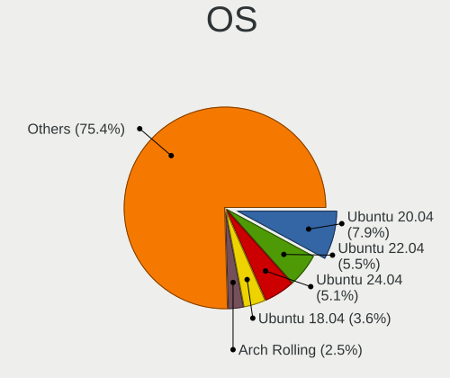

| Name                         | Computers | Percent |
|------------------------------|-----------|---------|
| Ubuntu 20.04                 | 75        | 7.9%    |
| Ubuntu 22.04                 | 52        | 5.48%   |
| Ubuntu 24.04                 | 48        | 5.06%   |
| Ubuntu 18.04                 | 34        | 3.58%   |
| Arch Rolling                 | 24        | 2.53%   |
| Pop!_OS 22.04                | 21        | 2.21%   |
| Fedora 42                    | 21        | 2.21%   |
| OpenMandriva 4.2             | 17        | 1.79%   |
| Fedora 38                    | 16        | 1.69%   |
| Debian 12                    | 16        | 1.69%   |
| OpenMandriva 23.08           | 15        | 1.58%   |
| Linux Mint 22.1              | 15        | 1.58%   |
| Debian 11                    | 14        | 1.48%   |
| Zorin 17                     | 13        | 1.37%   |
| OpenMandriva 4.3             | 12        | 1.26%   |
| KDE neon 20.04               | 12        | 1.26%   |
| OpenMandriva 24.12           | 11        | 1.16%   |
| Fedora 37                    | 11        | 1.16%   |
| ArcoLinux Rolling            | 11        | 1.16%   |
| Manjaro                      | 10        | 1.05%   |
| openSUSE Tumbleweed-XXXXXXXX | 9         | 0.95%   |
| OpenMandriva 23.01           | 9         | 0.95%   |
| Fedora 41                    | 9         | 0.95%   |
| Fedora 40                    | 9         | 0.95%   |
| Fedora 39                    | 9         | 0.95%   |
| Zorin 16                     | 8         | 0.84%   |
| OpenMandriva 25.06           | 8         | 0.84%   |
| KDE neon 22.04               | 8         | 0.84%   |
| Fedora 43                    | 8         | 0.84%   |
| Zorin 15                     | 7         | 0.74%   |
| Xubuntu 18.04                | 7         | 0.74%   |
| Linux Mint 21.3              | 7         | 0.74%   |
| Linux Mint 21                | 7         | 0.74%   |
| Kubuntu 24.04                | 7         | 0.74%   |
| Kubuntu 22.04                | 7         | 0.74%   |
| Debian 13                    | 7         | 0.74%   |
| Arch                         | 7         | 0.74%   |
| Ubuntu 19.10                 | 6         | 0.63%   |
| OpenMandriva 5.0             | 6         | 0.63%   |
| Linux Mint 22.2              | 6         | 0.63%   |

OS Family
---------

OS without a version

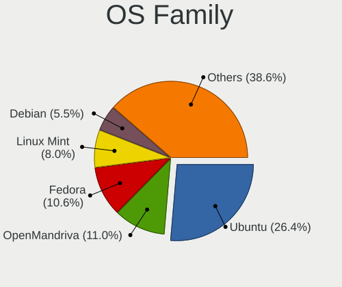

| Name             | Computers | Percent |
|------------------|-----------|---------|
| Ubuntu           | 237       | 26.36%  |
| OpenMandriva     | 99        | 11.01%  |
| Fedora           | 95        | 10.57%  |
| Linux Mint       | 72        | 8.01%   |
| Debian           | 49        | 5.45%   |
| Zorin            | 32        | 3.56%   |
| Pop!_OS          | 31        | 3.45%   |
| Arch             | 31        | 3.45%   |
| KDE neon         | 27        | 3%      |
| Kubuntu          | 23        | 2.56%   |
| Xubuntu          | 16        | 1.78%   |
| Manjaro          | 15        | 1.67%   |
| Endless          | 14        | 1.56%   |
| openSUSE         | 12        | 1.33%   |
| NixOS            | 11        | 1.22%   |
| Kali             | 11        | 1.22%   |
| ArcoLinux        | 11        | 1.22%   |
| Elementary       | 10        | 1.11%   |
| Ubuntu MATE      | 8         | 0.89%   |
| Bazzite          | 7         | 0.78%   |
| Ultramarine      | 6         | 0.67%   |
| CachyOS          | 6         | 0.67%   |
| MX               | 5         | 0.56%   |
| EndeavourOS      | 5         | 0.56%   |
| Clear Linux      | 5         | 0.56%   |
| Xero             | 4         | 0.44%   |
| Lubuntu          | 4         | 0.44%   |
| Void Linux       | 3         | 0.33%   |
| SteamOS          | 3         | 0.33%   |
| Nobara           | 3         | 0.33%   |
| Linux Lite       | 3         | 0.33%   |
| Gentoo           | 3         | 0.33%   |
| CentOS           | 3         | 0.33%   |
| UbuntuDDE        | 2         | 0.22%   |
| TUXEDO OS        | 2         | 0.22%   |
| ROSA             | 2         | 0.22%   |
| RHEL             | 2         | 0.22%   |
| Reborn OS        | 2         | 0.22%   |
| org.kde.Platform | 2         | 0.22%   |
| LMDE             | 2         | 0.22%   |

Kernel
------

Version of the Linux kernel

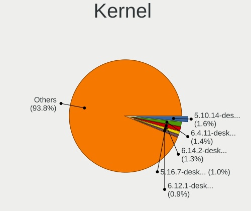

| Version                  | Computers | Percent |
|--------------------------|-----------|---------|
| 5.10.14-desktop-1omv4002 | 17        | 1.62%   |
| 6.4.11-desktop-1omv2390  | 15        | 1.43%   |
| 6.14.2-desktop-3omv2590  | 14        | 1.33%   |
| 5.16.7-desktop-1omv4003  | 10        | 0.95%   |
| 6.12.1-desktop-1omv2490  | 9         | 0.86%   |
| 6.1.1-desktop-1omv2290   | 9         | 0.86%   |
| 5.15.0-46-generic        | 9         | 0.86%   |
| 6.8.0-51-generic         | 8         | 0.76%   |
| 6.11.0-26-generic        | 7         | 0.67%   |
| 6.11.0-17-generic        | 7         | 0.67%   |
| 5.4.0-42-generic         | 7         | 0.67%   |
| 6.8.0-60-generic         | 6         | 0.57%   |
| 6.8.0-45-generic         | 6         | 0.57%   |
| 6.8.0-40-generic         | 6         | 0.57%   |
| 6.6.2-desktop-1omv2390   | 6         | 0.57%   |
| 5.4.0-48-generic         | 6         | 0.57%   |
| 5.15.0-56-generic        | 6         | 0.57%   |
| 4.18.0-15-generic        | 6         | 0.57%   |
| 6.8.0-59-generic         | 5         | 0.48%   |
| 6.8.0-49-generic         | 5         | 0.48%   |
| 6.8.0-48-generic         | 5         | 0.48%   |
| 6.14.0-37-generic        | 5         | 0.48%   |
| 6.14.0-33-generic        | 5         | 0.48%   |
| 5.4.0-156-generic        | 5         | 0.48%   |
| 5.3.0-28-generic         | 5         | 0.48%   |
| 5.15.0-58-generic        | 5         | 0.48%   |
| 5.15.0-43-generic        | 5         | 0.48%   |
| 6.8.0-85-generic         | 4         | 0.38%   |
| 6.8.0-41-generic         | 4         | 0.38%   |
| 6.2.0-39-generic         | 4         | 0.38%   |
| 6.2.0-37-generic         | 4         | 0.38%   |
| 6.15.9-201.fc42.x86_64   | 4         | 0.38%   |
| 6.14.0-15-generic        | 4         | 0.38%   |
| 6.11.0-21-generic        | 4         | 0.38%   |
| 6.1.0-37-amd64           | 4         | 0.38%   |
| 6.0.12-76060006-generic  | 4         | 0.38%   |
| 5.8.0-59-generic         | 4         | 0.38%   |
| 5.4.0-59-generic         | 4         | 0.38%   |
| 5.3.0-23-generic         | 4         | 0.38%   |
| 5.19.0-43-generic        | 4         | 0.38%   |

Kernel Family
-------------

Linux kernel without a distro release

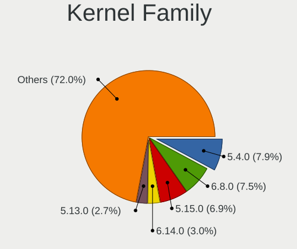

| Version | Computers | Percent |
|---------|-----------|---------|
| 5.4.0   | 80        | 7.85%   |
| 6.8.0   | 76        | 7.46%   |
| 5.15.0  | 70        | 6.87%   |
| 6.14.0  | 31        | 3.04%   |
| 5.13.0  | 28        | 2.75%   |
| 6.11.0  | 27        | 2.65%   |
| 5.8.0   | 26        | 2.55%   |
| 6.2.0   | 25        | 2.45%   |
| 4.15.0  | 24        | 2.36%   |
| 5.3.0   | 22        | 2.16%   |
| 6.5.0   | 20        | 1.96%   |
| 5.19.0  | 20        | 1.96%   |
| 5.11.0  | 19        | 1.86%   |
| 6.4.11  | 18        | 1.77%   |
| 6.14.2  | 17        | 1.67%   |
| 5.10.14 | 17        | 1.67%   |
| 6.1.0   | 16        | 1.57%   |
| 5.0.0   | 16        | 1.57%   |
| 4.18.0  | 14        | 1.37%   |
| 6.1.1   | 11        | 1.08%   |
| 5.10.0  | 11        | 1.08%   |
| 6.12.1  | 10        | 0.98%   |
| 5.16.7  | 10        | 0.98%   |
| 6.17.7  | 7         | 0.69%   |
| 4.19.0  | 7         | 0.69%   |
| 6.6.2   | 6         | 0.59%   |
| 6.0.12  | 6         | 0.59%   |
| 5.17.5  | 6         | 0.59%   |
| 6.5.5   | 5         | 0.49%   |
| 6.15.9  | 5         | 0.49%   |
| 6.12.9  | 5         | 0.49%   |
| 6.12.10 | 5         | 0.49%   |
| 6.12.0  | 5         | 0.49%   |
| 6.9.3   | 4         | 0.39%   |
| 6.2.6   | 4         | 0.39%   |
| 6.2.15  | 4         | 0.39%   |
| 6.17.9  | 4         | 0.39%   |
| 6.17.0  | 4         | 0.39%   |
| 6.16.7  | 4         | 0.39%   |
| 5.16.0  | 4         | 0.39%   |

Kernel Major Ver.
-----------------

Linux kernel major version

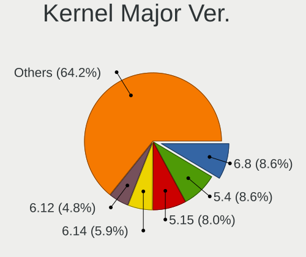

| Version | Computers | Percent |
|---------|-----------|---------|
| 6.8     | 86        | 8.57%   |
| 5.4     | 86        | 8.57%   |
| 5.15    | 80        | 7.97%   |
| 6.14    | 59        | 5.88%   |
| 6.12    | 48        | 4.78%   |
| 6.2     | 45        | 4.48%   |
| 6.5     | 43        | 4.28%   |
| 6.1     | 37        | 3.69%   |
| 6.6     | 33        | 3.29%   |
| 5.13    | 33        | 3.29%   |
| 5.10    | 33        | 3.29%   |
| 6.11    | 32        | 3.19%   |
| 5.8     | 30        | 2.99%   |
| 6.4     | 28        | 2.79%   |
| 5.19    | 27        | 2.69%   |
| 5.16    | 25        | 2.49%   |
| 5.3     | 24        | 2.39%   |
| 4.15    | 24        | 2.39%   |
| 6.17    | 22        | 2.19%   |
| 5.11    | 19        | 1.89%   |
| 5.0     | 17        | 1.69%   |
| 6.9     | 15        | 1.49%   |
| 6.0     | 15        | 1.49%   |
| 4.18    | 15        | 1.49%   |
| 6.16    | 13        | 1.29%   |
| 6.15    | 13        | 1.29%   |
| 6.10    | 13        | 1.29%   |
| 5.17    | 13        | 1.29%   |
| 6.3     | 11        | 1.1%    |
| 6.7     | 8         | 0.8%    |
| 6.13    | 7         | 0.7%    |
| 5.18    | 7         | 0.7%    |
| 4.19    | 7         | 0.7%    |
| 5.6     | 6         | 0.6%    |
| 5.9     | 5         | 0.5%    |
| 5.5     | 5         | 0.5%    |
| 5.14    | 5         | 0.5%    |
| 5.12    | 5         | 0.5%    |
| 6.18    | 2         | 0.2%    |
| 5.7     | 2         | 0.2%    |

Arch
----

OS architecture (x86_64, i586, etc.)

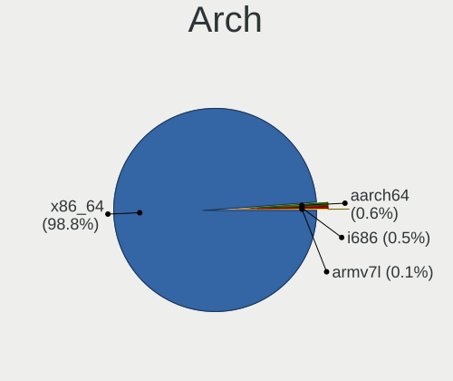

| Name    | Computers | Percent |
|---------|-----------|---------|
| x86_64  | 840       | 98.82%  |
| aarch64 | 5         | 0.59%   |
| i686    | 4         | 0.47%   |
| armv7l  | 1         | 0.12%   |

DE
--

Desktop Environment

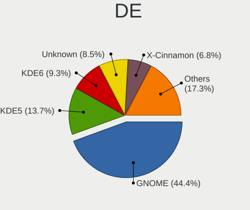

| Name             | Computers | Percent |
|------------------|-----------|---------|
| GNOME            | 403       | 44.43%  |
| KDE5             | 124       | 13.67%  |
| KDE6             | 84        | 9.26%   |
| Unknown          | 77        | 8.49%   |
| X-Cinnamon       | 62        | 6.84%   |
| XFCE             | 58        | 6.39%   |
| KDE              | 20        | 2.21%   |
| MATE             | 13        | 1.43%   |
| LXQt             | 11        | 1.21%   |
| Pantheon         | 10        | 1.1%    |
| Hyprland         | 7         | 0.77%   |
| Budgie           | 6         | 0.66%   |
| Deepin           | 5         | 0.55%   |
| Cinnamon         | 5         | 0.55%   |
| sway             | 3         | 0.33%   |
| KDE4             | 3         | 0.33%   |
| i3               | 3         | 0.33%   |
| Unity            | 2         | 0.22%   |
| lightdm-xsession | 2         | 0.22%   |
| XFCE:GNOME:      | 1         | 0.11%   |
| TOS:GNOME        | 1         | 0.11%   |
| openbox          | 1         | 0.11%   |
| niri             | 1         | 0.11%   |
| LXDE             | 1         | 0.11%   |
| GNOME Classic    | 1         | 0.11%   |
| Enlightenment    | 1         | 0.11%   |
| bspwm            | 1         | 0.11%   |
| awesome          | 1         | 0.11%   |

Display Server
--------------

X11 or Wayland

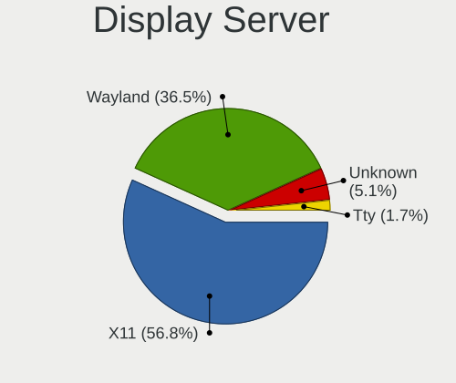

| Name    | Computers | Percent |
|---------|-----------|---------|
| X11     | 503       | 56.77%  |
| Wayland | 323       | 36.46%  |
| Unknown | 45        | 5.08%   |
| Tty     | 15        | 1.69%   |

Display Manager
---------------

SDDM, LightDM, etc.

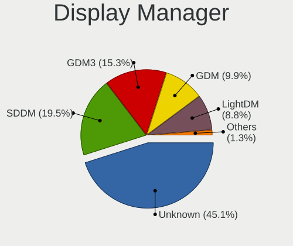

| Name    | Computers | Percent |
|---------|-----------|---------|
| Unknown | 404       | 45.09%  |
| SDDM    | 175       | 19.53%  |
| GDM3    | 137       | 15.29%  |
| GDM     | 89        | 9.93%   |
| LightDM | 79        | 8.82%   |
| TDM     | 9         | 1%      |
| XDM     | 1         | 0.11%   |
| Ly      | 1         | 0.11%   |
| GREETD  | 1         | 0.11%   |

OS Lang
-------

Language

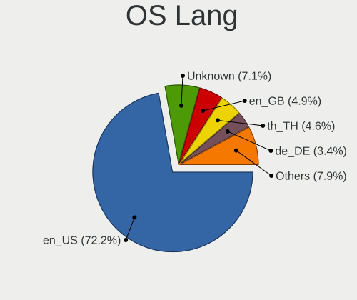

| Lang           | Computers | Percent |
|----------------|-----------|---------|
| en_US          | 624       | 72.22%  |
| Unknown        | 61        | 7.06%   |
| en_GB          | 42        | 4.86%   |
| th_TH          | 40        | 4.63%   |
| de_DE          | 29        | 3.36%   |
| C              | 20        | 2.31%   |
| it_IT          | 7         | 0.81%   |
| fr_FR          | 7         | 0.81%   |
| en_SG          | 7         | 0.81%   |
| ru_RU          | 6         | 0.69%   |
| de_CH          | 4         | 0.46%   |
| en_AU          | 3         | 0.35%   |
| zh_CN          | 2         | 0.23%   |
| fi_FI          | 2         | 0.23%   |
| sv_SE          | 1         | 0.12%   |
| nl_NL          | 1         | 0.12%   |
| he_IL          | 1         | 0.12%   |
| es_MX          | 1         | 0.12%   |
| en_US.iso88591 | 1         | 0.12%   |
| en_NG          | 1         | 0.12%   |
| en_IE          | 1         | 0.12%   |
| en_DK          | 1         | 0.12%   |
| en_CA          | 1         | 0.12%   |
| C.UTF8         | 1         | 0.12%   |

Boot Mode
---------

EFI or BIOS

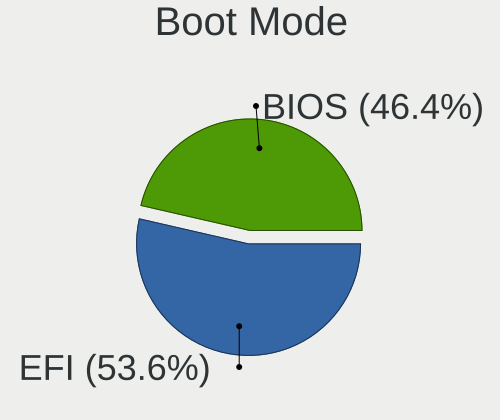

| Mode | Computers | Percent |
|------|-----------|---------|
| EFI  | 470       | 53.59%  |
| BIOS | 407       | 46.41%  |

Filesystem
----------

Type of filesystem

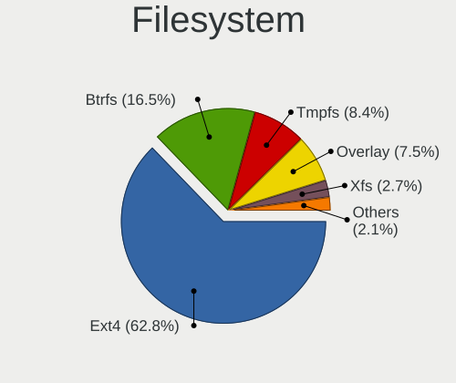

| Type    | Computers | Percent |
|---------|-----------|---------|
| Ext4    | 560       | 62.78%  |
| Btrfs   | 147       | 16.48%  |
| Tmpfs   | 75        | 8.41%   |
| Overlay | 67        | 7.51%   |
| Xfs     | 24        | 2.69%   |
| Unknown | 12        | 1.35%   |
| Zfs     | 5         | 0.56%   |
| F2fs    | 2         | 0.22%   |

Part. scheme
------------

Scheme of partitioning

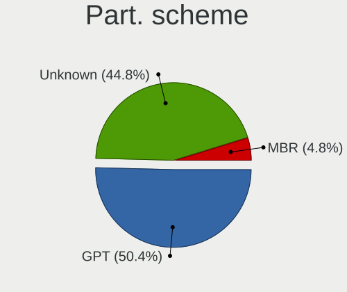

| Type    | Computers | Percent |
|---------|-----------|---------|
| GPT     | 444       | 50.4%   |
| Unknown | 395       | 44.84%  |
| MBR     | 42        | 4.77%   |

Dual Boot with Linux/BSD
------------------------

Hosting more than one Linux/BSD

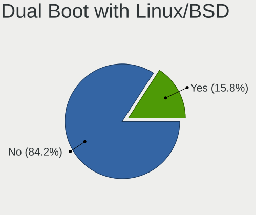

| Dual boot | Computers | Percent |
|-----------|-----------|---------|
| No        | 734       | 84.17%  |
| Yes       | 138       | 15.83%  |

Dual Boot (Win)
---------------

Hosting Linux and Windows

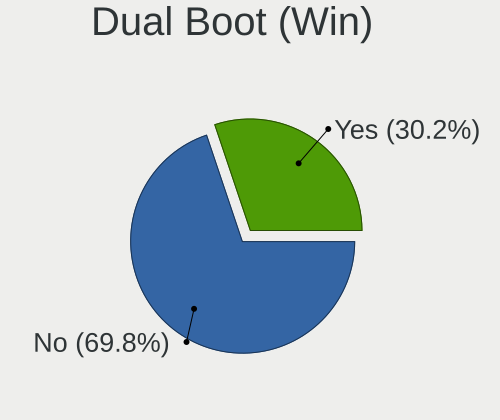

| Dual boot | Computers | Percent |
|-----------|-----------|---------|
| No        | 609       | 69.84%  |
| Yes       | 263       | 30.16%  |

Board
-----

Vendor
------

Motherboard manufacturer

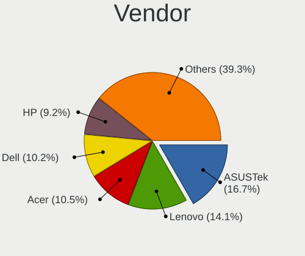

| Name                                 | Computers | Percent |
|--------------------------------------|-----------|---------|
| ASUSTek Computer                     | 142       | 16.71%  |
| Lenovo                               | 120       | 14.12%  |
| Acer                                 | 89        | 10.47%  |
| Dell                                 | 87        | 10.24%  |
| Hewlett-Packard                      | 78        | 9.18%   |
| Gigabyte Technology                  | 66        | 7.76%   |
| ASRock                               | 48        | 5.65%   |
| MSI                                  | 46        | 5.41%   |
| Apple                                | 29        | 3.41%   |
| Fujitsu                              | 16        | 1.88%   |
| Intel                                | 15        | 1.76%   |
| HUAWEI                               | 11        | 1.29%   |
| Unknown                              | 10        | 1.18%   |
| Samsung Electronics                  | 7         | 0.82%   |
| Microsoft                            | 7         | 0.82%   |
| AMI                                  | 7         | 0.82%   |
| Toshiba                              | 5         | 0.59%   |
| Timi                                 | 3         | 0.35%   |
| Sony                                 | 3         | 0.35%   |
| OEM                                  | 3         | 0.35%   |
| MiTAC                                | 3         | 0.35%   |
| Huanan                               | 3         | 0.35%   |
| Google                               | 3         | 0.35%   |
| AZW                                  | 3         | 0.35%   |
| Valve                                | 2         | 0.24%   |
| T-bao                                | 2         | 0.24%   |
| Supermicro                           | 2         | 0.24%   |
| MicroByte                            | 2         | 0.24%   |
| Infinix                              | 2         | 0.24%   |
| IBM                                  | 2         | 0.24%   |
| Chuwi                                | 2         | 0.24%   |
| Biostar                              | 2         | 0.24%   |
| Xiaomi                               | 1         | 0.12%   |
| ViewSonic                            | 1         | 0.12%   |
| VIA Technologies                     | 1         | 0.12%   |
| TECNO Mobile Limited                 | 1         | 0.12%   |
| SmbiosType1_SystemManufacturer       | 1         | 0.12%   |
| SLIMBOOK                             | 1         | 0.12%   |
| Shenzhen Meigao Electronic Equipment | 1         | 0.12%   |
| SHARKBAY                             | 1         | 0.12%   |

Model
-----

Motherboard model

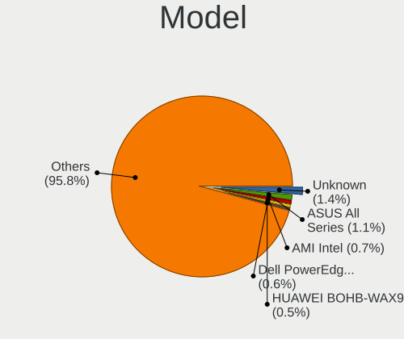

| Name                                   | Computers | Percent |
|----------------------------------------|-----------|---------|
| Unknown                                | 12        | 1.41%   |
| ASUS All Series                        | 9         | 1.06%   |
| AMI Intel                              | 6         | 0.71%   |
| Dell PowerEdge R7625                   | 5         | 0.59%   |
| HUAWEI BOHB-WAX9                       | 4         | 0.47%   |
| Dell OptiPlex 7010                     | 4         | 0.47%   |
| ASUS P8H61-M LE                        | 4         | 0.47%   |
| ASRock B450 Steel Legend               | 4         | 0.47%   |
| Apple MacBookPro11,3                   | 4         | 0.47%   |
| Lenovo Z50-70 20354                    | 3         | 0.35%   |
| Lenovo MIIX 520-12IKB 81CG             | 3         | 0.35%   |
| Intel X99                              | 3         | 0.35%   |
| Gigabyte H61M-DS2                      | 3         | 0.35%   |
| Gigabyte H110M-DS2                     | 3         | 0.35%   |
| Dell OptiPlex 9020                     | 3         | 0.35%   |
| Dell OptiPlex 7020                     | 3         | 0.35%   |
| Dell Inspiron 3847                     | 3         | 0.35%   |
| ASUS Vivobook Go E1504FA_E1504FA       | 3         | 0.35%   |
| Acer Veriton N4640G                    | 3         | 0.35%   |
| Acer Aspire E5-471G                    | 3         | 0.35%   |
| Acer Aspire A515-45                    | 3         | 0.35%   |
| Valve Jupiter                          | 2         | 0.24%   |
| Timi RedmiBook 15                      | 2         | 0.24%   |
| T-bao MINI PC                          | 2         | 0.24%   |
| Samsung NC208/NC108                    | 2         | 0.24%   |
| OEM X79G                               | 2         | 0.24%   |
| MSI MS-7C35                            | 2         | 0.24%   |
| MSI MS-7A78                            | 2         | 0.24%   |
| MSI GF65 Thin 10UE                     | 2         | 0.24%   |
| MiTAC PD10EHI                          | 2         | 0.24%   |
| Microsoft Surface Go 3                 | 2         | 0.24%   |
| Microsoft Surface Go 2                 | 2         | 0.24%   |
| MicroByte ezbook                       | 2         | 0.24%   |
| Lenovo Yoga 7 14ITL5 82BH              | 2         | 0.24%   |
| Lenovo ThinkPad X240 20AMS00100        | 2         | 0.24%   |
| Lenovo ThinkPad 11e 5th Gen 20LQS00000 | 2         | 0.24%   |
| Lenovo ThinkBook 14 G2 ITL 20VD        | 2         | 0.24%   |
| Lenovo LOQ 15ARP9 83JC                 | 2         | 0.24%   |
| Lenovo G460 20041                      | 2         | 0.24%   |
| Lenovo G40-45 80E1                     | 2         | 0.24%   |

Model Family
------------

Motherboard model prefix

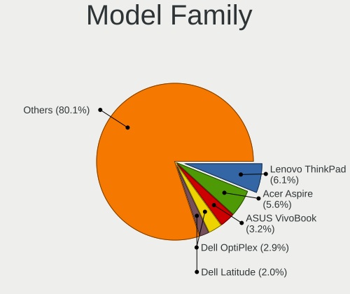

| Name               | Computers | Percent |
|--------------------|-----------|---------|
| Lenovo ThinkPad    | 52        | 6.12%   |
| Acer Aspire        | 48        | 5.65%   |
| ASUS VivoBook      | 27        | 3.18%   |
| Dell OptiPlex      | 25        | 2.94%   |
| Dell Latitude      | 17        | 2%      |
| HP Pavilion        | 15        | 1.76%   |
| ASUS ASUS          | 15        | 1.76%   |
| Lenovo IdeaPad     | 14        | 1.65%   |
| Dell Inspiron      | 14        | 1.65%   |
| ASUS ROG           | 13        | 1.53%   |
| HP Laptop          | 12        | 1.41%   |
| Unknown            | 12        | 1.41%   |
| Lenovo Yoga        | 10        | 1.18%   |
| ASUS PRIME         | 10        | 1.18%   |
| Acer Veriton       | 10        | 1.18%   |
| Acer Swift         | 10        | 1.18%   |
| HP Compaq          | 9         | 1.06%   |
| Dell Precision     | 9         | 1.06%   |
| ASUS All           | 9         | 1.06%   |
| Acer Nitro         | 9         | 1.06%   |
| ASUS TUF           | 8         | 0.94%   |
| Microsoft Surface  | 7         | 0.82%   |
| HP EliteBook       | 7         | 0.82%   |
| Dell Vostro        | 7         | 0.82%   |
| Dell PowerEdge     | 7         | 0.82%   |
| Apple MacBookPro11 | 7         | 0.82%   |
| Lenovo ThinkCentre | 6         | 0.71%   |
| ASUS ZenBook       | 6         | 0.71%   |
| ASRock B450        | 6         | 0.71%   |
| AMI Intel          | 6         | 0.71%   |
| Lenovo ThinkBook   | 5         | 0.59%   |
| Lenovo Legion      | 5         | 0.59%   |
| HP ProDesk         | 5         | 0.59%   |
| HP ENVY            | 5         | 0.59%   |
| Toshiba Satellite  | 4         | 0.47%   |
| Lenovo MIIX        | 4         | 0.47%   |
| HUAWEI BOHB-WAX9   | 4         | 0.47%   |
| HP EliteDesk       | 4         | 0.47%   |
| Gigabyte X570      | 4         | 0.47%   |
| ASUS P8H61-M       | 4         | 0.47%   |

MFG Year
--------

Motherboard manufacture year

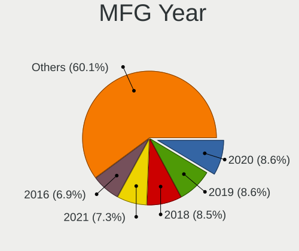

| Year    | Computers | Percent |
|---------|-----------|---------|
| 2020    | 73        | 8.59%   |
| 2019    | 73        | 8.59%   |
| 2018    | 72        | 8.47%   |
| 2021    | 62        | 7.29%   |
| 2016    | 59        | 6.94%   |
| 2017    | 57        | 6.71%   |
| 2012    | 57        | 6.71%   |
| 2014    | 56        | 6.59%   |
| 2023    | 55        | 6.47%   |
| 2013    | 54        | 6.35%   |
| 2011    | 42        | 4.94%   |
| 2015    | 40        | 4.71%   |
| 2022    | 38        | 4.47%   |
| 2024    | 30        | 3.53%   |
| 2010    | 22        | 2.59%   |
| 2009    | 19        | 2.24%   |
| 2008    | 19        | 2.24%   |
| 2025    | 7         | 0.82%   |
| Unknown | 6         | 0.71%   |
| 2007    | 4         | 0.47%   |
| 2006    | 4         | 0.47%   |
| 2005    | 1         | 0.12%   |

Form Factor
-----------

Physical design of the computer

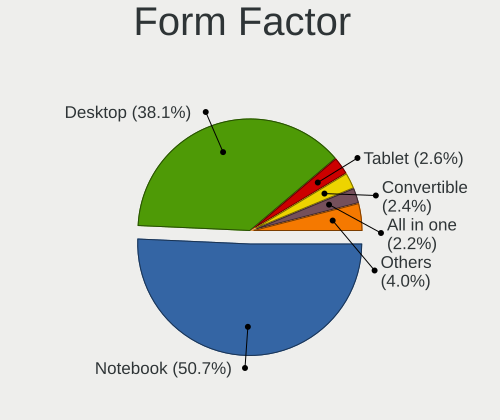

| Name           | Computers | Percent |
|----------------|-----------|---------|
| Notebook       | 431       | 50.71%  |
| Desktop        | 324       | 38.12%  |
| Tablet         | 22        | 2.59%   |
| Convertible    | 20        | 2.35%   |
| All in one     | 19        | 2.24%   |
| Mini pc        | 18        | 2.12%   |
| Server         | 10        | 1.18%   |
| System on chip | 5         | 0.59%   |
| Other          | 1         | 0.12%   |

Secure Boot
-----------

Enabled or disabled

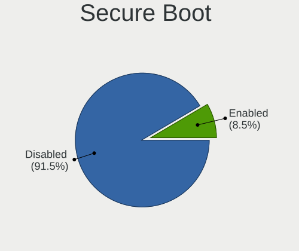

| State    | Computers | Percent |
|----------|-----------|---------|
| Disabled | 788       | 91.52%  |
| Enabled  | 73        | 8.48%   |

Coreboot
--------

Have coreboot on board

| Used | Computers | Percent |
|------|-----------|---------|
| No   | 847       | 99.65%  |
| Yes  | 3         | 0.35%   |

RAM Size
--------

Total RAM memory

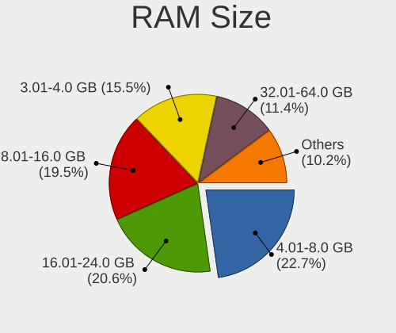

| Size in GB      | Computers | Percent |
|-----------------|-----------|---------|
| 4.01-8.0        | 199       | 22.74%  |
| 16.01-24.0      | 180       | 20.57%  |
| 8.01-16.0       | 171       | 19.54%  |
| 3.01-4.0        | 136       | 15.54%  |
| 32.01-64.0      | 100       | 11.43%  |
| 24.01-32.0      | 29        | 3.31%   |
| 64.01-256.0     | 26        | 2.97%   |
| 1.01-2.0        | 22        | 2.51%   |
| More than 256.0 | 6         | 0.69%   |
| 2.01-3.0        | 4         | 0.46%   |
| 0.51-1.0        | 2         | 0.23%   |

RAM Used
--------

Used RAM memory

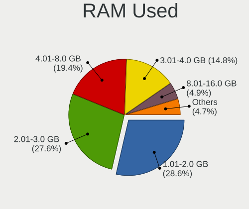

| Used GB         | Computers | Percent |
|-----------------|-----------|---------|
| 1.01-2.0        | 274       | 28.6%   |
| 2.01-3.0        | 264       | 27.56%  |
| 4.01-8.0        | 186       | 19.42%  |
| 3.01-4.0        | 142       | 14.82%  |
| 8.01-16.0       | 47        | 4.91%   |
| 0.51-1.0        | 26        | 2.71%   |
| 16.01-24.0      | 7         | 0.73%   |
| 0.01-0.5        | 4         | 0.42%   |
| 64.01-256.0     | 3         | 0.31%   |
| More than 256.0 | 2         | 0.21%   |
| 24.01-32.0      | 2         | 0.21%   |
| 32.01-64.0      | 1         | 0.1%    |

Total Drives
------------

Number of drives on board

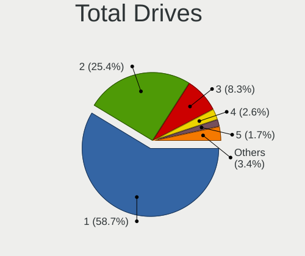

| Drives | Computers | Percent |
|--------|-----------|---------|
| 1      | 522       | 58.65%  |
| 2      | 226       | 25.39%  |
| 3      | 74        | 8.31%   |
| 4      | 23        | 2.58%   |
| 5      | 15        | 1.69%   |
| 0      | 11        | 1.24%   |
| 6      | 6         | 0.67%   |
| 17     | 4         | 0.45%   |
| 7      | 3         | 0.34%   |
| 10     | 2         | 0.22%   |
| 51     | 1         | 0.11%   |
| 32     | 1         | 0.11%   |
| 18     | 1         | 0.11%   |
| 9      | 1         | 0.11%   |

Has CD-ROM
----------

Has CD-ROM on board

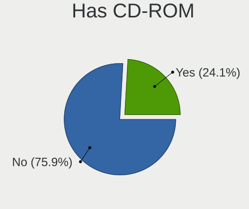

| Presented | Computers | Percent |
|-----------|-----------|---------|
| No        | 649       | 75.91%  |
| Yes       | 206       | 24.09%  |

Has Ethernet
------------

Has Ethernet on board

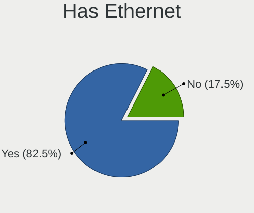

| Presented | Computers | Percent |
|-----------|-----------|---------|
| Yes       | 703       | 82.51%  |
| No        | 149       | 17.49%  |

Has WiFi
--------

Has WiFi module

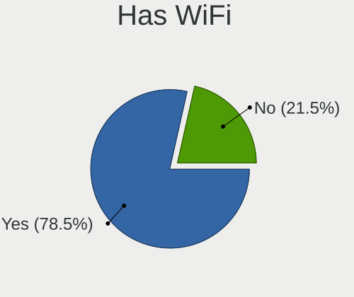

| Presented | Computers | Percent |
|-----------|-----------|---------|
| Yes       | 676       | 78.51%  |
| No        | 185       | 21.49%  |

Has Bluetooth
-------------

Has Bluetooth module

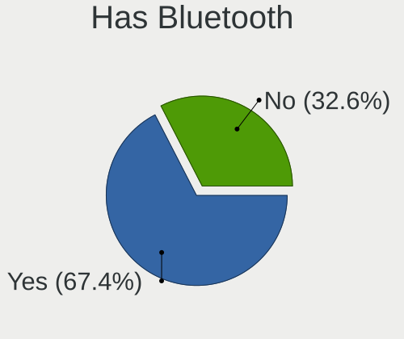

| Presented | Computers | Percent |
|-----------|-----------|---------|
| Yes       | 582       | 67.44%  |
| No        | 281       | 32.56%  |

Location
--------

Country
-------

Geographic location (country)

| Country  | Computers | Percent |
|----------|-----------|---------|
| Thailand | 850       | 100%    |

City
----

Geographic location (city)

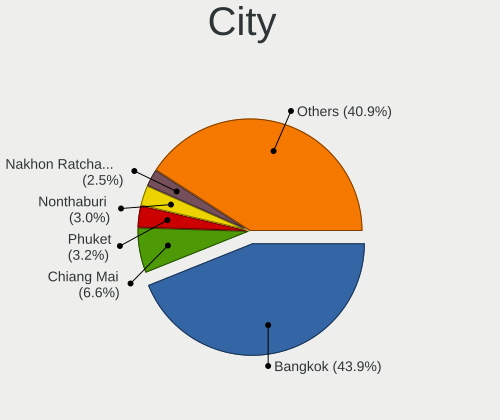

| City                     | Computers | Percent |
|--------------------------|-----------|---------|
| Bangkok                  | 402       | 43.93%  |
| Chiang Mai               | 60        | 6.56%   |
| Phuket                   | 29        | 3.17%   |
| Nonthaburi               | 27        | 2.95%   |
| Nakhon Ratchasima        | 23        | 2.51%   |
| Khon Kaen                | 22        | 2.4%    |
| Nakhon Pathom            | 21        | 2.3%    |
| Chon Buri                | 17        | 1.86%   |
| Bang Lamung              | 16        | 1.75%   |
| Mueang Samut Prakan      | 15        | 1.64%   |
| Ban Nong Sala            | 15        | 1.64%   |
| Surat Thani              | 8         | 0.87%   |
| Pattaya                  | 8         | 0.87%   |
| Ban Du                   | 8         | 0.87%   |
| Surin                    | 7         | 0.77%   |
| Songkhla                 | 7         | 0.77%   |
| Hua Hin                  | 7         | 0.77%   |
| Si Racha                 | 6         | 0.66%   |
| Phitsanulok              | 6         | 0.66%   |
| Pathum Thani             | 6         | 0.66%   |
| Hat Yai                  | 6         | 0.66%   |
| Udon Thani               | 5         | 0.55%   |
| Si Sa Ket                | 5         | 0.55%   |
| Ko Samui                 | 5         | 0.55%   |
| Ban Phan Don             | 5         | 0.55%   |
| Pak Kret                 | 4         | 0.44%   |
| Lampang                  | 4         | 0.44%   |
| Khlong Luang             | 4         | 0.44%   |
| Ban Bueng                | 4         | 0.44%   |
| Suan Luang               | 3         | 0.33%   |
| Sakon Nakhon             | 3         | 0.33%   |
| Rayong                   | 3         | 0.33%   |
| Phra Nakhon Si Ayutthaya | 3         | 0.33%   |
| Phetchaburi              | 3         | 0.33%   |
| Maha Sarakham            | 3         | 0.33%   |
| Lat Krabang              | 3         | 0.33%   |
| Kosamphi Nakhon          | 3         | 0.33%   |
| Din Daeng                | 3         | 0.33%   |
| Chiang Rai               | 3         | 0.33%   |
| Bang Khae                | 3         | 0.33%   |

Drives
------

Drive Vendor
------------

Hard drive vendors

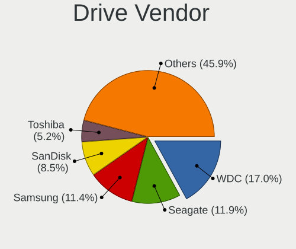

| Vendor                       | Computers | Drives | Percent |
|------------------------------|-----------|--------|---------|
| WDC                          | 218       | 340    | 17%     |
| Seagate                      | 153       | 249    | 11.93%  |
| Samsung Electronics          | 146       | 206    | 11.39%  |
| SanDisk                      | 109       | 155    | 8.5%    |
| Toshiba                      | 67        | 128    | 5.23%   |
| Unknown                      | 59        | 80     | 4.6%    |
| Kingston                     | 59        | 75     | 4.6%    |
| SK hynix                     | 36        | 117    | 2.81%   |
| Micron Technology            | 35        | 54     | 2.73%   |
| Intel                        | 27        | 29     | 2.11%   |
| China                        | 20        | 32     | 1.56%   |
| Apple                        | 20        | 29     | 1.56%   |
| Hitachi                      | 18        | 19     | 1.4%    |
| Crucial                      | 18        | 20     | 1.4%    |
| HGST                         | 16        | 26     | 1.25%   |
| MAXIO Technology (Hangzhou)  | 15        | 19     | 1.17%   |
| Apacer                       | 15        | 17     | 1.17%   |
| Silicon Motion               | 14        | 20     | 1.09%   |
| HS-SSD-C100                  | 14        | 30     | 1.09%   |
| Hikvision                    | 13        | 13     | 1.01%   |
| Transcend                    | 10        | 11     | 0.78%   |
| KIOXIA                       | 10        | 15     | 0.78%   |
| Phison Electronics           | 8         | 13     | 0.62%   |
| Kingston Technology Company  | 8         | 9      | 0.62%   |
| A-DATA Technology            | 8         | 12     | 0.62%   |
| Unknown                      | 8         | 11     | 0.62%   |
| SPCC                         | 7         | 7      | 0.55%   |
| Realtek Semiconductor        | 7         | 7      | 0.55%   |
| JMicron Technology           | 7         | 7      | 0.55%   |
| HS-SSD-E100                  | 7         | 8      | 0.55%   |
| Phison                       | 6         | 11     | 0.47%   |
| Colorful                     | 6         | 11     | 0.47%   |
| USB3.0                       | 5         | 7      | 0.39%   |
| TO Exter                     | 5         | 5      | 0.39%   |
| Lexar                        | 5         | 6      | 0.39%   |
| Shenzhen Longsys Electronics | 4         | 4      | 0.31%   |
| Plextor                      | 4         | 4      | 0.31%   |
| Pioneer                      | 4         | 4      | 0.31%   |
| KingSpec                     | 4         | 6      | 0.31%   |
| Hewlett-Packard              | 4         | 6      | 0.31%   |

Drive Model
-----------

Hard drive models

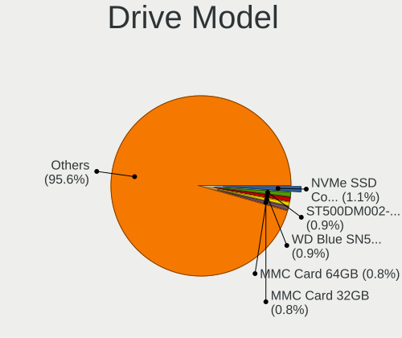

| Model                                                | Computers | Percent |
|------------------------------------------------------|-----------|---------|
| Samsung NVMe SSD Controller SM981/PM981/PM983 1TB    | 15        | 1.06%   |
| Seagate ST500DM002-1BD142 500GB                      | 13        | 0.92%   |
| Sandisk WD Blue SN550 NVMe SSD 1024GB                | 12        | 0.85%   |
| Unknown MMC Card  64GB                               | 11        | 0.78%   |
| Unknown MMC Card  32GB                               | 11        | 0.78%   |
| Seagate ST1000DM010-2EP102 1TB                       | 11        | 0.78%   |
| MAXIO (Hangzhou) NVMe SSD Controller MAP1202 2TB     | 11        | 0.78%   |
| Kingston SA400S37240G 240GB SSD                      | 11        | 0.78%   |
| WDC WDS120G2G0A-00JH30 120GB SSD                     | 10        | 0.71%   |
| SanDisk NVMe SSD Drive 1TB                           | 10        | 0.71%   |
| WDC WD10EZEX-00WN4A0 1TB                             | 9         | 0.64%   |
| Toshiba MQ04ABF100 1TB                               | 9         | 0.64%   |
| Toshiba MQ01ABD100 1TB                               | 9         | 0.64%   |
| Seagate ST1000DM003-1ER162 1TB                       | 9         | 0.64%   |
| WDC WDS240G2G0A-00JH30 240GB SSD                     | 8         | 0.57%   |
| WDC WD10EZEX-08WN4A0 1TB                             | 8         | 0.57%   |
| Unknown MMC Card  128GB                              | 8         | 0.57%   |
| Seagate ST500LT012-1DG142 500GB                      | 8         | 0.57%   |
| Seagate ST1000LM024 HN-M101MBB 1TB                   | 8         | 0.57%   |
| Crucial CT500MX500SSD1 500GB                         | 8         | 0.57%   |
| Unknown                                              | 8         | 0.57%   |
| WDC WDS500G2B0A-00SM50 500GB                         | 7         | 0.5%    |
| Unknown SD/MMC/MS PRO 2GB                            | 7         | 0.5%    |
| Toshiba DT01ACA100 1TB                               | 7         | 0.5%    |
| Seagate ST1000LM035-1RK172 1TB                       | 7         | 0.5%    |
| Samsung NVMe SSD Controller SM961/PM961/SM963 1024GB | 7         | 0.5%    |
| Samsung NVMe SSD Controller PM9A1/PM9A3/980PRO 1TB   | 7         | 0.5%    |
| HS-SSD-C100 120G                                     | 7         | 0.5%    |
| WDC WDS240G2G0B-00EPW0 240GB SSD                     | 6         | 0.43%   |
| WDC WDS100T2B0A-00SM50 1TB SSD                       | 6         | 0.43%   |
| WDC WD20EZAZ-00GGJB0 2TB                             | 6         | 0.43%   |
| Seagate ST2000VX008-2E3164 2TB                       | 6         | 0.43%   |
| Sandisk WD Black SN750 / PC SN730 NVMe SSD 500GB     | 6         | 0.43%   |
| Samsung SSD 850 EVO 250GB                            | 6         | 0.43%   |
| Kingston SUV400S37120G 120GB SSD                     | 6         | 0.43%   |
| WDC WD10JPVX-22JC3T0 1TB                             | 5         | 0.35%   |
| WDC WD10EZEX-60WN4A0 1TB                             | 5         | 0.35%   |
| USB3.0 Super Speed 500GB                             | 5         | 0.35%   |
| Toshiba XG6 NVMe SSD Controller 1024GB               | 5         | 0.35%   |
| Toshiba MQ01ABF032 320GB                             | 5         | 0.35%   |

HDD Vendor
----------

Hard disk drive vendors

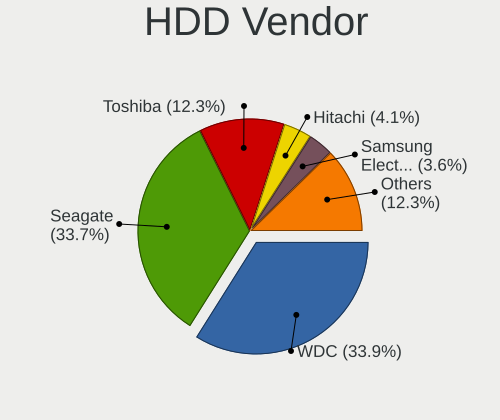

| Vendor              | Computers | Drives | Percent |
|---------------------|-----------|--------|---------|
| WDC                 | 149       | 227    | 33.94%  |
| Seagate             | 148       | 236    | 33.71%  |
| Toshiba             | 54        | 111    | 12.3%   |
| Hitachi             | 18        | 19     | 4.1%    |
| Samsung Electronics | 16        | 24     | 3.64%   |
| HGST                | 16        | 26     | 3.64%   |
| Unknown             | 8         | 14     | 1.82%   |
| USB3.0              | 5         | 7      | 1.14%   |
| TO Exter            | 5         | 5      | 1.14%   |
| Apple               | 4         | 4      | 0.91%   |
| JMicron Technology  | 3         | 3      | 0.68%   |
| Hewlett-Packard     | 3         | 5      | 0.68%   |
| Fujitsu             | 3         | 5      | 0.68%   |
| External            | 3         | 3      | 0.68%   |
| Initio              | 1         | 1      | 0.23%   |
| IBM-ESXS            | 1         | 2      | 0.23%   |
| HGST HTS            | 1         | 1      | 0.23%   |
| ASMedia             | 1         | 1      | 0.23%   |

SSD Vendor
----------

Solid state drive vendors

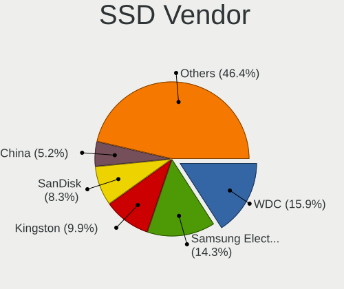

| Vendor              | Computers | Drives | Percent |
|---------------------|-----------|--------|---------|
| WDC                 | 61        | 83     | 15.89%  |
| Samsung Electronics | 55        | 80     | 14.32%  |
| Kingston            | 38        | 47     | 9.9%    |
| SanDisk             | 32        | 50     | 8.33%   |
| China               | 20        | 32     | 5.21%   |
| Crucial             | 18        | 20     | 4.69%   |
| Apacer              | 15        | 17     | 3.91%   |
| Apple               | 13        | 15     | 3.39%   |
| SK hynix            | 10        | 71     | 2.6%    |
| Intel               | 8         | 8      | 2.08%   |
| Hikvision           | 8         | 8      | 2.08%   |
| Micron Technology   | 7         | 8      | 1.82%   |
| Transcend           | 6         | 7      | 1.56%   |
| SPCC                | 6         | 6      | 1.56%   |
| A-DATA Technology   | 6         | 10     | 1.56%   |
| Lexar               | 5         | 6      | 1.3%    |
| Colorful            | 5         | 10     | 1.3%    |
| Plextor             | 4         | 4      | 1.04%   |
| Pioneer             | 4         | 4      | 1.04%   |
| KingSpec            | 4         | 6      | 1.04%   |
| GALAX               | 4         | 4      | 1.04%   |
| Toshiba             | 3         | 3      | 0.78%   |
| PNY                 | 3         | 4      | 0.78%   |
| Kingmax             | 3         | 10     | 0.78%   |
| walram              | 2         | 2      | 0.52%   |
| Team                | 2         | 2      | 0.52%   |
| Seagate             | 2         | 2      | 0.52%   |
| LITEON              | 2         | 3      | 0.52%   |
| Intenso             | 2         | 13     | 0.52%   |
| HS-SSD-WAVE(S)      | 2         | 2      | 0.52%   |
| HS-SSD-E100         | 2         | 2      | 0.52%   |
| Acer                | 2         | 6      | 0.52%   |
| Unknown             | 2         | 3      | 0.52%   |
| ZADAK               | 1         | 1      | 0.26%   |
| WDC WDS             | 1         | 1      | 0.26%   |
| Verbatim            | 1         | 1      | 0.26%   |
| Unknown             | 1         | 1      | 0.26%   |
| Teelkoou            | 1         | 1      | 0.26%   |
| TARGET              | 1         | 1      | 0.26%   |
| StoreJet            | 1         | 1      | 0.26%   |

Drive Kind
----------

HDD or SSD

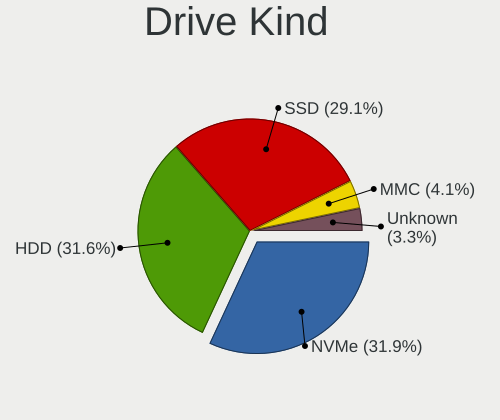

| Kind    | Computers | Drives | Percent |
|---------|-----------|--------|---------|
| NVMe    | 360       | 548    | 31.91%  |
| HDD     | 357       | 694    | 31.65%  |
| SSD     | 328       | 578    | 29.08%  |
| MMC     | 46        | 62     | 4.08%   |
| Unknown | 37        | 63     | 3.28%   |

Drive Connector
---------------

SATA, SAS, NVMe, etc.

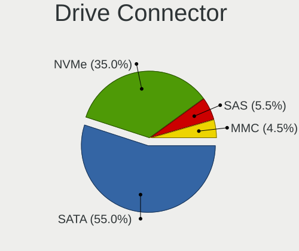

| Type | Computers | Drives | Percent |
|------|-----------|--------|---------|
| SATA | 566       | 1248   | 55%     |
| NVMe | 360       | 534    | 34.99%  |
| SAS  | 57        | 101    | 5.54%   |
| MMC  | 46        | 62     | 4.47%   |

Drive Size
----------

Size of hard drive

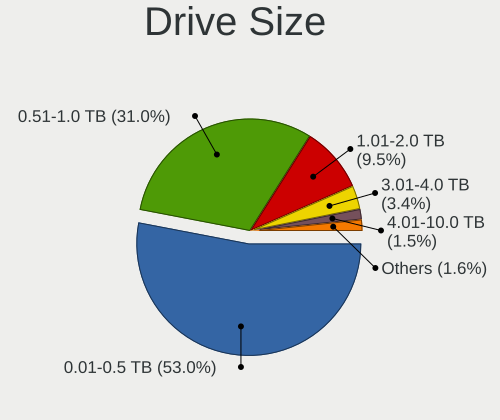

| Size in TB | Computers | Drives | Percent |
|------------|-----------|--------|---------|
| 0.01-0.5   | 387       | 626    | 53.01%  |
| 0.51-1.0   | 226       | 341    | 30.96%  |
| 1.01-2.0   | 69        | 108    | 9.45%   |
| 3.01-4.0   | 25        | 138    | 3.42%   |
| 4.01-10.0  | 11        | 28     | 1.51%   |
| 2.01-3.0   | 9         | 19     | 1.23%   |
| 10.01-20.0 | 3         | 12     | 0.41%   |

Space Total
-----------

Amount of disk space available on the file system

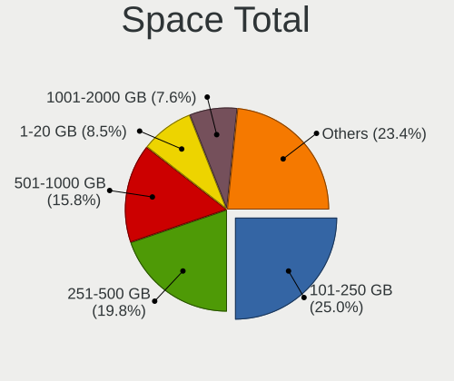

| Size in GB     | Computers | Percent |
|----------------|-----------|---------|
| 101-250        | 230       | 25%     |
| 251-500        | 182       | 19.78%  |
| 501-1000       | 145       | 15.76%  |
| 1-20           | 78        | 8.48%   |
| 1001-2000      | 70        | 7.61%   |
| 51-100         | 61        | 6.63%   |
| More than 3000 | 44        | 4.78%   |
| 21-50          | 42        | 4.57%   |
| 2001-3000      | 37        | 4.02%   |
| Unknown        | 31        | 3.37%   |

Space Used
----------

Amount of used disk space

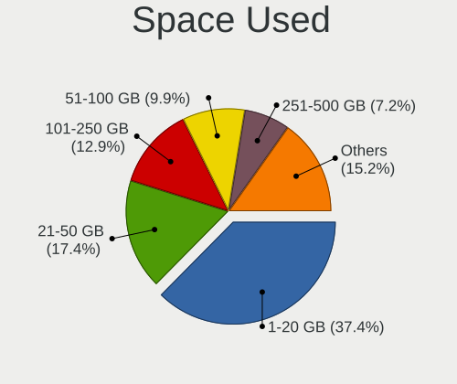

| Used GB        | Computers | Percent |
|----------------|-----------|---------|
| 1-20           | 352       | 37.41%  |
| 21-50          | 164       | 17.43%  |
| 101-250        | 121       | 12.86%  |
| 51-100         | 93        | 9.88%   |
| 251-500        | 68        | 7.23%   |
| 501-1000       | 54        | 5.74%   |
| Unknown        | 31        | 3.29%   |
| 1001-2000      | 27        | 2.87%   |
| More than 3000 | 19        | 2.02%   |
| 2001-3000      | 12        | 1.28%   |

Malfunc. Drives
---------------

Drive models with a malfunction

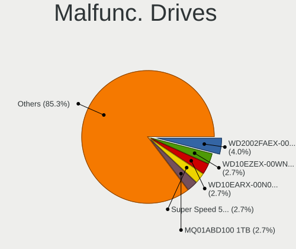

| Model                                    | Computers | Drives | Percent |
|------------------------------------------|-----------|--------|---------|
| WDC WD2002FAEX-007BA0 2TB                | 3         | 3      | 4%      |
| WDC WD10EZEX-00WN4A0 1TB                 | 2         | 2      | 2.67%   |
| WDC WD10EARX-00N0YB0 1TB                 | 2         | 2      | 2.67%   |
| USB3.0 Super Speed 500GB                 | 2         | 4      | 2.67%   |
| Toshiba MQ01ABD100 1TB                   | 2         | 2      | 2.67%   |
| Seagate ST500DM002-1BD142 500GB          | 2         | 2      | 2.67%   |
| Seagate ST500DM002-1BD14 500GB           | 2         | 3      | 2.67%   |
| Seagate ST3500418AS 500GB                | 2         | 3      | 2.67%   |
| Seagate ST1000LM049-2GH172 1TB           | 2         | 2      | 2.67%   |
| Seagate ST1000LM035-1RK172 1TB           | 2         | 2      | 2.67%   |
| Samsung Electronics SSD 830 Series 128GB | 2         | 2      | 2.67%   |
| WDC WDS240G2G0A-00JH30 240GB SSD         | 1         | 1      | 1.33%   |
| WDC WD7500BPVT-00HXZT3 752GB             | 1         | 1      | 1.33%   |
| WDC WD6402AAEX-00Y9A0 640GB              | 1         | 1      | 1.33%   |
| WDC WD20EZRX-00DC0B0 2TB                 | 1         | 1      | 1.33%   |
| WDC WD20EARS-00MVWB0 2TB                 | 1         | 1      | 1.33%   |
| WDC WD10SPZX-22Z10T0 1TB                 | 1         | 3      | 1.33%   |
| WDC WD10PURX-64E5EY0 1TB                 | 1         | 1      | 1.33%   |
| WDC WD10EZEX-08WN4A0 1TB                 | 1         | 1      | 1.33%   |
| WDC WD1002FAEX-00Y9A0 1TB                | 1         | 1      | 1.33%   |
| WDC WD Blue SA510 2.5 500GB              | 1         | 1      | 1.33%   |
| Toshiba MQ04ABF100 1TB                   | 1         | 1      | 1.33%   |
| Toshiba MK6475GSX 640GB                  | 1         | 1      | 1.33%   |
| Toshiba KSG60ZMV512G M.2 2280 512GB SSD  | 1         | 1      | 1.33%   |
| Toshiba HDWL110 1TB                      | 1         | 1      | 1.33%   |
| TARGET SSD 128G                          | 1         | 1      | 1.33%   |
| SK hynix BC711 HFM512GD3JX013N 512GB     | 1         | 2      | 1.33%   |
| Seagate ST9500325AS 500GB                | 1         | 1      | 1.33%   |
| Seagate ST9120822AS 120GB                | 1         | 1      | 1.33%   |
| Seagate ST500LT012-9WS142 500GB          | 1         | 1      | 1.33%   |
| Seagate ST500LT012-1DG142 500GB          | 1         | 1      | 1.33%   |
| Seagate ST500LM000-SSHD-8GB              | 1         | 1      | 1.33%   |
| Seagate ST4000DM004-2CV104 4TB           | 1         | 1      | 1.33%   |
| Seagate ST3000VN000-1HJ166 3TB           | 1         | 2      | 1.33%   |
| Seagate ST2000DM006-2DM164 2TB           | 1         | 1      | 1.33%   |
| Seagate ST1000LX015-1U7172-SSHD 1TB      | 1         | 1      | 1.33%   |
| Seagate ST1000LM024 HN-M101MBB 1TB       | 1         | 1      | 1.33%   |
| Seagate ST1000LM014-1EJ164 1TB           | 1         | 1      | 1.33%   |
| Seagate ST1000DM003-1SB102 1TB           | 1         | 1      | 1.33%   |
| SanDisk SDSSDX240GG25 240GB              | 1         | 1      | 1.33%   |

Malfunc. Drive Vendor
---------------------

Vendors of faulty drives

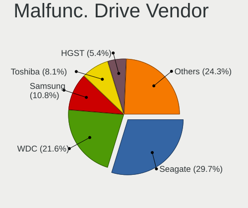

| Vendor                | Computers | Drives | Percent |
|-----------------------|-----------|--------|---------|
| Seagate               | 22        | 25     | 29.73%  |
| WDC                   | 16        | 19     | 21.62%  |
| Samsung Electronics   | 8         | 11     | 10.81%  |
| Toshiba               | 6         | 6      | 8.11%   |
| HGST                  | 4         | 4      | 5.41%   |
| Apple                 | 4         | 4      | 5.41%   |
| USB3.0                | 2         | 4      | 2.7%    |
| Kingston              | 2         | 2      | 2.7%    |
| Hitachi               | 2         | 2      | 2.7%    |
| TARGET                | 1         | 1      | 1.35%   |
| SK hynix              | 1         | 2      | 1.35%   |
| SanDisk               | 1         | 1      | 1.35%   |
| Realtek Semiconductor | 1         | 1      | 1.35%   |
| Lexar                 | 1         | 1      | 1.35%   |
| Intel                 | 1         | 1      | 1.35%   |
| Colorful              | 1         | 4      | 1.35%   |
| A-DATA Technology     | 1         | 1      | 1.35%   |

Malfunc. HDD Vendor
-------------------

Vendors of faulty HDD drives

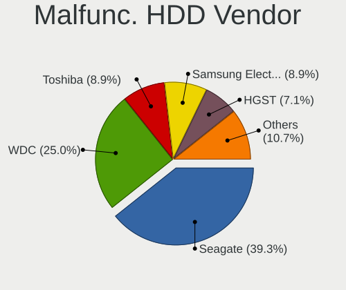

| Vendor              | Computers | Drives | Percent |
|---------------------|-----------|--------|---------|
| Seagate             | 22        | 25     | 39.29%  |
| WDC                 | 14        | 17     | 25%     |
| Toshiba             | 5         | 5      | 8.93%   |
| Samsung Electronics | 5         | 8      | 8.93%   |
| HGST                | 4         | 4      | 7.14%   |
| USB3.0              | 2         | 4      | 3.57%   |
| Hitachi             | 2         | 2      | 3.57%   |
| Apple               | 2         | 2      | 3.57%   |

Malfunc. Drive Kind
-------------------

Kinds of faulty drives

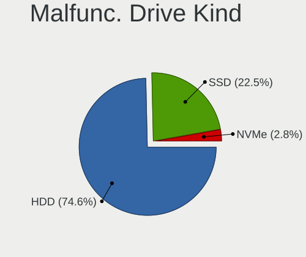

| Kind | Computers | Drives | Percent |
|------|-----------|--------|---------|
| HDD  | 53        | 67     | 74.65%  |
| SSD  | 16        | 19     | 22.54%  |
| NVMe | 2         | 3      | 2.82%   |

Failed Drives
-------------

Failed drive models

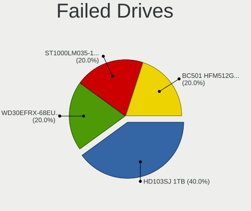

| Model                                   | Computers | Drives | Percent |
|-----------------------------------------|-----------|--------|---------|
| Samsung Electronics HD103SJ 1TB         | 2         | 2      | 40%     |
| WDC WD30EFRX-68EUZN0 3TB                | 1         | 1      | 20%     |
| SK hynix BC501 HFM512GDJTNG-8310A 512GB | 1         | 1      | 20%     |
| Seagate ST1000LM035-1RK172 1TB          | 1         | 1      | 20%     |

Failed Drive Vendor
-------------------

Failed drive vendors

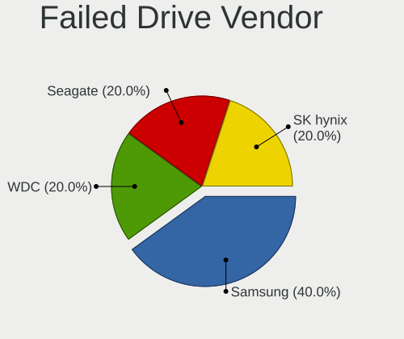

| Vendor              | Computers | Drives | Percent |
|---------------------|-----------|--------|---------|
| Samsung Electronics | 2         | 2      | 40%     |
| WDC                 | 1         | 1      | 20%     |
| SK hynix            | 1         | 1      | 20%     |
| Seagate             | 1         | 1      | 20%     |

Drive Status
------------

Number of failed and malfunc. drives

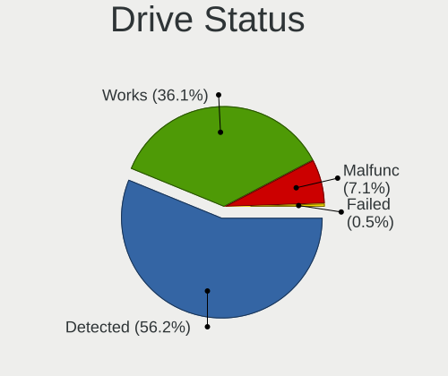

| Status   | Computers | Drives | Percent |
|----------|-----------|--------|---------|
| Detected | 527       | 1084   | 56.18%  |
| Works    | 339       | 767    | 36.14%  |
| Malfunc  | 67        | 89     | 7.14%   |
| Failed   | 5         | 5      | 0.53%   |

Storage controller
------------------

Storage Vendor
--------------

Storage controller vendors

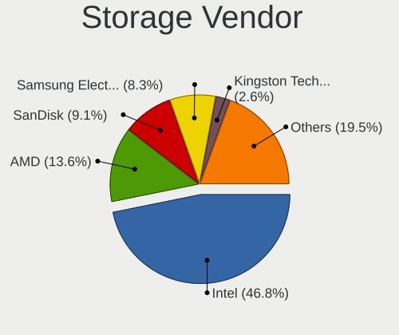

| Vendor                       | Computers | Percent |
|------------------------------|-----------|---------|
| Intel                        | 522       | 46.82%  |
| AMD                          | 152       | 13.63%  |
| SanDisk                      | 102       | 9.15%   |
| Samsung Electronics          | 93        | 8.34%   |
| Kingston Technology Company  | 29        | 2.6%    |
| Micron Technology            | 28        | 2.51%   |
| SK hynix                     | 26        | 2.33%   |
| MAXIO Technology (Hangzhou)  | 22        | 1.97%   |
| ASMedia Technology           | 18        | 1.61%   |
| Phison Electronics           | 17        | 1.52%   |
| Silicon Motion               | 15        | 1.35%   |
| Nvidia                       | 13        | 1.17%   |
| Toshiba America Info Systems | 10        | 0.9%    |
| KIOXIA                       | 10        | 0.9%    |
| Broadcom / LSI               | 9         | 0.81%   |
| Realtek Semiconductor        | 8         | 0.72%   |
| Shenzhen Longsys Electronics | 5         | 0.45%   |
| Yangtze Memory Technologies  | 4         | 0.36%   |
| Marvell Technology Group     | 4         | 0.36%   |
| ADATA Technology             | 4         | 0.36%   |
| VIA Technologies             | 3         | 0.27%   |
| Transcend                    | 3         | 0.27%   |
| Micron/Crucial Technology    | 3         | 0.27%   |
| LSI Logic / Symbios Logic    | 3         | 0.27%   |
| JMicron Technology           | 3         | 0.27%   |
| Apple                        | 2         | 0.18%   |
| Unknown                      | 2         | 0.18%   |
| Solidigm                     | 1         | 0.09%   |
| O2 Micro                     | 1         | 0.09%   |
| Lite-On Technology           | 1         | 0.09%   |
| Hosin Global Electronics     | 1         | 0.09%   |
| Biwin Storage Technology     | 1         | 0.09%   |

Storage Model
-------------

Storage controller models

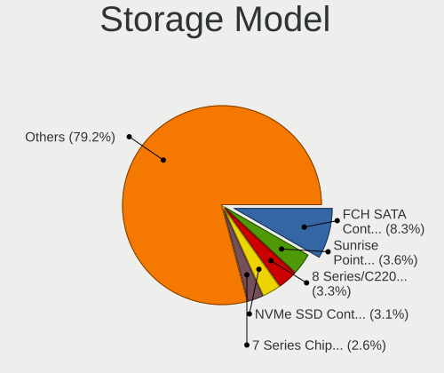

| Model                                                                          | Computers | Percent |
|--------------------------------------------------------------------------------|-----------|---------|
| AMD FCH SATA Controller [AHCI mode]                                            | 102       | 8.31%   |
| Intel Sunrise Point-LP SATA Controller [AHCI mode]                             | 44        | 3.58%   |
| Intel 8 Series/C220 Series Chipset Family 6-port SATA Controller 1 [AHCI mode] | 40        | 3.26%   |
| Samsung NVMe SSD Controller SM981/PM981/PM983                                  | 38        | 3.09%   |
| Intel 7 Series Chipset Family 6-port SATA Controller [AHCI mode]               | 32        | 2.61%   |
| Intel Q170/Q150/B150/H170/H110/Z170/CM236 Chipset SATA Controller [AHCI Mode]  | 31        | 2.52%   |
| Intel 8 Series SATA Controller 1 [AHCI mode]                                   | 23        | 1.87%   |
| Intel 200 Series PCH SATA controller [AHCI mode]                               | 22        | 1.79%   |
| AMD 400 Series Chipset SATA Controller                                         | 22        | 1.79%   |
| SanDisk Ultra 3D / WD PC SN530, IX SN530, Blue SN550 NVMe SSD (DRAM-less)      | 21        | 1.71%   |
| SanDisk WD SN560/SN740/SN770/SN5000 NVMe SSD                                   | 20        | 1.63%   |
| Intel Volume Management Device NVMe RAID Controller                            | 20        | 1.63%   |
| SanDisk Extreme Pro / WD Black SN750 / PC SN730 / Red SN700 NVMe SSD           | 18        | 1.47%   |
| Intel 82801 Mobile SATA Controller [RAID mode]                                 | 18        | 1.47%   |
| AMD 500 Series Chipset SATA Controller                                         | 18        | 1.47%   |
| MAXIO (Hangzhou) NVMe SSD Controller MAP1202 (DRAM-less)                       | 17        | 1.38%   |
| Intel 6 Series/C200 Series Chipset Family 6 port Desktop SATA AHCI Controller  | 17        | 1.38%   |
| Samsung NVMe SSD Controller 980 (DRAM-less)                                    | 16        | 1.3%    |
| Intel Comet Lake SATA AHCI Controller                                          | 16        | 1.3%    |
| Intel Cannon Lake PCH SATA AHCI Controller                                     | 15        | 1.22%   |
| ASMedia ASM1061/ASM1062 Serial ATA Controller                                  | 15        | 1.22%   |
| Intel 7 Series/C210 Series Chipset Family 6-port SATA Controller [AHCI mode]   | 14        | 1.14%   |
| Intel Cannon Lake Mobile PCH SATA AHCI Controller                              | 13        | 1.06%   |
| Intel 6 Series/C200 Series Chipset Family 6 port Mobile SATA AHCI Controller   | 13        | 1.06%   |
| AMD SB7x0/SB8x0/SB9x0 IDE Controller                                           | 13        | 1.06%   |
| Intel SATA Controller [RAID mode]                                              | 12        | 0.98%   |
| Intel HM170/QM170 Chipset SATA Controller [AHCI Mode]                          | 12        | 0.98%   |
| Intel 82801IBM/IEM (ICH9M/ICH9M-E) 4 port SATA Controller [AHCI mode]          | 12        | 0.98%   |
| Intel 400 Series Chipset Family SATA AHCI Controller                           | 12        | 0.98%   |
| Samsung NVMe SSD Controller SM961/PM961/SM963                                  | 11        | 0.9%    |
| Samsung NVMe SSD Controller PM9A1/PM9A3/980PRO                                 | 11        | 0.9%    |
| Intel NM10/ICH7 Family SATA Controller [IDE mode]                              | 10        | 0.81%   |
| Intel Celeron/Pentium Silver Processor SATA Controller                         | 10        | 0.81%   |
| Intel 5 Series/3400 Series Chipset 6 port SATA AHCI Controller                 | 10        | 0.81%   |
| AMD SB7x0/SB8x0/SB9x0 SATA Controller [IDE mode]                               | 10        | 0.81%   |
| Silicon Motion SM2263EN/SM2263XT (DRAM-less) NVMe SSD Controllers              | 9         | 0.73%   |
| SanDisk Extreme Pro / WD Black 2018/SN750/PC SN720 NVMe SSD                    | 9         | 0.73%   |
| Intel SSD 660P Series                                                          | 9         | 0.73%   |
| Intel C600/X79 series chipset 6-Port SATA AHCI Controller                      | 9         | 0.73%   |
| SK hynix Gold P31/BC711/PC711 NVMe Solid State Drive                           | 8         | 0.65%   |

Storage Kind
------------

Kind of storage controller (IDE, SATA, NVMe, SAS, ...)

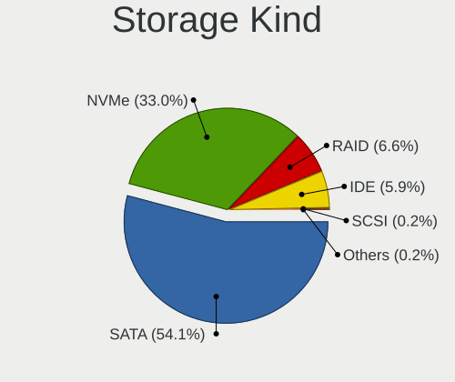

| Kind | Computers | Percent |
|------|-----------|---------|
| SATA | 596       | 54.13%  |
| NVMe | 363       | 32.97%  |
| RAID | 73        | 6.63%   |
| IDE  | 65        | 5.9%    |
| SAS  | 2         | 0.18%   |
| SCSI | 2         | 0.18%   |

Processor
---------

CPU Vendor
----------

Processor vendors

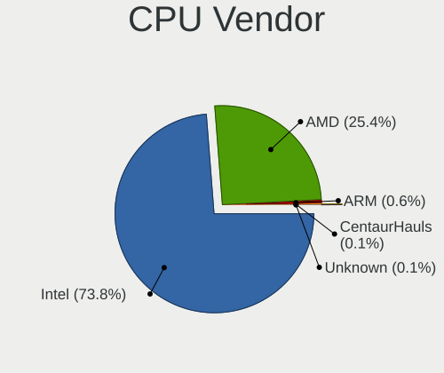

| Vendor       | Computers | Percent |
|--------------|-----------|---------|
| Intel        | 627       | 73.76%  |
| AMD          | 216       | 25.41%  |
| ARM          | 5         | 0.59%   |
| CentaurHauls | 1         | 0.12%   |
| Unknown      | 1         | 0.12%   |

CPU Model
---------

Processor models

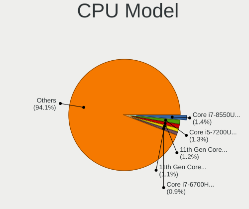

| Model                                         | Computers | Percent |
|-----------------------------------------------|-----------|---------|
| Intel Core i7-8550U CPU @ 1.80GHz             | 12        | 1.41%   |
| Intel Core i5-7200U CPU @ 2.50GHz             | 11        | 1.29%   |
| Intel 11th Gen Core i5-1135G7 @ 2.40GHz       | 10        | 1.17%   |
| Intel 11th Gen Core i7-1165G7 @ 2.80GHz       | 9         | 1.05%   |
| Intel Core i7-6700HQ CPU @ 2.60GHz            | 8         | 0.94%   |
| Intel Core i3-2120 CPU @ 3.30GHz              | 8         | 0.94%   |
| Intel Core i7-4790 CPU @ 3.60GHz              | 7         | 0.82%   |
| Intel Core i7-10750H CPU @ 2.60GHz            | 7         | 0.82%   |
| Intel Core i5-10210U CPU @ 1.60GHz            | 7         | 0.82%   |
| AMD Ryzen 7 5700U with Radeon Graphics        | 7         | 0.82%   |
| AMD Ryzen 5 3600 6-Core Processor             | 7         | 0.82%   |
| Intel Core i7-6700 CPU @ 3.40GHz              | 6         | 0.7%    |
| Intel Core i5-8250U CPU @ 1.60GHz             | 6         | 0.7%    |
| Intel Core i5-6500 CPU @ 3.20GHz              | 6         | 0.7%    |
| AMD Ryzen 5 5500U with Radeon Graphics        | 6         | 0.7%    |
| AMD Ryzen 5 3500U with Radeon Vega Mobile Gfx | 6         | 0.7%    |
| Intel Core i7-8750H CPU @ 2.20GHz             | 5         | 0.59%   |
| Intel Core i7-4770 CPU @ 3.40GHz              | 5         | 0.59%   |
| Intel Core i7-4510U CPU @ 2.00GHz             | 5         | 0.59%   |
| Intel Core i5-6400 CPU @ 2.70GHz              | 5         | 0.59%   |
| Intel Core i5-6200U CPU @ 2.30GHz             | 5         | 0.59%   |
| Intel Core i5-4200U CPU @ 1.60GHz             | 5         | 0.59%   |
| Intel Core i5-3230M CPU @ 2.60GHz             | 5         | 0.59%   |
| Intel Core i5-3210M CPU @ 2.50GHz             | 5         | 0.59%   |
| Intel Core i5-2450M CPU @ 2.50GHz             | 5         | 0.59%   |
| Intel Core i3-4005U CPU @ 1.70GHz             | 5         | 0.59%   |
| Intel Atom x5-Z8350 CPU @ 1.44GHz             | 5         | 0.59%   |
| AMD Ryzen 9 5900HX with Radeon Graphics       | 5         | 0.59%   |
| AMD Ryzen 7 4800H with Radeon Graphics        | 5         | 0.59%   |
| AMD Ryzen 5 2600 Six-Core Processor           | 5         | 0.59%   |
| AMD EPYC 9534 64-Core Processor               | 5         | 0.59%   |
| Intel N100                                    | 4         | 0.47%   |
| Intel Core i7-4870HQ CPU @ 2.50GHz            | 4         | 0.47%   |
| Intel Core i7-10510U CPU @ 1.80GHz            | 4         | 0.47%   |
| Intel Core i5-8400 CPU @ 2.80GHz              | 4         | 0.47%   |
| Intel Core i5-6400T CPU @ 2.20GHz             | 4         | 0.47%   |
| Intel Core i5-6300U CPU @ 2.40GHz             | 4         | 0.47%   |
| Intel Core i5-3570 CPU @ 3.40GHz              | 4         | 0.47%   |
| Intel Core i5-2400 CPU @ 3.10GHz              | 4         | 0.47%   |
| Intel Core i5-10300H CPU @ 2.50GHz            | 4         | 0.47%   |

CPU Model Family
----------------

Processor model prefix

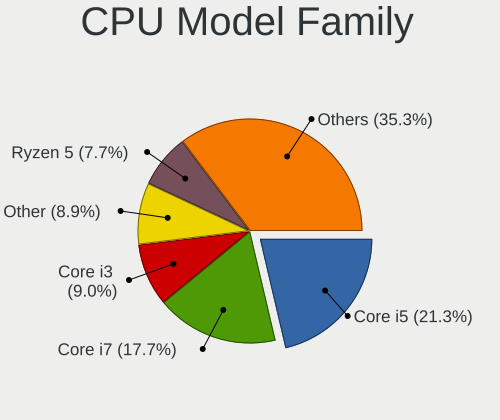

| Model                   | Computers | Percent |
|-------------------------|-----------|---------|
| Intel Core i5           | 182       | 21.34%  |
| Intel Core i7           | 151       | 17.7%   |
| Intel Core i3           | 77        | 9.03%   |
| Other                   | 76        | 8.91%   |
| AMD Ryzen 5             | 66        | 7.74%   |
| AMD Ryzen 7             | 47        | 5.51%   |
| Intel Celeron           | 32        | 3.75%   |
| Intel Xeon              | 26        | 3.05%   |
| Intel Core 2 Duo        | 23        | 2.7%    |
| AMD Ryzen 9             | 20        | 2.34%   |
| Intel Pentium           | 19        | 2.23%   |
| Intel Atom              | 16        | 1.88%   |
| AMD Ryzen 3             | 12        | 1.41%   |
| Intel Core              | 10        | 1.17%   |
| AMD FX                  | 8         | 0.94%   |
| AMD Ryzen 7 PRO         | 7         | 0.82%   |
| AMD A10                 | 7         | 0.82%   |
| Intel Core i9           | 6         | 0.7%    |
| Intel Core 2 Quad       | 5         | 0.59%   |
| AMD EPYC                | 5         | 0.59%   |
| AMD Athlon II X2        | 5         | 0.59%   |
| AMD A4                  | 5         | 0.59%   |
| Intel Pentium Silver    | 4         | 0.47%   |
| Intel Pentium Dual-Core | 4         | 0.47%   |
| AMD Athlon 64 X2        | 4         | 0.47%   |
| AMD Athlon              | 4         | 0.47%   |
| AMD A8                  | 4         | 0.47%   |
| AMD A6                  | 4         | 0.47%   |
| AMD Phenom II X6        | 3         | 0.35%   |
| Intel Pentium Dual      | 2         | 0.23%   |
| Intel Core m3           | 2         | 0.23%   |
| AMD Phenom II X4        | 2         | 0.23%   |
| AMD E2                  | 2         | 0.23%   |
| Intel Xeon Platinum     | 1         | 0.12%   |
| Intel Xeon Gold         | 1         | 0.12%   |
| Intel Pentium Gold      | 1         | 0.12%   |
| Intel Pentium D         | 1         | 0.12%   |
| Intel Pentium 4         | 1         | 0.12%   |
| CentaurHauls VIA Eden   | 1         | 0.12%   |
| AMD Turion II Neo       | 1         | 0.12%   |

CPU Cores
---------

Number of processor cores

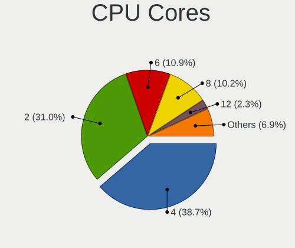

| Number  | Computers | Percent |
|---------|-----------|---------|
| 4       | 331       | 38.71%  |
| 2       | 265       | 30.99%  |
| 6       | 93        | 10.88%  |
| 8       | 87        | 10.18%  |
| 12      | 20        | 2.34%   |
| 16      | 16        | 1.87%   |
| 14      | 12        | 1.4%    |
| 1       | 7         | 0.82%   |
| 10      | 6         | 0.7%    |
| 128     | 5         | 0.58%   |
| 24      | 3         | 0.35%   |
| 3       | 3         | 0.35%   |
| 28      | 2         | 0.23%   |
| 40      | 1         | 0.12%   |
| 32      | 1         | 0.12%   |
| 20      | 1         | 0.12%   |
| 5       | 1         | 0.12%   |
| Unknown | 1         | 0.12%   |

CPU Sockets
-----------

Number of sockets

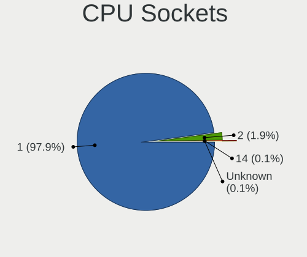

| Number  | Computers | Percent |
|---------|-----------|---------|
| 1       | 832       | 97.88%  |
| 2       | 16        | 1.88%   |
| 14      | 1         | 0.12%   |
| Unknown | 1         | 0.12%   |

CPU Threads
-----------

Threads per core (Hyper-Threading)

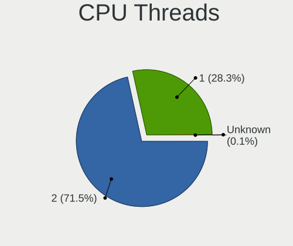

| Number  | Computers | Percent |
|---------|-----------|---------|
| 2       | 611       | 71.55%  |
| 1       | 242       | 28.34%  |
| Unknown | 1         | 0.12%   |

CPU Op-Modes
------------

CPU Operation Modes (32-bit, 64-bit)

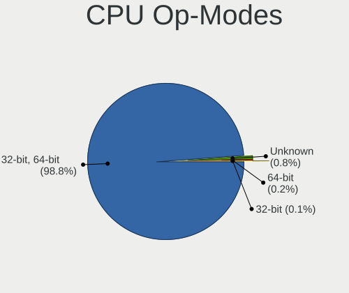

| Op mode        | Computers | Percent |
|----------------|-----------|---------|
| 32-bit, 64-bit | 840       | 98.82%  |
| Unknown        | 7         | 0.82%   |
| 64-bit         | 2         | 0.24%   |
| 32-bit         | 1         | 0.12%   |

CPU Microcode
-------------

Microcode number

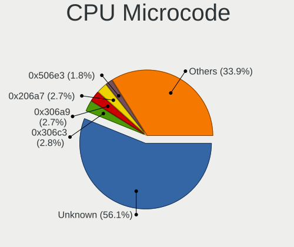

| Number     | Computers | Percent |
|------------|-----------|---------|
| Unknown    | 500       | 56.12%  |
| 0x306c3    | 25        | 2.81%   |
| 0x306a9    | 24        | 2.69%   |
| 0x206a7    | 24        | 2.69%   |
| 0x506e3    | 16        | 1.8%    |
| 0x40651    | 15        | 1.68%   |
| 0x906ea    | 14        | 1.57%   |
| 0x806ea    | 13        | 1.46%   |
| 0x1067a    | 13        | 1.46%   |
| 0x806e9    | 11        | 1.23%   |
| 0x906e9    | 10        | 1.12%   |
| 0x806ec    | 10        | 1.12%   |
| 0x20655    | 10        | 1.12%   |
| 0x806c1    | 9         | 1.01%   |
| 0x0a50000c | 9         | 1.01%   |
| 0x406c4    | 8         | 0.9%    |
| 0x406e3    | 7         | 0.79%   |
| 0x406c3    | 6         | 0.67%   |
| 0x08600106 | 6         | 0.67%   |
| 0x08108102 | 6         | 0.67%   |
| 0x0800820d | 6         | 0.67%   |
| 0xa0652    | 5         | 0.56%   |
| 0x30678    | 5         | 0.56%   |
| 0x0810100b | 5         | 0.56%   |
| 0x06001119 | 5         | 0.56%   |
| 0x706a1    | 4         | 0.45%   |
| 0x20652    | 4         | 0.45%   |
| 0x0a101116 | 4         | 0.45%   |
| 0x08701021 | 4         | 0.45%   |
| 0x08608103 | 4         | 0.45%   |
| 0x08108109 | 4         | 0.45%   |
| 0x010000c8 | 4         | 0.45%   |
| 0xb06a2    | 3         | 0.34%   |
| 0xa0655    | 3         | 0.34%   |
| 0x906ec    | 3         | 0.34%   |
| 0x906c0    | 3         | 0.34%   |
| 0x706a8    | 3         | 0.34%   |
| 0x6fd      | 3         | 0.34%   |
| 0x406f1    | 3         | 0.34%   |
| 0x106e5    | 3         | 0.34%   |

CPU Microarch
-------------

Microarchitecture

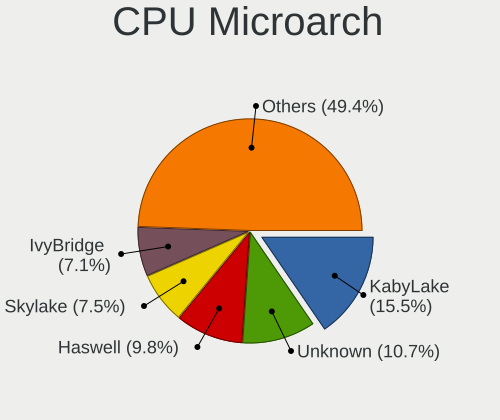

| Name               | Computers | Percent |
|--------------------|-----------|---------|
| KabyLake           | 132       | 15.46%  |
| Unknown            | 91        | 10.66%  |
| Haswell            | 84        | 9.84%   |
| Skylake            | 64        | 7.49%   |
| IvyBridge          | 61        | 7.14%   |
| SandyBridge        | 41        | 4.8%    |
| Zen 3              | 34        | 3.98%   |
| Zen 2              | 34        | 3.98%   |
| Zen+               | 29        | 3.4%    |
| Silvermont         | 28        | 3.28%   |
| CometLake          | 28        | 3.28%   |
| Penryn             | 27        | 3.16%   |
| TigerLake          | 25        | 2.93%   |
| Westmere           | 19        | 2.22%   |
| Zen                | 17        | 1.99%   |
| Alderlake Hybrid   | 16        | 1.87%   |
| Goldmont plus      | 14        | 1.64%   |
| Broadwell          | 13        | 1.52%   |
| Piledriver         | 11        | 1.29%   |
| K10                | 11        | 1.29%   |
| IceLake            | 10        | 1.17%   |
| Core               | 9         | 1.05%   |
| Goldmont           | 6         | 0.7%    |
| Excavator          | 6         | 0.7%    |
| Tremont            | 5         | 0.59%   |
| Steamroller        | 5         | 0.59%   |
| K8 Hammer          | 5         | 0.59%   |
| Meteorlake Hybrid  | 4         | 0.47%   |
| Gracemont          | 4         | 0.47%   |
| Bonnell            | 4         | 0.47%   |
| Puma               | 3         | 0.35%   |
| Nehalem            | 3         | 0.35%   |
| NetBurst           | 2         | 0.23%   |
| K10 Llano          | 2         | 0.23%   |
| Bobcat             | 2         | 0.23%   |
| Lunarlake Hybrid   | 1         | 0.12%   |
| Jaguar             | 1         | 0.12%   |
| CannonLake         | 1         | 0.12%   |
| Bulldozer          | 1         | 0.12%   |
| ArrowLake-H Hybrid | 1         | 0.12%   |

Graphics
--------

GPU Vendor
----------

Vendors of graphics cards

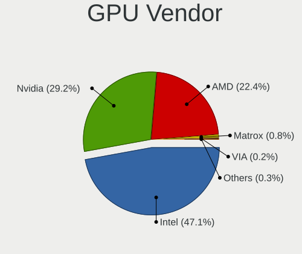

| Vendor                     | Computers | Percent |
|----------------------------|-----------|---------|
| Intel                      | 495       | 47.14%  |
| Nvidia                     | 307       | 29.24%  |
| AMD                        | 235       | 22.38%  |
| Matrox Electronics Systems | 8         | 0.76%   |
| VIA Technologies           | 2         | 0.19%   |
| ASPEED Technology          | 2         | 0.19%   |
| ATI Technologies           | 1         | 0.1%    |

GPU Model
---------

Graphics card models

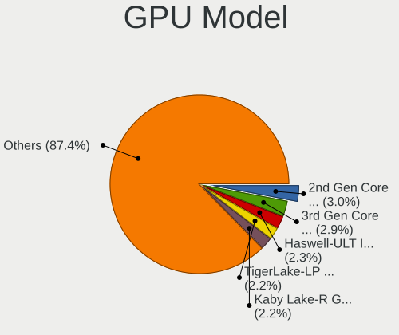

| Model                                                                                    | Computers | Percent |
|------------------------------------------------------------------------------------------|-----------|---------|
| Intel 2nd Generation Core Processor Family Integrated Graphics Controller                | 32        | 2.97%   |
| Intel 3rd Gen Core processor Graphics Controller                                         | 31        | 2.88%   |
| Intel Haswell-ULT Integrated Graphics Controller                                         | 25        | 2.32%   |
| Intel TigerLake-LP GT2 [Iris Xe Graphics]                                                | 24        | 2.23%   |
| Intel Kaby Lake-R GT2 [UHD Graphics 620]                                                 | 24        | 2.23%   |
| Intel Skylake-S GT2 [HD Graphics 530]                                                    | 21        | 1.95%   |
| Intel Kaby Lake-U GT2 [HD Graphics 620]                                                  | 18        | 1.67%   |
| Intel Atom/Celeron/Pentium Processor x5-E8000/J3xxx/N3xxx Integrated Graphics Controller | 18        | 1.67%   |
| AMD Picasso/Raven 2 [Radeon Vega Series / Radeon Vega Mobile Series]                     | 18        | 1.67%   |
| AMD Ellesmere [Radeon RX 470/480/570/570X/580/580X/590]                                  | 18        | 1.67%   |
| Intel Xeon E3-1200 v3/4th Gen Core Processor Integrated Graphics Controller              | 17        | 1.58%   |
| Intel Skylake-U GT2 [HD Graphics 520]                                                    | 17        | 1.58%   |
| AMD Cezanne [Radeon Vega Series / Radeon Vega Mobile Series]                             | 17        | 1.58%   |
| Intel CoffeeLake-S GT2 [UHD Graphics 630]                                                | 16        | 1.49%   |
| Intel CoffeeLake-H GT2 [UHD Graphics 630]                                                | 16        | 1.49%   |
| AMD Renoir [Radeon Vega Series / Radeon Vega Mobile Series]                              | 16        | 1.49%   |
| Intel CometLake-U GT2 [UHD Graphics]                                                     | 14        | 1.3%    |
| Intel CometLake-H GT2 [UHD Graphics]                                                     | 14        | 1.3%    |
| Intel GeminiLake [UHD Graphics 600]                                                      | 13        | 1.21%   |
| AMD Lucienne                                                                             | 13        | 1.21%   |
| AMD Raven Ridge [Radeon Vega Series / Radeon Vega Mobile Series]                         | 12        | 1.12%   |
| Nvidia TU117M [GeForce GTX 1650 Mobile / Max-Q]                                          | 11        | 1.02%   |
| Intel Skylake-H GT2 [HD Graphics 530]                                                    | 10        | 0.93%   |
| Intel Atom Processor Z36xxx/Z37xxx Series Graphics & Display                             | 10        | 0.93%   |
| Nvidia TU117M [GeForce GTX 1650 Ti Mobile]                                               | 9         | 0.84%   |
| Nvidia GP108 [GeForce GT 1030]                                                           | 9         | 0.84%   |
| Nvidia GF117M [GeForce 610M/710M/810M/820M / GT 620M/625M/630M/720M]                     | 9         | 0.84%   |
| Intel Xeon E3-1200 v2/3rd Gen Core processor Graphics Controller                         | 9         | 0.84%   |
| Intel 4th Gen Core Processor Integrated Graphics Controller                              | 9         | 0.84%   |
| Nvidia GP107 [GeForce GTX 1050 Ti]                                                       | 8         | 0.74%   |
| Intel WhiskeyLake-U GT2 [UHD Graphics 620]                                               | 8         | 0.74%   |
| Intel Kaby Lake-S GT2 [HD Graphics 630]                                                  | 8         | 0.74%   |
| Intel 4th Generation Core Processor Family Integrated Graphics Controller                | 8         | 0.74%   |
| AMD Topaz XT [Radeon R7 M260/M265 / M340/M360 / M440/M445 / 530/535 / 620/625 Mobile]    | 8         | 0.74%   |
| AMD Rembrandt [Radeon 680M]                                                              | 8         | 0.74%   |
| AMD Phoenix1                                                                             | 8         | 0.74%   |
| Nvidia GP107M [GeForce GTX 1050 Mobile]                                                  | 7         | 0.65%   |
| Nvidia GP104 [GeForce GTX 1070]                                                          | 7         | 0.65%   |
| Nvidia GK208B [GeForce GT 710]                                                           | 7         | 0.65%   |
| Intel Raptor Lake-P [Iris Xe Graphics]                                                   | 7         | 0.65%   |

GPU Combo
---------

Combinations of graphics cards

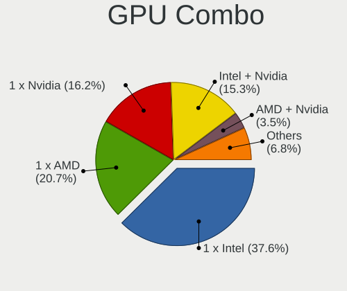

| Name                 | Computers | Percent |
|----------------------|-----------|---------|
| 1 x Intel            | 325       | 37.57%  |
| 1 x AMD              | 179       | 20.69%  |
| 1 x Nvidia           | 140       | 16.18%  |
| Intel + Nvidia       | 132       | 15.26%  |
| AMD + Nvidia         | 30        | 3.47%   |
| Intel + AMD          | 18        | 2.08%   |
| 2 x AMD              | 13        | 1.5%    |
| 1 x Matrox           | 7         | 0.81%   |
| Other                | 6         | 0.69%   |
| Intel + 2 x Nvidia   | 3         | 0.35%   |
| 2 x Intel            | 2         | 0.23%   |
| 1 x VIA              | 2         | 0.23%   |
| 3 x Nvidia           | 1         | 0.12%   |
| 2 x Nvidia           | 1         | 0.12%   |
| 2 x AMD + 2 x Nvidia | 1         | 0.12%   |
| 2 x AMD + 1 x Nvidia | 1         | 0.12%   |
| Nvidia + Matrox      | 1         | 0.12%   |
| Nvidia + ASPEED      | 1         | 0.12%   |
| 1 x ASPEED           | 1         | 0.12%   |
| AMD + 2 x Nvidia     | 1         | 0.12%   |

GPU Driver
----------

Free vs proprietary

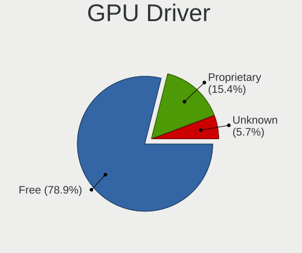

| Driver      | Computers | Percent |
|-------------|-----------|---------|
| Free        | 688       | 78.9%   |
| Proprietary | 134       | 15.37%  |
| Unknown     | 50        | 5.73%   |

GPU Memory
----------

Total video memory

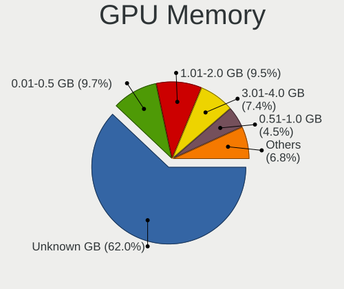

| Size in GB | Computers | Percent |
|------------|-----------|---------|
| Unknown    | 546       | 62.05%  |
| 0.01-0.5   | 85        | 9.66%   |
| 1.01-2.0   | 84        | 9.55%   |
| 3.01-4.0   | 65        | 7.39%   |
| 0.51-1.0   | 40        | 4.55%   |
| 7.01-8.0   | 33        | 3.75%   |
| 5.01-6.0   | 15        | 1.7%    |
| 8.01-16.0  | 5         | 0.57%   |
| 2.01-3.0   | 4         | 0.45%   |
| 16.01-24.0 | 2         | 0.23%   |
| 4.01-5.0   | 1         | 0.11%   |

Monitor
-------

Monitor Vendor
--------------

Monitor vendors

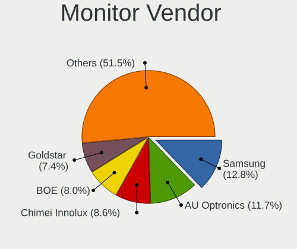

| Vendor                  | Computers | Percent |
|-------------------------|-----------|---------|
| Samsung Electronics     | 118       | 12.81%  |
| AU Optronics            | 108       | 11.73%  |
| Chimei Innolux          | 79        | 8.58%   |
| BOE                     | 74        | 8.03%   |
| Goldstar                | 68        | 7.38%   |
| Acer                    | 67        | 7.27%   |
| Dell                    | 55        | 5.97%   |
| LG Display              | 54        | 5.86%   |
| Lenovo                  | 25        | 2.71%   |
| Hewlett-Packard         | 25        | 2.71%   |
| Apple                   | 25        | 2.71%   |
| AOC                     | 25        | 2.71%   |
| Sharp                   | 15        | 1.63%   |
| PANDA                   | 14        | 1.52%   |
| MSI                     | 11        | 1.19%   |
| BenQ                    | 11        | 1.19%   |
| ViewSonic               | 10        | 1.09%   |
| InfoVision              | 9         | 0.98%   |
| RTK                     | 7         | 0.76%   |
| Philips                 | 6         | 0.65%   |
| LG Electronics          | 6         | 0.65%   |
| Unknown (XXX)           | 5         | 0.54%   |
| Mi                      | 5         | 0.54%   |
| ASUSTek Computer        | 5         | 0.54%   |
| Unknown                 | 4         | 0.43%   |
| MStar                   | 4         | 0.43%   |
| Chi Mei Optoelectronics | 4         | 0.43%   |
| Toshiba                 | 3         | 0.33%   |
| SGT                     | 3         | 0.33%   |
| CSW                     | 3         | 0.33%   |
| Ancor Communications    | 3         | 0.33%   |
| Wacom                   | 2         | 0.22%   |
| Valve                   | 2         | 0.22%   |
| TMX                     | 2         | 0.22%   |
| Sony                    | 2         | 0.22%   |
| SKY                     | 2         | 0.22%   |
| Panasonic               | 2         | 0.22%   |
| Microstep               | 2         | 0.22%   |
| MHH                     | 2         | 0.22%   |
| ITE                     | 2         | 0.22%   |

Monitor Model
-------------

Monitor models

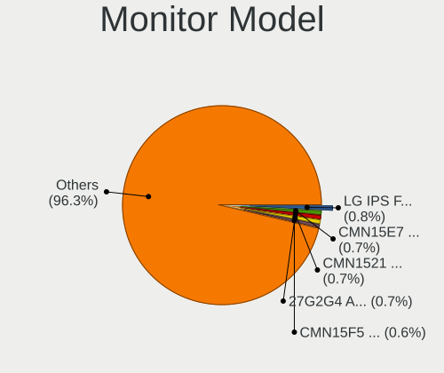

| Model                                                                 | Computers | Percent |
|-----------------------------------------------------------------------|-----------|---------|
| Goldstar LG IPS FULLHD GSM5AB8 1920x1080 480x270mm 21.7-inch          | 8         | 0.84%   |
| Chimei Innolux LCD Monitor CMN15E7 1920x1080 344x193mm 15.5-inch      | 7         | 0.74%   |
| Chimei Innolux LCD Monitor CMN1521 1920x1080 344x193mm 15.5-inch      | 7         | 0.74%   |
| AOC 27G2G4 AOC2702 1920x1080 598x336mm 27.0-inch                      | 7         | 0.74%   |
| Chimei Innolux LCD Monitor CMN15F5 1920x1080 344x193mm 15.5-inch      | 6         | 0.63%   |
| BOE LCD Monitor BOE0872 1920x1080 344x194mm 15.5-inch                 | 6         | 0.63%   |
| PANDA LCD Monitor NCP004D 1920x1080 344x194mm 15.5-inch               | 5         | 0.53%   |
| Goldstar HDR WFHD GSM7714 2560x1080 798x334mm 34.1-inch               | 5         | 0.53%   |
| Goldstar FULL HD GSM5B55 1920x1080 480x270mm 21.7-inch                | 5         | 0.53%   |
| Dell P2422H DELA1C4 1920x1080 527x296mm 23.8-inch                     | 5         | 0.53%   |
| BOE LCD Monitor BOE088B 1920x1280 222x148mm 10.5-inch                 | 5         | 0.53%   |
| Acer VG220Q ACR06D8 1920x1080 476x268mm 21.5-inch                     | 5         | 0.53%   |
| Acer K222HQL ACR0512 1920x1080 480x270mm 21.7-inch                    | 5         | 0.53%   |
| Samsung Electronics LCD Monitor SDC4161 1920x1080 344x194mm 15.5-inch | 4         | 0.42%   |
| PANDA LCD Monitor NCP0036 1920x1080 344x194mm 15.5-inch               | 4         | 0.42%   |
| Dell P2422H DELA1C5 1920x1080 527x296mm 23.8-inch                     | 4         | 0.42%   |
| Dell E2011H DEL406B 1600x900 443x249mm 20.0-inch                      | 4         | 0.42%   |
| Chimei Innolux LCD Monitor CMN14D4 1920x1080 309x173mm 13.9-inch      | 4         | 0.42%   |
| AU Optronics LCD Monitor AUO459D 1920x1200 344x215mm 16.0-inch        | 4         | 0.42%   |
| AU Optronics LCD Monitor AUO2D3C 1366x768 309x173mm 13.9-inch         | 4         | 0.42%   |
| AU Optronics LCD Monitor AUO106C 1366x768 276x155mm 12.5-inch         | 4         | 0.42%   |
| Apple Color LCD APP9CF0 1440x900 290x180mm 13.4-inch                  | 4         | 0.42%   |
| Samsung Electronics S24F350 SAM0D20 1920x1080 521x293mm 23.5-inch     | 3         | 0.32%   |
| Samsung Electronics S23B370 SAM089B 1920x1080 510x287mm 23.0-inch     | 3         | 0.32%   |
| Samsung Electronics S22D300 SAM0B3F 1920x1080 477x268mm 21.5-inch     | 3         | 0.32%   |
| Samsung Electronics S20B300 SAM08A8 1600x900 443x249mm 20.0-inch      | 3         | 0.32%   |
| Samsung Electronics LCD Monitor SDC4171 2880x1800 302x189mm 14.0-inch | 3         | 0.32%   |
| Samsung Electronics LCD Monitor SAM0678 1360x768                      | 3         | 0.32%   |
| Samsung Electronics C24F390 SAM0D2C 1920x1080 521x293mm 23.5-inch     | 3         | 0.32%   |
| Philips 236V4 PHLC0B3 1920x1080 510x287mm 23.0-inch                   | 3         | 0.32%   |
| MStar Demo MST0030 1920x1080 708x398mm 32.0-inch                      | 3         | 0.32%   |
| LG Display LCD Monitor LGD061E 1920x1080 344x194mm 15.5-inch          | 3         | 0.32%   |
| Goldstar FULL HD GSM5AB9 1920x1080 480x270mm 21.7-inch                | 3         | 0.32%   |
| Chimei Innolux LCD Monitor CMN1490 1366x768 309x174mm 14.0-inch       | 3         | 0.32%   |
| BOE LCD Monitor BOE0893 2160x1440 296x197mm 14.0-inch                 | 3         | 0.32%   |
| AU Optronics LCD Monitor AUO323C 1366x768 309x173mm 13.9-inch         | 3         | 0.32%   |
| AU Optronics LCD Monitor AUO313C 1366x768 309x173mm 13.9-inch         | 3         | 0.32%   |
| AU Optronics LCD Monitor AUO183C 1366x768 309x173mm 13.9-inch         | 3         | 0.32%   |
| Apple Color LCD APPA022 2880x1800 331x207mm 15.4-inch                 | 3         | 0.32%   |
| AOC 24B1W1 AOC2401 1920x1080 527x296mm 23.8-inch                      | 3         | 0.32%   |

Monitor Resolution
------------------

Monitor screen resolution

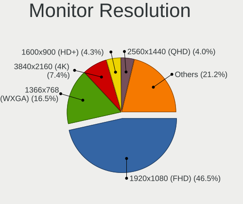

| Resolution         | Computers | Percent |
|--------------------|-----------|---------|
| 1920x1080 (FHD)    | 408       | 46.52%  |
| 1366x768 (WXGA)    | 145       | 16.53%  |
| 3840x2160 (4K)     | 65        | 7.41%   |
| 1600x900 (HD+)     | 38        | 4.33%   |
| 2560x1440 (QHD)    | 35        | 3.99%   |
| 1920x1200 (WUXGA)  | 24        | 2.74%   |
| 1440x900 (WXGA+)   | 20        | 2.28%   |
| 2880x1800          | 19        | 2.17%   |
| 2560x1080          | 13        | 1.48%   |
| 1680x1050 (WSXGA+) | 13        | 1.48%   |
| 2560x1600          | 11        | 1.25%   |
| Unknown            | 11        | 1.25%   |
| 1280x1024 (SXGA)   | 10        | 1.14%   |
| 1360x768           | 9         | 1.03%   |
| 1280x800 (WXGA)    | 7         | 0.8%    |
| 3440x1440          | 6         | 0.68%   |
| 1920x1280          | 6         | 0.68%   |
| 2160x1440          | 5         | 0.57%   |
| 3840x2400          | 4         | 0.46%   |
| 800x1280           | 2         | 0.23%   |
| 3840x1080          | 2         | 0.23%   |
| 3520x1080          | 2         | 0.23%   |
| 2288x1287          | 2         | 0.23%   |
| 2256x1504          | 2         | 0.23%   |
| 1600x1200          | 2         | 0.23%   |
| 1280x720 (HD)      | 2         | 0.23%   |
| 5120x1440          | 1         | 0.11%   |
| 3840x1100          | 1         | 0.11%   |
| 3072x1920          | 1         | 0.11%   |
| 2880x1920          | 1         | 0.11%   |
| 2880x1620          | 1         | 0.11%   |
| 2736x1824          | 1         | 0.11%   |
| 2732x768           | 1         | 0.11%   |
| 2240x1400          | 1         | 0.11%   |
| 1920x515           | 1         | 0.11%   |
| 1800x1200          | 1         | 0.11%   |
| 1680x945           | 1         | 0.11%   |
| 1280x960           | 1         | 0.11%   |
| 1024x768 (XGA)     | 1         | 0.11%   |
| 1024x600           | 1         | 0.11%   |

Monitor Diagonal
----------------

Diagonal size in inches

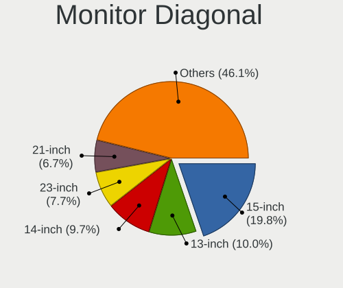

| Inches  | Computers | Percent |
|---------|-----------|---------|
| 15      | 182       | 19.76%  |
| 13      | 92        | 9.99%   |
| 14      | 89        | 9.66%   |
| 23      | 71        | 7.71%   |
| 21      | 62        | 6.73%   |
| 24      | 61        | 6.62%   |
| 27      | 54        | 5.86%   |
| Unknown | 36        | 3.91%   |
| 18      | 27        | 2.93%   |
| 17      | 27        | 2.93%   |
| 19      | 26        | 2.82%   |
| 20      | 25        | 2.71%   |
| 31      | 22        | 2.39%   |
| 16      | 22        | 2.39%   |
| 11      | 17        | 1.85%   |
| 12      | 15        | 1.63%   |
| 34      | 11        | 1.19%   |
| 84      | 10        | 1.09%   |
| 63      | 9         | 0.98%   |
| 22      | 9         | 0.98%   |
| 10      | 6         | 0.65%   |
| 32      | 5         | 0.54%   |
| 26      | 5         | 0.54%   |
| 54      | 4         | 0.43%   |
| 40      | 4         | 0.43%   |
| 72      | 3         | 0.33%   |
| 52      | 3         | 0.33%   |
| 46      | 3         | 0.33%   |
| 7       | 3         | 0.33%   |
| 142     | 2         | 0.22%   |
| 43      | 2         | 0.22%   |
| 29      | 2         | 0.22%   |
| 28      | 2         | 0.22%   |
| 8       | 2         | 0.22%   |
| 86      | 1         | 0.11%   |
| 74      | 1         | 0.11%   |
| 60      | 1         | 0.11%   |
| 57      | 1         | 0.11%   |
| 50      | 1         | 0.11%   |
| 39      | 1         | 0.11%   |

Monitor Width
-------------

Physical width

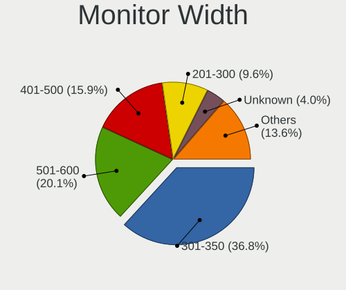

| Width in mm    | Computers | Percent |
|----------------|-----------|---------|
| 301-350        | 332       | 36.81%  |
| 501-600        | 181       | 20.07%  |
| 401-500        | 143       | 15.85%  |
| 201-300        | 87        | 9.65%   |
| Unknown        | 36        | 3.99%   |
| 351-400        | 31        | 3.44%   |
| 601-700        | 25        | 2.77%   |
| 1001-1500      | 22        | 2.44%   |
| 701-800        | 18        | 2%      |
| 1501-2000      | 13        | 1.44%   |
| 801-900        | 5         | 0.55%   |
| 101-200        | 3         | 0.33%   |
| More than 2000 | 2         | 0.22%   |
| 901-1000       | 2         | 0.22%   |
| 1-100          | 2         | 0.22%   |

Aspect Ratio
------------

Proportional relationship between the width and the height

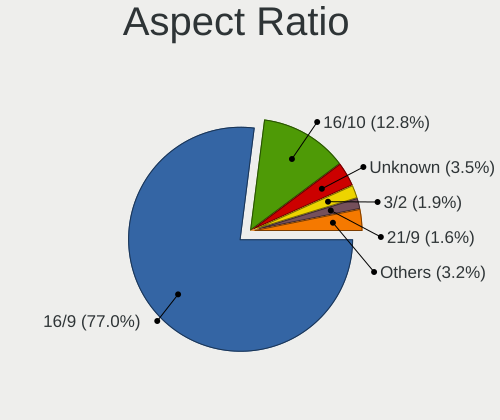

| Ratio   | Computers | Percent |
|---------|-----------|---------|
| 16/9    | 633       | 77.01%  |
| 16/10   | 105       | 12.77%  |
| Unknown | 29        | 3.53%   |
| 3/2     | 16        | 1.95%   |
| 21/9    | 13        | 1.58%   |
| 5/4     | 12        | 1.46%   |
| 4/3     | 2         | 0.24%   |
| 2.00    | 2         | 0.24%   |
| 1.00    | 2         | 0.24%   |
| 0.67    | 2         | 0.24%   |
| 0.56    | 2         | 0.24%   |
| 6/5     | 1         | 0.12%   |
| 3.73    | 1         | 0.12%   |
| 3.40    | 1         | 0.12%   |
| 0.63    | 1         | 0.12%   |

Monitor Area
------------

Area in inch²

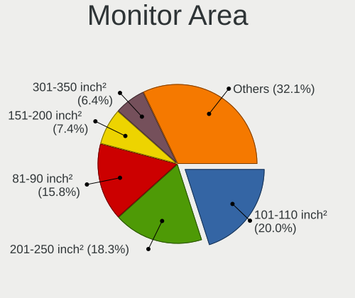

| Area in inch² | Computers | Percent |
|----------------|-----------|---------|
| 101-110        | 183       | 20.04%  |
| 201-250        | 167       | 18.29%  |
| 81-90          | 144       | 15.77%  |
| 151-200        | 68        | 7.45%   |
| 301-350        | 58        | 6.35%   |
| 351-500        | 39        | 4.27%   |
| Unknown        | 36        | 3.94%   |
| 71-80          | 35        | 3.83%   |
| More than 1000 | 34        | 3.72%   |
| 141-150        | 30        | 3.29%   |
| 51-60          | 23        | 2.52%   |
| 251-300        | 20        | 2.19%   |
| 121-130        | 19        | 2.08%   |
| 111-120        | 19        | 2.08%   |
| 61-70          | 15        | 1.64%   |
| 501-1000       | 11        | 1.2%    |
| 1-40           | 5         | 0.55%   |
| 131-140        | 4         | 0.44%   |
| 91-100         | 2         | 0.22%   |
| 41-50          | 1         | 0.11%   |

Pixel Density
-------------

Pixels per inch

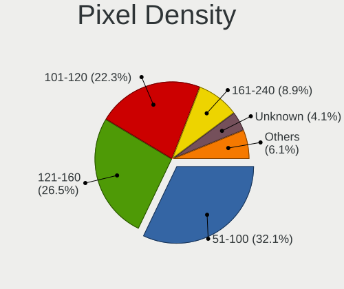

| Density       | Computers | Percent |
|---------------|-----------|---------|
| 51-100        | 284       | 32.13%  |
| 121-160       | 234       | 26.47%  |
| 101-120       | 197       | 22.29%  |
| 161-240       | 79        | 8.94%   |
| Unknown       | 36        | 4.07%   |
| More than 240 | 30        | 3.39%   |
| 1-50          | 24        | 2.71%   |

Multiple Monitors
-----------------

Total monitors connected

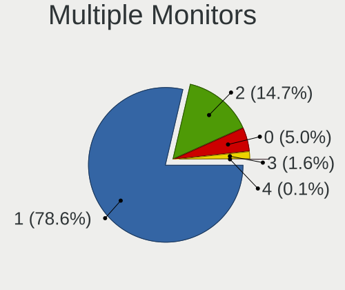

| Total | Computers | Percent |
|-------|-----------|---------|
| 1     | 692       | 78.64%  |
| 2     | 129       | 14.66%  |
| 0     | 44        | 5%      |
| 3     | 14        | 1.59%   |
| 4     | 1         | 0.11%   |

Network
-------

Net Controller Vendor
---------------------

Controller vendors

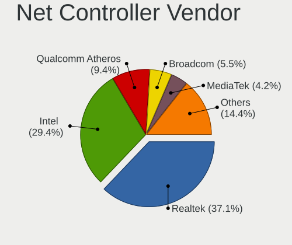

| Vendor                                 | Computers | Percent |
|----------------------------------------|-----------|---------|
| Realtek Semiconductor                  | 493       | 37.1%   |
| Intel                                  | 391       | 29.42%  |
| Qualcomm Atheros                       | 125       | 9.41%   |
| Broadcom                               | 73        | 5.49%   |
| MediaTek                               | 56        | 4.21%   |
| Ralink Technology                      | 19        | 1.43%   |
| TP-Link                                | 16        | 1.2%    |
| Broadcom Limited                       | 16        | 1.2%    |
| ASIX Electronics                       | 15        | 1.13%   |
| D-Link                                 | 12        | 0.9%    |
| Xiaomi                                 | 9         | 0.68%   |
| Nvidia                                 | 9         | 0.68%   |
| Samsung Electronics                    | 8         | 0.6%    |
| Sierra Wireless                        | 6         | 0.45%   |
| Ralink                                 | 6         | 0.45%   |
| Qualcomm                               | 6         | 0.45%   |
| Dell                                   | 6         | 0.45%   |
| D-Link System                          | 6         | 0.45%   |
| Marvell Technology Group               | 5         | 0.38%   |
| ASUSTek Computer                       | 5         | 0.38%   |
| OPPO Electronics                       | 4         | 0.3%    |
| Mercucys                               | 4         | 0.3%    |
| Edimax Technology                      | 4         | 0.3%    |
| Qualcomm Technologies                  | 3         | 0.23%   |
| VIA Technologies                       | 2         | 0.15%   |
| Suzhou Motorcomm Electronic Technology | 2         | 0.15%   |
| QinHeng Electronics                    | 2         | 0.15%   |
| Huawei Technologies                    | 2         | 0.15%   |
| Ericsson Business Mobile Networks      | 2         | 0.15%   |
| vivo                                   | 1         | 0.08%   |
| Shenzhen Goodix Technology             | 1         | 0.08%   |
| Raspberry Pi                           | 1         | 0.08%   |
| Quectel Wireless Solutions             | 1         | 0.08%   |
| Qualcomm Atheros Communications        | 1         | 0.08%   |
| OpenMoko                               | 1         | 0.08%   |
| OnePlus Technology (Shenzhen)          | 1         | 0.08%   |
| NetGear                                | 1         | 0.08%   |
| Motorola PCS                           | 1         | 0.08%   |
| Linksys                                | 1         | 0.08%   |
| Lenovo                                 | 1         | 0.08%   |

Net Controller Model
--------------------

Controller models

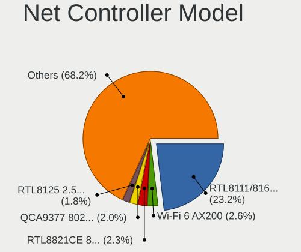

| Model                                                                  | Computers | Percent |
|------------------------------------------------------------------------|-----------|---------|
| Realtek RTL8111/8168/8211/8411 PCI Express Gigabit Ethernet Controller | 354       | 23.17%  |
| Intel Wi-Fi 6 AX200                                                    | 40        | 2.62%   |
| Realtek RTL8821CE 802.11ac PCIe Wireless Network Adapter               | 35        | 2.29%   |
| Qualcomm Atheros QCA9377 802.11ac Wireless Network Adapter             | 30        | 1.96%   |
| Realtek RTL8125 2.5GbE Controller                                      | 27        | 1.77%   |
| Intel 82579LM Gigabit Network Connection (Lewisville)                  | 27        | 1.77%   |
| Realtek RTL810xE PCI Express Fast Ethernet controller                  | 25        | 1.64%   |
| MediaTek MT7921 802.11ax PCIe Wireless Network Adapter [Filogic 330]   | 24        | 1.57%   |
| Qualcomm Atheros QCA9565 / AR9565 Wireless Network Adapter             | 21        | 1.37%   |
| Intel Wireless 7265                                                    | 21        | 1.37%   |
| Intel Wireless 8260                                                    | 19        | 1.24%   |
| Realtek RTL8153 Gigabit Ethernet Adapter                               | 18        | 1.18%   |
| Intel Wi-Fi 6 AX201                                                    | 18        | 1.18%   |
| Realtek RTL8822CE 802.11ac PCIe Wireless Network Adapter               | 16        | 1.05%   |
| Intel Wireless 8265 / 8275                                             | 16        | 1.05%   |
| Intel Cannon Lake PCH CNVi WiFi                                        | 16        | 1.05%   |
| Intel Ethernet Connection I217-LM                                      | 15        | 0.98%   |
| Intel I211 Gigabit Network Connection                                  | 14        | 0.92%   |
| Qualcomm Atheros QCA6174 802.11ac Wireless Network Adapter             | 13        | 0.85%   |
| MediaTek MT7922 802.11ax PCI Express Wireless Network Adapter          | 13        | 0.85%   |
| Intel Comet Lake PCH-LP CNVi WiFi                                      | 13        | 0.85%   |
| Intel Comet Lake PCH CNVi WiFi                                         | 13        | 0.85%   |
| Realtek RTL8188EUS 802.11n Wireless Network Adapter                    | 12        | 0.79%   |
| Intel Wi-Fi 5(802.11ac) Wireless-AC 9x6x [Thunder Peak]                | 12        | 0.79%   |
| ASIX AX88179 Gigabit Ethernet                                          | 12        | 0.79%   |
| Realtek 802.11ac NIC                                                   | 11        | 0.72%   |
| MediaTek MT7902 802.11ax PCIe Wireless Network Adapter [Filogic 310]   | 11        | 0.72%   |
| Intel Wi-Fi 6E(802.11ax) AX210/AX1675* 2x2 [Typhoon Peak]              | 11        | 0.72%   |
| Intel Ethernet Connection (2) I219-V                                   | 11        | 0.72%   |
| Broadcom BCM43142 802.11b/g/n                                          | 11        | 0.72%   |
| Realtek RTL88x2bu [AC1200 Techkey]                                     | 10        | 0.65%   |
| Intel Wireless 7260                                                    | 10        | 0.65%   |
| Ralink MT7601U Wireless Adapter                                        | 9         | 0.59%   |
| Qualcomm Atheros AR9485 Wireless Network Adapter                       | 9         | 0.59%   |
| Qualcomm Atheros AR9285 Wireless Network Adapter (PCI-Express)         | 9         | 0.59%   |
| Intel Wireless 3160                                                    | 9         | 0.59%   |
| Broadcom BCM4313 802.11bgn Wireless Network Adapter                    | 9         | 0.59%   |
| Xiaomi Mi/Redmi series (RNDIS)                                         | 8         | 0.52%   |
| Intel Wireless 3165                                                    | 8         | 0.52%   |
| Intel Ethernet Connection (4) I219-LM                                  | 8         | 0.52%   |

Wireless Vendor
---------------

Wireless vendors

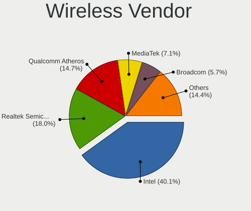

| Vendor                          | Computers | Percent |
|---------------------------------|-----------|---------|
| Intel                           | 294       | 40.05%  |
| Realtek Semiconductor           | 132       | 17.98%  |
| Qualcomm Atheros                | 108       | 14.71%  |
| MediaTek                        | 52        | 7.08%   |
| Broadcom                        | 42        | 5.72%   |
| Ralink Technology               | 19        | 2.59%   |
| TP-Link                         | 16        | 2.18%   |
| Broadcom Limited                | 14        | 1.91%   |
| D-Link                          | 12        | 1.63%   |
| Sierra Wireless                 | 6         | 0.82%   |
| Ralink                          | 6         | 0.82%   |
| Qualcomm                        | 5         | 0.68%   |
| ASUSTek Computer                | 5         | 0.68%   |
| Mercucys                        | 4         | 0.54%   |
| Edimax Technology               | 4         | 0.54%   |
| D-Link System                   | 4         | 0.54%   |
| Qualcomm Technologies           | 2         | 0.27%   |
| Quectel Wireless Solutions      | 1         | 0.14%   |
| Qualcomm Atheros Communications | 1         | 0.14%   |
| NetGear                         | 1         | 0.14%   |
| Marvell Technology Group        | 1         | 0.14%   |
| Linksys                         | 1         | 0.14%   |
| Fibocom                         | 1         | 0.14%   |
| Dell                            | 1         | 0.14%   |
| BUFFALO                         | 1         | 0.14%   |
| AVM                             | 1         | 0.14%   |

Wireless Model
--------------

Wireless models

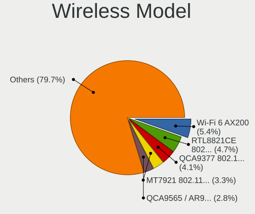

| Model                                                                | Computers | Percent |
|----------------------------------------------------------------------|-----------|---------|
| Intel Wi-Fi 6 AX200                                                  | 40        | 5.42%   |
| Realtek RTL8821CE 802.11ac PCIe Wireless Network Adapter             | 35        | 4.74%   |
| Qualcomm Atheros QCA9377 802.11ac Wireless Network Adapter           | 30        | 4.07%   |
| MediaTek MT7921 802.11ax PCIe Wireless Network Adapter [Filogic 330] | 24        | 3.25%   |
| Qualcomm Atheros QCA9565 / AR9565 Wireless Network Adapter           | 21        | 2.85%   |
| Intel Wireless 7265                                                  | 21        | 2.85%   |
| Intel Wireless 8260                                                  | 19        | 2.57%   |
| Intel Wi-Fi 6 AX201                                                  | 18        | 2.44%   |
| Realtek RTL8822CE 802.11ac PCIe Wireless Network Adapter             | 16        | 2.17%   |
| Intel Wireless 8265 / 8275                                           | 16        | 2.17%   |
| Intel Cannon Lake PCH CNVi WiFi                                      | 16        | 2.17%   |
| Qualcomm Atheros QCA6174 802.11ac Wireless Network Adapter           | 13        | 1.76%   |
| Intel Comet Lake PCH-LP CNVi WiFi                                    | 13        | 1.76%   |
| Intel Comet Lake PCH CNVi WiFi                                       | 13        | 1.76%   |
| Realtek RTL8188EUS 802.11n Wireless Network Adapter                  | 12        | 1.63%   |
| Intel Wi-Fi 5(802.11ac) Wireless-AC 9x6x [Thunder Peak]              | 12        | 1.63%   |
| Realtek 802.11ac NIC                                                 | 11        | 1.49%   |
| MediaTek MT7922 802.11ax PCI Express Wireless Network Adapter        | 11        | 1.49%   |
| MediaTek MT7902 802.11ax PCIe Wireless Network Adapter [Filogic 310] | 11        | 1.49%   |
| Intel Wi-Fi 6E(802.11ax) AX210/AX1675* 2x2 [Typhoon Peak]            | 11        | 1.49%   |
| Broadcom BCM43142 802.11b/g/n                                        | 11        | 1.49%   |
| Realtek RTL88x2bu [AC1200 Techkey]                                   | 10        | 1.36%   |
| Intel Wireless 7260                                                  | 10        | 1.36%   |
| Ralink MT7601U Wireless Adapter                                      | 9         | 1.22%   |
| Qualcomm Atheros AR9485 Wireless Network Adapter                     | 9         | 1.22%   |
| Qualcomm Atheros AR9285 Wireless Network Adapter (PCI-Express)       | 9         | 1.22%   |
| Intel Wireless 3160                                                  | 9         | 1.22%   |
| Broadcom BCM4313 802.11bgn Wireless Network Adapter                  | 9         | 1.22%   |
| Intel Wireless 3165                                                  | 8         | 1.08%   |
| Intel Centrino Advanced-N 6205 [Taylor Peak]                         | 8         | 1.08%   |
| Broadcom Limited BCM4360 802.11ac Dual Band Wireless Network Adapter | 8         | 1.08%   |
| Qualcomm Atheros AR928X Wireless Network Adapter (PCI-Express)       | 7         | 0.95%   |
| Intel Dual Band Wireless-AC 3168NGW [Stone Peak]                     | 7         | 0.95%   |
| Intel Dual Band Wireless-AC 3165 Plus Bluetooth                      | 7         | 0.95%   |
| Intel Cannon Point-LP CNVi [Wireless-AC]                             | 7         | 0.95%   |
| Intel 700 Series Chipset CNVi WiFi                                   | 7         | 0.95%   |
| Qualcomm Atheros AR9462 Wireless Network Adapter                     | 6         | 0.81%   |
| Intel Raptor Lake PCH CNVi WiFi                                      | 6         | 0.81%   |
| Realtek RTL8852BE PCIe 802.11ax Wireless Network Controller          | 5         | 0.68%   |
| Realtek RTL8822BE 802.11a/b/g/n/ac WiFi adapter                      | 5         | 0.68%   |

Ethernet Vendor
---------------

Ethernet vendors

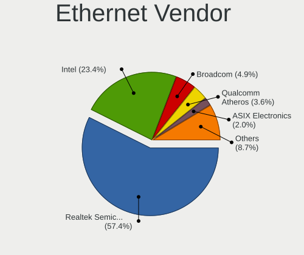

| Vendor                                 | Computers | Percent |
|----------------------------------------|-----------|---------|
| Realtek Semiconductor                  | 431       | 57.39%  |
| Intel                                  | 176       | 23.44%  |
| Broadcom                               | 37        | 4.93%   |
| Qualcomm Atheros                       | 27        | 3.6%    |
| ASIX Electronics                       | 15        | 2%      |
| Xiaomi                                 | 9         | 1.2%    |
| Nvidia                                 | 9         | 1.2%    |
| Samsung Electronics                    | 8         | 1.07%   |
| Dell                                   | 5         | 0.67%   |
| OPPO Electronics                       | 4         | 0.53%   |
| MediaTek                               | 4         | 0.53%   |
| Marvell Technology Group               | 4         | 0.53%   |
| VIA Technologies                       | 2         | 0.27%   |
| Suzhou Motorcomm Electronic Technology | 2         | 0.27%   |
| D-Link System                          | 2         | 0.27%   |
| Broadcom Limited                       | 2         | 0.27%   |
| vivo                                   | 1         | 0.13%   |
| Raspberry Pi                           | 1         | 0.13%   |
| Qualcomm Technologies                  | 1         | 0.13%   |
| QinHeng Electronics                    | 1         | 0.13%   |
| OnePlus Technology (Shenzhen)          | 1         | 0.13%   |
| Motorola PCS                           | 1         | 0.13%   |
| Lenovo                                 | 1         | 0.13%   |
| JMicron Technology                     | 1         | 0.13%   |
| IBM                                    | 1         | 0.13%   |
| Huawei Technologies                    | 1         | 0.13%   |
| DisplayLink                            | 1         | 0.13%   |
| Aquantia                               | 1         | 0.13%   |
| Apple                                  | 1         | 0.13%   |
| American Megatrends                    | 1         | 0.13%   |

Ethernet Model
--------------

Ethernet models

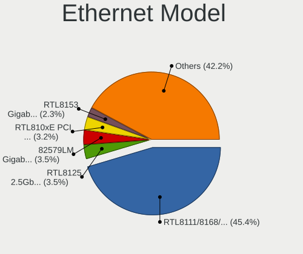

| Model                                                                  | Computers | Percent |
|------------------------------------------------------------------------|-----------|---------|
| Realtek RTL8111/8168/8211/8411 PCI Express Gigabit Ethernet Controller | 354       | 45.38%  |
| Realtek RTL8125 2.5GbE Controller                                      | 27        | 3.46%   |
| Intel 82579LM Gigabit Network Connection (Lewisville)                  | 27        | 3.46%   |
| Realtek RTL810xE PCI Express Fast Ethernet controller                  | 25        | 3.21%   |
| Realtek RTL8153 Gigabit Ethernet Adapter                               | 18        | 2.31%   |
| Intel Ethernet Connection I217-LM                                      | 15        | 1.92%   |
| Intel I211 Gigabit Network Connection                                  | 14        | 1.79%   |
| ASIX AX88179 Gigabit Ethernet                                          | 12        | 1.54%   |
| Intel Ethernet Connection (2) I219-V                                   | 11        | 1.41%   |
| Xiaomi Mi/Redmi series (RNDIS)                                         | 8         | 1.03%   |
| Intel Ethernet Connection (4) I219-LM                                  | 8         | 1.03%   |
| Intel Ethernet Connection (2) I219-LM                                  | 8         | 1.03%   |
| Samsung Galaxy series, misc. (tethering mode)                          | 7         | 0.9%    |
| Qualcomm Atheros AR8151 v2.0 Gigabit Ethernet                          | 7         | 0.9%    |
| Intel Ethernet Connection (7) I219-V                                   | 7         | 0.9%    |
| Intel Ethernet Connection I219-LM                                      | 6         | 0.77%   |
| Intel Ethernet Connection I217-V                                       | 6         | 0.77%   |
| Intel Ethernet Connection (5) I219-LM                                  | 6         | 0.77%   |
| Realtek RTL8152 Fast Ethernet Adapter                                  | 5         | 0.64%   |
| Intel Ethernet Controller I225-V                                       | 5         | 0.64%   |
| Dell iDRAC Virtual NIC                                                 | 5         | 0.64%   |
| Broadcom NetXtreme BCM5720 Gigabit Ethernet PCIe                       | 5         | 0.64%   |
| Broadcom BCM57454 NetXtreme-E 10Gb/25Gb/40Gb/50Gb/100Gb Ethernet       | 5         | 0.64%   |
| Broadcom BCM57414 NetXtreme-E 10Gb/25Gb RDMA Ethernet Controller       | 5         | 0.64%   |
| Qualcomm Atheros Killer E2500 Gigabit Ethernet Controller              | 4         | 0.51%   |
| OPPO Ace 3V                                                            | 4         | 0.51%   |
| Nvidia MCP61 Ethernet                                                  | 4         | 0.51%   |
| Intel Ethernet Connection I219-V                                       | 4         | 0.51%   |
| Intel Ethernet Connection (2) I218-V                                   | 4         | 0.51%   |
| Intel Alder Lake-P PCH CNVi WiFi                                       | 4         | 0.51%   |
| Intel 82567LM Gigabit Network Connection                               | 4         | 0.51%   |
| Realtek Killer E2600 GbE Controller                                    | 3         | 0.38%   |
| Qualcomm Atheros QCA8171 Gigabit Ethernet                              | 3         | 0.38%   |
| Qualcomm Atheros Killer E2400 Gigabit Ethernet Controller              | 3         | 0.38%   |
| Qualcomm Atheros AR8161 Gigabit Ethernet                               | 3         | 0.38%   |
| Nvidia MCP79 Ethernet                                                  | 3         | 0.38%   |
| Intel I350 Gigabit Network Connection                                  | 3         | 0.38%   |
| Intel Ethernet Connection I218-LM                                      | 3         | 0.38%   |
| Intel Ethernet Connection (12) I219-V                                  | 3         | 0.38%   |
| Intel Ethernet Connection (11) I219-LM                                 | 3         | 0.38%   |

Net Controller Kind
-------------------

Ethernet, WiFi or modem

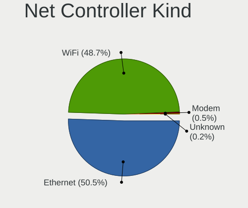

| Kind     | Computers | Percent |
|----------|-----------|---------|
| Ethernet | 701       | 50.54%  |
| WiFi     | 676       | 48.74%  |
| Modem    | 7         | 0.5%    |
| Unknown  | 3         | 0.22%   |

Used Controller
---------------

Currently used network controller

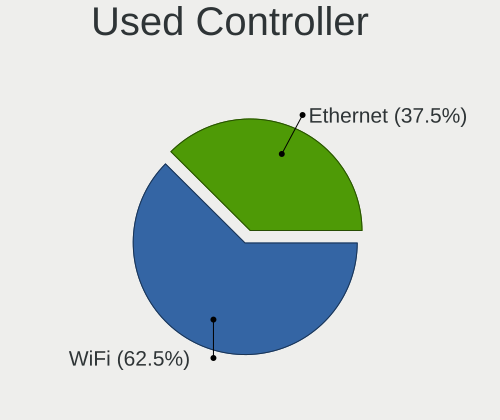

| Kind     | Computers | Percent |
|----------|-----------|---------|
| WiFi     | 549       | 62.46%  |
| Ethernet | 330       | 37.54%  |

NICs
----

Total network controllers on board

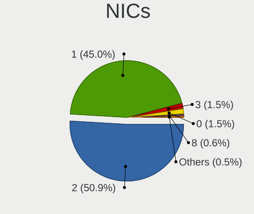

| Total | Computers | Percent |
|-------|-----------|---------|
| 2     | 436       | 50.93%  |
| 1     | 385       | 44.98%  |
| 3     | 13        | 1.52%   |
| 0     | 13        | 1.52%   |
| 8     | 5         | 0.58%   |
| 4     | 3         | 0.35%   |
| 5     | 1         | 0.12%   |

IPv6
----

IPv6 vs IPv4

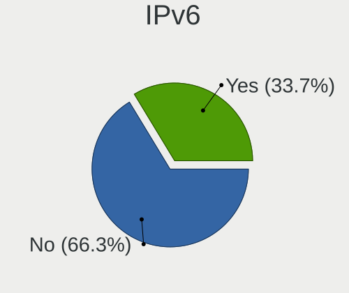

| Used | Computers | Percent |
|------|-----------|---------|
| No   | 587       | 66.33%  |
| Yes  | 298       | 33.67%  |

Bluetooth
---------

Bluetooth Vendor
----------------

Controller vendors

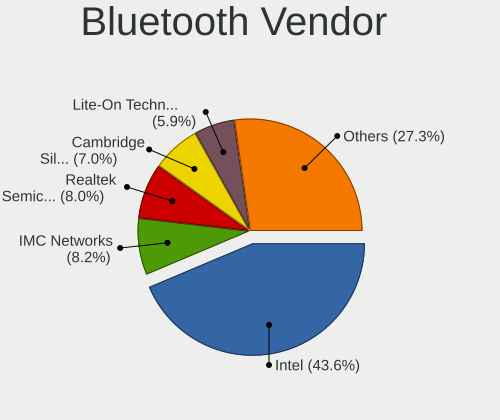

| Vendor                          | Computers | Percent |
|---------------------------------|-----------|---------|
| Intel                           | 261       | 43.65%  |
| IMC Networks                    | 49        | 8.19%   |
| Realtek Semiconductor           | 48        | 8.03%   |
| Cambridge Silicon Radio         | 42        | 7.02%   |
| Lite-On Technology              | 35        | 5.85%   |
| Qualcomm Atheros Communications | 32        | 5.35%   |
| Apple                           | 30        | 5.02%   |
| Foxconn / Hon Hai               | 23        | 3.85%   |
| Broadcom                        | 16        | 2.68%   |
| MediaTek                        | 11        | 1.84%   |
| TP-Link                         | 6         | 1%      |
| Realtek                         | 6         | 1%      |
| Dell                            | 6         | 1%      |
| ASUSTek Computer                | 6         | 1%      |
| Toshiba                         | 5         | 0.84%   |
| USI                             | 4         | 0.67%   |
| Foxconn International           | 4         | 0.67%   |
| Unknown                         | 4         | 0.67%   |
| SINO WEALTH                     | 2         | 0.33%   |
| Ralink                          | 2         | 0.33%   |
| Hewlett-Packard                 | 2         | 0.33%   |
| Actions                         | 2         | 0.33%   |
| Marvell Semiconductor           | 1         | 0.17%   |
| Askey Computer                  | 1         | 0.17%   |

Bluetooth Model
---------------

Controller models

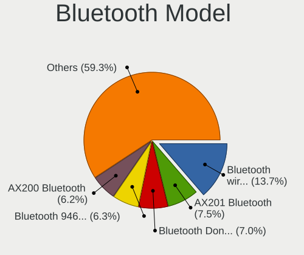

| Model                                               | Computers | Percent |
|-----------------------------------------------------|-----------|---------|
| Intel Bluetooth wireless interface                  | 82        | 13.69%  |
| Intel AX201 Bluetooth                               | 45        | 7.51%   |
| Cambridge Silicon Radio Bluetooth Dongle (HCI mode) | 42        | 7.01%   |
| Intel Bluetooth 9460/9560 Jefferson Peak (JfP)      | 38        | 6.34%   |
| Intel AX200 Bluetooth                               | 37        | 6.18%   |
| Realtek Bluetooth Radio                             | 30        | 5.01%   |
| Intel Bluetooth Device                              | 28        | 4.67%   |
| IMC Networks Wireless_Device                        | 21        | 3.51%   |
| Qualcomm Atheros  Bluetooth Device                  | 16        | 2.67%   |
| IMC Networks Bluetooth Radio                        | 15        | 2.5%    |
| Realtek  Bluetooth 4.2 Adapter                      | 13        | 2.17%   |
| Apple Bluetooth Host Controller                     | 12        | 2%      |
| MediaTek Wireless_Device                            | 11        | 1.84%   |
| Lite-On Qualcomm Atheros QCA9377 Bluetooth          | 11        | 1.84%   |
| IMC Networks Bluetooth Device                       | 11        | 1.84%   |
| Intel Wireless-AC 9260 Bluetooth Adapter            | 10        | 1.67%   |
| Intel AX210 Bluetooth                               | 10        | 1.67%   |
| Foxconn / Hon Hai Wireless_Device                   | 9         | 1.5%    |
| Apple Bluetooth USB Host Controller                 | 9         | 1.5%    |
| Lite-On Bluetooth Device                            | 8         | 1.34%   |
| Foxconn / Hon Hai Bluetooth Device                  | 8         | 1.34%   |
| Lite-On Wireless_Device                             | 7         | 1.17%   |
| Intel Wireless-AC 3168 Bluetooth                    | 7         | 1.17%   |
| TP-Link TP-T@- UB500 Adapter                        | 6         | 1%      |
| Realtek Bluetooth Radio                             | 6         | 1%      |
| Apple Built-in Bluetooth 2.0+EDR HCI                | 6         | 1%      |
| Qualcomm Atheros AR3012 Bluetooth 4.0               | 5         | 0.83%   |
| Qualcomm Atheros AR3011 Bluetooth                   | 5         | 0.83%   |
| USI Bluetooth Device                                | 4         | 0.67%   |
| Lite-On Bluetooth Radio                             | 4         | 0.67%   |
| Intel Centrino Bluetooth Wireless Transceiver       | 4         | 0.67%   |
| Foxconn International BCM43142A0 Bluetooth module   | 4         | 0.67%   |
| Broadcom BCM20702 Bluetooth 4.0 [ThinkPad]          | 4         | 0.67%   |
| Unknown                                             | 4         | 0.67%   |
| Realtek RTL8723B Bluetooth                          | 3         | 0.5%    |
| Lite-On Atheros AR3012 Bluetooth                    | 3         | 0.5%    |
| Broadcom BCM43142A0 Bluetooth Device                | 3         | 0.5%    |
| Apple Bluetooth HCI                                 | 3         | 0.5%    |
| Toshiba Bluetooth USB Host Controller               | 2         | 0.33%   |
| Toshiba Askey Bluetooth Module                      | 2         | 0.33%   |

Sound
-----

Sound Vendor
------------

Sound card vendors

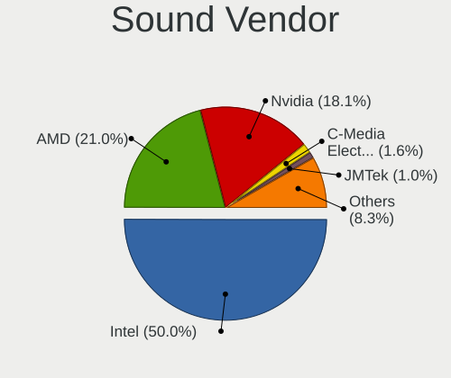

| Vendor                                       | Computers | Percent |
|----------------------------------------------|-----------|---------|
| Intel                                        | 604       | 50.04%  |
| AMD                                          | 253       | 20.96%  |
| Nvidia                                       | 219       | 18.14%  |
| C-Media Electronics                          | 19        | 1.57%   |
| JMTek                                        | 12        | 0.99%   |
| Generalplus Technology                       | 8         | 0.66%   |
| Razer USA                                    | 6         | 0.5%    |
| Logitech                                     | 6         | 0.5%    |
| Focusrite-Novation                           | 5         | 0.41%   |
| Texas Instruments                            | 4         | 0.33%   |
| Lenovo                                       | 4         | 0.33%   |
| Creative Labs                                | 4         | 0.33%   |
| Zoran Co. Personal Media Division (Nogatech) | 3         | 0.25%   |
| Elan Microelectronics                        | 3         | 0.25%   |
| Audio-Technica                               | 3         | 0.25%   |
| Walmart                                      | 2         | 0.17%   |
| VIA Technologies                             | 2         | 0.17%   |
| Thesycon Systemsoftware & Consulting         | 2         | 0.17%   |
| SAVITECH                                     | 2         | 0.17%   |
| Samson Technologies                          | 2         | 0.17%   |
| Micro Star International                     | 2         | 0.17%   |
| KTMicro                                      | 2         | 0.17%   |
| Kingston Technology                          | 2         | 0.17%   |
| Huawei Technologies                          | 2         | 0.17%   |
| Earth Computer Technologies                  | 2         | 0.17%   |
| Dell                                         | 2         | 0.17%   |
| Creative Technology                          | 2         | 0.17%   |
| Astro Gaming                                 | 2         | 0.17%   |
| Apple                                        | 2         | 0.17%   |
| Syntek                                       | 1         | 0.08%   |
| Synaptics                                    | 1         | 0.08%   |
| Soundprese                                   | 1         | 0.08%   |
| Solid State Logic                            | 1         | 0.08%   |
| Samsung Electronics                          | 1         | 0.08%   |
| Nordic Semiconductor ASA                     | 1         | 0.08%   |
| MV-SILICON                                   | 1         | 0.08%   |
| Jieli Technology                             | 1         | 0.08%   |
| JIAYZMicro                                   | 1         | 0.08%   |
| Hewlett-Packard                              | 1         | 0.08%   |
| ESS Technology                               | 1         | 0.08%   |

Sound Model
-----------

Sound card models

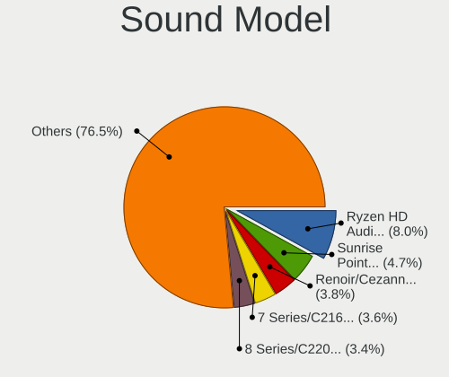

| Model                                                                      | Computers | Percent |
|----------------------------------------------------------------------------|-----------|---------|
| AMD Ryzen HD Audio Controller                                              | 117       | 8.02%   |
| Intel Sunrise Point-LP HD Audio                                            | 69        | 4.73%   |
| AMD Renoir/Cezanne HDMI/DP Audio Controller                                | 55        | 3.77%   |
| Intel 7 Series/C216 Chipset Family High Definition Audio Controller        | 52        | 3.57%   |
| Intel 8 Series/C220 Series Chipset High Definition Audio Controller        | 50        | 3.43%   |
| Intel 6 Series/C200 Series Chipset Family High Definition Audio Controller | 41        | 2.81%   |
| Intel 100 Series/C230 Series Chipset Family HD Audio Controller            | 39        | 2.67%   |
| Intel Xeon E3-1200 v3/4th Gen Core Processor HD Audio Controller           | 35        | 2.4%    |
| Intel Cannon Lake PCH cAVS                                                 | 33        | 2.26%   |
| AMD Radeon High Definition Audio Controller                                | 33        | 2.26%   |
| AMD Raven/Raven2/Fenghuang HDMI/DP Audio Controller                        | 28        | 1.92%   |
| Intel Tiger Lake-LP Smart Sound Technology Audio Controller                | 25        | 1.71%   |
| Intel Haswell-ULT HD Audio Controller                                      | 25        | 1.71%   |
| Intel 8 Series HD Audio Controller                                         | 25        | 1.71%   |
| Intel 200 Series PCH HD Audio                                              | 25        | 1.71%   |
| AMD Starship/Matisse HD Audio Controller                                   | 23        | 1.58%   |
| Intel Comet Lake PCH cAVS                                                  | 21        | 1.44%   |
| Nvidia GP107GL High Definition Audio Controller                            | 19        | 1.3%    |
| Intel 5 Series/3400 Series Chipset High Definition Audio                   | 19        | 1.3%    |
| AMD FCH Azalia Controller                                                  | 19        | 1.3%    |
| AMD Ellesmere HDMI Audio [Radeon RX 470/480 / 570/580/590]                 | 19        | 1.3%    |
| AMD Family 17h (Models 00h-0fh) HD Audio Controller                        | 16        | 1.1%    |
| Intel Comet Lake PCH-LP cAVS                                               | 15        | 1.03%   |
| Intel Celeron/Pentium Silver Processor High Definition Audio               | 15        | 1.03%   |
| AMD SBx00 Azalia (Intel HDA)                                               | 15        | 1.03%   |
| Nvidia TU116 High Definition Audio Controller                              | 14        | 0.96%   |
| Nvidia GP106 High Definition Audio Controller                              | 14        | 0.96%   |
| Intel 82801I (ICH9 Family) HD Audio Controller                             | 14        | 0.96%   |
| Nvidia High Definition Audio Controller                                    | 13        | 0.89%   |
| Nvidia GF108 High Definition Audio Controller                              | 13        | 0.89%   |
| Nvidia TU107 GeForce GTX 1650 High Definition Audio Controller             | 12        | 0.82%   |
| Intel NM10/ICH7 Family High Definition Audio Controller                    | 12        | 0.82%   |
| Nvidia GK107 HDMI Audio Controller                                         | 11        | 0.75%   |
| Intel Raptor Lake-P/U/H cAVS                                               | 11        | 0.75%   |
| Nvidia GP104 High Definition Audio Controller                              | 10        | 0.69%   |
| Nvidia GK208 HDMI/DP Audio Controller                                      | 10        | 0.69%   |
| Nvidia GA106 High Definition Audio Controller                              | 10        | 0.69%   |
| Intel Alder Lake PCH-P High Definition Audio Controller                    | 10        | 0.69%   |
| Nvidia GP108 High Definition Audio Controller                              | 9         | 0.62%   |
| Nvidia GM107 High Definition Audio Controller [GeForce 940MX]              | 9         | 0.62%   |

Memory
------

Memory Vendor
-------------

Memory module vendors

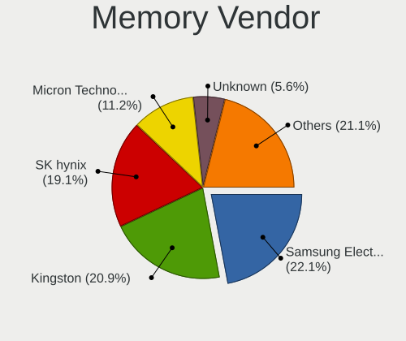

| Vendor              | Computers | Percent |
|---------------------|-----------|---------|
| Samsung Electronics | 118       | 22.06%  |
| Kingston            | 112       | 20.93%  |
| SK hynix            | 102       | 19.07%  |
| Micron Technology   | 60        | 11.21%  |
| Unknown             | 30        | 5.61%   |
| Corsair             | 21        | 3.93%   |
| Ramaxel Technology  | 10        | 1.87%   |
| Crucial             | 10        | 1.87%   |
| A-DATA Technology   | 10        | 1.87%   |
| Transcend           | 9         | 1.68%   |
| Elpida              | 9         | 1.68%   |
| Unknown             | 8         | 1.5%    |
| Team                | 7         | 1.31%   |
| Unknown (ABCD)      | 4         | 0.75%   |
| Nanya Technology    | 4         | 0.75%   |
| G.Skill             | 4         | 0.75%   |
| Apacer              | 3         | 0.56%   |
| Hikvision           | 2         | 0.37%   |
| ASint Technology    | 2         | 0.37%   |
| Unknown (0x8325)    | 1         | 0.19%   |
| Unknown (0x02BA)    | 1         | 0.19%   |
| Unknown (08B5)      | 1         | 0.19%   |
| Lexar               | 1         | 0.19%   |
| KLEVV               | 1         | 0.19%   |
| Kingmax             | 1         | 0.19%   |
| KingFast            | 1         | 0.19%   |
| ff                  | 1         | 0.19%   |
| Avant               | 1         | 0.19%   |
| 4ea5                | 1         | 0.19%   |

Memory Model
------------

Memory module models

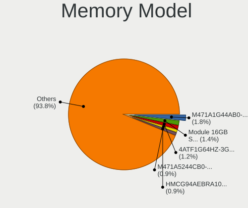

| Model                                                          | Computers | Percent |
|----------------------------------------------------------------|-----------|---------|
| Samsung RAM M471A1G44AB0-CWE 8GiB SODIMM DDR4 3200MT/s         | 10        | 1.76%   |
| Unknown                                                        | 8         | 1.41%   |
| Micron RAM 4ATF1G64HZ-3G2F1 8GB SODIMM DDR4 3200MT/s           | 7         | 1.23%   |
| SK hynix RAM HMCG94AEBRA109N 64GB DIMM DDR5 4800MT/s           | 5         | 0.88%   |
| SK hynix RAM HMAA2GS6CJR8N-XN 16GB SODIMM DDR4 3200MT/s        | 5         | 0.88%   |
| SK hynix RAM HMA81GS6AFR8N-UH 8GB SODIMM DDR4 2667MT/s         | 5         | 0.88%   |
| Samsung RAM M471A5244CB0-CTD 4GB SODIMM DDR4 3266MT/s          | 5         | 0.88%   |
| Kingston RAM KHX3200C16D4/8GX 8GB DIMM DDR4 3733MT/s           | 5         | 0.88%   |
| Kingston RAM KHX1600C10D3/8G 8GB DIMM DDR3 2133MT/s            | 5         | 0.88%   |
| Kingston RAM KF3200C16D4/16GX 16GB DIMM DDR4 3733MT/s          | 5         | 0.88%   |
| SK hynix RAM HMT451S6BFR8A-PB 4GB SODIMM DDR3 1600MT/s         | 4         | 0.71%   |
| SK hynix RAM HMT451S6AFR8A-PB 4GB SODIMM DDR3 1600MT/s         | 4         | 0.71%   |
| SK hynix RAM HMA851S6AFR6N-UH 4GB SODIMM DDR4 2667MT/s         | 4         | 0.71%   |
| Samsung RAM M471B5173QH0-YK0 4GB SODIMM DDR3 1600MT/s          | 4         | 0.71%   |
| Samsung RAM M471B5173DB0-YK0 4GB SODIMM DDR3 1600MT/s          | 4         | 0.71%   |
| Samsung RAM M471A1K43EB1-CWE 8GB SODIMM DDR4 3200MT/s          | 4         | 0.71%   |
| Kingston RAM KHX2666C15S4/8G 8GB SODIMM DDR4 2667MT/s          | 4         | 0.71%   |
| Kingston RAM KF3200C20S4/8G 8GB SODIMM DDR4 3200MT/s           | 4         | 0.71%   |
| Kingston RAM 99U5428-018.A00LF 8GB SODIMM DDR3 1600MT/s        | 4         | 0.71%   |
| Unknown RAM Module 4GB DIMM 1333MT/s                           | 3         | 0.53%   |
| Unknown (ABCD) RAM 123456789012345678 2GB DIMM LPDDR4 2133MT/s | 3         | 0.53%   |
| SK hynix RAM HMT351S6EFR8C-PB 4GB SODIMM DDR3 1600MT/s         | 3         | 0.53%   |
| SK hynix RAM HMT351S6CFR8C-PB 4GB SODIMM DDR3 1600MT/s         | 3         | 0.53%   |
| SK hynix RAM HMT125U6TFR8C-H9 2GB DIMM DDR3 1333MT/s           | 3         | 0.53%   |
| SK hynix RAM HMAA1GS6CJR6N-XN 8GB SODIMM DDR4 3200MT/s         | 3         | 0.53%   |
| Samsung RAM M471A1K43DB1-CTD 8GB SODIMM DDR4 2667MT/s          | 3         | 0.53%   |
| Samsung RAM M471A1K43CB1-CRC 8GB SODIMM DDR4 8400MT/s          | 3         | 0.53%   |
| Samsung RAM M471A1K43BB1-CRC 8GB SODIMM DDR4 2667MT/s          | 3         | 0.53%   |
| Samsung RAM M471A1G44AB0-CWE 8GB Row Of Chips DDR4 3200MT/s    | 3         | 0.53%   |
| Samsung RAM M425R2GA3BB0-CWMOD 16GiB SODIMM DDR5 5600MT/s      | 3         | 0.53%   |
| Kingston RAM KHX2666C16/8G 8GiB DIMM DDR4 3466MT/s             | 3         | 0.53%   |
| A-DATA RAM Module 8GB SODIMM DDR4 3200MT/s                     | 3         | 0.53%   |
| Unknown RAM Module 4GB SODIMM DDR4 2400MT/s                    | 2         | 0.35%   |
| Unknown RAM Module 4GB DIMM DDR3 1333MT/s                      | 2         | 0.35%   |
| Unknown RAM Module 2GB SODIMM DDR3 1600MT/s                    | 2         | 0.35%   |
| Transcend RAM JM3200HSB-8G 8GB SODIMM DDR4 3200MT/s            | 2         | 0.35%   |
| Team RAM TEAMGROUP-UD4-3200 8GB DIMM DDR4 3800MT/s             | 2         | 0.35%   |
| SK hynix RAM Module 8GB SODIMM DDR3 1600MT/s                   | 2         | 0.35%   |
| SK hynix RAM HMT351S6EFR8A-PB 4GB SODIMM DDR3 1600MT/s         | 2         | 0.35%   |
| SK hynix RAM HMT112U6TFR8C-H9 1GB DIMM DDR3 1333MT/s           | 2         | 0.35%   |

Memory Kind
-----------

Memory module kinds

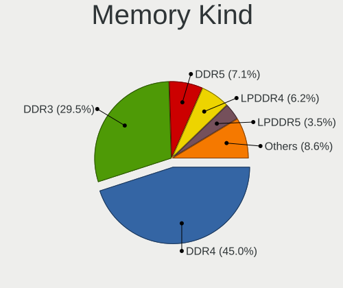

| Kind    | Computers | Percent |
|---------|-----------|---------|
| DDR4    | 203       | 45.01%  |
| DDR3    | 133       | 29.49%  |
| DDR5    | 32        | 7.1%    |
| LPDDR4  | 28        | 6.21%   |
| LPDDR5  | 16        | 3.55%   |
| SDRAM   | 11        | 2.44%   |
| LPDDR3  | 11        | 2.44%   |
| DDR2    | 10        | 2.22%   |
| Unknown | 4         | 0.89%   |
| DDR     | 2         | 0.44%   |
| DRAM    | 1         | 0.22%   |

Memory Form Factor
------------------

Physical design of the memory module

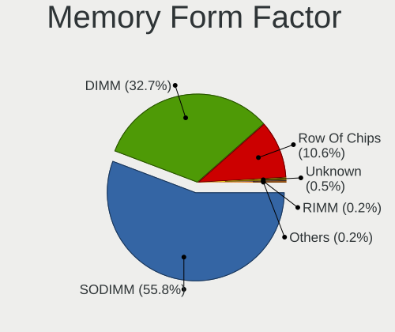

| Name         | Computers | Percent |
|--------------|-----------|---------|
| SODIMM       | 247       | 55.76%  |
| DIMM         | 145       | 32.73%  |
| Row Of Chips | 47        | 10.61%  |
| Unknown      | 2         | 0.45%   |
| RIMM         | 1         | 0.23%   |
| FB-DIMM      | 1         | 0.23%   |

Memory Size
-----------

Memory module size

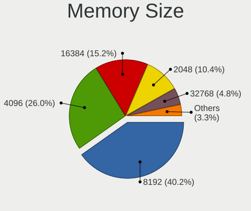

| Size  | Computers | Percent |
|-------|-----------|---------|
| 8192  | 193       | 40.21%  |
| 4096  | 125       | 26.04%  |
| 16384 | 73        | 15.21%  |
| 2048  | 50        | 10.42%  |
| 32768 | 23        | 4.79%   |
| 1024  | 8         | 1.67%   |
| 65536 | 6         | 1.25%   |
| 24576 | 1         | 0.21%   |
| 3072  | 1         | 0.21%   |

Memory Speed
------------

Memory module speed

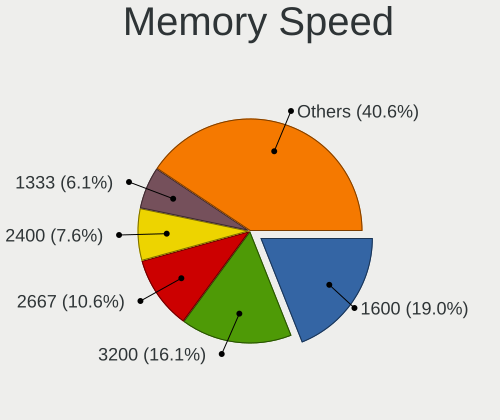

| Speed   | Computers | Percent |
|---------|-----------|---------|
| 1600    | 93        | 18.98%  |
| 3200    | 79        | 16.12%  |
| 2667    | 52        | 10.61%  |
| 2400    | 37        | 7.55%   |
| 1333    | 30        | 6.12%   |
| 2133    | 25        | 5.1%    |
| 3733    | 16        | 3.27%   |
| 5600    | 13        | 2.65%   |
| 4800    | 12        | 2.45%   |
| 4267    | 11        | 2.24%   |
| 1867    | 10        | 2.04%   |
| 1334    | 10        | 2.04%   |
| 3600    | 8         | 1.63%   |
| 7500    | 6         | 1.22%   |
| 6400    | 6         | 1.22%   |
| 1866    | 6         | 1.22%   |
| 8400    | 5         | 1.02%   |
| 3266    | 5         | 1.02%   |
| 1067    | 5         | 1.02%   |
| 667     | 5         | 1.02%   |
| 6000    | 4         | 0.82%   |
| 3400    | 4         | 0.82%   |
| 2666    | 4         | 0.82%   |
| 4266    | 3         | 0.61%   |
| 3466    | 3         | 0.61%   |
| 3000    | 3         | 0.61%   |
| 1800    | 3         | 0.61%   |
| 800     | 3         | 0.61%   |
| 8533    | 2         | 0.41%   |
| 6800    | 2         | 0.41%   |
| 3800    | 2         | 0.41%   |
| 3151    | 2         | 0.41%   |
| 975     | 2         | 0.41%   |
| 533     | 2         | 0.41%   |
| Unknown | 2         | 0.41%   |
| 7467    | 1         | 0.2%    |
| 6200    | 1         | 0.2%    |
| 5500    | 1         | 0.2%    |
| 5200    | 1         | 0.2%    |
| 4199    | 1         | 0.2%    |

Printers & scanners
-------------------

Printer Vendor
--------------

Printer device vendors

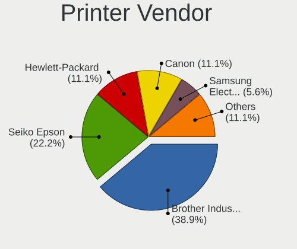

| Vendor              | Computers | Percent |
|---------------------|-----------|---------|
| Brother Industries  | 7         | 38.89%  |
| Seiko Epson         | 4         | 22.22%  |
| Hewlett-Packard     | 2         | 11.11%  |
| Canon               | 2         | 11.11%  |
| STMicroelectronics  | 1         | 5.56%   |
| Samsung Electronics | 1         | 5.56%   |
| Pantum              | 1         | 5.56%   |

Printer Model
-------------

Printer device models

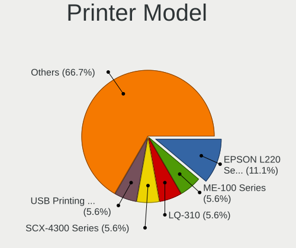

| Model                                   | Computers | Percent |
|-----------------------------------------|-----------|---------|
| Seiko Epson EPSON L220 Series           | 2         | 11.11%  |
| STMicroelectronics USB Printing Support | 1         | 5.56%   |
| Seiko Epson ME-100 Series               | 1         | 5.56%   |
| Seiko Epson LQ-310                      | 1         | 5.56%   |
| Samsung SCX-4300 Series                 | 1         | 5.56%   |
| Pantum P2500W series                    | 1         | 5.56%   |
| HP HP LaserJet Pro M404-M405            | 1         | 5.56%   |
| HP DeskJet 2130 series                  | 1         | 5.56%   |
| Canon PIXMA MP280                       | 1         | 5.56%   |
| Canon E4200 series                      | 1         | 5.56%   |
| Brother HL-L2370DN series               | 1         | 5.56%   |
| Brother HL-1210W series                 | 1         | 5.56%   |
| Brother HL-1110 series                  | 1         | 5.56%   |
| Brother DCP-T510W                       | 1         | 5.56%   |
| Brother DCP-T300                        | 1         | 5.56%   |
| Brother DCP-L3551CDW                    | 1         | 5.56%   |
| Brother DCP-1510                        | 1         | 5.56%   |

Scanner Vendor
--------------

Scanner device vendors

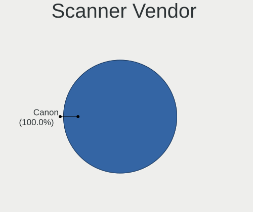

| Vendor | Computers | Percent |
|--------|-----------|---------|
| Canon  | 2         | 100%    |

Scanner Model
-------------

Scanner device models

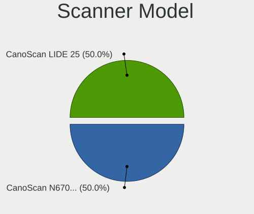

| Model                              | Computers | Percent |
|------------------------------------|-----------|---------|
| Canon CanoScan N670U/N676U/LiDE 20 | 1         | 50%     |
| Canon CanoScan LIDE 25             | 1         | 50%     |

Camera
------

Camera Vendor
-------------

Camera device vendors

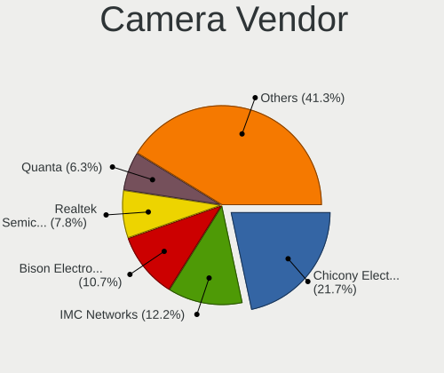

| Vendor                                 | Computers | Percent |
|----------------------------------------|-----------|---------|
| Chicony Electronics                    | 103       | 21.68%  |
| IMC Networks                           | 58        | 12.21%  |
| Bison Electronics                      | 51        | 10.74%  |
| Realtek Semiconductor                  | 37        | 7.79%   |
| Quanta                                 | 30        | 6.32%   |
| Microdia                               | 29        | 6.11%   |
| Logitech                               | 19        | 4%      |
| Sunplus Innovation Technology          | 17        | 3.58%   |
| Apple                                  | 14        | 2.95%   |
| Cheng Uei Precision Industry (Foxlink) | 13        | 2.74%   |
| ShineTech                              | 11        | 2.32%   |
| Lite-On Technology                     | 10        | 2.11%   |
| Sonix Technology                       | 9         | 1.89%   |
| Syntek                                 | 8         | 1.68%   |
| Luxvisions Innotech Limited            | 8         | 1.68%   |
| Suyin                                  | 7         | 1.47%   |
| Microsoft                              | 7         | 1.47%   |
| Silicon Motion                         | 6         | 1.26%   |
| Generalplus Technology                 | 5         | 1.05%   |
| Aveo Technology                        | 4         | 0.84%   |
| MacroSilicon                           | 3         | 0.63%   |
| Z-Star Microelectronics                | 2         | 0.42%   |
| Samsung Electronics                    | 2         | 0.42%   |
| OPPO Electronics                       | 2         | 0.42%   |
| icSpring                               | 2         | 0.42%   |
| Alcor Micro                            | 2         | 0.42%   |
| WCM_USB                                | 1         | 0.21%   |
| vivo                                   | 1         | 0.21%   |
| Sony Electronics                       | 1         | 0.21%   |
| Shine-optics                           | 1         | 0.21%   |
| Ricoh                                  | 1         | 0.21%   |
| Razer USA                              | 1         | 0.21%   |
| Primax Electronics                     | 1         | 0.21%   |
| Owon                                   | 1         | 0.21%   |
| Lenovo                                 | 1         | 0.21%   |
| kingcome                               | 1         | 0.21%   |
| Jieli Technology                       | 1         | 0.21%   |
| Huawei Technologies                    | 1         | 0.21%   |
| eMeet                                  | 1         | 0.21%   |
| Dell                                   | 1         | 0.21%   |

Camera Model
------------

Camera device models

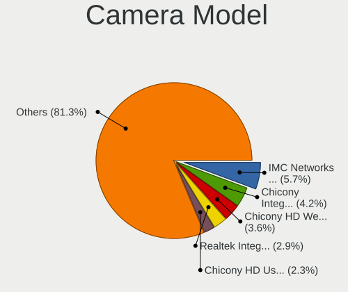

| Model                               | Computers | Percent |
|-------------------------------------|-----------|---------|
| IMC Networks USB2.0 HD UVC WebCam   | 27        | 5.66%   |
| Chicony Integrated Camera           | 20        | 4.19%   |
| Chicony HD WebCam                   | 17        | 3.56%   |
| Realtek Integrated_Webcam_HD        | 14        | 2.94%   |
| Chicony HD User Facing              | 11        | 2.31%   |
| Bison Lenovo EasyCamera             | 10        | 2.1%    |
| Bison Integrated Camera             | 10        | 2.1%    |
| Microdia Integrated_Webcam_HD       | 9         | 1.89%   |
| IMC Networks Integrated Camera      | 9         | 1.89%   |
| ShineTech USB2.0 HD UVC WebCam      | 7         | 1.47%   |
| Chicony HP TrueVision HD Camera     | 7         | 1.47%   |
| Bison SunplusIT Integrated Camera   | 7         | 1.47%   |
| Microdia USB 2.0 Camera             | 6         | 1.26%   |
| Chicony FJ Camera                   | 6         | 1.26%   |
| Apple Built-in iSight               | 6         | 1.26%   |
| Syntek Integrated Camera            | 5         | 1.05%   |
| Sonix USB2.0 HD UVC WebCam          | 5         | 1.05%   |
| Quanta HD Webcam                    | 5         | 1.05%   |
| Microsoft Microsoft LifeCam Cinema  | 5         | 1.05%   |
| Logitech Webcam C270                | 5         | 1.05%   |
| Realtek HD WebCam                   | 4         | 0.84%   |
| Quanta ACER HD User Facing          | 4         | 0.84%   |
| Microdia Camera                     | 4         | 0.84%   |
| Logitech C922 Pro Stream Webcam     | 4         | 0.84%   |
| Lite-On Integrated Camera           | 4         | 0.84%   |
| IMC Networks USB2.0 VGA UVC WebCam  | 4         | 0.84%   |
| Chicony Lenovo EasyCamera           | 4         | 0.84%   |
| Apple FaceTime HD Camera (Built-in) | 4         | 0.84%   |
| Sunplus Integrated_Webcam_HD        | 3         | 0.63%   |
| Sonix USB2.0 FHD UVC WebCam         | 3         | 0.63%   |
| Silicon Motion WebCam SCB-0385N     | 3         | 0.63%   |
| Quanta USB2.0 HD UVC WebCam         | 3         | 0.63%   |
| Quanta HP Wide Vision HD Camera     | 3         | 0.63%   |
| Quanta HD User Facing               | 3         | 0.63%   |
| Quanta HD Camera                    | 3         | 0.63%   |
| MacroSilicon USB Video              | 3         | 0.63%   |
| Lite-On HP Wide Vision HD Camera    | 3         | 0.63%   |
| IMC Networks VGA UVC WebCam         | 3         | 0.63%   |
| IMC Networks HD Camera              | 3         | 0.63%   |
| Generalplus WEB CAM                 | 3         | 0.63%   |

Security
--------

Fingerprint Vendor
------------------

Fingerprint sensor vendors

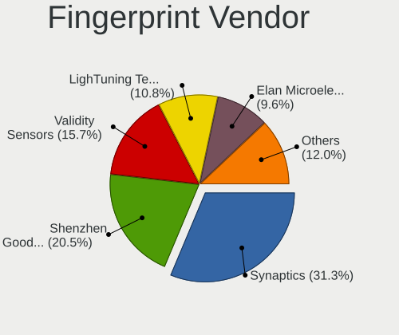

| Vendor                             | Computers | Percent |
|------------------------------------|-----------|---------|
| Synaptics                          | 26        | 31.33%  |
| Shenzhen Goodix Technology         | 17        | 20.48%  |
| Validity Sensors                   | 13        | 15.66%  |
| LighTuning Technology              | 9         | 10.84%  |
| Elan Microelectronics              | 8         | 9.64%   |
| AuthenTec                          | 5         | 6.02%   |
| Upek                               | 4         | 4.82%   |
| Realtek USB2.0 Finger Print Bridge | 1         | 1.2%    |

Fingerprint Model
-----------------

Fingerprint sensor models

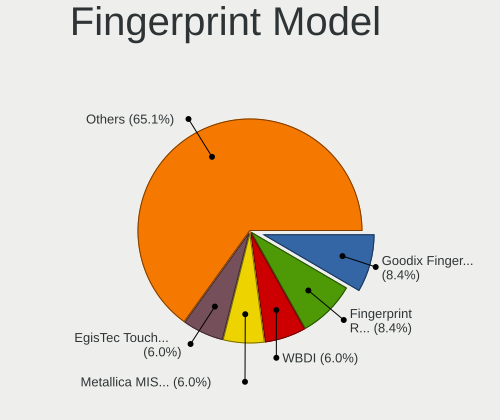

| Model                                                           | Computers | Percent |
|-----------------------------------------------------------------|-----------|---------|
| Shenzhen Goodix  Fingerprint Device                             | 7         | 8.43%   |
| Shenzhen Goodix Fingerprint Reader                              | 7         | 8.43%   |
| Synaptics WBDI                                                  | 5         | 6.02%   |
| Synaptics Metallica MIS Touch Fingerprint Reader                | 5         | 6.02%   |
| LighTuning EgisTec Touch Fingerprint Sensor                     | 5         | 6.02%   |
| Validity Sensors VFS7500 Touch Fingerprint Sensor               | 4         | 4.82%   |
| Upek Biometric Touchchip/Touchstrip Fingerprint Sensor          | 4         | 4.82%   |
| Synaptics Prometheus MIS Touch Fingerprint Reader               | 4         | 4.82%   |
| Elan ELAN:Fingerprint                                           | 4         | 4.82%   |
| Elan ELAN:ARM-M4                                                | 4         | 4.82%   |
| Validity Sensors VFS 5011 fingerprint sensor                    | 3         | 3.61%   |
| Synaptics UWP WBDI Device                                       | 3         | 3.61%   |
| Shenzhen Goodix FingerPrint                                     | 3         | 3.61%   |
| Validity Sensors Swipe Fingerprint Sensor                       | 2         | 2.41%   |
| Synaptics UWP WBDI                                              | 2         | 2.41%   |
| Synaptics  WBDI                                                 | 2         | 2.41%   |
| Synaptics Prometheus Fingerprint Reader                         | 2         | 2.41%   |
| LighTuning ES603 Swipe Fingerprint Sensor                       | 2         | 2.41%   |
| AuthenTec AES2810                                               | 2         | 2.41%   |
| AuthenTec AES1600                                               | 2         | 2.41%   |
| Validity Sensors VFS495 Fingerprint Reader                      | 1         | 1.2%    |
| Validity Sensors VFS491                                         | 1         | 1.2%    |
| Validity Sensors VFS101 Fingerprint Reader                      | 1         | 1.2%    |
| Validity Sensors Synaptics WBDI                                 | 1         | 1.2%    |
| Synaptics WBDI Fingerprint Reader USB 086                       | 1         | 1.2%    |
| Synaptics Metallica MOH Touch Fingerprint Reader                | 1         | 1.2%    |
| Synaptics FS7604 Touch Fingerprint Sensor with PurePrint        | 1         | 1.2%    |
| Realtek USB2.0 Finger Print Bridge FocalTech Fingerprint Device | 1         | 1.2%    |
| LighTuning Fingerprint Sensor                                   | 1         | 1.2%    |
| LighTuning Fingerprint Reader                                   | 1         | 1.2%    |
| AuthenTec AES2501 Fingerprint Sensor                            | 1         | 1.2%    |

Chipcard Vendor
---------------

Chipcard module vendors

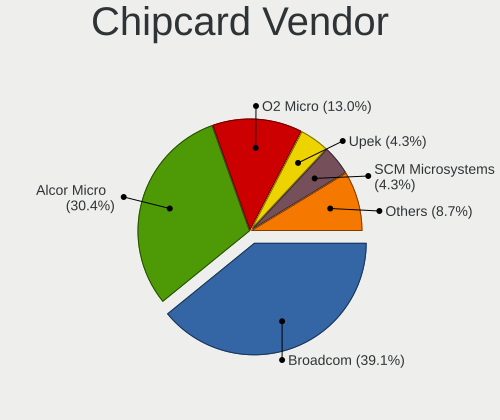

| Vendor                | Computers | Percent |
|-----------------------|-----------|---------|
| Broadcom              | 9         | 39.13%  |
| Alcor Micro           | 7         | 30.43%  |
| O2 Micro              | 3         | 13.04%  |
| Upek                  | 1         | 4.35%   |
| SCM Microsystems      | 1         | 4.35%   |
| OmniKey               | 1         | 4.35%   |
| Gemalto (was Gemplus) | 1         | 4.35%   |

Chipcard Model
--------------

Chipcard module models

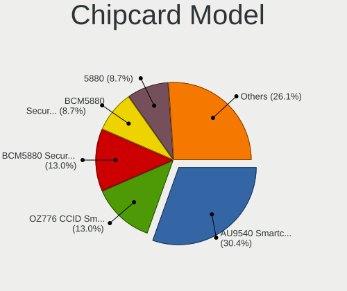

| Model                                                                        | Computers | Percent |
|------------------------------------------------------------------------------|-----------|---------|
| Alcor Micro AU9540 Smartcard Reader                                          | 7         | 30.43%  |
| O2 Micro OZ776 CCID Smartcard Reader                                         | 3         | 13.04%  |
| Broadcom BCM5880 Secure Applications Processor                               | 3         | 13.04%  |
| Broadcom BCM5880 Secure Applications Processor with fingerprint swipe sensor | 2         | 8.7%    |
| Broadcom 5880                                                                | 2         | 8.7%    |
| Upek TouchChip Fingerprint Coprocessor (WBF advanced mode)                   | 1         | 4.35%   |
| SCM Microsystems SCR35xx Smart Card Reader                                   | 1         | 4.35%   |
| OmniKey CardMan 3021 / 3121                                                  | 1         | 4.35%   |
| Gemalto (was Gemplus) GemPC Twin SmartCard Reader                            | 1         | 4.35%   |
| Broadcom BCM58200 ControlVault 3 (FingerPrint sensor + Contacted SmartCard)  | 1         | 4.35%   |
| Broadcom 58200                                                               | 1         | 4.35%   |

Unsupported
-----------

Unsupported Devices
-------------------

Total unsupported devices on board

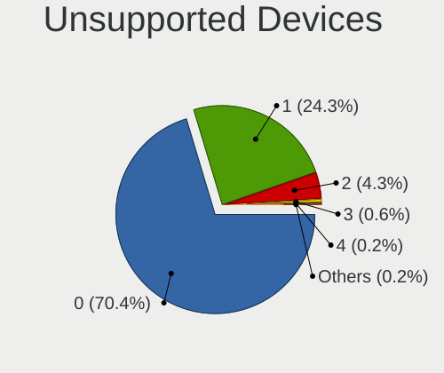

| Total | Computers | Percent |
|-------|-----------|---------|
| 0     | 617       | 70.35%  |
| 1     | 213       | 24.29%  |
| 2     | 38        | 4.33%   |
| 3     | 5         | 0.57%   |
| 4     | 2         | 0.23%   |
| 7     | 1         | 0.11%   |
| 5     | 1         | 0.11%   |

Unsupported Device Types
------------------------

Types of unsupported devices

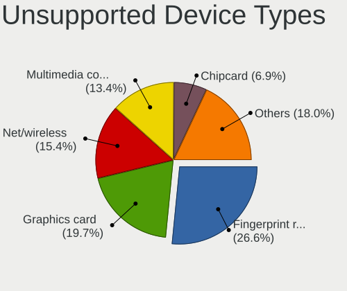

| Type                     | Computers | Percent |
|--------------------------|-----------|---------|
| Fingerprint reader       | 81        | 26.56%  |
| Graphics card            | 60        | 19.67%  |
| Net/wireless             | 47        | 15.41%  |
| Multimedia controller    | 41        | 13.44%  |
| Chipcard                 | 21        | 6.89%   |
| Communication controller | 11        | 3.61%   |
| Unassigned class         | 10        | 3.28%   |
| Sound                    | 8         | 2.62%   |
| Camera                   | 7         | 2.3%    |
| Net/ethernet             | 5         | 1.64%   |
| Bluetooth                | 4         | 1.31%   |
| Card reader              | 3         | 0.98%   |
| Storage/raid             | 2         | 0.66%   |
| Wireless                 | 1         | 0.33%   |
| Storage/ide              | 1         | 0.33%   |
| Storage                  | 1         | 0.33%   |
| Network                  | 1         | 0.33%   |
| Flash memory             | 1         | 0.33%   |

