Linux in Thailand - Tested Hardware & Statistics
------------------------------------------------

A project to collect tested hardware configurations for Linux in Thailand.

Anyone can contribute to this report by the [hw-probe](https://github.com/linuxhw/hw-probe) tool:

    sudo -E hw-probe -all -upload

Please contribute! Especially if your hardware is rare.

This is a report for all computer types. See also reports for [desktops](/Location/Thailand/Desktop/README.md) and [notebooks](/Location/Thailand/Notebook/README.md).

Contents
--------

* [ Test Cases ](#test-cases)

* [ System ](#system)
  - [ OS                       ](#os)
  - [ OS Family                ](#os-family)
  - [ Kernel                   ](#kernel)
  - [ Kernel Family            ](#kernel-family)
  - [ Kernel Major Ver.        ](#kernel-major-ver)
  - [ Arch                     ](#arch)
  - [ DE                       ](#de)
  - [ Display Server           ](#display-server)
  - [ Display Manager          ](#display-manager)
  - [ OS Lang                  ](#os-lang)
  - [ Boot Mode                ](#boot-mode)
  - [ Filesystem               ](#filesystem)
  - [ Part. scheme             ](#part-scheme)
  - [ Dual Boot with Linux/BSD ](#dual-boot-with-linuxbsd)
  - [ Dual Boot (Win)          ](#dual-boot-win)

* [ Board ](#board)
  - [ Vendor                   ](#vendor)
  - [ Model                    ](#model)
  - [ Model Family             ](#model-family)
  - [ MFG Year                 ](#mfg-year)
  - [ Form Factor              ](#form-factor)
  - [ Secure Boot              ](#secure-boot)
  - [ Coreboot                 ](#coreboot)
  - [ RAM Size                 ](#ram-size)
  - [ RAM Used                 ](#ram-used)
  - [ Total Drives             ](#total-drives)
  - [ Has CD-ROM               ](#has-cd-rom)
  - [ Has Ethernet             ](#has-ethernet)
  - [ Has WiFi                 ](#has-wifi)
  - [ Has Bluetooth            ](#has-bluetooth)

* [ Location ](#location)
  - [ Country                  ](#country)
  - [ City                     ](#city)

* [ Drives ](#drives)
  - [ Drive Vendor             ](#drive-vendor)
  - [ Drive Model              ](#drive-model)
  - [ HDD Vendor               ](#hdd-vendor)
  - [ SSD Vendor               ](#ssd-vendor)
  - [ Drive Kind               ](#drive-kind)
  - [ Drive Connector          ](#drive-connector)
  - [ Drive Size               ](#drive-size)
  - [ Space Total              ](#space-total)
  - [ Space Used               ](#space-used)
  - [ Malfunc. Drives          ](#malfunc-drives)
  - [ Malfunc. Drive Vendor    ](#malfunc-drive-vendor)
  - [ Malfunc. HDD Vendor      ](#malfunc-hdd-vendor)
  - [ Malfunc. Drive Kind      ](#malfunc-drive-kind)
  - [ Failed Drives            ](#failed-drives)
  - [ Failed Drive Vendor      ](#failed-drive-vendor)
  - [ Drive Status             ](#drive-status)

* [ Storage controller ](#storage-controller)
  - [ Storage Vendor           ](#storage-vendor)
  - [ Storage Model            ](#storage-model)
  - [ Storage Kind             ](#storage-kind)

* [ Processor ](#processor)
  - [ CPU Vendor               ](#cpu-vendor)
  - [ CPU Model                ](#cpu-model)
  - [ CPU Model Family         ](#cpu-model-family)
  - [ CPU Cores                ](#cpu-cores)
  - [ CPU Sockets              ](#cpu-sockets)
  - [ CPU Threads              ](#cpu-threads)
  - [ CPU Op-Modes             ](#cpu-op-modes)
  - [ CPU Microcode            ](#cpu-microcode)
  - [ CPU Microarch            ](#cpu-microarch)

* [ Graphics ](#graphics)
  - [ GPU Vendor               ](#gpu-vendor)
  - [ GPU Model                ](#gpu-model)
  - [ GPU Combo                ](#gpu-combo)
  - [ GPU Driver               ](#gpu-driver)
  - [ GPU Memory               ](#gpu-memory)

* [ Monitor ](#monitor)
  - [ Monitor Vendor           ](#monitor-vendor)
  - [ Monitor Model            ](#monitor-model)
  - [ Monitor Resolution       ](#monitor-resolution)
  - [ Monitor Diagonal         ](#monitor-diagonal)
  - [ Monitor Width            ](#monitor-width)
  - [ Aspect Ratio             ](#aspect-ratio)
  - [ Monitor Area             ](#monitor-area)
  - [ Pixel Density            ](#pixel-density)
  - [ Multiple Monitors        ](#multiple-monitors)

* [ Network ](#network)
  - [ Net Controller Vendor    ](#net-controller-vendor)
  - [ Net Controller Model     ](#net-controller-model)
  - [ Wireless Vendor          ](#wireless-vendor)
  - [ Wireless Model           ](#wireless-model)
  - [ Ethernet Vendor          ](#ethernet-vendor)
  - [ Ethernet Model           ](#ethernet-model)
  - [ Net Controller Kind      ](#net-controller-kind)
  - [ Used Controller          ](#used-controller)
  - [ NICs                     ](#nics)
  - [ IPv6                     ](#ipv6)

* [ Bluetooth ](#bluetooth)
  - [ Bluetooth Vendor         ](#bluetooth-vendor)
  - [ Bluetooth Model          ](#bluetooth-model)

* [ Sound ](#sound)
  - [ Sound Vendor             ](#sound-vendor)
  - [ Sound Model              ](#sound-model)

* [ Memory ](#memory)
  - [ Memory Vendor            ](#memory-vendor)
  - [ Memory Model             ](#memory-model)
  - [ Memory Kind              ](#memory-kind)
  - [ Memory Form Factor       ](#memory-form-factor)
  - [ Memory Size              ](#memory-size)
  - [ Memory Speed             ](#memory-speed)

* [ Printers & scanners ](#printers--scanners)
  - [ Printer Vendor           ](#printer-vendor)
  - [ Printer Model            ](#printer-model)
  - [ Scanner Vendor           ](#scanner-vendor)
  - [ Scanner Model            ](#scanner-model)

* [ Camera ](#camera)
  - [ Camera Vendor            ](#camera-vendor)
  - [ Camera Model             ](#camera-model)

* [ Security ](#security)
  - [ Fingerprint Vendor       ](#fingerprint-vendor)
  - [ Fingerprint Model        ](#fingerprint-model)
  - [ Chipcard Vendor          ](#chipcard-vendor)
  - [ Chipcard Model           ](#chipcard-model)

* [ Unsupported ](#unsupported)
  - [ Unsupported Devices      ](#unsupported-devices)
  - [ Unsupported Device Types ](#unsupported-device-types)

Test Cases
----------

Total: 484

| Vendor        | Model                       | Form-Factor | Probe                                                      | Date         |
|---------------|-----------------------------|-------------|------------------------------------------------------------|--------------|
| ASRock        | B550M-ITX/ac                | Desktop     | [685e484cbd](https://linux-hardware.org/?probe=685e484cbd) | Aug 31, 2022 |
| Dell          | 0773VG A00                  | Desktop     | [576dfabbf6](https://linux-hardware.org/?probe=576dfabbf6) | Aug 29, 2022 |
| OEM           | Intel H81                   | Desktop     | [8732ebea02](https://linux-hardware.org/?probe=8732ebea02) | Aug 29, 2022 |
| ASUSTek       | VivoBook_ASUSLaptop X512... | Notebook    | [65f638768e](https://linux-hardware.org/?probe=65f638768e) | Aug 27, 2022 |
| Lenovo        | ThinkPad X1 Extreme Gen ... | Notebook    | [1746f3874c](https://linux-hardware.org/?probe=1746f3874c) | Aug 27, 2022 |
| Apple         | MacBookPro11,3              | Notebook    | [0008869bb6](https://linux-hardware.org/?probe=0008869bb6) | Aug 27, 2022 |
| Apple         | MacBookPro11,3              | Notebook    | [c0e9a2e062](https://linux-hardware.org/?probe=c0e9a2e062) | Aug 27, 2022 |
| OEM           | Intel H81                   | Desktop     | [cbedace60c](https://linux-hardware.org/?probe=cbedace60c) | Aug 25, 2022 |
| Apple         | MacBookPro11,3              | Notebook    | [51a98d93a6](https://linux-hardware.org/?probe=51a98d93a6) | Aug 20, 2022 |
| Acer          | Aspire V3-771               | Notebook    | [dc65bd0f38](https://linux-hardware.org/?probe=dc65bd0f38) | Aug 17, 2022 |
| ASUSTek       | VivoBook_ASUSLaptop M350... | Notebook    | [93b2d066d6](https://linux-hardware.org/?probe=93b2d066d6) | Aug 17, 2022 |
| Gigabyte      | H81M-DS2                    | Desktop     | [e0abb12052](https://linux-hardware.org/?probe=e0abb12052) | Aug 16, 2022 |
| Unknown       | Unknown                     | Notebook    | [5cdd2332d5](https://linux-hardware.org/?probe=5cdd2332d5) | Aug 14, 2022 |
| Gigabyte      | H81M-DS2                    | Desktop     | [5ae2bc3c12](https://linux-hardware.org/?probe=5ae2bc3c12) | Aug 14, 2022 |
| HP            | 8062                        | Desktop     | [0f24b44d56](https://linux-hardware.org/?probe=0f24b44d56) | Aug 14, 2022 |
| Foxconn       | Kangaroo Mobile Desktop     | Notebook    | [1b9f19b21e](https://linux-hardware.org/?probe=1b9f19b21e) | Aug 13, 2022 |
| Acer          | Aspire E5-575G              | Notebook    | [5ebbabea13](https://linux-hardware.org/?probe=5ebbabea13) | Aug 10, 2022 |
| Dell          | 088DT1 A01                  | Desktop     | [eab28163ce](https://linux-hardware.org/?probe=eab28163ce) | Aug 09, 2022 |
| SHARKBAY      | Unknown                     | Desktop     | [a35fff735f](https://linux-hardware.org/?probe=a35fff735f) | Aug 09, 2022 |
| Acer          | TravelMate P643-M           | Notebook    | [33254cfb1e](https://linux-hardware.org/?probe=33254cfb1e) | Aug 03, 2022 |
| HP            | Stream Notebook PC 13       | Notebook    | [d736692861](https://linux-hardware.org/?probe=d736692861) | Jul 31, 2022 |
| Dell          | Latitude 3320               | Notebook    | [183ae38016](https://linux-hardware.org/?probe=183ae38016) | Jul 31, 2022 |
| Dell          | Latitude 3320               | Notebook    | [a849c0d90a](https://linux-hardware.org/?probe=a849c0d90a) | Jul 30, 2022 |
| Dell          | Latitude E5430 non-vPro     | Notebook    | [f8808faaf0](https://linux-hardware.org/?probe=f8808faaf0) | Jul 24, 2022 |
| Acer          | TravelMate P643-M           | Notebook    | [0357bf32d7](https://linux-hardware.org/?probe=0357bf32d7) | Jul 19, 2022 |
| ASUSTek       | ASUS TUF Gaming A17 FA70... | Notebook    | [eac5600627](https://linux-hardware.org/?probe=eac5600627) | Jul 12, 2022 |
| Lenovo        | SHARKBAY 31900059 WIN       | All in one  | [f27df86fda](https://linux-hardware.org/?probe=f27df86fda) | Jul 11, 2022 |
| ASUSTek       | ROG Maximus X APEX          | Desktop     | [e1fa4e4923](https://linux-hardware.org/?probe=e1fa4e4923) | Jul 06, 2022 |
| MSI           | Z97 XPOWER AC               | Desktop     | [b7324cb6ab](https://linux-hardware.org/?probe=b7324cb6ab) | Jul 05, 2022 |
| ASUSTek       | ASUS TUF Gaming A17 FA70... | Notebook    | [4829f98af6](https://linux-hardware.org/?probe=4829f98af6) | Jul 04, 2022 |
| HP            | EliteBook 840 G8 Noteboo... | Notebook    | [cfa0dde1d0](https://linux-hardware.org/?probe=cfa0dde1d0) | Jul 02, 2022 |
| Infinix       | INBOOK X2                   | Notebook    | [eedac976d8](https://linux-hardware.org/?probe=eedac976d8) | Jul 02, 2022 |
| ASUSTek       | ROG STRIX X570-F GAMING     | Desktop     | [334719e6a2](https://linux-hardware.org/?probe=334719e6a2) | Jun 30, 2022 |
| Infinix       | INBOOK X2                   | Notebook    | [1c87102f96](https://linux-hardware.org/?probe=1c87102f96) | Jun 29, 2022 |
| ASRock        | B450 Steel Legend           | Desktop     | [6f8f8a9df6](https://linux-hardware.org/?probe=6f8f8a9df6) | Jun 26, 2022 |
| ASRock        | B450 Steel Legend           | Desktop     | [547aab5039](https://linux-hardware.org/?probe=547aab5039) | Jun 26, 2022 |
| Lenovo        | ThinkPad X230 23331R5       | Notebook    | [c6589e02c4](https://linux-hardware.org/?probe=c6589e02c4) | Jun 25, 2022 |
| AFOX          | AF IH81-MA3 V1.0            | Desktop     | [4ce7ccc125](https://linux-hardware.org/?probe=4ce7ccc125) | Jun 24, 2022 |
| ASUSTek       | ASUS TUF Gaming A17 FA70... | Notebook    | [a1a0b3b43b](https://linux-hardware.org/?probe=a1a0b3b43b) | Jun 23, 2022 |
| MSI           | GE76 Raider 10UH            | Notebook    | [77ef5acb4c](https://linux-hardware.org/?probe=77ef5acb4c) | Jun 23, 2022 |
| ASUSTek       | ASUS TUF Gaming A17 FA70... | Notebook    | [51ec938467](https://linux-hardware.org/?probe=51ec938467) | Jun 22, 2022 |
| Dell          | 04YP6J A02                  | Desktop     | [11151bb62c](https://linux-hardware.org/?probe=11151bb62c) | Jun 22, 2022 |
| Dell          | 0YXT71 A03                  | Desktop     | [890e65c781](https://linux-hardware.org/?probe=890e65c781) | Jun 19, 2022 |
| Gigabyte      | H310M S2H x.x               | Desktop     | [1cc4490d99](https://linux-hardware.org/?probe=1cc4490d99) | Jun 17, 2022 |
| ASUSTek       | PRIME B450M-K               | Desktop     | [e3bb4dee4b](https://linux-hardware.org/?probe=e3bb4dee4b) | Jun 17, 2022 |
| Unknown       | Unknown                     | Notebook    | [00090936e8](https://linux-hardware.org/?probe=00090936e8) | Jun 15, 2022 |
| Dell          | Latitude 3120               | Notebook    | [c5c6eed0d9](https://linux-hardware.org/?probe=c5c6eed0d9) | Jun 14, 2022 |
| Acer          | Aspire F5-573G              | Notebook    | [fd7d146eb1](https://linux-hardware.org/?probe=fd7d146eb1) | Jun 08, 2022 |
| Apple         | MacBookPro11,1              | Notebook    | [b12802bc7a](https://linux-hardware.org/?probe=b12802bc7a) | Jun 02, 2022 |
| ASUSTek       | ASUS TUF Gaming A17 FA70... | Notebook    | [799a25df83](https://linux-hardware.org/?probe=799a25df83) | May 31, 2022 |
| ASRock        | B450 Steel Legend           | Desktop     | [136730f4ac](https://linux-hardware.org/?probe=136730f4ac) | May 31, 2022 |
| Acer          | One Z1402                   | Notebook    | [4278b806cf](https://linux-hardware.org/?probe=4278b806cf) | May 31, 2022 |
| ASRock        | B450 Steel Legend           | Desktop     | [62b7e9aacd](https://linux-hardware.org/?probe=62b7e9aacd) | May 31, 2022 |
| ASRock        | B450 Steel Legend           | Desktop     | [5d47d967ba](https://linux-hardware.org/?probe=5d47d967ba) | May 28, 2022 |
| ASUSTek       | S400CA                      | Notebook    | [dadda333d2](https://linux-hardware.org/?probe=dadda333d2) | May 28, 2022 |
| Gigabyte      | Z97X-UD3H-BK-CF             | Desktop     | [3dbf1858d0](https://linux-hardware.org/?probe=3dbf1858d0) | May 27, 2022 |
| Dell          | Latitude 3120               | Notebook    | [e97cf58459](https://linux-hardware.org/?probe=e97cf58459) | May 23, 2022 |
| Lenovo        | IdeaPad 700-15ISK 80RU      | Notebook    | [8949bc2cf8](https://linux-hardware.org/?probe=8949bc2cf8) | May 22, 2022 |
| ASRock        | B450 Steel Legend           | Desktop     | [3c436952c7](https://linux-hardware.org/?probe=3c436952c7) | May 21, 2022 |
| Acer          | One Z1402                   | Notebook    | [ae69c0fdbd](https://linux-hardware.org/?probe=ae69c0fdbd) | May 21, 2022 |
| Dell          | Inspiron 7559               | Notebook    | [90bfbc9f6b](https://linux-hardware.org/?probe=90bfbc9f6b) | May 16, 2022 |
| Gigabyte      | Z390 AORUS MASTER-CF        | Desktop     | [ec0ec5ea27](https://linux-hardware.org/?probe=ec0ec5ea27) | May 15, 2022 |
| Lenovo        | Yoga C640-13IML 81UE        | Convertible | [07e54c3c41](https://linux-hardware.org/?probe=07e54c3c41) | May 12, 2022 |
| Intel         | D54250WYK H13922-305        | Desktop     | [6d1745c79b](https://linux-hardware.org/?probe=6d1745c79b) | May 11, 2022 |
| Dell          | 00V62H A00                  | Desktop     | [e765b34181](https://linux-hardware.org/?probe=e765b34181) | May 11, 2022 |
| Lenovo        | ThinkPad X230 23257Y1       | Notebook    | [0c4e13a23d](https://linux-hardware.org/?probe=0c4e13a23d) | May 11, 2022 |
| HP            | 18E7                        | Desktop     | [52a59840d8](https://linux-hardware.org/?probe=52a59840d8) | May 09, 2022 |
| Lenovo        | ThinkPad E15 Gen 3 20YJS... | Notebook    | [fb11780c46](https://linux-hardware.org/?probe=fb11780c46) | May 07, 2022 |
| ASRock        | H370 Pro4                   | Desktop     | [ccf085e9dc](https://linux-hardware.org/?probe=ccf085e9dc) | May 02, 2022 |
| ASRock        | B450 Steel Legend           | Desktop     | [ecc527cb4b](https://linux-hardware.org/?probe=ecc527cb4b) | May 01, 2022 |
| ASRock        | B450 Steel Legend           | Desktop     | [ca217fe968](https://linux-hardware.org/?probe=ca217fe968) | May 01, 2022 |
| HP            | Pavilion x360 Convertibl... | Convertible | [fec983464c](https://linux-hardware.org/?probe=fec983464c) | Apr 29, 2022 |
| ASUSTek       | H81M-E                      | Desktop     | [b485d8f932](https://linux-hardware.org/?probe=b485d8f932) | Apr 28, 2022 |
| ASUSTek       | K40IN                       | Notebook    | [ab6a95da52](https://linux-hardware.org/?probe=ab6a95da52) | Apr 28, 2022 |
| MSI           | MEG X570 UNIFY              | Desktop     | [4f7c3fc75d](https://linux-hardware.org/?probe=4f7c3fc75d) | Apr 26, 2022 |
| HP            | Pro Tablet 608 G1           | Notebook    | [a8b97ee7cf](https://linux-hardware.org/?probe=a8b97ee7cf) | Apr 25, 2022 |
| Acer          | Aspire A515-45              | Notebook    | [377315649e](https://linux-hardware.org/?probe=377315649e) | Apr 22, 2022 |
| ASUSTek       | G550JK                      | Notebook    | [566770a325](https://linux-hardware.org/?probe=566770a325) | Apr 21, 2022 |
| ASUSTek       | G550JK                      | Notebook    | [6d291b9c9c](https://linux-hardware.org/?probe=6d291b9c9c) | Apr 21, 2022 |
| ASUSTek       | FX503VD                     | Notebook    | [218e8b7d2a](https://linux-hardware.org/?probe=218e8b7d2a) | Apr 20, 2022 |
| Lenovo        | ThinkPad X220 4286A78       | Notebook    | [d5c9254caa](https://linux-hardware.org/?probe=d5c9254caa) | Apr 20, 2022 |
| HP            | ENVY x360 Convertible 13... | Convertible | [95744e46d1](https://linux-hardware.org/?probe=95744e46d1) | Apr 18, 2022 |
| MSI           | B450 GAMING PRO CARBON A... | Desktop     | [be1e468728](https://linux-hardware.org/?probe=be1e468728) | Apr 17, 2022 |
| Acer          | Aspire E5-471G              | Notebook    | [a7179e1ba3](https://linux-hardware.org/?probe=a7179e1ba3) | Apr 16, 2022 |
| ASRock        | B460M-ITX/ac                | Desktop     | [7e6604d785](https://linux-hardware.org/?probe=7e6604d785) | Apr 12, 2022 |
| Framework     | Laptop                      | Notebook    | [bd5ea938e7](https://linux-hardware.org/?probe=bd5ea938e7) | Apr 07, 2022 |
| Dell          | Latitude 3120               | Notebook    | [c0df9a1ac0](https://linux-hardware.org/?probe=c0df9a1ac0) | Apr 06, 2022 |
| Lenovo        | ThinkBook 15 G3 ACL 21A4    | Notebook    | [30c09eec3b](https://linux-hardware.org/?probe=30c09eec3b) | Mar 28, 2022 |
| Lenovo        | IdeaPad S530-13IWL 81J7     | Notebook    | [a9a4291601](https://linux-hardware.org/?probe=a9a4291601) | Mar 26, 2022 |
| Dell          | Latitude 3120               | Notebook    | [69b7d6b1a3](https://linux-hardware.org/?probe=69b7d6b1a3) | Mar 26, 2022 |
| Dell          | Latitude 3120               | Notebook    | [78ae48c482](https://linux-hardware.org/?probe=78ae48c482) | Mar 26, 2022 |
| Gigabyte      | GA-970A-DS3                 | Desktop     | [db31622d02](https://linux-hardware.org/?probe=db31622d02) | Mar 21, 2022 |
| Gigabyte      | B450M S2H                   | Desktop     | [1602a60580](https://linux-hardware.org/?probe=1602a60580) | Mar 18, 2022 |
| ASRock        | B450 Steel Legend           | Desktop     | [db613d4f60](https://linux-hardware.org/?probe=db613d4f60) | Mar 16, 2022 |
| Apple         | Mac-F2238AC8                | All in one  | [d534c1e639](https://linux-hardware.org/?probe=d534c1e639) | Mar 16, 2022 |
| Gigabyte      | GA-78LMT-USB3 R2            | Desktop     | [7a484a0d61](https://linux-hardware.org/?probe=7a484a0d61) | Mar 11, 2022 |
| Acer          | Aspire E5-571               | Notebook    | [c2f6faf193](https://linux-hardware.org/?probe=c2f6faf193) | Mar 06, 2022 |
| HP            | Pavilion x360 Convertibl... | Convertible | [afa2ad19c8](https://linux-hardware.org/?probe=afa2ad19c8) | Mar 04, 2022 |
| HUAWEI        | HLYL-WXX9                   | Notebook    | [5c8d71134e](https://linux-hardware.org/?probe=5c8d71134e) | Feb 16, 2022 |
| ASRock        | H410M-HDV R2.0              | Desktop     | [0c91f1563f](https://linux-hardware.org/?probe=0c91f1563f) | Feb 14, 2022 |
| Acer          | AOA150                      | Notebook    | [aeb35f9f12](https://linux-hardware.org/?probe=aeb35f9f12) | Feb 13, 2022 |
| Acer          | AOA150                      | Notebook    | [7d493dd5d5](https://linux-hardware.org/?probe=7d493dd5d5) | Feb 13, 2022 |
| Unknown       | Intel X79                   | Desktop     | [f0dd6357fe](https://linux-hardware.org/?probe=f0dd6357fe) | Feb 12, 2022 |
| ASUSTek       | VivoBook_ASUSLaptop M350... | Notebook    | [5d3d7c5340](https://linux-hardware.org/?probe=5d3d7c5340) | Feb 12, 2022 |
| ASRock        | X570 Phantom Gaming 4       | Desktop     | [9544722d31](https://linux-hardware.org/?probe=9544722d31) | Feb 12, 2022 |
| ASUSTek       | VivoBook_ASUSLaptop X513... | Notebook    | [1488d5e773](https://linux-hardware.org/?probe=1488d5e773) | Feb 09, 2022 |
| ASUSTek       | ASUS TUF Gaming A17 FA70... | Notebook    | [dfc4821588](https://linux-hardware.org/?probe=dfc4821588) | Feb 08, 2022 |
| ASUSTek       | Z170-K                      | Desktop     | [ad24d41607](https://linux-hardware.org/?probe=ad24d41607) | Feb 08, 2022 |
| Unknown       | Intel X79                   | Desktop     | [089b663f84](https://linux-hardware.org/?probe=089b663f84) | Feb 06, 2022 |
| HP            | 1998                        | Desktop     | [263c4b1a93](https://linux-hardware.org/?probe=263c4b1a93) | Feb 03, 2022 |
| MSI           | MEG X570 UNIFY              | Desktop     | [5e8f4aba70](https://linux-hardware.org/?probe=5e8f4aba70) | Feb 03, 2022 |
| Dell          | Vostro 5471                 | Notebook    | [c90234250e](https://linux-hardware.org/?probe=c90234250e) | Jan 31, 2022 |
| Lenovo        | ThinkPad P50 20EQS2AB00     | Notebook    | [bdc680b5f1](https://linux-hardware.org/?probe=bdc680b5f1) | Jan 19, 2022 |
| Lenovo        | ThinkPad X13 Gen 1 20UFS... | Notebook    | [31f48cd25e](https://linux-hardware.org/?probe=31f48cd25e) | Jan 19, 2022 |
| Intel         | NUC6i5SYB H81131-503        | Mini pc     | [2c877954ab](https://linux-hardware.org/?probe=2c877954ab) | Jan 15, 2022 |
| Gigabyte      | Z390 AORUS MASTER-CF        | Desktop     | [4151d78b0a](https://linux-hardware.org/?probe=4151d78b0a) | Jan 14, 2022 |
| Gigabyte      | Z390 AORUS MASTER-CF        | Desktop     | [322291a7b1](https://linux-hardware.org/?probe=322291a7b1) | Jan 14, 2022 |
| Intel         | NUC6i5SYB H81131-503        | Mini pc     | [dfe91144b0](https://linux-hardware.org/?probe=dfe91144b0) | Jan 13, 2022 |
| Intel         | NUC6i5SYB H81131-503        | Mini pc     | [247f2934b0](https://linux-hardware.org/?probe=247f2934b0) | Jan 13, 2022 |
| ASUSTek       | M5A78L-M LX3                | Desktop     | [39f3687349](https://linux-hardware.org/?probe=39f3687349) | Jan 12, 2022 |
| Lenovo        | Yoga 720-13IKB 81C3         | Convertible | [608af1b572](https://linux-hardware.org/?probe=608af1b572) | Jan 04, 2022 |
| HP            | 82B4                        | Desktop     | [363fec4fa2](https://linux-hardware.org/?probe=363fec4fa2) | Jan 03, 2022 |
| ASUSTek       | G550JK                      | Notebook    | [b26b378274](https://linux-hardware.org/?probe=b26b378274) | Jan 01, 2022 |
| ASRock        | M3A770DE                    | Desktop     | [92b50bf0b6](https://linux-hardware.org/?probe=92b50bf0b6) | Dec 27, 2021 |
| Lenovo        | ThinkPad X131e 33722VU      | Notebook    | [c8dc197420](https://linux-hardware.org/?probe=c8dc197420) | Dec 26, 2021 |
| ASRock        | M3A770DE                    | Desktop     | [47fa1e385d](https://linux-hardware.org/?probe=47fa1e385d) | Dec 26, 2021 |
| Lenovo        | ThinkBook 15 G3 ACL 21A4    | Notebook    | [2e71480673](https://linux-hardware.org/?probe=2e71480673) | Dec 24, 2021 |
| HP            | 82B4                        | Desktop     | [02f9952fa5](https://linux-hardware.org/?probe=02f9952fa5) | Dec 24, 2021 |
| ASRock        | H510M-HVS R2.0              | Desktop     | [99e3241324](https://linux-hardware.org/?probe=99e3241324) | Dec 18, 2021 |
| MiTAC         | PD14RI                      | Desktop     | [e4dc1c326a](https://linux-hardware.org/?probe=e4dc1c326a) | Dec 16, 2021 |
| ASUSTek       | M5A78L-M LX3                | Desktop     | [720cc7a45f](https://linux-hardware.org/?probe=720cc7a45f) | Dec 15, 2021 |
| MSI           | Boston                      | Desktop     | [760fa25b63](https://linux-hardware.org/?probe=760fa25b63) | Dec 15, 2021 |
| MSI           | Boston                      | Desktop     | [bc4405aa85](https://linux-hardware.org/?probe=bc4405aa85) | Dec 15, 2021 |
| ASRock        | M3A770DE                    | Desktop     | [15671c0dbe](https://linux-hardware.org/?probe=15671c0dbe) | Dec 14, 2021 |
| MiTAC         | PD14RI                      | Desktop     | [acf3343fe7](https://linux-hardware.org/?probe=acf3343fe7) | Dec 13, 2021 |
| Gigabyte      | GA-970A-DS3                 | Desktop     | [e22dd08488](https://linux-hardware.org/?probe=e22dd08488) | Dec 02, 2021 |
| Gigabyte      | M52L-S3                     | Desktop     | [16854f2502](https://linux-hardware.org/?probe=16854f2502) | Nov 29, 2021 |
| Lenovo        | ThinkPad L530 24792T1       | Notebook    | [3e12618615](https://linux-hardware.org/?probe=3e12618615) | Nov 29, 2021 |
| Gigabyte      | M52L-S3                     | Desktop     | [e6f3417028](https://linux-hardware.org/?probe=e6f3417028) | Nov 27, 2021 |
| Toshiba       | Satellite L840              | Notebook    | [6c29b0fc8d](https://linux-hardware.org/?probe=6c29b0fc8d) | Nov 27, 2021 |
| ASUSTek       | TUF Gaming FX505DT_FX505... | Notebook    | [0d0596e9ea](https://linux-hardware.org/?probe=0d0596e9ea) | Nov 25, 2021 |
| ASRock        | B450M Pro4                  | Desktop     | [6043e86d2a](https://linux-hardware.org/?probe=6043e86d2a) | Nov 24, 2021 |
| Gigabyte      | H110M-DS2V-CF               | Desktop     | [63edfe6809](https://linux-hardware.org/?probe=63edfe6809) | Nov 24, 2021 |
| Gigabyte      | H110M-DS2V-CF               | Desktop     | [a4986016ca](https://linux-hardware.org/?probe=a4986016ca) | Nov 23, 2021 |
| Notebook      | NV4XMB,ME,MZ                | Notebook    | [edaff183a5](https://linux-hardware.org/?probe=edaff183a5) | Nov 21, 2021 |
| MSI           | 3666h                       | Desktop     | [21f11d2850](https://linux-hardware.org/?probe=21f11d2850) | Nov 19, 2021 |
| MSI           | 3666h                       | Desktop     | [aad8cfbf76](https://linux-hardware.org/?probe=aad8cfbf76) | Nov 18, 2021 |
| Dell          | Vostro 5471                 | Notebook    | [4083699145](https://linux-hardware.org/?probe=4083699145) | Nov 14, 2021 |
| HP            | Spectre x360 Convertible... | Convertible | [e3825be547](https://linux-hardware.org/?probe=e3825be547) | Nov 14, 2021 |
| MSI           | Prestige 15 A10SC           | Notebook    | [b362dd3f20](https://linux-hardware.org/?probe=b362dd3f20) | Nov 13, 2021 |
| Dell          | Inspiron N5010              | Notebook    | [d1b6520785](https://linux-hardware.org/?probe=d1b6520785) | Nov 13, 2021 |
| HP            | EliteBook 6930p (FL488AW... | Notebook    | [af8e63842a](https://linux-hardware.org/?probe=af8e63842a) | Oct 28, 2021 |
| Acer          | Aspire ES1-131              | Notebook    | [de7bee5c36](https://linux-hardware.org/?probe=de7bee5c36) | Oct 20, 2021 |
| Dell          | 0YXT71 A02                  | Desktop     | [ff477e5a71](https://linux-hardware.org/?probe=ff477e5a71) | Oct 10, 2021 |
| Dell          | 0YXT71 A02                  | Desktop     | [f467bc83ef](https://linux-hardware.org/?probe=f467bc83ef) | Oct 10, 2021 |
| ASUSTek       | F1A55-M LX PLUS             | Desktop     | [3bf6f778dc](https://linux-hardware.org/?probe=3bf6f778dc) | Oct 10, 2021 |
| HP            | Pavilion Gaming Laptop 1... | Notebook    | [1193264475](https://linux-hardware.org/?probe=1193264475) | Oct 10, 2021 |
| ASUSTek       | F1A55-M LX PLUS             | Desktop     | [f873a240d5](https://linux-hardware.org/?probe=f873a240d5) | Oct 10, 2021 |
| Apple         | Mac-F42C88C8 Proto1         | Desktop     | [26e5760e58](https://linux-hardware.org/?probe=26e5760e58) | Oct 08, 2021 |
| Lenovo        | ThinkPad X1 Carbon Gen 9... | Notebook    | [f3c6229102](https://linux-hardware.org/?probe=f3c6229102) | Oct 06, 2021 |
| Apple         | MacBookPro5,5               | Notebook    | [514642d183](https://linux-hardware.org/?probe=514642d183) | Sep 30, 2021 |
| ASUSTek       | ZenBook UX333FN_UX333FN     | Notebook    | [e4fb99f5b8](https://linux-hardware.org/?probe=e4fb99f5b8) | Sep 30, 2021 |
| ASUSTek       | F1A55-M LX PLUS             | Desktop     | [26b0b41886](https://linux-hardware.org/?probe=26b0b41886) | Sep 24, 2021 |
| ASUSTek       | ASUS TUF Gaming A17 FA70... | Notebook    | [8141d6fa89](https://linux-hardware.org/?probe=8141d6fa89) | Sep 22, 2021 |
| Cube          | SurfTab twin 11.6           | Convertible | [74fe90715f](https://linux-hardware.org/?probe=74fe90715f) | Sep 22, 2021 |
| Acer          | Aspire TC-885 V:1.1         | Desktop     | [71820e1f85](https://linux-hardware.org/?probe=71820e1f85) | Sep 18, 2021 |
| Dell          | 02P9X9 A03                  | Server      | [56b5e62268](https://linux-hardware.org/?probe=56b5e62268) | Sep 17, 2021 |
| Dell          | 02P9X9 A03                  | Server      | [cb07eeaf33](https://linux-hardware.org/?probe=cb07eeaf33) | Sep 17, 2021 |
| Gigabyte      | F2A68HM-DS2                 | Desktop     | [8ab840927b](https://linux-hardware.org/?probe=8ab840927b) | Sep 17, 2021 |
| HP            | 1497                        | Desktop     | [311efc294a](https://linux-hardware.org/?probe=311efc294a) | Sep 16, 2021 |
| ASUSTek       | ZenBook UX482EA_UX482EA     | Notebook    | [29d5b02719](https://linux-hardware.org/?probe=29d5b02719) | Sep 13, 2021 |
| ASRock        | 880GM-LE FX                 | Desktop     | [022e5df6bd](https://linux-hardware.org/?probe=022e5df6bd) | Sep 12, 2021 |
| ASRock        | 880GM-LE FX                 | Desktop     | [f7706441f2](https://linux-hardware.org/?probe=f7706441f2) | Sep 12, 2021 |
| Dell          | Latitude D630               | Notebook    | [3af0cdbc54](https://linux-hardware.org/?probe=3af0cdbc54) | Sep 09, 2021 |
| Acer          | Aspire TC-885 V:1.1         | Desktop     | [04e6db02f9](https://linux-hardware.org/?probe=04e6db02f9) | Sep 02, 2021 |
| Acer          | Aspire V3-575G              | Notebook    | [28e06e0c2b](https://linux-hardware.org/?probe=28e06e0c2b) | Aug 28, 2021 |
| Lenovo        | ThinkBook 14-IML 20RV       | Notebook    | [8e060f6c6c](https://linux-hardware.org/?probe=8e060f6c6c) | Aug 23, 2021 |
| ASUSTek       | M2N68-AM Plus               | Desktop     | [57b648bd45](https://linux-hardware.org/?probe=57b648bd45) | Aug 23, 2021 |
| VIA Techno... | EITX-3002                   | Desktop     | [db8b46aea5](https://linux-hardware.org/?probe=db8b46aea5) | Aug 21, 2021 |
| Acer          | Aspire E5-471G              | Notebook    | [7f7c5133ad](https://linux-hardware.org/?probe=7f7c5133ad) | Aug 18, 2021 |
| ASUSTek       | H81M-A                      | Desktop     | [ae7b04d5d3](https://linux-hardware.org/?probe=ae7b04d5d3) | Aug 12, 2021 |
| Fujitsu       | LIFEBOOK A357               | Notebook    | [68af6cccad](https://linux-hardware.org/?probe=68af6cccad) | Aug 05, 2021 |
| Dell          | 0D24M8 A00                  | Desktop     | [c56bb51edc](https://linux-hardware.org/?probe=c56bb51edc) | Aug 03, 2021 |
| Apple         | Mac-35C5E08120C7EEAF Mac... | Mini pc     | [1a50426a2c](https://linux-hardware.org/?probe=1a50426a2c) | Aug 02, 2021 |
| Apple         | Mac-35C5E08120C7EEAF Mac... | Mini pc     | [94623b82cf](https://linux-hardware.org/?probe=94623b82cf) | Aug 02, 2021 |
| ASRock        | B450M Steel Legend          | Desktop     | [73a47bf698](https://linux-hardware.org/?probe=73a47bf698) | Aug 02, 2021 |
| HP            | 0AECh D                     | Desktop     | [be8dfa216f](https://linux-hardware.org/?probe=be8dfa216f) | Jul 31, 2021 |
| Acer          | Aspire E5-475G              | Notebook    | [65ad8ece4a](https://linux-hardware.org/?probe=65ad8ece4a) | Jul 30, 2021 |
| ASUSTek       | ASUS TUF Gaming A17 FA70... | Notebook    | [10b4953c7e](https://linux-hardware.org/?probe=10b4953c7e) | Jul 26, 2021 |
| MSI           | Z270 GAMING PRO CARBON      | Desktop     | [71aae9e020](https://linux-hardware.org/?probe=71aae9e020) | Jul 26, 2021 |
| Dell          | 0NK5PH A00                  | Desktop     | [3db5dd7ea0](https://linux-hardware.org/?probe=3db5dd7ea0) | Jul 26, 2021 |
| Lenovo        | ThinkPad T480s 20L8S7HF0... | Notebook    | [5417d20b5b](https://linux-hardware.org/?probe=5417d20b5b) | Jul 25, 2021 |
| ASUSTek       | VivoBook_ASUS Laptop E21... | Notebook    | [94307be3d8](https://linux-hardware.org/?probe=94307be3d8) | Jul 25, 2021 |
| ASUSTek       | VivoBook_ASUS Laptop E21... | Notebook    | [9e0045da76](https://linux-hardware.org/?probe=9e0045da76) | Jul 25, 2021 |
| ASRock        | B450M Steel Legend          | Desktop     | [b1d25f1e88](https://linux-hardware.org/?probe=b1d25f1e88) | Jul 22, 2021 |
| MSI           | Z270 GAMING PRO CARBON      | Desktop     | [568a71080e](https://linux-hardware.org/?probe=568a71080e) | Jul 21, 2021 |
| ASUSTek       | ASUS TUF Gaming A17 FA70... | Notebook    | [9d13b7e8df](https://linux-hardware.org/?probe=9d13b7e8df) | Jul 21, 2021 |
| MSI           | Z270 GAMING PRO CARBON      | Desktop     | [6bf04f98f6](https://linux-hardware.org/?probe=6bf04f98f6) | Jul 21, 2021 |
| MSI           | MEG X570 UNIFY              | Desktop     | [c503220e78](https://linux-hardware.org/?probe=c503220e78) | Jul 19, 2021 |
| Acer          | Aspire E5-471G              | Notebook    | [bde4a22e40](https://linux-hardware.org/?probe=bde4a22e40) | Jul 19, 2021 |
| Acer          | Nitro AN515-55              | Notebook    | [5c7365be9d](https://linux-hardware.org/?probe=5c7365be9d) | Jul 16, 2021 |
| Acer          | One 10 SW110-1CT            | Tablet      | [51296db584](https://linux-hardware.org/?probe=51296db584) | Jul 14, 2021 |
| Acer          | One 10 SW110-1CT            | Tablet      | [9a40d5c9da](https://linux-hardware.org/?probe=9a40d5c9da) | Jul 14, 2021 |
| ASRock        | H81M-HDS R2.0               | Desktop     | [e46886ce2d](https://linux-hardware.org/?probe=e46886ce2d) | Jul 12, 2021 |
| ASRock        | B450M Steel Legend          | Desktop     | [c298371b89](https://linux-hardware.org/?probe=c298371b89) | Jul 12, 2021 |
| ASRock        | H81M-HDS R2.0               | Desktop     | [f51a4f44b2](https://linux-hardware.org/?probe=f51a4f44b2) | Jul 12, 2021 |
| Dell          | Vostro 3578                 | Notebook    | [f5bfb0ada6](https://linux-hardware.org/?probe=f5bfb0ada6) | Jul 09, 2021 |
| Dell          | Vostro 3578                 | Notebook    | [e69ebc683f](https://linux-hardware.org/?probe=e69ebc683f) | Jul 09, 2021 |
| ASRock        | H110M-DVS R3.0              | Desktop     | [2c6fd223a1](https://linux-hardware.org/?probe=2c6fd223a1) | Jul 07, 2021 |
| ASRock        | H110M-DVS R3.0              | Desktop     | [1270256228](https://linux-hardware.org/?probe=1270256228) | Jul 07, 2021 |
| Acer          | Aspire ES1-111M             | Notebook    | [40450f88e3](https://linux-hardware.org/?probe=40450f88e3) | Jul 07, 2021 |
| Acer          | Aspire ES1-111M             | Notebook    | [7eb7b4a001](https://linux-hardware.org/?probe=7eb7b4a001) | Jul 07, 2021 |
| Gigabyte      | H370M D3H-CF                | Desktop     | [e8c3804e26](https://linux-hardware.org/?probe=e8c3804e26) | Jun 25, 2021 |
| MSI           | GF65 Thin 10UE              | Notebook    | [d1e0b6ee58](https://linux-hardware.org/?probe=d1e0b6ee58) | Jun 22, 2021 |
| Fujitsu       | LIFEBOOK BH531              | Notebook    | [688d9f583e](https://linux-hardware.org/?probe=688d9f583e) | Jun 16, 2021 |
| MSI           | B450M MORTAR MAX            | Desktop     | [db886610f5](https://linux-hardware.org/?probe=db886610f5) | Jun 11, 2021 |
| HP            | Stream Notebook             | Notebook    | [806c24449c](https://linux-hardware.org/?probe=806c24449c) | Jun 09, 2021 |
| MSI           | A320M-A PRO MAX             | Desktop     | [45b8d7ca02](https://linux-hardware.org/?probe=45b8d7ca02) | Jun 08, 2021 |
| ASUSTek       | X450LN                      | Notebook    | [9157df68c1](https://linux-hardware.org/?probe=9157df68c1) | May 27, 2021 |
| Lenovo        | B50-80 80LT                 | Notebook    | [ef615e10ea](https://linux-hardware.org/?probe=ef615e10ea) | May 27, 2021 |
| Intel         | H61M S1                     | Desktop     | [f60c55c8c4](https://linux-hardware.org/?probe=f60c55c8c4) | May 27, 2021 |
| ASUSTek       | X450LN                      | Notebook    | [aa8e32e484](https://linux-hardware.org/?probe=aa8e32e484) | May 25, 2021 |
| Toshiba       | Satellite L645              | Notebook    | [a3c061e392](https://linux-hardware.org/?probe=a3c061e392) | May 17, 2021 |
| MSI           | GF63 Thin 9SCSR             | Notebook    | [0d99884dcd](https://linux-hardware.org/?probe=0d99884dcd) | May 17, 2021 |
| Dell          | Inspiron 7501               | Notebook    | [e8e3c50f4b](https://linux-hardware.org/?probe=e8e3c50f4b) | May 16, 2021 |
| Dell          | Latitude 3410               | Notebook    | [b29d7ddfe8](https://linux-hardware.org/?probe=b29d7ddfe8) | May 09, 2021 |
| Dell          | Latitude E6430              | Notebook    | [1a7d88c72a](https://linux-hardware.org/?probe=1a7d88c72a) | May 04, 2021 |
| Dell          | Latitude E6430              | Notebook    | [7b00c56952](https://linux-hardware.org/?probe=7b00c56952) | May 02, 2021 |
| Lenovo        | ThinkPad X201 Tablet 309... | Notebook    | [66c2a37fb9](https://linux-hardware.org/?probe=66c2a37fb9) | May 01, 2021 |
| Lenovo        | ThinkPad X201 Tablet 309... | Notebook    | [30c34c8c01](https://linux-hardware.org/?probe=30c34c8c01) | May 01, 2021 |
| Acer          | Aspire ES1-111M             | Notebook    | [aa9bfbf347](https://linux-hardware.org/?probe=aa9bfbf347) | Apr 29, 2021 |
| Acer          | Aspire ES1-111M             | Notebook    | [298d859193](https://linux-hardware.org/?probe=298d859193) | Apr 27, 2021 |
| Dell          | Latitude 3410               | Notebook    | [b6748a9a7e](https://linux-hardware.org/?probe=b6748a9a7e) | Apr 25, 2021 |
| Acer          | Veriton X2665G              | Desktop     | [f23ed8abd1](https://linux-hardware.org/?probe=f23ed8abd1) | Apr 20, 2021 |
| Fujitsu       | LIFEBOOK BH531              | Notebook    | [2fa4c2d1ef](https://linux-hardware.org/?probe=2fa4c2d1ef) | Apr 18, 2021 |
| Huanan        | X79 249PC V2.2              | Desktop     | [787866050a](https://linux-hardware.org/?probe=787866050a) | Apr 03, 2021 |
| ASRock        | G31M-S                      | Desktop     | [ee71002286](https://linux-hardware.org/?probe=ee71002286) | Mar 26, 2021 |
| Huanan        | X79 V6.11                   | Desktop     | [85cbe2c1ed](https://linux-hardware.org/?probe=85cbe2c1ed) | Mar 16, 2021 |
| ASRock        | M3A770DE                    | Desktop     | [bca1dbaafd](https://linux-hardware.org/?probe=bca1dbaafd) | Mar 10, 2021 |
| Dell          | G7 7590                     | Notebook    | [be5780df0a](https://linux-hardware.org/?probe=be5780df0a) | Mar 09, 2021 |
| ASRock        | B450M Steel Legend          | Desktop     | [465d5f43f1](https://linux-hardware.org/?probe=465d5f43f1) | Mar 08, 2021 |
| ASUSTek       | P5KPL-AM/PS                 | Desktop     | [32e4837219](https://linux-hardware.org/?probe=32e4837219) | Mar 05, 2021 |
| Unknown       | Unknown                     | Tablet      | [315c09fd74](https://linux-hardware.org/?probe=315c09fd74) | Mar 04, 2021 |
| Gigabyte      | Z490 UD                     | Desktop     | [ec3e24bbcc](https://linux-hardware.org/?probe=ec3e24bbcc) | Mar 02, 2021 |
| Samsung       | R780/R778                   | Notebook    | [0c57a7241e](https://linux-hardware.org/?probe=0c57a7241e) | Feb 26, 2021 |
| Gigabyte      | F2A75M-HD2                  | Desktop     | [d8037b520e](https://linux-hardware.org/?probe=d8037b520e) | Feb 26, 2021 |
| Gigabyte      | H110M-DS2-CF                | Desktop     | [f1e66dfcc2](https://linux-hardware.org/?probe=f1e66dfcc2) | Feb 22, 2021 |
| ASUSTek       | P7P55D EVO                  | Desktop     | [90a83f66fc](https://linux-hardware.org/?probe=90a83f66fc) | Feb 21, 2021 |
| ASUSTek       | E200HA                      | Notebook    | [1faf0b360f](https://linux-hardware.org/?probe=1faf0b360f) | Feb 19, 2021 |
| ASUSTek       | K45VM                       | Notebook    | [26690f314d](https://linux-hardware.org/?probe=26690f314d) | Feb 15, 2021 |
| ASUSTek       | X555LD                      | Notebook    | [1b2994e7f3](https://linux-hardware.org/?probe=1b2994e7f3) | Feb 15, 2021 |
| HUAWEI        | BOHK-WAX9X                  | Notebook    | [40bcb4aaf2](https://linux-hardware.org/?probe=40bcb4aaf2) | Feb 15, 2021 |
| Apple         | MacBookAir3,2               | Notebook    | [0392f08b03](https://linux-hardware.org/?probe=0392f08b03) | Feb 15, 2021 |
| HP            | 1998                        | Desktop     | [c415742b9e](https://linux-hardware.org/?probe=c415742b9e) | Feb 13, 2021 |
| Acer          | Aspire E5-471G              | Notebook    | [401fa9d58e](https://linux-hardware.org/?probe=401fa9d58e) | Feb 13, 2021 |
| Dell          | 0F8096                      | Desktop     | [d6748871e7](https://linux-hardware.org/?probe=d6748871e7) | Feb 13, 2021 |
| Gigabyte      | H67MA-USB3-B3               | Desktop     | [bd0fcefe9f](https://linux-hardware.org/?probe=bd0fcefe9f) | Feb 13, 2021 |
| HP            | 1000                        | Notebook    | [16b305a6f5](https://linux-hardware.org/?probe=16b305a6f5) | Feb 13, 2021 |
| HUAWEI        | KLVL-WXX9                   | Notebook    | [20b10721e2](https://linux-hardware.org/?probe=20b10721e2) | Feb 09, 2021 |
| ASUSTek       | P5KPL-AM/PS                 | Desktop     | [da10acb66c](https://linux-hardware.org/?probe=da10acb66c) | Feb 07, 2021 |
| Acer          | Aspire E5-475G              | Notebook    | [360e7155d7](https://linux-hardware.org/?probe=360e7155d7) | Feb 06, 2021 |
| Dell          | 0F8096                      | Desktop     | [d6ce430a08](https://linux-hardware.org/?probe=d6ce430a08) | Feb 04, 2021 |
| Gigabyte      | G41M-ES2H                   | Desktop     | [53c32c80a6](https://linux-hardware.org/?probe=53c32c80a6) | Feb 03, 2021 |
| Sony          | SVF14N25CXB                 | Notebook    | [1db1e6aec9](https://linux-hardware.org/?probe=1db1e6aec9) | Jan 28, 2021 |
| Acer          | Aspire M1935                | Desktop     | [64d53ff0ad](https://linux-hardware.org/?probe=64d53ff0ad) | Jan 28, 2021 |
| Fujitsu       | JIM76YK3                    | Desktop     | [4c5225559f](https://linux-hardware.org/?probe=4c5225559f) | Jan 23, 2021 |
| Gigabyte      | GA-78LMT-USB3               | Desktop     | [6ba43f198a](https://linux-hardware.org/?probe=6ba43f198a) | Jan 22, 2021 |
| ASUSTek       | TUF Gaming FA506IV_FA506... | Notebook    | [731a44edca](https://linux-hardware.org/?probe=731a44edca) | Jan 16, 2021 |
| Apple         | Mac-F2268CC8                | All in one  | [1a065f105a](https://linux-hardware.org/?probe=1a065f105a) | Jan 16, 2021 |
| Lenovo        | IdeaPad Y450                | Notebook    | [1285c5deb9](https://linux-hardware.org/?probe=1285c5deb9) | Jan 11, 2021 |
| Apple         | Mac-F2268CC8                | All in one  | [788c6c2caf](https://linux-hardware.org/?probe=788c6c2caf) | Jan 07, 2021 |
| Apple         | Mac-F2268CC8                | All in one  | [fcdcacd2bc](https://linux-hardware.org/?probe=fcdcacd2bc) | Jan 07, 2021 |
| Lenovo        | G460 20041                  | Notebook    | [f224060be4](https://linux-hardware.org/?probe=f224060be4) | Jan 07, 2021 |
| Fujitsu       | JIM76YK3                    | Desktop     | [b33ad621e1](https://linux-hardware.org/?probe=b33ad621e1) | Jan 07, 2021 |
| Gigabyte      | G31M-ES2L                   | Desktop     | [26d33eb0de](https://linux-hardware.org/?probe=26d33eb0de) | Jan 06, 2021 |
| ASUSTek       | TUF Gaming FA506II_FA506... | Notebook    | [e28d350fac](https://linux-hardware.org/?probe=e28d350fac) | Dec 24, 2020 |
| ASUSTek       | X450CC                      | Notebook    | [750f666a09](https://linux-hardware.org/?probe=750f666a09) | Dec 23, 2020 |
| ASUSTek       | PRIME A320M-K               | Desktop     | [9bcae82db8](https://linux-hardware.org/?probe=9bcae82db8) | Dec 16, 2020 |
| ASUSTek       | PRIME A320M-K               | Desktop     | [039b541097](https://linux-hardware.org/?probe=039b541097) | Dec 16, 2020 |
| Lenovo        | ThinkPad E15 20RES51Y00     | Notebook    | [66b1afc07c](https://linux-hardware.org/?probe=66b1afc07c) | Dec 15, 2020 |
| ASRock        | Z390 Pro4                   | Desktop     | [3befcf341c](https://linux-hardware.org/?probe=3befcf341c) | Dec 14, 2020 |
| ASUSTek       | Z87-PRO                     | Desktop     | [a5170be239](https://linux-hardware.org/?probe=a5170be239) | Dec 11, 2020 |
| ASUSTek       | P8H61-M LE                  | Desktop     | [86f61c5fce](https://linux-hardware.org/?probe=86f61c5fce) | Dec 11, 2020 |
| Dell          | Inspiron 5468               | Notebook    | [abc26c7422](https://linux-hardware.org/?probe=abc26c7422) | Dec 09, 2020 |
| MSI           | PE70 6QE                    | Notebook    | [cb5f05e67d](https://linux-hardware.org/?probe=cb5f05e67d) | Dec 02, 2020 |
| Acer          | Aspire TC-885 V:1.1         | Desktop     | [813b0a40eb](https://linux-hardware.org/?probe=813b0a40eb) | Dec 01, 2020 |
| Acer          | Aspire E5-475G              | Notebook    | [53a62697ed](https://linux-hardware.org/?probe=53a62697ed) | Dec 01, 2020 |
| Acer          | Aspire E5-475G              | Notebook    | [719a24bc0f](https://linux-hardware.org/?probe=719a24bc0f) | Nov 30, 2020 |
| MSI           | PE70 6QE                    | Notebook    | [90b21f8369](https://linux-hardware.org/?probe=90b21f8369) | Nov 23, 2020 |
| Acer          | Aspire VN7-793G             | Notebook    | [79f11201bc](https://linux-hardware.org/?probe=79f11201bc) | Nov 22, 2020 |
| Lenovo        | Yoga C930-13IKB 81C4        | Convertible | [43c71a128c](https://linux-hardware.org/?probe=43c71a128c) | Nov 20, 2020 |
| Dell          | G5 5590                     | Notebook    | [007ad64378](https://linux-hardware.org/?probe=007ad64378) | Nov 20, 2020 |
| MSI           | GE75 Raider 10SGS           | Notebook    | [025deb9bbe](https://linux-hardware.org/?probe=025deb9bbe) | Nov 19, 2020 |
| Dell          | G5 5590                     | Notebook    | [e82ed4c1d0](https://linux-hardware.org/?probe=e82ed4c1d0) | Nov 19, 2020 |
| HP            | Laptop 14-bs0xx             | Notebook    | [f90473f671](https://linux-hardware.org/?probe=f90473f671) | Nov 16, 2020 |
| HP            | Laptop 14-bs0xx             | Notebook    | [bf8d99074a](https://linux-hardware.org/?probe=bf8d99074a) | Nov 15, 2020 |
| Unknown       | Unknown                     | Desktop     | [65fba277e7](https://linux-hardware.org/?probe=65fba277e7) | Nov 11, 2020 |
| Unknown       | Unknown                     | Desktop     | [2a8118e258](https://linux-hardware.org/?probe=2a8118e258) | Nov 11, 2020 |
| Lenovo        | IdeaPad 100S-14IBR 80R9     | Notebook    | [4c0fec3ac5](https://linux-hardware.org/?probe=4c0fec3ac5) | Nov 09, 2020 |
| Hampoo        | Unknown                     | Notebook    | [b713cd21d1](https://linux-hardware.org/?probe=b713cd21d1) | Oct 24, 2020 |
| Hampoo        | Unknown                     | Notebook    | [03640b9aac](https://linux-hardware.org/?probe=03640b9aac) | Oct 24, 2020 |
| MSI           | PE70 6QE                    | Notebook    | [8c3ccf4956](https://linux-hardware.org/?probe=8c3ccf4956) | Oct 19, 2020 |
| ASRock        | Z270 Killer SLI             | Desktop     | [42e012b0e1](https://linux-hardware.org/?probe=42e012b0e1) | Oct 19, 2020 |
| Dell          | Precision 7740              | Notebook    | [814a0ec705](https://linux-hardware.org/?probe=814a0ec705) | Oct 15, 2020 |
| MSI           | PE70 6QE                    | Notebook    | [1691661a18](https://linux-hardware.org/?probe=1691661a18) | Oct 12, 2020 |
| ASUSTek       | VivoBook_ASUSLaptop X412... | Notebook    | [e0d54e69ff](https://linux-hardware.org/?probe=e0d54e69ff) | Oct 11, 2020 |
| Apple         | Mac-031AEE4D24BFF0B1 Mac... | Mini pc     | [2b12ebd1f3](https://linux-hardware.org/?probe=2b12ebd1f3) | Oct 09, 2020 |
| Gigabyte      | F2A85XM-HD3                 | Desktop     | [4a8bc27a98](https://linux-hardware.org/?probe=4a8bc27a98) | Oct 06, 2020 |
| ASUSTek       | M5A78L-M/USB3               | Desktop     | [924b361628](https://linux-hardware.org/?probe=924b361628) | Oct 04, 2020 |
| Gigabyte      | Z97X-UD3H-CF                | Desktop     | [cce759037c](https://linux-hardware.org/?probe=cce759037c) | Oct 01, 2020 |
| ASUSTek       | P8H61-M LE                  | Desktop     | [93a29298d7](https://linux-hardware.org/?probe=93a29298d7) | Sep 29, 2020 |
| ASUSTek       | M5A78L-M/USB3               | Desktop     | [c9ece9190b](https://linux-hardware.org/?probe=c9ece9190b) | Sep 27, 2020 |
| HP            | Pavilion dv7                | Notebook    | [058179daf5](https://linux-hardware.org/?probe=058179daf5) | Sep 24, 2020 |
| ASRock        | B460M Steel Legend          | Desktop     | [5398b2247d](https://linux-hardware.org/?probe=5398b2247d) | Sep 12, 2020 |
| ASRock        | B460M Steel Legend          | Desktop     | [44abe999aa](https://linux-hardware.org/?probe=44abe999aa) | Sep 12, 2020 |
| ASUSTek       | H110M-E/M.2                 | Desktop     | [25c77e6927](https://linux-hardware.org/?probe=25c77e6927) | Sep 11, 2020 |
| HP            | Pavilion dv6                | Notebook    | [acce68d947](https://linux-hardware.org/?probe=acce68d947) | Sep 09, 2020 |
| Gigabyte      | B450 AORUS ELITE            | Desktop     | [2b4fe70eaf](https://linux-hardware.org/?probe=2b4fe70eaf) | Sep 04, 2020 |
| Dell          | Inspiron 5447               | Notebook    | [9fc26445da](https://linux-hardware.org/?probe=9fc26445da) | Sep 03, 2020 |
| Dell          | Inspiron 5447               | Notebook    | [fd56e29478](https://linux-hardware.org/?probe=fd56e29478) | Sep 03, 2020 |
| Lenovo        | IdeaPad 300-14ISK 80Q6      | Notebook    | [e55f750fc2](https://linux-hardware.org/?probe=e55f750fc2) | Sep 02, 2020 |
| Lenovo        | IdeaPad 300-14ISK 80Q6      | Notebook    | [cc7e35217e](https://linux-hardware.org/?probe=cc7e35217e) | Sep 02, 2020 |
| ASRock        | B450M Steel Legend          | Desktop     | [2aa3eef6bd](https://linux-hardware.org/?probe=2aa3eef6bd) | Sep 02, 2020 |
| Acer          | Aspire VN7-792G             | Notebook    | [706847f6cd](https://linux-hardware.org/?probe=706847f6cd) | Aug 30, 2020 |
| Dell          | 0X8DXD A01                  | Desktop     | [0c6362ecb0](https://linux-hardware.org/?probe=0c6362ecb0) | Aug 24, 2020 |
| Lenovo        | No DPK                      | All in one  | [08057029e5](https://linux-hardware.org/?probe=08057029e5) | Aug 23, 2020 |
| Acer          | Aspire TC-885 V:1.1         | Desktop     | [c90b90e1a8](https://linux-hardware.org/?probe=c90b90e1a8) | Aug 21, 2020 |
| ASRock        | Z77 Extreme6                | Desktop     | [a23bd9e79b](https://linux-hardware.org/?probe=a23bd9e79b) | Aug 19, 2020 |
| Gigabyte      | 970A-DS3P                   | Desktop     | [211cb85a6f](https://linux-hardware.org/?probe=211cb85a6f) | Aug 08, 2020 |
| Lenovo        | IdeaPad 100S-14IBR 80R9     | Notebook    | [dc8ed0c837](https://linux-hardware.org/?probe=dc8ed0c837) | Jul 30, 2020 |
| ASUSTek       | X411UN                      | Notebook    | [212932d80d](https://linux-hardware.org/?probe=212932d80d) | Jul 27, 2020 |
| ASRock        | B450 Pro4                   | Desktop     | [c318976f19](https://linux-hardware.org/?probe=c318976f19) | Jul 26, 2020 |
| Gigabyte      | P67A-UD3P-B3                | Desktop     | [d68a3e43ab](https://linux-hardware.org/?probe=d68a3e43ab) | Jul 25, 2020 |
| Lenovo        | IdeaPad 100S-14IBR 80R9     | Notebook    | [8dd238e5a1](https://linux-hardware.org/?probe=8dd238e5a1) | Jul 24, 2020 |
| Acer          | Swift SF314-57G             | Notebook    | [c74653b694](https://linux-hardware.org/?probe=c74653b694) | Jul 15, 2020 |
| Lenovo        | IdeaPad 330-15ARR 81D2      | Notebook    | [f545576ae9](https://linux-hardware.org/?probe=f545576ae9) | Jul 14, 2020 |
| Acer          | Aspire VN7-792G             | Notebook    | [405d399549](https://linux-hardware.org/?probe=405d399549) | Jul 10, 2020 |
| ASUSTek       | VivoBook_ASUSLaptop X570... | Notebook    | [4175ac62a0](https://linux-hardware.org/?probe=4175ac62a0) | Jul 10, 2020 |
| Acer          | Aspire A315-42              | Notebook    | [7c061a0688](https://linux-hardware.org/?probe=7c061a0688) | Jul 06, 2020 |
| ASUSTek       | H110M-E/M.2                 | Desktop     | [f395c86ea3](https://linux-hardware.org/?probe=f395c86ea3) | Jul 05, 2020 |
| Acer          | Aspire VN7-792G             | Notebook    | [1457f6e3b5](https://linux-hardware.org/?probe=1457f6e3b5) | Jul 04, 2020 |
| Fujitsu       | LIFEBOOK BH531              | Notebook    | [2484e68205](https://linux-hardware.org/?probe=2484e68205) | Jul 03, 2020 |
| ASUSTek       | VivoBook_ASUS Laptop E40... | Notebook    | [adc28756a8](https://linux-hardware.org/?probe=adc28756a8) | Jun 29, 2020 |
| ASUSTek       | VivoBook_ASUS Laptop E40... | Notebook    | [6e947dfc9d](https://linux-hardware.org/?probe=6e947dfc9d) | Jun 27, 2020 |
| ASUSTek       | H61M-D                      | Desktop     | [ef9bd4541a](https://linux-hardware.org/?probe=ef9bd4541a) | Jun 27, 2020 |
| ASUSTek       | H61M-D                      | Desktop     | [d9b6cb6c0b](https://linux-hardware.org/?probe=d9b6cb6c0b) | Jun 27, 2020 |
| ASUSTek       | K42JB                       | Notebook    | [5f87f39c75](https://linux-hardware.org/?probe=5f87f39c75) | Jun 27, 2020 |
| MSI           | MS-14Y1                     | Notebook    | [c585b33393](https://linux-hardware.org/?probe=c585b33393) | Jun 25, 2020 |
| ASUSTek       | S340MF                      | Desktop     | [e8b7344421](https://linux-hardware.org/?probe=e8b7344421) | Jun 24, 2020 |
| ASUSTek       | P5G41T-M LX                 | Desktop     | [262f40d535](https://linux-hardware.org/?probe=262f40d535) | Jun 20, 2020 |
| HP            | Pavilion Notebook           | Notebook    | [8d0c93ef24](https://linux-hardware.org/?probe=8d0c93ef24) | Jun 17, 2020 |
| Gigabyte      | Z390 UD                     | Desktop     | [1bd38851f2](https://linux-hardware.org/?probe=1bd38851f2) | Jun 13, 2020 |
| Lenovo        | No DPK                      | All in one  | [72809cb04b](https://linux-hardware.org/?probe=72809cb04b) | Jun 05, 2020 |
| Acer          | Aspire TC-885 V:1.1         | Desktop     | [79456b5994](https://linux-hardware.org/?probe=79456b5994) | Jun 05, 2020 |
| Acer          | Aspire TC-885 V:1.1         | Desktop     | [f839493f2c](https://linux-hardware.org/?probe=f839493f2c) | Jun 05, 2020 |
| MSI           | MS-14Y1                     | Notebook    | [657c6d539f](https://linux-hardware.org/?probe=657c6d539f) | Jun 03, 2020 |
| Sony          | SVF14N25CXB                 | Notebook    | [2fdd1fc4d3](https://linux-hardware.org/?probe=2fdd1fc4d3) | Jun 02, 2020 |
| ASUSTek       | Z170-P D3                   | Desktop     | [859b71baa9](https://linux-hardware.org/?probe=859b71baa9) | Jun 01, 2020 |
| ASUSTek       | Z170-P D3                   | Desktop     | [2c3fadf526](https://linux-hardware.org/?probe=2c3fadf526) | Jun 01, 2020 |
| ASUSTek       | K53SV                       | Notebook    | [0bb72c8f71](https://linux-hardware.org/?probe=0bb72c8f71) | Jun 01, 2020 |
| Lenovo        | Yoga S740-15IRH 81NX        | Convertible | [6af9fd9245](https://linux-hardware.org/?probe=6af9fd9245) | May 31, 2020 |
| Lenovo        | No DPK                      | All in one  | [f2bbfbe37d](https://linux-hardware.org/?probe=f2bbfbe37d) | May 27, 2020 |
| ASUSTek       | M2N                         | Desktop     | [383651de63](https://linux-hardware.org/?probe=383651de63) | May 26, 2020 |
| ASUSTek       | ROG Zephyrus G14 GA401IV... | Notebook    | [645ef14cb4](https://linux-hardware.org/?probe=645ef14cb4) | May 21, 2020 |
| Lenovo        | IdeaPad S540-14API 81NH     | Notebook    | [4827cdc9b5](https://linux-hardware.org/?probe=4827cdc9b5) | May 21, 2020 |
| ASUSTek       | Z170-P D3                   | Desktop     | [94ad6c90d4](https://linux-hardware.org/?probe=94ad6c90d4) | May 21, 2020 |
| Lenovo        | ThinkPad T540p 20BFS0WB0... | Notebook    | [338493712f](https://linux-hardware.org/?probe=338493712f) | May 19, 2020 |
| Lenovo        | ThinkPad T540p 20BFS0WB0... | Notebook    | [17f5a0932c](https://linux-hardware.org/?probe=17f5a0932c) | May 19, 2020 |
| Samsung       | RV418/RV518/RV718           | Notebook    | [ff8f525d6b](https://linux-hardware.org/?probe=ff8f525d6b) | May 18, 2020 |
| Lenovo        | G480 20156                  | Notebook    | [6cb3a28f6a](https://linux-hardware.org/?probe=6cb3a28f6a) | May 18, 2020 |
| Lenovo        | G480 20156                  | Notebook    | [7487bf67c4](https://linux-hardware.org/?probe=7487bf67c4) | May 18, 2020 |
| Unknown       | Unknown                     | Desktop     | [6f211d004a](https://linux-hardware.org/?probe=6f211d004a) | May 10, 2020 |
| Unknown       | Unknown                     | Desktop     | [b3ddb6ef68](https://linux-hardware.org/?probe=b3ddb6ef68) | May 09, 2020 |
| Unknown       | Unknown                     | Desktop     | [0a74b9927c](https://linux-hardware.org/?probe=0a74b9927c) | May 09, 2020 |
| Acer          | Nitro AN515-42              | Notebook    | [5c659d6268](https://linux-hardware.org/?probe=5c659d6268) | May 07, 2020 |
| Lenovo        | ThinkPad E490 20N9S26G00    | Notebook    | [a26e5790ce](https://linux-hardware.org/?probe=a26e5790ce) | May 06, 2020 |
| ASUSTek       | TUF Gaming FX505DY_FX505... | Notebook    | [f286a38265](https://linux-hardware.org/?probe=f286a38265) | Apr 30, 2020 |
| ASUSTek       | PRIME X470-PRO              | Desktop     | [1275e05c7b](https://linux-hardware.org/?probe=1275e05c7b) | Apr 20, 2020 |
| Lenovo        | Y50-70 20378                | Notebook    | [bbd3e36751](https://linux-hardware.org/?probe=bbd3e36751) | Apr 16, 2020 |
| Lenovo        | Y50-70 20378                | Notebook    | [8bca0c818d](https://linux-hardware.org/?probe=8bca0c818d) | Apr 16, 2020 |
| Pegatron      | 2A99                        | Desktop     | [f01c0c56e7](https://linux-hardware.org/?probe=f01c0c56e7) | Apr 08, 2020 |
| Gigabyte      | B250-HD3-CF                 | Desktop     | [8958ee3446](https://linux-hardware.org/?probe=8958ee3446) | Apr 07, 2020 |
| ASUSTek       | P5G41T-M LX                 | Desktop     | [4a07604dd5](https://linux-hardware.org/?probe=4a07604dd5) | Apr 06, 2020 |
| ASUSTek       | P5G41T-M LX                 | Desktop     | [c5b4596173](https://linux-hardware.org/?probe=c5b4596173) | Apr 06, 2020 |
| Lenovo        | ThinkPad T420 4180JH1       | Notebook    | [4d0e9109bb](https://linux-hardware.org/?probe=4d0e9109bb) | Mar 21, 2020 |
| Samsung       | NC208/NC108                 | Notebook    | [d577b178a1](https://linux-hardware.org/?probe=d577b178a1) | Mar 06, 2020 |
| Samsung       | NC208/NC108                 | Notebook    | [cc28243d3d](https://linux-hardware.org/?probe=cc28243d3d) | Mar 06, 2020 |
| Microsoft     | Surface Pro 4               | Tablet      | [1d2bb93475](https://linux-hardware.org/?probe=1d2bb93475) | Mar 01, 2020 |
| Lenovo        | ThinkPad X1 Carbon 6th 2... | Notebook    | [626f7fb341](https://linux-hardware.org/?probe=626f7fb341) | Feb 29, 2020 |
| Packard Be... | IMEDIA S3720                | Desktop     | [04ba71e930](https://linux-hardware.org/?probe=04ba71e930) | Feb 25, 2020 |
| Acer          | Predator PH315-51           | Notebook    | [b3edf8c190](https://linux-hardware.org/?probe=b3edf8c190) | Feb 23, 2020 |
| Samsung       | NC208/NC108                 | Notebook    | [8d16cc2992](https://linux-hardware.org/?probe=8d16cc2992) | Feb 23, 2020 |
| Samsung       | NC208/NC108                 | Notebook    | [ffbfac004c](https://linux-hardware.org/?probe=ffbfac004c) | Feb 23, 2020 |
| Dell          | Precision 5510              | Notebook    | [0e30ff12b4](https://linux-hardware.org/?probe=0e30ff12b4) | Feb 18, 2020 |
| ASUSTek       | TUF Gaming FX505DY_FX505... | Notebook    | [ac7b752d68](https://linux-hardware.org/?probe=ac7b752d68) | Feb 13, 2020 |
| Acer          | Aspire XC-330               | Desktop     | [168e69a32d](https://linux-hardware.org/?probe=168e69a32d) | Feb 11, 2020 |
| Acer          | Aspire XC-330               | Desktop     | [f1cbd72914](https://linux-hardware.org/?probe=f1cbd72914) | Feb 10, 2020 |
| Acer          | Aspire XC-330               | Desktop     | [0e517066e2](https://linux-hardware.org/?probe=0e517066e2) | Feb 08, 2020 |
| Acer          | Aspire XC-330               | Desktop     | [687cbfa242](https://linux-hardware.org/?probe=687cbfa242) | Feb 08, 2020 |
| HP            | Compaq 15                   | Notebook    | [e8597ab3e4](https://linux-hardware.org/?probe=e8597ab3e4) | Feb 06, 2020 |
| MSI           | X460/X460DX                 | Notebook    | [faf3829102](https://linux-hardware.org/?probe=faf3829102) | Feb 04, 2020 |
| HP            | 3048h                       | Desktop     | [ff1cde7e50](https://linux-hardware.org/?probe=ff1cde7e50) | Feb 04, 2020 |
| HP            | 3048h                       | Desktop     | [398e00244e](https://linux-hardware.org/?probe=398e00244e) | Feb 04, 2020 |
| HP            | 3048h                       | Desktop     | [69ac011884](https://linux-hardware.org/?probe=69ac011884) | Feb 04, 2020 |
| Gigabyte      | B250-HD3-CF                 | Desktop     | [a79eea9131](https://linux-hardware.org/?probe=a79eea9131) | Jan 30, 2020 |
| Gigabyte      | B250-HD3-CF                 | Desktop     | [d47fbd4f5c](https://linux-hardware.org/?probe=d47fbd4f5c) | Jan 30, 2020 |
| Acer          | MCP73VE NVIDIA MCP73        | Desktop     | [00b99ed436](https://linux-hardware.org/?probe=00b99ed436) | Jan 20, 2020 |
| Acer          | MCP73VE NVIDIA MCP73        | Desktop     | [1c91ad30fd](https://linux-hardware.org/?probe=1c91ad30fd) | Jan 19, 2020 |
| ASUSTek       | PRIME X470-PRO              | Desktop     | [eb0d14b4ad](https://linux-hardware.org/?probe=eb0d14b4ad) | Jan 18, 2020 |
| MSI           | X370 GAMING PRO CARBON      | Desktop     | [8827da4dc1](https://linux-hardware.org/?probe=8827da4dc1) | Jan 15, 2020 |
| Gigabyte      | B250-HD3-CF                 | Desktop     | [c228f44226](https://linux-hardware.org/?probe=c228f44226) | Jan 14, 2020 |
| MSI           | X370 GAMING PRO CARBON      | Desktop     | [dd045a2aef](https://linux-hardware.org/?probe=dd045a2aef) | Jan 13, 2020 |
| MSI           | X370 GAMING PRO CARBON      | Desktop     | [3fb9d0e024](https://linux-hardware.org/?probe=3fb9d0e024) | Jan 11, 2020 |
| MSI           | X370 GAMING PRO CARBON      | Desktop     | [4fae95f520](https://linux-hardware.org/?probe=4fae95f520) | Jan 10, 2020 |
| ASUSTek       | H110M-E/M.2                 | Desktop     | [f78dc97f63](https://linux-hardware.org/?probe=f78dc97f63) | Jan 07, 2020 |
| ASUSTek       | H110M-E/M.2                 | Desktop     | [0e11277c74](https://linux-hardware.org/?probe=0e11277c74) | Jan 06, 2020 |
| Acer          | Veriton Z4660G              | All in one  | [866f2f8c49](https://linux-hardware.org/?probe=866f2f8c49) | Dec 28, 2019 |
| Lenovo        | IdeaPad S540-14IML 81NF     | Notebook    | [670b5a0247](https://linux-hardware.org/?probe=670b5a0247) | Dec 27, 2019 |
| Lenovo        | IdeaPad S540-14IML 81NF     | Notebook    | [fc21e1c322](https://linux-hardware.org/?probe=fc21e1c322) | Dec 18, 2019 |
| Lenovo        | ThinkPad P50 20EQS5XE00     | Notebook    | [65dc93e325](https://linux-hardware.org/?probe=65dc93e325) | Dec 18, 2019 |
| HP            | 2B15A                       | Desktop     | [24dd32836d](https://linux-hardware.org/?probe=24dd32836d) | Dec 14, 2019 |
| Acer          | Aspire TC-885 V:1.1         | Desktop     | [6d7723d13c](https://linux-hardware.org/?probe=6d7723d13c) | Dec 08, 2019 |
| MSI           | 760GM-P23                   | Desktop     | [bbd22621aa](https://linux-hardware.org/?probe=bbd22621aa) | Dec 05, 2019 |
| HP            | Laptop 14-ck0xxx            | Notebook    | [ff52ea1b93](https://linux-hardware.org/?probe=ff52ea1b93) | Dec 03, 2019 |
| Fujitsu       | LIFEBOOK BH531              | Notebook    | [c00057fc87](https://linux-hardware.org/?probe=c00057fc87) | Dec 01, 2019 |
| Clevo         | M540SR VT6363A              | Notebook    | [97181c941c](https://linux-hardware.org/?probe=97181c941c) | Nov 23, 2019 |
| MSI           | B450M PRO-VDH PLUS          | Desktop     | [9f6b248a62](https://linux-hardware.org/?probe=9f6b248a62) | Nov 22, 2019 |
| Fujitsu       | LIFEBOOK BH531              | Notebook    | [0223eca896](https://linux-hardware.org/?probe=0223eca896) | Nov 22, 2019 |
| Lenovo        | G710 20252                  | Notebook    | [d11fbec88a](https://linux-hardware.org/?probe=d11fbec88a) | Nov 14, 2019 |
| Lenovo        | G710 20252                  | Notebook    | [21ae1ec676](https://linux-hardware.org/?probe=21ae1ec676) | Nov 10, 2019 |
| ASUSTek       | H110M-E/M.2                 | Desktop     | [6a6a0d614e](https://linux-hardware.org/?probe=6a6a0d614e) | Oct 29, 2019 |
| ASUSTek       | H110M-E/M.2                 | Desktop     | [3d932d77ba](https://linux-hardware.org/?probe=3d932d77ba) | Oct 29, 2019 |
| Lenovo        | ThinkPad 11e 5th Gen 20L... | Notebook    | [b65742b189](https://linux-hardware.org/?probe=b65742b189) | Oct 26, 2019 |
| Lenovo        | ThinkPad 11e 5th Gen 20L... | Notebook    | [6ccf378246](https://linux-hardware.org/?probe=6ccf378246) | Oct 26, 2019 |
| Lenovo        | ThinkPad 11e 5th Gen 20L... | Notebook    | [29d4434f82](https://linux-hardware.org/?probe=29d4434f82) | Oct 26, 2019 |
| MSI           | H110M PRO-VD PLUS           | Desktop     | [73bfd283e5](https://linux-hardware.org/?probe=73bfd283e5) | Oct 25, 2019 |
| HP            | Laptop 14-cm0xxx            | Notebook    | [6a706da421](https://linux-hardware.org/?probe=6a706da421) | Oct 23, 2019 |
| ASUSTek       | PRIME Z370-A                | Desktop     | [7da594325d](https://linux-hardware.org/?probe=7da594325d) | Oct 07, 2019 |
| Acer          | Swift SF113-31              | Notebook    | [a37935b2e0](https://linux-hardware.org/?probe=a37935b2e0) | Sep 27, 2019 |
| Lenovo        | ThinkPad T540p 20BFS0WB0... | Notebook    | [ccf2eacdd1](https://linux-hardware.org/?probe=ccf2eacdd1) | Sep 14, 2019 |
| Acer          | Aspire E5-552G              | Notebook    | [5c4bd87bc9](https://linux-hardware.org/?probe=5c4bd87bc9) | Sep 04, 2019 |
| Dell          | Vostro 3458                 | Notebook    | [a62197181c](https://linux-hardware.org/?probe=a62197181c) | Sep 04, 2019 |
| Lenovo        | G460 20041                  | Notebook    | [7b5945bfc2](https://linux-hardware.org/?probe=7b5945bfc2) | Aug 31, 2019 |
| HP            | Laptop 15-db0xxx            | Notebook    | [2d5f51cdd8](https://linux-hardware.org/?probe=2d5f51cdd8) | Aug 23, 2019 |
| ASUSTek       | H81M-CS                     | Desktop     | [577f91eb8a](https://linux-hardware.org/?probe=577f91eb8a) | Aug 18, 2019 |
| HP            | Pavilion Gaming Laptop 1... | Notebook    | [fe49019be0](https://linux-hardware.org/?probe=fe49019be0) | Aug 16, 2019 |
| HP            | Pavilion Gaming Laptop 1... | Notebook    | [7551b403e2](https://linux-hardware.org/?probe=7551b403e2) | Aug 16, 2019 |
| HP            | Pavilion Gaming Laptop 1... | Notebook    | [ef69a20f15](https://linux-hardware.org/?probe=ef69a20f15) | Aug 07, 2019 |
| ASUSTek       | H81M-E                      | Desktop     | [18e73b61d9](https://linux-hardware.org/?probe=18e73b61d9) | Aug 02, 2019 |
| MSI           | H170 GAMING M3              | Desktop     | [8b7204fcba](https://linux-hardware.org/?probe=8b7204fcba) | Jul 23, 2019 |
| HP            | ENVY Laptop ah0xxx          | Notebook    | [defe18c4c3](https://linux-hardware.org/?probe=defe18c4c3) | Jul 09, 2019 |
| Gigabyte      | F2A88XM-HD3P                | Desktop     | [7136ff50b4](https://linux-hardware.org/?probe=7136ff50b4) | Jul 04, 2019 |
| MSI           | 2A9C                        | Desktop     | [e4de30c7e4](https://linux-hardware.org/?probe=e4de30c7e4) | Jun 25, 2019 |
| Dell          | Latitude E6430              | Notebook    | [c8334c6a31](https://linux-hardware.org/?probe=c8334c6a31) | Jun 22, 2019 |
| HP            | Pavilion Gaming Laptop 1... | Notebook    | [26db49d8f2](https://linux-hardware.org/?probe=26db49d8f2) | Jun 19, 2019 |
| Lenovo        | G460 20041                  | Notebook    | [62697bf35b](https://linux-hardware.org/?probe=62697bf35b) | Jun 16, 2019 |
| Biostar       | A10N-8800E                  | Desktop     | [e160dec9cf](https://linux-hardware.org/?probe=e160dec9cf) | Jun 08, 2019 |
| Lenovo        | MIIX 520-12IKB 81CG         | Tablet      | [1dd80d33e5](https://linux-hardware.org/?probe=1dd80d33e5) | May 24, 2019 |
| Lenovo        | MIIX 520-12IKB 81CG         | Tablet      | [1ad0a80b86](https://linux-hardware.org/?probe=1ad0a80b86) | May 24, 2019 |
| Acer          | Aspire A315-21              | Notebook    | [6d4aebc3ef](https://linux-hardware.org/?probe=6d4aebc3ef) | May 22, 2019 |
| ASUSTek       | P7P55 LX                    | Desktop     | [349a68f1f0](https://linux-hardware.org/?probe=349a68f1f0) | May 20, 2019 |
| ASUSTek       | P7P55 LX                    | Desktop     | [7c9e75ec67](https://linux-hardware.org/?probe=7c9e75ec67) | May 20, 2019 |
| MSI           | 2A9C                        | Desktop     | [d810098335](https://linux-hardware.org/?probe=d810098335) | May 09, 2019 |
| Acer          | Aspire A315-21              | Notebook    | [f878e784e2](https://linux-hardware.org/?probe=f878e784e2) | May 04, 2019 |
| ASUSTek       | X556UQK                     | Notebook    | [d906d6357c](https://linux-hardware.org/?probe=d906d6357c) | May 02, 2019 |
| ASUSTek       | X556UQK                     | Notebook    | [63a8e04d9e](https://linux-hardware.org/?probe=63a8e04d9e) | May 02, 2019 |
| ASUSTek       | X556UQK                     | Notebook    | [7d55bd0096](https://linux-hardware.org/?probe=7d55bd0096) | May 02, 2019 |
| ASUSTek       | X556UQK                     | Notebook    | [6648050a69](https://linux-hardware.org/?probe=6648050a69) | May 01, 2019 |
| Dell          | Inspiron 14-3467            | Notebook    | [9b390a3c82](https://linux-hardware.org/?probe=9b390a3c82) | Apr 11, 2019 |
| Dell          | Inspiron 14-3467            | Notebook    | [7f1e85018c](https://linux-hardware.org/?probe=7f1e85018c) | Apr 11, 2019 |
| ASRock        | Z77 Pro4                    | Desktop     | [f0f2be33be](https://linux-hardware.org/?probe=f0f2be33be) | Apr 04, 2019 |
| ASRock        | Z77 Pro4                    | Desktop     | [04a8af85b2](https://linux-hardware.org/?probe=04a8af85b2) | Apr 03, 2019 |
| Acer          | Aspire 4750                 | Notebook    | [94d50c8e16](https://linux-hardware.org/?probe=94d50c8e16) | Mar 26, 2019 |
| Lenovo        | MIIX 300-10IBY 80NR         | Tablet      | [c2c81fc796](https://linux-hardware.org/?probe=c2c81fc796) | Feb 15, 2019 |
| Lenovo        | MIIX 300-10IBY 80NR         | Tablet      | [d754fa1328](https://linux-hardware.org/?probe=d754fa1328) | Feb 15, 2019 |
| ASUSTek       | P8H61-M LE                  | Desktop     | [31229ee6d4](https://linux-hardware.org/?probe=31229ee6d4) | Feb 04, 2019 |
| Lenovo        | MIIX 520-12IKB 81CG         | Tablet      | [1d220d1155](https://linux-hardware.org/?probe=1d220d1155) | Feb 04, 2019 |
| Apple         | MacBookAir3,2               | Notebook    | [ee6b3b0da4](https://linux-hardware.org/?probe=ee6b3b0da4) | Jan 29, 2019 |
| HP            | Compaq nx6325 (EQ422AV)     | Notebook    | [410fe4b520](https://linux-hardware.org/?probe=410fe4b520) | Dec 21, 2018 |
| HP            | Compaq nx6325 (EQ422AV)     | Notebook    | [1697d0f3f4](https://linux-hardware.org/?probe=1697d0f3f4) | Dec 21, 2018 |
| Gigabyte      | Z97X-UD3H-BK-CF             | Desktop     | [64fa4eaf5e](https://linux-hardware.org/?probe=64fa4eaf5e) | Nov 30, 2018 |
| Acer          | Aspire 4741                 | Notebook    | [0875804f8d](https://linux-hardware.org/?probe=0875804f8d) | Nov 22, 2018 |
| Acer          | Aspire 4741                 | Notebook    | [d2f2af2cb2](https://linux-hardware.org/?probe=d2f2af2cb2) | Nov 13, 2018 |
| Lenovo        | G40-45 80E1                 | Notebook    | [ebf69568bf](https://linux-hardware.org/?probe=ebf69568bf) | Oct 29, 2018 |

System
------

OS
--

Installed operating systems

| Name                         | Computers | Percent |
|------------------------------|-----------|---------|
| Ubuntu 20.04                 | 57        | 16.38%  |
| Ubuntu 18.04                 | 34        | 9.77%   |
| OpenMandriva 4.2             | 16        | 4.6%    |
| KDE neon 20.04               | 12        | 3.45%   |
| Ubuntu 22.04                 | 9         | 2.59%   |
| Arch Rolling                 | 9         | 2.59%   |
| Zorin 15                     | 7         | 2.01%   |
| OpenMandriva 4.3             | 7         | 2.01%   |
| Debian 11                    | 7         | 2.01%   |
| Arch                         | 7         | 2.01%   |
| Ubuntu 19.10                 | 6         | 1.72%   |
| Manjaro                      | 6         | 1.72%   |
| Linux Mint 21                | 6         | 1.72%   |
| Linux Mint 20.2              | 6         | 1.72%   |
| Xubuntu 20.04                | 5         | 1.44%   |
| Ubuntu 19.04                 | 5         | 1.44%   |
| Ubuntu 16.04                 | 5         | 1.44%   |
| Pop!_OS 22.04                | 5         | 1.44%   |
| Debian Testing               | 5         | 1.44%   |
| Debian 10                    | 5         | 1.44%   |
| Zorin 16                     | 4         | 1.15%   |
| Pop!_OS 21.04                | 4         | 1.15%   |
| openSUSE Tumbleweed-XXXXXXXX | 4         | 1.15%   |
| Linux Mint 20.3              | 4         | 1.15%   |
| Linux Mint 19.2              | 4         | 1.15%   |
| Fedora 35                    | 4         | 1.15%   |
| Fedora 33                    | 4         | 1.15%   |
| Xubuntu 18.04                | 3         | 0.86%   |
| Ubuntu 21.10                 | 3         | 0.86%   |
| Ubuntu 18.10                 | 3         | 0.86%   |
| Pop!_OS 20.04                | 3         | 0.86%   |
| Linux Mint 20                | 3         | 0.86%   |
| Linux Mint 19.3              | 3         | 0.86%   |
| Kubuntu 20.04                | 3         | 0.86%   |
| Fedora 36                    | 3         | 0.86%   |
| Fedora 29                    | 3         | 0.86%   |
| Endless 3.7.6                | 3         | 0.86%   |
| ArcoLinux Rolling            | 3         | 0.86%   |
| Ubuntu MATE 20.10            | 2         | 0.57%   |
| Ubuntu MATE 20.04            | 2         | 0.57%   |
| Reborn OS                    | 2         | 0.57%   |
| Pop!_OS 20.10                | 2         | 0.57%   |
| MX 19                        | 2         | 0.57%   |
| Linux Mint 19.1              | 2         | 0.57%   |
| Fedora 32                    | 2         | 0.57%   |
| Fedora 31                    | 2         | 0.57%   |
| Endless 3.9.5                | 2         | 0.57%   |
| Endless 3.7.7                | 2         | 0.57%   |
| BlackPanther 18.1            | 2         | 0.57%   |
| Xubuntu 21.10                | 1         | 0.29%   |
| UbuntuDDE 21.10              | 1         | 0.29%   |
| UbuntuDDE 20.04              | 1         | 0.29%   |
| Ubuntu MATE 18.04            | 1         | 0.29%   |
| Ubuntu Budgie 20.10          | 1         | 0.29%   |
| Ubuntu 21.04                 | 1         | 0.29%   |
| Ubuntu 20.10                 | 1         | 0.29%   |
| Solus 4.3                    | 1         | 0.29%   |
| ROSA R11                     | 1         | 0.29%   |
| Pop!_OS 21.10                | 1         | 0.29%   |
| openSUSE Leap-15.3           | 1         | 0.29%   |

OS Family
---------

OS without a version

| Name          | Computers | Percent |
|---------------|-----------|---------|
| Ubuntu        | 119       | 35.42%  |
| Linux Mint    | 29        | 8.63%   |
| OpenMandriva  | 25        | 7.44%   |
| Fedora        | 18        | 5.36%   |
| Debian        | 17        | 5.06%   |
| Arch          | 16        | 4.76%   |
| Pop!_OS       | 15        | 4.46%   |
| Endless       | 14        | 4.17%   |
| KDE neon      | 13        | 3.87%   |
| Zorin         | 11        | 3.27%   |
| Xubuntu       | 9         | 2.68%   |
| Manjaro       | 7         | 2.08%   |
| Ubuntu MATE   | 5         | 1.49%   |
| openSUSE      | 5         | 1.49%   |
| Clear Linux   | 5         | 1.49%   |
| Kubuntu       | 4         | 1.19%   |
| MX            | 3         | 0.89%   |
| Elementary    | 3         | 0.89%   |
| ArcoLinux     | 3         | 0.89%   |
| UbuntuDDE     | 2         | 0.6%    |
| Reborn OS     | 2         | 0.6%    |
| Kali          | 2         | 0.6%    |
| EndeavourOS   | 2         | 0.6%    |
| BlackPanther  | 2         | 0.6%    |
| Ubuntu Budgie | 1         | 0.3%    |
| Solus         | 1         | 0.3%    |
| ROSA          | 1         | 0.3%    |
| Lubuntu       | 1         | 0.3%    |
| CentOS        | 1         | 0.3%    |

Kernel
------

Version of the Linux kernel

| Version                    | Computers | Percent |
|----------------------------|-----------|---------|
| 5.10.14-desktop-1omv4002   | 16        | 4.31%   |
| 5.15.0-46-generic          | 9         | 2.43%   |
| 5.4.0-42-generic           | 7         | 1.89%   |
| 5.4.0-48-generic           | 6         | 1.62%   |
| 5.16.7-desktop-1omv4003    | 6         | 1.62%   |
| 4.18.0-15-generic          | 6         | 1.62%   |
| 5.3.0-28-generic           | 5         | 1.35%   |
| 5.8.0-59-generic           | 4         | 1.08%   |
| 5.4.0-59-generic           | 4         | 1.08%   |
| 5.3.0-23-generic           | 4         | 1.08%   |
| 5.11.0-40-generic          | 4         | 1.08%   |
| 5.0.0-32-generic           | 4         | 1.08%   |
| 5.8.0-63-generic           | 3         | 0.81%   |
| 5.8.0-50-generic           | 3         | 0.81%   |
| 5.8.0-14-generic           | 3         | 0.81%   |
| 5.4.0-66-generic           | 3         | 0.81%   |
| 5.4.0-45-generic           | 3         | 0.81%   |
| 5.4.0-39-generic           | 3         | 0.81%   |
| 5.4.0-37-generic           | 3         | 0.81%   |
| 5.4.0-31-generic           | 3         | 0.81%   |
| 5.3.0-53-generic           | 3         | 0.81%   |
| 5.17.5-76051705-generic    | 3         | 0.81%   |
| 5.15.0-43-generic          | 3         | 0.81%   |
| 5.13.0-39-generic          | 3         | 0.81%   |
| 5.11.0-43-generic          | 3         | 0.81%   |
| 5.11.0-37-generic          | 3         | 0.81%   |
| 5.0.0-27-generic           | 3         | 0.81%   |
| 5.8.14-arch1-1             | 2         | 0.54%   |
| 5.8.0-29-generic           | 2         | 0.54%   |
| 5.6.14-desktop-2bP         | 2         | 0.54%   |
| 5.4.0-81-generic           | 2         | 0.54%   |
| 5.4.0-80-generic           | 2         | 0.54%   |
| 5.4.0-77-generic           | 2         | 0.54%   |
| 5.4.0-73-generic           | 2         | 0.54%   |
| 5.4.0-65-generic           | 2         | 0.54%   |
| 5.4.0-58-generic           | 2         | 0.54%   |
| 5.4.0-40-generic           | 2         | 0.54%   |
| 5.4.0-33-generic           | 2         | 0.54%   |
| 5.4.0-29-generic           | 2         | 0.54%   |
| 5.4.0-109-generic          | 2         | 0.54%   |
| 5.3.0-29-generic           | 2         | 0.54%   |
| 5.3.0-20-generic           | 2         | 0.54%   |
| 5.17.5-zen1-1-zen          | 2         | 0.54%   |
| 5.17.3-arch1-1             | 2         | 0.54%   |
| 5.16.19-76051619-generic   | 2         | 0.54%   |
| 5.15.14-200.fc35.x86_64    | 2         | 0.54%   |
| 5.13.0-51-generic          | 2         | 0.54%   |
| 5.13.0-40-generic          | 2         | 0.54%   |
| 5.13.0-35-generic          | 2         | 0.54%   |
| 5.13.0-22-generic          | 2         | 0.54%   |
| 5.12.0-19.3-liquorix-amd64 | 2         | 0.54%   |
| 5.11.0-7620-generic        | 2         | 0.54%   |
| 5.11.0-41-generic          | 2         | 0.54%   |
| 5.11.0-36-generic          | 2         | 0.54%   |
| 5.11.0-34-generic          | 2         | 0.54%   |
| 5.0.0-37-generic           | 2         | 0.54%   |
| 5.0.0-25-generic           | 2         | 0.54%   |
| 5.0.0-23-generic           | 2         | 0.54%   |
| 5.0.0-13-generic           | 2         | 0.54%   |
| 4.19.0-6-amd64             | 2         | 0.54%   |

Kernel Family
-------------

Linux kernel without a distro release

| Version | Computers | Percent |
|---------|-----------|---------|
| 5.4.0   | 70        | 19.28%  |
| 5.8.0   | 26        | 7.16%   |
| 4.15.0  | 24        | 6.61%   |
| 5.13.0  | 23        | 6.34%   |
| 5.3.0   | 22        | 6.06%   |
| 5.11.0  | 18        | 4.96%   |
| 5.15.0  | 16        | 4.41%   |
| 5.10.14 | 16        | 4.41%   |
| 5.0.0   | 16        | 4.41%   |
| 4.18.0  | 14        | 3.86%   |
| 4.19.0  | 7         | 1.93%   |
| 5.17.5  | 6         | 1.65%   |
| 5.16.7  | 6         | 1.65%   |
| 5.16.0  | 4         | 1.1%    |
| 5.10.0  | 4         | 1.1%    |
| 5.8.14  | 2         | 0.55%   |
| 5.6.14  | 2         | 0.55%   |
| 5.5.7   | 2         | 0.55%   |
| 5.19.0  | 2         | 0.55%   |
| 5.18.5  | 2         | 0.55%   |
| 5.18.0  | 2         | 0.55%   |
| 5.17.3  | 2         | 0.55%   |
| 5.17.0  | 2         | 0.55%   |
| 5.16.9  | 2         | 0.55%   |
| 5.16.19 | 2         | 0.55%   |
| 5.15.2  | 2         | 0.55%   |
| 5.15.14 | 2         | 0.55%   |
| 5.12.0  | 2         | 0.55%   |
| 5.9.8   | 1         | 0.28%   |
| 5.9.16  | 1         | 0.28%   |
| 5.9.14  | 1         | 0.28%   |
| 5.9.12  | 1         | 0.28%   |
| 5.9.11  | 1         | 0.28%   |
| 5.9.10  | 1         | 0.28%   |
| 5.8.4   | 1         | 0.28%   |
| 5.8.1   | 1         | 0.28%   |
| 5.7.7   | 1         | 0.28%   |
| 5.7.13  | 1         | 0.28%   |
| 5.6.6   | 1         | 0.28%   |
| 5.6.2   | 1         | 0.28%   |
| 5.6.16  | 1         | 0.28%   |
| 5.6.15  | 1         | 0.28%   |
| 5.6.0   | 1         | 0.28%   |
| 5.5.6   | 1         | 0.28%   |
| 5.5.5   | 1         | 0.28%   |
| 5.5.4   | 1         | 0.28%   |
| 5.4.82  | 1         | 0.28%   |
| 5.4.80  | 1         | 0.28%   |
| 5.4.21  | 1         | 0.28%   |
| 5.4.15  | 1         | 0.28%   |
| 5.3.18  | 1         | 0.28%   |
| 5.3.12  | 1         | 0.28%   |
| 5.18.9  | 1         | 0.28%   |
| 5.18.8  | 1         | 0.28%   |
| 5.18.7  | 1         | 0.28%   |
| 5.18.12 | 1         | 0.28%   |
| 5.18.10 | 1         | 0.28%   |
| 5.18.1  | 1         | 0.28%   |
| 5.17.6  | 1         | 0.28%   |
| 5.17.4  | 1         | 0.28%   |

Kernel Major Ver.
-----------------

Linux kernel major version

| Version | Computers | Percent |
|---------|-----------|---------|
| 5.4     | 74        | 20.67%  |
| 5.8     | 30        | 8.38%   |
| 5.13    | 28        | 7.82%   |
| 5.15    | 25        | 6.98%   |
| 5.3     | 24        | 6.7%    |
| 5.10    | 24        | 6.7%    |
| 4.15    | 24        | 6.7%    |
| 5.16    | 20        | 5.59%   |
| 5.11    | 18        | 5.03%   |
| 5.0     | 17        | 4.75%   |
| 4.18    | 15        | 4.19%   |
| 5.17    | 13        | 3.63%   |
| 5.18    | 7         | 1.96%   |
| 4.19    | 7         | 1.96%   |
| 5.6     | 6         | 1.68%   |
| 5.9     | 5         | 1.4%    |
| 5.5     | 5         | 1.4%    |
| 5.12    | 5         | 1.4%    |
| 5.14    | 3         | 0.84%   |
| 5.7     | 2         | 0.56%   |
| 5.19    | 2         | 0.56%   |
| 4.20    | 2         | 0.56%   |
| 5.1     | 1         | 0.28%   |
| 4.4     | 1         | 0.28%   |

Arch
----

OS architecture (x86_64, i586, etc.)

| Name   | Computers | Percent |
|--------|-----------|---------|
| x86_64 | 323       | 98.78%  |
| i686   | 4         | 1.22%   |

DE
--

Desktop Environment

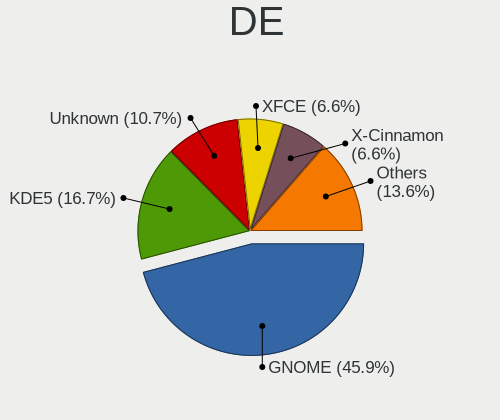

| Name       | Computers | Percent |
|------------|-----------|---------|
| GNOME      | 161       | 47.49%  |
| KDE5       | 48        | 14.16%  |
| Unknown    | 48        | 14.16%  |
| X-Cinnamon | 26        | 7.67%   |
| XFCE       | 21        | 6.19%   |
| KDE        | 12        | 3.54%   |
| MATE       | 7         | 2.06%   |
| Budgie     | 5         | 1.47%   |
| Pantheon   | 3         | 0.88%   |
| Deepin     | 3         | 0.88%   |
| Cinnamon   | 2         | 0.59%   |
| Unity      | 1         | 0.29%   |
| LXQt       | 1         | 0.29%   |
| awesome    | 1         | 0.29%   |

Display Server
--------------

X11 or Wayland

| Name    | Computers | Percent |
|---------|-----------|---------|
| X11     | 261       | 78.14%  |
| Wayland | 39        | 11.68%  |
| Unknown | 30        | 8.98%   |
| Tty     | 4         | 1.2%    |

Display Manager
---------------

SDDM, LightDM, etc.

| Name    | Computers | Percent |
|---------|-----------|---------|
| Unknown | 194       | 58.08%  |
| SDDM    | 45        | 13.47%  |
| GDM     | 36        | 10.78%  |
| GDM3    | 27        | 8.08%   |
| LightDM | 22        | 6.59%   |
| TDM     | 9         | 2.69%   |
| Ly      | 1         | 0.3%    |

OS Lang
-------

Language

| Lang    | Computers | Percent |
|---------|-----------|---------|
| en_US   | 219       | 65.57%  |
| Unknown | 47        | 14.07%  |
| en_GB   | 19        | 5.69%   |
| th_TH   | 17        | 5.09%   |
| de_DE   | 9         | 2.69%   |
| en_SG   | 7         | 2.1%    |
| C       | 5         | 1.5%    |
| ru_RU   | 3         | 0.9%    |
| fr_FR   | 3         | 0.9%    |
| it_IT   | 2         | 0.6%    |
| sv_SE   | 1         | 0.3%    |
| es_MX   | 1         | 0.3%    |
| de_CH   | 1         | 0.3%    |

Boot Mode
---------

EFI or BIOS

| Mode | Computers | Percent |
|------|-----------|---------|
| EFI  | 176       | 53.01%  |
| BIOS | 156       | 46.99%  |

Filesystem
----------

Type of filesystem

| Type    | Computers | Percent |
|---------|-----------|---------|
| Ext4    | 277       | 83.43%  |
| Overlay | 24        | 7.23%   |
| Btrfs   | 15        | 4.52%   |
| Unknown | 11        | 3.31%   |
| Xfs     | 3         | 0.9%    |
| Zfs     | 2         | 0.6%    |

Part. scheme
------------

Scheme of partitioning

| Type    | Computers | Percent |
|---------|-----------|---------|
| Unknown | 211       | 63.94%  |
| GPT     | 99        | 30%     |
| MBR     | 20        | 6.06%   |

Dual Boot with Linux/BSD
------------------------

Hosting more than one Linux/BSD

| Dual boot | Computers | Percent |
|-----------|-----------|---------|
| No        | 284       | 86.59%  |
| Yes       | 44        | 13.41%  |

Dual Boot (Win)
---------------

Hosting Linux and Windows

| Dual boot | Computers | Percent |
|-----------|-----------|---------|
| No        | 212       | 63.66%  |
| Yes       | 121       | 36.34%  |

Board
-----

Vendor
------

Motherboard manufacturer

| Name                | Computers | Percent |
|---------------------|-----------|---------|
| ASUSTek Computer    | 60        | 18.35%  |
| Lenovo              | 47        | 14.37%  |
| Acer                | 35        | 10.7%   |
| Dell                | 32        | 9.79%   |
| Hewlett-Packard     | 31        | 9.48%   |
| Gigabyte Technology | 28        | 8.56%   |
| MSI                 | 23        | 7.03%   |
| ASRock              | 21        | 6.42%   |
| Apple               | 10        | 3.06%   |
| Unknown             | 6         | 1.83%   |
| Samsung Electronics | 4         | 1.22%   |
| Intel               | 3         | 0.92%   |
| HUAWEI              | 3         | 0.92%   |
| Fujitsu             | 3         | 0.92%   |
| Toshiba             | 2         | 0.61%   |
| Huanan              | 2         | 0.61%   |
| VIA Technologies    | 1         | 0.31%   |
| Sony                | 1         | 0.31%   |
| SHARKBAY            | 1         | 0.31%   |
| Pegatron            | 1         | 0.31%   |
| Packard Bell        | 1         | 0.31%   |
| OEM                 | 1         | 0.31%   |
| Notebook            | 1         | 0.31%   |
| MiTAC               | 1         | 0.31%   |
| Microsoft           | 1         | 0.31%   |
| Infinix             | 1         | 0.31%   |
| Hampoo              | 1         | 0.31%   |
| Framework           | 1         | 0.31%   |
| Foxconn             | 1         | 0.31%   |
| Cube                | 1         | 0.31%   |
| Clevo               | 1         | 0.31%   |
| Biostar             | 1         | 0.31%   |
| AFOX                | 1         | 0.31%   |

Model
-----

Motherboard model

| Name                                     | Computers | Percent |
|------------------------------------------|-----------|---------|
| Unknown                                  | 8         | 2.45%   |
| ASUS All Series                          | 4         | 1.22%   |
| Lenovo MIIX 520-12IKB 81CG               | 3         | 0.92%   |
| Dell OptiPlex 7010                       | 3         | 0.92%   |
| ASUS P8H61-M LE                          | 3         | 0.92%   |
| Samsung NC208/NC108                      | 2         | 0.61%   |
| Lenovo ThinkPad 11e 5th Gen 20LQS00000   | 2         | 0.61%   |
| Lenovo G460 20041                        | 2         | 0.61%   |
| HP EliteDesk 800 G1 SFF PC               | 2         | 0.61%   |
| Gigabyte Z97X-UD3H-BK                    | 2         | 0.61%   |
| Gigabyte B250-HD3                        | 2         | 0.61%   |
| Dell Latitude E6430                      | 2         | 0.61%   |
| Dell Latitude 3120                       | 2         | 0.61%   |
| ASUS X556UQK                             | 2         | 0.61%   |
| ASUS X450LN                              | 2         | 0.61%   |
| ASUS VivoBook_ASUSLaptop M3500QA_D3500QA | 2         | 0.61%   |
| ASUS VivoBook_ASUS Laptop E210MA_L210MA  | 2         | 0.61%   |
| ASUS H110M-E/M.2                         | 2         | 0.61%   |
| ASRock B450 Steel Legend                 | 2         | 0.61%   |
| Apple MacBookAir3,2                      | 2         | 0.61%   |
| Acer Aspire TC-885                       | 2         | 0.61%   |
| Acer Aspire E5-471G                      | 2         | 0.61%   |
| Acer Aspire A315-21                      | 2         | 0.61%   |
| VIA VX900                                | 1         | 0.31%   |
| Toshiba Satellite L840                   | 1         | 0.31%   |
| Toshiba Satellite L645                   | 1         | 0.31%   |
| Sony SVF14N25CXB                         | 1         | 0.31%   |
| Samsung RV418/RV518/RV718                | 1         | 0.31%   |
| Samsung R780/R778                        | 1         | 0.31%   |
| Pegatron CQ3476L                         | 1         | 0.31%   |
| Packard Bell IMEDIA S3720                | 1         | 0.31%   |
| OEM Intel H81                            | 1         | 0.31%   |
| Notebook NV4XMB,ME,MZ                    | 1         | 0.31%   |
| MSI X460/X460DX                          | 1         | 0.31%   |
| MSI Pro 3130 Microtower PC               | 1         | 0.31%   |
| MSI Pro 2000/2080                        | 1         | 0.31%   |
| MSI Prestige 15 A10SC                    | 1         | 0.31%   |
| MSI PE70 6QE                             | 1         | 0.31%   |
| MSI p6772l                               | 1         | 0.31%   |
| MSI MS-7C52                              | 1         | 0.31%   |
| MSI MS-7C35                              | 1         | 0.31%   |
| MSI MS-7B89                              | 1         | 0.31%   |
| MSI MS-7B85                              | 1         | 0.31%   |
| MSI MS-7A63                              | 1         | 0.31%   |
| MSI MS-7A38                              | 1         | 0.31%   |
| MSI MS-7A32                              | 1         | 0.31%   |
| MSI MS-7A15                              | 1         | 0.31%   |
| MSI MS-7978                              | 1         | 0.31%   |
| MSI MS-7914                              | 1         | 0.31%   |
| MSI MS-7641                              | 1         | 0.31%   |
| MSI MS-14Y1                              | 1         | 0.31%   |
| MSI KY779AA-AKL CQ3070L                  | 1         | 0.31%   |
| MSI GF65 Thin 10UE                       | 1         | 0.31%   |
| MSI GF63 Thin 9SCSR                      | 1         | 0.31%   |
| MSI GE76 Raider 10UH                     | 1         | 0.31%   |
| MSI GE75 Raider 10SGS                    | 1         | 0.31%   |
| MiTAC PD14RI                             | 1         | 0.31%   |
| Microsoft Surface Pro 4                  | 1         | 0.31%   |
| Lenovo Yoga S740-15IRH 81NX              | 1         | 0.31%   |
| Lenovo Yoga C930-13IKB 81C4              | 1         | 0.31%   |

Model Family
------------

Motherboard model prefix

| Name                   | Computers | Percent |
|------------------------|-----------|---------|
| Acer Aspire            | 24        | 7.34%   |
| Lenovo ThinkPad        | 20        | 6.12%   |
| ASUS VivoBook          | 9         | 2.75%   |
| Lenovo IdeaPad         | 8         | 2.45%   |
| Dell Latitude          | 8         | 2.45%   |
| Unknown                | 8         | 2.45%   |
| HP Pavilion            | 7         | 2.14%   |
| Dell OptiPlex          | 7         | 2.14%   |
| Dell Inspiron          | 7         | 2.14%   |
| Lenovo Yoga            | 4         | 1.22%   |
| Lenovo MIIX            | 4         | 1.22%   |
| HP Laptop              | 4         | 1.22%   |
| HP Compaq              | 4         | 1.22%   |
| Dell Precision         | 4         | 1.22%   |
| ASUS TUF               | 4         | 1.22%   |
| ASUS PRIME             | 4         | 1.22%   |
| ASUS All               | 4         | 1.22%   |
| HP ProDesk             | 3         | 0.92%   |
| Dell Vostro            | 3         | 0.92%   |
| ASUS ROG               | 3         | 0.92%   |
| ASUS P8H61-M           | 3         | 0.92%   |
| ASRock B450            | 3         | 0.92%   |
| Toshiba Satellite      | 2         | 0.61%   |
| Samsung NC208          | 2         | 0.61%   |
| MSI Pro                | 2         | 0.61%   |
| Lenovo ThinkBook       | 2         | 0.61%   |
| Lenovo G460            | 2         | 0.61%   |
| Huanan X79             | 2         | 0.61%   |
| HP Stream              | 2         | 0.61%   |
| HP ENVY                | 2         | 0.61%   |
| HP EliteDesk           | 2         | 0.61%   |
| HP EliteBook           | 2         | 0.61%   |
| Gigabyte Z97X-UD3H-BK  | 2         | 0.61%   |
| Gigabyte Z390          | 2         | 0.61%   |
| Gigabyte GA-78LMT-USB3 | 2         | 0.61%   |
| Gigabyte B250-HD3      | 2         | 0.61%   |
| Fujitsu LIFEBOOK       | 2         | 0.61%   |
| ASUS ZenBook           | 2         | 0.61%   |
| ASUS X556UQK           | 2         | 0.61%   |
| ASUS X450LN            | 2         | 0.61%   |
| ASUS M5A78L-M          | 2         | 0.61%   |
| ASUS H110M-E           | 2         | 0.61%   |
| ASUS ASUS              | 2         | 0.61%   |
| ASRock Z77             | 2         | 0.61%   |
| ASRock B450M           | 2         | 0.61%   |
| Apple MacBookPro11     | 2         | 0.61%   |
| Apple MacBookAir3      | 2         | 0.61%   |
| Acer Veriton           | 2         | 0.61%   |
| Acer Swift             | 2         | 0.61%   |
| Acer One               | 2         | 0.61%   |
| Acer Nitro             | 2         | 0.61%   |
| VIA VX900              | 1         | 0.31%   |
| Sony SVF14N25CXB       | 1         | 0.31%   |
| Samsung RV418          | 1         | 0.31%   |
| Samsung R780           | 1         | 0.31%   |
| Pegatron CQ3476L       | 1         | 0.31%   |
| Packard Bell IMEDIA    | 1         | 0.31%   |
| OEM Intel              | 1         | 0.31%   |
| Notebook NV4XMB        | 1         | 0.31%   |
| MSI X460               | 1         | 0.31%   |

MFG Year
--------

Motherboard manufacture year

| Year | Computers | Percent |
|------|-----------|---------|
| 2018 | 46        | 14.07%  |
| 2019 | 31        | 9.48%   |
| 2020 | 28        | 8.56%   |
| 2014 | 28        | 8.56%   |
| 2016 | 26        | 7.95%   |
| 2012 | 25        | 7.65%   |
| 2011 | 23        | 7.03%   |
| 2017 | 21        | 6.42%   |
| 2015 | 20        | 6.12%   |
| 2021 | 18        | 5.5%    |
| 2013 | 16        | 4.89%   |
| 2010 | 15        | 4.59%   |
| 2009 | 13        | 3.98%   |
| 2008 | 7         | 2.14%   |
| 2022 | 3         | 0.92%   |
| 2007 | 3         | 0.92%   |
| 2006 | 3         | 0.92%   |
| 2005 | 1         | 0.31%   |

Form Factor
-----------

Physical design of the computer

| Name        | Computers | Percent |
|-------------|-----------|---------|
| Notebook    | 168       | 51.38%  |
| Desktop     | 134       | 40.98%  |
| Convertible | 9         | 2.75%   |
| Tablet      | 7         | 2.14%   |
| All in one  | 5         | 1.53%   |
| Mini pc     | 3         | 0.92%   |
| Server      | 1         | 0.31%   |

Secure Boot
-----------

Enabled or disabled

| State    | Computers | Percent |
|----------|-----------|---------|
| Disabled | 296       | 89.7%   |
| Enabled  | 34        | 10.3%   |

Coreboot
--------

Have coreboot on board

| Used | Computers | Percent |
|------|-----------|---------|
| No   | 327       | 100%    |

RAM Size
--------

Total RAM memory

| Size in GB      | Computers | Percent |
|-----------------|-----------|---------|
| 4.01-8.0        | 77        | 23.12%  |
| 3.01-4.0        | 72        | 21.62%  |
| 8.01-16.0       | 65        | 19.52%  |
| 16.01-24.0      | 64        | 19.22%  |
| 32.01-64.0      | 28        | 8.41%   |
| 1.01-2.0        | 17        | 5.11%   |
| 24.01-32.0      | 3         | 0.9%    |
| 64.01-256.0     | 3         | 0.9%    |
| 0.51-1.0        | 2         | 0.6%    |
| More than 256.0 | 1         | 0.3%    |
| 2.01-3.0        | 1         | 0.3%    |

RAM Used
--------

Used RAM memory

| Used GB    | Computers | Percent |
|------------|-----------|---------|
| 1.01-2.0   | 138       | 38.87%  |
| 2.01-3.0   | 104       | 29.3%   |
| 4.01-8.0   | 44        | 12.39%  |
| 3.01-4.0   | 35        | 9.86%   |
| 0.51-1.0   | 15        | 4.23%   |
| 8.01-16.0  | 14        | 3.94%   |
| 16.01-24.0 | 2         | 0.56%   |
| 0.01-0.5   | 2         | 0.56%   |
| 24.01-32.0 | 1         | 0.28%   |

Total Drives
------------

Number of drives on board

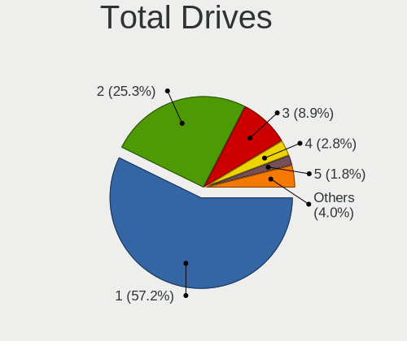

| Drives | Computers | Percent |
|--------|-----------|---------|
| 1      | 190       | 56.21%  |
| 2      | 95        | 28.11%  |
| 3      | 30        | 8.88%   |
| 4      | 10        | 2.96%   |
| 0      | 6         | 1.78%   |
| 5      | 5         | 1.48%   |
| 32     | 1         | 0.3%    |
| 6      | 1         | 0.3%    |

Has CD-ROM
----------

Has CD-ROM on board

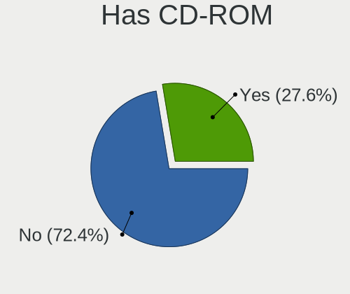

| Presented | Computers | Percent |
|-----------|-----------|---------|
| No        | 222       | 67.48%  |
| Yes       | 107       | 32.52%  |

Has Ethernet
------------

Has Ethernet on board

| Presented | Computers | Percent |
|-----------|-----------|---------|
| Yes       | 273       | 82.98%  |
| No        | 56        | 17.02%  |

Has WiFi
--------

Has WiFi module

| Presented | Computers | Percent |
|-----------|-----------|---------|
| Yes       | 255       | 77.51%  |
| No        | 74        | 22.49%  |

Has Bluetooth
-------------

Has Bluetooth module

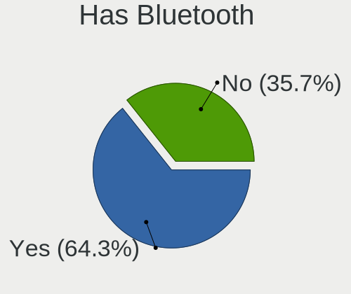

| Presented | Computers | Percent |
|-----------|-----------|---------|
| Yes       | 194       | 58.26%  |
| No        | 139       | 41.74%  |

Location
--------

Country
-------

Geographic location (country)

| Country  | Computers | Percent |
|----------|-----------|---------|
| Thailand | 327       | 100%    |

City
----

Geographic location (city)

| City                 | Computers | Percent |
|----------------------|-----------|---------|
| Bangkok              | 129       | 37.39%  |
| Chiang Mai           | 31        | 8.99%   |
| Bang Lamung          | 13        | 3.77%   |
| Phuket               | 12        | 3.48%   |
| Nonthaburi           | 10        | 2.9%    |
| Khon Kaen            | 8         | 2.32%   |
| Surin                | 6         | 1.74%   |
| Pattaya              | 6         | 1.74%   |
| Surat Thani          | 5         | 1.45%   |
| Nakhon Pathom        | 5         | 1.45%   |
| Songkhla             | 4         | 1.16%   |
| Lampang              | 4         | 1.16%   |
| Hua Hin              | 4         | 1.16%   |
| Suan Luang           | 3         | 0.87%   |
| Rayong               | 3         | 0.87%   |
| Phitsanulok          | 3         | 0.87%   |
| Nakhon Ratchasima    | 3         | 0.87%   |
| Khlong Luang         | 3         | 0.87%   |
| Chon Buri            | 3         | 0.87%   |
| Bang Khae            | 3         | 0.87%   |
| Bang Bon             | 3         | 0.87%   |
| Ban Yang Sam Ton     | 3         | 0.87%   |
| Ban Du               | 3         | 0.87%   |
| Si Racha             | 2         | 0.58%   |
| Samut Prakan         | 2         | 0.58%   |
| Phetchaburi          | 2         | 0.58%   |
| Phayao               | 2         | 0.58%   |
| Phan                 | 2         | 0.58%   |
| Pathum Thani         | 2         | 0.58%   |
| Pak Kret             | 2         | 0.58%   |
| Min Buri             | 2         | 0.58%   |
| Chiang Rai           | 2         | 0.58%   |
| Bang Bua Thong       | 2         | 0.58%   |
| Ban Phan Don         | 2         | 0.58%   |
| Ban Bang Tanot       | 2         | 0.58%   |
| Ayutthaya            | 2         | 0.58%   |
| Amphoe Aranyaprathet | 2         | 0.58%   |
| Yarang               | 1         | 0.29%   |
| Udon Thani           | 1         | 0.29%   |
| Trat                 | 1         | 0.29%   |
| Thung Song           | 1         | 0.29%   |
| Si Sa Ket            | 1         | 0.29%   |
| Sattahip             | 1         | 0.29%   |
| San Sai              | 1         | 0.29%   |
| Samut Songkhram      | 1         | 0.29%   |
| Samphanthawong       | 1         | 0.29%   |
| Salaya               | 1         | 0.29%   |
| Rasi Salai           | 1         | 0.29%   |
| Prathai              | 1         | 0.29%   |
| Prachuap Khiri Khan  | 1         | 0.29%   |
| Phra Samut Chedi     | 1         | 0.29%   |
| Phetchabun           | 1         | 0.29%   |
| Phen                 | 1         | 0.29%   |
| Pattani              | 1         | 0.29%   |
| Nong Khaem           | 1         | 0.29%   |
| Nong Chok            | 1         | 0.29%   |
| Noen Maprang         | 1         | 0.29%   |
| Nakhon Sawan         | 1         | 0.29%   |
| Na Chaluai           | 1         | 0.29%   |
| Mukdahan             | 1         | 0.29%   |

Drives
------

Drive Vendor
------------

Hard drive vendors

| Vendor                    | Computers | Drives | Percent |
|---------------------------|-----------|--------|---------|
| WDC                       | 99        | 142    | 20.58%  |
| Seagate                   | 83        | 118    | 17.26%  |
| Samsung Electronics       | 60        | 84     | 12.47%  |
| Kingston                  | 27        | 28     | 5.61%   |
| Unknown                   | 25        | 37     | 5.2%    |
| Toshiba                   | 25        | 29     | 5.2%    |
| SanDisk                   | 20        | 26     | 4.16%   |
| Hitachi                   | 13        | 14     | 2.7%    |
| Intel                     | 12        | 12     | 2.49%   |
| SK hynix                  | 10        | 17     | 2.08%   |
| Crucial                   | 10        | 10     | 2.08%   |
| HS-SSD-C100               | 7         | 11     | 1.46%   |
| HGST                      | 7         | 11     | 1.46%   |
| Apple                     | 6         | 6      | 1.25%   |
| Silicon Motion            | 5         | 7      | 1.04%   |
| Micron Technology         | 5         | 5      | 1.04%   |
| Apacer                    | 5         | 5      | 1.04%   |
| Transcend                 | 4         | 5      | 0.83%   |
| Phison                    | 4         | 9      | 0.83%   |
| GALAX                     | 4         | 4      | 0.83%   |
| China                     | 4         | 4      | 0.83%   |
| SPCC                      | 3         | 3      | 0.62%   |
| Plextor                   | 3         | 3      | 0.62%   |
| KingSpec                  | 3         | 5      | 0.62%   |
| JMicron Technology        | 3         | 3      | 0.62%   |
| Hikvision                 | 3         | 3      | 0.62%   |
| USB3.0                    | 2         | 2      | 0.42%   |
| Pioneer                   | 2         | 2      | 0.42%   |
| KIOXIA                    | 2         | 4      | 0.42%   |
| External                  | 2         | 2      | 0.42%   |
| Corsair                   | 2         | 2      | 0.42%   |
| Colorful                  | 2         | 3      | 0.42%   |
| A-DATA Technology         | 2         | 2      | 0.42%   |
| XPG                       | 1         | 1      | 0.21%   |
| Verbatim                  | 1         | 1      | 0.21%   |
| TO Exter                  | 1         | 1      | 0.21%   |
| Team                      | 1         | 1      | 0.21%   |
| ShiJi                     | 1         | 1      | 0.21%   |
| Realtek Semiconductor     | 1         | 1      | 0.21%   |
| OCZ                       | 1         | 1      | 0.21%   |
| Micron/Crucial Technology | 1         | 1      | 0.21%   |
| LITEON                    | 1         | 2      | 0.21%   |
| Lite-On                   | 1         | 2      | 0.21%   |
| Lexar                     | 1         | 1      | 0.21%   |
| Kingmax                   | 1         | 1      | 0.21%   |
| Hewlett-Packard           | 1         | 3      | 0.21%   |
| GAMER                     | 1         | 1      | 0.21%   |
| Fujitsu                   | 1         | 2      | 0.21%   |
| DGM                       | 1         | 1      | 0.21%   |
| BR                        | 1         | 1      | 0.21%   |

Drive Model
-----------

Hard drive models

| Model                                 | Computers | Percent |
|---------------------------------------|-----------|---------|
| Unknown MMC Card  32GB                | 8         | 1.52%   |
| Seagate ST500DM002-1BD142 500GB       | 8         | 1.52%   |
| WDC WDS120G2G0A-00JH30 120GB SSD      | 7         | 1.33%   |
| WDC WDS240G2G0A-00JH30 240GB SSD      | 6         | 1.14%   |
| Unknown MMC Card  64GB                | 6         | 1.14%   |
| Toshiba MQ01ABD100 1TB                | 6         | 1.14%   |
| Seagate ST1000DM010-2EP102 1TB        | 6         | 1.14%   |
| Seagate ST1000LM035-1RK172 1TB        | 5         | 0.95%   |
| Seagate ST1000DM003-1ER162 1TB        | 5         | 0.95%   |
| Kingston SUV400S37120G 120GB SSD      | 5         | 0.95%   |
| Kingston SA400S37240G 240GB SSD       | 5         | 0.95%   |
| Crucial CT500MX500SSD1 500GB          | 5         | 0.95%   |
| WDC WD10EZEX-00WN4A0 1TB              | 4         | 0.76%   |
| Unknown SD/MMC/MS PRO 128GB           | 4         | 0.76%   |
| Toshiba MQ04ABF100 1TB                | 4         | 0.76%   |
| Seagate ST2000VX008-2E3164 2TB        | 4         | 0.76%   |
| Seagate ST1000LM049-2GH172 1TB        | 4         | 0.76%   |
| Seagate ST1000LM024 HN-M101MBB 1TB    | 4         | 0.76%   |
| WDC WDS240G2G0B-00EPW0 240GB SSD      | 3         | 0.57%   |
| WDC WD20EZAZ-00GGJB0 2TB              | 3         | 0.57%   |
| WDC WD10JPVX-22JC3T0 1TB              | 3         | 0.57%   |
| WDC WD10EZEX-08WN4A0 1TB              | 3         | 0.57%   |
| WDC PC SN730 SDBPNTY-1T00-1032 1TB    | 3         | 0.57%   |
| Toshiba DT01ACA100 1TB                | 3         | 0.57%   |
| SK hynix HFM512GD3JX013N 512GB        | 3         | 0.57%   |
| Seagate ST500LT012-1DG142 500GB       | 3         | 0.57%   |
| Seagate ST3500418AS 500GB             | 3         | 0.57%   |
| SanDisk SDSSDA120G 120GB              | 3         | 0.57%   |
| SanDisk NVMe SSD Drive 250GB          | 3         | 0.57%   |
| SanDisk NVMe SSD Drive 1TB            | 3         | 0.57%   |
| Samsung SSD 970 EVO Plus 1TB          | 3         | 0.57%   |
| Samsung NVMe SSD Drive 256GB          | 3         | 0.57%   |
| Samsung NVMe SSD Drive 250GB          | 3         | 0.57%   |
| Samsung HD103SJ 1TB                   | 3         | 0.57%   |
| Phison NVMe SSD Drive 240GB           | 3         | 0.57%   |
| Kingston SV300S37A120G 120GB SSD      | 3         | 0.57%   |
| Kingston NVMe SSD Drive 512GB         | 3         | 0.57%   |
| HS-SSD-C100 240G                      | 3         | 0.57%   |
| HS-SSD-C100 120G                      | 3         | 0.57%   |
| WDC WDS500G2B0A-00SM50 500GB SSD      | 2         | 0.38%   |
| WDC WDS250G3X0C-00SJG0 250GB          | 2         | 0.38%   |
| WDC WDS120G2G0B-00EPW0 120GB SSD      | 2         | 0.38%   |
| WDC WDS100T2B0A-00SM50 1TB SSD        | 2         | 0.38%   |
| WDC WD5000AAKX-00ERMA0 500GB          | 2         | 0.38%   |
| WDC WD5000AAKX-001CA0 500GB           | 2         | 0.38%   |
| WDC WD3200BEVT-22ZCT0 320GB           | 2         | 0.38%   |
| WDC WD30EFRX-68EUZN0 3TB              | 2         | 0.38%   |
| WDC WD2002FAEX-007BA0 2TB             | 2         | 0.38%   |
| WDC WD10SPZX-21Z10T0 1TB              | 2         | 0.38%   |
| WDC WD10EZEX-21WN4A0 1TB              | 2         | 0.38%   |
| WDC WD10EFRX-68FYTN0 1TB              | 2         | 0.38%   |
| USB3.0 Super Speed 128GB              | 2         | 0.38%   |
| Unknown SB64G  64GB                   | 2         | 0.38%   |
| Unknown DA4064  64GB                  | 2         | 0.38%   |
| Transcend TS1TMTE220S 1TB             | 2         | 0.38%   |
| Toshiba MQ01ABF032 320GB              | 2         | 0.38%   |
| Toshiba KBG30ZMT128G 128GB            | 2         | 0.38%   |
| SPCC Solid State Disk 120GB           | 2         | 0.38%   |
| SK hynix HFS128G39TND-N210A 128GB SSD | 2         | 0.38%   |
| Seagate ST9750420AS 752GB             | 2         | 0.38%   |

HDD Vendor
----------

Hard disk drive vendors

| Vendor              | Computers | Drives | Percent |
|---------------------|-----------|--------|---------|
| Seagate             | 82        | 117    | 38.68%  |
| WDC                 | 67        | 92     | 31.6%   |
| Toshiba             | 21        | 25     | 9.91%   |
| Hitachi             | 13        | 14     | 6.13%   |
| Samsung Electronics | 10        | 16     | 4.72%   |
| HGST                | 7         | 11     | 3.3%    |
| Unknown             | 5         | 10     | 2.36%   |
| USB3.0              | 2         | 2      | 0.94%   |
| Apple               | 2         | 2      | 0.94%   |
| JMicron Technology  | 1         | 1      | 0.47%   |
| Hewlett-Packard     | 1         | 3      | 0.47%   |
| Fujitsu             | 1         | 2      | 0.47%   |

SSD Vendor
----------

Solid state drive vendors

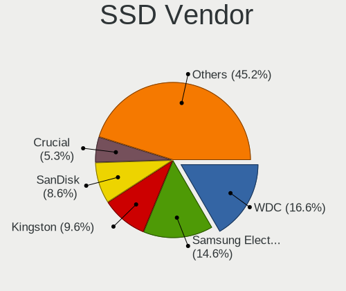

| Vendor              | Computers | Drives | Percent |
|---------------------|-----------|--------|---------|
| WDC                 | 27        | 36     | 18.88%  |
| Samsung Electronics | 23        | 32     | 16.08%  |
| Kingston            | 18        | 18     | 12.59%  |
| Crucial             | 10        | 10     | 6.99%   |
| SanDisk             | 9         | 13     | 6.29%   |
| Intel               | 6         | 6      | 4.2%    |
| Apacer              | 5         | 5      | 3.5%    |
| GALAX               | 4         | 4      | 2.8%    |
| China               | 4         | 4      | 2.8%    |
| Apple               | 4         | 4      | 2.8%    |
| SPCC                | 3         | 3      | 2.1%    |
| SK hynix            | 3         | 4      | 2.1%    |
| Plextor             | 3         | 3      | 2.1%    |
| KingSpec            | 3         | 5      | 2.1%    |
| Hikvision           | 3         | 3      | 2.1%    |
| Transcend           | 2         | 3      | 1.4%    |
| Pioneer             | 2         | 2      | 1.4%    |
| Micron Technology   | 2         | 2      | 1.4%    |
| Verbatim            | 1         | 1      | 0.7%    |
| TO Exter            | 1         | 1      | 0.7%    |
| Team                | 1         | 1      | 0.7%    |
| OCZ                 | 1         | 1      | 0.7%    |
| LITEON              | 1         | 2      | 0.7%    |
| Lexar               | 1         | 1      | 0.7%    |
| Kingmax             | 1         | 1      | 0.7%    |
| JMicron Technology  | 1         | 1      | 0.7%    |
| DGM                 | 1         | 1      | 0.7%    |
| Corsair             | 1         | 1      | 0.7%    |
| Colorful            | 1         | 2      | 0.7%    |
| A-DATA Technology   | 1         | 1      | 0.7%    |

Drive Kind
----------

HDD or SSD

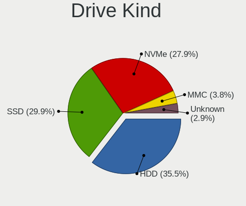

| Kind    | Computers | Drives | Percent |
|---------|-----------|--------|---------|
| HDD     | 179       | 295    | 41.53%  |
| SSD     | 125       | 171    | 29%     |
| NVMe    | 94        | 130    | 21.81%  |
| MMC     | 19        | 26     | 4.41%   |
| Unknown | 14        | 18     | 3.25%   |

Drive Connector
---------------

SATA, SAS, NVMe, etc.

| Type | Computers | Drives | Percent |
|------|-----------|--------|---------|
| SATA | 252       | 462    | 66.14%  |
| NVMe | 92        | 128    | 24.15%  |
| MMC  | 19        | 26     | 4.99%   |
| SAS  | 18        | 24     | 4.72%   |

Drive Size
----------

Size of hard drive

| Size in TB | Computers | Drives | Percent |
|------------|-----------|--------|---------|
| 0.01-0.5   | 180       | 265    | 56.07%  |
| 0.51-1.0   | 104       | 136    | 32.4%   |
| 1.01-2.0   | 26        | 30     | 8.1%    |
| 3.01-4.0   | 6         | 13     | 1.87%   |
| 2.01-3.0   | 2         | 6      | 0.62%   |
| 4.01-10.0  | 2         | 10     | 0.62%   |
| 10.01-20.0 | 1         | 6      | 0.31%   |

Space Total
-----------

Amount of disk space available on the file system

| Size in GB     | Computers | Percent |
|----------------|-----------|---------|
| 101-250        | 86        | 25.29%  |
| 251-500        | 75        | 22.06%  |
| 501-1000       | 50        | 14.71%  |
| 1-20           | 27        | 7.94%   |
| 51-100         | 26        | 7.65%   |
| 1001-2000      | 24        | 7.06%   |
| 21-50          | 22        | 6.47%   |
| 2001-3000      | 11        | 3.24%   |
| More than 3000 | 10        | 2.94%   |
| Unknown        | 9         | 2.65%   |

Space Used
----------

Amount of used disk space

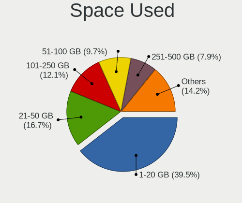

| Used GB        | Computers | Percent |
|----------------|-----------|---------|
| 1-20           | 144       | 41.03%  |
| 21-50          | 63        | 17.95%  |
| 101-250        | 41        | 11.68%  |
| 51-100         | 31        | 8.83%   |
| 251-500        | 24        | 6.84%   |
| 501-1000       | 18        | 5.13%   |
| 1001-2000      | 13        | 3.7%    |
| Unknown        | 9         | 2.56%   |
| More than 3000 | 6         | 1.71%   |
| 2001-3000      | 2         | 0.57%   |

Malfunc. Drives
---------------

Drive models with a malfunction

| Model                                    | Computers | Drives | Percent |
|------------------------------------------|-----------|--------|---------|
| WDC WD2002FAEX-007BA0 2TB                | 2         | 2      | 7.14%   |
| Toshiba MQ01ABD100 1TB                   | 2         | 2      | 7.14%   |
| Seagate ST500DM002-1BD14 500GB           | 2         | 2      | 7.14%   |
| Seagate ST1000LM049-2GH172 1TB           | 2         | 2      | 7.14%   |
| Seagate ST1000LM035-1RK172 1TB           | 2         | 2      | 7.14%   |
| WDC WD20EARS-00MVWB0 2TB                 | 1         | 1      | 3.57%   |
| USB3.0 Super Speed 128GB                 | 1         | 1      | 3.57%   |
| Toshiba HDWL110 1TB                      | 1         | 1      | 3.57%   |
| Seagate ST9500325AS 500GB                | 1         | 1      | 3.57%   |
| Seagate ST9120822AS 120GB                | 1         | 1      | 3.57%   |
| Seagate ST500LM000-SSHD-8GB              | 1         | 1      | 3.57%   |
| Seagate ST4000DM004-2CV104 4TB           | 1         | 1      | 3.57%   |
| Seagate ST3500418AS 500GB                | 1         | 2      | 3.57%   |
| Seagate ST1000LX015-1U7172-SSHD 1TB      | 1         | 1      | 3.57%   |
| Seagate ST1000LM014-1EJ164 1TB           | 1         | 1      | 3.57%   |
| SanDisk SDSSDX240GG25 240GB              | 1         | 1      | 3.57%   |
| Samsung Electronics SSD 830 Series 128GB | 1         | 1      | 3.57%   |
| Samsung Electronics HM160HI 160GB        | 1         | 2      | 3.57%   |
| Samsung Electronics HD103SJ 1TB          | 1         | 1      | 3.57%   |
| Kingston RBU-SNS8350DES3128GP 128GB SSD  | 1         | 1      | 3.57%   |
| Intel SSDSC2KF256H6 SATA 256GB           | 1         | 1      | 3.57%   |
| HGST HTS725050A7E630 500GB               | 1         | 1      | 3.57%   |
| HGST HTS721010A9E630 1TB                 | 1         | 1      | 3.57%   |

Malfunc. Drive Vendor
---------------------

Vendors of faulty drives

| Vendor              | Computers | Drives | Percent |
|---------------------|-----------|--------|---------|
| Seagate             | 13        | 14     | 46.43%  |
| WDC                 | 3         | 3      | 10.71%  |
| Toshiba             | 3         | 3      | 10.71%  |
| Samsung Electronics | 3         | 4      | 10.71%  |
| HGST                | 2         | 2      | 7.14%   |
| USB3.0              | 1         | 1      | 3.57%   |
| SanDisk             | 1         | 1      | 3.57%   |
| Kingston            | 1         | 1      | 3.57%   |
| Intel               | 1         | 1      | 3.57%   |

Malfunc. HDD Vendor
-------------------

Vendors of faulty HDD drives

| Vendor              | Computers | Drives | Percent |
|---------------------|-----------|--------|---------|
| Seagate             | 13        | 14     | 54.17%  |
| WDC                 | 3         | 3      | 12.5%   |
| Toshiba             | 3         | 3      | 12.5%   |
| Samsung Electronics | 2         | 3      | 8.33%   |
| HGST                | 2         | 2      | 8.33%   |
| USB3.0              | 1         | 1      | 4.17%   |

Malfunc. Drive Kind
-------------------

Kinds of faulty drives

| Kind | Computers | Drives | Percent |
|------|-----------|--------|---------|
| HDD  | 23        | 26     | 85.19%  |
| SSD  | 4         | 4      | 14.81%  |

Failed Drives
-------------

Failed drive models

| Model                           | Computers | Drives | Percent |
|---------------------------------|-----------|--------|---------|
| Samsung Electronics HD103SJ 1TB | 1         | 1      | 100%    |

Failed Drive Vendor
-------------------

Failed drive vendors

| Vendor              | Computers | Drives | Percent |
|---------------------|-----------|--------|---------|
| Samsung Electronics | 1         | 1      | 100%    |

Drive Status
------------

Number of failed and malfunc. drives

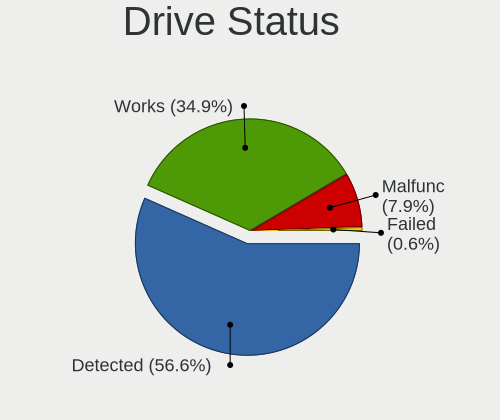

| Status   | Computers | Drives | Percent |
|----------|-----------|--------|---------|
| Detected | 224       | 438    | 64.37%  |
| Works    | 97        | 171    | 27.87%  |
| Malfunc  | 26        | 30     | 7.47%   |
| Failed   | 1         | 1      | 0.29%   |

Storage controller
------------------

Storage Vendor
--------------

Storage controller vendors

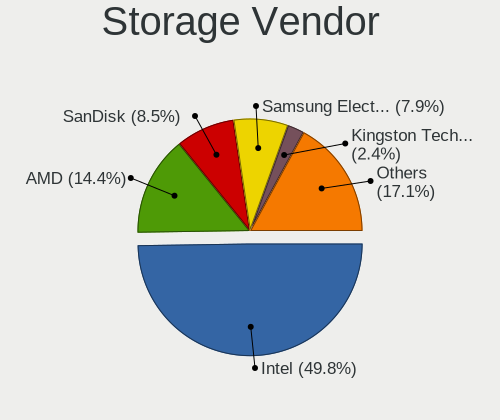

| Vendor                       | Computers | Percent |
|------------------------------|-----------|---------|
| Intel                        | 214       | 53.9%   |
| AMD                          | 59        | 14.86%  |
| Samsung Electronics          | 34        | 8.56%   |
| SanDisk                      | 23        | 5.79%   |
| Nvidia                       | 11        | 2.77%   |
| Kingston Technology Company  | 9         | 2.27%   |
| ASMedia Technology           | 8         | 2.02%   |
| SK hynix                     | 7         | 1.76%   |
| Silicon Motion               | 6         | 1.51%   |
| Phison Electronics           | 5         | 1.26%   |
| Toshiba America Info Systems | 4         | 1.01%   |
| VIA Technologies             | 3         | 0.76%   |
| Micron Technology            | 3         | 0.76%   |
| LSI Logic / Symbios Logic    | 2         | 0.5%    |
| KIOXIA                       | 2         | 0.5%    |
| ADATA Technology             | 2         | 0.5%    |
| Realtek Semiconductor        | 1         | 0.25%   |
| Micron/Crucial Technology    | 1         | 0.25%   |
| Lite-On Technology           | 1         | 0.25%   |
| JMicron Technology           | 1         | 0.25%   |
| Broadcom / LSI               | 1         | 0.25%   |

Storage Model
-------------

Storage controller models

| Model                                                                                   | Computers | Percent |
|-----------------------------------------------------------------------------------------|-----------|---------|
| AMD FCH SATA Controller [AHCI mode]                                                     | 44        | 9.73%   |
| Samsung NVMe SSD Controller SM981/PM981/PM983                                           | 21        | 4.65%   |
| Intel Sunrise Point-LP SATA Controller [AHCI mode]                                      | 19        | 4.2%    |
| Intel 8 Series/C220 Series Chipset Family 6-port SATA Controller 1 [AHCI mode]          | 17        | 3.76%   |
| Intel 7 Series Chipset Family 6-port SATA Controller [AHCI mode]                        | 15        | 3.32%   |
| Intel Q170/Q150/B150/H170/H110/Z170/CM236 Chipset SATA Controller [AHCI Mode]           | 13        | 2.88%   |
| Intel 8 Series SATA Controller 1 [AHCI mode]                                            | 12        | 2.65%   |
| AMD 400 Series Chipset SATA Controller                                                  | 12        | 2.65%   |
| Intel NM10/ICH7 Family SATA Controller [IDE mode]                                       | 9         | 1.99%   |
| Intel 200 Series PCH SATA controller [AHCI mode]                                        | 9         | 1.99%   |
| SanDisk WD Black SN750 / PC SN730 NVMe SSD                                              | 7         | 1.55%   |
| Intel 82801 Mobile SATA Controller [RAID mode]                                          | 7         | 1.55%   |
| Intel 6 Series/C200 Series Chipset Family 6 port Mobile SATA AHCI Controller            | 7         | 1.55%   |
| ASMedia ASM1062 Serial ATA Controller                                                   | 7         | 1.55%   |
| AMD SB7x0/SB8x0/SB9x0 IDE Controller                                                    | 7         | 1.55%   |
| SanDisk WD Blue SN550 NVMe SSD                                                          | 6         | 1.33%   |
| Intel HM170/QM170 Chipset SATA Controller [AHCI Mode]                                   | 6         | 1.33%   |
| Intel Celeron/Pentium Silver Processor SATA Controller                                  | 6         | 1.33%   |
| Intel Cannon Lake PCH SATA AHCI Controller                                              | 6         | 1.33%   |
| Intel Cannon Lake Mobile PCH SATA AHCI Controller                                       | 6         | 1.33%   |
| Intel 7 Series/C210 Series Chipset Family 6-port SATA Controller [AHCI mode]            | 6         | 1.33%   |
| Intel 5 Series/3400 Series Chipset 6 port SATA AHCI Controller                          | 6         | 1.33%   |
| AMD SB7x0/SB8x0/SB9x0 SATA Controller [IDE mode]                                        | 6         | 1.33%   |
| SK hynix Gold P31 SSD                                                                   | 5         | 1.11%   |
| Intel SATA Controller [RAID mode]                                                       | 5         | 1.11%   |
| Intel Atom/Celeron/Pentium Processor x5-E8000/J3xxx/N3xxx Series SATA Controller        | 5         | 1.11%   |
| Intel 6 Series/C200 Series Chipset Family 6 port Desktop SATA AHCI Controller           | 5         | 1.11%   |
| Intel 5 Series/3400 Series Chipset 4 port SATA AHCI Controller                          | 5         | 1.11%   |
| Intel 400 Series Chipset Family SATA AHCI Controller                                    | 5         | 1.11%   |
| Silicon Motion SM2263EN/SM2263XT SSD Controller                                         | 4         | 0.88%   |
| SanDisk WD Black 2018/SN750 / PC SN720 NVMe SSD                                         | 4         | 0.88%   |
| SanDisk Non-Volatile memory controller                                                  | 4         | 0.88%   |
| Samsung NVMe SSD Controller SM961/PM961/SM963                                           | 4         | 0.88%   |
| Nvidia MCP61 SATA Controller                                                            | 4         | 0.88%   |
| Kingston Company U-SNS8154P3 NVMe SSD                                                   | 4         | 0.88%   |
| Intel SSD 660P Series                                                                   | 4         | 0.88%   |
| Intel Comet Lake SATA AHCI Controller                                                   | 4         | 0.88%   |
| Intel 9 Series Chipset Family SATA Controller [AHCI Mode]                               | 4         | 0.88%   |
| Intel 82801IBM/IEM (ICH9M/ICH9M-E) 4 port SATA Controller [AHCI mode]                   | 4         | 0.88%   |
| Intel 82801G (ICH7 Family) IDE Controller                                               | 4         | 0.88%   |
| Intel 6 Series/C200 Series Chipset Family Desktop SATA Controller (IDE mode, ports 4-5) | 4         | 0.88%   |
| Intel 6 Series/C200 Series Chipset Family Desktop SATA Controller (IDE mode, ports 0-3) | 4         | 0.88%   |
| AMD SB7x0/SB8x0/SB9x0 SATA Controller [AHCI mode]                                       | 4         | 0.88%   |
| Silicon Motion SM2262/SM2262EN SSD Controller                                           | 3         | 0.66%   |
| Samsung NVMe SSD Controller PM9A1/PM9A3/980PRO                                          | 3         | 0.66%   |
| Phison E12 NVMe Controller                                                              | 3         | 0.66%   |
| Nvidia MCP79 AHCI Controller                                                            | 3         | 0.66%   |
| Nvidia MCP61 IDE                                                                        | 3         | 0.66%   |
| Micron Non-Volatile memory controller                                                   | 3         | 0.66%   |
| Intel Volume Management Device NVMe RAID Controller                                     | 3         | 0.66%   |
| Intel C600/X79 series chipset 6-Port SATA AHCI Controller                               | 3         | 0.66%   |
| Intel Atom Processor E3800 Series SATA AHCI Controller                                  | 3         | 0.66%   |
| Intel 5 Series/3400 Series Chipset 4 port SATA IDE Controller                           | 3         | 0.66%   |
| Intel 5 Series/3400 Series Chipset 2 port SATA IDE Controller                           | 3         | 0.66%   |
| Toshiba America Info Systems BG3 NVMe SSD Controller                                    | 2         | 0.44%   |
| Samsung NVMe SSD Controller SM951/PM951                                                 | 2         | 0.44%   |
| Samsung NVMe SSD Controller 980                                                         | 2         | 0.44%   |
| Samsung Apple PCIe SSD                                                                  | 2         | 0.44%   |
| Nvidia MCP89 SATA Controller (AHCI mode)                                                | 2         | 0.44%   |
| Nvidia MCP73 IDE Controller                                                             | 2         | 0.44%   |

Storage Kind
------------

Kind of storage controller (IDE, SATA, NVMe, SAS, ...)

| Kind | Computers | Percent |
|------|-----------|---------|
| SATA | 241       | 59.95%  |
| NVMe | 96        | 23.88%  |
| IDE  | 45        | 11.19%  |
| RAID | 17        | 4.23%   |
| SCSI | 2         | 0.5%    |
| SAS  | 1         | 0.25%   |

Processor
---------

CPU Vendor
----------

Processor vendors

| Vendor       | Computers | Percent |
|--------------|-----------|---------|
| Intel        | 255       | 77.98%  |
| AMD          | 71        | 21.71%  |
| CentaurHauls | 1         | 0.31%   |

CPU Model
---------

Processor models

| Model                                         | Computers | Percent |
|-----------------------------------------------|-----------|---------|
| Intel Core i7-8550U CPU @ 1.80GHz             | 7         | 2.13%   |
| Intel Core i7-6700HQ CPU @ 2.60GHz            | 6         | 1.82%   |
| Intel Core i5-7200U CPU @ 2.50GHz             | 6         | 1.82%   |
| Intel Core i3-2120 CPU @ 3.30GHz              | 5         | 1.52%   |
| Intel Core i5-8400 CPU @ 2.80GHz              | 4         | 1.22%   |
| Intel Core i5-8250U CPU @ 1.60GHz             | 4         | 1.22%   |
| Intel Core i5-6500 CPU @ 3.20GHz              | 4         | 1.22%   |
| Intel Core i5-3230M CPU @ 2.60GHz             | 4         | 1.22%   |
| Intel Core i5-3210M CPU @ 2.50GHz             | 4         | 1.22%   |
| Intel Core i5-2450M CPU @ 2.50GHz             | 4         | 1.22%   |
| Intel Core i3-4005U CPU @ 1.70GHz             | 4         | 1.22%   |
| Intel Atom x5-Z8350 CPU @ 1.44GHz             | 4         | 1.22%   |
| Intel 11th Gen Core i7-1165G7 @ 2.80GHz       | 4         | 1.22%   |
| AMD Ryzen 5 3500U with Radeon Vega Mobile Gfx | 4         | 1.22%   |
| Intel Core i7-6700 CPU @ 3.40GHz              | 3         | 0.91%   |
| Intel Core i7-4790 CPU @ 3.60GHz              | 3         | 0.91%   |
| Intel Core i7-4770K CPU @ 3.50GHz             | 3         | 0.91%   |
| Intel Core i7-10750H CPU @ 2.60GHz            | 3         | 0.91%   |
| Intel Core i7-10510U CPU @ 1.80GHz            | 3         | 0.91%   |
| Intel Core i5 CPU M 430 @ 2.27GHz             | 3         | 0.91%   |
| Intel 11th Gen Core i5-1135G7 @ 2.40GHz       | 3         | 0.91%   |
| AMD Ryzen 7 4800H with Radeon Graphics        | 3         | 0.91%   |
| AMD Ryzen 3 2200U with Radeon Vega Mobile Gfx | 3         | 0.91%   |
| AMD A4-9120 RADEON R3, 4 COMPUTE CORES 2C+2G  | 3         | 0.91%   |
| Intel Pentium Silver N6000 @ 1.10GHz          | 2         | 0.61%   |
| Intel Pentium CPU N3710 @ 1.60GHz             | 2         | 0.61%   |
| Intel Pentium CPU N3700 @ 1.60GHz             | 2         | 0.61%   |
| Intel Core i9-9900K CPU @ 3.60GHz             | 2         | 0.61%   |
| Intel Core i7-8750H CPU @ 2.20GHz             | 2         | 0.61%   |
| Intel Core i7-8565U CPU @ 1.80GHz             | 2         | 0.61%   |
| Intel Core i7-7700HQ CPU @ 2.80GHz            | 2         | 0.61%   |
| Intel Core i7-4770 CPU @ 3.40GHz              | 2         | 0.61%   |
| Intel Core i7-4710HQ CPU @ 2.50GHz            | 2         | 0.61%   |
| Intel Core i7-4500U CPU @ 1.80GHz             | 2         | 0.61%   |
| Intel Core i5-6200U CPU @ 2.30GHz             | 2         | 0.61%   |
| Intel Core i5-4570 CPU @ 3.20GHz              | 2         | 0.61%   |
| Intel Core i5-3340M CPU @ 2.70GHz             | 2         | 0.61%   |
| Intel Core i5-2500K CPU @ 3.30GHz             | 2         | 0.61%   |
| Intel Core i5-1035G1 CPU @ 1.00GHz            | 2         | 0.61%   |
| Intel Core i5-10210U CPU @ 1.60GHz            | 2         | 0.61%   |
| Intel Core i5 CPU M 450 @ 2.40GHz             | 2         | 0.61%   |
| Intel Core i3-6006U CPU @ 2.00GHz             | 2         | 0.61%   |
| Intel Core i3-4160 CPU @ 3.60GHz              | 2         | 0.61%   |
| Intel Core i3-3220 CPU @ 3.30GHz              | 2         | 0.61%   |
| Intel Core i3 CPU 540 @ 3.07GHz               | 2         | 0.61%   |
| Intel Core 2 Duo CPU P8700 @ 2.53GHz          | 2         | 0.61%   |
| Intel Core 2 Duo CPU P8600 @ 2.40GHz          | 2         | 0.61%   |
| Intel Core 2 Duo CPU L9600 @ 2.13GHz          | 2         | 0.61%   |
| Intel Core 2 Duo CPU E7500 @ 2.93GHz          | 2         | 0.61%   |
| Intel Celeron N4100 CPU @ 1.10GHz             | 2         | 0.61%   |
| Intel Celeron N4020 CPU @ 1.10GHz             | 2         | 0.61%   |
| Intel Atom x5-Z8500 CPU @ 1.44GHz             | 2         | 0.61%   |
| Intel Atom CPU N570 @ 1.66GHz                 | 2         | 0.61%   |
| AMD Ryzen 9 5900HX with Radeon Graphics       | 2         | 0.61%   |
| AMD Ryzen 7 2700 Eight-Core Processor         | 2         | 0.61%   |
| AMD Ryzen 5 5500U with Radeon Graphics        | 2         | 0.61%   |
| AMD Ryzen 5 3550H with Radeon Vega Mobile Gfx | 2         | 0.61%   |
| AMD Ryzen 5 2600 Six-Core Processor           | 2         | 0.61%   |
| AMD Ryzen 5 2500U with Radeon Vega Mobile Gfx | 2         | 0.61%   |
| AMD Phenom II X6 1055T Processor              | 2         | 0.61%   |

CPU Model Family
----------------

Processor model prefix

| Model                   | Computers | Percent |
|-------------------------|-----------|---------|
| Intel Core i5           | 74        | 22.56%  |
| Intel Core i7           | 63        | 19.21%  |
| Intel Core i3           | 36        | 10.98%  |
| AMD Ryzen 5             | 18        | 5.49%   |
| Intel Core 2 Duo        | 12        | 3.66%   |
| Intel Celeron           | 12        | 3.66%   |
| AMD Ryzen 7             | 12        | 3.66%   |
| Intel Pentium           | 11        | 3.35%   |
| Intel Atom              | 11        | 3.35%   |
| Intel Xeon              | 9         | 2.74%   |
| Other                   | 8         | 2.44%   |
| AMD Ryzen 3             | 7         | 2.13%   |
| AMD Ryzen 9             | 5         | 1.52%   |
| Intel Core i9           | 4         | 1.22%   |
| Intel Core 2 Quad       | 4         | 1.22%   |
| AMD FX                  | 4         | 1.22%   |
| AMD Athlon II X2        | 4         | 1.22%   |
| AMD A4                  | 4         | 1.22%   |
| Intel Pentium Silver    | 3         | 0.91%   |
| Intel Pentium Dual-Core | 3         | 0.91%   |
| AMD A10                 | 3         | 0.91%   |
| Intel Pentium Dual      | 2         | 0.61%   |
| Intel Core m3           | 2         | 0.61%   |
| AMD Phenom II X6        | 2         | 0.61%   |
| AMD Phenom II X4        | 2         | 0.61%   |
| AMD Athlon 64 X2        | 2         | 0.61%   |
| AMD A6                  | 2         | 0.61%   |
| Intel Pentium 4         | 1         | 0.3%    |
| CentaurHauls VIA Eden   | 1         | 0.3%    |
| AMD Turion 64 X2 Mobile | 1         | 0.3%    |
| AMD Ryzen 7 PRO         | 1         | 0.3%    |
| AMD Ryzen 3 PRO         | 1         | 0.3%    |
| AMD Phenom II X3        | 1         | 0.3%    |
| AMD E2                  | 1         | 0.3%    |
| AMD E1                  | 1         | 0.3%    |
| AMD A8                  | 1         | 0.3%    |

CPU Cores
---------

Number of processor cores

| Number | Computers | Percent |
|--------|-----------|---------|
| 4      | 132       | 40.12%  |
| 2      | 131       | 39.82%  |
| 6      | 30        | 9.12%   |
| 8      | 25        | 7.6%    |
| 1      | 5         | 1.52%   |
| 12     | 3         | 0.91%   |
| 40     | 1         | 0.3%    |
| 14     | 1         | 0.3%    |
| 3      | 1         | 0.3%    |

CPU Sockets
-----------

Number of sockets

| Number | Computers | Percent |
|--------|-----------|---------|
| 1      | 324       | 99.08%  |
| 2      | 3         | 0.92%   |

CPU Threads
-----------

Threads per core (Hyper-Threading)

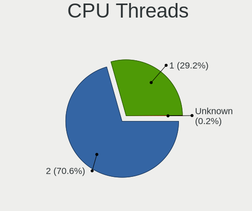

| Number | Computers | Percent |
|--------|-----------|---------|
| 2      | 222       | 67.27%  |
| 1      | 108       | 32.73%  |

CPU Op-Modes
------------

CPU Operation Modes (32-bit, 64-bit)

| Op mode        | Computers | Percent |
|----------------|-----------|---------|
| 32-bit, 64-bit | 320       | 97.86%  |
| Unknown        | 6         | 1.83%   |
| 32-bit         | 1         | 0.31%   |

CPU Microcode
-------------

Microcode number

| Number     | Computers | Percent |
|------------|-----------|---------|
| Unknown    | 72        | 21.24%  |
| 0x206a7    | 19        | 5.6%    |
| 0x306c3    | 18        | 5.31%   |
| 0x306a9    | 16        | 4.72%   |
| 0x506e3    | 12        | 3.54%   |
| 0x1067a    | 12        | 3.54%   |
| 0x906ea    | 11        | 3.24%   |
| 0x806ea    | 9         | 2.65%   |
| 0x806e9    | 9         | 2.65%   |
| 0x40651    | 9         | 2.65%   |
| 0x906e9    | 8         | 2.36%   |
| 0x20655    | 8         | 2.36%   |
| 0x806ec    | 7         | 2.06%   |
| 0x406e3    | 6         | 1.77%   |
| 0x806c1    | 5         | 1.47%   |
| 0x406c4    | 5         | 1.47%   |
| 0x406c3    | 5         | 1.47%   |
| 0x0810100b | 5         | 1.47%   |
| 0x706a8    | 4         | 1.18%   |
| 0x706a1    | 4         | 1.18%   |
| 0x30678    | 4         | 1.18%   |
| 0x20652    | 4         | 1.18%   |
| 0x08108102 | 4         | 1.18%   |
| 0x0800820d | 4         | 1.18%   |
| 0xa0655    | 3         | 0.88%   |
| 0xa0652    | 3         | 0.88%   |
| 0x906ec    | 3         | 0.88%   |
| 0x6fd      | 3         | 0.88%   |
| 0x106ca    | 3         | 0.88%   |
| 0x0a50000c | 3         | 0.88%   |
| 0x08600104 | 3         | 0.88%   |
| 0x06006704 | 3         | 0.88%   |
| 0x010000c8 | 3         | 0.88%   |
| 0x906c0    | 2         | 0.59%   |
| 0x106e5    | 2         | 0.59%   |
| 0x10676    | 2         | 0.59%   |
| 0x08600106 | 2         | 0.59%   |
| 0x08108109 | 2         | 0.59%   |
| 0x08101007 | 2         | 0.59%   |
| 0x08001138 | 2         | 0.59%   |
| 0x06003106 | 2         | 0.59%   |
| 0x06001119 | 2         | 0.59%   |
| 0x06000852 | 2         | 0.59%   |
| 0xf49      | 1         | 0.29%   |
| 0xa0660    | 1         | 0.29%   |
| 0xa0653    | 1         | 0.29%   |
| 0x906ed    | 1         | 0.29%   |
| 0x906eb    | 1         | 0.29%   |
| 0x706e5    | 1         | 0.29%   |
| 0x6fb      | 1         | 0.29%   |
| 0x506c9    | 1         | 0.29%   |
| 0x50654    | 1         | 0.29%   |
| 0x406f1    | 1         | 0.29%   |
| 0x40661    | 1         | 0.29%   |
| 0x306e4    | 1         | 0.29%   |
| 0x306d4    | 1         | 0.29%   |
| 0x206c2    | 1         | 0.29%   |
| 0x106c2    | 1         | 0.29%   |
| 0x10677    | 1         | 0.29%   |
| 0x0a201204 | 1         | 0.29%   |

CPU Microarch
-------------

Microarchitecture

| Name          | Computers | Percent |
|---------------|-----------|---------|
| KabyLake      | 57        | 17.38%  |
| Haswell       | 37        | 11.28%  |
| Skylake       | 25        | 7.62%   |
| IvyBridge     | 22        | 6.71%   |
| SandyBridge   | 21        | 6.4%    |
| Penryn        | 18        | 5.49%   |
| Silvermont    | 17        | 5.18%   |
| Zen+          | 13        | 3.96%   |
| Zen 2         | 13        | 3.96%   |
| Westmere      | 13        | 3.96%   |
| CometLake     | 12        | 3.66%   |
| Zen           | 10        | 3.05%   |
| K10           | 8         | 2.44%   |
| Goldmont plus | 8         | 2.44%   |
| TigerLake     | 7         | 2.13%   |
| Zen 3         | 6         | 1.83%   |
| Piledriver    | 5         | 1.52%   |
| Excavator     | 5         | 1.52%   |
| Core          | 4         | 1.22%   |
| Bonnell       | 4         | 1.22%   |
| Unknown       | 4         | 1.22%   |
| K8 Hammer     | 3         | 0.91%   |
| Tremont       | 2         | 0.61%   |
| Steamroller   | 2         | 0.61%   |
| Nehalem       | 2         | 0.61%   |
| IceLake       | 2         | 0.61%   |
| Broadwell     | 2         | 0.61%   |
| Puma          | 1         | 0.3%    |
| NetBurst      | 1         | 0.3%    |
| K10 Llano     | 1         | 0.3%    |
| Jaguar        | 1         | 0.3%    |
| Goldmont      | 1         | 0.3%    |
| Bobcat        | 1         | 0.3%    |

Graphics
--------

GPU Vendor
----------

Vendors of graphics cards

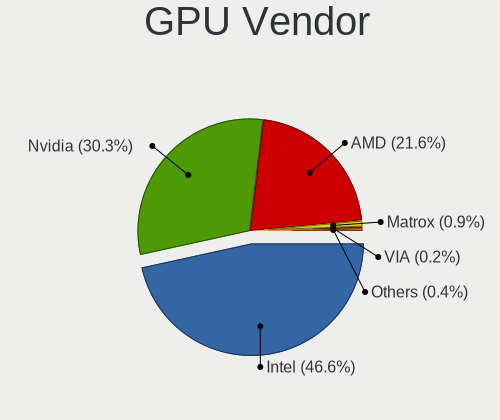

| Vendor           | Computers | Percent |
|------------------|-----------|---------|
| Intel            | 185       | 45.12%  |
| Nvidia           | 139       | 33.9%   |
| AMD              | 83        | 20.24%  |
| VIA Technologies | 2         | 0.49%   |
| ATI Technologies | 1         | 0.24%   |

GPU Model
---------

Graphics card models

| Model                                                                                    | Computers | Percent |
|------------------------------------------------------------------------------------------|-----------|---------|
| Intel 3rd Gen Core processor Graphics Controller                                         | 15        | 3.52%   |
| Intel 2nd Generation Core Processor Family Integrated Graphics Controller                | 15        | 3.52%   |
| Intel Haswell-ULT Integrated Graphics Controller                                         | 13        | 3.05%   |
| Intel UHD Graphics 620                                                                   | 12        | 2.82%   |
| Intel HD Graphics 530                                                                    | 12        | 2.82%   |
| Intel Atom/Celeron/Pentium Processor x5-E8000/J3xxx/N3xxx Integrated Graphics Controller | 12        | 2.82%   |
| Intel Xeon E3-1200 v3/4th Gen Core Processor Integrated Graphics Controller              | 9         | 2.11%   |
| Intel HD Graphics 620                                                                    | 8         | 1.88%   |
| AMD Renoir                                                                               | 8         | 1.88%   |
| AMD Raven Ridge [Radeon Vega Series / Radeon Vega Mobile Series]                         | 8         | 1.88%   |
| AMD Picasso/Raven 2 [Radeon Vega Series / Radeon Vega Mobile Series]                     | 8         | 1.88%   |
| Intel TigerLake-LP GT2 [Iris Xe Graphics]                                                | 7         | 1.64%   |
| Intel GeminiLake [UHD Graphics 600]                                                      | 7         | 1.64%   |
| Intel CoffeeLake-H GT2 [UHD Graphics 630]                                                | 7         | 1.64%   |
| AMD Ellesmere [Radeon RX 470/480/570/570X/580/580X/590]                                  | 7         | 1.64%   |
| Nvidia GF117M [GeForce 610M/710M/810M/820M / GT 620M/625M/630M/720M]                     | 6         | 1.41%   |
| Nvidia TU117M [GeForce GTX 1650 Ti Mobile]                                               | 5         | 1.17%   |
| Nvidia GT218 [GeForce 210]                                                               | 5         | 1.17%   |
| Nvidia GP108M [GeForce MX150]                                                            | 5         | 1.17%   |
| Nvidia GP108 [GeForce GT 1030]                                                           | 5         | 1.17%   |
| Nvidia GP104 [GeForce GTX 1070]                                                          | 5         | 1.17%   |
| Nvidia GM108M [GeForce 940MX]                                                            | 5         | 1.17%   |
| Intel CometLake-U GT2 [UHD Graphics]                                                     | 5         | 1.17%   |
| Intel CometLake-H GT2 [UHD Graphics]                                                     | 5         | 1.17%   |
| Intel CoffeeLake-S GT2 [UHD Graphics 630]                                                | 5         | 1.17%   |
| Intel Atom Processor Z36xxx/Z37xxx Series Graphics & Display                             | 5         | 1.17%   |
| Intel 4th Gen Core Processor Integrated Graphics Controller                              | 5         | 1.17%   |
| AMD Topaz XT [Radeon R7 M260/M265 / M340/M360 / M440/M445 / 530/535 / 620/625 Mobile]    | 5         | 1.17%   |
| AMD Cezanne                                                                              | 5         | 1.17%   |
| Nvidia GP107 [GeForce GTX 1050 Ti]                                                       | 4         | 0.94%   |
| Nvidia GM107M [GeForce GTX 960M]                                                         | 4         | 0.94%   |
| Nvidia GK208B [GeForce GT 710]                                                           | 4         | 0.94%   |
| Intel Skylake GT2 [HD Graphics 520]                                                      | 4         | 0.94%   |
| Intel HD Graphics 630                                                                    | 4         | 0.94%   |
| Intel 4th Generation Core Processor Family Integrated Graphics Controller                | 4         | 0.94%   |
| Nvidia TU117M [GeForce GTX 1650 Mobile / Max-Q]                                          | 3         | 0.7%    |
| Nvidia GT218M [GeForce 310M]                                                             | 3         | 0.7%    |
| Nvidia GP107M [GeForce GTX 1050 Mobile]                                                  | 3         | 0.7%    |
| Nvidia GP106 [GeForce GTX 1060 6GB]                                                      | 3         | 0.7%    |
| Nvidia GM107GLM [Quadro M1000M]                                                          | 3         | 0.7%    |
| Intel WhiskeyLake-U GT2 [UHD Graphics 620]                                               | 3         | 0.7%    |
| AMD Stoney [Radeon R2/R3/R4/R5 Graphics]                                                 | 3         | 0.7%    |
| AMD Jet PRO [Radeon R5 M230 / R7 M260DX / Radeon 520 Mobile]                             | 3         | 0.7%    |
| AMD Baffin [Radeon RX 460/560D / Pro 450/455/460/555/555X/560/560X]                      | 3         | 0.7%    |
| Nvidia TU116 [GeForce GTX 1650 SUPER]                                                    | 2         | 0.47%   |
| Nvidia TU106M [GeForce RTX 2060 Mobile]                                                  | 2         | 0.47%   |
| Nvidia MCP89 [GeForce 320M]                                                              | 2         | 0.47%   |
| Nvidia GP106M [GeForce GTX 1060 Mobile]                                                  | 2         | 0.47%   |
| Nvidia GP106 [GeForce GTX 1060 3GB]                                                      | 2         | 0.47%   |
| Nvidia GM108M [GeForce 840M]                                                             | 2         | 0.47%   |
| Nvidia GM107M [GeForce GTX 950M]                                                         | 2         | 0.47%   |
| Nvidia GF108M [GeForce GT 620M/630M/635M/640M LE]                                        | 2         | 0.47%   |
| Nvidia GF108M [GeForce GT 540M]                                                          | 2         | 0.47%   |
| Nvidia GF108GLM [NVS 5200M]                                                              | 2         | 0.47%   |
| Nvidia GF108 [GeForce GT 730]                                                            | 2         | 0.47%   |
| Nvidia G98 [GeForce 8400 GS Rev. 2]                                                      | 2         | 0.47%   |
| Nvidia G96C [GeForce 9500 GT]                                                            | 2         | 0.47%   |
| Intel JasperLake [UHD Graphics]                                                          | 2         | 0.47%   |
| Intel IvyBridge GT2 [HD Graphics 4000]                                                   | 2         | 0.47%   |
| Intel Iris Plus Graphics G1 (Ice Lake)                                                   | 2         | 0.47%   |

GPU Combo
---------

Combinations of graphics cards

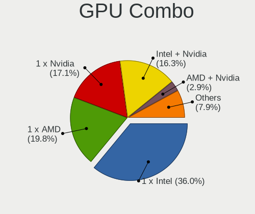

| Name                 | Computers | Percent |
|----------------------|-----------|---------|
| 1 x Intel            | 116       | 34.73%  |
| 1 x Nvidia           | 68        | 20.36%  |
| 1 x AMD              | 60        | 17.96%  |
| Intel + Nvidia       | 58        | 17.37%  |
| AMD + Nvidia         | 10        | 2.99%   |
| Intel + AMD          | 8         | 2.4%    |
| 2 x AMD              | 7         | 2.1%    |
| 1 x VIA              | 2         | 0.6%    |
| Intel + 2 x Nvidia   | 2         | 0.6%    |
| 3 x Nvidia           | 1         | 0.3%    |
| 2 x AMD + 1 x Nvidia | 1         | 0.3%    |
| AMD + 2 x Nvidia     | 1         | 0.3%    |

GPU Driver
----------

Free vs proprietary

| Driver      | Computers | Percent |
|-------------|-----------|---------|
| Free        | 263       | 78.74%  |
| Proprietary | 63        | 18.86%  |
| Unknown     | 8         | 2.4%    |

GPU Memory
----------

Total video memory

| Size in GB | Computers | Percent |
|------------|-----------|---------|
| Unknown    | 171       | 50.15%  |
| 1.01-2.0   | 52        | 15.25%  |
| 0.01-0.5   | 37        | 10.85%  |
| 3.01-4.0   | 33        | 9.68%   |
| 0.51-1.0   | 26        | 7.62%   |
| 7.01-8.0   | 10        | 2.93%   |
| 5.01-6.0   | 7         | 2.05%   |
| 8.01-16.0  | 2         | 0.59%   |
| 4.01-5.0   | 1         | 0.29%   |
| 2.01-3.0   | 1         | 0.29%   |
| 16.01-24.0 | 1         | 0.29%   |

Monitor
-------

Monitor Vendor
--------------

Monitor vendors

| Vendor                  | Computers | Percent |
|-------------------------|-----------|---------|
| Samsung Electronics     | 53        | 14.89%  |
| AU Optronics            | 49        | 13.76%  |
| Goldstar                | 29        | 8.15%   |
| Chimei Innolux          | 28        | 7.87%   |
| LG Display              | 26        | 7.3%    |
| BOE                     | 25        | 7.02%   |
| Acer                    | 24        | 6.74%   |
| Dell                    | 19        | 5.34%   |
| Hewlett-Packard         | 12        | 3.37%   |
| AOC                     | 11        | 3.09%   |
| Lenovo                  | 8         | 2.25%   |
| Apple                   | 8         | 2.25%   |
| PANDA                   | 7         | 1.97%   |
| BenQ                    | 7         | 1.97%   |
| Sharp                   | 5         | 1.4%    |
| ViewSonic               | 4         | 1.12%   |
| LG Electronics          | 4         | 1.12%   |
| Chi Mei Optoelectronics | 3         | 0.84%   |
| Unknown (XXX)           | 2         | 0.56%   |
| MStar                   | 2         | 0.56%   |
| InfoVision              | 2         | 0.56%   |
| Ancor Communications    | 2         | 0.56%   |
| Toshiba                 | 1         | 0.28%   |
| TCL                     | 1         | 0.28%   |
| Sony                    | 1         | 0.28%   |
| SKY                     | 1         | 0.28%   |
| SGT                     | 1         | 0.28%   |
| RTK                     | 1         | 0.28%   |
| Quanta Display          | 1         | 0.28%   |
| Panasonic               | 1         | 0.28%   |
| NEC Computers           | 1         | 0.28%   |
| MIG                     | 1         | 0.28%   |
| Microstep               | 1         | 0.28%   |
| Mi                      | 1         | 0.28%   |
| LPL                     | 1         | 0.28%   |
| Lenovo Group Limited    | 1         | 0.28%   |
| ITE                     | 1         | 0.28%   |
| IOD                     | 1         | 0.28%   |
| HUYINIUDA               | 1         | 0.28%   |
| HPN                     | 1         | 0.28%   |
| HJC                     | 1         | 0.28%   |
| Gateway                 | 1         | 0.28%   |
| Fujitsu Siemens         | 1         | 0.28%   |
| Fujitsu                 | 1         | 0.28%   |
| CSO                     | 1         | 0.28%   |
| CPT                     | 1         | 0.28%   |
| CHI                     | 1         | 0.28%   |
| ASUSTek Computer        | 1         | 0.28%   |

Monitor Model
-------------

Monitor models

| Model                                                                 | Computers | Percent |
|-----------------------------------------------------------------------|-----------|---------|
| Samsung Electronics LCD Monitor SDC4161 1920x1080 344x194mm 15.5-inch | 3         | 0.82%   |
| ViewSonic VG2448 VSC3B35 1920x1080 527x296mm 23.8-inch                | 2         | 0.54%   |
| Samsung Electronics SyncMaster SAM037B 1680x1050 474x296mm 22.0-inch  | 2         | 0.54%   |
| Samsung Electronics SyncMaster SAM0366 1280x1024 338x270mm 17.0-inch  | 2         | 0.54%   |
| Samsung Electronics SME1920 SAM06B7 1366x768 410x230mm 18.5-inch      | 2         | 0.54%   |
| Samsung Electronics S24F350 SAM0D21 1920x1080 521x293mm 23.5-inch     | 2         | 0.54%   |
| Samsung Electronics S22F350 SAM0D1A 1920x1080 480x270mm 21.7-inch     | 2         | 0.54%   |
| Samsung Electronics S22D300 SAM0B3F 1920x1080 477x268mm 21.5-inch     | 2         | 0.54%   |
| Samsung Electronics S20B300 SAM08A8 1600x900 443x249mm 20.0-inch      | 2         | 0.54%   |
| Samsung Electronics LCD Monitor SEC3242 1024x600 223x125mm 10.1-inch  | 2         | 0.54%   |
| Samsung Electronics C24F390 SAM0D2C 1920x1080 520x290mm 23.4-inch     | 2         | 0.54%   |
| PANDA LCD Monitor NCP0036 1920x1080 344x194mm 15.5-inch               | 2         | 0.54%   |
| MStar Demo MST0030 1920x540 708x398mm 32.0-inch                       | 2         | 0.54%   |
| LG Electronics LCD Monitor LG IPS FULLHD 1920x1080                    | 2         | 0.54%   |
| LG Display LCD Monitor LGD0454 1366x768 310x174mm 14.0-inch           | 2         | 0.54%   |
| LG Display LCD Monitor LGD02DF 1600x900 310x174mm 14.0-inch           | 2         | 0.54%   |
| LG Display LCD Monitor LGD018B 1366x768 310x174mm 14.0-inch           | 2         | 0.54%   |
| Lenovo AIO PC LEN2000 1600x900 440x230mm 19.5-inch                    | 2         | 0.54%   |
| Goldstar W2043 GSM4E9D 1600x900 443x249mm 20.0-inch                   | 2         | 0.54%   |
| Goldstar LCD Monitor GSM5AB8 1920x1080 480x270mm 21.7-inch            | 2         | 0.54%   |
| Goldstar HDR WFHD GSM7714 2560x1080 798x334mm 34.1-inch               | 2         | 0.54%   |
| Goldstar HDR 4K GSM7706 3840x2160 600x340mm 27.2-inch                 | 2         | 0.54%   |
| Goldstar FULL HD GSM5B55 1920x1080 480x270mm 21.7-inch                | 2         | 0.54%   |
| Chimei Innolux LCD Monitor CMN15F5 1920x1080 344x193mm 15.5-inch      | 2         | 0.54%   |
| Chimei Innolux LCD Monitor CMN1521 1920x1080 344x193mm 15.5-inch      | 2         | 0.54%   |
| Chimei Innolux LCD Monitor CMN14D4 1920x1080 309x173mm 13.9-inch      | 2         | 0.54%   |
| Chimei Innolux LCD Monitor CMN1490 1366x768 309x173mm 13.9-inch       | 2         | 0.54%   |
| Chimei Innolux LCD Monitor CMN1487 1366x768 309x173mm 13.9-inch       | 2         | 0.54%   |
| Chimei Innolux LCD Monitor CMN1132 1366x768 256x144mm 11.6-inch       | 2         | 0.54%   |
| BOE LCD Monitor BOE09C3 1366x768 256x144mm 11.6-inch                  | 2         | 0.54%   |
| BOE LCD Monitor BOE066E 1366x768 344x194mm 15.5-inch                  | 2         | 0.54%   |
| AU Optronics LCD Monitor AUO70EC 1366x768 344x193mm 15.5-inch         | 2         | 0.54%   |
| AU Optronics LCD Monitor AUO61ED 1920x1080 344x193mm 15.5-inch        | 2         | 0.54%   |
| AU Optronics LCD Monitor AUO363C 1366x768 309x173mm 13.9-inch         | 2         | 0.54%   |
| AU Optronics LCD Monitor AUO353D 1920x1080 309x174mm 14.0-inch        | 2         | 0.54%   |
| AU Optronics LCD Monitor AUO2D3C 1366x768 309x173mm 13.9-inch         | 2         | 0.54%   |
| AU Optronics LCD Monitor AUO235C 1366x768 256x144mm 11.6-inch         | 2         | 0.54%   |
| AU Optronics LCD Monitor AUO183C 1366x768 309x173mm 13.9-inch         | 2         | 0.54%   |
| AU Optronics LCD Monitor AUO109D 1920x1080 381x214mm 17.2-inch        | 2         | 0.54%   |
| AU Optronics LCD Monitor AUO106C 1366x768 277x156mm 12.5-inch         | 2         | 0.54%   |
| Apple Color LCD APP9CF0 1440x900 290x180mm 13.4-inch                  | 2         | 0.54%   |
| AOC 24B1W1 AOC2401 1920x1080 527x296mm 23.8-inch                      | 2         | 0.54%   |
| AOC 22V2WG5 AOC2202 1920x1080 476x268mm 21.5-inch                     | 2         | 0.54%   |
| Acer X193W ACR000C 1440x900 410x260mm 19.1-inch                       | 2         | 0.54%   |
| Acer X193HQ ACR0067 1366x768 410x230mm 18.5-inch                      | 2         | 0.54%   |
| Acer S200HQL ACR0359 1600x900 434x236mm 19.4-inch                     | 2         | 0.54%   |
| Acer K242HQL ACR042E 1920x1080 521x293mm 23.5-inch                    | 2         | 0.54%   |
| ViewSonic VSC PJD VSCD934 1920x1080                                   | 1         | 0.27%   |
| ViewSonic VG1655 VSCD239 1920x1080 340x190mm 15.3-inch                | 1         | 0.27%   |
| Unknown (XXX) Union TV XXX2841 1920x1080 1210x680mm 54.6-inch         | 1         | 0.27%   |
| Unknown (XXX) 1772ED XXX1772 1280x1024 320x250mm 16.0-inch            | 1         | 0.27%   |
| Toshiba TV TSB0114 1920x1080 882x498mm 39.9-inch                      | 1         | 0.27%   |
| TCL SMART TV TCL6586 3840x2160 1209x680mm 54.6-inch                   | 1         | 0.27%   |
| Sony TV SNY9402 1920x1080                                             | 1         | 0.27%   |
| SKY TV-monitor SKY1202 1920x1080 885x498mm 40.0-inch                  | 1         | 0.27%   |
| Sharp LQ173M1JW05 SHP14EC 1920x1080 380x210mm 17.1-inch               | 1         | 0.27%   |
| Sharp LCD Monitor SHP14A1 3840x2160 344x194mm 15.5-inch               | 1         | 0.27%   |
| Sharp LCD Monitor SHP143E 3840x2160 346x194mm 15.6-inch               | 1         | 0.27%   |
| Sharp HDMI SHP113E 1920x1080 1330x748mm 60.1-inch                     | 1         | 0.27%   |
| Sharp HDMI SHP110F 1920x1080 700x390mm 31.5-inch                      | 1         | 0.27%   |

Monitor Resolution
------------------

Monitor screen resolution

| Resolution         | Computers | Percent |
|--------------------|-----------|---------|
| 1920x1080 (FHD)    | 151       | 43.77%  |
| 1366x768 (WXGA)    | 82        | 23.77%  |
| 3840x2160 (4K)     | 22        | 6.38%   |
| 1600x900 (HD+)     | 20        | 5.8%    |
| 1440x900 (WXGA+)   | 13        | 3.77%   |
| 1280x1024 (SXGA)   | 9         | 2.61%   |
| 1680x1050 (WSXGA+) | 8         | 2.32%   |
| 2560x1440 (QHD)    | 7         | 2.03%   |
| 2560x1080          | 5         | 1.45%   |
| Unknown            | 4         | 1.16%   |
| 1360x768           | 3         | 0.87%   |
| 1280x800 (WXGA)    | 3         | 0.87%   |
| 3840x1080          | 2         | 0.58%   |
| 2560x1600          | 2         | 0.58%   |
| 1920x1200 (WUXGA)  | 2         | 0.58%   |
| 3840x2400          | 1         | 0.29%   |
| 3440x1440          | 1         | 0.29%   |
| 2880x1800          | 1         | 0.29%   |
| 2736x1824          | 1         | 0.29%   |
| 2732x768           | 1         | 0.29%   |
| 2256x1504          | 1         | 0.29%   |
| 2160x1440          | 1         | 0.29%   |
| 1920x515           | 1         | 0.29%   |
| 1600x1200          | 1         | 0.29%   |
| 1280x720 (HD)      | 1         | 0.29%   |
| 1024x768 (XGA)     | 1         | 0.29%   |
| 1024x600           | 1         | 0.29%   |

Monitor Diagonal
----------------

Diagonal size in inches

| Inches  | Computers | Percent |
|---------|-----------|---------|
| 15      | 65        | 18.16%  |
| 14      | 39        | 10.89%  |
| 13      | 38        | 10.61%  |
| 23      | 29        | 8.1%    |
| Unknown | 21        | 5.87%   |
| 24      | 20        | 5.59%   |
| 21      | 20        | 5.59%   |
| 27      | 17        | 4.75%   |
| 19      | 17        | 4.75%   |
| 18      | 15        | 4.19%   |
| 17      | 14        | 3.91%   |
| 20      | 13        | 3.63%   |
| 11      | 12        | 3.35%   |
| 22      | 6         | 1.68%   |
| 12      | 5         | 1.4%    |
| 34      | 4         | 1.12%   |
| 84      | 3         | 0.84%   |
| 31      | 3         | 0.84%   |
| 16      | 3         | 0.84%   |
| 54      | 2         | 0.56%   |
| 52      | 2         | 0.56%   |
| 26      | 2         | 0.56%   |
| 72      | 1         | 0.28%   |
| 60      | 1         | 0.28%   |
| 47      | 1         | 0.28%   |
| 46      | 1         | 0.28%   |
| 40      | 1         | 0.28%   |
| 39      | 1         | 0.28%   |
| 29      | 1         | 0.28%   |
| 8       | 1         | 0.28%   |

Monitor Width
-------------

Physical width

| Width in mm | Computers | Percent |
|-------------|-----------|---------|
| 301-350     | 128       | 36.47%  |
| 401-500     | 67        | 19.09%  |
| 501-600     | 64        | 18.23%  |
| 201-300     | 35        | 9.97%   |
| Unknown     | 21        | 5.98%   |
| 351-400     | 15        | 4.27%   |
| 1001-1500   | 7         | 1.99%   |
| 701-800     | 4         | 1.14%   |
| 601-700     | 4         | 1.14%   |
| 1501-2000   | 3         | 0.85%   |
| 801-900     | 2         | 0.57%   |
| 101-200     | 1         | 0.28%   |

Aspect Ratio
------------

Proportional relationship between the width and the height

| Ratio   | Computers | Percent |
|---------|-----------|---------|
| 16/9    | 253       | 78.57%  |
| 16/10   | 31        | 9.63%   |
| Unknown | 18        | 5.59%   |
| 5/4     | 9         | 2.8%    |
| 3/2     | 4         | 1.24%   |
| 21/9    | 4         | 1.24%   |
| 4/3     | 2         | 0.62%   |
| 3.73    | 1         | 0.31%   |

Monitor Area
------------

Area in inch

| Area in inch | Computers | Percent |
|----------------|-----------|---------|
| 101-110        | 65        | 18.31%  |
| 81-90          | 63        | 17.75%  |
| 201-250        | 63        | 17.75%  |
| 151-200        | 38        | 10.7%   |
| Unknown        | 21        | 5.92%   |
| 301-350        | 19        | 5.35%   |
| 141-150        | 16        | 4.51%   |
| 71-80          | 14        | 3.94%   |
| 51-60          | 12        | 3.38%   |
| 121-130        | 10        | 2.82%   |
| More than 1000 | 8         | 2.25%   |
| 351-500        | 8         | 2.25%   |
| 61-70          | 5         | 1.41%   |
| 251-300        | 4         | 1.13%   |
| 501-1000       | 4         | 1.13%   |
| 131-140        | 2         | 0.56%   |
| 1-40           | 1         | 0.28%   |
| 111-120        | 1         | 0.28%   |
| 91-100         | 1         | 0.28%   |

Pixel Density
-------------

Pixels per inch

| Density       | Computers | Percent |
|---------------|-----------|---------|
| 51-100        | 114       | 33.14%  |
| 101-120       | 87        | 25.29%  |
| 121-160       | 85        | 24.71%  |
| 161-240       | 22        | 6.4%    |
| Unknown       | 21        | 6.1%    |
| 1-50          | 8         | 2.33%   |
| More than 240 | 7         | 2.03%   |

Multiple Monitors
-----------------

Total monitors connected

| Total | Computers | Percent |
|-------|-----------|---------|
| 1     | 265       | 79.58%  |
| 2     | 50        | 15.02%  |
| 0     | 12        | 3.6%    |
| 3     | 6         | 1.8%    |

Network
-------

Net Controller Vendor
---------------------

Controller vendors

| Vendor                            | Computers | Percent |
|-----------------------------------|-----------|---------|
| Realtek Semiconductor             | 194       | 38.8%   |
| Intel                             | 134       | 26.8%   |
| Qualcomm Atheros                  | 65        | 13%     |
| Broadcom                          | 31        | 6.2%    |
| Ralink Technology                 | 12        | 2.4%    |
| Nvidia                            | 7         | 1.4%    |
| D-Link                            | 7         | 1.4%    |
| ASIX Electronics                  | 7         | 1.4%    |
| MediaTek                          | 5         | 1%      |
| TP-Link                           | 4         | 0.8%    |
| Ralink                            | 4         | 0.8%    |
| D-Link System                     | 4         | 0.8%    |
| Broadcom Limited                  | 4         | 0.8%    |
| VIA Technologies                  | 2         | 0.4%    |
| Samsung Electronics               | 2         | 0.4%    |
| Marvell Technology Group          | 2         | 0.4%    |
| Huawei Technologies               | 2         | 0.4%    |
| Ericsson Business Mobile Networks | 2         | 0.4%    |
| ASUSTek Computer                  | 2         | 0.4%    |
| Xiaomi                            | 1         | 0.2%    |
| vivo                              | 1         | 0.2%    |
| Qualcomm Atheros Communications   | 1         | 0.2%    |
| OnePlus Technology (Shenzhen)     | 1         | 0.2%    |
| Mercucys                          | 1         | 0.2%    |
| Lenovo                            | 1         | 0.2%    |
| JMicron Technology                | 1         | 0.2%    |
| Edimax Technology                 | 1         | 0.2%    |
| BUFFALO                           | 1         | 0.2%    |
| Aquantia                          | 1         | 0.2%    |

Net Controller Model
--------------------

Controller models

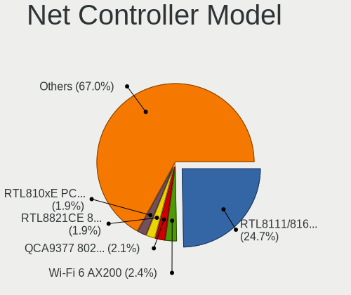

| Model                                                             | Computers | Percent |
|-------------------------------------------------------------------|-----------|---------|
| Realtek RTL8111/8168/8411 PCI Express Gigabit Ethernet Controller | 151       | 26.96%  |
| Realtek RTL810xE PCI Express Fast Ethernet controller             | 15        | 2.68%   |
| Qualcomm Atheros QCA9377 802.11ac Wireless Network Adapter        | 15        | 2.68%   |
| Realtek RTL8821CE 802.11ac PCIe Wireless Network Adapter          | 10        | 1.79%   |
| Qualcomm Atheros QCA9565 / AR9565 Wireless Network Adapter        | 10        | 1.79%   |
| Intel 82579LM Gigabit Network Connection (Lewisville)             | 10        | 1.79%   |
| Intel Wi-Fi 6 AX200                                               | 9         | 1.61%   |
| Intel Wireless-AC 9260                                            | 8         | 1.43%   |
| Intel Cannon Lake PCH CNVi WiFi                                   | 8         | 1.43%   |
| Realtek RTL8188EUS 802.11n Wireless Network Adapter               | 7         | 1.25%   |
| Qualcomm Atheros AR9285 Wireless Network Adapter (PCI-Express)    | 7         | 1.25%   |
| Intel Ethernet Connection (2) I219-V                              | 7         | 1.25%   |
| Realtek RTL8822CE 802.11ac PCIe Wireless Network Adapter          | 6         | 1.07%   |
| Ralink MT7601U Wireless Adapter                                   | 6         | 1.07%   |
| Qualcomm Atheros AR9485 Wireless Network Adapter                  | 6         | 1.07%   |
| Intel Wireless 7265                                               | 6         | 1.07%   |
| Intel Wireless 3160                                               | 6         | 1.07%   |
| Intel Ethernet Connection I217-LM                                 | 6         | 1.07%   |
| Qualcomm Atheros QCA6174 802.11ac Wireless Network Adapter        | 5         | 0.89%   |
| MediaTek MT7921 802.11ax PCI Express Wireless Network Adapter     | 5         | 0.89%   |
| Intel Wireless 8265 / 8275                                        | 5         | 0.89%   |
| Intel Wireless 8260                                               | 5         | 0.89%   |
| Intel Wireless 3165                                               | 5         | 0.89%   |
| Intel I211 Gigabit Network Connection                             | 5         | 0.89%   |
| Intel Dual Band Wireless-AC 3165 Plus Bluetooth                   | 5         | 0.89%   |
| Intel Comet Lake PCH-LP CNVi WiFi                                 | 5         | 0.89%   |
| Intel Comet Lake PCH CNVi WiFi                                    | 5         | 0.89%   |
| Intel Centrino Advanced-N 6205 [Taylor Peak]                      | 5         | 0.89%   |
| Broadcom BCM43142 802.11b/g/n                                     | 5         | 0.89%   |
| Broadcom BCM4313 802.11bgn Wireless Network Adapter               | 5         | 0.89%   |
| ASIX AX88179 Gigabit Ethernet                                     | 5         | 0.89%   |
| Realtek RTL88x2bu [AC1200 Techkey]                                | 4         | 0.71%   |
| Realtek RTL8192CE PCIe Wireless Network Adapter                   | 4         | 0.71%   |
| Realtek RTL8153 Gigabit Ethernet Adapter                          | 4         | 0.71%   |
| Qualcomm Atheros AR928X Wireless Network Adapter (PCI-Express)    | 4         | 0.71%   |
| Intel Wi-Fi 6 AX210/AX211/AX411 160MHz                            | 4         | 0.71%   |
| Intel Wi-Fi 6 AX201                                               | 4         | 0.71%   |
| Intel Ethernet Connection I217-V                                  | 4         | 0.71%   |
| Intel Ethernet Connection (7) I219-V                              | 4         | 0.71%   |
| Intel Dual Band Wireless-AC 3168NGW [Stone Peak]                  | 4         | 0.71%   |
| Qualcomm Atheros QCA8171 Gigabit Ethernet                         | 3         | 0.54%   |
| Qualcomm Atheros AR9462 Wireless Network Adapter                  | 3         | 0.54%   |
| Qualcomm Atheros AR8151 v2.0 Gigabit Ethernet                     | 3         | 0.54%   |
| Nvidia MCP61 Ethernet                                             | 3         | 0.54%   |
| Intel PRO/Wireless 5100 AGN [Shiloh] Network Connection           | 3         | 0.54%   |
| Intel Ethernet Connection (5) I219-LM                             | 3         | 0.54%   |
| D-Link DWA-140 RangeBooster N Adapter(rev.B3) [Ralink RT5372]     | 3         | 0.54%   |
| Broadcom BCM43228 802.11a/b/g/n                                   | 3         | 0.54%   |
| TP-Link AC600 wireless Realtek RTL8811AU [Archer T2U Nano]        | 2         | 0.36%   |
| Realtek RTL8822BE 802.11a/b/g/n/ac WiFi adapter                   | 2         | 0.36%   |
| Realtek RTL8192EE PCIe Wireless Network Adapter                   | 2         | 0.36%   |
| Realtek RTL8125 2.5GbE Controller                                 | 2         | 0.36%   |
| Realtek RTL-8110SC/8169SC Gigabit Ethernet                        | 2         | 0.36%   |
| Ralink RT2501/RT2573 Wireless Adapter                             | 2         | 0.36%   |
| Ralink MT7610U ("Archer T2U" 2.4G+5G WLAN Adapter                 | 2         | 0.36%   |
| Qualcomm Atheros AR9287 Wireless Network Adapter (PCI-Express)    | 2         | 0.36%   |
| Qualcomm Atheros AR8161 Gigabit Ethernet                          | 2         | 0.36%   |
| Nvidia MCP79 Ethernet                                             | 2         | 0.36%   |
| Nvidia MCP73 Ethernet                                             | 2         | 0.36%   |
| Intel Wireless 7260                                               | 2         | 0.36%   |

Wireless Vendor
---------------

Wireless vendors

| Vendor                          | Computers | Percent |
|---------------------------------|-----------|---------|
| Intel                           | 101       | 37.83%  |
| Qualcomm Atheros                | 56        | 20.97%  |
| Realtek Semiconductor           | 44        | 16.48%  |
| Broadcom                        | 21        | 7.87%   |
| Ralink Technology               | 12        | 4.49%   |
| D-Link                          | 7         | 2.62%   |
| MediaTek                        | 5         | 1.87%   |
| TP-Link                         | 4         | 1.5%    |
| Ralink                          | 4         | 1.5%    |
| Broadcom Limited                | 4         | 1.5%    |
| D-Link System                   | 2         | 0.75%   |
| ASUSTek Computer                | 2         | 0.75%   |
| Qualcomm Atheros Communications | 1         | 0.37%   |
| Mercucys                        | 1         | 0.37%   |
| Marvell Technology Group        | 1         | 0.37%   |
| Edimax Technology               | 1         | 0.37%   |
| BUFFALO                         | 1         | 0.37%   |

Wireless Model
--------------

Wireless models

| Model                                                          | Computers | Percent |
|----------------------------------------------------------------|-----------|---------|
| Qualcomm Atheros QCA9377 802.11ac Wireless Network Adapter     | 15        | 5.62%   |
| Realtek RTL8821CE 802.11ac PCIe Wireless Network Adapter       | 10        | 3.75%   |
| Qualcomm Atheros QCA9565 / AR9565 Wireless Network Adapter     | 10        | 3.75%   |
| Intel Wi-Fi 6 AX200                                            | 9         | 3.37%   |
| Intel Wireless-AC 9260                                         | 8         | 3%      |
| Intel Cannon Lake PCH CNVi WiFi                                | 8         | 3%      |
| Realtek RTL8188EUS 802.11n Wireless Network Adapter            | 7         | 2.62%   |
| Qualcomm Atheros AR9285 Wireless Network Adapter (PCI-Express) | 7         | 2.62%   |
| Realtek RTL8822CE 802.11ac PCIe Wireless Network Adapter       | 6         | 2.25%   |
| Ralink MT7601U Wireless Adapter                                | 6         | 2.25%   |
| Qualcomm Atheros AR9485 Wireless Network Adapter               | 6         | 2.25%   |
| Intel Wireless 7265                                            | 6         | 2.25%   |
| Intel Wireless 3160                                            | 6         | 2.25%   |
| Qualcomm Atheros QCA6174 802.11ac Wireless Network Adapter     | 5         | 1.87%   |
| MediaTek MT7921 802.11ax PCI Express Wireless Network Adapter  | 5         | 1.87%   |
| Intel Wireless 8265 / 8275                                     | 5         | 1.87%   |
| Intel Wireless 8260                                            | 5         | 1.87%   |
| Intel Wireless 3165                                            | 5         | 1.87%   |
| Intel Dual Band Wireless-AC 3165 Plus Bluetooth                | 5         | 1.87%   |
| Intel Comet Lake PCH-LP CNVi WiFi                              | 5         | 1.87%   |
| Intel Comet Lake PCH CNVi WiFi                                 | 5         | 1.87%   |
| Intel Centrino Advanced-N 6205 [Taylor Peak]                   | 5         | 1.87%   |
| Broadcom BCM43142 802.11b/g/n                                  | 5         | 1.87%   |
| Broadcom BCM4313 802.11bgn Wireless Network Adapter            | 5         | 1.87%   |
| Realtek RTL88x2bu [AC1200 Techkey]                             | 4         | 1.5%    |
| Realtek RTL8192CE PCIe Wireless Network Adapter                | 4         | 1.5%    |
| Qualcomm Atheros AR928X Wireless Network Adapter (PCI-Express) | 4         | 1.5%    |
| Intel Wi-Fi 6 AX210/AX211/AX411 160MHz                         | 4         | 1.5%    |
| Intel Wi-Fi 6 AX201                                            | 4         | 1.5%    |
| Intel Dual Band Wireless-AC 3168NGW [Stone Peak]               | 4         | 1.5%    |
| Qualcomm Atheros AR9462 Wireless Network Adapter               | 3         | 1.12%   |
| Intel PRO/Wireless 5100 AGN [Shiloh] Network Connection        | 3         | 1.12%   |
| D-Link DWA-140 RangeBooster N Adapter(rev.B3) [Ralink RT5372]  | 3         | 1.12%   |
| Broadcom BCM43228 802.11a/b/g/n                                | 3         | 1.12%   |
| TP-Link AC600 wireless Realtek RTL8811AU [Archer T2U Nano]     | 2         | 0.75%   |
| Realtek RTL8822BE 802.11a/b/g/n/ac WiFi adapter                | 2         | 0.75%   |
| Realtek RTL8192EE PCIe Wireless Network Adapter                | 2         | 0.75%   |
| Ralink RT2501/RT2573 Wireless Adapter                          | 2         | 0.75%   |
| Ralink MT7610U ("Archer T2U" 2.4G+5G WLAN Adapter              | 2         | 0.75%   |
| Qualcomm Atheros AR9287 Wireless Network Adapter (PCI-Express) | 2         | 0.75%   |
| Intel Wireless 7260                                            | 2         | 0.75%   |
| Intel Wi-Fi 6 AX201 160MHz                                     | 2         | 0.75%   |
| Intel Ice Lake-LP PCH CNVi WiFi                                | 2         | 0.75%   |
| Intel Centrino Ultimate-N 6300                                 | 2         | 0.75%   |
| Intel Cannon Point-LP CNVi [Wireless-AC]                       | 2         | 0.75%   |
| Broadcom Limited BCM4360 802.11ac Wireless Network Adapter     | 2         | 0.75%   |
| Broadcom BCM43224 802.11a/b/g/n                                | 2         | 0.75%   |
| Broadcom BCM4311 802.11b/g WLAN                                | 2         | 0.75%   |
| TP-Link TL-WN722N v2                                           | 1         | 0.37%   |
| TP-Link Archer T9UH v1 [Realtek RTL8814AU]                     | 1         | 0.37%   |
| Realtek RTL8814AU 802.11a/b/g/n/ac Wireless Adapter            | 1         | 0.37%   |
| Realtek RTL8723BU 802.11b/g/n WLAN Adapter                     | 1         | 0.37%   |
| Realtek RTL8723BE PCIe Wireless Network Adapter                | 1         | 0.37%   |
| Realtek RTL8192E/RTL8192SE Wireless LAN Controller             | 1         | 0.37%   |
| Realtek RTL8191SU 802.11n WLAN Adapter                         | 1         | 0.37%   |
| Realtek RTL8188FTV 802.11b/g/n 1T1R 2.4G WLAN Adapter          | 1         | 0.37%   |
| Realtek RTL8188EE Wireless Network Adapter                     | 1         | 0.37%   |
| Realtek RTL8187 Wireless Adapter                               | 1         | 0.37%   |
| Realtek 802.11ac NIC                                           | 1         | 0.37%   |
| Ralink RT5572 Wireless Adapter                                 | 1         | 0.37%   |

Ethernet Vendor
---------------

Ethernet vendors

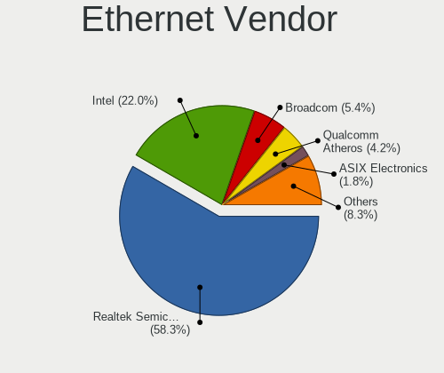

| Vendor                        | Computers | Percent |
|-------------------------------|-----------|---------|
| Realtek Semiconductor         | 174       | 61.27%  |
| Intel                         | 54        | 19.01%  |
| Broadcom                      | 15        | 5.28%   |
| Qualcomm Atheros              | 14        | 4.93%   |
| Nvidia                        | 7         | 2.46%   |
| ASIX Electronics              | 7         | 2.46%   |
| VIA Technologies              | 2         | 0.7%    |
| Samsung Electronics           | 2         | 0.7%    |
| D-Link System                 | 2         | 0.7%    |
| Xiaomi                        | 1         | 0.35%   |
| OnePlus Technology (Shenzhen) | 1         | 0.35%   |
| Marvell Technology Group      | 1         | 0.35%   |
| Lenovo                        | 1         | 0.35%   |
| JMicron Technology            | 1         | 0.35%   |
| Huawei Technologies           | 1         | 0.35%   |
| Aquantia                      | 1         | 0.35%   |

Ethernet Model
--------------

Ethernet models

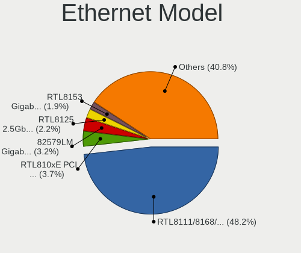

| Model                                                                          | Computers | Percent |
|--------------------------------------------------------------------------------|-----------|---------|
| Realtek RTL8111/8168/8411 PCI Express Gigabit Ethernet Controller              | 151       | 52.25%  |
| Realtek RTL810xE PCI Express Fast Ethernet controller                          | 15        | 5.19%   |
| Intel 82579LM Gigabit Network Connection (Lewisville)                          | 10        | 3.46%   |
| Intel Ethernet Connection (2) I219-V                                           | 7         | 2.42%   |
| Intel Ethernet Connection I217-LM                                              | 6         | 2.08%   |
| Intel I211 Gigabit Network Connection                                          | 5         | 1.73%   |
| ASIX AX88179 Gigabit Ethernet                                                  | 5         | 1.73%   |
| Realtek RTL8153 Gigabit Ethernet Adapter                                       | 4         | 1.38%   |
| Intel Ethernet Connection I217-V                                               | 4         | 1.38%   |
| Intel Ethernet Connection (7) I219-V                                           | 4         | 1.38%   |
| Qualcomm Atheros QCA8171 Gigabit Ethernet                                      | 3         | 1.04%   |
| Qualcomm Atheros AR8151 v2.0 Gigabit Ethernet                                  | 3         | 1.04%   |
| Nvidia MCP61 Ethernet                                                          | 3         | 1.04%   |
| Intel Ethernet Connection (5) I219-LM                                          | 3         | 1.04%   |
| Realtek RTL8125 2.5GbE Controller                                              | 2         | 0.69%   |
| Realtek RTL-8110SC/8169SC Gigabit Ethernet                                     | 2         | 0.69%   |
| Qualcomm Atheros AR8161 Gigabit Ethernet                                       | 2         | 0.69%   |
| Nvidia MCP79 Ethernet                                                          | 2         | 0.69%   |
| Nvidia MCP73 Ethernet                                                          | 2         | 0.69%   |
| Intel Ethernet Connection (12) I219-V                                          | 2         | 0.69%   |
| D-Link System DGE-528T Gigabit Ethernet Adapter                                | 2         | 0.69%   |
| Broadcom NetXtreme BCM57766 Gigabit Ethernet PCIe                              | 2         | 0.69%   |
| Broadcom NetXtreme BCM5764M Gigabit Ethernet PCIe                              | 2         | 0.69%   |
| Xiaomi 100Mbps Network Card Adapter                                            | 1         | 0.35%   |
| VIA VT6120/VT6121/VT6122 Gigabit Ethernet Adapter                              | 1         | 0.35%   |
| VIA VT6102/VT6103 [Rhine-II]                                                   | 1         | 0.35%   |
| Samsung GT-I9070 (network tethering, USB debugging enabled)                    | 1         | 0.35%   |
| Samsung Galaxy series, misc. (tethering mode)                                  | 1         | 0.35%   |
| Realtek RTL8152 Fast Ethernet Adapter                                          | 1         | 0.35%   |
| Realtek RTL-8100/8101L/8139 PCI Fast Ethernet Adapter                          | 1         | 0.35%   |
| Realtek Killer E2600 Gigabit Ethernet Controller                               | 1         | 0.35%   |
| Realtek Killer E2500 Gigabit Ethernet Controller                               | 1         | 0.35%   |
| Qualcomm Atheros QCA8172 Fast Ethernet                                         | 1         | 0.35%   |
| Qualcomm Atheros Killer E2500 Gigabit Ethernet Controller                      | 1         | 0.35%   |
| Qualcomm Atheros Killer E2400 Gigabit Ethernet Controller                      | 1         | 0.35%   |
| Qualcomm Atheros AR8162 Fast Ethernet                                          | 1         | 0.35%   |
| Qualcomm Atheros AR8152 v1.1 Fast Ethernet                                     | 1         | 0.35%   |
| Qualcomm Atheros AR8131 Gigabit Ethernet                                       | 1         | 0.35%   |
| OnePlus (Shenzhen) OnePlus                                                     | 1         | 0.35%   |
| Marvell Group Yukon Optima 88E8059 [PCIe Gigabit Ethernet Controller with AVB] | 1         | 0.35%   |
| Lenovo ThinkPad TBT 3 Dock                                                     | 1         | 0.35%   |
| JMicron JMC250 PCI Express Gigabit Ethernet Controller                         | 1         | 0.35%   |
| Intel I210 Gigabit Unprogrammed                                                | 1         | 0.35%   |
| Intel Ethernet controller                                                      | 1         | 0.35%   |
| Intel Ethernet Connection I219-V                                               | 1         | 0.35%   |
| Intel Ethernet Connection I218-V                                               | 1         | 0.35%   |
| Intel Ethernet Connection (7) I219-LM                                          | 1         | 0.35%   |
| Intel Ethernet Connection (4) I219-V                                           | 1         | 0.35%   |
| Intel Ethernet Connection (4) I219-LM                                          | 1         | 0.35%   |
| Intel Ethernet Connection (2) I219-LM                                          | 1         | 0.35%   |
| Intel Ethernet Connection (2) I218-V                                           | 1         | 0.35%   |
| Intel 82579V Gigabit Network Connection                                        | 1         | 0.35%   |
| Intel 82577LM Gigabit Network Connection                                       | 1         | 0.35%   |
| Intel 82567LM-3 Gigabit Network Connection                                     | 1         | 0.35%   |
| Intel 82567LM Gigabit Network Connection                                       | 1         | 0.35%   |
| Intel 80003ES2LAN Gigabit Ethernet Controller (Copper)                         | 1         | 0.35%   |
| Huawei E353/E3131                                                              | 1         | 0.35%   |
| Broadcom NetXtreme II BCM5716 Gigabit Ethernet                                 | 1         | 0.35%   |
| Broadcom NetXtreme BCM5788 Gigabit Ethernet                                    | 1         | 0.35%   |
| Broadcom NetXtreme BCM57762 Gigabit Ethernet PCIe                              | 1         | 0.35%   |

Net Controller Kind
-------------------

Ethernet, WiFi or modem

| Kind     | Computers | Percent |
|----------|-----------|---------|
| Ethernet | 272       | 51.22%  |
| WiFi     | 255       | 48.02%  |
| Modem    | 3         | 0.56%   |
| Unknown  | 1         | 0.19%   |

Used Controller
---------------

Currently used network controller

| Kind     | Computers | Percent |
|----------|-----------|---------|
| WiFi     | 213       | 63.39%  |
| Ethernet | 123       | 36.61%  |

NICs
----

Total network controllers on board

| Total | Computers | Percent |
|-------|-----------|---------|
| 2     | 169       | 51.52%  |
| 1     | 148       | 45.12%  |
| 0     | 8         | 2.44%   |
| 4     | 2         | 0.61%   |
| 3     | 1         | 0.3%    |

IPv6
----

IPv6 vs IPv4

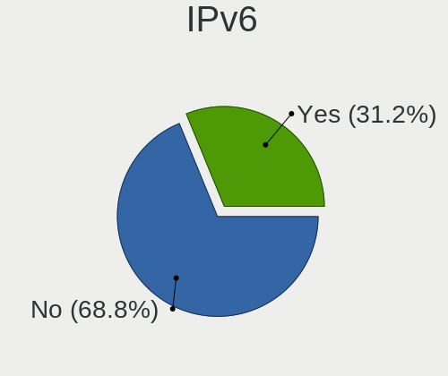

| Used | Computers | Percent |
|------|-----------|---------|
| No   | 269       | 80.06%  |
| Yes  | 67        | 19.94%  |

Bluetooth
---------

Bluetooth Vendor
----------------

Controller vendors

| Vendor                          | Computers | Percent |
|---------------------------------|-----------|---------|
| Intel                           | 81        | 41.12%  |
| Cambridge Silicon Radio         | 20        | 10.15%  |
| Lite-On Technology              | 16        | 8.12%   |
| IMC Networks                    | 16        | 8.12%   |
| Realtek Semiconductor           | 11        | 5.58%   |
| Qualcomm Atheros Communications | 11        | 5.58%   |
| Apple                           | 10        | 5.08%   |
| Broadcom                        | 8         | 4.06%   |
| Foxconn / Hon Hai               | 6         | 3.05%   |
| Dell                            | 4         | 2.03%   |
| ASUSTek Computer                | 3         | 1.52%   |
| Toshiba                         | 2         | 1.02%   |
| Realtek                         | 2         | 1.02%   |
| Hewlett-Packard                 | 2         | 1.02%   |
| Ralink                          | 1         | 0.51%   |
| MediaTek                        | 1         | 0.51%   |
| Marvell Semiconductor           | 1         | 0.51%   |
| Foxconn International           | 1         | 0.51%   |
| Askey Computer                  | 1         | 0.51%   |

Bluetooth Model
---------------

Controller models

| Model                                               | Computers | Percent |
|-----------------------------------------------------|-----------|---------|
| Intel Bluetooth wireless interface                  | 31        | 15.74%  |
| Cambridge Silicon Radio Bluetooth Dongle (HCI mode) | 20        | 10.15%  |
| Intel Bluetooth 9460/9560 Jefferson Peak (JfP)      | 14        | 7.11%   |
| Intel AX201 Bluetooth                               | 13        | 6.6%    |
| Intel AX200 Bluetooth                               | 8         | 4.06%   |
| Intel Wireless-AC 9260 Bluetooth Adapter            | 7         | 3.55%   |
| IMC Networks Bluetooth Device                       | 7         | 3.55%   |
| Lite-On Qualcomm Atheros QCA9377 Bluetooth          | 6         | 3.05%   |
| Realtek  Bluetooth 4.2 Adapter                      | 5         | 2.54%   |
| Foxconn / Hon Hai Bluetooth Device                  | 5         | 2.54%   |
| Realtek Bluetooth Radio                             | 4         | 2.03%   |
| Qualcomm Atheros  Bluetooth Device                  | 4         | 2.03%   |
| Lite-On Bluetooth Device                            | 4         | 2.03%   |
| Intel Wireless-AC 3168 Bluetooth                    | 4         | 2.03%   |
| IMC Networks Bluetooth Radio                        | 4         | 2.03%   |
| Apple Bluetooth Host Controller                     | 4         | 2.03%   |
| Intel AX210 Bluetooth                               | 3         | 1.52%   |
| IMC Networks Wireless_Device                        | 3         | 1.52%   |
| Apple Bluetooth USB Host Controller                 | 3         | 1.52%   |
| Realtek Bluetooth Radio                             | 2         | 1.02%   |
| Qualcomm Atheros AR3012 Bluetooth 4.0               | 2         | 1.02%   |
| Qualcomm Atheros AR3011 Bluetooth                   | 2         | 1.02%   |
| Lite-On Bluetooth Radio                             | 2         | 1.02%   |
| IMC Networks Bluetooth USB Host Controller          | 2         | 1.02%   |
| HP Bluetooth 2.0 Interface [Broadcom BCM2045]       | 2         | 1.02%   |
| Dell BCM20702A0 Bluetooth Module                    | 2         | 1.02%   |
| Broadcom BCM20702 Bluetooth 4.0 [ThinkPad]          | 2         | 1.02%   |
| Apple Built-in Bluetooth 2.0+EDR HCI                | 2         | 1.02%   |
| Toshiba Bluetooth USB Host Controller               | 1         | 0.51%   |
| Toshiba Askey Bluetooth Module                      | 1         | 0.51%   |
| Realtek RTL8822BE Bluetooth 4.2 Adapter             | 1         | 0.51%   |
| Realtek RTL8723B Bluetooth                          | 1         | 0.51%   |
| Ralink RT3290 Bluetooth                             | 1         | 0.51%   |
| Qualcomm Atheros QCA61x4 Bluetooth 4.0              | 1         | 0.51%   |
| Qualcomm Atheros AR9462 Bluetooth                   | 1         | 0.51%   |
| Qualcomm Atheros AR3012 Bluetooth                   | 1         | 0.51%   |
| MediaTek Wireless_Device                            | 1         | 0.51%   |
| Marvell Bluetooth and Wireless LAN Composite        | 1         | 0.51%   |
| Lite-On Wireless_Device                             | 1         | 0.51%   |
| Lite-On Broadcom BCM43142A0 Bluetooth Device        | 1         | 0.51%   |
| Lite-On Atheros Bluetooth                           | 1         | 0.51%   |
| Lite-On Atheros AR3012 Bluetooth                    | 1         | 0.51%   |
| Intel Bluetooth Device                              | 1         | 0.51%   |
| Foxconn International BCM43142A0 Bluetooth module   | 1         | 0.51%   |
| Foxconn / Hon Hai Broadcom Bluetooth 2.1 Device     | 1         | 0.51%   |
| Dell Wireless 365 Bluetooth                         | 1         | 0.51%   |
| Dell Wireless 360 Bluetooth                         | 1         | 0.51%   |
| Broadcom Bluetooth 2.1 Device                       | 1         | 0.51%   |
| Broadcom BCM43142A0 Bluetooth Device                | 1         | 0.51%   |
| Broadcom BCM43142A0 Bluetooth 4.0                   | 1         | 0.51%   |
| Broadcom BCM20702A0                                 | 1         | 0.51%   |
| Broadcom BCM2046 Bluetooth Device                   | 1         | 0.51%   |
| Broadcom BCM2045B (BDC-2.1)                         | 1         | 0.51%   |
| ASUS BT-270 Bluetooth Adapter                       | 1         | 0.51%   |
| ASUS Broadcom BCM20702A0 Bluetooth                  | 1         | 0.51%   |
| ASUS Bluetooth Device                               | 1         | 0.51%   |
| Askey Bluetooth Device                              | 1         | 0.51%   |
| Apple Bluetooth HCI                                 | 1         | 0.51%   |

Sound
-----

Sound Vendor
------------

Sound card vendors

| Vendor                      | Computers | Percent |
|-----------------------------|-----------|---------|
| Intel                       | 241       | 52.05%  |
| Nvidia                      | 94        | 20.3%   |
| AMD                         | 90        | 19.44%  |
| C-Media Electronics         | 9         | 1.94%   |
| JMTek                       | 7         | 1.51%   |
| Razer USA                   | 3         | 0.65%   |
| VIA Technologies            | 2         | 0.43%   |
| SAVITECH                    | 2         | 0.43%   |
| Samson Technologies         | 2         | 0.43%   |
| Elan Microelectronics       | 2         | 0.43%   |
| Texas Instruments           | 1         | 0.22%   |
| Samsung Electronics         | 1         | 0.22%   |
| Nordic Semiconductor ASA    | 1         | 0.22%   |
| Lenovo                      | 1         | 0.22%   |
| Kingston Technology         | 1         | 0.22%   |
| Generalplus Technology      | 1         | 0.22%   |
| ESS Technology              | 1         | 0.22%   |
| Earth Computer Technologies | 1         | 0.22%   |
| Dell                        | 1         | 0.22%   |
| Creative Labs               | 1         | 0.22%   |
| Blue Microphones            | 1         | 0.22%   |

Sound Model
-----------

Sound card models

| Model                                                                                             | Computers | Percent |
|---------------------------------------------------------------------------------------------------|-----------|---------|
| AMD Family 17h/19h HD Audio Controller                                                            | 30        | 5.4%    |
| Intel Sunrise Point-LP HD Audio                                                                   | 27        | 4.86%   |
| Intel 7 Series/C216 Chipset Family High Definition Audio Controller                               | 23        | 4.14%   |
| Intel 8 Series/C220 Series Chipset High Definition Audio Controller                               | 20        | 3.6%    |
| Intel Xeon E3-1200 v3/4th Gen Core Processor HD Audio Controller                                  | 18        | 3.24%   |
| Intel 6 Series/C200 Series Chipset Family High Definition Audio Controller                        | 17        | 3.06%   |
| Intel 100 Series/C230 Series Chipset Family HD Audio Controller                                   | 17        | 3.06%   |
| Intel Cannon Lake PCH cAVS                                                                        | 15        | 2.7%    |
| AMD Renoir Radeon High Definition Audio Controller                                                | 15        | 2.7%    |
| AMD Raven/Raven2/Fenghuang HDMI/DP Audio Controller                                               | 15        | 2.7%    |
| Intel Haswell-ULT HD Audio Controller                                                             | 13        | 2.34%   |
| Intel 8 Series HD Audio Controller                                                                | 13        | 2.34%   |
| Intel 5 Series/3400 Series Chipset High Definition Audio                                          | 13        | 2.34%   |
| Intel 200 Series PCH HD Audio                                                                     | 12        | 2.16%   |
| Nvidia High Definition Audio Controller                                                           | 11        | 1.98%   |
| Intel NM10/ICH7 Family High Definition Audio Controller                                           | 11        | 1.98%   |
| AMD SBx00 Azalia (Intel HDA)                                                                      | 9         | 1.62%   |
| Nvidia GF108 High Definition Audio Controller                                                     | 8         | 1.44%   |
| Intel Celeron/Pentium Silver Processor High Definition Audio                                      | 8         | 1.44%   |
| AMD FCH Azalia Controller                                                                         | 8         | 1.44%   |
| Nvidia GP106 High Definition Audio Controller                                                     | 7         | 1.26%   |
| Intel Tiger Lake-LP Smart Sound Technology Audio Controller                                       | 7         | 1.26%   |
| Intel Comet Lake PCH cAVS                                                                         | 7         | 1.26%   |
| AMD Family 17h (Models 00h-0fh) HD Audio Controller                                               | 7         | 1.26%   |
| AMD Ellesmere HDMI Audio [Radeon RX 470/480 / 570/580/590]                                        | 7         | 1.26%   |
| Nvidia GP104 High Definition Audio Controller                                                     | 6         | 1.08%   |
| Nvidia GK208 HDMI/DP Audio Controller                                                             | 6         | 1.08%   |
| JMTek USB PnP Audio Device                                                                        | 6         | 1.08%   |
| Intel Comet Lake PCH-LP cAVS                                                                      | 6         | 1.08%   |
| Intel Atom/Celeron/Pentium Processor x5-E8000/J3xxx/N3xxx Series High Definition Audio Controller | 6         | 1.08%   |
| AMD Starship/Matisse HD Audio Controller                                                          | 6         | 1.08%   |
| Nvidia GP108 High Definition Audio Controller                                                     | 5         | 0.9%    |
| Nvidia GP107GL High Definition Audio Controller                                                   | 5         | 0.9%    |
| Nvidia GM107 High Definition Audio Controller [GeForce 940MX]                                     | 5         | 0.9%    |
| Nvidia GF119 HDMI Audio Controller                                                                | 5         | 0.9%    |
| AMD RV710/730 HDMI Audio [Radeon HD 4000 series]                                                  | 5         | 0.9%    |
| AMD Family 15h (Models 60h-6fh) Audio Controller                                                  | 5         | 0.9%    |
| AMD Baffin HDMI/DP Audio [Radeon RX 550 640SP / RX 560/560X]                                      | 5         | 0.9%    |
| Nvidia TU116 High Definition Audio Controller                                                     | 4         | 0.72%   |
| Nvidia TU106 High Definition Audio Controller                                                     | 4         | 0.72%   |
| Nvidia MCP61 High Definition Audio                                                                | 4         | 0.72%   |
| Nvidia GK107 HDMI Audio Controller                                                                | 4         | 0.72%   |
| Intel Atom Processor Z36xxx/Z37xxx Series High Definition Audio Controller                        | 4         | 0.72%   |
| Intel 9 Series Chipset Family HD Audio Controller                                                 | 4         | 0.72%   |
| Intel 82801I (ICH9 Family) HD Audio Controller                                                    | 4         | 0.72%   |
| C-Media Electronics USB Audio Device                                                              | 4         | 0.72%   |
| AMD Kabini HDMI/DP Audio                                                                          | 4         | 0.72%   |
| Nvidia TU107 GeForce GTX 1650 High Definition Audio Controller                                    | 3         | 0.54%   |
| Nvidia MCP79 High Definition Audio                                                                | 3         | 0.54%   |
| Nvidia GT216 HDMI Audio Controller                                                                | 3         | 0.54%   |
| Nvidia GA104 High Definition Audio Controller                                                     | 3         | 0.54%   |
| Nvidia GA102 High Definition Audio Controller                                                     | 3         | 0.54%   |
| Intel Comet Lake PCH-V cAVS                                                                       | 3         | 0.54%   |
| Intel Cannon Point-LP High Definition Audio Controller                                            | 3         | 0.54%   |
| Intel C600/X79 series chipset High Definition Audio Controller                                    | 3         | 0.54%   |
| AMD Navi 10 HDMI Audio                                                                            | 3         | 0.54%   |
| AMD Juniper HDMI Audio [Radeon HD 5700 Series]                                                    | 3         | 0.54%   |
| AMD High Definition Audio Controller                                                              | 3         | 0.54%   |
| AMD Cedar HDMI Audio [Radeon HD 5400/6300/7300 Series]                                            | 3         | 0.54%   |
| VIA Technologies VX900/VT8xxx High Definition Audio Controller                                    | 2         | 0.36%   |

Memory
------

Memory Vendor
-------------

Memory module vendors

| Vendor              | Computers | Percent |
|---------------------|-----------|---------|
| Samsung Electronics | 39        | 23.21%  |
| Kingston            | 38        | 22.62%  |
| SK hynix            | 31        | 18.45%  |
| Unknown             | 16        | 9.52%   |
| Micron Technology   | 15        | 8.93%   |
| Corsair             | 5         | 2.98%   |
| Elpida              | 4         | 2.38%   |
| Crucial             | 4         | 2.38%   |
| Transcend           | 3         | 1.79%   |
| G.Skill             | 3         | 1.79%   |
| A-DATA Technology   | 3         | 1.79%   |
| Unknown (ABCD)      | 1         | 0.6%    |
| Unknown (0x02BA)    | 1         | 0.6%    |
| Unknown (08B5)      | 1         | 0.6%    |
| Ramaxel Technology  | 1         | 0.6%    |
| Nanya Technology    | 1         | 0.6%    |
| Lexar               | 1         | 0.6%    |
| ASint Technology    | 1         | 0.6%    |

Memory Model
------------

Memory module models

| Model                                                               | Computers | Percent |
|---------------------------------------------------------------------|-----------|---------|
| Kingston RAM KHX3200C16D4/8GX 8GB DIMM DDR4 3600MT/s                | 5         | 2.81%   |
| SK hynix RAM HMT351S6CFR8C-PB 4GB SODIMM DDR3 1600MT/s              | 4         | 2.25%   |
| Samsung RAM M471A5244CB0-CTD 4096MB SODIMM DDR4 3266MT/s            | 4         | 2.25%   |
| Samsung RAM M471A1G44AB0-CWE 8GB SODIMM DDR4 3200MT/s               | 4         | 2.25%   |
| Unknown RAM Module 4GB DIMM 1333MT/s                                | 3         | 1.69%   |
| SK hynix RAM HMA851S6AFR6N-UH 4GB SODIMM DDR4 2667MT/s              | 3         | 1.69%   |
| Samsung RAM M471B5173DB0-YK0 4096MB SODIMM DDR3 1600MT/s            | 3         | 1.69%   |
| Unknown RAM Module 4GB SODIMM DDR4 2400MT/s                         | 2         | 1.12%   |
| Unknown RAM Module 4GB DIMM DDR3 1333MT/s                           | 2         | 1.12%   |
| Unknown RAM Module 2GB SODIMM DDR3 1600MT/s                         | 2         | 1.12%   |
| SK hynix RAM HMT451S6AFR8A-PB 4096MB SODIMM DDR3 1600MT/s           | 2         | 1.12%   |
| SK hynix RAM HMT125U6TFR8C-H9 2GB DIMM DDR3 1333MT/s                | 2         | 1.12%   |
| SK hynix RAM HMAA1GS6CJR6N-XN 8GB SODIMM DDR4 3200MT/s              | 2         | 1.12%   |
| SK hynix RAM HMA41GS6AFR8N-TF 8GB SODIMM DDR4 2667MT/s              | 2         | 1.12%   |
| SK hynix RAM HCNNNBKMMLXR-NEE 4GB Row Of Chips LPDDR4 4267MT/s      | 2         | 1.12%   |
| Samsung RAM Module 2GB SODIMM DDR3 1067MT/s                         | 2         | 1.12%   |
| Samsung RAM M471B5273DH0-CK0 4GB SODIMM DDR3 1600MT/s               | 2         | 1.12%   |
| Samsung RAM M378B5673FH0-CH9 2048MB DIMM DDR3 1600MT/s              | 2         | 1.12%   |
| Micron RAM Module 4096MB SODIMM DDR4 2400MT/s                       | 2         | 1.12%   |
| Micron RAM 4ATF51264HZ-2G3B1 4GB SODIMM DDR4 2400MT/s               | 2         | 1.12%   |
| Kingston RAM KP223C-ELD 2GB DIMM 1600MT/s                           | 2         | 1.12%   |
| Kingston RAM KHX2666C16/8G 8GB DIMM DDR4 3466MT/s                   | 2         | 1.12%   |
| Kingston RAM KHX2400C15D4/4G 4GB DIMM DDR4 3151MT/s                 | 2         | 1.12%   |
| Crucial RAM CT16G4SFD824A.C16FBR 16GB SODIMM DDR4 2400MT/s          | 2         | 1.12%   |
| Unknown RAM Module 8GB Row Of Chips LPDDR4 4267MT/s                 | 1         | 0.56%   |
| Unknown RAM Module 4GB SODIMM DDR4 2133MT/s                         | 1         | 0.56%   |
| Unknown RAM Module 4096MB SODIMM DDR3 1334MT/s                      | 1         | 0.56%   |
| Unknown RAM Module 4096MB DIMM 1600MT/s                             | 1         | 0.56%   |
| Unknown RAM Module 2GB DIMM DDR 1333MT/s                            | 1         | 0.56%   |
| Unknown RAM Module 2048MB DIMM SDRAM                                | 1         | 0.56%   |
| Unknown RAM Module 1024MB DIMM DDR2 667MT/s                         | 1         | 0.56%   |
| Unknown (ABCD) RAM 123456789012345678 2048MB SODIMM LPDDR4 2400MT/s | 1         | 0.56%   |
| Unknown (0x02BA) RAM Module 2048MB FB-DIMM DDR2 800MT/s             | 1         | 0.56%   |
| Unknown (08B5) RAM IM308GU16N16 8192MB SODIMM DDR3 1333MT/s         | 1         | 0.56%   |
| Transcend RAM TS256MLQ64V8U 2GB DIMM DDR 533MT/s                    | 1         | 0.56%   |
| Transcend RAM JM2666HSB-8G 8GB SODIMM DDR4 2667MT/s                 | 1         | 0.56%   |
| Transcend RAM JM1600KSN-4G 4096MB SODIMM DDR3 1600MT/s              | 1         | 0.56%   |
| SK hynix RAM Module 8GB SODIMM DDR3 1600MT/s                        | 1         | 0.56%   |
| SK hynix RAM Module 4096MB Row Of Chips LPDDR4 3733MT/s             | 1         | 0.56%   |
| SK hynix RAM Module 1024MB FB-DIMM DDR2 800MT/s                     | 1         | 0.56%   |
| SK hynix RAM HMT451S6MFR8C-PB 4GB SODIMM DDR3 1600MT/s              | 1         | 0.56%   |
| SK hynix RAM HMT451S6BFR8A-PB 4GB SODIMM DDR3 1600MT/s              | 1         | 0.56%   |
| SK hynix RAM HMT41GS6BFR8A-PB 8GB SODIMM DDR3 1600MT/s              | 1         | 0.56%   |
| SK hynix RAM HMT351U6CFR8C-PBA 2GB DIMM DDR3 1600MT/s               | 1         | 0.56%   |
| SK hynix RAM HMT351S6EFR8C-PB 4GB SODIMM DDR3 1600MT/s              | 1         | 0.56%   |
| SK hynix RAM HMT351S6EFR8A-PB 4GB SODIMM DDR3 1600MT/s              | 1         | 0.56%   |
| SK hynix RAM HMT325S6CFR8C-H9 2GB SODIMM DDR3 1333MT/s              | 1         | 0.56%   |
| SK hynix RAM HMT151R7TFR4C-H9 4GB DIMM DDR3 1333MT/s                | 1         | 0.56%   |
| SK hynix RAM HMAA2GS6AJR8N-XN 16GB SODIMM DDR4 3200MT/s             | 1         | 0.56%   |
| SK hynix RAM HMAA1GS6CMR6N-VK 8GB SODIMM DDR4 2667MT/s              | 1         | 0.56%   |
| SK hynix RAM HMA84GL7MMR4N-TF 32GB RIMM DDR4 2133MT/s               | 1         | 0.56%   |
| SK hynix RAM HMA84GL7AMR4N-TF 32GB RIMM DDR4 2133MT/s               | 1         | 0.56%   |
| SK hynix RAM HMA81GS6CJR8N-VK 8GB SODIMM DDR4 2667MT/s              | 1         | 0.56%   |
| SK hynix RAM HMA81GS6AFR8N-UH 8GB SODIMM DDR4 2667MT/s              | 1         | 0.56%   |
| SK hynix RAM HMA451S6AFR8N-TF 4GB SODIMM DDR4 2133MT/s              | 1         | 0.56%   |
| Samsung RAM Module 2048MB SODIMM DDR3 1600MT/s                      | 1         | 0.56%   |
| Samsung RAM Module 2048MB SODIMM DDR3 1333MT/s                      | 1         | 0.56%   |
| Samsung RAM M471B5673FH0-CF8 2048MB SODIMM DDR3 1067MT/s            | 1         | 0.56%   |
| Samsung RAM M471B5673EH1-CF8 2048MB SODIMM DDR3 4199MT/s            | 1         | 0.56%   |
| Samsung RAM M471B5273CH0-CK0 4GB SODIMM DDR3 1600MT/s               | 1         | 0.56%   |

Memory Kind
-----------

Memory module kinds

| Kind    | Computers | Percent |
|---------|-----------|---------|
| DDR4    | 71        | 49.31%  |
| DDR3    | 48        | 33.33%  |
| LPDDR4  | 9         | 6.25%   |
| Unknown | 5         | 3.47%   |
| SDRAM   | 4         | 2.78%   |
| LPDDR3  | 3         | 2.08%   |
| DDR2    | 2         | 1.39%   |
| DDR     | 2         | 1.39%   |

Memory Form Factor
------------------

Physical design of the memory module

| Name         | Computers | Percent |
|--------------|-----------|---------|
| SODIMM       | 87        | 62.14%  |
| DIMM         | 40        | 28.57%  |
| Row Of Chips | 11        | 7.86%   |
| RIMM         | 1         | 0.71%   |
| FB-DIMM      | 1         | 0.71%   |

Memory Size
-----------

Memory module size

| Size  | Computers | Percent |
|-------|-----------|---------|
| 4096  | 55        | 37.41%  |
| 8192  | 52        | 35.37%  |
| 2048  | 20        | 13.61%  |
| 16384 | 16        | 10.88%  |
| 32768 | 2         | 1.36%   |
| 1024  | 2         | 1.36%   |

Memory Speed
------------

Memory module speed

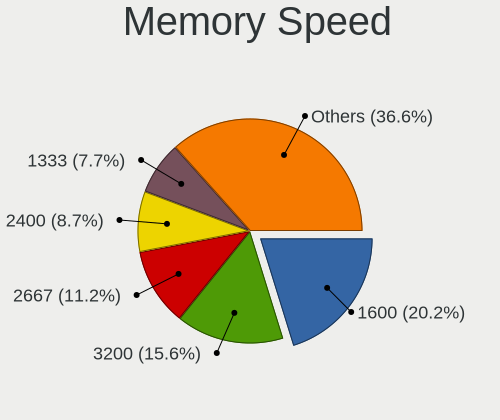

| Speed   | Computers | Percent |
|---------|-----------|---------|
| 1600    | 35        | 22.58%  |
| 3200    | 22        | 14.19%  |
| 2667    | 20        | 12.9%   |
| 1333    | 16        | 10.32%  |
| 2400    | 14        | 9.03%   |
| 2133    | 7         | 4.52%   |
| 3600    | 6         | 3.87%   |
| 4267    | 4         | 2.58%   |
| 3266    | 4         | 2.58%   |
| 1334    | 4         | 2.58%   |
| 1067    | 4         | 2.58%   |
| 3466    | 2         | 1.29%   |
| 3151    | 2         | 1.29%   |
| 1866    | 2         | 1.29%   |
| 8400    | 1         | 0.65%   |
| 4800    | 1         | 0.65%   |
| 4199    | 1         | 0.65%   |
| 3733    | 1         | 0.65%   |
| 3333    | 1         | 0.65%   |
| 3000    | 1         | 0.65%   |
| 2933    | 1         | 0.65%   |
| 2800    | 1         | 0.65%   |
| 1867    | 1         | 0.65%   |
| 800     | 1         | 0.65%   |
| 667     | 1         | 0.65%   |
| 533     | 1         | 0.65%   |
| Unknown | 1         | 0.65%   |

Printers & scanners
-------------------

Printer Vendor
--------------

Printer device vendors

| Vendor              | Computers | Percent |
|---------------------|-----------|---------|
| Seiko Epson         | 3         | 33.33%  |
| Brother Industries  | 2         | 22.22%  |
| STMicroelectronics  | 1         | 11.11%  |
| Samsung Electronics | 1         | 11.11%  |
| Pantum              | 1         | 11.11%  |
| Canon               | 1         | 11.11%  |

Printer Model
-------------

Printer device models

| Model                            | Computers | Percent |
|----------------------------------|-----------|---------|
| STMicroelectronics USB Printer P | 1         | 11.11%  |
| Seiko Epson ME-100 Series        | 1         | 11.11%  |
| Seiko Epson LQ-310               | 1         | 11.11%  |
| Seiko Epson L220 Series          | 1         | 11.11%  |
| Samsung SCX-4300 Series          | 1         | 11.11%  |
| Pantum P2500W series             | 1         | 11.11%  |
| Canon E4200 series               | 1         | 11.11%  |
| Brother DCP-T510W                | 1         | 11.11%  |
| Brother DCP-L3551CDW             | 1         | 11.11%  |

Scanner Vendor
--------------

Scanner device vendors

| Vendor | Computers | Percent |
|--------|-----------|---------|
| Canon  | 1         | 100%    |

Scanner Model
-------------

Scanner device models

| Model                              | Computers | Percent |
|------------------------------------|-----------|---------|
| Canon CanoScan N670U/N676U/LiDE 20 | 1         | 100%    |

Camera
------

Camera Vendor
-------------

Camera device vendors

| Vendor                                 | Computers | Percent |
|----------------------------------------|-----------|---------|
| Chicony Electronics                    | 43        | 23.12%  |
| Acer                                   | 25        | 13.44%  |
| IMC Networks                           | 24        | 12.9%   |
| Realtek Semiconductor                  | 16        | 8.6%    |
| Microdia                               | 15        | 8.06%   |
| Logitech                               | 11        | 5.91%   |
| Quanta                                 | 9         | 4.84%   |
| Sunplus Innovation Technology          | 6         | 3.23%   |
| Apple                                  | 6         | 3.23%   |
| Cheng Uei Precision Industry (Foxlink) | 5         | 2.69%   |
| Suyin                                  | 4         | 2.15%   |
| Lite-On Technology                     | 4         | 2.15%   |
| Aveo Technology                        | 4         | 2.15%   |
| Silicon Motion                         | 3         | 1.61%   |
| Z-Star Microelectronics                | 1         | 0.54%   |
| Vimicro                                | 1         | 0.54%   |
| Syntek                                 | 1         | 0.54%   |
| Sonix Technology                       | 1         | 0.54%   |
| Samsung Electronics                    | 1         | 0.54%   |
| Razer USA                              | 1         | 0.54%   |
| Microsoft                              | 1         | 0.54%   |
| Lenovo                                 | 1         | 0.54%   |
| icSpring                               | 1         | 0.54%   |
| Generalplus Technology                 | 1         | 0.54%   |
| Alcor Micro                            | 1         | 0.54%   |

Camera Model
------------

Camera device models

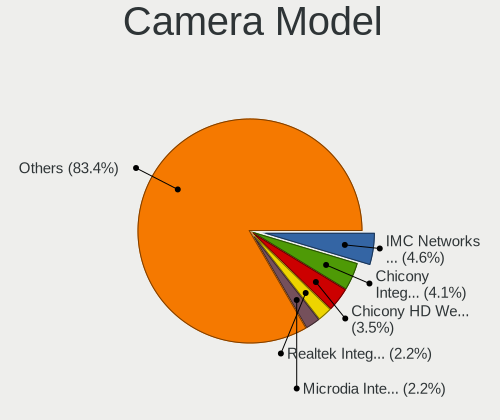

| Model                                                       | Computers | Percent |
|-------------------------------------------------------------|-----------|---------|
| Chicony HD WebCam                                           | 10        | 5.35%   |
| IMC Networks USB2.0 HD UVC WebCam                           | 9         | 4.81%   |
| Chicony Integrated Camera                                   | 7         | 3.74%   |
| Acer Integrated Camera                                      | 7         | 3.74%   |
| Microdia Integrated_Webcam_HD                               | 5         | 2.67%   |
| Realtek Integrated_Webcam_HD                                | 4         | 2.14%   |
| IMC Networks Integrated Camera                              | 4         | 2.14%   |
| Chicony Lenovo EasyCamera                                   | 4         | 2.14%   |
| Chicony HP TrueVision HD Camera                             | 4         | 2.14%   |
| Acer Lenovo EasyCamera                                      | 4         | 2.14%   |
| Silicon Motion WebCam SCB-0385N                             | 3         | 1.6%    |
| Microdia Camera                                             | 3         | 1.6%    |
| Lite-On HP Wide Vision HD Camera                            | 3         | 1.6%    |
| IMC Networks USB2.0 VGA UVC WebCam                          | 3         | 1.6%    |
| Aveo USB2.0 Camera                                          | 3         | 1.6%    |
| Apple Built-in iSight                                       | 3         | 1.6%    |
| Acer SunplusIT Integrated Camera                            | 3         | 1.6%    |
| Sunplus Integrated_Webcam_HD                                | 2         | 1.07%   |
| Realtek USB2.0 HD UVC WebCam                                | 2         | 1.07%   |
| Realtek HD WebCam                                           | 2         | 1.07%   |
| Quanta VGA WebCam                                           | 2         | 1.07%   |
| Quanta HD Webcam                                            | 2         | 1.07%   |
| Microdia Integrated Webcam                                  | 2         | 1.07%   |
| Logitech Webcam C310                                        | 2         | 1.07%   |
| Logitech Webcam C270                                        | 2         | 1.07%   |
| IMC Networks VGA UVC WebCam                                 | 2         | 1.07%   |
| IMC Networks HD Camera                                      | 2         | 1.07%   |
| Chicony USB2.0 VGA UVC WebCam                               | 2         | 1.07%   |
| Chicony HP Wide Vision HD Camera                            | 2         | 1.07%   |
| Cheng Uei Precision Industry (Foxlink) HP Truevision HD     | 2         | 1.07%   |
| Apple FaceTime Camera                                       | 2         | 1.07%   |
| Acer ThinkPad Integrated Camera                             | 2         | 1.07%   |
| Acer Lenovo Integrated Webcam                               | 2         | 1.07%   |
| Acer HD Webcam                                              | 2         | 1.07%   |
| Z-Star WebCam SCB-1900N                                     | 1         | 0.53%   |
| Vimicro Integrated Camera                                   | 1         | 0.53%   |
| Syntek Lenovo EasyCamera                                    | 1         | 0.53%   |
| Suyin UVC HD Webcam                                         | 1         | 0.53%   |
| Suyin Integrated_Webcam_HD                                  | 1         | 0.53%   |
| Suyin HP Integrated Webcam                                  | 1         | 0.53%   |
| Suyin 1.3M WebCam (notebook emachines E730, Acer sub-brand) | 1         | 0.53%   |
| Sunplus Webcam                                              | 1         | 0.53%   |
| Sunplus HD WebCam                                           | 1         | 0.53%   |
| Sunplus ASUS USB2.0 Webcam                                  | 1         | 0.53%   |
| Sunplus 1.3M HD WebCam                                      | 1         | 0.53%   |
| Sonix USB2.0 HD UVC WebCam                                  | 1         | 0.53%   |
| Samsung Galaxy series, misc. (MTP mode)                     | 1         | 0.53%   |
| Realtek USB2.0 VGA UVC WebCam                               | 1         | 0.53%   |
| Realtek USB Camera                                          | 1         | 0.53%   |
| Realtek USB Boot                                            | 1         | 0.53%   |
| Realtek MTD Camera                                          | 1         | 0.53%   |
| Realtek Integrated Webcam                                   | 1         | 0.53%   |
| Realtek HP Truevision HD                                    | 1         | 0.53%   |
| Realtek HD Webcam - Realtek                                 | 1         | 0.53%   |
| Realtek Acer 640 x 480 laptop camera                        | 1         | 0.53%   |
| Razer USA Razer Kiyo Pro                                    | 1         | 0.53%   |
| Quanta USB2.0 HD UVC WebCam                                 | 1         | 0.53%   |
| Quanta ov9734_techfront_camera                              | 1         | 0.53%   |
| Quanta HP Wide Vision HD Camera                             | 1         | 0.53%   |
| Quanta HP HD Camera                                         | 1         | 0.53%   |

Security
--------

Fingerprint Vendor
------------------

Fingerprint sensor vendors

| Vendor                     | Computers | Percent |
|----------------------------|-----------|---------|
| Synaptics                  | 11        | 34.38%  |
| Shenzhen Goodix Technology | 9         | 28.13%  |
| Validity Sensors           | 4         | 12.5%   |
| LighTuning Technology      | 3         | 9.38%   |
| Upek                       | 2         | 6.25%   |
| AuthenTec                  | 2         | 6.25%   |
| Elan Microelectronics      | 1         | 3.13%   |

Fingerprint Model
-----------------

Fingerprint sensor models

| Model                                                  | Computers | Percent |
|--------------------------------------------------------|-----------|---------|
| Shenzhen Goodix Fingerprint Reader                     | 5         | 15.63%  |
| Unknown                                                | 5         | 15.63%  |
| Shenzhen Goodix  FingerPrint Device                    | 4         | 12.5%   |
| Validity Sensors VFS7500 Touch Fingerprint Sensor      | 2         | 6.25%   |
| Upek Biometric Touchchip/Touchstrip Fingerprint Sensor | 2         | 6.25%   |
| Synaptics  WBDI                                        | 2         | 6.25%   |
| Synaptics Metallica MIS Touch Fingerprint Reader       | 2         | 6.25%   |
| LighTuning EgisTec Touch Fingerprint Sensor            | 2         | 6.25%   |
| Validity Sensors VFS101 Fingerprint Reader             | 1         | 3.13%   |
| Validity Sensors VFS 5011 fingerprint sensor           | 1         | 3.13%   |
| Synaptics Prometheus MIS Touch Fingerprint Reader      | 1         | 3.13%   |
| Synaptics Metallica MOH Touch Fingerprint Reader       | 1         | 3.13%   |
| LighTuning ES603 Swipe Fingerprint Sensor              | 1         | 3.13%   |
| Elan ELAN:Fingerprint                                  | 1         | 3.13%   |
| AuthenTec AES2810                                      | 1         | 3.13%   |
| AuthenTec AES2501 Fingerprint Sensor                   | 1         | 3.13%   |

Chipcard Vendor
---------------

Chipcard module vendors

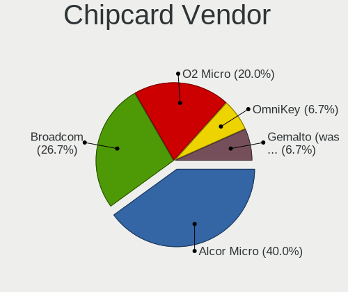

| Vendor      | Computers | Percent |
|-------------|-----------|---------|
| Alcor Micro | 3         | 42.86%  |
| O2 Micro    | 2         | 28.57%  |
| Broadcom    | 2         | 28.57%  |

Chipcard Model
--------------

Chipcard module models

| Model                                                                        | Computers | Percent |
|------------------------------------------------------------------------------|-----------|---------|
| Alcor Micro AU9540 Smartcard Reader                                          | 3         | 42.86%  |
| O2 Micro OZ776 CCID Smartcard Reader                                         | 2         | 28.57%  |
| Broadcom BCM5880 Secure Applications Processor with fingerprint swipe sensor | 1         | 14.29%  |
| Broadcom 58200                                                               | 1         | 14.29%  |

Unsupported
-----------

Unsupported Devices
-------------------

Total unsupported devices on board

| Total | Computers | Percent |
|-------|-----------|---------|
| 0     | 240       | 72.29%  |
| 1     | 75        | 22.59%  |
| 2     | 15        | 4.52%   |
| 7     | 1         | 0.3%    |
| 5     | 1         | 0.3%    |

Unsupported Device Types
------------------------

Types of unsupported devices

| Type                     | Computers | Percent |
|--------------------------|-----------|---------|
| Fingerprint reader       | 32        | 29.63%  |
| Graphics card            | 23        | 21.3%   |
| Multimedia controller    | 15        | 13.89%  |
| Net/wireless             | 13        | 12.04%  |
| Chipcard                 | 7         | 6.48%   |
| Sound                    | 5         | 4.63%   |
| Communication controller | 3         | 2.78%   |
| Bluetooth                | 3         | 2.78%   |
| Unassigned class         | 1         | 0.93%   |
| Storage/ide              | 1         | 0.93%   |
| Network                  | 1         | 0.93%   |
| Net/ethernet             | 1         | 0.93%   |
| Flash memory             | 1         | 0.93%   |
| Card reader              | 1         | 0.93%   |
| Camera                   | 1         | 0.93%   |

