Linux in Thailand - Tested Hardware & Statistics
------------------------------------------------

A project to collect tested hardware configurations for Linux in Thailand.

Anyone can contribute to this report by the [hw-probe](https://github.com/linuxhw/hw-probe) tool:

    sudo -E hw-probe -all -upload

Please contribute! Especially if your hardware is rare.

This is a report for all computer types. See also reports for [desktops](/Location/Thailand/Desktop/README.md) and [notebooks](/Location/Thailand/Notebook/README.md).

Contents
--------

* [ Test Cases ](#test-cases)

* [ System ](#system)
  - [ OS                       ](#os)
  - [ OS Family                ](#os-family)
  - [ Kernel                   ](#kernel)
  - [ Kernel Family            ](#kernel-family)
  - [ Kernel Major Ver.        ](#kernel-major-ver)
  - [ Arch                     ](#arch)
  - [ DE                       ](#de)
  - [ Display Server           ](#display-server)
  - [ Display Manager          ](#display-manager)
  - [ OS Lang                  ](#os-lang)
  - [ Boot Mode                ](#boot-mode)
  - [ Filesystem               ](#filesystem)
  - [ Part. scheme             ](#part-scheme)
  - [ Dual Boot with Linux/BSD ](#dual-boot-with-linuxbsd)
  - [ Dual Boot (Win)          ](#dual-boot-win)

* [ Board ](#board)
  - [ Vendor                   ](#vendor)
  - [ Model                    ](#model)
  - [ Model Family             ](#model-family)
  - [ MFG Year                 ](#mfg-year)
  - [ Form Factor              ](#form-factor)
  - [ Secure Boot              ](#secure-boot)
  - [ Coreboot                 ](#coreboot)
  - [ RAM Size                 ](#ram-size)
  - [ RAM Used                 ](#ram-used)
  - [ Total Drives             ](#total-drives)
  - [ Has CD-ROM               ](#has-cd-rom)
  - [ Has Ethernet             ](#has-ethernet)
  - [ Has WiFi                 ](#has-wifi)
  - [ Has Bluetooth            ](#has-bluetooth)

* [ Location ](#location)
  - [ Country                  ](#country)
  - [ City                     ](#city)

* [ Drives ](#drives)
  - [ Drive Vendor             ](#drive-vendor)
  - [ Drive Model              ](#drive-model)
  - [ HDD Vendor               ](#hdd-vendor)
  - [ SSD Vendor               ](#ssd-vendor)
  - [ Drive Kind               ](#drive-kind)
  - [ Drive Connector          ](#drive-connector)
  - [ Drive Size               ](#drive-size)
  - [ Space Total              ](#space-total)
  - [ Space Used               ](#space-used)
  - [ Malfunc. Drives          ](#malfunc-drives)
  - [ Malfunc. Drive Vendor    ](#malfunc-drive-vendor)
  - [ Malfunc. HDD Vendor      ](#malfunc-hdd-vendor)
  - [ Malfunc. Drive Kind      ](#malfunc-drive-kind)
  - [ Failed Drives            ](#failed-drives)
  - [ Failed Drive Vendor      ](#failed-drive-vendor)
  - [ Drive Status             ](#drive-status)

* [ Storage controller ](#storage-controller)
  - [ Storage Vendor           ](#storage-vendor)
  - [ Storage Model            ](#storage-model)
  - [ Storage Kind             ](#storage-kind)

* [ Processor ](#processor)
  - [ CPU Vendor               ](#cpu-vendor)
  - [ CPU Model                ](#cpu-model)
  - [ CPU Model Family         ](#cpu-model-family)
  - [ CPU Cores                ](#cpu-cores)
  - [ CPU Sockets              ](#cpu-sockets)
  - [ CPU Threads              ](#cpu-threads)
  - [ CPU Op-Modes             ](#cpu-op-modes)
  - [ CPU Microcode            ](#cpu-microcode)
  - [ CPU Microarch            ](#cpu-microarch)

* [ Graphics ](#graphics)
  - [ GPU Vendor               ](#gpu-vendor)
  - [ GPU Model                ](#gpu-model)
  - [ GPU Combo                ](#gpu-combo)
  - [ GPU Driver               ](#gpu-driver)
  - [ GPU Memory               ](#gpu-memory)

* [ Monitor ](#monitor)
  - [ Monitor Vendor           ](#monitor-vendor)
  - [ Monitor Model            ](#monitor-model)
  - [ Monitor Resolution       ](#monitor-resolution)
  - [ Monitor Diagonal         ](#monitor-diagonal)
  - [ Monitor Width            ](#monitor-width)
  - [ Aspect Ratio             ](#aspect-ratio)
  - [ Monitor Area             ](#monitor-area)
  - [ Pixel Density            ](#pixel-density)
  - [ Multiple Monitors        ](#multiple-monitors)

* [ Network ](#network)
  - [ Net Controller Vendor    ](#net-controller-vendor)
  - [ Net Controller Model     ](#net-controller-model)
  - [ Wireless Vendor          ](#wireless-vendor)
  - [ Wireless Model           ](#wireless-model)
  - [ Ethernet Vendor          ](#ethernet-vendor)
  - [ Ethernet Model           ](#ethernet-model)
  - [ Net Controller Kind      ](#net-controller-kind)
  - [ Used Controller          ](#used-controller)
  - [ NICs                     ](#nics)
  - [ IPv6                     ](#ipv6)

* [ Bluetooth ](#bluetooth)
  - [ Bluetooth Vendor         ](#bluetooth-vendor)
  - [ Bluetooth Model          ](#bluetooth-model)

* [ Sound ](#sound)
  - [ Sound Vendor             ](#sound-vendor)
  - [ Sound Model              ](#sound-model)

* [ Memory ](#memory)
  - [ Memory Vendor            ](#memory-vendor)
  - [ Memory Model             ](#memory-model)
  - [ Memory Kind              ](#memory-kind)
  - [ Memory Form Factor       ](#memory-form-factor)
  - [ Memory Size              ](#memory-size)
  - [ Memory Speed             ](#memory-speed)

* [ Printers & scanners ](#printers--scanners)
  - [ Printer Vendor           ](#printer-vendor)
  - [ Printer Model            ](#printer-model)
  - [ Scanner Vendor           ](#scanner-vendor)
  - [ Scanner Model            ](#scanner-model)

* [ Camera ](#camera)
  - [ Camera Vendor            ](#camera-vendor)
  - [ Camera Model             ](#camera-model)

* [ Security ](#security)
  - [ Fingerprint Vendor       ](#fingerprint-vendor)
  - [ Fingerprint Model        ](#fingerprint-model)
  - [ Chipcard Vendor          ](#chipcard-vendor)
  - [ Chipcard Model           ](#chipcard-model)

* [ Unsupported ](#unsupported)
  - [ Unsupported Devices      ](#unsupported-devices)
  - [ Unsupported Device Types ](#unsupported-device-types)

Test Cases
----------

Total: 825

| Vendor        | Model                       | Form-Factor | Probe                                                      | Date         |
|---------------|-----------------------------|-------------|------------------------------------------------------------|--------------|
| Lenovo        | Z50-70 20354                | Notebook    | [d6023b78a2](https://linux-hardware.org/?probe=d6023b78a2) | Feb 02, 2024 |
| MSI           | X99A SLI PLUS               | Desktop     | [216026fc45](https://linux-hardware.org/?probe=216026fc45) | Jan 30, 2024 |
| ASRock        | H470 Phantom Gaming 4       | Desktop     | [dc402c3f43](https://linux-hardware.org/?probe=dc402c3f43) | Jan 27, 2024 |
| Fujitsu       | FARQ10003                   | Notebook    | [6084280fc9](https://linux-hardware.org/?probe=6084280fc9) | Jan 27, 2024 |
| Acer          | Aspire E5-575G              | Notebook    | [326dd5b81f](https://linux-hardware.org/?probe=326dd5b81f) | Jan 23, 2024 |
| Gigabyte      | B560M AORUS PRO             | Desktop     | [93137ffd8d](https://linux-hardware.org/?probe=93137ffd8d) | Jan 21, 2024 |
| Toshiba       | Satellite L640              | Notebook    | [7478e6971b](https://linux-hardware.org/?probe=7478e6971b) | Jan 21, 2024 |
| Gigabyte      | H310M DS2 x.x               | Desktop     | [dcbb993ea5](https://linux-hardware.org/?probe=dcbb993ea5) | Jan 18, 2024 |
| HP            | OMEN by Transcend Gaming... | Notebook    | [6690260fd8](https://linux-hardware.org/?probe=6690260fd8) | Jan 18, 2024 |
| Lenovo        | ThinkPad X240 20AMS00100    | Notebook    | [4b39b1cbe0](https://linux-hardware.org/?probe=4b39b1cbe0) | Jan 17, 2024 |
| Dell          | Vostro 5471                 | Notebook    | [d3ef161a9e](https://linux-hardware.org/?probe=d3ef161a9e) | Jan 14, 2024 |
| Lenovo        | Yoga C640-13IML 81UE        | Convertible | [c617b55175](https://linux-hardware.org/?probe=c617b55175) | Jan 13, 2024 |
| Apple         | MacBookPro3,1               | Notebook    | [87d8854210](https://linux-hardware.org/?probe=87d8854210) | Jan 12, 2024 |
| Samsung       | 900X3L                      | Notebook    | [d77974be8d](https://linux-hardware.org/?probe=d77974be8d) | Jan 07, 2024 |
| HP            | OMEN by Laptop 15-ce0xx     | Notebook    | [b811bdcbfd](https://linux-hardware.org/?probe=b811bdcbfd) | Jan 07, 2024 |
| HP            | ENVY m6                     | Notebook    | [d63a06fb89](https://linux-hardware.org/?probe=d63a06fb89) | Jan 04, 2024 |
| Apple         | Mac-BE088AF8C5EB4FA2 iMa... | All in one  | [cf4135541d](https://linux-hardware.org/?probe=cf4135541d) | Jan 03, 2024 |
| Acer          | SF314-71-50E8               | Notebook    | [b74d7acff4](https://linux-hardware.org/?probe=b74d7acff4) | Jan 02, 2024 |
| ASUSTek       | ASUS TUF Gaming A17 FA70... | Notebook    | [1b62649586](https://linux-hardware.org/?probe=1b62649586) | Jan 02, 2024 |
| ASRock        | B450 Steel Legend           | Desktop     | [d01ee5a226](https://linux-hardware.org/?probe=d01ee5a226) | Jan 02, 2024 |
| Acer          | Aspire TC-885 V:1.1         | Desktop     | [19be3bdc5b](https://linux-hardware.org/?probe=19be3bdc5b) | Dec 31, 2023 |
| HP            | 82B4                        | Desktop     | [02bcf6a9d1](https://linux-hardware.org/?probe=02bcf6a9d1) | Dec 31, 2023 |
| Acer          | SF314-71-50E8               | Notebook    | [a2704f17ea](https://linux-hardware.org/?probe=a2704f17ea) | Dec 29, 2023 |
| Lenovo        | ThinkBook 14 G2 ITL 20VD    | Notebook    | [9189ed311a](https://linux-hardware.org/?probe=9189ed311a) | Dec 29, 2023 |
| Gigabyte      | H310M DS2 x.x               | Desktop     | [47c95a8cc5](https://linux-hardware.org/?probe=47c95a8cc5) | Dec 26, 2023 |
| MicroByte     | ezbook                      | Notebook    | [a03eec4fc7](https://linux-hardware.org/?probe=a03eec4fc7) | Dec 25, 2023 |
| ASUSTek       | TUF Gaming B550M-E          | Desktop     | [518e259c3c](https://linux-hardware.org/?probe=518e259c3c) | Dec 23, 2023 |
| HP            | ENVY m6                     | Notebook    | [237331a1ba](https://linux-hardware.org/?probe=237331a1ba) | Dec 20, 2023 |
| ASUSTek       | TUF Gaming B550M-E          | Desktop     | [3dee3cb4bf](https://linux-hardware.org/?probe=3dee3cb4bf) | Dec 19, 2023 |
| ASRock        | B550M Pro4                  | Desktop     | [a32cb7798b](https://linux-hardware.org/?probe=a32cb7798b) | Dec 19, 2023 |
| Dell          | 0HD5W2 A01                  | Desktop     | [cf61f7b65b](https://linux-hardware.org/?probe=cf61f7b65b) | Dec 16, 2023 |
| ASUSTek       | TUF Gaming B550M-E          | Desktop     | [7866cd7449](https://linux-hardware.org/?probe=7866cd7449) | Dec 16, 2023 |
| Dell          | Vostro 3558                 | Notebook    | [83b004a254](https://linux-hardware.org/?probe=83b004a254) | Dec 14, 2023 |
| ASUSTek       | VivoBook_ASUSLaptop X521... | Notebook    | [9227c29b16](https://linux-hardware.org/?probe=9227c29b16) | Dec 14, 2023 |
| MSI           | B450 TOMAHAWK               | Desktop     | [8e66dfbc28](https://linux-hardware.org/?probe=8e66dfbc28) | Dec 12, 2023 |
| HP            | ENVY m6                     | Notebook    | [f561fb6a85](https://linux-hardware.org/?probe=f561fb6a85) | Dec 12, 2023 |
| Intel         | X99                         | Desktop     | [6988251bb1](https://linux-hardware.org/?probe=6988251bb1) | Dec 11, 2023 |
| Apple         | MacBookAir7,1               | Notebook    | [b6d0160123](https://linux-hardware.org/?probe=b6d0160123) | Dec 11, 2023 |
| ASRock        | B450 Steel Legend           | Desktop     | [18df358540](https://linux-hardware.org/?probe=18df358540) | Dec 11, 2023 |
| ASRock        | B550M Steel Legend          | Desktop     | [eac155f5e6](https://linux-hardware.org/?probe=eac155f5e6) | Dec 08, 2023 |
| MSI           | B450 TOMAHAWK               | Desktop     | [254b936002](https://linux-hardware.org/?probe=254b936002) | Dec 08, 2023 |
| ASUSTek       | ASUS TUF Gaming A17 FA70... | Notebook    | [ac764bedcc](https://linux-hardware.org/?probe=ac764bedcc) | Dec 06, 2023 |
| ASUSTek       | ROG STRIX B550-A GAMING     | Desktop     | [fa61806ea8](https://linux-hardware.org/?probe=fa61806ea8) | Dec 05, 2023 |
| Lenovo        | ThinkPad X1 Yoga 4th 20Q... | Convertible | [b5726693c1](https://linux-hardware.org/?probe=b5726693c1) | Dec 04, 2023 |
| Acer          | Swift SF515-51T             | Notebook    | [3cd6a2e9dc](https://linux-hardware.org/?probe=3cd6a2e9dc) | Dec 03, 2023 |
| Acer          | Swift SF515-51T             | Notebook    | [a0306c58e5](https://linux-hardware.org/?probe=a0306c58e5) | Dec 03, 2023 |
| ASUSTek       | ROG Zephyrus M16 GU604VI... | Notebook    | [a03bc4e394](https://linux-hardware.org/?probe=a03bc4e394) | Dec 03, 2023 |
| HP            | Laptop 14-ck0xxx            | Notebook    | [40a0a394cc](https://linux-hardware.org/?probe=40a0a394cc) | Dec 01, 2023 |
| HP            | EliteBook 2170p             | Notebook    | [fe332ae4ef](https://linux-hardware.org/?probe=fe332ae4ef) | Nov 28, 2023 |
| Samsung       | 300E4Z/300E5Z/300E7Z        | Notebook    | [8c1777b379](https://linux-hardware.org/?probe=8c1777b379) | Nov 28, 2023 |
| Gigabyte      | B450M DS3H-CF               | Desktop     | [4552c13bb1](https://linux-hardware.org/?probe=4552c13bb1) | Nov 26, 2023 |
| Gigabyte      | B550M S2H                   | Desktop     | [284f7d2451](https://linux-hardware.org/?probe=284f7d2451) | Nov 26, 2023 |
| ASUSTek       | TUF Gaming B550M-E          | Desktop     | [420d9baddf](https://linux-hardware.org/?probe=420d9baddf) | Nov 21, 2023 |
| Lenovo        | IdeaPad Y470 20090          | Notebook    | [ae2a0fceac](https://linux-hardware.org/?probe=ae2a0fceac) | Nov 20, 2023 |
| ASUSTek       | TUF Gaming B550M-E          | Desktop     | [ab7e55f5b9](https://linux-hardware.org/?probe=ab7e55f5b9) | Nov 19, 2023 |
| Lenovo        | ThinkPad X1 Carbon 4th 2... | Notebook    | [e551d74658](https://linux-hardware.org/?probe=e551d74658) | Nov 17, 2023 |
| ASUSTek       | TUF Gaming B550M-E          | Desktop     | [9d8548f39a](https://linux-hardware.org/?probe=9d8548f39a) | Nov 15, 2023 |
| Acer          | Aspire 4350                 | Notebook    | [32da8a19ac](https://linux-hardware.org/?probe=32da8a19ac) | Nov 13, 2023 |
| HP            | Pavilion 14                 | Notebook    | [344b8f4865](https://linux-hardware.org/?probe=344b8f4865) | Nov 13, 2023 |
| HP            | Pavilion 14                 | Notebook    | [e34aa57010](https://linux-hardware.org/?probe=e34aa57010) | Nov 13, 2023 |
| ASUSTek       | TUF Gaming B550M-E          | Desktop     | [36763f453f](https://linux-hardware.org/?probe=36763f453f) | Nov 13, 2023 |
| Lenovo        | ThinkPad T480s 20L8S1R50... | Notebook    | [661492882b](https://linux-hardware.org/?probe=661492882b) | Nov 13, 2023 |
| Google        | Tricky                      | Desktop     | [bd2af6ba92](https://linux-hardware.org/?probe=bd2af6ba92) | Nov 13, 2023 |
| HP            | 802F                        | Desktop     | [e5d90a5987](https://linux-hardware.org/?probe=e5d90a5987) | Nov 09, 2023 |
| Gigabyte      | A520M S2H                   | Desktop     | [701d46485b](https://linux-hardware.org/?probe=701d46485b) | Nov 09, 2023 |
| Acer          | Aspire F5-573G              | Notebook    | [afeda2ac5e](https://linux-hardware.org/?probe=afeda2ac5e) | Nov 08, 2023 |
| Lenovo        | ThinkPad P14s Gen 4 21K5... | Notebook    | [048559335e](https://linux-hardware.org/?probe=048559335e) | Nov 06, 2023 |
| ASUSTek       | ASUS TUF Gaming A17 FA70... | Notebook    | [d17a8bc08a](https://linux-hardware.org/?probe=d17a8bc08a) | Nov 02, 2023 |
| Lenovo        | ThinkPad T480s 20L8S1R50... | Notebook    | [bbf2002cea](https://linux-hardware.org/?probe=bbf2002cea) | Nov 01, 2023 |
| ASUSTek       | Zenbook UM3402YA_UM3402Y... | Notebook    | [e25974d32d](https://linux-hardware.org/?probe=e25974d32d) | Oct 31, 2023 |
| ASRock        | B550M Steel Legend          | Desktop     | [f123c19bb4](https://linux-hardware.org/?probe=f123c19bb4) | Oct 30, 2023 |
| Gigabyte      | H61MA-D3V                   | Desktop     | [0c4d99e9dc](https://linux-hardware.org/?probe=0c4d99e9dc) | Oct 29, 2023 |
| ASUSTek       | ZenBook UX535LI_UX535LI     | Notebook    | [313770aff1](https://linux-hardware.org/?probe=313770aff1) | Oct 29, 2023 |
| Lenovo        | ThinkPad T480s 20L8S1R50... | Notebook    | [057e350f82](https://linux-hardware.org/?probe=057e350f82) | Oct 27, 2023 |
| ASUSTek       | Zephyrus G GU502DU_GA502... | Notebook    | [3aa43f0bf7](https://linux-hardware.org/?probe=3aa43f0bf7) | Oct 26, 2023 |
| HP            | 802F                        | Desktop     | [d01e0550a3](https://linux-hardware.org/?probe=d01e0550a3) | Oct 20, 2023 |
| Lenovo        | ThinkPad T580 20L90024GE    | Notebook    | [5853b175c4](https://linux-hardware.org/?probe=5853b175c4) | Oct 20, 2023 |
| ASUSTek       | ASUS TUF Gaming F15 FX50... | Notebook    | [d561271316](https://linux-hardware.org/?probe=d561271316) | Oct 19, 2023 |
| Apple         | Mac-F2218EC8                | All in one  | [dd8c738dc7](https://linux-hardware.org/?probe=dd8c738dc7) | Oct 18, 2023 |
| HP            | Compaq Presario CQ40        | Notebook    | [45639896bd](https://linux-hardware.org/?probe=45639896bd) | Oct 15, 2023 |
| ASUSTek       | PRIME A320M-K               | Desktop     | [e44d1b7e3c](https://linux-hardware.org/?probe=e44d1b7e3c) | Oct 14, 2023 |
| AMI           | Intel                       | Desktop     | [888a4e1a0f](https://linux-hardware.org/?probe=888a4e1a0f) | Oct 13, 2023 |
| Gigabyte      | AERO 15 Classic-SA          | Notebook    | [420f5d5de9](https://linux-hardware.org/?probe=420f5d5de9) | Oct 09, 2023 |
| ASRock        | H81M-DGS R2.0               | Desktop     | [4bb18fddab](https://linux-hardware.org/?probe=4bb18fddab) | Oct 09, 2023 |
| ASRock        | B550 Phantom Gaming-ITX/... | Desktop     | [423d2de75a](https://linux-hardware.org/?probe=423d2de75a) | Oct 06, 2023 |
| MSI           | GF63 Thin 10SCXR            | Notebook    | [c63ad78eb4](https://linux-hardware.org/?probe=c63ad78eb4) | Oct 06, 2023 |
| Infinix       | INBOOK X2                   | Notebook    | [5d39adb330](https://linux-hardware.org/?probe=5d39adb330) | Oct 05, 2023 |
| Acer          | Swift SF314-52              | Notebook    | [54c8de587a](https://linux-hardware.org/?probe=54c8de587a) | Oct 05, 2023 |
| Lenovo        | ThinkPad X200 745536T       | Notebook    | [62740874ab](https://linux-hardware.org/?probe=62740874ab) | Sep 30, 2023 |
| HP            | EliteBook 840 G6            | Notebook    | [e57cdefe7a](https://linux-hardware.org/?probe=e57cdefe7a) | Sep 29, 2023 |
| Lenovo        | ThinkPad X200 745536T       | Notebook    | [618cd9dd90](https://linux-hardware.org/?probe=618cd9dd90) | Sep 29, 2023 |
| ASUSTek       | ROG STRIX B550-A GAMING     | Desktop     | [cce7c03059](https://linux-hardware.org/?probe=cce7c03059) | Sep 29, 2023 |
| FriendlyEl... | NanoPC-T6                   | Soc         | [36905cc47d](https://linux-hardware.org/?probe=36905cc47d) | Sep 28, 2023 |
| Dell          | 00V62H A01                  | Desktop     | [f46006f6ce](https://linux-hardware.org/?probe=f46006f6ce) | Sep 28, 2023 |
| MiTAC         | PD10EHI                     | Desktop     | [29716ecb18](https://linux-hardware.org/?probe=29716ecb18) | Sep 27, 2023 |
| ASUSTek       | ASUS TUF Gaming A15 FA50... | Notebook    | [a7d0f8e075](https://linux-hardware.org/?probe=a7d0f8e075) | Sep 26, 2023 |
| Acer          | Aspire E5-575G              | Notebook    | [48fb2a7ee3](https://linux-hardware.org/?probe=48fb2a7ee3) | Sep 25, 2023 |
| Dell          | 0D4MD1 A04                  | Desktop     | [5e6e35397a](https://linux-hardware.org/?probe=5e6e35397a) | Sep 24, 2023 |
| Dell          | 0D4MD1 A04                  | Desktop     | [4d7943532f](https://linux-hardware.org/?probe=4d7943532f) | Sep 24, 2023 |
| Dell          | 0NW6H5 A00                  | Desktop     | [7df92bb8f5](https://linux-hardware.org/?probe=7df92bb8f5) | Sep 22, 2023 |
| Lenovo        | Legion Y540-15IRH-PG0 81... | Notebook    | [2310ddb9a7](https://linux-hardware.org/?probe=2310ddb9a7) | Sep 21, 2023 |
| Intel         | DN2820FYK H24582-204        | Desktop     | [bec0346d1d](https://linux-hardware.org/?probe=bec0346d1d) | Sep 20, 2023 |
| Gigabyte      | H110M-DS2-CF                | Desktop     | [b2519e8577](https://linux-hardware.org/?probe=b2519e8577) | Sep 20, 2023 |
| Lenovo        | Yoga C640-13IML 81UE        | Convertible | [038434c6a8](https://linux-hardware.org/?probe=038434c6a8) | Sep 16, 2023 |
| Acer          | Veriton N4640G              | Desktop     | [73af90ca23](https://linux-hardware.org/?probe=73af90ca23) | Sep 16, 2023 |
| Gigabyte      | GA-H81M-DS2-CF              | Desktop     | [3ebcf35cf2](https://linux-hardware.org/?probe=3ebcf35cf2) | Sep 15, 2023 |
| Gigabyte      | GA-H81M-DS2-CF              | Desktop     | [8e5f637ac0](https://linux-hardware.org/?probe=8e5f637ac0) | Sep 15, 2023 |
| Dell          | 048DY8 A00                  | Desktop     | [3cc67a5e62](https://linux-hardware.org/?probe=3cc67a5e62) | Sep 15, 2023 |
| Google        | Tricky                      | Desktop     | [1adc816fcb](https://linux-hardware.org/?probe=1adc816fcb) | Sep 12, 2023 |
| Biostar       | TB360-BTC Expert            | Desktop     | [4ab8e8a944](https://linux-hardware.org/?probe=4ab8e8a944) | Sep 12, 2023 |
| Dell          | 088DT1 A00                  | Desktop     | [08eff7732c](https://linux-hardware.org/?probe=08eff7732c) | Sep 11, 2023 |
| Acer          | Veriton N4640G              | Desktop     | [4ad00f4c17](https://linux-hardware.org/?probe=4ad00f4c17) | Sep 10, 2023 |
| Intel         | NUC8CYB J69922-405          | Mini pc     | [00ad48fba7](https://linux-hardware.org/?probe=00ad48fba7) | Sep 10, 2023 |
| Lenovo        | SHARKBAY NOK                | Desktop     | [a09c6ad4a9](https://linux-hardware.org/?probe=a09c6ad4a9) | Sep 08, 2023 |
| Biostar       | TB360-BTC Expert            | Desktop     | [e392e78b0d](https://linux-hardware.org/?probe=e392e78b0d) | Sep 08, 2023 |
| Dell          | 0MCD6J A01                  | Server      | [f73ae91625](https://linux-hardware.org/?probe=f73ae91625) | Sep 07, 2023 |
| AZW           | GTR V01                     | Mini pc     | [1bc029ed5e](https://linux-hardware.org/?probe=1bc029ed5e) | Sep 07, 2023 |
| Dell          | 0MCD6J A01                  | Server      | [051518ebc8](https://linux-hardware.org/?probe=051518ebc8) | Sep 07, 2023 |
| Dell          | 0MCD6J A03                  | Server      | [22cd3a08c6](https://linux-hardware.org/?probe=22cd3a08c6) | Sep 07, 2023 |
| Dell          | 0MCD6J A01                  | Server      | [51344d733f](https://linux-hardware.org/?probe=51344d733f) | Sep 07, 2023 |
| Dell          | 0MCD6J A01                  | Server      | [8d286f93a4](https://linux-hardware.org/?probe=8d286f93a4) | Sep 07, 2023 |
| Dell          | 0MCD6J A01                  | Server      | [2677109010](https://linux-hardware.org/?probe=2677109010) | Sep 07, 2023 |
| Dell          | 0MCD6J A01                  | Server      | [f12a8bcc1b](https://linux-hardware.org/?probe=f12a8bcc1b) | Sep 07, 2023 |
| ASUSTek       | ROG STRIX B550-A GAMING     | Desktop     | [9d45d79cb0](https://linux-hardware.org/?probe=9d45d79cb0) | Sep 06, 2023 |
| Biostar       | TB360-BTC Expert            | Desktop     | [7bfb24d8e3](https://linux-hardware.org/?probe=7bfb24d8e3) | Sep 06, 2023 |
| Biostar       | TB360-BTC Expert            | Desktop     | [650e71b107](https://linux-hardware.org/?probe=650e71b107) | Sep 05, 2023 |
| Lenovo        | ThinkPad T480s 20L8S1R50... | Notebook    | [ea1d0861a1](https://linux-hardware.org/?probe=ea1d0861a1) | Sep 05, 2023 |
| ASRock        | NF6-GLAN                    | Desktop     | [80d9233886](https://linux-hardware.org/?probe=80d9233886) | Sep 04, 2023 |
| Acer          | Aspire E5-471G              | Notebook    | [b1332205f3](https://linux-hardware.org/?probe=b1332205f3) | Sep 03, 2023 |
| Apple         | Mac-942B5BF58194151B        | All in one  | [85cc9860f3](https://linux-hardware.org/?probe=85cc9860f3) | Sep 02, 2023 |
| HP            | 1000                        | Notebook    | [aedfad957a](https://linux-hardware.org/?probe=aedfad957a) | Sep 02, 2023 |
| ViewSonic     | VPC14-WP                    | Desktop     | [a5476c92e7](https://linux-hardware.org/?probe=a5476c92e7) | Aug 31, 2023 |
| ECS           | A780GM-A                    | Desktop     | [12787b1e38](https://linux-hardware.org/?probe=12787b1e38) | Aug 31, 2023 |
| Gigabyte      | F2A88XM-HD3                 | Desktop     | [43cb5c7282](https://linux-hardware.org/?probe=43cb5c7282) | Aug 30, 2023 |
| HUAWEI        | BOHB-WAX9                   | Notebook    | [dda651a1c4](https://linux-hardware.org/?probe=dda651a1c4) | Aug 30, 2023 |
| HP            | 802F                        | Desktop     | [7d065f8fd1](https://linux-hardware.org/?probe=7d065f8fd1) | Aug 30, 2023 |
| ASUSTek       | ROG Zephyrus G14 GA401IH... | Notebook    | [bf8f795045](https://linux-hardware.org/?probe=bf8f795045) | Aug 29, 2023 |
| ASUSTek       | ASUS TUF Gaming A17 FA70... | Notebook    | [c2c0708639](https://linux-hardware.org/?probe=c2c0708639) | Aug 28, 2023 |
| Acer          | Veriton N4640G              | Desktop     | [914ba9937f](https://linux-hardware.org/?probe=914ba9937f) | Aug 25, 2023 |
| ASRock        | B450 Steel Legend           | Desktop     | [40660610aa](https://linux-hardware.org/?probe=40660610aa) | Aug 24, 2023 |
| MiTAC         | PD10EHI                     | Desktop     | [972fe64be0](https://linux-hardware.org/?probe=972fe64be0) | Aug 23, 2023 |
| ASUSTek       | ROG Zephyrus G14 GA401IH... | Notebook    | [df9818b791](https://linux-hardware.org/?probe=df9818b791) | Aug 23, 2023 |
| Lenovo        | V15 G2 ALC 82KD             | Notebook    | [5247fcf1af](https://linux-hardware.org/?probe=5247fcf1af) | Aug 23, 2023 |
| ASUSTek       | VivoBook_ASUSLaptop M160... | Notebook    | [1f1ce97787](https://linux-hardware.org/?probe=1f1ce97787) | Aug 19, 2023 |
| ASUSTek       | PN52                        | Mini pc     | [405bf1e224](https://linux-hardware.org/?probe=405bf1e224) | Aug 18, 2023 |
| ASUSTek       | ROG STRIX B550-A GAMING     | Desktop     | [c711cf46d7](https://linux-hardware.org/?probe=c711cf46d7) | Aug 14, 2023 |
| Dell          | 0HY9JP A01                  | Desktop     | [48d92d85c7](https://linux-hardware.org/?probe=48d92d85c7) | Aug 11, 2023 |
| Acer          | Aspire E5-575G              | Notebook    | [60cfdb5283](https://linux-hardware.org/?probe=60cfdb5283) | Aug 10, 2023 |
| ASUSTek       | ROG Zephyrus G14 GA401IH... | Notebook    | [0b3bf57b84](https://linux-hardware.org/?probe=0b3bf57b84) | Aug 07, 2023 |
| Acer          | Predator PHN16-71           | Notebook    | [1d1937f1d6](https://linux-hardware.org/?probe=1d1937f1d6) | Aug 03, 2023 |
| HP            | Laptop 15s-eq2xxx           | Notebook    | [2d046d70cc](https://linux-hardware.org/?probe=2d046d70cc) | Aug 02, 2023 |
| Lenovo        | ThinkPad T480 20L6S2CE00    | Notebook    | [eb14620792](https://linux-hardware.org/?probe=eb14620792) | Jul 30, 2023 |
| Lenovo        | V15 G2 ALC 82KD             | Notebook    | [ffb1e25ac0](https://linux-hardware.org/?probe=ffb1e25ac0) | Jul 24, 2023 |
| ASUSTek       | X45U                        | Notebook    | [53a411cd41](https://linux-hardware.org/?probe=53a411cd41) | Jul 23, 2023 |
| HP            | 304Ah                       | Desktop     | [81682ebb2d](https://linux-hardware.org/?probe=81682ebb2d) | Jul 20, 2023 |
| Fujitsu       | FMVNA9K3C                   | Notebook    | [64c67e920e](https://linux-hardware.org/?probe=64c67e920e) | Jul 20, 2023 |
| Fujitsu       | FMVNA9K3C                   | Notebook    | [0b0d110403](https://linux-hardware.org/?probe=0b0d110403) | Jul 20, 2023 |
| Lenovo        | ThinkPad T14s Gen 3 21CQ... | Notebook    | [fe1ab04658](https://linux-hardware.org/?probe=fe1ab04658) | Jul 18, 2023 |
| ASUSTek       | VivoBook_ASUSLaptop X160... | Notebook    | [be44ef471d](https://linux-hardware.org/?probe=be44ef471d) | Jul 17, 2023 |
| Lenovo        | ThinkPad T480s 20L8S1R50... | Notebook    | [3de307450d](https://linux-hardware.org/?probe=3de307450d) | Jul 17, 2023 |
| Lenovo        | ThinkPad T480s 20L8S1R50... | Notebook    | [5633b6ed54](https://linux-hardware.org/?probe=5633b6ed54) | Jul 17, 2023 |
| Lenovo        | ThinkPad T480 20L6S2CE00    | Notebook    | [e88c64ac3c](https://linux-hardware.org/?probe=e88c64ac3c) | Jul 16, 2023 |
| Gigabyte      | P75-D3P                     | Desktop     | [0a7c65caae](https://linux-hardware.org/?probe=0a7c65caae) | Jul 13, 2023 |
| Acer          | Aspire E5-471G              | Notebook    | [c958efdb37](https://linux-hardware.org/?probe=c958efdb37) | Jul 12, 2023 |
| Apple         | Mac-F221BEC8                | Desktop     | [83e08e8aca](https://linux-hardware.org/?probe=83e08e8aca) | Jul 12, 2023 |
| Lenovo        | ThinkPad T480 20L6S2CE00    | Notebook    | [bbc78272ea](https://linux-hardware.org/?probe=bbc78272ea) | Jul 10, 2023 |
| Lenovo        | SHARKBAY NOK                | Desktop     | [fbeae7b57e](https://linux-hardware.org/?probe=fbeae7b57e) | Jul 09, 2023 |
| NEC Comput... | PC-VK27MBZCG                | Notebook    | [5db0d02025](https://linux-hardware.org/?probe=5db0d02025) | Jul 04, 2023 |
| MSI           | Raider GE77HX 12UHS         | Notebook    | [87cc790852](https://linux-hardware.org/?probe=87cc790852) | Jul 03, 2023 |
| ASUSTek       | ASUS TUF Gaming A17 FA70... | Notebook    | [00cf0b0faa](https://linux-hardware.org/?probe=00cf0b0faa) | Jun 26, 2023 |
| ASUSTek       | A3402WBA                    | All in one  | [f2f0b0cc99](https://linux-hardware.org/?probe=f2f0b0cc99) | Jun 23, 2023 |
| HP            | 802F                        | Desktop     | [da2666b4b8](https://linux-hardware.org/?probe=da2666b4b8) | Jun 22, 2023 |
| Lenovo        | SHARKBAY NOK                | Desktop     | [c0f250b2f9](https://linux-hardware.org/?probe=c0f250b2f9) | Jun 22, 2023 |
| HP            | 802F                        | Desktop     | [96b020f763](https://linux-hardware.org/?probe=96b020f763) | Jun 21, 2023 |
| ASUSTek       | GL552VW                     | Notebook    | [592b7aa556](https://linux-hardware.org/?probe=592b7aa556) | Jun 21, 2023 |
| ASRock        | B450 Steel Legend           | Desktop     | [26d77cd5be](https://linux-hardware.org/?probe=26d77cd5be) | Jun 19, 2023 |
| Lenovo        | SHARKBAY NOK                | Desktop     | [73a438e6b8](https://linux-hardware.org/?probe=73a438e6b8) | Jun 18, 2023 |
| Acer          | Aspire E5-471               | Notebook    | [48154f868d](https://linux-hardware.org/?probe=48154f868d) | Jun 17, 2023 |
| Apple         | Mac-942B59F58194171B iMa... | All in one  | [e57372edd4](https://linux-hardware.org/?probe=e57372edd4) | Jun 16, 2023 |
| Dell          | XPS 13 9310                 | Notebook    | [9cba8f7730](https://linux-hardware.org/?probe=9cba8f7730) | Jun 15, 2023 |
| Acer          | Nitro AN515-52              | Notebook    | [4a0de9eca8](https://linux-hardware.org/?probe=4a0de9eca8) | Jun 14, 2023 |
| Apple         | Mac-942B59F58194171B iMa... | All in one  | [48f92f1f3f](https://linux-hardware.org/?probe=48f92f1f3f) | Jun 12, 2023 |
| ASUSTek       | PRIME B450M-K II            | Desktop     | [0fe4687002](https://linux-hardware.org/?probe=0fe4687002) | Jun 12, 2023 |
| Valve         | Jupiter                     | Notebook    | [628ee9ac88](https://linux-hardware.org/?probe=628ee9ac88) | Jun 09, 2023 |
| ASUSTek       | ASUS TUF Gaming A17 FA70... | Notebook    | [19c6b51f80](https://linux-hardware.org/?probe=19c6b51f80) | Jun 08, 2023 |
| ASRock        | B450 Steel Legend           | Desktop     | [483ac7223f](https://linux-hardware.org/?probe=483ac7223f) | Jun 08, 2023 |
| Acer          | Nitro AN515-52              | Notebook    | [1bdfa737bc](https://linux-hardware.org/?probe=1bdfa737bc) | Jun 08, 2023 |
| Lenovo        | SHARKBAY NOK                | Desktop     | [cf560e91e7](https://linux-hardware.org/?probe=cf560e91e7) | Jun 07, 2023 |
| MECHREVO      | Code01 Ver2.0               | Notebook    | [d311022361](https://linux-hardware.org/?probe=d311022361) | Jun 04, 2023 |
| HUAWEI        | BOHB-WAX9                   | Notebook    | [8fa7afa4a1](https://linux-hardware.org/?probe=8fa7afa4a1) | Jun 04, 2023 |
| Lenovo        | IdeaPad Z410 20292          | Notebook    | [3e68e53c33](https://linux-hardware.org/?probe=3e68e53c33) | Jun 03, 2023 |
| Lenovo        | SHARKBAY NOK                | Desktop     | [108cb2ce17](https://linux-hardware.org/?probe=108cb2ce17) | Jun 01, 2023 |
| Dell          | 07WP95 A01                  | Desktop     | [b9f3afed0c](https://linux-hardware.org/?probe=b9f3afed0c) | May 31, 2023 |
| ASRock        | B450M Steel Legend          | Desktop     | [87c3dbc5df](https://linux-hardware.org/?probe=87c3dbc5df) | May 30, 2023 |
| Dell          | 07WP95 A01                  | Desktop     | [a58adc500e](https://linux-hardware.org/?probe=a58adc500e) | May 30, 2023 |
| Lenovo        | SHARKBAY NOK                | Desktop     | [a199dc360d](https://linux-hardware.org/?probe=a199dc360d) | May 29, 2023 |
| Lenovo        | 313A NOK                    | Desktop     | [a1ffbc1e1e](https://linux-hardware.org/?probe=a1ffbc1e1e) | May 27, 2023 |
| Gigabyte      | P75-D3P                     | Desktop     | [c341cbff1b](https://linux-hardware.org/?probe=c341cbff1b) | May 26, 2023 |
| ASUSTek       | ASUS TUF Gaming A17 FA70... | Notebook    | [01c17ab9dc](https://linux-hardware.org/?probe=01c17ab9dc) | May 23, 2023 |
| Gigabyte      | A520M S2H                   | Desktop     | [93074475ac](https://linux-hardware.org/?probe=93074475ac) | May 22, 2023 |
| HUAWEI        | BOHB-WAX9                   | Notebook    | [08eb3979f4](https://linux-hardware.org/?probe=08eb3979f4) | May 19, 2023 |
| Acer          | Veriton M2610G              | Desktop     | [001e547ddf](https://linux-hardware.org/?probe=001e547ddf) | May 18, 2023 |
| ASUSTek       | ROG Strix G733CX_G743CX     | Notebook    | [744f091c75](https://linux-hardware.org/?probe=744f091c75) | May 18, 2023 |
| ASUSTek       | D320SF                      | Desktop     | [bbfd29fb88](https://linux-hardware.org/?probe=bbfd29fb88) | May 08, 2023 |
| ASUSTek       | D320SF                      | Desktop     | [fdb3953309](https://linux-hardware.org/?probe=fdb3953309) | May 08, 2023 |
| Lenovo        | SHARKBAY NOK                | Desktop     | [e35b234e43](https://linux-hardware.org/?probe=e35b234e43) | May 07, 2023 |
| Lenovo        | Y520-15IKBN 80WK            | Notebook    | [aaf53ecd65](https://linux-hardware.org/?probe=aaf53ecd65) | May 05, 2023 |
| Dell          | 0YXT71 A01                  | Desktop     | [bbe145a1a2](https://linux-hardware.org/?probe=bbe145a1a2) | May 05, 2023 |
| Lenovo        | SHARKBAY NOK                | Desktop     | [2ebe14f5d0](https://linux-hardware.org/?probe=2ebe14f5d0) | May 04, 2023 |
| ASRock        | B550M-HDV                   | Desktop     | [408cbd96c0](https://linux-hardware.org/?probe=408cbd96c0) | May 04, 2023 |
| Lenovo        | SHARKBAY NOK                | Desktop     | [71bf54960f](https://linux-hardware.org/?probe=71bf54960f) | May 02, 2023 |
| Valve         | Jupiter                     | Notebook    | [206f95ee6f](https://linux-hardware.org/?probe=206f95ee6f) | May 02, 2023 |
| Dell          | XPS 15 9500                 | Notebook    | [a7cc631b80](https://linux-hardware.org/?probe=a7cc631b80) | Apr 27, 2023 |
| Lenovo        | ThinkPad T530 23594ZC       | Notebook    | [7aec73dfa1](https://linux-hardware.org/?probe=7aec73dfa1) | Apr 25, 2023 |
| Lenovo        | ThinkPad X1 Carbon 5th 2... | Notebook    | [52001c8ac6](https://linux-hardware.org/?probe=52001c8ac6) | Apr 23, 2023 |
| ASUSTek       | VivoBook_ASUSLaptop M350... | Notebook    | [fc70e3e9e0](https://linux-hardware.org/?probe=fc70e3e9e0) | Apr 21, 2023 |
| Dell          | 040DDP A01                  | Desktop     | [bb212aa105](https://linux-hardware.org/?probe=bb212aa105) | Apr 19, 2023 |
| Dell          | 040DDP A01                  | Desktop     | [2b839be032](https://linux-hardware.org/?probe=2b839be032) | Apr 19, 2023 |
| Acer          | Aspire E5-575G              | Notebook    | [6f8dbb2e8e](https://linux-hardware.org/?probe=6f8dbb2e8e) | Apr 14, 2023 |
| HUAWEI        | KLVL-WXX9                   | Notebook    | [3166746b52](https://linux-hardware.org/?probe=3166746b52) | Apr 12, 2023 |
| HUAWEI        | KLVL-WXX9                   | Notebook    | [52e50e17de](https://linux-hardware.org/?probe=52e50e17de) | Apr 11, 2023 |
| Lenovo        | No DPK                      | Desktop     | [7028629b85](https://linux-hardware.org/?probe=7028629b85) | Apr 08, 2023 |
| ASRock        | B450 Steel Legend           | Desktop     | [add0dfc4ca](https://linux-hardware.org/?probe=add0dfc4ca) | Apr 05, 2023 |
| Lenovo        | IdeaPad Z410 20292          | Notebook    | [422a85d62b](https://linux-hardware.org/?probe=422a85d62b) | Apr 03, 2023 |
| HP            | Pavilion 15                 | Notebook    | [1a3e968dff](https://linux-hardware.org/?probe=1a3e968dff) | Apr 03, 2023 |
| Acer          | Aspire F5-573G              | Notebook    | [2c68190118](https://linux-hardware.org/?probe=2c68190118) | Apr 03, 2023 |
| Acer          | Veriton N4630G              | Desktop     | [fab3140b7b](https://linux-hardware.org/?probe=fab3140b7b) | Mar 29, 2023 |
| Toshiba       | QOSMIO X70-B                | Notebook    | [8d94a6c8e7](https://linux-hardware.org/?probe=8d94a6c8e7) | Mar 28, 2023 |
| ASUSTek       | PRIME B550M-K               | Desktop     | [81dc7d8f53](https://linux-hardware.org/?probe=81dc7d8f53) | Mar 27, 2023 |
| HP            | 802F                        | Desktop     | [89dadeeea6](https://linux-hardware.org/?probe=89dadeeea6) | Mar 22, 2023 |
| ASUSTek       | PRIME A320M-K               | Desktop     | [fda0ab85e6](https://linux-hardware.org/?probe=fda0ab85e6) | Mar 18, 2023 |
| ASUSTek       | Z97-K R2.0                  | Desktop     | [8c266d3142](https://linux-hardware.org/?probe=8c266d3142) | Mar 16, 2023 |
| ASUSTek       | PRIME H610M-K D4            | Desktop     | [9f33a01f8d](https://linux-hardware.org/?probe=9f33a01f8d) | Mar 15, 2023 |
| Lenovo        | Yoga Slim 7 14ARE05 82A2    | Notebook    | [061b0673b4](https://linux-hardware.org/?probe=061b0673b4) | Mar 12, 2023 |
| HUAWEI        | BOD-WXX9                    | Notebook    | [1875fd875d](https://linux-hardware.org/?probe=1875fd875d) | Mar 12, 2023 |
| ASUSTek       | PRIME A320M-K               | Desktop     | [2a40386fb8](https://linux-hardware.org/?probe=2a40386fb8) | Mar 11, 2023 |
| Lenovo        | SHARKBAY NOK                | Desktop     | [89194cffbe](https://linux-hardware.org/?probe=89194cffbe) | Mar 11, 2023 |
| Lenovo        | SHARKBAY NOK                | Desktop     | [d674283cb0](https://linux-hardware.org/?probe=d674283cb0) | Mar 11, 2023 |
| Acer          | Veriton X4620G v1.0         | Desktop     | [fc27bc474e](https://linux-hardware.org/?probe=fc27bc474e) | Mar 11, 2023 |
| Acer          | Aspire TC-390               | Desktop     | [2d092d008e](https://linux-hardware.org/?probe=2d092d008e) | Mar 06, 2023 |
| ASRock        | B450M Pro4 R2.0             | Desktop     | [31376d711e](https://linux-hardware.org/?probe=31376d711e) | Mar 06, 2023 |
| ASRock        | G41M-GS3                    | Desktop     | [388f28c258](https://linux-hardware.org/?probe=388f28c258) | Mar 04, 2023 |
| ASUSTek       | PRIME B550M-K               | Desktop     | [91fab60d63](https://linux-hardware.org/?probe=91fab60d63) | Mar 04, 2023 |
| Acer          | Aspire ES1-523              | Notebook    | [bd1f7da7bc](https://linux-hardware.org/?probe=bd1f7da7bc) | Mar 03, 2023 |
| ASUSTek       | PRIME B550M-K               | Desktop     | [8ef1c9b71d](https://linux-hardware.org/?probe=8ef1c9b71d) | Mar 02, 2023 |
| ASUSTek       | ZenBook S UX391UA           | Notebook    | [053c6d5368](https://linux-hardware.org/?probe=053c6d5368) | Mar 02, 2023 |
| ASUSTek       | PRIME B550M-K               | Desktop     | [588ac214ef](https://linux-hardware.org/?probe=588ac214ef) | Mar 01, 2023 |
| Dell          | 088DT1 A01                  | Desktop     | [715d043ec7](https://linux-hardware.org/?probe=715d043ec7) | Mar 01, 2023 |
| Lenovo        | ThinkPad T14 Gen 3 21CFC... | Notebook    | [d475dd1788](https://linux-hardware.org/?probe=d475dd1788) | Feb 25, 2023 |
| HP            | 1998                        | Desktop     | [145c009f05](https://linux-hardware.org/?probe=145c009f05) | Feb 24, 2023 |
| ASUSTek       | A4110                       | All in one  | [69f378f0b5](https://linux-hardware.org/?probe=69f378f0b5) | Feb 24, 2023 |
| Dell          | 088DT1 A01                  | Desktop     | [990ffa68f4](https://linux-hardware.org/?probe=990ffa68f4) | Feb 23, 2023 |
| Dell          | 088DT1 A01                  | Desktop     | [73dde5b3db](https://linux-hardware.org/?probe=73dde5b3db) | Feb 22, 2023 |
| Acer          | Veriton N4630G              | Desktop     | [eb6a551e75](https://linux-hardware.org/?probe=eb6a551e75) | Feb 22, 2023 |
| Acer          | Aspire F5-573G              | Notebook    | [daf7b5a6cc](https://linux-hardware.org/?probe=daf7b5a6cc) | Feb 21, 2023 |
| Fujitsu       | LIFEBOOK A357               | Notebook    | [a813f73ea2](https://linux-hardware.org/?probe=a813f73ea2) | Feb 20, 2023 |
| MSI           | Bravo 15 B5ED               | Notebook    | [a0b7f1b5f8](https://linux-hardware.org/?probe=a0b7f1b5f8) | Feb 20, 2023 |
| Supermicro    | X10DRiB                     | Desktop     | [8e6438214d](https://linux-hardware.org/?probe=8e6438214d) | Feb 20, 2023 |
| Razer         | Blade 15 (2022) - RZ09-0... | Notebook    | [06c1b9f781](https://linux-hardware.org/?probe=06c1b9f781) | Feb 20, 2023 |
| SmbiosType... | SmbiosType1_SystemProduc... | Notebook    | [8907f179e9](https://linux-hardware.org/?probe=8907f179e9) | Feb 18, 2023 |
| Acer          | Aspire E5-411G              | Notebook    | [360789275e](https://linux-hardware.org/?probe=360789275e) | Feb 13, 2023 |
| MSI           | Raider GE77HX 12UHS         | Notebook    | [abd464b0d3](https://linux-hardware.org/?probe=abd464b0d3) | Feb 13, 2023 |
| MSI           | Raider GE77HX 12UHS         | Notebook    | [d77cac7fb6](https://linux-hardware.org/?probe=d77cac7fb6) | Feb 10, 2023 |
| HP            | 83E4                        | All in one  | [cdefba9e55](https://linux-hardware.org/?probe=cdefba9e55) | Feb 09, 2023 |
| Acer          | Aspire ES1-523              | Notebook    | [647f120e0b](https://linux-hardware.org/?probe=647f120e0b) | Feb 08, 2023 |
| Lenovo        | ThinkPad P50 20EN0017US     | Notebook    | [43c5ab14ec](https://linux-hardware.org/?probe=43c5ab14ec) | Feb 03, 2023 |
| HP            | Laptop 15-db1xxx            | Notebook    | [8944f22b68](https://linux-hardware.org/?probe=8944f22b68) | Feb 02, 2023 |
| Lenovo        | ThinkPad T460 20FMS66R00    | Notebook    | [293690383a](https://linux-hardware.org/?probe=293690383a) | Feb 02, 2023 |
| Dell          | 040DDP A01                  | Desktop     | [6094b799d7](https://linux-hardware.org/?probe=6094b799d7) | Jan 31, 2023 |
| Lenovo        | Legion R9000P ARH7H 82RG    | Notebook    | [15cda8e776](https://linux-hardware.org/?probe=15cda8e776) | Jan 30, 2023 |
| Intel         | NUC6i7KYB H90766-405        | Mini pc     | [064806786c](https://linux-hardware.org/?probe=064806786c) | Jan 23, 2023 |
| Acer          | Aspire A515-55G             | Notebook    | [7a4e781669](https://linux-hardware.org/?probe=7a4e781669) | Jan 22, 2023 |
| ASUSTek       | ZenBook UX325EA_UX325EA     | Notebook    | [40560e6bcd](https://linux-hardware.org/?probe=40560e6bcd) | Jan 21, 2023 |
| Gigabyte      | F2A68HM-DS2                 | Desktop     | [0fc911e254](https://linux-hardware.org/?probe=0fc911e254) | Jan 19, 2023 |
| Gigabyte      | B550M DS3H                  | Desktop     | [d24e1142ef](https://linux-hardware.org/?probe=d24e1142ef) | Jan 16, 2023 |
| Gigabyte      | B550M DS3H                  | Desktop     | [84d86434e8](https://linux-hardware.org/?probe=84d86434e8) | Jan 16, 2023 |
| Acer          | Aspire F5-573G              | Notebook    | [22b5c66553](https://linux-hardware.org/?probe=22b5c66553) | Jan 12, 2023 |
| Dell          | 054KM3 A00                  | Desktop     | [4ea59c00f3](https://linux-hardware.org/?probe=4ea59c00f3) | Jan 11, 2023 |
| ASUSTek       | M5A78L-M LE/USB3            | Desktop     | [e6ecb9037e](https://linux-hardware.org/?probe=e6ecb9037e) | Jan 10, 2023 |
| AZW           | GTR V01                     | Mini pc     | [4ab41ad921](https://linux-hardware.org/?probe=4ab41ad921) | Jan 08, 2023 |
| Gigabyte      | B650M DS3H                  | Desktop     | [a6d6bf8d28](https://linux-hardware.org/?probe=a6d6bf8d28) | Jan 08, 2023 |
| Lenovo        | IdeaPad 300S-11IBR 80KU     | Notebook    | [6335e974a1](https://linux-hardware.org/?probe=6335e974a1) | Jan 08, 2023 |
| HUAWEI        | BOHB-WAX9                   | Notebook    | [9c9e1b06f9](https://linux-hardware.org/?probe=9c9e1b06f9) | Jan 07, 2023 |
| Acer          | Aspire V3-571G              | Notebook    | [67103caf92](https://linux-hardware.org/?probe=67103caf92) | Jan 07, 2023 |
| ALLDOCUBE     | i1025P                      | Tablet      | [631c1eea14](https://linux-hardware.org/?probe=631c1eea14) | Jan 06, 2023 |
| ASUSTek       | Zephyrus G GU502DU_GA502... | Notebook    | [7acb37a2f5](https://linux-hardware.org/?probe=7acb37a2f5) | Jan 05, 2023 |
| Dell          | G3 3579                     | Notebook    | [becea24616](https://linux-hardware.org/?probe=becea24616) | Jan 04, 2023 |
| ASUSTek       | PRIME B550M-K               | Desktop     | [0c4e0afd97](https://linux-hardware.org/?probe=0c4e0afd97) | Jan 04, 2023 |
| ASUSTek       | PRIME B550M-K               | Desktop     | [43ff03b36f](https://linux-hardware.org/?probe=43ff03b36f) | Jan 03, 2023 |
| HP            | 802F                        | Desktop     | [22444b4b2c](https://linux-hardware.org/?probe=22444b4b2c) | Dec 31, 2022 |
| Lenovo        | Z50-70 20354                | Notebook    | [29984f68c6](https://linux-hardware.org/?probe=29984f68c6) | Dec 30, 2022 |
| Gigabyte      | H61M-DS2                    | Desktop     | [50149bf9e3](https://linux-hardware.org/?probe=50149bf9e3) | Dec 29, 2022 |
| Gigabyte      | H61M-DS2                    | Desktop     | [b0a40a3ac0](https://linux-hardware.org/?probe=b0a40a3ac0) | Dec 29, 2022 |
| ASUSTek       | Zephyrus G GU502DU_GA502... | Notebook    | [aa2aad674b](https://linux-hardware.org/?probe=aa2aad674b) | Dec 29, 2022 |
| ASUSTek       | ROG STRIX X570-E GAMING     | Desktop     | [2e23d15c25](https://linux-hardware.org/?probe=2e23d15c25) | Dec 24, 2022 |
| BESSTAR Te... | HM90                        | Desktop     | [3672c73d5a](https://linux-hardware.org/?probe=3672c73d5a) | Dec 24, 2022 |
| AMI           | Cherry Trail CR             | Mini pc     | [26ed239f3c](https://linux-hardware.org/?probe=26ed239f3c) | Dec 23, 2022 |
| Gigabyte      | P75-D3P                     | Desktop     | [ff2420e759](https://linux-hardware.org/?probe=ff2420e759) | Dec 19, 2022 |
| Lenovo        | IdeaPad Z410 20292          | Notebook    | [e46710b0cf](https://linux-hardware.org/?probe=e46710b0cf) | Dec 19, 2022 |
| ASUSTek       | PRIME B550M-K               | Desktop     | [0c496cdb01](https://linux-hardware.org/?probe=0c496cdb01) | Dec 17, 2022 |
| HP            | Pavilion Laptop 15-eg0xx... | Notebook    | [016e7d7ef2](https://linux-hardware.org/?probe=016e7d7ef2) | Dec 16, 2022 |
| ASUSTek       | PRIME B550M-K               | Desktop     | [5148fddbd1](https://linux-hardware.org/?probe=5148fddbd1) | Dec 15, 2022 |
| Dell          | 0T10XW A02                  | Desktop     | [1539e12262](https://linux-hardware.org/?probe=1539e12262) | Dec 13, 2022 |
| Intel         | AB2L .A004                  | Mini pc     | [b0a81337c4](https://linux-hardware.org/?probe=b0a81337c4) | Dec 13, 2022 |
| Supermicro    | X9DRW                       | Server      | [ead67ca4f7](https://linux-hardware.org/?probe=ead67ca4f7) | Dec 13, 2022 |
| Acer          | TravelMate P214-41-G2       | Notebook    | [cb52e49fa2](https://linux-hardware.org/?probe=cb52e49fa2) | Dec 08, 2022 |
| ASUSTek       | TUF Gaming FX505DT_FX505... | Notebook    | [2ac449d25f](https://linux-hardware.org/?probe=2ac449d25f) | Dec 05, 2022 |
| HP            | Pavilion Laptop 15-eh1xx... | Notebook    | [3807efd1f4](https://linux-hardware.org/?probe=3807efd1f4) | Dec 03, 2022 |
| Lenovo        | IdeaPad Z410 20292          | Notebook    | [af31550cae](https://linux-hardware.org/?probe=af31550cae) | Nov 27, 2022 |
| MSI           | GP63 Leopard 8RE            | Notebook    | [f8bb75758e](https://linux-hardware.org/?probe=f8bb75758e) | Nov 24, 2022 |
| Gigabyte      | 970A-D3                     | Desktop     | [89287418e8](https://linux-hardware.org/?probe=89287418e8) | Nov 23, 2022 |
| ASUSTek       | H81M-C                      | Desktop     | [8b44a7deaa](https://linux-hardware.org/?probe=8b44a7deaa) | Nov 21, 2022 |
| ASUSTek       | H81M-C                      | Desktop     | [e60a1f8fc4](https://linux-hardware.org/?probe=e60a1f8fc4) | Nov 20, 2022 |
| HP            | 82F2 A01                    | Desktop     | [b6cb9447df](https://linux-hardware.org/?probe=b6cb9447df) | Nov 19, 2022 |
| ASUSTek       | ZenBook S UX391UA           | Notebook    | [32e8c529f0](https://linux-hardware.org/?probe=32e8c529f0) | Nov 14, 2022 |
| Lenovo        | Yoga 7 14ITL5 82BH          | Convertible | [16b7880c43](https://linux-hardware.org/?probe=16b7880c43) | Nov 07, 2022 |
| ASUSTek       | ZenBook S UX391UA           | Notebook    | [f4c2d5224b](https://linux-hardware.org/?probe=f4c2d5224b) | Oct 30, 2022 |
| ASUSTek       | STRIX X99 GAMING            | Desktop     | [f111078004](https://linux-hardware.org/?probe=f111078004) | Oct 29, 2022 |
| ASUSTek       | STRIX X99 GAMING            | Desktop     | [b683357ec4](https://linux-hardware.org/?probe=b683357ec4) | Oct 28, 2022 |
| Dell          | Precision 5530              | Notebook    | [bb4d35f452](https://linux-hardware.org/?probe=bb4d35f452) | Oct 28, 2022 |
| Gigabyte      | AERO 15 Classic-SA          | Notebook    | [7977a48aca](https://linux-hardware.org/?probe=7977a48aca) | Oct 26, 2022 |
| ASUSTek       | ZenBook S UX391UA           | Notebook    | [13873c81b2](https://linux-hardware.org/?probe=13873c81b2) | Oct 24, 2022 |
| ASUSTek       | ZenBook S UX391UA           | Notebook    | [4a6e283158](https://linux-hardware.org/?probe=4a6e283158) | Oct 22, 2022 |
| ASUSTek       | VivoBook_ASUSLaptop X509... | Notebook    | [7c284b1dfd](https://linux-hardware.org/?probe=7c284b1dfd) | Oct 20, 2022 |
| Acer          | Swift SFX14-41G             | Notebook    | [7c689396eb](https://linux-hardware.org/?probe=7c689396eb) | Oct 19, 2022 |
| Acer          | Swift SFX14-41G             | Notebook    | [357ad9257d](https://linux-hardware.org/?probe=357ad9257d) | Oct 19, 2022 |
| Gigabyte      | F2A88XM-HD3P                | Desktop     | [b5c41a9fef](https://linux-hardware.org/?probe=b5c41a9fef) | Oct 16, 2022 |
| Lenovo        | ThinkPad T480s 20L8S1R50... | Notebook    | [478b58f9b6](https://linux-hardware.org/?probe=478b58f9b6) | Oct 15, 2022 |
| ASRock        | B450 Steel Legend           | Desktop     | [b1de0617da](https://linux-hardware.org/?probe=b1de0617da) | Oct 15, 2022 |
| ASUSTek       | ZenBook S UX391UA           | Notebook    | [64cbdc6e2a](https://linux-hardware.org/?probe=64cbdc6e2a) | Oct 13, 2022 |
| ASRock        | B450 Gaming K4              | Desktop     | [4b0116a8c6](https://linux-hardware.org/?probe=4b0116a8c6) | Oct 12, 2022 |
| Acer          | Aspire E5-575G              | Notebook    | [ed74f1da66](https://linux-hardware.org/?probe=ed74f1da66) | Oct 10, 2022 |
| HP            | EliteBook 840 G6            | Notebook    | [29f63f8a32](https://linux-hardware.org/?probe=29f63f8a32) | Oct 10, 2022 |
| Lenovo        | IdeaPad 3 15ADA05 81W1      | Notebook    | [3665682cc6](https://linux-hardware.org/?probe=3665682cc6) | Oct 08, 2022 |
| Lenovo        | Yoga C640-13IML 81UE        | Convertible | [7d71e688f4](https://linux-hardware.org/?probe=7d71e688f4) | Oct 08, 2022 |
| HP            | Laptop                      | Notebook    | [3a26ec874f](https://linux-hardware.org/?probe=3a26ec874f) | Oct 04, 2022 |
| Timi          | TM1701                      | Notebook    | [59153cc5fe](https://linux-hardware.org/?probe=59153cc5fe) | Sep 27, 2022 |
| HP            | Laptop                      | Notebook    | [6d8fc869e4](https://linux-hardware.org/?probe=6d8fc869e4) | Sep 26, 2022 |
| HP            | Laptop                      | Notebook    | [be59fc7a97](https://linux-hardware.org/?probe=be59fc7a97) | Sep 26, 2022 |
| Gigabyte      | X570 GAMING X               | Desktop     | [07f9a5063e](https://linux-hardware.org/?probe=07f9a5063e) | Sep 23, 2022 |
| Acer          | TravelMate P653-M           | Notebook    | [c0fcc47188](https://linux-hardware.org/?probe=c0fcc47188) | Sep 03, 2022 |
| ASRock        | B550M-ITX/ac                | Desktop     | [685e484cbd](https://linux-hardware.org/?probe=685e484cbd) | Aug 31, 2022 |
| Dell          | 0773VG A00                  | Desktop     | [576dfabbf6](https://linux-hardware.org/?probe=576dfabbf6) | Aug 29, 2022 |
| OEM           | Intel H81                   | Desktop     | [8732ebea02](https://linux-hardware.org/?probe=8732ebea02) | Aug 29, 2022 |
| ASUSTek       | VivoBook_ASUSLaptop X512... | Notebook    | [65f638768e](https://linux-hardware.org/?probe=65f638768e) | Aug 27, 2022 |
| Lenovo        | ThinkPad X1 Extreme Gen ... | Notebook    | [1746f3874c](https://linux-hardware.org/?probe=1746f3874c) | Aug 27, 2022 |
| Apple         | MacBookPro11,3              | Notebook    | [0008869bb6](https://linux-hardware.org/?probe=0008869bb6) | Aug 27, 2022 |
| Apple         | MacBookPro11,3              | Notebook    | [c0e9a2e062](https://linux-hardware.org/?probe=c0e9a2e062) | Aug 27, 2022 |
| OEM           | Intel H81                   | Desktop     | [cbedace60c](https://linux-hardware.org/?probe=cbedace60c) | Aug 25, 2022 |
| Apple         | MacBookPro11,3              | Notebook    | [51a98d93a6](https://linux-hardware.org/?probe=51a98d93a6) | Aug 20, 2022 |
| Acer          | Aspire V3-771               | Notebook    | [dc65bd0f38](https://linux-hardware.org/?probe=dc65bd0f38) | Aug 17, 2022 |
| ASUSTek       | VivoBook_ASUSLaptop M350... | Notebook    | [93b2d066d6](https://linux-hardware.org/?probe=93b2d066d6) | Aug 17, 2022 |
| Gigabyte      | H81M-DS2                    | Desktop     | [e0abb12052](https://linux-hardware.org/?probe=e0abb12052) | Aug 16, 2022 |
| Unknown       | Unknown                     | Notebook    | [5cdd2332d5](https://linux-hardware.org/?probe=5cdd2332d5) | Aug 14, 2022 |
| Gigabyte      | H81M-DS2                    | Desktop     | [5ae2bc3c12](https://linux-hardware.org/?probe=5ae2bc3c12) | Aug 14, 2022 |
| HP            | 8062                        | Desktop     | [0f24b44d56](https://linux-hardware.org/?probe=0f24b44d56) | Aug 14, 2022 |
| Foxconn       | Kangaroo Mobile Desktop     | Notebook    | [1b9f19b21e](https://linux-hardware.org/?probe=1b9f19b21e) | Aug 13, 2022 |
| Acer          | Aspire E5-575G              | Notebook    | [5ebbabea13](https://linux-hardware.org/?probe=5ebbabea13) | Aug 10, 2022 |
| Dell          | 088DT1 A01                  | Desktop     | [eab28163ce](https://linux-hardware.org/?probe=eab28163ce) | Aug 09, 2022 |
| SHARKBAY      | Unknown                     | Desktop     | [a35fff735f](https://linux-hardware.org/?probe=a35fff735f) | Aug 09, 2022 |
| Acer          | TravelMate P643-M           | Notebook    | [33254cfb1e](https://linux-hardware.org/?probe=33254cfb1e) | Aug 03, 2022 |
| HP            | Stream Notebook PC 13       | Notebook    | [d736692861](https://linux-hardware.org/?probe=d736692861) | Jul 31, 2022 |
| Dell          | Latitude 3320               | Notebook    | [183ae38016](https://linux-hardware.org/?probe=183ae38016) | Jul 31, 2022 |
| Dell          | Latitude 3320               | Notebook    | [a849c0d90a](https://linux-hardware.org/?probe=a849c0d90a) | Jul 30, 2022 |
| Dell          | Latitude E5430 non-vPro     | Notebook    | [f8808faaf0](https://linux-hardware.org/?probe=f8808faaf0) | Jul 24, 2022 |
| Acer          | TravelMate P643-M           | Notebook    | [0357bf32d7](https://linux-hardware.org/?probe=0357bf32d7) | Jul 19, 2022 |
| ASUSTek       | ASUS TUF Gaming A17 FA70... | Notebook    | [eac5600627](https://linux-hardware.org/?probe=eac5600627) | Jul 12, 2022 |
| Lenovo        | SHARKBAY 31900059 WIN       | All in one  | [f27df86fda](https://linux-hardware.org/?probe=f27df86fda) | Jul 11, 2022 |
| ASUSTek       | ROG Maximus X APEX          | Desktop     | [e1fa4e4923](https://linux-hardware.org/?probe=e1fa4e4923) | Jul 06, 2022 |
| MSI           | Z97 XPOWER AC               | Desktop     | [b7324cb6ab](https://linux-hardware.org/?probe=b7324cb6ab) | Jul 05, 2022 |
| ASUSTek       | ASUS TUF Gaming A17 FA70... | Notebook    | [4829f98af6](https://linux-hardware.org/?probe=4829f98af6) | Jul 04, 2022 |
| HP            | EliteBook 840 G8 Noteboo... | Notebook    | [cfa0dde1d0](https://linux-hardware.org/?probe=cfa0dde1d0) | Jul 02, 2022 |
| Infinix       | INBOOK X2                   | Notebook    | [eedac976d8](https://linux-hardware.org/?probe=eedac976d8) | Jul 02, 2022 |
| ASUSTek       | ROG STRIX X570-F GAMING     | Desktop     | [334719e6a2](https://linux-hardware.org/?probe=334719e6a2) | Jun 30, 2022 |
| Infinix       | INBOOK X2                   | Notebook    | [1c87102f96](https://linux-hardware.org/?probe=1c87102f96) | Jun 29, 2022 |
| ASRock        | B450 Steel Legend           | Desktop     | [6f8f8a9df6](https://linux-hardware.org/?probe=6f8f8a9df6) | Jun 26, 2022 |
| ASRock        | B450 Steel Legend           | Desktop     | [547aab5039](https://linux-hardware.org/?probe=547aab5039) | Jun 26, 2022 |
| Lenovo        | ThinkPad X230 23331R5       | Notebook    | [c6589e02c4](https://linux-hardware.org/?probe=c6589e02c4) | Jun 25, 2022 |
| AFOX          | AF IH81-MA3 V1.0            | Desktop     | [4ce7ccc125](https://linux-hardware.org/?probe=4ce7ccc125) | Jun 24, 2022 |
| ASUSTek       | ASUS TUF Gaming A17 FA70... | Notebook    | [a1a0b3b43b](https://linux-hardware.org/?probe=a1a0b3b43b) | Jun 23, 2022 |
| MSI           | GE76 Raider 10UH            | Notebook    | [77ef5acb4c](https://linux-hardware.org/?probe=77ef5acb4c) | Jun 23, 2022 |
| ASUSTek       | ASUS TUF Gaming A17 FA70... | Notebook    | [51ec938467](https://linux-hardware.org/?probe=51ec938467) | Jun 22, 2022 |
| Dell          | 04YP6J A02                  | Desktop     | [11151bb62c](https://linux-hardware.org/?probe=11151bb62c) | Jun 22, 2022 |
| Dell          | 0YXT71 A03                  | Desktop     | [890e65c781](https://linux-hardware.org/?probe=890e65c781) | Jun 19, 2022 |
| Gigabyte      | H310M S2H x.x               | Desktop     | [1cc4490d99](https://linux-hardware.org/?probe=1cc4490d99) | Jun 17, 2022 |
| ASUSTek       | PRIME B450M-K               | Desktop     | [e3bb4dee4b](https://linux-hardware.org/?probe=e3bb4dee4b) | Jun 17, 2022 |
| Unknown       | Unknown                     | Notebook    | [00090936e8](https://linux-hardware.org/?probe=00090936e8) | Jun 15, 2022 |
| Dell          | Latitude 3120               | Notebook    | [c5c6eed0d9](https://linux-hardware.org/?probe=c5c6eed0d9) | Jun 14, 2022 |
| Acer          | Aspire F5-573G              | Notebook    | [fd7d146eb1](https://linux-hardware.org/?probe=fd7d146eb1) | Jun 08, 2022 |
| Apple         | MacBookPro11,1              | Notebook    | [b12802bc7a](https://linux-hardware.org/?probe=b12802bc7a) | Jun 02, 2022 |
| ASUSTek       | ASUS TUF Gaming A17 FA70... | Notebook    | [799a25df83](https://linux-hardware.org/?probe=799a25df83) | May 31, 2022 |
| ASRock        | B450 Steel Legend           | Desktop     | [136730f4ac](https://linux-hardware.org/?probe=136730f4ac) | May 31, 2022 |
| Acer          | One Z1402                   | Notebook    | [4278b806cf](https://linux-hardware.org/?probe=4278b806cf) | May 31, 2022 |
| ASRock        | B450 Steel Legend           | Desktop     | [62b7e9aacd](https://linux-hardware.org/?probe=62b7e9aacd) | May 31, 2022 |
| ASRock        | B450 Steel Legend           | Desktop     | [5d47d967ba](https://linux-hardware.org/?probe=5d47d967ba) | May 28, 2022 |
| ASUSTek       | S400CA                      | Notebook    | [dadda333d2](https://linux-hardware.org/?probe=dadda333d2) | May 28, 2022 |
| Gigabyte      | Z97X-UD3H-BK-CF             | Desktop     | [3dbf1858d0](https://linux-hardware.org/?probe=3dbf1858d0) | May 27, 2022 |
| Dell          | Latitude 3120               | Notebook    | [e97cf58459](https://linux-hardware.org/?probe=e97cf58459) | May 23, 2022 |
| Lenovo        | IdeaPad 700-15ISK 80RU      | Notebook    | [8949bc2cf8](https://linux-hardware.org/?probe=8949bc2cf8) | May 22, 2022 |
| ASRock        | B450 Steel Legend           | Desktop     | [3c436952c7](https://linux-hardware.org/?probe=3c436952c7) | May 21, 2022 |
| Acer          | One Z1402                   | Notebook    | [ae69c0fdbd](https://linux-hardware.org/?probe=ae69c0fdbd) | May 21, 2022 |
| Dell          | Inspiron 7559               | Notebook    | [90bfbc9f6b](https://linux-hardware.org/?probe=90bfbc9f6b) | May 16, 2022 |
| Gigabyte      | Z390 AORUS MASTER-CF        | Desktop     | [ec0ec5ea27](https://linux-hardware.org/?probe=ec0ec5ea27) | May 15, 2022 |
| Lenovo        | Yoga C640-13IML 81UE        | Convertible | [07e54c3c41](https://linux-hardware.org/?probe=07e54c3c41) | May 12, 2022 |
| Intel         | D54250WYK H13922-305        | Desktop     | [6d1745c79b](https://linux-hardware.org/?probe=6d1745c79b) | May 11, 2022 |
| Dell          | 00V62H A00                  | Desktop     | [e765b34181](https://linux-hardware.org/?probe=e765b34181) | May 11, 2022 |
| Lenovo        | ThinkPad X230 23257Y1       | Notebook    | [0c4e13a23d](https://linux-hardware.org/?probe=0c4e13a23d) | May 11, 2022 |
| HP            | 18E7                        | Desktop     | [52a59840d8](https://linux-hardware.org/?probe=52a59840d8) | May 09, 2022 |
| Lenovo        | ThinkPad E15 Gen 3 20YJS... | Notebook    | [fb11780c46](https://linux-hardware.org/?probe=fb11780c46) | May 07, 2022 |
| ASRock        | H370 Pro4                   | Desktop     | [ccf085e9dc](https://linux-hardware.org/?probe=ccf085e9dc) | May 02, 2022 |
| ASRock        | B450 Steel Legend           | Desktop     | [ecc527cb4b](https://linux-hardware.org/?probe=ecc527cb4b) | May 01, 2022 |
| ASRock        | B450 Steel Legend           | Desktop     | [ca217fe968](https://linux-hardware.org/?probe=ca217fe968) | May 01, 2022 |
| HP            | Pavilion x360 Convertibl... | Convertible | [fec983464c](https://linux-hardware.org/?probe=fec983464c) | Apr 29, 2022 |
| ASUSTek       | H81M-E                      | Desktop     | [b485d8f932](https://linux-hardware.org/?probe=b485d8f932) | Apr 28, 2022 |
| ASUSTek       | K40IN                       | Notebook    | [ab6a95da52](https://linux-hardware.org/?probe=ab6a95da52) | Apr 28, 2022 |
| MSI           | MEG X570 UNIFY              | Desktop     | [4f7c3fc75d](https://linux-hardware.org/?probe=4f7c3fc75d) | Apr 26, 2022 |
| HP            | Pro Tablet 608 G1           | Notebook    | [a8b97ee7cf](https://linux-hardware.org/?probe=a8b97ee7cf) | Apr 25, 2022 |
| Acer          | Aspire A515-45              | Notebook    | [377315649e](https://linux-hardware.org/?probe=377315649e) | Apr 22, 2022 |
| ASUSTek       | G550JK                      | Notebook    | [566770a325](https://linux-hardware.org/?probe=566770a325) | Apr 21, 2022 |
| ASUSTek       | G550JK                      | Notebook    | [6d291b9c9c](https://linux-hardware.org/?probe=6d291b9c9c) | Apr 21, 2022 |
| ASUSTek       | FX503VD                     | Notebook    | [218e8b7d2a](https://linux-hardware.org/?probe=218e8b7d2a) | Apr 20, 2022 |
| Lenovo        | ThinkPad X220 4286A78       | Notebook    | [d5c9254caa](https://linux-hardware.org/?probe=d5c9254caa) | Apr 20, 2022 |
| HP            | ENVY x360 Convertible 13... | Convertible | [95744e46d1](https://linux-hardware.org/?probe=95744e46d1) | Apr 18, 2022 |
| MSI           | B450 GAMING PRO CARBON A... | Desktop     | [be1e468728](https://linux-hardware.org/?probe=be1e468728) | Apr 17, 2022 |
| Acer          | Aspire E5-471G              | Notebook    | [a7179e1ba3](https://linux-hardware.org/?probe=a7179e1ba3) | Apr 16, 2022 |
| ASRock        | B460M-ITX/ac                | Desktop     | [7e6604d785](https://linux-hardware.org/?probe=7e6604d785) | Apr 12, 2022 |
| Framework     | Laptop                      | Notebook    | [bd5ea938e7](https://linux-hardware.org/?probe=bd5ea938e7) | Apr 07, 2022 |
| Dell          | Latitude 3120               | Notebook    | [c0df9a1ac0](https://linux-hardware.org/?probe=c0df9a1ac0) | Apr 06, 2022 |
| Lenovo        | ThinkBook 15 G3 ACL 21A4    | Notebook    | [30c09eec3b](https://linux-hardware.org/?probe=30c09eec3b) | Mar 28, 2022 |
| Lenovo        | IdeaPad S530-13IWL 81J7     | Notebook    | [a9a4291601](https://linux-hardware.org/?probe=a9a4291601) | Mar 26, 2022 |
| Dell          | Latitude 3120               | Notebook    | [69b7d6b1a3](https://linux-hardware.org/?probe=69b7d6b1a3) | Mar 26, 2022 |
| Dell          | Latitude 3120               | Notebook    | [78ae48c482](https://linux-hardware.org/?probe=78ae48c482) | Mar 26, 2022 |
| Gigabyte      | GA-970A-DS3                 | Desktop     | [db31622d02](https://linux-hardware.org/?probe=db31622d02) | Mar 21, 2022 |
| Gigabyte      | B450M S2H                   | Desktop     | [1602a60580](https://linux-hardware.org/?probe=1602a60580) | Mar 18, 2022 |
| ASRock        | B450 Steel Legend           | Desktop     | [db613d4f60](https://linux-hardware.org/?probe=db613d4f60) | Mar 16, 2022 |
| Apple         | Mac-F2238AC8                | All in one  | [d534c1e639](https://linux-hardware.org/?probe=d534c1e639) | Mar 16, 2022 |
| Gigabyte      | GA-78LMT-USB3 R2            | Desktop     | [7a484a0d61](https://linux-hardware.org/?probe=7a484a0d61) | Mar 11, 2022 |
| Acer          | Aspire E5-571               | Notebook    | [c2f6faf193](https://linux-hardware.org/?probe=c2f6faf193) | Mar 06, 2022 |
| HP            | Pavilion x360 Convertibl... | Convertible | [afa2ad19c8](https://linux-hardware.org/?probe=afa2ad19c8) | Mar 04, 2022 |
| HUAWEI        | HLYL-WXX9                   | Notebook    | [5c8d71134e](https://linux-hardware.org/?probe=5c8d71134e) | Feb 16, 2022 |
| ASRock        | H410M-HDV R2.0              | Desktop     | [0c91f1563f](https://linux-hardware.org/?probe=0c91f1563f) | Feb 14, 2022 |
| Acer          | AOA150                      | Notebook    | [aeb35f9f12](https://linux-hardware.org/?probe=aeb35f9f12) | Feb 13, 2022 |
| Acer          | AOA150                      | Notebook    | [7d493dd5d5](https://linux-hardware.org/?probe=7d493dd5d5) | Feb 13, 2022 |
| Unknown       | Intel X79                   | Desktop     | [f0dd6357fe](https://linux-hardware.org/?probe=f0dd6357fe) | Feb 12, 2022 |
| ASUSTek       | VivoBook_ASUSLaptop M350... | Notebook    | [5d3d7c5340](https://linux-hardware.org/?probe=5d3d7c5340) | Feb 12, 2022 |
| ASRock        | X570 Phantom Gaming 4       | Desktop     | [9544722d31](https://linux-hardware.org/?probe=9544722d31) | Feb 12, 2022 |
| ASUSTek       | VivoBook_ASUSLaptop X513... | Notebook    | [1488d5e773](https://linux-hardware.org/?probe=1488d5e773) | Feb 09, 2022 |
| ASUSTek       | ASUS TUF Gaming A17 FA70... | Notebook    | [dfc4821588](https://linux-hardware.org/?probe=dfc4821588) | Feb 08, 2022 |
| ASUSTek       | Z170-K                      | Desktop     | [ad24d41607](https://linux-hardware.org/?probe=ad24d41607) | Feb 08, 2022 |
| Unknown       | Intel X79                   | Desktop     | [089b663f84](https://linux-hardware.org/?probe=089b663f84) | Feb 06, 2022 |
| HP            | 1998                        | Desktop     | [263c4b1a93](https://linux-hardware.org/?probe=263c4b1a93) | Feb 03, 2022 |
| MSI           | MEG X570 UNIFY              | Desktop     | [5e8f4aba70](https://linux-hardware.org/?probe=5e8f4aba70) | Feb 03, 2022 |
| Dell          | Vostro 5471                 | Notebook    | [c90234250e](https://linux-hardware.org/?probe=c90234250e) | Jan 31, 2022 |
| Lenovo        | ThinkPad P50 20EQS2AB00     | Notebook    | [bdc680b5f1](https://linux-hardware.org/?probe=bdc680b5f1) | Jan 19, 2022 |
| Lenovo        | ThinkPad X13 Gen 1 20UFS... | Notebook    | [31f48cd25e](https://linux-hardware.org/?probe=31f48cd25e) | Jan 19, 2022 |
| Intel         | NUC6i5SYB H81131-503        | Mini pc     | [2c877954ab](https://linux-hardware.org/?probe=2c877954ab) | Jan 15, 2022 |
| Gigabyte      | Z390 AORUS MASTER-CF        | Desktop     | [4151d78b0a](https://linux-hardware.org/?probe=4151d78b0a) | Jan 14, 2022 |
| Gigabyte      | Z390 AORUS MASTER-CF        | Desktop     | [322291a7b1](https://linux-hardware.org/?probe=322291a7b1) | Jan 14, 2022 |
| Intel         | NUC6i5SYB H81131-503        | Mini pc     | [dfe91144b0](https://linux-hardware.org/?probe=dfe91144b0) | Jan 13, 2022 |
| Intel         | NUC6i5SYB H81131-503        | Mini pc     | [247f2934b0](https://linux-hardware.org/?probe=247f2934b0) | Jan 13, 2022 |
| ASUSTek       | M5A78L-M LX3                | Desktop     | [39f3687349](https://linux-hardware.org/?probe=39f3687349) | Jan 12, 2022 |
| Lenovo        | Yoga 720-13IKB 81C3         | Convertible | [608af1b572](https://linux-hardware.org/?probe=608af1b572) | Jan 04, 2022 |
| HP            | 82B4                        | Desktop     | [363fec4fa2](https://linux-hardware.org/?probe=363fec4fa2) | Jan 03, 2022 |
| ASUSTek       | G550JK                      | Notebook    | [b26b378274](https://linux-hardware.org/?probe=b26b378274) | Jan 01, 2022 |
| ASRock        | M3A770DE                    | Desktop     | [92b50bf0b6](https://linux-hardware.org/?probe=92b50bf0b6) | Dec 27, 2021 |
| Lenovo        | ThinkPad X131e 33722VU      | Notebook    | [c8dc197420](https://linux-hardware.org/?probe=c8dc197420) | Dec 26, 2021 |
| ASRock        | M3A770DE                    | Desktop     | [47fa1e385d](https://linux-hardware.org/?probe=47fa1e385d) | Dec 26, 2021 |
| Lenovo        | ThinkBook 15 G3 ACL 21A4    | Notebook    | [2e71480673](https://linux-hardware.org/?probe=2e71480673) | Dec 24, 2021 |
| HP            | 82B4                        | Desktop     | [02f9952fa5](https://linux-hardware.org/?probe=02f9952fa5) | Dec 24, 2021 |
| ASRock        | H510M-HVS R2.0              | Desktop     | [99e3241324](https://linux-hardware.org/?probe=99e3241324) | Dec 18, 2021 |
| MiTAC         | PD14RI                      | Desktop     | [e4dc1c326a](https://linux-hardware.org/?probe=e4dc1c326a) | Dec 16, 2021 |
| ASUSTek       | M5A78L-M LX3                | Desktop     | [720cc7a45f](https://linux-hardware.org/?probe=720cc7a45f) | Dec 15, 2021 |
| MSI           | Boston                      | Desktop     | [760fa25b63](https://linux-hardware.org/?probe=760fa25b63) | Dec 15, 2021 |
| MSI           | Boston                      | Desktop     | [bc4405aa85](https://linux-hardware.org/?probe=bc4405aa85) | Dec 15, 2021 |
| ASRock        | M3A770DE                    | Desktop     | [15671c0dbe](https://linux-hardware.org/?probe=15671c0dbe) | Dec 14, 2021 |
| MiTAC         | PD14RI                      | Desktop     | [acf3343fe7](https://linux-hardware.org/?probe=acf3343fe7) | Dec 13, 2021 |
| Gigabyte      | GA-970A-DS3                 | Desktop     | [e22dd08488](https://linux-hardware.org/?probe=e22dd08488) | Dec 02, 2021 |
| Gigabyte      | M52L-S3                     | Desktop     | [16854f2502](https://linux-hardware.org/?probe=16854f2502) | Nov 29, 2021 |
| Lenovo        | ThinkPad L530 24792T1       | Notebook    | [3e12618615](https://linux-hardware.org/?probe=3e12618615) | Nov 29, 2021 |
| Gigabyte      | M52L-S3                     | Desktop     | [e6f3417028](https://linux-hardware.org/?probe=e6f3417028) | Nov 27, 2021 |
| Toshiba       | Satellite L840              | Notebook    | [6c29b0fc8d](https://linux-hardware.org/?probe=6c29b0fc8d) | Nov 27, 2021 |
| ASUSTek       | TUF Gaming FX505DT_FX505... | Notebook    | [0d0596e9ea](https://linux-hardware.org/?probe=0d0596e9ea) | Nov 25, 2021 |
| ASRock        | B450M Pro4                  | Desktop     | [6043e86d2a](https://linux-hardware.org/?probe=6043e86d2a) | Nov 24, 2021 |
| Gigabyte      | H110M-DS2V-CF               | Desktop     | [63edfe6809](https://linux-hardware.org/?probe=63edfe6809) | Nov 24, 2021 |
| Gigabyte      | H110M-DS2V-CF               | Desktop     | [a4986016ca](https://linux-hardware.org/?probe=a4986016ca) | Nov 23, 2021 |
| Notebook      | NV4XMB,ME,MZ                | Notebook    | [edaff183a5](https://linux-hardware.org/?probe=edaff183a5) | Nov 21, 2021 |
| MSI           | 3666h                       | Desktop     | [21f11d2850](https://linux-hardware.org/?probe=21f11d2850) | Nov 19, 2021 |
| MSI           | 3666h                       | Desktop     | [aad8cfbf76](https://linux-hardware.org/?probe=aad8cfbf76) | Nov 18, 2021 |
| Dell          | Vostro 5471                 | Notebook    | [4083699145](https://linux-hardware.org/?probe=4083699145) | Nov 14, 2021 |
| HP            | Spectre x360 Convertible... | Convertible | [e3825be547](https://linux-hardware.org/?probe=e3825be547) | Nov 14, 2021 |
| MSI           | Prestige 15 A10SC           | Notebook    | [b362dd3f20](https://linux-hardware.org/?probe=b362dd3f20) | Nov 13, 2021 |
| Dell          | Inspiron N5010              | Notebook    | [d1b6520785](https://linux-hardware.org/?probe=d1b6520785) | Nov 13, 2021 |
| HP            | EliteBook 6930p (FL488AW... | Notebook    | [af8e63842a](https://linux-hardware.org/?probe=af8e63842a) | Oct 28, 2021 |
| Acer          | Aspire ES1-131              | Notebook    | [de7bee5c36](https://linux-hardware.org/?probe=de7bee5c36) | Oct 20, 2021 |
| Dell          | 0YXT71 A02                  | Desktop     | [ff477e5a71](https://linux-hardware.org/?probe=ff477e5a71) | Oct 10, 2021 |
| Dell          | 0YXT71 A02                  | Desktop     | [f467bc83ef](https://linux-hardware.org/?probe=f467bc83ef) | Oct 10, 2021 |
| ASUSTek       | F1A55-M LX PLUS             | Desktop     | [3bf6f778dc](https://linux-hardware.org/?probe=3bf6f778dc) | Oct 10, 2021 |
| HP            | Pavilion Gaming Laptop 1... | Notebook    | [1193264475](https://linux-hardware.org/?probe=1193264475) | Oct 10, 2021 |
| ASUSTek       | F1A55-M LX PLUS             | Desktop     | [f873a240d5](https://linux-hardware.org/?probe=f873a240d5) | Oct 10, 2021 |
| Apple         | Mac-F42C88C8 Proto1         | Desktop     | [26e5760e58](https://linux-hardware.org/?probe=26e5760e58) | Oct 08, 2021 |
| Lenovo        | ThinkPad X1 Carbon Gen 9... | Notebook    | [f3c6229102](https://linux-hardware.org/?probe=f3c6229102) | Oct 06, 2021 |
| Apple         | MacBookPro5,5               | Notebook    | [514642d183](https://linux-hardware.org/?probe=514642d183) | Sep 30, 2021 |
| ASUSTek       | ZenBook UX333FN_UX333FN     | Notebook    | [e4fb99f5b8](https://linux-hardware.org/?probe=e4fb99f5b8) | Sep 30, 2021 |
| ASUSTek       | F1A55-M LX PLUS             | Desktop     | [26b0b41886](https://linux-hardware.org/?probe=26b0b41886) | Sep 24, 2021 |
| ASUSTek       | ASUS TUF Gaming A17 FA70... | Notebook    | [8141d6fa89](https://linux-hardware.org/?probe=8141d6fa89) | Sep 22, 2021 |
| Cube          | SurfTab twin 11.6           | Convertible | [74fe90715f](https://linux-hardware.org/?probe=74fe90715f) | Sep 22, 2021 |
| Acer          | Aspire TC-885 V:1.1         | Desktop     | [71820e1f85](https://linux-hardware.org/?probe=71820e1f85) | Sep 18, 2021 |
| Dell          | 02P9X9 A03                  | Server      | [56b5e62268](https://linux-hardware.org/?probe=56b5e62268) | Sep 17, 2021 |
| Dell          | 02P9X9 A03                  | Server      | [cb07eeaf33](https://linux-hardware.org/?probe=cb07eeaf33) | Sep 17, 2021 |
| Gigabyte      | F2A68HM-DS2                 | Desktop     | [8ab840927b](https://linux-hardware.org/?probe=8ab840927b) | Sep 17, 2021 |
| HP            | 1497                        | Desktop     | [311efc294a](https://linux-hardware.org/?probe=311efc294a) | Sep 16, 2021 |
| ASUSTek       | ZenBook UX482EA_UX482EA     | Notebook    | [29d5b02719](https://linux-hardware.org/?probe=29d5b02719) | Sep 13, 2021 |
| ASRock        | 880GM-LE FX                 | Desktop     | [022e5df6bd](https://linux-hardware.org/?probe=022e5df6bd) | Sep 12, 2021 |
| ASRock        | 880GM-LE FX                 | Desktop     | [f7706441f2](https://linux-hardware.org/?probe=f7706441f2) | Sep 12, 2021 |
| Dell          | Latitude D630               | Notebook    | [3af0cdbc54](https://linux-hardware.org/?probe=3af0cdbc54) | Sep 09, 2021 |
| Acer          | Aspire TC-885 V:1.1         | Desktop     | [04e6db02f9](https://linux-hardware.org/?probe=04e6db02f9) | Sep 02, 2021 |
| Acer          | Aspire V3-575G              | Notebook    | [28e06e0c2b](https://linux-hardware.org/?probe=28e06e0c2b) | Aug 28, 2021 |
| Lenovo        | ThinkBook 14-IML 20RV       | Notebook    | [8e060f6c6c](https://linux-hardware.org/?probe=8e060f6c6c) | Aug 23, 2021 |
| ASUSTek       | M2N68-AM Plus               | Desktop     | [57b648bd45](https://linux-hardware.org/?probe=57b648bd45) | Aug 23, 2021 |
| VIA Techno... | EITX-3002                   | Desktop     | [db8b46aea5](https://linux-hardware.org/?probe=db8b46aea5) | Aug 21, 2021 |
| Acer          | Aspire E5-471G              | Notebook    | [7f7c5133ad](https://linux-hardware.org/?probe=7f7c5133ad) | Aug 18, 2021 |
| ASUSTek       | H81M-A                      | Desktop     | [ae7b04d5d3](https://linux-hardware.org/?probe=ae7b04d5d3) | Aug 12, 2021 |
| Fujitsu       | LIFEBOOK A357               | Notebook    | [68af6cccad](https://linux-hardware.org/?probe=68af6cccad) | Aug 05, 2021 |
| Dell          | 0D24M8 A00                  | Desktop     | [c56bb51edc](https://linux-hardware.org/?probe=c56bb51edc) | Aug 03, 2021 |
| Apple         | Mac-35C5E08120C7EEAF Mac... | Mini pc     | [1a50426a2c](https://linux-hardware.org/?probe=1a50426a2c) | Aug 02, 2021 |
| Apple         | Mac-35C5E08120C7EEAF Mac... | Mini pc     | [94623b82cf](https://linux-hardware.org/?probe=94623b82cf) | Aug 02, 2021 |
| ASRock        | B450M Steel Legend          | Desktop     | [73a47bf698](https://linux-hardware.org/?probe=73a47bf698) | Aug 02, 2021 |
| HP            | 0AECh D                     | Desktop     | [be8dfa216f](https://linux-hardware.org/?probe=be8dfa216f) | Jul 31, 2021 |
| Acer          | Aspire E5-475G              | Notebook    | [65ad8ece4a](https://linux-hardware.org/?probe=65ad8ece4a) | Jul 30, 2021 |
| ASUSTek       | ASUS TUF Gaming A17 FA70... | Notebook    | [10b4953c7e](https://linux-hardware.org/?probe=10b4953c7e) | Jul 26, 2021 |
| MSI           | Z270 GAMING PRO CARBON      | Desktop     | [71aae9e020](https://linux-hardware.org/?probe=71aae9e020) | Jul 26, 2021 |
| Dell          | 0NK5PH A00                  | Desktop     | [3db5dd7ea0](https://linux-hardware.org/?probe=3db5dd7ea0) | Jul 26, 2021 |
| Lenovo        | ThinkPad T480s 20L8S7HF0... | Notebook    | [5417d20b5b](https://linux-hardware.org/?probe=5417d20b5b) | Jul 25, 2021 |
| ASUSTek       | VivoBook_ASUS Laptop E21... | Notebook    | [94307be3d8](https://linux-hardware.org/?probe=94307be3d8) | Jul 25, 2021 |
| ASUSTek       | VivoBook_ASUS Laptop E21... | Notebook    | [9e0045da76](https://linux-hardware.org/?probe=9e0045da76) | Jul 25, 2021 |
| ASRock        | B450M Steel Legend          | Desktop     | [b1d25f1e88](https://linux-hardware.org/?probe=b1d25f1e88) | Jul 22, 2021 |
| MSI           | Z270 GAMING PRO CARBON      | Desktop     | [568a71080e](https://linux-hardware.org/?probe=568a71080e) | Jul 21, 2021 |
| ASUSTek       | ASUS TUF Gaming A17 FA70... | Notebook    | [9d13b7e8df](https://linux-hardware.org/?probe=9d13b7e8df) | Jul 21, 2021 |
| MSI           | Z270 GAMING PRO CARBON      | Desktop     | [6bf04f98f6](https://linux-hardware.org/?probe=6bf04f98f6) | Jul 21, 2021 |
| MSI           | MEG X570 UNIFY              | Desktop     | [c503220e78](https://linux-hardware.org/?probe=c503220e78) | Jul 19, 2021 |
| Acer          | Aspire E5-471G              | Notebook    | [bde4a22e40](https://linux-hardware.org/?probe=bde4a22e40) | Jul 19, 2021 |
| Acer          | Nitro AN515-55              | Notebook    | [5c7365be9d](https://linux-hardware.org/?probe=5c7365be9d) | Jul 16, 2021 |
| Acer          | One 10 SW110-1CT            | Tablet      | [51296db584](https://linux-hardware.org/?probe=51296db584) | Jul 14, 2021 |
| Acer          | One 10 SW110-1CT            | Tablet      | [9a40d5c9da](https://linux-hardware.org/?probe=9a40d5c9da) | Jul 14, 2021 |
| ASRock        | H81M-HDS R2.0               | Desktop     | [e46886ce2d](https://linux-hardware.org/?probe=e46886ce2d) | Jul 12, 2021 |
| ASRock        | B450M Steel Legend          | Desktop     | [c298371b89](https://linux-hardware.org/?probe=c298371b89) | Jul 12, 2021 |
| ASRock        | H81M-HDS R2.0               | Desktop     | [f51a4f44b2](https://linux-hardware.org/?probe=f51a4f44b2) | Jul 12, 2021 |
| Dell          | Vostro 3578                 | Notebook    | [f5bfb0ada6](https://linux-hardware.org/?probe=f5bfb0ada6) | Jul 09, 2021 |
| Dell          | Vostro 3578                 | Notebook    | [e69ebc683f](https://linux-hardware.org/?probe=e69ebc683f) | Jul 09, 2021 |
| ASRock        | H110M-DVS R3.0              | Desktop     | [2c6fd223a1](https://linux-hardware.org/?probe=2c6fd223a1) | Jul 07, 2021 |
| ASRock        | H110M-DVS R3.0              | Desktop     | [1270256228](https://linux-hardware.org/?probe=1270256228) | Jul 07, 2021 |
| Acer          | Aspire ES1-111M             | Notebook    | [40450f88e3](https://linux-hardware.org/?probe=40450f88e3) | Jul 07, 2021 |
| Acer          | Aspire ES1-111M             | Notebook    | [7eb7b4a001](https://linux-hardware.org/?probe=7eb7b4a001) | Jul 07, 2021 |
| Gigabyte      | H370M D3H-CF                | Desktop     | [e8c3804e26](https://linux-hardware.org/?probe=e8c3804e26) | Jun 25, 2021 |
| MSI           | GF65 Thin 10UE              | Notebook    | [d1e0b6ee58](https://linux-hardware.org/?probe=d1e0b6ee58) | Jun 22, 2021 |
| Fujitsu       | LIFEBOOK BH531              | Notebook    | [688d9f583e](https://linux-hardware.org/?probe=688d9f583e) | Jun 16, 2021 |
| MSI           | B450M MORTAR MAX            | Desktop     | [db886610f5](https://linux-hardware.org/?probe=db886610f5) | Jun 11, 2021 |
| HP            | Stream Notebook             | Notebook    | [806c24449c](https://linux-hardware.org/?probe=806c24449c) | Jun 09, 2021 |
| MSI           | A320M-A PRO MAX             | Desktop     | [45b8d7ca02](https://linux-hardware.org/?probe=45b8d7ca02) | Jun 08, 2021 |
| ASUSTek       | X450LN                      | Notebook    | [9157df68c1](https://linux-hardware.org/?probe=9157df68c1) | May 27, 2021 |
| Lenovo        | B50-80 80LT                 | Notebook    | [ef615e10ea](https://linux-hardware.org/?probe=ef615e10ea) | May 27, 2021 |
| Intel         | H61M S1                     | Desktop     | [f60c55c8c4](https://linux-hardware.org/?probe=f60c55c8c4) | May 27, 2021 |
| ASUSTek       | X450LN                      | Notebook    | [aa8e32e484](https://linux-hardware.org/?probe=aa8e32e484) | May 25, 2021 |
| Toshiba       | Satellite L645              | Notebook    | [a3c061e392](https://linux-hardware.org/?probe=a3c061e392) | May 17, 2021 |
| MSI           | GF63 Thin 9SCSR             | Notebook    | [0d99884dcd](https://linux-hardware.org/?probe=0d99884dcd) | May 17, 2021 |
| Dell          | Inspiron 7501               | Notebook    | [e8e3c50f4b](https://linux-hardware.org/?probe=e8e3c50f4b) | May 16, 2021 |
| Dell          | Latitude 3410               | Notebook    | [b29d7ddfe8](https://linux-hardware.org/?probe=b29d7ddfe8) | May 09, 2021 |
| Dell          | Latitude E6430              | Notebook    | [1a7d88c72a](https://linux-hardware.org/?probe=1a7d88c72a) | May 04, 2021 |
| Dell          | Latitude E6430              | Notebook    | [7b00c56952](https://linux-hardware.org/?probe=7b00c56952) | May 02, 2021 |
| Lenovo        | ThinkPad X201 Tablet 309... | Notebook    | [66c2a37fb9](https://linux-hardware.org/?probe=66c2a37fb9) | May 01, 2021 |
| Lenovo        | ThinkPad X201 Tablet 309... | Notebook    | [30c34c8c01](https://linux-hardware.org/?probe=30c34c8c01) | May 01, 2021 |
| Acer          | Aspire ES1-111M             | Notebook    | [aa9bfbf347](https://linux-hardware.org/?probe=aa9bfbf347) | Apr 29, 2021 |
| Acer          | Aspire ES1-111M             | Notebook    | [298d859193](https://linux-hardware.org/?probe=298d859193) | Apr 27, 2021 |
| Dell          | Latitude 3410               | Notebook    | [b6748a9a7e](https://linux-hardware.org/?probe=b6748a9a7e) | Apr 25, 2021 |
| Acer          | Veriton X2665G              | Desktop     | [f23ed8abd1](https://linux-hardware.org/?probe=f23ed8abd1) | Apr 20, 2021 |
| Fujitsu       | LIFEBOOK BH531              | Notebook    | [2fa4c2d1ef](https://linux-hardware.org/?probe=2fa4c2d1ef) | Apr 18, 2021 |
| Huanan        | X79 249PC V2.2              | Desktop     | [787866050a](https://linux-hardware.org/?probe=787866050a) | Apr 03, 2021 |
| ASRock        | G31M-S                      | Desktop     | [ee71002286](https://linux-hardware.org/?probe=ee71002286) | Mar 26, 2021 |
| Huanan        | X79 V6.11                   | Desktop     | [85cbe2c1ed](https://linux-hardware.org/?probe=85cbe2c1ed) | Mar 16, 2021 |
| ASRock        | M3A770DE                    | Desktop     | [bca1dbaafd](https://linux-hardware.org/?probe=bca1dbaafd) | Mar 10, 2021 |
| Dell          | G7 7590                     | Notebook    | [be5780df0a](https://linux-hardware.org/?probe=be5780df0a) | Mar 09, 2021 |
| ASRock        | B450M Steel Legend          | Desktop     | [465d5f43f1](https://linux-hardware.org/?probe=465d5f43f1) | Mar 08, 2021 |
| ASUSTek       | P5KPL-AM/PS                 | Desktop     | [32e4837219](https://linux-hardware.org/?probe=32e4837219) | Mar 05, 2021 |
| Unknown       | Unknown                     | Tablet      | [315c09fd74](https://linux-hardware.org/?probe=315c09fd74) | Mar 04, 2021 |
| Gigabyte      | Z490 UD                     | Desktop     | [ec3e24bbcc](https://linux-hardware.org/?probe=ec3e24bbcc) | Mar 02, 2021 |
| Samsung       | R780/R778                   | Notebook    | [0c57a7241e](https://linux-hardware.org/?probe=0c57a7241e) | Feb 26, 2021 |
| Gigabyte      | F2A75M-HD2                  | Desktop     | [d8037b520e](https://linux-hardware.org/?probe=d8037b520e) | Feb 26, 2021 |
| Gigabyte      | H110M-DS2-CF                | Desktop     | [f1e66dfcc2](https://linux-hardware.org/?probe=f1e66dfcc2) | Feb 22, 2021 |
| ASUSTek       | P7P55D EVO                  | Desktop     | [90a83f66fc](https://linux-hardware.org/?probe=90a83f66fc) | Feb 21, 2021 |
| ASUSTek       | E200HA                      | Notebook    | [1faf0b360f](https://linux-hardware.org/?probe=1faf0b360f) | Feb 19, 2021 |
| ASUSTek       | K45VM                       | Notebook    | [26690f314d](https://linux-hardware.org/?probe=26690f314d) | Feb 15, 2021 |
| ASUSTek       | X555LD                      | Notebook    | [1b2994e7f3](https://linux-hardware.org/?probe=1b2994e7f3) | Feb 15, 2021 |
| HUAWEI        | BOHK-WAX9X                  | Notebook    | [40bcb4aaf2](https://linux-hardware.org/?probe=40bcb4aaf2) | Feb 15, 2021 |
| Apple         | MacBookAir3,2               | Notebook    | [0392f08b03](https://linux-hardware.org/?probe=0392f08b03) | Feb 15, 2021 |
| HP            | 1998                        | Desktop     | [c415742b9e](https://linux-hardware.org/?probe=c415742b9e) | Feb 13, 2021 |
| Acer          | Aspire E5-471G              | Notebook    | [401fa9d58e](https://linux-hardware.org/?probe=401fa9d58e) | Feb 13, 2021 |
| Dell          | 0F8096                      | Desktop     | [d6748871e7](https://linux-hardware.org/?probe=d6748871e7) | Feb 13, 2021 |
| Gigabyte      | H67MA-USB3-B3               | Desktop     | [bd0fcefe9f](https://linux-hardware.org/?probe=bd0fcefe9f) | Feb 13, 2021 |
| HP            | 1000                        | Notebook    | [16b305a6f5](https://linux-hardware.org/?probe=16b305a6f5) | Feb 13, 2021 |
| HUAWEI        | KLVL-WXX9                   | Notebook    | [20b10721e2](https://linux-hardware.org/?probe=20b10721e2) | Feb 09, 2021 |
| ASUSTek       | P5KPL-AM/PS                 | Desktop     | [da10acb66c](https://linux-hardware.org/?probe=da10acb66c) | Feb 07, 2021 |
| Acer          | Aspire E5-475G              | Notebook    | [360e7155d7](https://linux-hardware.org/?probe=360e7155d7) | Feb 06, 2021 |
| Dell          | 0F8096                      | Desktop     | [d6ce430a08](https://linux-hardware.org/?probe=d6ce430a08) | Feb 04, 2021 |
| Gigabyte      | G41M-ES2H                   | Desktop     | [53c32c80a6](https://linux-hardware.org/?probe=53c32c80a6) | Feb 03, 2021 |
| Sony          | SVF14N25CXB                 | Notebook    | [1db1e6aec9](https://linux-hardware.org/?probe=1db1e6aec9) | Jan 28, 2021 |
| Acer          | Aspire M1935                | Desktop     | [64d53ff0ad](https://linux-hardware.org/?probe=64d53ff0ad) | Jan 28, 2021 |
| Fujitsu       | JIM76YK3                    | Desktop     | [4c5225559f](https://linux-hardware.org/?probe=4c5225559f) | Jan 23, 2021 |
| Gigabyte      | GA-78LMT-USB3               | Desktop     | [6ba43f198a](https://linux-hardware.org/?probe=6ba43f198a) | Jan 22, 2021 |
| ASUSTek       | TUF Gaming FA506IV_FA506... | Notebook    | [731a44edca](https://linux-hardware.org/?probe=731a44edca) | Jan 16, 2021 |
| Apple         | Mac-F2268CC8                | All in one  | [1a065f105a](https://linux-hardware.org/?probe=1a065f105a) | Jan 16, 2021 |
| Lenovo        | IdeaPad Y450                | Notebook    | [1285c5deb9](https://linux-hardware.org/?probe=1285c5deb9) | Jan 11, 2021 |
| Apple         | Mac-F2268CC8                | All in one  | [788c6c2caf](https://linux-hardware.org/?probe=788c6c2caf) | Jan 07, 2021 |
| Apple         | Mac-F2268CC8                | All in one  | [fcdcacd2bc](https://linux-hardware.org/?probe=fcdcacd2bc) | Jan 07, 2021 |
| Lenovo        | G460 20041                  | Notebook    | [f224060be4](https://linux-hardware.org/?probe=f224060be4) | Jan 07, 2021 |
| Fujitsu       | JIM76YK3                    | Desktop     | [b33ad621e1](https://linux-hardware.org/?probe=b33ad621e1) | Jan 07, 2021 |
| Gigabyte      | G31M-ES2L                   | Desktop     | [26d33eb0de](https://linux-hardware.org/?probe=26d33eb0de) | Jan 06, 2021 |
| ASUSTek       | TUF Gaming FA506II_FA506... | Notebook    | [e28d350fac](https://linux-hardware.org/?probe=e28d350fac) | Dec 24, 2020 |
| ASUSTek       | X450CC                      | Notebook    | [750f666a09](https://linux-hardware.org/?probe=750f666a09) | Dec 23, 2020 |
| ASUSTek       | PRIME A320M-K               | Desktop     | [9bcae82db8](https://linux-hardware.org/?probe=9bcae82db8) | Dec 16, 2020 |
| ASUSTek       | PRIME A320M-K               | Desktop     | [039b541097](https://linux-hardware.org/?probe=039b541097) | Dec 16, 2020 |
| Lenovo        | ThinkPad E15 20RES51Y00     | Notebook    | [66b1afc07c](https://linux-hardware.org/?probe=66b1afc07c) | Dec 15, 2020 |
| ASRock        | Z390 Pro4                   | Desktop     | [3befcf341c](https://linux-hardware.org/?probe=3befcf341c) | Dec 14, 2020 |
| ASUSTek       | Z87-PRO                     | Desktop     | [a5170be239](https://linux-hardware.org/?probe=a5170be239) | Dec 11, 2020 |
| ASUSTek       | P8H61-M LE                  | Desktop     | [86f61c5fce](https://linux-hardware.org/?probe=86f61c5fce) | Dec 11, 2020 |
| Dell          | Inspiron 5468               | Notebook    | [abc26c7422](https://linux-hardware.org/?probe=abc26c7422) | Dec 09, 2020 |
| MSI           | PE70 6QE                    | Notebook    | [cb5f05e67d](https://linux-hardware.org/?probe=cb5f05e67d) | Dec 02, 2020 |
| Acer          | Aspire TC-885 V:1.1         | Desktop     | [813b0a40eb](https://linux-hardware.org/?probe=813b0a40eb) | Dec 01, 2020 |
| Acer          | Aspire E5-475G              | Notebook    | [53a62697ed](https://linux-hardware.org/?probe=53a62697ed) | Dec 01, 2020 |
| Acer          | Aspire E5-475G              | Notebook    | [719a24bc0f](https://linux-hardware.org/?probe=719a24bc0f) | Nov 30, 2020 |
| MSI           | PE70 6QE                    | Notebook    | [90b21f8369](https://linux-hardware.org/?probe=90b21f8369) | Nov 23, 2020 |
| Acer          | Aspire VN7-793G             | Notebook    | [79f11201bc](https://linux-hardware.org/?probe=79f11201bc) | Nov 22, 2020 |
| Lenovo        | Yoga C930-13IKB 81C4        | Convertible | [43c71a128c](https://linux-hardware.org/?probe=43c71a128c) | Nov 20, 2020 |
| Dell          | G5 5590                     | Notebook    | [007ad64378](https://linux-hardware.org/?probe=007ad64378) | Nov 20, 2020 |
| MSI           | GE75 Raider 10SGS           | Notebook    | [025deb9bbe](https://linux-hardware.org/?probe=025deb9bbe) | Nov 19, 2020 |
| Dell          | G5 5590                     | Notebook    | [e82ed4c1d0](https://linux-hardware.org/?probe=e82ed4c1d0) | Nov 19, 2020 |
| HP            | Laptop 14-bs0xx             | Notebook    | [f90473f671](https://linux-hardware.org/?probe=f90473f671) | Nov 16, 2020 |
| HP            | Laptop 14-bs0xx             | Notebook    | [bf8d99074a](https://linux-hardware.org/?probe=bf8d99074a) | Nov 15, 2020 |
| Unknown       | Unknown                     | Desktop     | [65fba277e7](https://linux-hardware.org/?probe=65fba277e7) | Nov 11, 2020 |
| Unknown       | Unknown                     | Desktop     | [2a8118e258](https://linux-hardware.org/?probe=2a8118e258) | Nov 11, 2020 |
| Lenovo        | IdeaPad 100S-14IBR 80R9     | Notebook    | [4c0fec3ac5](https://linux-hardware.org/?probe=4c0fec3ac5) | Nov 09, 2020 |
| Hampoo        | Unknown                     | Notebook    | [b713cd21d1](https://linux-hardware.org/?probe=b713cd21d1) | Oct 24, 2020 |
| Hampoo        | Unknown                     | Notebook    | [03640b9aac](https://linux-hardware.org/?probe=03640b9aac) | Oct 24, 2020 |
| MSI           | PE70 6QE                    | Notebook    | [8c3ccf4956](https://linux-hardware.org/?probe=8c3ccf4956) | Oct 19, 2020 |
| ASRock        | Z270 Killer SLI             | Desktop     | [42e012b0e1](https://linux-hardware.org/?probe=42e012b0e1) | Oct 19, 2020 |
| Dell          | Precision 7740              | Notebook    | [814a0ec705](https://linux-hardware.org/?probe=814a0ec705) | Oct 15, 2020 |
| MSI           | PE70 6QE                    | Notebook    | [1691661a18](https://linux-hardware.org/?probe=1691661a18) | Oct 12, 2020 |
| ASUSTek       | VivoBook_ASUSLaptop X412... | Notebook    | [e0d54e69ff](https://linux-hardware.org/?probe=e0d54e69ff) | Oct 11, 2020 |
| Apple         | Mac-031AEE4D24BFF0B1 Mac... | Mini pc     | [2b12ebd1f3](https://linux-hardware.org/?probe=2b12ebd1f3) | Oct 09, 2020 |
| Gigabyte      | F2A85XM-HD3                 | Desktop     | [4a8bc27a98](https://linux-hardware.org/?probe=4a8bc27a98) | Oct 06, 2020 |
| ASUSTek       | M5A78L-M/USB3               | Desktop     | [924b361628](https://linux-hardware.org/?probe=924b361628) | Oct 04, 2020 |
| Gigabyte      | Z97X-UD3H-CF                | Desktop     | [cce759037c](https://linux-hardware.org/?probe=cce759037c) | Oct 01, 2020 |
| ASUSTek       | P8H61-M LE                  | Desktop     | [93a29298d7](https://linux-hardware.org/?probe=93a29298d7) | Sep 29, 2020 |
| ASUSTek       | M5A78L-M/USB3               | Desktop     | [c9ece9190b](https://linux-hardware.org/?probe=c9ece9190b) | Sep 27, 2020 |
| HP            | Pavilion dv7                | Notebook    | [058179daf5](https://linux-hardware.org/?probe=058179daf5) | Sep 24, 2020 |
| ASRock        | B460M Steel Legend          | Desktop     | [5398b2247d](https://linux-hardware.org/?probe=5398b2247d) | Sep 12, 2020 |
| ASRock        | B460M Steel Legend          | Desktop     | [44abe999aa](https://linux-hardware.org/?probe=44abe999aa) | Sep 12, 2020 |
| ASUSTek       | H110M-E/M.2                 | Desktop     | [25c77e6927](https://linux-hardware.org/?probe=25c77e6927) | Sep 11, 2020 |
| HP            | Pavilion dv6                | Notebook    | [acce68d947](https://linux-hardware.org/?probe=acce68d947) | Sep 09, 2020 |
| Gigabyte      | B450 AORUS ELITE            | Desktop     | [2b4fe70eaf](https://linux-hardware.org/?probe=2b4fe70eaf) | Sep 04, 2020 |
| Dell          | Inspiron 5447               | Notebook    | [9fc26445da](https://linux-hardware.org/?probe=9fc26445da) | Sep 03, 2020 |
| Dell          | Inspiron 5447               | Notebook    | [fd56e29478](https://linux-hardware.org/?probe=fd56e29478) | Sep 03, 2020 |
| Lenovo        | IdeaPad 300-14ISK 80Q6      | Notebook    | [e55f750fc2](https://linux-hardware.org/?probe=e55f750fc2) | Sep 02, 2020 |
| Lenovo        | IdeaPad 300-14ISK 80Q6      | Notebook    | [cc7e35217e](https://linux-hardware.org/?probe=cc7e35217e) | Sep 02, 2020 |
| ASRock        | B450M Steel Legend          | Desktop     | [2aa3eef6bd](https://linux-hardware.org/?probe=2aa3eef6bd) | Sep 02, 2020 |
| Acer          | Aspire VN7-792G             | Notebook    | [706847f6cd](https://linux-hardware.org/?probe=706847f6cd) | Aug 30, 2020 |
| Dell          | 0X8DXD A01                  | Desktop     | [0c6362ecb0](https://linux-hardware.org/?probe=0c6362ecb0) | Aug 24, 2020 |
| Lenovo        | No DPK                      | All in one  | [08057029e5](https://linux-hardware.org/?probe=08057029e5) | Aug 23, 2020 |
| Acer          | Aspire TC-885 V:1.1         | Desktop     | [c90b90e1a8](https://linux-hardware.org/?probe=c90b90e1a8) | Aug 21, 2020 |
| ASRock        | Z77 Extreme6                | Desktop     | [a23bd9e79b](https://linux-hardware.org/?probe=a23bd9e79b) | Aug 19, 2020 |
| Gigabyte      | 970A-DS3P                   | Desktop     | [211cb85a6f](https://linux-hardware.org/?probe=211cb85a6f) | Aug 08, 2020 |
| Lenovo        | IdeaPad 100S-14IBR 80R9     | Notebook    | [dc8ed0c837](https://linux-hardware.org/?probe=dc8ed0c837) | Jul 30, 2020 |
| ASUSTek       | X411UN                      | Notebook    | [212932d80d](https://linux-hardware.org/?probe=212932d80d) | Jul 27, 2020 |
| ASRock        | B450 Pro4                   | Desktop     | [c318976f19](https://linux-hardware.org/?probe=c318976f19) | Jul 26, 2020 |
| Gigabyte      | P67A-UD3P-B3                | Desktop     | [d68a3e43ab](https://linux-hardware.org/?probe=d68a3e43ab) | Jul 25, 2020 |
| Lenovo        | IdeaPad 100S-14IBR 80R9     | Notebook    | [8dd238e5a1](https://linux-hardware.org/?probe=8dd238e5a1) | Jul 24, 2020 |
| Acer          | Swift SF314-57G             | Notebook    | [c74653b694](https://linux-hardware.org/?probe=c74653b694) | Jul 15, 2020 |
| Lenovo        | IdeaPad 330-15ARR 81D2      | Notebook    | [f545576ae9](https://linux-hardware.org/?probe=f545576ae9) | Jul 14, 2020 |
| Acer          | Aspire VN7-792G             | Notebook    | [405d399549](https://linux-hardware.org/?probe=405d399549) | Jul 10, 2020 |
| ASUSTek       | VivoBook_ASUSLaptop X570... | Notebook    | [4175ac62a0](https://linux-hardware.org/?probe=4175ac62a0) | Jul 10, 2020 |
| Acer          | Aspire A315-42              | Notebook    | [7c061a0688](https://linux-hardware.org/?probe=7c061a0688) | Jul 06, 2020 |
| ASUSTek       | H110M-E/M.2                 | Desktop     | [f395c86ea3](https://linux-hardware.org/?probe=f395c86ea3) | Jul 05, 2020 |
| Acer          | Aspire VN7-792G             | Notebook    | [1457f6e3b5](https://linux-hardware.org/?probe=1457f6e3b5) | Jul 04, 2020 |
| Fujitsu       | LIFEBOOK BH531              | Notebook    | [2484e68205](https://linux-hardware.org/?probe=2484e68205) | Jul 03, 2020 |
| ASUSTek       | VivoBook_ASUS Laptop E40... | Notebook    | [adc28756a8](https://linux-hardware.org/?probe=adc28756a8) | Jun 29, 2020 |
| ASUSTek       | VivoBook_ASUS Laptop E40... | Notebook    | [6e947dfc9d](https://linux-hardware.org/?probe=6e947dfc9d) | Jun 27, 2020 |
| ASUSTek       | H61M-D                      | Desktop     | [ef9bd4541a](https://linux-hardware.org/?probe=ef9bd4541a) | Jun 27, 2020 |
| ASUSTek       | H61M-D                      | Desktop     | [d9b6cb6c0b](https://linux-hardware.org/?probe=d9b6cb6c0b) | Jun 27, 2020 |
| ASUSTek       | K42JB                       | Notebook    | [5f87f39c75](https://linux-hardware.org/?probe=5f87f39c75) | Jun 27, 2020 |
| MSI           | MS-14Y1                     | Notebook    | [c585b33393](https://linux-hardware.org/?probe=c585b33393) | Jun 25, 2020 |
| ASUSTek       | S340MF                      | Desktop     | [e8b7344421](https://linux-hardware.org/?probe=e8b7344421) | Jun 24, 2020 |
| ASUSTek       | P5G41T-M LX                 | Desktop     | [262f40d535](https://linux-hardware.org/?probe=262f40d535) | Jun 20, 2020 |
| HP            | Pavilion Notebook           | Notebook    | [8d0c93ef24](https://linux-hardware.org/?probe=8d0c93ef24) | Jun 17, 2020 |
| Gigabyte      | Z390 UD                     | Desktop     | [1bd38851f2](https://linux-hardware.org/?probe=1bd38851f2) | Jun 13, 2020 |
| Lenovo        | No DPK                      | All in one  | [72809cb04b](https://linux-hardware.org/?probe=72809cb04b) | Jun 05, 2020 |
| Acer          | Aspire TC-885 V:1.1         | Desktop     | [79456b5994](https://linux-hardware.org/?probe=79456b5994) | Jun 05, 2020 |
| Acer          | Aspire TC-885 V:1.1         | Desktop     | [f839493f2c](https://linux-hardware.org/?probe=f839493f2c) | Jun 05, 2020 |
| MSI           | MS-14Y1                     | Notebook    | [657c6d539f](https://linux-hardware.org/?probe=657c6d539f) | Jun 03, 2020 |
| Sony          | SVF14N25CXB                 | Notebook    | [2fdd1fc4d3](https://linux-hardware.org/?probe=2fdd1fc4d3) | Jun 02, 2020 |
| ASUSTek       | Z170-P D3                   | Desktop     | [859b71baa9](https://linux-hardware.org/?probe=859b71baa9) | Jun 01, 2020 |
| ASUSTek       | Z170-P D3                   | Desktop     | [2c3fadf526](https://linux-hardware.org/?probe=2c3fadf526) | Jun 01, 2020 |
| ASUSTek       | K53SV                       | Notebook    | [0bb72c8f71](https://linux-hardware.org/?probe=0bb72c8f71) | Jun 01, 2020 |
| Lenovo        | Yoga S740-15IRH 81NX        | Convertible | [6af9fd9245](https://linux-hardware.org/?probe=6af9fd9245) | May 31, 2020 |
| Lenovo        | No DPK                      | All in one  | [f2bbfbe37d](https://linux-hardware.org/?probe=f2bbfbe37d) | May 27, 2020 |
| ASUSTek       | M2N                         | Desktop     | [383651de63](https://linux-hardware.org/?probe=383651de63) | May 26, 2020 |
| ASUSTek       | ROG Zephyrus G14 GA401IV... | Notebook    | [645ef14cb4](https://linux-hardware.org/?probe=645ef14cb4) | May 21, 2020 |
| Lenovo        | IdeaPad S540-14API 81NH     | Notebook    | [4827cdc9b5](https://linux-hardware.org/?probe=4827cdc9b5) | May 21, 2020 |
| ASUSTek       | Z170-P D3                   | Desktop     | [94ad6c90d4](https://linux-hardware.org/?probe=94ad6c90d4) | May 21, 2020 |
| Lenovo        | ThinkPad T540p 20BFS0WB0... | Notebook    | [338493712f](https://linux-hardware.org/?probe=338493712f) | May 19, 2020 |
| Lenovo        | ThinkPad T540p 20BFS0WB0... | Notebook    | [17f5a0932c](https://linux-hardware.org/?probe=17f5a0932c) | May 19, 2020 |
| Samsung       | RV418/RV518/RV718           | Notebook    | [ff8f525d6b](https://linux-hardware.org/?probe=ff8f525d6b) | May 18, 2020 |
| Lenovo        | G480 20156                  | Notebook    | [6cb3a28f6a](https://linux-hardware.org/?probe=6cb3a28f6a) | May 18, 2020 |
| Lenovo        | G480 20156                  | Notebook    | [7487bf67c4](https://linux-hardware.org/?probe=7487bf67c4) | May 18, 2020 |
| Unknown       | Unknown                     | Desktop     | [6f211d004a](https://linux-hardware.org/?probe=6f211d004a) | May 10, 2020 |
| Unknown       | Unknown                     | Desktop     | [b3ddb6ef68](https://linux-hardware.org/?probe=b3ddb6ef68) | May 09, 2020 |
| Unknown       | Unknown                     | Desktop     | [0a74b9927c](https://linux-hardware.org/?probe=0a74b9927c) | May 09, 2020 |
| Acer          | Nitro AN515-42              | Notebook    | [5c659d6268](https://linux-hardware.org/?probe=5c659d6268) | May 07, 2020 |
| Lenovo        | ThinkPad E490 20N9S26G00    | Notebook    | [a26e5790ce](https://linux-hardware.org/?probe=a26e5790ce) | May 06, 2020 |
| ASUSTek       | TUF Gaming FX505DY_FX505... | Notebook    | [f286a38265](https://linux-hardware.org/?probe=f286a38265) | Apr 30, 2020 |
| ASUSTek       | PRIME X470-PRO              | Desktop     | [1275e05c7b](https://linux-hardware.org/?probe=1275e05c7b) | Apr 20, 2020 |
| Lenovo        | Y50-70 20378                | Notebook    | [bbd3e36751](https://linux-hardware.org/?probe=bbd3e36751) | Apr 16, 2020 |
| Lenovo        | Y50-70 20378                | Notebook    | [8bca0c818d](https://linux-hardware.org/?probe=8bca0c818d) | Apr 16, 2020 |
| Pegatron      | 2A99                        | Desktop     | [f01c0c56e7](https://linux-hardware.org/?probe=f01c0c56e7) | Apr 08, 2020 |
| Gigabyte      | B250-HD3-CF                 | Desktop     | [8958ee3446](https://linux-hardware.org/?probe=8958ee3446) | Apr 07, 2020 |
| ASUSTek       | P5G41T-M LX                 | Desktop     | [4a07604dd5](https://linux-hardware.org/?probe=4a07604dd5) | Apr 06, 2020 |
| ASUSTek       | P5G41T-M LX                 | Desktop     | [c5b4596173](https://linux-hardware.org/?probe=c5b4596173) | Apr 06, 2020 |
| Lenovo        | ThinkPad T420 4180JH1       | Notebook    | [4d0e9109bb](https://linux-hardware.org/?probe=4d0e9109bb) | Mar 21, 2020 |
| Samsung       | NC208/NC108                 | Notebook    | [d577b178a1](https://linux-hardware.org/?probe=d577b178a1) | Mar 06, 2020 |
| Samsung       | NC208/NC108                 | Notebook    | [cc28243d3d](https://linux-hardware.org/?probe=cc28243d3d) | Mar 06, 2020 |
| Microsoft     | Surface Pro 4               | Tablet      | [1d2bb93475](https://linux-hardware.org/?probe=1d2bb93475) | Mar 01, 2020 |
| Lenovo        | ThinkPad X1 Carbon 6th 2... | Notebook    | [626f7fb341](https://linux-hardware.org/?probe=626f7fb341) | Feb 29, 2020 |
| Packard Be... | IMEDIA S3720                | Desktop     | [04ba71e930](https://linux-hardware.org/?probe=04ba71e930) | Feb 25, 2020 |
| Acer          | Predator PH315-51           | Notebook    | [b3edf8c190](https://linux-hardware.org/?probe=b3edf8c190) | Feb 23, 2020 |
| Samsung       | NC208/NC108                 | Notebook    | [8d16cc2992](https://linux-hardware.org/?probe=8d16cc2992) | Feb 23, 2020 |
| Samsung       | NC208/NC108                 | Notebook    | [ffbfac004c](https://linux-hardware.org/?probe=ffbfac004c) | Feb 23, 2020 |
| Dell          | Precision 5510              | Notebook    | [0e30ff12b4](https://linux-hardware.org/?probe=0e30ff12b4) | Feb 18, 2020 |
| ASUSTek       | TUF Gaming FX505DY_FX505... | Notebook    | [ac7b752d68](https://linux-hardware.org/?probe=ac7b752d68) | Feb 13, 2020 |
| Acer          | Aspire XC-330               | Desktop     | [168e69a32d](https://linux-hardware.org/?probe=168e69a32d) | Feb 11, 2020 |
| Acer          | Aspire XC-330               | Desktop     | [f1cbd72914](https://linux-hardware.org/?probe=f1cbd72914) | Feb 10, 2020 |
| Acer          | Aspire XC-330               | Desktop     | [0e517066e2](https://linux-hardware.org/?probe=0e517066e2) | Feb 08, 2020 |
| Acer          | Aspire XC-330               | Desktop     | [687cbfa242](https://linux-hardware.org/?probe=687cbfa242) | Feb 08, 2020 |
| HP            | Compaq 15                   | Notebook    | [e8597ab3e4](https://linux-hardware.org/?probe=e8597ab3e4) | Feb 06, 2020 |
| MSI           | X460/X460DX                 | Notebook    | [faf3829102](https://linux-hardware.org/?probe=faf3829102) | Feb 04, 2020 |
| HP            | 3048h                       | Desktop     | [ff1cde7e50](https://linux-hardware.org/?probe=ff1cde7e50) | Feb 04, 2020 |
| HP            | 3048h                       | Desktop     | [398e00244e](https://linux-hardware.org/?probe=398e00244e) | Feb 04, 2020 |
| HP            | 3048h                       | Desktop     | [69ac011884](https://linux-hardware.org/?probe=69ac011884) | Feb 04, 2020 |
| Gigabyte      | B250-HD3-CF                 | Desktop     | [a79eea9131](https://linux-hardware.org/?probe=a79eea9131) | Jan 30, 2020 |
| Gigabyte      | B250-HD3-CF                 | Desktop     | [d47fbd4f5c](https://linux-hardware.org/?probe=d47fbd4f5c) | Jan 30, 2020 |
| Acer          | MCP73VE NVIDIA MCP73        | Desktop     | [00b99ed436](https://linux-hardware.org/?probe=00b99ed436) | Jan 20, 2020 |
| Acer          | MCP73VE NVIDIA MCP73        | Desktop     | [1c91ad30fd](https://linux-hardware.org/?probe=1c91ad30fd) | Jan 19, 2020 |
| ASUSTek       | PRIME X470-PRO              | Desktop     | [eb0d14b4ad](https://linux-hardware.org/?probe=eb0d14b4ad) | Jan 18, 2020 |
| MSI           | X370 GAMING PRO CARBON      | Desktop     | [8827da4dc1](https://linux-hardware.org/?probe=8827da4dc1) | Jan 15, 2020 |
| Gigabyte      | B250-HD3-CF                 | Desktop     | [c228f44226](https://linux-hardware.org/?probe=c228f44226) | Jan 14, 2020 |
| MSI           | X370 GAMING PRO CARBON      | Desktop     | [dd045a2aef](https://linux-hardware.org/?probe=dd045a2aef) | Jan 13, 2020 |
| MSI           | X370 GAMING PRO CARBON      | Desktop     | [3fb9d0e024](https://linux-hardware.org/?probe=3fb9d0e024) | Jan 11, 2020 |
| MSI           | X370 GAMING PRO CARBON      | Desktop     | [4fae95f520](https://linux-hardware.org/?probe=4fae95f520) | Jan 10, 2020 |
| ASUSTek       | H110M-E/M.2                 | Desktop     | [f78dc97f63](https://linux-hardware.org/?probe=f78dc97f63) | Jan 07, 2020 |
| ASUSTek       | H110M-E/M.2                 | Desktop     | [0e11277c74](https://linux-hardware.org/?probe=0e11277c74) | Jan 06, 2020 |
| Acer          | Veriton Z4660G              | All in one  | [866f2f8c49](https://linux-hardware.org/?probe=866f2f8c49) | Dec 28, 2019 |
| Lenovo        | IdeaPad S540-14IML 81NF     | Notebook    | [670b5a0247](https://linux-hardware.org/?probe=670b5a0247) | Dec 27, 2019 |
| Lenovo        | IdeaPad S540-14IML 81NF     | Notebook    | [fc21e1c322](https://linux-hardware.org/?probe=fc21e1c322) | Dec 18, 2019 |
| Lenovo        | ThinkPad P50 20EQS5XE00     | Notebook    | [65dc93e325](https://linux-hardware.org/?probe=65dc93e325) | Dec 18, 2019 |
| HP            | 2B15A                       | Desktop     | [24dd32836d](https://linux-hardware.org/?probe=24dd32836d) | Dec 14, 2019 |
| Acer          | Aspire TC-885 V:1.1         | Desktop     | [6d7723d13c](https://linux-hardware.org/?probe=6d7723d13c) | Dec 08, 2019 |
| MSI           | 760GM-P23                   | Desktop     | [bbd22621aa](https://linux-hardware.org/?probe=bbd22621aa) | Dec 05, 2019 |
| HP            | Laptop 14-ck0xxx            | Notebook    | [ff52ea1b93](https://linux-hardware.org/?probe=ff52ea1b93) | Dec 03, 2019 |
| Fujitsu       | LIFEBOOK BH531              | Notebook    | [c00057fc87](https://linux-hardware.org/?probe=c00057fc87) | Dec 01, 2019 |
| Clevo         | M540SR VT6363A              | Notebook    | [97181c941c](https://linux-hardware.org/?probe=97181c941c) | Nov 23, 2019 |
| MSI           | B450M PRO-VDH PLUS          | Desktop     | [9f6b248a62](https://linux-hardware.org/?probe=9f6b248a62) | Nov 22, 2019 |
| Fujitsu       | LIFEBOOK BH531              | Notebook    | [0223eca896](https://linux-hardware.org/?probe=0223eca896) | Nov 22, 2019 |
| Lenovo        | G710 20252                  | Notebook    | [d11fbec88a](https://linux-hardware.org/?probe=d11fbec88a) | Nov 14, 2019 |
| Lenovo        | G710 20252                  | Notebook    | [21ae1ec676](https://linux-hardware.org/?probe=21ae1ec676) | Nov 10, 2019 |
| ASUSTek       | H110M-E/M.2                 | Desktop     | [6a6a0d614e](https://linux-hardware.org/?probe=6a6a0d614e) | Oct 29, 2019 |
| ASUSTek       | H110M-E/M.2                 | Desktop     | [3d932d77ba](https://linux-hardware.org/?probe=3d932d77ba) | Oct 29, 2019 |
| Lenovo        | ThinkPad 11e 5th Gen 20L... | Notebook    | [b65742b189](https://linux-hardware.org/?probe=b65742b189) | Oct 26, 2019 |
| Lenovo        | ThinkPad 11e 5th Gen 20L... | Notebook    | [6ccf378246](https://linux-hardware.org/?probe=6ccf378246) | Oct 26, 2019 |
| Lenovo        | ThinkPad 11e 5th Gen 20L... | Notebook    | [29d4434f82](https://linux-hardware.org/?probe=29d4434f82) | Oct 26, 2019 |
| MSI           | H110M PRO-VD PLUS           | Desktop     | [73bfd283e5](https://linux-hardware.org/?probe=73bfd283e5) | Oct 25, 2019 |
| HP            | Laptop 14-cm0xxx            | Notebook    | [6a706da421](https://linux-hardware.org/?probe=6a706da421) | Oct 23, 2019 |
| ASUSTek       | PRIME Z370-A                | Desktop     | [7da594325d](https://linux-hardware.org/?probe=7da594325d) | Oct 07, 2019 |
| Acer          | Swift SF113-31              | Notebook    | [a37935b2e0](https://linux-hardware.org/?probe=a37935b2e0) | Sep 27, 2019 |
| Lenovo        | ThinkPad T540p 20BFS0WB0... | Notebook    | [ccf2eacdd1](https://linux-hardware.org/?probe=ccf2eacdd1) | Sep 14, 2019 |
| Acer          | Aspire E5-552G              | Notebook    | [5c4bd87bc9](https://linux-hardware.org/?probe=5c4bd87bc9) | Sep 04, 2019 |
| Dell          | Vostro 3458                 | Notebook    | [a62197181c](https://linux-hardware.org/?probe=a62197181c) | Sep 04, 2019 |
| Lenovo        | G460 20041                  | Notebook    | [7b5945bfc2](https://linux-hardware.org/?probe=7b5945bfc2) | Aug 31, 2019 |
| HP            | Laptop 15-db0xxx            | Notebook    | [2d5f51cdd8](https://linux-hardware.org/?probe=2d5f51cdd8) | Aug 23, 2019 |
| ASUSTek       | H81M-CS                     | Desktop     | [577f91eb8a](https://linux-hardware.org/?probe=577f91eb8a) | Aug 18, 2019 |
| HP            | Pavilion Gaming Laptop 1... | Notebook    | [fe49019be0](https://linux-hardware.org/?probe=fe49019be0) | Aug 16, 2019 |
| HP            | Pavilion Gaming Laptop 1... | Notebook    | [7551b403e2](https://linux-hardware.org/?probe=7551b403e2) | Aug 16, 2019 |
| HP            | Pavilion Gaming Laptop 1... | Notebook    | [ef69a20f15](https://linux-hardware.org/?probe=ef69a20f15) | Aug 07, 2019 |
| ASUSTek       | H81M-E                      | Desktop     | [18e73b61d9](https://linux-hardware.org/?probe=18e73b61d9) | Aug 02, 2019 |
| MSI           | H170 GAMING M3              | Desktop     | [8b7204fcba](https://linux-hardware.org/?probe=8b7204fcba) | Jul 23, 2019 |
| HP            | ENVY Laptop ah0xxx          | Notebook    | [defe18c4c3](https://linux-hardware.org/?probe=defe18c4c3) | Jul 09, 2019 |
| Gigabyte      | F2A88XM-HD3P                | Desktop     | [7136ff50b4](https://linux-hardware.org/?probe=7136ff50b4) | Jul 04, 2019 |
| MSI           | 2A9C                        | Desktop     | [e4de30c7e4](https://linux-hardware.org/?probe=e4de30c7e4) | Jun 25, 2019 |
| Dell          | Latitude E6430              | Notebook    | [c8334c6a31](https://linux-hardware.org/?probe=c8334c6a31) | Jun 22, 2019 |
| HP            | Pavilion Gaming Laptop 1... | Notebook    | [26db49d8f2](https://linux-hardware.org/?probe=26db49d8f2) | Jun 19, 2019 |
| Lenovo        | G460 20041                  | Notebook    | [62697bf35b](https://linux-hardware.org/?probe=62697bf35b) | Jun 16, 2019 |
| Biostar       | A10N-8800E                  | Desktop     | [e160dec9cf](https://linux-hardware.org/?probe=e160dec9cf) | Jun 08, 2019 |
| Lenovo        | MIIX 520-12IKB 81CG         | Tablet      | [1dd80d33e5](https://linux-hardware.org/?probe=1dd80d33e5) | May 24, 2019 |
| Lenovo        | MIIX 520-12IKB 81CG         | Tablet      | [1ad0a80b86](https://linux-hardware.org/?probe=1ad0a80b86) | May 24, 2019 |
| Acer          | Aspire A315-21              | Notebook    | [6d4aebc3ef](https://linux-hardware.org/?probe=6d4aebc3ef) | May 22, 2019 |
| ASUSTek       | P7P55 LX                    | Desktop     | [349a68f1f0](https://linux-hardware.org/?probe=349a68f1f0) | May 20, 2019 |
| ASUSTek       | P7P55 LX                    | Desktop     | [7c9e75ec67](https://linux-hardware.org/?probe=7c9e75ec67) | May 20, 2019 |
| MSI           | 2A9C                        | Desktop     | [d810098335](https://linux-hardware.org/?probe=d810098335) | May 09, 2019 |
| Acer          | Aspire A315-21              | Notebook    | [f878e784e2](https://linux-hardware.org/?probe=f878e784e2) | May 04, 2019 |
| ASUSTek       | X556UQK                     | Notebook    | [d906d6357c](https://linux-hardware.org/?probe=d906d6357c) | May 02, 2019 |
| ASUSTek       | X556UQK                     | Notebook    | [63a8e04d9e](https://linux-hardware.org/?probe=63a8e04d9e) | May 02, 2019 |
| ASUSTek       | X556UQK                     | Notebook    | [7d55bd0096](https://linux-hardware.org/?probe=7d55bd0096) | May 02, 2019 |
| ASUSTek       | X556UQK                     | Notebook    | [6648050a69](https://linux-hardware.org/?probe=6648050a69) | May 01, 2019 |
| Dell          | Inspiron 14-3467            | Notebook    | [9b390a3c82](https://linux-hardware.org/?probe=9b390a3c82) | Apr 11, 2019 |
| Dell          | Inspiron 14-3467            | Notebook    | [7f1e85018c](https://linux-hardware.org/?probe=7f1e85018c) | Apr 11, 2019 |
| ASRock        | Z77 Pro4                    | Desktop     | [f0f2be33be](https://linux-hardware.org/?probe=f0f2be33be) | Apr 04, 2019 |
| ASRock        | Z77 Pro4                    | Desktop     | [04a8af85b2](https://linux-hardware.org/?probe=04a8af85b2) | Apr 03, 2019 |
| Acer          | Aspire 4750                 | Notebook    | [94d50c8e16](https://linux-hardware.org/?probe=94d50c8e16) | Mar 26, 2019 |
| Lenovo        | MIIX 300-10IBY 80NR         | Tablet      | [c2c81fc796](https://linux-hardware.org/?probe=c2c81fc796) | Feb 15, 2019 |
| Lenovo        | MIIX 300-10IBY 80NR         | Tablet      | [d754fa1328](https://linux-hardware.org/?probe=d754fa1328) | Feb 15, 2019 |
| ASUSTek       | P8H61-M LE                  | Desktop     | [31229ee6d4](https://linux-hardware.org/?probe=31229ee6d4) | Feb 04, 2019 |
| Lenovo        | MIIX 520-12IKB 81CG         | Tablet      | [1d220d1155](https://linux-hardware.org/?probe=1d220d1155) | Feb 04, 2019 |
| Apple         | MacBookAir3,2               | Notebook    | [ee6b3b0da4](https://linux-hardware.org/?probe=ee6b3b0da4) | Jan 29, 2019 |
| HP            | Compaq nx6325 (EQ422AV)     | Notebook    | [410fe4b520](https://linux-hardware.org/?probe=410fe4b520) | Dec 21, 2018 |
| HP            | Compaq nx6325 (EQ422AV)     | Notebook    | [1697d0f3f4](https://linux-hardware.org/?probe=1697d0f3f4) | Dec 21, 2018 |
| Gigabyte      | Z97X-UD3H-BK-CF             | Desktop     | [64fa4eaf5e](https://linux-hardware.org/?probe=64fa4eaf5e) | Nov 30, 2018 |
| Acer          | Aspire 4741                 | Notebook    | [0875804f8d](https://linux-hardware.org/?probe=0875804f8d) | Nov 22, 2018 |
| Acer          | Aspire 4741                 | Notebook    | [d2f2af2cb2](https://linux-hardware.org/?probe=d2f2af2cb2) | Nov 13, 2018 |
| Lenovo        | G40-45 80E1                 | Notebook    | [ebf69568bf](https://linux-hardware.org/?probe=ebf69568bf) | Oct 29, 2018 |

...

See full list of test cases in the file [Test_Cases.md](</Location/Thailand/All/Test_Cases.md>).

System
------

OS
--

Installed operating systems

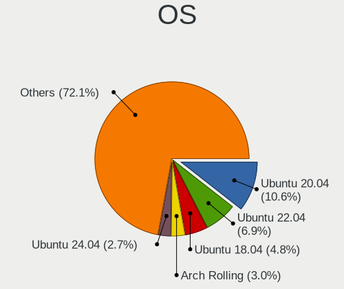

| Name                         | Computers | Percent |
|------------------------------|-----------|---------|
| Ubuntu 20.04                 | 70        | 11.97%  |
| Ubuntu 22.04                 | 43        | 7.35%   |
| Ubuntu 18.04                 | 34        | 5.81%   |
| Arch Rolling                 | 19        | 3.25%   |
| Pop!_OS 22.04                | 16        | 2.74%   |
| OpenMandriva 4.2             | 16        | 2.74%   |
| Fedora 38                    | 16        | 2.74%   |
| Debian 11                    | 14        | 2.39%   |
| OpenMandriva 23.08           | 13        | 2.22%   |
| OpenMandriva 4.3             | 12        | 2.05%   |
| KDE neon 20.04               | 12        | 2.05%   |
| Fedora 37                    | 11        | 1.88%   |
| OpenMandriva 23.01           | 9         | 1.54%   |
| Zorin 16                     | 8         | 1.37%   |
| Manjaro                      | 8         | 1.37%   |
| Linux Mint 21                | 8         | 1.37%   |
| ArcoLinux Rolling            | 8         | 1.37%   |
| Zorin 15                     | 7         | 1.2%    |
| Kubuntu 22.04                | 7         | 1.2%    |
| Arch                         | 7         | 1.2%    |
| Ubuntu 19.10                 | 6         | 1.03%   |
| openSUSE Tumbleweed-XXXXXXXX | 6         | 1.03%   |
| Linux Mint 20.2              | 6         | 1.03%   |
| KDE neon 22.04               | 6         | 1.03%   |
| Fedora 39                    | 6         | 1.03%   |
| Fedora 36                    | 6         | 1.03%   |
| Xubuntu 20.04                | 5         | 0.85%   |
| Xubuntu 18.04                | 5         | 0.85%   |
| Ubuntu 19.04                 | 5         | 0.85%   |
| Linux Mint 20.3              | 5         | 0.85%   |
| Fedora 35                    | 5         | 0.85%   |
| Debian Testing               | 5         | 0.85%   |
| Debian 10                    | 5         | 0.85%   |
| Xero Rolling                 | 4         | 0.68%   |
| Ubuntu 22.10                 | 4         | 0.68%   |
| Ubuntu 16.04                 | 4         | 0.68%   |
| Pop!_OS 21.04                | 4         | 0.68%   |
| OpenMandriva 5.0             | 4         | 0.68%   |
| Linux Mint 19.3              | 4         | 0.68%   |
| Linux Mint 19.2              | 4         | 0.68%   |

OS Family
---------

OS without a version

| Name          | Computers | Percent |
|---------------|-----------|---------|
| Ubuntu        | 172       | 30.94%  |
| OpenMandriva  | 55        | 9.89%   |
| Fedora        | 49        | 8.81%   |
| Linux Mint    | 38        | 6.83%   |
| Debian        | 29        | 5.22%   |
| Pop!_OS       | 26        | 4.68%   |
| Arch          | 26        | 4.68%   |
| KDE neon      | 19        | 3.42%   |
| Zorin         | 16        | 2.88%   |
| Endless       | 14        | 2.52%   |
| Xubuntu       | 11        | 1.98%   |
| Manjaro       | 11        | 1.98%   |
| Kubuntu       | 11        | 1.98%   |
| openSUSE      | 8         | 1.44%   |
| ArcoLinux     | 8         | 1.44%   |
| Ubuntu MATE   | 7         | 1.26%   |
| Elementary    | 6         | 1.08%   |
| Kali          | 5         | 0.9%    |
| Clear Linux   | 5         | 0.9%    |
| Xero          | 4         | 0.72%   |
| SteamOS       | 3         | 0.54%   |
| MX            | 3         | 0.54%   |
| EndeavourOS   | 3         | 0.54%   |
| UbuntuDDE     | 2         | 0.36%   |
| Reborn OS     | 2         | 0.36%   |
| Lubuntu       | 2         | 0.36%   |
| CentOS        | 2         | 0.36%   |
| BlackPanther  | 2         | 0.36%   |
| Archcraft     | 2         | 0.36%   |
| Void Linux    | 1         | 0.18%   |
| Ultramarine   | 1         | 0.18%   |
| Ubuntu Unity  | 1         | 0.18%   |
| Ubuntu Budgie | 1         | 0.18%   |
| Solus         | 1         | 0.18%   |
| ROSA          | 1         | 0.18%   |
| Nobara        | 1         | 0.18%   |
| NixOS         | 1         | 0.18%   |
| Neptune OS    | 1         | 0.18%   |
| Micebuntu     | 1         | 0.18%   |
| Linux Lite    | 1         | 0.18%   |

Kernel
------

Version of the Linux kernel

| Version                  | Computers | Percent |
|--------------------------|-----------|---------|
| 5.10.14-desktop-1omv4002 | 16        | 2.46%   |
| 6.4.11-desktop-1omv2390  | 13        | 2%      |
| 5.16.7-desktop-1omv4003  | 10        | 1.54%   |
| 5.15.0-46-generic        | 10        | 1.54%   |
| 6.1.1-desktop-1omv2290   | 9         | 1.38%   |
| 5.4.0-42-generic         | 7         | 1.08%   |
| 5.4.0-48-generic         | 6         | 0.92%   |
| 5.15.0-56-generic        | 6         | 0.92%   |
| 4.18.0-15-generic        | 6         | 0.92%   |
| 5.4.0-156-generic        | 5         | 0.77%   |
| 5.3.0-28-generic         | 5         | 0.77%   |
| 5.15.0-58-generic        | 5         | 0.77%   |
| 5.15.0-43-generic        | 5         | 0.77%   |
| 6.6.2-desktop-1omv2390   | 4         | 0.61%   |
| 6.2.0-37-generic         | 4         | 0.61%   |
| 6.0.12-76060006-generic  | 4         | 0.61%   |
| 5.8.0-59-generic         | 4         | 0.61%   |
| 5.4.0-59-generic         | 4         | 0.61%   |
| 5.3.0-23-generic         | 4         | 0.61%   |
| 5.19.0-43-generic        | 4         | 0.61%   |
| 5.11.0-40-generic        | 4         | 0.61%   |
| 5.10.0-21-amd64          | 4         | 0.61%   |
| 5.0.0-32-generic         | 4         | 0.61%   |
| 6.4.15-200.fc38.x86_64   | 3         | 0.46%   |
| 6.2.6-desktop-1omv2390   | 3         | 0.46%   |
| 6.2.0-34-generic         | 3         | 0.46%   |
| 6.2.0-32-generic         | 3         | 0.46%   |
| 6.2.0-26-generic         | 3         | 0.46%   |
| 6.0.6-76060006-generic   | 3         | 0.46%   |
| 5.8.0-63-generic         | 3         | 0.46%   |
| 5.8.0-50-generic         | 3         | 0.46%   |
| 5.8.0-14-generic         | 3         | 0.46%   |
| 5.4.0-66-generic         | 3         | 0.46%   |
| 5.4.0-45-generic         | 3         | 0.46%   |
| 5.4.0-39-generic         | 3         | 0.46%   |
| 5.4.0-37-generic         | 3         | 0.46%   |
| 5.4.0-31-generic         | 3         | 0.46%   |
| 5.3.0-53-generic         | 3         | 0.46%   |
| 5.19.0-76051900-generic  | 3         | 0.46%   |
| 5.19.0-38-generic        | 3         | 0.46%   |

Kernel Family
-------------

Linux kernel without a distro release

| Version | Computers | Percent |
|---------|-----------|---------|
| 5.4.0   | 79        | 12.46%  |
| 5.15.0  | 58        | 9.15%   |
| 5.13.0  | 28        | 4.42%   |
| 5.8.0   | 26        | 4.1%    |
| 4.15.0  | 24        | 3.79%   |
| 5.3.0   | 22        | 3.47%   |
| 6.2.0   | 20        | 3.15%   |
| 5.19.0  | 20        | 3.15%   |
| 5.11.0  | 19        | 3%      |
| 6.4.11  | 16        | 2.52%   |
| 5.10.14 | 16        | 2.52%   |
| 5.0.0   | 16        | 2.52%   |
| 4.18.0  | 14        | 2.21%   |
| 6.1.1   | 11        | 1.74%   |
| 5.10.0  | 11        | 1.74%   |
| 5.16.7  | 10        | 1.58%   |
| 6.5.0   | 8         | 1.26%   |
| 6.1.0   | 7         | 1.1%    |
| 4.19.0  | 7         | 1.1%    |
| 6.0.12  | 6         | 0.95%   |
| 5.17.5  | 6         | 0.95%   |
| 6.6.2   | 4         | 0.63%   |
| 6.5.5   | 4         | 0.63%   |
| 6.2.6   | 4         | 0.63%   |
| 6.2.15  | 4         | 0.63%   |
| 5.16.0  | 4         | 0.63%   |
| 6.6.1   | 3         | 0.47%   |
| 6.5.9   | 3         | 0.47%   |
| 6.5.4   | 3         | 0.47%   |
| 6.5.3   | 3         | 0.47%   |
| 6.4.15  | 3         | 0.47%   |
| 6.2.9   | 3         | 0.47%   |
| 6.1.12  | 3         | 0.47%   |
| 6.0.6   | 3         | 0.47%   |
| 6.0.0   | 3         | 0.47%   |
| 6.7.0   | 2         | 0.32%   |
| 6.6.8   | 2         | 0.32%   |
| 6.6.7   | 2         | 0.32%   |
| 6.6.6   | 2         | 0.32%   |
| 6.6.4   | 2         | 0.32%   |

Kernel Major Ver.
-----------------

Linux kernel major version

| Version | Computers | Percent |
|---------|-----------|---------|
| 5.4     | 84        | 13.48%  |
| 5.15    | 68        | 10.91%  |
| 6.2     | 40        | 6.42%   |
| 5.13    | 33        | 5.3%    |
| 5.10    | 32        | 5.14%   |
| 5.8     | 30        | 4.82%   |
| 6.1     | 28        | 4.49%   |
| 6.5     | 27        | 4.33%   |
| 5.19    | 27        | 4.33%   |
| 6.4     | 25        | 4.01%   |
| 5.16    | 25        | 4.01%   |
| 5.3     | 24        | 3.85%   |
| 4.15    | 24        | 3.85%   |
| 5.11    | 19        | 3.05%   |
| 6.6     | 18        | 2.89%   |
| 5.0     | 17        | 2.73%   |
| 6.0     | 16        | 2.57%   |
| 4.18    | 15        | 2.41%   |
| 5.17    | 13        | 2.09%   |
| 6.3     | 11        | 1.77%   |
| 5.18    | 7         | 1.12%   |
| 4.19    | 7         | 1.12%   |
| 5.6     | 6         | 0.96%   |
| 5.9     | 5         | 0.8%    |
| 5.5     | 5         | 0.8%    |
| 5.12    | 5         | 0.8%    |
| 5.14    | 3         | 0.48%   |
| 6.7     | 2         | 0.32%   |
| 5.7     | 2         | 0.32%   |
| 4.20    | 2         | 0.32%   |
| 5.1     | 1         | 0.16%   |
| 4.4     | 1         | 0.16%   |
| 4.17    | 1         | 0.16%   |

Arch
----

OS architecture (x86_64, i586, etc.)

| Name    | Computers | Percent |
|---------|-----------|---------|
| x86_64  | 530       | 99.07%  |
| i686    | 4         | 0.75%   |
| aarch64 | 1         | 0.19%   |

DE
--

Desktop Environment

| Name             | Computers | Percent |
|------------------|-----------|---------|
| GNOME            | 266       | 47.08%  |
| KDE5             | 105       | 18.58%  |
| Unknown          | 65        | 11.5%   |
| X-Cinnamon       | 36        | 6.37%   |
| XFCE             | 32        | 5.66%   |
| KDE              | 13        | 2.3%    |
| MATE             | 10        | 1.77%   |
| Pantheon         | 6         | 1.06%   |
| LXQt             | 6         | 1.06%   |
| Budgie           | 5         | 0.88%   |
| Cinnamon         | 4         | 0.71%   |
| Deepin           | 3         | 0.53%   |
| Unity            | 2         | 0.35%   |
| lightdm-xsession | 2         | 0.35%   |
| i3               | 2         | 0.35%   |
| XFCE:GNOME:      | 1         | 0.18%   |
| TOS:GNOME        | 1         | 0.18%   |
| sway             | 1         | 0.18%   |
| openbox          | 1         | 0.18%   |
| LXDE             | 1         | 0.18%   |
| Hyprland         | 1         | 0.18%   |
| GNOME Classic    | 1         | 0.18%   |
| awesome          | 1         | 0.18%   |

Display Server
--------------

X11 or Wayland

| Name    | Computers | Percent |
|---------|-----------|---------|
| X11     | 375       | 67.69%  |
| Wayland | 131       | 23.65%  |
| Unknown | 40        | 7.22%   |
| Tty     | 8         | 1.44%   |

Display Manager
---------------

SDDM, LightDM, etc.

| Name    | Computers | Percent |
|---------|-----------|---------|
| Unknown | 272       | 48.75%  |
| SDDM    | 96        | 17.2%   |
| GDM3    | 71        | 12.72%  |
| GDM     | 64        | 11.47%  |
| LightDM | 44        | 7.89%   |
| TDM     | 9         | 1.61%   |
| XDM     | 1         | 0.18%   |
| Ly      | 1         | 0.18%   |

OS Lang
-------

Language

| Lang    | Computers | Percent |
|---------|-----------|---------|
| en_US   | 377       | 69.43%  |
| Unknown | 56        | 10.31%  |
| th_TH   | 26        | 4.79%   |
| en_GB   | 26        | 4.79%   |
| de_DE   | 18        | 3.31%   |
| C       | 12        | 2.21%   |
| en_SG   | 7         | 1.29%   |
| fr_FR   | 6         | 1.1%    |
| it_IT   | 4         | 0.74%   |
| ru_RU   | 3         | 0.55%   |
| fi_FI   | 2         | 0.37%   |
| zh_CN   | 1         | 0.18%   |
| sv_SE   | 1         | 0.18%   |
| he_IL   | 1         | 0.18%   |
| es_MX   | 1         | 0.18%   |
| en_AU   | 1         | 0.18%   |
| de_CH   | 1         | 0.18%   |

Boot Mode
---------

EFI or BIOS

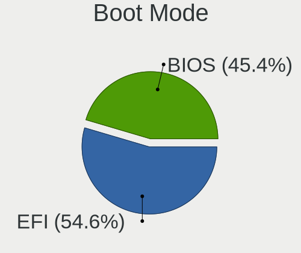

| Mode | Computers | Percent |
|------|-----------|---------|
| EFI  | 301       | 55.03%  |
| BIOS | 246       | 44.97%  |

Filesystem
----------

Type of filesystem

| Type    | Computers | Percent |
|---------|-----------|---------|
| Ext4    | 387       | 69.98%  |
| Btrfs   | 62        | 11.21%  |
| Overlay | 52        | 9.4%    |
| Tmpfs   | 26        | 4.7%    |
| Unknown | 12        | 2.17%   |
| Xfs     | 10        | 1.81%   |
| Zfs     | 4         | 0.72%   |

Part. scheme
------------

Scheme of partitioning

| Type    | Computers | Percent |
|---------|-----------|---------|
| Unknown | 273       | 49.55%  |
| GPT     | 247       | 44.83%  |
| MBR     | 31        | 5.63%   |

Dual Boot with Linux/BSD
------------------------

Hosting more than one Linux/BSD

| Dual boot | Computers | Percent |
|-----------|-----------|---------|
| No        | 456       | 83.21%  |
| Yes       | 92        | 16.79%  |

Dual Boot (Win)
---------------

Hosting Linux and Windows

| Dual boot | Computers | Percent |
|-----------|-----------|---------|
| No        | 368       | 67.03%  |
| Yes       | 181       | 32.97%  |

Board
-----

Vendor
------

Motherboard manufacturer

| Name                           | Computers | Percent |
|--------------------------------|-----------|---------|
| ASUSTek Computer               | 92        | 17.2%   |
| Lenovo                         | 77        | 14.39%  |
| Acer                           | 57        | 10.65%  |
| Dell                           | 55        | 10.28%  |
| Hewlett-Packard                | 50        | 9.35%   |
| Gigabyte Technology            | 46        | 8.6%    |
| ASRock                         | 34        | 6.36%   |
| MSI                            | 29        | 5.42%   |
| Apple                          | 17        | 3.18%   |
| Intel                          | 8         | 1.5%    |
| HUAWEI                         | 8         | 1.5%    |
| Samsung Electronics            | 6         | 1.12%   |
| Unknown                        | 6         | 1.12%   |
| Fujitsu                        | 5         | 0.93%   |
| Toshiba                        | 4         | 0.75%   |
| Valve                          | 2         | 0.37%   |
| Supermicro                     | 2         | 0.37%   |
| MiTAC                          | 2         | 0.37%   |
| Infinix                        | 2         | 0.37%   |
| Huanan                         | 2         | 0.37%   |
| Biostar                        | 2         | 0.37%   |
| AMI                            | 2         | 0.37%   |
| ViewSonic                      | 1         | 0.19%   |
| VIA Technologies               | 1         | 0.19%   |
| Timi                           | 1         | 0.19%   |
| Sony                           | 1         | 0.19%   |
| SmbiosType1_SystemManufacturer | 1         | 0.19%   |
| SHARKBAY                       | 1         | 0.19%   |
| Razer                          | 1         | 0.19%   |
| Pegatron                       | 1         | 0.19%   |
| Packard Bell                   | 1         | 0.19%   |
| OEM                            | 1         | 0.19%   |
| Notebook                       | 1         | 0.19%   |
| NEC Computers                  | 1         | 0.19%   |
| Microsoft                      | 1         | 0.19%   |
| MicroByte                      | 1         | 0.19%   |
| MECHREVO                       | 1         | 0.19%   |
| Hampoo                         | 1         | 0.19%   |
| Google                         | 1         | 0.19%   |
| FriendlyElec                   | 1         | 0.19%   |

Model
-----

Motherboard model

| Name                                     | Computers | Percent |
|------------------------------------------|-----------|---------|
| Unknown                                  | 8         | 1.5%    |
| ASUS All Series                          | 7         | 1.31%   |
| Dell PowerEdge R7625                     | 5         | 0.93%   |
| Dell OptiPlex 7010                       | 4         | 0.75%   |
| ASRock B450 Steel Legend                 | 4         | 0.75%   |
| Lenovo MIIX 520-12IKB 81CG               | 3         | 0.56%   |
| HUAWEI BOHB-WAX9                         | 3         | 0.56%   |
| Dell Inspiron 3847                       | 3         | 0.56%   |
| ASUS P8H61-M LE                          | 3         | 0.56%   |
| Acer Aspire E5-471G                      | 3         | 0.56%   |
| Valve Jupiter                            | 2         | 0.37%   |
| Samsung NC208/NC108                      | 2         | 0.37%   |
| Lenovo Z50-70 20354                      | 2         | 0.37%   |
| Lenovo ThinkPad 11e 5th Gen 20LQS00000   | 2         | 0.37%   |
| Lenovo G460 20041                        | 2         | 0.37%   |
| Infinix INBOOK X2                        | 2         | 0.37%   |
| HUAWEI KLVL-WXX9                         | 2         | 0.37%   |
| HP Z240 Tower Workstation                | 2         | 0.37%   |
| HP Laptop 14-ck0xxx                      | 2         | 0.37%   |
| HP EliteDesk 800 G1 SFF PC               | 2         | 0.37%   |
| Gigabyte Z97X-UD3H-BK                    | 2         | 0.37%   |
| Gigabyte H110M-DS2                       | 2         | 0.37%   |
| Gigabyte F2A88XM-HD3P                    | 2         | 0.37%   |
| Gigabyte F2A68HM-DS2                     | 2         | 0.37%   |
| Gigabyte B250-HD3                        | 2         | 0.37%   |
| Dell OptiPlex 9020                       | 2         | 0.37%   |
| Dell OptiPlex 7050                       | 2         | 0.37%   |
| Dell OptiPlex 3020                       | 2         | 0.37%   |
| Dell Latitude E6430                      | 2         | 0.37%   |
| Dell Latitude 3120                       | 2         | 0.37%   |
| ASUS X556UQK                             | 2         | 0.37%   |
| ASUS X450LN                              | 2         | 0.37%   |
| ASUS VivoBook_ASUSLaptop M3500QA_D3500QA | 2         | 0.37%   |
| ASUS VivoBook_ASUS Laptop E210MA_L210MA  | 2         | 0.37%   |
| ASUS TUF Gaming FX505DT_FX505DT          | 2         | 0.37%   |
| ASUS TUF Gaming B550M-E                  | 2         | 0.37%   |
| ASUS H110M-E/M.2                         | 2         | 0.37%   |
| ASRock B450M Steel Legend                | 2         | 0.37%   |
| Apple MacBookAir3,2                      | 2         | 0.37%   |
| Acer Veriton N4640G                      | 2         | 0.37%   |

Model Family
------------

Motherboard model prefix

| Name              | Computers | Percent |
|-------------------|-----------|---------|
| Lenovo ThinkPad   | 34        | 6.36%   |
| Acer Aspire       | 33        | 6.17%   |
| Dell OptiPlex     | 15        | 2.8%    |
| ASUS VivoBook     | 13        | 2.43%   |
| Lenovo IdeaPad    | 12        | 2.24%   |
| HP Pavilion       | 12        | 2.24%   |
| Dell Inspiron     | 9         | 1.68%   |
| HP Laptop         | 8         | 1.5%    |
| Dell Latitude     | 8         | 1.5%    |
| ASUS ROG          | 8         | 1.5%    |
| Unknown           | 8         | 1.5%    |
| Dell Precision    | 7         | 1.31%   |
| ASUS TUF          | 7         | 1.31%   |
| ASUS PRIME        | 7         | 1.31%   |
| ASUS All          | 7         | 1.31%   |
| Acer Veriton      | 7         | 1.31%   |
| Lenovo Yoga       | 6         | 1.12%   |
| HP Compaq         | 6         | 1.12%   |
| Dell PowerEdge    | 6         | 1.12%   |
| ASUS ZenBook      | 6         | 1.12%   |
| ASRock B450       | 6         | 1.12%   |
| Dell Vostro       | 5         | 0.93%   |
| ASUS ASUS         | 5         | 0.93%   |
| Acer Swift        | 5         | 0.93%   |
| Lenovo MIIX       | 4         | 0.75%   |
| HP EliteBook      | 4         | 0.75%   |
| ASRock B450M      | 4         | 0.75%   |
| Toshiba Satellite | 3         | 0.56%   |
| Lenovo ThinkBook  | 3         | 0.56%   |
| HUAWEI BOHB-WAX9  | 3         | 0.56%   |
| HP ProDesk        | 3         | 0.56%   |
| HP ENVY           | 3         | 0.56%   |
| ASUS P8H61-M      | 3         | 0.56%   |
| ASUS M5A78L-M     | 3         | 0.56%   |
| Acer TravelMate   | 3         | 0.56%   |
| Acer Nitro        | 3         | 0.56%   |
| Valve Jupiter     | 2         | 0.37%   |
| Samsung NC208     | 2         | 0.37%   |
| MSI Pro           | 2         | 0.37%   |
| MSI GF63          | 2         | 0.37%   |

MFG Year
--------

Motherboard manufacture year

| Year    | Computers | Percent |
|---------|-----------|---------|
| 2018    | 64        | 11.96%  |
| 2020    | 53        | 9.91%   |
| 2019    | 44        | 8.22%   |
| 2021    | 41        | 7.66%   |
| 2014    | 39        | 7.29%   |
| 2016    | 38        | 7.1%    |
| 2012    | 38        | 7.1%    |
| 2017    | 36        | 6.73%   |
| 2013    | 33        | 6.17%   |
| 2011    | 30        | 5.61%   |
| 2015    | 28        | 5.23%   |
| 2022    | 19        | 3.55%   |
| 2010    | 18        | 3.36%   |
| 2009    | 16        | 2.99%   |
| 2023    | 15        | 2.8%    |
| 2008    | 14        | 2.62%   |
| 2007    | 4         | 0.75%   |
| 2006    | 3         | 0.56%   |
| 2005    | 1         | 0.19%   |
| Unknown | 1         | 0.19%   |

Form Factor
-----------

Physical design of the computer

| Name           | Computers | Percent |
|----------------|-----------|---------|
| Notebook       | 272       | 50.84%  |
| Desktop        | 215       | 40.19%  |
| All in one     | 12        | 2.24%   |
| Convertible    | 11        | 2.06%   |
| Mini pc        | 9         | 1.68%   |
| Tablet         | 8         | 1.5%    |
| Server         | 7         | 1.31%   |
| System on chip | 1         | 0.19%   |

Secure Boot
-----------

Enabled or disabled

| State    | Computers | Percent |
|----------|-----------|---------|
| Disabled | 492       | 91.11%  |
| Enabled  | 48        | 8.89%   |

Coreboot
--------

Have coreboot on board

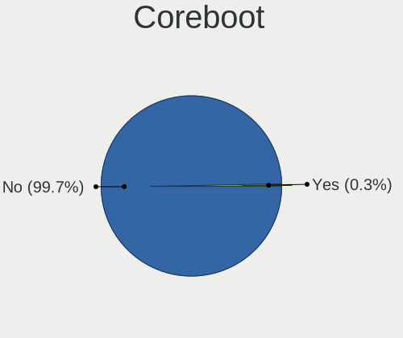

| Used | Computers | Percent |
|------|-----------|---------|
| No   | 534       | 99.81%  |
| Yes  | 1         | 0.19%   |

RAM Size
--------

Total RAM memory

| Size in GB      | Computers | Percent |
|-----------------|-----------|---------|
| 4.01-8.0        | 132       | 24.09%  |
| 16.01-24.0      | 108       | 19.71%  |
| 3.01-4.0        | 102       | 18.61%  |
| 8.01-16.0       | 101       | 18.43%  |
| 32.01-64.0      | 49        | 8.94%   |
| 1.01-2.0        | 20        | 3.65%   |
| 24.01-32.0      | 14        | 2.55%   |
| 64.01-256.0     | 11        | 2.01%   |
| More than 256.0 | 6         | 1.09%   |
| 2.01-3.0        | 3         | 0.55%   |
| 0.51-1.0        | 2         | 0.36%   |

RAM Used
--------

Used RAM memory

| Used GB         | Computers | Percent |
|-----------------|-----------|---------|
| 1.01-2.0        | 204       | 33.89%  |
| 2.01-3.0        | 173       | 28.74%  |
| 4.01-8.0        | 86        | 14.29%  |
| 3.01-4.0        | 79        | 13.12%  |
| 8.01-16.0       | 27        | 4.49%   |
| 0.51-1.0        | 20        | 3.32%   |
| 16.01-24.0      | 4         | 0.66%   |
| More than 256.0 | 3         | 0.5%    |
| 0.01-0.5        | 3         | 0.5%    |
| 64.01-256.0     | 2         | 0.33%   |
| 24.01-32.0      | 1         | 0.17%   |

Total Drives
------------

Number of drives on board

| Drives | Computers | Percent |
|--------|-----------|---------|
| 1      | 317       | 56.41%  |
| 2      | 144       | 25.62%  |
| 3      | 52        | 9.25%   |
| 4      | 16        | 2.85%   |
| 5      | 12        | 2.14%   |
| 0      | 9         | 1.6%    |
| 17     | 4         | 0.71%   |
| 6      | 4         | 0.71%   |
| 51     | 1         | 0.18%   |
| 32     | 1         | 0.18%   |
| 10     | 1         | 0.18%   |
| 7      | 1         | 0.18%   |

Has CD-ROM
----------

Has CD-ROM on board

| Presented | Computers | Percent |
|-----------|-----------|---------|
| No        | 389       | 72.17%  |
| Yes       | 150       | 27.83%  |

Has Ethernet
------------

Has Ethernet on board

| Presented | Computers | Percent |
|-----------|-----------|---------|
| Yes       | 448       | 83.43%  |
| No        | 89        | 16.57%  |

Has WiFi
--------

Has WiFi module

| Presented | Computers | Percent |
|-----------|-----------|---------|
| Yes       | 418       | 77.12%  |
| No        | 124       | 22.88%  |

Has Bluetooth
-------------

Has Bluetooth module

| Presented | Computers | Percent |
|-----------|-----------|---------|
| Yes       | 337       | 61.61%  |
| No        | 210       | 38.39%  |

Location
--------

Country
-------

Geographic location (country)

| Country  | Computers | Percent |
|----------|-----------|---------|
| Thailand | 535       | 100%    |

City
----

Geographic location (city)

| City                | Computers | Percent |
|---------------------|-----------|---------|
| Bangkok             | 229       | 39.76%  |
| Chiang Mai          | 39        | 6.77%   |
| Phuket              | 19        | 3.3%    |
| Khon Kaen           | 18        | 3.13%   |
| Bang Lamung         | 15        | 2.6%    |
| Nonthaburi          | 14        | 2.43%   |
| Nakhon Ratchasima   | 14        | 2.43%   |
| Nakhon Pathom       | 11        | 1.91%   |
| Chon Buri           | 9         | 1.56%   |
| Ban Nong Sala       | 9         | 1.56%   |
| Pattaya             | 7         | 1.22%   |
| Surin               | 6         | 1.04%   |
| Surat Thani         | 6         | 1.04%   |
| Songkhla            | 6         | 1.04%   |
| Mueang Samut Prakan | 6         | 1.04%   |
| Hua Hin             | 5         | 0.87%   |
| Hat Yai             | 5         | 0.87%   |
| Ban Phan Don        | 5         | 0.87%   |
| Ban Du              | 5         | 0.87%   |
| Si Racha            | 4         | 0.69%   |
| Pak Kret            | 4         | 0.69%   |
| Lampang             | 4         | 0.69%   |
| Khlong Luang        | 4         | 0.69%   |
| Suan Luang          | 3         | 0.52%   |
| Rayong              | 3         | 0.52%   |
| Phitsanulok         | 3         | 0.52%   |
| Phetchaburi         | 3         | 0.52%   |
| Maha Sarakham       | 3         | 0.52%   |
| Lat Krabang         | 3         | 0.52%   |
| Chiang Rai          | 3         | 0.52%   |
| Bang Khae           | 3         | 0.52%   |
| Bang Bon            | 3         | 0.52%   |
| Ban Yang Sam Ton    | 3         | 0.52%   |
| Samut Prakan        | 2         | 0.35%   |
| Salaya              | 2         | 0.35%   |
| Phayao              | 2         | 0.35%   |
| Phan                | 2         | 0.35%   |
| Pattani             | 2         | 0.35%   |
| Pathum Thani        | 2         | 0.35%   |
| Min Buri            | 2         | 0.35%   |

Drives
------

Drive Vendor
------------

Hard drive vendors

| Vendor                      | Computers | Drives | Percent |
|-----------------------------|-----------|--------|---------|
| WDC                         | 156       | 241    | 19.4%   |
| Seagate                     | 113       | 175    | 14.05%  |
| Samsung Electronics         | 96        | 139    | 11.94%  |
| SanDisk                     | 53        | 83     | 6.59%   |
| Toshiba                     | 44        | 95     | 5.47%   |
| Kingston                    | 43        | 49     | 5.35%   |
| Unknown                     | 33        | 46     | 4.1%    |
| Intel                       | 24        | 26     | 2.99%   |
| SK hynix                    | 19        | 93     | 2.36%   |
| Hitachi                     | 15        | 16     | 1.87%   |
| HGST                        | 14        | 23     | 1.74%   |
| Crucial                     | 14        | 15     | 1.74%   |
| Micron Technology           | 12        | 14     | 1.49%   |
| Apacer                      | 11        | 13     | 1.37%   |
| HS-SSD-C100                 | 10        | 19     | 1.24%   |
| China                       | 9         | 12     | 1.12%   |
| Transcend                   | 8         | 9      | 1%      |
| Silicon Motion              | 7         | 11     | 0.87%   |
| Hikvision                   | 7         | 7      | 0.87%   |
| Apple                       | 7         | 7      | 0.87%   |
| SPCC                        | 5         | 5      | 0.62%   |
| Phison Electronics          | 5         | 9      | 0.62%   |
| Phison                      | 5         | 10     | 0.62%   |
| USB3.0                      | 4         | 5      | 0.5%    |
| Plextor                     | 4         | 4      | 0.5%    |
| MAXIO Technology (Hangzhou) | 4         | 5      | 0.5%    |
| KingSpec                    | 4         | 6      | 0.5%    |
| JMicron Technology          | 4         | 4      | 0.5%    |
| GALAX                       | 4         | 4      | 0.5%    |
| Colorful                    | 4         | 7      | 0.5%    |
| A-DATA Technology           | 4         | 4      | 0.5%    |
| TO Exter                    | 3         | 3      | 0.37%   |
| Realtek Semiconductor       | 3         | 3      | 0.37%   |
| Pioneer                     | 3         | 3      | 0.37%   |
| Lexar                       | 3         | 4      | 0.37%   |
| KIOXIA                      | 3         | 5      | 0.37%   |
| Fujitsu                     | 3         | 5      | 0.37%   |
| Unknown                     | 3         | 3      | 0.37%   |
| Kingston Technology Company | 2         | 2      | 0.25%   |
| Kingmax                     | 2         | 8      | 0.25%   |

Drive Model
-----------

Hard drive models

| Model                                               | Computers | Percent |
|-----------------------------------------------------|-----------|---------|
| Seagate ST500DM002-1BD142 500GB                     | 11        | 1.24%   |
| Seagate ST1000DM010-2EP102 1TB                      | 9         | 1.02%   |
| Kingston SA400S37240G 240GB SSD                     | 9         | 1.02%   |
| WDC WDS240G2G0A-00JH30 240GB SSD                    | 8         | 0.9%    |
| WDC WDS120G2G0A-00JH30 120GB SSD                    | 8         | 0.9%    |
| Unknown MMC Card  32GB                              | 8         | 0.9%    |
| Crucial CT500MX500SSD1 500GB                        | 8         | 0.9%    |
| Unknown MMC Card  64GB                              | 7         | 0.79%   |
| Toshiba MQ01ABD100 1TB                              | 7         | 0.79%   |
| Sandisk WD Blue SN550 NVMe SSD 512GB                | 7         | 0.79%   |
| SanDisk NVMe SSD Drive 1TB                          | 7         | 0.79%   |
| WDC WDS500G2B0A-00SM50 500GB SSD                    | 6         | 0.68%   |
| WDC WDS240G2G0B-00EPW0 240GB SSD                    | 6         | 0.68%   |
| Toshiba MQ04ABF100 1TB                              | 6         | 0.68%   |
| Seagate ST500LT012-1DG142 500GB                     | 6         | 0.68%   |
| Seagate ST2000VX008-2E3164 2TB                      | 6         | 0.68%   |
| Seagate ST1000LM035-1RK172 1TB                      | 6         | 0.68%   |
| Seagate ST1000DM003-1ER162 1TB                      | 6         | 0.68%   |
| Kingston SUV400S37120G 120GB SSD                    | 6         | 0.68%   |
| WDC WD20EZAZ-00GGJB0 2TB                            | 5         | 0.57%   |
| WDC WD10EZEX-00WN4A0 1TB                            | 5         | 0.57%   |
| Unknown SD/MMC/MS PRO 256GB                         | 5         | 0.57%   |
| Seagate ST1000LM024 HN-M101MBB 1TB                  | 5         | 0.57%   |
| SanDisk NVMe SSD Drive 250GB                        | 5         | 0.57%   |
| Samsung NVMe SSD Controller SM981/PM981/PM983 1TB   | 5         | 0.57%   |
| Samsung NVMe SSD Controller PM9A1/PM9A3/980PRO 2TB  | 5         | 0.57%   |
| Samsung HD103SJ 1TB                                 | 5         | 0.57%   |
| HS-SSD-C100 240G                                    | 5         | 0.57%   |
| WDC WDS100T2B0A-00SM50 1TB SSD                      | 4         | 0.45%   |
| WDC WD10EZEX-08WN4A0 1TB                            | 4         | 0.45%   |
| USB3.0 Super Speed 500GB SSD                        | 4         | 0.45%   |
| Toshiba DT01ACA100 1TB                              | 4         | 0.45%   |
| SK hynix HFS3T8G3H2X069N 3.8TB                      | 4         | 0.45%   |
| Seagate ST3500418AS 500GB                           | 4         | 0.45%   |
| Seagate ST1000LM049-2GH172 1TB                      | 4         | 0.45%   |
| Sandisk WD Black SN750 / PC SN730 NVMe SSD 512GB    | 4         | 0.45%   |
| Samsung NVMe SSD Controller SM961/PM961/SM963 256GB | 4         | 0.45%   |
| Kingston SV300S37A120G 120GB SSD                    | 4         | 0.45%   |
| HGST HTS721010A9E630 1TB                            | 4         | 0.45%   |
| WDC WD5000AAKX-00ERMA0 500GB                        | 3         | 0.34%   |

HDD Vendor
----------

Hard disk drive vendors

| Vendor              | Computers | Drives | Percent |
|---------------------|-----------|--------|---------|
| Seagate             | 112       | 171    | 35.11%  |
| WDC                 | 104       | 156    | 32.6%   |
| Toshiba             | 37        | 86     | 11.6%   |
| Samsung Electronics | 15        | 22     | 4.7%    |
| Hitachi             | 15        | 16     | 4.7%    |
| HGST                | 14        | 23     | 4.39%   |
| Unknown             | 6         | 11     | 1.88%   |
| TO Exter            | 3         | 3      | 0.94%   |
| JMicron Technology  | 3         | 3      | 0.94%   |
| Fujitsu             | 3         | 5      | 0.94%   |
| External            | 2         | 2      | 0.63%   |
| Apple               | 2         | 2      | 0.63%   |
| StoreJet            | 1         | 1      | 0.31%   |
| Initio              | 1         | 1      | 0.31%   |
| Hewlett-Packard     | 1         | 3      | 0.31%   |

SSD Vendor
----------

Solid state drive vendors

| Vendor              | Computers | Drives | Percent |
|---------------------|-----------|--------|---------|
| WDC                 | 44        | 62     | 17.67%  |
| Samsung Electronics | 35        | 51     | 14.06%  |
| Kingston            | 26        | 30     | 10.44%  |
| SanDisk             | 20        | 33     | 8.03%   |
| Crucial             | 14        | 15     | 5.62%   |
| Apacer              | 11        | 13     | 4.42%   |
| China               | 9         | 12     | 3.61%   |
| Intel               | 8         | 8      | 3.21%   |
| SK hynix            | 7         | 68     | 2.81%   |
| Hikvision           | 6         | 6      | 2.41%   |
| Transcend           | 5         | 6      | 2.01%   |
| SPCC                | 5         | 5      | 2.01%   |
| USB3.0              | 4         | 5      | 1.61%   |
| Plextor             | 4         | 4      | 1.61%   |
| Micron Technology   | 4         | 5      | 1.61%   |
| KingSpec            | 4         | 6      | 1.61%   |
| GALAX               | 4         | 4      | 1.61%   |
| Apple               | 4         | 4      | 1.61%   |
| Pioneer             | 3         | 3      | 1.2%    |
| Lexar               | 3         | 4      | 1.2%    |
| Colorful            | 3         | 6      | 1.2%    |
| A-DATA Technology   | 3         | 3      | 1.2%    |
| Kingmax             | 2         | 8      | 0.8%    |
| Acer                | 2         | 6      | 0.8%    |
| WALRAM              | 1         | 1      | 0.4%    |
| Verbatim            | 1         | 1      | 0.4%    |
| Teelkoou            | 1         | 1      | 0.4%    |
| Team                | 1         | 1      | 0.4%    |
| TARGET              | 1         | 1      | 0.4%    |
| SPCC M.2            | 1         | 1      | 0.4%    |
| PNY                 | 1         | 2      | 0.4%    |
| OCZ                 | 1         | 1      | 0.4%    |
| LITEON              | 1         | 2      | 0.4%    |
| Intenso             | 1         | 12     | 0.4%    |
| HS-SSD-E100         | 1         | 1      | 0.4%    |
| Hised               | 1         | 1      | 0.4%    |
| Hewlett-Packard     | 1         | 1      | 0.4%    |
| FORESEE             | 1         | 1      | 0.4%    |
| DGM                 | 1         | 1      | 0.4%    |
| Corsair             | 1         | 1      | 0.4%    |

Drive Kind
----------

HDD or SSD

| Kind    | Computers | Drives | Percent |
|---------|-----------|--------|---------|
| HDD     | 264       | 505    | 37.08%  |
| SSD     | 209       | 399    | 29.35%  |
| NVMe    | 194       | 280    | 27.25%  |
| MMC     | 26        | 34     | 3.65%   |
| Unknown | 19        | 31     | 2.67%   |

Drive Connector
---------------

SATA, SAS, NVMe, etc.

| Type | Computers | Drives | Percent |
|------|-----------|--------|---------|
| SATA | 388       | 881    | 60.25%  |
| NVMe | 194       | 280    | 30.12%  |
| SAS  | 36        | 54     | 5.59%   |
| MMC  | 26        | 34     | 4.04%   |

Drive Size
----------

Size of hard drive

| Size in TB | Computers | Drives | Percent |
|------------|-----------|--------|---------|
| 0.01-0.5   | 271       | 447    | 53.98%  |
| 0.51-1.0   | 162       | 236    | 32.27%  |
| 1.01-2.0   | 42        | 59     | 8.37%   |
| 3.01-4.0   | 16        | 124    | 3.19%   |
| 4.01-10.0  | 5         | 17     | 1%      |
| 2.01-3.0   | 4         | 10     | 0.8%    |
| 10.01-20.0 | 2         | 11     | 0.4%    |

Space Total
-----------

Amount of disk space available on the file system

| Size in GB     | Computers | Percent |
|----------------|-----------|---------|
| 101-250        | 137       | 23.87%  |
| 251-500        | 116       | 20.21%  |
| 501-1000       | 83        | 14.46%  |
| 1-20           | 60        | 10.45%  |
| 51-100         | 44        | 7.67%   |
| 1001-2000      | 42        | 7.32%   |
| 21-50          | 30        | 5.23%   |
| Unknown        | 22        | 3.83%   |
| More than 3000 | 20        | 3.48%   |
| 2001-3000      | 20        | 3.48%   |

Space Used
----------

Amount of used disk space

| Used GB        | Computers | Percent |
|----------------|-----------|---------|
| 1-20           | 242       | 40.95%  |
| 21-50          | 94        | 15.91%  |
| 101-250        | 71        | 12.01%  |
| 51-100         | 56        | 9.48%   |
| 251-500        | 46        | 7.78%   |
| 501-1000       | 31        | 5.25%   |
| Unknown        | 22        | 3.72%   |
| 1001-2000      | 17        | 2.88%   |
| More than 3000 | 9         | 1.52%   |
| 2001-3000      | 3         | 0.51%   |

Malfunc. Drives
---------------

Drive models with a malfunction

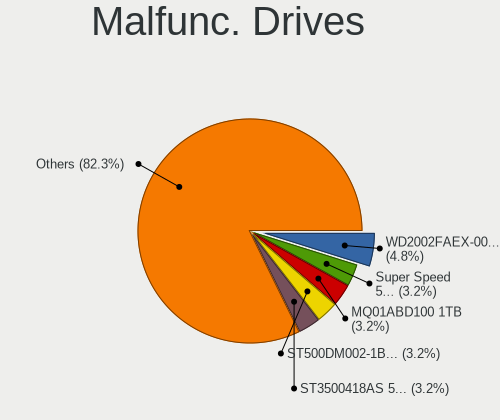

| Model                                    | Computers | Drives | Percent |
|------------------------------------------|-----------|--------|---------|
| WDC WD2002FAEX-007BA0 2TB                | 2         | 2      | 4%      |
| USB3.0 Super Speed 500GB SSD             | 2         | 3      | 4%      |
| Toshiba MQ01ABD100 1TB                   | 2         | 2      | 4%      |
| Seagate ST500DM002-1BD14 500GB           | 2         | 3      | 4%      |
| Seagate ST3500418AS 500GB                | 2         | 3      | 4%      |
| Seagate ST1000LM049-2GH172 1TB           | 2         | 2      | 4%      |
| Seagate ST1000LM035-1RK172 1TB           | 2         | 2      | 4%      |
| Samsung Electronics SSD 830 Series 128GB | 2         | 2      | 4%      |
| WDC WDS240G2G0A-00JH30 240GB SSD         | 1         | 1      | 2%      |
| WDC WD6402AAEX-00Y9A0 640GB              | 1         | 1      | 2%      |
| WDC WD20EZRX-00DC0B0 2TB                 | 1         | 1      | 2%      |
| WDC WD20EARS-00MVWB0 2TB                 | 1         | 1      | 2%      |
| WDC WD10SPZX-22Z10T0 1TB                 | 1         | 3      | 2%      |
| WDC WD10PURX-64E5EY0 1TB                 | 1         | 1      | 2%      |
| WDC WD10EZEX-00WN4A0 1TB                 | 1         | 1      | 2%      |
| WDC WD1002FAEX-00Y9A0 1TB                | 1         | 1      | 2%      |
| Toshiba MQ04ABF100 1TB                   | 1         | 1      | 2%      |
| Toshiba MK6475GSX 640GB                  | 1         | 1      | 2%      |
| Toshiba HDWL110 1TB                      | 1         | 1      | 2%      |
| TARGET SSD 128G                          | 1         | 1      | 2%      |
| SK hynix BC711 HFM512GD3JX013N 512GB     | 1         | 1      | 2%      |
| Seagate ST9500325AS 500GB                | 1         | 1      | 2%      |
| Seagate ST9120822AS 120GB                | 1         | 1      | 2%      |
| Seagate ST500LT012-9WS142 500GB          | 1         | 1      | 2%      |
| Seagate ST500LM000-SSHD-8GB              | 1         | 1      | 2%      |
| Seagate ST500DM002-1BD142 500GB          | 1         | 1      | 2%      |
| Seagate ST4000DM004-2CV104 4TB           | 1         | 1      | 2%      |
| Seagate ST1000LX015-1U7172-SSHD 1TB      | 1         | 1      | 2%      |
| Seagate ST1000LM014-1EJ164 1TB           | 1         | 1      | 2%      |
| SanDisk SDSSDX240GG25 240GB              | 1         | 1      | 2%      |
| Samsung Electronics HM160HI 160GB        | 1         | 2      | 2%      |
| Samsung Electronics HD322GJ 320GB        | 1         | 2      | 2%      |
| Samsung Electronics HD253GJ 250GB        | 1         | 1      | 2%      |
| Samsung Electronics HD103SJ 1TB          | 1         | 1      | 2%      |
| Kingston SV300S37A120G 120GB SSD         | 1         | 1      | 2%      |
| Kingston RBU-SNS8350DES3128GP 128GB SSD  | 1         | 1      | 2%      |
| Intel SSDSC2KF256H6 SATA 256GB           | 1         | 1      | 2%      |
| Hitachi HTS541612J9SA00 120GB            | 1         | 1      | 2%      |
| HGST HTS725050A7E630 500GB               | 1         | 1      | 2%      |
| HGST HTS721010A9E630 1TB                 | 1         | 1      | 2%      |

Malfunc. Drive Vendor
---------------------

Vendors of faulty drives

| Vendor              | Computers | Drives | Percent |
|---------------------|-----------|--------|---------|
| Seagate             | 16        | 18     | 32.65%  |
| WDC                 | 9         | 12     | 18.37%  |
| Samsung Electronics | 6         | 8      | 12.24%  |
| Toshiba             | 5         | 5      | 10.2%   |
| HGST                | 3         | 3      | 6.12%   |
| USB3.0              | 2         | 3      | 4.08%   |
| Kingston            | 2         | 2      | 4.08%   |
| TARGET              | 1         | 1      | 2.04%   |
| SK hynix            | 1         | 1      | 2.04%   |
| SanDisk             | 1         | 1      | 2.04%   |
| Intel               | 1         | 1      | 2.04%   |
| Hitachi             | 1         | 1      | 2.04%   |
| Colorful            | 1         | 3      | 2.04%   |

Malfunc. HDD Vendor
-------------------

Vendors of faulty HDD drives

| Vendor              | Computers | Drives | Percent |
|---------------------|-----------|--------|---------|
| Seagate             | 16        | 18     | 43.24%  |
| WDC                 | 8         | 11     | 21.62%  |
| Toshiba             | 5         | 5      | 13.51%  |
| Samsung Electronics | 4         | 6      | 10.81%  |
| HGST                | 3         | 3      | 8.11%   |
| Hitachi             | 1         | 1      | 2.7%    |

Malfunc. Drive Kind
-------------------

Kinds of faulty drives

| Kind | Computers | Drives | Percent |
|------|-----------|--------|---------|
| HDD  | 35        | 44     | 76.09%  |
| SSD  | 10        | 14     | 21.74%  |
| NVMe | 1         | 1      | 2.17%   |

Failed Drives
-------------

Failed drive models

| Model                           | Computers | Drives | Percent |
|---------------------------------|-----------|--------|---------|
| Samsung Electronics HD103SJ 1TB | 2         | 2      | 66.67%  |
| Seagate ST1000LM035-1RK172 1TB  | 1         | 1      | 33.33%  |

Failed Drive Vendor
-------------------

Failed drive vendors

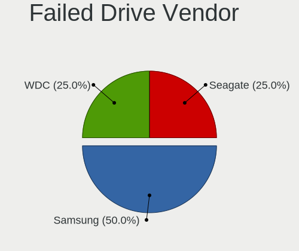

| Vendor              | Computers | Drives | Percent |
|---------------------|-----------|--------|---------|
| Samsung Electronics | 2         | 2      | 66.67%  |
| Seagate             | 1         | 1      | 33.33%  |

Drive Status
------------

Number of failed and malfunc. drives

| Status   | Computers | Drives | Percent |
|----------|-----------|--------|---------|
| Detected | 336       | 699    | 57.73%  |
| Works    | 199       | 488    | 34.19%  |
| Malfunc  | 44        | 59     | 7.56%   |
| Failed   | 3         | 3      | 0.52%   |

Storage controller
------------------

Storage Vendor
--------------

Storage controller vendors

| Vendor                       | Computers | Percent |
|------------------------------|-----------|---------|
| Intel                        | 338       | 49.56%  |
| AMD                          | 106       | 15.54%  |
| Samsung Electronics          | 55        | 8.06%   |
| SanDisk                      | 54        | 7.92%   |
| Kingston Technology Company  | 19        | 2.79%   |
| Nvidia                       | 13        | 1.91%   |
| ASMedia Technology           | 13        | 1.91%   |
| SK hynix                     | 12        | 1.76%   |
| Phison Electronics           | 11        | 1.61%   |
| Silicon Motion               | 8         | 1.17%   |
| Micron Technology            | 8         | 1.17%   |
| Toshiba America Info Systems | 7         | 1.03%   |
| Broadcom / LSI               | 7         | 1.03%   |
| MAXIO Technology (Hangzhou)  | 6         | 0.88%   |
| VIA Technologies             | 3         | 0.44%   |
| Realtek Semiconductor        | 3         | 0.44%   |
| LSI Logic / Symbios Logic    | 3         | 0.44%   |
| KIOXIA                       | 3         | 0.44%   |
| Yangtze Memory Technologies  | 2         | 0.29%   |
| Marvell Technology Group     | 2         | 0.29%   |
| ADATA Technology             | 2         | 0.29%   |
| Transcend                    | 1         | 0.15%   |
| Shenzhen Longsys Electronics | 1         | 0.15%   |
| O2 Micro                     | 1         | 0.15%   |
| Micron/Crucial Technology    | 1         | 0.15%   |
| Lite-On Technology           | 1         | 0.15%   |
| JMicron Technology           | 1         | 0.15%   |
| Apple                        | 1         | 0.15%   |

Storage Model
-------------

Storage controller models

| Model                                                                            | Computers | Percent |
|----------------------------------------------------------------------------------|-----------|---------|
| AMD FCH SATA Controller [AHCI mode]                                              | 74        | 9.67%   |
| Samsung NVMe SSD Controller SM981/PM981/PM983                                    | 28        | 3.66%   |
| Intel 8 Series/C220 Series Chipset Family 6-port SATA Controller 1 [AHCI mode]   | 28        | 3.66%   |
| Intel Sunrise Point-LP SATA Controller [AHCI mode]                               | 25        | 3.27%   |
| Intel 7 Series Chipset Family 6-port SATA Controller [AHCI mode]                 | 21        | 2.75%   |
| AMD 400 Series Chipset SATA Controller                                           | 21        | 2.75%   |
| Intel Q170/Q150/B150/H170/H110/Z170/CM236 Chipset SATA Controller [AHCI Mode]    | 20        | 2.61%   |
| Intel 8 Series SATA Controller 1 [AHCI mode]                                     | 19        | 2.48%   |
| SanDisk Ultra 3D / WD Blue SN550 NVMe SSD                                        | 16        | 2.09%   |
| SanDisk Extreme Pro / WD Black SN750 / PC SN730 / Red SN700 NVMe SSD             | 12        | 1.57%   |
| Intel 200 Series PCH SATA controller [AHCI mode]                                 | 12        | 1.57%   |
| AMD 500 Series Chipset SATA Controller                                           | 12        | 1.57%   |
| Intel Cannon Lake Mobile PCH SATA AHCI Controller                                | 11        | 1.44%   |
| Intel Volume Management Device NVMe RAID Controller                              | 10        | 1.31%   |
| Intel SATA Controller [RAID mode]                                                | 10        | 1.31%   |
| Intel NM10/ICH7 Family SATA Controller [IDE mode]                                | 10        | 1.31%   |
| Intel HM170/QM170 Chipset SATA Controller [AHCI Mode]                            | 10        | 1.31%   |
| Intel Cannon Lake PCH SATA AHCI Controller                                       | 10        | 1.31%   |
| Intel 6 Series/C200 Series Chipset Family 6 port Mobile SATA AHCI Controller     | 10        | 1.31%   |
| Intel 6 Series/C200 Series Chipset Family 6 port Desktop SATA AHCI Controller    | 10        | 1.31%   |
| ASMedia ASM1061/ASM1062 Serial ATA Controller                                    | 10        | 1.31%   |
| Intel Comet Lake SATA AHCI Controller                                            | 9         | 1.18%   |
| Intel 82801 Mobile SATA Controller [RAID mode]                                   | 9         | 1.18%   |
| Intel 7 Series/C210 Series Chipset Family 6-port SATA Controller [AHCI mode]     | 9         | 1.18%   |
| AMD SB7x0/SB8x0/SB9x0 IDE Controller                                             | 9         | 1.18%   |
| Samsung NVMe SSD Controller SM961/PM961/SM963                                    | 8         | 1.05%   |
| Samsung NVMe SSD Controller PM9A1/PM9A3/980PRO                                   | 8         | 1.05%   |
| Samsung NVMe SSD Controller 980 (DRAM-less)                                      | 8         | 1.05%   |
| Intel Celeron/Pentium Silver Processor SATA Controller                           | 8         | 1.05%   |
| Intel 5 Series/3400 Series Chipset 6 port SATA AHCI Controller                   | 8         | 1.05%   |
| Intel 400 Series Chipset Family SATA AHCI Controller                             | 8         | 1.05%   |
| AMD SB7x0/SB8x0/SB9x0 SATA Controller [IDE mode]                                 | 8         | 1.05%   |
| Intel SSD 660P Series                                                            | 7         | 0.92%   |
| Intel Atom/Celeron/Pentium Processor x5-E8000/J3xxx/N3xxx Series SATA Controller | 7         | 0.92%   |
| Intel 82801IBM/IEM (ICH9M/ICH9M-E) 4 port SATA Controller [AHCI mode]            | 7         | 0.92%   |
| SK hynix Gold P31/BC711/PC711 NVMe Solid State Drive                             | 6         | 0.78%   |
| SanDisk PC SN735 NVMe SSD (DRAM-less)                                            | 6         | 0.78%   |
| SanDisk Extreme Pro / WD Black 2018/SN750/PC SN720 NVMe SSD                      | 6         | 0.78%   |
| Intel 5 Series/3400 Series Chipset 4 port SATA AHCI Controller                   | 6         | 0.78%   |
| Silicon Motion SM2263EN/SM2263XT (DRAM-less) NVMe SSD Controllers                | 5         | 0.65%   |

Storage Kind
------------

Kind of storage controller (IDE, SATA, NVMe, SAS, ...)

| Kind | Computers | Percent |
|------|-----------|---------|
| SATA | 394       | 57.43%  |
| NVMe | 198       | 28.86%  |
| IDE  | 52        | 7.58%   |
| RAID | 38        | 5.54%   |
| SAS  | 2         | 0.29%   |
| SCSI | 2         | 0.29%   |

Processor
---------

CPU Vendor
----------

Processor vendors

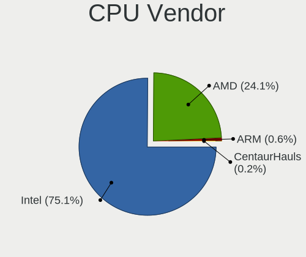

| Vendor       | Computers | Percent |
|--------------|-----------|---------|
| Intel        | 396       | 74.02%  |
| AMD          | 137       | 25.61%  |
| CentaurHauls | 1         | 0.19%   |
| ARM          | 1         | 0.19%   |

CPU Model
---------

Processor models

| Model                                         | Computers | Percent |
|-----------------------------------------------|-----------|---------|
| Intel Core i7-8550U CPU @ 1.80GHz             | 10        | 1.86%   |
| Intel Core i5-7200U CPU @ 2.50GHz             | 9         | 1.68%   |
| Intel Core i7-6700HQ CPU @ 2.60GHz            | 7         | 1.3%    |
| Intel 11th Gen Core i5-1135G7 @ 2.40GHz       | 7         | 1.3%    |
| Intel Core i5-6500 CPU @ 3.20GHz              | 6         | 1.12%   |
| Intel Core i3-2120 CPU @ 3.30GHz              | 6         | 1.12%   |
| Intel Core i7-10750H CPU @ 2.60GHz            | 5         | 0.93%   |
| Intel Core i5-3210M CPU @ 2.50GHz             | 5         | 0.93%   |
| Intel Core i5-2450M CPU @ 2.50GHz             | 5         | 0.93%   |
| Intel Core i3-4005U CPU @ 1.70GHz             | 5         | 0.93%   |
| Intel Atom x5-Z8350 CPU @ 1.44GHz             | 5         | 0.93%   |
| Intel 11th Gen Core i7-1165G7 @ 2.80GHz       | 5         | 0.93%   |
| AMD Ryzen 5 3500U with Radeon Vega Mobile Gfx | 5         | 0.93%   |
| AMD EPYC 9534 64-Core Processor               | 5         | 0.93%   |
| Intel Core i7-8750H CPU @ 2.20GHz             | 4         | 0.74%   |
| Intel Core i7-6700 CPU @ 3.40GHz              | 4         | 0.74%   |
| Intel Core i7-4790 CPU @ 3.60GHz              | 4         | 0.74%   |
| Intel Core i7-4510U CPU @ 2.00GHz             | 4         | 0.74%   |
| Intel Core i5-8400 CPU @ 2.80GHz              | 4         | 0.74%   |
| Intel Core i5-8250U CPU @ 1.60GHz             | 4         | 0.74%   |
| Intel Core i5-6200U CPU @ 2.30GHz             | 4         | 0.74%   |
| Intel Core i5-3230M CPU @ 2.60GHz             | 4         | 0.74%   |
| AMD Ryzen 9 5900HX with Radeon Graphics       | 4         | 0.74%   |
| AMD Ryzen 7 4800H with Radeon Graphics        | 4         | 0.74%   |
| AMD Ryzen 5 5500U with Radeon Graphics        | 4         | 0.74%   |
| AMD Ryzen 5 3600 6-Core Processor             | 4         | 0.74%   |
| AMD Ryzen 5 2600 Six-Core Processor           | 4         | 0.74%   |
| Intel Pentium CPU N3710 @ 1.60GHz             | 3         | 0.56%   |
| Intel Core i9-9900K CPU @ 3.60GHz             | 3         | 0.56%   |
| Intel Core i7-8565U CPU @ 1.80GHz             | 3         | 0.56%   |
| Intel Core i7-7700HQ CPU @ 2.80GHz            | 3         | 0.56%   |
| Intel Core i7-4770K CPU @ 3.50GHz             | 3         | 0.56%   |
| Intel Core i7-4770 CPU @ 3.40GHz              | 3         | 0.56%   |
| Intel Core i7-10510U CPU @ 1.80GHz            | 3         | 0.56%   |
| Intel Core i5-4200U CPU @ 1.60GHz             | 3         | 0.56%   |
| Intel Core i5-3340M CPU @ 2.70GHz             | 3         | 0.56%   |
| Intel Core i5-2400 CPU @ 3.10GHz              | 3         | 0.56%   |
| Intel Core i5 CPU M 430 @ 2.27GHz             | 3         | 0.56%   |
| Intel Core i3-4160 CPU @ 3.60GHz              | 3         | 0.56%   |
| Intel Core i3-3220 CPU @ 3.30GHz              | 3         | 0.56%   |

CPU Model Family
----------------

Processor model prefix

| Model                   | Computers | Percent |
|-------------------------|-----------|---------|
| Intel Core i5           | 115       | 21.46%  |
| Intel Core i7           | 98        | 18.28%  |
| Intel Core i3           | 54        | 10.07%  |
| AMD Ryzen 5             | 44        | 8.21%   |
| Other                   | 27        | 5.04%   |
| AMD Ryzen 7             | 22        | 4.1%    |
| Intel Celeron           | 20        | 3.73%   |
| Intel Xeon              | 17        | 3.17%   |
| Intel Core 2 Duo        | 17        | 3.17%   |
| Intel Pentium           | 15        | 2.8%    |
| Intel Atom              | 13        | 2.43%   |
| AMD Ryzen 9             | 9         | 1.68%   |
| AMD Ryzen 3             | 9         | 1.68%   |
| Intel Core i9           | 6         | 1.12%   |
| AMD A10                 | 6         | 1.12%   |
| AMD FX                  | 5         | 0.93%   |
| AMD EPYC                | 5         | 0.93%   |
| AMD Athlon II X2        | 5         | 0.93%   |
| AMD A4                  | 5         | 0.93%   |
| Intel Core 2 Quad       | 4         | 0.75%   |
| AMD Ryzen 7 PRO         | 4         | 0.75%   |
| AMD Athlon 64 X2        | 4         | 0.75%   |
| Intel Pentium Silver    | 3         | 0.56%   |
| Intel Pentium Dual-Core | 3         | 0.56%   |
| AMD Athlon              | 3         | 0.56%   |
| AMD A6                  | 3         | 0.56%   |
| Intel Pentium Dual      | 2         | 0.37%   |
| Intel Core m3           | 2         | 0.37%   |
| AMD Phenom II X6        | 2         | 0.37%   |
| AMD Phenom II X4        | 2         | 0.37%   |
| AMD E2                  | 2         | 0.37%   |
| Intel Pentium Gold      | 1         | 0.19%   |
| Intel Pentium D         | 1         | 0.19%   |
| Intel Pentium 4         | 1         | 0.19%   |
| CentaurHauls VIA Eden   | 1         | 0.19%   |
| AMD Turion 64 X2 Mobile | 1         | 0.19%   |
| AMD Ryzen 5 PRO         | 1         | 0.19%   |
| AMD Ryzen 3 PRO         | 1         | 0.19%   |
| AMD Phenom II X3        | 1         | 0.19%   |
| AMD E1                  | 1         | 0.19%   |

CPU Cores
---------

Number of processor cores

| Number | Computers | Percent |
|--------|-----------|---------|
| 4      | 210       | 39.11%  |
| 2      | 187       | 34.82%  |
| 6      | 64        | 11.92%  |
| 8      | 41        | 7.64%   |
| 12     | 8         | 1.49%   |
| 1      | 6         | 1.12%   |
| 128    | 5         | 0.93%   |
| 16     | 4         | 0.74%   |
| 14     | 4         | 0.74%   |
| 24     | 2         | 0.37%   |
| 10     | 2         | 0.37%   |
| 3      | 2         | 0.37%   |
| 40     | 1         | 0.19%   |
| 5      | 1         | 0.19%   |

CPU Sockets
-----------

Number of sockets

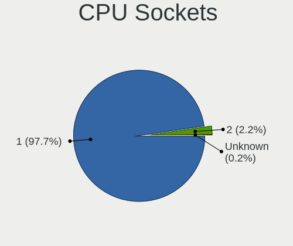

| Number | Computers | Percent |
|--------|-----------|---------|
| 1      | 523       | 97.76%  |
| 2      | 12        | 2.24%   |

CPU Threads
-----------

Threads per core (Hyper-Threading)

| Number | Computers | Percent |
|--------|-----------|---------|
| 2      | 378       | 70.26%  |
| 1      | 160       | 29.74%  |

CPU Op-Modes
------------

CPU Operation Modes (32-bit, 64-bit)

| Op mode        | Computers | Percent |
|----------------|-----------|---------|
| 32-bit, 64-bit | 528       | 98.69%  |
| Unknown        | 6         | 1.12%   |
| 32-bit         | 1         | 0.19%   |

CPU Microcode
-------------

Microcode number

| Number     | Computers | Percent |
|------------|-----------|---------|
| Unknown    | 194       | 34.28%  |
| 0x306c3    | 25        | 4.42%   |
| 0x206a7    | 23        | 4.06%   |
| 0x306a9    | 22        | 3.89%   |
| 0x506e3    | 16        | 2.83%   |
| 0x906ea    | 14        | 2.47%   |
| 0x806ea    | 13        | 2.3%    |
| 0x1067a    | 13        | 2.3%    |
| 0x40651    | 12        | 2.12%   |
| 0x906e9    | 10        | 1.77%   |
| 0x806ec    | 10        | 1.77%   |
| 0x806e9    | 10        | 1.77%   |
| 0x806c1    | 9         | 1.59%   |
| 0x20655    | 9         | 1.59%   |
| 0x0a50000c | 9         | 1.59%   |
| 0x406c4    | 7         | 1.24%   |
| 0x406e3    | 6         | 1.06%   |
| 0x406c3    | 6         | 1.06%   |
| 0x08600106 | 6         | 1.06%   |
| 0x08108102 | 6         | 1.06%   |
| 0x0800820d | 6         | 1.06%   |
| 0x30678    | 5         | 0.88%   |
| 0x0810100b | 5         | 0.88%   |
| 0x06001119 | 5         | 0.88%   |
| 0xa0652    | 4         | 0.71%   |
| 0x706a8    | 4         | 0.71%   |
| 0x706a1    | 4         | 0.71%   |
| 0x20652    | 4         | 0.71%   |
| 0x0a101116 | 4         | 0.71%   |
| 0x08701021 | 4         | 0.71%   |
| 0x08608103 | 4         | 0.71%   |
| 0x08108109 | 4         | 0.71%   |
| 0x010000c8 | 4         | 0.71%   |
| 0xa0655    | 3         | 0.53%   |
| 0x906ec    | 3         | 0.53%   |
| 0x906c0    | 3         | 0.53%   |
| 0x6fd      | 3         | 0.53%   |
| 0x406f1    | 3         | 0.53%   |
| 0x106e5    | 3         | 0.53%   |
| 0x106ca    | 3         | 0.53%   |

CPU Microarch
-------------

Microarchitecture

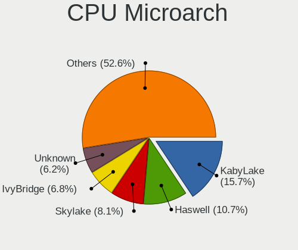

| Name             | Computers | Percent |
|------------------|-----------|---------|
| KabyLake         | 87        | 16.23%  |
| Haswell          | 59        | 11.01%  |
| Skylake          | 39        | 7.28%   |
| IvyBridge        | 33        | 6.16%   |
| SandyBridge      | 30        | 5.6%    |
| Unknown          | 28        | 5.22%   |
| Zen 2            | 26        | 4.85%   |
| Zen+             | 24        | 4.48%   |
| Silvermont       | 23        | 4.29%   |
| Penryn           | 21        | 3.92%   |
| Zen 3            | 20        | 3.73%   |
| CometLake        | 19        | 3.54%   |
| Westmere         | 16        | 2.99%   |
| TigerLake        | 13        | 2.43%   |
| Zen              | 11        | 2.05%   |
| Piledriver       | 10        | 1.87%   |
| Goldmont plus    | 10        | 1.87%   |
| K10              | 9         | 1.68%   |
| Broadwell        | 7         | 1.31%   |
| IceLake          | 6         | 1.12%   |
| Core             | 6         | 1.12%   |
| K8 Hammer        | 5         | 0.93%   |
| Excavator        | 5         | 0.93%   |
| Alderlake Hybrid | 5         | 0.93%   |
| Bonnell          | 4         | 0.75%   |
| Tremont          | 3         | 0.56%   |
| Nehalem          | 3         | 0.56%   |
| Goldmont         | 3         | 0.56%   |
| Steamroller      | 2         | 0.37%   |
| Puma             | 2         | 0.37%   |
| NetBurst         | 2         | 0.37%   |
| Bobcat           | 2         | 0.37%   |
| K10 Llano        | 1         | 0.19%   |
| Jaguar           | 1         | 0.19%   |
| CannonLake       | 1         | 0.19%   |

Graphics
--------

GPU Vendor
----------

Vendors of graphics cards

| Vendor                     | Computers | Percent |
|----------------------------|-----------|---------|
| Intel                      | 304       | 45.37%  |
| Nvidia                     | 207       | 30.9%   |
| AMD                        | 149       | 22.24%  |
| Matrox Electronics Systems | 6         | 0.9%    |
| VIA Technologies           | 2         | 0.3%    |
| ATI Technologies           | 1         | 0.15%   |
| ASPEED Technology          | 1         | 0.15%   |

GPU Model
---------

Graphics card models

| Model                                                                                    | Computers | Percent |
|------------------------------------------------------------------------------------------|-----------|---------|
| Intel 2nd Generation Core Processor Family Integrated Graphics Controller                | 23        | 3.33%   |
| Intel HD Graphics 530                                                                    | 22        | 3.18%   |
| Intel Haswell-ULT Integrated Graphics Controller                                         | 20        | 2.89%   |
| Intel 3rd Gen Core processor Graphics Controller                                         | 20        | 2.89%   |
| Intel UHD Graphics 620                                                                   | 17        | 2.46%   |
| Intel Atom/Celeron/Pentium Processor x5-E8000/J3xxx/N3xxx Integrated Graphics Controller | 16        | 2.32%   |
| AMD Picasso/Raven 2 [Radeon Vega Series / Radeon Vega Mobile Series]                     | 15        | 2.17%   |
| AMD Ellesmere [Radeon RX 470/480/570/570X/580/580X/590]                                  | 14        | 2.03%   |
| Intel TigerLake-LP GT2 [Iris Xe Graphics]                                                | 13        | 1.88%   |
| Intel CoffeeLake-H GT2 [UHD Graphics 630]                                                | 13        | 1.88%   |
| AMD Renoir [Radeon RX Vega 6 (Ryzen 4000/5000 Mobile Series)]                            | 13        | 1.88%   |
| AMD Cezanne [Radeon Vega Series / Radeon Vega Mobile Series]                             | 13        | 1.88%   |
| Intel HD Graphics 620                                                                    | 12        | 1.74%   |
| Intel Xeon E3-1200 v3/4th Gen Core Processor Integrated Graphics Controller              | 11        | 1.59%   |
| Intel CoffeeLake-S GT2 [UHD Graphics 630]                                                | 10        | 1.45%   |
| Intel GeminiLake [UHD Graphics 600]                                                      | 9         | 1.3%    |
| Intel CometLake-H GT2 [UHD Graphics]                                                     | 9         | 1.3%    |
| Nvidia TU117M [GeForce GTX 1650 Mobile / Max-Q]                                          | 8         | 1.16%   |
| Nvidia GF117M [GeForce 610M/710M/810M/820M / GT 620M/625M/630M/720M]                     | 8         | 1.16%   |
| Intel CometLake-U GT2 [UHD Graphics]                                                     | 8         | 1.16%   |
| AMD Raven Ridge [Radeon Vega Series / Radeon Vega Mobile Series]                         | 8         | 1.16%   |
| Nvidia TU117M [GeForce GTX 1650 Ti Mobile]                                               | 7         | 1.01%   |
| Intel Skylake GT2 [HD Graphics 520]                                                      | 7         | 1.01%   |
| Intel HD Graphics 630                                                                    | 7         | 1.01%   |
| Intel Atom Processor Z36xxx/Z37xxx Series Graphics & Display                             | 7         | 1.01%   |
| Intel 4th Generation Core Processor Family Integrated Graphics Controller                | 7         | 1.01%   |
| Intel 4th Gen Core Processor Integrated Graphics Controller                              | 7         | 1.01%   |
| Nvidia GT218 [GeForce 210]                                                               | 6         | 0.87%   |
| Nvidia GP108 [GeForce GT 1030]                                                           | 6         | 0.87%   |
| Nvidia GP107M [GeForce GTX 1050 Mobile]                                                  | 6         | 0.87%   |
| Nvidia GP104 [GeForce GTX 1070]                                                          | 6         | 0.87%   |
| Nvidia GK208B [GeForce GT 710]                                                           | 6         | 0.87%   |
| Intel WhiskeyLake-U GT2 [UHD Graphics 620]                                               | 6         | 0.87%   |
| AMD Topaz XT [Radeon R7 M260/M265 / M340/M360 / M440/M445 / 530/535 / 620/625 Mobile]    | 6         | 0.87%   |
| AMD Lucienne                                                                             | 6         | 0.87%   |
| Nvidia GP108M [GeForce MX150]                                                            | 5         | 0.72%   |
| Nvidia GP107 [GeForce GTX 1050 Ti]                                                       | 5         | 0.72%   |
| Nvidia GM108M [GeForce 940MX]                                                            | 5         | 0.72%   |
| Nvidia GM108M [GeForce 840M]                                                             | 5         | 0.72%   |
| Nvidia GM107M [GeForce GTX 960M]                                                         | 5         | 0.72%   |

GPU Combo
---------

Combinations of graphics cards

| Name                 | Computers | Percent |
|----------------------|-----------|---------|
| 1 x Intel            | 188       | 34.43%  |
| 1 x AMD              | 116       | 21.25%  |
| Intel + Nvidia       | 94        | 17.22%  |
| 1 x Nvidia           | 93        | 17.03%  |
| AMD + Nvidia         | 16        | 2.93%   |
| Intel + AMD          | 11        | 2.01%   |
| 2 x AMD              | 10        | 1.83%   |
| 1 x Matrox           | 6         | 1.1%    |
| Intel + 2 x Nvidia   | 3         | 0.55%   |
| 1 x VIA              | 2         | 0.37%   |
| Other                | 1         | 0.18%   |
| 3 x Nvidia           | 1         | 0.18%   |
| 2 x Nvidia           | 1         | 0.18%   |
| 2 x Intel            | 1         | 0.18%   |
| 2 x AMD + 1 x Nvidia | 1         | 0.18%   |
| 1 x ASPEED           | 1         | 0.18%   |
| AMD + 2 x Nvidia     | 1         | 0.18%   |

GPU Driver
----------

Free vs proprietary

| Driver      | Computers | Percent |
|-------------|-----------|---------|
| Free        | 433       | 78.44%  |
| Proprietary | 103       | 18.66%  |
| Unknown     | 16        | 2.9%    |

GPU Memory
----------

Total video memory

| Size in GB | Computers | Percent |
|------------|-----------|---------|
| Unknown    | 312       | 56.12%  |
| 1.01-2.0   | 69        | 12.41%  |
| 0.01-0.5   | 54        | 9.71%   |
| 3.01-4.0   | 51        | 9.17%   |
| 0.51-1.0   | 33        | 5.94%   |
| 7.01-8.0   | 20        | 3.6%    |
| 5.01-6.0   | 11        | 1.98%   |
| 8.01-16.0  | 3         | 0.54%   |
| 4.01-5.0   | 1         | 0.18%   |
| 2.01-3.0   | 1         | 0.18%   |
| 16.01-24.0 | 1         | 0.18%   |

Monitor
-------

Monitor Vendor
--------------

Monitor vendors

| Vendor                  | Computers | Percent |
|-------------------------|-----------|---------|
| Samsung Electronics     | 81        | 13.99%  |
| AU Optronics            | 70        | 12.09%  |
| Chimei Innolux          | 49        | 8.46%   |
| BOE                     | 44        | 7.6%    |
| Acer                    | 44        | 7.6%    |
| Goldstar                | 43        | 7.43%   |
| LG Display              | 37        | 6.39%   |
| Dell                    | 34        | 5.87%   |
| Hewlett-Packard         | 19        | 3.28%   |
| AOC                     | 18        | 3.11%   |
| Apple                   | 13        | 2.25%   |
| Lenovo                  | 12        | 2.07%   |
| PANDA                   | 11        | 1.9%    |
| Sharp                   | 9         | 1.55%   |
| ViewSonic               | 8         | 1.38%   |
| BenQ                    | 7         | 1.21%   |
| LG Electronics          | 6         | 1.04%   |
| Philips                 | 5         | 0.86%   |
| Unknown (XXX)           | 3         | 0.52%   |
| SGT                     | 3         | 0.52%   |
| RTK                     | 3         | 0.52%   |
| MSI                     | 3         | 0.52%   |
| InfoVision              | 3         | 0.52%   |
| Chi Mei Optoelectronics | 3         | 0.52%   |
| ASUSTek Computer        | 3         | 0.52%   |
| Ancor Communications    | 3         | 0.52%   |
| Valve                   | 2         | 0.35%   |
| Toshiba                 | 2         | 0.35%   |
| SKY                     | 2         | 0.35%   |
| MStar                   | 2         | 0.35%   |
| Microstep               | 2         | 0.35%   |
| Mi                      | 2         | 0.35%   |
| HJC                     | 2         | 0.35%   |
| Fujitsu                 | 2         | 0.35%   |
| CSO                     | 2         | 0.35%   |
| ___                     | 1         | 0.17%   |
| Unknown                 | 1         | 0.17%   |
| TCL                     | 1         | 0.17%   |
| Sony                    | 1         | 0.17%   |
| Seiko/Epson             | 1         | 0.17%   |

Monitor Model
-------------

Monitor models

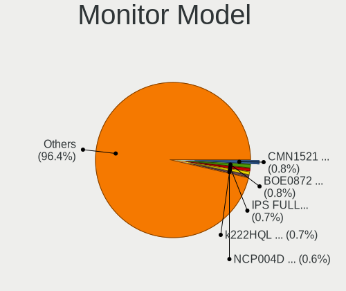

| Model                                                                 | Computers | Percent |
|-----------------------------------------------------------------------|-----------|---------|
| Goldstar IPS FULLHD GSM5AB8 1920x1080 480x270mm 21.7-inch             | 5         | 0.84%   |
| BOE LCD Monitor BOE0872 1920x1080 344x194mm 15.5-inch                 | 5         | 0.84%   |
| PANDA LCD Monitor NCP0036 1920x1080 344x194mm 15.5-inch               | 4         | 0.67%   |
| Acer VG220Q ACR06D8 1920x1080 476x268mm 21.5-inch                     | 4         | 0.67%   |
| Acer K222HQL ACR0512 1920x1080 477x268mm 21.5-inch                    | 4         | 0.67%   |
| Samsung Electronics S20B300 SAM08A8 1600x900 443x249mm 20.0-inch      | 3         | 0.5%    |
| Samsung Electronics LCD Monitor SDC4161 1920x1080 344x194mm 15.5-inch | 3         | 0.5%    |
| PANDA LCD Monitor NCP004D 1920x1080 344x194mm 15.5-inch               | 3         | 0.5%    |
| Goldstar HDR WFHD GSM7714 2560x1080 798x334mm 34.1-inch               | 3         | 0.5%    |
| Chimei Innolux LCD Monitor CMN15F5 1920x1080 344x193mm 15.5-inch      | 3         | 0.5%    |
| Chimei Innolux LCD Monitor CMN1521 1920x1080 344x193mm 15.5-inch      | 3         | 0.5%    |
| AU Optronics LCD Monitor AUO106C 1366x768 276x155mm 12.5-inch         | 3         | 0.5%    |
| AOC 27G2G8 AOC2702 1920x1080 598x336mm 27.0-inch                      | 3         | 0.5%    |
| AOC 24B1W1 AOC2401 1920x1080 527x296mm 23.8-inch                      | 3         | 0.5%    |
| AOC 2381 AOC2381 1920x1080 509x286mm 23.0-inch                        | 3         | 0.5%    |
| Acer S200HQL ACR0359 1920x1080 435x239mm 19.5-inch                    | 3         | 0.5%    |
| ViewSonic VG2448 VSC3B35 1920x1080 527x296mm 23.8-inch                | 2         | 0.34%   |
| Valve ANX7530 U VLV3001 800x1280 100x150mm 7.1-inch                   | 2         | 0.34%   |
| SGT '' SGT2380 1920x1080 455x256mm 20.6-inch                          | 2         | 0.34%   |
| Samsung Electronics SyncMaster SAM037B 1680x1050 474x296mm 22.0-inch  | 2         | 0.34%   |
| Samsung Electronics SyncMaster SAM0366 1280x1024 338x270mm 17.0-inch  | 2         | 0.34%   |
| Samsung Electronics SME1920 SAM06B7 1366x768 410x230mm 18.5-inch      | 2         | 0.34%   |
| Samsung Electronics S24F350 SAM0D21 1920x1080 520x290mm 23.4-inch     | 2         | 0.34%   |
| Samsung Electronics S24F350 SAM0D20 1920x1080 521x293mm 23.5-inch     | 2         | 0.34%   |
| Samsung Electronics S22F350 SAM0D1A 1920x1080 477x268mm 21.5-inch     | 2         | 0.34%   |
| Samsung Electronics S22D300 SAM0B3F 1920x1080 477x268mm 21.5-inch     | 2         | 0.34%   |
| Samsung Electronics LS24AG32x SAM71DA 1920x1080 527x296mm 23.8-inch   | 2         | 0.34%   |
| Samsung Electronics LCD Monitor SEC3741 1366x768 309x174mm 14.0-inch  | 2         | 0.34%   |
| Samsung Electronics LCD Monitor SEC3242 1920x1080 235x132mm 10.6-inch | 2         | 0.34%   |
| Samsung Electronics LCD Monitor SDC4171 2880x1800 302x189mm 14.0-inch | 2         | 0.34%   |
| Samsung Electronics LCD Monitor SAM0F13 3840x2160 890x500mm 40.2-inch | 2         | 0.34%   |
| Samsung Electronics LCD Monitor SAM0C39 1920x1080 885x498mm 40.0-inch | 2         | 0.34%   |
| Samsung Electronics LCD Monitor SAM0678 1360x768                      | 2         | 0.34%   |
| Samsung Electronics C24F390 SAM0D2C 1920x1080 521x293mm 23.5-inch     | 2         | 0.34%   |
| Philips 236V4 PHLC0B3 1920x1080 510x287mm 23.0-inch                   | 2         | 0.34%   |
| MStar TV MST0030 1920x1080 708x398mm 32.0-inch                        | 2         | 0.34%   |
| Mi Monitor XMI23C3 1920x1080 527x293mm 23.7-inch                      | 2         | 0.34%   |
| LG Electronics LCD Monitor LG IPS FULLHD 1920x1080                    | 2         | 0.34%   |
| LG Display LCD Monitor LGD0454 1366x768 310x174mm 14.0-inch           | 2         | 0.34%   |
| LG Display LCD Monitor LGD02DF 1600x900 310x174mm 14.0-inch           | 2         | 0.34%   |

Monitor Resolution
------------------

Monitor screen resolution

| Resolution         | Computers | Percent |
|--------------------|-----------|---------|
| 1920x1080 (FHD)    | 250       | 45.13%  |
| 1366x768 (WXGA)    | 114       | 20.58%  |
| 3840x2160 (4K)     | 37        | 6.68%   |
| 1600x900 (HD+)     | 27        | 4.87%   |
| 2560x1440 (QHD)    | 21        | 3.79%   |
| 1440x900 (WXGA+)   | 15        | 2.71%   |
| 1280x1024 (SXGA)   | 10        | 1.81%   |
| 1920x1200 (WUXGA)  | 9         | 1.62%   |
| 1680x1050 (WSXGA+) | 9         | 1.62%   |
| 2560x1080          | 8         | 1.44%   |
| 1360x768           | 8         | 1.44%   |
| 2560x1600          | 6         | 1.08%   |
| Unknown            | 6         | 1.08%   |
| 2880x1800          | 5         | 0.9%    |
| 1280x800 (WXGA)    | 5         | 0.9%    |
| 3840x2400          | 3         | 0.54%   |
| 800x1280           | 2         | 0.36%   |
| 3840x1080          | 2         | 0.36%   |
| 3440x1440          | 2         | 0.36%   |
| 2160x1440          | 2         | 0.36%   |
| 1600x1200          | 2         | 0.36%   |
| 5120x1440          | 1         | 0.18%   |
| 3520x1080          | 1         | 0.18%   |
| 2736x1824          | 1         | 0.18%   |
| 2732x768           | 1         | 0.18%   |
| 2256x1504          | 1         | 0.18%   |
| 1920x515           | 1         | 0.18%   |
| 1920x1280          | 1         | 0.18%   |
| 1280x960           | 1         | 0.18%   |
| 1280x720 (HD)      | 1         | 0.18%   |
| 1024x768 (XGA)     | 1         | 0.18%   |
| 1024x600           | 1         | 0.18%   |

Monitor Diagonal
----------------

Diagonal size in inches

| Inches  | Computers | Percent |
|---------|-----------|---------|
| 15      | 112       | 19.38%  |
| 14      | 61        | 10.55%  |
| 13      | 52        | 9%      |
| 23      | 46        | 7.96%   |
| 24      | 40        | 6.92%   |
| 21      | 39        | 6.75%   |
| 27      | 31        | 5.36%   |
| Unknown | 29        | 5.02%   |
| 18      | 23        | 3.98%   |
| 20      | 20        | 3.46%   |
| 17      | 20        | 3.46%   |
| 19      | 19        | 3.29%   |
| 11      | 15        | 2.6%    |
| 16      | 9         | 1.56%   |
| 34      | 8         | 1.38%   |
| 12      | 7         | 1.21%   |
| 31      | 6         | 1.04%   |
| 22      | 6         | 1.04%   |
| 84      | 5         | 0.87%   |
| 26      | 5         | 0.87%   |
| 54      | 4         | 0.69%   |
| 72      | 3         | 0.52%   |
| 40      | 3         | 0.52%   |
| 52      | 2         | 0.35%   |
| 46      | 2         | 0.35%   |
| 7       | 2         | 0.35%   |
| 86      | 1         | 0.17%   |
| 74      | 1         | 0.17%   |
| 60      | 1         | 0.17%   |
| 57      | 1         | 0.17%   |
| 39      | 1         | 0.17%   |
| 32      | 1         | 0.17%   |
| 29      | 1         | 0.17%   |
| 10      | 1         | 0.17%   |
| 8       | 1         | 0.17%   |

Monitor Width
-------------

Physical width

| Width in mm | Computers | Percent |
|-------------|-----------|---------|
| 301-350     | 213       | 37.83%  |
| 501-600     | 113       | 20.07%  |
| 401-500     | 102       | 18.12%  |
| 201-300     | 46        | 8.17%   |
| Unknown     | 29        | 5.15%   |
| 351-400     | 19        | 3.37%   |
| 1001-1500   | 10        | 1.78%   |
| 701-800     | 9         | 1.6%    |
| 1501-2000   | 8         | 1.42%   |
| 601-700     | 7         | 1.24%   |
| 801-900     | 4         | 0.71%   |
| 1-100       | 2         | 0.36%   |
| 101-200     | 1         | 0.18%   |

Aspect Ratio
------------

Proportional relationship between the width and the height

| Ratio   | Computers | Percent |
|---------|-----------|---------|
| 16/9    | 401       | 77.56%  |
| 16/10   | 59        | 11.41%  |
| Unknown | 23        | 4.45%   |
| 5/4     | 11        | 2.13%   |
| 21/9    | 8         | 1.55%   |
| 3/2     | 6         | 1.16%   |
| 4/3     | 2         | 0.39%   |
| 2.00    | 2         | 0.39%   |
| 0.67    | 2         | 0.39%   |
| 0.56    | 2         | 0.39%   |
| 3.73    | 1         | 0.19%   |

Monitor Area
------------

Area in inch

| Area in inch | Computers | Percent |
|----------------|-----------|---------|
| 101-110        | 112       | 19.48%  |
| 201-250        | 108       | 18.78%  |
| 81-90          | 95        | 16.52%  |
| 151-200        | 50        | 8.7%    |
| 301-350        | 34        | 5.91%   |
| Unknown        | 29        | 5.04%   |
| 141-150        | 26        | 4.52%   |
| 71-80          | 18        | 3.13%   |
| More than 1000 | 17        | 2.96%   |
| 51-60          | 16        | 2.78%   |
| 351-500        | 16        | 2.78%   |
| 251-300        | 14        | 2.43%   |
| 121-130        | 12        | 2.09%   |
| 61-70          | 7         | 1.22%   |
| 111-120        | 7         | 1.22%   |
| 501-1000       | 6         | 1.04%   |
| 131-140        | 4         | 0.7%    |
| 1-40           | 3         | 0.52%   |
| 91-100         | 1         | 0.17%   |

Pixel Density
-------------

Pixels per inch

| Density       | Computers | Percent |
|---------------|-----------|---------|
| 51-100        | 183       | 33.03%  |
| 121-160       | 141       | 25.45%  |
| 101-120       | 133       | 24.01%  |
| 161-240       | 39        | 7.04%   |
| Unknown       | 29        | 5.23%   |
| More than 240 | 16        | 2.89%   |
| 1-50          | 13        | 2.35%   |

Multiple Monitors
-----------------

Total monitors connected

| Total | Computers | Percent |
|-------|-----------|---------|
| 1     | 432       | 77.56%  |
| 2     | 86        | 15.44%  |
| 0     | 29        | 5.21%   |
| 3     | 10        | 1.8%    |

Network
-------

Net Controller Vendor
---------------------

Controller vendors

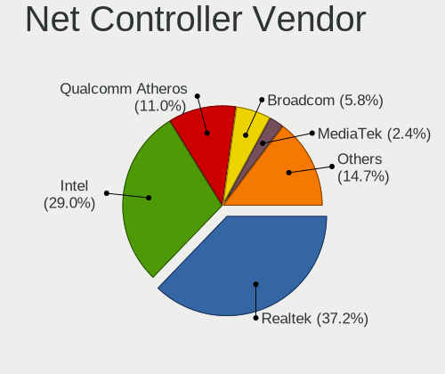

| Vendor                            | Computers | Percent |
|-----------------------------------|-----------|---------|
| Realtek Semiconductor             | 315       | 37.54%  |
| Intel                             | 232       | 27.65%  |
| Qualcomm Atheros                  | 93        | 11.08%  |
| Broadcom                          | 53        | 6.32%   |
| MediaTek                          | 17        | 2.03%   |
| Ralink Technology                 | 15        | 1.79%   |
| TP-Link                           | 13        | 1.55%   |
| D-Link                            | 11        | 1.31%   |
| ASIX Electronics                  | 10        | 1.19%   |
| Nvidia                            | 9         | 1.07%   |
| Broadcom Limited                  | 9         | 1.07%   |
| Ralink                            | 5         | 0.6%    |
| Qualcomm                          | 5         | 0.6%    |
| Dell                              | 5         | 0.6%    |
| Xiaomi                            | 4         | 0.48%   |
| Marvell Technology Group          | 4         | 0.48%   |
| Edimax Technology                 | 4         | 0.48%   |
| D-Link System                     | 4         | 0.48%   |
| Samsung Electronics               | 3         | 0.36%   |
| ASUSTek Computer                  | 3         | 0.36%   |
| VIA Technologies                  | 2         | 0.24%   |
| Sierra Wireless                   | 2         | 0.24%   |
| OPPO Electronics                  | 2         | 0.24%   |
| Mercucys                          | 2         | 0.24%   |
| Huawei Technologies               | 2         | 0.24%   |
| Ericsson Business Mobile Networks | 2         | 0.24%   |
| vivo                              | 1         | 0.12%   |
| Qualcomm Atheros Communications   | 1         | 0.12%   |
| QinHeng Electronics               | 1         | 0.12%   |
| OnePlus Technology (Shenzhen)     | 1         | 0.12%   |
| Motorola PCS                      | 1         | 0.12%   |
| Lenovo                            | 1         | 0.12%   |
| JMicron Technology                | 1         | 0.12%   |
| Fibocom                           | 1         | 0.12%   |
| BUFFALO                           | 1         | 0.12%   |
| AVM                               | 1         | 0.12%   |
| Aquantia                          | 1         | 0.12%   |
| Apple                             | 1         | 0.12%   |
| Adafruit                          | 1         | 0.12%   |

Net Controller Model
--------------------

Controller models

| Model                                                                  | Computers | Percent |
|------------------------------------------------------------------------|-----------|---------|
| Realtek RTL8111/8168/8211/8411 PCI Express Gigabit Ethernet Controller | 242       | 25.26%  |
| Qualcomm Atheros QCA9377 802.11ac Wireless Network Adapter             | 22        | 2.3%    |
| Intel Wi-Fi 6 AX200                                                    | 20        | 2.09%   |
| Realtek RTL8821CE 802.11ac PCIe Wireless Network Adapter               | 19        | 1.98%   |
| Realtek RTL810xE PCI Express Fast Ethernet controller                  | 19        | 1.98%   |
| Qualcomm Atheros QCA9565 / AR9565 Wireless Network Adapter             | 15        | 1.57%   |
| Intel 82579LM Gigabit Network Connection (Lewisville)                  | 15        | 1.57%   |
| Intel Cannon Lake PCH CNVi WiFi                                        | 14        | 1.46%   |
| Intel Wireless 7265                                                    | 12        | 1.25%   |
| Intel Wireless 8265 / 8275                                             | 11        | 1.15%   |
| Realtek RTL8822CE 802.11ac PCIe Wireless Network Adapter               | 10        | 1.04%   |
| Realtek RTL8125 2.5GbE Controller                                      | 10        | 1.04%   |
| Intel Wireless 8260                                                    | 10        | 1.04%   |
| Broadcom BCM43142 802.11b/g/n                                          | 10        | 1.04%   |
| Realtek RTL8153 Gigabit Ethernet Adapter                               | 9         | 0.94%   |
| MediaTek MT7921 802.11ax PCI Express Wireless Network Adapter          | 9         | 0.94%   |
| Intel Wireless 3160                                                    | 9         | 0.94%   |
| Intel Wi-Fi 6 AX201                                                    | 9         | 0.94%   |
| Intel Wi-Fi 5(802.11ac) Wireless-AC 9x6x [Thunder Peak]                | 9         | 0.94%   |
| Intel Ethernet Connection I217-LM                                      | 9         | 0.94%   |
| Intel Comet Lake PCH CNVi WiFi                                         | 9         | 0.94%   |
| Realtek RTL8188EUS 802.11n Wireless Network Adapter                    | 8         | 0.84%   |
| Intel Ethernet Connection (2) I219-V                                   | 8         | 0.84%   |
| Intel Comet Lake PCH-LP CNVi WiFi                                      | 8         | 0.84%   |
| Qualcomm Atheros QCA6174 802.11ac Wireless Network Adapter             | 7         | 0.73%   |
| Qualcomm Atheros AR9485 Wireless Network Adapter                       | 7         | 0.73%   |
| Qualcomm Atheros AR9285 Wireless Network Adapter (PCI-Express)         | 7         | 0.73%   |
| Intel I211 Gigabit Network Connection                                  | 7         | 0.73%   |
| Intel Ethernet Connection (2) I219-LM                                  | 7         | 0.73%   |
| Broadcom BCM4313 802.11bgn Wireless Network Adapter                    | 7         | 0.73%   |
| ASIX AX88179 Gigabit Ethernet                                          | 7         | 0.73%   |
| Ralink MT7601U Wireless Adapter                                        | 6         | 0.63%   |
| Intel Wireless 7260                                                    | 6         | 0.63%   |
| Intel Centrino Advanced-N 6205 [Taylor Peak]                           | 6         | 0.63%   |
| Realtek RTL88x2bu [AC1200 Techkey]                                     | 5         | 0.52%   |
| Qualcomm Atheros AR9462 Wireless Network Adapter                       | 5         | 0.52%   |
| Qualcomm Atheros AR928X Wireless Network Adapter (PCI-Express)         | 5         | 0.52%   |
| Intel Wireless 3165                                                    | 5         | 0.52%   |
| Intel Wi-Fi 6E(802.11ax) AX210/AX1675* 2x2 [Typhoon Peak]              | 5         | 0.52%   |
| Intel Ethernet Controller I225-V                                       | 5         | 0.52%   |

Wireless Vendor
---------------

Wireless vendors

| Vendor                          | Computers | Percent |
|---------------------------------|-----------|---------|
| Intel                           | 176       | 39.02%  |
| Qualcomm Atheros                | 79        | 17.52%  |
| Realtek Semiconductor           | 75        | 16.63%  |
| Broadcom                        | 31        | 6.87%   |
| MediaTek                        | 17        | 3.77%   |
| Ralink Technology               | 15        | 3.33%   |
| TP-Link                         | 13        | 2.88%   |
| D-Link                          | 11        | 2.44%   |
| Broadcom Limited                | 7         | 1.55%   |
| Ralink                          | 5         | 1.11%   |
| Qualcomm                        | 4         | 0.89%   |
| Edimax Technology               | 4         | 0.89%   |
| ASUSTek Computer                | 3         | 0.67%   |
| Sierra Wireless                 | 2         | 0.44%   |
| Mercucys                        | 2         | 0.44%   |
| D-Link System                   | 2         | 0.44%   |
| Qualcomm Atheros Communications | 1         | 0.22%   |
| Marvell Technology Group        | 1         | 0.22%   |
| Fibocom                         | 1         | 0.22%   |
| BUFFALO                         | 1         | 0.22%   |
| AVM                             | 1         | 0.22%   |

Wireless Model
--------------

Wireless models

| Model                                                                | Computers | Percent |
|----------------------------------------------------------------------|-----------|---------|
| Qualcomm Atheros QCA9377 802.11ac Wireless Network Adapter           | 22        | 4.84%   |
| Intel Wi-Fi 6 AX200                                                  | 20        | 4.4%    |
| Realtek RTL8821CE 802.11ac PCIe Wireless Network Adapter             | 19        | 4.18%   |
| Qualcomm Atheros QCA9565 / AR9565 Wireless Network Adapter           | 15        | 3.3%    |
| Intel Cannon Lake PCH CNVi WiFi                                      | 14        | 3.08%   |
| Intel Wireless 7265                                                  | 12        | 2.64%   |
| Intel Wireless 8265 / 8275                                           | 11        | 2.42%   |
| Realtek RTL8822CE 802.11ac PCIe Wireless Network Adapter             | 10        | 2.2%    |
| Intel Wireless 8260                                                  | 10        | 2.2%    |
| Broadcom BCM43142 802.11b/g/n                                        | 10        | 2.2%    |
| MediaTek MT7921 802.11ax PCI Express Wireless Network Adapter        | 9         | 1.98%   |
| Intel Wireless 3160                                                  | 9         | 1.98%   |
| Intel Wi-Fi 6 AX201                                                  | 9         | 1.98%   |
| Intel Wi-Fi 5(802.11ac) Wireless-AC 9x6x [Thunder Peak]              | 9         | 1.98%   |
| Intel Comet Lake PCH CNVi WiFi                                       | 9         | 1.98%   |
| Realtek RTL8188EUS 802.11n Wireless Network Adapter                  | 8         | 1.76%   |
| Intel Comet Lake PCH-LP CNVi WiFi                                    | 8         | 1.76%   |
| Qualcomm Atheros QCA6174 802.11ac Wireless Network Adapter           | 7         | 1.54%   |
| Qualcomm Atheros AR9485 Wireless Network Adapter                     | 7         | 1.54%   |
| Qualcomm Atheros AR9285 Wireless Network Adapter (PCI-Express)       | 7         | 1.54%   |
| Broadcom BCM4313 802.11bgn Wireless Network Adapter                  | 7         | 1.54%   |
| Ralink MT7601U Wireless Adapter                                      | 6         | 1.32%   |
| Intel Wireless 7260                                                  | 6         | 1.32%   |
| Intel Centrino Advanced-N 6205 [Taylor Peak]                         | 6         | 1.32%   |
| Realtek RTL88x2bu [AC1200 Techkey]                                   | 5         | 1.1%    |
| Qualcomm Atheros AR9462 Wireless Network Adapter                     | 5         | 1.1%    |
| Qualcomm Atheros AR928X Wireless Network Adapter (PCI-Express)       | 5         | 1.1%    |
| Intel Wireless 3165                                                  | 5         | 1.1%    |
| Intel Wi-Fi 6E(802.11ax) AX210/AX1675* 2x2 [Typhoon Peak]            | 5         | 1.1%    |
| Intel Dual Band Wireless-AC 3168NGW [Stone Peak]                     | 5         | 1.1%    |
| Intel Dual Band Wireless-AC 3165 Plus Bluetooth                      | 5         | 1.1%    |
| Intel Cannon Point-LP CNVi [Wireless-AC]                             | 5         | 1.1%    |
| D-Link DWA-140 RangeBooster N Adapter(rev.B3) [Ralink RT5372]        | 5         | 1.1%    |
| Broadcom Limited BCM4360 802.11ac Dual Band Wireless Network Adapter | 5         | 1.1%    |
| Realtek RTL8822BE 802.11a/b/g/n/ac WiFi adapter                      | 4         | 0.88%   |
| Realtek RTL8192CE PCIe Wireless Network Adapter                      | 4         | 0.88%   |
| Realtek RTL8188FTV 802.11b/g/n 1T1R 2.4G WLAN Adapter                | 4         | 0.88%   |
| MediaTek MT7921K (RZ608) Wi-Fi 6E 80MHz                              | 4         | 0.88%   |
| Intel PRO/Wireless 5100 AGN [Shiloh] Network Connection              | 4         | 0.88%   |
| Intel Ice Lake-LP PCH CNVi WiFi                                      | 4         | 0.88%   |

Ethernet Vendor
---------------

Ethernet vendors

| Vendor                        | Computers | Percent |
|-------------------------------|-----------|---------|
| Realtek Semiconductor         | 282       | 59.24%  |
| Intel                         | 99        | 20.8%   |
| Broadcom                      | 27        | 5.67%   |
| Qualcomm Atheros              | 19        | 3.99%   |
| ASIX Electronics              | 10        | 2.1%    |
| Nvidia                        | 9         | 1.89%   |
| Dell                          | 5         | 1.05%   |
| Xiaomi                        | 4         | 0.84%   |
| Samsung Electronics           | 3         | 0.63%   |
| Marvell Technology Group      | 3         | 0.63%   |
| VIA Technologies              | 2         | 0.42%   |
| OPPO Electronics              | 2         | 0.42%   |
| D-Link System                 | 2         | 0.42%   |
| Broadcom Limited              | 2         | 0.42%   |
| OnePlus Technology (Shenzhen) | 1         | 0.21%   |
| Motorola PCS                  | 1         | 0.21%   |
| Lenovo                        | 1         | 0.21%   |
| JMicron Technology            | 1         | 0.21%   |
| Huawei Technologies           | 1         | 0.21%   |
| Aquantia                      | 1         | 0.21%   |
| Apple                         | 1         | 0.21%   |

Ethernet Model
--------------

Ethernet models

| Model                                                                  | Computers | Percent |
|------------------------------------------------------------------------|-----------|---------|
| Realtek RTL8111/8168/8211/8411 PCI Express Gigabit Ethernet Controller | 242       | 48.79%  |
| Realtek RTL810xE PCI Express Fast Ethernet controller                  | 19        | 3.83%   |
| Intel 82579LM Gigabit Network Connection (Lewisville)                  | 15        | 3.02%   |
| Realtek RTL8125 2.5GbE Controller                                      | 10        | 2.02%   |
| Realtek RTL8153 Gigabit Ethernet Adapter                               | 9         | 1.81%   |
| Intel Ethernet Connection I217-LM                                      | 9         | 1.81%   |
| Intel Ethernet Connection (2) I219-V                                   | 8         | 1.61%   |
| Intel I211 Gigabit Network Connection                                  | 7         | 1.41%   |
| Intel Ethernet Connection (2) I219-LM                                  | 7         | 1.41%   |
| ASIX AX88179 Gigabit Ethernet                                          | 7         | 1.41%   |
| Intel Ethernet Controller I225-V                                       | 5         | 1.01%   |
| Intel Ethernet Connection I217-V                                       | 5         | 1.01%   |
| Dell iDRAC Virtual NIC                                                 | 5         | 1.01%   |
| Broadcom NetXtreme BCM5720 Gigabit Ethernet PCIe                       | 5         | 1.01%   |
| Broadcom BCM57454 NetXtreme-E 10Gb/25Gb/40Gb/50Gb/100Gb Ethernet       | 5         | 1.01%   |
| Broadcom BCM57414 NetXtreme-E 10Gb/25Gb RDMA Ethernet Controller       | 5         | 1.01%   |
| Nvidia MCP61 Ethernet                                                  | 4         | 0.81%   |
| Intel Ethernet Connection (7) I219-V                                   | 4         | 0.81%   |
| Intel Ethernet Connection (5) I219-LM                                  | 4         | 0.81%   |
| Intel Ethernet Connection (4) I219-LM                                  | 4         | 0.81%   |
| Xiaomi Mi/Redmi series (RNDIS)                                         | 3         | 0.6%    |
| Qualcomm Atheros QCA8171 Gigabit Ethernet                              | 3         | 0.6%    |
| Qualcomm Atheros AR8161 Gigabit Ethernet                               | 3         | 0.6%    |
| Qualcomm Atheros AR8151 v2.0 Gigabit Ethernet                          | 3         | 0.6%    |
| Nvidia MCP79 Ethernet                                                  | 3         | 0.6%    |
| Intel Ethernet Connection (2) I218-V                                   | 3         | 0.6%    |
| Broadcom NetLink BCM57785 Gigabit Ethernet PCIe                        | 3         | 0.6%    |
| Samsung Galaxy series, misc. (tethering mode)                          | 2         | 0.4%    |
| Realtek RTL8152 Fast Ethernet Adapter                                  | 2         | 0.4%    |
| Realtek RTL-8110SC/8169SC Gigabit Ethernet                             | 2         | 0.4%    |
| Realtek Killer E2600 GbE Controller                                    | 2         | 0.4%    |
| Qualcomm Atheros Killer E2500 Gigabit Ethernet Controller              | 2         | 0.4%    |
| Qualcomm Atheros Killer E2400 Gigabit Ethernet Controller              | 2         | 0.4%    |
| Qualcomm Atheros AR8152 v1.1 Fast Ethernet                             | 2         | 0.4%    |
| OPPO SM8350-IDP _SN:361A1B3C                                           | 2         | 0.4%    |
| Nvidia MCP73 Ethernet                                                  | 2         | 0.4%    |
| Intel I350 Gigabit Network Connection                                  | 2         | 0.4%    |
| Intel Ethernet Connection I219-V                                       | 2         | 0.4%    |
| Intel Ethernet Connection (7) I219-LM                                  | 2         | 0.4%    |
| Intel Ethernet Connection (6) I219-V                                   | 2         | 0.4%    |

Net Controller Kind
-------------------

Ethernet, WiFi or modem

| Kind     | Computers | Percent |
|----------|-----------|---------|
| Ethernet | 446       | 51.26%  |
| WiFi     | 417       | 47.93%  |
| Modem    | 5         | 0.57%   |
| Unknown  | 2         | 0.23%   |

Used Controller
---------------

Currently used network controller

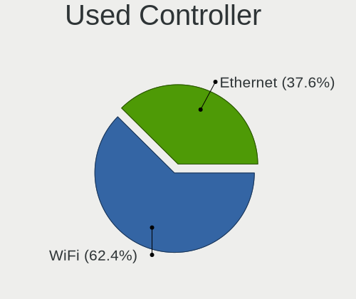

| Kind     | Computers | Percent |
|----------|-----------|---------|
| WiFi     | 344       | 61.87%  |
| Ethernet | 212       | 38.13%  |

NICs
----

Total network controllers on board

| Total | Computers | Percent |
|-------|-----------|---------|
| 2     | 274       | 50.74%  |
| 1     | 242       | 44.81%  |
| 0     | 9         | 1.67%   |
| 3     | 7         | 1.3%    |
| 8     | 5         | 0.93%   |
| 4     | 2         | 0.37%   |
| 5     | 1         | 0.19%   |

IPv6
----

IPv6 vs IPv4

| Used | Computers | Percent |
|------|-----------|---------|
| No   | 402       | 71.91%  |
| Yes  | 157       | 28.09%  |

Bluetooth
---------

Bluetooth Vendor
----------------

Controller vendors

| Vendor                          | Computers | Percent |
|---------------------------------|-----------|---------|
| Intel                           | 144       | 41.38%  |
| Cambridge Silicon Radio         | 34        | 9.77%   |
| Realtek Semiconductor           | 26        | 7.47%   |
| IMC Networks                    | 26        | 7.47%   |
| Lite-On Technology              | 20        | 5.75%   |
| Apple                           | 18        | 5.17%   |
| Qualcomm Atheros Communications | 16        | 4.6%    |
| Broadcom                        | 12        | 3.45%   |
| Foxconn / Hon Hai               | 11        | 3.16%   |
| MediaTek                        | 6         | 1.72%   |
| ASUSTek Computer                | 5         | 1.44%   |
| Toshiba                         | 4         | 1.15%   |
| Foxconn International           | 4         | 1.15%   |
| Dell                            | 4         | 1.15%   |
| USI                             | 3         | 0.86%   |
| Realtek                         | 3         | 0.86%   |
| Ralink                          | 2         | 0.57%   |
| Hewlett-Packard                 | 2         | 0.57%   |
| Actions                         | 2         | 0.57%   |
| TP-Link                         | 1         | 0.29%   |
| SINO WEALTH                     | 1         | 0.29%   |
| SIN                             | 1         | 0.29%   |
| Marvell Semiconductor           | 1         | 0.29%   |
| Askey Computer                  | 1         | 0.29%   |
| Unknown                         | 1         | 0.29%   |

Bluetooth Model
---------------

Controller models

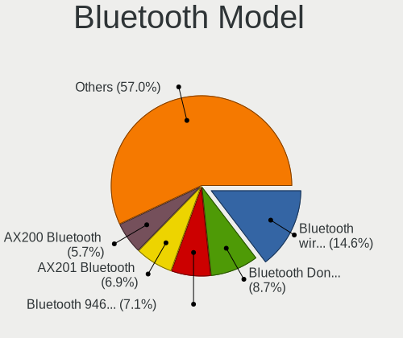

| Model                                               | Computers | Percent |
|-----------------------------------------------------|-----------|---------|
| Intel Bluetooth wireless interface                  | 53        | 15.19%  |
| Cambridge Silicon Radio Bluetooth Dongle (HCI mode) | 34        | 9.74%   |
| Intel Bluetooth 9460/9560 Jefferson Peak (JfP)      | 27        | 7.74%   |
| Intel AX201 Bluetooth                               | 23        | 6.59%   |
| Intel AX200 Bluetooth                               | 17        | 4.87%   |
| Realtek Bluetooth Radio                             | 13        | 3.72%   |
| IMC Networks Bluetooth Radio                        | 10        | 2.87%   |
| IMC Networks Bluetooth Device                       | 10        | 2.87%   |
| Realtek  Bluetooth 4.2 Adapter                      | 9         | 2.58%   |
| Lite-On Qualcomm Atheros QCA9377 Bluetooth          | 9         | 2.58%   |
| Intel Bluetooth Device                              | 8         | 2.29%   |
| Qualcomm Atheros  Bluetooth Device                  | 7         | 2.01%   |
| Intel Wireless-AC 9260 Bluetooth Adapter            | 7         | 2.01%   |
| MediaTek Wireless_Device                            | 6         | 1.72%   |
| Foxconn / Hon Hai Bluetooth Device                  | 6         | 1.72%   |
| Apple Built-in Bluetooth 2.0+EDR HCI                | 6         | 1.72%   |
| Apple Bluetooth USB Host Controller                 | 6         | 1.72%   |
| Intel Wireless-AC 3168 Bluetooth                    | 5         | 1.43%   |
| Lite-On Bluetooth Device                            | 4         | 1.15%   |
| Intel AX210 Bluetooth                               | 4         | 1.15%   |
| IMC Networks Wireless_Device                        | 4         | 1.15%   |
| Foxconn International BCM43142A0 Bluetooth module   | 4         | 1.15%   |
| Apple Bluetooth Host Controller                     | 4         | 1.15%   |
| USI Bluetooth Device                                | 3         | 0.86%   |
| Realtek RTL8723B Bluetooth                          | 3         | 0.86%   |
| Realtek Bluetooth Radio                             | 3         | 0.86%   |
| Broadcom BCM20702 Bluetooth 4.0 [ThinkPad]          | 3         | 0.86%   |
| Toshiba Askey Bluetooth Module                      | 2         | 0.57%   |
| Ralink RT3290 Bluetooth                             | 2         | 0.57%   |
| Qualcomm Atheros QCA61x4 Bluetooth 4.0              | 2         | 0.57%   |
| Qualcomm Atheros AR9462 Bluetooth                   | 2         | 0.57%   |
| Qualcomm Atheros AR3012 Bluetooth 4.0               | 2         | 0.57%   |
| Qualcomm Atheros AR3011 Bluetooth                   | 2         | 0.57%   |
| Lite-On Wireless_Device                             | 2         | 0.57%   |
| Lite-On Bluetooth Radio                             | 2         | 0.57%   |
| IMC Networks Bluetooth USB Host Controller          | 2         | 0.57%   |
| HP Bluetooth 2.0 Interface [Broadcom BCM2045]       | 2         | 0.57%   |
| Foxconn / Hon Hai Wireless_Device                   | 2         | 0.57%   |
| Foxconn / Hon Hai Broadcom Bluetooth 2.1 Device     | 2         | 0.57%   |
| Dell BCM20702A0 Bluetooth Module                    | 2         | 0.57%   |

Sound
-----

Sound Vendor
------------

Sound card vendors

| Vendor                                       | Computers | Percent |
|----------------------------------------------|-----------|---------|
| Intel                                        | 377       | 49.8%   |
| AMD                                          | 163       | 21.53%  |
| Nvidia                                       | 140       | 18.49%  |
| C-Media Electronics                          | 13        | 1.72%   |
| JMTek                                        | 8         | 1.06%   |
| Razer USA                                    | 6         | 0.79%   |
| Generalplus Technology                       | 4         | 0.53%   |
| Logitech                                     | 3         | 0.4%    |
| Elan Microelectronics                        | 3         | 0.4%    |
| Creative Labs                                | 3         | 0.4%    |
| VIA Technologies                             | 2         | 0.26%   |
| Texas Instruments                            | 2         | 0.26%   |
| SAVITECH                                     | 2         | 0.26%   |
| Samson Technologies                          | 2         | 0.26%   |
| Focusrite-Novation                           | 2         | 0.26%   |
| Earth Computer Technologies                  | 2         | 0.26%   |
| Zoran Co. Personal Media Division (Nogatech) | 1         | 0.13%   |
| Thesycon Systemsoftware & Consulting         | 1         | 0.13%   |
| Syntek                                       | 1         | 0.13%   |
| Samsung Electronics                          | 1         | 0.13%   |
| Nordic Semiconductor ASA                     | 1         | 0.13%   |
| Lenovo                                       | 1         | 0.13%   |
| KTMicro                                      | 1         | 0.13%   |
| Kingston Technology                          | 1         | 0.13%   |
| Huawei Technologies                          | 1         | 0.13%   |
| HECATE                                       | 1         | 0.13%   |
| ESS Technology                               | 1         | 0.13%   |
| Ensoniq                                      | 1         | 0.13%   |
| EDIFIER                                      | 1         | 0.13%   |
| DSEA A/S                                     | 1         | 0.13%   |
| Digidesign                                   | 1         | 0.13%   |
| Dell                                         | 1         | 0.13%   |
| Creative Technology                          | 1         | 0.13%   |
| Cayin                                        | 1         | 0.13%   |
| BlueTrm                                      | 1         | 0.13%   |
| Blue Microphones                             | 1         | 0.13%   |
| Barco Display Systems                        | 1         | 0.13%   |
| Audient                                      | 1         | 0.13%   |
| ASUSTek Computer                             | 1         | 0.13%   |
| Apple                                        | 1         | 0.13%   |

Sound Model
-----------

Sound card models

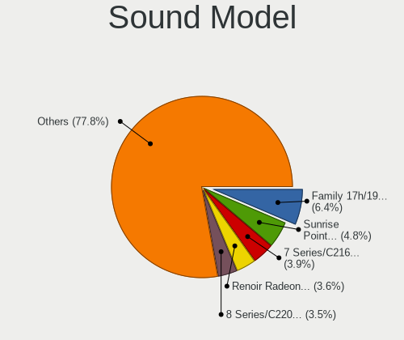

| Model                                                                                             | Computers | Percent |
|---------------------------------------------------------------------------------------------------|-----------|---------|
| AMD Family 17h/19h HD Audio Controller                                                            | 62        | 6.74%   |
| Intel Sunrise Point-LP HD Audio                                                                   | 39        | 4.24%   |
| AMD Renoir Radeon High Definition Audio Controller                                                | 35        | 3.8%    |
| Intel 8 Series/C220 Series Chipset High Definition Audio Controller                               | 32        | 3.48%   |
| Intel 7 Series/C216 Chipset Family High Definition Audio Controller                               | 32        | 3.48%   |
| Intel 100 Series/C230 Series Chipset Family HD Audio Controller                                   | 28        | 3.04%   |
| Intel Xeon E3-1200 v3/4th Gen Core Processor HD Audio Controller                                  | 27        | 2.93%   |
| Intel 6 Series/C200 Series Chipset Family High Definition Audio Controller                        | 27        | 2.93%   |
| Intel Cannon Lake PCH cAVS                                                                        | 25        | 2.72%   |
| AMD Raven/Raven2/Fenghuang HDMI/DP Audio Controller                                               | 21        | 2.28%   |
| Intel Haswell-ULT HD Audio Controller                                                             | 20        | 2.17%   |
| Intel 8 Series HD Audio Controller                                                                | 20        | 2.17%   |
| Intel 5 Series/3400 Series Chipset High Definition Audio                                          | 16        | 1.74%   |
| Intel 200 Series PCH HD Audio                                                                     | 15        | 1.63%   |
| AMD Starship/Matisse HD Audio Controller                                                          | 15        | 1.63%   |
| AMD FCH Azalia Controller                                                                         | 14        | 1.52%   |
| AMD Ellesmere HDMI Audio [Radeon RX 470/480 / 570/580/590]                                        | 14        | 1.52%   |
| Intel Tiger Lake-LP Smart Sound Technology Audio Controller                                       | 13        | 1.41%   |
| Intel Comet Lake PCH cAVS                                                                         | 13        | 1.41%   |
| Nvidia High Definition Audio Controller                                                           | 12        | 1.3%    |
| Intel NM10/ICH7 Family High Definition Audio Controller                                           | 12        | 1.3%    |
| AMD SBx00 Azalia (Intel HDA)                                                                      | 12        | 1.3%    |
| AMD Family 17h (Models 00h-0fh) HD Audio Controller                                               | 12        | 1.3%    |
| Nvidia TU116 High Definition Audio Controller                                                     | 11        | 1.2%    |
| Nvidia GP107GL High Definition Audio Controller                                                   | 11        | 1.2%    |
| Nvidia GF108 High Definition Audio Controller                                                     | 11        | 1.2%    |
| Intel Celeron/Pentium Silver Processor High Definition Audio                                      | 10        | 1.09%   |
| Nvidia GP106 High Definition Audio Controller                                                     | 9         | 0.98%   |
| Intel Comet Lake PCH-LP cAVS                                                                      | 9         | 0.98%   |
| Nvidia TU107 GeForce GTX 1650 High Definition Audio Controller                                    | 8         | 0.87%   |
| Nvidia GP104 High Definition Audio Controller                                                     | 8         | 0.87%   |
| Nvidia GK208 HDMI/DP Audio Controller                                                             | 8         | 0.87%   |
| Nvidia GF119 HDMI Audio Controller                                                                | 8         | 0.87%   |
| Intel Atom/Celeron/Pentium Processor x5-E8000/J3xxx/N3xxx Series High Definition Audio Controller | 8         | 0.87%   |
| Nvidia GM107 High Definition Audio Controller [GeForce 940MX]                                     | 7         | 0.76%   |
| Nvidia Audio device                                                                               | 7         | 0.76%   |
| JMTek USB PnP Audio Device                                                                        | 7         | 0.76%   |
| Intel Cannon Point-LP High Definition Audio Controller                                            | 7         | 0.76%   |
| Intel 82801I (ICH9 Family) HD Audio Controller                                                    | 7         | 0.76%   |
| AMD Rembrandt Radeon High Definition Audio Controller                                             | 7         | 0.76%   |

Memory
------

Memory Vendor
-------------

Memory module vendors

| Vendor              | Computers | Percent |
|---------------------|-----------|---------|
| Kingston            | 72        | 21.82%  |
| Samsung Electronics | 69        | 20.91%  |
| SK hynix            | 61        | 18.48%  |
| Micron Technology   | 36        | 10.91%  |
| Unknown             | 26        | 7.88%   |
| Corsair             | 13        | 3.94%   |
| Transcend           | 6         | 1.82%   |
| Crucial             | 6         | 1.82%   |
| Ramaxel Technology  | 5         | 1.52%   |
| Elpida              | 5         | 1.52%   |
| A-DATA Technology   | 5         | 1.52%   |
| Team                | 4         | 1.21%   |
| Nanya Technology    | 4         | 1.21%   |
| G.Skill             | 3         | 0.91%   |
| Apacer              | 3         | 0.91%   |
| Unknown (ABCD)      | 2         | 0.61%   |
| Unknown             | 2         | 0.61%   |
| Unknown (0x8325)    | 1         | 0.3%    |
| Unknown (0x02BA)    | 1         | 0.3%    |
| Unknown (08B5)      | 1         | 0.3%    |
| Lexar               | 1         | 0.3%    |
| KingFast            | 1         | 0.3%    |
| Hikvision           | 1         | 0.3%    |
| Avant               | 1         | 0.3%    |
| ASint Technology    | 1         | 0.3%    |

Memory Model
------------

Memory module models

| Model                                                            | Computers | Percent |
|------------------------------------------------------------------|-----------|---------|
| Samsung RAM M471A1G44AB0-CWE 8GB SODIMM DDR4 3200MT/s            | 7         | 1.97%   |
| SK hynix RAM HMCG94AEBRA109N 64GB DIMM 4800MT/s                  | 5         | 1.41%   |
| Samsung RAM M471A5244CB0-CTD 4096MB SODIMM DDR4 3266MT/s         | 5         | 1.41%   |
| Kingston RAM KHX3200C16D4/8GX 8GB DIMM DDR4 3733MT/s             | 5         | 1.41%   |
| SK hynix RAM HMT451S6BFR8A-PB 4GB SODIMM DDR3 1600MT/s           | 4         | 1.13%   |
| SK hynix RAM HMT451S6AFR8A-PB 4GB SODIMM DDR3 1600MT/s           | 4         | 1.13%   |
| SK hynix RAM HMT351S6CFR8C-PB 4GB SODIMM DDR3 1600MT/s           | 4         | 1.13%   |
| SK hynix RAM HMA81GS6AFR8N-UH 8GB SODIMM DDR4 2667MT/s           | 4         | 1.13%   |
| Unknown RAM Module 4GB DIMM 1333MT/s                             | 3         | 0.85%   |
| SK hynix RAM HMT125U6TFR8C-H9 2GB DIMM DDR3 1333MT/s             | 3         | 0.85%   |
| SK hynix RAM HMA851S6AFR6N-UH 4GB SODIMM DDR4 2667MT/s           | 3         | 0.85%   |
| Samsung RAM M471B5173DB0-YK0 4GB SODIMM DDR3 1600MT/s            | 3         | 0.85%   |
| Samsung RAM M471A1K43EB1-CWE 8GB SODIMM DDR4 3200MT/s            | 3         | 0.85%   |
| Samsung RAM M471A1K43CB1-CRC 8GB SODIMM DDR4 2667MT/s            | 3         | 0.85%   |
| Kingston RAM KHX2666C16/8G 8GB DIMM DDR4 3466MT/s                | 3         | 0.85%   |
| Kingston RAM KF3200C16D4/16GX 16GB DIMM DDR4 3200MT/s            | 3         | 0.85%   |
| Unknown RAM Module 4GB SODIMM DDR4 2400MT/s                      | 2         | 0.56%   |
| Unknown RAM Module 4GB DIMM DDR3 1333MT/s                        | 2         | 0.56%   |
| Unknown RAM Module 2GB SODIMM DDR3 1600MT/s                      | 2         | 0.56%   |
| SK hynix RAM HMT351S6EFR8A-PB 4096MB SODIMM DDR3 1600MT/s        | 2         | 0.56%   |
| SK hynix RAM HMT112U6TFR8C-H9 1GB DIMM DDR3 1333MT/s             | 2         | 0.56%   |
| SK hynix RAM HMAA1GS6CJR6N-XN 8GB SODIMM DDR4 3200MT/s           | 2         | 0.56%   |
| SK hynix RAM HMA451S6AFR8N-TF 4GB SODIMM DDR4 2133MT/s           | 2         | 0.56%   |
| SK hynix RAM HMA41GS6AFR8N-TF 8GB SODIMM DDR4 2667MT/s           | 2         | 0.56%   |
| SK hynix RAM HCNNNBKMMLXR-NEE 4GB Row Of Chips LPDDR4 4267MT/s   | 2         | 0.56%   |
| Samsung RAM Module 2GB SODIMM DDR3 1067MT/s                      | 2         | 0.56%   |
| Samsung RAM M471B5273DH0-CK0 4GB SODIMM DDR3 1600MT/s            | 2         | 0.56%   |
| Samsung RAM M471B5273CH0-CH9 4GB SODIMM DDR3 1334MT/s            | 2         | 0.56%   |
| Samsung RAM M471B5173QH0-YK0 4096MB SODIMM DDR3 1600MT/s         | 2         | 0.56%   |
| Samsung RAM M471B1G73DB0-YK0 8GB SODIMM DDR3 1600MT/s            | 2         | 0.56%   |
| Samsung RAM M471A1K43DB1-CTD 8GB SODIMM DDR4 2667MT/s            | 2         | 0.56%   |
| Samsung RAM M471A1K43BB1-CRC 8GB SODIMM DDR4 2667MT/s            | 2         | 0.56%   |
| Samsung RAM M471A1G44AB0-CWE 8GB Row Of Chips DDR4 3200MT/s      | 2         | 0.56%   |
| Samsung RAM M378B5673FH0-CH9 2GB DIMM DDR3 1600MT/s              | 2         | 0.56%   |
| Samsung RAM M378B5273DH0-CH9 4096MB DIMM DDR2 2133MT/s           | 2         | 0.56%   |
| Samsung RAM M378B5173QH0-CK0 4GB DIMM DDR3 1600MT/s              | 2         | 0.56%   |
| Samsung RAM M378B5173DB0-CK0 4GB DIMM DDR3 1600MT/s              | 2         | 0.56%   |
| Nanya RAM Module 4GB SODIMM DDR3 1333MT/s                        | 2         | 0.56%   |
| Micron RAM MT53E1G32D4NQ-046WTE 8GB Row Of Chips LPDDR4 4266MT/s | 2         | 0.56%   |
| Micron RAM MT40A512M16LY-075:E 4GB SODIMM DDR4 3200MT/s          | 2         | 0.56%   |

Memory Kind
-----------

Memory module kinds

| Kind    | Computers | Percent |
|---------|-----------|---------|
| DDR4    | 132       | 48.18%  |
| DDR3    | 87        | 31.75%  |
| LPDDR4  | 17        | 6.2%    |
| Unknown | 9         | 3.28%   |
| SDRAM   | 7         | 2.55%   |
| DDR5    | 7         | 2.55%   |
| DDR2    | 6         | 2.19%   |
| LPDDR3  | 5         | 1.82%   |
| LPDDR5  | 2         | 0.73%   |
| DDR     | 2         | 0.73%   |

Memory Form Factor
------------------

Physical design of the memory module

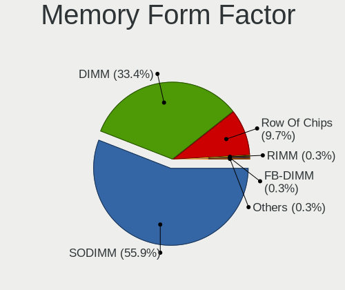

| Name         | Computers | Percent |
|--------------|-----------|---------|
| SODIMM       | 155       | 57.41%  |
| DIMM         | 91        | 33.7%   |
| Row Of Chips | 22        | 8.15%   |
| RIMM         | 1         | 0.37%   |
| FB-DIMM      | 1         | 0.37%   |

Memory Size
-----------

Memory module size

| Size  | Computers | Percent |
|-------|-----------|---------|
| 8192  | 114       | 38.91%  |
| 4096  | 88        | 30.03%  |
| 16384 | 38        | 12.97%  |
| 2048  | 32        | 10.92%  |
| 32768 | 9         | 3.07%   |
| 1024  | 7         | 2.39%   |
| 65536 | 5         | 1.71%   |

Memory Speed
------------

Memory module speed

| Speed   | Computers | Percent |
|---------|-----------|---------|
| 1600    | 61        | 20.2%   |
| 3200    | 45        | 14.9%   |
| 2667    | 37        | 12.25%  |
| 2400    | 26        | 8.61%   |
| 1333    | 25        | 8.28%   |
| 2133    | 16        | 5.3%    |
| 4800    | 10        | 3.31%   |
| 3733    | 8         | 2.65%   |
| 1334    | 7         | 2.32%   |
| 4267    | 6         | 1.99%   |
| 3266    | 5         | 1.66%   |
| 1867    | 5         | 1.66%   |
| 3600    | 4         | 1.32%   |
| 3400    | 4         | 1.32%   |
| 1067    | 4         | 1.32%   |
| 4266    | 3         | 0.99%   |
| 3466    | 3         | 0.99%   |
| 3000    | 3         | 0.99%   |
| 2666    | 3         | 0.99%   |
| 1866    | 3         | 0.99%   |
| 667     | 3         | 0.99%   |
| 6400    | 2         | 0.66%   |
| 3151    | 2         | 0.66%   |
| 1800    | 2         | 0.66%   |
| 533     | 2         | 0.66%   |
| Unknown | 2         | 0.66%   |
| 8400    | 1         | 0.33%   |
| 6800    | 1         | 0.33%   |
| 5600    | 1         | 0.33%   |
| 4199    | 1         | 0.33%   |
| 3666    | 1         | 0.33%   |
| 3534    | 1         | 0.33%   |
| 3333    | 1         | 0.33%   |
| 2800    | 1         | 0.33%   |
| 975     | 1         | 0.33%   |
| 800     | 1         | 0.33%   |
| 333     | 1         | 0.33%   |

Printers & scanners
-------------------

Printer Vendor
--------------

Printer device vendors

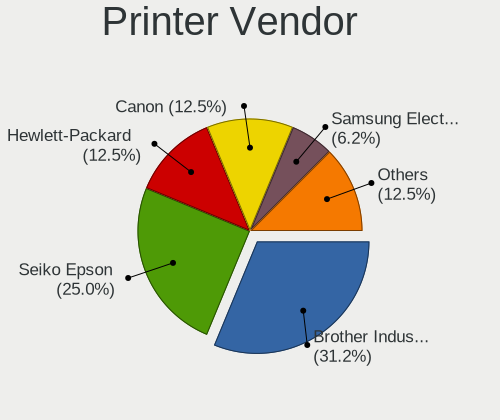

| Vendor              | Computers | Percent |
|---------------------|-----------|---------|
| Brother Industries  | 5         | 33.33%  |
| Seiko Epson         | 4         | 26.67%  |
| Canon               | 2         | 13.33%  |
| STMicroelectronics  | 1         | 6.67%   |
| Samsung Electronics | 1         | 6.67%   |
| Pantum              | 1         | 6.67%   |
| Hewlett-Packard     | 1         | 6.67%   |

Printer Model
-------------

Printer device models

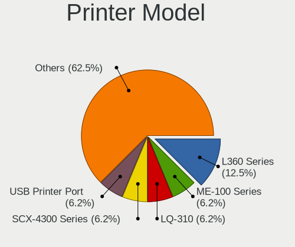

| Model                                   | Computers | Percent |
|-----------------------------------------|-----------|---------|
| Seiko Epson L360 Series                 | 2         | 13.33%  |
| STMicroelectronics USB Printing Support | 1         | 6.67%   |
| Seiko Epson ME-100 Series               | 1         | 6.67%   |
| Seiko Epson LQ-310                      | 1         | 6.67%   |
| Samsung SCX-4300 Series                 | 1         | 6.67%   |
| Pantum P2500W series                    | 1         | 6.67%   |
| HP DeskJet 2130 series                  | 1         | 6.67%   |
| Canon PIXMA MP280                       | 1         | 6.67%   |
| Canon E4200 series                      | 1         | 6.67%   |
| Brother HL-1110 series                  | 1         | 6.67%   |
| Brother DCP-T510W                       | 1         | 6.67%   |
| Brother DCP-T300                        | 1         | 6.67%   |
| Brother DCP-L3551CDW                    | 1         | 6.67%   |
| Brother DCP-1510                        | 1         | 6.67%   |

Scanner Vendor
--------------

Scanner device vendors

| Vendor | Computers | Percent |
|--------|-----------|---------|
| Canon  | 1         | 100%    |

Scanner Model
-------------

Scanner device models

| Model                              | Computers | Percent |
|------------------------------------|-----------|---------|
| Canon CanoScan N670U/N676U/LiDE 20 | 1         | 100%    |

Camera
------

Camera Vendor
-------------

Camera device vendors

| Vendor                                 | Computers | Percent |
|----------------------------------------|-----------|---------|
| Chicony Electronics                    | 68        | 22.74%  |
| IMC Networks                           | 38        | 12.71%  |
| Bison Electronics                      | 28        | 9.36%   |
| Realtek Semiconductor                  | 22        | 7.36%   |
| Microdia                               | 21        | 7.02%   |
| Quanta                                 | 17        | 5.69%   |
| Logitech                               | 12        | 4.01%   |
| Apple                                  | 11        | 3.68%   |
| Sunplus Innovation Technology          | 10        | 3.34%   |
| Cheng Uei Precision Industry (Foxlink) | 9         | 3.01%   |
| Acer                                   | 8         | 2.68%   |
| Silicon Motion                         | 6         | 2.01%   |
| Lite-On Technology                     | 6         | 2.01%   |
| Suyin                                  | 5         | 1.67%   |
| Generalplus Technology                 | 5         | 1.67%   |
| Sonix Technology                       | 4         | 1.34%   |
| Luxvisions Innotech Limited            | 4         | 1.34%   |
| Aveo Technology                        | 4         | 1.34%   |
| Syntek                                 | 3         | 1%      |
| Microsoft                              | 3         | 1%      |
| Z-Star Microelectronics                | 2         | 0.67%   |
| Samsung Electronics                    | 2         | 0.67%   |
| WCM_USB                                | 1         | 0.33%   |
| USB Camera                             | 1         | 0.33%   |
| Sony Electronics                       | 1         | 0.33%   |
| ShineTech                              | 1         | 0.33%   |
| Razer USA                              | 1         | 0.33%   |
| Owon                                   | 1         | 0.33%   |
| OPPO Electronics                       | 1         | 0.33%   |
| MacroSilicon                           | 1         | 0.33%   |
| Lenovo                                 | 1         | 0.33%   |
| Huawei Technologies                    | 1         | 0.33%   |
| Alcor Micro                            | 1         | 0.33%   |

Camera Model
------------

Camera device models

| Model                                   | Computers | Percent |
|-----------------------------------------|-----------|---------|
| IMC Networks USB2.0 HD UVC WebCam       | 16        | 5.33%   |
| Chicony HD WebCam                       | 14        | 4.67%   |
| Chicony Integrated Camera               | 13        | 4.33%   |
| Bison Integrated Camera                 | 8         | 2.67%   |
| Microdia Integrated_Webcam_HD           | 7         | 2.33%   |
| Bison Lenovo EasyCamera                 | 7         | 2.33%   |
| IMC Networks Integrated Camera          | 6         | 2%      |
| Chicony HP Truevision HD camera         | 6         | 2%      |
| Realtek Integrated_Webcam_HD            | 5         | 1.67%   |
| Apple Built-in iSight                   | 5         | 1.67%   |
| Acer SunplusIT Integrated Camera        | 5         | 1.67%   |
| Realtek HD WebCam                       | 4         | 1.33%   |
| Microdia USB 2.0 Camera                 | 4         | 1.33%   |
| IMC Networks USB2.0 VGA UVC WebCam      | 4         | 1.33%   |
| Generalplus GENERAL WEBCAM              | 4         | 1.33%   |
| Chicony Lenovo EasyCamera               | 4         | 1.33%   |
| Chicony HD User Facing                  | 4         | 1.33%   |
| Sunplus Integrated_Webcam_HD            | 3         | 1%      |
| Sonix USB2.0 HD UVC WebCam              | 3         | 1%      |
| Silicon Motion WebCam SCB-0385N         | 3         | 1%      |
| Realtek USB Camera                      | 3         | 1%      |
| Quanta USB2.0 HD UVC WebCam             | 3         | 1%      |
| Microdia Camera                         | 3         | 1%      |
| Lite-On HP Wide Vision HD Camera        | 3         | 1%      |
| Chicony HP Wide Vision HD Camera        | 3         | 1%      |
| Bison ThinkPad Integrated Camera        | 3         | 1%      |
| Bison Lenovo Integrated Webcam          | 3         | 1%      |
| Aveo USB2.0 Camera                      | 3         | 1%      |
| Syntek Integrated Camera                | 2         | 0.67%   |
| Sunplus Asus Webcam                     | 2         | 0.67%   |
| Samsung Galaxy series, misc. (MTP mode) | 2         | 0.67%   |
| Realtek USB2.0 HD UVC WebCam            | 2         | 0.67%   |
| Realtek Integrated Webcam               | 2         | 0.67%   |
| Quanta VGA WebCam                       | 2         | 0.67%   |
| Quanta ov9734_techfront_camera          | 2         | 0.67%   |
| Quanta HD Webcam                        | 2         | 0.67%   |
| Quanta HD User Facing                   | 2         | 0.67%   |
| Quanta HD Camera                        | 2         | 0.67%   |
| Microsoft Microsoft LifeCam Cinema    | 2         | 0.67%   |
| Microdia Sonix USB 2.0 Camera           | 2         | 0.67%   |

Security
--------

Fingerprint Vendor
------------------

Fingerprint sensor vendors

| Vendor                     | Computers | Percent |
|----------------------------|-----------|---------|
| Synaptics                  | 17        | 31.48%  |
| Shenzhen Goodix Technology | 13        | 24.07%  |
| LighTuning Technology      | 7         | 12.96%  |
| Validity Sensors           | 6         | 11.11%  |
| Elan Microelectronics      | 6         | 11.11%  |
| AuthenTec                  | 3         | 5.56%   |
| Upek                       | 2         | 3.7%    |

Fingerprint Model
-----------------

Fingerprint sensor models

| Model                                                    | Computers | Percent |
|----------------------------------------------------------|-----------|---------|
| Shenzhen Goodix Fingerprint Reader                       | 6         | 11.11%  |
| Shenzhen Goodix  Fingerprint Device                      | 5         | 9.26%   |
| Synaptics WBDI                                           | 4         | 7.41%   |
| Synaptics Metallica MIS Touch Fingerprint Reader         | 4         | 7.41%   |
| LighTuning EgisTec Touch Fingerprint Sensor              | 4         | 7.41%   |
| Validity Sensors VFS7500 Touch Fingerprint Sensor        | 3         | 5.56%   |
| Elan ELAN:Fingerprint                                    | 3         | 5.56%   |
| Elan ELAN:ARM-M4                                         | 3         | 5.56%   |
| Upek Biometric Touchchip/Touchstrip Fingerprint Sensor   | 2         | 3.7%    |
| Synaptics UWP WBDI Device                                | 2         | 3.7%    |
| Synaptics  WBDI                                          | 2         | 3.7%    |
| Synaptics Prometheus MIS Touch Fingerprint Reader        | 2         | 3.7%    |
| Shenzhen Goodix FingerPrint                              | 2         | 3.7%    |
| LighTuning ES603 Swipe Fingerprint Sensor                | 2         | 3.7%    |
| AuthenTec AES2810                                        | 2         | 3.7%    |
| Validity Sensors VFS101 Fingerprint Reader               | 1         | 1.85%   |
| Validity Sensors VFS 5011 fingerprint sensor             | 1         | 1.85%   |
| Validity Sensors Synaptics WBDI                          | 1         | 1.85%   |
| Synaptics WBDI Fingerprint Reader USB 086                | 1         | 1.85%   |
| Synaptics Metallica MOH Touch Fingerprint Reader         | 1         | 1.85%   |
| Synaptics FS7604 Touch Fingerprint Sensor with PurePrint | 1         | 1.85%   |
| LighTuning Fingerprint Sensor                            | 1         | 1.85%   |
| AuthenTec AES2501 Fingerprint Sensor                     | 1         | 1.85%   |

Chipcard Vendor
---------------

Chipcard module vendors

| Vendor                | Computers | Percent |
|-----------------------|-----------|---------|
| Alcor Micro           | 6         | 50%     |
| O2 Micro              | 2         | 16.67%  |
| Broadcom              | 2         | 16.67%  |
| OmniKey               | 1         | 8.33%   |
| Gemalto (was Gemplus) | 1         | 8.33%   |

Chipcard Model
--------------

Chipcard module models

| Model                                                                        | Computers | Percent |
|------------------------------------------------------------------------------|-----------|---------|
| Alcor Micro AU9540 Smartcard Reader                                          | 6         | 50%     |
| O2 Micro OZ776 CCID Smartcard Reader                                         | 2         | 16.67%  |
| OmniKey CardMan 3021 / 3121                                                  | 1         | 8.33%   |
| Gemalto (was Gemplus) GemPC Twin SmartCard Reader                            | 1         | 8.33%   |
| Broadcom BCM5880 Secure Applications Processor with fingerprint swipe sensor | 1         | 8.33%   |
| Broadcom 58200                                                               | 1         | 8.33%   |

Unsupported
-----------

Unsupported Devices
-------------------

Total unsupported devices on board

| Total | Computers | Percent |
|-------|-----------|---------|
| 0     | 387       | 70.11%  |
| 1     | 138       | 25%     |
| 2     | 22        | 3.99%   |
| 3     | 3         | 0.54%   |
| 7     | 1         | 0.18%   |
| 5     | 1         | 0.18%   |

Unsupported Device Types
------------------------

Types of unsupported devices

| Type                     | Computers | Percent |
|--------------------------|-----------|---------|
| Fingerprint reader       | 53        | 27.46%  |
| Graphics card            | 46        | 23.83%  |
| Net/wireless             | 26        | 13.47%  |
| Multimedia controller    | 20        | 10.36%  |
| Chipcard                 | 12        | 6.22%   |
| Sound                    | 8         | 4.15%   |
| Communication controller | 7         | 3.63%   |
| Unassigned class         | 5         | 2.59%   |
| Camera                   | 4         | 2.07%   |
| Bluetooth                | 4         | 2.07%   |
| Net/ethernet             | 2         | 1.04%   |
| Wireless                 | 1         | 0.52%   |
| Storage/raid             | 1         | 0.52%   |
| Storage/ide              | 1         | 0.52%   |
| Network                  | 1         | 0.52%   |
| Flash memory             | 1         | 0.52%   |
| Card reader              | 1         | 0.52%   |

