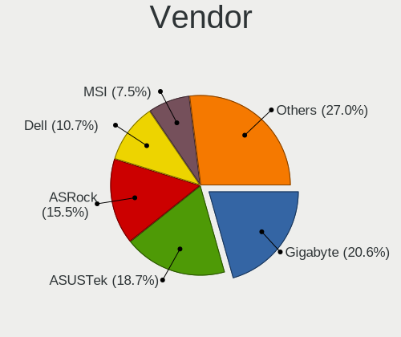
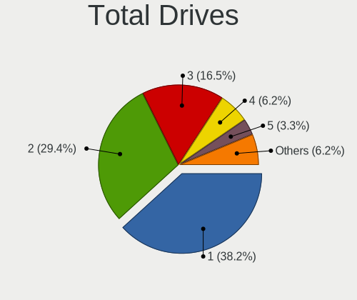
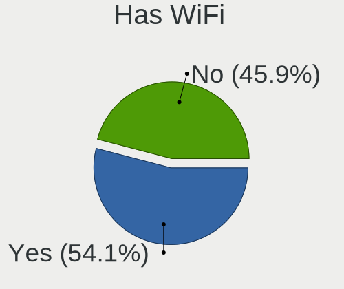
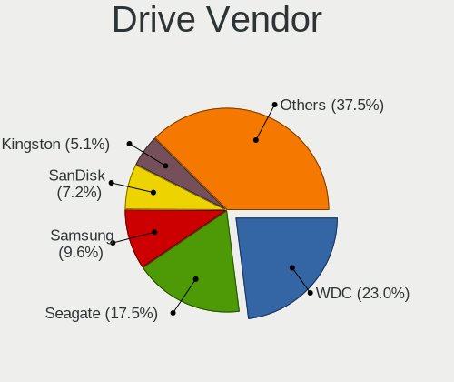
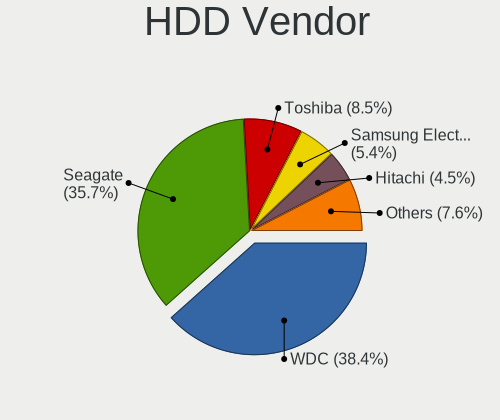
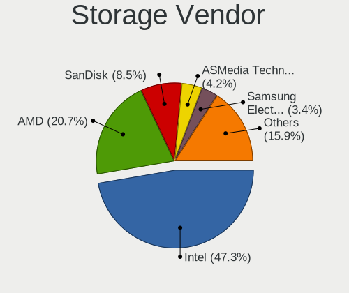
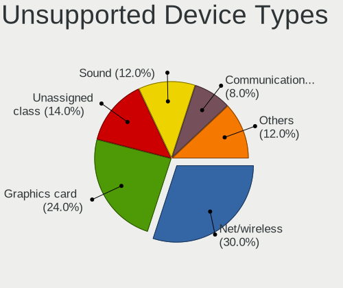

Linux in Thailand - Tested Hardware & Statistics (Desktops)
-----------------------------------------------------------

A project to collect tested hardware configurations for Linux in Thailand.

Anyone can contribute to this report by the [hw-probe](https://github.com/linuxhw/hw-probe) tool:

    sudo -E hw-probe -all -upload

Please contribute! Especially if your hardware is rare.

Contents
--------

* [ Test Cases ](#test-cases)

* [ System ](#system)
  - [ OS                       ](#os)
  - [ OS Family                ](#os-family)
  - [ Kernel                   ](#kernel)
  - [ Kernel Family            ](#kernel-family)
  - [ Kernel Major Ver.        ](#kernel-major-ver)
  - [ Arch                     ](#arch)
  - [ DE                       ](#de)
  - [ Display Server           ](#display-server)
  - [ Display Manager          ](#display-manager)
  - [ OS Lang                  ](#os-lang)
  - [ Boot Mode                ](#boot-mode)
  - [ Filesystem               ](#filesystem)
  - [ Part. scheme             ](#part-scheme)
  - [ Dual Boot with Linux/BSD ](#dual-boot-with-linuxbsd)
  - [ Dual Boot (Win)          ](#dual-boot-win)

* [ Board ](#board)
  - [ Vendor                   ](#vendor)
  - [ Model                    ](#model)
  - [ Model Family             ](#model-family)
  - [ MFG Year                 ](#mfg-year)
  - [ Form Factor              ](#form-factor)
  - [ Secure Boot              ](#secure-boot)
  - [ Coreboot                 ](#coreboot)
  - [ RAM Size                 ](#ram-size)
  - [ RAM Used                 ](#ram-used)
  - [ Total Drives             ](#total-drives)
  - [ Has CD-ROM               ](#has-cd-rom)
  - [ Has Ethernet             ](#has-ethernet)
  - [ Has WiFi                 ](#has-wifi)
  - [ Has Bluetooth            ](#has-bluetooth)

* [ Location ](#location)
  - [ Country                  ](#country)
  - [ City                     ](#city)

* [ Drives ](#drives)
  - [ Drive Vendor             ](#drive-vendor)
  - [ Drive Model              ](#drive-model)
  - [ HDD Vendor               ](#hdd-vendor)
  - [ SSD Vendor               ](#ssd-vendor)
  - [ Drive Kind               ](#drive-kind)
  - [ Drive Connector          ](#drive-connector)
  - [ Drive Size               ](#drive-size)
  - [ Space Total              ](#space-total)
  - [ Space Used               ](#space-used)
  - [ Malfunc. Drives          ](#malfunc-drives)
  - [ Malfunc. Drive Vendor    ](#malfunc-drive-vendor)
  - [ Malfunc. HDD Vendor      ](#malfunc-hdd-vendor)
  - [ Malfunc. Drive Kind      ](#malfunc-drive-kind)
  - [ Failed Drives            ](#failed-drives)
  - [ Failed Drive Vendor      ](#failed-drive-vendor)
  - [ Drive Status             ](#drive-status)

* [ Storage controller ](#storage-controller)
  - [ Storage Vendor           ](#storage-vendor)
  - [ Storage Model            ](#storage-model)
  - [ Storage Kind             ](#storage-kind)

* [ Processor ](#processor)
  - [ CPU Vendor               ](#cpu-vendor)
  - [ CPU Model                ](#cpu-model)
  - [ CPU Model Family         ](#cpu-model-family)
  - [ CPU Cores                ](#cpu-cores)
  - [ CPU Sockets              ](#cpu-sockets)
  - [ CPU Threads              ](#cpu-threads)
  - [ CPU Op-Modes             ](#cpu-op-modes)
  - [ CPU Microcode            ](#cpu-microcode)
  - [ CPU Microarch            ](#cpu-microarch)

* [ Graphics ](#graphics)
  - [ GPU Vendor               ](#gpu-vendor)
  - [ GPU Model                ](#gpu-model)
  - [ GPU Combo                ](#gpu-combo)
  - [ GPU Driver               ](#gpu-driver)
  - [ GPU Memory               ](#gpu-memory)

* [ Monitor ](#monitor)
  - [ Monitor Vendor           ](#monitor-vendor)
  - [ Monitor Model            ](#monitor-model)
  - [ Monitor Resolution       ](#monitor-resolution)
  - [ Monitor Diagonal         ](#monitor-diagonal)
  - [ Monitor Width            ](#monitor-width)
  - [ Aspect Ratio             ](#aspect-ratio)
  - [ Monitor Area             ](#monitor-area)
  - [ Pixel Density            ](#pixel-density)
  - [ Multiple Monitors        ](#multiple-monitors)

* [ Network ](#network)
  - [ Net Controller Vendor    ](#net-controller-vendor)
  - [ Net Controller Model     ](#net-controller-model)
  - [ Wireless Vendor          ](#wireless-vendor)
  - [ Wireless Model           ](#wireless-model)
  - [ Ethernet Vendor          ](#ethernet-vendor)
  - [ Ethernet Model           ](#ethernet-model)
  - [ Net Controller Kind      ](#net-controller-kind)
  - [ Used Controller          ](#used-controller)
  - [ NICs                     ](#nics)
  - [ IPv6                     ](#ipv6)

* [ Bluetooth ](#bluetooth)
  - [ Bluetooth Vendor         ](#bluetooth-vendor)
  - [ Bluetooth Model          ](#bluetooth-model)

* [ Sound ](#sound)
  - [ Sound Vendor             ](#sound-vendor)
  - [ Sound Model              ](#sound-model)

* [ Memory ](#memory)
  - [ Memory Vendor            ](#memory-vendor)
  - [ Memory Model             ](#memory-model)
  - [ Memory Kind              ](#memory-kind)
  - [ Memory Form Factor       ](#memory-form-factor)
  - [ Memory Size              ](#memory-size)
  - [ Memory Speed             ](#memory-speed)

* [ Printers & scanners ](#printers--scanners)
  - [ Printer Vendor           ](#printer-vendor)
  - [ Printer Model            ](#printer-model)
  - [ Scanner Vendor           ](#scanner-vendor)
  - [ Scanner Model            ](#scanner-model)

* [ Camera ](#camera)
  - [ Camera Vendor            ](#camera-vendor)
  - [ Camera Model             ](#camera-model)

* [ Security ](#security)
  - [ Fingerprint Vendor       ](#fingerprint-vendor)
  - [ Fingerprint Model        ](#fingerprint-model)
  - [ Chipcard Vendor          ](#chipcard-vendor)
  - [ Chipcard Model           ](#chipcard-model)

* [ Unsupported ](#unsupported)
  - [ Unsupported Devices      ](#unsupported-devices)
  - [ Unsupported Device Types ](#unsupported-device-types)

Test Cases
----------

Total: 292

| Vendor        | Model                       | Probe                                                      | Date         |
|---------------|-----------------------------|------------------------------------------------------------|--------------|
| Dell          | 0HY9JP A01                  | [48d92d85c7](https://linux-hardware.org/?probe=48d92d85c7) | Aug 11, 2023 |
| HP            | 304Ah                       | [81682ebb2d](https://linux-hardware.org/?probe=81682ebb2d) | Jul 20, 2023 |
| Gigabyte      | P75-D3P                     | [0a7c65caae](https://linux-hardware.org/?probe=0a7c65caae) | Jul 13, 2023 |
| Apple         | Mac-F221BEC8                | [83e08e8aca](https://linux-hardware.org/?probe=83e08e8aca) | Jul 12, 2023 |
| Lenovo        | SHARKBAY NOK                | [fbeae7b57e](https://linux-hardware.org/?probe=fbeae7b57e) | Jul 09, 2023 |
| HP            | 802F                        | [da2666b4b8](https://linux-hardware.org/?probe=da2666b4b8) | Jun 22, 2023 |
| Lenovo        | SHARKBAY NOK                | [c0f250b2f9](https://linux-hardware.org/?probe=c0f250b2f9) | Jun 22, 2023 |
| HP            | 802F                        | [96b020f763](https://linux-hardware.org/?probe=96b020f763) | Jun 21, 2023 |
| ASRock        | B450 Steel Legend           | [26d77cd5be](https://linux-hardware.org/?probe=26d77cd5be) | Jun 19, 2023 |
| Lenovo        | SHARKBAY NOK                | [73a438e6b8](https://linux-hardware.org/?probe=73a438e6b8) | Jun 18, 2023 |
| ASUSTek       | PRIME B450M-K II            | [0fe4687002](https://linux-hardware.org/?probe=0fe4687002) | Jun 12, 2023 |
| ASRock        | B450 Steel Legend           | [483ac7223f](https://linux-hardware.org/?probe=483ac7223f) | Jun 08, 2023 |
| Lenovo        | SHARKBAY NOK                | [cf560e91e7](https://linux-hardware.org/?probe=cf560e91e7) | Jun 07, 2023 |
| Lenovo        | SHARKBAY NOK                | [108cb2ce17](https://linux-hardware.org/?probe=108cb2ce17) | Jun 01, 2023 |
| Dell          | 07WP95 A01                  | [b9f3afed0c](https://linux-hardware.org/?probe=b9f3afed0c) | May 31, 2023 |
| ASRock        | B450M Steel Legend          | [87c3dbc5df](https://linux-hardware.org/?probe=87c3dbc5df) | May 30, 2023 |
| Dell          | 07WP95 A01                  | [a58adc500e](https://linux-hardware.org/?probe=a58adc500e) | May 30, 2023 |
| Lenovo        | SHARKBAY NOK                | [a199dc360d](https://linux-hardware.org/?probe=a199dc360d) | May 29, 2023 |
| Lenovo        | 313A NOK                    | [a1ffbc1e1e](https://linux-hardware.org/?probe=a1ffbc1e1e) | May 27, 2023 |
| Gigabyte      | P75-D3P                     | [c341cbff1b](https://linux-hardware.org/?probe=c341cbff1b) | May 26, 2023 |
| Gigabyte      | A520M S2H                   | [93074475ac](https://linux-hardware.org/?probe=93074475ac) | May 22, 2023 |
| Acer          | Veriton M2610G              | [001e547ddf](https://linux-hardware.org/?probe=001e547ddf) | May 18, 2023 |
| ASUSTek       | D320SF                      | [bbfd29fb88](https://linux-hardware.org/?probe=bbfd29fb88) | May 08, 2023 |
| ASUSTek       | D320SF                      | [fdb3953309](https://linux-hardware.org/?probe=fdb3953309) | May 08, 2023 |
| Lenovo        | SHARKBAY NOK                | [e35b234e43](https://linux-hardware.org/?probe=e35b234e43) | May 07, 2023 |
| Dell          | 0YXT71 A01                  | [bbe145a1a2](https://linux-hardware.org/?probe=bbe145a1a2) | May 05, 2023 |
| Lenovo        | SHARKBAY NOK                | [2ebe14f5d0](https://linux-hardware.org/?probe=2ebe14f5d0) | May 04, 2023 |
| ASRock        | B550M-HDV                   | [408cbd96c0](https://linux-hardware.org/?probe=408cbd96c0) | May 04, 2023 |
| Lenovo        | SHARKBAY NOK                | [71bf54960f](https://linux-hardware.org/?probe=71bf54960f) | May 02, 2023 |
| Dell          | 040DDP A01                  | [bb212aa105](https://linux-hardware.org/?probe=bb212aa105) | Apr 19, 2023 |
| Dell          | 040DDP A01                  | [2b839be032](https://linux-hardware.org/?probe=2b839be032) | Apr 19, 2023 |
| Lenovo        | No DPK                      | [7028629b85](https://linux-hardware.org/?probe=7028629b85) | Apr 08, 2023 |
| ASRock        | B450 Steel Legend           | [add0dfc4ca](https://linux-hardware.org/?probe=add0dfc4ca) | Apr 05, 2023 |
| Acer          | Veriton N4630G              | [fab3140b7b](https://linux-hardware.org/?probe=fab3140b7b) | Mar 29, 2023 |
| ASUSTek       | PRIME B550M-K               | [81dc7d8f53](https://linux-hardware.org/?probe=81dc7d8f53) | Mar 27, 2023 |
| HP            | 802F                        | [89dadeeea6](https://linux-hardware.org/?probe=89dadeeea6) | Mar 22, 2023 |
| ASUSTek       | PRIME A320M-K               | [fda0ab85e6](https://linux-hardware.org/?probe=fda0ab85e6) | Mar 18, 2023 |
| ASUSTek       | Z97-K R2.0                  | [8c266d3142](https://linux-hardware.org/?probe=8c266d3142) | Mar 16, 2023 |
| ASUSTek       | PRIME H610M-K D4            | [9f33a01f8d](https://linux-hardware.org/?probe=9f33a01f8d) | Mar 15, 2023 |
| ASUSTek       | PRIME A320M-K               | [2a40386fb8](https://linux-hardware.org/?probe=2a40386fb8) | Mar 11, 2023 |
| Lenovo        | SHARKBAY NOK                | [89194cffbe](https://linux-hardware.org/?probe=89194cffbe) | Mar 11, 2023 |
| Lenovo        | SHARKBAY NOK                | [d674283cb0](https://linux-hardware.org/?probe=d674283cb0) | Mar 11, 2023 |
| Acer          | Veriton X4620G v1.0         | [fc27bc474e](https://linux-hardware.org/?probe=fc27bc474e) | Mar 11, 2023 |
| Acer          | Aspire TC-390               | [2d092d008e](https://linux-hardware.org/?probe=2d092d008e) | Mar 06, 2023 |
| ASRock        | B450M Pro4 R2.0             | [31376d711e](https://linux-hardware.org/?probe=31376d711e) | Mar 06, 2023 |
| ASRock        | G41M-GS3                    | [388f28c258](https://linux-hardware.org/?probe=388f28c258) | Mar 04, 2023 |
| ASUSTek       | PRIME B550M-K               | [91fab60d63](https://linux-hardware.org/?probe=91fab60d63) | Mar 04, 2023 |
| ASUSTek       | PRIME B550M-K               | [8ef1c9b71d](https://linux-hardware.org/?probe=8ef1c9b71d) | Mar 02, 2023 |
| ASUSTek       | PRIME B550M-K               | [588ac214ef](https://linux-hardware.org/?probe=588ac214ef) | Mar 01, 2023 |
| Dell          | 088DT1 A01                  | [715d043ec7](https://linux-hardware.org/?probe=715d043ec7) | Mar 01, 2023 |
| HP            | 1998                        | [145c009f05](https://linux-hardware.org/?probe=145c009f05) | Feb 24, 2023 |
| Dell          | 088DT1 A01                  | [990ffa68f4](https://linux-hardware.org/?probe=990ffa68f4) | Feb 23, 2023 |
| Dell          | 088DT1 A01                  | [73dde5b3db](https://linux-hardware.org/?probe=73dde5b3db) | Feb 22, 2023 |
| Acer          | Veriton N4630G              | [eb6a551e75](https://linux-hardware.org/?probe=eb6a551e75) | Feb 22, 2023 |
| Supermicro    | X10DRiB                     | [8e6438214d](https://linux-hardware.org/?probe=8e6438214d) | Feb 20, 2023 |
| Dell          | 040DDP A01                  | [6094b799d7](https://linux-hardware.org/?probe=6094b799d7) | Jan 31, 2023 |
| Gigabyte      | F2A68HM-DS2                 | [0fc911e254](https://linux-hardware.org/?probe=0fc911e254) | Jan 19, 2023 |
| Gigabyte      | B550M DS3H                  | [d24e1142ef](https://linux-hardware.org/?probe=d24e1142ef) | Jan 16, 2023 |
| Gigabyte      | B550M DS3H                  | [84d86434e8](https://linux-hardware.org/?probe=84d86434e8) | Jan 16, 2023 |
| Dell          | 054KM3 A00                  | [4ea59c00f3](https://linux-hardware.org/?probe=4ea59c00f3) | Jan 11, 2023 |
| ASUSTek       | M5A78L-M LE/USB3            | [e6ecb9037e](https://linux-hardware.org/?probe=e6ecb9037e) | Jan 10, 2023 |
| Gigabyte      | B650M DS3H                  | [a6d6bf8d28](https://linux-hardware.org/?probe=a6d6bf8d28) | Jan 08, 2023 |
| ASUSTek       | PRIME B550M-K               | [0c4e0afd97](https://linux-hardware.org/?probe=0c4e0afd97) | Jan 04, 2023 |
| ASUSTek       | PRIME B550M-K               | [43ff03b36f](https://linux-hardware.org/?probe=43ff03b36f) | Jan 03, 2023 |
| HP            | 802F                        | [22444b4b2c](https://linux-hardware.org/?probe=22444b4b2c) | Dec 31, 2022 |
| Gigabyte      | H61M-DS2                    | [50149bf9e3](https://linux-hardware.org/?probe=50149bf9e3) | Dec 29, 2022 |
| Gigabyte      | H61M-DS2                    | [b0a40a3ac0](https://linux-hardware.org/?probe=b0a40a3ac0) | Dec 29, 2022 |
| ASUSTek       | ROG STRIX X570-E GAMING     | [2e23d15c25](https://linux-hardware.org/?probe=2e23d15c25) | Dec 24, 2022 |
| BESSTAR Te... | HM90                        | [3672c73d5a](https://linux-hardware.org/?probe=3672c73d5a) | Dec 24, 2022 |
| Gigabyte      | P75-D3P                     | [ff2420e759](https://linux-hardware.org/?probe=ff2420e759) | Dec 19, 2022 |
| ASUSTek       | PRIME B550M-K               | [0c496cdb01](https://linux-hardware.org/?probe=0c496cdb01) | Dec 17, 2022 |
| ASUSTek       | PRIME B550M-K               | [5148fddbd1](https://linux-hardware.org/?probe=5148fddbd1) | Dec 15, 2022 |
| Dell          | 0T10XW A02                  | [1539e12262](https://linux-hardware.org/?probe=1539e12262) | Dec 13, 2022 |
| Gigabyte      | 970A-D3                     | [89287418e8](https://linux-hardware.org/?probe=89287418e8) | Nov 23, 2022 |
| ASUSTek       | H81M-C                      | [8b44a7deaa](https://linux-hardware.org/?probe=8b44a7deaa) | Nov 21, 2022 |
| ASUSTek       | H81M-C                      | [e60a1f8fc4](https://linux-hardware.org/?probe=e60a1f8fc4) | Nov 20, 2022 |
| HP            | 82F2 A01                    | [b6cb9447df](https://linux-hardware.org/?probe=b6cb9447df) | Nov 19, 2022 |
| ASUSTek       | STRIX X99 GAMING            | [f111078004](https://linux-hardware.org/?probe=f111078004) | Oct 29, 2022 |
| ASUSTek       | STRIX X99 GAMING            | [b683357ec4](https://linux-hardware.org/?probe=b683357ec4) | Oct 28, 2022 |
| Gigabyte      | F2A88XM-HD3P                | [b5c41a9fef](https://linux-hardware.org/?probe=b5c41a9fef) | Oct 16, 2022 |
| ASRock        | B450 Steel Legend           | [b1de0617da](https://linux-hardware.org/?probe=b1de0617da) | Oct 15, 2022 |
| ASRock        | B450 Gaming K4              | [4b0116a8c6](https://linux-hardware.org/?probe=4b0116a8c6) | Oct 12, 2022 |
| Gigabyte      | X570 GAMING X               | [07f9a5063e](https://linux-hardware.org/?probe=07f9a5063e) | Sep 23, 2022 |
| ASRock        | B550M-ITX/ac                | [685e484cbd](https://linux-hardware.org/?probe=685e484cbd) | Aug 31, 2022 |
| Dell          | 0773VG A00                  | [576dfabbf6](https://linux-hardware.org/?probe=576dfabbf6) | Aug 29, 2022 |
| OEM           | Intel H81                   | [8732ebea02](https://linux-hardware.org/?probe=8732ebea02) | Aug 29, 2022 |
| OEM           | Intel H81                   | [cbedace60c](https://linux-hardware.org/?probe=cbedace60c) | Aug 25, 2022 |
| Gigabyte      | H81M-DS2                    | [e0abb12052](https://linux-hardware.org/?probe=e0abb12052) | Aug 16, 2022 |
| Gigabyte      | H81M-DS2                    | [5ae2bc3c12](https://linux-hardware.org/?probe=5ae2bc3c12) | Aug 14, 2022 |
| HP            | 8062                        | [0f24b44d56](https://linux-hardware.org/?probe=0f24b44d56) | Aug 14, 2022 |
| Dell          | 088DT1 A01                  | [eab28163ce](https://linux-hardware.org/?probe=eab28163ce) | Aug 09, 2022 |
| SHARKBAY      | Unknown                     | [a35fff735f](https://linux-hardware.org/?probe=a35fff735f) | Aug 09, 2022 |
| ASUSTek       | ROG Maximus X APEX          | [e1fa4e4923](https://linux-hardware.org/?probe=e1fa4e4923) | Jul 06, 2022 |
| MSI           | Z97 XPOWER AC               | [b7324cb6ab](https://linux-hardware.org/?probe=b7324cb6ab) | Jul 05, 2022 |
| ASUSTek       | ROG STRIX X570-F GAMING     | [334719e6a2](https://linux-hardware.org/?probe=334719e6a2) | Jun 30, 2022 |
| ASRock        | B450 Steel Legend           | [6f8f8a9df6](https://linux-hardware.org/?probe=6f8f8a9df6) | Jun 26, 2022 |
| ASRock        | B450 Steel Legend           | [547aab5039](https://linux-hardware.org/?probe=547aab5039) | Jun 26, 2022 |
| AFOX          | AF IH81-MA3 V1.0            | [4ce7ccc125](https://linux-hardware.org/?probe=4ce7ccc125) | Jun 24, 2022 |
| Dell          | 04YP6J A02                  | [11151bb62c](https://linux-hardware.org/?probe=11151bb62c) | Jun 22, 2022 |
| Dell          | 0YXT71 A03                  | [890e65c781](https://linux-hardware.org/?probe=890e65c781) | Jun 19, 2022 |
| Gigabyte      | H310M S2H x.x               | [1cc4490d99](https://linux-hardware.org/?probe=1cc4490d99) | Jun 17, 2022 |
| ASUSTek       | PRIME B450M-K               | [e3bb4dee4b](https://linux-hardware.org/?probe=e3bb4dee4b) | Jun 17, 2022 |
| ASRock        | B450 Steel Legend           | [136730f4ac](https://linux-hardware.org/?probe=136730f4ac) | May 31, 2022 |
| ASRock        | B450 Steel Legend           | [62b7e9aacd](https://linux-hardware.org/?probe=62b7e9aacd) | May 31, 2022 |
| ASRock        | B450 Steel Legend           | [5d47d967ba](https://linux-hardware.org/?probe=5d47d967ba) | May 28, 2022 |
| Gigabyte      | Z97X-UD3H-BK-CF             | [3dbf1858d0](https://linux-hardware.org/?probe=3dbf1858d0) | May 27, 2022 |
| ASRock        | B450 Steel Legend           | [3c436952c7](https://linux-hardware.org/?probe=3c436952c7) | May 21, 2022 |
| Gigabyte      | Z390 AORUS MASTER-CF        | [ec0ec5ea27](https://linux-hardware.org/?probe=ec0ec5ea27) | May 15, 2022 |
| Intel         | D54250WYK H13922-305        | [6d1745c79b](https://linux-hardware.org/?probe=6d1745c79b) | May 11, 2022 |
| Dell          | 00V62H A00                  | [e765b34181](https://linux-hardware.org/?probe=e765b34181) | May 11, 2022 |
| HP            | 18E7                        | [52a59840d8](https://linux-hardware.org/?probe=52a59840d8) | May 09, 2022 |
| ASRock        | H370 Pro4                   | [ccf085e9dc](https://linux-hardware.org/?probe=ccf085e9dc) | May 02, 2022 |
| ASRock        | B450 Steel Legend           | [ecc527cb4b](https://linux-hardware.org/?probe=ecc527cb4b) | May 01, 2022 |
| ASRock        | B450 Steel Legend           | [ca217fe968](https://linux-hardware.org/?probe=ca217fe968) | May 01, 2022 |
| ASUSTek       | H81M-E                      | [b485d8f932](https://linux-hardware.org/?probe=b485d8f932) | Apr 28, 2022 |
| MSI           | MEG X570 UNIFY              | [4f7c3fc75d](https://linux-hardware.org/?probe=4f7c3fc75d) | Apr 26, 2022 |
| MSI           | B450 GAMING PRO CARBON A... | [be1e468728](https://linux-hardware.org/?probe=be1e468728) | Apr 17, 2022 |
| ASRock        | B460M-ITX/ac                | [7e6604d785](https://linux-hardware.org/?probe=7e6604d785) | Apr 12, 2022 |
| Gigabyte      | GA-970A-DS3                 | [db31622d02](https://linux-hardware.org/?probe=db31622d02) | Mar 21, 2022 |
| Gigabyte      | B450M S2H                   | [1602a60580](https://linux-hardware.org/?probe=1602a60580) | Mar 18, 2022 |
| ASRock        | B450 Steel Legend           | [db613d4f60](https://linux-hardware.org/?probe=db613d4f60) | Mar 16, 2022 |
| Gigabyte      | GA-78LMT-USB3 R2            | [7a484a0d61](https://linux-hardware.org/?probe=7a484a0d61) | Mar 11, 2022 |
| ASRock        | H410M-HDV R2.0              | [0c91f1563f](https://linux-hardware.org/?probe=0c91f1563f) | Feb 14, 2022 |
| Unknown       | Intel X79                   | [f0dd6357fe](https://linux-hardware.org/?probe=f0dd6357fe) | Feb 12, 2022 |
| ASRock        | X570 Phantom Gaming 4       | [9544722d31](https://linux-hardware.org/?probe=9544722d31) | Feb 12, 2022 |
| ASUSTek       | Z170-K                      | [ad24d41607](https://linux-hardware.org/?probe=ad24d41607) | Feb 08, 2022 |
| Unknown       | Intel X79                   | [089b663f84](https://linux-hardware.org/?probe=089b663f84) | Feb 06, 2022 |
| HP            | 1998                        | [263c4b1a93](https://linux-hardware.org/?probe=263c4b1a93) | Feb 03, 2022 |
| MSI           | MEG X570 UNIFY              | [5e8f4aba70](https://linux-hardware.org/?probe=5e8f4aba70) | Feb 03, 2022 |
| Gigabyte      | Z390 AORUS MASTER-CF        | [4151d78b0a](https://linux-hardware.org/?probe=4151d78b0a) | Jan 14, 2022 |
| Gigabyte      | Z390 AORUS MASTER-CF        | [322291a7b1](https://linux-hardware.org/?probe=322291a7b1) | Jan 14, 2022 |
| ASUSTek       | M5A78L-M LX3                | [39f3687349](https://linux-hardware.org/?probe=39f3687349) | Jan 12, 2022 |
| HP            | 82B4                        | [363fec4fa2](https://linux-hardware.org/?probe=363fec4fa2) | Jan 03, 2022 |
| ASRock        | M3A770DE                    | [92b50bf0b6](https://linux-hardware.org/?probe=92b50bf0b6) | Dec 27, 2021 |
| ASRock        | M3A770DE                    | [47fa1e385d](https://linux-hardware.org/?probe=47fa1e385d) | Dec 26, 2021 |
| HP            | 82B4                        | [02f9952fa5](https://linux-hardware.org/?probe=02f9952fa5) | Dec 24, 2021 |
| ASRock        | H510M-HVS R2.0              | [99e3241324](https://linux-hardware.org/?probe=99e3241324) | Dec 18, 2021 |
| MiTAC         | PD14RI                      | [e4dc1c326a](https://linux-hardware.org/?probe=e4dc1c326a) | Dec 16, 2021 |
| ASUSTek       | M5A78L-M LX3                | [720cc7a45f](https://linux-hardware.org/?probe=720cc7a45f) | Dec 15, 2021 |
| MSI           | Boston                      | [760fa25b63](https://linux-hardware.org/?probe=760fa25b63) | Dec 15, 2021 |
| MSI           | Boston                      | [bc4405aa85](https://linux-hardware.org/?probe=bc4405aa85) | Dec 15, 2021 |
| ASRock        | M3A770DE                    | [15671c0dbe](https://linux-hardware.org/?probe=15671c0dbe) | Dec 14, 2021 |
| MiTAC         | PD14RI                      | [acf3343fe7](https://linux-hardware.org/?probe=acf3343fe7) | Dec 13, 2021 |
| Gigabyte      | GA-970A-DS3                 | [e22dd08488](https://linux-hardware.org/?probe=e22dd08488) | Dec 02, 2021 |
| Gigabyte      | M52L-S3                     | [16854f2502](https://linux-hardware.org/?probe=16854f2502) | Nov 29, 2021 |
| Gigabyte      | M52L-S3                     | [e6f3417028](https://linux-hardware.org/?probe=e6f3417028) | Nov 27, 2021 |
| ASRock        | B450M Pro4                  | [6043e86d2a](https://linux-hardware.org/?probe=6043e86d2a) | Nov 24, 2021 |
| Gigabyte      | H110M-DS2V-CF               | [63edfe6809](https://linux-hardware.org/?probe=63edfe6809) | Nov 24, 2021 |
| Gigabyte      | H110M-DS2V-CF               | [a4986016ca](https://linux-hardware.org/?probe=a4986016ca) | Nov 23, 2021 |
| MSI           | 3666h                       | [21f11d2850](https://linux-hardware.org/?probe=21f11d2850) | Nov 19, 2021 |
| MSI           | 3666h                       | [aad8cfbf76](https://linux-hardware.org/?probe=aad8cfbf76) | Nov 18, 2021 |
| Dell          | 0YXT71 A02                  | [ff477e5a71](https://linux-hardware.org/?probe=ff477e5a71) | Oct 10, 2021 |
| Dell          | 0YXT71 A02                  | [f467bc83ef](https://linux-hardware.org/?probe=f467bc83ef) | Oct 10, 2021 |
| ASUSTek       | F1A55-M LX PLUS             | [3bf6f778dc](https://linux-hardware.org/?probe=3bf6f778dc) | Oct 10, 2021 |
| ASUSTek       | F1A55-M LX PLUS             | [f873a240d5](https://linux-hardware.org/?probe=f873a240d5) | Oct 10, 2021 |
| Apple         | Mac-F42C88C8 Proto1         | [26e5760e58](https://linux-hardware.org/?probe=26e5760e58) | Oct 08, 2021 |
| ASUSTek       | F1A55-M LX PLUS             | [26b0b41886](https://linux-hardware.org/?probe=26b0b41886) | Sep 24, 2021 |
| Acer          | Aspire TC-885 V:1.1         | [71820e1f85](https://linux-hardware.org/?probe=71820e1f85) | Sep 18, 2021 |
| Gigabyte      | F2A68HM-DS2                 | [8ab840927b](https://linux-hardware.org/?probe=8ab840927b) | Sep 17, 2021 |
| HP            | 1497                        | [311efc294a](https://linux-hardware.org/?probe=311efc294a) | Sep 16, 2021 |
| ASRock        | 880GM-LE FX                 | [022e5df6bd](https://linux-hardware.org/?probe=022e5df6bd) | Sep 12, 2021 |
| ASRock        | 880GM-LE FX                 | [f7706441f2](https://linux-hardware.org/?probe=f7706441f2) | Sep 12, 2021 |
| Acer          | Aspire TC-885 V:1.1         | [04e6db02f9](https://linux-hardware.org/?probe=04e6db02f9) | Sep 02, 2021 |
| ASUSTek       | M2N68-AM Plus               | [57b648bd45](https://linux-hardware.org/?probe=57b648bd45) | Aug 23, 2021 |
| VIA Techno... | EITX-3002                   | [db8b46aea5](https://linux-hardware.org/?probe=db8b46aea5) | Aug 21, 2021 |
| ASUSTek       | H81M-A                      | [ae7b04d5d3](https://linux-hardware.org/?probe=ae7b04d5d3) | Aug 12, 2021 |
| Dell          | 0D24M8 A00                  | [c56bb51edc](https://linux-hardware.org/?probe=c56bb51edc) | Aug 03, 2021 |
| ASRock        | B450M Steel Legend          | [73a47bf698](https://linux-hardware.org/?probe=73a47bf698) | Aug 02, 2021 |
| HP            | 0AECh D                     | [be8dfa216f](https://linux-hardware.org/?probe=be8dfa216f) | Jul 31, 2021 |
| MSI           | Z270 GAMING PRO CARBON      | [71aae9e020](https://linux-hardware.org/?probe=71aae9e020) | Jul 26, 2021 |
| Dell          | 0NK5PH A00                  | [3db5dd7ea0](https://linux-hardware.org/?probe=3db5dd7ea0) | Jul 26, 2021 |
| ASRock        | B450M Steel Legend          | [b1d25f1e88](https://linux-hardware.org/?probe=b1d25f1e88) | Jul 22, 2021 |
| MSI           | Z270 GAMING PRO CARBON      | [568a71080e](https://linux-hardware.org/?probe=568a71080e) | Jul 21, 2021 |
| MSI           | Z270 GAMING PRO CARBON      | [6bf04f98f6](https://linux-hardware.org/?probe=6bf04f98f6) | Jul 21, 2021 |
| MSI           | MEG X570 UNIFY              | [c503220e78](https://linux-hardware.org/?probe=c503220e78) | Jul 19, 2021 |
| ASRock        | H81M-HDS R2.0               | [e46886ce2d](https://linux-hardware.org/?probe=e46886ce2d) | Jul 12, 2021 |
| ASRock        | B450M Steel Legend          | [c298371b89](https://linux-hardware.org/?probe=c298371b89) | Jul 12, 2021 |
| ASRock        | H81M-HDS R2.0               | [f51a4f44b2](https://linux-hardware.org/?probe=f51a4f44b2) | Jul 12, 2021 |
| ASRock        | H110M-DVS R3.0              | [2c6fd223a1](https://linux-hardware.org/?probe=2c6fd223a1) | Jul 07, 2021 |
| ASRock        | H110M-DVS R3.0              | [1270256228](https://linux-hardware.org/?probe=1270256228) | Jul 07, 2021 |
| Gigabyte      | H370M D3H-CF                | [e8c3804e26](https://linux-hardware.org/?probe=e8c3804e26) | Jun 25, 2021 |
| MSI           | B450M MORTAR MAX            | [db886610f5](https://linux-hardware.org/?probe=db886610f5) | Jun 11, 2021 |
| MSI           | A320M-A PRO MAX             | [45b8d7ca02](https://linux-hardware.org/?probe=45b8d7ca02) | Jun 08, 2021 |
| Intel         | H61M S1                     | [f60c55c8c4](https://linux-hardware.org/?probe=f60c55c8c4) | May 27, 2021 |
| Acer          | Veriton X2665G              | [f23ed8abd1](https://linux-hardware.org/?probe=f23ed8abd1) | Apr 20, 2021 |
| Huanan        | X79 249PC V2.2              | [787866050a](https://linux-hardware.org/?probe=787866050a) | Apr 03, 2021 |
| ASRock        | G31M-S                      | [ee71002286](https://linux-hardware.org/?probe=ee71002286) | Mar 26, 2021 |
| Huanan        | X79 V6.11                   | [85cbe2c1ed](https://linux-hardware.org/?probe=85cbe2c1ed) | Mar 16, 2021 |
| ASRock        | M3A770DE                    | [bca1dbaafd](https://linux-hardware.org/?probe=bca1dbaafd) | Mar 10, 2021 |
| ASRock        | B450M Steel Legend          | [465d5f43f1](https://linux-hardware.org/?probe=465d5f43f1) | Mar 08, 2021 |
| ASUSTek       | P5KPL-AM/PS                 | [32e4837219](https://linux-hardware.org/?probe=32e4837219) | Mar 05, 2021 |
| Gigabyte      | Z490 UD                     | [ec3e24bbcc](https://linux-hardware.org/?probe=ec3e24bbcc) | Mar 02, 2021 |
| Gigabyte      | F2A75M-HD2                  | [d8037b520e](https://linux-hardware.org/?probe=d8037b520e) | Feb 26, 2021 |
| Gigabyte      | H110M-DS2-CF                | [f1e66dfcc2](https://linux-hardware.org/?probe=f1e66dfcc2) | Feb 22, 2021 |
| ASUSTek       | P7P55D EVO                  | [90a83f66fc](https://linux-hardware.org/?probe=90a83f66fc) | Feb 21, 2021 |
| HP            | 1998                        | [c415742b9e](https://linux-hardware.org/?probe=c415742b9e) | Feb 13, 2021 |
| Dell          | 0F8096                      | [d6748871e7](https://linux-hardware.org/?probe=d6748871e7) | Feb 13, 2021 |
| Gigabyte      | H67MA-USB3-B3               | [bd0fcefe9f](https://linux-hardware.org/?probe=bd0fcefe9f) | Feb 13, 2021 |
| ASUSTek       | P5KPL-AM/PS                 | [da10acb66c](https://linux-hardware.org/?probe=da10acb66c) | Feb 07, 2021 |
| Dell          | 0F8096                      | [d6ce430a08](https://linux-hardware.org/?probe=d6ce430a08) | Feb 04, 2021 |
| Gigabyte      | G41M-ES2H                   | [53c32c80a6](https://linux-hardware.org/?probe=53c32c80a6) | Feb 03, 2021 |
| Acer          | Aspire M1935                | [64d53ff0ad](https://linux-hardware.org/?probe=64d53ff0ad) | Jan 28, 2021 |
| Fujitsu       | JIM76YK3                    | [4c5225559f](https://linux-hardware.org/?probe=4c5225559f) | Jan 23, 2021 |
| Gigabyte      | GA-78LMT-USB3               | [6ba43f198a](https://linux-hardware.org/?probe=6ba43f198a) | Jan 22, 2021 |
| Fujitsu       | JIM76YK3                    | [b33ad621e1](https://linux-hardware.org/?probe=b33ad621e1) | Jan 07, 2021 |
| Gigabyte      | G31M-ES2L                   | [26d33eb0de](https://linux-hardware.org/?probe=26d33eb0de) | Jan 06, 2021 |
| ASUSTek       | PRIME A320M-K               | [9bcae82db8](https://linux-hardware.org/?probe=9bcae82db8) | Dec 16, 2020 |
| ASUSTek       | PRIME A320M-K               | [039b541097](https://linux-hardware.org/?probe=039b541097) | Dec 16, 2020 |
| ASRock        | Z390 Pro4                   | [3befcf341c](https://linux-hardware.org/?probe=3befcf341c) | Dec 14, 2020 |
| ASUSTek       | Z87-PRO                     | [a5170be239](https://linux-hardware.org/?probe=a5170be239) | Dec 11, 2020 |
| ASUSTek       | P8H61-M LE                  | [86f61c5fce](https://linux-hardware.org/?probe=86f61c5fce) | Dec 11, 2020 |
| Acer          | Aspire TC-885 V:1.1         | [813b0a40eb](https://linux-hardware.org/?probe=813b0a40eb) | Dec 01, 2020 |
| Unknown       | Unknown                     | [65fba277e7](https://linux-hardware.org/?probe=65fba277e7) | Nov 11, 2020 |
| Unknown       | Unknown                     | [2a8118e258](https://linux-hardware.org/?probe=2a8118e258) | Nov 11, 2020 |
| ASRock        | Z270 Killer SLI             | [42e012b0e1](https://linux-hardware.org/?probe=42e012b0e1) | Oct 19, 2020 |
| Gigabyte      | F2A85XM-HD3                 | [4a8bc27a98](https://linux-hardware.org/?probe=4a8bc27a98) | Oct 06, 2020 |
| ASUSTek       | M5A78L-M/USB3               | [924b361628](https://linux-hardware.org/?probe=924b361628) | Oct 04, 2020 |
| Gigabyte      | Z97X-UD3H-CF                | [cce759037c](https://linux-hardware.org/?probe=cce759037c) | Oct 01, 2020 |
| ASUSTek       | P8H61-M LE                  | [93a29298d7](https://linux-hardware.org/?probe=93a29298d7) | Sep 29, 2020 |
| ASUSTek       | M5A78L-M/USB3               | [c9ece9190b](https://linux-hardware.org/?probe=c9ece9190b) | Sep 27, 2020 |
| ASRock        | B460M Steel Legend          | [5398b2247d](https://linux-hardware.org/?probe=5398b2247d) | Sep 12, 2020 |
| ASRock        | B460M Steel Legend          | [44abe999aa](https://linux-hardware.org/?probe=44abe999aa) | Sep 12, 2020 |
| ASUSTek       | H110M-E/M.2                 | [25c77e6927](https://linux-hardware.org/?probe=25c77e6927) | Sep 11, 2020 |
| Gigabyte      | B450 AORUS ELITE            | [2b4fe70eaf](https://linux-hardware.org/?probe=2b4fe70eaf) | Sep 04, 2020 |
| ASRock        | B450M Steel Legend          | [2aa3eef6bd](https://linux-hardware.org/?probe=2aa3eef6bd) | Sep 02, 2020 |
| Dell          | 0X8DXD A01                  | [0c6362ecb0](https://linux-hardware.org/?probe=0c6362ecb0) | Aug 24, 2020 |
| Acer          | Aspire TC-885 V:1.1         | [c90b90e1a8](https://linux-hardware.org/?probe=c90b90e1a8) | Aug 21, 2020 |
| ASRock        | Z77 Extreme6                | [a23bd9e79b](https://linux-hardware.org/?probe=a23bd9e79b) | Aug 19, 2020 |
| Gigabyte      | 970A-DS3P                   | [211cb85a6f](https://linux-hardware.org/?probe=211cb85a6f) | Aug 08, 2020 |
| ASRock        | B450 Pro4                   | [c318976f19](https://linux-hardware.org/?probe=c318976f19) | Jul 26, 2020 |
| Gigabyte      | P67A-UD3P-B3                | [d68a3e43ab](https://linux-hardware.org/?probe=d68a3e43ab) | Jul 25, 2020 |
| ASUSTek       | H110M-E/M.2                 | [f395c86ea3](https://linux-hardware.org/?probe=f395c86ea3) | Jul 05, 2020 |
| ASUSTek       | H61M-D                      | [ef9bd4541a](https://linux-hardware.org/?probe=ef9bd4541a) | Jun 27, 2020 |
| ASUSTek       | H61M-D                      | [d9b6cb6c0b](https://linux-hardware.org/?probe=d9b6cb6c0b) | Jun 27, 2020 |
| ASUSTek       | S340MF                      | [e8b7344421](https://linux-hardware.org/?probe=e8b7344421) | Jun 24, 2020 |
| ASUSTek       | P5G41T-M LX                 | [262f40d535](https://linux-hardware.org/?probe=262f40d535) | Jun 20, 2020 |
| Gigabyte      | Z390 UD                     | [1bd38851f2](https://linux-hardware.org/?probe=1bd38851f2) | Jun 13, 2020 |
| Acer          | Aspire TC-885 V:1.1         | [79456b5994](https://linux-hardware.org/?probe=79456b5994) | Jun 05, 2020 |
| Acer          | Aspire TC-885 V:1.1         | [f839493f2c](https://linux-hardware.org/?probe=f839493f2c) | Jun 05, 2020 |
| ASUSTek       | Z170-P D3                   | [859b71baa9](https://linux-hardware.org/?probe=859b71baa9) | Jun 01, 2020 |
| ASUSTek       | Z170-P D3                   | [2c3fadf526](https://linux-hardware.org/?probe=2c3fadf526) | Jun 01, 2020 |
| ASUSTek       | M2N                         | [383651de63](https://linux-hardware.org/?probe=383651de63) | May 26, 2020 |
| ASUSTek       | Z170-P D3                   | [94ad6c90d4](https://linux-hardware.org/?probe=94ad6c90d4) | May 21, 2020 |
| Unknown       | Unknown                     | [6f211d004a](https://linux-hardware.org/?probe=6f211d004a) | May 10, 2020 |
| Unknown       | Unknown                     | [b3ddb6ef68](https://linux-hardware.org/?probe=b3ddb6ef68) | May 09, 2020 |
| Unknown       | Unknown                     | [0a74b9927c](https://linux-hardware.org/?probe=0a74b9927c) | May 09, 2020 |
| ASUSTek       | PRIME X470-PRO              | [1275e05c7b](https://linux-hardware.org/?probe=1275e05c7b) | Apr 20, 2020 |
| Pegatron      | 2A99                        | [f01c0c56e7](https://linux-hardware.org/?probe=f01c0c56e7) | Apr 08, 2020 |
| Gigabyte      | B250-HD3-CF                 | [8958ee3446](https://linux-hardware.org/?probe=8958ee3446) | Apr 07, 2020 |
| ASUSTek       | P5G41T-M LX                 | [4a07604dd5](https://linux-hardware.org/?probe=4a07604dd5) | Apr 06, 2020 |
| ASUSTek       | P5G41T-M LX                 | [c5b4596173](https://linux-hardware.org/?probe=c5b4596173) | Apr 06, 2020 |
| Packard Be... | IMEDIA S3720                | [04ba71e930](https://linux-hardware.org/?probe=04ba71e930) | Feb 25, 2020 |
| Acer          | Aspire XC-330               | [168e69a32d](https://linux-hardware.org/?probe=168e69a32d) | Feb 11, 2020 |
| Acer          | Aspire XC-330               | [f1cbd72914](https://linux-hardware.org/?probe=f1cbd72914) | Feb 10, 2020 |
| Acer          | Aspire XC-330               | [0e517066e2](https://linux-hardware.org/?probe=0e517066e2) | Feb 08, 2020 |
| Acer          | Aspire XC-330               | [687cbfa242](https://linux-hardware.org/?probe=687cbfa242) | Feb 08, 2020 |
| HP            | 3048h                       | [ff1cde7e50](https://linux-hardware.org/?probe=ff1cde7e50) | Feb 04, 2020 |
| HP            | 3048h                       | [398e00244e](https://linux-hardware.org/?probe=398e00244e) | Feb 04, 2020 |
| HP            | 3048h                       | [69ac011884](https://linux-hardware.org/?probe=69ac011884) | Feb 04, 2020 |
| Gigabyte      | B250-HD3-CF                 | [a79eea9131](https://linux-hardware.org/?probe=a79eea9131) | Jan 30, 2020 |
| Gigabyte      | B250-HD3-CF                 | [d47fbd4f5c](https://linux-hardware.org/?probe=d47fbd4f5c) | Jan 30, 2020 |
| Acer          | MCP73VE NVIDIA MCP73        | [00b99ed436](https://linux-hardware.org/?probe=00b99ed436) | Jan 20, 2020 |
| Acer          | MCP73VE NVIDIA MCP73        | [1c91ad30fd](https://linux-hardware.org/?probe=1c91ad30fd) | Jan 19, 2020 |
| ASUSTek       | PRIME X470-PRO              | [eb0d14b4ad](https://linux-hardware.org/?probe=eb0d14b4ad) | Jan 18, 2020 |
| MSI           | X370 GAMING PRO CARBON      | [8827da4dc1](https://linux-hardware.org/?probe=8827da4dc1) | Jan 15, 2020 |
| Gigabyte      | B250-HD3-CF                 | [c228f44226](https://linux-hardware.org/?probe=c228f44226) | Jan 14, 2020 |
| MSI           | X370 GAMING PRO CARBON      | [dd045a2aef](https://linux-hardware.org/?probe=dd045a2aef) | Jan 13, 2020 |
| MSI           | X370 GAMING PRO CARBON      | [3fb9d0e024](https://linux-hardware.org/?probe=3fb9d0e024) | Jan 11, 2020 |
| MSI           | X370 GAMING PRO CARBON      | [4fae95f520](https://linux-hardware.org/?probe=4fae95f520) | Jan 10, 2020 |
| ASUSTek       | H110M-E/M.2                 | [f78dc97f63](https://linux-hardware.org/?probe=f78dc97f63) | Jan 07, 2020 |
| ASUSTek       | H110M-E/M.2                 | [0e11277c74](https://linux-hardware.org/?probe=0e11277c74) | Jan 06, 2020 |
| HP            | 2B15A                       | [24dd32836d](https://linux-hardware.org/?probe=24dd32836d) | Dec 14, 2019 |
| Acer          | Aspire TC-885 V:1.1         | [6d7723d13c](https://linux-hardware.org/?probe=6d7723d13c) | Dec 08, 2019 |
| MSI           | 760GM-P23                   | [bbd22621aa](https://linux-hardware.org/?probe=bbd22621aa) | Dec 05, 2019 |
| MSI           | B450M PRO-VDH PLUS          | [9f6b248a62](https://linux-hardware.org/?probe=9f6b248a62) | Nov 22, 2019 |
| ASUSTek       | H110M-E/M.2                 | [6a6a0d614e](https://linux-hardware.org/?probe=6a6a0d614e) | Oct 29, 2019 |
| ASUSTek       | H110M-E/M.2                 | [3d932d77ba](https://linux-hardware.org/?probe=3d932d77ba) | Oct 29, 2019 |
| MSI           | H110M PRO-VD PLUS           | [73bfd283e5](https://linux-hardware.org/?probe=73bfd283e5) | Oct 25, 2019 |
| ASUSTek       | PRIME Z370-A                | [7da594325d](https://linux-hardware.org/?probe=7da594325d) | Oct 07, 2019 |
| ASUSTek       | H81M-CS                     | [577f91eb8a](https://linux-hardware.org/?probe=577f91eb8a) | Aug 18, 2019 |
| ASUSTek       | H81M-E                      | [18e73b61d9](https://linux-hardware.org/?probe=18e73b61d9) | Aug 02, 2019 |
| MSI           | H170 GAMING M3              | [8b7204fcba](https://linux-hardware.org/?probe=8b7204fcba) | Jul 23, 2019 |
| Gigabyte      | F2A88XM-HD3P                | [7136ff50b4](https://linux-hardware.org/?probe=7136ff50b4) | Jul 04, 2019 |
| MSI           | 2A9C                        | [e4de30c7e4](https://linux-hardware.org/?probe=e4de30c7e4) | Jun 25, 2019 |
| Biostar       | A10N-8800E                  | [e160dec9cf](https://linux-hardware.org/?probe=e160dec9cf) | Jun 08, 2019 |
| ASUSTek       | P7P55 LX                    | [349a68f1f0](https://linux-hardware.org/?probe=349a68f1f0) | May 20, 2019 |
| ASUSTek       | P7P55 LX                    | [7c9e75ec67](https://linux-hardware.org/?probe=7c9e75ec67) | May 20, 2019 |
| MSI           | 2A9C                        | [d810098335](https://linux-hardware.org/?probe=d810098335) | May 09, 2019 |
| ASRock        | Z77 Pro4                    | [f0f2be33be](https://linux-hardware.org/?probe=f0f2be33be) | Apr 04, 2019 |
| ASRock        | Z77 Pro4                    | [04a8af85b2](https://linux-hardware.org/?probe=04a8af85b2) | Apr 03, 2019 |
| ASUSTek       | P8H61-M LE                  | [31229ee6d4](https://linux-hardware.org/?probe=31229ee6d4) | Feb 04, 2019 |
| Gigabyte      | Z97X-UD3H-BK-CF             | [64fa4eaf5e](https://linux-hardware.org/?probe=64fa4eaf5e) | Nov 30, 2018 |

System
------

OS
--

Installed operating systems

| Name                         | Desktops | Percent |
|------------------------------|----------|---------|
| Ubuntu 20.04                 | 29       | 14.8%   |
| Ubuntu 18.04                 | 23       | 11.73%  |
| Ubuntu 22.04                 | 10       | 5.1%    |
| OpenMandriva 4.3             | 8        | 4.08%   |
| OpenMandriva 4.2             | 7        | 3.57%   |
| Manjaro                      | 6        | 3.06%   |
| Arch Rolling                 | 6        | 3.06%   |
| Fedora 38                    | 5        | 2.55%   |
| OpenMandriva 23.01           | 4        | 2.04%   |
| Fedora 37                    | 4        | 2.04%   |
| Zorin 16                     | 3        | 1.53%   |
| Xubuntu 20.04                | 3        | 1.53%   |
| Pop!_OS 22.04                | 3        | 1.53%   |
| openSUSE Tumbleweed-XXXXXXXX | 3        | 1.53%   |
| KDE neon 20.04               | 3        | 1.53%   |
| Debian 11                    | 3        | 1.53%   |
| Zorin 15                     | 2        | 1.02%   |
| Xubuntu 18.04                | 2        | 1.02%   |
| Ubuntu 22.10                 | 2        | 1.02%   |
| Ubuntu 21.10                 | 2        | 1.02%   |
| Ubuntu 21.04                 | 2        | 1.02%   |
| Ubuntu 19.10                 | 2        | 1.02%   |
| Reborn OS                    | 2        | 1.02%   |
| Linux Mint 21                | 2        | 1.02%   |
| Linux Mint 20.3              | 2        | 1.02%   |
| Linux Mint 20                | 2        | 1.02%   |
| Linux Mint 19.3              | 2        | 1.02%   |
| Kubuntu 22.04                | 2        | 1.02%   |
| Fedora 36                    | 2        | 1.02%   |
| Endless 3.9.5                | 2        | 1.02%   |
| Endless 3.7.6                | 2        | 1.02%   |
| ArcoLinux Rolling            | 2        | 1.02%   |
| Arch                         | 2        | 1.02%   |
| Xubuntu 21.10                | 1        | 0.51%   |
| UbuntuDDE 20.04              | 1        | 0.51%   |
| Ubuntu MATE 18.04            | 1        | 0.51%   |
| Ubuntu Budgie 20.10          | 1        | 0.51%   |
| Ubuntu 19.04                 | 1        | 0.51%   |
| Ubuntu 16.04                 | 1        | 0.51%   |
| SteamOS 3.4                  | 1        | 0.51%   |

OS Family
---------

OS without a version

| Name          | Desktops | Percent |
|---------------|----------|---------|
| Ubuntu        | 70       | 37.23%  |
| OpenMandriva  | 20       | 10.64%  |
| Fedora        | 13       | 6.91%   |
| Linux Mint    | 12       | 6.38%   |
| Arch          | 8        | 4.26%   |
| Pop!_OS       | 7        | 3.72%   |
| Xubuntu       | 6        | 3.19%   |
| Manjaro       | 6        | 3.19%   |
| Endless       | 6        | 3.19%   |
| Zorin         | 5        | 2.66%   |
| Debian        | 5        | 2.66%   |
| openSUSE      | 4        | 2.13%   |
| KDE neon      | 4        | 2.13%   |
| Reborn OS     | 2        | 1.06%   |
| Kubuntu       | 2        | 1.06%   |
| Kali          | 2        | 1.06%   |
| Elementary    | 2        | 1.06%   |
| Clear Linux   | 2        | 1.06%   |
| CentOS        | 2        | 1.06%   |
| ArcoLinux     | 2        | 1.06%   |
| UbuntuDDE     | 1        | 0.53%   |
| Ubuntu MATE   | 1        | 0.53%   |
| Ubuntu Budgie | 1        | 0.53%   |
| SteamOS       | 1        | 0.53%   |
| Solus         | 1        | 0.53%   |
| Nobara        | 1        | 0.53%   |
| GNOME OS      | 1        | 0.53%   |
| BlackPanther  | 1        | 0.53%   |

Kernel
------

Version of the Linux kernel

| Version                  | Desktops | Percent |
|--------------------------|----------|---------|
| 5.10.14-desktop-1omv4002 | 7        | 3.29%   |
| 5.16.7-desktop-1omv4003  | 6        | 2.82%   |
| 6.1.1-desktop-1omv2290   | 4        | 1.88%   |
| 5.4.0-48-generic         | 4        | 1.88%   |
| 5.15.0-56-generic        | 4        | 1.88%   |
| 5.15.0-46-generic        | 4        | 1.88%   |
| 5.8.0-14-generic         | 3        | 1.41%   |
| 5.4.0-42-generic         | 3        | 1.41%   |
| 5.15.0-43-generic        | 3        | 1.41%   |
| 6.2.15-300.fc38.x86_64   | 2        | 0.94%   |
| 6.1.0-kali5-amd64        | 2        | 0.94%   |
| 5.8.0-63-generic         | 2        | 0.94%   |
| 5.4.0-77-generic         | 2        | 0.94%   |
| 5.4.0-66-generic         | 2        | 0.94%   |
| 5.4.0-65-generic         | 2        | 0.94%   |
| 5.4.0-59-generic         | 2        | 0.94%   |
| 5.4.0-45-generic         | 2        | 0.94%   |
| 5.4.0-37-generic         | 2        | 0.94%   |
| 5.4.0-144-generic        | 2        | 0.94%   |
| 5.3.0-23-generic         | 2        | 0.94%   |
| 5.19.0-76051900-generic  | 2        | 0.94%   |
| 5.19.0-35-generic        | 2        | 0.94%   |
| 5.17.5-76051705-generic  | 2        | 0.94%   |
| 5.17.3-arch1-1           | 2        | 0.94%   |
| 5.16.13-desktop-1omv4003 | 2        | 0.94%   |
| 5.13.0-51-generic        | 2        | 0.94%   |
| 5.13.0-22-generic        | 2        | 0.94%   |
| 5.11.0-41-generic        | 2        | 0.94%   |
| 5.11.0-37-generic        | 2        | 0.94%   |
| 5.0.0-37-generic         | 2        | 0.94%   |
| 5.0.0-23-generic         | 2        | 0.94%   |
| 6.3.8-zen1-1-zen         | 1        | 0.47%   |
| 6.3.7-arch1-1            | 1        | 0.47%   |
| 6.3.2-1-default          | 1        | 0.47%   |
| 6.3.12-200.fc38.x86_64   | 1        | 0.47%   |
| 6.3.11-200.fc38.x86_64   | 1        | 0.47%   |
| 6.3.0-2-amd64            | 1        | 0.47%   |
| 6.2.9-300.fc38.x86_64    | 1        | 0.47%   |
| 6.2.7-200.fc37.x86_64    | 1        | 0.47%   |
| 6.2.6-desktop-1omv2390   | 1        | 0.47%   |

Kernel Family
-------------

Linux kernel without a distro release

| Version | Desktops | Percent |
|---------|----------|---------|
| 5.4.0   | 35       | 16.67%  |
| 5.15.0  | 17       | 8.1%    |
| 5.8.0   | 12       | 5.71%   |
| 5.13.0  | 12       | 5.71%   |
| 4.15.0  | 11       | 5.24%   |
| 5.3.0   | 8        | 3.81%   |
| 5.11.0  | 7        | 3.33%   |
| 5.10.14 | 7        | 3.33%   |
| 5.0.0   | 7        | 3.33%   |
| 5.19.0  | 6        | 2.86%   |
| 5.16.7  | 6        | 2.86%   |
| 4.18.0  | 5        | 2.38%   |
| 6.1.1   | 4        | 1.9%    |
| 5.17.5  | 3        | 1.43%   |
| 5.10.0  | 3        | 1.43%   |
| 6.2.6   | 2        | 0.95%   |
| 6.2.15  | 2        | 0.95%   |
| 6.2.14  | 2        | 0.95%   |
| 6.1.0   | 2        | 0.95%   |
| 6.0.12  | 2        | 0.95%   |
| 5.5.7   | 2        | 0.95%   |
| 5.17.3  | 2        | 0.95%   |
| 5.16.13 | 2        | 0.95%   |
| 6.3.8   | 1        | 0.48%   |
| 6.3.7   | 1        | 0.48%   |
| 6.3.2   | 1        | 0.48%   |
| 6.3.12  | 1        | 0.48%   |
| 6.3.11  | 1        | 0.48%   |
| 6.3.0   | 1        | 0.48%   |
| 6.2.9   | 1        | 0.48%   |
| 6.2.7   | 1        | 0.48%   |
| 6.2.2   | 1        | 0.48%   |
| 6.2.13  | 1        | 0.48%   |
| 6.2.0   | 1        | 0.48%   |
| 6.1.5   | 1        | 0.48%   |
| 6.1.3   | 1        | 0.48%   |
| 6.1.14  | 1        | 0.48%   |
| 6.1.12  | 1        | 0.48%   |
| 6.0.15  | 1        | 0.48%   |
| 6.0.0   | 1        | 0.48%   |

Kernel Major Ver.
-----------------

Linux kernel major version

| Version | Desktops | Percent |
|---------|----------|---------|
| 5.4     | 37       | 17.87%  |
| 5.15    | 20       | 9.66%   |
| 5.13    | 15       | 7.25%   |
| 5.8     | 13       | 6.28%   |
| 5.16    | 13       | 6.28%   |
| 5.10    | 11       | 5.31%   |
| 4.15    | 11       | 5.31%   |
| 6.2     | 10       | 4.83%   |
| 6.1     | 10       | 4.83%   |
| 5.3     | 9        | 4.35%   |
| 5.17    | 8        | 3.86%   |
| 5.0     | 8        | 3.86%   |
| 5.19    | 7        | 3.38%   |
| 5.11    | 7        | 3.38%   |
| 6.3     | 6        | 2.9%    |
| 4.18    | 5        | 2.42%   |
| 6.0     | 3        | 1.45%   |
| 5.6     | 3        | 1.45%   |
| 5.5     | 2        | 0.97%   |
| 5.14    | 2        | 0.97%   |
| 5.9     | 1        | 0.48%   |
| 5.7     | 1        | 0.48%   |
| 5.18    | 1        | 0.48%   |
| 5.12    | 1        | 0.48%   |
| 5.1     | 1        | 0.48%   |
| 4.4     | 1        | 0.48%   |
| 4.17    | 1        | 0.48%   |

Arch
----

OS architecture (x86_64, i586, etc.)

| Name   | Desktops | Percent |
|--------|----------|---------|
| x86_64 | 178      | 99.44%  |
| i686   | 1        | 0.56%   |

DE
--

Desktop Environment

| Name             | Desktops | Percent |
|------------------|----------|---------|
| GNOME            | 96       | 51.34%  |
| KDE5             | 29       | 15.51%  |
| Unknown          | 21       | 11.23%  |
| XFCE             | 13       | 6.95%   |
| X-Cinnamon       | 11       | 5.88%   |
| MATE             | 3        | 1.6%    |
| KDE              | 3        | 1.6%    |
| Cinnamon         | 3        | 1.6%    |
| Pantheon         | 2        | 1.07%   |
| Deepin           | 2        | 1.07%   |
| Budgie           | 2        | 1.07%   |
| LXQt             | 1        | 0.53%   |
| lightdm-xsession | 1        | 0.53%   |

Display Server
--------------

X11 or Wayland

| Name    | Desktops | Percent |
|---------|----------|---------|
| X11     | 136      | 74.32%  |
| Wayland | 30       | 16.39%  |
| Unknown | 13       | 7.1%    |
| Tty     | 4        | 2.19%   |

Display Manager
---------------

SDDM, LightDM, etc.

| Name    | Desktops | Percent |
|---------|----------|---------|
| Unknown | 110      | 59.14%  |
| SDDM    | 25       | 13.44%  |
| GDM3    | 19       | 10.22%  |
| GDM     | 17       | 9.14%   |
| LightDM | 12       | 6.45%   |
| TDM     | 3        | 1.61%   |

OS Lang
-------

Language

| Lang    | Desktops | Percent |
|---------|----------|---------|
| en_US   | 129      | 70.11%  |
| Unknown | 16       | 8.7%    |
| th_TH   | 13       | 7.07%   |
| en_GB   | 10       | 5.43%   |
| de_DE   | 7        | 3.8%    |
| C       | 5        | 2.72%   |
| it_IT   | 2        | 1.09%   |
| sv_SE   | 1        | 0.54%   |
| de_CH   | 1        | 0.54%   |

Boot Mode
---------

EFI or BIOS

| Mode | Desktops | Percent |
|------|----------|---------|
| BIOS | 108      | 57.75%  |
| EFI  | 79       | 42.25%  |

Filesystem
----------

Type of filesystem

| Type    | Desktops | Percent |
|---------|----------|---------|
| Ext4    | 139      | 74.73%  |
| Overlay | 18       | 9.68%   |
| Btrfs   | 17       | 9.14%   |
| Xfs     | 4        | 2.15%   |
| Unknown | 4        | 2.15%   |
| Tmpfs   | 3        | 1.61%   |
| Zfs     | 1        | 0.54%   |

Part. scheme
------------

Scheme of partitioning

| Type    | Desktops | Percent |
|---------|----------|---------|
| Unknown | 117      | 63.93%  |
| GPT     | 55       | 30.05%  |
| MBR     | 11       | 6.01%   |

Dual Boot with Linux/BSD
------------------------

Hosting more than one Linux/BSD

| Dual boot | Desktops | Percent |
|-----------|----------|---------|
| No        | 146      | 80.66%  |
| Yes       | 35       | 19.34%  |

Dual Boot (Win)
---------------

Hosting Linux and Windows

| Dual boot | Desktops | Percent |
|-----------|----------|---------|
| No        | 117      | 63.93%  |
| Yes       | 66       | 36.07%  |

Board
-----

Vendor
------

Motherboard manufacturer

| Name                | Desktops | Percent |
|---------------------|----------|---------|
| Gigabyte Technology | 37       | 20.67%  |
| ASUSTek Computer    | 37       | 20.67%  |
| ASRock              | 27       | 15.08%  |
| Dell                | 17       | 9.5%    |
| MSI                 | 15       | 8.38%   |
| Hewlett-Packard     | 13       | 7.26%   |
| Acer                | 10       | 5.59%   |
| Lenovo              | 3        | 1.68%   |
| Unknown             | 3        | 1.68%   |
| Intel               | 2        | 1.12%   |
| Huanan              | 2        | 1.12%   |
| Apple               | 2        | 1.12%   |
| VIA Technologies    | 1        | 0.56%   |
| Supermicro          | 1        | 0.56%   |
| SHARKBAY            | 1        | 0.56%   |
| Pegatron            | 1        | 0.56%   |
| Packard Bell        | 1        | 0.56%   |
| OEM                 | 1        | 0.56%   |
| MiTAC               | 1        | 0.56%   |
| Fujitsu             | 1        | 0.56%   |
| Biostar             | 1        | 0.56%   |
| BESSTAR Tech        | 1        | 0.56%   |
| AFOX                | 1        | 0.56%   |

Model
-----

Motherboard model

| Name                              | Desktops | Percent |
|-----------------------------------|----------|---------|
| ASUS All Series                   | 7        | 3.91%   |
| Dell OptiPlex 7010                | 4        | 2.23%   |
| Unknown                           | 4        | 2.23%   |
| ASUS P8H61-M LE                   | 3        | 1.68%   |
| ASRock B450 Steel Legend          | 3        | 1.68%   |
| HP Z240 Tower Workstation         | 2        | 1.12%   |
| HP EliteDesk 800 G1 SFF PC        | 2        | 1.12%   |
| Gigabyte Z97X-UD3H-BK             | 2        | 1.12%   |
| Gigabyte F2A88XM-HD3P             | 2        | 1.12%   |
| Gigabyte F2A68HM-DS2              | 2        | 1.12%   |
| Gigabyte B250-HD3                 | 2        | 1.12%   |
| Dell OptiPlex 3020                | 2        | 1.12%   |
| Dell Inspiron 3847                | 2        | 1.12%   |
| ASUS H110M-E/M.2                  | 2        | 1.12%   |
| ASRock B450M Steel Legend         | 2        | 1.12%   |
| Acer Aspire TC-885                | 2        | 1.12%   |
| VIA VX900                         | 1        | 0.56%   |
| Supermicro AT350 F3               | 1        | 0.56%   |
| Pegatron CQ3476L                  | 1        | 0.56%   |
| Packard Bell IMEDIA S3720         | 1        | 0.56%   |
| OEM Intel H81                     | 1        | 0.56%   |
| MSI Pro 3130 Microtower PC        | 1        | 0.56%   |
| MSI Pro 2000/2080                 | 1        | 0.56%   |
| MSI p6772l                        | 1        | 0.56%   |
| MSI MS-7C52                       | 1        | 0.56%   |
| MSI MS-7C35                       | 1        | 0.56%   |
| MSI MS-7B89                       | 1        | 0.56%   |
| MSI MS-7B85                       | 1        | 0.56%   |
| MSI MS-7A63                       | 1        | 0.56%   |
| MSI MS-7A38                       | 1        | 0.56%   |
| MSI MS-7A32                       | 1        | 0.56%   |
| MSI MS-7A15                       | 1        | 0.56%   |
| MSI MS-7978                       | 1        | 0.56%   |
| MSI MS-7914                       | 1        | 0.56%   |
| MSI MS-7641                       | 1        | 0.56%   |
| MSI KY779AA-AKL CQ3070L           | 1        | 0.56%   |
| MiTAC PD14RI                      | 1        | 0.56%   |
| Lenovo V530-15ICB 10TVS05X00      | 1        | 0.56%   |
| Lenovo ThinkCentre M83 10AHS0CK14 | 1        | 0.56%   |
| Lenovo IdeaCenter Q190 10115      | 1        | 0.56%   |

Model Family
------------

Motherboard model prefix

| Name                   | Desktops | Percent |
|------------------------|----------|---------|
| Dell OptiPlex          | 12       | 6.7%    |
| ASUS PRIME             | 7        | 3.91%   |
| ASUS All               | 7        | 3.91%   |
| Acer Aspire            | 6        | 3.35%   |
| ASRock B450            | 5        | 2.79%   |
| ASRock B450M           | 4        | 2.23%   |
| Acer Veriton           | 4        | 2.23%   |
| Unknown                | 4        | 2.23%   |
| HP ProDesk             | 3        | 1.68%   |
| HP Compaq              | 3        | 1.68%   |
| ASUS ROG               | 3        | 1.68%   |
| ASUS P8H61-M           | 3        | 1.68%   |
| ASUS M5A78L-M          | 3        | 1.68%   |
| MSI Pro                | 2        | 1.12%   |
| Huanan X79             | 2        | 1.12%   |
| HP Z240                | 2        | 1.12%   |
| HP EliteDesk           | 2        | 1.12%   |
| Gigabyte Z97X-UD3H-BK  | 2        | 1.12%   |
| Gigabyte Z390          | 2        | 1.12%   |
| Gigabyte GA-78LMT-USB3 | 2        | 1.12%   |
| Gigabyte F2A88XM-HD3P  | 2        | 1.12%   |
| Gigabyte F2A68HM-DS2   | 2        | 1.12%   |
| Gigabyte B250-HD3      | 2        | 1.12%   |
| Dell Precision         | 2        | 1.12%   |
| Dell Inspiron          | 2        | 1.12%   |
| ASUS H110M-E           | 2        | 1.12%   |
| ASRock Z77             | 2        | 1.12%   |
| VIA VX900              | 1        | 0.56%   |
| Supermicro AT350       | 1        | 0.56%   |
| Pegatron CQ3476L       | 1        | 0.56%   |
| Packard Bell IMEDIA    | 1        | 0.56%   |
| OEM Intel              | 1        | 0.56%   |
| MSI p6772l             | 1        | 0.56%   |
| MSI MS-7C52            | 1        | 0.56%   |
| MSI MS-7C35            | 1        | 0.56%   |
| MSI MS-7B89            | 1        | 0.56%   |
| MSI MS-7B85            | 1        | 0.56%   |
| MSI MS-7A63            | 1        | 0.56%   |
| MSI MS-7A38            | 1        | 0.56%   |
| MSI MS-7A32            | 1        | 0.56%   |

MFG Year
--------

Motherboard manufacture year

| Year | Desktops | Percent |
|------|----------|---------|
| 2018 | 24       | 13.41%  |
| 2013 | 20       | 11.17%  |
| 2020 | 16       | 8.94%   |
| 2019 | 16       | 8.94%   |
| 2016 | 14       | 7.82%   |
| 2012 | 14       | 7.82%   |
| 2017 | 12       | 6.7%    |
| 2014 | 12       | 6.7%    |
| 2011 | 12       | 6.7%    |
| 2009 | 10       | 5.59%   |
| 2015 | 7        | 3.91%   |
| 2010 | 7        | 3.91%   |
| 2021 | 5        | 2.79%   |
| 2008 | 5        | 2.79%   |
| 2006 | 2        | 1.12%   |
| 2022 | 1        | 0.56%   |
| 2007 | 1        | 0.56%   |
| 2005 | 1        | 0.56%   |

Form Factor
-----------

Physical design of the computer

| Name    | Desktops | Percent |
|---------|----------|---------|
| Desktop | 179      | 100%    |

Secure Boot
-----------

Enabled or disabled

| State    | Desktops | Percent |
|----------|----------|---------|
| Disabled | 175      | 96.69%  |
| Enabled  | 6        | 3.31%   |

Coreboot
--------

Have coreboot on board

| Used | Desktops | Percent |
|------|----------|---------|
| No   | 179      | 100%    |

RAM Size
--------

Total RAM memory

| Size in GB      | Desktops | Percent |
|-----------------|----------|---------|
| 16.01-24.0      | 45       | 24.06%  |
| 8.01-16.0       | 41       | 21.93%  |
| 4.01-8.0        | 33       | 17.65%  |
| 3.01-4.0        | 32       | 17.11%  |
| 32.01-64.0      | 21       | 11.23%  |
| 1.01-2.0        | 8        | 4.28%   |
| 64.01-256.0     | 3        | 1.6%    |
| 24.01-32.0      | 2        | 1.07%   |
| More than 256.0 | 1        | 0.53%   |
| 0.51-1.0        | 1        | 0.53%   |

RAM Used
--------

Used RAM memory

| Used GB    | Desktops | Percent |
|------------|----------|---------|
| 1.01-2.0   | 77       | 37.93%  |
| 2.01-3.0   | 64       | 31.53%  |
| 4.01-8.0   | 21       | 10.34%  |
| 3.01-4.0   | 21       | 10.34%  |
| 0.51-1.0   | 10       | 4.93%   |
| 8.01-16.0  | 5        | 2.46%   |
| 16.01-24.0 | 3        | 1.48%   |
| 24.01-32.0 | 1        | 0.49%   |
| 0.01-0.5   | 1        | 0.49%   |

Total Drives
------------

Number of drives on board

| Drives | Desktops | Percent |
|--------|----------|---------|
| 1      | 76       | 39.58%  |
| 2      | 55       | 28.65%  |
| 3      | 34       | 17.71%  |
| 4      | 12       | 6.25%   |
| 5      | 7        | 3.65%   |
| 0      | 4        | 2.08%   |
| 6      | 2        | 1.04%   |
| 51     | 1        | 0.52%   |
| 32     | 1        | 0.52%   |

Has CD-ROM
----------

Has CD-ROM on board

| Presented | Desktops | Percent |
|-----------|----------|---------|
| No        | 109      | 59.89%  |
| Yes       | 73       | 40.11%  |

Has Ethernet
------------

Has Ethernet on board

| Presented | Desktops | Percent |
|-----------|----------|---------|
| Yes       | 175      | 97.77%  |
| No        | 4        | 2.23%   |

Has WiFi
--------

Has WiFi module

| Presented | Desktops | Percent |
|-----------|----------|---------|
| Yes       | 92       | 50.55%  |
| No        | 90       | 49.45%  |

Has Bluetooth
-------------

Has Bluetooth module

| Presented | Desktops | Percent |
|-----------|----------|---------|
| No        | 130      | 70.65%  |
| Yes       | 54       | 29.35%  |

Location
--------

Country
-------

Geographic location (country)

| Country  | Desktops | Percent |
|----------|----------|---------|
| Thailand | 179      | 100%    |

City
----

Geographic location (city)

| City                     | Desktops | Percent |
|--------------------------|----------|---------|
| Bangkok                  | 64       | 34.04%  |
| Chiang Mai               | 19       | 10.11%  |
| Khon Kaen                | 10       | 5.32%   |
| Bang Lamung              | 6        | 3.19%   |
| Phuket                   | 5        | 2.66%   |
| Nakhon Pathom            | 5        | 2.66%   |
| Songkhla                 | 4        | 2.13%   |
| Nakhon Ratchasima        | 4        | 2.13%   |
| Surin                    | 3        | 1.6%    |
| Pattaya                  | 3        | 1.6%    |
| Chon Buri                | 3        | 1.6%    |
| Si Racha                 | 2        | 1.06%   |
| Phitsanulok              | 2        | 1.06%   |
| Pathum Thani             | 2        | 1.06%   |
| Pak Kret                 | 2        | 1.06%   |
| Nonthaburi               | 2        | 1.06%   |
| Lat Krabang              | 2        | 1.06%   |
| Lampang                  | 2        | 1.06%   |
| Hua Hin                  | 2        | 1.06%   |
| Bang Khae                | 2        | 1.06%   |
| Ban Phan Don             | 2        | 1.06%   |
| Ban Du                   | 2        | 1.06%   |
| Ban Bang Tanot           | 2        | 1.06%   |
| Yarang                   | 1        | 0.53%   |
| Wichian Buri             | 1        | 0.53%   |
| Trat                     | 1        | 0.53%   |
| Thung Song               | 1        | 0.53%   |
| Tha Tako                 | 1        | 0.53%   |
| Surat Thani              | 1        | 0.53%   |
| Suan Luang               | 1        | 0.53%   |
| San Sai                  | 1        | 0.53%   |
| Samut Songkhram          | 1        | 0.53%   |
| Samphanthawong           | 1        | 0.53%   |
| Phrom Khiri              | 1        | 0.53%   |
| Phra Nakhon Si Ayutthaya | 1        | 0.53%   |
| Phetchaburi              | 1        | 0.53%   |
| Phetchabun               | 1        | 0.53%   |
| Phan                     | 1        | 0.53%   |
| Nong Khaem               | 1        | 0.53%   |
| Nakhon Sawan             | 1        | 0.53%   |

Drives
------

Drive Vendor
------------

Hard drive vendors

| Vendor                      | Desktops | Drives | Percent |
|-----------------------------|----------|--------|---------|
| WDC                         | 77       | 134    | 24.21%  |
| Seagate                     | 59       | 97     | 18.55%  |
| Samsung Electronics         | 31       | 52     | 9.75%   |
| SanDisk                     | 17       | 25     | 5.35%   |
| Kingston                    | 16       | 16     | 5.03%   |
| Toshiba                     | 12       | 53     | 3.77%   |
| HS-SSD-C100                 | 8        | 15     | 2.52%   |
| Crucial                     | 8        | 8      | 2.52%   |
| Hitachi                     | 7        | 7      | 2.2%    |
| Hikvision                   | 6        | 6      | 1.89%   |
| Apacer                      | 6        | 7      | 1.89%   |
| Unknown                     | 5        | 10     | 1.57%   |
| Phison                      | 5        | 10     | 1.57%   |
| Intel                       | 4        | 4      | 1.26%   |
| China                       | 4        | 5      | 1.26%   |
| Silicon Motion              | 3        | 4      | 0.94%   |
| KingSpec                    | 3        | 5      | 0.94%   |
| JMicron Technology          | 3        | 3      | 0.94%   |
| HGST                        | 3        | 11     | 0.94%   |
| GALAX                       | 3        | 3      | 0.94%   |
| USB3.0                      | 2        | 2      | 0.63%   |
| TO Exter                    | 2        | 2      | 0.63%   |
| SK hynix                    | 2        | 3      | 0.63%   |
| Plextor                     | 2        | 2      | 0.63%   |
| Phison Electronics          | 2        | 2      | 0.63%   |
| MAXIO Technology (Hangzhou) | 2        | 2      | 0.63%   |
| Hewlett-Packard             | 2        | 4      | 0.63%   |
| External                    | 2        | 2      | 0.63%   |
| Corsair                     | 2        | 2      | 0.63%   |
| Colorful                    | 2        | 3      | 0.63%   |
| Acer                        | 2        | 6      | 0.63%   |
| WALRAM                      | 1        | 1      | 0.31%   |
| Verbatim                    | 1        | 1      | 0.31%   |
| Transcend                   | 1        | 1      | 0.31%   |
| SPCC                        | 1        | 1      | 0.31%   |
| Realtek Semiconductor       | 1        | 1      | 0.31%   |
| Pioneer                     | 1        | 1      | 0.31%   |
| OCZ                         | 1        | 1      | 0.31%   |
| Micron/Crucial Technology   | 1        | 1      | 0.31%   |
| Micron Technology           | 1        | 1      | 0.31%   |

Drive Model
-----------

Hard drive models

| Model                                  | Desktops | Percent |
|----------------------------------------|----------|---------|
| Seagate ST500DM002-1BD142 500GB        | 8        | 2.17%   |
| Seagate ST1000DM010-2EP102 1TB         | 8        | 2.17%   |
| Seagate ST1000DM003-1ER162 1TB         | 6        | 1.63%   |
| WDC WD10EZEX-00WN4A0 1TB               | 5        | 1.36%   |
| Kingston SUV400S37120G 120GB SSD       | 5        | 1.36%   |
| WDC WDS120G2G0A-00JH30 120GB SSD       | 4        | 1.08%   |
| WDC WD20EZAZ-00GGJB0 2TB               | 4        | 1.08%   |
| WDC WD10EZEX-08WN4A0 1TB               | 4        | 1.08%   |
| Toshiba DT01ACA100 1TB                 | 4        | 1.08%   |
| Seagate ST2000VX008-2E3164 2TB         | 4        | 1.08%   |
| Samsung HD103SJ 1TB                    | 4        | 1.08%   |
| Kingston SA400S37240G 240GB SSD        | 4        | 1.08%   |
| HS-SSD-C100 240G                       | 4        | 1.08%   |
| Crucial CT500MX500SSD1 500GB           | 4        | 1.08%   |
| WDC WDS240G2G0B-00EPW0 240GB SSD       | 3        | 0.81%   |
| WDC WDS240G2G0A-00JH30 240GB SSD       | 3        | 0.81%   |
| WDC WD5000AAKX-00ERMA0 500GB           | 3        | 0.81%   |
| WDC WD5000AAKX-001CA0 500GB            | 3        | 0.81%   |
| WDC WD10EZEX-60WN4A0 1TB               | 3        | 0.81%   |
| WDC WD10EZEX-00MFCA0 1TB               | 3        | 0.81%   |
| Unknown SD/MMC/MS PRO 128GB            | 3        | 0.81%   |
| Seagate ST3500418AS 500GB              | 3        | 0.81%   |
| SanDisk SDSSDA120G 120GB               | 3        | 0.81%   |
| SanDisk NVMe SSD Drive 250GB           | 3        | 0.81%   |
| SanDisk NVMe SSD Drive 1TB             | 3        | 0.81%   |
| Samsung SM963 2.5" NVMe PCIe SSD 250GB | 3        | 0.81%   |
| Samsung HD502IJ 500GB                  | 3        | 0.81%   |
| Phison NVMe SSD Drive 240GB            | 3        | 0.81%   |
| HS-SSD-C100 120G                       | 3        | 0.81%   |
| WDC WDS500G2B0A-00SM50 500GB SSD       | 2        | 0.54%   |
| WDC WDS250G3X0C-00SJG0 250GB           | 2        | 0.54%   |
| WDC WD30EFRX-68EUZN0 3TB               | 2        | 0.54%   |
| WDC WD2002FAEX-007BA0 2TB              | 2        | 0.54%   |
| WDC WD10EZEX-21WN4A0 1TB               | 2        | 0.54%   |
| WDC WD10EFRX-68FYTN0 1TB               | 2        | 0.54%   |
| WDC WD10EARS-00Y5B1 1TB                | 2        | 0.54%   |
| USB3.0 Super Speed 500GB               | 2        | 0.54%   |
| Toshiba HDWD240 4TB                    | 2        | 0.54%   |
| TO Exter nal USB 3.0 1TB               | 2        | 0.54%   |
| Seagate ST500DM002-1BD14 500GB         | 2        | 0.54%   |

HDD Vendor
----------

Hard disk drive vendors

| Vendor              | Desktops | Drives | Percent |
|---------------------|----------|--------|---------|
| WDC                 | 63       | 103    | 37.95%  |
| Seagate             | 58       | 95     | 34.94%  |
| Toshiba             | 12       | 53     | 7.23%   |
| Samsung Electronics | 11       | 17     | 6.63%   |
| Hitachi             | 7        | 7      | 4.22%   |
| Unknown             | 4        | 9      | 2.41%   |
| HGST                | 3        | 11     | 1.81%   |
| USB3.0              | 2        | 2      | 1.2%    |
| JMicron Technology  | 2        | 2      | 1.2%    |
| External            | 2        | 2      | 1.2%    |
| Hewlett-Packard     | 1        | 3      | 0.6%    |
| Fujitsu             | 1        | 2      | 0.6%    |

SSD Vendor
----------

Solid state drive vendors

| Vendor              | Desktops | Drives | Percent |
|---------------------|----------|--------|---------|
| WDC                 | 17       | 23     | 16.67%  |
| Samsung Electronics | 14       | 20     | 13.73%  |
| Kingston            | 12       | 12     | 11.76%  |
| Crucial             | 8        | 8      | 7.84%   |
| SanDisk             | 6        | 9      | 5.88%   |
| Apacer              | 6        | 7      | 5.88%   |
| Hikvision           | 5        | 5      | 4.9%    |
| Intel               | 4        | 4      | 3.92%   |
| China               | 4        | 5      | 3.92%   |
| KingSpec            | 3        | 5      | 2.94%   |
| GALAX               | 3        | 3      | 2.94%   |
| TO Exter            | 2        | 2      | 1.96%   |
| Plextor             | 2        | 2      | 1.96%   |
| Acer                | 2        | 6      | 1.96%   |
| WALRAM              | 1        | 1      | 0.98%   |
| Verbatim            | 1        | 1      | 0.98%   |
| SPCC                | 1        | 1      | 0.98%   |
| SK hynix            | 1        | 2      | 0.98%   |
| Pioneer             | 1        | 1      | 0.98%   |
| OCZ                 | 1        | 1      | 0.98%   |
| Micron Technology   | 1        | 1      | 0.98%   |
| Lexar               | 1        | 1      | 0.98%   |
| HS-SSD-E100         | 1        | 1      | 0.98%   |
| Hewlett-Packard     | 1        | 1      | 0.98%   |
| DGM                 | 1        | 1      | 0.98%   |
| Corsair             | 1        | 1      | 0.98%   |
| Colorful            | 1        | 2      | 0.98%   |
| A-DATA Technology   | 1        | 1      | 0.98%   |

Drive Kind
----------

HDD or SSD

| Kind    | Desktops | Drives | Percent |
|---------|----------|--------|---------|
| HDD     | 125      | 306    | 47.35%  |
| SSD     | 83       | 127    | 31.44%  |
| NVMe    | 43       | 68     | 16.29%  |
| Unknown | 13       | 21     | 4.92%   |

Drive Connector
---------------

SATA, SAS, NVMe, etc.

| Type | Desktops | Drives | Percent |
|------|----------|--------|---------|
| SATA | 167      | 426    | 72.61%  |
| NVMe | 43       | 68     | 18.7%   |
| SAS  | 20       | 28     | 8.7%    |

Drive Size
----------

Size of hard drive

| Size in TB | Desktops | Drives | Percent |
|------------|----------|--------|---------|
| 0.01-0.5   | 118      | 194    | 49.37%  |
| 0.51-1.0   | 72       | 108    | 30.13%  |
| 1.01-2.0   | 30       | 39     | 12.55%  |
| 3.01-4.0   | 10       | 57     | 4.18%   |
| 4.01-10.0  | 4        | 16     | 1.67%   |
| 2.01-3.0   | 3        | 8      | 1.26%   |
| 10.01-20.0 | 2        | 11     | 0.84%   |

Space Total
-----------

Amount of disk space available on the file system

| Size in GB     | Desktops | Percent |
|----------------|----------|---------|
| 101-250        | 48       | 25.26%  |
| 251-500        | 32       | 16.84%  |
| 501-1000       | 29       | 15.26%  |
| 1-20           | 20       | 10.53%  |
| 1001-2000      | 16       | 8.42%   |
| More than 3000 | 12       | 6.32%   |
| 2001-3000      | 12       | 6.32%   |
| 51-100         | 9        | 4.74%   |
| 21-50          | 7        | 3.68%   |
| Unknown        | 5        | 2.63%   |

Space Used
----------

Amount of used disk space

| Used GB        | Desktops | Percent |
|----------------|----------|---------|
| 1-20           | 71       | 35.68%  |
| 21-50          | 32       | 16.08%  |
| 101-250        | 23       | 11.56%  |
| 51-100         | 22       | 11.06%  |
| 501-1000       | 15       | 7.54%   |
| 251-500        | 13       | 6.53%   |
| 1001-2000      | 8        | 4.02%   |
| More than 3000 | 7        | 3.52%   |
| Unknown        | 5        | 2.51%   |
| 2001-3000      | 3        | 1.51%   |

Malfunc. Drives
---------------

Drive models with a malfunction

| Model                                    | Desktops | Drives | Percent |
|------------------------------------------|----------|--------|---------|
| WDC WD2002FAEX-007BA0 2TB                | 2        | 2      | 10%     |
| Seagate ST500DM002-1BD14 500GB           | 2        | 3      | 10%     |
| Samsung Electronics SSD 830 Series 128GB | 2        | 2      | 10%     |
| WDC WD20EARS-00MVWB0 2TB                 | 1        | 1      | 5%      |
| WDC WD10PURX-64E5EY0 1TB                 | 1        | 1      | 5%      |
| WDC WD10EZEX-00WN4A0 1TB                 | 1        | 1      | 5%      |
| WDC WD1002FAEX-00Y9A0 1TB                | 1        | 1      | 5%      |
| Toshiba HDWL110 1TB                      | 1        | 1      | 5%      |
| Seagate ST9120822AS 120GB                | 1        | 1      | 5%      |
| Seagate ST500LT012-9WS142 500GB          | 1        | 1      | 5%      |
| Seagate ST500DM002-1BD142 500GB          | 1        | 1      | 5%      |
| Seagate ST4000DM004-2CV104 4TB           | 1        | 1      | 5%      |
| Seagate ST3500418AS 500GB                | 1        | 2      | 5%      |
| Seagate ST1000LM014-1EJ164 1TB           | 1        | 1      | 5%      |
| Samsung Electronics HD322GJ 320GB        | 1        | 2      | 5%      |
| Samsung Electronics HD253GJ 250GB        | 1        | 1      | 5%      |
| Samsung Electronics HD103SJ 1TB          | 1        | 1      | 5%      |

Malfunc. Drive Vendor
---------------------

Vendors of faulty drives

| Vendor              | Desktops | Drives | Percent |
|---------------------|----------|--------|---------|
| Seagate             | 8        | 10     | 42.11%  |
| WDC                 | 5        | 6      | 26.32%  |
| Samsung Electronics | 5        | 6      | 26.32%  |
| Toshiba             | 1        | 1      | 5.26%   |

Malfunc. HDD Vendor
-------------------

Vendors of faulty HDD drives

| Vendor              | Desktops | Drives | Percent |
|---------------------|----------|--------|---------|
| Seagate             | 8        | 10     | 47.06%  |
| WDC                 | 5        | 6      | 29.41%  |
| Samsung Electronics | 3        | 4      | 17.65%  |
| Toshiba             | 1        | 1      | 5.88%   |

Malfunc. Drive Kind
-------------------

Kinds of faulty drives

| Kind | Desktops | Drives | Percent |
|------|----------|--------|---------|
| HDD  | 16       | 21     | 88.89%  |
| SSD  | 2        | 2      | 11.11%  |

Failed Drives
-------------

Failed drive models

| Model                           | Desktops | Drives | Percent |
|---------------------------------|----------|--------|---------|
| Samsung Electronics HD103SJ 1TB | 1        | 1      | 100%    |

Failed Drive Vendor
-------------------

Failed drive vendors

| Vendor              | Desktops | Drives | Percent |
|---------------------|----------|--------|---------|
| Samsung Electronics | 1        | 1      | 100%    |

Drive Status
------------

Number of failed and malfunc. drives

| Status   | Desktops | Drives | Percent |
|----------|----------|--------|---------|
| Detected | 134      | 308    | 65.37%  |
| Works    | 54       | 190    | 26.34%  |
| Malfunc  | 16       | 23     | 7.8%    |
| Failed   | 1        | 1      | 0.49%   |

Storage controller
------------------

Storage Vendor
--------------

Storage controller vendors

| Vendor                      | Desktops | Percent |
|-----------------------------|----------|---------|
| Intel                       | 118      | 49.17%  |
| AMD                         | 53       | 22.08%  |
| SanDisk                     | 16       | 6.67%   |
| ASMedia Technology          | 11       | 4.58%   |
| Samsung Electronics         | 8        | 3.33%   |
| Phison Electronics          | 8        | 3.33%   |
| Nvidia                      | 6        | 2.5%    |
| Kingston Technology Company | 5        | 2.08%   |
| Silicon Motion              | 3        | 1.25%   |
| MAXIO Technology (Hangzhou) | 3        | 1.25%   |
| VIA Technologies            | 2        | 0.83%   |
| Broadcom / LSI              | 2        | 0.83%   |
| SK hynix                    | 1        | 0.42%   |
| Realtek Semiconductor       | 1        | 0.42%   |
| Micron/Crucial Technology   | 1        | 0.42%   |
| LSI Logic / Symbios Logic   | 1        | 0.42%   |
| JMicron Technology          | 1        | 0.42%   |

Storage Model
-------------

Storage controller models

| Model                                                                                   | Desktops | Percent |
|-----------------------------------------------------------------------------------------|----------|---------|
| AMD FCH SATA Controller [AHCI mode]                                                     | 32       | 10.77%  |
| AMD 400 Series Chipset SATA Controller                                                  | 18       | 6.06%   |
| Intel 8 Series/C220 Series Chipset Family 6-port SATA Controller 1 [AHCI mode]          | 17       | 5.72%   |
| Intel Q170/Q150/B150/H170/H110/Z170/CM236 Chipset SATA Controller [AHCI Mode]           | 11       | 3.7%    |
| Intel NM10/ICH7 Family SATA Controller [IDE mode]                                       | 10       | 3.37%   |
| Intel 200 Series PCH SATA controller [AHCI mode]                                        | 10       | 3.37%   |
| Intel 7 Series/C210 Series Chipset Family 6-port SATA Controller [AHCI mode]            | 9        | 3.03%   |
| ASMedia ASM1062 Serial ATA Controller                                                   | 9        | 3.03%   |
| Intel 6 Series/C200 Series Chipset Family 6 port Desktop SATA AHCI Controller           | 8        | 2.69%   |
| AMD SB7x0/SB8x0/SB9x0 IDE Controller                                                    | 8        | 2.69%   |
| Intel SATA Controller [RAID mode]                                                       | 7        | 2.36%   |
| Intel Cannon Lake PCH SATA AHCI Controller                                              | 7        | 2.36%   |
| AMD SB7x0/SB8x0/SB9x0 SATA Controller [IDE mode]                                        | 7        | 2.36%   |
| Samsung NVMe SSD Controller SM981/PM981/PM983                                           | 6        | 2.02%   |
| SanDisk WD Black 2018/SN750 / PC SN720 NVMe SSD                                         | 5        | 1.68%   |
| Intel 9 Series Chipset Family SATA Controller [AHCI Mode]                               | 5        | 1.68%   |
| Intel 82801G (ICH7 Family) IDE Controller                                               | 5        | 1.68%   |
| Intel 5 Series/3400 Series Chipset 6 port SATA AHCI Controller                          | 5        | 1.68%   |
| AMD SB7x0/SB8x0/SB9x0 SATA Controller [AHCI mode]                                       | 5        | 1.68%   |
| AMD 500 Series Chipset SATA Controller                                                  | 5        | 1.68%   |
| SanDisk WD Blue SN550 NVMe SSD                                                          | 4        | 1.35%   |
| Nvidia MCP61 SATA Controller                                                            | 4        | 1.35%   |
| Intel 6 Series/C200 Series Chipset Family Desktop SATA Controller (IDE mode, ports 4-5) | 4        | 1.35%   |
| Intel 6 Series/C200 Series Chipset Family Desktop SATA Controller (IDE mode, ports 0-3) | 4        | 1.35%   |
| Silicon Motion SM2263EN/SM2263XT (DRAM-less) NVMe SSD Controllers                       | 3        | 1.01%   |
| SanDisk WD Black SN750 / PC SN730 NVMe SSD                                              | 3        | 1.01%   |
| SanDisk PC SN735 NVMe SSD (DRAM-less)                                                   | 3        | 1.01%   |
| Phison E12 NVMe Controller                                                              | 3        | 1.01%   |
| Nvidia MCP61 IDE                                                                        | 3        | 1.01%   |
| MAXIO (Hangzhou) NVMe SSD Controller MAP1202                                            | 3        | 1.01%   |
| Kingston Company A2000 NVMe SSD                                                         | 3        | 1.01%   |
| Intel C600/X79 series chipset 6-Port SATA AHCI Controller                               | 3        | 1.01%   |
| Intel 7 Series Chipset Family 6-port SATA Controller [AHCI mode]                        | 3        | 1.01%   |
| Intel 400 Series Chipset Family SATA AHCI Controller                                    | 3        | 1.01%   |
| AMD FCH SATA Controller [IDE mode]                                                      | 3        | 1.01%   |
| Phison PS5013 E13 NVMe Controller                                                       | 2        | 0.67%   |
| Phison E16 PCIe4 NVMe Controller                                                        | 2        | 0.67%   |
| Nvidia MCP73 IDE Controller                                                             | 2        | 0.67%   |
| Intel C610/X99 series chipset 6-Port SATA Controller [AHCI mode]                        | 2        | 0.67%   |
| Intel C600/X79 series chipset SATA RAID Controller                                      | 2        | 0.67%   |

Storage Kind
------------

Kind of storage controller (IDE, SATA, NVMe, SAS, ...)

| Kind | Desktops | Percent |
|------|----------|---------|
| SATA | 146      | 60.08%  |
| NVMe | 44       | 18.11%  |
| IDE  | 40       | 16.46%  |
| RAID | 11       | 4.53%   |
| SAS  | 1        | 0.41%   |
| SCSI | 1        | 0.41%   |

Processor
---------

CPU Vendor
----------

Processor vendors

| Vendor       | Desktops | Percent |
|--------------|----------|---------|
| Intel        | 121      | 67.6%   |
| AMD          | 57       | 31.84%  |
| CentaurHauls | 1        | 0.56%   |

CPU Model
---------

Processor models

| Model                                     | Desktops | Percent |
|-------------------------------------------|----------|---------|
| Intel Core i3-2120 CPU @ 3.30GHz          | 6        | 3.31%   |
| Intel Core i7-6700 CPU @ 3.40GHz          | 4        | 2.21%   |
| Intel Core i7-4790 CPU @ 3.60GHz          | 4        | 2.21%   |
| Intel Core i5-8400 CPU @ 2.80GHz          | 4        | 2.21%   |
| Intel Core i5-6500 CPU @ 3.20GHz          | 4        | 2.21%   |
| AMD Ryzen 5 2600 Six-Core Processor       | 4        | 2.21%   |
| Intel Core i7-4770K CPU @ 3.50GHz         | 3        | 1.66%   |
| Intel Core i7-4770 CPU @ 3.40GHz          | 3        | 1.66%   |
| Intel Core i3-3220 CPU @ 3.30GHz          | 3        | 1.66%   |
| Intel Core i9-9900K CPU @ 3.60GHz         | 2        | 1.1%    |
| Intel Core i7-7700 CPU @ 3.60GHz          | 2        | 1.1%    |
| Intel Core i5-4570 CPU @ 3.20GHz          | 2        | 1.1%    |
| Intel Core i5-3470 CPU @ 3.20GHz          | 2        | 1.1%    |
| Intel Core i5-2500K CPU @ 3.30GHz         | 2        | 1.1%    |
| Intel Core i5-2400 CPU @ 3.10GHz          | 2        | 1.1%    |
| Intel Core i5 CPU 750 @ 2.67GHz           | 2        | 1.1%    |
| Intel Core i3-7100 CPU @ 3.90GHz          | 2        | 1.1%    |
| Intel Core i3-4160 CPU @ 3.60GHz          | 2        | 1.1%    |
| Intel Core i3-4150 CPU @ 3.50GHz          | 2        | 1.1%    |
| Intel Core i3-4130 CPU @ 3.40GHz          | 2        | 1.1%    |
| Intel Core 2 Duo CPU E7500 @ 2.93GHz      | 2        | 1.1%    |
| AMD Ryzen 7 2700X Eight-Core Processor    | 2        | 1.1%    |
| AMD Ryzen 7 2700 Eight-Core Processor     | 2        | 1.1%    |
| AMD Ryzen 5 3600X 6-Core Processor        | 2        | 1.1%    |
| AMD Ryzen 5 3600 6-Core Processor         | 2        | 1.1%    |
| AMD Ryzen 3 4300GE with Radeon Graphics   | 2        | 1.1%    |
| AMD Phenom II X6 1055T Processor          | 2        | 1.1%    |
| AMD Athlon II X2 270 Processor            | 2        | 1.1%    |
| AMD A10-5800K APU with Radeon HD Graphics | 2        | 1.1%    |
| Intel Xeon W-2145 CPU @ 3.70GHz           | 1        | 0.55%   |
| Intel Xeon CPU X5670 @ 2.93GHz            | 1        | 0.55%   |
| Intel Xeon CPU E5645 @ 2.40GHz            | 1        | 0.55%   |
| Intel Xeon CPU E5462 @ 2.80GHz            | 1        | 0.55%   |
| Intel Xeon CPU E5-2698 v4 @ 2.20GHz       | 1        | 0.55%   |
| Intel Xeon CPU E5-2660 0 @ 2.20GHz        | 1        | 0.55%   |
| Intel Xeon CPU E5-2650 v4 @ 2.20GHz       | 1        | 0.55%   |
| Intel Xeon CPU E5-2640 v2 @ 2.00GHz       | 1        | 0.55%   |
| Intel Xeon CPU E5-2630 v4 @ 2.20GHz       | 1        | 0.55%   |
| Intel Xeon CPU E5-2630 v2 @ 2.60GHz       | 1        | 0.55%   |
| Intel Xeon CPU E3-1265L v3 @ 2.50GHz      | 1        | 0.55%   |

CPU Model Family
----------------

Processor model prefix

| Model                   | Desktops | Percent |
|-------------------------|----------|---------|
| Intel Core i5           | 38       | 21.11%  |
| Intel Core i3           | 28       | 15.56%  |
| Intel Core i7           | 22       | 12.22%  |
| AMD Ryzen 5             | 16       | 8.89%   |
| Intel Xeon              | 11       | 6.11%   |
| AMD Ryzen 7             | 7        | 3.89%   |
| AMD Ryzen 3             | 6        | 3.33%   |
| AMD FX                  | 5        | 2.78%   |
| AMD Athlon II X2        | 5        | 2.78%   |
| Intel Pentium           | 4        | 2.22%   |
| Intel Core 2 Quad       | 4        | 2.22%   |
| AMD A10                 | 4        | 2.22%   |
| Intel Pentium Dual-Core | 3        | 1.67%   |
| AMD Ryzen 9             | 3        | 1.67%   |
| Intel Core i9           | 2        | 1.11%   |
| Intel Core 2 Duo        | 2        | 1.11%   |
| Intel Celeron           | 2        | 1.11%   |
| AMD Phenom II X6        | 2        | 1.11%   |
| AMD Phenom II X4        | 2        | 1.11%   |
| AMD Athlon 64 X2        | 2        | 1.11%   |
| AMD A6                  | 2        | 1.11%   |
| AMD A4                  | 2        | 1.11%   |
| Other                   | 1        | 0.56%   |
| Intel Pentium Dual      | 1        | 0.56%   |
| Intel Pentium D         | 1        | 0.56%   |
| Intel Pentium 4         | 1        | 0.56%   |
| Intel Atom              | 1        | 0.56%   |
| CentaurHauls VIA Eden   | 1        | 0.56%   |
| AMD Ryzen 3 PRO         | 1        | 0.56%   |
| AMD Phenom II X3        | 1        | 0.56%   |

CPU Cores
---------

Number of processor cores

| Number | Desktops | Percent |
|--------|----------|---------|
| 4      | 71       | 39.44%  |
| 2      | 54       | 30%     |
| 6      | 27       | 15%     |
| 8      | 16       | 8.89%   |
| 12     | 4        | 2.22%   |
| 1      | 3        | 1.67%   |
| 3      | 2        | 1.11%   |
| 40     | 1        | 0.56%   |
| 24     | 1        | 0.56%   |
| 10     | 1        | 0.56%   |

CPU Sockets
-----------

Number of sockets

| Number | Desktops | Percent |
|--------|----------|---------|
| 1      | 174      | 97.21%  |
| 2      | 5        | 2.79%   |

CPU Threads
-----------

Threads per core (Hyper-Threading)

| Number | Desktops | Percent |
|--------|----------|---------|
| 2      | 107      | 59.44%  |
| 1      | 73       | 40.56%  |

CPU Op-Modes
------------

CPU Operation Modes (32-bit, 64-bit)

| Op mode        | Desktops | Percent |
|----------------|----------|---------|
| 32-bit, 64-bit | 179      | 100%    |

CPU Microcode
-------------

Microcode number

| Number     | Desktops | Percent |
|------------|----------|---------|
| Unknown    | 51       | 26.7%   |
| 0x306c3    | 18       | 9.42%   |
| 0x206a7    | 11       | 5.76%   |
| 0x506e3    | 10       | 5.24%   |
| 0x906ea    | 7        | 3.66%   |
| 0x906e9    | 7        | 3.66%   |
| 0x306a9    | 7        | 3.66%   |
| 0x1067a    | 6        | 3.14%   |
| 0x0800820d | 6        | 3.14%   |
| 0x06001119 | 4        | 2.09%   |
| 0x010000c8 | 4        | 2.09%   |
| 0xa0655    | 3        | 1.57%   |
| 0x906ec    | 3        | 1.57%   |
| 0x406f1    | 3        | 1.57%   |
| 0x20655    | 3        | 1.57%   |
| 0x08701021 | 3        | 1.57%   |
| 0x08001138 | 3        | 1.57%   |
| 0x906eb    | 2        | 1.05%   |
| 0x106e5    | 2        | 1.05%   |
| 0x08600106 | 2        | 1.05%   |
| 0x06003106 | 2        | 1.05%   |
| 0x06000852 | 2        | 1.05%   |
| 0xf65      | 1        | 0.52%   |
| 0xf49      | 1        | 0.52%   |
| 0xa0653    | 1        | 0.52%   |
| 0x906ed    | 1        | 0.52%   |
| 0x6fd      | 1        | 0.52%   |
| 0x6fb      | 1        | 0.52%   |
| 0x50654    | 1        | 0.52%   |
| 0x406c3    | 1        | 0.52%   |
| 0x40651    | 1        | 0.52%   |
| 0x306e4    | 1        | 0.52%   |
| 0x30678    | 1        | 0.52%   |
| 0x206c2    | 1        | 0.52%   |
| 0x106ca    | 1        | 0.52%   |
| 0x10677    | 1        | 0.52%   |
| 0x10676    | 1        | 0.52%   |
| 0x0a601201 | 1        | 0.52%   |
| 0x0a50000c | 1        | 0.52%   |
| 0x0a201204 | 1        | 0.52%   |

CPU Microarch
-------------

Microarchitecture

| Name        | Desktops | Percent |
|-------------|----------|---------|
| Haswell     | 25       | 13.89%  |
| KabyLake    | 22       | 12.22%  |
| SandyBridge | 14       | 7.78%   |
| IvyBridge   | 14       | 7.78%   |
| Zen 2       | 13       | 7.22%   |
| Skylake     | 13       | 7.22%   |
| Zen+        | 10       | 5.56%   |
| Penryn      | 9        | 5%      |
| K10         | 9        | 5%      |
| Piledriver  | 8        | 4.44%   |
| Westmere    | 6        | 3.33%   |
| Zen         | 5        | 2.78%   |
| CometLake   | 5        | 2.78%   |
| Zen 3       | 4        | 2.22%   |
| Silvermont  | 3        | 1.67%   |
| Broadwell   | 3        | 1.67%   |
| Unknown     | 3        | 1.67%   |
| Steamroller | 2        | 1.11%   |
| NetBurst    | 2        | 1.11%   |
| Nehalem     | 2        | 1.11%   |
| K8 Hammer   | 2        | 1.11%   |
| Excavator   | 2        | 1.11%   |
| Core        | 2        | 1.11%   |
| K10 Llano   | 1        | 0.56%   |
| Bonnell     | 1        | 0.56%   |

Graphics
--------

GPU Vendor
----------

Vendors of graphics cards

| Vendor            | Desktops | Percent |
|-------------------|----------|---------|
| Nvidia            | 75       | 38.66%  |
| Intel             | 61       | 31.44%  |
| AMD               | 56       | 28.87%  |
| VIA Technologies  | 1        | 0.52%   |
| ASPEED Technology | 1        | 0.52%   |

GPU Model
---------

Graphics card models

| Model                                                                                    | Desktops | Percent |
|------------------------------------------------------------------------------------------|----------|---------|
| AMD Ellesmere [Radeon RX 470/480/570/570X/580/580X/590]                                  | 12       | 5.91%   |
| Intel Xeon E3-1200 v3/4th Gen Core Processor Integrated Graphics Controller              | 10       | 4.93%   |
| Intel 2nd Generation Core Processor Family Integrated Graphics Controller                | 8        | 3.94%   |
| Nvidia GP104 [GeForce GTX 1070]                                                          | 6        | 2.96%   |
| Intel HD Graphics 530                                                                    | 6        | 2.96%   |
| Intel CoffeeLake-S GT2 [UHD Graphics 630]                                                | 6        | 2.96%   |
| Nvidia GT218 [GeForce 210]                                                               | 5        | 2.46%   |
| Nvidia GP108 [GeForce GT 1030]                                                           | 5        | 2.46%   |
| Nvidia GP107 [GeForce GTX 1050 Ti]                                                       | 5        | 2.46%   |
| Nvidia GK208B [GeForce GT 710]                                                           | 5        | 2.46%   |
| Intel 4th Generation Core Processor Family Integrated Graphics Controller                | 5        | 2.46%   |
| Intel Xeon E3-1200 v2/3rd Gen Core processor Graphics Controller                         | 4        | 1.97%   |
| Nvidia GP106 [GeForce GTX 1060 6GB]                                                      | 3        | 1.48%   |
| Intel HD Graphics 630                                                                    | 3        | 1.48%   |
| Intel 4 Series Chipset Integrated Graphics Controller                                    | 3        | 1.48%   |
| Intel 3rd Gen Core processor Graphics Controller                                         | 3        | 1.48%   |
| AMD Renoir                                                                               | 3        | 1.48%   |
| AMD Navi 14 [Radeon RX 5500/5500M / Pro 5500M]                                           | 3        | 1.48%   |
| AMD Navi 10 [Radeon RX 5600 OEM/5600 XT / 5700/5700 XT]                                  | 3        | 1.48%   |
| Nvidia TU116 [GeForce GTX 1660 Ti]                                                       | 2        | 0.99%   |
| Nvidia TU116 [GeForce GTX 1650]                                                          | 2        | 0.99%   |
| Nvidia GP107GL [Quadro P620]                                                             | 2        | 0.99%   |
| Nvidia GP106 [GeForce GTX 1060 3GB]                                                      | 2        | 0.99%   |
| Nvidia GM107 [GeForce GTX 750 Ti]                                                        | 2        | 0.99%   |
| Nvidia GF108 [GeForce GT 730]                                                            | 2        | 0.99%   |
| Nvidia G96C [GeForce 9500 GT]                                                            | 2        | 0.99%   |
| Intel IvyBridge GT2 [HD Graphics 4000]                                                   | 2        | 0.99%   |
| Intel Core Processor Integrated Graphics Controller                                      | 2        | 0.99%   |
| Intel CometLake-S GT2 [UHD Graphics 630]                                                 | 2        | 0.99%   |
| Intel Atom/Celeron/Pentium Processor x5-E8000/J3xxx/N3xxx Integrated Graphics Controller | 2        | 0.99%   |
| AMD RV710 [Radeon HD 4350/4550]                                                          | 2        | 0.99%   |
| AMD Raven Ridge [Radeon Vega Series / Radeon Vega Mobile Series]                         | 2        | 0.99%   |
| AMD Picasso/Raven 2 [Radeon Vega Series / Radeon Vega Mobile Series]                     | 2        | 0.99%   |
| AMD Kaveri [Radeon R7 Graphics]                                                          | 2        | 0.99%   |
| AMD Juniper XT [Radeon HD 5770]                                                          | 2        | 0.99%   |
| AMD Juniper PRO [Radeon HD 6750]                                                         | 2        | 0.99%   |
| AMD Fiji [Radeon R9 FURY / NANO Series]                                                  | 2        | 0.99%   |
| AMD Cedar [Radeon HD 5000/6000/7350/8350 Series]                                         | 2        | 0.99%   |
| AMD Cape Verde XT [Radeon HD 7770/8760 / R7 250X]                                        | 2        | 0.99%   |
| AMD Baffin [Radeon RX 550 640SP / RX 560/560X]                                           | 2        | 0.99%   |

GPU Combo
---------

Combinations of graphics cards

| Name                 | Desktops | Percent |
|----------------------|----------|---------|
| 1 x Nvidia           | 67       | 35.64%  |
| 1 x Intel            | 55       | 29.26%  |
| 1 x AMD              | 51       | 27.13%  |
| AMD + Nvidia         | 4        | 2.13%   |
| 2 x AMD              | 3        | 1.6%    |
| Intel + Nvidia       | 2        | 1.06%   |
| 3 x Nvidia           | 1        | 0.53%   |
| 2 x Nvidia           | 1        | 0.53%   |
| 2 x AMD + 1 x Nvidia | 1        | 0.53%   |
| 1 x VIA              | 1        | 0.53%   |
| 1 x ASPEED           | 1        | 0.53%   |
| AMD + 2 x Nvidia     | 1        | 0.53%   |

GPU Driver
----------

Free vs proprietary

| Driver      | Desktops | Percent |
|-------------|----------|---------|
| Free        | 140      | 75.68%  |
| Proprietary | 37       | 20%     |
| Unknown     | 8        | 4.32%   |

GPU Memory
----------

Total video memory

| Size in GB | Desktops | Percent |
|------------|----------|---------|
| Unknown    | 92       | 47.92%  |
| 1.01-2.0   | 28       | 14.58%  |
| 3.01-4.0   | 17       | 8.85%   |
| 0.51-1.0   | 17       | 8.85%   |
| 7.01-8.0   | 15       | 7.81%   |
| 0.01-0.5   | 13       | 6.77%   |
| 5.01-6.0   | 6        | 3.13%   |
| 4.01-5.0   | 1        | 0.52%   |
| 2.01-3.0   | 1        | 0.52%   |
| 16.01-24.0 | 1        | 0.52%   |
| 8.01-16.0  | 1        | 0.52%   |

Monitor
-------

Monitor Vendor
--------------

Monitor vendors

| Vendor               | Desktops | Percent |
|----------------------|----------|---------|
| Samsung Electronics  | 38       | 20.32%  |
| Acer                 | 34       | 18.18%  |
| Goldstar             | 25       | 13.37%  |
| Hewlett-Packard      | 13       | 6.95%   |
| Dell                 | 13       | 6.95%   |
| AOC                  | 11       | 5.88%   |
| BenQ                 | 6        | 3.21%   |
| ViewSonic            | 5        | 2.67%   |
| LG Electronics       | 5        | 2.67%   |
| Lenovo               | 4        | 2.14%   |
| Unknown (XXX)        | 2        | 1.07%   |
| Sharp                | 2        | 1.07%   |
| Philips              | 2        | 1.07%   |
| MStar                | 2        | 1.07%   |
| MSI                  | 2        | 1.07%   |
| Microstep            | 2        | 1.07%   |
| Fujitsu              | 2        | 1.07%   |
| Apple                | 2        | 1.07%   |
| Ancor Communications | 2        | 1.07%   |
| Toshiba              | 1        | 0.53%   |
| Sony                 | 1        | 0.53%   |
| SKY                  | 1        | 0.53%   |
| SGT                  | 1        | 0.53%   |
| MIG                  | 1        | 0.53%   |
| ITE                  | 1        | 0.53%   |
| IOD                  | 1        | 0.53%   |
| HUYINIUDA            | 1        | 0.53%   |
| HPN                  | 1        | 0.53%   |
| Gateway              | 1        | 0.53%   |
| Fujitsu Siemens      | 1        | 0.53%   |
| Envision Peripherals | 1        | 0.53%   |
| CHI                  | 1        | 0.53%   |
| ASUSTek Computer     | 1        | 0.53%   |
| Unknown              | 1        | 0.53%   |

Monitor Model
-------------

Monitor models

| Model                                                                 | Desktops | Percent |
|-----------------------------------------------------------------------|----------|---------|
| Samsung Electronics S20B300 SAM08A8 1600x900 443x249mm 20.0-inch      | 3        | 1.51%   |
| AOC 24P1W1 AOC2401 1920x1080 527x296mm 23.8-inch                      | 3        | 1.51%   |
| AOC 2381 AOC2381 1920x1080 509x286mm 23.0-inch                        | 3        | 1.51%   |
| Acer VG220Q ACR06D8 1920x1080 476x268mm 21.5-inch                     | 3        | 1.51%   |
| Acer K222HQL ACR0512 1920x1080 476x268mm 21.5-inch                    | 3        | 1.51%   |
| ViewSonic VG2448 VSC3B35 1920x1080 527x296mm 23.8-inch                | 2        | 1.01%   |
| Samsung Electronics SyncMaster SAM037B 1680x1050 474x296mm 22.0-inch  | 2        | 1.01%   |
| Samsung Electronics SME1920 SAM06B7 1366x768 410x230mm 18.5-inch      | 2        | 1.01%   |
| Samsung Electronics S24F350 SAM0D21 1920x1080 521x293mm 23.5-inch     | 2        | 1.01%   |
| Samsung Electronics S24F350 SAM0D20 1920x1080 521x293mm 23.5-inch     | 2        | 1.01%   |
| Samsung Electronics S22F350 SAM0D1A 1920x1080 477x268mm 21.5-inch     | 2        | 1.01%   |
| Samsung Electronics LCD Monitor SAM0C39 1920x1080 885x498mm 40.0-inch | 2        | 1.01%   |
| Philips 236V4 PHLC0B3 1920x1080 510x287mm 23.0-inch                   | 2        | 1.01%   |
| MStar TV MST0030 1920x1080 708x398mm 32.0-inch                        | 2        | 1.01%   |
| LG Electronics LCD Monitor LG IPS FULLHD 1920x1080                    | 2        | 1.01%   |
| Hewlett-Packard Z24n HWP320E 1920x1200 518x324mm 24.1-inch            | 2        | 1.01%   |
| Goldstar LG IPS FULLHD GSM5AB8 1920x1080 480x270mm 21.7-inch          | 2        | 1.01%   |
| Goldstar LG HDR WFHD GSM7714 2560x1080 800x340mm 34.2-inch            | 2        | 1.01%   |
| Goldstar HDR 4K GSM7706 3840x2160 600x340mm 27.2-inch                 | 2        | 1.01%   |
| Dell E2011H DEL406B 1600x900 443x249mm 20.0-inch                      | 2        | 1.01%   |
| Acer X193HQ ACR0067 1366x768 410x230mm 18.5-inch                      | 2        | 1.01%   |
| Acer S200HQL ACR0359 1600x900 434x236mm 19.4-inch                     | 2        | 1.01%   |
| Acer P193W ACR000C 1440x900 410x256mm 19.0-inch                       | 2        | 1.01%   |
| Acer K242HQL ACR042E 1920x1080 509x286mm 23.0-inch                    | 2        | 1.01%   |
| ViewSonic VG1655 VSCD239 1920x1080 340x190mm 15.3-inch                | 1        | 0.5%    |
| ViewSonic VA1703wSERIES VSC121F 1440x900 367x230mm 17.1-inch          | 1        | 0.5%    |
| ViewSonic LCD Monitor VX3276-QHD 5120x1440                            | 1        | 0.5%    |
| Unknown (XXX) Union TV XXX2841 1920x1080 1210x680mm 54.6-inch         | 1        | 0.5%    |
| Unknown (XXX) 1772E XXX1772 1280x1024 320x250mm 16.0-inch             | 1        | 0.5%    |
| Toshiba TV TSB0114 1920x1080 882x498mm 39.9-inch                      | 1        | 0.5%    |
| Sony TV SNY9402 1920x1080                                             | 1        | 0.5%    |
| SKY TV-monitor SKY1801 3840x2160 708x398mm 32.0-inch                  | 1        | 0.5%    |
| Sharp HDMI SHP113E 1920x1080 1330x748mm 60.1-inch                     | 1        | 0.5%    |
| Sharp HDMI SHP110F 1920x1080 700x390mm 31.5-inch                      | 1        | 0.5%    |
| SGT AoXinYuan SGT0156 1920x1080 345x194mm 15.6-inch                   | 1        | 0.5%    |
| Samsung Electronics SyncMaster SAM052A 1920x1080 510x287mm 23.0-inch  | 1        | 0.5%    |
| Samsung Electronics SyncMaster SAM0521 1600x900 443x249mm 20.0-inch   | 1        | 0.5%    |
| Samsung Electronics SyncMaster SAM044F 1440x900 408x255mm 18.9-inch   | 1        | 0.5%    |
| Samsung Electronics SyncMaster SAM03BA 1680x1050                      | 1        | 0.5%    |
| Samsung Electronics SyncMaster SAM0366 1280x1024 338x270mm 17.0-inch  | 1        | 0.5%    |

Monitor Resolution
------------------

Monitor screen resolution

| Resolution         | Desktops | Percent |
|--------------------|----------|---------|
| 1920x1080 (FHD)    | 88       | 47.57%  |
| 1366x768 (WXGA)    | 17       | 9.19%   |
| 1600x900 (HD+)     | 15       | 8.11%   |
| 3840x2160 (4K)     | 10       | 5.41%   |
| 1440x900 (WXGA+)   | 9        | 4.86%   |
| 2560x1440 (QHD)    | 8        | 4.32%   |
| 1680x1050 (WSXGA+) | 8        | 4.32%   |
| 2560x1080          | 5        | 2.7%    |
| 1280x1024 (SXGA)   | 5        | 2.7%    |
| Unknown            | 5        | 2.7%    |
| 1360x768           | 4        | 2.16%   |
| 3840x1080          | 2        | 1.08%   |
| 3440x1440          | 2        | 1.08%   |
| 1600x1200          | 2        | 1.08%   |
| 5120x1440          | 1        | 0.54%   |
| 2732x768           | 1        | 0.54%   |
| 2560x1600          | 1        | 0.54%   |
| 1920x1200 (WUXGA)  | 1        | 0.54%   |
| 1280x720 (HD)      | 1        | 0.54%   |

Monitor Diagonal
----------------

Diagonal size in inches

| Inches  | Desktops | Percent |
|---------|----------|---------|
| 23      | 31       | 16.49%  |
| 24      | 21       | 11.17%  |
| 21      | 21       | 11.17%  |
| Unknown | 20       | 10.64%  |
| 18      | 18       | 9.57%   |
| 27      | 16       | 8.51%   |
| 20      | 14       | 7.45%   |
| 19      | 13       | 6.91%   |
| 34      | 7        | 3.72%   |
| 22      | 6        | 3.19%   |
| 17      | 3        | 1.6%    |
| 15      | 3        | 1.6%    |
| 72      | 2        | 1.06%   |
| 52      | 2        | 1.06%   |
| 47      | 2        | 1.06%   |
| 31      | 2        | 1.06%   |
| 84      | 1        | 0.53%   |
| 60      | 1        | 0.53%   |
| 54      | 1        | 0.53%   |
| 39      | 1        | 0.53%   |
| 32      | 1        | 0.53%   |
| 29      | 1        | 0.53%   |
| 16      | 1        | 0.53%   |

Monitor Width
-------------

Physical width

| Width in mm | Desktops | Percent |
|-------------|----------|---------|
| 401-500     | 70       | 38.89%  |
| 501-600     | 61       | 33.89%  |
| Unknown     | 20       | 11.11%  |
| 701-800     | 8        | 4.44%   |
| 301-350     | 6        | 3.33%   |
| 1001-1500   | 6        | 3.33%   |
| 601-700     | 3        | 1.67%   |
| 351-400     | 3        | 1.67%   |
| 1501-2000   | 2        | 1.11%   |
| 801-900     | 1        | 0.56%   |

Aspect Ratio
------------

Proportional relationship between the width and the height

| Ratio   | Desktops | Percent |
|---------|----------|---------|
| 16/9    | 122      | 69.32%  |
| 16/10   | 23       | 13.07%  |
| Unknown | 18       | 10.23%  |
| 21/9    | 7        | 3.98%   |
| 5/4     | 5        | 2.84%   |
| 4/3     | 1        | 0.57%   |

Monitor Area
------------

Area in inch

| Area in inch | Desktops | Percent |
|----------------|----------|---------|
| 201-250        | 67       | 36.22%  |
| 151-200        | 32       | 17.3%   |
| Unknown        | 20       | 10.81%  |
| 141-150        | 17       | 9.19%   |
| 301-350        | 16       | 8.65%   |
| 351-500        | 11       | 5.95%   |
| 251-300        | 7        | 3.78%   |
| More than 1000 | 6        | 3.24%   |
| 101-110        | 3        | 1.62%   |
| 501-1000       | 3        | 1.62%   |
| 131-140        | 2        | 1.08%   |
| 121-130        | 1        | 0.54%   |

Pixel Density
-------------

Pixels per inch

| Density | Desktops | Percent |
|---------|----------|---------|
| 51-100  | 104      | 61.54%  |
| 101-120 | 31       | 18.34%  |
| Unknown | 20       | 11.83%  |
| 1-50    | 7        | 4.14%   |
| 161-240 | 4        | 2.37%   |
| 121-160 | 3        | 1.78%   |

Multiple Monitors
-----------------

Total monitors connected

| Total | Desktops | Percent |
|-------|----------|---------|
| 1     | 147      | 77.37%  |
| 2     | 25       | 13.16%  |
| 0     | 13       | 6.84%   |
| 3     | 5        | 2.63%   |

Network
-------

Net Controller Vendor
---------------------

Controller vendors

| Vendor                          | Desktops | Percent |
|---------------------------------|----------|---------|
| Realtek Semiconductor           | 124      | 45.93%  |
| Intel                           | 61       | 22.59%  |
| Qualcomm Atheros                | 21       | 7.78%   |
| Ralink Technology               | 12       | 4.44%   |
| Broadcom                        | 10       | 3.7%    |
| TP-Link                         | 7        | 2.59%   |
| D-Link                          | 7        | 2.59%   |
| Nvidia                          | 5        | 1.85%   |
| D-Link System                   | 3        | 1.11%   |
| Samsung Electronics             | 2        | 0.74%   |
| Ralink                          | 2        | 0.74%   |
| Mercucys                        | 2        | 0.74%   |
| MediaTek                        | 2        | 0.74%   |
| ASUSTek Computer                | 2        | 0.74%   |
| Xiaomi                          | 1        | 0.37%   |
| VIA Technologies                | 1        | 0.37%   |
| Qualcomm Atheros Communications | 1        | 0.37%   |
| OnePlus Technology (Shenzhen)   | 1        | 0.37%   |
| Huawei Technologies             | 1        | 0.37%   |
| Edimax Technology               | 1        | 0.37%   |
| BUFFALO                         | 1        | 0.37%   |
| Broadcom Limited                | 1        | 0.37%   |
| Aquantia                        | 1        | 0.37%   |
| Adafruit                        | 1        | 0.37%   |

Net Controller Model
--------------------

Controller models

| Model                                                             | Desktops | Percent |
|-------------------------------------------------------------------|----------|---------|
| Realtek RTL8111/8168/8411 PCI Express Gigabit Ethernet Controller | 104      | 34.32%  |
| Realtek RTL8188EUS 802.11n Wireless Network Adapter               | 7        | 2.31%   |
| Intel Ethernet Connection (2) I219-V                              | 7        | 2.31%   |
| Qualcomm Atheros QCA9377 802.11ac Wireless Network Adapter        | 6        | 1.98%   |
| Intel I211 Gigabit Network Connection                             | 6        | 1.98%   |
| Intel Ethernet Connection I217-LM                                 | 6        | 1.98%   |
| Intel 82579LM Gigabit Network Connection (Lewisville)             | 6        | 1.98%   |
| Realtek RTL810xE PCI Express Fast Ethernet controller             | 5        | 1.65%   |
| Ralink MT7601U Wireless Adapter                                   | 5        | 1.65%   |
| Intel Ethernet Connection I217-V                                  | 5        | 1.65%   |
| Realtek RTL8192CE PCIe Wireless Network Adapter                   | 4        | 1.32%   |
| Realtek RTL8125 2.5GbE Controller                                 | 4        | 1.32%   |
| Intel Wi-Fi 6 AX200                                               | 4        | 1.32%   |
| Intel Ethernet Connection (7) I219-V                              | 4        | 1.32%   |
| D-Link DWA-140 RangeBooster N Adapter(rev.B3) [Ralink RT5372]     | 4        | 1.32%   |
| Realtek RTL88x2bu [AC1200 Techkey]                                | 3        | 0.99%   |
| Realtek RTL8188FTV 802.11b/g/n 1T1R 2.4G WLAN Adapter             | 3        | 0.99%   |
| Ralink RT2870/RT3070 Wireless Adapter                             | 3        | 0.99%   |
| Nvidia MCP61 Ethernet                                             | 3        | 0.99%   |
| Intel Ethernet Connection (5) I219-LM                             | 3        | 0.99%   |
| Intel Cannon Lake PCH CNVi WiFi                                   | 3        | 0.99%   |
| TP-Link TL-WN722N v2/v3 [Realtek RTL8188EUS]                      | 2        | 0.66%   |
| Samsung Galaxy series, misc. (tethering mode)                     | 2        | 0.66%   |
| Realtek RTL8192EE PCIe Wireless Network Adapter                   | 2        | 0.66%   |
| Realtek RTL8188EE Wireless Network Adapter                        | 2        | 0.66%   |
| Realtek RTL-8110SC/8169SC Gigabit Ethernet                        | 2        | 0.66%   |
| Ralink RT2501/RT2573 Wireless Adapter                             | 2        | 0.66%   |
| Ralink MT7610U ("Archer T2U" 2.4G+5G WLAN Adapter                 | 2        | 0.66%   |
| Qualcomm Atheros AR9462 Wireless Network Adapter                  | 2        | 0.66%   |
| Qualcomm Atheros AR9287 Wireless Network Adapter (PCI-Express)    | 2        | 0.66%   |
| Nvidia MCP73 Ethernet                                             | 2        | 0.66%   |
| Mercucys 802.11n NIC                                              | 2        | 0.66%   |
| Intel Wireless-AC 9260                                            | 2        | 0.66%   |
| Intel Wireless 7260                                               | 2        | 0.66%   |
| Intel Ethernet Connection (2) I219-LM                             | 2        | 0.66%   |
| Intel Ethernet Connection (2) I218-V                              | 2        | 0.66%   |
| Intel Ethernet Connection (12) I219-V                             | 2        | 0.66%   |
| Intel Dual Band Wireless-AC 3168NGW [Stone Peak]                  | 2        | 0.66%   |
| D-Link System DGE-528T Gigabit Ethernet Adapter                   | 2        | 0.66%   |
| Broadcom BCM43142 802.11b/g/n                                     | 2        | 0.66%   |

Wireless Vendor
---------------

Wireless vendors

| Vendor                          | Desktops | Percent |
|---------------------------------|----------|---------|
| Realtek Semiconductor           | 26       | 24.76%  |
| Qualcomm Atheros                | 18       | 17.14%  |
| Intel                           | 17       | 16.19%  |
| Ralink Technology               | 12       | 11.43%  |
| TP-Link                         | 7        | 6.67%   |
| D-Link                          | 7        | 6.67%   |
| Broadcom                        | 5        | 4.76%   |
| Ralink                          | 2        | 1.9%    |
| Mercucys                        | 2        | 1.9%    |
| MediaTek                        | 2        | 1.9%    |
| ASUSTek Computer                | 2        | 1.9%    |
| Qualcomm Atheros Communications | 1        | 0.95%   |
| Edimax Technology               | 1        | 0.95%   |
| D-Link System                   | 1        | 0.95%   |
| BUFFALO                         | 1        | 0.95%   |
| Broadcom Limited                | 1        | 0.95%   |

Wireless Model
--------------

Wireless models

| Model                                                          | Desktops | Percent |
|----------------------------------------------------------------|----------|---------|
| Realtek RTL8188EUS 802.11n Wireless Network Adapter            | 7        | 6.54%   |
| Qualcomm Atheros QCA9377 802.11ac Wireless Network Adapter     | 6        | 5.61%   |
| Ralink MT7601U Wireless Adapter                                | 5        | 4.67%   |
| Realtek RTL8192CE PCIe Wireless Network Adapter                | 4        | 3.74%   |
| Intel Wi-Fi 6 AX200                                            | 4        | 3.74%   |
| D-Link DWA-140 RangeBooster N Adapter(rev.B3) [Ralink RT5372]  | 4        | 3.74%   |
| Realtek RTL88x2bu [AC1200 Techkey]                             | 3        | 2.8%    |
| Realtek RTL8188FTV 802.11b/g/n 1T1R 2.4G WLAN Adapter          | 3        | 2.8%    |
| Ralink RT2870/RT3070 Wireless Adapter                          | 3        | 2.8%    |
| Intel Cannon Lake PCH CNVi WiFi                                | 3        | 2.8%    |
| TP-Link TL-WN722N v2/v3 [Realtek RTL8188EUS]                   | 2        | 1.87%   |
| Realtek RTL8192EE PCIe Wireless Network Adapter                | 2        | 1.87%   |
| Realtek RTL8188EE Wireless Network Adapter                     | 2        | 1.87%   |
| Ralink RT2501/RT2573 Wireless Adapter                          | 2        | 1.87%   |
| Ralink MT7610U ("Archer T2U" 2.4G+5G WLAN Adapter              | 2        | 1.87%   |
| Qualcomm Atheros AR9462 Wireless Network Adapter               | 2        | 1.87%   |
| Qualcomm Atheros AR9287 Wireless Network Adapter (PCI-Express) | 2        | 1.87%   |
| Mercucys 802.11n NIC                                           | 2        | 1.87%   |
| Intel Wireless-AC 9260                                         | 2        | 1.87%   |
| Intel Wireless 7260                                            | 2        | 1.87%   |
| Intel Dual Band Wireless-AC 3168NGW [Stone Peak]               | 2        | 1.87%   |
| Broadcom BCM43142 802.11b/g/n                                  | 2        | 1.87%   |
| TP-Link TL-WN822N Version 4 RTL8192EU                          | 1        | 0.93%   |
| TP-Link Archer T9UH v1 [Realtek RTL8814AU]                     | 1        | 0.93%   |
| TP-Link Archer T4U ver.3                                       | 1        | 0.93%   |
| TP-Link Archer T2U PLUS [RTL8821AU]                            | 1        | 0.93%   |
| TP-Link AC600 wireless Realtek RTL8811AU [Archer T2U Nano]     | 1        | 0.93%   |
| TP-Link 802.11ac WLAN Adapter                                  | 1        | 0.93%   |
| Realtek RTL8821CE 802.11ac PCIe Wireless Network Adapter       | 1        | 0.93%   |
| Realtek RTL8814AU 802.11a/b/g/n/ac Wireless Adapter            | 1        | 0.93%   |
| Realtek RTL8812AU 802.11a/b/g/n/ac 2T2R DB WLAN Adapter        | 1        | 0.93%   |
| Realtek RTL8191SU 802.11n WLAN Adapter                         | 1        | 0.93%   |
| Realtek RTL8188CUS 802.11n WLAN Adapter                        | 1        | 0.93%   |
| Realtek 802.11ac NIC                                           | 1        | 0.93%   |
| Ralink RT5360 Wireless 802.11n 1T/1R                           | 1        | 0.93%   |
| Ralink RT2561/RT61 rev B 802.11g                               | 1        | 0.93%   |
| Qualcomm Atheros QCA9565 / AR9565 Wireless Network Adapter     | 1        | 0.93%   |
| Qualcomm Atheros QCA6174 802.11ac Wireless Network Adapter     | 1        | 0.93%   |
| Qualcomm Atheros AR9271 802.11n                                | 1        | 0.93%   |
| Qualcomm Atheros AR9485 Wireless Network Adapter               | 1        | 0.93%   |

Ethernet Vendor
---------------

Ethernet vendors

| Vendor                        | Desktops | Percent |
|-------------------------------|----------|---------|
| Realtek Semiconductor         | 115      | 60.85%  |
| Intel                         | 52       | 27.51%  |
| Nvidia                        | 5        | 2.65%   |
| Broadcom                      | 5        | 2.65%   |
| Qualcomm Atheros              | 4        | 2.12%   |
| Samsung Electronics           | 2        | 1.06%   |
| D-Link System                 | 2        | 1.06%   |
| Xiaomi                        | 1        | 0.53%   |
| VIA Technologies              | 1        | 0.53%   |
| OnePlus Technology (Shenzhen) | 1        | 0.53%   |
| Aquantia                      | 1        | 0.53%   |

Ethernet Model
--------------

Ethernet models

| Model                                                                         | Desktops | Percent |
|-------------------------------------------------------------------------------|----------|---------|
| Realtek RTL8111/8168/8411 PCI Express Gigabit Ethernet Controller             | 104      | 53.61%  |
| Intel Ethernet Connection (2) I219-V                                          | 7        | 3.61%   |
| Intel I211 Gigabit Network Connection                                         | 6        | 3.09%   |
| Intel Ethernet Connection I217-LM                                             | 6        | 3.09%   |
| Intel 82579LM Gigabit Network Connection (Lewisville)                         | 6        | 3.09%   |
| Realtek RTL810xE PCI Express Fast Ethernet controller                         | 5        | 2.58%   |
| Intel Ethernet Connection I217-V                                              | 5        | 2.58%   |
| Realtek RTL8125 2.5GbE Controller                                             | 4        | 2.06%   |
| Intel Ethernet Connection (7) I219-V                                          | 4        | 2.06%   |
| Nvidia MCP61 Ethernet                                                         | 3        | 1.55%   |
| Intel Ethernet Connection (5) I219-LM                                         | 3        | 1.55%   |
| Samsung Galaxy series, misc. (tethering mode)                                 | 2        | 1.03%   |
| Realtek RTL-8110SC/8169SC Gigabit Ethernet                                    | 2        | 1.03%   |
| Nvidia MCP73 Ethernet                                                         | 2        | 1.03%   |
| Intel Ethernet Connection (2) I219-LM                                         | 2        | 1.03%   |
| Intel Ethernet Connection (2) I218-V                                          | 2        | 1.03%   |
| Intel Ethernet Connection (12) I219-V                                         | 2        | 1.03%   |
| D-Link System DGE-528T Gigabit Ethernet Adapter                               | 2        | 1.03%   |
| Xiaomi 100Mbps Network Card Adapter                                           | 1        | 0.52%   |
| VIA VT6120/VT6121/VT6122 Gigabit Ethernet Adapter                             | 1        | 0.52%   |
| Realtek RTL8169 PCI Gigabit Ethernet Controller                               | 1        | 0.52%   |
| Realtek RTL8153 Gigabit Ethernet Adapter                                      | 1        | 0.52%   |
| Realtek RTL-8100/8101L/8139 PCI Fast Ethernet Adapter                         | 1        | 0.52%   |
| Qualcomm Atheros QCA8171 Gigabit Ethernet                                     | 1        | 0.52%   |
| Qualcomm Atheros Killer E2400 Gigabit Ethernet Controller                     | 1        | 0.52%   |
| Qualcomm Atheros AR8151 v2.0 Gigabit Ethernet                                 | 1        | 0.52%   |
| Qualcomm Atheros AR8131 Gigabit Ethernet                                      | 1        | 0.52%   |
| OnePlus (Shenzhen) OnePlus                                                    | 1        | 0.52%   |
| Intel I350 Gigabit Network Connection                                         | 1        | 0.52%   |
| Intel I210 Gigabit Unprogrammed                                               | 1        | 0.52%   |
| Intel Ethernet Controller I225-V                                              | 1        | 0.52%   |
| Intel Ethernet Connection I218-V                                              | 1        | 0.52%   |
| Intel 82579V Gigabit Network Connection                                       | 1        | 0.52%   |
| Intel 82578DM Gigabit Network Connection                                      | 1        | 0.52%   |
| Intel 82574L Gigabit Network Connection                                       | 1        | 0.52%   |
| Intel 82572EI Gigabit Ethernet Controller (Copper)                            | 1        | 0.52%   |
| Intel 82571EB/82571GB Gigabit Ethernet Controller D0/D1 (copper applications) | 1        | 0.52%   |
| Intel 82567LM-3 Gigabit Network Connection                                    | 1        | 0.52%   |
| Intel 80003ES2LAN Gigabit Ethernet Controller (Copper)                        | 1        | 0.52%   |
| Broadcom NetXtreme BCM5764M Gigabit Ethernet PCIe                             | 1        | 0.52%   |

Net Controller Kind
-------------------

Ethernet, WiFi or modem

| Kind     | Desktops | Percent |
|----------|----------|---------|
| Ethernet | 175      | 65.06%  |
| WiFi     | 92       | 34.2%   |
| Modem    | 2        | 0.74%   |

Used Controller
---------------

Currently used network controller

| Kind     | Desktops | Percent |
|----------|----------|---------|
| Ethernet | 118      | 64.13%  |
| WiFi     | 66       | 35.87%  |

NICs
----

Total network controllers on board

| Total | Desktops | Percent |
|-------|----------|---------|
| 1     | 117      | 63.93%  |
| 2     | 55       | 30.05%  |
| 3     | 4        | 2.19%   |
| 0     | 4        | 2.19%   |
| 4     | 2        | 1.09%   |
| 5     | 1        | 0.55%   |

IPv6
----

IPv6 vs IPv4

| Used | Desktops | Percent |
|------|----------|---------|
| No   | 134      | 71.28%  |
| Yes  | 54       | 28.72%  |

Bluetooth
---------

Bluetooth Vendor
----------------

Controller vendors

| Vendor                          | Desktops | Percent |
|---------------------------------|----------|---------|
| Cambridge Silicon Radio         | 24       | 40.68%  |
| Intel                           | 14       | 23.73%  |
| Qualcomm Atheros Communications | 3        | 5.08%   |
| ASUSTek Computer                | 3        | 5.08%   |
| Apple                           | 3        | 5.08%   |
| Realtek Semiconductor           | 2        | 3.39%   |
| MediaTek                        | 2        | 3.39%   |
| Lite-On Technology              | 2        | 3.39%   |
| IMC Networks                    | 2        | 3.39%   |
| Toshiba                         | 1        | 1.69%   |
| Foxconn International           | 1        | 1.69%   |
| Broadcom                        | 1        | 1.69%   |
| Actions                         | 1        | 1.69%   |

Bluetooth Model
---------------

Controller models

| Model                                               | Desktops | Percent |
|-----------------------------------------------------|----------|---------|
| Cambridge Silicon Radio Bluetooth Dongle (HCI mode) | 24       | 40.68%  |
| Intel AX200 Bluetooth                               | 4        | 6.78%   |
| Intel Bluetooth wireless interface                  | 3        | 5.08%   |
| Intel Bluetooth 9460/9560 Jefferson Peak (JfP)      | 3        | 5.08%   |
| Qualcomm Atheros  Bluetooth Device                  | 2        | 3.39%   |
| MediaTek Wireless_Device                            | 2        | 3.39%   |
| Lite-On Qualcomm Atheros QCA9377 Bluetooth          | 2        | 3.39%   |
| Intel Wireless-AC 9260 Bluetooth Adapter            | 2        | 3.39%   |
| Intel Wireless-AC 3168 Bluetooth                    | 2        | 3.39%   |
| IMC Networks Bluetooth Device                       | 2        | 3.39%   |
| Toshiba Atheros AR3012 Bluetooth                    | 1        | 1.69%   |
| Realtek  Bluetooth 4.2 Adapter                      | 1        | 1.69%   |
| Realtek Bluetooth Radio                             | 1        | 1.69%   |
| Qualcomm Atheros AR9462 Bluetooth                   | 1        | 1.69%   |
| Foxconn International BCM43142A0 Bluetooth module   | 1        | 1.69%   |
| Broadcom HP Portable Valentine                      | 1        | 1.69%   |
| ASUS Qualcomm Bluetooth 4.1                         | 1        | 1.69%   |
| ASUS Broadcom BCM20702A0 Bluetooth                  | 1        | 1.69%   |
| ASUS Bluetooth Device                               | 1        | 1.69%   |
| Apple Built-in Bluetooth 2.0+EDR HCI                | 1        | 1.69%   |
| Apple Bluetooth USB Host Controller                 | 1        | 1.69%   |
| Apple Bluetooth HCI                                 | 1        | 1.69%   |
| Actions general adapter                             | 1        | 1.69%   |

Sound
-----

Sound Vendor
------------

Sound card vendors

| Vendor                               | Desktops | Percent |
|--------------------------------------|----------|---------|
| Intel                                | 119      | 39.02%  |
| AMD                                  | 77       | 25.25%  |
| Nvidia                               | 70       | 22.95%  |
| C-Media Electronics                  | 12       | 3.93%   |
| JMTek                                | 4        | 1.31%   |
| Razer USA                            | 3        | 0.98%   |
| SAVITECH                             | 2        | 0.66%   |
| Generalplus Technology               | 2        | 0.66%   |
| Elan Microelectronics                | 2        | 0.66%   |
| Creative Labs                        | 2        | 0.66%   |
| VIA Technologies                     | 1        | 0.33%   |
| Thesycon Systemsoftware & Consulting | 1        | 0.33%   |
| Texas Instruments                    | 1        | 0.33%   |
| Nordic Semiconductor ASA             | 1        | 0.33%   |
| Kingston Technology                  | 1        | 0.33%   |
| ESS Technology                       | 1        | 0.33%   |
| Earth Computer Technologies          | 1        | 0.33%   |
| Blue Microphones                     | 1        | 0.33%   |
| Barco Display Systems                | 1        | 0.33%   |
| Audient                              | 1        | 0.33%   |
| ASUSTek Computer                     | 1        | 0.33%   |
| Apple                                | 1        | 0.33%   |

Sound Model
-----------

Sound card models

| Model                                                                      | Desktops | Percent |
|----------------------------------------------------------------------------|----------|---------|
| Intel 8 Series/C220 Series Chipset High Definition Audio Controller        | 19       | 5.15%   |
| Intel Xeon E3-1200 v3/4th Gen Core Processor HD Audio Controller           | 17       | 4.61%   |
| Intel 6 Series/C200 Series Chipset Family High Definition Audio Controller | 13       | 3.52%   |
| Intel 200 Series PCH HD Audio                                              | 13       | 3.52%   |
| Intel 7 Series/C216 Chipset Family High Definition Audio Controller        | 12       | 3.25%   |
| Intel 100 Series/C230 Series Chipset Family HD Audio Controller            | 12       | 3.25%   |
| AMD Ellesmere HDMI Audio [Radeon RX 470/480 / 570/580/590]                 | 12       | 3.25%   |
| AMD SBx00 Azalia (Intel HDA)                                               | 11       | 2.98%   |
| AMD Family 17h (Models 00h-0fh) HD Audio Controller                        | 11       | 2.98%   |
| AMD Starship/Matisse HD Audio Controller                                   | 10       | 2.71%   |
| AMD Family 17h/19h HD Audio Controller                                     | 10       | 2.71%   |
| Intel NM10/ICH7 Family High Definition Audio Controller                    | 9        | 2.44%   |
| Intel Cannon Lake PCH cAVS                                                 | 9        | 2.44%   |
| Nvidia High Definition Audio Controller                                    | 8        | 2.17%   |
| Nvidia GP107GL High Definition Audio Controller                            | 8        | 2.17%   |
| Nvidia GP104 High Definition Audio Controller                              | 7        | 1.9%    |
| Nvidia GK208 HDMI/DP Audio Controller                                      | 7        | 1.9%    |
| AMD Renoir Radeon High Definition Audio Controller                         | 7        | 1.9%    |
| AMD FCH Azalia Controller                                                  | 7        | 1.9%    |
| Nvidia GP106 High Definition Audio Controller                              | 6        | 1.63%   |
| Intel 5 Series/3400 Series Chipset High Definition Audio                   | 6        | 1.63%   |
| AMD Navi 10 HDMI Audio                                                     | 6        | 1.63%   |
| Nvidia TU116 High Definition Audio Controller                              | 5        | 1.36%   |
| Nvidia GP108 High Definition Audio Controller                              | 5        | 1.36%   |
| Nvidia GF108 High Definition Audio Controller                              | 5        | 1.36%   |
| Intel 9 Series Chipset Family HD Audio Controller                          | 5        | 1.36%   |
| Nvidia MCP61 High Definition Audio                                         | 4        | 1.08%   |
| Nvidia GF119 HDMI Audio Controller                                         | 4        | 1.08%   |
| JMTek USB PnP Audio Device                                                 | 4        | 1.08%   |
| C-Media Electronics USB Audio Device                                       | 4        | 1.08%   |
| AMD Raven/Raven2/Fenghuang HDMI/DP Audio Controller                        | 4        | 1.08%   |
| AMD Juniper HDMI Audio [Radeon HD 5700 Series]                             | 4        | 1.08%   |
| AMD Baffin HDMI/DP Audio [Radeon RX 550 640SP / RX 560/560X]               | 4        | 1.08%   |
| Nvidia GK107 HDMI Audio Controller                                         | 3        | 0.81%   |
| Nvidia GA102 High Definition Audio Controller                              | 3        | 0.81%   |
| Intel Comet Lake PCH-V cAVS                                                | 3        | 0.81%   |
| Intel C600/X79 series chipset High Definition Audio Controller             | 3        | 0.81%   |
| SAVITECH SA9023 audio controller                                           | 2        | 0.54%   |
| Nvidia MCP73 High Definition Audio                                         | 2        | 0.54%   |
| Nvidia GT216 HDMI Audio Controller                                         | 2        | 0.54%   |

Memory
------

Memory Vendor
-------------

Memory module vendors

| Vendor              | Desktops | Percent |
|---------------------|----------|---------|
| Kingston            | 35       | 41.67%  |
| SK hynix            | 12       | 14.29%  |
| Unknown             | 11       | 13.1%   |
| Corsair             | 9        | 10.71%  |
| Samsung Electronics | 8        | 9.52%   |
| G.Skill             | 2        | 2.38%   |
| Unknown (0x02BA)    | 1        | 1.19%   |
| Transcend           | 1        | 1.19%   |
| Team                | 1        | 1.19%   |
| Ramaxel Technology  | 1        | 1.19%   |
| Apacer              | 1        | 1.19%   |
| A-DATA Technology   | 1        | 1.19%   |
| Unknown             | 1        | 1.19%   |

Memory Model
------------

Memory module models

| Model                                                      | Desktops | Percent |
|------------------------------------------------------------|----------|---------|
| Kingston RAM KHX3200C16D4/8GX 8GB DIMM DDR4 3600MT/s       | 5        | 5.26%   |
| Unknown RAM Module 4GB DIMM 1333MT/s                       | 3        | 3.16%   |
| SK hynix RAM HMT125U6TFR8C-H9 2GB DIMM DDR3 1333MT/s       | 3        | 3.16%   |
| Unknown RAM Module 4GB DIMM DDR3 1333MT/s                  | 2        | 2.11%   |
| SK hynix RAM HMT112U6TFR8C-H9 1GB DIMM DDR3 1333MT/s       | 2        | 2.11%   |
| SK hynix RAM HMA451S6AFR8N-TF 4GB SODIMM DDR4 2133MT/s     | 2        | 2.11%   |
| Samsung RAM M378B5673FH0-CH9 2GB DIMM DDR3 1600MT/s        | 2        | 2.11%   |
| Samsung RAM M378B5273DH0-CH9 4GB DIMM DDR3 2133MT/s        | 2        | 2.11%   |
| Samsung RAM M378B5173QH0-CK0 4GB DIMM DDR3 1600MT/s        | 2        | 2.11%   |
| Kingston RAM KP223C-ELD 2048MB DIMM DDR3 1600MT/s          | 2        | 2.11%   |
| Kingston RAM KHX2666C16/8G 8GB DIMM DDR4 3466MT/s          | 2        | 2.11%   |
| Kingston RAM KHX2400C15D4/4G 4GB DIMM DDR4 3151MT/s        | 2        | 2.11%   |
| Kingston RAM KHX2400C15/8G 8GB DIMM DDR4 3400MT/s          | 2        | 2.11%   |
| Kingston RAM KHX1600C10D3/8G 8GB DIMM DDR3 1600MT/s        | 2        | 2.11%   |
| Kingston RAM KF3200C16D4/16GX 16GB DIMM DDR4 3200MT/s      | 2        | 2.11%   |
| Kingston RAM 99U5471-001.A01LF 2GB DIMM DDR3 1333MT/s      | 2        | 2.11%   |
| Corsair RAM CMZ8GX3M2A1600C9 4GB DIMM DDR3 1800MT/s        | 2        | 2.11%   |
| Unknown RAM Module 8192MB DIMM DDR4 2400MT/s               | 1        | 1.05%   |
| Unknown RAM Module 4GB DIMM DDR3 1600MT/s                  | 1        | 1.05%   |
| Unknown RAM Module 4096MB DIMM 1600MT/s                    | 1        | 1.05%   |
| Unknown RAM Module 2GB DIMM DDR 1333MT/s                   | 1        | 1.05%   |
| Unknown RAM Module 2048MB DIMM SDRAM                       | 1        | 1.05%   |
| Unknown RAM Module 1024MB DIMM DDR2 667MT/s                | 1        | 1.05%   |
| Unknown (0x02BA) RAM Module 2048MB FB-DIMM DDR2 800MT/s    | 1        | 1.05%   |
| Transcend RAM TS256MLQ64V8U 2GB DIMM DDR 533MT/s           | 1        | 1.05%   |
| Team RAM TEAMGROUP-UD4-2666 8GB DIMM DDR4 3000MT/s         | 1        | 1.05%   |
| SK hynix RAM Module 2GB DIMM DDR3 1333MT/s                 | 1        | 1.05%   |
| SK hynix RAM Module 1024MB FB-DIMM DDR2 800MT/s            | 1        | 1.05%   |
| SK hynix RAM HMT351U6CFR8C-PBA 2GB DIMM DDR3 1600MT/s      | 1        | 1.05%   |
| SK hynix RAM HMT151R7TFR4C-H9 4GB DIMM DDR3 1333MT/s       | 1        | 1.05%   |
| SK hynix RAM HMA851U6DJR6N-VK 4GB DIMM DDR4 2666MT/s       | 1        | 1.05%   |
| SK hynix RAM HMA851S6AFR6N-UH 4096MB SODIMM DDR4 2667MT/s  | 1        | 1.05%   |
| SK hynix RAM HMA84GL7MMR4N-TF 32GB RIMM DDR4 2133MT/s      | 1        | 1.05%   |
| SK hynix RAM HMA84GL7AMR4N-TF 32GB RIMM DDR4 2133MT/s      | 1        | 1.05%   |
| SK hynix RAM 9905471-006.A00LF 4GB DIMM DDR3 1333MT/s      | 1        | 1.05%   |
| Samsung RAM M393A2K40BB1-CRC 16GB DIMM DDR4 2400MT/s       | 1        | 1.05%   |
| Samsung RAM M378B5673EH1-CH9 2GB DIMM DDR3 1333MT/s        | 1        | 1.05%   |
| Samsung RAM M378B5273CH0-CH9 4GB DIMM DDR3 1867MT/s        | 1        | 1.05%   |
| Samsung RAM M378B5173DB0-CK0 4GB DIMM DDR3 1600MT/s        | 1        | 1.05%   |
| Ramaxel RAM RMUA5110MD78HAF-2666 8192MB DIMM DDR4 2667MT/s | 1        | 1.05%   |

Memory Kind
-----------

Memory module kinds

| Kind    | Desktops | Percent |
|---------|----------|---------|
| DDR4    | 33       | 45.21%  |
| DDR3    | 25       | 34.25%  |
| SDRAM   | 5        | 6.85%   |
| Unknown | 4        | 5.48%   |
| DDR2    | 2        | 2.74%   |
| DDR     | 2        | 2.74%   |
| LPDDR4  | 1        | 1.37%   |
| DDR5    | 1        | 1.37%   |

Memory Form Factor
------------------

Physical design of the memory module

| Name    | Desktops | Percent |
|---------|----------|---------|
| DIMM    | 62       | 89.86%  |
| SODIMM  | 5        | 7.25%   |
| RIMM    | 1        | 1.45%   |
| FB-DIMM | 1        | 1.45%   |

Memory Size
-----------

Memory module size

| Size  | Desktops | Percent |
|-------|----------|---------|
| 8192  | 30       | 38.46%  |
| 4096  | 22       | 28.21%  |
| 2048  | 12       | 15.38%  |
| 16384 | 8        | 10.26%  |
| 1024  | 4        | 5.13%   |
| 32768 | 2        | 2.56%   |

Memory Speed
------------

Memory module speed

| Speed   | Desktops | Percent |
|---------|----------|---------|
| 1333    | 16       | 19.28%  |
| 1600    | 12       | 14.46%  |
| 2133    | 7        | 8.43%   |
| 3600    | 6        | 7.23%   |
| 3200    | 5        | 6.02%   |
| 2400    | 5        | 6.02%   |
| 1867    | 4        | 4.82%   |
| 3400    | 3        | 3.61%   |
| 3000    | 3        | 3.61%   |
| 1866    | 3        | 3.61%   |
| 3466    | 2        | 2.41%   |
| 3151    | 2        | 2.41%   |
| 2667    | 2        | 2.41%   |
| 2666    | 2        | 2.41%   |
| 1800    | 2        | 2.41%   |
| 667     | 2        | 2.41%   |
| 6800    | 1        | 1.2%    |
| 3534    | 1        | 1.2%    |
| 3333    | 1        | 1.2%    |
| 2800    | 1        | 1.2%    |
| 800     | 1        | 1.2%    |
| 533     | 1        | 1.2%    |
| Unknown | 1        | 1.2%    |

Printers & scanners
-------------------

Printer Vendor
--------------

Printer device vendors

| Vendor             | Desktops | Percent |
|--------------------|----------|---------|
| Brother Industries | 5        | 50%     |
| Seiko Epson        | 2        | 20%     |
| STMicroelectronics | 1        | 10%     |
| Pantum             | 1        | 10%     |
| Canon              | 1        | 10%     |

Printer Model
-------------

Printer device models

| Model                                   | Desktops | Percent |
|-----------------------------------------|----------|---------|
| STMicroelectronics USB Printing Support | 1        | 10%     |
| Seiko Epson LQ-310                      | 1        | 10%     |
| Seiko Epson L360 Series                 | 1        | 10%     |
| Pantum P2500W series                    | 1        | 10%     |
| Canon E4200 series                      | 1        | 10%     |
| Brother HL-1110 series                  | 1        | 10%     |
| Brother DCP-T510W                       | 1        | 10%     |
| Brother DCP-T300                        | 1        | 10%     |
| Brother DCP-L3551CDW                    | 1        | 10%     |
| Brother DCP-1510                        | 1        | 10%     |

Scanner Vendor
--------------

Scanner device vendors

Zero info for selected period =(

Scanner Model
-------------

Scanner device models

Zero info for selected period =(

Camera
------

Camera Vendor
-------------

Camera device vendors

| Vendor                        | Desktops | Percent |
|-------------------------------|----------|---------|
| Logitech                      | 7        | 25%     |
| Microdia                      | 4        | 14.29%  |
| Sunplus Innovation Technology | 3        | 10.71%  |
| Aveo Technology               | 3        | 10.71%  |
| Microsoft                     | 2        | 7.14%   |
| Generalplus Technology        | 2        | 7.14%   |
| Apple                         | 2        | 7.14%   |
| WCM_USB                       | 1        | 3.57%   |
| Suyin                         | 1        | 3.57%   |
| Realtek Semiconductor         | 1        | 3.57%   |
| Owon                          | 1        | 3.57%   |
| Huawei Technologies           | 1        | 3.57%   |

Camera Model
------------

Camera device models

| Model                                | Desktops | Percent |
|--------------------------------------|----------|---------|
| Microdia Camera                      | 3        | 10.71%  |
| Microsoft Microsoft LifeCam Cinema | 2        | 7.14%   |
| Logitech Webcam C310                 | 2        | 7.14%   |
| Generalplus GENERAL WEBCAM           | 2        | 7.14%   |
| Aveo USB2.0 Camera                   | 2        | 7.14%   |
| WCM_USB WEB CAM                      | 1        | 3.57%   |
| Suyin HP Integrated Webcam           | 1        | 3.57%   |
| Sunplus USB Camera                   | 1        | 3.57%   |
| Sunplus SPCA2281 Web Camera          | 1        | 3.57%   |
| Sunplus FULL HD webcam               | 1        | 3.57%   |
| Realtek USB Boot                     | 1        | 3.57%   |
| Owon USB CAMERA                      | 1        | 3.57%   |
| Microdia Integrated Camera           | 1        | 3.57%   |
| Logitech Webcam C600                 | 1        | 3.57%   |
| Logitech Webcam C270                 | 1        | 3.57%   |
| Logitech Mic (Notebooks Pro)         | 1        | 3.57%   |
| Logitech HD Webcam C525              | 1        | 3.57%   |
| Logitech HD Webcam C510              | 1        | 3.57%   |
| Huawei HiCamera                      | 1        | 3.57%   |
| Aveo UVC camera (Bresser microscope) | 1        | 3.57%   |
| Apple iSight in LED Cinema Display   | 1        | 3.57%   |
| Apple iPad 2 (3G; 64GB)              | 1        | 3.57%   |

Security
--------

Fingerprint Vendor
------------------

Fingerprint sensor vendors

Zero info for selected period =(

Fingerprint Model
-----------------

Fingerprint sensor models

Zero info for selected period =(

Chipcard Vendor
---------------

Chipcard module vendors

Zero info for selected period =(

Chipcard Model
--------------

Chipcard module models

Zero info for selected period =(

Unsupported
-----------

Unsupported Devices
-------------------

Total unsupported devices on board

| Total | Desktops | Percent |
|-------|----------|---------|
| 0     | 155      | 86.11%  |
| 1     | 21       | 11.67%  |
| 2     | 2        | 1.11%   |
| 7     | 1        | 0.56%   |
| 5     | 1        | 0.56%   |

Unsupported Device Types
------------------------

Types of unsupported devices

| Type                     | Desktops | Percent |
|--------------------------|----------|---------|
| Graphics card            | 9        | 29.03%  |
| Net/wireless             | 8        | 25.81%  |
| Sound                    | 5        | 16.13%  |
| Communication controller | 4        | 12.9%   |
| Unassigned class         | 3        | 9.68%   |
| Network                  | 1        | 3.23%   |
| Net/ethernet             | 1        | 3.23%   |

