Linux in Thailand - Tested Hardware & Statistics (Notebooks)
------------------------------------------------------------

A project to collect tested hardware configurations for Linux in Thailand.

Anyone can contribute to this report by the [hw-probe](https://github.com/linuxhw/hw-probe) tool:

    sudo -E hw-probe -all -upload

Please contribute! Especially if your hardware is rare.

Contents
--------

* [ Test Cases ](#test-cases)

* [ System ](#system)
  - [ OS                       ](#os)
  - [ OS Family                ](#os-family)
  - [ Kernel                   ](#kernel)
  - [ Kernel Family            ](#kernel-family)
  - [ Kernel Major Ver.        ](#kernel-major-ver)
  - [ Arch                     ](#arch)
  - [ DE                       ](#de)
  - [ Display Server           ](#display-server)
  - [ Display Manager          ](#display-manager)
  - [ OS Lang                  ](#os-lang)
  - [ Boot Mode                ](#boot-mode)
  - [ Filesystem               ](#filesystem)
  - [ Part. scheme             ](#part-scheme)
  - [ Dual Boot with Linux/BSD ](#dual-boot-with-linuxbsd)
  - [ Dual Boot (Win)          ](#dual-boot-win)

* [ Board ](#board)
  - [ Vendor                   ](#vendor)
  - [ Model                    ](#model)
  - [ Model Family             ](#model-family)
  - [ MFG Year                 ](#mfg-year)
  - [ Form Factor              ](#form-factor)
  - [ Secure Boot              ](#secure-boot)
  - [ Coreboot                 ](#coreboot)
  - [ RAM Size                 ](#ram-size)
  - [ RAM Used                 ](#ram-used)
  - [ Total Drives             ](#total-drives)
  - [ Has CD-ROM               ](#has-cd-rom)
  - [ Has Ethernet             ](#has-ethernet)
  - [ Has WiFi                 ](#has-wifi)
  - [ Has Bluetooth            ](#has-bluetooth)

* [ Location ](#location)
  - [ Country                  ](#country)
  - [ City                     ](#city)

* [ Drives ](#drives)
  - [ Drive Vendor             ](#drive-vendor)
  - [ Drive Model              ](#drive-model)
  - [ HDD Vendor               ](#hdd-vendor)
  - [ SSD Vendor               ](#ssd-vendor)
  - [ Drive Kind               ](#drive-kind)
  - [ Drive Connector          ](#drive-connector)
  - [ Drive Size               ](#drive-size)
  - [ Space Total              ](#space-total)
  - [ Space Used               ](#space-used)
  - [ Malfunc. Drives          ](#malfunc-drives)
  - [ Malfunc. Drive Vendor    ](#malfunc-drive-vendor)
  - [ Malfunc. HDD Vendor      ](#malfunc-hdd-vendor)
  - [ Malfunc. Drive Kind      ](#malfunc-drive-kind)
  - [ Failed Drives            ](#failed-drives)
  - [ Failed Drive Vendor      ](#failed-drive-vendor)
  - [ Drive Status             ](#drive-status)

* [ Storage controller ](#storage-controller)
  - [ Storage Vendor           ](#storage-vendor)
  - [ Storage Model            ](#storage-model)
  - [ Storage Kind             ](#storage-kind)

* [ Processor ](#processor)
  - [ CPU Vendor               ](#cpu-vendor)
  - [ CPU Model                ](#cpu-model)
  - [ CPU Model Family         ](#cpu-model-family)
  - [ CPU Cores                ](#cpu-cores)
  - [ CPU Sockets              ](#cpu-sockets)
  - [ CPU Threads              ](#cpu-threads)
  - [ CPU Op-Modes             ](#cpu-op-modes)
  - [ CPU Microcode            ](#cpu-microcode)
  - [ CPU Microarch            ](#cpu-microarch)

* [ Graphics ](#graphics)
  - [ GPU Vendor               ](#gpu-vendor)
  - [ GPU Model                ](#gpu-model)
  - [ GPU Combo                ](#gpu-combo)
  - [ GPU Driver               ](#gpu-driver)
  - [ GPU Memory               ](#gpu-memory)

* [ Monitor ](#monitor)
  - [ Monitor Vendor           ](#monitor-vendor)
  - [ Monitor Model            ](#monitor-model)
  - [ Monitor Resolution       ](#monitor-resolution)
  - [ Monitor Diagonal         ](#monitor-diagonal)
  - [ Monitor Width            ](#monitor-width)
  - [ Aspect Ratio             ](#aspect-ratio)
  - [ Monitor Area             ](#monitor-area)
  - [ Pixel Density            ](#pixel-density)
  - [ Multiple Monitors        ](#multiple-monitors)

* [ Network ](#network)
  - [ Net Controller Vendor    ](#net-controller-vendor)
  - [ Net Controller Model     ](#net-controller-model)
  - [ Wireless Vendor          ](#wireless-vendor)
  - [ Wireless Model           ](#wireless-model)
  - [ Ethernet Vendor          ](#ethernet-vendor)
  - [ Ethernet Model           ](#ethernet-model)
  - [ Net Controller Kind      ](#net-controller-kind)
  - [ Used Controller          ](#used-controller)
  - [ NICs                     ](#nics)
  - [ IPv6                     ](#ipv6)

* [ Bluetooth ](#bluetooth)
  - [ Bluetooth Vendor         ](#bluetooth-vendor)
  - [ Bluetooth Model          ](#bluetooth-model)

* [ Sound ](#sound)
  - [ Sound Vendor             ](#sound-vendor)
  - [ Sound Model              ](#sound-model)

* [ Memory ](#memory)
  - [ Memory Vendor            ](#memory-vendor)
  - [ Memory Model             ](#memory-model)
  - [ Memory Kind              ](#memory-kind)
  - [ Memory Form Factor       ](#memory-form-factor)
  - [ Memory Size              ](#memory-size)
  - [ Memory Speed             ](#memory-speed)

* [ Printers & scanners ](#printers--scanners)
  - [ Printer Vendor           ](#printer-vendor)
  - [ Printer Model            ](#printer-model)
  - [ Scanner Vendor           ](#scanner-vendor)
  - [ Scanner Model            ](#scanner-model)

* [ Camera ](#camera)
  - [ Camera Vendor            ](#camera-vendor)
  - [ Camera Model             ](#camera-model)

* [ Security ](#security)
  - [ Fingerprint Vendor       ](#fingerprint-vendor)
  - [ Fingerprint Model        ](#fingerprint-model)
  - [ Chipcard Vendor          ](#chipcard-vendor)
  - [ Chipcard Model           ](#chipcard-model)

* [ Unsupported ](#unsupported)
  - [ Unsupported Devices      ](#unsupported-devices)
  - [ Unsupported Device Types ](#unsupported-device-types)

Test Cases
----------

Total: 403

| Vendor        | Model                       | Probe                                                      | Date         |
|---------------|-----------------------------|------------------------------------------------------------|--------------|
| Lenovo        | Z50-70 20354                | [d6023b78a2](https://linux-hardware.org/?probe=d6023b78a2) | Feb 02, 2024 |
| Fujitsu       | FARQ10003                   | [6084280fc9](https://linux-hardware.org/?probe=6084280fc9) | Jan 27, 2024 |
| Acer          | Aspire E5-575G              | [326dd5b81f](https://linux-hardware.org/?probe=326dd5b81f) | Jan 23, 2024 |
| Toshiba       | Satellite L640              | [7478e6971b](https://linux-hardware.org/?probe=7478e6971b) | Jan 21, 2024 |
| HP            | OMEN by Transcend Gaming... | [6690260fd8](https://linux-hardware.org/?probe=6690260fd8) | Jan 18, 2024 |
| Lenovo        | ThinkPad X240 20AMS00100    | [4b39b1cbe0](https://linux-hardware.org/?probe=4b39b1cbe0) | Jan 17, 2024 |
| Dell          | Vostro 5471                 | [d3ef161a9e](https://linux-hardware.org/?probe=d3ef161a9e) | Jan 14, 2024 |
| Apple         | MacBookPro3,1               | [87d8854210](https://linux-hardware.org/?probe=87d8854210) | Jan 12, 2024 |
| Samsung       | 900X3L                      | [d77974be8d](https://linux-hardware.org/?probe=d77974be8d) | Jan 07, 2024 |
| HP            | OMEN by Laptop 15-ce0xx     | [b811bdcbfd](https://linux-hardware.org/?probe=b811bdcbfd) | Jan 07, 2024 |
| HP            | ENVY m6                     | [d63a06fb89](https://linux-hardware.org/?probe=d63a06fb89) | Jan 04, 2024 |
| Acer          | SF314-71-50E8               | [b74d7acff4](https://linux-hardware.org/?probe=b74d7acff4) | Jan 02, 2024 |
| ASUSTek       | ASUS TUF Gaming A17 FA70... | [1b62649586](https://linux-hardware.org/?probe=1b62649586) | Jan 02, 2024 |
| Acer          | SF314-71-50E8               | [a2704f17ea](https://linux-hardware.org/?probe=a2704f17ea) | Dec 29, 2023 |
| Lenovo        | ThinkBook 14 G2 ITL 20VD    | [9189ed311a](https://linux-hardware.org/?probe=9189ed311a) | Dec 29, 2023 |
| MicroByte     | ezbook                      | [a03eec4fc7](https://linux-hardware.org/?probe=a03eec4fc7) | Dec 25, 2023 |
| HP            | ENVY m6                     | [237331a1ba](https://linux-hardware.org/?probe=237331a1ba) | Dec 20, 2023 |
| Dell          | Vostro 3558                 | [83b004a254](https://linux-hardware.org/?probe=83b004a254) | Dec 14, 2023 |
| ASUSTek       | VivoBook_ASUSLaptop X521... | [9227c29b16](https://linux-hardware.org/?probe=9227c29b16) | Dec 14, 2023 |
| HP            | ENVY m6                     | [f561fb6a85](https://linux-hardware.org/?probe=f561fb6a85) | Dec 12, 2023 |
| Apple         | MacBookAir7,1               | [b6d0160123](https://linux-hardware.org/?probe=b6d0160123) | Dec 11, 2023 |
| ASUSTek       | ASUS TUF Gaming A17 FA70... | [ac764bedcc](https://linux-hardware.org/?probe=ac764bedcc) | Dec 06, 2023 |
| Acer          | Swift SF515-51T             | [3cd6a2e9dc](https://linux-hardware.org/?probe=3cd6a2e9dc) | Dec 03, 2023 |
| Acer          | Swift SF515-51T             | [a0306c58e5](https://linux-hardware.org/?probe=a0306c58e5) | Dec 03, 2023 |
| ASUSTek       | ROG Zephyrus M16 GU604VI... | [a03bc4e394](https://linux-hardware.org/?probe=a03bc4e394) | Dec 03, 2023 |
| HP            | Laptop 14-ck0xxx            | [40a0a394cc](https://linux-hardware.org/?probe=40a0a394cc) | Dec 01, 2023 |
| HP            | EliteBook 2170p             | [fe332ae4ef](https://linux-hardware.org/?probe=fe332ae4ef) | Nov 28, 2023 |
| Samsung       | 300E4Z/300E5Z/300E7Z        | [8c1777b379](https://linux-hardware.org/?probe=8c1777b379) | Nov 28, 2023 |
| Lenovo        | IdeaPad Y470 20090          | [ae2a0fceac](https://linux-hardware.org/?probe=ae2a0fceac) | Nov 20, 2023 |
| Lenovo        | ThinkPad X1 Carbon 4th 2... | [e551d74658](https://linux-hardware.org/?probe=e551d74658) | Nov 17, 2023 |
| Acer          | Aspire 4350                 | [32da8a19ac](https://linux-hardware.org/?probe=32da8a19ac) | Nov 13, 2023 |
| HP            | Pavilion 14                 | [344b8f4865](https://linux-hardware.org/?probe=344b8f4865) | Nov 13, 2023 |
| HP            | Pavilion 14                 | [e34aa57010](https://linux-hardware.org/?probe=e34aa57010) | Nov 13, 2023 |
| Lenovo        | ThinkPad T480s 20L8S1R50... | [661492882b](https://linux-hardware.org/?probe=661492882b) | Nov 13, 2023 |
| Acer          | Aspire F5-573G              | [afeda2ac5e](https://linux-hardware.org/?probe=afeda2ac5e) | Nov 08, 2023 |
| Lenovo        | ThinkPad P14s Gen 4 21K5... | [048559335e](https://linux-hardware.org/?probe=048559335e) | Nov 06, 2023 |
| ASUSTek       | ASUS TUF Gaming A17 FA70... | [d17a8bc08a](https://linux-hardware.org/?probe=d17a8bc08a) | Nov 02, 2023 |
| Lenovo        | ThinkPad T480s 20L8S1R50... | [bbf2002cea](https://linux-hardware.org/?probe=bbf2002cea) | Nov 01, 2023 |
| ASUSTek       | Zenbook UM3402YA_UM3402Y... | [e25974d32d](https://linux-hardware.org/?probe=e25974d32d) | Oct 31, 2023 |
| ASUSTek       | ZenBook UX535LI_UX535LI     | [313770aff1](https://linux-hardware.org/?probe=313770aff1) | Oct 29, 2023 |
| Lenovo        | ThinkPad T480s 20L8S1R50... | [057e350f82](https://linux-hardware.org/?probe=057e350f82) | Oct 27, 2023 |
| ASUSTek       | Zephyrus G GU502DU_GA502... | [3aa43f0bf7](https://linux-hardware.org/?probe=3aa43f0bf7) | Oct 26, 2023 |
| Lenovo        | ThinkPad T580 20L90024GE    | [5853b175c4](https://linux-hardware.org/?probe=5853b175c4) | Oct 20, 2023 |
| ASUSTek       | ASUS TUF Gaming F15 FX50... | [d561271316](https://linux-hardware.org/?probe=d561271316) | Oct 19, 2023 |
| HP            | Compaq Presario CQ40        | [45639896bd](https://linux-hardware.org/?probe=45639896bd) | Oct 15, 2023 |
| Gigabyte      | AERO 15 Classic-SA          | [420f5d5de9](https://linux-hardware.org/?probe=420f5d5de9) | Oct 09, 2023 |
| MSI           | GF63 Thin 10SCXR            | [c63ad78eb4](https://linux-hardware.org/?probe=c63ad78eb4) | Oct 06, 2023 |
| Infinix       | INBOOK X2                   | [5d39adb330](https://linux-hardware.org/?probe=5d39adb330) | Oct 05, 2023 |
| Acer          | Swift SF314-52              | [54c8de587a](https://linux-hardware.org/?probe=54c8de587a) | Oct 05, 2023 |
| Lenovo        | ThinkPad X200 745536T       | [62740874ab](https://linux-hardware.org/?probe=62740874ab) | Sep 30, 2023 |
| HP            | EliteBook 840 G6            | [e57cdefe7a](https://linux-hardware.org/?probe=e57cdefe7a) | Sep 29, 2023 |
| Lenovo        | ThinkPad X200 745536T       | [618cd9dd90](https://linux-hardware.org/?probe=618cd9dd90) | Sep 29, 2023 |
| ASUSTek       | ASUS TUF Gaming A15 FA50... | [a7d0f8e075](https://linux-hardware.org/?probe=a7d0f8e075) | Sep 26, 2023 |
| Acer          | Aspire E5-575G              | [48fb2a7ee3](https://linux-hardware.org/?probe=48fb2a7ee3) | Sep 25, 2023 |
| Lenovo        | Legion Y540-15IRH-PG0 81... | [2310ddb9a7](https://linux-hardware.org/?probe=2310ddb9a7) | Sep 21, 2023 |
| Lenovo        | ThinkPad T480s 20L8S1R50... | [ea1d0861a1](https://linux-hardware.org/?probe=ea1d0861a1) | Sep 05, 2023 |
| Acer          | Aspire E5-471G              | [b1332205f3](https://linux-hardware.org/?probe=b1332205f3) | Sep 03, 2023 |
| HP            | 1000                        | [aedfad957a](https://linux-hardware.org/?probe=aedfad957a) | Sep 02, 2023 |
| HUAWEI        | BOHB-WAX9                   | [dda651a1c4](https://linux-hardware.org/?probe=dda651a1c4) | Aug 30, 2023 |
| ASUSTek       | ROG Zephyrus G14 GA401IH... | [bf8f795045](https://linux-hardware.org/?probe=bf8f795045) | Aug 29, 2023 |
| ASUSTek       | ASUS TUF Gaming A17 FA70... | [c2c0708639](https://linux-hardware.org/?probe=c2c0708639) | Aug 28, 2023 |
| ASUSTek       | ROG Zephyrus G14 GA401IH... | [df9818b791](https://linux-hardware.org/?probe=df9818b791) | Aug 23, 2023 |
| Lenovo        | V15 G2 ALC 82KD             | [5247fcf1af](https://linux-hardware.org/?probe=5247fcf1af) | Aug 23, 2023 |
| ASUSTek       | VivoBook_ASUSLaptop M160... | [1f1ce97787](https://linux-hardware.org/?probe=1f1ce97787) | Aug 19, 2023 |
| Acer          | Aspire E5-575G              | [60cfdb5283](https://linux-hardware.org/?probe=60cfdb5283) | Aug 10, 2023 |
| ASUSTek       | ROG Zephyrus G14 GA401IH... | [0b3bf57b84](https://linux-hardware.org/?probe=0b3bf57b84) | Aug 07, 2023 |
| Acer          | Predator PHN16-71           | [1d1937f1d6](https://linux-hardware.org/?probe=1d1937f1d6) | Aug 03, 2023 |
| HP            | Laptop 15s-eq2xxx           | [2d046d70cc](https://linux-hardware.org/?probe=2d046d70cc) | Aug 02, 2023 |
| Lenovo        | ThinkPad T480 20L6S2CE00    | [eb14620792](https://linux-hardware.org/?probe=eb14620792) | Jul 30, 2023 |
| Lenovo        | V15 G2 ALC 82KD             | [ffb1e25ac0](https://linux-hardware.org/?probe=ffb1e25ac0) | Jul 24, 2023 |
| ASUSTek       | X45U                        | [53a411cd41](https://linux-hardware.org/?probe=53a411cd41) | Jul 23, 2023 |
| Fujitsu       | FMVNA9K3C                   | [64c67e920e](https://linux-hardware.org/?probe=64c67e920e) | Jul 20, 2023 |
| Fujitsu       | FMVNA9K3C                   | [0b0d110403](https://linux-hardware.org/?probe=0b0d110403) | Jul 20, 2023 |
| Lenovo        | ThinkPad T14s Gen 3 21CQ... | [fe1ab04658](https://linux-hardware.org/?probe=fe1ab04658) | Jul 18, 2023 |
| ASUSTek       | VivoBook_ASUSLaptop X160... | [be44ef471d](https://linux-hardware.org/?probe=be44ef471d) | Jul 17, 2023 |
| Lenovo        | ThinkPad T480s 20L8S1R50... | [3de307450d](https://linux-hardware.org/?probe=3de307450d) | Jul 17, 2023 |
| Lenovo        | ThinkPad T480s 20L8S1R50... | [5633b6ed54](https://linux-hardware.org/?probe=5633b6ed54) | Jul 17, 2023 |
| Lenovo        | ThinkPad T480 20L6S2CE00    | [e88c64ac3c](https://linux-hardware.org/?probe=e88c64ac3c) | Jul 16, 2023 |
| Acer          | Aspire E5-471G              | [c958efdb37](https://linux-hardware.org/?probe=c958efdb37) | Jul 12, 2023 |
| Lenovo        | ThinkPad T480 20L6S2CE00    | [bbc78272ea](https://linux-hardware.org/?probe=bbc78272ea) | Jul 10, 2023 |
| NEC Comput... | PC-VK27MBZCG                | [5db0d02025](https://linux-hardware.org/?probe=5db0d02025) | Jul 04, 2023 |
| MSI           | Raider GE77HX 12UHS         | [87cc790852](https://linux-hardware.org/?probe=87cc790852) | Jul 03, 2023 |
| ASUSTek       | ASUS TUF Gaming A17 FA70... | [00cf0b0faa](https://linux-hardware.org/?probe=00cf0b0faa) | Jun 26, 2023 |
| ASUSTek       | GL552VW                     | [592b7aa556](https://linux-hardware.org/?probe=592b7aa556) | Jun 21, 2023 |
| Acer          | Aspire E5-471               | [48154f868d](https://linux-hardware.org/?probe=48154f868d) | Jun 17, 2023 |
| Dell          | XPS 13 9310                 | [9cba8f7730](https://linux-hardware.org/?probe=9cba8f7730) | Jun 15, 2023 |
| Acer          | Nitro AN515-52              | [4a0de9eca8](https://linux-hardware.org/?probe=4a0de9eca8) | Jun 14, 2023 |
| Valve         | Jupiter                     | [628ee9ac88](https://linux-hardware.org/?probe=628ee9ac88) | Jun 09, 2023 |
| ASUSTek       | ASUS TUF Gaming A17 FA70... | [19c6b51f80](https://linux-hardware.org/?probe=19c6b51f80) | Jun 08, 2023 |
| Acer          | Nitro AN515-52              | [1bdfa737bc](https://linux-hardware.org/?probe=1bdfa737bc) | Jun 08, 2023 |
| MECHREVO      | Code01 Ver2.0               | [d311022361](https://linux-hardware.org/?probe=d311022361) | Jun 04, 2023 |
| HUAWEI        | BOHB-WAX9                   | [8fa7afa4a1](https://linux-hardware.org/?probe=8fa7afa4a1) | Jun 04, 2023 |
| Lenovo        | IdeaPad Z410 20292          | [3e68e53c33](https://linux-hardware.org/?probe=3e68e53c33) | Jun 03, 2023 |
| ASUSTek       | ASUS TUF Gaming A17 FA70... | [01c17ab9dc](https://linux-hardware.org/?probe=01c17ab9dc) | May 23, 2023 |
| HUAWEI        | BOHB-WAX9                   | [08eb3979f4](https://linux-hardware.org/?probe=08eb3979f4) | May 19, 2023 |
| ASUSTek       | ROG Strix G733CX_G743CX     | [744f091c75](https://linux-hardware.org/?probe=744f091c75) | May 18, 2023 |
| Lenovo        | Y520-15IKBN 80WK            | [aaf53ecd65](https://linux-hardware.org/?probe=aaf53ecd65) | May 05, 2023 |
| Valve         | Jupiter                     | [206f95ee6f](https://linux-hardware.org/?probe=206f95ee6f) | May 02, 2023 |
| Dell          | XPS 15 9500                 | [a7cc631b80](https://linux-hardware.org/?probe=a7cc631b80) | Apr 27, 2023 |
| Lenovo        | ThinkPad T530 23594ZC       | [7aec73dfa1](https://linux-hardware.org/?probe=7aec73dfa1) | Apr 25, 2023 |
| Lenovo        | ThinkPad X1 Carbon 5th 2... | [52001c8ac6](https://linux-hardware.org/?probe=52001c8ac6) | Apr 23, 2023 |
| ASUSTek       | VivoBook_ASUSLaptop M350... | [fc70e3e9e0](https://linux-hardware.org/?probe=fc70e3e9e0) | Apr 21, 2023 |
| Acer          | Aspire E5-575G              | [6f8dbb2e8e](https://linux-hardware.org/?probe=6f8dbb2e8e) | Apr 14, 2023 |
| HUAWEI        | KLVL-WXX9                   | [3166746b52](https://linux-hardware.org/?probe=3166746b52) | Apr 12, 2023 |
| HUAWEI        | KLVL-WXX9                   | [52e50e17de](https://linux-hardware.org/?probe=52e50e17de) | Apr 11, 2023 |
| Lenovo        | IdeaPad Z410 20292          | [422a85d62b](https://linux-hardware.org/?probe=422a85d62b) | Apr 03, 2023 |
| HP            | Pavilion 15                 | [1a3e968dff](https://linux-hardware.org/?probe=1a3e968dff) | Apr 03, 2023 |
| Acer          | Aspire F5-573G              | [2c68190118](https://linux-hardware.org/?probe=2c68190118) | Apr 03, 2023 |
| Toshiba       | QOSMIO X70-B                | [8d94a6c8e7](https://linux-hardware.org/?probe=8d94a6c8e7) | Mar 28, 2023 |
| Lenovo        | Yoga Slim 7 14ARE05 82A2    | [061b0673b4](https://linux-hardware.org/?probe=061b0673b4) | Mar 12, 2023 |
| HUAWEI        | BOD-WXX9                    | [1875fd875d](https://linux-hardware.org/?probe=1875fd875d) | Mar 12, 2023 |
| Acer          | Aspire ES1-523              | [bd1f7da7bc](https://linux-hardware.org/?probe=bd1f7da7bc) | Mar 03, 2023 |
| ASUSTek       | ZenBook S UX391UA           | [053c6d5368](https://linux-hardware.org/?probe=053c6d5368) | Mar 02, 2023 |
| Lenovo        | ThinkPad T14 Gen 3 21CFC... | [d475dd1788](https://linux-hardware.org/?probe=d475dd1788) | Feb 25, 2023 |
| Acer          | Aspire F5-573G              | [daf7b5a6cc](https://linux-hardware.org/?probe=daf7b5a6cc) | Feb 21, 2023 |
| Fujitsu       | LIFEBOOK A357               | [a813f73ea2](https://linux-hardware.org/?probe=a813f73ea2) | Feb 20, 2023 |
| MSI           | Bravo 15 B5ED               | [a0b7f1b5f8](https://linux-hardware.org/?probe=a0b7f1b5f8) | Feb 20, 2023 |
| Razer         | Blade 15 (2022) - RZ09-0... | [06c1b9f781](https://linux-hardware.org/?probe=06c1b9f781) | Feb 20, 2023 |
| SmbiosType... | SmbiosType1_SystemProduc... | [8907f179e9](https://linux-hardware.org/?probe=8907f179e9) | Feb 18, 2023 |
| Acer          | Aspire E5-411G              | [360789275e](https://linux-hardware.org/?probe=360789275e) | Feb 13, 2023 |
| MSI           | Raider GE77HX 12UHS         | [abd464b0d3](https://linux-hardware.org/?probe=abd464b0d3) | Feb 13, 2023 |
| MSI           | Raider GE77HX 12UHS         | [d77cac7fb6](https://linux-hardware.org/?probe=d77cac7fb6) | Feb 10, 2023 |
| Acer          | Aspire ES1-523              | [647f120e0b](https://linux-hardware.org/?probe=647f120e0b) | Feb 08, 2023 |
| Lenovo        | ThinkPad P50 20EN0017US     | [43c5ab14ec](https://linux-hardware.org/?probe=43c5ab14ec) | Feb 03, 2023 |
| HP            | Laptop 15-db1xxx            | [8944f22b68](https://linux-hardware.org/?probe=8944f22b68) | Feb 02, 2023 |
| Lenovo        | ThinkPad T460 20FMS66R00    | [293690383a](https://linux-hardware.org/?probe=293690383a) | Feb 02, 2023 |
| Lenovo        | Legion R9000P ARH7H 82RG    | [15cda8e776](https://linux-hardware.org/?probe=15cda8e776) | Jan 30, 2023 |
| Acer          | Aspire A515-55G             | [7a4e781669](https://linux-hardware.org/?probe=7a4e781669) | Jan 22, 2023 |
| ASUSTek       | ZenBook UX325EA_UX325EA     | [40560e6bcd](https://linux-hardware.org/?probe=40560e6bcd) | Jan 21, 2023 |
| Acer          | Aspire F5-573G              | [22b5c66553](https://linux-hardware.org/?probe=22b5c66553) | Jan 12, 2023 |
| Lenovo        | IdeaPad 300S-11IBR 80KU     | [6335e974a1](https://linux-hardware.org/?probe=6335e974a1) | Jan 08, 2023 |
| HUAWEI        | BOHB-WAX9                   | [9c9e1b06f9](https://linux-hardware.org/?probe=9c9e1b06f9) | Jan 07, 2023 |
| Acer          | Aspire V3-571G              | [67103caf92](https://linux-hardware.org/?probe=67103caf92) | Jan 07, 2023 |
| ASUSTek       | Zephyrus G GU502DU_GA502... | [7acb37a2f5](https://linux-hardware.org/?probe=7acb37a2f5) | Jan 05, 2023 |
| Dell          | G3 3579                     | [becea24616](https://linux-hardware.org/?probe=becea24616) | Jan 04, 2023 |
| Lenovo        | Z50-70 20354                | [29984f68c6](https://linux-hardware.org/?probe=29984f68c6) | Dec 30, 2022 |
| ASUSTek       | Zephyrus G GU502DU_GA502... | [aa2aad674b](https://linux-hardware.org/?probe=aa2aad674b) | Dec 29, 2022 |
| Lenovo        | IdeaPad Z410 20292          | [e46710b0cf](https://linux-hardware.org/?probe=e46710b0cf) | Dec 19, 2022 |
| HP            | Pavilion Laptop 15-eg0xx... | [016e7d7ef2](https://linux-hardware.org/?probe=016e7d7ef2) | Dec 16, 2022 |
| Acer          | TravelMate P214-41-G2       | [cb52e49fa2](https://linux-hardware.org/?probe=cb52e49fa2) | Dec 08, 2022 |
| ASUSTek       | TUF Gaming FX505DT_FX505... | [2ac449d25f](https://linux-hardware.org/?probe=2ac449d25f) | Dec 05, 2022 |
| HP            | Pavilion Laptop 15-eh1xx... | [3807efd1f4](https://linux-hardware.org/?probe=3807efd1f4) | Dec 03, 2022 |
| Lenovo        | IdeaPad Z410 20292          | [af31550cae](https://linux-hardware.org/?probe=af31550cae) | Nov 27, 2022 |
| MSI           | GP63 Leopard 8RE            | [f8bb75758e](https://linux-hardware.org/?probe=f8bb75758e) | Nov 24, 2022 |
| ASUSTek       | ZenBook S UX391UA           | [32e8c529f0](https://linux-hardware.org/?probe=32e8c529f0) | Nov 14, 2022 |
| ASUSTek       | ZenBook S UX391UA           | [f4c2d5224b](https://linux-hardware.org/?probe=f4c2d5224b) | Oct 30, 2022 |
| Dell          | Precision 5530              | [bb4d35f452](https://linux-hardware.org/?probe=bb4d35f452) | Oct 28, 2022 |
| Gigabyte      | AERO 15 Classic-SA          | [7977a48aca](https://linux-hardware.org/?probe=7977a48aca) | Oct 26, 2022 |
| ASUSTek       | ZenBook S UX391UA           | [13873c81b2](https://linux-hardware.org/?probe=13873c81b2) | Oct 24, 2022 |
| ASUSTek       | ZenBook S UX391UA           | [4a6e283158](https://linux-hardware.org/?probe=4a6e283158) | Oct 22, 2022 |
| ASUSTek       | VivoBook_ASUSLaptop X509... | [7c284b1dfd](https://linux-hardware.org/?probe=7c284b1dfd) | Oct 20, 2022 |
| Acer          | Swift SFX14-41G             | [7c689396eb](https://linux-hardware.org/?probe=7c689396eb) | Oct 19, 2022 |
| Acer          | Swift SFX14-41G             | [357ad9257d](https://linux-hardware.org/?probe=357ad9257d) | Oct 19, 2022 |
| Lenovo        | ThinkPad T480s 20L8S1R50... | [478b58f9b6](https://linux-hardware.org/?probe=478b58f9b6) | Oct 15, 2022 |
| ASUSTek       | ZenBook S UX391UA           | [64cbdc6e2a](https://linux-hardware.org/?probe=64cbdc6e2a) | Oct 13, 2022 |
| Acer          | Aspire E5-575G              | [ed74f1da66](https://linux-hardware.org/?probe=ed74f1da66) | Oct 10, 2022 |
| HP            | EliteBook 840 G6            | [29f63f8a32](https://linux-hardware.org/?probe=29f63f8a32) | Oct 10, 2022 |
| Lenovo        | IdeaPad 3 15ADA05 81W1      | [3665682cc6](https://linux-hardware.org/?probe=3665682cc6) | Oct 08, 2022 |
| HP            | Laptop                      | [3a26ec874f](https://linux-hardware.org/?probe=3a26ec874f) | Oct 04, 2022 |
| Timi          | TM1701                      | [59153cc5fe](https://linux-hardware.org/?probe=59153cc5fe) | Sep 27, 2022 |
| HP            | Laptop                      | [6d8fc869e4](https://linux-hardware.org/?probe=6d8fc869e4) | Sep 26, 2022 |
| HP            | Laptop                      | [be59fc7a97](https://linux-hardware.org/?probe=be59fc7a97) | Sep 26, 2022 |
| Acer          | TravelMate P653-M           | [c0fcc47188](https://linux-hardware.org/?probe=c0fcc47188) | Sep 03, 2022 |
| ASUSTek       | VivoBook_ASUSLaptop X512... | [65f638768e](https://linux-hardware.org/?probe=65f638768e) | Aug 27, 2022 |
| Lenovo        | ThinkPad X1 Extreme Gen ... | [1746f3874c](https://linux-hardware.org/?probe=1746f3874c) | Aug 27, 2022 |
| Apple         | MacBookPro11,3              | [0008869bb6](https://linux-hardware.org/?probe=0008869bb6) | Aug 27, 2022 |
| Apple         | MacBookPro11,3              | [c0e9a2e062](https://linux-hardware.org/?probe=c0e9a2e062) | Aug 27, 2022 |
| Apple         | MacBookPro11,3              | [51a98d93a6](https://linux-hardware.org/?probe=51a98d93a6) | Aug 20, 2022 |
| Acer          | Aspire V3-771               | [dc65bd0f38](https://linux-hardware.org/?probe=dc65bd0f38) | Aug 17, 2022 |
| ASUSTek       | VivoBook_ASUSLaptop M350... | [93b2d066d6](https://linux-hardware.org/?probe=93b2d066d6) | Aug 17, 2022 |
| Unknown       | Unknown                     | [5cdd2332d5](https://linux-hardware.org/?probe=5cdd2332d5) | Aug 14, 2022 |
| Foxconn       | Kangaroo Mobile Desktop     | [1b9f19b21e](https://linux-hardware.org/?probe=1b9f19b21e) | Aug 13, 2022 |
| Acer          | Aspire E5-575G              | [5ebbabea13](https://linux-hardware.org/?probe=5ebbabea13) | Aug 10, 2022 |
| Acer          | TravelMate P643-M           | [33254cfb1e](https://linux-hardware.org/?probe=33254cfb1e) | Aug 03, 2022 |
| HP            | Stream Notebook PC 13       | [d736692861](https://linux-hardware.org/?probe=d736692861) | Jul 31, 2022 |
| Dell          | Latitude 3320               | [183ae38016](https://linux-hardware.org/?probe=183ae38016) | Jul 31, 2022 |
| Dell          | Latitude 3320               | [a849c0d90a](https://linux-hardware.org/?probe=a849c0d90a) | Jul 30, 2022 |
| Dell          | Latitude E5430 non-vPro     | [f8808faaf0](https://linux-hardware.org/?probe=f8808faaf0) | Jul 24, 2022 |
| Acer          | TravelMate P643-M           | [0357bf32d7](https://linux-hardware.org/?probe=0357bf32d7) | Jul 19, 2022 |
| ASUSTek       | ASUS TUF Gaming A17 FA70... | [eac5600627](https://linux-hardware.org/?probe=eac5600627) | Jul 12, 2022 |
| ASUSTek       | ASUS TUF Gaming A17 FA70... | [4829f98af6](https://linux-hardware.org/?probe=4829f98af6) | Jul 04, 2022 |
| HP            | EliteBook 840 G8 Noteboo... | [cfa0dde1d0](https://linux-hardware.org/?probe=cfa0dde1d0) | Jul 02, 2022 |
| Infinix       | INBOOK X2                   | [eedac976d8](https://linux-hardware.org/?probe=eedac976d8) | Jul 02, 2022 |
| Infinix       | INBOOK X2                   | [1c87102f96](https://linux-hardware.org/?probe=1c87102f96) | Jun 29, 2022 |
| Lenovo        | ThinkPad X230 23331R5       | [c6589e02c4](https://linux-hardware.org/?probe=c6589e02c4) | Jun 25, 2022 |
| ASUSTek       | ASUS TUF Gaming A17 FA70... | [a1a0b3b43b](https://linux-hardware.org/?probe=a1a0b3b43b) | Jun 23, 2022 |
| MSI           | GE76 Raider 10UH            | [77ef5acb4c](https://linux-hardware.org/?probe=77ef5acb4c) | Jun 23, 2022 |
| ASUSTek       | ASUS TUF Gaming A17 FA70... | [51ec938467](https://linux-hardware.org/?probe=51ec938467) | Jun 22, 2022 |
| Unknown       | Unknown                     | [00090936e8](https://linux-hardware.org/?probe=00090936e8) | Jun 15, 2022 |
| Dell          | Latitude 3120               | [c5c6eed0d9](https://linux-hardware.org/?probe=c5c6eed0d9) | Jun 14, 2022 |
| Acer          | Aspire F5-573G              | [fd7d146eb1](https://linux-hardware.org/?probe=fd7d146eb1) | Jun 08, 2022 |
| Apple         | MacBookPro11,1              | [b12802bc7a](https://linux-hardware.org/?probe=b12802bc7a) | Jun 02, 2022 |
| ASUSTek       | ASUS TUF Gaming A17 FA70... | [799a25df83](https://linux-hardware.org/?probe=799a25df83) | May 31, 2022 |
| Acer          | One Z1402                   | [4278b806cf](https://linux-hardware.org/?probe=4278b806cf) | May 31, 2022 |
| ASUSTek       | S400CA                      | [dadda333d2](https://linux-hardware.org/?probe=dadda333d2) | May 28, 2022 |
| Dell          | Latitude 3120               | [e97cf58459](https://linux-hardware.org/?probe=e97cf58459) | May 23, 2022 |
| Lenovo        | IdeaPad 700-15ISK 80RU      | [8949bc2cf8](https://linux-hardware.org/?probe=8949bc2cf8) | May 22, 2022 |
| Acer          | One Z1402                   | [ae69c0fdbd](https://linux-hardware.org/?probe=ae69c0fdbd) | May 21, 2022 |
| Dell          | Inspiron 7559               | [90bfbc9f6b](https://linux-hardware.org/?probe=90bfbc9f6b) | May 16, 2022 |
| Lenovo        | ThinkPad X230 23257Y1       | [0c4e13a23d](https://linux-hardware.org/?probe=0c4e13a23d) | May 11, 2022 |
| Lenovo        | ThinkPad E15 Gen 3 20YJS... | [fb11780c46](https://linux-hardware.org/?probe=fb11780c46) | May 07, 2022 |
| ASUSTek       | K40IN                       | [ab6a95da52](https://linux-hardware.org/?probe=ab6a95da52) | Apr 28, 2022 |
| HP            | Pro Tablet 608 G1           | [a8b97ee7cf](https://linux-hardware.org/?probe=a8b97ee7cf) | Apr 25, 2022 |
| Acer          | Aspire A515-45              | [377315649e](https://linux-hardware.org/?probe=377315649e) | Apr 22, 2022 |
| ASUSTek       | G550JK                      | [566770a325](https://linux-hardware.org/?probe=566770a325) | Apr 21, 2022 |
| ASUSTek       | G550JK                      | [6d291b9c9c](https://linux-hardware.org/?probe=6d291b9c9c) | Apr 21, 2022 |
| ASUSTek       | FX503VD                     | [218e8b7d2a](https://linux-hardware.org/?probe=218e8b7d2a) | Apr 20, 2022 |
| Lenovo        | ThinkPad X220 4286A78       | [d5c9254caa](https://linux-hardware.org/?probe=d5c9254caa) | Apr 20, 2022 |
| Acer          | Aspire E5-471G              | [a7179e1ba3](https://linux-hardware.org/?probe=a7179e1ba3) | Apr 16, 2022 |
| Framework     | Laptop                      | [bd5ea938e7](https://linux-hardware.org/?probe=bd5ea938e7) | Apr 07, 2022 |
| Dell          | Latitude 3120               | [c0df9a1ac0](https://linux-hardware.org/?probe=c0df9a1ac0) | Apr 06, 2022 |
| Lenovo        | ThinkBook 15 G3 ACL 21A4    | [30c09eec3b](https://linux-hardware.org/?probe=30c09eec3b) | Mar 28, 2022 |
| Lenovo        | IdeaPad S530-13IWL 81J7     | [a9a4291601](https://linux-hardware.org/?probe=a9a4291601) | Mar 26, 2022 |
| Dell          | Latitude 3120               | [69b7d6b1a3](https://linux-hardware.org/?probe=69b7d6b1a3) | Mar 26, 2022 |
| Dell          | Latitude 3120               | [78ae48c482](https://linux-hardware.org/?probe=78ae48c482) | Mar 26, 2022 |
| Acer          | Aspire E5-571               | [c2f6faf193](https://linux-hardware.org/?probe=c2f6faf193) | Mar 06, 2022 |
| HUAWEI        | HLYL-WXX9                   | [5c8d71134e](https://linux-hardware.org/?probe=5c8d71134e) | Feb 16, 2022 |
| Acer          | AOA150                      | [aeb35f9f12](https://linux-hardware.org/?probe=aeb35f9f12) | Feb 13, 2022 |
| Acer          | AOA150                      | [7d493dd5d5](https://linux-hardware.org/?probe=7d493dd5d5) | Feb 13, 2022 |
| ASUSTek       | VivoBook_ASUSLaptop M350... | [5d3d7c5340](https://linux-hardware.org/?probe=5d3d7c5340) | Feb 12, 2022 |
| ASUSTek       | VivoBook_ASUSLaptop X513... | [1488d5e773](https://linux-hardware.org/?probe=1488d5e773) | Feb 09, 2022 |
| ASUSTek       | ASUS TUF Gaming A17 FA70... | [dfc4821588](https://linux-hardware.org/?probe=dfc4821588) | Feb 08, 2022 |
| Dell          | Vostro 5471                 | [c90234250e](https://linux-hardware.org/?probe=c90234250e) | Jan 31, 2022 |
| Lenovo        | ThinkPad P50 20EQS2AB00     | [bdc680b5f1](https://linux-hardware.org/?probe=bdc680b5f1) | Jan 19, 2022 |
| Lenovo        | ThinkPad X13 Gen 1 20UFS... | [31f48cd25e](https://linux-hardware.org/?probe=31f48cd25e) | Jan 19, 2022 |
| ASUSTek       | G550JK                      | [b26b378274](https://linux-hardware.org/?probe=b26b378274) | Jan 01, 2022 |
| Lenovo        | ThinkPad X131e 33722VU      | [c8dc197420](https://linux-hardware.org/?probe=c8dc197420) | Dec 26, 2021 |
| Lenovo        | ThinkBook 15 G3 ACL 21A4    | [2e71480673](https://linux-hardware.org/?probe=2e71480673) | Dec 24, 2021 |
| Lenovo        | ThinkPad L530 24792T1       | [3e12618615](https://linux-hardware.org/?probe=3e12618615) | Nov 29, 2021 |
| Toshiba       | Satellite L840              | [6c29b0fc8d](https://linux-hardware.org/?probe=6c29b0fc8d) | Nov 27, 2021 |
| ASUSTek       | TUF Gaming FX505DT_FX505... | [0d0596e9ea](https://linux-hardware.org/?probe=0d0596e9ea) | Nov 25, 2021 |
| Notebook      | NV4XMB,ME,MZ                | [edaff183a5](https://linux-hardware.org/?probe=edaff183a5) | Nov 21, 2021 |
| Dell          | Vostro 5471                 | [4083699145](https://linux-hardware.org/?probe=4083699145) | Nov 14, 2021 |
| MSI           | Prestige 15 A10SC           | [b362dd3f20](https://linux-hardware.org/?probe=b362dd3f20) | Nov 13, 2021 |
| Dell          | Inspiron N5010              | [d1b6520785](https://linux-hardware.org/?probe=d1b6520785) | Nov 13, 2021 |
| HP            | EliteBook 6930p (FL488AW... | [af8e63842a](https://linux-hardware.org/?probe=af8e63842a) | Oct 28, 2021 |
| Acer          | Aspire ES1-131              | [de7bee5c36](https://linux-hardware.org/?probe=de7bee5c36) | Oct 20, 2021 |
| HP            | Pavilion Gaming Laptop 1... | [1193264475](https://linux-hardware.org/?probe=1193264475) | Oct 10, 2021 |
| Lenovo        | ThinkPad X1 Carbon Gen 9... | [f3c6229102](https://linux-hardware.org/?probe=f3c6229102) | Oct 06, 2021 |
| Apple         | MacBookPro5,5               | [514642d183](https://linux-hardware.org/?probe=514642d183) | Sep 30, 2021 |
| ASUSTek       | ZenBook UX333FN_UX333FN     | [e4fb99f5b8](https://linux-hardware.org/?probe=e4fb99f5b8) | Sep 30, 2021 |
| ASUSTek       | ASUS TUF Gaming A17 FA70... | [8141d6fa89](https://linux-hardware.org/?probe=8141d6fa89) | Sep 22, 2021 |
| ASUSTek       | ZenBook UX482EA_UX482EA     | [29d5b02719](https://linux-hardware.org/?probe=29d5b02719) | Sep 13, 2021 |
| Dell          | Latitude D630               | [3af0cdbc54](https://linux-hardware.org/?probe=3af0cdbc54) | Sep 09, 2021 |
| Acer          | Aspire V3-575G              | [28e06e0c2b](https://linux-hardware.org/?probe=28e06e0c2b) | Aug 28, 2021 |
| Lenovo        | ThinkBook 14-IML 20RV       | [8e060f6c6c](https://linux-hardware.org/?probe=8e060f6c6c) | Aug 23, 2021 |
| Acer          | Aspire E5-471G              | [7f7c5133ad](https://linux-hardware.org/?probe=7f7c5133ad) | Aug 18, 2021 |
| Fujitsu       | LIFEBOOK A357               | [68af6cccad](https://linux-hardware.org/?probe=68af6cccad) | Aug 05, 2021 |
| Acer          | Aspire E5-475G              | [65ad8ece4a](https://linux-hardware.org/?probe=65ad8ece4a) | Jul 30, 2021 |
| ASUSTek       | ASUS TUF Gaming A17 FA70... | [10b4953c7e](https://linux-hardware.org/?probe=10b4953c7e) | Jul 26, 2021 |
| Lenovo        | ThinkPad T480s 20L8S7HF0... | [5417d20b5b](https://linux-hardware.org/?probe=5417d20b5b) | Jul 25, 2021 |
| ASUSTek       | VivoBook_ASUS Laptop E21... | [94307be3d8](https://linux-hardware.org/?probe=94307be3d8) | Jul 25, 2021 |
| ASUSTek       | VivoBook_ASUS Laptop E21... | [9e0045da76](https://linux-hardware.org/?probe=9e0045da76) | Jul 25, 2021 |
| ASUSTek       | ASUS TUF Gaming A17 FA70... | [9d13b7e8df](https://linux-hardware.org/?probe=9d13b7e8df) | Jul 21, 2021 |
| Acer          | Aspire E5-471G              | [bde4a22e40](https://linux-hardware.org/?probe=bde4a22e40) | Jul 19, 2021 |
| Acer          | Nitro AN515-55              | [5c7365be9d](https://linux-hardware.org/?probe=5c7365be9d) | Jul 16, 2021 |
| Dell          | Vostro 3578                 | [f5bfb0ada6](https://linux-hardware.org/?probe=f5bfb0ada6) | Jul 09, 2021 |
| Dell          | Vostro 3578                 | [e69ebc683f](https://linux-hardware.org/?probe=e69ebc683f) | Jul 09, 2021 |
| Acer          | Aspire ES1-111M             | [40450f88e3](https://linux-hardware.org/?probe=40450f88e3) | Jul 07, 2021 |
| Acer          | Aspire ES1-111M             | [7eb7b4a001](https://linux-hardware.org/?probe=7eb7b4a001) | Jul 07, 2021 |
| MSI           | GF65 Thin 10UE              | [d1e0b6ee58](https://linux-hardware.org/?probe=d1e0b6ee58) | Jun 22, 2021 |
| Fujitsu       | LIFEBOOK BH531              | [688d9f583e](https://linux-hardware.org/?probe=688d9f583e) | Jun 16, 2021 |
| HP            | Stream Notebook             | [806c24449c](https://linux-hardware.org/?probe=806c24449c) | Jun 09, 2021 |
| ASUSTek       | X450LN                      | [9157df68c1](https://linux-hardware.org/?probe=9157df68c1) | May 27, 2021 |
| Lenovo        | B50-80 80LT                 | [ef615e10ea](https://linux-hardware.org/?probe=ef615e10ea) | May 27, 2021 |
| ASUSTek       | X450LN                      | [aa8e32e484](https://linux-hardware.org/?probe=aa8e32e484) | May 25, 2021 |
| Toshiba       | Satellite L645              | [a3c061e392](https://linux-hardware.org/?probe=a3c061e392) | May 17, 2021 |
| MSI           | GF63 Thin 9SCSR             | [0d99884dcd](https://linux-hardware.org/?probe=0d99884dcd) | May 17, 2021 |
| Dell          | Inspiron 7501               | [e8e3c50f4b](https://linux-hardware.org/?probe=e8e3c50f4b) | May 16, 2021 |
| Dell          | Latitude 3410               | [b29d7ddfe8](https://linux-hardware.org/?probe=b29d7ddfe8) | May 09, 2021 |
| Dell          | Latitude E6430              | [1a7d88c72a](https://linux-hardware.org/?probe=1a7d88c72a) | May 04, 2021 |
| Dell          | Latitude E6430              | [7b00c56952](https://linux-hardware.org/?probe=7b00c56952) | May 02, 2021 |
| Lenovo        | ThinkPad X201 Tablet 309... | [66c2a37fb9](https://linux-hardware.org/?probe=66c2a37fb9) | May 01, 2021 |
| Lenovo        | ThinkPad X201 Tablet 309... | [30c34c8c01](https://linux-hardware.org/?probe=30c34c8c01) | May 01, 2021 |
| Acer          | Aspire ES1-111M             | [aa9bfbf347](https://linux-hardware.org/?probe=aa9bfbf347) | Apr 29, 2021 |
| Acer          | Aspire ES1-111M             | [298d859193](https://linux-hardware.org/?probe=298d859193) | Apr 27, 2021 |
| Dell          | Latitude 3410               | [b6748a9a7e](https://linux-hardware.org/?probe=b6748a9a7e) | Apr 25, 2021 |
| Fujitsu       | LIFEBOOK BH531              | [2fa4c2d1ef](https://linux-hardware.org/?probe=2fa4c2d1ef) | Apr 18, 2021 |
| Dell          | G7 7590                     | [be5780df0a](https://linux-hardware.org/?probe=be5780df0a) | Mar 09, 2021 |
| Samsung       | R780/R778                   | [0c57a7241e](https://linux-hardware.org/?probe=0c57a7241e) | Feb 26, 2021 |
| ASUSTek       | E200HA                      | [1faf0b360f](https://linux-hardware.org/?probe=1faf0b360f) | Feb 19, 2021 |
| ASUSTek       | K45VM                       | [26690f314d](https://linux-hardware.org/?probe=26690f314d) | Feb 15, 2021 |
| ASUSTek       | X555LD                      | [1b2994e7f3](https://linux-hardware.org/?probe=1b2994e7f3) | Feb 15, 2021 |
| HUAWEI        | BOHK-WAX9X                  | [40bcb4aaf2](https://linux-hardware.org/?probe=40bcb4aaf2) | Feb 15, 2021 |
| Apple         | MacBookAir3,2               | [0392f08b03](https://linux-hardware.org/?probe=0392f08b03) | Feb 15, 2021 |
| Acer          | Aspire E5-471G              | [401fa9d58e](https://linux-hardware.org/?probe=401fa9d58e) | Feb 13, 2021 |
| HP            | 1000                        | [16b305a6f5](https://linux-hardware.org/?probe=16b305a6f5) | Feb 13, 2021 |
| HUAWEI        | KLVL-WXX9                   | [20b10721e2](https://linux-hardware.org/?probe=20b10721e2) | Feb 09, 2021 |
| Acer          | Aspire E5-475G              | [360e7155d7](https://linux-hardware.org/?probe=360e7155d7) | Feb 06, 2021 |
| Sony          | SVF14N25CXB                 | [1db1e6aec9](https://linux-hardware.org/?probe=1db1e6aec9) | Jan 28, 2021 |
| ASUSTek       | TUF Gaming FA506IV_FA506... | [731a44edca](https://linux-hardware.org/?probe=731a44edca) | Jan 16, 2021 |
| Lenovo        | IdeaPad Y450                | [1285c5deb9](https://linux-hardware.org/?probe=1285c5deb9) | Jan 11, 2021 |
| Lenovo        | G460 20041                  | [f224060be4](https://linux-hardware.org/?probe=f224060be4) | Jan 07, 2021 |
| ASUSTek       | TUF Gaming FA506II_FA506... | [e28d350fac](https://linux-hardware.org/?probe=e28d350fac) | Dec 24, 2020 |
| ASUSTek       | X450CC                      | [750f666a09](https://linux-hardware.org/?probe=750f666a09) | Dec 23, 2020 |
| Lenovo        | ThinkPad E15 20RES51Y00     | [66b1afc07c](https://linux-hardware.org/?probe=66b1afc07c) | Dec 15, 2020 |
| Dell          | Inspiron 5468               | [abc26c7422](https://linux-hardware.org/?probe=abc26c7422) | Dec 09, 2020 |
| MSI           | PE70 6QE                    | [cb5f05e67d](https://linux-hardware.org/?probe=cb5f05e67d) | Dec 02, 2020 |
| Acer          | Aspire E5-475G              | [53a62697ed](https://linux-hardware.org/?probe=53a62697ed) | Dec 01, 2020 |
| Acer          | Aspire E5-475G              | [719a24bc0f](https://linux-hardware.org/?probe=719a24bc0f) | Nov 30, 2020 |
| MSI           | PE70 6QE                    | [90b21f8369](https://linux-hardware.org/?probe=90b21f8369) | Nov 23, 2020 |
| Acer          | Aspire VN7-793G             | [79f11201bc](https://linux-hardware.org/?probe=79f11201bc) | Nov 22, 2020 |
| Dell          | G5 5590                     | [007ad64378](https://linux-hardware.org/?probe=007ad64378) | Nov 20, 2020 |
| MSI           | GE75 Raider 10SGS           | [025deb9bbe](https://linux-hardware.org/?probe=025deb9bbe) | Nov 19, 2020 |
| Dell          | G5 5590                     | [e82ed4c1d0](https://linux-hardware.org/?probe=e82ed4c1d0) | Nov 19, 2020 |
| HP            | Laptop 14-bs0xx             | [f90473f671](https://linux-hardware.org/?probe=f90473f671) | Nov 16, 2020 |
| HP            | Laptop 14-bs0xx             | [bf8d99074a](https://linux-hardware.org/?probe=bf8d99074a) | Nov 15, 2020 |
| Lenovo        | IdeaPad 100S-14IBR 80R9     | [4c0fec3ac5](https://linux-hardware.org/?probe=4c0fec3ac5) | Nov 09, 2020 |
| Hampoo        | Unknown                     | [b713cd21d1](https://linux-hardware.org/?probe=b713cd21d1) | Oct 24, 2020 |
| Hampoo        | Unknown                     | [03640b9aac](https://linux-hardware.org/?probe=03640b9aac) | Oct 24, 2020 |
| MSI           | PE70 6QE                    | [8c3ccf4956](https://linux-hardware.org/?probe=8c3ccf4956) | Oct 19, 2020 |
| Dell          | Precision 7740              | [814a0ec705](https://linux-hardware.org/?probe=814a0ec705) | Oct 15, 2020 |
| MSI           | PE70 6QE                    | [1691661a18](https://linux-hardware.org/?probe=1691661a18) | Oct 12, 2020 |
| ASUSTek       | VivoBook_ASUSLaptop X412... | [e0d54e69ff](https://linux-hardware.org/?probe=e0d54e69ff) | Oct 11, 2020 |
| HP            | Pavilion dv7                | [058179daf5](https://linux-hardware.org/?probe=058179daf5) | Sep 24, 2020 |
| HP            | Pavilion dv6                | [acce68d947](https://linux-hardware.org/?probe=acce68d947) | Sep 09, 2020 |
| Dell          | Inspiron 5447               | [9fc26445da](https://linux-hardware.org/?probe=9fc26445da) | Sep 03, 2020 |
| Dell          | Inspiron 5447               | [fd56e29478](https://linux-hardware.org/?probe=fd56e29478) | Sep 03, 2020 |
| Lenovo        | IdeaPad 300-14ISK 80Q6      | [e55f750fc2](https://linux-hardware.org/?probe=e55f750fc2) | Sep 02, 2020 |
| Lenovo        | IdeaPad 300-14ISK 80Q6      | [cc7e35217e](https://linux-hardware.org/?probe=cc7e35217e) | Sep 02, 2020 |
| Acer          | Aspire VN7-792G             | [706847f6cd](https://linux-hardware.org/?probe=706847f6cd) | Aug 30, 2020 |
| Lenovo        | IdeaPad 100S-14IBR 80R9     | [dc8ed0c837](https://linux-hardware.org/?probe=dc8ed0c837) | Jul 30, 2020 |
| ASUSTek       | X411UN                      | [212932d80d](https://linux-hardware.org/?probe=212932d80d) | Jul 27, 2020 |
| Lenovo        | IdeaPad 100S-14IBR 80R9     | [8dd238e5a1](https://linux-hardware.org/?probe=8dd238e5a1) | Jul 24, 2020 |
| Acer          | Swift SF314-57G             | [c74653b694](https://linux-hardware.org/?probe=c74653b694) | Jul 15, 2020 |
| Lenovo        | IdeaPad 330-15ARR 81D2      | [f545576ae9](https://linux-hardware.org/?probe=f545576ae9) | Jul 14, 2020 |
| Acer          | Aspire VN7-792G             | [405d399549](https://linux-hardware.org/?probe=405d399549) | Jul 10, 2020 |
| ASUSTek       | VivoBook_ASUSLaptop X570... | [4175ac62a0](https://linux-hardware.org/?probe=4175ac62a0) | Jul 10, 2020 |
| Acer          | Aspire A315-42              | [7c061a0688](https://linux-hardware.org/?probe=7c061a0688) | Jul 06, 2020 |
| Acer          | Aspire VN7-792G             | [1457f6e3b5](https://linux-hardware.org/?probe=1457f6e3b5) | Jul 04, 2020 |
| Fujitsu       | LIFEBOOK BH531              | [2484e68205](https://linux-hardware.org/?probe=2484e68205) | Jul 03, 2020 |
| ASUSTek       | VivoBook_ASUS Laptop E40... | [adc28756a8](https://linux-hardware.org/?probe=adc28756a8) | Jun 29, 2020 |
| ASUSTek       | VivoBook_ASUS Laptop E40... | [6e947dfc9d](https://linux-hardware.org/?probe=6e947dfc9d) | Jun 27, 2020 |
| ASUSTek       | K42JB                       | [5f87f39c75](https://linux-hardware.org/?probe=5f87f39c75) | Jun 27, 2020 |
| MSI           | MS-14Y1                     | [c585b33393](https://linux-hardware.org/?probe=c585b33393) | Jun 25, 2020 |
| HP            | Pavilion Notebook           | [8d0c93ef24](https://linux-hardware.org/?probe=8d0c93ef24) | Jun 17, 2020 |
| MSI           | MS-14Y1                     | [657c6d539f](https://linux-hardware.org/?probe=657c6d539f) | Jun 03, 2020 |
| Sony          | SVF14N25CXB                 | [2fdd1fc4d3](https://linux-hardware.org/?probe=2fdd1fc4d3) | Jun 02, 2020 |
| ASUSTek       | K53SV                       | [0bb72c8f71](https://linux-hardware.org/?probe=0bb72c8f71) | Jun 01, 2020 |
| ASUSTek       | ROG Zephyrus G14 GA401IV... | [645ef14cb4](https://linux-hardware.org/?probe=645ef14cb4) | May 21, 2020 |
| Lenovo        | IdeaPad S540-14API 81NH     | [4827cdc9b5](https://linux-hardware.org/?probe=4827cdc9b5) | May 21, 2020 |
| Lenovo        | ThinkPad T540p 20BFS0WB0... | [338493712f](https://linux-hardware.org/?probe=338493712f) | May 19, 2020 |
| Lenovo        | ThinkPad T540p 20BFS0WB0... | [17f5a0932c](https://linux-hardware.org/?probe=17f5a0932c) | May 19, 2020 |
| Samsung       | RV418/RV518/RV718           | [ff8f525d6b](https://linux-hardware.org/?probe=ff8f525d6b) | May 18, 2020 |
| Lenovo        | G480 20156                  | [6cb3a28f6a](https://linux-hardware.org/?probe=6cb3a28f6a) | May 18, 2020 |
| Lenovo        | G480 20156                  | [7487bf67c4](https://linux-hardware.org/?probe=7487bf67c4) | May 18, 2020 |
| Acer          | Nitro AN515-42              | [5c659d6268](https://linux-hardware.org/?probe=5c659d6268) | May 07, 2020 |
| Lenovo        | ThinkPad E490 20N9S26G00    | [a26e5790ce](https://linux-hardware.org/?probe=a26e5790ce) | May 06, 2020 |
| ASUSTek       | TUF Gaming FX505DY_FX505... | [f286a38265](https://linux-hardware.org/?probe=f286a38265) | Apr 30, 2020 |
| Lenovo        | Y50-70 20378                | [bbd3e36751](https://linux-hardware.org/?probe=bbd3e36751) | Apr 16, 2020 |
| Lenovo        | Y50-70 20378                | [8bca0c818d](https://linux-hardware.org/?probe=8bca0c818d) | Apr 16, 2020 |
| Lenovo        | ThinkPad T420 4180JH1       | [4d0e9109bb](https://linux-hardware.org/?probe=4d0e9109bb) | Mar 21, 2020 |
| Samsung       | NC208/NC108                 | [d577b178a1](https://linux-hardware.org/?probe=d577b178a1) | Mar 06, 2020 |
| Samsung       | NC208/NC108                 | [cc28243d3d](https://linux-hardware.org/?probe=cc28243d3d) | Mar 06, 2020 |
| Lenovo        | ThinkPad X1 Carbon 6th 2... | [626f7fb341](https://linux-hardware.org/?probe=626f7fb341) | Feb 29, 2020 |
| Acer          | Predator PH315-51           | [b3edf8c190](https://linux-hardware.org/?probe=b3edf8c190) | Feb 23, 2020 |
| Samsung       | NC208/NC108                 | [8d16cc2992](https://linux-hardware.org/?probe=8d16cc2992) | Feb 23, 2020 |
| Samsung       | NC208/NC108                 | [ffbfac004c](https://linux-hardware.org/?probe=ffbfac004c) | Feb 23, 2020 |
| Dell          | Precision 5510              | [0e30ff12b4](https://linux-hardware.org/?probe=0e30ff12b4) | Feb 18, 2020 |
| ASUSTek       | TUF Gaming FX505DY_FX505... | [ac7b752d68](https://linux-hardware.org/?probe=ac7b752d68) | Feb 13, 2020 |
| HP            | Compaq 15                   | [e8597ab3e4](https://linux-hardware.org/?probe=e8597ab3e4) | Feb 06, 2020 |
| MSI           | X460/X460DX                 | [faf3829102](https://linux-hardware.org/?probe=faf3829102) | Feb 04, 2020 |
| Lenovo        | IdeaPad S540-14IML 81NF     | [670b5a0247](https://linux-hardware.org/?probe=670b5a0247) | Dec 27, 2019 |
| Lenovo        | IdeaPad S540-14IML 81NF     | [fc21e1c322](https://linux-hardware.org/?probe=fc21e1c322) | Dec 18, 2019 |
| Lenovo        | ThinkPad P50 20EQS5XE00     | [65dc93e325](https://linux-hardware.org/?probe=65dc93e325) | Dec 18, 2019 |
| HP            | Laptop 14-ck0xxx            | [ff52ea1b93](https://linux-hardware.org/?probe=ff52ea1b93) | Dec 03, 2019 |
| Fujitsu       | LIFEBOOK BH531              | [c00057fc87](https://linux-hardware.org/?probe=c00057fc87) | Dec 01, 2019 |
| Clevo         | M540SR VT6363A              | [97181c941c](https://linux-hardware.org/?probe=97181c941c) | Nov 23, 2019 |
| Fujitsu       | LIFEBOOK BH531              | [0223eca896](https://linux-hardware.org/?probe=0223eca896) | Nov 22, 2019 |
| Lenovo        | G710 20252                  | [d11fbec88a](https://linux-hardware.org/?probe=d11fbec88a) | Nov 14, 2019 |
| Lenovo        | G710 20252                  | [21ae1ec676](https://linux-hardware.org/?probe=21ae1ec676) | Nov 10, 2019 |
| Lenovo        | ThinkPad 11e 5th Gen 20L... | [b65742b189](https://linux-hardware.org/?probe=b65742b189) | Oct 26, 2019 |
| Lenovo        | ThinkPad 11e 5th Gen 20L... | [6ccf378246](https://linux-hardware.org/?probe=6ccf378246) | Oct 26, 2019 |
| Lenovo        | ThinkPad 11e 5th Gen 20L... | [29d4434f82](https://linux-hardware.org/?probe=29d4434f82) | Oct 26, 2019 |
| HP            | Laptop 14-cm0xxx            | [6a706da421](https://linux-hardware.org/?probe=6a706da421) | Oct 23, 2019 |
| Acer          | Swift SF113-31              | [a37935b2e0](https://linux-hardware.org/?probe=a37935b2e0) | Sep 27, 2019 |
| Lenovo        | ThinkPad T540p 20BFS0WB0... | [ccf2eacdd1](https://linux-hardware.org/?probe=ccf2eacdd1) | Sep 14, 2019 |
| Acer          | Aspire E5-552G              | [5c4bd87bc9](https://linux-hardware.org/?probe=5c4bd87bc9) | Sep 04, 2019 |
| Dell          | Vostro 3458                 | [a62197181c](https://linux-hardware.org/?probe=a62197181c) | Sep 04, 2019 |
| Lenovo        | G460 20041                  | [7b5945bfc2](https://linux-hardware.org/?probe=7b5945bfc2) | Aug 31, 2019 |
| HP            | Laptop 15-db0xxx            | [2d5f51cdd8](https://linux-hardware.org/?probe=2d5f51cdd8) | Aug 23, 2019 |
| HP            | Pavilion Gaming Laptop 1... | [fe49019be0](https://linux-hardware.org/?probe=fe49019be0) | Aug 16, 2019 |
| HP            | Pavilion Gaming Laptop 1... | [7551b403e2](https://linux-hardware.org/?probe=7551b403e2) | Aug 16, 2019 |
| HP            | Pavilion Gaming Laptop 1... | [ef69a20f15](https://linux-hardware.org/?probe=ef69a20f15) | Aug 07, 2019 |
| HP            | ENVY Laptop ah0xxx          | [defe18c4c3](https://linux-hardware.org/?probe=defe18c4c3) | Jul 09, 2019 |
| Dell          | Latitude E6430              | [c8334c6a31](https://linux-hardware.org/?probe=c8334c6a31) | Jun 22, 2019 |
| HP            | Pavilion Gaming Laptop 1... | [26db49d8f2](https://linux-hardware.org/?probe=26db49d8f2) | Jun 19, 2019 |
| Lenovo        | G460 20041                  | [62697bf35b](https://linux-hardware.org/?probe=62697bf35b) | Jun 16, 2019 |
| Acer          | Aspire A315-21              | [6d4aebc3ef](https://linux-hardware.org/?probe=6d4aebc3ef) | May 22, 2019 |
| Acer          | Aspire A315-21              | [f878e784e2](https://linux-hardware.org/?probe=f878e784e2) | May 04, 2019 |
| ASUSTek       | X556UQK                     | [d906d6357c](https://linux-hardware.org/?probe=d906d6357c) | May 02, 2019 |
| ASUSTek       | X556UQK                     | [63a8e04d9e](https://linux-hardware.org/?probe=63a8e04d9e) | May 02, 2019 |
| ASUSTek       | X556UQK                     | [7d55bd0096](https://linux-hardware.org/?probe=7d55bd0096) | May 02, 2019 |
| ASUSTek       | X556UQK                     | [6648050a69](https://linux-hardware.org/?probe=6648050a69) | May 01, 2019 |
| Dell          | Inspiron 14-3467            | [9b390a3c82](https://linux-hardware.org/?probe=9b390a3c82) | Apr 11, 2019 |
| Dell          | Inspiron 14-3467            | [7f1e85018c](https://linux-hardware.org/?probe=7f1e85018c) | Apr 11, 2019 |
| Acer          | Aspire 4750                 | [94d50c8e16](https://linux-hardware.org/?probe=94d50c8e16) | Mar 26, 2019 |
| Apple         | MacBookAir3,2               | [ee6b3b0da4](https://linux-hardware.org/?probe=ee6b3b0da4) | Jan 29, 2019 |
| HP            | Compaq nx6325 (EQ422AV)     | [410fe4b520](https://linux-hardware.org/?probe=410fe4b520) | Dec 21, 2018 |
| HP            | Compaq nx6325 (EQ422AV)     | [1697d0f3f4](https://linux-hardware.org/?probe=1697d0f3f4) | Dec 21, 2018 |
| Acer          | Aspire 4741                 | [0875804f8d](https://linux-hardware.org/?probe=0875804f8d) | Nov 22, 2018 |
| Acer          | Aspire 4741                 | [d2f2af2cb2](https://linux-hardware.org/?probe=d2f2af2cb2) | Nov 13, 2018 |
| Lenovo        | G40-45 80E1                 | [ebf69568bf](https://linux-hardware.org/?probe=ebf69568bf) | Oct 29, 2018 |

System
------

OS
--

Installed operating systems

| Name                         | Notebooks | Percent |
|------------------------------|-----------|---------|
| Ubuntu 20.04                 | 29        | 9.83%   |
| Ubuntu 22.04                 | 19        | 6.44%   |
| Pop!_OS 22.04                | 13        | 4.41%   |
| Debian 11                    | 11        | 3.73%   |
| Arch Rolling                 | 11        | 3.73%   |
| OpenMandriva 4.2             | 9         | 3.05%   |
| Ubuntu 18.04                 | 8         | 2.71%   |
| KDE neon 20.04               | 8         | 2.71%   |
| Fedora 38                    | 7         | 2.37%   |
| OpenMandriva 23.08           | 6         | 2.03%   |
| Linux Mint 21                | 6         | 2.03%   |
| Fedora 37                    | 6         | 2.03%   |
| KDE neon 22.04               | 5         | 1.69%   |
| Debian 10                    | 5         | 1.69%   |
| Arch                         | 5         | 1.69%   |
| Zorin 16                     | 4         | 1.36%   |
| Ubuntu 19.10                 | 4         | 1.36%   |
| Ubuntu 19.04                 | 4         | 1.36%   |
| OpenMandriva 23.01           | 4         | 1.36%   |
| Linux Mint 20.2              | 4         | 1.36%   |
| Zorin 15                     | 3         | 1.02%   |
| Xero Rolling                 | 3         | 1.02%   |
| Ubuntu 18.10                 | 3         | 1.02%   |
| Ubuntu 16.04                 | 3         | 1.02%   |
| Pop!_OS 21.04                | 3         | 1.02%   |
| OpenMandriva 4.3             | 3         | 1.02%   |
| Linux Mint 19.2              | 3         | 1.02%   |
| Kubuntu 22.04                | 3         | 1.02%   |
| Kubuntu 20.04                | 3         | 1.02%   |
| Fedora 39                    | 3         | 1.02%   |
| Fedora 36                    | 3         | 1.02%   |
| Debian Testing               | 3         | 1.02%   |
| ArcoLinux Rolling            | 3         | 1.02%   |
| Xubuntu 20.04                | 2         | 0.68%   |
| Xubuntu 18.04                | 2         | 0.68%   |
| Ubuntu MATE 22.04            | 2         | 0.68%   |
| Ubuntu MATE 20.10            | 2         | 0.68%   |
| Ubuntu MATE 20.04            | 2         | 0.68%   |
| Pop!_OS 20.04                | 2         | 0.68%   |
| openSUSE Tumbleweed-XXXXXXXX | 2         | 0.68%   |

OS Family
---------

OS without a version

| Name         | Notebooks | Percent |
|--------------|-----------|---------|
| Ubuntu       | 71        | 25.36%  |
| OpenMandriva | 23        | 8.21%   |
| Linux Mint   | 22        | 7.86%   |
| Fedora       | 22        | 7.86%   |
| Debian       | 21        | 7.5%    |
| Pop!_OS      | 19        | 6.79%   |
| Arch         | 16        | 5.71%   |
| KDE neon     | 13        | 4.64%   |
| Zorin        | 7         | 2.5%    |
| Ubuntu MATE  | 6         | 2.14%   |
| Kubuntu      | 6         | 2.14%   |
| Endless      | 6         | 2.14%   |
| Xubuntu      | 4         | 1.43%   |
| Elementary   | 4         | 1.43%   |
| Xero         | 3         | 1.07%   |
| openSUSE     | 3         | 1.07%   |
| MX           | 3         | 1.07%   |
| Manjaro      | 3         | 1.07%   |
| Kali         | 3         | 1.07%   |
| Clear Linux  | 3         | 1.07%   |
| ArcoLinux    | 3         | 1.07%   |
| SteamOS      | 2         | 0.71%   |
| Lubuntu      | 2         | 0.71%   |
| EndeavourOS  | 2         | 0.71%   |
| Void Linux   | 1         | 0.36%   |
| Ultramarine  | 1         | 0.36%   |
| UbuntuDDE    | 1         | 0.36%   |
| Ubuntu Unity | 1         | 0.36%   |
| ROSA         | 1         | 0.36%   |
| NixOS        | 1         | 0.36%   |
| Neptune OS   | 1         | 0.36%   |
| Micebuntu    | 1         | 0.36%   |
| Linux Lite   | 1         | 0.36%   |
| Lilidog      | 1         | 0.36%   |
| Garuda Linux | 1         | 0.36%   |
| BlackPanther | 1         | 0.36%   |
| Archcraft    | 1         | 0.36%   |

Kernel
------

Version of the Linux kernel

| Version                  | Notebooks | Percent |
|--------------------------|-----------|---------|
| 5.10.14-desktop-1omv4002 | 9         | 2.7%    |
| 6.4.11-desktop-1omv2390  | 6         | 1.8%    |
| 5.15.0-46-generic        | 6         | 1.8%    |
| 6.1.1-desktop-1omv2290   | 4         | 1.2%    |
| 5.15.0-58-generic        | 4         | 1.2%    |
| 6.0.6-76060006-generic   | 3         | 0.9%    |
| 6.0.12-76060006-generic  | 3         | 0.9%    |
| 5.8.0-50-generic         | 3         | 0.9%    |
| 5.4.0-42-generic         | 3         | 0.9%    |
| 5.3.0-28-generic         | 3         | 0.9%    |
| 5.19.0-43-generic        | 3         | 0.9%    |
| 5.16.7-desktop-1omv4003  | 3         | 0.9%    |
| 5.11.0-40-generic        | 3         | 0.9%    |
| 5.10.0-21-amd64          | 3         | 0.9%    |
| 5.0.0-32-generic         | 3         | 0.9%    |
| 5.0.0-27-generic         | 3         | 0.9%    |
| 4.18.0-15-generic        | 3         | 0.9%    |
| 6.6.6-76060606-generic   | 2         | 0.6%    |
| 6.6.2-desktop-1omv2390   | 2         | 0.6%    |
| 6.5.9-arch2-1            | 2         | 0.6%    |
| 6.5.5-arch1-1            | 2         | 0.6%    |
| 6.5.4-arch2-1            | 2         | 0.6%    |
| 6.2.0-34-generic         | 2         | 0.6%    |
| 6.1.11-200.fc37.x86_64   | 2         | 0.6%    |
| 5.8.14-arch1-1           | 2         | 0.6%    |
| 5.8.0-59-generic         | 2         | 0.6%    |
| 5.8.0-29-generic         | 2         | 0.6%    |
| 5.4.0-81-generic         | 2         | 0.6%    |
| 5.4.0-73-generic         | 2         | 0.6%    |
| 5.4.0-58-generic         | 2         | 0.6%    |
| 5.4.0-40-generic         | 2         | 0.6%    |
| 5.4.0-39-generic         | 2         | 0.6%    |
| 5.4.0-31-generic         | 2         | 0.6%    |
| 5.3.0-20-generic         | 2         | 0.6%    |
| 5.19.0-46-generic        | 2         | 0.6%    |
| 5.19.0-38-generic        | 2         | 0.6%    |
| 5.19.0-32-generic        | 2         | 0.6%    |
| 5.15.0-91-generic        | 2         | 0.6%    |
| 5.15.0-86-generic        | 2         | 0.6%    |
| 5.15.0-79-generic        | 2         | 0.6%    |

Kernel Family
-------------

Linux kernel without a distro release

| Version | Notebooks | Percent |
|---------|-----------|---------|
| 5.4.0   | 33        | 10.22%  |
| 5.15.0  | 31        | 9.6%    |
| 5.13.0  | 14        | 4.33%   |
| 5.8.0   | 13        | 4.02%   |
| 4.15.0  | 13        | 4.02%   |
| 5.19.0  | 11        | 3.41%   |
| 5.11.0  | 11        | 3.41%   |
| 5.3.0   | 10        | 3.1%    |
| 6.2.0   | 9         | 2.79%   |
| 5.10.14 | 9         | 2.79%   |
| 5.0.0   | 9         | 2.79%   |
| 6.4.11  | 8         | 2.48%   |
| 5.10.0  | 8         | 2.48%   |
| 4.19.0  | 7         | 2.17%   |
| 4.18.0  | 7         | 2.17%   |
| 6.1.1   | 5         | 1.55%   |
| 6.0.12  | 4         | 1.24%   |
| 6.5.9   | 3         | 0.93%   |
| 6.5.5   | 3         | 0.93%   |
| 6.1.0   | 3         | 0.93%   |
| 6.0.6   | 3         | 0.93%   |
| 5.16.7  | 3         | 0.93%   |
| 6.6.6   | 2         | 0.62%   |
| 6.6.2   | 2         | 0.62%   |
| 6.5.4   | 2         | 0.62%   |
| 6.5.0   | 2         | 0.62%   |
| 6.4.7   | 2         | 0.62%   |
| 6.2.9   | 2         | 0.62%   |
| 6.2.15  | 2         | 0.62%   |
| 6.1.12  | 2         | 0.62%   |
| 6.1.11  | 2         | 0.62%   |
| 6.0.0   | 2         | 0.62%   |
| 5.8.14  | 2         | 0.62%   |
| 5.18.0  | 2         | 0.62%   |
| 5.17.5  | 2         | 0.62%   |
| 5.17.0  | 2         | 0.62%   |
| 5.16.0  | 2         | 0.62%   |
| 5.12.0  | 2         | 0.62%   |
| 6.7.0   | 1         | 0.31%   |
| 6.6.9   | 1         | 0.31%   |

Kernel Major Ver.
-----------------

Linux kernel major version

| Version | Notebooks | Percent |
|---------|-----------|---------|
| 5.4     | 35        | 11.11%  |
| 5.15    | 35        | 11.11%  |
| 5.10    | 20        | 6.35%   |
| 6.2     | 19        | 6.03%   |
| 5.8     | 16        | 5.08%   |
| 5.19    | 16        | 5.08%   |
| 5.13    | 16        | 5.08%   |
| 6.1     | 14        | 4.44%   |
| 6.4     | 13        | 4.13%   |
| 4.15    | 13        | 4.13%   |
| 6.5     | 12        | 3.81%   |
| 6.0     | 12        | 3.81%   |
| 5.3     | 11        | 3.49%   |
| 5.11    | 11        | 3.49%   |
| 6.6     | 10        | 3.17%   |
| 5.16    | 10        | 3.17%   |
| 5.0     | 9         | 2.86%   |
| 4.18    | 8         | 2.54%   |
| 4.19    | 7         | 2.22%   |
| 6.3     | 5         | 1.59%   |
| 5.18    | 5         | 1.59%   |
| 5.17    | 4         | 1.27%   |
| 5.12    | 4         | 1.27%   |
| 5.9     | 3         | 0.95%   |
| 5.6     | 3         | 0.95%   |
| 5.5     | 2         | 0.63%   |
| 6.7     | 1         | 0.32%   |
| 5.7     | 1         | 0.32%   |

Arch
----

OS architecture (x86_64, i586, etc.)

| Name   | Notebooks | Percent |
|--------|-----------|---------|
| x86_64 | 269       | 98.9%   |
| i686   | 3         | 1.1%    |

DE
--

Desktop Environment

| Name             | Notebooks | Percent |
|------------------|-----------|---------|
| GNOME            | 125       | 43.25%  |
| KDE5             | 58        | 20.07%  |
| Unknown          | 32        | 11.07%  |
| X-Cinnamon       | 20        | 6.92%   |
| XFCE             | 15        | 5.19%   |
| KDE              | 8         | 2.77%   |
| MATE             | 7         | 2.42%   |
| Pantheon         | 4         | 1.38%   |
| LXQt             | 3         | 1.04%   |
| Unity            | 2         | 0.69%   |
| i3               | 2         | 0.69%   |
| Budgie           | 2         | 0.69%   |
| XFCE:GNOME:      | 1         | 0.35%   |
| TOS:GNOME        | 1         | 0.35%   |
| sway             | 1         | 0.35%   |
| openbox          | 1         | 0.35%   |
| LXDE             | 1         | 0.35%   |
| lightdm-xsession | 1         | 0.35%   |
| Hyprland         | 1         | 0.35%   |
| GNOME Classic    | 1         | 0.35%   |
| Deepin           | 1         | 0.35%   |
| Cinnamon         | 1         | 0.35%   |
| awesome          | 1         | 0.35%   |

Display Server
--------------

X11 or Wayland

| Name    | Notebooks | Percent |
|---------|-----------|---------|
| X11     | 199       | 70.32%  |
| Wayland | 65        | 22.97%  |
| Unknown | 16        | 5.65%   |
| Tty     | 3         | 1.06%   |

Display Manager
---------------

SDDM, LightDM, etc.

| Name    | Notebooks | Percent |
|---------|-----------|---------|
| Unknown | 132       | 46.15%  |
| SDDM    | 50        | 17.48%  |
| GDM     | 36        | 12.59%  |
| GDM3    | 33        | 11.54%  |
| LightDM | 27        | 9.44%   |
| TDM     | 6         | 2.1%    |
| XDM     | 1         | 0.35%   |
| Ly      | 1         | 0.35%   |

OS Lang
-------

Language

| Lang    | Notebooks | Percent |
|---------|-----------|---------|
| en_US   | 196       | 71.27%  |
| Unknown | 30        | 10.91%  |
| th_TH   | 10        | 3.64%   |
| en_GB   | 10        | 3.64%   |
| de_DE   | 8         | 2.91%   |
| fr_FR   | 5         | 1.82%   |
| en_SG   | 5         | 1.82%   |
| C       | 5         | 1.82%   |
| ru_RU   | 3         | 1.09%   |
| zh_CN   | 1         | 0.36%   |
| es_MX   | 1         | 0.36%   |
| en_AU   | 1         | 0.36%   |

Boot Mode
---------

EFI or BIOS

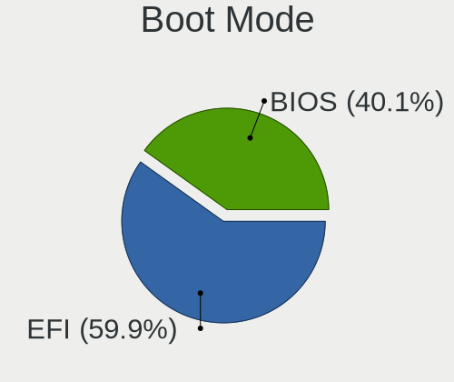

| Mode | Notebooks | Percent |
|------|-----------|---------|
| EFI  | 166       | 60.58%  |
| BIOS | 108       | 39.42%  |

Filesystem
----------

Type of filesystem

| Type    | Notebooks | Percent |
|---------|-----------|---------|
| Ext4    | 205       | 73.21%  |
| Btrfs   | 33        | 11.79%  |
| Overlay | 23        | 8.21%   |
| Tmpfs   | 10        | 3.57%   |
| Unknown | 6         | 2.14%   |
| Zfs     | 2         | 0.71%   |
| Xfs     | 1         | 0.36%   |

Part. scheme
------------

Scheme of partitioning

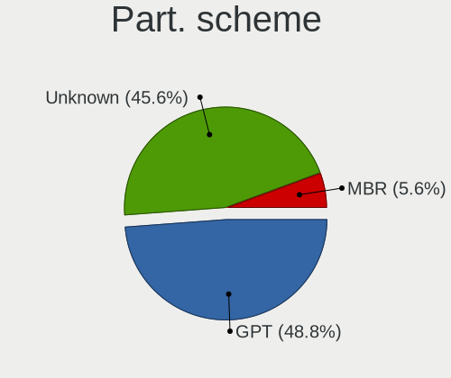

| Type    | Notebooks | Percent |
|---------|-----------|---------|
| GPT     | 133       | 47.5%   |
| Unknown | 131       | 46.79%  |
| MBR     | 16        | 5.71%   |

Dual Boot with Linux/BSD
------------------------

Hosting more than one Linux/BSD

| Dual boot | Notebooks | Percent |
|-----------|-----------|---------|
| No        | 239       | 85.66%  |
| Yes       | 40        | 14.34%  |

Dual Boot (Win)
---------------

Hosting Linux and Windows

| Dual boot | Notebooks | Percent |
|-----------|-----------|---------|
| No        | 191       | 67.97%  |
| Yes       | 90        | 32.03%  |

Board
-----

Vendor
------

Motherboard manufacturer

| Name                           | Notebooks | Percent |
|--------------------------------|-----------|---------|
| Lenovo                         | 62        | 22.79%  |
| ASUSTek Computer               | 49        | 18.01%  |
| Acer                           | 43        | 15.81%  |
| Hewlett-Packard                | 32        | 11.76%  |
| Dell                           | 26        | 9.56%   |
| MSI                            | 12        | 4.41%   |
| HUAWEI                         | 8         | 2.94%   |
| Apple                          | 7         | 2.57%   |
| Samsung Electronics            | 6         | 2.21%   |
| Toshiba                        | 4         | 1.47%   |
| Fujitsu                        | 4         | 1.47%   |
| Valve                          | 2         | 0.74%   |
| Infinix                        | 2         | 0.74%   |
| Unknown                        | 2         | 0.74%   |
| Timi                           | 1         | 0.37%   |
| Sony                           | 1         | 0.37%   |
| SmbiosType1_SystemManufacturer | 1         | 0.37%   |
| Razer                          | 1         | 0.37%   |
| Notebook                       | 1         | 0.37%   |
| NEC Computers                  | 1         | 0.37%   |
| MicroByte                      | 1         | 0.37%   |
| MECHREVO                       | 1         | 0.37%   |
| Hampoo                         | 1         | 0.37%   |
| Gigabyte Technology            | 1         | 0.37%   |
| Framework                      | 1         | 0.37%   |
| Foxconn                        | 1         | 0.37%   |
| Clevo                          | 1         | 0.37%   |

Model
-----

Motherboard model

| Name                                                         | Notebooks | Percent |
|--------------------------------------------------------------|-----------|---------|
| HUAWEI BOHB-WAX9                                             | 3         | 1.1%    |
| Acer Aspire E5-471G                                          | 3         | 1.1%    |
| Unknown                                                      | 3         | 1.1%    |
| Valve Jupiter                                                | 2         | 0.74%   |
| Samsung NC208/NC108                                          | 2         | 0.74%   |
| Lenovo Z50-70 20354                                          | 2         | 0.74%   |
| Lenovo ThinkPad 11e 5th Gen 20LQS00000                       | 2         | 0.74%   |
| Lenovo G460 20041                                            | 2         | 0.74%   |
| Infinix INBOOK X2                                            | 2         | 0.74%   |
| HUAWEI KLVL-WXX9                                             | 2         | 0.74%   |
| HP Laptop 14-ck0xxx                                          | 2         | 0.74%   |
| Dell Latitude E6430                                          | 2         | 0.74%   |
| Dell Latitude 3120                                           | 2         | 0.74%   |
| ASUS X556UQK                                                 | 2         | 0.74%   |
| ASUS X450LN                                                  | 2         | 0.74%   |
| ASUS VivoBook_ASUSLaptop M3500QA_D3500QA                     | 2         | 0.74%   |
| ASUS VivoBook_ASUS Laptop E210MA_L210MA                      | 2         | 0.74%   |
| ASUS TUF Gaming FX505DT_FX505DT                              | 2         | 0.74%   |
| Apple MacBookAir3,2                                          | 2         | 0.74%   |
| Acer Aspire F5-573G                                          | 2         | 0.74%   |
| Acer Aspire A315-21                                          | 2         | 0.74%   |
| Toshiba Satellite L840                                       | 1         | 0.37%   |
| Toshiba Satellite L645                                       | 1         | 0.37%   |
| Toshiba Satellite L640                                       | 1         | 0.37%   |
| Toshiba QOSMIO X70-B                                         | 1         | 0.37%   |
| Timi TM1701                                                  | 1         | 0.37%   |
| Sony SVF14N25CXB                                             | 1         | 0.37%   |
| SmbiosType1_SystemManufacturer SmbiosType1_SystemProductName | 1         | 0.37%   |
| Samsung RV418/RV518/RV718                                    | 1         | 0.37%   |
| Samsung R780/R778                                            | 1         | 0.37%   |
| Samsung 900X3L                                               | 1         | 0.37%   |
| Samsung 300E4Z/300E5Z/300E7Z                                 | 1         | 0.37%   |
| Razer Blade 15 (2022) - RZ09-0421                            | 1         | 0.37%   |
| Notebook NV4XMB,ME,MZ                                        | 1         | 0.37%   |
| NEC Computers PC-VK27MBZCG                                   | 1         | 0.37%   |
| MSI X460/X460DX                                              | 1         | 0.37%   |
| MSI Raider GE77HX 12UHS                                      | 1         | 0.37%   |
| MSI Prestige 15 A10SC                                        | 1         | 0.37%   |
| MSI PE70 6QE                                                 | 1         | 0.37%   |
| MSI MS-14Y1                                                  | 1         | 0.37%   |

Model Family
------------

Motherboard model prefix

| Name               | Notebooks | Percent |
|--------------------|-----------|---------|
| Lenovo ThinkPad    | 33        | 12.13%  |
| Acer Aspire        | 27        | 9.93%   |
| ASUS VivoBook      | 13        | 4.78%   |
| Lenovo IdeaPad     | 12        | 4.41%   |
| HP Pavilion        | 9         | 3.31%   |
| HP Laptop          | 8         | 2.94%   |
| Dell Latitude      | 8         | 2.94%   |
| Dell Inspiron      | 6         | 2.21%   |
| ASUS ZenBook       | 6         | 2.21%   |
| ASUS TUF           | 5         | 1.84%   |
| Acer Swift         | 5         | 1.84%   |
| HP EliteBook       | 4         | 1.47%   |
| Dell Vostro        | 4         | 1.47%   |
| ASUS ROG           | 4         | 1.47%   |
| Toshiba Satellite  | 3         | 1.1%    |
| Lenovo ThinkBook   | 3         | 1.1%    |
| HUAWEI BOHB-WAX9   | 3         | 1.1%    |
| HP Compaq          | 3         | 1.1%    |
| Dell Precision     | 3         | 1.1%    |
| ASUS ASUS          | 3         | 1.1%    |
| Acer TravelMate    | 3         | 1.1%    |
| Acer Nitro         | 3         | 1.1%    |
| Unknown            | 3         | 1.1%    |
| Valve Jupiter      | 2         | 0.74%   |
| Samsung NC208      | 2         | 0.74%   |
| MSI GF63           | 2         | 0.74%   |
| Lenovo Z50-70      | 2         | 0.74%   |
| Lenovo Legion      | 2         | 0.74%   |
| Lenovo G460        | 2         | 0.74%   |
| Infinix INBOOK     | 2         | 0.74%   |
| HUAWEI KLVL-WXX9   | 2         | 0.74%   |
| HP Stream          | 2         | 0.74%   |
| HP OMEN            | 2         | 0.74%   |
| HP ENVY            | 2         | 0.74%   |
| Fujitsu LIFEBOOK   | 2         | 0.74%   |
| Dell XPS           | 2         | 0.74%   |
| ASUS X556UQK       | 2         | 0.74%   |
| ASUS X450LN        | 2         | 0.74%   |
| Apple MacBookPro11 | 2         | 0.74%   |
| Apple MacBookAir3  | 2         | 0.74%   |

MFG Year
--------

Motherboard manufacture year

| Year | Notebooks | Percent |
|------|-----------|---------|
| 2021 | 30        | 11.03%  |
| 2020 | 30        | 11.03%  |
| 2018 | 28        | 10.29%  |
| 2019 | 21        | 7.72%   |
| 2014 | 20        | 7.35%   |
| 2012 | 20        | 7.35%   |
| 2015 | 18        | 6.62%   |
| 2016 | 17        | 6.25%   |
| 2022 | 16        | 5.88%   |
| 2017 | 16        | 5.88%   |
| 2011 | 15        | 5.51%   |
| 2013 | 10        | 3.68%   |
| 2010 | 10        | 3.68%   |
| 2008 | 7         | 2.57%   |
| 2023 | 6         | 2.21%   |
| 2009 | 4         | 1.47%   |
| 2007 | 3         | 1.1%    |
| 2006 | 1         | 0.37%   |

Form Factor
-----------

Physical design of the computer

| Name     | Notebooks | Percent |
|----------|-----------|---------|
| Notebook | 272       | 100%    |

Secure Boot
-----------

Enabled or disabled

| State    | Notebooks | Percent |
|----------|-----------|---------|
| Disabled | 238       | 86.86%  |
| Enabled  | 36        | 13.14%  |

Coreboot
--------

Have coreboot on board

| Used | Notebooks | Percent |
|------|-----------|---------|
| No   | 272       | 100%    |

RAM Size
--------

Total RAM memory

| Size in GB  | Notebooks | Percent |
|-------------|-----------|---------|
| 4.01-8.0    | 73        | 26.55%  |
| 3.01-4.0    | 57        | 20.73%  |
| 8.01-16.0   | 50        | 18.18%  |
| 16.01-24.0  | 47        | 17.09%  |
| 32.01-64.0  | 23        | 8.36%   |
| 24.01-32.0  | 9         | 3.27%   |
| 1.01-2.0    | 9         | 3.27%   |
| 2.01-3.0    | 3         | 1.09%   |
| 64.01-256.0 | 3         | 1.09%   |
| 0.51-1.0    | 1         | 0.36%   |

RAM Used
--------

Used RAM memory

| Used GB    | Notebooks | Percent |
|------------|-----------|---------|
| 1.01-2.0   | 96        | 31.68%  |
| 2.01-3.0   | 82        | 27.06%  |
| 4.01-8.0   | 56        | 18.48%  |
| 3.01-4.0   | 40        | 13.2%   |
| 8.01-16.0  | 18        | 5.94%   |
| 0.51-1.0   | 8         | 2.64%   |
| 0.01-0.5   | 2         | 0.66%   |
| 16.01-24.0 | 1         | 0.33%   |

Total Drives
------------

Number of drives on board

| Drives | Notebooks | Percent |
|--------|-----------|---------|
| 1      | 194       | 68.79%  |
| 2      | 70        | 24.82%  |
| 3      | 11        | 3.9%    |
| 0      | 4         | 1.42%   |
| 5      | 2         | 0.71%   |
| 4      | 1         | 0.35%   |

Has CD-ROM
----------

Has CD-ROM on board

| Presented | Notebooks | Percent |
|-----------|-----------|---------|
| No        | 210       | 76.92%  |
| Yes       | 63        | 23.08%  |

Has Ethernet
------------

Has Ethernet on board

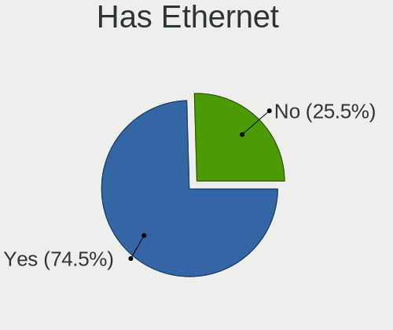

| Presented | Notebooks | Percent |
|-----------|-----------|---------|
| Yes       | 205       | 74.82%  |
| No        | 69        | 25.18%  |

Has WiFi
--------

Has WiFi module

| Presented | Notebooks | Percent |
|-----------|-----------|---------|
| Yes       | 268       | 98.17%  |
| No        | 5         | 1.83%   |

Has Bluetooth
-------------

Has Bluetooth module

| Presented | Notebooks | Percent |
|-----------|-----------|---------|
| Yes       | 227       | 82.25%  |
| No        | 49        | 17.75%  |

Location
--------

Country
-------

Geographic location (country)

| Country  | Notebooks | Percent |
|----------|-----------|---------|
| Thailand | 272       | 100%    |

City
----

Geographic location (city)

| City                | Notebooks | Percent |
|---------------------|-----------|---------|
| Bangkok             | 130       | 43.48%  |
| Chiang Mai          | 19        | 6.35%   |
| Phuket              | 12        | 4.01%   |
| Nonthaburi          | 12        | 4.01%   |
| Khon Kaen           | 8         | 2.68%   |
| Bang Lamung         | 8         | 2.68%   |
| Nakhon Ratchasima   | 7         | 2.34%   |
| Surat Thani         | 4         | 1.34%   |
| Ban Nong Sala       | 4         | 1.34%   |
| Surin               | 3         | 1%      |
| Rayong              | 3         | 1%      |
| Pattaya             | 3         | 1%      |
| Nakhon Pathom       | 3         | 1%      |
| Chon Buri           | 3         | 1%      |
| Chiang Rai          | 3         | 1%      |
| Songkhla            | 2         | 0.67%   |
| Phayao              | 2         | 0.67%   |
| Pattani             | 2         | 0.67%   |
| Pak Kret            | 2         | 0.67%   |
| Mueang Samut Prakan | 2         | 0.67%   |
| Maha Sarakham       | 2         | 0.67%   |
| Khlong Luang        | 2         | 0.67%   |
| Hua Hin             | 2         | 0.67%   |
| Don Mot Daeng       | 2         | 0.67%   |
| Bang Bua Thong      | 2         | 0.67%   |
| Bang Bon            | 2         | 0.67%   |
| Ban Yang Sam Ton    | 2         | 0.67%   |
| Ban Sang            | 2         | 0.67%   |
| Ban Phan Don        | 2         | 0.67%   |
| Ban Du              | 2         | 0.67%   |
| Yala                | 1         | 0.33%   |
| Udon Thani          | 1         | 0.33%   |
| Suan Luang          | 1         | 0.33%   |
| Si Sa Ket           | 1         | 0.33%   |
| Si Racha            | 1         | 0.33%   |
| Sattahip            | 1         | 0.33%   |
| Samut Prakan        | 1         | 0.33%   |
| Salaya              | 1         | 0.33%   |
| Ratchathewi         | 1         | 0.33%   |
| Rasi Salai          | 1         | 0.33%   |

Drives
------

Drive Vendor
------------

Hard drive vendors

| Vendor                      | Notebooks | Drives | Percent |
|-----------------------------|-----------|--------|---------|
| WDC                         | 59        | 70     | 16.76%  |
| Samsung Electronics         | 48        | 64     | 13.64%  |
| Seagate                     | 38        | 50     | 10.8%   |
| Toshiba                     | 27        | 34     | 7.67%   |
| SanDisk                     | 24        | 34     | 6.82%   |
| Unknown                     | 19        | 24     | 5.4%    |
| Kingston                    | 18        | 22     | 5.11%   |
| Intel                       | 18        | 20     | 5.11%   |
| SK hynix                    | 13        | 26     | 3.69%   |
| HGST                        | 11        | 12     | 3.13%   |
| Micron Technology           | 9         | 11     | 2.56%   |
| Hitachi                     | 6         | 6      | 1.7%    |
| Transcend                   | 5         | 6      | 1.42%   |
| Crucial                     | 5         | 5      | 1.42%   |
| Apple                       | 5         | 5      | 1.42%   |
| SPCC                        | 3         | 3      | 0.85%   |
| Silicon Motion              | 3         | 6      | 0.85%   |
| Phison Electronics          | 3         | 7      | 0.85%   |
| KIOXIA                      | 3         | 5      | 0.85%   |
| Apacer                      | 3         | 3      | 0.85%   |
| Pioneer                     | 2         | 2      | 0.57%   |
| Kingmax                     | 2         | 8      | 0.57%   |
| Fujitsu                     | 2         | 3      | 0.57%   |
| China                       | 2         | 2      | 0.57%   |
| YMTC                        | 1         | 1      | 0.28%   |
| Yangtze Memory Technologies | 1         | 1      | 0.28%   |
| XPG                         | 1         | 1      | 0.28%   |
| USB3.0                      | 1         | 2      | 0.28%   |
| Teelkoou                    | 1         | 1      | 0.28%   |
| Team                        | 1         | 1      | 0.28%   |
| TARGET                      | 1         | 1      | 0.28%   |
| StoreJet                    | 1         | 1      | 0.28%   |
| ShiJi                       | 1         | 1      | 0.28%   |
| PNY                         | 1         | 2      | 0.28%   |
| Plextor                     | 1         | 1      | 0.28%   |
| O2 Micro                    | 1         | 1      | 0.28%   |
| LITEON                      | 1         | 2      | 0.28%   |
| Lite-On                     | 1         | 2      | 0.28%   |
| Kingston Technology Company | 1         | 1      | 0.28%   |
| JMicron Technology          | 1         | 1      | 0.28%   |

Drive Model
-----------

Hard drive models

| Model                                               | Notebooks | Percent |
|-----------------------------------------------------|-----------|---------|
| Toshiba MQ01ABD100 1TB                              | 7         | 1.93%   |
| Toshiba MQ04ABF100 1TB                              | 6         | 1.65%   |
| Seagate ST500LT012-1DG142 500GB                     | 6         | 1.65%   |
| Seagate ST1000LM035-1RK172 1TB                      | 6         | 1.65%   |
| Unknown MMC Card  64GB                              | 5         | 1.38%   |
| Unknown MMC Card  32GB                              | 5         | 1.38%   |
| Samsung NVMe SSD Controller PM9A1/PM9A3/980PRO 2TB  | 5         | 1.38%   |
| WDC WDS240G2G0A-00JH30 240GB SSD                    | 4         | 1.1%    |
| Seagate ST1000LM024 HN-M101MBB 1TB                  | 4         | 1.1%    |
| Sandisk WD Blue SN550 NVMe SSD 512GB                | 4         | 1.1%    |
| Samsung NVMe SSD Controller SM981/PM981/PM983 1TB   | 4         | 1.1%    |
| Kingston SA400S37240G 240GB SSD                     | 4         | 1.1%    |
| HGST HTS721010A9E630 1TB                            | 4         | 1.1%    |
| WDC WDS500G2B0A-00SM50 500GB SSD                    | 3         | 0.83%   |
| WDC WDS120G2G0A-00JH30 120GB SSD                    | 3         | 0.83%   |
| WDC WDS100T2B0A-00SM50 1TB SSD                      | 3         | 0.83%   |
| WDC WD10SPZX-21Z10T0 1TB                            | 3         | 0.83%   |
| WDC WD10JPVX-22JC3T0 1TB                            | 3         | 0.83%   |
| WDC PC SN730 SDBPNTY-1T00-1032 1TB                  | 3         | 0.83%   |
| SK hynix HFM512GD3JX013N 512GB                      | 3         | 0.83%   |
| Seagate ST9500325AS 500GB                           | 3         | 0.83%   |
| Seagate ST1000LM049-2GH172 1TB                      | 3         | 0.83%   |
| SanDisk NVMe SSD Drive 1TB                          | 3         | 0.83%   |
| Samsung NVMe SSD Controller SM961/PM961/SM963 256GB | 3         | 0.83%   |
| Kingston NVMe SSD Drive 512GB                       | 3         | 0.83%   |
| Intel SSDPEKNU512GZ 512GB                           | 3         | 0.83%   |
| HGST HTS725050A7E630 500GB                          | 3         | 0.83%   |
| Crucial CT500MX500SSD1 500GB                        | 3         | 0.83%   |
| WDC WD5000BPVT-22HXZT3 500GB                        | 2         | 0.55%   |
| WDC WD3200BEVT-22ZCT0 320GB                         | 2         | 0.55%   |
| Unknown SD/MMC/MS PRO 256GB                         | 2         | 0.55%   |
| Unknown DA4064  64GB                                | 2         | 0.55%   |
| Toshiba MQ01ABF032 320GB                            | 2         | 0.55%   |
| Toshiba MK6475GSX 640GB                             | 2         | 0.55%   |
| Toshiba KBG30ZMT128G 128GB                          | 2         | 0.55%   |
| SK hynix HFS128G39TND-N210A 128GB SSD               | 2         | 0.55%   |
| Seagate ST500LM021-1KJ152 500GB                     | 2         | 0.55%   |
| SanDisk Ultra II 240GB SSD                          | 2         | 0.55%   |
| SanDisk NVMe SSD Drive 512GB                        | 2         | 0.55%   |
| SanDisk NVMe SSD Drive 250GB                        | 2         | 0.55%   |

HDD Vendor
----------

Hard disk drive vendors

| Vendor              | Notebooks | Drives | Percent |
|---------------------|-----------|--------|---------|
| Seagate             | 38        | 50     | 33.04%  |
| WDC                 | 29        | 32     | 25.22%  |
| Toshiba             | 22        | 27     | 19.13%  |
| HGST                | 11        | 12     | 9.57%   |
| Hitachi             | 6         | 6      | 5.22%   |
| Unknown             | 2         | 2      | 1.74%   |
| Samsung Electronics | 2         | 3      | 1.74%   |
| Fujitsu             | 2         | 3      | 1.74%   |
| StoreJet            | 1         | 1      | 0.87%   |
| JMicron Technology  | 1         | 1      | 0.87%   |
| Initio              | 1         | 1      | 0.87%   |

SSD Vendor
----------

Solid state drive vendors

| Vendor              | Notebooks | Drives | Percent |
|---------------------|-----------|--------|---------|
| WDC                 | 20        | 27     | 21.05%  |
| Samsung Electronics | 16        | 23     | 16.84%  |
| SanDisk             | 9         | 14     | 9.47%   |
| Kingston            | 9         | 12     | 9.47%   |
| Crucial             | 5         | 5      | 5.26%   |
| Apple               | 4         | 4      | 4.21%   |
| Transcend           | 3         | 4      | 3.16%   |
| SPCC                | 3         | 3      | 3.16%   |
| Intel               | 3         | 3      | 3.16%   |
| Apacer              | 3         | 3      | 3.16%   |
| SK hynix            | 2         | 2      | 2.11%   |
| Pioneer             | 2         | 2      | 2.11%   |
| Micron Technology   | 2         | 3      | 2.11%   |
| Kingmax             | 2         | 8      | 2.11%   |
| China               | 2         | 2      | 2.11%   |
| USB3.0              | 1         | 2      | 1.05%   |
| Teelkoou            | 1         | 1      | 1.05%   |
| Team                | 1         | 1      | 1.05%   |
| TARGET              | 1         | 1      | 1.05%   |
| PNY                 | 1         | 2      | 1.05%   |
| Plextor             | 1         | 1      | 1.05%   |
| LITEON              | 1         | 2      | 1.05%   |
| Hikvision           | 1         | 1      | 1.05%   |
| Colorful            | 1         | 3      | 1.05%   |
| BR                  | 1         | 1      | 1.05%   |

Drive Kind
----------

HDD or SSD

| Kind    | Notebooks | Drives | Percent |
|---------|-----------|--------|---------|
| NVMe    | 117       | 165    | 35.45%  |
| HDD     | 107       | 138    | 32.42%  |
| SSD     | 86        | 130    | 26.06%  |
| MMC     | 17        | 22     | 5.15%   |
| Unknown | 3         | 3      | 0.91%   |

Drive Connector
---------------

SATA, SAS, NVMe, etc.

| Type | Notebooks | Drives | Percent |
|------|-----------|--------|---------|
| SATA | 164       | 256    | 53.42%  |
| NVMe | 117       | 165    | 38.11%  |
| MMC  | 17        | 22     | 5.54%   |
| SAS  | 9         | 15     | 2.93%   |

Drive Size
----------

Size of hard drive

| Size in TB | Notebooks | Drives | Percent |
|------------|-----------|--------|---------|
| 0.01-0.5   | 112       | 170    | 60.22%  |
| 0.51-1.0   | 70        | 94     | 37.63%  |
| 1.01-2.0   | 4         | 4      | 2.15%   |

Space Total
-----------

Amount of disk space available on the file system

| Size in GB     | Notebooks | Percent |
|----------------|-----------|---------|
| 251-500        | 68        | 23.13%  |
| 101-250        | 65        | 22.11%  |
| 501-1000       | 45        | 15.31%  |
| 51-100         | 28        | 9.52%   |
| 1-20           | 27        | 9.18%   |
| 21-50          | 20        | 6.8%    |
| 1001-2000      | 20        | 6.8%    |
| Unknown        | 10        | 3.4%    |
| More than 3000 | 6         | 2.04%   |
| 2001-3000      | 5         | 1.7%    |

Space Used
----------

Amount of used disk space

| Used GB   | Notebooks | Percent |
|-----------|-----------|---------|
| 1-20      | 122       | 40.8%   |
| 21-50     | 51        | 17.06%  |
| 101-250   | 38        | 12.71%  |
| 251-500   | 30        | 10.03%  |
| 51-100    | 27        | 9.03%   |
| 501-1000  | 13        | 4.35%   |
| Unknown   | 10        | 3.34%   |
| 1001-2000 | 8         | 2.68%   |

Malfunc. Drives
---------------

Drive models with a malfunction

| Model                                | Notebooks | Drives | Percent |
|--------------------------------------|-----------|--------|---------|
| Toshiba MQ01ABD100 1TB               | 2         | 2      | 9.52%   |
| Seagate ST1000LM049-2GH172 1TB       | 2         | 2      | 9.52%   |
| Seagate ST1000LM035-1RK172 1TB       | 2         | 2      | 9.52%   |
| WDC WD10SPZX-22Z10T0 1TB             | 1         | 3      | 4.76%   |
| USB3.0 Super Speed 500GB SSD         | 1         | 2      | 4.76%   |
| Toshiba MQ04ABF100 1TB               | 1         | 1      | 4.76%   |
| Toshiba MK6475GSX 640GB              | 1         | 1      | 4.76%   |
| TARGET SSD 128G                      | 1         | 1      | 4.76%   |
| SK hynix BC711 HFM512GD3JX013N 512GB | 1         | 1      | 4.76%   |
| Seagate ST9500325AS 500GB            | 1         | 1      | 4.76%   |
| Seagate ST500LM000-SSHD-8GB          | 1         | 1      | 4.76%   |
| SanDisk SDSSDX240GG25 240GB          | 1         | 1      | 4.76%   |
| Samsung Electronics HM160HI 160GB    | 1         | 2      | 4.76%   |
| Intel SSDSC2KF256H6 SATA 256GB       | 1         | 1      | 4.76%   |
| HGST HTS725050A7E630 500GB           | 1         | 1      | 4.76%   |
| HGST HTS721010A9E630 1TB             | 1         | 1      | 4.76%   |
| HGST HTS541075A9E680 752GB           | 1         | 1      | 4.76%   |
| Colorful SL500 240GB SSD             | 1         | 3      | 4.76%   |

Malfunc. Drive Vendor
---------------------

Vendors of faulty drives

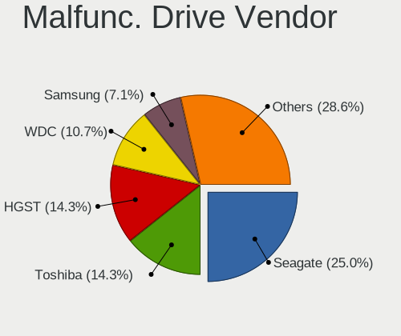

| Vendor              | Notebooks | Drives | Percent |
|---------------------|-----------|--------|---------|
| Seagate             | 6         | 6      | 28.57%  |
| Toshiba             | 4         | 4      | 19.05%  |
| HGST                | 3         | 3      | 14.29%  |
| WDC                 | 1         | 3      | 4.76%   |
| USB3.0              | 1         | 2      | 4.76%   |
| TARGET              | 1         | 1      | 4.76%   |
| SK hynix            | 1         | 1      | 4.76%   |
| SanDisk             | 1         | 1      | 4.76%   |
| Samsung Electronics | 1         | 2      | 4.76%   |
| Intel               | 1         | 1      | 4.76%   |
| Colorful            | 1         | 3      | 4.76%   |

Malfunc. HDD Vendor
-------------------

Vendors of faulty HDD drives

| Vendor              | Notebooks | Drives | Percent |
|---------------------|-----------|--------|---------|
| Seagate             | 6         | 6      | 40%     |
| Toshiba             | 4         | 4      | 26.67%  |
| HGST                | 3         | 3      | 20%     |
| WDC                 | 1         | 3      | 6.67%   |
| Samsung Electronics | 1         | 2      | 6.67%   |

Malfunc. Drive Kind
-------------------

Kinds of faulty drives

| Kind | Notebooks | Drives | Percent |
|------|-----------|--------|---------|
| HDD  | 14        | 18     | 73.68%  |
| SSD  | 4         | 8      | 21.05%  |
| NVMe | 1         | 1      | 5.26%   |

Failed Drives
-------------

Failed drive models

| Model                          | Notebooks | Drives | Percent |
|--------------------------------|-----------|--------|---------|
| Seagate ST1000LM035-1RK172 1TB | 1         | 1      | 100%    |

Failed Drive Vendor
-------------------

Failed drive vendors

| Vendor  | Notebooks | Drives | Percent |
|---------|-----------|--------|---------|
| Seagate | 1         | 1      | 100%    |

Drive Status
------------

Number of failed and malfunc. drives

| Status   | Notebooks | Drives | Percent |
|----------|-----------|--------|---------|
| Detected | 159       | 269    | 55.4%   |
| Works    | 108       | 161    | 37.63%  |
| Malfunc  | 19        | 27     | 6.62%   |
| Failed   | 1         | 1      | 0.35%   |

Storage controller
------------------

Storage Vendor
--------------

Storage controller vendors

| Vendor                       | Notebooks | Percent |
|------------------------------|-----------|---------|
| Intel                        | 172       | 52.92%  |
| Samsung Electronics          | 37        | 11.38%  |
| AMD                          | 33        | 10.15%  |
| SanDisk                      | 26        | 8%      |
| SK hynix                     | 11        | 3.38%   |
| Kingston Technology Company  | 10        | 3.08%   |
| Micron Technology            | 7         | 2.15%   |
| Toshiba America Info Systems | 5         | 1.54%   |
| Silicon Motion               | 4         | 1.23%   |
| Nvidia                       | 4         | 1.23%   |
| Phison Electronics           | 3         | 0.92%   |
| KIOXIA                       | 3         | 0.92%   |
| Yangtze Memory Technologies  | 2         | 0.62%   |
| ADATA Technology             | 2         | 0.62%   |
| VIA Technologies             | 1         | 0.31%   |
| Transcend                    | 1         | 0.31%   |
| Shenzhen Longsys Electronics | 1         | 0.31%   |
| O2 Micro                     | 1         | 0.31%   |
| Lite-On Technology           | 1         | 0.31%   |
| Apple                        | 1         | 0.31%   |

Storage Model
-------------

Storage controller models

| Model                                                                            | Notebooks | Percent |
|----------------------------------------------------------------------------------|-----------|---------|
| AMD FCH SATA Controller [AHCI mode]                                              | 32        | 9.36%   |
| Intel Sunrise Point-LP SATA Controller [AHCI mode]                               | 20        | 5.85%   |
| Samsung NVMe SSD Controller SM981/PM981/PM983                                    | 18        | 5.26%   |
| Intel 7 Series Chipset Family 6-port SATA Controller [AHCI mode]                 | 17        | 4.97%   |
| Intel 8 Series SATA Controller 1 [AHCI mode]                                     | 16        | 4.68%   |
| Intel Cannon Lake Mobile PCH SATA AHCI Controller                                | 11        | 3.22%   |
| Intel 6 Series/C200 Series Chipset Family 6 port Mobile SATA AHCI Controller     | 10        | 2.92%   |
| Intel HM170/QM170 Chipset SATA Controller [AHCI Mode]                            | 9         | 2.63%   |
| Intel 82801 Mobile SATA Controller [RAID mode]                                   | 9         | 2.63%   |
| Intel Volume Management Device NVMe RAID Controller                              | 8         | 2.34%   |
| SanDisk Ultra 3D / WD Blue SN550 NVMe SSD                                        | 7         | 2.05%   |
| SanDisk Extreme Pro / WD Black SN750 / PC SN730 / Red SN700 NVMe SSD             | 7         | 2.05%   |
| Samsung NVMe SSD Controller PM9A1/PM9A3/980PRO                                   | 7         | 2.05%   |
| Intel SSD 660P Series                                                            | 7         | 2.05%   |
| Intel 82801IBM/IEM (ICH9M/ICH9M-E) 4 port SATA Controller [AHCI mode]            | 7         | 2.05%   |
| SK hynix Gold P31/BC711/PC711 NVMe Solid State Drive                             | 6         | 1.75%   |
| Samsung NVMe SSD Controller 980 (DRAM-less)                                      | 6         | 1.75%   |
| Intel Comet Lake SATA AHCI Controller                                            | 6         | 1.75%   |
| Intel Celeron/Pentium Silver Processor SATA Controller                           | 6         | 1.75%   |
| Intel 8 Series/C220 Series Chipset Family 6-port SATA Controller 1 [AHCI mode]   | 6         | 1.75%   |
| Intel 5 Series/3400 Series Chipset 4 port SATA AHCI Controller                   | 6         | 1.75%   |
| Intel 400 Series Chipset Family SATA AHCI Controller                             | 5         | 1.46%   |
| Samsung NVMe SSD Controller SM961/PM961/SM963                                    | 4         | 1.17%   |
| Intel SSD 670p Series [Keystone Harbor]                                          | 4         | 1.17%   |
| Intel Q170/Q150/B150/H170/H110/Z170/CM236 Chipset SATA Controller [AHCI Mode]    | 4         | 1.17%   |
| Intel Atom/Celeron/Pentium Processor x5-E8000/J3xxx/N3xxx Series SATA Controller | 4         | 1.17%   |
| SanDisk PC SN735 NVMe SSD (DRAM-less)                                            | 3         | 0.88%   |
| SanDisk PC SN530 NVMe SSD (DRAM-less)                                            | 3         | 0.88%   |
| Kingston Company OM8PCP Design-In PCIe 3 NVMe SSD (DRAM-less)                    | 3         | 0.88%   |
| Kingston Company A1000/U-SNS8154P3 x2 NVMe SSD                                   | 3         | 0.88%   |
| Intel Wildcat Point-LP SATA Controller [AHCI Mode]                               | 3         | 0.88%   |
| Intel SSD 600P Series                                                            | 3         | 0.88%   |
| Yangtze Memory PC005 NVMe SSD                                                    | 2         | 0.58%   |
| Toshiba America Info Systems XG6 NVMe SSD Controller                             | 2         | 0.58%   |
| Toshiba America Info Systems BG3 x2 NVMe SSD Controller (DRAM-less)              | 2         | 0.58%   |
| SK hynix Platinum P41/PC801 NVMe Solid State Drive                               | 2         | 0.58%   |
| Silicon Motion SM2262/SM2262EN SSD Controller                                    | 2         | 0.58%   |
| SanDisk WD Blue SN500 / PC SN520 x2 M.2 2280 NVMe SSD                            | 2         | 0.58%   |
| Samsung S4LN053X01 AHCI SSD Controller(Apple slot)                               | 2         | 0.58%   |
| Phison E12 NVMe Controller                                                       | 2         | 0.58%   |

Storage Kind
------------

Kind of storage controller (IDE, SATA, NVMe, SAS, ...)

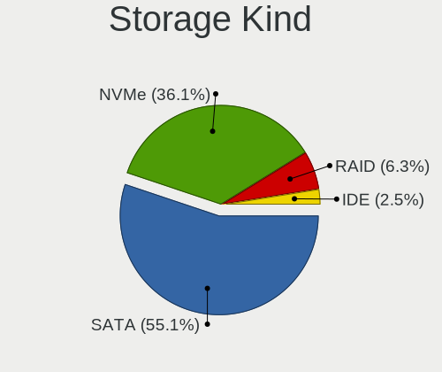

| Kind | Notebooks | Percent |
|------|-----------|---------|
| SATA | 182       | 55.49%  |
| NVMe | 120       | 36.59%  |
| RAID | 18        | 5.49%   |
| IDE  | 8         | 2.44%   |

Processor
---------

CPU Vendor
----------

Processor vendors

| Vendor | Notebooks | Percent |
|--------|-----------|---------|
| Intel  | 213       | 78.31%  |
| AMD    | 59        | 21.69%  |

CPU Model
---------

Processor models

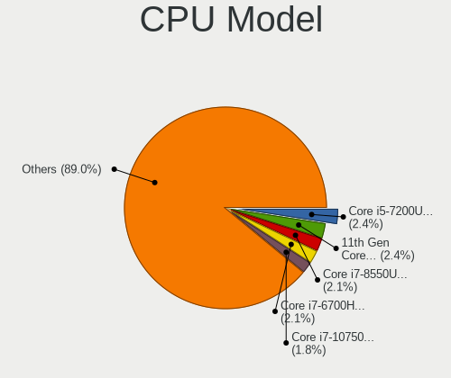

| Model                                         | Notebooks | Percent |
|-----------------------------------------------|-----------|---------|
| Intel Core i5-7200U CPU @ 2.50GHz             | 8         | 2.94%   |
| Intel Core i7-8550U CPU @ 1.80GHz             | 7         | 2.57%   |
| Intel Core i7-6700HQ CPU @ 2.60GHz            | 7         | 2.57%   |
| Intel 11th Gen Core i5-1135G7 @ 2.40GHz       | 7         | 2.57%   |
| Intel Core i7-10750H CPU @ 2.60GHz            | 5         | 1.84%   |
| Intel Core i5-2450M CPU @ 2.50GHz             | 5         | 1.84%   |
| Intel Core i3-4005U CPU @ 1.70GHz             | 5         | 1.84%   |
| AMD Ryzen 5 3500U with Radeon Vega Mobile Gfx | 5         | 1.84%   |
| Intel Core i7-8750H CPU @ 2.20GHz             | 4         | 1.47%   |
| Intel Core i7-4510U CPU @ 2.00GHz             | 4         | 1.47%   |
| Intel Core i5-6200U CPU @ 2.30GHz             | 4         | 1.47%   |
| Intel Core i5-3230M CPU @ 2.60GHz             | 4         | 1.47%   |
| Intel 11th Gen Core i7-1165G7 @ 2.80GHz       | 4         | 1.47%   |
| AMD Ryzen 7 4800H with Radeon Graphics        | 4         | 1.47%   |
| AMD Ryzen 5 5500U with Radeon Graphics        | 4         | 1.47%   |
| Intel Pentium CPU N3710 @ 1.60GHz             | 3         | 1.1%    |
| Intel Core i7-7700HQ CPU @ 2.80GHz            | 3         | 1.1%    |
| Intel Core i5-4200U CPU @ 1.60GHz             | 3         | 1.1%    |
| Intel Core i5-3210M CPU @ 2.50GHz             | 3         | 1.1%    |
| Intel Core i5 CPU M 430 @ 2.27GHz             | 3         | 1.1%    |
| Intel Core i3-10110U CPU @ 2.10GHz            | 3         | 1.1%    |
| Intel Core 2 Duo CPU P8700 @ 2.53GHz          | 3         | 1.1%    |
| AMD Ryzen 5 3550H with Radeon Vega Mobile Gfx | 3         | 1.1%    |
| AMD Ryzen 3 2200U with Radeon Vega Mobile Gfx | 3         | 1.1%    |
| Intel Pentium Silver N6000 @ 1.10GHz          | 2         | 0.74%   |
| Intel Pentium CPU N3540 @ 2.16GHz             | 2         | 0.74%   |
| Intel Core i7-9750H CPU @ 2.60GHz             | 2         | 0.74%   |
| Intel Core i7-8650U CPU @ 1.90GHz             | 2         | 0.74%   |
| Intel Core i7-8565U CPU @ 1.80GHz             | 2         | 0.74%   |
| Intel Core i7-6820HQ CPU @ 2.70GHz            | 2         | 0.74%   |
| Intel Core i7-4710HQ CPU @ 2.50GHz            | 2         | 0.74%   |
| Intel Core i7-4500U CPU @ 1.80GHz             | 2         | 0.74%   |
| Intel Core i7-3610QM CPU @ 2.30GHz            | 2         | 0.74%   |
| Intel Core i7-1065G7 CPU @ 1.30GHz            | 2         | 0.74%   |
| Intel Core i7-10510U CPU @ 1.80GHz            | 2         | 0.74%   |
| Intel Core i5-9300H CPU @ 2.40GHz             | 2         | 0.74%   |
| Intel Core i5-8300H CPU @ 2.30GHz             | 2         | 0.74%   |
| Intel Core i5-8265U CPU @ 1.60GHz             | 2         | 0.74%   |
| Intel Core i5-3340M CPU @ 2.70GHz             | 2         | 0.74%   |
| Intel Core i5-1035G1 CPU @ 1.00GHz            | 2         | 0.74%   |

CPU Model Family
----------------

Processor model prefix

| Model                   | Notebooks | Percent |
|-------------------------|-----------|---------|
| Intel Core i7           | 66        | 24.26%  |
| Intel Core i5           | 60        | 22.06%  |
| Other                   | 23        | 8.46%   |
| AMD Ryzen 5             | 21        | 7.72%   |
| Intel Core i3           | 17        | 6.25%   |
| Intel Core 2 Duo        | 13        | 4.78%   |
| Intel Celeron           | 13        | 4.78%   |
| AMD Ryzen 7             | 13        | 4.78%   |
| Intel Pentium           | 10        | 3.68%   |
| Intel Atom              | 7         | 2.57%   |
| AMD Ryzen 7 PRO         | 4         | 1.47%   |
| AMD Ryzen 9             | 3         | 1.1%    |
| AMD Ryzen 3             | 3         | 1.1%    |
| AMD A4                  | 3         | 1.1%    |
| Intel Pentium Silver    | 2         | 0.74%   |
| AMD E2                  | 2         | 0.74%   |
| AMD Athlon              | 2         | 0.74%   |
| AMD A10                 | 2         | 0.74%   |
| Intel Xeon              | 1         | 0.37%   |
| Intel Pentium Dual      | 1         | 0.37%   |
| Intel Core m3           | 1         | 0.37%   |
| Intel Core i9           | 1         | 0.37%   |
| AMD Turion 64 X2 Mobile | 1         | 0.37%   |
| AMD Ryzen 5 PRO         | 1         | 0.37%   |
| AMD E1                  | 1         | 0.37%   |
| AMD A8                  | 1         | 0.37%   |

CPU Cores
---------

Number of processor cores

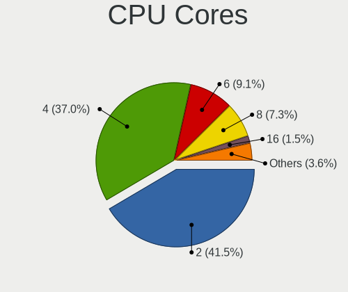

| Number | Notebooks | Percent |
|--------|-----------|---------|
| 2      | 113       | 41.39%  |
| 4      | 102       | 37.36%  |
| 6      | 27        | 9.89%   |
| 8      | 20        | 7.33%   |
| 14     | 4         | 1.47%   |
| 16     | 3         | 1.1%    |
| 1      | 2         | 0.73%   |
| 24     | 1         | 0.37%   |
| 12     | 1         | 0.37%   |

CPU Sockets
-----------

Number of sockets

| Number | Notebooks | Percent |
|--------|-----------|---------|
| 1      | 272       | 100%    |

CPU Threads
-----------

Threads per core (Hyper-Threading)

| Number | Notebooks | Percent |
|--------|-----------|---------|
| 2      | 217       | 79.2%   |
| 1      | 57        | 20.8%   |

CPU Op-Modes
------------

CPU Operation Modes (32-bit, 64-bit)

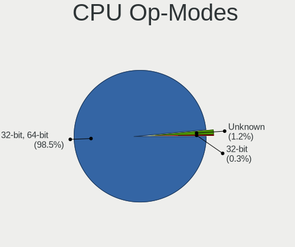

| Op mode        | Notebooks | Percent |
|----------------|-----------|---------|
| 32-bit, 64-bit | 267       | 98.16%  |
| Unknown        | 4         | 1.47%   |
| 32-bit         | 1         | 0.37%   |

CPU Microcode
-------------

Microcode number

| Number     | Notebooks | Percent |
|------------|-----------|---------|
| Unknown    | 101       | 35.31%  |
| 0x306a9    | 14        | 4.9%    |
| 0x40651    | 10        | 3.5%    |
| 0x206a7    | 10        | 3.5%    |
| 0x806ec    | 9         | 3.15%   |
| 0x806e9    | 9         | 3.15%   |
| 0x806c1    | 9         | 3.15%   |
| 0x806ea    | 8         | 2.8%    |
| 0x1067a    | 6         | 2.1%    |
| 0x08108102 | 6         | 2.1%    |
| 0x906ea    | 5         | 1.75%   |
| 0x506e3    | 5         | 1.75%   |
| 0x306c3    | 5         | 1.75%   |
| 0x20655    | 5         | 1.75%   |
| 0x0a50000c | 5         | 1.75%   |
| 0xa0652    | 4         | 1.4%    |
| 0x706a1    | 4         | 1.4%    |
| 0x406e3    | 4         | 1.4%    |
| 0x406c4    | 4         | 1.4%    |
| 0x406c3    | 4         | 1.4%    |
| 0x20652    | 4         | 1.4%    |
| 0x08608103 | 4         | 1.4%    |
| 0x08600106 | 4         | 1.4%    |
| 0x906e9    | 3         | 1.05%   |
| 0x906c0    | 3         | 1.05%   |
| 0x706a8    | 3         | 1.05%   |
| 0x0a404102 | 3         | 1.05%   |
| 0x08600104 | 3         | 1.05%   |
| 0x0810100b | 3         | 1.05%   |
| 0xb06a2    | 2         | 0.7%    |
| 0x6fd      | 2         | 0.7%    |
| 0x30678    | 2         | 0.7%    |
| 0x106ca    | 2         | 0.7%    |
| 0x08108109 | 2         | 0.7%    |
| 0x08101007 | 2         | 0.7%    |
| 0x06006704 | 2         | 0.7%    |
| 0xa0660    | 1         | 0.35%   |
| 0x90672    | 1         | 0.35%   |
| 0x706e5    | 1         | 0.35%   |
| 0x506c9    | 1         | 0.35%   |

CPU Microarch
-------------

Microarchitecture

| Name             | Notebooks | Percent |
|------------------|-----------|---------|
| KabyLake         | 51        | 18.75%  |
| Haswell          | 24        | 8.82%   |
| Unknown          | 18        | 6.62%   |
| Skylake          | 17        | 6.25%   |
| IvyBridge        | 17        | 6.25%   |
| SandyBridge      | 13        | 4.78%   |
| Zen+             | 12        | 4.41%   |
| TigerLake        | 12        | 4.41%   |
| Silvermont       | 12        | 4.41%   |
| CometLake        | 11        | 4.04%   |
| Zen 2            | 10        | 3.68%   |
| Penryn           | 10        | 3.68%   |
| Zen 3            | 9         | 3.31%   |
| Westmere         | 9         | 3.31%   |
| Goldmont plus    | 8         | 2.94%   |
| Zen              | 5         | 1.84%   |
| IceLake          | 4         | 1.47%   |
| Core             | 4         | 1.47%   |
| Broadwell        | 4         | 1.47%   |
| Alderlake Hybrid | 4         | 1.47%   |
| Tremont          | 3         | 1.1%    |
| Excavator        | 3         | 1.1%    |
| Bonnell          | 3         | 1.1%    |
| Puma             | 2         | 0.74%   |
| Goldmont         | 2         | 0.74%   |
| Bobcat           | 2         | 0.74%   |
| Piledriver       | 1         | 0.37%   |
| K8 Hammer        | 1         | 0.37%   |
| Jaguar           | 1         | 0.37%   |

Graphics
--------

GPU Vendor
----------

Vendors of graphics cards

| Vendor           | Notebooks | Percent |
|------------------|-----------|---------|
| Intel            | 192       | 50.26%  |
| Nvidia           | 114       | 29.84%  |
| AMD              | 74        | 19.37%  |
| VIA Technologies | 1         | 0.26%   |
| ATI Technologies | 1         | 0.26%   |

GPU Model
---------

Graphics card models

| Model                                                                                    | Notebooks | Percent |
|------------------------------------------------------------------------------------------|-----------|---------|
| Intel Haswell-ULT Integrated Graphics Controller                                         | 17        | 4.33%   |
| Intel 3rd Gen Core processor Graphics Controller                                         | 16        | 4.07%   |
| Intel TigerLake-LP GT2 [Iris Xe Graphics]                                                | 12        | 3.05%   |
| Intel CoffeeLake-H GT2 [UHD Graphics 630]                                                | 12        | 3.05%   |
| Intel 2nd Generation Core Processor Family Integrated Graphics Controller                | 12        | 3.05%   |
| AMD Picasso/Raven 2 [Radeon Vega Series / Radeon Vega Mobile Series]                     | 12        | 3.05%   |
| Intel UHD Graphics 620                                                                   | 11        | 2.8%    |
| Intel HD Graphics 620                                                                    | 11        | 2.8%    |
| AMD Renoir [Radeon RX Vega 6 (Ryzen 4000/5000 Mobile Series)]                            | 10        | 2.54%   |
| Intel HD Graphics 530                                                                    | 9         | 2.29%   |
| Intel CometLake-H GT2 [UHD Graphics]                                                     | 9         | 2.29%   |
| Intel Atom/Celeron/Pentium Processor x5-E8000/J3xxx/N3xxx Integrated Graphics Controller | 9         | 2.29%   |
| Nvidia GF117M [GeForce 610M/710M/810M/820M / GT 620M/625M/630M/720M]                     | 8         | 2.04%   |
| Intel GeminiLake [UHD Graphics 600]                                                      | 8         | 2.04%   |
| AMD Cezanne [Radeon Vega Series / Radeon Vega Mobile Series]                             | 8         | 2.04%   |
| Nvidia TU117M [GeForce GTX 1650 Ti Mobile]                                               | 7         | 1.78%   |
| Nvidia TU117M [GeForce GTX 1650 Mobile / Max-Q]                                          | 7         | 1.78%   |
| Intel Skylake GT2 [HD Graphics 520]                                                      | 7         | 1.78%   |
| Intel CometLake-U GT2 [UHD Graphics]                                                     | 7         | 1.78%   |
| Nvidia GP107M [GeForce GTX 1050 Mobile]                                                  | 6         | 1.53%   |
| Intel 4th Gen Core Processor Integrated Graphics Controller                              | 6         | 1.53%   |
| AMD Topaz XT [Radeon R7 M260/M265 / M340/M360 / M440/M445 / 530/535 / 620/625 Mobile]    | 6         | 1.53%   |
| AMD Lucienne                                                                             | 6         | 1.53%   |
| Nvidia GM108M [GeForce 840M]                                                             | 5         | 1.27%   |
| Nvidia GM107M [GeForce GTX 960M]                                                         | 5         | 1.27%   |
| Intel WhiskeyLake-U GT2 [UHD Graphics 620]                                               | 5         | 1.27%   |
| AMD Raven Ridge [Radeon Vega Series / Radeon Vega Mobile Series]                         | 5         | 1.27%   |
| Nvidia GP108M [GeForce MX150]                                                            | 4         | 1.02%   |
| Nvidia GM108M [GeForce 940MX]                                                            | 4         | 1.02%   |
| Nvidia GM107GLM [Quadro M1000M]                                                          | 4         | 1.02%   |
| Intel Mobile 4 Series Chipset Integrated Graphics Controller                             | 4         | 1.02%   |
| Intel HD Graphics 630                                                                    | 4         | 1.02%   |
| AMD Rembrandt [Radeon 680M]                                                              | 4         | 1.02%   |
| Nvidia TU116M [GeForce GTX 1660 Ti Mobile]                                               | 3         | 0.76%   |
| Nvidia GT218M [GeForce 310M]                                                             | 3         | 0.76%   |
| Nvidia GP106M [GeForce GTX 1060 Mobile]                                                  | 3         | 0.76%   |
| Nvidia GM107M [GeForce GTX 950M]                                                         | 3         | 0.76%   |
| Intel JasperLake [UHD Graphics]                                                          | 3         | 0.76%   |
| Intel Atom Processor Z36xxx/Z37xxx Series Graphics & Display                             | 3         | 0.76%   |
| Intel Alder Lake-HX GT1 [UHD Graphics 770]                                               | 3         | 0.76%   |

GPU Combo
---------

Combinations of graphics cards

| Name               | Notebooks | Percent |
|--------------------|-----------|---------|
| 1 x Intel          | 93        | 34.19%  |
| Intel + Nvidia     | 85        | 31.25%  |
| 1 x AMD            | 46        | 16.91%  |
| 1 x Nvidia         | 15        | 5.51%   |
| AMD + Nvidia       | 12        | 4.41%   |
| Intel + AMD        | 10        | 3.68%   |
| 2 x AMD            | 7         | 2.57%   |
| Intel + 2 x Nvidia | 2         | 0.74%   |
| 2 x Intel          | 1         | 0.37%   |
| 1 x VIA            | 1         | 0.37%   |

GPU Driver
----------

Free vs proprietary

| Driver      | Notebooks | Percent |
|-------------|-----------|---------|
| Free        | 219       | 77.94%  |
| Proprietary | 57        | 20.28%  |
| Unknown     | 5         | 1.78%   |

GPU Memory
----------

Total video memory

| Size in GB | Notebooks | Percent |
|------------|-----------|---------|
| Unknown    | 161       | 57.71%  |
| 1.01-2.0   | 36        | 12.9%   |
| 3.01-4.0   | 32        | 11.47%  |
| 0.01-0.5   | 32        | 11.47%  |
| 0.51-1.0   | 12        | 4.3%    |
| 5.01-6.0   | 3         | 1.08%   |
| 8.01-16.0  | 2         | 0.72%   |
| 7.01-8.0   | 1         | 0.36%   |

Monitor
-------

Monitor Vendor
--------------

Monitor vendors

| Vendor                  | Notebooks | Percent |
|-------------------------|-----------|---------|
| AU Optronics            | 67        | 21.07%  |
| Chimei Innolux          | 48        | 15.09%  |
| BOE                     | 39        | 12.26%  |
| Samsung Electronics     | 35        | 11.01%  |
| LG Display              | 35        | 11.01%  |
| Dell                    | 14        | 4.4%    |
| PANDA                   | 11        | 3.46%   |
| Sharp                   | 7         | 2.2%    |
| Goldstar                | 7         | 2.2%    |
| Apple                   | 7         | 2.2%    |
| Acer                    | 5         | 1.57%   |
| Lenovo                  | 4         | 1.26%   |
| Hewlett-Packard         | 3         | 0.94%   |
| Chi Mei Optoelectronics | 3         | 0.94%   |
| ViewSonic               | 2         | 0.63%   |
| Valve                   | 2         | 0.63%   |
| Philips                 | 2         | 0.63%   |
| HJC                     | 2         | 0.63%   |
| CSO                     | 2         | 0.63%   |
| ASUSTek Computer        | 2         | 0.63%   |
| AOC                     | 2         | 0.63%   |
| Toshiba                 | 1         | 0.31%   |
| TCL                     | 1         | 0.31%   |
| SKY                     | 1         | 0.31%   |
| SGT                     | 1         | 0.31%   |
| Seiko/Epson             | 1         | 0.31%   |
| RTD                     | 1         | 0.31%   |
| Quanta Display          | 1         | 0.31%   |
| Panasonic               | 1         | 0.31%   |
| NEC Computers           | 1         | 0.31%   |
| MSI                     | 1         | 0.31%   |
| Mi                      | 1         | 0.31%   |
| LPL                     | 1         | 0.31%   |
| Lenovo Group Limited    | 1         | 0.31%   |
| KTC                     | 1         | 0.31%   |
| InfoVision              | 1         | 0.31%   |
| Hitachi                 | 1         | 0.31%   |
| CS_                     | 1         | 0.31%   |
| CPT                     | 1         | 0.31%   |
| BenQ                    | 1         | 0.31%   |

Monitor Model
-------------

Monitor models

| Model                                                                 | Notebooks | Percent |
|-----------------------------------------------------------------------|-----------|---------|
| BOE LCD Monitor BOE0872 1920x1080 344x194mm 15.5-inch                 | 5         | 1.57%   |
| PANDA LCD Monitor NCP0036 1920x1080 344x194mm 15.5-inch               | 4         | 1.25%   |
| Samsung Electronics LCD Monitor SDC4161 1920x1080 344x194mm 15.5-inch | 3         | 0.94%   |
| PANDA LCD Monitor NCP004D 1920x1080 344x194mm 15.5-inch               | 3         | 0.94%   |
| Chimei Innolux LCD Monitor CMN15F5 1920x1080 344x193mm 15.5-inch      | 3         | 0.94%   |
| Chimei Innolux LCD Monitor CMN1521 1920x1080 344x193mm 15.5-inch      | 3         | 0.94%   |
| AU Optronics LCD Monitor AUO106C 1366x768 276x155mm 12.5-inch         | 3         | 0.94%   |
| Valve ANX7530 U VLV3001 800x1280 100x150mm 7.1-inch                   | 2         | 0.63%   |
| Samsung Electronics LCD Monitor SEC3741 1366x768 309x174mm 14.0-inch  | 2         | 0.63%   |
| Samsung Electronics LCD Monitor SEC3242 1920x1080 235x132mm 10.6-inch | 2         | 0.63%   |
| Samsung Electronics LCD Monitor SDC4171 2880x1800 302x189mm 14.0-inch | 2         | 0.63%   |
| LG Display LCD Monitor LGD0454 1366x768 310x174mm 14.0-inch           | 2         | 0.63%   |
| LG Display LCD Monitor LGD02DF 1600x900 310x174mm 14.0-inch           | 2         | 0.63%   |
| LG Display LCD Monitor LGD018B 1366x768 309x174mm 14.0-inch           | 2         | 0.63%   |
| HJC LCD Monitor HJC003D 1920x1080 309x174mm 14.0-inch                 | 2         | 0.63%   |
| Goldstar IPS FULLHD GSM5AB8 1920x1080 480x270mm 21.7-inch             | 2         | 0.63%   |
| Dell S2721QS DELA196 3840x2160 597x336mm 27.0-inch                    | 2         | 0.63%   |
| Chimei Innolux LCD Monitor CMN15E7 1920x1080 344x193mm 15.5-inch      | 2         | 0.63%   |
| Chimei Innolux LCD Monitor CMN14FF 1920x1080 309x173mm 13.9-inch      | 2         | 0.63%   |
| Chimei Innolux LCD Monitor CMN14D4 1920x1080 309x173mm 13.9-inch      | 2         | 0.63%   |
| Chimei Innolux LCD Monitor CMN1493 1366x768 309x173mm 13.9-inch       | 2         | 0.63%   |
| Chimei Innolux LCD Monitor CMN1490 1366x768 309x173mm 13.9-inch       | 2         | 0.63%   |
| Chimei Innolux LCD Monitor CMN1487 1366x768 309x173mm 13.9-inch       | 2         | 0.63%   |
| Chimei Innolux LCD Monitor CMN1470 1366x768 309x174mm 14.0-inch       | 2         | 0.63%   |
| Chimei Innolux LCD Monitor CMN1132 1366x768 256x144mm 11.6-inch       | 2         | 0.63%   |
| BOE LCD Monitor BOE09C3 1366x768 256x144mm 11.6-inch                  | 2         | 0.63%   |
| BOE LCD Monitor BOE0893 2160x1440 296x197mm 14.0-inch                 | 2         | 0.63%   |
| BOE LCD Monitor BOE066E 1366x768 344x194mm 15.5-inch                  | 2         | 0.63%   |
| AU Optronics LCD Monitor AUOAF90 1920x1080 344x193mm 15.5-inch        | 2         | 0.63%   |
| AU Optronics LCD Monitor AUO70EC 1366x768 344x193mm 15.5-inch         | 2         | 0.63%   |
| AU Optronics LCD Monitor AUO683D 1920x1080 309x174mm 14.0-inch        | 2         | 0.63%   |
| AU Optronics LCD Monitor AUO61ED 1920x1080 344x194mm 15.5-inch        | 2         | 0.63%   |
| AU Optronics LCD Monitor AUO459D 1920x1200 344x215mm 16.0-inch        | 2         | 0.63%   |
| AU Optronics LCD Monitor AUO363C 1366x768 309x173mm 13.9-inch         | 2         | 0.63%   |
| AU Optronics LCD Monitor AUO353D 1920x1080 309x174mm 14.0-inch        | 2         | 0.63%   |
| AU Optronics LCD Monitor AUO323C 1366x768 309x173mm 13.9-inch         | 2         | 0.63%   |
| AU Optronics LCD Monitor AUO303C 1366x768 309x173mm 13.9-inch         | 2         | 0.63%   |
| AU Optronics LCD Monitor AUO2D3C 1366x768 309x173mm 13.9-inch         | 2         | 0.63%   |
| AU Optronics LCD Monitor AUO235C 1366x768 256x144mm 11.6-inch         | 2         | 0.63%   |
| AU Optronics LCD Monitor AUO213D 1920x1080 309x174mm 14.0-inch        | 2         | 0.63%   |

Monitor Resolution
------------------

Monitor screen resolution

| Resolution        | Notebooks | Percent |
|-------------------|-----------|---------|
| 1920x1080 (FHD)   | 130       | 43.48%  |
| 1366x768 (WXGA)   | 94        | 31.44%  |
| 3840x2160 (4K)    | 15        | 5.02%   |
| 2560x1440 (QHD)   | 8         | 2.68%   |
| 1600x900 (HD+)    | 8         | 2.68%   |
| 1920x1200 (WUXGA) | 6         | 2.01%   |
| 2880x1800         | 5         | 1.67%   |
| 2560x1600         | 5         | 1.67%   |
| 1440x900 (WXGA+)  | 5         | 1.67%   |
| 1280x800 (WXGA)   | 5         | 1.67%   |
| 1280x1024 (SXGA)  | 4         | 1.34%   |
| 3840x2400         | 3         | 1%      |
| 800x1280          | 2         | 0.67%   |
| 2160x1440         | 2         | 0.67%   |
| 3520x1080         | 1         | 0.33%   |
| 2256x1504         | 1         | 0.33%   |
| 1920x515          | 1         | 0.33%   |
| 1360x768          | 1         | 0.33%   |
| 1024x768 (XGA)    | 1         | 0.33%   |
| 1024x600          | 1         | 0.33%   |
| Unknown           | 1         | 0.33%   |

Monitor Diagonal
----------------

Diagonal size in inches

| Inches  | Notebooks | Percent |
|---------|-----------|---------|
| 15      | 104       | 33.02%  |
| 14      | 58        | 18.41%  |
| 13      | 48        | 15.24%  |
| 17      | 16        | 5.08%   |
| 11      | 14        | 4.44%   |
| 24      | 13        | 4.13%   |
| 27      | 8         | 2.54%   |
| 16      | 8         | 2.54%   |
| 23      | 6         | 1.9%    |
| 21      | 6         | 1.9%    |
| 12      | 6         | 1.9%    |
| 19      | 5         | 1.59%   |
| Unknown | 5         | 1.59%   |
| 31      | 3         | 0.95%   |
| 18      | 3         | 0.95%   |
| 84      | 2         | 0.63%   |
| 40      | 2         | 0.63%   |
| 7       | 2         | 0.63%   |
| 86      | 1         | 0.32%   |
| 54      | 1         | 0.32%   |
| 46      | 1         | 0.32%   |
| 26      | 1         | 0.32%   |
| 20      | 1         | 0.32%   |
| 8       | 1         | 0.32%   |

Monitor Width
-------------

Physical width

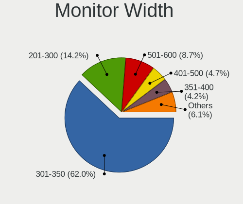

| Width in mm | Notebooks | Percent |
|-------------|-----------|---------|
| 301-350     | 197       | 63.14%  |
| 201-300     | 40        | 12.82%  |
| 501-600     | 28        | 8.97%   |
| 351-400     | 15        | 4.81%   |
| 401-500     | 14        | 4.49%   |
| Unknown     | 5         | 1.6%    |
| 601-700     | 3         | 0.96%   |
| 1001-1500   | 3         | 0.96%   |
| 801-900     | 2         | 0.64%   |
| 1501-2000   | 2         | 0.64%   |
| 1-100       | 2         | 0.64%   |
| 101-200     | 1         | 0.32%   |

Aspect Ratio
------------

Proportional relationship between the width and the height

| Ratio   | Notebooks | Percent |
|---------|-----------|---------|
| 16/9    | 225       | 82.12%  |
| 16/10   | 32        | 11.68%  |
| 5/4     | 4         | 1.46%   |
| 3/2     | 4         | 1.46%   |
| Unknown | 3         | 1.09%   |
| 0.67    | 2         | 0.73%   |
| 4/3     | 1         | 0.36%   |
| 3.73    | 1         | 0.36%   |
| 2.00    | 1         | 0.36%   |
| 0.56    | 1         | 0.36%   |

Monitor Area
------------

Area in inch

| Area in inch | Notebooks | Percent |
|----------------|-----------|---------|
| 101-110        | 104       | 33.02%  |
| 81-90          | 91        | 28.89%  |
| 201-250        | 21        | 6.67%   |
| 71-80          | 15        | 4.76%   |
| 51-60          | 14        | 4.44%   |
| 121-130        | 11        | 3.49%   |
| 301-350        | 8         | 2.54%   |
| 151-200        | 7         | 2.22%   |
| 111-120        | 7         | 2.22%   |
| 61-70          | 6         | 1.9%    |
| 141-150        | 6         | 1.9%    |
| Unknown        | 5         | 1.59%   |
| More than 1000 | 4         | 1.27%   |
| 251-300        | 4         | 1.27%   |
| 351-500        | 3         | 0.95%   |
| 1-40           | 3         | 0.95%   |
| 501-1000       | 3         | 0.95%   |
| 131-140        | 2         | 0.63%   |
| 91-100         | 1         | 0.32%   |

Pixel Density
-------------

Pixels per inch

| Density       | Notebooks | Percent |
|---------------|-----------|---------|
| 121-160       | 133       | 42.63%  |
| 101-120       | 84        | 26.92%  |
| 51-100        | 47        | 15.06%  |
| 161-240       | 28        | 8.97%   |
| More than 240 | 12        | 3.85%   |
| Unknown       | 5         | 1.6%    |
| 1-50          | 3         | 0.96%   |

Multiple Monitors
-----------------

Total monitors connected

| Total | Notebooks | Percent |
|-------|-----------|---------|
| 1     | 220       | 78.01%  |
| 2     | 52        | 18.44%  |
| 0     | 6         | 2.13%   |
| 3     | 4         | 1.42%   |

Network
-------

Net Controller Vendor
---------------------

Controller vendors

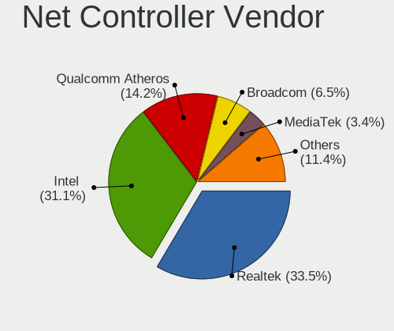

| Vendor                            | Notebooks | Percent |
|-----------------------------------|-----------|---------|
| Realtek Semiconductor             | 152       | 34.16%  |
| Intel                             | 137       | 30.79%  |
| Qualcomm Atheros                  | 63        | 14.16%  |
| Broadcom                          | 31        | 6.97%   |
| MediaTek                          | 12        | 2.7%    |
| ASIX Electronics                  | 10        | 2.25%   |
| Broadcom Limited                  | 5         | 1.12%   |
| Qualcomm                          | 4         | 0.9%    |
| Xiaomi                            | 3         | 0.67%   |
| Ralink                            | 3         | 0.67%   |
| Marvell Technology Group          | 3         | 0.67%   |
| TP-Link                           | 2         | 0.45%   |
| Sierra Wireless                   | 2         | 0.45%   |
| Ralink Technology                 | 2         | 0.45%   |
| Ericsson Business Mobile Networks | 2         | 0.45%   |
| vivo                              | 1         | 0.22%   |
| VIA Technologies                  | 1         | 0.22%   |
| Samsung Electronics               | 1         | 0.22%   |
| OPPO Electronics                  | 1         | 0.22%   |
| Nvidia                            | 1         | 0.22%   |
| Motorola PCS                      | 1         | 0.22%   |
| Lenovo                            | 1         | 0.22%   |
| JMicron Technology                | 1         | 0.22%   |
| Huawei Technologies               | 1         | 0.22%   |
| Fibocom                           | 1         | 0.22%   |
| D-Link System                     | 1         | 0.22%   |
| D-Link                            | 1         | 0.22%   |
| ASUSTek Computer                  | 1         | 0.22%   |
| Apple                             | 1         | 0.22%   |

Net Controller Model
--------------------

Controller models

| Model                                                                  | Notebooks | Percent |
|------------------------------------------------------------------------|-----------|---------|
| Realtek RTL8111/8168/8211/8411 PCI Express Gigabit Ethernet Controller | 110       | 21.74%  |
| Qualcomm Atheros QCA9377 802.11ac Wireless Network Adapter             | 16        | 3.16%   |
| Realtek RTL8821CE 802.11ac PCIe Wireless Network Adapter               | 14        | 2.77%   |
| Realtek RTL810xE PCI Express Fast Ethernet controller                  | 14        | 2.77%   |
| Intel Wi-Fi 6 AX200                                                    | 13        | 2.57%   |
| Qualcomm Atheros QCA9565 / AR9565 Wireless Network Adapter             | 11        | 2.17%   |
| Realtek RTL8822CE 802.11ac PCIe Wireless Network Adapter               | 10        | 1.98%   |
| Intel Wireless 8265 / 8275                                             | 10        | 1.98%   |
| Intel Wireless 7265                                                    | 10        | 1.98%   |
| Intel Comet Lake PCH CNVi WiFi                                         | 9         | 1.78%   |
| Intel Cannon Lake PCH CNVi WiFi                                        | 9         | 1.78%   |
| Intel 82579LM Gigabit Network Connection (Lewisville)                  | 9         | 1.78%   |
| Intel Wireless 3160                                                    | 8         | 1.58%   |
| Intel Wi-Fi 6 AX201                                                    | 8         | 1.58%   |
| Broadcom BCM43142 802.11b/g/n                                          | 8         | 1.58%   |
| Realtek RTL8153 Gigabit Ethernet Adapter                               | 7         | 1.38%   |
| MediaTek MT7921 802.11ax PCI Express Wireless Network Adapter          | 7         | 1.38%   |
| Intel Wireless 8260                                                    | 7         | 1.38%   |
| Intel Comet Lake PCH-LP CNVi WiFi                                      | 7         | 1.38%   |
| ASIX AX88179 Gigabit Ethernet                                          | 7         | 1.38%   |
| Qualcomm Atheros QCA6174 802.11ac Wireless Network Adapter             | 6         | 1.19%   |
| Qualcomm Atheros AR9285 Wireless Network Adapter (PCI-Express)         | 6         | 1.19%   |
| Intel Centrino Advanced-N 6205 [Taylor Peak]                           | 6         | 1.19%   |
| Broadcom BCM4313 802.11bgn Wireless Network Adapter                    | 6         | 1.19%   |
| Qualcomm Atheros AR9485 Wireless Network Adapter                       | 5         | 0.99%   |
| Intel Wi-Fi 5(802.11ac) Wireless-AC 9x6x [Thunder Peak]                | 5         | 0.99%   |
| Intel Wireless 3165                                                    | 4         | 0.79%   |
| Intel PRO/Wireless 5100 AGN [Shiloh] Network Connection                | 4         | 0.79%   |
| Intel Ice Lake-LP PCH CNVi WiFi                                        | 4         | 0.79%   |
| Intel Ethernet Connection (4) I219-LM                                  | 4         | 0.79%   |
| Xiaomi Mi/Redmi series (RNDIS)                                         | 3         | 0.59%   |
| Realtek RTL8822BE 802.11a/b/g/n/ac WiFi adapter                        | 3         | 0.59%   |
| Qualcomm QCNFA765 Wireless Network Adapter                             | 3         | 0.59%   |
| Qualcomm Atheros AR9462 Wireless Network Adapter                       | 3         | 0.59%   |
| Qualcomm Atheros AR928X Wireless Network Adapter (PCI-Express)         | 3         | 0.59%   |
| Qualcomm Atheros AR8161 Gigabit Ethernet                               | 3         | 0.59%   |
| Intel Wi-Fi 6E(802.11ax) AX210/AX1675* 2x2 [Typhoon Peak]              | 3         | 0.59%   |
| Intel Centrino Ultimate-N 6300                                         | 3         | 0.59%   |
| Intel Cannon Point-LP CNVi [Wireless-AC]                               | 3         | 0.59%   |
| Intel Alder Lake-P PCH CNVi WiFi                                       | 3         | 0.59%   |

Wireless Vendor
---------------

Wireless vendors

| Vendor                | Notebooks | Percent |
|-----------------------|-----------|---------|
| Intel                 | 135       | 47.54%  |
| Qualcomm Atheros      | 53        | 18.66%  |
| Realtek Semiconductor | 39        | 13.73%  |
| Broadcom              | 24        | 8.45%   |
| MediaTek              | 12        | 4.23%   |
| Qualcomm              | 4         | 1.41%   |
| Broadcom Limited      | 4         | 1.41%   |
| Ralink                | 3         | 1.06%   |
| TP-Link               | 2         | 0.7%    |
| Sierra Wireless       | 2         | 0.7%    |
| Ralink Technology     | 2         | 0.7%    |
| Fibocom               | 1         | 0.35%   |
| D-Link System         | 1         | 0.35%   |
| D-Link                | 1         | 0.35%   |
| ASUSTek Computer      | 1         | 0.35%   |

Wireless Model
--------------

Wireless models

| Model                                                          | Notebooks | Percent |
|----------------------------------------------------------------|-----------|---------|
| Qualcomm Atheros QCA9377 802.11ac Wireless Network Adapter     | 16        | 5.59%   |
| Realtek RTL8821CE 802.11ac PCIe Wireless Network Adapter       | 14        | 4.9%    |
| Intel Wi-Fi 6 AX200                                            | 13        | 4.55%   |
| Qualcomm Atheros QCA9565 / AR9565 Wireless Network Adapter     | 11        | 3.85%   |
| Realtek RTL8822CE 802.11ac PCIe Wireless Network Adapter       | 10        | 3.5%    |
| Intel Wireless 8265 / 8275                                     | 10        | 3.5%    |
| Intel Wireless 7265                                            | 10        | 3.5%    |
| Intel Comet Lake PCH CNVi WiFi                                 | 9         | 3.15%   |
| Intel Cannon Lake PCH CNVi WiFi                                | 9         | 3.15%   |
| Intel Wireless 3160                                            | 8         | 2.8%    |
| Intel Wi-Fi 6 AX201                                            | 8         | 2.8%    |
| Broadcom BCM43142 802.11b/g/n                                  | 8         | 2.8%    |
| MediaTek MT7921 802.11ax PCI Express Wireless Network Adapter  | 7         | 2.45%   |
| Intel Wireless 8260                                            | 7         | 2.45%   |
| Intel Comet Lake PCH-LP CNVi WiFi                              | 7         | 2.45%   |
| Qualcomm Atheros QCA6174 802.11ac Wireless Network Adapter     | 6         | 2.1%    |
| Qualcomm Atheros AR9285 Wireless Network Adapter (PCI-Express) | 6         | 2.1%    |
| Intel Centrino Advanced-N 6205 [Taylor Peak]                   | 6         | 2.1%    |
| Broadcom BCM4313 802.11bgn Wireless Network Adapter            | 6         | 2.1%    |
| Qualcomm Atheros AR9485 Wireless Network Adapter               | 5         | 1.75%   |
| Intel Wi-Fi 5(802.11ac) Wireless-AC 9x6x [Thunder Peak]        | 5         | 1.75%   |
| Intel Wireless 3165                                            | 4         | 1.4%    |
| Intel PRO/Wireless 5100 AGN [Shiloh] Network Connection        | 4         | 1.4%    |
| Intel Ice Lake-LP PCH CNVi WiFi                                | 4         | 1.4%    |
| Realtek RTL8822BE 802.11a/b/g/n/ac WiFi adapter                | 3         | 1.05%   |
| Qualcomm QCNFA765 Wireless Network Adapter                     | 3         | 1.05%   |
| Qualcomm Atheros AR9462 Wireless Network Adapter               | 3         | 1.05%   |
| Qualcomm Atheros AR928X Wireless Network Adapter (PCI-Express) | 3         | 1.05%   |
| Intel Wi-Fi 6E(802.11ax) AX210/AX1675* 2x2 [Typhoon Peak]      | 3         | 1.05%   |
| Intel Centrino Ultimate-N 6300                                 | 3         | 1.05%   |
| Intel Cannon Point-LP CNVi [Wireless-AC]                       | 3         | 1.05%   |
| Intel Alder Lake-P PCH CNVi WiFi                               | 3         | 1.05%   |
| Realtek RTL88x2bu [AC1200 Techkey]                             | 2         | 0.7%    |
| Realtek RTL8723BE PCIe Wireless Network Adapter                | 2         | 0.7%    |
| Ralink RT3290 Wireless 802.11n 1T/1R PCIe                      | 2         | 0.7%    |
| MediaTek MT7922 802.11ax PCI Express Wireless Network Adapter  | 2         | 0.7%    |
| MediaTek MT7921K (RZ608) Wi-Fi 6E 80MHz                        | 2         | 0.7%    |
| Intel Wireless 7260                                            | 2         | 0.7%    |
| Intel Wi-Fi 6 AX201 160MHz                                     | 2         | 0.7%    |
| Intel Raptor Lake-S PCH CNVi WiFi                              | 2         | 0.7%    |

Ethernet Vendor
---------------

Ethernet vendors

| Vendor                   | Notebooks | Percent |
|--------------------------|-----------|---------|
| Realtek Semiconductor    | 133       | 62.44%  |
| Intel                    | 29        | 13.62%  |
| Qualcomm Atheros         | 14        | 6.57%   |
| Broadcom                 | 11        | 5.16%   |
| ASIX Electronics         | 10        | 4.69%   |
| Xiaomi                   | 3         | 1.41%   |
| Marvell Technology Group | 3         | 1.41%   |
| VIA Technologies         | 1         | 0.47%   |
| Samsung Electronics      | 1         | 0.47%   |
| OPPO Electronics         | 1         | 0.47%   |
| Nvidia                   | 1         | 0.47%   |
| Motorola PCS             | 1         | 0.47%   |
| Lenovo                   | 1         | 0.47%   |
| JMicron Technology       | 1         | 0.47%   |
| Huawei Technologies      | 1         | 0.47%   |
| Broadcom Limited         | 1         | 0.47%   |
| Apple                    | 1         | 0.47%   |

Ethernet Model
--------------

Ethernet models

| Model                                                                          | Notebooks | Percent |
|--------------------------------------------------------------------------------|-----------|---------|
| Realtek RTL8111/8168/8211/8411 PCI Express Gigabit Ethernet Controller         | 110       | 50.69%  |
| Realtek RTL810xE PCI Express Fast Ethernet controller                          | 14        | 6.45%   |
| Intel 82579LM Gigabit Network Connection (Lewisville)                          | 9         | 4.15%   |
| Realtek RTL8153 Gigabit Ethernet Adapter                                       | 7         | 3.23%   |
| ASIX AX88179 Gigabit Ethernet                                                  | 7         | 3.23%   |
| Intel Ethernet Connection (4) I219-LM                                          | 4         | 1.84%   |
| Xiaomi Mi/Redmi series (RNDIS)                                                 | 3         | 1.38%   |
| Qualcomm Atheros AR8161 Gigabit Ethernet                                       | 3         | 1.38%   |
| Broadcom NetLink BCM57785 Gigabit Ethernet PCIe                                | 3         | 1.38%   |
| Realtek RTL8125 2.5GbE Controller                                              | 2         | 0.92%   |
| Realtek Killer E2600 GbE Controller                                            | 2         | 0.92%   |
| Qualcomm Atheros QCA8171 Gigabit Ethernet                                      | 2         | 0.92%   |
| Qualcomm Atheros Killer E2500 Gigabit Ethernet Controller                      | 2         | 0.92%   |
| Qualcomm Atheros AR8152 v1.1 Fast Ethernet                                     | 2         | 0.92%   |
| Qualcomm Atheros AR8151 v2.0 Gigabit Ethernet                                  | 2         | 0.92%   |
| Intel Ethernet Connection (4) I219-V                                           | 2         | 0.92%   |
| Intel Ethernet Connection (2) I219-LM                                          | 2         | 0.92%   |
| Intel 82567LM Gigabit Network Connection                                       | 2         | 0.92%   |
| Broadcom NetXtreme BCM57761 Gigabit Ethernet PCIe                              | 2         | 0.92%   |
| ASIX AX88772A Fast Ethernet                                                    | 2         | 0.92%   |
| VIA VT6102/VT6103 [Rhine-II]                                                   | 1         | 0.46%   |
| Samsung GT-I9070 (network tethering, USB debugging enabled)                    | 1         | 0.46%   |
| Realtek Killer E3000 2.5GbE Controller                                         | 1         | 0.46%   |
| Realtek Killer E2500 Gigabit Ethernet Controller                               | 1         | 0.46%   |
| Qualcomm Atheros QCA8172 Fast Ethernet                                         | 1         | 0.46%   |
| Qualcomm Atheros Killer E2400 Gigabit Ethernet Controller                      | 1         | 0.46%   |
| Qualcomm Atheros AR8162 Fast Ethernet                                          | 1         | 0.46%   |
| OPPO SM8350-IDP _SN:361A1B3C                                                   | 1         | 0.46%   |
| Nvidia MCP79 Ethernet                                                          | 1         | 0.46%   |
| Motorola PCS moto g52                                                          | 1         | 0.46%   |
| Marvell Group Yukon Optima 88E8059 [PCIe Gigabit Ethernet Controller with AVB] | 1         | 0.46%   |
| Marvell Group 88E8058 PCI-E Gigabit Ethernet Controller                        | 1         | 0.46%   |
| Marvell Group 88E8057 PCI-E Gigabit Ethernet Controller                        | 1         | 0.46%   |
| Lenovo ThinkPad TBT 3 Dock                                                     | 1         | 0.46%   |
| JMicron JMC250 PCI Express Gigabit Ethernet Controller                         | 1         | 0.46%   |
| Intel Killer E3100X 2.5 Gigabit Ethernet Controller                            | 1         | 0.46%   |
| Intel Ethernet Controller I225-V                                               | 1         | 0.46%   |
| Intel Ethernet Connection I219-V                                               | 1         | 0.46%   |
| Intel Ethernet Connection I219-LM                                              | 1         | 0.46%   |
| Intel Ethernet Connection I218-LM                                              | 1         | 0.46%   |

Net Controller Kind
-------------------

Ethernet, WiFi or modem

| Kind     | Notebooks | Percent |
|----------|-----------|---------|
| WiFi     | 268       | 56.3%   |
| Ethernet | 205       | 43.07%  |
| Modem    | 2         | 0.42%   |
| Unknown  | 1         | 0.21%   |

Used Controller
---------------

Currently used network controller

| Kind     | Notebooks | Percent |
|----------|-----------|---------|
| WiFi     | 233       | 80.9%   |
| Ethernet | 55        | 19.1%   |

NICs
----

Total network controllers on board

| Total | Notebooks | Percent |
|-------|-----------|---------|
| 2     | 185       | 67.77%  |
| 1     | 88        | 32.23%  |

IPv6
----

IPv6 vs IPv4

| Used | Notebooks | Percent |
|------|-----------|---------|
| No   | 210       | 73.68%  |
| Yes  | 75        | 26.32%  |

Bluetooth
---------

Bluetooth Vendor
----------------

Controller vendors

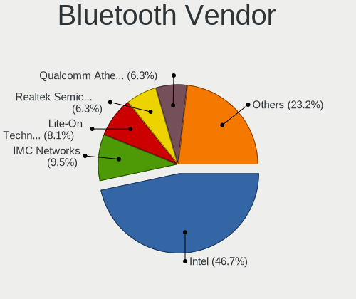

| Vendor                          | Notebooks | Percent |
|---------------------------------|-----------|---------|
| Intel                           | 107       | 46.32%  |
| IMC Networks                    | 22        | 9.52%   |
| Lite-On Technology              | 18        | 7.79%   |
| Realtek Semiconductor           | 17        | 7.36%   |
| Qualcomm Atheros Communications | 11        | 4.76%   |
| Broadcom                        | 11        | 4.76%   |
| Foxconn / Hon Hai               | 10        | 4.33%   |
| Apple                           | 7         | 3.03%   |
| Dell                            | 4         | 1.73%   |
| USI                             | 3         | 1.3%    |
| Toshiba                         | 3         | 1.3%    |
| Realtek                         | 3         | 1.3%    |
| Foxconn International           | 3         | 1.3%    |
| Ralink                          | 2         | 0.87%   |
| MediaTek                        | 2         | 0.87%   |
| Hewlett-Packard                 | 2         | 0.87%   |
| Cambridge Silicon Radio         | 2         | 0.87%   |
| SINO WEALTH                     | 1         | 0.43%   |
| SIN                             | 1         | 0.43%   |
| ASUSTek Computer                | 1         | 0.43%   |
| Askey Computer                  | 1         | 0.43%   |

Bluetooth Model
---------------

Controller models

| Model                                               | Notebooks | Percent |
|-----------------------------------------------------|-----------|---------|
| Intel Bluetooth wireless interface                  | 40        | 17.24%  |
| Intel AX201 Bluetooth                               | 22        | 9.48%   |
| Intel Bluetooth 9460/9560 Jefferson Peak (JfP)      | 19        | 8.19%   |
| Intel AX200 Bluetooth                               | 10        | 4.31%   |
| IMC Networks Bluetooth Radio                        | 9         | 3.88%   |
| Realtek Bluetooth Radio                             | 8         | 3.45%   |
| Intel Bluetooth Device                              | 8         | 3.45%   |
| Lite-On Qualcomm Atheros QCA9377 Bluetooth          | 7         | 3.02%   |
| IMC Networks Bluetooth Device                       | 7         | 3.02%   |
| Realtek  Bluetooth 4.2 Adapter                      | 6         | 2.59%   |
| Foxconn / Hon Hai Bluetooth Device                  | 6         | 2.59%   |
| Qualcomm Atheros  Bluetooth Device                  | 5         | 2.16%   |
| Lite-On Bluetooth Device                            | 4         | 1.72%   |
| IMC Networks Wireless_Device                        | 4         | 1.72%   |
| USI Bluetooth Device                                | 3         | 1.29%   |
| Realtek Bluetooth Radio                             | 3         | 1.29%   |
| Intel Wireless-AC 9260 Bluetooth Adapter            | 3         | 1.29%   |
| Intel AX210 Bluetooth                               | 3         | 1.29%   |
| Foxconn International BCM43142A0 Bluetooth module   | 3         | 1.29%   |
| Broadcom BCM20702 Bluetooth 4.0 [ThinkPad]          | 3         | 1.29%   |
| Apple Bluetooth USB Host Controller                 | 3         | 1.29%   |
| Apple Bluetooth Host Controller                     | 3         | 1.29%   |
| Toshiba Askey Bluetooth Module                      | 2         | 0.86%   |
| Realtek RTL8723B Bluetooth                          | 2         | 0.86%   |
| Ralink RT3290 Bluetooth                             | 2         | 0.86%   |
| Qualcomm Atheros QCA61x4 Bluetooth 4.0              | 2         | 0.86%   |
| Qualcomm Atheros AR3011 Bluetooth                   | 2         | 0.86%   |
| MediaTek Wireless_Device                            | 2         | 0.86%   |
| Lite-On Wireless_Device                             | 2         | 0.86%   |
| Lite-On Bluetooth Radio                             | 2         | 0.86%   |
| Intel Wireless-AC 3168 Bluetooth                    | 2         | 0.86%   |
| IMC Networks Bluetooth USB Host Controller          | 2         | 0.86%   |
| HP Bluetooth 2.0 Interface [Broadcom BCM2045]       | 2         | 0.86%   |
| Foxconn / Hon Hai Broadcom Bluetooth 2.1 Device     | 2         | 0.86%   |
| Dell BCM20702A0 Bluetooth Module                    | 2         | 0.86%   |
| Cambridge Silicon Radio Bluetooth Dongle (HCI mode) | 2         | 0.86%   |
| Broadcom BCM43142A0 Bluetooth Device                | 2         | 0.86%   |
| Toshiba Bluetooth USB Host Controller               | 1         | 0.43%   |
| SINO WEALTH RK Bluetooth Keyboar                    | 1         | 0.43%   |
| SIN Bluetooth Keyboard                              | 1         | 0.43%   |

Sound
-----

Sound Vendor
------------

Sound card vendors

| Vendor                                       | Notebooks | Percent |
|----------------------------------------------|-----------|---------|
| Intel                                        | 204       | 58.45%  |
| AMD                                          | 66        | 18.91%  |
| Nvidia                                       | 57        | 16.33%  |
| JMTek                                        | 3         | 0.86%   |
| Samson Technologies                          | 2         | 0.57%   |
| Razer USA                                    | 2         | 0.57%   |
| Zoran Co. Personal Media Division (Nogatech) | 1         | 0.29%   |
| VIA Technologies                             | 1         | 0.29%   |
| Samsung Electronics                          | 1         | 0.29%   |
| Logitech                                     | 1         | 0.29%   |
| Lenovo                                       | 1         | 0.29%   |
| KTMicro                                      | 1         | 0.29%   |
| Huawei Technologies                          | 1         | 0.29%   |
| Focusrite-Novation                           | 1         | 0.29%   |
| DSEA A/S                                     | 1         | 0.29%   |
| Digidesign                                   | 1         | 0.29%   |
| Dell                                         | 1         | 0.29%   |
| Cayin                                        | 1         | 0.29%   |
| C-Media Electronics                          | 1         | 0.29%   |
| BlueTrm                                      | 1         | 0.29%   |
| Anlya.cn                                     | 1         | 0.29%   |

Sound Model
-----------

Sound card models

| Model                                                                                             | Notebooks | Percent |
|---------------------------------------------------------------------------------------------------|-----------|---------|
| AMD Family 17h/19h HD Audio Controller                                                            | 47        | 10.93%  |
| Intel Sunrise Point-LP HD Audio                                                                   | 30        | 6.98%   |
| AMD Renoir Radeon High Definition Audio Controller                                                | 25        | 5.81%   |
| Intel 7 Series/C216 Chipset Family High Definition Audio Controller                               | 19        | 4.42%   |
| Intel Haswell-ULT HD Audio Controller                                                             | 17        | 3.95%   |
| Intel 8 Series HD Audio Controller                                                                | 17        | 3.95%   |
| AMD Raven/Raven2/Fenghuang HDMI/DP Audio Controller                                               | 15        | 3.49%   |
| Intel Tiger Lake-LP Smart Sound Technology Audio Controller                                       | 12        | 2.79%   |
| Intel Cannon Lake PCH cAVS                                                                        | 12        | 2.79%   |
| Intel 6 Series/C200 Series Chipset Family High Definition Audio Controller                        | 11        | 2.56%   |
| Intel Comet Lake PCH cAVS                                                                         | 10        | 2.33%   |
| Intel 100 Series/C230 Series Chipset Family HD Audio Controller                                   | 10        | 2.33%   |
| Intel 5 Series/3400 Series Chipset High Definition Audio                                          | 9         | 2.09%   |
| Nvidia TU107 GeForce GTX 1650 High Definition Audio Controller                                    | 8         | 1.86%   |
| Intel Comet Lake PCH-LP cAVS                                                                      | 8         | 1.86%   |
| Intel Celeron/Pentium Silver Processor High Definition Audio                                      | 8         | 1.86%   |
| Nvidia Audio device                                                                               | 7         | 1.63%   |
| Intel 82801I (ICH9 Family) HD Audio Controller                                                    | 7         | 1.63%   |
| Intel 8 Series/C220 Series Chipset High Definition Audio Controller                               | 7         | 1.63%   |
| Nvidia GF108 High Definition Audio Controller                                                     | 6         | 1.4%    |
| Intel Xeon E3-1200 v3/4th Gen Core Processor HD Audio Controller                                  | 6         | 1.4%    |
| AMD Rembrandt Radeon High Definition Audio Controller                                             | 6         | 1.4%    |
| AMD FCH Azalia Controller                                                                         | 6         | 1.4%    |
| Nvidia TU116 High Definition Audio Controller                                                     | 5         | 1.16%   |
| Nvidia GM107 High Definition Audio Controller [GeForce 940MX]                                     | 5         | 1.16%   |
| Intel Cannon Point-LP High Definition Audio Controller                                            | 5         | 1.16%   |
| Intel Atom/Celeron/Pentium Processor x5-E8000/J3xxx/N3xxx Series High Definition Audio Controller | 5         | 1.16%   |
| Intel Wildcat Point-LP High Definition Audio Controller                                           | 4         | 0.93%   |
| Intel Ice Lake-LP Smart Sound Technology Audio Controller                                         | 4         | 0.93%   |
| Intel CM238 HD Audio Controller                                                                   | 4         | 0.93%   |
| Intel Broadwell-U Audio Controller                                                                | 4         | 0.93%   |
| AMD Kabini HDMI/DP Audio                                                                          | 4         | 0.93%   |
| Nvidia TU106 High Definition Audio Controller                                                     | 3         | 0.7%    |
| Nvidia High Definition Audio Controller                                                           | 3         | 0.7%    |
| Nvidia GP107GL High Definition Audio Controller                                                   | 3         | 0.7%    |
| Nvidia GA104 High Definition Audio Controller                                                     | 3         | 0.7%    |
| JMTek USB PnP Audio Device                                                                        | 3         | 0.7%    |
| Intel NM10/ICH7 Family High Definition Audio Controller                                           | 3         | 0.7%    |
| Intel Jasper Lake HD Audio                                                                        | 3         | 0.7%    |
| Intel Atom Processor Z36xxx/Z37xxx Series High Definition Audio Controller                        | 3         | 0.7%    |

Memory
------

Memory Vendor
-------------

Memory module vendors

| Vendor              | Notebooks | Percent |
|---------------------|-----------|---------|
| Samsung Electronics | 51        | 27.57%  |
| SK hynix            | 36        | 19.46%  |
| Micron Technology   | 30        | 16.22%  |
| Kingston            | 24        | 12.97%  |
| Unknown             | 12        | 6.49%   |
| Transcend           | 5         | 2.7%    |
| Crucial             | 5         | 2.7%    |
| Ramaxel Technology  | 4         | 2.16%   |
| Elpida              | 3         | 1.62%   |
| A-DATA Technology   | 3         | 1.62%   |
| Team                | 2         | 1.08%   |
| Nanya Technology    | 2         | 1.08%   |
| Unknown (ABCD)      | 1         | 0.54%   |
| Unknown (08B5)      | 1         | 0.54%   |
| Lexar               | 1         | 0.54%   |
| G.Skill             | 1         | 0.54%   |
| Corsair             | 1         | 0.54%   |
| Avant               | 1         | 0.54%   |
| ASint Technology    | 1         | 0.54%   |
| Apacer              | 1         | 0.54%   |

Memory Model
------------

Memory module models

| Model                                                               | Notebooks | Percent |
|---------------------------------------------------------------------|-----------|---------|
| Samsung RAM M471A1G44AB0-CWE 8GB SODIMM DDR4 3200MT/s               | 7         | 3.61%   |
| SK hynix RAM HMT451S6BFR8A-PB 4GB SODIMM DDR3 1600MT/s              | 4         | 2.06%   |
| SK hynix RAM HMT451S6AFR8A-PB 4GB SODIMM DDR3 1600MT/s              | 4         | 2.06%   |
| SK hynix RAM HMT351S6CFR8C-PB 4GB SODIMM DDR3 1600MT/s              | 4         | 2.06%   |
| SK hynix RAM HMA81GS6AFR8N-UH 8GB SODIMM DDR4 2667MT/s              | 4         | 2.06%   |
| Samsung RAM M471A5244CB0-CTD 4096MB SODIMM DDR4 3266MT/s            | 4         | 2.06%   |
| Samsung RAM M471B5173DB0-YK0 4GB SODIMM DDR3 1600MT/s               | 3         | 1.55%   |
| Samsung RAM M471A1K43EB1-CWE 8GB SODIMM DDR4 3200MT/s               | 3         | 1.55%   |
| Unknown RAM Module 4GB SODIMM DDR4 2400MT/s                         | 2         | 1.03%   |
| Unknown RAM Module 2GB SODIMM DDR3 1600MT/s                         | 2         | 1.03%   |
| SK hynix RAM HMT351S6EFR8A-PB 4096MB SODIMM DDR3 1600MT/s           | 2         | 1.03%   |
| SK hynix RAM HMAA1GS6CJR6N-XN 8GB SODIMM DDR4 3200MT/s              | 2         | 1.03%   |
| SK hynix RAM HMA851S6AFR6N-UH 4GB SODIMM DDR4 2667MT/s              | 2         | 1.03%   |
| SK hynix RAM HMA41GS6AFR8N-TF 8GB SODIMM DDR4 2667MT/s              | 2         | 1.03%   |
| SK hynix RAM HCNNNBKMMLXR-NEE 4GB Row Of Chips LPDDR4 4267MT/s      | 2         | 1.03%   |
| Samsung RAM M471B5273DH0-CK0 4GB SODIMM DDR3 1600MT/s               | 2         | 1.03%   |
| Samsung RAM M471B5273CH0-CH9 4GB SODIMM DDR3 1334MT/s               | 2         | 1.03%   |
| Samsung RAM M471B5173QH0-YK0 4096MB SODIMM DDR3 1600MT/s            | 2         | 1.03%   |
| Samsung RAM M471B1G73DB0-YK0 8GB SODIMM DDR3 1600MT/s               | 2         | 1.03%   |
| Samsung RAM M471A1K43DB1-CTD 8GB SODIMM DDR4 2667MT/s               | 2         | 1.03%   |
| Samsung RAM M471A1K43CB1-CRC 8GB SODIMM DDR4 2667MT/s               | 2         | 1.03%   |
| Samsung RAM M471A1K43BB1-CRC 8GB SODIMM DDR4 2667MT/s               | 2         | 1.03%   |
| Samsung RAM M471A1G44AB0-CWE 8GB Row Of Chips DDR4 3200MT/s         | 2         | 1.03%   |
| Micron RAM MT53E1G32D4NQ-046WTE 8GB Row Of Chips LPDDR4 4266MT/s    | 2         | 1.03%   |
| Micron RAM Module 4096MB SODIMM DDR4 2400MT/s                       | 2         | 1.03%   |
| Micron RAM 8ATF1G64HZ-2G6E1 8GB SODIMM DDR4 2667MT/s                | 2         | 1.03%   |
| Micron RAM 4ATF1G64HZ-3G2F1 8GB SODIMM DDR4 3200MT/s                | 2         | 1.03%   |
| Micron RAM 4ATF1G64HZ-3G2E1 8GB SODIMM DDR4 3200MT/s                | 2         | 1.03%   |
| Kingston RAM KHX2666C15S4/8G 8GB SODIMM DDR4 2667MT/s               | 2         | 1.03%   |
| Kingston RAM KF3200C20S4/8G 8GB SODIMM DDR4 3200MT/s                | 2         | 1.03%   |
| Crucial RAM CT16G4SFD824A.C16FBR 16GB SODIMM DDR4 2400MT/s          | 2         | 1.03%   |
| Unknown RAM Module 8GB SODIMM DDR4 3200MT/s                         | 1         | 0.52%   |
| Unknown RAM Module 8GB SODIMM DDR4 2400MT/s                         | 1         | 0.52%   |
| Unknown RAM Module 8GB Row Of Chips LPDDR4 4267MT/s                 | 1         | 0.52%   |
| Unknown RAM Module 4GB SODIMM DDR4 2133MT/s                         | 1         | 0.52%   |
| Unknown RAM Module 4GB SODIMM DDR3                                  | 1         | 0.52%   |
| Unknown RAM Module 4GB Row Of Chips LPDDR4 4267MT/s                 | 1         | 0.52%   |
| Unknown RAM Module 4096MB SODIMM DDR3 1334MT/s                      | 1         | 0.52%   |
| Unknown RAM Module 16GB SODIMM DDR4 2667MT/s                        | 1         | 0.52%   |
| Unknown (ABCD) RAM 123456789012345678 2048MB SODIMM LPDDR4 2400MT/s | 1         | 0.52%   |

Memory Kind
-----------

Memory module kinds

| Kind   | Notebooks | Percent |
|--------|-----------|---------|
| DDR4   | 73        | 48.99%  |
| DDR3   | 47        | 31.54%  |
| LPDDR4 | 14        | 9.4%    |
| DDR5   | 6         | 4.03%   |
| LPDDR3 | 4         | 2.68%   |
| LPDDR5 | 2         | 1.34%   |
| DDR2   | 2         | 1.34%   |
| SDRAM  | 1         | 0.67%   |

Memory Form Factor
------------------

Physical design of the memory module

| Name         | Notebooks | Percent |
|--------------|-----------|---------|
| SODIMM       | 130       | 86.67%  |
| Row Of Chips | 20        | 13.33%  |

Memory Size
-----------

Memory module size

| Size  | Notebooks | Percent |
|-------|-----------|---------|
| 8192  | 67        | 41.88%  |
| 4096  | 50        | 31.25%  |
| 16384 | 24        | 15%     |
| 2048  | 14        | 8.75%   |
| 32768 | 4         | 2.5%    |
| 1024  | 1         | 0.63%   |

Memory Speed
------------

Memory module speed

| Speed   | Notebooks | Percent |
|---------|-----------|---------|
| 1600    | 40        | 24.54%  |
| 3200    | 32        | 19.63%  |
| 2667    | 28        | 17.18%  |
| 2400    | 14        | 8.59%   |
| 1334    | 7         | 4.29%   |
| 4267    | 6         | 3.68%   |
| 2133    | 6         | 3.68%   |
| 4800    | 5         | 3.07%   |
| 3266    | 4         | 2.45%   |
| 1333    | 4         | 2.45%   |
| 4266    | 3         | 1.84%   |
| 1067    | 3         | 1.84%   |
| 6400    | 2         | 1.23%   |
| 3733    | 2         | 1.23%   |
| 8400    | 1         | 0.61%   |
| 5600    | 1         | 0.61%   |
| 4199    | 1         | 0.61%   |
| 1867    | 1         | 0.61%   |
| 975     | 1         | 0.61%   |
| 667     | 1         | 0.61%   |
| Unknown | 1         | 0.61%   |

Printers & scanners
-------------------

Printer Vendor
--------------

Printer device vendors

| Vendor              | Notebooks | Percent |
|---------------------|-----------|---------|
| Seiko Epson         | 2         | 40%     |
| Samsung Electronics | 1         | 20%     |
| Hewlett-Packard     | 1         | 20%     |
| Canon               | 1         | 20%     |

Printer Model
-------------

Printer device models

| Model                     | Notebooks | Percent |
|---------------------------|-----------|---------|
| Seiko Epson ME-100 Series | 1         | 20%     |
| Seiko Epson L360 Series   | 1         | 20%     |
| Samsung SCX-4300 Series   | 1         | 20%     |
| HP DeskJet 2130 series    | 1         | 20%     |
| Canon PIXMA MP280         | 1         | 20%     |

Scanner Vendor
--------------

Scanner device vendors

| Vendor | Notebooks | Percent |
|--------|-----------|---------|
| Canon  | 1         | 100%    |

Scanner Model
-------------

Scanner device models

| Model                              | Notebooks | Percent |
|------------------------------------|-----------|---------|
| Canon CanoScan N670U/N676U/LiDE 20 | 1         | 100%    |

Camera
------

Camera Vendor
-------------

Camera device vendors

| Vendor                                 | Notebooks | Percent |
|----------------------------------------|-----------|---------|
| Chicony Electronics                    | 64        | 26.45%  |
| IMC Networks                           | 37        | 15.29%  |
| Bison Electronics                      | 25        | 10.33%  |
| Realtek Semiconductor                  | 21        | 8.68%   |
| Quanta                                 | 17        | 7.02%   |
| Microdia                               | 15        | 6.2%    |
| Acer                                   | 8         | 3.31%   |
| Sunplus Innovation Technology          | 7         | 2.89%   |
| Cheng Uei Precision Industry (Foxlink) | 7         | 2.89%   |
| Silicon Motion                         | 5         | 2.07%   |
| Suyin                                  | 4         | 1.65%   |
| Luxvisions Innotech Limited            | 4         | 1.65%   |
| Lite-On Technology                     | 4         | 1.65%   |
| Apple                                  | 4         | 1.65%   |
| Sonix Technology                       | 3         | 1.24%   |
| Logitech                               | 3         | 1.24%   |
| Samsung Electronics                    | 2         | 0.83%   |
| Generalplus Technology                 | 2         | 0.83%   |
| Z-Star Microelectronics                | 1         | 0.41%   |
| USB Camera                             | 1         | 0.41%   |
| Syntek                                 | 1         | 0.41%   |
| ShineTech                              | 1         | 0.41%   |
| Razer USA                              | 1         | 0.41%   |
| OPPO Electronics                       | 1         | 0.41%   |
| Microsoft                              | 1         | 0.41%   |
| Lenovo                                 | 1         | 0.41%   |
| Aveo Technology                        | 1         | 0.41%   |
| Alcor Micro                            | 1         | 0.41%   |

Camera Model
------------

Camera device models

| Model                                   | Notebooks | Percent |
|-----------------------------------------|-----------|---------|
| IMC Networks USB2.0 HD UVC WebCam       | 16        | 6.61%   |
| Chicony HD WebCam                       | 14        | 5.79%   |
| Chicony Integrated Camera               | 11        | 4.55%   |
| Microdia Integrated_Webcam_HD           | 7         | 2.89%   |
| Bison Lenovo EasyCamera                 | 7         | 2.89%   |
| IMC Networks Integrated Camera          | 6         | 2.48%   |
| Chicony HP Truevision HD camera         | 6         | 2.48%   |
| Bison Integrated Camera                 | 6         | 2.48%   |
| Realtek Integrated_Webcam_HD            | 5         | 2.07%   |
| Acer SunplusIT Integrated Camera        | 5         | 2.07%   |
| Realtek HD WebCam                       | 4         | 1.65%   |
| IMC Networks USB2.0 VGA UVC WebCam      | 4         | 1.65%   |
| Chicony Lenovo EasyCamera               | 4         | 1.65%   |
| Chicony HD User Facing                  | 4         | 1.65%   |
| Sunplus Integrated_Webcam_HD            | 3         | 1.24%   |
| Silicon Motion WebCam SCB-0385N         | 3         | 1.24%   |
| Quanta USB2.0 HD UVC WebCam             | 3         | 1.24%   |
| Microdia USB 2.0 Camera                 | 3         | 1.24%   |
| Bison ThinkPad Integrated Camera        | 3         | 1.24%   |
| Bison Lenovo Integrated Webcam          | 3         | 1.24%   |
| Sunplus Asus Webcam                     | 2         | 0.83%   |
| Sonix USB2.0 HD UVC WebCam              | 2         | 0.83%   |
| Samsung Galaxy series, misc. (MTP mode) | 2         | 0.83%   |
| Realtek USB2.0 HD UVC WebCam            | 2         | 0.83%   |
| Realtek USB Camera                      | 2         | 0.83%   |
| Realtek Integrated Webcam               | 2         | 0.83%   |
| Quanta VGA WebCam                       | 2         | 0.83%   |
| Quanta ov9734_techfront_camera          | 2         | 0.83%   |
| Quanta HD Webcam                        | 2         | 0.83%   |
| Quanta HD User Facing                   | 2         | 0.83%   |
| Quanta HD Camera                        | 2         | 0.83%   |
| Microdia Integrated Webcam              | 2         | 0.83%   |
| Lite-On Integrated Camera               | 2         | 0.83%   |
| IMC Networks VGA UVC WebCam             | 2         | 0.83%   |
| IMC Networks ov9734_azurewave_camera    | 2         | 0.83%   |
| Chicony VGA Webcam                      | 2         | 0.83%   |
| Chicony USB2.0 VGA UVC WebCam           | 2         | 0.83%   |
| Chicony USB2.0 HD UVC WebCam            | 2         | 0.83%   |
| Chicony TOSHIBA Web Camera - HD         | 2         | 0.83%   |
| Chicony HP Wide Vision HD Camera        | 2         | 0.83%   |

Security
--------

Fingerprint Vendor
------------------

Fingerprint sensor vendors

| Vendor                     | Notebooks | Percent |
|----------------------------|-----------|---------|
| Shenzhen Goodix Technology | 13        | 27.66%  |
| Synaptics                  | 11        | 23.4%   |
| Validity Sensors           | 6         | 12.77%  |
| LighTuning Technology      | 6         | 12.77%  |
| Elan Microelectronics      | 6         | 12.77%  |
| AuthenTec                  | 3         | 6.38%   |
| Upek                       | 2         | 4.26%   |

Fingerprint Model
-----------------

Fingerprint sensor models

| Model                                                    | Notebooks | Percent |
|----------------------------------------------------------|-----------|---------|
| Shenzhen Goodix Fingerprint Reader                       | 6         | 12.77%  |
| Shenzhen Goodix  Fingerprint Device                      | 5         | 10.64%  |
| Synaptics Metallica MIS Touch Fingerprint Reader         | 4         | 8.51%   |
| LighTuning EgisTec Touch Fingerprint Sensor              | 4         | 8.51%   |
| Validity Sensors VFS7500 Touch Fingerprint Sensor        | 3         | 6.38%   |
| Elan ELAN:Fingerprint                                    | 3         | 6.38%   |
| Elan ELAN:ARM-M4                                         | 3         | 6.38%   |
| Upek Biometric Touchchip/Touchstrip Fingerprint Sensor   | 2         | 4.26%   |
| Synaptics UWP WBDI Device                                | 2         | 4.26%   |
| Shenzhen Goodix FingerPrint                              | 2         | 4.26%   |
| LighTuning ES603 Swipe Fingerprint Sensor                | 2         | 4.26%   |
| AuthenTec AES2810                                        | 2         | 4.26%   |
| Validity Sensors VFS101 Fingerprint Reader               | 1         | 2.13%   |
| Validity Sensors VFS 5011 fingerprint sensor             | 1         | 2.13%   |
| Validity Sensors Synaptics WBDI                          | 1         | 2.13%   |
| Synaptics WBDI Fingerprint Reader USB 086                | 1         | 2.13%   |
| Synaptics WBDI                                           | 1         | 2.13%   |
| Synaptics Prometheus MIS Touch Fingerprint Reader        | 1         | 2.13%   |
| Synaptics Metallica MOH Touch Fingerprint Reader         | 1         | 2.13%   |
| Synaptics FS7604 Touch Fingerprint Sensor with PurePrint | 1         | 2.13%   |
| AuthenTec AES2501 Fingerprint Sensor                     | 1         | 2.13%   |

Chipcard Vendor
---------------

Chipcard module vendors

| Vendor                | Notebooks | Percent |
|-----------------------|-----------|---------|
| Alcor Micro           | 5         | 50%     |
| O2 Micro              | 2         | 20%     |
| Broadcom              | 2         | 20%     |
| Gemalto (was Gemplus) | 1         | 10%     |

Chipcard Model
--------------

Chipcard module models

| Model                                                                        | Notebooks | Percent |
|------------------------------------------------------------------------------|-----------|---------|
| Alcor Micro AU9540 Smartcard Reader                                          | 5         | 50%     |
| O2 Micro OZ776 CCID Smartcard Reader                                         | 2         | 20%     |
| Gemalto (was Gemplus) GemPC Twin SmartCard Reader                            | 1         | 10%     |
| Broadcom BCM5880 Secure Applications Processor with fingerprint swipe sensor | 1         | 10%     |
| Broadcom 58200                                                               | 1         | 10%     |

Unsupported
-----------

Unsupported Devices
-------------------

Total unsupported devices on board

| Total | Notebooks | Percent |
|-------|-----------|---------|
| 0     | 175       | 61.19%  |
| 1     | 91        | 31.82%  |
| 2     | 17        | 5.94%   |
| 3     | 3         | 1.05%   |

Unsupported Device Types
------------------------

Types of unsupported devices

| Type                     | Notebooks | Percent |
|--------------------------|-----------|---------|
| Fingerprint reader       | 46        | 35.38%  |
| Graphics card            | 34        | 26.15%  |
| Multimedia controller    | 14        | 10.77%  |
| Net/wireless             | 13        | 10%     |
| Chipcard                 | 10        | 7.69%   |
| Camera                   | 4         | 3.08%   |
| Bluetooth                | 4         | 3.08%   |
| Wireless                 | 1         | 0.77%   |
| Storage/ide              | 1         | 0.77%   |
| Flash memory             | 1         | 0.77%   |
| Communication controller | 1         | 0.77%   |
| Card reader              | 1         | 0.77%   |

