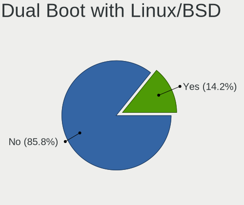
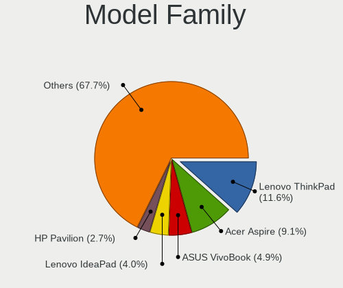
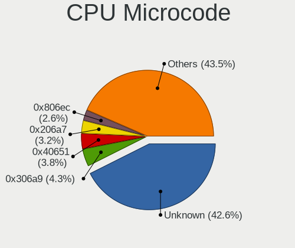
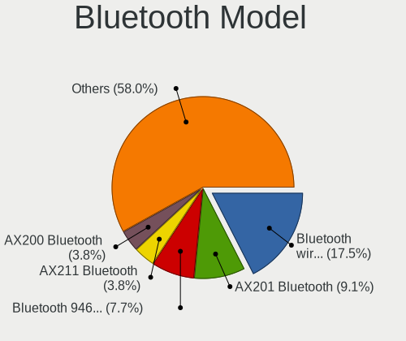

Linux in Thailand - Tested Hardware & Statistics (Notebooks)
------------------------------------------------------------

A project to collect tested hardware configurations for Linux in Thailand.

Anyone can contribute to this report by the [hw-probe](https://github.com/linuxhw/hw-probe) tool:

    sudo -E hw-probe -all -upload

Please contribute! Especially if your hardware is rare.

Contents
--------

* [ Test Cases ](#test-cases)

* [ System ](#system)
  - [ OS                       ](#os)
  - [ OS Family                ](#os-family)
  - [ Kernel                   ](#kernel)
  - [ Kernel Family            ](#kernel-family)
  - [ Kernel Major Ver.        ](#kernel-major-ver)
  - [ Arch                     ](#arch)
  - [ DE                       ](#de)
  - [ Display Server           ](#display-server)
  - [ Display Manager          ](#display-manager)
  - [ OS Lang                  ](#os-lang)
  - [ Boot Mode                ](#boot-mode)
  - [ Filesystem               ](#filesystem)
  - [ Part. scheme             ](#part-scheme)
  - [ Dual Boot with Linux/BSD ](#dual-boot-with-linuxbsd)
  - [ Dual Boot (Win)          ](#dual-boot-win)

* [ Board ](#board)
  - [ Vendor                   ](#vendor)
  - [ Model                    ](#model)
  - [ Model Family             ](#model-family)
  - [ MFG Year                 ](#mfg-year)
  - [ Form Factor              ](#form-factor)
  - [ Secure Boot              ](#secure-boot)
  - [ Coreboot                 ](#coreboot)
  - [ RAM Size                 ](#ram-size)
  - [ RAM Used                 ](#ram-used)
  - [ Total Drives             ](#total-drives)
  - [ Has CD-ROM               ](#has-cd-rom)
  - [ Has Ethernet             ](#has-ethernet)
  - [ Has WiFi                 ](#has-wifi)
  - [ Has Bluetooth            ](#has-bluetooth)

* [ Location ](#location)
  - [ Country                  ](#country)
  - [ City                     ](#city)

* [ Drives ](#drives)
  - [ Drive Vendor             ](#drive-vendor)
  - [ Drive Model              ](#drive-model)
  - [ HDD Vendor               ](#hdd-vendor)
  - [ SSD Vendor               ](#ssd-vendor)
  - [ Drive Kind               ](#drive-kind)
  - [ Drive Connector          ](#drive-connector)
  - [ Drive Size               ](#drive-size)
  - [ Space Total              ](#space-total)
  - [ Space Used               ](#space-used)
  - [ Malfunc. Drives          ](#malfunc-drives)
  - [ Malfunc. Drive Vendor    ](#malfunc-drive-vendor)
  - [ Malfunc. HDD Vendor      ](#malfunc-hdd-vendor)
  - [ Malfunc. Drive Kind      ](#malfunc-drive-kind)
  - [ Failed Drives            ](#failed-drives)
  - [ Failed Drive Vendor      ](#failed-drive-vendor)
  - [ Drive Status             ](#drive-status)

* [ Storage controller ](#storage-controller)
  - [ Storage Vendor           ](#storage-vendor)
  - [ Storage Model            ](#storage-model)
  - [ Storage Kind             ](#storage-kind)

* [ Processor ](#processor)
  - [ CPU Vendor               ](#cpu-vendor)
  - [ CPU Model                ](#cpu-model)
  - [ CPU Model Family         ](#cpu-model-family)
  - [ CPU Cores                ](#cpu-cores)
  - [ CPU Sockets              ](#cpu-sockets)
  - [ CPU Threads              ](#cpu-threads)
  - [ CPU Op-Modes             ](#cpu-op-modes)
  - [ CPU Microcode            ](#cpu-microcode)
  - [ CPU Microarch            ](#cpu-microarch)

* [ Graphics ](#graphics)
  - [ GPU Vendor               ](#gpu-vendor)
  - [ GPU Model                ](#gpu-model)
  - [ GPU Combo                ](#gpu-combo)
  - [ GPU Driver               ](#gpu-driver)
  - [ GPU Memory               ](#gpu-memory)

* [ Monitor ](#monitor)
  - [ Monitor Vendor           ](#monitor-vendor)
  - [ Monitor Model            ](#monitor-model)
  - [ Monitor Resolution       ](#monitor-resolution)
  - [ Monitor Diagonal         ](#monitor-diagonal)
  - [ Monitor Width            ](#monitor-width)
  - [ Aspect Ratio             ](#aspect-ratio)
  - [ Monitor Area             ](#monitor-area)
  - [ Pixel Density            ](#pixel-density)
  - [ Multiple Monitors        ](#multiple-monitors)

* [ Network ](#network)
  - [ Net Controller Vendor    ](#net-controller-vendor)
  - [ Net Controller Model     ](#net-controller-model)
  - [ Wireless Vendor          ](#wireless-vendor)
  - [ Wireless Model           ](#wireless-model)
  - [ Ethernet Vendor          ](#ethernet-vendor)
  - [ Ethernet Model           ](#ethernet-model)
  - [ Net Controller Kind      ](#net-controller-kind)
  - [ Used Controller          ](#used-controller)
  - [ NICs                     ](#nics)
  - [ IPv6                     ](#ipv6)

* [ Bluetooth ](#bluetooth)
  - [ Bluetooth Vendor         ](#bluetooth-vendor)
  - [ Bluetooth Model          ](#bluetooth-model)

* [ Sound ](#sound)
  - [ Sound Vendor             ](#sound-vendor)
  - [ Sound Model              ](#sound-model)

* [ Memory ](#memory)
  - [ Memory Vendor            ](#memory-vendor)
  - [ Memory Model             ](#memory-model)
  - [ Memory Kind              ](#memory-kind)
  - [ Memory Form Factor       ](#memory-form-factor)
  - [ Memory Size              ](#memory-size)
  - [ Memory Speed             ](#memory-speed)

* [ Printers & scanners ](#printers--scanners)
  - [ Printer Vendor           ](#printer-vendor)
  - [ Printer Model            ](#printer-model)
  - [ Scanner Vendor           ](#scanner-vendor)
  - [ Scanner Model            ](#scanner-model)

* [ Camera ](#camera)
  - [ Camera Vendor            ](#camera-vendor)
  - [ Camera Model             ](#camera-model)

* [ Security ](#security)
  - [ Fingerprint Vendor       ](#fingerprint-vendor)
  - [ Fingerprint Model        ](#fingerprint-model)
  - [ Chipcard Vendor          ](#chipcard-vendor)
  - [ Chipcard Model           ](#chipcard-model)

* [ Unsupported ](#unsupported)
  - [ Unsupported Devices      ](#unsupported-devices)
  - [ Unsupported Device Types ](#unsupported-device-types)

Test Cases
----------

Total: 240

| Vendor    | Model                       | Probe                                                      | Date         |
|-----------|-----------------------------|------------------------------------------------------------|--------------|
| ASUSTek   | VivoBook_ASUSLaptop X512... | [65f638768e](https://linux-hardware.org/?probe=65f638768e) | Aug 27, 2022 |
| Lenovo    | ThinkPad X1 Extreme Gen ... | [1746f3874c](https://linux-hardware.org/?probe=1746f3874c) | Aug 27, 2022 |
| Apple     | MacBookPro11,3              | [0008869bb6](https://linux-hardware.org/?probe=0008869bb6) | Aug 27, 2022 |
| Apple     | MacBookPro11,3              | [c0e9a2e062](https://linux-hardware.org/?probe=c0e9a2e062) | Aug 27, 2022 |
| Apple     | MacBookPro11,3              | [51a98d93a6](https://linux-hardware.org/?probe=51a98d93a6) | Aug 20, 2022 |
| Acer      | Aspire V3-771               | [dc65bd0f38](https://linux-hardware.org/?probe=dc65bd0f38) | Aug 17, 2022 |
| ASUSTek   | VivoBook_ASUSLaptop M350... | [93b2d066d6](https://linux-hardware.org/?probe=93b2d066d6) | Aug 17, 2022 |
| Unknown   | Unknown                     | [5cdd2332d5](https://linux-hardware.org/?probe=5cdd2332d5) | Aug 14, 2022 |
| Foxconn   | Kangaroo Mobile Desktop     | [1b9f19b21e](https://linux-hardware.org/?probe=1b9f19b21e) | Aug 13, 2022 |
| Acer      | Aspire E5-575G              | [5ebbabea13](https://linux-hardware.org/?probe=5ebbabea13) | Aug 10, 2022 |
| Acer      | TravelMate P643-M           | [33254cfb1e](https://linux-hardware.org/?probe=33254cfb1e) | Aug 03, 2022 |
| HP        | Stream Notebook PC 13       | [d736692861](https://linux-hardware.org/?probe=d736692861) | Jul 31, 2022 |
| Dell      | Latitude 3320               | [183ae38016](https://linux-hardware.org/?probe=183ae38016) | Jul 31, 2022 |
| Dell      | Latitude 3320               | [a849c0d90a](https://linux-hardware.org/?probe=a849c0d90a) | Jul 30, 2022 |
| Dell      | Latitude E5430 non-vPro     | [f8808faaf0](https://linux-hardware.org/?probe=f8808faaf0) | Jul 24, 2022 |
| Acer      | TravelMate P643-M           | [0357bf32d7](https://linux-hardware.org/?probe=0357bf32d7) | Jul 19, 2022 |
| ASUSTek   | ASUS TUF Gaming A17 FA70... | [eac5600627](https://linux-hardware.org/?probe=eac5600627) | Jul 12, 2022 |
| ASUSTek   | ASUS TUF Gaming A17 FA70... | [4829f98af6](https://linux-hardware.org/?probe=4829f98af6) | Jul 04, 2022 |
| HP        | EliteBook 840 G8 Noteboo... | [cfa0dde1d0](https://linux-hardware.org/?probe=cfa0dde1d0) | Jul 02, 2022 |
| Infinix   | INBOOK X2                   | [eedac976d8](https://linux-hardware.org/?probe=eedac976d8) | Jul 02, 2022 |
| Infinix   | INBOOK X2                   | [1c87102f96](https://linux-hardware.org/?probe=1c87102f96) | Jun 29, 2022 |
| Lenovo    | ThinkPad X230 23331R5       | [c6589e02c4](https://linux-hardware.org/?probe=c6589e02c4) | Jun 25, 2022 |
| ASUSTek   | ASUS TUF Gaming A17 FA70... | [a1a0b3b43b](https://linux-hardware.org/?probe=a1a0b3b43b) | Jun 23, 2022 |
| MSI       | GE76 Raider 10UH            | [77ef5acb4c](https://linux-hardware.org/?probe=77ef5acb4c) | Jun 23, 2022 |
| ASUSTek   | ASUS TUF Gaming A17 FA70... | [51ec938467](https://linux-hardware.org/?probe=51ec938467) | Jun 22, 2022 |
| Unknown   | Unknown                     | [00090936e8](https://linux-hardware.org/?probe=00090936e8) | Jun 15, 2022 |
| Dell      | Latitude 3120               | [c5c6eed0d9](https://linux-hardware.org/?probe=c5c6eed0d9) | Jun 14, 2022 |
| Acer      | Aspire F5-573G              | [fd7d146eb1](https://linux-hardware.org/?probe=fd7d146eb1) | Jun 08, 2022 |
| Apple     | MacBookPro11,1              | [b12802bc7a](https://linux-hardware.org/?probe=b12802bc7a) | Jun 02, 2022 |
| ASUSTek   | ASUS TUF Gaming A17 FA70... | [799a25df83](https://linux-hardware.org/?probe=799a25df83) | May 31, 2022 |
| Acer      | One Z1402                   | [4278b806cf](https://linux-hardware.org/?probe=4278b806cf) | May 31, 2022 |
| ASUSTek   | S400CA                      | [dadda333d2](https://linux-hardware.org/?probe=dadda333d2) | May 28, 2022 |
| Dell      | Latitude 3120               | [e97cf58459](https://linux-hardware.org/?probe=e97cf58459) | May 23, 2022 |
| Lenovo    | IdeaPad 700-15ISK 80RU      | [8949bc2cf8](https://linux-hardware.org/?probe=8949bc2cf8) | May 22, 2022 |
| Acer      | One Z1402                   | [ae69c0fdbd](https://linux-hardware.org/?probe=ae69c0fdbd) | May 21, 2022 |
| Dell      | Inspiron 7559               | [90bfbc9f6b](https://linux-hardware.org/?probe=90bfbc9f6b) | May 16, 2022 |
| Lenovo    | ThinkPad X230 23257Y1       | [0c4e13a23d](https://linux-hardware.org/?probe=0c4e13a23d) | May 11, 2022 |
| Lenovo    | ThinkPad E15 Gen 3 20YJS... | [fb11780c46](https://linux-hardware.org/?probe=fb11780c46) | May 07, 2022 |
| ASUSTek   | K40IN                       | [ab6a95da52](https://linux-hardware.org/?probe=ab6a95da52) | Apr 28, 2022 |
| HP        | Pro Tablet 608 G1           | [a8b97ee7cf](https://linux-hardware.org/?probe=a8b97ee7cf) | Apr 25, 2022 |
| Acer      | Aspire A515-45              | [377315649e](https://linux-hardware.org/?probe=377315649e) | Apr 22, 2022 |
| ASUSTek   | G550JK                      | [566770a325](https://linux-hardware.org/?probe=566770a325) | Apr 21, 2022 |
| ASUSTek   | G550JK                      | [6d291b9c9c](https://linux-hardware.org/?probe=6d291b9c9c) | Apr 21, 2022 |
| ASUSTek   | FX503VD                     | [218e8b7d2a](https://linux-hardware.org/?probe=218e8b7d2a) | Apr 20, 2022 |
| Lenovo    | ThinkPad X220 4286A78       | [d5c9254caa](https://linux-hardware.org/?probe=d5c9254caa) | Apr 20, 2022 |
| Acer      | Aspire E5-471G              | [a7179e1ba3](https://linux-hardware.org/?probe=a7179e1ba3) | Apr 16, 2022 |
| Framework | Laptop                      | [bd5ea938e7](https://linux-hardware.org/?probe=bd5ea938e7) | Apr 07, 2022 |
| Dell      | Latitude 3120               | [c0df9a1ac0](https://linux-hardware.org/?probe=c0df9a1ac0) | Apr 06, 2022 |
| Lenovo    | ThinkBook 15 G3 ACL 21A4    | [30c09eec3b](https://linux-hardware.org/?probe=30c09eec3b) | Mar 28, 2022 |
| Lenovo    | IdeaPad S530-13IWL 81J7     | [a9a4291601](https://linux-hardware.org/?probe=a9a4291601) | Mar 26, 2022 |
| Dell      | Latitude 3120               | [69b7d6b1a3](https://linux-hardware.org/?probe=69b7d6b1a3) | Mar 26, 2022 |
| Dell      | Latitude 3120               | [78ae48c482](https://linux-hardware.org/?probe=78ae48c482) | Mar 26, 2022 |
| Acer      | Aspire E5-571               | [c2f6faf193](https://linux-hardware.org/?probe=c2f6faf193) | Mar 06, 2022 |
| HUAWEI    | HLYL-WXX9                   | [5c8d71134e](https://linux-hardware.org/?probe=5c8d71134e) | Feb 16, 2022 |
| Acer      | AOA150                      | [aeb35f9f12](https://linux-hardware.org/?probe=aeb35f9f12) | Feb 13, 2022 |
| Acer      | AOA150                      | [7d493dd5d5](https://linux-hardware.org/?probe=7d493dd5d5) | Feb 13, 2022 |
| ASUSTek   | VivoBook_ASUSLaptop M350... | [5d3d7c5340](https://linux-hardware.org/?probe=5d3d7c5340) | Feb 12, 2022 |
| ASUSTek   | VivoBook_ASUSLaptop X513... | [1488d5e773](https://linux-hardware.org/?probe=1488d5e773) | Feb 09, 2022 |
| ASUSTek   | ASUS TUF Gaming A17 FA70... | [dfc4821588](https://linux-hardware.org/?probe=dfc4821588) | Feb 08, 2022 |
| Dell      | Vostro 5471                 | [c90234250e](https://linux-hardware.org/?probe=c90234250e) | Jan 31, 2022 |
| Lenovo    | ThinkPad P50 20EQS2AB00     | [bdc680b5f1](https://linux-hardware.org/?probe=bdc680b5f1) | Jan 19, 2022 |
| Lenovo    | ThinkPad X13 Gen 1 20UFS... | [31f48cd25e](https://linux-hardware.org/?probe=31f48cd25e) | Jan 19, 2022 |
| ASUSTek   | G550JK                      | [b26b378274](https://linux-hardware.org/?probe=b26b378274) | Jan 01, 2022 |
| Lenovo    | ThinkPad X131e 33722VU      | [c8dc197420](https://linux-hardware.org/?probe=c8dc197420) | Dec 26, 2021 |
| Lenovo    | ThinkBook 15 G3 ACL 21A4    | [2e71480673](https://linux-hardware.org/?probe=2e71480673) | Dec 24, 2021 |
| Lenovo    | ThinkPad L530 24792T1       | [3e12618615](https://linux-hardware.org/?probe=3e12618615) | Nov 29, 2021 |
| Toshiba   | Satellite L840              | [6c29b0fc8d](https://linux-hardware.org/?probe=6c29b0fc8d) | Nov 27, 2021 |
| ASUSTek   | TUF Gaming FX505DT_FX505... | [0d0596e9ea](https://linux-hardware.org/?probe=0d0596e9ea) | Nov 25, 2021 |
| Notebook  | NV4XMB,ME,MZ                | [edaff183a5](https://linux-hardware.org/?probe=edaff183a5) | Nov 21, 2021 |
| Dell      | Vostro 5471                 | [4083699145](https://linux-hardware.org/?probe=4083699145) | Nov 14, 2021 |
| MSI       | Prestige 15 A10SC           | [b362dd3f20](https://linux-hardware.org/?probe=b362dd3f20) | Nov 13, 2021 |
| Dell      | Inspiron N5010              | [d1b6520785](https://linux-hardware.org/?probe=d1b6520785) | Nov 13, 2021 |
| HP        | EliteBook 6930p (FL488AW... | [af8e63842a](https://linux-hardware.org/?probe=af8e63842a) | Oct 28, 2021 |
| Acer      | Aspire ES1-131              | [de7bee5c36](https://linux-hardware.org/?probe=de7bee5c36) | Oct 20, 2021 |
| HP        | Pavilion Gaming Laptop 1... | [1193264475](https://linux-hardware.org/?probe=1193264475) | Oct 10, 2021 |
| Lenovo    | ThinkPad X1 Carbon Gen 9... | [f3c6229102](https://linux-hardware.org/?probe=f3c6229102) | Oct 06, 2021 |
| Apple     | MacBookPro5,5               | [514642d183](https://linux-hardware.org/?probe=514642d183) | Sep 30, 2021 |
| ASUSTek   | ZenBook UX333FN_UX333FN     | [e4fb99f5b8](https://linux-hardware.org/?probe=e4fb99f5b8) | Sep 30, 2021 |
| ASUSTek   | ASUS TUF Gaming A17 FA70... | [8141d6fa89](https://linux-hardware.org/?probe=8141d6fa89) | Sep 22, 2021 |
| ASUSTek   | ZenBook UX482EA_UX482EA     | [29d5b02719](https://linux-hardware.org/?probe=29d5b02719) | Sep 13, 2021 |
| Dell      | Latitude D630               | [3af0cdbc54](https://linux-hardware.org/?probe=3af0cdbc54) | Sep 09, 2021 |
| Acer      | Aspire V3-575G              | [28e06e0c2b](https://linux-hardware.org/?probe=28e06e0c2b) | Aug 28, 2021 |
| Lenovo    | ThinkBook 14-IML 20RV       | [8e060f6c6c](https://linux-hardware.org/?probe=8e060f6c6c) | Aug 23, 2021 |
| Acer      | Aspire E5-471G              | [7f7c5133ad](https://linux-hardware.org/?probe=7f7c5133ad) | Aug 18, 2021 |
| Fujitsu   | LIFEBOOK A357               | [68af6cccad](https://linux-hardware.org/?probe=68af6cccad) | Aug 05, 2021 |
| Acer      | Aspire E5-475G              | [65ad8ece4a](https://linux-hardware.org/?probe=65ad8ece4a) | Jul 30, 2021 |
| ASUSTek   | ASUS TUF Gaming A17 FA70... | [10b4953c7e](https://linux-hardware.org/?probe=10b4953c7e) | Jul 26, 2021 |
| Lenovo    | ThinkPad T480s 20L8S7HF0... | [5417d20b5b](https://linux-hardware.org/?probe=5417d20b5b) | Jul 25, 2021 |
| ASUSTek   | VivoBook_ASUS Laptop E21... | [94307be3d8](https://linux-hardware.org/?probe=94307be3d8) | Jul 25, 2021 |
| ASUSTek   | VivoBook_ASUS Laptop E21... | [9e0045da76](https://linux-hardware.org/?probe=9e0045da76) | Jul 25, 2021 |
| ASUSTek   | ASUS TUF Gaming A17 FA70... | [9d13b7e8df](https://linux-hardware.org/?probe=9d13b7e8df) | Jul 21, 2021 |
| Acer      | Aspire E5-471G              | [bde4a22e40](https://linux-hardware.org/?probe=bde4a22e40) | Jul 19, 2021 |
| Acer      | Nitro AN515-55              | [5c7365be9d](https://linux-hardware.org/?probe=5c7365be9d) | Jul 16, 2021 |
| Dell      | Vostro 3578                 | [f5bfb0ada6](https://linux-hardware.org/?probe=f5bfb0ada6) | Jul 09, 2021 |
| Dell      | Vostro 3578                 | [e69ebc683f](https://linux-hardware.org/?probe=e69ebc683f) | Jul 09, 2021 |
| Acer      | Aspire ES1-111M             | [40450f88e3](https://linux-hardware.org/?probe=40450f88e3) | Jul 07, 2021 |
| Acer      | Aspire ES1-111M             | [7eb7b4a001](https://linux-hardware.org/?probe=7eb7b4a001) | Jul 07, 2021 |
| MSI       | GF65 Thin 10UE              | [d1e0b6ee58](https://linux-hardware.org/?probe=d1e0b6ee58) | Jun 22, 2021 |
| Fujitsu   | LIFEBOOK BH531              | [688d9f583e](https://linux-hardware.org/?probe=688d9f583e) | Jun 16, 2021 |
| HP        | Stream Notebook             | [806c24449c](https://linux-hardware.org/?probe=806c24449c) | Jun 09, 2021 |
| ASUSTek   | X450LN                      | [9157df68c1](https://linux-hardware.org/?probe=9157df68c1) | May 27, 2021 |
| Lenovo    | B50-80 80LT                 | [ef615e10ea](https://linux-hardware.org/?probe=ef615e10ea) | May 27, 2021 |
| ASUSTek   | X450LN                      | [aa8e32e484](https://linux-hardware.org/?probe=aa8e32e484) | May 25, 2021 |
| Toshiba   | Satellite L645              | [a3c061e392](https://linux-hardware.org/?probe=a3c061e392) | May 17, 2021 |
| MSI       | GF63 Thin 9SCSR             | [0d99884dcd](https://linux-hardware.org/?probe=0d99884dcd) | May 17, 2021 |
| Dell      | Inspiron 7501               | [e8e3c50f4b](https://linux-hardware.org/?probe=e8e3c50f4b) | May 16, 2021 |
| Dell      | Latitude 3410               | [b29d7ddfe8](https://linux-hardware.org/?probe=b29d7ddfe8) | May 09, 2021 |
| Dell      | Latitude E6430              | [1a7d88c72a](https://linux-hardware.org/?probe=1a7d88c72a) | May 04, 2021 |
| Dell      | Latitude E6430              | [7b00c56952](https://linux-hardware.org/?probe=7b00c56952) | May 02, 2021 |
| Lenovo    | ThinkPad X201 Tablet 309... | [66c2a37fb9](https://linux-hardware.org/?probe=66c2a37fb9) | May 01, 2021 |
| Lenovo    | ThinkPad X201 Tablet 309... | [30c34c8c01](https://linux-hardware.org/?probe=30c34c8c01) | May 01, 2021 |
| Acer      | Aspire ES1-111M             | [aa9bfbf347](https://linux-hardware.org/?probe=aa9bfbf347) | Apr 29, 2021 |
| Acer      | Aspire ES1-111M             | [298d859193](https://linux-hardware.org/?probe=298d859193) | Apr 27, 2021 |
| Dell      | Latitude 3410               | [b6748a9a7e](https://linux-hardware.org/?probe=b6748a9a7e) | Apr 25, 2021 |
| Fujitsu   | LIFEBOOK BH531              | [2fa4c2d1ef](https://linux-hardware.org/?probe=2fa4c2d1ef) | Apr 18, 2021 |
| Dell      | G7 7590                     | [be5780df0a](https://linux-hardware.org/?probe=be5780df0a) | Mar 09, 2021 |
| Samsung   | R780/R778                   | [0c57a7241e](https://linux-hardware.org/?probe=0c57a7241e) | Feb 26, 2021 |
| ASUSTek   | E200HA                      | [1faf0b360f](https://linux-hardware.org/?probe=1faf0b360f) | Feb 19, 2021 |
| ASUSTek   | K45VM                       | [26690f314d](https://linux-hardware.org/?probe=26690f314d) | Feb 15, 2021 |
| ASUSTek   | X555LD                      | [1b2994e7f3](https://linux-hardware.org/?probe=1b2994e7f3) | Feb 15, 2021 |
| HUAWEI    | BOHK-WAX9X                  | [40bcb4aaf2](https://linux-hardware.org/?probe=40bcb4aaf2) | Feb 15, 2021 |
| Apple     | MacBookAir3,2               | [0392f08b03](https://linux-hardware.org/?probe=0392f08b03) | Feb 15, 2021 |
| Acer      | Aspire E5-471G              | [401fa9d58e](https://linux-hardware.org/?probe=401fa9d58e) | Feb 13, 2021 |
| HP        | 1000                        | [16b305a6f5](https://linux-hardware.org/?probe=16b305a6f5) | Feb 13, 2021 |
| HUAWEI    | KLVL-WXX9                   | [20b10721e2](https://linux-hardware.org/?probe=20b10721e2) | Feb 09, 2021 |
| Acer      | Aspire E5-475G              | [360e7155d7](https://linux-hardware.org/?probe=360e7155d7) | Feb 06, 2021 |
| Sony      | SVF14N25CXB                 | [1db1e6aec9](https://linux-hardware.org/?probe=1db1e6aec9) | Jan 28, 2021 |
| ASUSTek   | TUF Gaming FA506IV_FA506... | [731a44edca](https://linux-hardware.org/?probe=731a44edca) | Jan 16, 2021 |
| Lenovo    | IdeaPad Y450                | [1285c5deb9](https://linux-hardware.org/?probe=1285c5deb9) | Jan 11, 2021 |
| Lenovo    | G460 20041                  | [f224060be4](https://linux-hardware.org/?probe=f224060be4) | Jan 07, 2021 |
| ASUSTek   | TUF Gaming FA506II_FA506... | [e28d350fac](https://linux-hardware.org/?probe=e28d350fac) | Dec 24, 2020 |
| ASUSTek   | X450CC                      | [750f666a09](https://linux-hardware.org/?probe=750f666a09) | Dec 23, 2020 |
| Lenovo    | ThinkPad E15 20RES51Y00     | [66b1afc07c](https://linux-hardware.org/?probe=66b1afc07c) | Dec 15, 2020 |
| Dell      | Inspiron 5468               | [abc26c7422](https://linux-hardware.org/?probe=abc26c7422) | Dec 09, 2020 |
| MSI       | PE70 6QE                    | [cb5f05e67d](https://linux-hardware.org/?probe=cb5f05e67d) | Dec 02, 2020 |
| Acer      | Aspire E5-475G              | [53a62697ed](https://linux-hardware.org/?probe=53a62697ed) | Dec 01, 2020 |
| Acer      | Aspire E5-475G              | [719a24bc0f](https://linux-hardware.org/?probe=719a24bc0f) | Nov 30, 2020 |
| MSI       | PE70 6QE                    | [90b21f8369](https://linux-hardware.org/?probe=90b21f8369) | Nov 23, 2020 |
| Acer      | Aspire VN7-793G             | [79f11201bc](https://linux-hardware.org/?probe=79f11201bc) | Nov 22, 2020 |
| Dell      | G5 5590                     | [007ad64378](https://linux-hardware.org/?probe=007ad64378) | Nov 20, 2020 |
| MSI       | GE75 Raider 10SGS           | [025deb9bbe](https://linux-hardware.org/?probe=025deb9bbe) | Nov 19, 2020 |
| Dell      | G5 5590                     | [e82ed4c1d0](https://linux-hardware.org/?probe=e82ed4c1d0) | Nov 19, 2020 |
| HP        | Laptop 14-bs0xx             | [f90473f671](https://linux-hardware.org/?probe=f90473f671) | Nov 16, 2020 |
| HP        | Laptop 14-bs0xx             | [bf8d99074a](https://linux-hardware.org/?probe=bf8d99074a) | Nov 15, 2020 |
| Lenovo    | IdeaPad 100S-14IBR 80R9     | [4c0fec3ac5](https://linux-hardware.org/?probe=4c0fec3ac5) | Nov 09, 2020 |
| Hampoo    | Unknown                     | [b713cd21d1](https://linux-hardware.org/?probe=b713cd21d1) | Oct 24, 2020 |
| Hampoo    | Unknown                     | [03640b9aac](https://linux-hardware.org/?probe=03640b9aac) | Oct 24, 2020 |
| MSI       | PE70 6QE                    | [8c3ccf4956](https://linux-hardware.org/?probe=8c3ccf4956) | Oct 19, 2020 |
| Dell      | Precision 7740              | [814a0ec705](https://linux-hardware.org/?probe=814a0ec705) | Oct 15, 2020 |
| MSI       | PE70 6QE                    | [1691661a18](https://linux-hardware.org/?probe=1691661a18) | Oct 12, 2020 |
| ASUSTek   | VivoBook_ASUSLaptop X412... | [e0d54e69ff](https://linux-hardware.org/?probe=e0d54e69ff) | Oct 11, 2020 |
| HP        | Pavilion dv7                | [058179daf5](https://linux-hardware.org/?probe=058179daf5) | Sep 24, 2020 |
| HP        | Pavilion dv6                | [acce68d947](https://linux-hardware.org/?probe=acce68d947) | Sep 09, 2020 |
| Dell      | Inspiron 5447               | [9fc26445da](https://linux-hardware.org/?probe=9fc26445da) | Sep 03, 2020 |
| Dell      | Inspiron 5447               | [fd56e29478](https://linux-hardware.org/?probe=fd56e29478) | Sep 03, 2020 |
| Lenovo    | IdeaPad 300-14ISK 80Q6      | [e55f750fc2](https://linux-hardware.org/?probe=e55f750fc2) | Sep 02, 2020 |
| Lenovo    | IdeaPad 300-14ISK 80Q6      | [cc7e35217e](https://linux-hardware.org/?probe=cc7e35217e) | Sep 02, 2020 |
| Acer      | Aspire VN7-792G             | [706847f6cd](https://linux-hardware.org/?probe=706847f6cd) | Aug 30, 2020 |
| Lenovo    | IdeaPad 100S-14IBR 80R9     | [dc8ed0c837](https://linux-hardware.org/?probe=dc8ed0c837) | Jul 30, 2020 |
| ASUSTek   | X411UN                      | [212932d80d](https://linux-hardware.org/?probe=212932d80d) | Jul 27, 2020 |
| Lenovo    | IdeaPad 100S-14IBR 80R9     | [8dd238e5a1](https://linux-hardware.org/?probe=8dd238e5a1) | Jul 24, 2020 |
| Acer      | Swift SF314-57G             | [c74653b694](https://linux-hardware.org/?probe=c74653b694) | Jul 15, 2020 |
| Lenovo    | IdeaPad 330-15ARR 81D2      | [f545576ae9](https://linux-hardware.org/?probe=f545576ae9) | Jul 14, 2020 |
| Acer      | Aspire VN7-792G             | [405d399549](https://linux-hardware.org/?probe=405d399549) | Jul 10, 2020 |
| ASUSTek   | VivoBook_ASUSLaptop X570... | [4175ac62a0](https://linux-hardware.org/?probe=4175ac62a0) | Jul 10, 2020 |
| Acer      | Aspire A315-42              | [7c061a0688](https://linux-hardware.org/?probe=7c061a0688) | Jul 06, 2020 |
| Acer      | Aspire VN7-792G             | [1457f6e3b5](https://linux-hardware.org/?probe=1457f6e3b5) | Jul 04, 2020 |
| Fujitsu   | LIFEBOOK BH531              | [2484e68205](https://linux-hardware.org/?probe=2484e68205) | Jul 03, 2020 |
| ASUSTek   | VivoBook_ASUS Laptop E40... | [adc28756a8](https://linux-hardware.org/?probe=adc28756a8) | Jun 29, 2020 |
| ASUSTek   | VivoBook_ASUS Laptop E40... | [6e947dfc9d](https://linux-hardware.org/?probe=6e947dfc9d) | Jun 27, 2020 |
| ASUSTek   | K42JB                       | [5f87f39c75](https://linux-hardware.org/?probe=5f87f39c75) | Jun 27, 2020 |
| MSI       | MS-14Y1                     | [c585b33393](https://linux-hardware.org/?probe=c585b33393) | Jun 25, 2020 |
| HP        | Pavilion Notebook           | [8d0c93ef24](https://linux-hardware.org/?probe=8d0c93ef24) | Jun 17, 2020 |
| MSI       | MS-14Y1                     | [657c6d539f](https://linux-hardware.org/?probe=657c6d539f) | Jun 03, 2020 |
| Sony      | SVF14N25CXB                 | [2fdd1fc4d3](https://linux-hardware.org/?probe=2fdd1fc4d3) | Jun 02, 2020 |
| ASUSTek   | K53SV                       | [0bb72c8f71](https://linux-hardware.org/?probe=0bb72c8f71) | Jun 01, 2020 |
| ASUSTek   | ROG Zephyrus G14 GA401IV... | [645ef14cb4](https://linux-hardware.org/?probe=645ef14cb4) | May 21, 2020 |
| Lenovo    | IdeaPad S540-14API 81NH     | [4827cdc9b5](https://linux-hardware.org/?probe=4827cdc9b5) | May 21, 2020 |
| Lenovo    | ThinkPad T540p 20BFS0WB0... | [338493712f](https://linux-hardware.org/?probe=338493712f) | May 19, 2020 |
| Lenovo    | ThinkPad T540p 20BFS0WB0... | [17f5a0932c](https://linux-hardware.org/?probe=17f5a0932c) | May 19, 2020 |
| Samsung   | RV418/RV518/RV718           | [ff8f525d6b](https://linux-hardware.org/?probe=ff8f525d6b) | May 18, 2020 |
| Lenovo    | G480 20156                  | [6cb3a28f6a](https://linux-hardware.org/?probe=6cb3a28f6a) | May 18, 2020 |
| Lenovo    | G480 20156                  | [7487bf67c4](https://linux-hardware.org/?probe=7487bf67c4) | May 18, 2020 |
| Acer      | Nitro AN515-42              | [5c659d6268](https://linux-hardware.org/?probe=5c659d6268) | May 07, 2020 |
| Lenovo    | ThinkPad E490 20N9S26G00    | [a26e5790ce](https://linux-hardware.org/?probe=a26e5790ce) | May 06, 2020 |
| ASUSTek   | TUF Gaming FX505DY_FX505... | [f286a38265](https://linux-hardware.org/?probe=f286a38265) | Apr 30, 2020 |
| Lenovo    | Y50-70 20378                | [bbd3e36751](https://linux-hardware.org/?probe=bbd3e36751) | Apr 16, 2020 |
| Lenovo    | Y50-70 20378                | [8bca0c818d](https://linux-hardware.org/?probe=8bca0c818d) | Apr 16, 2020 |
| Lenovo    | ThinkPad T420 4180JH1       | [4d0e9109bb](https://linux-hardware.org/?probe=4d0e9109bb) | Mar 21, 2020 |
| Samsung   | NC208/NC108                 | [d577b178a1](https://linux-hardware.org/?probe=d577b178a1) | Mar 06, 2020 |
| Samsung   | NC208/NC108                 | [cc28243d3d](https://linux-hardware.org/?probe=cc28243d3d) | Mar 06, 2020 |
| Lenovo    | ThinkPad X1 Carbon 6th 2... | [626f7fb341](https://linux-hardware.org/?probe=626f7fb341) | Feb 29, 2020 |
| Acer      | Predator PH315-51           | [b3edf8c190](https://linux-hardware.org/?probe=b3edf8c190) | Feb 23, 2020 |
| Samsung   | NC208/NC108                 | [8d16cc2992](https://linux-hardware.org/?probe=8d16cc2992) | Feb 23, 2020 |
| Samsung   | NC208/NC108                 | [ffbfac004c](https://linux-hardware.org/?probe=ffbfac004c) | Feb 23, 2020 |
| Dell      | Precision 5510              | [0e30ff12b4](https://linux-hardware.org/?probe=0e30ff12b4) | Feb 18, 2020 |
| ASUSTek   | TUF Gaming FX505DY_FX505... | [ac7b752d68](https://linux-hardware.org/?probe=ac7b752d68) | Feb 13, 2020 |
| HP        | Compaq 15                   | [e8597ab3e4](https://linux-hardware.org/?probe=e8597ab3e4) | Feb 06, 2020 |
| MSI       | X460/X460DX                 | [faf3829102](https://linux-hardware.org/?probe=faf3829102) | Feb 04, 2020 |
| Lenovo    | IdeaPad S540-14IML 81NF     | [670b5a0247](https://linux-hardware.org/?probe=670b5a0247) | Dec 27, 2019 |
| Lenovo    | IdeaPad S540-14IML 81NF     | [fc21e1c322](https://linux-hardware.org/?probe=fc21e1c322) | Dec 18, 2019 |
| Lenovo    | ThinkPad P50 20EQS5XE00     | [65dc93e325](https://linux-hardware.org/?probe=65dc93e325) | Dec 18, 2019 |
| HP        | Laptop 14-ck0xxx            | [ff52ea1b93](https://linux-hardware.org/?probe=ff52ea1b93) | Dec 03, 2019 |
| Fujitsu   | LIFEBOOK BH531              | [c00057fc87](https://linux-hardware.org/?probe=c00057fc87) | Dec 01, 2019 |
| Clevo     | M540SR VT6363A              | [97181c941c](https://linux-hardware.org/?probe=97181c941c) | Nov 23, 2019 |
| Fujitsu   | LIFEBOOK BH531              | [0223eca896](https://linux-hardware.org/?probe=0223eca896) | Nov 22, 2019 |
| Lenovo    | G710 20252                  | [d11fbec88a](https://linux-hardware.org/?probe=d11fbec88a) | Nov 14, 2019 |
| Lenovo    | G710 20252                  | [21ae1ec676](https://linux-hardware.org/?probe=21ae1ec676) | Nov 10, 2019 |
| Lenovo    | ThinkPad 11e 5th Gen 20L... | [b65742b189](https://linux-hardware.org/?probe=b65742b189) | Oct 26, 2019 |
| Lenovo    | ThinkPad 11e 5th Gen 20L... | [6ccf378246](https://linux-hardware.org/?probe=6ccf378246) | Oct 26, 2019 |
| Lenovo    | ThinkPad 11e 5th Gen 20L... | [29d4434f82](https://linux-hardware.org/?probe=29d4434f82) | Oct 26, 2019 |
| HP        | Laptop 14-cm0xxx            | [6a706da421](https://linux-hardware.org/?probe=6a706da421) | Oct 23, 2019 |
| Acer      | Swift SF113-31              | [a37935b2e0](https://linux-hardware.org/?probe=a37935b2e0) | Sep 27, 2019 |
| Lenovo    | ThinkPad T540p 20BFS0WB0... | [ccf2eacdd1](https://linux-hardware.org/?probe=ccf2eacdd1) | Sep 14, 2019 |
| Acer      | Aspire E5-552G              | [5c4bd87bc9](https://linux-hardware.org/?probe=5c4bd87bc9) | Sep 04, 2019 |
| Dell      | Vostro 3458                 | [a62197181c](https://linux-hardware.org/?probe=a62197181c) | Sep 04, 2019 |
| Lenovo    | G460 20041                  | [7b5945bfc2](https://linux-hardware.org/?probe=7b5945bfc2) | Aug 31, 2019 |
| HP        | Laptop 15-db0xxx            | [2d5f51cdd8](https://linux-hardware.org/?probe=2d5f51cdd8) | Aug 23, 2019 |
| HP        | Pavilion Gaming Laptop 1... | [fe49019be0](https://linux-hardware.org/?probe=fe49019be0) | Aug 16, 2019 |
| HP        | Pavilion Gaming Laptop 1... | [7551b403e2](https://linux-hardware.org/?probe=7551b403e2) | Aug 16, 2019 |
| HP        | Pavilion Gaming Laptop 1... | [ef69a20f15](https://linux-hardware.org/?probe=ef69a20f15) | Aug 07, 2019 |
| HP        | ENVY Laptop ah0xxx          | [defe18c4c3](https://linux-hardware.org/?probe=defe18c4c3) | Jul 09, 2019 |
| Dell      | Latitude E6430              | [c8334c6a31](https://linux-hardware.org/?probe=c8334c6a31) | Jun 22, 2019 |
| HP        | Pavilion Gaming Laptop 1... | [26db49d8f2](https://linux-hardware.org/?probe=26db49d8f2) | Jun 19, 2019 |
| Lenovo    | G460 20041                  | [62697bf35b](https://linux-hardware.org/?probe=62697bf35b) | Jun 16, 2019 |
| Acer      | Aspire A315-21              | [6d4aebc3ef](https://linux-hardware.org/?probe=6d4aebc3ef) | May 22, 2019 |
| Acer      | Aspire A315-21              | [f878e784e2](https://linux-hardware.org/?probe=f878e784e2) | May 04, 2019 |
| ASUSTek   | X556UQK                     | [d906d6357c](https://linux-hardware.org/?probe=d906d6357c) | May 02, 2019 |
| ASUSTek   | X556UQK                     | [63a8e04d9e](https://linux-hardware.org/?probe=63a8e04d9e) | May 02, 2019 |
| ASUSTek   | X556UQK                     | [7d55bd0096](https://linux-hardware.org/?probe=7d55bd0096) | May 02, 2019 |
| ASUSTek   | X556UQK                     | [6648050a69](https://linux-hardware.org/?probe=6648050a69) | May 01, 2019 |
| Dell      | Inspiron 14-3467            | [9b390a3c82](https://linux-hardware.org/?probe=9b390a3c82) | Apr 11, 2019 |
| Dell      | Inspiron 14-3467            | [7f1e85018c](https://linux-hardware.org/?probe=7f1e85018c) | Apr 11, 2019 |
| Acer      | Aspire 4750                 | [94d50c8e16](https://linux-hardware.org/?probe=94d50c8e16) | Mar 26, 2019 |
| Apple     | MacBookAir3,2               | [ee6b3b0da4](https://linux-hardware.org/?probe=ee6b3b0da4) | Jan 29, 2019 |
| HP        | Compaq nx6325 (EQ422AV)     | [410fe4b520](https://linux-hardware.org/?probe=410fe4b520) | Dec 21, 2018 |
| HP        | Compaq nx6325 (EQ422AV)     | [1697d0f3f4](https://linux-hardware.org/?probe=1697d0f3f4) | Dec 21, 2018 |
| Acer      | Aspire 4741                 | [0875804f8d](https://linux-hardware.org/?probe=0875804f8d) | Nov 22, 2018 |
| Acer      | Aspire 4741                 | [d2f2af2cb2](https://linux-hardware.org/?probe=d2f2af2cb2) | Nov 13, 2018 |
| Lenovo    | G40-45 80E1                 | [ebf69568bf](https://linux-hardware.org/?probe=ebf69568bf) | Oct 29, 2018 |

System
------

OS
--

Installed operating systems

| Name                         | Notebooks | Percent |
|------------------------------|-----------|---------|
| Ubuntu 20.04                 | 27        | 15.25%  |
| OpenMandriva 4.2             | 9         | 5.08%   |
| Ubuntu 18.04                 | 8         | 4.52%   |
| KDE neon 20.04               | 8         | 4.52%   |
| Debian 11                    | 7         | 3.95%   |
| Ubuntu 22.04                 | 5         | 2.82%   |
| Debian 10                    | 5         | 2.82%   |
| Arch                         | 5         | 2.82%   |
| Ubuntu 19.10                 | 4         | 2.26%   |
| Ubuntu 19.04                 | 4         | 2.26%   |
| Ubuntu 16.04                 | 4         | 2.26%   |
| Linux Mint 21                | 4         | 2.26%   |
| Linux Mint 20.2              | 4         | 2.26%   |
| Zorin 15                     | 3         | 1.69%   |
| Ubuntu 18.10                 | 3         | 1.69%   |
| Pop!_OS 22.04                | 3         | 1.69%   |
| Pop!_OS 21.04                | 3         | 1.69%   |
| Linux Mint 19.2              | 3         | 1.69%   |
| Kubuntu 20.04                | 3         | 1.69%   |
| Debian Testing               | 3         | 1.69%   |
| Arch Rolling                 | 3         | 1.69%   |
| Zorin 16                     | 2         | 1.13%   |
| Xubuntu 20.04                | 2         | 1.13%   |
| Ubuntu MATE 20.10            | 2         | 1.13%   |
| Ubuntu MATE 20.04            | 2         | 1.13%   |
| Pop!_OS 20.04                | 2         | 1.13%   |
| OpenMandriva 4.3             | 2         | 1.13%   |
| MX 19                        | 2         | 1.13%   |
| Linux Mint 20.3              | 2         | 1.13%   |
| Linux Mint 19.3              | 2         | 1.13%   |
| Fedora 33                    | 2         | 1.13%   |
| Endless 3.7.7                | 2         | 1.13%   |
| ArcoLinux Rolling            | 2         | 1.13%   |
| Xubuntu 18.04                | 1         | 0.56%   |
| UbuntuDDE 21.10              | 1         | 0.56%   |
| Ubuntu 21.10                 | 1         | 0.56%   |
| Ubuntu 20.10                 | 1         | 0.56%   |
| ROSA R11                     | 1         | 0.56%   |
| Pop!_OS 20.10                | 1         | 0.56%   |
| openSUSE Tumbleweed-XXXXXXXX | 1         | 0.56%   |
| openSUSE Leap-15.3           | 1         | 0.56%   |
| OpenMandriva 4.90            | 1         | 0.56%   |
| MX 18                        | 1         | 0.56%   |
| Manjaro 21.2.6               | 1         | 0.56%   |
| Lubuntu 20.10                | 1         | 0.56%   |
| Linux Mint 20.1              | 1         | 0.56%   |
| Linux Mint 20                | 1         | 0.56%   |
| Linux Mint 19.1              | 1         | 0.56%   |
| Linux Mint 19                | 1         | 0.56%   |
| Kubuntu 22.04                | 1         | 0.56%   |
| Kali 2020.3                  | 1         | 0.56%   |
| Kali 2020.2                  | 1         | 0.56%   |
| Fedora 35                    | 1         | 0.56%   |
| Fedora 34                    | 1         | 0.56%   |
| Fedora 32                    | 1         | 0.56%   |
| Fedora 31                    | 1         | 0.56%   |
| Endless 3.7.8                | 1         | 0.56%   |
| Endless 3.6.3                | 1         | 0.56%   |
| Endless 3.5.9                | 1         | 0.56%   |
| Endless 3.5.8                | 1         | 0.56%   |

OS Family
---------

OS without a version

| Name         | Notebooks | Percent |
|--------------|-----------|---------|
| Ubuntu       | 54        | 31.58%  |
| Linux Mint   | 18        | 10.53%  |
| Debian       | 15        | 8.77%   |
| OpenMandriva | 12        | 7.02%   |
| Pop!_OS      | 9         | 5.26%   |
| KDE neon     | 8         | 4.68%   |
| Arch         | 8         | 4.68%   |
| Fedora       | 6         | 3.51%   |
| Endless      | 6         | 3.51%   |
| Zorin        | 5         | 2.92%   |
| Ubuntu MATE  | 4         | 2.34%   |
| Kubuntu      | 4         | 2.34%   |
| Xubuntu      | 3         | 1.75%   |
| MX           | 3         | 1.75%   |
| Clear Linux  | 3         | 1.75%   |
| openSUSE     | 2         | 1.17%   |
| Kali         | 2         | 1.17%   |
| ArcoLinux    | 2         | 1.17%   |
| UbuntuDDE    | 1         | 0.58%   |
| ROSA         | 1         | 0.58%   |
| Manjaro      | 1         | 0.58%   |
| Lubuntu      | 1         | 0.58%   |
| EndeavourOS  | 1         | 0.58%   |
| Elementary   | 1         | 0.58%   |
| BlackPanther | 1         | 0.58%   |

Kernel
------

Version of the Linux kernel

| Version                         | Notebooks | Percent |
|---------------------------------|-----------|---------|
| 5.10.14-desktop-1omv4002        | 9         | 4.69%   |
| 5.15.0-46-generic               | 5         | 2.6%    |
| 5.8.0-50-generic                | 3         | 1.56%   |
| 5.4.0-42-generic                | 3         | 1.56%   |
| 5.3.0-28-generic                | 3         | 1.56%   |
| 5.11.0-40-generic               | 3         | 1.56%   |
| 5.0.0-32-generic                | 3         | 1.56%   |
| 5.0.0-27-generic                | 3         | 1.56%   |
| 4.18.0-15-generic               | 3         | 1.56%   |
| 5.8.14-arch1-1                  | 2         | 1.04%   |
| 5.8.0-59-generic                | 2         | 1.04%   |
| 5.8.0-29-generic                | 2         | 1.04%   |
| 5.4.0-81-generic                | 2         | 1.04%   |
| 5.4.0-73-generic                | 2         | 1.04%   |
| 5.4.0-58-generic                | 2         | 1.04%   |
| 5.4.0-40-generic                | 2         | 1.04%   |
| 5.4.0-39-generic                | 2         | 1.04%   |
| 5.4.0-31-generic                | 2         | 1.04%   |
| 5.3.0-20-generic                | 2         | 1.04%   |
| 5.16.7-desktop-1omv4003         | 2         | 1.04%   |
| 5.13.0-39-generic               | 2         | 1.04%   |
| 5.12.0-19.3-liquorix-amd64      | 2         | 1.04%   |
| 5.11.0-43-generic               | 2         | 1.04%   |
| 5.11.0-34-generic               | 2         | 1.04%   |
| 5.0.0-25-generic                | 2         | 1.04%   |
| 4.19.0-6-amd64                  | 2         | 1.04%   |
| 4.19.0-16-amd64                 | 2         | 1.04%   |
| 4.15.0-70-generic               | 2         | 1.04%   |
| 4.15.0-51-generic               | 2         | 1.04%   |
| 4.15.0-48-generic               | 2         | 1.04%   |
| 5.9.14-1-default                | 1         | 0.52%   |
| 5.9.12-1004.native              | 1         | 0.52%   |
| 5.9.11-1-clear                  | 1         | 0.52%   |
| 5.9.10-1-clear                  | 1         | 0.52%   |
| 5.8.4-200.fc32.x86_64           | 1         | 0.52%   |
| 5.8.0-kali3-amd64               | 1         | 0.52%   |
| 5.8.0-7642-generic              | 1         | 0.52%   |
| 5.8.0-63-generic                | 1         | 0.52%   |
| 5.8.0-44-generic                | 1         | 0.52%   |
| 5.8.0-36-generic                | 1         | 0.52%   |
| 5.8.0-33-generic                | 1         | 0.52%   |
| 5.7.7-arch1-1                   | 1         | 0.52%   |
| 5.6.15-957.native               | 1         | 0.52%   |
| 5.6.14-desktop-2bP              | 1         | 0.52%   |
| 5.6.0-kali1-amd64               | 1         | 0.52%   |
| 5.5.5-200.fc31.x86_64           | 1         | 0.52%   |
| 5.5.4-909.native                | 1         | 0.52%   |
| 5.4.21-1-lts                    | 1         | 0.52%   |
| 5.4.15-nrj-desktop-1rosa-x86_64 | 1         | 0.52%   |
| 5.4.0-89-generic                | 1         | 0.52%   |
| 5.4.0-7634-generic              | 1         | 0.52%   |
| 5.4.0-7626-generic              | 1         | 0.52%   |
| 5.4.0-74-generic                | 1         | 0.52%   |
| 5.4.0-72-generic                | 1         | 0.52%   |
| 5.4.0-59-generic                | 1         | 0.52%   |
| 5.4.0-54-generic                | 1         | 0.52%   |
| 5.4.0-53-generic                | 1         | 0.52%   |
| 5.4.0-52-generic                | 1         | 0.52%   |
| 5.4.0-48-generic                | 1         | 0.52%   |
| 5.4.0-47-generic                | 1         | 0.52%   |

Kernel Family
-------------

Linux kernel without a distro release

| Version  | Notebooks | Percent |
|----------|-----------|---------|
| 5.4.0    | 32        | 17.02%  |
| 5.8.0    | 13        | 6.91%   |
| 4.15.0   | 13        | 6.91%   |
| 5.13.0   | 11        | 5.85%   |
| 5.11.0   | 11        | 5.85%   |
| 5.3.0    | 10        | 5.32%   |
| 5.15.0   | 10        | 5.32%   |
| 5.10.14  | 9         | 4.79%   |
| 5.0.0    | 9         | 4.79%   |
| 4.19.0   | 7         | 3.72%   |
| 4.18.0   | 7         | 3.72%   |
| 5.10.0   | 4         | 2.13%   |
| 5.8.14   | 2         | 1.06%   |
| 5.19.0   | 2         | 1.06%   |
| 5.18.0   | 2         | 1.06%   |
| 5.17.5   | 2         | 1.06%   |
| 5.17.0   | 2         | 1.06%   |
| 5.16.7   | 2         | 1.06%   |
| 5.16.0   | 2         | 1.06%   |
| 5.12.0   | 2         | 1.06%   |
| 5.9.14   | 1         | 0.53%   |
| 5.9.12   | 1         | 0.53%   |
| 5.9.11   | 1         | 0.53%   |
| 5.9.10   | 1         | 0.53%   |
| 5.8.4    | 1         | 0.53%   |
| 5.7.7    | 1         | 0.53%   |
| 5.6.15   | 1         | 0.53%   |
| 5.6.14   | 1         | 0.53%   |
| 5.6.0    | 1         | 0.53%   |
| 5.5.5    | 1         | 0.53%   |
| 5.5.4    | 1         | 0.53%   |
| 5.4.21   | 1         | 0.53%   |
| 5.4.15   | 1         | 0.53%   |
| 5.3.18   | 1         | 0.53%   |
| 5.18.9   | 1         | 0.53%   |
| 5.18.8   | 1         | 0.53%   |
| 5.18.7   | 1         | 0.53%   |
| 5.18.5   | 1         | 0.53%   |
| 5.18.12  | 1         | 0.53%   |
| 5.18.1   | 1         | 0.53%   |
| 5.16.9   | 1         | 0.53%   |
| 5.16.5   | 1         | 0.53%   |
| 5.16.19  | 1         | 0.53%   |
| 5.16.18  | 1         | 0.53%   |
| 5.16.1   | 1         | 0.53%   |
| 5.15.35  | 1         | 0.53%   |
| 5.15.34  | 1         | 0.53%   |
| 5.15.3   | 1         | 0.53%   |
| 5.13.6   | 1         | 0.53%   |
| 5.13.4   | 1         | 0.53%   |
| 5.12.14  | 1         | 0.53%   |
| 5.12.13  | 1         | 0.53%   |
| 5.10.32  | 1         | 0.53%   |
| 5.10.19  | 1         | 0.53%   |
| 5.10.114 | 1         | 0.53%   |
| 4.18.16  | 1         | 0.53%   |

Kernel Major Ver.
-----------------

Linux kernel major version

| Version | Notebooks | Percent |
|---------|-----------|---------|
| 5.4     | 34        | 18.48%  |
| 5.8     | 16        | 8.7%    |
| 5.10    | 16        | 8.7%    |
| 5.15    | 13        | 7.07%   |
| 5.13    | 13        | 7.07%   |
| 4.15    | 13        | 7.07%   |
| 5.3     | 11        | 5.98%   |
| 5.11    | 11        | 5.98%   |
| 5.16    | 9         | 4.89%   |
| 5.0     | 9         | 4.89%   |
| 4.18    | 8         | 4.35%   |
| 4.19    | 7         | 3.8%    |
| 5.18    | 5         | 2.72%   |
| 5.17    | 4         | 2.17%   |
| 5.12    | 4         | 2.17%   |
| 5.9     | 3         | 1.63%   |
| 5.6     | 3         | 1.63%   |
| 5.5     | 2         | 1.09%   |
| 5.19    | 2         | 1.09%   |
| 5.7     | 1         | 0.54%   |

Arch
----

OS architecture (x86_64, i586, etc.)

| Name   | Notebooks | Percent |
|--------|-----------|---------|
| x86_64 | 165       | 98.21%  |
| i686   | 3         | 1.79%   |

DE
--

Desktop Environment

| Name       | Notebooks | Percent |
|------------|-----------|---------|
| GNOME      | 74        | 42.77%  |
| KDE5       | 27        | 15.61%  |
| Unknown    | 26        | 15.03%  |
| X-Cinnamon | 15        | 8.67%   |
| XFCE       | 12        | 6.94%   |
| KDE        | 7         | 4.05%   |
| MATE       | 4         | 2.31%   |
| Budgie     | 2         | 1.16%   |
| Unity      | 1         | 0.58%   |
| Pantheon   | 1         | 0.58%   |
| LXQt       | 1         | 0.58%   |
| Deepin     | 1         | 0.58%   |
| Cinnamon   | 1         | 0.58%   |
| awesome    | 1         | 0.58%   |

Display Server
--------------

X11 or Wayland

| Name    | Notebooks | Percent |
|---------|-----------|---------|
| X11     | 134       | 77.91%  |
| Wayland | 22        | 12.79%  |
| Unknown | 14        | 8.14%   |
| Tty     | 2         | 1.16%   |

Display Manager
---------------

SDDM, LightDM, etc.

| Name    | Notebooks | Percent |
|---------|-----------|---------|
| Unknown | 89        | 52.05%  |
| SDDM    | 26        | 15.2%   |
| GDM     | 22        | 12.87%  |
| GDM3    | 14        | 8.19%   |
| LightDM | 13        | 7.6%    |
| TDM     | 6         | 3.51%   |
| Ly      | 1         | 0.58%   |

OS Lang
-------

Language

| Lang    | Notebooks | Percent |
|---------|-----------|---------|
| en_US   | 112       | 65.5%   |
| Unknown | 27        | 15.79%  |
| en_GB   | 8         | 4.68%   |
| th_TH   | 7         | 4.09%   |
| en_SG   | 5         | 2.92%   |
| ru_RU   | 3         | 1.75%   |
| fr_FR   | 3         | 1.75%   |
| de_DE   | 3         | 1.75%   |
| C       | 2         | 1.17%   |
| es_MX   | 1         | 0.58%   |

Boot Mode
---------

EFI or BIOS

| Mode | Notebooks | Percent |
|------|-----------|---------|
| EFI  | 105       | 62.5%   |
| BIOS | 63        | 37.5%   |

Filesystem
----------

Type of filesystem

| Type    | Notebooks | Percent |
|---------|-----------|---------|
| Ext4    | 146       | 85.88%  |
| Overlay | 12        | 7.06%   |
| Btrfs   | 6         | 3.53%   |
| Unknown | 5         | 2.94%   |
| Zfs     | 1         | 0.59%   |

Part. scheme
------------

Scheme of partitioning

| Type    | Notebooks | Percent |
|---------|-----------|---------|
| Unknown | 95        | 56.21%  |
| GPT     | 63        | 37.28%  |
| MBR     | 11        | 6.51%   |

Dual Boot with Linux/BSD
------------------------

Hosting more than one Linux/BSD

| Dual boot | Notebooks | Percent |
|-----------|-----------|---------|
| No        | 151       | 89.88%  |
| Yes       | 17        | 10.12%  |

Dual Boot (Win)
---------------

Hosting Linux and Windows

| Dual boot | Notebooks | Percent |
|-----------|-----------|---------|
| No        | 115       | 67.25%  |
| Yes       | 56        | 32.75%  |

Board
-----

Vendor
------

Motherboard manufacturer

| Name                | Notebooks | Percent |
|---------------------|-----------|---------|
| Lenovo              | 37        | 22.02%  |
| ASUSTek Computer    | 32        | 19.05%  |
| Acer                | 27        | 16.07%  |
| Dell                | 21        | 12.5%   |
| Hewlett-Packard     | 18        | 10.71%  |
| MSI                 | 8         | 4.76%   |
| Apple               | 5         | 2.98%   |
| Samsung Electronics | 4         | 2.38%   |
| HUAWEI              | 3         | 1.79%   |
| Toshiba             | 2         | 1.19%   |
| Fujitsu             | 2         | 1.19%   |
| Unknown             | 2         | 1.19%   |
| Sony                | 1         | 0.6%    |
| Notebook            | 1         | 0.6%    |
| Infinix             | 1         | 0.6%    |
| Hampoo              | 1         | 0.6%    |
| Framework           | 1         | 0.6%    |
| Foxconn             | 1         | 0.6%    |
| Clevo               | 1         | 0.6%    |

Model
-----

Motherboard model

| Name                                        | Notebooks | Percent |
|---------------------------------------------|-----------|---------|
| Unknown                                     | 3         | 1.79%   |
| Samsung NC208/NC108                         | 2         | 1.19%   |
| Lenovo ThinkPad 11e 5th Gen 20LQS00000      | 2         | 1.19%   |
| Lenovo G460 20041                           | 2         | 1.19%   |
| Dell Latitude E6430                         | 2         | 1.19%   |
| Dell Latitude 3120                          | 2         | 1.19%   |
| ASUS X556UQK                                | 2         | 1.19%   |
| ASUS X450LN                                 | 2         | 1.19%   |
| ASUS VivoBook_ASUSLaptop M3500QA_D3500QA    | 2         | 1.19%   |
| ASUS VivoBook_ASUS Laptop E210MA_L210MA     | 2         | 1.19%   |
| Apple MacBookAir3,2                         | 2         | 1.19%   |
| Acer Aspire E5-471G                         | 2         | 1.19%   |
| Acer Aspire A315-21                         | 2         | 1.19%   |
| Toshiba Satellite L840                      | 1         | 0.6%    |
| Toshiba Satellite L645                      | 1         | 0.6%    |
| Sony SVF14N25CXB                            | 1         | 0.6%    |
| Samsung RV418/RV518/RV718                   | 1         | 0.6%    |
| Samsung R780/R778                           | 1         | 0.6%    |
| Notebook NV4XMB,ME,MZ                       | 1         | 0.6%    |
| MSI X460/X460DX                             | 1         | 0.6%    |
| MSI Prestige 15 A10SC                       | 1         | 0.6%    |
| MSI PE70 6QE                                | 1         | 0.6%    |
| MSI MS-14Y1                                 | 1         | 0.6%    |
| MSI GF65 Thin 10UE                          | 1         | 0.6%    |
| MSI GF63 Thin 9SCSR                         | 1         | 0.6%    |
| MSI GE76 Raider 10UH                        | 1         | 0.6%    |
| MSI GE75 Raider 10SGS                       | 1         | 0.6%    |
| Lenovo Y50-70 20378                         | 1         | 0.6%    |
| Lenovo ThinkPad X230 23331R5                | 1         | 0.6%    |
| Lenovo ThinkPad X230 23257Y1                | 1         | 0.6%    |
| Lenovo ThinkPad X220 4286A78                | 1         | 0.6%    |
| Lenovo ThinkPad X201 Tablet 3093BL3         | 1         | 0.6%    |
| Lenovo ThinkPad X131e 33722VU               | 1         | 0.6%    |
| Lenovo ThinkPad X13 Gen 1 20UFS04J00        | 1         | 0.6%    |
| Lenovo ThinkPad X1 Extreme Gen 5 21DECTO1WW | 1         | 0.6%    |
| Lenovo ThinkPad X1 Carbon Gen 9 20XW00A7TH  | 1         | 0.6%    |
| Lenovo ThinkPad X1 Carbon 6th 20KGS0A400    | 1         | 0.6%    |
| Lenovo ThinkPad T540p 20BFS0WB00            | 1         | 0.6%    |
| Lenovo ThinkPad T480s 20L8S7HF00            | 1         | 0.6%    |
| Lenovo ThinkPad T420 4180JH1                | 1         | 0.6%    |
| Lenovo ThinkPad P50 20EQS5XE00              | 1         | 0.6%    |
| Lenovo ThinkPad P50 20EQS2AB00              | 1         | 0.6%    |
| Lenovo ThinkPad L530 24792T1                | 1         | 0.6%    |
| Lenovo ThinkPad E490 20N9S26G00             | 1         | 0.6%    |
| Lenovo ThinkPad E15 Gen 3 20YJS00300        | 1         | 0.6%    |
| Lenovo ThinkPad E15 20RES51Y00              | 1         | 0.6%    |
| Lenovo ThinkBook 15 G3 ACL 21A4             | 1         | 0.6%    |
| Lenovo ThinkBook 14-IML 20RV                | 1         | 0.6%    |
| Lenovo IdeaPad Y450                         | 1         | 0.6%    |
| Lenovo IdeaPad S540-14IML 81NF              | 1         | 0.6%    |
| Lenovo IdeaPad S540-14API 81NH              | 1         | 0.6%    |
| Lenovo IdeaPad S530-13IWL 81J7              | 1         | 0.6%    |
| Lenovo IdeaPad 700-15ISK 80RU               | 1         | 0.6%    |
| Lenovo IdeaPad 330-15ARR 81D2               | 1         | 0.6%    |
| Lenovo IdeaPad 300-14ISK 80Q6               | 1         | 0.6%    |
| Lenovo IdeaPad 100S-14IBR 80R9              | 1         | 0.6%    |
| Lenovo G710 20252                           | 1         | 0.6%    |
| Lenovo G480 20156                           | 1         | 0.6%    |
| Lenovo G40-45 80E1                          | 1         | 0.6%    |
| Lenovo B50-80 80LT                          | 1         | 0.6%    |

Model Family
------------

Motherboard model prefix

| Name               | Notebooks | Percent |
|--------------------|-----------|---------|
| Lenovo ThinkPad    | 20        | 11.9%   |
| Acer Aspire        | 19        | 11.31%  |
| ASUS VivoBook      | 9         | 5.36%   |
| Lenovo IdeaPad     | 8         | 4.76%   |
| Dell Latitude      | 8         | 4.76%   |
| Dell Inspiron      | 6         | 3.57%   |
| HP Pavilion        | 5         | 2.98%   |
| HP Laptop          | 4         | 2.38%   |
| ASUS TUF           | 4         | 2.38%   |
| Dell Vostro        | 3         | 1.79%   |
| Unknown            | 3         | 1.79%   |
| Toshiba Satellite  | 2         | 1.19%   |
| Samsung NC208      | 2         | 1.19%   |
| Lenovo ThinkBook   | 2         | 1.19%   |
| Lenovo G460        | 2         | 1.19%   |
| HP Stream          | 2         | 1.19%   |
| HP EliteBook       | 2         | 1.19%   |
| HP Compaq          | 2         | 1.19%   |
| Fujitsu LIFEBOOK   | 2         | 1.19%   |
| Dell Precision     | 2         | 1.19%   |
| ASUS ZenBook       | 2         | 1.19%   |
| ASUS X556UQK       | 2         | 1.19%   |
| ASUS X450LN        | 2         | 1.19%   |
| Apple MacBookPro11 | 2         | 1.19%   |
| Apple MacBookAir3  | 2         | 1.19%   |
| Acer Swift         | 2         | 1.19%   |
| Acer Nitro         | 2         | 1.19%   |
| Sony SVF14N25CXB   | 1         | 0.6%    |
| Samsung RV418      | 1         | 0.6%    |
| Samsung R780       | 1         | 0.6%    |
| Notebook NV4XMB    | 1         | 0.6%    |
| MSI X460           | 1         | 0.6%    |
| MSI Prestige       | 1         | 0.6%    |
| MSI PE70           | 1         | 0.6%    |
| MSI MS-14Y1        | 1         | 0.6%    |
| MSI GF65           | 1         | 0.6%    |
| MSI GF63           | 1         | 0.6%    |
| MSI GE76           | 1         | 0.6%    |
| MSI GE75           | 1         | 0.6%    |
| Lenovo Y50-70      | 1         | 0.6%    |
| Lenovo G710        | 1         | 0.6%    |
| Lenovo G480        | 1         | 0.6%    |
| Lenovo G40-45      | 1         | 0.6%    |
| Lenovo B50-80      | 1         | 0.6%    |
| Infinix INBOOK     | 1         | 0.6%    |
| HUAWEI KLVL-WXX9   | 1         | 0.6%    |
| HUAWEI HLYL-WXX9   | 1         | 0.6%    |
| HUAWEI BOHK-WAX9X  | 1         | 0.6%    |
| HP Pro             | 1         | 0.6%    |
| HP ENVY            | 1         | 0.6%    |
| HP 1000            | 1         | 0.6%    |
| Framework Laptop   | 1         | 0.6%    |
| Foxconn Kangaroo   | 1         | 0.6%    |
| Dell G7            | 1         | 0.6%    |
| Dell G5            | 1         | 0.6%    |
| Clevo M540SR       | 1         | 0.6%    |
| ASUS X555LD        | 1         | 0.6%    |
| ASUS X450CC        | 1         | 0.6%    |
| ASUS X411UN        | 1         | 0.6%    |
| ASUS S400CA        | 1         | 0.6%    |

MFG Year
--------

Motherboard manufacture year

| Year | Notebooks | Percent |
|------|-----------|---------|
| 2020 | 18        | 10.71%  |
| 2018 | 18        | 10.71%  |
| 2019 | 16        | 9.52%   |
| 2014 | 16        | 9.52%   |
| 2021 | 15        | 8.93%   |
| 2015 | 14        | 8.33%   |
| 2012 | 13        | 7.74%   |
| 2016 | 12        | 7.14%   |
| 2011 | 12        | 7.14%   |
| 2017 | 9         | 5.36%   |
| 2010 | 9         | 5.36%   |
| 2013 | 4         | 2.38%   |
| 2022 | 3         | 1.79%   |
| 2009 | 3         | 1.79%   |
| 2008 | 3         | 1.79%   |
| 2007 | 2         | 1.19%   |
| 2006 | 1         | 0.6%    |

Form Factor
-----------

Physical design of the computer

| Name     | Notebooks | Percent |
|----------|-----------|---------|
| Notebook | 168       | 100%    |

Secure Boot
-----------

Enabled or disabled

| State    | Notebooks | Percent |
|----------|-----------|---------|
| Disabled | 143       | 84.62%  |
| Enabled  | 26        | 15.38%  |

Coreboot
--------

Have coreboot on board

| Used | Notebooks | Percent |
|------|-----------|---------|
| No   | 168       | 100%    |

RAM Size
--------

Total RAM memory

| Size in GB  | Notebooks | Percent |
|-------------|-----------|---------|
| 4.01-8.0    | 43        | 25.44%  |
| 3.01-4.0    | 40        | 23.67%  |
| 8.01-16.0   | 31        | 18.34%  |
| 16.01-24.0  | 28        | 16.57%  |
| 32.01-64.0  | 14        | 8.28%   |
| 1.01-2.0    | 8         | 4.73%   |
| 24.01-32.0  | 2         | 1.18%   |
| 2.01-3.0    | 1         | 0.59%   |
| 64.01-256.0 | 1         | 0.59%   |
| 0.51-1.0    | 1         | 0.59%   |

RAM Used
--------

Used RAM memory

| Used GB   | Notebooks | Percent |
|-----------|-----------|---------|
| 1.01-2.0  | 71        | 39.23%  |
| 2.01-3.0  | 47        | 25.97%  |
| 4.01-8.0  | 27        | 14.92%  |
| 3.01-4.0  | 20        | 11.05%  |
| 8.01-16.0 | 9         | 4.97%   |
| 0.51-1.0  | 6         | 3.31%   |
| 0.01-0.5  | 1         | 0.55%   |

Total Drives
------------

Number of drives on board

| Drives | Notebooks | Percent |
|--------|-----------|---------|
| 1      | 117       | 67.63%  |
| 2      | 45        | 26.01%  |
| 3      | 8         | 4.62%   |
| 0      | 3         | 1.73%   |

Has CD-ROM
----------

Has CD-ROM on board

| Presented | Notebooks | Percent |
|-----------|-----------|---------|
| No        | 123       | 73.21%  |
| Yes       | 45        | 26.79%  |

Has Ethernet
------------

Has Ethernet on board

| Presented | Notebooks | Percent |
|-----------|-----------|---------|
| Yes       | 131       | 77.06%  |
| No        | 39        | 22.94%  |

Has WiFi
--------

Has WiFi module

| Presented | Notebooks | Percent |
|-----------|-----------|---------|
| Yes       | 166       | 98.81%  |
| No        | 2         | 1.19%   |

Has Bluetooth
-------------

Has Bluetooth module

| Presented | Notebooks | Percent |
|-----------|-----------|---------|
| Yes       | 139       | 81.29%  |
| No        | 32        | 18.71%  |

Location
--------

Country
-------

Geographic location (country)

| Country  | Notebooks | Percent |
|----------|-----------|---------|
| Thailand | 168       | 100%    |

City
----

Geographic location (city)

| City                    | Notebooks | Percent |
|-------------------------|-----------|---------|
| Bangkok                 | 73        | 40.56%  |
| Chiang Mai              | 13        | 7.22%   |
| Nonthaburi              | 8         | 4.44%   |
| Bang Lamung             | 7         | 3.89%   |
| Phuket                  | 6         | 3.33%   |
| Surat Thani             | 4         | 2.22%   |
| Khon Kaen               | 4         | 2.22%   |
| Surin                   | 3         | 1.67%   |
| Rayong                  | 3         | 1.67%   |
| Phayao                  | 2         | 1.11%   |
| Pattaya                 | 2         | 1.11%   |
| Nakhon Pathom           | 2         | 1.11%   |
| Khlong Luang            | 2         | 1.11%   |
| Hua Hin                 | 2         | 1.11%   |
| Chiang Rai              | 2         | 1.11%   |
| Bang Bua Thong          | 2         | 1.11%   |
| Bang Bon                | 2         | 1.11%   |
| Ban Yang Sam Ton        | 2         | 1.11%   |
| Udon Thani              | 1         | 0.56%   |
| Suan Luang              | 1         | 0.56%   |
| Songkhla                | 1         | 0.56%   |
| Si Sa Ket               | 1         | 0.56%   |
| Si Racha                | 1         | 0.56%   |
| Sattahip                | 1         | 0.56%   |
| Samut Prakan            | 1         | 0.56%   |
| Rasi Salai              | 1         | 0.56%   |
| Prathai                 | 1         | 0.56%   |
| Prachuap Khiri Khan     | 1         | 0.56%   |
| Phitsanulok             | 1         | 0.56%   |
| Phetchaburi             | 1         | 0.56%   |
| Phen                    | 1         | 0.56%   |
| Phan                    | 1         | 0.56%   |
| Pattani                 | 1         | 0.56%   |
| Pak Kret                | 1         | 0.56%   |
| Nakhon Ratchasima       | 1         | 0.56%   |
| Na Chaluai              | 1         | 0.56%   |
| Min Buri                | 1         | 0.56%   |
| Lampang                 | 1         | 0.56%   |
| Lam Luk Ka              | 1         | 0.56%   |
| Krathum Baen            | 1         | 0.56%   |
| Ko Samui                | 1         | 0.56%   |
| Ko Pha Ngan             | 1         | 0.56%   |
| Khwaeng Thung Song Hong | 1         | 0.56%   |
| Khlong Sam Wa           | 1         | 0.56%   |
| Kanchanaburi            | 1         | 0.56%   |
| Kalasin                 | 1         | 0.56%   |
| Din Daeng               | 1         | 0.56%   |
| Chanthaburi             | 1         | 0.56%   |
| Chachoengsao            | 1         | 0.56%   |
| Bang Khen               | 1         | 0.56%   |
| Bang Khae               | 1         | 0.56%   |
| Ban Sang                | 1         | 0.56%   |
| Ban Phu Lon Noi         | 1         | 0.56%   |
| Ban Phan Don            | 1         | 0.56%   |
| Ban Pae                 | 1         | 0.56%   |
| Ban Ko Bon              | 1         | 0.56%   |
| Ban Du Phong            | 1         | 0.56%   |
| Ban Du                  | 1         | 0.56%   |
| Ayutthaya               | 1         | 0.56%   |

Drives
------

Drive Vendor
------------

Hard drive vendors

| Vendor              | Notebooks | Drives | Percent |
|---------------------|-----------|--------|---------|
| WDC                 | 42        | 49     | 19.72%  |
| Seagate             | 29        | 37     | 13.62%  |
| Samsung Electronics | 28        | 36     | 13.15%  |
| Toshiba             | 17        | 19     | 7.98%   |
| Unknown             | 14        | 18     | 6.57%   |
| Kingston            | 12        | 13     | 5.63%   |
| SanDisk             | 10        | 14     | 4.69%   |
| SK hynix            | 8         | 14     | 3.76%   |
| Intel               | 8         | 8      | 3.76%   |
| Micron Technology   | 5         | 5      | 2.35%   |
| Hitachi             | 5         | 5      | 2.35%   |
| HGST                | 5         | 6      | 2.35%   |
| Apple               | 4         | 4      | 1.88%   |
| Transcend           | 2         | 3      | 0.94%   |
| SPCC                | 2         | 2      | 0.94%   |
| Silicon Motion      | 2         | 3      | 0.94%   |
| KIOXIA              | 2         | 4      | 0.94%   |
| Crucial             | 2         | 2      | 0.94%   |
| China               | 2         | 2      | 0.94%   |
| XPG                 | 1         | 1      | 0.47%   |
| USB3.0              | 1         | 1      | 0.47%   |
| Team                | 1         | 1      | 0.47%   |
| ShiJi               | 1         | 1      | 0.47%   |
| Plextor             | 1         | 1      | 0.47%   |
| Pioneer             | 1         | 1      | 0.47%   |
| LITEON              | 1         | 2      | 0.47%   |
| Lite-On             | 1         | 2      | 0.47%   |
| Kingmax             | 1         | 1      | 0.47%   |
| HS-SSD-C100         | 1         | 1      | 0.47%   |
| GAMER               | 1         | 1      | 0.47%   |
| Fujitsu             | 1         | 2      | 0.47%   |
| Apacer              | 1         | 1      | 0.47%   |
| A-DATA Technology   | 1         | 1      | 0.47%   |

Drive Model
-----------

Hard drive models

| Model                                 | Notebooks | Percent |
|---------------------------------------|-----------|---------|
| Toshiba MQ01ABD100 1TB                | 6         | 2.75%   |
| Unknown MMC Card  32GB                | 5         | 2.29%   |
| Seagate ST1000LM035-1RK172 1TB        | 5         | 2.29%   |
| Unknown MMC Card  64GB                | 4         | 1.83%   |
| Toshiba MQ04ABF100 1TB                | 4         | 1.83%   |
| Seagate ST1000LM024 HN-M101MBB 1TB    | 4         | 1.83%   |
| WDC WDS240G2G0A-00JH30 240GB SSD      | 3         | 1.38%   |
| WDC WDS120G2G0A-00JH30 120GB SSD      | 3         | 1.38%   |
| WDC WD10JPVX-22JC3T0 1TB              | 3         | 1.38%   |
| WDC PC SN730 SDBPNTY-1T00-1032 1TB    | 3         | 1.38%   |
| SK hynix HFM512GD3JX013N 512GB        | 3         | 1.38%   |
| Seagate ST500LT012-1DG142 500GB       | 3         | 1.38%   |
| Seagate ST1000LM049-2GH172 1TB        | 3         | 1.38%   |
| Kingston NVMe SSD Drive 512GB         | 3         | 1.38%   |
| WDC WDS500G2B0A-00SM50 500GB SSD      | 2         | 0.92%   |
| WDC WDS100T2B0A-00SM50 1TB SSD        | 2         | 0.92%   |
| WDC WD3200BEVT-22ZCT0 320GB           | 2         | 0.92%   |
| WDC WD10SPZX-21Z10T0 1TB              | 2         | 0.92%   |
| Unknown DA4064  64GB                  | 2         | 0.92%   |
| Toshiba KBG30ZMT128G 128GB            | 2         | 0.92%   |
| SK hynix HFS128G39TND-N210A 128GB SSD | 2         | 0.92%   |
| Seagate ST9500325AS 500GB             | 2         | 0.92%   |
| SanDisk NVMe SSD Drive 512GB          | 2         | 0.92%   |
| Samsung SSD 970 EVO Plus 500GB        | 2         | 0.92%   |
| Samsung SSD 970 EVO Plus 1TB          | 2         | 0.92%   |
| KIOXIA KBG40ZNS128G NVMe 128GB        | 2         | 0.92%   |
| Kingston SA400S37240G 240GB SSD       | 2         | 0.92%   |
| Intel NVMe SSD Drive 512GB            | 2         | 0.92%   |
| Intel NVMe SSD Drive 1024GB           | 2         | 0.92%   |
| Hitachi HTS543232A7A384 320GB         | 2         | 0.92%   |
| HGST HTS725050A7E630 500GB            | 2         | 0.92%   |
| HGST HTS721010A9E630 1TB              | 2         | 0.92%   |
| Apple SSD TS256C 256GB                | 2         | 0.92%   |
| Apple SSD SM0512F 500GB               | 2         | 0.92%   |
| XPG NVMe SSD Drive 2TB                | 1         | 0.46%   |
| WDC WDS500G1B0A-00H9H0 500GB SSD      | 1         | 0.46%   |
| WDC WDS120G2G0B-00EPW0 120GB SSD      | 1         | 0.46%   |
| WDC WDS120G1G0B-00RC30 120GB SSD      | 1         | 0.46%   |
| WDC WDS100T2G0A-00JH30 1TB SSD        | 1         | 0.46%   |
| WDC WD7500BPKT-75PK4T0 752GB          | 1         | 0.46%   |
| WDC WD5000LPVX-80V0TT0 500GB          | 1         | 0.46%   |
| WDC WD5000LPLX-08ZNTT0 500GB          | 1         | 0.46%   |
| WDC WD5000LPCX-75VHAT0 500GB          | 1         | 0.46%   |
| WDC WD5000LPCX-24C6HT0 500GB          | 1         | 0.46%   |
| WDC WD5000BPVT-22HXZT3 500GB          | 1         | 0.46%   |
| WDC WD3200BEVT-75A23T0 320GB          | 1         | 0.46%   |
| WDC WD3200BEKT-75PVMT1 320GB          | 1         | 0.46%   |
| WDC WD3200BEKT-08PVMT1 320GB          | 1         | 0.46%   |
| WDC WD2500BEVS-22UST0 250GB           | 1         | 0.46%   |
| WDC WD10SPZX-60Z10T0 1TB              | 1         | 0.46%   |
| WDC WD10JPVX-75JC3T0 1TB              | 1         | 0.46%   |
| WDC WD10JPVX-00JC3T0 1TB              | 1         | 0.46%   |
| WDC WD10JPLX-00MBPT0 1TB              | 1         | 0.46%   |
| WDC PC SN730 SDBQNTY-512G-1001 512GB  | 1         | 0.46%   |
| WDC PC SN730 SDBPNTY-512G-1027 512GB  | 1         | 0.46%   |
| WDC PC SN530 SDBPNPZ-512G-1002 512GB  | 1         | 0.46%   |
| WDC PC SN530 SDBPNPZ-1T00-1002 1TB    | 1         | 0.46%   |
| WDC PC SN530 SDBPMPZ-512G-1001 512GB  | 1         | 0.46%   |
| USB3.0 Super Speed 128GB              | 1         | 0.46%   |
| Unknown SL128  128GB                  | 1         | 0.46%   |

HDD Vendor
----------

Hard disk drive vendors

| Vendor              | Notebooks | Drives | Percent |
|---------------------|-----------|--------|---------|
| Seagate             | 29        | 37     | 36.71%  |
| WDC                 | 21        | 22     | 26.58%  |
| Toshiba             | 14        | 16     | 17.72%  |
| Hitachi             | 5         | 5      | 6.33%   |
| HGST                | 5         | 6      | 6.33%   |
| Samsung Electronics | 2         | 3      | 2.53%   |
| USB3.0              | 1         | 1      | 1.27%   |
| Unknown             | 1         | 1      | 1.27%   |
| Fujitsu             | 1         | 2      | 1.27%   |

SSD Vendor
----------

Solid state drive vendors

| Vendor              | Notebooks | Drives | Percent |
|---------------------|-----------|--------|---------|
| WDC                 | 14        | 19     | 22.95%  |
| Samsung Electronics | 13        | 19     | 21.31%  |
| Kingston            | 6         | 6      | 9.84%   |
| SanDisk             | 5         | 8      | 8.2%    |
| Apple               | 4         | 4      | 6.56%   |
| SPCC                | 2         | 2      | 3.28%   |
| SK hynix            | 2         | 2      | 3.28%   |
| Micron Technology   | 2         | 2      | 3.28%   |
| Intel               | 2         | 2      | 3.28%   |
| Crucial             | 2         | 2      | 3.28%   |
| China               | 2         | 2      | 3.28%   |
| Transcend           | 1         | 2      | 1.64%   |
| Team                | 1         | 1      | 1.64%   |
| Plextor             | 1         | 1      | 1.64%   |
| Pioneer             | 1         | 1      | 1.64%   |
| LITEON              | 1         | 2      | 1.64%   |
| Kingmax             | 1         | 1      | 1.64%   |
| Apacer              | 1         | 1      | 1.64%   |

Drive Kind
----------

HDD or SSD

| Kind    | Notebooks | Drives | Percent |
|---------|-----------|--------|---------|
| HDD     | 77        | 93     | 37.38%  |
| SSD     | 58        | 77     | 28.16%  |
| NVMe    | 55        | 71     | 26.7%   |
| MMC     | 13        | 17     | 6.31%   |
| Unknown | 3         | 3      | 1.46%   |

Drive Connector
---------------

SATA, SAS, NVMe, etc.

| Type | Notebooks | Drives | Percent |
|------|-----------|--------|---------|
| SATA | 116       | 168    | 61.7%   |
| NVMe | 55        | 71     | 29.26%  |
| MMC  | 13        | 17     | 6.91%   |
| SAS  | 4         | 5      | 2.13%   |

Drive Size
----------

Size of hard drive

| Size in TB | Notebooks | Drives | Percent |
|------------|-----------|--------|---------|
| 0.01-0.5   | 76        | 105    | 58.91%  |
| 0.51-1.0   | 50        | 62     | 38.76%  |
| 1.01-2.0   | 3         | 3      | 2.33%   |

Space Total
-----------

Amount of disk space available on the file system

| Size in GB     | Notebooks | Percent |
|----------------|-----------|---------|
| 251-500        | 46        | 26.29%  |
| 101-250        | 40        | 22.86%  |
| 501-1000       | 29        | 16.57%  |
| 51-100         | 15        | 8.57%   |
| 21-50          | 13        | 7.43%   |
| 1001-2000      | 13        | 7.43%   |
| 1-20           | 12        | 6.86%   |
| Unknown        | 4         | 2.29%   |
| 2001-3000      | 2         | 1.14%   |
| More than 3000 | 1         | 0.57%   |

Space Used
----------

Amount of used disk space

| Used GB   | Notebooks | Percent |
|-----------|-----------|---------|
| 1-20      | 76        | 42.22%  |
| 21-50     | 34        | 18.89%  |
| 101-250   | 24        | 13.33%  |
| 251-500   | 17        | 9.44%   |
| 51-100    | 14        | 7.78%   |
| 501-1000  | 7         | 3.89%   |
| 1001-2000 | 4         | 2.22%   |
| Unknown   | 4         | 2.22%   |

Malfunc. Drives
---------------

Drive models with a malfunction

| Model                             | Notebooks | Drives | Percent |
|-----------------------------------|-----------|--------|---------|
| Toshiba MQ01ABD100 1TB            | 2         | 2      | 14.29%  |
| Seagate ST1000LM049-2GH172 1TB    | 2         | 2      | 14.29%  |
| Seagate ST1000LM035-1RK172 1TB    | 2         | 2      | 14.29%  |
| USB3.0 Super Speed 128GB          | 1         | 1      | 7.14%   |
| Seagate ST9500325AS 500GB         | 1         | 1      | 7.14%   |
| Seagate ST500LM000-SSHD-8GB       | 1         | 1      | 7.14%   |
| SanDisk SDSSDX240GG25 240GB       | 1         | 1      | 7.14%   |
| Samsung Electronics HM160HI 160GB | 1         | 2      | 7.14%   |
| Intel SSDSC2KF256H6 SATA 256GB    | 1         | 1      | 7.14%   |
| HGST HTS725050A7E630 500GB        | 1         | 1      | 7.14%   |
| HGST HTS721010A9E630 1TB          | 1         | 1      | 7.14%   |

Malfunc. Drive Vendor
---------------------

Vendors of faulty drives

| Vendor              | Notebooks | Drives | Percent |
|---------------------|-----------|--------|---------|
| Seagate             | 6         | 6      | 42.86%  |
| Toshiba             | 2         | 2      | 14.29%  |
| HGST                | 2         | 2      | 14.29%  |
| USB3.0              | 1         | 1      | 7.14%   |
| SanDisk             | 1         | 1      | 7.14%   |
| Samsung Electronics | 1         | 2      | 7.14%   |
| Intel               | 1         | 1      | 7.14%   |

Malfunc. HDD Vendor
-------------------

Vendors of faulty HDD drives

| Vendor              | Notebooks | Drives | Percent |
|---------------------|-----------|--------|---------|
| Seagate             | 6         | 6      | 50%     |
| Toshiba             | 2         | 2      | 16.67%  |
| HGST                | 2         | 2      | 16.67%  |
| USB3.0              | 1         | 1      | 8.33%   |
| Samsung Electronics | 1         | 2      | 8.33%   |

Malfunc. Drive Kind
-------------------

Kinds of faulty drives

| Kind | Notebooks | Drives | Percent |
|------|-----------|--------|---------|
| HDD  | 12        | 13     | 85.71%  |
| SSD  | 2         | 2      | 14.29%  |

Failed Drives
-------------

Failed drive models

Zero info for selected period =(

Failed Drive Vendor
-------------------

Failed drive vendors

Zero info for selected period =(

Drive Status
------------

Number of failed and malfunc. drives

| Status   | Notebooks | Drives | Percent |
|----------|-----------|--------|---------|
| Detected | 101       | 164    | 58.05%  |
| Works    | 59        | 82     | 33.91%  |
| Malfunc  | 14        | 15     | 8.05%   |

Storage controller
------------------

Storage Vendor
--------------

Storage controller vendors

| Vendor                       | Notebooks | Percent |
|------------------------------|-----------|---------|
| Intel                        | 109       | 55.9%   |
| AMD                          | 23        | 11.79%  |
| Samsung Electronics          | 19        | 9.74%   |
| SanDisk                      | 13        | 6.67%   |
| SK hynix                     | 6         | 3.08%   |
| Kingston Technology Company  | 6         | 3.08%   |
| Nvidia                       | 4         | 2.05%   |
| Toshiba America Info Systems | 3         | 1.54%   |
| Silicon Motion               | 3         | 1.54%   |
| Micron Technology            | 3         | 1.54%   |
| KIOXIA                       | 2         | 1.03%   |
| ADATA Technology             | 2         | 1.03%   |
| VIA Technologies             | 1         | 0.51%   |
| Lite-On Technology           | 1         | 0.51%   |

Storage Model
-------------

Storage controller models

| Model                                                                                  | Notebooks | Percent |
|----------------------------------------------------------------------------------------|-----------|---------|
| AMD FCH SATA Controller [AHCI mode]                                                    | 22        | 10.73%  |
| Intel Sunrise Point-LP SATA Controller [AHCI mode]                                     | 14        | 6.83%   |
| Samsung NVMe SSD Controller SM981/PM981/PM983                                          | 12        | 5.85%   |
| Intel 7 Series Chipset Family 6-port SATA Controller [AHCI mode]                       | 12        | 5.85%   |
| Intel 8 Series SATA Controller 1 [AHCI mode]                                           | 10        | 4.88%   |
| Intel 82801 Mobile SATA Controller [RAID mode]                                         | 7         | 3.41%   |
| Intel 6 Series/C200 Series Chipset Family 6 port Mobile SATA AHCI Controller           | 7         | 3.41%   |
| Intel HM170/QM170 Chipset SATA Controller [AHCI Mode]                                  | 6         | 2.93%   |
| Intel Cannon Lake Mobile PCH SATA AHCI Controller                                      | 6         | 2.93%   |
| SK hynix Gold P31 SSD                                                                  | 5         | 2.44%   |
| SanDisk WD Black SN750 / PC SN730 NVMe SSD                                             | 5         | 2.44%   |
| Intel Celeron/Pentium Silver Processor SATA Controller                                 | 5         | 2.44%   |
| Intel 5 Series/3400 Series Chipset 4 port SATA AHCI Controller                         | 5         | 2.44%   |
| Intel SSD 660P Series                                                                  | 4         | 1.95%   |
| Intel 82801IBM/IEM (ICH9M/ICH9M-E) 4 port SATA Controller [AHCI mode]                  | 4         | 1.95%   |
| Intel 8 Series/C220 Series Chipset Family 6-port SATA Controller 1 [AHCI mode]         | 4         | 1.95%   |
| SanDisk WD Blue SN550 NVMe SSD                                                         | 3         | 1.46%   |
| Micron Non-Volatile memory controller                                                  | 3         | 1.46%   |
| Kingston Company U-SNS8154P3 NVMe SSD                                                  | 3         | 1.46%   |
| Intel Volume Management Device NVMe RAID Controller                                    | 3         | 1.46%   |
| Intel Q170/Q150/B150/H170/H110/Z170/CM236 Chipset SATA Controller [AHCI Mode]          | 3         | 1.46%   |
| Intel Comet Lake SATA AHCI Controller                                                  | 3         | 1.46%   |
| Intel Atom/Celeron/Pentium Processor x5-E8000/J3xxx/N3xxx Series SATA Controller       | 3         | 1.46%   |
| Toshiba America Info Systems BG3 NVMe SSD Controller                                   | 2         | 0.98%   |
| Silicon Motion SM2262/SM2262EN SSD Controller                                          | 2         | 0.98%   |
| SanDisk Non-Volatile memory controller                                                 | 2         | 0.98%   |
| Samsung NVMe SSD Controller PM9A1/PM9A3/980PRO                                         | 2         | 0.98%   |
| Samsung Apple PCIe SSD                                                                 | 2         | 0.98%   |
| Nvidia MCP89 SATA Controller (AHCI mode)                                               | 2         | 0.98%   |
| Nvidia MCP79 AHCI Controller                                                           | 2         | 0.98%   |
| KIOXIA NVMe SSD Controller BG4                                                         | 2         | 0.98%   |
| Kingston Company Company Non-Volatile memory controller                                | 2         | 0.98%   |
| Intel SSD 600P Series                                                                  | 2         | 0.98%   |
| Intel NM10/ICH7 Family SATA Controller [AHCI mode]                                     | 2         | 0.98%   |
| Intel 5 Series/3400 Series Chipset 6 port SATA AHCI Controller                         | 2         | 0.98%   |
| Intel 400 Series Chipset Family SATA AHCI Controller                                   | 2         | 0.98%   |
| VIA VT82C586A/B/VT82C686/A/B/VT823x/A/C PIPC Bus Master IDE                            | 1         | 0.49%   |
| VIA VT8237A SATA 2-Port Controller                                                     | 1         | 0.49%   |
| Toshiba America Info Systems XG6 NVMe SSD Controller                                   | 1         | 0.49%   |
| SK hynix Non-Volatile memory controller                                                | 1         | 0.49%   |
| Silicon Motion SM2263EN/SM2263XT SSD Controller                                        | 1         | 0.49%   |
| SanDisk WD Blue SN500 / PC SN520 NVMe SSD                                              | 1         | 0.49%   |
| SanDisk WD Black 2018/SN750 / PC SN720 NVMe SSD                                        | 1         | 0.49%   |
| SanDisk PC SN520 NVMe SSD                                                              | 1         | 0.49%   |
| Samsung NVMe SSD Controller SM961/PM961/SM963                                          | 1         | 0.49%   |
| Samsung NVMe SSD Controller SM951/PM951                                                | 1         | 0.49%   |
| Samsung NVMe SSD Controller 980                                                        | 1         | 0.49%   |
| Lite-On Non-Volatile memory controller                                                 | 1         | 0.49%   |
| Kingston Company SNVS2000G [NV1 NVMe PCIe SSD 2TB]                                     | 1         | 0.49%   |
| Intel Wildcat Point-LP SATA Controller [AHCI Mode]                                     | 1         | 0.49%   |
| Intel Tiger Lake-LP SATA Controller                                                    | 1         | 0.49%   |
| Intel Mobile 4 Series Chipset PT IDER Controller                                       | 1         | 0.49%   |
| Intel Celeron N3350/Pentium N4200/Atom E3900 Series SATA AHCI Controller               | 1         | 0.49%   |
| Intel Cannon Point-LP SATA Controller [AHCI Mode]                                      | 1         | 0.49%   |
| Intel Atom Processor E3800 Series SATA AHCI Controller                                 | 1         | 0.49%   |
| Intel 82801HM/HEM (ICH8M/ICH8M-E) SATA Controller [IDE mode]                           | 1         | 0.49%   |
| Intel 82801HM/HEM (ICH8M/ICH8M-E) IDE Controller                                       | 1         | 0.49%   |
| Intel 82801GBM/GHM (ICH7-M Family) SATA Controller [IDE mode]                          | 1         | 0.49%   |
| Intel 6 Series/C200 Series Chipset Family Mobile SATA Controller (IDE mode, ports 4-5) | 1         | 0.49%   |
| Intel 6 Series/C200 Series Chipset Family Mobile SATA Controller (IDE mode, ports 0-3) | 1         | 0.49%   |

Storage Kind
------------

Kind of storage controller (IDE, SATA, NVMe, SAS, ...)

| Kind | Notebooks | Percent |
|------|-----------|---------|
| SATA | 121       | 61.73%  |
| NVMe | 58        | 29.59%  |
| RAID | 10        | 5.1%    |
| IDE  | 7         | 3.57%   |

Processor
---------

CPU Vendor
----------

Processor vendors

| Vendor | Notebooks | Percent |
|--------|-----------|---------|
| Intel  | 137       | 81.55%  |
| AMD    | 31        | 18.45%  |

CPU Model
---------

Processor models

| Model                                         | Notebooks | Percent |
|-----------------------------------------------|-----------|---------|
| Intel Core i7-6700HQ CPU @ 2.60GHz            | 6         | 3.57%   |
| Intel Core i5-7200U CPU @ 2.50GHz             | 5         | 2.98%   |
| Intel Core i7-8550U CPU @ 1.80GHz             | 4         | 2.38%   |
| Intel Core i5-3230M CPU @ 2.60GHz             | 4         | 2.38%   |
| Intel Core i5-2450M CPU @ 2.50GHz             | 4         | 2.38%   |
| Intel Core i3-4005U CPU @ 1.70GHz             | 4         | 2.38%   |
| Intel 11th Gen Core i7-1165G7 @ 2.80GHz       | 4         | 2.38%   |
| AMD Ryzen 5 3500U with Radeon Vega Mobile Gfx | 4         | 2.38%   |
| Intel Core i7-10750H CPU @ 2.60GHz            | 3         | 1.79%   |
| Intel Core i5 CPU M 430 @ 2.27GHz             | 3         | 1.79%   |
| Intel 11th Gen Core i5-1135G7 @ 2.40GHz       | 3         | 1.79%   |
| AMD Ryzen 7 4800H with Radeon Graphics        | 3         | 1.79%   |
| AMD Ryzen 3 2200U with Radeon Vega Mobile Gfx | 3         | 1.79%   |
| Intel Pentium Silver N6000 @ 1.10GHz          | 2         | 1.19%   |
| Intel Pentium CPU N3710 @ 1.60GHz             | 2         | 1.19%   |
| Intel Core i7-8750H CPU @ 2.20GHz             | 2         | 1.19%   |
| Intel Core i7-8565U CPU @ 1.80GHz             | 2         | 1.19%   |
| Intel Core i7-7700HQ CPU @ 2.80GHz            | 2         | 1.19%   |
| Intel Core i7-4710HQ CPU @ 2.50GHz            | 2         | 1.19%   |
| Intel Core i7-4500U CPU @ 1.80GHz             | 2         | 1.19%   |
| Intel Core i7-10510U CPU @ 1.80GHz            | 2         | 1.19%   |
| Intel Core i5-6200U CPU @ 2.30GHz             | 2         | 1.19%   |
| Intel Core i5-3210M CPU @ 2.50GHz             | 2         | 1.19%   |
| Intel Core i5-1035G1 CPU @ 1.00GHz            | 2         | 1.19%   |
| Intel Core i5-10210U CPU @ 1.60GHz            | 2         | 1.19%   |
| Intel Core i5 CPU M 450 @ 2.40GHz             | 2         | 1.19%   |
| Intel Core i3-6006U CPU @ 2.00GHz             | 2         | 1.19%   |
| Intel Core 2 Duo CPU P8700 @ 2.53GHz          | 2         | 1.19%   |
| Intel Core 2 Duo CPU P8600 @ 2.40GHz          | 2         | 1.19%   |
| Intel Core 2 Duo CPU L9600 @ 2.13GHz          | 2         | 1.19%   |
| Intel Celeron N4100 CPU @ 1.10GHz             | 2         | 1.19%   |
| Intel Celeron N4020 CPU @ 1.10GHz             | 2         | 1.19%   |
| Intel Atom x5-Z8500 CPU @ 1.44GHz             | 2         | 1.19%   |
| Intel Atom CPU N570 @ 1.66GHz                 | 2         | 1.19%   |
| AMD Ryzen 9 5900HX with Radeon Graphics       | 2         | 1.19%   |
| AMD Ryzen 5 5500U with Radeon Graphics        | 2         | 1.19%   |
| AMD Ryzen 5 3550H with Radeon Vega Mobile Gfx | 2         | 1.19%   |
| AMD Ryzen 5 2500U with Radeon Vega Mobile Gfx | 2         | 1.19%   |
| AMD A4-9120 RADEON R3, 4 COMPUTE CORES 2C+2G  | 2         | 1.19%   |
| Intel Xeon CPU E3-1505M v5 @ 2.80GHz          | 1         | 0.6%    |
| Intel Pentium Dual CPU T2330 @ 1.60GHz        | 1         | 0.6%    |
| Intel Pentium CPU N4200 @ 1.10GHz             | 1         | 0.6%    |
| Intel Pentium CPU N3700 @ 1.60GHz             | 1         | 0.6%    |
| Intel Pentium CPU N3540 @ 2.16GHz             | 1         | 0.6%    |
| Intel Pentium CPU B960 @ 2.20GHz              | 1         | 0.6%    |
| Intel Pentium 3556U @ 1.70GHz                 | 1         | 0.6%    |
| Intel Core m3-7Y30 CPU @ 1.00GHz              | 1         | 0.6%    |
| Intel Core i9-10980HK CPU @ 2.40GHz           | 1         | 0.6%    |
| Intel Core i7-9850H CPU @ 2.60GHz             | 1         | 0.6%    |
| Intel Core i7-9750H CPU @ 2.60GHz             | 1         | 0.6%    |
| Intel Core i7-8650U CPU @ 1.90GHz             | 1         | 0.6%    |
| Intel Core i7-7500U CPU @ 2.70GHz             | 1         | 0.6%    |
| Intel Core i7-6820HQ CPU @ 2.70GHz            | 1         | 0.6%    |
| Intel Core i7-4870HQ CPU @ 2.50GHz            | 1         | 0.6%    |
| Intel Core i7-4712MQ CPU @ 2.30GHz            | 1         | 0.6%    |
| Intel Core i7-4510U CPU @ 2.00GHz             | 1         | 0.6%    |
| Intel Core i7-3632QM CPU @ 2.20GHz            | 1         | 0.6%    |
| Intel Core i7-3630QM CPU @ 2.40GHz            | 1         | 0.6%    |
| Intel Core i7-3540M CPU @ 3.00GHz             | 1         | 0.6%    |
| Intel Core i7-2640M CPU @ 2.80GHz             | 1         | 0.6%    |

CPU Model Family
----------------

Processor model prefix

| Model                   | Notebooks | Percent |
|-------------------------|-----------|---------|
| Intel Core i7           | 40        | 23.81%  |
| Intel Core i5           | 39        | 23.21%  |
| Intel Core i3           | 13        | 7.74%   |
| AMD Ryzen 5             | 11        | 6.55%   |
| Intel Core 2 Duo        | 9         | 5.36%   |
| Intel Celeron           | 9         | 5.36%   |
| Other                   | 8         | 4.76%   |
| Intel Pentium           | 7         | 4.17%   |
| Intel Atom              | 6         | 3.57%   |
| AMD Ryzen 7             | 6         | 3.57%   |
| AMD Ryzen 9             | 3         | 1.79%   |
| AMD Ryzen 3             | 3         | 1.79%   |
| Intel Pentium Silver    | 2         | 1.19%   |
| AMD A4                  | 2         | 1.19%   |
| Intel Xeon              | 1         | 0.6%    |
| Intel Pentium Dual      | 1         | 0.6%    |
| Intel Core m3           | 1         | 0.6%    |
| Intel Core i9           | 1         | 0.6%    |
| AMD Turion 64 X2 Mobile | 1         | 0.6%    |
| AMD Ryzen 7 PRO         | 1         | 0.6%    |
| AMD E2                  | 1         | 0.6%    |
| AMD E1                  | 1         | 0.6%    |
| AMD A8                  | 1         | 0.6%    |
| AMD A10                 | 1         | 0.6%    |

CPU Cores
---------

Number of processor cores

| Number | Notebooks | Percent |
|--------|-----------|---------|
| 2      | 79        | 46.75%  |
| 4      | 65        | 38.46%  |
| 8      | 11        | 6.51%   |
| 6      | 11        | 6.51%   |
| 1      | 2         | 1.18%   |
| 14     | 1         | 0.59%   |

CPU Sockets
-----------

Number of sockets

| Number | Notebooks | Percent |
|--------|-----------|---------|
| 1      | 168       | 100%    |

CPU Threads
-----------

Threads per core (Hyper-Threading)

| Number | Notebooks | Percent |
|--------|-----------|---------|
| 2      | 131       | 77.06%  |
| 1      | 39        | 22.94%  |

CPU Op-Modes
------------

CPU Operation Modes (32-bit, 64-bit)

| Op mode        | Notebooks | Percent |
|----------------|-----------|---------|
| 32-bit, 64-bit | 163       | 97.02%  |
| Unknown        | 4         | 2.38%   |
| 32-bit         | 1         | 0.6%    |

CPU Microcode
-------------

Microcode number

| Number     | Notebooks | Percent |
|------------|-----------|---------|
| Unknown    | 36        | 20.69%  |
| 0x306a9    | 11        | 6.32%   |
| 0x206a7    | 10        | 5.75%   |
| 0x806e9    | 8         | 4.6%    |
| 0x40651    | 8         | 4.6%    |
| 0x806ec    | 6         | 3.45%   |
| 0x806c1    | 5         | 2.87%   |
| 0x1067a    | 5         | 2.87%   |
| 0x906ea    | 4         | 2.3%    |
| 0x806ea    | 4         | 2.3%    |
| 0x706a1    | 4         | 2.3%    |
| 0x506e3    | 4         | 2.3%    |
| 0x406e3    | 4         | 2.3%    |
| 0x406c3    | 4         | 2.3%    |
| 0x20655    | 4         | 2.3%    |
| 0x20652    | 4         | 2.3%    |
| 0x08108102 | 4         | 2.3%    |
| 0xa0652    | 3         | 1.72%   |
| 0x706a8    | 3         | 1.72%   |
| 0x406c4    | 3         | 1.72%   |
| 0x306c3    | 3         | 1.72%   |
| 0x0a50000c | 3         | 1.72%   |
| 0x08600104 | 3         | 1.72%   |
| 0x0810100b | 3         | 1.72%   |
| 0x906e9    | 2         | 1.15%   |
| 0x906c0    | 2         | 1.15%   |
| 0x6fd      | 2         | 1.15%   |
| 0x106ca    | 2         | 1.15%   |
| 0x08101007 | 2         | 1.15%   |
| 0x06006704 | 2         | 1.15%   |
| 0xa0660    | 1         | 0.57%   |
| 0x706e5    | 1         | 0.57%   |
| 0x506c9    | 1         | 0.57%   |
| 0x40661    | 1         | 0.57%   |
| 0x306d4    | 1         | 0.57%   |
| 0x30678    | 1         | 0.57%   |
| 0x106c2    | 1         | 0.57%   |
| 0x10676    | 1         | 0.57%   |
| 0x08608103 | 1         | 0.57%   |
| 0x08608102 | 1         | 0.57%   |
| 0x08600106 | 1         | 0.57%   |
| 0x08600102 | 1         | 0.57%   |
| 0x08108109 | 1         | 0.57%   |
| 0x0700010f | 1         | 0.57%   |
| 0x0600610b | 1         | 0.57%   |
| 0x05000119 | 1         | 0.57%   |

CPU Microarch
-------------

Microarchitecture

| Name          | Notebooks | Percent |
|---------------|-----------|---------|
| KabyLake      | 29        | 17.26%  |
| Haswell       | 16        | 9.52%   |
| Skylake       | 12        | 7.14%   |
| IvyBridge     | 12        | 7.14%   |
| SandyBridge   | 10        | 5.95%   |
| Silvermont    | 9         | 5.36%   |
| Westmere      | 8         | 4.76%   |
| Penryn        | 8         | 4.76%   |
| Zen+          | 7         | 4.17%   |
| TigerLake     | 7         | 4.17%   |
| Goldmont plus | 7         | 4.17%   |
| CometLake     | 7         | 4.17%   |
| Zen 2         | 6         | 3.57%   |
| Zen           | 5         | 2.98%   |
| Zen 3         | 4         | 2.38%   |
| Excavator     | 3         | 1.79%   |
| Bonnell       | 3         | 1.79%   |
| Unknown       | 3         | 1.79%   |
| Tremont       | 2         | 1.19%   |
| IceLake       | 2         | 1.19%   |
| Core          | 2         | 1.19%   |
| Puma          | 1         | 0.6%    |
| K8 Hammer     | 1         | 0.6%    |
| Jaguar        | 1         | 0.6%    |
| Goldmont      | 1         | 0.6%    |
| Broadwell     | 1         | 0.6%    |
| Bobcat        | 1         | 0.6%    |

Graphics
--------

GPU Vendor
----------

Vendors of graphics cards

| Vendor           | Notebooks | Percent |
|------------------|-----------|---------|
| Intel            | 119       | 50.21%  |
| Nvidia           | 73        | 30.8%   |
| AMD              | 43        | 18.14%  |
| VIA Technologies | 1         | 0.42%   |
| ATI Technologies | 1         | 0.42%   |

GPU Model
---------

Graphics card models

| Model                                                                                    | Notebooks | Percent |
|------------------------------------------------------------------------------------------|-----------|---------|
| Intel 3rd Gen Core processor Graphics Controller                                         | 12        | 4.86%   |
| Intel Haswell-ULT Integrated Graphics Controller                                         | 11        | 4.45%   |
| Intel 2nd Generation Core Processor Family Integrated Graphics Controller                | 9         | 3.64%   |
| Intel TigerLake-LP GT2 [Iris Xe Graphics]                                                | 7         | 2.83%   |
| Intel HD Graphics 620                                                                    | 7         | 2.83%   |
| Intel HD Graphics 530                                                                    | 7         | 2.83%   |
| Intel GeminiLake [UHD Graphics 600]                                                      | 7         | 2.83%   |
| Intel Atom/Celeron/Pentium Processor x5-E8000/J3xxx/N3xxx Integrated Graphics Controller | 7         | 2.83%   |
| AMD Picasso/Raven 2 [Radeon Vega Series / Radeon Vega Mobile Series]                     | 7         | 2.83%   |
| Nvidia GF117M [GeForce 610M/710M/810M/820M / GT 620M/625M/630M/720M]                     | 6         | 2.43%   |
| Intel UHD Graphics 620                                                                   | 6         | 2.43%   |
| Intel CoffeeLake-H GT2 [UHD Graphics 630]                                                | 6         | 2.43%   |
| AMD Renoir                                                                               | 6         | 2.43%   |
| Nvidia TU117M [GeForce GTX 1650 Ti Mobile]                                               | 5         | 2.02%   |
| Intel CometLake-H GT2 [UHD Graphics]                                                     | 5         | 2.02%   |
| AMD Topaz XT [Radeon R7 M260/M265 / M340/M360 / M440/M445 / 530/535 / 620/625 Mobile]    | 5         | 2.02%   |
| AMD Raven Ridge [Radeon Vega Series / Radeon Vega Mobile Series]                         | 5         | 2.02%   |
| Nvidia GP108M [GeForce MX150]                                                            | 4         | 1.62%   |
| Nvidia GM108M [GeForce 940MX]                                                            | 4         | 1.62%   |
| Nvidia GM107M [GeForce GTX 960M]                                                         | 4         | 1.62%   |
| Intel Skylake GT2 [HD Graphics 520]                                                      | 4         | 1.62%   |
| Intel CometLake-U GT2 [UHD Graphics]                                                     | 4         | 1.62%   |
| Intel 4th Gen Core Processor Integrated Graphics Controller                              | 4         | 1.62%   |
| AMD Cezanne                                                                              | 4         | 1.62%   |
| Nvidia GT218M [GeForce 310M]                                                             | 3         | 1.21%   |
| Nvidia GP107M [GeForce GTX 1050 Mobile]                                                  | 3         | 1.21%   |
| Nvidia GM107GLM [Quadro M1000M]                                                          | 3         | 1.21%   |
| Intel WhiskeyLake-U GT2 [UHD Graphics 620]                                               | 3         | 1.21%   |
| AMD Jet PRO [Radeon R5 M230 / R7 M260DX / Radeon 520 Mobile]                             | 3         | 1.21%   |
| Nvidia TU117M [GeForce GTX 1650 Mobile / Max-Q]                                          | 2         | 0.81%   |
| Nvidia TU116 [GeForce GTX 1650 SUPER]                                                    | 2         | 0.81%   |
| Nvidia TU106M [GeForce RTX 2060 Mobile]                                                  | 2         | 0.81%   |
| Nvidia MCP89 [GeForce 320M]                                                              | 2         | 0.81%   |
| Nvidia GP106M [GeForce GTX 1060 Mobile]                                                  | 2         | 0.81%   |
| Nvidia GM108M [GeForce 840M]                                                             | 2         | 0.81%   |
| Nvidia GM107M [GeForce GTX 950M]                                                         | 2         | 0.81%   |
| Nvidia GF108M [GeForce GT 620M/630M/635M/640M LE]                                        | 2         | 0.81%   |
| Nvidia GF108M [GeForce GT 540M]                                                          | 2         | 0.81%   |
| Nvidia GF108GLM [NVS 5200M]                                                              | 2         | 0.81%   |
| Intel JasperLake [UHD Graphics]                                                          | 2         | 0.81%   |
| Intel Iris Plus Graphics G1 (Ice Lake)                                                   | 2         | 0.81%   |
| Intel HD Graphics 630                                                                    | 2         | 0.81%   |
| Intel Atom Processor Z36xxx/Z37xxx Series Graphics & Display                             | 2         | 0.81%   |
| Intel Atom Processor D4xx/D5xx/N4xx/N5xx Integrated Graphics Controller                  | 2         | 0.81%   |
| AMD Stoney [Radeon R2/R3/R4/R5 Graphics]                                                 | 2         | 0.81%   |
| AMD Park [Mobility Radeon HD 5430/5450/5470]                                             | 2         | 0.81%   |
| AMD Lucienne                                                                             | 2         | 0.81%   |
| AMD Baffin [Radeon RX 460/560D / Pro 450/455/460/555/555X/560/560X]                      | 2         | 0.81%   |
| VIA Technologies CN896/VN896/P4M900 [Chrome 9 HC]                                        | 1         | 0.4%    |
| Nvidia TU116M [GeForce GTX 1660 Ti Mobile]                                               | 1         | 0.4%    |
| Nvidia TU106M [GeForce RTX 2060 Max-Q]                                                   | 1         | 0.4%    |
| Nvidia TU104M [GeForce RTX 2080 SUPER Mobile / Max-Q]                                    | 1         | 0.4%    |
| Nvidia GT216M [GeForce GT 330M]                                                          | 1         | 0.4%    |
| Nvidia GT216M [GeForce GT 240M]                                                          | 1         | 0.4%    |
| Nvidia GP108M [GeForce MX250]                                                            | 1         | 0.4%    |
| Nvidia GP108BM [GeForce MX250]                                                           | 1         | 0.4%    |
| Nvidia GM108M [GeForce 940M]                                                             | 1         | 0.4%    |
| Nvidia GM107M [GeForce GTX 860M]                                                         | 1         | 0.4%    |
| Nvidia GM107M [GeForce GTX 850M]                                                         | 1         | 0.4%    |
| Nvidia GK208M [GeForce GT 730M]                                                          | 1         | 0.4%    |

GPU Combo
---------

Combinations of graphics cards

| Name               | Notebooks | Percent |
|--------------------|-----------|---------|
| 1 x Intel          | 56        | 33.33%  |
| Intel + Nvidia     | 53        | 31.55%  |
| 1 x AMD            | 24        | 14.29%  |
| 1 x Nvidia         | 12        | 7.14%   |
| Intel + AMD        | 8         | 4.76%   |
| 2 x AMD            | 6         | 3.57%   |
| AMD + Nvidia       | 6         | 3.57%   |
| Intel + 2 x Nvidia | 2         | 1.19%   |
| 1 x VIA            | 1         | 0.6%    |

GPU Driver
----------

Free vs proprietary

| Driver      | Notebooks | Percent |
|-------------|-----------|---------|
| Free        | 137       | 80.12%  |
| Proprietary | 32        | 18.71%  |
| Unknown     | 2         | 1.17%   |

GPU Memory
----------

Total video memory

| Size in GB | Notebooks | Percent |
|------------|-----------|---------|
| Unknown    | 87        | 50.29%  |
| 1.01-2.0   | 29        | 16.76%  |
| 0.01-0.5   | 22        | 12.72%  |
| 3.01-4.0   | 20        | 11.56%  |
| 0.51-1.0   | 11        | 6.36%   |
| 5.01-6.0   | 3         | 1.73%   |
| 8.01-16.0  | 1         | 0.58%   |

Monitor
-------

Monitor Vendor
--------------

Monitor vendors

| Vendor                  | Notebooks | Percent |
|-------------------------|-----------|---------|
| AU Optronics            | 47        | 23.98%  |
| Chimei Innolux          | 27        | 13.78%  |
| LG Display              | 25        | 12.76%  |
| Samsung Electronics     | 22        | 11.22%  |
| BOE                     | 22        | 11.22%  |
| Dell                    | 9         | 4.59%   |
| PANDA                   | 7         | 3.57%   |
| Goldstar                | 6         | 3.06%   |
| Apple                   | 5         | 2.55%   |
| Sharp                   | 3         | 1.53%   |
| Lenovo                  | 3         | 1.53%   |
| Chi Mei Optoelectronics | 3         | 1.53%   |
| Acer                    | 2         | 1.02%   |
| ViewSonic               | 1         | 0.51%   |
| TCL                     | 1         | 0.51%   |
| SKY                     | 1         | 0.51%   |
| Quanta Display          | 1         | 0.51%   |
| Panasonic               | 1         | 0.51%   |
| NEC Computers           | 1         | 0.51%   |
| LPL                     | 1         | 0.51%   |
| Lenovo Group Limited    | 1         | 0.51%   |
| InfoVision              | 1         | 0.51%   |
| HJC                     | 1         | 0.51%   |
| Hewlett-Packard         | 1         | 0.51%   |
| CSO                     | 1         | 0.51%   |
| CPT                     | 1         | 0.51%   |
| BenQ                    | 1         | 0.51%   |
| AOC                     | 1         | 0.51%   |

Monitor Model
-------------

Monitor models

| Model                                                                 | Notebooks | Percent |
|-----------------------------------------------------------------------|-----------|---------|
| Samsung Electronics LCD Monitor SDC4161 1920x1080 344x194mm 15.5-inch | 3         | 1.52%   |
| Samsung Electronics LCD Monitor SEC3242 1024x600 223x125mm 10.1-inch  | 2         | 1.02%   |
| PANDA LCD Monitor NCP0036 1920x1080 344x194mm 15.5-inch               | 2         | 1.02%   |
| LG Display LCD Monitor LGD0454 1366x768 310x174mm 14.0-inch           | 2         | 1.02%   |
| LG Display LCD Monitor LGD02DF 1600x900 310x174mm 14.0-inch           | 2         | 1.02%   |
| LG Display LCD Monitor LGD018B 1366x768 310x174mm 14.0-inch           | 2         | 1.02%   |
| Chimei Innolux LCD Monitor CMN15F5 1920x1080 344x193mm 15.5-inch      | 2         | 1.02%   |
| Chimei Innolux LCD Monitor CMN1521 1920x1080 344x193mm 15.5-inch      | 2         | 1.02%   |
| Chimei Innolux LCD Monitor CMN14D4 1920x1080 309x173mm 13.9-inch      | 2         | 1.02%   |
| Chimei Innolux LCD Monitor CMN1490 1366x768 309x173mm 13.9-inch       | 2         | 1.02%   |
| Chimei Innolux LCD Monitor CMN1487 1366x768 309x173mm 13.9-inch       | 2         | 1.02%   |
| Chimei Innolux LCD Monitor CMN1132 1366x768 256x144mm 11.6-inch       | 2         | 1.02%   |
| BOE LCD Monitor BOE09C3 1366x768 256x144mm 11.6-inch                  | 2         | 1.02%   |
| BOE LCD Monitor BOE066E 1366x768 344x194mm 15.5-inch                  | 2         | 1.02%   |
| AU Optronics LCD Monitor AUO70EC 1366x768 344x193mm 15.5-inch         | 2         | 1.02%   |
| AU Optronics LCD Monitor AUO61ED 1920x1080 344x193mm 15.5-inch        | 2         | 1.02%   |
| AU Optronics LCD Monitor AUO363C 1366x768 309x173mm 13.9-inch         | 2         | 1.02%   |
| AU Optronics LCD Monitor AUO353D 1920x1080 309x174mm 14.0-inch        | 2         | 1.02%   |
| AU Optronics LCD Monitor AUO2D3C 1366x768 309x173mm 13.9-inch         | 2         | 1.02%   |
| AU Optronics LCD Monitor AUO235C 1366x768 256x144mm 11.6-inch         | 2         | 1.02%   |
| AU Optronics LCD Monitor AUO183C 1366x768 309x173mm 13.9-inch         | 2         | 1.02%   |
| AU Optronics LCD Monitor AUO109D 1920x1080 381x214mm 17.2-inch        | 2         | 1.02%   |
| AU Optronics LCD Monitor AUO106C 1366x768 277x156mm 12.5-inch         | 2         | 1.02%   |
| Apple Color LCD APP9CF0 1440x900 290x180mm 13.4-inch                  | 2         | 1.02%   |
| ViewSonic VSC PJD VSCD934 1920x1080                                   | 1         | 0.51%   |
| TCL SMART TV TCL6586 3840x2160 1209x680mm 54.6-inch                   | 1         | 0.51%   |
| SKY TV-monitor SKY1202 1920x1080 885x498mm 40.0-inch                  | 1         | 0.51%   |
| Sharp LQ173M1JW05 SHP14EC 1920x1080 380x210mm 17.1-inch               | 1         | 0.51%   |
| Sharp LCD Monitor SHP14A1 3840x2160 344x194mm 15.5-inch               | 1         | 0.51%   |
| Sharp LCD Monitor SHP143E 3840x2160 346x194mm 15.6-inch               | 1         | 0.51%   |
| Samsung Electronics SyncMaster SAM0366 1280x1024 338x270mm 17.0-inch  | 1         | 0.51%   |
| Samsung Electronics SA300/SA350 SAM078B 1600x900 443x249mm 20.0-inch  | 1         | 0.51%   |
| Samsung Electronics S22D300 SAM0B3F 1920x1080 477x268mm 21.5-inch     | 1         | 0.51%   |
| Samsung Electronics S20D300 SAM0B3A 1600x900 432x240mm 19.5-inch      | 1         | 0.51%   |
| Samsung Electronics S19C170 SAM0B01 1366x768 410x230mm 18.5-inch      | 1         | 0.51%   |
| Samsung Electronics LCD Monitor SEC544B 1600x900 382x215mm 17.3-inch  | 1         | 0.51%   |
| Samsung Electronics LCD Monitor SEC5042 1440x900 303x190mm 14.1-inch  | 1         | 0.51%   |
| Samsung Electronics LCD Monitor SEC4542 1366x768 309x174mm 14.0-inch  | 1         | 0.51%   |
| Samsung Electronics LCD Monitor SEC3859 1366x768 293x165mm 13.2-inch  | 1         | 0.51%   |
| Samsung Electronics LCD Monitor SEC3741 1280x800 331x207mm 15.4-inch  | 1         | 0.51%   |
| Samsung Electronics LCD Monitor SDC4E51 1366x768 344x194mm 15.5-inch  | 1         | 0.51%   |
| Samsung Electronics LCD Monitor SDC4951 1366x768 344x194mm 15.5-inch  | 1         | 0.51%   |
| Samsung Electronics LCD Monitor SDC4852 1366x768 344x194mm 15.5-inch  | 1         | 0.51%   |
| Samsung Electronics LCD Monitor SDC324C 1920x1080 344x194mm 15.5-inch | 1         | 0.51%   |
| Samsung Electronics LCD Monitor SAM07C0 1920x1080 890x500mm 40.2-inch | 1         | 0.51%   |
| Samsung Electronics LC32G7xT SAM705A 2560x1440 698x393mm 31.5-inch    | 1         | 0.51%   |
| Samsung Electronics C24F390 SAM0D2C 1920x1080 520x290mm 23.4-inch     | 1         | 0.51%   |
| Quanta Display LCD Monitor QDS0025 1024x768 304x228mm 15.0-inch       | 1         | 0.51%   |
| PANDA LM133LF5L01 NCP0020 1920x1080 294x165mm 13.3-inch               | 1         | 0.51%   |
| PANDA LCD Monitor NCP0058 1920x1080 344x194mm 15.5-inch               | 1         | 0.51%   |
| PANDA LCD Monitor NCP0050 1920x1080 309x174mm 14.0-inch               | 1         | 0.51%   |
| PANDA LCD Monitor NCP004D 1920x1080 344x194mm 15.5-inch               | 1         | 0.51%   |
| PANDA LC133LF4L02 NCP0017 1920x1080 294x165mm 13.3-inch               | 1         | 0.51%   |
| Panasonic TV MEIA296 3840x2160 698x392mm 31.5-inch                    | 1         | 0.51%   |
| NEC Computers LCD73VXM NEC6735 1280x1024 338x270mm 17.0-inch          | 1         | 0.51%   |
| LPL LCD Monitor 1440x900                                              | 1         | 0.51%   |
| LG Display LP156WH2-TLQ1 LGD021B 1366x768 344x194mm 15.5-inch         | 1         | 0.51%   |
| LG Display LCD Monitor LGD40A0 1366x768 310x174mm 14.0-inch           | 1         | 0.51%   |
| LG Display LCD Monitor LGD06CA 1920x1080 309x174mm 14.0-inch          | 1         | 0.51%   |
| LG Display LCD Monitor LGD06AA 3840x2400 344x215mm 16.0-inch          | 1         | 0.51%   |

Monitor Resolution
------------------

Monitor screen resolution

| Resolution        | Notebooks | Percent |
|-------------------|-----------|---------|
| 1920x1080 (FHD)   | 75        | 40.11%  |
| 1366x768 (WXGA)   | 70        | 37.43%  |
| 3840x2160 (4K)    | 10        | 5.35%   |
| 1600x900 (HD+)    | 7         | 3.74%   |
| 1440x900 (WXGA+)  | 5         | 2.67%   |
| 2560x1440 (QHD)   | 4         | 2.14%   |
| 1280x800 (WXGA)   | 3         | 1.6%    |
| 1280x1024 (SXGA)  | 3         | 1.6%    |
| 3840x2400         | 1         | 0.53%   |
| 2880x1800         | 1         | 0.53%   |
| 2560x1600         | 1         | 0.53%   |
| 2256x1504         | 1         | 0.53%   |
| 2160x1440         | 1         | 0.53%   |
| 1920x515          | 1         | 0.53%   |
| 1920x1200 (WUXGA) | 1         | 0.53%   |
| 1360x768          | 1         | 0.53%   |
| 1024x768 (XGA)    | 1         | 0.53%   |
| 1024x600          | 1         | 0.53%   |

Monitor Diagonal
----------------

Diagonal size in inches

| Inches  | Notebooks | Percent |
|---------|-----------|---------|
| 15      | 60        | 30.61%  |
| 14      | 38        | 19.39%  |
| 13      | 34        | 17.35%  |
| 17      | 12        | 6.12%   |
| 11      | 11        | 5.61%   |
| 27      | 5         | 2.55%   |
| 24      | 5         | 2.55%   |
| 23      | 4         | 2.04%   |
| 12      | 4         | 2.04%   |
| Unknown | 4         | 2.04%   |
| 21      | 3         | 1.53%   |
| 19      | 3         | 1.53%   |
| 18      | 3         | 1.53%   |
| 31      | 2         | 1.02%   |
| 16      | 2         | 1.02%   |
| 84      | 1         | 0.51%   |
| 54      | 1         | 0.51%   |
| 46      | 1         | 0.51%   |
| 40      | 1         | 0.51%   |
| 20      | 1         | 0.51%   |
| 8       | 1         | 0.51%   |

Monitor Width
-------------

Physical width

| Width in mm | Notebooks | Percent |
|-------------|-----------|---------|
| 301-350     | 118       | 60.82%  |
| 201-300     | 30        | 15.46%  |
| 501-600     | 14        | 7.22%   |
| 351-400     | 12        | 6.19%   |
| 401-500     | 9         | 4.64%   |
| Unknown     | 4         | 2.06%   |
| 601-700     | 2         | 1.03%   |
| 1001-1500   | 2         | 1.03%   |
| 801-900     | 1         | 0.52%   |
| 1501-2000   | 1         | 0.52%   |
| 101-200     | 1         | 0.52%   |

Aspect Ratio
------------

Proportional relationship between the width and the height

| Ratio   | Notebooks | Percent |
|---------|-----------|---------|
| 16/9    | 147       | 86.98%  |
| 16/10   | 12        | 7.1%    |
| 5/4     | 3         | 1.78%   |
| 3/2     | 3         | 1.78%   |
| Unknown | 2         | 1.18%   |
| 4/3     | 1         | 0.59%   |
| 3.73    | 1         | 0.59%   |

Monitor Area
------------

Area in inch

| Area in inch | Notebooks | Percent |
|----------------|-----------|---------|
| 81-90          | 61        | 31.12%  |
| 101-110        | 60        | 30.61%  |
| 71-80          | 11        | 5.61%   |
| 51-60          | 11        | 5.61%   |
| 201-250        | 11        | 5.61%   |
| 121-130        | 9         | 4.59%   |
| 301-350        | 5         | 2.55%   |
| 151-200        | 5         | 2.55%   |
| 141-150        | 5         | 2.55%   |
| 61-70          | 4         | 2.04%   |
| Unknown        | 4         | 2.04%   |
| More than 1000 | 2         | 1.02%   |
| 351-500        | 2         | 1.02%   |
| 501-1000       | 2         | 1.02%   |
| 1-40           | 1         | 0.51%   |
| 131-140        | 1         | 0.51%   |
| 111-120        | 1         | 0.51%   |
| 91-100         | 1         | 0.51%   |

Pixel Density
-------------

Pixels per inch

| Density       | Notebooks | Percent |
|---------------|-----------|---------|
| 121-160       | 80        | 41.24%  |
| 101-120       | 62        | 31.96%  |
| 51-100        | 27        | 13.92%  |
| 161-240       | 15        | 7.73%   |
| More than 240 | 4         | 2.06%   |
| Unknown       | 4         | 2.06%   |
| 1-50          | 2         | 1.03%   |

Multiple Monitors
-----------------

Total monitors connected

| Total | Notebooks | Percent |
|-------|-----------|---------|
| 1     | 135       | 79.88%  |
| 2     | 29        | 17.16%  |
| 3     | 3         | 1.78%   |
| 0     | 2         | 1.18%   |

Network
-------

Net Controller Vendor
---------------------

Controller vendors

| Vendor                            | Notebooks | Percent |
|-----------------------------------|-----------|---------|
| Realtek Semiconductor             | 99        | 35.23%  |
| Intel                             | 79        | 28.11%  |
| Qualcomm Atheros                  | 48        | 17.08%  |
| Broadcom                          | 23        | 8.19%   |
| ASIX Electronics                  | 7         | 2.49%   |
| MediaTek                          | 4         | 1.42%   |
| Broadcom Limited                  | 3         | 1.07%   |
| Ralink Technology                 | 2         | 0.71%   |
| Ralink                            | 2         | 0.71%   |
| Ericsson Business Mobile Networks | 2         | 0.71%   |
| vivo                              | 1         | 0.36%   |
| VIA Technologies                  | 1         | 0.36%   |
| TP-Link                           | 1         | 0.36%   |
| Samsung Electronics               | 1         | 0.36%   |
| Nvidia                            | 1         | 0.36%   |
| Marvell Technology Group          | 1         | 0.36%   |
| Lenovo                            | 1         | 0.36%   |
| JMicron Technology                | 1         | 0.36%   |
| Huawei Technologies               | 1         | 0.36%   |
| D-Link System                     | 1         | 0.36%   |
| D-Link                            | 1         | 0.36%   |
| ASUSTek Computer                  | 1         | 0.36%   |

Net Controller Model
--------------------

Controller models

| Model                                                             | Notebooks | Percent |
|-------------------------------------------------------------------|-----------|---------|
| Realtek RTL8111/8168/8411 PCI Express Gigabit Ethernet Controller | 74        | 23.49%  |
| Qualcomm Atheros QCA9377 802.11ac Wireless Network Adapter        | 13        | 4.13%   |
| Realtek RTL810xE PCI Express Fast Ethernet controller             | 10        | 3.17%   |
| Realtek RTL8821CE 802.11ac PCIe Wireless Network Adapter          | 9         | 2.86%   |
| Qualcomm Atheros QCA9565 / AR9565 Wireless Network Adapter        | 8         | 2.54%   |
| Intel Wi-Fi 6 AX200                                               | 7         | 2.22%   |
| Realtek RTL8822CE 802.11ac PCIe Wireless Network Adapter          | 6         | 1.9%    |
| Qualcomm Atheros AR9285 Wireless Network Adapter (PCI-Express)    | 6         | 1.9%    |
| Intel Wireless 7265                                               | 6         | 1.9%    |
| Intel 82579LM Gigabit Network Connection (Lewisville)             | 6         | 1.9%    |
| Qualcomm Atheros QCA6174 802.11ac Wireless Network Adapter        | 5         | 1.59%   |
| Qualcomm Atheros AR9485 Wireless Network Adapter                  | 5         | 1.59%   |
| Intel Wireless 3160                                               | 5         | 1.59%   |
| Intel Comet Lake PCH CNVi WiFi                                    | 5         | 1.59%   |
| Intel Centrino Advanced-N 6205 [Taylor Peak]                      | 5         | 1.59%   |
| Broadcom BCM43142 802.11b/g/n                                     | 5         | 1.59%   |
| Broadcom BCM4313 802.11bgn Wireless Network Adapter               | 5         | 1.59%   |
| ASIX AX88179 Gigabit Ethernet                                     | 5         | 1.59%   |
| MediaTek MT7921 802.11ax PCI Express Wireless Network Adapter     | 4         | 1.27%   |
| Intel Wireless-AC 9260                                            | 4         | 1.27%   |
| Intel Wireless 8265 / 8275                                        | 4         | 1.27%   |
| Intel Wireless 8260                                               | 4         | 1.27%   |
| Intel Wireless 3165                                               | 4         | 1.27%   |
| Intel Wi-Fi 6 AX201                                               | 4         | 1.27%   |
| Intel Comet Lake PCH-LP CNVi WiFi                                 | 4         | 1.27%   |
| Intel Cannon Lake PCH CNVi WiFi                                   | 4         | 1.27%   |
| Intel Wi-Fi 6 AX210/AX211/AX411 160MHz                            | 3         | 0.95%   |
| Intel PRO/Wireless 5100 AGN [Shiloh] Network Connection           | 3         | 0.95%   |
| Realtek RTL88x2bu [AC1200 Techkey]                                | 2         | 0.63%   |
| Realtek RTL8153 Gigabit Ethernet Adapter                          | 2         | 0.63%   |
| Qualcomm Atheros QCA8171 Gigabit Ethernet                         | 2         | 0.63%   |
| Qualcomm Atheros AR9462 Wireless Network Adapter                  | 2         | 0.63%   |
| Qualcomm Atheros AR928X Wireless Network Adapter (PCI-Express)    | 2         | 0.63%   |
| Qualcomm Atheros AR8161 Gigabit Ethernet                          | 2         | 0.63%   |
| Qualcomm Atheros AR8151 v2.0 Gigabit Ethernet                     | 2         | 0.63%   |
| Intel Wi-Fi 6 AX201 160MHz                                        | 2         | 0.63%   |
| Intel Ice Lake-LP PCH CNVi WiFi                                   | 2         | 0.63%   |
| Intel Dual Band Wireless-AC 3165 Plus Bluetooth                   | 2         | 0.63%   |
| Intel Centrino Ultimate-N 6300                                    | 2         | 0.63%   |
| Intel Cannon Point-LP CNVi [Wireless-AC]                          | 2         | 0.63%   |
| Broadcom BCM43228 802.11a/b/g/n                                   | 2         | 0.63%   |
| Broadcom BCM43224 802.11a/b/g/n                                   | 2         | 0.63%   |
| Broadcom BCM4311 802.11b/g WLAN                                   | 2         | 0.63%   |
| vivo 1818                                                         | 1         | 0.32%   |
| VIA VT6102/VT6103 [Rhine-II]                                      | 1         | 0.32%   |
| TP-Link AC600 wireless Realtek RTL8811AU [Archer T2U Nano]        | 1         | 0.32%   |
| Samsung GT-I9070 (network tethering, USB debugging enabled)       | 1         | 0.32%   |
| Realtek RTL8822BE 802.11a/b/g/n/ac WiFi adapter                   | 1         | 0.32%   |
| Realtek RTL8723BU 802.11b/g/n WLAN Adapter                        | 1         | 0.32%   |
| Realtek RTL8192E/RTL8192SE Wireless LAN Controller                | 1         | 0.32%   |
| Realtek RTL8188FTV 802.11b/g/n 1T1R 2.4G WLAN Adapter             | 1         | 0.32%   |
| Realtek RTL8188EUS 802.11n Wireless Network Adapter               | 1         | 0.32%   |
| Realtek RTL8187 Wireless Adapter                                  | 1         | 0.32%   |
| Realtek Killer E2600 Gigabit Ethernet Controller                  | 1         | 0.32%   |
| Realtek Killer E2500 Gigabit Ethernet Controller                  | 1         | 0.32%   |
| Ralink RT5572 Wireless Adapter                                    | 1         | 0.32%   |
| Ralink MT7601U Wireless Adapter                                   | 1         | 0.32%   |
| Ralink RT5392 PCIe Wireless Network Adapter                       | 1         | 0.32%   |
| Ralink RT3290 Wireless 802.11n 1T/1R PCIe                         | 1         | 0.32%   |
| Qualcomm Atheros QCA8172 Fast Ethernet                            | 1         | 0.32%   |

Wireless Vendor
---------------

Wireless vendors

| Vendor                | Notebooks | Percent |
|-----------------------|-----------|---------|
| Intel                 | 78        | 44.07%  |
| Qualcomm Atheros      | 42        | 23.73%  |
| Realtek Semiconductor | 23        | 12.99%  |
| Broadcom              | 19        | 10.73%  |
| MediaTek              | 4         | 2.26%   |
| Broadcom Limited      | 3         | 1.69%   |
| Ralink Technology     | 2         | 1.13%   |
| Ralink                | 2         | 1.13%   |
| TP-Link               | 1         | 0.56%   |
| D-Link System         | 1         | 0.56%   |
| D-Link                | 1         | 0.56%   |
| ASUSTek Computer      | 1         | 0.56%   |

Wireless Model
--------------

Wireless models

| Model                                                                   | Notebooks | Percent |
|-------------------------------------------------------------------------|-----------|---------|
| Qualcomm Atheros QCA9377 802.11ac Wireless Network Adapter              | 13        | 7.34%   |
| Realtek RTL8821CE 802.11ac PCIe Wireless Network Adapter                | 9         | 5.08%   |
| Qualcomm Atheros QCA9565 / AR9565 Wireless Network Adapter              | 8         | 4.52%   |
| Intel Wi-Fi 6 AX200                                                     | 7         | 3.95%   |
| Realtek RTL8822CE 802.11ac PCIe Wireless Network Adapter                | 6         | 3.39%   |
| Qualcomm Atheros AR9285 Wireless Network Adapter (PCI-Express)          | 6         | 3.39%   |
| Intel Wireless 7265                                                     | 6         | 3.39%   |
| Qualcomm Atheros QCA6174 802.11ac Wireless Network Adapter              | 5         | 2.82%   |
| Qualcomm Atheros AR9485 Wireless Network Adapter                        | 5         | 2.82%   |
| Intel Wireless 3160                                                     | 5         | 2.82%   |
| Intel Comet Lake PCH CNVi WiFi                                          | 5         | 2.82%   |
| Intel Centrino Advanced-N 6205 [Taylor Peak]                            | 5         | 2.82%   |
| Broadcom BCM43142 802.11b/g/n                                           | 5         | 2.82%   |
| Broadcom BCM4313 802.11bgn Wireless Network Adapter                     | 5         | 2.82%   |
| MediaTek MT7921 802.11ax PCI Express Wireless Network Adapter           | 4         | 2.26%   |
| Intel Wireless-AC 9260                                                  | 4         | 2.26%   |
| Intel Wireless 8265 / 8275                                              | 4         | 2.26%   |
| Intel Wireless 8260                                                     | 4         | 2.26%   |
| Intel Wireless 3165                                                     | 4         | 2.26%   |
| Intel Wi-Fi 6 AX201                                                     | 4         | 2.26%   |
| Intel Comet Lake PCH-LP CNVi WiFi                                       | 4         | 2.26%   |
| Intel Cannon Lake PCH CNVi WiFi                                         | 4         | 2.26%   |
| Intel Wi-Fi 6 AX210/AX211/AX411 160MHz                                  | 3         | 1.69%   |
| Intel PRO/Wireless 5100 AGN [Shiloh] Network Connection                 | 3         | 1.69%   |
| Realtek RTL88x2bu [AC1200 Techkey]                                      | 2         | 1.13%   |
| Qualcomm Atheros AR9462 Wireless Network Adapter                        | 2         | 1.13%   |
| Qualcomm Atheros AR928X Wireless Network Adapter (PCI-Express)          | 2         | 1.13%   |
| Intel Wi-Fi 6 AX201 160MHz                                              | 2         | 1.13%   |
| Intel Ice Lake-LP PCH CNVi WiFi                                         | 2         | 1.13%   |
| Intel Dual Band Wireless-AC 3165 Plus Bluetooth                         | 2         | 1.13%   |
| Intel Centrino Ultimate-N 6300                                          | 2         | 1.13%   |
| Intel Cannon Point-LP CNVi [Wireless-AC]                                | 2         | 1.13%   |
| Broadcom BCM43228 802.11a/b/g/n                                         | 2         | 1.13%   |
| Broadcom BCM43224 802.11a/b/g/n                                         | 2         | 1.13%   |
| Broadcom BCM4311 802.11b/g WLAN                                         | 2         | 1.13%   |
| TP-Link AC600 wireless Realtek RTL8811AU [Archer T2U Nano]              | 1         | 0.56%   |
| Realtek RTL8822BE 802.11a/b/g/n/ac WiFi adapter                         | 1         | 0.56%   |
| Realtek RTL8723BU 802.11b/g/n WLAN Adapter                              | 1         | 0.56%   |
| Realtek RTL8192E/RTL8192SE Wireless LAN Controller                      | 1         | 0.56%   |
| Realtek RTL8188FTV 802.11b/g/n 1T1R 2.4G WLAN Adapter                   | 1         | 0.56%   |
| Realtek RTL8188EUS 802.11n Wireless Network Adapter                     | 1         | 0.56%   |
| Realtek RTL8187 Wireless Adapter                                        | 1         | 0.56%   |
| Ralink RT5572 Wireless Adapter                                          | 1         | 0.56%   |
| Ralink MT7601U Wireless Adapter                                         | 1         | 0.56%   |
| Ralink RT5392 PCIe Wireless Network Adapter                             | 1         | 0.56%   |
| Ralink RT3290 Wireless 802.11n 1T/1R PCIe                               | 1         | 0.56%   |
| Qualcomm Atheros AR242x / AR542x Wireless Network Adapter (PCI-Express) | 1         | 0.56%   |
| Intel Wireless 7260                                                     | 1         | 0.56%   |
| Intel WiFi Link 5100                                                    | 1         | 0.56%   |
| Intel Ultimate N WiFi Link 5300                                         | 1         | 0.56%   |
| Intel Dual Band Wireless-AC 3168NGW [Stone Peak]                        | 1         | 0.56%   |
| Intel Centrino Wireless-N 130                                           | 1         | 0.56%   |
| Intel Alder Lake-P PCH CNVi WiFi                                        | 1         | 0.56%   |
| D-Link System DWA-110 Wireless G Adapter(rev.A1) [Ralink RT2571W]       | 1         | 0.56%   |
| D-Link DWA-171                                                          | 1         | 0.56%   |
| Broadcom Limited BCM4360 802.11ac Wireless Network Adapter              | 1         | 0.56%   |
| Broadcom Limited BCM43228 802.11a/b/g/n                                 | 1         | 0.56%   |
| Broadcom Limited BCM43142 802.11b/g/n                                   | 1         | 0.56%   |
| Broadcom BCM4360 802.11ac Wireless Network Adapter                      | 1         | 0.56%   |
| Broadcom BCM43227 802.11b/g/n                                           | 1         | 0.56%   |

Ethernet Vendor
---------------

Ethernet vendors

| Vendor                   | Notebooks | Percent |
|--------------------------|-----------|---------|
| Realtek Semiconductor    | 87        | 64.93%  |
| Intel                    | 15        | 11.19%  |
| Qualcomm Atheros         | 10        | 7.46%   |
| Broadcom                 | 8         | 5.97%   |
| ASIX Electronics         | 7         | 5.22%   |
| VIA Technologies         | 1         | 0.75%   |
| Samsung Electronics      | 1         | 0.75%   |
| Nvidia                   | 1         | 0.75%   |
| Marvell Technology Group | 1         | 0.75%   |
| Lenovo                   | 1         | 0.75%   |
| JMicron Technology       | 1         | 0.75%   |
| Huawei Technologies      | 1         | 0.75%   |

Ethernet Model
--------------

Ethernet models

| Model                                                                          | Notebooks | Percent |
|--------------------------------------------------------------------------------|-----------|---------|
| Realtek RTL8111/8168/8411 PCI Express Gigabit Ethernet Controller              | 74        | 54.81%  |
| Realtek RTL810xE PCI Express Fast Ethernet controller                          | 10        | 7.41%   |
| Intel 82579LM Gigabit Network Connection (Lewisville)                          | 6         | 4.44%   |
| ASIX AX88179 Gigabit Ethernet                                                  | 5         | 3.7%    |
| Realtek RTL8153 Gigabit Ethernet Adapter                                       | 2         | 1.48%   |
| Qualcomm Atheros QCA8171 Gigabit Ethernet                                      | 2         | 1.48%   |
| Qualcomm Atheros AR8161 Gigabit Ethernet                                       | 2         | 1.48%   |
| Qualcomm Atheros AR8151 v2.0 Gigabit Ethernet                                  | 2         | 1.48%   |
| VIA VT6102/VT6103 [Rhine-II]                                                   | 1         | 0.74%   |
| Samsung GT-I9070 (network tethering, USB debugging enabled)                    | 1         | 0.74%   |
| Realtek Killer E2600 Gigabit Ethernet Controller                               | 1         | 0.74%   |
| Realtek Killer E2500 Gigabit Ethernet Controller                               | 1         | 0.74%   |
| Qualcomm Atheros QCA8172 Fast Ethernet                                         | 1         | 0.74%   |
| Qualcomm Atheros Killer E2500 Gigabit Ethernet Controller                      | 1         | 0.74%   |
| Qualcomm Atheros AR8162 Fast Ethernet                                          | 1         | 0.74%   |
| Qualcomm Atheros AR8152 v1.1 Fast Ethernet                                     | 1         | 0.74%   |
| Nvidia MCP79 Ethernet                                                          | 1         | 0.74%   |
| Marvell Group Yukon Optima 88E8059 [PCIe Gigabit Ethernet Controller with AVB] | 1         | 0.74%   |
| Lenovo ThinkPad TBT 3 Dock                                                     | 1         | 0.74%   |
| JMicron JMC250 PCI Express Gigabit Ethernet Controller                         | 1         | 0.74%   |
| Intel Ethernet controller                                                      | 1         | 0.74%   |
| Intel Ethernet Connection I217-LM                                              | 1         | 0.74%   |
| Intel Ethernet Connection (7) I219-LM                                          | 1         | 0.74%   |
| Intel Ethernet Connection (4) I219-V                                           | 1         | 0.74%   |
| Intel Ethernet Connection (4) I219-LM                                          | 1         | 0.74%   |
| Intel Ethernet Connection (2) I219-V                                           | 1         | 0.74%   |
| Intel Ethernet Connection (2) I219-LM                                          | 1         | 0.74%   |
| Intel 82577LM Gigabit Network Connection                                       | 1         | 0.74%   |
| Intel 82567LM Gigabit Network Connection                                       | 1         | 0.74%   |
| Huawei E353/E3131                                                              | 1         | 0.74%   |
| Broadcom NetXtreme BCM5788 Gigabit Ethernet                                    | 1         | 0.74%   |
| Broadcom NetXtreme BCM57762 Gigabit Ethernet PCIe                              | 1         | 0.74%   |
| Broadcom NetXtreme BCM57761 Gigabit Ethernet PCIe                              | 1         | 0.74%   |
| Broadcom NetXtreme BCM5761 Gigabit Ethernet PCIe                               | 1         | 0.74%   |
| Broadcom NetXtreme BCM5755M Gigabit Ethernet PCI Express                       | 1         | 0.74%   |
| Broadcom NetLink BCM5784M Gigabit Ethernet PCIe                                | 1         | 0.74%   |
| Broadcom NetLink BCM57785 Gigabit Ethernet PCIe                                | 1         | 0.74%   |
| Broadcom NetLink BCM57780 Gigabit Ethernet PCIe                                | 1         | 0.74%   |
| ASIX AX88772B Fast Ethernet Controller                                         | 1         | 0.74%   |
| ASIX AX88772A Fast Ethernet                                                    | 1         | 0.74%   |

Net Controller Kind
-------------------

Ethernet, WiFi or modem

| Kind     | Notebooks | Percent |
|----------|-----------|---------|
| WiFi     | 166       | 55.33%  |
| Ethernet | 131       | 43.67%  |
| Modem    | 2         | 0.67%   |
| Unknown  | 1         | 0.33%   |

Used Controller
---------------

Currently used network controller

| Kind     | Notebooks | Percent |
|----------|-----------|---------|
| WiFi     | 145       | 82.39%  |
| Ethernet | 31        | 17.61%  |

NICs
----

Total network controllers on board

| Total | Notebooks | Percent |
|-------|-----------|---------|
| 2     | 119       | 70.83%  |
| 1     | 49        | 29.17%  |

IPv6
----

IPv6 vs IPv4

| Used | Notebooks | Percent |
|------|-----------|---------|
| No   | 138       | 81.18%  |
| Yes  | 32        | 18.82%  |

Bluetooth
---------

Bluetooth Vendor
----------------

Controller vendors

| Vendor                          | Notebooks | Percent |
|---------------------------------|-----------|---------|
| Intel                           | 60        | 42.55%  |
| IMC Networks                    | 16        | 11.35%  |
| Lite-On Technology              | 15        | 10.64%  |
| Realtek Semiconductor           | 8         | 5.67%   |
| Qualcomm Atheros Communications | 8         | 5.67%   |
| Broadcom                        | 8         | 5.67%   |
| Foxconn / Hon Hai               | 6         | 4.26%   |
| Apple                           | 5         | 3.55%   |
| Dell                            | 4         | 2.84%   |
| Toshiba                         | 2         | 1.42%   |
| Realtek                         | 2         | 1.42%   |
| Hewlett-Packard                 | 2         | 1.42%   |
| Ralink                          | 1         | 0.71%   |
| Foxconn International           | 1         | 0.71%   |
| Cambridge Silicon Radio         | 1         | 0.71%   |
| ASUSTek Computer                | 1         | 0.71%   |
| Askey Computer                  | 1         | 0.71%   |

Bluetooth Model
---------------

Controller models

| Model                                               | Notebooks | Percent |
|-----------------------------------------------------|-----------|---------|
| Intel Bluetooth wireless interface                  | 24        | 17.02%  |
| Intel AX201 Bluetooth                               | 13        | 9.22%   |
| Intel Bluetooth 9460/9560 Jefferson Peak (JfP)      | 9         | 6.38%   |
| IMC Networks Bluetooth Device                       | 7         | 4.96%   |
| Intel AX200 Bluetooth                               | 6         | 4.26%   |
| Lite-On Qualcomm Atheros QCA9377 Bluetooth          | 5         | 3.55%   |
| Foxconn / Hon Hai Bluetooth Device                  | 5         | 3.55%   |
| Realtek Bluetooth Radio                             | 4         | 2.84%   |
| Lite-On Bluetooth Device                            | 4         | 2.84%   |
| IMC Networks Bluetooth Radio                        | 4         | 2.84%   |
| Realtek  Bluetooth 4.2 Adapter                      | 3         | 2.13%   |
| Qualcomm Atheros  Bluetooth Device                  | 3         | 2.13%   |
| Intel Wireless-AC 9260 Bluetooth Adapter            | 3         | 2.13%   |
| Intel AX210 Bluetooth                               | 3         | 2.13%   |
| IMC Networks Wireless_Device                        | 3         | 2.13%   |
| Apple Bluetooth Host Controller                     | 3         | 2.13%   |
| Realtek Bluetooth Radio                             | 2         | 1.42%   |
| Qualcomm Atheros AR3011 Bluetooth                   | 2         | 1.42%   |
| Lite-On Bluetooth Radio                             | 2         | 1.42%   |
| IMC Networks Bluetooth USB Host Controller          | 2         | 1.42%   |
| HP Bluetooth 2.0 Interface [Broadcom BCM2045]       | 2         | 1.42%   |
| Dell BCM20702A0 Bluetooth Module                    | 2         | 1.42%   |
| Broadcom BCM20702 Bluetooth 4.0 [ThinkPad]          | 2         | 1.42%   |
| Apple Bluetooth USB Host Controller                 | 2         | 1.42%   |
| Toshiba Bluetooth USB Host Controller               | 1         | 0.71%   |
| Toshiba Askey Bluetooth Module                      | 1         | 0.71%   |
| Realtek RTL8822BE Bluetooth 4.2 Adapter             | 1         | 0.71%   |
| Ralink RT3290 Bluetooth                             | 1         | 0.71%   |
| Qualcomm Atheros QCA61x4 Bluetooth 4.0              | 1         | 0.71%   |
| Qualcomm Atheros AR3012 Bluetooth 4.0               | 1         | 0.71%   |
| Qualcomm Atheros AR3012 Bluetooth                   | 1         | 0.71%   |
| Lite-On Wireless_Device                             | 1         | 0.71%   |
| Lite-On Broadcom BCM43142A0 Bluetooth Device        | 1         | 0.71%   |
| Lite-On Atheros Bluetooth                           | 1         | 0.71%   |
| Lite-On Atheros AR3012 Bluetooth                    | 1         | 0.71%   |
| Intel Wireless-AC 3168 Bluetooth                    | 1         | 0.71%   |
| Intel Bluetooth Device                              | 1         | 0.71%   |
| Foxconn International BCM43142A0 Bluetooth module   | 1         | 0.71%   |
| Foxconn / Hon Hai Broadcom Bluetooth 2.1 Device     | 1         | 0.71%   |
| Dell Wireless 365 Bluetooth                         | 1         | 0.71%   |
| Dell Wireless 360 Bluetooth                         | 1         | 0.71%   |
| Cambridge Silicon Radio Bluetooth Dongle (HCI mode) | 1         | 0.71%   |
| Broadcom Bluetooth 2.1 Device                       | 1         | 0.71%   |
| Broadcom BCM43142A0 Bluetooth Device                | 1         | 0.71%   |
| Broadcom BCM43142A0 Bluetooth 4.0                   | 1         | 0.71%   |
| Broadcom BCM20702A0                                 | 1         | 0.71%   |
| Broadcom BCM2046 Bluetooth Device                   | 1         | 0.71%   |
| Broadcom BCM2045B (BDC-2.1)                         | 1         | 0.71%   |
| ASUS BT-270 Bluetooth Adapter                       | 1         | 0.71%   |
| Askey Bluetooth Device                              | 1         | 0.71%   |

Sound
-----

Sound Vendor
------------

Sound card vendors

| Vendor              | Notebooks | Percent |
|---------------------|-----------|---------|
| Intel               | 129       | 60.56%  |
| AMD                 | 37        | 17.37%  |
| Nvidia              | 36        | 16.9%   |
| JMTek               | 3         | 1.41%   |
| Samson Technologies | 2         | 0.94%   |
| Razer USA           | 2         | 0.94%   |
| VIA Technologies    | 1         | 0.47%   |
| Samsung Electronics | 1         | 0.47%   |
| Lenovo              | 1         | 0.47%   |
| Dell                | 1         | 0.47%   |

Sound Model
-----------

Sound card models

| Model                                                                                             | Notebooks | Percent |
|---------------------------------------------------------------------------------------------------|-----------|---------|
| AMD Family 17h/19h HD Audio Controller                                                            | 24        | 9.3%    |
| Intel Sunrise Point-LP HD Audio                                                                   | 18        | 6.98%   |
| Intel 7 Series/C216 Chipset Family High Definition Audio Controller                               | 14        | 5.43%   |
| AMD Renoir Radeon High Definition Audio Controller                                                | 12        | 4.65%   |
| Intel Haswell-ULT HD Audio Controller                                                             | 11        | 4.26%   |
| Intel 8 Series HD Audio Controller                                                                | 11        | 4.26%   |
| AMD Raven/Raven2/Fenghuang HDMI/DP Audio Controller                                               | 11        | 4.26%   |
| Intel 6 Series/C200 Series Chipset Family High Definition Audio Controller                        | 8         | 3.1%    |
| Intel 5 Series/3400 Series Chipset High Definition Audio                                          | 8         | 3.1%    |
| Intel 100 Series/C230 Series Chipset Family HD Audio Controller                                   | 8         | 3.1%    |
| Intel Tiger Lake-LP Smart Sound Technology Audio Controller                                       | 7         | 2.71%   |
| Intel Celeron/Pentium Silver Processor High Definition Audio                                      | 7         | 2.71%   |
| Intel Comet Lake PCH cAVS                                                                         | 6         | 2.33%   |
| Intel Cannon Lake PCH cAVS                                                                        | 6         | 2.33%   |
| Intel Comet Lake PCH-LP cAVS                                                                      | 5         | 1.94%   |
| Intel 8 Series/C220 Series Chipset High Definition Audio Controller                               | 5         | 1.94%   |
| Nvidia GM107 High Definition Audio Controller [GeForce 940MX]                                     | 4         | 1.55%   |
| Nvidia GF108 High Definition Audio Controller                                                     | 4         | 1.55%   |
| Intel Xeon E3-1200 v3/4th Gen Core Processor HD Audio Controller                                  | 4         | 1.55%   |
| Intel Atom/Celeron/Pentium Processor x5-E8000/J3xxx/N3xxx Series High Definition Audio Controller | 4         | 1.55%   |
| Intel 82801I (ICH9 Family) HD Audio Controller                                                    | 4         | 1.55%   |
| Nvidia TU116 High Definition Audio Controller                                                     | 3         | 1.16%   |
| Nvidia TU107 GeForce GTX 1650 High Definition Audio Controller                                    | 3         | 1.16%   |
| Nvidia TU106 High Definition Audio Controller                                                     | 3         | 1.16%   |
| Nvidia High Definition Audio Controller                                                           | 3         | 1.16%   |
| JMTek USB PnP Audio Device                                                                        | 3         | 1.16%   |
| Intel NM10/ICH7 Family High Definition Audio Controller                                           | 3         | 1.16%   |
| Intel Cannon Point-LP High Definition Audio Controller                                            | 3         | 1.16%   |
| AMD Kabini HDMI/DP Audio                                                                          | 3         | 1.16%   |
| AMD FCH Azalia Controller                                                                         | 3         | 1.16%   |
| AMD Family 15h (Models 60h-6fh) Audio Controller                                                  | 3         | 1.16%   |
| Samson Technologies GoMic compact condenser mic                                                   | 2         | 0.78%   |
| Nvidia MCP89 High Definition Audio                                                                | 2         | 0.78%   |
| Nvidia MCP79 High Definition Audio                                                                | 2         | 0.78%   |
| Nvidia GT216 HDMI Audio Controller                                                                | 2         | 0.78%   |
| Nvidia GF119 HDMI Audio Controller                                                                | 2         | 0.78%   |
| Nvidia GA104 High Definition Audio Controller                                                     | 2         | 0.78%   |
| Intel Jasper Lake HD Audio                                                                        | 2         | 0.78%   |
| Intel Ice Lake-LP Smart Sound Technology Audio Controller                                         | 2         | 0.78%   |
| Intel CM238 HD Audio Controller                                                                   | 2         | 0.78%   |
| Intel Atom Processor Z36xxx/Z37xxx Series High Definition Audio Controller                        | 2         | 0.78%   |
| AMD RV710/730 HDMI Audio [Radeon HD 4000 series]                                                  | 2         | 0.78%   |
| AMD High Definition Audio Controller                                                              | 2         | 0.78%   |
| AMD Cedar HDMI Audio [Radeon HD 5400/6300/7300 Series]                                            | 2         | 0.78%   |
| VIA Technologies VX900/VT8xxx High Definition Audio Controller                                    | 1         | 0.39%   |
| Samsung Electronics USBC Headset                                                                  | 1         | 0.39%   |
| Razer USA Razer Thresher 7.1                                                                      | 1         | 0.39%   |
| Razer USA Nari Ultimate                                                                           | 1         | 0.39%   |
| Nvidia TU104 HD Audio Controller                                                                  | 1         | 0.39%   |
| Nvidia GP107GL High Definition Audio Controller                                                   | 1         | 0.39%   |
| Nvidia GP106 High Definition Audio Controller                                                     | 1         | 0.39%   |
| Nvidia GK107 HDMI Audio Controller                                                                | 1         | 0.39%   |
| Nvidia GA106 High Definition Audio Controller                                                     | 1         | 0.39%   |
| Nvidia Audio device                                                                               | 1         | 0.39%   |
| Lenovo ThinkPad Thunderbolt 3 Dock USB Audio                                                      | 1         | 0.39%   |
| Intel Wildcat Point-LP High Definition Audio Controller                                           | 1         | 0.39%   |
| Intel Celeron N3350/Pentium N4200/Atom E3900 Series Audio Cluster                                 | 1         | 0.39%   |
| Intel Broadwell-U Audio Controller                                                                | 1         | 0.39%   |
| Intel Alder Lake PCH-P High Definition Audio Controller                                           | 1         | 0.39%   |
| Intel 82801H (ICH8 Family) HD Audio Controller                                                    | 1         | 0.39%   |

Memory
------

Memory Vendor
-------------

Memory module vendors

| Vendor              | Notebooks | Percent |
|---------------------|-----------|---------|
| Samsung Electronics | 31        | 29.25%  |
| SK hynix            | 23        | 21.7%   |
| Kingston            | 15        | 14.15%  |
| Micron Technology   | 12        | 11.32%  |
| Unknown             | 7         | 6.6%    |
| Crucial             | 4         | 3.77%   |
| Elpida              | 3         | 2.83%   |
| Transcend           | 2         | 1.89%   |
| A-DATA Technology   | 2         | 1.89%   |
| Unknown (ABCD)      | 1         | 0.94%   |
| Unknown (08B5)      | 1         | 0.94%   |
| Ramaxel Technology  | 1         | 0.94%   |
| Nanya Technology    | 1         | 0.94%   |
| Lexar               | 1         | 0.94%   |
| G.Skill             | 1         | 0.94%   |
| ASint Technology    | 1         | 0.94%   |

Memory Model
------------

Memory module models

| Model                                                               | Notebooks | Percent |
|---------------------------------------------------------------------|-----------|---------|
| SK hynix RAM HMT351S6CFR8C-PB 4GB SODIMM DDR3 1600MT/s              | 4         | 3.6%    |
| Samsung RAM M471A1G44AB0-CWE 8GB SODIMM DDR4 3200MT/s               | 4         | 3.6%    |
| Samsung RAM M471B5173DB0-YK0 4096MB SODIMM DDR3 1600MT/s            | 3         | 2.7%    |
| Samsung RAM M471A5244CB0-CTD 4096MB SODIMM DDR4 3266MT/s            | 3         | 2.7%    |
| Unknown RAM Module 4GB SODIMM DDR4 2400MT/s                         | 2         | 1.8%    |
| Unknown RAM Module 2GB SODIMM DDR3 1600MT/s                         | 2         | 1.8%    |
| SK hynix RAM HMT451S6AFR8A-PB 4096MB SODIMM DDR3 1600MT/s           | 2         | 1.8%    |
| SK hynix RAM HMAA1GS6CJR6N-XN 8GB SODIMM DDR4 3200MT/s              | 2         | 1.8%    |
| SK hynix RAM HMA851S6AFR6N-UH 4GB SODIMM DDR4 2667MT/s              | 2         | 1.8%    |
| SK hynix RAM HMA41GS6AFR8N-TF 8GB SODIMM DDR4 2667MT/s              | 2         | 1.8%    |
| SK hynix RAM HCNNNBKMMLXR-NEE 4GB Row Of Chips LPDDR4 4267MT/s      | 2         | 1.8%    |
| Samsung RAM M471B5273DH0-CK0 4GB SODIMM DDR3 1600MT/s               | 2         | 1.8%    |
| Micron RAM Module 4096MB SODIMM DDR4 2400MT/s                       | 2         | 1.8%    |
| Crucial RAM CT16G4SFD824A.C16FBR 16GB SODIMM DDR4 2400MT/s          | 2         | 1.8%    |
| Unknown RAM Module 8GB Row Of Chips LPDDR4 4267MT/s                 | 1         | 0.9%    |
| Unknown RAM Module 4GB SODIMM DDR4 2133MT/s                         | 1         | 0.9%    |
| Unknown RAM Module 4096MB SODIMM DDR3 1334MT/s                      | 1         | 0.9%    |
| Unknown (ABCD) RAM 123456789012345678 2048MB SODIMM LPDDR4 2400MT/s | 1         | 0.9%    |
| Unknown (08B5) RAM IM308GU16N16 8192MB SODIMM DDR3 1333MT/s         | 1         | 0.9%    |
| Transcend RAM JM2666HSB-8G 8GB SODIMM DDR4 2667MT/s                 | 1         | 0.9%    |
| Transcend RAM JM1600KSN-4G 4096MB SODIMM DDR3 1600MT/s              | 1         | 0.9%    |
| SK hynix RAM Module 8GB SODIMM DDR3 1600MT/s                        | 1         | 0.9%    |
| SK hynix RAM Module 4096MB Row Of Chips LPDDR4 3733MT/s             | 1         | 0.9%    |
| SK hynix RAM HMT451S6MFR8C-PB 4GB SODIMM DDR3 1600MT/s              | 1         | 0.9%    |
| SK hynix RAM HMT451S6BFR8A-PB 4GB SODIMM DDR3 1600MT/s              | 1         | 0.9%    |
| SK hynix RAM HMT41GS6BFR8A-PB 8GB SODIMM DDR3 1600MT/s              | 1         | 0.9%    |
| SK hynix RAM HMT351S6EFR8C-PB 4GB SODIMM DDR3 1600MT/s              | 1         | 0.9%    |
| SK hynix RAM HMT351S6EFR8A-PB 4GB SODIMM DDR3 1600MT/s              | 1         | 0.9%    |
| SK hynix RAM HMT325S6CFR8C-H9 2GB SODIMM DDR3 1333MT/s              | 1         | 0.9%    |
| SK hynix RAM HMAA2GS6AJR8N-XN 16GB SODIMM DDR4 3200MT/s             | 1         | 0.9%    |
| SK hynix RAM HMAA1GS6CMR6N-VK 8GB SODIMM DDR4 2667MT/s              | 1         | 0.9%    |
| SK hynix RAM HMA81GS6AFR8N-UH 8GB SODIMM DDR4 2667MT/s              | 1         | 0.9%    |
| Samsung RAM Module 2GB SODIMM DDR3 1067MT/s                         | 1         | 0.9%    |
| Samsung RAM Module 2048MB SODIMM DDR3 1600MT/s                      | 1         | 0.9%    |
| Samsung RAM M471B5673FH0-CF8 2048MB SODIMM DDR3 1067MT/s            | 1         | 0.9%    |
| Samsung RAM M471B5673EH1-CF8 2048MB SODIMM DDR3 4199MT/s            | 1         | 0.9%    |
| Samsung RAM M471B5273CH0-CK0 4GB SODIMM DDR3 1600MT/s               | 1         | 0.9%    |
| Samsung RAM M471B5173QH0-YK0 4GB SODIMM DDR3 1600MT/s               | 1         | 0.9%    |
| Samsung RAM M471B1G73DH0-CH9 8192MB SODIMM DDR3 1333MT/s            | 1         | 0.9%    |
| Samsung RAM M471A5244CB0-CTD 4096MB Row Of Chips DDR4 2667MT/s      | 1         | 0.9%    |
| Samsung RAM M471A2K43CB1-CTD 16GB SODIMM DDR4 8400MT/s              | 1         | 0.9%    |
| Samsung RAM M471A2G43AB2-CWE 16384MB SODIMM DDR4 3200MT/s           | 1         | 0.9%    |
| Samsung RAM M471A1K43EB1-CWE 8GB SODIMM DDR4 3200MT/s               | 1         | 0.9%    |
| Samsung RAM M471A1K43DB1-CTD 8GB SODIMM DDR4 2667MT/s               | 1         | 0.9%    |
| Samsung RAM M471A1K43CB1-CTD 8GB SODIMM DDR4 2667MT/s               | 1         | 0.9%    |
| Samsung RAM M471A1K43CB1-CRC 8GB SODIMM DDR4 2667MT/s               | 1         | 0.9%    |
| Samsung RAM M471A1K43BB0-CPB 8GB SODIMM DDR4 2133MT/s               | 1         | 0.9%    |
| Samsung RAM M471A1G44AB0-CWE 8GB Row Of Chips DDR4 3200MT/s         | 1         | 0.9%    |
| Samsung RAM M471A1G44AB0-CTD 8GB Row Of Chips DDR4 2667MT/s         | 1         | 0.9%    |
| Samsung RAM M425R4GA3BB0-CQKOD 32GB SODIMM 4800MT/s                 | 1         | 0.9%    |
| Samsung RAM K4EBE304EB-EGCG 8GB Row Of Chips LPDDR3 2133MT/s        | 1         | 0.9%    |
| Ramaxel RAM RMSA3300ME78HBF-2666 16GB SODIMM DDR4 2667MT/s          | 1         | 0.9%    |
| Nanya RAM NT4GC64B8HB0NS-CG 4GB SODIMM DDR3 1334MT/s                | 1         | 0.9%    |
| Nanya RAM M2S4G64CB8HG5N-CG 4GB SODIMM DDR3 1334MT/s                | 1         | 0.9%    |
| Micron RAM MT52L512M32D2PF-09 4GB Row Of Chips LPDDR3 2133MT/s      | 1         | 0.9%    |
| Micron RAM Module 8GB SODIMM DDR3 1600MT/s                          | 1         | 0.9%    |
| Micron RAM Module 16384MB SODIMM DDR4 3200MT/s                      | 1         | 0.9%    |
| Micron RAM 8ATF2G64HZ-3G2E2 16GB SODIMM DDR4 3200MT/s               | 1         | 0.9%    |
| Micron RAM 8ATF1G64HZ-3G2J1 8GB SODIMM DDR4 3200MT/s                | 1         | 0.9%    |
| Micron RAM 8ATF1G64HZ-2G6E1 8GB SODIMM DDR4 2667MT/s                | 1         | 0.9%    |

Memory Kind
-----------

Memory module kinds

| Kind    | Notebooks | Percent |
|---------|-----------|---------|
| DDR4    | 43        | 48.86%  |
| DDR3    | 32        | 36.36%  |
| LPDDR4  | 8         | 9.09%   |
| LPDDR3  | 3         | 3.41%   |
| SDRAM   | 1         | 1.14%   |
| Unknown | 1         | 1.14%   |

Memory Form Factor
------------------

Physical design of the memory module

| Name         | Notebooks | Percent |
|--------------|-----------|---------|
| SODIMM       | 76        | 87.36%  |
| Row Of Chips | 11        | 12.64%  |

Memory Size
-----------

Memory module size

| Size  | Notebooks | Percent |
|-------|-----------|---------|
| 4096  | 36        | 39.13%  |
| 8192  | 33        | 35.87%  |
| 16384 | 12        | 13.04%  |
| 2048  | 10        | 10.87%  |
| 32768 | 1         | 1.09%   |

Memory Speed
------------

Memory module speed

| Speed | Notebooks | Percent |
|-------|-----------|---------|
| 1600  | 26        | 27.37%  |
| 3200  | 17        | 17.89%  |
| 2667  | 15        | 15.79%  |
| 2400  | 10        | 10.53%  |
| 2133  | 5         | 5.26%   |
| 4267  | 4         | 4.21%   |
| 1334  | 4         | 4.21%   |
| 1333  | 4         | 4.21%   |
| 3266  | 3         | 3.16%   |
| 1067  | 3         | 3.16%   |
| 8400  | 1         | 1.05%   |
| 4800  | 1         | 1.05%   |
| 4199  | 1         | 1.05%   |
| 3733  | 1         | 1.05%   |

Printers & scanners
-------------------

Printer Vendor
--------------

Printer device vendors

| Vendor              | Notebooks | Percent |
|---------------------|-----------|---------|
| Seiko Epson         | 1         | 50%     |
| Samsung Electronics | 1         | 50%     |

Printer Model
-------------

Printer device models

| Model                     | Notebooks | Percent |
|---------------------------|-----------|---------|
| Seiko Epson ME-100 Series | 1         | 50%     |
| Samsung SCX-4300 Series   | 1         | 50%     |

Scanner Vendor
--------------

Scanner device vendors

| Vendor | Notebooks | Percent |
|--------|-----------|---------|
| Canon  | 1         | 100%    |

Scanner Model
-------------

Scanner device models

| Model                              | Notebooks | Percent |
|------------------------------------|-----------|---------|
| Canon CanoScan N670U/N676U/LiDE 20 | 1         | 100%    |

Camera
------

Camera Vendor
-------------

Camera device vendors

| Vendor                                 | Notebooks | Percent |
|----------------------------------------|-----------|---------|
| Chicony Electronics                    | 40        | 25.97%  |
| IMC Networks                           | 24        | 15.58%  |
| Acer                                   | 22        | 14.29%  |
| Realtek Semiconductor                  | 15        | 9.74%   |
| Microdia                               | 11        | 7.14%   |
| Quanta                                 | 9         | 5.84%   |
| Sunplus Innovation Technology          | 5         | 3.25%   |
| Cheng Uei Precision Industry (Foxlink) | 4         | 2.6%    |
| Suyin                                  | 3         | 1.95%   |
| Silicon Motion                         | 3         | 1.95%   |
| Logitech                               | 3         | 1.95%   |
| Apple                                  | 3         | 1.95%   |
| Lite-On Technology                     | 2         | 1.3%    |
| Z-Star Microelectronics                | 1         | 0.65%   |
| Vimicro                                | 1         | 0.65%   |
| Sonix Technology                       | 1         | 0.65%   |
| Samsung Electronics                    | 1         | 0.65%   |
| Razer USA                              | 1         | 0.65%   |
| Microsoft                              | 1         | 0.65%   |
| Lenovo                                 | 1         | 0.65%   |
| icSpring                               | 1         | 0.65%   |
| Aveo Technology                        | 1         | 0.65%   |
| Alcor Micro                            | 1         | 0.65%   |

Camera Model
------------

Camera device models

| Model                                                       | Notebooks | Percent |
|-------------------------------------------------------------|-----------|---------|
| Chicony HD WebCam                                           | 10        | 6.49%   |
| IMC Networks USB2.0 HD UVC WebCam                           | 9         | 5.84%   |
| Chicony Integrated Camera                                   | 6         | 3.9%    |
| Microdia Integrated_Webcam_HD                               | 5         | 3.25%   |
| Acer Integrated Camera                                      | 5         | 3.25%   |
| Realtek Integrated_Webcam_HD                                | 4         | 2.6%    |
| IMC Networks Integrated Camera                              | 4         | 2.6%    |
| Chicony Lenovo EasyCamera                                   | 4         | 2.6%    |
| Chicony HP TrueVision HD Camera                             | 4         | 2.6%    |
| Acer Lenovo EasyCamera                                      | 4         | 2.6%    |
| Silicon Motion WebCam SCB-0385N                             | 3         | 1.95%   |
| IMC Networks USB2.0 VGA UVC WebCam                          | 3         | 1.95%   |
| Acer SunplusIT Integrated Camera                            | 3         | 1.95%   |
| Sunplus Integrated_Webcam_HD                                | 2         | 1.3%    |
| Realtek USB2.0 HD UVC WebCam                                | 2         | 1.3%    |
| Realtek HD WebCam                                           | 2         | 1.3%    |
| Quanta VGA WebCam                                           | 2         | 1.3%    |
| Quanta HD Webcam                                            | 2         | 1.3%    |
| Microdia Integrated Webcam                                  | 2         | 1.3%    |
| IMC Networks VGA UVC WebCam                                 | 2         | 1.3%    |
| IMC Networks HD Camera                                      | 2         | 1.3%    |
| Chicony USB2.0 VGA UVC WebCam                               | 2         | 1.3%    |
| Cheng Uei Precision Industry (Foxlink) HP Truevision HD     | 2         | 1.3%    |
| Apple FaceTime Camera                                       | 2         | 1.3%    |
| Acer ThinkPad Integrated Camera                             | 2         | 1.3%    |
| Acer Lenovo Integrated Webcam                               | 2         | 1.3%    |
| Acer HD Webcam                                              | 2         | 1.3%    |
| Z-Star WebCam SCB-1900N                                     | 1         | 0.65%   |
| Vimicro Integrated Camera                                   | 1         | 0.65%   |
| Suyin UVC HD Webcam                                         | 1         | 0.65%   |
| Suyin Integrated_Webcam_HD                                  | 1         | 0.65%   |
| Suyin 1.3M WebCam (notebook emachines E730, Acer sub-brand) | 1         | 0.65%   |
| Sunplus HD WebCam                                           | 1         | 0.65%   |
| Sunplus ASUS USB2.0 Webcam                                  | 1         | 0.65%   |
| Sunplus 1.3M HD WebCam                                      | 1         | 0.65%   |
| Sonix USB2.0 HD UVC WebCam                                  | 1         | 0.65%   |
| Samsung Galaxy series, misc. (MTP mode)                     | 1         | 0.65%   |
| Realtek USB2.0 VGA UVC WebCam                               | 1         | 0.65%   |
| Realtek USB Camera                                          | 1         | 0.65%   |
| Realtek MTD Camera                                          | 1         | 0.65%   |
| Realtek Integrated Webcam                                   | 1         | 0.65%   |
| Realtek HP Truevision HD                                    | 1         | 0.65%   |
| Realtek HD Webcam - Realtek                                 | 1         | 0.65%   |
| Realtek Acer 640 x 480 laptop camera                        | 1         | 0.65%   |
| Razer USA Razer Kiyo Pro                                    | 1         | 0.65%   |
| Quanta USB2.0 HD UVC WebCam                                 | 1         | 0.65%   |
| Quanta ov9734_techfront_camera                              | 1         | 0.65%   |
| Quanta HP Wide Vision HD Camera                             | 1         | 0.65%   |
| Quanta HP HD Camera                                         | 1         | 0.65%   |
| Quanta HD User Facing                                       | 1         | 0.65%   |
| Microsoft Microsoft LifeCam HD-6000 for Notebooks         | 1         | 0.65%   |
| Microdia USB 2.0 Camera                                     | 1         | 0.65%   |
| Microdia Sonix USB 2.0 Camera                               | 1         | 0.65%   |
| Microdia Dell Integrated HD Webcam                          | 1         | 0.65%   |
| Microdia 1.3 MPixel Integrated Webcam                       | 1         | 0.65%   |
| Logitech HP Webcam                                          | 1         | 0.65%   |
| Logitech HD Pro Webcam C920                                 | 1         | 0.65%   |
| Logitech C920 PRO HD Webcam                                 | 1         | 0.65%   |
| Lite-On Integrated Camera                                   | 1         | 0.65%   |
| Lite-On HP Wide Vision HD Camera                            | 1         | 0.65%   |

Security
--------

Fingerprint Vendor
------------------

Fingerprint sensor vendors

| Vendor                     | Notebooks | Percent |
|----------------------------|-----------|---------|
| Shenzhen Goodix Technology | 9         | 32.14%  |
| Synaptics                  | 7         | 25%     |
| Validity Sensors           | 4         | 14.29%  |
| LighTuning Technology      | 3         | 10.71%  |
| Upek                       | 2         | 7.14%   |
| AuthenTec                  | 2         | 7.14%   |
| Elan Microelectronics      | 1         | 3.57%   |

Fingerprint Model
-----------------

Fingerprint sensor models

| Model                                                  | Notebooks | Percent |
|--------------------------------------------------------|-----------|---------|
| Shenzhen Goodix Fingerprint Reader                     | 5         | 17.86%  |
| Shenzhen Goodix  FingerPrint Device                    | 4         | 14.29%  |
| Unknown                                                | 3         | 10.71%  |
| Validity Sensors VFS7500 Touch Fingerprint Sensor      | 2         | 7.14%   |
| Upek Biometric Touchchip/Touchstrip Fingerprint Sensor | 2         | 7.14%   |
| Synaptics Metallica MIS Touch Fingerprint Reader       | 2         | 7.14%   |
| LighTuning EgisTec Touch Fingerprint Sensor            | 2         | 7.14%   |
| Validity Sensors VFS101 Fingerprint Reader             | 1         | 3.57%   |
| Validity Sensors VFS 5011 fingerprint sensor           | 1         | 3.57%   |
| Synaptics Prometheus MIS Touch Fingerprint Reader      | 1         | 3.57%   |
| Synaptics Metallica MOH Touch Fingerprint Reader       | 1         | 3.57%   |
| LighTuning ES603 Swipe Fingerprint Sensor              | 1         | 3.57%   |
| Elan ELAN:Fingerprint                                  | 1         | 3.57%   |
| AuthenTec AES2810                                      | 1         | 3.57%   |
| AuthenTec AES2501 Fingerprint Sensor                   | 1         | 3.57%   |

Chipcard Vendor
---------------

Chipcard module vendors

| Vendor      | Notebooks | Percent |
|-------------|-----------|---------|
| Alcor Micro | 3         | 42.86%  |
| O2 Micro    | 2         | 28.57%  |
| Broadcom    | 2         | 28.57%  |

Chipcard Model
--------------

Chipcard module models

| Model                                                                        | Notebooks | Percent |
|------------------------------------------------------------------------------|-----------|---------|
| Alcor Micro AU9540 Smartcard Reader                                          | 3         | 42.86%  |
| O2 Micro OZ776 CCID Smartcard Reader                                         | 2         | 28.57%  |
| Broadcom BCM5880 Secure Applications Processor with fingerprint swipe sensor | 1         | 14.29%  |
| Broadcom 58200                                                               | 1         | 14.29%  |

Unsupported
-----------

Unsupported Devices
-------------------

Total unsupported devices on board

| Total | Notebooks | Percent |
|-------|-----------|---------|
| 0     | 108       | 62.43%  |
| 1     | 53        | 30.64%  |
| 2     | 12        | 6.94%   |

Unsupported Device Types
------------------------

Types of unsupported devices

| Type                  | Notebooks | Percent |
|-----------------------|-----------|---------|
| Fingerprint reader    | 28        | 37.33%  |
| Graphics card         | 15        | 20%     |
| Net/wireless          | 9         | 12%     |
| Multimedia controller | 9         | 12%     |
| Chipcard              | 7         | 9.33%   |
| Bluetooth             | 3         | 4%      |
| Storage/ide           | 1         | 1.33%   |
| Flash memory          | 1         | 1.33%   |
| Card reader           | 1         | 1.33%   |
| Camera                | 1         | 1.33%   |

