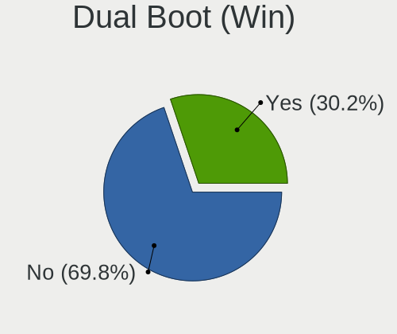
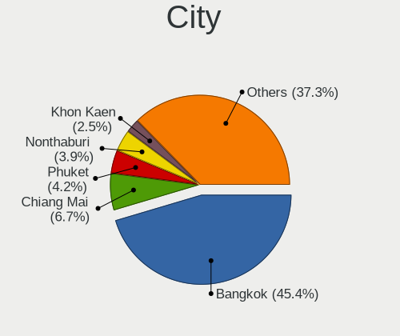
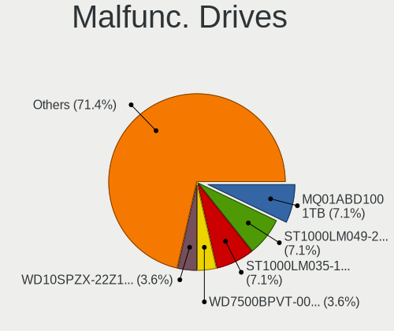
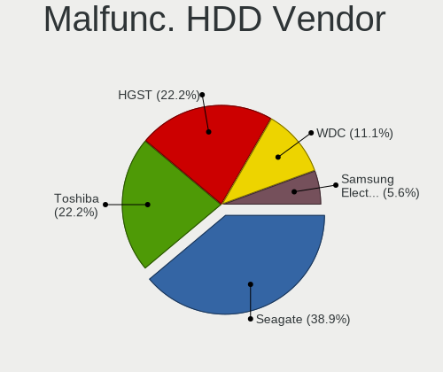
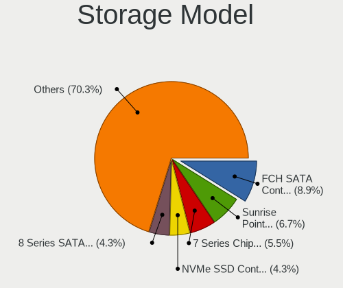
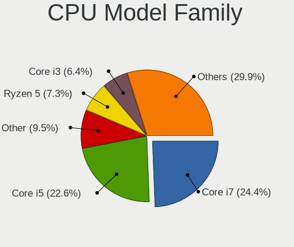
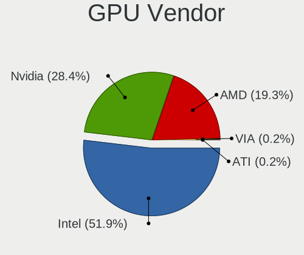
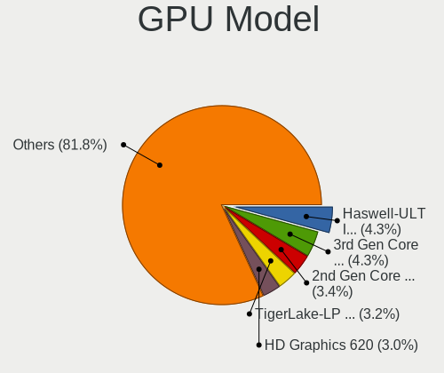
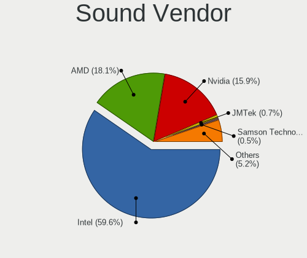
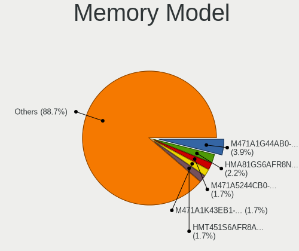

Linux in Thailand - Tested Hardware & Statistics (Notebooks)
------------------------------------------------------------

A project to collect tested hardware configurations for Linux in Thailand.

Anyone can contribute to this report by the [hw-probe](https://github.com/linuxhw/hw-probe) tool:

    sudo -E hw-probe -all -upload

Please contribute! Especially if your hardware is rare.

Contents
--------

* [ Test Cases ](#test-cases)

* [ System ](#system)
  - [ OS                       ](#os)
  - [ OS Family                ](#os-family)
  - [ Kernel                   ](#kernel)
  - [ Kernel Family            ](#kernel-family)
  - [ Kernel Major Ver.        ](#kernel-major-ver)
  - [ Arch                     ](#arch)
  - [ DE                       ](#de)
  - [ Display Server           ](#display-server)
  - [ Display Manager          ](#display-manager)
  - [ OS Lang                  ](#os-lang)
  - [ Boot Mode                ](#boot-mode)
  - [ Filesystem               ](#filesystem)
  - [ Part. scheme             ](#part-scheme)
  - [ Dual Boot with Linux/BSD ](#dual-boot-with-linuxbsd)
  - [ Dual Boot (Win)          ](#dual-boot-win)

* [ Board ](#board)
  - [ Vendor                   ](#vendor)
  - [ Model                    ](#model)
  - [ Model Family             ](#model-family)
  - [ MFG Year                 ](#mfg-year)
  - [ Form Factor              ](#form-factor)
  - [ Secure Boot              ](#secure-boot)
  - [ Coreboot                 ](#coreboot)
  - [ RAM Size                 ](#ram-size)
  - [ RAM Used                 ](#ram-used)
  - [ Total Drives             ](#total-drives)
  - [ Has CD-ROM               ](#has-cd-rom)
  - [ Has Ethernet             ](#has-ethernet)
  - [ Has WiFi                 ](#has-wifi)
  - [ Has Bluetooth            ](#has-bluetooth)

* [ Location ](#location)
  - [ Country                  ](#country)
  - [ City                     ](#city)

* [ Drives ](#drives)
  - [ Drive Vendor             ](#drive-vendor)
  - [ Drive Model              ](#drive-model)
  - [ HDD Vendor               ](#hdd-vendor)
  - [ SSD Vendor               ](#ssd-vendor)
  - [ Drive Kind               ](#drive-kind)
  - [ Drive Connector          ](#drive-connector)
  - [ Drive Size               ](#drive-size)
  - [ Space Total              ](#space-total)
  - [ Space Used               ](#space-used)
  - [ Malfunc. Drives          ](#malfunc-drives)
  - [ Malfunc. Drive Vendor    ](#malfunc-drive-vendor)
  - [ Malfunc. HDD Vendor      ](#malfunc-hdd-vendor)
  - [ Malfunc. Drive Kind      ](#malfunc-drive-kind)
  - [ Failed Drives            ](#failed-drives)
  - [ Failed Drive Vendor      ](#failed-drive-vendor)
  - [ Drive Status             ](#drive-status)

* [ Storage controller ](#storage-controller)
  - [ Storage Vendor           ](#storage-vendor)
  - [ Storage Model            ](#storage-model)
  - [ Storage Kind             ](#storage-kind)

* [ Processor ](#processor)
  - [ CPU Vendor               ](#cpu-vendor)
  - [ CPU Model                ](#cpu-model)
  - [ CPU Model Family         ](#cpu-model-family)
  - [ CPU Cores                ](#cpu-cores)
  - [ CPU Sockets              ](#cpu-sockets)
  - [ CPU Threads              ](#cpu-threads)
  - [ CPU Op-Modes             ](#cpu-op-modes)
  - [ CPU Microcode            ](#cpu-microcode)
  - [ CPU Microarch            ](#cpu-microarch)

* [ Graphics ](#graphics)
  - [ GPU Vendor               ](#gpu-vendor)
  - [ GPU Model                ](#gpu-model)
  - [ GPU Combo                ](#gpu-combo)
  - [ GPU Driver               ](#gpu-driver)
  - [ GPU Memory               ](#gpu-memory)

* [ Monitor ](#monitor)
  - [ Monitor Vendor           ](#monitor-vendor)
  - [ Monitor Model            ](#monitor-model)
  - [ Monitor Resolution       ](#monitor-resolution)
  - [ Monitor Diagonal         ](#monitor-diagonal)
  - [ Monitor Width            ](#monitor-width)
  - [ Aspect Ratio             ](#aspect-ratio)
  - [ Monitor Area             ](#monitor-area)
  - [ Pixel Density            ](#pixel-density)
  - [ Multiple Monitors        ](#multiple-monitors)

* [ Network ](#network)
  - [ Net Controller Vendor    ](#net-controller-vendor)
  - [ Net Controller Model     ](#net-controller-model)
  - [ Wireless Vendor          ](#wireless-vendor)
  - [ Wireless Model           ](#wireless-model)
  - [ Ethernet Vendor          ](#ethernet-vendor)
  - [ Ethernet Model           ](#ethernet-model)
  - [ Net Controller Kind      ](#net-controller-kind)
  - [ Used Controller          ](#used-controller)
  - [ NICs                     ](#nics)
  - [ IPv6                     ](#ipv6)

* [ Bluetooth ](#bluetooth)
  - [ Bluetooth Vendor         ](#bluetooth-vendor)
  - [ Bluetooth Model          ](#bluetooth-model)

* [ Sound ](#sound)
  - [ Sound Vendor             ](#sound-vendor)
  - [ Sound Model              ](#sound-model)

* [ Memory ](#memory)
  - [ Memory Vendor            ](#memory-vendor)
  - [ Memory Model             ](#memory-model)
  - [ Memory Kind              ](#memory-kind)
  - [ Memory Form Factor       ](#memory-form-factor)
  - [ Memory Size              ](#memory-size)
  - [ Memory Speed             ](#memory-speed)

* [ Printers & scanners ](#printers--scanners)
  - [ Printer Vendor           ](#printer-vendor)
  - [ Printer Model            ](#printer-model)
  - [ Scanner Vendor           ](#scanner-vendor)
  - [ Scanner Model            ](#scanner-model)

* [ Camera ](#camera)
  - [ Camera Vendor            ](#camera-vendor)
  - [ Camera Model             ](#camera-model)

* [ Security ](#security)
  - [ Fingerprint Vendor       ](#fingerprint-vendor)
  - [ Fingerprint Model        ](#fingerprint-model)
  - [ Chipcard Vendor          ](#chipcard-vendor)
  - [ Chipcard Model           ](#chipcard-model)

* [ Unsupported ](#unsupported)
  - [ Unsupported Devices      ](#unsupported-devices)
  - [ Unsupported Device Types ](#unsupported-device-types)

Test Cases
----------

Total: 268

| Vendor    | Model                       | Probe                                                      | Date         |
|-----------|-----------------------------|------------------------------------------------------------|--------------|
| Lenovo    | Z50-70 20354                | [29984f68c6](https://linux-hardware.org/?probe=29984f68c6) | Dec 30, 2022 |
| ASUSTek   | Zephyrus G GU502DU_GA502... | [aa2aad674b](https://linux-hardware.org/?probe=aa2aad674b) | Dec 29, 2022 |
| Lenovo    | IdeaPad Z410 20292          | [e46710b0cf](https://linux-hardware.org/?probe=e46710b0cf) | Dec 19, 2022 |
| HP        | Pavilion Laptop 15-eg0xx... | [016e7d7ef2](https://linux-hardware.org/?probe=016e7d7ef2) | Dec 16, 2022 |
| Acer      | TravelMate P214-41-G2       | [cb52e49fa2](https://linux-hardware.org/?probe=cb52e49fa2) | Dec 08, 2022 |
| ASUSTek   | TUF Gaming FX505DT_FX505... | [2ac449d25f](https://linux-hardware.org/?probe=2ac449d25f) | Dec 05, 2022 |
| HP        | Pavilion Laptop 15-eh1xx... | [3807efd1f4](https://linux-hardware.org/?probe=3807efd1f4) | Dec 03, 2022 |
| Lenovo    | IdeaPad Z410 20292          | [af31550cae](https://linux-hardware.org/?probe=af31550cae) | Nov 27, 2022 |
| MSI       | GP63 Leopard 8RE            | [f8bb75758e](https://linux-hardware.org/?probe=f8bb75758e) | Nov 24, 2022 |
| ASUSTek   | ZenBook S UX391UA           | [32e8c529f0](https://linux-hardware.org/?probe=32e8c529f0) | Nov 14, 2022 |
| ASUSTek   | ZenBook S UX391UA           | [f4c2d5224b](https://linux-hardware.org/?probe=f4c2d5224b) | Oct 30, 2022 |
| Dell      | Precision 5530              | [bb4d35f452](https://linux-hardware.org/?probe=bb4d35f452) | Oct 28, 2022 |
| Gigabyte  | AERO 15 Classic-SA          | [7977a48aca](https://linux-hardware.org/?probe=7977a48aca) | Oct 26, 2022 |
| ASUSTek   | ZenBook S UX391UA           | [13873c81b2](https://linux-hardware.org/?probe=13873c81b2) | Oct 24, 2022 |
| ASUSTek   | ZenBook S UX391UA           | [4a6e283158](https://linux-hardware.org/?probe=4a6e283158) | Oct 22, 2022 |
| ASUSTek   | VivoBook_ASUSLaptop X509... | [7c284b1dfd](https://linux-hardware.org/?probe=7c284b1dfd) | Oct 20, 2022 |
| Acer      | Swift SFX14-41G             | [7c689396eb](https://linux-hardware.org/?probe=7c689396eb) | Oct 19, 2022 |
| Acer      | Swift SFX14-41G             | [357ad9257d](https://linux-hardware.org/?probe=357ad9257d) | Oct 19, 2022 |
| Lenovo    | ThinkPad T480s 20L8S1R50... | [478b58f9b6](https://linux-hardware.org/?probe=478b58f9b6) | Oct 15, 2022 |
| ASUSTek   | ZenBook S UX391UA           | [64cbdc6e2a](https://linux-hardware.org/?probe=64cbdc6e2a) | Oct 13, 2022 |
| Acer      | Aspire E5-575G              | [ed74f1da66](https://linux-hardware.org/?probe=ed74f1da66) | Oct 10, 2022 |
| HP        | EliteBook 840 G6            | [29f63f8a32](https://linux-hardware.org/?probe=29f63f8a32) | Oct 10, 2022 |
| Lenovo    | IdeaPad 3 15ADA05 81W1      | [3665682cc6](https://linux-hardware.org/?probe=3665682cc6) | Oct 08, 2022 |
| HP        | Laptop                      | [3a26ec874f](https://linux-hardware.org/?probe=3a26ec874f) | Oct 04, 2022 |
| Timi      | TM1701                      | [59153cc5fe](https://linux-hardware.org/?probe=59153cc5fe) | Sep 27, 2022 |
| HP        | Laptop                      | [6d8fc869e4](https://linux-hardware.org/?probe=6d8fc869e4) | Sep 26, 2022 |
| HP        | Laptop                      | [be59fc7a97](https://linux-hardware.org/?probe=be59fc7a97) | Sep 26, 2022 |
| Acer      | TravelMate P653-M           | [c0fcc47188](https://linux-hardware.org/?probe=c0fcc47188) | Sep 03, 2022 |
| ASUSTek   | VivoBook_ASUSLaptop X512... | [65f638768e](https://linux-hardware.org/?probe=65f638768e) | Aug 27, 2022 |
| Lenovo    | ThinkPad X1 Extreme Gen ... | [1746f3874c](https://linux-hardware.org/?probe=1746f3874c) | Aug 27, 2022 |
| Apple     | MacBookPro11,3              | [0008869bb6](https://linux-hardware.org/?probe=0008869bb6) | Aug 27, 2022 |
| Apple     | MacBookPro11,3              | [c0e9a2e062](https://linux-hardware.org/?probe=c0e9a2e062) | Aug 27, 2022 |
| Apple     | MacBookPro11,3              | [51a98d93a6](https://linux-hardware.org/?probe=51a98d93a6) | Aug 20, 2022 |
| Acer      | Aspire V3-771               | [dc65bd0f38](https://linux-hardware.org/?probe=dc65bd0f38) | Aug 17, 2022 |
| ASUSTek   | VivoBook_ASUSLaptop M350... | [93b2d066d6](https://linux-hardware.org/?probe=93b2d066d6) | Aug 17, 2022 |
| Unknown   | Unknown                     | [5cdd2332d5](https://linux-hardware.org/?probe=5cdd2332d5) | Aug 14, 2022 |
| Foxconn   | Kangaroo Mobile Desktop     | [1b9f19b21e](https://linux-hardware.org/?probe=1b9f19b21e) | Aug 13, 2022 |
| Acer      | Aspire E5-575G              | [5ebbabea13](https://linux-hardware.org/?probe=5ebbabea13) | Aug 10, 2022 |
| Acer      | TravelMate P643-M           | [33254cfb1e](https://linux-hardware.org/?probe=33254cfb1e) | Aug 03, 2022 |
| HP        | Stream Notebook PC 13       | [d736692861](https://linux-hardware.org/?probe=d736692861) | Jul 31, 2022 |
| Dell      | Latitude 3320               | [183ae38016](https://linux-hardware.org/?probe=183ae38016) | Jul 31, 2022 |
| Dell      | Latitude 3320               | [a849c0d90a](https://linux-hardware.org/?probe=a849c0d90a) | Jul 30, 2022 |
| Dell      | Latitude E5430 non-vPro     | [f8808faaf0](https://linux-hardware.org/?probe=f8808faaf0) | Jul 24, 2022 |
| Acer      | TravelMate P643-M           | [0357bf32d7](https://linux-hardware.org/?probe=0357bf32d7) | Jul 19, 2022 |
| ASUSTek   | ASUS TUF Gaming A17 FA70... | [eac5600627](https://linux-hardware.org/?probe=eac5600627) | Jul 12, 2022 |
| ASUSTek   | ASUS TUF Gaming A17 FA70... | [4829f98af6](https://linux-hardware.org/?probe=4829f98af6) | Jul 04, 2022 |
| HP        | EliteBook 840 G8 Noteboo... | [cfa0dde1d0](https://linux-hardware.org/?probe=cfa0dde1d0) | Jul 02, 2022 |
| Infinix   | INBOOK X2                   | [eedac976d8](https://linux-hardware.org/?probe=eedac976d8) | Jul 02, 2022 |
| Infinix   | INBOOK X2                   | [1c87102f96](https://linux-hardware.org/?probe=1c87102f96) | Jun 29, 2022 |
| Lenovo    | ThinkPad X230 23331R5       | [c6589e02c4](https://linux-hardware.org/?probe=c6589e02c4) | Jun 25, 2022 |
| ASUSTek   | ASUS TUF Gaming A17 FA70... | [a1a0b3b43b](https://linux-hardware.org/?probe=a1a0b3b43b) | Jun 23, 2022 |
| MSI       | GE76 Raider 10UH            | [77ef5acb4c](https://linux-hardware.org/?probe=77ef5acb4c) | Jun 23, 2022 |
| ASUSTek   | ASUS TUF Gaming A17 FA70... | [51ec938467](https://linux-hardware.org/?probe=51ec938467) | Jun 22, 2022 |
| Unknown   | Unknown                     | [00090936e8](https://linux-hardware.org/?probe=00090936e8) | Jun 15, 2022 |
| Dell      | Latitude 3120               | [c5c6eed0d9](https://linux-hardware.org/?probe=c5c6eed0d9) | Jun 14, 2022 |
| Acer      | Aspire F5-573G              | [fd7d146eb1](https://linux-hardware.org/?probe=fd7d146eb1) | Jun 08, 2022 |
| Apple     | MacBookPro11,1              | [b12802bc7a](https://linux-hardware.org/?probe=b12802bc7a) | Jun 02, 2022 |
| ASUSTek   | ASUS TUF Gaming A17 FA70... | [799a25df83](https://linux-hardware.org/?probe=799a25df83) | May 31, 2022 |
| Acer      | One Z1402                   | [4278b806cf](https://linux-hardware.org/?probe=4278b806cf) | May 31, 2022 |
| ASUSTek   | S400CA                      | [dadda333d2](https://linux-hardware.org/?probe=dadda333d2) | May 28, 2022 |
| Dell      | Latitude 3120               | [e97cf58459](https://linux-hardware.org/?probe=e97cf58459) | May 23, 2022 |
| Lenovo    | IdeaPad 700-15ISK 80RU      | [8949bc2cf8](https://linux-hardware.org/?probe=8949bc2cf8) | May 22, 2022 |
| Acer      | One Z1402                   | [ae69c0fdbd](https://linux-hardware.org/?probe=ae69c0fdbd) | May 21, 2022 |
| Dell      | Inspiron 7559               | [90bfbc9f6b](https://linux-hardware.org/?probe=90bfbc9f6b) | May 16, 2022 |
| Lenovo    | ThinkPad X230 23257Y1       | [0c4e13a23d](https://linux-hardware.org/?probe=0c4e13a23d) | May 11, 2022 |
| Lenovo    | ThinkPad E15 Gen 3 20YJS... | [fb11780c46](https://linux-hardware.org/?probe=fb11780c46) | May 07, 2022 |
| ASUSTek   | K40IN                       | [ab6a95da52](https://linux-hardware.org/?probe=ab6a95da52) | Apr 28, 2022 |
| HP        | Pro Tablet 608 G1           | [a8b97ee7cf](https://linux-hardware.org/?probe=a8b97ee7cf) | Apr 25, 2022 |
| Acer      | Aspire A515-45              | [377315649e](https://linux-hardware.org/?probe=377315649e) | Apr 22, 2022 |
| ASUSTek   | G550JK                      | [566770a325](https://linux-hardware.org/?probe=566770a325) | Apr 21, 2022 |
| ASUSTek   | G550JK                      | [6d291b9c9c](https://linux-hardware.org/?probe=6d291b9c9c) | Apr 21, 2022 |
| ASUSTek   | FX503VD                     | [218e8b7d2a](https://linux-hardware.org/?probe=218e8b7d2a) | Apr 20, 2022 |
| Lenovo    | ThinkPad X220 4286A78       | [d5c9254caa](https://linux-hardware.org/?probe=d5c9254caa) | Apr 20, 2022 |
| Acer      | Aspire E5-471G              | [a7179e1ba3](https://linux-hardware.org/?probe=a7179e1ba3) | Apr 16, 2022 |
| Framework | Laptop                      | [bd5ea938e7](https://linux-hardware.org/?probe=bd5ea938e7) | Apr 07, 2022 |
| Dell      | Latitude 3120               | [c0df9a1ac0](https://linux-hardware.org/?probe=c0df9a1ac0) | Apr 06, 2022 |
| Lenovo    | ThinkBook 15 G3 ACL 21A4    | [30c09eec3b](https://linux-hardware.org/?probe=30c09eec3b) | Mar 28, 2022 |
| Lenovo    | IdeaPad S530-13IWL 81J7     | [a9a4291601](https://linux-hardware.org/?probe=a9a4291601) | Mar 26, 2022 |
| Dell      | Latitude 3120               | [69b7d6b1a3](https://linux-hardware.org/?probe=69b7d6b1a3) | Mar 26, 2022 |
| Dell      | Latitude 3120               | [78ae48c482](https://linux-hardware.org/?probe=78ae48c482) | Mar 26, 2022 |
| Acer      | Aspire E5-571               | [c2f6faf193](https://linux-hardware.org/?probe=c2f6faf193) | Mar 06, 2022 |
| HUAWEI    | HLYL-WXX9                   | [5c8d71134e](https://linux-hardware.org/?probe=5c8d71134e) | Feb 16, 2022 |
| Acer      | AOA150                      | [aeb35f9f12](https://linux-hardware.org/?probe=aeb35f9f12) | Feb 13, 2022 |
| Acer      | AOA150                      | [7d493dd5d5](https://linux-hardware.org/?probe=7d493dd5d5) | Feb 13, 2022 |
| ASUSTek   | VivoBook_ASUSLaptop M350... | [5d3d7c5340](https://linux-hardware.org/?probe=5d3d7c5340) | Feb 12, 2022 |
| ASUSTek   | VivoBook_ASUSLaptop X513... | [1488d5e773](https://linux-hardware.org/?probe=1488d5e773) | Feb 09, 2022 |
| ASUSTek   | ASUS TUF Gaming A17 FA70... | [dfc4821588](https://linux-hardware.org/?probe=dfc4821588) | Feb 08, 2022 |
| Dell      | Vostro 5471                 | [c90234250e](https://linux-hardware.org/?probe=c90234250e) | Jan 31, 2022 |
| Lenovo    | ThinkPad P50 20EQS2AB00     | [bdc680b5f1](https://linux-hardware.org/?probe=bdc680b5f1) | Jan 19, 2022 |
| Lenovo    | ThinkPad X13 Gen 1 20UFS... | [31f48cd25e](https://linux-hardware.org/?probe=31f48cd25e) | Jan 19, 2022 |
| ASUSTek   | G550JK                      | [b26b378274](https://linux-hardware.org/?probe=b26b378274) | Jan 01, 2022 |
| Lenovo    | ThinkPad X131e 33722VU      | [c8dc197420](https://linux-hardware.org/?probe=c8dc197420) | Dec 26, 2021 |
| Lenovo    | ThinkBook 15 G3 ACL 21A4    | [2e71480673](https://linux-hardware.org/?probe=2e71480673) | Dec 24, 2021 |
| Lenovo    | ThinkPad L530 24792T1       | [3e12618615](https://linux-hardware.org/?probe=3e12618615) | Nov 29, 2021 |
| Toshiba   | Satellite L840              | [6c29b0fc8d](https://linux-hardware.org/?probe=6c29b0fc8d) | Nov 27, 2021 |
| ASUSTek   | TUF Gaming FX505DT_FX505... | [0d0596e9ea](https://linux-hardware.org/?probe=0d0596e9ea) | Nov 25, 2021 |
| Notebook  | NV4XMB,ME,MZ                | [edaff183a5](https://linux-hardware.org/?probe=edaff183a5) | Nov 21, 2021 |
| Dell      | Vostro 5471                 | [4083699145](https://linux-hardware.org/?probe=4083699145) | Nov 14, 2021 |
| MSI       | Prestige 15 A10SC           | [b362dd3f20](https://linux-hardware.org/?probe=b362dd3f20) | Nov 13, 2021 |
| Dell      | Inspiron N5010              | [d1b6520785](https://linux-hardware.org/?probe=d1b6520785) | Nov 13, 2021 |
| HP        | EliteBook 6930p (FL488AW... | [af8e63842a](https://linux-hardware.org/?probe=af8e63842a) | Oct 28, 2021 |
| Acer      | Aspire ES1-131              | [de7bee5c36](https://linux-hardware.org/?probe=de7bee5c36) | Oct 20, 2021 |
| HP        | Pavilion Gaming Laptop 1... | [1193264475](https://linux-hardware.org/?probe=1193264475) | Oct 10, 2021 |
| Lenovo    | ThinkPad X1 Carbon Gen 9... | [f3c6229102](https://linux-hardware.org/?probe=f3c6229102) | Oct 06, 2021 |
| Apple     | MacBookPro5,5               | [514642d183](https://linux-hardware.org/?probe=514642d183) | Sep 30, 2021 |
| ASUSTek   | ZenBook UX333FN_UX333FN     | [e4fb99f5b8](https://linux-hardware.org/?probe=e4fb99f5b8) | Sep 30, 2021 |
| ASUSTek   | ASUS TUF Gaming A17 FA70... | [8141d6fa89](https://linux-hardware.org/?probe=8141d6fa89) | Sep 22, 2021 |
| ASUSTek   | ZenBook UX482EA_UX482EA     | [29d5b02719](https://linux-hardware.org/?probe=29d5b02719) | Sep 13, 2021 |
| Dell      | Latitude D630               | [3af0cdbc54](https://linux-hardware.org/?probe=3af0cdbc54) | Sep 09, 2021 |
| Acer      | Aspire V3-575G              | [28e06e0c2b](https://linux-hardware.org/?probe=28e06e0c2b) | Aug 28, 2021 |
| Lenovo    | ThinkBook 14-IML 20RV       | [8e060f6c6c](https://linux-hardware.org/?probe=8e060f6c6c) | Aug 23, 2021 |
| Acer      | Aspire E5-471G              | [7f7c5133ad](https://linux-hardware.org/?probe=7f7c5133ad) | Aug 18, 2021 |
| Fujitsu   | LIFEBOOK A357               | [68af6cccad](https://linux-hardware.org/?probe=68af6cccad) | Aug 05, 2021 |
| Acer      | Aspire E5-475G              | [65ad8ece4a](https://linux-hardware.org/?probe=65ad8ece4a) | Jul 30, 2021 |
| ASUSTek   | ASUS TUF Gaming A17 FA70... | [10b4953c7e](https://linux-hardware.org/?probe=10b4953c7e) | Jul 26, 2021 |
| Lenovo    | ThinkPad T480s 20L8S7HF0... | [5417d20b5b](https://linux-hardware.org/?probe=5417d20b5b) | Jul 25, 2021 |
| ASUSTek   | VivoBook_ASUS Laptop E21... | [94307be3d8](https://linux-hardware.org/?probe=94307be3d8) | Jul 25, 2021 |
| ASUSTek   | VivoBook_ASUS Laptop E21... | [9e0045da76](https://linux-hardware.org/?probe=9e0045da76) | Jul 25, 2021 |
| ASUSTek   | ASUS TUF Gaming A17 FA70... | [9d13b7e8df](https://linux-hardware.org/?probe=9d13b7e8df) | Jul 21, 2021 |
| Acer      | Aspire E5-471G              | [bde4a22e40](https://linux-hardware.org/?probe=bde4a22e40) | Jul 19, 2021 |
| Acer      | Nitro AN515-55              | [5c7365be9d](https://linux-hardware.org/?probe=5c7365be9d) | Jul 16, 2021 |
| Dell      | Vostro 3578                 | [f5bfb0ada6](https://linux-hardware.org/?probe=f5bfb0ada6) | Jul 09, 2021 |
| Dell      | Vostro 3578                 | [e69ebc683f](https://linux-hardware.org/?probe=e69ebc683f) | Jul 09, 2021 |
| Acer      | Aspire ES1-111M             | [40450f88e3](https://linux-hardware.org/?probe=40450f88e3) | Jul 07, 2021 |
| Acer      | Aspire ES1-111M             | [7eb7b4a001](https://linux-hardware.org/?probe=7eb7b4a001) | Jul 07, 2021 |
| MSI       | GF65 Thin 10UE              | [d1e0b6ee58](https://linux-hardware.org/?probe=d1e0b6ee58) | Jun 22, 2021 |
| Fujitsu   | LIFEBOOK BH531              | [688d9f583e](https://linux-hardware.org/?probe=688d9f583e) | Jun 16, 2021 |
| HP        | Stream Notebook             | [806c24449c](https://linux-hardware.org/?probe=806c24449c) | Jun 09, 2021 |
| ASUSTek   | X450LN                      | [9157df68c1](https://linux-hardware.org/?probe=9157df68c1) | May 27, 2021 |
| Lenovo    | B50-80 80LT                 | [ef615e10ea](https://linux-hardware.org/?probe=ef615e10ea) | May 27, 2021 |
| ASUSTek   | X450LN                      | [aa8e32e484](https://linux-hardware.org/?probe=aa8e32e484) | May 25, 2021 |
| Toshiba   | Satellite L645              | [a3c061e392](https://linux-hardware.org/?probe=a3c061e392) | May 17, 2021 |
| MSI       | GF63 Thin 9SCSR             | [0d99884dcd](https://linux-hardware.org/?probe=0d99884dcd) | May 17, 2021 |
| Dell      | Inspiron 7501               | [e8e3c50f4b](https://linux-hardware.org/?probe=e8e3c50f4b) | May 16, 2021 |
| Dell      | Latitude 3410               | [b29d7ddfe8](https://linux-hardware.org/?probe=b29d7ddfe8) | May 09, 2021 |
| Dell      | Latitude E6430              | [1a7d88c72a](https://linux-hardware.org/?probe=1a7d88c72a) | May 04, 2021 |
| Dell      | Latitude E6430              | [7b00c56952](https://linux-hardware.org/?probe=7b00c56952) | May 02, 2021 |
| Lenovo    | ThinkPad X201 Tablet 309... | [66c2a37fb9](https://linux-hardware.org/?probe=66c2a37fb9) | May 01, 2021 |
| Lenovo    | ThinkPad X201 Tablet 309... | [30c34c8c01](https://linux-hardware.org/?probe=30c34c8c01) | May 01, 2021 |
| Acer      | Aspire ES1-111M             | [aa9bfbf347](https://linux-hardware.org/?probe=aa9bfbf347) | Apr 29, 2021 |
| Acer      | Aspire ES1-111M             | [298d859193](https://linux-hardware.org/?probe=298d859193) | Apr 27, 2021 |
| Dell      | Latitude 3410               | [b6748a9a7e](https://linux-hardware.org/?probe=b6748a9a7e) | Apr 25, 2021 |
| Fujitsu   | LIFEBOOK BH531              | [2fa4c2d1ef](https://linux-hardware.org/?probe=2fa4c2d1ef) | Apr 18, 2021 |
| Dell      | G7 7590                     | [be5780df0a](https://linux-hardware.org/?probe=be5780df0a) | Mar 09, 2021 |
| Samsung   | R780/R778                   | [0c57a7241e](https://linux-hardware.org/?probe=0c57a7241e) | Feb 26, 2021 |
| ASUSTek   | E200HA                      | [1faf0b360f](https://linux-hardware.org/?probe=1faf0b360f) | Feb 19, 2021 |
| ASUSTek   | K45VM                       | [26690f314d](https://linux-hardware.org/?probe=26690f314d) | Feb 15, 2021 |
| ASUSTek   | X555LD                      | [1b2994e7f3](https://linux-hardware.org/?probe=1b2994e7f3) | Feb 15, 2021 |
| HUAWEI    | BOHK-WAX9X                  | [40bcb4aaf2](https://linux-hardware.org/?probe=40bcb4aaf2) | Feb 15, 2021 |
| Apple     | MacBookAir3,2               | [0392f08b03](https://linux-hardware.org/?probe=0392f08b03) | Feb 15, 2021 |
| Acer      | Aspire E5-471G              | [401fa9d58e](https://linux-hardware.org/?probe=401fa9d58e) | Feb 13, 2021 |
| HP        | 1000                        | [16b305a6f5](https://linux-hardware.org/?probe=16b305a6f5) | Feb 13, 2021 |
| HUAWEI    | KLVL-WXX9                   | [20b10721e2](https://linux-hardware.org/?probe=20b10721e2) | Feb 09, 2021 |
| Acer      | Aspire E5-475G              | [360e7155d7](https://linux-hardware.org/?probe=360e7155d7) | Feb 06, 2021 |
| Sony      | SVF14N25CXB                 | [1db1e6aec9](https://linux-hardware.org/?probe=1db1e6aec9) | Jan 28, 2021 |
| ASUSTek   | TUF Gaming FA506IV_FA506... | [731a44edca](https://linux-hardware.org/?probe=731a44edca) | Jan 16, 2021 |
| Lenovo    | IdeaPad Y450                | [1285c5deb9](https://linux-hardware.org/?probe=1285c5deb9) | Jan 11, 2021 |
| Lenovo    | G460 20041                  | [f224060be4](https://linux-hardware.org/?probe=f224060be4) | Jan 07, 2021 |
| ASUSTek   | TUF Gaming FA506II_FA506... | [e28d350fac](https://linux-hardware.org/?probe=e28d350fac) | Dec 24, 2020 |
| ASUSTek   | X450CC                      | [750f666a09](https://linux-hardware.org/?probe=750f666a09) | Dec 23, 2020 |
| Lenovo    | ThinkPad E15 20RES51Y00     | [66b1afc07c](https://linux-hardware.org/?probe=66b1afc07c) | Dec 15, 2020 |
| Dell      | Inspiron 5468               | [abc26c7422](https://linux-hardware.org/?probe=abc26c7422) | Dec 09, 2020 |
| MSI       | PE70 6QE                    | [cb5f05e67d](https://linux-hardware.org/?probe=cb5f05e67d) | Dec 02, 2020 |
| Acer      | Aspire E5-475G              | [53a62697ed](https://linux-hardware.org/?probe=53a62697ed) | Dec 01, 2020 |
| Acer      | Aspire E5-475G              | [719a24bc0f](https://linux-hardware.org/?probe=719a24bc0f) | Nov 30, 2020 |
| MSI       | PE70 6QE                    | [90b21f8369](https://linux-hardware.org/?probe=90b21f8369) | Nov 23, 2020 |
| Acer      | Aspire VN7-793G             | [79f11201bc](https://linux-hardware.org/?probe=79f11201bc) | Nov 22, 2020 |
| Dell      | G5 5590                     | [007ad64378](https://linux-hardware.org/?probe=007ad64378) | Nov 20, 2020 |
| MSI       | GE75 Raider 10SGS           | [025deb9bbe](https://linux-hardware.org/?probe=025deb9bbe) | Nov 19, 2020 |
| Dell      | G5 5590                     | [e82ed4c1d0](https://linux-hardware.org/?probe=e82ed4c1d0) | Nov 19, 2020 |
| HP        | Laptop 14-bs0xx             | [f90473f671](https://linux-hardware.org/?probe=f90473f671) | Nov 16, 2020 |
| HP        | Laptop 14-bs0xx             | [bf8d99074a](https://linux-hardware.org/?probe=bf8d99074a) | Nov 15, 2020 |
| Lenovo    | IdeaPad 100S-14IBR 80R9     | [4c0fec3ac5](https://linux-hardware.org/?probe=4c0fec3ac5) | Nov 09, 2020 |
| Hampoo    | Unknown                     | [b713cd21d1](https://linux-hardware.org/?probe=b713cd21d1) | Oct 24, 2020 |
| Hampoo    | Unknown                     | [03640b9aac](https://linux-hardware.org/?probe=03640b9aac) | Oct 24, 2020 |
| MSI       | PE70 6QE                    | [8c3ccf4956](https://linux-hardware.org/?probe=8c3ccf4956) | Oct 19, 2020 |
| Dell      | Precision 7740              | [814a0ec705](https://linux-hardware.org/?probe=814a0ec705) | Oct 15, 2020 |
| MSI       | PE70 6QE                    | [1691661a18](https://linux-hardware.org/?probe=1691661a18) | Oct 12, 2020 |
| ASUSTek   | VivoBook_ASUSLaptop X412... | [e0d54e69ff](https://linux-hardware.org/?probe=e0d54e69ff) | Oct 11, 2020 |
| HP        | Pavilion dv7                | [058179daf5](https://linux-hardware.org/?probe=058179daf5) | Sep 24, 2020 |
| HP        | Pavilion dv6                | [acce68d947](https://linux-hardware.org/?probe=acce68d947) | Sep 09, 2020 |
| Dell      | Inspiron 5447               | [9fc26445da](https://linux-hardware.org/?probe=9fc26445da) | Sep 03, 2020 |
| Dell      | Inspiron 5447               | [fd56e29478](https://linux-hardware.org/?probe=fd56e29478) | Sep 03, 2020 |
| Lenovo    | IdeaPad 300-14ISK 80Q6      | [e55f750fc2](https://linux-hardware.org/?probe=e55f750fc2) | Sep 02, 2020 |
| Lenovo    | IdeaPad 300-14ISK 80Q6      | [cc7e35217e](https://linux-hardware.org/?probe=cc7e35217e) | Sep 02, 2020 |
| Acer      | Aspire VN7-792G             | [706847f6cd](https://linux-hardware.org/?probe=706847f6cd) | Aug 30, 2020 |
| Lenovo    | IdeaPad 100S-14IBR 80R9     | [dc8ed0c837](https://linux-hardware.org/?probe=dc8ed0c837) | Jul 30, 2020 |
| ASUSTek   | X411UN                      | [212932d80d](https://linux-hardware.org/?probe=212932d80d) | Jul 27, 2020 |
| Lenovo    | IdeaPad 100S-14IBR 80R9     | [8dd238e5a1](https://linux-hardware.org/?probe=8dd238e5a1) | Jul 24, 2020 |
| Acer      | Swift SF314-57G             | [c74653b694](https://linux-hardware.org/?probe=c74653b694) | Jul 15, 2020 |
| Lenovo    | IdeaPad 330-15ARR 81D2      | [f545576ae9](https://linux-hardware.org/?probe=f545576ae9) | Jul 14, 2020 |
| Acer      | Aspire VN7-792G             | [405d399549](https://linux-hardware.org/?probe=405d399549) | Jul 10, 2020 |
| ASUSTek   | VivoBook_ASUSLaptop X570... | [4175ac62a0](https://linux-hardware.org/?probe=4175ac62a0) | Jul 10, 2020 |
| Acer      | Aspire A315-42              | [7c061a0688](https://linux-hardware.org/?probe=7c061a0688) | Jul 06, 2020 |
| Acer      | Aspire VN7-792G             | [1457f6e3b5](https://linux-hardware.org/?probe=1457f6e3b5) | Jul 04, 2020 |
| Fujitsu   | LIFEBOOK BH531              | [2484e68205](https://linux-hardware.org/?probe=2484e68205) | Jul 03, 2020 |
| ASUSTek   | VivoBook_ASUS Laptop E40... | [adc28756a8](https://linux-hardware.org/?probe=adc28756a8) | Jun 29, 2020 |
| ASUSTek   | VivoBook_ASUS Laptop E40... | [6e947dfc9d](https://linux-hardware.org/?probe=6e947dfc9d) | Jun 27, 2020 |
| ASUSTek   | K42JB                       | [5f87f39c75](https://linux-hardware.org/?probe=5f87f39c75) | Jun 27, 2020 |
| MSI       | MS-14Y1                     | [c585b33393](https://linux-hardware.org/?probe=c585b33393) | Jun 25, 2020 |
| HP        | Pavilion Notebook           | [8d0c93ef24](https://linux-hardware.org/?probe=8d0c93ef24) | Jun 17, 2020 |
| MSI       | MS-14Y1                     | [657c6d539f](https://linux-hardware.org/?probe=657c6d539f) | Jun 03, 2020 |
| Sony      | SVF14N25CXB                 | [2fdd1fc4d3](https://linux-hardware.org/?probe=2fdd1fc4d3) | Jun 02, 2020 |
| ASUSTek   | K53SV                       | [0bb72c8f71](https://linux-hardware.org/?probe=0bb72c8f71) | Jun 01, 2020 |
| ASUSTek   | ROG Zephyrus G14 GA401IV... | [645ef14cb4](https://linux-hardware.org/?probe=645ef14cb4) | May 21, 2020 |
| Lenovo    | IdeaPad S540-14API 81NH     | [4827cdc9b5](https://linux-hardware.org/?probe=4827cdc9b5) | May 21, 2020 |
| Lenovo    | ThinkPad T540p 20BFS0WB0... | [338493712f](https://linux-hardware.org/?probe=338493712f) | May 19, 2020 |
| Lenovo    | ThinkPad T540p 20BFS0WB0... | [17f5a0932c](https://linux-hardware.org/?probe=17f5a0932c) | May 19, 2020 |
| Samsung   | RV418/RV518/RV718           | [ff8f525d6b](https://linux-hardware.org/?probe=ff8f525d6b) | May 18, 2020 |
| Lenovo    | G480 20156                  | [6cb3a28f6a](https://linux-hardware.org/?probe=6cb3a28f6a) | May 18, 2020 |
| Lenovo    | G480 20156                  | [7487bf67c4](https://linux-hardware.org/?probe=7487bf67c4) | May 18, 2020 |
| Acer      | Nitro AN515-42              | [5c659d6268](https://linux-hardware.org/?probe=5c659d6268) | May 07, 2020 |
| Lenovo    | ThinkPad E490 20N9S26G00    | [a26e5790ce](https://linux-hardware.org/?probe=a26e5790ce) | May 06, 2020 |
| ASUSTek   | TUF Gaming FX505DY_FX505... | [f286a38265](https://linux-hardware.org/?probe=f286a38265) | Apr 30, 2020 |
| Lenovo    | Y50-70 20378                | [bbd3e36751](https://linux-hardware.org/?probe=bbd3e36751) | Apr 16, 2020 |
| Lenovo    | Y50-70 20378                | [8bca0c818d](https://linux-hardware.org/?probe=8bca0c818d) | Apr 16, 2020 |
| Lenovo    | ThinkPad T420 4180JH1       | [4d0e9109bb](https://linux-hardware.org/?probe=4d0e9109bb) | Mar 21, 2020 |
| Samsung   | NC208/NC108                 | [d577b178a1](https://linux-hardware.org/?probe=d577b178a1) | Mar 06, 2020 |
| Samsung   | NC208/NC108                 | [cc28243d3d](https://linux-hardware.org/?probe=cc28243d3d) | Mar 06, 2020 |
| Lenovo    | ThinkPad X1 Carbon 6th 2... | [626f7fb341](https://linux-hardware.org/?probe=626f7fb341) | Feb 29, 2020 |
| Acer      | Predator PH315-51           | [b3edf8c190](https://linux-hardware.org/?probe=b3edf8c190) | Feb 23, 2020 |
| Samsung   | NC208/NC108                 | [8d16cc2992](https://linux-hardware.org/?probe=8d16cc2992) | Feb 23, 2020 |
| Samsung   | NC208/NC108                 | [ffbfac004c](https://linux-hardware.org/?probe=ffbfac004c) | Feb 23, 2020 |
| Dell      | Precision 5510              | [0e30ff12b4](https://linux-hardware.org/?probe=0e30ff12b4) | Feb 18, 2020 |
| ASUSTek   | TUF Gaming FX505DY_FX505... | [ac7b752d68](https://linux-hardware.org/?probe=ac7b752d68) | Feb 13, 2020 |
| HP        | Compaq 15                   | [e8597ab3e4](https://linux-hardware.org/?probe=e8597ab3e4) | Feb 06, 2020 |
| MSI       | X460/X460DX                 | [faf3829102](https://linux-hardware.org/?probe=faf3829102) | Feb 04, 2020 |
| Lenovo    | IdeaPad S540-14IML 81NF     | [670b5a0247](https://linux-hardware.org/?probe=670b5a0247) | Dec 27, 2019 |
| Lenovo    | IdeaPad S540-14IML 81NF     | [fc21e1c322](https://linux-hardware.org/?probe=fc21e1c322) | Dec 18, 2019 |
| Lenovo    | ThinkPad P50 20EQS5XE00     | [65dc93e325](https://linux-hardware.org/?probe=65dc93e325) | Dec 18, 2019 |
| HP        | Laptop 14-ck0xxx            | [ff52ea1b93](https://linux-hardware.org/?probe=ff52ea1b93) | Dec 03, 2019 |
| Fujitsu   | LIFEBOOK BH531              | [c00057fc87](https://linux-hardware.org/?probe=c00057fc87) | Dec 01, 2019 |
| Clevo     | M540SR VT6363A              | [97181c941c](https://linux-hardware.org/?probe=97181c941c) | Nov 23, 2019 |
| Fujitsu   | LIFEBOOK BH531              | [0223eca896](https://linux-hardware.org/?probe=0223eca896) | Nov 22, 2019 |
| Lenovo    | G710 20252                  | [d11fbec88a](https://linux-hardware.org/?probe=d11fbec88a) | Nov 14, 2019 |
| Lenovo    | G710 20252                  | [21ae1ec676](https://linux-hardware.org/?probe=21ae1ec676) | Nov 10, 2019 |
| Lenovo    | ThinkPad 11e 5th Gen 20L... | [b65742b189](https://linux-hardware.org/?probe=b65742b189) | Oct 26, 2019 |
| Lenovo    | ThinkPad 11e 5th Gen 20L... | [6ccf378246](https://linux-hardware.org/?probe=6ccf378246) | Oct 26, 2019 |
| Lenovo    | ThinkPad 11e 5th Gen 20L... | [29d4434f82](https://linux-hardware.org/?probe=29d4434f82) | Oct 26, 2019 |
| HP        | Laptop 14-cm0xxx            | [6a706da421](https://linux-hardware.org/?probe=6a706da421) | Oct 23, 2019 |
| Acer      | Swift SF113-31              | [a37935b2e0](https://linux-hardware.org/?probe=a37935b2e0) | Sep 27, 2019 |
| Lenovo    | ThinkPad T540p 20BFS0WB0... | [ccf2eacdd1](https://linux-hardware.org/?probe=ccf2eacdd1) | Sep 14, 2019 |
| Acer      | Aspire E5-552G              | [5c4bd87bc9](https://linux-hardware.org/?probe=5c4bd87bc9) | Sep 04, 2019 |
| Dell      | Vostro 3458                 | [a62197181c](https://linux-hardware.org/?probe=a62197181c) | Sep 04, 2019 |
| Lenovo    | G460 20041                  | [7b5945bfc2](https://linux-hardware.org/?probe=7b5945bfc2) | Aug 31, 2019 |
| HP        | Laptop 15-db0xxx            | [2d5f51cdd8](https://linux-hardware.org/?probe=2d5f51cdd8) | Aug 23, 2019 |
| HP        | Pavilion Gaming Laptop 1... | [fe49019be0](https://linux-hardware.org/?probe=fe49019be0) | Aug 16, 2019 |
| HP        | Pavilion Gaming Laptop 1... | [7551b403e2](https://linux-hardware.org/?probe=7551b403e2) | Aug 16, 2019 |
| HP        | Pavilion Gaming Laptop 1... | [ef69a20f15](https://linux-hardware.org/?probe=ef69a20f15) | Aug 07, 2019 |
| HP        | ENVY Laptop ah0xxx          | [defe18c4c3](https://linux-hardware.org/?probe=defe18c4c3) | Jul 09, 2019 |
| Dell      | Latitude E6430              | [c8334c6a31](https://linux-hardware.org/?probe=c8334c6a31) | Jun 22, 2019 |
| HP        | Pavilion Gaming Laptop 1... | [26db49d8f2](https://linux-hardware.org/?probe=26db49d8f2) | Jun 19, 2019 |
| Lenovo    | G460 20041                  | [62697bf35b](https://linux-hardware.org/?probe=62697bf35b) | Jun 16, 2019 |
| Acer      | Aspire A315-21              | [6d4aebc3ef](https://linux-hardware.org/?probe=6d4aebc3ef) | May 22, 2019 |
| Acer      | Aspire A315-21              | [f878e784e2](https://linux-hardware.org/?probe=f878e784e2) | May 04, 2019 |
| ASUSTek   | X556UQK                     | [d906d6357c](https://linux-hardware.org/?probe=d906d6357c) | May 02, 2019 |
| ASUSTek   | X556UQK                     | [63a8e04d9e](https://linux-hardware.org/?probe=63a8e04d9e) | May 02, 2019 |
| ASUSTek   | X556UQK                     | [7d55bd0096](https://linux-hardware.org/?probe=7d55bd0096) | May 02, 2019 |
| ASUSTek   | X556UQK                     | [6648050a69](https://linux-hardware.org/?probe=6648050a69) | May 01, 2019 |
| Dell      | Inspiron 14-3467            | [9b390a3c82](https://linux-hardware.org/?probe=9b390a3c82) | Apr 11, 2019 |
| Dell      | Inspiron 14-3467            | [7f1e85018c](https://linux-hardware.org/?probe=7f1e85018c) | Apr 11, 2019 |
| Acer      | Aspire 4750                 | [94d50c8e16](https://linux-hardware.org/?probe=94d50c8e16) | Mar 26, 2019 |
| Apple     | MacBookAir3,2               | [ee6b3b0da4](https://linux-hardware.org/?probe=ee6b3b0da4) | Jan 29, 2019 |
| HP        | Compaq nx6325 (EQ422AV)     | [410fe4b520](https://linux-hardware.org/?probe=410fe4b520) | Dec 21, 2018 |
| HP        | Compaq nx6325 (EQ422AV)     | [1697d0f3f4](https://linux-hardware.org/?probe=1697d0f3f4) | Dec 21, 2018 |
| Acer      | Aspire 4741                 | [0875804f8d](https://linux-hardware.org/?probe=0875804f8d) | Nov 22, 2018 |
| Acer      | Aspire 4741                 | [d2f2af2cb2](https://linux-hardware.org/?probe=d2f2af2cb2) | Nov 13, 2018 |
| Lenovo    | G40-45 80E1                 | [ebf69568bf](https://linux-hardware.org/?probe=ebf69568bf) | Oct 29, 2018 |

System
------

OS
--

Installed operating systems

| Name               | Notebooks | Percent |
|--------------------|-----------|---------|
| Ubuntu 20.04       | 28        | 14.21%  |
| Pop!_OS 22.04      | 9         | 4.57%   |
| OpenMandriva 4.2   | 9         | 4.57%   |
| Ubuntu 18.04       | 8         | 4.06%   |
| KDE neon 20.04     | 8         | 4.06%   |
| Ubuntu 22.04       | 7         | 3.55%   |
| Debian 11          | 7         | 3.55%   |
| Linux Mint 21      | 6         | 3.05%   |
| Debian 10          | 5         | 2.54%   |
| Arch               | 5         | 2.54%   |
| Ubuntu 19.10       | 4         | 2.03%   |
| Ubuntu 19.04       | 4         | 2.03%   |
| Linux Mint 20.2    | 4         | 2.03%   |
| Zorin 15           | 3         | 1.52%   |
| Ubuntu 18.10       | 3         | 1.52%   |
| Ubuntu 16.04       | 3         | 1.52%   |
| Pop!_OS 21.04      | 3         | 1.52%   |
| OpenMandriva 4.3   | 3         | 1.52%   |
| Linux Mint 19.2    | 3         | 1.52%   |
| Kubuntu 20.04      | 3         | 1.52%   |
| Debian Testing     | 3         | 1.52%   |
| Arch Rolling       | 3         | 1.52%   |
| Zorin 16           | 2         | 1.02%   |
| Xubuntu 20.04      | 2         | 1.02%   |
| Ubuntu MATE 20.10  | 2         | 1.02%   |
| Ubuntu MATE 20.04  | 2         | 1.02%   |
| Pop!_OS 20.04      | 2         | 1.02%   |
| MX 19              | 2         | 1.02%   |
| Linux Mint 20.3    | 2         | 1.02%   |
| Linux Mint 19.3    | 2         | 1.02%   |
| Fedora 37          | 2         | 1.02%   |
| Fedora 36          | 2         | 1.02%   |
| Fedora 33          | 2         | 1.02%   |
| Endless 3.7.7      | 2         | 1.02%   |
| ArcoLinux Rolling  | 2         | 1.02%   |
| Xubuntu 18.04      | 1         | 0.51%   |
| UbuntuDDE 21.10    | 1         | 0.51%   |
| Ubuntu Unity 16.04 | 1         | 0.51%   |
| Ubuntu 22.10       | 1         | 0.51%   |
| Ubuntu 21.10       | 1         | 0.51%   |

OS Family
---------

OS without a version

| Name         | Notebooks | Percent |
|--------------|-----------|---------|
| Ubuntu       | 57        | 29.84%  |
| Linux Mint   | 20        | 10.47%  |
| Pop!_OS      | 15        | 7.85%   |
| Debian       | 15        | 7.85%   |
| OpenMandriva | 13        | 6.81%   |
| Fedora       | 10        | 5.24%   |
| KDE neon     | 8         | 4.19%   |
| Arch         | 8         | 4.19%   |
| Endless      | 6         | 3.14%   |
| Zorin        | 5         | 2.62%   |
| Ubuntu MATE  | 4         | 2.09%   |
| Kubuntu      | 4         | 2.09%   |
| Xubuntu      | 3         | 1.57%   |
| MX           | 3         | 1.57%   |
| Clear Linux  | 3         | 1.57%   |
| openSUSE     | 2         | 1.05%   |
| Manjaro      | 2         | 1.05%   |
| Kali         | 2         | 1.05%   |
| Elementary   | 2         | 1.05%   |
| ArcoLinux    | 2         | 1.05%   |
| UbuntuDDE    | 1         | 0.52%   |
| Ubuntu Unity | 1         | 0.52%   |
| ROSA         | 1         | 0.52%   |
| Lubuntu      | 1         | 0.52%   |
| Garuda Linux | 1         | 0.52%   |
| EndeavourOS  | 1         | 0.52%   |
| BlackPanther | 1         | 0.52%   |

Kernel
------

Version of the Linux kernel

| Version                    | Notebooks | Percent |
|----------------------------|-----------|---------|
| 5.10.14-desktop-1omv4002   | 9         | 4.19%   |
| 5.15.0-46-generic          | 6         | 2.79%   |
| 6.0.6-76060006-generic     | 3         | 1.4%    |
| 5.8.0-50-generic           | 3         | 1.4%    |
| 5.4.0-42-generic           | 3         | 1.4%    |
| 5.3.0-28-generic           | 3         | 1.4%    |
| 5.16.7-desktop-1omv4003    | 3         | 1.4%    |
| 5.11.0-40-generic          | 3         | 1.4%    |
| 5.0.0-32-generic           | 3         | 1.4%    |
| 5.0.0-27-generic           | 3         | 1.4%    |
| 4.18.0-15-generic          | 3         | 1.4%    |
| 5.8.14-arch1-1             | 2         | 0.93%   |
| 5.8.0-59-generic           | 2         | 0.93%   |
| 5.8.0-29-generic           | 2         | 0.93%   |
| 5.4.0-81-generic           | 2         | 0.93%   |
| 5.4.0-73-generic           | 2         | 0.93%   |
| 5.4.0-58-generic           | 2         | 0.93%   |
| 5.4.0-40-generic           | 2         | 0.93%   |
| 5.4.0-39-generic           | 2         | 0.93%   |
| 5.4.0-31-generic           | 2         | 0.93%   |
| 5.3.0-20-generic           | 2         | 0.93%   |
| 5.15.0-52-generic          | 2         | 0.93%   |
| 5.13.0-39-generic          | 2         | 0.93%   |
| 5.12.0-19.3-liquorix-amd64 | 2         | 0.93%   |
| 5.11.0-43-generic          | 2         | 0.93%   |
| 5.11.0-34-generic          | 2         | 0.93%   |
| 5.0.0-25-generic           | 2         | 0.93%   |
| 4.19.0-6-amd64             | 2         | 0.93%   |
| 4.19.0-16-amd64            | 2         | 0.93%   |
| 4.15.0-70-generic          | 2         | 0.93%   |
| 4.15.0-51-generic          | 2         | 0.93%   |
| 4.15.0-48-generic          | 2         | 0.93%   |
| 6.0.8-1-MANJARO            | 1         | 0.47%   |
| 6.0.2-76060002-generic     | 1         | 0.47%   |
| 6.0.12-76060006-generic    | 1         | 0.47%   |
| 6.0.0-arch1-1              | 1         | 0.47%   |
| 5.9.14-1-default           | 1         | 0.47%   |
| 5.9.12-1004.native         | 1         | 0.47%   |
| 5.9.11-1-clear             | 1         | 0.47%   |
| 5.9.10-1-clear             | 1         | 0.47%   |

Kernel Family
-------------

Linux kernel without a distro release

| Version | Notebooks | Percent |
|---------|-----------|---------|
| 5.4.0   | 32        | 15.24%  |
| 5.15.0  | 16        | 7.62%   |
| 5.8.0   | 13        | 6.19%   |
| 4.15.0  | 13        | 6.19%   |
| 5.13.0  | 11        | 5.24%   |
| 5.11.0  | 11        | 5.24%   |
| 5.3.0   | 10        | 4.76%   |
| 5.10.14 | 9         | 4.29%   |
| 5.0.0   | 9         | 4.29%   |
| 4.19.0  | 7         | 3.33%   |
| 4.18.0  | 7         | 3.33%   |
| 5.10.0  | 4         | 1.9%    |
| 6.0.6   | 3         | 1.43%   |
| 5.19.0  | 3         | 1.43%   |
| 5.16.7  | 3         | 1.43%   |
| 5.8.14  | 2         | 0.95%   |
| 5.18.0  | 2         | 0.95%   |
| 5.17.5  | 2         | 0.95%   |
| 5.17.0  | 2         | 0.95%   |
| 5.16.0  | 2         | 0.95%   |
| 5.12.0  | 2         | 0.95%   |
| 6.0.8   | 1         | 0.48%   |
| 6.0.2   | 1         | 0.48%   |
| 6.0.12  | 1         | 0.48%   |
| 6.0.0   | 1         | 0.48%   |
| 5.9.14  | 1         | 0.48%   |
| 5.9.12  | 1         | 0.48%   |
| 5.9.11  | 1         | 0.48%   |
| 5.9.10  | 1         | 0.48%   |
| 5.8.4   | 1         | 0.48%   |
| 5.7.7   | 1         | 0.48%   |
| 5.6.15  | 1         | 0.48%   |
| 5.6.14  | 1         | 0.48%   |
| 5.6.0   | 1         | 0.48%   |
| 5.5.5   | 1         | 0.48%   |
| 5.5.4   | 1         | 0.48%   |
| 5.4.21  | 1         | 0.48%   |
| 5.4.15  | 1         | 0.48%   |
| 5.3.18  | 1         | 0.48%   |
| 5.19.8  | 1         | 0.48%   |

Kernel Major Ver.
-----------------

Linux kernel major version

| Version | Notebooks | Percent |
|---------|-----------|---------|
| 5.4     | 34        | 16.59%  |
| 5.15    | 20        | 9.76%   |
| 5.8     | 16        | 7.8%    |
| 5.10    | 16        | 7.8%    |
| 5.13    | 13        | 6.34%   |
| 4.15    | 13        | 6.34%   |
| 5.3     | 11        | 5.37%   |
| 5.11    | 11        | 5.37%   |
| 5.16    | 10        | 4.88%   |
| 5.0     | 9         | 4.39%   |
| 5.19    | 8         | 3.9%    |
| 4.18    | 8         | 3.9%    |
| 6.0     | 7         | 3.41%   |
| 4.19    | 7         | 3.41%   |
| 5.18    | 5         | 2.44%   |
| 5.17    | 4         | 1.95%   |
| 5.12    | 4         | 1.95%   |
| 5.9     | 3         | 1.46%   |
| 5.6     | 3         | 1.46%   |
| 5.5     | 2         | 0.98%   |
| 5.7     | 1         | 0.49%   |

Arch
----

OS architecture (x86_64, i586, etc.)

| Name   | Notebooks | Percent |
|--------|-----------|---------|
| x86_64 | 184       | 98.4%   |
| i686   | 3         | 1.6%    |

DE
--

Desktop Environment

| Name       | Notebooks | Percent |
|------------|-----------|---------|
| GNOME      | 87        | 45.31%  |
| KDE5       | 30        | 15.63%  |
| Unknown    | 26        | 13.54%  |
| X-Cinnamon | 17        | 8.85%   |
| XFCE       | 12        | 6.25%   |
| KDE        | 7         | 3.65%   |
| MATE       | 4         | 2.08%   |
| Pantheon   | 2         | 1.04%   |
| Budgie     | 2         | 1.04%   |
| Unity      | 1         | 0.52%   |
| LXQt       | 1         | 0.52%   |
| Deepin     | 1         | 0.52%   |
| Cinnamon   | 1         | 0.52%   |
| awesome    | 1         | 0.52%   |

Display Server
--------------

X11 or Wayland

| Name    | Notebooks | Percent |
|---------|-----------|---------|
| X11     | 148       | 76.68%  |
| Wayland | 29        | 15.03%  |
| Unknown | 14        | 7.25%   |
| Tty     | 2         | 1.04%   |

Display Manager
---------------

SDDM, LightDM, etc.

| Name    | Notebooks | Percent |
|---------|-----------|---------|
| Unknown | 98        | 51.04%  |
| SDDM    | 29        | 15.1%   |
| GDM     | 25        | 13.02%  |
| GDM3    | 18        | 9.38%   |
| LightDM | 15        | 7.81%   |
| TDM     | 6         | 3.13%   |
| Ly      | 1         | 0.52%   |

OS Lang
-------

Language

| Lang    | Notebooks | Percent |
|---------|-----------|---------|
| en_US   | 129       | 67.89%  |
| Unknown | 27        | 14.21%  |
| en_GB   | 8         | 4.21%   |
| th_TH   | 7         | 3.68%   |
| en_SG   | 5         | 2.63%   |
| fr_FR   | 4         | 2.11%   |
| de_DE   | 4         | 2.11%   |
| ru_RU   | 3         | 1.58%   |
| C       | 2         | 1.05%   |
| es_MX   | 1         | 0.53%   |

Boot Mode
---------

EFI or BIOS

| Mode | Notebooks | Percent |
|------|-----------|---------|
| EFI  | 116       | 62.03%  |
| BIOS | 71        | 37.97%  |

Filesystem
----------

Type of filesystem

| Type    | Notebooks | Percent |
|---------|-----------|---------|
| Ext4    | 158       | 83.16%  |
| Overlay | 14        | 7.37%   |
| Btrfs   | 12        | 6.32%   |
| Unknown | 5         | 2.63%   |
| Zfs     | 1         | 0.53%   |

Part. scheme
------------

Scheme of partitioning

| Type    | Notebooks | Percent |
|---------|-----------|---------|
| Unknown | 104       | 55.03%  |
| GPT     | 73        | 38.62%  |
| MBR     | 12        | 6.35%   |

Dual Boot with Linux/BSD
------------------------

Hosting more than one Linux/BSD

| Dual boot | Notebooks | Percent |
|-----------|-----------|---------|
| No        | 168       | 89.36%  |
| Yes       | 20        | 10.64%  |

Dual Boot (Win)
---------------

Hosting Linux and Windows

| Dual boot | Notebooks | Percent |
|-----------|-----------|---------|
| No        | 128       | 66.67%  |
| Yes       | 64        | 33.33%  |

Board
-----

Vendor
------

Motherboard manufacturer

| Name                | Notebooks | Percent |
|---------------------|-----------|---------|
| Lenovo              | 41        | 21.93%  |
| ASUSTek Computer    | 36        | 19.25%  |
| Acer                | 30        | 16.04%  |
| Hewlett-Packard     | 22        | 11.76%  |
| Dell                | 22        | 11.76%  |
| MSI                 | 9         | 4.81%   |
| Apple               | 5         | 2.67%   |
| Samsung Electronics | 4         | 2.14%   |
| HUAWEI              | 3         | 1.6%    |
| Toshiba             | 2         | 1.07%   |
| Fujitsu             | 2         | 1.07%   |
| Unknown             | 2         | 1.07%   |
| Timi                | 1         | 0.53%   |
| Sony                | 1         | 0.53%   |
| Notebook            | 1         | 0.53%   |
| Infinix             | 1         | 0.53%   |
| Hampoo              | 1         | 0.53%   |
| Gigabyte Technology | 1         | 0.53%   |
| Framework           | 1         | 0.53%   |
| Foxconn             | 1         | 0.53%   |
| Clevo               | 1         | 0.53%   |

Model
-----

Motherboard model

| Name                                        | Notebooks | Percent |
|---------------------------------------------|-----------|---------|
| Unknown                                     | 3         | 1.6%    |
| Samsung NC208/NC108                         | 2         | 1.07%   |
| Lenovo ThinkPad 11e 5th Gen 20LQS00000      | 2         | 1.07%   |
| Lenovo G460 20041                           | 2         | 1.07%   |
| Dell Latitude E6430                         | 2         | 1.07%   |
| Dell Latitude 3120                          | 2         | 1.07%   |
| ASUS X556UQK                                | 2         | 1.07%   |
| ASUS X450LN                                 | 2         | 1.07%   |
| ASUS VivoBook_ASUSLaptop M3500QA_D3500QA    | 2         | 1.07%   |
| ASUS VivoBook_ASUS Laptop E210MA_L210MA     | 2         | 1.07%   |
| ASUS TUF Gaming FX505DT_FX505DT             | 2         | 1.07%   |
| Apple MacBookAir3,2                         | 2         | 1.07%   |
| Acer Aspire E5-471G                         | 2         | 1.07%   |
| Acer Aspire A315-21                         | 2         | 1.07%   |
| Toshiba Satellite L840                      | 1         | 0.53%   |
| Toshiba Satellite L645                      | 1         | 0.53%   |
| Timi TM1701                                 | 1         | 0.53%   |
| Sony SVF14N25CXB                            | 1         | 0.53%   |
| Samsung RV418/RV518/RV718                   | 1         | 0.53%   |
| Samsung R780/R778                           | 1         | 0.53%   |
| Notebook NV4XMB,ME,MZ                       | 1         | 0.53%   |
| MSI X460/X460DX                             | 1         | 0.53%   |
| MSI Prestige 15 A10SC                       | 1         | 0.53%   |
| MSI PE70 6QE                                | 1         | 0.53%   |
| MSI MS-14Y1                                 | 1         | 0.53%   |
| MSI GP63 Leopard 8RE                        | 1         | 0.53%   |
| MSI GF65 Thin 10UE                          | 1         | 0.53%   |
| MSI GF63 Thin 9SCSR                         | 1         | 0.53%   |
| MSI GE76 Raider 10UH                        | 1         | 0.53%   |
| MSI GE75 Raider 10SGS                       | 1         | 0.53%   |
| Lenovo Z50-70 20354                         | 1         | 0.53%   |
| Lenovo Y50-70 20378                         | 1         | 0.53%   |
| Lenovo ThinkPad X230 23331R5                | 1         | 0.53%   |
| Lenovo ThinkPad X230 23257Y1                | 1         | 0.53%   |
| Lenovo ThinkPad X220 4286A78                | 1         | 0.53%   |
| Lenovo ThinkPad X201 Tablet 3093BL3         | 1         | 0.53%   |
| Lenovo ThinkPad X131e 33722VU               | 1         | 0.53%   |
| Lenovo ThinkPad X13 Gen 1 20UFS04J00        | 1         | 0.53%   |
| Lenovo ThinkPad X1 Extreme Gen 5 21DECTO1WW | 1         | 0.53%   |
| Lenovo ThinkPad X1 Carbon Gen 9 20XW00A7TH  | 1         | 0.53%   |

Model Family
------------

Motherboard model prefix

| Name               | Notebooks | Percent |
|--------------------|-----------|---------|
| Lenovo ThinkPad    | 21        | 11.23%  |
| Acer Aspire        | 19        | 10.16%  |
| Lenovo IdeaPad     | 10        | 5.35%   |
| ASUS VivoBook      | 10        | 5.35%   |
| Dell Latitude      | 8         | 4.28%   |
| HP Pavilion        | 7         | 3.74%   |
| Dell Inspiron      | 6         | 3.21%   |
| HP Laptop          | 5         | 2.67%   |
| ASUS TUF           | 5         | 2.67%   |
| HP EliteBook       | 3         | 1.6%    |
| Dell Vostro        | 3         | 1.6%    |
| Dell Precision     | 3         | 1.6%    |
| ASUS ZenBook       | 3         | 1.6%    |
| Acer TravelMate    | 3         | 1.6%    |
| Acer Swift         | 3         | 1.6%    |
| Unknown            | 3         | 1.6%    |
| Toshiba Satellite  | 2         | 1.07%   |
| Samsung NC208      | 2         | 1.07%   |
| Lenovo ThinkBook   | 2         | 1.07%   |
| Lenovo G460        | 2         | 1.07%   |
| HP Stream          | 2         | 1.07%   |
| HP Compaq          | 2         | 1.07%   |
| Fujitsu LIFEBOOK   | 2         | 1.07%   |
| ASUS X556UQK       | 2         | 1.07%   |
| ASUS X450LN        | 2         | 1.07%   |
| Apple MacBookPro11 | 2         | 1.07%   |
| Apple MacBookAir3  | 2         | 1.07%   |
| Acer Nitro         | 2         | 1.07%   |
| Timi TM1701        | 1         | 0.53%   |
| Sony SVF14N25CXB   | 1         | 0.53%   |
| Samsung RV418      | 1         | 0.53%   |
| Samsung R780       | 1         | 0.53%   |
| Notebook NV4XMB    | 1         | 0.53%   |
| MSI X460           | 1         | 0.53%   |
| MSI Prestige       | 1         | 0.53%   |
| MSI PE70           | 1         | 0.53%   |
| MSI MS-14Y1        | 1         | 0.53%   |
| MSI GP63           | 1         | 0.53%   |
| MSI GF65           | 1         | 0.53%   |
| MSI GF63           | 1         | 0.53%   |

MFG Year
--------

Motherboard manufacture year

| Year | Notebooks | Percent |
|------|-----------|---------|
| 2020 | 22        | 11.76%  |
| 2018 | 21        | 11.23%  |
| 2019 | 20        | 10.7%   |
| 2021 | 19        | 10.16%  |
| 2014 | 17        | 9.09%   |
| 2015 | 14        | 7.49%   |
| 2012 | 14        | 7.49%   |
| 2016 | 12        | 6.42%   |
| 2011 | 12        | 6.42%   |
| 2017 | 10        | 5.35%   |
| 2010 | 9         | 4.81%   |
| 2013 | 5         | 2.67%   |
| 2022 | 3         | 1.6%    |
| 2009 | 3         | 1.6%    |
| 2008 | 3         | 1.6%    |
| 2007 | 2         | 1.07%   |
| 2006 | 1         | 0.53%   |

Form Factor
-----------

Physical design of the computer

| Name     | Notebooks | Percent |
|----------|-----------|---------|
| Notebook | 187       | 100%    |

Secure Boot
-----------

Enabled or disabled

| State    | Notebooks | Percent |
|----------|-----------|---------|
| Disabled | 161       | 85.64%  |
| Enabled  | 27        | 14.36%  |

Coreboot
--------

Have coreboot on board

| Used | Notebooks | Percent |
|------|-----------|---------|
| No   | 187       | 100%    |

RAM Size
--------

Total RAM memory

| Size in GB  | Notebooks | Percent |
|-------------|-----------|---------|
| 4.01-8.0    | 50        | 26.6%   |
| 3.01-4.0    | 42        | 22.34%  |
| 16.01-24.0  | 34        | 18.09%  |
| 8.01-16.0   | 34        | 18.09%  |
| 32.01-64.0  | 15        | 7.98%   |
| 1.01-2.0    | 8         | 4.26%   |
| 24.01-32.0  | 2         | 1.06%   |
| 2.01-3.0    | 1         | 0.53%   |
| 64.01-256.0 | 1         | 0.53%   |
| 0.51-1.0    | 1         | 0.53%   |

RAM Used
--------

Used RAM memory

| Used GB    | Notebooks | Percent |
|------------|-----------|---------|
| 1.01-2.0   | 77        | 38.5%   |
| 2.01-3.0   | 50        | 25%     |
| 4.01-8.0   | 29        | 14.5%   |
| 3.01-4.0   | 25        | 12.5%   |
| 8.01-16.0  | 11        | 5.5%    |
| 0.51-1.0   | 6         | 3%      |
| 16.01-24.0 | 1         | 0.5%    |
| 0.01-0.5   | 1         | 0.5%    |

Total Drives
------------

Number of drives on board

| Drives | Notebooks | Percent |
|--------|-----------|---------|
| 1      | 132       | 68.04%  |
| 2      | 48        | 24.74%  |
| 3      | 9         | 4.64%   |
| 0      | 3         | 1.55%   |
| 5      | 1         | 0.52%   |
| 4      | 1         | 0.52%   |

Has CD-ROM
----------

Has CD-ROM on board

| Presented | Notebooks | Percent |
|-----------|-----------|---------|
| No        | 139       | 73.94%  |
| Yes       | 49        | 26.06%  |

Has Ethernet
------------

Has Ethernet on board

| Presented | Notebooks | Percent |
|-----------|-----------|---------|
| Yes       | 142       | 75.13%  |
| No        | 47        | 24.87%  |

Has WiFi
--------

Has WiFi module

| Presented | Notebooks | Percent |
|-----------|-----------|---------|
| Yes       | 185       | 98.4%   |
| No        | 3         | 1.6%    |

Has Bluetooth
-------------

Has Bluetooth module

| Presented | Notebooks | Percent |
|-----------|-----------|---------|
| Yes       | 155       | 81.15%  |
| No        | 36        | 18.85%  |

Location
--------

Country
-------

Geographic location (country)

| Country  | Notebooks | Percent |
|----------|-----------|---------|
| Thailand | 187       | 100%    |

City
----

Geographic location (city)

| City                | Notebooks | Percent |
|---------------------|-----------|---------|
| Bangkok             | 81        | 40.3%   |
| Chiang Mai          | 14        | 6.97%   |
| Nonthaburi          | 9         | 4.48%   |
| Bang Lamung         | 8         | 3.98%   |
| Phuket              | 7         | 3.48%   |
| Khon Kaen           | 5         | 2.49%   |
| Surat Thani         | 4         | 1.99%   |
| Surin               | 3         | 1.49%   |
| Rayong              | 3         | 1.49%   |
| Songkhla            | 2         | 1%      |
| Phayao              | 2         | 1%      |
| Pattaya             | 2         | 1%      |
| Pak Kret            | 2         | 1%      |
| Nakhon Pathom       | 2         | 1%      |
| Khlong Luang        | 2         | 1%      |
| Hua Hin             | 2         | 1%      |
| Chiang Rai          | 2         | 1%      |
| Bang Bua Thong      | 2         | 1%      |
| Bang Bon            | 2         | 1%      |
| Ban Yang Sam Ton    | 2         | 1%      |
| Udon Thani          | 1         | 0.5%    |
| Suan Luang          | 1         | 0.5%    |
| Si Sa Ket           | 1         | 0.5%    |
| Si Racha            | 1         | 0.5%    |
| Sattahip            | 1         | 0.5%    |
| Samut Prakan        | 1         | 0.5%    |
| Salaya              | 1         | 0.5%    |
| Rasi Salai          | 1         | 0.5%    |
| Prathai             | 1         | 0.5%    |
| Prachuap Khiri Khan | 1         | 0.5%    |
| Phitsanulok         | 1         | 0.5%    |
| Phetchaburi         | 1         | 0.5%    |
| Phen                | 1         | 0.5%    |
| Phan                | 1         | 0.5%    |
| Pattani             | 1         | 0.5%    |
| Nakhon Ratchasima   | 1         | 0.5%    |
| Na Chaluai          | 1         | 0.5%    |
| Min Buri            | 1         | 0.5%    |
| Maha Sarakham       | 1         | 0.5%    |
| Lat Krabang         | 1         | 0.5%    |

Drives
------

Drive Vendor
------------

Hard drive vendors

| Vendor              | Notebooks | Drives | Percent |
|---------------------|-----------|--------|---------|
| WDC                 | 48        | 57     | 20.08%  |
| Seagate             | 31        | 40     | 12.97%  |
| Samsung Electronics | 31        | 40     | 12.97%  |
| Toshiba             | 19        | 22     | 7.95%   |
| Sandisk             | 16        | 22     | 6.69%   |
| Unknown             | 15        | 19     | 6.28%   |
| Kingston            | 12        | 13     | 5.02%   |
| Intel               | 10        | 10     | 4.18%   |
| SK hynix            | 8         | 14     | 3.35%   |
| HGST                | 6         | 7      | 2.51%   |
| Micron Technology   | 5         | 5      | 2.09%   |
| Hitachi             | 5         | 5      | 2.09%   |
| Apple               | 4         | 4      | 1.67%   |
| Transcend           | 2         | 3      | 0.84%   |
| SPCC                | 2         | 2      | 0.84%   |
| Silicon Motion      | 2         | 3      | 0.84%   |
| KIOXIA              | 2         | 4      | 0.84%   |
| Kingmax             | 2         | 4      | 0.84%   |
| Crucial             | 2         | 2      | 0.84%   |
| China               | 2         | 2      | 0.84%   |
| XPG                 | 1         | 1      | 0.42%   |
| USB3.0              | 1         | 2      | 0.42%   |
| Team                | 1         | 1      | 0.42%   |
| ShiJi               | 1         | 1      | 0.42%   |
| PNY                 | 1         | 2      | 0.42%   |
| Plextor             | 1         | 1      | 0.42%   |
| Pioneer             | 1         | 1      | 0.42%   |
| Phison Electronics  | 1         | 1      | 0.42%   |
| LITEON              | 1         | 2      | 0.42%   |
| Lite-On             | 1         | 2      | 0.42%   |
| HS-SSD-C100         | 1         | 1      | 0.42%   |
| GAMER               | 1         | 1      | 0.42%   |
| Fujitsu             | 1         | 2      | 0.42%   |
| Apacer              | 1         | 1      | 0.42%   |
| A-DATA Technology   | 1         | 1      | 0.42%   |

Drive Model
-----------

Hard drive models

| Model                                               | Notebooks | Percent |
|-----------------------------------------------------|-----------|---------|
| Toshiba MQ01ABD100 1TB                              | 6         | 2.46%   |
| Seagate ST1000LM035-1RK172 1TB                      | 6         | 2.46%   |
| Unknown MMC Card  32GB                              | 5         | 2.05%   |
| Unknown MMC Card  64GB                              | 4         | 1.64%   |
| Toshiba MQ04ABF100 1TB                              | 4         | 1.64%   |
| Seagate ST1000LM024 HN-M101MBB 1TB                  | 4         | 1.64%   |
| Sandisk WD Blue SN550 NVMe SSD 500GB                | 4         | 1.64%   |
| WDC WDS500G2B0A-00SM50 500GB SSD                    | 3         | 1.23%   |
| WDC WDS240G2G0A-00JH30 240GB SSD                    | 3         | 1.23%   |
| WDC WDS120G2G0A-00JH30 120GB SSD                    | 3         | 1.23%   |
| WDC WD10SPZX-21Z10T0 1TB                            | 3         | 1.23%   |
| WDC WD10JPVX-22JC3T0 1TB                            | 3         | 1.23%   |
| WDC PC SN730 SDBPNTY-1T00-1032 1TB                  | 3         | 1.23%   |
| SK hynix HFM512GD3JX013N 512GB                      | 3         | 1.23%   |
| Seagate ST500LT012-1DG142 500GB                     | 3         | 1.23%   |
| Seagate ST1000LM049-2GH172 1TB                      | 3         | 1.23%   |
| Kingston NVMe SSD Drive 512GB                       | 3         | 1.23%   |
| HGST HTS721010A9E630 1TB                            | 3         | 1.23%   |
| WDC WDS100T2B0A-00SM50 1TB SSD                      | 2         | 0.82%   |
| WDC WD5000BPVT-22HXZT3 500GB                        | 2         | 0.82%   |
| WDC WD3200BEVT-22ZCT0 320GB                         | 2         | 0.82%   |
| Unknown SD/MMC/MS PRO 64GB                          | 2         | 0.82%   |
| Unknown DA4064  64GB                                | 2         | 0.82%   |
| Toshiba KBG30ZMT128G 128GB                          | 2         | 0.82%   |
| SK hynix HFS128G39TND-N210A 128GB SSD               | 2         | 0.82%   |
| Seagate ST9500325AS 500GB                           | 2         | 0.82%   |
| SanDisk NVMe SSD Drive 512GB                        | 2         | 0.82%   |
| SanDisk NVMe SSD Drive 1TB                          | 2         | 0.82%   |
| Samsung SSD 970 EVO Plus 500GB                      | 2         | 0.82%   |
| Samsung SSD 970 EVO Plus 1TB                        | 2         | 0.82%   |
| Samsung NVMe SSD Drive 512GB                        | 2         | 0.82%   |
| Samsung NVMe SSD Controller SM981/PM981/PM983 500GB | 2         | 0.82%   |
| KIOXIA KBG40ZNS128G NVMe 128GB                      | 2         | 0.82%   |
| Kingston SA400S37240G 240GB SSD                     | 2         | 0.82%   |
| Intel NVMe SSD Drive 512GB                          | 2         | 0.82%   |
| Intel NVMe SSD Drive 1024GB                         | 2         | 0.82%   |
| Hitachi HTS543232A7A384 320GB                       | 2         | 0.82%   |
| HGST HTS725050A7E630 500GB                          | 2         | 0.82%   |
| Apple SSD TS256C 256GB                              | 2         | 0.82%   |
| Apple SSD SM0512F 500GB                             | 2         | 0.82%   |

HDD Vendor
----------

Hard disk drive vendors

| Vendor              | Notebooks | Drives | Percent |
|---------------------|-----------|--------|---------|
| Seagate             | 31        | 40     | 35.23%  |
| WDC                 | 25        | 27     | 28.41%  |
| Toshiba             | 14        | 16     | 15.91%  |
| HGST                | 6         | 7      | 6.82%   |
| Hitachi             | 5         | 5      | 5.68%   |
| Unknown             | 2         | 2      | 2.27%   |
| Samsung Electronics | 2         | 3      | 2.27%   |
| USB3.0              | 1         | 2      | 1.14%   |
| Pioneer             | 1         | 1      | 1.14%   |
| Fujitsu             | 1         | 2      | 1.14%   |

SSD Vendor
----------

Solid state drive vendors

| Vendor              | Notebooks | Drives | Percent |
|---------------------|-----------|--------|---------|
| WDC                 | 15        | 21     | 23.44%  |
| Samsung Electronics | 13        | 19     | 20.31%  |
| SanDisk             | 6         | 11     | 9.38%   |
| Kingston            | 6         | 6      | 9.38%   |
| Apple               | 4         | 4      | 6.25%   |
| SPCC                | 2         | 2      | 3.13%   |
| SK hynix            | 2         | 2      | 3.13%   |
| Micron Technology   | 2         | 2      | 3.13%   |
| Kingmax             | 2         | 4      | 3.13%   |
| Intel               | 2         | 2      | 3.13%   |
| Crucial             | 2         | 2      | 3.13%   |
| China               | 2         | 2      | 3.13%   |
| Transcend           | 1         | 2      | 1.56%   |
| Team                | 1         | 1      | 1.56%   |
| PNY                 | 1         | 2      | 1.56%   |
| Plextor             | 1         | 1      | 1.56%   |
| LITEON              | 1         | 2      | 1.56%   |
| Apacer              | 1         | 1      | 1.56%   |

Drive Kind
----------

HDD or SSD

| Kind    | Notebooks | Drives | Percent |
|---------|-----------|--------|---------|
| HDD     | 85        | 105    | 37.28%  |
| NVMe    | 68        | 87     | 29.82%  |
| SSD     | 59        | 86     | 25.88%  |
| MMC     | 13        | 17     | 5.7%    |
| Unknown | 3         | 3      | 1.32%   |

Drive Connector
---------------

SATA, SAS, NVMe, etc.

| Type | Notebooks | Drives | Percent |
|------|-----------|--------|---------|
| SATA | 124       | 184    | 58.77%  |
| NVMe | 68        | 87     | 32.23%  |
| MMC  | 13        | 17     | 6.16%   |
| SAS  | 6         | 10     | 2.84%   |

Drive Size
----------

Size of hard drive

| Size in TB | Notebooks | Drives | Percent |
|------------|-----------|--------|---------|
| 0.01-0.5   | 79        | 109    | 56.83%  |
| 0.51-1.0   | 57        | 79     | 41.01%  |
| 1.01-2.0   | 3         | 3      | 2.16%   |

Space Total
-----------

Amount of disk space available on the file system

| Size in GB     | Notebooks | Percent |
|----------------|-----------|---------|
| 251-500        | 49        | 25%     |
| 101-250        | 42        | 21.43%  |
| 501-1000       | 35        | 17.86%  |
| 51-100         | 18        | 9.18%   |
| 21-50          | 15        | 7.65%   |
| 1001-2000      | 14        | 7.14%   |
| 1-20           | 14        | 7.14%   |
| Unknown        | 4         | 2.04%   |
| 2001-3000      | 3         | 1.53%   |
| More than 3000 | 2         | 1.02%   |

Space Used
----------

Amount of used disk space

| Used GB   | Notebooks | Percent |
|-----------|-----------|---------|
| 1-20      | 81        | 40.1%   |
| 21-50     | 39        | 19.31%  |
| 101-250   | 29        | 14.36%  |
| 251-500   | 20        | 9.9%    |
| 51-100    | 17        | 8.42%   |
| 501-1000  | 8         | 3.96%   |
| 1001-2000 | 4         | 1.98%   |
| Unknown   | 4         | 1.98%   |

Malfunc. Drives
---------------

Drive models with a malfunction

| Model                             | Notebooks | Drives | Percent |
|-----------------------------------|-----------|--------|---------|
| Toshiba MQ01ABD100 1TB            | 2         | 2      | 13.33%  |
| Seagate ST1000LM049-2GH172 1TB    | 2         | 2      | 13.33%  |
| Seagate ST1000LM035-1RK172 1TB    | 2         | 2      | 13.33%  |
| WDC WD10SPZX-22Z10T0 1TB          | 1         | 2      | 6.67%   |
| USB3.0 Super Speed 1TB            | 1         | 2      | 6.67%   |
| Seagate ST9500325AS 500GB         | 1         | 1      | 6.67%   |
| Seagate ST500LM000-SSHD-8GB       | 1         | 1      | 6.67%   |
| SanDisk SDSSDX240GG25 240GB       | 1         | 1      | 6.67%   |
| Samsung Electronics HM160HI 160GB | 1         | 2      | 6.67%   |
| Intel SSDSC2KF256H6 SATA 256GB    | 1         | 1      | 6.67%   |
| HGST HTS725050A7E630 500GB        | 1         | 1      | 6.67%   |
| HGST HTS721010A9E630 1TB          | 1         | 1      | 6.67%   |

Malfunc. Drive Vendor
---------------------

Vendors of faulty drives

| Vendor              | Notebooks | Drives | Percent |
|---------------------|-----------|--------|---------|
| Seagate             | 6         | 6      | 40%     |
| Toshiba             | 2         | 2      | 13.33%  |
| HGST                | 2         | 2      | 13.33%  |
| WDC                 | 1         | 2      | 6.67%   |
| USB3.0              | 1         | 2      | 6.67%   |
| SanDisk             | 1         | 1      | 6.67%   |
| Samsung Electronics | 1         | 2      | 6.67%   |
| Intel               | 1         | 1      | 6.67%   |

Malfunc. HDD Vendor
-------------------

Vendors of faulty HDD drives

| Vendor              | Notebooks | Drives | Percent |
|---------------------|-----------|--------|---------|
| Seagate             | 6         | 6      | 46.15%  |
| Toshiba             | 2         | 2      | 15.38%  |
| HGST                | 2         | 2      | 15.38%  |
| WDC                 | 1         | 2      | 7.69%   |
| USB3.0              | 1         | 2      | 7.69%   |
| Samsung Electronics | 1         | 2      | 7.69%   |

Malfunc. Drive Kind
-------------------

Kinds of faulty drives

| Kind | Notebooks | Drives | Percent |
|------|-----------|--------|---------|
| HDD  | 13        | 16     | 86.67%  |
| SSD  | 2         | 2      | 13.33%  |

Failed Drives
-------------

Failed drive models

| Model                          | Notebooks | Drives | Percent |
|--------------------------------|-----------|--------|---------|
| Seagate ST1000LM035-1RK172 1TB | 1         | 1      | 100%    |

Failed Drive Vendor
-------------------

Failed drive vendors

| Vendor  | Notebooks | Drives | Percent |
|---------|-----------|--------|---------|
| Seagate | 1         | 1      | 100%    |

Drive Status
------------

Number of failed and malfunc. drives

| Status   | Notebooks | Drives | Percent |
|----------|-----------|--------|---------|
| Detected | 116       | 189    | 59.18%  |
| Works    | 64        | 90     | 32.65%  |
| Malfunc  | 15        | 18     | 7.65%   |
| Failed   | 1         | 1      | 0.51%   |

Storage controller
------------------

Storage Vendor
--------------

Storage controller vendors

| Vendor                       | Notebooks | Percent |
|------------------------------|-----------|---------|
| Intel                        | 118       | 53.88%  |
| AMD                          | 26        | 11.87%  |
| Samsung Electronics          | 22        | 10.05%  |
| SanDisk                      | 19        | 8.68%   |
| SK hynix                     | 6         | 2.74%   |
| Kingston Technology Company  | 6         | 2.74%   |
| Toshiba America Info Systems | 5         | 2.28%   |
| Nvidia                       | 4         | 1.83%   |
| Silicon Motion               | 3         | 1.37%   |
| Micron Technology            | 3         | 1.37%   |
| KIOXIA                       | 2         | 0.91%   |
| ADATA Technology             | 2         | 0.91%   |
| VIA Technologies             | 1         | 0.46%   |
| Phison Electronics           | 1         | 0.46%   |
| Lite-On Technology           | 1         | 0.46%   |

Storage Model
-------------

Storage controller models

| Model                                                                            | Notebooks | Percent |
|----------------------------------------------------------------------------------|-----------|---------|
| AMD FCH SATA Controller [AHCI mode]                                              | 25        | 10.92%  |
| Samsung NVMe SSD Controller SM981/PM981/PM983                                    | 15        | 6.55%   |
| Intel Sunrise Point-LP SATA Controller [AHCI mode]                               | 15        | 6.55%   |
| Intel 7 Series Chipset Family 6-port SATA Controller [AHCI mode]                 | 13        | 5.68%   |
| Intel 8 Series SATA Controller 1 [AHCI mode]                                     | 11        | 4.8%    |
| Intel Cannon Lake Mobile PCH SATA AHCI Controller                                | 8         | 3.49%   |
| SanDisk WD Blue SN550 NVMe SSD                                                   | 7         | 3.06%   |
| Intel 82801 Mobile SATA Controller [RAID mode]                                   | 7         | 3.06%   |
| Intel 6 Series/C200 Series Chipset Family 6 port Mobile SATA AHCI Controller     | 7         | 3.06%   |
| Intel HM170/QM170 Chipset SATA Controller [AHCI Mode]                            | 6         | 2.62%   |
| SK hynix Gold P31/PC711 NVMe Solid State Drive                                   | 5         | 2.18%   |
| SanDisk WD Black SN750 / PC SN730 NVMe SSD                                       | 5         | 2.18%   |
| Intel SSD 660P Series                                                            | 5         | 2.18%   |
| Intel Celeron/Pentium Silver Processor SATA Controller                           | 5         | 2.18%   |
| Intel 8 Series/C220 Series Chipset Family 6-port SATA Controller 1 [AHCI mode]   | 5         | 2.18%   |
| Intel 5 Series/3400 Series Chipset 4 port SATA AHCI Controller                   | 5         | 2.18%   |
| Intel Volume Management Device NVMe RAID Controller                              | 4         | 1.75%   |
| Intel 82801IBM/IEM (ICH9M/ICH9M-E) 4 port SATA Controller [AHCI mode]            | 4         | 1.75%   |
| SanDisk Non-Volatile memory controller                                           | 3         | 1.31%   |
| Micron Non-Volatile memory controller                                            | 3         | 1.31%   |
| Kingston Company U-SNS8154P3 NVMe SSD                                            | 3         | 1.31%   |
| Intel Q170/Q150/B150/H170/H110/Z170/CM236 Chipset SATA Controller [AHCI Mode]    | 3         | 1.31%   |
| Intel Comet Lake SATA AHCI Controller                                            | 3         | 1.31%   |
| Intel Atom/Celeron/Pentium Processor x5-E8000/J3xxx/N3xxx Series SATA Controller | 3         | 1.31%   |
| Toshiba America Info Systems XG6 NVMe SSD Controller                             | 2         | 0.87%   |
| Toshiba America Info Systems BG3 NVMe SSD Controller                             | 2         | 0.87%   |
| Silicon Motion SM2262/SM2262EN SSD Controller                                    | 2         | 0.87%   |
| Samsung NVMe SSD Controller PM9A1/PM9A3/980PRO                                   | 2         | 0.87%   |
| Samsung Apple PCIe SSD                                                           | 2         | 0.87%   |
| Nvidia MCP89 SATA Controller (AHCI mode)                                         | 2         | 0.87%   |
| Nvidia MCP79 AHCI Controller                                                     | 2         | 0.87%   |
| KIOXIA NVMe SSD Controller BG4                                                   | 2         | 0.87%   |
| Kingston Company Company Non-Volatile memory controller                          | 2         | 0.87%   |
| Intel SSD 600P Series                                                            | 2         | 0.87%   |
| Intel NM10/ICH7 Family SATA Controller [AHCI mode]                               | 2         | 0.87%   |
| Intel 5 Series/3400 Series Chipset 6 port SATA AHCI Controller                   | 2         | 0.87%   |
| Intel 400 Series Chipset Family SATA AHCI Controller                             | 2         | 0.87%   |
| VIA VT82C586A/B/VT82C686/A/B/VT823x/A/C PIPC Bus Master IDE                      | 1         | 0.44%   |
| VIA VT8237A SATA 2-Port Controller                                               | 1         | 0.44%   |
| Toshiba America Info Systems NVMe Controller                                     | 1         | 0.44%   |

Storage Kind
------------

Kind of storage controller (IDE, SATA, NVMe, SAS, ...)

| Kind | Notebooks | Percent |
|------|-----------|---------|
| SATA | 130       | 59.36%  |
| NVMe | 71        | 32.42%  |
| RAID | 11        | 5.02%   |
| IDE  | 7         | 3.2%    |

Processor
---------

CPU Vendor
----------

Processor vendors

| Vendor | Notebooks | Percent |
|--------|-----------|---------|
| Intel  | 149       | 79.68%  |
| AMD    | 38        | 20.32%  |

CPU Model
---------

Processor models

| Model                                         | Notebooks | Percent |
|-----------------------------------------------|-----------|---------|
| Intel Core i7-8550U CPU @ 1.80GHz             | 6         | 3.21%   |
| Intel Core i7-6700HQ CPU @ 2.60GHz            | 6         | 3.21%   |
| Intel Core i5-7200U CPU @ 2.50GHz             | 6         | 3.21%   |
| Intel Core i5-3230M CPU @ 2.60GHz             | 4         | 2.14%   |
| Intel Core i5-2450M CPU @ 2.50GHz             | 4         | 2.14%   |
| Intel Core i3-4005U CPU @ 1.70GHz             | 4         | 2.14%   |
| Intel 11th Gen Core i7-1165G7 @ 2.80GHz       | 4         | 2.14%   |
| Intel 11th Gen Core i5-1135G7 @ 2.40GHz       | 4         | 2.14%   |
| AMD Ryzen 5 3500U with Radeon Vega Mobile Gfx | 4         | 2.14%   |
| Intel Core i7-8750H CPU @ 2.20GHz             | 3         | 1.6%    |
| Intel Core i7-10750H CPU @ 2.60GHz            | 3         | 1.6%    |
| Intel Core i5-3210M CPU @ 2.50GHz             | 3         | 1.6%    |
| Intel Core i5 CPU M 430 @ 2.27GHz             | 3         | 1.6%    |
| AMD Ryzen 7 4800H with Radeon Graphics        | 3         | 1.6%    |
| AMD Ryzen 5 5500U with Radeon Graphics        | 3         | 1.6%    |
| AMD Ryzen 5 3550H with Radeon Vega Mobile Gfx | 3         | 1.6%    |
| AMD Ryzen 3 2200U with Radeon Vega Mobile Gfx | 3         | 1.6%    |
| Intel Pentium Silver N6000 @ 1.10GHz          | 2         | 1.07%   |
| Intel Pentium CPU N3710 @ 1.60GHz             | 2         | 1.07%   |
| Intel Core i7-9750H CPU @ 2.60GHz             | 2         | 1.07%   |
| Intel Core i7-8650U CPU @ 1.90GHz             | 2         | 1.07%   |
| Intel Core i7-8565U CPU @ 1.80GHz             | 2         | 1.07%   |
| Intel Core i7-7700HQ CPU @ 2.80GHz            | 2         | 1.07%   |
| Intel Core i7-4710HQ CPU @ 2.50GHz            | 2         | 1.07%   |
| Intel Core i7-4510U CPU @ 2.00GHz             | 2         | 1.07%   |
| Intel Core i7-4500U CPU @ 1.80GHz             | 2         | 1.07%   |
| Intel Core i7-10510U CPU @ 1.80GHz            | 2         | 1.07%   |
| Intel Core i5-6200U CPU @ 2.30GHz             | 2         | 1.07%   |
| Intel Core i5-1035G1 CPU @ 1.00GHz            | 2         | 1.07%   |
| Intel Core i5-10210U CPU @ 1.60GHz            | 2         | 1.07%   |
| Intel Core i5 CPU M 450 @ 2.40GHz             | 2         | 1.07%   |
| Intel Core i3-6006U CPU @ 2.00GHz             | 2         | 1.07%   |
| Intel Core 2 Duo CPU P8700 @ 2.53GHz          | 2         | 1.07%   |
| Intel Core 2 Duo CPU P8600 @ 2.40GHz          | 2         | 1.07%   |
| Intel Core 2 Duo CPU L9600 @ 2.13GHz          | 2         | 1.07%   |
| Intel Celeron N4100 CPU @ 1.10GHz             | 2         | 1.07%   |
| Intel Celeron N4020 CPU @ 1.10GHz             | 2         | 1.07%   |
| Intel Atom x5-Z8500 CPU @ 1.44GHz             | 2         | 1.07%   |
| Intel Atom CPU N570 @ 1.66GHz                 | 2         | 1.07%   |
| AMD Ryzen 9 5900HX with Radeon Graphics       | 2         | 1.07%   |

CPU Model Family
----------------

Processor model prefix

| Model                   | Notebooks | Percent |
|-------------------------|-----------|---------|
| Intel Core i7           | 48        | 25.67%  |
| Intel Core i5           | 42        | 22.46%  |
| Intel Core i3           | 13        | 6.95%   |
| AMD Ryzen 5             | 13        | 6.95%   |
| Other                   | 9         | 4.81%   |
| Intel Core 2 Duo        | 9         | 4.81%   |
| Intel Celeron           | 9         | 4.81%   |
| AMD Ryzen 7             | 8         | 4.28%   |
| Intel Pentium           | 7         | 3.74%   |
| Intel Atom              | 6         | 3.21%   |
| AMD Ryzen 9             | 3         | 1.6%    |
| AMD Ryzen 3             | 3         | 1.6%    |
| Intel Pentium Silver    | 2         | 1.07%   |
| AMD Athlon              | 2         | 1.07%   |
| AMD A4                  | 2         | 1.07%   |
| Intel Xeon              | 1         | 0.53%   |
| Intel Pentium Dual      | 1         | 0.53%   |
| Intel Core m3           | 1         | 0.53%   |
| Intel Core i9           | 1         | 0.53%   |
| AMD Turion 64 X2 Mobile | 1         | 0.53%   |
| AMD Ryzen 7 PRO         | 1         | 0.53%   |
| AMD Ryzen 5 PRO         | 1         | 0.53%   |
| AMD E2                  | 1         | 0.53%   |
| AMD E1                  | 1         | 0.53%   |
| AMD A8                  | 1         | 0.53%   |
| AMD A10                 | 1         | 0.53%   |

CPU Cores
---------

Number of processor cores

| Number | Notebooks | Percent |
|--------|-----------|---------|
| 2      | 84        | 44.68%  |
| 4      | 73        | 38.83%  |
| 6      | 16        | 8.51%   |
| 8      | 12        | 6.38%   |
| 1      | 2         | 1.06%   |
| 14     | 1         | 0.53%   |

CPU Sockets
-----------

Number of sockets

| Number | Notebooks | Percent |
|--------|-----------|---------|
| 1      | 187       | 100%    |

CPU Threads
-----------

Threads per core (Hyper-Threading)

| Number | Notebooks | Percent |
|--------|-----------|---------|
| 2      | 149       | 78.84%  |
| 1      | 40        | 21.16%  |

CPU Op-Modes
------------

CPU Operation Modes (32-bit, 64-bit)

| Op mode        | Notebooks | Percent |
|----------------|-----------|---------|
| 32-bit, 64-bit | 182       | 97.33%  |
| Unknown        | 4         | 2.14%   |
| 32-bit         | 1         | 0.53%   |

CPU Microcode
-------------

Microcode number

| Number     | Notebooks | Percent |
|------------|-----------|---------|
| Unknown    | 44        | 22.68%  |
| 0x306a9    | 12        | 6.19%   |
| 0x206a7    | 10        | 5.15%   |
| 0x806e9    | 9         | 4.64%   |
| 0x40651    | 8         | 4.12%   |
| 0x806ec    | 7         | 3.61%   |
| 0x806ea    | 7         | 3.61%   |
| 0x806c1    | 6         | 3.09%   |
| 0x08108102 | 6         | 3.09%   |
| 0x1067a    | 5         | 2.58%   |
| 0x906ea    | 4         | 2.06%   |
| 0x706a1    | 4         | 2.06%   |
| 0x506e3    | 4         | 2.06%   |
| 0x406e3    | 4         | 2.06%   |
| 0x406c3    | 4         | 2.06%   |
| 0x306c3    | 4         | 2.06%   |
| 0x20655    | 4         | 2.06%   |
| 0x20652    | 4         | 2.06%   |
| 0xa0652    | 3         | 1.55%   |
| 0x706a8    | 3         | 1.55%   |
| 0x406c4    | 3         | 1.55%   |
| 0x0a50000c | 3         | 1.55%   |
| 0x08600104 | 3         | 1.55%   |
| 0x0810100b | 3         | 1.55%   |
| 0x906e9    | 2         | 1.03%   |
| 0x906c0    | 2         | 1.03%   |
| 0x6fd      | 2         | 1.03%   |
| 0x106ca    | 2         | 1.03%   |
| 0x08608103 | 2         | 1.03%   |
| 0x08108109 | 2         | 1.03%   |
| 0x08101007 | 2         | 1.03%   |
| 0x06006704 | 2         | 1.03%   |
| 0xa0660    | 1         | 0.52%   |
| 0x706e5    | 1         | 0.52%   |
| 0x506c9    | 1         | 0.52%   |
| 0x40661    | 1         | 0.52%   |
| 0x306d4    | 1         | 0.52%   |
| 0x30678    | 1         | 0.52%   |
| 0x106c2    | 1         | 0.52%   |
| 0x10676    | 1         | 0.52%   |

CPU Microarch
-------------

Microarchitecture

| Name          | Notebooks | Percent |
|---------------|-----------|---------|
| KabyLake      | 37        | 19.79%  |
| Haswell       | 18        | 9.63%   |
| IvyBridge     | 13        | 6.95%   |
| Skylake       | 12        | 6.42%   |
| Zen+          | 11        | 5.88%   |
| SandyBridge   | 10        | 5.35%   |
| Silvermont    | 9         | 4.81%   |
| Westmere      | 8         | 4.28%   |
| TigerLake     | 8         | 4.28%   |
| Penryn        | 8         | 4.28%   |
| Goldmont plus | 7         | 3.74%   |
| CometLake     | 7         | 3.74%   |
| Zen 3         | 6         | 3.21%   |
| Zen 2         | 6         | 3.21%   |
| Zen           | 5         | 2.67%   |
| Unknown       | 4         | 2.14%   |
| Excavator     | 3         | 1.6%    |
| Bonnell       | 3         | 1.6%    |
| Tremont       | 2         | 1.07%   |
| IceLake       | 2         | 1.07%   |
| Core          | 2         | 1.07%   |
| Puma          | 1         | 0.53%   |
| K8 Hammer     | 1         | 0.53%   |
| Jaguar        | 1         | 0.53%   |
| Goldmont      | 1         | 0.53%   |
| Broadwell     | 1         | 0.53%   |
| Bobcat        | 1         | 0.53%   |

Graphics
--------

GPU Vendor
----------

Vendors of graphics cards

| Vendor           | Notebooks | Percent |
|------------------|-----------|---------|
| Intel            | 131       | 49.06%  |
| Nvidia           | 83        | 31.09%  |
| AMD              | 51        | 19.1%   |
| VIA Technologies | 1         | 0.37%   |
| ATI Technologies | 1         | 0.37%   |

GPU Model
---------

Graphics card models

| Model                                                                                    | Notebooks | Percent |
|------------------------------------------------------------------------------------------|-----------|---------|
| Intel 3rd Gen Core processor Graphics Controller                                         | 13        | 4.69%   |
| Intel Haswell-ULT Integrated Graphics Controller                                         | 12        | 4.33%   |
| AMD Picasso/Raven 2 [Radeon Vega Series / Radeon Vega Mobile Series]                     | 11        | 3.97%   |
| Intel UHD Graphics 620                                                                   | 9         | 3.25%   |
| Intel CoffeeLake-H GT2 [UHD Graphics 630]                                                | 9         | 3.25%   |
| Intel 2nd Generation Core Processor Family Integrated Graphics Controller                | 9         | 3.25%   |
| Intel TigerLake-LP GT2 [Iris Xe Graphics]                                                | 8         | 2.89%   |
| Intel HD Graphics 620                                                                    | 8         | 2.89%   |
| Intel HD Graphics 530                                                                    | 7         | 2.53%   |
| Intel GeminiLake [UHD Graphics 600]                                                      | 7         | 2.53%   |
| Intel Atom/Celeron/Pentium Processor x5-E8000/J3xxx/N3xxx Integrated Graphics Controller | 7         | 2.53%   |
| Nvidia GF117M [GeForce 610M/710M/810M/820M / GT 620M/625M/630M/720M]                     | 6         | 2.17%   |
| AMD Topaz XT [Radeon R7 M260/M265 / M340/M360 / M440/M445 / 530/535 / 620/625 Mobile]    | 6         | 2.17%   |
| AMD Renoir                                                                               | 6         | 2.17%   |
| AMD Cezanne [Radeon Vega Series / Radeon Vega Mobile Series]                             | 6         | 2.17%   |
| Nvidia TU117M [GeForce GTX 1650 Ti Mobile]                                               | 5         | 1.81%   |
| Intel CometLake-H GT2 [UHD Graphics]                                                     | 5         | 1.81%   |
| Intel 4th Gen Core Processor Integrated Graphics Controller                              | 5         | 1.81%   |
| AMD Raven Ridge [Radeon Vega Series / Radeon Vega Mobile Series]                         | 5         | 1.81%   |
| Nvidia GP108M [GeForce MX150]                                                            | 4         | 1.44%   |
| Nvidia GM108M [GeForce 940MX]                                                            | 4         | 1.44%   |
| Nvidia GM107M [GeForce GTX 960M]                                                         | 4         | 1.44%   |
| Intel WhiskeyLake-U GT2 [UHD Graphics 620]                                               | 4         | 1.44%   |
| Intel Skylake GT2 [HD Graphics 520]                                                      | 4         | 1.44%   |
| Intel CometLake-U GT2 [UHD Graphics]                                                     | 4         | 1.44%   |
| Nvidia TU117M [GeForce GTX 1650 Mobile / Max-Q]                                          | 3         | 1.08%   |
| Nvidia TU116M [GeForce GTX 1660 Ti Mobile]                                               | 3         | 1.08%   |
| Nvidia GT218M [GeForce 310M]                                                             | 3         | 1.08%   |
| Nvidia GP107M [GeForce GTX 1050 Mobile]                                                  | 3         | 1.08%   |
| Nvidia GP106M [GeForce GTX 1060 Mobile]                                                  | 3         | 1.08%   |
| Nvidia GM108M [GeForce 840M]                                                             | 3         | 1.08%   |
| Nvidia GM107GLM [Quadro M1000M]                                                          | 3         | 1.08%   |
| AMD Lucienne                                                                             | 3         | 1.08%   |
| AMD Jet PRO [Radeon R5 M230 / R7 M260DX / Radeon 520 Mobile]                             | 3         | 1.08%   |
| Nvidia TU116 [GeForce GTX 1650 SUPER]                                                    | 2         | 0.72%   |
| Nvidia TU106M [GeForce RTX 2060 Mobile]                                                  | 2         | 0.72%   |
| Nvidia MCP89 [GeForce 320M]                                                              | 2         | 0.72%   |
| Nvidia GP108BM [GeForce MX250]                                                           | 2         | 0.72%   |
| Nvidia GM107M [GeForce GTX 950M]                                                         | 2         | 0.72%   |
| Nvidia GF108M [GeForce GT 620M/630M/635M/640M LE]                                        | 2         | 0.72%   |

GPU Combo
---------

Combinations of graphics cards

| Name               | Notebooks | Percent |
|--------------------|-----------|---------|
| Intel + Nvidia     | 60        | 32.09%  |
| 1 x Intel          | 60        | 32.09%  |
| 1 x AMD            | 28        | 14.97%  |
| 1 x Nvidia         | 12        | 6.42%   |
| Intel + AMD        | 9         | 4.81%   |
| AMD + Nvidia       | 9         | 4.81%   |
| 2 x AMD            | 6         | 3.21%   |
| Intel + 2 x Nvidia | 2         | 1.07%   |
| 1 x VIA            | 1         | 0.53%   |

GPU Driver
----------

Free vs proprietary

| Driver      | Notebooks | Percent |
|-------------|-----------|---------|
| Free        | 149       | 78.01%  |
| Proprietary | 40        | 20.94%  |
| Unknown     | 2         | 1.05%   |

GPU Memory
----------

Total video memory

| Size in GB | Notebooks | Percent |
|------------|-----------|---------|
| Unknown    | 100       | 52.08%  |
| 1.01-2.0   | 31        | 16.15%  |
| 0.01-0.5   | 24        | 12.5%   |
| 3.01-4.0   | 22        | 11.46%  |
| 0.51-1.0   | 11        | 5.73%   |
| 5.01-6.0   | 3         | 1.56%   |
| 8.01-16.0  | 1         | 0.52%   |

Monitor
-------

Monitor Vendor
--------------

Monitor vendors

| Vendor                  | Notebooks | Percent |
|-------------------------|-----------|---------|
| AU Optronics            | 52        | 23.74%  |
| Chimei Innolux          | 34        | 15.53%  |
| LG Display              | 27        | 12.33%  |
| BOE                     | 24        | 10.96%  |
| Samsung Electronics     | 23        | 10.5%   |
| PANDA                   | 9         | 4.11%   |
| Dell                    | 9         | 4.11%   |
| Goldstar                | 6         | 2.74%   |
| Apple                   | 5         | 2.28%   |
| Sharp                   | 4         | 1.83%   |
| Lenovo                  | 3         | 1.37%   |
| Chi Mei Optoelectronics | 3         | 1.37%   |
| Hewlett-Packard         | 2         | 0.91%   |
| Acer                    | 2         | 0.91%   |
| ViewSonic               | 1         | 0.46%   |
| TCL                     | 1         | 0.46%   |
| SKY                     | 1         | 0.46%   |
| Quanta Display          | 1         | 0.46%   |
| Panasonic               | 1         | 0.46%   |
| NEC Computers           | 1         | 0.46%   |
| LPL                     | 1         | 0.46%   |
| Lenovo Group Limited    | 1         | 0.46%   |
| InfoVision              | 1         | 0.46%   |
| HJC                     | 1         | 0.46%   |
| Hitachi                 | 1         | 0.46%   |
| CSO                     | 1         | 0.46%   |
| CPT                     | 1         | 0.46%   |
| BenQ                    | 1         | 0.46%   |
| ASUSTek Computer        | 1         | 0.46%   |
| AOC                     | 1         | 0.46%   |

Monitor Model
-------------

Monitor models

| Model                                                                 | Notebooks | Percent |
|-----------------------------------------------------------------------|-----------|---------|
| PANDA LCD Monitor NCP0036 1920x1080 344x194mm 15.5-inch               | 4         | 1.82%   |
| Samsung Electronics LCD Monitor SDC4161 1920x1080 344x194mm 15.5-inch | 3         | 1.36%   |
| Chimei Innolux LCD Monitor CMN15F5 1920x1080 344x193mm 15.5-inch      | 3         | 1.36%   |
| Samsung Electronics LCD Monitor SEC3242 1920x1080 235x132mm 10.6-inch | 2         | 0.91%   |
| LG Display LCD Monitor LGD0454 1366x768 310x174mm 14.0-inch           | 2         | 0.91%   |
| LG Display LCD Monitor LGD02DF 1600x900 310x174mm 14.0-inch           | 2         | 0.91%   |
| LG Display LCD Monitor LGD018B 1366x768 309x174mm 14.0-inch           | 2         | 0.91%   |
| Chimei Innolux LCD Monitor CMN1521 1920x1080 344x193mm 15.5-inch      | 2         | 0.91%   |
| Chimei Innolux LCD Monitor CMN14FF 1920x1080 309x173mm 13.9-inch      | 2         | 0.91%   |
| Chimei Innolux LCD Monitor CMN14D4 1920x1080 309x173mm 13.9-inch      | 2         | 0.91%   |
| Chimei Innolux LCD Monitor CMN1490 1366x768 309x173mm 13.9-inch       | 2         | 0.91%   |
| Chimei Innolux LCD Monitor CMN1487 1366x768 309x173mm 13.9-inch       | 2         | 0.91%   |
| Chimei Innolux LCD Monitor CMN1132 1366x768 256x144mm 11.6-inch       | 2         | 0.91%   |
| BOE LCD Monitor BOE09C3 1366x768 256x144mm 11.6-inch                  | 2         | 0.91%   |
| BOE LCD Monitor BOE066E 1366x768 344x194mm 15.5-inch                  | 2         | 0.91%   |
| AU Optronics LCD Monitor AUO70EC 1366x768 344x193mm 15.5-inch         | 2         | 0.91%   |
| AU Optronics LCD Monitor AUO61ED 1920x1080 344x194mm 15.5-inch        | 2         | 0.91%   |
| AU Optronics LCD Monitor AUO363C 1366x768 309x173mm 13.9-inch         | 2         | 0.91%   |
| AU Optronics LCD Monitor AUO353D 1920x1080 309x174mm 14.0-inch        | 2         | 0.91%   |
| AU Optronics LCD Monitor AUO2D3C 1366x768 309x173mm 13.9-inch         | 2         | 0.91%   |
| AU Optronics LCD Monitor AUO235C 1366x768 256x144mm 11.6-inch         | 2         | 0.91%   |
| AU Optronics LCD Monitor AUO183C 1366x768 309x173mm 13.9-inch         | 2         | 0.91%   |
| AU Optronics LCD Monitor AUO109D 1920x1080 381x214mm 17.2-inch        | 2         | 0.91%   |
| AU Optronics LCD Monitor AUO106C 1366x768 276x155mm 12.5-inch         | 2         | 0.91%   |
| Apple Color LCD APP9CF0 1440x900 290x180mm 13.4-inch                  | 2         | 0.91%   |
| ViewSonic VSC PJD VSCD934 1920x1080                                   | 1         | 0.45%   |
| TCL SMART TV TCL6586 3840x2160 1209x680mm 54.6-inch                   | 1         | 0.45%   |
| SKY TV-monitor SKY1202 1920x1080 885x498mm 40.0-inch                  | 1         | 0.45%   |
| Sharp LQ173M1JW05 SHP14EC 1920x1080 382x215mm 17.3-inch               | 1         | 0.45%   |
| Sharp LCD Monitor SHP14A1 3840x2160 344x194mm 15.5-inch               | 1         | 0.45%   |
| Sharp LCD Monitor SHP149A 1920x1080 344x194mm 15.5-inch               | 1         | 0.45%   |
| Sharp LCD Monitor SHP143E 3840x2160 346x194mm 15.6-inch               | 1         | 0.45%   |
| Samsung Electronics SyncMaster SAM0366 1280x1024 338x270mm 17.0-inch  | 1         | 0.45%   |
| Samsung Electronics SA300/SA350 SAM078B 1600x900 443x249mm 20.0-inch  | 1         | 0.45%   |
| Samsung Electronics S22D300 SAM0B3F 1920x1080 477x268mm 21.5-inch     | 1         | 0.45%   |
| Samsung Electronics S20D300 SAM0B3A 1600x900 432x240mm 19.5-inch      | 1         | 0.45%   |
| Samsung Electronics S19C170 SAM0B01 1366x768 410x230mm 18.5-inch      | 1         | 0.45%   |
| Samsung Electronics LCD Monitor SEC544B 1600x900 382x214mm 17.2-inch  | 1         | 0.45%   |
| Samsung Electronics LCD Monitor SEC5042 1280x800 303x190mm 14.1-inch  | 1         | 0.45%   |
| Samsung Electronics LCD Monitor SEC4542 1366x768 309x174mm 14.0-inch  | 1         | 0.45%   |

Monitor Resolution
------------------

Monitor screen resolution

| Resolution        | Notebooks | Percent |
|-------------------|-----------|---------|
| 1920x1080 (FHD)   | 89        | 42.79%  |
| 1366x768 (WXGA)   | 75        | 36.06%  |
| 3840x2160 (4K)    | 11        | 5.29%   |
| 1600x900 (HD+)    | 7         | 3.37%   |
| 2560x1440 (QHD)   | 5         | 2.4%    |
| 1440x900 (WXGA+)  | 5         | 2.4%    |
| 1280x800 (WXGA)   | 3         | 1.44%   |
| 1280x1024 (SXGA)  | 3         | 1.44%   |
| 3840x2400         | 1         | 0.48%   |
| 2880x1800         | 1         | 0.48%   |
| 2560x1600         | 1         | 0.48%   |
| 2256x1504         | 1         | 0.48%   |
| 2160x1440         | 1         | 0.48%   |
| 1920x515          | 1         | 0.48%   |
| 1920x1200 (WUXGA) | 1         | 0.48%   |
| 1360x768          | 1         | 0.48%   |
| 1024x768 (XGA)    | 1         | 0.48%   |
| 1024x600          | 1         | 0.48%   |

Monitor Diagonal
----------------

Diagonal size in inches

| Inches  | Notebooks | Percent |
|---------|-----------|---------|
| 15      | 73        | 33.49%  |
| 14      | 40        | 18.35%  |
| 13      | 38        | 17.43%  |
| 17      | 12        | 5.5%    |
| 11      | 11        | 5.05%   |
| 24      | 6         | 2.75%   |
| 27      | 5         | 2.29%   |
| 23      | 4         | 1.83%   |
| 12      | 4         | 1.83%   |
| Unknown | 4         | 1.83%   |
| 31      | 3         | 1.38%   |
| 21      | 3         | 1.38%   |
| 19      | 3         | 1.38%   |
| 18      | 3         | 1.38%   |
| 84      | 2         | 0.92%   |
| 16      | 2         | 0.92%   |
| 54      | 1         | 0.46%   |
| 46      | 1         | 0.46%   |
| 40      | 1         | 0.46%   |
| 20      | 1         | 0.46%   |
| 8       | 1         | 0.46%   |

Monitor Width
-------------

Physical width

| Width in mm | Notebooks | Percent |
|-------------|-----------|---------|
| 301-350     | 136       | 62.96%  |
| 201-300     | 31        | 14.35%  |
| 501-600     | 15        | 6.94%   |
| 351-400     | 12        | 5.56%   |
| 401-500     | 9         | 4.17%   |
| Unknown     | 4         | 1.85%   |
| 601-700     | 3         | 1.39%   |
| 1501-2000   | 2         | 0.93%   |
| 1001-1500   | 2         | 0.93%   |
| 801-900     | 1         | 0.46%   |
| 101-200     | 1         | 0.46%   |

Aspect Ratio
------------

Proportional relationship between the width and the height

| Ratio   | Notebooks | Percent |
|---------|-----------|---------|
| 16/9    | 166       | 87.83%  |
| 16/10   | 13        | 6.88%   |
| 5/4     | 3         | 1.59%   |
| 3/2     | 3         | 1.59%   |
| Unknown | 2         | 1.06%   |
| 4/3     | 1         | 0.53%   |
| 3.73    | 1         | 0.53%   |

Monitor Area
------------

Area in inch

| Area in inch | Notebooks | Percent |
|----------------|-----------|---------|
| 101-110        | 73        | 33.49%  |
| 81-90          | 66        | 30.28%  |
| 71-80          | 12        | 5.5%    |
| 51-60          | 11        | 5.05%   |
| 201-250        | 11        | 5.05%   |
| 121-130        | 9         | 4.13%   |
| 301-350        | 5         | 2.29%   |
| 151-200        | 5         | 2.29%   |
| 141-150        | 5         | 2.29%   |
| 61-70          | 4         | 1.83%   |
| Unknown        | 4         | 1.83%   |
| More than 1000 | 3         | 1.38%   |
| 351-500        | 3         | 1.38%   |
| 501-1000       | 2         | 0.92%   |
| 1-40           | 1         | 0.46%   |
| 251-300        | 1         | 0.46%   |
| 131-140        | 1         | 0.46%   |
| 111-120        | 1         | 0.46%   |
| 91-100         | 1         | 0.46%   |

Pixel Density
-------------

Pixels per inch

| Density       | Notebooks | Percent |
|---------------|-----------|---------|
| 121-160       | 93        | 43.06%  |
| 101-120       | 67        | 31.02%  |
| 51-100        | 30        | 13.89%  |
| 161-240       | 16        | 7.41%   |
| More than 240 | 4         | 1.85%   |
| Unknown       | 4         | 1.85%   |
| 1-50          | 2         | 0.93%   |

Multiple Monitors
-----------------

Total monitors connected

| Total | Notebooks | Percent |
|-------|-----------|---------|
| 1     | 152       | 79.58%  |
| 2     | 34        | 17.8%   |
| 3     | 3         | 1.57%   |
| 0     | 2         | 1.05%   |

Network
-------

Net Controller Vendor
---------------------

Controller vendors

| Vendor                            | Notebooks | Percent |
|-----------------------------------|-----------|---------|
| Realtek Semiconductor             | 107       | 34.74%  |
| Intel                             | 90        | 29.22%  |
| Qualcomm Atheros                  | 51        | 16.56%  |
| Broadcom                          | 26        | 8.44%   |
| ASIX Electronics                  | 7         | 2.27%   |
| MediaTek                          | 5         | 1.62%   |
| Broadcom Limited                  | 3         | 0.97%   |
| Ralink Technology                 | 2         | 0.65%   |
| Ralink                            | 2         | 0.65%   |
| Ericsson Business Mobile Networks | 2         | 0.65%   |
| Xiaomi                            | 1         | 0.32%   |
| vivo                              | 1         | 0.32%   |
| VIA Technologies                  | 1         | 0.32%   |
| TP-Link                           | 1         | 0.32%   |
| Samsung Electronics               | 1         | 0.32%   |
| Nvidia                            | 1         | 0.32%   |
| Marvell Technology Group          | 1         | 0.32%   |
| Lenovo                            | 1         | 0.32%   |
| JMicron Technology                | 1         | 0.32%   |
| Huawei Technologies               | 1         | 0.32%   |
| D-Link System                     | 1         | 0.32%   |
| D-Link                            | 1         | 0.32%   |
| ASUSTek Computer                  | 1         | 0.32%   |

Net Controller Model
--------------------

Controller models

| Model                                                             | Notebooks | Percent |
|-------------------------------------------------------------------|-----------|---------|
| Realtek RTL8111/8168/8411 PCI Express Gigabit Ethernet Controller | 79        | 22.83%  |
| Qualcomm Atheros QCA9377 802.11ac Wireless Network Adapter        | 13        | 3.76%   |
| Realtek RTL8821CE 802.11ac PCIe Wireless Network Adapter          | 11        | 3.18%   |
| Realtek RTL810xE PCI Express Fast Ethernet controller             | 11        | 3.18%   |
| Intel Wi-Fi 6 AX200                                               | 10        | 2.89%   |
| Qualcomm Atheros QCA9565 / AR9565 Wireless Network Adapter        | 8         | 2.31%   |
| Broadcom BCM43142 802.11b/g/n                                     | 7         | 2.02%   |
| Realtek RTL8822CE 802.11ac PCIe Wireless Network Adapter          | 6         | 1.73%   |
| Qualcomm Atheros QCA6174 802.11ac Wireless Network Adapter        | 6         | 1.73%   |
| Qualcomm Atheros AR9285 Wireless Network Adapter (PCI-Express)    | 6         | 1.73%   |
| Intel Wireless 8265 / 8275                                        | 6         | 1.73%   |
| Intel Wireless 7265                                               | 6         | 1.73%   |
| Intel Cannon Lake PCH CNVi WiFi                                   | 6         | 1.73%   |
| Intel 82579LM Gigabit Network Connection (Lewisville)             | 6         | 1.73%   |
| Qualcomm Atheros AR9485 Wireless Network Adapter                  | 5         | 1.45%   |
| MediaTek MT7921 802.11ax PCI Express Wireless Network Adapter     | 5         | 1.45%   |
| Intel Wireless-AC 9260                                            | 5         | 1.45%   |
| Intel Wireless 3160                                               | 5         | 1.45%   |
| Intel Wi-Fi 6 AX201                                               | 5         | 1.45%   |
| Intel Comet Lake PCH CNVi WiFi                                    | 5         | 1.45%   |
| Intel Centrino Advanced-N 6205 [Taylor Peak]                      | 5         | 1.45%   |
| Broadcom BCM4313 802.11bgn Wireless Network Adapter               | 5         | 1.45%   |
| ASIX AX88179 Gigabit Ethernet                                     | 5         | 1.45%   |
| Intel Wireless 8260                                               | 4         | 1.16%   |
| Intel Wireless 3165                                               | 4         | 1.16%   |
| Intel Comet Lake PCH-LP CNVi WiFi                                 | 4         | 1.16%   |
| Intel Wi-Fi 6 AX210/AX211/AX411 160MHz                            | 3         | 0.87%   |
| Intel PRO/Wireless 5100 AGN [Shiloh] Network Connection           | 3         | 0.87%   |
| Realtek RTL88x2bu [AC1200 Techkey]                                | 2         | 0.58%   |
| Realtek RTL8822BE 802.11a/b/g/n/ac WiFi adapter                   | 2         | 0.58%   |
| Realtek RTL8153 Gigabit Ethernet Adapter                          | 2         | 0.58%   |
| Qualcomm Atheros QCA8171 Gigabit Ethernet                         | 2         | 0.58%   |
| Qualcomm Atheros Killer E2500 Gigabit Ethernet Controller         | 2         | 0.58%   |
| Qualcomm Atheros AR9462 Wireless Network Adapter                  | 2         | 0.58%   |
| Qualcomm Atheros AR928X Wireless Network Adapter (PCI-Express)    | 2         | 0.58%   |
| Qualcomm Atheros AR8161 Gigabit Ethernet                          | 2         | 0.58%   |
| Qualcomm Atheros AR8151 v2.0 Gigabit Ethernet                     | 2         | 0.58%   |
| Intel Wi-Fi 6 AX201 160MHz                                        | 2         | 0.58%   |
| Intel Ice Lake-LP PCH CNVi WiFi                                   | 2         | 0.58%   |
| Intel Ethernet Connection (4) I219-LM                             | 2         | 0.58%   |

Wireless Vendor
---------------

Wireless vendors

| Vendor                | Notebooks | Percent |
|-----------------------|-----------|---------|
| Intel                 | 89        | 45.41%  |
| Qualcomm Atheros      | 43        | 21.94%  |
| Realtek Semiconductor | 27        | 13.78%  |
| Broadcom              | 21        | 10.71%  |
| MediaTek              | 5         | 2.55%   |
| Broadcom Limited      | 3         | 1.53%   |
| Ralink Technology     | 2         | 1.02%   |
| Ralink                | 2         | 1.02%   |
| TP-Link               | 1         | 0.51%   |
| D-Link System         | 1         | 0.51%   |
| D-Link                | 1         | 0.51%   |
| ASUSTek Computer      | 1         | 0.51%   |

Wireless Model
--------------

Wireless models

| Model                                                          | Notebooks | Percent |
|----------------------------------------------------------------|-----------|---------|
| Qualcomm Atheros QCA9377 802.11ac Wireless Network Adapter     | 13        | 6.63%   |
| Realtek RTL8821CE 802.11ac PCIe Wireless Network Adapter       | 11        | 5.61%   |
| Intel Wi-Fi 6 AX200                                            | 10        | 5.1%    |
| Qualcomm Atheros QCA9565 / AR9565 Wireless Network Adapter     | 8         | 4.08%   |
| Broadcom BCM43142 802.11b/g/n                                  | 7         | 3.57%   |
| Realtek RTL8822CE 802.11ac PCIe Wireless Network Adapter       | 6         | 3.06%   |
| Qualcomm Atheros QCA6174 802.11ac Wireless Network Adapter     | 6         | 3.06%   |
| Qualcomm Atheros AR9285 Wireless Network Adapter (PCI-Express) | 6         | 3.06%   |
| Intel Wireless 8265 / 8275                                     | 6         | 3.06%   |
| Intel Wireless 7265                                            | 6         | 3.06%   |
| Intel Cannon Lake PCH CNVi WiFi                                | 6         | 3.06%   |
| Qualcomm Atheros AR9485 Wireless Network Adapter               | 5         | 2.55%   |
| MediaTek MT7921 802.11ax PCI Express Wireless Network Adapter  | 5         | 2.55%   |
| Intel Wireless-AC 9260                                         | 5         | 2.55%   |
| Intel Wireless 3160                                            | 5         | 2.55%   |
| Intel Wi-Fi 6 AX201                                            | 5         | 2.55%   |
| Intel Comet Lake PCH CNVi WiFi                                 | 5         | 2.55%   |
| Intel Centrino Advanced-N 6205 [Taylor Peak]                   | 5         | 2.55%   |
| Broadcom BCM4313 802.11bgn Wireless Network Adapter            | 5         | 2.55%   |
| Intel Wireless 8260                                            | 4         | 2.04%   |
| Intel Wireless 3165                                            | 4         | 2.04%   |
| Intel Comet Lake PCH-LP CNVi WiFi                              | 4         | 2.04%   |
| Intel Wi-Fi 6 AX210/AX211/AX411 160MHz                         | 3         | 1.53%   |
| Intel PRO/Wireless 5100 AGN [Shiloh] Network Connection        | 3         | 1.53%   |
| Realtek RTL88x2bu [AC1200 Techkey]                             | 2         | 1.02%   |
| Realtek RTL8822BE 802.11a/b/g/n/ac WiFi adapter                | 2         | 1.02%   |
| Qualcomm Atheros AR9462 Wireless Network Adapter               | 2         | 1.02%   |
| Qualcomm Atheros AR928X Wireless Network Adapter (PCI-Express) | 2         | 1.02%   |
| Intel Wi-Fi 6 AX201 160MHz                                     | 2         | 1.02%   |
| Intel Ice Lake-LP PCH CNVi WiFi                                | 2         | 1.02%   |
| Intel Dual Band Wireless-AC 3168NGW [Stone Peak]               | 2         | 1.02%   |
| Intel Dual Band Wireless-AC 3165 Plus Bluetooth                | 2         | 1.02%   |
| Intel Centrino Ultimate-N 6300                                 | 2         | 1.02%   |
| Intel Cannon Point-LP CNVi [Wireless-AC]                       | 2         | 1.02%   |
| Broadcom BCM43228 802.11a/b/g/n                                | 2         | 1.02%   |
| Broadcom BCM43224 802.11a/b/g/n                                | 2         | 1.02%   |
| Broadcom BCM4311 802.11b/g WLAN                                | 2         | 1.02%   |
| TP-Link AC600 wireless Realtek RTL8811AU [Archer T2U Nano]     | 1         | 0.51%   |
| Realtek RTL8852AE 802.11ax PCIe Wireless Network Adapter       | 1         | 0.51%   |
| Realtek RTL8192E/RTL8192SE Wireless LAN Controller             | 1         | 0.51%   |

Ethernet Vendor
---------------

Ethernet vendors

| Vendor                   | Notebooks | Percent |
|--------------------------|-----------|---------|
| Realtek Semiconductor    | 93        | 63.7%   |
| Intel                    | 17        | 11.64%  |
| Qualcomm Atheros         | 12        | 8.22%   |
| Broadcom                 | 9         | 6.16%   |
| ASIX Electronics         | 7         | 4.79%   |
| Xiaomi                   | 1         | 0.68%   |
| VIA Technologies         | 1         | 0.68%   |
| Samsung Electronics      | 1         | 0.68%   |
| Nvidia                   | 1         | 0.68%   |
| Marvell Technology Group | 1         | 0.68%   |
| Lenovo                   | 1         | 0.68%   |
| JMicron Technology       | 1         | 0.68%   |
| Huawei Technologies      | 1         | 0.68%   |

Ethernet Model
--------------

Ethernet models

| Model                                                                          | Notebooks | Percent |
|--------------------------------------------------------------------------------|-----------|---------|
| Realtek RTL8111/8168/8411 PCI Express Gigabit Ethernet Controller              | 79        | 53.74%  |
| Realtek RTL810xE PCI Express Fast Ethernet controller                          | 11        | 7.48%   |
| Intel 82579LM Gigabit Network Connection (Lewisville)                          | 6         | 4.08%   |
| ASIX AX88179 Gigabit Ethernet                                                  | 5         | 3.4%    |
| Realtek RTL8153 Gigabit Ethernet Adapter                                       | 2         | 1.36%   |
| Qualcomm Atheros QCA8171 Gigabit Ethernet                                      | 2         | 1.36%   |
| Qualcomm Atheros Killer E2500 Gigabit Ethernet Controller                      | 2         | 1.36%   |
| Qualcomm Atheros AR8161 Gigabit Ethernet                                       | 2         | 1.36%   |
| Qualcomm Atheros AR8151 v2.0 Gigabit Ethernet                                  | 2         | 1.36%   |
| Intel Ethernet Connection (4) I219-LM                                          | 2         | 1.36%   |
| Broadcom NetXtreme BCM57761 Gigabit Ethernet PCIe                              | 2         | 1.36%   |
| Xiaomi Mi/Redmi series (RNDIS)                                                 | 1         | 0.68%   |
| VIA VT6102/VT6103 [Rhine-II]                                                   | 1         | 0.68%   |
| Samsung GT-I9070 (network tethering, USB debugging enabled)                    | 1         | 0.68%   |
| Realtek Killer E2600 Gigabit Ethernet Controller                               | 1         | 0.68%   |
| Realtek Killer E2500 Gigabit Ethernet Controller                               | 1         | 0.68%   |
| Qualcomm Atheros QCA8172 Fast Ethernet                                         | 1         | 0.68%   |
| Qualcomm Atheros Killer E2400 Gigabit Ethernet Controller                      | 1         | 0.68%   |
| Qualcomm Atheros AR8162 Fast Ethernet                                          | 1         | 0.68%   |
| Qualcomm Atheros AR8152 v1.1 Fast Ethernet                                     | 1         | 0.68%   |
| Nvidia MCP79 Ethernet                                                          | 1         | 0.68%   |
| Marvell Group Yukon Optima 88E8059 [PCIe Gigabit Ethernet Controller with AVB] | 1         | 0.68%   |
| Lenovo ThinkPad TBT 3 Dock                                                     | 1         | 0.68%   |
| JMicron JMC250 PCI Express Gigabit Ethernet Controller                         | 1         | 0.68%   |
| Intel Ethernet controller                                                      | 1         | 0.68%   |
| Intel Ethernet Connection I217-LM                                              | 1         | 0.68%   |
| Intel Ethernet Connection (7) I219-LM                                          | 1         | 0.68%   |
| Intel Ethernet Connection (6) I219-LM                                          | 1         | 0.68%   |
| Intel Ethernet Connection (4) I219-V                                           | 1         | 0.68%   |
| Intel Ethernet Connection (2) I219-V                                           | 1         | 0.68%   |
| Intel Ethernet Connection (2) I219-LM                                          | 1         | 0.68%   |
| Intel 82577LM Gigabit Network Connection                                       | 1         | 0.68%   |
| Intel 82567LM Gigabit Network Connection                                       | 1         | 0.68%   |
| Huawei E353/E3131                                                              | 1         | 0.68%   |
| Broadcom NetXtreme BCM5788 Gigabit Ethernet                                    | 1         | 0.68%   |
| Broadcom NetXtreme BCM57762 Gigabit Ethernet PCIe                              | 1         | 0.68%   |
| Broadcom NetXtreme BCM5761 Gigabit Ethernet PCIe                               | 1         | 0.68%   |
| Broadcom NetXtreme BCM5755M Gigabit Ethernet PCI Express                       | 1         | 0.68%   |
| Broadcom NetLink BCM5784M Gigabit Ethernet PCIe                                | 1         | 0.68%   |
| Broadcom NetLink BCM57785 Gigabit Ethernet PCIe                                | 1         | 0.68%   |

Net Controller Kind
-------------------

Ethernet, WiFi or modem

| Kind     | Notebooks | Percent |
|----------|-----------|---------|
| WiFi     | 185       | 56.06%  |
| Ethernet | 142       | 43.03%  |
| Modem    | 2         | 0.61%   |
| Unknown  | 1         | 0.3%    |

Used Controller
---------------

Currently used network controller

| Kind     | Notebooks | Percent |
|----------|-----------|---------|
| WiFi     | 165       | 83.33%  |
| Ethernet | 33        | 16.67%  |

NICs
----

Total network controllers on board

| Total | Notebooks | Percent |
|-------|-----------|---------|
| 2     | 130       | 69.15%  |
| 1     | 58        | 30.85%  |

IPv6
----

IPv6 vs IPv4

| Used | Notebooks | Percent |
|------|-----------|---------|
| No   | 150       | 78.95%  |
| Yes  | 40        | 21.05%  |

Bluetooth
---------

Bluetooth Vendor
----------------

Controller vendors

| Vendor                          | Notebooks | Percent |
|---------------------------------|-----------|---------|
| Intel                           | 68        | 43.31%  |
| IMC Networks                    | 19        | 12.1%   |
| Lite-On Technology              | 16        | 10.19%  |
| Realtek Semiconductor           | 9         | 5.73%   |
| Qualcomm Atheros Communications | 9         | 5.73%   |
| Broadcom                        | 8         | 5.1%    |
| Foxconn / Hon Hai               | 6         | 3.82%   |
| Apple                           | 5         | 3.18%   |
| Dell                            | 4         | 2.55%   |
| Foxconn International           | 3         | 1.91%   |
| Toshiba                         | 2         | 1.27%   |
| Realtek                         | 2         | 1.27%   |
| Hewlett-Packard                 | 2         | 1.27%   |
| Ralink                          | 1         | 0.64%   |
| Cambridge Silicon Radio         | 1         | 0.64%   |
| ASUSTek Computer                | 1         | 0.64%   |
| Askey Computer                  | 1         | 0.64%   |

Bluetooth Model
---------------

Controller models

| Model                                             | Notebooks | Percent |
|---------------------------------------------------|-----------|---------|
| Intel Bluetooth wireless interface                | 26        | 16.56%  |
| Intel AX201 Bluetooth                             | 14        | 8.92%   |
| Intel Bluetooth 9460/9560 Jefferson Peak (JfP)    | 11        | 7.01%   |
| Intel AX200 Bluetooth                             | 8         | 5.1%    |
| IMC Networks Bluetooth Radio                      | 7         | 4.46%   |
| IMC Networks Bluetooth Device                     | 7         | 4.46%   |
| Realtek Bluetooth Radio                           | 6         | 3.82%   |
| Lite-On Qualcomm Atheros QCA9377 Bluetooth        | 5         | 3.18%   |
| Foxconn / Hon Hai Bluetooth Device                | 5         | 3.18%   |
| Lite-On Bluetooth Device                          | 4         | 2.55%   |
| Realtek  Bluetooth 4.2 Adapter                    | 3         | 1.91%   |
| Qualcomm Atheros  Bluetooth Device                | 3         | 1.91%   |
| Intel Wireless-AC 9260 Bluetooth Adapter          | 3         | 1.91%   |
| Intel AX210 Bluetooth                             | 3         | 1.91%   |
| IMC Networks Wireless_Device                      | 3         | 1.91%   |
| Foxconn International BCM43142A0 Bluetooth module | 3         | 1.91%   |
| Apple Bluetooth Host Controller                   | 3         | 1.91%   |
| Realtek Bluetooth Radio                           | 2         | 1.27%   |
| Qualcomm Atheros QCA61x4 Bluetooth 4.0            | 2         | 1.27%   |
| Qualcomm Atheros AR3011 Bluetooth                 | 2         | 1.27%   |
| Lite-On Wireless_Device                           | 2         | 1.27%   |
| Lite-On Bluetooth Radio                           | 2         | 1.27%   |
| Intel Wireless-AC 3168 Bluetooth                  | 2         | 1.27%   |
| IMC Networks Bluetooth USB Host Controller        | 2         | 1.27%   |
| HP Bluetooth 2.0 Interface [Broadcom BCM2045]     | 2         | 1.27%   |
| Dell BCM20702A0 Bluetooth Module                  | 2         | 1.27%   |
| Broadcom BCM20702 Bluetooth 4.0 [ThinkPad]        | 2         | 1.27%   |
| Apple Bluetooth USB Host Controller               | 2         | 1.27%   |
| Toshiba Bluetooth USB Host Controller             | 1         | 0.64%   |
| Toshiba Askey Bluetooth Module                    | 1         | 0.64%   |
| Ralink RT3290 Bluetooth                           | 1         | 0.64%   |
| Qualcomm Atheros AR3012 Bluetooth 4.0             | 1         | 0.64%   |
| Qualcomm Atheros AR3012 Bluetooth                 | 1         | 0.64%   |
| Lite-On Broadcom BCM43142A0 Bluetooth Device      | 1         | 0.64%   |
| Lite-On Atheros Bluetooth                         | 1         | 0.64%   |
| Lite-On Atheros AR3012 Bluetooth                  | 1         | 0.64%   |
| Intel Bluetooth Device                            | 1         | 0.64%   |
| Foxconn / Hon Hai Broadcom Bluetooth 2.1 Device   | 1         | 0.64%   |
| Dell Wireless 365 Bluetooth                       | 1         | 0.64%   |
| Dell Wireless 360 Bluetooth                       | 1         | 0.64%   |

Sound
-----

Sound Vendor
------------

Sound card vendors

| Vendor              | Notebooks | Percent |
|---------------------|-----------|---------|
| Intel               | 141       | 59.49%  |
| AMD                 | 44        | 18.57%  |
| Nvidia              | 40        | 16.88%  |
| JMTek               | 3         | 1.27%   |
| Samson Technologies | 2         | 0.84%   |
| Razer USA           | 2         | 0.84%   |
| VIA Technologies    | 1         | 0.42%   |
| Samsung Electronics | 1         | 0.42%   |
| Lenovo              | 1         | 0.42%   |
| Huawei Technologies | 1         | 0.42%   |
| Dell                | 1         | 0.42%   |

Sound Model
-----------

Sound card models

| Model                                                                                             | Notebooks | Percent |
|---------------------------------------------------------------------------------------------------|-----------|---------|
| AMD Family 17h/19h HD Audio Controller                                                            | 31        | 10.69%  |
| Intel Sunrise Point-LP HD Audio                                                                   | 22        | 7.59%   |
| Intel 7 Series/C216 Chipset Family High Definition Audio Controller                               | 15        | 5.17%   |
| AMD Renoir Radeon High Definition Audio Controller                                                | 15        | 5.17%   |
| AMD Raven/Raven2/Fenghuang HDMI/DP Audio Controller                                               | 14        | 4.83%   |
| Intel Haswell-ULT HD Audio Controller                                                             | 12        | 4.14%   |
| Intel 8 Series HD Audio Controller                                                                | 12        | 4.14%   |
| Intel Cannon Lake PCH cAVS                                                                        | 9         | 3.1%    |
| Intel Tiger Lake-LP Smart Sound Technology Audio Controller                                       | 8         | 2.76%   |
| Intel 6 Series/C200 Series Chipset Family High Definition Audio Controller                        | 8         | 2.76%   |
| Intel 5 Series/3400 Series Chipset High Definition Audio                                          | 8         | 2.76%   |
| Intel 100 Series/C230 Series Chipset Family HD Audio Controller                                   | 8         | 2.76%   |
| Intel Celeron/Pentium Silver Processor High Definition Audio                                      | 7         | 2.41%   |
| Intel Comet Lake PCH cAVS                                                                         | 6         | 2.07%   |
| Intel 8 Series/C220 Series Chipset High Definition Audio Controller                               | 6         | 2.07%   |
| Nvidia TU116 High Definition Audio Controller                                                     | 5         | 1.72%   |
| Intel Xeon E3-1200 v3/4th Gen Core Processor HD Audio Controller                                  | 5         | 1.72%   |
| Intel Comet Lake PCH-LP cAVS                                                                      | 5         | 1.72%   |
| Nvidia TU107 GeForce GTX 1650 High Definition Audio Controller                                    | 4         | 1.38%   |
| Nvidia GM107 High Definition Audio Controller [GeForce 940MX]                                     | 4         | 1.38%   |
| Nvidia GF108 High Definition Audio Controller                                                     | 4         | 1.38%   |
| Intel Cannon Point-LP High Definition Audio Controller                                            | 4         | 1.38%   |
| Intel Atom/Celeron/Pentium Processor x5-E8000/J3xxx/N3xxx Series High Definition Audio Controller | 4         | 1.38%   |
| Intel 82801I (ICH9 Family) HD Audio Controller                                                    | 4         | 1.38%   |
| Nvidia TU106 High Definition Audio Controller                                                     | 3         | 1.03%   |
| Nvidia High Definition Audio Controller                                                           | 3         | 1.03%   |
| JMTek USB PnP Audio Device                                                                        | 3         | 1.03%   |
| Intel NM10/ICH7 Family High Definition Audio Controller                                           | 3         | 1.03%   |
| AMD Kabini HDMI/DP Audio                                                                          | 3         | 1.03%   |
| AMD FCH Azalia Controller                                                                         | 3         | 1.03%   |
| AMD Family 15h (Models 60h-6fh) Audio Controller                                                  | 3         | 1.03%   |
| Samson Technologies GoMic compact condenser mic                                                   | 2         | 0.69%   |
| Nvidia MCP89 High Definition Audio                                                                | 2         | 0.69%   |
| Nvidia MCP79 High Definition Audio                                                                | 2         | 0.69%   |
| Nvidia GT216 HDMI Audio Controller                                                                | 2         | 0.69%   |
| Nvidia GP106 High Definition Audio Controller                                                     | 2         | 0.69%   |
| Nvidia GF119 HDMI Audio Controller                                                                | 2         | 0.69%   |
| Nvidia GA104 High Definition Audio Controller                                                     | 2         | 0.69%   |
| Intel Jasper Lake HD Audio                                                                        | 2         | 0.69%   |
| Intel Ice Lake-LP Smart Sound Technology Audio Controller                                         | 2         | 0.69%   |

Memory
------

Memory Vendor
-------------

Memory module vendors

| Vendor              | Notebooks | Percent |
|---------------------|-----------|---------|
| Samsung Electronics | 34        | 28.57%  |
| SK hynix            | 24        | 20.17%  |
| Kingston            | 18        | 15.13%  |
| Micron Technology   | 16        | 13.45%  |
| Unknown             | 7         | 5.88%   |
| Crucial             | 4         | 3.36%   |
| Transcend           | 3         | 2.52%   |
| Elpida              | 3         | 2.52%   |
| A-DATA Technology   | 2         | 1.68%   |
| Unknown (ABCD)      | 1         | 0.84%   |
| Unknown (08B5)      | 1         | 0.84%   |
| Team                | 1         | 0.84%   |
| Ramaxel Technology  | 1         | 0.84%   |
| Nanya Technology    | 1         | 0.84%   |
| Lexar               | 1         | 0.84%   |
| G.Skill             | 1         | 0.84%   |
| ASint Technology    | 1         | 0.84%   |

Memory Model
------------

Memory module models

| Model                                                            | Notebooks | Percent |
|------------------------------------------------------------------|-----------|---------|
| SK hynix RAM HMT351S6CFR8C-PB 4GB SODIMM DDR3 1600MT/s           | 4         | 3.23%   |
| Samsung RAM M471A5244CB0-CTD 4GB SODIMM DDR4 3266MT/s            | 4         | 3.23%   |
| Samsung RAM M471A1G44AB0-CWE 8GB SODIMM DDR4 3200MT/s            | 4         | 3.23%   |
| SK hynix RAM HMT451S6AFR8A-PB 4GB SODIMM DDR3 1600MT/s           | 3         | 2.42%   |
| Samsung RAM M471B5173DB0-YK0 4GB SODIMM DDR3 1600MT/s            | 3         | 2.42%   |
| Unknown RAM Module 4GB SODIMM DDR4 2400MT/s                      | 2         | 1.61%   |
| Unknown RAM Module 2GB SODIMM DDR3 1600MT/s                      | 2         | 1.61%   |
| SK hynix RAM HMAA1GS6CJR6N-XN 8GB SODIMM DDR4 3200MT/s           | 2         | 1.61%   |
| SK hynix RAM HMA851S6AFR6N-UH 2GB SODIMM LPDDR4 2667MT/s         | 2         | 1.61%   |
| SK hynix RAM HMA41GS6AFR8N-TF 8GB SODIMM DDR4 2667MT/s           | 2         | 1.61%   |
| SK hynix RAM HCNNNBKMMLXR-NEE 1GB Row Of Chips LPDDR4 4267MT/s   | 2         | 1.61%   |
| Samsung RAM M471B5273DH0-CK0 4GB SODIMM DDR3 1600MT/s            | 2         | 1.61%   |
| Samsung RAM M471A1K43DB1-CTD 8GB SODIMM DDR4 2667MT/s            | 2         | 1.61%   |
| Micron RAM Module 4096MB SODIMM DDR4 2400MT/s                    | 2         | 1.61%   |
| Micron RAM 8ATF1G64HZ-2G6E1 8GB SODIMM DDR4 2667MT/s             | 2         | 1.61%   |
| Crucial RAM CT16G4SFD824A.C16FBR 16GB SODIMM DDR4 2400MT/s       | 2         | 1.61%   |
| Unknown RAM Module 8GB Row Of Chips LPDDR4 4267MT/s              | 1         | 0.81%   |
| Unknown RAM Module 4GB SODIMM DDR4 2133MT/s                      | 1         | 0.81%   |
| Unknown RAM Module 4096MB SODIMM DDR3 1334MT/s                   | 1         | 0.81%   |
| Unknown (ABCD) RAM 123456789012345678 2GB SODIMM LPDDR4 2400MT/s | 1         | 0.81%   |
| Unknown (08B5) RAM IM308GU16N16 8192MB SODIMM DDR3 1333MT/s      | 1         | 0.81%   |
| Transcend RAM JM3200HSG-8G 8GB SODIMM DDR4 3200MT/s              | 1         | 0.81%   |
| Transcend RAM JM2666HSB-8G 8GB SODIMM DDR4 2667MT/s              | 1         | 0.81%   |
| Transcend RAM JM1600KSN-4G 4GB SODIMM DDR3 1600MT/s              | 1         | 0.81%   |
| Team RAM TEAMGROUP-SD4-2133 8GB SODIMM DDR4 2133MT/s             | 1         | 0.81%   |
| SK hynix RAM Module 8GB SODIMM DDR3 1600MT/s                     | 1         | 0.81%   |
| SK hynix RAM Module 4096MB Row Of Chips LPDDR4 3733MT/s          | 1         | 0.81%   |
| SK hynix RAM HMT451S6MFR8C-PB 4GB SODIMM DDR3 1600MT/s           | 1         | 0.81%   |
| SK hynix RAM HMT451S6BFR8A-PB 4GB SODIMM DDR3 1600MT/s           | 1         | 0.81%   |
| SK hynix RAM HMT41GS6BFR8A-PB 8GB SODIMM DDR3 1600MT/s           | 1         | 0.81%   |
| SK hynix RAM HMT351S6EFR8C-PB 4GB SODIMM DDR3 1600MT/s           | 1         | 0.81%   |
| SK hynix RAM HMT351S6EFR8A-PB 4096MB SODIMM DDR3 1600MT/s        | 1         | 0.81%   |
| SK hynix RAM HMT325S6CFR8C-H9 2GB SODIMM DDR3 1333MT/s           | 1         | 0.81%   |
| SK hynix RAM HMAA2GS6AJR8N-XN 16GB SODIMM DDR4 3200MT/s          | 1         | 0.81%   |
| SK hynix RAM HMAA1GS6CMR6N-VK 8GB SODIMM DDR4 2667MT/s           | 1         | 0.81%   |
| SK hynix RAM HMA81GS6AFR8N-UH 8GB SODIMM DDR4 2667MT/s           | 1         | 0.81%   |
| Samsung RAM Module 2GB SODIMM DDR3 1067MT/s                      | 1         | 0.81%   |
| Samsung RAM Module 2048MB SODIMM DDR3 1600MT/s                   | 1         | 0.81%   |
| Samsung RAM M471B5673FH0-CF8 2GB SODIMM DDR3 1067MT/s            | 1         | 0.81%   |
| Samsung RAM M471B5673EH1-CF8 2GB SODIMM DDR3 4199MT/s            | 1         | 0.81%   |

Memory Kind
-----------

Memory module kinds

| Kind   | Notebooks | Percent |
|--------|-----------|---------|
| DDR4   | 50        | 51.55%  |
| DDR3   | 33        | 34.02%  |
| LPDDR4 | 9         | 9.28%   |
| LPDDR3 | 3         | 3.09%   |
| SDRAM  | 1         | 1.03%   |
| DDR5   | 1         | 1.03%   |

Memory Form Factor
------------------

Physical design of the memory module

| Name         | Notebooks | Percent |
|--------------|-----------|---------|
| SODIMM       | 85        | 87.63%  |
| Row Of Chips | 12        | 12.37%  |

Memory Size
-----------

Memory module size

| Size  | Notebooks | Percent |
|-------|-----------|---------|
| 8192  | 39        | 39%     |
| 4096  | 36        | 36%     |
| 16384 | 14        | 14%     |
| 2048  | 10        | 10%     |
| 32768 | 1         | 1%      |

Memory Speed
------------

Memory module speed

| Speed | Notebooks | Percent |
|-------|-----------|---------|
| 1600  | 27        | 25.71%  |
| 3200  | 19        | 18.1%   |
| 2667  | 18        | 17.14%  |
| 2400  | 11        | 10.48%  |
| 2133  | 6         | 5.71%   |
| 4267  | 4         | 3.81%   |
| 3266  | 4         | 3.81%   |
| 1334  | 4         | 3.81%   |
| 1333  | 4         | 3.81%   |
| 1067  | 3         | 2.86%   |
| 8400  | 1         | 0.95%   |
| 4800  | 1         | 0.95%   |
| 4266  | 1         | 0.95%   |
| 4199  | 1         | 0.95%   |
| 3733  | 1         | 0.95%   |

Printers & scanners
-------------------

Printer Vendor
--------------

Printer device vendors

| Vendor              | Notebooks | Percent |
|---------------------|-----------|---------|
| Seiko Epson         | 1         | 50%     |
| Samsung Electronics | 1         | 50%     |

Printer Model
-------------

Printer device models

| Model                     | Notebooks | Percent |
|---------------------------|-----------|---------|
| Seiko Epson ME-100 Series | 1         | 50%     |
| Samsung SCX-4300 Series   | 1         | 50%     |

Scanner Vendor
--------------

Scanner device vendors

| Vendor | Notebooks | Percent |
|--------|-----------|---------|
| Canon  | 1         | 100%    |

Scanner Model
-------------

Scanner device models

| Model                              | Notebooks | Percent |
|------------------------------------|-----------|---------|
| Canon CanoScan N670U/N676U/LiDE 20 | 1         | 100%    |

Camera
------

Camera Vendor
-------------

Camera device vendors

| Vendor                                 | Notebooks | Percent |
|----------------------------------------|-----------|---------|
| Chicony Electronics                    | 45        | 26.32%  |
| IMC Networks                           | 28        | 16.37%  |
| Acer                                   | 25        | 14.62%  |
| Realtek Semiconductor                  | 15        | 8.77%   |
| Microdia                               | 12        | 7.02%   |
| Quanta                                 | 10        | 5.85%   |
| Sunplus Innovation Technology          | 5         | 2.92%   |
| Cheng Uei Precision Industry (Foxlink) | 5         | 2.92%   |
| Suyin                                  | 3         | 1.75%   |
| Silicon Motion                         | 3         | 1.75%   |
| Logitech                               | 3         | 1.75%   |
| Lite-On Technology                     | 3         | 1.75%   |
| Apple                                  | 3         | 1.75%   |
| Samsung Electronics                    | 2         | 1.17%   |
| Z-Star Microelectronics                | 1         | 0.58%   |
| USB Camera                             | 1         | 0.58%   |
| Sonix Technology                       | 1         | 0.58%   |
| Razer USA                              | 1         | 0.58%   |
| Microsoft                              | 1         | 0.58%   |
| Luxvisions Innotech Limited            | 1         | 0.58%   |
| Lenovo                                 | 1         | 0.58%   |
| Aveo Technology                        | 1         | 0.58%   |
| Alcor Micro                            | 1         | 0.58%   |

Camera Model
------------

Camera device models

| Model                                                       | Notebooks | Percent |
|-------------------------------------------------------------|-----------|---------|
| IMC Networks USB2.0 HD UVC WebCam                           | 12        | 7.02%   |
| Chicony HD WebCam                                           | 11        | 6.43%   |
| Chicony Integrated Camera                                   | 7         | 4.09%   |
| Acer Integrated Camera                                      | 7         | 4.09%   |
| Microdia Integrated_Webcam_HD                               | 6         | 3.51%   |
| Acer Lenovo EasyCamera                                      | 6         | 3.51%   |
| Realtek Integrated_Webcam_HD                                | 4         | 2.34%   |
| IMC Networks USB2.0 VGA UVC WebCam                          | 4         | 2.34%   |
| IMC Networks Integrated Camera                              | 4         | 2.34%   |
| Chicony Lenovo EasyCamera                                   | 4         | 2.34%   |
| Chicony HP TrueVision HD Camera                             | 4         | 2.34%   |
| Acer SunplusIT Integrated Camera                            | 4         | 2.34%   |
| Silicon Motion WebCam SCB-0385N                             | 3         | 1.75%   |
| Chicony HD User Facing                                      | 3         | 1.75%   |
| Acer Lenovo Integrated Webcam                               | 3         | 1.75%   |
| Sunplus Integrated_Webcam_HD                                | 2         | 1.17%   |
| Samsung Galaxy A5 (MTP)                                     | 2         | 1.17%   |
| Realtek USB2.0 HD UVC WebCam                                | 2         | 1.17%   |
| Realtek HD WebCam                                           | 2         | 1.17%   |
| Quanta VGA WebCam                                           | 2         | 1.17%   |
| Quanta HD Webcam                                            | 2         | 1.17%   |
| Microdia Integrated Webcam                                  | 2         | 1.17%   |
| IMC Networks VGA UVC WebCam                                 | 2         | 1.17%   |
| IMC Networks ov9734_azurewave_camera                        | 2         | 1.17%   |
| Chicony USB2.0 VGA UVC WebCam                               | 2         | 1.17%   |
| Chicony HP Wide Vision HD Camera                            | 2         | 1.17%   |
| Cheng Uei Precision Industry (Foxlink) HP Truevision HD     | 2         | 1.17%   |
| Apple FaceTime Camera                                       | 2         | 1.17%   |
| Acer HD Webcam                                              | 2         | 1.17%   |
| Z-Star WebCam SCB-1900N                                     | 1         | 0.58%   |
| USB Camera USB Camera                                       | 1         | 0.58%   |
| Suyin UVC HD Webcam                                         | 1         | 0.58%   |
| Suyin Integrated_Webcam_HD                                  | 1         | 0.58%   |
| Suyin 1.3M WebCam (notebook emachines E730, Acer sub-brand) | 1         | 0.58%   |
| Sunplus HD WebCam                                           | 1         | 0.58%   |
| Sunplus Asus Webcam                                         | 1         | 0.58%   |
| Sunplus 1.3M HD WebCam                                      | 1         | 0.58%   |
| Sonix USB2.0 HD UVC WebCam                                  | 1         | 0.58%   |
| Realtek USB2.0 VGA UVC WebCam                               | 1         | 0.58%   |
| Realtek USB Camera                                          | 1         | 0.58%   |

Security
--------

Fingerprint Vendor
------------------

Fingerprint sensor vendors

| Vendor                     | Notebooks | Percent |
|----------------------------|-----------|---------|
| Shenzhen Goodix Technology | 10        | 29.41%  |
| Synaptics                  | 8         | 23.53%  |
| Validity Sensors           | 4         | 11.76%  |
| LighTuning Technology      | 4         | 11.76%  |
| Elan Microelectronics      | 4         | 11.76%  |
| Upek                       | 2         | 5.88%   |
| AuthenTec                  | 2         | 5.88%   |

Fingerprint Model
-----------------

Fingerprint sensor models

| Model                                                  | Notebooks | Percent |
|--------------------------------------------------------|-----------|---------|
| Shenzhen Goodix Fingerprint Reader                     | 6         | 17.65%  |
| Shenzhen Goodix  FingerPrint Device                    | 4         | 11.76%  |
| Synaptics Metallica MIS Touch Fingerprint Reader       | 3         | 8.82%   |
| Unknown                                                | 3         | 8.82%   |
| Validity Sensors VFS7500 Touch Fingerprint Sensor      | 2         | 5.88%   |
| Upek Biometric Touchchip/Touchstrip Fingerprint Sensor | 2         | 5.88%   |
| LighTuning ES603 Swipe Fingerprint Sensor              | 2         | 5.88%   |
| LighTuning EgisTec Touch Fingerprint Sensor            | 2         | 5.88%   |
| Elan ELAN:Fingerprint                                  | 2         | 5.88%   |
| Elan ELAN:ARM-M4                                       | 2         | 5.88%   |
| Validity Sensors VFS101 Fingerprint Reader             | 1         | 2.94%   |
| Validity Sensors VFS 5011 fingerprint sensor           | 1         | 2.94%   |
| Synaptics Prometheus MIS Touch Fingerprint Reader      | 1         | 2.94%   |
| Synaptics Metallica MOH Touch Fingerprint Reader       | 1         | 2.94%   |
| AuthenTec AES2810                                      | 1         | 2.94%   |
| AuthenTec AES2501 Fingerprint Sensor                   | 1         | 2.94%   |

Chipcard Vendor
---------------

Chipcard module vendors

| Vendor                | Notebooks | Percent |
|-----------------------|-----------|---------|
| Alcor Micro           | 3         | 37.5%   |
| O2 Micro              | 2         | 25%     |
| Broadcom              | 2         | 25%     |
| Gemalto (was Gemplus) | 1         | 12.5%   |

Chipcard Model
--------------

Chipcard module models

| Model                                                                        | Notebooks | Percent |
|------------------------------------------------------------------------------|-----------|---------|
| Alcor Micro AU9540 Smartcard Reader                                          | 3         | 37.5%   |
| O2 Micro OZ776 CCID Smartcard Reader                                         | 2         | 25%     |
| Gemalto (was Gemplus) GemPC Twin SmartCard Reader                            | 1         | 12.5%   |
| Broadcom BCM5880 Secure Applications Processor with fingerprint swipe sensor | 1         | 12.5%   |
| Broadcom 58200                                                               | 1         | 12.5%   |

Unsupported
-----------

Unsupported Devices
-------------------

Total unsupported devices on board

| Total | Notebooks | Percent |
|-------|-----------|---------|
| 0     | 122       | 63.21%  |
| 1     | 56        | 29.02%  |
| 2     | 14        | 7.25%   |
| 3     | 1         | 0.52%   |

Unsupported Device Types
------------------------

Types of unsupported devices

| Type                     | Notebooks | Percent |
|--------------------------|-----------|---------|
| Fingerprint reader       | 32        | 37.65%  |
| Graphics card            | 16        | 18.82%  |
| Multimedia controller    | 10        | 11.76%  |
| Net/wireless             | 9         | 10.59%  |
| Chipcard                 | 8         | 9.41%   |
| Bluetooth                | 3         | 3.53%   |
| Camera                   | 2         | 2.35%   |
| Wireless                 | 1         | 1.18%   |
| Storage/ide              | 1         | 1.18%   |
| Flash memory             | 1         | 1.18%   |
| Communication controller | 1         | 1.18%   |
| Card reader              | 1         | 1.18%   |

