Linux in Tunisia - Tested Hardware & Statistics
-----------------------------------------------

A project to collect tested hardware configurations for Linux in Tunisia.

Anyone can contribute to this report by the [hw-probe](https://github.com/linuxhw/hw-probe) tool:

    sudo -E hw-probe -all -upload

Please contribute! Especially if your hardware is rare.

This is a report for all computer types. See also reports for [desktops](/Location/Tunisia/Desktop/README.md) and [notebooks](/Location/Tunisia/Notebook/README.md).

Contents
--------

* [ Test Cases ](#test-cases)

* [ System ](#system)
  - [ OS                       ](#os)
  - [ OS Family                ](#os-family)
  - [ Kernel                   ](#kernel)
  - [ Kernel Family            ](#kernel-family)
  - [ Kernel Major Ver.        ](#kernel-major-ver)
  - [ Arch                     ](#arch)
  - [ DE                       ](#de)
  - [ Display Server           ](#display-server)
  - [ Display Manager          ](#display-manager)
  - [ OS Lang                  ](#os-lang)
  - [ Boot Mode                ](#boot-mode)
  - [ Filesystem               ](#filesystem)
  - [ Part. scheme             ](#part-scheme)
  - [ Dual Boot with Linux/BSD ](#dual-boot-with-linuxbsd)
  - [ Dual Boot (Win)          ](#dual-boot-win)

* [ Board ](#board)
  - [ Vendor                   ](#vendor)
  - [ Model                    ](#model)
  - [ Model Family             ](#model-family)
  - [ MFG Year                 ](#mfg-year)
  - [ Form Factor              ](#form-factor)
  - [ Secure Boot              ](#secure-boot)
  - [ Coreboot                 ](#coreboot)
  - [ RAM Size                 ](#ram-size)
  - [ RAM Used                 ](#ram-used)
  - [ Total Drives             ](#total-drives)
  - [ Has CD-ROM               ](#has-cd-rom)
  - [ Has Ethernet             ](#has-ethernet)
  - [ Has WiFi                 ](#has-wifi)
  - [ Has Bluetooth            ](#has-bluetooth)

* [ Location ](#location)
  - [ Country                  ](#country)
  - [ City                     ](#city)

* [ Drives ](#drives)
  - [ Drive Vendor             ](#drive-vendor)
  - [ Drive Model              ](#drive-model)
  - [ HDD Vendor               ](#hdd-vendor)
  - [ SSD Vendor               ](#ssd-vendor)
  - [ Drive Kind               ](#drive-kind)
  - [ Drive Connector          ](#drive-connector)
  - [ Drive Size               ](#drive-size)
  - [ Space Total              ](#space-total)
  - [ Space Used               ](#space-used)
  - [ Malfunc. Drives          ](#malfunc-drives)
  - [ Malfunc. Drive Vendor    ](#malfunc-drive-vendor)
  - [ Malfunc. HDD Vendor      ](#malfunc-hdd-vendor)
  - [ Malfunc. Drive Kind      ](#malfunc-drive-kind)
  - [ Failed Drives            ](#failed-drives)
  - [ Failed Drive Vendor      ](#failed-drive-vendor)
  - [ Drive Status             ](#drive-status)

* [ Storage controller ](#storage-controller)
  - [ Storage Vendor           ](#storage-vendor)
  - [ Storage Model            ](#storage-model)
  - [ Storage Kind             ](#storage-kind)

* [ Processor ](#processor)
  - [ CPU Vendor               ](#cpu-vendor)
  - [ CPU Model                ](#cpu-model)
  - [ CPU Model Family         ](#cpu-model-family)
  - [ CPU Cores                ](#cpu-cores)
  - [ CPU Sockets              ](#cpu-sockets)
  - [ CPU Threads              ](#cpu-threads)
  - [ CPU Op-Modes             ](#cpu-op-modes)
  - [ CPU Microcode            ](#cpu-microcode)
  - [ CPU Microarch            ](#cpu-microarch)

* [ Graphics ](#graphics)
  - [ GPU Vendor               ](#gpu-vendor)
  - [ GPU Model                ](#gpu-model)
  - [ GPU Combo                ](#gpu-combo)
  - [ GPU Driver               ](#gpu-driver)
  - [ GPU Memory               ](#gpu-memory)

* [ Monitor ](#monitor)
  - [ Monitor Vendor           ](#monitor-vendor)
  - [ Monitor Model            ](#monitor-model)
  - [ Monitor Resolution       ](#monitor-resolution)
  - [ Monitor Diagonal         ](#monitor-diagonal)
  - [ Monitor Width            ](#monitor-width)
  - [ Aspect Ratio             ](#aspect-ratio)
  - [ Monitor Area             ](#monitor-area)
  - [ Pixel Density            ](#pixel-density)
  - [ Multiple Monitors        ](#multiple-monitors)

* [ Network ](#network)
  - [ Net Controller Vendor    ](#net-controller-vendor)
  - [ Net Controller Model     ](#net-controller-model)
  - [ Wireless Vendor          ](#wireless-vendor)
  - [ Wireless Model           ](#wireless-model)
  - [ Ethernet Vendor          ](#ethernet-vendor)
  - [ Ethernet Model           ](#ethernet-model)
  - [ Net Controller Kind      ](#net-controller-kind)
  - [ Used Controller          ](#used-controller)
  - [ NICs                     ](#nics)
  - [ IPv6                     ](#ipv6)

* [ Bluetooth ](#bluetooth)
  - [ Bluetooth Vendor         ](#bluetooth-vendor)
  - [ Bluetooth Model          ](#bluetooth-model)

* [ Sound ](#sound)
  - [ Sound Vendor             ](#sound-vendor)
  - [ Sound Model              ](#sound-model)

* [ Memory ](#memory)
  - [ Memory Vendor            ](#memory-vendor)
  - [ Memory Model             ](#memory-model)
  - [ Memory Kind              ](#memory-kind)
  - [ Memory Form Factor       ](#memory-form-factor)
  - [ Memory Size              ](#memory-size)
  - [ Memory Speed             ](#memory-speed)

* [ Printers & scanners ](#printers--scanners)
  - [ Printer Vendor           ](#printer-vendor)
  - [ Printer Model            ](#printer-model)
  - [ Scanner Vendor           ](#scanner-vendor)
  - [ Scanner Model            ](#scanner-model)

* [ Camera ](#camera)
  - [ Camera Vendor            ](#camera-vendor)
  - [ Camera Model             ](#camera-model)

* [ Security ](#security)
  - [ Fingerprint Vendor       ](#fingerprint-vendor)
  - [ Fingerprint Model        ](#fingerprint-model)
  - [ Chipcard Vendor          ](#chipcard-vendor)
  - [ Chipcard Model           ](#chipcard-model)

* [ Unsupported ](#unsupported)
  - [ Unsupported Devices      ](#unsupported-devices)
  - [ Unsupported Device Types ](#unsupported-device-types)

Test Cases
----------

Total: 461

| Vendor        | Model                       | Form-Factor | Probe                                                      | Date         |
|---------------|-----------------------------|-------------|------------------------------------------------------------|--------------|
| Lenovo        | IdeaPad 3 15ADA6 82KR       | Notebook    | [f3d875e857](https://linux-hardware.org/?probe=f3d875e857) | Dec 28, 2025 |
| MSI           | MAG Z590 TOMAHAWK WIFI      | Desktop     | [2ed3ef4e34](https://linux-hardware.org/?probe=2ed3ef4e34) | Dec 27, 2025 |
| MSI           | B360M PRO-VD                | Desktop     | [dab7d8c82f](https://linux-hardware.org/?probe=dab7d8c82f) | Dec 27, 2025 |
| ASUSTek       | VivoBook_ASUSLaptop X740... | Notebook    | [9baa8662aa](https://linux-hardware.org/?probe=9baa8662aa) | Dec 27, 2025 |
| ASUSTek       | VivoBook_ASUSLaptop X740... | Notebook    | [8034049100](https://linux-hardware.org/?probe=8034049100) | Dec 27, 2025 |
| Toshiba       | Satellite C660              | Notebook    | [d63ad5b3fc](https://linux-hardware.org/?probe=d63ad5b3fc) | Dec 18, 2025 |
| ASUSTek       | ROG Zephyrus G15 GA503RM... | Notebook    | [5d3731f0fc](https://linux-hardware.org/?probe=5d3731f0fc) | Dec 14, 2025 |
| Acer          | Aspire 5732Z                | Notebook    | [daf979c7a4](https://linux-hardware.org/?probe=daf979c7a4) | Dec 13, 2025 |
| HP            | Notebook                    | Notebook    | [92e2b67d46](https://linux-hardware.org/?probe=92e2b67d46) | Dec 07, 2025 |
| HP            | Notebook                    | Notebook    | [3c2e1ec683](https://linux-hardware.org/?probe=3c2e1ec683) | Dec 07, 2025 |
| Toshiba       | SATE                        | Notebook    | [051e444724](https://linux-hardware.org/?probe=051e444724) | Dec 04, 2025 |
| HP            | Laptop 15-da0xxx            | Notebook    | [89df0c7023](https://linux-hardware.org/?probe=89df0c7023) | Nov 30, 2025 |
| HP            | 8B3D A                      | Desktop     | [480b65c2c2](https://linux-hardware.org/?probe=480b65c2c2) | Nov 26, 2025 |
| HP            | 8B3D A                      | Desktop     | [5f4ae7d204](https://linux-hardware.org/?probe=5f4ae7d204) | Nov 20, 2025 |
| Lenovo        | IdeaPad 5 15ITL05 82FG      | Notebook    | [c9a95e4f34](https://linux-hardware.org/?probe=c9a95e4f34) | Nov 15, 2025 |
| Acer          | TravelMate P259-M           | Notebook    | [fd2fb3a425](https://linux-hardware.org/?probe=fd2fb3a425) | Nov 05, 2025 |
| Acer          | TravelMate P259-M           | Notebook    | [e3c5b73ea5](https://linux-hardware.org/?probe=e3c5b73ea5) | Nov 05, 2025 |
| ASUSTek       | VivoBook_ASUSLaptop K360... | Notebook    | [4c9c531788](https://linux-hardware.org/?probe=4c9c531788) | Oct 20, 2025 |
| Lenovo        | LOQ 15IRH8 82XV             | Notebook    | [bd7a11a55d](https://linux-hardware.org/?probe=bd7a11a55d) | Sep 29, 2025 |
| ASUSTek       | VivoBook_ASUSLaptop K360... | Notebook    | [db14039bcc](https://linux-hardware.org/?probe=db14039bcc) | Sep 28, 2025 |
| MSI           | B250 PC MATE                | Desktop     | [f3cbe3cc73](https://linux-hardware.org/?probe=f3cbe3cc73) | Sep 09, 2025 |
| Lenovo        | IdeaPad 5 15ITL05 82FG      | Notebook    | [583e4debcd](https://linux-hardware.org/?probe=583e4debcd) | Sep 05, 2025 |
| Gigabyte      | H410M S2H                   | Desktop     | [fc825a7bbd](https://linux-hardware.org/?probe=fc825a7bbd) | Sep 02, 2025 |
| ASUSTek       | UX310UQ                     | Notebook    | [40eda0becd](https://linux-hardware.org/?probe=40eda0becd) | Aug 27, 2025 |
| HP            | Pavilion x2 Detachable      | Tablet      | [0a17f47900](https://linux-hardware.org/?probe=0a17f47900) | Aug 25, 2025 |
| Raspberry ... | Raspberry Pi 5 Model B R... | Soc         | [7dad4fe4c0](https://linux-hardware.org/?probe=7dad4fe4c0) | Aug 18, 2025 |
| Packard Be... | EasyNote LM85               | Notebook    | [f4deb1b1a2](https://linux-hardware.org/?probe=f4deb1b1a2) | Aug 14, 2025 |
| Gigabyte      | B450M DS3H-CF               | Desktop     | [1a688b7a13](https://linux-hardware.org/?probe=1a688b7a13) | Jul 21, 2025 |
| ASUSTek       | VivoBook_ASUSLaptop X540... | Notebook    | [1236fac33a](https://linux-hardware.org/?probe=1236fac33a) | Jul 13, 2025 |
| Acer          | Aspire 5736Z                | Notebook    | [03655f8de3](https://linux-hardware.org/?probe=03655f8de3) | Jul 13, 2025 |
| Lenovo        | IdeaPad 3 15ITL6 82H8       | Notebook    | [e417de17bf](https://linux-hardware.org/?probe=e417de17bf) | Jul 08, 2025 |
| Lenovo        | IdeaPad 3 15ITL6 82H8       | Notebook    | [2c60108445](https://linux-hardware.org/?probe=2c60108445) | Jul 01, 2025 |
| Acer          | Aspire 5741G                | Notebook    | [2999add951](https://linux-hardware.org/?probe=2999add951) | Jun 29, 2025 |
| ASUSTek       | VivoBook_ASUSLaptop X150... | Notebook    | [830373150e](https://linux-hardware.org/?probe=830373150e) | Jun 29, 2025 |
| Apple         | MacBookAir6,2               | Notebook    | [d034f05ca1](https://linux-hardware.org/?probe=d034f05ca1) | Jun 23, 2025 |
| Lenovo        | IdeaPad 3 15ITL6 82H8       | Notebook    | [04334346fe](https://linux-hardware.org/?probe=04334346fe) | Jun 22, 2025 |
| Pegatron      | Eureka3                     | Desktop     | [8c6df69dce](https://linux-hardware.org/?probe=8c6df69dce) | Jun 17, 2025 |
| ASUSTek       | N752VX                      | Notebook    | [491b1d6f36](https://linux-hardware.org/?probe=491b1d6f36) | May 27, 2025 |
| Dell          | Inspiron 3542               | Notebook    | [da660b8818](https://linux-hardware.org/?probe=da660b8818) | May 24, 2025 |
| MSI           | B550 GAMING GEN3            | Desktop     | [9f9a826270](https://linux-hardware.org/?probe=9f9a826270) | May 04, 2025 |
| Lenovo        | ThinkBook 15 G2 ARE 20VG    | Notebook    | [02a1b58a4a](https://linux-hardware.org/?probe=02a1b58a4a) | May 01, 2025 |
| Intel         | G41 Series                  | Desktop     | [c0efb2ef57](https://linux-hardware.org/?probe=c0efb2ef57) | May 01, 2025 |
| Acer          | Aspire E5-576G              | Notebook    | [1768db2ac4](https://linux-hardware.org/?probe=1768db2ac4) | Apr 20, 2025 |
| HP            | ProBook 450 G8 Notebook ... | Notebook    | [126c912bf3](https://linux-hardware.org/?probe=126c912bf3) | Apr 19, 2025 |
| Dell          | Latitude 5580               | Notebook    | [444447ca5f](https://linux-hardware.org/?probe=444447ca5f) | Apr 15, 2025 |
| Dell          | Vostro 3520                 | Notebook    | [9246d9202b](https://linux-hardware.org/?probe=9246d9202b) | Apr 09, 2025 |
| Lenovo        | IdeaPad 3 15IGL05 81WQ      | Notebook    | [be662a36d5](https://linux-hardware.org/?probe=be662a36d5) | Mar 29, 2025 |
| Dell          | XPS 13 9343                 | Notebook    | [b2629f4c61](https://linux-hardware.org/?probe=b2629f4c61) | Mar 29, 2025 |
| Lenovo        | ThinkPad T410 2522AF6       | Notebook    | [b7291b991b](https://linux-hardware.org/?probe=b7291b991b) | Mar 28, 2025 |
| Dell          | XPS 13 9343                 | Notebook    | [884f1801a6](https://linux-hardware.org/?probe=884f1801a6) | Mar 28, 2025 |
| Acer          | Aspire E1-571G              | Notebook    | [34eac20c6f](https://linux-hardware.org/?probe=34eac20c6f) | Mar 26, 2025 |
| Acer          | Aspire E1-571G              | Notebook    | [71fe84bc10](https://linux-hardware.org/?probe=71fe84bc10) | Mar 25, 2025 |
| Dell          | Vostro 3500                 | Notebook    | [65f1a10a46](https://linux-hardware.org/?probe=65f1a10a46) | Mar 20, 2025 |
| Dell          | Vostro 3500                 | Notebook    | [d9740d5a0e](https://linux-hardware.org/?probe=d9740d5a0e) | Mar 20, 2025 |
| ACCENT        | SMART 140                   | Notebook    | [dc5161eba0](https://linux-hardware.org/?probe=dc5161eba0) | Mar 09, 2025 |
| ASUSTek       | X550JK                      | Notebook    | [de5f105b85](https://linux-hardware.org/?probe=de5f105b85) | Feb 21, 2025 |
| HP            | Laptop 15-da0xxx            | Notebook    | [9d7f9a5008](https://linux-hardware.org/?probe=9d7f9a5008) | Feb 15, 2025 |
| Lenovo        | ThinkPad T440p 20AWS0YH0... | Notebook    | [dc4786f389](https://linux-hardware.org/?probe=dc4786f389) | Feb 12, 2025 |
| Lenovo        | IdeaPad 130-15IKB 81H7      | Notebook    | [e208cfe25c](https://linux-hardware.org/?probe=e208cfe25c) | Feb 08, 2025 |
| Acer          | Aspire A315-56              | Notebook    | [c56c766b33](https://linux-hardware.org/?probe=c56c766b33) | Feb 08, 2025 |
| Acer          | Aspire E5-576G              | Notebook    | [d449a0f9a8](https://linux-hardware.org/?probe=d449a0f9a8) | Feb 06, 2025 |
| Acer          | Aspire E5-576G              | Notebook    | [c7b55ace70](https://linux-hardware.org/?probe=c7b55ace70) | Feb 05, 2025 |
| Acer          | Aspire 5738                 | Notebook    | [ba2441ec42](https://linux-hardware.org/?probe=ba2441ec42) | Feb 02, 2025 |
| Lenovo        | IdeaPad 3 15IGL05 81WQ      | Notebook    | [fa12d7157e](https://linux-hardware.org/?probe=fa12d7157e) | Jan 28, 2025 |
| HP            | ProBook 4720s               | Notebook    | [e61d99bec8](https://linux-hardware.org/?probe=e61d99bec8) | Jan 25, 2025 |
| AMI           | AMD                         | Desktop     | [b49ad0b3ce](https://linux-hardware.org/?probe=b49ad0b3ce) | Jan 19, 2025 |
| Intel         | H81                         | Desktop     | [7346933cc1](https://linux-hardware.org/?probe=7346933cc1) | Jan 18, 2025 |
| Acer          | Aspire E5-576G              | Notebook    | [e3c685a6c3](https://linux-hardware.org/?probe=e3c685a6c3) | Jan 18, 2025 |
| ASRock        | B560M Pro4                  | Desktop     | [5f7291b842](https://linux-hardware.org/?probe=5f7291b842) | Jan 16, 2025 |
| Dell          | Latitude E6540              | Notebook    | [74ca6cdcd8](https://linux-hardware.org/?probe=74ca6cdcd8) | Jan 16, 2025 |
| MSI           | 0AB8                        | Desktop     | [bd5e31100e](https://linux-hardware.org/?probe=bd5e31100e) | Jan 10, 2025 |
| HP            | 1495                        | Desktop     | [31c2abe736](https://linux-hardware.org/?probe=31c2abe736) | Jan 07, 2025 |
| Acer          | AOD257                      | Notebook    | [48ac1f7a96](https://linux-hardware.org/?probe=48ac1f7a96) | Jan 06, 2025 |
| Dell          | Vostro 3520                 | Notebook    | [77b90abaf0](https://linux-hardware.org/?probe=77b90abaf0) | Jan 03, 2025 |
| Acer          | Aspire E5-576G              | Notebook    | [9f344c14d4](https://linux-hardware.org/?probe=9f344c14d4) | Jan 03, 2025 |
| Acer          | AOD257                      | Notebook    | [cd57ba84bc](https://linux-hardware.org/?probe=cd57ba84bc) | Jan 03, 2025 |
| ASUSTek       | PRIME H510M-K               | Desktop     | [125c5a0ee0](https://linux-hardware.org/?probe=125c5a0ee0) | Dec 31, 2024 |
| Lenovo        | G50-70 20351                | Notebook    | [493dd462e8](https://linux-hardware.org/?probe=493dd462e8) | Dec 29, 2024 |
| Acer          | Aspire A315-24P             | Notebook    | [653f633b8c](https://linux-hardware.org/?probe=653f633b8c) | Dec 23, 2024 |
| Lenovo        | Legion Go 8APU1 83E1        | Tablet      | [00a92f4595](https://linux-hardware.org/?probe=00a92f4595) | Dec 08, 2024 |
| Lenovo        | IdeaPad L340-15IRH Gamin... | Notebook    | [8a76df0398](https://linux-hardware.org/?probe=8a76df0398) | Dec 04, 2024 |
| Unknown       | Orange Pi 5 Plus            | Soc         | [cd3c505b80](https://linux-hardware.org/?probe=cd3c505b80) | Dec 02, 2024 |
| Lenovo        | ThinkBook 15 20VE           | Notebook    | [c33fad56a0](https://linux-hardware.org/?probe=c33fad56a0) | Nov 30, 2024 |
| Acer          | Aspire E5-576G              | Notebook    | [66f3dc8d70](https://linux-hardware.org/?probe=66f3dc8d70) | Nov 27, 2024 |
| ASUSTek       | PRIME A520M-K               | Desktop     | [4f31d462cf](https://linux-hardware.org/?probe=4f31d462cf) | Nov 26, 2024 |
| Dell          | Inspiron 3521               | Notebook    | [7e1f2fee77](https://linux-hardware.org/?probe=7e1f2fee77) | Nov 25, 2024 |
| Dell          | Latitude 5520               | Notebook    | [007adcd9ad](https://linux-hardware.org/?probe=007adcd9ad) | Nov 16, 2024 |
| HP            | EliteBook 2560p             | Notebook    | [84d5a17ce2](https://linux-hardware.org/?probe=84d5a17ce2) | Nov 12, 2024 |
| Dell          | Inspiron 16 5630            | Notebook    | [03507b0e2d](https://linux-hardware.org/?probe=03507b0e2d) | Nov 11, 2024 |
| ASUSTek       | VivoBook_ASUSLaptop M350... | Notebook    | [4aed7cd34c](https://linux-hardware.org/?probe=4aed7cd34c) | Nov 10, 2024 |
| SCHNEIDER     | SCL142ALM                   | Notebook    | [c03f43252b](https://linux-hardware.org/?probe=c03f43252b) | Nov 09, 2024 |
| Lenovo        | IdeaPad 3 15IGL05 81WQ      | Notebook    | [a50c814c14](https://linux-hardware.org/?probe=a50c814c14) | Nov 06, 2024 |
| Dell          | Latitude 3520               | Notebook    | [3b214e9caa](https://linux-hardware.org/?probe=3b214e9caa) | Nov 03, 2024 |
| Sony          | VGN-CR407E                  | Notebook    | [3bb8604ae1](https://linux-hardware.org/?probe=3bb8604ae1) | Oct 27, 2024 |
| SCHNEIDER     | SCL142ALM                   | Notebook    | [f859f241e9](https://linux-hardware.org/?probe=f859f241e9) | Oct 20, 2024 |
| SCHNEIDER     | SCL142ALM                   | Notebook    | [4df59a8a13](https://linux-hardware.org/?probe=4df59a8a13) | Oct 11, 2024 |
| SCHNEIDER     | SCL142ALM                   | Notebook    | [454208e32b](https://linux-hardware.org/?probe=454208e32b) | Oct 11, 2024 |
| Lenovo        | Yoga Pro 7 14APH8 82Y8      | Notebook    | [1183c6ec8f](https://linux-hardware.org/?probe=1183c6ec8f) | Oct 01, 2024 |
| Dell          | Vostro 1015                 | Notebook    | [e2c275f617](https://linux-hardware.org/?probe=e2c275f617) | Sep 23, 2024 |
| Dell          | Inspiron 16 5630            | Notebook    | [60730f30d3](https://linux-hardware.org/?probe=60730f30d3) | Sep 22, 2024 |
| ASUSTek       | VivoBook_ASUSLaptop X160... | Notebook    | [87a9f12a18](https://linux-hardware.org/?probe=87a9f12a18) | Sep 21, 2024 |
| ASUSTek       | ROG CROSSHAIR X670E GENE    | Desktop     | [788e3c4a7e](https://linux-hardware.org/?probe=788e3c4a7e) | Sep 17, 2024 |
| ASUSTek       | ROG CROSSHAIR X670E GENE    | Desktop     | [32024e5714](https://linux-hardware.org/?probe=32024e5714) | Sep 15, 2024 |
| ASUSTek       | X550LC                      | Notebook    | [470155ee76](https://linux-hardware.org/?probe=470155ee76) | Sep 15, 2024 |
| ASUSTek       | ASUS TUF Gaming A16 FA61... | Notebook    | [4f52ba9b2f](https://linux-hardware.org/?probe=4f52ba9b2f) | Aug 31, 2024 |
| Dell          | Inspiron 16 5630            | Notebook    | [c584ed4ee0](https://linux-hardware.org/?probe=c584ed4ee0) | Aug 06, 2024 |
| Lenovo        | ThinkPad E16 Gen 1 21JN0... | Notebook    | [a717781b71](https://linux-hardware.org/?probe=a717781b71) | Jul 28, 2024 |
| Dell          | Vostro 3520                 | Notebook    | [51dc7545f8](https://linux-hardware.org/?probe=51dc7545f8) | Jul 26, 2024 |
| MSI           | Katana GF76 11UC            | Notebook    | [8ef6e6c1ae](https://linux-hardware.org/?probe=8ef6e6c1ae) | Jul 20, 2024 |
| ASUSTek       | ASUS TUF Gaming F15 FX50... | Notebook    | [2040d5317c](https://linux-hardware.org/?probe=2040d5317c) | Jul 19, 2024 |
| HP            | 15                          | Notebook    | [1f9185f9f9](https://linux-hardware.org/?probe=1f9185f9f9) | Jul 14, 2024 |
| ASUSTek       | ASUS TUF Gaming F15 FX50... | Notebook    | [25ec8d18cc](https://linux-hardware.org/?probe=25ec8d18cc) | Jul 12, 2024 |
| HP            | OMEN by Laptop              | Notebook    | [2bc0d5b3b5](https://linux-hardware.org/?probe=2bc0d5b3b5) | Jun 28, 2024 |
| Apple         | MacBookPro10,1              | Notebook    | [da9f957584](https://linux-hardware.org/?probe=da9f957584) | Jun 27, 2024 |
| MSI           | Modern 15 A10RBS            | Notebook    | [cd4213c1b6](https://linux-hardware.org/?probe=cd4213c1b6) | Jun 26, 2024 |
| Lenovo        | ThinkPad T430 2349QM6       | Notebook    | [7e0e4be146](https://linux-hardware.org/?probe=7e0e4be146) | Jun 23, 2024 |
| ASUSTek       | X541UJ                      | Notebook    | [96a8342fe7](https://linux-hardware.org/?probe=96a8342fe7) | Jun 12, 2024 |
| Dell          | Latitude E6540              | Notebook    | [aba547e3a8](https://linux-hardware.org/?probe=aba547e3a8) | Jun 07, 2024 |
| ASUSTek       | F9E                         | Notebook    | [69b06a4303](https://linux-hardware.org/?probe=69b06a4303) | Jun 05, 2024 |
| HP            | Pavilion dv7                | Notebook    | [826b443536](https://linux-hardware.org/?probe=826b443536) | May 31, 2024 |
| ASRock        | X570 Phantom Gaming 4       | Desktop     | [578e9c44c3](https://linux-hardware.org/?probe=578e9c44c3) | May 30, 2024 |
| Dell          | 0TP412                      | Desktop     | [d78622c7e2](https://linux-hardware.org/?probe=d78622c7e2) | May 24, 2024 |
| MSI           | Thin GF63 12UDX             | Notebook    | [8baf5df767](https://linux-hardware.org/?probe=8baf5df767) | May 21, 2024 |
| HP            | EliteBook 820 G3            | Notebook    | [c7b984f381](https://linux-hardware.org/?probe=c7b984f381) | May 19, 2024 |
| ASUSTek       | 900                         | Notebook    | [9d033691b4](https://linux-hardware.org/?probe=9d033691b4) | May 19, 2024 |
| ASUSTek       | 900                         | Notebook    | [770a3f0d8d](https://linux-hardware.org/?probe=770a3f0d8d) | May 17, 2024 |
| ASUSTek       | F9E                         | Notebook    | [a1e97701b0](https://linux-hardware.org/?probe=a1e97701b0) | May 14, 2024 |
| Dell          | Inspiron 16 5630            | Notebook    | [7a81cef57f](https://linux-hardware.org/?probe=7a81cef57f) | May 13, 2024 |
| HP            | Laptop 14s-dq2xxx           | Notebook    | [1fac0018e6](https://linux-hardware.org/?probe=1fac0018e6) | May 12, 2024 |
| ASUSTek       | F9E                         | Notebook    | [faf50e0119](https://linux-hardware.org/?probe=faf50e0119) | May 05, 2024 |
| ASUSTek       | F9E                         | Notebook    | [29fd3412dc](https://linux-hardware.org/?probe=29fd3412dc) | May 02, 2024 |
| MSI           | Katana 15 B12VGK            | Notebook    | [c8e4cb337e](https://linux-hardware.org/?probe=c8e4cb337e) | Apr 29, 2024 |
| HP            | Notebook                    | Notebook    | [b45aa2251b](https://linux-hardware.org/?probe=b45aa2251b) | Apr 28, 2024 |
| HP            | Notebook                    | Notebook    | [9f5ae93269](https://linux-hardware.org/?probe=9f5ae93269) | Apr 28, 2024 |
| HP            | 15                          | Notebook    | [0e0d6ab57a](https://linux-hardware.org/?probe=0e0d6ab57a) | Apr 28, 2024 |
| HP            | 15                          | Notebook    | [d329164137](https://linux-hardware.org/?probe=d329164137) | Apr 28, 2024 |
| ASUSTek       | N53SN                       | Notebook    | [4c0db81fd7](https://linux-hardware.org/?probe=4c0db81fd7) | Apr 28, 2024 |
| Lenovo        | ThinkPad E590 20NB0002FE    | Notebook    | [d7eb12b86f](https://linux-hardware.org/?probe=d7eb12b86f) | Apr 12, 2024 |
| Lenovo        | ThinkPad E590 20NB0002FE    | Notebook    | [b6cecec324](https://linux-hardware.org/?probe=b6cecec324) | Apr 12, 2024 |
| Dell          | Inspiron 3543               | Notebook    | [1c04e1c19f](https://linux-hardware.org/?probe=1c04e1c19f) | Apr 06, 2024 |
| Dell          | G15 5511                    | Notebook    | [325c990fec](https://linux-hardware.org/?probe=325c990fec) | Mar 31, 2024 |
| Dell          | G15 5511                    | Notebook    | [f821631f0a](https://linux-hardware.org/?probe=f821631f0a) | Mar 31, 2024 |
| Dell          | Inspiron 3543               | Notebook    | [eb685d2c83](https://linux-hardware.org/?probe=eb685d2c83) | Mar 28, 2024 |
| Samsung       | 300E5EV/300E4EV/270E5EV/... | Notebook    | [42aee3b9b6](https://linux-hardware.org/?probe=42aee3b9b6) | Mar 22, 2024 |
| Dell          | Vostro 1015                 | Notebook    | [cdb101a446](https://linux-hardware.org/?probe=cdb101a446) | Mar 20, 2024 |
| Lenovo        | IdeaPad Gaming 3 15ACH6 ... | Notebook    | [22c9b2637a](https://linux-hardware.org/?probe=22c9b2637a) | Mar 20, 2024 |
| Lenovo        | IdeaPadFlex 5 15ITL05 82... | Convertible | [72f94a6e34](https://linux-hardware.org/?probe=72f94a6e34) | Mar 03, 2024 |
| Dell          | Inspiron 3543               | Notebook    | [8891d1d31b](https://linux-hardware.org/?probe=8891d1d31b) | Feb 21, 2024 |
| ASUSTek       | N56VB                       | Notebook    | [fd2523e121](https://linux-hardware.org/?probe=fd2523e121) | Feb 09, 2024 |
| Lenovo        | IdeaPadFlex 5 15ITL05 82... | Convertible | [c3e8a9f8e9](https://linux-hardware.org/?probe=c3e8a9f8e9) | Jan 15, 2024 |
| ASUSTek       | VivoBook_ASUSLaptop E210... | Notebook    | [689f8869db](https://linux-hardware.org/?probe=689f8869db) | Jan 01, 2024 |
| Acer          | Nitro AN515-55              | Notebook    | [14f7c6a9df](https://linux-hardware.org/?probe=14f7c6a9df) | Dec 31, 2023 |
| Lenovo        | IdeaPadFlex 5 15ITL05 82... | Convertible | [851f0386b3](https://linux-hardware.org/?probe=851f0386b3) | Dec 21, 2023 |
| Lenovo        | ThinkPad T430 2349QM6       | Notebook    | [398d3beb97](https://linux-hardware.org/?probe=398d3beb97) | Dec 16, 2023 |
| ECS           | G31T-M9                     | Desktop     | [30204f2a00](https://linux-hardware.org/?probe=30204f2a00) | Dec 14, 2023 |
| Lenovo        | IdeaPad 3 15IGL05 81WQ      | Notebook    | [5ec5788395](https://linux-hardware.org/?probe=5ec5788395) | Dec 13, 2023 |
| Dell          | Inspiron 3558               | Notebook    | [936fe9e153](https://linux-hardware.org/?probe=936fe9e153) | Nov 28, 2023 |
| Lenovo        | ThinkPad E15 Gen 4 21E60... | Notebook    | [d322062b88](https://linux-hardware.org/?probe=d322062b88) | Nov 22, 2023 |
| Lenovo        | IdeaPadFlex 5 15ITL05 82... | Convertible | [f8a086226b](https://linux-hardware.org/?probe=f8a086226b) | Nov 18, 2023 |
| ECS           | G31T-M9                     | Desktop     | [783af811f2](https://linux-hardware.org/?probe=783af811f2) | Nov 16, 2023 |
| HP            | ProBook 655 G1              | Notebook    | [32874ad264](https://linux-hardware.org/?probe=32874ad264) | Nov 08, 2023 |
| HP            | ProBook 655 G1              | Notebook    | [81ff23096c](https://linux-hardware.org/?probe=81ff23096c) | Nov 08, 2023 |
| HP            | Pavilion g6                 | Notebook    | [e6f697f0c0](https://linux-hardware.org/?probe=e6f697f0c0) | Nov 02, 2023 |
| Lenovo        | V15-ADA 82C7                | Notebook    | [e8ea93da6d](https://linux-hardware.org/?probe=e8ea93da6d) | Oct 31, 2023 |
| ASUSTek       | VivoBook_ASUSLaptop E210... | Notebook    | [6cbfd91e78](https://linux-hardware.org/?probe=6cbfd91e78) | Oct 30, 2023 |
| HP            | ProBook 450 G8 Notebook ... | Notebook    | [1eed0a53b6](https://linux-hardware.org/?probe=1eed0a53b6) | Oct 22, 2023 |
| Valve         | Jupiter                     | Notebook    | [d91ad654e6](https://linux-hardware.org/?probe=d91ad654e6) | Oct 18, 2023 |
| ASUSTek       | X556UJ                      | Notebook    | [010c7b3e14](https://linux-hardware.org/?probe=010c7b3e14) | Oct 17, 2023 |
| ASUSTek       | X556UJ                      | Notebook    | [e9065ad0d2](https://linux-hardware.org/?probe=e9065ad0d2) | Oct 17, 2023 |
| Toshiba       | Satellite C855-1KF          | Notebook    | [1dbc7c0de3](https://linux-hardware.org/?probe=1dbc7c0de3) | Oct 15, 2023 |
| Dell          | Inspiron 5570               | Notebook    | [3c4e1ac4b0](https://linux-hardware.org/?probe=3c4e1ac4b0) | Oct 05, 2023 |
| ASUSTek       | UX330CAK                    | Notebook    | [97bb5f9ea1](https://linux-hardware.org/?probe=97bb5f9ea1) | Sep 28, 2023 |
| Intel         | H81                         | Desktop     | [34f1a336e3](https://linux-hardware.org/?probe=34f1a336e3) | Sep 14, 2023 |
| Dell          | 0J8G6F A03                  | Desktop     | [490dd7a710](https://linux-hardware.org/?probe=490dd7a710) | Sep 04, 2023 |
| Intel         | H81                         | Desktop     | [98f445e831](https://linux-hardware.org/?probe=98f445e831) | Sep 03, 2023 |
| Dell          | G15 5530                    | Notebook    | [ababfa6c5e](https://linux-hardware.org/?probe=ababfa6c5e) | Aug 31, 2023 |
| Lenovo        | IdeaPad S145-15IWL 81MV     | Notebook    | [885c22f859](https://linux-hardware.org/?probe=885c22f859) | Aug 30, 2023 |
| ASUSTek       | UX330CAK                    | Notebook    | [35aa466ca4](https://linux-hardware.org/?probe=35aa466ca4) | Aug 26, 2023 |
| LORD ELECT... | LORD G4x 775 ICH7 8712 A... | Desktop     | [3e63b3dec0](https://linux-hardware.org/?probe=3e63b3dec0) | Aug 09, 2023 |
| HP            | ProBook 4740s               | Notebook    | [1c56daf13e](https://linux-hardware.org/?probe=1c56daf13e) | Aug 09, 2023 |
| LORD ELECT... | LORD G4x 775 ICH7 8712 A... | Desktop     | [a036ddad16](https://linux-hardware.org/?probe=a036ddad16) | Aug 09, 2023 |
| Lenovo        | IdeaPadFlex 5 15ITL05 82... | Convertible | [732b1abb2d](https://linux-hardware.org/?probe=732b1abb2d) | Aug 03, 2023 |
| MSI           | GF63 Thin 10SCXR            | Notebook    | [1b07e3c9b2](https://linux-hardware.org/?probe=1b07e3c9b2) | Jul 31, 2023 |
| Dell          | Inspiron N5110              | Notebook    | [8d94c58c16](https://linux-hardware.org/?probe=8d94c58c16) | Jul 23, 2023 |
| HP            | Laptop 14s-dq2xxx           | Notebook    | [cd9bfc68b6](https://linux-hardware.org/?probe=cd9bfc68b6) | Jul 16, 2023 |
| Lenovo        | IdeaPad 3 15ADA05 81W1      | Notebook    | [f22c6fa671](https://linux-hardware.org/?probe=f22c6fa671) | Jul 15, 2023 |
| HP            | EliteBook 2560p             | Notebook    | [df243ca59d](https://linux-hardware.org/?probe=df243ca59d) | Jul 08, 2023 |
| Lenovo        | IdeaPadFlex 5 15ITL05 82... | Convertible | [7973ce0535](https://linux-hardware.org/?probe=7973ce0535) | Jun 28, 2023 |
| Lenovo        | Y520-15IKBN 80WK            | Notebook    | [58fc9f200f](https://linux-hardware.org/?probe=58fc9f200f) | Jun 25, 2023 |
| ASUSTek       | X541UVK                     | Notebook    | [22a8a9d964](https://linux-hardware.org/?probe=22a8a9d964) | Jun 10, 2023 |
| Dell          | Vostro 1015                 | Notebook    | [3e38c53463](https://linux-hardware.org/?probe=3e38c53463) | Jun 07, 2023 |
| Dell          | Vostro 1015                 | Notebook    | [0e24e0ad6c](https://linux-hardware.org/?probe=0e24e0ad6c) | Jun 07, 2023 |
| Lenovo        | IdeaPad 3 15IGL05 81WQ      | Notebook    | [681baff23c](https://linux-hardware.org/?probe=681baff23c) | Jun 04, 2023 |
| ASUSTek       | X550JK                      | Notebook    | [ae3bf8f79c](https://linux-hardware.org/?probe=ae3bf8f79c) | Jun 03, 2023 |
| Dell          | Vostro 1015                 | Notebook    | [ebb5445720](https://linux-hardware.org/?probe=ebb5445720) | May 29, 2023 |
| Dell          | Vostro 1015                 | Notebook    | [5098185f54](https://linux-hardware.org/?probe=5098185f54) | May 26, 2023 |
| Lenovo        | IdeaPadFlex 5 15ITL05 82... | Convertible | [30f7b973cd](https://linux-hardware.org/?probe=30f7b973cd) | May 25, 2023 |
| HP            | Pavilion Gaming Laptop 1... | Notebook    | [1bd26fc56f](https://linux-hardware.org/?probe=1bd26fc56f) | May 10, 2023 |
| HP            | Pavilion g6                 | Notebook    | [fc978d0a03](https://linux-hardware.org/?probe=fc978d0a03) | May 09, 2023 |
| HP            | Pavilion g6                 | Notebook    | [26830f860f](https://linux-hardware.org/?probe=26830f860f) | May 06, 2023 |
| HP            | Pavilion g6                 | Notebook    | [a78e3941f5](https://linux-hardware.org/?probe=a78e3941f5) | May 05, 2023 |
| Lenovo        | IdeaPad 3 15ADA05 81W1      | Notebook    | [eb559d913e](https://linux-hardware.org/?probe=eb559d913e) | Apr 30, 2023 |
| Lenovo        | IdeaPadFlex 5 15ITL05 82... | Convertible | [a4515227d6](https://linux-hardware.org/?probe=a4515227d6) | Apr 24, 2023 |
| Toshiba       | Satellite C55-C             | Notebook    | [594ceb6023](https://linux-hardware.org/?probe=594ceb6023) | Apr 19, 2023 |
| Acer          | Aspire 5740                 | Notebook    | [eeba9d18fa](https://linux-hardware.org/?probe=eeba9d18fa) | Apr 01, 2023 |
| Dell          | 0HMX8D A01                  | Desktop     | [36b8532260](https://linux-hardware.org/?probe=36b8532260) | Mar 31, 2023 |
| Lenovo        | IdeaPadFlex 5 15ITL05 82... | Convertible | [d22c35c46d](https://linux-hardware.org/?probe=d22c35c46d) | Mar 29, 2023 |
| Lenovo        | ThinkBook 15 G3 ACL 21A4    | Notebook    | [2f1e23e614](https://linux-hardware.org/?probe=2f1e23e614) | Mar 24, 2023 |
| ASUSTek       | S551LB                      | Notebook    | [7d4485326f](https://linux-hardware.org/?probe=7d4485326f) | Mar 18, 2023 |
| ASUSTek       | GL753VE                     | Notebook    | [13c8ab8634](https://linux-hardware.org/?probe=13c8ab8634) | Mar 18, 2023 |
| Lenovo        | IdeaPadFlex 5 15ITL05 82... | Convertible | [23c4dc4c7c](https://linux-hardware.org/?probe=23c4dc4c7c) | Mar 17, 2023 |
| Pegatron      | Eureka3                     | Desktop     | [9a13411e08](https://linux-hardware.org/?probe=9a13411e08) | Mar 14, 2023 |
| Acer          | Aspire E5-571G              | Notebook    | [be4f604d4f](https://linux-hardware.org/?probe=be4f604d4f) | Mar 14, 2023 |
| Acer          | Aspire E5-571G              | Notebook    | [4094f2a910](https://linux-hardware.org/?probe=4094f2a910) | Mar 14, 2023 |
| Raspberry ... | Raspberry Pi Compute Mod... | Soc         | [8659fe0f82](https://linux-hardware.org/?probe=8659fe0f82) | Mar 07, 2023 |
| Dell          | Vostro 3400                 | Notebook    | [33b5924e71](https://linux-hardware.org/?probe=33b5924e71) | Mar 07, 2023 |
| Dell          | Vostro 3400                 | Notebook    | [c5d5b5f2c9](https://linux-hardware.org/?probe=c5d5b5f2c9) | Mar 04, 2023 |
| Dell          | 0HN7XN A01                  | Desktop     | [167394f685](https://linux-hardware.org/?probe=167394f685) | Mar 04, 2023 |
| ASUSTek       | ZenBook UX425EA_UX425EA     | Notebook    | [817b72f78f](https://linux-hardware.org/?probe=817b72f78f) | Mar 02, 2023 |
| Lenovo        | IdeaPadFlex 5 15ITL05 82... | Convertible | [42d050d5ff](https://linux-hardware.org/?probe=42d050d5ff) | Feb 26, 2023 |
| ASUSTek       | ZenBook UX425EA_UX425EA     | Notebook    | [50a16e7924](https://linux-hardware.org/?probe=50a16e7924) | Feb 25, 2023 |
| ASUSTek       | X553MA                      | Notebook    | [09df6de7db](https://linux-hardware.org/?probe=09df6de7db) | Feb 23, 2023 |
| ASUSTek       | UX330CAK                    | Notebook    | [419493491e](https://linux-hardware.org/?probe=419493491e) | Feb 23, 2023 |
| ASUSTek       | ZenBook UX425EA_UX425EA     | Notebook    | [ddd8c34644](https://linux-hardware.org/?probe=ddd8c34644) | Feb 22, 2023 |
| Lenovo        | IdeaPad 100-15IBD 80QQ      | Notebook    | [39b9facc37](https://linux-hardware.org/?probe=39b9facc37) | Feb 16, 2023 |
| Lenovo        | IdeaPadFlex 5 15ITL05 82... | Convertible | [1c8bb5ecfc](https://linux-hardware.org/?probe=1c8bb5ecfc) | Feb 12, 2023 |
| ASUSTek       | PRIME B450-PLUS             | Desktop     | [4cb7a5f214](https://linux-hardware.org/?probe=4cb7a5f214) | Jan 30, 2023 |
| Dell          | Inspiron 3542               | Notebook    | [0eb0b40b2b](https://linux-hardware.org/?probe=0eb0b40b2b) | Jan 23, 2023 |
| Lenovo        | IdeaPadFlex 5 15ITL05 82... | Convertible | [391c3404d3](https://linux-hardware.org/?probe=391c3404d3) | Jan 20, 2023 |
| Lenovo        | IdeaPad 5 15ITL05 82FG      | Notebook    | [d7344938fb](https://linux-hardware.org/?probe=d7344938fb) | Jan 19, 2023 |
| Lenovo        | IdeaPad 5 15ITL05 82FG      | Notebook    | [9b3bbccece](https://linux-hardware.org/?probe=9b3bbccece) | Jan 19, 2023 |
| Lenovo        | IdeaPad 700-15ISK 80RU      | Notebook    | [993adedd8e](https://linux-hardware.org/?probe=993adedd8e) | Jan 18, 2023 |
| Raspberry ... | Raspberry Pi 3 Model B R... | Soc         | [a279a876f3](https://linux-hardware.org/?probe=a279a876f3) | Jan 17, 2023 |
| Acer          | Aspire V3-771               | Notebook    | [a48fadfcbd](https://linux-hardware.org/?probe=a48fadfcbd) | Jan 06, 2023 |
| Raspberry ... | Raspberry Pi 3 Model B R... | Soc         | [11202d4caa](https://linux-hardware.org/?probe=11202d4caa) | Dec 11, 2022 |
| Lenovo        | IdeaPadFlex 5 15ITL05 82... | Convertible | [8a112e02eb](https://linux-hardware.org/?probe=8a112e02eb) | Dec 11, 2022 |
| Dell          | Vostro 3500                 | Notebook    | [00c90e5b24](https://linux-hardware.org/?probe=00c90e5b24) | Dec 08, 2022 |
| Lenovo        | IdeaPadFlex 5 15ITL05 82... | Convertible | [307022e985](https://linux-hardware.org/?probe=307022e985) | Nov 30, 2022 |
| Dell          | 0WMJ54 A01                  | Desktop     | [778a84af28](https://linux-hardware.org/?probe=778a84af28) | Nov 28, 2022 |
| HP            | Pavilion g6                 | Notebook    | [17d324d115](https://linux-hardware.org/?probe=17d324d115) | Nov 27, 2022 |
| Lenovo        | IdeaPad 3 15ADA05 81W1      | Notebook    | [50c70cb811](https://linux-hardware.org/?probe=50c70cb811) | Nov 20, 2022 |
| ASRock        | 970 Extreme4                | Desktop     | [27756e9ad7](https://linux-hardware.org/?probe=27756e9ad7) | Nov 20, 2022 |
| Intel         | H81                         | Desktop     | [f99a623867](https://linux-hardware.org/?probe=f99a623867) | Nov 17, 2022 |
| Intel         | H81                         | Desktop     | [5bfd56a1f8](https://linux-hardware.org/?probe=5bfd56a1f8) | Nov 17, 2022 |
| AZW           | Gemini M                    | Desktop     | [683123c4f5](https://linux-hardware.org/?probe=683123c4f5) | Nov 16, 2022 |
| Lenovo        | IdeaPad 320-15IKB 81BG      | Notebook    | [9c732b8892](https://linux-hardware.org/?probe=9c732b8892) | Nov 14, 2022 |
| Lenovo        | IdeaPadFlex 5 15ITL05 82... | Convertible | [f7cd80c534](https://linux-hardware.org/?probe=f7cd80c534) | Nov 14, 2022 |
| ASUSTek       | UX330CAK                    | Notebook    | [bd7d377985](https://linux-hardware.org/?probe=bd7d377985) | Nov 14, 2022 |
| Lenovo        | V15-IGL 82C3                | Notebook    | [bc0831aa5e](https://linux-hardware.org/?probe=bc0831aa5e) | Nov 13, 2022 |
| Lenovo        | V15-IGL 82C3                | Notebook    | [c4811dfc5e](https://linux-hardware.org/?probe=c4811dfc5e) | Nov 12, 2022 |
| Pegatron      | Benicia                     | Desktop     | [f345c0beb9](https://linux-hardware.org/?probe=f345c0beb9) | Nov 11, 2022 |
| Lenovo        | IdeaPadFlex 5 15ITL05 82... | Convertible | [122263e850](https://linux-hardware.org/?probe=122263e850) | Nov 06, 2022 |
| MSI           | H310M PRO-VDH PLUS          | Desktop     | [7b65a89d4f](https://linux-hardware.org/?probe=7b65a89d4f) | Nov 04, 2022 |
| HP            | 14                          | Notebook    | [7611c14813](https://linux-hardware.org/?probe=7611c14813) | Oct 31, 2022 |
| Lenovo        | ThinkPad E15 20RD001QFE     | Notebook    | [cc9f8c3aad](https://linux-hardware.org/?probe=cc9f8c3aad) | Oct 26, 2022 |
| Lenovo        | IdeaPadFlex 5 15ITL05 82... | Convertible | [bb2647f6c8](https://linux-hardware.org/?probe=bb2647f6c8) | Oct 24, 2022 |
| Lenovo        | IdeaPadFlex 5 15ITL05 82... | Convertible | [bec3ad2194](https://linux-hardware.org/?probe=bec3ad2194) | Oct 23, 2022 |
| Lenovo        | IdeaPad 5 15ITL05 82FG      | Notebook    | [9594fcc1e0](https://linux-hardware.org/?probe=9594fcc1e0) | Oct 20, 2022 |
| Lenovo        | IdeaPad 5 15ITL05 82FG      | Notebook    | [71734a9abe](https://linux-hardware.org/?probe=71734a9abe) | Oct 19, 2022 |
| Lenovo        | ThinkPad X201 3680FAG       | Notebook    | [f80eb01da1](https://linux-hardware.org/?probe=f80eb01da1) | Oct 13, 2022 |
| Lenovo        | ThinkPad X201 3680FAG       | Notebook    | [f44ca565c1](https://linux-hardware.org/?probe=f44ca565c1) | Oct 11, 2022 |
| MSI           | MS-B0A41                    | Desktop     | [a0d7f23a22](https://linux-hardware.org/?probe=a0d7f23a22) | Oct 05, 2022 |
| Toshiba       | Satellite C650D             | Notebook    | [0fce536c7d](https://linux-hardware.org/?probe=0fce536c7d) | Sep 28, 2022 |
| ASUSTek       | PRIME Z690-P WIFI D4        | Desktop     | [ad367d006a](https://linux-hardware.org/?probe=ad367d006a) | Sep 22, 2022 |
| MSI           | A320M-A PRO MAX             | Desktop     | [eed790913e](https://linux-hardware.org/?probe=eed790913e) | Sep 16, 2022 |
| Lenovo        | IdeaPad 3 15ADA6 82KR       | Notebook    | [676dbc76db](https://linux-hardware.org/?probe=676dbc76db) | Sep 13, 2022 |
| Lenovo        | IdeaPadFlex 5 15ITL05 82... | Convertible | [22a1cba716](https://linux-hardware.org/?probe=22a1cba716) | Sep 02, 2022 |
| Lenovo        | IdeaPad 320-15IKB 81BG      | Notebook    | [4fdb057f33](https://linux-hardware.org/?probe=4fdb057f33) | Sep 02, 2022 |
| Lenovo        | IdeaPad 320-15IKB 81BG      | Notebook    | [659506d72f](https://linux-hardware.org/?probe=659506d72f) | Sep 02, 2022 |
| Lenovo        | IdeaPadFlex 5 15ITL05 82... | Convertible | [739cbda612](https://linux-hardware.org/?probe=739cbda612) | Sep 02, 2022 |
| Dell          | Inspiron 3543               | Notebook    | [a557da948a](https://linux-hardware.org/?probe=a557da948a) | Aug 31, 2022 |
| ASUSTek       | ROG Strix G513RW_G513RW     | Notebook    | [aa5f4a0207](https://linux-hardware.org/?probe=aa5f4a0207) | Aug 29, 2022 |
| HP            | 2AF7                        | Desktop     | [7605e926c4](https://linux-hardware.org/?probe=7605e926c4) | Aug 25, 2022 |
| MSI           | GF63 Thin 10SCSR            | Notebook    | [f3facd36da](https://linux-hardware.org/?probe=f3facd36da) | Aug 24, 2022 |
| HP            | Laptop 15-dw3xxx            | Notebook    | [f0d245ec0f](https://linux-hardware.org/?probe=f0d245ec0f) | Aug 17, 2022 |
| HP            | Pavilion Gaming Laptop 1... | Notebook    | [f4fedfb271](https://linux-hardware.org/?probe=f4fedfb271) | Aug 14, 2022 |
| ASUSTek       | ZenBook Pro Duo UX582LR_... | Notebook    | [7dab66307c](https://linux-hardware.org/?probe=7dab66307c) | Aug 09, 2022 |
| Dell          | Inspiron 5570               | Notebook    | [c57b484523](https://linux-hardware.org/?probe=c57b484523) | Aug 07, 2022 |
| Acer          | Aspire E5-571G              | Notebook    | [672cb969fb](https://linux-hardware.org/?probe=672cb969fb) | Aug 06, 2022 |
| ASUSTek       | VivoBook_ASUSLaptop X509... | Notebook    | [edfabf845b](https://linux-hardware.org/?probe=edfabf845b) | Jul 22, 2022 |
| Lenovo        | ThinkPad E14 20RA000KFE     | Notebook    | [7193e153ff](https://linux-hardware.org/?probe=7193e153ff) | Jul 20, 2022 |
| Lenovo        | IdeaPad 100-15IBD 80QQ      | Notebook    | [94e9d2f65a](https://linux-hardware.org/?probe=94e9d2f65a) | Jul 10, 2022 |
| Packard Be... | EasyNote ML65               | Notebook    | [c8c6125dc3](https://linux-hardware.org/?probe=c8c6125dc3) | Jul 06, 2022 |
| Packard Be... | EasyNote ML65               | Notebook    | [09d1580fd5](https://linux-hardware.org/?probe=09d1580fd5) | Jul 06, 2022 |
| Dell          | Inspiron N5040              | Notebook    | [2459fb8d6e](https://linux-hardware.org/?probe=2459fb8d6e) | Jul 03, 2022 |
| Dell          | Inspiron N5040              | Notebook    | [81e318d1d5](https://linux-hardware.org/?probe=81e318d1d5) | Jul 03, 2022 |
| Lenovo        | 36C5 NOK                    | Desktop     | [94d44ae5f2](https://linux-hardware.org/?probe=94d44ae5f2) | Jun 29, 2022 |
| Lenovo        | 36C5 NOK                    | Desktop     | [cd5e39b07a](https://linux-hardware.org/?probe=cd5e39b07a) | Jun 29, 2022 |
| HP            | ProBook 455 G3              | Notebook    | [bac60198a3](https://linux-hardware.org/?probe=bac60198a3) | Jun 10, 2022 |
| Lenovo        | V310-15ISK 80SY             | Notebook    | [2218dd9966](https://linux-hardware.org/?probe=2218dd9966) | Jun 07, 2022 |
| Dell          | 05842Y A00                  | Desktop     | [7c67079823](https://linux-hardware.org/?probe=7c67079823) | May 19, 2022 |
| ASUSTek       | X556UV                      | Notebook    | [39b927dfdc](https://linux-hardware.org/?probe=39b927dfdc) | May 11, 2022 |
| Dell          | Latitude 3540               | Notebook    | [a97573f3cf](https://linux-hardware.org/?probe=a97573f3cf) | Apr 29, 2022 |
| Dell          | Latitude 3540               | Notebook    | [a6b8509194](https://linux-hardware.org/?probe=a6b8509194) | Apr 29, 2022 |
| Toshiba       | Satellite Pro L850-B339     | Notebook    | [d884eeae8f](https://linux-hardware.org/?probe=d884eeae8f) | Apr 20, 2022 |
| MSI           | H81M-P33                    | Desktop     | [af0e50e873](https://linux-hardware.org/?probe=af0e50e873) | Apr 14, 2022 |
| MSI           | B550M PRO-VDH               | Desktop     | [9597b0a2d9](https://linux-hardware.org/?probe=9597b0a2d9) | Apr 09, 2022 |
| Lenovo        | IdeaPad L3 15IML05 81Y3     | Notebook    | [03b34db583](https://linux-hardware.org/?probe=03b34db583) | Apr 05, 2022 |
| Lenovo        | IdeaPad L3 15IML05 81Y3     | Notebook    | [e7a152d30a](https://linux-hardware.org/?probe=e7a152d30a) | Apr 04, 2022 |
| ASUSTek       | X550LC                      | Notebook    | [30ed5cb046](https://linux-hardware.org/?probe=30ed5cb046) | Apr 03, 2022 |
| HP            | Pavilion Gaming Laptop 1... | Notebook    | [7c0d1ce382](https://linux-hardware.org/?probe=7c0d1ce382) | Mar 29, 2022 |
| MSI           | Katana GF66 12UC            | Notebook    | [bc07a3de3d](https://linux-hardware.org/?probe=bc07a3de3d) | Mar 15, 2022 |
| MSI           | Katana GF66 12UC            | Notebook    | [ddbc85ab3a](https://linux-hardware.org/?probe=ddbc85ab3a) | Mar 15, 2022 |
| ASUSTek       | ROG Strix G713QE_G713QE     | Notebook    | [4b2b4e7f5a](https://linux-hardware.org/?probe=4b2b4e7f5a) | Mar 10, 2022 |
| ASUSTek       | X550LC                      | Notebook    | [267fa2ca76](https://linux-hardware.org/?probe=267fa2ca76) | Mar 06, 2022 |
| Lenovo        | IdeaPad Gaming 3 15IMH05... | Notebook    | [7803f9b898](https://linux-hardware.org/?probe=7803f9b898) | Feb 24, 2022 |
| ASUSTek       | X553MA                      | Notebook    | [020df21e37](https://linux-hardware.org/?probe=020df21e37) | Feb 23, 2022 |
| ASUSTek       | PRIME B450M-K               | Desktop     | [6278830433](https://linux-hardware.org/?probe=6278830433) | Feb 17, 2022 |
| Lenovo        | IdeaPad 100-15IBD 80QQ      | Notebook    | [8286f26e6e](https://linux-hardware.org/?probe=8286f26e6e) | Feb 12, 2022 |
| Lenovo        | IdeaPad 120S-11IAP 81A4     | Notebook    | [49a3015875](https://linux-hardware.org/?probe=49a3015875) | Feb 10, 2022 |
| Intel         | H61                         | Desktop     | [6d80839afa](https://linux-hardware.org/?probe=6d80839afa) | Feb 09, 2022 |
| HP            | Pavilion dv7                | Notebook    | [3bd981aa35](https://linux-hardware.org/?probe=3bd981aa35) | Feb 09, 2022 |
| ASUSTek       | ASUS EXPERTBOOK B1500CEP... | Notebook    | [f814537586](https://linux-hardware.org/?probe=f814537586) | Feb 08, 2022 |
| Lenovo        | ThinkPad X1 Carbon 5th 2... | Notebook    | [09caab8240](https://linux-hardware.org/?probe=09caab8240) | Feb 07, 2022 |
| Lenovo        | ThinkPad X1 Carbon 5th 2... | Notebook    | [75acdd40a6](https://linux-hardware.org/?probe=75acdd40a6) | Feb 07, 2022 |
| ASUSTek       | X553MA                      | Notebook    | [06f3844911](https://linux-hardware.org/?probe=06f3844911) | Jan 30, 2022 |
| ASUSTek       | PRIME B450M-K               | Desktop     | [f49f9dddd2](https://linux-hardware.org/?probe=f49f9dddd2) | Jan 29, 2022 |
| ASUSTek       | X555LD                      | Notebook    | [0665a1599c](https://linux-hardware.org/?probe=0665a1599c) | Jan 26, 2022 |
| ASUSTek       | PRIME B450M-K               | Desktop     | [0799e18f8b](https://linux-hardware.org/?probe=0799e18f8b) | Jan 20, 2022 |
| ASUSTek       | TUF Gaming FX705DD_TUF70... | Notebook    | [22dd608151](https://linux-hardware.org/?probe=22dd608151) | Jan 07, 2022 |
| ASUSTek       | TUF Gaming FX705DD_TUF70... | Notebook    | [391458138f](https://linux-hardware.org/?probe=391458138f) | Jan 07, 2022 |
| HP            | EliteBook 8740w             | Notebook    | [6f583dfeaf](https://linux-hardware.org/?probe=6f583dfeaf) | Dec 27, 2021 |
| Acer          | Aspire 5742                 | Notebook    | [45a5de08c7](https://linux-hardware.org/?probe=45a5de08c7) | Dec 25, 2021 |
| HP            | Notebook                    | Notebook    | [032be84586](https://linux-hardware.org/?probe=032be84586) | Dec 09, 2021 |
| Toshiba       | Satellite C50-A489          | Notebook    | [4d29ea3b9c](https://linux-hardware.org/?probe=4d29ea3b9c) | Dec 04, 2021 |
| Lenovo        | ThinkPad X240 20AMA0WRFR    | Notebook    | [13fe3346fd](https://linux-hardware.org/?probe=13fe3346fd) | Dec 02, 2021 |
| MSI           | H110M PRO-VD PLUS           | Desktop     | [e6fd06720f](https://linux-hardware.org/?probe=e6fd06720f) | Nov 28, 2021 |
| Samsung       | 530U3BI/530U4BI/530U4BH     | Notebook    | [d0a08a7a23](https://linux-hardware.org/?probe=d0a08a7a23) | Nov 22, 2021 |
| Samsung       | 530U3BI/530U4BI/530U4BH     | Notebook    | [507c380abb](https://linux-hardware.org/?probe=507c380abb) | Nov 22, 2021 |
| Acer          | Aspire A315-51              | Notebook    | [d49eff3d64](https://linux-hardware.org/?probe=d49eff3d64) | Nov 21, 2021 |
| Lenovo        | ThinkPad E15 20RD001SFE     | Notebook    | [358e3547b9](https://linux-hardware.org/?probe=358e3547b9) | Nov 17, 2021 |
| Lenovo        | ThinkPad E15 20RD001SFE     | Notebook    | [694f05492e](https://linux-hardware.org/?probe=694f05492e) | Nov 17, 2021 |
| HP            | Compaq 6735s                | Notebook    | [6571a6fe6d](https://linux-hardware.org/?probe=6571a6fe6d) | Nov 15, 2021 |
| HP            | ProBook 440 G7              | Notebook    | [35b6f85a28](https://linux-hardware.org/?probe=35b6f85a28) | Nov 10, 2021 |
| ASUSTek       | ASUS EXPERTBOOK B1400CEP... | Notebook    | [4bc0687791](https://linux-hardware.org/?probe=4bc0687791) | Nov 08, 2021 |
| HP            | Pavilion dv6                | Notebook    | [dcd2956978](https://linux-hardware.org/?probe=dcd2956978) | Nov 05, 2021 |
| HP            | Pavilion dv6                | Notebook    | [a509e62c95](https://linux-hardware.org/?probe=a509e62c95) | Nov 05, 2021 |
| Lenovo        | G50-70 20351                | Notebook    | [60e3fe1197](https://linux-hardware.org/?probe=60e3fe1197) | Oct 26, 2021 |
| ASUSTek       | TUF Gaming FX506LU_FX506... | Notebook    | [8f6efb8dbe](https://linux-hardware.org/?probe=8f6efb8dbe) | Oct 24, 2021 |
| HP            | Pavilion Gaming Laptop 1... | Notebook    | [9b0872b3d4](https://linux-hardware.org/?probe=9b0872b3d4) | Oct 22, 2021 |
| Lenovo        | IdeaPad Gaming 3 15ARH05... | Notebook    | [9b74440deb](https://linux-hardware.org/?probe=9b74440deb) | Oct 07, 2021 |
| Acer          | Swift SF514-53T             | Notebook    | [e97a52d3d9](https://linux-hardware.org/?probe=e97a52d3d9) | Sep 28, 2021 |
| Gigabyte      | B75M-D3H                    | Desktop     | [b882e1c0f7](https://linux-hardware.org/?probe=b882e1c0f7) | Sep 22, 2021 |
| HP            | 1494                        | Desktop     | [ae5165603a](https://linux-hardware.org/?probe=ae5165603a) | Sep 09, 2021 |
| HP            | 1494                        | Desktop     | [62e74e0c1a](https://linux-hardware.org/?probe=62e74e0c1a) | Sep 09, 2021 |
| HP            | 250 G4                      | Notebook    | [b5177b1c13](https://linux-hardware.org/?probe=b5177b1c13) | Sep 08, 2021 |
| HP            | 250 G4                      | Notebook    | [32899cab30](https://linux-hardware.org/?probe=32899cab30) | Sep 08, 2021 |
| Lenovo        | SHARKBAY NOK                | Desktop     | [e57d0a5518](https://linux-hardware.org/?probe=e57d0a5518) | Sep 01, 2021 |
| HP            | Pavilion Gaming Laptop 1... | Notebook    | [d4cdb976c2](https://linux-hardware.org/?probe=d4cdb976c2) | Aug 20, 2021 |
| HP            | Pavilion Gaming Laptop 1... | Notebook    | [633e5a9649](https://linux-hardware.org/?probe=633e5a9649) | Aug 20, 2021 |
| HP            | Pavilion Gaming Laptop 1... | Notebook    | [6339cd2e5b](https://linux-hardware.org/?probe=6339cd2e5b) | Aug 17, 2021 |
| HP            | Pavilion Gaming Laptop 1... | Notebook    | [58fb87de66](https://linux-hardware.org/?probe=58fb87de66) | Aug 02, 2021 |
| HP            | Pavilion Gaming Laptop 1... | Notebook    | [8d891b7431](https://linux-hardware.org/?probe=8d891b7431) | Aug 02, 2021 |
| HP            | 250 G7 Notebook PC          | Notebook    | [726ed18d47](https://linux-hardware.org/?probe=726ed18d47) | Jul 25, 2021 |
| ASUSTek       | TUF Gaming FX506LU_FX506... | Notebook    | [a347415235](https://linux-hardware.org/?probe=a347415235) | Jul 19, 2021 |
| Lenovo        | IdeaPad 100-15IBD 80QQ      | Notebook    | [236639a923](https://linux-hardware.org/?probe=236639a923) | Jul 16, 2021 |
| HP            | Pavilion Gaming Laptop 1... | Notebook    | [98862925dc](https://linux-hardware.org/?probe=98862925dc) | Jul 06, 2021 |
| HP            | Pavilion Gaming Laptop 1... | Notebook    | [b6ce3d213a](https://linux-hardware.org/?probe=b6ce3d213a) | Jul 06, 2021 |
| MSI           | GF65 Thin 10UE              | Notebook    | [af8d7a6b6f](https://linux-hardware.org/?probe=af8d7a6b6f) | Jun 22, 2021 |
| Dell          | 0M5DCD A00                  | Desktop     | [77faf70869](https://linux-hardware.org/?probe=77faf70869) | Jun 14, 2021 |
| Lenovo        | 3138 NO DPK                 | Desktop     | [8488c59a11](https://linux-hardware.org/?probe=8488c59a11) | May 18, 2021 |
| ASUSTek       | PRIME B450M-K               | Desktop     | [8110fad44d](https://linux-hardware.org/?probe=8110fad44d) | May 17, 2021 |
| Lenovo        | IdeaPad 100-15IBD 80QQ      | Notebook    | [9a767f85c2](https://linux-hardware.org/?probe=9a767f85c2) | May 17, 2021 |
| Dell          | Inspiron 5570               | Notebook    | [fe125a0b5f](https://linux-hardware.org/?probe=fe125a0b5f) | May 10, 2021 |
| ASUSTek       | PRIME B450M-K               | Desktop     | [ae4420d3a9](https://linux-hardware.org/?probe=ae4420d3a9) | May 01, 2021 |
| Lenovo        | IdeaPad 130-15IKB 81H7      | Notebook    | [89cfbb6a0e](https://linux-hardware.org/?probe=89cfbb6a0e) | May 01, 2021 |
| Lenovo        | IdeaPad L340-15IRH Gamin... | Notebook    | [884b3d6f69](https://linux-hardware.org/?probe=884b3d6f69) | Apr 21, 2021 |
| Lenovo        | V15-IIL 82C5                | Notebook    | [50e1fa29fb](https://linux-hardware.org/?probe=50e1fa29fb) | Apr 16, 2021 |
| ASUSTek       | TUF Gaming FX505DY_TUF50... | Notebook    | [be7a218721](https://linux-hardware.org/?probe=be7a218721) | Apr 12, 2021 |
| Dell          | Latitude E6420              | Notebook    | [901b94b26d](https://linux-hardware.org/?probe=901b94b26d) | Mar 10, 2021 |
| Dell          | Latitude E6420              | Notebook    | [c0d9f82152](https://linux-hardware.org/?probe=c0d9f82152) | Mar 10, 2021 |
| Dell          | Latitude E5440              | Notebook    | [89089cf0ad](https://linux-hardware.org/?probe=89089cf0ad) | Mar 05, 2021 |
| Lenovo        | IdeaPad 330S-14AST 81F8     | Notebook    | [078eb9c9b9](https://linux-hardware.org/?probe=078eb9c9b9) | Feb 19, 2021 |
| Lenovo        | IdeaPad L340-15IRH Gamin... | Notebook    | [486fd539f1](https://linux-hardware.org/?probe=486fd539f1) | Feb 19, 2021 |
| ASUSTek       | VivoBook_ASUSLaptop X509... | Notebook    | [347d45179a](https://linux-hardware.org/?probe=347d45179a) | Jan 30, 2021 |
| Acer          | Aspire V5-561G              | Notebook    | [4829da6130](https://linux-hardware.org/?probe=4829da6130) | Jan 30, 2021 |
| Dell          | Latitude 7410               | Notebook    | [19e75431d4](https://linux-hardware.org/?probe=19e75431d4) | Jan 30, 2021 |
| Samsung       | 300E5EV/300E4EV/270E5EV/... | Notebook    | [07f0354547](https://linux-hardware.org/?probe=07f0354547) | Jan 29, 2021 |
| Dell          | Inspiron N5110              | Notebook    | [5b18be0dd0](https://linux-hardware.org/?probe=5b18be0dd0) | Jan 28, 2021 |
| Lenovo        | IdeaPad 320-15IKB 81BT      | Notebook    | [cb1f74adbd](https://linux-hardware.org/?probe=cb1f74adbd) | Jan 17, 2021 |
| Lenovo        | IdeaPad 320-15IKB 81BT      | Notebook    | [f4c57eb290](https://linux-hardware.org/?probe=f4c57eb290) | Jan 17, 2021 |
| HP            | Laptop 15-bs0xx             | Notebook    | [95610ff17c](https://linux-hardware.org/?probe=95610ff17c) | Jan 14, 2021 |
| Dell          | Inspiron 3520               | Notebook    | [c1e7a232e0](https://linux-hardware.org/?probe=c1e7a232e0) | Dec 29, 2020 |
| eMachines     | E725                        | Notebook    | [aa660241b3](https://linux-hardware.org/?probe=aa660241b3) | Dec 22, 2020 |
| Dell          | Latitude 7490               | Notebook    | [d42995d26a](https://linux-hardware.org/?probe=d42995d26a) | Dec 21, 2020 |
| MSI           | GF63 Thin 10SCXR            | Notebook    | [f52e267cc9](https://linux-hardware.org/?probe=f52e267cc9) | Dec 19, 2020 |
| Lenovo        | IdeaPad 330-15AST 81D6      | Notebook    | [e4ab77e8b0](https://linux-hardware.org/?probe=e4ab77e8b0) | Dec 11, 2020 |
| Lenovo        | ThinkPad E15 20RD001QFE     | Notebook    | [d02175d76c](https://linux-hardware.org/?probe=d02175d76c) | Dec 10, 2020 |
| ASUSTek       | UX310UQK                    | Notebook    | [bb566782bc](https://linux-hardware.org/?probe=bb566782bc) | Dec 04, 2020 |
| HP            | Convertible x360 11-ab0X... | Convertible | [6b543e87f8](https://linux-hardware.org/?probe=6b543e87f8) | Nov 26, 2020 |
| Toshiba       | Satellite A300              | Notebook    | [963065205e](https://linux-hardware.org/?probe=963065205e) | Nov 26, 2020 |
| Toshiba       | Satellite A300              | Notebook    | [c1aeee5a95](https://linux-hardware.org/?probe=c1aeee5a95) | Nov 26, 2020 |
| ASUSTek       | X550VX                      | Notebook    | [b22a35a959](https://linux-hardware.org/?probe=b22a35a959) | Nov 22, 2020 |
| Lenovo        | ThinkPad X1 Extreme 20MF... | Notebook    | [563be9ddd8](https://linux-hardware.org/?probe=563be9ddd8) | Nov 21, 2020 |
| Lenovo        | IdeaPad S145-15AST 81N3     | Notebook    | [59de1f8260](https://linux-hardware.org/?probe=59de1f8260) | Nov 20, 2020 |
| Dell          | Inspiron N5110              | Notebook    | [64cce3acaa](https://linux-hardware.org/?probe=64cce3acaa) | Nov 04, 2020 |
| Lenovo        | IdeaPad 130-15IKB 81H7      | Notebook    | [97dee881c4](https://linux-hardware.org/?probe=97dee881c4) | Nov 01, 2020 |
| Dell          | 0TTDMJ A00                  | Desktop     | [aef24f2346](https://linux-hardware.org/?probe=aef24f2346) | Oct 28, 2020 |
| Dell          | Inspiron 3593               | Notebook    | [a236e15c5d](https://linux-hardware.org/?probe=a236e15c5d) | Oct 25, 2020 |
| Acer          | Swift SF314-52              | Notebook    | [f81c8f31d1](https://linux-hardware.org/?probe=f81c8f31d1) | Oct 10, 2020 |
| Acer          | Swift SF314-52              | Notebook    | [bb4464e5f1](https://linux-hardware.org/?probe=bb4464e5f1) | Oct 10, 2020 |
| Dell          | Latitude 7480               | Notebook    | [7bf6a7c3a4](https://linux-hardware.org/?probe=7bf6a7c3a4) | Sep 16, 2020 |
| ASUSTek       | M32CD_A_F_K20CD_K31CD       | Desktop     | [cdce66a7de](https://linux-hardware.org/?probe=cdce66a7de) | Jul 07, 2020 |
| ASUSTek       | UX360CA                     | Notebook    | [9d6a79d7ac](https://linux-hardware.org/?probe=9d6a79d7ac) | Jun 11, 2020 |
| ASUSTek       | UX360CA                     | Notebook    | [24742e9ec9](https://linux-hardware.org/?probe=24742e9ec9) | Jun 11, 2020 |
| Toshiba       | Satellite L500              | Notebook    | [1cb682ea0f](https://linux-hardware.org/?probe=1cb682ea0f) | Jun 06, 2020 |
| Foxconn       | 2ABF                        | Desktop     | [65d6dca78e](https://linux-hardware.org/?probe=65d6dca78e) | May 27, 2020 |
| Toshiba       | Satellite L550              | Notebook    | [31501ab61b](https://linux-hardware.org/?probe=31501ab61b) | May 11, 2020 |
| Toshiba       | Satellite L550              | Notebook    | [b8e2396d82](https://linux-hardware.org/?probe=b8e2396d82) | May 11, 2020 |
| Lenovo        | IdeaPad L340-15IRH Gamin... | Notebook    | [21ce99e154](https://linux-hardware.org/?probe=21ce99e154) | May 03, 2020 |
| Lenovo        | IdeaPad L340-15IRH Gamin... | Notebook    | [4ff939d0e2](https://linux-hardware.org/?probe=4ff939d0e2) | Apr 28, 2020 |
| Lenovo        | IdeaPad L340-15IRH Gamin... | Notebook    | [31b3c13f93](https://linux-hardware.org/?probe=31b3c13f93) | Apr 28, 2020 |
| Toshiba       | Satellite L550              | Notebook    | [73f10216d6](https://linux-hardware.org/?probe=73f10216d6) | Apr 25, 2020 |
| Dell          | Inspiron 15-3552            | Notebook    | [b5721fa9d5](https://linux-hardware.org/?probe=b5721fa9d5) | Apr 22, 2020 |
| Lenovo        | IdeaPad 130-15IKB 81H7      | Notebook    | [b391bbea48](https://linux-hardware.org/?probe=b391bbea48) | Apr 12, 2020 |
| Lenovo        | G580 20157                  | Notebook    | [30a8d59bdc](https://linux-hardware.org/?probe=30a8d59bdc) | Apr 09, 2020 |
| Lenovo        | G580 20157                  | Notebook    | [fc6eaad779](https://linux-hardware.org/?probe=fc6eaad779) | Apr 09, 2020 |
| ASUSTek       | X556UV                      | Notebook    | [cb5da8627a](https://linux-hardware.org/?probe=cb5da8627a) | Apr 07, 2020 |
| MSI           | MS-7502 Fab D               | Desktop     | [242c5b8d0d](https://linux-hardware.org/?probe=242c5b8d0d) | Mar 30, 2020 |
| ASUSTek       | X550JX                      | Notebook    | [71dbec47eb](https://linux-hardware.org/?probe=71dbec47eb) | Mar 27, 2020 |
| ASUSTek       | X550JX                      | Notebook    | [cc439d9e0f](https://linux-hardware.org/?probe=cc439d9e0f) | Mar 27, 2020 |
| Dell          | Inspiron 3521               | Notebook    | [cb7137a57a](https://linux-hardware.org/?probe=cb7137a57a) | Mar 16, 2020 |
| ASUSTek       | TUF Gaming FX504GD_FX80G... | Notebook    | [64628c8c11](https://linux-hardware.org/?probe=64628c8c11) | Mar 12, 2020 |
| Foxconn       | 2ABF                        | Desktop     | [7c6e2d2c29](https://linux-hardware.org/?probe=7c6e2d2c29) | Mar 10, 2020 |
| Pegatron      | Eureka3                     | Desktop     | [77bc52c3d9](https://linux-hardware.org/?probe=77bc52c3d9) | Mar 02, 2020 |
| Pegatron      | Eureka3                     | Desktop     | [84ee26b4e7](https://linux-hardware.org/?probe=84ee26b4e7) | Mar 02, 2020 |
| Pegatron      | Eureka3                     | Desktop     | [33ae5ebabc](https://linux-hardware.org/?probe=33ae5ebabc) | Feb 18, 2020 |
| ASUSTek       | X550JX                      | Notebook    | [a1fa3183ed](https://linux-hardware.org/?probe=a1fa3183ed) | Feb 15, 2020 |
| Lenovo        | IdeaPad 700-15ISK 80RU      | Notebook    | [97b5418b6d](https://linux-hardware.org/?probe=97b5418b6d) | Feb 03, 2020 |
| Lenovo        | ThinkPad T440s 20AQ005NU... | Notebook    | [55d9286a1b](https://linux-hardware.org/?probe=55d9286a1b) | Jan 27, 2020 |
| Lenovo        | 3138 NO DPK                 | Desktop     | [7878eb9e27](https://linux-hardware.org/?probe=7878eb9e27) | Dec 30, 2019 |
| Lenovo        | 3138 NO DPK                 | Desktop     | [21f916c3ef](https://linux-hardware.org/?probe=21f916c3ef) | Dec 30, 2019 |
| Acer          | Aspire E1-570               | Notebook    | [9d92944e6c](https://linux-hardware.org/?probe=9d92944e6c) | Dec 21, 2019 |
| Acer          | Aspire E1-570               | Notebook    | [64702aadcd](https://linux-hardware.org/?probe=64702aadcd) | Dec 21, 2019 |
| Lenovo        | Unknown                     | Notebook    | [10ab399874](https://linux-hardware.org/?probe=10ab399874) | Dec 14, 2019 |
| Sony          | VPCEH36EF                   | Notebook    | [5b1adbe8f0](https://linux-hardware.org/?probe=5b1adbe8f0) | Dec 10, 2019 |
| Sony          | VPCEH36EF                   | Notebook    | [6518790628](https://linux-hardware.org/?probe=6518790628) | Nov 27, 2019 |
| Dell          | Latitude E6420              | Notebook    | [3f252a50fb](https://linux-hardware.org/?probe=3f252a50fb) | Nov 12, 2019 |
| ASUSTek       | TUF Gaming FX705DD_TUF70... | Notebook    | [1b5ae66e6f](https://linux-hardware.org/?probe=1b5ae66e6f) | Nov 10, 2019 |
| ASUSTek       | TUF Gaming FX705DD_TUF70... | Notebook    | [a9cc2a8ea0](https://linux-hardware.org/?probe=a9cc2a8ea0) | Nov 01, 2019 |
| Unknown       | Pine Trail - M CRB          | Desktop     | [ef1e6295a8](https://linux-hardware.org/?probe=ef1e6295a8) | Oct 30, 2019 |
| Foxconn       | 2ABF                        | Desktop     | [4521f814c9](https://linux-hardware.org/?probe=4521f814c9) | Sep 17, 2019 |
| Foxconn       | 2ABF                        | Desktop     | [6a57b2ea85](https://linux-hardware.org/?probe=6a57b2ea85) | Sep 17, 2019 |
| Lenovo        | IdeaPad Y700-15ISK 80NV     | Notebook    | [b57e5735a5](https://linux-hardware.org/?probe=b57e5735a5) | Sep 13, 2019 |
| Lenovo        | IdeaPad Y700-15ISK 80NV     | Notebook    | [708bc2c339](https://linux-hardware.org/?probe=708bc2c339) | Sep 13, 2019 |
| HP            | 630                         | Notebook    | [8cb4c328bb](https://linux-hardware.org/?probe=8cb4c328bb) | Sep 10, 2019 |
| Acer          | Aspire V5-572G              | Notebook    | [7d046c01d0](https://linux-hardware.org/?probe=7d046c01d0) | Sep 07, 2019 |
| HP            | Pavilion g6                 | Notebook    | [6eebb27f65](https://linux-hardware.org/?probe=6eebb27f65) | Aug 28, 2019 |
| HP            | Laptop                      | Notebook    | [de71114421](https://linux-hardware.org/?probe=de71114421) | Aug 21, 2019 |
| Acer          | Aspire V5-572G              | Notebook    | [90d2c432d6](https://linux-hardware.org/?probe=90d2c432d6) | Aug 17, 2019 |
| Lenovo        | IdeaPad Y700-15ISK 80NV     | Notebook    | [26b5185afb](https://linux-hardware.org/?probe=26b5185afb) | Aug 14, 2019 |
| Pegatron      | 2A94h                       | Desktop     | [3b6656bb11](https://linux-hardware.org/?probe=3b6656bb11) | Jul 04, 2019 |
| Acer          | TravelMate P259-M           | Notebook    | [3693d52bff](https://linux-hardware.org/?probe=3693d52bff) | Nov 09, 2018 |
| Acer          | TravelMate P259-M           | Notebook    | [a951fd5ef9](https://linux-hardware.org/?probe=a951fd5ef9) | Nov 09, 2018 |
| HP            | Laptop 17-ak0xx             | Notebook    | [83d0682234](https://linux-hardware.org/?probe=83d0682234) | Sep 20, 2018 |
| HP            | Laptop 17-ak0xx             | Notebook    | [e2076e8303](https://linux-hardware.org/?probe=e2076e8303) | Sep 19, 2018 |
| HP            | Laptop 17-ak0xx             | Notebook    | [24599e9990](https://linux-hardware.org/?probe=24599e9990) | Sep 19, 2018 |
| HP            | Pavilion g6                 | Notebook    | [c93294c4ab](https://linux-hardware.org/?probe=c93294c4ab) | Sep 18, 2018 |
| HP            | Pavilion g6                 | Notebook    | [efc4afba58](https://linux-hardware.org/?probe=efc4afba58) | Aug 10, 2018 |
| HP            | Pavilion g6                 | Notebook    | [494e0c0416](https://linux-hardware.org/?probe=494e0c0416) | Aug 10, 2018 |
| Foxconn       | 2ABF                        | Desktop     | [f6873739a8](https://linux-hardware.org/?probe=f6873739a8) | Mar 03, 2018 |

System
------

OS
--

Installed operating systems

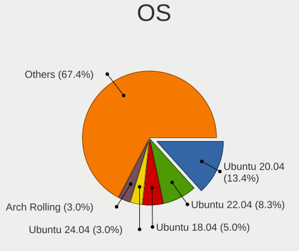

| Name                | Computers | Percent |
|---------------------|-----------|---------|
| Ubuntu 20.04        | 45        | 13.35%  |
| Ubuntu 22.04        | 28        | 8.31%   |
| Ubuntu 18.04        | 17        | 5.04%   |
| Ubuntu 24.04        | 10        | 2.97%   |
| Arch Rolling        | 10        | 2.97%   |
| OpenMandriva 23.08  | 9         | 2.67%   |
| OpenMandriva 4.2    | 8         | 2.37%   |
| Debian 12           | 8         | 2.37%   |
| Zorin 17            | 6         | 1.78%   |
| Ubuntu 21.10        | 6         | 1.78%   |
| Pop!_OS 22.04       | 6         | 1.78%   |
| OpenMandriva 24.12  | 5         | 1.48%   |
| Linux Mint 21.2     | 5         | 1.48%   |
| KDE neon 22.04      | 5         | 1.48%   |
| Debian 11           | 5         | 1.48%   |
| ArcoLinux Rolling   | 5         | 1.48%   |
| Zorin 16            | 4         | 1.19%   |
| OpenMandriva 4.3    | 4         | 1.19%   |
| OpenMandriva 23.03  | 4         | 1.19%   |
| Fedora 41           | 4         | 1.19%   |
| Fedora 38           | 4         | 1.19%   |
| EndeavourOS Rolling | 4         | 1.19%   |
| Debian 10           | 4         | 1.19%   |
| Zorin 15            | 3         | 0.89%   |
| Ubuntu 19.10        | 3         | 0.89%   |
| Ubuntu 16.04        | 3         | 0.89%   |
| Linux Mint 22.1     | 3         | 0.89%   |
| Linux Mint 22       | 3         | 0.89%   |
| Linux Mint 21.1     | 3         | 0.89%   |
| KDE neon 20.04      | 3         | 0.89%   |
| Fedora 40           | 3         | 0.89%   |
| Zorin 18            | 2         | 0.59%   |
| Ubuntu 21.04        | 2         | 0.59%   |
| Ubuntu 20.10        | 2         | 0.59%   |
| ROSA R10            | 2         | 0.59%   |
| ROSA 12.3           | 2         | 0.59%   |
| Pop!_OS 21.04       | 2         | 0.59%   |
| OpenMandriva 23.07  | 2         | 0.59%   |
| NixOS 24.05         | 2         | 0.59%   |
| Manjaro 21.1.0      | 2         | 0.59%   |

OS Family
---------

OS without a version

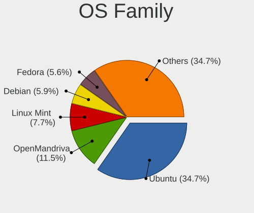

| Name         | Computers | Percent |
|--------------|-----------|---------|
| Ubuntu       | 112       | 34.67%  |
| OpenMandriva | 37        | 11.46%  |
| Linux Mint   | 25        | 7.74%   |
| Debian       | 19        | 5.88%   |
| Fedora       | 18        | 5.57%   |
| Zorin        | 15        | 4.64%   |
| Arch         | 12        | 3.72%   |
| Pop!_OS      | 9         | 2.79%   |
| KDE neon     | 7         | 2.17%   |
| ROSA         | 6         | 1.86%   |
| Manjaro      | 6         | 1.86%   |
| Endless      | 5         | 1.55%   |
| ArcoLinux    | 5         | 1.55%   |
| Kali         | 4         | 1.24%   |
| EndeavourOS  | 4         | 1.24%   |
| NixOS        | 3         | 0.93%   |
| LMDE         | 3         | 0.93%   |
| Gentoo       | 3         | 0.93%   |
| Elementary   | 3         | 0.93%   |
| Bazzite      | 3         | 0.93%   |
| Xubuntu      | 2         | 0.62%   |
| MX           | 2         | 0.62%   |
| Lubuntu      | 2         | 0.62%   |
| Kubuntu      | 2         | 0.62%   |
| Garuda Linux | 2         | 0.62%   |
| Xero         | 1         | 0.31%   |
| Ubuntu Unity | 1         | 0.31%   |
| TUXEDO OS    | 1         | 0.31%   |
| SteamOS      | 1         | 0.31%   |
| Sodalite     | 1         | 0.31%   |
| Parrot       | 1         | 0.31%   |
| openSUSE     | 1         | 0.31%   |
| Nobara       | 1         | 0.31%   |
| Neptune OS   | 1         | 0.31%   |
| Devuan       | 1         | 0.31%   |
| Deepin       | 1         | 0.31%   |
| CachyOS      | 1         | 0.31%   |
| BlackPanther | 1         | 0.31%   |
| Archcraft    | 1         | 0.31%   |

Kernel
------

Version of the Linux kernel

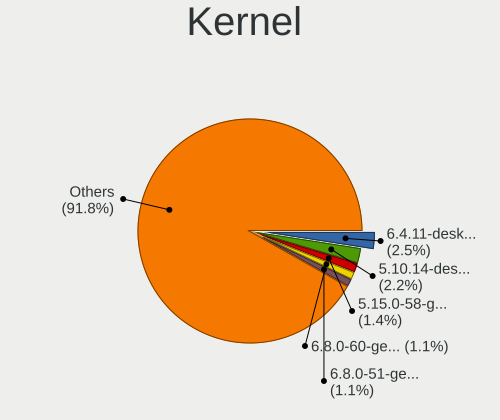

| Version                  | Computers | Percent |
|--------------------------|-----------|---------|
| 6.4.11-desktop-1omv2390  | 9         | 2.45%   |
| 5.10.14-desktop-1omv4002 | 8         | 2.18%   |
| 5.15.0-58-generic        | 5         | 1.36%   |
| 6.8.0-60-generic         | 4         | 1.09%   |
| 6.8.0-51-generic         | 4         | 1.09%   |
| 6.8.0-49-generic         | 4         | 1.09%   |
| 6.2.6-desktop-1omv2390   | 4         | 1.09%   |
| 6.12.9-desktop-1omv2490  | 4         | 1.09%   |
| 5.16.7-desktop-1omv4003  | 4         | 1.09%   |
| 5.15.0-52-generic        | 4         | 1.09%   |
| 5.15.0-46-generic        | 4         | 1.09%   |
| 5.13.0-28-generic        | 4         | 1.09%   |
| 6.8.0-40-generic         | 3         | 0.82%   |
| 6.2.0-36-generic         | 3         | 0.82%   |
| 6.14.0-36-generic        | 3         | 0.82%   |
| 5.3.0-46-generic         | 3         | 0.82%   |
| 5.3.0-40-generic         | 3         | 0.82%   |
| 5.15.0-56-generic        | 3         | 0.82%   |
| 5.15.0-53-generic        | 3         | 0.82%   |
| 5.15.0-43-generic        | 3         | 0.82%   |
| 5.11.0-38-generic        | 3         | 0.82%   |
| 5.11.0-27-generic        | 3         | 0.82%   |
| 6.8.0-62-generic         | 2         | 0.54%   |
| 6.8.0-48-generic         | 2         | 0.54%   |
| 6.8.0-41-generic         | 2         | 0.54%   |
| 6.5.0-35-generic         | 2         | 0.54%   |
| 6.3.5-desktop-3omv2390   | 2         | 0.54%   |
| 6.14.2-desktop-3omv2590  | 2         | 0.54%   |
| 6.1.0-28-amd64           | 2         | 0.54%   |
| 5.8.0-38-generic         | 2         | 0.54%   |
| 5.8.0-14-generic         | 2         | 0.54%   |
| 5.4.0-72-generic         | 2         | 0.54%   |
| 5.4.0-58-generic         | 2         | 0.54%   |
| 5.4.0-52-generic         | 2         | 0.54%   |
| 5.4.0-42-generic         | 2         | 0.54%   |
| 5.4.0-26-generic         | 2         | 0.54%   |
| 5.3.0-28-generic         | 2         | 0.54%   |
| 5.19.0-45-generic        | 2         | 0.54%   |
| 5.15.84-v8+              | 2         | 0.54%   |
| 5.15.0-47-generic        | 2         | 0.54%   |

Kernel Family
-------------

Linux kernel without a distro release

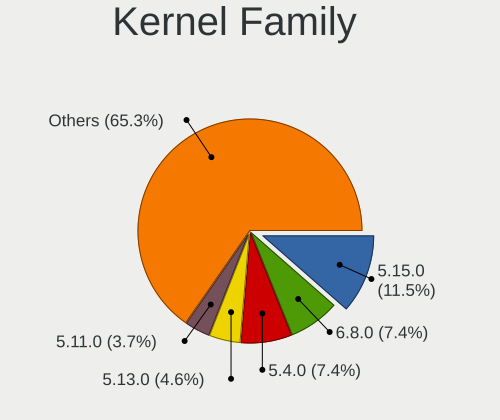

| Version | Computers | Percent |
|---------|-----------|---------|
| 5.15.0  | 40        | 11.46%  |
| 6.8.0   | 26        | 7.45%   |
| 5.4.0   | 26        | 7.45%   |
| 5.13.0  | 16        | 4.58%   |
| 5.11.0  | 13        | 3.72%   |
| 5.8.0   | 11        | 3.15%   |
| 5.3.0   | 11        | 3.15%   |
| 6.1.0   | 10        | 2.87%   |
| 4.15.0  | 10        | 2.87%   |
| 6.5.0   | 9         | 2.58%   |
| 6.4.11  | 9         | 2.58%   |
| 5.19.0  | 9         | 2.58%   |
| 5.10.14 | 8         | 2.29%   |
| 5.0.0   | 7         | 2.01%   |
| 6.2.0   | 5         | 1.43%   |
| 6.14.0  | 5         | 1.43%   |
| 5.10.0  | 5         | 1.43%   |
| 4.19.0  | 5         | 1.43%   |
| 6.2.6   | 4         | 1.15%   |
| 6.12.9  | 4         | 1.15%   |
| 5.16.7  | 4         | 1.15%   |
| 6.3.5   | 3         | 0.86%   |
| 6.11.0  | 3         | 0.86%   |
| 4.18.0  | 3         | 0.86%   |
| 6.9.1   | 2         | 0.57%   |
| 6.5.7   | 2         | 0.57%   |
| 6.3.6   | 2         | 0.57%   |
| 6.14.4  | 2         | 0.57%   |
| 6.14.2  | 2         | 0.57%   |
| 6.13.1  | 2         | 0.57%   |
| 6.12.6  | 2         | 0.57%   |
| 5.18.0  | 2         | 0.57%   |
| 5.17.5  | 2         | 0.57%   |
| 5.15.84 | 2         | 0.57%   |
| 5.15.75 | 2         | 0.57%   |
| 5.10.27 | 2         | 0.57%   |
| 4.9.60  | 2         | 0.57%   |
| 6.9.9   | 1         | 0.29%   |
| 6.9.7   | 1         | 0.29%   |
| 6.9.6   | 1         | 0.29%   |

Kernel Major Ver.
-----------------

Linux kernel major version

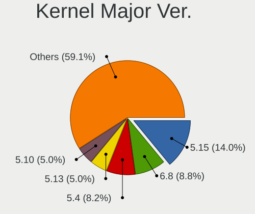

| Version | Computers | Percent |
|---------|-----------|---------|
| 5.15    | 48        | 14.04%  |
| 6.8     | 30        | 8.77%   |
| 5.4     | 28        | 8.19%   |
| 5.13    | 17        | 4.97%   |
| 5.10    | 17        | 4.97%   |
| 5.11    | 15        | 4.39%   |
| 6.1     | 14        | 4.09%   |
| 6.5     | 13        | 3.8%    |
| 6.2     | 12        | 3.51%   |
| 5.8     | 12        | 3.51%   |
| 5.3     | 12        | 3.51%   |
| 6.4     | 11        | 3.22%   |
| 5.19    | 10        | 2.92%   |
| 4.15    | 10        | 2.92%   |
| 6.14    | 9         | 2.63%   |
| 6.12    | 9         | 2.63%   |
| 6.9     | 8         | 2.34%   |
| 6.6     | 7         | 2.05%   |
| 5.0     | 7         | 2.05%   |
| 6.11    | 6         | 1.75%   |
| 5.16    | 6         | 1.75%   |
| 6.3     | 5         | 1.46%   |
| 6.17    | 5         | 1.46%   |
| 4.19    | 5         | 1.46%   |
| 6.13    | 4         | 1.17%   |
| 5.17    | 3         | 0.88%   |
| 4.9     | 3         | 0.88%   |
| 4.18    | 3         | 0.88%   |
| 5.9     | 2         | 0.58%   |
| 5.18    | 2         | 0.58%   |
| 6.18    | 1         | 0.29%   |
| 6.16    | 1         | 0.29%   |
| 6.15    | 1         | 0.29%   |
| 5.6     | 1         | 0.29%   |
| 5.5     | 1         | 0.29%   |
| 5.14    | 1         | 0.29%   |
| 5.12    | 1         | 0.29%   |
| 4.4     | 1         | 0.29%   |
| 3.13    | 1         | 0.29%   |

Arch
----

OS architecture (x86_64, i586, etc.)

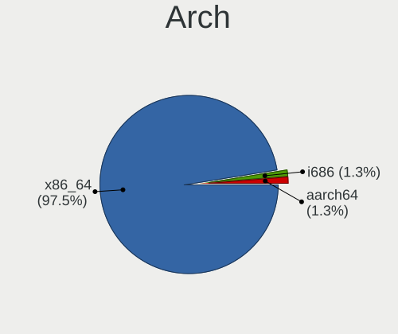

| Name    | Computers | Percent |
|---------|-----------|---------|
| x86_64  | 306       | 97.45%  |
| i686    | 4         | 1.27%   |
| aarch64 | 4         | 1.27%   |

DE
--

Desktop Environment

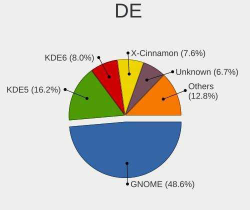

| Name             | Computers | Percent |
|------------------|-----------|---------|
| GNOME            | 159       | 48.62%  |
| KDE5             | 53        | 16.21%  |
| KDE6             | 26        | 7.95%   |
| X-Cinnamon       | 25        | 7.65%   |
| Unknown          | 22        | 6.73%   |
| XFCE             | 13        | 3.98%   |
| Pantheon         | 4         | 1.22%   |
| KDE4             | 4         | 1.22%   |
| MATE             | 3         | 0.92%   |
| LXQt             | 2         | 0.61%   |
| i3               | 2         | 0.61%   |
| GNOME Flashback  | 2         | 0.61%   |
| GNOME Classic    | 2         | 0.61%   |
| Unity            | 1         | 0.31%   |
| Trinity          | 1         | 0.31%   |
| qtile            | 1         | 0.31%   |
| LXDE             | 1         | 0.31%   |
| lightdm-xsession | 1         | 0.31%   |
| Hyprland         | 1         | 0.31%   |
| Endless:GNOME    | 1         | 0.31%   |
| DWM              | 1         | 0.31%   |
| Deepin           | 1         | 0.31%   |
| Cinnamon         | 1         | 0.31%   |

Display Server
--------------

X11 or Wayland

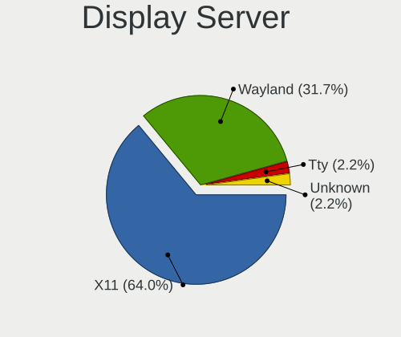

| Name    | Computers | Percent |
|---------|-----------|---------|
| X11     | 208       | 64%     |
| Wayland | 103       | 31.69%  |
| Tty     | 7         | 2.15%   |
| Unknown | 7         | 2.15%   |

Display Manager
---------------

SDDM, LightDM, etc.

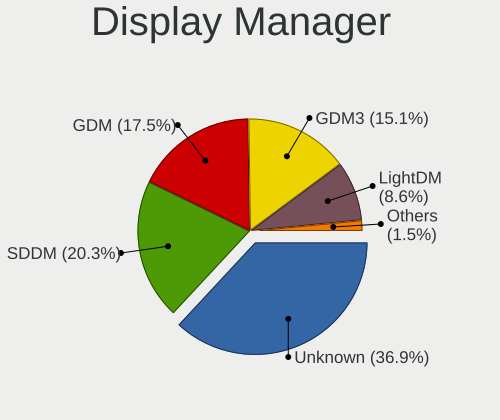

| Name    | Computers | Percent |
|---------|-----------|---------|
| Unknown | 120       | 36.92%  |
| SDDM    | 66        | 20.31%  |
| GDM     | 57        | 17.54%  |
| GDM3    | 49        | 15.08%  |
| LightDM | 28        | 8.62%   |
| KDM     | 4         | 1.23%   |
| GREETD  | 1         | 0.31%   |

OS Lang
-------

Language

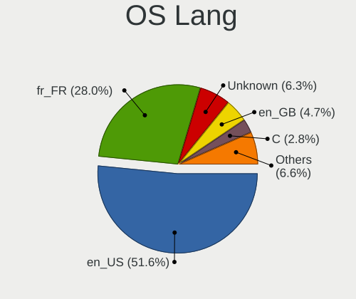

| Lang    | Computers | Percent |
|---------|-----------|---------|
| en_US   | 164       | 51.57%  |
| fr_FR   | 89        | 27.99%  |
| Unknown | 20        | 6.29%   |
| en_GB   | 15        | 4.72%   |
| C       | 9         | 2.83%   |
| de_DE   | 8         | 2.52%   |
| pt_BR   | 2         | 0.63%   |
| it_IT   | 2         | 0.63%   |
| ar_TN   | 2         | 0.63%   |
| ru_UA   | 1         | 0.31%   |
| fr_CA   | 1         | 0.31%   |
| en_IN   | 1         | 0.31%   |
| en_IE   | 1         | 0.31%   |
| en_CA   | 1         | 0.31%   |
| en_AU   | 1         | 0.31%   |
| en_AG   | 1         | 0.31%   |

Boot Mode
---------

EFI or BIOS

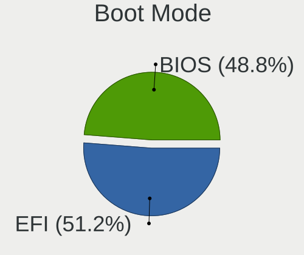

| Mode | Computers | Percent |
|------|-----------|---------|
| EFI  | 165       | 51.24%  |
| BIOS | 157       | 48.76%  |

Filesystem
----------

Type of filesystem

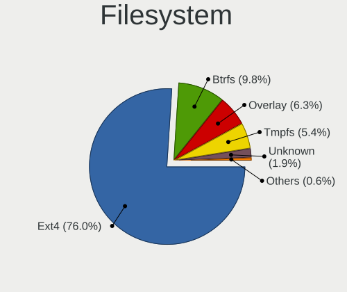

| Type    | Computers | Percent |
|---------|-----------|---------|
| Ext4    | 241       | 76.03%  |
| Btrfs   | 31        | 9.78%   |
| Overlay | 20        | 6.31%   |
| Tmpfs   | 17        | 5.36%   |
| Unknown | 6         | 1.89%   |
| Xfs     | 2         | 0.63%   |

Part. scheme
------------

Scheme of partitioning

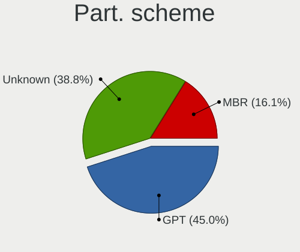

| Type    | Computers | Percent |
|---------|-----------|---------|
| GPT     | 145       | 45.03%  |
| Unknown | 125       | 38.82%  |
| MBR     | 52        | 16.15%  |

Dual Boot with Linux/BSD
------------------------

Hosting more than one Linux/BSD

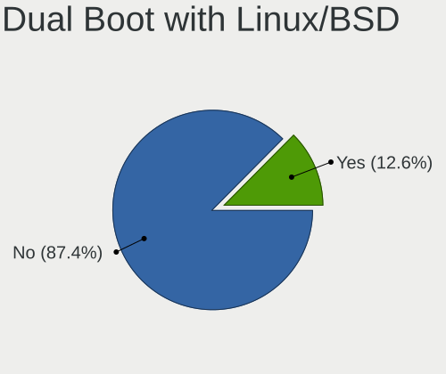

| Dual boot | Computers | Percent |
|-----------|-----------|---------|
| No        | 278       | 87.42%  |
| Yes       | 40        | 12.58%  |

Dual Boot (Win)
---------------

Hosting Linux and Windows

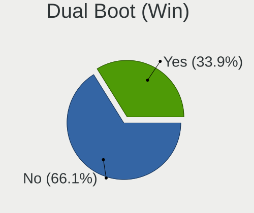

| Dual boot | Computers | Percent |
|-----------|-----------|---------|
| No        | 209       | 66.14%  |
| Yes       | 107       | 33.86%  |

Board
-----

Vendor
------

Motherboard manufacturer

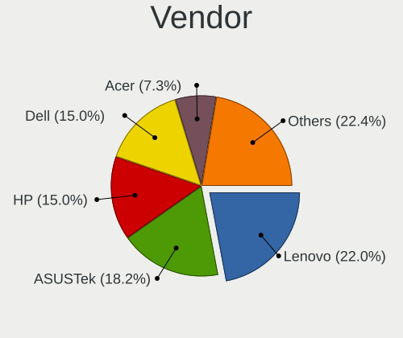

| Name                    | Computers | Percent |
|-------------------------|-----------|---------|
| Lenovo                  | 69        | 22.04%  |
| ASUSTek Computer        | 57        | 18.21%  |
| Hewlett-Packard         | 47        | 15.02%  |
| Dell                    | 47        | 15.02%  |
| Acer                    | 23        | 7.35%   |
| MSI                     | 21        | 6.71%   |
| Toshiba                 | 10        | 3.19%   |
| Pegatron                | 5         | 1.6%    |
| Intel                   | 4         | 1.28%   |
| Samsung Electronics     | 3         | 0.96%   |
| Raspberry Pi Foundation | 3         | 0.96%   |
| Gigabyte Technology     | 3         | 0.96%   |
| ASRock                  | 3         | 0.96%   |
| Sony                    | 2         | 0.64%   |
| Packard Bell            | 2         | 0.64%   |
| Foxconn                 | 2         | 0.64%   |
| Apple                   | 2         | 0.64%   |
| Unknown                 | 2         | 0.64%   |
| Valve                   | 1         | 0.32%   |
| SCHNEIDER               | 1         | 0.32%   |
| LORD ELECTRONICS        | 1         | 0.32%   |
| eMachines               | 1         | 0.32%   |
| ECS                     | 1         | 0.32%   |
| AZW                     | 1         | 0.32%   |
| AMI                     | 1         | 0.32%   |
| ACCENT                  | 1         | 0.32%   |

Model
-----

Motherboard model

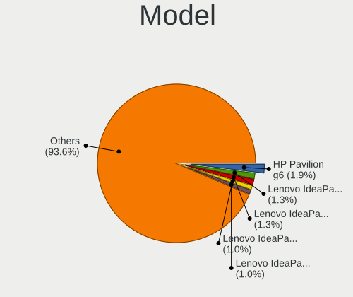

| Name                                     | Computers | Percent |
|------------------------------------------|-----------|---------|
| HP Pavilion g6                           | 6         | 1.92%   |
| Lenovo IdeaPad L340-15IRH Gaming 81LK    | 4         | 1.28%   |
| Lenovo IdeaPad 3 15IGL05 81WQ            | 4         | 1.28%   |
| Lenovo IdeaPad 5 15ITL05 82FG            | 3         | 0.96%   |
| Lenovo IdeaPad 3 15ADA05 81W1            | 3         | 0.96%   |
| Lenovo IdeaPad 130-15IKB 81H7            | 3         | 0.96%   |
| HP Notebook                              | 3         | 0.96%   |
| Dell Inspiron 5570                       | 3         | 0.96%   |
| Dell Inspiron 3543                       | 3         | 0.96%   |
| Unknown                                  | 3         | 0.96%   |
| Samsung 300E5EV/300E4EV/270E5EV/270E4EV  | 2         | 0.64%   |
| Pegatron VS342AA-AB6 m9801af             | 2         | 0.64%   |
| MSI GF63 Thin 10SCXR                     | 2         | 0.64%   |
| Lenovo IdeaPad 700-15ISK 80RU            | 2         | 0.64%   |
| Lenovo IdeaPad 3 15ITL6 82H8             | 2         | 0.64%   |
| Lenovo IdeaPad 3 15ADA6 82KR             | 2         | 0.64%   |
| Lenovo G50-70 20351                      | 2         | 0.64%   |
| Intel H81                                | 2         | 0.64%   |
| HP Pavilion Gaming Laptop 15-ec1xxx      | 2         | 0.64%   |
| HP Pavilion dv7                          | 2         | 0.64%   |
| HP Laptop 15-da0xxx                      | 2         | 0.64%   |
| HP EliteBook 2560p                       | 2         | 0.64%   |
| Foxconn Pro 3400 Series MT               | 2         | 0.64%   |
| Dell Vostro 3520                         | 2         | 0.64%   |
| Dell Vostro 3500                         | 2         | 0.64%   |
| Dell Vostro 1015                         | 2         | 0.64%   |
| Dell Latitude E6540                      | 2         | 0.64%   |
| Dell Inspiron N5110                      | 2         | 0.64%   |
| Dell Inspiron 3542                       | 2         | 0.64%   |
| Dell Inspiron 3521                       | 2         | 0.64%   |
| ASUS X556UV                              | 2         | 0.64%   |
| ASUS X553MA                              | 2         | 0.64%   |
| ASUS X550LC                              | 2         | 0.64%   |
| ASUS X550JX                              | 2         | 0.64%   |
| ASUS X550JK                              | 2         | 0.64%   |
| ASUS VivoBook_ASUSLaptop K3605ZF_S3605ZF | 2         | 0.64%   |
| Acer TravelMate P259-M                   | 2         | 0.64%   |
| Acer Aspire E5-571G                      | 2         | 0.64%   |
| Valve Jupiter                            | 1         | 0.32%   |
| Toshiba Satellite Pro L850-B339          | 1         | 0.32%   |

Model Family
------------

Motherboard model prefix

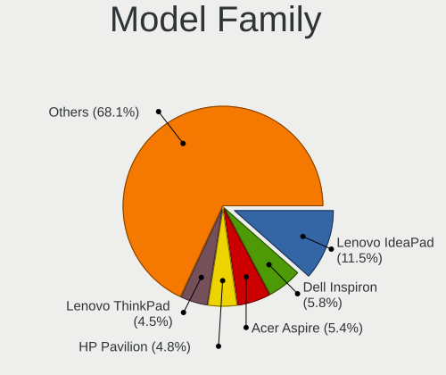

| Name                  | Computers | Percent |
|-----------------------|-----------|---------|
| Lenovo IdeaPad        | 36        | 11.5%   |
| Dell Inspiron         | 18        | 5.75%   |
| Acer Aspire           | 17        | 5.43%   |
| HP Pavilion           | 15        | 4.79%   |
| Lenovo ThinkPad       | 14        | 4.47%   |
| Dell Latitude         | 11        | 3.51%   |
| ASUS VivoBook         | 10        | 3.19%   |
| Toshiba Satellite     | 9         | 2.88%   |
| HP Laptop             | 7         | 2.24%   |
| Dell Vostro           | 7         | 2.24%   |
| Dell OptiPlex         | 7         | 2.24%   |
| HP ProBook            | 6         | 1.92%   |
| ASUS PRIME            | 5         | 1.6%    |
| ASUS ASUS             | 5         | 1.6%    |
| HP EliteBook          | 4         | 1.28%   |
| ASUS TUF              | 4         | 1.28%   |
| ASUS ROG              | 4         | 1.28%   |
| RPi Raspberry         | 3         | 0.96%   |
| MSI Katana            | 3         | 0.96%   |
| MSI GF63              | 3         | 0.96%   |
| Lenovo ThinkBook      | 3         | 0.96%   |
| HP Notebook           | 3         | 0.96%   |
| HP Compaq             | 3         | 0.96%   |
| Unknown               | 3         | 0.96%   |
| Samsung 300E5EV       | 2         | 0.64%   |
| Pegatron VS342AA-AB6  | 2         | 0.64%   |
| Packard Bell EasyNote | 2         | 0.64%   |
| Lenovo G50-70         | 2         | 0.64%   |
| Intel H81             | 2         | 0.64%   |
| HP 250                | 2         | 0.64%   |
| Foxconn Pro           | 2         | 0.64%   |
| Dell G15              | 2         | 0.64%   |
| ASUS ZenBook          | 2         | 0.64%   |
| ASUS X556UV           | 2         | 0.64%   |
| ASUS X553MA           | 2         | 0.64%   |
| ASUS X550LC           | 2         | 0.64%   |
| ASUS X550JX           | 2         | 0.64%   |
| ASUS X550JK           | 2         | 0.64%   |
| Acer TravelMate       | 2         | 0.64%   |
| Acer Swift            | 2         | 0.64%   |

MFG Year
--------

Motherboard manufacture year

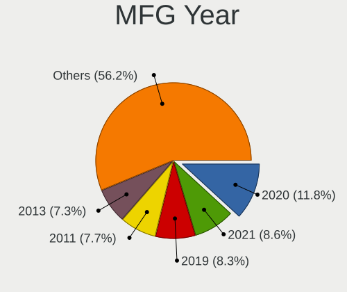

| Year    | Computers | Percent |
|---------|-----------|---------|
| 2020    | 37        | 11.82%  |
| 2021    | 27        | 8.63%   |
| 2019    | 26        | 8.31%   |
| 2011    | 24        | 7.67%   |
| 2013    | 23        | 7.35%   |
| 2018    | 20        | 6.39%   |
| 2017    | 18        | 5.75%   |
| 2012    | 18        | 5.75%   |
| 2016    | 17        | 5.43%   |
| 2015    | 17        | 5.43%   |
| 2014    | 16        | 5.11%   |
| 2009    | 15        | 4.79%   |
| 2023    | 14        | 4.47%   |
| 2010    | 13        | 4.15%   |
| 2008    | 11        | 3.51%   |
| 2022    | 9         | 2.88%   |
| Unknown | 4         | 1.28%   |
| 2024    | 2         | 0.64%   |
| 2007    | 2         | 0.64%   |

Form Factor
-----------

Physical design of the computer

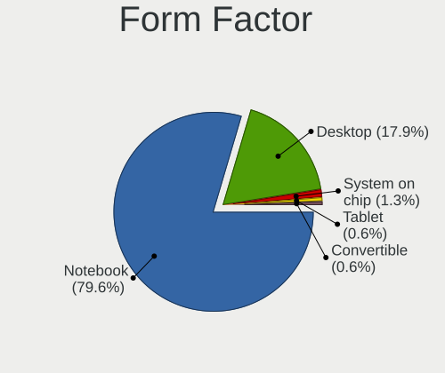

| Name           | Computers | Percent |
|----------------|-----------|---------|
| Notebook       | 249       | 79.55%  |
| Desktop        | 56        | 17.89%  |
| System on chip | 4         | 1.28%   |
| Tablet         | 2         | 0.64%   |
| Convertible    | 2         | 0.64%   |

Secure Boot
-----------

Enabled or disabled

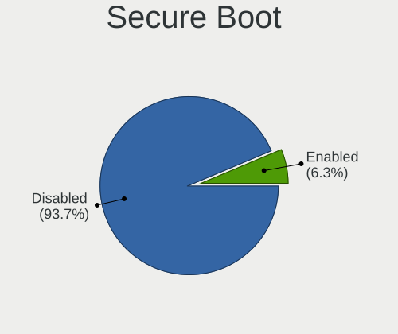

| State    | Computers | Percent |
|----------|-----------|---------|
| Disabled | 296       | 93.67%  |
| Enabled  | 20        | 6.33%   |

Coreboot
--------

Have coreboot on board

| Used | Computers | Percent |
|------|-----------|---------|
| No   | 313       | 100%    |

RAM Size
--------

Total RAM memory

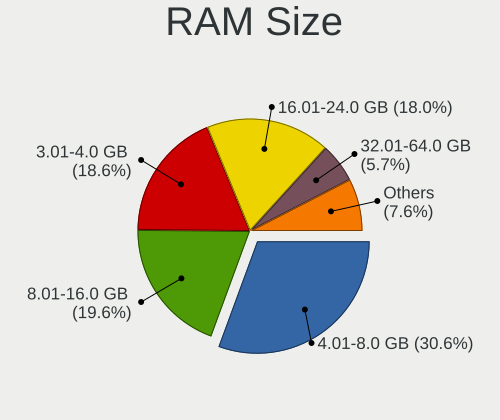

| Size in GB | Computers | Percent |
|------------|-----------|---------|
| 4.01-8.0   | 97        | 30.6%   |
| 8.01-16.0  | 62        | 19.56%  |
| 3.01-4.0   | 59        | 18.61%  |
| 16.01-24.0 | 57        | 17.98%  |
| 32.01-64.0 | 18        | 5.68%   |
| 1.01-2.0   | 10        | 3.15%   |
| 2.01-3.0   | 7         | 2.21%   |
| 24.01-32.0 | 5         | 1.58%   |
| 0.51-1.0   | 2         | 0.63%   |

RAM Used
--------

Used RAM memory

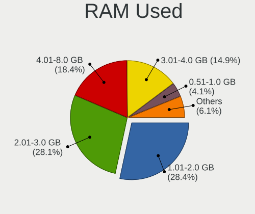

| Used GB    | Computers | Percent |
|------------|-----------|---------|
| 1.01-2.0   | 97        | 28.36%  |
| 2.01-3.0   | 96        | 28.07%  |
| 4.01-8.0   | 63        | 18.42%  |
| 3.01-4.0   | 51        | 14.91%  |
| 0.51-1.0   | 14        | 4.09%   |
| 8.01-16.0  | 13        | 3.8%    |
| 0.01-0.5   | 6         | 1.75%   |
| 16.01-24.0 | 1         | 0.29%   |
| Unknown    | 1         | 0.29%   |

Total Drives
------------

Number of drives on board

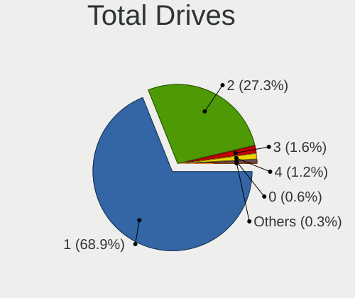

| Drives | Computers | Percent |
|--------|-----------|---------|
| 1      | 222       | 68.94%  |
| 2      | 88        | 27.33%  |
| 3      | 5         | 1.55%   |
| 4      | 4         | 1.24%   |
| 0      | 2         | 0.62%   |
| 6      | 1         | 0.31%   |

Has CD-ROM
----------

Has CD-ROM on board

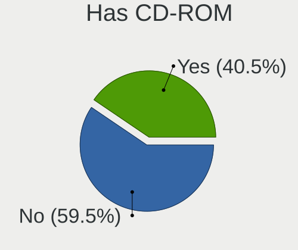

| Presented | Computers | Percent |
|-----------|-----------|---------|
| No        | 188       | 59.49%  |
| Yes       | 128       | 40.51%  |

Has Ethernet
------------

Has Ethernet on board

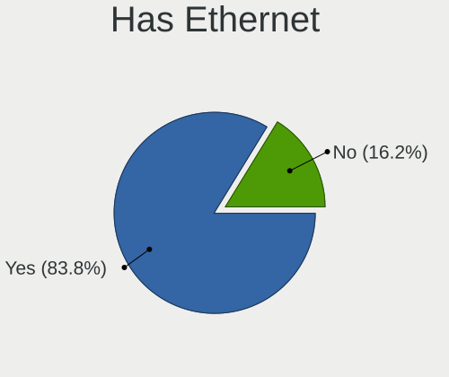

| Presented | Computers | Percent |
|-----------|-----------|---------|
| Yes       | 263       | 83.76%  |
| No        | 51        | 16.24%  |

Has WiFi
--------

Has WiFi module

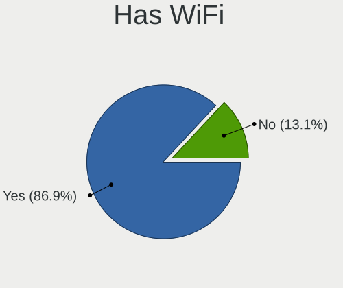

| Presented | Computers | Percent |
|-----------|-----------|---------|
| Yes       | 273       | 86.94%  |
| No        | 41        | 13.06%  |

Has Bluetooth
-------------

Has Bluetooth module

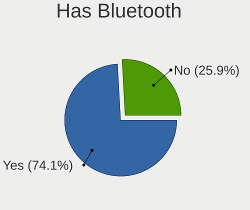

| Presented | Computers | Percent |
|-----------|-----------|---------|
| Yes       | 235       | 74.13%  |
| No        | 82        | 25.87%  |

Location
--------

Country
-------

Geographic location (country)

| Country | Computers | Percent |
|---------|-----------|---------|
| Tunisia | 313       | 100%    |

City
----

Geographic location (city)

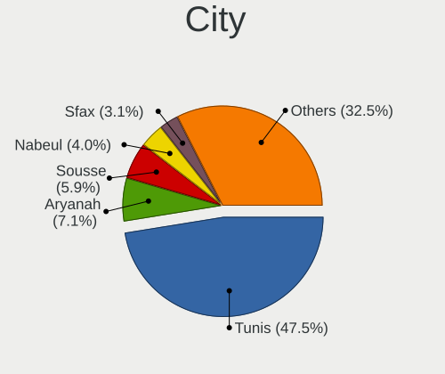

| City               | Computers | Percent |
|--------------------|-----------|---------|
| Tunis              | 168       | 47.46%  |
| Aryanah            | 25        | 7.06%   |
| Sousse             | 21        | 5.93%   |
| Nabeul             | 14        | 3.95%   |
| Sfax               | 11        | 3.11%   |
| Bizerte            | 10        | 2.82%   |
| Ben Arous          | 8         | 2.26%   |
| Monastir           | 6         | 1.69%   |
| Houmt Souk         | 5         | 1.41%   |
| Rades              | 4         | 1.13%   |
| Mateur             | 3         | 0.85%   |
| Mahdia             | 3         | 0.85%   |
| Kairouan           | 3         | 0.85%   |
| Gafsa              | 3         | 0.85%   |
| Centre Urbain Nord | 3         | 0.85%   |
| As Sanad           | 3         | 0.85%   |
| Sukrah             | 2         | 0.56%   |
| Masakin            | 2         | 0.56%   |
| Manouba            | 2         | 0.56%   |
| La Marsa           | 2         | 0.56%   |
| La Goulette        | 2         | 0.56%   |
| Ksar Hellal        | 2         | 0.56%   |
| Kalaa Srira        | 2         | 0.56%   |
| Jendouba           | 2         | 0.56%   |
| Jedeida            | 2         | 0.56%   |
| Hammamet           | 2         | 0.56%   |
| Hammam Sousse      | 2         | 0.56%   |
| El Fahs            | 2         | 0.56%   |
| Borj Cedria        | 2         | 0.56%   |
| Beja               | 2         | 0.56%   |
| Zarzis             | 1         | 0.28%   |
| Zaouiat Djedidi    | 1         | 0.28%   |
| Wadi Maliz         | 1         | 0.28%   |
| Tebourba           | 1         | 0.28%   |
| Tataouine          | 1         | 0.28%   |
| Tabarka            | 1         | 0.28%   |
| Soliman            | 1         | 0.28%   |
| Sidi Bouzid        | 1         | 0.28%   |
| Sidi Abbes         | 1         | 0.28%   |
| Rafraf             | 1         | 0.28%   |

Drives
------

Drive Vendor
------------

Hard drive vendors

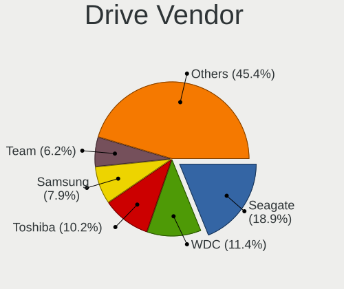

| Vendor                      | Computers | Drives | Percent |
|-----------------------------|-----------|--------|---------|
| Seagate                     | 76        | 94     | 18.86%  |
| WDC                         | 46        | 61     | 11.41%  |
| Toshiba                     | 41        | 45     | 10.17%  |
| Samsung Electronics         | 32        | 52     | 7.94%   |
| Team                        | 25        | 31     | 6.2%    |
| SK hynix                    | 18        | 24     | 4.47%   |
| Hitachi                     | 16        | 17     | 3.97%   |
| Micron Technology           | 15        | 16     | 3.72%   |
| SanDisk                     | 13        | 19     | 3.23%   |
| Unknown                     | 12        | 17     | 2.98%   |
| Kingston                    | 10        | 13     | 2.48%   |
| Intel                       | 10        | 11     | 2.48%   |
| HGST                        | 10        | 11     | 2.48%   |
| A-DATA Technology           | 9         | 11     | 2.23%   |
| Phison Electronics          | 6         | 6      | 1.49%   |
| Patriot                     | 5         | 5      | 1.24%   |
| HS-SSD-E100                 | 5         | 6      | 1.24%   |
| Emtec                       | 5         | 8      | 1.24%   |
| PNY                         | 4         | 4      | 0.99%   |
| MAXIO Technology (Hangzhou) | 4         | 4      | 0.99%   |
| Realtek Semiconductor       | 3         | 3      | 0.74%   |
| Fujitsu                     | 3         | 3      | 0.74%   |
| Kingston Technology Company | 2         | 3      | 0.5%    |
| China                       | 2         | 2      | 0.5%    |
| Apple                       | 2         | 2      | 0.5%    |
| ADATA Technology            | 2         | 2      | 0.5%    |
| WD MediaMax                 | 1         | 1      | 0.25%   |
| Union Memory (Shenzhen)     | 1         | 1      | 0.25%   |
| UMIS                        | 1         | 1      | 0.25%   |
| TwinMOS                     | 1         | 1      | 0.25%   |
| SSSTC                       | 1         | 1      | 0.25%   |
| SPCC                        | 1         | 1      | 0.25%   |
| SOLIDIGM                    | 1         | 1      | 0.25%   |
| Silicon Motion              | 1         | 1      | 0.25%   |
| SATAFIRM                    | 1         | 1      | 0.25%   |
| Phison                      | 1         | 1      | 0.25%   |
| OCZ                         | 1         | 1      | 0.25%   |
| O2 Micro                    | 1         | 1      | 0.25%   |
| MSI                         | 1         | 1      | 0.25%   |
| LITEON                      | 1         | 1      | 0.25%   |

Drive Model
-----------

Hard drive models

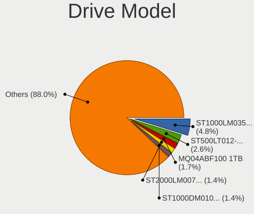

| Model                                | Computers | Percent |
|--------------------------------------|-----------|---------|
| Seagate ST1000LM035-1RK172 1TB       | 20        | 4.8%    |
| Seagate ST500LT012-1DG142 500GB      | 11        | 2.64%   |
| Toshiba MQ04ABF100 1TB               | 7         | 1.68%   |
| Seagate ST2000LM007-1R8174 2TB       | 6         | 1.44%   |
| Seagate ST1000DM010-2EP102 1TB       | 6         | 1.44%   |
| Hitachi HTS545050A7E380 500GB        | 6         | 1.44%   |
| Toshiba MQ01ABD075 752GB             | 5         | 1.2%    |
| Team T253512GB SSD                   | 5         | 1.2%    |
| HS-SSD-E100 SSD 512G                 | 5         | 1.2%    |
| Toshiba MQ01ABD100 1TB               | 4         | 0.96%   |
| Intel SSDPEKNW512GZL 512GB           | 4         | 0.96%   |
| WDC WD5000LPCX-24VHAT0 500GB         | 3         | 0.72%   |
| Unknown MMC Card  64GB               | 3         | 0.72%   |
| Team T253X1240G 240GB SSD            | 3         | 0.72%   |
| Team T253256GB SSD                   | 3         | 0.72%   |
| Team T2531TB SSD                     | 3         | 0.72%   |
| SK hynix SC311 SATA 256GB            | 3         | 0.72%   |
| Seagate ST9500325AS 500GB            | 3         | 0.72%   |
| Seagate ST1000LM024 HN-M101MBB 1TB   | 3         | 0.72%   |
| Micron 2210_MTFDHBA512QFD 512GB      | 3         | 0.72%   |
| Kingston OM8PCP3512F-AI1 512GB       | 3         | 0.72%   |
| Hitachi HTS541616J9SA00 160GB        | 3         | 0.72%   |
| HGST HTS545050A7E380 500GB           | 3         | 0.72%   |
| A-DATA SU750 256GB SSD               | 3         | 0.72%   |
| WDC WD5000LPVX-22V0TT0 500GB         | 2         | 0.48%   |
| WDC WD5000LPCX-60VHAT0 500GB         | 2         | 0.48%   |
| WDC WD5000BEVT-22A0RT0 500GB         | 2         | 0.48%   |
| WDC WD20SPZX-08UA7 2TB               | 2         | 0.48%   |
| WDC WD10SPZX-24Z10 1TB               | 2         | 0.48%   |
| WDC WD10SPZX-08Z10 1TB               | 2         | 0.48%   |
| WDC WD10SPCX-24HWST1 1TB             | 2         | 0.48%   |
| WDC WD10JPVX-80JC3T0 1TB             | 2         | 0.48%   |
| WDC WD10EADS-65M2B0 1TB              | 2         | 0.48%   |
| WDC PC SN720 SDAQNTW-512G-1001 512GB | 2         | 0.48%   |
| Unknown MMC Card  32GB               | 2         | 0.48%   |
| Unknown MMC Card  16GB               | 2         | 0.48%   |
| Toshiba MQ01ABF050 500GB             | 2         | 0.48%   |
| Toshiba MQ01ABD050 500GB             | 2         | 0.48%   |
| Toshiba MK5076GSX 500GB              | 2         | 0.48%   |
| Toshiba MK3275GSX 320GB              | 2         | 0.48%   |

HDD Vendor
----------

Hard disk drive vendors

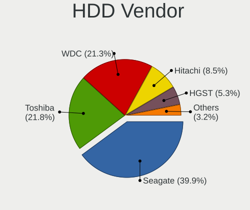

| Vendor              | Computers | Drives | Percent |
|---------------------|-----------|--------|---------|
| Seagate             | 75        | 93     | 39.89%  |
| Toshiba             | 41        | 45     | 21.81%  |
| WDC                 | 40        | 54     | 21.28%  |
| Hitachi             | 16        | 17     | 8.51%   |
| HGST                | 10        | 11     | 5.32%   |
| Fujitsu             | 3         | 3      | 1.6%    |
| SATAFIRM            | 1         | 1      | 0.53%   |
| Samsung Electronics | 1         | 1      | 0.53%   |
| ExcelStor           | 1         | 1      | 0.53%   |

SSD Vendor
----------

Solid state drive vendors

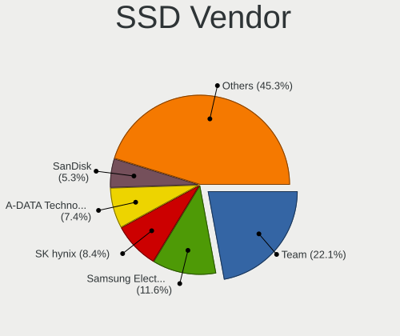

| Vendor              | Computers | Drives | Percent |
|---------------------|-----------|--------|---------|
| Team                | 21        | 27     | 22.11%  |
| Samsung Electronics | 11        | 16     | 11.58%  |
| SK hynix            | 8         | 11     | 8.42%   |
| A-DATA Technology   | 7         | 9      | 7.37%   |
| SanDisk             | 5         | 6      | 5.26%   |
| Patriot             | 5         | 5      | 5.26%   |
| HS-SSD-E100         | 5         | 6      | 5.26%   |
| Emtec               | 5         | 8      | 5.26%   |
| PNY                 | 4         | 4      | 4.21%   |
| Kingston            | 4         | 5      | 4.21%   |
| Micron Technology   | 2         | 2      | 2.11%   |
| China               | 2         | 2      | 2.11%   |
| Apple               | 2         | 2      | 2.11%   |
| WDC                 | 1         | 1      | 1.05%   |
| TwinMOS             | 1         | 1      | 1.05%   |
| SPCC                | 1         | 1      | 1.05%   |
| OCZ                 | 1         | 1      | 1.05%   |
| MSI                 | 1         | 1      | 1.05%   |
| LITEON              | 1         | 1      | 1.05%   |
| Lexar               | 1         | 1      | 1.05%   |
| KVST                | 1         | 1      | 1.05%   |
| HS-SSD-E100N        | 1         | 1      | 1.05%   |
| Gigabyte Technology | 1         | 1      | 1.05%   |
| Crucial             | 1         | 1      | 1.05%   |
| AXLE                | 1         | 1      | 1.05%   |
| ASUS-PHISON         | 1         | 2      | 1.05%   |
| addlink             | 1         | 1      | 1.05%   |

Drive Kind
----------

HDD or SSD

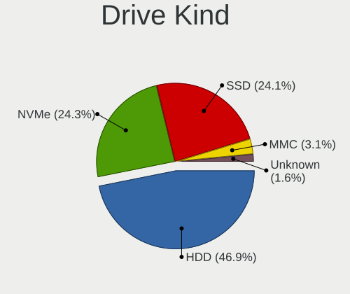

| Kind    | Computers | Drives | Percent |
|---------|-----------|--------|---------|
| HDD     | 179       | 226    | 46.86%  |
| NVMe    | 93        | 130    | 24.35%  |
| SSD     | 92        | 118    | 24.08%  |
| MMC     | 12        | 18     | 3.14%   |
| Unknown | 6         | 6      | 1.57%   |

Drive Connector
---------------

SATA, SAS, NVMe, etc.

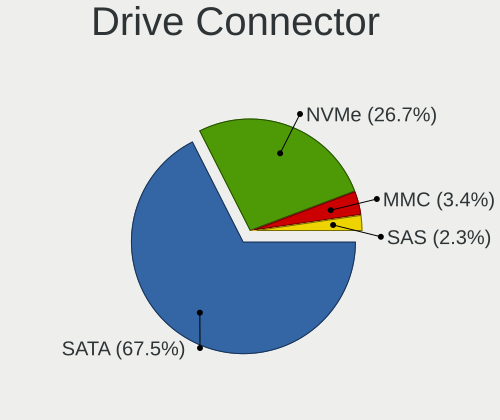

| Type | Computers | Drives | Percent |
|------|-----------|--------|---------|
| SATA | 235       | 342    | 67.53%  |
| NVMe | 93        | 130    | 26.72%  |
| MMC  | 12        | 18     | 3.45%   |
| SAS  | 8         | 8      | 2.3%    |

Drive Size
----------

Size of hard drive

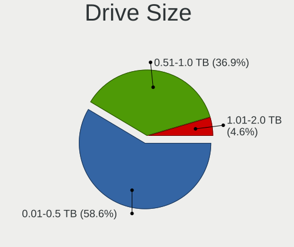

| Size in TB | Computers | Drives | Percent |
|------------|-----------|--------|---------|
| 0.01-0.5   | 154       | 194    | 58.56%  |
| 0.51-1.0   | 97        | 136    | 36.88%  |
| 1.01-2.0   | 12        | 14     | 4.56%   |

Space Total
-----------

Amount of disk space available on the file system

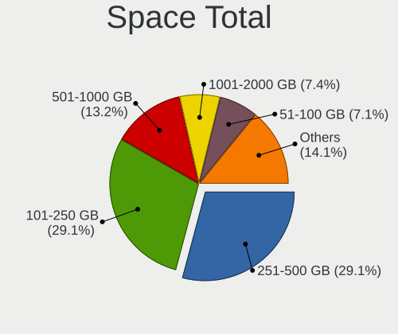

| Size in GB     | Computers | Percent |
|----------------|-----------|---------|
| 251-500        | 95        | 29.14%  |
| 101-250        | 95        | 29.14%  |
| 501-1000       | 43        | 13.19%  |
| 1001-2000      | 24        | 7.36%   |
| 51-100         | 23        | 7.06%   |
| 1-20           | 21        | 6.44%   |
| 21-50          | 12        | 3.68%   |
| 2001-3000      | 5         | 1.53%   |
| More than 3000 | 4         | 1.23%   |
| Unknown        | 4         | 1.23%   |

Space Used
----------

Amount of used disk space

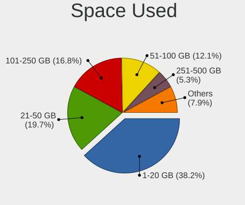

| Used GB   | Computers | Percent |
|-----------|-----------|---------|
| 1-20      | 130       | 38.24%  |
| 21-50     | 67        | 19.71%  |
| 101-250   | 57        | 16.76%  |
| 51-100    | 41        | 12.06%  |
| 251-500   | 18        | 5.29%   |
| 501-1000  | 13        | 3.82%   |
| 1001-2000 | 10        | 2.94%   |
| Unknown   | 4         | 1.18%   |

Malfunc. Drives
---------------

Drive models with a malfunction

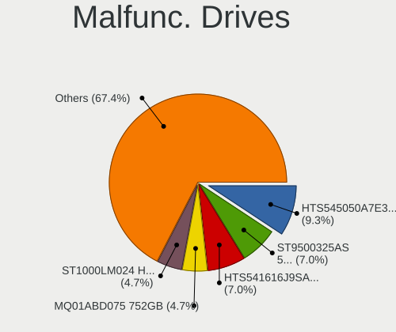

| Model                                               | Computers | Drives | Percent |
|-----------------------------------------------------|-----------|--------|---------|
| Hitachi HTS545050A7E380 500GB                       | 4         | 5      | 9.3%    |
| Seagate ST9500325AS 500GB                           | 3         | 3      | 6.98%   |
| Hitachi HTS541616J9SA00 160GB                       | 3         | 3      | 6.98%   |
| Toshiba MQ01ABD075 752GB                            | 2         | 2      | 4.65%   |
| Seagate ST1000LM024 HN-M101MBB 1TB                  | 2         | 3      | 4.65%   |
| HGST HTS545050A7E380 500GB                          | 2         | 3      | 4.65%   |
| WDC WD6400AAKS-65A7B0 640GB                         | 1         | 1      | 2.33%   |
| WDC WD5000LPVX-22V0TT0 500GB                        | 1         | 1      | 2.33%   |
| WDC WD5000BPVT-55HXZT3 500GB                        | 1         | 2      | 2.33%   |
| WDC WD5000BEVT-22A0RT0 500GB                        | 1         | 1      | 2.33%   |
| WDC WD2500BEVT-60ZCT1 250GB                         | 1         | 1      | 2.33%   |
| WDC WD2000BB-00GUC0 200GB                           | 1         | 1      | 2.33%   |
| Toshiba MQ01ACF050 500GB                            | 1         | 1      | 2.33%   |
| Toshiba MQ01ABD050 500GB                            | 1         | 1      | 2.33%   |
| Toshiba MK5076GSX 500GB                             | 1         | 2      | 2.33%   |
| Toshiba MK4055GSX 400GB                             | 1         | 1      | 2.33%   |
| Seagate ST9320325AS 320GB                           | 1         | 2      | 2.33%   |
| Seagate ST9120817AS 120GB                           | 1         | 1      | 2.33%   |
| Seagate ST500LM012 HN-M500MBB 500GB                 | 1         | 1      | 2.33%   |
| Seagate ST3500413AS 500GB                           | 1         | 1      | 2.33%   |
| Seagate ST3500312CS 500GB                           | 1         | 1      | 2.33%   |
| Seagate ST3320813AS 320GB                           | 1         | 1      | 2.33%   |
| Seagate ST1000VX005-2EZ102 1TB                      | 1         | 1      | 2.33%   |
| Seagate ST1000LM035-1RK172 1TB                      | 1         | 2      | 2.33%   |
| Seagate ST1000DM010-2EP102 1TB                      | 1         | 1      | 2.33%   |
| Micron Technology MTFDDAK256MAY-1AH12ABHA 256GB SSD | 1         | 1      | 2.33%   |
| Kingston SUV400S37240G 240GB SSD                    | 1         | 1      | 2.33%   |
| Hitachi HTS547575A9E384 752GB                       | 1         | 1      | 2.33%   |
| Hitachi HTS547550A9E384 500GB                       | 1         | 1      | 2.33%   |
| Hitachi HTS543232A7A384 320GB                       | 1         | 1      | 2.33%   |
| Hitachi HTS542516K9SA00 160GB                       | 1         | 1      | 2.33%   |
| Emtec X250 512GB SSD                                | 1         | 2      | 2.33%   |
| A-DATA Technology SX8100NP 512GB                    | 1         | 1      | 2.33%   |

Malfunc. Drive Vendor
---------------------

Vendors of faulty drives

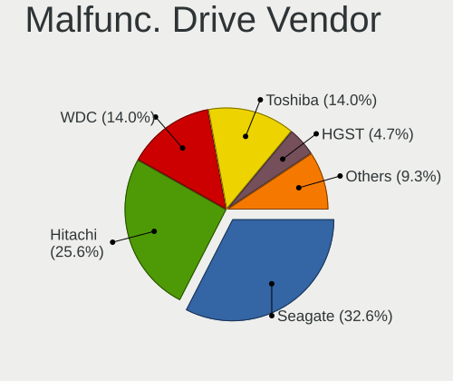

| Vendor            | Computers | Drives | Percent |
|-------------------|-----------|--------|---------|
| Seagate           | 14        | 17     | 32.56%  |
| Hitachi           | 11        | 12     | 25.58%  |
| WDC               | 6         | 7      | 13.95%  |
| Toshiba           | 6         | 7      | 13.95%  |
| HGST              | 2         | 3      | 4.65%   |
| Micron Technology | 1         | 1      | 2.33%   |
| Kingston          | 1         | 1      | 2.33%   |
| Emtec             | 1         | 2      | 2.33%   |
| A-DATA Technology | 1         | 1      | 2.33%   |

Malfunc. HDD Vendor
-------------------

Vendors of faulty HDD drives

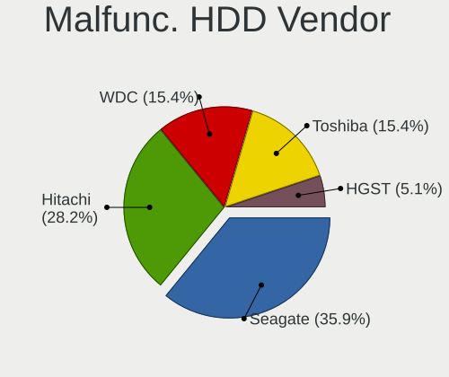

| Vendor  | Computers | Drives | Percent |
|---------|-----------|--------|---------|
| Seagate | 14        | 17     | 35.9%   |
| Hitachi | 11        | 12     | 28.21%  |
| WDC     | 6         | 7      | 15.38%  |
| Toshiba | 6         | 7      | 15.38%  |
| HGST    | 2         | 3      | 5.13%   |

Malfunc. Drive Kind
-------------------

Kinds of faulty drives

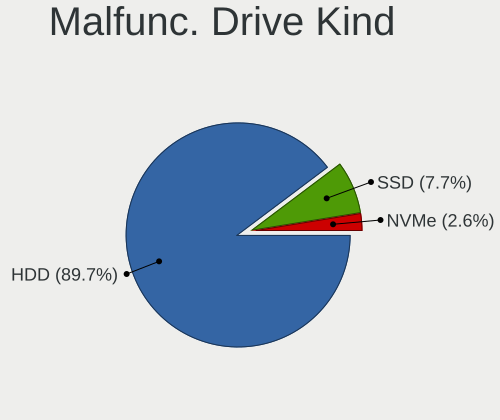

| Kind | Computers | Drives | Percent |
|------|-----------|--------|---------|
| HDD  | 35        | 46     | 89.74%  |
| SSD  | 3         | 4      | 7.69%   |
| NVMe | 1         | 1      | 2.56%   |

Failed Drives
-------------

Failed drive models

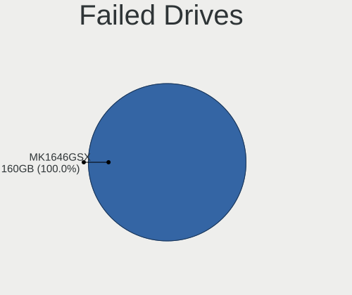

| Model                   | Computers | Drives | Percent |
|-------------------------|-----------|--------|---------|
| Toshiba MK1646GSX 160GB | 1         | 1      | 100%    |

Failed Drive Vendor
-------------------

Failed drive vendors

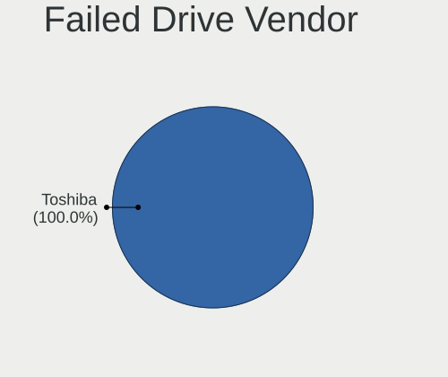

| Vendor  | Computers | Drives | Percent |
|---------|-----------|--------|---------|
| Toshiba | 1         | 1      | 100%    |

Drive Status
------------

Number of failed and malfunc. drives

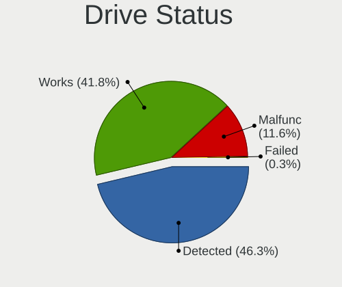

| Status   | Computers | Drives | Percent |
|----------|-----------|--------|---------|
| Detected | 156       | 231    | 46.29%  |
| Works    | 141       | 215    | 41.84%  |
| Malfunc  | 39        | 51     | 11.57%  |
| Failed   | 1         | 1      | 0.3%    |

Storage controller
------------------

Storage Vendor
--------------

Storage controller vendors

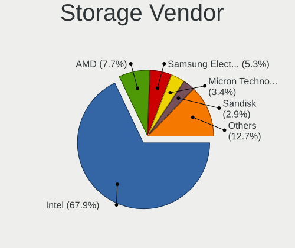

| Vendor                                  | Computers | Percent |
|-----------------------------------------|-----------|---------|
| Intel                                   | 256       | 67.9%   |
| AMD                                     | 29        | 7.69%   |
| Samsung Electronics                     | 20        | 5.31%   |
| Micron Technology                       | 13        | 3.45%   |
| Sandisk                                 | 11        | 2.92%   |
| SK hynix                                | 10        | 2.65%   |
| Phison Electronics                      | 9         | 2.39%   |
| Kingston Technology Company             | 8         | 2.12%   |
| Realtek Semiconductor                   | 5         | 1.33%   |
| MAXIO Technology (Hangzhou)             | 4         | 1.06%   |
| Silicon Motion                          | 2         | 0.53%   |
| ADATA Technology                        | 2         | 0.53%   |
| Union Memory (Shenzhen)                 | 1         | 0.27%   |
| Solidigm                                | 1         | 0.27%   |
| Solid State Storage Technology          | 1         | 0.27%   |
| Shenzhen Unionmemory Information System | 1         | 0.27%   |
| Shenzhen Longsys Electronics            | 1         | 0.27%   |
| O2 Micro                                | 1         | 0.27%   |
| Marvell Technology Group                | 1         | 0.27%   |
| KIOXIA                                  | 1         | 0.27%   |

Storage Model
-------------

Storage controller models

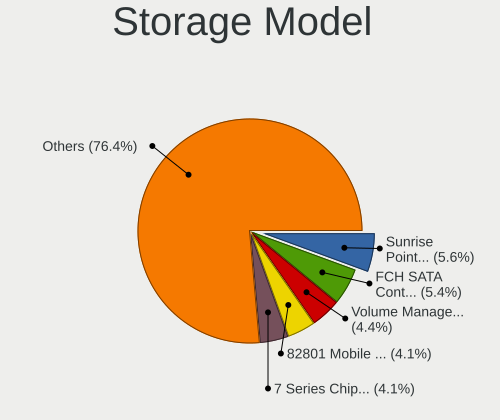

| Model                                                                            | Computers | Percent |
|----------------------------------------------------------------------------------|-----------|---------|
| Intel Sunrise Point-LP SATA Controller [AHCI mode]                               | 23        | 5.6%    |
| AMD FCH SATA Controller [AHCI mode]                                              | 22        | 5.35%   |
| Intel Volume Management Device NVMe RAID Controller                              | 18        | 4.38%   |
| Intel 82801 Mobile SATA Controller [RAID mode]                                   | 17        | 4.14%   |
| Intel 7 Series Chipset Family 6-port SATA Controller [AHCI mode]                 | 17        | 4.14%   |
| Intel 8 Series SATA Controller 1 [AHCI mode]                                     | 15        | 3.65%   |
| Intel Tiger Lake-LP SATA Controller                                              | 14        | 3.41%   |
| Intel 6 Series/C200 Series Chipset Family 6 port Mobile SATA AHCI Controller     | 13        | 3.16%   |
| Samsung NVMe SSD Controller 980 (DRAM-less)                                      | 12        | 2.92%   |
| Intel Wildcat Point-LP SATA Controller [AHCI Mode]                               | 10        | 2.43%   |
| Intel 8 Series/C220 Series Chipset Family 6-port SATA Controller 1 [AHCI mode]   | 10        | 2.43%   |
| Intel 82801IBM/IEM (ICH9M/ICH9M-E) 4 port SATA Controller [AHCI mode]            | 9         | 2.19%   |
| Intel HM170/QM170 Chipset SATA Controller [AHCI Mode]                            | 8         | 1.95%   |
| Intel Celeron/Pentium Silver Processor SATA Controller                           | 8         | 1.95%   |
| Intel 400 Series Chipset Family SATA AHCI Controller                             | 8         | 1.95%   |
| Intel SSD 670p Series [Keystone Harbor]                                          | 7         | 1.7%    |
| Micron 2210 NVMe SSD [Cobain]                                                    | 6         | 1.46%   |
| Intel Comet Lake SATA AHCI Controller                                            | 6         | 1.46%   |
| Intel 5 Series/3400 Series Chipset 6 port SATA AHCI Controller                   | 6         | 1.46%   |
| SK hynix Gold P31/BC711/PC711 NVMe Solid State Drive                             | 5         | 1.22%   |
| SanDisk Ultra 3D / WD PC SN530, IX SN530, Blue SN550 NVMe SSD (DRAM-less)        | 5         | 1.22%   |
| Intel NM10/ICH7 Family SATA Controller [IDE mode]                                | 5         | 1.22%   |
| Intel Cannon Lake Mobile PCH SATA AHCI Controller                                | 5         | 1.22%   |
| Intel 5 Series/3400 Series Chipset 4 port SATA AHCI Controller                   | 5         | 1.22%   |
| Phison E12 NVMe Controller                                                       | 4         | 0.97%   |
| Micron 2450 NVMe SSD [HendrixV] (DRAM-less)                                      | 4         | 0.97%   |
| Kingston Company OM8PCP Design-In PCIe 3 NVMe SSD (DRAM-less)                    | 4         | 0.97%   |
| Intel Q170/Q150/B150/H170/H110/Z170/CM236 Chipset SATA Controller [AHCI Mode]    | 4         | 0.97%   |
| Intel Atom/Celeron/Pentium Processor x5-E8000/J3xxx/N3xxx Series SATA Controller | 4         | 0.97%   |
| Intel Alder Lake-P SATA AHCI Controller                                          | 4         | 0.97%   |
| Intel 82801JI (ICH10 Family) 4 port SATA IDE Controller #1                       | 4         | 0.97%   |
| Intel 82801G (ICH7 Family) IDE Controller                                        | 4         | 0.97%   |
| Intel 500 Series Chipset Family SATA AHCI Controller                             | 4         | 0.97%   |
| Samsung NVMe SSD Controller PM9B1 (DRAM-less)                                    | 3         | 0.73%   |
| Realtek RTS5762 NVMe SSD Controller                                              | 3         | 0.73%   |
| Phison PS5013-E13 PCIe3 NVMe Controller (DRAM-less)                              | 3         | 0.73%   |
| Micron 2400 NVMe SSD (DRAM-less)                                                 | 3         | 0.73%   |
| Intel SSD 660P Series                                                            | 3         | 0.73%   |
| Intel RST Volume Management Device Controller                                    | 3         | 0.73%   |
| Intel Cannon Lake PCH SATA AHCI Controller                                       | 3         | 0.73%   |

Storage Kind
------------

Kind of storage controller (IDE, SATA, NVMe, SAS, ...)

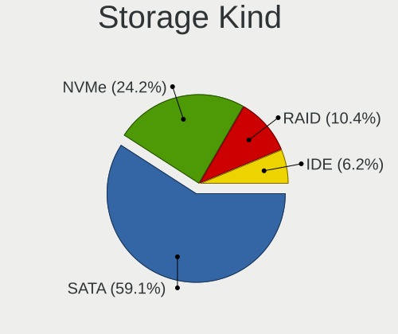

| Kind | Computers | Percent |
|------|-----------|---------|
| SATA | 227       | 59.11%  |
| NVMe | 93        | 24.22%  |
| RAID | 40        | 10.42%  |
| IDE  | 24        | 6.25%   |

Processor
---------

CPU Vendor
----------

Processor vendors

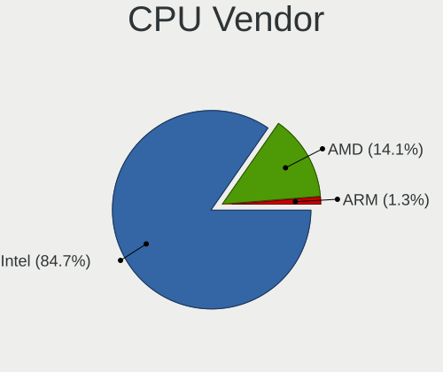

| Vendor | Computers | Percent |
|--------|-----------|---------|
| Intel  | 265       | 84.66%  |
| AMD    | 44        | 14.06%  |
| ARM    | 4         | 1.28%   |

CPU Model
---------

Processor models

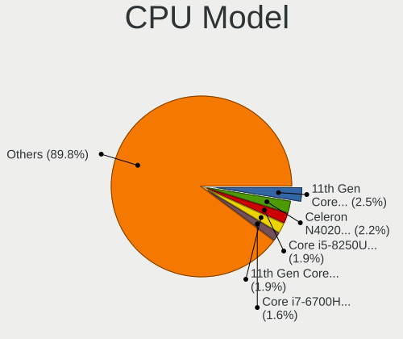

| Model                                         | Computers | Percent |
|-----------------------------------------------|-----------|---------|
| Intel 11th Gen Core i5-1135G7 @ 2.40GHz       | 8         | 2.55%   |
| Intel Celeron N4020 CPU @ 1.10GHz             | 7         | 2.23%   |
| Intel Core i5-8250U CPU @ 1.60GHz             | 6         | 1.91%   |
| Intel 11th Gen Core i7-1165G7 @ 2.80GHz       | 6         | 1.91%   |
| Intel Core i7-6700HQ CPU @ 2.60GHz            | 5         | 1.59%   |
| Intel Core i7-10750H CPU @ 2.60GHz            | 5         | 1.59%   |
| Intel Core i5-9300H CPU @ 2.40GHz             | 5         | 1.59%   |
| Intel Core i5-5200U CPU @ 2.20GHz             | 5         | 1.59%   |
| Intel Core i5-4210U CPU @ 1.70GHz             | 5         | 1.59%   |
| Intel Core i5-10210U CPU @ 1.60GHz            | 4         | 1.27%   |
| Intel Core i3-2310M CPU @ 2.10GHz             | 4         | 1.27%   |
| ARM Processor                                 | 4         | 1.27%   |
| Intel Core i7-8550U CPU @ 1.80GHz             | 3         | 0.96%   |
| Intel Core i7-6500U CPU @ 2.50GHz             | 3         | 0.96%   |
| Intel Core i7-4500U CPU @ 1.80GHz             | 3         | 0.96%   |
| Intel Core i5-7200U CPU @ 2.50GHz             | 3         | 0.96%   |
| Intel Core i5-4200U CPU @ 1.60GHz             | 3         | 0.96%   |
| Intel Core i5-2430M CPU @ 2.40GHz             | 3         | 0.96%   |
| Intel Core i3-7020U CPU @ 2.30GHz             | 3         | 0.96%   |
| Intel Core i3-5005U CPU @ 2.00GHz             | 3         | 0.96%   |
| Intel Core i3-3217U CPU @ 1.80GHz             | 3         | 0.96%   |
| Intel Core i3-1005G1 CPU @ 1.20GHz            | 3         | 0.96%   |
| Intel Core i3 CPU M 380 @ 2.53GHz             | 3         | 0.96%   |
| Intel Core 2 Quad CPU Q8200 @ 2.33GHz         | 3         | 0.96%   |
| Intel 11th Gen Core i3-1115G4 @ 3.00GHz       | 3         | 0.96%   |
| AMD Ryzen 5 5600H with Radeon Graphics        | 3         | 0.96%   |
| AMD Ryzen 5 3550H with Radeon Vega Mobile Gfx | 3         | 0.96%   |
| Intel Pentium Dual-Core CPU T4400 @ 2.20GHz   | 2         | 0.64%   |
| Intel Pentium CPU G4560 @ 3.50GHz             | 2         | 0.64%   |
| Intel Pentium CPU B960 @ 2.20GHz              | 2         | 0.64%   |
| Intel Core i7-8750H CPU @ 2.20GHz             | 2         | 0.64%   |
| Intel Core i7-7700HQ CPU @ 2.80GHz            | 2         | 0.64%   |
| Intel Core i7-7500U CPU @ 2.70GHz             | 2         | 0.64%   |
| Intel Core i7-5500U CPU @ 2.40GHz             | 2         | 0.64%   |
| Intel Core i7-4790K CPU @ 4.00GHz             | 2         | 0.64%   |
| Intel Core i7-4710HQ CPU @ 2.50GHz            | 2         | 0.64%   |
| Intel Core i7-4510U CPU @ 2.00GHz             | 2         | 0.64%   |
| Intel Core i7-10870H CPU @ 2.20GHz            | 2         | 0.64%   |
| Intel Core i7-10510U CPU @ 1.80GHz            | 2         | 0.64%   |
| Intel Core i5-9400F CPU @ 2.90GHz             | 2         | 0.64%   |

CPU Model Family
----------------

Processor model prefix

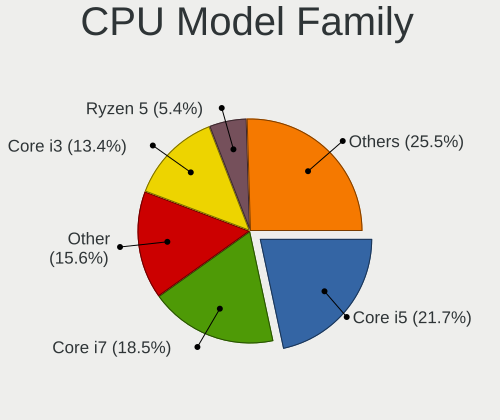

| Model                   | Computers | Percent |
|-------------------------|-----------|---------|
| Intel Core i5           | 68        | 21.66%  |
| Intel Core i7           | 58        | 18.47%  |
| Other                   | 49        | 15.61%  |
| Intel Core i3           | 42        | 13.38%  |
| AMD Ryzen 5             | 17        | 5.41%   |
| Intel Celeron           | 14        | 4.46%   |
| Intel Pentium           | 11        | 3.5%    |
| Intel Core 2 Duo        | 11        | 3.5%    |
| Intel Core 2 Quad       | 8         | 2.55%   |
| AMD Ryzen 7             | 7         | 2.23%   |
| Intel Pentium Dual-Core | 4         | 1.27%   |
| Intel Atom              | 4         | 1.27%   |
| AMD Ryzen 3             | 4         | 1.27%   |
| AMD Ryzen 9             | 2         | 0.64%   |
| Intel Xeon              | 1         | 0.32%   |
| Intel Core m3           | 1         | 0.32%   |
| Intel Core 2 Extreme    | 1         | 0.32%   |
| Intel Core 2            | 1         | 0.32%   |
| Intel Celeron M         | 1         | 0.32%   |
| AMD Sempron             | 1         | 0.32%   |
| AMD Ryzen 5 PRO         | 1         | 0.32%   |
| AMD FX                  | 1         | 0.32%   |
| AMD E2                  | 1         | 0.32%   |
| AMD E                   | 1         | 0.32%   |
| AMD Athlon              | 1         | 0.32%   |
| AMD A8                  | 1         | 0.32%   |
| AMD A6                  | 1         | 0.32%   |
| AMD A4                  | 1         | 0.32%   |
| AMD A10                 | 1         | 0.32%   |

CPU Cores
---------

Number of processor cores

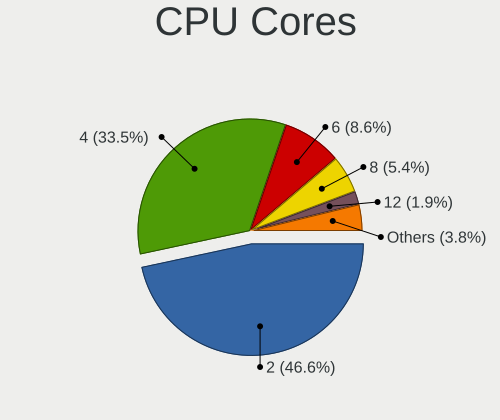

| Number  | Computers | Percent |
|---------|-----------|---------|
| 2       | 146       | 46.65%  |
| 4       | 105       | 33.55%  |
| 6       | 27        | 8.63%   |
| 8       | 17        | 5.43%   |
| 12      | 6         | 1.92%   |
| 10      | 5         | 1.6%    |
| 1       | 4         | 1.28%   |
| 14      | 2         | 0.64%   |
| Unknown | 1         | 0.32%   |

CPU Sockets
-----------

Number of sockets

| Number | Computers | Percent |
|--------|-----------|---------|
| 1      | 313       | 100%    |

CPU Threads
-----------

Threads per core (Hyper-Threading)

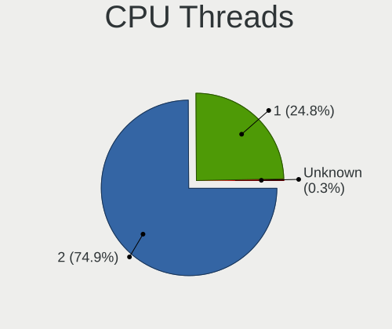

| Number  | Computers | Percent |
|---------|-----------|---------|
| 2       | 236       | 74.92%  |
| 1       | 78        | 24.76%  |
| Unknown | 1         | 0.32%   |

CPU Op-Modes
------------

CPU Operation Modes (32-bit, 64-bit)

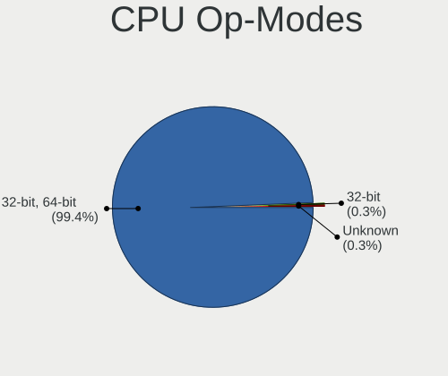

| Op mode        | Computers | Percent |
|----------------|-----------|---------|
| 32-bit, 64-bit | 311       | 99.36%  |
| 32-bit         | 1         | 0.32%   |
| Unknown        | 1         | 0.32%   |

CPU Microcode
-------------

Microcode number

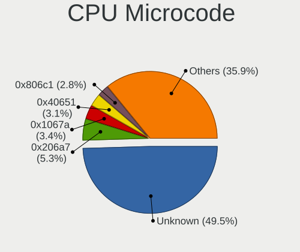

| Number     | Computers | Percent |
|------------|-----------|---------|
| Unknown    | 160       | 49.54%  |
| 0x206a7    | 17        | 5.26%   |
| 0x1067a    | 11        | 3.41%   |
| 0x40651    | 10        | 3.1%    |
| 0x806c1    | 9         | 2.79%   |
| 0x306a9    | 9         | 2.79%   |
| 0x806ea    | 8         | 2.48%   |
| 0xa0652    | 7         | 2.17%   |
| 0x806ec    | 7         | 2.17%   |
| 0x506e3    | 7         | 2.17%   |
| 0x906ea    | 6         | 1.86%   |
| 0x306c3    | 6         | 1.86%   |
| 0x406e3    | 5         | 1.55%   |
| 0x08108109 | 5         | 1.55%   |
| 0x806e9    | 4         | 1.24%   |
| 0x306d4    | 4         | 1.24%   |
| 0x706e5    | 3         | 0.93%   |
| 0x20655    | 3         | 0.93%   |
| 0x706a8    | 2         | 0.62%   |
| 0x406c4    | 2         | 0.62%   |
| 0x30678    | 2         | 0.62%   |
| 0x20652    | 2         | 0.62%   |
| 0x106ca    | 2         | 0.62%   |
| 0x08600106 | 2         | 0.62%   |
| 0x08108102 | 2         | 0.62%   |
| 0x06006705 | 2         | 0.62%   |
| 0x06006704 | 2         | 0.62%   |
| 0xa0671    | 1         | 0.31%   |
| 0xa0655    | 1         | 0.31%   |
| 0xa0653    | 1         | 0.31%   |
| 0x906e9    | 1         | 0.31%   |
| 0x906a4    | 1         | 0.31%   |
| 0x906a3    | 1         | 0.31%   |
| 0x90672    | 1         | 0.31%   |
| 0x6fd      | 1         | 0.31%   |
| 0x6fb      | 1         | 0.31%   |
| 0x6d8      | 1         | 0.31%   |
| 0x506c9    | 1         | 0.31%   |
| 0x40661    | 1         | 0.31%   |
| 0x10677    | 1         | 0.31%   |

CPU Microarch
-------------

Microarchitecture

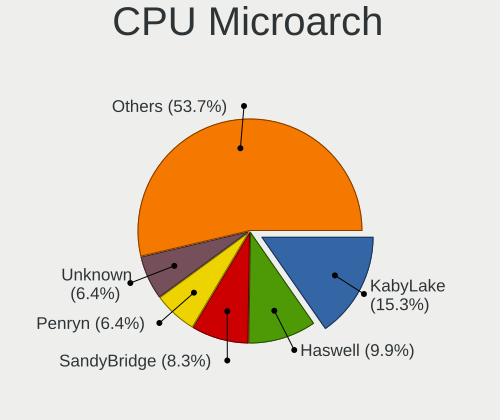

| Name             | Computers | Percent |
|------------------|-----------|---------|
| KabyLake         | 48        | 15.34%  |
| Haswell          | 31        | 9.9%    |
| SandyBridge      | 26        | 8.31%   |
| Penryn           | 20        | 6.39%   |
| Unknown          | 20        | 6.39%   |
| TigerLake        | 19        | 6.07%   |
| Skylake          | 19        | 6.07%   |
| IvyBridge        | 13        | 4.15%   |
| Westmere         | 12        | 3.83%   |
| Icelake          | 12        | 3.83%   |
| CometLake        | 12        | 3.83%   |
| Zen+             | 10        | 3.19%   |
| Broadwell        | 10        | 3.19%   |
| Alderlake Hybrid | 9         | 2.88%   |
| Zen 2            | 8         | 2.56%   |
| Silvermont       | 8         | 2.56%   |
| Goldmont plus    | 8         | 2.56%   |
| Zen 3            | 7         | 2.24%   |
| Core             | 5         | 1.6%    |
| Excavator        | 4         | 1.28%   |
| Piledriver       | 2         | 0.64%   |
| Goldmont         | 2         | 0.64%   |
| Bonnell          | 2         | 0.64%   |
| Zen              | 1         | 0.32%   |
| Puma             | 1         | 0.32%   |
| P6               | 1         | 0.32%   |
| Nehalem          | 1         | 0.32%   |
| K8 & K10 hybrid  | 1         | 0.32%   |
| Bobcat           | 1         | 0.32%   |

Graphics
--------

GPU Vendor
----------

Vendors of graphics cards

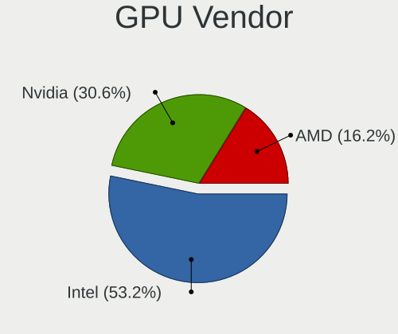

| Vendor | Computers | Percent |
|--------|-----------|---------|
| Intel  | 230       | 53.24%  |
| Nvidia | 132       | 30.56%  |
| AMD    | 70        | 16.2%   |

GPU Model
---------

Graphics card models

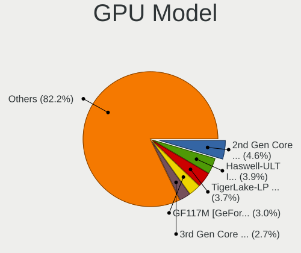

| Model                                                                                    | Computers | Percent |
|------------------------------------------------------------------------------------------|-----------|---------|
| Intel 2nd Generation Core Processor Family Integrated Graphics Controller                | 20        | 4.58%   |
| Intel Haswell-ULT Integrated Graphics Controller                                         | 17        | 3.89%   |
| Intel TigerLake-LP GT2 [Iris Xe Graphics]                                                | 16        | 3.66%   |
| Nvidia GF117M [GeForce 610M/710M/810M/820M / GT 620M/625M/630M/720M]                     | 13        | 2.97%   |
| Intel 3rd Gen Core processor Graphics Controller                                         | 12        | 2.75%   |
| Intel Kaby Lake-R GT2 [UHD Graphics 620]                                                 | 10        | 2.29%   |
| Intel Broadwell-U GT2 [HD Graphics 5500]                                                 | 10        | 2.29%   |
| AMD Picasso/Raven 2 [Radeon Vega Series / Radeon Vega Mobile Series]                     | 10        | 2.29%   |
| Nvidia TU117M [GeForce GTX 1650 Mobile / Max-Q]                                          | 9         | 2.06%   |
| Intel Kaby Lake-U GT2 [HD Graphics 620]                                                  | 9         | 2.06%   |
| Intel CometLake-H GT2 [UHD Graphics]                                                     | 9         | 2.06%   |
| Intel Skylake-U GT2 [HD Graphics 520]                                                    | 8         | 1.83%   |
| Intel GeminiLake [UHD Graphics 600]                                                      | 8         | 1.83%   |
| Intel Core Processor Integrated Graphics Controller                                      | 7         | 1.6%    |
| Intel CometLake-U GT2 [UHD Graphics]                                                     | 7         | 1.6%    |
| Intel CoffeeLake-H GT2 [UHD Graphics 630]                                                | 7         | 1.6%    |
| Intel 4th Gen Core Processor Integrated Graphics Controller                              | 7         | 1.6%    |
| Nvidia GM108M [GeForce MX110]                                                            | 6         | 1.37%   |
| Nvidia GM107M [GeForce GTX 950M]                                                         | 6         | 1.37%   |
| Intel Mobile 4 Series Chipset Integrated Graphics Controller                             | 6         | 1.37%   |
| Intel Skylake-H GT2 [HD Graphics 530]                                                    | 5         | 1.14%   |
| Intel Iris Plus Graphics G1 (Ice Lake)                                                   | 5         | 1.14%   |
| Intel Atom/Celeron/Pentium Processor x5-E8000/J3xxx/N3xxx Integrated Graphics Controller | 5         | 1.14%   |
| Intel 4 Series Chipset Integrated Graphics Controller                                    | 5         | 1.14%   |
| Nvidia GT218 [GeForce 210]                                                               | 4         | 0.92%   |
| Nvidia GP108M [GeForce MX330]                                                            | 4         | 0.92%   |
| Intel Raptor Lake-P [Iris Xe Graphics]                                                   | 4         | 0.92%   |
| Intel Kaby Lake-H GT2 [HD Graphics 630]                                                  | 4         | 0.92%   |
| AMD Topaz XT [Radeon R7 M260/M265 / M340/M360 / M440/M445 / 530/535 / 620/625 Mobile]    | 4         | 0.92%   |
| AMD Stoney [Radeon R2/R3/R4/R5 Graphics]                                                 | 4         | 0.92%   |
| AMD Renoir [Radeon Vega Series / Radeon Vega Mobile Series]                              | 4         | 0.92%   |
| AMD Cezanne [Radeon Vega Series / Radeon Vega Mobile Series]                             | 4         | 0.92%   |
| Nvidia TU117M [GeForce GTX 1650 Ti Mobile]                                               | 3         | 0.69%   |
| Nvidia TU116M [GeForce GTX 1660 Ti Mobile]                                               | 3         | 0.69%   |
| Nvidia TU116 [GeForce GTX 1660 SUPER]                                                    | 3         | 0.69%   |
| Nvidia GP107M [GeForce GTX 1050 Mobile]                                                  | 3         | 0.69%   |
| Nvidia GP107M [GeForce GTX 1050 3 GB Max-Q]                                              | 3         | 0.69%   |
| Nvidia GP106 [GeForce GTX 1060 6GB]                                                      | 3         | 0.69%   |
| Nvidia GM108M [GeForce 920MX]                                                            | 3         | 0.69%   |
| Nvidia GK208BM [GeForce 920M]                                                            | 3         | 0.69%   |

GPU Combo
---------

Combinations of graphics cards

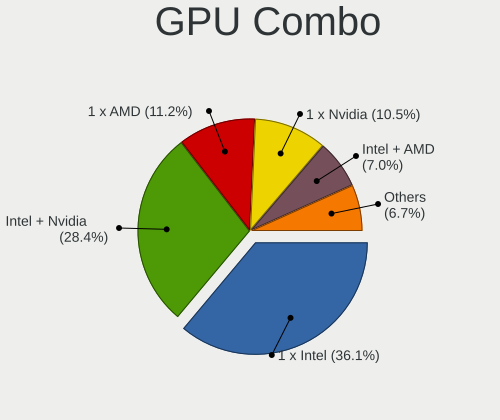

| Name           | Computers | Percent |
|----------------|-----------|---------|
| 1 x Intel      | 113       | 36.1%   |
| Intel + Nvidia | 89        | 28.43%  |
| 1 x AMD        | 35        | 11.18%  |
| 1 x Nvidia     | 33        | 10.54%  |
| Intel + AMD    | 22        | 7.03%   |
| AMD + Nvidia   | 10        | 3.19%   |
| Other          | 4         | 1.28%   |
| 2 x Intel      | 4         | 1.28%   |
| 2 x AMD        | 3         | 0.96%   |

GPU Driver
----------

Free vs proprietary

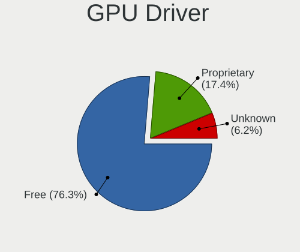

| Driver      | Computers | Percent |
|-------------|-----------|---------|
| Free        | 245       | 76.32%  |
| Proprietary | 56        | 17.45%  |
| Unknown     | 20        | 6.23%   |

GPU Memory
----------

Total video memory

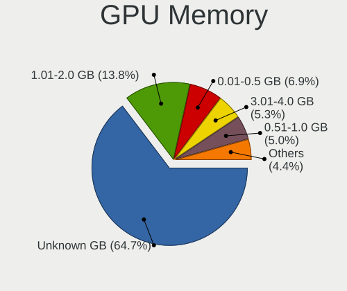

| Size in GB | Computers | Percent |
|------------|-----------|---------|
| Unknown    | 207       | 64.69%  |
| 1.01-2.0   | 44        | 13.75%  |
| 0.01-0.5   | 22        | 6.88%   |
| 3.01-4.0   | 17        | 5.31%   |
| 0.51-1.0   | 16        | 5%      |
| 5.01-6.0   | 7         | 2.19%   |
| 7.01-8.0   | 4         | 1.25%   |
| 2.01-3.0   | 2         | 0.63%   |
| 8.01-16.0  | 1         | 0.31%   |

Monitor
-------

Monitor Vendor
--------------

Monitor vendors

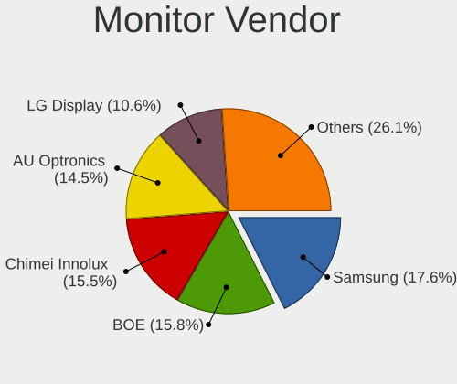

| Vendor                  | Computers | Percent |
|-------------------------|-----------|---------|
| Samsung Electronics     | 58        | 17.58%  |
| BOE                     | 52        | 15.76%  |
| Chimei Innolux          | 51        | 15.45%  |
| AU Optronics            | 48        | 14.55%  |
| LG Display              | 35        | 10.61%  |
| Hewlett-Packard         | 22        | 6.67%   |
| Dell                    | 9         | 2.73%   |
| Chi Mei Optoelectronics | 8         | 2.42%   |
| Lenovo                  | 7         | 2.12%   |
| PANDA                   | 5         | 1.52%   |
| HKC                     | 5         | 1.52%   |
| MSI                     | 3         | 0.91%   |
| Goldstar                | 3         | 0.91%   |
| Acer                    | 3         | 0.91%   |
| Philips                 | 2         | 0.61%   |
| Packard Bell            | 2         | 0.61%   |
| BenQ                    | 2         | 0.61%   |
| Apple                   | 2         | 0.61%   |
| ViewSonic               | 1         | 0.3%    |
| Valve                   | 1         | 0.3%    |
| TMX                     | 1         | 0.3%    |
| S2-Tek                  | 1         | 0.3%    |
| PKB                     | 1         | 0.3%    |
| ODH                     | 1         | 0.3%    |
| NCS                     | 1         | 0.3%    |
| Medion                  | 1         | 0.3%    |
| LG Philips              | 1         | 0.3%    |
| ITE                     | 1         | 0.3%    |
| HPN                     | 1         | 0.3%    |
| GDH                     | 1         | 0.3%    |
| ASUSTek Computer        | 1         | 0.3%    |

Monitor Model
-------------

Monitor models

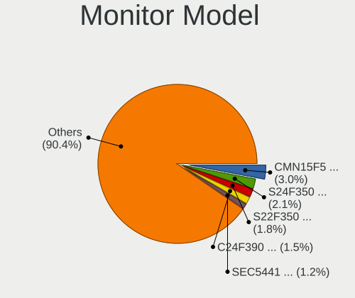

| Model                                                                    | Computers | Percent |
|--------------------------------------------------------------------------|-----------|---------|
| Chimei Innolux LCD Monitor CMN15F5 1920x1080 344x193mm 15.5-inch         | 10        | 2.99%   |
| Samsung Electronics S24F350 SAM0D20 1920x1080 521x293mm 23.5-inch        | 7         | 2.09%   |
| Samsung Electronics S22F350 SAM0D1A 1920x1080 477x268mm 21.5-inch        | 6         | 1.79%   |
| Samsung Electronics C24F390 SAM0D2C 1920x1080 521x293mm 23.5-inch        | 5         | 1.49%   |
| Samsung Electronics LCD Monitor SEC5441 1280x800 331x207mm 15.4-inch     | 4         | 1.19%   |
| LG Display LCD Monitor LGD0456 1366x768 344x194mm 15.5-inch              | 4         | 1.19%   |
| Chimei Innolux LCD Monitor CMN15DB 1366x768 344x193mm 15.5-inch          | 4         | 1.19%   |
| Chimei Innolux LCD Monitor CMN15CA 1366x768 344x193mm 15.5-inch          | 4         | 1.19%   |
| BOE LCD Monitor BOE08E5 1366x768 344x194mm 15.5-inch                     | 4         | 1.19%   |
| BOE LCD Monitor BOE06A4 1366x768 344x194mm 15.5-inch                     | 4         | 1.19%   |
| AU Optronics LCD Monitor AUOAF90 1920x1080 344x193mm 15.5-inch           | 4         | 1.19%   |
| AU Optronics LCD Monitor AUO48EC 1366x768 344x193mm 15.5-inch            | 4         | 1.19%   |
| Samsung Electronics LCD Monitor SEC3150 1366x768 344x193mm 15.5-inch     | 3         | 0.9%    |
| Samsung Electronics LCD Monitor SDC4E51 1366x768 344x194mm 15.5-inch     | 3         | 0.9%    |
| Samsung Electronics LCD Monitor SDC354A 1366x768 344x194mm 15.5-inch     | 3         | 0.9%    |
| PANDA LCD Monitor NCP004D 1920x1080 344x194mm 15.5-inch                  | 3         | 0.9%    |
| Chimei Innolux LCD Monitor CMN15DC 1366x768 344x193mm 15.5-inch          | 3         | 0.9%    |
| AU Optronics LCD Monitor AUO38ED 1920x1080 344x193mm 15.5-inch           | 3         | 0.9%    |
| Samsung Electronics S19D300 SAM0B34 1366x768 410x230mm 18.5-inch         | 2         | 0.6%    |
| LG Display LCD Monitor LGD05E5 1920x1080 344x194mm 15.5-inch             | 2         | 0.6%    |
| LG Display LCD Monitor LGD02DC 1366x768 344x194mm 15.5-inch              | 2         | 0.6%    |
| HKC GM27X5QIPS HKC0027 2560x1440 597x336mm 27.0-inch                     | 2         | 0.6%    |
| Hewlett-Packard x20LED HWP2910 1600x900 443x249mm 20.0-inch              | 2         | 0.6%    |
| Hewlett-Packard w1907 HWP26A2 1440x900 408x255mm 18.9-inch               | 2         | 0.6%    |
| Hewlett-Packard P224 HPN361E 1920x1080 527x296mm 23.8-inch               | 2         | 0.6%    |
| Hewlett-Packard E24i G4 HPN3690 1920x1200 518x324mm 24.1-inch            | 2         | 0.6%    |
| Hewlett-Packard E24i G4 HPN368F 1920x1200 518x324mm 24.1-inch            | 2         | 0.6%    |
| Hewlett-Packard 2011 HWP2935 1600x900 443x249mm 20.0-inch                | 2         | 0.6%    |
| Chimei Innolux LCD Monitor CMN15E7 1920x1080 344x193mm 15.5-inch         | 2         | 0.6%    |
| Chimei Innolux LCD Monitor CMN15D5 1920x1080 344x193mm 15.5-inch         | 2         | 0.6%    |
| Chimei Innolux LCD Monitor CMN15C6 1366x768 344x193mm 15.5-inch          | 2         | 0.6%    |
| Chimei Innolux LCD Monitor CMN15BF 1366x768 344x194mm 15.5-inch          | 2         | 0.6%    |
| Chimei Innolux LCD Monitor CMN15AB 1366x768 344x193mm 15.5-inch          | 2         | 0.6%    |
| Chimei Innolux LCD Monitor CMN1540 2560x1440 344x193mm 15.5-inch         | 2         | 0.6%    |
| Chimei Innolux LCD Monitor CMN1521 1920x1080 344x193mm 15.5-inch         | 2         | 0.6%    |
| Chimei Innolux LCD Monitor CMN14E5 1920x1080 309x173mm 13.9-inch         | 2         | 0.6%    |
| Chi Mei Optoelectronics LCD Monitor CMO15A7 1366x768 344x193mm 15.5-inch | 2         | 0.6%    |
| Chi Mei Optoelectronics LCD Monitor CMO1592 1366x768 344x193mm 15.5-inch | 2         | 0.6%    |
| BOE LCD Monitor BOE0B2B 1920x1200 345x215mm 16.0-inch                    | 2         | 0.6%    |
| BOE LCD Monitor BOE08D5 1920x1080 344x194mm 15.5-inch                    | 2         | 0.6%    |

Monitor Resolution
------------------

Monitor screen resolution

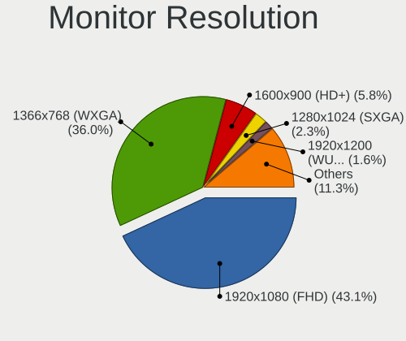

| Resolution         | Computers | Percent |
|--------------------|-----------|---------|
| 1920x1080 (FHD)    | 134       | 43.09%  |
| 1366x768 (WXGA)    | 112       | 36.01%  |
| 1600x900 (HD+)     | 18        | 5.79%   |
| 1280x1024 (SXGA)   | 7         | 2.25%   |
| 1920x1200 (WUXGA)  | 5         | 1.61%   |
| 1440x900 (WXGA+)   | 5         | 1.61%   |
| 1280x800 (WXGA)    | 5         | 1.61%   |
| 3840x2160 (4K)     | 4         | 1.29%   |
| 2560x1440 (QHD)    | 4         | 1.29%   |
| 1680x1050 (WSXGA+) | 3         | 0.96%   |
| 3440x1440          | 2         | 0.64%   |
| 2880x1800          | 2         | 0.64%   |
| 1024x600           | 2         | 0.64%   |
| Unknown            | 2         | 0.64%   |
| 800x1280           | 1         | 0.32%   |
| 3840x1100          | 1         | 0.32%   |
| 3072x1920          | 1         | 0.32%   |
| 2880x1620          | 1         | 0.32%   |
| 2560x1600          | 1         | 0.32%   |
| 1360x768           | 1         | 0.32%   |

Monitor Diagonal
----------------

Diagonal size in inches

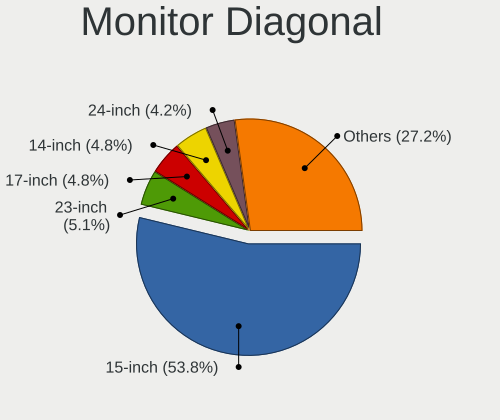

| Inches  | Computers | Percent |
|---------|-----------|---------|
| 15      | 178       | 53.78%  |
| 23      | 17        | 5.14%   |
| 17      | 16        | 4.83%   |
| 14      | 16        | 4.83%   |
| 24      | 14        | 4.23%   |
| 21      | 14        | 4.23%   |
| 13      | 13        | 3.93%   |
| 27      | 10        | 3.02%   |
| 20      | 8         | 2.42%   |
| 19      | 8         | 2.42%   |
| 18      | 6         | 1.81%   |
| 16      | 6         | 1.81%   |
| 12      | 5         | 1.51%   |
| 31      | 3         | 0.91%   |
| 11      | 3         | 0.91%   |
| Unknown | 3         | 0.91%   |
| 34      | 2         | 0.6%    |
| 22      | 2         | 0.6%    |
| 10      | 2         | 0.6%    |
| 52      | 1         | 0.3%    |
| 42      | 1         | 0.3%    |
| 26      | 1         | 0.3%    |
| 8       | 1         | 0.3%    |
| 7       | 1         | 0.3%    |

Monitor Width
-------------

Physical width

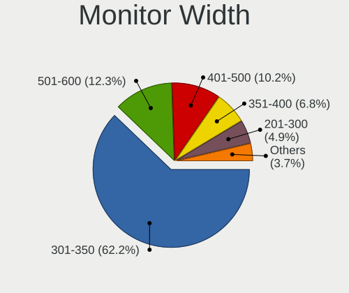

| Width in mm | Computers | Percent |
|-------------|-----------|---------|
| 301-350     | 202       | 62.15%  |
| 501-600     | 40        | 12.31%  |
| 401-500     | 33        | 10.15%  |
| 351-400     | 22        | 6.77%   |
| 201-300     | 16        | 4.92%   |
| 601-700     | 3         | 0.92%   |
| Unknown     | 3         | 0.92%   |
| 701-800     | 2         | 0.62%   |
| 101-200     | 1         | 0.31%   |
| 1001-1500   | 1         | 0.31%   |
| 901-1000    | 1         | 0.31%   |
| 1-100       | 1         | 0.31%   |

Aspect Ratio
------------

Proportional relationship between the width and the height

| Ratio   | Computers | Percent |
|---------|-----------|---------|
| 16/9    | 255       | 85.28%  |
| 16/10   | 27        | 9.03%   |
| 5/4     | 7         | 2.34%   |
| Unknown | 3         | 1%      |
| 21/9    | 2         | 0.67%   |
| 4/3     | 1         | 0.33%   |
| 3/2     | 1         | 0.33%   |
| 3.40    | 1         | 0.33%   |
| 0.67    | 1         | 0.33%   |
| 0.63    | 1         | 0.33%   |

Monitor Area
------------

Area in inch²

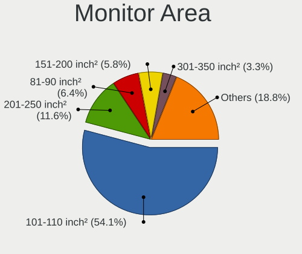

| Area in inch² | Computers | Percent |
|----------------|-----------|---------|
| 101-110        | 178       | 54.1%   |
| 201-250        | 38        | 11.55%  |
| 81-90          | 21        | 6.38%   |
| 151-200        | 19        | 5.78%   |
| 301-350        | 11        | 3.34%   |
| 121-130        | 11        | 3.34%   |
| 141-150        | 9         | 2.74%   |
| 71-80          | 6         | 1.82%   |
| 111-120        | 6         | 1.82%   |
| 351-500        | 5         | 1.52%   |
| 251-300        | 5         | 1.52%   |
| 61-70          | 4         | 1.22%   |
| 51-60          | 4         | 1.22%   |
| Unknown        | 3         | 0.91%   |
| 41-50          | 2         | 0.61%   |
| 1-40           | 2         | 0.61%   |
| 131-140        | 2         | 0.61%   |
| More than 1000 | 1         | 0.3%    |
| 501-1000       | 1         | 0.3%    |
| 91-100         | 1         | 0.3%    |

Pixel Density
-------------

Pixels per inch

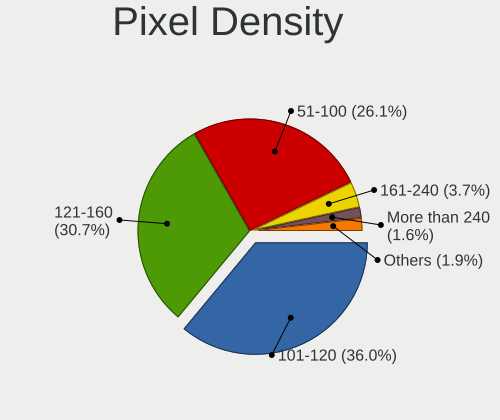

| Density       | Computers | Percent |
|---------------|-----------|---------|
| 101-120       | 116       | 36.02%  |
| 121-160       | 99        | 30.75%  |
| 51-100        | 84        | 26.09%  |
| 161-240       | 12        | 3.73%   |
| More than 240 | 5         | 1.55%   |
| 1-50          | 3         | 0.93%   |
| Unknown       | 3         | 0.93%   |

Multiple Monitors
-----------------

Total monitors connected

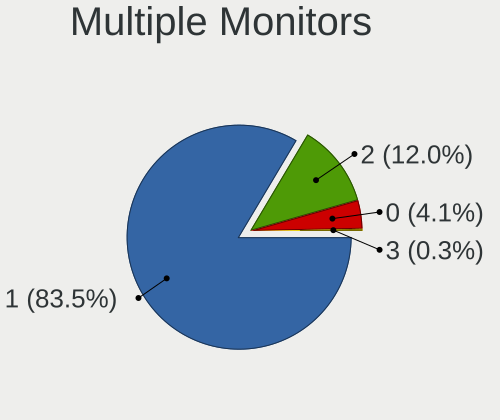

| Total | Computers | Percent |
|-------|-----------|---------|
| 1     | 264       | 83.54%  |
| 2     | 38        | 12.03%  |
| 0     | 13        | 4.11%   |
| 3     | 1         | 0.32%   |

Network
-------

Net Controller Vendor
---------------------

Controller vendors

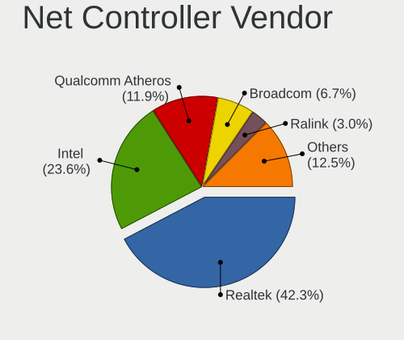

| Vendor                            | Computers | Percent |
|-----------------------------------|-----------|---------|
| Realtek Semiconductor             | 210       | 42.34%  |
| Intel                             | 117       | 23.59%  |
| Qualcomm Atheros                  | 59        | 11.9%   |
| Broadcom                          | 33        | 6.65%   |
| Ralink Technology                 | 15        | 3.02%   |
| Ralink                            | 15        | 3.02%   |
| MediaTek                          | 15        | 3.02%   |
| Broadcom Limited                  | 9         | 1.81%   |
| Xiaomi                            | 3         | 0.6%    |
| Samsung Electronics               | 3         | 0.6%    |
| ICS Advent                        | 2         | 0.4%    |
| Ericsson Business Mobile Networks | 2         | 0.4%    |
| D-Link                            | 2         | 0.4%    |
| TP-Link                           | 1         | 0.2%    |
| Sierra Wireless                   | 1         | 0.2%    |
| Shenzhen Goodix Technology        | 1         | 0.2%    |
| Raspberry Pi                      | 1         | 0.2%    |
| OPPO Electronics                  | 1         | 0.2%    |
| Microchip Technology              | 1         | 0.2%    |
| Marvell Technology Group          | 1         | 0.2%    |
| Lenovo                            | 1         | 0.2%    |
| IMC Networks                      | 1         | 0.2%    |
| Huawei Technologies               | 1         | 0.2%    |
| D-Link System                     | 1         | 0.2%    |

Net Controller Model
--------------------

Controller models

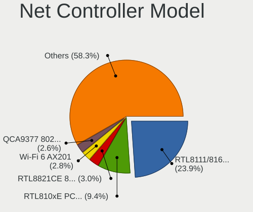

| Model                                                                  | Computers | Percent |
|------------------------------------------------------------------------|-----------|---------|
| Realtek RTL8111/8168/8211/8411 PCI Express Gigabit Ethernet Controller | 137       | 23.91%  |
| Realtek RTL810xE PCI Express Fast Ethernet controller                  | 54        | 9.42%   |
| Realtek RTL8821CE 802.11ac PCIe Wireless Network Adapter               | 17        | 2.97%   |
| Intel Wi-Fi 6 AX201                                                    | 16        | 2.79%   |
| Qualcomm Atheros QCA9377 802.11ac Wireless Network Adapter             | 15        | 2.62%   |
| Qualcomm Atheros QCA9565 / AR9565 Wireless Network Adapter             | 12        | 2.09%   |
| Broadcom BCM43142 802.11b/g/n                                          | 12        | 2.09%   |
| Intel Comet Lake PCH CNVi WiFi                                         | 9         | 1.57%   |
| Realtek RTL8822CE 802.11ac PCIe Wireless Network Adapter               | 8         | 1.4%    |
| Ralink RT3290 Wireless 802.11n 1T/1R PCIe                              | 8         | 1.4%    |
| Qualcomm Atheros AR9285 Wireless Network Adapter (PCI-Express)         | 8         | 1.4%    |
| Intel Wireless 7265                                                    | 8         | 1.4%    |
| Realtek RTL8723BE PCIe Wireless Network Adapter                        | 7         | 1.22%   |
| Ralink MT7601U Wireless Adapter                                        | 7         | 1.22%   |
| Qualcomm Atheros AR9485 Wireless Network Adapter                       | 7         | 1.22%   |
| Realtek RTL8188FTV 802.11b/g/n 1T1R 2.4G WLAN Adapter                  | 6         | 1.05%   |
| Intel Dual Band Wireless-AC 3165 Plus Bluetooth                        | 6         | 1.05%   |
| Intel Comet Lake PCH-LP CNVi WiFi                                      | 6         | 1.05%   |
| Intel 82579LM Gigabit Network Connection (Lewisville)                  | 6         | 1.05%   |
| Broadcom NetLink BCM57780 Gigabit Ethernet PCIe                        | 6         | 1.05%   |
| Ralink RT5370 Wireless Adapter                                         | 5         | 0.87%   |
| Qualcomm Atheros QCA6174 802.11ac Wireless Network Adapter             | 5         | 0.87%   |
| MediaTek MT7921 802.11ax PCIe Wireless Network Adapter [Filogic 330]   | 5         | 0.87%   |
| MediaTek MT7902 802.11ax PCIe Wireless Network Adapter [Filogic 310]   | 5         | 0.87%   |
| Intel Gemini Lake PCH CNVi WiFi                                        | 5         | 0.87%   |
| Realtek RTL8125 2.5GbE Controller                                      | 4         | 0.7%    |
| Qualcomm Atheros AR9462 Wireless Network Adapter                       | 4         | 0.7%    |
| MediaTek MT7922 802.11ax PCI Express Wireless Network Adapter          | 4         | 0.7%    |
| Intel Wireless 8265 / 8275                                             | 4         | 0.7%    |
| Intel Wireless 8260                                                    | 4         | 0.7%    |
| Intel WiFi Link 5100                                                   | 4         | 0.7%    |
| Intel Tiger Lake PCH CNVi WiFi                                         | 4         | 0.7%    |
| Intel Alder Lake-P PCH CNVi WiFi                                       | 4         | 0.7%    |
| Broadcom BCM4313 802.11bgn Wireless Network Adapter                    | 4         | 0.7%    |
| Samsung Galaxy series, misc. (tethering mode)                          | 3         | 0.52%   |
| Realtek RTL8852BE PCIe 802.11ax Wireless Network Controller            | 3         | 0.52%   |
| Ralink RT5390 Wireless 802.11n 1T/1R PCIe                              | 3         | 0.52%   |
| Qualcomm Atheros AR9287 Wireless Network Adapter (PCI-Express)         | 3         | 0.52%   |
| Intel Wi-Fi 6E(802.11ax) AX210/AX1675* 2x2 [Typhoon Peak]              | 3         | 0.52%   |
| Intel Wi-Fi 5(802.11ac) Wireless-AC 9x6x [Thunder Peak]                | 3         | 0.52%   |

Wireless Vendor
---------------

Wireless vendors

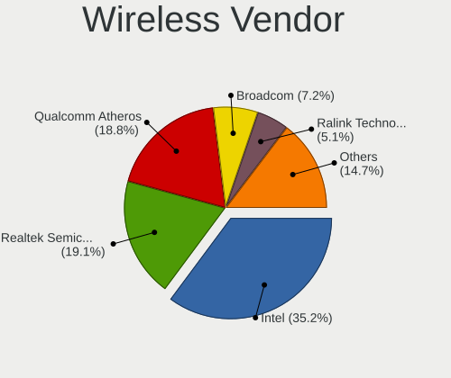

| Vendor                | Computers | Percent |
|-----------------------|-----------|---------|
| Intel                 | 103       | 35.15%  |
| Realtek Semiconductor | 56        | 19.11%  |
| Qualcomm Atheros      | 55        | 18.77%  |
| Broadcom              | 21        | 7.17%   |
| Ralink Technology     | 15        | 5.12%   |
| Ralink                | 15        | 5.12%   |
| MediaTek              | 13        | 4.44%   |
| Broadcom Limited      | 9         | 3.07%   |
| D-Link                | 2         | 0.68%   |
| TP-Link               | 1         | 0.34%   |
| Sierra Wireless       | 1         | 0.34%   |
| IMC Networks          | 1         | 0.34%   |
| D-Link System         | 1         | 0.34%   |

Wireless Model
--------------

Wireless models

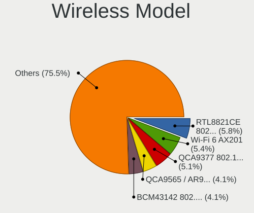

| Model                                                                | Computers | Percent |
|----------------------------------------------------------------------|-----------|---------|
| Realtek RTL8821CE 802.11ac PCIe Wireless Network Adapter             | 17        | 5.78%   |
| Intel Wi-Fi 6 AX201                                                  | 16        | 5.44%   |
| Qualcomm Atheros QCA9377 802.11ac Wireless Network Adapter           | 15        | 5.1%    |
| Qualcomm Atheros QCA9565 / AR9565 Wireless Network Adapter           | 12        | 4.08%   |
| Broadcom BCM43142 802.11b/g/n                                        | 12        | 4.08%   |
| Intel Comet Lake PCH CNVi WiFi                                       | 9         | 3.06%   |
| Realtek RTL8822CE 802.11ac PCIe Wireless Network Adapter             | 8         | 2.72%   |
| Ralink RT3290 Wireless 802.11n 1T/1R PCIe                            | 8         | 2.72%   |
| Qualcomm Atheros AR9285 Wireless Network Adapter (PCI-Express)       | 8         | 2.72%   |
| Intel Wireless 7265                                                  | 8         | 2.72%   |
| Realtek RTL8723BE PCIe Wireless Network Adapter                      | 7         | 2.38%   |
| Ralink MT7601U Wireless Adapter                                      | 7         | 2.38%   |
| Qualcomm Atheros AR9485 Wireless Network Adapter                     | 7         | 2.38%   |
| Realtek RTL8188FTV 802.11b/g/n 1T1R 2.4G WLAN Adapter                | 6         | 2.04%   |
| Intel Dual Band Wireless-AC 3165 Plus Bluetooth                      | 6         | 2.04%   |
| Intel Comet Lake PCH-LP CNVi WiFi                                    | 6         | 2.04%   |
| Ralink RT5370 Wireless Adapter                                       | 5         | 1.7%    |
| Qualcomm Atheros QCA6174 802.11ac Wireless Network Adapter           | 5         | 1.7%    |
| MediaTek MT7921 802.11ax PCIe Wireless Network Adapter [Filogic 330] | 5         | 1.7%    |
| MediaTek MT7902 802.11ax PCIe Wireless Network Adapter [Filogic 310] | 5         | 1.7%    |
| Intel Gemini Lake PCH CNVi WiFi                                      | 5         | 1.7%    |
| Qualcomm Atheros AR9462 Wireless Network Adapter                     | 4         | 1.36%   |
| Intel Wireless 8265 / 8275                                           | 4         | 1.36%   |
| Intel Wireless 8260                                                  | 4         | 1.36%   |
| Intel WiFi Link 5100                                                 | 4         | 1.36%   |
| Intel Tiger Lake PCH CNVi WiFi                                       | 4         | 1.36%   |
| Broadcom BCM4313 802.11bgn Wireless Network Adapter                  | 4         | 1.36%   |
| Realtek RTL8852BE PCIe 802.11ax Wireless Network Controller          | 3         | 1.02%   |
| Ralink RT5390 Wireless 802.11n 1T/1R PCIe                            | 3         | 1.02%   |
| Qualcomm Atheros AR9287 Wireless Network Adapter (PCI-Express)       | 3         | 1.02%   |
| MediaTek MT7922 802.11ax PCI Express Wireless Network Adapter        | 3         | 1.02%   |
| Intel Wi-Fi 6E(802.11ax) AX210/AX1675* 2x2 [Typhoon Peak]            | 3         | 1.02%   |
| Intel Wi-Fi 5(802.11ac) Wireless-AC 9x6x [Thunder Peak]              | 3         | 1.02%   |
| Intel Ice Lake-LP PCH CNVi WiFi                                      | 3         | 1.02%   |
| Intel Cannon Lake PCH CNVi WiFi                                      | 3         | 1.02%   |
| Realtek RTL8852AE 802.11ax PCIe Wireless Network Adapter             | 2         | 0.68%   |
| Realtek RTL8821AE 802.11ac PCIe Wireless Network Adapter             | 2         | 0.68%   |
| Realtek RTL8192EE PCIe Wireless Network Adapter                      | 2         | 0.68%   |
| Realtek RTL8188EUS 802.11n Wireless Network Adapter                  | 2         | 0.68%   |
| Ralink RT2790 Wireless 802.11n 1T/2R PCIe                            | 2         | 0.68%   |

Ethernet Vendor
---------------

Ethernet vendors

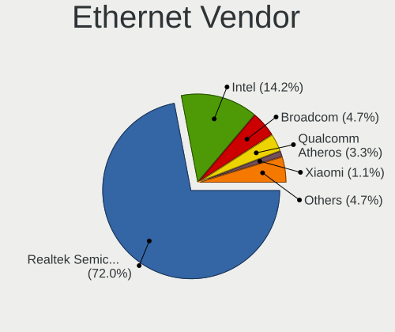

| Vendor                   | Computers | Percent |
|--------------------------|-----------|---------|
| Realtek Semiconductor    | 198       | 72%     |
| Intel                    | 39        | 14.18%  |
| Broadcom                 | 13        | 4.73%   |
| Qualcomm Atheros         | 9         | 3.27%   |
| Xiaomi                   | 3         | 1.09%   |
| Samsung Electronics      | 3         | 1.09%   |
| MediaTek                 | 2         | 0.73%   |
| ICS Advent               | 2         | 0.73%   |
| Raspberry Pi             | 1         | 0.36%   |
| OPPO Electronics         | 1         | 0.36%   |
| Microchip Technology     | 1         | 0.36%   |
| Marvell Technology Group | 1         | 0.36%   |
| Lenovo                   | 1         | 0.36%   |
| Huawei Technologies      | 1         | 0.36%   |

Ethernet Model
--------------

Ethernet models

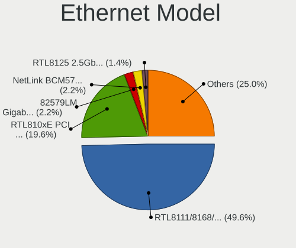

| Model                                                                  | Computers | Percent |
|------------------------------------------------------------------------|-----------|---------|
| Realtek RTL8111/8168/8211/8411 PCI Express Gigabit Ethernet Controller | 137       | 49.64%  |
| Realtek RTL810xE PCI Express Fast Ethernet controller                  | 54        | 19.57%  |
| Intel 82579LM Gigabit Network Connection (Lewisville)                  | 6         | 2.17%   |
| Broadcom NetLink BCM57780 Gigabit Ethernet PCIe                        | 6         | 2.17%   |
| Realtek RTL8125 2.5GbE Controller                                      | 4         | 1.45%   |
| Samsung Galaxy series, misc. (tethering mode)                          | 3         | 1.09%   |
| Intel Ethernet Connection I217-LM                                      | 3         | 1.09%   |
| Intel Alder Lake-P PCH CNVi WiFi                                       | 3         | 1.09%   |
| Intel 82577LM Gigabit Network Connection                               | 3         | 1.09%   |
| Broadcom NetXtreme BCM57786 Gigabit Ethernet PCIe                      | 3         | 1.09%   |
| Xiaomi Mi/Redmi series (RNDIS)                                         | 2         | 0.72%   |
| Realtek Killer E2600 GbE Controller                                    | 2         | 0.72%   |
| Qualcomm Atheros AR8151 v2.0 Gigabit Ethernet                          | 2         | 0.72%   |
| Qualcomm Atheros AR8132 Fast Ethernet                                  | 2         | 0.72%   |
| Intel Ethernet Controller I225-V                                       | 2         | 0.72%   |
| Intel Ethernet Connection I218-LM                                      | 2         | 0.72%   |
| Intel Ethernet Connection (7) I219-V                                   | 2         | 0.72%   |
| Intel Ethernet Connection (4) I219-LM                                  | 2         | 0.72%   |
| Intel Ethernet Connection (13) I219-V                                  | 2         | 0.72%   |
| Xiaomi Mi/Redmi series (RNDIS + ADB)                                   | 1         | 0.36%   |
| Realtek RTL8152 Fast Ethernet Adapter                                  | 1         | 0.36%   |
| Realtek RTL-8100/8101L/8139 PCI Fast Ethernet Adapter                  | 1         | 0.36%   |
| Raspberry Pi RP1 PCIe 2.0 South Bridge                                 | 1         | 0.36%   |
| Qualcomm Atheros QCA8172 Fast Ethernet                                 | 1         | 0.36%   |
| Qualcomm Atheros Attansic L2 Fast Ethernet                             | 1         | 0.36%   |
| Qualcomm Atheros AR8162 Fast Ethernet                                  | 1         | 0.36%   |
| Qualcomm Atheros AR8161 Gigabit Ethernet                               | 1         | 0.36%   |
| Qualcomm Atheros AR8152 v2.0 Fast Ethernet                             | 1         | 0.36%   |
| OPPO Ace 3V                                                            | 1         | 0.36%   |
| Microchip SMSC9512/9514 Fast Ethernet Adapter                          | 1         | 0.36%   |
| MediaTek MT7922 802.11ax PCI Express Wireless Network Adapter          | 1         | 0.36%   |
| MediaTek Infinix HOT 50i                                               | 1         | 0.36%   |
| Marvell Group 88E8042 PCI-E Fast Ethernet Controller                   | 1         | 0.36%   |
| Lenovo ThinkPad Lan                                                    | 1         | 0.36%   |
| Intel I211 Gigabit Network Connection                                  | 1         | 0.36%   |
| Intel Ethernet Connection I219-LM                                      | 1         | 0.36%   |
| Intel Ethernet Connection I218-V                                       | 1         | 0.36%   |
| Intel Ethernet Connection (7) I219-LM                                  | 1         | 0.36%   |
| Intel Ethernet Connection (5) I219-LM                                  | 1         | 0.36%   |
| Intel Ethernet Connection (4) I219-V                                   | 1         | 0.36%   |

Net Controller Kind
-------------------

Ethernet, WiFi or modem

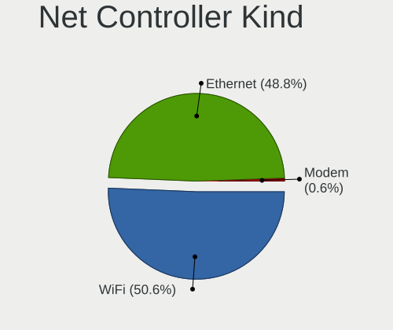

| Kind     | Computers | Percent |
|----------|-----------|---------|
| WiFi     | 273       | 50.65%  |
| Ethernet | 263       | 48.79%  |
| Modem    | 3         | 0.56%   |

Used Controller
---------------

Currently used network controller

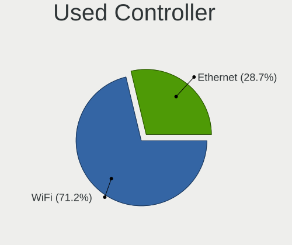

| Kind     | Computers | Percent |
|----------|-----------|---------|
| WiFi     | 228       | 71.25%  |
| Ethernet | 92        | 28.75%  |

NICs
----

Total network controllers on board

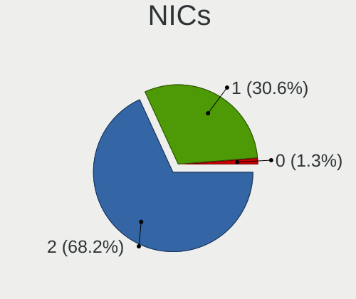

| Total | Computers | Percent |
|-------|-----------|---------|
| 2     | 214       | 68.15%  |
| 1     | 96        | 30.57%  |
| 0     | 4         | 1.27%   |

IPv6
----

IPv6 vs IPv4

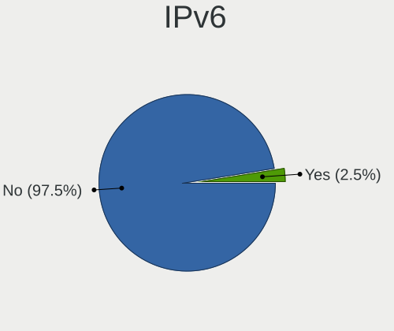

| Used | Computers | Percent |
|------|-----------|---------|
| No   | 306       | 97.45%  |
| Yes  | 8         | 2.55%   |

Bluetooth
---------

Bluetooth Vendor
----------------

Controller vendors

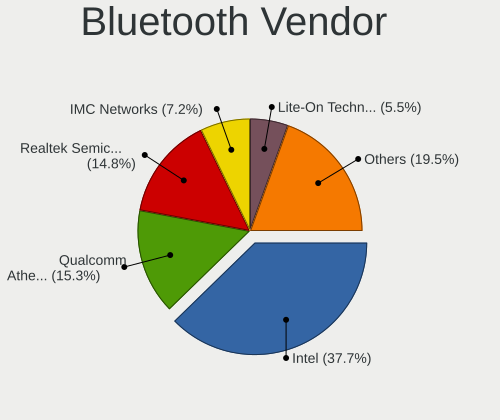

| Vendor                          | Computers | Percent |
|---------------------------------|-----------|---------|
| Intel                           | 89        | 37.71%  |
| Qualcomm Atheros Communications | 36        | 15.25%  |
| Realtek Semiconductor           | 35        | 14.83%  |
| IMC Networks                    | 17        | 7.2%    |
| Lite-On Technology              | 13        | 5.51%   |
| Broadcom                        | 12        | 5.08%   |
| Foxconn / Hon Hai               | 9         | 3.81%   |
| Ralink                          | 8         | 3.39%   |
| Cambridge Silicon Radio         | 5         | 2.12%   |
| Toshiba                         | 4         | 1.69%   |
| Hewlett-Packard                 | 2         | 0.85%   |
| Apple                           | 2         | 0.85%   |
| Realtek                         | 1         | 0.42%   |
| Ralink Technology               | 1         | 0.42%   |
| Dell                            | 1         | 0.42%   |
| ASUSTek Computer                | 1         | 0.42%   |

Bluetooth Model
---------------

Controller models

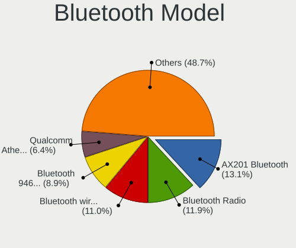

| Model                                               | Computers | Percent |
|-----------------------------------------------------|-----------|---------|
| Intel AX201 Bluetooth                               | 31        | 13.14%  |
| Realtek Bluetooth Radio                             | 28        | 11.86%  |
| Intel Bluetooth wireless interface                  | 26        | 11.02%  |
| Intel Bluetooth 9460/9560 Jefferson Peak (JfP)      | 21        | 8.9%    |
| Qualcomm Atheros  Bluetooth Device                  | 15        | 6.36%   |
| Qualcomm Atheros AR3011 Bluetooth                   | 9         | 3.81%   |
| IMC Networks Wireless_Device                        | 9         | 3.81%   |
| Ralink RT3290 Bluetooth                             | 8         | 3.39%   |
| IMC Networks Bluetooth Radio                        | 7         | 2.97%   |
| Realtek  Bluetooth 4.2 Adapter                      | 5         | 2.12%   |
| Qualcomm Atheros QCA61x4 Bluetooth 4.0              | 5         | 2.12%   |
| Lite-On Bluetooth Device                            | 5         | 2.12%   |
| Cambridge Silicon Radio Bluetooth Dongle (HCI mode) | 5         | 2.12%   |
| Broadcom BCM43142 Bluetooth 4.0                     | 4         | 1.69%   |
| Qualcomm Atheros AR9462 Bluetooth                   | 3         | 1.27%   |
| Qualcomm Atheros AR3012 Bluetooth 4.0               | 3         | 1.27%   |
| Lite-On Broadcom BCM43142A0 Bluetooth Device        | 3         | 1.27%   |
| Intel AX210 Bluetooth                               | 3         | 1.27%   |
| Foxconn / Hon Hai Wireless_Device                   | 3         | 1.27%   |
| Foxconn / Hon Hai Bluetooth Device                  | 3         | 1.27%   |
| Broadcom BCM43142A0 Bluetooth 4.0                   | 3         | 1.27%   |
| Realtek RTL8723B Bluetooth                          | 2         | 0.85%   |
| Lite-On Qualcomm Atheros QCA9377 Bluetooth          | 2         | 0.85%   |
| Lite-On BCM43142A0                                  | 2         | 0.85%   |
| Intel Wireless-AC 9260 Bluetooth Adapter            | 2         | 0.85%   |
| Intel Wireless-AC 3168 Bluetooth                    | 2         | 0.85%   |
| Intel Bluetooth Device                              | 2         | 0.85%   |
| HP Broadcom 2070 Bluetooth Combo                    | 2         | 0.85%   |
| Foxconn / Hon Hai MediaTek Bluetooth Adapter        | 2         | 0.85%   |
| Broadcom BCM2070 Bluetooth 2.1 + EDR                | 2         | 0.85%   |
| Toshiba RT Bluetooth Radio                          | 1         | 0.42%   |
| Toshiba Bluetooth USB Host Controller               | 1         | 0.42%   |
| Toshiba BCM43142A0                                  | 1         | 0.42%   |
| Toshiba Askey Bluetooth Module                      | 1         | 0.42%   |
| Realtek Bluetooth Radio                             | 1         | 0.42%   |
| Ralink Motorola BC4 Bluetooth 3.0+HS Adapter        | 1         | 0.42%   |
| Qualcomm Atheros Bluetooth USB Host Controller      | 1         | 0.42%   |
| Lite-On Atheros AR3012 Bluetooth                    | 1         | 0.42%   |
| Intel Centrino Bluetooth Wireless Transceiver       | 1         | 0.42%   |
| Intel Centrino Advanced-N 6230 Bluetooth adapter    | 1         | 0.42%   |

Sound
-----

Sound Vendor
------------

Sound card vendors

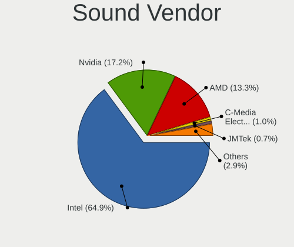

| Vendor                   | Computers | Percent |
|--------------------------|-----------|---------|
| Intel                    | 264       | 64.86%  |
| Nvidia                   | 70        | 17.2%   |
| AMD                      | 54        | 13.27%  |
| C-Media Electronics      | 4         | 0.98%   |
| JMTek                    | 3         | 0.74%   |
| DSEA A/S                 | 2         | 0.49%   |
| Xiamen VBeT Electronics  | 1         | 0.25%   |
| Weltrend Semiconductor   | 1         | 0.25%   |
| Sony                     | 1         | 0.25%   |
| Razer USA                | 1         | 0.25%   |
| Plantronics              | 1         | 0.25%   |
| Patriot Memory           | 1         | 0.25%   |
| Micro Star International | 1         | 0.25%   |
| Lenovo                   | 1         | 0.25%   |
| Generalplus Technology   | 1         | 0.25%   |
| ASUSTek Computer         | 1         | 0.25%   |

Sound Model
-----------

Sound card models

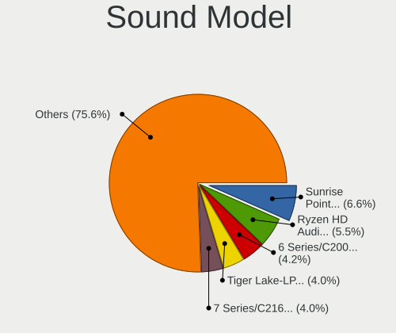

| Model                                                                                             | Computers | Percent |
|---------------------------------------------------------------------------------------------------|-----------|---------|
| Intel Sunrise Point-LP HD Audio                                                                   | 31        | 6.58%   |
| AMD Ryzen HD Audio Controller                                                                     | 26        | 5.52%   |
| Intel 6 Series/C200 Series Chipset Family High Definition Audio Controller                        | 20        | 4.25%   |
| Intel Tiger Lake-LP Smart Sound Technology Audio Controller                                       | 19        | 4.03%   |
| Intel 7 Series/C216 Chipset Family High Definition Audio Controller                               | 19        | 4.03%   |
| Intel 8 Series HD Audio Controller                                                                | 17        | 3.61%   |
| Intel Haswell-ULT HD Audio Controller                                                             | 16        | 3.4%    |
| Intel 82801I (ICH9 Family) HD Audio Controller                                                    | 14        | 2.97%   |
| Intel 8 Series/C220 Series Chipset High Definition Audio Controller                               | 14        | 2.97%   |
| Intel 5 Series/3400 Series Chipset High Definition Audio                                          | 13        | 2.76%   |
| Intel Cannon Lake PCH cAVS                                                                        | 11        | 2.34%   |
| Intel Wildcat Point-LP High Definition Audio Controller                                           | 10        | 2.12%   |
| Intel Comet Lake PCH cAVS                                                                         | 10        | 2.12%   |
| Intel Broadwell-U Audio Controller                                                                | 10        | 2.12%   |
| Nvidia TU107 GeForce GTX 1650 High Definition Audio Controller                                    | 9         | 1.91%   |
| Intel Xeon E3-1200 v3/4th Gen Core Processor HD Audio Controller                                  | 9         | 1.91%   |
| Nvidia TU116 High Definition Audio Controller                                                     | 8         | 1.7%    |
| Intel Celeron/Pentium Silver Processor High Definition Audio                                      | 8         | 1.7%    |
| Intel Alder Lake PCH-P High Definition Audio Controller                                           | 8         | 1.7%    |
| Intel 100 Series/C230 Series Chipset Family HD Audio Controller                                   | 8         | 1.7%    |
| AMD Raven/Raven2/Fenghuang HDMI/DP Audio Controller                                               | 8         | 1.7%    |
| Intel Comet Lake PCH-LP cAVS                                                                      | 7         | 1.49%   |
| Nvidia High Definition Audio Controller                                                           | 6         | 1.27%   |
| Nvidia GP107GL High Definition Audio Controller                                                   | 6         | 1.27%   |
| Nvidia GM107 High Definition Audio Controller [GeForce 940MX]                                     | 6         | 1.27%   |
| Intel Tiger Lake-H HD Audio Controller                                                            | 6         | 1.27%   |
| Intel NM10/ICH7 Family High Definition Audio Controller                                           | 6         | 1.27%   |
| Intel Ice Lake-LP Smart Sound Technology Audio Controller                                         | 6         | 1.27%   |
| AMD Starship/Matisse HD Audio Controller                                                          | 6         | 1.27%   |
| AMD Renoir/Cezanne HDMI/DP Audio Controller                                                       | 6         | 1.27%   |
| AMD Radeon High Definition Audio Controller                                                       | 6         | 1.27%   |
| Nvidia GK208 HDMI/DP Audio Controller                                                             | 5         | 1.06%   |
| Intel Raptor Lake-P/U/H cAVS                                                                      | 5         | 1.06%   |
| Nvidia GF108 High Definition Audio Controller                                                     | 4         | 0.85%   |
| Nvidia GA107 High Definition Audio Controller                                                     | 4         | 0.85%   |
| Nvidia GA106 High Definition Audio Controller                                                     | 4         | 0.85%   |
| Intel CM238 HD Audio Controller                                                                   | 4         | 0.85%   |
| Intel Atom/Celeron/Pentium Processor x5-E8000/J3xxx/N3xxx Series High Definition Audio Controller | 4         | 0.85%   |
| Intel 82801JI (ICH10 Family) HD Audio Controller                                                  | 4         | 0.85%   |
| AMD RV710/730 HDMI Audio [Radeon HD 4000 series]                                                  | 4         | 0.85%   |

Memory
------

Memory Vendor
-------------

Memory module vendors

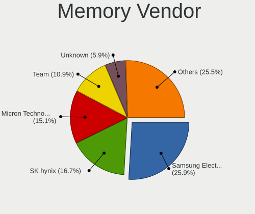

| Vendor                       | Computers | Percent |
|------------------------------|-----------|---------|
| Samsung Electronics          | 62        | 25.94%  |
| SK hynix                     | 40        | 16.74%  |
| Micron Technology            | 36        | 15.06%  |
| Team                         | 26        | 10.88%  |
| Unknown                      | 14        | 5.86%   |
| A-DATA Technology            | 12        | 5.02%   |
| Nanya Technology             | 6         | 2.51%   |
| Elpida                       | 6         | 2.51%   |
| Crucial                      | 5         | 2.09%   |
| Ramaxel Technology           | 4         | 1.67%   |
| Kingston                     | 4         | 1.67%   |
| Patriot                      | 3         | 1.26%   |
| Unknown (ABCD)               | 2         | 0.84%   |
| TwinMOS                      | 2         | 0.84%   |
| Toshiba                      | 2         | 0.84%   |
| Hikvision                    | 2         | 0.84%   |
| GOODRAM                      | 2         | 0.84%   |
| Transcend                    | 1         | 0.42%   |
| PNY                          | 1         | 0.42%   |
| Patriot Memory (PDP Systems) | 1         | 0.42%   |
| Melco                        | 1         | 0.42%   |
| Kimtigo                      | 1         | 0.42%   |
| G.Skill                      | 1         | 0.42%   |
| Carry                        | 1         | 0.42%   |
| ASint Technology             | 1         | 0.42%   |
| Apacer                       | 1         | 0.42%   |
| 0BBA00000000                 | 1         | 0.42%   |
| Unknown                      | 1         | 0.42%   |

Memory Model
------------

Memory module models

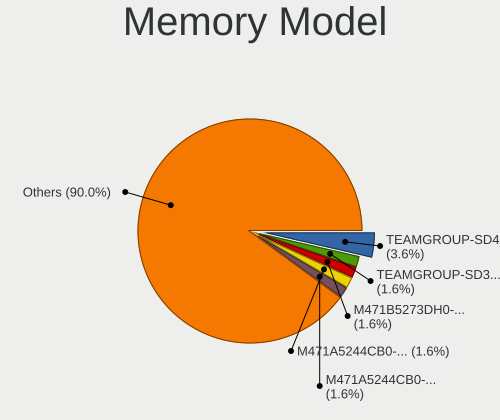

| Model                                                       | Computers | Percent |
|-------------------------------------------------------------|-----------|---------|
| Team RAM TEAMGROUP-SD4-3200 16GB SODIMM DDR4 3200MT/s       | 9         | 3.61%   |
| Team RAM TEAMGROUP-SD3-1600 8GB SODIMM DDR3 1600MT/s        | 4         | 1.61%   |
| SK hynix RAM HMA81GS6AFR8N-UH 8GB SODIMM DDR4 2667MT/s      | 4         | 1.61%   |
| Samsung RAM M471B5273DH0-CH9 4GB SODIMM DDR3 1600MT/s       | 4         | 1.61%   |
| Samsung RAM M471A5244CB0-CWE 4GB SODIMM DDR4 3200MT/s       | 4         | 1.61%   |
| Samsung RAM M471A5244CB0-CTD 4GB SODIMM DDR4 3266MT/s       | 4         | 1.61%   |
| Samsung RAM M471A1G44AB0-CWE 8GiB SODIMM DDR4 3200MT/s      | 4         | 1.61%   |
| Micron RAM Module 4GB Row Of Chips DDR4 2400MT/s            | 4         | 1.61%   |
| SK hynix RAM HMT351S6CFR8C-PB 4GB SODIMM DDR3 1600MT/s      | 3         | 1.2%    |
| SK hynix RAM HMA81GS6JJR8N-VK 8GB SODIMM DDR4 2667MT/s      | 3         | 1.2%    |
| Samsung RAM M471B5273EB0-CK0 4GB SODIMM DDR3 4199MT/s       | 3         | 1.2%    |
| Samsung RAM M471B5173QH0-YK0 4GB SODIMM DDR3 1600MT/s       | 3         | 1.2%    |
| Samsung RAM M471B5173DB0-YK0 4GB SODIMM DDR3 1600MT/s       | 3         | 1.2%    |
| Nanya RAM NT2GC64B88B0NS-CG 2048MB SODIMM DDR3 1334MT/s     | 3         | 1.2%    |
| Micron RAM 4ATF1G64HZ-3G2F1 8GB SODIMM DDR4 3200MT/s        | 3         | 1.2%    |
| A-DATA RAM Module 16GB SODIMM DDR4 2667MT/s                 | 3         | 1.2%    |
| Toshiba RAM 8HTF12864HDY-800G1 2GB SODIMM 1066MT/s          | 2         | 0.8%    |
| Toshiba RAM 64T128020EDL2.5C2 2GB SODIMM 1066MT/s           | 2         | 0.8%    |
| Team RAM TEAMGROUP-UD4-3200 8GB DIMM DDR4 3733MT/s          | 2         | 0.8%    |
| Team RAM TEAMGROUP-UD4-2400 8GB DIMM DDR4 3000MT/s          | 2         | 0.8%    |
| Team RAM TEAMGROUP-SD4-3200 32GB Row Of Chips DDR4 3200MT/s | 2         | 0.8%    |
| Team RAM TEAMGROUP-SD4-2666 8GB SODIMM DDR4 2667MT/s        | 2         | 0.8%    |
| Team RAM TEAMGROUP-SD4-2400 16GB SODIMM DDR4 8400MT/s       | 2         | 0.8%    |
| SK hynix RAM HMT351S6CFR8C-H9 4GB SODIMM DDR3 1334MT/s      | 2         | 0.8%    |
| SK hynix RAM HMA851S6AFR6N-UH 4GB SODIMM DDR4 2667MT/s      | 2         | 0.8%    |
| SK hynix RAM HMA81GS6DJR8N-XN 8GB SODIMM DDR4 3200MT/s      | 2         | 0.8%    |
| Samsung RAM M471B5173EB0-YK0 4GB SODIMM DDR3 1600MT/s       | 2         | 0.8%    |
| Samsung RAM M471B1G73QH0-YK0 8GB SODIMM DDR3 1600MT/s       | 2         | 0.8%    |
| Samsung RAM M471A5244CB0-CWE 4GB Row Of Chips DDR4 3200MT/s | 2         | 0.8%    |
| Samsung RAM M471A5244CB0-CRC 4GB SODIMM DDR4 2667MT/s       | 2         | 0.8%    |
| Samsung RAM M471A1K43EB1-CWE 8GB SODIMM DDR4 3200MT/s       | 2         | 0.8%    |
| Samsung RAM M471A1K43DB1-CWE 8GB SODIMM DDR4 3200MT/s       | 2         | 0.8%    |
| Samsung RAM M471A1K43CB1-CTD 8GB SODIMM DDR4 3200MT/s       | 2         | 0.8%    |
| Samsung RAM M471A1G44BB0-CWE 8GB Row Of Chips DDR4 3200MT/s | 2         | 0.8%    |
| Micron RAM MT40A512M16TB-062E:R 4GB SODIMM DDR4 3200MT/s    | 2         | 0.8%    |
| Micron RAM 4ATF1G64HZ-3G2E2 8GB SODIMM DDR4 3200MT/s        | 2         | 0.8%    |
| Micron RAM 4ATF1G64HZ-3G2E1 8GB SODIMM DDR4 3200MT/s        | 2         | 0.8%    |
| Unknown RAM Module 4GB SODIMM DDR3 1333MT/s                 | 1         | 0.4%    |
| Unknown RAM Module 4GB DIMM SDRAM                           | 1         | 0.4%    |
| Unknown RAM Module 4GB DIMM DDR3 1333MT/s                   | 1         | 0.4%    |

Memory Kind
-----------

Memory module kinds

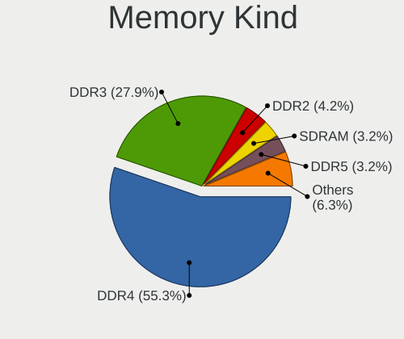

| Kind    | Computers | Percent |
|---------|-----------|---------|
| DDR4    | 105       | 55.26%  |
| DDR3    | 53        | 27.89%  |
| DDR2    | 8         | 4.21%   |
| SDRAM   | 6         | 3.16%   |
| DDR5    | 6         | 3.16%   |
| LPDDR4  | 5         | 2.63%   |
| LPDDR5  | 3         | 1.58%   |
| LPDDR3  | 2         | 1.05%   |
| Unknown | 2         | 1.05%   |

Memory Form Factor
------------------

Physical design of the memory module

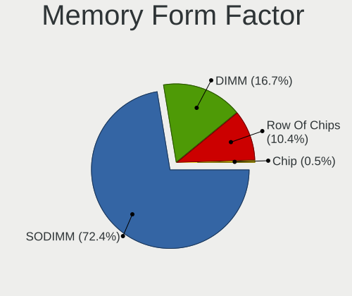

| Name         | Computers | Percent |
|--------------|-----------|---------|
| SODIMM       | 139       | 72.4%   |
| DIMM         | 32        | 16.67%  |
| Row Of Chips | 20        | 10.42%  |
| Chip         | 1         | 0.52%   |

Memory Size
-----------

Memory module size

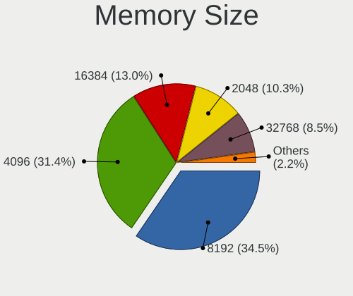

| Size  | Computers | Percent |
|-------|-----------|---------|
| 8192  | 77        | 34.53%  |
| 4096  | 70        | 31.39%  |
| 16384 | 29        | 13%     |
| 2048  | 23        | 10.31%  |
| 32768 | 19        | 8.52%   |
| 1024  | 5         | 2.24%   |

Memory Speed
------------

Memory module speed

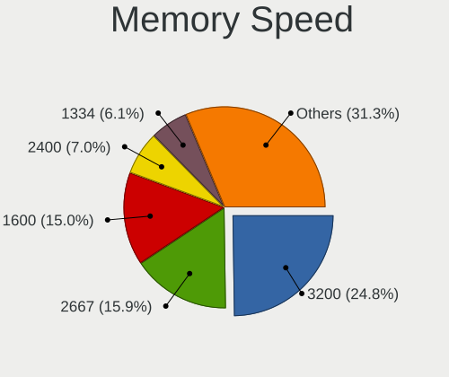

| Speed   | Computers | Percent |
|---------|-----------|---------|
| 3200    | 53        | 24.77%  |
| 2667    | 34        | 15.89%  |
| 1600    | 32        | 14.95%  |
| 2400    | 15        | 7.01%   |
| 1334    | 13        | 6.07%   |
| 1333    | 8         | 3.74%   |
| 4800    | 5         | 2.34%   |
| 2133    | 5         | 2.34%   |
| 667     | 5         | 2.34%   |
| 3266    | 4         | 1.87%   |
| 3000    | 4         | 1.87%   |
| 1066    | 4         | 1.87%   |
| Unknown | 4         | 1.87%   |
| 4199    | 3         | 1.4%    |
| 1867    | 3         | 1.4%    |
| 8400    | 2         | 0.93%   |
| 6400    | 2         | 0.93%   |
| 3733    | 2         | 0.93%   |
| 3600    | 2         | 0.93%   |
| 1067    | 2         | 0.93%   |
| 800     | 2         | 0.93%   |
| 49926   | 1         | 0.47%   |
| 12800   | 1         | 0.47%   |
| 5600    | 1         | 0.47%   |
| 3800    | 1         | 0.47%   |
| 3333    | 1         | 0.47%   |
| 2666    | 1         | 0.47%   |
| 2465    | 1         | 0.47%   |
| 1648    | 1         | 0.47%   |
| 975     | 1         | 0.47%   |
| 400     | 1         | 0.47%   |

Printers & scanners
-------------------

Printer Vendor
--------------

Printer device vendors

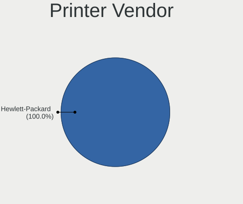

| Vendor          | Computers | Percent |
|-----------------|-----------|---------|
| Hewlett-Packard | 4         | 66.67%  |
| Seiko Epson     | 1         | 16.67%  |
| Canon           | 1         | 16.67%  |

Printer Model
-------------

Printer device models

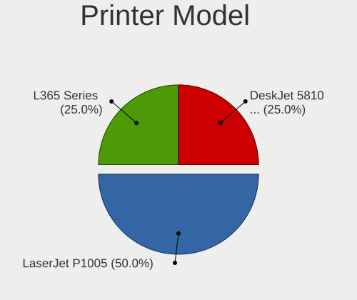

| Model                   | Computers | Percent |
|-------------------------|-----------|---------|
| HP LaserJet P1005       | 2         | 33.33%  |
| Seiko Epson L365 Series | 1         | 16.67%  |
| HP DeskJet 5810 series  | 1         | 16.67%  |
| HP Deskjet 1010 series  | 1         | 16.67%  |
| Canon G2010 series      | 1         | 16.67%  |

Scanner Vendor
--------------

Scanner device vendors

Zero info for selected period =(

Scanner Model
-------------

Scanner device models

Zero info for selected period =(

Camera
------

Camera Vendor
-------------

Camera device vendors

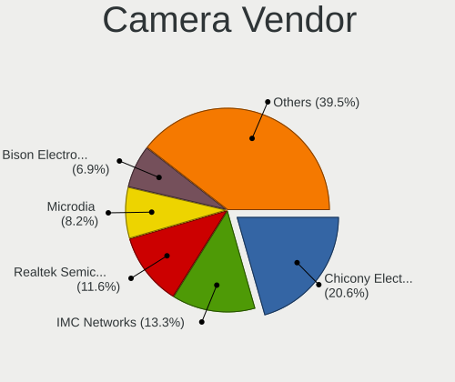

| Vendor                                 | Computers | Percent |
|----------------------------------------|-----------|---------|
| Chicony Electronics                    | 48        | 20.6%   |
| IMC Networks                           | 31        | 13.3%   |
| Realtek Semiconductor                  | 27        | 11.59%  |
| Microdia                               | 19        | 8.15%   |
| Bison Electronics                      | 16        | 6.87%   |
| Suyin                                  | 11        | 4.72%   |
| Syntek                                 | 10        | 4.29%   |
| Cheng Uei Precision Industry (Foxlink) | 10        | 4.29%   |
| Sunplus Innovation Technology          | 9         | 3.86%   |
| Quanta                                 | 8         | 3.43%   |
| Luxvisions Innotech Limited            | 7         | 3%      |
| Lite-On Technology                     | 6         | 2.58%   |
| Acer                                   | 5         | 2.15%   |
| Sonix Technology                       | 4         | 1.72%   |
| Alcor Micro                            | 4         | 1.72%   |
| Ricoh                                  | 2         | 0.86%   |
| Lenovo                                 | 2         | 0.86%   |
| BillionPixels                          | 2         | 0.86%   |
| Apple                                  | 2         | 0.86%   |
| ALi                                    | 2         | 0.86%   |
| Silicon Motion                         | 1         | 0.43%   |
| ShineTech                              | 1         | 0.43%   |
| Samsung Electronics                    | 1         | 0.43%   |
| Primax Electronics                     | 1         | 0.43%   |
| Importek                               | 1         | 0.43%   |
| Genesys Logic                          | 1         | 0.43%   |
| Cubeternet                             | 1         | 0.43%   |
| A4Tech                                 | 1         | 0.43%   |

Camera Model
------------

Camera device models

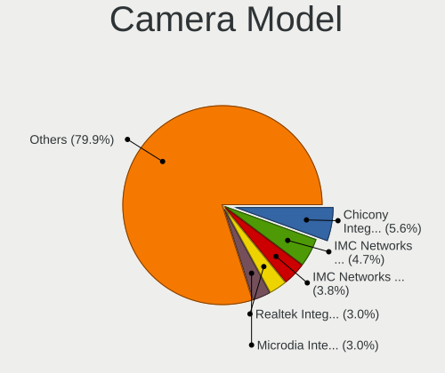

| Model                                                                      | Computers | Percent |
|----------------------------------------------------------------------------|-----------|---------|
| Chicony Integrated Camera                                                  | 13        | 5.56%   |
| IMC Networks USB2.0 HD UVC WebCam                                          | 11        | 4.7%    |
| IMC Networks Integrated Camera                                             | 9         | 3.85%   |
| Realtek Integrated_Webcam_HD                                               | 7         | 2.99%   |
| Microdia Integrated_Webcam_HD                                              | 7         | 2.99%   |
| Chicony HD WebCam                                                          | 6         | 2.56%   |
| Syntek Integrated Camera                                                   | 5         | 2.14%   |
| Sunplus Integrated_Webcam_HD                                               | 5         | 2.14%   |
| Luxvisions Innotech Limited HP TrueVision HD Camera                        | 5         | 2.14%   |
| IMC Networks USB2.0 VGA UVC WebCam                                         | 5         | 2.14%   |
| Bison Integrated Camera                                                    | 5         | 2.14%   |
| Acer Integrated Camera                                                     | 5         | 2.14%   |
| Realtek USB Camera                                                         | 4         | 1.71%   |
| Quanta HD WebCam                                                           | 4         | 1.71%   |
| Microdia Laptop_Integrated_Webcam_HD                                       | 4         | 1.71%   |
| Lite-On Integrated Camera                                                  | 4         | 1.71%   |
| Chicony USB2.0 VGA UVC WebCam                                              | 4         | 1.71%   |
| Chicony USB2.0 HD UVC WebCam                                               | 4         | 1.71%   |
| Bison HD Webcam                                                            | 4         | 1.71%   |
| Syntek EasyCamera                                                          | 3         | 1.28%   |
| Sonix USB2.0 HD UVC WebCam                                                 | 3         | 1.28%   |
| Realtek USB2.0 VGA UVC WebCam                                              | 3         | 1.28%   |
| Realtek USB2.0 HD UVC WebCam                                               | 3         | 1.28%   |
| Bison EasyCamera                                                           | 3         | 1.28%   |
| Suyin Integrated_Webcam_HD                                                 | 2         | 0.85%   |
| Suyin HP TrueVision HD                                                     | 2         | 0.85%   |
| Realtek Integrated Webcam HD                                               | 2         | 0.85%   |
| Realtek EasyCamera                                                         | 2         | 0.85%   |
| Quanta HP Webcam                                                           | 2         | 0.85%   |
| Microdia Webcam SC-10HDD12636P                                             | 2         | 0.85%   |
| Microdia Dell Laptop Integrated Webcam HD                                  | 2         | 0.85%   |
| IMC Networks Lenovo EasyCamera                                             | 2         | 0.85%   |
| IMC Networks HP TrueVision HD Camera                                       | 2         | 0.85%   |
| Chicony Lenovo EasyCamera                                                  | 2         | 0.85%   |
| Chicony EasyCamera                                                         | 2         | 0.85%   |
| Chicony 1.3M Webcam                                                        | 2         | 0.85%   |
| Cheng Uei Precision Industry (Foxlink) HP Wide Vision HD integrated webcam | 2         | 0.85%   |
| Cheng Uei Precision Industry (Foxlink) HP Webcam                           | 2         | 0.85%   |
| Cheng Uei Precision Industry (Foxlink) HP TrueVision HD                    | 2         | 0.85%   |
| Cheng Uei Precision Industry (Foxlink) HP HD Camera                        | 2         | 0.85%   |

Security
--------

Fingerprint Vendor
------------------

Fingerprint sensor vendors

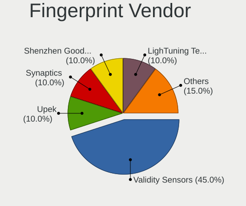

| Vendor                             | Computers | Percent |
|------------------------------------|-----------|---------|
| Validity Sensors                   | 9         | 45%     |
| Upek                               | 2         | 10%     |
| Synaptics                          | 2         | 10%     |
| Shenzhen Goodix Technology         | 2         | 10%     |
| LighTuning Technology              | 2         | 10%     |
| AuthenTec                          | 2         | 10%     |
| Realtek USB2.0 Finger Print Bridge | 1         | 5%      |

Fingerprint Model
-----------------

Fingerprint sensor models

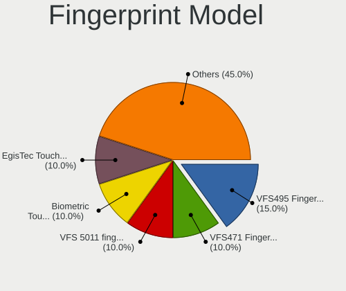

| Model                                                           | Computers | Percent |
|-----------------------------------------------------------------|-----------|---------|
| Validity Sensors VFS495 Fingerprint Reader                      | 3         | 15%     |
| Validity Sensors VFS471 Fingerprint Reader                      | 2         | 10%     |
| Validity Sensors VFS 5011 fingerprint sensor                    | 2         | 10%     |
| Upek Biometric Touchchip/Touchstrip Fingerprint Sensor          | 2         | 10%     |
| LighTuning EgisTec Touch Fingerprint Sensor                     | 2         | 10%     |
| AuthenTec AES1600                                               | 2         | 10%     |
| Validity Sensors Synaptics WBDI                                 | 1         | 5%      |
| Validity Sensors Fingerprint scanner                            | 1         | 5%      |
| Synaptics Metallica MOH Touch Fingerprint Reader                | 1         | 5%      |
| Synaptics Metallica MIS Touch Fingerprint Reader                | 1         | 5%      |
| Shenzhen Goodix  FingerPrint Device                             | 1         | 5%      |
| Shenzhen Goodix Fingerprint Reader                              | 1         | 5%      |
| Realtek USB2.0 Finger Print Bridge FocalTech Fingerprint Device | 1         | 5%      |

Chipcard Vendor
---------------

Chipcard module vendors

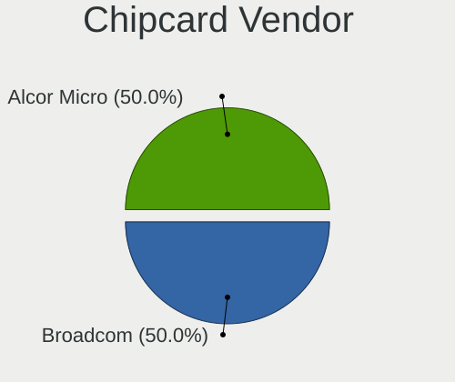

| Vendor      | Computers | Percent |
|-------------|-----------|---------|
| Alcor Micro | 3         | 60%     |
| Broadcom    | 2         | 40%     |

Chipcard Model
--------------

Chipcard module models

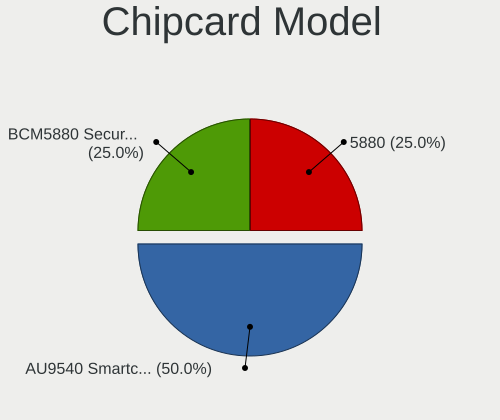

| Model                                                                        | Computers | Percent |
|------------------------------------------------------------------------------|-----------|---------|
| Alcor Micro AU9540 Smartcard Reader                                          | 3         | 60%     |
| Broadcom BCM5880 Secure Applications Processor with fingerprint swipe sensor | 1         | 20%     |
| Broadcom 5880                                                                | 1         | 20%     |

Unsupported
-----------

Unsupported Devices
-------------------

Total unsupported devices on board

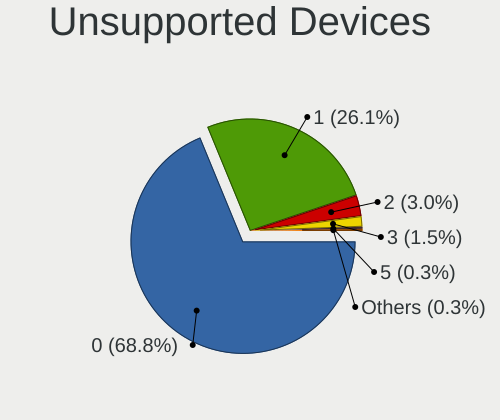

| Total | Computers | Percent |
|-------|-----------|---------|
| 0     | 227       | 68.79%  |
| 1     | 86        | 26.06%  |
| 2     | 10        | 3.03%   |
| 3     | 5         | 1.52%   |
| 5     | 1         | 0.3%    |
| 4     | 1         | 0.3%    |

Unsupported Device Types
------------------------

Types of unsupported devices

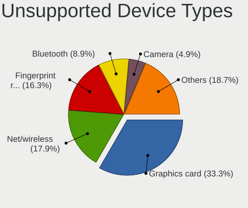

| Type                     | Computers | Percent |
|--------------------------|-----------|---------|
| Graphics card            | 41        | 33.33%  |
| Net/wireless             | 22        | 17.89%  |
| Fingerprint reader       | 20        | 16.26%  |
| Bluetooth                | 11        | 8.94%   |
| Camera                   | 6         | 4.88%   |
| Communication controller | 5         | 4.07%   |
| Chipcard                 | 5         | 4.07%   |
| Net/ethernet             | 3         | 2.44%   |
| Multimedia controller    | 3         | 2.44%   |
| Storage                  | 2         | 1.63%   |
| Sound                    | 2         | 1.63%   |
| Card reader              | 2         | 1.63%   |
| Network                  | 1         | 0.81%   |

