Linux in Tunisia - Tested Hardware & Statistics
-----------------------------------------------

A project to collect tested hardware configurations for Linux in Tunisia.

Anyone can contribute to this report by the [hw-probe](https://github.com/linuxhw/hw-probe) tool:

    sudo -E hw-probe -all -upload

Please contribute! Especially if your hardware is rare.

This is a report for all computer types. See also reports for [desktops](/Location/Tunisia/Desktop/README.md) and [notebooks](/Location/Tunisia/Notebook/README.md).

Contents
--------

* [ Test Cases ](#test-cases)

* [ System ](#system)
  - [ OS                       ](#os)
  - [ OS Family                ](#os-family)
  - [ Kernel                   ](#kernel)
  - [ Kernel Family            ](#kernel-family)
  - [ Kernel Major Ver.        ](#kernel-major-ver)
  - [ Arch                     ](#arch)
  - [ DE                       ](#de)
  - [ Display Server           ](#display-server)
  - [ Display Manager          ](#display-manager)
  - [ OS Lang                  ](#os-lang)
  - [ Boot Mode                ](#boot-mode)
  - [ Filesystem               ](#filesystem)
  - [ Part. scheme             ](#part-scheme)
  - [ Dual Boot with Linux/BSD ](#dual-boot-with-linuxbsd)
  - [ Dual Boot (Win)          ](#dual-boot-win)

* [ Board ](#board)
  - [ Vendor                   ](#vendor)
  - [ Model                    ](#model)
  - [ Model Family             ](#model-family)
  - [ MFG Year                 ](#mfg-year)
  - [ Form Factor              ](#form-factor)
  - [ Secure Boot              ](#secure-boot)
  - [ Coreboot                 ](#coreboot)
  - [ RAM Size                 ](#ram-size)
  - [ RAM Used                 ](#ram-used)
  - [ Total Drives             ](#total-drives)
  - [ Has CD-ROM               ](#has-cd-rom)
  - [ Has Ethernet             ](#has-ethernet)
  - [ Has WiFi                 ](#has-wifi)
  - [ Has Bluetooth            ](#has-bluetooth)

* [ Location ](#location)
  - [ Country                  ](#country)
  - [ City                     ](#city)

* [ Drives ](#drives)
  - [ Drive Vendor             ](#drive-vendor)
  - [ Drive Model              ](#drive-model)
  - [ HDD Vendor               ](#hdd-vendor)
  - [ SSD Vendor               ](#ssd-vendor)
  - [ Drive Kind               ](#drive-kind)
  - [ Drive Connector          ](#drive-connector)
  - [ Drive Size               ](#drive-size)
  - [ Space Total              ](#space-total)
  - [ Space Used               ](#space-used)
  - [ Malfunc. Drives          ](#malfunc-drives)
  - [ Malfunc. Drive Vendor    ](#malfunc-drive-vendor)
  - [ Malfunc. HDD Vendor      ](#malfunc-hdd-vendor)
  - [ Malfunc. Drive Kind      ](#malfunc-drive-kind)
  - [ Failed Drives            ](#failed-drives)
  - [ Failed Drive Vendor      ](#failed-drive-vendor)
  - [ Drive Status             ](#drive-status)

* [ Storage controller ](#storage-controller)
  - [ Storage Vendor           ](#storage-vendor)
  - [ Storage Model            ](#storage-model)
  - [ Storage Kind             ](#storage-kind)

* [ Processor ](#processor)
  - [ CPU Vendor               ](#cpu-vendor)
  - [ CPU Model                ](#cpu-model)
  - [ CPU Model Family         ](#cpu-model-family)
  - [ CPU Cores                ](#cpu-cores)
  - [ CPU Sockets              ](#cpu-sockets)
  - [ CPU Threads              ](#cpu-threads)
  - [ CPU Op-Modes             ](#cpu-op-modes)
  - [ CPU Microcode            ](#cpu-microcode)
  - [ CPU Microarch            ](#cpu-microarch)

* [ Graphics ](#graphics)
  - [ GPU Vendor               ](#gpu-vendor)
  - [ GPU Model                ](#gpu-model)
  - [ GPU Combo                ](#gpu-combo)
  - [ GPU Driver               ](#gpu-driver)
  - [ GPU Memory               ](#gpu-memory)

* [ Monitor ](#monitor)
  - [ Monitor Vendor           ](#monitor-vendor)
  - [ Monitor Model            ](#monitor-model)
  - [ Monitor Resolution       ](#monitor-resolution)
  - [ Monitor Diagonal         ](#monitor-diagonal)
  - [ Monitor Width            ](#monitor-width)
  - [ Aspect Ratio             ](#aspect-ratio)
  - [ Monitor Area             ](#monitor-area)
  - [ Pixel Density            ](#pixel-density)
  - [ Multiple Monitors        ](#multiple-monitors)

* [ Network ](#network)
  - [ Net Controller Vendor    ](#net-controller-vendor)
  - [ Net Controller Model     ](#net-controller-model)
  - [ Wireless Vendor          ](#wireless-vendor)
  - [ Wireless Model           ](#wireless-model)
  - [ Ethernet Vendor          ](#ethernet-vendor)
  - [ Ethernet Model           ](#ethernet-model)
  - [ Net Controller Kind      ](#net-controller-kind)
  - [ Used Controller          ](#used-controller)
  - [ NICs                     ](#nics)
  - [ IPv6                     ](#ipv6)

* [ Bluetooth ](#bluetooth)
  - [ Bluetooth Vendor         ](#bluetooth-vendor)
  - [ Bluetooth Model          ](#bluetooth-model)

* [ Sound ](#sound)
  - [ Sound Vendor             ](#sound-vendor)
  - [ Sound Model              ](#sound-model)

* [ Memory ](#memory)
  - [ Memory Vendor            ](#memory-vendor)
  - [ Memory Model             ](#memory-model)
  - [ Memory Kind              ](#memory-kind)
  - [ Memory Form Factor       ](#memory-form-factor)
  - [ Memory Size              ](#memory-size)
  - [ Memory Speed             ](#memory-speed)

* [ Printers & scanners ](#printers--scanners)
  - [ Printer Vendor           ](#printer-vendor)
  - [ Printer Model            ](#printer-model)
  - [ Scanner Vendor           ](#scanner-vendor)
  - [ Scanner Model            ](#scanner-model)

* [ Camera ](#camera)
  - [ Camera Vendor            ](#camera-vendor)
  - [ Camera Model             ](#camera-model)

* [ Security ](#security)
  - [ Fingerprint Vendor       ](#fingerprint-vendor)
  - [ Fingerprint Model        ](#fingerprint-model)
  - [ Chipcard Vendor          ](#chipcard-vendor)
  - [ Chipcard Model           ](#chipcard-model)

* [ Unsupported ](#unsupported)
  - [ Unsupported Devices      ](#unsupported-devices)
  - [ Unsupported Device Types ](#unsupported-device-types)

Test Cases
----------

Total: 260

| Vendor        | Model                       | Form-Factor | Probe                                                      | Date         |
|---------------|-----------------------------|-------------|------------------------------------------------------------|--------------|
| Lenovo        | IdeaPad 3 15ADA05 81W1      | Notebook    | [eb559d913e](https://linux-hardware.org/?probe=eb559d913e) | Apr 30, 2023 |
| Lenovo        | IdeaPadFlex 5 15ITL05 82... | Convertible | [a4515227d6](https://linux-hardware.org/?probe=a4515227d6) | Apr 24, 2023 |
| Toshiba       | Satellite C55-C             | Notebook    | [594ceb6023](https://linux-hardware.org/?probe=594ceb6023) | Apr 19, 2023 |
| Acer          | Aspire 5740                 | Notebook    | [eeba9d18fa](https://linux-hardware.org/?probe=eeba9d18fa) | Apr 01, 2023 |
| Dell          | 0HMX8D A01                  | Desktop     | [36b8532260](https://linux-hardware.org/?probe=36b8532260) | Mar 31, 2023 |
| Lenovo        | IdeaPadFlex 5 15ITL05 82... | Convertible | [d22c35c46d](https://linux-hardware.org/?probe=d22c35c46d) | Mar 29, 2023 |
| Lenovo        | ThinkBook 15 G3 ACL 21A4    | Notebook    | [2f1e23e614](https://linux-hardware.org/?probe=2f1e23e614) | Mar 24, 2023 |
| ASUSTek       | S551LB                      | Notebook    | [7d4485326f](https://linux-hardware.org/?probe=7d4485326f) | Mar 18, 2023 |
| ASUSTek       | GL753VE                     | Notebook    | [13c8ab8634](https://linux-hardware.org/?probe=13c8ab8634) | Mar 18, 2023 |
| Lenovo        | IdeaPadFlex 5 15ITL05 82... | Convertible | [23c4dc4c7c](https://linux-hardware.org/?probe=23c4dc4c7c) | Mar 17, 2023 |
| Pegatron      | Eureka3                     | Desktop     | [9a13411e08](https://linux-hardware.org/?probe=9a13411e08) | Mar 14, 2023 |
| Acer          | Aspire E5-571G              | Notebook    | [be4f604d4f](https://linux-hardware.org/?probe=be4f604d4f) | Mar 14, 2023 |
| Acer          | Aspire E5-571G              | Notebook    | [4094f2a910](https://linux-hardware.org/?probe=4094f2a910) | Mar 14, 2023 |
| Raspberry ... | Raspberry Pi Compute Mod... | Soc         | [8659fe0f82](https://linux-hardware.org/?probe=8659fe0f82) | Mar 07, 2023 |
| Dell          | Vostro 3400                 | Notebook    | [33b5924e71](https://linux-hardware.org/?probe=33b5924e71) | Mar 07, 2023 |
| Dell          | Vostro 3400                 | Notebook    | [c5d5b5f2c9](https://linux-hardware.org/?probe=c5d5b5f2c9) | Mar 04, 2023 |
| Dell          | 0HN7XN A01                  | Desktop     | [167394f685](https://linux-hardware.org/?probe=167394f685) | Mar 04, 2023 |
| ASUSTek       | ZenBook UX425EA_UX425EA     | Notebook    | [817b72f78f](https://linux-hardware.org/?probe=817b72f78f) | Mar 02, 2023 |
| Lenovo        | IdeaPadFlex 5 15ITL05 82... | Convertible | [42d050d5ff](https://linux-hardware.org/?probe=42d050d5ff) | Feb 26, 2023 |
| ASUSTek       | ZenBook UX425EA_UX425EA     | Notebook    | [50a16e7924](https://linux-hardware.org/?probe=50a16e7924) | Feb 25, 2023 |
| ASUSTek       | X553MA                      | Notebook    | [09df6de7db](https://linux-hardware.org/?probe=09df6de7db) | Feb 23, 2023 |
| ASUSTek       | UX330CAK                    | Notebook    | [419493491e](https://linux-hardware.org/?probe=419493491e) | Feb 23, 2023 |
| ASUSTek       | ZenBook UX425EA_UX425EA     | Notebook    | [ddd8c34644](https://linux-hardware.org/?probe=ddd8c34644) | Feb 22, 2023 |
| Lenovo        | IdeaPad 100-15IBD 80QQ      | Notebook    | [39b9facc37](https://linux-hardware.org/?probe=39b9facc37) | Feb 16, 2023 |
| Lenovo        | IdeaPadFlex 5 15ITL05 82... | Convertible | [1c8bb5ecfc](https://linux-hardware.org/?probe=1c8bb5ecfc) | Feb 12, 2023 |
| ASUSTek       | PRIME B450-PLUS             | Desktop     | [4cb7a5f214](https://linux-hardware.org/?probe=4cb7a5f214) | Jan 30, 2023 |
| Dell          | Inspiron 3542               | Notebook    | [0eb0b40b2b](https://linux-hardware.org/?probe=0eb0b40b2b) | Jan 23, 2023 |
| Lenovo        | IdeaPadFlex 5 15ITL05 82... | Convertible | [391c3404d3](https://linux-hardware.org/?probe=391c3404d3) | Jan 20, 2023 |
| Lenovo        | IdeaPad 5 15ITL05 82FG      | Notebook    | [d7344938fb](https://linux-hardware.org/?probe=d7344938fb) | Jan 19, 2023 |
| Lenovo        | IdeaPad 5 15ITL05 82FG      | Notebook    | [9b3bbccece](https://linux-hardware.org/?probe=9b3bbccece) | Jan 19, 2023 |
| Lenovo        | IdeaPad 700-15ISK 80RU      | Notebook    | [993adedd8e](https://linux-hardware.org/?probe=993adedd8e) | Jan 18, 2023 |
| Raspberry ... | Raspberry Pi 3 Model B R... | Soc         | [a279a876f3](https://linux-hardware.org/?probe=a279a876f3) | Jan 17, 2023 |
| Acer          | Aspire V3-771               | Notebook    | [a48fadfcbd](https://linux-hardware.org/?probe=a48fadfcbd) | Jan 06, 2023 |
| Raspberry ... | Raspberry Pi 3 Model B R... | Soc         | [11202d4caa](https://linux-hardware.org/?probe=11202d4caa) | Dec 11, 2022 |
| Lenovo        | IdeaPadFlex 5 15ITL05 82... | Convertible | [8a112e02eb](https://linux-hardware.org/?probe=8a112e02eb) | Dec 11, 2022 |
| Dell          | Vostro 3500                 | Notebook    | [00c90e5b24](https://linux-hardware.org/?probe=00c90e5b24) | Dec 08, 2022 |
| Lenovo        | IdeaPadFlex 5 15ITL05 82... | Convertible | [307022e985](https://linux-hardware.org/?probe=307022e985) | Nov 30, 2022 |
| Dell          | 0WMJ54 A01                  | Desktop     | [778a84af28](https://linux-hardware.org/?probe=778a84af28) | Nov 28, 2022 |
| HP            | Pavilion g6                 | Notebook    | [17d324d115](https://linux-hardware.org/?probe=17d324d115) | Nov 27, 2022 |
| Lenovo        | IdeaPad 3 15ADA05 81W1      | Notebook    | [50c70cb811](https://linux-hardware.org/?probe=50c70cb811) | Nov 20, 2022 |
| ASRock        | 970 Extreme4                | Desktop     | [27756e9ad7](https://linux-hardware.org/?probe=27756e9ad7) | Nov 20, 2022 |
| Intel         | H81                         | Desktop     | [f99a623867](https://linux-hardware.org/?probe=f99a623867) | Nov 17, 2022 |
| Intel         | H81                         | Desktop     | [5bfd56a1f8](https://linux-hardware.org/?probe=5bfd56a1f8) | Nov 17, 2022 |
| AZW           | Gemini M                    | Desktop     | [683123c4f5](https://linux-hardware.org/?probe=683123c4f5) | Nov 16, 2022 |
| Lenovo        | IdeaPad 320-15IKB 81BG      | Notebook    | [9c732b8892](https://linux-hardware.org/?probe=9c732b8892) | Nov 14, 2022 |
| Lenovo        | IdeaPadFlex 5 15ITL05 82... | Convertible | [f7cd80c534](https://linux-hardware.org/?probe=f7cd80c534) | Nov 14, 2022 |
| ASUSTek       | UX330CAK                    | Notebook    | [bd7d377985](https://linux-hardware.org/?probe=bd7d377985) | Nov 14, 2022 |
| Lenovo        | V15-IGL 82C3                | Notebook    | [bc0831aa5e](https://linux-hardware.org/?probe=bc0831aa5e) | Nov 13, 2022 |
| Lenovo        | V15-IGL 82C3                | Notebook    | [c4811dfc5e](https://linux-hardware.org/?probe=c4811dfc5e) | Nov 12, 2022 |
| Pegatron      | Benicia                     | Desktop     | [f345c0beb9](https://linux-hardware.org/?probe=f345c0beb9) | Nov 11, 2022 |
| Lenovo        | IdeaPadFlex 5 15ITL05 82... | Convertible | [122263e850](https://linux-hardware.org/?probe=122263e850) | Nov 06, 2022 |
| MSI           | H310M PRO-VDH PLUS          | Desktop     | [7b65a89d4f](https://linux-hardware.org/?probe=7b65a89d4f) | Nov 04, 2022 |
| HP            | 14                          | Notebook    | [7611c14813](https://linux-hardware.org/?probe=7611c14813) | Oct 31, 2022 |
| Lenovo        | ThinkPad E15 20RD001QFE     | Notebook    | [cc9f8c3aad](https://linux-hardware.org/?probe=cc9f8c3aad) | Oct 26, 2022 |
| Lenovo        | IdeaPadFlex 5 15ITL05 82... | Convertible | [bb2647f6c8](https://linux-hardware.org/?probe=bb2647f6c8) | Oct 24, 2022 |
| Lenovo        | IdeaPadFlex 5 15ITL05 82... | Convertible | [bec3ad2194](https://linux-hardware.org/?probe=bec3ad2194) | Oct 23, 2022 |
| Lenovo        | IdeaPad 5 15ITL05 82FG      | Notebook    | [9594fcc1e0](https://linux-hardware.org/?probe=9594fcc1e0) | Oct 20, 2022 |
| Lenovo        | IdeaPad 5 15ITL05 82FG      | Notebook    | [71734a9abe](https://linux-hardware.org/?probe=71734a9abe) | Oct 19, 2022 |
| Lenovo        | ThinkPad X201 3680FAG       | Notebook    | [f80eb01da1](https://linux-hardware.org/?probe=f80eb01da1) | Oct 13, 2022 |
| Lenovo        | ThinkPad X201 3680FAG       | Notebook    | [f44ca565c1](https://linux-hardware.org/?probe=f44ca565c1) | Oct 11, 2022 |
| MSI           | MS-B0A41                    | Desktop     | [a0d7f23a22](https://linux-hardware.org/?probe=a0d7f23a22) | Oct 05, 2022 |
| Toshiba       | Satellite C650D             | Notebook    | [0fce536c7d](https://linux-hardware.org/?probe=0fce536c7d) | Sep 28, 2022 |
| ASUSTek       | PRIME Z690-P WIFI D4        | Desktop     | [ad367d006a](https://linux-hardware.org/?probe=ad367d006a) | Sep 22, 2022 |
| MSI           | A320M-A PRO MAX             | Desktop     | [eed790913e](https://linux-hardware.org/?probe=eed790913e) | Sep 16, 2022 |
| Lenovo        | IdeaPad 3 15ADA6 82KR       | Notebook    | [676dbc76db](https://linux-hardware.org/?probe=676dbc76db) | Sep 13, 2022 |
| Lenovo        | IdeaPadFlex 5 15ITL05 82... | Convertible | [22a1cba716](https://linux-hardware.org/?probe=22a1cba716) | Sep 02, 2022 |
| Lenovo        | IdeaPad 320-15IKB 81BG      | Notebook    | [4fdb057f33](https://linux-hardware.org/?probe=4fdb057f33) | Sep 02, 2022 |
| Lenovo        | IdeaPad 320-15IKB 81BG      | Notebook    | [659506d72f](https://linux-hardware.org/?probe=659506d72f) | Sep 02, 2022 |
| Lenovo        | IdeaPadFlex 5 15ITL05 82... | Convertible | [739cbda612](https://linux-hardware.org/?probe=739cbda612) | Sep 02, 2022 |
| Dell          | Inspiron 3543               | Notebook    | [a557da948a](https://linux-hardware.org/?probe=a557da948a) | Aug 31, 2022 |
| ASUSTek       | ROG Strix G513RW_G513RW     | Notebook    | [aa5f4a0207](https://linux-hardware.org/?probe=aa5f4a0207) | Aug 29, 2022 |
| HP            | 2AF7                        | Desktop     | [7605e926c4](https://linux-hardware.org/?probe=7605e926c4) | Aug 25, 2022 |
| MSI           | GF63 Thin 10SCSR            | Notebook    | [f3facd36da](https://linux-hardware.org/?probe=f3facd36da) | Aug 24, 2022 |
| HP            | Laptop 15-dw3xxx            | Notebook    | [f0d245ec0f](https://linux-hardware.org/?probe=f0d245ec0f) | Aug 17, 2022 |
| HP            | Pavilion Gaming Laptop 1... | Notebook    | [f4fedfb271](https://linux-hardware.org/?probe=f4fedfb271) | Aug 14, 2022 |
| ASUSTek       | ZenBook Pro Duo UX582LR_... | Notebook    | [7dab66307c](https://linux-hardware.org/?probe=7dab66307c) | Aug 09, 2022 |
| Dell          | Inspiron 5570               | Notebook    | [c57b484523](https://linux-hardware.org/?probe=c57b484523) | Aug 07, 2022 |
| Acer          | Aspire E5-571G              | Notebook    | [672cb969fb](https://linux-hardware.org/?probe=672cb969fb) | Aug 06, 2022 |
| ASUSTek       | VivoBook_ASUSLaptop X509... | Notebook    | [edfabf845b](https://linux-hardware.org/?probe=edfabf845b) | Jul 22, 2022 |
| Lenovo        | ThinkPad E14 20RA000KFE     | Notebook    | [7193e153ff](https://linux-hardware.org/?probe=7193e153ff) | Jul 20, 2022 |
| Lenovo        | IdeaPad 100-15IBD 80QQ      | Notebook    | [94e9d2f65a](https://linux-hardware.org/?probe=94e9d2f65a) | Jul 10, 2022 |
| Packard Be... | EasyNote ML65               | Notebook    | [c8c6125dc3](https://linux-hardware.org/?probe=c8c6125dc3) | Jul 06, 2022 |
| Packard Be... | EasyNote ML65               | Notebook    | [09d1580fd5](https://linux-hardware.org/?probe=09d1580fd5) | Jul 06, 2022 |
| Dell          | Inspiron N5040              | Notebook    | [2459fb8d6e](https://linux-hardware.org/?probe=2459fb8d6e) | Jul 03, 2022 |
| Dell          | Inspiron N5040              | Notebook    | [81e318d1d5](https://linux-hardware.org/?probe=81e318d1d5) | Jul 03, 2022 |
| Lenovo        | 36C5 NOK                    | Desktop     | [94d44ae5f2](https://linux-hardware.org/?probe=94d44ae5f2) | Jun 29, 2022 |
| Lenovo        | 36C5 NOK                    | Desktop     | [cd5e39b07a](https://linux-hardware.org/?probe=cd5e39b07a) | Jun 29, 2022 |
| HP            | ProBook 455 G3              | Notebook    | [bac60198a3](https://linux-hardware.org/?probe=bac60198a3) | Jun 10, 2022 |
| Lenovo        | V310-15ISK 80SY             | Notebook    | [2218dd9966](https://linux-hardware.org/?probe=2218dd9966) | Jun 07, 2022 |
| Dell          | 05842Y A00                  | Desktop     | [7c67079823](https://linux-hardware.org/?probe=7c67079823) | May 19, 2022 |
| ASUSTek       | X556UV                      | Notebook    | [39b927dfdc](https://linux-hardware.org/?probe=39b927dfdc) | May 11, 2022 |
| Dell          | Latitude 3540               | Notebook    | [a97573f3cf](https://linux-hardware.org/?probe=a97573f3cf) | Apr 29, 2022 |
| Dell          | Latitude 3540               | Notebook    | [a6b8509194](https://linux-hardware.org/?probe=a6b8509194) | Apr 29, 2022 |
| Toshiba       | Satellite Pro L850-B339     | Notebook    | [d884eeae8f](https://linux-hardware.org/?probe=d884eeae8f) | Apr 20, 2022 |
| MSI           | H81M-P33                    | Desktop     | [af0e50e873](https://linux-hardware.org/?probe=af0e50e873) | Apr 14, 2022 |
| MSI           | B550M PRO-VDH               | Desktop     | [9597b0a2d9](https://linux-hardware.org/?probe=9597b0a2d9) | Apr 09, 2022 |
| Lenovo        | IdeaPad L3 15IML05 81Y3     | Notebook    | [03b34db583](https://linux-hardware.org/?probe=03b34db583) | Apr 05, 2022 |
| Lenovo        | IdeaPad L3 15IML05 81Y3     | Notebook    | [e7a152d30a](https://linux-hardware.org/?probe=e7a152d30a) | Apr 04, 2022 |
| ASUSTek       | X550LC                      | Notebook    | [30ed5cb046](https://linux-hardware.org/?probe=30ed5cb046) | Apr 03, 2022 |
| HP            | Pavilion Gaming Laptop 1... | Notebook    | [7c0d1ce382](https://linux-hardware.org/?probe=7c0d1ce382) | Mar 29, 2022 |
| MSI           | Katana GF66 12UC            | Notebook    | [bc07a3de3d](https://linux-hardware.org/?probe=bc07a3de3d) | Mar 15, 2022 |
| MSI           | Katana GF66 12UC            | Notebook    | [ddbc85ab3a](https://linux-hardware.org/?probe=ddbc85ab3a) | Mar 15, 2022 |
| ASUSTek       | ROG Strix G713QE_G713QE     | Notebook    | [4b2b4e7f5a](https://linux-hardware.org/?probe=4b2b4e7f5a) | Mar 10, 2022 |
| ASUSTek       | X550LC                      | Notebook    | [267fa2ca76](https://linux-hardware.org/?probe=267fa2ca76) | Mar 06, 2022 |
| Lenovo        | IdeaPad Gaming 3 15IMH05... | Notebook    | [7803f9b898](https://linux-hardware.org/?probe=7803f9b898) | Feb 24, 2022 |
| ASUSTek       | X553MA                      | Notebook    | [020df21e37](https://linux-hardware.org/?probe=020df21e37) | Feb 23, 2022 |
| ASUSTek       | PRIME B450M-K               | Desktop     | [6278830433](https://linux-hardware.org/?probe=6278830433) | Feb 17, 2022 |
| Lenovo        | IdeaPad 100-15IBD 80QQ      | Notebook    | [8286f26e6e](https://linux-hardware.org/?probe=8286f26e6e) | Feb 12, 2022 |
| Lenovo        | IdeaPad 120S-11IAP 81A4     | Notebook    | [49a3015875](https://linux-hardware.org/?probe=49a3015875) | Feb 10, 2022 |
| Intel         | H61                         | Desktop     | [6d80839afa](https://linux-hardware.org/?probe=6d80839afa) | Feb 09, 2022 |
| HP            | Pavilion dv7                | Notebook    | [3bd981aa35](https://linux-hardware.org/?probe=3bd981aa35) | Feb 09, 2022 |
| ASUSTek       | ASUS EXPERTBOOK B1500CEP... | Notebook    | [f814537586](https://linux-hardware.org/?probe=f814537586) | Feb 08, 2022 |
| Lenovo        | ThinkPad X1 Carbon 5th 2... | Notebook    | [09caab8240](https://linux-hardware.org/?probe=09caab8240) | Feb 07, 2022 |
| Lenovo        | ThinkPad X1 Carbon 5th 2... | Notebook    | [75acdd40a6](https://linux-hardware.org/?probe=75acdd40a6) | Feb 07, 2022 |
| ASUSTek       | X553MA                      | Notebook    | [06f3844911](https://linux-hardware.org/?probe=06f3844911) | Jan 30, 2022 |
| ASUSTek       | PRIME B450M-K               | Desktop     | [f49f9dddd2](https://linux-hardware.org/?probe=f49f9dddd2) | Jan 29, 2022 |
| ASUSTek       | X555LD                      | Notebook    | [0665a1599c](https://linux-hardware.org/?probe=0665a1599c) | Jan 26, 2022 |
| ASUSTek       | PRIME B450M-K               | Desktop     | [0799e18f8b](https://linux-hardware.org/?probe=0799e18f8b) | Jan 20, 2022 |
| ASUSTek       | TUF Gaming FX705DD_TUF70... | Notebook    | [22dd608151](https://linux-hardware.org/?probe=22dd608151) | Jan 07, 2022 |
| ASUSTek       | TUF Gaming FX705DD_TUF70... | Notebook    | [391458138f](https://linux-hardware.org/?probe=391458138f) | Jan 07, 2022 |
| HP            | EliteBook 8740w             | Notebook    | [6f583dfeaf](https://linux-hardware.org/?probe=6f583dfeaf) | Dec 27, 2021 |
| Acer          | Aspire 5742                 | Notebook    | [45a5de08c7](https://linux-hardware.org/?probe=45a5de08c7) | Dec 25, 2021 |
| HP            | Notebook                    | Notebook    | [032be84586](https://linux-hardware.org/?probe=032be84586) | Dec 09, 2021 |
| Toshiba       | Satellite C50-A489          | Notebook    | [4d29ea3b9c](https://linux-hardware.org/?probe=4d29ea3b9c) | Dec 04, 2021 |
| Lenovo        | ThinkPad X240 20AMA0WRFR    | Notebook    | [13fe3346fd](https://linux-hardware.org/?probe=13fe3346fd) | Dec 02, 2021 |
| MSI           | H110M PRO-VD PLUS           | Desktop     | [e6fd06720f](https://linux-hardware.org/?probe=e6fd06720f) | Nov 28, 2021 |
| Samsung       | 530U3BI/530U4BI/530U4BH     | Notebook    | [d0a08a7a23](https://linux-hardware.org/?probe=d0a08a7a23) | Nov 22, 2021 |
| Samsung       | 530U3BI/530U4BI/530U4BH     | Notebook    | [507c380abb](https://linux-hardware.org/?probe=507c380abb) | Nov 22, 2021 |
| Acer          | Aspire A315-51              | Notebook    | [d49eff3d64](https://linux-hardware.org/?probe=d49eff3d64) | Nov 21, 2021 |
| Lenovo        | ThinkPad E15 20RD001SFE     | Notebook    | [358e3547b9](https://linux-hardware.org/?probe=358e3547b9) | Nov 17, 2021 |
| Lenovo        | ThinkPad E15 20RD001SFE     | Notebook    | [694f05492e](https://linux-hardware.org/?probe=694f05492e) | Nov 17, 2021 |
| HP            | Compaq 6735s                | Notebook    | [6571a6fe6d](https://linux-hardware.org/?probe=6571a6fe6d) | Nov 15, 2021 |
| HP            | ProBook 440 G7              | Notebook    | [35b6f85a28](https://linux-hardware.org/?probe=35b6f85a28) | Nov 10, 2021 |
| ASUSTek       | ASUS EXPERTBOOK B1400CEP... | Notebook    | [4bc0687791](https://linux-hardware.org/?probe=4bc0687791) | Nov 08, 2021 |
| HP            | Pavilion dv6                | Notebook    | [dcd2956978](https://linux-hardware.org/?probe=dcd2956978) | Nov 05, 2021 |
| HP            | Pavilion dv6                | Notebook    | [a509e62c95](https://linux-hardware.org/?probe=a509e62c95) | Nov 05, 2021 |
| Lenovo        | G50-70 20351                | Notebook    | [60e3fe1197](https://linux-hardware.org/?probe=60e3fe1197) | Oct 26, 2021 |
| ASUSTek       | TUF Gaming FX506LU_FX506... | Notebook    | [8f6efb8dbe](https://linux-hardware.org/?probe=8f6efb8dbe) | Oct 24, 2021 |
| HP            | Pavilion Gaming Laptop 1... | Notebook    | [9b0872b3d4](https://linux-hardware.org/?probe=9b0872b3d4) | Oct 22, 2021 |
| Lenovo        | IdeaPad Gaming 3 15ARH05... | Notebook    | [9b74440deb](https://linux-hardware.org/?probe=9b74440deb) | Oct 07, 2021 |
| Acer          | Swift SF514-53T             | Notebook    | [e97a52d3d9](https://linux-hardware.org/?probe=e97a52d3d9) | Sep 28, 2021 |
| Gigabyte      | B75M-D3H                    | Desktop     | [b882e1c0f7](https://linux-hardware.org/?probe=b882e1c0f7) | Sep 22, 2021 |
| HP            | 1494                        | Desktop     | [ae5165603a](https://linux-hardware.org/?probe=ae5165603a) | Sep 09, 2021 |
| HP            | 1494                        | Desktop     | [62e74e0c1a](https://linux-hardware.org/?probe=62e74e0c1a) | Sep 09, 2021 |
| HP            | 250 G4                      | Notebook    | [b5177b1c13](https://linux-hardware.org/?probe=b5177b1c13) | Sep 08, 2021 |
| HP            | 250 G4                      | Notebook    | [32899cab30](https://linux-hardware.org/?probe=32899cab30) | Sep 08, 2021 |
| Lenovo        | SHARKBAY NOK                | Desktop     | [e57d0a5518](https://linux-hardware.org/?probe=e57d0a5518) | Sep 01, 2021 |
| HP            | Pavilion Gaming Laptop 1... | Notebook    | [d4cdb976c2](https://linux-hardware.org/?probe=d4cdb976c2) | Aug 20, 2021 |
| HP            | Pavilion Gaming Laptop 1... | Notebook    | [633e5a9649](https://linux-hardware.org/?probe=633e5a9649) | Aug 20, 2021 |
| HP            | Pavilion Gaming Laptop 1... | Notebook    | [6339cd2e5b](https://linux-hardware.org/?probe=6339cd2e5b) | Aug 17, 2021 |
| HP            | Pavilion Gaming Laptop 1... | Notebook    | [58fb87de66](https://linux-hardware.org/?probe=58fb87de66) | Aug 02, 2021 |
| HP            | Pavilion Gaming Laptop 1... | Notebook    | [8d891b7431](https://linux-hardware.org/?probe=8d891b7431) | Aug 02, 2021 |
| HP            | 250 G7 Notebook PC          | Notebook    | [726ed18d47](https://linux-hardware.org/?probe=726ed18d47) | Jul 25, 2021 |
| ASUSTek       | TUF Gaming FX506LU_FX506... | Notebook    | [a347415235](https://linux-hardware.org/?probe=a347415235) | Jul 19, 2021 |
| Lenovo        | IdeaPad 100-15IBD 80QQ      | Notebook    | [236639a923](https://linux-hardware.org/?probe=236639a923) | Jul 16, 2021 |
| HP            | Pavilion Gaming Laptop 1... | Notebook    | [98862925dc](https://linux-hardware.org/?probe=98862925dc) | Jul 06, 2021 |
| HP            | Pavilion Gaming Laptop 1... | Notebook    | [b6ce3d213a](https://linux-hardware.org/?probe=b6ce3d213a) | Jul 06, 2021 |
| MSI           | GF65 Thin 10UE              | Notebook    | [af8d7a6b6f](https://linux-hardware.org/?probe=af8d7a6b6f) | Jun 22, 2021 |
| Dell          | 0M5DCD A00                  | Desktop     | [77faf70869](https://linux-hardware.org/?probe=77faf70869) | Jun 14, 2021 |
| Lenovo        | 3138 NO DPK                 | Desktop     | [8488c59a11](https://linux-hardware.org/?probe=8488c59a11) | May 18, 2021 |
| ASUSTek       | PRIME B450M-K               | Desktop     | [8110fad44d](https://linux-hardware.org/?probe=8110fad44d) | May 17, 2021 |
| Lenovo        | IdeaPad 100-15IBD 80QQ      | Notebook    | [9a767f85c2](https://linux-hardware.org/?probe=9a767f85c2) | May 17, 2021 |
| Dell          | Inspiron 5570               | Notebook    | [fe125a0b5f](https://linux-hardware.org/?probe=fe125a0b5f) | May 10, 2021 |
| ASUSTek       | PRIME B450M-K               | Desktop     | [ae4420d3a9](https://linux-hardware.org/?probe=ae4420d3a9) | May 01, 2021 |
| Lenovo        | IdeaPad 130-15IKB 81H7      | Notebook    | [89cfbb6a0e](https://linux-hardware.org/?probe=89cfbb6a0e) | May 01, 2021 |
| Lenovo        | IdeaPad L340-15IRH Gamin... | Notebook    | [884b3d6f69](https://linux-hardware.org/?probe=884b3d6f69) | Apr 21, 2021 |
| Lenovo        | V15-IIL 82C5                | Notebook    | [50e1fa29fb](https://linux-hardware.org/?probe=50e1fa29fb) | Apr 16, 2021 |
| ASUSTek       | TUF Gaming FX505DY_TUF50... | Notebook    | [be7a218721](https://linux-hardware.org/?probe=be7a218721) | Apr 12, 2021 |
| Dell          | Latitude E6420              | Notebook    | [901b94b26d](https://linux-hardware.org/?probe=901b94b26d) | Mar 10, 2021 |
| Dell          | Latitude E6420              | Notebook    | [c0d9f82152](https://linux-hardware.org/?probe=c0d9f82152) | Mar 10, 2021 |
| Dell          | Latitude E5440              | Notebook    | [89089cf0ad](https://linux-hardware.org/?probe=89089cf0ad) | Mar 05, 2021 |
| Lenovo        | IdeaPad 330S-14AST 81F8     | Notebook    | [078eb9c9b9](https://linux-hardware.org/?probe=078eb9c9b9) | Feb 19, 2021 |
| Lenovo        | IdeaPad L340-15IRH Gamin... | Notebook    | [486fd539f1](https://linux-hardware.org/?probe=486fd539f1) | Feb 19, 2021 |
| ASUSTek       | VivoBook_ASUSLaptop X509... | Notebook    | [347d45179a](https://linux-hardware.org/?probe=347d45179a) | Jan 30, 2021 |
| Acer          | Aspire V5-561G              | Notebook    | [4829da6130](https://linux-hardware.org/?probe=4829da6130) | Jan 30, 2021 |
| Dell          | Latitude 7410               | Notebook    | [19e75431d4](https://linux-hardware.org/?probe=19e75431d4) | Jan 30, 2021 |
| Samsung       | 300E5EV/300E4EV/270E5EV/... | Notebook    | [07f0354547](https://linux-hardware.org/?probe=07f0354547) | Jan 29, 2021 |
| Dell          | Inspiron N5110              | Notebook    | [5b18be0dd0](https://linux-hardware.org/?probe=5b18be0dd0) | Jan 28, 2021 |
| Lenovo        | IdeaPad 320-15IKB 81BT      | Notebook    | [cb1f74adbd](https://linux-hardware.org/?probe=cb1f74adbd) | Jan 17, 2021 |
| Lenovo        | IdeaPad 320-15IKB 81BT      | Notebook    | [f4c57eb290](https://linux-hardware.org/?probe=f4c57eb290) | Jan 17, 2021 |
| HP            | Laptop 15-bs0xx             | Notebook    | [95610ff17c](https://linux-hardware.org/?probe=95610ff17c) | Jan 14, 2021 |
| Dell          | Inspiron 3520               | Notebook    | [c1e7a232e0](https://linux-hardware.org/?probe=c1e7a232e0) | Dec 29, 2020 |
| eMachines     | E725                        | Notebook    | [aa660241b3](https://linux-hardware.org/?probe=aa660241b3) | Dec 22, 2020 |
| Dell          | Latitude 7490               | Notebook    | [d42995d26a](https://linux-hardware.org/?probe=d42995d26a) | Dec 21, 2020 |
| MSI           | GF63 Thin 10SCXR            | Notebook    | [f52e267cc9](https://linux-hardware.org/?probe=f52e267cc9) | Dec 19, 2020 |
| Lenovo        | IdeaPad 330-15AST 81D6      | Notebook    | [e4ab77e8b0](https://linux-hardware.org/?probe=e4ab77e8b0) | Dec 11, 2020 |
| Lenovo        | ThinkPad E15 20RD001QFE     | Notebook    | [d02175d76c](https://linux-hardware.org/?probe=d02175d76c) | Dec 10, 2020 |
| ASUSTek       | UX310UQK                    | Notebook    | [bb566782bc](https://linux-hardware.org/?probe=bb566782bc) | Dec 04, 2020 |
| HP            | Convertible x360 11-ab0X... | Convertible | [6b543e87f8](https://linux-hardware.org/?probe=6b543e87f8) | Nov 26, 2020 |
| Toshiba       | Satellite A300              | Notebook    | [963065205e](https://linux-hardware.org/?probe=963065205e) | Nov 26, 2020 |
| Toshiba       | Satellite A300              | Notebook    | [c1aeee5a95](https://linux-hardware.org/?probe=c1aeee5a95) | Nov 26, 2020 |
| ASUSTek       | X550VX                      | Notebook    | [b22a35a959](https://linux-hardware.org/?probe=b22a35a959) | Nov 22, 2020 |
| Lenovo        | ThinkPad X1 Extreme 20MF... | Notebook    | [563be9ddd8](https://linux-hardware.org/?probe=563be9ddd8) | Nov 21, 2020 |
| Lenovo        | IdeaPad S145-15AST 81N3     | Notebook    | [59de1f8260](https://linux-hardware.org/?probe=59de1f8260) | Nov 20, 2020 |
| Dell          | Inspiron N5110              | Notebook    | [64cce3acaa](https://linux-hardware.org/?probe=64cce3acaa) | Nov 04, 2020 |
| Lenovo        | IdeaPad 130-15IKB 81H7      | Notebook    | [97dee881c4](https://linux-hardware.org/?probe=97dee881c4) | Nov 01, 2020 |
| Dell          | 0TTDMJ A00                  | Desktop     | [aef24f2346](https://linux-hardware.org/?probe=aef24f2346) | Oct 28, 2020 |
| Dell          | Inspiron 3593               | Notebook    | [a236e15c5d](https://linux-hardware.org/?probe=a236e15c5d) | Oct 25, 2020 |
| Acer          | Swift SF314-52              | Notebook    | [f81c8f31d1](https://linux-hardware.org/?probe=f81c8f31d1) | Oct 10, 2020 |
| Acer          | Swift SF314-52              | Notebook    | [bb4464e5f1](https://linux-hardware.org/?probe=bb4464e5f1) | Oct 10, 2020 |
| Dell          | Latitude 7480               | Notebook    | [7bf6a7c3a4](https://linux-hardware.org/?probe=7bf6a7c3a4) | Sep 16, 2020 |
| ASUSTek       | M32CD_A_F_K20CD_K31CD       | Desktop     | [cdce66a7de](https://linux-hardware.org/?probe=cdce66a7de) | Jul 07, 2020 |
| ASUSTek       | UX360CA                     | Notebook    | [9d6a79d7ac](https://linux-hardware.org/?probe=9d6a79d7ac) | Jun 11, 2020 |
| ASUSTek       | UX360CA                     | Notebook    | [24742e9ec9](https://linux-hardware.org/?probe=24742e9ec9) | Jun 11, 2020 |
| Toshiba       | Satellite L500              | Notebook    | [1cb682ea0f](https://linux-hardware.org/?probe=1cb682ea0f) | Jun 06, 2020 |
| Foxconn       | 2ABF                        | Desktop     | [65d6dca78e](https://linux-hardware.org/?probe=65d6dca78e) | May 27, 2020 |
| Toshiba       | Satellite L550              | Notebook    | [31501ab61b](https://linux-hardware.org/?probe=31501ab61b) | May 11, 2020 |
| Toshiba       | Satellite L550              | Notebook    | [b8e2396d82](https://linux-hardware.org/?probe=b8e2396d82) | May 11, 2020 |
| Lenovo        | IdeaPad L340-15IRH Gamin... | Notebook    | [21ce99e154](https://linux-hardware.org/?probe=21ce99e154) | May 03, 2020 |
| Lenovo        | IdeaPad L340-15IRH Gamin... | Notebook    | [4ff939d0e2](https://linux-hardware.org/?probe=4ff939d0e2) | Apr 28, 2020 |
| Lenovo        | IdeaPad L340-15IRH Gamin... | Notebook    | [31b3c13f93](https://linux-hardware.org/?probe=31b3c13f93) | Apr 28, 2020 |
| Toshiba       | Satellite L550              | Notebook    | [73f10216d6](https://linux-hardware.org/?probe=73f10216d6) | Apr 25, 2020 |
| Dell          | Inspiron 15-3552            | Notebook    | [b5721fa9d5](https://linux-hardware.org/?probe=b5721fa9d5) | Apr 22, 2020 |
| Lenovo        | IdeaPad 130-15IKB 81H7      | Notebook    | [b391bbea48](https://linux-hardware.org/?probe=b391bbea48) | Apr 12, 2020 |
| Lenovo        | G580 20157                  | Notebook    | [30a8d59bdc](https://linux-hardware.org/?probe=30a8d59bdc) | Apr 09, 2020 |
| Lenovo        | G580 20157                  | Notebook    | [fc6eaad779](https://linux-hardware.org/?probe=fc6eaad779) | Apr 09, 2020 |
| ASUSTek       | X556UV                      | Notebook    | [cb5da8627a](https://linux-hardware.org/?probe=cb5da8627a) | Apr 07, 2020 |
| MSI           | MS-7502 Fab D               | Desktop     | [242c5b8d0d](https://linux-hardware.org/?probe=242c5b8d0d) | Mar 30, 2020 |
| ASUSTek       | X550JX                      | Notebook    | [71dbec47eb](https://linux-hardware.org/?probe=71dbec47eb) | Mar 27, 2020 |
| ASUSTek       | X550JX                      | Notebook    | [cc439d9e0f](https://linux-hardware.org/?probe=cc439d9e0f) | Mar 27, 2020 |
| Dell          | Inspiron 3521               | Notebook    | [cb7137a57a](https://linux-hardware.org/?probe=cb7137a57a) | Mar 16, 2020 |
| ASUSTek       | TUF Gaming FX504GD_FX80G... | Notebook    | [64628c8c11](https://linux-hardware.org/?probe=64628c8c11) | Mar 12, 2020 |
| Foxconn       | 2ABF                        | Desktop     | [7c6e2d2c29](https://linux-hardware.org/?probe=7c6e2d2c29) | Mar 10, 2020 |
| Pegatron      | Eureka3                     | Desktop     | [77bc52c3d9](https://linux-hardware.org/?probe=77bc52c3d9) | Mar 02, 2020 |
| Pegatron      | Eureka3                     | Desktop     | [84ee26b4e7](https://linux-hardware.org/?probe=84ee26b4e7) | Mar 02, 2020 |
| Pegatron      | Eureka3                     | Desktop     | [33ae5ebabc](https://linux-hardware.org/?probe=33ae5ebabc) | Feb 18, 2020 |
| ASUSTek       | X550JX                      | Notebook    | [a1fa3183ed](https://linux-hardware.org/?probe=a1fa3183ed) | Feb 15, 2020 |
| Lenovo        | IdeaPad 700-15ISK 80RU      | Notebook    | [97b5418b6d](https://linux-hardware.org/?probe=97b5418b6d) | Feb 03, 2020 |
| Lenovo        | ThinkPad T440s 20AQ005NU... | Notebook    | [55d9286a1b](https://linux-hardware.org/?probe=55d9286a1b) | Jan 27, 2020 |
| Lenovo        | 3138 NO DPK                 | Desktop     | [7878eb9e27](https://linux-hardware.org/?probe=7878eb9e27) | Dec 30, 2019 |
| Lenovo        | 3138 NO DPK                 | Desktop     | [21f916c3ef](https://linux-hardware.org/?probe=21f916c3ef) | Dec 30, 2019 |
| Acer          | Aspire E1-570               | Notebook    | [9d92944e6c](https://linux-hardware.org/?probe=9d92944e6c) | Dec 21, 2019 |
| Acer          | Aspire E1-570               | Notebook    | [64702aadcd](https://linux-hardware.org/?probe=64702aadcd) | Dec 21, 2019 |
| Lenovo        | Unknown                     | Notebook    | [10ab399874](https://linux-hardware.org/?probe=10ab399874) | Dec 14, 2019 |
| Sony          | VPCEH36EF                   | Notebook    | [5b1adbe8f0](https://linux-hardware.org/?probe=5b1adbe8f0) | Dec 10, 2019 |
| Sony          | VPCEH36EF                   | Notebook    | [6518790628](https://linux-hardware.org/?probe=6518790628) | Nov 27, 2019 |
| Dell          | Latitude E6420              | Notebook    | [3f252a50fb](https://linux-hardware.org/?probe=3f252a50fb) | Nov 12, 2019 |
| ASUSTek       | TUF Gaming FX705DD_TUF70... | Notebook    | [1b5ae66e6f](https://linux-hardware.org/?probe=1b5ae66e6f) | Nov 10, 2019 |
| ASUSTek       | TUF Gaming FX705DD_TUF70... | Notebook    | [a9cc2a8ea0](https://linux-hardware.org/?probe=a9cc2a8ea0) | Nov 01, 2019 |
| Unknown       | Pine Trail - M CRB          | Desktop     | [ef1e6295a8](https://linux-hardware.org/?probe=ef1e6295a8) | Oct 30, 2019 |
| Foxconn       | 2ABF                        | Desktop     | [4521f814c9](https://linux-hardware.org/?probe=4521f814c9) | Sep 17, 2019 |
| Foxconn       | 2ABF                        | Desktop     | [6a57b2ea85](https://linux-hardware.org/?probe=6a57b2ea85) | Sep 17, 2019 |
| Lenovo        | IdeaPad Y700-15ISK 80NV     | Notebook    | [b57e5735a5](https://linux-hardware.org/?probe=b57e5735a5) | Sep 13, 2019 |
| Lenovo        | IdeaPad Y700-15ISK 80NV     | Notebook    | [708bc2c339](https://linux-hardware.org/?probe=708bc2c339) | Sep 13, 2019 |
| HP            | 630                         | Notebook    | [8cb4c328bb](https://linux-hardware.org/?probe=8cb4c328bb) | Sep 10, 2019 |
| Acer          | Aspire V5-572G              | Notebook    | [7d046c01d0](https://linux-hardware.org/?probe=7d046c01d0) | Sep 07, 2019 |
| HP            | Pavilion g6                 | Notebook    | [6eebb27f65](https://linux-hardware.org/?probe=6eebb27f65) | Aug 28, 2019 |
| HP            | Laptop                      | Notebook    | [de71114421](https://linux-hardware.org/?probe=de71114421) | Aug 21, 2019 |
| Acer          | Aspire V5-572G              | Notebook    | [90d2c432d6](https://linux-hardware.org/?probe=90d2c432d6) | Aug 17, 2019 |
| Lenovo        | IdeaPad Y700-15ISK 80NV     | Notebook    | [26b5185afb](https://linux-hardware.org/?probe=26b5185afb) | Aug 14, 2019 |
| Pegatron      | 2A94h                       | Desktop     | [3b6656bb11](https://linux-hardware.org/?probe=3b6656bb11) | Jul 04, 2019 |
| Acer          | TravelMate P259-M           | Notebook    | [3693d52bff](https://linux-hardware.org/?probe=3693d52bff) | Nov 09, 2018 |
| Acer          | TravelMate P259-M           | Notebook    | [a951fd5ef9](https://linux-hardware.org/?probe=a951fd5ef9) | Nov 09, 2018 |
| HP            | Laptop 17-ak0xx             | Notebook    | [83d0682234](https://linux-hardware.org/?probe=83d0682234) | Sep 20, 2018 |
| HP            | Laptop 17-ak0xx             | Notebook    | [e2076e8303](https://linux-hardware.org/?probe=e2076e8303) | Sep 19, 2018 |
| HP            | Laptop 17-ak0xx             | Notebook    | [24599e9990](https://linux-hardware.org/?probe=24599e9990) | Sep 19, 2018 |
| HP            | Pavilion g6                 | Notebook    | [c93294c4ab](https://linux-hardware.org/?probe=c93294c4ab) | Sep 18, 2018 |
| HP            | Pavilion g6                 | Notebook    | [efc4afba58](https://linux-hardware.org/?probe=efc4afba58) | Aug 10, 2018 |
| HP            | Pavilion g6                 | Notebook    | [494e0c0416](https://linux-hardware.org/?probe=494e0c0416) | Aug 10, 2018 |
| Foxconn       | 2ABF                        | Desktop     | [f6873739a8](https://linux-hardware.org/?probe=f6873739a8) | Mar 03, 2018 |

System
------

OS
--

Installed operating systems

| Name               | Computers | Percent |
|--------------------|-----------|---------|
| Ubuntu 20.04       | 42        | 22.83%  |
| Ubuntu 18.04       | 17        | 9.24%   |
| Ubuntu 22.04       | 15        | 8.15%   |
| Ubuntu 21.10       | 6         | 3.26%   |
| OpenMandriva 4.2   | 5         | 2.72%   |
| Pop!_OS 22.04      | 4         | 2.17%   |
| OpenMandriva 4.3   | 4         | 2.17%   |
| Debian 11          | 4         | 2.17%   |
| Zorin 16           | 3         | 1.63%   |
| Zorin 15           | 3         | 1.63%   |
| Ubuntu 19.10       | 3         | 1.63%   |
| Ubuntu 16.04       | 3         | 1.63%   |
| Linux Mint 21.1    | 3         | 1.63%   |
| KDE neon 20.04     | 3         | 1.63%   |
| Debian 10          | 3         | 1.63%   |
| Ubuntu 21.04       | 2         | 1.09%   |
| Ubuntu 20.10       | 2         | 1.09%   |
| ROSA R10           | 2         | 1.09%   |
| ROSA 12.3          | 2         | 1.09%   |
| Pop!_OS 21.04      | 2         | 1.09%   |
| OpenMandriva 23.03 | 2         | 1.09%   |
| Manjaro 21.1.0     | 2         | 1.09%   |
| LMDE 4             | 2         | 1.09%   |
| Linux Mint 20.3    | 2         | 1.09%   |
| Linux Mint 20.2    | 2         | 1.09%   |
| Linux Mint 20      | 2         | 1.09%   |
| KDE neon 22.04     | 2         | 1.09%   |
| Gentoo 2.8         | 2         | 1.09%   |
| Gentoo 2.7         | 2         | 1.09%   |
| Fedora 35          | 2         | 1.09%   |
| Fedora 33          | 2         | 1.09%   |
| ArcoLinux Rolling  | 2         | 1.09%   |
| Arch Rolling       | 2         | 1.09%   |
| Arch               | 2         | 1.09%   |
| Xubuntu 18.04      | 1         | 0.54%   |
| Ubuntu Unity 16.04 | 1         | 0.54%   |
| Ubuntu 19.04       | 1         | 0.54%   |
| Sodalite 35        | 1         | 0.54%   |
| ROSA R8.1          | 1         | 0.54%   |
| ROSA R11           | 1         | 0.54%   |

OS Family
---------

OS without a version

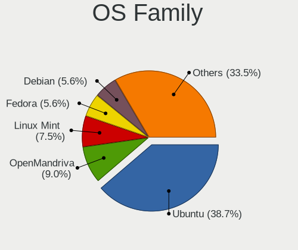

| Name         | Computers | Percent |
|--------------|-----------|---------|
| Ubuntu       | 85        | 48.85%  |
| OpenMandriva | 11        | 6.32%   |
| Linux Mint   | 11        | 6.32%   |
| Debian       | 8         | 4.6%    |
| Pop!_OS      | 7         | 4.02%   |
| Zorin        | 6         | 3.45%   |
| ROSA         | 6         | 3.45%   |
| Manjaro      | 5         | 2.87%   |
| Fedora       | 5         | 2.87%   |
| Arch         | 4         | 2.3%    |
| KDE neon     | 3         | 1.72%   |
| Gentoo       | 3         | 1.72%   |
| Endless      | 3         | 1.72%   |
| Lubuntu      | 2         | 1.15%   |
| LMDE         | 2         | 1.15%   |
| Elementary   | 2         | 1.15%   |
| ArcoLinux    | 2         | 1.15%   |
| Xubuntu      | 1         | 0.57%   |
| Ubuntu Unity | 1         | 0.57%   |
| Sodalite     | 1         | 0.57%   |
| MX           | 1         | 0.57%   |
| Kubuntu      | 1         | 0.57%   |
| Kali         | 1         | 0.57%   |
| Garuda Linux | 1         | 0.57%   |
| Deepin       | 1         | 0.57%   |
| BlackPanther | 1         | 0.57%   |

Kernel
------

Version of the Linux kernel

| Version                         | Computers | Percent |
|---------------------------------|-----------|---------|
| 5.15.0-58-generic               | 5         | 2.51%   |
| 5.10.14-desktop-1omv4002        | 5         | 2.51%   |
| 5.16.7-desktop-1omv4003         | 4         | 2.01%   |
| 5.15.0-52-generic               | 4         | 2.01%   |
| 5.15.0-46-generic               | 4         | 2.01%   |
| 5.13.0-28-generic               | 4         | 2.01%   |
| 5.3.0-46-generic                | 3         | 1.51%   |
| 5.3.0-40-generic                | 3         | 1.51%   |
| 5.15.0-56-generic               | 3         | 1.51%   |
| 5.15.0-53-generic               | 3         | 1.51%   |
| 5.15.0-43-generic               | 3         | 1.51%   |
| 5.11.0-38-generic               | 3         | 1.51%   |
| 5.11.0-27-generic               | 3         | 1.51%   |
| 6.2.6-desktop-1omv2390          | 2         | 1.01%   |
| 5.8.0-38-generic                | 2         | 1.01%   |
| 5.4.0-72-generic                | 2         | 1.01%   |
| 5.4.0-58-generic                | 2         | 1.01%   |
| 5.4.0-52-generic                | 2         | 1.01%   |
| 5.4.0-42-generic                | 2         | 1.01%   |
| 5.4.0-26-generic                | 2         | 1.01%   |
| 5.3.0-28-generic                | 2         | 1.01%   |
| 5.15.84-v8+                     | 2         | 1.01%   |
| 5.15.0-41-generic               | 2         | 1.01%   |
| 5.13.0-44-generic               | 2         | 1.01%   |
| 5.13.0-40-generic               | 2         | 1.01%   |
| 5.11.0-7620-generic             | 2         | 1.01%   |
| 5.11.0-40-generic               | 2         | 1.01%   |
| 5.10.27-gentoo                  | 2         | 1.01%   |
| 5.10.0-12-amd64                 | 2         | 1.01%   |
| 5.0.0-25-generic                | 2         | 1.01%   |
| 4.9.60-nrj-desktop-1rosa-x86_64 | 2         | 1.01%   |
| 4.19.0-6-amd64                  | 2         | 1.01%   |
| 4.15.0-91-generic               | 2         | 1.01%   |
| 6.2.5-zen1-1-zen                | 1         | 0.5%    |
| 6.2.11-060211-generic           | 1         | 0.5%    |
| 6.2.0-76060200-generic          | 1         | 0.5%    |
| 6.1.19-060119-generic           | 1         | 0.5%    |
| 6.1.11-060111-generic           | 1         | 0.5%    |
| 5.9.9-arch1-1                   | 1         | 0.5%    |
| 5.9.1-arch1-1                   | 1         | 0.5%    |

Kernel Family
-------------

Linux kernel without a distro release

| Version | Computers | Percent |
|---------|-----------|---------|
| 5.15.0  | 28        | 14.58%  |
| 5.4.0   | 26        | 13.54%  |
| 5.13.0  | 14        | 7.29%   |
| 5.11.0  | 13        | 6.77%   |
| 5.3.0   | 11        | 5.73%   |
| 5.8.0   | 10        | 5.21%   |
| 4.15.0  | 10        | 5.21%   |
| 5.0.0   | 7         | 3.65%   |
| 5.19.0  | 5         | 2.6%    |
| 5.10.14 | 5         | 2.6%    |
| 5.16.7  | 4         | 2.08%   |
| 4.19.0  | 4         | 2.08%   |
| 5.10.0  | 3         | 1.56%   |
| 4.18.0  | 3         | 1.56%   |
| 6.2.6   | 2         | 1.04%   |
| 5.18.0  | 2         | 1.04%   |
| 5.17.5  | 2         | 1.04%   |
| 5.15.84 | 2         | 1.04%   |
| 5.15.75 | 2         | 1.04%   |
| 5.10.27 | 2         | 1.04%   |
| 4.9.60  | 2         | 1.04%   |
| 6.2.5   | 1         | 0.52%   |
| 6.2.11  | 1         | 0.52%   |
| 6.2.0   | 1         | 0.52%   |
| 6.1.19  | 1         | 0.52%   |
| 6.1.11  | 1         | 0.52%   |
| 5.9.9   | 1         | 0.52%   |
| 5.9.1   | 1         | 0.52%   |
| 5.8.15  | 1         | 0.52%   |
| 5.6.14  | 1         | 0.52%   |
| 5.4.80  | 1         | 0.52%   |
| 5.4.143 | 1         | 0.52%   |
| 5.4.119 | 1         | 0.52%   |
| 5.3.8   | 1         | 0.52%   |
| 5.19.13 | 1         | 0.52%   |
| 5.17.15 | 1         | 0.52%   |
| 5.16.9  | 1         | 0.52%   |
| 5.16.18 | 1         | 0.52%   |
| 5.16.11 | 1         | 0.52%   |
| 5.15.77 | 1         | 0.52%   |

Kernel Major Ver.
-----------------

Linux kernel major version

| Version | Computers | Percent |
|---------|-----------|---------|
| 5.15    | 37        | 19.79%  |
| 5.4     | 28        | 14.97%  |
| 5.13    | 15        | 8.02%   |
| 5.11    | 15        | 8.02%   |
| 5.3     | 12        | 6.42%   |
| 5.10    | 12        | 6.42%   |
| 5.8     | 11        | 5.88%   |
| 4.15    | 10        | 5.35%   |
| 5.0     | 7         | 3.74%   |
| 5.19    | 6         | 3.21%   |
| 5.16    | 6         | 3.21%   |
| 6.2     | 5         | 2.67%   |
| 4.19    | 4         | 2.14%   |
| 5.17    | 3         | 1.6%    |
| 4.9     | 3         | 1.6%    |
| 4.18    | 3         | 1.6%    |
| 5.9     | 2         | 1.07%   |
| 5.18    | 2         | 1.07%   |
| 6.1     | 1         | 0.53%   |
| 5.6     | 1         | 0.53%   |
| 5.14    | 1         | 0.53%   |
| 5.12    | 1         | 0.53%   |
| 4.4     | 1         | 0.53%   |
| 3.13    | 1         | 0.53%   |

Arch
----

OS architecture (x86_64, i586, etc.)

| Name    | Computers | Percent |
|---------|-----------|---------|
| x86_64  | 166       | 97.08%  |
| i686    | 3         | 1.75%   |
| aarch64 | 2         | 1.17%   |

DE
--

Desktop Environment

| Name            | Computers | Percent |
|-----------------|-----------|---------|
| GNOME           | 101       | 56.74%  |
| KDE5            | 23        | 12.92%  |
| Unknown         | 17        | 9.55%   |
| X-Cinnamon      | 11        | 6.18%   |
| XFCE            | 8         | 4.49%   |
| KDE4            | 4         | 2.25%   |
| Pantheon        | 3         | 1.69%   |
| GNOME Flashback | 2         | 1.12%   |
| Unity           | 1         | 0.56%   |
| MATE            | 1         | 0.56%   |
| LXQt            | 1         | 0.56%   |
| LXDE            | 1         | 0.56%   |
| i3              | 1         | 0.56%   |
| GNOME Classic   | 1         | 0.56%   |
| DWM             | 1         | 0.56%   |
| Deepin          | 1         | 0.56%   |
| Cinnamon        | 1         | 0.56%   |

Display Server
--------------

X11 or Wayland

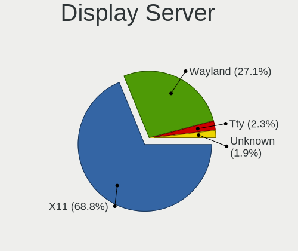

| Name    | Computers | Percent |
|---------|-----------|---------|
| X11     | 133       | 74.72%  |
| Wayland | 35        | 19.66%  |
| Tty     | 5         | 2.81%   |
| Unknown | 5         | 2.81%   |

Display Manager
---------------

SDDM, LightDM, etc.

| Name    | Computers | Percent |
|---------|-----------|---------|
| Unknown | 66        | 37.5%   |
| GDM     | 48        | 27.27%  |
| GDM3    | 23        | 13.07%  |
| SDDM    | 22        | 12.5%   |
| LightDM | 13        | 7.39%   |
| KDM     | 4         | 2.27%   |

OS Lang
-------

Language

| Lang    | Computers | Percent |
|---------|-----------|---------|
| en_US   | 81        | 46.55%  |
| fr_FR   | 54        | 31.03%  |
| Unknown | 19        | 10.92%  |
| en_GB   | 6         | 3.45%   |
| C       | 4         | 2.3%    |
| pt_BR   | 2         | 1.15%   |
| ar_TN   | 2         | 1.15%   |
| fr_CA   | 1         | 0.57%   |
| en_IN   | 1         | 0.57%   |
| en_CA   | 1         | 0.57%   |
| en_AU   | 1         | 0.57%   |
| en_AG   | 1         | 0.57%   |
| de_DE   | 1         | 0.57%   |

Boot Mode
---------

EFI or BIOS

| Mode | Computers | Percent |
|------|-----------|---------|
| EFI  | 98        | 55.68%  |
| BIOS | 78        | 44.32%  |

Filesystem
----------

Type of filesystem

| Type    | Computers | Percent |
|---------|-----------|---------|
| Ext4    | 148       | 86.05%  |
| Overlay | 12        | 6.98%   |
| Unknown | 6         | 3.49%   |
| Btrfs   | 4         | 2.33%   |
| Xfs     | 1         | 0.58%   |
| Tmpfs   | 1         | 0.58%   |

Part. scheme
------------

Scheme of partitioning

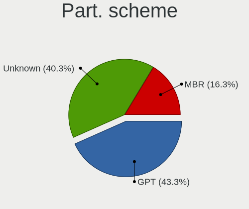

| Type    | Computers | Percent |
|---------|-----------|---------|
| Unknown | 76        | 43.68%  |
| GPT     | 68        | 39.08%  |
| MBR     | 30        | 17.24%  |

Dual Boot with Linux/BSD
------------------------

Hosting more than one Linux/BSD

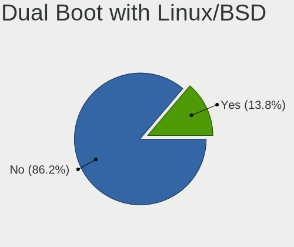

| Dual boot | Computers | Percent |
|-----------|-----------|---------|
| No        | 150       | 85.71%  |
| Yes       | 25        | 14.29%  |

Dual Boot (Win)
---------------

Hosting Linux and Windows

| Dual boot | Computers | Percent |
|-----------|-----------|---------|
| No        | 112       | 65.88%  |
| Yes       | 58        | 34.12%  |

Board
-----

Vendor
------

Motherboard manufacturer

| Name                    | Computers | Percent |
|-------------------------|-----------|---------|
| Lenovo                  | 42        | 24.71%  |
| ASUSTek Computer        | 30        | 17.65%  |
| Hewlett-Packard         | 25        | 14.71%  |
| Dell                    | 24        | 14.12%  |
| Acer                    | 12        | 7.06%   |
| MSI                     | 11        | 6.47%   |
| Toshiba                 | 7         | 4.12%   |
| Pegatron                | 4         | 2.35%   |
| Samsung Electronics     | 2         | 1.18%   |
| Raspberry Pi Foundation | 2         | 1.18%   |
| Intel                   | 2         | 1.18%   |
| Foxconn                 | 2         | 1.18%   |
| Sony                    | 1         | 0.59%   |
| Packard Bell            | 1         | 0.59%   |
| Gigabyte Technology     | 1         | 0.59%   |
| eMachines               | 1         | 0.59%   |
| AZW                     | 1         | 0.59%   |
| ASRock                  | 1         | 0.59%   |
| Unknown                 | 1         | 0.59%   |

Model
-----

Motherboard model

| Name                                      | Computers | Percent |
|-------------------------------------------|-----------|---------|
| Lenovo IdeaPad L340-15IRH Gaming 81LK     | 3         | 1.76%   |
| HP Pavilion g6                            | 3         | 1.76%   |
| Pegatron VS342AA-AB6 m9801af              | 2         | 1.18%   |
| Lenovo IdeaPad 700-15ISK 80RU             | 2         | 1.18%   |
| Lenovo IdeaPad 5 15ITL05 82FG             | 2         | 1.18%   |
| Lenovo IdeaPad 3 15ADA05 81W1             | 2         | 1.18%   |
| Lenovo IdeaPad 130-15IKB 81H7             | 2         | 1.18%   |
| HP Pavilion Gaming Laptop 15-ec1xxx       | 2         | 1.18%   |
| Foxconn Pro 3400 Series MT                | 2         | 1.18%   |
| Dell Inspiron 5570                        | 2         | 1.18%   |
| ASUS X556UV                               | 2         | 1.18%   |
| ASUS X553MA                               | 2         | 1.18%   |
| ASUS X550JX                               | 2         | 1.18%   |
| Acer Aspire E5-571G                       | 2         | 1.18%   |
| Unknown                                   | 2         | 1.18%   |
| Toshiba Satellite Pro L850-B339           | 1         | 0.59%   |
| Toshiba Satellite L550                    | 1         | 0.59%   |
| Toshiba Satellite L500                    | 1         | 0.59%   |
| Toshiba Satellite C650D                   | 1         | 0.59%   |
| Toshiba Satellite C55-C                   | 1         | 0.59%   |
| Toshiba Satellite C50-A489                | 1         | 0.59%   |
| Toshiba Satellite A300                    | 1         | 0.59%   |
| Sony VPCEH36EF                            | 1         | 0.59%   |
| Samsung 530U3BI/530U4BI/530U4BH           | 1         | 0.59%   |
| Samsung 300E5EV/300E4EV/270E5EV/270E4EV   | 1         | 0.59%   |
| RPi Raspberry Pi Compute Module 4 Rev 1.0 | 1         | 0.59%   |
| RPi Raspberry Pi 3 Model B Rev 1.2        | 1         | 0.59%   |
| Pegatron Pro 3010 Microtower PC           | 1         | 0.59%   |
| Pegatron FL437AA-ABF a6641af              | 1         | 0.59%   |
| Packard Bell EasyNote ML65                | 1         | 0.59%   |
| MSI PRO H510 DP21 (MS-B0A4)               | 1         | 0.59%   |
| MSI MS-7C95                               | 1         | 0.59%   |
| MSI MS-7C52                               | 1         | 0.59%   |
| MSI MS-7C09                               | 1         | 0.59%   |
| MSI MS-7A15                               | 1         | 0.59%   |
| MSI MS-7817                               | 1         | 0.59%   |
| MSI MS-7502                               | 1         | 0.59%   |
| MSI Katana GF66 12UC                      | 1         | 0.59%   |
| MSI GF65 Thin 10UE                        | 1         | 0.59%   |
| MSI GF63 Thin 10SCXR                      | 1         | 0.59%   |

Model Family
------------

Motherboard model prefix

| Name                  | Computers | Percent |
|-----------------------|-----------|---------|
| Lenovo IdeaPad        | 23        | 13.53%  |
| Dell Inspiron         | 10        | 5.88%   |
| HP Pavilion           | 9         | 5.29%   |
| Acer Aspire           | 9         | 5.29%   |
| Lenovo ThinkPad       | 8         | 4.71%   |
| Toshiba Satellite     | 7         | 4.12%   |
| Dell OptiPlex         | 6         | 3.53%   |
| Dell Latitude         | 6         | 3.53%   |
| HP Laptop             | 4         | 2.35%   |
| ASUS TUF              | 4         | 2.35%   |
| ASUS PRIME            | 3         | 1.76%   |
| RPi Raspberry         | 2         | 1.18%   |
| Pegatron VS342AA-AB6  | 2         | 1.18%   |
| MSI GF63              | 2         | 1.18%   |
| HP ProBook            | 2         | 1.18%   |
| HP Compaq             | 2         | 1.18%   |
| HP 250                | 2         | 1.18%   |
| Foxconn Pro           | 2         | 1.18%   |
| Dell Vostro           | 2         | 1.18%   |
| ASUS ZenBook          | 2         | 1.18%   |
| ASUS X556UV           | 2         | 1.18%   |
| ASUS X553MA           | 2         | 1.18%   |
| ASUS X550JX           | 2         | 1.18%   |
| ASUS VivoBook         | 2         | 1.18%   |
| ASUS ROG              | 2         | 1.18%   |
| ASUS ASUS             | 2         | 1.18%   |
| Acer Swift            | 2         | 1.18%   |
| Unknown               | 2         | 1.18%   |
| Sony VPCEH36EF        | 1         | 0.59%   |
| Samsung 530U3BI       | 1         | 0.59%   |
| Samsung 300E5EV       | 1         | 0.59%   |
| Pegatron Pro          | 1         | 0.59%   |
| Pegatron FL437AA-ABF  | 1         | 0.59%   |
| Packard Bell EasyNote | 1         | 0.59%   |
| MSI PRO               | 1         | 0.59%   |
| MSI MS-7C95           | 1         | 0.59%   |
| MSI MS-7C52           | 1         | 0.59%   |
| MSI MS-7C09           | 1         | 0.59%   |
| MSI MS-7A15           | 1         | 0.59%   |
| MSI MS-7817           | 1         | 0.59%   |

MFG Year
--------

Motherboard manufacture year

| Year    | Computers | Percent |
|---------|-----------|---------|
| 2020    | 21        | 12.35%  |
| 2019    | 21        | 12.35%  |
| 2018    | 14        | 8.24%   |
| 2017    | 14        | 8.24%   |
| 2013    | 13        | 7.65%   |
| 2011    | 13        | 7.65%   |
| 2015    | 12        | 7.06%   |
| 2021    | 11        | 6.47%   |
| 2014    | 10        | 5.88%   |
| 2016    | 9         | 5.29%   |
| 2012    | 8         | 4.71%   |
| 2010    | 7         | 4.12%   |
| 2009    | 7         | 4.12%   |
| 2008    | 6         | 3.53%   |
| Unknown | 2         | 1.18%   |
| 2022    | 1         | 0.59%   |
| 2007    | 1         | 0.59%   |

Form Factor
-----------

Physical design of the computer

| Name           | Computers | Percent |
|----------------|-----------|---------|
| Notebook       | 132       | 77.65%  |
| Desktop        | 34        | 20%     |
| System on chip | 2         | 1.18%   |
| Convertible    | 2         | 1.18%   |

Secure Boot
-----------

Enabled or disabled

| State    | Computers | Percent |
|----------|-----------|---------|
| Disabled | 158       | 92.4%   |
| Enabled  | 13        | 7.6%    |

Coreboot
--------

Have coreboot on board

| Used | Computers | Percent |
|------|-----------|---------|
| No   | 170       | 100%    |

RAM Size
--------

Total RAM memory

| Size in GB | Computers | Percent |
|------------|-----------|---------|
| 4.01-8.0   | 59        | 34.3%   |
| 3.01-4.0   | 34        | 19.77%  |
| 16.01-24.0 | 34        | 19.77%  |
| 8.01-16.0  | 30        | 17.44%  |
| 1.01-2.0   | 6         | 3.49%   |
| 32.01-64.0 | 5         | 2.91%   |
| 2.01-3.0   | 2         | 1.16%   |
| 0.51-1.0   | 2         | 1.16%   |

RAM Used
--------

Used RAM memory

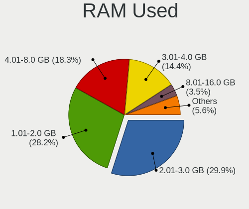

| Used GB   | Computers | Percent |
|-----------|-----------|---------|
| 2.01-3.0  | 57        | 30%     |
| 1.01-2.0  | 56        | 29.47%  |
| 4.01-8.0  | 33        | 17.37%  |
| 3.01-4.0  | 27        | 14.21%  |
| 0.51-1.0  | 6         | 3.16%   |
| 8.01-16.0 | 5         | 2.63%   |
| 0.01-0.5  | 5         | 2.63%   |
| Unknown   | 1         | 0.53%   |

Total Drives
------------

Number of drives on board

| Drives | Computers | Percent |
|--------|-----------|---------|
| 1      | 125       | 71.43%  |
| 2      | 46        | 26.29%  |
| 4      | 2         | 1.14%   |
| 3      | 1         | 0.57%   |
| 0      | 1         | 0.57%   |

Has CD-ROM
----------

Has CD-ROM on board

| Presented | Computers | Percent |
|-----------|-----------|---------|
| No        | 94        | 54.97%  |
| Yes       | 77        | 45.03%  |

Has Ethernet
------------

Has Ethernet on board

| Presented | Computers | Percent |
|-----------|-----------|---------|
| Yes       | 147       | 86.47%  |
| No        | 23        | 13.53%  |

Has WiFi
--------

Has WiFi module

| Presented | Computers | Percent |
|-----------|-----------|---------|
| Yes       | 149       | 87.13%  |
| No        | 22        | 12.87%  |

Has Bluetooth
-------------

Has Bluetooth module

| Presented | Computers | Percent |
|-----------|-----------|---------|
| Yes       | 128       | 73.56%  |
| No        | 46        | 26.44%  |

Location
--------

Country
-------

Geographic location (country)

| Country | Computers | Percent |
|---------|-----------|---------|
| Tunisia | 170       | 100%    |

City
----

Geographic location (city)

| City               | Computers | Percent |
|--------------------|-----------|---------|
| Tunis              | 101       | 52.88%  |
| Aryanah            | 10        | 5.24%   |
| Sousse             | 9         | 4.71%   |
| Bizerte            | 7         | 3.66%   |
| Nabeul             | 6         | 3.14%   |
| Ben Arous          | 4         | 2.09%   |
| Sfax               | 3         | 1.57%   |
| Monastir           | 3         | 1.57%   |
| Mateur             | 3         | 1.57%   |
| Centre Urbain Nord | 3         | 1.57%   |
| Rades              | 2         | 1.05%   |
| Masakin            | 2         | 1.05%   |
| Manouba            | 2         | 1.05%   |
| Mahdia             | 2         | 1.05%   |
| Jedeida            | 2         | 1.05%   |
| Houmt Souk         | 2         | 1.05%   |
| Zarzis             | 1         | 0.52%   |
| Zaouiat Djedidi    | 1         | 0.52%   |
| Wadi Maliz         | 1         | 0.52%   |
| Tebourba           | 1         | 0.52%   |
| Tataouine          | 1         | 0.52%   |
| Sidi Abbes         | 1         | 0.52%   |
| Ras Ettabia        | 1         | 0.52%   |
| Rafraf             | 1         | 0.52%   |
| Oued Lill          | 1         | 0.52%   |
| Le Bardo           | 1         | 0.52%   |
| La Marsa           | 1         | 0.52%   |
| La Goulette        | 1         | 0.52%   |
| Kairouan           | 1         | 0.52%   |
| Jendouba           | 1         | 0.52%   |
| Hergla             | 1         | 0.52%   |
| Hammamet           | 1         | 0.52%   |
| Hammam Sousse      | 1         | 0.52%   |
| Gremda             | 1         | 0.52%   |
| Gafsa              | 1         | 0.52%   |
| El Fahs            | 1         | 0.52%   |
| El Battan          | 1         | 0.52%   |
| Cite 18 Janvier    | 1         | 0.52%   |
| Chebba             | 1         | 0.52%   |
| Carthage           | 1         | 0.52%   |

Drives
------

Drive Vendor
------------

Hard drive vendors

| Vendor                | Computers | Drives | Percent |
|-----------------------|-----------|--------|---------|
| Seagate               | 46        | 58     | 21.6%   |
| WDC                   | 35        | 46     | 16.43%  |
| Toshiba               | 26        | 28     | 12.21%  |
| Samsung Electronics   | 17        | 28     | 7.98%   |
| Team                  | 11        | 13     | 5.16%   |
| SK hynix              | 10        | 12     | 4.69%   |
| SanDisk               | 8         | 9      | 3.76%   |
| Hitachi               | 7         | 7      | 3.29%   |
| HGST                  | 7         | 8      | 3.29%   |
| Unknown               | 6         | 8      | 2.82%   |
| Kingston              | 6         | 8      | 2.82%   |
| Intel                 | 6         | 7      | 2.82%   |
| Micron Technology     | 5         | 5      | 2.35%   |
| A-DATA Technology     | 4         | 5      | 1.88%   |
| Fujitsu               | 3         | 3      | 1.41%   |
| PNY                   | 2         | 2      | 0.94%   |
| UMIS                  | 1         | 1      | 0.47%   |
| TwinMOS               | 1         | 1      | 0.47%   |
| SPCC                  | 1         | 1      | 0.47%   |
| SATAFIRM              | 1         | 1      | 0.47%   |
| Realtek Semiconductor | 1         | 1      | 0.47%   |
| Phison                | 1         | 1      | 0.47%   |
| Patriot               | 1         | 1      | 0.47%   |
| OCZ                   | 1         | 1      | 0.47%   |
| KVST                  | 1         | 1      | 0.47%   |
| HS-SSD-E100           | 1         | 1      | 0.47%   |
| EMTEC                 | 1         | 3      | 0.47%   |
| China                 | 1         | 1      | 0.47%   |
| addlink               | 1         | 1      | 0.47%   |
| ADATA Technology      | 1         | 1      | 0.47%   |

Drive Model
-----------

Hard drive models

| Model                                 | Computers | Percent |
|---------------------------------------|-----------|---------|
| Seagate ST1000LM035-1RK172 970GB      | 13        | 5.91%   |
| Seagate ST500LT012-1DG142 500GB       | 8         | 3.64%   |
| Toshiba MQ04ABF100 1TB                | 4         | 1.82%   |
| Seagate ST2000LM007-1R8174 2TB        | 4         | 1.82%   |
| Seagate ST1000DM010-2EP102 1TB        | 4         | 1.82%   |
| WDC WD5000LPCX-24VHAT0 500GB          | 3         | 1.36%   |
| Toshiba MQ01ABD100 1TB                | 3         | 1.36%   |
| Hitachi HTS545050A7E380 500GB         | 3         | 1.36%   |
| HGST HTS545050A7E380 500GB            | 3         | 1.36%   |
| WDC WD5000LPCX-60VHAT0 500GB          | 2         | 0.91%   |
| WDC WD20SPZX-08UA7 2TB                | 2         | 0.91%   |
| WDC WD10SPZX-08Z10 1TB                | 2         | 0.91%   |
| WDC WD10SPCX-24HWST1 1TB              | 2         | 0.91%   |
| WDC WD10EADS-65M2B0 1TB               | 2         | 0.91%   |
| WDC PC SN720 SDAQNTW-512G-1001 512GB  | 2         | 0.91%   |
| Toshiba MK5076GSX 500GB               | 2         | 0.91%   |
| Toshiba MK3275GSX 320GB               | 2         | 0.91%   |
| Toshiba DT01ACA050 500GB              | 2         | 0.91%   |
| Team T253X2512G 512GB SSD             | 2         | 0.91%   |
| SK hynix SC311 SATA 256GB SSD         | 2         | 0.91%   |
| SK hynix HFS128G39TND-N210A 128GB SSD | 2         | 0.91%   |
| Seagate ST1000LX015-1U7172 1TB        | 2         | 0.91%   |
| Seagate ST1000DM003-1SB102 1TB        | 2         | 0.91%   |
| SanDisk NVMe SSD Drive 512GB          | 2         | 0.91%   |
| Samsung SSD 860 EVO 500GB             | 2         | 0.91%   |
| Kingston NVMe SSD Drive 512GB         | 2         | 0.91%   |
| Intel SSDPEKNW512GZL 512GB            | 2         | 0.91%   |
| Fujitsu MHV2100BH PL 100GB            | 2         | 0.91%   |
| WDC WD6400AAKS-65A7B0 640GB           | 1         | 0.45%   |
| WDC WD5000LPZX-60Z10T0 500GB          | 1         | 0.45%   |
| WDC WD5000LPVX-75V0TT0 500GB          | 1         | 0.45%   |
| WDC WD5000LPVX-22V0TT0 500GB          | 1         | 0.45%   |
| WDC WD5000LPLX-60ZNTT2 500GB          | 1         | 0.45%   |
| WDC WD5000BPVT-55HXZT3 500GB          | 1         | 0.45%   |
| WDC WD5000BEVT-22A0RT0 500GB          | 1         | 0.45%   |
| WDC WD5000AVDS-63U7B1 500GB           | 1         | 0.45%   |
| WDC WD5000AAKS-402AA0 500GB           | 1         | 0.45%   |
| WDC WD5000AACS-00ZUB0 500GB           | 1         | 0.45%   |
| WDC WD3200BEKT-60KA9T0 320GB          | 1         | 0.45%   |
| WDC WD3200AAJS-60M0A1 320GB           | 1         | 0.45%   |

HDD Vendor
----------

Hard disk drive vendors

| Vendor              | Computers | Drives | Percent |
|---------------------|-----------|--------|---------|
| Seagate             | 45        | 57     | 37.82%  |
| WDC                 | 30        | 40     | 25.21%  |
| Toshiba             | 26        | 28     | 21.85%  |
| Hitachi             | 7         | 7      | 5.88%   |
| HGST                | 7         | 8      | 5.88%   |
| Fujitsu             | 3         | 3      | 2.52%   |
| Samsung Electronics | 1         | 1      | 0.84%   |

SSD Vendor
----------

Solid state drive vendors

| Vendor              | Computers | Drives | Percent |
|---------------------|-----------|--------|---------|
| Team                | 7         | 9      | 16.67%  |
| Samsung Electronics | 7         | 11     | 16.67%  |
| SK hynix            | 6         | 7      | 14.29%  |
| SanDisk             | 5         | 5      | 11.9%   |
| PNY                 | 2         | 2      | 4.76%   |
| Kingston            | 2         | 2      | 4.76%   |
| A-DATA Technology   | 2         | 3      | 4.76%   |
| TwinMOS             | 1         | 1      | 2.38%   |
| SPCC                | 1         | 1      | 2.38%   |
| SATAFIRM            | 1         | 1      | 2.38%   |
| Patriot             | 1         | 1      | 2.38%   |
| OCZ                 | 1         | 1      | 2.38%   |
| Micron Technology   | 1         | 1      | 2.38%   |
| KVST                | 1         | 1      | 2.38%   |
| HS-SSD-E100         | 1         | 1      | 2.38%   |
| EMTEC               | 1         | 3      | 2.38%   |
| China               | 1         | 1      | 2.38%   |
| addlink             | 1         | 1      | 2.38%   |

Drive Kind
----------

HDD or SSD

| Kind    | Computers | Drives | Percent |
|---------|-----------|--------|---------|
| HDD     | 116       | 144    | 56.86%  |
| NVMe    | 41        | 58     | 20.1%   |
| SSD     | 40        | 52     | 19.61%  |
| MMC     | 5         | 7      | 2.45%   |
| Unknown | 2         | 2      | 0.98%   |

Drive Connector
---------------

SATA, SAS, NVMe, etc.

| Type | Computers | Drives | Percent |
|------|-----------|--------|---------|
| SATA | 139       | 196    | 74.33%  |
| NVMe | 41        | 58     | 21.93%  |
| MMC  | 5         | 7      | 2.67%   |
| SAS  | 2         | 2      | 1.07%   |

Drive Size
----------

Size of hard drive

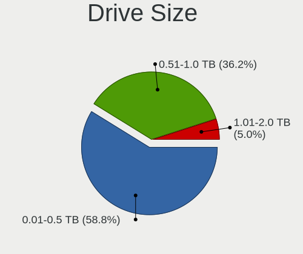

| Size in TB | Computers | Drives | Percent |
|------------|-----------|--------|---------|
| 0.01-0.5   | 89        | 109    | 58.55%  |
| 0.51-1.0   | 56        | 79     | 36.84%  |
| 1.01-2.0   | 7         | 8      | 4.61%   |

Space Total
-----------

Amount of disk space available on the file system

| Size in GB     | Computers | Percent |
|----------------|-----------|---------|
| 251-500        | 54        | 30.51%  |
| 101-250        | 45        | 25.42%  |
| 501-1000       | 29        | 16.38%  |
| 1001-2000      | 15        | 8.47%   |
| 1-20           | 11        | 6.21%   |
| 51-100         | 11        | 6.21%   |
| 21-50          | 7         | 3.95%   |
| 2001-3000      | 2         | 1.13%   |
| Unknown        | 2         | 1.13%   |
| More than 3000 | 1         | 0.56%   |

Space Used
----------

Amount of used disk space

| Used GB   | Computers | Percent |
|-----------|-----------|---------|
| 1-20      | 70        | 38.04%  |
| 101-250   | 35        | 19.02%  |
| 21-50     | 31        | 16.85%  |
| 51-100    | 25        | 13.59%  |
| 251-500   | 8         | 4.35%   |
| 501-1000  | 7         | 3.8%    |
| 1001-2000 | 6         | 3.26%   |
| Unknown   | 2         | 1.09%   |

Malfunc. Drives
---------------

Drive models with a malfunction

| Model                                               | Computers | Drives | Percent |
|-----------------------------------------------------|-----------|--------|---------|
| HGST HTS545050A7E380 500GB                          | 2         | 3      | 9.52%   |
| WDC WD6400AAKS-65A7B0 640GB                         | 1         | 1      | 4.76%   |
| WDC WD5000BPVT-55HXZT3 500GB                        | 1         | 2      | 4.76%   |
| WDC WD5000BEVT-22A0RT0 500GB                        | 1         | 1      | 4.76%   |
| Toshiba MQ01ACF050 500GB                            | 1         | 1      | 4.76%   |
| Toshiba MQ01ABD050 500GB                            | 1         | 1      | 4.76%   |
| Toshiba MK5076GSX 500GB                             | 1         | 2      | 4.76%   |
| Toshiba MK4055GSX 400GB                             | 1         | 1      | 4.76%   |
| Seagate ST500LM012 HN-M500MBB 500GB                 | 1         | 1      | 4.76%   |
| Seagate ST3500413AS 500GB                           | 1         | 1      | 4.76%   |
| Seagate ST3320813AS 320GB                           | 1         | 1      | 4.76%   |
| Seagate ST1000LM035-1RK172 970GB                    | 1         | 2      | 4.76%   |
| Seagate ST1000LM024 HN-M101MBB 1TB                  | 1         | 2      | 4.76%   |
| Seagate ST1000DM010-2EP102 1TB                      | 1         | 1      | 4.76%   |
| Micron Technology MTFDDAK256MAY-1AH12ABHA 256GB SSD | 1         | 1      | 4.76%   |
| Hitachi HTS547575A9E384 752GB                       | 1         | 1      | 4.76%   |
| Hitachi HTS545050A7E380 500GB                       | 1         | 1      | 4.76%   |
| Hitachi HTS543232A7A384 320GB                       | 1         | 1      | 4.76%   |
| EMTEC X250 512GB SSD                                | 1         | 2      | 4.76%   |
| A-DATA Technology SX8100NP 512GB                    | 1         | 1      | 4.76%   |

Malfunc. Drive Vendor
---------------------

Vendors of faulty drives

| Vendor            | Computers | Drives | Percent |
|-------------------|-----------|--------|---------|
| Seagate           | 6         | 8      | 28.57%  |
| Toshiba           | 4         | 5      | 19.05%  |
| WDC               | 3         | 4      | 14.29%  |
| Hitachi           | 3         | 3      | 14.29%  |
| HGST              | 2         | 3      | 9.52%   |
| Micron Technology | 1         | 1      | 4.76%   |
| EMTEC             | 1         | 2      | 4.76%   |
| A-DATA Technology | 1         | 1      | 4.76%   |

Malfunc. HDD Vendor
-------------------

Vendors of faulty HDD drives

| Vendor  | Computers | Drives | Percent |
|---------|-----------|--------|---------|
| Seagate | 6         | 8      | 33.33%  |
| Toshiba | 4         | 5      | 22.22%  |
| WDC     | 3         | 4      | 16.67%  |
| Hitachi | 3         | 3      | 16.67%  |
| HGST    | 2         | 3      | 11.11%  |

Malfunc. Drive Kind
-------------------

Kinds of faulty drives

| Kind | Computers | Drives | Percent |
|------|-----------|--------|---------|
| HDD  | 18        | 23     | 85.71%  |
| SSD  | 2         | 3      | 9.52%   |
| NVMe | 1         | 1      | 4.76%   |

Failed Drives
-------------

Failed drive models

| Model                   | Computers | Drives | Percent |
|-------------------------|-----------|--------|---------|
| Toshiba MK1646GSX 160GB | 1         | 1      | 100%    |

Failed Drive Vendor
-------------------

Failed drive vendors

| Vendor  | Computers | Drives | Percent |
|---------|-----------|--------|---------|
| Toshiba | 1         | 1      | 100%    |

Drive Status
------------

Number of failed and malfunc. drives

| Status   | Computers | Drives | Percent |
|----------|-----------|--------|---------|
| Detected | 82        | 116    | 44.57%  |
| Works    | 80        | 119    | 43.48%  |
| Malfunc  | 21        | 27     | 11.41%  |
| Failed   | 1         | 1      | 0.54%   |

Storage controller
------------------

Storage Vendor
--------------

Storage controller vendors

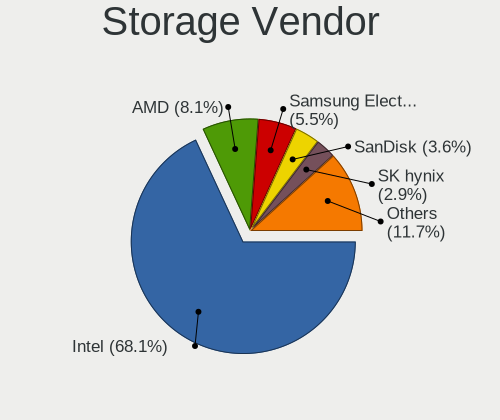

| Vendor                       | Computers | Percent |
|------------------------------|-----------|---------|
| Intel                        | 141       | 71.21%  |
| AMD                          | 19        | 9.6%    |
| Samsung Electronics          | 9         | 4.55%   |
| SanDisk                      | 7         | 3.54%   |
| SK hynix                     | 4         | 2.02%   |
| Micron Technology            | 4         | 2.02%   |
| Kingston Technology Company  | 4         | 2.02%   |
| Realtek Semiconductor        | 3         | 1.52%   |
| Phison Electronics           | 3         | 1.52%   |
| Union Memory (Shenzhen)      | 1         | 0.51%   |
| Silicon Motion               | 1         | 0.51%   |
| Shenzhen Longsys Electronics | 1         | 0.51%   |
| ADATA Technology             | 1         | 0.51%   |

Storage Model
-------------

Storage controller models

| Model                                                                                   | Computers | Percent |
|-----------------------------------------------------------------------------------------|-----------|---------|
| Intel Sunrise Point-LP SATA Controller [AHCI mode]                                      | 15        | 6.88%   |
| AMD FCH SATA Controller [AHCI mode]                                                     | 15        | 6.88%   |
| Intel 8 Series SATA Controller 1 [AHCI mode]                                            | 12        | 5.5%    |
| Intel 82801 Mobile SATA Controller [RAID mode]                                          | 11        | 5.05%   |
| Samsung NVMe SSD Controller 980                                                         | 8         | 3.67%   |
| Intel 7 Series Chipset Family 6-port SATA Controller [AHCI mode]                        | 8         | 3.67%   |
| Intel Volume Management Device NVMe RAID Controller                                     | 7         | 3.21%   |
| Intel Tiger Lake-LP SATA Controller                                                     | 7         | 3.21%   |
| Intel 8 Series/C220 Series Chipset Family 6-port SATA Controller 1 [AHCI mode]          | 7         | 3.21%   |
| Intel Comet Lake SATA AHCI Controller                                                   | 6         | 2.75%   |
| Intel 6 Series/C200 Series Chipset Family 6 port Mobile SATA AHCI Controller            | 6         | 2.75%   |
| Intel Wildcat Point-LP SATA Controller [AHCI Mode]                                      | 5         | 2.29%   |
| Intel HM170/QM170 Chipset SATA Controller [AHCI Mode]                                   | 5         | 2.29%   |
| SanDisk WD Blue SN550 NVMe SSD                                                          | 4         | 1.83%   |
| Micron NVMe Storage Controller                                                          | 4         | 1.83%   |
| Kingston Company Company Non-Volatile memory controller                                 | 4         | 1.83%   |
| Intel Cannon Lake Mobile PCH SATA AHCI Controller                                       | 4         | 1.83%   |
| Intel 82801IBM/IEM (ICH9M/ICH9M-E) 4 port SATA Controller [AHCI mode]                   | 4         | 1.83%   |
| Intel 5 Series/3400 Series Chipset 6 port SATA AHCI Controller                          | 4         | 1.83%   |
| Intel 400 Series Chipset Family SATA AHCI Controller                                    | 4         | 1.83%   |
| Realtek RTS5763DL NVMe SSD Controller                                                   | 3         | 1.38%   |
| Intel SSD 660P Series                                                                   | 3         | 1.38%   |
| Intel Q170/Q150/B150/H170/H110/Z170/CM236 Chipset SATA Controller [AHCI Mode]           | 3         | 1.38%   |
| Intel Non-Volatile memory controller                                                    | 3         | 1.38%   |
| Intel Atom/Celeron/Pentium Processor x5-E8000/J3xxx/N3xxx Series SATA Controller        | 3         | 1.38%   |
| Intel 82801JI (ICH10 Family) 4 port SATA IDE Controller #1                              | 3         | 1.38%   |
| Intel 6 Series/C200 Series Chipset Family Desktop SATA Controller (IDE mode, ports 4-5) | 3         | 1.38%   |
| Intel 6 Series/C200 Series Chipset Family Desktop SATA Controller (IDE mode, ports 0-3) | 3         | 1.38%   |
| Intel 5 Series/3400 Series Chipset 4 port SATA AHCI Controller                          | 3         | 1.38%   |
| SK hynix BC511                                                                          | 2         | 0.92%   |
| SanDisk WD Black 2018/SN750 / PC SN720 NVMe SSD                                         | 2         | 0.92%   |
| Phison E12 NVMe Controller                                                              | 2         | 0.92%   |
| Intel NM10/ICH7 Family SATA Controller [IDE mode]                                       | 2         | 0.92%   |
| Intel Ice Lake-LP SATA Controller [AHCI mode]                                           | 2         | 0.92%   |
| Intel Celeron/Pentium Silver Processor SATA Controller                                  | 2         | 0.92%   |
| Intel Cannon Lake PCH SATA AHCI Controller                                              | 2         | 0.92%   |
| Intel Atom Processor E3800 Series SATA AHCI Controller                                  | 2         | 0.92%   |
| Intel 6 Series/C200 Series Chipset Family 6 port Desktop SATA AHCI Controller           | 2         | 0.92%   |
| Intel 200 Series PCH SATA controller [AHCI mode]                                        | 2         | 0.92%   |
| AMD SB7x0/SB8x0/SB9x0 SATA Controller [AHCI mode]                                       | 2         | 0.92%   |

Storage Kind
------------

Kind of storage controller (IDE, SATA, NVMe, SAS, ...)

| Kind | Computers | Percent |
|------|-----------|---------|
| SATA | 132       | 64.39%  |
| NVMe | 41        | 20%     |
| RAID | 19        | 9.27%   |
| IDE  | 13        | 6.34%   |

Processor
---------

CPU Vendor
----------

Processor vendors

| Vendor | Computers | Percent |
|--------|-----------|---------|
| Intel  | 144       | 84.71%  |
| AMD    | 24        | 14.12%  |
| ARM    | 2         | 1.18%   |

CPU Model
---------

Processor models

| Model                                         | Computers | Percent |
|-----------------------------------------------|-----------|---------|
| Intel Core i5-8250U CPU @ 1.60GHz             | 5         | 2.94%   |
| Intel Core i7-6700HQ CPU @ 2.60GHz            | 4         | 2.35%   |
| Intel Core i5-9300H CPU @ 2.40GHz             | 4         | 2.35%   |
| Intel 11th Gen Core i7-1165G7 @ 2.80GHz       | 4         | 2.35%   |
| Intel 11th Gen Core i5-1135G7 @ 2.40GHz       | 4         | 2.35%   |
| Intel Core i7-10750H CPU @ 2.60GHz            | 3         | 1.76%   |
| Intel Core i5-5200U CPU @ 2.20GHz             | 3         | 1.76%   |
| Intel Core i5-4210U CPU @ 1.70GHz             | 3         | 1.76%   |
| Intel Core i5-4200U CPU @ 1.60GHz             | 3         | 1.76%   |
| Intel Core i5-10210U CPU @ 1.60GHz            | 3         | 1.76%   |
| AMD Ryzen 5 3550H with Radeon Vega Mobile Gfx | 3         | 1.76%   |
| Intel Pentium CPU G4560 @ 3.50GHz             | 2         | 1.18%   |
| Intel Core i7-8750H CPU @ 2.20GHz             | 2         | 1.18%   |
| Intel Core i7-8550U CPU @ 1.80GHz             | 2         | 1.18%   |
| Intel Core i7-7500U CPU @ 2.70GHz             | 2         | 1.18%   |
| Intel Core i7-4510U CPU @ 2.00GHz             | 2         | 1.18%   |
| Intel Core i7-4500U CPU @ 1.80GHz             | 2         | 1.18%   |
| Intel Core i7-10870H CPU @ 2.20GHz            | 2         | 1.18%   |
| Intel Core i7-10510U CPU @ 1.80GHz            | 2         | 1.18%   |
| Intel Core i5-2430M CPU @ 2.40GHz             | 2         | 1.18%   |
| Intel Core i5-1035G1 CPU @ 1.00GHz            | 2         | 1.18%   |
| Intel Core i3-5005U CPU @ 2.00GHz             | 2         | 1.18%   |
| Intel Core i3-4005U CPU @ 1.70GHz             | 2         | 1.18%   |
| Intel Core i3-3217U CPU @ 1.80GHz             | 2         | 1.18%   |
| Intel Core i3-2350M CPU @ 2.30GHz             | 2         | 1.18%   |
| Intel Core i3-1005G1 CPU @ 1.20GHz            | 2         | 1.18%   |
| Intel Core i3 CPU M 380 @ 2.53GHz             | 2         | 1.18%   |
| Intel Core 2 Quad CPU Q8300 @ 2.50GHz         | 2         | 1.18%   |
| Intel Core 2 Duo CPU T6500 @ 2.10GHz          | 2         | 1.18%   |
| Intel Celeron CPU N3060 @ 1.60GHz             | 2         | 1.18%   |
| ARM Processor                                 | 2         | 1.18%   |
| AMD Ryzen 5 4600H with Radeon Graphics        | 2         | 1.18%   |
| Intel Xeon E-2144G CPU @ 3.60GHz              | 1         | 0.59%   |
| Intel Pentium Dual-Core CPU T4400 @ 2.20GHz   | 1         | 0.59%   |
| Intel Pentium Dual-Core CPU E5400 @ 2.70GHz   | 1         | 0.59%   |
| Intel Pentium CPU P6200 @ 2.13GHz             | 1         | 0.59%   |
| Intel Pentium CPU N3710 @ 1.60GHz             | 1         | 0.59%   |
| Intel Pentium CPU N3540 @ 2.16GHz             | 1         | 0.59%   |
| Intel Pentium CPU G630 @ 2.70GHz              | 1         | 0.59%   |
| Intel Pentium CPU G3250 @ 3.20GHz             | 1         | 0.59%   |

CPU Model Family
----------------

Processor model prefix

| Model                   | Computers | Percent |
|-------------------------|-----------|---------|
| Intel Core i5           | 45        | 26.47%  |
| Intel Core i7           | 32        | 18.82%  |
| Intel Core i3           | 26        | 15.29%  |
| Other                   | 15        | 8.82%   |
| AMD Ryzen 5             | 10        | 5.88%   |
| Intel Pentium           | 9         | 5.29%   |
| Intel Celeron           | 6         | 3.53%   |
| Intel Core 2 Quad       | 5         | 2.94%   |
| Intel Core 2 Duo        | 4         | 2.35%   |
| Intel Pentium Dual-Core | 2         | 1.18%   |
| AMD Ryzen 7             | 2         | 1.18%   |
| AMD Ryzen 3             | 2         | 1.18%   |
| Intel Xeon              | 1         | 0.59%   |
| Intel Core m3           | 1         | 0.59%   |
| Intel Atom              | 1         | 0.59%   |
| AMD Sempron             | 1         | 0.59%   |
| AMD Ryzen 5 PRO         | 1         | 0.59%   |
| AMD FX                  | 1         | 0.59%   |
| AMD E2                  | 1         | 0.59%   |
| AMD E                   | 1         | 0.59%   |
| AMD Athlon              | 1         | 0.59%   |
| AMD A8                  | 1         | 0.59%   |
| AMD A6                  | 1         | 0.59%   |
| AMD A4                  | 1         | 0.59%   |

CPU Cores
---------

Number of processor cores

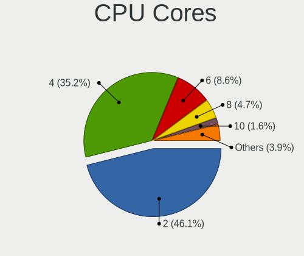

| Number  | Computers | Percent |
|---------|-----------|---------|
| 2       | 83        | 48.82%  |
| 4       | 64        | 37.65%  |
| 6       | 12        | 7.06%   |
| 8       | 6         | 3.53%   |
| 1       | 2         | 1.18%   |
| 14      | 1         | 0.59%   |
| 12      | 1         | 0.59%   |
| Unknown | 1         | 0.59%   |

CPU Sockets
-----------

Number of sockets

| Number | Computers | Percent |
|--------|-----------|---------|
| 1      | 170       | 100%    |

CPU Threads
-----------

Threads per core (Hyper-Threading)

| Number  | Computers | Percent |
|---------|-----------|---------|
| 2       | 131       | 76.61%  |
| 1       | 39        | 22.81%  |
| Unknown | 1         | 0.58%   |

CPU Op-Modes
------------

CPU Operation Modes (32-bit, 64-bit)

| Op mode        | Computers | Percent |
|----------------|-----------|---------|
| 32-bit, 64-bit | 169       | 99.41%  |
| Unknown        | 1         | 0.59%   |

CPU Microcode
-------------

Microcode number

| Number     | Computers | Percent |
|------------|-----------|---------|
| Unknown    | 40        | 22.86%  |
| 0x206a7    | 12        | 6.86%   |
| 0x40651    | 9         | 5.14%   |
| 0x806ea    | 8         | 4.57%   |
| 0x806c1    | 7         | 4%      |
| 0x306a9    | 7         | 4%      |
| 0x1067a    | 7         | 4%      |
| 0x906ea    | 6         | 3.43%   |
| 0x806ec    | 6         | 3.43%   |
| 0x506e3    | 6         | 3.43%   |
| 0xa0652    | 5         | 2.86%   |
| 0x406e3    | 5         | 2.86%   |
| 0x306c3    | 5         | 2.86%   |
| 0x08108109 | 5         | 2.86%   |
| 0x806e9    | 3         | 1.71%   |
| 0x706e5    | 3         | 1.71%   |
| 0x306d4    | 3         | 1.71%   |
| 0x20655    | 3         | 1.71%   |
| 0x706a8    | 2         | 1.14%   |
| 0x406c4    | 2         | 1.14%   |
| 0x30678    | 2         | 1.14%   |
| 0x08600106 | 2         | 1.14%   |
| 0x08108102 | 2         | 1.14%   |
| 0x06006705 | 2         | 1.14%   |
| 0x06006704 | 2         | 1.14%   |
| 0xa0671    | 1         | 0.57%   |
| 0xa0653    | 1         | 0.57%   |
| 0x906e9    | 1         | 0.57%   |
| 0x906a3    | 1         | 0.57%   |
| 0x90672    | 1         | 0.57%   |
| 0x6fd      | 1         | 0.57%   |
| 0x6fb      | 1         | 0.57%   |
| 0x506c9    | 1         | 0.57%   |
| 0x40661    | 1         | 0.57%   |
| 0x20652    | 1         | 0.57%   |
| 0x106ca    | 1         | 0.57%   |
| 0x10677    | 1         | 0.57%   |
| 0x0a50000c | 1         | 0.57%   |
| 0x0a404101 | 1         | 0.57%   |
| 0x08701013 | 1         | 0.57%   |

CPU Microarch
-------------

Microarchitecture

| Name             | Computers | Percent |
|------------------|-----------|---------|
| KabyLake         | 33        | 19.41%  |
| Haswell          | 21        | 12.35%  |
| SandyBridge      | 15        | 8.82%   |
| Skylake          | 12        | 7.06%   |
| TigerLake        | 9         | 5.29%   |
| Penryn           | 9         | 5.29%   |
| Zen+             | 8         | 4.71%   |
| Westmere         | 7         | 4.12%   |
| IvyBridge        | 7         | 4.12%   |
| CometLake        | 7         | 4.12%   |
| IceLake          | 6         | 3.53%   |
| Silvermont       | 5         | 2.94%   |
| Broadwell        | 5         | 2.94%   |
| Unknown          | 5         | 2.94%   |
| Zen 2            | 4         | 2.35%   |
| Excavator        | 4         | 2.35%   |
| Zen 3            | 2         | 1.18%   |
| Goldmont plus    | 2         | 1.18%   |
| Core             | 2         | 1.18%   |
| Puma             | 1         | 0.59%   |
| Piledriver       | 1         | 0.59%   |
| K8 & K10 hybrid  | 1         | 0.59%   |
| Goldmont         | 1         | 0.59%   |
| Bonnell          | 1         | 0.59%   |
| Bobcat           | 1         | 0.59%   |
| Alderlake Hybrid | 1         | 0.59%   |

Graphics
--------

GPU Vendor
----------

Vendors of graphics cards

| Vendor | Computers | Percent |
|--------|-----------|---------|
| Intel  | 124       | 52.32%  |
| Nvidia | 73        | 30.8%   |
| AMD    | 40        | 16.88%  |

GPU Model
---------

Graphics card models

| Model                                                                                    | Computers | Percent |
|------------------------------------------------------------------------------------------|-----------|---------|
| Intel Haswell-ULT Integrated Graphics Controller                                         | 13        | 5.44%   |
| Intel 2nd Generation Core Processor Family Integrated Graphics Controller                | 11        | 4.6%    |
| Nvidia GF117M [GeForce 610M/710M/810M/820M / GT 620M/625M/630M/720M]                     | 9         | 3.77%   |
| Intel UHD Graphics 620                                                                   | 8         | 3.35%   |
| Intel TigerLake-LP GT2 [Iris Xe Graphics]                                                | 8         | 3.35%   |
| AMD Picasso/Raven 2 [Radeon Vega Series / Radeon Vega Mobile Series]                     | 7         | 2.93%   |
| Intel CometLake-U GT2 [UHD Graphics]                                                     | 6         | 2.51%   |
| Intel CometLake-H GT2 [UHD Graphics]                                                     | 6         | 2.51%   |
| Intel CoffeeLake-H GT2 [UHD Graphics 630]                                                | 6         | 2.51%   |
| Intel 3rd Gen Core processor Graphics Controller                                         | 6         | 2.51%   |
| Nvidia GM107M [GeForce GTX 950M]                                                         | 5         | 2.09%   |
| Intel HD Graphics 620                                                                    | 5         | 2.09%   |
| Intel HD Graphics 5500                                                                   | 5         | 2.09%   |
| Intel HD Graphics 530                                                                    | 5         | 2.09%   |
| Nvidia GP108M [GeForce MX330]                                                            | 4         | 1.67%   |
| Nvidia GM108M [GeForce MX110]                                                            | 4         | 1.67%   |
| Intel Iris Plus Graphics G1 (Ice Lake)                                                   | 4         | 1.67%   |
| Intel Core Processor Integrated Graphics Controller                                      | 4         | 1.67%   |
| AMD Stoney [Radeon R2/R3/R4/R5 Graphics]                                                 | 4         | 1.67%   |
| Nvidia TU117M [GeForce GTX 1650 Ti Mobile]                                               | 3         | 1.26%   |
| Nvidia TU117M [GeForce GTX 1650 Mobile / Max-Q]                                          | 3         | 1.26%   |
| Nvidia GT218 [GeForce 210]                                                               | 3         | 1.26%   |
| Nvidia GP107M [GeForce GTX 1050 3 GB Max-Q]                                              | 3         | 1.26%   |
| Intel Skylake GT2 [HD Graphics 520]                                                      | 3         | 1.26%   |
| Intel Atom/Celeron/Pentium Processor x5-E8000/J3xxx/N3xxx Integrated Graphics Controller | 3         | 1.26%   |
| Intel 4 Series Chipset Integrated Graphics Controller                                    | 3         | 1.26%   |
| AMD Topaz XT [Radeon R7 M260/M265 / M340/M360 / M440/M445 / 530/535 / 620/625 Mobile]    | 3         | 1.26%   |
| AMD Renoir                                                                               | 3         | 1.26%   |
| AMD Lexa [Radeon 540X/550X/630 / RX 640 / E9171 MCM]                                     | 3         | 1.26%   |
| Nvidia TU117M [GeForce MX450]                                                            | 2         | 0.84%   |
| Nvidia TU117M                                                                            | 2         | 0.84%   |
| Nvidia TU116M [GeForce GTX 1660 Ti Mobile]                                               | 2         | 0.84%   |
| Nvidia GP107M [GeForce GTX 1050 Ti Mobile]                                               | 2         | 0.84%   |
| Nvidia GP106 [GeForce GTX 1060 6GB]                                                      | 2         | 0.84%   |
| Nvidia GM108M [GeForce 920MX]                                                            | 2         | 0.84%   |
| Nvidia GF119 [GeForce GT 520]                                                            | 2         | 0.84%   |
| Intel Xeon E3-1200 v3/4th Gen Core Processor Integrated Graphics Controller              | 2         | 0.84%   |
| Intel Mobile 4 Series Chipset Integrated Graphics Controller                             | 2         | 0.84%   |
| Intel GeminiLake [UHD Graphics 600]                                                      | 2         | 0.84%   |
| Intel Atom Processor Z36xxx/Z37xxx Series Graphics & Display                             | 2         | 0.84%   |

GPU Combo
---------

Combinations of graphics cards

| Name           | Computers | Percent |
|----------------|-----------|---------|
| 1 x Intel      | 61        | 35.88%  |
| Intel + Nvidia | 48        | 28.24%  |
| 1 x Nvidia     | 19        | 11.18%  |
| 1 x AMD        | 19        | 11.18%  |
| Intel + AMD    | 13        | 7.65%   |
| AMD + Nvidia   | 6         | 3.53%   |
| Other          | 2         | 1.18%   |
| 2 x AMD        | 2         | 1.18%   |

GPU Driver
----------

Free vs proprietary

| Driver      | Computers | Percent |
|-------------|-----------|---------|
| Free        | 132       | 75.43%  |
| Proprietary | 35        | 20%     |
| Unknown     | 8         | 4.57%   |

GPU Memory
----------

Total video memory

| Size in GB | Computers | Percent |
|------------|-----------|---------|
| Unknown    | 96        | 54.55%  |
| 1.01-2.0   | 33        | 18.75%  |
| 3.01-4.0   | 14        | 7.95%   |
| 0.01-0.5   | 14        | 7.95%   |
| 0.51-1.0   | 12        | 6.82%   |
| 5.01-6.0   | 4         | 2.27%   |
| 2.01-3.0   | 2         | 1.14%   |
| 7.01-8.0   | 1         | 0.57%   |

Monitor
-------

Monitor Vendor
--------------

Monitor vendors

| Vendor                  | Computers | Percent |
|-------------------------|-----------|---------|
| Samsung Electronics     | 34        | 18.89%  |
| Chimei Innolux          | 32        | 17.78%  |
| AU Optronics            | 30        | 16.67%  |
| BOE                     | 26        | 14.44%  |
| LG Display              | 18        | 10%     |
| Hewlett-Packard         | 12        | 6.67%   |
| Lenovo                  | 3         | 1.67%   |
| Chi Mei Optoelectronics | 3         | 1.67%   |
| PANDA                   | 2         | 1.11%   |
| Packard Bell            | 2         | 1.11%   |
| MSI                     | 2         | 1.11%   |
| HKC                     | 2         | 1.11%   |
| Dell                    | 2         | 1.11%   |
| BenQ                    | 2         | 1.11%   |
| S2-Tek                  | 1         | 0.56%   |
| PKB                     | 1         | 0.56%   |
| Philips                 | 1         | 0.56%   |
| Medion                  | 1         | 0.56%   |
| LG Philips              | 1         | 0.56%   |
| ITE                     | 1         | 0.56%   |
| HPN                     | 1         | 0.56%   |
| Goldstar                | 1         | 0.56%   |
| GDH                     | 1         | 0.56%   |
| Acer                    | 1         | 0.56%   |

Monitor Model
-------------

Monitor models

| Model                                                                 | Computers | Percent |
|-----------------------------------------------------------------------|-----------|---------|
| Chimei Innolux LCD Monitor CMN15F5 1920x1080 344x193mm 15.5-inch      | 8         | 4.37%   |
| Samsung Electronics S24F350 SAM0D20 1920x1080 521x293mm 23.5-inch     | 5         | 2.73%   |
| Samsung Electronics S22F350 SAM0D1A 1920x1080 477x268mm 21.5-inch     | 4         | 2.19%   |
| Samsung Electronics C24F390 SAM0D2C 1920x1080 521x293mm 23.5-inch     | 4         | 2.19%   |
| Samsung Electronics LCD Monitor SDC354A 1366x768 344x194mm 15.5-inch  | 3         | 1.64%   |
| Chimei Innolux LCD Monitor CMN15CA 1366x768 344x193mm 15.5-inch       | 3         | 1.64%   |
| BOE LCD Monitor BOE06A4 1366x768 344x194mm 15.5-inch                  | 3         | 1.64%   |
| AU Optronics LCD Monitor AUOAF90 1920x1080 344x193mm 15.5-inch        | 3         | 1.64%   |
| AU Optronics LCD Monitor AUO48EC 1366x768 344x193mm 15.5-inch         | 3         | 1.64%   |
| Samsung Electronics LCD Monitor SEC3150 1366x768 344x193mm 15.5-inch  | 2         | 1.09%   |
| LG Display LCD Monitor LGD0456 1366x768 344x194mm 15.5-inch           | 2         | 1.09%   |
| LG Display LCD Monitor LGD02DC 1366x768 344x194mm 15.5-inch           | 2         | 1.09%   |
| Hewlett-Packard x20LED HWP2910 1600x900 443x249mm 20.0-inch           | 2         | 1.09%   |
| Hewlett-Packard P224 HPN361E 1920x1080 527x296mm 23.8-inch            | 2         | 1.09%   |
| Chimei Innolux LCD Monitor CMN15DB 1366x768 344x193mm 15.5-inch       | 2         | 1.09%   |
| Chimei Innolux LCD Monitor CMN15D5 1920x1080 344x193mm 15.5-inch      | 2         | 1.09%   |
| Chimei Innolux LCD Monitor CMN15BF 1366x768 344x193mm 15.5-inch       | 2         | 1.09%   |
| Chimei Innolux LCD Monitor CMN14E5 1920x1080 309x173mm 13.9-inch      | 2         | 1.09%   |
| BOE LCD Monitor BOE06A9 1920x1080 344x193mm 15.5-inch                 | 2         | 1.09%   |
| BOE LCD Monitor BOE0672 1366x768 344x194mm 15.5-inch                  | 2         | 1.09%   |
| BOE LCD Monitor BOE065D 1920x1080 344x194mm 15.5-inch                 | 2         | 1.09%   |
| AU Optronics LCD Monitor AUO38ED 1920x1080 344x193mm 15.5-inch        | 2         | 1.09%   |
| AU Optronics LCD Monitor AUO272D 1920x1080 293x165mm 13.2-inch        | 2         | 1.09%   |
| Samsung Electronics SyncMaster SAM04D4 1920x1080 531x298mm 24.0-inch  | 1         | 0.55%   |
| Samsung Electronics SyncMaster SAM0284 1280x1024 338x270mm 17.0-inch  | 1         | 0.55%   |
| Samsung Electronics SMB2240 SAM06AD 1920x1080 477x268mm 21.5-inch     | 1         | 0.55%   |
| Samsung Electronics SA300/SA350 SAM078B 1600x900 443x249mm 20.0-inch  | 1         | 0.55%   |
| Samsung Electronics S20D300 SAM0BDB 1366x768 432x240mm 19.5-inch      | 1         | 0.55%   |
| Samsung Electronics S19D300 SAM0B34 1366x768 410x230mm 18.5-inch      | 1         | 0.55%   |
| Samsung Electronics LCD Monitor SEC544B 1600x900 310x174mm 14.0-inch  | 1         | 0.55%   |
| Samsung Electronics LCD Monitor SEC5441 1366x768 344x194mm 15.5-inch  | 1         | 0.55%   |
| Samsung Electronics LCD Monitor SEC4351 1366x768 344x194mm 15.5-inch  | 1         | 0.55%   |
| Samsung Electronics LCD Monitor SEC4251 1366x768 344x194mm 15.5-inch  | 1         | 0.55%   |
| Samsung Electronics LCD Monitor SEC3741 1280x800 331x207mm 15.4-inch  | 1         | 0.55%   |
| Samsung Electronics LCD Monitor SEC3651 1366x768 344x194mm 15.5-inch  | 1         | 0.55%   |
| Samsung Electronics LCD Monitor SEC354B 1440x900 367x230mm 17.1-inch  | 1         | 0.55%   |
| Samsung Electronics LCD Monitor SDC4E51 1366x768 344x194mm 15.5-inch  | 1         | 0.55%   |
| Samsung Electronics LCD Monitor SDC4852 1366x768 344x194mm 15.5-inch  | 1         | 0.55%   |
| Samsung Electronics LCD Monitor SDC4143 3840x2160 344x194mm 15.5-inch | 1         | 0.55%   |
| Samsung Electronics LCD Monitor SAM0900 1366x768 410x230mm 18.5-inch  | 1         | 0.55%   |

Monitor Resolution
------------------

Monitor screen resolution

| Resolution         | Computers | Percent |
|--------------------|-----------|---------|
| 1920x1080 (FHD)    | 79        | 46.75%  |
| 1366x768 (WXGA)    | 60        | 35.5%   |
| 1600x900 (HD+)     | 12        | 7.1%    |
| 3840x2160 (4K)     | 4         | 2.37%   |
| 1680x1050 (WSXGA+) | 3         | 1.78%   |
| 1280x800 (WXGA)    | 3         | 1.78%   |
| 1280x1024 (SXGA)   | 3         | 1.78%   |
| 3840x1100          | 1         | 0.59%   |
| 2560x1440 (QHD)    | 1         | 0.59%   |
| 1440x900 (WXGA+)   | 1         | 0.59%   |
| 1024x600           | 1         | 0.59%   |
| Unknown            | 1         | 0.59%   |

Monitor Diagonal
----------------

Diagonal size in inches

| Inches  | Computers | Percent |
|---------|-----------|---------|
| 15      | 96        | 53.33%  |
| 23      | 12        | 6.67%   |
| 17      | 11        | 6.11%   |
| 14      | 10        | 5.56%   |
| 21      | 9         | 5%      |
| 13      | 8         | 4.44%   |
| 24      | 7         | 3.89%   |
| 20      | 6         | 3.33%   |
| 27      | 5         | 2.78%   |
| Unknown | 3         | 1.67%   |
| 22      | 2         | 1.11%   |
| 19      | 2         | 1.11%   |
| 12      | 2         | 1.11%   |
| 11      | 2         | 1.11%   |
| 52      | 1         | 0.56%   |
| 42      | 1         | 0.56%   |
| 31      | 1         | 0.56%   |
| 18      | 1         | 0.56%   |
| 10      | 1         | 0.56%   |

Monitor Width
-------------

Physical width

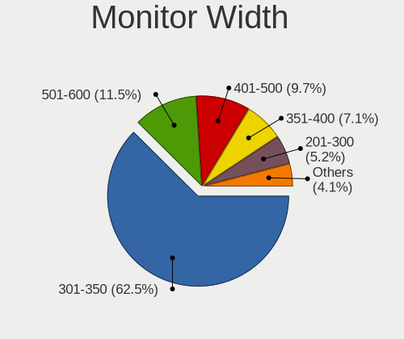

| Width in mm | Computers | Percent |
|-------------|-----------|---------|
| 301-350     | 110       | 62.5%   |
| 501-600     | 23        | 13.07%  |
| 401-500     | 18        | 10.23%  |
| 351-400     | 11        | 6.25%   |
| 201-300     | 8         | 4.55%   |
| Unknown     | 3         | 1.7%    |
| 601-700     | 1         | 0.57%   |
| 1001-1500   | 1         | 0.57%   |
| 901-1000    | 1         | 0.57%   |

Aspect Ratio
------------

Proportional relationship between the width and the height

| Ratio   | Computers | Percent |
|---------|-----------|---------|
| 16/9    | 147       | 90.18%  |
| 16/10   | 8         | 4.91%   |
| 5/4     | 3         | 1.84%   |
| Unknown | 3         | 1.84%   |
| 3/2     | 1         | 0.61%   |
| 3.40    | 1         | 0.61%   |

Monitor Area
------------

Area in inch

| Area in inch | Computers | Percent |
|----------------|-----------|---------|
| 101-110        | 96        | 53.33%  |
| 201-250        | 28        | 15.56%  |
| 81-90          | 14        | 7.78%   |
| 151-200        | 9         | 5%      |
| 121-130        | 7         | 3.89%   |
| 301-350        | 5         | 2.78%   |
| 71-80          | 3         | 1.67%   |
| 51-60          | 3         | 1.67%   |
| 141-150        | 3         | 1.67%   |
| Unknown        | 3         | 1.67%   |
| 61-70          | 2         | 1.11%   |
| 131-140        | 2         | 1.11%   |
| More than 1000 | 1         | 0.56%   |
| 351-500        | 1         | 0.56%   |
| 41-50          | 1         | 0.56%   |
| 251-300        | 1         | 0.56%   |
| 501-1000       | 1         | 0.56%   |

Pixel Density
-------------

Pixels per inch

| Density       | Computers | Percent |
|---------------|-----------|---------|
| 101-120       | 64        | 36.57%  |
| 121-160       | 54        | 30.86%  |
| 51-100        | 46        | 26.29%  |
| 161-240       | 4         | 2.29%   |
| Unknown       | 3         | 1.71%   |
| More than 240 | 2         | 1.14%   |
| 1-50          | 2         | 1.14%   |

Multiple Monitors
-----------------

Total monitors connected

| Total | Computers | Percent |
|-------|-----------|---------|
| 1     | 141       | 81.98%  |
| 2     | 24        | 13.95%  |
| 0     | 7         | 4.07%   |

Network
-------

Net Controller Vendor
---------------------

Controller vendors

| Vendor                            | Computers | Percent |
|-----------------------------------|-----------|---------|
| Realtek Semiconductor             | 124       | 45.76%  |
| Intel                             | 60        | 22.14%  |
| Qualcomm Atheros                  | 36        | 13.28%  |
| Broadcom                          | 17        | 6.27%   |
| Ralink                            | 8         | 2.95%   |
| Ralink Technology                 | 6         | 2.21%   |
| Broadcom Limited                  | 5         | 1.85%   |
| MediaTek                          | 2         | 0.74%   |
| D-Link                            | 2         | 0.74%   |
| TP-Link                           | 1         | 0.37%   |
| Sierra Wireless                   | 1         | 0.37%   |
| Samsung Electronics               | 1         | 0.37%   |
| OPPO Electronics                  | 1         | 0.37%   |
| Microchip Technology              | 1         | 0.37%   |
| Marvell Technology Group          | 1         | 0.37%   |
| IMC Networks                      | 1         | 0.37%   |
| ICS Advent                        | 1         | 0.37%   |
| Huawei Technologies               | 1         | 0.37%   |
| Ericsson Business Mobile Networks | 1         | 0.37%   |
| D-Link System                     | 1         | 0.37%   |

Net Controller Model
--------------------

Controller models

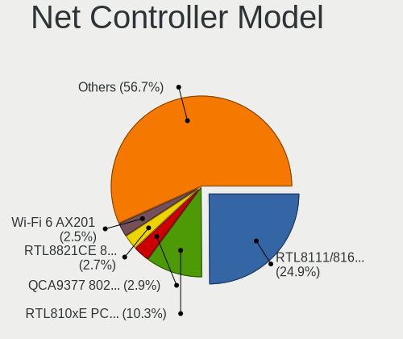

| Model                                                             | Computers | Percent |
|-------------------------------------------------------------------|-----------|---------|
| Realtek RTL8111/8168/8411 PCI Express Gigabit Ethernet Controller | 88        | 27.94%  |
| Realtek RTL810xE PCI Express Fast Ethernet controller             | 29        | 9.21%   |
| Qualcomm Atheros QCA9377 802.11ac Wireless Network Adapter        | 11        | 3.49%   |
| Realtek RTL8821CE 802.11ac PCIe Wireless Network Adapter          | 10        | 3.17%   |
| Broadcom BCM43142 802.11b/g/n                                     | 9         | 2.86%   |
| Qualcomm Atheros QCA9565 / AR9565 Wireless Network Adapter        | 8         | 2.54%   |
| Intel Wi-Fi 6 AX201                                               | 8         | 2.54%   |
| Realtek RTL8822CE 802.11ac PCIe Wireless Network Adapter          | 7         | 2.22%   |
| Intel Comet Lake PCH CNVi WiFi                                    | 7         | 2.22%   |
| Ralink MT7601U Wireless Adapter                                   | 5         | 1.59%   |
| Intel Dual Band Wireless-AC 3165 Plus Bluetooth                   | 5         | 1.59%   |
| Intel Comet Lake PCH-LP CNVi WiFi                                 | 5         | 1.59%   |
| Ralink RT3290 Wireless 802.11n 1T/1R PCIe                         | 4         | 1.27%   |
| Qualcomm Atheros AR9485 Wireless Network Adapter                  | 4         | 1.27%   |
| Qualcomm Atheros AR9285 Wireless Network Adapter (PCI-Express)    | 4         | 1.27%   |
| Intel Wireless 7265                                               | 4         | 1.27%   |
| Realtek RTL8723BE PCIe Wireless Network Adapter                   | 3         | 0.95%   |
| Qualcomm Atheros AR9462 Wireless Network Adapter                  | 3         | 0.95%   |
| Intel Wireless 8265 / 8275                                        | 3         | 0.95%   |
| Intel Wireless 8260                                               | 3         | 0.95%   |
| Intel WiFi Link 5100                                              | 3         | 0.95%   |
| Broadcom NetLink BCM57780 Gigabit Ethernet PCIe                   | 3         | 0.95%   |
| Realtek RTL8821AE 802.11ac PCIe Wireless Network Adapter          | 2         | 0.63%   |
| Realtek RTL8188FTV 802.11b/g/n 1T1R 2.4G WLAN Adapter             | 2         | 0.63%   |
| Realtek RTL8125 2.5GbE Controller                                 | 2         | 0.63%   |
| Ralink RT5390 Wireless 802.11n 1T/1R PCIe                         | 2         | 0.63%   |
| Ralink RT2790 Wireless 802.11n 1T/2R PCIe                         | 2         | 0.63%   |
| Qualcomm Atheros QCA6174 802.11ac Wireless Network Adapter        | 2         | 0.63%   |
| Intel Wireless 7260                                               | 2         | 0.63%   |
| Intel Ice Lake-LP PCH CNVi WiFi                                   | 2         | 0.63%   |
| Intel Ethernet Connection I218-LM                                 | 2         | 0.63%   |
| Intel Ethernet Connection (4) I219-LM                             | 2         | 0.63%   |
| Intel Ethernet Connection (13) I219-V                             | 2         | 0.63%   |
| Intel Dual Band Wireless-AC 3168NGW [Stone Peak]                  | 2         | 0.63%   |
| Intel Centrino Advanced-N 6200                                    | 2         | 0.63%   |
| Intel Cannon Lake PCH CNVi WiFi                                   | 2         | 0.63%   |
| Intel 82579LM Gigabit Network Connection (Lewisville)             | 2         | 0.63%   |
| Intel 82577LM Gigabit Network Connection                          | 2         | 0.63%   |
| D-Link DWA-123 Wireless N 150 Adapter (rev.D1)                    | 2         | 0.63%   |
| Broadcom NetXtreme BCM57786 Gigabit Ethernet PCIe                 | 2         | 0.63%   |

Wireless Vendor
---------------

Wireless vendors

| Vendor                | Computers | Percent |
|-----------------------|-----------|---------|
| Intel                 | 56        | 34.78%  |
| Qualcomm Atheros      | 33        | 20.5%   |
| Realtek Semiconductor | 32        | 19.88%  |
| Broadcom              | 13        | 8.07%   |
| Ralink                | 8         | 4.97%   |
| Ralink Technology     | 6         | 3.73%   |
| Broadcom Limited      | 5         | 3.11%   |
| MediaTek              | 2         | 1.24%   |
| D-Link                | 2         | 1.24%   |
| TP-Link               | 1         | 0.62%   |
| Sierra Wireless       | 1         | 0.62%   |
| IMC Networks          | 1         | 0.62%   |
| D-Link System         | 1         | 0.62%   |

Wireless Model
--------------

Wireless models

| Model                                                          | Computers | Percent |
|----------------------------------------------------------------|-----------|---------|
| Qualcomm Atheros QCA9377 802.11ac Wireless Network Adapter     | 11        | 6.79%   |
| Realtek RTL8821CE 802.11ac PCIe Wireless Network Adapter       | 10        | 6.17%   |
| Broadcom BCM43142 802.11b/g/n                                  | 9         | 5.56%   |
| Qualcomm Atheros QCA9565 / AR9565 Wireless Network Adapter     | 8         | 4.94%   |
| Intel Wi-Fi 6 AX201                                            | 8         | 4.94%   |
| Realtek RTL8822CE 802.11ac PCIe Wireless Network Adapter       | 7         | 4.32%   |
| Intel Comet Lake PCH CNVi WiFi                                 | 7         | 4.32%   |
| Ralink MT7601U Wireless Adapter                                | 5         | 3.09%   |
| Intel Dual Band Wireless-AC 3165 Plus Bluetooth                | 5         | 3.09%   |
| Intel Comet Lake PCH-LP CNVi WiFi                              | 5         | 3.09%   |
| Ralink RT3290 Wireless 802.11n 1T/1R PCIe                      | 4         | 2.47%   |
| Qualcomm Atheros AR9485 Wireless Network Adapter               | 4         | 2.47%   |
| Qualcomm Atheros AR9285 Wireless Network Adapter (PCI-Express) | 4         | 2.47%   |
| Intel Wireless 7265                                            | 4         | 2.47%   |
| Realtek RTL8723BE PCIe Wireless Network Adapter                | 3         | 1.85%   |
| Qualcomm Atheros AR9462 Wireless Network Adapter               | 3         | 1.85%   |
| Intel Wireless 8265 / 8275                                     | 3         | 1.85%   |
| Intel Wireless 8260                                            | 3         | 1.85%   |
| Intel WiFi Link 5100                                           | 3         | 1.85%   |
| Realtek RTL8821AE 802.11ac PCIe Wireless Network Adapter       | 2         | 1.23%   |
| Realtek RTL8188FTV 802.11b/g/n 1T1R 2.4G WLAN Adapter          | 2         | 1.23%   |
| Ralink RT5390 Wireless 802.11n 1T/1R PCIe                      | 2         | 1.23%   |
| Ralink RT2790 Wireless 802.11n 1T/2R PCIe                      | 2         | 1.23%   |
| Qualcomm Atheros QCA6174 802.11ac Wireless Network Adapter     | 2         | 1.23%   |
| Intel Wireless 7260                                            | 2         | 1.23%   |
| Intel Ice Lake-LP PCH CNVi WiFi                                | 2         | 1.23%   |
| Intel Dual Band Wireless-AC 3168NGW [Stone Peak]               | 2         | 1.23%   |
| Intel Centrino Advanced-N 6200                                 | 2         | 1.23%   |
| Intel Cannon Lake PCH CNVi WiFi                                | 2         | 1.23%   |
| D-Link DWA-123 Wireless N 150 Adapter (rev.D1)                 | 2         | 1.23%   |
| Broadcom Limited BCM4313 802.11bgn Wireless Network Adapter    | 2         | 1.23%   |
| Broadcom Limited BCM4312 802.11b/g LP-PHY                      | 2         | 1.23%   |
| Broadcom BCM4312 802.11b/g LP-PHY                              | 2         | 1.23%   |
| TP-Link TL-WN823N v2/v3 [Realtek RTL8192EU]                    | 1         | 0.62%   |
| Sierra Wireless EM7455                                         | 1         | 0.62%   |
| Realtek RTL8852AE 802.11ax PCIe Wireless Network Adapter       | 1         | 0.62%   |
| Realtek RTL8822BE 802.11a/b/g/n/ac WiFi adapter                | 1         | 0.62%   |
| Realtek RTL8723DE Wireless Network Adapter                     | 1         | 0.62%   |
| Realtek RTL8192EE PCIe Wireless Network Adapter                | 1         | 0.62%   |
| Realtek RTL8188EUS 802.11n Wireless Network Adapter            | 1         | 0.62%   |

Ethernet Vendor
---------------

Ethernet vendors

| Vendor                   | Computers | Percent |
|--------------------------|-----------|---------|
| Realtek Semiconductor    | 119       | 78.81%  |
| Intel                    | 16        | 10.6%   |
| Qualcomm Atheros         | 5         | 3.31%   |
| Broadcom                 | 5         | 3.31%   |
| Samsung Electronics      | 1         | 0.66%   |
| OPPO Electronics         | 1         | 0.66%   |
| Microchip Technology     | 1         | 0.66%   |
| Marvell Technology Group | 1         | 0.66%   |
| ICS Advent               | 1         | 0.66%   |
| Huawei Technologies      | 1         | 0.66%   |

Ethernet Model
--------------

Ethernet models

| Model                                                             | Computers | Percent |
|-------------------------------------------------------------------|-----------|---------|
| Realtek RTL8111/8168/8411 PCI Express Gigabit Ethernet Controller | 88        | 57.89%  |
| Realtek RTL810xE PCI Express Fast Ethernet controller             | 29        | 19.08%  |
| Broadcom NetLink BCM57780 Gigabit Ethernet PCIe                   | 3         | 1.97%   |
| Realtek RTL8125 2.5GbE Controller                                 | 2         | 1.32%   |
| Intel Ethernet Connection I218-LM                                 | 2         | 1.32%   |
| Intel Ethernet Connection (4) I219-LM                             | 2         | 1.32%   |
| Intel Ethernet Connection (13) I219-V                             | 2         | 1.32%   |
| Intel 82579LM Gigabit Network Connection (Lewisville)             | 2         | 1.32%   |
| Intel 82577LM Gigabit Network Connection                          | 2         | 1.32%   |
| Broadcom NetXtreme BCM57786 Gigabit Ethernet PCIe                 | 2         | 1.32%   |
| Samsung Galaxy series, misc. (tethering mode)                     | 1         | 0.66%   |
| Realtek RTL-8100/8101L/8139 PCI Fast Ethernet Adapter             | 1         | 0.66%   |
| Qualcomm Atheros QCA8172 Fast Ethernet                            | 1         | 0.66%   |
| Qualcomm Atheros AR8162 Fast Ethernet                             | 1         | 0.66%   |
| Qualcomm Atheros AR8152 v2.0 Fast Ethernet                        | 1         | 0.66%   |
| Qualcomm Atheros AR8151 v2.0 Gigabit Ethernet                     | 1         | 0.66%   |
| Qualcomm Atheros AR8132 Fast Ethernet                             | 1         | 0.66%   |
| OPPO KALAMA-MTP_CID:0437_SN:AEEEF597                              | 1         | 0.66%   |
| Microchip SMSC9512/9514 Fast Ethernet Adapter                     | 1         | 0.66%   |
| Marvell Group 88E8042 PCI-E Fast Ethernet Controller              | 1         | 0.66%   |
| Intel Ethernet Connection I218-V                                  | 1         | 0.66%   |
| Intel Ethernet Connection (7) I219-V                              | 1         | 0.66%   |
| Intel Ethernet Connection (7) I219-LM                             | 1         | 0.66%   |
| Intel Ethernet Connection (4) I219-V                              | 1         | 0.66%   |
| Intel Ethernet Connection (11) I219-LM                            | 1         | 0.66%   |
| Intel 82562V-2 10/100 Network Connection                          | 1         | 0.66%   |
| ICS Advent DM9601 Fast Ethernet Adapter                           | 1         | 0.66%   |
| Huawei HUAWEI                                                     | 1         | 0.66%   |

Net Controller Kind
-------------------

Ethernet, WiFi or modem

| Kind     | Computers | Percent |
|----------|-----------|---------|
| WiFi     | 149       | 50.17%  |
| Ethernet | 147       | 49.49%  |
| Modem    | 1         | 0.34%   |

Used Controller
---------------

Currently used network controller

| Kind     | Computers | Percent |
|----------|-----------|---------|
| WiFi     | 122       | 70.11%  |
| Ethernet | 52        | 29.89%  |

NICs
----

Total network controllers on board

| Total | Computers | Percent |
|-------|-----------|---------|
| 2     | 122       | 71.35%  |
| 1     | 47        | 27.49%  |
| 0     | 2         | 1.17%   |

IPv6
----

IPv6 vs IPv4

| Used | Computers | Percent |
|------|-----------|---------|
| No   | 170       | 100%    |

Bluetooth
---------

Bluetooth Vendor
----------------

Controller vendors

| Vendor                          | Computers | Percent |
|---------------------------------|-----------|---------|
| Intel                           | 48        | 37.5%   |
| Realtek Semiconductor           | 21        | 16.41%  |
| Qualcomm Atheros Communications | 21        | 16.41%  |
| Lite-On Technology              | 11        | 8.59%   |
| Broadcom                        | 6         | 4.69%   |
| IMC Networks                    | 5         | 3.91%   |
| Ralink                          | 4         | 3.13%   |
| Cambridge Silicon Radio         | 4         | 3.13%   |
| Foxconn / Hon Hai               | 3         | 2.34%   |
| Toshiba                         | 2         | 1.56%   |
| Realtek                         | 1         | 0.78%   |
| Hewlett-Packard                 | 1         | 0.78%   |
| Dell                            | 1         | 0.78%   |

Bluetooth Model
---------------

Controller models

| Model                                               | Computers | Percent |
|-----------------------------------------------------|-----------|---------|
| Intel Bluetooth wireless interface                  | 17        | 13.28%  |
| Intel AX201 Bluetooth                               | 17        | 13.28%  |
| Realtek Bluetooth Radio                             | 15        | 11.72%  |
| Qualcomm Atheros  Bluetooth Device                  | 13        | 10.16%  |
| Intel Bluetooth 9460/9560 Jefferson Peak (JfP)      | 11        | 8.59%   |
| Realtek  Bluetooth 4.2 Adapter                      | 4         | 3.13%   |
| Ralink RT3290 Bluetooth                             | 4         | 3.13%   |
| Qualcomm Atheros AR3011 Bluetooth                   | 4         | 3.13%   |
| Lite-On Bluetooth Device                            | 4         | 3.13%   |
| Cambridge Silicon Radio Bluetooth Dongle (HCI mode) | 4         | 3.13%   |
| Lite-On Broadcom BCM43142A0 Bluetooth Device        | 3         | 2.34%   |
| IMC Networks Bluetooth Radio                        | 3         | 2.34%   |
| Broadcom BCM43142A0 Bluetooth 4.0                   | 3         | 2.34%   |
| Realtek RTL8723B Bluetooth                          | 2         | 1.56%   |
| Qualcomm Atheros AR9462 Bluetooth                   | 2         | 1.56%   |
| Lite-On BCM43142A0                                  | 2         | 1.56%   |
| Intel Wireless-AC 3168 Bluetooth                    | 2         | 1.56%   |
| IMC Networks Wireless_Device                        | 2         | 1.56%   |
| Foxconn / Hon Hai Bluetooth Device                  | 2         | 1.56%   |
| Broadcom BCM2070 Bluetooth 2.1 + EDR                | 2         | 1.56%   |
| Toshiba Bluetooth USB Host Controller               | 1         | 0.78%   |
| Toshiba BCM43142A0                                  | 1         | 0.78%   |
| Realtek Bluetooth Radio                             | 1         | 0.78%   |
| Qualcomm Atheros Bluetooth USB Host Controller      | 1         | 0.78%   |
| Qualcomm Atheros AR3012 Bluetooth 4.0               | 1         | 0.78%   |
| Lite-On Qualcomm Atheros QCA9377 Bluetooth          | 1         | 0.78%   |
| Lite-On Atheros AR3012 Bluetooth                    | 1         | 0.78%   |
| Intel Centrino Advanced-N 6230 Bluetooth adapter    | 1         | 0.78%   |
| HP Broadcom 2070 Bluetooth Combo                    | 1         | 0.78%   |
| Foxconn / Hon Hai Broadcom BCM20702 Bluetooth       | 1         | 0.78%   |
| Dell DW375 Bluetooth Module                         | 1         | 0.78%   |
| Broadcom BCM43142 Bluetooth 4.0                     | 1         | 0.78%   |

Sound
-----

Sound Vendor
------------

Sound card vendors

| Vendor                    | Computers | Percent |
|---------------------------|-----------|---------|
| Intel                     | 145       | 66.51%  |
| Nvidia                    | 36        | 16.51%  |
| AMD                       | 31        | 14.22%  |
| C-Media Electronics       | 2         | 0.92%   |
| Xiamen VBeT Electronics   | 1         | 0.46%   |
| Sennheiser Communications | 1         | 0.46%   |
| Lenovo                    | 1         | 0.46%   |
| JMTek                     | 1         | 0.46%   |

Sound Model
-----------

Sound card models

| Model                                                                                             | Computers | Percent |
|---------------------------------------------------------------------------------------------------|-----------|---------|
| Intel Sunrise Point-LP HD Audio                                                                   | 20        | 7.94%   |
| Intel 8 Series HD Audio Controller                                                                | 13        | 5.16%   |
| AMD Family 17h/19h HD Audio Controller                                                            | 13        | 5.16%   |
| Intel Haswell-ULT HD Audio Controller                                                             | 12        | 4.76%   |
| Intel 6 Series/C200 Series Chipset Family High Definition Audio Controller                        | 12        | 4.76%   |
| Intel 7 Series/C216 Chipset Family High Definition Audio Controller                               | 10        | 3.97%   |
| Intel Tiger Lake-LP Smart Sound Technology Audio Controller                                       | 9         | 3.57%   |
| Intel Cannon Lake PCH cAVS                                                                        | 8         | 3.17%   |
| Intel 8 Series/C220 Series Chipset High Definition Audio Controller                               | 8         | 3.17%   |
| Intel Comet Lake PCH cAVS                                                                         | 7         | 2.78%   |
| Intel 82801I (ICH9 Family) HD Audio Controller                                                    | 7         | 2.78%   |
| Intel 5 Series/3400 Series Chipset High Definition Audio                                          | 7         | 2.78%   |
| Intel 100 Series/C230 Series Chipset Family HD Audio Controller                                   | 7         | 2.78%   |
| Nvidia TU107 GeForce GTX 1650 High Definition Audio Controller                                    | 6         | 2.38%   |
| Intel Comet Lake PCH-LP cAVS                                                                      | 6         | 2.38%   |
| Nvidia GP107GL High Definition Audio Controller                                                   | 5         | 1.98%   |
| Intel Wildcat Point-LP High Definition Audio Controller                                           | 5         | 1.98%   |
| Intel Ice Lake-LP Smart Sound Technology Audio Controller                                         | 5         | 1.98%   |
| Intel Broadwell-U Audio Controller                                                                | 5         | 1.98%   |
| AMD Raven/Raven2/Fenghuang HDMI/DP Audio Controller                                               | 5         | 1.98%   |
| Nvidia TU116 High Definition Audio Controller                                                     | 4         | 1.59%   |
| Nvidia High Definition Audio Controller                                                           | 4         | 1.59%   |
| Intel Xeon E3-1200 v3/4th Gen Core Processor HD Audio Controller                                  | 4         | 1.59%   |
| AMD High Definition Audio Controller                                                              | 4         | 1.59%   |
| AMD Family 15h (Models 60h-6fh) Audio Controller                                                  | 4         | 1.59%   |
| Nvidia GM107 High Definition Audio Controller [GeForce 940MX]                                     | 3         | 1.19%   |
| Nvidia GF119 HDMI Audio Controller                                                                | 3         | 1.19%   |
| Intel Atom/Celeron/Pentium Processor x5-E8000/J3xxx/N3xxx Series High Definition Audio Controller | 3         | 1.19%   |
| Intel 82801JI (ICH10 Family) HD Audio Controller                                                  | 3         | 1.19%   |
| AMD SBx00 Azalia (Intel HDA)                                                                      | 3         | 1.19%   |
| Nvidia GP106 High Definition Audio Controller                                                     | 2         | 0.79%   |
| Nvidia GK208 HDMI/DP Audio Controller                                                             | 2         | 0.79%   |
| Intel NM10/ICH7 Family High Definition Audio Controller                                           | 2         | 0.79%   |
| Intel Celeron/Pentium Silver Processor High Definition Audio                                      | 2         | 0.79%   |
| Intel Atom Processor Z36xxx/Z37xxx Series High Definition Audio Controller                        | 2         | 0.79%   |
| Intel 200 Series PCH HD Audio                                                                     | 2         | 0.79%   |
| C-Media Electronics USB Audio Device                                                              | 2         | 0.79%   |
| AMD Starship/Matisse HD Audio Controller                                                          | 2         | 0.79%   |
| AMD RV710/730 HDMI Audio [Radeon HD 4000 series]                                                  | 2         | 0.79%   |
| AMD Renoir Radeon High Definition Audio Controller                                                | 2         | 0.79%   |

Memory
------

Memory Vendor
-------------

Memory module vendors

| Vendor              | Computers | Percent |
|---------------------|-----------|---------|
| Samsung Electronics | 40        | 30.3%   |
| SK hynix            | 23        | 17.42%  |
| Micron Technology   | 14        | 10.61%  |
| Team                | 12        | 9.09%   |
| Unknown             | 8         | 6.06%   |
| A-DATA Technology   | 7         | 5.3%    |
| Crucial             | 5         | 3.79%   |
| Nanya Technology    | 3         | 2.27%   |
| Kingston            | 3         | 2.27%   |
| Elpida              | 3         | 2.27%   |
| TwinMOS             | 2         | 1.52%   |
| Toshiba             | 2         | 1.52%   |
| Ramaxel Technology  | 2         | 1.52%   |
| Unknown (ABCD)      | 1         | 0.76%   |
| PNY                 | 1         | 0.76%   |
| Patriot             | 1         | 0.76%   |
| Melco               | 1         | 0.76%   |
| Hikvision           | 1         | 0.76%   |
| GOODRAM             | 1         | 0.76%   |
| ASint Technology    | 1         | 0.76%   |
| 0BBA00000000        | 1         | 0.76%   |

Memory Model
------------

Memory module models

| Model                                                          | Computers | Percent |
|----------------------------------------------------------------|-----------|---------|
| SK hynix RAM HMA81GS6AFR8N-UH 8GB SODIMM DDR4 2667MT/s         | 3         | 2.16%   |
| Samsung RAM M471A5244CB0-CWE 4GB SODIMM DDR4 3200MT/s          | 3         | 2.16%   |
| Samsung RAM M471A5244CB0-CTD 4GB SODIMM DDR4 3266MT/s          | 3         | 2.16%   |
| Samsung RAM M471A1G44AB0-CWE 8GB SODIMM DDR4 3200MT/s          | 3         | 2.16%   |
| A-DATA RAM Module 16GB SODIMM DDR4 2667MT/s                    | 3         | 2.16%   |
| Toshiba RAM 8HTF12864HDY-800G1 4GB SODIMM 1066MT/s             | 2         | 1.44%   |
| Toshiba RAM 64T128020EDL2.5C2 1GB SODIMM 1066MT/s              | 2         | 1.44%   |
| Team RAM TEAMGROUP-SD4-3200 16GB SODIMM DDR4 3200MT/s          | 2         | 1.44%   |
| Team RAM TEAMGROUP-SD4-2666 16GB SODIMM DDR4 2667MT/s          | 2         | 1.44%   |
| Team RAM TEAMGROUP-SD4-2400 16GB SODIMM DDR4 8400MT/s          | 2         | 1.44%   |
| SK hynix RAM HMA81GS6JJR8N-VK 8GB SODIMM DDR4 2667MT/s         | 2         | 1.44%   |
| Samsung RAM M471B5273EB0-CK0 4096MB SODIMM DDR3 4199MT/s       | 2         | 1.44%   |
| Samsung RAM M471B5273DH0-CH9 4GB SODIMM DDR3 1334MT/s          | 2         | 1.44%   |
| Samsung RAM M471B5173QH0-YK0 4GB SODIMM DDR3 1600MT/s          | 2         | 1.44%   |
| Samsung RAM M471B5173DB0-YK0 4GB SODIMM DDR3 1600MT/s          | 2         | 1.44%   |
| Samsung RAM M471A5244CB0-CRC 4GB SODIMM DDR4 2667MT/s          | 2         | 1.44%   |
| Samsung RAM M471A1K43DB1-CWE 8GB SODIMM DDR4 3200MT/s          | 2         | 1.44%   |
| Samsung RAM M471A1K43CB1-CTD 8GB SODIMM DDR4 2667MT/s          | 2         | 1.44%   |
| Samsung RAM M471A1G44BB0-CWE 8GB Row Of Chips DDR4 3200MT/s    | 2         | 1.44%   |
| Nanya RAM NT2GC64B88B0NS-CG 2GB SODIMM DDR3 1334MT/s           | 2         | 1.44%   |
| Unknown RAM Module 4GB SODIMM DDR3 1333MT/s                    | 1         | 0.72%   |
| Unknown RAM Module 4GB DIMM DDR3 1333MT/s                      | 1         | 0.72%   |
| Unknown RAM Module 4GB DIMM DDR3 1066MT/s                      | 1         | 0.72%   |
| Unknown RAM Module 4GB DIMM DDR3                               | 1         | 0.72%   |
| Unknown RAM Module 4096MB SODIMM DDR4 2133MT/s                 | 1         | 0.72%   |
| Unknown RAM Module 4096MB SODIMM DDR3                          | 1         | 0.72%   |
| Unknown RAM Module 2048MB SODIMM DDR2 800MT/s                  | 1         | 0.72%   |
| Unknown RAM Module 1024MB DIMM 667MT/s                         | 1         | 0.72%   |
| Unknown (ABCD) RAM 123456789012345678 2GB DIMM LPDDR4 2400MT/s | 1         | 0.72%   |
| TwinMOS RAM 9DSDBNZB-5AMP 4GB DIMM DDR3 1333MT/s               | 1         | 0.72%   |
| TwinMOS RAM 9D7TBNZB-TATP 4096MB DIMM DDR3 1066MT/s            | 1         | 0.72%   |
| Team RAM TEAMGROUP-UD4-3200 8GB DIMM DDR4 3800MT/s             | 1         | 0.72%   |
| Team RAM TEAMGROUP-UD4-2400 8GB DIMM DDR4 2400MT/s             | 1         | 0.72%   |
| Team RAM TEAMGROUP-SD4-3200 32GB SODIMM DDR4 3200MT/s          | 1         | 0.72%   |
| Team RAM TEAMGROUP-SD4-3200 16384MB Row Of Chips DDR4 2400MT/s | 1         | 0.72%   |
| Team RAM TEAMGROUP-SD3-1600 8GB SODIMM DDR3 1600MT/s           | 1         | 0.72%   |
| Team RAM Module 8192MB SODIMM DDR4 2667MT/s                    | 1         | 0.72%   |
| SK hynix RAM Module 4096MB DIMM DDR3 1333MT/s                  | 1         | 0.72%   |
| SK hynix RAM HYMP125U64CP8-S6 2GB DIMM DDR2 49926MT/s          | 1         | 0.72%   |
| SK hynix RAM HYMP112S64CP6-S6 1GB SODIMM DDR2 975MT/s          | 1         | 0.72%   |

Memory Kind
-----------

Memory module kinds

| Kind    | Computers | Percent |
|---------|-----------|---------|
| DDR4    | 60        | 57.14%  |
| DDR3    | 30        | 28.57%  |
| DDR2    | 5         | 4.76%   |
| SDRAM   | 3         | 2.86%   |
| LPDDR4  | 3         | 2.86%   |
| LPDDR3  | 2         | 1.9%    |
| DDR5    | 1         | 0.95%   |
| Unknown | 1         | 0.95%   |

Memory Form Factor
------------------

Physical design of the memory module

| Name         | Computers | Percent |
|--------------|-----------|---------|
| SODIMM       | 78        | 73.58%  |
| DIMM         | 18        | 16.98%  |
| Row Of Chips | 9         | 8.49%   |
| Chip         | 1         | 0.94%   |

Memory Size
-----------

Memory module size

| Size  | Computers | Percent |
|-------|-----------|---------|
| 4096  | 43        | 35.54%  |
| 8192  | 40        | 33.06%  |
| 16384 | 16        | 13.22%  |
| 2048  | 14        | 11.57%  |
| 32768 | 6         | 4.96%   |
| 1024  | 2         | 1.65%   |

Memory Speed
------------

Memory module speed

| Speed   | Computers | Percent |
|---------|-----------|---------|
| 2667    | 28        | 23.53%  |
| 3200    | 23        | 19.33%  |
| 1600    | 15        | 12.61%  |
| 2400    | 11        | 9.24%   |
| 1334    | 7         | 5.88%   |
| 1333    | 5         | 4.2%    |
| 1066    | 4         | 3.36%   |
| 3266    | 3         | 2.52%   |
| 2133    | 3         | 2.52%   |
| 1867    | 3         | 2.52%   |
| 667     | 3         | 2.52%   |
| 8400    | 2         | 1.68%   |
| 4199    | 2         | 1.68%   |
| Unknown | 2         | 1.68%   |
| 49926   | 1         | 0.84%   |
| 4800    | 1         | 0.84%   |
| 3800    | 1         | 0.84%   |
| 3000    | 1         | 0.84%   |
| 1648    | 1         | 0.84%   |
| 1067    | 1         | 0.84%   |
| 975     | 1         | 0.84%   |
| 800     | 1         | 0.84%   |

Printers & scanners
-------------------

Printer Vendor
--------------

Printer device vendors

| Vendor          | Computers | Percent |
|-----------------|-----------|---------|
| Hewlett-Packard | 3         | 75%     |
| Seiko Epson     | 1         | 25%     |

Printer Model
-------------

Printer device models

| Model                   | Computers | Percent |
|-------------------------|-----------|---------|
| HP LaserJet P1005       | 2         | 50%     |
| Seiko Epson L365 Series | 1         | 25%     |
| HP DeskJet 5810 series  | 1         | 25%     |

Scanner Vendor
--------------

Scanner device vendors

Zero info for selected period =(

Scanner Model
-------------

Scanner device models

Zero info for selected period =(

Camera
------

Camera Vendor
-------------

Camera device vendors

| Vendor                                 | Computers | Percent |
|----------------------------------------|-----------|---------|
| Chicony Electronics                    | 30        | 23.81%  |
| IMC Networks                           | 17        | 13.49%  |
| Realtek Semiconductor                  | 16        | 12.7%   |
| Microdia                               | 9         | 7.14%   |
| Suyin                                  | 7         | 5.56%   |
| Acer                                   | 7         | 5.56%   |
| Syntek                                 | 6         | 4.76%   |
| Sunplus Innovation Technology          | 6         | 4.76%   |
| Lite-On Technology                     | 5         | 3.97%   |
| Cheng Uei Precision Industry (Foxlink) | 5         | 3.97%   |
| Bison Electronics                      | 4         | 3.17%   |
| Quanta                                 | 3         | 2.38%   |
| Luxvisions Innotech Limited            | 3         | 2.38%   |
| Silicon Motion                         | 1         | 0.79%   |
| Samsung Electronics                    | 1         | 0.79%   |
| Ricoh                                  | 1         | 0.79%   |
| Lenovo                                 | 1         | 0.79%   |
| Importek                               | 1         | 0.79%   |
| Cubeternet                             | 1         | 0.79%   |
| Apple                                  | 1         | 0.79%   |
| Alcor Micro                            | 1         | 0.79%   |

Camera Model
------------

Camera device models

| Model                                                       | Computers | Percent |
|-------------------------------------------------------------|-----------|---------|
| Chicony Integrated Camera                                   | 9         | 7.14%   |
| IMC Networks USB2.0 HD UVC WebCam                           | 8         | 6.35%   |
| Chicony HD WebCam                                           | 5         | 3.97%   |
| Sunplus Integrated_Webcam_HD                                | 4         | 3.17%   |
| IMC Networks Integrated Camera                              | 4         | 3.17%   |
| Syntek EasyCamera                                           | 3         | 2.38%   |
| Realtek USB2.0 VGA UVC WebCam                               | 3         | 2.38%   |
| Realtek USB Camera                                          | 3         | 2.38%   |
| Realtek Integrated_Webcam_HD                                | 3         | 2.38%   |
| Luxvisions Innotech Limited HP TrueVision HD Camera         | 3         | 2.38%   |
| Lite-On Integrated Camera                                   | 3         | 2.38%   |
| Chicony USB2.0 HD UVC WebCam                                | 3         | 2.38%   |
| Acer Integrated Camera                                      | 3         | 2.38%   |
| Syntek Integrated Camera                                    | 2         | 1.59%   |
| Suyin HP TrueVision HD                                      | 2         | 1.59%   |
| Realtek USB2.0 HD UVC WebCam                                | 2         | 1.59%   |
| Realtek EasyCamera                                          | 2         | 1.59%   |
| Quanta HD WebCam                                            | 2         | 1.59%   |
| Microdia Laptop_Integrated_Webcam_HD                        | 2         | 1.59%   |
| Microdia Integrated_Webcam_HD                               | 2         | 1.59%   |
| Microdia Dell Laptop Integrated Webcam HD                   | 2         | 1.59%   |
| IMC Networks USB2.0 VGA UVC WebCam                          | 2         | 1.59%   |
| Chicony Lenovo EasyCamera                                   | 2         | 1.59%   |
| Chicony EasyCamera                                          | 2         | 1.59%   |
| Cheng Uei Precision Industry (Foxlink) HP Webcam            | 2         | 1.59%   |
| Bison Integrated Camera                                     | 2         | 1.59%   |
| Bison HD Webcam                                             | 2         | 1.59%   |
| Acer Lenovo EasyCamera                                      | 2         | 1.59%   |
| Syntek Integrated RGB Camera                                | 1         | 0.79%   |
| Suyin USB 2.0 Camera                                        | 1         | 0.79%   |
| Suyin Integrated_Webcam_HD                                  | 1         | 0.79%   |
| Suyin HP Integrated Webcam                                  | 1         | 0.79%   |
| Suyin HD WebCam                                             | 1         | 0.79%   |
| Suyin 1.3M WebCam (notebook emachines E730, Acer sub-brand) | 1         | 0.79%   |
| Sunplus HD User Facing                                      | 1         | 0.79%   |
| Sunplus Dell HD Webcam                                      | 1         | 0.79%   |
| Silicon Motion WebCam SC-13HDL11431N                        | 1         | 0.79%   |
| Samsung Galaxy series, misc. (MTP mode)                     | 1         | 0.79%   |
| Ricoh Laptop_Integrated_Webcam_FHD                          | 1         | 0.79%   |
| Realtek Integrated Webcam_HD                                | 1         | 0.79%   |

Security
--------

Fingerprint Vendor
------------------

Fingerprint sensor vendors

| Vendor                     | Computers | Percent |
|----------------------------|-----------|---------|
| Validity Sensors           | 4         | 40%     |
| Shenzhen Goodix Technology | 2         | 20%     |
| LighTuning Technology      | 2         | 20%     |
| Upek                       | 1         | 10%     |
| Synaptics                  | 1         | 10%     |

Fingerprint Model
-----------------

Fingerprint sensor models

| Model                                                  | Computers | Percent |
|--------------------------------------------------------|-----------|---------|
| LighTuning EgisTec Touch Fingerprint Sensor            | 2         | 20%     |
| Validity Sensors VFS495 Fingerprint Reader             | 1         | 10%     |
| Validity Sensors VFS 5011 fingerprint sensor           | 1         | 10%     |
| Validity Sensors Synaptics WBDI                        | 1         | 10%     |
| Validity Sensors Fingerprint scanner                   | 1         | 10%     |
| Upek Biometric Touchchip/Touchstrip Fingerprint Sensor | 1         | 10%     |
| Synaptics Metallica MIS Touch Fingerprint Reader       | 1         | 10%     |
| Shenzhen Goodix  FingerPrint Device                    | 1         | 10%     |
| Shenzhen Goodix Fingerprint Reader                     | 1         | 10%     |

Chipcard Vendor
---------------

Chipcard module vendors

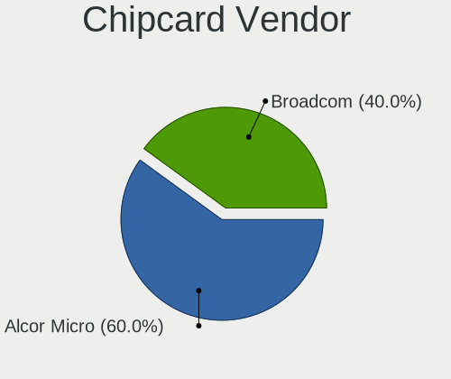

| Vendor      | Computers | Percent |
|-------------|-----------|---------|
| Broadcom    | 2         | 66.67%  |
| Alcor Micro | 1         | 33.33%  |

Chipcard Model
--------------

Chipcard module models

| Model                                                                        | Computers | Percent |
|------------------------------------------------------------------------------|-----------|---------|
| Broadcom BCM5880 Secure Applications Processor with fingerprint swipe sensor | 1         | 33.33%  |
| Broadcom 5880                                                                | 1         | 33.33%  |
| Alcor Micro AU9540 Smartcard Reader                                          | 1         | 33.33%  |

Unsupported
-----------

Unsupported Devices
-------------------

Total unsupported devices on board

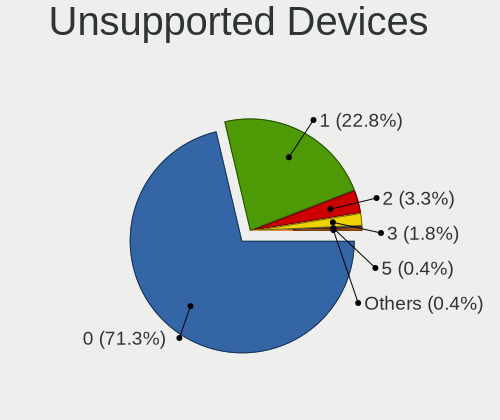

| Total | Computers | Percent |
|-------|-----------|---------|
| 0     | 132       | 72.13%  |
| 1     | 41        | 22.4%   |
| 3     | 5         | 2.73%   |
| 2     | 4         | 2.19%   |
| 4     | 1         | 0.55%   |

Unsupported Device Types
------------------------

Types of unsupported devices

| Type                     | Computers | Percent |
|--------------------------|-----------|---------|
| Graphics card            | 17        | 27.87%  |
| Net/wireless             | 13        | 21.31%  |
| Fingerprint reader       | 10        | 16.39%  |
| Bluetooth                | 6         | 9.84%   |
| Communication controller | 4         | 6.56%   |
| Chipcard                 | 3         | 4.92%   |
| Storage                  | 2         | 3.28%   |
| Sound                    | 1         | 1.64%   |
| Network                  | 1         | 1.64%   |
| Net/ethernet             | 1         | 1.64%   |
| Multimedia controller    | 1         | 1.64%   |
| Card reader              | 1         | 1.64%   |
| Camera                   | 1         | 1.64%   |

