Linux in Tunisia - Tested Hardware & Statistics (Desktops)
----------------------------------------------------------

A project to collect tested hardware configurations for Linux in Tunisia.

Anyone can contribute to this report by the [hw-probe](https://github.com/linuxhw/hw-probe) tool:

    sudo -E hw-probe -all -upload

Please contribute! Especially if your hardware is rare.

Contents
--------

* [ Test Cases ](#test-cases)

* [ System ](#system)
  - [ OS                       ](#os)
  - [ OS Family                ](#os-family)
  - [ Kernel                   ](#kernel)
  - [ Kernel Family            ](#kernel-family)
  - [ Kernel Major Ver.        ](#kernel-major-ver)
  - [ Arch                     ](#arch)
  - [ DE                       ](#de)
  - [ Display Server           ](#display-server)
  - [ Display Manager          ](#display-manager)
  - [ OS Lang                  ](#os-lang)
  - [ Boot Mode                ](#boot-mode)
  - [ Filesystem               ](#filesystem)
  - [ Part. scheme             ](#part-scheme)
  - [ Dual Boot with Linux/BSD ](#dual-boot-with-linuxbsd)
  - [ Dual Boot (Win)          ](#dual-boot-win)

* [ Board ](#board)
  - [ Vendor                   ](#vendor)
  - [ Model                    ](#model)
  - [ Model Family             ](#model-family)
  - [ MFG Year                 ](#mfg-year)
  - [ Form Factor              ](#form-factor)
  - [ Secure Boot              ](#secure-boot)
  - [ Coreboot                 ](#coreboot)
  - [ RAM Size                 ](#ram-size)
  - [ RAM Used                 ](#ram-used)
  - [ Total Drives             ](#total-drives)
  - [ Has CD-ROM               ](#has-cd-rom)
  - [ Has Ethernet             ](#has-ethernet)
  - [ Has WiFi                 ](#has-wifi)
  - [ Has Bluetooth            ](#has-bluetooth)

* [ Location ](#location)
  - [ Country                  ](#country)
  - [ City                     ](#city)

* [ Drives ](#drives)
  - [ Drive Vendor             ](#drive-vendor)
  - [ Drive Model              ](#drive-model)
  - [ HDD Vendor               ](#hdd-vendor)
  - [ SSD Vendor               ](#ssd-vendor)
  - [ Drive Kind               ](#drive-kind)
  - [ Drive Connector          ](#drive-connector)
  - [ Drive Size               ](#drive-size)
  - [ Space Total              ](#space-total)
  - [ Space Used               ](#space-used)
  - [ Malfunc. Drives          ](#malfunc-drives)
  - [ Malfunc. Drive Vendor    ](#malfunc-drive-vendor)
  - [ Malfunc. HDD Vendor      ](#malfunc-hdd-vendor)
  - [ Malfunc. Drive Kind      ](#malfunc-drive-kind)
  - [ Failed Drives            ](#failed-drives)
  - [ Failed Drive Vendor      ](#failed-drive-vendor)
  - [ Drive Status             ](#drive-status)

* [ Storage controller ](#storage-controller)
  - [ Storage Vendor           ](#storage-vendor)
  - [ Storage Model            ](#storage-model)
  - [ Storage Kind             ](#storage-kind)

* [ Processor ](#processor)
  - [ CPU Vendor               ](#cpu-vendor)
  - [ CPU Model                ](#cpu-model)
  - [ CPU Model Family         ](#cpu-model-family)
  - [ CPU Cores                ](#cpu-cores)
  - [ CPU Sockets              ](#cpu-sockets)
  - [ CPU Threads              ](#cpu-threads)
  - [ CPU Op-Modes             ](#cpu-op-modes)
  - [ CPU Microcode            ](#cpu-microcode)
  - [ CPU Microarch            ](#cpu-microarch)

* [ Graphics ](#graphics)
  - [ GPU Vendor               ](#gpu-vendor)
  - [ GPU Model                ](#gpu-model)
  - [ GPU Combo                ](#gpu-combo)
  - [ GPU Driver               ](#gpu-driver)
  - [ GPU Memory               ](#gpu-memory)

* [ Monitor ](#monitor)
  - [ Monitor Vendor           ](#monitor-vendor)
  - [ Monitor Model            ](#monitor-model)
  - [ Monitor Resolution       ](#monitor-resolution)
  - [ Monitor Diagonal         ](#monitor-diagonal)
  - [ Monitor Width            ](#monitor-width)
  - [ Aspect Ratio             ](#aspect-ratio)
  - [ Monitor Area             ](#monitor-area)
  - [ Pixel Density            ](#pixel-density)
  - [ Multiple Monitors        ](#multiple-monitors)

* [ Network ](#network)
  - [ Net Controller Vendor    ](#net-controller-vendor)
  - [ Net Controller Model     ](#net-controller-model)
  - [ Wireless Vendor          ](#wireless-vendor)
  - [ Wireless Model           ](#wireless-model)
  - [ Ethernet Vendor          ](#ethernet-vendor)
  - [ Ethernet Model           ](#ethernet-model)
  - [ Net Controller Kind      ](#net-controller-kind)
  - [ Used Controller          ](#used-controller)
  - [ NICs                     ](#nics)
  - [ IPv6                     ](#ipv6)

* [ Bluetooth ](#bluetooth)
  - [ Bluetooth Vendor         ](#bluetooth-vendor)
  - [ Bluetooth Model          ](#bluetooth-model)

* [ Sound ](#sound)
  - [ Sound Vendor             ](#sound-vendor)
  - [ Sound Model              ](#sound-model)

* [ Memory ](#memory)
  - [ Memory Vendor            ](#memory-vendor)
  - [ Memory Model             ](#memory-model)
  - [ Memory Kind              ](#memory-kind)
  - [ Memory Form Factor       ](#memory-form-factor)
  - [ Memory Size              ](#memory-size)
  - [ Memory Speed             ](#memory-speed)

* [ Printers & scanners ](#printers--scanners)
  - [ Printer Vendor           ](#printer-vendor)
  - [ Printer Model            ](#printer-model)
  - [ Scanner Vendor           ](#scanner-vendor)
  - [ Scanner Model            ](#scanner-model)

* [ Camera ](#camera)
  - [ Camera Vendor            ](#camera-vendor)
  - [ Camera Model             ](#camera-model)

* [ Security ](#security)
  - [ Fingerprint Vendor       ](#fingerprint-vendor)
  - [ Fingerprint Model        ](#fingerprint-model)
  - [ Chipcard Vendor          ](#chipcard-vendor)
  - [ Chipcard Model           ](#chipcard-model)

* [ Unsupported ](#unsupported)
  - [ Unsupported Devices      ](#unsupported-devices)
  - [ Unsupported Device Types ](#unsupported-device-types)

Test Cases
----------

Total: 31

| Vendor   | Model                 | Probe                                                      | Date         |
|----------|-----------------------|------------------------------------------------------------|--------------|
| Dell     | 05842Y A00            | [7c67079823](https://linux-hardware.org/?probe=7c67079823) | May 19, 2022 |
| MSI      | H81M-P33              | [af0e50e873](https://linux-hardware.org/?probe=af0e50e873) | Apr 14, 2022 |
| MSI      | B550M PRO-VDH         | [9597b0a2d9](https://linux-hardware.org/?probe=9597b0a2d9) | Apr 09, 2022 |
| ASUSTek  | PRIME B450M-K         | [6278830433](https://linux-hardware.org/?probe=6278830433) | Feb 17, 2022 |
| Intel    | H61                   | [6d80839afa](https://linux-hardware.org/?probe=6d80839afa) | Feb 09, 2022 |
| ASUSTek  | PRIME B450M-K         | [f49f9dddd2](https://linux-hardware.org/?probe=f49f9dddd2) | Jan 29, 2022 |
| ASUSTek  | PRIME B450M-K         | [0799e18f8b](https://linux-hardware.org/?probe=0799e18f8b) | Jan 20, 2022 |
| MSI      | H110M PRO-VD PLUS     | [e6fd06720f](https://linux-hardware.org/?probe=e6fd06720f) | Nov 28, 2021 |
| Gigabyte | B75M-D3H              | [b882e1c0f7](https://linux-hardware.org/?probe=b882e1c0f7) | Sep 22, 2021 |
| HP       | 1494                  | [ae5165603a](https://linux-hardware.org/?probe=ae5165603a) | Sep 09, 2021 |
| HP       | 1494                  | [62e74e0c1a](https://linux-hardware.org/?probe=62e74e0c1a) | Sep 09, 2021 |
| Lenovo   | SHARKBAY NOK          | [e57d0a5518](https://linux-hardware.org/?probe=e57d0a5518) | Sep 01, 2021 |
| Dell     | 0M5DCD A00            | [77faf70869](https://linux-hardware.org/?probe=77faf70869) | Jun 14, 2021 |
| Lenovo   | 3138 NO DPK           | [8488c59a11](https://linux-hardware.org/?probe=8488c59a11) | May 18, 2021 |
| ASUSTek  | PRIME B450M-K         | [8110fad44d](https://linux-hardware.org/?probe=8110fad44d) | May 17, 2021 |
| ASUSTek  | PRIME B450M-K         | [ae4420d3a9](https://linux-hardware.org/?probe=ae4420d3a9) | May 01, 2021 |
| Dell     | 0TTDMJ A00            | [aef24f2346](https://linux-hardware.org/?probe=aef24f2346) | Oct 28, 2020 |
| ASUSTek  | M32CD_A_F_K20CD_K31CD | [cdce66a7de](https://linux-hardware.org/?probe=cdce66a7de) | Jul 07, 2020 |
| Foxconn  | 2ABF                  | [65d6dca78e](https://linux-hardware.org/?probe=65d6dca78e) | May 27, 2020 |
| MSI      | MS-7502 Fab D         | [242c5b8d0d](https://linux-hardware.org/?probe=242c5b8d0d) | Mar 30, 2020 |
| Foxconn  | 2ABF                  | [7c6e2d2c29](https://linux-hardware.org/?probe=7c6e2d2c29) | Mar 10, 2020 |
| Pegatron | Eureka3               | [77bc52c3d9](https://linux-hardware.org/?probe=77bc52c3d9) | Mar 02, 2020 |
| Pegatron | Eureka3               | [84ee26b4e7](https://linux-hardware.org/?probe=84ee26b4e7) | Mar 02, 2020 |
| Pegatron | Eureka3               | [33ae5ebabc](https://linux-hardware.org/?probe=33ae5ebabc) | Feb 18, 2020 |
| Lenovo   | 3138 NO DPK           | [7878eb9e27](https://linux-hardware.org/?probe=7878eb9e27) | Dec 30, 2019 |
| Lenovo   | 3138 NO DPK           | [21f916c3ef](https://linux-hardware.org/?probe=21f916c3ef) | Dec 30, 2019 |
| Unknown  | Pine Trail - M CRB    | [ef1e6295a8](https://linux-hardware.org/?probe=ef1e6295a8) | Oct 30, 2019 |
| Foxconn  | 2ABF                  | [4521f814c9](https://linux-hardware.org/?probe=4521f814c9) | Sep 17, 2019 |
| Foxconn  | 2ABF                  | [6a57b2ea85](https://linux-hardware.org/?probe=6a57b2ea85) | Sep 17, 2019 |
| Pegatron | 2A94h                 | [3b6656bb11](https://linux-hardware.org/?probe=3b6656bb11) | Jul 04, 2019 |
| Foxconn  | 2ABF                  | [f6873739a8](https://linux-hardware.org/?probe=f6873739a8) | Mar 03, 2018 |

System
------

OS
--

Installed operating systems

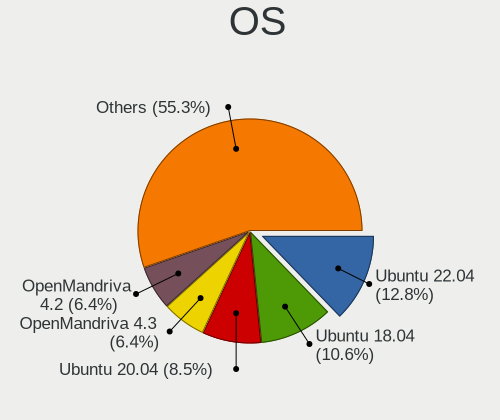

| Name              | Desktops | Percent |
|-------------------|----------|---------|
| Ubuntu 18.04      | 4        | 18.18%  |
| Ubuntu 20.04      | 3        | 13.64%  |
| OpenMandriva 4.2  | 3        | 13.64%  |
| Ubuntu 19.10      | 2        | 9.09%   |
| OpenMandriva 4.3  | 2        | 9.09%   |
| Ubuntu 21.10      | 1        | 4.55%   |
| Ubuntu 19.04      | 1        | 4.55%   |
| Ubuntu 16.04      | 1        | 4.55%   |
| ROSA R10          | 1        | 4.55%   |
| Gentoo 2.7        | 1        | 4.55%   |
| Debian 11         | 1        | 4.55%   |
| ArcoLinux Rolling | 1        | 4.55%   |
| Arch              | 1        | 4.55%   |

OS Family
---------

OS without a version

| Name         | Desktops | Percent |
|--------------|----------|---------|
| Ubuntu       | 10       | 50%     |
| OpenMandriva | 5        | 25%     |
| ROSA         | 1        | 5%      |
| Gentoo       | 1        | 5%      |
| Debian       | 1        | 5%      |
| ArcoLinux    | 1        | 5%      |
| Arch         | 1        | 5%      |

Kernel
------

Version of the Linux kernel

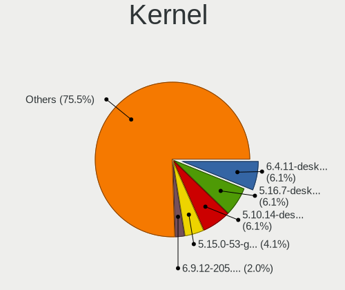

| Version                         | Desktops | Percent |
|---------------------------------|----------|---------|
| 5.10.14-desktop-1omv4002        | 3        | 12.5%   |
| 5.16.7-desktop-1omv4003         | 2        | 8.33%   |
| 5.9.1-arch1-1                   | 1        | 4.17%   |
| 5.4.0-73-generic                | 1        | 4.17%   |
| 5.4.0-40-generic                | 1        | 4.17%   |
| 5.4.0-31-generic                | 1        | 4.17%   |
| 5.3.0-40-generic                | 1        | 4.17%   |
| 5.3.0-26-generic                | 1        | 4.17%   |
| 5.3.0-19-generic                | 1        | 4.17%   |
| 5.15.5-arch1-1                  | 1        | 4.17%   |
| 5.15.11-gentoo                  | 1        | 4.17%   |
| 5.13.0-39-generic               | 1        | 4.17%   |
| 5.11.0-27-generic               | 1        | 4.17%   |
| 5.10.27-gentoo                  | 1        | 4.17%   |
| 5.10.0-12-amd64                 | 1        | 4.17%   |
| 5.0.0-13-generic                | 1        | 4.17%   |
| 4.9.60-nrj-desktop-1rosa-x86_64 | 1        | 4.17%   |
| 4.4.0-176-generic               | 1        | 4.17%   |
| 4.18.0-25-generic               | 1        | 4.17%   |
| 4.15.0-91-generic               | 1        | 4.17%   |
| 4.15.0-89-generic               | 1        | 4.17%   |

Kernel Family
-------------

Linux kernel without a distro release

| Version | Desktops | Percent |
|---------|----------|---------|
| 5.4.0   | 3        | 12.5%   |
| 5.3.0   | 3        | 12.5%   |
| 5.10.14 | 3        | 12.5%   |
| 5.16.7  | 2        | 8.33%   |
| 4.15.0  | 2        | 8.33%   |
| 5.9.1   | 1        | 4.17%   |
| 5.15.5  | 1        | 4.17%   |
| 5.15.11 | 1        | 4.17%   |
| 5.13.0  | 1        | 4.17%   |
| 5.11.0  | 1        | 4.17%   |
| 5.10.27 | 1        | 4.17%   |
| 5.10.0  | 1        | 4.17%   |
| 5.0.0   | 1        | 4.17%   |
| 4.9.60  | 1        | 4.17%   |
| 4.4.0   | 1        | 4.17%   |
| 4.18.0  | 1        | 4.17%   |

Kernel Major Ver.
-----------------

Linux kernel major version

| Version | Desktops | Percent |
|---------|----------|---------|
| 5.10    | 5        | 20.83%  |
| 5.4     | 3        | 12.5%   |
| 5.3     | 3        | 12.5%   |
| 5.16    | 2        | 8.33%   |
| 5.15    | 2        | 8.33%   |
| 4.15    | 2        | 8.33%   |
| 5.9     | 1        | 4.17%   |
| 5.13    | 1        | 4.17%   |
| 5.11    | 1        | 4.17%   |
| 5.0     | 1        | 4.17%   |
| 4.9     | 1        | 4.17%   |
| 4.4     | 1        | 4.17%   |
| 4.18    | 1        | 4.17%   |

Arch
----

OS architecture (x86_64, i586, etc.)

| Name   | Desktops | Percent |
|--------|----------|---------|
| x86_64 | 19       | 95%     |
| i686   | 1        | 5%      |

DE
--

Desktop Environment

| Name            | Desktops | Percent |
|-----------------|----------|---------|
| GNOME           | 8        | 36.36%  |
| KDE5            | 5        | 22.73%  |
| Unknown         | 5        | 22.73%  |
| KDE4            | 1        | 4.55%   |
| i3              | 1        | 4.55%   |
| GNOME Flashback | 1        | 4.55%   |
| Cinnamon        | 1        | 4.55%   |

Display Server
--------------

X11 or Wayland

| Name    | Desktops | Percent |
|---------|----------|---------|
| X11     | 16       | 80%     |
| Wayland | 3        | 15%     |
| Tty     | 1        | 5%      |

Display Manager
---------------

SDDM, LightDM, etc.

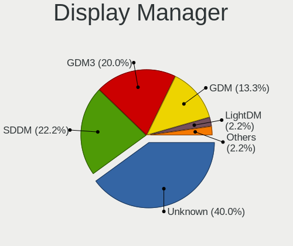

| Name    | Desktops | Percent |
|---------|----------|---------|
| Unknown | 10       | 47.62%  |
| SDDM    | 6        | 28.57%  |
| GDM     | 3        | 14.29%  |
| KDM     | 1        | 4.76%   |
| GDM3    | 1        | 4.76%   |

OS Lang
-------

Language

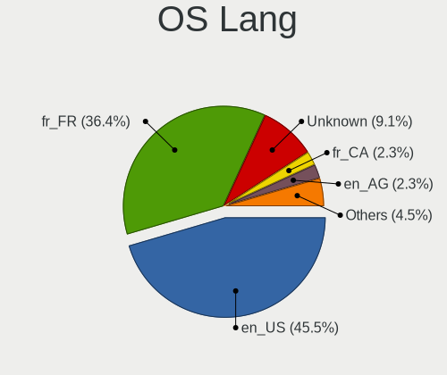

| Lang    | Desktops | Percent |
|---------|----------|---------|
| fr_FR   | 7        | 33.33%  |
| en_US   | 7        | 33.33%  |
| Unknown | 4        | 19.05%  |
| en_AG   | 1        | 4.76%   |
| de_DE   | 1        | 4.76%   |
| ar_TN   | 1        | 4.76%   |

Boot Mode
---------

EFI or BIOS

| Mode | Desktops | Percent |
|------|----------|---------|
| BIOS | 12       | 57.14%  |
| EFI  | 9        | 42.86%  |

Filesystem
----------

Type of filesystem

| Type    | Desktops | Percent |
|---------|----------|---------|
| Ext4    | 14       | 70%     |
| Overlay | 5        | 25%     |
| Unknown | 1        | 5%      |

Part. scheme
------------

Scheme of partitioning

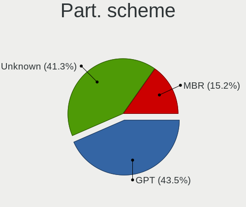

| Type    | Desktops | Percent |
|---------|----------|---------|
| Unknown | 12       | 57.14%  |
| GPT     | 8        | 38.1%   |
| MBR     | 1        | 4.76%   |

Dual Boot with Linux/BSD
------------------------

Hosting more than one Linux/BSD

| Dual boot | Desktops | Percent |
|-----------|----------|---------|
| No        | 15       | 71.43%  |
| Yes       | 6        | 28.57%  |

Dual Boot (Win)
---------------

Hosting Linux and Windows

| Dual boot | Desktops | Percent |
|-----------|----------|---------|
| Yes       | 11       | 55%     |
| No        | 9        | 45%     |

Board
-----

Vendor
------

Motherboard manufacturer

| Name                | Desktops | Percent |
|---------------------|----------|---------|
| MSI                 | 4        | 20%     |
| Pegatron            | 3        | 15%     |
| Dell                | 3        | 15%     |
| Lenovo              | 2        | 10%     |
| Foxconn             | 2        | 10%     |
| ASUSTek Computer    | 2        | 10%     |
| Intel               | 1        | 5%      |
| Hewlett-Packard     | 1        | 5%      |
| Gigabyte Technology | 1        | 5%      |
| Unknown             | 1        | 5%      |

Model
-----

Motherboard model

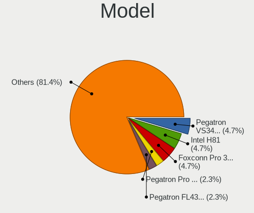

| Name                                | Desktops | Percent |
|-------------------------------------|----------|---------|
| Pegatron VS342AA-AB6 m9801af        | 2        | 10%     |
| Foxconn Pro 3400 Series MT          | 2        | 10%     |
| Pegatron Pro 3010 Microtower PC     | 1        | 5%      |
| MSI MS-7C95                         | 1        | 5%      |
| MSI MS-7A15                         | 1        | 5%      |
| MSI MS-7817                         | 1        | 5%      |
| MSI MS-7502                         | 1        | 5%      |
| Lenovo ThinkStation P330 30C6S33L00 | 1        | 5%      |
| Lenovo H50-50 90B70040AL            | 1        | 5%      |
| Intel H61                           | 1        | 5%      |
| HP Compaq 8200 Elite CMT PC         | 1        | 5%      |
| Gigabyte B75M-D3H                   | 1        | 5%      |
| Dell OptiPlex 390                   | 1        | 5%      |
| Dell OptiPlex 3090                  | 1        | 5%      |
| Dell OptiPlex 3040                  | 1        | 5%      |
| ASUS PRIME B450M-K                  | 1        | 5%      |
| ASUS M32CD_A_F_K20CD_K31CD          | 1        | 5%      |
| Unknown                             | 1        | 5%      |

Model Family
------------

Motherboard model prefix

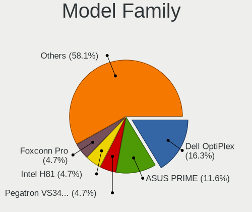

| Name                 | Desktops | Percent |
|----------------------|----------|---------|
| Dell OptiPlex        | 3        | 15%     |
| Pegatron VS342AA-AB6 | 2        | 10%     |
| Foxconn Pro          | 2        | 10%     |
| Pegatron Pro         | 1        | 5%      |
| MSI MS-7C95          | 1        | 5%      |
| MSI MS-7A15          | 1        | 5%      |
| MSI MS-7817          | 1        | 5%      |
| MSI MS-7502          | 1        | 5%      |
| Lenovo ThinkStation  | 1        | 5%      |
| Lenovo H50-50        | 1        | 5%      |
| Intel H61            | 1        | 5%      |
| HP Compaq            | 1        | 5%      |
| Gigabyte B75M-D3H    | 1        | 5%      |
| ASUS PRIME           | 1        | 5%      |
| ASUS M32CD           | 1        | 5%      |
| Unknown              | 1        | 5%      |

MFG Year
--------

Motherboard manufacture year

| Year | Desktops | Percent |
|------|----------|---------|
| 2011 | 4        | 20%     |
| 2016 | 3        | 15%     |
| 2009 | 3        | 15%     |
| 2012 | 2        | 10%     |
| 2021 | 1        | 5%      |
| 2020 | 1        | 5%      |
| 2019 | 1        | 5%      |
| 2018 | 1        | 5%      |
| 2017 | 1        | 5%      |
| 2015 | 1        | 5%      |
| 2013 | 1        | 5%      |
| 2007 | 1        | 5%      |

Form Factor
-----------

Physical design of the computer

| Name    | Desktops | Percent |
|---------|----------|---------|
| Desktop | 20       | 100%    |

Secure Boot
-----------

Enabled or disabled

| State    | Desktops | Percent |
|----------|----------|---------|
| Disabled | 20       | 100%    |

Coreboot
--------

Have coreboot on board

| Used | Desktops | Percent |
|------|----------|---------|
| No   | 20       | 100%    |

RAM Size
--------

Total RAM memory

| Size in GB | Desktops | Percent |
|------------|----------|---------|
| 4.01-8.0   | 6        | 30%     |
| 1.01-2.0   | 5        | 25%     |
| 3.01-4.0   | 3        | 15%     |
| 16.01-24.0 | 3        | 15%     |
| 8.01-16.0  | 3        | 15%     |

RAM Used
--------

Used RAM memory

| Used GB  | Desktops | Percent |
|----------|----------|---------|
| 1.01-2.0 | 11       | 47.83%  |
| 2.01-3.0 | 5        | 21.74%  |
| 4.01-8.0 | 2        | 8.7%    |
| 0.51-1.0 | 2        | 8.7%    |
| 0.01-0.5 | 2        | 8.7%    |
| 3.01-4.0 | 1        | 4.35%   |

Total Drives
------------

Number of drives on board

| Drives | Desktops | Percent |
|--------|----------|---------|
| 1      | 13       | 61.9%   |
| 2      | 6        | 28.57%  |
| 4      | 1        | 4.76%   |
| 0      | 1        | 4.76%   |

Has CD-ROM
----------

Has CD-ROM on board

| Presented | Desktops | Percent |
|-----------|----------|---------|
| Yes       | 10       | 50%     |
| No        | 10       | 50%     |

Has Ethernet
------------

Has Ethernet on board

| Presented | Desktops | Percent |
|-----------|----------|---------|
| Yes       | 20       | 100%    |

Has WiFi
--------

Has WiFi module

| Presented | Desktops | Percent |
|-----------|----------|---------|
| Yes       | 11       | 52.38%  |
| No        | 10       | 47.62%  |

Has Bluetooth
-------------

Has Bluetooth module

| Presented | Desktops | Percent |
|-----------|----------|---------|
| No        | 15       | 75%     |
| Yes       | 5        | 25%     |

Location
--------

Country
-------

Geographic location (country)

| Country | Desktops | Percent |
|---------|----------|---------|
| Tunisia | 20       | 100%    |

City
----

Geographic location (city)

| City      | Desktops | Percent |
|-----------|----------|---------|
| Tunis     | 10       | 41.67%  |
| Aryanah   | 3        | 12.5%   |
| Nabeul    | 1        | 4.17%   |
| Monastir  | 1        | 4.17%   |
| Mateur    | 1        | 4.17%   |
| Mahdia    | 1        | 4.17%   |
| Hammamet  | 1        | 4.17%   |
| Carthage  | 1        | 4.17%   |
| Bizerte   | 1        | 4.17%   |
| Ben Arous | 1        | 4.17%   |
| Beja      | 1        | 4.17%   |
| As Sanad  | 1        | 4.17%   |
| Akouda    | 1        | 4.17%   |

Drives
------

Drive Vendor
------------

Hard drive vendors

| Vendor              | Desktops | Drives | Percent |
|---------------------|----------|--------|---------|
| WDC                 | 8        | 10     | 30.77%  |
| Seagate             | 7        | 12     | 26.92%  |
| Toshiba             | 2        | 2      | 7.69%   |
| Samsung Electronics | 2        | 2      | 7.69%   |
| Team                | 1        | 1      | 3.85%   |
| Sandisk             | 1        | 2      | 3.85%   |
| PNY                 | 1        | 1      | 3.85%   |
| Kingston            | 1        | 1      | 3.85%   |
| HGST                | 1        | 1      | 3.85%   |
| EMTEC               | 1        | 3      | 3.85%   |
| addlink             | 1        | 1      | 3.85%   |

Drive Model
-----------

Hard drive models

| Model                                | Desktops | Percent |
|--------------------------------------|----------|---------|
| WDC WD10EADS-65M2B0 1TB              | 2        | 6.9%    |
| Seagate ST1000DM010-2EP102 1TB       | 2        | 6.9%    |
| WDC WD5000AVDS-63U7B1 500GB          | 1        | 3.45%   |
| WDC WD5000AAKS-402AA0 500GB          | 1        | 3.45%   |
| WDC WD5000AACS-00ZUB0 500GB          | 1        | 3.45%   |
| WDC WD3200AAJS-60M0A1 320GB          | 1        | 3.45%   |
| WDC WD2500AAJS-75M0A0 249GB          | 1        | 3.45%   |
| WDC WD10PURZ-85U8XY0 1TB             | 1        | 3.45%   |
| WDC WD10EZEX-00BN5A0 1TB             | 1        | 3.45%   |
| WDC PC SN720 SDAQNTW-512G-1001 512GB | 1        | 3.45%   |
| Toshiba DT01ACA100 1TB               | 1        | 3.45%   |
| Toshiba DT01ACA050 500GB             | 1        | 3.45%   |
| Team T253X1240G 240GB SSD            | 1        | 3.45%   |
| Seagate ST500DM002-1SB10A 500GB      | 1        | 3.45%   |
| Seagate ST500DM002-1BD142 500GB      | 1        | 3.45%   |
| Seagate ST3500413AS 500GB            | 1        | 3.45%   |
| Seagate ST3320813AS 320GB            | 1        | 3.45%   |
| Seagate ST1000DM003-1SB102 1TB       | 1        | 3.45%   |
| Seagate ST1000DM003-1ER162 1TB       | 1        | 3.45%   |
| Sandisk NVMe SSD Drive 512GB         | 1        | 3.45%   |
| Samsung SSD 980 500GB                | 1        | 3.45%   |
| Samsung PM991a NVMe 256GB            | 1        | 3.45%   |
| PNY CS900 960GB SSD                  | 1        | 3.45%   |
| Kingston SV300S37A120G 120GB SSD     | 1        | 3.45%   |
| HGST HTS545050A7E380 500GB           | 1        | 3.45%   |
| EMTEC X250 512GB SSD                 | 1        | 3.45%   |
| addlink SATA SSD 256GB               | 1        | 3.45%   |

HDD Vendor
----------

Hard disk drive vendors

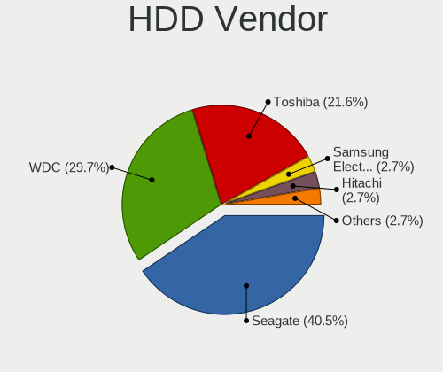

| Vendor  | Desktops | Drives | Percent |
|---------|----------|--------|---------|
| WDC     | 7        | 9      | 41.18%  |
| Seagate | 7        | 12     | 41.18%  |
| Toshiba | 2        | 2      | 11.76%  |
| HGST    | 1        | 1      | 5.88%   |

SSD Vendor
----------

Solid state drive vendors

| Vendor   | Desktops | Drives | Percent |
|----------|----------|--------|---------|
| Team     | 1        | 1      | 20%     |
| PNY      | 1        | 1      | 20%     |
| Kingston | 1        | 1      | 20%     |
| EMTEC    | 1        | 3      | 20%     |
| addlink  | 1        | 1      | 20%     |

Drive Kind
----------

HDD or SSD

| Kind | Desktops | Drives | Percent |
|------|----------|--------|---------|
| HDD  | 16       | 24     | 66.67%  |
| SSD  | 5        | 7      | 20.83%  |
| NVMe | 3        | 5      | 12.5%   |

Drive Connector
---------------

SATA, SAS, NVMe, etc.

| Type | Desktops | Drives | Percent |
|------|----------|--------|---------|
| SATA | 19       | 31     | 86.36%  |
| NVMe | 3        | 5      | 13.64%  |

Drive Size
----------

Size of hard drive

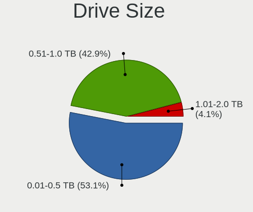

| Size in TB | Desktops | Drives | Percent |
|------------|----------|--------|---------|
| 0.01-0.5   | 13       | 16     | 65%     |
| 0.51-1.0   | 7        | 15     | 35%     |

Space Total
-----------

Amount of disk space available on the file system

| Size in GB | Desktops | Percent |
|------------|----------|---------|
| 101-250    | 7        | 33.33%  |
| 251-500    | 5        | 23.81%  |
| 501-1000   | 3        | 14.29%  |
| 21-50      | 2        | 9.52%   |
| 1001-2000  | 2        | 9.52%   |
| 51-100     | 1        | 4.76%   |
| Unknown    | 1        | 4.76%   |

Space Used
----------

Amount of used disk space

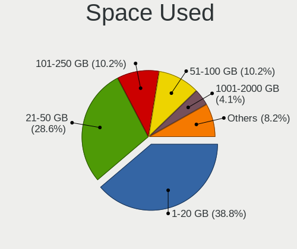

| Used GB  | Desktops | Percent |
|----------|----------|---------|
| 1-20     | 11       | 45.83%  |
| 21-50    | 5        | 20.83%  |
| 51-100   | 3        | 12.5%   |
| 101-250  | 2        | 8.33%   |
| 251-500  | 1        | 4.17%   |
| 501-1000 | 1        | 4.17%   |
| Unknown  | 1        | 4.17%   |

Malfunc. Drives
---------------

Drive models with a malfunction

| Model                      | Desktops | Drives | Percent |
|----------------------------|----------|--------|---------|
| Seagate ST3500413AS 500GB  | 1        | 1      | 25%     |
| Seagate ST3320813AS 320GB  | 1        | 1      | 25%     |
| HGST HTS545050A7E380 500GB | 1        | 1      | 25%     |
| EMTEC X250 512GB SSD       | 1        | 2      | 25%     |

Malfunc. Drive Vendor
---------------------

Vendors of faulty drives

| Vendor  | Desktops | Drives | Percent |
|---------|----------|--------|---------|
| Seagate | 2        | 2      | 50%     |
| HGST    | 1        | 1      | 25%     |
| EMTEC   | 1        | 2      | 25%     |

Malfunc. HDD Vendor
-------------------

Vendors of faulty HDD drives

| Vendor  | Desktops | Drives | Percent |
|---------|----------|--------|---------|
| Seagate | 2        | 2      | 66.67%  |
| HGST    | 1        | 1      | 33.33%  |

Malfunc. Drive Kind
-------------------

Kinds of faulty drives

| Kind | Desktops | Drives | Percent |
|------|----------|--------|---------|
| HDD  | 3        | 3      | 75%     |
| SSD  | 1        | 2      | 25%     |

Failed Drives
-------------

Failed drive models

Zero info for selected period =(

Failed Drive Vendor
-------------------

Failed drive vendors

Zero info for selected period =(

Drive Status
------------

Number of failed and malfunc. drives

| Status   | Desktops | Drives | Percent |
|----------|----------|--------|---------|
| Detected | 9        | 16     | 40.91%  |
| Works    | 9        | 15     | 40.91%  |
| Malfunc  | 4        | 5      | 18.18%  |

Storage controller
------------------

Storage Vendor
--------------

Storage controller vendors

| Vendor              | Desktops | Percent |
|---------------------|----------|---------|
| Intel               | 18       | 78.26%  |
| Samsung Electronics | 2        | 8.7%    |
| AMD                 | 2        | 8.7%    |
| Sandisk             | 1        | 4.35%   |

Storage Model
-------------

Storage controller models

| Model                                                                                   | Desktops | Percent |
|-----------------------------------------------------------------------------------------|----------|---------|
| Intel Q170/Q150/B150/H170/H110/Z170/CM236 Chipset SATA Controller [AHCI Mode]           | 3        | 10.34%  |
| Intel 82801JI (ICH10 Family) 4 port SATA IDE Controller #1                              | 3        | 10.34%  |
| Intel 6 Series/C200 Series Chipset Family Desktop SATA Controller (IDE mode, ports 4-5) | 3        | 10.34%  |
| Intel 6 Series/C200 Series Chipset Family Desktop SATA Controller (IDE mode, ports 0-3) | 3        | 10.34%  |
| Samsung NVMe SSD Controller 980                                                         | 2        | 6.9%    |
| Intel 6 Series/C200 Series Chipset Family 6 port Desktop SATA AHCI Controller           | 2        | 6.9%    |
| Sandisk WD Black 2018/SN750 / PC SN720 NVMe SSD                                         | 1        | 3.45%   |
| Intel NM10/ICH7 Family SATA Controller [IDE mode]                                       | 1        | 3.45%   |
| Intel Comet Lake SATA AHCI Controller                                                   | 1        | 3.45%   |
| Intel Cannon Lake PCH SATA AHCI Controller                                              | 1        | 3.45%   |
| Intel 82801IR/IO/IH (ICH9R/DO/DH) 6 port SATA Controller [AHCI mode]                    | 1        | 3.45%   |
| Intel 8 Series/C220 Series Chipset Family 6-port SATA Controller 1 [AHCI mode]          | 1        | 3.45%   |
| Intel 8 Series/C220 Series Chipset Family 4-port SATA Controller 1 [IDE mode]           | 1        | 3.45%   |
| Intel 8 Series/C220 Series Chipset Family 2-port SATA Controller 2 [IDE mode]           | 1        | 3.45%   |
| Intel 7 Series/C210 Series Chipset Family 4-port SATA Controller [IDE mode]             | 1        | 3.45%   |
| Intel 7 Series/C210 Series Chipset Family 2-port SATA Controller [IDE mode]             | 1        | 3.45%   |
| AMD FCH SATA Controller [AHCI mode]                                                     | 1        | 3.45%   |
| AMD 500 Series Chipset SATA Controller                                                  | 1        | 3.45%   |
| AMD 400 Series Chipset SATA Controller                                                  | 1        | 3.45%   |

Storage Kind
------------

Kind of storage controller (IDE, SATA, NVMe, SAS, ...)

| Kind | Desktops | Percent |
|------|----------|---------|
| SATA | 11       | 47.83%  |
| IDE  | 9        | 39.13%  |
| NVMe | 3        | 13.04%  |

Processor
---------

CPU Vendor
----------

Processor vendors

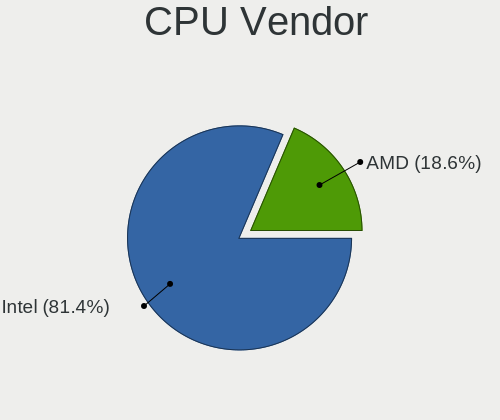

| Vendor | Desktops | Percent |
|--------|----------|---------|
| Intel  | 18       | 90%     |
| AMD    | 2        | 10%     |

CPU Model
---------

Processor models

| Model                                       | Desktops | Percent |
|---------------------------------------------|----------|---------|
| Intel Core 2 Quad CPU Q8300 @ 2.50GHz       | 2        | 10%     |
| Intel Xeon E-2144G CPU @ 3.60GHz            | 1        | 5%      |
| Intel Pentium Dual-Core CPU E5400 @ 2.70GHz | 1        | 5%      |
| Intel Pentium CPU G630 @ 2.70GHz            | 1        | 5%      |
| Intel Pentium CPU G4560 @ 3.50GHz           | 1        | 5%      |
| Intel Pentium CPU G3250 @ 3.20GHz           | 1        | 5%      |
| Intel Pentium CPU G2030 @ 3.00GHz           | 1        | 5%      |
| Intel Core i7-6700 CPU @ 3.40GHz            | 1        | 5%      |
| Intel Core i7-2600 CPU @ 3.40GHz            | 1        | 5%      |
| Intel Core i5-2400 CPU @ 3.10GHz            | 1        | 5%      |
| Intel Core i3-6100 CPU @ 3.70GHz            | 1        | 5%      |
| Intel Core i3-4160 CPU @ 3.60GHz            | 1        | 5%      |
| Intel Core i3-2120 CPU @ 3.30GHz            | 1        | 5%      |
| Intel Core i3-2100 CPU @ 3.10GHz            | 1        | 5%      |
| Intel Core i3-10105T CPU @ 3.00GHz          | 1        | 5%      |
| Intel Core 2 Quad CPU Q6600 @ 2.40GHz       | 1        | 5%      |
| Intel Atom CPU N455 @ 1.66GHz               | 1        | 5%      |
| AMD Ryzen 5 5600X 6-Core Processor          | 1        | 5%      |
| AMD Ryzen 5 3600XT 6-Core Processor         | 1        | 5%      |

CPU Model Family
----------------

Processor model prefix

| Model                   | Desktops | Percent |
|-------------------------|----------|---------|
| Intel Core i3           | 5        | 25%     |
| Intel Pentium           | 4        | 20%     |
| Intel Core 2 Quad       | 3        | 15%     |
| Intel Core i7           | 2        | 10%     |
| AMD Ryzen 5             | 2        | 10%     |
| Intel Xeon              | 1        | 5%      |
| Intel Pentium Dual-Core | 1        | 5%      |
| Intel Core i5           | 1        | 5%      |
| Intel Atom              | 1        | 5%      |

CPU Cores
---------

Number of processor cores

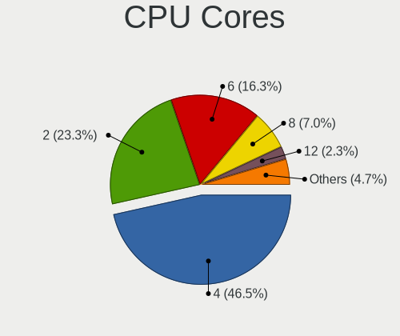

| Number  | Desktops | Percent |
|---------|----------|---------|
| 4       | 8        | 40%     |
| 2       | 8        | 40%     |
| 6       | 2        | 10%     |
| 1       | 1        | 5%      |
| Unknown | 1        | 5%      |

CPU Sockets
-----------

Number of sockets

| Number | Desktops | Percent |
|--------|----------|---------|
| 1      | 20       | 100%    |

CPU Threads
-----------

Threads per core (Hyper-Threading)

| Number  | Desktops | Percent |
|---------|----------|---------|
| 2       | 12       | 57.14%  |
| 1       | 8        | 38.1%   |
| Unknown | 1        | 4.76%   |

CPU Op-Modes
------------

CPU Operation Modes (32-bit, 64-bit)

| Op mode        | Desktops | Percent |
|----------------|----------|---------|
| 32-bit, 64-bit | 20       | 100%    |

CPU Microcode
-------------

Microcode number

| Number     | Desktops | Percent |
|------------|----------|---------|
| 0x206a7    | 5        | 22.73%  |
| 0x1067a    | 3        | 13.64%  |
| Unknown    | 3        | 13.64%  |
| 0x506e3    | 2        | 9.09%   |
| 0xa0653    | 1        | 4.55%   |
| 0x906ea    | 1        | 4.55%   |
| 0x906e9    | 1        | 4.55%   |
| 0x6fb      | 1        | 4.55%   |
| 0x306c3    | 1        | 4.55%   |
| 0x306a9    | 1        | 4.55%   |
| 0x106ca    | 1        | 4.55%   |
| 0x08701013 | 1        | 4.55%   |
| 0x00000000 | 1        | 4.55%   |

CPU Microarch
-------------

Microarchitecture

| Name        | Desktops | Percent |
|-------------|----------|---------|
| SandyBridge | 5        | 25%     |
| Penryn      | 3        | 15%     |
| Skylake     | 2        | 10%     |
| KabyLake    | 2        | 10%     |
| Haswell     | 2        | 10%     |
| Zen 3       | 1        | 5%      |
| Zen 2       | 1        | 5%      |
| IvyBridge   | 1        | 5%      |
| Core        | 1        | 5%      |
| CometLake   | 1        | 5%      |
| Bonnell     | 1        | 5%      |

Graphics
--------

GPU Vendor
----------

Vendors of graphics cards

| Vendor | Desktops | Percent |
|--------|----------|---------|
| Intel  | 11       | 50%     |
| Nvidia | 9        | 40.91%  |
| AMD    | 2        | 9.09%   |

GPU Model
---------

Graphics card models

| Model                                                                       | Desktops | Percent |
|-----------------------------------------------------------------------------|----------|---------|
| Nvidia GT218 [GeForce 210]                                                  | 3        | 13.64%  |
| Intel 4 Series Chipset Integrated Graphics Controller                       | 3        | 13.64%  |
| Intel 2nd Generation Core Processor Family Integrated Graphics Controller   | 2        | 9.09%   |
| Nvidia TU116 [GeForce GTX 1660 SUPER]                                       | 1        | 4.55%   |
| Nvidia GP108 [GeForce GT 1030]                                              | 1        | 4.55%   |
| Nvidia GP106 [GeForce GTX 1060 6GB]                                         | 1        | 4.55%   |
| Nvidia GM107 [GeForce GTX 750]                                              | 1        | 4.55%   |
| Nvidia GK208B [GeForce GT 710]                                              | 1        | 4.55%   |
| Nvidia GF119 [GeForce GT 520]                                               | 1        | 4.55%   |
| Intel Xeon E3-1200 v3/4th Gen Core Processor Integrated Graphics Controller | 1        | 4.55%   |
| Intel HD Graphics 530                                                       | 1        | 4.55%   |
| Intel CometLake-S GT2 [UHD Graphics 630]                                    | 1        | 4.55%   |
| Intel CoffeeLake-S GT2 [UHD Graphics P630]                                  | 1        | 4.55%   |
| Intel Atom Processor D4xx/D5xx/N4xx/N5xx Integrated Graphics Controller     | 1        | 4.55%   |
| Intel 4th Generation Core Processor Family Integrated Graphics Controller   | 1        | 4.55%   |
| AMD Ellesmere [Radeon RX 470/480/570/570X/580/580X/590]                     | 1        | 4.55%   |
| AMD Caicos XT [Radeon HD 7470/8470 / R5 235/310 OEM]                        | 1        | 4.55%   |

GPU Combo
---------

Combinations of graphics cards

| Name       | Desktops | Percent |
|------------|----------|---------|
| 1 x Nvidia | 9        | 45%     |
| 1 x Intel  | 9        | 45%     |
| 1 x AMD    | 2        | 10%     |

GPU Driver
----------

Free vs proprietary

| Driver      | Desktops | Percent |
|-------------|----------|---------|
| Free        | 17       | 80.95%  |
| Proprietary | 3        | 14.29%  |
| Unknown     | 1        | 4.76%   |

GPU Memory
----------

Total video memory

| Size in GB | Desktops | Percent |
|------------|----------|---------|
| Unknown    | 10       | 45.45%  |
| 1.01-2.0   | 6        | 27.27%  |
| 0.51-1.0   | 3        | 13.64%  |
| 5.01-6.0   | 2        | 9.09%   |
| 3.01-4.0   | 1        | 4.55%   |

Monitor
-------

Monitor Vendor
--------------

Monitor vendors

| Vendor              | Desktops | Percent |
|---------------------|----------|---------|
| Samsung Electronics | 8        | 34.78%  |
| Hewlett-Packard     | 6        | 26.09%  |
| S2-Tek              | 1        | 4.35%   |
| PKB                 | 1        | 4.35%   |
| Philips             | 1        | 4.35%   |
| Packard Bell        | 1        | 4.35%   |
| Medion              | 1        | 4.35%   |
| Lenovo              | 1        | 4.35%   |
| Dell                | 1        | 4.35%   |
| BenQ                | 1        | 4.35%   |
| AU Optronics        | 1        | 4.35%   |

Monitor Model
-------------

Monitor models

| Model                                                                | Desktops | Percent |
|----------------------------------------------------------------------|----------|---------|
| Samsung Electronics S24F350 SAM0D20 1920x1080 521x293mm 23.5-inch    | 2        | 8.33%   |
| Hewlett-Packard x20LED HWP2910 1600x900 443x249mm 20.0-inch          | 2        | 8.33%   |
| Samsung Electronics SyncMaster SAM04D4 1920x1080 531x298mm 24.0-inch | 1        | 4.17%   |
| Samsung Electronics SyncMaster SAM0284 1280x1024 338x270mm 17.0-inch | 1        | 4.17%   |
| Samsung Electronics SMB2240 SAM06AD 1920x1080 477x268mm 21.5-inch    | 1        | 4.17%   |
| Samsung Electronics SA300/SA350 SAM078B 1600x900 443x249mm 20.0-inch | 1        | 4.17%   |
| Samsung Electronics S20D300 SAM0BDB 1366x768 432x240mm 19.5-inch     | 1        | 4.17%   |
| Samsung Electronics S19D300 SAM0B34 1366x768 410x230mm 18.5-inch     | 1        | 4.17%   |
| S2-Tek TV STK531A 1920x1080 930x530mm 42.1-inch                      | 1        | 4.17%   |
| PKB LCD Monitor VIS220WS 1680x1050                                   | 1        | 4.17%   |
| Philips PHL 223V5 PHLC0CF 1920x1080 480x270mm 21.7-inch              | 1        | 4.17%   |
| Packard Bell PKB VIS220WS PKB5064 1680x1050 460x290mm 21.4-inch      | 1        | 4.17%   |
| Medion MD30422PV MED86F6 1680x1050 474x296mm 22.0-inch               | 1        | 4.17%   |
| Lenovo T24v-10 LEN61BC 1920x1080 527x296mm 23.8-inch                 | 1        | 4.17%   |
| Hewlett-Packard P224 HPN361E 1920x1080 527x296mm 23.8-inch           | 1        | 4.17%   |
| Hewlett-Packard LE2001w HWP2841 1600x900 440x250mm 19.9-inch         | 1        | 4.17%   |
| Hewlett-Packard LCD Monitor 2011 1600x900                            | 1        | 4.17%   |
| Hewlett-Packard 2011 HWP2935 1600x900 443x249mm 20.0-inch            | 1        | 4.17%   |
| Hewlett-Packard 2011 HWP2934 1600x900 443x249mm 20.0-inch            | 1        | 4.17%   |
| Dell S2721HGF DEL41E8 1920x1080 597x336mm 27.0-inch                  | 1        | 4.17%   |
| BenQ T201W BNQ7719 1680x1050 433x271mm 20.1-inch                     | 1        | 4.17%   |
| AU Optronics LCD Monitor AUO61D2 1024x600 222x125mm 10.0-inch        | 1        | 4.17%   |

Monitor Resolution
------------------

Monitor screen resolution

| Resolution         | Desktops | Percent |
|--------------------|----------|---------|
| 1920x1080 (FHD)    | 8        | 38.1%   |
| 1600x900 (HD+)     | 6        | 28.57%  |
| 1680x1050 (WSXGA+) | 3        | 14.29%  |
| 1366x768 (WXGA)    | 2        | 9.52%   |
| 1280x1024 (SXGA)   | 1        | 4.76%   |
| 1024x600           | 1        | 4.76%   |

Monitor Diagonal
----------------

Diagonal size in inches

| Inches  | Desktops | Percent |
|---------|----------|---------|
| 20      | 5        | 21.74%  |
| 23      | 3        | 13.04%  |
| 21      | 3        | 13.04%  |
| 24      | 2        | 8.7%    |
| 22      | 2        | 8.7%    |
| Unknown | 2        | 8.7%    |
| 42      | 1        | 4.35%   |
| 27      | 1        | 4.35%   |
| 19      | 1        | 4.35%   |
| 18      | 1        | 4.35%   |
| 17      | 1        | 4.35%   |
| 10      | 1        | 4.35%   |

Monitor Width
-------------

Physical width

| Width in mm | Desktops | Percent |
|-------------|----------|---------|
| 401-500     | 11       | 52.38%  |
| 501-600     | 5        | 23.81%  |
| Unknown     | 2        | 9.52%   |
| 301-350     | 1        | 4.76%   |
| 201-300     | 1        | 4.76%   |
| 901-1000    | 1        | 4.76%   |

Aspect Ratio
------------

Proportional relationship between the width and the height

| Ratio   | Desktops | Percent |
|---------|----------|---------|
| 16/9    | 16       | 72.73%  |
| 16/10   | 3        | 13.64%  |
| Unknown | 2        | 9.09%   |
| 5/4     | 1        | 4.55%   |

Monitor Area
------------

Area in inch²

| Area in inch² | Desktops | Percent |
|----------------|----------|---------|
| 201-250        | 9        | 39.13%  |
| 151-200        | 7        | 30.43%  |
| 141-150        | 2        | 8.7%    |
| Unknown        | 2        | 8.7%    |
| 41-50          | 1        | 4.35%   |
| 301-350        | 1        | 4.35%   |
| 501-1000       | 1        | 4.35%   |

Pixel Density
-------------

Pixels per inch

| Density | Desktops | Percent |
|---------|----------|---------|
| 51-100  | 16       | 76.19%  |
| 101-120 | 3        | 14.29%  |
| Unknown | 2        | 9.52%   |

Multiple Monitors
-----------------

Total monitors connected

| Total | Desktops | Percent |
|-------|----------|---------|
| 1     | 17       | 85%     |
| 2     | 3        | 15%     |

Network
-------

Net Controller Vendor
---------------------

Controller vendors

| Vendor                | Desktops | Percent |
|-----------------------|----------|---------|
| Realtek Semiconductor | 17       | 56.67%  |
| Intel                 | 5        | 16.67%  |
| Ralink Technology     | 3        | 10%     |
| Ralink                | 3        | 10%     |
| Samsung Electronics   | 1        | 3.33%   |
| IMC Networks          | 1        | 3.33%   |

Net Controller Model
--------------------

Controller models

| Model                                                                  | Desktops | Percent |
|------------------------------------------------------------------------|----------|---------|
| Realtek RTL8111/8168/8411 PCI Express Gigabit Ethernet Controller      | 15       | 42.86%  |
| Ralink MT7601U Wireless Adapter                                        | 3        | 8.57%   |
| Realtek RTL810xE PCI Express Fast Ethernet controller                  | 2        | 5.71%   |
| Ralink RT2790 Wireless 802.11n 1T/2R PCIe                              | 2        | 5.71%   |
| Samsung Galaxy series, misc. (tethering mode)                          | 1        | 2.86%   |
| Realtek RTL8821AE 802.11ac PCIe Wireless Network Adapter               | 1        | 2.86%   |
| Realtek RTL8188FTV 802.11b/g/n 1T1R 2.4G WLAN Adapter                  | 1        | 2.86%   |
| Realtek RTL8188EUS 802.11n Wireless Network Adapter                    | 1        | 2.86%   |
| Realtek RTL-8100/8101L/8139 PCI Fast Ethernet Adapter                  | 1        | 2.86%   |
| Ralink RT3290 Wireless 802.11n 1T/1R PCIe                              | 1        | 2.86%   |
| Intel Wireless 7265                                                    | 1        | 2.86%   |
| Intel Ethernet Connection (7) I219-LM                                  | 1        | 2.86%   |
| Intel Ethernet Connection (11) I219-LM                                 | 1        | 2.86%   |
| Intel Comet Lake PCH CNVi WiFi                                         | 1        | 2.86%   |
| Intel 82579LM Gigabit Network Connection (Lewisville)                  | 1        | 2.86%   |
| Intel 82562V-2 10/100 Network Connection                               | 1        | 2.86%   |
| IMC Networks AW-NU222 802.11bgn Wireless Module [Ralink RT2770+RT2720] | 1        | 2.86%   |

Wireless Vendor
---------------

Wireless vendors

| Vendor                | Desktops | Percent |
|-----------------------|----------|---------|
| Realtek Semiconductor | 3        | 25%     |
| Ralink Technology     | 3        | 25%     |
| Ralink                | 3        | 25%     |
| Intel                 | 2        | 16.67%  |
| IMC Networks          | 1        | 8.33%   |

Wireless Model
--------------

Wireless models

| Model                                                                  | Desktops | Percent |
|------------------------------------------------------------------------|----------|---------|
| Ralink MT7601U Wireless Adapter                                        | 3        | 25%     |
| Ralink RT2790 Wireless 802.11n 1T/2R PCIe                              | 2        | 16.67%  |
| Realtek RTL8821AE 802.11ac PCIe Wireless Network Adapter               | 1        | 8.33%   |
| Realtek RTL8188FTV 802.11b/g/n 1T1R 2.4G WLAN Adapter                  | 1        | 8.33%   |
| Realtek RTL8188EUS 802.11n Wireless Network Adapter                    | 1        | 8.33%   |
| Ralink RT3290 Wireless 802.11n 1T/1R PCIe                              | 1        | 8.33%   |
| Intel Wireless 7265                                                    | 1        | 8.33%   |
| Intel Comet Lake PCH CNVi WiFi                                         | 1        | 8.33%   |
| IMC Networks AW-NU222 802.11bgn Wireless Module [Ralink RT2770+RT2720] | 1        | 8.33%   |

Ethernet Vendor
---------------

Ethernet vendors

| Vendor                | Desktops | Percent |
|-----------------------|----------|---------|
| Realtek Semiconductor | 17       | 77.27%  |
| Intel                 | 4        | 18.18%  |
| Samsung Electronics   | 1        | 4.55%   |

Ethernet Model
--------------

Ethernet models

| Model                                                             | Desktops | Percent |
|-------------------------------------------------------------------|----------|---------|
| Realtek RTL8111/8168/8411 PCI Express Gigabit Ethernet Controller | 15       | 65.22%  |
| Realtek RTL810xE PCI Express Fast Ethernet controller             | 2        | 8.7%    |
| Samsung Galaxy series, misc. (tethering mode)                     | 1        | 4.35%   |
| Realtek RTL-8100/8101L/8139 PCI Fast Ethernet Adapter             | 1        | 4.35%   |
| Intel Ethernet Connection (7) I219-LM                             | 1        | 4.35%   |
| Intel Ethernet Connection (11) I219-LM                            | 1        | 4.35%   |
| Intel 82579LM Gigabit Network Connection (Lewisville)             | 1        | 4.35%   |
| Intel 82562V-2 10/100 Network Connection                          | 1        | 4.35%   |

Net Controller Kind
-------------------

Ethernet, WiFi or modem

| Kind     | Desktops | Percent |
|----------|----------|---------|
| Ethernet | 20       | 64.52%  |
| WiFi     | 11       | 35.48%  |

Used Controller
---------------

Currently used network controller

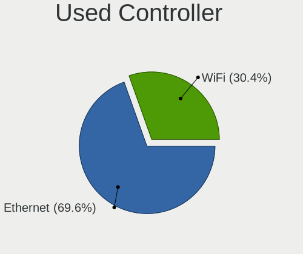

| Kind     | Desktops | Percent |
|----------|----------|---------|
| Ethernet | 15       | 71.43%  |
| WiFi     | 6        | 28.57%  |

NICs
----

Total network controllers on board

| Total | Desktops | Percent |
|-------|----------|---------|
| 1     | 12       | 60%     |
| 2     | 8        | 40%     |

IPv6
----

IPv6 vs IPv4

| Used | Desktops | Percent |
|------|----------|---------|
| No   | 20       | 100%    |

Bluetooth
---------

Bluetooth Vendor
----------------

Controller vendors

| Vendor                  | Desktops | Percent |
|-------------------------|----------|---------|
| Intel                   | 2        | 40%     |
| Ralink                  | 1        | 20%     |
| IMC Networks            | 1        | 20%     |
| Cambridge Silicon Radio | 1        | 20%     |

Bluetooth Model
---------------

Controller models

| Model                                               | Desktops | Percent |
|-----------------------------------------------------|----------|---------|
| Ralink RT3290 Bluetooth                             | 1        | 20%     |
| Intel Bluetooth wireless interface                  | 1        | 20%     |
| Intel AX201 Bluetooth                               | 1        | 20%     |
| IMC Networks Bluetooth Radio                        | 1        | 20%     |
| Cambridge Silicon Radio Bluetooth Dongle (HCI mode) | 1        | 20%     |

Sound
-----

Sound Vendor
------------

Sound card vendors

| Vendor | Desktops | Percent |
|--------|----------|---------|
| Intel  | 18       | 56.25%  |
| Nvidia | 9        | 28.13%  |
| AMD    | 4        | 12.5%   |
| Lenovo | 1        | 3.13%   |

Sound Model
-----------

Sound card models

| Model                                                                             | Desktops | Percent |
|-----------------------------------------------------------------------------------|----------|---------|
| Intel 6 Series/C200 Series Chipset Family High Definition Audio Controller        | 5        | 15.15%  |
| Nvidia High Definition Audio Controller                                           | 3        | 9.09%   |
| Intel 82801JI (ICH10 Family) HD Audio Controller                                  | 3        | 9.09%   |
| Intel 100 Series/C230 Series Chipset Family HD Audio Controller                   | 3        | 9.09%   |
| Intel 8 Series/C220 Series Chipset High Definition Audio Controller               | 2        | 6.06%   |
| AMD Starship/Matisse HD Audio Controller                                          | 2        | 6.06%   |
| Nvidia TU116 High Definition Audio Controller                                     | 1        | 3.03%   |
| Nvidia GP108 High Definition Audio Controller                                     | 1        | 3.03%   |
| Nvidia GP106 High Definition Audio Controller                                     | 1        | 3.03%   |
| Nvidia GM107 High Definition Audio Controller [GeForce 940MX]                     | 1        | 3.03%   |
| Nvidia GK208 HDMI/DP Audio Controller                                             | 1        | 3.03%   |
| Nvidia GF119 HDMI Audio Controller                                                | 1        | 3.03%   |
| Lenovo ThinkVision T24v Wide Monitor for USB-Audio                                | 1        | 3.03%   |
| Intel Xeon E3-1200 v3/4th Gen Core Processor HD Audio Controller                  | 1        | 3.03%   |
| Intel NM10/ICH7 Family High Definition Audio Controller                           | 1        | 3.03%   |
| Intel Comet Lake PCH cAVS                                                         | 1        | 3.03%   |
| Intel Cannon Lake PCH cAVS                                                        | 1        | 3.03%   |
| Intel 82801I (ICH9 Family) HD Audio Controller                                    | 1        | 3.03%   |
| Intel 7 Series/C216 Chipset Family High Definition Audio Controller               | 1        | 3.03%   |
| AMD Ellesmere HDMI Audio [Radeon RX 470/480 / 570/580/590]                        | 1        | 3.03%   |
| AMD Caicos HDMI Audio [Radeon HD 6450 / 7450/8450/8490 OEM / R5 230/235/235X OEM] | 1        | 3.03%   |

Memory
------

Memory Vendor
-------------

Memory module vendors

| Vendor              | Desktops | Percent |
|---------------------|----------|---------|
| Unknown             | 3        | 18.75%  |
| Samsung Electronics | 3        | 18.75%  |
| SK Hynix            | 2        | 12.5%   |
| Micron Technology   | 2        | 12.5%   |
| TwinMOS             | 1        | 6.25%   |
| Team                | 1        | 6.25%   |
| Patriot             | 1        | 6.25%   |
| GOODRAM             | 1        | 6.25%   |
| Elpida              | 1        | 6.25%   |
| Unknown             | 1        | 6.25%   |

Memory Model
------------

Memory module models

| Model                                                  | Desktops | Percent |
|--------------------------------------------------------|----------|---------|
| Unknown RAM Module 4GB DIMM DDR3 1333MT/s              | 1        | 6.25%   |
| Unknown RAM Module 4GB DIMM DDR3                       | 1        | 6.25%   |
| Unknown RAM Module 1024MB DIMM 667MT/s                 | 1        | 6.25%   |
| TwinMOS RAM 9DSDBNZB-5AMP 4GB DIMM DDR3 1333MT/s       | 1        | 6.25%   |
| Team RAM TEAMGROUP-UD4-2400 16GB DIMM DDR4 2400MT/s    | 1        | 6.25%   |
| SK Hynix RAM Module 4096MB DIMM DDR3 1333MT/s          | 1        | 6.25%   |
| SK Hynix RAM HMA82GU7CJR8N-VK 16GB DIMM DDR4 2667MT/s  | 1        | 6.25%   |
| Samsung RAM Module 4096MB DIMM DDR3 1333MT/s           | 1        | 6.25%   |
| Samsung RAM M378B5773QB0-CK0 2GB DIMM DDR3 1600MT/s    | 1        | 6.25%   |
| Samsung RAM M378B5773DH0-CH9 2GB DIMM DDR3 1333MT/s    | 1        | 6.25%   |
| Patriot RAM 3000 C15 Series 8GB DIMM DDR4 3000MT/s     | 1        | 6.25%   |
| Micron RAM 8JTF25664AZ-1G4M1 2048MB DIMM DDR3 1333MT/s | 1        | 6.25%   |
| Micron RAM 4ATF1G64HZ-3G2B2 8GB SODIMM DDR4 3200MT/s   | 1        | 6.25%   |
| GOODRAM RAM GR1333D364L9/4G 4GB DIMM DDR3 1600MT/s     | 1        | 6.25%   |
| Elpida RAM HMT451S6AFR8C-H9 4GB DIMM DDR3              | 1        | 6.25%   |
| Unknown                                                | 1        | 6.25%   |

Memory Kind
-----------

Memory module kinds

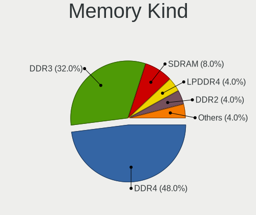

| Kind    | Desktops | Percent |
|---------|----------|---------|
| DDR3    | 6        | 46.15%  |
| DDR4    | 5        | 38.46%  |
| SDRAM   | 1        | 7.69%   |
| Unknown | 1        | 7.69%   |

Memory Form Factor
------------------

Physical design of the memory module

| Name   | Desktops | Percent |
|--------|----------|---------|
| DIMM   | 11       | 91.67%  |
| SODIMM | 1        | 8.33%   |

Memory Size
-----------

Memory module size

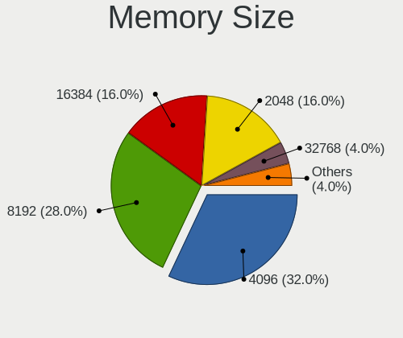

| Size  | Desktops | Percent |
|-------|----------|---------|
| 4096  | 4        | 30.77%  |
| 8192  | 3        | 23.08%  |
| 2048  | 3        | 23.08%  |
| 16384 | 2        | 15.38%  |
| 1024  | 1        | 7.69%   |

Memory Speed
------------

Memory module speed

| Speed   | Desktops | Percent |
|---------|----------|---------|
| 1333    | 4        | 30.77%  |
| 3200    | 2        | 15.38%  |
| 1600    | 2        | 15.38%  |
| 3000    | 1        | 7.69%   |
| 2667    | 1        | 7.69%   |
| 2400    | 1        | 7.69%   |
| 667     | 1        | 7.69%   |
| Unknown | 1        | 7.69%   |

Printers & scanners
-------------------

Printer Vendor
--------------

Printer device vendors

| Vendor          | Desktops | Percent |
|-----------------|----------|---------|
| Hewlett-Packard | 2        | 66.67%  |
| Seiko Epson     | 1        | 33.33%  |

Printer Model
-------------

Printer device models

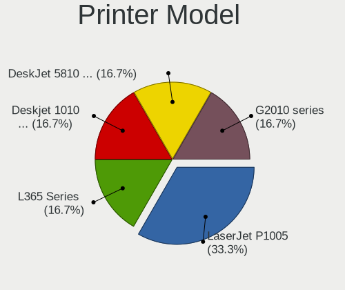

| Model                   | Desktops | Percent |
|-------------------------|----------|---------|
| Seiko Epson L365 Series | 1        | 33.33%  |
| HP LaserJet P1005       | 1        | 33.33%  |
| HP DeskJet 5810 series  | 1        | 33.33%  |

Scanner Vendor
--------------

Scanner device vendors

Zero info for selected period =(

Scanner Model
-------------

Scanner device models

Zero info for selected period =(

Camera
------

Camera Vendor
-------------

Camera device vendors

| Vendor     | Desktops | Percent |
|------------|----------|---------|
| Syntek     | 1        | 50%     |
| Cubeternet | 1        | 50%     |

Camera Model
------------

Camera device models

| Model                        | Desktops | Percent |
|------------------------------|----------|---------|
| Syntek Integrated RGB Camera | 1        | 50%     |
| Cubeternet WebCam            | 1        | 50%     |

Security
--------

Fingerprint Vendor
------------------

Fingerprint sensor vendors

Zero info for selected period =(

Fingerprint Model
-----------------

Fingerprint sensor models

Zero info for selected period =(

Chipcard Vendor
---------------

Chipcard module vendors

Zero info for selected period =(

Chipcard Model
--------------

Chipcard module models

Zero info for selected period =(

Unsupported
-----------

Unsupported Devices
-------------------

Total unsupported devices on board

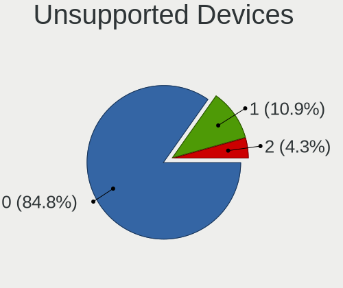

| Total | Desktops | Percent |
|-------|----------|---------|
| 0     | 18       | 78.26%  |
| 1     | 4        | 17.39%  |
| 2     | 1        | 4.35%   |

Unsupported Device Types
------------------------

Types of unsupported devices

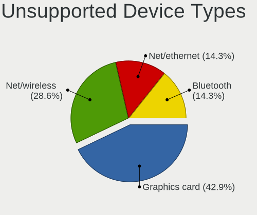

| Type          | Desktops | Percent |
|---------------|----------|---------|
| Graphics card | 2        | 40%     |
| Net/wireless  | 1        | 20%     |
| Net/ethernet  | 1        | 20%     |
| Bluetooth     | 1        | 20%     |

