Linux in Tunisia - Tested Hardware & Statistics (Desktops)
----------------------------------------------------------

A project to collect tested hardware configurations for Linux in Tunisia.

Anyone can contribute to this report by the [hw-probe](https://github.com/linuxhw/hw-probe) tool:

    sudo -E hw-probe -all -upload

Please contribute! Especially if your hardware is rare.

Contents
--------

* [ Test Cases ](#test-cases)

* [ System ](#system)
  - [ OS                       ](#os)
  - [ OS Family                ](#os-family)
  - [ Kernel                   ](#kernel)
  - [ Kernel Family            ](#kernel-family)
  - [ Kernel Major Ver.        ](#kernel-major-ver)
  - [ Arch                     ](#arch)
  - [ DE                       ](#de)
  - [ Display Server           ](#display-server)
  - [ Display Manager          ](#display-manager)
  - [ OS Lang                  ](#os-lang)
  - [ Boot Mode                ](#boot-mode)
  - [ Filesystem               ](#filesystem)
  - [ Part. scheme             ](#part-scheme)
  - [ Dual Boot with Linux/BSD ](#dual-boot-with-linuxbsd)
  - [ Dual Boot (Win)          ](#dual-boot-win)

* [ Board ](#board)
  - [ Vendor                   ](#vendor)
  - [ Model                    ](#model)
  - [ Model Family             ](#model-family)
  - [ MFG Year                 ](#mfg-year)
  - [ Form Factor              ](#form-factor)
  - [ Secure Boot              ](#secure-boot)
  - [ Coreboot                 ](#coreboot)
  - [ RAM Size                 ](#ram-size)
  - [ RAM Used                 ](#ram-used)
  - [ Total Drives             ](#total-drives)
  - [ Has CD-ROM               ](#has-cd-rom)
  - [ Has Ethernet             ](#has-ethernet)
  - [ Has WiFi                 ](#has-wifi)
  - [ Has Bluetooth            ](#has-bluetooth)

* [ Location ](#location)
  - [ Country                  ](#country)
  - [ City                     ](#city)

* [ Drives ](#drives)
  - [ Drive Vendor             ](#drive-vendor)
  - [ Drive Model              ](#drive-model)
  - [ HDD Vendor               ](#hdd-vendor)
  - [ SSD Vendor               ](#ssd-vendor)
  - [ Drive Kind               ](#drive-kind)
  - [ Drive Connector          ](#drive-connector)
  - [ Drive Size               ](#drive-size)
  - [ Space Total              ](#space-total)
  - [ Space Used               ](#space-used)
  - [ Malfunc. Drives          ](#malfunc-drives)
  - [ Malfunc. Drive Vendor    ](#malfunc-drive-vendor)
  - [ Malfunc. HDD Vendor      ](#malfunc-hdd-vendor)
  - [ Malfunc. Drive Kind      ](#malfunc-drive-kind)
  - [ Failed Drives            ](#failed-drives)
  - [ Failed Drive Vendor      ](#failed-drive-vendor)
  - [ Drive Status             ](#drive-status)

* [ Storage controller ](#storage-controller)
  - [ Storage Vendor           ](#storage-vendor)
  - [ Storage Model            ](#storage-model)
  - [ Storage Kind             ](#storage-kind)

* [ Processor ](#processor)
  - [ CPU Vendor               ](#cpu-vendor)
  - [ CPU Model                ](#cpu-model)
  - [ CPU Model Family         ](#cpu-model-family)
  - [ CPU Cores                ](#cpu-cores)
  - [ CPU Sockets              ](#cpu-sockets)
  - [ CPU Threads              ](#cpu-threads)
  - [ CPU Op-Modes             ](#cpu-op-modes)
  - [ CPU Microcode            ](#cpu-microcode)
  - [ CPU Microarch            ](#cpu-microarch)

* [ Graphics ](#graphics)
  - [ GPU Vendor               ](#gpu-vendor)
  - [ GPU Model                ](#gpu-model)
  - [ GPU Combo                ](#gpu-combo)
  - [ GPU Driver               ](#gpu-driver)
  - [ GPU Memory               ](#gpu-memory)

* [ Monitor ](#monitor)
  - [ Monitor Vendor           ](#monitor-vendor)
  - [ Monitor Model            ](#monitor-model)
  - [ Monitor Resolution       ](#monitor-resolution)
  - [ Monitor Diagonal         ](#monitor-diagonal)
  - [ Monitor Width            ](#monitor-width)
  - [ Aspect Ratio             ](#aspect-ratio)
  - [ Monitor Area             ](#monitor-area)
  - [ Pixel Density            ](#pixel-density)
  - [ Multiple Monitors        ](#multiple-monitors)

* [ Network ](#network)
  - [ Net Controller Vendor    ](#net-controller-vendor)
  - [ Net Controller Model     ](#net-controller-model)
  - [ Wireless Vendor          ](#wireless-vendor)
  - [ Wireless Model           ](#wireless-model)
  - [ Ethernet Vendor          ](#ethernet-vendor)
  - [ Ethernet Model           ](#ethernet-model)
  - [ Net Controller Kind      ](#net-controller-kind)
  - [ Used Controller          ](#used-controller)
  - [ NICs                     ](#nics)
  - [ IPv6                     ](#ipv6)

* [ Bluetooth ](#bluetooth)
  - [ Bluetooth Vendor         ](#bluetooth-vendor)
  - [ Bluetooth Model          ](#bluetooth-model)

* [ Sound ](#sound)
  - [ Sound Vendor             ](#sound-vendor)
  - [ Sound Model              ](#sound-model)

* [ Memory ](#memory)
  - [ Memory Vendor            ](#memory-vendor)
  - [ Memory Model             ](#memory-model)
  - [ Memory Kind              ](#memory-kind)
  - [ Memory Form Factor       ](#memory-form-factor)
  - [ Memory Size              ](#memory-size)
  - [ Memory Speed             ](#memory-speed)

* [ Printers & scanners ](#printers--scanners)
  - [ Printer Vendor           ](#printer-vendor)
  - [ Printer Model            ](#printer-model)
  - [ Scanner Vendor           ](#scanner-vendor)
  - [ Scanner Model            ](#scanner-model)

* [ Camera ](#camera)
  - [ Camera Vendor            ](#camera-vendor)
  - [ Camera Model             ](#camera-model)

* [ Security ](#security)
  - [ Fingerprint Vendor       ](#fingerprint-vendor)
  - [ Fingerprint Model        ](#fingerprint-model)
  - [ Chipcard Vendor          ](#chipcard-vendor)
  - [ Chipcard Model           ](#chipcard-model)

* [ Unsupported ](#unsupported)
  - [ Unsupported Devices      ](#unsupported-devices)
  - [ Unsupported Device Types ](#unsupported-device-types)

Test Cases
----------

Total: 61

| Vendor        | Model                       | Probe                                                      | Date         |
|---------------|-----------------------------|------------------------------------------------------------|--------------|
| ASUSTek       | PRIME H510M-K               | [125c5a0ee0](https://linux-hardware.org/?probe=125c5a0ee0) | Dec 31, 2024 |
| ASUSTek       | PRIME A520M-K               | [4f31d462cf](https://linux-hardware.org/?probe=4f31d462cf) | Nov 26, 2024 |
| ASUSTek       | ROG CROSSHAIR X670E GENE    | [788e3c4a7e](https://linux-hardware.org/?probe=788e3c4a7e) | Sep 17, 2024 |
| ASUSTek       | ROG CROSSHAIR X670E GENE    | [32024e5714](https://linux-hardware.org/?probe=32024e5714) | Sep 15, 2024 |
| ASRock        | X570 Phantom Gaming 4       | [578e9c44c3](https://linux-hardware.org/?probe=578e9c44c3) | May 30, 2024 |
| Dell          | 0TP412                      | [d78622c7e2](https://linux-hardware.org/?probe=d78622c7e2) | May 24, 2024 |
| ECS           | G31T-M9                     | [30204f2a00](https://linux-hardware.org/?probe=30204f2a00) | Dec 14, 2023 |
| ECS           | G31T-M9                     | [783af811f2](https://linux-hardware.org/?probe=783af811f2) | Nov 16, 2023 |
| Intel         | H81                         | [34f1a336e3](https://linux-hardware.org/?probe=34f1a336e3) | Sep 14, 2023 |
| Dell          | 0J8G6F A03                  | [490dd7a710](https://linux-hardware.org/?probe=490dd7a710) | Sep 04, 2023 |
| Intel         | H81                         | [98f445e831](https://linux-hardware.org/?probe=98f445e831) | Sep 03, 2023 |
| LORD ELECT... | LORD G4x 775 ICH7 8712 A... | [3e63b3dec0](https://linux-hardware.org/?probe=3e63b3dec0) | Aug 09, 2023 |
| LORD ELECT... | LORD G4x 775 ICH7 8712 A... | [a036ddad16](https://linux-hardware.org/?probe=a036ddad16) | Aug 09, 2023 |
| Dell          | 0HMX8D A01                  | [36b8532260](https://linux-hardware.org/?probe=36b8532260) | Mar 31, 2023 |
| Pegatron      | Eureka3                     | [9a13411e08](https://linux-hardware.org/?probe=9a13411e08) | Mar 14, 2023 |
| Dell          | 0HN7XN A01                  | [167394f685](https://linux-hardware.org/?probe=167394f685) | Mar 04, 2023 |
| ASUSTek       | PRIME B450-PLUS             | [4cb7a5f214](https://linux-hardware.org/?probe=4cb7a5f214) | Jan 30, 2023 |
| Dell          | 0WMJ54 A01                  | [778a84af28](https://linux-hardware.org/?probe=778a84af28) | Nov 28, 2022 |
| ASRock        | 970 Extreme4                | [27756e9ad7](https://linux-hardware.org/?probe=27756e9ad7) | Nov 20, 2022 |
| Intel         | H81                         | [f99a623867](https://linux-hardware.org/?probe=f99a623867) | Nov 17, 2022 |
| Intel         | H81                         | [5bfd56a1f8](https://linux-hardware.org/?probe=5bfd56a1f8) | Nov 17, 2022 |
| AZW           | Gemini M                    | [683123c4f5](https://linux-hardware.org/?probe=683123c4f5) | Nov 16, 2022 |
| Pegatron      | Benicia                     | [f345c0beb9](https://linux-hardware.org/?probe=f345c0beb9) | Nov 11, 2022 |
| MSI           | H310M PRO-VDH PLUS          | [7b65a89d4f](https://linux-hardware.org/?probe=7b65a89d4f) | Nov 04, 2022 |
| MSI           | MS-B0A41                    | [a0d7f23a22](https://linux-hardware.org/?probe=a0d7f23a22) | Oct 05, 2022 |
| ASUSTek       | PRIME Z690-P WIFI D4        | [ad367d006a](https://linux-hardware.org/?probe=ad367d006a) | Sep 22, 2022 |
| MSI           | A320M-A PRO MAX             | [eed790913e](https://linux-hardware.org/?probe=eed790913e) | Sep 16, 2022 |
| HP            | 2AF7                        | [7605e926c4](https://linux-hardware.org/?probe=7605e926c4) | Aug 25, 2022 |
| Lenovo        | 36C5 NOK                    | [94d44ae5f2](https://linux-hardware.org/?probe=94d44ae5f2) | Jun 29, 2022 |
| Lenovo        | 36C5 NOK                    | [cd5e39b07a](https://linux-hardware.org/?probe=cd5e39b07a) | Jun 29, 2022 |
| Dell          | 05842Y A00                  | [7c67079823](https://linux-hardware.org/?probe=7c67079823) | May 19, 2022 |
| MSI           | H81M-P33                    | [af0e50e873](https://linux-hardware.org/?probe=af0e50e873) | Apr 14, 2022 |
| MSI           | B550M PRO-VDH               | [9597b0a2d9](https://linux-hardware.org/?probe=9597b0a2d9) | Apr 09, 2022 |
| ASUSTek       | PRIME B450M-K               | [6278830433](https://linux-hardware.org/?probe=6278830433) | Feb 17, 2022 |
| Intel         | H61                         | [6d80839afa](https://linux-hardware.org/?probe=6d80839afa) | Feb 09, 2022 |
| ASUSTek       | PRIME B450M-K               | [f49f9dddd2](https://linux-hardware.org/?probe=f49f9dddd2) | Jan 29, 2022 |
| ASUSTek       | PRIME B450M-K               | [0799e18f8b](https://linux-hardware.org/?probe=0799e18f8b) | Jan 20, 2022 |
| MSI           | H110M PRO-VD PLUS           | [e6fd06720f](https://linux-hardware.org/?probe=e6fd06720f) | Nov 28, 2021 |
| Gigabyte      | B75M-D3H                    | [b882e1c0f7](https://linux-hardware.org/?probe=b882e1c0f7) | Sep 22, 2021 |
| HP            | 1494                        | [ae5165603a](https://linux-hardware.org/?probe=ae5165603a) | Sep 09, 2021 |
| HP            | 1494                        | [62e74e0c1a](https://linux-hardware.org/?probe=62e74e0c1a) | Sep 09, 2021 |
| Lenovo        | SHARKBAY NOK                | [e57d0a5518](https://linux-hardware.org/?probe=e57d0a5518) | Sep 01, 2021 |
| Dell          | 0M5DCD A00                  | [77faf70869](https://linux-hardware.org/?probe=77faf70869) | Jun 14, 2021 |
| Lenovo        | 3138 NO DPK                 | [8488c59a11](https://linux-hardware.org/?probe=8488c59a11) | May 18, 2021 |
| ASUSTek       | PRIME B450M-K               | [8110fad44d](https://linux-hardware.org/?probe=8110fad44d) | May 17, 2021 |
| ASUSTek       | PRIME B450M-K               | [ae4420d3a9](https://linux-hardware.org/?probe=ae4420d3a9) | May 01, 2021 |
| Dell          | 0TTDMJ A00                  | [aef24f2346](https://linux-hardware.org/?probe=aef24f2346) | Oct 28, 2020 |
| ASUSTek       | M32CD_A_F_K20CD_K31CD       | [cdce66a7de](https://linux-hardware.org/?probe=cdce66a7de) | Jul 07, 2020 |
| Foxconn       | 2ABF                        | [65d6dca78e](https://linux-hardware.org/?probe=65d6dca78e) | May 27, 2020 |
| MSI           | MS-7502 Fab D               | [242c5b8d0d](https://linux-hardware.org/?probe=242c5b8d0d) | Mar 30, 2020 |
| Foxconn       | 2ABF                        | [7c6e2d2c29](https://linux-hardware.org/?probe=7c6e2d2c29) | Mar 10, 2020 |
| Pegatron      | Eureka3                     | [77bc52c3d9](https://linux-hardware.org/?probe=77bc52c3d9) | Mar 02, 2020 |
| Pegatron      | Eureka3                     | [84ee26b4e7](https://linux-hardware.org/?probe=84ee26b4e7) | Mar 02, 2020 |
| Pegatron      | Eureka3                     | [33ae5ebabc](https://linux-hardware.org/?probe=33ae5ebabc) | Feb 18, 2020 |
| Lenovo        | 3138 NO DPK                 | [7878eb9e27](https://linux-hardware.org/?probe=7878eb9e27) | Dec 30, 2019 |
| Lenovo        | 3138 NO DPK                 | [21f916c3ef](https://linux-hardware.org/?probe=21f916c3ef) | Dec 30, 2019 |
| Unknown       | Pine Trail - M CRB          | [ef1e6295a8](https://linux-hardware.org/?probe=ef1e6295a8) | Oct 30, 2019 |
| Foxconn       | 2ABF                        | [4521f814c9](https://linux-hardware.org/?probe=4521f814c9) | Sep 17, 2019 |
| Foxconn       | 2ABF                        | [6a57b2ea85](https://linux-hardware.org/?probe=6a57b2ea85) | Sep 17, 2019 |
| Pegatron      | 2A94h                       | [3b6656bb11](https://linux-hardware.org/?probe=3b6656bb11) | Jul 04, 2019 |
| Foxconn       | 2ABF                        | [f6873739a8](https://linux-hardware.org/?probe=f6873739a8) | Mar 03, 2018 |

System
------

OS
--

Installed operating systems

| Name               | Desktops | Percent |
|--------------------|----------|---------|
| Ubuntu 22.04       | 6        | 12.77%  |
| Ubuntu 18.04       | 5        | 10.64%  |
| Ubuntu 20.04       | 4        | 8.51%   |
| OpenMandriva 4.3   | 3        | 6.38%   |
| OpenMandriva 4.2   | 3        | 6.38%   |
| OpenMandriva 23.08 | 3        | 6.38%   |
| Ubuntu 19.10       | 2        | 4.26%   |
| Zorin 17           | 1        | 2.13%   |
| Ubuntu 24.04       | 1        | 2.13%   |
| Ubuntu 21.10       | 1        | 2.13%   |
| Ubuntu 19.04       | 1        | 2.13%   |
| Ubuntu 16.04       | 1        | 2.13%   |
| ROSA R10           | 1        | 2.13%   |
| ROSA 12.3          | 1        | 2.13%   |
| Pop!_OS 22.04      | 1        | 2.13%   |
| OpenMandriva 23.03 | 1        | 2.13%   |
| Linux Mint 21.2    | 1        | 2.13%   |
| Linux Mint 21.1    | 1        | 2.13%   |
| Kali 2022.3        | 1        | 2.13%   |
| Gentoo 2.8         | 1        | 2.13%   |
| Gentoo 2.7         | 1        | 2.13%   |
| Fedora 41          | 1        | 2.13%   |
| Devuan 3           | 1        | 2.13%   |
| Debian 11          | 1        | 2.13%   |
| Bazzite 40         | 1        | 2.13%   |
| ArcoLinux Rolling  | 1        | 2.13%   |
| Arch Rolling       | 1        | 2.13%   |
| Arch               | 1        | 2.13%   |

OS Family
---------

OS without a version

| Name         | Desktops | Percent |
|--------------|----------|---------|
| Ubuntu       | 18       | 40.91%  |
| OpenMandriva | 10       | 22.73%  |
| ROSA         | 2        | 4.55%   |
| Linux Mint   | 2        | 4.55%   |
| Gentoo       | 2        | 4.55%   |
| Arch         | 2        | 4.55%   |
| Zorin        | 1        | 2.27%   |
| Pop!_OS      | 1        | 2.27%   |
| Kali         | 1        | 2.27%   |
| Fedora       | 1        | 2.27%   |
| Devuan       | 1        | 2.27%   |
| Debian       | 1        | 2.27%   |
| Bazzite      | 1        | 2.27%   |
| ArcoLinux    | 1        | 2.27%   |

Kernel
------

Version of the Linux kernel

| Version                            | Desktops | Percent |
|------------------------------------|----------|---------|
| 6.4.11-desktop-1omv2390            | 3        | 6.12%   |
| 5.16.7-desktop-1omv4003            | 3        | 6.12%   |
| 5.10.14-desktop-1omv4002           | 3        | 6.12%   |
| 5.15.0-53-generic                  | 2        | 4.08%   |
| 6.9.12-205.fsync.fc40.x86_64       | 1        | 2.04%   |
| 6.9.1-arch1-2                      | 1        | 2.04%   |
| 6.8.0-49-generic                   | 1        | 2.04%   |
| 6.5.0-35-generic                   | 1        | 2.04%   |
| 6.2.6-desktop-1omv2390             | 1        | 2.04%   |
| 6.2.0-36-generic                   | 1        | 2.04%   |
| 6.12.6-200.fc41.x86_64             | 1        | 2.04%   |
| 5.9.1-arch1-1                      | 1        | 2.04%   |
| 5.8.0-55-generic                   | 1        | 2.04%   |
| 5.4.0-73-generic                   | 1        | 2.04%   |
| 5.4.0-40-generic                   | 1        | 2.04%   |
| 5.4.0-31-generic                   | 1        | 2.04%   |
| 5.4.0-124-generic                  | 1        | 2.04%   |
| 5.3.0-40-generic                   | 1        | 2.04%   |
| 5.3.0-26-generic                   | 1        | 2.04%   |
| 5.3.0-19-generic                   | 1        | 2.04%   |
| 5.18.0-kali5-amd64                 | 1        | 2.04%   |
| 5.17.15-76051715-generic           | 1        | 2.04%   |
| 5.15.77-generic-1rosa2021.1-x86_64 | 1        | 2.04%   |
| 5.15.75-gentoo-dist                | 1        | 2.04%   |
| 5.15.5-arch1-1                     | 1        | 2.04%   |
| 5.15.11-gentoo                     | 1        | 2.04%   |
| 5.15.0-68-generic                  | 1        | 2.04%   |
| 5.15.0-60-generic                  | 1        | 2.04%   |
| 5.15.0-58-generic                  | 1        | 2.04%   |
| 5.15.0-48-generic                  | 1        | 2.04%   |
| 5.15.0-47-generic                  | 1        | 2.04%   |
| 5.13.0-39-generic                  | 1        | 2.04%   |
| 5.11.0-27-generic                  | 1        | 2.04%   |
| 5.10.27-gentoo                     | 1        | 2.04%   |
| 5.10.0-12-amd64                    | 1        | 2.04%   |
| 5.0.0-13-generic                   | 1        | 2.04%   |
| 4.9.60-nrj-desktop-1rosa-x86_64    | 1        | 2.04%   |
| 4.4.0-176-generic                  | 1        | 2.04%   |
| 4.19.0-10-amd64                    | 1        | 2.04%   |
| 4.18.0-25-generic                  | 1        | 2.04%   |

Kernel Family
-------------

Linux kernel without a distro release

| Version | Desktops | Percent |
|---------|----------|---------|
| 5.15.0  | 7        | 14.29%  |
| 5.4.0   | 4        | 8.16%   |
| 6.4.11  | 3        | 6.12%   |
| 5.3.0   | 3        | 6.12%   |
| 5.16.7  | 3        | 6.12%   |
| 5.10.14 | 3        | 6.12%   |
| 4.15.0  | 2        | 4.08%   |
| 6.9.12  | 1        | 2.04%   |
| 6.9.1   | 1        | 2.04%   |
| 6.8.0   | 1        | 2.04%   |
| 6.5.0   | 1        | 2.04%   |
| 6.2.6   | 1        | 2.04%   |
| 6.2.0   | 1        | 2.04%   |
| 6.12.6  | 1        | 2.04%   |
| 5.9.1   | 1        | 2.04%   |
| 5.8.0   | 1        | 2.04%   |
| 5.18.0  | 1        | 2.04%   |
| 5.17.15 | 1        | 2.04%   |
| 5.15.77 | 1        | 2.04%   |
| 5.15.75 | 1        | 2.04%   |
| 5.15.5  | 1        | 2.04%   |
| 5.15.11 | 1        | 2.04%   |
| 5.13.0  | 1        | 2.04%   |
| 5.11.0  | 1        | 2.04%   |
| 5.10.27 | 1        | 2.04%   |
| 5.10.0  | 1        | 2.04%   |
| 5.0.0   | 1        | 2.04%   |
| 4.9.60  | 1        | 2.04%   |
| 4.4.0   | 1        | 2.04%   |
| 4.19.0  | 1        | 2.04%   |
| 4.18.0  | 1        | 2.04%   |

Kernel Major Ver.
-----------------

Linux kernel major version

| Version | Desktops | Percent |
|---------|----------|---------|
| 5.15    | 11       | 22.45%  |
| 5.10    | 5        | 10.2%   |
| 5.4     | 4        | 8.16%   |
| 6.4     | 3        | 6.12%   |
| 5.3     | 3        | 6.12%   |
| 5.16    | 3        | 6.12%   |
| 6.9     | 2        | 4.08%   |
| 6.2     | 2        | 4.08%   |
| 4.15    | 2        | 4.08%   |
| 6.8     | 1        | 2.04%   |
| 6.5     | 1        | 2.04%   |
| 6.12    | 1        | 2.04%   |
| 5.9     | 1        | 2.04%   |
| 5.8     | 1        | 2.04%   |
| 5.18    | 1        | 2.04%   |
| 5.17    | 1        | 2.04%   |
| 5.13    | 1        | 2.04%   |
| 5.11    | 1        | 2.04%   |
| 5.0     | 1        | 2.04%   |
| 4.9     | 1        | 2.04%   |
| 4.4     | 1        | 2.04%   |
| 4.19    | 1        | 2.04%   |
| 4.18    | 1        | 2.04%   |

Arch
----

OS architecture (x86_64, i586, etc.)

| Name   | Desktops | Percent |
|--------|----------|---------|
| x86_64 | 42       | 97.67%  |
| i686   | 1        | 2.33%   |

DE
--

Desktop Environment

| Name            | Desktops | Percent |
|-----------------|----------|---------|
| GNOME           | 20       | 44.44%  |
| KDE5            | 9        | 20%     |
| Unknown         | 6        | 13.33%  |
| XFCE            | 2        | 4.44%   |
| KDE6            | 2        | 4.44%   |
| X-Cinnamon      | 1        | 2.22%   |
| MATE            | 1        | 2.22%   |
| KDE4            | 1        | 2.22%   |
| i3              | 1        | 2.22%   |
| GNOME Flashback | 1        | 2.22%   |
| Cinnamon        | 1        | 2.22%   |

Display Server
--------------

X11 or Wayland

| Name    | Desktops | Percent |
|---------|----------|---------|
| X11     | 26       | 59.09%  |
| Wayland | 16       | 36.36%  |
| Tty     | 2        | 4.55%   |

Display Manager
---------------

SDDM, LightDM, etc.

| Name    | Desktops | Percent |
|---------|----------|---------|
| Unknown | 18       | 40%     |
| SDDM    | 10       | 22.22%  |
| GDM3    | 9        | 20%     |
| GDM     | 6        | 13.33%  |
| LightDM | 1        | 2.22%   |
| KDM     | 1        | 2.22%   |

OS Lang
-------

Language

| Lang    | Desktops | Percent |
|---------|----------|---------|
| en_US   | 20       | 45.45%  |
| fr_FR   | 16       | 36.36%  |
| Unknown | 4        | 9.09%   |
| fr_CA   | 1        | 2.27%   |
| en_AG   | 1        | 2.27%   |
| de_DE   | 1        | 2.27%   |
| ar_TN   | 1        | 2.27%   |

Boot Mode
---------

EFI or BIOS

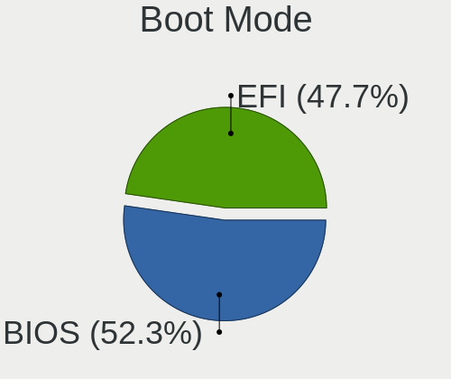

| Mode | Desktops | Percent |
|------|----------|---------|
| BIOS | 23       | 52.27%  |
| EFI  | 21       | 47.73%  |

Filesystem
----------

Type of filesystem

| Type    | Desktops | Percent |
|---------|----------|---------|
| Ext4    | 31       | 72.09%  |
| Overlay | 7        | 16.28%  |
| Tmpfs   | 2        | 4.65%   |
| Btrfs   | 2        | 4.65%   |
| Unknown | 1        | 2.33%   |

Part. scheme
------------

Scheme of partitioning

| Type    | Desktops | Percent |
|---------|----------|---------|
| GPT     | 20       | 43.48%  |
| Unknown | 19       | 41.3%   |
| MBR     | 7        | 15.22%  |

Dual Boot with Linux/BSD
------------------------

Hosting more than one Linux/BSD

| Dual boot | Desktops | Percent |
|-----------|----------|---------|
| No        | 32       | 72.73%  |
| Yes       | 12       | 27.27%  |

Dual Boot (Win)
---------------

Hosting Linux and Windows

| Dual boot | Desktops | Percent |
|-----------|----------|---------|
| No        | 26       | 60.47%  |
| Yes       | 17       | 39.53%  |

Board
-----

Vendor
------

Motherboard manufacturer

| Name                | Desktops | Percent |
|---------------------|----------|---------|
| Dell                | 8        | 18.6%   |
| MSI                 | 7        | 16.28%  |
| ASUSTek Computer    | 7        | 16.28%  |
| Pegatron            | 4        | 9.3%    |
| Lenovo              | 3        | 6.98%   |
| Intel               | 3        | 6.98%   |
| Hewlett-Packard     | 2        | 4.65%   |
| Foxconn             | 2        | 4.65%   |
| ASRock              | 2        | 4.65%   |
| LORD ELECTRONICS    | 1        | 2.33%   |
| Gigabyte Technology | 1        | 2.33%   |
| ECS                 | 1        | 2.33%   |
| AZW                 | 1        | 2.33%   |
| Unknown             | 1        | 2.33%   |

Model
-----

Motherboard model

| Name                                              | Desktops | Percent |
|---------------------------------------------------|----------|---------|
| Pegatron VS342AA-AB6 m9801af                      | 2        | 4.65%   |
| Intel H81                                         | 2        | 4.65%   |
| Foxconn Pro 3400 Series MT                        | 2        | 4.65%   |
| Pegatron Pro 3010 Microtower PC                   | 1        | 2.33%   |
| Pegatron FL437AA-ABF a6641af                      | 1        | 2.33%   |
| MSI PRO H510 DP21 (MS-B0A4)                       | 1        | 2.33%   |
| MSI MS-7C95                                       | 1        | 2.33%   |
| MSI MS-7C52                                       | 1        | 2.33%   |
| MSI MS-7C09                                       | 1        | 2.33%   |
| MSI MS-7A15                                       | 1        | 2.33%   |
| MSI MS-7817                                       | 1        | 2.33%   |
| MSI MS-7502                                       | 1        | 2.33%   |
| LORD ELECTRONICS LORD G4x 775 ICH7 8712 As Design | 1        | 2.33%   |
| Lenovo ThinkStation P330 30C6S33L00               | 1        | 2.33%   |
| Lenovo IdeaCentre 510-15IKL 90G8008EAL            | 1        | 2.33%   |
| Lenovo H50-50 90B70040AL                          | 1        | 2.33%   |
| Intel H61                                         | 1        | 2.33%   |
| HP Compaq 8200 Elite CMT PC                       | 1        | 2.33%   |
| HP 500-440nkm                                     | 1        | 2.33%   |
| Gigabyte B75M-D3H                                 | 1        | 2.33%   |
| ECS G31T-M9                                       | 1        | 2.33%   |
| Dell Precision WorkStation T3400                  | 1        | 2.33%   |
| Dell OptiPlex 5060                                | 1        | 2.33%   |
| Dell OptiPlex 390                                 | 1        | 2.33%   |
| Dell OptiPlex 380                                 | 1        | 2.33%   |
| Dell OptiPlex 3090                                | 1        | 2.33%   |
| Dell OptiPlex 3070                                | 1        | 2.33%   |
| Dell OptiPlex 3040                                | 1        | 2.33%   |
| Dell OptiPlex 3020                                | 1        | 2.33%   |
| AZW Gemini M                                      | 1        | 2.33%   |
| ASUS ROG CROSSHAIR X670E GENE                     | 1        | 2.33%   |
| ASUS PRIME Z690-P WIFI D4                         | 1        | 2.33%   |
| ASUS PRIME H510M-K                                | 1        | 2.33%   |
| ASUS PRIME B450M-K                                | 1        | 2.33%   |
| ASUS PRIME B450-PLUS                              | 1        | 2.33%   |
| ASUS PRIME A520M-K                                | 1        | 2.33%   |
| ASUS M32CD_A_F_K20CD_K31CD                        | 1        | 2.33%   |
| ASRock X570 Phantom Gaming 4                      | 1        | 2.33%   |
| ASRock 970 Extreme4                               | 1        | 2.33%   |
| Unknown                                           | 1        | 2.33%   |

Model Family
------------

Motherboard model prefix

| Name                  | Desktops | Percent |
|-----------------------|----------|---------|
| Dell OptiPlex         | 7        | 16.28%  |
| ASUS PRIME            | 5        | 11.63%  |
| Pegatron VS342AA-AB6  | 2        | 4.65%   |
| Intel H81             | 2        | 4.65%   |
| Foxconn Pro           | 2        | 4.65%   |
| Pegatron Pro          | 1        | 2.33%   |
| Pegatron FL437AA-ABF  | 1        | 2.33%   |
| MSI PRO               | 1        | 2.33%   |
| MSI MS-7C95           | 1        | 2.33%   |
| MSI MS-7C52           | 1        | 2.33%   |
| MSI MS-7C09           | 1        | 2.33%   |
| MSI MS-7A15           | 1        | 2.33%   |
| MSI MS-7817           | 1        | 2.33%   |
| MSI MS-7502           | 1        | 2.33%   |
| LORD ELECTRONICS LORD | 1        | 2.33%   |
| Lenovo ThinkStation   | 1        | 2.33%   |
| Lenovo IdeaCentre     | 1        | 2.33%   |
| Lenovo H50-50         | 1        | 2.33%   |
| Intel H61             | 1        | 2.33%   |
| HP Compaq             | 1        | 2.33%   |
| HP 500-440nkm         | 1        | 2.33%   |
| Gigabyte B75M-D3H     | 1        | 2.33%   |
| ECS G31T-M9           | 1        | 2.33%   |
| Dell Precision        | 1        | 2.33%   |
| AZW Gemini            | 1        | 2.33%   |
| ASUS ROG              | 1        | 2.33%   |
| ASUS M32CD            | 1        | 2.33%   |
| ASRock X570           | 1        | 2.33%   |
| ASRock 970            | 1        | 2.33%   |
| Unknown               | 1        | 2.33%   |

MFG Year
--------

Motherboard manufacture year

| Year | Desktops | Percent |
|------|----------|---------|
| 2019 | 7        | 16.28%  |
| 2021 | 5        | 11.63%  |
| 2011 | 5        | 11.63%  |
| 2009 | 4        | 9.3%    |
| 2020 | 3        | 6.98%   |
| 2018 | 3        | 6.98%   |
| 2016 | 3        | 6.98%   |
| 2015 | 2        | 4.65%   |
| 2014 | 2        | 4.65%   |
| 2012 | 2        | 4.65%   |
| 2008 | 2        | 4.65%   |
| 2022 | 1        | 2.33%   |
| 2017 | 1        | 2.33%   |
| 2013 | 1        | 2.33%   |
| 2010 | 1        | 2.33%   |
| 2007 | 1        | 2.33%   |

Form Factor
-----------

Physical design of the computer

| Name    | Desktops | Percent |
|---------|----------|---------|
| Desktop | 43       | 100%    |

Secure Boot
-----------

Enabled or disabled

| State    | Desktops | Percent |
|----------|----------|---------|
| Disabled | 41       | 95.35%  |
| Enabled  | 2        | 4.65%   |

Coreboot
--------

Have coreboot on board

| Used | Desktops | Percent |
|------|----------|---------|
| No   | 43       | 100%    |

RAM Size
--------

Total RAM memory

| Size in GB | Desktops | Percent |
|------------|----------|---------|
| 4.01-8.0   | 12       | 27.91%  |
| 16.01-24.0 | 10       | 23.26%  |
| 8.01-16.0  | 8        | 18.6%   |
| 3.01-4.0   | 5        | 11.63%  |
| 1.01-2.0   | 5        | 11.63%  |
| 32.01-64.0 | 2        | 4.65%   |
| 2.01-3.0   | 1        | 2.33%   |

RAM Used
--------

Used RAM memory

| Used GB   | Desktops | Percent |
|-----------|----------|---------|
| 1.01-2.0  | 17       | 34.69%  |
| 2.01-3.0  | 14       | 28.57%  |
| 4.01-8.0  | 7        | 14.29%  |
| 3.01-4.0  | 5        | 10.2%   |
| 0.51-1.0  | 3        | 6.12%   |
| 0.01-0.5  | 2        | 4.08%   |
| 8.01-16.0 | 1        | 2.04%   |

Total Drives
------------

Number of drives on board

| Drives | Desktops | Percent |
|--------|----------|---------|
| 1      | 25       | 55.56%  |
| 2      | 14       | 31.11%  |
| 4      | 4        | 8.89%   |
| 3      | 1        | 2.22%   |
| 0      | 1        | 2.22%   |

Has CD-ROM
----------

Has CD-ROM on board

| Presented | Desktops | Percent |
|-----------|----------|---------|
| No        | 27       | 61.36%  |
| Yes       | 17       | 38.64%  |

Has Ethernet
------------

Has Ethernet on board

| Presented | Desktops | Percent |
|-----------|----------|---------|
| Yes       | 43       | 100%    |

Has WiFi
--------

Has WiFi module

| Presented | Desktops | Percent |
|-----------|----------|---------|
| Yes       | 22       | 50%     |
| No        | 22       | 50%     |

Has Bluetooth
-------------

Has Bluetooth module

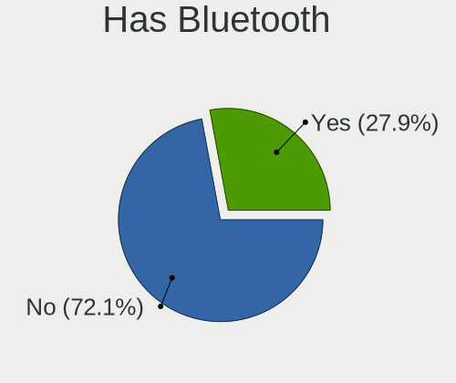

| Presented | Desktops | Percent |
|-----------|----------|---------|
| No        | 31       | 72.09%  |
| Yes       | 12       | 27.91%  |

Location
--------

Country
-------

Geographic location (country)

| Country | Desktops | Percent |
|---------|----------|---------|
| Tunisia | 43       | 100%    |

City
----

Geographic location (city)

| City          | Desktops | Percent |
|---------------|----------|---------|
| Tunis         | 19       | 38%     |
| Aryanah       | 6        | 12%     |
| Nabeul        | 3        | 6%      |
| Sousse        | 2        | 4%      |
| Bizerte       | 2        | 4%      |
| Ben Arous     | 2        | 4%      |
| Beja          | 2        | 4%      |
| Sidi Abbes    | 1        | 2%      |
| Sfax          | 1        | 2%      |
| Radès        | 1        | 2%      |
| Monastir      | 1        | 2%      |
| Medjez el Bab | 1        | 2%      |
| Mateur        | 1        | 2%      |
| Mahdia        | 1        | 2%      |
| Ksar Hellal   | 1        | 2%      |
| Hammamet      | 1        | 2%      |
| Ezzouhour     | 1        | 2%      |
| El Fahs       | 1        | 2%      |
| Carthage      | 1        | 2%      |
| As Sanad      | 1        | 2%      |
| Akouda        | 1        | 2%      |

Drives
------

Drive Vendor
------------

Hard drive vendors

| Vendor                      | Desktops | Drives | Percent |
|-----------------------------|----------|--------|---------|
| Seagate                     | 15       | 21     | 24.59%  |
| WDC                         | 13       | 17     | 21.31%  |
| Toshiba                     | 8        | 10     | 13.11%  |
| Samsung Electronics         | 5        | 7      | 8.2%    |
| Team                        | 3        | 3      | 4.92%   |
| Emtec                       | 3        | 6      | 4.92%   |
| SanDisk                     | 2        | 4      | 3.28%   |
| PNY                         | 2        | 2      | 3.28%   |
| Kingston                    | 2        | 2      | 3.28%   |
| MAXIO Technology (Hangzhou) | 1        | 1      | 1.64%   |
| Lexar                       | 1        | 1      | 1.64%   |
| KVST                        | 1        | 1      | 1.64%   |
| HS-SSD-E100                 | 1        | 2      | 1.64%   |
| Hitachi                     | 1        | 1      | 1.64%   |
| HGST                        | 1        | 1      | 1.64%   |
| China                       | 1        | 1      | 1.64%   |
| addlink                     | 1        | 1      | 1.64%   |

Drive Model
-----------

Hard drive models

| Model                                | Desktops | Percent |
|--------------------------------------|----------|---------|
| Seagate ST1000DM010-2EP102 1TB       | 5        | 7.35%   |
| WDC WD10EADS-65M2B0 1TB              | 2        | 2.94%   |
| Toshiba MQ01ABD075 752GB             | 2        | 2.94%   |
| Toshiba HDWD110 1TB                  | 2        | 2.94%   |
| Toshiba DT01ACA050 500GB             | 2        | 2.94%   |
| Seagate ST3500413AS 500GB            | 2        | 2.94%   |
| Seagate ST1000DM003-1SB102 1TB       | 2        | 2.94%   |
| Emtec X250 512GB SSD                 | 2        | 2.94%   |
| WDC WD6400AAKS-65A7B0 640GB          | 1        | 1.47%   |
| WDC WD5000AVDS-63U7B1 500GB          | 1        | 1.47%   |
| WDC WD5000AAKS-402AA0 500GB          | 1        | 1.47%   |
| WDC WD5000AACS-00ZUB0 500GB          | 1        | 1.47%   |
| WDC WD3200AAJS-60M0A1 320GB          | 1        | 1.47%   |
| WDC WD2500AAJS-75M0A0 250GB          | 1        | 1.47%   |
| WDC WD1600AVVS-63L2B0 160GB          | 1        | 1.47%   |
| WDC WD10PURZ-85U8XY0 1TB             | 1        | 1.47%   |
| WDC WD10EZEX-75WN4A1 1TB             | 1        | 1.47%   |
| WDC WD10EZEX-00BN5A0 1TB             | 1        | 1.47%   |
| WDC WD10EZEX-00BBHA0 1TB             | 1        | 1.47%   |
| WDC PC SN720 SDAQNTW-512G-1001 512GB | 1        | 1.47%   |
| WDC PC SN530 SDBPNPZ-512G-1032 512GB | 1        | 1.47%   |
| Toshiba HDWD120 2TB                  | 1        | 1.47%   |
| Toshiba DT01ACA100 1TB               | 1        | 1.47%   |
| Toshiba DT01ABA200 2TB               | 1        | 1.47%   |
| Team T253X1480G 480GB SSD            | 1        | 1.47%   |
| Team T253X1240G 240GB SSD            | 1        | 1.47%   |
| Team T253512GB SSD                   | 1        | 1.47%   |
| Seagate ST500DM002-1SB10A 500GB      | 1        | 1.47%   |
| Seagate ST500DM002-1BD142 500GB      | 1        | 1.47%   |
| Seagate ST3500418AS 500GB            | 1        | 1.47%   |
| Seagate ST3320813AS 320GB            | 1        | 1.47%   |
| Seagate ST3320418AS 320GB            | 1        | 1.47%   |
| Seagate ST1000LM048-2E7172 1TB       | 1        | 1.47%   |
| Seagate ST1000DX001-1CM162 1TB       | 1        | 1.47%   |
| Seagate ST1000DM003-1ER162 1TB       | 1        | 1.47%   |
| SanDisk SDSSDA120G 120GB             | 1        | 1.47%   |
| SanDisk NVMe SSD Drive 512GB         | 1        | 1.47%   |
| Samsung SSD 980 500GB                | 1        | 1.47%   |
| Samsung SSD 860 EVO 500GB            | 1        | 1.47%   |
| Samsung SSD 850 EVO 250GB            | 1        | 1.47%   |

HDD Vendor
----------

Hard disk drive vendors

| Vendor              | Desktops | Drives | Percent |
|---------------------|----------|--------|---------|
| Seagate             | 15       | 21     | 40.54%  |
| WDC                 | 11       | 15     | 29.73%  |
| Toshiba             | 8        | 10     | 21.62%  |
| Samsung Electronics | 1        | 1      | 2.7%    |
| Hitachi             | 1        | 1      | 2.7%    |
| HGST                | 1        | 1      | 2.7%    |

SSD Vendor
----------

Solid state drive vendors

| Vendor              | Desktops | Drives | Percent |
|---------------------|----------|--------|---------|
| Team                | 3        | 3      | 17.65%  |
| Emtec               | 3        | 6      | 17.65%  |
| PNY                 | 2        | 2      | 11.76%  |
| Kingston            | 2        | 2      | 11.76%  |
| SanDisk             | 1        | 2      | 5.88%   |
| Samsung Electronics | 1        | 3      | 5.88%   |
| Lexar               | 1        | 1      | 5.88%   |
| KVST                | 1        | 1      | 5.88%   |
| HS-SSD-E100         | 1        | 2      | 5.88%   |
| China               | 1        | 1      | 5.88%   |
| addlink             | 1        | 1      | 5.88%   |

Drive Kind
----------

HDD or SSD

| Kind | Desktops | Drives | Percent |
|------|----------|--------|---------|
| HDD  | 34       | 49     | 60.71%  |
| SSD  | 16       | 24     | 28.57%  |
| NVMe | 6        | 8      | 10.71%  |

Drive Connector
---------------

SATA, SAS, NVMe, etc.

| Type | Desktops | Drives | Percent |
|------|----------|--------|---------|
| SATA | 39       | 72     | 84.78%  |
| NVMe | 6        | 8      | 13.04%  |
| SAS  | 1        | 1      | 2.17%   |

Drive Size
----------

Size of hard drive

| Size in TB | Desktops | Drives | Percent |
|------------|----------|--------|---------|
| 0.01-0.5   | 26       | 36     | 53.06%  |
| 0.51-1.0   | 21       | 34     | 42.86%  |
| 1.01-2.0   | 2        | 3      | 4.08%   |

Space Total
-----------

Amount of disk space available on the file system

| Size in GB | Desktops | Percent |
|------------|----------|---------|
| 101-250    | 13       | 28.89%  |
| 251-500    | 11       | 24.44%  |
| 501-1000   | 8        | 17.78%  |
| 1001-2000  | 4        | 8.89%   |
| 51-100     | 3        | 6.67%   |
| 21-50      | 2        | 4.44%   |
| 2001-3000  | 2        | 4.44%   |
| 1-20       | 1        | 2.22%   |
| Unknown    | 1        | 2.22%   |

Space Used
----------

Amount of used disk space

| Used GB   | Desktops | Percent |
|-----------|----------|---------|
| 1-20      | 19       | 38.78%  |
| 21-50     | 14       | 28.57%  |
| 101-250   | 5        | 10.2%   |
| 51-100    | 5        | 10.2%   |
| 1001-2000 | 2        | 4.08%   |
| 501-1000  | 2        | 4.08%   |
| 251-500   | 1        | 2.04%   |
| Unknown   | 1        | 2.04%   |

Malfunc. Drives
---------------

Drive models with a malfunction

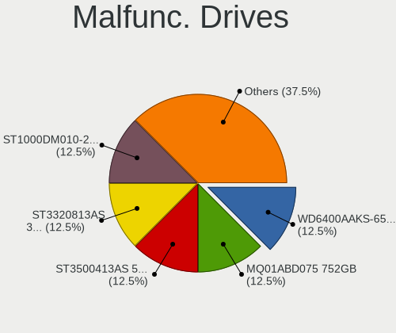

| Model                          | Desktops | Drives | Percent |
|--------------------------------|----------|--------|---------|
| WDC WD6400AAKS-65A7B0 640GB    | 1        | 1      | 12.5%   |
| Toshiba MQ01ABD075 752GB       | 1        | 1      | 12.5%   |
| Seagate ST3500413AS 500GB      | 1        | 1      | 12.5%   |
| Seagate ST3320813AS 320GB      | 1        | 1      | 12.5%   |
| Seagate ST1000DM010-2EP102 1TB | 1        | 1      | 12.5%   |
| Hitachi HTS547575A9E384 752GB  | 1        | 1      | 12.5%   |
| HGST HTS545050A7E380 500GB     | 1        | 1      | 12.5%   |
| Emtec X250 512GB SSD           | 1        | 2      | 12.5%   |

Malfunc. Drive Vendor
---------------------

Vendors of faulty drives

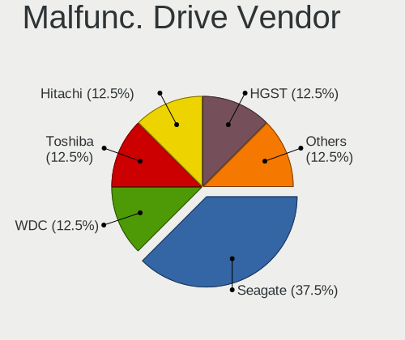

| Vendor  | Desktops | Drives | Percent |
|---------|----------|--------|---------|
| Seagate | 3        | 3      | 37.5%   |
| WDC     | 1        | 1      | 12.5%   |
| Toshiba | 1        | 1      | 12.5%   |
| Hitachi | 1        | 1      | 12.5%   |
| HGST    | 1        | 1      | 12.5%   |
| Emtec   | 1        | 2      | 12.5%   |

Malfunc. HDD Vendor
-------------------

Vendors of faulty HDD drives

| Vendor  | Desktops | Drives | Percent |
|---------|----------|--------|---------|
| Seagate | 3        | 3      | 42.86%  |
| WDC     | 1        | 1      | 14.29%  |
| Toshiba | 1        | 1      | 14.29%  |
| Hitachi | 1        | 1      | 14.29%  |
| HGST    | 1        | 1      | 14.29%  |

Malfunc. Drive Kind
-------------------

Kinds of faulty drives

| Kind | Desktops | Drives | Percent |
|------|----------|--------|---------|
| HDD  | 7        | 7      | 87.5%   |
| SSD  | 1        | 2      | 12.5%   |

Failed Drives
-------------

Failed drive models

Zero info for selected period =(

Failed Drive Vendor
-------------------

Failed drive vendors

Zero info for selected period =(

Drive Status
------------

Number of failed and malfunc. drives

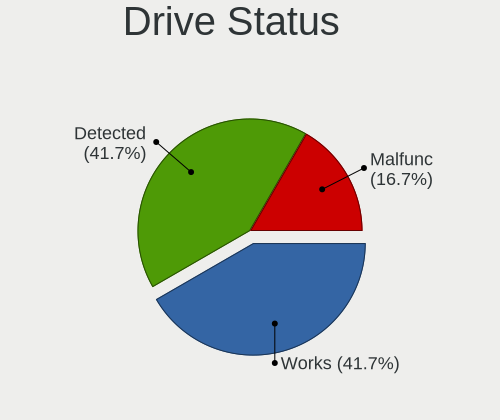

| Status   | Desktops | Drives | Percent |
|----------|----------|--------|---------|
| Detected | 20       | 35     | 41.67%  |
| Works    | 20       | 37     | 41.67%  |
| Malfunc  | 8        | 9      | 16.67%  |

Storage controller
------------------

Storage Vendor
--------------

Storage controller vendors

| Vendor                      | Desktops | Percent |
|-----------------------------|----------|---------|
| Intel                       | 34       | 70.83%  |
| AMD                         | 8        | 16.67%  |
| Samsung Electronics         | 3        | 6.25%   |
| SanDisk                     | 2        | 4.17%   |
| MAXIO Technology (Hangzhou) | 1        | 2.08%   |

Storage Model
-------------

Storage controller models

| Model                                                                                   | Desktops | Percent |
|-----------------------------------------------------------------------------------------|----------|---------|
| Intel NM10/ICH7 Family SATA Controller [IDE mode]                                       | 4        | 6.56%   |
| Intel 8 Series/C220 Series Chipset Family 6-port SATA Controller 1 [AHCI mode]          | 4        | 6.56%   |
| AMD FCH SATA Controller [AHCI mode]                                                     | 4        | 6.56%   |
| Intel Q170/Q150/B150/H170/H110/Z170/CM236 Chipset SATA Controller [AHCI Mode]           | 3        | 4.92%   |
| Intel 82801JI (ICH10 Family) 4 port SATA IDE Controller #1                              | 3        | 4.92%   |
| Intel 82801G (ICH7 Family) IDE Controller                                               | 3        | 4.92%   |
| Intel 6 Series/C200 Series Chipset Family Desktop SATA Controller (IDE mode, ports 4-5) | 3        | 4.92%   |
| Intel 6 Series/C200 Series Chipset Family Desktop SATA Controller (IDE mode, ports 0-3) | 3        | 4.92%   |
| Samsung NVMe SSD Controller 980 (DRAM-less)                                             | 2        | 3.28%   |
| Intel SATA Controller [RAID mode]                                                       | 2        | 3.28%   |
| Intel Cannon Lake PCH SATA AHCI Controller                                              | 2        | 3.28%   |
| Intel 82801IR/IO/IH (ICH9R/DO/DH) 6 port SATA Controller [AHCI mode]                    | 2        | 3.28%   |
| Intel 6 Series/C200 Series Chipset Family 6 port Desktop SATA AHCI Controller           | 2        | 3.28%   |
| Intel 500 Series Chipset Family SATA AHCI Controller                                    | 2        | 3.28%   |
| Intel 200 Series PCH SATA controller [AHCI mode]                                        | 2        | 3.28%   |
| AMD 500 Series Chipset SATA Controller                                                  | 2        | 3.28%   |
| AMD 400 Series Chipset SATA Controller                                                  | 2        | 3.28%   |
| SanDisk Ultra 3D / WD PC SN530, IX SN530, Blue SN550 NVMe SSD (DRAM-less)               | 1        | 1.64%   |
| SanDisk Extreme Pro / WD Black 2018/SN750/PC SN720 NVMe SSD                             | 1        | 1.64%   |
| Samsung NVMe SSD Controller SM981/PM981/PM983                                           | 1        | 1.64%   |
| MAXIO (Hangzhou) NVMe SSD Controller MAP1602 (DRAM-less)                                | 1        | 1.64%   |
| Intel Volume Management Device NVMe RAID Controller                                     | 1        | 1.64%   |
| Intel Comet Lake SATA AHCI Controller                                                   | 1        | 1.64%   |
| Intel Celeron/Pentium Silver Processor SATA Controller                                  | 1        | 1.64%   |
| Intel Alder Lake-S PCH SATA Controller [AHCI Mode]                                      | 1        | 1.64%   |
| Intel 8 Series/C220 Series Chipset Family 4-port SATA Controller 1 [IDE mode]           | 1        | 1.64%   |
| Intel 8 Series/C220 Series Chipset Family 2-port SATA Controller 2 [IDE mode]           | 1        | 1.64%   |
| Intel 7 Series/C210 Series Chipset Family 4-port SATA Controller [IDE mode]             | 1        | 1.64%   |
| Intel 7 Series/C210 Series Chipset Family 2-port SATA Controller [IDE mode]             | 1        | 1.64%   |
| AMD SB7x0/SB8x0/SB9x0 SATA Controller [IDE mode]                                        | 1        | 1.64%   |
| AMD SB7x0/SB8x0/SB9x0 IDE Controller                                                    | 1        | 1.64%   |
| AMD A320 Chipset SATA Controller [AHCI mode]                                            | 1        | 1.64%   |
| AMD 600 Series Chipset SATA Controller                                                  | 1        | 1.64%   |

Storage Kind
------------

Kind of storage controller (IDE, SATA, NVMe, SAS, ...)

| Kind | Desktops | Percent |
|------|----------|---------|
| SATA | 28       | 56%     |
| IDE  | 13       | 26%     |
| NVMe | 6        | 12%     |
| RAID | 3        | 6%      |

Processor
---------

CPU Vendor
----------

Processor vendors

| Vendor | Desktops | Percent |
|--------|----------|---------|
| Intel  | 35       | 81.4%   |
| AMD    | 8        | 18.6%   |

CPU Model
---------

Processor models

| Model                                           | Desktops | Percent |
|-------------------------------------------------|----------|---------|
| Intel Pentium CPU G4560 @ 3.50GHz               | 2        | 4.65%   |
| Intel Core 2 Quad CPU Q8300 @ 2.50GHz           | 2        | 4.65%   |
| Intel Core 2 Quad CPU Q8200 @ 2.33GHz           | 2        | 4.65%   |
| AMD Ryzen 5 3600XT 6-Core Processor             | 2        | 4.65%   |
| Intel Xeon E-2144G CPU @ 3.60GHz                | 1        | 2.33%   |
| Intel Pentium Dual-Core CPU E5400 @ 2.70GHz     | 1        | 2.33%   |
| Intel Pentium CPU G630 @ 2.70GHz                | 1        | 2.33%   |
| Intel Pentium CPU G3250 @ 3.20GHz               | 1        | 2.33%   |
| Intel Pentium CPU G2030 @ 3.00GHz               | 1        | 2.33%   |
| Intel Core i7-9700 CPU @ 3.00GHz                | 1        | 2.33%   |
| Intel Core i7-8700 CPU @ 3.20GHz                | 1        | 2.33%   |
| Intel Core i7-6700 CPU @ 3.40GHz                | 1        | 2.33%   |
| Intel Core i7-4790S CPU @ 3.20GHz               | 1        | 2.33%   |
| Intel Core i7-4790K CPU @ 4.00GHz               | 1        | 2.33%   |
| Intel Core i7-2600 CPU @ 3.40GHz                | 1        | 2.33%   |
| Intel Core i5-9400F CPU @ 2.90GHz               | 1        | 2.33%   |
| Intel Core i5-4590 CPU @ 3.30GHz                | 1        | 2.33%   |
| Intel Core i5-4460S CPU @ 2.90GHz               | 1        | 2.33%   |
| Intel Core i5-2400 CPU @ 3.10GHz                | 1        | 2.33%   |
| Intel Core i3-6100 CPU @ 3.70GHz                | 1        | 2.33%   |
| Intel Core i3-4160 CPU @ 3.60GHz                | 1        | 2.33%   |
| Intel Core i3-2120 CPU @ 3.30GHz                | 1        | 2.33%   |
| Intel Core i3-2100 CPU @ 3.10GHz                | 1        | 2.33%   |
| Intel Core i3-10105T CPU @ 3.00GHz              | 1        | 2.33%   |
| Intel Core i3-10100F CPU @ 3.60GHz              | 1        | 2.33%   |
| Intel Core 2 Quad CPU Q9550 @ 2.83GHz           | 1        | 2.33%   |
| Intel Core 2 Quad CPU Q8400 @ 2.66GHz           | 1        | 2.33%   |
| Intel Core 2 Quad CPU Q6600 @ 2.40GHz           | 1        | 2.33%   |
| Intel Core 2 Extreme CPU X9650 @ 3.00GHz        | 1        | 2.33%   |
| Intel Celeron J4125 CPU @ 2.00GHz               | 1        | 2.33%   |
| Intel Atom CPU N455 @ 1.66GHz                   | 1        | 2.33%   |
| Intel 12th Gen Core i7-12700K                   | 1        | 2.33%   |
| Intel 11th Gen Core i7-11700 @ 2.50GHz          | 1        | 2.33%   |
| AMD Ryzen 7 7800X3D 8-Core Processor            | 1        | 2.33%   |
| AMD Ryzen 5 PRO 3400G with Radeon Vega Graphics | 1        | 2.33%   |
| AMD Ryzen 5 5600X 6-Core Processor              | 1        | 2.33%   |
| AMD Ryzen 5 3600 6-Core Processor               | 1        | 2.33%   |
| AMD Ryzen 5 2600 Six-Core Processor             | 1        | 2.33%   |
| AMD FX-8350 Eight-Core Processor                | 1        | 2.33%   |

CPU Model Family
----------------

Processor model prefix

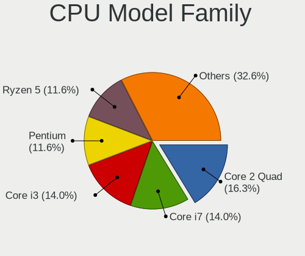

| Model                   | Desktops | Percent |
|-------------------------|----------|---------|
| Intel Core 2 Quad       | 7        | 16.28%  |
| Intel Core i7           | 6        | 13.95%  |
| Intel Core i3           | 6        | 13.95%  |
| Intel Pentium           | 5        | 11.63%  |
| AMD Ryzen 5             | 5        | 11.63%  |
| Intel Core i5           | 4        | 9.3%    |
| Other                   | 2        | 4.65%   |
| Intel Xeon              | 1        | 2.33%   |
| Intel Pentium Dual-Core | 1        | 2.33%   |
| Intel Core 2 Extreme    | 1        | 2.33%   |
| Intel Celeron           | 1        | 2.33%   |
| Intel Atom              | 1        | 2.33%   |
| AMD Ryzen 7             | 1        | 2.33%   |
| AMD Ryzen 5 PRO         | 1        | 2.33%   |
| AMD FX                  | 1        | 2.33%   |

CPU Cores
---------

Number of processor cores

| Number  | Desktops | Percent |
|---------|----------|---------|
| 4       | 20       | 46.51%  |
| 2       | 10       | 23.26%  |
| 6       | 7        | 16.28%  |
| 8       | 3        | 6.98%   |
| 12      | 1        | 2.33%   |
| 1       | 1        | 2.33%   |
| Unknown | 1        | 2.33%   |

CPU Sockets
-----------

Number of sockets

| Number | Desktops | Percent |
|--------|----------|---------|
| 1      | 43       | 100%    |

CPU Threads
-----------

Threads per core (Hyper-Threading)

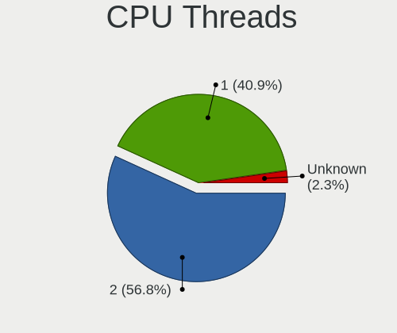

| Number  | Desktops | Percent |
|---------|----------|---------|
| 2       | 25       | 56.82%  |
| 1       | 18       | 40.91%  |
| Unknown | 1        | 2.27%   |

CPU Op-Modes
------------

CPU Operation Modes (32-bit, 64-bit)

| Op mode        | Desktops | Percent |
|----------------|----------|---------|
| 32-bit, 64-bit | 43       | 100%    |

CPU Microcode
-------------

Microcode number

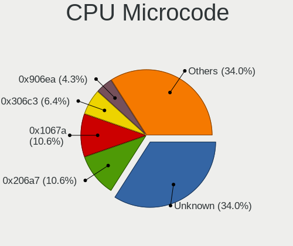

| Number     | Desktops | Percent |
|------------|----------|---------|
| Unknown    | 16       | 34.04%  |
| 0x206a7    | 5        | 10.64%  |
| 0x1067a    | 5        | 10.64%  |
| 0x306c3    | 3        | 6.38%   |
| 0x906ea    | 2        | 4.26%   |
| 0x506e3    | 2        | 4.26%   |
| 0xa0671    | 1        | 2.13%   |
| 0xa0653    | 1        | 2.13%   |
| 0x906e9    | 1        | 2.13%   |
| 0x90672    | 1        | 2.13%   |
| 0x706a8    | 1        | 2.13%   |
| 0x6fb      | 1        | 2.13%   |
| 0x306a9    | 1        | 2.13%   |
| 0x106ca    | 1        | 2.13%   |
| 0x10677    | 1        | 2.13%   |
| 0x08701013 | 1        | 2.13%   |
| 0x08108109 | 1        | 2.13%   |
| 0x0800820d | 1        | 2.13%   |
| 0x06000852 | 1        | 2.13%   |
| 0x00000000 | 1        | 2.13%   |

CPU Microarch
-------------

Microarchitecture

| Name             | Desktops | Percent |
|------------------|----------|---------|
| Penryn           | 8        | 18.6%   |
| KabyLake         | 6        | 13.95%  |
| Haswell          | 6        | 13.95%  |
| SandyBridge      | 5        | 11.63%  |
| Zen 2            | 3        | 6.98%   |
| Zen+             | 2        | 4.65%   |
| Skylake          | 2        | 4.65%   |
| CometLake        | 2        | 4.65%   |
| Zen 3            | 1        | 2.33%   |
| Piledriver       | 1        | 2.33%   |
| IvyBridge        | 1        | 2.33%   |
| Icelake          | 1        | 2.33%   |
| Goldmont plus    | 1        | 2.33%   |
| Core             | 1        | 2.33%   |
| Bonnell          | 1        | 2.33%   |
| Alderlake Hybrid | 1        | 2.33%   |
| Unknown          | 1        | 2.33%   |

Graphics
--------

GPU Vendor
----------

Vendors of graphics cards

| Vendor | Desktops | Percent |
|--------|----------|---------|
| Nvidia | 22       | 48.89%  |
| Intel  | 19       | 42.22%  |
| AMD    | 4        | 8.89%   |

GPU Model
---------

Graphics card models

| Model                                                                       | Desktops | Percent |
|-----------------------------------------------------------------------------|----------|---------|
| Nvidia GT218 [GeForce 210]                                                  | 4        | 8.89%   |
| Intel 4 Series Chipset Integrated Graphics Controller                       | 4        | 8.89%   |
| Nvidia TU116 [GeForce GTX 1660 SUPER]                                       | 2        | 4.44%   |
| Nvidia GP108 [GeForce GT 1030]                                              | 2        | 4.44%   |
| Nvidia GP106 [GeForce GTX 1060 6GB]                                         | 2        | 4.44%   |
| Nvidia GF119 [GeForce GT 520]                                               | 2        | 4.44%   |
| Intel Xeon E3-1200 v3/4th Gen Core Processor Integrated Graphics Controller | 2        | 4.44%   |
| Intel CoffeeLake-S GT2 [UHD Graphics 630]                                   | 2        | 4.44%   |
| Intel 2nd Generation Core Processor Family Integrated Graphics Controller   | 2        | 4.44%   |
| Nvidia TU116 [GeForce GTX 1650 SUPER]                                       | 1        | 2.22%   |
| Nvidia TU106 [GeForce RTX 2060 Rev. A]                                      | 1        | 2.22%   |
| Nvidia GP107 [GeForce GTX 1050]                                             | 1        | 2.22%   |
| Nvidia GM206 [GeForce GTX 960]                                              | 1        | 2.22%   |
| Nvidia GM107 [GeForce GTX 750]                                              | 1        | 2.22%   |
| Nvidia GM107 [GeForce GTX 745]                                              | 1        | 2.22%   |
| Nvidia GK208B [GeForce GT 730]                                              | 1        | 2.22%   |
| Nvidia GK208B [GeForce GT 710]                                              | 1        | 2.22%   |
| Nvidia GA102 [GeForce RTX 3080]                                             | 1        | 2.22%   |
| Nvidia G96 [GeForce 9500 GS]                                                | 1        | 2.22%   |
| Intel RocketLake-S GT1 [UHD Graphics 750]                                   | 1        | 2.22%   |
| Intel HD Graphics 610                                                       | 1        | 2.22%   |
| Intel HD Graphics 530                                                       | 1        | 2.22%   |
| Intel GeminiLake [UHD Graphics 600]                                         | 1        | 2.22%   |
| Intel CometLake-S GT2 [UHD Graphics 630]                                    | 1        | 2.22%   |
| Intel CoffeeLake-S GT2 [UHD Graphics P630]                                  | 1        | 2.22%   |
| Intel Atom Processor D4xx/D5xx/N4xx/N5xx Integrated Graphics Controller     | 1        | 2.22%   |
| Intel 82G33/G31 Express Integrated Graphics Controller                      | 1        | 2.22%   |
| Intel 4th Generation Core Processor Family Integrated Graphics Controller   | 1        | 2.22%   |
| AMD Polaris 20 XL [Radeon RX 580 2048SP]                                    | 1        | 2.22%   |
| AMD Picasso/Raven 2 [Radeon Vega Series / Radeon Vega Mobile Series]        | 1        | 2.22%   |
| AMD Ellesmere [Radeon RX 470/480/570/570X/580/580X/590]                     | 1        | 2.22%   |
| AMD Caicos XT [Radeon HD 7470/8470 / R5 235/310 OEM]                        | 1        | 2.22%   |

GPU Combo
---------

Combinations of graphics cards

| Name       | Desktops | Percent |
|------------|----------|---------|
| 1 x Nvidia | 22       | 51.16%  |
| 1 x Intel  | 17       | 39.53%  |
| 1 x AMD    | 4        | 9.3%    |

GPU Driver
----------

Free vs proprietary

| Driver      | Desktops | Percent |
|-------------|----------|---------|
| Free        | 35       | 77.78%  |
| Proprietary | 8        | 17.78%  |
| Unknown     | 2        | 4.44%   |

GPU Memory
----------

Total video memory

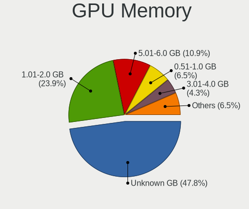

| Size in GB | Desktops | Percent |
|------------|----------|---------|
| Unknown    | 22       | 47.83%  |
| 1.01-2.0   | 11       | 23.91%  |
| 5.01-6.0   | 5        | 10.87%  |
| 0.51-1.0   | 3        | 6.52%   |
| 3.01-4.0   | 2        | 4.35%   |
| 7.01-8.0   | 1        | 2.17%   |
| 8.01-16.0  | 1        | 2.17%   |
| 0.01-0.5   | 1        | 2.17%   |

Monitor
-------

Monitor Vendor
--------------

Monitor vendors

| Vendor              | Desktops | Percent |
|---------------------|----------|---------|
| Samsung Electronics | 14       | 32.56%  |
| Hewlett-Packard     | 10       | 23.26%  |
| Philips             | 2        | 4.65%   |
| MSI                 | 2        | 4.65%   |
| Lenovo              | 2        | 4.65%   |
| Dell                | 2        | 4.65%   |
| ViewSonic           | 1        | 2.33%   |
| S2-Tek              | 1        | 2.33%   |
| PKB                 | 1        | 2.33%   |
| Packard Bell        | 1        | 2.33%   |
| Medion              | 1        | 2.33%   |
| HPN                 | 1        | 2.33%   |
| HKC                 | 1        | 2.33%   |
| Goldstar            | 1        | 2.33%   |
| GDH                 | 1        | 2.33%   |
| BenQ                | 1        | 2.33%   |
| AU Optronics        | 1        | 2.33%   |

Monitor Model
-------------

Monitor models

| Model                                                                | Desktops | Percent |
|----------------------------------------------------------------------|----------|---------|
| Samsung Electronics S24F350 SAM0D20 1920x1080 521x293mm 23.5-inch    | 6        | 13.33%  |
| Samsung Electronics C24F390 SAM0D2C 1920x1080 521x293mm 23.5-inch    | 2        | 4.44%   |
| Hewlett-Packard x20LED HWP2910 1600x900 443x249mm 20.0-inch          | 2        | 4.44%   |
| Hewlett-Packard P224 HPN361E 1920x1080 527x296mm 23.8-inch           | 2        | 4.44%   |
| ViewSonic VX3418-2KPC VSC613B 3440x1440 797x334mm 34.0-inch          | 1        | 2.22%   |
| Samsung Electronics SyncMaster SAM04D4 1920x1080 531x298mm 24.0-inch | 1        | 2.22%   |
| Samsung Electronics SyncMaster SAM0284 1280x1024 338x270mm 17.0-inch | 1        | 2.22%   |
| Samsung Electronics SMB2240 SAM06AD 1920x1080 477x268mm 21.5-inch    | 1        | 2.22%   |
| Samsung Electronics SA300/SA350 SAM078B 1600x900 443x249mm 20.0-inch | 1        | 2.22%   |
| Samsung Electronics S20D300 SAM0BDB 1366x768 432x240mm 19.5-inch     | 1        | 2.22%   |
| Samsung Electronics S19D300 SAM0B34 1366x768 410x230mm 18.5-inch     | 1        | 2.22%   |
| Samsung Electronics C24F390 SAM0D2D 1920x1080 521x293mm 23.5-inch    | 1        | 2.22%   |
| S2-Tek TV STK531A 1920x1080 930x530mm 42.1-inch                      | 1        | 2.22%   |
| PKB LCD Monitor VIS220WS 1680x1050                                   | 1        | 2.22%   |
| Philips PHL 223V5 PHLC0CF 1920x1080 480x270mm 21.7-inch              | 1        | 2.22%   |
| Philips 17S PHL0877 1280x1024 337x270mm 17.0-inch                    | 1        | 2.22%   |
| Packard Bell PKB VIS220WS PKB5064 1680x1050 460x290mm 21.4-inch      | 1        | 2.22%   |
| MSI MP271 MSI30A2 1920x1080 598x336mm 27.0-inch                      | 1        | 2.22%   |
| MSI MP242 MSI30A1 1920x1080 527x296mm 23.8-inch                      | 1        | 2.22%   |
| Medion MD30422PV MED86F6 1680x1050 474x296mm 22.0-inch               | 1        | 2.22%   |
| Lenovo T24v-10 LEN61BC 1920x1080 527x296mm 23.8-inch                 | 1        | 2.22%   |
| Lenovo C27-30 LEN62AA 1920x1080 597x336mm 27.0-inch                  | 1        | 2.22%   |
| HPN LCD Monitor HP Z23n G2                                           | 1        | 2.22%   |
| HKC BM21V17 HKC0217 1920x1080 477x268mm 21.5-inch                    | 1        | 2.22%   |
| Hewlett-Packard LE2001w HWP2841 1600x900 440x250mm 19.9-inch         | 1        | 2.22%   |
| Hewlett-Packard LCD Monitor 2011 1600x900                            | 1        | 2.22%   |
| Hewlett-Packard L1940T HWP2682 1280x1024 376x301mm 19.0-inch         | 1        | 2.22%   |
| Hewlett-Packard E24i G4 HPN368F 1920x1200 518x324mm 24.1-inch        | 1        | 2.22%   |
| Hewlett-Packard E241i HWP3123 1920x1200 520x320mm 24.0-inch          | 1        | 2.22%   |
| Hewlett-Packard 2011 HWP2935 1600x900 440x250mm 19.9-inch            | 1        | 2.22%   |
| Hewlett-Packard 2011 HWP2934 1600x900 443x249mm 20.0-inch            | 1        | 2.22%   |
| Goldstar W1943 GSM4BAD 1360x768 406x229mm 18.4-inch                  | 1        | 2.22%   |
| GDH TV PHILCO GDH0030 1920x540                                       | 1        | 2.22%   |
| Dell S2721HGF DEL41E8 1920x1080 597x336mm 27.0-inch                  | 1        | 2.22%   |
| Dell E193FP DEL700E 1280x1024 376x301mm 19.0-inch                    | 1        | 2.22%   |
| BenQ T201W BNQ7719 1680x1050 433x271mm 20.1-inch                     | 1        | 2.22%   |
| AU Optronics LCD Monitor AUO61D2 1024x600 222x125mm 10.0-inch        | 1        | 2.22%   |

Monitor Resolution
------------------

Monitor screen resolution

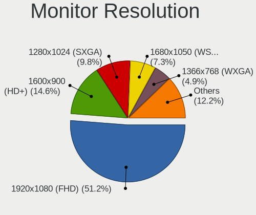

| Resolution         | Desktops | Percent |
|--------------------|----------|---------|
| 1920x1080 (FHD)    | 21       | 51.22%  |
| 1600x900 (HD+)     | 6        | 14.63%  |
| 1280x1024 (SXGA)   | 4        | 9.76%   |
| 1680x1050 (WSXGA+) | 3        | 7.32%   |
| 1366x768 (WXGA)    | 2        | 4.88%   |
| 3840x2160 (4K)     | 1        | 2.44%   |
| 3440x1440          | 1        | 2.44%   |
| 1360x768           | 1        | 2.44%   |
| 1024x600           | 1        | 2.44%   |
| Unknown            | 1        | 2.44%   |

Monitor Diagonal
----------------

Diagonal size in inches

| Inches  | Desktops | Percent |
|---------|----------|---------|
| 23      | 11       | 25.58%  |
| 20      | 5        | 11.63%  |
| 24      | 4        | 9.3%    |
| 21      | 4        | 9.3%    |
| 27      | 3        | 6.98%   |
| 19      | 3        | 6.98%   |
| Unknown | 3        | 6.98%   |
| 22      | 2        | 4.65%   |
| 18      | 2        | 4.65%   |
| 17      | 2        | 4.65%   |
| 52      | 1        | 2.33%   |
| 42      | 1        | 2.33%   |
| 34      | 1        | 2.33%   |
| 10      | 1        | 2.33%   |

Monitor Width
-------------

Physical width

| Width in mm | Desktops | Percent |
|-------------|----------|---------|
| 501-600     | 17       | 41.46%  |
| 401-500     | 13       | 31.71%  |
| Unknown     | 3        | 7.32%   |
| 351-400     | 2        | 4.88%   |
| 301-350     | 2        | 4.88%   |
| 701-800     | 1        | 2.44%   |
| 201-300     | 1        | 2.44%   |
| 1001-1500   | 1        | 2.44%   |
| 901-1000    | 1        | 2.44%   |

Aspect Ratio
------------

Proportional relationship between the width and the height

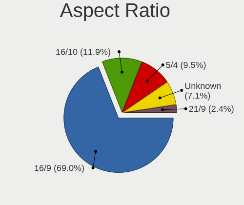

| Ratio   | Desktops | Percent |
|---------|----------|---------|
| 16/9    | 29       | 69.05%  |
| 16/10   | 5        | 11.9%   |
| 5/4     | 4        | 9.52%   |
| Unknown | 3        | 7.14%   |
| 21/9    | 1        | 2.38%   |

Monitor Area
------------

Area in inch²

| Area in inch² | Desktops | Percent |
|----------------|----------|---------|
| 201-250        | 17       | 39.53%  |
| 151-200        | 10       | 23.26%  |
| 141-150        | 4        | 9.3%    |
| 301-350        | 3        | 6.98%   |
| Unknown        | 3        | 6.98%   |
| 251-300        | 2        | 4.65%   |
| More than 1000 | 1        | 2.33%   |
| 351-500        | 1        | 2.33%   |
| 41-50          | 1        | 2.33%   |
| 501-1000       | 1        | 2.33%   |

Pixel Density
-------------

Pixels per inch

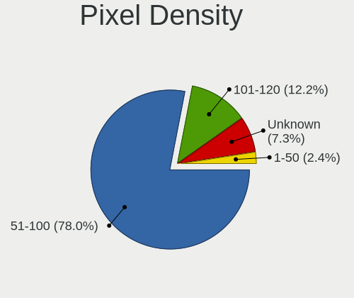

| Density | Desktops | Percent |
|---------|----------|---------|
| 51-100  | 32       | 78.05%  |
| 101-120 | 5        | 12.2%   |
| Unknown | 3        | 7.32%   |
| 1-50    | 1        | 2.44%   |

Multiple Monitors
-----------------

Total monitors connected

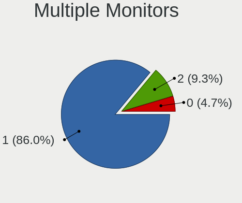

| Total | Desktops | Percent |
|-------|----------|---------|
| 1     | 37       | 86.05%  |
| 2     | 4        | 9.3%    |
| 0     | 2        | 4.65%   |

Network
-------

Net Controller Vendor
---------------------

Controller vendors

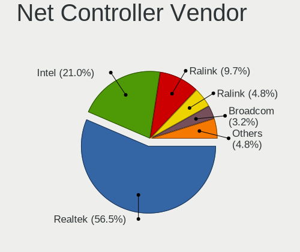

| Vendor                | Desktops | Percent |
|-----------------------|----------|---------|
| Realtek Semiconductor | 35       | 56.45%  |
| Intel                 | 13       | 20.97%  |
| Ralink Technology     | 6        | 9.68%   |
| Ralink                | 3        | 4.84%   |
| Broadcom              | 2        | 3.23%   |
| Samsung Electronics   | 1        | 1.61%   |
| Qualcomm Atheros      | 1        | 1.61%   |
| IMC Networks          | 1        | 1.61%   |

Net Controller Model
--------------------

Controller models

| Model                                                                  | Desktops | Percent |
|------------------------------------------------------------------------|----------|---------|
| Realtek RTL8111/8168/8211/8411 PCI Express Gigabit Ethernet Controller | 27       | 38.57%  |
| Realtek RTL810xE PCI Express Fast Ethernet controller                  | 6        | 8.57%   |
| Ralink MT7601U Wireless Adapter                                        | 4        | 5.71%   |
| Realtek RTL8188FTV 802.11b/g/n 1T1R 2.4G WLAN Adapter                  | 3        | 4.29%   |
| Ralink RT5370 Wireless Adapter                                         | 2        | 2.86%   |
| Ralink RT2790 Wireless 802.11n 1T/2R PCIe                              | 2        | 2.86%   |
| Samsung Galaxy series, misc. (tethering mode)                          | 1        | 1.43%   |
| Realtek RTL8821CE 802.11ac PCIe Wireless Network Adapter               | 1        | 1.43%   |
| Realtek RTL8821AE 802.11ac PCIe Wireless Network Adapter               | 1        | 1.43%   |
| Realtek RTL8188EUS 802.11n Wireless Network Adapter                    | 1        | 1.43%   |
| Realtek RTL8125 2.5GbE Controller                                      | 1        | 1.43%   |
| Realtek RTL-8100/8101L/8139 PCI Fast Ethernet Adapter                  | 1        | 1.43%   |
| Ralink RT3290 Wireless 802.11n 1T/1R PCIe                              | 1        | 1.43%   |
| Qualcomm Atheros AR9485 Wireless Network Adapter                       | 1        | 1.43%   |
| Intel Wireless 7265                                                    | 1        | 1.43%   |
| Intel Wireless 3165                                                    | 1        | 1.43%   |
| Intel Wi-Fi 6E(802.11ax) AX210/AX1675* 2x2 [Typhoon Peak]              | 1        | 1.43%   |
| Intel Wi-Fi 5(802.11ac) Wireless-AC 9x6x [Thunder Peak]                | 1        | 1.43%   |
| Intel Tiger Lake PCH CNVi WiFi                                         | 1        | 1.43%   |
| Intel I211 Gigabit Network Connection                                  | 1        | 1.43%   |
| Intel Ethernet Controller I225-V                                       | 1        | 1.43%   |
| Intel Ethernet Connection (7) I219-V                                   | 1        | 1.43%   |
| Intel Ethernet Connection (7) I219-LM                                  | 1        | 1.43%   |
| Intel Ethernet Connection (14) I219-V                                  | 1        | 1.43%   |
| Intel Ethernet Connection (11) I219-LM                                 | 1        | 1.43%   |
| Intel Comet Lake PCH CNVi WiFi                                         | 1        | 1.43%   |
| Intel Alder Lake-S PCH CNVi WiFi                                       | 1        | 1.43%   |
| Intel 82579LM Gigabit Network Connection (Lewisville)                  | 1        | 1.43%   |
| Intel 82562V-2 10/100 Network Connection                               | 1        | 1.43%   |
| IMC Networks AW-NU222 802.11bgn Wireless Module [Ralink RT2770+RT2720] | 1        | 1.43%   |
| Broadcom NetXtreme BCM5754 Gigabit Ethernet PCI Express                | 1        | 1.43%   |
| Broadcom NetLink BCM57780 Gigabit Ethernet PCIe                        | 1        | 1.43%   |

Wireless Vendor
---------------

Wireless vendors

| Vendor                | Desktops | Percent |
|-----------------------|----------|---------|
| Intel                 | 7        | 29.17%  |
| Realtek Semiconductor | 6        | 25%     |
| Ralink Technology     | 6        | 25%     |
| Ralink                | 3        | 12.5%   |
| Qualcomm Atheros      | 1        | 4.17%   |
| IMC Networks          | 1        | 4.17%   |

Wireless Model
--------------

Wireless models

| Model                                                                  | Desktops | Percent |
|------------------------------------------------------------------------|----------|---------|
| Ralink MT7601U Wireless Adapter                                        | 4        | 16.67%  |
| Realtek RTL8188FTV 802.11b/g/n 1T1R 2.4G WLAN Adapter                  | 3        | 12.5%   |
| Ralink RT5370 Wireless Adapter                                         | 2        | 8.33%   |
| Ralink RT2790 Wireless 802.11n 1T/2R PCIe                              | 2        | 8.33%   |
| Realtek RTL8821CE 802.11ac PCIe Wireless Network Adapter               | 1        | 4.17%   |
| Realtek RTL8821AE 802.11ac PCIe Wireless Network Adapter               | 1        | 4.17%   |
| Realtek RTL8188EUS 802.11n Wireless Network Adapter                    | 1        | 4.17%   |
| Ralink RT3290 Wireless 802.11n 1T/1R PCIe                              | 1        | 4.17%   |
| Qualcomm Atheros AR9485 Wireless Network Adapter                       | 1        | 4.17%   |
| Intel Wireless 7265                                                    | 1        | 4.17%   |
| Intel Wireless 3165                                                    | 1        | 4.17%   |
| Intel Wi-Fi 6E(802.11ax) AX210/AX1675* 2x2 [Typhoon Peak]              | 1        | 4.17%   |
| Intel Wi-Fi 5(802.11ac) Wireless-AC 9x6x [Thunder Peak]                | 1        | 4.17%   |
| Intel Tiger Lake PCH CNVi WiFi                                         | 1        | 4.17%   |
| Intel Comet Lake PCH CNVi WiFi                                         | 1        | 4.17%   |
| Intel Alder Lake-S PCH CNVi WiFi                                       | 1        | 4.17%   |
| IMC Networks AW-NU222 802.11bgn Wireless Module [Ralink RT2770+RT2720] | 1        | 4.17%   |

Ethernet Vendor
---------------

Ethernet vendors

| Vendor                | Desktops | Percent |
|-----------------------|----------|---------|
| Realtek Semiconductor | 34       | 75.56%  |
| Intel                 | 8        | 17.78%  |
| Broadcom              | 2        | 4.44%   |
| Samsung Electronics   | 1        | 2.22%   |

Ethernet Model
--------------

Ethernet models

| Model                                                                  | Desktops | Percent |
|------------------------------------------------------------------------|----------|---------|
| Realtek RTL8111/8168/8211/8411 PCI Express Gigabit Ethernet Controller | 27       | 58.7%   |
| Realtek RTL810xE PCI Express Fast Ethernet controller                  | 6        | 13.04%  |
| Samsung Galaxy series, misc. (tethering mode)                          | 1        | 2.17%   |
| Realtek RTL8125 2.5GbE Controller                                      | 1        | 2.17%   |
| Realtek RTL-8100/8101L/8139 PCI Fast Ethernet Adapter                  | 1        | 2.17%   |
| Intel I211 Gigabit Network Connection                                  | 1        | 2.17%   |
| Intel Ethernet Controller I225-V                                       | 1        | 2.17%   |
| Intel Ethernet Connection (7) I219-V                                   | 1        | 2.17%   |
| Intel Ethernet Connection (7) I219-LM                                  | 1        | 2.17%   |
| Intel Ethernet Connection (14) I219-V                                  | 1        | 2.17%   |
| Intel Ethernet Connection (11) I219-LM                                 | 1        | 2.17%   |
| Intel 82579LM Gigabit Network Connection (Lewisville)                  | 1        | 2.17%   |
| Intel 82562V-2 10/100 Network Connection                               | 1        | 2.17%   |
| Broadcom NetXtreme BCM5754 Gigabit Ethernet PCI Express                | 1        | 2.17%   |
| Broadcom NetLink BCM57780 Gigabit Ethernet PCIe                        | 1        | 2.17%   |

Net Controller Kind
-------------------

Ethernet, WiFi or modem

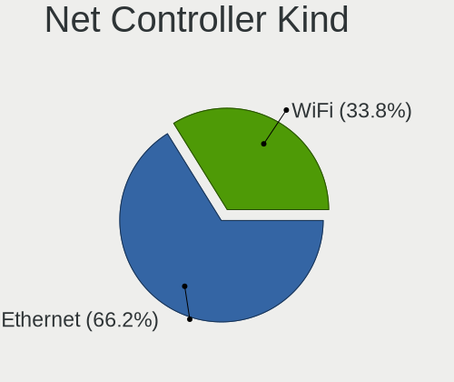

| Kind     | Desktops | Percent |
|----------|----------|---------|
| Ethernet | 43       | 66.15%  |
| WiFi     | 22       | 33.85%  |

Used Controller
---------------

Currently used network controller

| Kind     | Desktops | Percent |
|----------|----------|---------|
| Ethernet | 32       | 69.57%  |
| WiFi     | 14       | 30.43%  |

NICs
----

Total network controllers on board

| Total | Desktops | Percent |
|-------|----------|---------|
| 1     | 28       | 65.12%  |
| 2     | 15       | 34.88%  |

IPv6
----

IPv6 vs IPv4

| Used | Desktops | Percent |
|------|----------|---------|
| No   | 43       | 100%    |

Bluetooth
---------

Bluetooth Vendor
----------------

Controller vendors

| Vendor                  | Desktops | Percent |
|-------------------------|----------|---------|
| Intel                   | 7        | 58.33%  |
| Cambridge Silicon Radio | 3        | 25%     |
| Ralink                  | 1        | 8.33%   |
| IMC Networks            | 1        | 8.33%   |

Bluetooth Model
---------------

Controller models

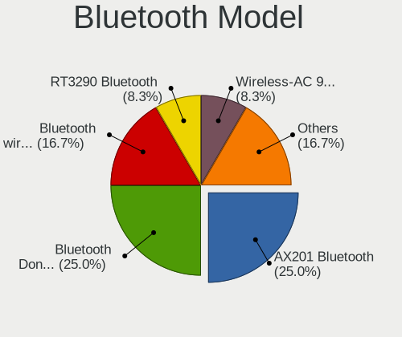

| Model                                               | Desktops | Percent |
|-----------------------------------------------------|----------|---------|
| Intel AX201 Bluetooth                               | 3        | 25%     |
| Cambridge Silicon Radio Bluetooth Dongle (HCI mode) | 3        | 25%     |
| Intel Bluetooth wireless interface                  | 2        | 16.67%  |
| Ralink RT3290 Bluetooth                             | 1        | 8.33%   |
| Intel Wireless-AC 9260 Bluetooth Adapter            | 1        | 8.33%   |
| Intel AX210 Bluetooth                               | 1        | 8.33%   |
| IMC Networks Bluetooth Radio                        | 1        | 8.33%   |

Sound
-----

Sound Vendor
------------

Sound card vendors

| Vendor                  | Desktops | Percent |
|-------------------------|----------|---------|
| Intel                   | 36       | 50.7%   |
| Nvidia                  | 21       | 29.58%  |
| AMD                     | 9        | 12.68%  |
| Xiamen VBeT Electronics | 1        | 1.41%   |
| Lenovo                  | 1        | 1.41%   |
| DSEA A/S                | 1        | 1.41%   |
| C-Media Electronics     | 1        | 1.41%   |
| ASUSTek Computer        | 1        | 1.41%   |

Sound Model
-----------

Sound card models

| Model                                                                             | Desktops | Percent |
|-----------------------------------------------------------------------------------|----------|---------|
| Intel 8 Series/C220 Series Chipset High Definition Audio Controller               | 6        | 8%      |
| Intel 6 Series/C200 Series Chipset Family High Definition Audio Controller        | 5        | 6.67%   |
| Nvidia High Definition Audio Controller                                           | 4        | 5.33%   |
| Intel NM10/ICH7 Family High Definition Audio Controller                           | 4        | 5.33%   |
| AMD Starship/Matisse HD Audio Controller                                          | 4        | 5.33%   |
| Nvidia TU116 High Definition Audio Controller                                     | 3        | 4%      |
| Intel Cannon Lake PCH cAVS                                                        | 3        | 4%      |
| Intel 82801JI (ICH10 Family) HD Audio Controller                                  | 3        | 4%      |
| Intel 82801I (ICH9 Family) HD Audio Controller                                    | 3        | 4%      |
| Intel 100 Series/C230 Series Chipset Family HD Audio Controller                   | 3        | 4%      |
| Nvidia GP108 High Definition Audio Controller                                     | 2        | 2.67%   |
| Nvidia GP106 High Definition Audio Controller                                     | 2        | 2.67%   |
| Nvidia GM107 High Definition Audio Controller [GeForce 940MX]                     | 2        | 2.67%   |
| Nvidia GK208 HDMI/DP Audio Controller                                             | 2        | 2.67%   |
| Nvidia GF119 HDMI Audio Controller                                                | 2        | 2.67%   |
| Intel Xeon E3-1200 v3/4th Gen Core Processor HD Audio Controller                  | 2        | 2.67%   |
| Intel 200 Series PCH HD Audio                                                     | 2        | 2.67%   |
| AMD Ellesmere HDMI Audio [Radeon RX 470/480 / 570/580/590]                        | 2        | 2.67%   |
| Xiamen VBeT Electronics VT X208                                                   | 1        | 1.33%   |
| Nvidia TU106 High Definition Audio Controller                                     | 1        | 1.33%   |
| Nvidia GP107GL High Definition Audio Controller                                   | 1        | 1.33%   |
| Nvidia GM206 High Definition Audio Controller                                     | 1        | 1.33%   |
| Nvidia GA102 High Definition Audio Controller                                     | 1        | 1.33%   |
| Lenovo ThinkVision T24v Wide Monitor for USB-Audio                                | 1        | 1.33%   |
| Intel USB PnP Sound Device                                                        | 1        | 1.33%   |
| Intel Tiger Lake-H HD Audio Controller                                            | 1        | 1.33%   |
| Intel Smart Sound Technology (SST) Audio Controller                               | 1        | 1.33%   |
| Intel Comet Lake PCH cAVS                                                         | 1        | 1.33%   |
| Intel Celeron/Pentium Silver Processor High Definition Audio                      | 1        | 1.33%   |
| Intel Alder Lake-S HD Audio Controller                                            | 1        | 1.33%   |
| Intel 7 Series/C216 Chipset Family High Definition Audio Controller               | 1        | 1.33%   |
| DSEA A/S EPOS IMPACT 60                                                           | 1        | 1.33%   |
| C-Media Electronics CM108 Audio Controller                                        | 1        | 1.33%   |
| ASUSTek Computer USB Audio                                                        | 1        | 1.33%   |
| AMD SBx00 Azalia (Intel HDA)                                                      | 1        | 1.33%   |
| AMD Raven/Raven2/Fenghuang HDMI/DP Audio Controller                               | 1        | 1.33%   |
| AMD Family 17h/19h/1ah HD Audio Controller                                        | 1        | 1.33%   |
| AMD Family 17h (Models 00h-0fh) HD Audio Controller                               | 1        | 1.33%   |
| AMD Caicos HDMI Audio [Radeon HD 6450 / 7450/8450/8490 OEM / R5 230/235/235X OEM] | 1        | 1.33%   |

Memory
------

Memory Vendor
-------------

Memory module vendors

| Vendor              | Desktops | Percent |
|---------------------|----------|---------|
| SK hynix            | 6        | 19.35%  |
| Unknown             | 5        | 16.13%  |
| Samsung Electronics | 4        | 12.9%   |
| Micron Technology   | 3        | 9.68%   |
| TwinMOS             | 2        | 6.45%   |
| Team                | 2        | 6.45%   |
| Unknown (ABCD)      | 1        | 3.23%   |
| Transcend           | 1        | 3.23%   |
| PNY                 | 1        | 3.23%   |
| Patriot             | 1        | 3.23%   |
| Melco               | 1        | 3.23%   |
| GOODRAM             | 1        | 3.23%   |
| Elpida              | 1        | 3.23%   |
| Crucial             | 1        | 3.23%   |
| 0BBA00000000        | 1        | 3.23%   |

Memory Model
------------

Memory module models

| Model                                                        | Desktops | Percent |
|--------------------------------------------------------------|----------|---------|
| Unknown RAM Module 4GB DIMM DDR3 1333MT/s                    | 1        | 3.23%   |
| Unknown RAM Module 4GB DIMM DDR3 1066MT/s                    | 1        | 3.23%   |
| Unknown RAM Module 4GB DIMM DDR3                             | 1        | 3.23%   |
| Unknown RAM Module 1024MB DIMM 667MT/s                       | 1        | 3.23%   |
| Unknown RAM 3000 C15 Series 8192MB DIMM DDR4 3000MT/s        | 1        | 3.23%   |
| Unknown (ABCD) RAM 123456789012345678 2GB DIMM DDR3 2400MT/s | 1        | 3.23%   |
| TwinMOS RAM 9DSDBNZB-5AMP 4GB DIMM DDR3 1333MT/s             | 1        | 3.23%   |
| TwinMOS RAM 9D7TBNZB-TATP 4096MB DIMM DDR3 1066MT/s          | 1        | 3.23%   |
| Transcend RAM JM1333KLN-4G 4GB DIMM DDR3 1600MT/s            | 1        | 3.23%   |
| Team RAM TEAMGROUP-UD4-3200 8GB DIMM DDR4 3800MT/s           | 1        | 3.23%   |
| Team RAM TEAMGROUP-UD4-2400 8GB DIMM DDR4 2400MT/s           | 1        | 3.23%   |
| SK hynix RAM Module 4096MB DIMM DDR3 1333MT/s                | 1        | 3.23%   |
| SK hynix RAM HYMP125U64CP8-S6 2GB DIMM DDR2 49926MT/s        | 1        | 3.23%   |
| SK hynix RAM HMA851U6CJR6N-VK 4GB DIMM DDR4 2667MT/s         | 1        | 3.23%   |
| SK hynix RAM HMA82GU7CJR8N-VK 16GB DIMM DDR4 2667MT/s        | 1        | 3.23%   |
| SK hynix RAM HMA81GU6CJR8N-VK 8GB DIMM DDR4 2667MT/s         | 1        | 3.23%   |
| SK hynix RAM HMA41GU6AFR8N-TF 8GB DIMM DDR4 2465MT/s         | 1        | 3.23%   |
| Samsung RAM Module 4096MB DIMM DDR3 1333MT/s                 | 1        | 3.23%   |
| Samsung RAM M471A1G44AB0-CWE 8GB SODIMM DDR4 3200MT/s        | 1        | 3.23%   |
| Samsung RAM M378B5773QB0-CK0 2GB DIMM DDR3 1600MT/s          | 1        | 3.23%   |
| Samsung RAM M378B5773DH0-CH9 2048MB DIMM DDR3 1333MT/s       | 1        | 3.23%   |
| PNY RAM 8GBF1X08LIII43-12-K 8GB DIMM DDR4 2667MT/s           | 1        | 3.23%   |
| Patriot RAM 3000 C15 Series 8GB DIMM DDR4 3000MT/s           | 1        | 3.23%   |
| Micron RAM ITC 4GB DIMM DDR3 1648MT/s                        | 1        | 3.23%   |
| Micron RAM 8JTF25664AZ-1G4M1 2GB DIMM DDR3 1333MT/s          | 1        | 3.23%   |
| Micron RAM 4ATF1G64HZ-3G2B2 8GB SODIMM DDR4 3200MT/s         | 1        | 3.23%   |
| Melco RAM Module 2GB DIMM DDR2 667MT/s                       | 1        | 3.23%   |
| GOODRAM RAM GR1333D364L9/4G 4GB DIMM DDR3 1600MT/s           | 1        | 3.23%   |
| Elpida RAM HMT451S6AFR8C-H9 4GB DIMM DDR3                    | 1        | 3.23%   |
| Crucial RAM BL16G32C16U4B.16FE 16GB DIMM DDR4 3200MT/s       | 1        | 3.23%   |
| 0BBA00000000 RAM KBN1333D3N9/4G 4096MB DIMM DDR3 1066MT/s    | 1        | 3.23%   |

Memory Kind
-----------

Memory module kinds

| Kind    | Desktops | Percent |
|---------|----------|---------|
| DDR4    | 12       | 48%     |
| DDR3    | 8        | 32%     |
| SDRAM   | 2        | 8%      |
| LPDDR4  | 1        | 4%      |
| DDR2    | 1        | 4%      |
| Unknown | 1        | 4%      |

Memory Form Factor
------------------

Physical design of the memory module

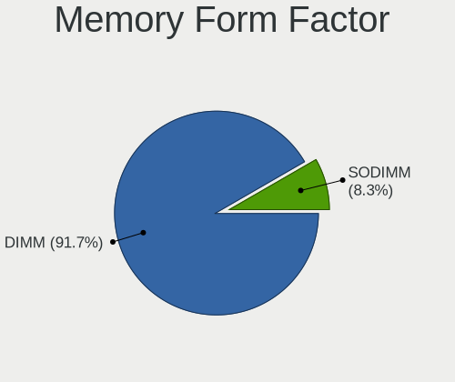

| Name   | Desktops | Percent |
|--------|----------|---------|
| DIMM   | 22       | 91.67%  |
| SODIMM | 2        | 8.33%   |

Memory Size
-----------

Memory module size

| Size  | Desktops | Percent |
|-------|----------|---------|
| 4096  | 8        | 32%     |
| 8192  | 7        | 28%     |
| 16384 | 4        | 16%     |
| 2048  | 4        | 16%     |
| 32768 | 1        | 4%      |
| 1024  | 1        | 4%      |

Memory Speed
------------

Memory module speed

| Speed   | Desktops | Percent |
|---------|----------|---------|
| 2667    | 4        | 14.81%  |
| 1333    | 4        | 14.81%  |
| 3200    | 3        | 11.11%  |
| 1600    | 3        | 11.11%  |
| 3000    | 2        | 7.41%   |
| 2400    | 2        | 7.41%   |
| 1066    | 2        | 7.41%   |
| 667     | 2        | 7.41%   |
| 49926   | 1        | 3.7%    |
| 3800    | 1        | 3.7%    |
| 2465    | 1        | 3.7%    |
| 1648    | 1        | 3.7%    |
| Unknown | 1        | 3.7%    |

Printers & scanners
-------------------

Printer Vendor
--------------

Printer device vendors

| Vendor          | Desktops | Percent |
|-----------------|----------|---------|
| Hewlett-Packard | 4        | 66.67%  |
| Seiko Epson     | 1        | 16.67%  |
| Canon           | 1        | 16.67%  |

Printer Model
-------------

Printer device models

| Model                   | Desktops | Percent |
|-------------------------|----------|---------|
| HP LaserJet P1005       | 2        | 33.33%  |
| Seiko Epson L365 Series | 1        | 16.67%  |
| HP DeskJet 5810 series  | 1        | 16.67%  |
| HP Deskjet 1010 series  | 1        | 16.67%  |
| Canon G2010 series      | 1        | 16.67%  |

Scanner Vendor
--------------

Scanner device vendors

Zero info for selected period =(

Scanner Model
-------------

Scanner device models

Zero info for selected period =(

Camera
------

Camera Vendor
-------------

Camera device vendors

| Vendor     | Desktops | Percent |
|------------|----------|---------|
| Syntek     | 1        | 33.33%  |
| Cubeternet | 1        | 33.33%  |
| A4Tech     | 1        | 33.33%  |

Camera Model
------------

Camera device models

| Model                        | Desktops | Percent |
|------------------------------|----------|---------|
| Syntek Integrated RGB Camera | 1        | 33.33%  |
| Cubeternet WebCam            | 1        | 33.33%  |
| A4Tech PK-635G               | 1        | 33.33%  |

Security
--------

Fingerprint Vendor
------------------

Fingerprint sensor vendors

Zero info for selected period =(

Fingerprint Model
-----------------

Fingerprint sensor models

Zero info for selected period =(

Chipcard Vendor
---------------

Chipcard module vendors

Zero info for selected period =(

Chipcard Model
--------------

Chipcard module models

Zero info for selected period =(

Unsupported
-----------

Unsupported Devices
-------------------

Total unsupported devices on board

| Total | Desktops | Percent |
|-------|----------|---------|
| 0     | 39       | 84.78%  |
| 1     | 5        | 10.87%  |
| 2     | 2        | 4.35%   |

Unsupported Device Types
------------------------

Types of unsupported devices

| Type          | Desktops | Percent |
|---------------|----------|---------|
| Graphics card | 3        | 42.86%  |
| Net/wireless  | 2        | 28.57%  |
| Net/ethernet  | 1        | 14.29%  |
| Bluetooth     | 1        | 14.29%  |

