Linux in Tunisia - Tested Hardware & Statistics
-----------------------------------------------

A project to collect tested hardware configurations for Linux in Tunisia.

Anyone can contribute to this report by the [hw-probe](https://github.com/linuxhw/hw-probe) tool:

    sudo -E hw-probe -all -upload

Please contribute! Especially if your hardware is rare.

This is a report for all computer types. See also reports for [desktops](/Location/Tunisia/Desktop/README.md) and [notebooks](/Location/Tunisia/Notebook/README.md).

Contents
--------

* [ Test Cases ](#test-cases)

* [ System ](#system)
  - [ OS                       ](#os)
  - [ OS Family                ](#os-family)
  - [ Kernel                   ](#kernel)
  - [ Kernel Family            ](#kernel-family)
  - [ Kernel Major Ver.        ](#kernel-major-ver)
  - [ Arch                     ](#arch)
  - [ DE                       ](#de)
  - [ Display Server           ](#display-server)
  - [ Display Manager          ](#display-manager)
  - [ OS Lang                  ](#os-lang)
  - [ Boot Mode                ](#boot-mode)
  - [ Filesystem               ](#filesystem)
  - [ Part. scheme             ](#part-scheme)
  - [ Dual Boot with Linux/BSD ](#dual-boot-with-linuxbsd)
  - [ Dual Boot (Win)          ](#dual-boot-win)

* [ Board ](#board)
  - [ Vendor                   ](#vendor)
  - [ Model                    ](#model)
  - [ Model Family             ](#model-family)
  - [ MFG Year                 ](#mfg-year)
  - [ Form Factor              ](#form-factor)
  - [ Secure Boot              ](#secure-boot)
  - [ Coreboot                 ](#coreboot)
  - [ RAM Size                 ](#ram-size)
  - [ RAM Used                 ](#ram-used)
  - [ Total Drives             ](#total-drives)
  - [ Has CD-ROM               ](#has-cd-rom)
  - [ Has Ethernet             ](#has-ethernet)
  - [ Has WiFi                 ](#has-wifi)
  - [ Has Bluetooth            ](#has-bluetooth)

* [ Location ](#location)
  - [ Country                  ](#country)
  - [ City                     ](#city)

* [ Drives ](#drives)
  - [ Drive Vendor             ](#drive-vendor)
  - [ Drive Model              ](#drive-model)
  - [ HDD Vendor               ](#hdd-vendor)
  - [ SSD Vendor               ](#ssd-vendor)
  - [ Drive Kind               ](#drive-kind)
  - [ Drive Connector          ](#drive-connector)
  - [ Drive Size               ](#drive-size)
  - [ Space Total              ](#space-total)
  - [ Space Used               ](#space-used)
  - [ Malfunc. Drives          ](#malfunc-drives)
  - [ Malfunc. Drive Vendor    ](#malfunc-drive-vendor)
  - [ Malfunc. HDD Vendor      ](#malfunc-hdd-vendor)
  - [ Malfunc. Drive Kind      ](#malfunc-drive-kind)
  - [ Failed Drives            ](#failed-drives)
  - [ Failed Drive Vendor      ](#failed-drive-vendor)
  - [ Drive Status             ](#drive-status)

* [ Storage controller ](#storage-controller)
  - [ Storage Vendor           ](#storage-vendor)
  - [ Storage Model            ](#storage-model)
  - [ Storage Kind             ](#storage-kind)

* [ Processor ](#processor)
  - [ CPU Vendor               ](#cpu-vendor)
  - [ CPU Model                ](#cpu-model)
  - [ CPU Model Family         ](#cpu-model-family)
  - [ CPU Cores                ](#cpu-cores)
  - [ CPU Sockets              ](#cpu-sockets)
  - [ CPU Threads              ](#cpu-threads)
  - [ CPU Op-Modes             ](#cpu-op-modes)
  - [ CPU Microcode            ](#cpu-microcode)
  - [ CPU Microarch            ](#cpu-microarch)

* [ Graphics ](#graphics)
  - [ GPU Vendor               ](#gpu-vendor)
  - [ GPU Model                ](#gpu-model)
  - [ GPU Combo                ](#gpu-combo)
  - [ GPU Driver               ](#gpu-driver)
  - [ GPU Memory               ](#gpu-memory)

* [ Monitor ](#monitor)
  - [ Monitor Vendor           ](#monitor-vendor)
  - [ Monitor Model            ](#monitor-model)
  - [ Monitor Resolution       ](#monitor-resolution)
  - [ Monitor Diagonal         ](#monitor-diagonal)
  - [ Monitor Width            ](#monitor-width)
  - [ Aspect Ratio             ](#aspect-ratio)
  - [ Monitor Area             ](#monitor-area)
  - [ Pixel Density            ](#pixel-density)
  - [ Multiple Monitors        ](#multiple-monitors)

* [ Network ](#network)
  - [ Net Controller Vendor    ](#net-controller-vendor)
  - [ Net Controller Model     ](#net-controller-model)
  - [ Wireless Vendor          ](#wireless-vendor)
  - [ Wireless Model           ](#wireless-model)
  - [ Ethernet Vendor          ](#ethernet-vendor)
  - [ Ethernet Model           ](#ethernet-model)
  - [ Net Controller Kind      ](#net-controller-kind)
  - [ Used Controller          ](#used-controller)
  - [ NICs                     ](#nics)
  - [ IPv6                     ](#ipv6)

* [ Bluetooth ](#bluetooth)
  - [ Bluetooth Vendor         ](#bluetooth-vendor)
  - [ Bluetooth Model          ](#bluetooth-model)

* [ Sound ](#sound)
  - [ Sound Vendor             ](#sound-vendor)
  - [ Sound Model              ](#sound-model)

* [ Memory ](#memory)
  - [ Memory Vendor            ](#memory-vendor)
  - [ Memory Model             ](#memory-model)
  - [ Memory Kind              ](#memory-kind)
  - [ Memory Form Factor       ](#memory-form-factor)
  - [ Memory Size              ](#memory-size)
  - [ Memory Speed             ](#memory-speed)

* [ Printers & scanners ](#printers--scanners)
  - [ Printer Vendor           ](#printer-vendor)
  - [ Printer Model            ](#printer-model)
  - [ Scanner Vendor           ](#scanner-vendor)
  - [ Scanner Model            ](#scanner-model)

* [ Camera ](#camera)
  - [ Camera Vendor            ](#camera-vendor)
  - [ Camera Model             ](#camera-model)

* [ Security ](#security)
  - [ Fingerprint Vendor       ](#fingerprint-vendor)
  - [ Fingerprint Model        ](#fingerprint-model)
  - [ Chipcard Vendor          ](#chipcard-vendor)
  - [ Chipcard Model           ](#chipcard-model)

* [ Unsupported ](#unsupported)
  - [ Unsupported Devices      ](#unsupported-devices)
  - [ Unsupported Device Types ](#unsupported-device-types)

Test Cases
----------

Total: 175

| Vendor    | Model                       | Form-Factor | Probe                                                      | Date         |
|-----------|-----------------------------|-------------|------------------------------------------------------------|--------------|
| Lenovo    | 36C5 NOK                    | Desktop     | [94d44ae5f2](https://linux-hardware.org/?probe=94d44ae5f2) | Jun 29, 2022 |
| Lenovo    | 36C5 NOK                    | Desktop     | [cd5e39b07a](https://linux-hardware.org/?probe=cd5e39b07a) | Jun 29, 2022 |
| HP        | ProBook 455 G3              | Notebook    | [bac60198a3](https://linux-hardware.org/?probe=bac60198a3) | Jun 10, 2022 |
| Lenovo    | V310-15ISK 80SY             | Notebook    | [2218dd9966](https://linux-hardware.org/?probe=2218dd9966) | Jun 07, 2022 |
| Dell      | 05842Y A00                  | Desktop     | [7c67079823](https://linux-hardware.org/?probe=7c67079823) | May 19, 2022 |
| ASUSTek   | X556UV                      | Notebook    | [39b927dfdc](https://linux-hardware.org/?probe=39b927dfdc) | May 11, 2022 |
| Dell      | Latitude 3540               | Notebook    | [a97573f3cf](https://linux-hardware.org/?probe=a97573f3cf) | Apr 29, 2022 |
| Dell      | Latitude 3540               | Notebook    | [a6b8509194](https://linux-hardware.org/?probe=a6b8509194) | Apr 29, 2022 |
| Toshiba   | Satellite Pro L850-B339     | Notebook    | [d884eeae8f](https://linux-hardware.org/?probe=d884eeae8f) | Apr 20, 2022 |
| MSI       | H81M-P33                    | Desktop     | [af0e50e873](https://linux-hardware.org/?probe=af0e50e873) | Apr 14, 2022 |
| MSI       | B550M PRO-VDH               | Desktop     | [9597b0a2d9](https://linux-hardware.org/?probe=9597b0a2d9) | Apr 09, 2022 |
| Lenovo    | IdeaPad L3 15IML05 81Y3     | Notebook    | [03b34db583](https://linux-hardware.org/?probe=03b34db583) | Apr 05, 2022 |
| Lenovo    | IdeaPad L3 15IML05 81Y3     | Notebook    | [e7a152d30a](https://linux-hardware.org/?probe=e7a152d30a) | Apr 04, 2022 |
| ASUSTek   | X550LC                      | Notebook    | [30ed5cb046](https://linux-hardware.org/?probe=30ed5cb046) | Apr 03, 2022 |
| HP        | Pavilion Gaming Laptop 1... | Notebook    | [7c0d1ce382](https://linux-hardware.org/?probe=7c0d1ce382) | Mar 29, 2022 |
| MSI       | Katana GF66 12UC            | Notebook    | [bc07a3de3d](https://linux-hardware.org/?probe=bc07a3de3d) | Mar 15, 2022 |
| MSI       | Katana GF66 12UC            | Notebook    | [ddbc85ab3a](https://linux-hardware.org/?probe=ddbc85ab3a) | Mar 15, 2022 |
| ASUSTek   | ROG Strix G713QE_G713QE     | Notebook    | [4b2b4e7f5a](https://linux-hardware.org/?probe=4b2b4e7f5a) | Mar 10, 2022 |
| ASUSTek   | X550LC                      | Notebook    | [267fa2ca76](https://linux-hardware.org/?probe=267fa2ca76) | Mar 06, 2022 |
| Lenovo    | IdeaPad Gaming 3 15IMH05... | Notebook    | [7803f9b898](https://linux-hardware.org/?probe=7803f9b898) | Feb 24, 2022 |
| ASUSTek   | X553MA                      | Notebook    | [020df21e37](https://linux-hardware.org/?probe=020df21e37) | Feb 23, 2022 |
| ASUSTek   | PRIME B450M-K               | Desktop     | [6278830433](https://linux-hardware.org/?probe=6278830433) | Feb 17, 2022 |
| Lenovo    | IdeaPad 100-15IBD 80QQ      | Notebook    | [8286f26e6e](https://linux-hardware.org/?probe=8286f26e6e) | Feb 12, 2022 |
| Lenovo    | IdeaPad 120S-11IAP 81A4     | Notebook    | [49a3015875](https://linux-hardware.org/?probe=49a3015875) | Feb 10, 2022 |
| Intel     | H61                         | Desktop     | [6d80839afa](https://linux-hardware.org/?probe=6d80839afa) | Feb 09, 2022 |
| HP        | Pavilion dv7                | Notebook    | [3bd981aa35](https://linux-hardware.org/?probe=3bd981aa35) | Feb 09, 2022 |
| ASUSTek   | ASUS EXPERTBOOK B1500CEP... | Notebook    | [f814537586](https://linux-hardware.org/?probe=f814537586) | Feb 08, 2022 |
| Lenovo    | ThinkPad X1 Carbon 5th 2... | Notebook    | [09caab8240](https://linux-hardware.org/?probe=09caab8240) | Feb 07, 2022 |
| Lenovo    | ThinkPad X1 Carbon 5th 2... | Notebook    | [75acdd40a6](https://linux-hardware.org/?probe=75acdd40a6) | Feb 07, 2022 |
| ASUSTek   | X553MA                      | Notebook    | [06f3844911](https://linux-hardware.org/?probe=06f3844911) | Jan 30, 2022 |
| ASUSTek   | PRIME B450M-K               | Desktop     | [f49f9dddd2](https://linux-hardware.org/?probe=f49f9dddd2) | Jan 29, 2022 |
| ASUSTek   | X555LD                      | Notebook    | [0665a1599c](https://linux-hardware.org/?probe=0665a1599c) | Jan 26, 2022 |
| ASUSTek   | PRIME B450M-K               | Desktop     | [0799e18f8b](https://linux-hardware.org/?probe=0799e18f8b) | Jan 20, 2022 |
| ASUSTek   | TUF Gaming FX705DD_TUF70... | Notebook    | [22dd608151](https://linux-hardware.org/?probe=22dd608151) | Jan 07, 2022 |
| ASUSTek   | TUF Gaming FX705DD_TUF70... | Notebook    | [391458138f](https://linux-hardware.org/?probe=391458138f) | Jan 07, 2022 |
| HP        | EliteBook 8740w             | Notebook    | [6f583dfeaf](https://linux-hardware.org/?probe=6f583dfeaf) | Dec 27, 2021 |
| Acer      | Aspire 5742                 | Notebook    | [45a5de08c7](https://linux-hardware.org/?probe=45a5de08c7) | Dec 25, 2021 |
| HP        | Notebook                    | Notebook    | [032be84586](https://linux-hardware.org/?probe=032be84586) | Dec 09, 2021 |
| Toshiba   | Satellite C50-A489          | Notebook    | [4d29ea3b9c](https://linux-hardware.org/?probe=4d29ea3b9c) | Dec 04, 2021 |
| Lenovo    | ThinkPad X240 20AMA0WRFR    | Notebook    | [13fe3346fd](https://linux-hardware.org/?probe=13fe3346fd) | Dec 02, 2021 |
| MSI       | H110M PRO-VD PLUS           | Desktop     | [e6fd06720f](https://linux-hardware.org/?probe=e6fd06720f) | Nov 28, 2021 |
| Samsung   | 530U3BI/530U4BI/530U4BH     | Notebook    | [d0a08a7a23](https://linux-hardware.org/?probe=d0a08a7a23) | Nov 22, 2021 |
| Samsung   | 530U3BI/530U4BI/530U4BH     | Notebook    | [507c380abb](https://linux-hardware.org/?probe=507c380abb) | Nov 22, 2021 |
| Acer      | Aspire A315-51              | Notebook    | [d49eff3d64](https://linux-hardware.org/?probe=d49eff3d64) | Nov 21, 2021 |
| Lenovo    | ThinkPad E15 20RD001SFE     | Notebook    | [358e3547b9](https://linux-hardware.org/?probe=358e3547b9) | Nov 17, 2021 |
| Lenovo    | ThinkPad E15 20RD001SFE     | Notebook    | [694f05492e](https://linux-hardware.org/?probe=694f05492e) | Nov 17, 2021 |
| HP        | Compaq 6735s                | Notebook    | [6571a6fe6d](https://linux-hardware.org/?probe=6571a6fe6d) | Nov 15, 2021 |
| HP        | ProBook 440 G7              | Notebook    | [35b6f85a28](https://linux-hardware.org/?probe=35b6f85a28) | Nov 10, 2021 |
| ASUSTek   | ASUS EXPERTBOOK B1400CEP... | Notebook    | [4bc0687791](https://linux-hardware.org/?probe=4bc0687791) | Nov 08, 2021 |
| HP        | Pavilion dv6                | Notebook    | [dcd2956978](https://linux-hardware.org/?probe=dcd2956978) | Nov 05, 2021 |
| HP        | Pavilion dv6                | Notebook    | [a509e62c95](https://linux-hardware.org/?probe=a509e62c95) | Nov 05, 2021 |
| Lenovo    | G50-70 20351                | Notebook    | [60e3fe1197](https://linux-hardware.org/?probe=60e3fe1197) | Oct 26, 2021 |
| ASUSTek   | TUF Gaming FX506LU_FX506... | Notebook    | [8f6efb8dbe](https://linux-hardware.org/?probe=8f6efb8dbe) | Oct 24, 2021 |
| HP        | Pavilion Gaming Laptop 1... | Notebook    | [9b0872b3d4](https://linux-hardware.org/?probe=9b0872b3d4) | Oct 22, 2021 |
| Lenovo    | IdeaPad Gaming 3 15ARH05... | Notebook    | [9b74440deb](https://linux-hardware.org/?probe=9b74440deb) | Oct 07, 2021 |
| Acer      | Swift SF514-53T             | Notebook    | [e97a52d3d9](https://linux-hardware.org/?probe=e97a52d3d9) | Sep 28, 2021 |
| Gigabyte  | B75M-D3H                    | Desktop     | [b882e1c0f7](https://linux-hardware.org/?probe=b882e1c0f7) | Sep 22, 2021 |
| HP        | 1494                        | Desktop     | [ae5165603a](https://linux-hardware.org/?probe=ae5165603a) | Sep 09, 2021 |
| HP        | 1494                        | Desktop     | [62e74e0c1a](https://linux-hardware.org/?probe=62e74e0c1a) | Sep 09, 2021 |
| HP        | 250 G4                      | Notebook    | [b5177b1c13](https://linux-hardware.org/?probe=b5177b1c13) | Sep 08, 2021 |
| HP        | 250 G4                      | Notebook    | [32899cab30](https://linux-hardware.org/?probe=32899cab30) | Sep 08, 2021 |
| Lenovo    | SHARKBAY NOK                | Desktop     | [e57d0a5518](https://linux-hardware.org/?probe=e57d0a5518) | Sep 01, 2021 |
| HP        | Pavilion Gaming Laptop 1... | Notebook    | [d4cdb976c2](https://linux-hardware.org/?probe=d4cdb976c2) | Aug 20, 2021 |
| HP        | Pavilion Gaming Laptop 1... | Notebook    | [633e5a9649](https://linux-hardware.org/?probe=633e5a9649) | Aug 20, 2021 |
| HP        | Pavilion Gaming Laptop 1... | Notebook    | [6339cd2e5b](https://linux-hardware.org/?probe=6339cd2e5b) | Aug 17, 2021 |
| HP        | Pavilion Gaming Laptop 1... | Notebook    | [58fb87de66](https://linux-hardware.org/?probe=58fb87de66) | Aug 02, 2021 |
| HP        | Pavilion Gaming Laptop 1... | Notebook    | [8d891b7431](https://linux-hardware.org/?probe=8d891b7431) | Aug 02, 2021 |
| HP        | 250 G7 Notebook PC          | Notebook    | [726ed18d47](https://linux-hardware.org/?probe=726ed18d47) | Jul 25, 2021 |
| ASUSTek   | TUF Gaming FX506LU_FX506... | Notebook    | [a347415235](https://linux-hardware.org/?probe=a347415235) | Jul 19, 2021 |
| Lenovo    | IdeaPad 100-15IBD 80QQ      | Notebook    | [236639a923](https://linux-hardware.org/?probe=236639a923) | Jul 16, 2021 |
| HP        | Pavilion Gaming Laptop 1... | Notebook    | [98862925dc](https://linux-hardware.org/?probe=98862925dc) | Jul 06, 2021 |
| HP        | Pavilion Gaming Laptop 1... | Notebook    | [b6ce3d213a](https://linux-hardware.org/?probe=b6ce3d213a) | Jul 06, 2021 |
| MSI       | GF65 Thin 10UE              | Notebook    | [af8d7a6b6f](https://linux-hardware.org/?probe=af8d7a6b6f) | Jun 22, 2021 |
| Dell      | 0M5DCD A00                  | Desktop     | [77faf70869](https://linux-hardware.org/?probe=77faf70869) | Jun 14, 2021 |
| Lenovo    | 3138 NO DPK                 | Desktop     | [8488c59a11](https://linux-hardware.org/?probe=8488c59a11) | May 18, 2021 |
| ASUSTek   | PRIME B450M-K               | Desktop     | [8110fad44d](https://linux-hardware.org/?probe=8110fad44d) | May 17, 2021 |
| Lenovo    | IdeaPad 100-15IBD 80QQ      | Notebook    | [9a767f85c2](https://linux-hardware.org/?probe=9a767f85c2) | May 17, 2021 |
| Dell      | Inspiron 5570               | Notebook    | [fe125a0b5f](https://linux-hardware.org/?probe=fe125a0b5f) | May 10, 2021 |
| ASUSTek   | PRIME B450M-K               | Desktop     | [ae4420d3a9](https://linux-hardware.org/?probe=ae4420d3a9) | May 01, 2021 |
| Lenovo    | IdeaPad 130-15IKB 81H7      | Notebook    | [89cfbb6a0e](https://linux-hardware.org/?probe=89cfbb6a0e) | May 01, 2021 |
| Lenovo    | IdeaPad L340-15IRH Gamin... | Notebook    | [884b3d6f69](https://linux-hardware.org/?probe=884b3d6f69) | Apr 21, 2021 |
| Lenovo    | V15-IIL 82C5                | Notebook    | [50e1fa29fb](https://linux-hardware.org/?probe=50e1fa29fb) | Apr 16, 2021 |
| ASUSTek   | TUF Gaming FX505DY_TUF50... | Notebook    | [be7a218721](https://linux-hardware.org/?probe=be7a218721) | Apr 12, 2021 |
| Dell      | Latitude E6420              | Notebook    | [901b94b26d](https://linux-hardware.org/?probe=901b94b26d) | Mar 10, 2021 |
| Dell      | Latitude E6420              | Notebook    | [c0d9f82152](https://linux-hardware.org/?probe=c0d9f82152) | Mar 10, 2021 |
| Dell      | Latitude E5440              | Notebook    | [89089cf0ad](https://linux-hardware.org/?probe=89089cf0ad) | Mar 05, 2021 |
| Lenovo    | IdeaPad 330S-14AST 81F8     | Notebook    | [078eb9c9b9](https://linux-hardware.org/?probe=078eb9c9b9) | Feb 19, 2021 |
| Lenovo    | IdeaPad L340-15IRH Gamin... | Notebook    | [486fd539f1](https://linux-hardware.org/?probe=486fd539f1) | Feb 19, 2021 |
| ASUSTek   | VivoBook_ASUSLaptop X509... | Notebook    | [347d45179a](https://linux-hardware.org/?probe=347d45179a) | Jan 30, 2021 |
| Acer      | Aspire V5-561G              | Notebook    | [4829da6130](https://linux-hardware.org/?probe=4829da6130) | Jan 30, 2021 |
| Dell      | Latitude 7410               | Notebook    | [19e75431d4](https://linux-hardware.org/?probe=19e75431d4) | Jan 30, 2021 |
| Samsung   | 300E5EV/300E4EV/270E5EV/... | Notebook    | [07f0354547](https://linux-hardware.org/?probe=07f0354547) | Jan 29, 2021 |
| Dell      | Inspiron N5110              | Notebook    | [5b18be0dd0](https://linux-hardware.org/?probe=5b18be0dd0) | Jan 28, 2021 |
| Lenovo    | IdeaPad 320-15IKB 81BT      | Notebook    | [cb1f74adbd](https://linux-hardware.org/?probe=cb1f74adbd) | Jan 17, 2021 |
| Lenovo    | IdeaPad 320-15IKB 81BT      | Notebook    | [f4c57eb290](https://linux-hardware.org/?probe=f4c57eb290) | Jan 17, 2021 |
| HP        | Laptop 15-bs0xx             | Notebook    | [95610ff17c](https://linux-hardware.org/?probe=95610ff17c) | Jan 14, 2021 |
| Dell      | Inspiron 3520               | Notebook    | [c1e7a232e0](https://linux-hardware.org/?probe=c1e7a232e0) | Dec 29, 2020 |
| eMachines | E725                        | Notebook    | [aa660241b3](https://linux-hardware.org/?probe=aa660241b3) | Dec 22, 2020 |
| Dell      | Latitude 7490               | Notebook    | [d42995d26a](https://linux-hardware.org/?probe=d42995d26a) | Dec 21, 2020 |
| MSI       | GF63 Thin 10SCXR            | Notebook    | [f52e267cc9](https://linux-hardware.org/?probe=f52e267cc9) | Dec 19, 2020 |
| Lenovo    | IdeaPad 330-15AST 81D6      | Notebook    | [e4ab77e8b0](https://linux-hardware.org/?probe=e4ab77e8b0) | Dec 11, 2020 |
| Lenovo    | ThinkPad E15 20RD001QFE     | Notebook    | [d02175d76c](https://linux-hardware.org/?probe=d02175d76c) | Dec 10, 2020 |
| ASUSTek   | UX310UQK                    | Notebook    | [bb566782bc](https://linux-hardware.org/?probe=bb566782bc) | Dec 04, 2020 |
| HP        | Convertible x360 11-ab0X... | Convertible | [6b543e87f8](https://linux-hardware.org/?probe=6b543e87f8) | Nov 26, 2020 |
| Toshiba   | Satellite A300              | Notebook    | [963065205e](https://linux-hardware.org/?probe=963065205e) | Nov 26, 2020 |
| Toshiba   | Satellite A300              | Notebook    | [c1aeee5a95](https://linux-hardware.org/?probe=c1aeee5a95) | Nov 26, 2020 |
| ASUSTek   | X550VX                      | Notebook    | [b22a35a959](https://linux-hardware.org/?probe=b22a35a959) | Nov 22, 2020 |
| Lenovo    | ThinkPad X1 Extreme 20MF... | Notebook    | [563be9ddd8](https://linux-hardware.org/?probe=563be9ddd8) | Nov 21, 2020 |
| Lenovo    | IdeaPad S145-15AST 81N3     | Notebook    | [59de1f8260](https://linux-hardware.org/?probe=59de1f8260) | Nov 20, 2020 |
| Dell      | Inspiron N5110              | Notebook    | [64cce3acaa](https://linux-hardware.org/?probe=64cce3acaa) | Nov 04, 2020 |
| Lenovo    | IdeaPad 130-15IKB 81H7      | Notebook    | [97dee881c4](https://linux-hardware.org/?probe=97dee881c4) | Nov 01, 2020 |
| Dell      | 0TTDMJ A00                  | Desktop     | [aef24f2346](https://linux-hardware.org/?probe=aef24f2346) | Oct 28, 2020 |
| Dell      | Inspiron 3593               | Notebook    | [a236e15c5d](https://linux-hardware.org/?probe=a236e15c5d) | Oct 25, 2020 |
| Acer      | Swift SF314-52              | Notebook    | [f81c8f31d1](https://linux-hardware.org/?probe=f81c8f31d1) | Oct 10, 2020 |
| Acer      | Swift SF314-52              | Notebook    | [bb4464e5f1](https://linux-hardware.org/?probe=bb4464e5f1) | Oct 10, 2020 |
| Dell      | Latitude 7480               | Notebook    | [7bf6a7c3a4](https://linux-hardware.org/?probe=7bf6a7c3a4) | Sep 16, 2020 |
| ASUSTek   | M32CD_A_F_K20CD_K31CD       | Desktop     | [cdce66a7de](https://linux-hardware.org/?probe=cdce66a7de) | Jul 07, 2020 |
| ASUSTek   | UX360CA                     | Notebook    | [9d6a79d7ac](https://linux-hardware.org/?probe=9d6a79d7ac) | Jun 11, 2020 |
| ASUSTek   | UX360CA                     | Notebook    | [24742e9ec9](https://linux-hardware.org/?probe=24742e9ec9) | Jun 11, 2020 |
| Toshiba   | Satellite L500              | Notebook    | [1cb682ea0f](https://linux-hardware.org/?probe=1cb682ea0f) | Jun 06, 2020 |
| Foxconn   | 2ABF                        | Desktop     | [65d6dca78e](https://linux-hardware.org/?probe=65d6dca78e) | May 27, 2020 |
| Toshiba   | Satellite L550              | Notebook    | [31501ab61b](https://linux-hardware.org/?probe=31501ab61b) | May 11, 2020 |
| Toshiba   | Satellite L550              | Notebook    | [b8e2396d82](https://linux-hardware.org/?probe=b8e2396d82) | May 11, 2020 |
| Lenovo    | IdeaPad L340-15IRH Gamin... | Notebook    | [21ce99e154](https://linux-hardware.org/?probe=21ce99e154) | May 03, 2020 |
| Lenovo    | IdeaPad L340-15IRH Gamin... | Notebook    | [4ff939d0e2](https://linux-hardware.org/?probe=4ff939d0e2) | Apr 28, 2020 |
| Lenovo    | IdeaPad L340-15IRH Gamin... | Notebook    | [31b3c13f93](https://linux-hardware.org/?probe=31b3c13f93) | Apr 28, 2020 |
| Toshiba   | Satellite L550              | Notebook    | [73f10216d6](https://linux-hardware.org/?probe=73f10216d6) | Apr 25, 2020 |
| Dell      | Inspiron 15-3552            | Notebook    | [b5721fa9d5](https://linux-hardware.org/?probe=b5721fa9d5) | Apr 22, 2020 |
| Lenovo    | IdeaPad 130-15IKB 81H7      | Notebook    | [b391bbea48](https://linux-hardware.org/?probe=b391bbea48) | Apr 12, 2020 |
| Lenovo    | G580 20157                  | Notebook    | [30a8d59bdc](https://linux-hardware.org/?probe=30a8d59bdc) | Apr 09, 2020 |
| Lenovo    | G580 20157                  | Notebook    | [fc6eaad779](https://linux-hardware.org/?probe=fc6eaad779) | Apr 09, 2020 |
| ASUSTek   | X556UV                      | Notebook    | [cb5da8627a](https://linux-hardware.org/?probe=cb5da8627a) | Apr 07, 2020 |
| MSI       | MS-7502 Fab D               | Desktop     | [242c5b8d0d](https://linux-hardware.org/?probe=242c5b8d0d) | Mar 30, 2020 |
| ASUSTek   | X550JX                      | Notebook    | [71dbec47eb](https://linux-hardware.org/?probe=71dbec47eb) | Mar 27, 2020 |
| ASUSTek   | X550JX                      | Notebook    | [cc439d9e0f](https://linux-hardware.org/?probe=cc439d9e0f) | Mar 27, 2020 |
| Dell      | Inspiron 3521               | Notebook    | [cb7137a57a](https://linux-hardware.org/?probe=cb7137a57a) | Mar 16, 2020 |
| ASUSTek   | TUF Gaming FX504GD_FX80G... | Notebook    | [64628c8c11](https://linux-hardware.org/?probe=64628c8c11) | Mar 12, 2020 |
| Foxconn   | 2ABF                        | Desktop     | [7c6e2d2c29](https://linux-hardware.org/?probe=7c6e2d2c29) | Mar 10, 2020 |
| Pegatron  | Eureka3                     | Desktop     | [77bc52c3d9](https://linux-hardware.org/?probe=77bc52c3d9) | Mar 02, 2020 |
| Pegatron  | Eureka3                     | Desktop     | [84ee26b4e7](https://linux-hardware.org/?probe=84ee26b4e7) | Mar 02, 2020 |
| Pegatron  | Eureka3                     | Desktop     | [33ae5ebabc](https://linux-hardware.org/?probe=33ae5ebabc) | Feb 18, 2020 |
| ASUSTek   | X550JX                      | Notebook    | [a1fa3183ed](https://linux-hardware.org/?probe=a1fa3183ed) | Feb 15, 2020 |
| Lenovo    | IdeaPad 700-15ISK 80RU      | Notebook    | [97b5418b6d](https://linux-hardware.org/?probe=97b5418b6d) | Feb 03, 2020 |
| Lenovo    | ThinkPad T440s 20AQ005NU... | Notebook    | [55d9286a1b](https://linux-hardware.org/?probe=55d9286a1b) | Jan 27, 2020 |
| Lenovo    | 3138 NO DPK                 | Desktop     | [7878eb9e27](https://linux-hardware.org/?probe=7878eb9e27) | Dec 30, 2019 |
| Lenovo    | 3138 NO DPK                 | Desktop     | [21f916c3ef](https://linux-hardware.org/?probe=21f916c3ef) | Dec 30, 2019 |
| Acer      | Aspire E1-570               | Notebook    | [9d92944e6c](https://linux-hardware.org/?probe=9d92944e6c) | Dec 21, 2019 |
| Acer      | Aspire E1-570               | Notebook    | [64702aadcd](https://linux-hardware.org/?probe=64702aadcd) | Dec 21, 2019 |
| Lenovo    | Unknown                     | Notebook    | [10ab399874](https://linux-hardware.org/?probe=10ab399874) | Dec 14, 2019 |
| Sony      | VPCEH36EF                   | Notebook    | [5b1adbe8f0](https://linux-hardware.org/?probe=5b1adbe8f0) | Dec 10, 2019 |
| Sony      | VPCEH36EF                   | Notebook    | [6518790628](https://linux-hardware.org/?probe=6518790628) | Nov 27, 2019 |
| Dell      | Latitude E6420              | Notebook    | [3f252a50fb](https://linux-hardware.org/?probe=3f252a50fb) | Nov 12, 2019 |
| ASUSTek   | TUF Gaming FX705DD_TUF70... | Notebook    | [1b5ae66e6f](https://linux-hardware.org/?probe=1b5ae66e6f) | Nov 10, 2019 |
| ASUSTek   | TUF Gaming FX705DD_TUF70... | Notebook    | [a9cc2a8ea0](https://linux-hardware.org/?probe=a9cc2a8ea0) | Nov 01, 2019 |
| Unknown   | Pine Trail - M CRB          | Desktop     | [ef1e6295a8](https://linux-hardware.org/?probe=ef1e6295a8) | Oct 30, 2019 |
| Foxconn   | 2ABF                        | Desktop     | [4521f814c9](https://linux-hardware.org/?probe=4521f814c9) | Sep 17, 2019 |
| Foxconn   | 2ABF                        | Desktop     | [6a57b2ea85](https://linux-hardware.org/?probe=6a57b2ea85) | Sep 17, 2019 |
| Lenovo    | IdeaPad Y700-15ISK 80NV     | Notebook    | [b57e5735a5](https://linux-hardware.org/?probe=b57e5735a5) | Sep 13, 2019 |
| Lenovo    | IdeaPad Y700-15ISK 80NV     | Notebook    | [708bc2c339](https://linux-hardware.org/?probe=708bc2c339) | Sep 13, 2019 |
| HP        | 630                         | Notebook    | [8cb4c328bb](https://linux-hardware.org/?probe=8cb4c328bb) | Sep 10, 2019 |
| Acer      | Aspire V5-572G              | Notebook    | [7d046c01d0](https://linux-hardware.org/?probe=7d046c01d0) | Sep 07, 2019 |
| HP        | Pavilion g6                 | Notebook    | [6eebb27f65](https://linux-hardware.org/?probe=6eebb27f65) | Aug 28, 2019 |
| HP        | Laptop                      | Notebook    | [de71114421](https://linux-hardware.org/?probe=de71114421) | Aug 21, 2019 |
| Acer      | Aspire V5-572G              | Notebook    | [90d2c432d6](https://linux-hardware.org/?probe=90d2c432d6) | Aug 17, 2019 |
| Lenovo    | IdeaPad Y700-15ISK 80NV     | Notebook    | [26b5185afb](https://linux-hardware.org/?probe=26b5185afb) | Aug 14, 2019 |
| Pegatron  | 2A94h                       | Desktop     | [3b6656bb11](https://linux-hardware.org/?probe=3b6656bb11) | Jul 04, 2019 |
| Acer      | TravelMate P259-M           | Notebook    | [3693d52bff](https://linux-hardware.org/?probe=3693d52bff) | Nov 09, 2018 |
| Acer      | TravelMate P259-M           | Notebook    | [a951fd5ef9](https://linux-hardware.org/?probe=a951fd5ef9) | Nov 09, 2018 |
| HP        | Laptop 17-ak0xx             | Notebook    | [83d0682234](https://linux-hardware.org/?probe=83d0682234) | Sep 20, 2018 |
| HP        | Laptop 17-ak0xx             | Notebook    | [e2076e8303](https://linux-hardware.org/?probe=e2076e8303) | Sep 19, 2018 |
| HP        | Laptop 17-ak0xx             | Notebook    | [24599e9990](https://linux-hardware.org/?probe=24599e9990) | Sep 19, 2018 |
| HP        | Pavilion g6                 | Notebook    | [c93294c4ab](https://linux-hardware.org/?probe=c93294c4ab) | Sep 18, 2018 |
| HP        | Pavilion g6                 | Notebook    | [efc4afba58](https://linux-hardware.org/?probe=efc4afba58) | Aug 10, 2018 |
| HP        | Pavilion g6                 | Notebook    | [494e0c0416](https://linux-hardware.org/?probe=494e0c0416) | Aug 10, 2018 |
| Foxconn   | 2ABF                        | Desktop     | [f6873739a8](https://linux-hardware.org/?probe=f6873739a8) | Mar 03, 2018 |

System
------

OS
--

Installed operating systems

| Name              | Computers | Percent |
|-------------------|-----------|---------|
| Ubuntu 20.04      | 33        | 26.4%   |
| Ubuntu 18.04      | 16        | 12.8%   |
| Ubuntu 21.10      | 5         | 4%      |
| OpenMandriva 4.2  | 5         | 4%      |
| Ubuntu 16.04      | 4         | 3.2%    |
| Zorin 15          | 3         | 2.4%    |
| Ubuntu 19.10      | 3         | 2.4%    |
| OpenMandriva 4.3  | 3         | 2.4%    |
| Debian 10         | 3         | 2.4%    |
| Ubuntu 21.04      | 2         | 1.6%    |
| Ubuntu 20.10      | 2         | 1.6%    |
| ROSA R10          | 2         | 1.6%    |
| Pop!_OS 22.04     | 2         | 1.6%    |
| Pop!_OS 21.04     | 2         | 1.6%    |
| Manjaro 21.1.0    | 2         | 1.6%    |
| LMDE 4            | 2         | 1.6%    |
| Linux Mint 20.3   | 2         | 1.6%    |
| Linux Mint 20.2   | 2         | 1.6%    |
| Linux Mint 20     | 2         | 1.6%    |
| Gentoo 2.7        | 2         | 1.6%    |
| Fedora 35         | 2         | 1.6%    |
| Fedora 33         | 2         | 1.6%    |
| Debian 11         | 2         | 1.6%    |
| ArcoLinux Rolling | 2         | 1.6%    |
| Arch              | 2         | 1.6%    |
| Xubuntu 18.04     | 1         | 0.8%    |
| Ubuntu 19.04      | 1         | 0.8%    |
| Sodalite 35       | 1         | 0.8%    |
| ROSA R8.1         | 1         | 0.8%    |
| ROSA R11          | 1         | 0.8%    |
| Pop!_OS 20.10     | 1         | 0.8%    |
| Manjaro 20.2      | 1         | 0.8%    |
| Lubuntu 20.04     | 1         | 0.8%    |
| Lubuntu 18.04     | 1         | 0.8%    |
| Linux Mint 20.1   | 1         | 0.8%    |
| Kubuntu 20.04     | 1         | 0.8%    |
| Fedora 31         | 1         | 0.8%    |
| Endless 3.9.5     | 1         | 0.8%    |
| Endless 3.7.8     | 1         | 0.8%    |
| Endless 3.5.0     | 1         | 0.8%    |
| Elementary 5.1.5  | 1         | 0.8%    |
| Deepin            | 1         | 0.8%    |
| Arch Rolling      | 1         | 0.8%    |

OS Family
---------

OS without a version

| Name         | Computers | Percent |
|--------------|-----------|---------|
| Ubuntu       | 63        | 52.07%  |
| OpenMandriva | 8         | 6.61%   |
| Linux Mint   | 7         | 5.79%   |
| Pop!_OS      | 5         | 4.13%   |
| Debian       | 5         | 4.13%   |
| ROSA         | 4         | 3.31%   |
| Fedora       | 4         | 3.31%   |
| Zorin        | 3         | 2.48%   |
| Manjaro      | 3         | 2.48%   |
| Endless      | 3         | 2.48%   |
| Arch         | 3         | 2.48%   |
| Lubuntu      | 2         | 1.65%   |
| LMDE         | 2         | 1.65%   |
| Gentoo       | 2         | 1.65%   |
| ArcoLinux    | 2         | 1.65%   |
| Xubuntu      | 1         | 0.83%   |
| Sodalite     | 1         | 0.83%   |
| Kubuntu      | 1         | 0.83%   |
| Elementary   | 1         | 0.83%   |
| Deepin       | 1         | 0.83%   |

Kernel
------

Version of the Linux kernel

| Version                         | Computers | Percent |
|---------------------------------|-----------|---------|
| 5.10.14-desktop-1omv4002        | 5         | 3.7%    |
| 5.13.0-28-generic               | 4         | 2.96%   |
| 5.3.0-46-generic                | 3         | 2.22%   |
| 5.3.0-40-generic                | 3         | 2.22%   |
| 5.16.7-desktop-1omv4003         | 3         | 2.22%   |
| 5.11.0-38-generic               | 3         | 2.22%   |
| 5.8.0-38-generic                | 2         | 1.48%   |
| 5.4.0-72-generic                | 2         | 1.48%   |
| 5.4.0-58-generic                | 2         | 1.48%   |
| 5.4.0-52-generic                | 2         | 1.48%   |
| 5.4.0-42-generic                | 2         | 1.48%   |
| 5.4.0-26-generic                | 2         | 1.48%   |
| 5.3.0-28-generic                | 2         | 1.48%   |
| 5.13.0-40-generic               | 2         | 1.48%   |
| 5.11.0-7620-generic             | 2         | 1.48%   |
| 5.11.0-40-generic               | 2         | 1.48%   |
| 5.11.0-27-generic               | 2         | 1.48%   |
| 5.10.27-gentoo                  | 2         | 1.48%   |
| 5.10.0-12-amd64                 | 2         | 1.48%   |
| 5.0.0-25-generic                | 2         | 1.48%   |
| 4.9.60-nrj-desktop-1rosa-x86_64 | 2         | 1.48%   |
| 4.19.0-6-amd64                  | 2         | 1.48%   |
| 4.15.0-91-generic               | 2         | 1.48%   |
| 5.9.9-arch1-1                   | 1         | 0.74%   |
| 5.9.1-arch1-1                   | 1         | 0.74%   |
| 5.8.15-301.fc33.x86_64          | 1         | 0.74%   |
| 5.8.0-50-generic                | 1         | 0.74%   |
| 5.8.0-44-generic                | 1         | 0.74%   |
| 5.8.0-40-generic                | 1         | 0.74%   |
| 5.8.0-33-generic                | 1         | 0.74%   |
| 5.8.0-32-generic                | 1         | 0.74%   |
| 5.8.0-28-generic                | 1         | 0.74%   |
| 5.8.0-14-generic                | 1         | 0.74%   |
| 5.4.80-2-MANJARO                | 1         | 0.74%   |
| 5.4.143-1-pve                   | 1         | 0.74%   |
| 5.4.119-1-pve                   | 1         | 0.74%   |
| 5.4.0-91-generic                | 1         | 0.74%   |
| 5.4.0-90-generic                | 1         | 0.74%   |
| 5.4.0-84-generic                | 1         | 0.74%   |
| 5.4.0-73-generic                | 1         | 0.74%   |
| 5.4.0-65-lowlatency             | 1         | 0.74%   |
| 5.4.0-65-generic                | 1         | 0.74%   |
| 5.4.0-56-generic                | 1         | 0.74%   |
| 5.4.0-48-generic                | 1         | 0.74%   |
| 5.4.0-47-generic                | 1         | 0.74%   |
| 5.4.0-45-generic                | 1         | 0.74%   |
| 5.4.0-40-generic                | 1         | 0.74%   |
| 5.4.0-33-generic                | 1         | 0.74%   |
| 5.4.0-31-generic                | 1         | 0.74%   |
| 5.4.0-29-generic                | 1         | 0.74%   |
| 5.4.0-28-lowlatency             | 1         | 0.74%   |
| 5.4.0-107-generic               | 1         | 0.74%   |
| 5.3.8-300.fc31.x86_64           | 1         | 0.74%   |
| 5.3.0-59-generic                | 1         | 0.74%   |
| 5.3.0-26-generic                | 1         | 0.74%   |
| 5.3.0-19-generic                | 1         | 0.74%   |
| 5.17.5-76051705-generic         | 1         | 0.74%   |
| 5.17.15-76051715-generic        | 1         | 0.74%   |
| 5.16.9-200.fc35.x86_64          | 1         | 0.74%   |
| 5.16.18-200.fc35.x86_64         | 1         | 0.74%   |

Kernel Family
-------------

Linux kernel without a distro release

| Version | Computers | Percent |
|---------|-----------|---------|
| 5.4.0   | 25        | 18.94%  |
| 5.13.0  | 12        | 9.09%   |
| 5.11.0  | 12        | 9.09%   |
| 5.3.0   | 11        | 8.33%   |
| 4.15.0  | 10        | 7.58%   |
| 5.8.0   | 9         | 6.82%   |
| 5.0.0   | 7         | 5.3%    |
| 5.10.14 | 5         | 3.79%   |
| 4.19.0  | 4         | 3.03%   |
| 5.16.7  | 3         | 2.27%   |
| 4.18.0  | 3         | 2.27%   |
| 5.10.27 | 2         | 1.52%   |
| 5.10.0  | 2         | 1.52%   |
| 4.9.60  | 2         | 1.52%   |
| 5.9.9   | 1         | 0.76%   |
| 5.9.1   | 1         | 0.76%   |
| 5.8.15  | 1         | 0.76%   |
| 5.4.80  | 1         | 0.76%   |
| 5.4.143 | 1         | 0.76%   |
| 5.4.119 | 1         | 0.76%   |
| 5.3.8   | 1         | 0.76%   |
| 5.17.5  | 1         | 0.76%   |
| 5.17.15 | 1         | 0.76%   |
| 5.16.9  | 1         | 0.76%   |
| 5.16.18 | 1         | 0.76%   |
| 5.16.11 | 1         | 0.76%   |
| 5.15.5  | 1         | 0.76%   |
| 5.15.16 | 1         | 0.76%   |
| 5.15.11 | 1         | 0.76%   |
| 5.13.11 | 1         | 0.76%   |
| 5.12.12 | 1         | 0.76%   |
| 5.11.17 | 1         | 0.76%   |
| 5.11.13 | 1         | 0.76%   |
| 5.10.53 | 1         | 0.76%   |
| 5.10.19 | 1         | 0.76%   |
| 4.9.9   | 1         | 0.76%   |
| 4.9.124 | 1         | 0.76%   |
| 4.4.0   | 1         | 0.76%   |
| 3.13.0  | 1         | 0.76%   |

Kernel Major Ver.
-----------------

Linux kernel major version

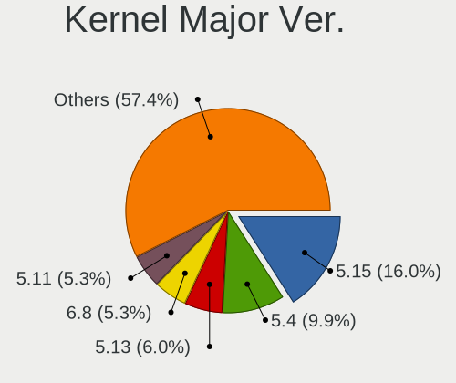

| Version | Computers | Percent |
|---------|-----------|---------|
| 5.4     | 27        | 20.93%  |
| 5.11    | 14        | 10.85%  |
| 5.13    | 13        | 10.08%  |
| 5.3     | 12        | 9.3%    |
| 5.10    | 11        | 8.53%   |
| 5.8     | 10        | 7.75%   |
| 4.15    | 10        | 7.75%   |
| 5.0     | 7         | 5.43%   |
| 5.16    | 5         | 3.88%   |
| 4.19    | 4         | 3.1%    |
| 5.15    | 3         | 2.33%   |
| 4.9     | 3         | 2.33%   |
| 4.18    | 3         | 2.33%   |
| 5.9     | 2         | 1.55%   |
| 5.17    | 2         | 1.55%   |
| 5.12    | 1         | 0.78%   |
| 4.4     | 1         | 0.78%   |
| 3.13    | 1         | 0.78%   |

Arch
----

OS architecture (x86_64, i586, etc.)

| Name   | Computers | Percent |
|--------|-----------|---------|
| x86_64 | 116       | 97.48%  |
| i686   | 3         | 2.52%   |

DE
--

Desktop Environment

| Name            | Computers | Percent |
|-----------------|-----------|---------|
| GNOME           | 68        | 54.4%   |
| Unknown         | 16        | 12.8%   |
| KDE5            | 12        | 9.6%    |
| X-Cinnamon      | 8         | 6.4%    |
| XFCE            | 4         | 3.2%    |
| KDE4            | 4         | 3.2%    |
| Pantheon        | 2         | 1.6%    |
| GNOME Flashback | 2         | 1.6%    |
| Unity           | 1         | 0.8%    |
| MATE            | 1         | 0.8%    |
| LXQt            | 1         | 0.8%    |
| LXDE            | 1         | 0.8%    |
| i3              | 1         | 0.8%    |
| GNOME Classic   | 1         | 0.8%    |
| DWM             | 1         | 0.8%    |
| Deepin          | 1         | 0.8%    |
| Cinnamon        | 1         | 0.8%    |

Display Server
--------------

X11 or Wayland

| Name    | Computers | Percent |
|---------|-----------|---------|
| X11     | 98        | 80.33%  |
| Wayland | 16        | 13.11%  |
| Unknown | 5         | 4.1%    |
| Tty     | 3         | 2.46%   |

Display Manager
---------------

SDDM, LightDM, etc.

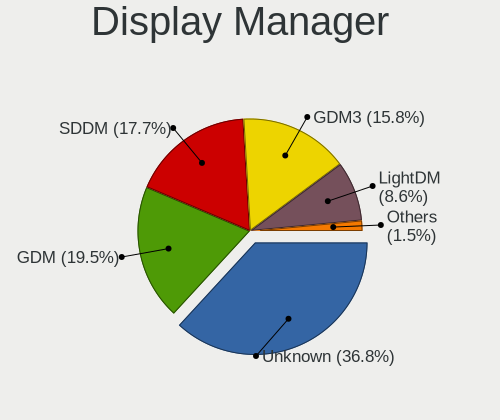

| Name    | Computers | Percent |
|---------|-----------|---------|
| Unknown | 55        | 45.45%  |
| GDM     | 38        | 31.4%   |
| SDDM    | 13        | 10.74%  |
| LightDM | 7         | 5.79%   |
| KDM     | 4         | 3.31%   |
| GDM3    | 4         | 3.31%   |

OS Lang
-------

Language

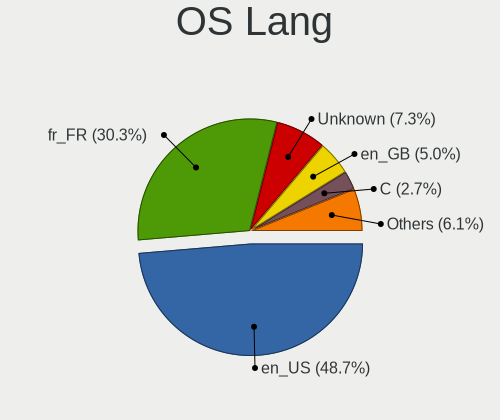

| Lang    | Computers | Percent |
|---------|-----------|---------|
| en_US   | 55        | 45.08%  |
| fr_FR   | 36        | 29.51%  |
| Unknown | 18        | 14.75%  |
| en_GB   | 4         | 3.28%   |
| C       | 2         | 1.64%   |
| ar_TN   | 2         | 1.64%   |
| pt_BR   | 1         | 0.82%   |
| en_CA   | 1         | 0.82%   |
| en_AU   | 1         | 0.82%   |
| en_AG   | 1         | 0.82%   |
| de_DE   | 1         | 0.82%   |

Boot Mode
---------

EFI or BIOS

| Mode | Computers | Percent |
|------|-----------|---------|
| EFI  | 63        | 52.07%  |
| BIOS | 58        | 47.93%  |

Filesystem
----------

Type of filesystem

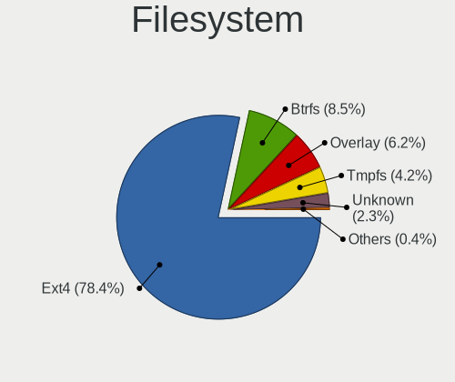

| Type    | Computers | Percent |
|---------|-----------|---------|
| Ext4    | 103       | 85.83%  |
| Overlay | 8         | 6.67%   |
| Unknown | 6         | 5%      |
| Btrfs   | 2         | 1.67%   |
| Xfs     | 1         | 0.83%   |

Part. scheme
------------

Scheme of partitioning

| Type    | Computers | Percent |
|---------|-----------|---------|
| Unknown | 63        | 52.07%  |
| GPT     | 40        | 33.06%  |
| MBR     | 18        | 14.88%  |

Dual Boot with Linux/BSD
------------------------

Hosting more than one Linux/BSD

| Dual boot | Computers | Percent |
|-----------|-----------|---------|
| No        | 106       | 87.6%   |
| Yes       | 15        | 12.4%   |

Dual Boot (Win)
---------------

Hosting Linux and Windows

| Dual boot | Computers | Percent |
|-----------|-----------|---------|
| No        | 77        | 65.25%  |
| Yes       | 41        | 34.75%  |

Board
-----

Vendor
------

Motherboard manufacturer

| Name                | Computers | Percent |
|---------------------|-----------|---------|
| Lenovo              | 30        | 25.42%  |
| Hewlett-Packard     | 21        | 17.8%   |
| ASUSTek Computer    | 20        | 16.95%  |
| Dell                | 15        | 12.71%  |
| Acer                | 8         | 6.78%   |
| MSI                 | 7         | 5.93%   |
| Toshiba             | 5         | 4.24%   |
| Pegatron            | 3         | 2.54%   |
| Samsung Electronics | 2         | 1.69%   |
| Foxconn             | 2         | 1.69%   |
| Sony                | 1         | 0.85%   |
| Intel               | 1         | 0.85%   |
| Gigabyte Technology | 1         | 0.85%   |
| eMachines           | 1         | 0.85%   |
| Unknown             | 1         | 0.85%   |

Model
-----

Motherboard model

| Name                                     | Computers | Percent |
|------------------------------------------|-----------|---------|
| Lenovo IdeaPad L340-15IRH Gaming 81LK    | 3         | 2.54%   |
| Pegatron VS342AA-AB6 m9801af             | 2         | 1.69%   |
| Lenovo IdeaPad 130-15IKB 81H7            | 2         | 1.69%   |
| HP Pavilion Gaming Laptop 15-ec1xxx      | 2         | 1.69%   |
| HP Pavilion g6                           | 2         | 1.69%   |
| Foxconn Pro 3400 Series MT               | 2         | 1.69%   |
| ASUS X556UV                              | 2         | 1.69%   |
| ASUS X550JX                              | 2         | 1.69%   |
| Unknown                                  | 2         | 1.69%   |
| Toshiba Satellite Pro L850-B339          | 1         | 0.85%   |
| Toshiba Satellite L550                   | 1         | 0.85%   |
| Toshiba Satellite L500                   | 1         | 0.85%   |
| Toshiba Satellite C50-A489               | 1         | 0.85%   |
| Toshiba Satellite A300                   | 1         | 0.85%   |
| Sony VPCEH36EF                           | 1         | 0.85%   |
| Samsung 530U3BI/530U4BI/530U4BH          | 1         | 0.85%   |
| Samsung 300E5EV/300E4EV/270E5EV/270E4EV  | 1         | 0.85%   |
| Pegatron Pro 3010 Microtower PC          | 1         | 0.85%   |
| MSI MS-7C95                              | 1         | 0.85%   |
| MSI MS-7A15                              | 1         | 0.85%   |
| MSI MS-7817                              | 1         | 0.85%   |
| MSI MS-7502                              | 1         | 0.85%   |
| MSI Katana GF66 12UC                     | 1         | 0.85%   |
| MSI GF65 Thin 10UE                       | 1         | 0.85%   |
| MSI GF63 Thin 10SCXR                     | 1         | 0.85%   |
| Lenovo V310-15ISK 80SY                   | 1         | 0.85%   |
| Lenovo V15-IIL 82C5                      | 1         | 0.85%   |
| Lenovo ThinkStation P330 30C6S33L00      | 1         | 0.85%   |
| Lenovo ThinkPad X240 20AMA0WRFR          | 1         | 0.85%   |
| Lenovo ThinkPad X1 Extreme 20MFCTO1WW    | 1         | 0.85%   |
| Lenovo ThinkPad X1 Carbon 5th 20HQS02100 | 1         | 0.85%   |
| Lenovo ThinkPad T440s 20AQ005NUS         | 1         | 0.85%   |
| Lenovo ThinkPad E15 20RD001SFE           | 1         | 0.85%   |
| Lenovo ThinkPad E15 20RD001QFE           | 1         | 0.85%   |
| Lenovo IdeaPad Y700-15ISK 80NV           | 1         | 0.85%   |
| Lenovo IdeaPad S145-15AST 81N3           | 1         | 0.85%   |
| Lenovo IdeaPad L3 15IML05 81Y3           | 1         | 0.85%   |
| Lenovo IdeaPad Gaming 3 15IMH05 81Y4     | 1         | 0.85%   |
| Lenovo IdeaPad Gaming 3 15ARH05 82EY     | 1         | 0.85%   |
| Lenovo IdeaPad 700-15ISK 80RU            | 1         | 0.85%   |
| Lenovo IdeaPad 330S-14AST 81F8           | 1         | 0.85%   |
| Lenovo IdeaPad 330-15AST 81D6            | 1         | 0.85%   |
| Lenovo IdeaPad 320-15IKB 81BT            | 1         | 0.85%   |
| Lenovo IdeaPad 120S-11IAP 81A4           | 1         | 0.85%   |
| Lenovo IdeaPad 100-15IBD 80QQ            | 1         | 0.85%   |
| Lenovo IdeaCentre 510-15IKL 90G8008EAL   | 1         | 0.85%   |
| Lenovo H50-50 90B70040AL                 | 1         | 0.85%   |
| Lenovo G580 20157                        | 1         | 0.85%   |
| Lenovo G50-70 20351                      | 1         | 0.85%   |
| Intel H61                                | 1         | 0.85%   |
| HP ProBook 455 G3                        | 1         | 0.85%   |
| HP ProBook 440 G7                        | 1         | 0.85%   |
| HP Pavilion Gaming Laptop 15-ec0xxx      | 1         | 0.85%   |
| HP Pavilion Gaming Laptop 15-dk0xxx      | 1         | 0.85%   |
| HP Pavilion dv7                          | 1         | 0.85%   |
| HP Pavilion dv6                          | 1         | 0.85%   |
| HP Notebook                              | 1         | 0.85%   |
| HP Laptop 17-ak0xx                       | 1         | 0.85%   |
| HP Laptop 15-bs0xx                       | 1         | 0.85%   |
| HP Laptop                                | 1         | 0.85%   |

Model Family
------------

Motherboard model prefix

| Name                 | Computers | Percent |
|----------------------|-----------|---------|
| Lenovo IdeaPad       | 16        | 13.56%  |
| HP Pavilion          | 8         | 6.78%   |
| Lenovo ThinkPad      | 6         | 5.08%   |
| Dell Latitude        | 6         | 5.08%   |
| Dell Inspiron        | 6         | 5.08%   |
| Toshiba Satellite    | 5         | 4.24%   |
| Acer Aspire          | 5         | 4.24%   |
| ASUS TUF             | 4         | 3.39%   |
| HP Laptop            | 3         | 2.54%   |
| Dell OptiPlex        | 3         | 2.54%   |
| Pegatron VS342AA-AB6 | 2         | 1.69%   |
| HP ProBook           | 2         | 1.69%   |
| HP Compaq            | 2         | 1.69%   |
| HP 250               | 2         | 1.69%   |
| Foxconn Pro          | 2         | 1.69%   |
| ASUS X556UV          | 2         | 1.69%   |
| ASUS X550JX          | 2         | 1.69%   |
| ASUS ASUS            | 2         | 1.69%   |
| Acer Swift           | 2         | 1.69%   |
| Unknown              | 2         | 1.69%   |
| Sony VPCEH36EF       | 1         | 0.85%   |
| Samsung 530U3BI      | 1         | 0.85%   |
| Samsung 300E5EV      | 1         | 0.85%   |
| Pegatron Pro         | 1         | 0.85%   |
| MSI MS-7C95          | 1         | 0.85%   |
| MSI MS-7A15          | 1         | 0.85%   |
| MSI MS-7817          | 1         | 0.85%   |
| MSI MS-7502          | 1         | 0.85%   |
| MSI Katana           | 1         | 0.85%   |
| MSI GF65             | 1         | 0.85%   |
| MSI GF63             | 1         | 0.85%   |
| Lenovo V310-15ISK    | 1         | 0.85%   |
| Lenovo V15-IIL       | 1         | 0.85%   |
| Lenovo ThinkStation  | 1         | 0.85%   |
| Lenovo IdeaCentre    | 1         | 0.85%   |
| Lenovo H50-50        | 1         | 0.85%   |
| Lenovo G580          | 1         | 0.85%   |
| Lenovo G50-70        | 1         | 0.85%   |
| Intel H61            | 1         | 0.85%   |
| HP Notebook          | 1         | 0.85%   |
| HP EliteBook         | 1         | 0.85%   |
| HP Convertible       | 1         | 0.85%   |
| HP 630               | 1         | 0.85%   |
| Gigabyte B75M-D3H    | 1         | 0.85%   |
| eMachines E725       | 1         | 0.85%   |
| ASUS X555LD          | 1         | 0.85%   |
| ASUS X553MA          | 1         | 0.85%   |
| ASUS X550VX          | 1         | 0.85%   |
| ASUS X550LC          | 1         | 0.85%   |
| ASUS VivoBook        | 1         | 0.85%   |
| ASUS UX360CA         | 1         | 0.85%   |
| ASUS UX310UQK        | 1         | 0.85%   |
| ASUS ROG             | 1         | 0.85%   |
| ASUS PRIME           | 1         | 0.85%   |
| ASUS M32CD           | 1         | 0.85%   |
| Acer TravelMate      | 1         | 0.85%   |

MFG Year
--------

Motherboard manufacture year

| Year | Computers | Percent |
|------|-----------|---------|
| 2019 | 15        | 12.71%  |
| 2020 | 12        | 10.17%  |
| 2018 | 12        | 10.17%  |
| 2017 | 11        | 9.32%   |
| 2016 | 10        | 8.47%   |
| 2013 | 10        | 8.47%   |
| 2011 | 10        | 8.47%   |
| 2015 | 9         | 7.63%   |
| 2012 | 7         | 5.93%   |
| 2009 | 6         | 5.08%   |
| 2021 | 5         | 4.24%   |
| 2014 | 4         | 3.39%   |
| 2008 | 4         | 3.39%   |
| 2010 | 2         | 1.69%   |
| 2007 | 1         | 0.85%   |

Form Factor
-----------

Physical design of the computer

| Name        | Computers | Percent |
|-------------|-----------|---------|
| Notebook    | 96        | 81.36%  |
| Desktop     | 21        | 17.8%   |
| Convertible | 1         | 0.85%   |

Secure Boot
-----------

Enabled or disabled

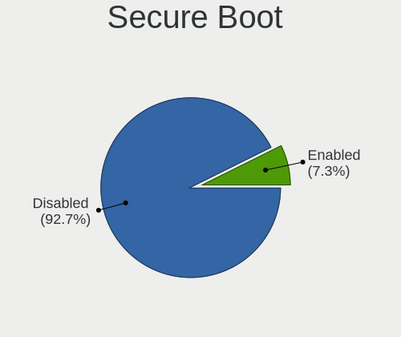

| State    | Computers | Percent |
|----------|-----------|---------|
| Disabled | 110       | 93.22%  |
| Enabled  | 8         | 6.78%   |

Coreboot
--------

Have coreboot on board

| Used | Computers | Percent |
|------|-----------|---------|
| No   | 118       | 100%    |

RAM Size
--------

Total RAM memory

| Size in GB | Computers | Percent |
|------------|-----------|---------|
| 4.01-8.0   | 43        | 36.13%  |
| 3.01-4.0   | 24        | 20.17%  |
| 16.01-24.0 | 21        | 17.65%  |
| 8.01-16.0  | 20        | 16.81%  |
| 1.01-2.0   | 6         | 5.04%   |
| 32.01-64.0 | 4         | 3.36%   |
| 2.01-3.0   | 1         | 0.84%   |

RAM Used
--------

Used RAM memory

| Used GB   | Computers | Percent |
|-----------|-----------|---------|
| 1.01-2.0  | 43        | 33.08%  |
| 2.01-3.0  | 40        | 30.77%  |
| 4.01-8.0  | 19        | 14.62%  |
| 3.01-4.0  | 17        | 13.08%  |
| 0.51-1.0  | 5         | 3.85%   |
| 8.01-16.0 | 3         | 2.31%   |
| 0.01-0.5  | 2         | 1.54%   |
| Unknown   | 1         | 0.77%   |

Total Drives
------------

Number of drives on board

| Drives | Computers | Percent |
|--------|-----------|---------|
| 1      | 88        | 72.73%  |
| 2      | 31        | 25.62%  |
| 4      | 1         | 0.83%   |
| 0      | 1         | 0.83%   |

Has CD-ROM
----------

Has CD-ROM on board

| Presented | Computers | Percent |
|-----------|-----------|---------|
| Yes       | 60        | 50.42%  |
| No        | 59        | 49.58%  |

Has Ethernet
------------

Has Ethernet on board

| Presented | Computers | Percent |
|-----------|-----------|---------|
| Yes       | 106       | 89.83%  |
| No        | 12        | 10.17%  |

Has WiFi
--------

Has WiFi module

| Presented | Computers | Percent |
|-----------|-----------|---------|
| Yes       | 108       | 90.76%  |
| No        | 11        | 9.24%   |

Has Bluetooth
-------------

Has Bluetooth module

| Presented | Computers | Percent |
|-----------|-----------|---------|
| Yes       | 93        | 76.86%  |
| No        | 28        | 23.14%  |

Location
--------

Country
-------

Geographic location (country)

| Country | Computers | Percent |
|---------|-----------|---------|
| Tunisia | 118       | 100%    |

City
----

Geographic location (city)

| City               | Computers | Percent |
|--------------------|-----------|---------|
| Tunis              | 70        | 52.63%  |
| Aryanah            | 7         | 5.26%   |
| Sousse             | 6         | 4.51%   |
| Nabeul             | 5         | 3.76%   |
| Bizerte            | 5         | 3.76%   |
| Monastir           | 3         | 2.26%   |
| Centre Urbain Nord | 3         | 2.26%   |
| Rades              | 2         | 1.5%    |
| Mateur             | 2         | 1.5%    |
| Masakin            | 2         | 1.5%    |
| Mahdia             | 2         | 1.5%    |
| Zarzis             | 1         | 0.75%   |
| Zaouiat Djedidi    | 1         | 0.75%   |
| Wadi Maliz         | 1         | 0.75%   |
| Tebourba           | 1         | 0.75%   |
| Tataouine          | 1         | 0.75%   |
| Sfax               | 1         | 0.75%   |
| Rafraf             | 1         | 0.75%   |
| Oued Lill          | 1         | 0.75%   |
| Manouba            | 1         | 0.75%   |
| La Goulette        | 1         | 0.75%   |
| Jedeida            | 1         | 0.75%   |
| Houmt Souk         | 1         | 0.75%   |
| Hergla             | 1         | 0.75%   |
| Hammamet           | 1         | 0.75%   |
| Gremda             | 1         | 0.75%   |
| Gafsa              | 1         | 0.75%   |
| El Fahs            | 1         | 0.75%   |
| El Battan          | 1         | 0.75%   |
| Carthage           | 1         | 0.75%   |
| Borj el Amri       | 1         | 0.75%   |
| Ben Arous          | 1         | 0.75%   |
| Belvedere          | 1         | 0.75%   |
| Bellevue           | 1         | 0.75%   |
| Beja               | 1         | 0.75%   |
| As Sanad           | 1         | 0.75%   |
| Akouda             | 1         | 0.75%   |

Drives
------

Drive Vendor
------------

Hard drive vendors

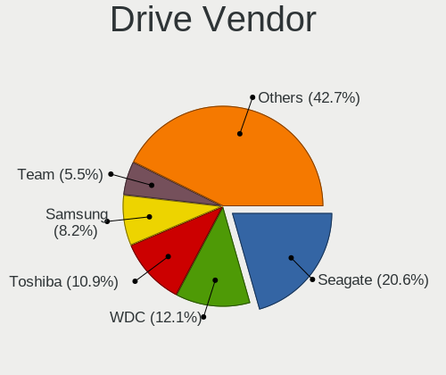

| Vendor                | Computers | Drives | Percent |
|-----------------------|-----------|--------|---------|
| Seagate               | 32        | 40     | 21.92%  |
| WDC                   | 30        | 39     | 20.55%  |
| Toshiba               | 14        | 16     | 9.59%   |
| Samsung Electronics   | 11        | 12     | 7.53%   |
| Team                  | 10        | 12     | 6.85%   |
| SK hynix              | 8         | 9      | 5.48%   |
| SanDisk               | 6         | 7      | 4.11%   |
| HGST                  | 6         | 7      | 4.11%   |
| Kingston              | 4         | 5      | 2.74%   |
| Hitachi               | 4         | 4      | 2.74%   |
| Unknown               | 3         | 3      | 2.05%   |
| Fujitsu               | 3         | 3      | 2.05%   |
| PNY                   | 2         | 2      | 1.37%   |
| Micron Technology     | 2         | 2      | 1.37%   |
| Intel                 | 2         | 2      | 1.37%   |
| UMIS                  | 1         | 1      | 0.68%   |
| TwinMOS               | 1         | 1      | 0.68%   |
| Realtek Semiconductor | 1         | 1      | 0.68%   |
| Phison                | 1         | 1      | 0.68%   |
| Patriot               | 1         | 1      | 0.68%   |
| OCZ                   | 1         | 1      | 0.68%   |
| EMTEC                 | 1         | 3      | 0.68%   |
| addlink               | 1         | 1      | 0.68%   |
| A-DATA Technology     | 1         | 1      | 0.68%   |

Drive Model
-----------

Hard drive models

| Model                                | Computers | Percent |
|--------------------------------------|-----------|---------|
| Seagate ST1000LM035-1RK172 1TB       | 7         | 4.64%   |
| Seagate ST500LT012-1DG142 500GB      | 6         | 3.97%   |
| WDC WD5000LPCX-24VHAT0 500GB         | 3         | 1.99%   |
| Seagate ST2000LM007-1R8174 2TB       | 3         | 1.99%   |
| HGST HTS545050A7E380 500GB           | 3         | 1.99%   |
| WDC WD5000LPCX-60VHAT0 500GB         | 2         | 1.32%   |
| WDC WD20SPZX-08UA7 2TB               | 2         | 1.32%   |
| WDC WD10SPZX-08Z10 1TB               | 2         | 1.32%   |
| WDC WD10SPCX-24HWST1 1TB             | 2         | 1.32%   |
| WDC WD10EADS-65M2B0 1TB              | 2         | 1.32%   |
| WDC PC SN720 SDAQNTW-512G-1001 512GB | 2         | 1.32%   |
| Toshiba MQ04ABF100 1TB               | 2         | 1.32%   |
| Toshiba MQ01ABD100 1TB               | 2         | 1.32%   |
| Toshiba MK5076GSX 500GB              | 2         | 1.32%   |
| Team T253X2512G 512GB SSD            | 2         | 1.32%   |
| SK hynix SC311 SATA 256GB SSD        | 2         | 1.32%   |
| Seagate ST1000LX015-1U7172 1TB       | 2         | 1.32%   |
| Seagate ST1000DM010-2EP102 1TB       | 2         | 1.32%   |
| Seagate ST1000DM003-1SB102 1TB       | 2         | 1.32%   |
| SanDisk NVMe SSD Drive 512GB         | 2         | 1.32%   |
| Kingston NVMe SSD Drive 512GB        | 2         | 1.32%   |
| Hitachi HTS545050A7E380 500GB        | 2         | 1.32%   |
| Fujitsu MHV2100BH PL 100GB           | 2         | 1.32%   |
| WDC WD5000LPZX-60Z10T0 500GB         | 1         | 0.66%   |
| WDC WD5000LPVX-75V0TT0 500GB         | 1         | 0.66%   |
| WDC WD5000LPVX-22V0TT0 500GB         | 1         | 0.66%   |
| WDC WD5000LPLX-60ZNTT2 500GB         | 1         | 0.66%   |
| WDC WD5000BPVT-55HXZT3 500GB         | 1         | 0.66%   |
| WDC WD5000AVDS-63U7B1 500GB          | 1         | 0.66%   |
| WDC WD5000AAKS-402AA0 500GB          | 1         | 0.66%   |
| WDC WD5000AACS-00ZUB0 500GB          | 1         | 0.66%   |
| WDC WD3200BEKT-60KA9T0 320GB         | 1         | 0.66%   |
| WDC WD3200AAJS-60M0A1 320GB          | 1         | 0.66%   |
| WDC WD2500BPVT-75JJ5T0 250GB         | 1         | 0.66%   |
| WDC WD2500AAJS-75M0A0 249GB          | 1         | 0.66%   |
| WDC WD10SPZX-24Z10 1TB               | 1         | 0.66%   |
| WDC WD10PURZ-85U8XY0 1TB             | 1         | 0.66%   |
| WDC WD10EZEX-00BN5A0 1TB             | 1         | 0.66%   |
| WDC PC SN530 SDBPNPZ-512G-1006 512GB | 1         | 0.66%   |
| WDC PC SN530 SDBPNPZ-512G-1002 512GB | 1         | 0.66%   |
| WDC PC SN520 SDAPNUW-256G-1002 256GB | 1         | 0.66%   |
| Unknown xD/SD/M.S.                   | 1         | 0.66%   |
| Unknown SS16G  16GB                  | 1         | 0.66%   |
| Unknown 00000  64GB                  | 1         | 0.66%   |
| UMIS RPJTJ512MEE1OWX 512GB           | 1         | 0.66%   |
| TwinMOS SSD 512GB                    | 1         | 0.66%   |
| Toshiba MQ01ACF050 500GB             | 1         | 0.66%   |
| Toshiba MQ01ABD050 500GB             | 1         | 0.66%   |
| Toshiba MQ01ABD032 320GB             | 1         | 0.66%   |
| Toshiba MK7575GSX 752GB              | 1         | 0.66%   |
| Toshiba MK4055GSX 400GB              | 1         | 0.66%   |
| Toshiba MK3275GSX 320GB              | 1         | 0.66%   |
| Toshiba DT01ACA100 1TB               | 1         | 0.66%   |
| Toshiba DT01ACA050 500GB             | 1         | 0.66%   |
| Team TM8FP6512G 512GB                | 1         | 0.66%   |
| Team TM8FP6256G 256GB                | 1         | 0.66%   |
| Team TM8FP6128G 128GB                | 1         | 0.66%   |
| Team TM8FP4256G 256GB                | 1         | 0.66%   |
| Team T253X1240G 240GB SSD            | 1         | 0.66%   |
| Team T253LE240G 240GB SSD            | 1         | 0.66%   |

HDD Vendor
----------

Hard disk drive vendors

| Vendor  | Computers | Drives | Percent |
|---------|-----------|--------|---------|
| Seagate | 32        | 40     | 37.65%  |
| WDC     | 26        | 34     | 30.59%  |
| Toshiba | 14        | 16     | 16.47%  |
| HGST    | 6         | 7      | 7.06%   |
| Hitachi | 4         | 4      | 4.71%   |
| Fujitsu | 3         | 3      | 3.53%   |

SSD Vendor
----------

Solid state drive vendors

| Vendor              | Computers | Drives | Percent |
|---------------------|-----------|--------|---------|
| Team                | 6         | 8      | 21.43%  |
| SK hynix            | 5         | 5      | 17.86%  |
| Samsung Electronics | 5         | 6      | 17.86%  |
| SanDisk             | 3         | 3      | 10.71%  |
| PNY                 | 2         | 2      | 7.14%   |
| TwinMOS             | 1         | 1      | 3.57%   |
| Patriot             | 1         | 1      | 3.57%   |
| OCZ                 | 1         | 1      | 3.57%   |
| Micron Technology   | 1         | 1      | 3.57%   |
| Kingston            | 1         | 1      | 3.57%   |
| EMTEC               | 1         | 3      | 3.57%   |
| addlink             | 1         | 1      | 3.57%   |

Drive Kind
----------

HDD or SSD

| Kind    | Computers | Drives | Percent |
|---------|-----------|--------|---------|
| HDD     | 83        | 104    | 58.87%  |
| SSD     | 28        | 33     | 19.86%  |
| NVMe    | 27        | 34     | 19.15%  |
| MMC     | 2         | 2      | 1.42%   |
| Unknown | 1         | 1      | 0.71%   |

Drive Connector
---------------

SATA, SAS, NVMe, etc.

| Type | Computers | Drives | Percent |
|------|-----------|--------|---------|
| SATA | 101       | 137    | 77.1%   |
| NVMe | 27        | 34     | 20.61%  |
| MMC  | 2         | 2      | 1.53%   |
| SAS  | 1         | 1      | 0.76%   |

Drive Size
----------

Size of hard drive

| Size in TB | Computers | Drives | Percent |
|------------|-----------|--------|---------|
| 0.01-0.5   | 67        | 80     | 62.04%  |
| 0.51-1.0   | 36        | 51     | 33.33%  |
| 1.01-2.0   | 5         | 6      | 4.63%   |

Space Total
-----------

Amount of disk space available on the file system

| Size in GB | Computers | Percent |
|------------|-----------|---------|
| 251-500    | 39        | 31.45%  |
| 101-250    | 38        | 30.65%  |
| 501-1000   | 19        | 15.32%  |
| 1001-2000  | 11        | 8.87%   |
| 1-20       | 6         | 4.84%   |
| 51-100     | 6         | 4.84%   |
| 21-50      | 4         | 3.23%   |
| Unknown    | 1         | 0.81%   |

Space Used
----------

Amount of used disk space

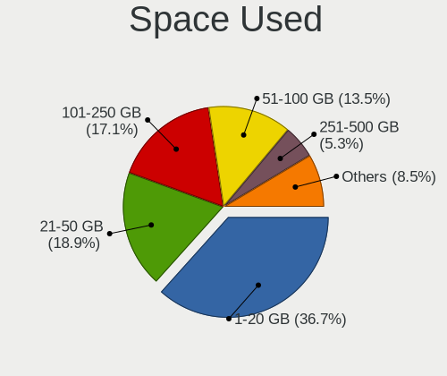

| Used GB   | Computers | Percent |
|-----------|-----------|---------|
| 1-20      | 52        | 40.31%  |
| 21-50     | 23        | 17.83%  |
| 101-250   | 22        | 17.05%  |
| 51-100    | 18        | 13.95%  |
| 251-500   | 6         | 4.65%   |
| 501-1000  | 5         | 3.88%   |
| 1001-2000 | 2         | 1.55%   |
| Unknown   | 1         | 0.78%   |

Malfunc. Drives
---------------

Drive models with a malfunction

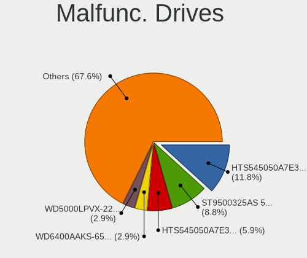

| Model                                               | Computers | Drives | Percent |
|-----------------------------------------------------|-----------|--------|---------|
| HGST HTS545050A7E380 500GB                          | 2         | 3      | 14.29%  |
| WDC WD5000BPVT-55HXZT3 500GB                        | 1         | 2      | 7.14%   |
| Toshiba MQ01ACF050 500GB                            | 1         | 1      | 7.14%   |
| Toshiba MQ01ABD050 500GB                            | 1         | 1      | 7.14%   |
| Toshiba MK5076GSX 500GB                             | 1         | 2      | 7.14%   |
| Toshiba MK4055GSX 400GB                             | 1         | 1      | 7.14%   |
| Seagate ST500LM012 HN-M500MBB 500GB                 | 1         | 1      | 7.14%   |
| Seagate ST3500413AS 500GB                           | 1         | 1      | 7.14%   |
| Seagate ST3320813AS 320GB                           | 1         | 1      | 7.14%   |
| Micron Technology MTFDDAK256MAY-1AH12ABHA 256GB SSD | 1         | 1      | 7.14%   |
| Hitachi HTS545050A7E380 500GB                       | 1         | 1      | 7.14%   |
| Hitachi HTS543232A7A384 320GB                       | 1         | 1      | 7.14%   |
| EMTEC X250 512GB SSD                                | 1         | 2      | 7.14%   |

Malfunc. Drive Vendor
---------------------

Vendors of faulty drives

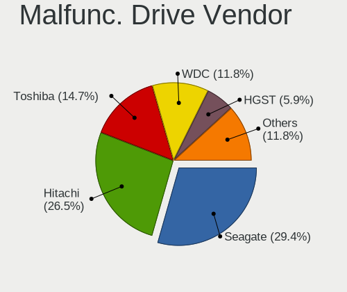

| Vendor            | Computers | Drives | Percent |
|-------------------|-----------|--------|---------|
| Toshiba           | 4         | 5      | 28.57%  |
| Seagate           | 3         | 3      | 21.43%  |
| Hitachi           | 2         | 2      | 14.29%  |
| HGST              | 2         | 3      | 14.29%  |
| WDC               | 1         | 2      | 7.14%   |
| Micron Technology | 1         | 1      | 7.14%   |
| EMTEC             | 1         | 2      | 7.14%   |

Malfunc. HDD Vendor
-------------------

Vendors of faulty HDD drives

| Vendor  | Computers | Drives | Percent |
|---------|-----------|--------|---------|
| Toshiba | 4         | 5      | 33.33%  |
| Seagate | 3         | 3      | 25%     |
| Hitachi | 2         | 2      | 16.67%  |
| HGST    | 2         | 3      | 16.67%  |
| WDC     | 1         | 2      | 8.33%   |

Malfunc. Drive Kind
-------------------

Kinds of faulty drives

| Kind | Computers | Drives | Percent |
|------|-----------|--------|---------|
| HDD  | 12        | 15     | 85.71%  |
| SSD  | 2         | 3      | 14.29%  |

Failed Drives
-------------

Failed drive models

Zero info for selected period =(

Failed Drive Vendor
-------------------

Failed drive vendors

Zero info for selected period =(

Drive Status
------------

Number of failed and malfunc. drives

| Status   | Computers | Drives | Percent |
|----------|-----------|--------|---------|
| Detected | 60        | 84     | 48%     |
| Works    | 51        | 72     | 40.8%   |
| Malfunc  | 14        | 18     | 11.2%   |

Storage controller
------------------

Storage Vendor
--------------

Storage controller vendors

| Vendor                       | Computers | Percent |
|------------------------------|-----------|---------|
| Intel                        | 101       | 71.63%  |
| AMD                          | 13        | 9.22%   |
| SanDisk                      | 6         | 4.26%   |
| Samsung Electronics          | 6         | 4.26%   |
| SK hynix                     | 3         | 2.13%   |
| Phison Electronics           | 3         | 2.13%   |
| Kingston Technology Company  | 3         | 2.13%   |
| Realtek Semiconductor        | 2         | 1.42%   |
| Union Memory (Shenzhen)      | 1         | 0.71%   |
| Silicon Motion               | 1         | 0.71%   |
| Shenzhen Longsys Electronics | 1         | 0.71%   |
| Micron Technology            | 1         | 0.71%   |

Storage Model
-------------

Storage controller models

| Model                                                                                   | Computers | Percent |
|-----------------------------------------------------------------------------------------|-----------|---------|
| Intel Sunrise Point-LP SATA Controller [AHCI mode]                                      | 13        | 8.67%   |
| AMD FCH SATA Controller [AHCI mode]                                                     | 11        | 7.33%   |
| Intel 82801 Mobile SATA Controller [RAID mode]                                          | 9         | 6%      |
| Intel 8 Series SATA Controller 1 [AHCI mode]                                            | 7         | 4.67%   |
| Intel 7 Series Chipset Family 6-port SATA Controller [AHCI mode]                        | 7         | 4.67%   |
| Samsung NVMe SSD Controller 980                                                         | 5         | 3.33%   |
| Intel Comet Lake SATA AHCI Controller                                                   | 5         | 3.33%   |
| Intel 6 Series/C200 Series Chipset Family 6 port Mobile SATA AHCI Controller            | 5         | 3.33%   |
| Intel Cannon Lake Mobile PCH SATA AHCI Controller                                       | 4         | 2.67%   |
| Intel 8 Series/C220 Series Chipset Family 6-port SATA Controller 1 [AHCI mode]          | 4         | 2.67%   |
| SanDisk WD Blue SN550 NVMe SSD                                                          | 3         | 2%      |
| Kingston Company Company Non-Volatile memory controller                                 | 3         | 2%      |
| Intel Wildcat Point-LP SATA Controller [AHCI Mode]                                      | 3         | 2%      |
| Intel Q170/Q150/B150/H170/H110/Z170/CM236 Chipset SATA Controller [AHCI Mode]           | 3         | 2%      |
| Intel HM170/QM170 Chipset SATA Controller [AHCI Mode]                                   | 3         | 2%      |
| Intel Atom/Celeron/Pentium Processor x5-E8000/J3xxx/N3xxx Series SATA Controller        | 3         | 2%      |
| Intel 82801JI (ICH10 Family) 4 port SATA IDE Controller #1                              | 3         | 2%      |
| Intel 82801IBM/IEM (ICH9M/ICH9M-E) 4 port SATA Controller [AHCI mode]                   | 3         | 2%      |
| Intel 6 Series/C200 Series Chipset Family Desktop SATA Controller (IDE mode, ports 4-5) | 3         | 2%      |
| Intel 6 Series/C200 Series Chipset Family Desktop SATA Controller (IDE mode, ports 0-3) | 3         | 2%      |
| Intel 400 Series Chipset Family SATA AHCI Controller                                    | 3         | 2%      |
| SK hynix BC511                                                                          | 2         | 1.33%   |
| SanDisk WD Black 2018/SN750 / PC SN720 NVMe SSD                                         | 2         | 1.33%   |
| Realtek RTS5763DL NVMe SSD Controller                                                   | 2         | 1.33%   |
| Phison E12 NVMe Controller                                                              | 2         | 1.33%   |
| Intel Volume Management Device NVMe RAID Controller                                     | 2         | 1.33%   |
| Intel Tiger Lake-LP SATA Controller [AHCI mode]                                         | 2         | 1.33%   |
| Intel SSD 660P Series                                                                   | 2         | 1.33%   |
| Intel Ice Lake-LP SATA Controller [AHCI mode]                                           | 2         | 1.33%   |
| Intel 6 Series/C200 Series Chipset Family 6 port Desktop SATA AHCI Controller           | 2         | 1.33%   |
| Intel 5 Series/3400 Series Chipset 6 port SATA AHCI Controller                          | 2         | 1.33%   |
| Intel 5 Series/3400 Series Chipset 4 port SATA AHCI Controller                          | 2         | 1.33%   |
| Union Memory (Shenzhen) Non-Volatile memory controller                                  | 1         | 0.67%   |
| SK hynix BC501 NVMe Solid State Drive                                                   | 1         | 0.67%   |
| Silicon Motion SM2263EN/SM2263XT SSD Controller                                         | 1         | 0.67%   |
| Shenzhen Longsys SM2263EN/SM2263XT-based OEM SSD                                        | 1         | 0.67%   |
| SanDisk WD Blue SN500 / PC SN520 NVMe SSD                                               | 1         | 0.67%   |
| Samsung NVMe SSD Controller SM961/PM961/SM963                                           | 1         | 0.67%   |
| Phison PS5013 E13 NVMe Controller                                                       | 1         | 0.67%   |
| Micron Non-Volatile memory controller                                                   | 1         | 0.67%   |
| Intel NM10/ICH7 Family SATA Controller [IDE mode]                                       | 1         | 0.67%   |
| Intel Celeron N3350/Pentium N4200/Atom E3900 Series SATA AHCI Controller                | 1         | 0.67%   |
| Intel Cannon Lake PCH SATA AHCI Controller                                              | 1         | 0.67%   |
| Intel Atom Processor E3800 Series SATA AHCI Controller                                  | 1         | 0.67%   |
| Intel Alder Lake-P SATA AHCI Controller                                                 | 1         | 0.67%   |
| Intel 82801IR/IO/IH (ICH9R/DO/DH) 6 port SATA Controller [AHCI mode]                    | 1         | 0.67%   |
| Intel 82801IBM/IEM (ICH9M/ICH9M-E) 2 port SATA Controller [IDE mode]                    | 1         | 0.67%   |
| Intel 8 Series/C220 Series Chipset Family 4-port SATA Controller 1 [IDE mode]           | 1         | 0.67%   |
| Intel 8 Series/C220 Series Chipset Family 2-port SATA Controller 2 [IDE mode]           | 1         | 0.67%   |
| Intel 7 Series/C210 Series Chipset Family 4-port SATA Controller [IDE mode]             | 1         | 0.67%   |
| Intel 7 Series/C210 Series Chipset Family 2-port SATA Controller [IDE mode]             | 1         | 0.67%   |
| Intel 7 Series Chipset Family 4-port SATA Controller [IDE mode]                         | 1         | 0.67%   |
| Intel 7 Series Chipset Family 2-port SATA Controller [IDE mode]                         | 1         | 0.67%   |
| Intel 200 Series PCH SATA controller [AHCI mode]                                        | 1         | 0.67%   |
| AMD SB7x0/SB8x0/SB9x0 SATA Controller [AHCI mode]                                       | 1         | 0.67%   |
| AMD 500 Series Chipset SATA Controller                                                  | 1         | 0.67%   |
| AMD 400 Series Chipset SATA Controller                                                  | 1         | 0.67%   |

Storage Kind
------------

Kind of storage controller (IDE, SATA, NVMe, SAS, ...)

| Kind | Computers | Percent |
|------|-----------|---------|
| SATA | 92        | 65.25%  |
| NVMe | 27        | 19.15%  |
| RAID | 11        | 7.8%    |
| IDE  | 11        | 7.8%    |

Processor
---------

CPU Vendor
----------

Processor vendors

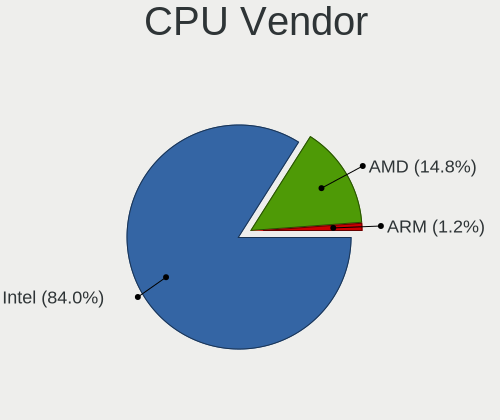

| Vendor | Computers | Percent |
|--------|-----------|---------|
| Intel  | 103       | 87.29%  |
| AMD    | 15        | 12.71%  |

CPU Model
---------

Processor models

| Model                                         | Computers | Percent |
|-----------------------------------------------|-----------|---------|
| Intel Core i5-9300H CPU @ 2.40GHz             | 4         | 3.39%   |
| Intel Core i7-6700HQ CPU @ 2.60GHz            | 3         | 2.54%   |
| Intel Core i5-8250U CPU @ 1.60GHz             | 3         | 2.54%   |
| Intel Core i5-4200U CPU @ 1.60GHz             | 3         | 2.54%   |
| Intel Core i5-10210U CPU @ 1.60GHz            | 3         | 2.54%   |
| AMD Ryzen 5 3550H with Radeon Vega Mobile Gfx | 3         | 2.54%   |
| Intel Pentium CPU G4560 @ 3.50GHz             | 2         | 1.69%   |
| Intel Core i7-8750H CPU @ 2.20GHz             | 2         | 1.69%   |
| Intel Core i7-8550U CPU @ 1.80GHz             | 2         | 1.69%   |
| Intel Core i7-7500U CPU @ 2.70GHz             | 2         | 1.69%   |
| Intel Core i7-4510U CPU @ 2.00GHz             | 2         | 1.69%   |
| Intel Core i7-10750H CPU @ 2.60GHz            | 2         | 1.69%   |
| Intel Core i5-2430M CPU @ 2.40GHz             | 2         | 1.69%   |
| Intel Core i3-5005U CPU @ 2.00GHz             | 2         | 1.69%   |
| Intel Core i3-3217U CPU @ 1.80GHz             | 2         | 1.69%   |
| Intel Core i3-1005G1 CPU @ 1.20GHz            | 2         | 1.69%   |
| Intel Core i3 CPU M 380 @ 2.53GHz             | 2         | 1.69%   |
| Intel Core 2 Quad CPU Q8300 @ 2.50GHz         | 2         | 1.69%   |
| Intel Core 2 Duo CPU T6500 @ 2.10GHz          | 2         | 1.69%   |
| Intel Celeron CPU N3060 @ 1.60GHz             | 2         | 1.69%   |
| AMD Ryzen 5 4600H with Radeon Graphics        | 2         | 1.69%   |
| Intel Xeon E-2144G CPU @ 3.60GHz              | 1         | 0.85%   |
| Intel Pentium Dual-Core CPU T4400 @ 2.20GHz   | 1         | 0.85%   |
| Intel Pentium Dual-Core CPU E5400 @ 2.70GHz   | 1         | 0.85%   |
| Intel Pentium CPU N3710 @ 1.60GHz             | 1         | 0.85%   |
| Intel Pentium CPU N3540 @ 2.16GHz             | 1         | 0.85%   |
| Intel Pentium CPU G630 @ 2.70GHz              | 1         | 0.85%   |
| Intel Pentium CPU G3250 @ 3.20GHz             | 1         | 0.85%   |
| Intel Pentium CPU G2030 @ 3.00GHz             | 1         | 0.85%   |
| Intel Pentium CPU B960 @ 2.20GHz              | 1         | 0.85%   |
| Intel Core m3-6Y30 CPU @ 0.90GHz              | 1         | 0.85%   |
| Intel Core i7-6700 CPU @ 3.40GHz              | 1         | 0.85%   |
| Intel Core i7-6500U CPU @ 2.50GHz             | 1         | 0.85%   |
| Intel Core i7-4750HQ CPU @ 2.00GHz            | 1         | 0.85%   |
| Intel Core i7-4720HQ CPU @ 2.60GHz            | 1         | 0.85%   |
| Intel Core i7-4500U CPU @ 1.80GHz             | 1         | 0.85%   |
| Intel Core i7-2670QM CPU @ 2.20GHz            | 1         | 0.85%   |
| Intel Core i7-2600 CPU @ 3.40GHz              | 1         | 0.85%   |
| Intel Core i7-10870H CPU @ 2.20GHz            | 1         | 0.85%   |
| Intel Core i7-1065G7 CPU @ 1.30GHz            | 1         | 0.85%   |
| Intel Core i7-10510U CPU @ 1.80GHz            | 1         | 0.85%   |
| Intel Core i5-8350U CPU @ 1.70GHz             | 1         | 0.85%   |
| Intel Core i5-8265U CPU @ 1.60GHz             | 1         | 0.85%   |
| Intel Core i5-7200U CPU @ 2.50GHz             | 1         | 0.85%   |
| Intel Core i5-6300U CPU @ 2.40GHz             | 1         | 0.85%   |
| Intel Core i5-6198DU CPU @ 2.30GHz            | 1         | 0.85%   |
| Intel Core i5-5200U CPU @ 2.20GHz             | 1         | 0.85%   |
| Intel Core i5-4300U CPU @ 1.90GHz             | 1         | 0.85%   |
| Intel Core i5-4210U CPU @ 1.70GHz             | 1         | 0.85%   |
| Intel Core i5-4200M CPU @ 2.50GHz             | 1         | 0.85%   |
| Intel Core i5-3337U CPU @ 1.80GHz             | 1         | 0.85%   |
| Intel Core i5-3210M CPU @ 2.50GHz             | 1         | 0.85%   |
| Intel Core i5-2540M CPU @ 2.60GHz             | 1         | 0.85%   |
| Intel Core i5-2467M CPU @ 1.60GHz             | 1         | 0.85%   |
| Intel Core i5-2400 CPU @ 3.10GHz              | 1         | 0.85%   |
| Intel Core i5-1035G1 CPU @ 1.00GHz            | 1         | 0.85%   |
| Intel Core i5-10310U CPU @ 1.70GHz            | 1         | 0.85%   |
| Intel Core i5-10300H CPU @ 2.50GHz            | 1         | 0.85%   |
| Intel Core i5 CPU M 520 @ 2.40GHz             | 1         | 0.85%   |
| Intel Core i5 CPU M 430 @ 2.27GHz             | 1         | 0.85%   |

CPU Model Family
----------------

Processor model prefix

| Model                   | Computers | Percent |
|-------------------------|-----------|---------|
| Intel Core i5           | 34        | 28.81%  |
| Intel Core i7           | 23        | 19.49%  |
| Intel Core i3           | 21        | 17.8%   |
| Intel Pentium           | 8         | 6.78%   |
| AMD Ryzen 5             | 8         | 6.78%   |
| Other                   | 4         | 3.39%   |
| Intel Core 2 Quad       | 3         | 2.54%   |
| Intel Core 2 Duo        | 3         | 2.54%   |
| Intel Celeron           | 3         | 2.54%   |
| Intel Pentium Dual-Core | 2         | 1.69%   |
| Intel Xeon              | 1         | 0.85%   |
| Intel Core m3           | 1         | 0.85%   |
| Intel Atom              | 1         | 0.85%   |
| AMD Sempron             | 1         | 0.85%   |
| AMD Ryzen 7             | 1         | 0.85%   |
| AMD E2                  | 1         | 0.85%   |
| AMD A8                  | 1         | 0.85%   |
| AMD A6                  | 1         | 0.85%   |
| AMD A4                  | 1         | 0.85%   |

CPU Cores
---------

Number of processor cores

| Number  | Computers | Percent |
|---------|-----------|---------|
| 2       | 62        | 52.54%  |
| 4       | 41        | 34.75%  |
| 6       | 9         | 7.63%   |
| 8       | 2         | 1.69%   |
| 1       | 2         | 1.69%   |
| 14      | 1         | 0.85%   |
| Unknown | 1         | 0.85%   |

CPU Sockets
-----------

Number of sockets

| Number | Computers | Percent |
|--------|-----------|---------|
| 1      | 118       | 100%    |

CPU Threads
-----------

Threads per core (Hyper-Threading)

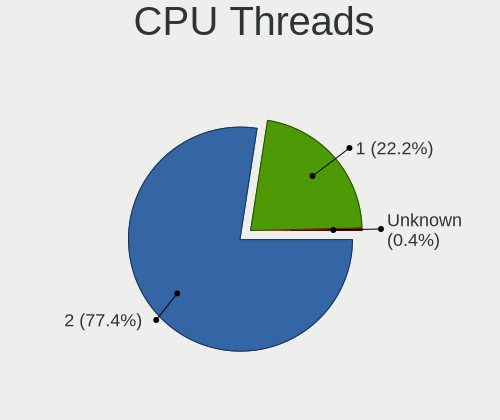

| Number  | Computers | Percent |
|---------|-----------|---------|
| 2       | 93        | 78.15%  |
| 1       | 25        | 21.01%  |
| Unknown | 1         | 0.84%   |

CPU Op-Modes
------------

CPU Operation Modes (32-bit, 64-bit)

| Op mode        | Computers | Percent |
|----------------|-----------|---------|
| 32-bit, 64-bit | 117       | 99.15%  |
| Unknown        | 1         | 0.85%   |

CPU Microcode
-------------

Microcode number

| Number     | Computers | Percent |
|------------|-----------|---------|
| Unknown    | 22        | 18.18%  |
| 0x206a7    | 11        | 9.09%   |
| 0x40651    | 7         | 5.79%   |
| 0x306a9    | 7         | 5.79%   |
| 0x806ea    | 6         | 4.96%   |
| 0x906ea    | 5         | 4.13%   |
| 0x806ec    | 5         | 4.13%   |
| 0x506e3    | 5         | 4.13%   |
| 0x406e3    | 5         | 4.13%   |
| 0x1067a    | 5         | 4.13%   |
| 0xa0652    | 3         | 2.48%   |
| 0x706e5    | 3         | 2.48%   |
| 0x306c3    | 3         | 2.48%   |
| 0x20655    | 3         | 2.48%   |
| 0x806e9    | 2         | 1.65%   |
| 0x806c1    | 2         | 1.65%   |
| 0x406c4    | 2         | 1.65%   |
| 0x306d4    | 2         | 1.65%   |
| 0x08108102 | 2         | 1.65%   |
| 0x06006705 | 2         | 1.65%   |
| 0x06006704 | 2         | 1.65%   |
| 0xa0653    | 1         | 0.83%   |
| 0x906e9    | 1         | 0.83%   |
| 0x906a3    | 1         | 0.83%   |
| 0x6fd      | 1         | 0.83%   |
| 0x6fb      | 1         | 0.83%   |
| 0x506c9    | 1         | 0.83%   |
| 0x40661    | 1         | 0.83%   |
| 0x30678    | 1         | 0.83%   |
| 0x20652    | 1         | 0.83%   |
| 0x106ca    | 1         | 0.83%   |
| 0x0a50000c | 1         | 0.83%   |
| 0x08701013 | 1         | 0.83%   |
| 0x08600106 | 1         | 0.83%   |
| 0x08600104 | 1         | 0.83%   |
| 0x08108109 | 1         | 0.83%   |
| 0x02000032 | 1         | 0.83%   |
| 0x00000000 | 1         | 0.83%   |

CPU Microarch
-------------

Microarchitecture

| Name            | Computers | Percent |
|-----------------|-----------|---------|
| KabyLake        | 26        | 22.03%  |
| SandyBridge     | 13        | 11.02%  |
| Haswell         | 13        | 11.02%  |
| Skylake         | 11        | 9.32%   |
| IvyBridge       | 7         | 5.93%   |
| Penryn          | 6         | 5.08%   |
| CometLake       | 5         | 4.24%   |
| Zen 2           | 4         | 3.39%   |
| Westmere        | 4         | 3.39%   |
| Silvermont      | 4         | 3.39%   |
| IceLake         | 4         | 3.39%   |
| Excavator       | 4         | 3.39%   |
| Zen+            | 3         | 2.54%   |
| Broadwell       | 3         | 2.54%   |
| Zen 3           | 2         | 1.69%   |
| TigerLake       | 2         | 1.69%   |
| Core            | 2         | 1.69%   |
| Puma            | 1         | 0.85%   |
| K8 & K10 hybrid | 1         | 0.85%   |
| Goldmont        | 1         | 0.85%   |
| Bonnell         | 1         | 0.85%   |
| Unknown         | 1         | 0.85%   |

Graphics
--------

GPU Vendor
----------

Vendors of graphics cards

| Vendor | Computers | Percent |
|--------|-----------|---------|
| Intel  | 91        | 53.85%  |
| Nvidia | 48        | 28.4%   |
| AMD    | 30        | 17.75%  |

GPU Model
---------

Graphics card models

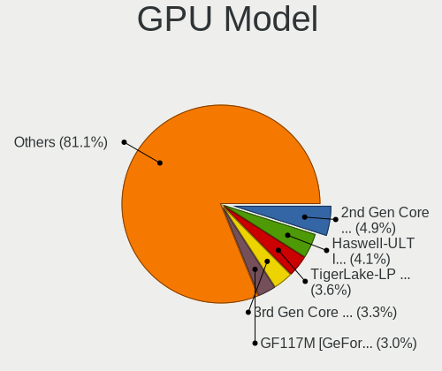

| Model                                                                                    | Computers | Percent |
|------------------------------------------------------------------------------------------|-----------|---------|
| Intel 2nd Generation Core Processor Family Integrated Graphics Controller                | 9         | 5.26%   |
| Intel Haswell-ULT Integrated Graphics Controller                                         | 8         | 4.68%   |
| Intel UHD Graphics 620                                                                   | 6         | 3.51%   |
| Intel CoffeeLake-H GT2 [UHD Graphics 630]                                                | 6         | 3.51%   |
| Intel 3rd Gen Core processor Graphics Controller                                         | 6         | 3.51%   |
| Intel HD Graphics 620                                                                    | 5         | 2.92%   |
| Intel CometLake-U GT2 [UHD Graphics]                                                     | 5         | 2.92%   |
| Nvidia GM107M [GeForce GTX 950M]                                                         | 4         | 2.34%   |
| Nvidia GF117M [GeForce 610M/710M/810M/820M / GT 620M/625M/630M/720M]                     | 4         | 2.34%   |
| Intel HD Graphics 530                                                                    | 4         | 2.34%   |
| Intel CometLake-H GT2 [UHD Graphics]                                                     | 4         | 2.34%   |
| AMD Stoney [Radeon R2/R3/R4/R5 Graphics]                                                 | 4         | 2.34%   |
| Nvidia TU117M [GeForce GTX 1650 Mobile / Max-Q]                                          | 3         | 1.75%   |
| Nvidia GT218 [GeForce 210]                                                               | 3         | 1.75%   |
| Nvidia GP108M [GeForce MX330]                                                            | 3         | 1.75%   |
| Nvidia GP107M [GeForce GTX 1050 3 GB Max-Q]                                              | 3         | 1.75%   |
| Nvidia GM108M [GeForce MX110]                                                            | 3         | 1.75%   |
| Intel Skylake GT2 [HD Graphics 520]                                                      | 3         | 1.75%   |
| Intel Iris Plus Graphics G1 (Ice Lake)                                                   | 3         | 1.75%   |
| Intel HD Graphics 5500                                                                   | 3         | 1.75%   |
| Intel Atom/Celeron/Pentium Processor x5-E8000/J3xxx/N3xxx Integrated Graphics Controller | 3         | 1.75%   |
| Intel 4 Series Chipset Integrated Graphics Controller                                    | 3         | 1.75%   |
| AMD Topaz XT [Radeon R7 M260/M265 / M340/M360 / M440/M445 / 530/535 / 620/625 Mobile]    | 3         | 1.75%   |
| AMD Renoir                                                                               | 3         | 1.75%   |
| AMD Picasso/Raven 2 [Radeon Vega Series / Radeon Vega Mobile Series]                     | 3         | 1.75%   |
| Nvidia TU117M [GeForce GTX 1650 Ti Mobile]                                               | 2         | 1.17%   |
| Nvidia TU117M                                                                            | 2         | 1.17%   |
| Nvidia TU116M [GeForce GTX 1660 Ti Mobile]                                               | 2         | 1.17%   |
| Nvidia GM108M [GeForce 920MX]                                                            | 2         | 1.17%   |
| Intel TigerLake-LP GT2 [Iris Xe Graphics]                                                | 2         | 1.17%   |
| Intel Mobile 4 Series Chipset Integrated Graphics Controller                             | 2         | 1.17%   |
| Intel Core Processor Integrated Graphics Controller                                      | 2         | 1.17%   |
| Intel 4th Gen Core Processor Integrated Graphics Controller                              | 2         | 1.17%   |
| AMD Sun XT [Radeon HD 8670A/8670M/8690M / R5 M330 / M430 / Radeon 520 Mobile]            | 2         | 1.17%   |
| AMD Lexa [Radeon 540X/550X/630 / RX 640 / E9171 MCM]                                     | 2         | 1.17%   |
| Nvidia TU116 [GeForce GTX 1660 SUPER]                                                    | 1         | 0.58%   |
| Nvidia GT218M [GeForce G 105M]                                                           | 1         | 0.58%   |
| Nvidia GP108M [GeForce MX230]                                                            | 1         | 0.58%   |
| Nvidia GP108 [GeForce GT 1030]                                                           | 1         | 0.58%   |
| Nvidia GP107M [GeForce GTX 1050 Ti Mobile]                                               | 1         | 0.58%   |
| Nvidia GP107M [GeForce GTX 1050 Mobile]                                                  | 1         | 0.58%   |
| Nvidia GP106 [GeForce GTX 1060 6GB]                                                      | 1         | 0.58%   |
| Nvidia GM108M [GeForce 940MX]                                                            | 1         | 0.58%   |
| Nvidia GM107M [GeForce GTX 960M]                                                         | 1         | 0.58%   |
| Nvidia GM107 [GeForce GTX 750]                                                           | 1         | 0.58%   |
| Nvidia GK208B [GeForce GT 710]                                                           | 1         | 0.58%   |
| Nvidia GF119M [GeForce 410M]                                                             | 1         | 0.58%   |
| Nvidia GF119 [GeForce GT 520]                                                            | 1         | 0.58%   |
| Nvidia GF108M [GeForce GT 525M]                                                          | 1         | 0.58%   |
| Nvidia GA107M [GeForce RTX 3050 Ti Mobile]                                               | 1         | 0.58%   |
| Nvidia GA107M [GeForce RTX 3050 Mobile]                                                  | 1         | 0.58%   |
| Nvidia GA106M [GeForce RTX 3060 Mobile / Max-Q]                                          | 1         | 0.58%   |
| Intel Xeon E3-1200 v3/4th Gen Core Processor Integrated Graphics Controller              | 1         | 0.58%   |
| Intel WhiskeyLake-U GT2 [UHD Graphics 620]                                               | 1         | 0.58%   |
| Intel Iris Plus Graphics G7                                                              | 1         | 0.58%   |
| Intel HD Graphics 610                                                                    | 1         | 0.58%   |
| Intel HD Graphics 520                                                                    | 1         | 0.58%   |
| Intel HD Graphics 515                                                                    | 1         | 0.58%   |
| Intel HD Graphics 510                                                                    | 1         | 0.58%   |
| Intel HD Graphics 500                                                                    | 1         | 0.58%   |

GPU Combo
---------

Combinations of graphics cards

| Name           | Computers | Percent |
|----------------|-----------|---------|
| 1 x Intel      | 46        | 38.98%  |
| Intel + Nvidia | 31        | 26.27%  |
| Intel + AMD    | 12        | 10.17%  |
| 1 x Nvidia     | 11        | 9.32%   |
| 1 x AMD        | 10        | 8.47%   |
| AMD + Nvidia   | 6         | 5.08%   |
| 2 x AMD        | 2         | 1.69%   |

GPU Driver
----------

Free vs proprietary

| Driver      | Computers | Percent |
|-------------|-----------|---------|
| Free        | 92        | 75.41%  |
| Proprietary | 25        | 20.49%  |
| Unknown     | 5         | 4.1%    |

GPU Memory
----------

Total video memory

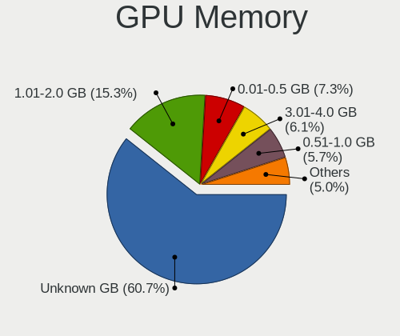

| Size in GB | Computers | Percent |
|------------|-----------|---------|
| Unknown    | 66        | 54.55%  |
| 1.01-2.0   | 19        | 15.7%   |
| 3.01-4.0   | 12        | 9.92%   |
| 0.51-1.0   | 10        | 8.26%   |
| 0.01-0.5   | 10        | 8.26%   |
| 5.01-6.0   | 2         | 1.65%   |
| 2.01-3.0   | 2         | 1.65%   |

Monitor
-------

Monitor Vendor
--------------

Monitor vendors

| Vendor                  | Computers | Percent |
|-------------------------|-----------|---------|
| AU Optronics            | 26        | 20%     |
| Samsung Electronics     | 23        | 17.69%  |
| BOE                     | 20        | 15.38%  |
| Chimei Innolux          | 19        | 14.62%  |
| LG Display              | 13        | 10%     |
| Hewlett-Packard         | 9         | 6.92%   |
| Chi Mei Optoelectronics | 3         | 2.31%   |
| PANDA                   | 2         | 1.54%   |
| Lenovo                  | 2         | 1.54%   |
| Dell                    | 2         | 1.54%   |
| BenQ                    | 2         | 1.54%   |
| S2-Tek                  | 1         | 0.77%   |
| PKB                     | 1         | 0.77%   |
| Philips                 | 1         | 0.77%   |
| Packard Bell            | 1         | 0.77%   |
| Medion                  | 1         | 0.77%   |
| ITE                     | 1         | 0.77%   |
| Goldstar                | 1         | 0.77%   |
| GDH                     | 1         | 0.77%   |
| Acer                    | 1         | 0.77%   |

Monitor Model
-------------

Monitor models

| Model                                                                | Computers | Percent |
|----------------------------------------------------------------------|-----------|---------|
| Chimei Innolux LCD Monitor CMN15F5 1920x1080 344x193mm 15.5-inch     | 4         | 3.03%   |
| Samsung Electronics S22F350 SAM0D1A 1920x1080 477x268mm 21.5-inch    | 3         | 2.27%   |
| Chimei Innolux LCD Monitor CMN15CA 1366x768 344x193mm 15.5-inch      | 3         | 2.27%   |
| BOE LCD Monitor BOE06A4 1366x768 344x194mm 15.5-inch                 | 3         | 2.27%   |
| AU Optronics LCD Monitor AUOAF90 1920x1080 344x193mm 15.5-inch       | 3         | 2.27%   |
| Samsung Electronics S24F350 SAM0D20 1920x1080 521x293mm 23.5-inch    | 2         | 1.52%   |
| Samsung Electronics LCD Monitor SDC354A 1366x768 344x194mm 15.5-inch | 2         | 1.52%   |
| Hewlett-Packard x20LED HWP2910 1600x900 443x249mm 20.0-inch          | 2         | 1.52%   |
| Chimei Innolux LCD Monitor CMN15DB 1366x768 344x193mm 15.5-inch      | 2         | 1.52%   |
| BOE LCD Monitor BOE0672 1366x768 344x194mm 15.5-inch                 | 2         | 1.52%   |
| AU Optronics LCD Monitor AUO38ED 1920x1080 344x193mm 15.5-inch       | 2         | 1.52%   |
| Samsung Electronics SyncMaster SAM04D4 1920x1080 531x298mm 24.0-inch | 1         | 0.76%   |
| Samsung Electronics SyncMaster SAM0284 1280x1024 338x270mm 17.0-inch | 1         | 0.76%   |
| Samsung Electronics SMB2240 SAM06AD 1920x1080 477x268mm 21.5-inch    | 1         | 0.76%   |
| Samsung Electronics SA300/SA350 SAM078B 1600x900 443x249mm 20.0-inch | 1         | 0.76%   |
| Samsung Electronics S20D300 SAM0BDB 1366x768 432x240mm 19.5-inch     | 1         | 0.76%   |
| Samsung Electronics S19D300 SAM0B34 1366x768 410x230mm 18.5-inch     | 1         | 0.76%   |
| Samsung Electronics LCD Monitor SEC544B 1600x900 310x174mm 14.0-inch | 1         | 0.76%   |
| Samsung Electronics LCD Monitor SEC5441 1366x768 344x194mm 15.5-inch | 1         | 0.76%   |
| Samsung Electronics LCD Monitor SEC4351 1366x768 344x194mm 15.5-inch | 1         | 0.76%   |
| Samsung Electronics LCD Monitor SEC3741 1366x768 309x174mm 14.0-inch | 1         | 0.76%   |
| Samsung Electronics LCD Monitor SEC3651 1366x768 344x194mm 15.5-inch | 1         | 0.76%   |
| Samsung Electronics LCD Monitor SEC354B 1440x900 367x230mm 17.1-inch | 1         | 0.76%   |
| Samsung Electronics LCD Monitor SEC3150 1366x768 340x190mm 15.3-inch | 1         | 0.76%   |
| Samsung Electronics LCD Monitor SDC4E51 1366x768 344x194mm 15.5-inch | 1         | 0.76%   |
| Samsung Electronics LCD Monitor SDC4852 1366x768 344x194mm 15.5-inch | 1         | 0.76%   |
| Samsung Electronics LCD Monitor SAM0900 1366x768 410x230mm 18.5-inch | 1         | 0.76%   |
| Samsung Electronics C24F390 SAM0D2C 1920x1080 521x293mm 23.5-inch    | 1         | 0.76%   |
| S2-Tek TV STK531A 1920x1080 930x530mm 42.1-inch                      | 1         | 0.76%   |
| PKB LCD Monitor VIS220WS 1680x1050                                   | 1         | 0.76%   |
| Philips PHL 223V5 PHLC0CF 1920x1080 477x268mm 21.5-inch              | 1         | 0.76%   |
| PANDA LCD Monitor NCP004D 1920x1080 344x194mm 15.5-inch              | 1         | 0.76%   |
| PANDA LCD Monitor NCP002D 1920x1080 344x194mm 15.5-inch              | 1         | 0.76%   |
| Packard Bell PKB VIS220WS PKB5064 1680x1050 460x290mm 21.4-inch      | 1         | 0.76%   |
| Medion MD30422PV MED86F6 1680x1050 474x296mm 22.0-inch               | 1         | 0.76%   |
| LG Display LP156WH2-TLR1 LGD0221 1366x768 340x190mm 15.3-inch        | 1         | 0.76%   |
| LG Display LCD Monitor LGDD801 1366x768 344x194mm 15.5-inch          | 1         | 0.76%   |
| LG Display LCD Monitor LGD05E5 1920x1080 340x190mm 15.3-inch         | 1         | 0.76%   |
| LG Display LCD Monitor LGD04E1 1366x768 344x194mm 15.5-inch          | 1         | 0.76%   |
| LG Display LCD Monitor LGD04A7 1920x1080 344x194mm 15.5-inch         | 1         | 0.76%   |
| LG Display LCD Monitor LGD0430 1366x768 345x194mm 15.6-inch          | 1         | 0.76%   |
| LG Display LCD Monitor LGD03E9 1366x768 345x194mm 15.6-inch          | 1         | 0.76%   |
| LG Display LCD Monitor LGD03CD 1366x768 277x156mm 12.5-inch          | 1         | 0.76%   |
| LG Display LCD Monitor LGD03AB 1366x768 344x194mm 15.5-inch          | 1         | 0.76%   |
| LG Display LCD Monitor LGD038E 1366x768 344x194mm 15.5-inch          | 1         | 0.76%   |
| LG Display LCD Monitor LGD033F 1366x768 309x174mm 14.0-inch          | 1         | 0.76%   |
| LG Display LCD Monitor LGD033A 1366x768 344x194mm 15.5-inch          | 1         | 0.76%   |
| LG Display LCD Monitor LGD02DC 1366x768 344x194mm 15.5-inch          | 1         | 0.76%   |
| Lenovo T24v-10 LEN61BC 1920x1080 527x296mm 23.8-inch                 | 1         | 0.76%   |
| Lenovo LEN G27c-10 LEN66A3 1920x1080 597x336mm 27.0-inch             | 1         | 0.76%   |
| ITE DP2VGA V158 ITE6512 1680x1050 600x340mm 27.2-inch                | 1         | 0.76%   |
| Hewlett-Packard W2072a HWP3000 1600x900 443x249mm 20.0-inch          | 1         | 0.76%   |
| Hewlett-Packard P224 HPN361E 1920x1080 527x296mm 23.8-inch           | 1         | 0.76%   |
| Hewlett-Packard LE2001w HWP2841 1600x900 440x250mm 19.9-inch         | 1         | 0.76%   |
| Hewlett-Packard LCD Monitor 2011 1600x900                            | 1         | 0.76%   |
| Hewlett-Packard 24o HPN337C 1920x1080 531x299mm 24.0-inch            | 1         | 0.76%   |
| Hewlett-Packard 24es HWP3320 1920x1080 527x296mm 23.8-inch           | 1         | 0.76%   |
| Hewlett-Packard 2011 HWP2935 1600x900 443x249mm 20.0-inch            | 1         | 0.76%   |
| Hewlett-Packard 2011 HWP2934 1600x900 443x249mm 20.0-inch            | 1         | 0.76%   |
| Goldstar IPS226 GSM5807 1920x1080 477x268mm 21.5-inch                | 1         | 0.76%   |

Monitor Resolution
------------------

Monitor screen resolution

| Resolution         | Computers | Percent |
|--------------------|-----------|---------|
| 1920x1080 (FHD)    | 52        | 42.62%  |
| 1366x768 (WXGA)    | 47        | 38.52%  |
| 1600x900 (HD+)     | 12        | 9.84%   |
| 3840x2160 (4K)     | 3         | 2.46%   |
| 1680x1050 (WSXGA+) | 3         | 2.46%   |
| 1280x1024 (SXGA)   | 2         | 1.64%   |
| 1440x900 (WXGA+)   | 1         | 0.82%   |
| 1280x800 (WXGA)    | 1         | 0.82%   |
| 1024x600           | 1         | 0.82%   |

Monitor Diagonal
----------------

Diagonal size in inches

| Inches  | Computers | Percent |
|---------|-----------|---------|
| 15      | 70        | 53.85%  |
| 17      | 9         | 6.92%   |
| 21      | 7         | 5.38%   |
| 24      | 6         | 4.62%   |
| 20      | 6         | 4.62%   |
| 14      | 6         | 4.62%   |
| 13      | 6         | 4.62%   |
| 23      | 4         | 3.08%   |
| 27      | 3         | 2.31%   |
| 22      | 2         | 1.54%   |
| 11      | 2         | 1.54%   |
| Unknown | 2         | 1.54%   |
| 52      | 1         | 0.77%   |
| 42      | 1         | 0.77%   |
| 31      | 1         | 0.77%   |
| 19      | 1         | 0.77%   |
| 18      | 1         | 0.77%   |
| 12      | 1         | 0.77%   |
| 10      | 1         | 0.77%   |

Monitor Width
-------------

Physical width

| Width in mm | Computers | Percent |
|-------------|-----------|---------|
| 301-350     | 80        | 62.99%  |
| 401-500     | 16        | 12.6%   |
| 501-600     | 12        | 9.45%   |
| 351-400     | 8         | 6.3%    |
| 201-300     | 6         | 4.72%   |
| Unknown     | 2         | 1.57%   |
| 601-700     | 1         | 0.79%   |
| 1001-1500   | 1         | 0.79%   |
| 901-1000    | 1         | 0.79%   |

Aspect Ratio
------------

Proportional relationship between the width and the height

| Ratio   | Computers | Percent |
|---------|-----------|---------|
| 16/9    | 106       | 91.38%  |
| 16/10   | 6         | 5.17%   |
| 5/4     | 2         | 1.72%   |
| Unknown | 2         | 1.72%   |

Monitor Area
------------

Area in inch

| Area in inch | Computers | Percent |
|----------------|-----------|---------|
| 101-110        | 70        | 53.85%  |
| 201-250        | 18        | 13.85%  |
| 81-90          | 10        | 7.69%   |
| 151-200        | 8         | 6.15%   |
| 121-130        | 5         | 3.85%   |
| 301-350        | 3         | 2.31%   |
| 141-150        | 3         | 2.31%   |
| 71-80          | 2         | 1.54%   |
| 51-60          | 2         | 1.54%   |
| 131-140        | 2         | 1.54%   |
| Unknown        | 2         | 1.54%   |
| More than 1000 | 1         | 0.77%   |
| 61-70          | 1         | 0.77%   |
| 351-500        | 1         | 0.77%   |
| 41-50          | 1         | 0.77%   |
| 501-1000       | 1         | 0.77%   |

Pixel Density
-------------

Pixels per inch

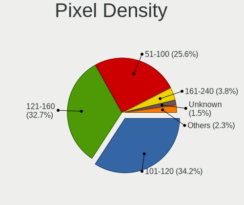

| Density       | Computers | Percent |
|---------------|-----------|---------|
| 101-120       | 47        | 37.3%   |
| 121-160       | 39        | 30.95%  |
| 51-100        | 33        | 26.19%  |
| 1-50          | 2         | 1.59%   |
| 161-240       | 2         | 1.59%   |
| Unknown       | 2         | 1.59%   |
| More than 240 | 1         | 0.79%   |

Multiple Monitors
-----------------

Total monitors connected

| Total | Computers | Percent |
|-------|-----------|---------|
| 1     | 97        | 80.83%  |
| 2     | 18        | 15%     |
| 0     | 5         | 4.17%   |

Network
-------

Net Controller Vendor
---------------------

Controller vendors

| Vendor                            | Computers | Percent |
|-----------------------------------|-----------|---------|
| Realtek Semiconductor             | 88        | 45.6%   |
| Intel                             | 42        | 21.76%  |
| Qualcomm Atheros                  | 27        | 13.99%  |
| Broadcom                          | 11        | 5.7%    |
| Ralink                            | 6         | 3.11%   |
| Ralink Technology                 | 5         | 2.59%   |
| Broadcom Limited                  | 4         | 2.07%   |
| D-Link                            | 2         | 1.04%   |
| Sierra Wireless                   | 1         | 0.52%   |
| Samsung Electronics               | 1         | 0.52%   |
| OPPO Electronics                  | 1         | 0.52%   |
| MediaTek                          | 1         | 0.52%   |
| Marvell Technology Group          | 1         | 0.52%   |
| IMC Networks                      | 1         | 0.52%   |
| Huawei Technologies               | 1         | 0.52%   |
| Ericsson Business Mobile Networks | 1         | 0.52%   |

Net Controller Model
--------------------

Controller models

| Model                                                             | Computers | Percent |
|-------------------------------------------------------------------|-----------|---------|
| Realtek RTL8111/8168/8411 PCI Express Gigabit Ethernet Controller | 65        | 28.26%  |
| Realtek RTL810xE PCI Express Fast Ethernet controller             | 20        | 8.7%    |
| Qualcomm Atheros QCA9377 802.11ac Wireless Network Adapter        | 9         | 3.91%   |
| Realtek RTL8821CE 802.11ac PCIe Wireless Network Adapter          | 8         | 3.48%   |
| Realtek RTL8822CE 802.11ac PCIe Wireless Network Adapter          | 6         | 2.61%   |
| Qualcomm Atheros QCA9565 / AR9565 Wireless Network Adapter        | 6         | 2.61%   |
| Intel Comet Lake PCH CNVi WiFi                                    | 5         | 2.17%   |
| Broadcom BCM43142 802.11b/g/n                                     | 5         | 2.17%   |
| Ralink MT7601U Wireless Adapter                                   | 4         | 1.74%   |
| Qualcomm Atheros AR9285 Wireless Network Adapter (PCI-Express)    | 4         | 1.74%   |
| Intel Dual Band Wireless-AC 3165 Plus Bluetooth                   | 4         | 1.74%   |
| Intel Comet Lake PCH-LP CNVi WiFi                                 | 4         | 1.74%   |
| Realtek RTL8723BE PCIe Wireless Network Adapter                   | 3         | 1.3%    |
| Ralink RT3290 Wireless 802.11n 1T/1R PCIe                         | 3         | 1.3%    |
| Qualcomm Atheros AR9485 Wireless Network Adapter                  | 3         | 1.3%    |
| Intel Wireless 8265 / 8275                                        | 3         | 1.3%    |
| Intel Wireless 7265                                               | 3         | 1.3%    |
| Intel WiFi Link 5100                                              | 3         | 1.3%    |
| Realtek RTL8821AE 802.11ac PCIe Wireless Network Adapter          | 2         | 0.87%   |
| Realtek RTL8188FTV 802.11b/g/n 1T1R 2.4G WLAN Adapter             | 2         | 0.87%   |
| Ralink RT2790 Wireless 802.11n 1T/2R PCIe                         | 2         | 0.87%   |
| Qualcomm Atheros AR9462 Wireless Network Adapter                  | 2         | 0.87%   |
| Intel Wireless 8260                                               | 2         | 0.87%   |
| Intel Wireless 7260                                               | 2         | 0.87%   |
| Intel Wi-Fi 6 AX201                                               | 2         | 0.87%   |
| Intel Ethernet Connection I218-LM                                 | 2         | 0.87%   |
| Intel Ethernet Connection (4) I219-LM                             | 2         | 0.87%   |
| Intel Ethernet Connection (13) I219-V                             | 2         | 0.87%   |
| Intel Dual Band Wireless-AC 3168NGW [Stone Peak]                  | 2         | 0.87%   |
| Intel Cannon Lake PCH CNVi WiFi                                   | 2         | 0.87%   |
| Intel 82579LM Gigabit Network Connection (Lewisville)             | 2         | 0.87%   |
| D-Link DWA-123 Wireless N 150 Adapter (rev.D1)                    | 2         | 0.87%   |
| Broadcom NetXtreme BCM57786 Gigabit Ethernet PCIe                 | 2         | 0.87%   |
| Broadcom Limited BCM4312 802.11b/g LP-PHY                         | 2         | 0.87%   |
| Broadcom BCM4312 802.11b/g LP-PHY                                 | 2         | 0.87%   |
| Sierra Wireless EM7455                                            | 1         | 0.43%   |
| Samsung Galaxy series, misc. (tethering mode)                     | 1         | 0.43%   |
| Realtek RTL8822BE 802.11a/b/g/n/ac WiFi adapter                   | 1         | 0.43%   |
| Realtek RTL8723DE Wireless Network Adapter                        | 1         | 0.43%   |
| Realtek RTL8192EE PCIe Wireless Network Adapter                   | 1         | 0.43%   |
| Realtek RTL8188EUS 802.11n Wireless Network Adapter               | 1         | 0.43%   |
| Realtek RTL8188CUS 802.11n WLAN Adapter                           | 1         | 0.43%   |
| Realtek RTL-8100/8101L/8139 PCI Fast Ethernet Adapter             | 1         | 0.43%   |
| Ralink RT2870/RT3070 Wireless Adapter                             | 1         | 0.43%   |
| Ralink RT5390 Wireless 802.11n 1T/1R PCIe                         | 1         | 0.43%   |
| Qualcomm Atheros QCA8172 Fast Ethernet                            | 1         | 0.43%   |
| Qualcomm Atheros AR9287 Wireless Network Adapter (PCI-Express)    | 1         | 0.43%   |
| Qualcomm Atheros AR8162 Fast Ethernet                             | 1         | 0.43%   |
| Qualcomm Atheros AR8132 Fast Ethernet                             | 1         | 0.43%   |
| OPPO Find X2 Lite                                                 | 1         | 0.43%   |
| MediaTek MT7921 802.11ax PCI Express Wireless Network Adapter     | 1         | 0.43%   |
| Marvell Group 88E8042 PCI-E Fast Ethernet Controller              | 1         | 0.43%   |
| Intel PRO/Wireless 3945ABG [Golan] Network Connection             | 1         | 0.43%   |
| Intel Ice Lake-LP PCH CNVi WiFi                                   | 1         | 0.43%   |
| Intel Ethernet Connection I218-V                                  | 1         | 0.43%   |
| Intel Ethernet Connection (7) I219-V                              | 1         | 0.43%   |
| Intel Ethernet Connection (7) I219-LM                             | 1         | 0.43%   |
| Intel Ethernet Connection (4) I219-V                              | 1         | 0.43%   |
| Intel Ethernet Connection (11) I219-LM                            | 1         | 0.43%   |
| Intel Centrino Advanced-N 6230 [Rainbow Peak]                     | 1         | 0.43%   |

Wireless Vendor
---------------

Wireless vendors

| Vendor                | Computers | Percent |
|-----------------------|-----------|---------|
| Intel                 | 38        | 32.48%  |
| Realtek Semiconductor | 26        | 22.22%  |
| Qualcomm Atheros      | 25        | 21.37%  |
| Broadcom              | 8         | 6.84%   |
| Ralink                | 6         | 5.13%   |
| Ralink Technology     | 5         | 4.27%   |
| Broadcom Limited      | 4         | 3.42%   |
| D-Link                | 2         | 1.71%   |
| Sierra Wireless       | 1         | 0.85%   |
| MediaTek              | 1         | 0.85%   |
| IMC Networks          | 1         | 0.85%   |

Wireless Model
--------------

Wireless models

| Model                                                                  | Computers | Percent |
|------------------------------------------------------------------------|-----------|---------|
| Qualcomm Atheros QCA9377 802.11ac Wireless Network Adapter             | 9         | 7.63%   |
| Realtek RTL8821CE 802.11ac PCIe Wireless Network Adapter               | 8         | 6.78%   |
| Realtek RTL8822CE 802.11ac PCIe Wireless Network Adapter               | 6         | 5.08%   |
| Qualcomm Atheros QCA9565 / AR9565 Wireless Network Adapter             | 6         | 5.08%   |
| Intel Comet Lake PCH CNVi WiFi                                         | 5         | 4.24%   |
| Broadcom BCM43142 802.11b/g/n                                          | 5         | 4.24%   |
| Ralink MT7601U Wireless Adapter                                        | 4         | 3.39%   |
| Qualcomm Atheros AR9285 Wireless Network Adapter (PCI-Express)         | 4         | 3.39%   |
| Intel Dual Band Wireless-AC 3165 Plus Bluetooth                        | 4         | 3.39%   |
| Intel Comet Lake PCH-LP CNVi WiFi                                      | 4         | 3.39%   |
| Realtek RTL8723BE PCIe Wireless Network Adapter                        | 3         | 2.54%   |
| Ralink RT3290 Wireless 802.11n 1T/1R PCIe                              | 3         | 2.54%   |
| Qualcomm Atheros AR9485 Wireless Network Adapter                       | 3         | 2.54%   |
| Intel Wireless 8265 / 8275                                             | 3         | 2.54%   |
| Intel Wireless 7265                                                    | 3         | 2.54%   |
| Intel WiFi Link 5100                                                   | 3         | 2.54%   |
| Realtek RTL8821AE 802.11ac PCIe Wireless Network Adapter               | 2         | 1.69%   |
| Realtek RTL8188FTV 802.11b/g/n 1T1R 2.4G WLAN Adapter                  | 2         | 1.69%   |
| Ralink RT2790 Wireless 802.11n 1T/2R PCIe                              | 2         | 1.69%   |
| Qualcomm Atheros AR9462 Wireless Network Adapter                       | 2         | 1.69%   |
| Intel Wireless 8260                                                    | 2         | 1.69%   |
| Intel Wireless 7260                                                    | 2         | 1.69%   |
| Intel Wi-Fi 6 AX201                                                    | 2         | 1.69%   |
| Intel Dual Band Wireless-AC 3168NGW [Stone Peak]                       | 2         | 1.69%   |
| Intel Cannon Lake PCH CNVi WiFi                                        | 2         | 1.69%   |
| D-Link DWA-123 Wireless N 150 Adapter (rev.D1)                         | 2         | 1.69%   |
| Broadcom Limited BCM4312 802.11b/g LP-PHY                              | 2         | 1.69%   |
| Broadcom BCM4312 802.11b/g LP-PHY                                      | 2         | 1.69%   |
| Sierra Wireless EM7455                                                 | 1         | 0.85%   |
| Realtek RTL8822BE 802.11a/b/g/n/ac WiFi adapter                        | 1         | 0.85%   |
| Realtek RTL8723DE Wireless Network Adapter                             | 1         | 0.85%   |
| Realtek RTL8192EE PCIe Wireless Network Adapter                        | 1         | 0.85%   |
| Realtek RTL8188EUS 802.11n Wireless Network Adapter                    | 1         | 0.85%   |
| Realtek RTL8188CUS 802.11n WLAN Adapter                                | 1         | 0.85%   |
| Ralink RT2870/RT3070 Wireless Adapter                                  | 1         | 0.85%   |
| Ralink RT5390 Wireless 802.11n 1T/1R PCIe                              | 1         | 0.85%   |
| Qualcomm Atheros AR9287 Wireless Network Adapter (PCI-Express)         | 1         | 0.85%   |
| MediaTek MT7921 802.11ax PCI Express Wireless Network Adapter          | 1         | 0.85%   |
| Intel PRO/Wireless 3945ABG [Golan] Network Connection                  | 1         | 0.85%   |
| Intel Ice Lake-LP PCH CNVi WiFi                                        | 1         | 0.85%   |
| Intel Centrino Advanced-N 6230 [Rainbow Peak]                          | 1         | 0.85%   |
| Intel Centrino Advanced-N 6205 [Taylor Peak]                           | 1         | 0.85%   |
| Intel Centrino Advanced-N 6200                                         | 1         | 0.85%   |
| Intel Cannon Point-LP CNVi [Wireless-AC]                               | 1         | 0.85%   |
| Intel Alder Lake-P PCH CNVi WiFi                                       | 1         | 0.85%   |
| IMC Networks AW-NU222 802.11bgn Wireless Module [Ralink RT2770+RT2720] | 1         | 0.85%   |
| Broadcom Limited BCM43142 802.11b/g/n                                  | 1         | 0.85%   |
| Broadcom Limited BCM4313 802.11bgn Wireless Network Adapter            | 1         | 0.85%   |
| Broadcom BCM4313 802.11bgn Wireless Network Adapter                    | 1         | 0.85%   |

Ethernet Vendor
---------------

Ethernet vendors

| Vendor                   | Computers | Percent |
|--------------------------|-----------|---------|
| Realtek Semiconductor    | 85        | 77.27%  |
| Intel                    | 15        | 13.64%  |
| Qualcomm Atheros         | 3         | 2.73%   |
| Broadcom                 | 3         | 2.73%   |
| Samsung Electronics      | 1         | 0.91%   |
| OPPO Electronics         | 1         | 0.91%   |
| Marvell Technology Group | 1         | 0.91%   |
| Huawei Technologies      | 1         | 0.91%   |

Ethernet Model
--------------

Ethernet models

| Model                                                             | Computers | Percent |
|-------------------------------------------------------------------|-----------|---------|
| Realtek RTL8111/8168/8411 PCI Express Gigabit Ethernet Controller | 65        | 58.56%  |
| Realtek RTL810xE PCI Express Fast Ethernet controller             | 20        | 18.02%  |
| Intel Ethernet Connection I218-LM                                 | 2         | 1.8%    |
| Intel Ethernet Connection (4) I219-LM                             | 2         | 1.8%    |
| Intel Ethernet Connection (13) I219-V                             | 2         | 1.8%    |
| Intel 82579LM Gigabit Network Connection (Lewisville)             | 2         | 1.8%    |
| Broadcom NetXtreme BCM57786 Gigabit Ethernet PCIe                 | 2         | 1.8%    |
| Samsung Galaxy series, misc. (tethering mode)                     | 1         | 0.9%    |
| Realtek RTL-8100/8101L/8139 PCI Fast Ethernet Adapter             | 1         | 0.9%    |
| Qualcomm Atheros QCA8172 Fast Ethernet                            | 1         | 0.9%    |
| Qualcomm Atheros AR8162 Fast Ethernet                             | 1         | 0.9%    |
| Qualcomm Atheros AR8132 Fast Ethernet                             | 1         | 0.9%    |
| OPPO Find X2 Lite                                                 | 1         | 0.9%    |
| Marvell Group 88E8042 PCI-E Fast Ethernet Controller              | 1         | 0.9%    |
| Intel Ethernet Connection I218-V                                  | 1         | 0.9%    |
| Intel Ethernet Connection (7) I219-V                              | 1         | 0.9%    |
| Intel Ethernet Connection (7) I219-LM                             | 1         | 0.9%    |
| Intel Ethernet Connection (4) I219-V                              | 1         | 0.9%    |
| Intel Ethernet Connection (11) I219-LM                            | 1         | 0.9%    |
| Intel 82577LM Gigabit Network Connection                          | 1         | 0.9%    |
| Intel 82562V-2 10/100 Network Connection                          | 1         | 0.9%    |
| Huawei HUAWEI                                                     | 1         | 0.9%    |
| Broadcom NetLink BCM57780 Gigabit Ethernet PCIe                   | 1         | 0.9%    |

Net Controller Kind
-------------------

Ethernet, WiFi or modem

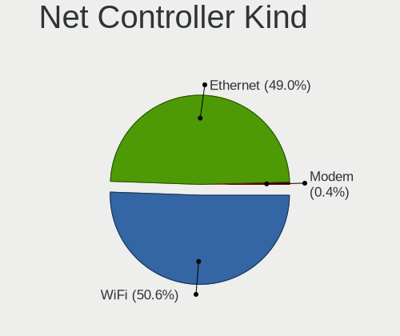

| Kind     | Computers | Percent |
|----------|-----------|---------|
| WiFi     | 108       | 50.23%  |
| Ethernet | 106       | 49.3%   |
| Modem    | 1         | 0.47%   |

Used Controller
---------------

Currently used network controller

| Kind     | Computers | Percent |
|----------|-----------|---------|
| WiFi     | 87        | 71.31%  |
| Ethernet | 35        | 28.69%  |

NICs
----

Total network controllers on board

| Total | Computers | Percent |
|-------|-----------|---------|
| 2     | 93        | 78.15%  |
| 1     | 26        | 21.85%  |

IPv6
----

IPv6 vs IPv4

| Used | Computers | Percent |
|------|-----------|---------|
| No   | 118       | 100%    |

Bluetooth
---------

Bluetooth Vendor
----------------

Controller vendors

| Vendor                          | Computers | Percent |
|---------------------------------|-----------|---------|
| Intel                           | 32        | 34.41%  |
| Realtek Semiconductor           | 18        | 19.35%  |
| Qualcomm Atheros Communications | 16        | 17.2%   |
| Lite-On Technology              | 7         | 7.53%   |
| IMC Networks                    | 4         | 4.3%    |
| Broadcom                        | 4         | 4.3%    |
| Ralink                          | 3         | 3.23%   |
| Foxconn / Hon Hai               | 3         | 3.23%   |
| Cambridge Silicon Radio         | 2         | 2.15%   |
| Toshiba                         | 1         | 1.08%   |
| Realtek                         | 1         | 1.08%   |
| Hewlett-Packard                 | 1         | 1.08%   |
| Dell                            | 1         | 1.08%   |

Bluetooth Model
---------------

Controller models

| Model                                               | Computers | Percent |
|-----------------------------------------------------|-----------|---------|
| Intel Bluetooth wireless interface                  | 13        | 13.98%  |
| Realtek Bluetooth Radio                             | 12        | 12.9%   |
| Intel Bluetooth Device                              | 11        | 11.83%  |
| Qualcomm Atheros  Bluetooth Device                  | 9         | 9.68%   |
| Intel Bluetooth 9460/9560 Jefferson Peak (JfP)      | 5         | 5.38%   |
| Realtek  Bluetooth 4.2 Adapter                      | 4         | 4.3%    |
| Qualcomm Atheros AR3011 Bluetooth                   | 4         | 4.3%    |
| Ralink RT3290 Bluetooth                             | 3         | 3.23%   |
| Lite-On Broadcom BCM43142A0 Bluetooth Device        | 3         | 3.23%   |
| IMC Networks Bluetooth Radio                        | 3         | 3.23%   |
| Broadcom BCM43142A0 Bluetooth 4.0                   | 3         | 3.23%   |
| Realtek RTL8723B Bluetooth                          | 2         | 2.15%   |
| Lite-On Bluetooth Device                            | 2         | 2.15%   |
| Intel Wireless-AC 3168 Bluetooth                    | 2         | 2.15%   |
| Foxconn / Hon Hai Bluetooth Device                  | 2         | 2.15%   |
| Cambridge Silicon Radio Bluetooth Dongle (HCI mode) | 2         | 2.15%   |
| Toshiba Bluetooth USB Host Controller               | 1         | 1.08%   |
| Realtek Bluetooth Radio                             | 1         | 1.08%   |
| Qualcomm Atheros Bluetooth USB Host Controller      | 1         | 1.08%   |
| Qualcomm Atheros AR9462 Bluetooth                   | 1         | 1.08%   |
| Qualcomm Atheros AR3012 Bluetooth 4.0               | 1         | 1.08%   |
| Lite-On Qualcomm Atheros QCA9377 Bluetooth          | 1         | 1.08%   |
| Lite-On Atheros AR3012 Bluetooth                    | 1         | 1.08%   |
| Intel Centrino Advanced-N 6230 Bluetooth adapter    | 1         | 1.08%   |
| IMC Networks Wireless_Device                        | 1         | 1.08%   |
| HP Broadcom 2070 Bluetooth Combo                    | 1         | 1.08%   |
| Foxconn / Hon Hai Broadcom BCM20702 Bluetooth       | 1         | 1.08%   |
| Dell DW375 Bluetooth Module                         | 1         | 1.08%   |
| Broadcom BCM2070 Bluetooth 2.1 + EDR                | 1         | 1.08%   |

Sound
-----

Sound Vendor
------------

Sound card vendors

| Vendor                    | Computers | Percent |
|---------------------------|-----------|---------|
| Intel                     | 103       | 66.88%  |
| Nvidia                    | 27        | 17.53%  |
| AMD                       | 20        | 12.99%  |
| Sennheiser Communications | 1         | 0.65%   |
| Lenovo                    | 1         | 0.65%   |
| JMTek                     | 1         | 0.65%   |
| C-Media Electronics       | 1         | 0.65%   |

Sound Model
-----------

Sound card models

| Model                                                                                             | Computers | Percent |
|---------------------------------------------------------------------------------------------------|-----------|---------|
| Intel Sunrise Point-LP HD Audio                                                                   | 17        | 9.71%   |
| Intel 6 Series/C200 Series Chipset Family High Definition Audio Controller                        | 11        | 6.29%   |
| Intel 7 Series/C216 Chipset Family High Definition Audio Controller                               | 9         | 5.14%   |
| Intel 8 Series HD Audio Controller                                                                | 8         | 4.57%   |
| Intel Haswell-ULT HD Audio Controller                                                             | 7         | 4%      |
| Intel Cannon Lake PCH cAVS                                                                        | 7         | 4%      |
| AMD Family 17h/19h HD Audio Controller                                                            | 7         | 4%      |
| Nvidia TU107 GeForce GTX 1650 High Definition Audio Controller                                    | 6         | 3.43%   |
| Intel 100 Series/C230 Series Chipset Family HD Audio Controller                                   | 6         | 3.43%   |
| Intel Comet Lake PCH-LP cAVS                                                                      | 5         | 2.86%   |
| Intel Comet Lake PCH cAVS                                                                         | 5         | 2.86%   |
| Intel 82801I (ICH9 Family) HD Audio Controller                                                    | 5         | 2.86%   |
| Intel 8 Series/C220 Series Chipset High Definition Audio Controller                               | 5         | 2.86%   |
| Nvidia High Definition Audio Controller                                                           | 4         | 2.29%   |
| Nvidia GP107GL High Definition Audio Controller                                                   | 4         | 2.29%   |
| Intel Ice Lake-LP Smart Sound Technology Audio Controller                                         | 4         | 2.29%   |
| Intel 5 Series/3400 Series Chipset High Definition Audio                                          | 4         | 2.29%   |
| AMD High Definition Audio Controller                                                              | 4         | 2.29%   |
| AMD Family 15h (Models 60h-6fh) Audio Controller                                                  | 4         | 2.29%   |
| Nvidia TU116 High Definition Audio Controller                                                     | 3         | 1.71%   |
| Intel Xeon E3-1200 v3/4th Gen Core Processor HD Audio Controller                                  | 3         | 1.71%   |
| Intel Wildcat Point-LP High Definition Audio Controller                                           | 3         | 1.71%   |
| Intel Broadwell-U Audio Controller                                                                | 3         | 1.71%   |
| Intel Atom/Celeron/Pentium Processor x5-E8000/J3xxx/N3xxx Series High Definition Audio Controller | 3         | 1.71%   |
| Intel 82801JI (ICH10 Family) HD Audio Controller                                                  | 3         | 1.71%   |
| Nvidia GM107 High Definition Audio Controller [GeForce 940MX]                                     | 2         | 1.14%   |
| Nvidia GF119 HDMI Audio Controller                                                                | 2         | 1.14%   |
| Nvidia Audio device                                                                               | 2         | 1.14%   |
| Intel Tiger Lake-LP Smart Sound Technology Audio Controller                                       | 2         | 1.14%   |
| AMD Starship/Matisse HD Audio Controller                                                          | 2         | 1.14%   |
| AMD RV710/730 HDMI Audio [Radeon HD 4000 series]                                                  | 2         | 1.14%   |
| Sennheiser Communications Headset [PC 8]                                                          | 1         | 0.57%   |
| Nvidia GP108 High Definition Audio Controller                                                     | 1         | 0.57%   |
| Nvidia GP106 High Definition Audio Controller                                                     | 1         | 0.57%   |
| Nvidia GK208 HDMI/DP Audio Controller                                                             | 1         | 0.57%   |
| Nvidia GF108 High Definition Audio Controller                                                     | 1         | 0.57%   |
| Lenovo ThinkVision T24v Wide Monitor for USB-Audio                                                | 1         | 0.57%   |
| JMTek USB PnP Audio Device                                                                        | 1         | 0.57%   |
| Intel NM10/ICH7 Family High Definition Audio Controller                                           | 1         | 0.57%   |
| Intel Crystal Well HD Audio Controller                                                            | 1         | 0.57%   |
| Intel Celeron N3350/Pentium N4200/Atom E3900 Series Audio Cluster                                 | 1         | 0.57%   |
| Intel Cannon Point-LP High Definition Audio Controller                                            | 1         | 0.57%   |
| Intel Atom Processor Z36xxx/Z37xxx Series High Definition Audio Controller                        | 1         | 0.57%   |
| Intel Alder Lake PCH-P High Definition Audio Controller                                           | 1         | 0.57%   |
| Intel 200 Series PCH HD Audio                                                                     | 1         | 0.57%   |
| C-Media Electronics USB Audio Device                                                              | 1         | 0.57%   |
| AMD SBx00 Azalia (Intel HDA)                                                                      | 1         | 0.57%   |
| AMD Renoir Radeon High Definition Audio Controller                                                | 1         | 0.57%   |
| AMD Raven/Raven2/Fenghuang HDMI/DP Audio Controller                                               | 1         | 0.57%   |
| AMD Kabini HDMI/DP Audio                                                                          | 1         | 0.57%   |
| AMD Juniper HDMI Audio [Radeon HD 5700 Series]                                                    | 1         | 0.57%   |
| AMD FCH Azalia Controller                                                                         | 1         | 0.57%   |
| AMD Ellesmere HDMI Audio [Radeon RX 470/480 / 570/580/590]                                        | 1         | 0.57%   |
| AMD Caicos HDMI Audio [Radeon HD 6450 / 7450/8450/8490 OEM / R5 230/235/235X OEM]                 | 1         | 0.57%   |

Memory
------

Memory Vendor
-------------

Memory module vendors

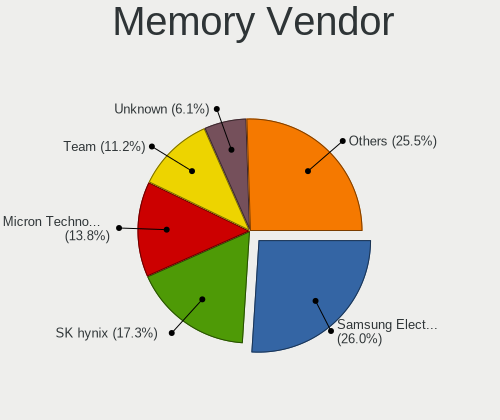

| Vendor              | Computers | Percent |
|---------------------|-----------|---------|
| Samsung Electronics | 27        | 29.67%  |
| SK hynix            | 15        | 16.48%  |
| Micron Technology   | 11        | 12.09%  |
| Team                | 7         | 7.69%   |
| A-DATA Technology   | 6         | 6.59%   |
| Unknown             | 5         | 5.49%   |
| Crucial             | 4         | 4.4%    |
| Elpida              | 3         | 3.3%    |
| Toshiba             | 2         | 2.2%    |
| Nanya Technology    | 2         | 2.2%    |
| Kingston            | 2         | 2.2%    |
| TwinMOS             | 1         | 1.1%    |
| Ramaxel Technology  | 1         | 1.1%    |
| Patriot             | 1         | 1.1%    |
| Hikvision           | 1         | 1.1%    |
| Goodram             | 1         | 1.1%    |
| ASint Technology    | 1         | 1.1%    |
| Unknown             | 1         | 1.1%    |

Memory Model
------------

Memory module models

| Model                                                           | Computers | Percent |
|-----------------------------------------------------------------|-----------|---------|
| A-DATA RAM Module 16GB SODIMM DDR4 2667MT/s                     | 3         | 3.06%   |
| Toshiba RAM 8HTF12864HDY-800G1 2048MB SODIMM 1066MT/s           | 2         | 2.04%   |
| Toshiba RAM 64T128020EDL2.5C2 2048MB SODIMM 1066MT/s            | 2         | 2.04%   |
| Team RAM TEAMGROUP-SD4-2666 32GB SODIMM DDR4 2667MT/s           | 2         | 2.04%   |
| SK hynix RAM HMA81GS6JJR8N-VK 8GB SODIMM DDR4 2667MT/s          | 2         | 2.04%   |
| SK hynix RAM HMA81GS6AFR8N-UH 8GB SODIMM DDR4 2667MT/s          | 2         | 2.04%   |
| Samsung RAM M471B5273EB0-CK0 4GB SODIMM DDR3 4199MT/s           | 2         | 2.04%   |
| Samsung RAM M471B5273DH0-CH9 4GB SODIMM DDR3 1334MT/s           | 2         | 2.04%   |
| Samsung RAM M471B5173QH0-YK0 4GB SODIMM DDR3 1600MT/s           | 2         | 2.04%   |
| Samsung RAM M471A5244CB0-CWE 4GB SODIMM DDR4 3200MT/s           | 2         | 2.04%   |
| Samsung RAM M471A1K43DB1-CWE 8GB SODIMM DDR4 3200MT/s           | 2         | 2.04%   |
| Samsung RAM M471A1K43CB1-CTD 8GB SODIMM DDR4 2667MT/s           | 2         | 2.04%   |
| Nanya RAM NT2GC64B88B0NS-CG 2GB SODIMM DDR3 1334MT/s            | 2         | 2.04%   |
| Unknown RAM Module 4GB DIMM DDR3 1333MT/s                       | 1         | 1.02%   |
| Unknown RAM Module 4GB DIMM DDR3                                | 1         | 1.02%   |
| Unknown RAM Module 4096MB SODIMM DDR4 2133MT/s                  | 1         | 1.02%   |
| Unknown RAM Module 4096MB SODIMM DDR3                           | 1         | 1.02%   |
| Unknown RAM Module 1024MB DIMM 667MT/s                          | 1         | 1.02%   |
| TwinMOS RAM 9DSDBNZB-5AMP 4GB DIMM DDR3 1333MT/s                | 1         | 1.02%   |
| Team RAM TEAMGROUP-UD4-2400 16GB DIMM DDR4 2400MT/s             | 1         | 1.02%   |
| Team RAM TEAMGROUP-SD4-3200 32GB SODIMM DDR4 3200MT/s           | 1         | 1.02%   |
| Team RAM TEAMGROUP-SD4-3200 16GB SODIMM DDR4 3200MT/s           | 1         | 1.02%   |
| Team RAM TEAMGROUP-SD4-2400 16GB SODIMM DDR4 8400MT/s           | 1         | 1.02%   |
| Team RAM Module 8192MB SODIMM DDR4 2667MT/s                     | 1         | 1.02%   |
| SK hynix RAM Module 4096MB DIMM DDR3 1333MT/s                   | 1         | 1.02%   |
| SK hynix RAM HYMP112S64CP6-S6 1024MB SODIMM DDR 975MT/s         | 1         | 1.02%   |
| SK hynix RAM HMT451S6MFR8A-PB 4GB SODIMM DDR3 1600MT/s          | 1         | 1.02%   |
| SK hynix RAM HMT351S6EFR8A-PB 4096MB SODIMM DDR3 1600MT/s       | 1         | 1.02%   |
| SK hynix RAM HMT351S6CFR8C-PB 4GB SODIMM DDR3 1600MT/s          | 1         | 1.02%   |
| SK hynix RAM HMT351S6CFR8C-H9 4GB SODIMM DDR3 1334MT/s          | 1         | 1.02%   |
| SK hynix RAM HMA851S6CJR6N-VK 4GB SODIMM DDR4 2667MT/s          | 1         | 1.02%   |
| SK hynix RAM HMA851S6AFR6N-UH 4GB SODIMM DDR4 2667MT/s          | 1         | 1.02%   |
| SK hynix RAM HMA82GU7CJR8N-VK 16GB DIMM DDR4 2667MT/s           | 1         | 1.02%   |
| SK hynix RAM HMA82GS6CJR8N-VK 16GB SODIMM DDR4 2667MT/s         | 1         | 1.02%   |
| SK hynix RAM HMA81GS6MFR8N-TF 8192MB SODIMM DDR4 2133MT/s       | 1         | 1.02%   |
| SK hynix RAM HMA41GS6AFR8N-TF 8GB SODIMM DDR4 2667MT/s          | 1         | 1.02%   |
| Samsung RAM Module 4096MB DIMM DDR3 1333MT/s                    | 1         | 1.02%   |
| Samsung RAM M471B5773DH0-CH9 2GB SODIMM DDR3 1600MT/s           | 1         | 1.02%   |
| Samsung RAM M471B5673FH0-CH9 2GB SODIMM DDR3 1334MT/s           | 1         | 1.02%   |
| Samsung RAM M471B5273CH0-CH9 4GB SODIMM DDR3 1334MT/s           | 1         | 1.02%   |
| Samsung RAM M471B5173EB0-YK0 4GB SODIMM DDR3 1600MT/s           | 1         | 1.02%   |
| Samsung RAM M471B5173DB0-YK0 4GB SODIMM DDR3 1600MT/s           | 1         | 1.02%   |
| Samsung RAM M471B5173CB0-YK0 4GB SODIMM DDR3 1600MT/s           | 1         | 1.02%   |
| Samsung RAM M471B1G73DB0-YK0 8GB SODIMM DDR3 1600MT/s           | 1         | 1.02%   |
| Samsung RAM M471A5244CB0-CWE 4GB Row Of Chips DDR4 3200MT/s     | 1         | 1.02%   |
| Samsung RAM M471A5244CB0-CTD 4GB SODIMM DDR4 3266MT/s           | 1         | 1.02%   |
| Samsung RAM M471A5244CB0-CRC 4GB SODIMM DDR4 2667MT/s           | 1         | 1.02%   |
| Samsung RAM M471A1K43EB1-CWE 8GB SODIMM DDR4 3200MT/s           | 1         | 1.02%   |
| Samsung RAM M471A1K43BB0-CPB 8192MB SODIMM DDR4 2133MT/s        | 1         | 1.02%   |
| Samsung RAM M471A1G44AB0-CWE 8192MB SODIMM DDR4 3200MT/s        | 1         | 1.02%   |
| Samsung RAM M471A1G43DB0-CPB 8GB SODIMM DDR4 2400MT/s           | 1         | 1.02%   |
| Samsung RAM M378B5773QB0-CK0 2GB DIMM DDR3 1600MT/s             | 1         | 1.02%   |
| Samsung RAM M378B5773DH0-CH9 2048MB DIMM DDR3 1333MT/s          | 1         | 1.02%   |
| Samsung RAM K4F8E304HB-MGCJ 1GB SODIMM LPDDR4 2400MT/s          | 1         | 1.02%   |
| Ramaxel RAM RMT3170MN68F9F1600 4GB SODIMM DDR3 1600MT/s         | 1         | 1.02%   |
| Patriot RAM 3000 C15 Series 8GB DIMM DDR4 3000MT/s              | 1         | 1.02%   |
| Micron RAM Module 8GB SODIMM DDR4 3200MT/s                      | 1         | 1.02%   |
| Micron RAM Module 4096MB SODIMM DDR4 3200MT/s                   | 1         | 1.02%   |
| Micron RAM L1G32D4PG107WT:B 8192MB Row Of Chips LPDDR3 1867MT/s | 1         | 1.02%   |
| Micron RAM 8KTF51264HZ-1G9N1 4096MB SODIMM DDR3 1867MT/s        | 1         | 1.02%   |

Memory Kind
-----------

Memory module kinds

| Kind    | Computers | Percent |
|---------|-----------|---------|
| DDR4    | 40        | 54.79%  |
| DDR3    | 23        | 31.51%  |
| SDRAM   | 3         | 4.11%   |
| DDR2    | 3         | 4.11%   |
| LPDDR4  | 2         | 2.74%   |
| LPDDR3  | 1         | 1.37%   |
| Unknown | 1         | 1.37%   |

Memory Form Factor
------------------

Physical design of the memory module

| Name         | Computers | Percent |
|--------------|-----------|---------|
| SODIMM       | 57        | 79.17%  |
| DIMM         | 11        | 15.28%  |
| Row Of Chips | 3         | 4.17%   |
| Chip         | 1         | 1.39%   |

Memory Size
-----------

Memory module size

| Size  | Computers | Percent |
|-------|-----------|---------|
| 4096  | 33        | 38.82%  |
| 8192  | 25        | 29.41%  |
| 2048  | 11        | 12.94%  |
| 16384 | 10        | 11.76%  |
| 32768 | 4         | 4.71%   |
| 1024  | 2         | 2.35%   |

Memory Speed
------------

Memory module speed

| Speed   | Computers | Percent |
|---------|-----------|---------|
| 2667    | 21        | 25.61%  |
| 3200    | 14        | 17.07%  |
| 1600    | 13        | 15.85%  |
| 1334    | 7         | 8.54%   |
| 2400    | 6         | 7.32%   |
| 1333    | 4         | 4.88%   |
| 2133    | 3         | 3.66%   |
| 4199    | 2         | 2.44%   |
| 1867    | 2         | 2.44%   |
| 1066    | 2         | 2.44%   |
| 667     | 2         | 2.44%   |
| Unknown | 2         | 2.44%   |
| 8400    | 1         | 1.22%   |
| 3266    | 1         | 1.22%   |
| 3000    | 1         | 1.22%   |
| 975     | 1         | 1.22%   |

Printers & scanners
-------------------

Printer Vendor
--------------

Printer device vendors

| Vendor          | Computers | Percent |
|-----------------|-----------|---------|
| Hewlett-Packard | 2         | 66.67%  |
| Seiko Epson     | 1         | 33.33%  |

Printer Model
-------------

Printer device models

| Model                   | Computers | Percent |
|-------------------------|-----------|---------|
| Seiko Epson L365 Series | 1         | 33.33%  |
| HP LaserJet P1005       | 1         | 33.33%  |
| HP DeskJet 5810 series  | 1         | 33.33%  |

Scanner Vendor
--------------

Scanner device vendors

Zero info for selected period =(

Scanner Model
-------------

Scanner device models

Zero info for selected period =(

Camera
------

Camera Vendor
-------------

Camera device vendors

| Vendor                                 | Computers | Percent |
|----------------------------------------|-----------|---------|
| Chicony Electronics                    | 18        | 19.78%  |
| Realtek Semiconductor                  | 14        | 15.38%  |
| IMC Networks                           | 11        | 12.09%  |
| Microdia                               | 7         | 7.69%   |
| Suyin                                  | 6         | 6.59%   |
| Acer                                   | 6         | 6.59%   |
| Syntek                                 | 5         | 5.49%   |
| Lite-On Technology                     | 5         | 5.49%   |
| Cheng Uei Precision Industry (Foxlink) | 5         | 5.49%   |
| Sunplus Innovation Technology          | 4         | 4.4%    |
| Quanta                                 | 3         | 3.3%    |
| Luxvisions Innotech Limited            | 2         | 2.2%    |
| Silicon Motion                         | 1         | 1.1%    |
| Ricoh                                  | 1         | 1.1%    |
| Cubeternet                             | 1         | 1.1%    |
| Apple                                  | 1         | 1.1%    |
| Alcor Micro                            | 1         | 1.1%    |

Camera Model
------------

Camera device models

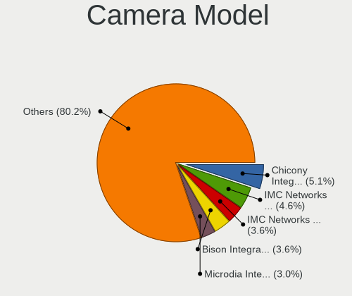

| Model                                                                      | Computers | Percent |
|----------------------------------------------------------------------------|-----------|---------|
| IMC Networks USB2.0 HD UVC WebCam                                          | 5         | 5.43%   |
| Chicony Integrated Camera                                                  | 4         | 4.35%   |
| Syntek EasyCamera                                                          | 3         | 3.26%   |
| Realtek USB2.0 VGA UVC WebCam                                              | 3         | 3.26%   |
| Realtek USB Camera                                                         | 3         | 3.26%   |
| Realtek Integrated_Webcam_HD                                               | 3         | 3.26%   |
| Lite-On Integrated Camera                                                  | 3         | 3.26%   |
| IMC Networks Integrated Camera                                             | 3         | 3.26%   |
| Acer Integrated Camera                                                     | 3         | 3.26%   |
| Suyin HP TrueVision HD                                                     | 2         | 2.17%   |
| Sunplus Integrated_Webcam_HD                                               | 2         | 2.17%   |
| Realtek USB2.0 HD UVC WebCam                                               | 2         | 2.17%   |
| Quanta VGA WebCam                                                          | 2         | 2.17%   |
| Microdia Laptop_Integrated_Webcam_HD                                       | 2         | 2.17%   |
| Microdia Dell Laptop Integrated Webcam HD                                  | 2         | 2.17%   |
| Luxvisions Innotech Limited HP TrueVision HD Camera                        | 2         | 2.17%   |
| Chicony Lenovo EasyCamera                                                  | 2         | 2.17%   |
| Chicony HD WebCam                                                          | 2         | 2.17%   |
| Chicony EasyCamera                                                         | 2         | 2.17%   |
| Cheng Uei Precision Industry (Foxlink) HP Webcam                           | 2         | 2.17%   |
| Syntek Integrated RGB Camera                                               | 1         | 1.09%   |
| Syntek Integrated Camera                                                   | 1         | 1.09%   |
| Suyin USB 2.0 Camera                                                       | 1         | 1.09%   |
| Suyin HP Integrated Webcam                                                 | 1         | 1.09%   |
| Suyin HD WebCam                                                            | 1         | 1.09%   |
| Suyin 1.3M WebCam (notebook emachines E730, Acer sub-brand)                | 1         | 1.09%   |
| Sunplus HD User Facing                                                     | 1         | 1.09%   |
| Sunplus Dell HD Webcam                                                     | 1         | 1.09%   |
| Silicon Motion WebCam SC-13HDL11431N                                       | 1         | 1.09%   |
| Ricoh Laptop_Integrated_Webcam_FHD                                         | 1         | 1.09%   |
| Realtek Lenovo easy camera                                                 | 1         | 1.09%   |
| Realtek Integrated Webcam_HD                                               | 1         | 1.09%   |
| Realtek HP Webcam                                                          | 1         | 1.09%   |
| Quanta HP Webcam                                                           | 1         | 1.09%   |
| Microdia Webcam SC-10HDD12636P                                             | 1         | 1.09%   |
| Microdia HP Webcam-101                                                     | 1         | 1.09%   |
| Microdia HP Webcam                                                         | 1         | 1.09%   |
| Lite-On TOSHIBA Web Camera - HD                                            | 1         | 1.09%   |
| Lite-On HP HD Camera                                                       | 1         | 1.09%   |
| IMC Networks USB2.0 VGA UVC WebCam                                         | 1         | 1.09%   |
| IMC Networks Lenovo EasyCamera                                             | 1         | 1.09%   |
| IMC Networks HP TrueVision HD Camera                                       | 1         | 1.09%   |
| Cubeternet WebCam                                                          | 1         | 1.09%   |
| Chicony USB2.0 VGA UVC WebCam                                              | 1         | 1.09%   |
| Chicony USB2.0 UVC WebCam                                                  | 1         | 1.09%   |
| Chicony USB2.0 HD UVC WebCam                                               | 1         | 1.09%   |
| Chicony TOSHIBA Web Camera                                                 | 1         | 1.09%   |
| Chicony Sony Visual Communication Camera                                   | 1         | 1.09%   |
| Chicony HP Webcam [2 MP Macro]                                             | 1         | 1.09%   |
| Chicony HP Webcam                                                          | 1         | 1.09%   |
| Chicony HD WebCam (Acer)                                                   | 1         | 1.09%   |
| Cheng Uei Precision Industry (Foxlink) HP Wide Vision HD Integrated Webcam | 1         | 1.09%   |
| Cheng Uei Precision Industry (Foxlink) HP Truevision HD                    | 1         | 1.09%   |
| Cheng Uei Precision Industry (Foxlink) HP HD Camera                        | 1         | 1.09%   |
| Apple iPhone 5/5C/5S/6/SE                                                  | 1         | 1.09%   |
| Alcor Micro HP Webcam-101                                                  | 1         | 1.09%   |
| Acer Lenovo EasyCamera                                                     | 1         | 1.09%   |
| Acer Integrated IR Camera                                                  | 1         | 1.09%   |
| Acer HD Webcam                                                             | 1         | 1.09%   |
| Acer EasyCamera                                                            | 1         | 1.09%   |

Security
--------

Fingerprint Vendor
------------------

Fingerprint sensor vendors

| Vendor                     | Computers | Percent |
|----------------------------|-----------|---------|
| Validity Sensors           | 4         | 50%     |
| LighTuning Technology      | 2         | 25%     |
| Synaptics                  | 1         | 12.5%   |
| Shenzhen Goodix Technology | 1         | 12.5%   |

Fingerprint Model
-----------------

Fingerprint sensor models

| Model                                            | Computers | Percent |
|--------------------------------------------------|-----------|---------|
| LighTuning EgisTec Touch Fingerprint Sensor      | 2         | 25%     |
| Validity Sensors VFS495 Fingerprint Reader       | 1         | 12.5%   |
| Validity Sensors VFS 5011 fingerprint sensor     | 1         | 12.5%   |
| Validity Sensors Synaptics WBDI                  | 1         | 12.5%   |
| Validity Sensors Fingerprint scanner             | 1         | 12.5%   |
| Synaptics Metallica MIS Touch Fingerprint Reader | 1         | 12.5%   |
| Shenzhen Goodix  FingerPrint Device              | 1         | 12.5%   |

Chipcard Vendor
---------------

Chipcard module vendors

| Vendor      | Computers | Percent |
|-------------|-----------|---------|
| Broadcom    | 2         | 66.67%  |
| Alcor Micro | 1         | 33.33%  |

Chipcard Model
--------------

Chipcard module models

| Model                                                                        | Computers | Percent |
|------------------------------------------------------------------------------|-----------|---------|
| Broadcom BCM5880 Secure Applications Processor with fingerprint swipe sensor | 1         | 33.33%  |
| Broadcom 5880                                                                | 1         | 33.33%  |
| Alcor Micro AU9540 Smartcard Reader                                          | 1         | 33.33%  |

Unsupported
-----------

Unsupported Devices
-------------------

Total unsupported devices on board

| Total | Computers | Percent |
|-------|-----------|---------|
| 0     | 90        | 69.23%  |
| 1     | 32        | 24.62%  |
| 3     | 4         | 3.08%   |
| 2     | 3         | 2.31%   |
| 4     | 1         | 0.77%   |

Unsupported Device Types
------------------------

Types of unsupported devices

| Type                     | Computers | Percent |
|--------------------------|-----------|---------|
| Graphics card            | 13        | 26.53%  |
| Net/wireless             | 11        | 22.45%  |
| Fingerprint reader       | 8         | 16.33%  |
| Bluetooth                | 5         | 10.2%   |
| Communication controller | 3         | 6.12%   |
| Chipcard                 | 3         | 6.12%   |
| Storage                  | 1         | 2.04%   |
| Sound                    | 1         | 2.04%   |
| Network                  | 1         | 2.04%   |
| Net/ethernet             | 1         | 2.04%   |
| Card reader              | 1         | 2.04%   |
| Camera                   | 1         | 2.04%   |

