Linux in Turkey - Tested Hardware & Statistics
----------------------------------------------

A project to collect tested hardware configurations for Linux in Turkey.

Anyone can contribute to this report by the [hw-probe](https://github.com/linuxhw/hw-probe) tool:

    sudo -E hw-probe -all -upload

Please contribute! Especially if your hardware is rare.

This is a report for all computer types. See also reports for [desktops](/Location/Turkey/Desktop/README.md) and [notebooks](/Location/Turkey/Notebook/README.md).

Contents
--------

* [ Test Cases ](#test-cases)

* [ System ](#system)
  - [ OS                       ](#os)
  - [ OS Family                ](#os-family)
  - [ Kernel                   ](#kernel)
  - [ Kernel Family            ](#kernel-family)
  - [ Kernel Major Ver.        ](#kernel-major-ver)
  - [ Arch                     ](#arch)
  - [ DE                       ](#de)
  - [ Display Server           ](#display-server)
  - [ Display Manager          ](#display-manager)
  - [ OS Lang                  ](#os-lang)
  - [ Boot Mode                ](#boot-mode)
  - [ Filesystem               ](#filesystem)
  - [ Part. scheme             ](#part-scheme)
  - [ Dual Boot with Linux/BSD ](#dual-boot-with-linuxbsd)
  - [ Dual Boot (Win)          ](#dual-boot-win)

* [ Board ](#board)
  - [ Vendor                   ](#vendor)
  - [ Model                    ](#model)
  - [ Model Family             ](#model-family)
  - [ MFG Year                 ](#mfg-year)
  - [ Form Factor              ](#form-factor)
  - [ Secure Boot              ](#secure-boot)
  - [ Coreboot                 ](#coreboot)
  - [ RAM Size                 ](#ram-size)
  - [ RAM Used                 ](#ram-used)
  - [ Total Drives             ](#total-drives)
  - [ Has CD-ROM               ](#has-cd-rom)
  - [ Has Ethernet             ](#has-ethernet)
  - [ Has WiFi                 ](#has-wifi)
  - [ Has Bluetooth            ](#has-bluetooth)

* [ Location ](#location)
  - [ Country                  ](#country)
  - [ City                     ](#city)

* [ Drives ](#drives)
  - [ Drive Vendor             ](#drive-vendor)
  - [ Drive Model              ](#drive-model)
  - [ HDD Vendor               ](#hdd-vendor)
  - [ SSD Vendor               ](#ssd-vendor)
  - [ Drive Kind               ](#drive-kind)
  - [ Drive Connector          ](#drive-connector)
  - [ Drive Size               ](#drive-size)
  - [ Space Total              ](#space-total)
  - [ Space Used               ](#space-used)
  - [ Malfunc. Drives          ](#malfunc-drives)
  - [ Malfunc. Drive Vendor    ](#malfunc-drive-vendor)
  - [ Malfunc. HDD Vendor      ](#malfunc-hdd-vendor)
  - [ Malfunc. Drive Kind      ](#malfunc-drive-kind)
  - [ Failed Drives            ](#failed-drives)
  - [ Failed Drive Vendor      ](#failed-drive-vendor)
  - [ Drive Status             ](#drive-status)

* [ Storage controller ](#storage-controller)
  - [ Storage Vendor           ](#storage-vendor)
  - [ Storage Model            ](#storage-model)
  - [ Storage Kind             ](#storage-kind)

* [ Processor ](#processor)
  - [ CPU Vendor               ](#cpu-vendor)
  - [ CPU Model                ](#cpu-model)
  - [ CPU Model Family         ](#cpu-model-family)
  - [ CPU Cores                ](#cpu-cores)
  - [ CPU Sockets              ](#cpu-sockets)
  - [ CPU Threads              ](#cpu-threads)
  - [ CPU Op-Modes             ](#cpu-op-modes)
  - [ CPU Microcode            ](#cpu-microcode)
  - [ CPU Microarch            ](#cpu-microarch)

* [ Graphics ](#graphics)
  - [ GPU Vendor               ](#gpu-vendor)
  - [ GPU Model                ](#gpu-model)
  - [ GPU Combo                ](#gpu-combo)
  - [ GPU Driver               ](#gpu-driver)
  - [ GPU Memory               ](#gpu-memory)

* [ Monitor ](#monitor)
  - [ Monitor Vendor           ](#monitor-vendor)
  - [ Monitor Model            ](#monitor-model)
  - [ Monitor Resolution       ](#monitor-resolution)
  - [ Monitor Diagonal         ](#monitor-diagonal)
  - [ Monitor Width            ](#monitor-width)
  - [ Aspect Ratio             ](#aspect-ratio)
  - [ Monitor Area             ](#monitor-area)
  - [ Pixel Density            ](#pixel-density)
  - [ Multiple Monitors        ](#multiple-monitors)

* [ Network ](#network)
  - [ Net Controller Vendor    ](#net-controller-vendor)
  - [ Net Controller Model     ](#net-controller-model)
  - [ Wireless Vendor          ](#wireless-vendor)
  - [ Wireless Model           ](#wireless-model)
  - [ Ethernet Vendor          ](#ethernet-vendor)
  - [ Ethernet Model           ](#ethernet-model)
  - [ Net Controller Kind      ](#net-controller-kind)
  - [ Used Controller          ](#used-controller)
  - [ NICs                     ](#nics)
  - [ IPv6                     ](#ipv6)

* [ Bluetooth ](#bluetooth)
  - [ Bluetooth Vendor         ](#bluetooth-vendor)
  - [ Bluetooth Model          ](#bluetooth-model)

* [ Sound ](#sound)
  - [ Sound Vendor             ](#sound-vendor)
  - [ Sound Model              ](#sound-model)

* [ Memory ](#memory)
  - [ Memory Vendor            ](#memory-vendor)
  - [ Memory Model             ](#memory-model)
  - [ Memory Kind              ](#memory-kind)
  - [ Memory Form Factor       ](#memory-form-factor)
  - [ Memory Size              ](#memory-size)
  - [ Memory Speed             ](#memory-speed)

* [ Printers & scanners ](#printers--scanners)
  - [ Printer Vendor           ](#printer-vendor)
  - [ Printer Model            ](#printer-model)
  - [ Scanner Vendor           ](#scanner-vendor)
  - [ Scanner Model            ](#scanner-model)

* [ Camera ](#camera)
  - [ Camera Vendor            ](#camera-vendor)
  - [ Camera Model             ](#camera-model)

* [ Security ](#security)
  - [ Fingerprint Vendor       ](#fingerprint-vendor)
  - [ Fingerprint Model        ](#fingerprint-model)
  - [ Chipcard Vendor          ](#chipcard-vendor)
  - [ Chipcard Model           ](#chipcard-model)

* [ Unsupported ](#unsupported)
  - [ Unsupported Devices      ](#unsupported-devices)
  - [ Unsupported Device Types ](#unsupported-device-types)

Test Cases
----------

Total: 1700

| Vendor        | Model                       | Form-Factor | Probe                                                      | Date         |
|---------------|-----------------------------|-------------|------------------------------------------------------------|--------------|
| ASUSTek       | Pro WS WRX80E-SAGE SE WI... | Desktop     | [dedf695fc6](https://linux-hardware.org/?probe=dedf695fc6) | May 31, 2022 |
| Lenovo        | ThinkPad E595 20NF001PTX    | Notebook    | [cf41cc78f7](https://linux-hardware.org/?probe=cf41cc78f7) | May 30, 2022 |
| MSI           | B365M PRO-VH                | Desktop     | [a1e7cf7158](https://linux-hardware.org/?probe=a1e7cf7158) | May 30, 2022 |
| MSI           | B365M PRO-VH                | Desktop     | [4d4ea4beec](https://linux-hardware.org/?probe=4d4ea4beec) | May 30, 2022 |
| Gigabyte      | H270-Gaming 3               | Desktop     | [c28c21c4d8](https://linux-hardware.org/?probe=c28c21c4d8) | May 29, 2022 |
| Lenovo        | 30C7 SDK0J40688 WIN 3424... | Desktop     | [93ffb95e1a](https://linux-hardware.org/?probe=93ffb95e1a) | May 29, 2022 |
| Lenovo        | ThinkPad E14 Gen 3 20Y70... | Notebook    | [96bc0699c3](https://linux-hardware.org/?probe=96bc0699c3) | May 28, 2022 |
| HP            | 250 G3                      | Notebook    | [bddc428262](https://linux-hardware.org/?probe=bddc428262) | May 28, 2022 |
| HP            | 250 G3                      | Notebook    | [911bf39209](https://linux-hardware.org/?probe=911bf39209) | May 28, 2022 |
| ECS           | G31T-M7                     | Desktop     | [706532d328](https://linux-hardware.org/?probe=706532d328) | May 28, 2022 |
| Lenovo        | IdeaPadFlex 5 14ARE05 81... | Convertible | [3980ea8269](https://linux-hardware.org/?probe=3980ea8269) | May 27, 2022 |
| Gigabyte      | H410M S2H                   | Desktop     | [c7e011235c](https://linux-hardware.org/?probe=c7e011235c) | May 26, 2022 |
| Hometech      | Alfa 430C                   | Notebook    | [4f0e4e240d](https://linux-hardware.org/?probe=4f0e4e240d) | May 26, 2022 |
| Lenovo        | IdeaPad 3 15ITL6 82H8       | Notebook    | [2b5ef1dbe5](https://linux-hardware.org/?probe=2b5ef1dbe5) | May 25, 2022 |
| Monster       | TULPAR T5 V14.1             | Notebook    | [647e502881](https://linux-hardware.org/?probe=647e502881) | May 25, 2022 |
| Monster       | TULPAR T5 V14.1             | Notebook    | [0db0bd7aa8](https://linux-hardware.org/?probe=0db0bd7aa8) | May 25, 2022 |
| Toshiba       | Satellite L40               | Notebook    | [37af5b0ba4](https://linux-hardware.org/?probe=37af5b0ba4) | May 24, 2022 |
| ASUSTek       | VivoBook 15_ASUS Laptop ... | Notebook    | [21c0d575b0](https://linux-hardware.org/?probe=21c0d575b0) | May 23, 2022 |
| Toshiba       | Satellite A100              | Notebook    | [a789d51565](https://linux-hardware.org/?probe=a789d51565) | May 23, 2022 |
| Dell          | Inspiron 15-3552            | Notebook    | [a97b4f8a75](https://linux-hardware.org/?probe=a97b4f8a75) | May 22, 2022 |
| MSI           | MS-7360                     | Desktop     | [1ca1d835ad](https://linux-hardware.org/?probe=1ca1d835ad) | May 22, 2022 |
| MSI           | B350M PRO-VD PLUS           | Desktop     | [6098005a1a](https://linux-hardware.org/?probe=6098005a1a) | May 21, 2022 |
| Gigabyte      | G41MT-D3                    | Desktop     | [aac14b5554](https://linux-hardware.org/?probe=aac14b5554) | May 21, 2022 |
| Gigabyte      | G41MT-D3                    | Desktop     | [6763ad45ce](https://linux-hardware.org/?probe=6763ad45ce) | May 21, 2022 |
| ASUSTek       | P8H61-M LE/USB3             | Desktop     | [6f6a104d35](https://linux-hardware.org/?probe=6f6a104d35) | May 21, 2022 |
| Intel         | ChiefRiver                  | Desktop     | [8e4aca2b1f](https://linux-hardware.org/?probe=8e4aca2b1f) | May 19, 2022 |
| Intel         | ChiefRiver                  | Desktop     | [4d38806404](https://linux-hardware.org/?probe=4d38806404) | May 19, 2022 |
| MSI           | B450M PRO-VDH MAX           | Desktop     | [9c3b90c60d](https://linux-hardware.org/?probe=9c3b90c60d) | May 18, 2022 |
| MSI           | B450M PRO-VDH MAX           | Desktop     | [76c661d512](https://linux-hardware.org/?probe=76c661d512) | May 18, 2022 |
| Sony          | SVS1512U1RW                 | Notebook    | [491818d2e0](https://linux-hardware.org/?probe=491818d2e0) | May 18, 2022 |
| ASUSTek       | P5KPL-AM SE                 | Desktop     | [ebbd363703](https://linux-hardware.org/?probe=ebbd363703) | May 16, 2022 |
| HP            | EliteBook 2570p             | Notebook    | [70ba6585e8](https://linux-hardware.org/?probe=70ba6585e8) | May 16, 2022 |
| Clevo         | M540SS                      | Notebook    | [9860619027](https://linux-hardware.org/?probe=9860619027) | May 15, 2022 |
| Clevo         | M540SS                      | Notebook    | [e2fa8573fb](https://linux-hardware.org/?probe=e2fa8573fb) | May 15, 2022 |
| ECS           | G41T-R3                     | Desktop     | [ed8d019c1e](https://linux-hardware.org/?probe=ed8d019c1e) | May 14, 2022 |
| ECS           | G41T-R3                     | Desktop     | [1bf10674d0](https://linux-hardware.org/?probe=1bf10674d0) | May 14, 2022 |
| Lenovo        | Legion 5 Pro 16ACH6H 82J... | Notebook    | [cf73bc12e8](https://linux-hardware.org/?probe=cf73bc12e8) | May 13, 2022 |
| ASUSTek       | ROG Strix G513QE_G513QE     | Notebook    | [0a28329f7a](https://linux-hardware.org/?probe=0a28329f7a) | May 12, 2022 |
| MSI           | Alpha 15 B5EEK              | Notebook    | [ea8ce36bef](https://linux-hardware.org/?probe=ea8ce36bef) | May 12, 2022 |
| HP            | Pavilion dv6                | Notebook    | [9e5da14b9f](https://linux-hardware.org/?probe=9e5da14b9f) | May 11, 2022 |
| Sony          | SVE14A2V2ES                 | Notebook    | [59435d662a](https://linux-hardware.org/?probe=59435d662a) | May 11, 2022 |
| Sony          | SVE1513R1EB                 | Notebook    | [c378efbd3d](https://linux-hardware.org/?probe=c378efbd3d) | May 11, 2022 |
| Lenovo        | IdeaPad Flex-14API 81SS     | Notebook    | [0e3079b5a1](https://linux-hardware.org/?probe=0e3079b5a1) | May 11, 2022 |
| ASUSTek       | ASUS TUF Gaming A15 FA50... | Notebook    | [65e46938b9](https://linux-hardware.org/?probe=65e46938b9) | May 10, 2022 |
| Acer          | AO722                       | Notebook    | [645156f92d](https://linux-hardware.org/?probe=645156f92d) | May 10, 2022 |
| Monster       | HUMA H4 V3.1                | Notebook    | [38372af132](https://linux-hardware.org/?probe=38372af132) | May 10, 2022 |
| HP            | Pavilion g6                 | Notebook    | [267b134fdd](https://linux-hardware.org/?probe=267b134fdd) | May 09, 2022 |
| ASUSTek       | P5Q SE/R                    | Desktop     | [c99b0a0683](https://linux-hardware.org/?probe=c99b0a0683) | May 08, 2022 |
| HP            | Pavilion 13 x360 PC         | Notebook    | [78b977ea42](https://linux-hardware.org/?probe=78b977ea42) | May 07, 2022 |
| Lenovo        | IdeaPad 100-15IBD 80QQ      | Notebook    | [8c1fedaa4b](https://linux-hardware.org/?probe=8c1fedaa4b) | May 06, 2022 |
| Vestel        | V Note 1341                 | Notebook    | [d5a260dc00](https://linux-hardware.org/?probe=d5a260dc00) | May 05, 2022 |
| MSI           | Prestige 15 A12UC           | Notebook    | [2b86e2ca60](https://linux-hardware.org/?probe=2b86e2ca60) | May 04, 2022 |
| Lenovo        | Yoga 510-14IKB 80VB         | Convertible | [7b293f80bc](https://linux-hardware.org/?probe=7b293f80bc) | May 03, 2022 |
| HP            | 158Ch                       | Mini pc     | [241022b1d0](https://linux-hardware.org/?probe=241022b1d0) | May 01, 2022 |
| Lenovo        | IdeaPad 500-15ISK 80NT      | Notebook    | [d5b6bc1a67](https://linux-hardware.org/?probe=d5b6bc1a67) | May 01, 2022 |
| ASUSTek       | X550VC                      | Notebook    | [16223d208e](https://linux-hardware.org/?probe=16223d208e) | Apr 30, 2022 |
| Dell          | Latitude 7390               | Notebook    | [bbf3908118](https://linux-hardware.org/?probe=bbf3908118) | Apr 30, 2022 |
| Sony          | SVE1513R1EB                 | Notebook    | [d1e0096b2d](https://linux-hardware.org/?probe=d1e0096b2d) | Apr 29, 2022 |
| HP            | ProBook 4510s               | Notebook    | [d020eac67a](https://linux-hardware.org/?probe=d020eac67a) | Apr 27, 2022 |
| Apple         | MacBookAir7,2               | Notebook    | [17a853c8ff](https://linux-hardware.org/?probe=17a853c8ff) | Apr 27, 2022 |
| Gigabyte      | H61M-S2PV                   | Desktop     | [f09766a481](https://linux-hardware.org/?probe=f09766a481) | Apr 27, 2022 |
| Casper        | NIRVANA NOTEBOOK            | Desktop     | [d74b2d8bb3](https://linux-hardware.org/?probe=d74b2d8bb3) | Apr 26, 2022 |
| Lenovo        | ThinkPad E15 20RDS03500     | Notebook    | [6aa4c36808](https://linux-hardware.org/?probe=6aa4c36808) | Apr 26, 2022 |
| Sony          | SVE1513R1EB                 | Notebook    | [5275d17d40](https://linux-hardware.org/?probe=5275d17d40) | Apr 24, 2022 |
| Acer          | Aspire A515-56G             | Notebook    | [492dd679be](https://linux-hardware.org/?probe=492dd679be) | Apr 24, 2022 |
| Acer          | Aspire A515-56G             | Notebook    | [5fc4dbeaad](https://linux-hardware.org/?probe=5fc4dbeaad) | Apr 24, 2022 |
| Casper        | NIRVANA NOTEBOOK            | Desktop     | [0d4977ae14](https://linux-hardware.org/?probe=0d4977ae14) | Apr 24, 2022 |
| MSI           | MPG B550 GAMING EDGE WIF... | Desktop     | [a76e953825](https://linux-hardware.org/?probe=a76e953825) | Apr 22, 2022 |
| HP            | Pavilion Gaming Laptop 1... | Notebook    | [ce3b387afa](https://linux-hardware.org/?probe=ce3b387afa) | Apr 21, 2022 |
| MSI           | MAG X570 TOMAHAWK WIFI      | Desktop     | [68a04098ec](https://linux-hardware.org/?probe=68a04098ec) | Apr 21, 2022 |
| Dell          | Inspiron 15-3567            | Notebook    | [8cbc7d1caf](https://linux-hardware.org/?probe=8cbc7d1caf) | Apr 20, 2022 |
| HP            | Laptop 15-da1xxx            | Notebook    | [85f9b41fe4](https://linux-hardware.org/?probe=85f9b41fe4) | Apr 19, 2022 |
| ASUSTek       | P8H77-M LE                  | Desktop     | [f940c46866](https://linux-hardware.org/?probe=f940c46866) | Apr 17, 2022 |
| ASUSTek       | M5A97 LE R2.0               | Desktop     | [49c981ee41](https://linux-hardware.org/?probe=49c981ee41) | Apr 17, 2022 |
| MSI           | B560M-A PRO                 | Desktop     | [c394557d17](https://linux-hardware.org/?probe=c394557d17) | Apr 16, 2022 |
| ASUSTek       | A88XM-A                     | Desktop     | [427335d90c](https://linux-hardware.org/?probe=427335d90c) | Apr 16, 2022 |
| MSI           | H310M PRO-VDH PLUS          | Desktop     | [0d897cd79c](https://linux-hardware.org/?probe=0d897cd79c) | Apr 15, 2022 |
| Lenovo        | IdeaPad Z510 20287          | Notebook    | [dc9ac2e9b6](https://linux-hardware.org/?probe=dc9ac2e9b6) | Apr 15, 2022 |
| Lenovo        | IdeaPad L340-15IRH Gamin... | Notebook    | [b40d10cb81](https://linux-hardware.org/?probe=b40d10cb81) | Apr 14, 2022 |
| ASUSTek       | UX310UQK                    | Notebook    | [5064c36f02](https://linux-hardware.org/?probe=5064c36f02) | Apr 14, 2022 |
| Monster       | ABRA A5 V15.8               | Notebook    | [28f1e82585](https://linux-hardware.org/?probe=28f1e82585) | Apr 13, 2022 |
| Gigabyte      | Z97X-UD5H                   | Desktop     | [a4b25c87fa](https://linux-hardware.org/?probe=a4b25c87fa) | Apr 13, 2022 |
| Toshiba       | Satellite L50-C             | Notebook    | [2366b7b28d](https://linux-hardware.org/?probe=2366b7b28d) | Apr 12, 2022 |
| Acer          | Aspire 5742G                | Notebook    | [b3cef97540](https://linux-hardware.org/?probe=b3cef97540) | Apr 12, 2022 |
| Acer          | Aspire E5-571               | Notebook    | [b6c1c28521](https://linux-hardware.org/?probe=b6c1c28521) | Apr 11, 2022 |
| Sony          | SVF1521GSTB                 | Notebook    | [5537b2189d](https://linux-hardware.org/?probe=5537b2189d) | Apr 10, 2022 |
| MSI           | MS-7360                     | Desktop     | [34c10f0508](https://linux-hardware.org/?probe=34c10f0508) | Apr 10, 2022 |
| ASUSTek       | ASUS TUF Gaming A15 FA50... | Notebook    | [2fa2ca8320](https://linux-hardware.org/?probe=2fa2ca8320) | Apr 10, 2022 |
| ASUSTek       | VivoBook 15_ASUS Laptop ... | Notebook    | [b86cec3f38](https://linux-hardware.org/?probe=b86cec3f38) | Apr 10, 2022 |
| Monster       | ABRA A5 V12.1               | Notebook    | [4b45daf3b2](https://linux-hardware.org/?probe=4b45daf3b2) | Apr 10, 2022 |
| ASUSTek       | H61M-PRO                    | Desktop     | [c89c043120](https://linux-hardware.org/?probe=c89c043120) | Apr 10, 2022 |
| Lenovo        | IdeaPad-510-15IKB 80SV      | Notebook    | [840239190e](https://linux-hardware.org/?probe=840239190e) | Apr 09, 2022 |
| ASUSTek       | PRIME B550M-K               | Desktop     | [acff685c08](https://linux-hardware.org/?probe=acff685c08) | Apr 09, 2022 |
| Dell          | Latitude E5440              | Notebook    | [18290ab7b0](https://linux-hardware.org/?probe=18290ab7b0) | Apr 08, 2022 |
| Acer          | Aspire A515-44              | Notebook    | [9dfd75a7dd](https://linux-hardware.org/?probe=9dfd75a7dd) | Apr 07, 2022 |
| ASUSTek       | GL752VW                     | Notebook    | [0dbc471fee](https://linux-hardware.org/?probe=0dbc471fee) | Apr 07, 2022 |
| ASUSTek       | K52Jc                       | Notebook    | [645adad8a7](https://linux-hardware.org/?probe=645adad8a7) | Apr 06, 2022 |
| Gigabyte      | B450M DS3H-CF               | Desktop     | [0bc837ffef](https://linux-hardware.org/?probe=0bc837ffef) | Apr 06, 2022 |
| Dell          | G3 3579                     | Notebook    | [9994b24cef](https://linux-hardware.org/?probe=9994b24cef) | Apr 06, 2022 |
| ASUSTek       | N61Vg                       | Notebook    | [96372fecb5](https://linux-hardware.org/?probe=96372fecb5) | Apr 05, 2022 |
| HP            | Victus by Laptop 16         | Notebook    | [62650f5d20](https://linux-hardware.org/?probe=62650f5d20) | Apr 04, 2022 |
| ASUSTek       | H61M-D                      | Desktop     | [b9c2af0976](https://linux-hardware.org/?probe=b9c2af0976) | Apr 03, 2022 |
| MSI           | GS75 Stealth 9SF            | Notebook    | [048bb1c397](https://linux-hardware.org/?probe=048bb1c397) | Apr 03, 2022 |
| ASUSTek       | B560M-P                     | Desktop     | [d696143851](https://linux-hardware.org/?probe=d696143851) | Apr 03, 2022 |
| MSI           | H81M-P33                    | Desktop     | [2b0d95df2e](https://linux-hardware.org/?probe=2b0d95df2e) | Apr 02, 2022 |
| MSI           | Modern 15 A5M               | Notebook    | [ea091854ed](https://linux-hardware.org/?probe=ea091854ed) | Apr 01, 2022 |
| MSI           | Modern 15 A5M               | Notebook    | [ae491737c7](https://linux-hardware.org/?probe=ae491737c7) | Apr 01, 2022 |
| Casper        | EXCALIBUR G770              | Notebook    | [dc11ff8996](https://linux-hardware.org/?probe=dc11ff8996) | Apr 01, 2022 |
| Casper        | EXCALIBUR G770              | Notebook    | [4a0436ece5](https://linux-hardware.org/?probe=4a0436ece5) | Apr 01, 2022 |
| Lenovo        | ThinkPad L13 Gen 2 20VJS... | Notebook    | [4c0c1422e7](https://linux-hardware.org/?probe=4c0c1422e7) | Mar 31, 2022 |
| ASUSTek       | N550JV                      | Notebook    | [6096184486](https://linux-hardware.org/?probe=6096184486) | Mar 31, 2022 |
| Intel         | Unknown                     | Desktop     | [4689fbf7e1](https://linux-hardware.org/?probe=4689fbf7e1) | Mar 31, 2022 |
| Apple         | MacBookAir7,2               | Notebook    | [d42d4a24cd](https://linux-hardware.org/?probe=d42d4a24cd) | Mar 30, 2022 |
| Acer          | Nitro N50-610               | Desktop     | [17f97e88c0](https://linux-hardware.org/?probe=17f97e88c0) | Mar 29, 2022 |
| ASUSTek       | SABERTOOTH X58              | Desktop     | [1c58a58ead](https://linux-hardware.org/?probe=1c58a58ead) | Mar 29, 2022 |
| MSI           | B450 GAMING PLUS MAX        | Desktop     | [656413f7e6](https://linux-hardware.org/?probe=656413f7e6) | Mar 28, 2022 |
| LG Electro... | P1-JSUVT                    | Notebook    | [b0e2f9e53c](https://linux-hardware.org/?probe=b0e2f9e53c) | Mar 27, 2022 |
| Samsung       | 3570R/370R/470R/450R/510... | Notebook    | [799c1dfce8](https://linux-hardware.org/?probe=799c1dfce8) | Mar 26, 2022 |
| ASUSTek       | N550JK                      | Notebook    | [a3ecefa43f](https://linux-hardware.org/?probe=a3ecefa43f) | Mar 26, 2022 |
| ASUSTek       | X542UR                      | Notebook    | [4d4477bd16](https://linux-hardware.org/?probe=4d4477bd16) | Mar 26, 2022 |
| MSI           | MPG B550 GAMING EDGE WIF... | Desktop     | [7577679057](https://linux-hardware.org/?probe=7577679057) | Mar 25, 2022 |
| Lenovo        | ThinkPad X250 20CLS09Y19    | Notebook    | [2602549f95](https://linux-hardware.org/?probe=2602549f95) | Mar 25, 2022 |
| ASUSTek       | ROG Strix G531GT_G531GT     | Notebook    | [a56ed819d1](https://linux-hardware.org/?probe=a56ed819d1) | Mar 25, 2022 |
| Unknown       | Unknown                     | Notebook    | [46344218a6](https://linux-hardware.org/?probe=46344218a6) | Mar 22, 2022 |
| HP            | Pavilion Laptop 15-cd0xx    | Notebook    | [8883dc7315](https://linux-hardware.org/?probe=8883dc7315) | Mar 22, 2022 |
| MSI           | MS-7360                     | Desktop     | [8efb24e401](https://linux-hardware.org/?probe=8efb24e401) | Mar 21, 2022 |
| ASUSTek       | P8P67                       | Desktop     | [c294e20164](https://linux-hardware.org/?probe=c294e20164) | Mar 21, 2022 |
| ASUSTek       | P8P67                       | Desktop     | [5b9b7903ad](https://linux-hardware.org/?probe=5b9b7903ad) | Mar 21, 2022 |
| Casper        | EXCALIBUR G900              | Notebook    | [d4902562f0](https://linux-hardware.org/?probe=d4902562f0) | Mar 21, 2022 |
| ASUSTek       | GL752VW                     | Notebook    | [39746d7497](https://linux-hardware.org/?probe=39746d7497) | Mar 20, 2022 |
| Apple         | MacBookPro10,1              | Notebook    | [6da9c9f35d](https://linux-hardware.org/?probe=6da9c9f35d) | Mar 19, 2022 |
| HP            | Pavilion g6                 | Notebook    | [0fe350f296](https://linux-hardware.org/?probe=0fe350f296) | Mar 19, 2022 |
| ASUSTek       | GL752VW                     | Notebook    | [6d64c8e4de](https://linux-hardware.org/?probe=6d64c8e4de) | Mar 19, 2022 |
| AMI           | Cherry Trail CR             | Notebook    | [ad3e8cb6c8](https://linux-hardware.org/?probe=ad3e8cb6c8) | Mar 19, 2022 |
| AMI           | Cherry Trail CR             | Notebook    | [9ad3eef70b](https://linux-hardware.org/?probe=9ad3eef70b) | Mar 19, 2022 |
| Pegatron      | 2AC3                        | Desktop     | [d1f5b906e4](https://linux-hardware.org/?probe=d1f5b906e4) | Mar 19, 2022 |
| MSI           | MS-7360                     | Desktop     | [99ac168204](https://linux-hardware.org/?probe=99ac168204) | Mar 18, 2022 |
| HP            | Pavilion g6                 | Notebook    | [d943b94c21](https://linux-hardware.org/?probe=d943b94c21) | Mar 18, 2022 |
| ASUSTek       | VivoBook 15_ASUS Laptop ... | Notebook    | [591f5cdcc0](https://linux-hardware.org/?probe=591f5cdcc0) | Mar 18, 2022 |
| HP            | Pavilion g6                 | Notebook    | [67e332bb9f](https://linux-hardware.org/?probe=67e332bb9f) | Mar 18, 2022 |
| Dell          | XPS 13 9360                 | Notebook    | [962a1f764e](https://linux-hardware.org/?probe=962a1f764e) | Mar 18, 2022 |
| Lenovo        | Legion 5-15IMH05H 81Y6      | Notebook    | [0cd9c29dd0](https://linux-hardware.org/?probe=0cd9c29dd0) | Mar 18, 2022 |
| HP            | Victus by Laptop 16         | Notebook    | [cbf47a2c89](https://linux-hardware.org/?probe=cbf47a2c89) | Mar 18, 2022 |
| Lenovo        | Legion 5-15IMH05H 81Y6      | Notebook    | [b8fa124867](https://linux-hardware.org/?probe=b8fa124867) | Mar 17, 2022 |
| Dell          | Inspiron 5593               | Notebook    | [421906c2ff](https://linux-hardware.org/?probe=421906c2ff) | Mar 17, 2022 |
| Dell          | Inspiron 5593               | Notebook    | [f4d49b97ec](https://linux-hardware.org/?probe=f4d49b97ec) | Mar 15, 2022 |
| Lenovo        | ThinkPad E15 Gen 2 20T8S... | Notebook    | [1ac160aea7](https://linux-hardware.org/?probe=1ac160aea7) | Mar 15, 2022 |
| Insyde        | i101c                       | Notebook    | [1d1171c005](https://linux-hardware.org/?probe=1d1171c005) | Mar 15, 2022 |
| ASUSTek       | GL502VSK                    | Notebook    | [f9f75e4f3d](https://linux-hardware.org/?probe=f9f75e4f3d) | Mar 13, 2022 |
| ASUSTek       | TUF Gaming B450M-PRO II     | Desktop     | [9b2f013b90](https://linux-hardware.org/?probe=9b2f013b90) | Mar 13, 2022 |
| Sony          | SVE14A2V2ES                 | Notebook    | [b2695cc80d](https://linux-hardware.org/?probe=b2695cc80d) | Mar 13, 2022 |
| Acer          | Nitro N50-610               | Desktop     | [c24379e7da](https://linux-hardware.org/?probe=c24379e7da) | Mar 13, 2022 |
| Sony          | SVE14A2V2ES                 | Notebook    | [4b2203862a](https://linux-hardware.org/?probe=4b2203862a) | Mar 11, 2022 |
| ASUSTek       | STRIX Z270E GAMING          | Desktop     | [09d876ab23](https://linux-hardware.org/?probe=09d876ab23) | Mar 11, 2022 |
| ASUSTek       | STRIX Z270E GAMING          | Desktop     | [e0e30a9273](https://linux-hardware.org/?probe=e0e30a9273) | Mar 11, 2022 |
| Sony          | SVE14A2V2ES                 | Notebook    | [1575f2f0be](https://linux-hardware.org/?probe=1575f2f0be) | Mar 11, 2022 |
| Acer          | Swift SF314-42              | Notebook    | [160a8dd021](https://linux-hardware.org/?probe=160a8dd021) | Mar 10, 2022 |
| Gigabyte      | GA-MA785GT-UD3H             | Desktop     | [b5a2bf57eb](https://linux-hardware.org/?probe=b5a2bf57eb) | Mar 09, 2022 |
| Acer          | AO722                       | Notebook    | [fc0bccc42d](https://linux-hardware.org/?probe=fc0bccc42d) | Mar 09, 2022 |
| Dell          | 0JP3NX A01                  | Desktop     | [e8f9fb7d24](https://linux-hardware.org/?probe=e8f9fb7d24) | Mar 09, 2022 |
| Sony          | SVE14A2V2ES                 | Notebook    | [ef603529f2](https://linux-hardware.org/?probe=ef603529f2) | Mar 08, 2022 |
| Unknown       | Unknown                     | Notebook    | [3e6993a459](https://linux-hardware.org/?probe=3e6993a459) | Mar 08, 2022 |
| Sony          | SVE14A2V2ES                 | Notebook    | [35fe0c18bc](https://linux-hardware.org/?probe=35fe0c18bc) | Mar 07, 2022 |
| ASUSTek       | UX31E                       | Notebook    | [2b8b852d07](https://linux-hardware.org/?probe=2b8b852d07) | Mar 07, 2022 |
| Lenovo        | ThinkPad E15 Gen 2 20TD0... | Notebook    | [e60367127e](https://linux-hardware.org/?probe=e60367127e) | Mar 07, 2022 |
| HP            | Notebook                    | Notebook    | [a15666c682](https://linux-hardware.org/?probe=a15666c682) | Mar 07, 2022 |
| HP            | Notebook                    | Notebook    | [85eb96edd4](https://linux-hardware.org/?probe=85eb96edd4) | Mar 07, 2022 |
| Samsung       | 300E4A/300E5A/300E7A        | Notebook    | [0456c09970](https://linux-hardware.org/?probe=0456c09970) | Mar 06, 2022 |
| Samsung       | 300E4A/300E5A/300E7A        | Notebook    | [d3b3f1e5d2](https://linux-hardware.org/?probe=d3b3f1e5d2) | Mar 05, 2022 |
| Fujitsu Si... | D2598-A1 S26361-D2598-A1    | Desktop     | [b003806a72](https://linux-hardware.org/?probe=b003806a72) | Mar 05, 2022 |
| Toshiba       | Satellite L50-C             | Notebook    | [0e6289a2ad](https://linux-hardware.org/?probe=0e6289a2ad) | Mar 04, 2022 |
| Gigabyte      | 965P-DS3                    | Desktop     | [71481e0139](https://linux-hardware.org/?probe=71481e0139) | Mar 04, 2022 |
| Samsung       | 300E4A/300E5A/300E7A/343... | Notebook    | [d09a669d80](https://linux-hardware.org/?probe=d09a669d80) | Mar 03, 2022 |
| Clevo         | E512xQ/E4129                | Notebook    | [7aff97f14f](https://linux-hardware.org/?probe=7aff97f14f) | Mar 02, 2022 |
| MSI           | A58M-E33                    | Desktop     | [58f83fb7fc](https://linux-hardware.org/?probe=58f83fb7fc) | Mar 02, 2022 |
| ASUSTek       | VivoBook_ASUSLaptop X513... | Notebook    | [65a9b832d2](https://linux-hardware.org/?probe=65a9b832d2) | Mar 01, 2022 |
| ASUSTek       | VivoBook_ASUSLaptop X513... | Notebook    | [738744d850](https://linux-hardware.org/?probe=738744d850) | Mar 01, 2022 |
| Clevo         | M540SS                      | Notebook    | [50fafbe5e8](https://linux-hardware.org/?probe=50fafbe5e8) | Mar 01, 2022 |
| ASUSTek       | UX303UB                     | Notebook    | [f62c829839](https://linux-hardware.org/?probe=f62c829839) | Mar 01, 2022 |
| ASUSTek       | ASUS TUF Gaming A15 FA50... | Notebook    | [60d1c44981](https://linux-hardware.org/?probe=60d1c44981) | Feb 28, 2022 |
| ASUSTek       | X556UQK                     | Notebook    | [9c482a1888](https://linux-hardware.org/?probe=9c482a1888) | Feb 28, 2022 |
| ASUSTek       | A68HM-K                     | Desktop     | [fdbadf4dcb](https://linux-hardware.org/?probe=fdbadf4dcb) | Feb 28, 2022 |
| ASUSTek       | UX490UAR                    | Notebook    | [6b6c4bd7b7](https://linux-hardware.org/?probe=6b6c4bd7b7) | Feb 28, 2022 |
| Dell          | Latitude E5440              | Notebook    | [9e496b4990](https://linux-hardware.org/?probe=9e496b4990) | Feb 27, 2022 |
| ASUSTek       | UX490UAR                    | Notebook    | [544979fc4f](https://linux-hardware.org/?probe=544979fc4f) | Feb 27, 2022 |
| Gigabyte      | B450M S2H                   | Desktop     | [101d5588d2](https://linux-hardware.org/?probe=101d5588d2) | Feb 26, 2022 |
| ASUSTek       | X510UNR                     | Notebook    | [a24f9785ac](https://linux-hardware.org/?probe=a24f9785ac) | Feb 25, 2022 |
| Monster       | ABRA A5 V16.6               | Notebook    | [61707e5a4b](https://linux-hardware.org/?probe=61707e5a4b) | Feb 25, 2022 |
| ASUSTek       | VivoBook_ASUSLaptop X540... | Notebook    | [baa1d24da5](https://linux-hardware.org/?probe=baa1d24da5) | Feb 24, 2022 |
| Gigabyte      | H410M S2H                   | Desktop     | [71de12f898](https://linux-hardware.org/?probe=71de12f898) | Feb 24, 2022 |
| Casper        | C600 NOTEBOOK DISCRETE      | Notebook    | [6423622186](https://linux-hardware.org/?probe=6423622186) | Feb 23, 2022 |
| Gigabyte      | H410M S2H                   | Desktop     | [399a541ed9](https://linux-hardware.org/?probe=399a541ed9) | Feb 23, 2022 |
| Casper        | C600 NOTEBOOK DISCRETE      | Notebook    | [9a32d51389](https://linux-hardware.org/?probe=9a32d51389) | Feb 22, 2022 |
| Dell          | Inspiron 15-3567            | Notebook    | [c8723d2dd9](https://linux-hardware.org/?probe=c8723d2dd9) | Feb 21, 2022 |
| Dell          | Inspiron 15-3567            | Notebook    | [45529bb469](https://linux-hardware.org/?probe=45529bb469) | Feb 21, 2022 |
| ASUSTek       | ROG ZENITH EXTREME          | Desktop     | [ebca133032](https://linux-hardware.org/?probe=ebca133032) | Feb 21, 2022 |
| HP            | Pavilion g6                 | Notebook    | [d894476c06](https://linux-hardware.org/?probe=d894476c06) | Feb 21, 2022 |
| Lenovo        | ThinkPad T470 W10DG 20JN... | Notebook    | [655c17b9ff](https://linux-hardware.org/?probe=655c17b9ff) | Feb 20, 2022 |
| Casper        | NIRVANA NOTEBOOK            | Notebook    | [3a8cec53c9](https://linux-hardware.org/?probe=3a8cec53c9) | Feb 20, 2022 |
| Lenovo        | IdeaPad 100-15IBD 80QQ      | Notebook    | [cd97a5dfb4](https://linux-hardware.org/?probe=cd97a5dfb4) | Feb 20, 2022 |
| ASUSTek       | X542URR                     | Notebook    | [ee334867a0](https://linux-hardware.org/?probe=ee334867a0) | Feb 19, 2022 |
| HP            | Pavilion g6                 | Notebook    | [298655060c](https://linux-hardware.org/?probe=298655060c) | Feb 18, 2022 |
| Lenovo        | ThinkPad L13 Gen 2 20VJS... | Notebook    | [f988c3bfdc](https://linux-hardware.org/?probe=f988c3bfdc) | Feb 18, 2022 |
| Lenovo        | ThinkPad E14 Gen 3 20Y70... | Notebook    | [c4b7901caa](https://linux-hardware.org/?probe=c4b7901caa) | Feb 18, 2022 |
| Dell          | Precision 5530              | Notebook    | [5650039a15](https://linux-hardware.org/?probe=5650039a15) | Feb 18, 2022 |
| ASUSTek       | X55A                        | Notebook    | [1ed422d0e2](https://linux-hardware.org/?probe=1ed422d0e2) | Feb 16, 2022 |
| Lenovo        | Legion 5 15IMH05H 81Y6      | Notebook    | [1fa5e259f5](https://linux-hardware.org/?probe=1fa5e259f5) | Feb 16, 2022 |
| Lenovo        | Legion 5 15IMH05H 81Y6      | Notebook    | [92ccebcc90](https://linux-hardware.org/?probe=92ccebcc90) | Feb 16, 2022 |
| Apple         | MacBookPro16,3              | Notebook    | [ee62794632](https://linux-hardware.org/?probe=ee62794632) | Feb 16, 2022 |
| Apple         | MacBookPro16,3              | Notebook    | [a651af2ee1](https://linux-hardware.org/?probe=a651af2ee1) | Feb 15, 2022 |
| HP            | 0B54h D                     | Desktop     | [5081de1d10](https://linux-hardware.org/?probe=5081de1d10) | Feb 14, 2022 |
| ASUSTek       | H170M-E D3                  | Desktop     | [e9f4a5b4a8](https://linux-hardware.org/?probe=e9f4a5b4a8) | Feb 14, 2022 |
| Sony          | SVF1521QSTB                 | Notebook    | [f74068fef9](https://linux-hardware.org/?probe=f74068fef9) | Feb 14, 2022 |
| Gigabyte      | AB350M-D3V-CF               | Desktop     | [8d0cd32859](https://linux-hardware.org/?probe=8d0cd32859) | Feb 14, 2022 |
| Lenovo        | ThinkBook 14-IIL 20SL       | Notebook    | [2289e255e7](https://linux-hardware.org/?probe=2289e255e7) | Feb 13, 2022 |
| ASRock        | B450M Pro4                  | Desktop     | [3bbcbc62f5](https://linux-hardware.org/?probe=3bbcbc62f5) | Feb 13, 2022 |
| ASUSTek       | ZenBook UX334FLC_UX334FL    | Notebook    | [d74ad9fc94](https://linux-hardware.org/?probe=d74ad9fc94) | Feb 13, 2022 |
| MSI           | PL62 7RC                    | Notebook    | [1cba3daad7](https://linux-hardware.org/?probe=1cba3daad7) | Feb 13, 2022 |
| HP            | Pavilion 15                 | Notebook    | [fe001e576b](https://linux-hardware.org/?probe=fe001e576b) | Feb 13, 2022 |
| ASUSTek       | PRIME B450M-A               | Desktop     | [daa58b3386](https://linux-hardware.org/?probe=daa58b3386) | Feb 12, 2022 |
| Dell          | Inspiron N5110              | Notebook    | [a87e7380d9](https://linux-hardware.org/?probe=a87e7380d9) | Feb 12, 2022 |
| Foxconn       | A88GMV                      | Desktop     | [a1004894e9](https://linux-hardware.org/?probe=a1004894e9) | Feb 11, 2022 |
| HP            | 1998                        | Desktop     | [800ceec2ea](https://linux-hardware.org/?probe=800ceec2ea) | Feb 11, 2022 |
| HP            | Pavilion Aero Laptop 13-... | Notebook    | [c79fe1743d](https://linux-hardware.org/?probe=c79fe1743d) | Feb 10, 2022 |
| HP            | ProBook 4510s               | Notebook    | [1ec304f4f6](https://linux-hardware.org/?probe=1ec304f4f6) | Feb 10, 2022 |
| Sony          | SVE1711V1EB                 | Notebook    | [28da9a136f](https://linux-hardware.org/?probe=28da9a136f) | Feb 10, 2022 |
| Lenovo        | IdeaPad 1 11IGL05 81VT      | Notebook    | [30b9a925de](https://linux-hardware.org/?probe=30b9a925de) | Feb 10, 2022 |
| Sony          | SVE1711V1EB                 | Notebook    | [ce823abe6e](https://linux-hardware.org/?probe=ce823abe6e) | Feb 10, 2022 |
| Lenovo        | Legion 5 15ARH05H 82B1      | Notebook    | [feb1c1d6a2](https://linux-hardware.org/?probe=feb1c1d6a2) | Feb 10, 2022 |
| Acer          | VAG70_HC                    | Notebook    | [89df31dc20](https://linux-hardware.org/?probe=89df31dc20) | Feb 09, 2022 |
| ASUSTek       | ROG STRIX X570-E GAMING     | Desktop     | [c3bda85409](https://linux-hardware.org/?probe=c3bda85409) | Feb 09, 2022 |
| Dell          | Inspiron 3542               | Notebook    | [f3f3b08d89](https://linux-hardware.org/?probe=f3f3b08d89) | Feb 09, 2022 |
| HP            | Pavilion 15                 | Notebook    | [5de6e1ed8f](https://linux-hardware.org/?probe=5de6e1ed8f) | Feb 08, 2022 |
| Acer          | Aspire A315-41G             | Notebook    | [84a6cc3fad](https://linux-hardware.org/?probe=84a6cc3fad) | Feb 08, 2022 |
| Acer          | Nitro AN515-51              | Notebook    | [1308425490](https://linux-hardware.org/?probe=1308425490) | Feb 08, 2022 |
| Lenovo        | Yoga 500-14IBD 80N4         | Notebook    | [277f7ae4fd](https://linux-hardware.org/?probe=277f7ae4fd) | Feb 08, 2022 |
| Lenovo        | ThinkPad E595 20NF001PTX    | Notebook    | [b4cfe297d4](https://linux-hardware.org/?probe=b4cfe297d4) | Feb 08, 2022 |
| Lenovo        | ThinkPad X230 23257R2       | Notebook    | [4fa07e0a61](https://linux-hardware.org/?probe=4fa07e0a61) | Feb 08, 2022 |
| Acer          | Aspire A315-41G             | Notebook    | [370a0709e9](https://linux-hardware.org/?probe=370a0709e9) | Feb 07, 2022 |
| ECS           | H55H-M                      | Desktop     | [856a42d74b](https://linux-hardware.org/?probe=856a42d74b) | Feb 07, 2022 |
| HUAWEI        | KLVL-WXX9                   | Notebook    | [837b0e80ef](https://linux-hardware.org/?probe=837b0e80ef) | Feb 07, 2022 |
| Lenovo        | ThinkPad E14 Gen 3 20Y70... | Notebook    | [aec471416a](https://linux-hardware.org/?probe=aec471416a) | Feb 07, 2022 |
| Fujitsu       | LIFEBOOK A544               | Notebook    | [0892485b4b](https://linux-hardware.org/?probe=0892485b4b) | Feb 07, 2022 |
| ASRock        | B450M Pro4                  | Desktop     | [9efa6de9c0](https://linux-hardware.org/?probe=9efa6de9c0) | Feb 07, 2022 |
| Lenovo        | 317C SDK0J40688 WIN 3424... | Desktop     | [f6174ebd67](https://linux-hardware.org/?probe=f6174ebd67) | Feb 06, 2022 |
| HP            | Notebook                    | Notebook    | [69071da574](https://linux-hardware.org/?probe=69071da574) | Feb 06, 2022 |
| HP            | Compaq 6730s                | Notebook    | [8d1fa47bb0](https://linux-hardware.org/?probe=8d1fa47bb0) | Feb 06, 2022 |
| Samsung       | 300E4A/300E5A/300E7A/343... | Notebook    | [4b20e9f979](https://linux-hardware.org/?probe=4b20e9f979) | Feb 04, 2022 |
| MSI           | GF63 Thin 9SC               | Notebook    | [2e3070dc30](https://linux-hardware.org/?probe=2e3070dc30) | Feb 04, 2022 |
| Lenovo        | ThinkPad E14 Gen 3 20Y70... | Notebook    | [2c3e69a6d2](https://linux-hardware.org/?probe=2c3e69a6d2) | Feb 04, 2022 |
| ASUSTek       | ASUS TUF Dash F15 FX516P... | Notebook    | [cbb1e33af4](https://linux-hardware.org/?probe=cbb1e33af4) | Feb 03, 2022 |
| Gigabyte      | B250-FinTech-CF             | Desktop     | [23c8c7962a](https://linux-hardware.org/?probe=23c8c7962a) | Feb 03, 2022 |
| Toshiba       | Satellite L50-B             | Notebook    | [3fde135a0c](https://linux-hardware.org/?probe=3fde135a0c) | Feb 03, 2022 |
| Toshiba       | Satellite L50-B             | Notebook    | [28c4fcaddd](https://linux-hardware.org/?probe=28c4fcaddd) | Feb 03, 2022 |
| Gigabyte      | H81M-S2V                    | Desktop     | [4c9a0cdddb](https://linux-hardware.org/?probe=4c9a0cdddb) | Feb 03, 2022 |
| Casper        | EXCALIBUR G860              | Notebook    | [dfa7d6bf8c](https://linux-hardware.org/?probe=dfa7d6bf8c) | Feb 03, 2022 |
| Dell          | Inspiron 7577               | Notebook    | [9ab100b85c](https://linux-hardware.org/?probe=9ab100b85c) | Feb 02, 2022 |
| Samsung       | 300E4A/300E5A/300E7A/343... | Notebook    | [e14121100b](https://linux-hardware.org/?probe=e14121100b) | Feb 02, 2022 |
| Insyde        | i101c                       | Notebook    | [375f7e61b2](https://linux-hardware.org/?probe=375f7e61b2) | Feb 02, 2022 |
| Gigabyte      | F2A55M-DS2                  | Desktop     | [bdb825e963](https://linux-hardware.org/?probe=bdb825e963) | Feb 02, 2022 |
| ASUSTek       | X555UB                      | Notebook    | [b12edb18d5](https://linux-hardware.org/?probe=b12edb18d5) | Feb 01, 2022 |
| Packard Be... | EasyNote ENTG81BA           | Notebook    | [10f68b4c82](https://linux-hardware.org/?probe=10f68b4c82) | Jan 31, 2022 |
| Dell          | Inspiron 3542               | Notebook    | [e975782c15](https://linux-hardware.org/?probe=e975782c15) | Jan 31, 2022 |
| Samsung       | 300E5EV/300E4EV/270E5EV/... | Notebook    | [051abf292f](https://linux-hardware.org/?probe=051abf292f) | Jan 30, 2022 |
| Samsung       | 300E5EV/300E4EV/270E5EV/... | Notebook    | [4d4ffcb92f](https://linux-hardware.org/?probe=4d4ffcb92f) | Jan 30, 2022 |
| Casper        | EXCALIBUR G860              | Notebook    | [e6f107eb25](https://linux-hardware.org/?probe=e6f107eb25) | Jan 30, 2022 |
| HP            | Pavilion g7                 | Notebook    | [02214b67ab](https://linux-hardware.org/?probe=02214b67ab) | Jan 29, 2022 |
| HUAWEI        | NBLK-WAX9X                  | Notebook    | [0316d10862](https://linux-hardware.org/?probe=0316d10862) | Jan 29, 2022 |
| ASUSTek       | TAICHI21                    | Notebook    | [ccc3361d04](https://linux-hardware.org/?probe=ccc3361d04) | Jan 28, 2022 |
| Unknown       | ASUS Google Nexus 7 (Pro... | Notebook    | [b51e5807f8](https://linux-hardware.org/?probe=b51e5807f8) | Jan 28, 2022 |
| HP            | Pavilion g7                 | Notebook    | [64f1eb2dbe](https://linux-hardware.org/?probe=64f1eb2dbe) | Jan 28, 2022 |
| Monster       | HUMA H4 V4.1                | Notebook    | [5d7886a578](https://linux-hardware.org/?probe=5d7886a578) | Jan 28, 2022 |
| ASUSTek       | TAICHI21                    | Notebook    | [6b9b9f727e](https://linux-hardware.org/?probe=6b9b9f727e) | Jan 28, 2022 |
| ASUSTek       | X555LN                      | Notebook    | [8c1e438e47](https://linux-hardware.org/?probe=8c1e438e47) | Jan 26, 2022 |
| ASUSTek       | Z170 PRO GAMING             | Desktop     | [069306fc04](https://linux-hardware.org/?probe=069306fc04) | Jan 26, 2022 |
| Casper        | EXCALIBUR G860              | Notebook    | [76a2a4e935](https://linux-hardware.org/?probe=76a2a4e935) | Jan 24, 2022 |
| ASUSTek       | X510UNR                     | Notebook    | [89bbc4800a](https://linux-hardware.org/?probe=89bbc4800a) | Jan 23, 2022 |
| Lenovo        | ThinkBook 15 G2 ARE 20VG    | Notebook    | [08deab0e09](https://linux-hardware.org/?probe=08deab0e09) | Jan 21, 2022 |
| Lenovo        | ThinkBook 15 G2 ARE 20VG    | Notebook    | [a6d89f6ae1](https://linux-hardware.org/?probe=a6d89f6ae1) | Jan 21, 2022 |
| ASUSTek       | ROG STRIX B350-F GAMING     | Desktop     | [87c1802929](https://linux-hardware.org/?probe=87c1802929) | Jan 19, 2022 |
| HP            | Notebook                    | Notebook    | [782c51f796](https://linux-hardware.org/?probe=782c51f796) | Jan 17, 2022 |
| Apple         | MacBookPro16,2              | Notebook    | [f02e2c390e](https://linux-hardware.org/?probe=f02e2c390e) | Jan 17, 2022 |
| ASUSTek       | X555LN                      | Notebook    | [6fba3bb5aa](https://linux-hardware.org/?probe=6fba3bb5aa) | Jan 17, 2022 |
| Gigabyte      | B550 AORUS PRO AC           | Desktop     | [ef86d029ff](https://linux-hardware.org/?probe=ef86d029ff) | Jan 16, 2022 |
| ASUSTek       | TUF Gaming FX505DV_FX505... | Notebook    | [7345361fc2](https://linux-hardware.org/?probe=7345361fc2) | Jan 16, 2022 |
| ASUSTek       | PRIME B450M-A               | Desktop     | [f87a30cc1b](https://linux-hardware.org/?probe=f87a30cc1b) | Jan 15, 2022 |
| ASUSTek       | PRIME B450M-A               | Desktop     | [a7e3aee849](https://linux-hardware.org/?probe=a7e3aee849) | Jan 15, 2022 |
| Dell          | Latitude 5480               | Notebook    | [6e363cb43c](https://linux-hardware.org/?probe=6e363cb43c) | Jan 15, 2022 |
| ASUSTek       | X550VX                      | Notebook    | [96b0a9dbdc](https://linux-hardware.org/?probe=96b0a9dbdc) | Jan 14, 2022 |
| Lenovo        | ThinkPad T470 W10DG 20JN... | Notebook    | [a9f451830b](https://linux-hardware.org/?probe=a9f451830b) | Jan 14, 2022 |
| Intel         | H55                         | Desktop     | [e774b0ecac](https://linux-hardware.org/?probe=e774b0ecac) | Jan 12, 2022 |
| Intel         | H55                         | Desktop     | [6528de9981](https://linux-hardware.org/?probe=6528de9981) | Jan 12, 2022 |
| HP            | Pavilion Gaming Laptop 1... | Notebook    | [13ba6fba7f](https://linux-hardware.org/?probe=13ba6fba7f) | Jan 09, 2022 |
| HP            | Pavilion Gaming Laptop 1... | Notebook    | [51586040b8](https://linux-hardware.org/?probe=51586040b8) | Jan 08, 2022 |
| Packard Be... | EasyNote TK85               | Notebook    | [5cd2548a30](https://linux-hardware.org/?probe=5cd2548a30) | Jan 07, 2022 |
| Packard Be... | EasyNote TK85               | Notebook    | [5e77633e52](https://linux-hardware.org/?probe=5e77633e52) | Jan 07, 2022 |
| Lenovo        | S145-15API 81UT             | Notebook    | [74b342a9fe](https://linux-hardware.org/?probe=74b342a9fe) | Jan 07, 2022 |
| Lenovo        | S145-15API 81UT             | Notebook    | [ed7ca5bcb0](https://linux-hardware.org/?probe=ed7ca5bcb0) | Jan 07, 2022 |
| Lenovo        | Legion Y530-15ICH 81FV      | Notebook    | [8a3b6c72a9](https://linux-hardware.org/?probe=8a3b6c72a9) | Jan 06, 2022 |
| Lenovo        | ThinkPad L14 Gen 1 20U50... | Notebook    | [cafe68988e](https://linux-hardware.org/?probe=cafe68988e) | Jan 06, 2022 |
| Apple         | MacBookPro16,1              | Notebook    | [864ecfe029](https://linux-hardware.org/?probe=864ecfe029) | Jan 06, 2022 |
| HP            | Laptop 15s-eq1xxx           | Notebook    | [ae2f1bc63c](https://linux-hardware.org/?probe=ae2f1bc63c) | Jan 05, 2022 |
| MSI           | Modern 15 A5M               | Notebook    | [1a46d371ef](https://linux-hardware.org/?probe=1a46d371ef) | Jan 04, 2022 |
| Lenovo        | ThinkPad E495 20NE001RTX    | Notebook    | [79e95e3cb6](https://linux-hardware.org/?probe=79e95e3cb6) | Jan 04, 2022 |
| Monster       | ABRA A5 V13.2               | Notebook    | [6d8d622050](https://linux-hardware.org/?probe=6d8d622050) | Jan 04, 2022 |
| Lenovo        | V145-15AST 81MT             | Notebook    | [121a750c5b](https://linux-hardware.org/?probe=121a750c5b) | Jan 03, 2022 |
| Monster       | ABRA A5 V11.1               | Notebook    | [0cc6ec8af7](https://linux-hardware.org/?probe=0cc6ec8af7) | Jan 03, 2022 |
| Gigabyte      | M61SME-S2                   | Desktop     | [972e998ff5](https://linux-hardware.org/?probe=972e998ff5) | Jan 02, 2022 |
| ASUSTek       | X550VX                      | Notebook    | [768a6d9805](https://linux-hardware.org/?probe=768a6d9805) | Jan 01, 2022 |
| Dell          | G3 3500                     | Notebook    | [0852686847](https://linux-hardware.org/?probe=0852686847) | Dec 31, 2021 |
| Lenovo        | V15 G2 ALC 82KD             | Notebook    | [57a3728f0d](https://linux-hardware.org/?probe=57a3728f0d) | Dec 29, 2021 |
| HP            | Pavilion 13 x360 PC         | Notebook    | [1db92ff50e](https://linux-hardware.org/?probe=1db92ff50e) | Dec 29, 2021 |
| ASUSTek       | H81-PLUS                    | Desktop     | [60ba71333c](https://linux-hardware.org/?probe=60ba71333c) | Dec 27, 2021 |
| HUAWEI        | NBLK-WAX9X                  | Notebook    | [6a4ffab5ad](https://linux-hardware.org/?probe=6a4ffab5ad) | Dec 27, 2021 |
| Acer          | Aspire A315-34              | Notebook    | [feb833c87a](https://linux-hardware.org/?probe=feb833c87a) | Dec 27, 2021 |
| MSI           | Delta 15 A5EFK              | Notebook    | [e874b85848](https://linux-hardware.org/?probe=e874b85848) | Dec 26, 2021 |
| Monster       | ABRA A5 V11.1               | Notebook    | [00b9630631](https://linux-hardware.org/?probe=00b9630631) | Dec 24, 2021 |
| Schenker      | XMG CORE 15(M20, RTX 206... | Notebook    | [f4c47d6284](https://linux-hardware.org/?probe=f4c47d6284) | Dec 23, 2021 |
| ASUSTek       | P8H61-M LX3 PLUS R2.0       | Desktop     | [23d8bf2c9d](https://linux-hardware.org/?probe=23d8bf2c9d) | Dec 23, 2021 |
| ASUSTek       | ROG Zephyrus M16 GU603HE... | Notebook    | [a53f185048](https://linux-hardware.org/?probe=a53f185048) | Dec 22, 2021 |
| I-Life Dig... | ZED AIR                     | Notebook    | [4ff26a058b](https://linux-hardware.org/?probe=4ff26a058b) | Dec 22, 2021 |
| Unknown       | Unknown                     | Server      | [7e72edd37f](https://linux-hardware.org/?probe=7e72edd37f) | Dec 21, 2021 |
| Unknown       | Unknown                     | Server      | [0e86c6c606](https://linux-hardware.org/?probe=0e86c6c606) | Dec 21, 2021 |
| MSI           | H310M PRO-VDH PLUS          | Desktop     | [992c6c4350](https://linux-hardware.org/?probe=992c6c4350) | Dec 21, 2021 |
| Intel         | NUC6CAYB J26842-406         | Mini pc     | [c65572e240](https://linux-hardware.org/?probe=c65572e240) | Dec 19, 2021 |
| HUAWEI        | HVY-WXX9                    | Notebook    | [d335e16395](https://linux-hardware.org/?probe=d335e16395) | Dec 19, 2021 |
| ASUSTek       | M5A99FX PRO R2.0            | Desktop     | [16017b88bc](https://linux-hardware.org/?probe=16017b88bc) | Dec 19, 2021 |
| Lenovo        | IdeaPad 320-15ISK 80XH      | Notebook    | [7a6594a954](https://linux-hardware.org/?probe=7a6594a954) | Dec 19, 2021 |
| HUAWEI        | HVY-WXX9                    | Notebook    | [85e3feaeba](https://linux-hardware.org/?probe=85e3feaeba) | Dec 19, 2021 |
| Gigabyte      | M61SME-S2                   | Desktop     | [f2380fb2f3](https://linux-hardware.org/?probe=f2380fb2f3) | Dec 18, 2021 |
| ASUSTek       | P9X79 PRO                   | Desktop     | [ca4a106ccf](https://linux-hardware.org/?probe=ca4a106ccf) | Dec 18, 2021 |
| Monster       | MARKUT M7 V1.x              | Notebook    | [2d2ed2143e](https://linux-hardware.org/?probe=2d2ed2143e) | Dec 17, 2021 |
| Lenovo        | IdeaPad 320-15IKB 81BT      | Notebook    | [16efe9685d](https://linux-hardware.org/?probe=16efe9685d) | Dec 17, 2021 |
| Sony          | SVF1521L6EW                 | Notebook    | [64160de19b](https://linux-hardware.org/?probe=64160de19b) | Dec 17, 2021 |
| Toshiba       | Satellite C50-B             | Notebook    | [2c70113bf8](https://linux-hardware.org/?probe=2c70113bf8) | Dec 16, 2021 |
| ASUSTek       | ROG Zephyrus M16 GU603HE... | Notebook    | [21ea8cfa3b](https://linux-hardware.org/?probe=21ea8cfa3b) | Dec 16, 2021 |
| Monster       | MARKUT M7 V1.x              | Notebook    | [2390550c49](https://linux-hardware.org/?probe=2390550c49) | Dec 15, 2021 |
| Lenovo        | ThinkPad E14 20RA007TUE     | Notebook    | [3edd54970c](https://linux-hardware.org/?probe=3edd54970c) | Dec 15, 2021 |
| Lenovo        | G580 20150                  | Notebook    | [6ff1581ca6](https://linux-hardware.org/?probe=6ff1581ca6) | Dec 14, 2021 |
| ASUSTek       | X550VX                      | Notebook    | [86609a281d](https://linux-hardware.org/?probe=86609a281d) | Dec 13, 2021 |
| Acer          | TravelMate 5730             | Notebook    | [874aa641a7](https://linux-hardware.org/?probe=874aa641a7) | Dec 12, 2021 |
| Gigabyte      | X58A-UD3R                   | Desktop     | [cc4e06fca3](https://linux-hardware.org/?probe=cc4e06fca3) | Dec 12, 2021 |
| Sony          | VGN-NR430E                  | Notebook    | [305865a785](https://linux-hardware.org/?probe=305865a785) | Dec 12, 2021 |
| Sony          | VGN-NR430E                  | Notebook    | [3ca106703d](https://linux-hardware.org/?probe=3ca106703d) | Dec 11, 2021 |
| ASUSTek       | VivoBook 15_ASUS Laptop ... | Notebook    | [b328ed77b4](https://linux-hardware.org/?probe=b328ed77b4) | Dec 11, 2021 |
| ASUSTek       | VivoBook 15_ASUS Laptop ... | Notebook    | [db73d74107](https://linux-hardware.org/?probe=db73d74107) | Dec 07, 2021 |
| Dell          | Latitude E7440              | Notebook    | [bb71f679cf](https://linux-hardware.org/?probe=bb71f679cf) | Dec 06, 2021 |
| ASUSTek       | ROG Zephyrus M16 GU603HE... | Notebook    | [cd47b9ae21](https://linux-hardware.org/?probe=cd47b9ae21) | Dec 05, 2021 |
| ASUSTek       | X200MA                      | Notebook    | [2d2f3a474e](https://linux-hardware.org/?probe=2d2f3a474e) | Dec 05, 2021 |
| HP            | Compaq 6510b (GR691EA#AB... | Notebook    | [4d657211eb](https://linux-hardware.org/?probe=4d657211eb) | Dec 04, 2021 |
| Lenovo        | ThinkPad X230 23257R2       | Notebook    | [775ec45ab8](https://linux-hardware.org/?probe=775ec45ab8) | Dec 03, 2021 |
| Lenovo        | ThinkPad X230 23257R2       | Notebook    | [b783f0a79d](https://linux-hardware.org/?probe=b783f0a79d) | Dec 03, 2021 |
| Gigabyte      | H81M-DS2                    | Desktop     | [ddcca3f92c](https://linux-hardware.org/?probe=ddcca3f92c) | Dec 01, 2021 |
| Biostar       | A68N-5600                   | Desktop     | [74211378b7](https://linux-hardware.org/?probe=74211378b7) | Nov 30, 2021 |
| Pegatron      | D15K                        | Notebook    | [eaeaad8d39](https://linux-hardware.org/?probe=eaeaad8d39) | Nov 29, 2021 |
| HUAWEI        | HVY-WXX9                    | Notebook    | [af5cb748c4](https://linux-hardware.org/?probe=af5cb748c4) | Nov 27, 2021 |
| Lenovo        | IdeaPad 320-15ISK 80XH      | Notebook    | [5410966f9e](https://linux-hardware.org/?probe=5410966f9e) | Nov 27, 2021 |
| ECS           | A55F-M3                     | Desktop     | [5439a8e37c](https://linux-hardware.org/?probe=5439a8e37c) | Nov 27, 2021 |
| ASUSTek       | ASUS TUF Gaming A15 FA50... | Notebook    | [e5179d69bf](https://linux-hardware.org/?probe=e5179d69bf) | Nov 25, 2021 |
| I-Life Dig... | ZED AIR                     | Notebook    | [3d7ed5f519](https://linux-hardware.org/?probe=3d7ed5f519) | Nov 24, 2021 |
| I-Life Dig... | ZED AIR                     | Notebook    | [a6e2e61f26](https://linux-hardware.org/?probe=a6e2e61f26) | Nov 24, 2021 |
| Lenovo        | G580 20150                  | Notebook    | [baade6ba54](https://linux-hardware.org/?probe=baade6ba54) | Nov 22, 2021 |
| Lenovo        | G580 20150                  | Notebook    | [b7718027af](https://linux-hardware.org/?probe=b7718027af) | Nov 22, 2021 |
| Gigabyte      | AERO 15 KD                  | Notebook    | [cfa38b921a](https://linux-hardware.org/?probe=cfa38b921a) | Nov 22, 2021 |
| Apple         | Mac-942B5BF58194151B        | All in one  | [bb58f4914e](https://linux-hardware.org/?probe=bb58f4914e) | Nov 21, 2021 |
| Lenovo        | ThinkPad E15 20RD0066TX     | Notebook    | [7443e6aedb](https://linux-hardware.org/?probe=7443e6aedb) | Nov 21, 2021 |
| HP            | Pavilion Notebook           | Notebook    | [ca1ccc6e65](https://linux-hardware.org/?probe=ca1ccc6e65) | Nov 20, 2021 |
| Dell          | Vostro 3500                 | Notebook    | [442f6acee6](https://linux-hardware.org/?probe=442f6acee6) | Nov 20, 2021 |
| Unknown       | Unknown                     | Phone       | [2f19f31611](https://linux-hardware.org/?probe=2f19f31611) | Nov 19, 2021 |
| Samsung       | R540/R580/R780/SA41/E452... | Notebook    | [f6e2eff346](https://linux-hardware.org/?probe=f6e2eff346) | Nov 19, 2021 |
| Lenovo        | ThinkPad X220 4291CA0       | Notebook    | [94cebfa456](https://linux-hardware.org/?probe=94cebfa456) | Nov 18, 2021 |
| MSI           | H270 GAMING M3              | Desktop     | [d863ad50dd](https://linux-hardware.org/?probe=d863ad50dd) | Nov 16, 2021 |
| ASUSTek       | STRIX Z270E GAMING          | Desktop     | [3f989c08c0](https://linux-hardware.org/?probe=3f989c08c0) | Nov 15, 2021 |
| Lenovo        | V145-15AST 81MT             | Notebook    | [5360d58d2e](https://linux-hardware.org/?probe=5360d58d2e) | Nov 15, 2021 |
| Lenovo        | V145-15AST 81MT             | Notebook    | [6d8b5eae2f](https://linux-hardware.org/?probe=6d8b5eae2f) | Nov 14, 2021 |
| ASUSTek       | ROG Zephyrus M16 GU603HE... | Notebook    | [6d92264040](https://linux-hardware.org/?probe=6d92264040) | Nov 14, 2021 |
| ASUSTek       | ROG Zephyrus M16 GU603HE... | Notebook    | [b3836e81d2](https://linux-hardware.org/?probe=b3836e81d2) | Nov 13, 2021 |
| ASUSTek       | TUF Gaming FX505DU_OUNO3... | Notebook    | [33c462bead](https://linux-hardware.org/?probe=33c462bead) | Nov 13, 2021 |
| ASUSTek       | TUF Gaming FX505DU_OUNO3... | Notebook    | [3a785eb2b8](https://linux-hardware.org/?probe=3a785eb2b8) | Nov 12, 2021 |
| ASUSTek       | M5A78L LE                   | Desktop     | [d342b54224](https://linux-hardware.org/?probe=d342b54224) | Nov 12, 2021 |
| Lenovo        | ThinkPad L15 Gen 1 20U70... | Notebook    | [c11672a55e](https://linux-hardware.org/?probe=c11672a55e) | Nov 11, 2021 |
| Lenovo        | ThinkPad E15 Gen 2 20TES... | Notebook    | [6e415a1506](https://linux-hardware.org/?probe=6e415a1506) | Nov 10, 2021 |
| Samsung       | 300E4C/300E5C/300E7C        | Notebook    | [606263f5e9](https://linux-hardware.org/?probe=606263f5e9) | Nov 10, 2021 |
| HP            | 8433 11                     | Desktop     | [737e98b3e9](https://linux-hardware.org/?probe=737e98b3e9) | Nov 09, 2021 |
| HP            | 8433 11                     | Desktop     | [ad7a603e07](https://linux-hardware.org/?probe=ad7a603e07) | Nov 09, 2021 |
| HP            | Pavilion Aero Laptop 13-... | Notebook    | [94448a14f7](https://linux-hardware.org/?probe=94448a14f7) | Nov 09, 2021 |
| ASUSTek       | E502SA                      | Notebook    | [28d4f5e427](https://linux-hardware.org/?probe=28d4f5e427) | Nov 04, 2021 |
| ASUSTek       | TUF Gaming FX505DT_FX505... | Notebook    | [701adbe249](https://linux-hardware.org/?probe=701adbe249) | Nov 04, 2021 |
| ASUSTek       | TUF Gaming FX505DT_FX505... | Notebook    | [c221fbfc80](https://linux-hardware.org/?probe=c221fbfc80) | Nov 04, 2021 |
| MSI           | Z490-A PRO                  | Desktop     | [8055ba32cb](https://linux-hardware.org/?probe=8055ba32cb) | Nov 02, 2021 |
| Dell          | Vostro 5402                 | Notebook    | [dd56ae94d2](https://linux-hardware.org/?probe=dd56ae94d2) | Nov 02, 2021 |
| Gigabyte      | H97M-D3H                    | Desktop     | [6ec4945ffa](https://linux-hardware.org/?probe=6ec4945ffa) | Nov 02, 2021 |
| Gigabyte      | H97M-D3H                    | Desktop     | [05e3caa05c](https://linux-hardware.org/?probe=05e3caa05c) | Nov 02, 2021 |
| HP            | Laptop 14-bs0xx             | Notebook    | [3ab642249c](https://linux-hardware.org/?probe=3ab642249c) | Nov 02, 2021 |
| HUAWEI        | KLVL-WXX9                   | Notebook    | [8cf5e20ca7](https://linux-hardware.org/?probe=8cf5e20ca7) | Nov 01, 2021 |
| HP            | Laptop 14-bs0xx             | Notebook    | [ebc6fe2060](https://linux-hardware.org/?probe=ebc6fe2060) | Oct 31, 2021 |
| ECS           | A55F-M3                     | Desktop     | [27e84aca95](https://linux-hardware.org/?probe=27e84aca95) | Oct 31, 2021 |
| Lenovo        | IdeaPad 320-15ISK 80XH      | Notebook    | [2bf6813ad9](https://linux-hardware.org/?probe=2bf6813ad9) | Oct 31, 2021 |
| HP            | Pavilion Aero Laptop 13-... | Notebook    | [d49638cc86](https://linux-hardware.org/?probe=d49638cc86) | Oct 30, 2021 |
| Gigabyte      | G41M-Combo                  | Desktop     | [a9908463d8](https://linux-hardware.org/?probe=a9908463d8) | Oct 28, 2021 |
| Lenovo        | IdeaPad 330-15IKB 81DE      | Notebook    | [f86520f5a7](https://linux-hardware.org/?probe=f86520f5a7) | Oct 28, 2021 |
| Gigabyte      | X570 AORUS ELITE            | Desktop     | [a73fabcd4c](https://linux-hardware.org/?probe=a73fabcd4c) | Oct 28, 2021 |
| Gigabyte      | X570 AORUS ELITE            | Desktop     | [528cec41bc](https://linux-hardware.org/?probe=528cec41bc) | Oct 28, 2021 |
| ASUSTek       | PRIME Z270-P                | Desktop     | [dfb2070b53](https://linux-hardware.org/?probe=dfb2070b53) | Oct 26, 2021 |
| Lenovo        | ThinkPad E15 Gen 2 20T80... | Notebook    | [8a34d739fd](https://linux-hardware.org/?probe=8a34d739fd) | Oct 25, 2021 |
| Lenovo        | ThinkPad E15 Gen 2 20TES... | Notebook    | [be67e01a7d](https://linux-hardware.org/?probe=be67e01a7d) | Oct 24, 2021 |
| Samsung       | 305E4A/305E5A/305E7A        | Notebook    | [3378b3c989](https://linux-hardware.org/?probe=3378b3c989) | Oct 23, 2021 |
| Samsung       | 305E4A/305E5A/305E7A        | Notebook    | [1bc41499ce](https://linux-hardware.org/?probe=1bc41499ce) | Oct 23, 2021 |
| Lenovo        | ThinkPad E15 Gen 2 20TES... | Notebook    | [e82ee9096e](https://linux-hardware.org/?probe=e82ee9096e) | Oct 23, 2021 |
| ASUSTek       | N53SM                       | Notebook    | [3e15c8708a](https://linux-hardware.org/?probe=3e15c8708a) | Oct 23, 2021 |
| Lenovo        | ThinkPad E15 Gen 2 20TES... | Notebook    | [bcc008e381](https://linux-hardware.org/?probe=bcc008e381) | Oct 22, 2021 |
| MSI           | Boston                      | Desktop     | [c45a00b3d6](https://linux-hardware.org/?probe=c45a00b3d6) | Oct 22, 2021 |
| HP            | EliteBook 850 G7 Noteboo... | Notebook    | [32c3cdf75e](https://linux-hardware.org/?probe=32c3cdf75e) | Oct 22, 2021 |
| HP            | Laptop 15-dw3xxx            | Notebook    | [1cf8a783be](https://linux-hardware.org/?probe=1cf8a783be) | Oct 21, 2021 |
| HP            | Laptop 15-dw3xxx            | Notebook    | [20a54c9779](https://linux-hardware.org/?probe=20a54c9779) | Oct 21, 2021 |
| Acer          | Aspire SW5-173              | Notebook    | [38872d1422](https://linux-hardware.org/?probe=38872d1422) | Oct 17, 2021 |
| HP            | 339A                        | Desktop     | [d9c6208191](https://linux-hardware.org/?probe=d9c6208191) | Oct 16, 2021 |
| Samsung       | RC410/RC510/RC710           | Notebook    | [fe5a6d9ad6](https://linux-hardware.org/?probe=fe5a6d9ad6) | Oct 15, 2021 |
| HP            | Notebook                    | Notebook    | [5a7487aedb](https://linux-hardware.org/?probe=5a7487aedb) | Oct 11, 2021 |
| HP            | Notebook                    | Notebook    | [6230e14735](https://linux-hardware.org/?probe=6230e14735) | Oct 11, 2021 |
| Lenovo        | 3132 NOK                    | Desktop     | [9d1ef122f7](https://linux-hardware.org/?probe=9d1ef122f7) | Oct 11, 2021 |
| Samsung       | N150P                       | Notebook    | [467812db7d](https://linux-hardware.org/?probe=467812db7d) | Oct 10, 2021 |
| Dell          | Latitude 7490               | Notebook    | [8462c89ad6](https://linux-hardware.org/?probe=8462c89ad6) | Oct 10, 2021 |
| Acer          | Extensa 5635Z               | Notebook    | [4e0d4fc31e](https://linux-hardware.org/?probe=4e0d4fc31e) | Oct 07, 2021 |
| Acer          | Extensa 5635Z               | Notebook    | [b60109c4e1](https://linux-hardware.org/?probe=b60109c4e1) | Oct 07, 2021 |
| Lenovo        | V130-15IGM 81HL             | Notebook    | [b166504446](https://linux-hardware.org/?probe=b166504446) | Oct 06, 2021 |
| MSI           | GV72 7RD                    | Notebook    | [607b7de109](https://linux-hardware.org/?probe=607b7de109) | Oct 05, 2021 |
| Acer          | Predator G3-571             | Notebook    | [de7f48c895](https://linux-hardware.org/?probe=de7f48c895) | Oct 02, 2021 |
| ASUSTek       | PRIME B450M-K               | Desktop     | [666c41eb03](https://linux-hardware.org/?probe=666c41eb03) | Oct 01, 2021 |
| HP            | ENVY dv6                    | Notebook    | [fb70536639](https://linux-hardware.org/?probe=fb70536639) | Sep 30, 2021 |
| Acer          | Aspire A515-44              | Notebook    | [bce4c19b2e](https://linux-hardware.org/?probe=bce4c19b2e) | Sep 30, 2021 |
| Raspberry ... | Raspberry Pi 2 Model B R... | Soc         | [5a08ee43a7](https://linux-hardware.org/?probe=5a08ee43a7) | Sep 29, 2021 |
| Lenovo        | ThinkPad T470 W10DG 20JN... | Notebook    | [dc91b564a8](https://linux-hardware.org/?probe=dc91b564a8) | Sep 29, 2021 |
| Monster       | ABRA A5 V11.1               | Notebook    | [34b6bc562c](https://linux-hardware.org/?probe=34b6bc562c) | Sep 29, 2021 |
| MSI           | B350 PC MATE                | Desktop     | [4733967390](https://linux-hardware.org/?probe=4733967390) | Sep 28, 2021 |
| ASUSTek       | STRIX Z270E GAMING          | Desktop     | [569dd82022](https://linux-hardware.org/?probe=569dd82022) | Sep 28, 2021 |
| Monster       | ABRA A5 V11.1               | Notebook    | [b70d12e2f5](https://linux-hardware.org/?probe=b70d12e2f5) | Sep 27, 2021 |
| ASUSTek       | A55BM-K                     | Desktop     | [e06893df36](https://linux-hardware.org/?probe=e06893df36) | Sep 24, 2021 |
| Lenovo        | ThinkPad E480 20KNS0MC00    | Notebook    | [ba847bc0c4](https://linux-hardware.org/?probe=ba847bc0c4) | Sep 23, 2021 |
| Lenovo        | 3000 N500 423339G           | Notebook    | [1a90fc021c](https://linux-hardware.org/?probe=1a90fc021c) | Sep 22, 2021 |
| MSI           | Boston                      | Desktop     | [d95f0de735](https://linux-hardware.org/?probe=d95f0de735) | Sep 21, 2021 |
| MSI           | Boston                      | Desktop     | [50f3ed26ef](https://linux-hardware.org/?probe=50f3ed26ef) | Sep 21, 2021 |
| Clevo         | W760SUB                     | Notebook    | [8ae1ea1d6b](https://linux-hardware.org/?probe=8ae1ea1d6b) | Sep 20, 2021 |
| ASUSTek       | ROG Maximus XII HERO        | Desktop     | [c3074fbb19](https://linux-hardware.org/?probe=c3074fbb19) | Sep 18, 2021 |
| HP            | Laptop 15-bs0xx             | Notebook    | [81c906621e](https://linux-hardware.org/?probe=81c906621e) | Sep 17, 2021 |
| HP            | Pavilion Gaming Laptop 1... | Notebook    | [bdde5f1f81](https://linux-hardware.org/?probe=bdde5f1f81) | Sep 17, 2021 |
| Lenovo        | IdeaPad Gaming 3 15IMH05... | Notebook    | [6f4b1852e3](https://linux-hardware.org/?probe=6f4b1852e3) | Sep 16, 2021 |
| Lenovo        | 3132 NOK                    | Desktop     | [5802651f49](https://linux-hardware.org/?probe=5802651f49) | Sep 15, 2021 |
| ASUSTek       | N550JV                      | Notebook    | [0ff05398f4](https://linux-hardware.org/?probe=0ff05398f4) | Sep 13, 2021 |
| Pegatron      | H36ST                       | Notebook    | [227291fede](https://linux-hardware.org/?probe=227291fede) | Sep 12, 2021 |
| Monster       | TULPAR T7 V24.1             | Notebook    | [7489a1a6c9](https://linux-hardware.org/?probe=7489a1a6c9) | Sep 12, 2021 |
| Monster       | TULPAR T7 V24.1             | Notebook    | [5eef50e997](https://linux-hardware.org/?probe=5eef50e997) | Sep 11, 2021 |
| Dell          | Vostro 5402                 | Notebook    | [041711e733](https://linux-hardware.org/?probe=041711e733) | Sep 11, 2021 |
| MSI           | GE72 7RD                    | Notebook    | [d02699b3f9](https://linux-hardware.org/?probe=d02699b3f9) | Sep 11, 2021 |
| HP            | 81C5 MVB                    | Desktop     | [b59c9cf621](https://linux-hardware.org/?probe=b59c9cf621) | Sep 10, 2021 |
| Lenovo        | ThinkPad E14 20RAS1Q800     | Notebook    | [a4d93ee5d2](https://linux-hardware.org/?probe=a4d93ee5d2) | Sep 08, 2021 |
| Dell          | Latitude 7490               | Notebook    | [5a238ecfcc](https://linux-hardware.org/?probe=5a238ecfcc) | Sep 06, 2021 |
| Acer          | Aspire A515-51G             | Notebook    | [63cddbf8f9](https://linux-hardware.org/?probe=63cddbf8f9) | Sep 05, 2021 |
| Dell          | Inspiron 3580               | Notebook    | [769c68b3d3](https://linux-hardware.org/?probe=769c68b3d3) | Sep 05, 2021 |
| Dell          | Inspiron 7559               | Notebook    | [dd7f3ca867](https://linux-hardware.org/?probe=dd7f3ca867) | Sep 05, 2021 |
| Lenovo        | IdeaPad-510-15IKB 80SV      | Notebook    | [1a343f3596](https://linux-hardware.org/?probe=1a343f3596) | Sep 02, 2021 |
| Dell          | Latitude E5420              | Notebook    | [7cbabbfdf3](https://linux-hardware.org/?probe=7cbabbfdf3) | Sep 02, 2021 |
| HP            | 250 G3                      | Notebook    | [e16ac866ad](https://linux-hardware.org/?probe=e16ac866ad) | Sep 01, 2021 |
| MSI           | Bravo 15 A4DDR              | Notebook    | [feddf87464](https://linux-hardware.org/?probe=feddf87464) | Sep 01, 2021 |
| Acer          | Nitro AN515-44              | Notebook    | [628f8d49c7](https://linux-hardware.org/?probe=628f8d49c7) | Aug 30, 2021 |
| Acer          | Nitro AN515-44              | Notebook    | [882678793f](https://linux-hardware.org/?probe=882678793f) | Aug 30, 2021 |
| Acer          | Nitro AN515-44              | Notebook    | [1fcdd4041b](https://linux-hardware.org/?probe=1fcdd4041b) | Aug 30, 2021 |
| Monster       | TULPAR T7 V5.x              | Notebook    | [3ebb04b1fe](https://linux-hardware.org/?probe=3ebb04b1fe) | Aug 29, 2021 |
| Gigabyte      | H97-HD3                     | Desktop     | [0535c42df0](https://linux-hardware.org/?probe=0535c42df0) | Aug 28, 2021 |
| Gigabyte      | H97-HD3                     | Desktop     | [7ab720c75e](https://linux-hardware.org/?probe=7ab720c75e) | Aug 28, 2021 |
| Monster       | ABRA A7 V7.3                | Notebook    | [17d5cd11fa](https://linux-hardware.org/?probe=17d5cd11fa) | Aug 28, 2021 |
| HP            | Pavilion g6                 | Notebook    | [25537435d3](https://linux-hardware.org/?probe=25537435d3) | Aug 28, 2021 |
| Apple         | Mac-7BA5B2794B2CDB12 Mac... | Mini pc     | [225237ec0f](https://linux-hardware.org/?probe=225237ec0f) | Aug 28, 2021 |
| HP            | 0B0Ch                       | Desktop     | [b5933fde35](https://linux-hardware.org/?probe=b5933fde35) | Aug 26, 2021 |
| MSI           | Z370-A PRO                  | Desktop     | [1987e34178](https://linux-hardware.org/?probe=1987e34178) | Aug 26, 2021 |
| MSI           | Z370-A PRO                  | Desktop     | [e88c582d11](https://linux-hardware.org/?probe=e88c582d11) | Aug 26, 2021 |
| HP            | ProBook 4340s               | Notebook    | [8d38398246](https://linux-hardware.org/?probe=8d38398246) | Aug 25, 2021 |
| Lenovo        | ThinkPad E495 20NE001TTX    | Notebook    | [d34e33adb2](https://linux-hardware.org/?probe=d34e33adb2) | Aug 24, 2021 |
| ARCELIK       | GNB 15xx B1 Serisi          | Notebook    | [8537b57efa](https://linux-hardware.org/?probe=8537b57efa) | Aug 24, 2021 |
| Apple         | Mac-7BA5B2794B2CDB12 Mac... | Mini pc     | [d3230bf7de](https://linux-hardware.org/?probe=d3230bf7de) | Aug 24, 2021 |
| ASUSTek       | GL752VW                     | Notebook    | [cb94b79d0d](https://linux-hardware.org/?probe=cb94b79d0d) | Aug 22, 2021 |
| Unknown       | Unknown                     | Notebook    | [987edc4158](https://linux-hardware.org/?probe=987edc4158) | Aug 21, 2021 |
| Lenovo        | Legion Y540-15IRH-PG0 81... | Notebook    | [620599dff3](https://linux-hardware.org/?probe=620599dff3) | Aug 21, 2021 |
| Samsung       | RC410/RC510/RC710           | Notebook    | [fb76d1eaf9](https://linux-hardware.org/?probe=fb76d1eaf9) | Aug 19, 2021 |
| ASUSTek       | K54C                        | Notebook    | [816e5c7efa](https://linux-hardware.org/?probe=816e5c7efa) | Aug 19, 2021 |
| Lenovo        | IdeaPad 5 14ALC05 82LM      | Notebook    | [4b38b9e598](https://linux-hardware.org/?probe=4b38b9e598) | Aug 17, 2021 |
| ASUSTek       | GL752VW                     | Notebook    | [3a2a0e0204](https://linux-hardware.org/?probe=3a2a0e0204) | Aug 17, 2021 |
| Samsung       | RC410/RC510/RC710           | Notebook    | [9398b33192](https://linux-hardware.org/?probe=9398b33192) | Aug 17, 2021 |
| HP            | OMEN by Laptop 15-ce0xx     | Notebook    | [31462c93d8](https://linux-hardware.org/?probe=31462c93d8) | Aug 17, 2021 |
| Zillion       | Unknown                     | Desktop     | [eca4874a91](https://linux-hardware.org/?probe=eca4874a91) | Aug 16, 2021 |
| HUAWEI        | HN-WX9X                     | Notebook    | [f16d17d4bb](https://linux-hardware.org/?probe=f16d17d4bb) | Aug 15, 2021 |
| HP            | Pavilion dv6                | Notebook    | [49f209510d](https://linux-hardware.org/?probe=49f209510d) | Aug 14, 2021 |
| Lenovo        | ThinkPad E14 Gen 2 20TA0... | Notebook    | [0d38aec567](https://linux-hardware.org/?probe=0d38aec567) | Aug 13, 2021 |
| Acer          | Aspire 5750G                | Notebook    | [d48905334f](https://linux-hardware.org/?probe=d48905334f) | Aug 12, 2021 |
| Apple         | Mac-F2238BAE iMac11,3       | All in one  | [c0bae6c52e](https://linux-hardware.org/?probe=c0bae6c52e) | Aug 12, 2021 |
| Lenovo        | IdeaPad Gaming 3 15IMH05... | Notebook    | [a7687a7ee1](https://linux-hardware.org/?probe=a7687a7ee1) | Aug 10, 2021 |
| Monster       | TULPAR T7 V20.4             | Notebook    | [f94dfc2fc6](https://linux-hardware.org/?probe=f94dfc2fc6) | Aug 09, 2021 |
| ASUSTek       | N550JV                      | Notebook    | [026923d390](https://linux-hardware.org/?probe=026923d390) | Aug 09, 2021 |
| ASUSTek       | GL752VW                     | Notebook    | [6a065328e1](https://linux-hardware.org/?probe=6a065328e1) | Aug 08, 2021 |
| ASUSTek       | N56VZ                       | Notebook    | [4080b39f00](https://linux-hardware.org/?probe=4080b39f00) | Aug 07, 2021 |
| Lenovo        | ThinkPad E15 Gen 2 20T80... | Notebook    | [5a46a3aa4a](https://linux-hardware.org/?probe=5a46a3aa4a) | Aug 07, 2021 |
| Lenovo        | IdeaPad 5 14ALC05 82LM      | Notebook    | [20b75d980d](https://linux-hardware.org/?probe=20b75d980d) | Aug 06, 2021 |
| ASUSTek       | VivoBook 15_ASUS Laptop ... | Notebook    | [bc88ed9f71](https://linux-hardware.org/?probe=bc88ed9f71) | Aug 06, 2021 |
| Dell          | G3 3579                     | Notebook    | [5a268dbc14](https://linux-hardware.org/?probe=5a268dbc14) | Aug 06, 2021 |
| Dell          | G3 3579                     | Notebook    | [6aae1a533f](https://linux-hardware.org/?probe=6aae1a533f) | Aug 06, 2021 |
| Monster       | TULPAR T7 V20.4             | Notebook    | [b6f388af1f](https://linux-hardware.org/?probe=b6f388af1f) | Aug 06, 2021 |
| HP            | Pavilion 15                 | Notebook    | [f0f33cb33a](https://linux-hardware.org/?probe=f0f33cb33a) | Aug 06, 2021 |
| Lenovo        | ThinkPad E490 20N8S07A00    | Notebook    | [bd4a6e1eaf](https://linux-hardware.org/?probe=bd4a6e1eaf) | Aug 05, 2021 |
| Apple         | Mac-F2238BAE iMac11,3       | All in one  | [6949bed845](https://linux-hardware.org/?probe=6949bed845) | Aug 05, 2021 |
| HUAWEI        | BOHK-WAX9X                  | Notebook    | [1ed069d286](https://linux-hardware.org/?probe=1ed069d286) | Aug 04, 2021 |
| HUAWEI        | BOHK-WAX9X                  | Notebook    | [bfe7bd17c6](https://linux-hardware.org/?probe=bfe7bd17c6) | Aug 03, 2021 |
| HP            | Pavilion Sleekbook 15 PC    | Notebook    | [64a28682ea](https://linux-hardware.org/?probe=64a28682ea) | Aug 03, 2021 |
| Acer          | Swift SF315-52G             | Notebook    | [37e360d74c](https://linux-hardware.org/?probe=37e360d74c) | Aug 03, 2021 |
| Acer          | Swift SF315-52G             | Notebook    | [16d14230f3](https://linux-hardware.org/?probe=16d14230f3) | Aug 03, 2021 |
| ASUSTek       | N550JV                      | Notebook    | [0ed37cc55d](https://linux-hardware.org/?probe=0ed37cc55d) | Aug 02, 2021 |
| Acer          | Aspire 5930                 | Notebook    | [d1dd7434b5](https://linux-hardware.org/?probe=d1dd7434b5) | Aug 02, 2021 |
| ASUSTek       | PRIME B450M-A II            | Desktop     | [bf2833441b](https://linux-hardware.org/?probe=bf2833441b) | Aug 02, 2021 |
| HP            | EliteBook 2570p             | Notebook    | [53c721a204](https://linux-hardware.org/?probe=53c721a204) | Aug 01, 2021 |
| Casper        | NIRVANA NOTEBOOK            | Notebook    | [e47668b1c4](https://linux-hardware.org/?probe=e47668b1c4) | Jul 31, 2021 |
| Dell          | Vostro 5402                 | Notebook    | [ca4a087ed8](https://linux-hardware.org/?probe=ca4a087ed8) | Jul 30, 2021 |
| Dell          | Vostro 5402                 | Notebook    | [666672046f](https://linux-hardware.org/?probe=666672046f) | Jul 30, 2021 |
| ASUSTek       | Maximus V FORMULA           | Desktop     | [466ef3bd27](https://linux-hardware.org/?probe=466ef3bd27) | Jul 29, 2021 |
| Casper        | NIRVANA NB X400             | Notebook    | [33df20a7cb](https://linux-hardware.org/?probe=33df20a7cb) | Jul 29, 2021 |
| MSI           | Z390-A PRO                  | Desktop     | [e20ae9878e](https://linux-hardware.org/?probe=e20ae9878e) | Jul 28, 2021 |
| Casper        | C17B                        | Notebook    | [6f56921ba5](https://linux-hardware.org/?probe=6f56921ba5) | Jul 27, 2021 |
| Toshiba       | Satellite C855-1R0          | Notebook    | [7adadb35ed](https://linux-hardware.org/?probe=7adadb35ed) | Jul 27, 2021 |
| Getac         | UX10G2                      | Tablet      | [6f57ab0251](https://linux-hardware.org/?probe=6f57ab0251) | Jul 26, 2021 |
| HP            | Pavilion dv6                | Notebook    | [4835345e28](https://linux-hardware.org/?probe=4835345e28) | Jul 24, 2021 |
| Casper        | NIRVANA NOTEBOOK            | Notebook    | [5fad549031](https://linux-hardware.org/?probe=5fad549031) | Jul 24, 2021 |
| Lenovo        | IdeaPad 700-15ISK 80RU      | Notebook    | [3491bd4228](https://linux-hardware.org/?probe=3491bd4228) | Jul 23, 2021 |
| Lenovo        | ThinkPad X1 Carbon 6th 2... | Notebook    | [3af41a4995](https://linux-hardware.org/?probe=3af41a4995) | Jul 23, 2021 |
| Lenovo        | ThinkPad L14 Gen 1 20U50... | Notebook    | [33cd8cd38a](https://linux-hardware.org/?probe=33cd8cd38a) | Jul 19, 2021 |
| Acer          | Aspire ES1-523              | Notebook    | [fab3ec5286](https://linux-hardware.org/?probe=fab3ec5286) | Jul 18, 2021 |
| ASUSTek       | VivoBook 15_ASUS Laptop ... | Notebook    | [791281a212](https://linux-hardware.org/?probe=791281a212) | Jul 17, 2021 |
| Lenovo        | IdeaPad 320-17IKB 80XM      | Notebook    | [c66b00a0b1](https://linux-hardware.org/?probe=c66b00a0b1) | Jul 17, 2021 |
| Dell          | G3 3579                     | Notebook    | [04e1e60c32](https://linux-hardware.org/?probe=04e1e60c32) | Jul 16, 2021 |
| Gigabyte      | Z77X-UD3H                   | Desktop     | [572b814c9a](https://linux-hardware.org/?probe=572b814c9a) | Jul 11, 2021 |
| ASUSTek       | VivoBook 15_ASUS Laptop ... | Notebook    | [5ba1737f70](https://linux-hardware.org/?probe=5ba1737f70) | Jul 11, 2021 |
| ASUSTek       | VivoBook 15_ASUS Laptop ... | Notebook    | [e3066c8ce2](https://linux-hardware.org/?probe=e3066c8ce2) | Jul 11, 2021 |
| ASUSTek       | M5A97 EVO                   | Desktop     | [5780498435](https://linux-hardware.org/?probe=5780498435) | Jul 10, 2021 |
| Dell          | G3 3579                     | Notebook    | [d5f51334ef](https://linux-hardware.org/?probe=d5f51334ef) | Jul 09, 2021 |
| Dell          | G3 3579                     | Notebook    | [8a7d8d5919](https://linux-hardware.org/?probe=8a7d8d5919) | Jul 09, 2021 |
| Casper        | NIRVANA NB X400             | Notebook    | [c2c76c26fb](https://linux-hardware.org/?probe=c2c76c26fb) | Jul 09, 2021 |
| HP            | EliteBook 850 G7 Noteboo... | Notebook    | [002959a482](https://linux-hardware.org/?probe=002959a482) | Jul 07, 2021 |
| HP            | EliteBook 850 G7 Noteboo... | Notebook    | [a2694332d7](https://linux-hardware.org/?probe=a2694332d7) | Jul 07, 2021 |
| ASUSTek       | N56VZ                       | Notebook    | [62c5a9b305](https://linux-hardware.org/?probe=62c5a9b305) | Jul 07, 2021 |
| ASUSTek       | N56VZ                       | Notebook    | [18dfbca86d](https://linux-hardware.org/?probe=18dfbca86d) | Jul 06, 2021 |
| HP            | 250 G4 Notebook PC          | Notebook    | [13c3b6bcd1](https://linux-hardware.org/?probe=13c3b6bcd1) | Jul 03, 2021 |
| MSI           | PS42 8RB                    | Notebook    | [f14eb40c10](https://linux-hardware.org/?probe=f14eb40c10) | Jul 02, 2021 |
| HP            | Notebook                    | Notebook    | [3d1ade180e](https://linux-hardware.org/?probe=3d1ade180e) | Jul 02, 2021 |
| Gigabyte      | X58A-UD3R                   | Desktop     | [8719efbf51](https://linux-hardware.org/?probe=8719efbf51) | Jul 01, 2021 |
| Gigabyte      | X58A-UD3R                   | Desktop     | [7dc621086b](https://linux-hardware.org/?probe=7dc621086b) | Jul 01, 2021 |
| Lenovo        | ThinkPad T480 20L50067US    | Notebook    | [987d9489d4](https://linux-hardware.org/?probe=987d9489d4) | Jul 01, 2021 |
| HP            | EliteBook 840 G2            | Notebook    | [1c7ba3c173](https://linux-hardware.org/?probe=1c7ba3c173) | Jul 01, 2021 |
| Dell          | Inspiron 15 7000 Gaming     | Notebook    | [90235ac63a](https://linux-hardware.org/?probe=90235ac63a) | Jun 30, 2021 |
| HP            | 250 G4 Notebook PC          | Notebook    | [00da406364](https://linux-hardware.org/?probe=00da406364) | Jun 30, 2021 |
| Gigabyte      | P31-DS3L                    | Desktop     | [9e8b678a15](https://linux-hardware.org/?probe=9e8b678a15) | Jun 26, 2021 |
| Apple         | MacBookPro8,3               | Notebook    | [8b32504665](https://linux-hardware.org/?probe=8b32504665) | Jun 24, 2021 |
| Lenovo        | ThinkPad E15 Gen 2 20T80... | Notebook    | [f008bcb38f](https://linux-hardware.org/?probe=f008bcb38f) | Jun 24, 2021 |
| MSI           | B350M MORTAR ARCTIC         | Desktop     | [7f19e67108](https://linux-hardware.org/?probe=7f19e67108) | Jun 24, 2021 |
| Lenovo        | ThinkPad E595 20NF001PTX    | Notebook    | [6dbda9f5d3](https://linux-hardware.org/?probe=6dbda9f5d3) | Jun 22, 2021 |
| Foxconn       | 2A8C                        | Desktop     | [e4a673b348](https://linux-hardware.org/?probe=e4a673b348) | Jun 22, 2021 |
| Packard Be... | EasyNote TE11HC             | Notebook    | [f2d0400a4c](https://linux-hardware.org/?probe=f2d0400a4c) | Jun 20, 2021 |
| Pegatron      | H36Y                        | Notebook    | [9209a16c5c](https://linux-hardware.org/?probe=9209a16c5c) | Jun 20, 2021 |
| HP            | Notebook                    | Notebook    | [b95c5f303c](https://linux-hardware.org/?probe=b95c5f303c) | Jun 19, 2021 |
| Gigabyte      | B450 AORUS ELITE            | Desktop     | [2825afbb58](https://linux-hardware.org/?probe=2825afbb58) | Jun 19, 2021 |
| ASUSTek       | F2A85-M LE                  | Desktop     | [53c57b744c](https://linux-hardware.org/?probe=53c57b744c) | Jun 19, 2021 |
| ASUSTek       | X550VC                      | Notebook    | [e89b83fdd4](https://linux-hardware.org/?probe=e89b83fdd4) | Jun 17, 2021 |
| ASUSTek       | VivoBook_ASUSLaptop X571... | Notebook    | [3c4c21d8a6](https://linux-hardware.org/?probe=3c4c21d8a6) | Jun 14, 2021 |
| ASUSTek       | X200MA                      | Notebook    | [1bc13aaa93](https://linux-hardware.org/?probe=1bc13aaa93) | Jun 13, 2021 |
| Samsung       | N150/N210/N220              | Notebook    | [8e03d52f53](https://linux-hardware.org/?probe=8e03d52f53) | Jun 12, 2021 |
| Lenovo        | ThinkPad E495 20NE001TTX    | Notebook    | [78a14d0e1c](https://linux-hardware.org/?probe=78a14d0e1c) | Jun 12, 2021 |
| ASUSTek       | VivoBook 15_ASUS Laptop ... | Notebook    | [5f45108c0b](https://linux-hardware.org/?probe=5f45108c0b) | Jun 11, 2021 |
| ASUSTek       | H110M-K                     | Desktop     | [10bd8ec628](https://linux-hardware.org/?probe=10bd8ec628) | Jun 09, 2021 |
| Acer          | Swift SF314-54              | Notebook    | [41ea79ee16](https://linux-hardware.org/?probe=41ea79ee16) | Jun 09, 2021 |
| ASUSTek       | H110M-K                     | Desktop     | [1834cd43db](https://linux-hardware.org/?probe=1834cd43db) | Jun 09, 2021 |
| MSI           | Z390-A PRO                  | Desktop     | [bf39077364](https://linux-hardware.org/?probe=bf39077364) | Jun 08, 2021 |
| MSI           | GE76 Raider 10UH            | Notebook    | [62fb8fcb3c](https://linux-hardware.org/?probe=62fb8fcb3c) | Jun 07, 2021 |
| Sony          | VGN-SZ680N                  | Notebook    | [b41310bef2](https://linux-hardware.org/?probe=b41310bef2) | Jun 05, 2021 |
| HP            | Compaq 610                  | Notebook    | [95201017c9](https://linux-hardware.org/?probe=95201017c9) | Jun 02, 2021 |
| Acer          | Nitro N50-610               | Desktop     | [0a08acc62d](https://linux-hardware.org/?probe=0a08acc62d) | Jun 02, 2021 |
| Monster       | ABRA A5 V15.2               | Notebook    | [012bfa586d](https://linux-hardware.org/?probe=012bfa586d) | Jun 02, 2021 |
| Pegatron      | A15                         | Notebook    | [dec1b6b43a](https://linux-hardware.org/?probe=dec1b6b43a) | Jun 02, 2021 |
| Acer          | Swift SF315-52G             | Notebook    | [8ed81a9451](https://linux-hardware.org/?probe=8ed81a9451) | Jun 02, 2021 |
| Acer          | Swift SF315-52G             | Notebook    | [5d8e928b43](https://linux-hardware.org/?probe=5d8e928b43) | Jun 02, 2021 |
| HP            | Compaq 610                  | Notebook    | [88cb0c6936](https://linux-hardware.org/?probe=88cb0c6936) | Jun 01, 2021 |
| Dell          | Vostro 3501                 | Notebook    | [524b6505ee](https://linux-hardware.org/?probe=524b6505ee) | Jun 01, 2021 |
| Apple         | MacBookPro8,3               | Notebook    | [6373ffca00](https://linux-hardware.org/?probe=6373ffca00) | Jun 01, 2021 |
| Lenovo        | IdeaPad 310-15IKB 80TV      | Notebook    | [7e1746d709](https://linux-hardware.org/?probe=7e1746d709) | Jun 01, 2021 |
| Apple         | MacBookPro8,3               | Notebook    | [1c50d13ac7](https://linux-hardware.org/?probe=1c50d13ac7) | Jun 01, 2021 |
| Lenovo        | ThinkPad E595 20NF001PTX    | Notebook    | [4de4650899](https://linux-hardware.org/?probe=4de4650899) | May 31, 2021 |
| HP            | Pavilion g6                 | Notebook    | [0245da9040](https://linux-hardware.org/?probe=0245da9040) | May 31, 2021 |
| ASUSTek       | K55VJ                       | Notebook    | [228b340863](https://linux-hardware.org/?probe=228b340863) | May 31, 2021 |
| ASUSTek       | K55VJ                       | Notebook    | [d6ec1b57c5](https://linux-hardware.org/?probe=d6ec1b57c5) | May 31, 2021 |
| Lenovo        | ThinkPad E595 20NFS0TD00    | Notebook    | [09bbc08751](https://linux-hardware.org/?probe=09bbc08751) | May 31, 2021 |
| HP            | Pavilion g6                 | Notebook    | [468df641f4](https://linux-hardware.org/?probe=468df641f4) | May 31, 2021 |
| MSI           | PX60 6QE                    | Notebook    | [eca3f4ce76](https://linux-hardware.org/?probe=eca3f4ce76) | May 29, 2021 |
| ASUSTek       | VivoBook 15_ASUS Laptop ... | Notebook    | [570905286f](https://linux-hardware.org/?probe=570905286f) | May 29, 2021 |
| Foxconn       | 45GM/45CM/45CM-S            | Desktop     | [d502ee8537](https://linux-hardware.org/?probe=d502ee8537) | May 29, 2021 |
| Toshiba       | Satellite R630              | Notebook    | [0c557895be](https://linux-hardware.org/?probe=0c557895be) | May 29, 2021 |
| Huanan        | X58 V1.0                    | Desktop     | [3ec420c60a](https://linux-hardware.org/?probe=3ec420c60a) | May 29, 2021 |
| Dell          | Inspiron 3593               | Notebook    | [1c5b7072ef](https://linux-hardware.org/?probe=1c5b7072ef) | May 28, 2021 |
| ASUSTek       | STRIX Z270E GAMING          | Desktop     | [9673f97e2a](https://linux-hardware.org/?probe=9673f97e2a) | May 28, 2021 |
| Hometech      | N1401A                      | Notebook    | [421dcf0a2f](https://linux-hardware.org/?probe=421dcf0a2f) | May 27, 2021 |
| Dell          | Latitude 5480               | Notebook    | [8a2f2558ac](https://linux-hardware.org/?probe=8a2f2558ac) | May 27, 2021 |
| Dell          | Latitude 5480               | Notebook    | [faa9bc7f20](https://linux-hardware.org/?probe=faa9bc7f20) | May 27, 2021 |
| Acer          | AOD255E                     | Notebook    | [ff209e1d5d](https://linux-hardware.org/?probe=ff209e1d5d) | May 25, 2021 |
| Apple         | MacBookPro8,3               | Notebook    | [3fb8a8c8db](https://linux-hardware.org/?probe=3fb8a8c8db) | May 25, 2021 |
| Apple         | MacBookPro8,3               | Notebook    | [c34278c355](https://linux-hardware.org/?probe=c34278c355) | May 25, 2021 |
| Lenovo        | ThinkPad E595 20NF001PTX    | Notebook    | [6cdaad9758](https://linux-hardware.org/?probe=6cdaad9758) | May 25, 2021 |
| ARIMA         | W351UI                      | Notebook    | [6cbffa9177](https://linux-hardware.org/?probe=6cbffa9177) | May 25, 2021 |
| HP            | Pavilion 15                 | Notebook    | [b987a5d98a](https://linux-hardware.org/?probe=b987a5d98a) | May 25, 2021 |
| Fujitsu       | D3413-A1 S26361-D3413-A1    | Desktop     | [4e988af2df](https://linux-hardware.org/?probe=4e988af2df) | May 25, 2021 |
| Samsung       | 305E4A/305E5A/305E7A        | Notebook    | [08d0784b54](https://linux-hardware.org/?probe=08d0784b54) | May 24, 2021 |
| Apple         | Mac-7BA5B2D9E42DDD94        | Desktop     | [de14f99534](https://linux-hardware.org/?probe=de14f99534) | May 24, 2021 |
| Apple         | Mac-7BA5B2D9E42DDD94        | Desktop     | [8ecaed3eb2](https://linux-hardware.org/?probe=8ecaed3eb2) | May 24, 2021 |
| ASUSTek       | M5A78L-M LX3                | Desktop     | [3eed0a8556](https://linux-hardware.org/?probe=3eed0a8556) | May 23, 2021 |
| ASUSTek       | M5A78L-M LX3                | Desktop     | [10cd2166f2](https://linux-hardware.org/?probe=10cd2166f2) | May 23, 2021 |
| Acer          | Nitro N50-610               | Desktop     | [a0a5bdf4ea](https://linux-hardware.org/?probe=a0a5bdf4ea) | May 22, 2021 |
| MSI           | Z270 PC MATE                | Desktop     | [da1a4f54be](https://linux-hardware.org/?probe=da1a4f54be) | May 22, 2021 |
| MSI           | PS42 8RB                    | Notebook    | [453b4a46dc](https://linux-hardware.org/?probe=453b4a46dc) | May 19, 2021 |
| ASUSTek       | Maximus V FORMULA           | Desktop     | [3e15dd7136](https://linux-hardware.org/?probe=3e15dd7136) | May 19, 2021 |
| Huanan        | X99 F8D V1.0                | Desktop     | [3a75b6cf54](https://linux-hardware.org/?probe=3a75b6cf54) | May 19, 2021 |
| Samsung       | 350V5C/350V5X/350V4C/350... | Notebook    | [b17fe77ff6](https://linux-hardware.org/?probe=b17fe77ff6) | May 19, 2021 |
| HP            | Mini 110-3500               | Notebook    | [f94c828225](https://linux-hardware.org/?probe=f94c828225) | May 19, 2021 |
| ASUSTek       | VivoBook 15_ASUS Laptop ... | Notebook    | [68740fff81](https://linux-hardware.org/?probe=68740fff81) | May 16, 2021 |
| ASUSTek       | SABERTOOTH X58              | Desktop     | [0961f5d086](https://linux-hardware.org/?probe=0961f5d086) | May 15, 2021 |
| Dell          | Latitude 7350               | Notebook    | [7480c1d50b](https://linux-hardware.org/?probe=7480c1d50b) | May 15, 2021 |
| Lenovo        | ThinkPad E490 20N8007NTX    | Notebook    | [e9efa41cf8](https://linux-hardware.org/?probe=e9efa41cf8) | May 12, 2021 |
| Monster       | ABRA A5 V16.6               | Notebook    | [5fe24488ce](https://linux-hardware.org/?probe=5fe24488ce) | May 12, 2021 |
| Dell          | G3 3590                     | Notebook    | [480fef69f1](https://linux-hardware.org/?probe=480fef69f1) | May 12, 2021 |
| Unknown       | Unknown                     | Desktop     | [9f5c976e69](https://linux-hardware.org/?probe=9f5c976e69) | May 12, 2021 |
| Gigabyte      | Z97-HD3                     | Desktop     | [2cd574ece5](https://linux-hardware.org/?probe=2cd574ece5) | May 12, 2021 |
| HUAWEI        | BOHK-WAX9X                  | Notebook    | [ad9a7e706d](https://linux-hardware.org/?probe=ad9a7e706d) | May 11, 2021 |
| MSI           | H110M GAMING                | Desktop     | [7a9397a33b](https://linux-hardware.org/?probe=7a9397a33b) | May 11, 2021 |
| MSI           | H110M GAMING                | Desktop     | [906ee1d594](https://linux-hardware.org/?probe=906ee1d594) | May 11, 2021 |
| Packard Be... | EasyNote MH35               | Notebook    | [b755c5449a](https://linux-hardware.org/?probe=b755c5449a) | May 11, 2021 |
| HUAWEI        | BOHK-WAX9X                  | Notebook    | [6410919f51](https://linux-hardware.org/?probe=6410919f51) | May 10, 2021 |
| Apple         | MacBookPro8,3               | Notebook    | [0537199c9f](https://linux-hardware.org/?probe=0537199c9f) | May 10, 2021 |
| LG Electro... | R590-X.ARU4BT               | Notebook    | [c33f99576f](https://linux-hardware.org/?probe=c33f99576f) | May 09, 2021 |
| ASUSTek       | M5A78L-M LX3                | Desktop     | [d6af9c1156](https://linux-hardware.org/?probe=d6af9c1156) | May 07, 2021 |
| Dell          | 0FPP7F A00                  | Desktop     | [fe13415ac0](https://linux-hardware.org/?probe=fe13415ac0) | May 07, 2021 |
| HP            | 0AACh                       | Desktop     | [888b5f2f1e](https://linux-hardware.org/?probe=888b5f2f1e) | May 07, 2021 |
| Apple         | MacBookPro8,3               | Notebook    | [5e299ba1fd](https://linux-hardware.org/?probe=5e299ba1fd) | May 07, 2021 |
| ASUSTek       | N550JV                      | Notebook    | [c1b957b57d](https://linux-hardware.org/?probe=c1b957b57d) | May 06, 2021 |
| ASUSTek       | PRIME B450M-K               | Desktop     | [9a6fe24ea7](https://linux-hardware.org/?probe=9a6fe24ea7) | May 06, 2021 |
| Gigabyte      | H81M-S2V                    | Desktop     | [57c9671690](https://linux-hardware.org/?probe=57c9671690) | May 05, 2021 |
| Gigabyte      | H81M-S2V                    | Desktop     | [36d4d5ea8f](https://linux-hardware.org/?probe=36d4d5ea8f) | May 05, 2021 |
| LG Electro... | R590-X.ARU4BT               | Notebook    | [ab5e5c2584](https://linux-hardware.org/?probe=ab5e5c2584) | May 05, 2021 |
| Gigabyte      | G41M-ES2L                   | Desktop     | [94b793d9ce](https://linux-hardware.org/?probe=94b793d9ce) | May 05, 2021 |
| Lenovo        | IdeaPad S145-15API 81UT     | Notebook    | [1fefa80fdd](https://linux-hardware.org/?probe=1fefa80fdd) | May 05, 2021 |
| ASUSTek       | M5A99FX PRO R2.0            | Desktop     | [f89317f54a](https://linux-hardware.org/?probe=f89317f54a) | May 02, 2021 |
| ASUSTek       | EX-A320M-GAMING             | Desktop     | [dc100ee99f](https://linux-hardware.org/?probe=dc100ee99f) | May 01, 2021 |
| Acer          | Aspire C27-962              | All in one  | [5820a2d4c3](https://linux-hardware.org/?probe=5820a2d4c3) | Apr 30, 2021 |
| ASUSTek       | N550JV                      | Notebook    | [acf2f7a920](https://linux-hardware.org/?probe=acf2f7a920) | Apr 30, 2021 |
| HP            | EliteBook 840 G3            | Notebook    | [880e12969e](https://linux-hardware.org/?probe=880e12969e) | Apr 29, 2021 |
| Medion        | P8614                       | Notebook    | [cd472ff367](https://linux-hardware.org/?probe=cd472ff367) | Apr 29, 2021 |
| Medion        | P8614                       | Notebook    | [26f636ba03](https://linux-hardware.org/?probe=26f636ba03) | Apr 29, 2021 |
| Foxconn       | 45GM/45CM/45CM-S            | Desktop     | [d2e947f1ad](https://linux-hardware.org/?probe=d2e947f1ad) | Apr 29, 2021 |
| Lenovo        | IdeaPad 320-15IKB 80XL      | Notebook    | [8e8858711b](https://linux-hardware.org/?probe=8e8858711b) | Apr 28, 2021 |
| Lenovo        | IdeaPad 320-15IKB 80XL      | Notebook    | [2c4d248451](https://linux-hardware.org/?probe=2c4d248451) | Apr 28, 2021 |
| ASUSTek       | Z170M-PLUS                  | Desktop     | [70cd900750](https://linux-hardware.org/?probe=70cd900750) | Apr 27, 2021 |
| Packard Be... | EasyNote TS11HR             | Notebook    | [5c51b7f289](https://linux-hardware.org/?probe=5c51b7f289) | Apr 25, 2021 |
| Acer          | Aspire C27-962              | All in one  | [17e53bfe31](https://linux-hardware.org/?probe=17e53bfe31) | Apr 24, 2021 |
| Clevo         | B5120                       | Notebook    | [c4145a06bb](https://linux-hardware.org/?probe=c4145a06bb) | Apr 23, 2021 |
| HP            | EliteBook 8560w             | Notebook    | [ada2c0663b](https://linux-hardware.org/?probe=ada2c0663b) | Apr 22, 2021 |
| MSI           | X470 GAMING PLUS MAX        | Desktop     | [c07c6f9b12](https://linux-hardware.org/?probe=c07c6f9b12) | Apr 21, 2021 |
| Unknown       | Unknown                     | Notebook    | [dd759354fc](https://linux-hardware.org/?probe=dd759354fc) | Apr 21, 2021 |
| Lenovo        | No DPK                      | All in one  | [1e467924bf](https://linux-hardware.org/?probe=1e467924bf) | Apr 21, 2021 |
| ASUSTek       | G750JX                      | Notebook    | [6712245f44](https://linux-hardware.org/?probe=6712245f44) | Apr 20, 2021 |
| HP            | Pavilion 13 x360 PC         | Notebook    | [7ccf096e4a](https://linux-hardware.org/?probe=7ccf096e4a) | Apr 17, 2021 |
| Apple         | Mac-35C5E08120C7EEAF Mac... | Mini pc     | [42b0868834](https://linux-hardware.org/?probe=42b0868834) | Apr 17, 2021 |
| Lenovo        | ThinkPad L15 Gen 1 20U70... | Notebook    | [89f0d02e79](https://linux-hardware.org/?probe=89f0d02e79) | Apr 17, 2021 |
| Lenovo        | ThinkPad L15 Gen 1 20U70... | Notebook    | [7ab7f52e05](https://linux-hardware.org/?probe=7ab7f52e05) | Apr 17, 2021 |
| Quanta        | TW9/SW9                     | Notebook    | [753c2b9be5](https://linux-hardware.org/?probe=753c2b9be5) | Apr 17, 2021 |
| Lenovo        | ThinkPad T480s 20L7002CU... | Notebook    | [77fa169f83](https://linux-hardware.org/?probe=77fa169f83) | Apr 16, 2021 |
| Lenovo        | G50-70 20351                | Notebook    | [e8e1b223c6](https://linux-hardware.org/?probe=e8e1b223c6) | Apr 15, 2021 |
| MSI           | B450 TOMAHAWK MAX           | Desktop     | [a063e84120](https://linux-hardware.org/?probe=a063e84120) | Apr 14, 2021 |
| Sony          | VPCEB16FG                   | Notebook    | [5d50018fa3](https://linux-hardware.org/?probe=5d50018fa3) | Apr 14, 2021 |
| Sony          | VPCEB16FG                   | Notebook    | [ad16dc87ad](https://linux-hardware.org/?probe=ad16dc87ad) | Apr 14, 2021 |
| Lenovo        | ThinkPad X13 Yoga Gen 1 ... | Convertible | [8e3e2a94c3](https://linux-hardware.org/?probe=8e3e2a94c3) | Apr 13, 2021 |
| MSI           | B350 TOMAHAWK               | Desktop     | [91b766ed72](https://linux-hardware.org/?probe=91b766ed72) | Apr 13, 2021 |
| Gigabyte      | B450M S2H                   | Desktop     | [003abcb0f1](https://linux-hardware.org/?probe=003abcb0f1) | Apr 12, 2021 |
| Toshiba       | Satellite R630              | Notebook    | [0bc494c158](https://linux-hardware.org/?probe=0bc494c158) | Apr 11, 2021 |
| Lenovo        | ThinkPad L15 Gen 1 20U70... | Notebook    | [ff61fab765](https://linux-hardware.org/?probe=ff61fab765) | Apr 11, 2021 |
| MSI           | X470 GAMING PLUS MAX        | Desktop     | [cffc31dc3e](https://linux-hardware.org/?probe=cffc31dc3e) | Apr 10, 2021 |
| Lenovo        | ThinkPad E480 20KNS0MC00    | Notebook    | [92079ca9e3](https://linux-hardware.org/?probe=92079ca9e3) | Apr 10, 2021 |
| Acer          | TravelMate 7750G            | Notebook    | [1790f79449](https://linux-hardware.org/?probe=1790f79449) | Apr 10, 2021 |
| Lenovo        | ThinkPad E15 20RD0066TX     | Notebook    | [c3c1d01480](https://linux-hardware.org/?probe=c3c1d01480) | Apr 09, 2021 |
| HP            | EliteBook 840 G1            | Notebook    | [83bf11e88a](https://linux-hardware.org/?probe=83bf11e88a) | Apr 07, 2021 |
| ASUSTek       | ROG Maximus XII HERO        | Desktop     | [26cb4eb6f1](https://linux-hardware.org/?probe=26cb4eb6f1) | Apr 06, 2021 |
| HP            | 15                          | Notebook    | [3930e9bfe0](https://linux-hardware.org/?probe=3930e9bfe0) | Apr 06, 2021 |
| HP            | 15                          | Notebook    | [27863560dd](https://linux-hardware.org/?probe=27863560dd) | Apr 06, 2021 |
| Clevo         | M7x0S                       | Notebook    | [e3cc77148f](https://linux-hardware.org/?probe=e3cc77148f) | Apr 06, 2021 |
| Raspberry ... | Raspberry Pi 3 Model B P... | Soc         | [2c2b184f63](https://linux-hardware.org/?probe=2c2b184f63) | Apr 05, 2021 |
| Dell          | 0JP3NX A01                  | Desktop     | [46c3e293c2](https://linux-hardware.org/?probe=46c3e293c2) | Apr 05, 2021 |
| Lenovo        | ThinkPad E15 20RD0066TX     | Notebook    | [3ab392c848](https://linux-hardware.org/?probe=3ab392c848) | Apr 05, 2021 |
| HP            | EliteBook 840 G3            | Notebook    | [ddfa056734](https://linux-hardware.org/?probe=ddfa056734) | Apr 05, 2021 |
| Dell          | 0JP3NX A01                  | Desktop     | [f7cf61b7bd](https://linux-hardware.org/?probe=f7cf61b7bd) | Apr 04, 2021 |
| HP            | Pavilion Laptop 15-ck069... | Notebook    | [7ba5010911](https://linux-hardware.org/?probe=7ba5010911) | Apr 04, 2021 |
| HP            | Pavilion Laptop 15-ck069... | Notebook    | [647ed2511e](https://linux-hardware.org/?probe=647ed2511e) | Apr 04, 2021 |
| ASUSTek       | GRYPHON Z87                 | Desktop     | [2246aad1f7](https://linux-hardware.org/?probe=2246aad1f7) | Apr 03, 2021 |
| HP            | Pavilion g6                 | Notebook    | [c7fb8bfa4b](https://linux-hardware.org/?probe=c7fb8bfa4b) | Apr 02, 2021 |
| Packard Be... | EasyNote ENTG71BM           | Notebook    | [4afc452f03](https://linux-hardware.org/?probe=4afc452f03) | Apr 02, 2021 |
| HP            | 250 G6 Notebook PC          | Notebook    | [3eb9d0d809](https://linux-hardware.org/?probe=3eb9d0d809) | Apr 02, 2021 |
| HUAWEI        | NBLK-WAX9X                  | Notebook    | [63d203edf3](https://linux-hardware.org/?probe=63d203edf3) | Apr 02, 2021 |
| Lenovo        | 3000 N500 423339G           | Notebook    | [861f48b499](https://linux-hardware.org/?probe=861f48b499) | Apr 02, 2021 |
| Dell          | Latitude 5410               | Notebook    | [5ee918b60f](https://linux-hardware.org/?probe=5ee918b60f) | Apr 01, 2021 |
| Lenovo        | ThinkPad E595 20NF001PTX    | Notebook    | [da805d1a12](https://linux-hardware.org/?probe=da805d1a12) | Apr 01, 2021 |
| Toshiba       | Satellite L50D-B            | Notebook    | [6fdb3a7d9e](https://linux-hardware.org/?probe=6fdb3a7d9e) | Mar 31, 2021 |
| HP            | Pavilion g6                 | Notebook    | [9ebc861404](https://linux-hardware.org/?probe=9ebc861404) | Mar 31, 2021 |
| Casper        | H410H6-TI2 001              | Desktop     | [02147311b7](https://linux-hardware.org/?probe=02147311b7) | Mar 30, 2021 |
| Dell          | Inspiron 5520               | Notebook    | [151b34a749](https://linux-hardware.org/?probe=151b34a749) | Mar 29, 2021 |
| HP            | EliteBook 840 G3            | Notebook    | [a0ef308b2c](https://linux-hardware.org/?probe=a0ef308b2c) | Mar 29, 2021 |
| Nvidia        | Tegra                       | Soc         | [690f707a87](https://linux-hardware.org/?probe=690f707a87) | Mar 28, 2021 |
| Gigabyte      | A320M-S2H-CF                | Desktop     | [03b417dc3d](https://linux-hardware.org/?probe=03b417dc3d) | Mar 27, 2021 |
| HP            | ENVY Laptop 13-ad1xx        | Notebook    | [d9c5b709e2](https://linux-hardware.org/?probe=d9c5b709e2) | Mar 27, 2021 |
| HP            | Unknown                     | Notebook    | [a33e615cc5](https://linux-hardware.org/?probe=a33e615cc5) | Mar 26, 2021 |
| ASUSTek       | PRIME B450M-K               | Desktop     | [1bf6f627bc](https://linux-hardware.org/?probe=1bf6f627bc) | Mar 25, 2021 |
| HP            | Laptop 14-cf1xxx            | Notebook    | [3e552049f5](https://linux-hardware.org/?probe=3e552049f5) | Mar 25, 2021 |
| Acer          | Aspire 5741G                | Notebook    | [5c32f7d6ff](https://linux-hardware.org/?probe=5c32f7d6ff) | Mar 25, 2021 |
| Acer          | Aspire 5741G                | Notebook    | [8b4d072c7b](https://linux-hardware.org/?probe=8b4d072c7b) | Mar 25, 2021 |
| Lenovo        | ThinkPad E595 20NFS0TD00    | Notebook    | [869efd39fb](https://linux-hardware.org/?probe=869efd39fb) | Mar 24, 2021 |
| Lenovo        | ThinkPad L15 Gen 1 20U70... | Notebook    | [80917b7c82](https://linux-hardware.org/?probe=80917b7c82) | Mar 24, 2021 |
| Toshiba       | Satellite C55D-C            | Notebook    | [7a61d4fefa](https://linux-hardware.org/?probe=7a61d4fefa) | Mar 23, 2021 |
| ASUSTek       | ZenBook 13 UX310UFR         | Notebook    | [d74e1292de](https://linux-hardware.org/?probe=d74e1292de) | Mar 23, 2021 |
| HP            | 15                          | Notebook    | [7f4dcdb2ce](https://linux-hardware.org/?probe=7f4dcdb2ce) | Mar 22, 2021 |
| HP            | 15                          | Notebook    | [fa37f3d92d](https://linux-hardware.org/?probe=fa37f3d92d) | Mar 22, 2021 |
| MSI           | Prestige 14Evo A11M         | Notebook    | [f335b7e690](https://linux-hardware.org/?probe=f335b7e690) | Mar 22, 2021 |
| Samsung       | N150P                       | Notebook    | [eef3509b24](https://linux-hardware.org/?probe=eef3509b24) | Mar 22, 2021 |
| Lenovo        | B50-30 20382                | Notebook    | [2d50a5e736](https://linux-hardware.org/?probe=2d50a5e736) | Mar 21, 2021 |
| HP            | ENVY Laptop 13-ad1xx        | Notebook    | [063bbdbbaa](https://linux-hardware.org/?probe=063bbdbbaa) | Mar 21, 2021 |
| Unknown       | Unknown                     | Notebook    | [282adc38a9](https://linux-hardware.org/?probe=282adc38a9) | Mar 20, 2021 |
| Unknown       | Unknown                     | Notebook    | [c368ac7bac](https://linux-hardware.org/?probe=c368ac7bac) | Mar 20, 2021 |
| Gigabyte      | A320M-S2H-CF                | Desktop     | [3b131ecd1c](https://linux-hardware.org/?probe=3b131ecd1c) | Mar 19, 2021 |
| Lenovo        | ThinkPad L14 Gen 1 20U50... | Notebook    | [5693298e90](https://linux-hardware.org/?probe=5693298e90) | Mar 18, 2021 |
| MSI           | B450 GAMING PLUS MAX        | Desktop     | [af90642d15](https://linux-hardware.org/?probe=af90642d15) | Mar 18, 2021 |
| Lenovo        | ThinkPad L14 Gen 1 20U5S... | Notebook    | [e37a59acd2](https://linux-hardware.org/?probe=e37a59acd2) | Mar 17, 2021 |
| Acer          | Nitro AN515-54              | Notebook    | [a4bf4bb64c](https://linux-hardware.org/?probe=a4bf4bb64c) | Mar 17, 2021 |
| Lenovo        | ThinkPad L14 Gen 1 20U5S... | Notebook    | [a4bd6807fe](https://linux-hardware.org/?probe=a4bd6807fe) | Mar 17, 2021 |
| MSI           | 760GM-P21                   | Desktop     | [91a13be8c4](https://linux-hardware.org/?probe=91a13be8c4) | Mar 17, 2021 |
| Lenovo        | ThinkPad L390 20NSS1JP00    | Notebook    | [4417bf82f8](https://linux-hardware.org/?probe=4417bf82f8) | Mar 16, 2021 |
| ARCELIK       | GNB 15xx B1 Serisi          | Notebook    | [1a893f697a](https://linux-hardware.org/?probe=1a893f697a) | Mar 16, 2021 |
| Sony          | VGN-CS38GD_B                | Notebook    | [65a2ebfa4c](https://linux-hardware.org/?probe=65a2ebfa4c) | Mar 15, 2021 |
| Dell          | Latitude 7490               | Notebook    | [3611801f0c](https://linux-hardware.org/?probe=3611801f0c) | Mar 15, 2021 |
| Lenovo        | G510 20238                  | Notebook    | [319d7e6d2c](https://linux-hardware.org/?probe=319d7e6d2c) | Mar 13, 2021 |
| Dell          | Precision 7550              | Notebook    | [1edcf5347c](https://linux-hardware.org/?probe=1edcf5347c) | Mar 13, 2021 |
| ASUSTek       | VivoBook 15_ASUS Laptop ... | Notebook    | [8514a44197](https://linux-hardware.org/?probe=8514a44197) | Mar 13, 2021 |
| Lenovo        | IdeaPad 330-15ICH 81FK      | Notebook    | [4f892a9e56](https://linux-hardware.org/?probe=4f892a9e56) | Mar 12, 2021 |
| ASUSTek       | VivoBook 15_ASUS Laptop ... | Notebook    | [6e439ffacb](https://linux-hardware.org/?probe=6e439ffacb) | Mar 11, 2021 |
| AMI           | Aptio CRB                   | Mini pc     | [1f796a44e6](https://linux-hardware.org/?probe=1f796a44e6) | Mar 10, 2021 |
| Hometech      | ELITE TAB 10                | Notebook    | [8bfad5d181](https://linux-hardware.org/?probe=8bfad5d181) | Mar 09, 2021 |
| Dell          | Inspiron N3010              | Notebook    | [105a4cac72](https://linux-hardware.org/?probe=105a4cac72) | Mar 08, 2021 |
| Dell          | Inspiron N3010              | Notebook    | [f3041506a8](https://linux-hardware.org/?probe=f3041506a8) | Mar 08, 2021 |
| Dell          | Inspiron 7577               | Notebook    | [a1d9dd9c26](https://linux-hardware.org/?probe=a1d9dd9c26) | Mar 07, 2021 |
| Apple         | Mac-35C5E08120C7EEAF Mac... | Mini pc     | [112133fde1](https://linux-hardware.org/?probe=112133fde1) | Mar 07, 2021 |
| ASUSTek       | X555UB                      | Notebook    | [8175c8eb47](https://linux-hardware.org/?probe=8175c8eb47) | Mar 07, 2021 |
| HP            | Pavilion Notebook           | Notebook    | [33bf771268](https://linux-hardware.org/?probe=33bf771268) | Mar 06, 2021 |
| HP            | Pavilion Notebook           | Notebook    | [e059fb513f](https://linux-hardware.org/?probe=e059fb513f) | Mar 06, 2021 |
| Nvidia        | Tegra                       | Soc         | [3c7d66229b](https://linux-hardware.org/?probe=3c7d66229b) | Mar 06, 2021 |
| Nvidia        | Tegra                       | Soc         | [8efa588967](https://linux-hardware.org/?probe=8efa588967) | Mar 05, 2021 |
| Dell          | Latitude E6410              | Notebook    | [984b50bae2](https://linux-hardware.org/?probe=984b50bae2) | Mar 05, 2021 |
| Pegatron      | A15                         | Notebook    | [4d783f0226](https://linux-hardware.org/?probe=4d783f0226) | Mar 04, 2021 |
| ASUSTek       | ASUS TUF Gaming F15 FX50... | Notebook    | [3833d4389c](https://linux-hardware.org/?probe=3833d4389c) | Mar 04, 2021 |
| Lenovo        | ThinkPad L14 Gen 1 20U50... | Notebook    | [ff0e82cc06](https://linux-hardware.org/?probe=ff0e82cc06) | Mar 03, 2021 |
| AMI           | Aptio CRB                   | Mini pc     | [aba8815205](https://linux-hardware.org/?probe=aba8815205) | Mar 03, 2021 |
| HP            | Pavilion 13 x360 PC         | Notebook    | [07884897cf](https://linux-hardware.org/?probe=07884897cf) | Mar 03, 2021 |
| Acer          | Aspire ES1-523              | Notebook    | [7585efb170](https://linux-hardware.org/?probe=7585efb170) | Mar 01, 2021 |
| Casper        | NIRVANA DESKTOP 1           | Desktop     | [fe1eeed22d](https://linux-hardware.org/?probe=fe1eeed22d) | Mar 01, 2021 |
| ASUSTek       | X99-PRO/USB                 | Desktop     | [fbf2c32cf1](https://linux-hardware.org/?probe=fbf2c32cf1) | Feb 28, 2021 |
| HUAWEI        | NBLK-WAX9X                  | Notebook    | [e73a0f6866](https://linux-hardware.org/?probe=e73a0f6866) | Feb 27, 2021 |
| Lenovo        | G510 20238                  | Notebook    | [464c352994](https://linux-hardware.org/?probe=464c352994) | Feb 27, 2021 |
| ASUSTek       | VivoBook_ASUSLaptop X509... | Notebook    | [2a8fa84ba0](https://linux-hardware.org/?probe=2a8fa84ba0) | Feb 26, 2021 |
| HP            | Spectre XT Ultrabook PC     | Notebook    | [217e6af3b8](https://linux-hardware.org/?probe=217e6af3b8) | Feb 26, 2021 |
| HP            | Stream x360 Convertible ... | Convertible | [efe388a71d](https://linux-hardware.org/?probe=efe388a71d) | Feb 26, 2021 |
| Lenovo        | ThinkPad E14 20RBS6MD00     | Notebook    | [32fced07f8](https://linux-hardware.org/?probe=32fced07f8) | Feb 25, 2021 |
| Dell          | Vostro 14 5401              | Notebook    | [e6e3289d55](https://linux-hardware.org/?probe=e6e3289d55) | Feb 25, 2021 |
| ASUSTek       | GL502VY                     | Notebook    | [8dddc7e74c](https://linux-hardware.org/?probe=8dddc7e74c) | Feb 24, 2021 |
| ASUSTek       | VivoBook_ASUSLaptop X540... | Notebook    | [ba0a5bfa29](https://linux-hardware.org/?probe=ba0a5bfa29) | Feb 24, 2021 |
| HP            | Pavilion dv6                | Notebook    | [86a18b1ccc](https://linux-hardware.org/?probe=86a18b1ccc) | Feb 24, 2021 |
| ASUSTek       | X540UP                      | Notebook    | [49c768746e](https://linux-hardware.org/?probe=49c768746e) | Feb 24, 2021 |
| Gigabyte      | Z97-HD3                     | Desktop     | [d28a00e38e](https://linux-hardware.org/?probe=d28a00e38e) | Feb 23, 2021 |
| Samsung       | 90X3A                       | Notebook    | [7f32bde859](https://linux-hardware.org/?probe=7f32bde859) | Feb 23, 2021 |
| Sony          | VGN-TZ150N                  | Notebook    | [213e5e739e](https://linux-hardware.org/?probe=213e5e739e) | Feb 22, 2021 |
| Lenovo        | G510 20238                  | Notebook    | [520df5641a](https://linux-hardware.org/?probe=520df5641a) | Feb 21, 2021 |
| ASUSTek       | VivoBook_ASUSLaptop X509... | Notebook    | [a38fbc5ec5](https://linux-hardware.org/?probe=a38fbc5ec5) | Feb 21, 2021 |
| Dell          | G3 3590                     | Notebook    | [961de3e33a](https://linux-hardware.org/?probe=961de3e33a) | Feb 20, 2021 |
| ASRock        | G31M-S                      | Desktop     | [0964243e66](https://linux-hardware.org/?probe=0964243e66) | Feb 20, 2021 |
| Lenovo        | B50-30 20382                | Notebook    | [6642872403](https://linux-hardware.org/?probe=6642872403) | Feb 19, 2021 |
| MSI           | B450M PRO-VDH PLUS          | Desktop     | [32c5fd809b](https://linux-hardware.org/?probe=32c5fd809b) | Feb 18, 2021 |
| Lenovo        | V510-15IKB 80WQ             | Notebook    | [05f953c33d](https://linux-hardware.org/?probe=05f953c33d) | Feb 18, 2021 |
| HP            | 82DD 0001                   | All in one  | [9de8bd28de](https://linux-hardware.org/?probe=9de8bd28de) | Feb 17, 2021 |
| Apple         | Mac-35C5E08120C7EEAF Mac... | Mini pc     | [cccf3d405d](https://linux-hardware.org/?probe=cccf3d405d) | Feb 17, 2021 |
| ASUSTek       | M3A78-T                     | Desktop     | [bcf63e815c](https://linux-hardware.org/?probe=bcf63e815c) | Feb 16, 2021 |
| Dell          | 0JP3NX A01                  | Desktop     | [5072bb4508](https://linux-hardware.org/?probe=5072bb4508) | Feb 15, 2021 |
| ASUSTek       | X540UP                      | Notebook    | [aa1f184baf](https://linux-hardware.org/?probe=aa1f184baf) | Feb 15, 2021 |
| Casper        | NIRVANA                     | Convertible | [29213c53ac](https://linux-hardware.org/?probe=29213c53ac) | Feb 15, 2021 |
| Lenovo        | IdeaPad 700-15ISK 80RU      | Notebook    | [77da992403](https://linux-hardware.org/?probe=77da992403) | Feb 14, 2021 |
| HP            | 15                          | Notebook    | [44e868cad2](https://linux-hardware.org/?probe=44e868cad2) | Feb 14, 2021 |
| HP            | 15                          | Notebook    | [a8793e7643](https://linux-hardware.org/?probe=a8793e7643) | Feb 14, 2021 |
| HP            | Pavilion Notebook           | Notebook    | [775d500103](https://linux-hardware.org/?probe=775d500103) | Feb 13, 2021 |
| Dell          | Inspiron N5010              | Notebook    | [1cb7b5bfc2](https://linux-hardware.org/?probe=1cb7b5bfc2) | Feb 13, 2021 |
| Lenovo        | ThinkPad L14 Gen 1 20U50... | Notebook    | [418d6ee98e](https://linux-hardware.org/?probe=418d6ee98e) | Feb 13, 2021 |
| HP            | Mini 110-3500               | Notebook    | [bb5cf4031b](https://linux-hardware.org/?probe=bb5cf4031b) | Feb 13, 2021 |
| Dell          | Latitude E7440              | Notebook    | [ed310bc95e](https://linux-hardware.org/?probe=ed310bc95e) | Feb 12, 2021 |
| ASUSTek       | VivoBook 15_ASUS Laptop ... | Notebook    | [991204278c](https://linux-hardware.org/?probe=991204278c) | Feb 12, 2021 |
| Lenovo        | ThinkPad T450 20BUS0370P    | Notebook    | [de910b3b6f](https://linux-hardware.org/?probe=de910b3b6f) | Feb 11, 2021 |
| HUAWEI        | BOHK-WAX9X                  | Notebook    | [c7c4c6fe88](https://linux-hardware.org/?probe=c7c4c6fe88) | Feb 11, 2021 |
| Olimex        | A20-OLinuXino-LIME2         | Soc         | [891a90dbca](https://linux-hardware.org/?probe=891a90dbca) | Feb 11, 2021 |
| Gigabyte      | A320M-S2H-CF                | Desktop     | [59ecc65bb7](https://linux-hardware.org/?probe=59ecc65bb7) | Feb 10, 2021 |
| ASUSTek       | P8H61-M LX3 PLUS R2.0       | Desktop     | [7c76bef1bc](https://linux-hardware.org/?probe=7c76bef1bc) | Feb 10, 2021 |
| Lenovo        | B50-30 20382                | Notebook    | [954514a52a](https://linux-hardware.org/?probe=954514a52a) | Feb 10, 2021 |
| Lenovo        | B50-30 20382                | Notebook    | [67f2a70d2a](https://linux-hardware.org/?probe=67f2a70d2a) | Feb 09, 2021 |
| MSI           | CR61 2M/CX61 2OC/CX61 2O... | Notebook    | [87cb758559](https://linux-hardware.org/?probe=87cb758559) | Feb 08, 2021 |
| ASUSTek       | VivoBook 15_ASUS Laptop ... | Notebook    | [2e82a203ef](https://linux-hardware.org/?probe=2e82a203ef) | Feb 08, 2021 |
| Lenovo        | ThinkPad E595 20NF001PTX    | Notebook    | [576ece6d2f](https://linux-hardware.org/?probe=576ece6d2f) | Feb 07, 2021 |
| HP            | ProBook 4510s               | Notebook    | [770dfa681c](https://linux-hardware.org/?probe=770dfa681c) | Feb 06, 2021 |
| HP            | ProBook x360 435 G7         | Convertible | [edb52c395b](https://linux-hardware.org/?probe=edb52c395b) | Feb 06, 2021 |
| Apple         | Mac-35C5E08120C7EEAF Mac... | Mini pc     | [ee400651dc](https://linux-hardware.org/?probe=ee400651dc) | Feb 05, 2021 |
| Unknown       | ARCELIK ANB 573 D SR        | Notebook    | [7ef8639d95](https://linux-hardware.org/?probe=7ef8639d95) | Feb 04, 2021 |
| Unknown       | ARCELIK ANB 573 D SR        | Notebook    | [70b60f77cc](https://linux-hardware.org/?probe=70b60f77cc) | Feb 04, 2021 |
| Lenovo        | ThinkPad E595 20NF001PTX    | Notebook    | [12cf3425c5](https://linux-hardware.org/?probe=12cf3425c5) | Feb 02, 2021 |
| Apple         | Mac-35C5E08120C7EEAF Mac... | Mini pc     | [b3a7e15d9f](https://linux-hardware.org/?probe=b3a7e15d9f) | Feb 02, 2021 |
| Apple         | MacBookPro8,1               | Notebook    | [80596dcc36](https://linux-hardware.org/?probe=80596dcc36) | Feb 01, 2021 |
| Monster       | ABRA A5 V12.1               | Notebook    | [3ef79f2110](https://linux-hardware.org/?probe=3ef79f2110) | Jan 31, 2021 |
| ASUSTek       | VivoBook 15_ASUS Laptop ... | Notebook    | [5210758a60](https://linux-hardware.org/?probe=5210758a60) | Jan 31, 2021 |
| ASUSTek       | VivoBook 15_ASUS Laptop ... | Notebook    | [37183dde35](https://linux-hardware.org/?probe=37183dde35) | Jan 31, 2021 |
| ASUSTek       | P8H67-M LE                  | Desktop     | [0830ceb950](https://linux-hardware.org/?probe=0830ceb950) | Jan 31, 2021 |
| ASUSTek       | P5G41C-M LX                 | Desktop     | [9149be671f](https://linux-hardware.org/?probe=9149be671f) | Jan 30, 2021 |
| HP            | ProBook 430 G2              | Notebook    | [539a3f1616](https://linux-hardware.org/?probe=539a3f1616) | Jan 30, 2021 |
| SYWZ          | S210H Series                | Desktop     | [42487ac29c](https://linux-hardware.org/?probe=42487ac29c) | Jan 30, 2021 |
| Apple         | MacBookPro13,1              | Notebook    | [df102d9c8c](https://linux-hardware.org/?probe=df102d9c8c) | Jan 30, 2021 |
| Dell          | 0FPP7F A00                  | Desktop     | [264f928670](https://linux-hardware.org/?probe=264f928670) | Jan 30, 2021 |
| Dell          | Inspiron 3576               | Notebook    | [f0e67768fe](https://linux-hardware.org/?probe=f0e67768fe) | Jan 29, 2021 |
| HP            | Presario CQ57               | Notebook    | [c286af225f](https://linux-hardware.org/?probe=c286af225f) | Jan 29, 2021 |
| ASUSTek       | VivoBook 15_ASUS Laptop ... | Notebook    | [75f2a59d9f](https://linux-hardware.org/?probe=75f2a59d9f) | Jan 28, 2021 |
| Gigabyte      | H77M-D3H                    | Desktop     | [f022e9eaaa](https://linux-hardware.org/?probe=f022e9eaaa) | Jan 28, 2021 |
| Lenovo        | 3000 N500 423339G           | Notebook    | [00596f68e1](https://linux-hardware.org/?probe=00596f68e1) | Jan 28, 2021 |
| Lenovo        | Legion Y530-15ICH 81FV      | Notebook    | [0b9e5cfbaf](https://linux-hardware.org/?probe=0b9e5cfbaf) | Jan 27, 2021 |
| Lenovo        | Legion Y530-15ICH 81FV      | Notebook    | [01d6d4678e](https://linux-hardware.org/?probe=01d6d4678e) | Jan 27, 2021 |
| Fujitsu       | LIFEBOOK E558               | Notebook    | [d7f36602a0](https://linux-hardware.org/?probe=d7f36602a0) | Jan 26, 2021 |
| ASUSTek       | ZenBook UX325EA_UX325EA     | Notebook    | [7c24d24741](https://linux-hardware.org/?probe=7c24d24741) | Jan 25, 2021 |
| Toshiba       | Satellite C855-1VM          | Notebook    | [dab32c2669](https://linux-hardware.org/?probe=dab32c2669) | Jan 24, 2021 |
| Lenovo        | X200 2024AB3                | Notebook    | [0facd5402c](https://linux-hardware.org/?probe=0facd5402c) | Jan 23, 2021 |
| Gigabyte      | B450M S2H                   | Desktop     | [f253037c81](https://linux-hardware.org/?probe=f253037c81) | Jan 23, 2021 |
| Apple         | Mac-35C5E08120C7EEAF Mac... | Mini pc     | [196663900e](https://linux-hardware.org/?probe=196663900e) | Jan 22, 2021 |
| Lenovo        | V580c 20160                 | Notebook    | [9380f10390](https://linux-hardware.org/?probe=9380f10390) | Jan 22, 2021 |
| FIC           | GE2 Series                  | Desktop     | [4a92b26339](https://linux-hardware.org/?probe=4a92b26339) | Jan 21, 2021 |
| Dell          | Inspiron 15 7000 Gaming     | Notebook    | [ec138f24c8](https://linux-hardware.org/?probe=ec138f24c8) | Jan 21, 2021 |
| Dell          | XPS 13 9360                 | Notebook    | [43158c6397](https://linux-hardware.org/?probe=43158c6397) | Jan 21, 2021 |
| ASUSTek       | X556UQK                     | Notebook    | [206bfa47d7](https://linux-hardware.org/?probe=206bfa47d7) | Jan 19, 2021 |
| HP            | Mini 110-3500               | Notebook    | [3c2a01636e](https://linux-hardware.org/?probe=3c2a01636e) | Jan 19, 2021 |
| ASUSTek       | P8H67-M LE                  | Desktop     | [04f488d270](https://linux-hardware.org/?probe=04f488d270) | Jan 18, 2021 |
| Lenovo        | Unknown                     | Notebook    | [36fd6d092f](https://linux-hardware.org/?probe=36fd6d092f) | Jan 18, 2021 |
| Lenovo        | IdeaPad 700-15ISK 80RU      | Notebook    | [4bdbb16f3d](https://linux-hardware.org/?probe=4bdbb16f3d) | Jan 17, 2021 |
| Lenovo        | IdeaPad 700-15ISK 80RU      | Notebook    | [c5676ad337](https://linux-hardware.org/?probe=c5676ad337) | Jan 17, 2021 |
| Acer          | Nitro AN515-42              | Notebook    | [2c7462bf27](https://linux-hardware.org/?probe=2c7462bf27) | Jan 15, 2021 |
| Acer          | Nitro AN515-42              | Notebook    | [fd43889dfe](https://linux-hardware.org/?probe=fd43889dfe) | Jan 15, 2021 |
| Lenovo        | V110-15ISK 80TL             | Notebook    | [e2a560419e](https://linux-hardware.org/?probe=e2a560419e) | Jan 14, 2021 |
| Datateknik    | Exper V50SI1                | Notebook    | [3498380406](https://linux-hardware.org/?probe=3498380406) | Jan 14, 2021 |
| Dell          | Inspiron N5110              | Notebook    | [77fdc8daae](https://linux-hardware.org/?probe=77fdc8daae) | Jan 14, 2021 |
| Monster       | ABRA A5 V12.1               | Notebook    | [0ac69676ba](https://linux-hardware.org/?probe=0ac69676ba) | Jan 13, 2021 |
| Gigabyte      | EP45T-UD3LR                 | Desktop     | [5493d3939d](https://linux-hardware.org/?probe=5493d3939d) | Jan 13, 2021 |
| Lenovo        | IdeaPad 310-15IKB 80TV      | Notebook    | [82a27343ad](https://linux-hardware.org/?probe=82a27343ad) | Jan 13, 2021 |
| HP            | Pavilion g6                 | Notebook    | [23360e9a39](https://linux-hardware.org/?probe=23360e9a39) | Jan 12, 2021 |
| MSI           | B365M PRO-VH                | Desktop     | [bdb49f2bce](https://linux-hardware.org/?probe=bdb49f2bce) | Jan 12, 2021 |
| Dell          | Inspiron 3580               | Notebook    | [a13e0930df](https://linux-hardware.org/?probe=a13e0930df) | Jan 11, 2021 |
| Dell          | Inspiron 3580               | Notebook    | [eca15eebd5](https://linux-hardware.org/?probe=eca15eebd5) | Jan 11, 2021 |
| MSI           | B365M PRO-VH                | Desktop     | [5251f058d5](https://linux-hardware.org/?probe=5251f058d5) | Jan 11, 2021 |
| Acer          | Aspire A315-42G             | Notebook    | [e5088f8d05](https://linux-hardware.org/?probe=e5088f8d05) | Jan 11, 2021 |
| ASUSTek       | E402NA                      | Notebook    | [ac894b264b](https://linux-hardware.org/?probe=ac894b264b) | Jan 10, 2021 |
| Gigabyte      | B75N                        | Desktop     | [48cfc5e6d4](https://linux-hardware.org/?probe=48cfc5e6d4) | Jan 10, 2021 |
| Lenovo        | IdeaPad 310-15ISK 80SM      | Notebook    | [6499961dbf](https://linux-hardware.org/?probe=6499961dbf) | Jan 09, 2021 |
| Gigabyte      | EP45T-UD3LR                 | Desktop     | [c10eec8c7d](https://linux-hardware.org/?probe=c10eec8c7d) | Jan 08, 2021 |
| Lenovo        | G50-30 80G0                 | Notebook    | [4586863896](https://linux-hardware.org/?probe=4586863896) | Jan 08, 2021 |
| Gigabyte      | EP45T-UD3LR                 | Desktop     | [8bdbe7fb5b](https://linux-hardware.org/?probe=8bdbe7fb5b) | Jan 08, 2021 |
| MSI           | MS-AAC21                    | All in one  | [1dac035476](https://linux-hardware.org/?probe=1dac035476) | Jan 07, 2021 |
| HP            | ENVY x360 Convertible 13... | Convertible | [ea9171b574](https://linux-hardware.org/?probe=ea9171b574) | Jan 07, 2021 |
| HP            | EliteBook 2740p             | Notebook    | [e0d95cea9e](https://linux-hardware.org/?probe=e0d95cea9e) | Jan 07, 2021 |
| Lenovo        | IdeaPad 310-15ISK 80SM      | Notebook    | [2df429a577](https://linux-hardware.org/?probe=2df429a577) | Jan 06, 2021 |
| HP            | Pavilion 13 x360 PC         | Notebook    | [c58d695292](https://linux-hardware.org/?probe=c58d695292) | Jan 05, 2021 |
| HP            | Pavilion 13 x360 PC         | Notebook    | [01a22aa387](https://linux-hardware.org/?probe=01a22aa387) | Jan 05, 2021 |
| Lenovo        | IdeaPad Gaming 3 15ARH05... | Notebook    | [39cec3e63e](https://linux-hardware.org/?probe=39cec3e63e) | Jan 03, 2021 |
| Toshiba       | Satellite C55-C             | Notebook    | [a609534a08](https://linux-hardware.org/?probe=a609534a08) | Jan 03, 2021 |
| Toshiba       | Satellite C55-C             | Notebook    | [eb493e9d5b](https://linux-hardware.org/?probe=eb493e9d5b) | Jan 03, 2021 |
| Lenovo        | IdeaPad S145-15IWL 81MV     | Notebook    | [67a61714a2](https://linux-hardware.org/?probe=67a61714a2) | Jan 02, 2021 |
| Lenovo        | V110-15ISK 80TL             | Notebook    | [0625ab5853](https://linux-hardware.org/?probe=0625ab5853) | Jan 02, 2021 |
| Lenovo        | V110-15ISK 80TL             | Notebook    | [906906add6](https://linux-hardware.org/?probe=906906add6) | Jan 02, 2021 |
| Lenovo        | IdeaPad Gaming 3 15ARH05... | Notebook    | [96374442c4](https://linux-hardware.org/?probe=96374442c4) | Jan 02, 2021 |
| Gigabyte      | B75N                        | Desktop     | [2d41d731ba](https://linux-hardware.org/?probe=2d41d731ba) | Jan 02, 2021 |
| Lenovo        | IdeaPad S145-15IWL 81MV     | Notebook    | [1a6e1b6743](https://linux-hardware.org/?probe=1a6e1b6743) | Jan 01, 2021 |
| Dell          | Inspiron N5050              | Notebook    | [292832fb65](https://linux-hardware.org/?probe=292832fb65) | Jan 01, 2021 |
| Lenovo        | ThinkPad E495 20NE001RTX    | Notebook    | [79130944b2](https://linux-hardware.org/?probe=79130944b2) | Dec 31, 2020 |
| Lenovo        | ThinkPad E495 20NE001RTX    | Notebook    | [dd1fff4f95](https://linux-hardware.org/?probe=dd1fff4f95) | Dec 31, 2020 |
| Exper         | E10IL1                      | Notebook    | [8a1f9ff144](https://linux-hardware.org/?probe=8a1f9ff144) | Dec 31, 2020 |
| ASUSTek       | M51Va                       | Notebook    | [5db3d12766](https://linux-hardware.org/?probe=5db3d12766) | Dec 30, 2020 |
| Lenovo        | V15-IIL 82C5                | Notebook    | [89de1e945b](https://linux-hardware.org/?probe=89de1e945b) | Dec 29, 2020 |
| HP            | ElitePad 1000 G2            | Notebook    | [310dd72b6a](https://linux-hardware.org/?probe=310dd72b6a) | Dec 29, 2020 |
| ABIT          | FP-IN9 SLI                  | Desktop     | [65c9588779](https://linux-hardware.org/?probe=65c9588779) | Dec 29, 2020 |
| Lenovo        | 3708 SDK0J40679 WIN 3273... | Desktop     | [f1e8d2f15b](https://linux-hardware.org/?probe=f1e8d2f15b) | Dec 29, 2020 |
| Gigabyte      | B75N                        | Desktop     | [549cdd3488](https://linux-hardware.org/?probe=549cdd3488) | Dec 28, 2020 |
| ASUSTek       | F81Se                       | Notebook    | [58d315aa47](https://linux-hardware.org/?probe=58d315aa47) | Dec 28, 2020 |
| Huanan        | B75                         | Desktop     | [271064958a](https://linux-hardware.org/?probe=271064958a) | Dec 28, 2020 |
| Huanan        | B75                         | Desktop     | [c228d16dd8](https://linux-hardware.org/?probe=c228d16dd8) | Dec 28, 2020 |
| MSI           | MS-6570                     | Desktop     | [f6bdec1638](https://linux-hardware.org/?probe=f6bdec1638) | Dec 28, 2020 |
| HP            | EliteBook 850 G6            | Notebook    | [f2803aa148](https://linux-hardware.org/?probe=f2803aa148) | Dec 28, 2020 |
| Lenovo        | ThinkPad T450 20BUS39Y00    | Notebook    | [579099bf91](https://linux-hardware.org/?probe=579099bf91) | Dec 26, 2020 |
| ASUSTek       | M3A78-T                     | Desktop     | [964df24952](https://linux-hardware.org/?probe=964df24952) | Dec 26, 2020 |
| Casper        | C15B                        | Notebook    | [e841817f49](https://linux-hardware.org/?probe=e841817f49) | Dec 26, 2020 |
| MSI           | GT75VR 7RF                  | Notebook    | [2b8732a130](https://linux-hardware.org/?probe=2b8732a130) | Dec 25, 2020 |
| Lenovo        | Yoga 900-13ISK 80MK         | Notebook    | [dd31a358c8](https://linux-hardware.org/?probe=dd31a358c8) | Dec 25, 2020 |
| HP            | 250 G4 Notebook PC          | Notebook    | [178de0b283](https://linux-hardware.org/?probe=178de0b283) | Dec 24, 2020 |
| HP            | 250 G3                      | Notebook    | [b25e46130c](https://linux-hardware.org/?probe=b25e46130c) | Dec 22, 2020 |
| Casper        | C15B                        | Notebook    | [e424b6faf3](https://linux-hardware.org/?probe=e424b6faf3) | Dec 22, 2020 |
| HP            | Pavilion 13 x360 PC         | Notebook    | [121c54c536](https://linux-hardware.org/?probe=121c54c536) | Dec 22, 2020 |
| ASUSTek       | Rampage IV EXTREME          | Desktop     | [b7660e1e29](https://linux-hardware.org/?probe=b7660e1e29) | Dec 22, 2020 |
| HP            | Pavilion 13 x360 PC         | Notebook    | [b46f9e804f](https://linux-hardware.org/?probe=b46f9e804f) | Dec 22, 2020 |
| Lenovo        | G560 20042                  | Notebook    | [cf7946b7c4](https://linux-hardware.org/?probe=cf7946b7c4) | Dec 20, 2020 |
| Toshiba       | Satellite A300              | Notebook    | [368421d531](https://linux-hardware.org/?probe=368421d531) | Dec 19, 2020 |
| Sony          | SVF1521NSTB                 | Notebook    | [2d17fa0a5a](https://linux-hardware.org/?probe=2d17fa0a5a) | Dec 19, 2020 |
| Dell          | Latitude E7240              | Notebook    | [dfebffee0b](https://linux-hardware.org/?probe=dfebffee0b) | Dec 19, 2020 |
| HUAWEI        | BOHK-WAX9X                  | Notebook    | [d8e93a4ddb](https://linux-hardware.org/?probe=d8e93a4ddb) | Dec 18, 2020 |
| HP            | 250 G3                      | Notebook    | [989c0af098](https://linux-hardware.org/?probe=989c0af098) | Dec 18, 2020 |
| Neousys Te... | NVS-8108 Rev. A1            | Server      | [b8ffb92409](https://linux-hardware.org/?probe=b8ffb92409) | Dec 18, 2020 |
| Alienware     | m17                         | Notebook    | [91010d64e7](https://linux-hardware.org/?probe=91010d64e7) | Dec 18, 2020 |
| MSI           | X370 GAMING PRO CARBON      | Desktop     | [cb334d46a0](https://linux-hardware.org/?probe=cb334d46a0) | Dec 18, 2020 |
| MSI           | X370 GAMING PRO CARBON      | Desktop     | [00f4ccd76b](https://linux-hardware.org/?probe=00f4ccd76b) | Dec 18, 2020 |
| Clevo         | W7x0S Bottom                | Notebook    | [eedb5a267c](https://linux-hardware.org/?probe=eedb5a267c) | Dec 16, 2020 |
| Monster       | TULPAR T7 V19.5             | Notebook    | [d03790dcd9](https://linux-hardware.org/?probe=d03790dcd9) | Dec 16, 2020 |
| ASUSTek       | Rampage IV EXTREME          | Desktop     | [75f375567c](https://linux-hardware.org/?probe=75f375567c) | Dec 16, 2020 |
| Samsung       | 300E4A/300E5A/300E7A/343... | Notebook    | [39f1d96886](https://linux-hardware.org/?probe=39f1d96886) | Dec 16, 2020 |
| ASUSTek       | Rampage IV EXTREME          | Desktop     | [2d6a917448](https://linux-hardware.org/?probe=2d6a917448) | Dec 16, 2020 |
| ASUSTek       | Rampage IV EXTREME          | Desktop     | [b77c353ce5](https://linux-hardware.org/?probe=b77c353ce5) | Dec 16, 2020 |
| Dell          | Inspiron 7520               | Notebook    | [6885437851](https://linux-hardware.org/?probe=6885437851) | Dec 16, 2020 |
| MSI           | GF615M-P33 V2               | Desktop     | [437d0f7a16](https://linux-hardware.org/?probe=437d0f7a16) | Dec 16, 2020 |
| Monster       | TULPAR T7 V19.5             | Notebook    | [9234d0f7f1](https://linux-hardware.org/?probe=9234d0f7f1) | Dec 16, 2020 |
| ASUSTek       | PRIME B350M-A               | Desktop     | [97aa12c990](https://linux-hardware.org/?probe=97aa12c990) | Dec 15, 2020 |
| Gigabyte      | A320M-H-CF                  | Desktop     | [33cdf15439](https://linux-hardware.org/?probe=33cdf15439) | Dec 15, 2020 |
| HP            | G62                         | Notebook    | [a629d422f7](https://linux-hardware.org/?probe=a629d422f7) | Dec 14, 2020 |
| Samsung       | R540/R580/R780/SA41/E452... | Notebook    | [3046fb7580](https://linux-hardware.org/?probe=3046fb7580) | Dec 13, 2020 |
| MSI           | H110M GAMING                | Desktop     | [7ceee152fd](https://linux-hardware.org/?probe=7ceee152fd) | Dec 12, 2020 |
| MSI           | H110M GAMING                | Desktop     | [6f568d6cec](https://linux-hardware.org/?probe=6f568d6cec) | Dec 12, 2020 |
| Lenovo        | ThinkPad X250 20CMS07Y00    | Notebook    | [de6ab8be1a](https://linux-hardware.org/?probe=de6ab8be1a) | Dec 12, 2020 |
| HP            | EliteBook 840 G3            | Notebook    | [786b5a15c6](https://linux-hardware.org/?probe=786b5a15c6) | Dec 12, 2020 |
| Lenovo        | Yoga 310-11IAP 80U2         | Convertible | [6cd7c2a8a6](https://linux-hardware.org/?probe=6cd7c2a8a6) | Dec 11, 2020 |
| Acer          | Aspire C27-962              | All in one  | [b886538a18](https://linux-hardware.org/?probe=b886538a18) | Dec 11, 2020 |
| ASUSTek       | H81M-C                      | Desktop     | [cc7ccfac50](https://linux-hardware.org/?probe=cc7ccfac50) | Dec 11, 2020 |
| MSI           | B350 TOMAHAWK               | Desktop     | [d20ccb8aaf](https://linux-hardware.org/?probe=d20ccb8aaf) | Dec 10, 2020 |
| Casper        | N400 GRI 11.6 INC 2in1 4... | Convertible | [94b952b3cc](https://linux-hardware.org/?probe=94b952b3cc) | Dec 10, 2020 |
| Casper        | N400 GRI 11.6 INC 2in1 4... | Convertible | [ffecdae749](https://linux-hardware.org/?probe=ffecdae749) | Dec 10, 2020 |
| Lenovo        | ThinkPad E14 20RA005CTX     | Notebook    | [00c2a08167](https://linux-hardware.org/?probe=00c2a08167) | Dec 09, 2020 |
| MSI           | H97 PC Mate                 | Desktop     | [22cbad4534](https://linux-hardware.org/?probe=22cbad4534) | Dec 09, 2020 |
| MSI           | H110M PRO-VD                | Desktop     | [ed9345a979](https://linux-hardware.org/?probe=ed9345a979) | Dec 08, 2020 |
| ASUSTek       | X541UJ                      | Notebook    | [da286674b6](https://linux-hardware.org/?probe=da286674b6) | Dec 07, 2020 |
| ASUSTek       | UX303UB                     | Notebook    | [f178089d39](https://linux-hardware.org/?probe=f178089d39) | Dec 07, 2020 |
| MSI           | MS-16GH                     | Desktop     | [8f5d0b74c4](https://linux-hardware.org/?probe=8f5d0b74c4) | Dec 06, 2020 |
| MSI           | MS-16GH                     | Desktop     | [1fd658b7f4](https://linux-hardware.org/?probe=1fd658b7f4) | Dec 06, 2020 |
| MSI           | GL65 Leopard 10SDR          | Notebook    | [ef543cd2da](https://linux-hardware.org/?probe=ef543cd2da) | Dec 06, 2020 |
| ASUSTek       | UX303UB                     | Notebook    | [1cc5d54edf](https://linux-hardware.org/?probe=1cc5d54edf) | Dec 06, 2020 |
| Unknown       | Unknown                     | Notebook    | [3d45c477a2](https://linux-hardware.org/?probe=3d45c477a2) | Dec 05, 2020 |
| Unknown       | Unknown                     | Notebook    | [09d5936dd0](https://linux-hardware.org/?probe=09d5936dd0) | Dec 05, 2020 |
| Dell          | Vostro 3501                 | Notebook    | [b02510c811](https://linux-hardware.org/?probe=b02510c811) | Dec 05, 2020 |
| ASUSTek       | VivoBook_ASUSLaptop X510... | Notebook    | [b913624d08](https://linux-hardware.org/?probe=b913624d08) | Dec 05, 2020 |
| ASUSTek       | ROG STRIX Z370-H GAMING     | Desktop     | [7bbb057a12](https://linux-hardware.org/?probe=7bbb057a12) | Dec 05, 2020 |
| ASUSTek       | ROG STRIX Z370-H GAMING     | Desktop     | [7c3194b2ac](https://linux-hardware.org/?probe=7c3194b2ac) | Dec 04, 2020 |
| Shuttle       | FX70                        | Desktop     | [e32ab899c0](https://linux-hardware.org/?probe=e32ab899c0) | Dec 04, 2020 |
| Shuttle       | FX70                        | Desktop     | [baacccf39d](https://linux-hardware.org/?probe=baacccf39d) | Dec 04, 2020 |
| Intel         | NUC8BEB J72688-303          | Mini pc     | [f66a318a91](https://linux-hardware.org/?probe=f66a318a91) | Dec 04, 2020 |
| Dell          | Latitude 5480               | Notebook    | [02680953ae](https://linux-hardware.org/?probe=02680953ae) | Dec 04, 2020 |
| ASUSTek       | P5KPL-AM SE                 | Desktop     | [2c52f626c8](https://linux-hardware.org/?probe=2c52f626c8) | Dec 01, 2020 |
| Lenovo        | IdeaPad 100-15IBD 80QQ      | Notebook    | [acb73f4082](https://linux-hardware.org/?probe=acb73f4082) | Nov 29, 2020 |
| Lenovo        | G50-45 80E3                 | Notebook    | [68b89a70d6](https://linux-hardware.org/?probe=68b89a70d6) | Nov 29, 2020 |
| Lenovo        | G50-45 80E3                 | Notebook    | [2a2a423829](https://linux-hardware.org/?probe=2a2a423829) | Nov 29, 2020 |
| Samsung       | 350U2A/350U2B/300U1A/351... | Notebook    | [cefb2ee757](https://linux-hardware.org/?probe=cefb2ee757) | Nov 29, 2020 |
| HP            | EliteBook 840 G3            | Notebook    | [f37816c9c9](https://linux-hardware.org/?probe=f37816c9c9) | Nov 29, 2020 |
| HP            | Pavilion Laptop 15-ck069... | Notebook    | [03e4541f61](https://linux-hardware.org/?probe=03e4541f61) | Nov 29, 2020 |
| Samsung       | 350U2A/350U2B/300U1A/351... | Notebook    | [c734b0bc41](https://linux-hardware.org/?probe=c734b0bc41) | Nov 28, 2020 |
| ASUSTek       | ROG STRIX Z370-H GAMING     | Desktop     | [e5d7bdea30](https://linux-hardware.org/?probe=e5d7bdea30) | Nov 27, 2020 |
| ASUSTek       | ROG STRIX Z370-H GAMING     | Desktop     | [da5f53dfff](https://linux-hardware.org/?probe=da5f53dfff) | Nov 26, 2020 |
| Samsung       | 530U3C/530U4C/532U3C        | Notebook    | [4a4abfac0e](https://linux-hardware.org/?probe=4a4abfac0e) | Nov 24, 2020 |
| Dell          | XPS 15 9560                 | Notebook    | [87d95be147](https://linux-hardware.org/?probe=87d95be147) | Nov 24, 2020 |
| Dell          | Inspiron 7577               | Notebook    | [8724b17e03](https://linux-hardware.org/?probe=8724b17e03) | Nov 24, 2020 |
| MSI           | 970A-G46                    | Desktop     | [d1dfee705a](https://linux-hardware.org/?probe=d1dfee705a) | Nov 24, 2020 |
| Casper        | NIRVANA NOTEBOOK            | Notebook    | [5319b9db76](https://linux-hardware.org/?probe=5319b9db76) | Nov 24, 2020 |
| ASUSTek       | E402NA                      | Notebook    | [0d64040dbb](https://linux-hardware.org/?probe=0d64040dbb) | Nov 23, 2020 |
| Dell          | Inspiron 15 5501            | Notebook    | [566883304e](https://linux-hardware.org/?probe=566883304e) | Nov 23, 2020 |
| Sony          | VGN-NS31ST_S                | Notebook    | [1b34f2d953](https://linux-hardware.org/?probe=1b34f2d953) | Nov 23, 2020 |
| Dell          | Latitude 5480               | Notebook    | [30bffef4fc](https://linux-hardware.org/?probe=30bffef4fc) | Nov 22, 2020 |
| HP            | Pavilion 13 x360 PC         | Notebook    | [e53e871091](https://linux-hardware.org/?probe=e53e871091) | Nov 22, 2020 |
| Apple         | Mac-F22C86C8                | Mini pc     | [6109544699](https://linux-hardware.org/?probe=6109544699) | Nov 22, 2020 |
| Sony          | VGN-CR41ZR_N                | Notebook    | [d844211e4c](https://linux-hardware.org/?probe=d844211e4c) | Nov 22, 2020 |
| System76      | Gazelle                     | Notebook    | [9f6db93dda](https://linux-hardware.org/?probe=9f6db93dda) | Nov 21, 2020 |
| Lenovo        | ThinkPad E14 20RAS04B00     | Notebook    | [e7cad83388](https://linux-hardware.org/?probe=e7cad83388) | Nov 21, 2020 |
| Dell          | Inspiron MM061              | Notebook    | [e280be624b](https://linux-hardware.org/?probe=e280be624b) | Nov 21, 2020 |
| HP            | EliteBook 840 G3            | Notebook    | [b0504dfd39](https://linux-hardware.org/?probe=b0504dfd39) | Nov 21, 2020 |
| HP            | Pavilion 13 x360 PC         | Notebook    | [94f959ba8c](https://linux-hardware.org/?probe=94f959ba8c) | Nov 20, 2020 |
| Alienware     | M17xR3                      | Notebook    | [6a0780ca42](https://linux-hardware.org/?probe=6a0780ca42) | Nov 20, 2020 |
| Pegatron      | H36Y                        | Notebook    | [76f83c520d](https://linux-hardware.org/?probe=76f83c520d) | Nov 19, 2020 |
| Pegatron      | H36Y                        | Notebook    | [914b1d8bfd](https://linux-hardware.org/?probe=914b1d8bfd) | Nov 18, 2020 |
| Dell          | Inspiron 5520               | Notebook    | [e6be95b116](https://linux-hardware.org/?probe=e6be95b116) | Nov 18, 2020 |
| Dell          | Inspiron 5520               | Notebook    | [db21f69107](https://linux-hardware.org/?probe=db21f69107) | Nov 18, 2020 |
| Dell          | 073MMW A02                  | Desktop     | [0bb3cb27dd](https://linux-hardware.org/?probe=0bb3cb27dd) | Nov 18, 2020 |
| Lenovo        | ThinkPad T480 20L6SBGK00    | Notebook    | [1c6a4eea96](https://linux-hardware.org/?probe=1c6a4eea96) | Nov 18, 2020 |
| Pegatron      | H36FF                       | Notebook    | [24d03c2d1a](https://linux-hardware.org/?probe=24d03c2d1a) | Nov 17, 2020 |
| Pegatron      | H36FF                       | Notebook    | [e074a4a3cb](https://linux-hardware.org/?probe=e074a4a3cb) | Nov 17, 2020 |
| Dell          | 073MMW A02                  | Desktop     | [b25225e211](https://linux-hardware.org/?probe=b25225e211) | Nov 17, 2020 |
| Apple         | MacBookAir5,2               | Notebook    | [b381a422a6](https://linux-hardware.org/?probe=b381a422a6) | Nov 16, 2020 |
| ASUSTek       | VivoBook_ASUSLaptop X510... | Notebook    | [edc984ace0](https://linux-hardware.org/?probe=edc984ace0) | Nov 15, 2020 |
| Acer          | Aspire E5-574G              | Notebook    | [c7f10cecac](https://linux-hardware.org/?probe=c7f10cecac) | Nov 15, 2020 |
| Pine Micro... | Pine64 Pinebook Pro         | Notebook    | [947451c5ef](https://linux-hardware.org/?probe=947451c5ef) | Nov 14, 2020 |
| Sony          | SVE1512C6EW                 | Notebook    | [444c03e49d](https://linux-hardware.org/?probe=444c03e49d) | Nov 13, 2020 |
| Dell          | XPS 15 9500                 | Notebook    | [d75b01a521](https://linux-hardware.org/?probe=d75b01a521) | Nov 13, 2020 |
| HP            | Laptop 15-bs1xx             | Notebook    | [5863aaada1](https://linux-hardware.org/?probe=5863aaada1) | Nov 13, 2020 |
| ASUSTek       | X555YI                      | Notebook    | [2092b326b1](https://linux-hardware.org/?probe=2092b326b1) | Nov 11, 2020 |
| HP            | Laptop 15-bs1xx             | Notebook    | [6da4af9573](https://linux-hardware.org/?probe=6da4af9573) | Nov 08, 2020 |
| Lenovo        | IdeaPad Z510 20287          | Notebook    | [6d6e8b9408](https://linux-hardware.org/?probe=6d6e8b9408) | Nov 07, 2020 |
| Lenovo        | IdeaPad Z510 20287          | Notebook    | [495ab4e4cc](https://linux-hardware.org/?probe=495ab4e4cc) | Nov 07, 2020 |
| Lenovo        | IdeaPad S145-15API 81UT     | Notebook    | [b687de4d3c](https://linux-hardware.org/?probe=b687de4d3c) | Nov 05, 2020 |
| Acer          | Aspire 5755G                | Notebook    | [0fb178c70c](https://linux-hardware.org/?probe=0fb178c70c) | Nov 04, 2020 |
| Acer          | Aspire 5755G                | Notebook    | [aa0c5f3ea3](https://linux-hardware.org/?probe=aa0c5f3ea3) | Nov 04, 2020 |
| ASUSTek       | UX21A                       | Notebook    | [3f7dc3e5a3](https://linux-hardware.org/?probe=3f7dc3e5a3) | Nov 03, 2020 |
| Gigabyte      | GA-880GA-UD3H               | Desktop     | [4ac51b2022](https://linux-hardware.org/?probe=4ac51b2022) | Nov 02, 2020 |
| Toshiba       | TECRA A8                    | Notebook    | [cef5da908e](https://linux-hardware.org/?probe=cef5da908e) | Nov 02, 2020 |
| Pine Micro... | Pine64 Pinebook Pro         | Notebook    | [fb24852769](https://linux-hardware.org/?probe=fb24852769) | Nov 01, 2020 |
| HP            | Pavilion dv6                | Notebook    | [b6d53ac9e2](https://linux-hardware.org/?probe=b6d53ac9e2) | Oct 31, 2020 |
| ASUSTek       | F81Se                       | Notebook    | [b1d32b54c3](https://linux-hardware.org/?probe=b1d32b54c3) | Oct 30, 2020 |
| Acer          | Aspire 5750G                | Notebook    | [719facf182](https://linux-hardware.org/?probe=719facf182) | Oct 30, 2020 |
| Lenovo        | ThinkPad W550s 20E1S0L50... | Notebook    | [cf79909655](https://linux-hardware.org/?probe=cf79909655) | Oct 30, 2020 |
| Acer          | Aspire 5750G                | Notebook    | [a28c13db7e](https://linux-hardware.org/?probe=a28c13db7e) | Oct 29, 2020 |
| ASUSTek       | VivoBook_ASUSLaptop X509... | Notebook    | [fc480bff8d](https://linux-hardware.org/?probe=fc480bff8d) | Oct 28, 2020 |
| Casper        | C15B                        | Notebook    | [1165733ba1](https://linux-hardware.org/?probe=1165733ba1) | Oct 28, 2020 |
| Unknown       | Unknown                     | Desktop     | [01e13eca3a](https://linux-hardware.org/?probe=01e13eca3a) | Oct 27, 2020 |
| ASUSTek       | VivoBook_ASUSLaptop X509... | Notebook    | [11d32a0612](https://linux-hardware.org/?probe=11d32a0612) | Oct 27, 2020 |
| Lenovo        | ThinkPad W550s 20E1S0L50... | Notebook    | [368ab39514](https://linux-hardware.org/?probe=368ab39514) | Oct 26, 2020 |
| ASUSTek       | X540UP                      | Notebook    | [fd610319db](https://linux-hardware.org/?probe=fd610319db) | Oct 25, 2020 |
| Toshiba       | Satellite C640              | Notebook    | [50d818f932](https://linux-hardware.org/?probe=50d818f932) | Oct 23, 2020 |
| Lenovo        | ThinkBook 14-IIL 20SL       | Notebook    | [a5a9e99d05](https://linux-hardware.org/?probe=a5a9e99d05) | Oct 22, 2020 |
| ASUSTek       | P5Q SE                      | Desktop     | [1080b0338d](https://linux-hardware.org/?probe=1080b0338d) | Oct 22, 2020 |
| Gigabyte      | GA-MA74GM-S2                | Desktop     | [0db1128411](https://linux-hardware.org/?probe=0db1128411) | Oct 22, 2020 |
| Lenovo        | ThinkPad E580 20KS005KTX    | Notebook    | [b5b7bf958a](https://linux-hardware.org/?probe=b5b7bf958a) | Oct 21, 2020 |
| ASUSTek       | X540UP                      | Notebook    | [338e09faf9](https://linux-hardware.org/?probe=338e09faf9) | Oct 21, 2020 |
| MSI           | CX62 6QD                    | Notebook    | [afdaa4ff18](https://linux-hardware.org/?probe=afdaa4ff18) | Oct 21, 2020 |
| Monster       | ABRA A5 V15.8               | Notebook    | [799afc3def](https://linux-hardware.org/?probe=799afc3def) | Oct 21, 2020 |
| HP            | Compaq 6730s                | Notebook    | [b8d5fd5eea](https://linux-hardware.org/?probe=b8d5fd5eea) | Oct 19, 2020 |
| HP            | Notebook                    | Notebook    | [669e2e8ce6](https://linux-hardware.org/?probe=669e2e8ce6) | Oct 19, 2020 |
| Lenovo        | ThinkBook 14-IIL 20SL       | Notebook    | [8b2aff2ead](https://linux-hardware.org/?probe=8b2aff2ead) | Oct 18, 2020 |
| Apple         | Mac-F22C86C8                | Mini pc     | [54dea4e0da](https://linux-hardware.org/?probe=54dea4e0da) | Oct 15, 2020 |
| HP            | Pavilion 13 x360 PC         | Notebook    | [85dac77cdb](https://linux-hardware.org/?probe=85dac77cdb) | Oct 15, 2020 |
| Dell          | Latitude E6520              | Notebook    | [9ec4695c1d](https://linux-hardware.org/?probe=9ec4695c1d) | Oct 12, 2020 |
| HUAWEI        | NBLK-WAX9X                  | Notebook    | [beedbcb75d](https://linux-hardware.org/?probe=beedbcb75d) | Oct 12, 2020 |
| Gigabyte      | 945GM-S2                    | Desktop     | [3b722c2383](https://linux-hardware.org/?probe=3b722c2383) | Oct 12, 2020 |
| ASUSTek       | TUF B450M-PRO GAMING        | Desktop     | [1a34901153](https://linux-hardware.org/?probe=1a34901153) | Oct 12, 2020 |
| Monster       | ABRA A5 V12.1               | Notebook    | [57eb9e86e2](https://linux-hardware.org/?probe=57eb9e86e2) | Oct 11, 2020 |
| ASUSTek       | M51Va                       | Notebook    | [4cb3bd4642](https://linux-hardware.org/?probe=4cb3bd4642) | Oct 11, 2020 |
| MSI           | Z170A GAMING M7             | Desktop     | [0adcb768e0](https://linux-hardware.org/?probe=0adcb768e0) | Oct 11, 2020 |
| Packard Be... | EasyNote_ME35               | Notebook    | [a743302068](https://linux-hardware.org/?probe=a743302068) | Oct 11, 2020 |
| Lenovo        | ThinkBook 14-IIL 20SL       | Notebook    | [da95c4c7a6](https://linux-hardware.org/?probe=da95c4c7a6) | Oct 11, 2020 |
| Lenovo        | ThinkBook 14-IIL 20SL       | Notebook    | [d0f4af62ad](https://linux-hardware.org/?probe=d0f4af62ad) | Oct 11, 2020 |
| ASUSTek       | X540UP                      | Notebook    | [25dd45ead4](https://linux-hardware.org/?probe=25dd45ead4) | Oct 10, 2020 |
| HP            | Pavilion Power Laptop 15... | Notebook    | [6397651b59](https://linux-hardware.org/?probe=6397651b59) | Oct 10, 2020 |
| Lenovo        | ThinkBook 14-IIL 20SL       | Notebook    | [7a85ac99ec](https://linux-hardware.org/?probe=7a85ac99ec) | Oct 09, 2020 |
| Vestel        | V TAB 1041                  | Tablet      | [5c2e89a8d5](https://linux-hardware.org/?probe=5c2e89a8d5) | Oct 08, 2020 |
| Apple         | Mac-F22C86C8                | Mini pc     | [d66fc337a1](https://linux-hardware.org/?probe=d66fc337a1) | Oct 08, 2020 |
| Apple         | Mac-F22C86C8                | Mini pc     | [406f69bacb](https://linux-hardware.org/?probe=406f69bacb) | Oct 07, 2020 |
| MSI           | B450M-A PRO MAX             | Desktop     | [0901294419](https://linux-hardware.org/?probe=0901294419) | Oct 07, 2020 |
| Lenovo        | ThinkPad E15 20RDS0LE00     | Notebook    | [badb33eae1](https://linux-hardware.org/?probe=badb33eae1) | Oct 07, 2020 |
| Lenovo        | G560 20042                  | Notebook    | [3da3f46d10](https://linux-hardware.org/?probe=3da3f46d10) | Oct 06, 2020 |
| Lenovo        | Legion Y540-15IRH-PG0 81... | Notebook    | [93d78cee1e](https://linux-hardware.org/?probe=93d78cee1e) | Oct 05, 2020 |
| Foxconn       | 45CMX/45GMX/45CMX-K         | Desktop     | [bcac6bcfaf](https://linux-hardware.org/?probe=bcac6bcfaf) | Oct 03, 2020 |
| ASUSTek       | P5Q SE                      | Desktop     | [298c553263](https://linux-hardware.org/?probe=298c553263) | Oct 03, 2020 |
| ASRock        | Z77 Extreme4                | Desktop     | [b1832be82c](https://linux-hardware.org/?probe=b1832be82c) | Oct 02, 2020 |
| MSI           | GE75 Raider 10SFS           | Notebook    | [8e0ec93472](https://linux-hardware.org/?probe=8e0ec93472) | Oct 01, 2020 |
| ASRock        | B450M Pro4                  | Desktop     | [a75242fcb6](https://linux-hardware.org/?probe=a75242fcb6) | Sep 30, 2020 |
| HP            | Laptop 15-da2xxx            | Notebook    | [a071c6ca32](https://linux-hardware.org/?probe=a071c6ca32) | Sep 30, 2020 |
| Hometech      | Wi11T                       | Tablet      | [78d63aeadc](https://linux-hardware.org/?probe=78d63aeadc) | Sep 30, 2020 |
| ASUSTek       | PRIME B450-PLUS             | Desktop     | [eea0437e0d](https://linux-hardware.org/?probe=eea0437e0d) | Sep 29, 2020 |
| ASUSTek       | X550VX                      | Notebook    | [2f33d908ec](https://linux-hardware.org/?probe=2f33d908ec) | Sep 28, 2020 |
| Lenovo        | ThinkPad E495 20NE001RTX    | Notebook    | [d1221bc2f8](https://linux-hardware.org/?probe=d1221bc2f8) | Sep 28, 2020 |
| MSI           | Z270 TOMAHAWK               | Desktop     | [66f15fef73](https://linux-hardware.org/?probe=66f15fef73) | Sep 28, 2020 |
| MSI           | Z390-A PRO                  | Desktop     | [b16fff28fe](https://linux-hardware.org/?probe=b16fff28fe) | Sep 27, 2020 |
| HP            | ProBook 440 G7              | Notebook    | [7d328a730d](https://linux-hardware.org/?probe=7d328a730d) | Sep 26, 2020 |
| ASUSTek       | X555YI                      | Notebook    | [d210c4b901](https://linux-hardware.org/?probe=d210c4b901) | Sep 26, 2020 |
| Dell          | Inspiron 3580               | Notebook    | [ee71f44aa5](https://linux-hardware.org/?probe=ee71f44aa5) | Sep 26, 2020 |
| ASUSTek       | X550VX                      | Notebook    | [fe6fec2d01](https://linux-hardware.org/?probe=fe6fec2d01) | Sep 26, 2020 |
| Dell          | Inspiron 3580               | Notebook    | [399c4fb6d6](https://linux-hardware.org/?probe=399c4fb6d6) | Sep 26, 2020 |
| Packard Be... | EasyNote_GN45               | Notebook    | [210b740311](https://linux-hardware.org/?probe=210b740311) | Sep 24, 2020 |
| Dell          | G3 3500                     | Notebook    | [387113ea62](https://linux-hardware.org/?probe=387113ea62) | Sep 24, 2020 |
| MSI           | 970 GAMING                  | Desktop     | [1155ab9a1d](https://linux-hardware.org/?probe=1155ab9a1d) | Sep 22, 2020 |
| MSI           | 970 GAMING                  | Desktop     | [1bd55ba8f2](https://linux-hardware.org/?probe=1bd55ba8f2) | Sep 22, 2020 |
| Dell          | G3 3500                     | Notebook    | [9c5bcc318d](https://linux-hardware.org/?probe=9c5bcc318d) | Sep 22, 2020 |
| Dell          | G3 3500                     | Notebook    | [a2e67cdcc9](https://linux-hardware.org/?probe=a2e67cdcc9) | Sep 22, 2020 |
| Lenovo        | ThinkPad R61e 7650E8G       | Notebook    | [900df41d5f](https://linux-hardware.org/?probe=900df41d5f) | Sep 21, 2020 |
| Packard Be... | EasyNote ENTG71BM           | Notebook    | [1ef22d6187](https://linux-hardware.org/?probe=1ef22d6187) | Sep 18, 2020 |
| Acer          | Aspire C27-962              | All in one  | [bf2053e277](https://linux-hardware.org/?probe=bf2053e277) | Sep 18, 2020 |
| Monster       | HUMA H4 V3.1                | Notebook    | [61c4e9de23](https://linux-hardware.org/?probe=61c4e9de23) | Sep 17, 2020 |
| ASUSTek       | M5A78L-M LX/BR              | Desktop     | [ca91363b61](https://linux-hardware.org/?probe=ca91363b61) | Sep 16, 2020 |
| Toshiba       | Satellite A300              | Notebook    | [f55a1f2bdb](https://linux-hardware.org/?probe=f55a1f2bdb) | Sep 16, 2020 |
| ASUSTek       | X542URR                     | Notebook    | [a0f65adc5c](https://linux-hardware.org/?probe=a0f65adc5c) | Sep 16, 2020 |
| Acer          | Aspire 7750G                | Notebook    | [afc27848f5](https://linux-hardware.org/?probe=afc27848f5) | Sep 16, 2020 |
| Lenovo        | G560 20042                  | Notebook    | [15f63db626](https://linux-hardware.org/?probe=15f63db626) | Sep 14, 2020 |
| Lenovo        | G560 20042                  | Notebook    | [6c2df6ab85](https://linux-hardware.org/?probe=6c2df6ab85) | Sep 14, 2020 |
| Lenovo        | G570 20079                  | Notebook    | [37a35d013d](https://linux-hardware.org/?probe=37a35d013d) | Sep 13, 2020 |
| Lenovo        | ThinkPad E14 Gen 2 20T60... | Notebook    | [b23c38cc02](https://linux-hardware.org/?probe=b23c38cc02) | Sep 11, 2020 |
| Lenovo        | ThinkPad E14 Gen 2 20T60... | Notebook    | [6630bfc733](https://linux-hardware.org/?probe=6630bfc733) | Sep 11, 2020 |
| Gigabyte      | 945GCMX-S2                  | Desktop     | [de93a9609f](https://linux-hardware.org/?probe=de93a9609f) | Sep 10, 2020 |
| Toshiba       | Satellite A300              | Notebook    | [82e0d133a9](https://linux-hardware.org/?probe=82e0d133a9) | Sep 08, 2020 |
| Dell          | Vostro 3590                 | Notebook    | [6dc830e5a6](https://linux-hardware.org/?probe=6dc830e5a6) | Sep 07, 2020 |
| Apple         | MacBookPro11,1              | Notebook    | [2d3e520d0a](https://linux-hardware.org/?probe=2d3e520d0a) | Sep 07, 2020 |
| Samsung       | N150P                       | Notebook    | [37c3f1110a](https://linux-hardware.org/?probe=37c3f1110a) | Sep 07, 2020 |
| Dell          | Inspiron MM061              | Notebook    | [c318cd156e](https://linux-hardware.org/?probe=c318cd156e) | Sep 06, 2020 |
| Dell          | Inspiron MM061              | Notebook    | [fb29cbdfc9](https://linux-hardware.org/?probe=fb29cbdfc9) | Sep 06, 2020 |
| Notebook      | NH50_70RA                   | Notebook    | [e196e35eef](https://linux-hardware.org/?probe=e196e35eef) | Sep 05, 2020 |
| HP            | Pavilion 13 x360 PC         | Notebook    | [443d16a954](https://linux-hardware.org/?probe=443d16a954) | Sep 05, 2020 |
| Dell          | Latitude E6540              | Notebook    | [d2337e32c1](https://linux-hardware.org/?probe=d2337e32c1) | Sep 05, 2020 |
| ASUSTek       | N550JV                      | Notebook    | [aadfffaa16](https://linux-hardware.org/?probe=aadfffaa16) | Sep 04, 2020 |
| ASUSTek       | N550JV                      | Notebook    | [1a44373bdb](https://linux-hardware.org/?probe=1a44373bdb) | Sep 04, 2020 |
| ASUSTek       | X540UP                      | Notebook    | [e32236db54](https://linux-hardware.org/?probe=e32236db54) | Sep 04, 2020 |
| Lenovo        | IdeaPad 310-15ISK 80SM      | Notebook    | [5b49d3dbee](https://linux-hardware.org/?probe=5b49d3dbee) | Sep 03, 2020 |
| Lenovo        | 0x36C4 SDK0J40679 WIN 32... | All in one  | [4b68c7aee7](https://linux-hardware.org/?probe=4b68c7aee7) | Sep 03, 2020 |
| Acer          | Aspire A315-42G             | Notebook    | [0454aab886](https://linux-hardware.org/?probe=0454aab886) | Sep 03, 2020 |
| HP            | Pavilion 13 x360 PC         | Notebook    | [597fa8a4c2](https://linux-hardware.org/?probe=597fa8a4c2) | Sep 03, 2020 |
| HP            | Pavilion 13 x360 PC         | Notebook    | [0a24da25d4](https://linux-hardware.org/?probe=0a24da25d4) | Sep 03, 2020 |
| MSI           | PS42 8RB                    | Notebook    | [0f94a9735e](https://linux-hardware.org/?probe=0f94a9735e) | Sep 03, 2020 |
| Dell          | Inspiron 5567               | Notebook    | [678a681446](https://linux-hardware.org/?probe=678a681446) | Sep 02, 2020 |
| Samsung       | N150P                       | Notebook    | [cdf2913f7e](https://linux-hardware.org/?probe=cdf2913f7e) | Aug 31, 2020 |
| HP            | ProBook 455R G6             | Notebook    | [19050c44ee](https://linux-hardware.org/?probe=19050c44ee) | Aug 29, 2020 |
| Lenovo        | ThinkPad E495 20NE001TTX    | Notebook    | [9275c50d63](https://linux-hardware.org/?probe=9275c50d63) | Aug 28, 2020 |
| Dell          | Inspiron 3585               | Notebook    | [4c1c8da34d](https://linux-hardware.org/?probe=4c1c8da34d) | Aug 28, 2020 |
| Dell          | XPS 13 7390 2-in-1          | Convertible | [6c6fb6b24a](https://linux-hardware.org/?probe=6c6fb6b24a) | Aug 27, 2020 |
| Lenovo        | ThinkPad E15 20RES04900     | Notebook    | [28cc32c80b](https://linux-hardware.org/?probe=28cc32c80b) | Aug 27, 2020 |
| HP            | ProBook 6360b               | Notebook    | [ac5d6dd8a1](https://linux-hardware.org/?probe=ac5d6dd8a1) | Aug 26, 2020 |
| Lenovo        | ThinkPad X250 20CMS07Y00    | Notebook    | [ec953de1da](https://linux-hardware.org/?probe=ec953de1da) | Aug 22, 2020 |
| Lenovo        | ThinkPad E495 20NE001RTX    | Notebook    | [668c9715a2](https://linux-hardware.org/?probe=668c9715a2) | Aug 22, 2020 |
| Acer          | Nitro AN515-43              | Notebook    | [4cf98e3cbe](https://linux-hardware.org/?probe=4cf98e3cbe) | Aug 22, 2020 |
| Monster       | TULPAR T5 V20.1             | Notebook    | [da1dc4e4a4](https://linux-hardware.org/?probe=da1dc4e4a4) | Aug 21, 2020 |
| Gigabyte      | 945GCMX-S2                  | Desktop     | [cd32a01cf3](https://linux-hardware.org/?probe=cd32a01cf3) | Aug 21, 2020 |
| Samsung       | RV420/RV520/RV720/E3530/... | Notebook    | [cc722f8408](https://linux-hardware.org/?probe=cc722f8408) | Aug 18, 2020 |
| Acer          | Nitro AN515-43              | Notebook    | [85145bb93c](https://linux-hardware.org/?probe=85145bb93c) | Aug 18, 2020 |
| Lenovo        | ThinkPad E495 20NE001TTX    | Notebook    | [92c365ae53](https://linux-hardware.org/?probe=92c365ae53) | Aug 16, 2020 |
| Lenovo        | ThinkPad E495 20NE001TTX    | Notebook    | [da340fb522](https://linux-hardware.org/?probe=da340fb522) | Aug 14, 2020 |
| MSI           | Z390-A PRO                  | Desktop     | [f1f73bc945](https://linux-hardware.org/?probe=f1f73bc945) | Aug 14, 2020 |
| Dell          | XPS 13 7390 2-in-1          | Convertible | [e39d1fcc23](https://linux-hardware.org/?probe=e39d1fcc23) | Aug 14, 2020 |
| HP            | 82DC 1100                   | All in one  | [83064fb44f](https://linux-hardware.org/?probe=83064fb44f) | Aug 13, 2020 |
| Toshiba       | Satellite C650              | Notebook    | [0b2880b414](https://linux-hardware.org/?probe=0b2880b414) | Aug 12, 2020 |
| Acer          | Aspire A315-42G             | Notebook    | [233a1e54d7](https://linux-hardware.org/?probe=233a1e54d7) | Aug 11, 2020 |
| Lenovo        | G570 20079                  | Notebook    | [1f89e75cde](https://linux-hardware.org/?probe=1f89e75cde) | Aug 10, 2020 |
| HP            | Laptop 15-dw2xxx            | Notebook    | [a885a9116a](https://linux-hardware.org/?probe=a885a9116a) | Aug 10, 2020 |
| Dell          | Inspiron 5585               | Notebook    | [7fc43112ee](https://linux-hardware.org/?probe=7fc43112ee) | Aug 10, 2020 |
| Gigabyte      | GA-MA785GMT-UD2H            | Desktop     | [d437b7916a](https://linux-hardware.org/?probe=d437b7916a) | Aug 09, 2020 |
| Dell          | Inspiron 11-3162            | Notebook    | [4134cbf286](https://linux-hardware.org/?probe=4134cbf286) | Aug 07, 2020 |
| Lenovo        | IdeaPad 330-15IKB 81DE      | Notebook    | [aae7fd244a](https://linux-hardware.org/?probe=aae7fd244a) | Aug 06, 2020 |
| Acer          | Aspire A315-42G             | Notebook    | [3f2ca126c2](https://linux-hardware.org/?probe=3f2ca126c2) | Aug 03, 2020 |
| Gigabyte      | B450M S2H                   | Desktop     | [f1fa2ce17a](https://linux-hardware.org/?probe=f1fa2ce17a) | Aug 01, 2020 |
| Acer          | Aspire A315-42G             | Notebook    | [b3f35a79a7](https://linux-hardware.org/?probe=b3f35a79a7) | Aug 01, 2020 |
| Gigabyte      | B450M S2H                   | Desktop     | [dc136b3989](https://linux-hardware.org/?probe=dc136b3989) | Aug 01, 2020 |
| Acer          | Aspire A315-42G             | Notebook    | [257e3aad25](https://linux-hardware.org/?probe=257e3aad25) | Jul 31, 2020 |
| ASUSTek       | 1015B                       | Notebook    | [2908e208b5](https://linux-hardware.org/?probe=2908e208b5) | Jul 30, 2020 |
| Dell          | Inspiron 3542               | Notebook    | [0bdb4df446](https://linux-hardware.org/?probe=0bdb4df446) | Jul 30, 2020 |
| Lenovo        | MIIX 300-10IBY 80NR         | Tablet      | [cf8c7c6ae6](https://linux-hardware.org/?probe=cf8c7c6ae6) | Jul 29, 2020 |
| Gigabyte      | H61M-S2PV                   | Desktop     | [c7216a691e](https://linux-hardware.org/?probe=c7216a691e) | Jul 26, 2020 |
| ASUSTek       | VivoBook 15_ASUS Laptop ... | Notebook    | [48a5732b55](https://linux-hardware.org/?probe=48a5732b55) | Jul 24, 2020 |
| Lenovo        | ThinkPad T430 20FJSI8       | Notebook    | [99ea950359](https://linux-hardware.org/?probe=99ea950359) | Jul 24, 2020 |
| ASUSTek       | VivoBook 15_ASUS Laptop ... | Notebook    | [57759140a9](https://linux-hardware.org/?probe=57759140a9) | Jul 23, 2020 |
| MSI           | B450 TOMAHAWK MAX           | Desktop     | [1d90d104e8](https://linux-hardware.org/?probe=1d90d104e8) | Jul 23, 2020 |
| Lenovo        | ThinkPad Edge E430 3254B... | Notebook    | [97e814e372](https://linux-hardware.org/?probe=97e814e372) | Jul 23, 2020 |
| Lenovo        | ThinkPad T430 20FJSI8       | Notebook    | [12d862cdde](https://linux-hardware.org/?probe=12d862cdde) | Jul 23, 2020 |
| Lenovo        | IdeaPad Y530                | Notebook    | [e65b34145f](https://linux-hardware.org/?probe=e65b34145f) | Jul 23, 2020 |
| ASUSTek       | PRIME B350-PLUS             | Desktop     | [966f47614c](https://linux-hardware.org/?probe=966f47614c) | Jul 22, 2020 |
| ASUSTek       | PRIME B350-PLUS             | Desktop     | [5437b13e2e](https://linux-hardware.org/?probe=5437b13e2e) | Jul 22, 2020 |
| Apple         | MacBookPro14,2              | Notebook    | [0388e1560c](https://linux-hardware.org/?probe=0388e1560c) | Jul 19, 2020 |
| ASUSTek       | P5S-MX SE                   | Desktop     | [342406d36f](https://linux-hardware.org/?probe=342406d36f) | Jul 19, 2020 |
| Dell          | XPS 15 9570                 | Notebook    | [dea8b6505f](https://linux-hardware.org/?probe=dea8b6505f) | Jul 18, 2020 |
| Apple         | MacBookPro14,2              | Notebook    | [e6c8216292](https://linux-hardware.org/?probe=e6c8216292) | Jul 18, 2020 |
| Apple         | MacBookPro14,2              | Notebook    | [98f781c69d](https://linux-hardware.org/?probe=98f781c69d) | Jul 18, 2020 |
| Lenovo        | ThinkPad E595 20NFS0TD00    | Notebook    | [a6bf85d571](https://linux-hardware.org/?probe=a6bf85d571) | Jul 18, 2020 |
| Lenovo        | ThinkPad E595 20NFS0TD00    | Notebook    | [3452f83db7](https://linux-hardware.org/?probe=3452f83db7) | Jul 17, 2020 |
| HP            | Pavilion Laptop 15-cc1xx    | Notebook    | [f37c80648c](https://linux-hardware.org/?probe=f37c80648c) | Jul 17, 2020 |
| HP            | Pavilion Laptop 15-cc1xx    | Notebook    | [7e09e54d48](https://linux-hardware.org/?probe=7e09e54d48) | Jul 17, 2020 |
| ASUSTek       | M5A97 R2.0                  | Desktop     | [125eba3c85](https://linux-hardware.org/?probe=125eba3c85) | Jul 17, 2020 |
| Lenovo        | ThinkPad E595 20NFS0TD00    | Notebook    | [7fbac3cf0a](https://linux-hardware.org/?probe=7fbac3cf0a) | Jul 16, 2020 |
| Casper        | N400 GRI 11.6 INC 2in1 4... | Convertible | [9722b4d468](https://linux-hardware.org/?probe=9722b4d468) | Jul 15, 2020 |
| ASUSTek       | VivoBook_ASUS Laptop X50... | Notebook    | [7b1a8c614d](https://linux-hardware.org/?probe=7b1a8c614d) | Jul 15, 2020 |
| Lenovo        | Yoga 2 Pro 20266            | Notebook    | [fa27cd688b](https://linux-hardware.org/?probe=fa27cd688b) | Jul 15, 2020 |
| ASUSTek       | P8Z77-V LX                  | Desktop     | [3168802419](https://linux-hardware.org/?probe=3168802419) | Jul 14, 2020 |
| ASUSTek       | M5A97 R2.0                  | Desktop     | [08cbac2186](https://linux-hardware.org/?probe=08cbac2186) | Jul 14, 2020 |
| Lenovo        | 3000 V200 0764A11           | Notebook    | [8492023ae0](https://linux-hardware.org/?probe=8492023ae0) | Jul 13, 2020 |
| Lenovo        | MIIX 300-10IBY 80NR         | Tablet      | [85669d7c08](https://linux-hardware.org/?probe=85669d7c08) | Jul 11, 2020 |
| Lenovo        | IdeaPad 330-15IKB 81DE      | Notebook    | [de2d295591](https://linux-hardware.org/?probe=de2d295591) | Jul 10, 2020 |
| Lenovo        | IdeaPad 330-15IKB 81DE      | Notebook    | [5beacfc0c2](https://linux-hardware.org/?probe=5beacfc0c2) | Jul 10, 2020 |
| Acer          | Aspire 3820                 | Notebook    | [440d2908a1](https://linux-hardware.org/?probe=440d2908a1) | Jul 09, 2020 |
| Acer          | Aspire 3820                 | Notebook    | [09778ac5cf](https://linux-hardware.org/?probe=09778ac5cf) | Jul 09, 2020 |
| ASUSTek       | VivoBook 15_ASUS Laptop ... | Notebook    | [2fa2524d48](https://linux-hardware.org/?probe=2fa2524d48) | Jul 08, 2020 |
| Gigabyte      | G31M-ES2L                   | Desktop     | [bb1d0d1c77](https://linux-hardware.org/?probe=bb1d0d1c77) | Jul 05, 2020 |
| Lenovo        | ThinkPad E595 20NFS0TD00    | Notebook    | [d8181cb8db](https://linux-hardware.org/?probe=d8181cb8db) | Jul 04, 2020 |
| Gigabyte      | G31M-ES2L                   | Desktop     | [4648006d19](https://linux-hardware.org/?probe=4648006d19) | Jul 03, 2020 |
| Lenovo        | ThinkBook 14-IIL 20SL       | Notebook    | [6f50b245a7](https://linux-hardware.org/?probe=6f50b245a7) | Jul 03, 2020 |
| HP            | 250 G4 Notebook PC          | Notebook    | [19b574b5d6](https://linux-hardware.org/?probe=19b574b5d6) | Jul 02, 2020 |
| HP            | Pavilion g6                 | Notebook    | [0fd7a7fa6c](https://linux-hardware.org/?probe=0fd7a7fa6c) | Jul 01, 2020 |
| Lenovo        | ThinkPad E595 20NFS0TD00    | Notebook    | [c1b7240c2f](https://linux-hardware.org/?probe=c1b7240c2f) | Jun 30, 2020 |
| MSI           | H110M PRO-VD                | Desktop     | [4b484acfb7](https://linux-hardware.org/?probe=4b484acfb7) | Jun 29, 2020 |
| ASUSTek       | VivoBook 15_ASUS Laptop ... | Notebook    | [1eed99854e](https://linux-hardware.org/?probe=1eed99854e) | Jun 29, 2020 |
| HP            | 340S G7                     | Notebook    | [509038a4b6](https://linux-hardware.org/?probe=509038a4b6) | Jun 28, 2020 |
| HP            | EliteBook 8540w             | Notebook    | [4278505c40](https://linux-hardware.org/?probe=4278505c40) | Jun 28, 2020 |
| MSI           | H97 PC Mate                 | Desktop     | [9ff9899cf2](https://linux-hardware.org/?probe=9ff9899cf2) | Jun 27, 2020 |
| Gigabyte      | Z68P-DS3                    | Desktop     | [364b017d67](https://linux-hardware.org/?probe=364b017d67) | Jun 27, 2020 |
| ASUSTek       | VivoBook 15_ASUS Laptop ... | Notebook    | [455785e048](https://linux-hardware.org/?probe=455785e048) | Jun 27, 2020 |
| Lenovo        | IdeaPad Z580                | Notebook    | [59ba2ec07e](https://linux-hardware.org/?probe=59ba2ec07e) | Jun 26, 2020 |
| Apple         | MacBookPro14,3              | Notebook    | [be950ca432](https://linux-hardware.org/?probe=be950ca432) | Jun 25, 2020 |
| ASUSTek       | 1011PX                      | Notebook    | [868f757bd9](https://linux-hardware.org/?probe=868f757bd9) | Jun 25, 2020 |
| Dell          | Latitude E6220              | Notebook    | [2177469041](https://linux-hardware.org/?probe=2177469041) | Jun 25, 2020 |
| ASUSTek       | P9X79 PRO                   | Desktop     | [797a6712a7](https://linux-hardware.org/?probe=797a6712a7) | Jun 25, 2020 |
| Sony          | VPCCB4M1E                   | Notebook    | [daedaf5374](https://linux-hardware.org/?probe=daedaf5374) | Jun 24, 2020 |
| Samsung       | 90X3A                       | Notebook    | [49df3c73d4](https://linux-hardware.org/?probe=49df3c73d4) | Jun 24, 2020 |
| Sony          | VPCCB4M1E                   | Notebook    | [6607f72ec1](https://linux-hardware.org/?probe=6607f72ec1) | Jun 23, 2020 |
| Sony          | VPCCB4M1E                   | Notebook    | [4cc39299dc](https://linux-hardware.org/?probe=4cc39299dc) | Jun 23, 2020 |
| HP            | Spectre XT Ultrabook PC     | Notebook    | [7fa981a586](https://linux-hardware.org/?probe=7fa981a586) | Jun 22, 2020 |
| Lenovo        | G50-70 20351                | Notebook    | [5dc8bba2ef](https://linux-hardware.org/?probe=5dc8bba2ef) | Jun 19, 2020 |
| HP            | EliteBook 8540w             | Notebook    | [0c8bfb2cf5](https://linux-hardware.org/?probe=0c8bfb2cf5) | Jun 18, 2020 |
| Lenovo        | ThinkPad Edge E530 3259H... | Notebook    | [3994ede032](https://linux-hardware.org/?probe=3994ede032) | Jun 18, 2020 |
| Dell          | Inspiron 5567               | Notebook    | [dcbf388885](https://linux-hardware.org/?probe=dcbf388885) | Jun 18, 2020 |
| Dell          | Inspiron 5567               | Notebook    | [5611baca85](https://linux-hardware.org/?probe=5611baca85) | Jun 18, 2020 |
| Quanta        | TWH                         | Notebook    | [c75a77f6c2](https://linux-hardware.org/?probe=c75a77f6c2) | Jun 18, 2020 |
| Samsung       | 90X3A                       | Notebook    | [ad187a88fb](https://linux-hardware.org/?probe=ad187a88fb) | Jun 18, 2020 |
| Monster       | ABRA A5 V13.2               | Notebook    | [fca0cf7967](https://linux-hardware.org/?probe=fca0cf7967) | Jun 17, 2020 |
| Microsoft     | Surface Book 2              | Tablet      | [d0d3d517ef](https://linux-hardware.org/?probe=d0d3d517ef) | Jun 16, 2020 |
| HP            | Laptop 15-bw0xx             | Notebook    | [b19bfe7909](https://linux-hardware.org/?probe=b19bfe7909) | Jun 16, 2020 |
| Dell          | Latitude E5550              | Notebook    | [7bf1c8c815](https://linux-hardware.org/?probe=7bf1c8c815) | Jun 16, 2020 |
| HP            | Pavilion dv6                | Notebook    | [af67c66daa](https://linux-hardware.org/?probe=af67c66daa) | Jun 16, 2020 |
| HP            | 82DC 1100                   | All in one  | [77fca8abdd](https://linux-hardware.org/?probe=77fca8abdd) | Jun 15, 2020 |
| ASUSTek       | UX430UNR                    | Notebook    | [19afd5e63e](https://linux-hardware.org/?probe=19afd5e63e) | Jun 14, 2020 |
| HP            | 82DC 1100                   | All in one  | [2aab9a42aa](https://linux-hardware.org/?probe=2aab9a42aa) | Jun 14, 2020 |
| HP            | ENVY Laptop 13-aq1xxx       | Notebook    | [60004c2f71](https://linux-hardware.org/?probe=60004c2f71) | Jun 13, 2020 |
| Raspberry ... | Raspberry Pi 4 Model B R... | Soc         | [1f5d5cf1de](https://linux-hardware.org/?probe=1f5d5cf1de) | Jun 12, 2020 |
| HP            | Pavilion g6                 | Notebook    | [91508e0e59](https://linux-hardware.org/?probe=91508e0e59) | Jun 12, 2020 |
| HP            | Pavilion g6                 | Notebook    | [31e5763263](https://linux-hardware.org/?probe=31e5763263) | Jun 12, 2020 |
| ASUSTek       | V230IC-DDR4                 | All in one  | [c410333e82](https://linux-hardware.org/?probe=c410333e82) | Jun 11, 2020 |
| Toshiba       | Satellite L735              | Notebook    | [71df99e435](https://linux-hardware.org/?probe=71df99e435) | Jun 11, 2020 |
| HP            | Unknown                     | Notebook    | [b103113bbd](https://linux-hardware.org/?probe=b103113bbd) | Jun 10, 2020 |
| Gigabyte      | A320M-S2H-CF                | Desktop     | [3541aaf17d](https://linux-hardware.org/?probe=3541aaf17d) | Jun 09, 2020 |
| Gigabyte      | A320M-S2H-CF                | Desktop     | [befc9e682c](https://linux-hardware.org/?probe=befc9e682c) | Jun 09, 2020 |
| ASUSTek       | PRIME B350M-A               | Desktop     | [5b3ae3f335](https://linux-hardware.org/?probe=5b3ae3f335) | Jun 08, 2020 |
| Apple         | Mac-7BA5B2794B2CDB12 Mac... | Mini pc     | [fc5b511989](https://linux-hardware.org/?probe=fc5b511989) | Jun 06, 2020 |
| ASUSTek       | A4K                         | Notebook    | [0a302bfafd](https://linux-hardware.org/?probe=0a302bfafd) | Jun 06, 2020 |
| Gigabyte      | B450M DS3H-CF               | Desktop     | [c4d0b5690e](https://linux-hardware.org/?probe=c4d0b5690e) | Jun 05, 2020 |
| Gigabyte      | B450M DS3H-CF               | Desktop     | [6b494598fd](https://linux-hardware.org/?probe=6b494598fd) | Jun 05, 2020 |
| ASUSTek       | M5A78L-M LX3                | Desktop     | [3c0d62b5b3](https://linux-hardware.org/?probe=3c0d62b5b3) | Jun 05, 2020 |
| Dell          | Inspiron N5010              | Notebook    | [9068ff3564](https://linux-hardware.org/?probe=9068ff3564) | Jun 04, 2020 |
| ASUSTek       | F3E                         | Notebook    | [958a6f12e1](https://linux-hardware.org/?probe=958a6f12e1) | Jun 04, 2020 |
| ASUSTek       | PRIME B450M-K               | Desktop     | [a114fed701](https://linux-hardware.org/?probe=a114fed701) | Jun 03, 2020 |
| Dell          | Latitude E6410              | Notebook    | [0bb101f56b](https://linux-hardware.org/?probe=0bb101f56b) | Jun 02, 2020 |
| ASUSTek       | E402BP                      | Notebook    | [d531d0fe45](https://linux-hardware.org/?probe=d531d0fe45) | Jun 01, 2020 |
| Sony          | VPCCW21FX                   | Notebook    | [d851de39dd](https://linux-hardware.org/?probe=d851de39dd) | May 29, 2020 |
| Lenovo        | ThinkPad T440 20B6CTO1WW    | Notebook    | [3936bd67de](https://linux-hardware.org/?probe=3936bd67de) | May 28, 2020 |
| Gigabyte      | Z68P-DS3                    | Desktop     | [b11d0e148f](https://linux-hardware.org/?probe=b11d0e148f) | May 28, 2020 |
| Razer         | Blade                       | Notebook    | [38c4ac8d86](https://linux-hardware.org/?probe=38c4ac8d86) | May 28, 2020 |
| HP            | Laptop 15-bs1xx             | Notebook    | [613ed4c41a](https://linux-hardware.org/?probe=613ed4c41a) | May 28, 2020 |
| ASUSTek       | N550JV                      | Notebook    | [ffdc793b1a](https://linux-hardware.org/?probe=ffdc793b1a) | May 26, 2020 |
| Lenovo        | IdeaPad 310-15ISK 80SM      | Notebook    | [a53590f7ca](https://linux-hardware.org/?probe=a53590f7ca) | May 26, 2020 |
| HP            | Stream Laptop 14-ax0XX      | Notebook    | [6ab94ce643](https://linux-hardware.org/?probe=6ab94ce643) | May 26, 2020 |
| Lenovo        | ThinkPad E490 20N8S0WY00    | Notebook    | [6bd9a86d5e](https://linux-hardware.org/?probe=6bd9a86d5e) | May 25, 2020 |
| Acer          | Aspire ES1-571              | Notebook    | [8f3dac24ef](https://linux-hardware.org/?probe=8f3dac24ef) | May 25, 2020 |
| Gigabyte      | B75M-D3H                    | Desktop     | [ee79ec794d](https://linux-hardware.org/?probe=ee79ec794d) | May 25, 2020 |
| ASRock        | A780LM                      | Desktop     | [d2b3819db6](https://linux-hardware.org/?probe=d2b3819db6) | May 24, 2020 |
| Gigabyte      | H61M-DS2                    | Desktop     | [3d3120cc63](https://linux-hardware.org/?probe=3d3120cc63) | May 23, 2020 |
| Toshiba       | Satellite L500              | Notebook    | [df76123000](https://linux-hardware.org/?probe=df76123000) | May 22, 2020 |
| ASUSTek       | X550LC                      | Notebook    | [9c46a8ee24](https://linux-hardware.org/?probe=9c46a8ee24) | May 20, 2020 |
| ASUSTek       | X550LC                      | Notebook    | [b7665aa8e1](https://linux-hardware.org/?probe=b7665aa8e1) | May 20, 2020 |
| Gigabyte      | H61M-DS2                    | Desktop     | [2e2c1b2388](https://linux-hardware.org/?probe=2e2c1b2388) | May 20, 2020 |
| HP            | Laptop 15-db0xxx            | Notebook    | [8a15467525](https://linux-hardware.org/?probe=8a15467525) | May 19, 2020 |
| Lenovo        | V330-15IKB 81AX             | Notebook    | [17a252e2d1](https://linux-hardware.org/?probe=17a252e2d1) | May 19, 2020 |
| HP            | Stream Laptop 14-ax0XX      | Notebook    | [ba370ad4d4](https://linux-hardware.org/?probe=ba370ad4d4) | May 18, 2020 |
| Toshiba       | Satellite L500              | Notebook    | [6782b31a2e](https://linux-hardware.org/?probe=6782b31a2e) | May 17, 2020 |
| Gigabyte      | P31-DS3L                    | Desktop     | [8532521b87](https://linux-hardware.org/?probe=8532521b87) | May 17, 2020 |
| Lenovo        | G580                        | Notebook    | [ab6c84f356](https://linux-hardware.org/?probe=ab6c84f356) | May 17, 2020 |
| Clevo         | W240EU/W250EUQ/W270EUQ      | Notebook    | [603bccc705](https://linux-hardware.org/?probe=603bccc705) | May 16, 2020 |
| ASUSTek       | X555UQ                      | Notebook    | [4f513db11e](https://linux-hardware.org/?probe=4f513db11e) | May 16, 2020 |
| ASUSTek       | X555UQ                      | Notebook    | [9f819254b4](https://linux-hardware.org/?probe=9f819254b4) | May 16, 2020 |
| Acer          | Aspire ES1-571              | Notebook    | [077783ab8d](https://linux-hardware.org/?probe=077783ab8d) | May 16, 2020 |
| Lenovo        | IdeaPad Z370                | Notebook    | [81a1579081](https://linux-hardware.org/?probe=81a1579081) | May 15, 2020 |
| MSI           | GF615M-P33 V2               | Desktop     | [e6c02461aa](https://linux-hardware.org/?probe=e6c02461aa) | May 14, 2020 |
| ASUSTek       | X751LX                      | Notebook    | [83624c1187](https://linux-hardware.org/?probe=83624c1187) | May 14, 2020 |
| Lenovo        | IdeaPad 310-15ISK 80SM      | Notebook    | [4deae61ef9](https://linux-hardware.org/?probe=4deae61ef9) | May 14, 2020 |
| Dell          | Latitude E5550              | Notebook    | [a5cd8830b3](https://linux-hardware.org/?probe=a5cd8830b3) | May 13, 2020 |
| Gigabyte      | G41M-Combo                  | Desktop     | [536d0211c3](https://linux-hardware.org/?probe=536d0211c3) | May 13, 2020 |
| ASUSTek       | UX31E                       | Notebook    | [0495714580](https://linux-hardware.org/?probe=0495714580) | May 12, 2020 |
| HUAWEI        | WRT-WX9                     | Notebook    | [2a7d1f49c8](https://linux-hardware.org/?probe=2a7d1f49c8) | May 11, 2020 |
| ASUSTek       | ZenBook 13 UX331FN_UX331... | Notebook    | [63db4d0049](https://linux-hardware.org/?probe=63db4d0049) | May 09, 2020 |
| Acer          | Aspire 5742G                | Notebook    | [fc1e37bfa5](https://linux-hardware.org/?probe=fc1e37bfa5) | May 09, 2020 |
| Intel         | NUC8BEB J72688-306          | Mini pc     | [9bad08782f](https://linux-hardware.org/?probe=9bad08782f) | May 09, 2020 |
| HP            | Pavilion dv6                | Notebook    | [d158cadba4](https://linux-hardware.org/?probe=d158cadba4) | May 08, 2020 |
| ASUSTek       | E205SA                      | Notebook    | [a45b866546](https://linux-hardware.org/?probe=a45b866546) | May 08, 2020 |
| Lenovo        | V330-15IKB 81AX             | Notebook    | [d9cd759a05](https://linux-hardware.org/?probe=d9cd759a05) | May 07, 2020 |
| ASUSTek       | E205SA                      | Notebook    | [82cb9394d8](https://linux-hardware.org/?probe=82cb9394d8) | May 06, 2020 |
| HP            | Pavilion dv6                | Notebook    | [b20d8725f2](https://linux-hardware.org/?probe=b20d8725f2) | May 06, 2020 |
| ASRock        | X370 Taichi                 | Desktop     | [baf6d7acc7](https://linux-hardware.org/?probe=baf6d7acc7) | May 05, 2020 |
| Foxconn       | G31MV/G31MV-K FAB           | Desktop     | [2c079a8323](https://linux-hardware.org/?probe=2c079a8323) | May 05, 2020 |
| Lenovo        | IdeaPad Y550 20017          | Notebook    | [50a316a8a9](https://linux-hardware.org/?probe=50a316a8a9) | May 03, 2020 |
| ASUSTek       | H61M-K                      | Desktop     | [0adb0b5b10](https://linux-hardware.org/?probe=0adb0b5b10) | May 03, 2020 |
| Dell          | Inspiron 3521               | Notebook    | [deed0fcbe8](https://linux-hardware.org/?probe=deed0fcbe8) | May 03, 2020 |
| Hampoo        | P02BD6_HI-122LP             | Tablet      | [630db40602](https://linux-hardware.org/?probe=630db40602) | May 02, 2020 |
| Sony          | VGN-SZ680N                  | Notebook    | [207757fc14](https://linux-hardware.org/?probe=207757fc14) | May 02, 2020 |
| Toshiba       | Satellite L655              | Notebook    | [32a9d86996](https://linux-hardware.org/?probe=32a9d86996) | May 02, 2020 |
| ASUSTek       | H61M-K                      | Desktop     | [f9ff31abf7](https://linux-hardware.org/?probe=f9ff31abf7) | May 02, 2020 |
| HP            | 15                          | Notebook    | [36d90829ee](https://linux-hardware.org/?probe=36d90829ee) | May 02, 2020 |
| Dell          | Precision 5530              | Notebook    | [5c50f5515b](https://linux-hardware.org/?probe=5c50f5515b) | May 01, 2020 |
| ASUSTek       | K401UB                      | Notebook    | [6219f9d140](https://linux-hardware.org/?probe=6219f9d140) | Apr 29, 2020 |
| Lenovo        | IdeaPad Y550 20017          | Notebook    | [11a86fb617](https://linux-hardware.org/?probe=11a86fb617) | Apr 29, 2020 |
| Lenovo        | G580 20150                  | Notebook    | [40cb94473f](https://linux-hardware.org/?probe=40cb94473f) | Apr 29, 2020 |
| HP            | 15                          | Notebook    | [06393a1175](https://linux-hardware.org/?probe=06393a1175) | Apr 27, 2020 |
| Gigabyte      | GA-MA785GMT-UD2H            | Desktop     | [29beb62339](https://linux-hardware.org/?probe=29beb62339) | Apr 27, 2020 |
| ASUSTek       | VM40B                       | Desktop     | [acf2922656](https://linux-hardware.org/?probe=acf2922656) | Apr 26, 2020 |
| ASUSTek       | VM40B                       | Desktop     | [2fc777ae6a](https://linux-hardware.org/?probe=2fc777ae6a) | Apr 26, 2020 |
| Samsung       | 355V4C/356V4C/3445VC/354... | Notebook    | [024fa9c3ee](https://linux-hardware.org/?probe=024fa9c3ee) | Apr 26, 2020 |
| MSI           | 990XA-GD55                  | Desktop     | [bbda0a2590](https://linux-hardware.org/?probe=bbda0a2590) | Apr 25, 2020 |
| Toshiba       | Satellite U500              | Notebook    | [cbb92d0bb3](https://linux-hardware.org/?probe=cbb92d0bb3) | Apr 25, 2020 |
| Lenovo        | IdeaPad L340-15IWL 81LG     | Notebook    | [82478bf481](https://linux-hardware.org/?probe=82478bf481) | Apr 24, 2020 |
| Sony          | VPCCB3S1R                   | Notebook    | [2546d4c882](https://linux-hardware.org/?probe=2546d4c882) | Apr 24, 2020 |
| Sony          | VPCCB3S1R                   | Notebook    | [537f9c7382](https://linux-hardware.org/?probe=537f9c7382) | Apr 24, 2020 |
| Samsung       | 355V4C/356V4C/3445VC/354... | Notebook    | [39a3c59cf5](https://linux-hardware.org/?probe=39a3c59cf5) | Apr 23, 2020 |
| Samsung       | 355V4C/356V4C/3445VC/354... | Notebook    | [0d17061b56](https://linux-hardware.org/?probe=0d17061b56) | Apr 23, 2020 |
| MSI           | 970 GAMING                  | Desktop     | [416fc908da](https://linux-hardware.org/?probe=416fc908da) | Apr 23, 2020 |
| MSI           | 970 GAMING                  | Desktop     | [f23275d0e5](https://linux-hardware.org/?probe=f23275d0e5) | Apr 23, 2020 |
| HP            | Pavilion 15                 | Notebook    | [d30c5fa08a](https://linux-hardware.org/?probe=d30c5fa08a) | Apr 20, 2020 |
| Gigabyte      | G31M-ES2L                   | Desktop     | [3985bbbb7a](https://linux-hardware.org/?probe=3985bbbb7a) | Apr 20, 2020 |
| HP            | ProBook 4540s               | Notebook    | [1c4fb0a65d](https://linux-hardware.org/?probe=1c4fb0a65d) | Apr 19, 2020 |
| ASUSTek       | VivoBook 15_ASUS Laptop ... | Notebook    | [f28e292013](https://linux-hardware.org/?probe=f28e292013) | Apr 19, 2020 |
| Fujitsu Si... | D2750-A2 S26361-D2750-A2    | Desktop     | [3712a61f67](https://linux-hardware.org/?probe=3712a61f67) | Apr 17, 2020 |
| MSI           | GF62 7RE                    | Notebook    | [e6a9c83150](https://linux-hardware.org/?probe=e6a9c83150) | Apr 17, 2020 |
| Hometech      | HT Book 14B                 | Notebook    | [caa825acd9](https://linux-hardware.org/?probe=caa825acd9) | Apr 15, 2020 |
| HP            | 15                          | Notebook    | [d23c0fa64d](https://linux-hardware.org/?probe=d23c0fa64d) | Apr 15, 2020 |
| Lenovo        | Unknown                     | Notebook    | [58be543e17](https://linux-hardware.org/?probe=58be543e17) | Apr 14, 2020 |
| Monster       | ABRA A7 V6.1                | Notebook    | [575fffd856](https://linux-hardware.org/?probe=575fffd856) | Apr 14, 2020 |
| Gigabyte      | AX370-Gaming K7             | Desktop     | [61e978a1aa](https://linux-hardware.org/?probe=61e978a1aa) | Apr 14, 2020 |
| Gigabyte      | AX370-Gaming K7             | Desktop     | [ab1712b2a9](https://linux-hardware.org/?probe=ab1712b2a9) | Apr 14, 2020 |
| MSI           | H110M PRO-VD                | Desktop     | [a69e76d844](https://linux-hardware.org/?probe=a69e76d844) | Apr 11, 2020 |
| Toshiba       | Satellite S50-B             | Notebook    | [e35131d798](https://linux-hardware.org/?probe=e35131d798) | Apr 10, 2020 |
| Lenovo        | Yoga 510-14ISK 80S7         | Convertible | [5f88e64495](https://linux-hardware.org/?probe=5f88e64495) | Apr 10, 2020 |
| ASRock        | B450M Pro4                  | Desktop     | [795e66049a](https://linux-hardware.org/?probe=795e66049a) | Apr 09, 2020 |
| HP            | Pavilion dv6                | Notebook    | [6dd4913c21](https://linux-hardware.org/?probe=6dd4913c21) | Apr 09, 2020 |
| HP            | Pavilion dv6                | Notebook    | [eeeb5268a7](https://linux-hardware.org/?probe=eeeb5268a7) | Apr 09, 2020 |
| Lenovo        | Yoga 510-14ISK 80S7         | Convertible | [26a9f28865](https://linux-hardware.org/?probe=26a9f28865) | Apr 09, 2020 |
| Dell          | Vostro 5468                 | Notebook    | [5705607781](https://linux-hardware.org/?probe=5705607781) | Apr 09, 2020 |
| Dell          | Vostro 5468                 | Notebook    | [630048cfce](https://linux-hardware.org/?probe=630048cfce) | Apr 09, 2020 |
| Monster       | ABRA A5 V5                  | Notebook    | [b4f8dd614e](https://linux-hardware.org/?probe=b4f8dd614e) | Apr 08, 2020 |
| Gigabyte      | Z170X-Ultra Gaming-CF       | Desktop     | [d24068a7c3](https://linux-hardware.org/?probe=d24068a7c3) | Apr 07, 2020 |
| Toshiba       | Satellite A100              | Notebook    | [fe480382ef](https://linux-hardware.org/?probe=fe480382ef) | Apr 07, 2020 |
| HP            | Pavilion Notebook           | Notebook    | [d955b04ce1](https://linux-hardware.org/?probe=d955b04ce1) | Apr 07, 2020 |
| Packard Be... | EasyNote TJ65               | Notebook    | [3008be40c7](https://linux-hardware.org/?probe=3008be40c7) | Apr 06, 2020 |
| Dell          | Inspiron MM061              | Notebook    | [38e5eadd6f](https://linux-hardware.org/?probe=38e5eadd6f) | Apr 06, 2020 |
| ASUSTek       | EB1035                      | All in one  | [a78a48da9a](https://linux-hardware.org/?probe=a78a48da9a) | Apr 06, 2020 |
| ASUSTek       | N550JK                      | Notebook    | [12541c5180](https://linux-hardware.org/?probe=12541c5180) | Apr 06, 2020 |
| Toshiba       | Satellite A200              | Notebook    | [b66adc41e3](https://linux-hardware.org/?probe=b66adc41e3) | Apr 05, 2020 |
| Toshiba       | Satellite A200              | Notebook    | [9b9a8bf80f](https://linux-hardware.org/?probe=9b9a8bf80f) | Apr 05, 2020 |
| Toshiba       | Satellite A200              | Notebook    | [59ab95abbb](https://linux-hardware.org/?probe=59ab95abbb) | Apr 05, 2020 |
| Samsung       | R540/R580/R780/SA41/E452... | Notebook    | [7080aa4e5e](https://linux-hardware.org/?probe=7080aa4e5e) | Apr 05, 2020 |
| Acer          | Aspire 5534                 | Notebook    | [e6398eec82](https://linux-hardware.org/?probe=e6398eec82) | Apr 05, 2020 |
| Toshiba       | Satellite C50-B             | Notebook    | [80a65ec0ec](https://linux-hardware.org/?probe=80a65ec0ec) | Apr 04, 2020 |
| Toshiba       | Satellite C50-B             | Notebook    | [e3271ca545](https://linux-hardware.org/?probe=e3271ca545) | Apr 03, 2020 |
| ECS           | A780GM-A Ultra              | Desktop     | [428265372a](https://linux-hardware.org/?probe=428265372a) | Apr 03, 2020 |
| ASUSTek       | N550JK                      | Notebook    | [5298fe2db6](https://linux-hardware.org/?probe=5298fe2db6) | Apr 01, 2020 |
| ASUSTek       | N550JK                      | Notebook    | [956b1683df](https://linux-hardware.org/?probe=956b1683df) | Apr 01, 2020 |
| Gigabyte      | G31M-S2L                    | Desktop     | [70c42f24c2](https://linux-hardware.org/?probe=70c42f24c2) | Mar 31, 2020 |
| Gigabyte      | M68MT-S2                    | Desktop     | [4e25b158dc](https://linux-hardware.org/?probe=4e25b158dc) | Mar 30, 2020 |
| Dell          | Inspiron MM061              | Notebook    | [b6b820ea44](https://linux-hardware.org/?probe=b6b820ea44) | Mar 29, 2020 |
| Acer          | AO725                       | Notebook    | [7f8bd267e1](https://linux-hardware.org/?probe=7f8bd267e1) | Mar 28, 2020 |
| Gigabyte      | G31M-ES2L                   | Desktop     | [83c2d10d4f](https://linux-hardware.org/?probe=83c2d10d4f) | Mar 28, 2020 |
| Lenovo        | Unknown                     | Notebook    | [365dbbea39](https://linux-hardware.org/?probe=365dbbea39) | Mar 24, 2020 |
| Toshiba       | Satellite C650              | Notebook    | [ebc852f0d4](https://linux-hardware.org/?probe=ebc852f0d4) | Mar 24, 2020 |
| HP            | Pavilion Notebook           | Notebook    | [21c069a212](https://linux-hardware.org/?probe=21c069a212) | Mar 24, 2020 |
| Lenovo        | IdeaPad 310-15IKB 80TV      | Notebook    | [3494ab5bd4](https://linux-hardware.org/?probe=3494ab5bd4) | Mar 24, 2020 |
| Lenovo        | IdeaPad 310-15IKB 80TV      | Notebook    | [7c7ab00bac](https://linux-hardware.org/?probe=7c7ab00bac) | Mar 24, 2020 |
| Clevo         | W7x0S Bottom                | Notebook    | [a6cd4b395b](https://linux-hardware.org/?probe=a6cd4b395b) | Mar 24, 2020 |
| HUAWEI        | WRT-WX9                     | Notebook    | [b038669a51](https://linux-hardware.org/?probe=b038669a51) | Mar 23, 2020 |
| ARCELIK       | GNB 1150 B1 N2 V1.0         | Notebook    | [632afea697](https://linux-hardware.org/?probe=632afea697) | Mar 23, 2020 |
| Toshiba       | Satellite C650              | Notebook    | [f7a8a7a797](https://linux-hardware.org/?probe=f7a8a7a797) | Mar 22, 2020 |
| HP            | Pavilion Notebook           | Notebook    | [67cdb19744](https://linux-hardware.org/?probe=67cdb19744) | Mar 22, 2020 |
| ASUSTek       | M2N68-AM SE2                | Desktop     | [1f25ebdc0f](https://linux-hardware.org/?probe=1f25ebdc0f) | Mar 20, 2020 |
| ASUSTek       | X550LN                      | Notebook    | [10e78d586b](https://linux-hardware.org/?probe=10e78d586b) | Mar 20, 2020 |
| Apple         | MacBookPro8,1               | Notebook    | [60a7d27f5b](https://linux-hardware.org/?probe=60a7d27f5b) | Mar 19, 2020 |
| MSI           | 970A-G46                    | Desktop     | [b4bc30bf7c](https://linux-hardware.org/?probe=b4bc30bf7c) | Mar 19, 2020 |
| ASUSTek       | H61M-K                      | Desktop     | [26bf5cdb81](https://linux-hardware.org/?probe=26bf5cdb81) | Mar 17, 2020 |
| Hometech      | Alfa 400C                   | Notebook    | [22bd1f3211](https://linux-hardware.org/?probe=22bd1f3211) | Mar 16, 2020 |
| Hometech      | Alfa 400C                   | Notebook    | [e388b1a589](https://linux-hardware.org/?probe=e388b1a589) | Mar 15, 2020 |
| Hometech      | ALFA 100A                   | Notebook    | [f5a9479d87](https://linux-hardware.org/?probe=f5a9479d87) | Mar 15, 2020 |
| Monster       | ABRA A7 V6.5                | Notebook    | [cb0f54a9d8](https://linux-hardware.org/?probe=cb0f54a9d8) | Mar 13, 2020 |
| HP            | Laptop 15-bs0xx             | Notebook    | [cb6edc4961](https://linux-hardware.org/?probe=cb6edc4961) | Mar 12, 2020 |
| Dell          | Inspiron N5110              | Notebook    | [3e311618a8](https://linux-hardware.org/?probe=3e311618a8) | Mar 12, 2020 |
| Dell          | Inspiron N5110              | Notebook    | [605772e4c3](https://linux-hardware.org/?probe=605772e4c3) | Mar 12, 2020 |
| Acer          | TravelMate 5735Z            | Notebook    | [7e38074002](https://linux-hardware.org/?probe=7e38074002) | Mar 11, 2020 |
| ASUSTek       | H81M-D                      | Desktop     | [8eb2da14fe](https://linux-hardware.org/?probe=8eb2da14fe) | Mar 09, 2020 |
| ASUSTek       | H81M-D                      | Desktop     | [11f51a7693](https://linux-hardware.org/?probe=11f51a7693) | Mar 08, 2020 |
| Gigabyte      | EX58-EXTREME                | Desktop     | [29d31a8603](https://linux-hardware.org/?probe=29d31a8603) | Mar 08, 2020 |
| Samsung       | 300E5EV/300E4EV/270E5EV/... | Notebook    | [12710ea7b5](https://linux-hardware.org/?probe=12710ea7b5) | Mar 05, 2020 |
| ASUSTek       | GL12CM                      | Desktop     | [f094f68a37](https://linux-hardware.org/?probe=f094f68a37) | Mar 01, 2020 |
| MSI           | G41M-P33 Combo              | Desktop     | [9d4535f44d](https://linux-hardware.org/?probe=9d4535f44d) | Mar 01, 2020 |
| MSI           | G41M-P33 Combo              | Desktop     | [96df14303e](https://linux-hardware.org/?probe=96df14303e) | Mar 01, 2020 |
| HP            | EliteBook 840 G2            | Notebook    | [36b51f6356](https://linux-hardware.org/?probe=36b51f6356) | Mar 01, 2020 |
| Lenovo        | ThinkPad E595 20NF001QTX    | Notebook    | [036b268031](https://linux-hardware.org/?probe=036b268031) | Feb 28, 2020 |
| Dell          | Latitude E5550              | Notebook    | [4d20599ff2](https://linux-hardware.org/?probe=4d20599ff2) | Feb 28, 2020 |
| Acer          | TravelMate 5735Z            | Notebook    | [1989172bcd](https://linux-hardware.org/?probe=1989172bcd) | Feb 27, 2020 |
| HP            | Pavilion dv6                | Notebook    | [d7d7dd7af8](https://linux-hardware.org/?probe=d7d7dd7af8) | Feb 26, 2020 |
| Dell          | XPS 13 9360                 | Notebook    | [ebd08aef49](https://linux-hardware.org/?probe=ebd08aef49) | Feb 26, 2020 |
| Dell          | XPS 13 9360                 | Notebook    | [347fbfde68](https://linux-hardware.org/?probe=347fbfde68) | Feb 26, 2020 |
| Lenovo        | IdeaPad L340-15IRH Gamin... | Notebook    | [904580f600](https://linux-hardware.org/?probe=904580f600) | Feb 25, 2020 |
| Lenovo        | V510-15IKB 80WQ             | Notebook    | [6e5595a304](https://linux-hardware.org/?probe=6e5595a304) | Feb 25, 2020 |
| Gigabyte      | EX58-EXTREME                | Desktop     | [2ce62d5ef2](https://linux-hardware.org/?probe=2ce62d5ef2) | Feb 23, 2020 |
| Toshiba       | Satellite A500              | Notebook    | [f9f3ea50f1](https://linux-hardware.org/?probe=f9f3ea50f1) | Feb 21, 2020 |
| Samsung       | 550P5C/550P7C               | Notebook    | [ea4ed23936](https://linux-hardware.org/?probe=ea4ed23936) | Feb 20, 2020 |
| Gigabyte      | G31M-ES2L                   | Desktop     | [104c7c39a7](https://linux-hardware.org/?probe=104c7c39a7) | Feb 16, 2020 |
| HUAWEI        | MACH-WX9                    | Notebook    | [8b27a9450c](https://linux-hardware.org/?probe=8b27a9450c) | Feb 15, 2020 |
| Lenovo        | IdeaPad 310-15ISK 80SM      | Notebook    | [ea9968943f](https://linux-hardware.org/?probe=ea9968943f) | Feb 15, 2020 |
| Lenovo        | IdeaPad 310-15ISK 80SM      | Notebook    | [41effd34c7](https://linux-hardware.org/?probe=41effd34c7) | Feb 15, 2020 |
| Lenovo        | IdeaPad 310-15ISK 80SM      | Notebook    | [f6edae1b56](https://linux-hardware.org/?probe=f6edae1b56) | Feb 14, 2020 |
| Dell          | Latitude E5550              | Notebook    | [a1de5cf435](https://linux-hardware.org/?probe=a1de5cf435) | Feb 13, 2020 |
| HP            | ElitePad 1000 G2            | Notebook    | [acfccbf903](https://linux-hardware.org/?probe=acfccbf903) | Feb 07, 2020 |
| Toshiba       | Satellite C660D             | Notebook    | [cf1dd28879](https://linux-hardware.org/?probe=cf1dd28879) | Feb 05, 2020 |
| HP            | ProBook 450 G4              | Notebook    | [af0be5301d](https://linux-hardware.org/?probe=af0be5301d) | Feb 04, 2020 |
| HP            | ProBook 450 G4              | Notebook    | [0798438c7e](https://linux-hardware.org/?probe=0798438c7e) | Feb 04, 2020 |
| HP            | 15                          | Notebook    | [e21973794b](https://linux-hardware.org/?probe=e21973794b) | Feb 02, 2020 |
| HP            | Pavilion dv6                | Notebook    | [84327d620c](https://linux-hardware.org/?probe=84327d620c) | Feb 02, 2020 |
| ASUSTek       | TUF Gaming FX505DU_FX505... | Notebook    | [9c797156f9](https://linux-hardware.org/?probe=9c797156f9) | Feb 01, 2020 |
| Dell          | 0FPP7F A00                  | Desktop     | [b6e88b98f7](https://linux-hardware.org/?probe=b6e88b98f7) | Jan 29, 2020 |
| ASUSTek       | P5B-VM                      | Desktop     | [2097120922](https://linux-hardware.org/?probe=2097120922) | Jan 28, 2020 |
| Gigabyte      | GA-MA785GMT-UD2H            | Desktop     | [5826b362c6](https://linux-hardware.org/?probe=5826b362c6) | Jan 25, 2020 |
| ASUSTek       | X542URR                     | Notebook    | [b4a49cadd4](https://linux-hardware.org/?probe=b4a49cadd4) | Jan 25, 2020 |
| Lenovo        | Y520-15IKBN 80WK            | Notebook    | [333c8d5c20](https://linux-hardware.org/?probe=333c8d5c20) | Jan 25, 2020 |
| ASUSTek       | P553UJ                      | Notebook    | [94d2c67b3f](https://linux-hardware.org/?probe=94d2c67b3f) | Jan 24, 2020 |
| HP            | EliteBook 840 G2            | Notebook    | [adce3a8750](https://linux-hardware.org/?probe=adce3a8750) | Jan 23, 2020 |
| Lenovo        | IdeaPad 330-15IKB 81DE      | Notebook    | [cafaa9a0d8](https://linux-hardware.org/?probe=cafaa9a0d8) | Jan 21, 2020 |
| Gigabyte      | B450M S2H                   | Desktop     | [7a526509fc](https://linux-hardware.org/?probe=7a526509fc) | Jan 21, 2020 |
| ASUSTek       | K50IJ                       | Notebook    | [c94b6dc6d3](https://linux-hardware.org/?probe=c94b6dc6d3) | Jan 19, 2020 |
| ASUSTek       | K50IJ                       | Notebook    | [b00497af37](https://linux-hardware.org/?probe=b00497af37) | Jan 19, 2020 |
| MSI           | B350M GAMING PRO            | Desktop     | [f686ee5b7f](https://linux-hardware.org/?probe=f686ee5b7f) | Jan 18, 2020 |
| MSI           | B350M GAMING PRO            | Desktop     | [a2078dbc96](https://linux-hardware.org/?probe=a2078dbc96) | Jan 18, 2020 |
| HP            | 250 G5 Notebook PC          | Notebook    | [6882e04fe6](https://linux-hardware.org/?probe=6882e04fe6) | Jan 16, 2020 |
| HUAWEI        | WRT-WX9                     | Notebook    | [5f2f776d95](https://linux-hardware.org/?probe=5f2f776d95) | Jan 15, 2020 |
| ASUSTek       | X542URR                     | Notebook    | [22ac77dacf](https://linux-hardware.org/?probe=22ac77dacf) | Jan 15, 2020 |
| ASUSTek       | M2N                         | Desktop     | [74f56d602e](https://linux-hardware.org/?probe=74f56d602e) | Jan 14, 2020 |
| ASUSTek       | M2N                         | Desktop     | [e70e3be009](https://linux-hardware.org/?probe=e70e3be009) | Jan 14, 2020 |
| Monster       | ABRA A5 V5                  | Notebook    | [98e73481d2](https://linux-hardware.org/?probe=98e73481d2) | Jan 12, 2020 |
| ASUSTek       | GR8                         | Notebook    | [4ef01eacc2](https://linux-hardware.org/?probe=4ef01eacc2) | Jan 06, 2020 |
| Intel         | Calistoga & ICH7M Chipse... | Notebook    | [07b0e7046d](https://linux-hardware.org/?probe=07b0e7046d) | Jan 05, 2020 |
| Gigabyte      | B450M S2H                   | Desktop     | [536eec1c4f](https://linux-hardware.org/?probe=536eec1c4f) | Jan 03, 2020 |
| MSI           | X370 GAMING PLUS            | Desktop     | [742996f1c9](https://linux-hardware.org/?probe=742996f1c9) | Jan 03, 2020 |
| Packard Be... | EasyNote TJ65               | Notebook    | [11c8b385a6](https://linux-hardware.org/?probe=11c8b385a6) | Jan 01, 2020 |
| HP            | EliteBook 2530p             | Notebook    | [ca8f66c2b4](https://linux-hardware.org/?probe=ca8f66c2b4) | Dec 29, 2019 |
| HP            | Laptop 15-da1xxx            | Notebook    | [864f582b79](https://linux-hardware.org/?probe=864f582b79) | Dec 27, 2019 |
| Dell          | Inspiron 3593               | Notebook    | [2cc62b102b](https://linux-hardware.org/?probe=2cc62b102b) | Dec 25, 2019 |
| Dell          | Inspiron 3593               | Notebook    | [5f609481b3](https://linux-hardware.org/?probe=5f609481b3) | Dec 25, 2019 |
| Intel         | NUC8BEB J72688-306          | Mini pc     | [b039aefd9e](https://linux-hardware.org/?probe=b039aefd9e) | Dec 25, 2019 |
| HP            | EliteBook 2530p             | Notebook    | [189f28a68e](https://linux-hardware.org/?probe=189f28a68e) | Dec 25, 2019 |
| HP            | EliteBook 2530p             | Notebook    | [73a7ae518c](https://linux-hardware.org/?probe=73a7ae518c) | Dec 24, 2019 |
| Dell          | Inspiron 3593               | Notebook    | [929623a90f](https://linux-hardware.org/?probe=929623a90f) | Dec 20, 2019 |
| Gigabyte      | GA-MA785GMT-UD2H            | Desktop     | [fbbf365bf8](https://linux-hardware.org/?probe=fbbf365bf8) | Dec 20, 2019 |
| HP            | Stream x360 Convertible ... | Convertible | [9fac88c07a](https://linux-hardware.org/?probe=9fac88c07a) | Dec 17, 2019 |
| HP            | Stream x360 Convertible ... | Convertible | [a7f00adae4](https://linux-hardware.org/?probe=a7f00adae4) | Dec 16, 2019 |
| HP            | Pavilion Power Laptop 15... | Notebook    | [57d88c2293](https://linux-hardware.org/?probe=57d88c2293) | Dec 16, 2019 |
| Acer          | Aspire 5520                 | Notebook    | [590a68ae68](https://linux-hardware.org/?probe=590a68ae68) | Dec 16, 2019 |
| Lenovo        | Yoga 300-11IBR 80M1         | Notebook    | [e506c6bcc6](https://linux-hardware.org/?probe=e506c6bcc6) | Dec 14, 2019 |
| Acer          | Aspire A315-21              | Notebook    | [af6659252e](https://linux-hardware.org/?probe=af6659252e) | Dec 12, 2019 |
| Dell          | Latitude E7450              | Notebook    | [ba50ffbc59](https://linux-hardware.org/?probe=ba50ffbc59) | Dec 10, 2019 |
| Unknown       | A780LM-M                    | Desktop     | [0c1e92090b](https://linux-hardware.org/?probe=0c1e92090b) | Dec 10, 2019 |
| Unknown       | A780LM-M                    | Desktop     | [a116be1ddb](https://linux-hardware.org/?probe=a116be1ddb) | Dec 10, 2019 |
| Lenovo        | V330-15IKB 81AX             | Notebook    | [f7054f16ae](https://linux-hardware.org/?probe=f7054f16ae) | Dec 08, 2019 |
| MSI           | B450M PRO-VDH PLUS          | Desktop     | [dcb98cb8e2](https://linux-hardware.org/?probe=dcb98cb8e2) | Dec 05, 2019 |
| Dell          | Inspiron 3593               | Notebook    | [e1972425c2](https://linux-hardware.org/?probe=e1972425c2) | Dec 04, 2019 |
| Lenovo        | 3098 NOK                    | Desktop     | [62cc7afe5e](https://linux-hardware.org/?probe=62cc7afe5e) | Dec 03, 2019 |
| Lenovo        | 3098 NOK                    | Desktop     | [355d2dd10f](https://linux-hardware.org/?probe=355d2dd10f) | Dec 03, 2019 |
| Lenovo        | 3098 NOK                    | Desktop     | [4c9fff8b94](https://linux-hardware.org/?probe=4c9fff8b94) | Nov 27, 2019 |
| Lenovo        | 3098 NOK                    | Desktop     | [b261a48347](https://linux-hardware.org/?probe=b261a48347) | Nov 27, 2019 |
| Dell          | G5 5587                     | Notebook    | [1742540bc9](https://linux-hardware.org/?probe=1742540bc9) | Nov 27, 2019 |
| Lenovo        | G50-80 80E5                 | Notebook    | [81e6241d52](https://linux-hardware.org/?probe=81e6241d52) | Nov 26, 2019 |
| Acer          | Aspire 7750G                | Notebook    | [d3c3ca815e](https://linux-hardware.org/?probe=d3c3ca815e) | Nov 21, 2019 |
| Acer          | Aspire 5755G                | Notebook    | [932b7f5689](https://linux-hardware.org/?probe=932b7f5689) | Nov 20, 2019 |
| Dell          | Latitude E7450              | Notebook    | [a12d1e2996](https://linux-hardware.org/?probe=a12d1e2996) | Nov 17, 2019 |
| Pegatron      | IPPCR-SS                    | Mini pc     | [7e54f1e784](https://linux-hardware.org/?probe=7e54f1e784) | Nov 16, 2019 |
| HP            | Compaq nc6320 (EV073AV)     | Notebook    | [9c1bf7d811](https://linux-hardware.org/?probe=9c1bf7d811) | Nov 15, 2019 |
| Sony          | VPCEB1E1R                   | Notebook    | [3f33441785](https://linux-hardware.org/?probe=3f33441785) | Nov 15, 2019 |
| Sony          | VPCEB1E1R                   | Notebook    | [3619d46367](https://linux-hardware.org/?probe=3619d46367) | Nov 14, 2019 |
| ASUSTek       | J1800I-C                    | Desktop     | [0f8348d5a2](https://linux-hardware.org/?probe=0f8348d5a2) | Nov 12, 2019 |
| MSI           | B450M PRO-VDH PLUS          | Desktop     | [8ede99a49a](https://linux-hardware.org/?probe=8ede99a49a) | Nov 12, 2019 |
| HP            | 18E5                        | Desktop     | [cd31c1cbc1](https://linux-hardware.org/?probe=cd31c1cbc1) | Nov 11, 2019 |
| HP            | 18E5                        | Desktop     | [9ae0df93c4](https://linux-hardware.org/?probe=9ae0df93c4) | Nov 10, 2019 |
| Pegatron      | IPPCR-SS                    | Mini pc     | [750bb1ac78](https://linux-hardware.org/?probe=750bb1ac78) | Nov 10, 2019 |
| ASUSTek       | X555UB                      | Notebook    | [8649642983](https://linux-hardware.org/?probe=8649642983) | Nov 09, 2019 |
| MSI           | B350 PC MATE                | Desktop     | [94a2ff5e6c](https://linux-hardware.org/?probe=94a2ff5e6c) | Nov 09, 2019 |
| Dell          | Inspiron 7577               | Notebook    | [f0add8b588](https://linux-hardware.org/?probe=f0add8b588) | Nov 08, 2019 |
| Dell          | Vostro 5468                 | Notebook    | [a7267feb65](https://linux-hardware.org/?probe=a7267feb65) | Nov 07, 2019 |
| HP            | Laptop 15-bs1xx             | Notebook    | [a4007dcfa1](https://linux-hardware.org/?probe=a4007dcfa1) | Nov 05, 2019 |
| HP            | Laptop 15-bs1xx             | Notebook    | [1723d048cb](https://linux-hardware.org/?probe=1723d048cb) | Nov 05, 2019 |
| ASUSTek       | X540NA                      | Notebook    | [ecab7fb8c6](https://linux-hardware.org/?probe=ecab7fb8c6) | Nov 04, 2019 |
| Lenovo        | IdeaPad 520-15IKB 80YL      | Notebook    | [0806e2a6d8](https://linux-hardware.org/?probe=0806e2a6d8) | Nov 01, 2019 |
| HP            | ENVY Sleekbook 6 PC         | Notebook    | [6becfad5cb](https://linux-hardware.org/?probe=6becfad5cb) | Oct 29, 2019 |
| HP            | ENVY Sleekbook 6 PC         | Notebook    | [6d193a72bb](https://linux-hardware.org/?probe=6d193a72bb) | Oct 29, 2019 |
| Lenovo        | G50-80 80E5                 | Notebook    | [2d3a3c4ffe](https://linux-hardware.org/?probe=2d3a3c4ffe) | Oct 29, 2019 |
| MSI           | G41M-P26                    | Desktop     | [d6ff689892](https://linux-hardware.org/?probe=d6ff689892) | Oct 29, 2019 |
| MSI           | G41M-P26                    | Desktop     | [57d12187db](https://linux-hardware.org/?probe=57d12187db) | Oct 29, 2019 |
| Unknown       | CherryTrail                 | Notebook    | [483eeb6285](https://linux-hardware.org/?probe=483eeb6285) | Oct 26, 2019 |
| Unknown       | CherryTrail                 | Notebook    | [e99fd73189](https://linux-hardware.org/?probe=e99fd73189) | Oct 26, 2019 |
| Lenovo        | 3123 NOK                    | All in one  | [943f3319e9](https://linux-hardware.org/?probe=943f3319e9) | Oct 24, 2019 |
| Dell          | Precision 5510              | Notebook    | [c55a94275f](https://linux-hardware.org/?probe=c55a94275f) | Oct 24, 2019 |
| Foxconn       | A6GMV 0A                    | Desktop     | [fa7720f25a](https://linux-hardware.org/?probe=fa7720f25a) | Oct 23, 2019 |
| Sony          | VPCEB1J1E                   | Notebook    | [268e39c29f](https://linux-hardware.org/?probe=268e39c29f) | Oct 22, 2019 |
| Lenovo        | V110-15ISK 80TL             | Notebook    | [dd8de8c9a2](https://linux-hardware.org/?probe=dd8de8c9a2) | Oct 18, 2019 |
| Lenovo        | G570 20079                  | Notebook    | [d9e8bb21d4](https://linux-hardware.org/?probe=d9e8bb21d4) | Oct 15, 2019 |
| Lenovo        | G570 20079                  | Notebook    | [d5fa9c593d](https://linux-hardware.org/?probe=d5fa9c593d) | Oct 15, 2019 |
| ASUSTek       | K55VD                       | Notebook    | [364f0cf29b](https://linux-hardware.org/?probe=364f0cf29b) | Oct 15, 2019 |
| ASUSTek       | M5A97 LE R2.0               | Desktop     | [4cd5334584](https://linux-hardware.org/?probe=4cd5334584) | Oct 15, 2019 |
| ASUSTek       | K55VD                       | Notebook    | [f8184570cf](https://linux-hardware.org/?probe=f8184570cf) | Oct 14, 2019 |
| HP            | 250 G3                      | Notebook    | [e82ead9af0](https://linux-hardware.org/?probe=e82ead9af0) | Oct 13, 2019 |
| ASUSTek       | STRIX Z270E GAMING          | Desktop     | [c6e5717425](https://linux-hardware.org/?probe=c6e5717425) | Oct 13, 2019 |
| Foxconn       | A6GMV 0A                    | Desktop     | [bbf96d6701](https://linux-hardware.org/?probe=bbf96d6701) | Oct 11, 2019 |
| Lenovo        | G570 20079                  | Notebook    | [d095193106](https://linux-hardware.org/?probe=d095193106) | Oct 09, 2019 |
| Lenovo        | G570 20079                  | Notebook    | [d15ec66a64](https://linux-hardware.org/?probe=d15ec66a64) | Oct 09, 2019 |
| Sony          | SVF14A190X                  | Notebook    | [0b9bdec363](https://linux-hardware.org/?probe=0b9bdec363) | Oct 08, 2019 |
| HP            | ProBook 430 G3              | Notebook    | [fa1a5a78c0](https://linux-hardware.org/?probe=fa1a5a78c0) | Oct 06, 2019 |
| Gigabyte      | X58A-UD5                    | Desktop     | [c1cd5017a5](https://linux-hardware.org/?probe=c1cd5017a5) | Oct 05, 2019 |
| ASUSTek       | NODUSM                      | Desktop     | [eedaaea2d7](https://linux-hardware.org/?probe=eedaaea2d7) | Oct 04, 2019 |
| ASUSTek       | NODUSM                      | Desktop     | [352ceaba6f](https://linux-hardware.org/?probe=352ceaba6f) | Oct 04, 2019 |
| HP            | 620                         | Notebook    | [3277100cfb](https://linux-hardware.org/?probe=3277100cfb) | Sep 29, 2019 |
| HP            | 620                         | Notebook    | [bdf7e0d786](https://linux-hardware.org/?probe=bdf7e0d786) | Sep 29, 2019 |
| Lenovo        | V145-15AST 81MT             | Notebook    | [b60e24c725](https://linux-hardware.org/?probe=b60e24c725) | Sep 27, 2019 |
| Lenovo        | ThinkPad X240 20AMS3KQ00    | Notebook    | [11341642be](https://linux-hardware.org/?probe=11341642be) | Sep 25, 2019 |
| Samsung       | 350V5C/351V5C/3540VC/344... | Notebook    | [a3cc48de7e](https://linux-hardware.org/?probe=a3cc48de7e) | Sep 25, 2019 |
| ASUSTek       | X555YI                      | Notebook    | [728d78c48c](https://linux-hardware.org/?probe=728d78c48c) | Sep 25, 2019 |
| Acer          | Aspire one                  | Notebook    | [e25c35f3fa](https://linux-hardware.org/?probe=e25c35f3fa) | Sep 24, 2019 |
| Samsung       | N150P/N210P/N220P           | Notebook    | [35efa0ca12](https://linux-hardware.org/?probe=35efa0ca12) | Sep 21, 2019 |
| Samsung       | N150P/N210P/N220P           | Notebook    | [c230498fea](https://linux-hardware.org/?probe=c230498fea) | Sep 21, 2019 |
| Samsung       | N150P/N210P/N220P           | Notebook    | [6edf018725](https://linux-hardware.org/?probe=6edf018725) | Sep 21, 2019 |
| MSI           | H81M-P33                    | Desktop     | [5846d2096b](https://linux-hardware.org/?probe=5846d2096b) | Sep 20, 2019 |
| Apple         | MacBook6,1                  | Notebook    | [e82ba83093](https://linux-hardware.org/?probe=e82ba83093) | Sep 18, 2019 |
| Lenovo        | G550 20023                  | Notebook    | [13eac986f9](https://linux-hardware.org/?probe=13eac986f9) | Sep 16, 2019 |
| Toshiba       | Satellite L870-14D          | Notebook    | [67009effaa](https://linux-hardware.org/?probe=67009effaa) | Sep 15, 2019 |
| MSI           | H81M-P33                    | Desktop     | [1a759c4848](https://linux-hardware.org/?probe=1a759c4848) | Sep 15, 2019 |
| Gigabyte      | X38-DQ6                     | Desktop     | [fdc304f1cb](https://linux-hardware.org/?probe=fdc304f1cb) | Sep 10, 2019 |
| Gigabyte      | Z87X-UD4H-CF                | Desktop     | [53968b7687](https://linux-hardware.org/?probe=53968b7687) | Sep 08, 2019 |
| Casper        | NIRVANA NOTEBOOK            | Notebook    | [fbcc4725e4](https://linux-hardware.org/?probe=fbcc4725e4) | Sep 06, 2019 |
| Intel         | H55                         | Desktop     | [7e7f863e27](https://linux-hardware.org/?probe=7e7f863e27) | Sep 03, 2019 |
| Apple         | MacBookAir6,2               | Notebook    | [52da4e98f9](https://linux-hardware.org/?probe=52da4e98f9) | Sep 02, 2019 |
| Acer          | Aspire 9500                 | Notebook    | [246bc5476b](https://linux-hardware.org/?probe=246bc5476b) | Aug 31, 2019 |
| ARCELIK       | 13Y-GNB1562A2I3             | Notebook    | [505df17eee](https://linux-hardware.org/?probe=505df17eee) | Aug 30, 2019 |
| Dell          | Inspiron 5520               | Notebook    | [26951086cf](https://linux-hardware.org/?probe=26951086cf) | Aug 29, 2019 |
| Lenovo        | V560                        | Notebook    | [fb0aaf83a3](https://linux-hardware.org/?probe=fb0aaf83a3) | Aug 25, 2019 |
| Lenovo        | V560                        | Notebook    | [547b5f31fe](https://linux-hardware.org/?probe=547b5f31fe) | Aug 25, 2019 |
| HP            | Laptop 15-db0xxx            | Notebook    | [24594e13db](https://linux-hardware.org/?probe=24594e13db) | Aug 23, 2019 |
| HP            | ProBook 6470b               | Notebook    | [f6a78c1c11](https://linux-hardware.org/?probe=f6a78c1c11) | Aug 21, 2019 |
| Acer          | Aspire E1-571G              | Notebook    | [77e0db385e](https://linux-hardware.org/?probe=77e0db385e) | Aug 19, 2019 |
| ASUSTek       | M51Va                       | Notebook    | [6100a219fb](https://linux-hardware.org/?probe=6100a219fb) | Aug 17, 2019 |
| Lenovo        | IdeaPad Y550 20017          | Notebook    | [bd60b2f4e3](https://linux-hardware.org/?probe=bd60b2f4e3) | Aug 07, 2019 |
| HP            | ProLiant MicroServer Gen... | Desktop     | [6ef39dc5a4](https://linux-hardware.org/?probe=6ef39dc5a4) | Aug 05, 2019 |
| Fujitsu Si... | ESPRIMO Mobile V5535        | Notebook    | [e31bd01e83](https://linux-hardware.org/?probe=e31bd01e83) | Aug 03, 2019 |
| Dell          | Inspiron 3580               | Notebook    | [e448255a46](https://linux-hardware.org/?probe=e448255a46) | Aug 02, 2019 |
| HP            | ProLiant MicroServer Gen... | Desktop     | [fdc910928e](https://linux-hardware.org/?probe=fdc910928e) | Aug 02, 2019 |
| HP            | ProLiant MicroServer Gen... | Desktop     | [2a7ca3c3be](https://linux-hardware.org/?probe=2a7ca3c3be) | Aug 02, 2019 |
| Casper        | NIRVANA NOTEBOOK            | Notebook    | [eb68e21b5e](https://linux-hardware.org/?probe=eb68e21b5e) | Jul 27, 2019 |
| ASUSTek       | S551LB                      | Notebook    | [8d5390feae](https://linux-hardware.org/?probe=8d5390feae) | Jul 22, 2019 |
| ASUSTek       | S551LB                      | Notebook    | [f49ccff446](https://linux-hardware.org/?probe=f49ccff446) | Jul 22, 2019 |
| HP            | Laptop 15-db0xxx            | Notebook    | [e8755c7ef8](https://linux-hardware.org/?probe=e8755c7ef8) | Jul 22, 2019 |
| HP            | Laptop 15-db0xxx            | Notebook    | [14caad2ec5](https://linux-hardware.org/?probe=14caad2ec5) | Jul 22, 2019 |
| HUAWEI        | WRT-WX9                     | Notebook    | [87ef40fdd4](https://linux-hardware.org/?probe=87ef40fdd4) | Jul 20, 2019 |
| ASUSTek       | X550VX                      | Notebook    | [425176719a](https://linux-hardware.org/?probe=425176719a) | Jul 19, 2019 |
| ASUSTek       | P8H61-M LX                  | Desktop     | [1114b40a02](https://linux-hardware.org/?probe=1114b40a02) | Jul 16, 2019 |
| ASUSTek       | M5A78L LE                   | Desktop     | [c9e2f0a4cb](https://linux-hardware.org/?probe=c9e2f0a4cb) | Jul 14, 2019 |
| HP            | Pavilion Laptop 15-cs2xx... | Notebook    | [a906db1578](https://linux-hardware.org/?probe=a906db1578) | Jul 12, 2019 |
| Pegatron      | D15S                        | Notebook    | [4d367c1707](https://linux-hardware.org/?probe=4d367c1707) | Jul 08, 2019 |
| Lenovo        | Legion Y530-15ICH 81FV      | Notebook    | [8c5783c61b](https://linux-hardware.org/?probe=8c5783c61b) | Jul 07, 2019 |
| Samsung       | R580                        | Notebook    | [9e7380cfb4](https://linux-hardware.org/?probe=9e7380cfb4) | Jul 04, 2019 |
| HP            | Pavilion Laptop 15-cs2xx... | Notebook    | [b49d8ebcf1](https://linux-hardware.org/?probe=b49d8ebcf1) | Jul 03, 2019 |
| Monster       | ABRA A5 V5                  | Notebook    | [e15d4256b2](https://linux-hardware.org/?probe=e15d4256b2) | Jun 28, 2019 |
| Gigabyte      | H61M-D2-B3                  | Desktop     | [ab4926fdff](https://linux-hardware.org/?probe=ab4926fdff) | Jun 27, 2019 |
| Dell          | Latitude E6320              | Notebook    | [9c07ee4c86](https://linux-hardware.org/?probe=9c07ee4c86) | Jun 27, 2019 |
| Toshiba       | Satellite P50-B-116         | Notebook    | [6b0667104b](https://linux-hardware.org/?probe=6b0667104b) | Jun 27, 2019 |
| HP            | ProBook 430 G6              | Notebook    | [2dc0c5a4e2](https://linux-hardware.org/?probe=2dc0c5a4e2) | Jun 26, 2019 |
| Toshiba       | Satellite P50-B-116         | Notebook    | [dfca830f92](https://linux-hardware.org/?probe=dfca830f92) | Jun 24, 2019 |
| Lenovo        | G50-70 20351                | Notebook    | [e4d4717a01](https://linux-hardware.org/?probe=e4d4717a01) | Jun 21, 2019 |
| Gigabyte      | GA-MA785GMT-UD2H            | Desktop     | [3c4c1e40c5](https://linux-hardware.org/?probe=3c4c1e40c5) | Jun 17, 2019 |
| MSI           | 970A-G43                    | Desktop     | [d6764f0c12](https://linux-hardware.org/?probe=d6764f0c12) | Jun 17, 2019 |
| Lenovo        | IdeaPad 300-15ISK 80Q7      | Notebook    | [f4a8874a9c](https://linux-hardware.org/?probe=f4a8874a9c) | Jun 10, 2019 |
| ASUSTek       | A58M-K                      | Desktop     | [3fd6dbae3e](https://linux-hardware.org/?probe=3fd6dbae3e) | Jun 08, 2019 |
| Toshiba       | Satellite P50-B-116         | Notebook    | [81530979a6](https://linux-hardware.org/?probe=81530979a6) | Jun 08, 2019 |
| Dell          | Inspiron 3542               | Notebook    | [282108d896](https://linux-hardware.org/?probe=282108d896) | Jun 07, 2019 |
| Dell          | Inspiron 3542               | Notebook    | [6dc9ad53dc](https://linux-hardware.org/?probe=6dc9ad53dc) | Jun 07, 2019 |
| Toshiba       | Satellite P50-B-116         | Notebook    | [ee3b42a793](https://linux-hardware.org/?probe=ee3b42a793) | Jun 06, 2019 |
| ASUSTek       | UX31A                       | Notebook    | [377e8b594a](https://linux-hardware.org/?probe=377e8b594a) | Jun 03, 2019 |
| Lenovo        | 3000 G530 4151/200          | Notebook    | [5e896ced5e](https://linux-hardware.org/?probe=5e896ced5e) | Jun 02, 2019 |
| Acer          | Aspire V3-772G              | Notebook    | [08537101e8](https://linux-hardware.org/?probe=08537101e8) | May 26, 2019 |
| ASUSTek       | M5A78L-M LX3                | Desktop     | [0a8f265f9a](https://linux-hardware.org/?probe=0a8f265f9a) | May 26, 2019 |
| Acer          | Aspire V3-772G              | Notebook    | [6f12f62179](https://linux-hardware.org/?probe=6f12f62179) | May 26, 2019 |
| ASUSTek       | P5LD2EB2-DHS                | Desktop     | [b57105bb3f](https://linux-hardware.org/?probe=b57105bb3f) | May 25, 2019 |
| HP            | ElitePad 1000 G2            | Notebook    | [bd22949d99](https://linux-hardware.org/?probe=bd22949d99) | May 22, 2019 |
| HP            | ElitePad 1000 G2            | Notebook    | [ff0cc9969c](https://linux-hardware.org/?probe=ff0cc9969c) | May 22, 2019 |
| HP            | Laptop 15-ra0xx             | Notebook    | [fdc4ad9fad](https://linux-hardware.org/?probe=fdc4ad9fad) | May 20, 2019 |
| Gigabyte      | GA-MA785GMT-UD2H            | Desktop     | [499d7d839c](https://linux-hardware.org/?probe=499d7d839c) | May 19, 2019 |
| Lenovo        | 3000 G530 4151/200          | Notebook    | [98261acff0](https://linux-hardware.org/?probe=98261acff0) | May 19, 2019 |
| Dell          | 0VFD52 A00                  | Desktop     | [b727b9b17d](https://linux-hardware.org/?probe=b727b9b17d) | May 19, 2019 |
| Unknown       | Unknown                     | Desktop     | [9b1b3a3479](https://linux-hardware.org/?probe=9b1b3a3479) | May 13, 2019 |
| HP            | 250 G5 Notebook PC          | Notebook    | [12c7078fbb](https://linux-hardware.org/?probe=12c7078fbb) | May 05, 2019 |
| Clevo         | W7x0S Bottom                | Notebook    | [7c1c8feab5](https://linux-hardware.org/?probe=7c1c8feab5) | May 03, 2019 |
| Dell          | Inspiron 3576               | Notebook    | [68523fe579](https://linux-hardware.org/?probe=68523fe579) | May 01, 2019 |
| ASUSTek       | N61Jq                       | Notebook    | [99b56a2170](https://linux-hardware.org/?probe=99b56a2170) | May 01, 2019 |
| ASUSTek       | H81M-K                      | Desktop     | [b2cd0963b2](https://linux-hardware.org/?probe=b2cd0963b2) | Apr 29, 2019 |
| Lenovo        | G500 20236                  | Notebook    | [9f65cce2f0](https://linux-hardware.org/?probe=9f65cce2f0) | Apr 29, 2019 |
| HP            | EliteBook 2740p (SJ621UC... | Notebook    | [fe89ea62d2](https://linux-hardware.org/?probe=fe89ea62d2) | Apr 29, 2019 |
| HP            | EliteBook 2740p (SJ621UC... | Notebook    | [786b5f69e3](https://linux-hardware.org/?probe=786b5f69e3) | Apr 29, 2019 |
| Dell          | Inspiron 3543               | Notebook    | [5302f85ba5](https://linux-hardware.org/?probe=5302f85ba5) | Apr 27, 2019 |
| Toshiba       | Satellite L50-A-1D3         | Notebook    | [8307ad4b61](https://linux-hardware.org/?probe=8307ad4b61) | Apr 27, 2019 |
| Gigabyte      | GA-780T-D3L                 | Desktop     | [76a32de1f1](https://linux-hardware.org/?probe=76a32de1f1) | Apr 27, 2019 |
| Lenovo        | ThinkPad T430 qqqqFB4       | Notebook    | [16c8bbd92a](https://linux-hardware.org/?probe=16c8bbd92a) | Apr 24, 2019 |
| ASUSTek       | P5RD1-VM                    | Desktop     | [ba9ccbd3a5](https://linux-hardware.org/?probe=ba9ccbd3a5) | Apr 22, 2019 |
| MSI           | GS75 Stealth 8SF            | Notebook    | [b3eb8b0e1c](https://linux-hardware.org/?probe=b3eb8b0e1c) | Apr 22, 2019 |
| ASUSTek       | X550CA                      | Notebook    | [cf3275747a](https://linux-hardware.org/?probe=cf3275747a) | Apr 22, 2019 |
| ASUSTek       | BM6AD_BM1AD_BP1AD           | Desktop     | [c156f0ab27](https://linux-hardware.org/?probe=c156f0ab27) | Apr 18, 2019 |
| ASUSTek       | BM6AD_BM1AD_BP1AD           | Desktop     | [7287c465d1](https://linux-hardware.org/?probe=7287c465d1) | Apr 18, 2019 |
| MSI           | GS75 Stealth 8SF            | Notebook    | [df49181b8d](https://linux-hardware.org/?probe=df49181b8d) | Apr 17, 2019 |
| Lenovo        | Yoga 910-13IKB 80VF         | Convertible | [98dad7ff90](https://linux-hardware.org/?probe=98dad7ff90) | Apr 16, 2019 |
| HP            | Pavilion g6                 | Notebook    | [a2961cc74b](https://linux-hardware.org/?probe=a2961cc74b) | Apr 16, 2019 |
| ASUSTek       | P5G41T-M LX                 | Desktop     | [8eba3d2125](https://linux-hardware.org/?probe=8eba3d2125) | Apr 12, 2019 |
| ASRock        | N68-VS3 FX                  | Desktop     | [10449047da](https://linux-hardware.org/?probe=10449047da) | Apr 10, 2019 |
| MSI           | GS75 Stealth 8SF            | Notebook    | [5cc6c3d920](https://linux-hardware.org/?probe=5cc6c3d920) | Apr 08, 2019 |
| HP            | ENVY 15                     | Notebook    | [456eff015c](https://linux-hardware.org/?probe=456eff015c) | Apr 08, 2019 |
| HP            | Laptop 15-rb0xx             | Notebook    | [6385d53899](https://linux-hardware.org/?probe=6385d53899) | Apr 07, 2019 |
| ASRock        | N68-VS3 FX                  | Desktop     | [6b99379d75](https://linux-hardware.org/?probe=6b99379d75) | Apr 04, 2019 |
| ASRock        | N68-VS3 FX                  | Desktop     | [7dfc4051f5](https://linux-hardware.org/?probe=7dfc4051f5) | Apr 04, 2019 |
| Dell          | Inspiron 3585               | Notebook    | [adfad3dd99](https://linux-hardware.org/?probe=adfad3dd99) | Apr 03, 2019 |
| Intel         | DQ965GF AAD41676-601        | Desktop     | [1847b52353](https://linux-hardware.org/?probe=1847b52353) | Mar 30, 2019 |
| Toshiba       | Satellite P50-B-116         | Notebook    | [94e4f102ad](https://linux-hardware.org/?probe=94e4f102ad) | Mar 29, 2019 |
| Toshiba       | Satellite P50-B-116         | Notebook    | [15df08ae51](https://linux-hardware.org/?probe=15df08ae51) | Mar 28, 2019 |
| Acer          | Aspire 5739G                | Notebook    | [a78ce9500d](https://linux-hardware.org/?probe=a78ce9500d) | Mar 28, 2019 |
| HT            | C20C                        | Notebook    | [5ea152d7eb](https://linux-hardware.org/?probe=5ea152d7eb) | Mar 27, 2019 |
| HT            | C20C                        | Notebook    | [0719914bed](https://linux-hardware.org/?probe=0719914bed) | Mar 27, 2019 |
| HT            | C20C                        | Notebook    | [7732ca55f3](https://linux-hardware.org/?probe=7732ca55f3) | Mar 27, 2019 |
| Monster       | ABRA A5 V1                  | Notebook    | [6d190b7a9e](https://linux-hardware.org/?probe=6d190b7a9e) | Mar 26, 2019 |
| Lenovo        | V330-15IKB 81AX             | Notebook    | [0594a8f475](https://linux-hardware.org/?probe=0594a8f475) | Mar 26, 2019 |
| Hometech      | Alfa 400C (HT 14S)          | Notebook    | [fae89fae49](https://linux-hardware.org/?probe=fae89fae49) | Mar 25, 2019 |
| Gigabyte      | G31M-ES2L                   | Desktop     | [7a1280805d](https://linux-hardware.org/?probe=7a1280805d) | Mar 20, 2019 |
| Gigabyte      | G31M-ES2L                   | Desktop     | [2dddfc91ac](https://linux-hardware.org/?probe=2dddfc91ac) | Mar 20, 2019 |
| HP            | G62                         | Notebook    | [074b3e1e68](https://linux-hardware.org/?probe=074b3e1e68) | Mar 20, 2019 |
| Acer          | Aspire 5742G                | Notebook    | [d0ee7e3a4b](https://linux-hardware.org/?probe=d0ee7e3a4b) | Mar 18, 2019 |
| Gigabyte      | G41M-ES2L                   | Desktop     | [083115b27b](https://linux-hardware.org/?probe=083115b27b) | Mar 18, 2019 |
| Vestel        | V TAB 1041                  | Tablet      | [53fb1e06cd](https://linux-hardware.org/?probe=53fb1e06cd) | Mar 18, 2019 |
| ASUSTek       | N61Jq                       | Notebook    | [99f0b370fc](https://linux-hardware.org/?probe=99f0b370fc) | Mar 17, 2019 |
| Toshiba       | Satellite L50-A-158         | Notebook    | [08f8de28c7](https://linux-hardware.org/?probe=08f8de28c7) | Mar 16, 2019 |
| ASUSTek       | TUF Gaming FX504GD_FX80G... | Notebook    | [9d9bbf8d79](https://linux-hardware.org/?probe=9d9bbf8d79) | Mar 05, 2019 |
| ASUSTek       | TUF Gaming FX504GD_FX80G... | Notebook    | [6b3d1e91d2](https://linux-hardware.org/?probe=6b3d1e91d2) | Mar 05, 2019 |
| MSI           | Z370 GAMING PRO CARBON      | Desktop     | [62128222fa](https://linux-hardware.org/?probe=62128222fa) | Mar 04, 2019 |
| Lenovo        | ThinkCentre M58p 7357A18    | Desktop     | [ae67a79df0](https://linux-hardware.org/?probe=ae67a79df0) | Mar 03, 2019 |
| Dell          | Inspiron MM061              | Notebook    | [fdd2ba2c8b](https://linux-hardware.org/?probe=fdd2ba2c8b) | Feb 22, 2019 |
| MSI           | Z170I GAMING PRO AC         | Desktop     | [51bd9824fa](https://linux-hardware.org/?probe=51bd9824fa) | Feb 10, 2019 |
| Fujitsu       | LIFEBOOK E751               | Notebook    | [cc992bcbbd](https://linux-hardware.org/?probe=cc992bcbbd) | Feb 06, 2019 |
| Fujitsu       | LIFEBOOK E751               | Notebook    | [4fc38562e8](https://linux-hardware.org/?probe=4fc38562e8) | Feb 06, 2019 |
| Monster       | ABRA A5 V1                  | Notebook    | [ff0fe48329](https://linux-hardware.org/?probe=ff0fe48329) | Jan 29, 2019 |
| Monster       | ABRA A5 V1                  | Notebook    | [2168e9f889](https://linux-hardware.org/?probe=2168e9f889) | Jan 22, 2019 |
| Gigabyte      | G41M-Combo                  | Desktop     | [f595a31a86](https://linux-hardware.org/?probe=f595a31a86) | Jan 12, 2019 |
| Acer          | Switch SW312-31             | Tablet      | [05764955d2](https://linux-hardware.org/?probe=05764955d2) | Jan 12, 2019 |
| Toshiba       | Satellite L755              | Notebook    | [be5b94d9a8](https://linux-hardware.org/?probe=be5b94d9a8) | Jan 07, 2019 |
| ASUSTek       | PRIME B350M-A               | Desktop     | [80cd54ac1e](https://linux-hardware.org/?probe=80cd54ac1e) | Dec 30, 2018 |
| ECS           | H61H2-M13                   | Desktop     | [442939fe21](https://linux-hardware.org/?probe=442939fe21) | Dec 30, 2018 |
| Foxconn       | G31MV/G31MV-K FAB           | Desktop     | [7f906bdc45](https://linux-hardware.org/?probe=7f906bdc45) | Dec 13, 2018 |
| Acer          | Swift SF314-52              | Notebook    | [0bfd81db97](https://linux-hardware.org/?probe=0bfd81db97) | Dec 13, 2018 |
| HP            | G62                         | Notebook    | [17f9dd946e](https://linux-hardware.org/?probe=17f9dd946e) | Dec 08, 2018 |
| MSI           | MS-16GN Ver                 | Notebook    | [9c46245a5a](https://linux-hardware.org/?probe=9c46245a5a) | Dec 05, 2018 |
| MSI           | MS-16GN Ver                 | Notebook    | [31ee038aa7](https://linux-hardware.org/?probe=31ee038aa7) | Dec 05, 2018 |
| Acer          | Aspire M3920                | Desktop     | [6e1aa4c979](https://linux-hardware.org/?probe=6e1aa4c979) | Dec 01, 2018 |
| ASUSTek       | Z170-P                      | Desktop     | [8a7bed70fc](https://linux-hardware.org/?probe=8a7bed70fc) | Nov 29, 2018 |
| Casper        | NIRVANA                     | Notebook    | [6e4a49e8dc](https://linux-hardware.org/?probe=6e4a49e8dc) | Nov 19, 2018 |
| Casper        | NIRVANA                     | Notebook    | [dac446e5b9](https://linux-hardware.org/?probe=dac446e5b9) | Nov 19, 2018 |
| MSI           | GE620/GE620DX/FX620DX/FX... | Notebook    | [962291baee](https://linux-hardware.org/?probe=962291baee) | Nov 11, 2018 |
| ASUSTek       | F83VF                       | Notebook    | [925c73c451](https://linux-hardware.org/?probe=925c73c451) | Nov 02, 2018 |
| ASUSTek       | F83VF                       | Notebook    | [c065d825c2](https://linux-hardware.org/?probe=c065d825c2) | Nov 02, 2018 |
| Gigabyte      | GA-MA785GMT-UD2H            | Desktop     | [d56ba68bc4](https://linux-hardware.org/?probe=d56ba68bc4) | Oct 31, 2018 |
| Intel         | Calpella platform           | Notebook    | [5c9d09868d](https://linux-hardware.org/?probe=5c9d09868d) | Oct 30, 2018 |
| Toshiba       | Satellite L855              | Notebook    | [a1dd277c92](https://linux-hardware.org/?probe=a1dd277c92) | Oct 27, 2018 |
| Toshiba       | Satellite L855              | Notebook    | [e1bc57df1e](https://linux-hardware.org/?probe=e1bc57df1e) | Oct 27, 2018 |
| Gigabyte      | GA-MA785GMT-UD2H            | Desktop     | [672da646fe](https://linux-hardware.org/?probe=672da646fe) | Oct 27, 2018 |
| ASRock        | G41M-VS3                    | Desktop     | [2c1dd09a17](https://linux-hardware.org/?probe=2c1dd09a17) | Oct 26, 2018 |
| Foxconn       | G31MV/G31MV-K FAB           | Desktop     | [8b5216def0](https://linux-hardware.org/?probe=8b5216def0) | Oct 16, 2018 |
| MSI           | PS42 8RB                    | Notebook    | [7ae8288182](https://linux-hardware.org/?probe=7ae8288182) | Oct 15, 2018 |
| AOpen         | EZ65 9172310001             | Desktop     | [39b1b0e3fe](https://linux-hardware.org/?probe=39b1b0e3fe) | Oct 09, 2018 |
| MSI           | PS42 8RB                    | Notebook    | [63bd8e24d2](https://linux-hardware.org/?probe=63bd8e24d2) | Sep 29, 2018 |
| MSI           | PS42 8RB                    | Notebook    | [44b88112c0](https://linux-hardware.org/?probe=44b88112c0) | Sep 29, 2018 |
| Samsung       | 305V4A/305V5A/3415VA        | Notebook    | [4c22962c68](https://linux-hardware.org/?probe=4c22962c68) | Sep 06, 2018 |
| Casper        | NIRVANA                     | Notebook    | [759728965d](https://linux-hardware.org/?probe=759728965d) | Sep 05, 2018 |
| Toshiba       | QOSMIO X505                 | Notebook    | [b642835279](https://linux-hardware.org/?probe=b642835279) | Sep 04, 2018 |
| Toshiba       | QOSMIO X505                 | Notebook    | [ab38e8f364](https://linux-hardware.org/?probe=ab38e8f364) | Aug 24, 2018 |
| HP            | Notebook                    | Notebook    | [438ff5f5ea](https://linux-hardware.org/?probe=438ff5f5ea) | Jun 14, 2018 |
| ASUSTek       | D520MT-K                    | Desktop     | [4bc55612d4](https://linux-hardware.org/?probe=4bc55612d4) | Jun 06, 2018 |
| ASUSTek       | D520MT-K                    | Desktop     | [9e60a0d73e](https://linux-hardware.org/?probe=9e60a0d73e) | Jun 06, 2018 |
| Intel         | NUC5CPYB H61145-409         | Mini pc     | [e8c6542553](https://linux-hardware.org/?probe=e8c6542553) | Jun 02, 2018 |
| ASUSTek       | X556URK                     | Notebook    | [6b4b9b9ce9](https://linux-hardware.org/?probe=6b4b9b9ce9) | May 28, 2018 |
| ASUSTek       | P5Q TURBO                   | Desktop     | [08ba62f605](https://linux-hardware.org/?probe=08ba62f605) | Mar 25, 2018 |
| Dell          | Inspiron 6000               | Notebook    | [1035d469cc](https://linux-hardware.org/?probe=1035d469cc) | Mar 18, 2018 |
| Acer          | Aspire 5750G                | Notebook    | [35fd7e55f6](https://linux-hardware.org/?probe=35fd7e55f6) | Mar 14, 2018 |
| Acer          | Aspire 5750G                | Notebook    | [ce4866ff40](https://linux-hardware.org/?probe=ce4866ff40) | Mar 10, 2018 |
| Lenovo        | Z50-70 20354                | Notebook    | [9c99d92586](https://linux-hardware.org/?probe=9c99d92586) | Jul 18, 2017 |
| ASUSTek       | X555UB                      | Notebook    | [7c9927d580](https://linux-hardware.org/?probe=7c9927d580) | Jun 11, 2017 |
| ASUSTek       | X555UB                      | Notebook    | [76c6a67589](https://linux-hardware.org/?probe=76c6a67589) | Jun 11, 2017 |
| HP            | Notebook                    | Notebook    | [51c5f310de](https://linux-hardware.org/?probe=51c5f310de) | May 26, 2017 |
| ASUSTek       | N53SV                       | Notebook    | [a49dd1e13f](https://linux-hardware.org/?probe=a49dd1e13f) | Mar 21, 2017 |
| ASUSTek       | P5GC-MX/1333                | Desktop     | [0c4c66358b](https://linux-hardware.org/?probe=0c4c66358b) | Mar 01, 2017 |
| Intel         | DH55TC AAE70932-206         | Desktop     | [92b45f3171](https://linux-hardware.org/?probe=92b45f3171) | Nov 01, 2016 |

...

See full list of test cases in the file [Test_Cases.md](</Location/Turkey/All/Test_Cases.md>).

System
------

OS
--

Installed operating systems

| Name                         | Computers | Percent |
|------------------------------|-----------|---------|
| Ubuntu 20.04                 | 218       | 17.67%  |
| Ubuntu 18.04                 | 167       | 13.53%  |
| Arch                         | 30        | 2.43%   |
| Fedora 33                    | 26        | 2.11%   |
| Arch Rolling                 | 23        | 1.86%   |
| Ubuntu 16.04                 | 22        | 1.78%   |
| OpenMandriva 4.3             | 22        | 1.78%   |
| Manjaro                      | 22        | 1.78%   |
| Fedora 35                    | 21        | 1.7%    |
| Debian 11                    | 20        | 1.62%   |
| Linux Mint 20.1              | 19        | 1.54%   |
| Ubuntu 21.10                 | 17        | 1.38%   |
| Linux Mint 20                | 17        | 1.38%   |
| KDE neon 20.04               | 17        | 1.38%   |
| ROSA R10                     | 16        | 1.3%    |
| Fedora 34                    | 16        | 1.3%    |
| Zorin 16                     | 14        | 1.13%   |
| Linux Mint 20.2              | 14        | 1.13%   |
| Ubuntu 22.04                 | 13        | 1.05%   |
| Ubuntu 20.10                 | 13        | 1.05%   |
| Ubuntu 21.04                 | 12        | 0.97%   |
| Pop!_OS 21.10                | 12        | 0.97%   |
| Pop!_OS 20.04                | 12        | 0.97%   |
| Linux Mint 20.3              | 12        | 0.97%   |
| Debian 10                    | 12        | 0.97%   |
| Zorin 15                     | 11        | 0.89%   |
| Ubuntu 19.10                 | 11        | 0.89%   |
| Ubuntu 19.04                 | 11        | 0.89%   |
| Linux Mint 19.3              | 11        | 0.89%   |
| Pop!_OS 20.10                | 10        | 0.81%   |
| OpenMandriva 4.2             | 10        | 0.81%   |
| Elementary 6.1               | 10        | 0.81%   |
| ArcoLinux Rolling            | 10        | 0.81%   |
| Kubuntu 20.04                | 9         | 0.73%   |
| Fedora 32                    | 9         | 0.73%   |
| Xubuntu 20.04                | 8         | 0.65%   |
| Xubuntu 18.04                | 8         | 0.65%   |
| ROSA R11                     | 8         | 0.65%   |
| Lubuntu 18.04                | 7         | 0.57%   |
| Fedora 31                    | 7         | 0.57%   |
| EndeavourOS Rolling          | 7         | 0.57%   |
| Pardus 21.2                  | 6         | 0.49%   |
| Pardus 21.1                  | 6         | 0.49%   |
| openSUSE Tumbleweed-XXXXXXXX | 6         | 0.49%   |
| OpenMandriva 4.50            | 5         | 0.41%   |
| KDE neon 18.04               | 5         | 0.41%   |
| Kali 2022.1                  | 5         | 0.41%   |
| CentOS 8                     | 5         | 0.41%   |
| Ubuntu 18.10                 | 4         | 0.32%   |
| Pop!_OS 22.04                | 4         | 0.32%   |
| Pardus 21.0                  | 4         | 0.32%   |
| LMDE 4                       | 4         | 0.32%   |
| Linux Mint 19.1              | 4         | 0.32%   |
| Kali 2021.3                  | 4         | 0.32%   |
| Gentoo 2.7                   | 4         | 0.32%   |
| Fedora 36                    | 4         | 0.32%   |
| Endless 3.9.3                | 4         | 0.32%   |
| Elementary 6                 | 4         | 0.32%   |
| Elementary 5.1.7             | 4         | 0.32%   |
| BlackPanther 18.1            | 4         | 0.32%   |

OS Family
---------

OS without a version

| Name          | Computers | Percent |
|---------------|-----------|---------|
| Ubuntu        | 481       | 40.56%  |
| Linux Mint    | 80        | 6.75%   |
| Fedora        | 74        | 6.24%   |
| Arch          | 51        | 4.3%    |
| Manjaro       | 48        | 4.05%   |
| Pop!_OS       | 41        | 3.46%   |
| Debian        | 40        | 3.37%   |
| OpenMandriva  | 36        | 3.04%   |
| Pardus        | 31        | 2.61%   |
| ROSA          | 29        | 2.45%   |
| Zorin         | 26        | 2.19%   |
| Endless       | 25        | 2.11%   |
| KDE neon      | 22        | 1.85%   |
| Elementary    | 21        | 1.77%   |
| Kali          | 18        | 1.52%   |
| Xubuntu       | 17        | 1.43%   |
| Kubuntu       | 16        | 1.35%   |
| Lubuntu       | 14        | 1.18%   |
| ArcoLinux     | 13        | 1.1%    |
| openSUSE      | 11        | 0.93%   |
| Gentoo        | 8         | 0.67%   |
| EndeavourOS   | 8         | 0.67%   |
| Ubuntu MATE   | 7         | 0.59%   |
| Clear Linux   | 5         | 0.42%   |
| CentOS        | 5         | 0.42%   |
| MX            | 4         | 0.34%   |
| LMDE          | 4         | 0.34%   |
| Deepin        | 4         | 0.34%   |
| BlackPanther  | 4         | 0.34%   |
| Ubuntu Budgie | 3         | 0.25%   |
| Solus         | 3         | 0.25%   |
| Artix         | 3         | 0.25%   |
| Void Linux    | 2         | 0.17%   |
| Reborn OS     | 2         | 0.17%   |
| Parrot        | 2         | 0.17%   |
| Linux Lite    | 2         | 0.17%   |
| Garuda Linux  | 2         | 0.17%   |
| Feren OS      | 2         | 0.17%   |
| Archman       | 2         | 0.17%   |
| Xero          | 1         | 0.08%   |
| UbuntuDDE     | 1         | 0.08%   |
| Ubuntu Studio | 1         | 0.08%   |
| Ubuntu Kylin  | 1         | 0.08%   |
| RUNBOX        | 1         | 0.08%   |
| RHEL          | 1         | 0.08%   |
| Raspbian      | 1         | 0.08%   |
| PureOS        | 1         | 0.08%   |
| PostmarketOS  | 1         | 0.08%   |
| Pisi          | 1         | 0.08%   |
| Peppermint    | 1         | 0.08%   |
| Manjaro-ARM   | 1         | 0.08%   |
| Makulu        | 1         | 0.08%   |
| Generic       | 1         | 0.08%   |
| Drauger OS    | 1         | 0.08%   |
| Chrome OS     | 1         | 0.08%   |
| Archcraft     | 1         | 0.08%   |
| antergos      | 1         | 0.08%   |
| Android       | 1         | 0.08%   |
| Anarchy       | 1         | 0.08%   |

Kernel
------

Version of the Linux kernel

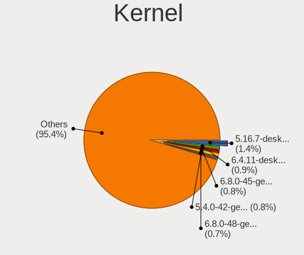

| Version                         | Computers | Percent |
|---------------------------------|-----------|---------|
| 5.4.0-42-generic                | 25        | 1.89%   |
| 5.4.0-58-generic                | 22        | 1.66%   |
| 5.16.7-desktop-1omv4003         | 20        | 1.51%   |
| 5.0.0-37-generic                | 15        | 1.13%   |
| 5.4.0-48-generic                | 14        | 1.06%   |
| 5.4.0-26-generic                | 14        | 1.06%   |
| 4.18.0-15-generic               | 14        | 1.06%   |
| 5.3.0-40-generic                | 13        | 0.98%   |
| 5.8.0-43-generic                | 11        | 0.83%   |
| 5.8.0-14-generic                | 11        | 0.83%   |
| 5.3.0-46-generic                | 11        | 0.83%   |
| 5.11.0-27-generic               | 11        | 0.83%   |
| 5.4.0-37-generic                | 10        | 0.76%   |
| 5.4.0-29-generic                | 10        | 0.76%   |
| 5.15.0-27-generic               | 10        | 0.76%   |
| 5.13.0-30-generic               | 10        | 0.76%   |
| 5.10.14-desktop-1omv4002        | 10        | 0.76%   |
| 5.8.0-48-generic                | 9         | 0.68%   |
| 5.4.0-74-generic                | 9         | 0.68%   |
| 5.4.0-73-generic                | 9         | 0.68%   |
| 5.4.0-47-generic                | 9         | 0.68%   |
| 5.4.0-33-generic                | 9         | 0.68%   |
| 5.3.0-42-generic                | 9         | 0.68%   |
| 5.13.0-28-generic               | 9         | 0.68%   |
| 5.8.0-63-generic                | 8         | 0.6%    |
| 5.8.0-44-generic                | 8         | 0.6%    |
| 5.4.0-65-generic                | 8         | 0.6%    |
| 5.4.0-56-generic                | 8         | 0.6%    |
| 5.4.0-54-generic                | 8         | 0.6%    |
| 5.4.0-40-generic                | 8         | 0.6%    |
| 5.3.0-28-generic                | 8         | 0.6%    |
| 5.13.0-39-generic               | 8         | 0.6%    |
| 5.11.0-43-generic               | 8         | 0.6%    |
| 5.11.0-40-generic               | 8         | 0.6%    |
| 5.10.0-8-amd64                  | 8         | 0.6%    |
| 4.9.60-nrj-desktop-1rosa-x86_64 | 8         | 0.6%    |
| 5.8.0-50-generic                | 7         | 0.53%   |
| 5.4.0-45-generic                | 7         | 0.53%   |
| 5.10.0-9-amd64                  | 7         | 0.53%   |
| 5.10.0-13-amd64                 | 7         | 0.53%   |
| 5.0.0-23-generic                | 7         | 0.53%   |
| 4.18.0-25-generic               | 7         | 0.53%   |
| 5.13.0-35-generic               | 6         | 0.45%   |
| 5.11.0-37-generic               | 6         | 0.45%   |
| 5.11.0-25-generic               | 6         | 0.45%   |
| 5.10.0-11-amd64                 | 6         | 0.45%   |
| 5.0.0-32-generic                | 6         | 0.45%   |
| 5.8.0-45-generic                | 5         | 0.38%   |
| 5.4.0-70-generic                | 5         | 0.38%   |
| 5.4.0-66-generic                | 5         | 0.38%   |
| 5.4.0-62-generic                | 5         | 0.38%   |
| 5.4.0-52-generic                | 5         | 0.38%   |
| 5.4.0-39-generic                | 5         | 0.38%   |
| 5.4.0-31-generic                | 5         | 0.38%   |
| 5.13.0-27-generic               | 5         | 0.38%   |
| 5.11.0-41-generic               | 5         | 0.38%   |
| 5.11.0-35-generic               | 5         | 0.38%   |
| 5.11.0-34-generic               | 5         | 0.38%   |
| 4.19.0-6-amd64                  | 5         | 0.38%   |
| 4.19.0-13-amd64                 | 5         | 0.38%   |

Kernel Family
-------------

Linux kernel without a distro release

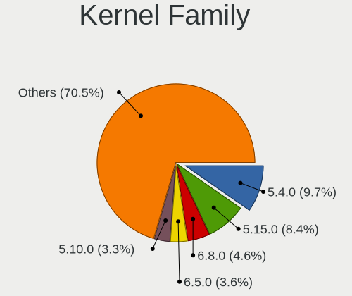

| Version | Computers | Percent |
|---------|-----------|---------|
| 5.4.0   | 265       | 20.88%  |
| 5.8.0   | 94        | 7.41%   |
| 4.15.0  | 86        | 6.78%   |
| 5.11.0  | 85        | 6.7%    |
| 5.3.0   | 64        | 5.04%   |
| 5.0.0   | 57        | 4.49%   |
| 5.13.0  | 55        | 4.33%   |
| 5.10.0  | 49        | 3.86%   |
| 4.18.0  | 46        | 3.62%   |
| 4.19.0  | 27        | 2.13%   |
| 5.16.7  | 22        | 1.73%   |
| 5.15.0  | 18        | 1.42%   |
| 5.10.14 | 11        | 0.87%   |
| 4.9.60  | 10        | 0.79%   |
| 5.6.0   | 8         | 0.63%   |
| 5.17.1  | 7         | 0.55%   |
| 5.11.11 | 7         | 0.55%   |
| 5.17.5  | 6         | 0.47%   |
| 5.9.16  | 5         | 0.39%   |
| 5.7.0   | 5         | 0.39%   |
| 5.16.16 | 5         | 0.39%   |
| 5.14.0  | 5         | 0.39%   |
| 5.11.10 | 5         | 0.39%   |
| 4.9.124 | 5         | 0.39%   |
| 4.4.0   | 5         | 0.39%   |
| 5.9.11  | 4         | 0.32%   |
| 5.8.11  | 4         | 0.32%   |
| 5.6.11  | 4         | 0.32%   |
| 5.3.18  | 4         | 0.32%   |
| 5.16.5  | 4         | 0.32%   |
| 5.16.15 | 4         | 0.32%   |
| 5.16.0  | 4         | 0.32%   |
| 5.15.14 | 4         | 0.32%   |
| 5.15.12 | 4         | 0.32%   |
| 5.12.6  | 4         | 0.32%   |
| 5.9.14  | 3         | 0.24%   |
| 5.9.10  | 3         | 0.24%   |
| 5.9.1   | 3         | 0.24%   |
| 5.9.0   | 3         | 0.24%   |
| 5.7.12  | 3         | 0.24%   |
| 5.3.8   | 3         | 0.24%   |
| 5.17.4  | 3         | 0.24%   |
| 5.16.8  | 3         | 0.24%   |
| 5.16.13 | 3         | 0.24%   |
| 5.16.11 | 3         | 0.24%   |
| 5.15.28 | 3         | 0.24%   |
| 5.15.25 | 3         | 0.24%   |
| 5.15.23 | 3         | 0.24%   |
| 5.15.15 | 3         | 0.24%   |
| 5.15.11 | 3         | 0.24%   |
| 5.15.10 | 3         | 0.24%   |
| 5.14.14 | 3         | 0.24%   |
| 5.13.19 | 3         | 0.24%   |
| 5.13.13 | 3         | 0.24%   |
| 5.13.12 | 3         | 0.24%   |
| 5.12.9  | 3         | 0.24%   |
| 5.11.18 | 3         | 0.24%   |
| 5.11.12 | 3         | 0.24%   |
| 5.10.7  | 3         | 0.24%   |
| 5.10.15 | 3         | 0.24%   |

Kernel Major Ver.
-----------------

Linux kernel major version

| Version | Computers | Percent |
|---------|-----------|---------|
| 5.4     | 282       | 22.6%   |
| 5.11    | 116       | 9.29%   |
| 5.8     | 111       | 8.89%   |
| 5.10    | 93        | 7.45%   |
| 4.15    | 86        | 6.89%   |
| 5.3     | 75        | 6.01%   |
| 5.13    | 67        | 5.37%   |
| 5.15    | 59        | 4.73%   |
| 5.0     | 59        | 4.73%   |
| 5.16    | 56        | 4.49%   |
| 4.18    | 49        | 3.93%   |
| 5.9     | 29        | 2.32%   |
| 4.19    | 29        | 2.32%   |
| 4.9     | 23        | 1.84%   |
| 5.17    | 21        | 1.68%   |
| 5.14    | 17        | 1.36%   |
| 5.7     | 16        | 1.28%   |
| 5.6     | 16        | 1.28%   |
| 5.12    | 16        | 1.28%   |
| 5.5     | 5         | 0.4%    |
| 4.4     | 5         | 0.4%    |
| 5.2     | 4         | 0.32%   |
| 5.1     | 4         | 0.32%   |
| 4.1     | 3         | 0.24%   |
| 4.13    | 2         | 0.16%   |
| 4.10    | 2         | 0.16%   |
| 4.16    | 1         | 0.08%   |
| 4.12    | 1         | 0.08%   |
| 3.4     | 1         | 0.08%   |

Arch
----

OS architecture (x86_64, i586, etc.)

| Name    | Computers | Percent |
|---------|-----------|---------|
| x86_64  | 1086      | 95.68%  |
| i686    | 40        | 3.52%   |
| aarch64 | 5         | 0.44%   |
| armv7l  | 4         | 0.35%   |

DE
--

Desktop Environment

| Name            | Computers | Percent |
|-----------------|-----------|---------|
| GNOME           | 545       | 46.03%  |
| Unknown         | 198       | 16.72%  |
| KDE5            | 121       | 10.22%  |
| XFCE            | 111       | 9.38%   |
| X-Cinnamon      | 50        | 4.22%   |
| KDE             | 36        | 3.04%   |
| Pantheon        | 19        | 1.6%    |
| KDE4            | 17        | 1.44%   |
| MATE            | 14        | 1.18%   |
| Cinnamon        | 14        | 1.18%   |
| Unity           | 13        | 1.1%    |
| LXQt            | 11        | 0.93%   |
| LXDE            | 9         | 0.76%   |
| i3              | 6         | 0.51%   |
| Deepin          | 5         | 0.42%   |
| Budgie          | 4         | 0.34%   |
| Trinity         | 2         | 0.17%   |
| openbox         | 2         | 0.17%   |
| xmonad          | 1         | 0.08%   |
| sway            | 1         | 0.08%   |
| GNOME Flashback | 1         | 0.08%   |
| GNOME Classic   | 1         | 0.08%   |
| dwm             | 1         | 0.08%   |
| default         | 1         | 0.08%   |
| bspwm           | 1         | 0.08%   |

Display Server
--------------

X11 or Wayland

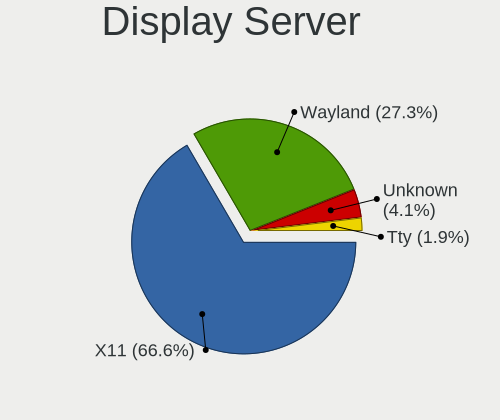

| Name    | Computers | Percent |
|---------|-----------|---------|
| X11     | 943       | 80.94%  |
| Wayland | 120       | 10.3%   |
| Unknown | 80        | 6.87%   |
| Tty     | 22        | 1.89%   |

Display Manager
---------------

SDDM, LightDM, etc.

| Name    | Computers | Percent |
|---------|-----------|---------|
| Unknown | 694       | 58.61%  |
| GDM     | 154       | 13.01%  |
| SDDM    | 116       | 9.8%    |
| LightDM | 77        | 6.5%    |
| GDM3    | 63        | 5.32%   |
| TDM     | 60        | 5.07%   |
| KDM     | 17        | 1.44%   |
| XDM     | 2         | 0.17%   |
| Ly      | 1         | 0.08%   |

OS Lang
-------

Language

| Lang        | Computers | Percent |
|-------------|-----------|---------|
| en_US       | 461       | 39.81%  |
| tr_TR       | 432       | 37.31%  |
| Unknown     | 191       | 16.49%  |
| en_GB       | 27        | 2.33%   |
| C           | 17        | 1.47%   |
| ru_RU       | 7         | 0.6%    |
| de_DE       | 3         | 0.26%   |
| zh_CN       | 1         | 0.09%   |
| tr_TR.UTF8  | 1         | 0.09%   |
| tr_CY       | 1         | 0.09%   |
| ru_UA       | 1         | 0.09%   |
| POSIX       | 1         | 0.09%   |
| nl_BE       | 1         | 0.09%   |
| fr_FR       | 1         | 0.09%   |
| fa_IR       | 1         | 0.09%   |
| es_ES       | 1         | 0.09%   |
| en_US.UTF8  | 1         | 0.09%   |
| en_US-UTF-8 | 1         | 0.09%   |
| en_NZ       | 1         | 0.09%   |
| en_IE       | 1         | 0.09%   |
| en_GB.UTF8  | 1         | 0.09%   |
| en_DK       | 1         | 0.09%   |
| en_CA       | 1         | 0.09%   |
| en_AU       | 1         | 0.09%   |
| en_150      | 1         | 0.09%   |
| de_AT       | 1         | 0.09%   |
| ar_EG       | 1         | 0.09%   |

Boot Mode
---------

EFI or BIOS

| Mode | Computers | Percent |
|------|-----------|---------|
| EFI  | 580       | 50.09%  |
| BIOS | 578       | 49.91%  |

Filesystem
----------

Type of filesystem

| Type    | Computers | Percent |
|---------|-----------|---------|
| Ext4    | 933       | 80.02%  |
| Btrfs   | 83        | 7.12%   |
| Unknown | 57        | 4.89%   |
| Overlay | 56        | 4.8%    |
| Xfs     | 12        | 1.03%   |
| Ext2    | 11        | 0.94%   |
| Zfs     | 8         | 0.69%   |
| Ext3    | 2         | 0.17%   |
| Aufs    | 2         | 0.17%   |
| Tmpfs   | 1         | 0.09%   |
| F2fs    | 1         | 0.09%   |

Part. scheme
------------

Scheme of partitioning

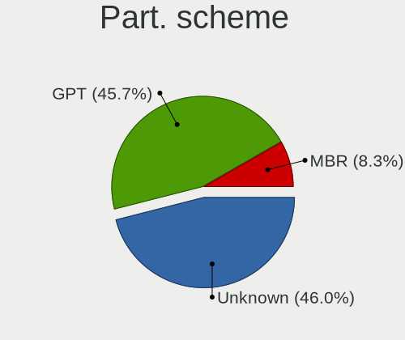

| Type    | Computers | Percent |
|---------|-----------|---------|
| Unknown | 744       | 64.25%  |
| GPT     | 300       | 25.91%  |
| MBR     | 114       | 9.84%   |

Dual Boot with Linux/BSD
------------------------

Hosting more than one Linux/BSD

| Dual boot | Computers | Percent |
|-----------|-----------|---------|
| No        | 994       | 86.43%  |
| Yes       | 156       | 13.57%  |

Dual Boot (Win)
---------------

Hosting Linux and Windows

| Dual boot | Computers | Percent |
|-----------|-----------|---------|
| No        | 763       | 65.44%  |
| Yes       | 403       | 34.56%  |

Board
-----

Vendor
------

Motherboard manufacturer

| Name                        | Computers | Percent |
|-----------------------------|-----------|---------|
| ASUSTek Computer            | 202       | 17.81%  |
| Lenovo                      | 171       | 15.08%  |
| Hewlett-Packard             | 154       | 13.58%  |
| Dell                        | 93        | 8.2%    |
| MSI                         | 81        | 7.14%   |
| Gigabyte Technology         | 65        | 5.73%   |
| Acer                        | 58        | 5.11%   |
| Toshiba                     | 38        | 3.35%   |
| Monster                     | 26        | 2.29%   |
| Samsung Electronics         | 23        | 2.03%   |
| Apple                       | 23        | 2.03%   |
| Sony                        | 22        | 1.94%   |
| Casper                      | 20        | 1.76%   |
| HUAWEI                      | 17        | 1.5%    |
| Unknown                     | 15        | 1.32%   |
| Intel                       | 12        | 1.06%   |
| Packard Bell                | 11        | 0.97%   |
| Pegatron                    | 9         | 0.79%   |
| Clevo                       | 9         | 0.79%   |
| Hometech                    | 8         | 0.71%   |
| ASRock                      | 8         | 0.71%   |
| Foxconn                     | 7         | 0.62%   |
| ECS                         | 6         | 0.53%   |
| Fujitsu                     | 4         | 0.35%   |
| ARCELIK                     | 4         | 0.35%   |
| Vestel                      | 3         | 0.26%   |
| Raspberry Pi Foundation     | 3         | 0.26%   |
| Huanan                      | 3         | 0.26%   |
| Fujitsu Siemens             | 3         | 0.26%   |
| AMI                         | 3         | 0.26%   |
| Quanta                      | 2         | 0.18%   |
| Nvidia                      | 2         | 0.18%   |
| LG Electronics              | 2         | 0.18%   |
| Insyde                      | 2         | 0.18%   |
| Alienware                   | 2         | 0.18%   |
| Zillion                     | 1         | 0.09%   |
| SYWZ                        | 1         | 0.09%   |
| System76                    | 1         | 0.09%   |
| Shuttle                     | 1         | 0.09%   |
| Schenker                    | 1         | 0.09%   |
| Razer                       | 1         | 0.09%   |
| Pine Microsystems           | 1         | 0.09%   |
| Olimex                      | 1         | 0.09%   |
| Notebook                    | 1         | 0.09%   |
| Neousys Technology          | 1         | 0.09%   |
| Microsoft                   | 1         | 0.09%   |
| Medion                      | 1         | 0.09%   |
| I-Life Digital Technologies | 1         | 0.09%   |
| HT                          | 1         | 0.09%   |
| Hampoo                      | 1         | 0.09%   |
| Getac                       | 1         | 0.09%   |
| FIC                         | 1         | 0.09%   |
| Exper                       | 1         | 0.09%   |
| Datateknik                  | 1         | 0.09%   |
| Biostar                     | 1         | 0.09%   |
| ARIMA                       | 1         | 0.09%   |
| AOpen                       | 1         | 0.09%   |
| ABIT                        | 1         | 0.09%   |

Model
-----

Motherboard model

| Name                                       | Computers | Percent |
|--------------------------------------------|-----------|---------|
| Unknown                                    | 21        | 1.85%   |
| HP Pavilion g6                             | 12        | 1.06%   |
| HP Notebook                                | 7         | 0.62%   |
| HP Pavilion dv6                            | 6         | 0.53%   |
| Casper NIRVANA NOTEBOOK                    | 6         | 0.53%   |
| ASUS All Series                            | 6         | 0.53%   |
| HUAWEI NBLK-WAX9X                          | 5         | 0.44%   |
| HP Pavilion 15                             | 5         | 0.44%   |
| HP 15                                      | 5         | 0.44%   |
| Gigabyte G31M-ES2L                         | 5         | 0.44%   |
| Gigabyte B450M S2H                         | 5         | 0.44%   |
| ASUS X550VX                                | 5         | 0.44%   |
| ASUS N550JV                                | 5         | 0.44%   |
| MSI MS-7A34                                | 4         | 0.35%   |
| MSI MS-7693                                | 4         | 0.35%   |
| HP Pavilion Notebook                       | 4         | 0.35%   |
| HP 250 G3                                  | 4         | 0.35%   |
| Dell Inspiron MM061                        | 4         | 0.35%   |
| Dell Inspiron 7577                         | 4         | 0.35%   |
| Dell Inspiron 3580                         | 4         | 0.35%   |
| ASUS X555UB                                | 4         | 0.35%   |
| ASUS VivoBook 15_ASUS Laptop X540UAR       | 4         | 0.35%   |
| Toshiba Satellite A300                     | 3         | 0.26%   |
| MSI MS-7996                                | 3         | 0.26%   |
| MSI MS-7360                                | 3         | 0.26%   |
| Monster ABRA A5 V12.1                      | 3         | 0.26%   |
| Lenovo V330-15IKB 81AX                     | 3         | 0.26%   |
| Lenovo V145-15AST 81MT                     | 3         | 0.26%   |
| Lenovo ThinkPad E595 20NFS0TD00            | 3         | 0.26%   |
| Lenovo ThinkPad E495 20NE001TTX            | 3         | 0.26%   |
| Lenovo Legion Y530-15ICH 81FV              | 3         | 0.26%   |
| Lenovo IdeaPad 310-15ISK 80SM              | 3         | 0.26%   |
| Lenovo IdeaPad 100-15IBD 80QQ              | 3         | 0.26%   |
| Lenovo G50-70 20351                        | 3         | 0.26%   |
| HUAWEI WRT-WX9                             | 3         | 0.26%   |
| HUAWEI BOHK-WAX9X                          | 3         | 0.26%   |
| HP Pavilion 13 x360 PC                     | 3         | 0.26%   |
| HP Laptop 15-db0xxx                        | 3         | 0.26%   |
| HP Laptop 15-bs1xx                         | 3         | 0.26%   |
| HP G62                                     | 3         | 0.26%   |
| HP ElitePad 1000 G2                        | 3         | 0.26%   |
| HP EliteBook 840 G2                        | 3         | 0.26%   |
| Gigabyte A320M-S2H                         | 3         | 0.26%   |
| Dell Inspiron N5110                        | 3         | 0.26%   |
| Dell Inspiron 3593                         | 3         | 0.26%   |
| Clevo W7x0S                                | 3         | 0.26%   |
| Casper CASPER NIRVANA NOTEBOOK             | 3         | 0.26%   |
| ASUS X542URR                               | 3         | 0.26%   |
| ASUS VivoBook 15_ASUS Laptop X540MA_X540MA | 3         | 0.26%   |
| ASUS PRIME B450M-K                         | 3         | 0.26%   |
| ASUS M5A78L-M LX3                          | 3         | 0.26%   |
| Acer Aspire 5750G                          | 3         | 0.26%   |
| Acer Aspire 5742G                          | 3         | 0.26%   |
| Vestel V TAB 1041                          | 2         | 0.18%   |
| Toshiba Satellite R630                     | 2         | 0.18%   |
| Toshiba Satellite P50-B-116                | 2         | 0.18%   |
| Toshiba Satellite L50-C                    | 2         | 0.18%   |
| Toshiba Satellite C650                     | 2         | 0.18%   |
| Toshiba Satellite C50-B                    | 2         | 0.18%   |
| Toshiba Satellite A100                     | 2         | 0.18%   |

Model Family
------------

Motherboard model prefix

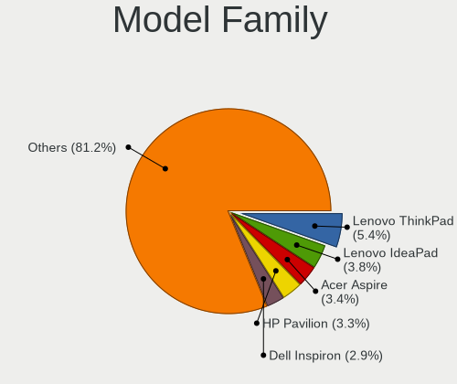

| Name                  | Computers | Percent |
|-----------------------|-----------|---------|
| Lenovo ThinkPad       | 60        | 5.29%   |
| HP Pavilion           | 45        | 3.97%   |
| Dell Inspiron         | 44        | 3.88%   |
| Lenovo IdeaPad        | 38        | 3.35%   |
| Toshiba Satellite     | 36        | 3.17%   |
| Acer Aspire           | 35        | 3.09%   |
| Unknown               | 21        | 1.85%   |
| HP Laptop             | 19        | 1.68%   |
| Dell Latitude         | 19        | 1.68%   |
| Monster ABRA          | 17        | 1.5%    |
| HP EliteBook          | 15        | 1.32%   |
| ASUS VivoBook         | 15        | 1.32%   |
| HP ProBook            | 13        | 1.15%   |
| Packard Bell EasyNote | 11        | 0.97%   |
| Dell Vostro           | 11        | 0.97%   |
| ASUS PRIME            | 11        | 0.97%   |
| Casper NIRVANA        | 10        | 0.88%   |
| ASUS ROG              | 10        | 0.88%   |
| Lenovo Legion         | 9         | 0.79%   |
| HP 250                | 9         | 0.79%   |
| Lenovo Yoga           | 8         | 0.71%   |
| HP Notebook           | 7         | 0.62%   |
| Gigabyte B450M        | 7         | 0.62%   |
| ASUS TUF              | 7         | 0.62%   |
| Acer Nitro            | 7         | 0.62%   |
| Monster TULPAR        | 6         | 0.53%   |
| HP ENVY               | 6         | 0.53%   |
| Dell XPS              | 6         | 0.53%   |
| ASUS All              | 6         | 0.53%   |
| HUAWEI NBLK-WAX9X     | 5         | 0.44%   |
| HP Compaq             | 5         | 0.44%   |
| HP 15                 | 5         | 0.44%   |
| Gigabyte G31M-ES2L    | 5         | 0.44%   |
| Dell Precision        | 5         | 0.44%   |
| Dell G3               | 5         | 0.44%   |
| ASUS X550VX           | 5         | 0.44%   |
| ASUS N550JV           | 5         | 0.44%   |
| ASUS ASUS             | 5         | 0.44%   |
| Acer Swift            | 5         | 0.44%   |
| MSI MS-7A34           | 4         | 0.35%   |
| MSI MS-7693           | 4         | 0.35%   |
| Lenovo ThinkCentre    | 4         | 0.35%   |
| Lenovo IdeaCentre     | 4         | 0.35%   |
| Hometech Alfa         | 4         | 0.35%   |
| Casper CASPER         | 4         | 0.35%   |
| ASUS ZenBook          | 4         | 0.35%   |
| ASUS X555UB           | 4         | 0.35%   |
| ASUS P8H61-M          | 4         | 0.35%   |
| ASUS M5A97            | 4         | 0.35%   |
| ASUS M5A78L-M         | 4         | 0.35%   |
| Vestel V              | 3         | 0.26%   |
| Samsung 300E4A        | 3         | 0.26%   |
| RPi Raspberry         | 3         | 0.26%   |
| MSI MS-7996           | 3         | 0.26%   |
| MSI MS-7360           | 3         | 0.26%   |
| Lenovo V330-15IKB     | 3         | 0.26%   |
| Lenovo V145-15AST     | 3         | 0.26%   |
| Lenovo ThinkBook      | 3         | 0.26%   |
| Lenovo G580           | 3         | 0.26%   |
| Lenovo G50-70         | 3         | 0.26%   |

MFG Year
--------

Motherboard manufacture year

| Year    | Computers | Percent |
|---------|-----------|---------|
| 2018    | 118       | 10.41%  |
| 2019    | 112       | 9.88%   |
| 2017    | 104       | 9.17%   |
| 2020    | 93        | 8.2%    |
| 2011    | 88        | 7.76%   |
| 2012    | 80        | 7.05%   |
| 2013    | 77        | 6.79%   |
| 2010    | 76        | 6.7%    |
| 2015    | 71        | 6.26%   |
| 2016    | 70        | 6.17%   |
| 2014    | 62        | 5.47%   |
| 2008    | 44        | 3.88%   |
| 2009    | 43        | 3.79%   |
| 2021    | 38        | 3.35%   |
| 2007    | 24        | 2.12%   |
| 2006    | 16        | 1.41%   |
| Unknown | 9         | 0.79%   |
| 2005    | 4         | 0.35%   |
| 2022    | 3         | 0.26%   |
| 2004    | 1         | 0.09%   |
| 2003    | 1         | 0.09%   |

Form Factor
-----------

Physical design of the computer

| Name           | Computers | Percent |
|----------------|-----------|---------|
| Notebook       | 799       | 70.46%  |
| Desktop        | 280       | 24.69%  |
| Convertible    | 14        | 1.23%   |
| All in one     | 12        | 1.06%   |
| Mini pc        | 11        | 0.97%   |
| Tablet         | 8         | 0.71%   |
| System on chip | 6         | 0.53%   |
| Server         | 3         | 0.26%   |
| Phone          | 1         | 0.09%   |

Secure Boot
-----------

Enabled or disabled

| State    | Computers | Percent |
|----------|-----------|---------|
| Disabled | 1068      | 93.11%  |
| Enabled  | 79        | 6.89%   |

Coreboot
--------

Have coreboot on board

| Used | Computers | Percent |
|------|-----------|---------|
| No   | 1133      | 99.91%  |
| Yes  | 1         | 0.09%   |

RAM Size
--------

Total RAM memory

| Size in GB      | Computers | Percent |
|-----------------|-----------|---------|
| 4.01-8.0        | 267       | 23.24%  |
| 3.01-4.0        | 259       | 22.54%  |
| 8.01-16.0       | 214       | 18.62%  |
| 16.01-24.0      | 206       | 17.93%  |
| 1.01-2.0        | 86        | 7.48%   |
| 32.01-64.0      | 52        | 4.53%   |
| 2.01-3.0        | 29        | 2.52%   |
| 64.01-256.0     | 13        | 1.13%   |
| 24.01-32.0      | 11        | 0.96%   |
| 0.51-1.0        | 11        | 0.96%   |
| More than 256.0 | 1         | 0.09%   |

RAM Used
--------

Used RAM memory

| Used GB    | Computers | Percent |
|------------|-----------|---------|
| 1.01-2.0   | 465       | 37.26%  |
| 2.01-3.0   | 324       | 25.96%  |
| 3.01-4.0   | 174       | 13.94%  |
| 4.01-8.0   | 144       | 11.54%  |
| 0.51-1.0   | 85        | 6.81%   |
| 8.01-16.0  | 37        | 2.96%   |
| 0.01-0.5   | 12        | 0.96%   |
| 16.01-24.0 | 3         | 0.24%   |
| 24.01-32.0 | 2         | 0.16%   |
| 32.01-64.0 | 1         | 0.08%   |
| Unknown    | 1         | 0.08%   |

Total Drives
------------

Number of drives on board

| Drives | Computers | Percent |
|--------|-----------|---------|
| 1      | 728       | 62.87%  |
| 2      | 325       | 28.07%  |
| 3      | 65        | 5.61%   |
| 4      | 19        | 1.64%   |
| 5      | 7         | 0.6%    |
| 0      | 6         | 0.52%   |
| 7      | 5         | 0.43%   |
| 6      | 3         | 0.26%   |

Has CD-ROM
----------

Has CD-ROM on board

| Presented | Computers | Percent |
|-----------|-----------|---------|
| No        | 704       | 61.48%  |
| Yes       | 441       | 38.52%  |

Has Ethernet
------------

Has Ethernet on board

| Presented | Computers | Percent |
|-----------|-----------|---------|
| Yes       | 1009      | 88.82%  |
| No        | 127       | 11.18%  |

Has WiFi
--------

Has WiFi module

| Presented | Computers | Percent |
|-----------|-----------|---------|
| Yes       | 939       | 82.51%  |
| No        | 199       | 17.49%  |

Has Bluetooth
-------------

Has Bluetooth module

| Presented | Computers | Percent |
|-----------|-----------|---------|
| Yes       | 732       | 63.87%  |
| No        | 414       | 36.13%  |

Location
--------

Country
-------

Geographic location (country)

| Country | Computers | Percent |
|---------|-----------|---------|
| Turkey  | 1134      | 100%    |

City
----

Geographic location (city)

| City                | Computers | Percent |
|---------------------|-----------|---------|
| Istanbul            | 440       | 36.58%  |
| Ankara              | 172       | 14.3%   |
| Izmir               | 111       | 9.23%   |
| Bursa               | 59        | 4.9%    |
| Antalya             | 54        | 4.49%   |
| Adana               | 20        | 1.66%   |
| zmit              | 19        | 1.58%   |
| Konya               | 16        | 1.33%   |
| Kayseri             | 15        | 1.25%   |
| Balkesir          | 15        | 1.25%   |
| Denizli             | 14        | 1.16%   |
| Antakya             | 12        | 1%      |
| Mersin              | 11        | 0.91%   |
| Gaziantep           | 11        | 0.91%   |
| Aydin               | 10        | 0.83%   |
| Tekirda           | 8         | 0.67%   |
| Samsun              | 7         | 0.58%   |
| Ordu                | 7         | 0.58%   |
| Mugla               | 7         | 0.58%   |
| Kartal              | 7         | 0.58%   |
| Trabzon             | 6         | 0.5%    |
| Eskiehir          | 6         | 0.5%    |
| OEdemis             | 5         | 0.42%   |
| Kosekoy             | 5         | 0.42%   |
| Krklareli         | 5         | 0.42%   |
| Batman              | 5         | 0.42%   |
| Yalova              | 4         | 0.33%   |
| Sisli               | 4         | 0.33%   |
| Malatya             | 4         | 0.33%   |
| Magnesia ad Sipylum | 4         | 0.33%   |
| Erzurum             | 4         | 0.33%   |
| Bilecik             | 4         | 0.33%   |
| Adapazar          | 4         | 0.33%   |
| Zonguldak           | 3         | 0.25%   |
| Yozgat              | 3         | 0.25%   |
| Ulus                | 3         | 0.25%   |
| Sanliurfa           | 3         | 0.25%   |
| Polatl            | 3         | 0.25%   |
| Osmaniye            | 3         | 0.25%   |
| Ktahya            | 3         | 0.25%   |
| Isparta             | 3         | 0.25%   |
| Esenyurt            | 3         | 0.25%   |
| Diyarbakr         | 3         | 0.25%   |
| orum              | 3         | 0.25%   |
| Cankaya             | 3         | 0.25%   |
| anakkale          | 3         | 0.25%   |
| Bornova             | 3         | 0.25%   |
| Alaehir           | 3         | 0.25%   |
| Van                 | 2         | 0.17%   |
| mraniye           | 2         | 0.17%   |
| Tarsus              | 2         | 0.17%   |
| Mardin              | 2         | 0.17%   |
| Maltepe             | 2         | 0.17%   |
| Etimesgut           | 2         | 0.17%   |
| Bolu                | 2         | 0.17%   |
| Bodrum              | 2         | 0.17%   |
| Beykoz              | 2         | 0.17%   |
| Akalan              | 2         | 0.17%   |
| Ar              | 2         | 0.17%   |
| Afyonkarahisar      | 2         | 0.17%   |

Drives
------

Drive Vendor
------------

Hard drive vendors

| Vendor                  | Computers | Drives | Percent |
|-------------------------|-----------|--------|---------|
| WDC                     | 237       | 323    | 14.89%  |
| Seagate                 | 236       | 295    | 14.82%  |
| Samsung Electronics     | 214       | 307    | 13.44%  |
| Toshiba                 | 141       | 156    | 8.86%   |
| SanDisk                 | 136       | 161    | 8.54%   |
| Kingston                | 88        | 118    | 5.53%   |
| Unknown                 | 70        | 82     | 4.4%    |
| Hitachi                 | 51        | 56     | 3.2%    |
| HGST                    | 50        | 54     | 3.14%   |
| SK Hynix                | 39        | 44     | 2.45%   |
| Intel                   | 32        | 43     | 2.01%   |
| Micron Technology       | 23        | 27     | 1.44%   |
| Crucial                 | 23        | 28     | 1.44%   |
| China                   | 18        | 20     | 1.13%   |
| A-DATA Technology       | 18        | 20     | 1.13%   |
| Corsair                 | 17        | 19     | 1.07%   |
| Apple                   | 15        | 21     | 0.94%   |
| Fujitsu                 | 12        | 12     | 0.75%   |
| Phison                  | 11        | 11     | 0.69%   |
| HS-SSD-C100             | 10        | 10     | 0.63%   |
| OCZ                     | 9         | 11     | 0.57%   |
| JAMESDONKEY             | 7         | 7      | 0.44%   |
| Netac                   | 6         | 6      | 0.38%   |
| Lexar                   | 6         | 9      | 0.38%   |
| KIOXIA                  | 6         | 8      | 0.38%   |
| XPG                     | 5         | 7      | 0.31%   |
| Silicon Motion          | 5         | 5      | 0.31%   |
| KIOXIA-EXCERIA          | 5         | 6      | 0.31%   |
| KingSpec                | 5         | 5      | 0.31%   |
| UMIS                    | 4         | 5      | 0.25%   |
| Team                    | 4         | 4      | 0.25%   |
| Realtek Semiconductor   | 4         | 5      | 0.25%   |
| MAXTOR                  | 4         | 4      | 0.25%   |
| LITEON                  | 4         | 5      | 0.25%   |
| Union Memory            | 3         | 6      | 0.19%   |
| Transcend               | 3         | 3      | 0.19%   |
| SPCC                    | 3         | 3      | 0.19%   |
| Patriot                 | 3         | 4      | 0.19%   |
| LITEONIT                | 3         | 3      | 0.19%   |
| JMicron                 | 3         | 3      | 0.19%   |
| JD                      | 3         | 5      | 0.19%   |
| Gigabyte Technology     | 3         | 6      | 0.19%   |
| EZCOOL                  | 3         | 4      | 0.19%   |
| 2.5"                    | 3         | 3      | 0.19%   |
| Union Memory (Shenzhen) | 2         | 2      | 0.13%   |
| Pioneer                 | 2         | 8      | 0.13%   |
| Lite-On                 | 2         | 2      | 0.13%   |
| KingFast                | 2         | 3      | 0.13%   |
| KingDian                | 2         | 2      | 0.13%   |
| Hewlett-Packard         | 2         | 2      | 0.13%   |
| Apacer                  | 2         | 2      | 0.13%   |
| addlink                 | 2         | 2      | 0.13%   |
| ADATA Technology        | 2         | 4      | 0.13%   |
| Unknown                 | 2         | 2      | 0.13%   |
| YMTC                    | 1         | 1      | 0.06%   |
| TwinMOS                 | 1         | 1      | 0.06%   |
| TO Exter                | 1         | 3      | 0.06%   |
| T-FORCE                 | 1         | 1      | 0.06%   |
| SSSTC                   | 1         | 1      | 0.06%   |
| SSD-S400                | 1         | 1      | 0.06%   |

Drive Model
-----------

Hard drive models

| Model                               | Computers | Percent |
|-------------------------------------|-----------|---------|
| Seagate ST1000LM035-1RK172 1TB      | 30        | 1.77%   |
| HGST HTS721010A9E630 1TB            | 24        | 1.41%   |
| SanDisk SSD PLUS 240GB              | 23        | 1.35%   |
| Unknown MMC Card  32GB              | 20        | 1.18%   |
| Samsung NVMe SSD Drive 256GB        | 16        | 0.94%   |
| Toshiba MQ04ABF100 1TB              | 15        | 0.88%   |
| Toshiba MQ01ABF050 500GB            | 14        | 0.82%   |
| Toshiba MQ01ABD100 1TB              | 14        | 0.82%   |
| Samsung NVMe SSD Drive 512GB        | 13        | 0.77%   |
| Seagate ST500LT012-1DG142 500GB     | 11        | 0.65%   |
| Seagate ST1000DM010-2EP102 1TB      | 11        | 0.65%   |
| Samsung SSD 860 EVO 250GB           | 11        | 0.65%   |
| Intel NVMe SSD Drive 512GB          | 11        | 0.65%   |
| Toshiba TR200 240GB SSD             | 10        | 0.59%   |
| Sandisk NVMe SSD Drive 256GB        | 10        | 0.59%   |
| HGST HTS541010A9E680 1TB            | 10        | 0.59%   |
| Seagate ST9500325AS 500GB           | 9         | 0.53%   |
| Seagate Expansion 4TB               | 9         | 0.53%   |
| SanDisk SSD PLUS 120GB              | 9         | 0.53%   |
| Kingston SA400S37120G 120GB SSD     | 9         | 0.53%   |
| Seagate ST500DM002-1BD142 500GB     | 8         | 0.47%   |
| Seagate ST1000LM024 HN-M101MBB 1TB  | 8         | 0.47%   |
| Seagate ST1000DM003-1ER162 1TB      | 8         | 0.47%   |
| Kingston SV300S37A120G 120GB SSD    | 8         | 0.47%   |
| WDC WD10JPCX-24UE4T0 1TB            | 7         | 0.41%   |
| WDC WD10EZEX-08WN4A0 1TB            | 7         | 0.41%   |
| Unknown MMC Card  64GB              | 7         | 0.41%   |
| SK Hynix NVMe SSD Drive 512GB       | 7         | 0.41%   |
| SanDisk SSD PLUS 480GB              | 7         | 0.41%   |
| Sandisk NVMe SSD Drive 512GB        | 7         | 0.41%   |
| Samsung HD502HJ 500GB               | 7         | 0.41%   |
| Toshiba MQ01ABD075 752GB            | 6         | 0.35%   |
| Toshiba DT01ACA100 1TB              | 6         | 0.35%   |
| Seagate ST1000LM048-2E7172 1TB      | 6         | 0.35%   |
| SanDisk SDSSDA240G 240GB            | 6         | 0.35%   |
| Samsung SSD 860 EVO 500GB           | 6         | 0.35%   |
| Samsung HD322HJ 320GB               | 6         | 0.35%   |
| HGST HTS545050A7E680 500GB          | 6         | 0.35%   |
| A-DATA SU650 120GB SSD              | 6         | 0.35%   |
| WDC WDS240G2G0A-00JH30 240GB SSD    | 5         | 0.29%   |
| WDC WDS120G2G0A-00JH30 120GB SSD    | 5         | 0.29%   |
| WDC WD10SPZX-21Z10T0 1TB            | 5         | 0.29%   |
| WDC WD10EZEX-00BN5A0 1TB            | 5         | 0.29%   |
| Unknown SD/MMC/MS PRO 999GB         | 5         | 0.29%   |
| SK Hynix NVMe SSD Drive 256GB       | 5         | 0.29%   |
| Seagate ST3500418AS 500GB           | 5         | 0.29%   |
| Seagate ST1000DM003-1SB102 1TB      | 5         | 0.29%   |
| SanDisk SDSSDHII240G 240GB          | 5         | 0.29%   |
| Samsung SSD 850 EVO 250GB           | 5         | 0.29%   |
| Samsung SSD 840 EVO 250GB           | 5         | 0.29%   |
| Samsung NVMe SSD Drive 500GB        | 5         | 0.29%   |
| Samsung NVMe SSD Drive 250GB        | 5         | 0.29%   |
| Samsung NVMe SSD Drive 1TB          | 5         | 0.29%   |
| Samsung HM321HI 320GB               | 5         | 0.29%   |
| Micron 1100_MTFDDAV256TBN 256GB SSD | 5         | 0.29%   |
| KIOXIA-EXCERIA SATA SSD 240GB       | 5         | 0.29%   |
| Kingston SA400S37240G 240GB SSD     | 5         | 0.29%   |
| JAMESDONKEY JD120 120GB             | 5         | 0.29%   |
| Hitachi HTS545050A7E380 500GB       | 5         | 0.29%   |
| China SATA SSD 120GB                | 5         | 0.29%   |

HDD Vendor
----------

Hard disk drive vendors

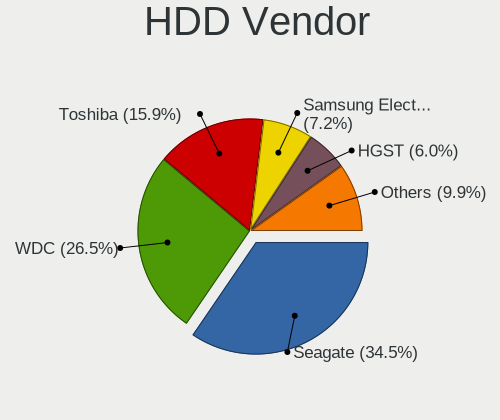

| Vendor              | Computers | Drives | Percent |
|---------------------|-----------|--------|---------|
| Seagate             | 234       | 289    | 32.68%  |
| WDC                 | 202       | 278    | 28.21%  |
| Toshiba             | 104       | 111    | 14.53%  |
| Hitachi             | 51        | 56     | 7.12%   |
| HGST                | 50        | 54     | 6.98%   |
| Samsung Electronics | 47        | 63     | 6.56%   |
| Fujitsu             | 12        | 12     | 1.68%   |
| Unknown             | 5         | 5      | 0.7%    |
| MAXTOR              | 4         | 4      | 0.56%   |
| Apple               | 2         | 5      | 0.28%   |
| SABRENT             | 1         | 1      | 0.14%   |
| Intenso             | 1         | 1      | 0.14%   |
| ExcelStor           | 1         | 1      | 0.14%   |
| ASMT                | 1         | 1      | 0.14%   |
| 128MB               | 1         | 1      | 0.14%   |

SSD Vendor
----------

Solid state drive vendors

| Vendor              | Computers | Drives | Percent |
|---------------------|-----------|--------|---------|
| SanDisk             | 104       | 125    | 20.76%  |
| Samsung Electronics | 94        | 122    | 18.76%  |
| Kingston            | 75        | 100    | 14.97%  |
| WDC                 | 24        | 26     | 4.79%   |
| Crucial             | 22        | 26     | 4.39%   |
| Toshiba             | 19        | 21     | 3.79%   |
| China               | 15        | 17     | 2.99%   |
| A-DATA Technology   | 14        | 15     | 2.79%   |
| Micron Technology   | 13        | 16     | 2.59%   |
| Corsair             | 13        | 14     | 2.59%   |
| OCZ                 | 9         | 11     | 1.8%    |
| SK Hynix            | 8         | 9      | 1.6%    |
| Intel               | 8         | 14     | 1.6%    |
| Netac               | 6         | 6      | 1.2%    |
| Apple               | 6         | 6      | 1.2%    |
| Lexar               | 5         | 8      | 1%      |
| KIOXIA-EXCERIA      | 5         | 6      | 1%      |
| KingSpec            | 5         | 5      | 1%      |
| LITEON              | 4         | 5      | 0.8%    |
| Transcend           | 3         | 3      | 0.6%    |
| Team                | 3         | 3      | 0.6%    |
| Seagate             | 3         | 4      | 0.6%    |
| Patriot             | 3         | 4      | 0.6%    |
| LITEONIT            | 3         | 3      | 0.6%    |
| HS-SSD-C100         | 3         | 3      | 0.6%    |
| 2.5"                | 3         | 3      | 0.6%    |
| SPCC                | 2         | 2      | 0.4%    |
| Pioneer             | 2         | 8      | 0.4%    |
| KingDian            | 2         | 2      | 0.4%    |
| JMicron             | 2         | 2      | 0.4%    |
| JAMESDONKEY         | 2         | 2      | 0.4%    |
| Hewlett-Packard     | 2         | 2      | 0.4%    |
| EZCOOL              | 2         | 3      | 0.4%    |
| Apacer              | 2         | 2      | 0.4%    |
| TwinMOS             | 1         | 1      | 0.2%    |
| TO Exter            | 1         | 3      | 0.2%    |
| SSD-S400            | 1         | 1      | 0.2%    |
| PNY                 | 1         | 1      | 0.2%    |
| Mushkin             | 1         | 2      | 0.2%    |
| JD                  | 1         | 1      | 0.2%    |
| Indilinx            | 1         | 3      | 0.2%    |
| HS-SSD-E100N        | 1         | 1      | 0.2%    |
| Hikvision           | 1         | 1      | 0.2%    |
| GOODRAM             | 1         | 1      | 0.2%    |
| Gigabyte Technology | 1         | 3      | 0.2%    |
| External            | 1         | 1      | 0.2%    |
| AXIOMTEK            | 1         | 1      | 0.2%    |
| AFOX                | 1         | 1      | 0.2%    |
| ADATA SU            | 1         | 1      | 0.2%    |

Drive Kind
----------

HDD or SSD

| Kind    | Computers | Drives | Percent |
|---------|-----------|--------|---------|
| HDD     | 641       | 882    | 43.4%   |
| SSD     | 455       | 620    | 30.81%  |
| NVMe    | 283       | 378    | 19.16%  |
| MMC     | 66        | 79     | 4.47%   |
| Unknown | 32        | 36     | 2.17%   |

Drive Connector
---------------

SATA, SAS, NVMe, etc.

| Type | Computers | Drives | Percent |
|------|-----------|--------|---------|
| SATA | 909       | 1481   | 70.03%  |
| NVMe | 283       | 378    | 21.8%   |
| MMC  | 66        | 79     | 5.08%   |
| SAS  | 40        | 57     | 3.08%   |

Drive Size
----------

Size of hard drive

| Size in TB | Computers | Drives | Percent |
|------------|-----------|--------|---------|
| 0.01-0.5   | 694       | 989    | 63.73%  |
| 0.51-1.0   | 324       | 413    | 29.75%  |
| 1.01-2.0   | 36        | 52     | 3.31%   |
| 3.01-4.0   | 19        | 26     | 1.74%   |
| 2.01-3.0   | 8         | 11     | 0.73%   |
| 4.01-10.0  | 8         | 11     | 0.73%   |

Space Total
-----------

Amount of disk space available on the file system

| Size in GB     | Computers | Percent |
|----------------|-----------|---------|
| 101-250        | 381       | 31.51%  |
| 251-500        | 268       | 22.17%  |
| 501-1000       | 154       | 12.74%  |
| 51-100         | 109       | 9.02%   |
| 21-50          | 82        | 6.78%   |
| 1-20           | 79        | 6.53%   |
| 1001-2000      | 77        | 6.37%   |
| 2001-3000      | 22        | 1.82%   |
| More than 3000 | 21        | 1.74%   |
| Unknown        | 16        | 1.32%   |

Space Used
----------

Amount of used disk space

| Used GB        | Computers | Percent |
|----------------|-----------|---------|
| 1-20           | 535       | 42.94%  |
| 21-50          | 240       | 19.26%  |
| 51-100         | 155       | 12.44%  |
| 101-250        | 133       | 10.67%  |
| 251-500        | 77        | 6.18%   |
| 501-1000       | 56        | 4.49%   |
| 1001-2000      | 19        | 1.52%   |
| Unknown        | 16        | 1.28%   |
| More than 3000 | 10        | 0.8%    |
| 2001-3000      | 5         | 0.4%    |

Malfunc. Drives
---------------

Drive models with a malfunction

| Model                                 | Computers | Drives | Percent |
|---------------------------------------|-----------|--------|---------|
| HGST HTS721010A9E630 1TB              | 4         | 4      | 3.57%   |
| Seagate ST500LT012-1DG142 500GB       | 3         | 5      | 2.68%   |
| SanDisk SSD PLUS 240GB                | 3         | 3      | 2.68%   |
| Toshiba MQ01ABF050 500GB              | 2         | 3      | 1.79%   |
| Toshiba MQ01ABD050 500GB              | 2         | 2      | 1.79%   |
| Seagate ST9320325AS 320GB             | 2         | 2      | 1.79%   |
| Seagate ST3500630AS 500GB             | 2         | 2      | 1.79%   |
| Seagate ST1000LM035-1RK172 1TB        | 2         | 2      | 1.79%   |
| Kingston SVP200S37A120G 120GB SSD     | 2         | 2      | 1.79%   |
| Kingston SV300S37A120G 120GB SSD      | 2         | 3      | 1.79%   |
| Hitachi HTS543232A7A384 320GB         | 2         | 2      | 1.79%   |
| HGST HTS545050A7E680 500GB            | 2         | 2      | 1.79%   |
| Fujitsu MHY2120BH 120GB               | 2         | 2      | 1.79%   |
| 2.5" SATA SSD 3TG6-P 480GB            | 2         | 2      | 1.79%   |
| WDC WDS240G2G0B-00EPW0 240GB SSD      | 1         | 1      | 0.89%   |
| WDC WD5000LPVX-22V0TT0 500GB          | 1         | 1      | 0.89%   |
| WDC WD5000AAKX-001CA0 500GB           | 1         | 2      | 0.89%   |
| WDC WD400JB-00ENA0 40GB               | 1         | 1      | 0.89%   |
| WDC WD3200BPVT-22JJ5T0 320GB          | 1         | 1      | 0.89%   |
| WDC WD3200BEVT-60A23T0 320GB          | 1         | 1      | 0.89%   |
| WDC WD3200BEVT-22A23T0 320GB          | 1         | 1      | 0.89%   |
| WDC WD3200AAJS-00B4A0 320GB           | 1         | 1      | 0.89%   |
| WDC WD30EZRX-00MMMB0 3TB              | 1         | 1      | 0.89%   |
| WDC WD2500JS-55NCB1 250GB             | 1         | 1      | 0.89%   |
| WDC WD10JPVX-22JC3T0 1TB              | 1         | 1      | 0.89%   |
| WDC WD10JPVT-75A1YT0 1TB              | 1         | 1      | 0.89%   |
| WDC WD10EARS-00Y5B1 1TB               | 1         | 2      | 0.89%   |
| Toshiba MQ02ABD100H 1TB               | 1         | 2      | 0.89%   |
| Toshiba MQ01ABF050M 500GB             | 1         | 1      | 0.89%   |
| Toshiba MQ01ABD100 1TB                | 1         | 1      | 0.89%   |
| Toshiba MQ01ABD075 752GB              | 1         | 1      | 0.89%   |
| Toshiba MK4058GSX 400GB               | 1         | 1      | 0.89%   |
| Toshiba MK3263GSXN 320GB              | 1         | 1      | 0.89%   |
| Toshiba MK3252GSX 320GB               | 1         | 1      | 0.89%   |
| Toshiba MK1665GSX 160GB               | 1         | 1      | 0.89%   |
| Toshiba MK1011GAH 100GB               | 1         | 1      | 0.89%   |
| Toshiba DT01ACA050 500GB              | 1         | 1      | 0.89%   |
| SSD-S400 SSD 120GB                    | 1         | 1      | 0.89%   |
| SK Hynix HFS512G39TND-N210A 512GB SSD | 1         | 1      | 0.89%   |
| SK Hynix HFS256G32MND-2200A 256GB SSD | 1         | 1      | 0.89%   |
| Seagate ST9750420AS 752GB             | 1         | 1      | 0.89%   |
| Seagate ST9320423AS 320GB             | 1         | 1      | 0.89%   |
| Seagate ST9160821AS 160GB             | 1         | 1      | 0.89%   |
| Seagate ST9160310AS 160GB             | 1         | 1      | 0.89%   |
| Seagate ST9120822AS 120GB             | 1         | 1      | 0.89%   |
| Seagate ST500LT012-9WS142 500GB       | 1         | 1      | 0.89%   |
| Seagate ST500DM002-1BD142 500GB       | 1         | 1      | 0.89%   |
| Seagate ST380215AS 80GB               | 1         | 1      | 0.89%   |
| Seagate ST3500418AS 500GB             | 1         | 1      | 0.89%   |
| Seagate ST3250410AS 250GB             | 1         | 1      | 0.89%   |
| Seagate ST3250310AS 250GB             | 1         | 1      | 0.89%   |
| Seagate ST320LT012-9WS14C 320GB       | 1         | 1      | 0.89%   |
| Seagate ST2000LM003 HN-M201RAD 2TB    | 1         | 1      | 0.89%   |
| Seagate ST1000LM024 HN-M101MBB 1TB    | 1         | 1      | 0.89%   |
| Seagate ST1000LM014-SSHD-8GB          | 1         | 1      | 0.89%   |
| Seagate ST1000DM003-1SB102 1TB        | 1         | 1      | 0.89%   |
| Seagate ST1000DM003-1CH162 1TB        | 1         | 1      | 0.89%   |
| SanDisk SDSSDHII240G 240GB            | 1         | 2      | 0.89%   |
| SanDisk SDSSDA120G 120GB              | 1         | 1      | 0.89%   |
| SanDisk SD6SN1M-256G-1006 256GB SSD   | 1         | 1      | 0.89%   |

Malfunc. Drive Vendor
---------------------

Vendors of faulty drives

| Vendor              | Computers | Drives | Percent |
|---------------------|-----------|--------|---------|
| Seagate             | 25        | 28     | 22.73%  |
| Toshiba             | 14        | 16     | 12.73%  |
| WDC                 | 12        | 15     | 10.91%  |
| Hitachi             | 12        | 12     | 10.91%  |
| Samsung Electronics | 8         | 11     | 7.27%   |
| HGST                | 8         | 8      | 7.27%   |
| SanDisk             | 6         | 7      | 5.45%   |
| Kingston            | 5         | 6      | 4.55%   |
| Fujitsu             | 3         | 3      | 2.73%   |
| A-DATA Technology   | 3         | 3      | 2.73%   |
| SK Hynix            | 2         | 2      | 1.82%   |
| MAXTOR              | 2         | 2      | 1.82%   |
| 2.5"                | 2         | 2      | 1.82%   |
| SSD-S400            | 1         | 1      | 0.91%   |
| OCZ                 | 1         | 2      | 0.91%   |
| LITEONIT            | 1         | 1      | 0.91%   |
| LITEON              | 1         | 1      | 0.91%   |
| Intel               | 1         | 1      | 0.91%   |
| Indilinx            | 1         | 3      | 0.91%   |
| Crucial             | 1         | 1      | 0.91%   |
| China               | 1         | 1      | 0.91%   |

Malfunc. HDD Vendor
-------------------

Vendors of faulty HDD drives

| Vendor              | Computers | Drives | Percent |
|---------------------|-----------|--------|---------|
| Seagate             | 25        | 28     | 30.86%  |
| Toshiba             | 14        | 16     | 17.28%  |
| Hitachi             | 12        | 12     | 14.81%  |
| WDC                 | 11        | 14     | 13.58%  |
| HGST                | 8         | 8      | 9.88%   |
| Samsung Electronics | 6         | 8      | 7.41%   |
| Fujitsu             | 3         | 3      | 3.7%    |
| MAXTOR              | 2         | 2      | 2.47%   |

Malfunc. Drive Kind
-------------------

Kinds of faulty drives

| Kind | Computers | Drives | Percent |
|------|-----------|--------|---------|
| HDD  | 76        | 91     | 72.38%  |
| SSD  | 28        | 34     | 26.67%  |
| NVMe | 1         | 1      | 0.95%   |

Failed Drives
-------------

Failed drive models

| Model                      | Computers | Drives | Percent |
|----------------------------|-----------|--------|---------|
| HGST HTS545050A7E680 500GB | 1         | 1      | 100%    |

Failed Drive Vendor
-------------------

Failed drive vendors

| Vendor | Computers | Drives | Percent |
|--------|-----------|--------|---------|
| HGST   | 1         | 1      | 100%    |

Drive Status
------------

Number of failed and malfunc. drives

| Status   | Computers | Drives | Percent |
|----------|-----------|--------|---------|
| Detected | 789       | 1312   | 64.46%  |
| Works    | 332       | 556    | 27.12%  |
| Malfunc  | 102       | 126    | 8.33%   |
| Failed   | 1         | 1      | 0.08%   |

Storage controller
------------------

Storage Vendor
--------------

Storage controller vendors

| Vendor                           | Computers | Percent |
|----------------------------------|-----------|---------|
| Intel                            | 807       | 60.81%  |
| AMD                              | 175       | 13.19%  |
| Samsung Electronics              | 97        | 7.31%   |
| Sandisk                          | 40        | 3.01%   |
| SK Hynix                         | 29        | 2.19%   |
| Phison Electronics               | 20        | 1.51%   |
| Nvidia                           | 15        | 1.13%   |
| Marvell Technology Group         | 15        | 1.13%   |
| Kingston Technology Company      | 13        | 0.98%   |
| Toshiba America Info Systems     | 12        | 0.9%    |
| Silicon Integrated Systems [SiS] | 12        | 0.9%    |
| KIOXIA                           | 12        | 0.9%    |
| JMicron Technology               | 12        | 0.9%    |
| ASMedia Technology               | 11        | 0.83%   |
| ADATA Technology                 | 11        | 0.83%   |
| Micron Technology                | 9         | 0.68%   |
| Union Memory (Shenzhen)          | 8         | 0.6%    |
| Silicon Motion                   | 7         | 0.53%   |
| Apple                            | 6         | 0.45%   |
| Realtek Semiconductor            | 4         | 0.3%    |
| VIA Technologies                 | 2         | 0.15%   |
| Lite-On Technology               | 2         | 0.15%   |
| Innodisk                         | 2         | 0.15%   |
| Yangtze Memory Technologies      | 1         | 0.08%   |
| ULi Electronics                  | 1         | 0.08%   |
| Solid State Storage Technology   | 1         | 0.08%   |
| OCZ Technology Group             | 1         | 0.08%   |
| Micron/Crucial Technology        | 1         | 0.08%   |
| LSI Logic / Symbios Logic        | 1         | 0.08%   |

Storage Model
-------------

Storage controller models

| Model                                                                                   | Computers | Percent |
|-----------------------------------------------------------------------------------------|-----------|---------|
| AMD FCH SATA Controller [AHCI mode]                                                     | 127       | 8.33%   |
| Intel Sunrise Point-LP SATA Controller [AHCI mode]                                      | 86        | 5.64%   |
| Intel 7 Series Chipset Family 6-port SATA Controller [AHCI mode]                        | 69        | 4.52%   |
| Intel 6 Series/C200 Series Chipset Family 6 port Mobile SATA AHCI Controller            | 54        | 3.54%   |
| Samsung NVMe SSD Controller SM981/PM981/PM983                                           | 51        | 3.34%   |
| Intel 8 Series/C220 Series Chipset Family 6-port SATA Controller 1 [AHCI mode]          | 44        | 2.89%   |
| Intel HM170/QM170 Chipset SATA Controller [AHCI Mode]                                   | 38        | 2.49%   |
| Intel NM10/ICH7 Family SATA Controller [IDE mode]                                       | 34        | 2.23%   |
| Intel 82801 Mobile SATA Controller [RAID mode]                                          | 31        | 2.03%   |
| Intel 8 Series SATA Controller 1 [AHCI mode]                                            | 31        | 2.03%   |
| Intel 5 Series/3400 Series Chipset 4 port SATA AHCI Controller                          | 31        | 2.03%   |
| Intel Cannon Lake Mobile PCH SATA AHCI Controller                                       | 30        | 1.97%   |
| Intel 82801IBM/IEM (ICH9M/ICH9M-E) 4 port SATA Controller [AHCI mode]                   | 30        | 1.97%   |
| Intel Wildcat Point-LP SATA Controller [AHCI Mode]                                      | 28        | 1.84%   |
| Intel 82801G (ICH7 Family) IDE Controller                                               | 27        | 1.77%   |
| AMD 400 Series Chipset SATA Controller                                                  | 25        | 1.64%   |
| AMD SB7x0/SB8x0/SB9x0 IDE Controller                                                    | 23        | 1.51%   |
| Intel Q170/Q150/B150/H170/H110/Z170/CM236 Chipset SATA Controller [AHCI Mode]           | 22        | 1.44%   |
| Samsung NVMe SSD Controller 980                                                         | 20        | 1.31%   |
| Intel Comet Lake SATA AHCI Controller                                                   | 19        | 1.25%   |
| Intel 400 Series Chipset Family SATA AHCI Controller                                    | 19        | 1.25%   |
| AMD SB7x0/SB8x0/SB9x0 SATA Controller [IDE mode]                                        | 19        | 1.25%   |
| AMD SB7x0/SB8x0/SB9x0 SATA Controller [AHCI mode]                                       | 17        | 1.11%   |
| Intel SSD 660P Series                                                                   | 16        | 1.05%   |
| Samsung NVMe SSD Controller SM961/PM961/SM963                                           | 15        | 0.98%   |
| Intel 5 Series/3400 Series Chipset 6 port SATA AHCI Controller                          | 15        | 0.98%   |
| Intel 6 Series/C200 Series Chipset Family 6 port Desktop SATA AHCI Controller           | 14        | 0.92%   |
| Intel 200 Series PCH SATA controller [AHCI mode]                                        | 14        | 0.92%   |
| Sandisk WD Blue SN550 NVMe SSD                                                          | 12        | 0.79%   |
| Intel 82801HM/HEM (ICH8M/ICH8M-E) IDE Controller                                        | 12        | 0.79%   |
| AMD 300 Series Chipset SATA Controller                                                  | 12        | 0.79%   |
| Phison E12 NVMe Controller                                                              | 11        | 0.72%   |
| Intel Celeron N3350/Pentium N4200/Atom E3900 Series SATA AHCI Controller                | 11        | 0.72%   |
| Intel Cannon Point-LP SATA Controller [AHCI Mode]                                       | 11        | 0.72%   |
| Intel Atom Processor E3800 Series SATA AHCI Controller                                  | 11        | 0.72%   |
| Intel 82801HM/HEM (ICH8M/ICH8M-E) SATA Controller [AHCI mode]                           | 11        | 0.72%   |
| Intel 82801GBM/GHM (ICH7-M Family) SATA Controller [IDE mode]                           | 11        | 0.72%   |
| ASMedia ASM1062 Serial ATA Controller                                                   | 11        | 0.72%   |
| SK Hynix BC511                                                                          | 10        | 0.66%   |
| SK Hynix BC501 NVMe Solid State Drive                                                   | 10        | 0.66%   |
| Silicon Integrated Systems [SiS] 5513 IDE Controller                                    | 10        | 0.66%   |
| Silicon Integrated Systems [SiS] SATA Controller / IDE mode                             | 9         | 0.59%   |
| Micron Non-Volatile memory controller                                                   | 9         | 0.59%   |
| Intel Celeron/Pentium Silver Processor SATA Controller                                  | 9         | 0.59%   |
| Intel 6 Series/C200 Series Chipset Family Desktop SATA Controller (IDE mode, ports 4-5) | 9         | 0.59%   |
| Intel 6 Series/C200 Series Chipset Family Desktop SATA Controller (IDE mode, ports 0-3) | 9         | 0.59%   |
| Union Memory (Shenzhen) Non-Volatile memory controller                                  | 8         | 0.52%   |
| Sandisk WD Black SN750 / PC SN730 NVMe SSD                                              | 8         | 0.52%   |
| Nvidia MCP61 SATA Controller                                                            | 8         | 0.52%   |
| KIOXIA Non-Volatile memory controller                                                   | 8         | 0.52%   |
| Intel Volume Management Device NVMe RAID Controller                                     | 8         | 0.52%   |
| Intel SATA Controller [RAID mode]                                                       | 8         | 0.52%   |
| Intel Ice Lake-LP SATA Controller [AHCI mode]                                           | 8         | 0.52%   |
| Intel Atom/Celeron/Pentium Processor x5-E8000/J3xxx/N3xxx Series SATA Controller        | 8         | 0.52%   |
| ADATA XPG SX8200 Pro PCIe Gen3x4 M.2 2280 Solid State Drive                             | 8         | 0.52%   |
| Nvidia MCP61 IDE                                                                        | 7         | 0.46%   |
| JMicron JMB363 SATA/IDE Controller                                                      | 7         | 0.46%   |
| Intel Cannon Lake PCH SATA AHCI Controller                                              | 7         | 0.46%   |
| Intel 7 Series/C210 Series Chipset Family 6-port SATA Controller [AHCI mode]            | 7         | 0.46%   |
| Silicon Motion SM2263EN/SM2263XT SSD Controller                                         | 6         | 0.39%   |

Storage Kind
------------

Kind of storage controller (IDE, SATA, NVMe, SAS, ...)

| Kind | Computers | Percent |
|------|-----------|---------|
| SATA | 850       | 62.64%  |
| NVMe | 287       | 21.15%  |
| IDE  | 168       | 12.38%  |
| RAID | 51        | 3.76%   |
| SCSI | 1         | 0.07%   |

Processor
---------

CPU Vendor
----------

Processor vendors

| Vendor       | Computers | Percent |
|--------------|-----------|---------|
| Intel        | 895       | 78.92%  |
| AMD          | 228       | 20.11%  |
| ARM          | 9         | 0.79%   |
| CentaurHauls | 2         | 0.18%   |

CPU Model
---------

Processor models

| Model                                         | Computers | Percent |
|-----------------------------------------------|-----------|---------|
| Intel Core i5-7200U CPU @ 2.50GHz             | 23        | 2.03%   |
| Intel Core i7-7700HQ CPU @ 2.80GHz            | 20        | 1.76%   |
| Intel Core i5-6200U CPU @ 2.30GHz             | 17        | 1.5%    |
| Intel Core i7-10510U CPU @ 1.80GHz            | 16        | 1.41%   |
| AMD Ryzen 5 3500U with Radeon Vega Mobile Gfx | 16        | 1.41%   |
| Intel Core i5-3230M CPU @ 2.60GHz             | 15        | 1.32%   |
| Intel Core i5-8250U CPU @ 1.60GHz             | 14        | 1.23%   |
| Intel Core i7-8550U CPU @ 1.80GHz             | 13        | 1.15%   |
| Intel Core i7-6700HQ CPU @ 2.60GHz            | 13        | 1.15%   |
| Intel Core i5-8265U CPU @ 1.60GHz             | 13        | 1.15%   |
| Intel Core i7-9750H CPU @ 2.60GHz             | 12        | 1.06%   |
| Intel Core i7-10750H CPU @ 2.60GHz            | 12        | 1.06%   |
| Intel Core i7-8750H CPU @ 2.20GHz             | 11        | 0.97%   |
| AMD Ryzen 7 3700U with Radeon Vega Mobile Gfx | 11        | 0.97%   |
| Intel Core i5-5200U CPU @ 2.20GHz             | 10        | 0.88%   |
| Intel Core i5-3210M CPU @ 2.50GHz             | 10        | 0.88%   |
| Intel Core i5-2430M CPU @ 2.40GHz             | 10        | 0.88%   |
| Intel Core i5-1035G1 CPU @ 1.00GHz            | 10        | 0.88%   |
| Intel Atom x5-Z8350 CPU @ 1.44GHz             | 10        | 0.88%   |
| Intel Core i5-4210U CPU @ 1.70GHz             | 9         | 0.79%   |
| Intel Core i5-2450M CPU @ 2.50GHz             | 9         | 0.79%   |
| Intel Core i7-7500U CPU @ 2.70GHz             | 8         | 0.7%    |
| Intel Core i5-4200M CPU @ 2.50GHz             | 8         | 0.7%    |
| Intel Core i5 CPU M 460 @ 2.53GHz             | 8         | 0.7%    |
| Intel Atom CPU Z3735F @ 1.33GHz               | 8         | 0.7%    |
| AMD A8-7410 APU with AMD Radeon R5 Graphics   | 8         | 0.7%    |
| Intel Core i7-6500U CPU @ 2.50GHz             | 7         | 0.62%   |
| Intel Core i7-4700HQ CPU @ 2.40GHz            | 7         | 0.62%   |
| Intel Core i7-3630QM CPU @ 2.40GHz            | 7         | 0.62%   |
| Intel Core i5-3317U CPU @ 1.70GHz             | 7         | 0.62%   |
| Intel Core i5-2520M CPU @ 2.50GHz             | 7         | 0.62%   |
| Intel Core i5-2410M CPU @ 2.30GHz             | 7         | 0.62%   |
| Intel Core i3 CPU M 330 @ 2.13GHz             | 7         | 0.62%   |
| Intel Celeron CPU N3350 @ 1.10GHz             | 7         | 0.62%   |
| Intel Celeron CPU N3060 @ 1.60GHz             | 7         | 0.62%   |
| AMD Ryzen 7 4800H with Radeon Graphics        | 7         | 0.62%   |
| Intel Core i7-8565U CPU @ 1.80GHz             | 6         | 0.53%   |
| Intel Core i7-3770 CPU @ 3.40GHz              | 6         | 0.53%   |
| Intel Core i7-2670QM CPU @ 2.20GHz            | 6         | 0.53%   |
| Intel Core i5-7300HQ CPU @ 2.50GHz            | 6         | 0.53%   |
| Intel Core i5-5300U CPU @ 2.30GHz             | 6         | 0.53%   |
| Intel Core i3-5005U CPU @ 2.00GHz             | 6         | 0.53%   |
| Intel Core i3 CPU M 370 @ 2.40GHz             | 6         | 0.53%   |
| Intel Core 2 Quad CPU Q6600 @ 2.40GHz         | 6         | 0.53%   |
| Intel Core 2 CPU T5600 @ 1.83GHz              | 6         | 0.53%   |
| Intel 11th Gen Core i5-1135G7 @ 2.40GHz       | 6         | 0.53%   |
| AMD Ryzen 5 2600 Six-Core Processor           | 6         | 0.53%   |
| Intel Pentium Dual-Core CPU T4200 @ 2.00GHz   | 5         | 0.44%   |
| Intel Core i7-4510U CPU @ 2.00GHz             | 5         | 0.44%   |
| Intel Core i5-4460 CPU @ 3.20GHz              | 5         | 0.44%   |
| Intel Core i5-4200U CPU @ 1.60GHz             | 5         | 0.44%   |
| Intel Core i5 CPU M 480 @ 2.67GHz             | 5         | 0.44%   |
| Intel Core i3-7020U CPU @ 2.30GHz             | 5         | 0.44%   |
| Intel Core i3-6006U CPU @ 2.00GHz             | 5         | 0.44%   |
| Intel Core i3-4005U CPU @ 1.70GHz             | 5         | 0.44%   |
| Intel Core 2 Quad CPU Q8300 @ 2.50GHz         | 5         | 0.44%   |
| Intel Celeron N4000 CPU @ 1.10GHz             | 5         | 0.44%   |
| Intel 11th Gen Core i7-11800H @ 2.30GHz       | 5         | 0.44%   |
| ARM Processor                                 | 5         | 0.44%   |
| AMD Ryzen 7 5800H with Radeon Graphics        | 5         | 0.44%   |

CPU Model Family
----------------

Processor model prefix

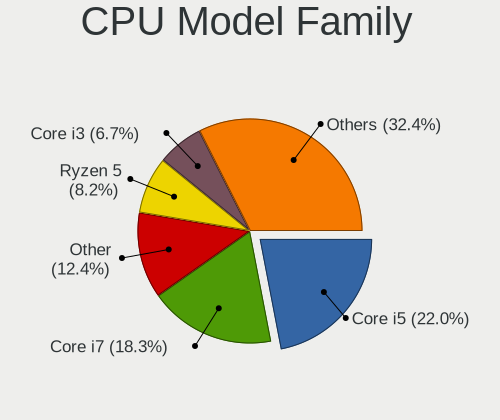

| Model                   | Computers | Percent |
|-------------------------|-----------|---------|
| Intel Core i5           | 286       | 25.2%   |
| Intel Core i7           | 250       | 22.03%  |
| Intel Core i3           | 77        | 6.78%   |
| AMD Ryzen 5             | 64        | 5.64%   |
| Intel Core 2 Duo        | 53        | 4.67%   |
| Intel Celeron           | 49        | 4.32%   |
| AMD Ryzen 7             | 49        | 4.32%   |
| Other                   | 35        | 3.08%   |
| Intel Atom              | 33        | 2.91%   |
| Intel Pentium           | 29        | 2.56%   |
| Intel Pentium Dual-Core | 18        | 1.59%   |
| Intel Xeon              | 16        | 1.41%   |
| Intel Core 2 Quad       | 16        | 1.41%   |
| AMD FX                  | 15        | 1.32%   |
| Intel Pentium Dual      | 13        | 1.15%   |
| Intel Core 2            | 13        | 1.15%   |
| AMD A8                  | 12        | 1.06%   |
| AMD Ryzen 3             | 11        | 0.97%   |
| AMD A4                  | 7         | 0.62%   |
| AMD A10                 | 7         | 0.62%   |
| Intel Core i9           | 6         | 0.53%   |
| AMD Phenom II X4        | 5         | 0.44%   |
| AMD A6                  | 5         | 0.44%   |
| Intel Genuine           | 4         | 0.35%   |
| AMD Ryzen 7 PRO         | 4         | 0.35%   |
| AMD Athlon              | 4         | 0.35%   |
| AMD Athlon II X3        | 3         | 0.26%   |
| AMD Athlon II X2        | 3         | 0.26%   |
| AMD Athlon 64 X2        | 3         | 0.26%   |
| AMD A12                 | 3         | 0.26%   |
| Intel Pentium 4         | 2         | 0.18%   |
| Intel Core M            | 2         | 0.18%   |
| CentaurHauls VIA Eden   | 2         | 0.18%   |
| AMD Sempron             | 2         | 0.18%   |
| AMD Ryzen Threadripper  | 2         | 0.18%   |
| AMD Ryzen 9             | 2         | 0.18%   |
| AMD Phenom II X6        | 2         | 0.18%   |
| AMD Phenom              | 2         | 0.18%   |
| AMD E                   | 2         | 0.18%   |
| AMD C-60                | 2         | 0.18%   |
| AMD Athlon II X4        | 2         | 0.18%   |
| Intel Pentium Silver    | 1         | 0.09%   |
| Intel Pentium M         | 1         | 0.09%   |
| Intel Pentium D         | 1         | 0.09%   |
| Intel Core              | 1         | 0.09%   |
| Intel Celeron M         | 1         | 0.09%   |
| Intel Celeron Dual-Core | 1         | 0.09%   |
| ARM BCM                 | 1         | 0.09%   |
| ARM ARMv7               | 1         | 0.09%   |
| ARM Allwinner           | 1         | 0.09%   |
| AMD Turion II Neo       | 1         | 0.09%   |
| AMD Ryzen 5 PRO         | 1         | 0.09%   |
| AMD Phenom II X2        | 1         | 0.09%   |
| AMD Mobile Athlon 64    | 1         | 0.09%   |
| AMD E2                  | 1         | 0.09%   |
| AMD E1                  | 1         | 0.09%   |
| AMD C-70                | 1         | 0.09%   |
| AMD C-50                | 1         | 0.09%   |
| AMD Athlon XP           | 1         | 0.09%   |
| AMD Athlon X4           | 1         | 0.09%   |

CPU Cores
---------

Number of processor cores

| Number | Computers | Percent |
|--------|-----------|---------|
| 2      | 527       | 46.43%  |
| 4      | 415       | 36.56%  |
| 6      | 97        | 8.55%   |
| 8      | 52        | 4.58%   |
| 1      | 26        | 2.29%   |
| 3      | 8         | 0.7%    |
| 12     | 5         | 0.44%   |
| 64     | 1         | 0.09%   |
| 24     | 1         | 0.09%   |
| 16     | 1         | 0.09%   |
| 14     | 1         | 0.09%   |
| 10     | 1         | 0.09%   |

CPU Sockets
-----------

Number of sockets

| Number | Computers | Percent |
|--------|-----------|---------|
| 1      | 1130      | 99.65%  |
| 2      | 4         | 0.35%   |

CPU Threads
-----------

Threads per core (Hyper-Threading)

| Number | Computers | Percent |
|--------|-----------|---------|
| 2      | 768       | 67.72%  |
| 1      | 365       | 32.19%  |
| 8      | 1         | 0.09%   |

CPU Op-Modes
------------

CPU Operation Modes (32-bit, 64-bit)

| Op mode        | Computers | Percent |
|----------------|-----------|---------|
| 32-bit, 64-bit | 1090      | 95.78%  |
| Unknown        | 36        | 3.16%   |
| 32-bit         | 11        | 0.97%   |
| 64-bit         | 1         | 0.09%   |

CPU Microcode
-------------

Microcode number

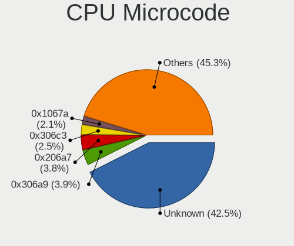

| Number     | Computers | Percent |
|------------|-----------|---------|
| Unknown    | 221       | 18.97%  |
| 0x306a9    | 71        | 6.09%   |
| 0x206a7    | 71        | 6.09%   |
| 0x306c3    | 44        | 3.78%   |
| 0x1067a    | 42        | 3.61%   |
| 0x906e9    | 41        | 3.52%   |
| 0x806ea    | 31        | 2.66%   |
| 0x906ea    | 30        | 2.58%   |
| 0x806e9    | 29        | 2.49%   |
| 0x806ec    | 28        | 2.4%    |
| 0x506e3    | 27        | 2.32%   |
| 0x306d4    | 26        | 2.23%   |
| 0x406e3    | 25        | 2.15%   |
| 0x40651    | 25        | 2.15%   |
| 0x20655    | 23        | 1.97%   |
| 0x6fd      | 21        | 1.8%    |
| 0x30678    | 19        | 1.63%   |
| 0xa0652    | 17        | 1.46%   |
| 0x08108102 | 17        | 1.46%   |
| 0x406c4    | 16        | 1.37%   |
| 0x10676    | 16        | 1.37%   |
| 0x20652    | 15        | 1.29%   |
| 0x08108109 | 15        | 1.29%   |
| 0x706e5    | 14        | 1.2%    |
| 0x08600106 | 13        | 1.12%   |
| 0x06000852 | 12        | 1.03%   |
| 0x806c1    | 10        | 0.86%   |
| 0x6f6      | 9         | 0.77%   |
| 0x08701021 | 9         | 0.77%   |
| 0x506c9    | 8         | 0.69%   |
| 0x0a50000c | 8         | 0.69%   |
| 0x08001138 | 8         | 0.69%   |
| 0x806eb    | 7         | 0.6%    |
| 0x08600103 | 7         | 0.6%    |
| 0x0800820d | 7         | 0.6%    |
| 0x07030105 | 7         | 0.6%    |
| 0x06006705 | 7         | 0.6%    |
| 0x06001119 | 7         | 0.6%    |
| 0x010000c8 | 7         | 0.6%    |
| 0x6fb      | 6         | 0.52%   |
| 0x406c3    | 6         | 0.52%   |
| 0x106e5    | 6         | 0.52%   |
| 0x106ca    | 6         | 0.52%   |
| 0x08101016 | 6         | 0.52%   |
| 0x08001137 | 6         | 0.52%   |
| 0x806d1    | 5         | 0.43%   |
| 0x08600104 | 5         | 0.43%   |
| 0xa0653    | 4         | 0.34%   |
| 0x906ed    | 4         | 0.34%   |
| 0x106a5    | 4         | 0.34%   |
| 0x08608103 | 4         | 0.34%   |
| 0x0810100b | 4         | 0.34%   |
| 0xa0655    | 3         | 0.26%   |
| 0x906eb    | 3         | 0.26%   |
| 0x706a8    | 3         | 0.26%   |
| 0x706a1    | 3         | 0.26%   |
| 0x6f2      | 3         | 0.26%   |
| 0x206c2    | 3         | 0.26%   |
| 0x106c2    | 3         | 0.26%   |
| 0x07030106 | 3         | 0.26%   |

CPU Microarch
-------------

Microarchitecture

| Name          | Computers | Percent |
|---------------|-----------|---------|
| KabyLake      | 211       | 18.61%  |
| SandyBridge   | 86        | 7.58%   |
| Haswell       | 86        | 7.58%   |
| IvyBridge     | 85        | 7.5%    |
| Penryn        | 70        | 6.17%   |
| Skylake       | 63        | 5.56%   |
| Westmere      | 49        | 4.32%   |
| Core          | 49        | 4.32%   |
| Zen+          | 48        | 4.23%   |
| Silvermont    | 47        | 4.14%   |
| Zen 2         | 45        | 3.97%   |
| Broadwell     | 34        | 3%      |
| Zen           | 29        | 2.56%   |
| CometLake     | 27        | 2.38%   |
| Piledriver    | 22        | 1.94%   |
| IceLake       | 22        | 1.94%   |
| K10           | 21        | 1.85%   |
| Unknown       | 20        | 1.76%   |
| Excavator     | 15        | 1.32%   |
| TigerLake     | 14        | 1.23%   |
| Puma          | 12        | 1.06%   |
| Nehalem       | 11        | 0.97%   |
| Goldmont      | 11        | 0.97%   |
| Goldmont plus | 10        | 0.88%   |
| Bonnell       | 10        | 0.88%   |
| Zen 3         | 8         | 0.71%   |
| Bobcat        | 7         | 0.62%   |
| P6            | 5         | 0.44%   |
| K8 Hammer     | 5         | 0.44%   |
| NetBurst      | 3         | 0.26%   |
| K10 Llano     | 3         | 0.26%   |
| Steamroller   | 2         | 0.18%   |
| Bulldozer     | 2         | 0.18%   |
| K6            | 1         | 0.09%   |
| Jaguar        | 1         | 0.09%   |

Graphics
--------

GPU Vendor
----------

Vendors of graphics cards

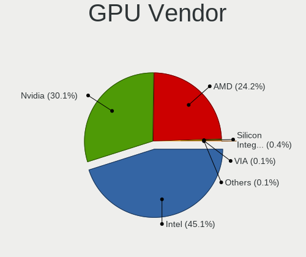

| Vendor                           | Computers | Percent |
|----------------------------------|-----------|---------|
| Intel                            | 694       | 46.21%  |
| Nvidia                           | 438       | 29.16%  |
| AMD                              | 356       | 23.7%   |
| Silicon Integrated Systems [SiS] | 10        | 0.67%   |
| VIA Technologies                 | 2         | 0.13%   |
| Matrox Electronics Systems       | 2         | 0.13%   |

GPU Model
---------

Graphics card models

| Model                                                                                    | Computers | Percent |
|------------------------------------------------------------------------------------------|-----------|---------|
| Intel 2nd Generation Core Processor Family Integrated Graphics Controller                | 66        | 4.21%   |
| Intel 3rd Gen Core processor Graphics Controller                                         | 59        | 3.77%   |
| AMD Picasso/Raven 2 [Radeon Vega Series / Radeon Vega Mobile Series]                     | 37        | 2.36%   |
| Intel HD Graphics 620                                                                    | 36        | 2.3%    |
| Intel UHD Graphics 620                                                                   | 35        | 2.23%   |
| Intel Haswell-ULT Integrated Graphics Controller                                         | 34        | 2.17%   |
| Intel CoffeeLake-H GT2 [UHD Graphics 630]                                                | 32        | 2.04%   |
| Intel HD Graphics 630                                                                    | 31        | 1.98%   |
| Intel Skylake GT2 [HD Graphics 520]                                                      | 30        | 1.92%   |
| AMD Renoir                                                                               | 29        | 1.85%   |
| Intel HD Graphics 5500                                                                   | 28        | 1.79%   |
| Intel 4th Gen Core Processor Integrated Graphics Controller                              | 28        | 1.79%   |
| Intel Core Processor Integrated Graphics Controller                                      | 25        | 1.6%    |
| Intel Atom/Celeron/Pentium Processor x5-E8000/J3xxx/N3xxx Integrated Graphics Controller | 25        | 1.6%    |
| AMD Sun XT [Radeon HD 8670A/8670M/8690M / R5 M330 / M430 / Radeon 520 Mobile]            | 25        | 1.6%    |
| AMD Topaz XT [Radeon R7 M260/M265 / M340/M360 / M440/M445 / 530/535 / 620/625 Mobile]    | 23        | 1.47%   |
| Intel Atom Processor Z36xxx/Z37xxx Series Graphics & Display                             | 22        | 1.4%    |
| Intel CometLake-U GT2 [UHD Graphics]                                                     | 21        | 1.34%   |
| Intel WhiskeyLake-U GT2 [UHD Graphics 620]                                               | 20        | 1.28%   |
| AMD Ellesmere [Radeon RX 470/480/570/570X/580/580X/590]                                  | 20        | 1.28%   |
| Nvidia GP107M [GeForce GTX 1050 Mobile]                                                  | 17        | 1.09%   |
| Intel HD Graphics 530                                                                    | 17        | 1.09%   |
| Intel CometLake-H GT2 [UHD Graphics]                                                     | 17        | 1.09%   |
| Nvidia GF117M [GeForce 610M/710M/810M/820M / GT 620M/625M/630M/720M]                     | 16        | 1.02%   |
| Nvidia GP107 [GeForce GTX 1050 Ti]                                                       | 15        | 0.96%   |
| Nvidia GM108M [GeForce 940MX]                                                            | 15        | 0.96%   |
| Nvidia GP107M [GeForce GTX 1050 Ti Mobile]                                               | 14        | 0.89%   |
| Intel Mobile 4 Series Chipset Integrated Graphics Controller                             | 14        | 0.89%   |
| Nvidia GK208M [GeForce GT 740M]                                                          | 13        | 0.83%   |
| Intel Xeon E3-1200 v3/4th Gen Core Processor Integrated Graphics Controller              | 13        | 0.83%   |
| Nvidia TU117M [GeForce GTX 1650 Mobile / Max-Q]                                          | 12        | 0.77%   |
| Intel TigerLake-LP GT2 [Iris Xe Graphics]                                                | 12        | 0.77%   |
| Intel Mobile 945GM/GMS/GME, 943/940GML Express Integrated Graphics Controller            | 12        | 0.77%   |
| AMD Thames [Radeon HD 7500M/7600M Series]                                                | 12        | 0.77%   |
| Nvidia TU117M [GeForce GTX 1650 Ti Mobile]                                               | 11        | 0.7%    |
| Nvidia GP108M [GeForce MX150]                                                            | 11        | 0.7%    |
| Intel Iris Plus Graphics G1 (Ice Lake)                                                   | 11        | 0.7%    |
| Silicon Integrated Systems [SiS] 771/671 PCIE VGA Display Adapter                        | 10        | 0.64%   |
| Nvidia GM108M [GeForce 840M]                                                             | 10        | 0.64%   |
| Intel Mobile 945GM/GMS, 943/940GML Express Integrated Graphics Controller                | 10        | 0.64%   |
| Intel HD Graphics 500                                                                    | 10        | 0.64%   |
| AMD Mullins [Radeon R4/R5 Graphics]                                                      | 10        | 0.64%   |
| AMD Jet PRO [Radeon R5 M230 / R7 M260DX / Radeon 520 Mobile]                             | 10        | 0.64%   |
| Intel Mobile GM965/GL960 Integrated Graphics Controller (secondary)                      | 9         | 0.57%   |
| Intel Mobile GM965/GL960 Integrated Graphics Controller (primary)                        | 9         | 0.57%   |
| Intel GeminiLake [UHD Graphics 600]                                                      | 9         | 0.57%   |
| AMD Stoney [Radeon R2/R3/R4/R5 Graphics]                                                 | 9         | 0.57%   |
| AMD Seymour [Radeon HD 6400M/7400M Series]                                               | 9         | 0.57%   |
| AMD Raven Ridge [Radeon Vega Series / Radeon Vega Mobile Series]                         | 9         | 0.57%   |
| AMD Lexa [Radeon 540X/550X/630 / RX 640 / E9171 MCM]                                     | 9         | 0.57%   |
| Nvidia TU116M [GeForce GTX 1660 Ti Mobile]                                               | 8         | 0.51%   |
| Nvidia GM108M [GeForce 930MX]                                                            | 8         | 0.51%   |
| Nvidia GM108M [GeForce 920MX]                                                            | 8         | 0.51%   |
| Nvidia GM107M [GeForce GTX 950M]                                                         | 8         | 0.51%   |
| AMD Park [Mobility Radeon HD 5430/5450/5470]                                             | 8         | 0.51%   |
| AMD Oland PRO [Radeon R7 240/340 / Radeon 520]                                           | 8         | 0.51%   |
| Nvidia GP106M [GeForce GTX 1060 Mobile]                                                  | 7         | 0.45%   |
| Nvidia GM107M [GeForce GTX 960M]                                                         | 7         | 0.45%   |
| Nvidia G96C [GeForce 9500 GT]                                                            | 7         | 0.45%   |
| Intel Atom Processor D4xx/D5xx/N4xx/N5xx Integrated Graphics Controller                  | 7         | 0.45%   |

GPU Combo
---------

Combinations of graphics cards

| Name           | Computers | Percent |
|----------------|-----------|---------|
| 1 x Intel      | 334       | 29.32%  |
| Intel + Nvidia | 259       | 22.74%  |
| 1 x AMD        | 213       | 18.7%   |
| 1 x Nvidia     | 165       | 14.49%  |
| Intel + AMD    | 88        | 7.73%   |
| 2 x AMD        | 39        | 3.42%   |
| AMD + Nvidia   | 16        | 1.4%    |
| Other          | 11        | 0.97%   |
| 1 x SiS        | 10        | 0.88%   |
| 1 x VIA        | 2         | 0.18%   |
| 1 x Matrox     | 2         | 0.18%   |

GPU Driver
----------

Free vs proprietary

| Driver      | Computers | Percent |
|-------------|-----------|---------|
| Free        | 870       | 75.59%  |
| Proprietary | 232       | 20.16%  |
| Unknown     | 49        | 4.26%   |

GPU Memory
----------

Total video memory

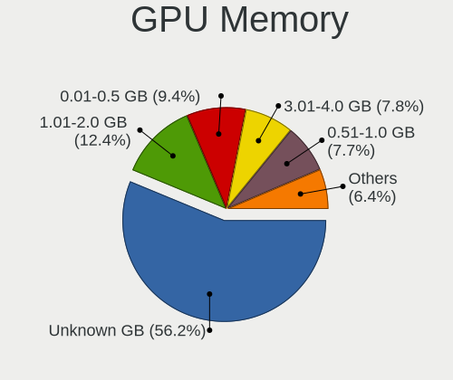

| Size in GB | Computers | Percent |
|------------|-----------|---------|
| Unknown    | 558       | 47.94%  |
| 1.01-2.0   | 193       | 16.58%  |
| 0.51-1.0   | 126       | 10.82%  |
| 0.01-0.5   | 115       | 9.88%   |
| 3.01-4.0   | 109       | 9.36%   |
| 5.01-6.0   | 32        | 2.75%   |
| 7.01-8.0   | 17        | 1.46%   |
| 2.01-3.0   | 7         | 0.6%    |
| 8.01-16.0  | 6         | 0.52%   |
| 4.01-5.0   | 1         | 0.09%   |

Monitor
-------

Monitor Vendor
--------------

Monitor vendors

| Vendor                  | Computers | Percent |
|-------------------------|-----------|---------|
| AU Optronics            | 175       | 15.13%  |
| LG Display              | 158       | 13.66%  |
| Samsung Electronics     | 138       | 11.93%  |
| BOE                     | 119       | 10.29%  |
| Chimei Innolux          | 102       | 8.82%   |
| Philips                 | 41        | 3.54%   |
| Goldstar                | 37        | 3.2%    |
| AOC                     | 28        | 2.42%   |
| Dell                    | 25        | 2.16%   |
| Ancor Communications    | 25        | 2.16%   |
| ViewSonic               | 23        | 1.99%   |
| Lenovo                  | 23        | 1.99%   |
| Apple                   | 23        | 1.99%   |
| Chi Mei Optoelectronics | 21        | 1.82%   |
| Acer                    | 21        | 1.82%   |
| Hewlett-Packard         | 19        | 1.64%   |
| Sharp                   | 16        | 1.38%   |
| BenQ                    | 15        | 1.3%    |
| PANDA                   | 14        | 1.21%   |
| ASUSTek Computer        | 12        | 1.04%   |
| LG Philips              | 9         | 0.78%   |
| CPT                     | 8         | 0.69%   |
| Unknown                 | 7         | 0.61%   |
| InfoVision              | 7         | 0.61%   |
| LGD                     | 6         | 0.52%   |
| LG Electronics          | 6         | 0.52%   |
| Sony                    | 5         | 0.43%   |
| MSI                     | 5         | 0.43%   |
| KTC                     | 4         | 0.35%   |
| HKC                     | 4         | 0.35%   |
| AGO                     | 4         | 0.35%   |
| Unknown                 | 4         | 0.35%   |
| Sanyo                   | 3         | 0.26%   |
| SAC                     | 3         | 0.26%   |
| HannStar                | 3         | 0.26%   |
| VIE                     | 2         | 0.17%   |
| Toshiba                 | 2         | 0.17%   |
| RTK                     | 2         | 0.17%   |
| Plain Tree Systems      | 2         | 0.17%   |
| Microstep               | 2         | 0.17%   |
| Mi                      | 2         | 0.17%   |
| Beko                    | 2         | 0.17%   |
| ___                     | 1         | 0.09%   |
| Unknown (XXX)           | 1         | 0.09%   |
| TCL                     | 1         | 0.09%   |
| SUNNY                   | 1         | 0.09%   |
| Sun                     | 1         | 0.09%   |
| SNN                     | 1         | 0.09%   |
| Ruijiang                | 1         | 0.09%   |
| Quanta Display          | 1         | 0.09%   |
| Panasonic               | 1         | 0.09%   |
| OEM                     | 1         | 0.09%   |
| NXP                     | 1         | 0.09%   |
| NEC Computers           | 1         | 0.09%   |
| NCS                     | 1         | 0.09%   |
| JRY                     | 1         | 0.09%   |
| JDI                     | 1         | 0.09%   |
| INCA                    | 1         | 0.09%   |
| IBM                     | 1         | 0.09%   |
| HUAWEI                  | 1         | 0.09%   |

Monitor Model
-------------

Monitor models

| Model                                                                 | Computers | Percent |
|-----------------------------------------------------------------------|-----------|---------|
| AU Optronics LCD Monitor AUO38ED 1920x1080 344x193mm 15.5-inch        | 16        | 1.35%   |
| AU Optronics LCD Monitor AUO22EC 1366x768 344x193mm 15.5-inch         | 14        | 1.19%   |
| LG Display LCD Monitor LGD02DC 1366x768 344x194mm 15.5-inch           | 10        | 0.85%   |
| Chimei Innolux LCD Monitor CMN14D4 1920x1080 309x173mm 13.9-inch      | 10        | 0.85%   |
| LG Display LCD Monitor LGD0456 1366x768 344x194mm 15.5-inch           | 8         | 0.68%   |
| LG Display LCD Monitor LGD039F 1366x768 345x194mm 15.6-inch           | 8         | 0.68%   |
| LG Display LCD Monitor LGD033A 1366x768 344x194mm 15.5-inch           | 8         | 0.68%   |
| Lenovo LCD Monitor LEN40BA 1920x1080 344x194mm 15.5-inch              | 8         | 0.68%   |
| BOE LCD Monitor BOE0802 1920x1080 344x193mm 15.5-inch                 | 8         | 0.68%   |
| AU Optronics LCD Monitor AUO21ED 1920x1080 344x194mm 15.5-inch        | 8         | 0.68%   |
| LG Display LCD Monitor LGD02AC 1366x768 344x194mm 15.5-inch           | 7         | 0.59%   |
| Chimei Innolux LCD Monitor CMN15DB 1366x768 344x193mm 15.5-inch       | 7         | 0.59%   |
| BOE LCD Monitor BOE06A4 1366x768 344x194mm 15.5-inch                  | 7         | 0.59%   |
| Goldstar FULL HD GSM5B55 1920x1080 480x270mm 21.7-inch                | 6         | 0.51%   |
| Chimei Innolux LCD Monitor CMN15DC 1366x768 340x190mm 15.3-inch       | 6         | 0.51%   |
| Chimei Innolux LCD Monitor CMN15D5 1920x1080 344x193mm 15.5-inch      | 6         | 0.51%   |
| AU Optronics LCD Monitor AUO70EC 1366x768 344x193mm 15.5-inch         | 6         | 0.51%   |
| AU Optronics LCD Monitor AUO2E8D 1920x1080 344x194mm 15.5-inch        | 6         | 0.51%   |
| Samsung Electronics S19B150 SAM08A2 1366x768 410x230mm 18.5-inch      | 5         | 0.42%   |
| Samsung Electronics LCD Monitor SEC324A 1366x768 344x194mm 15.5-inch  | 5         | 0.42%   |
| LG Display LCD Monitor LGD053F 1920x1080 340x190mm 15.3-inch          | 5         | 0.42%   |
| LG Display LCD Monitor LGD0384 1366x768 344x194mm 15.5-inch           | 5         | 0.42%   |
| Chimei Innolux LCD Monitor CMN15F5 1920x1080 344x193mm 15.5-inch      | 5         | 0.42%   |
| Chimei Innolux LCD Monitor CMN15E7 1920x1080 344x193mm 15.5-inch      | 5         | 0.42%   |
| BOE LCD Monitor BOE0877 1920x1080 309x173mm 13.9-inch                 | 5         | 0.42%   |
| AU Optronics LCD Monitor AUO405C 1366x768 256x144mm 11.6-inch         | 5         | 0.42%   |
| Samsung Electronics S24F350 SAM0D20 1920x1080 521x293mm 23.5-inch     | 4         | 0.34%   |
| PANDA LCD Monitor NCP004D 1920x1080 344x194mm 15.5-inch               | 4         | 0.34%   |
| LG Display LCD Monitor LGD0493 1366x768 344x194mm 15.5-inch           | 4         | 0.34%   |
| LG Display LCD Monitor LGD046F 1920x1080 344x194mm 15.5-inch          | 4         | 0.34%   |
| LG Display LCD Monitor LGD045C 1366x768 345x194mm 15.6-inch           | 4         | 0.34%   |
| LG Display LCD Monitor LGD02F2 1366x768 344x194mm 15.5-inch           | 4         | 0.34%   |
| Chimei Innolux LCD Monitor CMN15CA 1366x768 344x193mm 15.5-inch       | 4         | 0.34%   |
| BOE LCD Monitor BOE0819 1920x1080 344x194mm 15.5-inch                 | 4         | 0.34%   |
| BOE LCD Monitor BOE06A5 1366x768 344x194mm 15.5-inch                  | 4         | 0.34%   |
| BOE LCD Monitor BOE0696 1366x768 309x173mm 13.9-inch                  | 4         | 0.34%   |
| BOE LCD Monitor BOE0675 1366x768 344x194mm 15.5-inch                  | 4         | 0.34%   |
| BOE LCD Monitor BOE0672 1366x768 344x194mm 15.5-inch                  | 4         | 0.34%   |
| AU Optronics LCD Monitor AUO71EC 1366x768 344x193mm 15.5-inch         | 4         | 0.34%   |
| AU Optronics LCD Monitor AUO61ED 1920x1080 344x194mm 15.5-inch        | 4         | 0.34%   |
| AU Optronics LCD Monitor AUO46EC 1366x768 344x193mm 15.5-inch         | 4         | 0.34%   |
| AU Optronics LCD Monitor AUO45EC 1366x768 344x193mm 15.5-inch         | 4         | 0.34%   |
| AU Optronics LCD Monitor AUO403D 1920x1080 309x174mm 14.0-inch        | 4         | 0.34%   |
| Unknown                                                               | 4         | 0.34%   |
| Samsung Electronics LCD Monitor SEC5441 1366x768 309x174mm 14.0-inch  | 3         | 0.25%   |
| Samsung Electronics LCD Monitor SEC314C 1920x1080 340x190mm 15.3-inch | 3         | 0.25%   |
| Samsung Electronics LCD Monitor SDC324C 1920x1080 344x194mm 15.5-inch | 3         | 0.25%   |
| Philips 226V4 PHLC0B1 1920x1080 477x268mm 21.5-inch                   | 3         | 0.25%   |
| LG Display LP156WH2-TLAA LGD0230 1366x768 344x194mm 15.5-inch         | 3         | 0.25%   |
| LG Display LCD Monitor LGD05E5 1920x1080 344x194mm 15.5-inch          | 3         | 0.25%   |
| LG Display LCD Monitor LGD0563 1920x1080 344x194mm 15.5-inch          | 3         | 0.25%   |
| LG Display LCD Monitor LGD038E 1366x768 344x194mm 15.5-inch           | 3         | 0.25%   |
| LG Display LCD Monitor LGD0323 1920x1080 345x194mm 15.6-inch          | 3         | 0.25%   |
| HannStar LCD Monitor HSD03E9 1024x600 220x129mm 10.0-inch             | 3         | 0.25%   |
| Goldstar W2242 GSM5678 1680x1050 474x296mm 22.0-inch                  | 3         | 0.25%   |
| Goldstar ULTRAWIDE GSM59F1 2560x1080 673x284mm 28.8-inch              | 3         | 0.25%   |
| Goldstar LG Ultra HD GSM5B08 3840x2160 600x340mm 27.2-inch            | 3         | 0.25%   |
| CPT LCD Monitor CPT14C7 1366x768 344x194mm 15.5-inch                  | 3         | 0.25%   |
| Chimei Innolux P130ZFA-BA1 CMN8201 2160x1440 275x183mm 13.0-inch      | 3         | 0.25%   |
| Chimei Innolux LCD Monitor CMN1735 1920x1080 382x215mm 17.3-inch      | 3         | 0.25%   |

Monitor Resolution
------------------

Monitor screen resolution

| Resolution         | Computers | Percent |
|--------------------|-----------|---------|
| 1920x1080 (FHD)    | 490       | 44.03%  |
| 1366x768 (WXGA)    | 332       | 29.83%  |
| 3840x2160 (4K)     | 31        | 2.79%   |
| 1280x800 (WXGA)    | 30        | 2.7%    |
| 1600x900 (HD+)     | 28        | 2.52%   |
| 1440x900 (WXGA+)   | 27        | 2.43%   |
| 1280x1024 (SXGA)   | 26        | 2.34%   |
| 2560x1440 (QHD)    | 20        | 1.8%    |
| Unknown            | 20        | 1.8%    |
| 1680x1050 (WSXGA+) | 17        | 1.53%   |
| 1920x1200 (WUXGA)  | 12        | 1.08%   |
| 2560x1600          | 9         | 0.81%   |
| 2560x1080          | 7         | 0.63%   |
| 1360x768           | 7         | 0.63%   |
| 1024x600           | 7         | 0.63%   |
| 2160x1440          | 6         | 0.54%   |
| 3840x1080          | 5         | 0.45%   |
| 3200x1800 (QHD+)   | 5         | 0.45%   |
| 2880x1800          | 5         | 0.45%   |
| 3440x1440          | 4         | 0.36%   |
| 1920x540           | 3         | 0.27%   |
| 1680x945           | 3         | 0.27%   |
| 4480x1440          | 2         | 0.18%   |
| 7920x1440          | 1         | 0.09%   |
| 5760x2160          | 1         | 0.09%   |
| 3840x2560          | 1         | 0.09%   |
| 3750x1280          | 1         | 0.09%   |
| 3360x1050          | 1         | 0.09%   |
| 3240x2160          | 1         | 0.09%   |
| 3072x1920          | 1         | 0.09%   |
| 3046x1050          | 1         | 0.09%   |
| 3000x2000          | 1         | 0.09%   |
| 2806x900           | 1         | 0.09%   |
| 2646x1024          | 1         | 0.09%   |
| 2390x768           | 1         | 0.09%   |
| 2288x1287          | 1         | 0.09%   |
| 1600x1200          | 1         | 0.09%   |
| 1280x1080          | 1         | 0.09%   |
| 1152x864           | 1         | 0.09%   |
| 1024x768 (XGA)     | 1         | 0.09%   |

Monitor Diagonal
----------------

Diagonal size in inches

| Inches  | Computers | Percent |
|---------|-----------|---------|
| 15      | 491       | 42.58%  |
| 13      | 109       | 9.45%   |
| Unknown | 64        | 5.55%   |
| 21      | 62        | 5.38%   |
| 23      | 61        | 5.29%   |
| 17      | 49        | 4.25%   |
| 14      | 46        | 3.99%   |
| 24      | 42        | 3.64%   |
| 27      | 37        | 3.21%   |
| 18      | 31        | 2.69%   |
| 19      | 26        | 2.25%   |
| 12      | 19        | 1.65%   |
| 11      | 19        | 1.65%   |
| 31      | 13        | 1.13%   |
| 20      | 12        | 1.04%   |
| 34      | 10        | 0.87%   |
| 10      | 10        | 0.87%   |
| 22      | 7         | 0.61%   |
| 16      | 7         | 0.61%   |
| 72      | 5         | 0.43%   |
| 40      | 5         | 0.43%   |
| 84      | 3         | 0.26%   |
| 54      | 3         | 0.26%   |
| 33      | 3         | 0.26%   |
| 29      | 3         | 0.26%   |
| 60      | 2         | 0.17%   |
| 57      | 2         | 0.17%   |
| 46      | 2         | 0.17%   |
| 26      | 2         | 0.17%   |
| 55      | 1         | 0.09%   |
| 52      | 1         | 0.09%   |
| 47      | 1         | 0.09%   |
| 43      | 1         | 0.09%   |
| 36      | 1         | 0.09%   |
| 32      | 1         | 0.09%   |
| 28      | 1         | 0.09%   |
| 25      | 1         | 0.09%   |

Monitor Width
-------------

Physical width

| Width in mm | Computers | Percent |
|-------------|-----------|---------|
| 301-350     | 591       | 51.62%  |
| 401-500     | 138       | 12.05%  |
| 501-600     | 126       | 11%     |
| 201-300     | 110       | 9.61%   |
| Unknown     | 64        | 5.59%   |
| 351-400     | 52        | 4.54%   |
| 601-700     | 23        | 2.01%   |
| 701-800     | 15        | 1.31%   |
| 1001-1500   | 12        | 1.05%   |
| 1501-2000   | 8         | 0.7%    |
| 801-900     | 5         | 0.44%   |
| 901-1000    | 1         | 0.09%   |

Aspect Ratio
------------

Proportional relationship between the width and the height

| Ratio   | Computers | Percent |
|---------|-----------|---------|
| 16/9    | 847       | 79.91%  |
| 16/10   | 98        | 9.25%   |
| Unknown | 58        | 5.47%   |
| 5/4     | 19        | 1.79%   |
| 3/2     | 15        | 1.42%   |
| 4/3     | 12        | 1.13%   |
| 21/9    | 10        | 0.94%   |
| 6/5     | 1         | 0.09%   |

Monitor Area
------------

Area in inch

| Area in inch | Computers | Percent |
|----------------|-----------|---------|
| 101-110        | 490       | 42.68%  |
| 201-250        | 141       | 12.28%  |
| 81-90          | 102       | 8.89%   |
| Unknown        | 64        | 5.57%   |
| 151-200        | 58        | 5.05%   |
| 71-80          | 57        | 4.97%   |
| 141-150        | 42        | 3.66%   |
| 301-350        | 39        | 3.4%    |
| 351-500        | 31        | 2.7%    |
| 121-130        | 31        | 2.7%    |
| 51-60          | 19        | 1.66%   |
| More than 1000 | 17        | 1.48%   |
| 61-70          | 15        | 1.31%   |
| 41-50          | 10        | 0.87%   |
| 501-1000       | 10        | 0.87%   |
| 251-300        | 9         | 0.78%   |
| 111-120        | 6         | 0.52%   |
| 91-100         | 4         | 0.35%   |
| 131-140        | 3         | 0.26%   |

Pixel Density
-------------

Pixels per inch

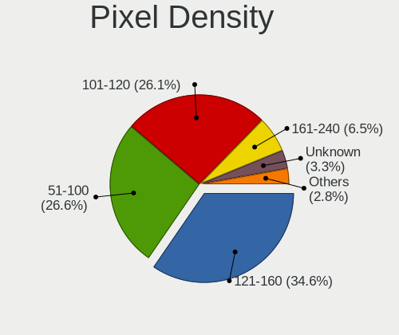

| Density       | Computers | Percent |
|---------------|-----------|---------|
| 101-120       | 354       | 31.33%  |
| 121-160       | 341       | 30.18%  |
| 51-100        | 281       | 24.87%  |
| Unknown       | 64        | 5.66%   |
| 161-240       | 54        | 4.78%   |
| 1-50          | 21        | 1.86%   |
| More than 240 | 15        | 1.33%   |

Multiple Monitors
-----------------

Total monitors connected

| Total | Computers | Percent |
|-------|-----------|---------|
| 1     | 958       | 83.02%  |
| 2     | 128       | 11.09%  |
| 0     | 60        | 5.2%    |
| 3     | 8         | 0.69%   |

Network
-------

Net Controller Vendor
---------------------

Controller vendors

| Vendor                                 | Computers | Percent |
|----------------------------------------|-----------|---------|
| Realtek Semiconductor                  | 732       | 40.46%  |
| Intel                                  | 426       | 23.55%  |
| Qualcomm Atheros                       | 267       | 14.76%  |
| Broadcom                               | 118       | 6.52%   |
| Ralink Technology                      | 43        | 2.38%   |
| Marvell Technology Group               | 27        | 1.49%   |
| Ralink                                 | 23        | 1.27%   |
| Broadcom Limited                       | 20        | 1.11%   |
| ASUSTek Computer                       | 17        | 0.94%   |
| Qualcomm Atheros Communications        | 15        | 0.83%   |
| TP-Link                                | 13        | 0.72%   |
| Silicon Integrated Systems [SiS]       | 13        | 0.72%   |
| Nvidia                                 | 13        | 0.72%   |
| Xiaomi                                 | 9         | 0.5%    |
| Samsung Electronics                    | 8         | 0.44%   |
| ZyXEL Communications                   | 5         | 0.28%   |
| MediaTek                               | 5         | 0.28%   |
| Huawei Technologies                    | 5         | 0.28%   |
| JMicron Technology                     | 4         | 0.22%   |
| ASIX Electronics                       | 4         | 0.22%   |
| Aquantia                               | 3         | 0.17%   |
| Apple                                  | 3         | 0.17%   |
| Tenda                                  | 2         | 0.11%   |
| Sony Ericsson Mobile Communications AB | 2         | 0.11%   |
| Sierra Wireless                        | 2         | 0.11%   |
| Microchip Technology                   | 2         | 0.11%   |
| ICS Advent                             | 2         | 0.11%   |
| Ericsson Business Mobile Networks      | 2         | 0.11%   |
| Dell                                   | 2         | 0.11%   |
| Attansic Technology                    | 2         | 0.11%   |
| Accton Technology                      | 2         | 0.11%   |
| Wilocity                               | 1         | 0.06%   |
| VIA Technologies                       | 1         | 0.06%   |
| ULi Electronics                        | 1         | 0.06%   |
| U-Blox                                 | 1         | 0.06%   |
| T & A Mobile Phones                    | 1         | 0.06%   |
| Standard Microsystems                  | 1         | 0.06%   |
| Sangoma Technologies                   | 1         | 0.06%   |
| Qualcomm                               | 1         | 0.06%   |
| Ortur                                  | 1         | 0.06%   |
| LSI                                    | 1         | 0.06%   |
| Linksys                                | 1         | 0.06%   |
| Lenovo                                 | 1         | 0.06%   |
| HTC (High Tech Computer)               | 1         | 0.06%   |
| Hewlett-Packard                        | 1         | 0.06%   |
| Davicom Semiconductor                  | 1         | 0.06%   |
| Conexant Systems                       | 1         | 0.06%   |
| BroadLogic                             | 1         | 0.06%   |
| AirTies Wireless Networks              | 1         | 0.06%   |

Net Controller Model
--------------------

Controller models

| Model                                                             | Computers | Percent |
|-------------------------------------------------------------------|-----------|---------|
| Realtek RTL8111/8168/8411 PCI Express Gigabit Ethernet Controller | 518       | 25.12%  |
| Realtek RTL810xE PCI Express Fast Ethernet controller             | 125       | 6.06%   |
| Qualcomm Atheros AR9485 Wireless Network Adapter                  | 52        | 2.52%   |
| Qualcomm Atheros QCA9377 802.11ac Wireless Network Adapter        | 45        | 2.18%   |
| Qualcomm Atheros AR9285 Wireless Network Adapter (PCI-Express)    | 38        | 1.84%   |
| Broadcom BCM4313 802.11bgn Wireless Network Adapter               | 35        | 1.7%    |
| Realtek RTL8723BE PCIe Wireless Network Adapter                   | 32        | 1.55%   |
| Intel Wi-Fi 6 AX200                                               | 32        | 1.55%   |
| Intel Wireless 7265                                               | 31        | 1.5%    |
| Qualcomm Atheros QCA9565 / AR9565 Wireless Network Adapter        | 26        | 1.26%   |
| Intel Dual Band Wireless-AC 3168NGW [Stone Peak]                  | 26        | 1.26%   |
| Realtek RTL8821CE 802.11ac PCIe Wireless Network Adapter          | 24        | 1.16%   |
| Realtek RTL8822CE 802.11ac PCIe Wireless Network Adapter          | 22        | 1.07%   |
| Intel Wireless 8265 / 8275                                        | 22        | 1.07%   |
| Qualcomm Atheros QCA6174 802.11ac Wireless Network Adapter        | 21        | 1.02%   |
| Intel Comet Lake PCH CNVi WiFi                                    | 21        | 1.02%   |
| Intel Cannon Lake PCH CNVi WiFi                                   | 21        | 1.02%   |
| Broadcom BCM43142 802.11b/g/n                                     | 21        | 1.02%   |
| Ralink MT7601U Wireless Adapter                                   | 19        | 0.92%   |
| Qualcomm Atheros AR8131 Gigabit Ethernet                          | 18        | 0.87%   |
| Intel Wireless 3165                                               | 18        | 0.87%   |
| Intel Comet Lake PCH-LP CNVi WiFi                                 | 18        | 0.87%   |
| Realtek RTL8822BE 802.11a/b/g/n/ac WiFi adapter                   | 17        | 0.82%   |
| Intel Dual Band Wireless-AC 3165 Plus Bluetooth                   | 17        | 0.82%   |
| Ralink RT3290 Wireless 802.11n 1T/1R PCIe                         | 15        | 0.73%   |
| Qualcomm Atheros AR8151 v2.0 Gigabit Ethernet                     | 14        | 0.68%   |
| Intel Wireless 3160                                               | 14        | 0.68%   |
| Intel Wireless 8260                                               | 13        | 0.63%   |
| Intel PRO/Wireless 3945ABG [Golan] Network Connection             | 13        | 0.63%   |
| Intel 82579LM Gigabit Network Connection (Lewisville)             | 13        | 0.63%   |
| Silicon Integrated Systems [SiS] 191 Gigabit Ethernet Adapter     | 12        | 0.58%   |
| Intel Wireless 7260                                               | 12        | 0.58%   |
| Intel Ethernet Connection (2) I219-V                              | 12        | 0.58%   |
| Ralink RT2870/RT3070 Wireless Adapter                             | 11        | 0.53%   |
| Qualcomm Atheros AR9271 802.11n                                   | 11        | 0.53%   |
| Intel Wireless-AC 9260                                            | 11        | 0.53%   |
| Intel Wi-Fi 6 AX201                                               | 11        | 0.53%   |
| Realtek RTL8723AE PCIe Wireless Network Adapter                   | 10        | 0.48%   |
| Qualcomm Atheros QCA8171 Gigabit Ethernet                         | 10        | 0.48%   |
| Intel WiFi Link 5100                                              | 10        | 0.48%   |
| Intel Centrino Advanced-N 6205 [Taylor Peak]                      | 10        | 0.48%   |
| Realtek RTL8187B Wireless 802.11g 54Mbps Network Adapter          | 9         | 0.44%   |
| Qualcomm Atheros Killer E2500 Gigabit Ethernet Controller         | 9         | 0.44%   |
| Intel PRO/Wireless 5100 AGN [Shiloh] Network Connection           | 9         | 0.44%   |
| Intel I211 Gigabit Network Connection                             | 9         | 0.44%   |
| Intel Ethernet Connection (3) I218-LM                             | 9         | 0.44%   |
| Intel Cannon Point-LP CNVi [Wireless-AC]                          | 9         | 0.44%   |
| Realtek RTL8821AE 802.11ac PCIe Wireless Network Adapter          | 8         | 0.39%   |
| Realtek RTL8723DE Wireless Network Adapter                        | 8         | 0.39%   |
| Realtek RTL8153 Gigabit Ethernet Adapter                          | 8         | 0.39%   |
| Realtek RTL8152 Fast Ethernet Adapter                             | 8         | 0.39%   |
| Realtek RTL8125 2.5GbE Controller                                 | 8         | 0.39%   |
| Qualcomm Atheros AR8161 Gigabit Ethernet                          | 8         | 0.39%   |
| Intel Centrino Advanced-N 6235                                    | 8         | 0.39%   |
| Broadcom NetLink BCM57785 Gigabit Ethernet PCIe                   | 8         | 0.39%   |
| ASUS USB-N14 802.11b/g/n (2x2) Wireless Adapter [Ralink RT5372]   | 8         | 0.39%   |
| Xiaomi Mi/Redmi series (RNDIS)                                    | 7         | 0.34%   |
| Realtek RTL8192CU 802.11n WLAN Adapter                            | 7         | 0.34%   |
| Realtek RTL8191SEvB Wireless LAN Controller                       | 7         | 0.34%   |
| Qualcomm Atheros AR9287 Wireless Network Adapter (PCI-Express)    | 7         | 0.34%   |

Wireless Vendor
---------------

Wireless vendors

| Vendor                           | Computers | Percent |
|----------------------------------|-----------|---------|
| Intel                            | 373       | 37.53%  |
| Qualcomm Atheros                 | 204       | 20.52%  |
| Realtek Semiconductor            | 183       | 18.41%  |
| Broadcom                         | 91        | 9.15%   |
| Ralink Technology                | 43        | 4.33%   |
| Ralink                           | 23        | 2.31%   |
| ASUSTek Computer                 | 17        | 1.71%   |
| Qualcomm Atheros Communications  | 15        | 1.51%   |
| Broadcom Limited                 | 12        | 1.21%   |
| TP-Link                          | 11        | 1.11%   |
| ZyXEL Communications             | 5         | 0.5%    |
| MEDIATEK                         | 4         | 0.4%    |
| Tenda                            | 2         | 0.2%    |
| Sierra Wireless                  | 2         | 0.2%    |
| Dell                             | 2         | 0.2%    |
| Accton Technology                | 2         | 0.2%    |
| Wilocity                         | 1         | 0.1%    |
| Silicon Integrated Systems [SiS] | 1         | 0.1%    |
| Marvell Technology Group         | 1         | 0.1%    |
| Linksys                          | 1         | 0.1%    |
| AirTies Wireless Networks        | 1         | 0.1%    |

Wireless Model
--------------

Wireless models

| Model                                                                   | Computers | Percent |
|-------------------------------------------------------------------------|-----------|---------|
| Qualcomm Atheros AR9485 Wireless Network Adapter                        | 52        | 5.22%   |
| Qualcomm Atheros QCA9377 802.11ac Wireless Network Adapter              | 45        | 4.51%   |
| Qualcomm Atheros AR9285 Wireless Network Adapter (PCI-Express)          | 38        | 3.81%   |
| Broadcom BCM4313 802.11bgn Wireless Network Adapter                     | 35        | 3.51%   |
| Realtek RTL8723BE PCIe Wireless Network Adapter                         | 32        | 3.21%   |
| Intel Wi-Fi 6 AX200                                                     | 32        | 3.21%   |
| Intel Wireless 7265                                                     | 31        | 3.11%   |
| Qualcomm Atheros QCA9565 / AR9565 Wireless Network Adapter              | 26        | 2.61%   |
| Intel Dual Band Wireless-AC 3168NGW [Stone Peak]                        | 26        | 2.61%   |
| Realtek RTL8821CE 802.11ac PCIe Wireless Network Adapter                | 24        | 2.41%   |
| Realtek RTL8822CE 802.11ac PCIe Wireless Network Adapter                | 22        | 2.21%   |
| Intel Wireless 8265 / 8275                                              | 22        | 2.21%   |
| Qualcomm Atheros QCA6174 802.11ac Wireless Network Adapter              | 21        | 2.11%   |
| Intel Comet Lake PCH CNVi WiFi                                          | 21        | 2.11%   |
| Intel Cannon Lake PCH CNVi WiFi                                         | 21        | 2.11%   |
| Broadcom BCM43142 802.11b/g/n                                           | 21        | 2.11%   |
| Ralink MT7601U Wireless Adapter                                         | 19        | 1.91%   |
| Intel Wireless 3165                                                     | 18        | 1.81%   |
| Intel Comet Lake PCH-LP CNVi WiFi                                       | 18        | 1.81%   |
| Realtek RTL8822BE 802.11a/b/g/n/ac WiFi adapter                         | 17        | 1.71%   |
| Intel Dual Band Wireless-AC 3165 Plus Bluetooth                         | 17        | 1.71%   |
| Ralink RT3290 Wireless 802.11n 1T/1R PCIe                               | 15        | 1.5%    |
| Intel Wireless 3160                                                     | 14        | 1.4%    |
| Intel Wireless 8260                                                     | 13        | 1.3%    |
| Intel PRO/Wireless 3945ABG [Golan] Network Connection                   | 13        | 1.3%    |
| Intel Wireless 7260                                                     | 12        | 1.2%    |
| Ralink RT2870/RT3070 Wireless Adapter                                   | 11        | 1.1%    |
| Qualcomm Atheros AR9271 802.11n                                         | 11        | 1.1%    |
| Intel Wireless-AC 9260                                                  | 11        | 1.1%    |
| Intel Wi-Fi 6 AX201                                                     | 11        | 1.1%    |
| Realtek RTL8723AE PCIe Wireless Network Adapter                         | 10        | 1%      |
| Intel WiFi Link 5100                                                    | 10        | 1%      |
| Intel Centrino Advanced-N 6205 [Taylor Peak]                            | 10        | 1%      |
| Realtek RTL8187B Wireless 802.11g 54Mbps Network Adapter                | 9         | 0.9%    |
| Intel PRO/Wireless 5100 AGN [Shiloh] Network Connection                 | 9         | 0.9%    |
| Intel Cannon Point-LP CNVi [Wireless-AC]                                | 9         | 0.9%    |
| Realtek RTL8821AE 802.11ac PCIe Wireless Network Adapter                | 8         | 0.8%    |
| Realtek RTL8723DE Wireless Network Adapter                              | 8         | 0.8%    |
| Intel Centrino Advanced-N 6235                                          | 8         | 0.8%    |
| ASUS USB-N14 802.11b/g/n (2x2) Wireless Adapter [Ralink RT5372]         | 8         | 0.8%    |
| Realtek RTL8192CU 802.11n WLAN Adapter                                  | 7         | 0.7%    |
| Realtek RTL8191SEvB Wireless LAN Controller                             | 7         | 0.7%    |
| Qualcomm Atheros AR9287 Wireless Network Adapter (PCI-Express)          | 7         | 0.7%    |
| Intel PRO/Wireless 4965 AG or AGN [Kedron] Network Connection           | 6         | 0.6%    |
| Intel Ice Lake-LP PCH CNVi WiFi                                         | 6         | 0.6%    |
| Intel Centrino Wireless-N 2230                                          | 6         | 0.6%    |
| Realtek 802.11ac NIC                                                    | 5         | 0.5%    |
| Ralink RT5370 Wireless Adapter                                          | 5         | 0.5%    |
| Qualcomm Atheros AR928X Wireless Network Adapter (PCI-Express)          | 5         | 0.5%    |
| Qualcomm Atheros AR242x / AR542x Wireless Network Adapter (PCI-Express) | 5         | 0.5%    |
| Intel Centrino Wireless-N 130                                           | 5         | 0.5%    |
| Intel Centrino Wireless-N 1030 [Rainbow Peak]                           | 5         | 0.5%    |
| Broadcom Limited BCM4360 802.11ac Wireless Network Adapter              | 5         | 0.5%    |
| TP-Link TL-WN722N v2/v3 [Realtek RTL8188EUS]                            | 4         | 0.4%    |
| Realtek RTL8852AE 802.11ax PCIe Wireless Network Adapter                | 4         | 0.4%    |
| Realtek RTL8188EUS 802.11n Wireless Network Adapter                     | 4         | 0.4%    |
| Ralink RT3072 Wireless Adapter                                          | 4         | 0.4%    |
| Intel Centrino Wireless-N 1000 [Condor Peak]                            | 4         | 0.4%    |
| Broadcom BCM4331 802.11a/b/g/n                                          | 4         | 0.4%    |
| Broadcom BCM43227 802.11b/g/n                                           | 4         | 0.4%    |

Ethernet Vendor
---------------

Ethernet vendors

| Vendor                                 | Computers | Percent |
|----------------------------------------|-----------|---------|
| Realtek Semiconductor                  | 674       | 64.81%  |
| Intel                                  | 117       | 11.25%  |
| Qualcomm Atheros                       | 95        | 9.13%   |
| Broadcom                               | 41        | 3.94%   |
| Marvell Technology Group               | 26        | 2.5%    |
| Silicon Integrated Systems [SiS]       | 12        | 1.15%   |
| Nvidia                                 | 12        | 1.15%   |
| Xiaomi                                 | 9         | 0.87%   |
| Samsung Electronics                    | 8         | 0.77%   |
| Broadcom Limited                       | 8         | 0.77%   |
| Huawei Technologies                    | 5         | 0.48%   |
| JMicron Technology                     | 4         | 0.38%   |
| ASIX Electronics                       | 4         | 0.38%   |
| Aquantia                               | 3         | 0.29%   |
| Apple                                  | 3         | 0.29%   |
| TP-Link                                | 2         | 0.19%   |
| Sony Ericsson Mobile Communications AB | 2         | 0.19%   |
| Microchip Technology                   | 2         | 0.19%   |
| ICS Advent                             | 2         | 0.19%   |
| Attansic Technology                    | 2         | 0.19%   |
| VIA Technologies                       | 1         | 0.1%    |
| ULi Electronics                        | 1         | 0.1%    |
| Standard Microsystems                  | 1         | 0.1%    |
| Qualcomm                               | 1         | 0.1%    |
| MediaTek                               | 1         | 0.1%    |
| LSI                                    | 1         | 0.1%    |
| Lenovo                                 | 1         | 0.1%    |
| HTC (High Tech Computer)               | 1         | 0.1%    |
| Davicom Semiconductor                  | 1         | 0.1%    |

Ethernet Model
--------------

Ethernet models

| Model                                                                          | Computers | Percent |
|--------------------------------------------------------------------------------|-----------|---------|
| Realtek RTL8111/8168/8411 PCI Express Gigabit Ethernet Controller              | 518       | 49.15%  |
| Realtek RTL810xE PCI Express Fast Ethernet controller                          | 125       | 11.86%  |
| Qualcomm Atheros AR8131 Gigabit Ethernet                                       | 18        | 1.71%   |
| Qualcomm Atheros AR8151 v2.0 Gigabit Ethernet                                  | 14        | 1.33%   |
| Intel 82579LM Gigabit Network Connection (Lewisville)                          | 13        | 1.23%   |
| Silicon Integrated Systems [SiS] 191 Gigabit Ethernet Adapter                  | 12        | 1.14%   |
| Intel Ethernet Connection (2) I219-V                                           | 12        | 1.14%   |
| Qualcomm Atheros QCA8171 Gigabit Ethernet                                      | 10        | 0.95%   |
| Qualcomm Atheros Killer E2500 Gigabit Ethernet Controller                      | 9         | 0.85%   |
| Intel I211 Gigabit Network Connection                                          | 9         | 0.85%   |
| Intel Ethernet Connection (3) I218-LM                                          | 9         | 0.85%   |
| Realtek RTL8153 Gigabit Ethernet Adapter                                       | 8         | 0.76%   |
| Realtek RTL8152 Fast Ethernet Adapter                                          | 8         | 0.76%   |
| Realtek RTL8125 2.5GbE Controller                                              | 8         | 0.76%   |
| Qualcomm Atheros AR8161 Gigabit Ethernet                                       | 8         | 0.76%   |
| Broadcom NetLink BCM57785 Gigabit Ethernet PCIe                                | 8         | 0.76%   |
| Xiaomi Mi/Redmi series (RNDIS)                                                 | 7         | 0.66%   |
| Qualcomm Atheros AR8152 v2.0 Fast Ethernet                                     | 7         | 0.66%   |
| Intel Ethernet Connection I218-LM                                              | 7         | 0.66%   |
| Intel Ethernet Connection (4) I219-LM                                          | 7         | 0.66%   |
| Nvidia MCP61 Ethernet                                                          | 6         | 0.57%   |
| Broadcom NetLink BCM57780 Gigabit Ethernet PCIe                                | 6         | 0.57%   |
| Realtek RTL-8100/8101L/8139 PCI Fast Ethernet Adapter                          | 5         | 0.47%   |
| Qualcomm Atheros AR8152 v1.1 Fast Ethernet                                     | 5         | 0.47%   |
| Marvell Group 88E8040 PCI-E Fast Ethernet Controller                           | 5         | 0.47%   |
| Intel I210 Gigabit Network Connection                                          | 5         | 0.47%   |
| Intel 82579V Gigabit Network Connection                                        | 5         | 0.47%   |
| Huawei MAR-LX1A                                                                | 5         | 0.47%   |
| Broadcom NetXtreme BCM57765 Gigabit Ethernet PCIe                              | 5         | 0.47%   |
| Samsung GT-I9070 (network tethering, USB debugging enabled)                    | 4         | 0.38%   |
| Samsung Galaxy series, misc. (tethering mode)                                  | 4         | 0.38%   |
| Qualcomm Atheros Killer E2400 Gigabit Ethernet Controller                      | 4         | 0.38%   |
| Qualcomm Atheros AR8132 Fast Ethernet                                          | 4         | 0.38%   |
| Qualcomm Atheros AR8121/AR8113/AR8114 Gigabit or Fast Ethernet                 | 4         | 0.38%   |
| Marvell Group Yukon Optima 88E8059 [PCIe Gigabit Ethernet Controller with AVB] | 4         | 0.38%   |
| Marvell Group 88E8055 PCI-E Gigabit Ethernet Controller                        | 4         | 0.38%   |
| Intel Ethernet Connection I217-V                                               | 4         | 0.38%   |
| Intel Ethernet Connection I217-LM                                              | 4         | 0.38%   |
| Intel Ethernet Connection (6) I219-V                                           | 4         | 0.38%   |
| Intel 82577LM Gigabit Network Connection                                       | 4         | 0.38%   |
| Broadcom NetLink BCM5906M Fast Ethernet PCI Express                            | 4         | 0.38%   |
| Broadcom NetLink BCM5784M Gigabit Ethernet PCIe                                | 4         | 0.38%   |
| Broadcom BCM4401-B0 100Base-TX                                                 | 4         | 0.38%   |
| Qualcomm Atheros Killer E220x Gigabit Ethernet Controller                      | 3         | 0.28%   |
| Qualcomm Atheros AR8162 Fast Ethernet                                          | 3         | 0.28%   |
| JMicron JMC250 PCI Express Gigabit Ethernet Controller                         | 3         | 0.28%   |
| Intel 82574L Gigabit Network Connection                                        | 3         | 0.28%   |
| Broadcom NetXtreme BCM5764M Gigabit Ethernet PCIe                              | 3         | 0.28%   |
| Xiaomi Mi/Redmi series (RNDIS + ADB)                                           | 2         | 0.19%   |
| TP-Link USB 10/100/1000 LAN                                                    | 2         | 0.19%   |
| Sony Ericsson Mobile AB D6503                                                  | 2         | 0.19%   |
| Realtek RTL-8110SC/8169SC Gigabit Ethernet                                     | 2         | 0.19%   |
| Realtek Realtek Ethernet controller                                            | 2         | 0.19%   |
| Qualcomm Atheros QCA8172 Fast Ethernet                                         | 2         | 0.19%   |
| Qualcomm Atheros Attansic L2 Fast Ethernet                                     | 2         | 0.19%   |
| Nvidia MCP79 Ethernet                                                          | 2         | 0.19%   |
| Nvidia MCP51 Ethernet Controller                                               | 2         | 0.19%   |
| Marvell Group 88E8072 PCI-E Gigabit Ethernet Controller                        | 2         | 0.19%   |
| Marvell Group 88E8056 PCI-E Gigabit Ethernet Controller                        | 2         | 0.19%   |
| Marvell Group 88E8042 PCI-E Fast Ethernet Controller                           | 2         | 0.19%   |

Net Controller Kind
-------------------

Ethernet, WiFi or modem

| Kind     | Computers | Percent |
|----------|-----------|---------|
| Ethernet | 1004      | 51.38%  |
| WiFi     | 939       | 48.06%  |
| Modem    | 7         | 0.36%   |
| Unknown  | 4         | 0.2%    |

Used Controller
---------------

Currently used network controller

| Kind     | Computers | Percent |
|----------|-----------|---------|
| WiFi     | 772       | 67.19%  |
| Ethernet | 377       | 32.81%  |

NICs
----

Total network controllers on board

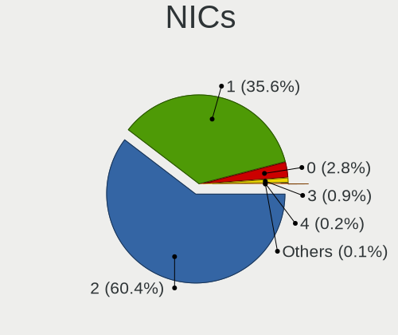

| Total | Computers | Percent |
|-------|-----------|---------|
| 2     | 729       | 64.12%  |
| 1     | 362       | 31.84%  |
| 0     | 32        | 2.81%   |
| 3     | 10        | 0.88%   |
| 4     | 3         | 0.26%   |
| 7     | 1         | 0.09%   |

IPv6
----

IPv6 vs IPv4

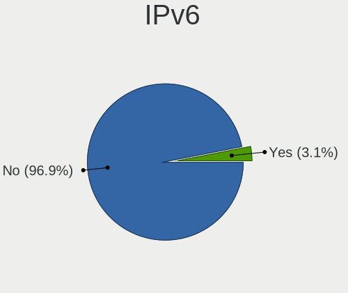

| Used | Computers | Percent |
|------|-----------|---------|
| No   | 1132      | 99.82%  |
| Yes  | 2         | 0.18%   |

Bluetooth
---------

Bluetooth Vendor
----------------

Controller vendors

| Vendor                          | Computers | Percent |
|---------------------------------|-----------|---------|
| Intel                           | 295       | 39.86%  |
| Realtek Semiconductor           | 81        | 10.95%  |
| Qualcomm Atheros Communications | 76        | 10.27%  |
| IMC Networks                    | 62        | 8.38%   |
| Cambridge Silicon Radio         | 42        | 5.68%   |
| Broadcom                        | 41        | 5.54%   |
| Lite-On Technology              | 23        | 3.11%   |
| ASUSTek Computer                | 18        | 2.43%   |
| Foxconn / Hon Hai               | 17        | 2.3%    |
| Apple                           | 16        | 2.16%   |
| Toshiba                         | 15        | 2.03%   |
| Ralink                          | 15        | 2.03%   |
| Realtek                         | 11        | 1.49%   |
| Hewlett-Packard                 | 9         | 1.22%   |
| Dell                            | 7         | 0.95%   |
| Alps Electric                   | 3         | 0.41%   |
| Ralink Technology               | 2         | 0.27%   |
| MediaTek                        | 2         | 0.27%   |
| Foxconn International           | 2         | 0.27%   |
| Qcom                            | 1         | 0.14%   |
| Logitech                        | 1         | 0.14%   |
| HTC (High Tech Computer)        | 1         | 0.14%   |

Bluetooth Model
---------------

Controller models

| Model                                               | Computers | Percent |
|-----------------------------------------------------|-----------|---------|
| Intel Bluetooth wireless interface                  | 121       | 16.35%  |
| Realtek Bluetooth Radio                             | 47        | 6.35%   |
| Intel Bluetooth 9460/9560 Jefferson Peak (JfP)      | 43        | 5.81%   |
| Qualcomm Atheros  Bluetooth Device                  | 42        | 5.68%   |
| Cambridge Silicon Radio Bluetooth Dongle (HCI mode) | 42        | 5.68%   |
| Intel AX201 Bluetooth                               | 41        | 5.54%   |
| Intel AX200 Bluetooth                               | 31        | 4.19%   |
| Intel Wireless-AC 3168 Bluetooth                    | 25        | 3.38%   |
| IMC Networks Bluetooth Radio                        | 21        | 2.84%   |
| Realtek  Bluetooth 4.2 Adapter                      | 17        | 2.3%    |
| Ralink RT3290 Bluetooth                             | 15        | 2.03%   |
| Intel Centrino Bluetooth Wireless Transceiver       | 14        | 1.89%   |
| IMC Networks Bluetooth Device                       | 12        | 1.62%   |
| Realtek Bluetooth Radio                             | 11        | 1.49%   |
| Realtek RTL8822BE Bluetooth 4.2 Adapter             | 10        | 1.35%   |
| Qualcomm Atheros AR3012 Bluetooth 4.0               | 10        | 1.35%   |
| Qualcomm Atheros AR3011 Bluetooth                   | 10        | 1.35%   |
| Lite-On Bluetooth Device                            | 10        | 1.35%   |
| Intel Wireless-AC 9260 Bluetooth Adapter            | 10        | 1.35%   |
| IMC Networks Bluetooth USB Host Controller          | 10        | 1.35%   |
| Broadcom BCM2070 Bluetooth 2.1 + EDR                | 10        | 1.35%   |
| Qualcomm Atheros QCA61x4 Bluetooth 4.0              | 9         | 1.22%   |
| Intel Centrino Advanced-N 6230 Bluetooth adapter    | 8         | 1.08%   |
| IMC Networks Atheros AR3012 Bluetooth 4.0 Adapter   | 8         | 1.08%   |
| Apple Bluetooth Host Controller                     | 8         | 1.08%   |
| Lite-On Qualcomm Atheros QCA9377 Bluetooth          | 7         | 0.95%   |
| IMC Networks Bluetooth                              | 7         | 0.95%   |
| Realtek RTL8723B Bluetooth                          | 6         | 0.81%   |
| ASUS BT-253 Bluetooth Adapter                       | 6         | 0.81%   |
| HP Bluetooth 2.0 Interface [Broadcom BCM2045]       | 5         | 0.68%   |
| Broadcom BCM43142A0 Bluetooth 4.0                   | 5         | 0.68%   |
| Apple Bluetooth USB Host Controller                 | 5         | 0.68%   |
| HP Broadcom 2070 Bluetooth Combo                    | 4         | 0.54%   |
| Foxconn / Hon Hai Bluetooth USB Host Controller     | 4         | 0.54%   |
| Broadcom BCM43142A0 Bluetooth Device                | 4         | 0.54%   |
| Lite-On Atheros AR3012 Bluetooth                    | 3         | 0.41%   |
| Foxconn / Hon Hai Broadcom Bluetooth 2.1 Device     | 3         | 0.41%   |
| Foxconn / Hon Hai Bluetooth Device                  | 3         | 0.41%   |
| Foxconn / Hon Hai BCM43142A0                        | 3         | 0.41%   |
| Dell Wireless 355 Bluetooth                         | 3         | 0.41%   |
| Dell DW375 Bluetooth Module                         | 3         | 0.41%   |
| Broadcom BCM43142 Bluetooth 4.0                     | 3         | 0.41%   |
| Broadcom BCM2070 Bluetooth Device                   | 3         | 0.41%   |
| ASUS Bluetooth Adapter                              | 3         | 0.41%   |
| Apple Built-in Bluetooth 2.0+EDR HCI                | 3         | 0.41%   |
| Toshiba RT Bluetooth Radio                          | 2         | 0.27%   |
| Toshiba Integrated Bluetooth HCI                    | 2         | 0.27%   |
| Toshiba Integrated Bluetooth (Taiyo Yuden)          | 2         | 0.27%   |
| Toshiba Bluetooth USB Host Controller               | 2         | 0.27%   |
| Toshiba Bluetooth Device                            | 2         | 0.27%   |
| Toshiba Askey for                                   | 2         | 0.27%   |
| Toshiba Askey Bluetooth Module                      | 2         | 0.27%   |
| Ralink Motorola BC4 Bluetooth 3.0+HS Adapter        | 2         | 0.27%   |
| Qualcomm Atheros Bluetooth                          | 2         | 0.27%   |
| MediaTek Wireless_Device                            | 2         | 0.27%   |
| Intel AX210 Bluetooth                               | 2         | 0.27%   |
| IMC Networks Wireless_Device                        | 2         | 0.27%   |
| Foxconn International BCM43142A0 Bluetooth module   | 2         | 0.27%   |
| Foxconn / Hon Hai Acer Module                       | 2         | 0.27%   |
| Broadcom HP Portable Valentine                      | 2         | 0.27%   |

Sound
-----

Sound Vendor
------------

Sound card vendors

| Vendor                           | Computers | Percent |
|----------------------------------|-----------|---------|
| Intel                            | 849       | 57.25%  |
| AMD                              | 301       | 20.3%   |
| Nvidia                           | 244       | 16.45%  |
| C-Media Electronics              | 13        | 0.88%   |
| Silicon Integrated Systems [SiS] | 12        | 0.81%   |
| Barco Display Systems            | 7         | 0.47%   |
| Logitech                         | 5         | 0.34%   |
| Generalplus Technology           | 5         | 0.34%   |
| Creative Labs                    | 5         | 0.34%   |
| JMTek                            | 4         | 0.27%   |
| VIA Technologies                 | 3         | 0.2%    |
| Texas Instruments                | 3         | 0.2%    |
| Tenx Technology                  | 3         | 0.2%    |
| Apple                            | 3         | 0.2%    |
| Yamaha                           | 2         | 0.13%   |
| Realtek Semiconductor            | 2         | 0.13%   |
| M-Audio                          | 2         | 0.13%   |
| LG Electronics                   | 2         | 0.13%   |
| GN Netcom                        | 2         | 0.13%   |
| Focusrite-Novation               | 2         | 0.13%   |
| Creative Technology              | 2         | 0.13%   |
| ULi Electronics                  | 1         | 0.07%   |
| Trust                            | 1         | 0.07%   |
| SteelSeries ApS                  | 1         | 0.07%   |
| Native Instruments               | 1         | 0.07%   |
| Kingston Technology              | 1         | 0.07%   |
| Evolution Electronics            | 1         | 0.07%   |
| DigiTech                         | 1         | 0.07%   |
| Bose                             | 1         | 0.07%   |
| Blue Microphones                 | 1         | 0.07%   |
| Astro Gaming                     | 1         | 0.07%   |
| Alesis                           | 1         | 0.07%   |
| A4Tech                           | 1         | 0.07%   |

Sound Model
-----------

Sound card models

| Model                                                                                             | Computers | Percent |
|---------------------------------------------------------------------------------------------------|-----------|---------|
| Intel Sunrise Point-LP HD Audio                                                                   | 109       | 6.21%   |
| AMD Family 17h/19h HD Audio Controller                                                            | 92        | 5.24%   |
| Intel 7 Series/C216 Chipset Family High Definition Audio Controller                               | 86        | 4.9%    |
| Intel 6 Series/C200 Series Chipset Family High Definition Audio Controller                        | 79        | 4.5%    |
| Intel NM10/ICH7 Family High Definition Audio Controller                                           | 57        | 3.25%   |
| Intel 5 Series/3400 Series Chipset High Definition Audio                                          | 53        | 3.02%   |
| Intel 8 Series/C220 Series Chipset High Definition Audio Controller                               | 44        | 2.51%   |
| AMD Raven/Raven2/Fenghuang HDMI/DP Audio Controller                                               | 41        | 2.34%   |
| Intel Xeon E3-1200 v3/4th Gen Core Processor HD Audio Controller                                  | 39        | 2.22%   |
| Intel Cannon Lake PCH cAVS                                                                        | 39        | 2.22%   |
| Intel 82801I (ICH9 Family) HD Audio Controller                                                    | 39        | 2.22%   |
| Intel 100 Series/C230 Series Chipset Family HD Audio Controller                                   | 37        | 2.11%   |
| AMD SBx00 Azalia (Intel HDA)                                                                      | 37        | 2.11%   |
| AMD Renoir Radeon High Definition Audio Controller                                                | 37        | 2.11%   |
| Intel Haswell-ULT HD Audio Controller                                                             | 34        | 1.94%   |
| Intel 8 Series HD Audio Controller                                                                | 34        | 1.94%   |
| Nvidia GP107GL High Definition Audio Controller                                                   | 33        | 1.88%   |
| Intel Broadwell-U Audio Controller                                                                | 32        | 1.82%   |
| Intel Wildcat Point-LP High Definition Audio Controller                                           | 31        | 1.77%   |
| AMD FCH Azalia Controller                                                                         | 28        | 1.6%    |
| AMD Family 17h (Models 00h-0fh) HD Audio Controller                                               | 27        | 1.54%   |
| Intel CM238 HD Audio Controller                                                                   | 26        | 1.48%   |
| Nvidia TU107 GeForce GTX 1650 High Definition Audio Controller                                    | 25        | 1.42%   |
| Nvidia GF108 High Definition Audio Controller                                                     | 25        | 1.42%   |
| Intel Comet Lake PCH cAVS                                                                         | 24        | 1.37%   |
| Intel Cannon Point-LP High Definition Audio Controller                                            | 23        | 1.31%   |
| Intel Comet Lake PCH-LP cAVS                                                                      | 21        | 1.2%    |
| Nvidia TU116 High Definition Audio Controller                                                     | 20        | 1.14%   |
| AMD Ellesmere HDMI Audio [Radeon RX 470/480 / 570/580/590]                                        | 20        | 1.14%   |
| AMD Kabini HDMI/DP Audio                                                                          | 19        | 1.08%   |
| Intel 200 Series PCH HD Audio                                                                     | 17        | 0.97%   |
| Nvidia High Definition Audio Controller                                                           | 16        | 0.91%   |
| Intel 82801H (ICH8 Family) HD Audio Controller                                                    | 16        | 0.91%   |
| AMD Turks HDMI Audio [Radeon HD 6500/6600 / 6700M Series]                                         | 16        | 0.91%   |
| AMD Starship/Matisse HD Audio Controller                                                          | 16        | 0.91%   |
| AMD Oland/Hainan/Cape Verde/Pitcairn HDMI Audio [Radeon HD 7000 Series]                           | 16        | 0.91%   |
| Nvidia TU106 High Definition Audio Controller                                                     | 15        | 0.85%   |
| Intel Ice Lake-LP Smart Sound Technology Audio Controller                                         | 15        | 0.85%   |
| AMD Family 15h (Models 60h-6fh) Audio Controller                                                  | 15        | 0.85%   |
| Nvidia GP106 High Definition Audio Controller                                                     | 14        | 0.8%    |
| Intel Tiger Lake-LP Smart Sound Technology Audio Controller                                       | 14        | 0.8%    |
| Intel Atom/Celeron/Pentium Processor x5-E8000/J3xxx/N3xxx Series High Definition Audio Controller | 13        | 0.74%   |
| Silicon Integrated Systems [SiS] Azalia Audio Controller                                          | 12        | 0.68%   |
| Nvidia GK208 HDMI/DP Audio Controller                                                             | 12        | 0.68%   |
| AMD RV710/730 HDMI Audio [Radeon HD 4000 series]                                                  | 12        | 0.68%   |
| AMD Cedar HDMI Audio [Radeon HD 5400/6300/7300 Series]                                            | 12        | 0.68%   |
| Nvidia GT216 HDMI Audio Controller                                                                | 11        | 0.63%   |
| Intel Celeron N3350/Pentium N4200/Atom E3900 Series Audio Cluster                                 | 11        | 0.63%   |
| Intel Atom Processor Z36xxx/Z37xxx Series High Definition Audio Controller                        | 11        | 0.63%   |
| Intel 82801JI (ICH10 Family) HD Audio Controller                                                  | 11        | 0.63%   |
| Intel Celeron/Pentium Silver Processor High Definition Audio                                      | 10        | 0.57%   |
| Nvidia Audio device                                                                               | 9         | 0.51%   |
| AMD High Definition Audio Controller                                                              | 9         | 0.51%   |
| AMD Baffin HDMI/DP Audio [Radeon RX 550 640SP / RX 560/560X]                                      | 9         | 0.51%   |
| Nvidia MCP61 High Definition Audio                                                                | 8         | 0.46%   |
| Nvidia GM107 High Definition Audio Controller [GeForce 940MX]                                     | 7         | 0.4%    |
| Intel Tiger Lake-H HD Audio Controller                                                            | 7         | 0.4%    |
| Nvidia GM204 High Definition Audio Controller                                                     | 6         | 0.34%   |
| AMD Trinity HDMI Audio Controller                                                                 | 6         | 0.34%   |
| AMD Navi 10 HDMI Audio                                                                            | 6         | 0.34%   |

Memory
------

Memory Vendor
-------------

Memory module vendors

| Vendor              | Computers | Percent |
|---------------------|-----------|---------|
| Samsung Electronics | 150       | 24.27%  |
| SK Hynix            | 106       | 17.15%  |
| Kingston            | 87        | 14.08%  |
| Unknown             | 68        | 11%     |
| Micron Technology   | 61        | 9.87%   |
| Crucial             | 29        | 4.69%   |
| Corsair             | 23        | 3.72%   |
| A-DATA Technology   | 17        | 2.75%   |
| G.Skill             | 16        | 2.59%   |
| Ramaxel Technology  | 13        | 2.1%    |
| Nanya Technology    | 11        | 1.78%   |
| Elpida              | 6         | 0.97%   |
| Goldkey             | 5         | 0.81%   |
| Timetec             | 3         | 0.49%   |
| Neo Forza           | 3         | 0.49%   |
| Transcend           | 2         | 0.32%   |
| Team                | 2         | 0.32%   |
| Avant               | 2         | 0.32%   |
| Apacer              | 2         | 0.32%   |
| Unknown             | 2         | 0.32%   |
| Unknown (ABCD)      | 1         | 0.16%   |
| Unknown (0x4509)    | 1         | 0.16%   |
| Unknown (0B38)      | 1         | 0.16%   |
| Unknown (07FB)      | 1         | 0.16%   |
| Unifosa             | 1         | 0.16%   |
| Patriot             | 1         | 0.16%   |
| Lexar Co Limited    | 1         | 0.16%   |
| Innodisk            | 1         | 0.16%   |
| ASint Technology    | 1         | 0.16%   |
| A-DA                | 1         | 0.16%   |

Memory Model
------------

Memory module models

| Model                                                        | Computers | Percent |
|--------------------------------------------------------------|-----------|---------|
| Samsung RAM M471A5244CB0-CRC 4GB SODIMM DDR4 2667MT/s        | 10        | 1.52%   |
| SK Hynix RAM HMT451S6BFR8A-PB 4GB SODIMM DDR3 1600MT/s       | 9         | 1.37%   |
| Samsung RAM M471A1G44AB0-CWE 8GB SODIMM DDR4 3200MT/s        | 8         | 1.22%   |
| Samsung RAM M471B5173EB0-YK0 4GB SODIMM DDR3 1600MT/s        | 7         | 1.07%   |
| Samsung RAM M471B5173DB0-YK0 4GB SODIMM DDR3 1600MT/s        | 7         | 1.07%   |
| Samsung RAM M471A1K43DB1-CWE 8GB SODIMM DDR4 3200MT/s        | 7         | 1.07%   |
| Samsung RAM M471A1K43CB1-CRC 8GB SODIMM DDR4 2667MT/s        | 7         | 1.07%   |
| SK Hynix RAM HMA81GS6AFR8N-UH 8GB SODIMM DDR4 2667MT/s       | 6         | 0.91%   |
| Samsung RAM M471A1K43CB1-CTD 8GB SODIMM DDR4 2667MT/s        | 6         | 0.91%   |
| Crucial RAM CT8G4SFS8266.M8FD 8192MB SODIMM DDR4 2667MT/s    | 6         | 0.91%   |
| SK Hynix RAM HMT41GS6BFR8A-PB 8GB SODIMM DDR3 1600MT/s       | 5         | 0.76%   |
| SK Hynix RAM HMA851S6AFR6N-UH 4GB SODIMM DDR4 2667MT/s       | 5         | 0.76%   |
| Micron RAM 8ATF1G64HZ-3G2J1 8GB SODIMM DDR4 3200MT/s         | 5         | 0.76%   |
| Micron RAM 8ATF1G64HZ-2G3B1 8192MB SODIMM DDR4 2400MT/s      | 5         | 0.76%   |
| Unknown RAM Module 4GB SODIMM DDR3                           | 4         | 0.61%   |
| SK Hynix RAM Module 4GB SODIMM DDR3 1600MT/s                 | 4         | 0.61%   |
| SK Hynix RAM HMA851S6CJR6N-VK 4GB SODIMM DDR4 2667MT/s       | 4         | 0.61%   |
| SK Hynix RAM HMA851S6CJR6N-VK 4GB Row Of Chips DDR4 2667MT/s | 4         | 0.61%   |
| SK Hynix RAM HMA81GS6JJR8N-VK 8GB SODIMM DDR4 2667MT/s       | 4         | 0.61%   |
| SK Hynix RAM HMA81GS6CJR8N-VK 8192MB SODIMM DDR4 2667MT/s    | 4         | 0.61%   |
| Samsung RAM M471B5773CHS-CH9 2GB SODIMM DDR3 4199MT/s        | 4         | 0.61%   |
| Samsung RAM M471B5273EB0-CK0 4GB SODIMM DDR3 4199MT/s        | 4         | 0.61%   |
| Samsung RAM M471B5273DH0-CH9 4GB SODIMM DDR3 1334MT/s        | 4         | 0.61%   |
| Samsung RAM M471B5273CH0-CH9 4GB SODIMM DDR3 1334MT/s        | 4         | 0.61%   |
| Samsung RAM M471A1K43DB1-CTD 8GB SODIMM DDR4 2667MT/s        | 4         | 0.61%   |
| Samsung RAM M471A1K43BB0-CPB 8GB SODIMM DDR4 2133MT/s        | 4         | 0.61%   |
| Micron RAM 4ATF1G64HZ-3G2E1 8GB SODIMM DDR4 3200MT/s         | 4         | 0.61%   |
| Unknown RAM Module 4096MB SODIMM DDR3 1600MT/s               | 3         | 0.46%   |
| Unknown RAM Module 2048MB SODIMM DDR2 667MT/s                | 3         | 0.46%   |
| Unknown RAM Module 1GB DIMM 667MT/s                          | 3         | 0.46%   |
| SK Hynix RAM Module 4096MB SODIMM DDR3 1600MT/s              | 3         | 0.46%   |
| SK Hynix RAM HMT451S6CFR6A-PB 4096MB SODIMM DDR3 1600MT/s    | 3         | 0.46%   |
| SK Hynix RAM HMA81GS6DJR8N-XN 8GB SODIMM DDR4 3200MT/s       | 3         | 0.46%   |
| Samsung RAM M471B5173QH0-YK0 4GB SODIMM DDR3 1600MT/s        | 3         | 0.46%   |
| Samsung RAM M471B1G73QH0-YK0 8192MB SODIMM DDR3 1600MT/s     | 3         | 0.46%   |
| Samsung RAM M471B1G73DB0-YK0 8192MB SODIMM DDR3 1600MT/s     | 3         | 0.46%   |
| Samsung RAM M471A5244CB0-CWE 4GB Row Of Chips DDR4 3200MT/s  | 3         | 0.46%   |
| Samsung RAM M471A2K43DB1-CWE 16GB SODIMM DDR4 3200MT/s       | 3         | 0.46%   |
| Samsung RAM M471A2K43CB1-CTD 16GB SODIMM DDR4 2667MT/s       | 3         | 0.46%   |
| Samsung RAM M471A1K43EB1-CWE 8GB SODIMM DDR4 3200MT/s        | 3         | 0.46%   |
| Samsung RAM M471A1K43BB1-CRC 8GB SODIMM DDR4 2667MT/s        | 3         | 0.46%   |
| Micron RAM 8ATF1G64HZ-2G6E1 8GB SODIMM DDR4 2667MT/s         | 3         | 0.46%   |
| Micron RAM 4ATF51264HZ-3G2J1 4GB SODIMM DDR4 3200MT/s        | 3         | 0.46%   |
| Micron RAM 4ATF51264HZ-2G6E1 4GB SODIMM DDR4 2667MT/s        | 3         | 0.46%   |
| Micron RAM 16KTF51264HZ-1G6M1 4GB SODIMM DDR3 1600MT/s       | 3         | 0.46%   |
| Kingston RAM LV32D4S2S8HD-8 8GB SODIMM DDR4 3200MT/s         | 3         | 0.46%   |
| Kingston RAM 99U5471-012.A00LF 4GB DIMM DDR3 1600MT/s        | 3         | 0.46%   |
| Kingston RAM 99U5428-018.A00LF 8GB SODIMM DDR3 1600MT/s      | 3         | 0.46%   |
| Kingston RAM 9905744-066.A00G 32GB SODIMM DDR4 3200MT/s      | 3         | 0.46%   |
| Crucial RAM CB8GS2400.C8D 8GB SODIMM DDR4 2400MT/s           | 3         | 0.46%   |
| Corsair RAM CMK8GX4M1D3000C16 8GB DIMM DDR4 3200MT/s         | 3         | 0.46%   |
| Corsair RAM CMK8GX4M1A2400C16 8GB DIMM DDR4 2800MT/s         | 3         | 0.46%   |
| Unknown RAM Module 4096MB SODIMM DDR3                        | 2         | 0.3%    |
| Unknown RAM Module 32GB SODIMM DDR4 2667MT/s                 | 2         | 0.3%    |
| Unknown RAM Module 2GB SODIMM DDR3 1333MT/s                  | 2         | 0.3%    |
| Unknown RAM Module 2048MB SODIMM DDR3 1333MT/s               | 2         | 0.3%    |
| Unknown RAM Module 2048MB SODIMM DDR3                        | 2         | 0.3%    |
| Unknown RAM Module 2048MB SODIMM DDR2                        | 2         | 0.3%    |
| Unknown RAM Module 2048MB DIMM 800MT/s                       | 2         | 0.3%    |
| Unknown RAM Module 2048MB DIMM 667MT/s                       | 2         | 0.3%    |

Memory Kind
-----------

Memory module kinds

| Kind    | Computers | Percent |
|---------|-----------|---------|
| DDR4    | 266       | 50.47%  |
| DDR3    | 176       | 33.4%   |
| DDR2    | 21        | 3.98%   |
| SDRAM   | 18        | 3.42%   |
| Unknown | 16        | 3.04%   |
| LPDDR4  | 11        | 2.09%   |
| LPDDR3  | 11        | 2.09%   |
| DDR     | 5         | 0.95%   |
| DRAM    | 2         | 0.38%   |
| EEPROM  | 1         | 0.19%   |

Memory Form Factor
------------------

Physical design of the memory module

| Name         | Computers | Percent |
|--------------|-----------|---------|
| SODIMM       | 386       | 74.81%  |
| DIMM         | 104       | 20.16%  |
| Row Of Chips | 25        | 4.84%   |
| Chip         | 1         | 0.19%   |

Memory Size
-----------

Memory module size

| Size    | Computers | Percent |
|---------|-----------|---------|
| 8192    | 214       | 37.28%  |
| 4096    | 179       | 31.18%  |
| 2048    | 80        | 13.94%  |
| 16384   | 58        | 10.1%   |
| 1024    | 21        | 3.66%   |
| 32768   | 15        | 2.61%   |
| 512     | 4         | 0.7%    |
| 65536   | 1         | 0.17%   |
| 1       | 1         | 0.17%   |
| Unknown | 1         | 0.17%   |

Memory Speed
------------

Memory module speed

| Speed   | Computers | Percent |
|---------|-----------|---------|
| 2667    | 114       | 20.28%  |
| 1600    | 111       | 19.75%  |
| 3200    | 78        | 13.88%  |
| 2400    | 53        | 9.43%   |
| 2133    | 28        | 4.98%   |
| 1333    | 28        | 4.98%   |
| 1334    | 26        | 4.63%   |
| Unknown | 19        | 3.38%   |
| 667     | 17        | 3.02%   |
| 800     | 11        | 1.96%   |
| 1067    | 10        | 1.78%   |
| 4199    | 9         | 1.6%    |
| 3600    | 7         | 1.25%   |
| 3000    | 7         | 1.25%   |
| 1867    | 6         | 1.07%   |
| 3466    | 4         | 0.71%   |
| 2800    | 4         | 0.71%   |
| 4267    | 3         | 0.53%   |
| 2933    | 3         | 0.53%   |
| 1066    | 3         | 0.53%   |
| 400     | 3         | 0.53%   |
| 3266    | 2         | 0.36%   |
| 2048    | 2         | 0.36%   |
| 1639    | 2         | 0.36%   |
| 533     | 2         | 0.36%   |
| 50410   | 1         | 0.18%   |
| 4266    | 1         | 0.18%   |
| 3400    | 1         | 0.18%   |
| 3151    | 1         | 0.18%   |
| 2733    | 1         | 0.18%   |
| 1866    | 1         | 0.18%   |
| 1400    | 1         | 0.18%   |
| 975     | 1         | 0.18%   |
| 333     | 1         | 0.18%   |
| 33      | 1         | 0.18%   |

Printers & scanners
-------------------

Printer Vendor
--------------

Printer device vendors

| Vendor              | Computers | Percent |
|---------------------|-----------|---------|
| Hewlett-Packard     | 9         | 33.33%  |
| Canon               | 7         | 25.93%  |
| Seiko Epson         | 5         | 18.52%  |
| Zebra               | 2         | 7.41%   |
| Samsung Electronics | 2         | 7.41%   |
| QinHeng Electronics | 1         | 3.7%    |
| Brother Industries  | 1         | 3.7%    |

Printer Model
-------------

Printer device models

| Model                                | Computers | Percent |
|--------------------------------------|-----------|---------|
| Seiko Epson L3110 Series             | 2         | 7.41%   |
| HP Officejet 4500 G510g-m            | 2         | 7.41%   |
| Canon LBP6030/6030B/6018L            | 2         | 7.41%   |
| Canon E410 series                    | 2         | 7.41%   |
| Zebra Zebra GC420d Label Printer     | 1         | 3.7%    |
| Zebra TLP2844                        | 1         | 3.7%    |
| Seiko Epson L405 Series              | 1         | 3.7%    |
| Seiko Epson L210 Series              | 1         | 3.7%    |
| Seiko Epson ET-2710 Series           | 1         | 3.7%    |
| Samsung ML-216x Series Laser Printer | 1         | 3.7%    |
| Samsung M2020 Series                 | 1         | 3.7%    |
| QinHeng CH340S                       | 1         | 3.7%    |
| HP LaserJet P2055 series             | 1         | 3.7%    |
| HP LaserJet M101-M106                | 1         | 3.7%    |
| HP LaserJet 1020                     | 1         | 3.7%    |
| HP LaserJet 1010                     | 1         | 3.7%    |
| HP DeskJet 3830 series               | 1         | 3.7%    |
| HP DeskJet 2620 All-in-One Printer   | 1         | 3.7%    |
| HP Deskjet 1050 J410                 | 1         | 3.7%    |
| Canon PIXMA MG3000 series            | 1         | 3.7%    |
| Canon G3010 series                   | 1         | 3.7%    |
| Canon E460 series                    | 1         | 3.7%    |
| Brother DCP-1510                     | 1         | 3.7%    |

Scanner Vendor
--------------

Scanner device vendors

| Vendor         | Computers | Percent |
|----------------|-----------|---------|
| Mustek Systems | 1         | 50%     |
| Canon          | 1         | 50%     |

Scanner Model
-------------

Scanner device models

| Model                              | Computers | Percent |
|------------------------------------|-----------|---------|
| Mustek Systems ScanExpress 1200 UB | 1         | 50%     |
| Canon CanoScan LiDE 210            | 1         | 50%     |

Camera
------

Camera Vendor
-------------

Camera device vendors

| Vendor                                 | Computers | Percent |
|----------------------------------------|-----------|---------|
| Chicony Electronics                    | 186       | 23.69%  |
| IMC Networks                           | 95        | 12.1%   |
| Realtek Semiconductor                  | 79        | 10.06%  |
| Acer                                   | 72        | 9.17%   |
| Microdia                               | 53        | 6.75%   |
| Cheng Uei Precision Industry (Foxlink) | 44        | 5.61%   |
| Sunplus Innovation Technology          | 29        | 3.69%   |
| Quanta                                 | 23        | 2.93%   |
| Suyin                                  | 22        | 2.8%    |
| Syntek                                 | 20        | 2.55%   |
| Apple                                  | 18        | 2.29%   |
| Lite-On Technology                     | 16        | 2.04%   |
| Silicon Motion                         | 15        | 1.91%   |
| Alcor Micro                            | 15        | 1.91%   |
| Z-Star Microelectronics                | 13        | 1.66%   |
| Ricoh                                  | 11        | 1.4%    |
| Logitech                               | 11        | 1.4%    |
| Luxvisions Innotech Limited            | 7         | 0.89%   |
| Samsung Electronics                    | 6         | 0.76%   |
| ALi                                    | 6         | 0.76%   |
| Importek                               | 5         | 0.64%   |
| LG Electronics                         | 3         | 0.38%   |
| Genesys Logic                          | 3         | 0.38%   |
| Arkmicro Technologies                  | 3         | 0.38%   |
| Sunplus Technology                     | 2         | 0.25%   |
| Primax Electronics                     | 2         | 0.25%   |
| Novatek Microelectronics               | 2         | 0.25%   |
| Microsoft                              | 2         | 0.25%   |
| Jieli Technology                       | 2         | 0.25%   |
| GEMBIRD                                | 2         | 0.25%   |
| DigiTech                               | 2         | 0.25%   |
| Sonix Technology                       | 1         | 0.13%   |
| Philips (or NXP)                       | 1         | 0.13%   |
| Novatel Wireless                       | 1         | 0.13%   |
| Nokia Mobile Phones                    | 1         | 0.13%   |
| MacroSilicon                           | 1         | 0.13%   |
| Lenovo                                 | 1         | 0.13%   |
| Intel                                  | 1         | 0.13%   |
| Google                                 | 1         | 0.13%   |
| Goodong Industry                       | 1         | 0.13%   |
| GenesysLogic Technology                | 1         | 0.13%   |
| Generalplus Technology                 | 1         | 0.13%   |
| Foxconn / Hon Hai                      | 1         | 0.13%   |
| FLIR Systems                           | 1         | 0.13%   |
| eMPIA Technology                       | 1         | 0.13%   |
| Alpha Imaging Technology               | 1         | 0.13%   |
| Unknown                                | 1         | 0.13%   |

Camera Model
------------

Camera device models

| Model                                                          | Computers | Percent |
|----------------------------------------------------------------|-----------|---------|
| Microdia Integrated_Webcam_HD                                  | 28        | 3.55%   |
| IMC Networks Integrated Camera                                 | 23        | 2.92%   |
| Chicony HD Webcam                                              | 22        | 2.79%   |
| IMC Networks USB2.0 VGA UVC WebCam                             | 21        | 2.66%   |
| Chicony Integrated Camera                                      | 20        | 2.53%   |
| Realtek Integrated_Webcam_HD                                   | 19        | 2.41%   |
| IMC Networks USB2.0 HD UVC WebCam                              | 14        | 1.77%   |
| Chicony USB2.0 HD UVC WebCam                                   | 11        | 1.39%   |
| Acer Integrated Camera                                         | 11        | 1.39%   |
| Acer HD Webcam                                                 | 11        | 1.39%   |
| Chicony USB2.0 VGA UVC WebCam                                  | 10        | 1.27%   |
| Chicony USB2.0 Camera                                          | 10        | 1.27%   |
| Chicony USB 2.0 Camera                                         | 10        | 1.27%   |
| Acer Lenovo EasyCamera                                         | 10        | 1.27%   |
| Acer BisonCam, NB Pro                                          | 10        | 1.27%   |
| Syntek Integrated Camera                                       | 9         | 1.14%   |
| Lite-On Integrated Camera                                      | 9         | 1.14%   |
| Apple iPhone 5/5C/5S/6/SE                                      | 9         | 1.14%   |
| Realtek USB2.0 VGA UVC WebCam                                  | 8         | 1.01%   |
| Realtek USB2.0 HD UVC WebCam                                   | 7         | 0.89%   |
| Chicony Lenovo EasyCamera                                      | 7         | 0.89%   |
| Chicony HP Webcam                                              | 7         | 0.89%   |
| Chicony HP HD Camera                                           | 7         | 0.89%   |
| Chicony EasyCamera                                             | 7         | 0.89%   |
| Syntek EasyCamera                                              | 6         | 0.76%   |
| Sunplus Asus Webcam                                            | 6         | 0.76%   |
| Samsung Galaxy A5 (MTP)                                        | 6         | 0.76%   |
| Realtek USB Camera                                             | 6         | 0.76%   |
| IMC Networks TOSHIBA Web Camera - HD                           | 6         | 0.76%   |
| IMC Networks ov9734_azurewave_camera                           | 6         | 0.76%   |
| Chicony TOSHIBA Web Camera - HD                                | 6         | 0.76%   |
| Cheng Uei Precision Industry (Foxlink) HP Webcam               | 6         | 0.76%   |
| Cheng Uei Precision Industry (Foxlink) HP Truevision HD        | 6         | 0.76%   |
| Alcor Micro SHUNCCM2MP                                         | 6         | 0.76%   |
| Acer SunplusIT Integrated Camera                               | 6         | 0.76%   |
| Acer EasyCamera                                                | 6         | 0.76%   |
| Sunplus Integrated_Webcam_HD                                   | 5         | 0.63%   |
| Realtek Lenovo EasyCamera                                      | 5         | 0.63%   |
| Chicony HP Truevision HD                                       | 5         | 0.63%   |
| Cheng Uei Precision Industry (Foxlink) Webcam                  | 5         | 0.63%   |
| Cheng Uei Precision Industry (Foxlink) USB2.0 UVC 1.3M Webcam  | 5         | 0.63%   |
| Suyin 1.3M HD WebCam                                           | 4         | 0.51%   |
| Silicon Motion WebCam SC-0311139N                              | 4         | 0.51%   |
| Realtek Integrated Webcam                                      | 4         | 0.51%   |
| Realtek HP Truevision HD integrated webcam                     | 4         | 0.51%   |
| Quanta USB HD Webcam                                           | 4         | 0.51%   |
| Microdia Integrated Webcam                                     | 4         | 0.51%   |
| Luxvisions Innotech Limited HP TrueVision HD Camera            | 4         | 0.51%   |
| Lite-On TOSHIBA Web Camera - HD                                | 4         | 0.51%   |
| IMC Networks HD Camera                                         | 4         | 0.51%   |
| IMC Networks EasyCamera                                        | 4         | 0.51%   |
| Chicony VGA WebCam                                             | 4         | 0.51%   |
| Chicony USB2.0 UVC WebCam                                      | 4         | 0.51%   |
| Chicony Integrated Camera (1280x720@30)                        | 4         | 0.51%   |
| Chicony HP HD Webcam [Fixed]                                   | 4         | 0.51%   |
| Cheng Uei Precision Industry (Foxlink) HP TrueVision HD Camera | 4         | 0.51%   |
| Cheng Uei Precision Industry (Foxlink) HD Camera               | 4         | 0.51%   |
| ALi Gateway Webcam                                             | 4         | 0.51%   |
| Z-Star Webcam                                                  | 3         | 0.38%   |
| Z-Star Venus USB2.0 Camera                                     | 3         | 0.38%   |

Security
--------

Fingerprint Vendor
------------------

Fingerprint sensor vendors

| Vendor                     | Computers | Percent |
|----------------------------|-----------|---------|
| Shenzhen Goodix Technology | 32        | 28.83%  |
| Validity Sensors           | 28        | 25.23%  |
| Synaptics                  | 21        | 18.92%  |
| LighTuning Technology      | 12        | 10.81%  |
| AuthenTec                  | 8         | 7.21%   |
| Upek                       | 6         | 5.41%   |
| Elan Microelectronics      | 4         | 3.6%    |

Fingerprint Model
-----------------

Fingerprint sensor models

| Model                                                      | Computers | Percent |
|------------------------------------------------------------|-----------|---------|
| Shenzhen Goodix  FingerPrint Device                        | 21        | 18.92%  |
| Shenzhen Goodix Fingerprint Reader                         | 10        | 9.01%   |
| Validity Sensors VFS495 Fingerprint Reader                 | 8         | 7.21%   |
| Unknown                                                    | 8         | 7.21%   |
| LighTuning ES603 Swipe Fingerprint Sensor                  | 7         | 6.31%   |
| Upek Biometric Touchchip/Touchstrip Fingerprint Sensor     | 6         | 5.41%   |
| Validity Sensors VFS5011 Fingerprint Reader                | 5         | 4.5%    |
| Validity Sensors VFS 5011 fingerprint sensor               | 4         | 3.6%    |
| Synaptics  WBDI                                            | 4         | 3.6%    |
| LighTuning EgisTec Touch Fingerprint Sensor                | 4         | 3.6%    |
| Validity Sensors Fingerprint scanner                       | 3         | 2.7%    |
| Synaptics Metallica MIS Touch Fingerprint Reader           | 3         | 2.7%    |
| AuthenTec AES2501 Fingerprint Sensor                       | 3         | 2.7%    |
| AuthenTec AES1600                                          | 3         | 2.7%    |
| Validity Sensors VFS491                                    | 2         | 1.8%    |
| Validity Sensors VFS451 Fingerprint Reader                 | 2         | 1.8%    |
| Validity Sensors Synaptics WBDI                            | 2         | 1.8%    |
| Synaptics  FS7604 Touch Fingerprint Sensor with PurePrint  | 2         | 1.8%    |
| Synaptics Metallica MOH Touch Fingerprint Reader           | 2         | 1.8%    |
| Elan ELAN:Fingerprint                                      | 2         | 1.8%    |
| Elan ELAN:ARM-M4                                           | 2         | 1.8%    |
| AuthenTec AES2810                                          | 2         | 1.8%    |
| Validity Sensors VFS101 Fingerprint Reader                 | 1         | 0.9%    |
| Validity Sensors VFS Fingerprint sensor                    | 1         | 0.9%    |
| Synaptics  VFS7552 Touch Fingerprint Sensor with PurePrint | 1         | 0.9%    |
| Synaptics Prometheus MIS Touch Fingerprint Reader          | 1         | 0.9%    |
| Shenzhen Goodix FingerPrint                                | 1         | 0.9%    |
| LighTuning Fingerprint Reader                              | 1         | 0.9%    |

Chipcard Vendor
---------------

Chipcard module vendors

| Vendor                | Computers | Percent |
|-----------------------|-----------|---------|
| Broadcom              | 11        | 47.83%  |
| Alcor Micro           | 8         | 34.78%  |
| Upek                  | 1         | 4.35%   |
| O2 Micro              | 1         | 4.35%   |
| Lenovo                | 1         | 4.35%   |
| Advanced Card Systems | 1         | 4.35%   |

Chipcard Model
--------------

Chipcard module models

| Model                                                                        | Computers | Percent |
|------------------------------------------------------------------------------|-----------|---------|
| Alcor Micro AU9540 Smartcard Reader                                          | 8         | 34.78%  |
| Broadcom BCM5880 Secure Applications Processor with fingerprint swipe sensor | 6         | 26.09%  |
| Broadcom BCM5880 Secure Applications Processor                               | 4         | 17.39%  |
| Upek TouchChip Fingerprint Coprocessor (WBF advanced mode)                   | 1         | 4.35%   |
| O2 Micro OZ776 CCID Smartcard Reader                                         | 1         | 4.35%   |
| Lenovo Integrated Smart Card Reader                                          | 1         | 4.35%   |
| Broadcom 58200                                                               | 1         | 4.35%   |
| Advanced Card Systems ACR38 SmartCard Reader                                 | 1         | 4.35%   |

Unsupported
-----------

Unsupported Devices
-------------------

Total unsupported devices on board

| Total | Computers | Percent |
|-------|-----------|---------|
| 0     | 832       | 72.1%   |
| 1     | 261       | 22.62%  |
| 2     | 50        | 4.33%   |
| 3     | 5         | 0.43%   |
| 4     | 3         | 0.26%   |
| 6     | 2         | 0.17%   |
| 5     | 1         | 0.09%   |

Unsupported Device Types
------------------------

Types of unsupported devices

| Type                     | Computers | Percent |
|--------------------------|-----------|---------|
| Fingerprint reader       | 111       | 28.83%  |
| Graphics card            | 103       | 26.75%  |
| Net/wireless             | 44        | 11.43%  |
| Multimedia controller    | 21        | 5.45%   |
| Chipcard                 | 19        | 4.94%   |
| Bluetooth                | 19        | 4.94%   |
| Communication controller | 18        | 4.68%   |
| Camera                   | 15        | 3.9%    |
| Sound                    | 8         | 2.08%   |
| Storage                  | 7         | 1.82%   |
| Net/ethernet             | 6         | 1.56%   |
| Network                  | 4         | 1.04%   |
| Unassigned class         | 3         | 0.78%   |
| Flash memory             | 2         | 0.52%   |
| Wireless                 | 1         | 0.26%   |
| Storage/raid             | 1         | 0.26%   |
| Storage/ide              | 1         | 0.26%   |
| Modem                    | 1         | 0.26%   |
| Card reader              | 1         | 0.26%   |

