Linux in Turkey - Tested Hardware & Statistics
----------------------------------------------

A project to collect tested hardware configurations for Linux in Turkey.

Anyone can contribute to this report by the [hw-probe](https://github.com/linuxhw/hw-probe) tool:

    sudo -E hw-probe -all -upload

Please contribute! Especially if your hardware is rare.

This is a report for all computer types. See also reports for [desktops](/Location/Turkey/Desktop/README.md) and [notebooks](/Location/Turkey/Notebook/README.md).

Contents
--------

* [ Test Cases ](#test-cases)

* [ System ](#system)
  - [ OS                       ](#os)
  - [ OS Family                ](#os-family)
  - [ Kernel                   ](#kernel)
  - [ Kernel Family            ](#kernel-family)
  - [ Kernel Major Ver.        ](#kernel-major-ver)
  - [ Arch                     ](#arch)
  - [ DE                       ](#de)
  - [ Display Server           ](#display-server)
  - [ Display Manager          ](#display-manager)
  - [ OS Lang                  ](#os-lang)
  - [ Boot Mode                ](#boot-mode)
  - [ Filesystem               ](#filesystem)
  - [ Part. scheme             ](#part-scheme)
  - [ Dual Boot with Linux/BSD ](#dual-boot-with-linuxbsd)
  - [ Dual Boot (Win)          ](#dual-boot-win)

* [ Board ](#board)
  - [ Vendor                   ](#vendor)
  - [ Model                    ](#model)
  - [ Model Family             ](#model-family)
  - [ MFG Year                 ](#mfg-year)
  - [ Form Factor              ](#form-factor)
  - [ Secure Boot              ](#secure-boot)
  - [ Coreboot                 ](#coreboot)
  - [ RAM Size                 ](#ram-size)
  - [ RAM Used                 ](#ram-used)
  - [ Total Drives             ](#total-drives)
  - [ Has CD-ROM               ](#has-cd-rom)
  - [ Has Ethernet             ](#has-ethernet)
  - [ Has WiFi                 ](#has-wifi)
  - [ Has Bluetooth            ](#has-bluetooth)

* [ Location ](#location)
  - [ Country                  ](#country)
  - [ City                     ](#city)

* [ Drives ](#drives)
  - [ Drive Vendor             ](#drive-vendor)
  - [ Drive Model              ](#drive-model)
  - [ HDD Vendor               ](#hdd-vendor)
  - [ SSD Vendor               ](#ssd-vendor)
  - [ Drive Kind               ](#drive-kind)
  - [ Drive Connector          ](#drive-connector)
  - [ Drive Size               ](#drive-size)
  - [ Space Total              ](#space-total)
  - [ Space Used               ](#space-used)
  - [ Malfunc. Drives          ](#malfunc-drives)
  - [ Malfunc. Drive Vendor    ](#malfunc-drive-vendor)
  - [ Malfunc. HDD Vendor      ](#malfunc-hdd-vendor)
  - [ Malfunc. Drive Kind      ](#malfunc-drive-kind)
  - [ Failed Drives            ](#failed-drives)
  - [ Failed Drive Vendor      ](#failed-drive-vendor)
  - [ Drive Status             ](#drive-status)

* [ Storage controller ](#storage-controller)
  - [ Storage Vendor           ](#storage-vendor)
  - [ Storage Model            ](#storage-model)
  - [ Storage Kind             ](#storage-kind)

* [ Processor ](#processor)
  - [ CPU Vendor               ](#cpu-vendor)
  - [ CPU Model                ](#cpu-model)
  - [ CPU Model Family         ](#cpu-model-family)
  - [ CPU Cores                ](#cpu-cores)
  - [ CPU Sockets              ](#cpu-sockets)
  - [ CPU Threads              ](#cpu-threads)
  - [ CPU Op-Modes             ](#cpu-op-modes)
  - [ CPU Microcode            ](#cpu-microcode)
  - [ CPU Microarch            ](#cpu-microarch)

* [ Graphics ](#graphics)
  - [ GPU Vendor               ](#gpu-vendor)
  - [ GPU Model                ](#gpu-model)
  - [ GPU Combo                ](#gpu-combo)
  - [ GPU Driver               ](#gpu-driver)
  - [ GPU Memory               ](#gpu-memory)

* [ Monitor ](#monitor)
  - [ Monitor Vendor           ](#monitor-vendor)
  - [ Monitor Model            ](#monitor-model)
  - [ Monitor Resolution       ](#monitor-resolution)
  - [ Monitor Diagonal         ](#monitor-diagonal)
  - [ Monitor Width            ](#monitor-width)
  - [ Aspect Ratio             ](#aspect-ratio)
  - [ Monitor Area             ](#monitor-area)
  - [ Pixel Density            ](#pixel-density)
  - [ Multiple Monitors        ](#multiple-monitors)

* [ Network ](#network)
  - [ Net Controller Vendor    ](#net-controller-vendor)
  - [ Net Controller Model     ](#net-controller-model)
  - [ Wireless Vendor          ](#wireless-vendor)
  - [ Wireless Model           ](#wireless-model)
  - [ Ethernet Vendor          ](#ethernet-vendor)
  - [ Ethernet Model           ](#ethernet-model)
  - [ Net Controller Kind      ](#net-controller-kind)
  - [ Used Controller          ](#used-controller)
  - [ NICs                     ](#nics)
  - [ IPv6                     ](#ipv6)

* [ Bluetooth ](#bluetooth)
  - [ Bluetooth Vendor         ](#bluetooth-vendor)
  - [ Bluetooth Model          ](#bluetooth-model)

* [ Sound ](#sound)
  - [ Sound Vendor             ](#sound-vendor)
  - [ Sound Model              ](#sound-model)

* [ Memory ](#memory)
  - [ Memory Vendor            ](#memory-vendor)
  - [ Memory Model             ](#memory-model)
  - [ Memory Kind              ](#memory-kind)
  - [ Memory Form Factor       ](#memory-form-factor)
  - [ Memory Size              ](#memory-size)
  - [ Memory Speed             ](#memory-speed)

* [ Printers & scanners ](#printers--scanners)
  - [ Printer Vendor           ](#printer-vendor)
  - [ Printer Model            ](#printer-model)
  - [ Scanner Vendor           ](#scanner-vendor)
  - [ Scanner Model            ](#scanner-model)

* [ Camera ](#camera)
  - [ Camera Vendor            ](#camera-vendor)
  - [ Camera Model             ](#camera-model)

* [ Security ](#security)
  - [ Fingerprint Vendor       ](#fingerprint-vendor)
  - [ Fingerprint Model        ](#fingerprint-model)
  - [ Chipcard Vendor          ](#chipcard-vendor)
  - [ Chipcard Model           ](#chipcard-model)

* [ Unsupported ](#unsupported)
  - [ Unsupported Devices      ](#unsupported-devices)
  - [ Unsupported Device Types ](#unsupported-device-types)

Test Cases
----------

Total: 3933

| Vendor        | Model                       | Form-Factor | Probe                                                      | Date         |
|---------------|-----------------------------|-------------|------------------------------------------------------------|--------------|
| Dell          | Latitude 7440               | Convertible | [ddab5c09eb](https://linux-hardware.org/?probe=ddab5c09eb) | Jan 06, 2025 |
| Dell          | Latitude 7440               | Convertible | [120544533c](https://linux-hardware.org/?probe=120544533c) | Jan 06, 2025 |
| MSI           | A520M-A PRO                 | Desktop     | [17c782de89](https://linux-hardware.org/?probe=17c782de89) | Jan 05, 2025 |
| Packard Be... | EasyNote TJ65               | Notebook    | [ef9f9ac2c6](https://linux-hardware.org/?probe=ef9f9ac2c6) | Jan 05, 2025 |
| Gigabyte      | A520M K                     | Desktop     | [b725853875](https://linux-hardware.org/?probe=b725853875) | Jan 05, 2025 |
| Lenovo        | ThinkPad E580 20KTS0TF00    | Notebook    | [220c6d82f3](https://linux-hardware.org/?probe=220c6d82f3) | Jan 05, 2025 |
| HP            | Victus by Gaming Laptop ... | Notebook    | [5ef06b7cbe](https://linux-hardware.org/?probe=5ef06b7cbe) | Jan 04, 2025 |
| MSI           | B450-A PRO MAX              | Desktop     | [c9cf4100bb](https://linux-hardware.org/?probe=c9cf4100bb) | Jan 04, 2025 |
| ASUSTek       | PRIME B450M-K II            | Desktop     | [cf7d50fae1](https://linux-hardware.org/?probe=cf7d50fae1) | Jan 04, 2025 |
| ASUSTek       | X75VC                       | Notebook    | [5acc8324b3](https://linux-hardware.org/?probe=5acc8324b3) | Jan 04, 2025 |
| HP            | Laptop 15s-fq1xxx           | Notebook    | [062f7792dc](https://linux-hardware.org/?probe=062f7792dc) | Jan 03, 2025 |
| ASUSTek       | M5A97 R2.0                  | Desktop     | [a671d43d86](https://linux-hardware.org/?probe=a671d43d86) | Jan 03, 2025 |
| Casper        | EXCALIBUR G770              | Notebook    | [1f3dee2cf2](https://linux-hardware.org/?probe=1f3dee2cf2) | Jan 02, 2025 |
| Unknown       | X99-D3                      | Desktop     | [d79cb549a8](https://linux-hardware.org/?probe=d79cb549a8) | Jan 01, 2025 |
| Samsung       | Galaxy E7                   | Notebook    | [cc5d3b18cd](https://linux-hardware.org/?probe=cc5d3b18cd) | Jan 01, 2025 |
| Samsung       | Galaxy E7                   | Notebook    | [379cf72f84](https://linux-hardware.org/?probe=379cf72f84) | Jan 01, 2025 |
| Lenovo        | V15 G2 ITL 82KB             | Notebook    | [17c5dac30c](https://linux-hardware.org/?probe=17c5dac30c) | Jan 01, 2025 |
| Apple         | MacBookPro12,1              | Notebook    | [1340d405bf](https://linux-hardware.org/?probe=1340d405bf) | Jan 01, 2025 |
| Lenovo        | ThinkPad X1 Carbon 34484... | Notebook    | [3fc4858681](https://linux-hardware.org/?probe=3fc4858681) | Jan 01, 2025 |
| Lenovo        | IdeaPadFlex 5 14ITL05 82... | Convertible | [d825d2369b](https://linux-hardware.org/?probe=d825d2369b) | Dec 31, 2024 |
| HP            | Victus by Gaming Laptop ... | Notebook    | [9dd96b42dd](https://linux-hardware.org/?probe=9dd96b42dd) | Dec 31, 2024 |
| Lenovo        | ThinkPad E580 20KTS0TF00    | Notebook    | [3ca3276427](https://linux-hardware.org/?probe=3ca3276427) | Dec 29, 2024 |
| Clevo         | W240HU/W250HUQ              | Notebook    | [fa4538a983](https://linux-hardware.org/?probe=fa4538a983) | Dec 29, 2024 |
| HUAWEI        | BOD-WXX9                    | Notebook    | [94c62e3b8b](https://linux-hardware.org/?probe=94c62e3b8b) | Dec 29, 2024 |
| ASUSTek       | ZenBook UX334FLC_UX334FL    | Notebook    | [648c9b7e5f](https://linux-hardware.org/?probe=648c9b7e5f) | Dec 28, 2024 |
| Lenovo        | ThinkBook 16 G6 IRL 21KH    | Notebook    | [caa200d745](https://linux-hardware.org/?probe=caa200d745) | Dec 28, 2024 |
| Toshiba       | Satellite P300              | Notebook    | [3174fc3f7e](https://linux-hardware.org/?probe=3174fc3f7e) | Dec 27, 2024 |
| Monster       | ABRA A5 V17.3               | Notebook    | [8ac82ca045](https://linux-hardware.org/?probe=8ac82ca045) | Dec 27, 2024 |
| Lenovo        | ThinkPad E14 Gen 3 20Y70... | Notebook    | [9f0e63713d](https://linux-hardware.org/?probe=9f0e63713d) | Dec 27, 2024 |
| ASUSTek       | PRIME B450M-K II            | Desktop     | [dadb3385a3](https://linux-hardware.org/?probe=dadb3385a3) | Dec 26, 2024 |
| Acer          | Aspire VN7-791G             | Notebook    | [89b69495ff](https://linux-hardware.org/?probe=89b69495ff) | Dec 26, 2024 |
| HP            | Victus by Gaming Laptop ... | Notebook    | [43e4a1a3d5](https://linux-hardware.org/?probe=43e4a1a3d5) | Dec 26, 2024 |
| MSI           | PRO B760-P WIFI DDR4        | Desktop     | [d7ca54538f](https://linux-hardware.org/?probe=d7ca54538f) | Dec 26, 2024 |
| MSI           | Katana A17 AI B8VE          | Notebook    | [06e816e082](https://linux-hardware.org/?probe=06e816e082) | Dec 26, 2024 |
| Lenovo        | V15 G3 ABA 82TV             | Notebook    | [75b2764000](https://linux-hardware.org/?probe=75b2764000) | Dec 25, 2024 |
| Monster       | ABRA A7 V11.2               | Notebook    | [762b2b2071](https://linux-hardware.org/?probe=762b2b2071) | Dec 25, 2024 |
| Clevo         | W240HU/W250HUQ              | Notebook    | [a2f67a9324](https://linux-hardware.org/?probe=a2f67a9324) | Dec 25, 2024 |
| Clevo         | W240HU/W250HUQ              | Notebook    | [a81e88cd1b](https://linux-hardware.org/?probe=a81e88cd1b) | Dec 25, 2024 |
| Apple         | Mac-F2268DC8                | All in one  | [e82b0c22fb](https://linux-hardware.org/?probe=e82b0c22fb) | Dec 24, 2024 |
| Clevo         | W240HU/W250HUQ              | Notebook    | [7f63df74a6](https://linux-hardware.org/?probe=7f63df74a6) | Dec 24, 2024 |
| Dell          | G15 5530                    | Notebook    | [69f5776150](https://linux-hardware.org/?probe=69f5776150) | Dec 23, 2024 |
| Dell          | 0PRR48 A01                  | Desktop     | [282281a510](https://linux-hardware.org/?probe=282281a510) | Dec 23, 2024 |
| HUAWEI        | MCLF-XX                     | Notebook    | [e97a651e78](https://linux-hardware.org/?probe=e97a651e78) | Dec 23, 2024 |
| HP            | EliteBook 850 G8 Noteboo... | Notebook    | [683eb64afb](https://linux-hardware.org/?probe=683eb64afb) | Dec 23, 2024 |
| Acer          | Aspire ES1-571              | Notebook    | [cb4b9da83f](https://linux-hardware.org/?probe=cb4b9da83f) | Dec 22, 2024 |
| Acer          | Aspire ES1-571              | Notebook    | [48537b040b](https://linux-hardware.org/?probe=48537b040b) | Dec 22, 2024 |
| Dell          | Precision 7560              | Notebook    | [0181667d44](https://linux-hardware.org/?probe=0181667d44) | Dec 22, 2024 |
| ASUSTek       | TUF B450-PLUS GAMING        | Desktop     | [6e1325a330](https://linux-hardware.org/?probe=6e1325a330) | Dec 22, 2024 |
| HP            | Victus by Gaming Laptop ... | Notebook    | [b800e65be6](https://linux-hardware.org/?probe=b800e65be6) | Dec 22, 2024 |
| MSI           | PRO B760-P WIFI DDR4        | Desktop     | [22cf181ba7](https://linux-hardware.org/?probe=22cf181ba7) | Dec 22, 2024 |
| ECS           | A55F-M3                     | Desktop     | [1d2df44dd7](https://linux-hardware.org/?probe=1d2df44dd7) | Dec 21, 2024 |
| Lenovo        | IdeaPad 320-15ISK 80XH      | Notebook    | [2bc9b23a42](https://linux-hardware.org/?probe=2bc9b23a42) | Dec 21, 2024 |
| Dell          | Latitude 7490               | Notebook    | [31661d6299](https://linux-hardware.org/?probe=31661d6299) | Dec 21, 2024 |
| HP            | Victus by Gaming Laptop ... | Notebook    | [7acc8a5af8](https://linux-hardware.org/?probe=7acc8a5af8) | Dec 21, 2024 |
| Acer          | Aspire A315-59              | Notebook    | [f43ee3c3f3](https://linux-hardware.org/?probe=f43ee3c3f3) | Dec 20, 2024 |
| Dell          | Inspiron 5559               | Notebook    | [6946e661db](https://linux-hardware.org/?probe=6946e661db) | Dec 20, 2024 |
| Lenovo        | ThinkBook 13s G3 ACN 20Y... | Notebook    | [06253e3ba7](https://linux-hardware.org/?probe=06253e3ba7) | Dec 19, 2024 |
| Apple         | MacBookPro8,1               | Notebook    | [f33a71984f](https://linux-hardware.org/?probe=f33a71984f) | Dec 19, 2024 |
| Samsung       | 905S3G/906S3G/915S3G        | Notebook    | [a31e7950da](https://linux-hardware.org/?probe=a31e7950da) | Dec 19, 2024 |
| Gigabyte      | B75M-D3V                    | Desktop     | [b49a48d194](https://linux-hardware.org/?probe=b49a48d194) | Dec 18, 2024 |
| Acer          | Aspire F5-573G              | Notebook    | [aa3a93dbc4](https://linux-hardware.org/?probe=aa3a93dbc4) | Dec 18, 2024 |
| Samsung       | 905S3G/906S3G/915S3G        | Notebook    | [8bdebb5383](https://linux-hardware.org/?probe=8bdebb5383) | Dec 17, 2024 |
| ASUSTek       | Vivobook Go E1504FA_E150... | Notebook    | [ebc832d177](https://linux-hardware.org/?probe=ebc832d177) | Dec 16, 2024 |
| Unknown       | Unknown                     | Phone       | [7ffb0504d4](https://linux-hardware.org/?probe=7ffb0504d4) | Dec 16, 2024 |
| HP            | Pavilion Power Laptop 15... | Notebook    | [a785db7994](https://linux-hardware.org/?probe=a785db7994) | Dec 15, 2024 |
| Lenovo        | LOQ 15IRH8 82XV             | Notebook    | [288edef8e9](https://linux-hardware.org/?probe=288edef8e9) | Dec 14, 2024 |
| ASUSTek       | K54HR                       | Notebook    | [b839a0b9cf](https://linux-hardware.org/?probe=b839a0b9cf) | Dec 14, 2024 |
| ASUSTek       | K54HR                       | Notebook    | [9d14a14655](https://linux-hardware.org/?probe=9d14a14655) | Dec 14, 2024 |
| Packard Be... | DOT S                       | Notebook    | [60865a1411](https://linux-hardware.org/?probe=60865a1411) | Dec 14, 2024 |
| Lenovo        | ThinkPad E580 20KTS0TF00    | Notebook    | [3b4adb5d69](https://linux-hardware.org/?probe=3b4adb5d69) | Dec 13, 2024 |
| HP            | 255 G8 Notebook PC          | Notebook    | [47a16bb755](https://linux-hardware.org/?probe=47a16bb755) | Dec 13, 2024 |
| ASUSTek       | PRIME H510M-E               | Desktop     | [6ade667db2](https://linux-hardware.org/?probe=6ade667db2) | Dec 13, 2024 |
| ASUSTek       | TUF Gaming Z690-PLUS        | Desktop     | [d46d8a8dc1](https://linux-hardware.org/?probe=d46d8a8dc1) | Dec 13, 2024 |
| ASUSTek       | K53U                        | Notebook    | [0a501b8d76](https://linux-hardware.org/?probe=0a501b8d76) | Dec 12, 2024 |
| Lenovo        | ThinkBook 16 G6 ABP 21KK    | Notebook    | [0913e12416](https://linux-hardware.org/?probe=0913e12416) | Dec 12, 2024 |
| Lenovo        | IdeaPad Z570 HuronRiver ... | Notebook    | [e5be77487d](https://linux-hardware.org/?probe=e5be77487d) | Dec 11, 2024 |
| Lenovo        | ThinkPad T480 20L6S68A00    | Notebook    | [562b867ec6](https://linux-hardware.org/?probe=562b867ec6) | Dec 11, 2024 |
| Lenovo        | ThinkPad P15v Gen 1 20TR... | Notebook    | [d050dbd2b8](https://linux-hardware.org/?probe=d050dbd2b8) | Dec 10, 2024 |
| Lenovo        | ThinkPad P1 Gen 3 20TH00... | Notebook    | [88623ffcc4](https://linux-hardware.org/?probe=88623ffcc4) | Dec 10, 2024 |
| Foxconn       | 2A8C                        | Desktop     | [797e1376e3](https://linux-hardware.org/?probe=797e1376e3) | Dec 09, 2024 |
| Foxconn       | 2A8C                        | Desktop     | [27417acd19](https://linux-hardware.org/?probe=27417acd19) | Dec 09, 2024 |
| Lenovo        | IdeaPad 1 15IGL7 82V7       | Notebook    | [d0b421c346](https://linux-hardware.org/?probe=d0b421c346) | Dec 08, 2024 |
| HP            | ENVY Laptop 13-ba1xxx       | Notebook    | [01bb9bade5](https://linux-hardware.org/?probe=01bb9bade5) | Dec 08, 2024 |
| GPU Compan... | Reeder C19 Laptop           | Notebook    | [7e2382c556](https://linux-hardware.org/?probe=7e2382c556) | Dec 08, 2024 |
| GPU Compan... | Reeder C19 Laptop           | Notebook    | [fbef13b359](https://linux-hardware.org/?probe=fbef13b359) | Dec 08, 2024 |
| Dell          | Inspiron 3543               | Notebook    | [39ace45f52](https://linux-hardware.org/?probe=39ace45f52) | Dec 07, 2024 |
| Intel         | Unknown                     | Desktop     | [423e3be5d1](https://linux-hardware.org/?probe=423e3be5d1) | Dec 07, 2024 |
| ASUSTek       | TUF Gaming A620-PRO WIFI    | Desktop     | [19aa855f4d](https://linux-hardware.org/?probe=19aa855f4d) | Dec 07, 2024 |
| Gigabyte      | M68MT-S2                    | Desktop     | [2bad0fcf88](https://linux-hardware.org/?probe=2bad0fcf88) | Dec 06, 2024 |
| HUAWEI        | BOM-WXX9                    | Notebook    | [79f63e6159](https://linux-hardware.org/?probe=79f63e6159) | Dec 06, 2024 |
| Gigabyte      | B550M DS3H                  | Desktop     | [512fa78824](https://linux-hardware.org/?probe=512fa78824) | Dec 05, 2024 |
| Gigabyte      | B550M DS3H                  | Desktop     | [dd555e8925](https://linux-hardware.org/?probe=dd555e8925) | Dec 05, 2024 |
| Monster       | TULPAR T7 V20.8             | Notebook    | [e7cc7b7cff](https://linux-hardware.org/?probe=e7cc7b7cff) | Dec 05, 2024 |
| ASUSTek       | TUF Gaming FX505DT_FX505... | Notebook    | [010553b978](https://linux-hardware.org/?probe=010553b978) | Dec 03, 2024 |
| HP            | Victus by Gaming Laptop ... | Notebook    | [ba7f5c098d](https://linux-hardware.org/?probe=ba7f5c098d) | Dec 03, 2024 |
| HP            | Victus by Gaming Laptop ... | Notebook    | [7934b3b43f](https://linux-hardware.org/?probe=7934b3b43f) | Dec 02, 2024 |
| MSI           | B760M GAMING PLUS WIFI      | Desktop     | [8ec6dab60d](https://linux-hardware.org/?probe=8ec6dab60d) | Dec 02, 2024 |
| HUAWEI        | FLMH-XX                     | Notebook    | [6ba9f9d750](https://linux-hardware.org/?probe=6ba9f9d750) | Dec 01, 2024 |
| ASUSTek       | TUF Gaming FX505DT_FX505... | Notebook    | [ce23ae6c58](https://linux-hardware.org/?probe=ce23ae6c58) | Dec 01, 2024 |
| Lenovo        | ThinkPad T420 4236QE0       | Notebook    | [a54ec09f06](https://linux-hardware.org/?probe=a54ec09f06) | Dec 01, 2024 |
| HP            | Victus by Gaming Laptop ... | Notebook    | [327fdb0e6a](https://linux-hardware.org/?probe=327fdb0e6a) | Nov 30, 2024 |
| Toshiba       | Satellite L650              | Notebook    | [46de3b0fa4](https://linux-hardware.org/?probe=46de3b0fa4) | Nov 28, 2024 |
| Lenovo        | LOQ 15IRH8 82XV             | Notebook    | [3ab6a03116](https://linux-hardware.org/?probe=3ab6a03116) | Nov 27, 2024 |
| HP            | 245 G8 Notebook PC          | Notebook    | [ab39483aa3](https://linux-hardware.org/?probe=ab39483aa3) | Nov 27, 2024 |
| Biostar       | B650MP-E PRO                | Desktop     | [89dfe41b02](https://linux-hardware.org/?probe=89dfe41b02) | Nov 26, 2024 |
| Dell          | Inspiron MM061              | Notebook    | [b0e7029133](https://linux-hardware.org/?probe=b0e7029133) | Nov 24, 2024 |
| Lenovo        | G550 20023                  | Notebook    | [1feabb54b9](https://linux-hardware.org/?probe=1feabb54b9) | Nov 23, 2024 |
| ASUSTek       | TP410UR                     | Convertible | [67e9fe630a](https://linux-hardware.org/?probe=67e9fe630a) | Nov 23, 2024 |
| Monster       | TULPAR T7 V19.3             | Notebook    | [a1fed284f5](https://linux-hardware.org/?probe=a1fed284f5) | Nov 21, 2024 |
| ASUSTek       | 1215N                       | Notebook    | [b7baad3524](https://linux-hardware.org/?probe=b7baad3524) | Nov 20, 2024 |
| Lenovo        | G510 20238                  | Notebook    | [3150f49961](https://linux-hardware.org/?probe=3150f49961) | Nov 19, 2024 |
| Dell          | 0HHV7N A00                  | Desktop     | [c9996cd0d1](https://linux-hardware.org/?probe=c9996cd0d1) | Nov 19, 2024 |
| Lenovo        | Unknown                     | Convertible | [098af926f6](https://linux-hardware.org/?probe=098af926f6) | Nov 18, 2024 |
| Dell          | Inspiron 3542               | Notebook    | [21d296d057](https://linux-hardware.org/?probe=21d296d057) | Nov 17, 2024 |
| ASUSTek       | ASUS TUF Gaming A15 FA50... | Notebook    | [42db53d080](https://linux-hardware.org/?probe=42db53d080) | Nov 17, 2024 |
| ASUSTek       | ASUS TUF Gaming A15 FA50... | Notebook    | [2ce961a6cc](https://linux-hardware.org/?probe=2ce961a6cc) | Nov 17, 2024 |
| ASUSTek       | ROG CROSSHAIR VI HERO       | Desktop     | [f641f8c43b](https://linux-hardware.org/?probe=f641f8c43b) | Nov 16, 2024 |
| MSI           | MPG B550 GAMING PLUS        | Desktop     | [2d1f399be3](https://linux-hardware.org/?probe=2d1f399be3) | Nov 16, 2024 |
| Lenovo        | ThinkPad E580 20KTS0TF00    | Notebook    | [e31ae6a9c2](https://linux-hardware.org/?probe=e31ae6a9c2) | Nov 15, 2024 |
| Acer          | Aspire A315-510P            | Notebook    | [d408ed76f5](https://linux-hardware.org/?probe=d408ed76f5) | Nov 15, 2024 |
| Lenovo        | ThinkPad T420 4236QE0       | Notebook    | [655fe70c91](https://linux-hardware.org/?probe=655fe70c91) | Nov 15, 2024 |
| ASUSTek       | PRIME B650M-A               | Desktop     | [7f5a27aa31](https://linux-hardware.org/?probe=7f5a27aa31) | Nov 15, 2024 |
| HP            | Victus by Gaming Laptop ... | Notebook    | [7938b1e23f](https://linux-hardware.org/?probe=7938b1e23f) | Nov 15, 2024 |
| Lenovo        | ThinkPad E14 Gen 5 21JK0... | Notebook    | [7b5c860bd2](https://linux-hardware.org/?probe=7b5c860bd2) | Nov 15, 2024 |
| ECS           | H81H3-M7                    | Desktop     | [58029deefd](https://linux-hardware.org/?probe=58029deefd) | Nov 14, 2024 |
| Lenovo        | 80TV                        | Notebook    | [040e0f4702](https://linux-hardware.org/?probe=040e0f4702) | Nov 14, 2024 |
| Gigabyte      | A520M K V2                  | Desktop     | [3ad379757e](https://linux-hardware.org/?probe=3ad379757e) | Nov 14, 2024 |
| ECS           | H81H3-M7                    | Desktop     | [d17f318daf](https://linux-hardware.org/?probe=d17f318daf) | Nov 13, 2024 |
| HUAWEI        | FLMH-XX                     | Notebook    | [3472dd9d1b](https://linux-hardware.org/?probe=3472dd9d1b) | Nov 13, 2024 |
| Lenovo        | Yoga Slim 6 14APU8 82X3     | Notebook    | [c9ce1b5431](https://linux-hardware.org/?probe=c9ce1b5431) | Nov 12, 2024 |
| Casper        | NIRVANA DESKTOP             | Desktop     | [e2bdc33005](https://linux-hardware.org/?probe=e2bdc33005) | Nov 12, 2024 |
| Lenovo        | G510 20238                  | Notebook    | [83400b4b16](https://linux-hardware.org/?probe=83400b4b16) | Nov 12, 2024 |
| Lenovo        | ThinkPad T480 20L6S68A00    | Notebook    | [5dd8147a6b](https://linux-hardware.org/?probe=5dd8147a6b) | Nov 12, 2024 |
| Pegatron      | IPXSB-H61                   | Desktop     | [f1c9282a4e](https://linux-hardware.org/?probe=f1c9282a4e) | Nov 11, 2024 |
| Lenovo        | V15 G3 IAP 82TT             | Notebook    | [7695a66d9d](https://linux-hardware.org/?probe=7695a66d9d) | Nov 10, 2024 |
| HP            | Laptop 15-bw0xx             | Notebook    | [df8fc5ffa1](https://linux-hardware.org/?probe=df8fc5ffa1) | Nov 10, 2024 |
| ASUSTek       | VivoBook_ASUSLaptop X515... | Notebook    | [7bba50e3f8](https://linux-hardware.org/?probe=7bba50e3f8) | Nov 10, 2024 |
| Lenovo        | ThinkPad E580 20KTS0TF00    | Notebook    | [c8e4e4682f](https://linux-hardware.org/?probe=c8e4e4682f) | Nov 10, 2024 |
| Google        | Sasuke                      | Notebook    | [753719e3df](https://linux-hardware.org/?probe=753719e3df) | Nov 10, 2024 |
| Lenovo        | IdeaPad 100-15IBD 80QQ      | Notebook    | [67ea5c25e9](https://linux-hardware.org/?probe=67ea5c25e9) | Nov 09, 2024 |
| Casper        | NIRVANA DESKTOP             | Desktop     | [c11bfcf401](https://linux-hardware.org/?probe=c11bfcf401) | Nov 09, 2024 |
| Dell          | Inspiron 3542               | Notebook    | [8268a446ea](https://linux-hardware.org/?probe=8268a446ea) | Nov 09, 2024 |
| Acer          | AO722                       | Notebook    | [4f5bec46c5](https://linux-hardware.org/?probe=4f5bec46c5) | Nov 09, 2024 |
| Dell          | Venue 10 Pro 5056           | Notebook    | [ae2d574cf1](https://linux-hardware.org/?probe=ae2d574cf1) | Nov 08, 2024 |
| HP            | 240 G8                      | Notebook    | [690c75feed](https://linux-hardware.org/?probe=690c75feed) | Nov 08, 2024 |
| ASUSTek       | X555LNB                     | Notebook    | [779d09dbb2](https://linux-hardware.org/?probe=779d09dbb2) | Nov 08, 2024 |
| HP            | 240 G8                      | Notebook    | [7144a2acc7](https://linux-hardware.org/?probe=7144a2acc7) | Nov 07, 2024 |
| Dell          | Latitude 7490               | Notebook    | [40a7d96d8f](https://linux-hardware.org/?probe=40a7d96d8f) | Nov 06, 2024 |
| Acer          | Aspire A315-58              | Notebook    | [921e1620e2](https://linux-hardware.org/?probe=921e1620e2) | Nov 05, 2024 |
| ASUSTek       | N56VZ                       | Notebook    | [b9d0972185](https://linux-hardware.org/?probe=b9d0972185) | Nov 05, 2024 |
| Pegatron      | A15                         | Notebook    | [537f5599a8](https://linux-hardware.org/?probe=537f5599a8) | Nov 04, 2024 |
| Toshiba       | Satellite C850-1G2          | Notebook    | [1a8e3e84b5](https://linux-hardware.org/?probe=1a8e3e84b5) | Nov 04, 2024 |
| Acer          | Veriton S2680G              | Desktop     | [54d0a278b8](https://linux-hardware.org/?probe=54d0a278b8) | Nov 04, 2024 |
| Casper        | C17B                        | Desktop     | [5d63a37717](https://linux-hardware.org/?probe=5d63a37717) | Nov 04, 2024 |
| MSI           | P55M-SD40                   | Desktop     | [dfcb4597a5](https://linux-hardware.org/?probe=dfcb4597a5) | Nov 04, 2024 |
| Gigabyte      | P35-DS3R                    | Desktop     | [29cf823892](https://linux-hardware.org/?probe=29cf823892) | Nov 03, 2024 |
| Lenovo        | IdeaPad 110-15ACL 80TJ      | Notebook    | [89e824991d](https://linux-hardware.org/?probe=89e824991d) | Nov 03, 2024 |
| ASUSTek       | ROG STRIX Z790-A GAMING ... | Desktop     | [3e6a954b64](https://linux-hardware.org/?probe=3e6a954b64) | Nov 02, 2024 |
| Lenovo        | 36FE SDK0T31540 WIN 3273... | All in one  | [135ba52d4b](https://linux-hardware.org/?probe=135ba52d4b) | Nov 01, 2024 |
| HP            | EliteBook 830 G5            | Notebook    | [2bbad052d1](https://linux-hardware.org/?probe=2bbad052d1) | Nov 01, 2024 |
| HPE           | ProLiant DL380 Gen10        | Server      | [41511af19a](https://linux-hardware.org/?probe=41511af19a) | Nov 01, 2024 |
| HP            | ZBook Power 15.6 inch G1... | Notebook    | [d69a41ab4c](https://linux-hardware.org/?probe=d69a41ab4c) | Nov 01, 2024 |
| HPE           | ProLiant DL380 Gen10        | Server      | [ed0e72c67e](https://linux-hardware.org/?probe=ed0e72c67e) | Oct 31, 2024 |
| Lenovo        | ThinkPad X1 Yoga 4th 20Q... | Convertible | [08f5e3b392](https://linux-hardware.org/?probe=08f5e3b392) | Oct 31, 2024 |
| ASUSTek       | A55BM-E                     | Desktop     | [3f7b67ed7e](https://linux-hardware.org/?probe=3f7b67ed7e) | Oct 31, 2024 |
| HP            | Laptop 15-bw0xx             | Notebook    | [55ef342a18](https://linux-hardware.org/?probe=55ef342a18) | Oct 31, 2024 |
| Biostar       | A320MH                      | Desktop     | [407ce72b40](https://linux-hardware.org/?probe=407ce72b40) | Oct 30, 2024 |
| Biostar       | A320MH                      | Desktop     | [11e942817c](https://linux-hardware.org/?probe=11e942817c) | Oct 29, 2024 |
| Lenovo        | V15 G3 IAP 82TT             | Notebook    | [bdb953f731](https://linux-hardware.org/?probe=bdb953f731) | Oct 29, 2024 |
| Gigabyte      | H61M-DS2                    | Desktop     | [689b826b4c](https://linux-hardware.org/?probe=689b826b4c) | Oct 29, 2024 |
| Dell          | G15 5530                    | Notebook    | [6941a99e57](https://linux-hardware.org/?probe=6941a99e57) | Oct 29, 2024 |
| Sony          | SVE1513B1EW                 | Notebook    | [adafaaffe0](https://linux-hardware.org/?probe=adafaaffe0) | Oct 28, 2024 |
| Lenovo        | ThinkBook 14 G6 IRL 21KG    | Notebook    | [45037f9589](https://linux-hardware.org/?probe=45037f9589) | Oct 28, 2024 |
| Dell          | Latitude 7490               | Notebook    | [6e6ac56fcc](https://linux-hardware.org/?probe=6e6ac56fcc) | Oct 27, 2024 |
| Gigabyte      | Z87X-UD5H-CF                | Desktop     | [4f099e9c59](https://linux-hardware.org/?probe=4f099e9c59) | Oct 27, 2024 |
| ECS           | G41T-M7                     | Desktop     | [a894aac1a8](https://linux-hardware.org/?probe=a894aac1a8) | Oct 26, 2024 |
| ASUSTek       | N56VZ                       | Notebook    | [5a2ccfc817](https://linux-hardware.org/?probe=5a2ccfc817) | Oct 25, 2024 |
| HUAWEI        | BOM-WXX9                    | Notebook    | [13b8c0c21b](https://linux-hardware.org/?probe=13b8c0c21b) | Oct 25, 2024 |
| Acer          | Aspire A315-44P             | Notebook    | [934542a907](https://linux-hardware.org/?probe=934542a907) | Oct 24, 2024 |
| HP            | Victus by Gaming Laptop     | Notebook    | [bc8d8cff4f](https://linux-hardware.org/?probe=bc8d8cff4f) | Oct 24, 2024 |
| HP            | Victus by Gaming Laptop     | Notebook    | [47a2646ba5](https://linux-hardware.org/?probe=47a2646ba5) | Oct 24, 2024 |
| Clevo         | W7x0S                       | Notebook    | [b11743728f](https://linux-hardware.org/?probe=b11743728f) | Oct 23, 2024 |
| Monster       | ABRA A5 V16.7               | Notebook    | [f8efab3cd8](https://linux-hardware.org/?probe=f8efab3cd8) | Oct 21, 2024 |
| Gigabyte      | A320M-S2H-CF                | Desktop     | [8cf9a787be](https://linux-hardware.org/?probe=8cf9a787be) | Oct 21, 2024 |
| Sony          | SVD11223CXB                 | Notebook    | [6b3e7fa3c6](https://linux-hardware.org/?probe=6b3e7fa3c6) | Oct 20, 2024 |
| Gigabyte      | M68MT-S2                    | Desktop     | [7fc2990d42](https://linux-hardware.org/?probe=7fc2990d42) | Oct 20, 2024 |
| ASRock        | B650M-HDV/M.2               | Desktop     | [be17e54973](https://linux-hardware.org/?probe=be17e54973) | Oct 19, 2024 |
| Monster       | ABRA A7 V13.2               | Notebook    | [407b879b51](https://linux-hardware.org/?probe=407b879b51) | Oct 18, 2024 |
| ASRock        | A620M-HDV/M.2               | Desktop     | [9554d9dad6](https://linux-hardware.org/?probe=9554d9dad6) | Oct 18, 2024 |
| Gigabyte      | B450M S2H                   | Desktop     | [876b2c0c0d](https://linux-hardware.org/?probe=876b2c0c0d) | Oct 18, 2024 |
| ASUSTek       | N56VZ                       | Notebook    | [c544ccf331](https://linux-hardware.org/?probe=c544ccf331) | Oct 18, 2024 |
| ASUSTek       | K54HR                       | Notebook    | [fc05d76312](https://linux-hardware.org/?probe=fc05d76312) | Oct 16, 2024 |
| HP            | Victus by Gaming Laptop ... | Notebook    | [fc1933d5c8](https://linux-hardware.org/?probe=fc1933d5c8) | Oct 16, 2024 |
| Lenovo        | V15 G3 ABA 82TV             | Notebook    | [3c4ca188ae](https://linux-hardware.org/?probe=3c4ca188ae) | Oct 16, 2024 |
| ASUSTek       | Zenbook UM3402YAR_UM3402... | Notebook    | [11e13e67c7](https://linux-hardware.org/?probe=11e13e67c7) | Oct 15, 2024 |
| Unknown       | Unknown                     | Phone       | [e97763ab29](https://linux-hardware.org/?probe=e97763ab29) | Oct 14, 2024 |
| Unknown       | Unknown                     | Soc         | [848397f66d](https://linux-hardware.org/?probe=848397f66d) | Oct 14, 2024 |
| HP            | Victus by Gaming Laptop ... | Notebook    | [25b6c78476](https://linux-hardware.org/?probe=25b6c78476) | Oct 14, 2024 |
| Unknown       | Unknown                     | Phone       | [f8555eb0a0](https://linux-hardware.org/?probe=f8555eb0a0) | Oct 13, 2024 |
| ASUSTek       | P8Z68-V LX                  | Desktop     | [18f5e5c8e6](https://linux-hardware.org/?probe=18f5e5c8e6) | Oct 13, 2024 |
| ASUSTek       | ROG Strix G513RC_G513RC     | Notebook    | [10e167a65f](https://linux-hardware.org/?probe=10e167a65f) | Oct 12, 2024 |
| Dell          | Latitude 7490               | Notebook    | [5059be1beb](https://linux-hardware.org/?probe=5059be1beb) | Oct 12, 2024 |
| Lenovo        | ThinkPad T490s 20NX000EM... | Notebook    | [f7d0f24b04](https://linux-hardware.org/?probe=f7d0f24b04) | Oct 12, 2024 |
| Samsung       | 700T1C                      | Notebook    | [4b23ed4627](https://linux-hardware.org/?probe=4b23ed4627) | Oct 12, 2024 |
| Lenovo        | ThinkPad E580 20KTS0TF00    | Notebook    | [bc5a916f1a](https://linux-hardware.org/?probe=bc5a916f1a) | Oct 11, 2024 |
| MECHREVO      | WUJIE14 PRO                 | Notebook    | [8ae202abaa](https://linux-hardware.org/?probe=8ae202abaa) | Oct 11, 2024 |
| HUAWEI        | FLMH-XX                     | Notebook    | [b05f724fb4](https://linux-hardware.org/?probe=b05f724fb4) | Oct 11, 2024 |
| HUAWEI        | FLMH-XX                     | Notebook    | [1467f8690d](https://linux-hardware.org/?probe=1467f8690d) | Oct 11, 2024 |
| Lenovo        | LOQ 15APH8 82XT             | Notebook    | [c5b7de1f56](https://linux-hardware.org/?probe=c5b7de1f56) | Oct 10, 2024 |
| Lenovo        | ThinkPad T490s 20NX000EM... | Notebook    | [879ee1edbe](https://linux-hardware.org/?probe=879ee1edbe) | Oct 10, 2024 |
| ASUSTek       | ROG Zephyrus G14 GA401QC... | Notebook    | [ca76f0b98d](https://linux-hardware.org/?probe=ca76f0b98d) | Oct 08, 2024 |
| ASUSTek       | ROG Zephyrus G14 GA401QC... | Notebook    | [e79581cb5f](https://linux-hardware.org/?probe=e79581cb5f) | Oct 08, 2024 |
| Lenovo        | V15 G3 ABA 82TV             | Notebook    | [bf025aaa26](https://linux-hardware.org/?probe=bf025aaa26) | Oct 08, 2024 |
| Acer          | Aspire A315-58              | Notebook    | [55f15d5c81](https://linux-hardware.org/?probe=55f15d5c81) | Oct 07, 2024 |
| ASUSTek       | PRIME H310M-F R2.0          | Desktop     | [1b09e0c3c0](https://linux-hardware.org/?probe=1b09e0c3c0) | Oct 06, 2024 |
| HP            | 255 15.6 inch G9 Noteboo... | Notebook    | [1e2e268764](https://linux-hardware.org/?probe=1e2e268764) | Oct 06, 2024 |
| HP            | 255 15.6 inch G9 Noteboo... | Notebook    | [728d0f4561](https://linux-hardware.org/?probe=728d0f4561) | Oct 06, 2024 |
| HP            | Pavilion Notebook           | Notebook    | [81c79a5d56](https://linux-hardware.org/?probe=81c79a5d56) | Oct 06, 2024 |
| ASUSTek       | ROG Maximus Z790 DARK HE... | Desktop     | [997be25415](https://linux-hardware.org/?probe=997be25415) | Oct 06, 2024 |
| ARCELIK       | 1M7-GNB1595B6I7             | Notebook    | [cbf522f76a](https://linux-hardware.org/?probe=cbf522f76a) | Oct 05, 2024 |
| Lenovo        | ThinkPad T420 4236QE0       | Notebook    | [0c7aff3c04](https://linux-hardware.org/?probe=0c7aff3c04) | Oct 05, 2024 |
| MSI           | GV62 8RD                    | Notebook    | [35758c0597](https://linux-hardware.org/?probe=35758c0597) | Oct 05, 2024 |
| MSI           | MAG B650 TOMAHAWK WIFI      | Desktop     | [b4b87eb67a](https://linux-hardware.org/?probe=b4b87eb67a) | Oct 05, 2024 |
| ASUSTek       | H81-PLUS                    | Desktop     | [716c393a81](https://linux-hardware.org/?probe=716c393a81) | Oct 04, 2024 |
| HUAWEI        | RLEF-XX                     | Notebook    | [468a95b0cc](https://linux-hardware.org/?probe=468a95b0cc) | Oct 04, 2024 |
| ASUSTek       | ROG Zephyrus G16 GU603ZU... | Notebook    | [12400a6356](https://linux-hardware.org/?probe=12400a6356) | Oct 04, 2024 |
| ASUSTek       | PRIME Z270-A                | Desktop     | [651d2afc77](https://linux-hardware.org/?probe=651d2afc77) | Oct 03, 2024 |
| Lenovo        | Legion Pro 7 16IRX8H 82W... | Notebook    | [1f0d3132f6](https://linux-hardware.org/?probe=1f0d3132f6) | Oct 03, 2024 |
| ASUSTek       | ROG Strix G513RW_G513RW     | Notebook    | [c661e02463](https://linux-hardware.org/?probe=c661e02463) | Oct 02, 2024 |
| ASUSTek       | UX32LN                      | Notebook    | [4b3007f4c6](https://linux-hardware.org/?probe=4b3007f4c6) | Oct 01, 2024 |
| ASUSTek       | VivoBook_ASUSLaptop TP36... | Convertible | [21f5f58e09](https://linux-hardware.org/?probe=21f5f58e09) | Oct 01, 2024 |
| Lenovo        | 3168 NOK                    | Desktop     | [dfb948690a](https://linux-hardware.org/?probe=dfb948690a) | Oct 01, 2024 |
| Lenovo        | 3168 NOK                    | Desktop     | [8e499e7fc8](https://linux-hardware.org/?probe=8e499e7fc8) | Oct 01, 2024 |
| MSI           | MAG B550 TOMAHAWK           | Desktop     | [db46a7d985](https://linux-hardware.org/?probe=db46a7d985) | Sep 30, 2024 |
| HP            | Victus by Gaming Laptop ... | Notebook    | [9195644a46](https://linux-hardware.org/?probe=9195644a46) | Sep 30, 2024 |
| HP            | ZBook Power 15.6 inch G1... | Notebook    | [9bf2277f20](https://linux-hardware.org/?probe=9bf2277f20) | Sep 29, 2024 |
| HP            | OMEN by Laptop 17-cb1xxx    | Notebook    | [f2cbe1fb13](https://linux-hardware.org/?probe=f2cbe1fb13) | Sep 29, 2024 |
| Dell          | XPS 13 9360                 | Notebook    | [4559019bac](https://linux-hardware.org/?probe=4559019bac) | Sep 28, 2024 |
| Lenovo        | ThinkPad X13 Yoga Gen 1 ... | Convertible | [d59e554ef6](https://linux-hardware.org/?probe=d59e554ef6) | Sep 28, 2024 |
| Insyde        | i101c                       | Notebook    | [7dd9fb58f1](https://linux-hardware.org/?probe=7dd9fb58f1) | Sep 27, 2024 |
| Casper        | NIRVANA                     | Notebook    | [7fec4c1d6a](https://linux-hardware.org/?probe=7fec4c1d6a) | Sep 26, 2024 |
| ASUSTek       | ROG STRIX Z790-H GAMING ... | Desktop     | [d819589690](https://linux-hardware.org/?probe=d819589690) | Sep 26, 2024 |
| Lenovo        | ThinkPad P17 Gen 1 20SN0... | Notebook    | [ed2e8ae8ee](https://linux-hardware.org/?probe=ed2e8ae8ee) | Sep 24, 2024 |
| HP            | Laptop 15-dw2xxx            | Notebook    | [db86b2783d](https://linux-hardware.org/?probe=db86b2783d) | Sep 23, 2024 |
| Lenovo        | IdeaPad Z570 HuronRiver ... | Notebook    | [2761cb9d0a](https://linux-hardware.org/?probe=2761cb9d0a) | Sep 23, 2024 |
| Lenovo        | IdeaPad Gaming 3 15ARH05... | Notebook    | [37ebfb4233](https://linux-hardware.org/?probe=37ebfb4233) | Sep 23, 2024 |
| Lenovo        | IdeaPad Z570 HuronRiver ... | Notebook    | [5872050527](https://linux-hardware.org/?probe=5872050527) | Sep 23, 2024 |
| HP            | Victus by Gaming Laptop ... | Notebook    | [32c0e8626a](https://linux-hardware.org/?probe=32c0e8626a) | Sep 22, 2024 |
| HP            | Laptop 15s-fq1xxx           | Notebook    | [221db4d64b](https://linux-hardware.org/?probe=221db4d64b) | Sep 22, 2024 |
| Dell          | Inspiron 15-3567            | Notebook    | [c62470fb5a](https://linux-hardware.org/?probe=c62470fb5a) | Sep 22, 2024 |
| Dell          | Inspiron 15-3567            | Notebook    | [1c10a6d6e3](https://linux-hardware.org/?probe=1c10a6d6e3) | Sep 22, 2024 |
| Dell          | G15 5511                    | Notebook    | [6a2f8850d2](https://linux-hardware.org/?probe=6a2f8850d2) | Sep 22, 2024 |
| Lenovo        | IdeaPad Gaming 3 15IHU6 ... | Notebook    | [9185553180](https://linux-hardware.org/?probe=9185553180) | Sep 21, 2024 |
| ASRock        | B650 Pro RS                 | Desktop     | [c5015521a4](https://linux-hardware.org/?probe=c5015521a4) | Sep 20, 2024 |
| Lenovo        | ThinkPad E14 Gen 2 20TAS... | Notebook    | [f880867c61](https://linux-hardware.org/?probe=f880867c61) | Sep 20, 2024 |
| ASUSTek       | P8Z68-V LX                  | Desktop     | [0994eba582](https://linux-hardware.org/?probe=0994eba582) | Sep 19, 2024 |
| Gigabyte      | GA-MA780G-UD3H              | Desktop     | [d8ee8ef944](https://linux-hardware.org/?probe=d8ee8ef944) | Sep 19, 2024 |
| Lenovo        | ThinkBook 13s G4 ARB 21A... | Notebook    | [278f322751](https://linux-hardware.org/?probe=278f322751) | Sep 19, 2024 |
| Samsung       | R540/SA41/E452              | Notebook    | [483174975b](https://linux-hardware.org/?probe=483174975b) | Sep 19, 2024 |
| Samsung       | R540/SA41/E452              | Notebook    | [12c0c1345f](https://linux-hardware.org/?probe=12c0c1345f) | Sep 19, 2024 |
| Gigabyte      | GA-MA780G-UD3H              | Desktop     | [7bcca9c788](https://linux-hardware.org/?probe=7bcca9c788) | Sep 19, 2024 |
| HP            | Pavilion Gaming Laptop 1... | Notebook    | [04a06f671a](https://linux-hardware.org/?probe=04a06f671a) | Sep 17, 2024 |
| Acer          | Swift SFG14-71              | Notebook    | [4b218a449e](https://linux-hardware.org/?probe=4b218a449e) | Sep 17, 2024 |
| MSI           | H61M-P20                    | Desktop     | [7f026ec01c](https://linux-hardware.org/?probe=7f026ec01c) | Sep 17, 2024 |
| Apple         | MacBookAir8,2               | Notebook    | [fe96fbd2cd](https://linux-hardware.org/?probe=fe96fbd2cd) | Sep 16, 2024 |
| ASUSTek       | CROSSHAIR V FORMULA-Z       | Desktop     | [d546b044c1](https://linux-hardware.org/?probe=d546b044c1) | Sep 16, 2024 |
| ASUSTek       | ASUS EXPERTBOOK B1402CBA    | Notebook    | [b7672a1e76](https://linux-hardware.org/?probe=b7672a1e76) | Sep 16, 2024 |
| ASUSTek       | CROSSHAIR V FORMULA-Z       | Desktop     | [a59da61c66](https://linux-hardware.org/?probe=a59da61c66) | Sep 16, 2024 |
| Monster       | TULPAR T7 V20.8             | Notebook    | [3acaa02a26](https://linux-hardware.org/?probe=3acaa02a26) | Sep 16, 2024 |
| Acer          | Aspire E5-573G              | Notebook    | [33184ea465](https://linux-hardware.org/?probe=33184ea465) | Sep 15, 2024 |
| HP            | Stream Laptop 14-ax0XX      | Notebook    | [38e00d68ca](https://linux-hardware.org/?probe=38e00d68ca) | Sep 15, 2024 |
| Monster       | ABRA A5 V15.2               | Notebook    | [5c8499e17f](https://linux-hardware.org/?probe=5c8499e17f) | Sep 15, 2024 |
| Monster       | ABRA A5 V15.2               | Notebook    | [204f1c22dc](https://linux-hardware.org/?probe=204f1c22dc) | Sep 15, 2024 |
| HP            | Victus by Gaming Laptop ... | Notebook    | [4ead1d0723](https://linux-hardware.org/?probe=4ead1d0723) | Sep 14, 2024 |
| HP            | Victus by Gaming Laptop ... | Notebook    | [7ddf239141](https://linux-hardware.org/?probe=7ddf239141) | Sep 14, 2024 |
| HP            | Spectre x360 Convertible... | Convertible | [68e9966613](https://linux-hardware.org/?probe=68e9966613) | Sep 13, 2024 |
| MSI           | Bravo 15 A4DDR              | Notebook    | [a07b77e4ed](https://linux-hardware.org/?probe=a07b77e4ed) | Sep 13, 2024 |
| HP            | 2820h                       | Desktop     | [04bd708767](https://linux-hardware.org/?probe=04bd708767) | Sep 13, 2024 |
| Lenovo        | ThinkPad X13 Gen 2a 20XH... | Notebook    | [661cd77af8](https://linux-hardware.org/?probe=661cd77af8) | Sep 13, 2024 |
| HP            | EliteBook 645 14 inch G9... | Notebook    | [b0539ad03b](https://linux-hardware.org/?probe=b0539ad03b) | Sep 13, 2024 |
| Lenovo        | Y50-70 20378                | Notebook    | [3431b79b57](https://linux-hardware.org/?probe=3431b79b57) | Sep 12, 2024 |
| HP            | Spectre x360 Convertible... | Convertible | [1acb96864c](https://linux-hardware.org/?probe=1acb96864c) | Sep 12, 2024 |
| Gigabyte      | B250M-Gaming 3-CF           | Desktop     | [730aa21a44](https://linux-hardware.org/?probe=730aa21a44) | Sep 12, 2024 |
| Apple         | MacBookPro14,1              | Notebook    | [0261f7cc23](https://linux-hardware.org/?probe=0261f7cc23) | Sep 11, 2024 |
| Apple         | MacBookPro14,1              | Notebook    | [5968522233](https://linux-hardware.org/?probe=5968522233) | Sep 11, 2024 |
| Lenovo        | 21DL                        | Notebook    | [379438cc01](https://linux-hardware.org/?probe=379438cc01) | Sep 11, 2024 |
| ASUSTek       | Pro H510M-C                 | Desktop     | [df9222f2f8](https://linux-hardware.org/?probe=df9222f2f8) | Sep 11, 2024 |
| Lenovo        | ThinkPad L15 Gen 1 20U70... | Notebook    | [8232c723f6](https://linux-hardware.org/?probe=8232c723f6) | Sep 11, 2024 |
| Apple         | MacBookPro14,1              | Notebook    | [03dfadf1e7](https://linux-hardware.org/?probe=03dfadf1e7) | Sep 10, 2024 |
| Unknown       | Unknown                     | Desktop     | [9449ca37c9](https://linux-hardware.org/?probe=9449ca37c9) | Sep 10, 2024 |
| HUAWEI        | HVY-WXX9                    | Notebook    | [44f0f1aac2](https://linux-hardware.org/?probe=44f0f1aac2) | Sep 09, 2024 |
| HUAWEI        | HVY-WXX9                    | Notebook    | [c53d292f57](https://linux-hardware.org/?probe=c53d292f57) | Sep 09, 2024 |
| ASUSTek       | Pro H510M-C                 | Desktop     | [e3b91ae94b](https://linux-hardware.org/?probe=e3b91ae94b) | Sep 09, 2024 |
| Valve         | Galileo                     | Notebook    | [972b28cbc9](https://linux-hardware.org/?probe=972b28cbc9) | Sep 08, 2024 |
| Valve         | Galileo                     | Notebook    | [7f727c54c9](https://linux-hardware.org/?probe=7f727c54c9) | Sep 08, 2024 |
| MSI           | GS72 6QE                    | Notebook    | [f727148d69](https://linux-hardware.org/?probe=f727148d69) | Sep 08, 2024 |
| ASUSTek       | PRIME Z270-A                | Desktop     | [5fad3a407c](https://linux-hardware.org/?probe=5fad3a407c) | Sep 08, 2024 |
| Gigabyte X... | 56547AHJ29 1167789          | Desktop     | [01030238e9](https://linux-hardware.org/?probe=01030238e9) | Sep 08, 2024 |
| ASUSTek       | ZenBook UX333FN_UX333FN     | Notebook    | [e23fc38add](https://linux-hardware.org/?probe=e23fc38add) | Sep 08, 2024 |
| ASUSTek       | ASUS TUF Gaming F15 FX50... | Notebook    | [3dc2a0c586](https://linux-hardware.org/?probe=3dc2a0c586) | Sep 07, 2024 |
| HP            | Pavilion dv6                | Notebook    | [821281eca4](https://linux-hardware.org/?probe=821281eca4) | Sep 07, 2024 |
| Lenovo        | ThinkPad E14 Gen 5 21JR0... | Notebook    | [4d76fdd8dc](https://linux-hardware.org/?probe=4d76fdd8dc) | Sep 07, 2024 |
| Casper        | EXCALIBUR G770              | Notebook    | [d108785bd9](https://linux-hardware.org/?probe=d108785bd9) | Sep 07, 2024 |
| Casper        | EXCALIBUR G770              | Notebook    | [5751df0967](https://linux-hardware.org/?probe=5751df0967) | Sep 07, 2024 |
| Intel         | H81                         | Desktop     | [9b68c23190](https://linux-hardware.org/?probe=9b68c23190) | Sep 05, 2024 |
| Gigabyte      | M68MT-S2                    | Desktop     | [efc3fd7fba](https://linux-hardware.org/?probe=efc3fd7fba) | Sep 05, 2024 |
| Intel         | Burnside                    | Desktop     | [0dc5ebda35](https://linux-hardware.org/?probe=0dc5ebda35) | Sep 04, 2024 |
| Intel         | Burnside                    | Desktop     | [b38eefe280](https://linux-hardware.org/?probe=b38eefe280) | Sep 04, 2024 |
| Huanan        | B250-D4 V2.0                | Desktop     | [d48c3c652b](https://linux-hardware.org/?probe=d48c3c652b) | Sep 03, 2024 |
| Lenovo        | ThinkBook 16p Gen 4 21J8    | Notebook    | [0501fbf7ac](https://linux-hardware.org/?probe=0501fbf7ac) | Sep 02, 2024 |
| Lenovo        | ThinkBook 16p Gen 4 21J8    | Notebook    | [56bdbb019e](https://linux-hardware.org/?probe=56bdbb019e) | Sep 02, 2024 |
| Lenovo        | IdeaPad Gaming 3 15ACH6 ... | Notebook    | [f48bc18857](https://linux-hardware.org/?probe=f48bc18857) | Sep 01, 2024 |
| ASUSTek       | P8Z68-V LX                  | Desktop     | [82db1080dd](https://linux-hardware.org/?probe=82db1080dd) | Sep 01, 2024 |
| Lenovo        | IdeaPad Gaming 3 15ACH6 ... | Notebook    | [788d73e92e](https://linux-hardware.org/?probe=788d73e92e) | Sep 01, 2024 |
| MSI           | PRO Z790-P WIFI             | Desktop     | [f866ca90ab](https://linux-hardware.org/?probe=f866ca90ab) | Sep 01, 2024 |
| Dell          | Inspiron 14 5401            | Notebook    | [ff5d3c12d1](https://linux-hardware.org/?probe=ff5d3c12d1) | Sep 01, 2024 |
| HP            | ProBook 455 15.6 inch G9... | Notebook    | [f1e0a7d241](https://linux-hardware.org/?probe=f1e0a7d241) | Sep 01, 2024 |
| MSI           | PRO Z790-P WIFI             | Desktop     | [ea725f5d17](https://linux-hardware.org/?probe=ea725f5d17) | Aug 31, 2024 |
| Lenovo        | ThinkPad E580 20KTS0TF00    | Notebook    | [5ea15b0f64](https://linux-hardware.org/?probe=5ea15b0f64) | Aug 31, 2024 |
| HUAWEI        | CREM-WXX9                   | Notebook    | [81c30ac807](https://linux-hardware.org/?probe=81c30ac807) | Aug 31, 2024 |
| HUAWEI        | MCLF-XX                     | Notebook    | [4371ecb3b8](https://linux-hardware.org/?probe=4371ecb3b8) | Aug 30, 2024 |
| Unknown       | Orange Pi 5 Plus            | Soc         | [2f9c72f214](https://linux-hardware.org/?probe=2f9c72f214) | Aug 30, 2024 |
| MSI           | MPG X670E CARBON WIFI       | Desktop     | [3834cb8f99](https://linux-hardware.org/?probe=3834cb8f99) | Aug 30, 2024 |
| ASUSTek       | P8Z68-V LX                  | Desktop     | [86a445d59d](https://linux-hardware.org/?probe=86a445d59d) | Aug 30, 2024 |
| Lenovo        | LOQ 15IAX9 83GS             | Notebook    | [4c3b6cd503](https://linux-hardware.org/?probe=4c3b6cd503) | Aug 30, 2024 |
| Acer          | Aspire E5-571G              | Notebook    | [fb2050ff91](https://linux-hardware.org/?probe=fb2050ff91) | Aug 29, 2024 |
| Dell          | Inspiron 3521               | Notebook    | [d1e6b42b91](https://linux-hardware.org/?probe=d1e6b42b91) | Aug 29, 2024 |
| Packard Be... | EasyNote TJ65               | Notebook    | [cafeab9185](https://linux-hardware.org/?probe=cafeab9185) | Aug 29, 2024 |
| ASUSTek       | ASUS TUF Gaming A15 FA50... | Notebook    | [d3e5b52482](https://linux-hardware.org/?probe=d3e5b52482) | Aug 28, 2024 |
| Dell          | Inspiron 3542               | Notebook    | [8662d6d9a4](https://linux-hardware.org/?probe=8662d6d9a4) | Aug 27, 2024 |
| MSI           | MS-B0A91                    | Desktop     | [c2d30d0469](https://linux-hardware.org/?probe=c2d30d0469) | Aug 27, 2024 |
| Lenovo        | ThinkPad E14 20RA005UTX     | Notebook    | [11b6cf5667](https://linux-hardware.org/?probe=11b6cf5667) | Aug 27, 2024 |
| Dell          | Inspiron 3542               | Notebook    | [0a52089bbd](https://linux-hardware.org/?probe=0a52089bbd) | Aug 27, 2024 |
| HUAWEI        | BOHB-WAX9                   | Notebook    | [b9f2e9fd0f](https://linux-hardware.org/?probe=b9f2e9fd0f) | Aug 27, 2024 |
| ASRock        | X300M-STX                   | Desktop     | [5147961be1](https://linux-hardware.org/?probe=5147961be1) | Aug 27, 2024 |
| MSI           | B450 GAMING PLUS MAX        | Desktop     | [95dd6fefb6](https://linux-hardware.org/?probe=95dd6fefb6) | Aug 26, 2024 |
| HUAWEI        | BOHB-WAX9                   | Notebook    | [93ade204e2](https://linux-hardware.org/?probe=93ade204e2) | Aug 26, 2024 |
| HP            | Laptop 15-fc0xxx            | Notebook    | [aff93328aa](https://linux-hardware.org/?probe=aff93328aa) | Aug 26, 2024 |
| ASUSTek       | Zenbook UP6502ZD_Q539ZD     | Convertible | [72f719e630](https://linux-hardware.org/?probe=72f719e630) | Aug 26, 2024 |
| Monster       | TULPAR T5 V23.2             | Notebook    | [9b4bf39bd8](https://linux-hardware.org/?probe=9b4bf39bd8) | Aug 25, 2024 |
| ASUSTek       | ProArt X670E-CREATOR WIF... | Desktop     | [2c176450ef](https://linux-hardware.org/?probe=2c176450ef) | Aug 25, 2024 |
| Acer          | Aspire A515-47              | Notebook    | [d463b74d71](https://linux-hardware.org/?probe=d463b74d71) | Aug 25, 2024 |
| Lenovo        | ThinkPad T480 20L6S0WY00    | Notebook    | [c99c4f1732](https://linux-hardware.org/?probe=c99c4f1732) | Aug 25, 2024 |
| HP            | Victus by Laptop 16-e0xx... | Notebook    | [3bfd330231](https://linux-hardware.org/?probe=3bfd330231) | Aug 25, 2024 |
| ASUSTek       | TUF Gaming X670E-PLUS       | Desktop     | [24adb01821](https://linux-hardware.org/?probe=24adb01821) | Aug 24, 2024 |
| ASUSTek       | ROG Zephyrus G16 GU603ZU... | Notebook    | [3226ae443d](https://linux-hardware.org/?probe=3226ae443d) | Aug 24, 2024 |
| Lenovo        | V15 G2 ALC 82KD             | Notebook    | [175d9d895e](https://linux-hardware.org/?probe=175d9d895e) | Aug 23, 2024 |
| Apple         | MacBookPro14,1              | Notebook    | [13aa3fa7f6](https://linux-hardware.org/?probe=13aa3fa7f6) | Aug 23, 2024 |
| Lenovo        | ThinkPad T430 2349RQ3       | Notebook    | [344514d748](https://linux-hardware.org/?probe=344514d748) | Aug 23, 2024 |
| Technopc      | TI15N33W                    | Notebook    | [4845d584a3](https://linux-hardware.org/?probe=4845d584a3) | Aug 23, 2024 |
| Technopc      | TI15N33W                    | Notebook    | [9ec875165c](https://linux-hardware.org/?probe=9ec875165c) | Aug 23, 2024 |
| ASUSTek       | S551LB                      | Notebook    | [549ea43b67](https://linux-hardware.org/?probe=549ea43b67) | Aug 22, 2024 |
| Lenovo        | ThinkPad E14 Gen 5 21JR0... | Notebook    | [d0af17e647](https://linux-hardware.org/?probe=d0af17e647) | Aug 22, 2024 |
| Lenovo        | ThinkPad E14 Gen 5 21JR0... | Notebook    | [d90563b3aa](https://linux-hardware.org/?probe=d90563b3aa) | Aug 21, 2024 |
| Sony          | VPCEJ2L1E                   | Notebook    | [874d1675a5](https://linux-hardware.org/?probe=874d1675a5) | Aug 21, 2024 |
| ASUSTek       | Pro WS W680-ACE             | Desktop     | [64e97a0500](https://linux-hardware.org/?probe=64e97a0500) | Aug 21, 2024 |
| Lenovo        | ThinkPad T490s 20NX000EM... | Notebook    | [8743507f39](https://linux-hardware.org/?probe=8743507f39) | Aug 20, 2024 |
| HP            | EliteBook 840 G6            | Notebook    | [517209d8cc](https://linux-hardware.org/?probe=517209d8cc) | Aug 20, 2024 |
| Samsung       | R580/R590                   | Notebook    | [1994009f5a](https://linux-hardware.org/?probe=1994009f5a) | Aug 20, 2024 |
| Acer          | Aspire A315-44P             | Notebook    | [b6411b76a8](https://linux-hardware.org/?probe=b6411b76a8) | Aug 20, 2024 |
| Lenovo        | ThinkPad E14 Gen 5 21JR0... | Notebook    | [80e61cfbd1](https://linux-hardware.org/?probe=80e61cfbd1) | Aug 20, 2024 |
| HP            | Victus by Laptop 16-e0xx... | Notebook    | [d2a5d429a4](https://linux-hardware.org/?probe=d2a5d429a4) | Aug 19, 2024 |
| HP            | Victus by Laptop 16-e0xx... | Notebook    | [dfe46ace3b](https://linux-hardware.org/?probe=dfe46ace3b) | Aug 19, 2024 |
| Lenovo        | ThinkPad T14s Gen 3 21BR... | Notebook    | [59b090b3d8](https://linux-hardware.org/?probe=59b090b3d8) | Aug 18, 2024 |
| Lenovo        | ThinkPad E580 20KTS0TF00    | Notebook    | [9e5ff813b9](https://linux-hardware.org/?probe=9e5ff813b9) | Aug 18, 2024 |
| Google        | Magister                    | Notebook    | [09768d76ab](https://linux-hardware.org/?probe=09768d76ab) | Aug 17, 2024 |
| Acer          | Swift SF315-52G             | Notebook    | [7e4cececee](https://linux-hardware.org/?probe=7e4cececee) | Aug 16, 2024 |
| Lenovo        | IdeaPadFlex 5 14IIL05 81... | Convertible | [b99751f449](https://linux-hardware.org/?probe=b99751f449) | Aug 16, 2024 |
| Lenovo        | ThinkPad T14s Gen 3 21BR... | Notebook    | [c7e8234bd5](https://linux-hardware.org/?probe=c7e8234bd5) | Aug 15, 2024 |
| Lenovo        | ThinkPad T480 20L6S0WY00    | Notebook    | [2b23906005](https://linux-hardware.org/?probe=2b23906005) | Aug 15, 2024 |
| HUAWEI        | BoDE-WXX9                   | Notebook    | [cd16cd6970](https://linux-hardware.org/?probe=cd16cd6970) | Aug 14, 2024 |
| HUAWEI        | HVY-WXX9                    | Notebook    | [456cf54e91](https://linux-hardware.org/?probe=456cf54e91) | Aug 14, 2024 |
| SYWZ          | S210H Series                | Desktop     | [f4929778f3](https://linux-hardware.org/?probe=f4929778f3) | Aug 14, 2024 |
| SYWZ          | S210H Series                | Desktop     | [fbac32fd3d](https://linux-hardware.org/?probe=fbac32fd3d) | Aug 14, 2024 |
| ASUSTek       | VivoBook_ASUSLaptop X515... | Notebook    | [456afcf47a](https://linux-hardware.org/?probe=456afcf47a) | Aug 14, 2024 |
| Acer          | Aspire 6930G                | Notebook    | [5e21634173](https://linux-hardware.org/?probe=5e21634173) | Aug 13, 2024 |
| Dell          | G15 5520                    | Notebook    | [67fa82adf3](https://linux-hardware.org/?probe=67fa82adf3) | Aug 12, 2024 |
| Lenovo        | IdeaPad Gaming 3 15IAH7 ... | Notebook    | [54c497ea27](https://linux-hardware.org/?probe=54c497ea27) | Aug 12, 2024 |
| Lenovo        | ThinkBook 15 G2 ARE 20VG    | Notebook    | [edc07c317e](https://linux-hardware.org/?probe=edc07c317e) | Aug 12, 2024 |
| Intel         | Unknown                     | Desktop     | [c358a45a87](https://linux-hardware.org/?probe=c358a45a87) | Aug 12, 2024 |
| Toshiba       | Satellite M40X              | Notebook    | [64195764a9](https://linux-hardware.org/?probe=64195764a9) | Aug 11, 2024 |
| ASUSTek       | ASUS TUF Gaming A15 FA50... | Notebook    | [6eb6d37a34](https://linux-hardware.org/?probe=6eb6d37a34) | Aug 10, 2024 |
| Dell          | G15 5530                    | Notebook    | [d7f07d147f](https://linux-hardware.org/?probe=d7f07d147f) | Aug 10, 2024 |
| Dell          | G15 5530                    | Notebook    | [3d929fb73c](https://linux-hardware.org/?probe=3d929fb73c) | Aug 10, 2024 |
| HUAWEI        | BOM-WXX9                    | Notebook    | [5fe062c7bf](https://linux-hardware.org/?probe=5fe062c7bf) | Aug 10, 2024 |
| HUAWEI        | BOM-WXX9                    | Notebook    | [526fba2875](https://linux-hardware.org/?probe=526fba2875) | Aug 10, 2024 |
| ASUSTek       | Z170-K                      | Desktop     | [8f9c5101a4](https://linux-hardware.org/?probe=8f9c5101a4) | Aug 09, 2024 |
| Samsung       | 300E4C/300E5C/300E7C        | Notebook    | [690eababb1](https://linux-hardware.org/?probe=690eababb1) | Aug 08, 2024 |
| Monster       | ABRA A7 V1                  | Notebook    | [c599c7219a](https://linux-hardware.org/?probe=c599c7219a) | Aug 08, 2024 |
| MSI           | PS42 8RB                    | Notebook    | [4187ce7823](https://linux-hardware.org/?probe=4187ce7823) | Aug 08, 2024 |
| Gigabyte      | H410M S2H                   | Desktop     | [699e2bba87](https://linux-hardware.org/?probe=699e2bba87) | Aug 08, 2024 |
| HP            | Laptop 15-dw2xxx            | Notebook    | [8e6a7beb41](https://linux-hardware.org/?probe=8e6a7beb41) | Aug 06, 2024 |
| Lenovo        | ThinkPad X230 2325Y3C       | Notebook    | [31631cc4bd](https://linux-hardware.org/?probe=31631cc4bd) | Aug 04, 2024 |
| Monster       | TULPAR T7 V26.1             | Notebook    | [d60fb33b4d](https://linux-hardware.org/?probe=d60fb33b4d) | Aug 04, 2024 |
| eMachines     | EL1850                      | Desktop     | [4e1642126f](https://linux-hardware.org/?probe=4e1642126f) | Aug 04, 2024 |
| Gigabyte      | B450M S2H                   | Desktop     | [e5f519edd5](https://linux-hardware.org/?probe=e5f519edd5) | Aug 03, 2024 |
| HUAWEI        | RLEF-XX                     | Notebook    | [ec55106368](https://linux-hardware.org/?probe=ec55106368) | Aug 03, 2024 |
| HUAWEI        | FLMH-XX                     | Notebook    | [0b59257e8b](https://linux-hardware.org/?probe=0b59257e8b) | Aug 02, 2024 |
| Lenovo        | ThinkBook 16p Gen 4 21J8    | Notebook    | [b7b82c2b2b](https://linux-hardware.org/?probe=b7b82c2b2b) | Aug 02, 2024 |
| Foxconn       | 2ABF                        | Desktop     | [aa9011109a](https://linux-hardware.org/?probe=aa9011109a) | Aug 02, 2024 |
| Acer          | Swift SF314-54G             | Notebook    | [32bce6ca49](https://linux-hardware.org/?probe=32bce6ca49) | Aug 02, 2024 |
| Acer          | Swift SF314-54G             | Notebook    | [f1a2e0cceb](https://linux-hardware.org/?probe=f1a2e0cceb) | Aug 02, 2024 |
| Lenovo        | LOQ 15IRH8 82XV             | Notebook    | [c2920036e1](https://linux-hardware.org/?probe=c2920036e1) | Aug 02, 2024 |
| ASUSTek       | PRIME B550M-K               | Desktop     | [abb62d2f1a](https://linux-hardware.org/?probe=abb62d2f1a) | Aug 02, 2024 |
| ASUSTek       | PRIME B550M-K               | Desktop     | [2410ec6540](https://linux-hardware.org/?probe=2410ec6540) | Aug 02, 2024 |
| eMachines     | EL1850                      | Desktop     | [73ed0d41c5](https://linux-hardware.org/?probe=73ed0d41c5) | Aug 01, 2024 |
| ASRock        | B550M Pro4                  | Desktop     | [c7638a4870](https://linux-hardware.org/?probe=c7638a4870) | Jul 31, 2024 |
| MSI           | A320M-A PRO                 | Desktop     | [5cfda460bb](https://linux-hardware.org/?probe=5cfda460bb) | Jul 31, 2024 |
| Lenovo        | ThinkPad X1 Carbon 6th 2... | Notebook    | [7041d722d2](https://linux-hardware.org/?probe=7041d722d2) | Jul 30, 2024 |
| Lenovo        | ThinkPad X1 Carbon 6th 2... | Notebook    | [a47fcbedf1](https://linux-hardware.org/?probe=a47fcbedf1) | Jul 30, 2024 |
| Microsoft     | Surface Pro 4               | Tablet      | [7485b71e4f](https://linux-hardware.org/?probe=7485b71e4f) | Jul 30, 2024 |
| Microsoft     | Surface Pro 4               | Tablet      | [ee9927fb14](https://linux-hardware.org/?probe=ee9927fb14) | Jul 30, 2024 |
| HP            | EliteBook 840 G5            | Notebook    | [09dc84bfdf](https://linux-hardware.org/?probe=09dc84bfdf) | Jul 29, 2024 |
| HUAWEI        | MCLF-XX                     | Notebook    | [555f2bbeb6](https://linux-hardware.org/?probe=555f2bbeb6) | Jul 28, 2024 |
| Gigabyte      | B250M-Gaming 3-CF           | Desktop     | [ba43243222](https://linux-hardware.org/?probe=ba43243222) | Jul 26, 2024 |
| Lenovo        | G500 20236                  | Notebook    | [6d210003a9](https://linux-hardware.org/?probe=6d210003a9) | Jul 26, 2024 |
| Lenovo        | ThinkPad T480 20L6S0WY00    | Notebook    | [41c870c893](https://linux-hardware.org/?probe=41c870c893) | Jul 26, 2024 |
| ASUSTek       | P8Z77-V LE PLUS             | Desktop     | [846aef9e97](https://linux-hardware.org/?probe=846aef9e97) | Jul 26, 2024 |
| Foxconn       | H55MXV Series               | Desktop     | [9d2a5c4b9c](https://linux-hardware.org/?probe=9d2a5c4b9c) | Jul 26, 2024 |
| Lenovo        | ThinkPad T480 20L6S68A00    | Notebook    | [fa5820cb94](https://linux-hardware.org/?probe=fa5820cb94) | Jul 25, 2024 |
| Lenovo        | Y520-15IKBN 80WK            | Notebook    | [d11340eddc](https://linux-hardware.org/?probe=d11340eddc) | Jul 25, 2024 |
| HP            | 18E7                        | Desktop     | [cc027fd311](https://linux-hardware.org/?probe=cc027fd311) | Jul 24, 2024 |
| ASUSTek       | X555UB                      | Notebook    | [c9ea6995aa](https://linux-hardware.org/?probe=c9ea6995aa) | Jul 24, 2024 |
| ASUSTek       | P5KPL-CM                    | Desktop     | [93e318f098](https://linux-hardware.org/?probe=93e318f098) | Jul 24, 2024 |
| ASUSTek       | X555UB                      | Notebook    | [f18a76df37](https://linux-hardware.org/?probe=f18a76df37) | Jul 24, 2024 |
| Lenovo        | V15 G2 ITL 82KB             | Notebook    | [0fa7e5cff3](https://linux-hardware.org/?probe=0fa7e5cff3) | Jul 24, 2024 |
| HP            | Victus by Gaming Laptop     | Notebook    | [b307a07177](https://linux-hardware.org/?probe=b307a07177) | Jul 24, 2024 |
| Lenovo        | B50-50 80S2                 | Notebook    | [905eac1e60](https://linux-hardware.org/?probe=905eac1e60) | Jul 23, 2024 |
| HP            | Pavilion g6                 | Notebook    | [9ae7ac0816](https://linux-hardware.org/?probe=9ae7ac0816) | Jul 23, 2024 |
| HUAWEI        | FLMH-XX                     | Notebook    | [5d4a770f07](https://linux-hardware.org/?probe=5d4a770f07) | Jul 23, 2024 |
| Apple         | MacBookAir3,1               | Notebook    | [768165c808](https://linux-hardware.org/?probe=768165c808) | Jul 22, 2024 |
| HUAWEI        | FLMH-XX                     | Notebook    | [6e8b6cbd71](https://linux-hardware.org/?probe=6e8b6cbd71) | Jul 22, 2024 |
| HP            | Pavilion Laptop 14-dv0xx... | Notebook    | [3db73071ed](https://linux-hardware.org/?probe=3db73071ed) | Jul 21, 2024 |
| MSI           | Prestige 14Evo B13M         | Notebook    | [ece3a7e7ad](https://linux-hardware.org/?probe=ece3a7e7ad) | Jul 21, 2024 |
| MSI           | B350 TOMAHAWK               | Desktop     | [14fa80ba00](https://linux-hardware.org/?probe=14fa80ba00) | Jul 21, 2024 |
| HUAWEI        | KLVL-WXX9                   | Notebook    | [254f186cc3](https://linux-hardware.org/?probe=254f186cc3) | Jul 21, 2024 |
| Lenovo        | IdeaPad Gaming 3 15ACH6 ... | Notebook    | [f6fdbc3c45](https://linux-hardware.org/?probe=f6fdbc3c45) | Jul 21, 2024 |
| ASUSTek       | TUF B450-PLUS GAMING        | Desktop     | [71eae3dce2](https://linux-hardware.org/?probe=71eae3dce2) | Jul 20, 2024 |
| HP            | Victus by Laptop 16-e0xx... | Notebook    | [38c5939ea9](https://linux-hardware.org/?probe=38c5939ea9) | Jul 20, 2024 |
| Acer          | Nitro AN16-41               | Notebook    | [b79b63e5b6](https://linux-hardware.org/?probe=b79b63e5b6) | Jul 19, 2024 |
| Monster       | TULPAR T7 V20.6             | Notebook    | [3fa804d733](https://linux-hardware.org/?probe=3fa804d733) | Jul 18, 2024 |
| Sony          | VPCEB2M1R                   | Notebook    | [6be9adc201](https://linux-hardware.org/?probe=6be9adc201) | Jul 18, 2024 |
| PROBOOK       | U SERIES                    | Notebook    | [e9b030a9df](https://linux-hardware.org/?probe=e9b030a9df) | Jul 17, 2024 |
| ASUSTek       | TUF Gaming FX505DT_FX505... | Notebook    | [10cf68e11c](https://linux-hardware.org/?probe=10cf68e11c) | Jul 17, 2024 |
| ASUSTek       | TUF Gaming FX505DT_FX505... | Notebook    | [a23af86159](https://linux-hardware.org/?probe=a23af86159) | Jul 17, 2024 |
| Casper        | NIRVANA                     | Notebook    | [6f266a40dd](https://linux-hardware.org/?probe=6f266a40dd) | Jul 16, 2024 |
| PROBOOK       | U SERIES                    | Notebook    | [bdc92be04b](https://linux-hardware.org/?probe=bdc92be04b) | Jul 15, 2024 |
| HP            | Pavilion g6                 | Notebook    | [f1972295b2](https://linux-hardware.org/?probe=f1972295b2) | Jul 15, 2024 |
| Dell          | Latitude E5530 non-vPro     | Notebook    | [8c6a95ec6e](https://linux-hardware.org/?probe=8c6a95ec6e) | Jul 14, 2024 |
| Lenovo        | Yoga 510-14IKB 80VB         | Convertible | [50ec67b72d](https://linux-hardware.org/?probe=50ec67b72d) | Jul 13, 2024 |
| HP            | Victus by Gaming Laptop ... | Notebook    | [b21210f4c1](https://linux-hardware.org/?probe=b21210f4c1) | Jul 13, 2024 |
| Lenovo        | Y50-70 20378                | Notebook    | [d6967574c9](https://linux-hardware.org/?probe=d6967574c9) | Jul 13, 2024 |
| ASUSTek       | VivoBook 15_ASUS Laptop ... | Notebook    | [64b642a303](https://linux-hardware.org/?probe=64b642a303) | Jul 12, 2024 |
| Lenovo        | IdeaPad Gaming 3 15IMH05... | Notebook    | [bf8d54350e](https://linux-hardware.org/?probe=bf8d54350e) | Jul 12, 2024 |
| ASUSTek       | T100TA                      | Notebook    | [fa3fbd0395](https://linux-hardware.org/?probe=fa3fbd0395) | Jul 12, 2024 |
| ASUSTek       | T100TA                      | Notebook    | [c0bf6bd622](https://linux-hardware.org/?probe=c0bf6bd622) | Jul 12, 2024 |
| Google        | Bobba360                    | Notebook    | [e5a75b61cb](https://linux-hardware.org/?probe=e5a75b61cb) | Jul 11, 2024 |
| HUAWEI        | BoDE-WXX9                   | Notebook    | [5f318fd4bb](https://linux-hardware.org/?probe=5f318fd4bb) | Jul 10, 2024 |
| HP            | Victus by Gaming Laptop ... | Notebook    | [ddaf0ec7f9](https://linux-hardware.org/?probe=ddaf0ec7f9) | Jul 10, 2024 |
| HP            | ENVY Laptop 13-ad1xx        | Notebook    | [c583344cb5](https://linux-hardware.org/?probe=c583344cb5) | Jul 10, 2024 |
| MSI           | MEG Z490I UNIFY             | Desktop     | [5afd95c942](https://linux-hardware.org/?probe=5afd95c942) | Jul 09, 2024 |
| Casper        | EXCALIBUR G900              | Notebook    | [3ad82ef7da](https://linux-hardware.org/?probe=3ad82ef7da) | Jul 09, 2024 |
| Lenovo        | ThinkPad T480 20L6S68A00    | Notebook    | [bd5250ba29](https://linux-hardware.org/?probe=bd5250ba29) | Jul 09, 2024 |
| ASUSTek       | M5A78L-M/USB3               | Desktop     | [b209c823f3](https://linux-hardware.org/?probe=b209c823f3) | Jul 08, 2024 |
| ASUSTek       | VivoBook_ASUSLaptop X150... | Notebook    | [6c4def806e](https://linux-hardware.org/?probe=6c4def806e) | Jul 06, 2024 |
| HUAWEI        | BOM-WXX9                    | Notebook    | [6f3e969ba7](https://linux-hardware.org/?probe=6f3e969ba7) | Jul 05, 2024 |
| MSI           | PRO B760M-P                 | Desktop     | [bcbbe706a6](https://linux-hardware.org/?probe=bcbbe706a6) | Jul 04, 2024 |
| Lenovo        | IdeaPad S145-15IWL 81MV     | Notebook    | [860fa40b04](https://linux-hardware.org/?probe=860fa40b04) | Jul 04, 2024 |
| Samsung       | 350V5C/350V5X/350V4C/350... | Notebook    | [6ae9b25995](https://linux-hardware.org/?probe=6ae9b25995) | Jul 03, 2024 |
| Samsung       | 350V5C/350V5X/350V4C/350... | Notebook    | [f38fcb54de](https://linux-hardware.org/?probe=f38fcb54de) | Jul 03, 2024 |
| Acer          | Aspire E5-553G              | Notebook    | [e430028958](https://linux-hardware.org/?probe=e430028958) | Jul 02, 2024 |
| Lenovo        | ThinkPad E580 20KTS0TF00    | Notebook    | [cdac6f6e8b](https://linux-hardware.org/?probe=cdac6f6e8b) | Jul 02, 2024 |
| Unknown       | Unknown                     | Phone       | [e452a955e3](https://linux-hardware.org/?probe=e452a955e3) | Jul 01, 2024 |
| Samsung       | Galaxy E7                   | Notebook    | [54354561e1](https://linux-hardware.org/?probe=54354561e1) | Jul 01, 2024 |
| Toshiba       | Satellite L750              | Notebook    | [402a15076f](https://linux-hardware.org/?probe=402a15076f) | Jul 01, 2024 |
| HP            | Pavilion dv4                | Notebook    | [3c0fc4be63](https://linux-hardware.org/?probe=3c0fc4be63) | Jun 30, 2024 |
| ASUSTek       | M4A79T Deluxe               | Desktop     | [1ffc2643fe](https://linux-hardware.org/?probe=1ffc2643fe) | Jun 29, 2024 |
| HP            | Victus by Gaming Laptop ... | Notebook    | [0a10e17cbd](https://linux-hardware.org/?probe=0a10e17cbd) | Jun 29, 2024 |
| HP            | Victus by Gaming Laptop ... | Notebook    | [70d67d55ea](https://linux-hardware.org/?probe=70d67d55ea) | Jun 29, 2024 |
| HUAWEI        | MCLF-XX                     | Notebook    | [ea08d97e52](https://linux-hardware.org/?probe=ea08d97e52) | Jun 29, 2024 |
| ASUSTek       | M4A79T Deluxe               | Desktop     | [4b5020cb2d](https://linux-hardware.org/?probe=4b5020cb2d) | Jun 29, 2024 |
| HP            | EliteBook 640 14 inch G1... | Notebook    | [eff3fbd78c](https://linux-hardware.org/?probe=eff3fbd78c) | Jun 29, 2024 |
| HUAWEI        | BOM-WXX9                    | Notebook    | [aa6b79b180](https://linux-hardware.org/?probe=aa6b79b180) | Jun 29, 2024 |
| ASUSTek       | X555LB                      | Notebook    | [5d3b14a4d8](https://linux-hardware.org/?probe=5d3b14a4d8) | Jun 28, 2024 |
| Dell          | Inspiron 15 3511            | Notebook    | [a6a53d5534](https://linux-hardware.org/?probe=a6a53d5534) | Jun 28, 2024 |
| HP            | Pavilion 15                 | Notebook    | [c8953a2dda](https://linux-hardware.org/?probe=c8953a2dda) | Jun 27, 2024 |
| HUAWEI        | BOM-WXX9                    | Notebook    | [54cab18b2c](https://linux-hardware.org/?probe=54cab18b2c) | Jun 26, 2024 |
| HP            | Pavilion Gaming Laptop 1... | Notebook    | [08fec730c6](https://linux-hardware.org/?probe=08fec730c6) | Jun 26, 2024 |
| ASUSTek       | PRIME B550M-K               | Desktop     | [a07b34f111](https://linux-hardware.org/?probe=a07b34f111) | Jun 26, 2024 |
| Casper        | NIRVANA NOTEBOOK            | Desktop     | [b585089874](https://linux-hardware.org/?probe=b585089874) | Jun 25, 2024 |
| Lenovo        | ThinkPad T480 20L6S68A00    | Notebook    | [5633eaa101](https://linux-hardware.org/?probe=5633eaa101) | Jun 25, 2024 |
| ASUSTek       | TUF B450-PLUS GAMING        | Desktop     | [34712a7961](https://linux-hardware.org/?probe=34712a7961) | Jun 25, 2024 |
| ASUSTek       | K55VD                       | Notebook    | [85d2722c81](https://linux-hardware.org/?probe=85d2722c81) | Jun 24, 2024 |
| HP            | Victus by Gaming Laptop ... | Notebook    | [0002858830](https://linux-hardware.org/?probe=0002858830) | Jun 22, 2024 |
| ASUSTek       | P8Z77-V DELUXE              | Desktop     | [7213917f20](https://linux-hardware.org/?probe=7213917f20) | Jun 22, 2024 |
| ASUSTek       | P8Z77-V DELUXE              | Desktop     | [9d29e07483](https://linux-hardware.org/?probe=9d29e07483) | Jun 22, 2024 |
| MSI           | Bravo 15 A4DDR              | Notebook    | [34de0a9462](https://linux-hardware.org/?probe=34de0a9462) | Jun 22, 2024 |
| Gigabyte      | B450M S2H V2                | Desktop     | [c34be378d0](https://linux-hardware.org/?probe=c34be378d0) | Jun 22, 2024 |
| Lenovo        | V15 G2 ITL 82KB             | Notebook    | [ede691b5e2](https://linux-hardware.org/?probe=ede691b5e2) | Jun 21, 2024 |
| Casper        | EXCALIBUR G900              | Notebook    | [e5404f56cd](https://linux-hardware.org/?probe=e5404f56cd) | Jun 21, 2024 |
| Raspberry ... | Raspberry Pi 5 Model B R... | Soc         | [717c30c6e0](https://linux-hardware.org/?probe=717c30c6e0) | Jun 21, 2024 |
| HUAWEI        | MDF-XX                      | Notebook    | [c5bb03237b](https://linux-hardware.org/?probe=c5bb03237b) | Jun 20, 2024 |
| Gigabyte      | B450M S2H V2                | Desktop     | [1f7cf91971](https://linux-hardware.org/?probe=1f7cf91971) | Jun 19, 2024 |
| Foxconn       | G31M/G31M-S FAB:1.2         | Desktop     | [ee2ac293f0](https://linux-hardware.org/?probe=ee2ac293f0) | Jun 18, 2024 |
| Lenovo        | ThinkPad T14s Gen 1 20T1... | Notebook    | [34d0bafbba](https://linux-hardware.org/?probe=34d0bafbba) | Jun 18, 2024 |
| Casper        | EXCALIBUR G900              | Notebook    | [554afd090d](https://linux-hardware.org/?probe=554afd090d) | Jun 17, 2024 |
| ASUSTek       | M5A97 LE R2.0               | Desktop     | [25646271e1](https://linux-hardware.org/?probe=25646271e1) | Jun 15, 2024 |
| HUAWEI        | RLEF-XX                     | Notebook    | [f494ebdeca](https://linux-hardware.org/?probe=f494ebdeca) | Jun 15, 2024 |
| Lenovo        | ThinkBook 13x G2 IAP 21A... | Notebook    | [480b916941](https://linux-hardware.org/?probe=480b916941) | Jun 14, 2024 |
| Lenovo        | ThinkBook 13x G2 IAP 21A... | Notebook    | [4f4d94b813](https://linux-hardware.org/?probe=4f4d94b813) | Jun 14, 2024 |
| ASUSTek       | VivoBook_ASUSLaptop X515... | Notebook    | [cbf4668ac0](https://linux-hardware.org/?probe=cbf4668ac0) | Jun 14, 2024 |
| MSI           | MPG X670E CARBON WIFI       | Desktop     | [4c552f8217](https://linux-hardware.org/?probe=4c552f8217) | Jun 13, 2024 |
| Dell          | XPS MXC062                  | Notebook    | [392fee9a7f](https://linux-hardware.org/?probe=392fee9a7f) | Jun 13, 2024 |
| Dell          | Inspiron 5537               | Notebook    | [7d0d10afc5](https://linux-hardware.org/?probe=7d0d10afc5) | Jun 13, 2024 |
| MACHENIKE     | L17                         | Notebook    | [39d8ce6be6](https://linux-hardware.org/?probe=39d8ce6be6) | Jun 13, 2024 |
| Gigabyte      | GA-990FXA-D3                | Desktop     | [1b146cb824](https://linux-hardware.org/?probe=1b146cb824) | Jun 13, 2024 |
| Gigabyte      | GA-990FXA-D3                | Desktop     | [790606bc9f](https://linux-hardware.org/?probe=790606bc9f) | Jun 13, 2024 |
| Lenovo        | IdeaPad 3 15ITL6 82H8       | Notebook    | [cfad04f826](https://linux-hardware.org/?probe=cfad04f826) | Jun 11, 2024 |
| HP            | ProBook 6450b               | Notebook    | [533c988d82](https://linux-hardware.org/?probe=533c988d82) | Jun 11, 2024 |
| Lenovo        | ThinkPad P15v Gen 1 20TQ... | Notebook    | [186867bd2c](https://linux-hardware.org/?probe=186867bd2c) | Jun 10, 2024 |
| ASUSTek       | M52AD_M12AD_A_F_K31AD       | Desktop     | [f95e0378d2](https://linux-hardware.org/?probe=f95e0378d2) | Jun 10, 2024 |
| Lenovo        | ThinkPad T470s 20HFS07W0... | Notebook    | [9fef1fd92d](https://linux-hardware.org/?probe=9fef1fd92d) | Jun 08, 2024 |
| Dell          | Inspiron MM061              | Notebook    | [b154563b73](https://linux-hardware.org/?probe=b154563b73) | Jun 08, 2024 |
| MSI           | A320M-A PRO                 | Desktop     | [31fc8c6c81](https://linux-hardware.org/?probe=31fc8c6c81) | Jun 08, 2024 |
| ASUSTek       | VivoBook_ASUSLaptop K650... | Notebook    | [0cd2c04da1](https://linux-hardware.org/?probe=0cd2c04da1) | Jun 07, 2024 |
| Lenovo        | IdeaPad Gaming 3 15IMH05... | Notebook    | [ef755c12a5](https://linux-hardware.org/?probe=ef755c12a5) | Jun 07, 2024 |
| HP            | Victus by Gaming Laptop ... | Notebook    | [e98e40abc6](https://linux-hardware.org/?probe=e98e40abc6) | Jun 06, 2024 |
| HP            | Victus by Gaming Laptop ... | Notebook    | [0a19f2de9b](https://linux-hardware.org/?probe=0a19f2de9b) | Jun 06, 2024 |
| ASUSTek       | ROG Zephyrus M16 GU603ZE... | Notebook    | [adbd65cd64](https://linux-hardware.org/?probe=adbd65cd64) | Jun 06, 2024 |
| Dell          | G16 7630                    | Notebook    | [290ed0f22f](https://linux-hardware.org/?probe=290ed0f22f) | Jun 06, 2024 |
| HP            | ProBook 450 15.6 inch G9... | Notebook    | [14495692ef](https://linux-hardware.org/?probe=14495692ef) | Jun 06, 2024 |
| ASUSTek       | VivoBook_ASUSLaptop K650... | Notebook    | [8e890aa8eb](https://linux-hardware.org/?probe=8e890aa8eb) | Jun 05, 2024 |
| HP            | Compaq 6715s (KE068ET#AB... | Notebook    | [c823161b4d](https://linux-hardware.org/?probe=c823161b4d) | Jun 05, 2024 |
| HP            | Compaq 6715s (KE068ET#AB... | Notebook    | [bd5daadc8e](https://linux-hardware.org/?probe=bd5daadc8e) | Jun 05, 2024 |
| Casper        | NIRVANA NB S500 SILVER      | Notebook    | [0fd04a686f](https://linux-hardware.org/?probe=0fd04a686f) | Jun 04, 2024 |
| Monster       | HUMA H4 V4.2                | Notebook    | [ddd8bbe76a](https://linux-hardware.org/?probe=ddd8bbe76a) | Jun 03, 2024 |
| ASUSTek       | G75VW                       | Notebook    | [5c504aa546](https://linux-hardware.org/?probe=5c504aa546) | Jun 03, 2024 |
| MSI           | PRO B650M-B                 | Desktop     | [b047d64d6b](https://linux-hardware.org/?probe=b047d64d6b) | Jun 03, 2024 |
| ASUSTek       | ASUS TUF Gaming F15 FX50... | Notebook    | [2b75ab4a9a](https://linux-hardware.org/?probe=2b75ab4a9a) | Jun 03, 2024 |
| Monster       | ABRA A5 V20.4               | Notebook    | [384e67717c](https://linux-hardware.org/?probe=384e67717c) | Jun 03, 2024 |
| HONOR         | BMH-WCX9                    | Notebook    | [2ea7965d23](https://linux-hardware.org/?probe=2ea7965d23) | Jun 02, 2024 |
| Google        | Magneton                    | Notebook    | [4ca86c1f6f](https://linux-hardware.org/?probe=4ca86c1f6f) | Jun 02, 2024 |
| HP            | 3647h                       | Desktop     | [6862464a0e](https://linux-hardware.org/?probe=6862464a0e) | Jun 02, 2024 |
| Toshiba       | Satellite C660              | Notebook    | [823341d12b](https://linux-hardware.org/?probe=823341d12b) | Jun 01, 2024 |
| Gigabyte      | B550 GAMING X V2            | Desktop     | [d3db94969b](https://linux-hardware.org/?probe=d3db94969b) | Jun 01, 2024 |
| Sony          | SVF15218SAW                 | Notebook    | [2e327ef50c](https://linux-hardware.org/?probe=2e327ef50c) | May 31, 2024 |
| Lenovo        | IdeaPad 3 15ITL6 82H8       | Notebook    | [1e1a6f5c6c](https://linux-hardware.org/?probe=1e1a6f5c6c) | May 31, 2024 |
| Gigabyte      | B250M-Gaming 3-CF           | Desktop     | [720d7ca6cb](https://linux-hardware.org/?probe=720d7ca6cb) | May 31, 2024 |
| Gigabyte      | B250M-Gaming 3-CF           | Desktop     | [0429104dcc](https://linux-hardware.org/?probe=0429104dcc) | May 30, 2024 |
| ASUSTek       | N56VZ                       | Notebook    | [950d963dbf](https://linux-hardware.org/?probe=950d963dbf) | May 30, 2024 |
| ASUSTek       | ASUS TUF Gaming F15 FX50... | Notebook    | [e99d80767c](https://linux-hardware.org/?probe=e99d80767c) | May 30, 2024 |
| Fujitsu Si... | D2581-A1 S26361-D2581-A1    | Desktop     | [a90f632df8](https://linux-hardware.org/?probe=a90f632df8) | May 30, 2024 |
| HP            | ProBook 430 G4              | Notebook    | [6e67f048dd](https://linux-hardware.org/?probe=6e67f048dd) | May 27, 2024 |
| Toshiba       | Satellite L755              | Notebook    | [5734dd0c41](https://linux-hardware.org/?probe=5734dd0c41) | May 27, 2024 |
| Lenovo        | ThinkPad T480 20L6S0WY00    | Notebook    | [c84cce1d60](https://linux-hardware.org/?probe=c84cce1d60) | May 26, 2024 |
| Lenovo        | ThinkPad T480 20L6S0WY00    | Notebook    | [7d2a37b22b](https://linux-hardware.org/?probe=7d2a37b22b) | May 26, 2024 |
| Lenovo        | G50-70 20351                | Notebook    | [6f0f102e8a](https://linux-hardware.org/?probe=6f0f102e8a) | May 26, 2024 |
| HP            | Victus by Gaming Laptop     | Notebook    | [3781e4da73](https://linux-hardware.org/?probe=3781e4da73) | May 26, 2024 |
| HP            | Victus by Gaming Laptop     | Notebook    | [a5e3f377f5](https://linux-hardware.org/?probe=a5e3f377f5) | May 26, 2024 |
| Lenovo        | ThinkPad L13 Gen 2 20VJS... | Notebook    | [d09dfcb9c3](https://linux-hardware.org/?probe=d09dfcb9c3) | May 26, 2024 |
| Lenovo        | IdeaPad L3 15IML05 81Y3     | Notebook    | [c3bd5170a4](https://linux-hardware.org/?probe=c3bd5170a4) | May 25, 2024 |
| HP            | Victus by Gaming Laptop ... | Notebook    | [b1fe406375](https://linux-hardware.org/?probe=b1fe406375) | May 25, 2024 |
| ASUSTek       | K54C                        | Notebook    | [c202bf80a3](https://linux-hardware.org/?probe=c202bf80a3) | May 24, 2024 |
| ASUSTek       | ROG Strix G834JY_G834JY     | Notebook    | [dd862edf4b](https://linux-hardware.org/?probe=dd862edf4b) | May 24, 2024 |
| HP            | Pavilion Gaming Laptop 1... | Notebook    | [f876f6adb5](https://linux-hardware.org/?probe=f876f6adb5) | May 24, 2024 |
| HP            | Pavilion dv6                | Notebook    | [088eb8de18](https://linux-hardware.org/?probe=088eb8de18) | May 24, 2024 |
| HUAWEI        | BOM-WXX9                    | Notebook    | [db741e9125](https://linux-hardware.org/?probe=db741e9125) | May 24, 2024 |
| ASUSTek       | PRIME X570-P                | Desktop     | [b451a3a919](https://linux-hardware.org/?probe=b451a3a919) | May 23, 2024 |
| ASUSTek       | X550LB                      | Notebook    | [b8937abdfc](https://linux-hardware.org/?probe=b8937abdfc) | May 23, 2024 |
| ASUSTek       | PRIME B450-PLUS             | Desktop     | [f2ea369d5b](https://linux-hardware.org/?probe=f2ea369d5b) | May 23, 2024 |
| Fujitsu Si... | AMILO Li 2727               | Notebook    | [730034178b](https://linux-hardware.org/?probe=730034178b) | May 22, 2024 |
| MSI           | H81M-P33                    | Desktop     | [7847e07836](https://linux-hardware.org/?probe=7847e07836) | May 22, 2024 |
| HP            | Victus by Gaming Laptop ... | Notebook    | [d6697a4bf2](https://linux-hardware.org/?probe=d6697a4bf2) | May 20, 2024 |
| ECS           | H81H3-M7                    | Desktop     | [f571ad0f62](https://linux-hardware.org/?probe=f571ad0f62) | May 20, 2024 |
| HP            | Victus by Gaming Laptop ... | Notebook    | [b25ecef98d](https://linux-hardware.org/?probe=b25ecef98d) | May 19, 2024 |
| Dell          | Inspiron 3542               | Notebook    | [9d127a7e23](https://linux-hardware.org/?probe=9d127a7e23) | May 19, 2024 |
| Gigabyte      | H87N-WIFI                   | Desktop     | [8f8efb01f8](https://linux-hardware.org/?probe=8f8efb01f8) | May 18, 2024 |
| Lenovo        | ThinkPad T14 Gen 3 21CF0... | Notebook    | [82688ce846](https://linux-hardware.org/?probe=82688ce846) | May 18, 2024 |
| HP            | Victus by Gaming Laptop ... | Notebook    | [6905217f0d](https://linux-hardware.org/?probe=6905217f0d) | May 17, 2024 |
| ASUSTek       | PRIME H310M-E R2.0          | Desktop     | [780fb3ec02](https://linux-hardware.org/?probe=780fb3ec02) | May 16, 2024 |
| ASUSTek       | SABERTOOTH X79              | Desktop     | [2d6a6e3c3e](https://linux-hardware.org/?probe=2d6a6e3c3e) | May 15, 2024 |
| Lenovo        | V15 G4 IAH 83FS             | Notebook    | [bfcdaa0e75](https://linux-hardware.org/?probe=bfcdaa0e75) | May 15, 2024 |
| Packard Be... | EasyNote TE11HC             | Notebook    | [f2b539b063](https://linux-hardware.org/?probe=f2b539b063) | May 14, 2024 |
| Casper        | EXCALIBUR G770              | Notebook    | [06a25f526f](https://linux-hardware.org/?probe=06a25f526f) | May 14, 2024 |
| ASUSTek       | ROG Strix G513IH_G513IH     | Notebook    | [ab7ce1846e](https://linux-hardware.org/?probe=ab7ce1846e) | May 14, 2024 |
| Dell          | 0V8WGR A00                  | Desktop     | [0952eedc0e](https://linux-hardware.org/?probe=0952eedc0e) | May 14, 2024 |
| HP            | Victus by Gaming Laptop ... | Notebook    | [2b749bf5c4](https://linux-hardware.org/?probe=2b749bf5c4) | May 14, 2024 |
| Lenovo        | ThinkPad T490s 20NYS5LK0... | Notebook    | [a677fa5911](https://linux-hardware.org/?probe=a677fa5911) | May 13, 2024 |
| Lenovo        | IdeaPad 330S-14IKB 81F4     | Notebook    | [abf8f16050](https://linux-hardware.org/?probe=abf8f16050) | May 13, 2024 |
| Lenovo        | Legion S7 15ACH6 82K8       | Notebook    | [63c482b4cc](https://linux-hardware.org/?probe=63c482b4cc) | May 13, 2024 |
| Dell          | G15 5510                    | Notebook    | [c775e13d58](https://linux-hardware.org/?probe=c775e13d58) | May 13, 2024 |
| MSI           | Bravo 15 A4DCR              | Notebook    | [3702b3209c](https://linux-hardware.org/?probe=3702b3209c) | May 13, 2024 |
| HP            | ProBook 440 G8 Notebook ... | Notebook    | [349365238d](https://linux-hardware.org/?probe=349365238d) | May 13, 2024 |
| HP            | ProBook 440 G8 Notebook ... | Notebook    | [0e61c9b22d](https://linux-hardware.org/?probe=0e61c9b22d) | May 13, 2024 |
| Casper        | NIRVANA NB X400             | Notebook    | [e54a1bf8cf](https://linux-hardware.org/?probe=e54a1bf8cf) | May 13, 2024 |
| ASUSTek       | PRIME B650M-A WIFI II       | Desktop     | [b4f59c93bb](https://linux-hardware.org/?probe=b4f59c93bb) | May 12, 2024 |
| Casper        | EXCALIBUR G770              | Notebook    | [b092716b6a](https://linux-hardware.org/?probe=b092716b6a) | May 12, 2024 |
| ASUSTek       | X550VL                      | Notebook    | [147e9cfbe5](https://linux-hardware.org/?probe=147e9cfbe5) | May 12, 2024 |
| ASUSTek       | PRIME H310M-K R2.0          | Desktop     | [e8473ebdc9](https://linux-hardware.org/?probe=e8473ebdc9) | May 12, 2024 |
| Lenovo        | ThinkPad E14 Gen 2 20T60... | Notebook    | [f557641ac2](https://linux-hardware.org/?probe=f557641ac2) | May 12, 2024 |
| Lenovo        | IdeaPad Gaming 3 15IMH05... | Notebook    | [43a044ca0f](https://linux-hardware.org/?probe=43a044ca0f) | May 12, 2024 |
| HP            | 255 15.6 inch G9 Noteboo... | Notebook    | [c1eb45d30b](https://linux-hardware.org/?probe=c1eb45d30b) | May 12, 2024 |
| ASUSTek       | ASUS TUF Gaming A15 FA50... | Notebook    | [5a708d5ae8](https://linux-hardware.org/?probe=5a708d5ae8) | May 12, 2024 |
| Lenovo        | ThinkPad E14 Gen 3 20Y70... | Notebook    | [9c97c2bbfc](https://linux-hardware.org/?probe=9c97c2bbfc) | May 12, 2024 |
| Packard Be... | EasyNote TJ65               | Notebook    | [55c8559302](https://linux-hardware.org/?probe=55c8559302) | May 12, 2024 |
| Casper        | NIRVANA NOTEBOOK            | Notebook    | [c945be80a4](https://linux-hardware.org/?probe=c945be80a4) | May 12, 2024 |
| Lenovo        | IdeaPad 510-15IKB 80SV      | Notebook    | [1eee68b92e](https://linux-hardware.org/?probe=1eee68b92e) | May 12, 2024 |
| ASUSTek       | ROG Strix G834JY_G834JY     | Notebook    | [1c595a1a2b](https://linux-hardware.org/?probe=1c595a1a2b) | May 12, 2024 |
| Sony          | VPCEH2Q1E                   | Notebook    | [d71a4cb887](https://linux-hardware.org/?probe=d71a4cb887) | May 12, 2024 |
| HP            | Laptop 14-cf2xxx            | Notebook    | [68e3c2e111](https://linux-hardware.org/?probe=68e3c2e111) | May 10, 2024 |
| MSI           | MPG X670E CARBON WIFI       | Desktop     | [3b6f52059c](https://linux-hardware.org/?probe=3b6f52059c) | May 10, 2024 |
| MSI           | H81M-E33                    | Desktop     | [0ee4dfb0c7](https://linux-hardware.org/?probe=0ee4dfb0c7) | May 10, 2024 |
| Casper        | EXCALIBUR G770              | Notebook    | [152fd8fa75](https://linux-hardware.org/?probe=152fd8fa75) | May 10, 2024 |
| ASUSTek       | PRIME A320M-K               | Desktop     | [fe091fbe55](https://linux-hardware.org/?probe=fe091fbe55) | May 09, 2024 |
| Lenovo        | ThinkPad T480 20L6S68A00    | Notebook    | [8395192b6e](https://linux-hardware.org/?probe=8395192b6e) | May 09, 2024 |
| Gigabyte      | GA-770TA-UD3                | Desktop     | [5fad364df3](https://linux-hardware.org/?probe=5fad364df3) | May 09, 2024 |
| Unknown       | MT6785V/CC (DT)             | Soc         | [e3e06b8a94](https://linux-hardware.org/?probe=e3e06b8a94) | May 08, 2024 |
| Lenovo        | 375C No DPK                 | All in one  | [46bbdf2453](https://linux-hardware.org/?probe=46bbdf2453) | May 07, 2024 |
| ASUSTek       | X405UQ                      | Notebook    | [aa39bc4676](https://linux-hardware.org/?probe=aa39bc4676) | May 06, 2024 |
| MSI           | CR61 2M/CX61 2OC/CX61 2O... | Notebook    | [ae77241a92](https://linux-hardware.org/?probe=ae77241a92) | May 06, 2024 |
| Monster       | ABRA A7 V13.2               | Notebook    | [fef4f4d7d4](https://linux-hardware.org/?probe=fef4f4d7d4) | May 06, 2024 |
| Dell          | 0V8WGR A00                  | Desktop     | [826e11d8af](https://linux-hardware.org/?probe=826e11d8af) | May 05, 2024 |
| Pegatron      | IPXSB-H61                   | Desktop     | [2a449d83d3](https://linux-hardware.org/?probe=2a449d83d3) | May 05, 2024 |
| Lenovo        | ThinkPad E580 20KTS0TF00    | Notebook    | [ca15c39fa7](https://linux-hardware.org/?probe=ca15c39fa7) | May 05, 2024 |
| Acer          | Aspire A315-510P            | Notebook    | [eb9fc84dcf](https://linux-hardware.org/?probe=eb9fc84dcf) | May 05, 2024 |
| Acer          | Aspire A315-44P             | Notebook    | [5c3ab00eb7](https://linux-hardware.org/?probe=5c3ab00eb7) | May 04, 2024 |
| Lenovo        | ThinkPad X1 Carbon Gen 1... | Notebook    | [8a0a1ade7b](https://linux-hardware.org/?probe=8a0a1ade7b) | May 04, 2024 |
| HP            | Victus by Gaming Laptop ... | Notebook    | [f584b00194](https://linux-hardware.org/?probe=f584b00194) | May 02, 2024 |
| HP            | Victus by Gaming Laptop ... | Notebook    | [6dbbe3a7b2](https://linux-hardware.org/?probe=6dbbe3a7b2) | May 02, 2024 |
| Lenovo        | ThinkPad T470s 20HGS3RJ0... | Notebook    | [dee93d35ca](https://linux-hardware.org/?probe=dee93d35ca) | May 02, 2024 |
| Acer          | Aspire SW5-173              | Notebook    | [e72a0709d4](https://linux-hardware.org/?probe=e72a0709d4) | May 01, 2024 |
| ASUSTek       | H81M-D                      | Desktop     | [9fb933dd16](https://linux-hardware.org/?probe=9fb933dd16) | May 01, 2024 |
| ASUSTek       | ASUS TUF Gaming F15 FX50... | Notebook    | [52327486f3](https://linux-hardware.org/?probe=52327486f3) | Apr 30, 2024 |
| Acer          | Aspire A315-44P             | Notebook    | [37adfa528f](https://linux-hardware.org/?probe=37adfa528f) | Apr 30, 2024 |
| Pegatron      | A15                         | Notebook    | [259d4c4051](https://linux-hardware.org/?probe=259d4c4051) | Apr 30, 2024 |
| Pegatron      | A15                         | Notebook    | [555c8aa911](https://linux-hardware.org/?probe=555c8aa911) | Apr 30, 2024 |
| Lenovo        | V330-15IKB 81AX             | Notebook    | [2282169665](https://linux-hardware.org/?probe=2282169665) | Apr 29, 2024 |
| HP            | Victus by Gaming Laptop ... | Notebook    | [a05a4bbcc2](https://linux-hardware.org/?probe=a05a4bbcc2) | Apr 28, 2024 |
| ASUSTek       | K55VJ                       | Notebook    | [dee27f64b0](https://linux-hardware.org/?probe=dee27f64b0) | Apr 28, 2024 |
| ASUSTek       | K55VJ                       | Notebook    | [ade9763073](https://linux-hardware.org/?probe=ade9763073) | Apr 28, 2024 |
| Pegatron      | IPXSB-H61                   | Desktop     | [202618ccd6](https://linux-hardware.org/?probe=202618ccd6) | Apr 27, 2024 |
| HP            | Victus by Gaming Laptop ... | Notebook    | [00f2fc6455](https://linux-hardware.org/?probe=00f2fc6455) | Apr 27, 2024 |
| Monster       | ABRA A5 V16.5               | Notebook    | [dafa6ffefd](https://linux-hardware.org/?probe=dafa6ffefd) | Apr 26, 2024 |
| Monster       | ABRA A5 V20.2               | Notebook    | [7c8b0185ad](https://linux-hardware.org/?probe=7c8b0185ad) | Apr 26, 2024 |
| Dell          | Precision 3551              | Notebook    | [f5fbef6c5d](https://linux-hardware.org/?probe=f5fbef6c5d) | Apr 26, 2024 |
| Acer          | Aspire A315-510P            | Notebook    | [b5d2df5a85](https://linux-hardware.org/?probe=b5d2df5a85) | Apr 26, 2024 |
| Dell          | Precision 3551              | Notebook    | [4a88987cea](https://linux-hardware.org/?probe=4a88987cea) | Apr 25, 2024 |
| Gigabyte      | B365 M AORUS ELITE-CF       | Desktop     | [e89543357b](https://linux-hardware.org/?probe=e89543357b) | Apr 25, 2024 |
| Acer          | Aspire A315-510P            | Notebook    | [353dfb074d](https://linux-hardware.org/?probe=353dfb074d) | Apr 25, 2024 |
| Gigabyte      | B365 M AORUS ELITE-CF       | Desktop     | [91dc4d43de](https://linux-hardware.org/?probe=91dc4d43de) | Apr 25, 2024 |
| Acer          | Aspire A315-59G             | Notebook    | [0a16aa62ad](https://linux-hardware.org/?probe=0a16aa62ad) | Apr 23, 2024 |
| Lenovo        | 3098 SDK0E50510 WIN         | Desktop     | [6f1ba910cd](https://linux-hardware.org/?probe=6f1ba910cd) | Apr 23, 2024 |
| HP            | Victus by Gaming Laptop     | Notebook    | [7178fbf1eb](https://linux-hardware.org/?probe=7178fbf1eb) | Apr 23, 2024 |
| MSI           | CSM-H81M-P32                | Desktop     | [056face9de](https://linux-hardware.org/?probe=056face9de) | Apr 22, 2024 |
| Monster       | ABRA A5 V9.1                | Notebook    | [de1c33f8ea](https://linux-hardware.org/?probe=de1c33f8ea) | Apr 22, 2024 |
| Gigabyte      | MH310BP-R6                  | Desktop     | [68e0a22e4d](https://linux-hardware.org/?probe=68e0a22e4d) | Apr 22, 2024 |
| Gigabyte      | B450M S2H                   | Desktop     | [d3e9e01950](https://linux-hardware.org/?probe=d3e9e01950) | Apr 21, 2024 |
| Lenovo        | ThinkPad E595 20NF001PTX    | Notebook    | [6e6ef1d063](https://linux-hardware.org/?probe=6e6ef1d063) | Apr 21, 2024 |
| Lenovo        | ThinkBook 15 G2 ARE 20VG    | Notebook    | [be0672ea72](https://linux-hardware.org/?probe=be0672ea72) | Apr 21, 2024 |
| HUAWEI        | BOD-WXX9                    | Notebook    | [661b2a53b2](https://linux-hardware.org/?probe=661b2a53b2) | Apr 21, 2024 |
| Lenovo        | Yoga 520-14IKB 80X8         | Convertible | [d2e7817b97](https://linux-hardware.org/?probe=d2e7817b97) | Apr 21, 2024 |
| SGIN          | M15                         | Notebook    | [68c2d94db7](https://linux-hardware.org/?probe=68c2d94db7) | Apr 20, 2024 |
| Monster       | ABRA A5 V9.1                | Notebook    | [a438f99e4d](https://linux-hardware.org/?probe=a438f99e4d) | Apr 20, 2024 |
| Lenovo        | IdeaPad 510-15IKB 80SV      | Notebook    | [c823822177](https://linux-hardware.org/?probe=c823822177) | Apr 20, 2024 |
| ASUSTek       | PRIME B450M-K               | Desktop     | [7985c3ea99](https://linux-hardware.org/?probe=7985c3ea99) | Apr 19, 2024 |
| Lenovo        | V15 G3 ABA 82TV             | Notebook    | [8e0d1cf973](https://linux-hardware.org/?probe=8e0d1cf973) | Apr 19, 2024 |
| Acer          | Aspire E5-571G              | Notebook    | [c0cb351a9c](https://linux-hardware.org/?probe=c0cb351a9c) | Apr 18, 2024 |
| Acer          | Aspire E5-571G              | Notebook    | [f225a565f5](https://linux-hardware.org/?probe=f225a565f5) | Apr 18, 2024 |
| ASUSTek       | PRIME B450M-K               | Desktop     | [58824cb080](https://linux-hardware.org/?probe=58824cb080) | Apr 18, 2024 |
| Acer          | Aspire A315-58              | Notebook    | [e045e6c6c3](https://linux-hardware.org/?probe=e045e6c6c3) | Apr 17, 2024 |
| HUAWEI        | HVY-WXX9                    | Notebook    | [6727adfce1](https://linux-hardware.org/?probe=6727adfce1) | Apr 17, 2024 |
| ASUSTek       | TUF B450-PLUS GAMING        | Desktop     | [a9de65b3dc](https://linux-hardware.org/?probe=a9de65b3dc) | Apr 16, 2024 |
| Lenovo        | V15 G2 ITL 82KB             | Notebook    | [a596d334bf](https://linux-hardware.org/?probe=a596d334bf) | Apr 16, 2024 |
| HP            | 250 G7 Notebook PC          | Notebook    | [be2b691a57](https://linux-hardware.org/?probe=be2b691a57) | Apr 15, 2024 |
| Lenovo        | ThinkPad T480 20L6S68A00    | Notebook    | [d480b5dc92](https://linux-hardware.org/?probe=d480b5dc92) | Apr 15, 2024 |
| HP            | 1494                        | Desktop     | [6dc287f96f](https://linux-hardware.org/?probe=6dc287f96f) | Apr 14, 2024 |
| HP            | ProBook 4540s               | Notebook    | [ace6254b85](https://linux-hardware.org/?probe=ace6254b85) | Apr 14, 2024 |
| HP            | ProBook 4540s               | Notebook    | [1d64c374de](https://linux-hardware.org/?probe=1d64c374de) | Apr 14, 2024 |
| HP            | 250 G4 Notebook PC          | Notebook    | [2fcb542c43](https://linux-hardware.org/?probe=2fcb542c43) | Apr 14, 2024 |
| HP            | ENVY Laptop 13-ad1xx        | Notebook    | [73379ea508](https://linux-hardware.org/?probe=73379ea508) | Apr 13, 2024 |
| MSI           | MPG B550 GAMING CARBON W... | Desktop     | [20e54ade99](https://linux-hardware.org/?probe=20e54ade99) | Apr 13, 2024 |
| Gigabyte      | 945PLM-S2                   | Desktop     | [caa84a8e1f](https://linux-hardware.org/?probe=caa84a8e1f) | Apr 13, 2024 |
| Acer          | Aspire A315-510P            | Notebook    | [07844c11ad](https://linux-hardware.org/?probe=07844c11ad) | Apr 13, 2024 |
| MSI           | Bravo 17 A4DDR              | Notebook    | [5296079f86](https://linux-hardware.org/?probe=5296079f86) | Apr 12, 2024 |
| Lenovo        | ThinkPad E580 20KTS0TF00    | Notebook    | [30d9e28258](https://linux-hardware.org/?probe=30d9e28258) | Apr 12, 2024 |
| Gigabyte      | GA-770TA-UD3                | Desktop     | [a97e21eb8a](https://linux-hardware.org/?probe=a97e21eb8a) | Apr 11, 2024 |
| Acer          | Nitro AN515-57              | Notebook    | [c7d6945bb3](https://linux-hardware.org/?probe=c7d6945bb3) | Apr 11, 2024 |
| Lenovo        | ThinkBook 15 G2 ARE 20VG    | Notebook    | [918934ed68](https://linux-hardware.org/?probe=918934ed68) | Apr 11, 2024 |
| HUAWEI        | HVY-WXX9                    | Notebook    | [b215419382](https://linux-hardware.org/?probe=b215419382) | Apr 10, 2024 |
| Lenovo        | ThinkPad L15 Gen 1 20U70... | Notebook    | [e9e940ec8a](https://linux-hardware.org/?probe=e9e940ec8a) | Apr 10, 2024 |
| HP            | Laptop 15-bw0xx             | Notebook    | [823f3c3138](https://linux-hardware.org/?probe=823f3c3138) | Apr 09, 2024 |
| HP            | 1494                        | Desktop     | [8888d5839f](https://linux-hardware.org/?probe=8888d5839f) | Apr 08, 2024 |
| HP            | 1494                        | Desktop     | [d338a69cee](https://linux-hardware.org/?probe=d338a69cee) | Apr 08, 2024 |
| ASUSTek       | P8H77-V                     | Desktop     | [721926ded3](https://linux-hardware.org/?probe=721926ded3) | Apr 08, 2024 |
| MSI           | PRO B760M-A WIFI            | Desktop     | [e69bf7c4c3](https://linux-hardware.org/?probe=e69bf7c4c3) | Apr 07, 2024 |
| ASUSTek       | TUF Gaming X570-PLUS        | Desktop     | [acf90db418](https://linux-hardware.org/?probe=acf90db418) | Apr 06, 2024 |
| MSI           | PRO B760M-A WIFI            | Desktop     | [adb9de77ef](https://linux-hardware.org/?probe=adb9de77ef) | Apr 06, 2024 |
| HUAWEI        | KLVF-XX                     | Notebook    | [775f139f3b](https://linux-hardware.org/?probe=775f139f3b) | Apr 06, 2024 |
| HUAWEI        | KLVF-XX                     | Notebook    | [6d24eb8f58](https://linux-hardware.org/?probe=6d24eb8f58) | Apr 06, 2024 |
| Casper        | EXCALIBUR G770              | Notebook    | [3accfd7d7b](https://linux-hardware.org/?probe=3accfd7d7b) | Apr 05, 2024 |
| ASUSTek       | TUF Gaming X570-PLUS        | Desktop     | [772e8d7f15](https://linux-hardware.org/?probe=772e8d7f15) | Apr 05, 2024 |
| Casper        | EXCALIBUR G770              | Notebook    | [00d364c46f](https://linux-hardware.org/?probe=00d364c46f) | Apr 05, 2024 |
| Lenovo        | ThinkPad T430 2349RQ3       | Notebook    | [6988a75b14](https://linux-hardware.org/?probe=6988a75b14) | Apr 05, 2024 |
| Lenovo        | IdeaPad 3 15ITL6 82H8       | Notebook    | [b30ba46617](https://linux-hardware.org/?probe=b30ba46617) | Apr 05, 2024 |
| ASUSTek       | VivoBook_ASUSLaptop K360... | Notebook    | [7bb2773966](https://linux-hardware.org/?probe=7bb2773966) | Apr 05, 2024 |
| Dell          | G15 5530                    | Notebook    | [a1b2877a39](https://linux-hardware.org/?probe=a1b2877a39) | Apr 05, 2024 |
| MSI           | A320M PRO-VH PLUS           | Desktop     | [15b41ef5b3](https://linux-hardware.org/?probe=15b41ef5b3) | Apr 04, 2024 |
| MSI           | B450M-A PRO MAX             | Desktop     | [c139fcd8d6](https://linux-hardware.org/?probe=c139fcd8d6) | Apr 04, 2024 |
| Dell          | 0WR7PY A00                  | Desktop     | [16d748639f](https://linux-hardware.org/?probe=16d748639f) | Apr 04, 2024 |
| Apple         | MacBookPro8,1               | Notebook    | [72f797f01f](https://linux-hardware.org/?probe=72f797f01f) | Apr 04, 2024 |
| HP            | Pavilion g6                 | Notebook    | [1857b80f6f](https://linux-hardware.org/?probe=1857b80f6f) | Apr 04, 2024 |
| ASUSTek       | Z170-DELUXE                 | Desktop     | [cb68928e99](https://linux-hardware.org/?probe=cb68928e99) | Apr 03, 2024 |
| ASUSTek       | N53SV                       | Notebook    | [12ab7fe764](https://linux-hardware.org/?probe=12ab7fe764) | Apr 01, 2024 |
| ASUSTek       | PRIME A320M-K               | Desktop     | [d98f7f3516](https://linux-hardware.org/?probe=d98f7f3516) | Apr 01, 2024 |
| Lenovo        | IdeaPad Y510P 20217         | Notebook    | [b13340abe1](https://linux-hardware.org/?probe=b13340abe1) | Apr 01, 2024 |
| ASUSTek       | UX410UQK                    | Notebook    | [9b11a1c1ad](https://linux-hardware.org/?probe=9b11a1c1ad) | Mar 31, 2024 |
| Lenovo        | IdeaPad Y510P 20217         | Notebook    | [0b0b2cfaba](https://linux-hardware.org/?probe=0b0b2cfaba) | Mar 30, 2024 |
| Lenovo        | IdeaPad Y510P 20217         | Notebook    | [640e524f35](https://linux-hardware.org/?probe=640e524f35) | Mar 30, 2024 |
| HP            | Laptop 15s-eq3xxx           | Notebook    | [d310b775e9](https://linux-hardware.org/?probe=d310b775e9) | Mar 29, 2024 |
| HUAWEI        | BOD-WXX9                    | Notebook    | [d26eb0b735](https://linux-hardware.org/?probe=d26eb0b735) | Mar 28, 2024 |
| Insyde        | i101c                       | Notebook    | [fd15a3a81f](https://linux-hardware.org/?probe=fd15a3a81f) | Mar 28, 2024 |
| HUAWEI        | BOD-WXX9                    | Notebook    | [831e41730c](https://linux-hardware.org/?probe=831e41730c) | Mar 27, 2024 |
| Lenovo        | IdeaPad 100S-14IBR 80R9     | Notebook    | [05bab22d87](https://linux-hardware.org/?probe=05bab22d87) | Mar 27, 2024 |
| ASUSTek       | X555LNB                     | Notebook    | [45dec21dcc](https://linux-hardware.org/?probe=45dec21dcc) | Mar 27, 2024 |
| ASUSTek       | X555LNB                     | Notebook    | [cc09f69f8c](https://linux-hardware.org/?probe=cc09f69f8c) | Mar 27, 2024 |
| Lenovo        | ThinkPad E14 Gen 2 20TAS... | Notebook    | [e128a63580](https://linux-hardware.org/?probe=e128a63580) | Mar 26, 2024 |
| Intel         | H55                         | Desktop     | [5d58a28cd9](https://linux-hardware.org/?probe=5d58a28cd9) | Mar 26, 2024 |
| Toshiba       | Satellite C75-A             | Notebook    | [f153e82f42](https://linux-hardware.org/?probe=f153e82f42) | Mar 26, 2024 |
| Toshiba       | Satellite C75-A             | Notebook    | [1152d85ee1](https://linux-hardware.org/?probe=1152d85ee1) | Mar 26, 2024 |
| Lenovo        | Z50-70 20354                | Notebook    | [68838b01fa](https://linux-hardware.org/?probe=68838b01fa) | Mar 26, 2024 |
| ASUSTek       | TUF Gaming FX504GD_FX80G... | Notebook    | [bddc045346](https://linux-hardware.org/?probe=bddc045346) | Mar 26, 2024 |
| Intel         | H55                         | Desktop     | [be179dfade](https://linux-hardware.org/?probe=be179dfade) | Mar 26, 2024 |
| Dell          | 0WR7PY A00                  | Desktop     | [b645536aff](https://linux-hardware.org/?probe=b645536aff) | Mar 25, 2024 |
| HP            | Pavilion Gaming Laptop 1... | Notebook    | [e2f8f7ac57](https://linux-hardware.org/?probe=e2f8f7ac57) | Mar 24, 2024 |
| HP            | Pavilion Gaming Laptop 1... | Notebook    | [4788b61821](https://linux-hardware.org/?probe=4788b61821) | Mar 24, 2024 |
| HP            | ProBook 430 G4              | Notebook    | [d199369cfc](https://linux-hardware.org/?probe=d199369cfc) | Mar 24, 2024 |
| HP            | ProBook 430 G4              | Notebook    | [16dd8d0203](https://linux-hardware.org/?probe=16dd8d0203) | Mar 24, 2024 |
| Casper        | EXCALIBUR G900              | Notebook    | [f5b2fe66ff](https://linux-hardware.org/?probe=f5b2fe66ff) | Mar 24, 2024 |
| MSI           | MPG B550 GAMING CARBON W... | Desktop     | [633d507169](https://linux-hardware.org/?probe=633d507169) | Mar 24, 2024 |
| HP            | EliteBook 8530w             | Notebook    | [68ee7621ae](https://linux-hardware.org/?probe=68ee7621ae) | Mar 24, 2024 |
| Apple         | MacBookPro14,1              | Notebook    | [c52682f980](https://linux-hardware.org/?probe=c52682f980) | Mar 23, 2024 |
| Monster       | ABRA A5 V17.4               | Notebook    | [153af2c8d9](https://linux-hardware.org/?probe=153af2c8d9) | Mar 23, 2024 |
| HP            | 8054                        | Desktop     | [269251e535](https://linux-hardware.org/?probe=269251e535) | Mar 21, 2024 |
| Casper        | NIRVANA DESKTOP             | Desktop     | [6428f854e6](https://linux-hardware.org/?probe=6428f854e6) | Mar 21, 2024 |
| MSI           | Z170A GAMING M3             | Desktop     | [8e89b3ef32](https://linux-hardware.org/?probe=8e89b3ef32) | Mar 20, 2024 |
| ASUSTek       | Zenbook UX3402ZA_UX3402Z... | Notebook    | [9ca2b22999](https://linux-hardware.org/?probe=9ca2b22999) | Mar 20, 2024 |
| MSI           | MPG B550 GAMING EDGE WIF... | Desktop     | [8c89af327d](https://linux-hardware.org/?probe=8c89af327d) | Mar 20, 2024 |
| MSI           | MPG B550 GAMING EDGE WIF... | Desktop     | [8b6f721112](https://linux-hardware.org/?probe=8b6f721112) | Mar 20, 2024 |
| Lenovo        | IdeaPad 3 15ITL6 82H8       | Notebook    | [03577ae940](https://linux-hardware.org/?probe=03577ae940) | Mar 19, 2024 |
| Lenovo        | V15 G2 ITL 82KB             | Notebook    | [0fa9c73550](https://linux-hardware.org/?probe=0fa9c73550) | Mar 19, 2024 |
| HP            | Compaq 6715s (KE068ET#AB... | Notebook    | [93f757d8b3](https://linux-hardware.org/?probe=93f757d8b3) | Mar 18, 2024 |
| Lenovo        | V15 G3 IAP 82TT             | Notebook    | [fb281cfb94](https://linux-hardware.org/?probe=fb281cfb94) | Mar 18, 2024 |
| Intel         | H61 V1.1                    | Desktop     | [eb0d3daea7](https://linux-hardware.org/?probe=eb0d3daea7) | Mar 18, 2024 |
| HUAWEI        | BOHB-WAX9                   | Notebook    | [d9f0d873c4](https://linux-hardware.org/?probe=d9f0d873c4) | Mar 18, 2024 |
| Fujitsu Si... | D2750-A2 S26361-D2750-A2    | Desktop     | [35962081a4](https://linux-hardware.org/?probe=35962081a4) | Mar 17, 2024 |
| ASUSTek       | Zenbook UX3402ZA_UX3402Z... | Notebook    | [67c8bbbbec](https://linux-hardware.org/?probe=67c8bbbbec) | Mar 17, 2024 |
| Lenovo        | V15 G2 ITL 82KB             | Notebook    | [8dcb3c6e6e](https://linux-hardware.org/?probe=8dcb3c6e6e) | Mar 17, 2024 |
| Acer          | Swift SF314-41G             | Notebook    | [22ac3144fc](https://linux-hardware.org/?probe=22ac3144fc) | Mar 17, 2024 |
| Lenovo        | IdeaPad 3 15ITL6 82H8       | Notebook    | [507e652893](https://linux-hardware.org/?probe=507e652893) | Mar 17, 2024 |
| ASUSTek       | PRIME B550M-A               | Desktop     | [e7849fe0ba](https://linux-hardware.org/?probe=e7849fe0ba) | Mar 16, 2024 |
| Lenovo        | ThinkPad X1 Carbon 6th 2... | Notebook    | [3f171c561b](https://linux-hardware.org/?probe=3f171c561b) | Mar 16, 2024 |
| Lenovo        | V14 G2 ITL 82KA             | Notebook    | [df438763ef](https://linux-hardware.org/?probe=df438763ef) | Mar 15, 2024 |
| ASUSTek       | ASUS TUF Gaming F15 FX50... | Notebook    | [49ccd4595e](https://linux-hardware.org/?probe=49ccd4595e) | Mar 15, 2024 |
| ARCELIK       | GNB 1150 B1 N2              | Notebook    | [ebe974790a](https://linux-hardware.org/?probe=ebe974790a) | Mar 14, 2024 |
| ARCELIK       | GNB 1150 B1 N2              | Notebook    | [abb3de4578](https://linux-hardware.org/?probe=abb3de4578) | Mar 14, 2024 |
| ASUSTek       | TUF Gaming B550M-PLUS       | Desktop     | [30a3327d61](https://linux-hardware.org/?probe=30a3327d61) | Mar 14, 2024 |
| Dell          | 0VNM11 A03                  | Desktop     | [178c559906](https://linux-hardware.org/?probe=178c559906) | Mar 14, 2024 |
| Dell          | 0VNM11 A03                  | Desktop     | [c56a91f121](https://linux-hardware.org/?probe=c56a91f121) | Mar 14, 2024 |
| HUAWEI        | CREM-WXX9                   | Notebook    | [53ffb858c0](https://linux-hardware.org/?probe=53ffb858c0) | Mar 14, 2024 |
| MSI           | MPG B550 GAMING CARBON W... | Desktop     | [92707b25ae](https://linux-hardware.org/?probe=92707b25ae) | Mar 14, 2024 |
| Lenovo        | IdeaPad Gaming 3 15ARH05... | Notebook    | [5f739cf4a3](https://linux-hardware.org/?probe=5f739cf4a3) | Mar 12, 2024 |
| Lenovo        | Yoga 300-11IBR 80M1         | Notebook    | [ed5b898404](https://linux-hardware.org/?probe=ed5b898404) | Mar 12, 2024 |
| Lenovo        | Yoga 300-11IBR 80M1         | Notebook    | [4a79c1e432](https://linux-hardware.org/?probe=4a79c1e432) | Mar 12, 2024 |
| MSI           | H610M BOMBER DDR4           | Desktop     | [8795e218dc](https://linux-hardware.org/?probe=8795e218dc) | Mar 10, 2024 |
| MSI           | GF75 Thin 10SC              | Notebook    | [a415956dc4](https://linux-hardware.org/?probe=a415956dc4) | Mar 10, 2024 |
| HP            | ProBook 450 G7              | Notebook    | [2226e08e91](https://linux-hardware.org/?probe=2226e08e91) | Mar 09, 2024 |
| MSI           | B450M-A PRO MAX             | Desktop     | [5c9ff73ab5](https://linux-hardware.org/?probe=5c9ff73ab5) | Mar 09, 2024 |
| Lenovo        | IdeaPad 1 15IGL7 82V7       | Notebook    | [f2300b0ebd](https://linux-hardware.org/?probe=f2300b0ebd) | Mar 09, 2024 |
| HP            | Compaq 6715s (KE068ET#AB... | Notebook    | [bd5a3177a0](https://linux-hardware.org/?probe=bd5a3177a0) | Mar 09, 2024 |
| HP            | 250 G7 Notebook PC          | Notebook    | [bc116e452e](https://linux-hardware.org/?probe=bc116e452e) | Mar 08, 2024 |
| ASUSTek       | ROG Strix G712LWS_G712LW... | Notebook    | [84d939804b](https://linux-hardware.org/?probe=84d939804b) | Mar 07, 2024 |
| ASUSTek       | ROG Strix G712LWS_G712LW... | Notebook    | [7b9efc67c9](https://linux-hardware.org/?probe=7b9efc67c9) | Mar 07, 2024 |
| ASUSTek       | ROG STRIX B650-A GAMING ... | Desktop     | [63ebde2f79](https://linux-hardware.org/?probe=63ebde2f79) | Mar 07, 2024 |
| HUAWEI        | BoDE-WXX9                   | Notebook    | [caa7537216](https://linux-hardware.org/?probe=caa7537216) | Mar 07, 2024 |
| Dell          | Latitude E6410              | Notebook    | [2d821e2d6c](https://linux-hardware.org/?probe=2d821e2d6c) | Mar 07, 2024 |
| Monster       | TULPAR T7 V20.3             | Notebook    | [df8b4e385a](https://linux-hardware.org/?probe=df8b4e385a) | Mar 06, 2024 |
| Sony          | SVF1521NSTB                 | Notebook    | [b9f4d235c9](https://linux-hardware.org/?probe=b9f4d235c9) | Mar 06, 2024 |
| Rockchip      | RK3566 OPi 3B               | Soc         | [cad73d3451](https://linux-hardware.org/?probe=cad73d3451) | Mar 06, 2024 |
| HUAWEI        | CREM-WXX9                   | Notebook    | [c63bca0fdc](https://linux-hardware.org/?probe=c63bca0fdc) | Mar 05, 2024 |
| Rockchip      | RK3566 OPi 3B               | Soc         | [585ba3971c](https://linux-hardware.org/?probe=585ba3971c) | Mar 05, 2024 |
| Monster       | TULPAR T7 V21.8             | Notebook    | [608b9e154e](https://linux-hardware.org/?probe=608b9e154e) | Mar 05, 2024 |
| ASUSTek       | ROG Strix G614JU_G614JU     | Notebook    | [c557a3eccf](https://linux-hardware.org/?probe=c557a3eccf) | Mar 04, 2024 |
| Fujitsu       | LIFEBOOK A512               | Notebook    | [e3a0187ed0](https://linux-hardware.org/?probe=e3a0187ed0) | Mar 03, 2024 |
| HP            | Laptop 14-bs0xx             | Notebook    | [c259f8ec51](https://linux-hardware.org/?probe=c259f8ec51) | Mar 03, 2024 |
| HP            | Pavilion g6                 | Notebook    | [0590dc2c6d](https://linux-hardware.org/?probe=0590dc2c6d) | Mar 02, 2024 |
| Monster       | Huma H5 V3.2                | Notebook    | [36511aa895](https://linux-hardware.org/?probe=36511aa895) | Mar 02, 2024 |
| Acer          | Aspire A315-58              | Notebook    | [6286320fc9](https://linux-hardware.org/?probe=6286320fc9) | Mar 02, 2024 |
| ASUSTek       | VivoBook S14 X430UA         | Notebook    | [b85a5f54e0](https://linux-hardware.org/?probe=b85a5f54e0) | Mar 02, 2024 |
| Dell          | Precision 7760              | Notebook    | [e032c1878e](https://linux-hardware.org/?probe=e032c1878e) | Mar 01, 2024 |
| ASUSTek       | ROG Strix G513IC_G513IC     | Notebook    | [f610fa6db2](https://linux-hardware.org/?probe=f610fa6db2) | Mar 01, 2024 |
| ASUSTek       | P8H61-M PLUS2               | Desktop     | [9539fc46cc](https://linux-hardware.org/?probe=9539fc46cc) | Feb 29, 2024 |
| HP            | Laptop 15s-eq3xxx           | Notebook    | [29f6262e4e](https://linux-hardware.org/?probe=29f6262e4e) | Feb 28, 2024 |
| Lenovo        | IdeaPad 3 15ITL6 82H8       | Notebook    | [7ea1563009](https://linux-hardware.org/?probe=7ea1563009) | Feb 28, 2024 |
| ASUSTek       | E205SA                      | Notebook    | [447990dcac](https://linux-hardware.org/?probe=447990dcac) | Feb 27, 2024 |
| MSI           | GP76 Leopard 10UE           | Notebook    | [48e3020e8e](https://linux-hardware.org/?probe=48e3020e8e) | Feb 27, 2024 |
| Dell          | Latitude E6430              | Notebook    | [c5a0f97c32](https://linux-hardware.org/?probe=c5a0f97c32) | Feb 27, 2024 |
| MSI           | GP76 Leopard 10UE           | Notebook    | [ba96bddc39](https://linux-hardware.org/?probe=ba96bddc39) | Feb 27, 2024 |
| Casper        | NIRVANA NOTEBOOK            | Notebook    | [19a2ccc504](https://linux-hardware.org/?probe=19a2ccc504) | Feb 27, 2024 |
| Lenovo        | IdeaPad S340-15IWL 81N8     | Notebook    | [5c829afa05](https://linux-hardware.org/?probe=5c829afa05) | Feb 27, 2024 |
| Lenovo        | ThinkPad T480 20L6S2CB00    | Notebook    | [eff836bcb1](https://linux-hardware.org/?probe=eff836bcb1) | Feb 27, 2024 |
| Intel         | B75                         | Desktop     | [096f58af21](https://linux-hardware.org/?probe=096f58af21) | Feb 26, 2024 |
| Lenovo        | ThinkPad T480 20L6S2CB00    | Notebook    | [a78eb227db](https://linux-hardware.org/?probe=a78eb227db) | Feb 26, 2024 |
| Dell          | Inspiron 14 5401            | Notebook    | [58f0a8c87c](https://linux-hardware.org/?probe=58f0a8c87c) | Feb 25, 2024 |
| Monster       | ABRA A5 V18.1               | Notebook    | [fb4a45369d](https://linux-hardware.org/?probe=fb4a45369d) | Feb 25, 2024 |
| MSI           | A520M-A PRO                 | Desktop     | [6988401a58](https://linux-hardware.org/?probe=6988401a58) | Feb 24, 2024 |
| HP            | Laptop 15-bw0xx             | Notebook    | [39ed74cf97](https://linux-hardware.org/?probe=39ed74cf97) | Feb 24, 2024 |
| HP            | OMEN by Gaming Laptop 16... | Notebook    | [f31eac8a5d](https://linux-hardware.org/?probe=f31eac8a5d) | Feb 24, 2024 |
| Lenovo        | IdeaPad Gaming 3 15IHU6 ... | Notebook    | [c6cff98a84](https://linux-hardware.org/?probe=c6cff98a84) | Feb 24, 2024 |
| Lenovo        | IdeaPad Gaming 3 15IHU6 ... | Notebook    | [448ad7f7cf](https://linux-hardware.org/?probe=448ad7f7cf) | Feb 24, 2024 |
| Lenovo        | Legion 5 15IMH05H 81Y6      | Notebook    | [75ca2d004c](https://linux-hardware.org/?probe=75ca2d004c) | Feb 23, 2024 |
| HP            | 240 14 inch G9              | Notebook    | [54ea49a49a](https://linux-hardware.org/?probe=54ea49a49a) | Feb 23, 2024 |
| Dell          | 0TKWC4 A00                  | All in one  | [de2db89e95](https://linux-hardware.org/?probe=de2db89e95) | Feb 23, 2024 |
| Lenovo        | IdeaPad 1 15AMN7 82VG       | Notebook    | [6a88d5ebaf](https://linux-hardware.org/?probe=6a88d5ebaf) | Feb 23, 2024 |
| HP            | ENVY Laptop 13-ad1xx        | Notebook    | [340e79c73f](https://linux-hardware.org/?probe=340e79c73f) | Feb 22, 2024 |
| Sony          | VPCSB1Z9E                   | Notebook    | [aeb30cde62](https://linux-hardware.org/?probe=aeb30cde62) | Feb 22, 2024 |
| Lenovo        | 3763                        | All in one  | [8df8dcd26b](https://linux-hardware.org/?probe=8df8dcd26b) | Feb 21, 2024 |
| HP            | Laptop 14-bs0xx             | Notebook    | [3b908d0f13](https://linux-hardware.org/?probe=3b908d0f13) | Feb 20, 2024 |
| Acer          | Swift SF314-42              | Notebook    | [c998a6d3ea](https://linux-hardware.org/?probe=c998a6d3ea) | Feb 20, 2024 |
| HP            | 550                         | Notebook    | [760294d146](https://linux-hardware.org/?probe=760294d146) | Feb 19, 2024 |
| Sony          | VPCSB1Z9E                   | Notebook    | [e80db1062b](https://linux-hardware.org/?probe=e80db1062b) | Feb 19, 2024 |
| Sony          | VPCSB1Z9E                   | Notebook    | [8f990384cb](https://linux-hardware.org/?probe=8f990384cb) | Feb 18, 2024 |
| Apple         | MacBookPro11,1              | Notebook    | [b7b3adc644](https://linux-hardware.org/?probe=b7b3adc644) | Feb 18, 2024 |
| MSI           | H310M PRO-M2 PLUS           | Desktop     | [231f712a1e](https://linux-hardware.org/?probe=231f712a1e) | Feb 17, 2024 |
| Lenovo        | IdeaPad 500-15ISK 80NT      | Notebook    | [d18785d54f](https://linux-hardware.org/?probe=d18785d54f) | Feb 16, 2024 |
| HP            | OMEN by Gaming Laptop 16... | Notebook    | [39da02c65d](https://linux-hardware.org/?probe=39da02c65d) | Feb 16, 2024 |
| HUAWEI        | RLEF-XX                     | Notebook    | [3a25485178](https://linux-hardware.org/?probe=3a25485178) | Feb 15, 2024 |
| HP            | G62                         | Notebook    | [a4ec67ec47](https://linux-hardware.org/?probe=a4ec67ec47) | Feb 14, 2024 |
| Lenovo        | ThinkPad T480 20L6S68A00    | Notebook    | [f116cb1689](https://linux-hardware.org/?probe=f116cb1689) | Feb 14, 2024 |
| HP            | ENVY Laptop 13-ad1xx        | Notebook    | [f3d4535f87](https://linux-hardware.org/?probe=f3d4535f87) | Feb 13, 2024 |
| Monster       | ABRA A7 V13.2               | Notebook    | [43b70d4c02](https://linux-hardware.org/?probe=43b70d4c02) | Feb 13, 2024 |
| Dell          | 05WXFV A02                  | Desktop     | [9c231dbc1a](https://linux-hardware.org/?probe=9c231dbc1a) | Feb 13, 2024 |
| HP            | G62                         | Notebook    | [7df01c03a4](https://linux-hardware.org/?probe=7df01c03a4) | Feb 13, 2024 |
| MSI           | MAG X570 TOMAHAWK WIFI      | Desktop     | [fda923c904](https://linux-hardware.org/?probe=fda923c904) | Feb 13, 2024 |
| Casper        | NIRVANA NOTEBOOK            | Notebook    | [6fb885473c](https://linux-hardware.org/?probe=6fb885473c) | Feb 12, 2024 |
| ASUSTek       | Z87M-PLUS                   | Desktop     | [8d1d5db604](https://linux-hardware.org/?probe=8d1d5db604) | Feb 11, 2024 |
| Casper        | NIRVANA NB X700             | Notebook    | [47af353e0f](https://linux-hardware.org/?probe=47af353e0f) | Feb 11, 2024 |
| Casper        | NIRVANA NB X700             | Notebook    | [5ac31b9a80](https://linux-hardware.org/?probe=5ac31b9a80) | Feb 11, 2024 |
| Monster       | ABRA A7 V11.5               | Notebook    | [4d2e3f43ac](https://linux-hardware.org/?probe=4d2e3f43ac) | Feb 10, 2024 |
| Casper        | NIRVANA NOTEBOOK            | Notebook    | [5ecacd2214](https://linux-hardware.org/?probe=5ecacd2214) | Feb 09, 2024 |
| MSI           | H110M PRO-VD                | Desktop     | [ba8e24ef8f](https://linux-hardware.org/?probe=ba8e24ef8f) | Feb 08, 2024 |
| Gigabyte      | B75M-D3V                    | Desktop     | [142b258a2b](https://linux-hardware.org/?probe=142b258a2b) | Feb 08, 2024 |
| Intel         | H55                         | Desktop     | [144f21d04f](https://linux-hardware.org/?probe=144f21d04f) | Feb 08, 2024 |
| Lenovo        | V15 G2 ALC 82KD             | Notebook    | [5372f5846e](https://linux-hardware.org/?probe=5372f5846e) | Feb 08, 2024 |
| Intel         | H55                         | Desktop     | [cadc3711e0](https://linux-hardware.org/?probe=cadc3711e0) | Feb 07, 2024 |
| Acer          | Nitro AN515-45              | Notebook    | [8c58790505](https://linux-hardware.org/?probe=8c58790505) | Feb 06, 2024 |
| MSI           | B450M-A PRO MAX             | Desktop     | [f5ec3d3bcb](https://linux-hardware.org/?probe=f5ec3d3bcb) | Feb 06, 2024 |
| MSI           | B450M-A PRO MAX             | Desktop     | [53d2b2f04b](https://linux-hardware.org/?probe=53d2b2f04b) | Feb 06, 2024 |
| Dell          | G15 5530                    | Notebook    | [8e3d4bec39](https://linux-hardware.org/?probe=8e3d4bec39) | Feb 06, 2024 |
| Lenovo        | ThinkBook 15 G4 IAP 21DJ    | Notebook    | [a36801175e](https://linux-hardware.org/?probe=a36801175e) | Feb 06, 2024 |
| Acer          | Aspire 5742G                | Notebook    | [1fdb1cdc5f](https://linux-hardware.org/?probe=1fdb1cdc5f) | Feb 06, 2024 |
| Acer          | Aspire A515-57              | Notebook    | [ea1ca63d23](https://linux-hardware.org/?probe=ea1ca63d23) | Feb 06, 2024 |
| Lenovo        | IdeaPad 1 15IAU7 82QD       | Notebook    | [d5bdc5d0a6](https://linux-hardware.org/?probe=d5bdc5d0a6) | Feb 06, 2024 |
| Lenovo        | ThinkPad T480 20L6S68A00    | Notebook    | [41402a4115](https://linux-hardware.org/?probe=41402a4115) | Feb 06, 2024 |
| Dell          | G15 5530                    | Notebook    | [4f11246f1c](https://linux-hardware.org/?probe=4f11246f1c) | Feb 06, 2024 |
| Samsung       | 300E5EV/300E4EV/270E5EV/... | Notebook    | [50d7951466](https://linux-hardware.org/?probe=50d7951466) | Feb 05, 2024 |
| Samsung       | 300E5EV/300E4EV/270E5EV/... | Notebook    | [a688c4fc6e](https://linux-hardware.org/?probe=a688c4fc6e) | Feb 05, 2024 |
| Gigabyte      | 970A-DS3P                   | Desktop     | [b5ec65e8ab](https://linux-hardware.org/?probe=b5ec65e8ab) | Feb 05, 2024 |
| HP            | Victus by Gaming Laptop     | Notebook    | [4869fafc84](https://linux-hardware.org/?probe=4869fafc84) | Feb 03, 2024 |
| HP            | Victus by Gaming Laptop     | Notebook    | [d9c4fe247a](https://linux-hardware.org/?probe=d9c4fe247a) | Feb 03, 2024 |
| Rockchip      | RK3318 BOX                  | Soc         | [14fed775b0](https://linux-hardware.org/?probe=14fed775b0) | Feb 03, 2024 |
| Acer          | Nitro AN515-58              | Notebook    | [1fe97c9103](https://linux-hardware.org/?probe=1fe97c9103) | Feb 02, 2024 |
| ASRock        | A320M-ITX                   | Desktop     | [7c3ebbb23c](https://linux-hardware.org/?probe=7c3ebbb23c) | Feb 02, 2024 |
| ASUSTek       | TUF Gaming B450M-PRO S      | Desktop     | [654e691a5d](https://linux-hardware.org/?probe=654e691a5d) | Feb 02, 2024 |
| ASUSTek       | TUF Gaming B450M-PRO S      | Desktop     | [279e68de12](https://linux-hardware.org/?probe=279e68de12) | Feb 02, 2024 |
| Toshiba       | Satellite L750              | Notebook    | [a1e1f9075d](https://linux-hardware.org/?probe=a1e1f9075d) | Feb 01, 2024 |
| ASUSTek       | PRIME B350-PLUS             | Desktop     | [7cd644d30e](https://linux-hardware.org/?probe=7cd644d30e) | Jan 31, 2024 |
| HP            | Pavilion g6                 | Notebook    | [acd0ae9c04](https://linux-hardware.org/?probe=acd0ae9c04) | Jan 31, 2024 |
| Valve         | Jupiter                     | Notebook    | [574ab05eb4](https://linux-hardware.org/?probe=574ab05eb4) | Jan 31, 2024 |
| Dell          | Inspiron 1520               | Notebook    | [371f061c1d](https://linux-hardware.org/?probe=371f061c1d) | Jan 31, 2024 |
| ASUSTek       | Maximus V GENE              | Desktop     | [a56cd980bb](https://linux-hardware.org/?probe=a56cd980bb) | Jan 30, 2024 |
| Unknown       | Unknown                     | Desktop     | [4690cc047a](https://linux-hardware.org/?probe=4690cc047a) | Jan 30, 2024 |
| ARCELIK       | GNB 1150 B1 N2              | Notebook    | [eb35406b7e](https://linux-hardware.org/?probe=eb35406b7e) | Jan 29, 2024 |
| MSI           | G41M-P23                    | Desktop     | [74ac4742e0](https://linux-hardware.org/?probe=74ac4742e0) | Jan 28, 2024 |
| Lenovo        | V14 G2 ALC 82KC             | Notebook    | [765673ce15](https://linux-hardware.org/?probe=765673ce15) | Jan 27, 2024 |
| Lenovo        | ThinkPad E580 20KTS0TF00    | Notebook    | [1f1d3ff8f9](https://linux-hardware.org/?probe=1f1d3ff8f9) | Jan 27, 2024 |
| ASUSTek       | K52JT                       | Notebook    | [dd44051584](https://linux-hardware.org/?probe=dd44051584) | Jan 27, 2024 |
| Gigabyte      | 945GCM-S2L                  | Desktop     | [4490f8e838](https://linux-hardware.org/?probe=4490f8e838) | Jan 27, 2024 |
| Monster       | ABRA A7 V13.3               | Notebook    | [08516ca0c2](https://linux-hardware.org/?probe=08516ca0c2) | Jan 26, 2024 |
| HP            | 82F2 A01                    | Desktop     | [437bec28fa](https://linux-hardware.org/?probe=437bec28fa) | Jan 26, 2024 |
| HP            | Victus by Gaming Laptop ... | Notebook    | [9a3ff54cf8](https://linux-hardware.org/?probe=9a3ff54cf8) | Jan 26, 2024 |
| Toshiba       | Satellite P50T-A-114        | Notebook    | [5286decec5](https://linux-hardware.org/?probe=5286decec5) | Jan 26, 2024 |
| ASUSTek       | PRIME B250M-K               | Desktop     | [fc297eda09](https://linux-hardware.org/?probe=fc297eda09) | Jan 25, 2024 |
| ASUSTek       | ROG STRIX X570-E GAMING     | Desktop     | [fd825e1d58](https://linux-hardware.org/?probe=fd825e1d58) | Jan 25, 2024 |
| MSI           | B560M PRO-E                 | Desktop     | [898383016a](https://linux-hardware.org/?probe=898383016a) | Jan 25, 2024 |
| Lenovo        | Unknown                     | Notebook    | [ae59a4d618](https://linux-hardware.org/?probe=ae59a4d618) | Jan 25, 2024 |
| HP            | OMEN by Laptop 15-ce0xx     | Notebook    | [90a5837b3c](https://linux-hardware.org/?probe=90a5837b3c) | Jan 24, 2024 |
| Lenovo        | IdeaPad S145-15IWL 81MV     | Notebook    | [cf3c2deee4](https://linux-hardware.org/?probe=cf3c2deee4) | Jan 23, 2024 |
| Intel         | H61                         | Desktop     | [d3895696ad](https://linux-hardware.org/?probe=d3895696ad) | Jan 23, 2024 |
| Dell          | Latitude 5480               | Notebook    | [45ac237d79](https://linux-hardware.org/?probe=45ac237d79) | Jan 23, 2024 |
| Acer          | Predator PH315-53           | Notebook    | [74ca3f63e2](https://linux-hardware.org/?probe=74ca3f63e2) | Jan 22, 2024 |
| ASUSTek       | A55BM-E                     | Desktop     | [3d3b63f7c5](https://linux-hardware.org/?probe=3d3b63f7c5) | Jan 22, 2024 |
| HP            | ProBook 450 G5              | Notebook    | [ea8cc27b1a](https://linux-hardware.org/?probe=ea8cc27b1a) | Jan 21, 2024 |
| ASRock        | B550M-HDV                   | Desktop     | [c72427a053](https://linux-hardware.org/?probe=c72427a053) | Jan 21, 2024 |
| ASUSTek       | ROG Zephyrus G14 GA402RJ... | Notebook    | [97e1f1353f](https://linux-hardware.org/?probe=97e1f1353f) | Jan 21, 2024 |
| Casper        | NIRVANA NOTEBOOK            | Desktop     | [af055c48ff](https://linux-hardware.org/?probe=af055c48ff) | Jan 21, 2024 |
| Lenovo        | IdeaPad Gaming 3 15IHU6 ... | Notebook    | [73fe1f94d6](https://linux-hardware.org/?probe=73fe1f94d6) | Jan 20, 2024 |
| Lenovo        | V15 G2 ITL 82KB             | Notebook    | [c765a21a05](https://linux-hardware.org/?probe=c765a21a05) | Jan 18, 2024 |
| AZW           | SEi                         | Notebook    | [b144837b91](https://linux-hardware.org/?probe=b144837b91) | Jan 18, 2024 |
| Acer          | Aspire A315-57G             | Notebook    | [8c8ccb9324](https://linux-hardware.org/?probe=8c8ccb9324) | Jan 17, 2024 |
| Acer          | Aspire A315-57G             | Notebook    | [f7eb7dc2e9](https://linux-hardware.org/?probe=f7eb7dc2e9) | Jan 17, 2024 |
| ASUSTek       | P5G41T-M LX                 | Desktop     | [27cfeb78bf](https://linux-hardware.org/?probe=27cfeb78bf) | Jan 17, 2024 |
| Monster       | ABRA A5 V16.6               | Notebook    | [181ed8314a](https://linux-hardware.org/?probe=181ed8314a) | Jan 17, 2024 |
| HP            | Victus by Gaming Laptop ... | Notebook    | [e6e63ec982](https://linux-hardware.org/?probe=e6e63ec982) | Jan 17, 2024 |
| Lenovo        | ThinkBook 15 G4 IAP 21DJ    | Notebook    | [d2b4053179](https://linux-hardware.org/?probe=d2b4053179) | Jan 16, 2024 |
| Lenovo        | ThinkPad T490 20N3S3XR00    | Notebook    | [63ec999c70](https://linux-hardware.org/?probe=63ec999c70) | Jan 16, 2024 |
| Gigabyte      | Z87X-UD5H-CF                | Desktop     | [6578340c93](https://linux-hardware.org/?probe=6578340c93) | Jan 15, 2024 |
| HP            | Laptop 15-da1xxx            | Notebook    | [cd726b3a5a](https://linux-hardware.org/?probe=cd726b3a5a) | Jan 15, 2024 |
| ASUSTek       | ROG STRIX X670E-E GAMING... | Desktop     | [ad209d60d3](https://linux-hardware.org/?probe=ad209d60d3) | Jan 15, 2024 |
| Casper        | EXCALIBUR G900              | Notebook    | [8531ff6e44](https://linux-hardware.org/?probe=8531ff6e44) | Jan 15, 2024 |
| Casper        | EXCALIBUR G900              | Notebook    | [efb49fa361](https://linux-hardware.org/?probe=efb49fa361) | Jan 15, 2024 |
| AZW           | SEi                         | Notebook    | [b8f32bfbbc](https://linux-hardware.org/?probe=b8f32bfbbc) | Jan 14, 2024 |
| HONOR         | BMH-WCX9                    | Notebook    | [11d4c3f75d](https://linux-hardware.org/?probe=11d4c3f75d) | Jan 14, 2024 |
| HP            | Victus by Laptop 16-e0xx... | Notebook    | [569afd2c6a](https://linux-hardware.org/?probe=569afd2c6a) | Jan 14, 2024 |
| ASUSTek       | VivoBook_ASUSLaptop K660... | Notebook    | [53a45b597e](https://linux-hardware.org/?probe=53a45b597e) | Jan 13, 2024 |
| HP            | Victus by Laptop 16-e0xx... | Notebook    | [a3e108e50d](https://linux-hardware.org/?probe=a3e108e50d) | Jan 13, 2024 |
| ASUSTek       | VivoBook_ASUSLaptop M160... | Notebook    | [f35fb9dd1c](https://linux-hardware.org/?probe=f35fb9dd1c) | Jan 13, 2024 |
| ASUSTek       | ROG Zephyrus G14 GA401QC... | Notebook    | [df073dcede](https://linux-hardware.org/?probe=df073dcede) | Jan 12, 2024 |
| HP            | Victus by Gaming Laptop ... | Notebook    | [1bad1acfa2](https://linux-hardware.org/?probe=1bad1acfa2) | Jan 11, 2024 |
| MSI           | A75A-G35                    | Desktop     | [288caa413e](https://linux-hardware.org/?probe=288caa413e) | Jan 09, 2024 |
| Fujitsu Si... | D2581-A5 S26361-D2581-A5    | Desktop     | [986a67391f](https://linux-hardware.org/?probe=986a67391f) | Jan 09, 2024 |
| Lenovo        | LOQ 15IRH8 82XV             | Notebook    | [513efe6ed6](https://linux-hardware.org/?probe=513efe6ed6) | Jan 09, 2024 |
| Gigabyte      | B450M K-CF                  | Desktop     | [6ffbab86cc](https://linux-hardware.org/?probe=6ffbab86cc) | Jan 07, 2024 |
| Gigabyte      | B85M-HD3                    | Desktop     | [5229c0698f](https://linux-hardware.org/?probe=5229c0698f) | Jan 07, 2024 |
| Acer          | Extensa 215-54G             | Notebook    | [3c25dd10dd](https://linux-hardware.org/?probe=3c25dd10dd) | Jan 06, 2024 |
| Acer          | Aspire A715-43G             | Notebook    | [023677517d](https://linux-hardware.org/?probe=023677517d) | Jan 06, 2024 |
| Acer          | Extensa 215-54G             | Notebook    | [031b668bcb](https://linux-hardware.org/?probe=031b668bcb) | Jan 06, 2024 |
| Raspberry ... | Raspberry Pi 5 Model B R... | Soc         | [555cd52c4c](https://linux-hardware.org/?probe=555cd52c4c) | Jan 05, 2024 |
| ASUSTek       | P553UJ                      | Notebook    | [6e0de808da](https://linux-hardware.org/?probe=6e0de808da) | Jan 05, 2024 |
| Lenovo        | IdeaPad S340-15IWL 81N8     | Notebook    | [de57acd268](https://linux-hardware.org/?probe=de57acd268) | Jan 03, 2024 |
| Apple         | MacBook5,1                  | Notebook    | [2c8c483194](https://linux-hardware.org/?probe=2c8c483194) | Jan 03, 2024 |
| Lenovo        | ThinkPad E580 20KTS0TF00    | Notebook    | [68e2ccb6e6](https://linux-hardware.org/?probe=68e2ccb6e6) | Jan 03, 2024 |
| ASUSTek       | TUF Gaming Z490-PLUS        | Desktop     | [f96513dd00](https://linux-hardware.org/?probe=f96513dd00) | Jan 02, 2024 |
| ASUSTek       | ROG STRIX X670E-E GAMING... | Desktop     | [21c267752a](https://linux-hardware.org/?probe=21c267752a) | Jan 02, 2024 |
| Dell          | 0V8F20 A01                  | Desktop     | [ceebdc4f9e](https://linux-hardware.org/?probe=ceebdc4f9e) | Jan 01, 2024 |
| Lenovo        | IdeaPad S340-15IWL 81N8     | Notebook    | [934f756965](https://linux-hardware.org/?probe=934f756965) | Dec 31, 2023 |
| MSI           | H110M PRO-VD                | Desktop     | [d508dc8f38](https://linux-hardware.org/?probe=d508dc8f38) | Dec 31, 2023 |
| Lenovo        | IdeaPad S340-15IWL 81N8     | Notebook    | [76869cc8d4](https://linux-hardware.org/?probe=76869cc8d4) | Dec 31, 2023 |
| Lenovo        | V15 G2 ALC 82KD             | Notebook    | [ff8e890649](https://linux-hardware.org/?probe=ff8e890649) | Dec 30, 2023 |
| Dell          | Inspiron 3542               | Notebook    | [06e3a35d05](https://linux-hardware.org/?probe=06e3a35d05) | Dec 29, 2023 |
| ASUSTek       | ROG Zephyrus G16 GU603ZU... | Notebook    | [0f8be1187e](https://linux-hardware.org/?probe=0f8be1187e) | Dec 28, 2023 |
| Packard Be... | EasyNote MH35               | Notebook    | [2b8b39d335](https://linux-hardware.org/?probe=2b8b39d335) | Dec 27, 2023 |
| ASUSTek       | GL753VD                     | Notebook    | [73bbd42b1f](https://linux-hardware.org/?probe=73bbd42b1f) | Dec 27, 2023 |
| Lenovo        | ThinkPad T480 20L6S24N3J    | Notebook    | [b6b0c2c889](https://linux-hardware.org/?probe=b6b0c2c889) | Dec 27, 2023 |
| Lenovo        | B51-35 80LH                 | Notebook    | [85a89b00af](https://linux-hardware.org/?probe=85a89b00af) | Dec 26, 2023 |
| HUAWEI        | BoDE-WXX9                   | Notebook    | [a8acfd11f6](https://linux-hardware.org/?probe=a8acfd11f6) | Dec 25, 2023 |
| Lenovo        | G50-70 20351                | Notebook    | [3ac6a566ab](https://linux-hardware.org/?probe=3ac6a566ab) | Dec 24, 2023 |
| Lenovo        | G50-70 20351                | Notebook    | [dc269fb33a](https://linux-hardware.org/?probe=dc269fb33a) | Dec 24, 2023 |
| Acer          | Nitro AN515-43              | Notebook    | [b1342e1524](https://linux-hardware.org/?probe=b1342e1524) | Dec 23, 2023 |
| MSI           | 970 GAMING                  | Desktop     | [498753636e](https://linux-hardware.org/?probe=498753636e) | Dec 22, 2023 |
| MSI           | Creator 15M A10SD           | Notebook    | [5ed074ddfb](https://linux-hardware.org/?probe=5ed074ddfb) | Dec 19, 2023 |
| HP            | 82DD                        | All in one  | [5d63cf94b5](https://linux-hardware.org/?probe=5d63cf94b5) | Dec 19, 2023 |
| ASUSTek       | PRIME B760-PLUS             | Desktop     | [f3149a6f22](https://linux-hardware.org/?probe=f3149a6f22) | Dec 19, 2023 |
| ASUSTek       | ROG STRIX X670E-E GAMING... | Desktop     | [2b7376d8a1](https://linux-hardware.org/?probe=2b7376d8a1) | Dec 18, 2023 |
| HP            | 82DD                        | All in one  | [04f88f72a8](https://linux-hardware.org/?probe=04f88f72a8) | Dec 18, 2023 |
| HP            | 82DD                        | All in one  | [3ffc09317f](https://linux-hardware.org/?probe=3ffc09317f) | Dec 18, 2023 |
| ASUSTek       | PRIME B450M-K II            | Desktop     | [8425b10899](https://linux-hardware.org/?probe=8425b10899) | Dec 17, 2023 |
| ASUSTek       | PRIME B760-PLUS             | Desktop     | [b7a7aa8d5d](https://linux-hardware.org/?probe=b7a7aa8d5d) | Dec 17, 2023 |
| Lenovo        | ThinkPad E580 20KTS0TF00    | Notebook    | [3a2290dbe0](https://linux-hardware.org/?probe=3a2290dbe0) | Dec 16, 2023 |
| HP            | ENVY Laptop 13-ad1xx        | Notebook    | [a2a4eb520c](https://linux-hardware.org/?probe=a2a4eb520c) | Dec 16, 2023 |
| ASUSTek       | PRIME B760-PLUS             | Desktop     | [a7dd86011c](https://linux-hardware.org/?probe=a7dd86011c) | Dec 16, 2023 |
| ASUSTek       | ProArt X570-CREATOR WIFI    | Desktop     | [a9b6f1553d](https://linux-hardware.org/?probe=a9b6f1553d) | Dec 16, 2023 |
| Acer          | Aspire A315-58              | Notebook    | [15c3d23fc9](https://linux-hardware.org/?probe=15c3d23fc9) | Dec 15, 2023 |
| HP            | 82DD                        | All in one  | [0ea0ece8c7](https://linux-hardware.org/?probe=0ea0ece8c7) | Dec 15, 2023 |
| Apple         | MacBookPro8,1               | Notebook    | [d32726759c](https://linux-hardware.org/?probe=d32726759c) | Dec 15, 2023 |
| Dell          | Precision 7560              | Notebook    | [0f83098df3](https://linux-hardware.org/?probe=0f83098df3) | Dec 15, 2023 |
| Acer          | Aspire A315-58              | Notebook    | [0b19e954c5](https://linux-hardware.org/?probe=0b19e954c5) | Dec 14, 2023 |
| MSI           | PRO B650-VC WIFI            | Desktop     | [fc0a02d2d1](https://linux-hardware.org/?probe=fc0a02d2d1) | Dec 14, 2023 |
| Lenovo        | V15 G2 ALC 82KD             | Notebook    | [cc4a45597c](https://linux-hardware.org/?probe=cc4a45597c) | Dec 13, 2023 |
| ASUSTek       | VivoBook_ASUSLaptop K360... | Notebook    | [ef4cd6f316](https://linux-hardware.org/?probe=ef4cd6f316) | Dec 12, 2023 |
| Acer          | Nitro AN515-58              | Notebook    | [16bb3367f0](https://linux-hardware.org/?probe=16bb3367f0) | Dec 11, 2023 |
| Casper        | *SP*                        | Notebook    | [5fb7fac59d](https://linux-hardware.org/?probe=5fb7fac59d) | Dec 10, 2023 |
| Casper        | *SP*                        | Notebook    | [5a1d880754](https://linux-hardware.org/?probe=5a1d880754) | Dec 10, 2023 |
| HP            | Notebook                    | Notebook    | [19c87ca6c5](https://linux-hardware.org/?probe=19c87ca6c5) | Dec 10, 2023 |
| Lenovo        | G50-70 20351                | Notebook    | [fab1403ca7](https://linux-hardware.org/?probe=fab1403ca7) | Dec 10, 2023 |
| HUAWEI        | HN-WX9X                     | Notebook    | [d9d22e25cb](https://linux-hardware.org/?probe=d9d22e25cb) | Dec 09, 2023 |
| Lenovo        | ThinkPad P15v Gen 1 20TQ... | Notebook    | [1435c0e9db](https://linux-hardware.org/?probe=1435c0e9db) | Dec 09, 2023 |
| ASRock        | B450 Pro4                   | Desktop     | [25627a5644](https://linux-hardware.org/?probe=25627a5644) | Dec 08, 2023 |
| HP            | Pavilion Gaming Notebook    | Notebook    | [7824421836](https://linux-hardware.org/?probe=7824421836) | Dec 08, 2023 |
| Microsoft     | Surface Book 3              | Tablet      | [b1c2f80587](https://linux-hardware.org/?probe=b1c2f80587) | Dec 07, 2023 |
| Gigabyte      | B85M-HD3                    | Desktop     | [b4da4c1d8a](https://linux-hardware.org/?probe=b4da4c1d8a) | Dec 07, 2023 |
| Lenovo        | V15 G4 AMN 82YU             | Notebook    | [b21bc9aa81](https://linux-hardware.org/?probe=b21bc9aa81) | Dec 07, 2023 |
| Lenovo        | IdeaPad Gaming 3 15ACH6 ... | Notebook    | [c6f72287f3](https://linux-hardware.org/?probe=c6f72287f3) | Dec 07, 2023 |
| ASUSTek       | PRIME B550M-A               | Desktop     | [9960314986](https://linux-hardware.org/?probe=9960314986) | Dec 06, 2023 |
| HP            | 82DD                        | All in one  | [a70d193fa2](https://linux-hardware.org/?probe=a70d193fa2) | Dec 06, 2023 |
| HP            | 82DD                        | All in one  | [c45bd18bc5](https://linux-hardware.org/?probe=c45bd18bc5) | Dec 06, 2023 |
| Toshiba       | Satellite C55D-C            | Notebook    | [888584071d](https://linux-hardware.org/?probe=888584071d) | Dec 05, 2023 |
| HP            | 82DD                        | All in one  | [b302adc5f9](https://linux-hardware.org/?probe=b302adc5f9) | Dec 05, 2023 |
| ASUSTek       | P553UJ                      | Notebook    | [e5ed994bf9](https://linux-hardware.org/?probe=e5ed994bf9) | Dec 05, 2023 |
| MSI           | MPG X670E CARBON WIFI       | Desktop     | [bab7262ca5](https://linux-hardware.org/?probe=bab7262ca5) | Dec 04, 2023 |
| HP            | ENVY Laptop 13-ad1xx        | Notebook    | [b8a831d450](https://linux-hardware.org/?probe=b8a831d450) | Dec 04, 2023 |
| Lenovo        | V15 G4 AMN 82YU             | Notebook    | [6c7f7fe382](https://linux-hardware.org/?probe=6c7f7fe382) | Dec 04, 2023 |

...

See full list of test cases in the file [Test_Cases.md](</Location/Turkey/All/Test_Cases.md>).

System
------

OS
--

Installed operating systems

| Name                         | Computers | Percent |
|------------------------------|-----------|---------|
| Ubuntu 20.04                 | 245       | 8.52%   |
| Ubuntu 22.04                 | 203       | 7.06%   |
| Ubuntu 18.04                 | 171       | 5.95%   |
| Arch Rolling                 | 113       | 3.93%   |
| Ubuntu 24.04                 | 73        | 2.54%   |
| ArcoLinux Rolling            | 57        | 1.98%   |
| Debian 12                    | 52        | 1.81%   |
| Fedora 40                    | 50        | 1.74%   |
| Pop!_OS 22.04                | 44        | 1.53%   |
| OpenMandriva 4.3             | 44        | 1.53%   |
| Fedora 39                    | 43        | 1.5%    |
| Fedora 38                    | 43        | 1.5%    |
| Zorin 17                     | 42        | 1.46%   |
| Debian 11                    | 41        | 1.43%   |
| Zorin 16                     | 39        | 1.36%   |
| EndeavourOS Rolling          | 39        | 1.36%   |
| Manjaro                      | 35        | 1.22%   |
| Fedora 37                    | 35        | 1.22%   |
| Fedora 36                    | 34        | 1.18%   |
| Arch                         | 33        | 1.15%   |
| OpenMandriva 23.08           | 30        | 1.04%   |
| Linux Mint 21.2              | 30        | 1.04%   |
| Linux Mint 21.3              | 26        | 0.9%    |
| Linux Mint 21.1              | 26        | 0.9%    |
| Fedora 33                    | 26        | 0.9%    |
| Ubuntu 23.10                 | 25        | 0.87%   |
| KDE neon 20.04               | 25        | 0.87%   |
| Linux Mint 20.3              | 23        | 0.8%    |
| openSUSE Tumbleweed-XXXXXXXX | 22        | 0.76%   |
| Fedora 35                    | 22        | 0.76%   |
| OpenMandriva 23.01           | 21        | 0.73%   |
| Linux Mint 22                | 19        | 0.66%   |
| Linux Mint 20.1              | 19        | 0.66%   |
| Ubuntu 23.04                 | 18        | 0.63%   |
| Ubuntu 21.10                 | 18        | 0.63%   |
| Linux Mint 21                | 18        | 0.63%   |
| Linux Mint 20                | 18        | 0.63%   |
| KDE neon 22.04               | 18        | 0.63%   |
| Elementary 6.1               | 17        | 0.59%   |
| ROSA R10                     | 16        | 0.56%   |

OS Family
---------

OS without a version

| Name         | Computers | Percent |
|--------------|-----------|---------|
| Ubuntu       | 814       | 29.72%  |
| Fedora       | 266       | 9.71%   |
| Linux Mint   | 207       | 7.56%   |
| OpenMandriva | 163       | 5.95%   |
| Arch         | 143       | 5.22%   |
| Debian       | 127       | 4.64%   |
| Zorin        | 95        | 3.47%   |
| Pardus       | 83        | 3.03%   |
| Pop!_OS      | 79        | 2.88%   |
| Manjaro      | 79        | 2.88%   |
| ArcoLinux    | 61        | 2.23%   |
| KDE neon     | 49        | 1.79%   |
| Kubuntu      | 46        | 1.68%   |
| Kali         | 40        | 1.46%   |
| EndeavourOS  | 40        | 1.46%   |
| ROSA         | 36        | 1.31%   |
| Elementary   | 36        | 1.31%   |
| openSUSE     | 30        | 1.1%    |
| Endless      | 27        | 0.99%   |
| Xubuntu      | 25        | 0.91%   |
| Lubuntu      | 24        | 0.88%   |
| Ubuntu Unity | 19        | 0.69%   |
| Ubuntu MATE  | 17        | 0.62%   |
| Garuda Linux | 16        | 0.58%   |
| Gentoo       | 15        | 0.55%   |
| Xero         | 13        | 0.47%   |
| LMDE         | 12        | 0.44%   |
| MX           | 11        | 0.4%    |
| PostmarketOS | 10        | 0.37%   |
| Nobara       | 10        | 0.37%   |
| Clear Linux  | 10        | 0.37%   |
| CachyOS      | 8         | 0.29%   |
| Artix        | 7         | 0.26%   |
| Alpine       | 7         | 0.26%   |
| SteamOS      | 6         | 0.22%   |
| Deepin       | 6         | 0.22%   |
| Void Linux   | 5         | 0.18%   |
| TUXEDO OS    | 5         | 0.18%   |
| Parrot       | 5         | 0.18%   |
| CentOS       | 5         | 0.18%   |

Kernel
------

Version of the Linux kernel

| Version                  | Computers | Percent |
|--------------------------|-----------|---------|
| 5.16.7-desktop-1omv4003  | 42        | 1.35%   |
| 6.4.11-desktop-1omv2390  | 28        | 0.9%    |
| 6.8.0-45-generic         | 25        | 0.81%   |
| 5.4.0-42-generic         | 25        | 0.81%   |
| 6.8.0-48-generic         | 23        | 0.74%   |
| 5.4.0-58-generic         | 22        | 0.71%   |
| 6.1.1-desktop-1omv2290   | 21        | 0.68%   |
| 5.15.0-56-generic        | 21        | 0.68%   |
| 5.15.0-58-generic        | 20        | 0.64%   |
| 6.2.0-26-generic         | 19        | 0.61%   |
| 6.8.0-31-generic         | 17        | 0.55%   |
| 6.6.2-desktop-1omv2390   | 15        | 0.48%   |
| 5.0.0-37-generic         | 15        | 0.48%   |
| 6.1.0-17-amd64           | 14        | 0.45%   |
| 5.4.0-48-generic         | 14        | 0.45%   |
| 5.4.0-26-generic         | 14        | 0.45%   |
| 5.15.0-52-generic        | 14        | 0.45%   |
| 4.18.0-15-generic        | 14        | 0.45%   |
| 5.3.0-40-generic         | 13        | 0.42%   |
| 5.15.0-48-generic        | 13        | 0.42%   |
| 5.15.0-43-generic        | 13        | 0.42%   |
| 5.10.0-21-amd64          | 13        | 0.42%   |
| 6.8.0-41-generic         | 12        | 0.39%   |
| 6.5.0-35-generic         | 12        | 0.39%   |
| 5.19.0-32-generic        | 12        | 0.39%   |
| 5.10.14-desktop-1omv4002 | 12        | 0.39%   |
| 6.5.0-28-generic         | 11        | 0.35%   |
| 6.5.0-26-generic         | 11        | 0.35%   |
| 6.5.0-14-generic         | 11        | 0.35%   |
| 6.2.0-32-generic         | 11        | 0.35%   |
| 5.8.0-43-generic         | 11        | 0.35%   |
| 5.8.0-14-generic         | 11        | 0.35%   |
| 5.3.0-46-generic         | 11        | 0.35%   |
| 5.15.0-46-generic        | 11        | 0.35%   |
| 5.11.0-27-generic        | 11        | 0.35%   |
| 6.8.0-49-generic         | 10        | 0.32%   |
| 6.2.0-20-generic         | 10        | 0.32%   |
| 6.12.1-desktop-1omv2490  | 10        | 0.32%   |
| 5.4.0-37-generic         | 10        | 0.32%   |
| 5.4.0-29-generic         | 10        | 0.32%   |

Kernel Family
-------------

Linux kernel without a distro release

| Version | Computers | Percent |
|---------|-----------|---------|
| 5.4.0   | 289       | 9.67%   |
| 5.15.0  | 250       | 8.36%   |
| 6.8.0   | 137       | 4.58%   |
| 6.5.0   | 107       | 3.58%   |
| 5.10.0  | 99        | 3.31%   |
| 5.8.0   | 95        | 3.18%   |
| 6.1.0   | 92        | 3.08%   |
| 6.2.0   | 91        | 3.04%   |
| 4.15.0  | 89        | 2.98%   |
| 5.11.0  | 85        | 2.84%   |
| 5.13.0  | 77        | 2.58%   |
| 5.3.0   | 65        | 2.17%   |
| 5.19.0  | 59        | 1.97%   |
| 5.0.0   | 57        | 1.91%   |
| 4.18.0  | 46        | 1.54%   |
| 5.16.7  | 44        | 1.47%   |
| 6.4.11  | 32        | 1.07%   |
| 4.19.0  | 30        | 1%      |
| 6.1.1   | 25        | 0.84%   |
| 6.2.6   | 19        | 0.64%   |
| 6.6.2   | 18        | 0.6%    |
| 6.8.5   | 16        | 0.54%   |
| 6.10.6  | 16        | 0.54%   |
| 6.4.12  | 15        | 0.5%    |
| 6.9.3   | 13        | 0.43%   |
| 6.12.1  | 13        | 0.43%   |
| 6.11.0  | 13        | 0.43%   |
| 5.10.14 | 13        | 0.43%   |
| 6.4.6   | 11        | 0.37%   |
| 6.0.12  | 11        | 0.37%   |
| 6.8.9   | 10        | 0.33%   |
| 6.8.11  | 10        | 0.33%   |
| 6.5.6   | 10        | 0.33%   |
| 6.11.5  | 10        | 0.33%   |
| 5.17.5  | 10        | 0.33%   |
| 6.9.7   | 9         | 0.3%    |
| 6.9.5   | 9         | 0.3%    |
| 6.2.9   | 9         | 0.3%    |
| 5.6.0   | 9         | 0.3%    |
| 5.14.0  | 9         | 0.3%    |

Kernel Major Ver.
-----------------

Linux kernel major version

| Version | Computers | Percent |
|---------|-----------|---------|
| 5.15    | 312       | 10.65%  |
| 5.4     | 306       | 10.44%  |
| 6.8     | 194       | 6.62%   |
| 6.1     | 173       | 5.9%    |
| 6.5     | 154       | 5.26%   |
| 5.10    | 153       | 5.22%   |
| 6.2     | 151       | 5.15%   |
| 5.11    | 116       | 3.96%   |
| 5.8     | 112       | 3.82%   |
| 6.4     | 96        | 3.28%   |
| 6.6     | 89        | 3.04%   |
| 5.13    | 89        | 3.04%   |
| 4.15    | 89        | 3.04%   |
| 5.19    | 82        | 2.8%    |
| 5.16    | 78        | 2.66%   |
| 5.3     | 76        | 2.59%   |
| 5.0     | 59        | 2.01%   |
| 6.10    | 50        | 1.71%   |
| 6.9     | 49        | 1.67%   |
| 6.0     | 49        | 1.67%   |
| 4.18    | 49        | 1.67%   |
| 6.11    | 47        | 1.6%    |
| 6.3     | 37        | 1.26%   |
| 6.7     | 36        | 1.23%   |
| 5.18    | 36        | 1.23%   |
| 4.19    | 33        | 1.13%   |
| 5.17    | 31        | 1.06%   |
| 5.9     | 29        | 0.99%   |
| 6.12    | 24        | 0.82%   |
| 4.9     | 23        | 0.78%   |
| 5.14    | 22        | 0.75%   |
| 5.6     | 17        | 0.58%   |
| 5.7     | 16        | 0.55%   |
| 5.12    | 16        | 0.55%   |
| 4.4     | 6         | 0.2%    |
| 5.5     | 5         | 0.17%   |
| 5.2     | 4         | 0.14%   |
| 5.1     | 4         | 0.14%   |
| 4.14    | 3         | 0.1%    |
| 4.1     | 3         | 0.1%    |

Arch
----

OS architecture (x86_64, i586, etc.)

| Name    | Computers | Percent |
|---------|-----------|---------|
| x86_64  | 2496      | 96.52%  |
| i686    | 54        | 2.09%   |
| aarch64 | 25        | 0.97%   |
| armv7l  | 11        | 0.43%   |

DE
--

Desktop Environment

| Name             | Computers | Percent |
|------------------|-----------|---------|
| GNOME            | 1238      | 45.31%  |
| KDE5             | 395       | 14.46%  |
| Unknown          | 271       | 9.92%   |
| XFCE             | 256       | 9.37%   |
| X-Cinnamon       | 156       | 5.71%   |
| KDE6             | 69        | 2.53%   |
| MATE             | 54        | 1.98%   |
| KDE              | 46        | 1.68%   |
| Pantheon         | 36        | 1.32%   |
| LXQt             | 36        | 1.32%   |
| Cinnamon         | 23        | 0.84%   |
| i3               | 22        | 0.81%   |
| Unity            | 19        | 0.7%    |
| KDE4             | 19        | 0.7%    |
| sway             | 14        | 0.51%   |
| Hyprland         | 13        | 0.48%   |
| LXDE             | 12        | 0.44%   |
| Deepin           | 11        | 0.4%    |
| Budgie           | 6         | 0.22%   |
| GNOME Classic    | 5         | 0.18%   |
| Trinity          | 4         | 0.15%   |
| openbox          | 4         | 0.15%   |
| DWM              | 4         | 0.15%   |
| xmonad           | 2         | 0.07%   |
| LXDE-pi-wayfire  | 2         | 0.07%   |
| bspwm            | 2         | 0.07%   |
| qtile            | 1         | 0.04%   |
| Phosh:GNOME      | 1         | 0.04%   |
| Lingmo           | 1         | 0.04%   |
| lightdm-xsession | 1         | 0.04%   |
| labwc:wlroots    | 1         | 0.04%   |
| ICEWM            | 1         | 0.04%   |
| GNOME Flashback  | 1         | 0.04%   |
| fluxbox          | 1         | 0.04%   |
| Endless:GNOME    | 1         | 0.04%   |
| default          | 1         | 0.04%   |
| DDE              | 1         | 0.04%   |
| BunsenLabs       | 1         | 0.04%   |
| awesome          | 1         | 0.04%   |

Display Server
--------------

X11 or Wayland

| Name    | Computers | Percent |
|---------|-----------|---------|
| X11     | 1795      | 66.6%   |
| Wayland | 737       | 27.35%  |
| Unknown | 111       | 4.12%   |
| Tty     | 52        | 1.93%   |

Display Manager
---------------

SDDM, LightDM, etc.

| Name    | Computers | Percent |
|---------|-----------|---------|
| Unknown | 1188      | 43.72%  |
| SDDM    | 420       | 15.46%  |
| GDM3    | 416       | 15.31%  |
| LightDM | 302       | 11.12%  |
| GDM     | 302       | 11.12%  |
| TDM     | 62        | 2.28%   |
| KDM     | 17        | 0.63%   |
| XDM     | 2         | 0.07%   |
| SLiM    | 2         | 0.07%   |
| LY-DM   | 2         | 0.07%   |
| Ly      | 2         | 0.07%   |
| LXDM    | 2         | 0.07%   |

OS Lang
-------

Language

| Lang        | Computers | Percent |
|-------------|-----------|---------|
| en_US       | 1173      | 44.41%  |
| tr_TR       | 1066      | 40.36%  |
| Unknown     | 205       | 7.76%   |
| en_GB       | 74        | 2.8%    |
| C           | 54        | 2.04%   |
| ru_RU       | 20        | 0.76%   |
| de_DE       | 10        | 0.38%   |
| POSIX       | 4         | 0.15%   |
| ar_EG       | 4         | 0.15%   |
| tr_CY       | 3         | 0.11%   |
| en_CA       | 3         | 0.11%   |
| zh_CN       | 2         | 0.08%   |
| fr_FR       | 2         | 0.08%   |
| en_US.UTF8  | 2         | 0.08%   |
| tr_TR.UTF8  | 1         | 0.04%   |
| tr_TR.utf-8 | 1         | 0.04%   |
| ru_UA       | 1         | 0.04%   |
| nl_BE       | 1         | 0.04%   |
| it_IT       | 1         | 0.04%   |
| fa_IR       | 1         | 0.04%   |
| es_ES       | 1         | 0.04%   |
| en_US-UTF-8 | 1         | 0.04%   |
| en_NZ       | 1         | 0.04%   |
| en_IN       | 1         | 0.04%   |
| en_IE       | 1         | 0.04%   |
| en_GB.UTF8  | 1         | 0.04%   |
| en_DK       | 1         | 0.04%   |
| en_AU       | 1         | 0.04%   |
| en_150      | 1         | 0.04%   |
| el_GR       | 1         | 0.04%   |
| de_AT       | 1         | 0.04%   |
| C.UTF8      | 1         | 0.04%   |
| az_AZ       | 1         | 0.04%   |

Boot Mode
---------

EFI or BIOS

| Mode | Computers | Percent |
|------|-----------|---------|
| EFI  | 1409      | 53.13%  |
| BIOS | 1243      | 46.87%  |

Filesystem
----------

Type of filesystem

| Type    | Computers | Percent |
|---------|-----------|---------|
| Ext4    | 1836      | 68.18%  |
| Btrfs   | 409       | 15.19%  |
| Overlay | 171       | 6.35%   |
| Tmpfs   | 154       | 5.72%   |
| Unknown | 61        | 2.27%   |
| Xfs     | 23        | 0.85%   |
| Ext2    | 15        | 0.56%   |
| Zfs     | 14        | 0.52%   |
| F2fs    | 4         | 0.15%   |
| Ext3    | 4         | 0.15%   |
| Aufs    | 2         | 0.07%   |

Part. scheme
------------

Scheme of partitioning

| Type    | Computers | Percent |
|---------|-----------|---------|
| Unknown | 1227      | 46.02%  |
| GPT     | 1218      | 45.69%  |
| MBR     | 221       | 8.29%   |

Dual Boot with Linux/BSD
------------------------

Hosting more than one Linux/BSD

| Dual boot | Computers | Percent |
|-----------|-----------|---------|
| No        | 2268      | 85.88%  |
| Yes       | 373       | 14.12%  |

Dual Boot (Win)
---------------

Hosting Linux and Windows

| Dual boot | Computers | Percent |
|-----------|-----------|---------|
| No        | 1787      | 67.21%  |
| Yes       | 872       | 32.79%  |

Board
-----

Vendor
------

Motherboard manufacturer

| Name                    | Computers | Percent |
|-------------------------|-----------|---------|
| ASUSTek Computer        | 459       | 17.76%  |
| Lenovo                  | 409       | 15.82%  |
| Hewlett-Packard         | 346       | 13.38%  |
| Dell                    | 187       | 7.23%   |
| MSI                     | 177       | 6.85%   |
| Acer                    | 147       | 5.69%   |
| Gigabyte Technology     | 130       | 5.03%   |
| Monster                 | 86        | 3.33%   |
| HUAWEI                  | 80        | 3.09%   |
| Toshiba                 | 67        | 2.59%   |
| Apple                   | 59        | 2.28%   |
| Casper                  | 55        | 2.13%   |
| Samsung Electronics     | 42        | 1.62%   |
| Sony                    | 38        | 1.47%   |
| Unknown                 | 33        | 1.28%   |
| Intel                   | 25        | 0.97%   |
| Packard Bell            | 23        | 0.89%   |
| Pegatron                | 21        | 0.81%   |
| ASRock                  | 20        | 0.77%   |
| Google                  | 16        | 0.62%   |
| Clevo                   | 13        | 0.5%    |
| Foxconn                 | 12        | 0.46%   |
| Hometech                | 11        | 0.43%   |
| ECS                     | 10        | 0.39%   |
| Fujitsu Siemens         | 7         | 0.27%   |
| ARCELIK                 | 7         | 0.27%   |
| Raspberry Pi Foundation | 6         | 0.23%   |
| Fujitsu                 | 6         | 0.23%   |
| Biostar                 | 5         | 0.19%   |
| Vestel                  | 4         | 0.15%   |
| Valve                   | 4         | 0.15%   |
| Notebook                | 4         | 0.15%   |
| Insyde                  | 4         | 0.15%   |
| Huanan                  | 4         | 0.15%   |
| HONOR                   | 4         | 0.15%   |
| AMI                     | 4         | 0.15%   |
| Alienware               | 4         | 0.15%   |
| Microsoft               | 3         | 0.12%   |
| Technopc                | 2         | 0.08%   |
| Rockchip                | 2         | 0.08%   |

Model
-----

Motherboard model

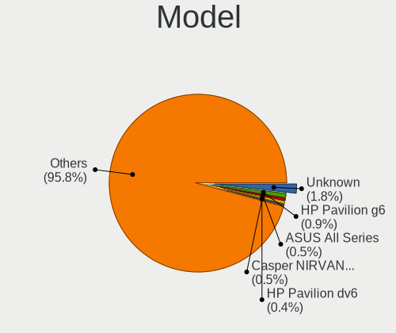

| Name                                 | Computers | Percent |
|--------------------------------------|-----------|---------|
| Unknown                              | 46        | 1.78%   |
| HP Pavilion g6                       | 24        | 0.93%   |
| ASUS All Series                      | 14        | 0.54%   |
| Casper NIRVANA NOTEBOOK              | 13        | 0.5%    |
| HP Pavilion dv6                      | 11        | 0.43%   |
| Casper EXCALIBUR G770                | 11        | 0.43%   |
| Gigabyte B450M S2H                   | 10        | 0.39%   |
| HUAWEI BOD-WXX9                      | 9         | 0.35%   |
| HP Victus by Gaming Laptop 16-s0xxx  | 9         | 0.35%   |
| HP Notebook                          | 9         | 0.35%   |
| Lenovo IdeaPad 3 15ITL6 82H8         | 8         | 0.31%   |
| HUAWEI HVY-WXX9                      | 8         | 0.31%   |
| HUAWEI BOM-WXX9                      | 8         | 0.31%   |
| HP Victus by Gaming Laptop 15-fa1xxx | 8         | 0.31%   |
| HP Pavilion 15                       | 8         | 0.31%   |
| Dell Inspiron 3542                   | 8         | 0.31%   |
| HP Pavilion Notebook                 | 7         | 0.27%   |
| HP 15                                | 7         | 0.27%   |
| ASUS X555UB                          | 7         | 0.27%   |
| ASUS X550VX                          | 7         | 0.27%   |
| Acer Aspire 5750G                    | 7         | 0.27%   |
| Packard Bell EasyNote TJ65           | 6         | 0.23%   |
| MSI MS-7C02                          | 6         | 0.23%   |
| MSI MS-7817                          | 6         | 0.23%   |
| Lenovo V15 G2 ALC 82KD               | 6         | 0.23%   |
| Intel H55                            | 6         | 0.23%   |
| HUAWEI KLVL-WXX9                     | 6         | 0.23%   |
| Gigabyte A320M-S2H                   | 6         | 0.23%   |
| Dell Inspiron MM061                  | 6         | 0.23%   |
| Acer Nitro AN515-58                  | 6         | 0.23%   |
| Toshiba Satellite L655               | 5         | 0.19%   |
| Pegatron A15                         | 5         | 0.19%   |
| MSI MS-7C52                          | 5         | 0.19%   |
| MSI MS-7A34                          | 5         | 0.19%   |
| MSI MS-7996                          | 5         | 0.19%   |
| MSI MS-7693                          | 5         | 0.19%   |
| Lenovo IdeaPad Gaming 3 15ACH6 82K2  | 5         | 0.19%   |
| Lenovo IdeaPad 100-15IBD 80QQ        | 5         | 0.19%   |
| Lenovo G50-70 20351                  | 5         | 0.19%   |
| HUAWEI NBLK-WAX9X                    | 5         | 0.19%   |

Model Family
------------

Motherboard model prefix

| Name                  | Computers | Percent |
|-----------------------|-----------|---------|
| Lenovo ThinkPad       | 140       | 5.42%   |
| Lenovo IdeaPad        | 99        | 3.83%   |
| Acer Aspire           | 88        | 3.4%    |
| HP Pavilion           | 86        | 3.33%   |
| Dell Inspiron         | 74        | 2.86%   |
| Toshiba Satellite     | 62        | 2.4%    |
| ASUS PRIME            | 51        | 1.97%   |
| Monster ABRA          | 47        | 1.82%   |
| ASUS ROG              | 47        | 1.82%   |
| Unknown               | 46        | 1.78%   |
| HP Laptop             | 39        | 1.51%   |
| Dell Latitude         | 37        | 1.43%   |
| ASUS VivoBook         | 37        | 1.43%   |
| HP Victus             | 35        | 1.35%   |
| ASUS TUF              | 30        | 1.16%   |
| HP ProBook            | 29        | 1.12%   |
| HP EliteBook          | 28        | 1.08%   |
| Casper NIRVANA        | 28        | 1.08%   |
| Monster TULPAR        | 26        | 1.01%   |
| Acer Nitro            | 22        | 0.85%   |
| Packard Bell EasyNote | 21        | 0.81%   |
| Lenovo Yoga           | 20        | 0.77%   |
| Dell Vostro           | 20        | 0.77%   |
| Lenovo ThinkBook      | 19        | 0.74%   |
| HP 250                | 19        | 0.74%   |
| ASUS ASUS             | 19        | 0.74%   |
| Lenovo Legion         | 17        | 0.66%   |
| Gigabyte B450M        | 16        | 0.62%   |
| Dell Precision        | 16        | 0.62%   |
| Casper EXCALIBUR      | 16        | 0.62%   |
| HP Compaq             | 14        | 0.54%   |
| ASUS All              | 14        | 0.54%   |
| Acer Swift            | 14        | 0.54%   |
| Monster HUMA          | 12        | 0.46%   |
| Lenovo V15            | 12        | 0.46%   |
| HP ENVY               | 12        | 0.46%   |
| ASUS ZenBook          | 11        | 0.43%   |
| Dell OptiPlex         | 10        | 0.39%   |
| Lenovo ThinkCentre    | 9         | 0.35%   |
| HUAWEI BOD-WXX9       | 9         | 0.35%   |

MFG Year
--------

Motherboard manufacture year

| Year    | Computers | Percent |
|---------|-----------|---------|
| 2020    | 267       | 10.33%  |
| 2019    | 223       | 8.63%   |
| 2021    | 209       | 8.09%   |
| 2018    | 208       | 8.05%   |
| 2012    | 166       | 6.42%   |
| 2017    | 163       | 6.31%   |
| 2011    | 162       | 6.27%   |
| 2022    | 151       | 5.84%   |
| 2013    | 150       | 5.8%    |
| 2014    | 130       | 5.03%   |
| 2010    | 128       | 4.95%   |
| 2016    | 120       | 4.64%   |
| 2015    | 116       | 4.49%   |
| 2023    | 109       | 4.22%   |
| 2009    | 79        | 3.06%   |
| 2008    | 70        | 2.71%   |
| 2007    | 43        | 1.66%   |
| Unknown | 37        | 1.43%   |
| 2024    | 24        | 0.93%   |
| 2006    | 21        | 0.81%   |
| 2005    | 7         | 0.27%   |
| 2004    | 1         | 0.04%   |
| 2003    | 1         | 0.04%   |

Form Factor
-----------

Physical design of the computer

| Name           | Computers | Percent |
|----------------|-----------|---------|
| Notebook       | 1816      | 70.25%  |
| Desktop        | 639       | 24.72%  |
| Convertible    | 38        | 1.47%   |
| All in one     | 31        | 1.2%    |
| System on chip | 19        | 0.74%   |
| Tablet         | 16        | 0.62%   |
| Mini pc        | 15        | 0.58%   |
| Server         | 6         | 0.23%   |
| Phone          | 5         | 0.19%   |

Secure Boot
-----------

Enabled or disabled

| State    | Computers | Percent |
|----------|-----------|---------|
| Disabled | 2413      | 92.2%   |
| Enabled  | 204       | 7.8%    |

Coreboot
--------

Have coreboot on board

| Used | Computers | Percent |
|------|-----------|---------|
| No   | 2579      | 99.77%  |
| Yes  | 6         | 0.23%   |

RAM Size
--------

Total RAM memory

| Size in GB      | Computers | Percent |
|-----------------|-----------|---------|
| 4.01-8.0        | 656       | 24.91%  |
| 16.01-24.0      | 533       | 20.24%  |
| 8.01-16.0       | 514       | 19.52%  |
| 3.01-4.0        | 428       | 16.26%  |
| 32.01-64.0      | 211       | 8.01%   |
| 1.01-2.0        | 131       | 4.98%   |
| 64.01-256.0     | 50        | 1.9%    |
| 24.01-32.0      | 47        | 1.79%   |
| 2.01-3.0        | 45        | 1.71%   |
| 0.51-1.0        | 16        | 0.61%   |
| More than 256.0 | 2         | 0.08%   |

RAM Used
--------

Used RAM memory

| Used GB    | Computers | Percent |
|------------|-----------|---------|
| 1.01-2.0   | 827       | 28.65%  |
| 2.01-3.0   | 738       | 25.56%  |
| 4.01-8.0   | 515       | 17.84%  |
| 3.01-4.0   | 481       | 16.66%  |
| 0.51-1.0   | 149       | 5.16%   |
| 8.01-16.0  | 128       | 4.43%   |
| 0.01-0.5   | 31        | 1.07%   |
| 16.01-24.0 | 11        | 0.38%   |
| 32.01-64.0 | 3         | 0.1%    |
| 24.01-32.0 | 3         | 0.1%    |
| Unknown    | 1         | 0.03%   |

Total Drives
------------

Number of drives on board

| Drives | Computers | Percent |
|--------|-----------|---------|
| 1      | 1684      | 63.62%  |
| 2      | 703       | 26.56%  |
| 3      | 156       | 5.89%   |
| 4      | 53        | 2%      |
| 5      | 23        | 0.87%   |
| 0      | 16        | 0.6%    |
| 7      | 6         | 0.23%   |
| 6      | 6         | 0.23%   |

Has CD-ROM
----------

Has CD-ROM on board

| Presented | Computers | Percent |
|-----------|-----------|---------|
| No        | 1867      | 71.56%  |
| Yes       | 742       | 28.44%  |

Has Ethernet
------------

Has Ethernet on board

| Presented | Computers | Percent |
|-----------|-----------|---------|
| Yes       | 2186      | 84.34%  |
| No        | 406       | 15.66%  |

Has WiFi
--------

Has WiFi module

| Presented | Computers | Percent |
|-----------|-----------|---------|
| Yes       | 2118      | 81.74%  |
| No        | 473       | 18.26%  |

Has Bluetooth
-------------

Has Bluetooth module

| Presented | Computers | Percent |
|-----------|-----------|---------|
| Yes       | 1803      | 68.97%  |
| No        | 811       | 31.03%  |

Location
--------

Country
-------

Geographic location (country)

| Country | Computers | Percent |
|---------|-----------|---------|
| Turkey  | 2585      | 100%    |

City
----

Geographic location (city)

| City                | Computers | Percent |
|---------------------|-----------|---------|
| Istanbul            | 966       | 35%     |
| Ankara              | 386       | 13.99%  |
| Izmir               | 250       | 9.06%   |
| Antalya             | 121       | 4.38%   |
| Bursa               | 120       | 4.35%   |
| Adana               | 47        | 1.7%    |
| Konya               | 44        | 1.59%   |
| Kosekoy             | 41        | 1.49%   |
| Kayseri             | 32        | 1.16%   |
| Mersin              | 31        | 1.12%   |
| Gaziantep           | 30        | 1.09%   |
| Samsun              | 27        | 0.98%   |
| Balkesir          | 25        | 0.91%   |
| zmit              | 24        | 0.87%   |
| Aydin               | 23        | 0.83%   |
| Tekirda           | 21        | 0.76%   |
| Denizli             | 21        | 0.76%   |
| Mugla               | 19        | 0.69%   |
| Antakya             | 17        | 0.62%   |
| Magnesia ad Sipylum | 16        | 0.58%   |
| Adapazar          | 16        | 0.58%   |
| ili             | 15        | 0.54%   |
| Trabzon             | 13        | 0.47%   |
| Erzurum             | 12        | 0.43%   |
| Eskiehir          | 11        | 0.4%    |
| anakkale          | 11        | 0.4%    |
| Zonguldak           | 10        | 0.36%   |
| Osmaniye            | 10        | 0.36%   |
| Kartal              | 10        | 0.36%   |
| Alanya              | 10        | 0.36%   |
| Yalova              | 9         | 0.33%   |
| Ordu                | 9         | 0.33%   |
| Malatya             | 9         | 0.33%   |
| Krklareli         | 9         | 0.33%   |
| Diyarbakr         | 9         | 0.33%   |
| Batman              | 9         | 0.33%   |
| Isparta             | 8         | 0.29%   |
| Bahcelievler        | 8         | 0.29%   |
| Karabk            | 7         | 0.25%   |
| Kahramanmara      | 7         | 0.25%   |

Drives
------

Drive Vendor
------------

Hard drive vendors

| Vendor                      | Computers | Drives | Percent |
|-----------------------------|-----------|--------|---------|
| Samsung Electronics         | 554       | 802    | 15.24%  |
| Seagate                     | 439       | 564    | 12.08%  |
| WDC                         | 425       | 604    | 11.7%   |
| SanDisk                     | 338       | 422    | 9.3%    |
| Toshiba                     | 270       | 320    | 7.43%   |
| Kingston                    | 192       | 256    | 5.28%   |
| Unknown                     | 144       | 181    | 3.96%   |
| SK hynix                    | 109       | 142    | 3%      |
| Micron Technology           | 95        | 109    | 2.61%   |
| HGST                        | 75        | 86     | 2.06%   |
| Hitachi                     | 71        | 81     | 1.95%   |
| Intel                       | 70        | 88     | 1.93%   |
| China                       | 62        | 73     | 1.71%   |
| Crucial                     | 60        | 74     | 1.65%   |
| KIOXIA                      | 51        | 64     | 1.4%    |
| A-DATA Technology           | 49        | 57     | 1.35%   |
| KIOXIA-EXCERIA              | 35        | 39     | 0.96%   |
| Kingston Technology Company | 32        | 43     | 0.88%   |
| Apple                       | 32        | 43     | 0.88%   |
| Phison                      | 29        | 30     | 0.8%    |
| Phison Electronics          | 28        | 31     | 0.77%   |
| Corsair                     | 28        | 37     | 0.77%   |
| Silicon Motion              | 27        | 31     | 0.74%   |
| Micron/Crucial Technology   | 23        | 28     | 0.63%   |
| HS-SSD-C100                 | 17        | 17     | 0.47%   |
| JAMESDONKEY                 | 16        | 17     | 0.44%   |
| Fujitsu                     | 16        | 16     | 0.44%   |
| Unknown                     | 16        | 17     | 0.44%   |
| OCZ                         | 15        | 17     | 0.41%   |
| Lexar                       | 15        | 21     | 0.41%   |
| Team                        | 12        | 12     | 0.33%   |
| ADATA Technology            | 12        | 16     | 0.33%   |
| Gigabyte Technology         | 11        | 19     | 0.3%    |
| UMIS                        | 10        | 12     | 0.28%   |
| Netac                       | 10        | 11     | 0.28%   |
| JMicron Technology          | 10        | 10     | 0.28%   |
| Union Memory                | 8         | 19     | 0.22%   |
| TwinMOS                     | 8         | 9      | 0.22%   |
| Transcend                   | 8         | 8      | 0.22%   |
| Realtek Semiconductor       | 8         | 9      | 0.22%   |

Drive Model
-----------

Hard drive models

| Model                                                | Computers | Percent |
|------------------------------------------------------|-----------|---------|
| SanDisk SSD PLUS 240GB                               | 52        | 1.34%   |
| Seagate ST1000LM035-1RK172 1TB                       | 51        | 1.32%   |
| Samsung NVMe SSD Controller SM981/PM981/PM983 512GB  | 47        | 1.21%   |
| HGST HTS721010A9E630 1TB                             | 38        | 0.98%   |
| Unknown MMC Card  32GB                               | 33        | 0.85%   |
| Samsung NVMe SSD Controller PM9A1/PM9A3/980PRO 512GB | 33        | 0.85%   |
| Toshiba MQ01ABD100 1TB                               | 26        | 0.67%   |
| Samsung SSD 860 EVO 250GB                            | 26        | 0.67%   |
| Toshiba MQ04ABF100 1TB                               | 25        | 0.64%   |
| Seagate ST500DM002-1BD142 500GB                      | 25        | 0.64%   |
| Toshiba MQ01ABF050 500GB                             | 23        | 0.59%   |
| Sandisk WD Blue SN550 NVMe SSD 256GB                 | 23        | 0.59%   |
| Seagate ST1000LM024 HN-M101MBB 1TB                   | 21        | 0.54%   |
| Seagate ST1000DM010-2EP102 1TB                       | 20        | 0.52%   |
| WDC WDS240G2G0A-00JH30 240GB SSD                     | 18        | 0.46%   |
| Seagate ST500LT012-1DG142 500GB                      | 18        | 0.46%   |
| Samsung NVMe SSD Drive 256GB                         | 18        | 0.46%   |
| SanDisk SSD PLUS 120GB                               | 17        | 0.44%   |
| Kingston SV300S37A120G 120GB SSD                     | 16        | 0.41%   |
| Kingston SA400S37240G 240GB SSD                      | 16        | 0.41%   |
| Unknown                                              | 16        | 0.41%   |
| Samsung NVMe SSD Drive 512GB                         | 15        | 0.39%   |
| Toshiba MQ01ABD075 752GB                             | 14        | 0.36%   |
| Seagate ST9500325AS 500GB                            | 14        | 0.36%   |
| Seagate Expansion 1TB                                | 14        | 0.36%   |
| SanDisk SSD PLUS 480GB                               | 14        | 0.36%   |
| SanDisk NVMe SSD Drive 512GB                         | 14        | 0.36%   |
| Samsung SSD 860 EVO 500GB                            | 14        | 0.36%   |
| Samsung MZVLQ512HBLU-00B00 512GB                     | 14        | 0.36%   |
| KIOXIA NVMe SSD 1TB                                  | 14        | 0.36%   |
| Kingston Company SNV2S1000G 1TB                      | 14        | 0.36%   |
| WDC WD10EZEX-08WN4A0 1TB                             | 13        | 0.34%   |
| Unknown MMC Card  64GB                               | 13        | 0.34%   |
| Unknown MMC Card  128GB                              | 13        | 0.34%   |
| Silicon Motion PCIe-8 SSD 512GB                      | 13        | 0.34%   |
| Seagate ST1000LM049-2GH172 1TB                       | 13        | 0.34%   |
| Sandisk WD Black SN750 / PC SN730 NVMe SSD 512GB     | 13        | 0.34%   |
| SanDisk NVMe SSD Drive 256GB                         | 13        | 0.34%   |
| Kingston SA400S37120G 120GB SSD                      | 13        | 0.34%   |
| Unknown MMC Card  16GB                               | 12        | 0.31%   |

HDD Vendor
----------

Hard disk drive vendors

| Vendor              | Computers | Drives  | Percent |
|---------------------|-----------|---------|---------|
| Seagate             | 431       | 549     | 34.54%  |
| WDC                 | 331       | 484     | 26.52%  |
| Toshiba             | 198       | 226     | 15.87%  |
| Samsung Electronics | 90        | 118     | 7.21%   |
| HGST                | 75        | 86      | 6.01%   |
| Hitachi             | 71        | 81      | 5.69%   |
| Fujitsu             | 16        | 16      | 1.28%   |
| Unknown             | 10        | 13      | 0.8%    |
| Maxtor              | 6         | 6       | 0.48%   |
| Apple               | 5         | 9       | 0.4%    |
| JMicron Technology  | 4         | 4       | 0.32%   |
| SABRENT             | 2         | 2       | 0.16%   |
| Intenso             | 2         | 3       | 0.16%   |
| TO Exter            | 1         | 3       | 0.08%   |
| Initio              | 1         | Unknown | 0.08%   |
| External            | 1         | 1       | 0.08%   |
| ExcelStor           | 1         | 1       | 0.08%   |
| China               | 1         | 1       | 0.08%   |
| ASMT                | 1         | 1       | 0.08%   |
| 128MB               | 1         | 1       | 0.08%   |

SSD Vendor
----------

Solid state drive vendors

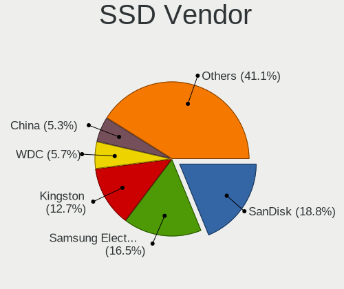

| Vendor              | Computers | Drives | Percent |
|---------------------|-----------|--------|---------|
| SanDisk             | 202       | 261    | 18.81%  |
| Samsung Electronics | 177       | 241    | 16.48%  |
| Kingston            | 136       | 185    | 12.66%  |
| WDC                 | 61        | 73     | 5.68%   |
| China               | 57        | 64     | 5.31%   |
| Crucial             | 39        | 51     | 3.63%   |
| A-DATA Technology   | 36        | 42     | 3.35%   |
| Toshiba             | 32        | 34     | 2.98%   |
| KIOXIA-EXCERIA      | 28        | 31     | 2.61%   |
| Corsair             | 23        | 27     | 2.14%   |
| Micron Technology   | 22        | 27     | 2.05%   |
| SK hynix            | 18        | 22     | 1.68%   |
| Apple               | 17        | 19     | 1.58%   |
| OCZ                 | 15        | 17     | 1.4%    |
| JAMESDONKEY         | 14        | 15     | 1.3%    |
| Lexar               | 13        | 19     | 1.21%   |
| Intel               | 11        | 17     | 1.02%   |
| Netac               | 10        | 11     | 0.93%   |
| Team                | 9         | 9      | 0.84%   |
| LITEON              | 8         | 9      | 0.74%   |
| HS-SSD-C100         | 8         | 8      | 0.74%   |
| TwinMOS             | 7         | 8      | 0.65%   |
| Seagate             | 7         | 8      | 0.65%   |
| Pioneer             | 7         | 23     | 0.65%   |
| KingSpec            | 7         | 7      | 0.65%   |
| Gigabyte Technology | 7         | 14     | 0.65%   |
| Hewlett-Packard     | 6         | 6      | 0.56%   |
| Transcend           | 5         | 5      | 0.47%   |
| LITEONIT            | 5         | 6      | 0.47%   |
| EZCOOL              | 5         | 6      | 0.47%   |
| SPCC                | 4         | 4      | 0.37%   |
| PNY                 | 4         | 5      | 0.37%   |
| Patriot             | 4         | 5      | 0.37%   |
| Intenso             | 4         | 4      | 0.37%   |
| HI-LEVEL            | 4         | 4      | 0.37%   |
| Unknown             | 4         | 4      | 0.37%   |
| Turbox              | 3         | 3      | 0.28%   |
| KingFast            | 3         | 5      | 0.28%   |
| HS-SSD-E100         | 3         | 3      | 0.28%   |
| GOODRAM             | 3         | 6      | 0.28%   |

Drive Kind
----------

HDD or SSD

| Kind    | Computers | Drives | Percent |
|---------|-----------|--------|---------|
| HDD     | 1106      | 1605   | 33.34%  |
| NVMe    | 1061      | 1497   | 31.99%  |
| SSD     | 965       | 1361   | 29.09%  |
| MMC     | 128       | 162    | 3.86%   |
| Unknown | 57        | 74     | 1.72%   |

Drive Connector
---------------

SATA, SAS, NVMe, etc.

| Type | Computers | Drives | Percent |
|------|-----------|--------|---------|
| SATA | 1703      | 2913   | 57.03%  |
| NVMe | 1061      | 1494   | 35.53%  |
| MMC  | 128       | 162    | 4.29%   |
| SAS  | 94        | 130    | 3.15%   |

Drive Size
----------

Size of hard drive

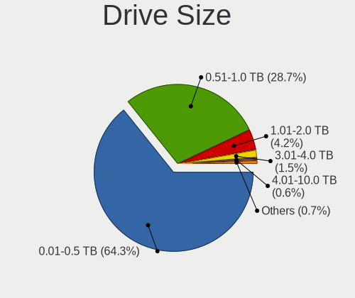

| Size in TB | Computers | Drives | Percent |
|------------|-----------|--------|---------|
| 0.01-0.5   | 1316      | 1963   | 64.26%  |
| 0.51-1.0   | 588       | 789    | 28.71%  |
| 1.01-2.0   | 86        | 126    | 4.2%    |
| 3.01-4.0   | 31        | 50     | 1.51%   |
| 2.01-3.0   | 12        | 18     | 0.59%   |
| 4.01-10.0  | 12        | 16     | 0.59%   |
| 10.01-20.0 | 2         | 2      | 0.1%    |
| 0          | 1         | 2      | 0.05%   |

Space Total
-----------

Amount of disk space available on the file system

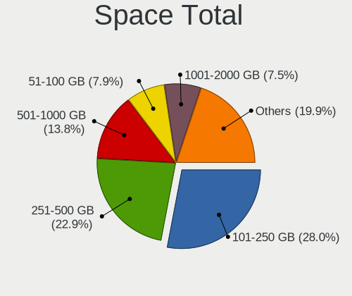

| Size in GB     | Computers | Percent |
|----------------|-----------|---------|
| 101-250        | 781       | 27.99%  |
| 251-500        | 639       | 22.9%   |
| 501-1000       | 385       | 13.8%   |
| 51-100         | 221       | 7.92%   |
| 1001-2000      | 210       | 7.53%   |
| 1-20           | 198       | 7.1%    |
| 21-50          | 149       | 5.34%   |
| More than 3000 | 85        | 3.05%   |
| 2001-3000      | 73        | 2.62%   |
| Unknown        | 49        | 1.76%   |

Space Used
----------

Amount of used disk space

| Used GB        | Computers | Percent |
|----------------|-----------|---------|
| 1-20           | 1092      | 38.01%  |
| 21-50          | 578       | 20.12%  |
| 51-100         | 352       | 12.25%  |
| 101-250        | 351       | 12.22%  |
| 251-500        | 194       | 6.75%   |
| 501-1000       | 144       | 5.01%   |
| 1001-2000      | 63        | 2.19%   |
| Unknown        | 49        | 1.71%   |
| More than 3000 | 27        | 0.94%   |
| 2001-3000      | 22        | 0.77%   |
| 0              | 1         | 0.03%   |

Malfunc. Drives
---------------

Drive models with a malfunction

| Model                                                           | Computers | Drives | Percent |
|-----------------------------------------------------------------|-----------|--------|---------|
| Seagate ST500DM002-1BD142 500GB                                 | 10        | 11     | 3.57%   |
| Seagate ST500LT012-1DG142 500GB                                 | 6         | 8      | 2.14%   |
| Seagate ST1000LM035-1RK172 1TB                                  | 6         | 6      | 2.14%   |
| SanDisk SSD PLUS 240GB                                          | 6         | 7      | 2.14%   |
| Toshiba MQ01ABD100 1TB                                          | 5         | 5      | 1.79%   |
| Kingston SV300S37A120G 120GB SSD                                | 5         | 6      | 1.79%   |
| HGST HTS721010A9E630 1TB                                        | 5         | 6      | 1.79%   |
| Toshiba MQ01ABD050 500GB                                        | 4         | 6      | 1.43%   |
| Seagate ST1000LM024 HN-M101MBB 1TB                              | 4         | 4      | 1.43%   |
| Seagate ST1000LM014-SSHD-8GB                                    | 4         | 4      | 1.43%   |
| Seagate ST1000DM003-1SB102 1TB                                  | 4         | 5      | 1.43%   |
| HGST HTS545050A7E680 500GB                                      | 4         | 4      | 1.43%   |
| WDC WDS240G2G0A-00JH30 240GB SSD                                | 3         | 4      | 1.07%   |
| Toshiba MQ01ABF050 500GB                                        | 3         | 4      | 1.07%   |
| Toshiba MQ01ABD075 752GB                                        | 3         | 3      | 1.07%   |
| Toshiba MK3252GSX 320GB                                         | 3         | 3      | 1.07%   |
| Toshiba DT01ACA050 500GB                                        | 3         | 3      | 1.07%   |
| Seagate ST9500325AS 500GB                                       | 3         | 3      | 1.07%   |
| Seagate ST9320325AS 320GB                                       | 3         | 3      | 1.07%   |
| Seagate ST500LT012-9WS142 500GB                                 | 3         | 3      | 1.07%   |
| Seagate ST1000DM003-1CH162 1TB                                  | 3         | 4      | 1.07%   |
| Samsung Electronics SSD 870 EVO 500GB                           | 3         | 5      | 1.07%   |
| Samsung Electronics HD161HJ 160GB                               | 3         | 3      | 1.07%   |
| Kingston SUV400S37240G 240GB SSD                                | 3         | 3      | 1.07%   |
| WDC WD5000LPVX-22V0TT0 500GB                                    | 2         | 2      | 0.71%   |
| WDC WD3200BPVT-22JJ5T0 320GB                                    | 2         | 2      | 0.71%   |
| WDC WD10JPVX-75JC3T0 1TB                                        | 2         | 2      | 0.71%   |
| WDC WD10JPVX-22JC3T0 1TB                                        | 2         | 2      | 0.71%   |
| WDC WD10EZEX-08M2NA0 1TB                                        | 2         | 2      | 0.71%   |
| Toshiba MQ04ABF100 1TB                                          | 2         | 2      | 0.71%   |
| Toshiba MQ02ABD100H 1TB                                         | 2         | 4      | 0.71%   |
| Seagate ST9160821AS 160GB                                       | 2         | 2      | 0.71%   |
| Seagate ST3500630AS 500GB                                       | 2         | 2      | 0.71%   |
| Seagate ST3500418AS 500GB                                       | 2         | 4      | 0.71%   |
| Seagate ST2000DM008-2FR102 2TB                                  | 2         | 2      | 0.71%   |
| SanDisk SDSSDX120GG25 120GB                                     | 2         | 2      | 0.71%   |
| SanDisk SDSSDA120G 120GB                                        | 2         | 2      | 0.71%   |
| Samsung Electronics NVMe SSD Controller SM981/PM981/PM983 512GB | 2         | 2      | 0.71%   |
| Samsung Electronics HD322HJ 320GB                               | 2         | 2      | 0.71%   |
| Kingston SVP200S37A120G 120GB SSD                               | 2         | 2      | 0.71%   |

Malfunc. Drive Vendor
---------------------

Vendors of faulty drives

| Vendor              | Computers | Drives | Percent |
|---------------------|-----------|--------|---------|
| Seagate             | 72        | 86     | 26.37%  |
| WDC                 | 41        | 48     | 15.02%  |
| Toshiba             | 33        | 38     | 12.09%  |
| Samsung Electronics | 21        | 26     | 7.69%   |
| Hitachi             | 21        | 21     | 7.69%   |
| SanDisk             | 15        | 18     | 5.49%   |
| Kingston            | 13        | 14     | 4.76%   |
| HGST                | 13        | 14     | 4.76%   |
| A-DATA Technology   | 9         | 9      | 3.3%    |
| Fujitsu             | 5         | 5      | 1.83%   |
| SK hynix            | 4         | 5      | 1.47%   |
| Maxtor              | 3         | 3      | 1.1%    |
| Crucial             | 3         | 3      | 1.1%    |
| China               | 3         | 3      | 1.1%    |
| JMicron Technology  | 2         | 2      | 0.73%   |
| Indilinx            | 2         | 4      | 0.73%   |
| 2.5"                | 2         | 2      | 0.73%   |
| SSD-S400            | 1         | 1      | 0.37%   |
| OCZ                 | 1         | 2      | 0.37%   |
| Micron Technology   | 1         | 1      | 0.37%   |
| LITEONIT            | 1         | 2      | 0.37%   |
| LITEON              | 1         | 1      | 0.37%   |
| JD                  | 1         | 1      | 0.37%   |
| Intenso             | 1         | 1      | 0.37%   |
| Intel               | 1         | 1      | 0.37%   |
| Corsair             | 1         | 2      | 0.37%   |
| C-S12               | 1         | 1      | 0.37%   |
| Apple               | 1         | 2      | 0.37%   |

Malfunc. HDD Vendor
-------------------

Vendors of faulty HDD drives

| Vendor              | Computers | Drives | Percent |
|---------------------|-----------|--------|---------|
| Seagate             | 72        | 86     | 36.36%  |
| WDC                 | 36        | 42     | 18.18%  |
| Toshiba             | 33        | 38     | 16.67%  |
| Hitachi             | 21        | 21     | 10.61%  |
| Samsung Electronics | 14        | 17     | 7.07%   |
| HGST                | 13        | 14     | 6.57%   |
| Fujitsu             | 5         | 5      | 2.53%   |
| Maxtor              | 3         | 3      | 1.52%   |
| Apple               | 1         | 2      | 0.51%   |

Malfunc. Drive Kind
-------------------

Kinds of faulty drives

| Kind    | Computers | Drives | Percent |
|---------|-----------|--------|---------|
| HDD     | 185       | 228    | 71.15%  |
| SSD     | 65        | 78     | 25%     |
| NVMe    | 8         | 8      | 3.08%   |
| Unknown | 2         | 2      | 0.77%   |

Failed Drives
-------------

Failed drive models

| Model                               | Computers | Drives | Percent |
|-------------------------------------|-----------|--------|---------|
| Seagate ST750LM022 HN-M750MBB 752GB | 1         | 1      | 16.67%  |
| Seagate ST1000LM024 HN-M101MBB 1TB  | 1         | 1      | 16.67%  |
| Samsung Electronics HM160HI 160GB   | 1         | 1      | 16.67%  |
| Samsung Electronics HD322GJ 320GB   | 1         | 1      | 16.67%  |
| HGST HTS545050A7E680 500GB          | 1         | 1      | 16.67%  |
| Crucial CT500P2SSD8 500GB           | 1         | 1      | 16.67%  |

Failed Drive Vendor
-------------------

Failed drive vendors

| Vendor              | Computers | Drives | Percent |
|---------------------|-----------|--------|---------|
| Seagate             | 2         | 2      | 33.33%  |
| Samsung Electronics | 2         | 2      | 33.33%  |
| HGST                | 1         | 1      | 16.67%  |
| Crucial             | 1         | 1      | 16.67%  |

Drive Status
------------

Number of failed and malfunc. drives

| Status   | Computers | Drives | Percent |
|----------|-----------|--------|---------|
| Detected | 1537      | 2656   | 54.31%  |
| Works    | 1033      | 1721   | 36.5%   |
| Malfunc  | 254       | 316    | 8.98%   |
| Failed   | 6         | 6      | 0.21%   |

Storage controller
------------------

Storage Vendor
--------------

Storage controller vendors

| Vendor                                  | Computers | Percent |
|-----------------------------------------|-----------|---------|
| Intel                                   | 1638      | 50.12%  |
| AMD                                     | 415       | 12.7%   |
| Samsung Electronics                     | 334       | 10.22%  |
| SanDisk                                 | 163       | 4.99%   |
| SK hynix                                | 89        | 2.72%   |
| Kingston Technology Company             | 86        | 2.63%   |
| Micron Technology                       | 73        | 2.23%   |
| Phison Electronics                      | 68        | 2.08%   |
| KIOXIA                                  | 65        | 1.99%   |
| Micron/Crucial Technology               | 42        | 1.29%   |
| Silicon Motion                          | 36        | 1.1%    |
| Toshiba America Info Systems            | 32        | 0.98%   |
| Nvidia                                  | 26        | 0.8%    |
| ADATA Technology                        | 24        | 0.73%   |
| Marvell Technology Group                | 23        | 0.7%    |
| Union Memory (Shenzhen)                 | 22        | 0.67%   |
| ASMedia Technology                      | 22        | 0.67%   |
| JMicron Technology                      | 20        | 0.61%   |
| Silicon Integrated Systems [SiS]        | 14        | 0.43%   |
| Realtek Semiconductor                   | 13        | 0.4%    |
| Solidigm                                | 12        | 0.37%   |
| Apple                                   | 9         | 0.28%   |
| Yangtze Memory Technologies             | 8         | 0.24%   |
| MAXIO Technology (Hangzhou)             | 6         | 0.18%   |
| VIA Technologies                        | 4         | 0.12%   |
| Solid State Storage Technology          | 4         | 0.12%   |
| Seagate Technology                      | 3         | 0.09%   |
| Lite-On Technology                      | 3         | 0.09%   |
| Innodisk                                | 3         | 0.09%   |
| Transcend                               | 2         | 0.06%   |
| Shenzhen Longsys Electronics            | 2         | 0.06%   |
| LSI Logic / Symbios Logic               | 2         | 0.06%   |
| ULi Electronics                         | 1         | 0.03%   |
| Shenzhen Unionmemory Information System | 1         | 0.03%   |
| Promise Technology                      | 1         | 0.03%   |
| OCZ Technology Group                    | 1         | 0.03%   |
| Adaptec                                 | 1         | 0.03%   |

Storage Model
-------------

Storage controller models

| Model                                                                          | Computers | Percent |
|--------------------------------------------------------------------------------|-----------|---------|
| AMD FCH SATA Controller [AHCI mode]                                            | 264       | 7.2%    |
| Intel Sunrise Point-LP SATA Controller [AHCI mode]                             | 138       | 3.76%   |
| Intel 7 Series Chipset Family 6-port SATA Controller [AHCI mode]               | 131       | 3.57%   |
| Samsung NVMe SSD Controller SM981/PM981/PM983                                  | 117       | 3.19%   |
| Samsung NVMe SSD Controller 980 (DRAM-less)                                    | 104       | 2.83%   |
| Intel 6 Series/C200 Series Chipset Family 6 port Mobile SATA AHCI Controller   | 100       | 2.73%   |
| Intel 8 Series/C220 Series Chipset Family 6-port SATA Controller 1 [AHCI mode] | 90        | 2.45%   |
| Intel 82801 Mobile SATA Controller [RAID mode]                                 | 73        | 1.99%   |
| AMD 400 Series Chipset SATA Controller                                         | 69        | 1.88%   |
| Intel 8 Series SATA Controller 1 [AHCI mode]                                   | 67        | 1.83%   |
| Intel Volume Management Device NVMe RAID Controller                            | 64        | 1.74%   |
| Intel HM170/QM170 Chipset SATA Controller [AHCI Mode]                          | 61        | 1.66%   |
| Intel NM10/ICH7 Family SATA Controller [IDE mode]                              | 57        | 1.55%   |
| Intel Cannon Lake Mobile PCH SATA AHCI Controller                              | 53        | 1.44%   |
| Intel 400 Series Chipset Family SATA AHCI Controller                           | 53        | 1.44%   |
| Samsung NVMe SSD Controller PM9A1/PM9A3/980PRO                                 | 51        | 1.39%   |
| Intel 5 Series/3400 Series Chipset 4 port SATA AHCI Controller                 | 49        | 1.34%   |
| SanDisk Ultra 3D / WD PC SN530, IX SN530, Blue SN550 NVMe SSD (DRAM-less)      | 48        | 1.31%   |
| Intel Wildcat Point-LP SATA Controller [AHCI Mode]                             | 47        | 1.28%   |
| Intel 82801IBM/IEM (ICH9M/ICH9M-E) 4 port SATA Controller [AHCI mode]          | 47        | 1.28%   |
| Intel Comet Lake SATA AHCI Controller                                          | 42        | 1.14%   |
| Intel 82801G (ICH7 Family) IDE Controller                                      | 42        | 1.14%   |
| Intel Tiger Lake-LP SATA Controller                                            | 35        | 0.95%   |
| AMD SB7x0/SB8x0/SB9x0 IDE Controller                                           | 35        | 0.95%   |
| Intel 6 Series/C200 Series Chipset Family 6 port Desktop SATA AHCI Controller  | 34        | 0.93%   |
| Intel Tiger Lake SATA AHCI Controller                                          | 31        | 0.84%   |
| Intel Q170/Q150/B150/H170/H110/Z170/CM236 Chipset SATA Controller [AHCI Mode]  | 31        | 0.84%   |
| Intel 200 Series PCH SATA controller [AHCI mode]                               | 31        | 0.84%   |
| Samsung NVMe SSD Controller SM961/PM961/SM963                                  | 30        | 0.82%   |
| AMD 500 Series Chipset SATA Controller                                         | 30        | 0.82%   |
| Micron/Crucial P2 [Nick P2] / P3 / P3 Plus NVMe PCIe SSD (DRAM-less)           | 29        | 0.79%   |
| AMD SB7x0/SB8x0/SB9x0 SATA Controller [AHCI mode]                              | 29        | 0.79%   |
| SK hynix Gold P31/BC711/PC711 NVMe Solid State Drive                           | 28        | 0.76%   |
| AMD SB7x0/SB8x0/SB9x0 SATA Controller [IDE mode]                               | 28        | 0.76%   |
| Phison PS5013-E13 PCIe3 NVMe Controller (DRAM-less)                            | 26        | 0.71%   |
| Intel SSD 660P Series                                                          | 26        | 0.71%   |
| Intel 5 Series/3400 Series Chipset 6 port SATA AHCI Controller                 | 25        | 0.68%   |
| SanDisk Extreme Pro / WD Black SN750 / PC SN730 / Red SN700 NVMe SSD           | 24        | 0.65%   |
| KIOXIA NVMe SSD                                                                | 23        | 0.63%   |
| Phison E12 NVMe Controller                                                     | 22        | 0.6%    |

Storage Kind
------------

Kind of storage controller (IDE, SATA, NVMe, SAS, ...)

| Kind | Computers | Percent |
|------|-----------|---------|
| SATA | 1765      | 53.73%  |
| NVMe | 1063      | 32.36%  |
| IDE  | 277       | 8.43%   |
| RAID | 177       | 5.39%   |
| SCSI | 2         | 0.06%   |
| SAS  | 1         | 0.03%   |

Processor
---------

CPU Vendor
----------

Processor vendors

| Vendor       | Computers | Percent |
|--------------|-----------|---------|
| Intel        | 1931      | 74.7%   |
| AMD          | 616       | 23.83%  |
| ARM          | 35        | 1.35%   |
| CentaurHauls | 2         | 0.08%   |
| Qualcomm     | 1         | 0.04%   |

CPU Model
---------

Processor models

| Model                                         | Computers | Percent |
|-----------------------------------------------|-----------|---------|
| Intel 11th Gen Core i5-1135G7 @ 2.40GHz       | 47        | 1.81%   |
| Intel Core i7-10750H CPU @ 2.60GHz            | 41        | 1.58%   |
| Intel Core i5-7200U CPU @ 2.50GHz             | 38        | 1.47%   |
| Intel Core i7-7700HQ CPU @ 2.80GHz            | 30        | 1.16%   |
| Intel 11th Gen Core i7-11800H @ 2.30GHz       | 28        | 1.08%   |
| Intel Core i7-8550U CPU @ 1.80GHz             | 26        | 1%      |
| Intel Core i5-3210M CPU @ 2.50GHz             | 26        | 1%      |
| AMD Ryzen 5 3500U with Radeon Vega Mobile Gfx | 26        | 1%      |
| Intel Core i7-6700HQ CPU @ 2.60GHz            | 24        | 0.93%   |
| Intel Core i5-6200U CPU @ 2.30GHz             | 24        | 0.93%   |
| ARM Processor                                 | 24        | 0.93%   |
| Intel Core i5-8250U CPU @ 1.60GHz             | 23        | 0.89%   |
| Intel Core i5-1035G1 CPU @ 1.00GHz            | 23        | 0.89%   |
| Intel 11th Gen Core i7-1165G7 @ 2.80GHz       | 23        | 0.89%   |
| AMD Ryzen 5 5500U with Radeon Graphics        | 23        | 0.89%   |
| Intel Core i7-10510U CPU @ 1.80GHz            | 22        | 0.85%   |
| Intel Core i7-9750H CPU @ 2.60GHz             | 21        | 0.81%   |
| Intel Core i5-5200U CPU @ 2.20GHz             | 21        | 0.81%   |
| Intel Core i5-3230M CPU @ 2.60GHz             | 21        | 0.81%   |
| Intel Core i5-8265U CPU @ 1.60GHz             | 20        | 0.77%   |
| Intel Core i5-2430M CPU @ 2.40GHz             | 20        | 0.77%   |
| AMD Ryzen 7 5700U with Radeon Graphics        | 20        | 0.77%   |
| AMD Ryzen 7 5800H with Radeon Graphics        | 19        | 0.73%   |
| Intel Core i5-4210U CPU @ 1.70GHz             | 18        | 0.69%   |
| AMD Ryzen 5 4600H with Radeon Graphics        | 18        | 0.69%   |
| Intel 12th Gen Core i7-12700H                 | 17        | 0.66%   |
| Intel Core i7-3630QM CPU @ 2.40GHz            | 16        | 0.62%   |
| Intel Core i5-10210U CPU @ 1.60GHz            | 16        | 0.62%   |
| Intel Celeron CPU N3350 @ 1.10GHz             | 16        | 0.62%   |
| AMD Ryzen 7 4800H with Radeon Graphics        | 16        | 0.62%   |
| Intel Core i7-8750H CPU @ 2.20GHz             | 15        | 0.58%   |
| Intel Core i7-7500U CPU @ 2.70GHz             | 15        | 0.58%   |
| Intel Core i5-4200U CPU @ 1.60GHz             | 15        | 0.58%   |
| Intel Core i5-2450M CPU @ 2.50GHz             | 15        | 0.58%   |
| AMD Ryzen 5 5600H with Radeon Graphics        | 15        | 0.58%   |
| Intel 12th Gen Core i5-12450H                 | 14        | 0.54%   |
| AMD Ryzen 7 3700U with Radeon Vega Mobile Gfx | 14        | 0.54%   |
| Intel Core i5-4200M CPU @ 2.50GHz             | 13        | 0.5%    |
| Intel Core i7-8565U CPU @ 1.80GHz             | 12        | 0.46%   |
| Intel Core i7-6500U CPU @ 2.50GHz             | 12        | 0.46%   |

CPU Model Family
----------------

Processor model prefix

| Model                   | Computers | Percent |
|-------------------------|-----------|---------|
| Intel Core i5           | 569       | 21.98%  |
| Intel Core i7           | 473       | 18.27%  |
| Other                   | 321       | 12.4%   |
| AMD Ryzen 5             | 213       | 8.23%   |
| Intel Core i3           | 173       | 6.68%   |
| AMD Ryzen 7             | 161       | 6.22%   |
| Intel Celeron           | 92        | 3.55%   |
| Intel Core 2 Duo        | 87        | 3.36%   |
| Intel Atom              | 50        | 1.93%   |
| Intel Pentium           | 47        | 1.82%   |
| AMD Ryzen 3             | 38        | 1.47%   |
| Intel Xeon              | 30        | 1.16%   |
| Intel Pentium Dual-Core | 29        | 1.12%   |
| AMD FX                  | 26        | 1%      |
| AMD Ryzen 9             | 23        | 0.89%   |
| Intel Core 2 Quad       | 22        | 0.85%   |
| AMD A8                  | 21        | 0.81%   |
| Intel Pentium Dual      | 19        | 0.73%   |
| AMD A10                 | 18        | 0.7%    |
| Intel Core 2            | 17        | 0.66%   |
| Intel Core i9           | 15        | 0.58%   |
| AMD Ryzen 5 PRO         | 10        | 0.39%   |
| AMD Phenom II X4        | 9         | 0.35%   |
| AMD A4                  | 9         | 0.35%   |
| AMD Ryzen 7 PRO         | 8         | 0.31%   |
| AMD A6                  | 8         | 0.31%   |
| Intel Pentium Silver    | 6         | 0.23%   |
| AMD Athlon II X2        | 6         | 0.23%   |
| Intel Genuine           | 5         | 0.19%   |
| Intel Core              | 5         | 0.19%   |
| AMD Athlon 64 X2        | 5         | 0.19%   |
| AMD Athlon              | 5         | 0.19%   |
| Intel Pentium 4         | 4         | 0.15%   |
| AMD E2                  | 4         | 0.15%   |
| AMD Athlon II X3        | 4         | 0.15%   |
| AMD A12                 | 4         | 0.15%   |
| Intel Pentium M         | 3         | 0.12%   |
| AMD Phenom II X6        | 3         | 0.12%   |
| AMD Phenom              | 3         | 0.12%   |
| AMD E                   | 3         | 0.12%   |

CPU Cores
---------

Number of processor cores

| Number  | Computers | Percent |
|---------|-----------|---------|
| 2       | 963       | 37.18%  |
| 4       | 859       | 33.17%  |
| 6       | 317       | 12.24%  |
| 8       | 233       | 9%      |
| 14      | 43        | 1.66%   |
| 1       | 43        | 1.66%   |
| 12      | 42        | 1.62%   |
| 10      | 41        | 1.58%   |
| 3       | 16        | 0.62%   |
| 24      | 13        | 0.5%    |
| 16      | 12        | 0.46%   |
| 20      | 3         | 0.12%   |
| Unknown | 3         | 0.12%   |
| 64      | 1         | 0.04%   |
| 36      | 1         | 0.04%   |

CPU Sockets
-----------

Number of sockets

| Number  | Computers | Percent |
|---------|-----------|---------|
| 1       | 2575      | 99.61%  |
| 2       | 7         | 0.27%   |
| Unknown | 3         | 0.12%   |

CPU Threads
-----------

Threads per core (Hyper-Threading)

| Number  | Computers | Percent |
|---------|-----------|---------|
| 2       | 1894      | 73.16%  |
| 1       | 689       | 26.61%  |
| Unknown | 3         | 0.12%   |
| 8       | 2         | 0.08%   |
| 4       | 1         | 0.04%   |

CPU Op-Modes
------------

CPU Operation Modes (32-bit, 64-bit)

| Op mode        | Computers | Percent |
|----------------|-----------|---------|
| 32-bit, 64-bit | 2527      | 97.61%  |
| Unknown        | 43        | 1.66%   |
| 32-bit         | 17        | 0.66%   |
| 64-bit         | 2         | 0.08%   |

CPU Microcode
-------------

Microcode number

| Number     | Computers | Percent |
|------------|-----------|---------|
| Unknown    | 1145      | 42.55%  |
| 0x306a9    | 104       | 3.86%   |
| 0x206a7    | 101       | 3.75%   |
| 0x306c3    | 67        | 2.49%   |
| 0x1067a    | 56        | 2.08%   |
| 0x906e9    | 52        | 1.93%   |
| 0x40651    | 45        | 1.67%   |
| 0x806ea    | 43        | 1.6%    |
| 0x906ea    | 40        | 1.49%   |
| 0x806e9    | 39        | 1.45%   |
| 0xa0652    | 37        | 1.37%   |
| 0x806ec    | 37        | 1.37%   |
| 0x806c1    | 37        | 1.37%   |
| 0x306d4    | 36        | 1.34%   |
| 0x506e3    | 34        | 1.26%   |
| 0x406e3    | 33        | 1.23%   |
| 0x20655    | 33        | 1.23%   |
| 0x08108109 | 29        | 1.08%   |
| 0x6fd      | 27        | 1%      |
| 0x08608103 | 27        | 1%      |
| 0x08600106 | 27        | 1%      |
| 0x30678    | 23        | 0.85%   |
| 0x0a50000d | 22        | 0.82%   |
| 0x0a50000c | 22        | 0.82%   |
| 0x08108102 | 22        | 0.82%   |
| 0x706e5    | 21        | 0.78%   |
| 0x406c4    | 20        | 0.74%   |
| 0x20652    | 19        | 0.71%   |
| 0x10676    | 19        | 0.71%   |
| 0x906a3    | 16        | 0.59%   |
| 0x08701021 | 16        | 0.59%   |
| 0x506c9    | 15        | 0.56%   |
| 0x06000852 | 15        | 0.56%   |
| 0x806d1    | 14        | 0.52%   |
| 0x0800820d | 14        | 0.52%   |
| 0x906a4    | 12        | 0.45%   |
| 0x06006705 | 12        | 0.45%   |
| 0x6fb      | 11        | 0.41%   |
| 0x010000c8 | 11        | 0.41%   |
| 0x406c3    | 10        | 0.37%   |

CPU Microarch
-------------

Microarchitecture

| Name              | Computers | Percent |
|-------------------|-----------|---------|
| KabyLake          | 386       | 14.86%  |
| Unknown           | 230       | 8.86%   |
| Haswell           | 182       | 7.01%   |
| IvyBridge         | 167       | 6.43%   |
| SandyBridge       | 166       | 6.39%   |
| Penryn            | 118       | 4.54%   |
| Zen 2             | 116       | 4.47%   |
| Skylake           | 106       | 4.08%   |
| Zen 3             | 105       | 4.04%   |
| CometLake         | 96        | 3.7%    |
| Alderlake Hybrid  | 91        | 3.5%    |
| TigerLake         | 89        | 3.43%   |
| Zen+              | 88        | 3.39%   |
| Westmere          | 83        | 3.2%    |
| Silvermont        | 74        | 2.85%   |
| IceLake           | 71        | 2.73%   |
| Core              | 67        | 2.58%   |
| Broadwell         | 59        | 2.27%   |
| Zen               | 46        | 1.77%   |
| Piledriver        | 37        | 1.42%   |
| K10               | 33        | 1.27%   |
| Excavator         | 26        | 1%      |
| Goldmont plus     | 24        | 0.92%   |
| Goldmont          | 21        | 0.81%   |
| Puma              | 20        | 0.77%   |
| Bonnell           | 18        | 0.69%   |
| Nehalem           | 15        | 0.58%   |
| K8 Hammer         | 10        | 0.39%   |
| Bobcat            | 10        | 0.39%   |
| P6                | 8         | 0.31%   |
| K10 Llano         | 7         | 0.27%   |
| Steamroller       | 6         | 0.23%   |
| NetBurst          | 6         | 0.23%   |
| Meteorlake Hybrid | 4         | 0.15%   |
| Bulldozer         | 4         | 0.15%   |
| Tremont           | 3         | 0.12%   |
| Jaguar            | 2         | 0.08%   |
| Gracemont         | 2         | 0.08%   |
| K6                | 1         | 0.04%   |

Graphics
--------

GPU Vendor
----------

Vendors of graphics cards

| Vendor                           | Computers | Percent |
|----------------------------------|-----------|---------|
| Intel                            | 1544      | 45.11%  |
| Nvidia                           | 1031      | 30.12%  |
| AMD                              | 829       | 24.22%  |
| Silicon Integrated Systems [SiS] | 12        | 0.35%   |
| VIA Technologies                 | 3         | 0.09%   |
| Matrox Electronics Systems       | 3         | 0.09%   |
| ASPEED Technology                | 1         | 0.03%   |

GPU Model
---------

Graphics card models

| Model                                                                                    | Computers | Percent |
|------------------------------------------------------------------------------------------|-----------|---------|
| Intel 2nd Generation Core Processor Family Integrated Graphics Controller                | 127       | 3.58%   |
| Intel 3rd Gen Core processor Graphics Controller                                         | 115       | 3.24%   |
| Intel TigerLake-LP GT2 [Iris Xe Graphics]                                                | 83        | 2.34%   |
| Intel Haswell-ULT Integrated Graphics Controller                                         | 72        | 2.03%   |
| Intel HD Graphics 620                                                                    | 68        | 1.92%   |
| AMD Renoir [Radeon Vega Series / Radeon Vega Mobile Series]                              | 67        | 1.89%   |
| Intel UHD Graphics 620                                                                   | 65        | 1.83%   |
| AMD Picasso/Raven 2 [Radeon Vega Series / Radeon Vega Mobile Series]                     | 64        | 1.8%    |
| Intel CometLake-H GT2 [UHD Graphics]                                                     | 60        | 1.69%   |
| Intel CoffeeLake-H GT2 [UHD Graphics 630]                                                | 55        | 1.55%   |
| Intel HD Graphics 630                                                                    | 51        | 1.44%   |
| AMD Cezanne [Radeon Vega Series / Radeon Vega Mobile Series]                             | 50        | 1.41%   |
| Nvidia TU117M [GeForce GTX 1650 Mobile / Max-Q]                                          | 48        | 1.35%   |
| Intel Skylake GT2 [HD Graphics 520]                                                      | 47        | 1.32%   |
| Intel HD Graphics 5500                                                                   | 47        | 1.32%   |
| Intel 4th Gen Core Processor Integrated Graphics Controller                              | 47        | 1.32%   |
| AMD Lucienne                                                                             | 45        | 1.27%   |
| Intel CometLake-U GT2 [UHD Graphics]                                                     | 42        | 1.18%   |
| Intel Core Processor Integrated Graphics Controller                                      | 41        | 1.15%   |
| Intel TigerLake-H GT1 [UHD Graphics]                                                     | 39        | 1.1%    |
| Intel Atom/Celeron/Pentium Processor x5-E8000/J3xxx/N3xxx Integrated Graphics Controller | 39        | 1.1%    |
| AMD Sun XT [Radeon HD 8670A/8670M/8690M / R5 M330 / M430 / Radeon 520 Mobile]            | 39        | 1.1%    |
| Intel WhiskeyLake-U GT2 [UHD Graphics 620]                                               | 37        | 1.04%   |
| Intel Atom Processor Z36xxx/Z37xxx Series Graphics & Display                             | 35        | 0.99%   |
| AMD Ellesmere [Radeon RX 470/480/570/570X/580/580X/590]                                  | 34        | 0.96%   |
| Nvidia GA107M [GeForce RTX 3050 Mobile]                                                  | 33        | 0.93%   |
| AMD Topaz XT [Radeon R7 M260/M265 / M340/M360 / M440/M445 / 530/535 / 620/625 Mobile]    | 33        | 0.93%   |
| Intel HD Graphics 530                                                                    | 32        | 0.9%    |
| Nvidia GA106M [GeForce RTX 3060 Mobile / Max-Q]                                          | 31        | 0.87%   |
| Intel Raptor Lake-P [Iris Xe Graphics]                                                   | 31        | 0.87%   |
| Intel Xeon E3-1200 v3/4th Gen Core Processor Integrated Graphics Controller              | 29        | 0.82%   |
| Nvidia GP107M [GeForce GTX 1050 Mobile]                                                  | 28        | 0.79%   |
| Nvidia GF117M [GeForce 610M/710M/810M/820M / GT 620M/625M/630M/720M]                     | 28        | 0.79%   |
| Nvidia AD107M [GeForce RTX 4050 Max-Q / Mobile]                                          | 28        | 0.79%   |
| Nvidia GM108M [GeForce 940MX]                                                            | 27        | 0.76%   |
| Intel Iris Plus Graphics G1 (Ice Lake)                                                   | 27        | 0.76%   |
| Nvidia TU117M [GeForce GTX 1650 Ti Mobile]                                               | 26        | 0.73%   |
| Nvidia GM108M [GeForce 840M]                                                             | 25        | 0.7%    |
| Nvidia GP107M [GeForce GTX 1050 Ti Mobile]                                               | 23        | 0.65%   |
| Nvidia GP107 [GeForce GTX 1050 Ti]                                                       | 23        | 0.65%   |

GPU Combo
---------

Combinations of graphics cards

| Name            | Computers | Percent |
|-----------------|-----------|---------|
| 1 x Intel       | 755       | 28.99%  |
| Intel + Nvidia  | 613       | 23.54%  |
| 1 x AMD         | 512       | 19.66%  |
| 1 x Nvidia      | 335       | 12.86%  |
| Intel + AMD     | 146       | 5.61%   |
| 2 x AMD         | 86        | 3.3%    |
| AMD + Nvidia    | 86        | 3.3%    |
| Other           | 41        | 1.57%   |
| 1 x SiS         | 12        | 0.46%   |
| 2 x Intel       | 8         | 0.31%   |
| 1 x VIA         | 3         | 0.12%   |
| 1 x Matrox      | 3         | 0.12%   |
| 2 x Nvidia      | 2         | 0.08%   |
| Intel + 2 x AMD | 1         | 0.04%   |
| 1 x ASPEED      | 1         | 0.04%   |

GPU Driver
----------

Free vs proprietary

| Driver      | Computers | Percent |
|-------------|-----------|---------|
| Free        | 1952      | 73.83%  |
| Proprietary | 540       | 20.42%  |
| Unknown     | 152       | 5.75%   |

GPU Memory
----------

Total video memory

| Size in GB | Computers | Percent |
|------------|-----------|---------|
| Unknown    | 1505      | 56.24%  |
| 1.01-2.0   | 332       | 12.41%  |
| 0.01-0.5   | 252       | 9.42%   |
| 3.01-4.0   | 209       | 7.81%   |
| 0.51-1.0   | 207       | 7.74%   |
| 5.01-6.0   | 66        | 2.47%   |
| 7.01-8.0   | 59        | 2.2%    |
| 8.01-16.0  | 28        | 1.05%   |
| 2.01-3.0   | 12        | 0.45%   |
| 16.01-24.0 | 5         | 0.19%   |
| 4.01-5.0   | 1         | 0.04%   |

Monitor
-------

Monitor Vendor
--------------

Monitor vendors

| Vendor                  | Computers | Percent |
|-------------------------|-----------|---------|
| BOE                     | 381       | 13.91%  |
| AU Optronics            | 381       | 13.91%  |
| LG Display              | 310       | 11.31%  |
| Samsung Electronics     | 287       | 10.47%  |
| Chimei Innolux          | 285       | 10.4%   |
| Goldstar                | 98        | 3.58%   |
| Philips                 | 78        | 2.85%   |
| Dell                    | 64        | 2.34%   |
| Apple                   | 57        | 2.08%   |
| Ancor Communications    | 55        | 2.01%   |
| Hewlett-Packard         | 53        | 1.93%   |
| Acer                    | 52        | 1.9%    |
| AOC                     | 49        | 1.79%   |
| Lenovo                  | 48        | 1.75%   |
| ViewSonic               | 47        | 1.72%   |
| Chi Mei Optoelectronics | 46        | 1.68%   |
| ASUSTek Computer        | 42        | 1.53%   |
| PANDA                   | 41        | 1.5%    |
| BenQ                    | 26        | 0.95%   |
| Sharp                   | 24        | 0.88%   |
| MSI                     | 22        | 0.8%    |
| InfoVision              | 14        | 0.51%   |
| LG Philips              | 13        | 0.47%   |
| CSO                     | 13        | 0.47%   |
| Vestel Elektronik       | 12        | 0.44%   |
| Sony                    | 10        | 0.36%   |
| Unknown                 | 9         | 0.33%   |
| SAC                     | 9         | 0.33%   |
| CPT                     | 9         | 0.33%   |
| LG Electronics          | 8         | 0.29%   |
| HKC                     | 8         | 0.29%   |
| Beko                    | 7         | 0.26%   |
| AGO                     | 7         | 0.26%   |
| SANYO                   | 6         | 0.22%   |
| Mi                      | 6         | 0.22%   |
| LGD                     | 6         | 0.22%   |
| KTC                     | 6         | 0.22%   |
| Fujitsu Siemens         | 6         | 0.22%   |
| VIE                     | 5         | 0.18%   |
| TMX                     | 5         | 0.18%   |

Monitor Model
-------------

Monitor models

| Model                                                                    | Computers | Percent |
|--------------------------------------------------------------------------|-----------|---------|
| BOE LCD Monitor BOE0872 1920x1080 344x194mm 15.5-inch                    | 27        | 0.97%   |
| Chimei Innolux LCD Monitor CMN14D4 1920x1080 309x173mm 13.9-inch         | 24        | 0.86%   |
| AU Optronics LCD Monitor AUO38ED 1920x1080 344x193mm 15.5-inch           | 24        | 0.86%   |
| LG Display LCD Monitor LGD0456 1366x768 344x194mm 15.5-inch              | 23        | 0.82%   |
| AU Optronics LCD Monitor AUO22EC 1366x768 344x193mm 15.5-inch            | 23        | 0.82%   |
| Chimei Innolux LCD Monitor CMN1521 1920x1080 344x193mm 15.5-inch         | 21        | 0.75%   |
| Chimei Innolux LCD Monitor CMN15F5 1920x1080 344x193mm 15.5-inch         | 19        | 0.68%   |
| LG Display LCD Monitor LGD033A 1366x768 340x190mm 15.3-inch              | 17        | 0.61%   |
| Chimei Innolux LCD Monitor CMN15DB 1366x768 344x193mm 15.5-inch          | 17        | 0.61%   |
| LG Display LCD Monitor LGD02DC 1366x768 344x194mm 15.5-inch              | 16        | 0.57%   |
| PANDA LCD Monitor NCP004D 1920x1080 344x194mm 15.5-inch                  | 13        | 0.47%   |
| Chimei Innolux LCD Monitor CMN15E7 1920x1080 344x193mm 15.5-inch         | 13        | 0.47%   |
| LG Display LCD Monitor LGD039F 1366x768 345x194mm 15.6-inch              | 12        | 0.43%   |
| Lenovo LCD Monitor LEN40BA 1920x1080 344x194mm 15.5-inch                 | 12        | 0.43%   |
| Vestel Elektronik 49FHD_LCD_TV VES3700 1920x1080 1280x720mm 57.8-inch    | 11        | 0.39%   |
| BOE LCD Monitor BOE06A4 1366x768 344x194mm 15.5-inch                     | 11        | 0.39%   |
| AU Optronics LCD Monitor AUOAF90 1920x1080 344x193mm 15.5-inch           | 11        | 0.39%   |
| AU Optronics LCD Monitor AUO403D 1920x1080 309x174mm 14.0-inch           | 11        | 0.39%   |
| AU Optronics LCD Monitor AUO21ED 1920x1080 344x193mm 15.5-inch           | 11        | 0.39%   |
| Samsung Electronics LCD Monitor SEC5441 1280x800 286x179mm 13.3-inch     | 10        | 0.36%   |
| Chi Mei Optoelectronics LCD Monitor CMO15A7 1366x768 344x193mm 15.5-inch | 10        | 0.36%   |
| AU Optronics LCD Monitor AUO405C 1366x768 256x144mm 11.6-inch            | 10        | 0.36%   |
| Chimei Innolux LCD Monitor CMN14D5 1920x1080 309x173mm 13.9-inch         | 9         | 0.32%   |
| BOE LCD Monitor BOE08D5 1920x1080 344x194mm 15.5-inch                    | 9         | 0.32%   |
| BOE LCD Monitor BOE07CB 1920x1080 344x193mm 15.5-inch                    | 9         | 0.32%   |
| BOE LCD Monitor BOE06A5 1366x768 344x194mm 15.5-inch                     | 9         | 0.32%   |
| AU Optronics LCD Monitor AUO70EC 1366x768 344x193mm 15.5-inch            | 9         | 0.32%   |
| LG Display LCD Monitor LGD038E 1366x768 344x194mm 15.5-inch              | 8         | 0.29%   |
| LG Display LCD Monitor LGD02AC 1366x768 344x194mm 15.5-inch              | 8         | 0.29%   |
| Goldstar FULL HD GSM5B55 1920x1080 480x270mm 21.7-inch                   | 8         | 0.29%   |
| Chimei Innolux LCD Monitor CMN15DC 1366x768 344x193mm 15.5-inch          | 8         | 0.29%   |
| Chi Mei Optoelectronics LCD Monitor CMO1592 1366x768 350x190mm 15.7-inch | 8         | 0.29%   |
| BOE LCD Monitor BOE0802 1920x1080 344x193mm 15.5-inch                    | 8         | 0.29%   |
| Samsung Electronics S24F350 SAM0D20 1920x1080 521x293mm 23.5-inch        | 7         | 0.25%   |
| Samsung Electronics LCD Monitor SEC324A 1366x768 344x194mm 15.5-inch     | 7         | 0.25%   |
| Samsung Electronics LCD Monitor SEC314C 1920x1080 344x194mm 15.5-inch    | 7         | 0.25%   |
| LG Display LCD Monitor LGD02F2 1366x768 344x194mm 15.5-inch              | 7         | 0.25%   |
| Goldstar ULTRAWIDE GSM59F1 2560x1080 677x290mm 29.0-inch                 | 7         | 0.25%   |
| Chimei Innolux LCD Monitor CMN15D5 1920x1080 344x193mm 15.5-inch         | 7         | 0.25%   |
| BOE LCD Monitor BOE0893 2160x1440 296x197mm 14.0-inch                    | 7         | 0.25%   |

Monitor Resolution
------------------

Monitor screen resolution

| Resolution         | Computers | Percent |
|--------------------|-----------|---------|
| 1920x1080 (FHD)    | 1270      | 49.07%  |
| 1366x768 (WXGA)    | 627       | 24.23%  |
| 3840x2160 (4K)     | 99        | 3.83%   |
| 2560x1440 (QHD)    | 93        | 3.59%   |
| 1600x900 (HD+)     | 55        | 2.13%   |
| 1920x1200 (WUXGA)  | 54        | 2.09%   |
| 1440x900 (WXGA+)   | 53        | 2.05%   |
| 1280x800 (WXGA)    | 52        | 2.01%   |
| 1280x1024 (SXGA)   | 37        | 1.43%   |
| 1680x1050 (WSXGA+) | 31        | 1.2%    |
| 2560x1600          | 30        | 1.16%   |
| Unknown            | 28        | 1.08%   |
| 2880x1800          | 18        | 0.7%    |
| 2560x1080          | 18        | 0.7%    |
| 2160x1440          | 17        | 0.66%   |
| 1024x600           | 12        | 0.46%   |
| 3440x1440          | 11        | 0.43%   |
| 1360x768           | 11        | 0.43%   |
| 3840x1080          | 8         | 0.31%   |
| 1024x768 (XGA)     | 6         | 0.23%   |
| 3200x1800 (QHD+)   | 5         | 0.19%   |
| 1920x540           | 5         | 0.19%   |
| 800x1280           | 4         | 0.15%   |
| 2520x1680          | 4         | 0.15%   |
| 2880x1620          | 3         | 0.12%   |
| 2800x1752          | 3         | 0.12%   |
| 1680x945           | 3         | 0.12%   |
| 4480x1440          | 2         | 0.08%   |
| 3840x2400          | 2         | 0.08%   |
| 3200x2000          | 2         | 0.08%   |
| 3000x2000          | 2         | 0.08%   |
| 2288x1287          | 2         | 0.08%   |
| 800x600            | 1         | 0.04%   |
| 7920x1440          | 1         | 0.04%   |
| 6000x1440          | 1         | 0.04%   |
| 5760x2160          | 1         | 0.04%   |
| 3840x2560          | 1         | 0.04%   |
| 3840x1200          | 1         | 0.04%   |
| 3750x1280          | 1         | 0.04%   |
| 3360x1050          | 1         | 0.04%   |

Monitor Diagonal
----------------

Diagonal size in inches

| Inches  | Computers | Percent |
|---------|-----------|---------|
| 15      | 1081      | 39.45%  |
| 13      | 234       | 8.54%   |
| 23      | 158       | 5.77%   |
| 14      | 147       | 5.36%   |
| 27      | 141       | 5.15%   |
| 21      | 138       | 5.04%   |
| 24      | 126       | 4.6%    |
| 17      | 119       | 4.34%   |
| Unknown | 89        | 3.25%   |
| 16      | 85        | 3.1%    |
| 18      | 68        | 2.48%   |
| 31      | 46        | 1.68%   |
| 19      | 43        | 1.57%   |
| 12      | 36        | 1.31%   |
| 11      | 35        | 1.28%   |
| 34      | 27        | 0.99%   |
| 20      | 27        | 0.99%   |
| 10      | 19        | 0.69%   |
| 22      | 18        | 0.66%   |
| 84      | 17        | 0.62%   |
| 72      | 13        | 0.47%   |
| 54      | 8         | 0.29%   |
| 26      | 8         | 0.29%   |
| 32      | 7         | 0.26%   |
| 40      | 5         | 0.18%   |
| 28      | 5         | 0.18%   |
| 46      | 4         | 0.15%   |
| 43      | 4         | 0.15%   |
| 7       | 4         | 0.15%   |
| 67      | 3         | 0.11%   |
| 57      | 3         | 0.11%   |
| 52      | 3         | 0.11%   |
| 33      | 3         | 0.11%   |
| 86      | 2         | 0.07%   |
| 60      | 2         | 0.07%   |
| 36      | 2         | 0.07%   |
| 29      | 2         | 0.07%   |
| 25      | 2         | 0.07%   |
| 142     | 1         | 0.04%   |
| 65      | 1         | 0.04%   |

Monitor Width
-------------

Physical width

| Width in mm    | Computers | Percent |
|----------------|-----------|---------|
| 301-350        | 1377      | 50.76%  |
| 501-600        | 389       | 14.34%  |
| 401-500        | 293       | 10.8%   |
| 201-300        | 218       | 8.04%   |
| 351-400        | 164       | 6.04%   |
| Unknown        | 89        | 3.28%   |
| 601-700        | 71        | 2.62%   |
| 701-800        | 41        | 1.51%   |
| 1501-2000      | 30        | 1.11%   |
| 1001-1500      | 25        | 0.92%   |
| 801-900        | 7         | 0.26%   |
| 901-1000       | 4         | 0.15%   |
| 1-100          | 4         | 0.15%   |
| More than 2000 | 1         | 0.04%   |

Aspect Ratio
------------

Proportional relationship between the width and the height

| Ratio   | Computers | Percent |
|---------|-----------|---------|
| 16/9    | 2004      | 81.7%   |
| 16/10   | 244       | 9.95%   |
| Unknown | 76        | 3.1%    |
| 3/2     | 36        | 1.47%   |
| 5/4     | 30        | 1.22%   |
| 21/9    | 28        | 1.14%   |
| 4/3     | 23        | 0.94%   |
| 0.67    | 3         | 0.12%   |
| 0.45    | 3         | 0.12%   |
| 0.56    | 2         | 0.08%   |
| 6/5     | 1         | 0.04%   |
| 32/9    | 1         | 0.04%   |
| 1.00    | 1         | 0.04%   |
| 0.62    | 1         | 0.04%   |

Monitor Area
------------

Area in inch

| Area in inch | Computers | Percent |
|----------------|-----------|---------|
| 101-110        | 1109      | 40.76%  |
| 201-250        | 356       | 13.08%  |
| 81-90          | 285       | 10.47%  |
| 301-350        | 145       | 5.33%   |
| 151-200        | 117       | 4.3%    |
| 71-80          | 101       | 3.71%   |
| 121-130        | 98        | 3.6%    |
| 351-500        | 90        | 3.31%   |
| Unknown        | 89        | 3.27%   |
| 141-150        | 79        | 2.9%    |
| More than 1000 | 55        | 2.02%   |
| 111-120        | 46        | 1.69%   |
| 251-300        | 36        | 1.32%   |
| 51-60          | 35        | 1.29%   |
| 61-70          | 27        | 0.99%   |
| 41-50          | 19        | 0.7%    |
| 501-1000       | 16        | 0.59%   |
| 91-100         | 8         | 0.29%   |
| 131-140        | 6         | 0.22%   |
| 1-40           | 4         | 0.15%   |

Pixel Density
-------------

Pixels per inch

| Density       | Computers | Percent |
|---------------|-----------|---------|
| 121-160       | 923       | 34.58%  |
| 51-100        | 711       | 26.64%  |
| 101-120       | 696       | 26.08%  |
| 161-240       | 174       | 6.52%   |
| Unknown       | 89        | 3.33%   |
| 1-50          | 39        | 1.46%   |
| More than 240 | 37        | 1.39%   |

Multiple Monitors
-----------------

Total monitors connected

| Total | Computers | Percent |
|-------|-----------|---------|
| 1     | 2138      | 80.59%  |
| 2     | 369       | 13.91%  |
| 0     | 126       | 4.75%   |
| 3     | 20        | 0.75%   |

Network
-------

Net Controller Vendor
---------------------

Controller vendors

| Vendor                                 | Computers | Percent |
|----------------------------------------|-----------|---------|
| Realtek Semiconductor                  | 1682      | 41.96%  |
| Intel                                  | 1041      | 25.97%  |
| Qualcomm Atheros                       | 463       | 11.55%  |
| Broadcom                               | 221       | 5.51%   |
| MediaTek                               | 106       | 2.64%   |
| Ralink Technology                      | 77        | 1.92%   |
| Broadcom Limited                       | 42        | 1.05%   |
| Marvell Technology Group               | 38        | 0.95%   |
| Ralink                                 | 36        | 0.9%    |
| TP-Link                                | 32        | 0.8%    |
| Samsung Electronics                    | 29        | 0.72%   |
| ASUSTek Computer                       | 28        | 0.7%    |
| Qualcomm Atheros Communications        | 25        | 0.62%   |
| Nvidia                                 | 23        | 0.57%   |
| Xiaomi                                 | 18        | 0.45%   |
| Silicon Integrated Systems [SiS]       | 15        | 0.37%   |
| ASIX Electronics                       | 12        | 0.3%    |
| Qualcomm                               | 9         | 0.22%   |
| Huawei Technologies                    | 8         | 0.2%    |
| JMicron Technology                     | 7         | 0.17%   |
| ZyXEL Communications                   | 6         | 0.15%   |
| Ericsson Business Mobile Networks      | 6         | 0.15%   |
| Apple                                  | 6         | 0.15%   |
| ICS Advent                             | 5         | 0.12%   |
| Edimax Technology                      | 5         | 0.12%   |
| Dell                                   | 5         | 0.12%   |
| Aquantia                               | 5         | 0.12%   |
| Microchip Technology                   | 4         | 0.1%    |
| Lenovo                                 | 3         | 0.07%   |
| Fibocom                                | 3         | 0.07%   |
| Attansic Technology                    | 3         | 0.07%   |
| AirTies Wireless Networks              | 3         | 0.07%   |
| Tenda                                  | 2         | 0.05%   |
| Sony Ericsson Mobile Communications AB | 2         | 0.05%   |
| Sierra Wireless                        | 2         | 0.05%   |
| Raspberry Pi                           | 2         | 0.05%   |
| OPPO Electronics                       | 2         | 0.05%   |
| OnePlus Technology (Shenzhen)          | 2         | 0.05%   |
| Motorola PCS                           | 2         | 0.05%   |
| Arduino SA                             | 2         | 0.05%   |

Net Controller Model
--------------------

Controller models

| Model                                                                  | Computers | Percent |
|------------------------------------------------------------------------|-----------|---------|
| Realtek RTL8111/8168/8211/8411 PCI Express Gigabit Ethernet Controller | 1157      | 25.17%  |
| Realtek RTL810xE PCI Express Fast Ethernet controller                  | 225       | 4.89%   |
| Realtek RTL8822CE 802.11ac PCIe Wireless Network Adapter               | 92        | 2%      |
| Qualcomm Atheros AR9485 Wireless Network Adapter                       | 86        | 1.87%   |
| Intel Wi-Fi 6 AX200                                                    | 82        | 1.78%   |
| Qualcomm Atheros QCA9377 802.11ac Wireless Network Adapter             | 75        | 1.63%   |
| Intel Wi-Fi 6 AX201                                                    | 71        | 1.54%   |
| Realtek RTL8125 2.5GbE Controller                                      | 67        | 1.46%   |
| Intel Comet Lake PCH CNVi WiFi                                         | 67        | 1.46%   |
| Qualcomm Atheros AR9285 Wireless Network Adapter (PCI-Express)         | 65        | 1.41%   |
| MediaTek MT7921 802.11ax PCI Express Wireless Network Adapter          | 60        | 1.31%   |
| Realtek RTL8821CE 802.11ac PCIe Wireless Network Adapter               | 57        | 1.24%   |
| Realtek RTL8723BE PCIe Wireless Network Adapter                        | 56        | 1.22%   |
| Intel Wireless 7265                                                    | 56        | 1.22%   |
| Broadcom BCM4313 802.11bgn Wireless Network Adapter                    | 56        | 1.22%   |
| Qualcomm Atheros QCA9565 / AR9565 Wireless Network Adapter             | 55        | 1.2%    |
| Intel Alder Lake-P PCH CNVi WiFi                                       | 55        | 1.2%    |
| Intel Wireless 8265 / 8275                                             | 48        | 1.04%   |
| Intel Cannon Lake PCH CNVi WiFi                                        | 42        | 0.91%   |
| Qualcomm Atheros QCA6174 802.11ac Wireless Network Adapter             | 39        | 0.85%   |
| Intel Comet Lake PCH-LP CNVi WiFi                                      | 37        | 0.8%    |
| Ralink MT7601U Wireless Adapter                                        | 34        | 0.74%   |
| Intel Tiger Lake PCH CNVi WiFi                                         | 34        | 0.74%   |
| Broadcom BCM43142 802.11b/g/n                                          | 34        | 0.74%   |
| Intel Dual Band Wireless-AC 3168NGW [Stone Peak]                       | 33        | 0.72%   |
| Intel 82579LM Gigabit Network Connection (Lewisville)                  | 31        | 0.67%   |
| Realtek RTL8153 Gigabit Ethernet Adapter                               | 30        | 0.65%   |
| Intel Dual Band Wireless-AC 3165 Plus Bluetooth                        | 29        | 0.63%   |
| Qualcomm Atheros AR8151 v2.0 Gigabit Ethernet                          | 28        | 0.61%   |
| MediaTek MT7922 802.11ax PCI Express Wireless Network Adapter          | 27        | 0.59%   |
| Realtek RTL8852BE PCIe 802.11ax Wireless Network Controller            | 26        | 0.57%   |
| Realtek RTL8822BE 802.11a/b/g/n/ac WiFi adapter                        | 26        | 0.57%   |
| Intel Wireless 7260                                                    | 26        | 0.57%   |
| Intel Wireless 3160                                                    | 25        | 0.54%   |
| Intel Centrino Advanced-N 6205 [Taylor Peak]                           | 24        | 0.52%   |
| Ralink RT3290 Wireless 802.11n 1T/1R PCIe                              | 23        | 0.5%    |
| Intel Wireless 3165                                                    | 23        | 0.5%    |
| Qualcomm Atheros AR8131 Gigabit Ethernet                               | 22        | 0.48%   |
| Intel Ethernet Connection (2) I219-V                                   | 22        | 0.48%   |
| Intel Raptor Lake PCH CNVi WiFi                                        | 21        | 0.46%   |

Wireless Vendor
---------------

Wireless vendors

| Vendor                           | Computers | Percent |
|----------------------------------|-----------|---------|
| Intel                            | 905       | 40.37%  |
| Realtek Semiconductor            | 446       | 19.89%  |
| Qualcomm Atheros                 | 356       | 15.88%  |
| Broadcom                         | 172       | 7.67%   |
| MediaTek                         | 95        | 4.24%   |
| Ralink Technology                | 77        | 3.43%   |
| Ralink                           | 36        | 1.61%   |
| TP-Link                          | 29        | 1.29%   |
| Broadcom Limited                 | 29        | 1.29%   |
| ASUSTek Computer                 | 28        | 1.25%   |
| Qualcomm Atheros Communications  | 25        | 1.12%   |
| ZyXEL Communications             | 6         | 0.27%   |
| Qualcomm                         | 5         | 0.22%   |
| Edimax Technology                | 5         | 0.22%   |
| Marvell Technology Group         | 4         | 0.18%   |
| Dell                             | 4         | 0.18%   |
| Fibocom                          | 3         | 0.13%   |
| AirTies Wireless Networks        | 3         | 0.13%   |
| Tenda                            | 2         | 0.09%   |
| Sierra Wireless                  | 2         | 0.09%   |
| Accton Technology                | 2         | 0.09%   |
| Wilocity                         | 1         | 0.04%   |
| Silicon Integrated Systems [SiS] | 1         | 0.04%   |
| Qcom                             | 1         | 0.04%   |
| Microsoft                        | 1         | 0.04%   |
| Mercucys                         | 1         | 0.04%   |
| Linksys                          | 1         | 0.04%   |
| IMC Networks                     | 1         | 0.04%   |
| Belkin Components                | 1         | 0.04%   |

Wireless Model
--------------

Wireless models

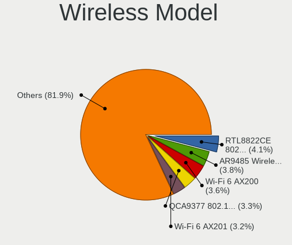

| Model                                                          | Computers | Percent |
|----------------------------------------------------------------|-----------|---------|
| Realtek RTL8822CE 802.11ac PCIe Wireless Network Adapter       | 92        | 4.09%   |
| Qualcomm Atheros AR9485 Wireless Network Adapter               | 86        | 3.83%   |
| Intel Wi-Fi 6 AX200                                            | 82        | 3.65%   |
| Qualcomm Atheros QCA9377 802.11ac Wireless Network Adapter     | 75        | 3.34%   |
| Intel Wi-Fi 6 AX201                                            | 71        | 3.16%   |
| Intel Comet Lake PCH CNVi WiFi                                 | 67        | 2.98%   |
| Qualcomm Atheros AR9285 Wireless Network Adapter (PCI-Express) | 65        | 2.89%   |
| MediaTek MT7921 802.11ax PCI Express Wireless Network Adapter  | 60        | 2.67%   |
| Realtek RTL8821CE 802.11ac PCIe Wireless Network Adapter       | 57        | 2.54%   |
| Realtek RTL8723BE PCIe Wireless Network Adapter                | 56        | 2.49%   |
| Intel Wireless 7265                                            | 56        | 2.49%   |
| Broadcom BCM4313 802.11bgn Wireless Network Adapter            | 56        | 2.49%   |
| Qualcomm Atheros QCA9565 / AR9565 Wireless Network Adapter     | 55        | 2.45%   |
| Intel Alder Lake-P PCH CNVi WiFi                               | 55        | 2.45%   |
| Intel Wireless 8265 / 8275                                     | 48        | 2.14%   |
| Intel Cannon Lake PCH CNVi WiFi                                | 42        | 1.87%   |
| Qualcomm Atheros QCA6174 802.11ac Wireless Network Adapter     | 39        | 1.73%   |
| Intel Comet Lake PCH-LP CNVi WiFi                              | 37        | 1.65%   |
| Ralink MT7601U Wireless Adapter                                | 34        | 1.51%   |
| Intel Tiger Lake PCH CNVi WiFi                                 | 34        | 1.51%   |
| Broadcom BCM43142 802.11b/g/n                                  | 34        | 1.51%   |
| Intel Dual Band Wireless-AC 3168NGW [Stone Peak]               | 33        | 1.47%   |
| Intel Dual Band Wireless-AC 3165 Plus Bluetooth                | 29        | 1.29%   |
| Realtek RTL8822BE 802.11a/b/g/n/ac WiFi adapter                | 26        | 1.16%   |
| Intel Wireless 7260                                            | 26        | 1.16%   |
| Intel Wireless 3160                                            | 25        | 1.11%   |
| Intel Centrino Advanced-N 6205 [Taylor Peak]                   | 24        | 1.07%   |
| Realtek RTL8852BE PCIe 802.11ax Wireless Network Controller    | 23        | 1.02%   |
| Ralink RT3290 Wireless 802.11n 1T/1R PCIe                      | 23        | 1.02%   |
| Intel Wireless 3165                                            | 23        | 1.02%   |
| Intel Raptor Lake PCH CNVi WiFi                                | 21        | 0.93%   |
| Intel Cannon Point-LP CNVi [Wireless-AC]                       | 20        | 0.89%   |
| MediaTek MT7922 802.11ax PCI Express Wireless Network Adapter  | 19        | 0.85%   |
| Intel Wireless 8260                                            | 19        | 0.85%   |
| Realtek RTL8723DE Wireless Network Adapter                     | 18        | 0.8%    |
| Realtek RTL8723AE PCIe Wireless Network Adapter                | 18        | 0.8%    |
| Ralink RT2870/RT3070 Wireless Adapter                          | 18        | 0.8%    |
| Qualcomm Atheros AR9271 802.11n                                | 18        | 0.8%    |
| Intel WiFi Link 5100                                           | 16        | 0.71%   |
| Intel Ice Lake-LP PCH CNVi WiFi                                | 16        | 0.71%   |

Ethernet Vendor
---------------

Ethernet vendors

| Vendor                                 | Computers | Percent |
|----------------------------------------|-----------|---------|
| Realtek Semiconductor                  | 1529      | 67.24%  |
| Intel                                  | 296       | 13.02%  |
| Qualcomm Atheros                       | 160       | 7.04%   |
| Broadcom                               | 86        | 3.78%   |
| Marvell Technology Group               | 34        | 1.5%    |
| Nvidia                                 | 22        | 0.97%   |
| Xiaomi                                 | 18        | 0.79%   |
| Samsung Electronics                    | 16        | 0.7%    |
| Silicon Integrated Systems [SiS]       | 14        | 0.62%   |
| Broadcom Limited                       | 13        | 0.57%   |
| ASIX Electronics                       | 12        | 0.53%   |
| MediaTek                               | 11        | 0.48%   |
| JMicron Technology                     | 7         | 0.31%   |
| Huawei Technologies                    | 7         | 0.31%   |
| Apple                                  | 6         | 0.26%   |
| ICS Advent                             | 5         | 0.22%   |
| Aquantia                               | 5         | 0.22%   |
| Qualcomm                               | 4         | 0.18%   |
| Microchip Technology                   | 4         | 0.18%   |
| TP-Link                                | 3         | 0.13%   |
| Attansic Technology                    | 3         | 0.13%   |
| Sony Ericsson Mobile Communications AB | 2         | 0.09%   |
| Raspberry Pi                           | 2         | 0.09%   |
| OPPO Electronics                       | 2         | 0.09%   |
| Motorola PCS                           | 2         | 0.09%   |
| Lenovo                                 | 2         | 0.09%   |
| VIA Technologies                       | 1         | 0.04%   |
| ULi Electronics                        | 1         | 0.04%   |
| T & A Mobile Phones                    | 1         | 0.04%   |
| OnePlus Technology (Shenzhen)          | 1         | 0.04%   |
| Mellanox Technologies                  | 1         | 0.04%   |
| LSI                                    | 1         | 0.04%   |
| Insyde Software                        | 1         | 0.04%   |
| HTC (High Tech Computer)               | 1         | 0.04%   |
| Davicom Semiconductor                  | 1         | 0.04%   |

Ethernet Model
--------------

Ethernet models

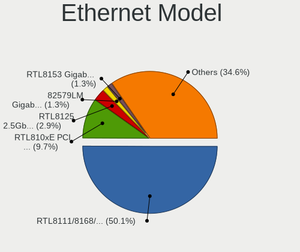

| Model                                                                          | Computers | Percent |
|--------------------------------------------------------------------------------|-----------|---------|
| Realtek RTL8111/8168/8211/8411 PCI Express Gigabit Ethernet Controller         | 1157      | 50.09%  |
| Realtek RTL810xE PCI Express Fast Ethernet controller                          | 225       | 9.74%   |
| Realtek RTL8125 2.5GbE Controller                                              | 67        | 2.9%    |
| Intel 82579LM Gigabit Network Connection (Lewisville)                          | 31        | 1.34%   |
| Realtek RTL8153 Gigabit Ethernet Adapter                                       | 30        | 1.3%    |
| Qualcomm Atheros AR8151 v2.0 Gigabit Ethernet                                  | 28        | 1.21%   |
| Qualcomm Atheros AR8131 Gigabit Ethernet                                       | 22        | 0.95%   |
| Intel Ethernet Connection (2) I219-V                                           | 22        | 0.95%   |
| Realtek RTL8152 Fast Ethernet Adapter                                          | 20        | 0.87%   |
| Intel I211 Gigabit Network Connection                                          | 20        | 0.87%   |
| Realtek Killer E2600 GbE Controller                                            | 17        | 0.74%   |
| Qualcomm Atheros AR8161 Gigabit Ethernet                                       | 17        | 0.74%   |
| Intel Ethernet Connection (4) I219-LM                                          | 17        | 0.74%   |
| Samsung Galaxy series, misc. (tethering mode)                                  | 16        | 0.69%   |
| Qualcomm Atheros QCA8171 Gigabit Ethernet                                      | 15        | 0.65%   |
| Silicon Integrated Systems [SiS] 191 Gigabit Ethernet Adapter                  | 14        | 0.61%   |
| Broadcom NetXtreme BCM57765 Gigabit Ethernet PCIe                              | 14        | 0.61%   |
| Broadcom NetLink BCM57785 Gigabit Ethernet PCIe                                | 13        | 0.56%   |
| Xiaomi Mi/Redmi series (RNDIS)                                                 | 12        | 0.52%   |
| Qualcomm Atheros AR8152 v1.1 Fast Ethernet                                     | 12        | 0.52%   |
| Intel Ethernet Connection (3) I218-LM                                          | 12        | 0.52%   |
| Intel 82579V Gigabit Network Connection                                        | 12        | 0.52%   |
| Qualcomm Atheros AR8152 v2.0 Fast Ethernet                                     | 11        | 0.48%   |
| Intel Ethernet Controller I225-V                                               | 11        | 0.48%   |
| Intel Ethernet Connection I217-LM                                              | 11        | 0.48%   |
| Qualcomm Atheros Killer E2500 Gigabit Ethernet Controller                      | 10        | 0.43%   |
| Intel Ethernet Connection I217-V                                               | 10        | 0.43%   |
| Realtek RTL-8100/8101L/8139 PCI Fast Ethernet Adapter                          | 9         | 0.39%   |
| Qualcomm Atheros Killer E2400 Gigabit Ethernet Controller                      | 9         | 0.39%   |
| Nvidia MCP61 Ethernet                                                          | 9         | 0.39%   |
| Intel Ethernet Connection (14) I219-V                                          | 9         | 0.39%   |
| Broadcom NetLink BCM5784M Gigabit Ethernet PCIe                                | 9         | 0.39%   |
| ASIX AX88179 Gigabit Ethernet                                                  | 9         | 0.39%   |
| MediaTek MT7922 802.11ax PCI Express Wireless Network Adapter                  | 8         | 0.35%   |
| Intel I210 Gigabit Network Connection                                          | 8         | 0.35%   |
| Intel Ethernet Connection (11) I219-V                                          | 8         | 0.35%   |
| Broadcom NetLink BCM57780 Gigabit Ethernet PCIe                                | 8         | 0.35%   |
| Qualcomm Atheros QCA8172 Fast Ethernet                                         | 7         | 0.3%    |
| Qualcomm Atheros AR8121/AR8113/AR8114 Gigabit or Fast Ethernet                 | 7         | 0.3%    |
| Marvell Group Yukon Optima 88E8059 [PCIe Gigabit Ethernet Controller with AVB] | 7         | 0.3%    |

Net Controller Kind
-------------------

Ethernet, WiFi or modem

| Kind     | Computers | Percent |
|----------|-----------|---------|
| Ethernet | 2178      | 50.24%  |
| WiFi     | 2118      | 48.86%  |
| Modem    | 33        | 0.76%   |
| Unknown  | 6         | 0.14%   |

Used Controller
---------------

Currently used network controller

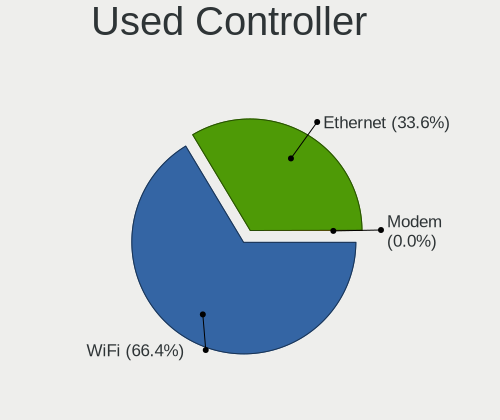

| Kind     | Computers | Percent |
|----------|-----------|---------|
| WiFi     | 1738      | 66.39%  |
| Ethernet | 879       | 33.58%  |
| Modem    | 1         | 0.04%   |

NICs
----

Total network controllers on board

| Total | Computers | Percent |
|-------|-----------|---------|
| 2     | 1563      | 60.37%  |
| 1     | 922       | 35.61%  |
| 0     | 73        | 2.82%   |
| 3     | 24        | 0.93%   |
| 4     | 4         | 0.15%   |
| 16    | 1         | 0.04%   |
| 7     | 1         | 0.04%   |
| 5     | 1         | 0.04%   |

IPv6
----

IPv6 vs IPv4

| Used | Computers | Percent |
|------|-----------|---------|
| No   | 2516      | 96.92%  |
| Yes  | 80        | 3.08%   |

Bluetooth
---------

Bluetooth Vendor
----------------

Controller vendors

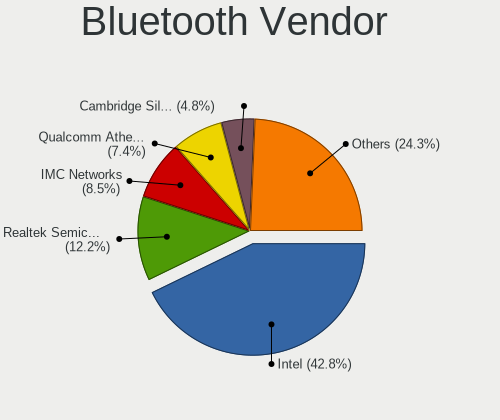

| Vendor                          | Computers | Percent |
|---------------------------------|-----------|---------|
| Intel                           | 779       | 42.8%   |
| Realtek Semiconductor           | 222       | 12.2%   |
| IMC Networks                    | 155       | 8.52%   |
| Qualcomm Atheros Communications | 134       | 7.36%   |
| Cambridge Silicon Radio         | 87        | 4.78%   |
| Foxconn / Hon Hai               | 69        | 3.79%   |
| Lite-On Technology              | 67        | 3.68%   |
| Broadcom                        | 66        | 3.63%   |
| Apple                           | 45        | 2.47%   |
| Realtek                         | 34        | 1.87%   |
| Toshiba                         | 30        | 1.65%   |
| ASUSTek Computer                | 28        | 1.54%   |
| Ralink                          | 23        | 1.26%   |
| Dell                            | 19        | 1.04%   |
| MediaTek                        | 14        | 0.77%   |
| Hewlett-Packard                 | 14        | 0.77%   |
| TP-Link                         | 10        | 0.55%   |
| Foxconn International           | 5         | 0.27%   |
| Ralink Technology               | 4         | 0.22%   |
| Marvell Semiconductor           | 3         | 0.16%   |
| Integrated System Solution      | 3         | 0.16%   |
| Alps Electric                   | 3         | 0.16%   |
| USI                             | 1         | 0.05%   |
| Qcom                            | 1         | 0.05%   |
| Logitech                        | 1         | 0.05%   |
| HTC (High Tech Computer)        | 1         | 0.05%   |
| Actions                         | 1         | 0.05%   |
| Unknown                         | 1         | 0.05%   |

Bluetooth Model
---------------

Controller models

| Model                                               | Computers | Percent |
|-----------------------------------------------------|-----------|---------|
| Intel Bluetooth wireless interface                  | 220       | 12.07%  |
| Intel AX201 Bluetooth                               | 215       | 11.8%   |
| Realtek Bluetooth Radio                             | 127       | 6.97%   |
| Intel Bluetooth 9460/9560 Jefferson Peak (JfP)      | 121       | 6.64%   |
| Cambridge Silicon Radio Bluetooth Dongle (HCI mode) | 87        | 4.77%   |
| Intel AX200 Bluetooth                               | 81        | 4.45%   |
| Qualcomm Atheros  Bluetooth Device                  | 61        | 3.35%   |
| IMC Networks Wireless_Device                        | 47        | 2.58%   |
| Intel AX211 Bluetooth                               | 46        | 2.52%   |
| IMC Networks Bluetooth Radio                        | 43        | 2.36%   |
| Realtek  Bluetooth 4.2 Adapter                      | 40        | 2.2%    |
| Realtek Bluetooth Radio                             | 34        | 1.87%   |
| Intel Wireless-AC 3168 Bluetooth                    | 31        | 1.7%    |
| Realtek 802.11ac WLAN Adapter                       | 26        | 1.43%   |
| Apple Bluetooth Host Controller                     | 26        | 1.43%   |
| Intel Centrino Bluetooth Wireless Transceiver       | 25        | 1.37%   |
| Ralink RT3290 Bluetooth                             | 23        | 1.26%   |
| Qualcomm Atheros AR3011 Bluetooth                   | 23        | 1.26%   |
| IMC Networks Bluetooth Device                       | 22        | 1.21%   |
| Qualcomm Atheros QCA61x4 Bluetooth 4.0              | 20        | 1.1%    |
| Lite-On Qualcomm Atheros QCA9377 Bluetooth          | 19        | 1.04%   |
| Qualcomm Atheros AR3012 Bluetooth 4.0               | 18        | 0.99%   |
| Foxconn / Hon Hai Wireless_Device                   | 18        | 0.99%   |
| Lite-On Bluetooth Device                            | 16        | 0.88%   |
| IMC Networks Atheros AR3012 Bluetooth 4.0 Adapter   | 16        | 0.88%   |
| Intel Wireless-AC 9260 Bluetooth Adapter            | 14        | 0.77%   |
| Intel AX210 Bluetooth                               | 14        | 0.77%   |
| Realtek RTL8822BE Bluetooth 4.2 Adapter             | 13        | 0.71%   |
| Apple Bluetooth USB Host Controller                 | 13        | 0.71%   |
| MediaTek Wireless_Device                            | 12        | 0.66%   |
| Lite-On Wireless_Device                             | 12        | 0.66%   |
| Intel Centrino Advanced-N 6230 Bluetooth adapter    | 12        | 0.66%   |
| IMC Networks Bluetooth USB Host Controller          | 12        | 0.66%   |
| Foxconn / Hon Hai MediaTek Bluetooth Adapter        | 12        | 0.66%   |
| IMC Networks Bluetooth                              | 11        | 0.6%    |
| Broadcom BCM2070 Bluetooth 2.1 + EDR                | 11        | 0.6%    |
| TP-Link TP-Link Bluetooth USB Adapter               | 10        | 0.55%   |
| Realtek RTL8723B Bluetooth                          | 9         | 0.49%   |
| Foxconn / Hon Hai Bluetooth USB Host Controller     | 9         | 0.49%   |
| HP Bluetooth 2.0 Interface [Broadcom BCM2045]       | 8         | 0.44%   |

Sound
-----

Sound Vendor
------------

Sound card vendors

| Vendor                                       | Computers | Percent |
|----------------------------------------------|-----------|---------|
| Intel                                        | 1862      | 52.75%  |
| AMD                                          | 776       | 21.98%  |
| Nvidia                                       | 655       | 18.56%  |
| C-Media Electronics                          | 30        | 0.85%   |
| Silicon Integrated Systems [SiS]             | 14        | 0.4%    |
| Generalplus Technology                       | 14        | 0.4%    |
| Logitech                                     | 13        | 0.37%   |
| Barco Display Systems                        | 13        | 0.37%   |
| SteelSeries ApS                              | 12        | 0.34%   |
| ASUSTek Computer                             | 12        | 0.34%   |
| Kingston Technology                          | 9         | 0.25%   |
| JMTek                                        | 9         | 0.25%   |
| Texas Instruments                            | 7         | 0.2%    |
| Creative Labs                                | 7         | 0.2%    |
| Tenx Technology                              | 6         | 0.17%   |
| Apple                                        | 6         | 0.17%   |
| VIA Technologies                             | 5         | 0.14%   |
| Hewlett-Packard                              | 5         | 0.14%   |
| GN Netcom                                    | 5         | 0.14%   |
| Realtek Semiconductor                        | 4         | 0.11%   |
| Micro Star International                     | 4         | 0.11%   |
| Focusrite-Novation                           | 4         | 0.11%   |
| Creative Technology                          | 4         | 0.11%   |
| Yamaha                                       | 3         | 0.08%   |
| Thesycon Systemsoftware & Consulting         | 3         | 0.08%   |
| Razer USA                                    | 3         | 0.08%   |
| M-Audio                                      | 3         | 0.08%   |
| Trust                                        | 2         | 0.06%   |
| Sony                                         | 2         | 0.06%   |
| LG Electronics                               | 2         | 0.06%   |
| GYROCOM C&C                                  | 2         | 0.06%   |
| Elite Silicon                                | 2         | 0.06%   |
| Corsair                                      | 2         | 0.06%   |
| Blue Microphones                             | 2         | 0.06%   |
| Zoran Co. Personal Media Division (Nogatech) | 1         | 0.03%   |
| Yealink Network Technology                   | 1         | 0.03%   |
| ULi Electronics                              | 1         | 0.03%   |
| Sennheiser Communications                    | 1         | 0.03%   |
| RODE Microphones                             | 1         | 0.03%   |
| QinHeng Electronics                          | 1         | 0.03%   |

Sound Model
-----------

Sound card models

| Model                                                                      | Computers | Percent |
|----------------------------------------------------------------------------|-----------|---------|
| AMD Family 17h/19h/1ah HD Audio Controller                                 | 324       | 7.7%    |
| Intel Sunrise Point-LP HD Audio                                            | 192       | 4.56%   |
| AMD Renoir Radeon High Definition Audio Controller                         | 174       | 4.13%   |
| Intel 6 Series/C200 Series Chipset Family High Definition Audio Controller | 163       | 3.87%   |
| Intel 7 Series/C216 Chipset Family High Definition Audio Controller        | 161       | 3.82%   |
| Intel 8 Series/C220 Series Chipset High Definition Audio Controller        | 97        | 2.3%    |
| Intel NM10/ICH7 Family High Definition Audio Controller                    | 91        | 2.16%   |
| Intel 5 Series/3400 Series Chipset High Definition Audio                   | 90        | 2.14%   |
| Intel Tiger Lake-LP Smart Sound Technology Audio Controller                | 89        | 2.11%   |
| Intel Comet Lake PCH cAVS                                                  | 79        | 1.88%   |
| Intel Cannon Lake PCH cAVS                                                 | 75        | 1.78%   |
| Intel Haswell-ULT HD Audio Controller                                      | 73        | 1.73%   |
| Intel 8 Series HD Audio Controller                                         | 73        | 1.73%   |
| AMD Raven/Raven2/Fenghuang HDMI/DP Audio Controller                        | 73        | 1.73%   |
| Intel Xeon E3-1200 v3/4th Gen Core Processor HD Audio Controller           | 70        | 1.66%   |
| Intel Alder Lake PCH-P High Definition Audio Controller                    | 70        | 1.66%   |
| Nvidia TU107 GeForce GTX 1650 High Definition Audio Controller             | 69        | 1.64%   |
| AMD Starship/Matisse HD Audio Controller                                   | 65        | 1.54%   |
| Nvidia GF108 High Definition Audio Controller                              | 64        | 1.52%   |
| Intel 82801I (ICH9 Family) HD Audio Controller                             | 61        | 1.45%   |
| AMD SBx00 Azalia (Intel HDA)                                               | 61        | 1.45%   |
| Nvidia GP107GL High Definition Audio Controller                            | 58        | 1.38%   |
| Intel 100 Series/C230 Series Chipset Family HD Audio Controller            | 58        | 1.38%   |
| Nvidia GA107 High Definition Audio Controller                              | 56        | 1.33%   |
| Intel Broadwell-U Audio Controller                                         | 56        | 1.33%   |
| Intel Wildcat Point-LP High Definition Audio Controller                    | 54        | 1.28%   |
| AMD Rembrandt Radeon High Definition Audio Controller                      | 54        | 1.28%   |
| AMD FCH Azalia Controller                                                  | 52        | 1.24%   |
| Intel Tiger Lake-H HD Audio Controller                                     | 51        | 1.21%   |
| Nvidia AD107 High Definition Audio Controller                              | 47        | 1.12%   |
| Intel Comet Lake PCH-LP cAVS                                               | 45        | 1.07%   |
| AMD Family 17h (Models 00h-0fh) HD Audio Controller                        | 45        | 1.07%   |
| Intel Cannon Point-LP High Definition Audio Controller                     | 44        | 1.05%   |
| Nvidia TU116 High Definition Audio Controller                              | 41        | 0.97%   |
| Intel Ice Lake-LP Smart Sound Technology Audio Controller                  | 39        | 0.93%   |
| Intel CM238 HD Audio Controller                                            | 39        | 0.93%   |
| Intel 200 Series PCH HD Audio                                              | 37        | 0.88%   |
| AMD Navi 21/23 HDMI/DP Audio Controller                                    | 37        | 0.88%   |
| Nvidia GA106 High Definition Audio Controller                              | 36        | 0.86%   |
| Intel Raptor Lake-P/U/H cAVS                                               | 35        | 0.83%   |

Memory
------

Memory Vendor
-------------

Memory module vendors

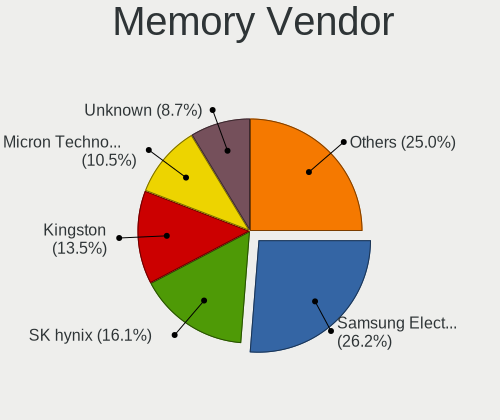

| Vendor              | Computers | Percent |
|---------------------|-----------|---------|
| Samsung Electronics | 441       | 26.25%  |
| SK hynix            | 270       | 16.07%  |
| Kingston            | 227       | 13.51%  |
| Micron Technology   | 176       | 10.48%  |
| Unknown             | 146       | 8.69%   |
| Crucial             | 89        | 5.3%    |
| Corsair             | 55        | 3.27%   |
| G.Skill             | 50        | 2.98%   |
| A-DATA Technology   | 39        | 2.32%   |
| Ramaxel Technology  | 28        | 1.67%   |
| Unknown             | 26        | 1.55%   |
| Nanya Technology    | 23        | 1.37%   |
| Elpida              | 17        | 1.01%   |
| Team                | 12        | 0.71%   |
| Transcend           | 8         | 0.48%   |
| Unknown (ABCD)      | 7         | 0.42%   |
| Goldkey             | 7         | 0.42%   |
| Apacer              | 7         | 0.42%   |
| Timetec             | 6         | 0.36%   |
| Hikvision           | 4         | 0.24%   |
| Neo Forza           | 3         | 0.18%   |
| ChangXin Memory     | 3         | 0.18%   |
| Avant               | 3         | 0.18%   |
| Patriot             | 2         | 0.12%   |
| Kllisre             | 2         | 0.12%   |
| Gold Key            | 2         | 0.12%   |
| ff                  | 2         | 0.12%   |
| ASint Technology    | 2         | 0.12%   |
| AMD                 | 2         | 0.12%   |
| 4ea5                | 2         | 0.12%   |
| 48spaces            | 2         | 0.12%   |
| Wilk                | 1         | 0.06%   |
| Unknown (F288)      | 1         | 0.06%   |
| Unknown (0x4509)    | 1         | 0.06%   |
| Unknown (0x29E)     | 1         | 0.06%   |
| Unknown (0B38)      | 1         | 0.06%   |
| Unknown (07FB)      | 1         | 0.06%   |
| Unifosa             | 1         | 0.06%   |
| Silicon Power       | 1         | 0.06%   |
| pqi                 | 1         | 0.06%   |

Memory Model
------------

Memory module models

| Model                                                          | Computers | Percent |
|----------------------------------------------------------------|-----------|---------|
| Samsung RAM M471A1G44AB0-CWE 8GB SODIMM DDR4 3200MT/s          | 28        | 1.55%   |
| Unknown                                                        | 26        | 1.44%   |
| Samsung RAM M471A1K43DB1-CWE 8GB SODIMM DDR4 3200MT/s          | 20        | 1.11%   |
| Samsung RAM M471A1K43CB1-CTD 8GB SODIMM DDR4 2667MT/s          | 18        | 1%      |
| Samsung RAM M471A1K43EB1-CWE 8GB SODIMM DDR4 3200MT/s          | 17        | 0.94%   |
| Samsung RAM M471B5173DB0-YK0 4GB SODIMM DDR3 1600MT/s          | 15        | 0.83%   |
| Samsung RAM M471A5244CB0-CRC 4GB SODIMM DDR4 2667MT/s          | 15        | 0.83%   |
| SK hynix RAM HMT41GS6BFR8A-PB 8GB SODIMM DDR3 1600MT/s         | 14        | 0.78%   |
| Samsung RAM M471A5244CB0-CWE 4096MB Row Of Chips DDR4 3200MT/s | 14        | 0.78%   |
| SK hynix RAM HMAA1GS6CJR6N-XN 8GB SODIMM DDR4 3200MT/s         | 13        | 0.72%   |
| Samsung RAM M471B5173EB0-YK0 4GB SODIMM DDR3 1600MT/s          | 13        | 0.72%   |
| SK hynix RAM HMT451S6BFR8A-PB 4GB SODIMM DDR3 1600MT/s         | 12        | 0.67%   |
| Samsung RAM M471B1G73QH0-YK0 8GB SODIMM DDR3 1600MT/s          | 11        | 0.61%   |
| Samsung RAM M471A1K43CB1-CRC 8GB SODIMM DDR4 2667MT/s          | 11        | 0.61%   |
| Samsung RAM M471A1G44AB0-CWE 8GB Row Of Chips DDR4 3200MT/s    | 11        | 0.61%   |
| SK hynix RAM HMAA1GS6CJR6N-XN 8GB Row Of Chips DDR4 3200MT/s   | 10        | 0.56%   |
| Samsung RAM M471A5244CB0-CWE 4096MB SODIMM DDR4 3200MT/s       | 10        | 0.56%   |
| Samsung RAM M471A1G44BB0-CWE 8GB SODIMM DDR4 3200MT/s          | 10        | 0.56%   |
| SK hynix RAM Module 4GB SODIMM DDR3 1600MT/s                   | 9         | 0.5%    |
| SK hynix RAM HMA851S6AFR6N-UH 4GB SODIMM DDR4 2667MT/s         | 9         | 0.5%    |
| SK hynix RAM HMA81GS6JJR8N-VK 8GB SODIMM DDR4 2667MT/s         | 9         | 0.5%    |
| SK hynix RAM HMA81GS6DJR8N-XN 8GB SODIMM DDR4 3200MT/s         | 9         | 0.5%    |
| SK hynix RAM HMA81GS6AFR8N-UH 8GB SODIMM DDR4 2667MT/s         | 9         | 0.5%    |
| Samsung RAM M471B5773CHS-CH9 2GB SODIMM DDR3 4199MT/s          | 9         | 0.5%    |
| Samsung RAM M471A2K43DB1-CWE 16GB SODIMM DDR4 3200MT/s         | 9         | 0.5%    |
| Micron RAM 8ATF1G64HZ-2G3B1 8GB SODIMM DDR4 2400MT/s           | 9         | 0.5%    |
| Unknown RAM Module 4GB SODIMM DDR3                             | 8         | 0.44%   |
| SK hynix RAM HMA851S6CJR6N-VK 4GB SODIMM DDR4 2667MT/s         | 8         | 0.44%   |
| SK hynix RAM HMA81GS6CJR8N-VK 8GB SODIMM DDR4 2667MT/s         | 8         | 0.44%   |
| Samsung RAM M471B1G73DB0-YK0 8GB SODIMM DDR3 1600MT/s          | 8         | 0.44%   |
| Samsung RAM M471A1K43DB1-CTD 8GB SODIMM DDR4 2667MT/s          | 8         | 0.44%   |
| Samsung RAM M425R1GB4BB0-CQKOL 8GB SODIMM DDR5 4800MT/s        | 8         | 0.44%   |
| Micron RAM 4ATF51264HZ-2G6E1 4GB SODIMM DDR4 2667MT/s          | 8         | 0.44%   |
| SK hynix RAM HMA851S6DJR6N-XN 4GB SODIMM DDR4 3200MT/s         | 7         | 0.39%   |
| Samsung RAM M471A2K43CB1-CRC 16GB SODIMM DDR4 2667MT/s         | 7         | 0.39%   |
| Micron RAM 8ATF1G64HZ-3G2J1 8GB SODIMM DDR4 3200MT/s           | 7         | 0.39%   |
| Micron RAM 4ATF1G64HZ-3G2F1 8GB SODIMM DDR4 3200MT/s           | 7         | 0.39%   |
| Micron RAM 4ATF1G64HZ-3G2E1 8GB SODIMM DDR4 3200MT/s           | 7         | 0.39%   |
| Micron RAM 4ATF1G64HZ-3G2E1 8GB Row Of Chips DDR4 3200MT/s     | 7         | 0.39%   |
| Unknown RAM Module 4GB DIMM SDRAM                              | 6         | 0.33%   |

Memory Kind
-----------

Memory module kinds

| Kind    | Computers | Percent |
|---------|-----------|---------|
| DDR4    | 739       | 52.08%  |
| DDR3    | 390       | 27.48%  |
| DDR5    | 54        | 3.81%   |
| LPDDR4  | 52        | 3.66%   |
| SDRAM   | 40        | 2.82%   |
| DDR2    | 39        | 2.75%   |
| Unknown | 38        | 2.68%   |
| LPDDR3  | 27        | 1.9%    |
| LPDDR5  | 26        | 1.83%   |
| DDR     | 9         | 0.63%   |
| DRAM    | 4         | 0.28%   |
| EEPROM  | 1         | 0.07%   |

Memory Form Factor
------------------

Physical design of the memory module

| Name         | Computers | Percent |
|--------------|-----------|---------|
| SODIMM       | 965       | 68.34%  |
| DIMM         | 301       | 21.32%  |
| Row Of Chips | 137       | 9.7%    |
| Unknown      | 5         | 0.35%   |
| Chip         | 3         | 0.21%   |
| RIMM         | 1         | 0.07%   |

Memory Size
-----------

Memory module size

| Size    | Computers | Percent |
|---------|-----------|---------|
| 8192    | 625       | 39.48%  |
| 4096    | 412       | 26.03%  |
| 16384   | 256       | 16.17%  |
| 2048    | 167       | 10.55%  |
| 32768   | 64        | 4.04%   |
| 1024    | 46        | 2.91%   |
| 512     | 5         | 0.32%   |
| 1536    | 2         | 0.13%   |
| 65536   | 1         | 0.06%   |
| 49152   | 1         | 0.06%   |
| 24576   | 1         | 0.06%   |
| 256     | 1         | 0.06%   |
| 1       | 1         | 0.06%   |
| Unknown | 1         | 0.06%   |

Memory Speed
------------

Memory module speed

| Speed   | Computers | Percent |
|---------|-----------|---------|
| 3200    | 362       | 23.66%  |
| 1600    | 253       | 16.54%  |
| 2667    | 237       | 15.49%  |
| 2400    | 102       | 6.67%   |
| 1333    | 63        | 4.12%   |
| 2133    | 53        | 3.46%   |
| 1334    | 50        | 3.27%   |
| Unknown | 47        | 3.07%   |
| 3600    | 35        | 2.29%   |
| 667     | 29        | 1.9%    |
| 4800    | 27        | 1.76%   |
| 6400    | 23        | 1.5%    |
| 1867    | 22        | 1.44%   |
| 800     | 22        | 1.44%   |
| 1067    | 20        | 1.31%   |
| 4267    | 18        | 1.18%   |
| 4199    | 17        | 1.11%   |
| 5600    | 16        | 1.05%   |
| 3733    | 9         | 0.59%   |
| 3000    | 9         | 0.59%   |
| 4266    | 8         | 0.52%   |
| 3400    | 7         | 0.46%   |
| 3266    | 7         | 0.46%   |
| 4000    | 6         | 0.39%   |
| 3466    | 6         | 0.39%   |
| 1066    | 6         | 0.39%   |
| 8400    | 5         | 0.33%   |
| 6000    | 5         | 0.33%   |
| 2933    | 5         | 0.33%   |
| 2048    | 5         | 0.33%   |
| 1866    | 5         | 0.33%   |
| 400     | 5         | 0.33%   |
| 3066    | 4         | 0.26%   |
| 975     | 4         | 0.26%   |
| 3800    | 3         | 0.2%    |
| 2800    | 3         | 0.2%    |
| 1639    | 3         | 0.2%    |
| 533     | 3         | 0.2%    |
| 8533    | 2         | 0.13%   |
| 7467    | 2         | 0.13%   |

Printers & scanners
-------------------

Printer Vendor
--------------

Printer device vendors

| Vendor              | Computers | Percent |
|---------------------|-----------|---------|
| Hewlett-Packard     | 16        | 31.37%  |
| Canon               | 14        | 27.45%  |
| Seiko Epson         | 7         | 13.73%  |
| Zebra               | 4         | 7.84%   |
| Samsung Electronics | 4         | 7.84%   |
| Oki Data            | 2         | 3.92%   |
| Brother Industries  | 2         | 3.92%   |
| XiaoMi              | 1         | 1.96%   |
| QinHeng Electronics | 1         | 1.96%   |

Printer Model
-------------

Printer device models

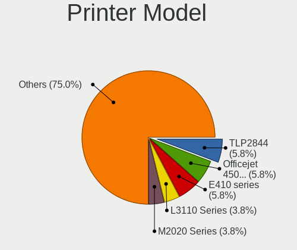

| Model                                | Computers | Percent |
|--------------------------------------|-----------|---------|
| Zebra TLP2844                        | 3         | 5.77%   |
| HP Officejet 4500 G510g-m            | 3         | 5.77%   |
| Canon E410 series                    | 3         | 5.77%   |
| Seiko Epson L3110 Series             | 2         | 3.85%   |
| Samsung M2020 Series                 | 2         | 3.85%   |
| HP LaserJet P2055 series             | 2         | 3.85%   |
| HP LaserJet M101-M106                | 2         | 3.85%   |
| HP LaserJet 1010                     | 2         | 3.85%   |
| Canon LBP6030/6030B/6018L            | 2         | 3.85%   |
| Canon CAPT USB Device                | 2         | 3.85%   |
| Zebra Zebra GC420d Label Printer     | 1         | 1.92%   |
| XiaoMi MIIIW MECH-KBPro              | 1         | 1.92%   |
| Seiko Epson L386 Series              | 1         | 1.92%   |
| Seiko Epson L382 Series              | 1         | 1.92%   |
| Seiko Epson L3150 Series             | 1         | 1.92%   |
| Seiko Epson L210 Series              | 1         | 1.92%   |
| Seiko Epson FX-2190IIN               | 1         | 1.92%   |
| Samsung ML-216x Series Laser Printer | 1         | 1.92%   |
| Samsung CLP-325 Color Laser Printer  | 1         | 1.92%   |
| QinHeng CH340S                       | 1         | 1.92%   |
| Oki Data Oki_ML3320                  | 1         | 1.92%   |
| Oki Data Oki Printer                 | 1         | 1.92%   |
| HP LaserJet P1102                    | 1         | 1.92%   |
| HP LaserJet 1020                     | 1         | 1.92%   |
| HP DeskJet Plus 4100 series          | 1         | 1.92%   |
| HP DeskJet F2100 Printer series      | 1         | 1.92%   |
| HP DeskJet 3830 series               | 1         | 1.92%   |
| HP DeskJet 2620 All-in-One Printer   | 1         | 1.92%   |
| HP DeskJet 2130 series               | 1         | 1.92%   |
| HP Deskjet 1050 J410                 | 1         | 1.92%   |
| Canon PIXMA MX340                    | 1         | 1.92%   |
| Canon PIXMA MG3000 series            | 1         | 1.92%   |
| Canon LBP6000                        | 1         | 1.92%   |
| Canon imageRUNNER1133 series         | 1         | 1.92%   |
| Canon G3020 series                   | 1         | 1.92%   |
| Canon G3010 series                   | 1         | 1.92%   |
| Canon E460 series                    | 1         | 1.92%   |
| Brother Printer                      | 1         | 1.92%   |
| Brother DCP-1510                     | 1         | 1.92%   |

Scanner Vendor
--------------

Scanner device vendors

| Vendor         | Computers | Percent |
|----------------|-----------|---------|
| Mustek Systems | 1         | 50%     |
| Canon          | 1         | 50%     |

Scanner Model
-------------

Scanner device models

| Model                              | Computers | Percent |
|------------------------------------|-----------|---------|
| Mustek Systems ScanExpress 1200 UB | 1         | 50%     |
| Canon CanoScan LiDE 210            | 1         | 50%     |

Camera
------

Camera Vendor
-------------

Camera device vendors

| Vendor                                 | Computers | Percent |
|----------------------------------------|-----------|---------|
| Chicony Electronics                    | 422       | 23.2%   |
| IMC Networks                           | 208       | 11.43%  |
| Realtek Semiconductor                  | 138       | 7.59%   |
| Quanta                                 | 134       | 7.37%   |
| Bison Electronics                      | 115       | 6.32%   |
| Microdia                               | 106       | 5.83%   |
| Cheng Uei Precision Industry (Foxlink) | 83        | 4.56%   |
| Sunplus Innovation Technology          | 67        | 3.68%   |
| Acer                                   | 60        | 3.3%    |
| Syntek                                 | 57        | 3.13%   |
| Luxvisions Innotech Limited            | 50        | 2.75%   |
| Apple                                  | 44        | 2.42%   |
| Suyin                                  | 39        | 2.14%   |
| Logitech                               | 34        | 1.87%   |
| Silicon Motion                         | 30        | 1.65%   |
| Sonix Technology                       | 25        | 1.37%   |
| Alcor Micro                            | 25        | 1.37%   |
| Lite-On Technology                     | 23        | 1.26%   |
| Z-Star Microelectronics                | 20        | 1.1%    |
| Samsung Electronics                    | 13        | 0.71%   |
| Ricoh                                  | 12        | 0.66%   |
| Importek                               | 10        | 0.55%   |
| ALi                                    | 8         | 0.44%   |
| ShineTech                              | 6         | 0.33%   |
| Sunwingroup                            | 4         | 0.22%   |
| SunplusIT                              | 4         | 0.22%   |
| Novatek Microelectronics               | 4         | 0.22%   |
| MacroSilicon                           | 4         | 0.22%   |
| Genesys Logic                          | 4         | 0.22%   |
| Foxconn / Hon Hai                      | 4         | 0.22%   |
| BTF-230906-J                           | 4         | 0.22%   |
| SenseTek                               | 3         | 0.16%   |
| Microsoft                              | 3         | 0.16%   |
| LG Electronics                         | 3         | 0.16%   |
| Lenovo                                 | 3         | 0.16%   |
| kingcome                               | 3         | 0.16%   |
| Jieli Technology                       | 3         | 0.16%   |
| Generalplus Technology                 | 3         | 0.16%   |
| DigiTech                               | 3         | 0.16%   |
| Arkmicro Technologies                  | 3         | 0.16%   |

Camera Model
------------

Camera device models

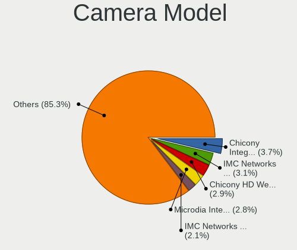

| Model                                                | Computers | Percent |
|------------------------------------------------------|-----------|---------|
| Chicony Integrated Camera                            | 68        | 3.72%   |
| IMC Networks Integrated Camera                       | 56        | 3.06%   |
| Chicony HD WebCam                                    | 53        | 2.9%    |
| Microdia Integrated_Webcam_HD                        | 52        | 2.84%   |
| IMC Networks USB2.0 HD UVC WebCam                    | 39        | 2.13%   |
| Syntek Integrated Camera                             | 33        | 1.8%    |
| Realtek Integrated_Webcam_HD                         | 32        | 1.75%   |
| IMC Networks USB2.0 VGA UVC WebCam                   | 31        | 1.69%   |
| Bison Integrated Camera                              | 28        | 1.53%   |
| IMC Networks HD Camera                               | 25        | 1.37%   |
| Chicony USB2.0 VGA UVC WebCam                        | 23        | 1.26%   |
| Acer Integrated Camera                               | 22        | 1.2%    |
| Quanta HD User Facing                                | 18        | 0.98%   |
| Quanta ACER HD User Facing                           | 18        | 0.98%   |
| Chicony USB2.0 HD UVC WebCam                         | 18        | 0.98%   |
| Chicony HP HD Camera                                 | 17        | 0.93%   |
| Bison HD Webcam                                      | 17        | 0.93%   |
| Sonix USB2.0 HD UVC WebCam                           | 16        | 0.87%   |
| Apple iPhone 5/5C/5S/6/SE/7/8/X/XR                   | 16        | 0.87%   |
| Quanta USB HD Webcam                                 | 15        | 0.82%   |
| Chicony USB2.0 Camera                                | 15        | 0.82%   |
| Realtek USB2.0 VGA UVC WebCam                        | 14        | 0.77%   |
| Luxvisions Innotech Limited HP Wide Vision HD Camera | 14        | 0.77%   |
| Chicony USB 2.0 Camera                               | 14        | 0.77%   |
| Chicony TOSHIBA Web Camera - HD                      | 14        | 0.77%   |
| Chicony EasyCamera                                   | 14        | 0.77%   |
| Bison Lenovo EasyCamera                              | 14        | 0.77%   |
| Sunplus Integrated_Webcam_HD                         | 13        | 0.71%   |
| Samsung Galaxy series, misc. (MTP mode)              | 13        | 0.71%   |
| Quanta HP Wide Vision HD Camera                      | 13        | 0.71%   |
| Quanta HP TrueVision HD Camera                       | 13        | 0.71%   |
| IMC Networks ov9734_azurewave_camera                 | 13        | 0.71%   |
| Acer BisonCam,NB Pro                                 | 13        | 0.71%   |
| Realtek USB Camera                                   | 12        | 0.66%   |
| Chicony HP Webcam                                    | 12        | 0.66%   |
| Chicony HD User Facing                               | 12        | 0.66%   |
| Bison SunplusIT Integrated Camera                    | 12        | 0.66%   |
| Sunplus Asus Webcam                                  | 11        | 0.6%    |
| Realtek USB2.0 HD UVC WebCam                         | 11        | 0.6%    |
| Luxvisions Innotech Limited Integrated Camera        | 11        | 0.6%    |

Security
--------

Fingerprint Vendor
------------------

Fingerprint sensor vendors

| Vendor                             | Computers | Percent |
|------------------------------------|-----------|---------|
| Shenzhen Goodix Technology         | 96        | 38.87%  |
| Synaptics                          | 61        | 24.7%   |
| Validity Sensors                   | 44        | 17.81%  |
| LighTuning Technology              | 18        | 7.29%   |
| AuthenTec                          | 11        | 4.45%   |
| Upek                               | 9         | 3.64%   |
| Elan Microelectronics              | 6         | 2.43%   |
| Realtek USB2.0 Finger Print Bridge | 2         | 0.81%   |

Fingerprint Model
-----------------

Fingerprint sensor models

| Model                                                                      | Computers | Percent |
|----------------------------------------------------------------------------|-----------|---------|
| Shenzhen Goodix  Fingerprint Device                                        | 74        | 29.96%  |
| Shenzhen Goodix Fingerprint Reader                                         | 21        | 8.5%    |
| Synaptics Prometheus MIS Touch Fingerprint Reader                          | 16        | 6.48%   |
| Validity Sensors VFS495 Fingerprint Reader                                 | 12        | 4.86%   |
| Upek Biometric Touchchip/Touchstrip Fingerprint Sensor                     | 9         | 3.64%   |
| Synaptics Metallica MIS Touch Fingerprint Reader                           | 9         | 3.64%   |
| LighTuning ES603 Swipe Fingerprint Sensor                                  | 9         | 3.64%   |
| Synaptics  WBDI                                                            | 8         | 3.24%   |
| LighTuning EgisTec Touch Fingerprint Sensor                                | 8         | 3.24%   |
| Validity Sensors VFS5011 Fingerprint Reader                                | 6         | 2.43%   |
| Validity Sensors VFS 5011 fingerprint sensor                               | 6         | 2.43%   |
| Validity Sensors Fingerprint scanner                                       | 6         | 2.43%   |
| Synaptics WBDI Fingerprint Reader USB 086                                  | 6         | 2.43%   |
| Synaptics WBDI                                                             | 5         | 2.02%   |
| Synaptics UWP WBDI                                                         | 4         | 1.62%   |
| Synaptics  FS7604 Touch Fingerprint Sensor with PurePrint                  | 4         | 1.62%   |
| AuthenTec AES2810                                                          | 4         | 1.62%   |
| Validity Sensors VFS491                                                    | 3         | 1.21%   |
| Validity Sensors VFS451 Fingerprint Reader                                 | 3         | 1.21%   |
| Validity Sensors Synaptics WBDI                                            | 3         | 1.21%   |
| Synaptics Metallica MOH Touch Fingerprint Reader                           | 3         | 1.21%   |
| Elan ELAN:Fingerprint                                                      | 3         | 1.21%   |
| Elan ELAN:ARM-M4                                                           | 3         | 1.21%   |
| AuthenTec AES2501 Fingerprint Sensor                                       | 3         | 1.21%   |
| AuthenTec AES1600                                                          | 3         | 1.21%   |
| Validity Sensors Synaptics VFS7552 Touch Fingerprint Sensor with PurePrint | 2         | 0.81%   |
| Synaptics Prometheus Fingerprint Reader                                    | 2         | 0.81%   |
| Synaptics Fingerprint reader [HP G6]                                       | 2         | 0.81%   |
| Realtek USB2.0 Finger Print Bridge FocalTech Fingerprint Device            | 2         | 0.81%   |
| Validity Sensors VFS101 Fingerprint Reader                                 | 1         | 0.4%    |
| Validity Sensors VFS Fingerprint sensor                                    | 1         | 0.4%    |
| Validity Sensors Synaptics VFS7552 Touch Fingerprint Sensor                | 1         | 0.4%    |
| Synaptics UWP WBDI Device                                                  | 1         | 0.4%    |
| Synaptics FS7604 Touch Fingerprint Sensor with PurePrint                   | 1         | 0.4%    |
| Shenzhen Goodix FingerPrint                                                | 1         | 0.4%    |
| LighTuning Fingerprint Reader                                              | 1         | 0.4%    |
| AuthenTec AES1660 Fingerprint Sensor                                       | 1         | 0.4%    |

Chipcard Vendor
---------------

Chipcard module vendors

| Vendor                    | Computers | Percent |
|---------------------------|-----------|---------|
| Broadcom                  | 24        | 37.5%   |
| Alcor Micro               | 23        | 35.94%  |
| Advanced Card Systems     | 6         | 9.38%   |
| Upek                      | 3         | 4.69%   |
| Lenovo                    | 3         | 4.69%   |
| O2 Micro                  | 2         | 3.13%   |
| Gemalto (was Gemplus)     | 2         | 3.13%   |
| SANHO Digital Electronics | 1         | 1.56%   |

Chipcard Model
--------------

Chipcard module models

| Model                                                                        | Computers | Percent |
|------------------------------------------------------------------------------|-----------|---------|
| Alcor Micro AU9540 Smartcard Reader                                          | 23        | 35.94%  |
| Broadcom BCM5880 Secure Applications Processor with fingerprint swipe sensor | 8         | 12.5%   |
| Broadcom 58200                                                               | 7         | 10.94%  |
| Broadcom BCM5880 Secure Applications Processor                               | 6         | 9.38%   |
| Upek TouchChip Fingerprint Coprocessor (WBF advanced mode)                   | 3         | 4.69%   |
| Lenovo Integrated Smart Card Reader                                          | 3         | 4.69%   |
| Broadcom 5880                                                                | 3         | 4.69%   |
| Advanced Card Systems ACR39U                                                 | 3         | 4.69%   |
| Advanced Card Systems ACR38 SmartCard Reader                                 | 3         | 4.69%   |
| O2 Micro OZ776 CCID Smartcard Reader                                         | 2         | 3.13%   |
| Gemalto (was Gemplus) GemPC Key SmartCard Reader                             | 2         | 3.13%   |
| SANHO Digital Electronics ATR19                                              | 1         | 1.56%   |

Unsupported
-----------

Unsupported Devices
-------------------

Total unsupported devices on board

| Total | Computers | Percent |
|-------|-----------|---------|
| 0     | 1835      | 68.88%  |
| 1     | 660       | 24.77%  |
| 2     | 142       | 5.33%   |
| 3     | 16        | 0.6%    |
| 4     | 6         | 0.23%   |
| 6     | 2         | 0.08%   |
| 5     | 2         | 0.08%   |
| 9     | 1         | 0.04%   |

Unsupported Device Types
------------------------

Types of unsupported devices

| Type                     | Computers | Percent |
|--------------------------|-----------|---------|
| Graphics card            | 313       | 31.49%  |
| Fingerprint reader       | 247       | 24.85%  |
| Net/wireless             | 84        | 8.45%   |
| Multimedia controller    | 75        | 7.55%   |
| Camera                   | 66        | 6.64%   |
| Chipcard                 | 53        | 5.33%   |
| Communication controller | 40        | 4.02%   |
| Bluetooth                | 39        | 3.92%   |
| Net/ethernet             | 19        | 1.91%   |
| Sound                    | 16        | 1.61%   |
| Storage                  | 10        | 1.01%   |
| Unassigned class         | 8         | 0.8%    |
| Network                  | 8         | 0.8%    |
| Card reader              | 6         | 0.6%    |
| Storage/raid             | 3         | 0.3%    |
| Storage/ata              | 2         | 0.2%    |
| Flash memory             | 2         | 0.2%    |
| Wireless                 | 1         | 0.1%    |
| Storage/ide              | 1         | 0.1%    |
| Modem                    | 1         | 0.1%    |

