Linux in Turkey - Tested Hardware & Statistics
----------------------------------------------

A project to collect tested hardware configurations for Linux in Turkey.

Anyone can contribute to this report by the [hw-probe](https://github.com/linuxhw/hw-probe) tool:

    sudo -E hw-probe -all -upload

Please contribute! Especially if your hardware is rare.

This is a report for all computer types. See also reports for [desktops](/Location/Turkey/Desktop/README.md) and [notebooks](/Location/Turkey/Notebook/README.md).

Contents
--------

* [ Test Cases ](#test-cases)

* [ System ](#system)
  - [ OS                       ](#os)
  - [ OS Family                ](#os-family)
  - [ Kernel                   ](#kernel)
  - [ Kernel Family            ](#kernel-family)
  - [ Kernel Major Ver.        ](#kernel-major-ver)
  - [ Arch                     ](#arch)
  - [ DE                       ](#de)
  - [ Display Server           ](#display-server)
  - [ Display Manager          ](#display-manager)
  - [ OS Lang                  ](#os-lang)
  - [ Boot Mode                ](#boot-mode)
  - [ Filesystem               ](#filesystem)
  - [ Part. scheme             ](#part-scheme)
  - [ Dual Boot with Linux/BSD ](#dual-boot-with-linuxbsd)
  - [ Dual Boot (Win)          ](#dual-boot-win)

* [ Board ](#board)
  - [ Vendor                   ](#vendor)
  - [ Model                    ](#model)
  - [ Model Family             ](#model-family)
  - [ MFG Year                 ](#mfg-year)
  - [ Form Factor              ](#form-factor)
  - [ Secure Boot              ](#secure-boot)
  - [ Coreboot                 ](#coreboot)
  - [ RAM Size                 ](#ram-size)
  - [ RAM Used                 ](#ram-used)
  - [ Total Drives             ](#total-drives)
  - [ Has CD-ROM               ](#has-cd-rom)
  - [ Has Ethernet             ](#has-ethernet)
  - [ Has WiFi                 ](#has-wifi)
  - [ Has Bluetooth            ](#has-bluetooth)

* [ Location ](#location)
  - [ Country                  ](#country)
  - [ City                     ](#city)

* [ Drives ](#drives)
  - [ Drive Vendor             ](#drive-vendor)
  - [ Drive Model              ](#drive-model)
  - [ HDD Vendor               ](#hdd-vendor)
  - [ SSD Vendor               ](#ssd-vendor)
  - [ Drive Kind               ](#drive-kind)
  - [ Drive Connector          ](#drive-connector)
  - [ Drive Size               ](#drive-size)
  - [ Space Total              ](#space-total)
  - [ Space Used               ](#space-used)
  - [ Malfunc. Drives          ](#malfunc-drives)
  - [ Malfunc. Drive Vendor    ](#malfunc-drive-vendor)
  - [ Malfunc. HDD Vendor      ](#malfunc-hdd-vendor)
  - [ Malfunc. Drive Kind      ](#malfunc-drive-kind)
  - [ Failed Drives            ](#failed-drives)
  - [ Failed Drive Vendor      ](#failed-drive-vendor)
  - [ Drive Status             ](#drive-status)

* [ Storage controller ](#storage-controller)
  - [ Storage Vendor           ](#storage-vendor)
  - [ Storage Model            ](#storage-model)
  - [ Storage Kind             ](#storage-kind)

* [ Processor ](#processor)
  - [ CPU Vendor               ](#cpu-vendor)
  - [ CPU Model                ](#cpu-model)
  - [ CPU Model Family         ](#cpu-model-family)
  - [ CPU Cores                ](#cpu-cores)
  - [ CPU Sockets              ](#cpu-sockets)
  - [ CPU Threads              ](#cpu-threads)
  - [ CPU Op-Modes             ](#cpu-op-modes)
  - [ CPU Microcode            ](#cpu-microcode)
  - [ CPU Microarch            ](#cpu-microarch)

* [ Graphics ](#graphics)
  - [ GPU Vendor               ](#gpu-vendor)
  - [ GPU Model                ](#gpu-model)
  - [ GPU Combo                ](#gpu-combo)
  - [ GPU Driver               ](#gpu-driver)
  - [ GPU Memory               ](#gpu-memory)

* [ Monitor ](#monitor)
  - [ Monitor Vendor           ](#monitor-vendor)
  - [ Monitor Model            ](#monitor-model)
  - [ Monitor Resolution       ](#monitor-resolution)
  - [ Monitor Diagonal         ](#monitor-diagonal)
  - [ Monitor Width            ](#monitor-width)
  - [ Aspect Ratio             ](#aspect-ratio)
  - [ Monitor Area             ](#monitor-area)
  - [ Pixel Density            ](#pixel-density)
  - [ Multiple Monitors        ](#multiple-monitors)

* [ Network ](#network)
  - [ Net Controller Vendor    ](#net-controller-vendor)
  - [ Net Controller Model     ](#net-controller-model)
  - [ Wireless Vendor          ](#wireless-vendor)
  - [ Wireless Model           ](#wireless-model)
  - [ Ethernet Vendor          ](#ethernet-vendor)
  - [ Ethernet Model           ](#ethernet-model)
  - [ Net Controller Kind      ](#net-controller-kind)
  - [ Used Controller          ](#used-controller)
  - [ NICs                     ](#nics)
  - [ IPv6                     ](#ipv6)

* [ Bluetooth ](#bluetooth)
  - [ Bluetooth Vendor         ](#bluetooth-vendor)
  - [ Bluetooth Model          ](#bluetooth-model)

* [ Sound ](#sound)
  - [ Sound Vendor             ](#sound-vendor)
  - [ Sound Model              ](#sound-model)

* [ Memory ](#memory)
  - [ Memory Vendor            ](#memory-vendor)
  - [ Memory Model             ](#memory-model)
  - [ Memory Kind              ](#memory-kind)
  - [ Memory Form Factor       ](#memory-form-factor)
  - [ Memory Size              ](#memory-size)
  - [ Memory Speed             ](#memory-speed)

* [ Printers & scanners ](#printers--scanners)
  - [ Printer Vendor           ](#printer-vendor)
  - [ Printer Model            ](#printer-model)
  - [ Scanner Vendor           ](#scanner-vendor)
  - [ Scanner Model            ](#scanner-model)

* [ Camera ](#camera)
  - [ Camera Vendor            ](#camera-vendor)
  - [ Camera Model             ](#camera-model)

* [ Security ](#security)
  - [ Fingerprint Vendor       ](#fingerprint-vendor)
  - [ Fingerprint Model        ](#fingerprint-model)
  - [ Chipcard Vendor          ](#chipcard-vendor)
  - [ Chipcard Model           ](#chipcard-model)

* [ Unsupported ](#unsupported)
  - [ Unsupported Devices      ](#unsupported-devices)
  - [ Unsupported Device Types ](#unsupported-device-types)

Test Cases
----------

Total: 2978

| Vendor        | Model                       | Form-Factor | Probe                                                      | Date         |
|---------------|-----------------------------|-------------|------------------------------------------------------------|--------------|
| Lenovo        | G50-70 20351                | Notebook    | [3ac6a566ab](https://linux-hardware.org/?probe=3ac6a566ab) | Dec 24, 2023 |
| Lenovo        | G50-70 20351                | Notebook    | [dc269fb33a](https://linux-hardware.org/?probe=dc269fb33a) | Dec 24, 2023 |
| Acer          | Nitro AN515-43              | Notebook    | [b1342e1524](https://linux-hardware.org/?probe=b1342e1524) | Dec 23, 2023 |
| MSI           | 970 GAMING                  | Desktop     | [498753636e](https://linux-hardware.org/?probe=498753636e) | Dec 22, 2023 |
| MSI           | Creator 15M A10SD           | Notebook    | [5ed074ddfb](https://linux-hardware.org/?probe=5ed074ddfb) | Dec 19, 2023 |
| HP            | 82DD                        | All in one  | [5d63cf94b5](https://linux-hardware.org/?probe=5d63cf94b5) | Dec 19, 2023 |
| ASUSTek       | PRIME B760-PLUS             | Desktop     | [f3149a6f22](https://linux-hardware.org/?probe=f3149a6f22) | Dec 19, 2023 |
| ASUSTek       | ROG STRIX X670E-E GAMING... | Desktop     | [2b7376d8a1](https://linux-hardware.org/?probe=2b7376d8a1) | Dec 18, 2023 |
| HP            | 82DD                        | All in one  | [04f88f72a8](https://linux-hardware.org/?probe=04f88f72a8) | Dec 18, 2023 |
| HP            | 82DD                        | All in one  | [3ffc09317f](https://linux-hardware.org/?probe=3ffc09317f) | Dec 18, 2023 |
| ASUSTek       | PRIME B450M-K II            | Desktop     | [8425b10899](https://linux-hardware.org/?probe=8425b10899) | Dec 17, 2023 |
| ASUSTek       | PRIME B760-PLUS             | Desktop     | [b7a7aa8d5d](https://linux-hardware.org/?probe=b7a7aa8d5d) | Dec 17, 2023 |
| Lenovo        | ThinkPad E580 20KTS0TF00    | Notebook    | [3a2290dbe0](https://linux-hardware.org/?probe=3a2290dbe0) | Dec 16, 2023 |
| HP            | ENVY Laptop 13-ad1xx        | Notebook    | [a2a4eb520c](https://linux-hardware.org/?probe=a2a4eb520c) | Dec 16, 2023 |
| ASUSTek       | PRIME B760-PLUS             | Desktop     | [a7dd86011c](https://linux-hardware.org/?probe=a7dd86011c) | Dec 16, 2023 |
| ASUSTek       | ProArt X570-CREATOR WIFI    | Desktop     | [a9b6f1553d](https://linux-hardware.org/?probe=a9b6f1553d) | Dec 16, 2023 |
| Acer          | Aspire A315-58              | Notebook    | [15c3d23fc9](https://linux-hardware.org/?probe=15c3d23fc9) | Dec 15, 2023 |
| HP            | 82DD                        | All in one  | [0ea0ece8c7](https://linux-hardware.org/?probe=0ea0ece8c7) | Dec 15, 2023 |
| Apple         | MacBookPro8,1               | Notebook    | [d32726759c](https://linux-hardware.org/?probe=d32726759c) | Dec 15, 2023 |
| Dell          | Precision 7560              | Notebook    | [0f83098df3](https://linux-hardware.org/?probe=0f83098df3) | Dec 15, 2023 |
| Acer          | Aspire A315-58              | Notebook    | [0b19e954c5](https://linux-hardware.org/?probe=0b19e954c5) | Dec 14, 2023 |
| MSI           | PRO B650-VC WIFI            | Desktop     | [fc0a02d2d1](https://linux-hardware.org/?probe=fc0a02d2d1) | Dec 14, 2023 |
| Lenovo        | V15 G2 ALC 82KD             | Notebook    | [cc4a45597c](https://linux-hardware.org/?probe=cc4a45597c) | Dec 13, 2023 |
| ASUSTek       | VivoBook_ASUSLaptop K360... | Notebook    | [ef4cd6f316](https://linux-hardware.org/?probe=ef4cd6f316) | Dec 12, 2023 |
| Acer          | Nitro AN515-58              | Notebook    | [16bb3367f0](https://linux-hardware.org/?probe=16bb3367f0) | Dec 11, 2023 |
| Casper        | *SP*                        | Notebook    | [5fb7fac59d](https://linux-hardware.org/?probe=5fb7fac59d) | Dec 10, 2023 |
| Casper        | *SP*                        | Notebook    | [5a1d880754](https://linux-hardware.org/?probe=5a1d880754) | Dec 10, 2023 |
| HP            | Notebook                    | Notebook    | [19c87ca6c5](https://linux-hardware.org/?probe=19c87ca6c5) | Dec 10, 2023 |
| Lenovo        | G50-70 20351                | Notebook    | [fab1403ca7](https://linux-hardware.org/?probe=fab1403ca7) | Dec 10, 2023 |
| HUAWEI        | HN-WX9X                     | Notebook    | [d9d22e25cb](https://linux-hardware.org/?probe=d9d22e25cb) | Dec 09, 2023 |
| Lenovo        | ThinkPad P15v Gen 1 20TQ... | Notebook    | [1435c0e9db](https://linux-hardware.org/?probe=1435c0e9db) | Dec 09, 2023 |
| ASRock        | B450 Pro4                   | Desktop     | [25627a5644](https://linux-hardware.org/?probe=25627a5644) | Dec 08, 2023 |
| HP            | Pavilion Gaming Notebook    | Notebook    | [7824421836](https://linux-hardware.org/?probe=7824421836) | Dec 08, 2023 |
| Microsoft     | Surface Book 3              | Tablet      | [b1c2f80587](https://linux-hardware.org/?probe=b1c2f80587) | Dec 07, 2023 |
| Gigabyte      | B85M-HD3                    | Desktop     | [b4da4c1d8a](https://linux-hardware.org/?probe=b4da4c1d8a) | Dec 07, 2023 |
| Lenovo        | V15 G4 AMN 82YU             | Notebook    | [b21bc9aa81](https://linux-hardware.org/?probe=b21bc9aa81) | Dec 07, 2023 |
| Lenovo        | IdeaPad Gaming 3 15ACH6 ... | Notebook    | [c6f72287f3](https://linux-hardware.org/?probe=c6f72287f3) | Dec 07, 2023 |
| ASUSTek       | PRIME B550M-A               | Desktop     | [9960314986](https://linux-hardware.org/?probe=9960314986) | Dec 06, 2023 |
| HP            | 82DD                        | All in one  | [a70d193fa2](https://linux-hardware.org/?probe=a70d193fa2) | Dec 06, 2023 |
| HP            | 82DD                        | All in one  | [c45bd18bc5](https://linux-hardware.org/?probe=c45bd18bc5) | Dec 06, 2023 |
| Toshiba       | Satellite C55D-C            | Notebook    | [888584071d](https://linux-hardware.org/?probe=888584071d) | Dec 05, 2023 |
| HP            | 82DD                        | All in one  | [b302adc5f9](https://linux-hardware.org/?probe=b302adc5f9) | Dec 05, 2023 |
| ASUSTek       | P553UJ                      | Notebook    | [e5ed994bf9](https://linux-hardware.org/?probe=e5ed994bf9) | Dec 05, 2023 |
| MSI           | MPG X670E CARBON WIFI       | Desktop     | [bab7262ca5](https://linux-hardware.org/?probe=bab7262ca5) | Dec 04, 2023 |
| HP            | ENVY Laptop 13-ad1xx        | Notebook    | [b8a831d450](https://linux-hardware.org/?probe=b8a831d450) | Dec 04, 2023 |
| Lenovo        | V15 G4 AMN 82YU             | Notebook    | [6c7f7fe382](https://linux-hardware.org/?probe=6c7f7fe382) | Dec 04, 2023 |
| Monster       | TULPAR T7 V20.2             | Notebook    | [1d83d3589e](https://linux-hardware.org/?probe=1d83d3589e) | Dec 03, 2023 |
| Monster       | TULPAR T7 V21.8             | Notebook    | [0f6162aabe](https://linux-hardware.org/?probe=0f6162aabe) | Dec 02, 2023 |
| Sony          | VPCF11M1E                   | Notebook    | [f185cc14da](https://linux-hardware.org/?probe=f185cc14da) | Dec 01, 2023 |
| Casper        | EXCALIBUR G770              | Notebook    | [f5e978e47d](https://linux-hardware.org/?probe=f5e978e47d) | Dec 01, 2023 |
| ASUSTek       | ASUS EXPERTBOOK L1500CDA... | Notebook    | [8524905e3f](https://linux-hardware.org/?probe=8524905e3f) | Nov 30, 2023 |
| Toshiba       | Satellite L850D-131         | Notebook    | [483c7cfdf6](https://linux-hardware.org/?probe=483c7cfdf6) | Nov 30, 2023 |
| ASUSTek       | V161GAR                     | All in one  | [e0032832bd](https://linux-hardware.org/?probe=e0032832bd) | Nov 30, 2023 |
| Dell          | Precision M6800             | Notebook    | [0112706077](https://linux-hardware.org/?probe=0112706077) | Nov 29, 2023 |
| Gigabyte      | 945GZM-S2                   | Desktop     | [0a673a3528](https://linux-hardware.org/?probe=0a673a3528) | Nov 28, 2023 |
| Acer          | Aspire E5-521G              | Notebook    | [d639f77bd9](https://linux-hardware.org/?probe=d639f77bd9) | Nov 28, 2023 |
| Acer          | Aspire A315-42G             | Notebook    | [bd498a1e04](https://linux-hardware.org/?probe=bd498a1e04) | Nov 27, 2023 |
| Acer          | Aspire A315-42G             | Notebook    | [e86c1bf644](https://linux-hardware.org/?probe=e86c1bf644) | Nov 27, 2023 |
| ASUSTek       | X550ZE                      | Notebook    | [d597be352c](https://linux-hardware.org/?probe=d597be352c) | Nov 27, 2023 |
| ASUSTek       | X550ZE                      | Notebook    | [dedc54db8f](https://linux-hardware.org/?probe=dedc54db8f) | Nov 27, 2023 |
| HP            | Pavilion 13 x360 PC         | Notebook    | [088789a558](https://linux-hardware.org/?probe=088789a558) | Nov 27, 2023 |
| HP            | Pavilion 13 x360 PC         | Notebook    | [fa45cae3d1](https://linux-hardware.org/?probe=fa45cae3d1) | Nov 27, 2023 |
| Lenovo        | V340-17IWL 81RG             | Notebook    | [c2a7190ba8](https://linux-hardware.org/?probe=c2a7190ba8) | Nov 27, 2023 |
| HP            | 0B54h D                     | Desktop     | [0fccef5d79](https://linux-hardware.org/?probe=0fccef5d79) | Nov 26, 2023 |
| HP            | 250 15.6 inch G9 Noteboo... | Notebook    | [ce68d047a6](https://linux-hardware.org/?probe=ce68d047a6) | Nov 26, 2023 |
| HUAWEI        | HVY-WXX9                    | Notebook    | [c686cc4ca0](https://linux-hardware.org/?probe=c686cc4ca0) | Nov 26, 2023 |
| HUAWEI        | HVY-WXX9                    | Notebook    | [fbec470224](https://linux-hardware.org/?probe=fbec470224) | Nov 26, 2023 |
| HP            | 1497                        | Desktop     | [1cbc2dbbc9](https://linux-hardware.org/?probe=1cbc2dbbc9) | Nov 26, 2023 |
| HP            | OMEN by Laptop 15-dc1xxx    | Notebook    | [1e4a3ed089](https://linux-hardware.org/?probe=1e4a3ed089) | Nov 25, 2023 |
| Casper        | NIRVANA NOTEBOOK            | Notebook    | [a2fbff15e7](https://linux-hardware.org/?probe=a2fbff15e7) | Nov 25, 2023 |
| Dell          | Inspiron 5537               | Notebook    | [7c92224aed](https://linux-hardware.org/?probe=7c92224aed) | Nov 25, 2023 |
| Dell          | Inspiron 5537               | Notebook    | [57a3d9064a](https://linux-hardware.org/?probe=57a3d9064a) | Nov 25, 2023 |
| Dell          | Inspiron 5537               | Notebook    | [a4c63ff9b4](https://linux-hardware.org/?probe=a4c63ff9b4) | Nov 25, 2023 |
| Acer          | Aspire A515-47              | Notebook    | [6e47e7fce4](https://linux-hardware.org/?probe=6e47e7fce4) | Nov 24, 2023 |
| Lenovo        | MAHOBAY Win8 STD EM DPK ... | All in one  | [a86dba284f](https://linux-hardware.org/?probe=a86dba284f) | Nov 24, 2023 |
| Casper        | NIRVANA NOTEBOOK            | Notebook    | [2127112b3a](https://linux-hardware.org/?probe=2127112b3a) | Nov 23, 2023 |
| MSI           | MAG X570 TOMAHAWK WIFI      | Desktop     | [206b5d76fb](https://linux-hardware.org/?probe=206b5d76fb) | Nov 23, 2023 |
| Toshiba       | Satellite L850D-131         | Notebook    | [8810505a5a](https://linux-hardware.org/?probe=8810505a5a) | Nov 23, 2023 |
| Acer          | Aspire A515-45G             | Notebook    | [1ec9d0635f](https://linux-hardware.org/?probe=1ec9d0635f) | Nov 23, 2023 |
| ASUSTek       | M3N78-VM                    | Desktop     | [1790fdb82e](https://linux-hardware.org/?probe=1790fdb82e) | Nov 22, 2023 |
| Gigabyte      | P67A-UD3P-B3                | Desktop     | [182a1c4293](https://linux-hardware.org/?probe=182a1c4293) | Nov 21, 2023 |
| Dell          | Vostro 15 5501              | Notebook    | [ebb962a4ff](https://linux-hardware.org/?probe=ebb962a4ff) | Nov 21, 2023 |
| HP            | ENVY Laptop 13-ad1xx        | Notebook    | [b528cb2139](https://linux-hardware.org/?probe=b528cb2139) | Nov 19, 2023 |
| ASUSTek       | TP500LB                     | Notebook    | [697dfb4387](https://linux-hardware.org/?probe=697dfb4387) | Nov 19, 2023 |
| ASUSTek       | X553MA                      | Notebook    | [1ee7faaeb4](https://linux-hardware.org/?probe=1ee7faaeb4) | Nov 18, 2023 |
| Monster       | ABRA A5 V17.2               | Notebook    | [130ef88703](https://linux-hardware.org/?probe=130ef88703) | Nov 17, 2023 |
| Monster       | ABRA A5 V17.2               | Notebook    | [76653a926b](https://linux-hardware.org/?probe=76653a926b) | Nov 17, 2023 |
| Samsung       | N102SP/N100SP/N101SP        | Notebook    | [be914025c2](https://linux-hardware.org/?probe=be914025c2) | Nov 17, 2023 |
| MSI           | B450M PRO-VDH PLUS          | Desktop     | [58e714af7e](https://linux-hardware.org/?probe=58e714af7e) | Nov 16, 2023 |
| ASUSTek       | H81-GAMER                   | Desktop     | [c5a2208642](https://linux-hardware.org/?probe=c5a2208642) | Nov 15, 2023 |
| ASUSTek       | H81-GAMER                   | Desktop     | [8891aedb5d](https://linux-hardware.org/?probe=8891aedb5d) | Nov 15, 2023 |
| HUAWEI        | HBB-WX9                     | Notebook    | [d3d635372e](https://linux-hardware.org/?probe=d3d635372e) | Nov 15, 2023 |
| Monster       | ABRA A5 V17.4               | Notebook    | [2645ae8296](https://linux-hardware.org/?probe=2645ae8296) | Nov 15, 2023 |
| Acer          | Aspire A715-43G             | Notebook    | [e0e5d2b93e](https://linux-hardware.org/?probe=e0e5d2b93e) | Nov 14, 2023 |
| ASUSTek       | TUF Gaming FX505DT_FX505... | Notebook    | [392c269f06](https://linux-hardware.org/?probe=392c269f06) | Nov 14, 2023 |
| Dell          | G5 5505                     | Notebook    | [be553804bd](https://linux-hardware.org/?probe=be553804bd) | Nov 13, 2023 |
| HP            | OMEN Laptop 15-en1xxx       | Notebook    | [c7be71a544](https://linux-hardware.org/?probe=c7be71a544) | Nov 13, 2023 |
| Dell          | G5 5505                     | Notebook    | [574ccd4e6f](https://linux-hardware.org/?probe=574ccd4e6f) | Nov 13, 2023 |
| HUAWEI        | RLEF-XX                     | Notebook    | [5a7374e5b0](https://linux-hardware.org/?probe=5a7374e5b0) | Nov 13, 2023 |
| Google        | Hanawl                      | Notebook    | [39b8f28b8e](https://linux-hardware.org/?probe=39b8f28b8e) | Nov 12, 2023 |
| ASUSTek       | ASUS EXPERTBOOK B1500CEA... | Notebook    | [3172a3c77c](https://linux-hardware.org/?probe=3172a3c77c) | Nov 12, 2023 |
| Google        | Hana                        | Notebook    | [80ae861cdf](https://linux-hardware.org/?probe=80ae861cdf) | Nov 12, 2023 |
| Google        | cozmo                       | Soc         | [71a554097a](https://linux-hardware.org/?probe=71a554097a) | Nov 12, 2023 |
| Acer          | Aspire E5-573               | Notebook    | [c1b89d8187](https://linux-hardware.org/?probe=c1b89d8187) | Nov 12, 2023 |
| HUAWEI        | RLEFG-XX                    | Notebook    | [5f413be4fc](https://linux-hardware.org/?probe=5f413be4fc) | Nov 12, 2023 |
| MSI           | Delta 15 A5EFK              | Notebook    | [091eaf746f](https://linux-hardware.org/?probe=091eaf746f) | Nov 12, 2023 |
| HP            | ENVY Laptop 13-ad1xx        | Notebook    | [0ba73e8306](https://linux-hardware.org/?probe=0ba73e8306) | Nov 11, 2023 |
| Gigabyte      | H610M H V2 DDR4             | Desktop     | [bafab6bf21](https://linux-hardware.org/?probe=bafab6bf21) | Nov 10, 2023 |
| ASUSTek       | X550ZE                      | Notebook    | [31d4fc8694](https://linux-hardware.org/?probe=31d4fc8694) | Nov 09, 2023 |
| ECS           | H81H3-M7                    | Desktop     | [d2afbe33c7](https://linux-hardware.org/?probe=d2afbe33c7) | Nov 09, 2023 |
| ECS           | H81H3-M7                    | Desktop     | [e5ea8b4820](https://linux-hardware.org/?probe=e5ea8b4820) | Nov 09, 2023 |
| ASUSTek       | ROG STRIX X570-E GAMING     | Desktop     | [12d30e16b4](https://linux-hardware.org/?probe=12d30e16b4) | Nov 07, 2023 |
| Dell          | G3 3779                     | Notebook    | [74ef4d1941](https://linux-hardware.org/?probe=74ef4d1941) | Nov 06, 2023 |
| Acer          | Aspire 5750G                | Notebook    | [a782c6c087](https://linux-hardware.org/?probe=a782c6c087) | Nov 05, 2023 |
| HP            | 250 G8 Notebook PC          | Notebook    | [a2fbd58a8c](https://linux-hardware.org/?probe=a2fbd58a8c) | Nov 05, 2023 |
| Dell          | Inspiron 14 5401            | Notebook    | [124c666940](https://linux-hardware.org/?probe=124c666940) | Nov 05, 2023 |
| Dell          | Inspiron 14 5401            | Notebook    | [9eeeda059e](https://linux-hardware.org/?probe=9eeeda059e) | Nov 05, 2023 |
| Dell          | Inspiron 15 3511            | Notebook    | [4c97723997](https://linux-hardware.org/?probe=4c97723997) | Nov 04, 2023 |
| Microsoft     | Surface Book 3              | Tablet      | [0a0e80ef0f](https://linux-hardware.org/?probe=0a0e80ef0f) | Nov 04, 2023 |
| Microsoft     | Surface Book 3              | Tablet      | [ba8e987366](https://linux-hardware.org/?probe=ba8e987366) | Nov 03, 2023 |
| Toshiba       | Satellite C650              | Notebook    | [6844fc4fcf](https://linux-hardware.org/?probe=6844fc4fcf) | Nov 03, 2023 |
| ASUSTek       | X580VD                      | Notebook    | [5bb358c66e](https://linux-hardware.org/?probe=5bb358c66e) | Nov 02, 2023 |
| Dell          | 0VHWTR A01                  | Desktop     | [7d589af687](https://linux-hardware.org/?probe=7d589af687) | Nov 02, 2023 |
| Dell          | 0VHWTR A01                  | Desktop     | [b5c8e35523](https://linux-hardware.org/?probe=b5c8e35523) | Nov 02, 2023 |
| AOpen         | D2644 S26361-D2644          | Desktop     | [db682d636c](https://linux-hardware.org/?probe=db682d636c) | Nov 02, 2023 |
| ASUSTek       | ROG Strix G634JZ            | Notebook    | [62ed235c2f](https://linux-hardware.org/?probe=62ed235c2f) | Nov 02, 2023 |
| Lenovo        | ThinkPad T14s Gen 3 21BR... | Notebook    | [9422d2efb5](https://linux-hardware.org/?probe=9422d2efb5) | Nov 01, 2023 |
| ASUSTek       | ROG CROSSHAIR VI HERO       | Desktop     | [dd9715f35d](https://linux-hardware.org/?probe=dd9715f35d) | Oct 31, 2023 |
| AMI           | Aptio CRB                   | Mini pc     | [4f0b8be2f6](https://linux-hardware.org/?probe=4f0b8be2f6) | Oct 30, 2023 |
| Pegatron      | IPM41-D3                    | Desktop     | [ff941d75c9](https://linux-hardware.org/?probe=ff941d75c9) | Oct 29, 2023 |
| Pegatron      | IPM41-D3                    | Desktop     | [307134fa91](https://linux-hardware.org/?probe=307134fa91) | Oct 29, 2023 |
| ASUSTek       | TUF Gaming Z490-PLUS        | Desktop     | [186a763d8a](https://linux-hardware.org/?probe=186a763d8a) | Oct 29, 2023 |
| Lenovo        | ThinkBook 15 G2 ARE 20VG    | Notebook    | [c90dd43290](https://linux-hardware.org/?probe=c90dd43290) | Oct 29, 2023 |
| Acer          | Aspire A715-43G             | Notebook    | [d9337e90a8](https://linux-hardware.org/?probe=d9337e90a8) | Oct 28, 2023 |
| MSI           | B450M-A PRO MAX             | Desktop     | [84c2a8040c](https://linux-hardware.org/?probe=84c2a8040c) | Oct 28, 2023 |
| Lenovo        | YogaAir 14s APU8 83AA       | Notebook    | [4f120347b7](https://linux-hardware.org/?probe=4f120347b7) | Oct 27, 2023 |
| MSI           | H97 PC Mate                 | Desktop     | [47336d64a9](https://linux-hardware.org/?probe=47336d64a9) | Oct 27, 2023 |
| HP            | 250 G8 Notebook PC          | Notebook    | [609cfbdfa5](https://linux-hardware.org/?probe=609cfbdfa5) | Oct 26, 2023 |
| Intel         | H55                         | Desktop     | [edff4a2637](https://linux-hardware.org/?probe=edff4a2637) | Oct 25, 2023 |
| ASUSTek       | X555UB                      | Notebook    | [f501faa5ac](https://linux-hardware.org/?probe=f501faa5ac) | Oct 25, 2023 |
| Dell          | Vostro 3500                 | Notebook    | [d105da96dd](https://linux-hardware.org/?probe=d105da96dd) | Oct 25, 2023 |
| ASUSTek       | PRIME X670E-PRO WIFI        | Desktop     | [6cd6569138](https://linux-hardware.org/?probe=6cd6569138) | Oct 25, 2023 |
| Acer          | Veriton S2680G              | Desktop     | [da9a811b04](https://linux-hardware.org/?probe=da9a811b04) | Oct 25, 2023 |
| Gigabyte      | H97M-D3H                    | Desktop     | [15ac9c0529](https://linux-hardware.org/?probe=15ac9c0529) | Oct 24, 2023 |
| Dell          | Vostro 3500                 | Notebook    | [5a0abfcf6f](https://linux-hardware.org/?probe=5a0abfcf6f) | Oct 24, 2023 |
| ASUSTek       | PRIME X670E-PRO WIFI        | Desktop     | [8a67a1a41a](https://linux-hardware.org/?probe=8a67a1a41a) | Oct 24, 2023 |
| Colorful T... | BATTLE-AX B450M-HD V14      | Desktop     | [314500a8ed](https://linux-hardware.org/?probe=314500a8ed) | Oct 23, 2023 |
| Apple         | Mac-FA842E06C61E91C5 iMa... | All in one  | [8711389e77](https://linux-hardware.org/?probe=8711389e77) | Oct 22, 2023 |
| Gigabyte      | X570 I AORUS PRO WIFI       | Desktop     | [6d454c05e2](https://linux-hardware.org/?probe=6d454c05e2) | Oct 21, 2023 |
| HP            | ENVY Laptop 13-ad1xx        | Notebook    | [1f4b7f796f](https://linux-hardware.org/?probe=1f4b7f796f) | Oct 21, 2023 |
| Unknown       | H5104M-D                    | Desktop     | [24e459ac22](https://linux-hardware.org/?probe=24e459ac22) | Oct 21, 2023 |
| Gigabyte      | X570 I AORUS PRO WIFI       | Desktop     | [6cc2145e11](https://linux-hardware.org/?probe=6cc2145e11) | Oct 21, 2023 |
| Acer          | Aspire A315-58G             | Notebook    | [248f2fa5c4](https://linux-hardware.org/?probe=248f2fa5c4) | Oct 21, 2023 |
| MSI           | B450 TOMAHAWK MAX           | Desktop     | [e145bc3637](https://linux-hardware.org/?probe=e145bc3637) | Oct 21, 2023 |
| MSI           | MPG Z490 GAMING EDGE WIF... | Desktop     | [b50515e464](https://linux-hardware.org/?probe=b50515e464) | Oct 20, 2023 |
| ASUSTek       | UN62                        | Desktop     | [a1cb1227bf](https://linux-hardware.org/?probe=a1cb1227bf) | Oct 20, 2023 |
| ASUSTek       | UN62                        | Desktop     | [48e1c6f6e2](https://linux-hardware.org/?probe=48e1c6f6e2) | Oct 20, 2023 |
| Toshiba       | Satellite A500              | Notebook    | [15b78585e0](https://linux-hardware.org/?probe=15b78585e0) | Oct 19, 2023 |
| Toshiba       | Satellite A500              | Notebook    | [0d2e2856a9](https://linux-hardware.org/?probe=0d2e2856a9) | Oct 19, 2023 |
| MSI           | MPG Z490 GAMING EDGE WIF... | Desktop     | [b7f7dc5f46](https://linux-hardware.org/?probe=b7f7dc5f46) | Oct 19, 2023 |
| ASUSTek       | ROG Strix G513IC_G513IC     | Notebook    | [f10e780f12](https://linux-hardware.org/?probe=f10e780f12) | Oct 19, 2023 |
| Acer          | Nitro AN515-58              | Notebook    | [011e35b011](https://linux-hardware.org/?probe=011e35b011) | Oct 15, 2023 |
| Acer          | Extensa 215-54              | Notebook    | [4e2a3f7606](https://linux-hardware.org/?probe=4e2a3f7606) | Oct 15, 2023 |
| ASUSTek       | H81-GAMER                   | Desktop     | [4db3cdfdca](https://linux-hardware.org/?probe=4db3cdfdca) | Oct 15, 2023 |
| Acer          | Extensa 215-54              | Notebook    | [94d47a3e29](https://linux-hardware.org/?probe=94d47a3e29) | Oct 15, 2023 |
| Lenovo        | ThinkPad E14 Gen 3 20Y70... | Notebook    | [00d3c32a60](https://linux-hardware.org/?probe=00d3c32a60) | Oct 13, 2023 |
| Toshiba       | Satellite C55D-C            | Notebook    | [2d067797db](https://linux-hardware.org/?probe=2d067797db) | Oct 12, 2023 |
| ASUSTek       | H81-GAMER                   | Desktop     | [d0271d3735](https://linux-hardware.org/?probe=d0271d3735) | Oct 11, 2023 |
| Lenovo        | 3130 SDK0J40697 WIN 3305... | Mini pc     | [5a8c03bc6a](https://linux-hardware.org/?probe=5a8c03bc6a) | Oct 11, 2023 |
| Toshiba       | Satellite C870-D7K          | Notebook    | [150f57bc3d](https://linux-hardware.org/?probe=150f57bc3d) | Oct 11, 2023 |
| ASUSTek       | PRIME B450-PLUS             | Desktop     | [a5c5f58ddb](https://linux-hardware.org/?probe=a5c5f58ddb) | Oct 11, 2023 |
| Gigabyte      | H81M-S2V                    | Desktop     | [bad4423bfe](https://linux-hardware.org/?probe=bad4423bfe) | Oct 10, 2023 |
| MSI           | Bravo 15 B5DD               | Notebook    | [b7f6af41f9](https://linux-hardware.org/?probe=b7f6af41f9) | Oct 09, 2023 |
| HP            | ENVY Laptop 13-ad1xx        | Notebook    | [d400853f78](https://linux-hardware.org/?probe=d400853f78) | Oct 08, 2023 |
| Toshiba       | Satellite L655              | Notebook    | [3f3879060f](https://linux-hardware.org/?probe=3f3879060f) | Oct 07, 2023 |
| Lenovo        | IdeaPad 1 15IGL7 82V7       | Notebook    | [2b58fa8ba6](https://linux-hardware.org/?probe=2b58fa8ba6) | Oct 06, 2023 |
| Gigabyte      | H61M-S2PV                   | Desktop     | [8437cd6631](https://linux-hardware.org/?probe=8437cd6631) | Oct 06, 2023 |
| Lenovo        | Legion Y540-17IRH-PG0 81... | Notebook    | [c5c7ad01ed](https://linux-hardware.org/?probe=c5c7ad01ed) | Oct 06, 2023 |
| Apple         | MacBookPro12,1              | Notebook    | [e627afd34e](https://linux-hardware.org/?probe=e627afd34e) | Oct 05, 2023 |
| HP            | Victus by Laptop 16-e0xx... | Notebook    | [204a97a06f](https://linux-hardware.org/?probe=204a97a06f) | Oct 05, 2023 |
| Lenovo        | ThinkPad E14 Gen 3 20Y70... | Notebook    | [25aa854661](https://linux-hardware.org/?probe=25aa854661) | Oct 03, 2023 |
| Toshiba       | KIRAbook                    | Notebook    | [802a0e1afd](https://linux-hardware.org/?probe=802a0e1afd) | Oct 02, 2023 |
| IX1401        | Unknown                     | Notebook    | [8014a1028b](https://linux-hardware.org/?probe=8014a1028b) | Oct 02, 2023 |
| EXPER         | H61H2-MV                    | Desktop     | [5cd287a613](https://linux-hardware.org/?probe=5cd287a613) | Oct 01, 2023 |
| EXPER         | H61H2-MV                    | Desktop     | [7b50b9b997](https://linux-hardware.org/?probe=7b50b9b997) | Oct 01, 2023 |
| Acer          | Aspire V3-772               | Notebook    | [6e0e08c45e](https://linux-hardware.org/?probe=6e0e08c45e) | Oct 01, 2023 |
| HP            | ENVY Laptop 13-ad1xx        | Notebook    | [16354c8d94](https://linux-hardware.org/?probe=16354c8d94) | Oct 01, 2023 |
| MSI           | B350M PRO-VD PLUS           | Desktop     | [a8c796cebf](https://linux-hardware.org/?probe=a8c796cebf) | Oct 01, 2023 |
| Acer          | Aspire SW5-173              | Notebook    | [b990067acf](https://linux-hardware.org/?probe=b990067acf) | Oct 01, 2023 |
| Dell          | Latitude 5520               | Notebook    | [024af71640](https://linux-hardware.org/?probe=024af71640) | Oct 01, 2023 |
| Lenovo        | ThinkPad E14 Gen 2 20TAS... | Notebook    | [1a9c5d539b](https://linux-hardware.org/?probe=1a9c5d539b) | Oct 01, 2023 |
| IX1401        | Unknown                     | Notebook    | [c77c1d010e](https://linux-hardware.org/?probe=c77c1d010e) | Sep 30, 2023 |
| Casper        | NIRVANA N240                | Notebook    | [fa2c4e6569](https://linux-hardware.org/?probe=fa2c4e6569) | Sep 29, 2023 |
| Toshiba       | Satellite P50-B-117         | Notebook    | [cecfba4e8f](https://linux-hardware.org/?probe=cecfba4e8f) | Sep 28, 2023 |
| Biostar       | B450MH                      | Desktop     | [e932e22b99](https://linux-hardware.org/?probe=e932e22b99) | Sep 28, 2023 |
| HP            | OMEN Laptop 15-en1xxx       | Notebook    | [0a51882a60](https://linux-hardware.org/?probe=0a51882a60) | Sep 28, 2023 |
| Lenovo        | G570 20079                  | Notebook    | [cf0c9cc177](https://linux-hardware.org/?probe=cf0c9cc177) | Sep 28, 2023 |
| HP            | OMEN Laptop 15-en1xxx       | Notebook    | [96ee1b2b2a](https://linux-hardware.org/?probe=96ee1b2b2a) | Sep 28, 2023 |
| HP            | EliteBook 820 G2            | Notebook    | [a32eb9fe02](https://linux-hardware.org/?probe=a32eb9fe02) | Sep 28, 2023 |
| Toshiba       | Satellite P50-B-117         | Notebook    | [3931144171](https://linux-hardware.org/?probe=3931144171) | Sep 27, 2023 |
| Lenovo        | S10-3c 20074                | Notebook    | [b8adc3cf3e](https://linux-hardware.org/?probe=b8adc3cf3e) | Sep 27, 2023 |
| Lenovo        | Yoga 710-14IKB 80V4         | Convertible | [f11867f0b7](https://linux-hardware.org/?probe=f11867f0b7) | Sep 26, 2023 |
| Acer          | Aspire E1-572G              | Notebook    | [45b934b885](https://linux-hardware.org/?probe=45b934b885) | Sep 26, 2023 |
| Lenovo        | Yoga Slim 7 Pro 14ACH5 8... | Notebook    | [b6cd63eedc](https://linux-hardware.org/?probe=b6cd63eedc) | Sep 26, 2023 |
| ASUSTek       | X555UB                      | Notebook    | [8496a9f79f](https://linux-hardware.org/?probe=8496a9f79f) | Sep 26, 2023 |
| HP            | Notebook                    | Notebook    | [b59281115b](https://linux-hardware.org/?probe=b59281115b) | Sep 25, 2023 |
| HP            | Notebook                    | Notebook    | [896e2216de](https://linux-hardware.org/?probe=896e2216de) | Sep 25, 2023 |
| Apple         | MacBookAir6,1               | Notebook    | [1bee981c70](https://linux-hardware.org/?probe=1bee981c70) | Sep 25, 2023 |
| Gigabyte      | P55-UD4                     | Desktop     | [45d1ad03f8](https://linux-hardware.org/?probe=45d1ad03f8) | Sep 25, 2023 |
| ASUSTek       | N56VZ                       | Notebook    | [3d727dfaf6](https://linux-hardware.org/?probe=3d727dfaf6) | Sep 24, 2023 |
| Acer          | TravelMate P215-53G         | Notebook    | [ddda10c87f](https://linux-hardware.org/?probe=ddda10c87f) | Sep 23, 2023 |
| ASUSTek       | ROG STRIX B450-I GAMING     | Desktop     | [7f88191a7b](https://linux-hardware.org/?probe=7f88191a7b) | Sep 23, 2023 |
| Casper        | NIRVANA NB F500             | Notebook    | [1f66f22544](https://linux-hardware.org/?probe=1f66f22544) | Sep 23, 2023 |
| HP            | Victus by Gaming Laptop ... | Notebook    | [d21f140b5e](https://linux-hardware.org/?probe=d21f140b5e) | Sep 23, 2023 |
| HP            | ENVY Laptop 13-ad1xx        | Notebook    | [11ce4105e1](https://linux-hardware.org/?probe=11ce4105e1) | Sep 23, 2023 |
| HP            | Victus by Gaming Laptop ... | Notebook    | [c40dbfbd1d](https://linux-hardware.org/?probe=c40dbfbd1d) | Sep 23, 2023 |
| Acer          | Aspire A515-47              | Notebook    | [2676f29c41](https://linux-hardware.org/?probe=2676f29c41) | Sep 22, 2023 |
| ASUSTek       | N56VZ                       | Notebook    | [86c85c5aab](https://linux-hardware.org/?probe=86c85c5aab) | Sep 22, 2023 |
| Dell          | Vostro 5481                 | Notebook    | [c416e12adb](https://linux-hardware.org/?probe=c416e12adb) | Sep 22, 2023 |
| Lenovo        | ThinkPad E14 Gen 4 21E30... | Notebook    | [0f097b1b88](https://linux-hardware.org/?probe=0f097b1b88) | Sep 22, 2023 |
| HP            | Victus by Gaming Laptop ... | Notebook    | [152021b3b1](https://linux-hardware.org/?probe=152021b3b1) | Sep 22, 2023 |
| Monster       | ABRA A7 V11.3               | Notebook    | [7d1ed0e1c5](https://linux-hardware.org/?probe=7d1ed0e1c5) | Sep 21, 2023 |
| Acer          | Veriton S2680G              | Desktop     | [76f872c7bb](https://linux-hardware.org/?probe=76f872c7bb) | Sep 20, 2023 |
| Lenovo        | IdeaPad Gaming 3 15ACH6 ... | Notebook    | [cbc4ec2df0](https://linux-hardware.org/?probe=cbc4ec2df0) | Sep 20, 2023 |
| ASUSTek       | VivoBook_ASUSLaptop N760... | Notebook    | [9fdc142c76](https://linux-hardware.org/?probe=9fdc142c76) | Sep 19, 2023 |
| HP            | Pavilion Notebook           | Notebook    | [3b365e2d8e](https://linux-hardware.org/?probe=3b365e2d8e) | Sep 18, 2023 |
| Hometech      | Ultra Tab 8W                | Notebook    | [065988c338](https://linux-hardware.org/?probe=065988c338) | Sep 17, 2023 |
| Hometech      | Ultra Tab 8W                | Notebook    | [1a9e79b92e](https://linux-hardware.org/?probe=1a9e79b92e) | Sep 17, 2023 |
| ASUSTek       | Z87-PLUS                    | Desktop     | [ae6215005e](https://linux-hardware.org/?probe=ae6215005e) | Sep 17, 2023 |
| ASUSTek       | Z87-PLUS                    | Desktop     | [613d6735a3](https://linux-hardware.org/?probe=613d6735a3) | Sep 17, 2023 |
| HONOR         | BMH-WCX9                    | Notebook    | [96a8945a17](https://linux-hardware.org/?probe=96a8945a17) | Sep 17, 2023 |
| Lenovo        | Legion 5-15IMH05H 81Y6      | Notebook    | [1b2e11b609](https://linux-hardware.org/?probe=1b2e11b609) | Sep 16, 2023 |
| ASUSTek       | X405UQ                      | Notebook    | [d642c4640f](https://linux-hardware.org/?probe=d642c4640f) | Sep 16, 2023 |
| HUAWEI        | KLVL-WXXW                   | Notebook    | [d8716b2645](https://linux-hardware.org/?probe=d8716b2645) | Sep 16, 2023 |
| Lenovo        | G550 20023                  | Notebook    | [054463900e](https://linux-hardware.org/?probe=054463900e) | Sep 15, 2023 |
| Lenovo        | G550 20023                  | Notebook    | [cdc9163353](https://linux-hardware.org/?probe=cdc9163353) | Sep 15, 2023 |
| Lenovo        | IdeaPad 1 15IGL7 82V7       | Notebook    | [430657ed88](https://linux-hardware.org/?probe=430657ed88) | Sep 14, 2023 |
| Monster       | TULPAR T7 V20.4             | Notebook    | [d83fee9f1b](https://linux-hardware.org/?probe=d83fee9f1b) | Sep 14, 2023 |
| ASUSTek       | GL552VW                     | Notebook    | [8e517319b7](https://linux-hardware.org/?probe=8e517319b7) | Sep 14, 2023 |
| Apple         | MacBookPro11,2              | Notebook    | [02b6e4991e](https://linux-hardware.org/?probe=02b6e4991e) | Sep 13, 2023 |
| Apple         | MacBookPro11,2              | Notebook    | [d4a65d06e2](https://linux-hardware.org/?probe=d4a65d06e2) | Sep 13, 2023 |
| HUAWEI        | WRT-WX9                     | Notebook    | [6bc54e3a67](https://linux-hardware.org/?probe=6bc54e3a67) | Sep 13, 2023 |
| HP            | Victus by Gaming Laptop ... | Notebook    | [ac50c36768](https://linux-hardware.org/?probe=ac50c36768) | Sep 13, 2023 |
| Acer          | TravelMate P215-53G         | Notebook    | [eaa5b75106](https://linux-hardware.org/?probe=eaa5b75106) | Sep 13, 2023 |
| MSI           | B450 GAMING PLUS            | Desktop     | [74ab1950fb](https://linux-hardware.org/?probe=74ab1950fb) | Sep 13, 2023 |
| ASUSTek       | PRIME B550M-K               | Desktop     | [3b15d88a26](https://linux-hardware.org/?probe=3b15d88a26) | Sep 13, 2023 |
| ASUSTek       | GL552VW                     | Notebook    | [5ea02e4106](https://linux-hardware.org/?probe=5ea02e4106) | Sep 12, 2023 |
| Gigabyte      | G41M-Combo                  | Desktop     | [0c4fdafbd2](https://linux-hardware.org/?probe=0c4fdafbd2) | Sep 12, 2023 |
| Lenovo        | ThinkPad E15 Gen 2 20TD0... | Notebook    | [3ef24a5b48](https://linux-hardware.org/?probe=3ef24a5b48) | Sep 12, 2023 |
| HP            | 8446                        | All in one  | [0305fb029e](https://linux-hardware.org/?probe=0305fb029e) | Sep 11, 2023 |
| HP            | Victus by Gaming Laptop ... | Notebook    | [053a34d1f9](https://linux-hardware.org/?probe=053a34d1f9) | Sep 10, 2023 |
| ASUSTek       | ROG Zephyrus G16 GU603ZU... | Notebook    | [fea8aeff9e](https://linux-hardware.org/?probe=fea8aeff9e) | Sep 10, 2023 |
| MSI           | B450M PRO-M2 V2             | Desktop     | [7340842ec5](https://linux-hardware.org/?probe=7340842ec5) | Sep 10, 2023 |
| ASUSTek       | ROG Strix G531GT_G531GT     | Notebook    | [1285b4583d](https://linux-hardware.org/?probe=1285b4583d) | Sep 10, 2023 |
| Acer          | Aspire A315-35              | Notebook    | [9ad28d6747](https://linux-hardware.org/?probe=9ad28d6747) | Sep 09, 2023 |
| Packard Be... | EasyNote ENTG71BM           | Notebook    | [35f1ceedcb](https://linux-hardware.org/?probe=35f1ceedcb) | Sep 09, 2023 |
| Lenovo        | V15 G2 ALC 82KD             | Notebook    | [c320e0c618](https://linux-hardware.org/?probe=c320e0c618) | Sep 09, 2023 |
| ASUSTek       | ASUS TUF Gaming F15 FX50... | Notebook    | [97fc2d4d2c](https://linux-hardware.org/?probe=97fc2d4d2c) | Sep 09, 2023 |
| Lenovo        | V15 G3 IAP 82TT             | Notebook    | [4e756a7c7d](https://linux-hardware.org/?probe=4e756a7c7d) | Sep 08, 2023 |
| Gigabyte      | X570 AORUS MASTER           | Desktop     | [2c64750e2e](https://linux-hardware.org/?probe=2c64750e2e) | Sep 08, 2023 |
| Dell          | 0J37VM A01                  | Desktop     | [cfd16871a7](https://linux-hardware.org/?probe=cfd16871a7) | Sep 08, 2023 |
| Lenovo        | IdeaPad 3 15ITL6 82H8       | Notebook    | [905f93bc0a](https://linux-hardware.org/?probe=905f93bc0a) | Sep 08, 2023 |
| Lenovo        | IdeaPad 3 15ITL6 82H8       | Notebook    | [e87517b925](https://linux-hardware.org/?probe=e87517b925) | Sep 08, 2023 |
| Lenovo        | V15 G3 IAP 82TT             | Notebook    | [db6d9f2293](https://linux-hardware.org/?probe=db6d9f2293) | Sep 08, 2023 |
| Dell          | Inspiron 1525               | Notebook    | [6b0747dcb4](https://linux-hardware.org/?probe=6b0747dcb4) | Sep 07, 2023 |
| Dell          | Inspiron 1525               | Notebook    | [56a481c501](https://linux-hardware.org/?probe=56a481c501) | Sep 06, 2023 |
| Samsung       | 550P5C/550P7C               | Notebook    | [f59dbec9af](https://linux-hardware.org/?probe=f59dbec9af) | Sep 06, 2023 |
| Samsung       | 550P5C/550P7C               | Notebook    | [83c77f6733](https://linux-hardware.org/?probe=83c77f6733) | Sep 06, 2023 |
| Pegatron      | IPXSB-H61                   | Desktop     | [415ba1cfc1](https://linux-hardware.org/?probe=415ba1cfc1) | Sep 06, 2023 |
| HP            | Victus by Laptop 16-e0xx... | Notebook    | [0692b6f878](https://linux-hardware.org/?probe=0692b6f878) | Sep 06, 2023 |
| Lenovo        | IdeaPad S130-14IGM 81J2     | Notebook    | [dd18138503](https://linux-hardware.org/?probe=dd18138503) | Sep 06, 2023 |
| ASUSTek       | ROG Zephyrus G14 GA401QC... | Notebook    | [a1c2c12b6f](https://linux-hardware.org/?probe=a1c2c12b6f) | Sep 06, 2023 |
| HP            | ProBook 455 15.6 inch G9... | Notebook    | [5b7ab92e89](https://linux-hardware.org/?probe=5b7ab92e89) | Sep 06, 2023 |
| Dell          | Latitude 3190               | Notebook    | [7be68f9c9a](https://linux-hardware.org/?probe=7be68f9c9a) | Sep 06, 2023 |
| HP            | Victus by Laptop 16-e0xx... | Notebook    | [dda5b7f9c9](https://linux-hardware.org/?probe=dda5b7f9c9) | Sep 05, 2023 |
| Sony          | SVE1513B1EW                 | Notebook    | [82fd19c99e](https://linux-hardware.org/?probe=82fd19c99e) | Sep 05, 2023 |
| HP            | ProBook 450 G8 Notebook ... | Notebook    | [5dbf7515d1](https://linux-hardware.org/?probe=5dbf7515d1) | Sep 05, 2023 |
| MSI           | MAG X570 TOMAHAWK WIFI      | Desktop     | [44c55bd588](https://linux-hardware.org/?probe=44c55bd588) | Sep 05, 2023 |
| Lenovo        | ThinkBook 15 G3 ACL 21A4    | Notebook    | [229ca6e8cb](https://linux-hardware.org/?probe=229ca6e8cb) | Sep 05, 2023 |
| Lenovo        | Yoga 720-13IKB 81C3         | Convertible | [d5abd666d9](https://linux-hardware.org/?probe=d5abd666d9) | Sep 04, 2023 |
| Apple         | Mac-35C5E08120C7EEAF Mac... | Mini pc     | [9bc8520da8](https://linux-hardware.org/?probe=9bc8520da8) | Sep 04, 2023 |
| Lenovo        | ThinkPad E14 20RAS04C00     | Notebook    | [13b7789482](https://linux-hardware.org/?probe=13b7789482) | Sep 04, 2023 |
| Pegatron      | IPXSB-H61                   | Desktop     | [78a354984d](https://linux-hardware.org/?probe=78a354984d) | Sep 04, 2023 |
| Gigabyte      | Z87X-UD5H-CF                | Desktop     | [4a93cea12b](https://linux-hardware.org/?probe=4a93cea12b) | Sep 04, 2023 |
| Monster       | Huma H5 V3.2                | Notebook    | [75d95e264e](https://linux-hardware.org/?probe=75d95e264e) | Sep 04, 2023 |
| Acer          | Veriton S2680G              | Desktop     | [e1fdce5232](https://linux-hardware.org/?probe=e1fdce5232) | Sep 04, 2023 |
| Acer          | Aspire ES1-533              | Notebook    | [9c788645a1](https://linux-hardware.org/?probe=9c788645a1) | Sep 03, 2023 |
| Lenovo        | IdeaPad 1 15IGL7 82V7       | Notebook    | [2da95fb8e8](https://linux-hardware.org/?probe=2da95fb8e8) | Sep 03, 2023 |
| ASUSTek       | P5G41T-M LX                 | Desktop     | [56520c8e8d](https://linux-hardware.org/?probe=56520c8e8d) | Sep 03, 2023 |
| ASUSTek       | VivoBook_ASUSLaptop M150... | Notebook    | [3900a91c0b](https://linux-hardware.org/?probe=3900a91c0b) | Sep 03, 2023 |
| Lenovo        | IdeaPad Gaming 3 16ARH7 ... | Notebook    | [13ea608a94](https://linux-hardware.org/?probe=13ea608a94) | Sep 03, 2023 |
| Dell          | Inspiron 5559               | Notebook    | [b53be4cf36](https://linux-hardware.org/?probe=b53be4cf36) | Sep 03, 2023 |
| Lenovo        | IdeaPad 3 15IML05 81WB      | Notebook    | [d00f64dfcf](https://linux-hardware.org/?probe=d00f64dfcf) | Sep 02, 2023 |
| Apple         | MacBook5,1                  | Notebook    | [78037f5e38](https://linux-hardware.org/?probe=78037f5e38) | Sep 02, 2023 |
| Dell          | G3 3779                     | Notebook    | [56fa43078f](https://linux-hardware.org/?probe=56fa43078f) | Sep 02, 2023 |
| Apple         | MacBookPro11,2              | Notebook    | [04acccf8e2](https://linux-hardware.org/?probe=04acccf8e2) | Sep 02, 2023 |
| Casper        | EXCALIBUR G770              | Notebook    | [9224e20101](https://linux-hardware.org/?probe=9224e20101) | Sep 01, 2023 |
| Acer          | Veriton S2680G              | Desktop     | [17206d19f9](https://linux-hardware.org/?probe=17206d19f9) | Sep 01, 2023 |
| HP            | Pavilion 13                 | Notebook    | [ccf98e410b](https://linux-hardware.org/?probe=ccf98e410b) | Sep 01, 2023 |
| HP            | Pavilion 13                 | Notebook    | [b3e756ad21](https://linux-hardware.org/?probe=b3e756ad21) | Sep 01, 2023 |
| HP            | EliteBook 860 16 inch G9... | Notebook    | [5e0da96bdd](https://linux-hardware.org/?probe=5e0da96bdd) | Sep 01, 2023 |
| HP            | 82DD 0001                   | All in one  | [4d67f21aa7](https://linux-hardware.org/?probe=4d67f21aa7) | Aug 31, 2023 |
| Dell          | Precision 7730              | Notebook    | [11c494a20e](https://linux-hardware.org/?probe=11c494a20e) | Aug 30, 2023 |
| ASUSTek       | TUF B450-PLUS GAMING        | Desktop     | [9ed00c6987](https://linux-hardware.org/?probe=9ed00c6987) | Aug 30, 2023 |
| Dell          | Inspiron 15 3511            | Notebook    | [3713bc7b70](https://linux-hardware.org/?probe=3713bc7b70) | Aug 29, 2023 |
| Lenovo        | ThinkPad E14 Gen 3 20Y70... | Notebook    | [8c492a4b3d](https://linux-hardware.org/?probe=8c492a4b3d) | Aug 29, 2023 |
| Dell          | Inspiron 3542               | Notebook    | [320e8d218f](https://linux-hardware.org/?probe=320e8d218f) | Aug 28, 2023 |
| Dell          | G5 5505                     | Notebook    | [a96b02c261](https://linux-hardware.org/?probe=a96b02c261) | Aug 28, 2023 |
| Dell          | G5 5505                     | Notebook    | [01201d16aa](https://linux-hardware.org/?probe=01201d16aa) | Aug 28, 2023 |
| Lenovo        | ThinkPad X260 20F5S0V805    | Notebook    | [ec4b2fa095](https://linux-hardware.org/?probe=ec4b2fa095) | Aug 28, 2023 |
| ASUSTek       | GL753VD                     | Notebook    | [3903bc9e14](https://linux-hardware.org/?probe=3903bc9e14) | Aug 27, 2023 |
| MSI           | A520M-A PRO                 | Desktop     | [7423f83594](https://linux-hardware.org/?probe=7423f83594) | Aug 27, 2023 |
| Apple         | MacBookAir7,2               | Notebook    | [bb8b8a594d](https://linux-hardware.org/?probe=bb8b8a594d) | Aug 27, 2023 |
| Lenovo        | IdeaPad 3 14ALC6 82KT       | Notebook    | [c437fa21b3](https://linux-hardware.org/?probe=c437fa21b3) | Aug 27, 2023 |
| HUAWEI        | HN-WX9X                     | Notebook    | [d526f12390](https://linux-hardware.org/?probe=d526f12390) | Aug 27, 2023 |
| ASUSTek       | VivoBook_ASUSLaptop M150... | Notebook    | [0bda6b93da](https://linux-hardware.org/?probe=0bda6b93da) | Aug 27, 2023 |
| Dell          | Vostro 5468                 | Notebook    | [2ee2b86d87](https://linux-hardware.org/?probe=2ee2b86d87) | Aug 27, 2023 |
| HP            | Laptop 14-em0xxx            | Notebook    | [b59ee89595](https://linux-hardware.org/?probe=b59ee89595) | Aug 26, 2023 |
| HUAWEI        | HN-WX9X                     | Notebook    | [95ff13464e](https://linux-hardware.org/?probe=95ff13464e) | Aug 25, 2023 |
| Casper        | NIRVANA NB X400             | Notebook    | [e8aa46ffbc](https://linux-hardware.org/?probe=e8aa46ffbc) | Aug 25, 2023 |
| HP            | Laptop 15-da2xxx            | Notebook    | [01636af413](https://linux-hardware.org/?probe=01636af413) | Aug 25, 2023 |
| Apple         | Mac-AA95B1DDAB278B95 iMa... | All in one  | [1bd1add449](https://linux-hardware.org/?probe=1bd1add449) | Aug 23, 2023 |
| Lenovo        | IdeaPad S145-15API 81UT     | Notebook    | [ab538d0486](https://linux-hardware.org/?probe=ab538d0486) | Aug 23, 2023 |
| HUAWEI        | BOHB-WAX9                   | Notebook    | [f7580a556b](https://linux-hardware.org/?probe=f7580a556b) | Aug 22, 2023 |
| Lenovo        | ThinkPad E14 Gen 2 20TAS... | Notebook    | [c86d5e890a](https://linux-hardware.org/?probe=c86d5e890a) | Aug 22, 2023 |
| ASUSTek       | VivoBook_ASUSLaptop N760... | Notebook    | [68d28831a5](https://linux-hardware.org/?probe=68d28831a5) | Aug 22, 2023 |
| HUAWEI        | BOD-WXX9                    | Notebook    | [a1d2ccf421](https://linux-hardware.org/?probe=a1d2ccf421) | Aug 22, 2023 |
| Acer          | TravelMate P215-52G         | Notebook    | [e8673e8d9c](https://linux-hardware.org/?probe=e8673e8d9c) | Aug 21, 2023 |
| HP            | Pavilion g6                 | Notebook    | [ccecca0639](https://linux-hardware.org/?probe=ccecca0639) | Aug 21, 2023 |
| Apple         | MacBookAir7,2               | Notebook    | [c62fc8773a](https://linux-hardware.org/?probe=c62fc8773a) | Aug 21, 2023 |
| Pegatron      | A15                         | Notebook    | [624757036f](https://linux-hardware.org/?probe=624757036f) | Aug 20, 2023 |
| HP            | Pavilion g6                 | Notebook    | [45830a7769](https://linux-hardware.org/?probe=45830a7769) | Aug 20, 2023 |
| HP            | Pavilion g6                 | Notebook    | [d4ba2c046d](https://linux-hardware.org/?probe=d4ba2c046d) | Aug 20, 2023 |
| Acer          | Aspire A715-51G             | Notebook    | [19ecc69fc4](https://linux-hardware.org/?probe=19ecc69fc4) | Aug 19, 2023 |
| Dell          | XPS 17 9730                 | Notebook    | [e9ddab2ebc](https://linux-hardware.org/?probe=e9ddab2ebc) | Aug 18, 2023 |
| ASUSTek       | PRIME H610M-R D4            | Desktop     | [caae17275e](https://linux-hardware.org/?probe=caae17275e) | Aug 17, 2023 |
| ASUSTek       | N53SV                       | Notebook    | [684ece88c0](https://linux-hardware.org/?probe=684ece88c0) | Aug 17, 2023 |
| HP            | 3032h                       | Desktop     | [34a300f540](https://linux-hardware.org/?probe=34a300f540) | Aug 17, 2023 |
| ASUSTek       | N53SV                       | Notebook    | [8ddf822ac7](https://linux-hardware.org/?probe=8ddf822ac7) | Aug 16, 2023 |
| ASUSTek       | PRIME H510M-K               | Desktop     | [b0c33014c5](https://linux-hardware.org/?probe=b0c33014c5) | Aug 15, 2023 |
| ASUSTek       | PRIME H510M-K               | Desktop     | [4b88db67fc](https://linux-hardware.org/?probe=4b88db67fc) | Aug 15, 2023 |
| MSI           | H510M PRO                   | Desktop     | [df350cd466](https://linux-hardware.org/?probe=df350cd466) | Aug 14, 2023 |
| Lenovo        | ThinkPad E15 Gen 3 20YGS... | Notebook    | [52f2042a47](https://linux-hardware.org/?probe=52f2042a47) | Aug 14, 2023 |
| ASUSTek       | GL752VW                     | Notebook    | [17d837907e](https://linux-hardware.org/?probe=17d837907e) | Aug 14, 2023 |
| Sony          | SVE1712W1EB                 | Notebook    | [a65f824e07](https://linux-hardware.org/?probe=a65f824e07) | Aug 14, 2023 |
| Sony          | SVE1712W1EB                 | Notebook    | [2da924ecb2](https://linux-hardware.org/?probe=2da924ecb2) | Aug 13, 2023 |
| ASUSTek       | VivoBook_ASUSLaptop M760... | Notebook    | [ab5728ee52](https://linux-hardware.org/?probe=ab5728ee52) | Aug 13, 2023 |
| Monster       | ABRA A5 V17.2               | Notebook    | [0049202ca7](https://linux-hardware.org/?probe=0049202ca7) | Aug 13, 2023 |
| HP            | ENVY Laptop 13-ad1xx        | Notebook    | [def5f9423e](https://linux-hardware.org/?probe=def5f9423e) | Aug 12, 2023 |
| Sony          | SVE1712W1EB                 | Notebook    | [e65db8d147](https://linux-hardware.org/?probe=e65db8d147) | Aug 12, 2023 |
| ASUSTek       | VivoBook_ASUSLaptop M150... | Notebook    | [3a7d1d1f9b](https://linux-hardware.org/?probe=3a7d1d1f9b) | Aug 11, 2023 |
| Sony          | SVE1712W1EB                 | Notebook    | [6f323e0954](https://linux-hardware.org/?probe=6f323e0954) | Aug 11, 2023 |
| Lenovo        | ThinkPad L520 5017BW5       | Notebook    | [1a9bbdc058](https://linux-hardware.org/?probe=1a9bbdc058) | Aug 11, 2023 |
| HP            | 3032h                       | Desktop     | [1727f042cd](https://linux-hardware.org/?probe=1727f042cd) | Aug 11, 2023 |
| Gigabyte      | P67A-UD3P-B3                | Desktop     | [a1c6469145](https://linux-hardware.org/?probe=a1c6469145) | Aug 11, 2023 |
| ASUSTek       | PRIME H510M-K               | Desktop     | [3c239efc46](https://linux-hardware.org/?probe=3c239efc46) | Aug 11, 2023 |
| ASUSTek       | M4A87TD/USB3                | Desktop     | [c7c0f2ad91](https://linux-hardware.org/?probe=c7c0f2ad91) | Aug 10, 2023 |
| ASUSTek       | M4A87TD/USB3                | Desktop     | [6aaa92df1c](https://linux-hardware.org/?probe=6aaa92df1c) | Aug 10, 2023 |
| HP            | 3032h                       | Desktop     | [03a8cc31ea](https://linux-hardware.org/?probe=03a8cc31ea) | Aug 09, 2023 |
| MSI           | Bravo 15 C7VE               | Notebook    | [a58ca66b2f](https://linux-hardware.org/?probe=a58ca66b2f) | Aug 06, 2023 |
| MSI           | Bravo 15 C7VE               | Notebook    | [52bf9ffa35](https://linux-hardware.org/?probe=52bf9ffa35) | Aug 06, 2023 |
| Dell          | Latitude E7270              | Notebook    | [e7209c4bb7](https://linux-hardware.org/?probe=e7209c4bb7) | Aug 06, 2023 |
| HP            | Laptop 15-ra0xx             | Notebook    | [41b594c2c7](https://linux-hardware.org/?probe=41b594c2c7) | Aug 05, 2023 |
| HP            | Laptop 15-ra0xx             | Notebook    | [ae42e537d2](https://linux-hardware.org/?probe=ae42e537d2) | Aug 05, 2023 |
| HP            | Laptop 15-ra0xx             | Notebook    | [51f2c38666](https://linux-hardware.org/?probe=51f2c38666) | Aug 05, 2023 |
| MSI           | GF75 Thin 10SCXR            | Notebook    | [21d2f0b558](https://linux-hardware.org/?probe=21d2f0b558) | Aug 05, 2023 |
| Lenovo        | IdeaPad Gaming 3 15ACH6 ... | Notebook    | [731ae84313](https://linux-hardware.org/?probe=731ae84313) | Aug 04, 2023 |
| MSI           | B550M PRO-VDH WIFI          | Desktop     | [f29d0b0571](https://linux-hardware.org/?probe=f29d0b0571) | Aug 03, 2023 |
| MSI           | B550M PRO-VDH WIFI          | Desktop     | [1db8a01118](https://linux-hardware.org/?probe=1db8a01118) | Aug 03, 2023 |
| Lenovo        | ThinkPad T400 6475R1G       | Notebook    | [481e1aa044](https://linux-hardware.org/?probe=481e1aa044) | Aug 03, 2023 |
| Gigabyte      | Z68P-DS3                    | Desktop     | [aa6b646b24](https://linux-hardware.org/?probe=aa6b646b24) | Aug 03, 2023 |
| ASUSTek       | M5A78L-M/USB3               | Desktop     | [363bee1696](https://linux-hardware.org/?probe=363bee1696) | Aug 03, 2023 |
| Apple         | Mac-942B5BF58194151B        | All in one  | [80498caa0d](https://linux-hardware.org/?probe=80498caa0d) | Aug 03, 2023 |
| Dell          | Inspiron 3542               | Notebook    | [33674f8b81](https://linux-hardware.org/?probe=33674f8b81) | Aug 02, 2023 |
| ASUSTek       | VivoBook_ASUSLaptop N760... | Notebook    | [fc2f2f7f45](https://linux-hardware.org/?probe=fc2f2f7f45) | Aug 02, 2023 |
| ASUSTek       | P8H61-M LX3 PLUS R2.0       | Desktop     | [00311486d2](https://linux-hardware.org/?probe=00311486d2) | Aug 01, 2023 |
| Lenovo        | Legion 5 15ARH7 82RE        | Notebook    | [e1a79e094e](https://linux-hardware.org/?probe=e1a79e094e) | Aug 01, 2023 |
| Packard Be... | EasyNote TJ65               | Notebook    | [e5193cc5d3](https://linux-hardware.org/?probe=e5193cc5d3) | Aug 01, 2023 |
| ASUSTek       | VivoBook_ASUSLaptop N760... | Notebook    | [e24869945e](https://linux-hardware.org/?probe=e24869945e) | Aug 01, 2023 |
| ASUSTek       | VivoBook_ASUSLaptop N760... | Notebook    | [a2148fe49f](https://linux-hardware.org/?probe=a2148fe49f) | Aug 01, 2023 |
| Unknown       | HP Chromebook 14            | Notebook    | [ef963f6148](https://linux-hardware.org/?probe=ef963f6148) | Jul 31, 2023 |
| Google        | Snow                        | Notebook    | [422a01e612](https://linux-hardware.org/?probe=422a01e612) | Jul 31, 2023 |
| Google        | Peach Pit Rev 6+            | Notebook    | [18fff1679c](https://linux-hardware.org/?probe=18fff1679c) | Jul 31, 2023 |
| HUAWEI        | BOHB-WAX9                   | Notebook    | [7486c0a60b](https://linux-hardware.org/?probe=7486c0a60b) | Jul 31, 2023 |
| Google        | Mighty                      | Notebook    | [6ed9cfe2d0](https://linux-hardware.org/?probe=6ed9cfe2d0) | Jul 31, 2023 |
| Google        | cozmo                       | Soc         | [d77d083f89](https://linux-hardware.org/?probe=d77d083f89) | Jul 31, 2023 |
| Google        | Hana                        | Soc         | [3f818b53ed](https://linux-hardware.org/?probe=3f818b53ed) | Jul 31, 2023 |
| Google        | Hana                        | Soc         | [b6d842b749](https://linux-hardware.org/?probe=b6d842b749) | Jul 31, 2023 |
| Google        | Hanawl                      | Notebook    | [08995c0e52](https://linux-hardware.org/?probe=08995c0e52) | Jul 31, 2023 |
| Google        | Kevin                       | Soc         | [19b1046480](https://linux-hardware.org/?probe=19b1046480) | Jul 31, 2023 |
| MSI           | U90/U100                    | Notebook    | [015b95ba2a](https://linux-hardware.org/?probe=015b95ba2a) | Jul 31, 2023 |
| Google        | Kevin                       | Notebook    | [ca1037f6ca](https://linux-hardware.org/?probe=ca1037f6ca) | Jul 31, 2023 |
| ASUSTek       | TUF Gaming B550M-E WIFI     | Desktop     | [54462345a7](https://linux-hardware.org/?probe=54462345a7) | Jul 31, 2023 |
| Lenovo        | IdeaPad C340-14API 81N6     | Notebook    | [961a4eebbd](https://linux-hardware.org/?probe=961a4eebbd) | Jul 31, 2023 |
| Toshiba       | Satellite L755              | Notebook    | [9e9caad8ea](https://linux-hardware.org/?probe=9e9caad8ea) | Jul 31, 2023 |
| I-Life Dig... | ZED Air CX7                 | Notebook    | [2c897f0413](https://linux-hardware.org/?probe=2c897f0413) | Jul 30, 2023 |
| ASUSTek       | TUF B450-PLUS GAMING        | Desktop     | [2c6149347b](https://linux-hardware.org/?probe=2c6149347b) | Jul 30, 2023 |
| Sony          | SVE14A2V2RS                 | Notebook    | [adc151e590](https://linux-hardware.org/?probe=adc151e590) | Jul 30, 2023 |
| Apple         | MacBookPro8,2               | Notebook    | [ffda715e5e](https://linux-hardware.org/?probe=ffda715e5e) | Jul 30, 2023 |
| Lenovo        | Legion 5 15ARH7 82RE        | Notebook    | [f7dce38938](https://linux-hardware.org/?probe=f7dce38938) | Jul 28, 2023 |
| HP            | 250 G3                      | Notebook    | [49b5a143cf](https://linux-hardware.org/?probe=49b5a143cf) | Jul 28, 2023 |
| HP            | 82DD 0001                   | All in one  | [e6da7743f0](https://linux-hardware.org/?probe=e6da7743f0) | Jul 28, 2023 |
| Casper        | EXCALIBUR G770              | Notebook    | [1b416b9f01](https://linux-hardware.org/?probe=1b416b9f01) | Jul 28, 2023 |
| Gigabyte      | B250M-Gaming 3-CF           | Desktop     | [1d4e6c23cf](https://linux-hardware.org/?probe=1d4e6c23cf) | Jul 27, 2023 |
| Lenovo        | ThinkPad E14 20RAS04C00     | Notebook    | [045470ba6d](https://linux-hardware.org/?probe=045470ba6d) | Jul 26, 2023 |
| HP            | Pavilion g6                 | Notebook    | [6d6fe6a05b](https://linux-hardware.org/?probe=6d6fe6a05b) | Jul 26, 2023 |
| Dell          | Inspiron 15-3567            | Notebook    | [7b7287762f](https://linux-hardware.org/?probe=7b7287762f) | Jul 26, 2023 |
| ASUSTek       | K52JT                       | Notebook    | [c2cf59f878](https://linux-hardware.org/?probe=c2cf59f878) | Jul 25, 2023 |
| HP            | ENVY Laptop 13-ad1xx        | Notebook    | [c49c2e7a5a](https://linux-hardware.org/?probe=c49c2e7a5a) | Jul 24, 2023 |
| MSI           | B450-A PRO MAX              | Desktop     | [b54465e0da](https://linux-hardware.org/?probe=b54465e0da) | Jul 23, 2023 |
| Apple         | MacBook5,1                  | Notebook    | [83d48bc8eb](https://linux-hardware.org/?probe=83d48bc8eb) | Jul 22, 2023 |
| ASUSTek       | ROG Flow Z13 GZ301VU_GZ3... | Tablet      | [7387b87abf](https://linux-hardware.org/?probe=7387b87abf) | Jul 21, 2023 |
| ASUSTek       | Zenbook UX3402ZA_UX3402Z... | Convertible | [4b7b13a46d](https://linux-hardware.org/?probe=4b7b13a46d) | Jul 20, 2023 |
| ASUSTek       | ASUS TUF Gaming A15 FA50... | Notebook    | [69a47b22c4](https://linux-hardware.org/?probe=69a47b22c4) | Jul 18, 2023 |
| Gigabyte      | X79-UD3                     | Desktop     | [d688be2c92](https://linux-hardware.org/?probe=d688be2c92) | Jul 18, 2023 |
| Lenovo        | IdeaPad 5 Pro 16ACH6 82L... | Notebook    | [5d3e13fc77](https://linux-hardware.org/?probe=5d3e13fc77) | Jul 18, 2023 |
| Apple         | MacBookPro9,2               | Notebook    | [fd59d670e2](https://linux-hardware.org/?probe=fd59d670e2) | Jul 18, 2023 |
| Apple         | MacBookPro9,2               | Notebook    | [6a903d2c2f](https://linux-hardware.org/?probe=6a903d2c2f) | Jul 18, 2023 |
| HP            | Pavilion Gaming Laptop 1... | Notebook    | [13ba381894](https://linux-hardware.org/?probe=13ba381894) | Jul 17, 2023 |
| Dell          | Inspiron 5521               | Notebook    | [16715e16b9](https://linux-hardware.org/?probe=16715e16b9) | Jul 17, 2023 |
| MSI           | B450 TOMAHAWK               | Desktop     | [56a9ce9630](https://linux-hardware.org/?probe=56a9ce9630) | Jul 17, 2023 |
| Gigabyte      | B450M H                     | Desktop     | [c659d8d6b5](https://linux-hardware.org/?probe=c659d8d6b5) | Jul 17, 2023 |
| Dell          | Latitude D610               | Notebook    | [791cabd713](https://linux-hardware.org/?probe=791cabd713) | Jul 16, 2023 |
| ASUSTek       | PRIME B650M-A II            | Desktop     | [bf4a6e7eea](https://linux-hardware.org/?probe=bf4a6e7eea) | Jul 15, 2023 |
| Dell          | G3 3779                     | Notebook    | [87b8ecffa4](https://linux-hardware.org/?probe=87b8ecffa4) | Jul 15, 2023 |
| Notebook      | NH5x_7xRCx,RDx              | Notebook    | [9e8ab59ea8](https://linux-hardware.org/?probe=9e8ab59ea8) | Jul 14, 2023 |
| HP            | ENVY Laptop 13-ad1xx        | Notebook    | [14b5fe64fa](https://linux-hardware.org/?probe=14b5fe64fa) | Jul 14, 2023 |
| Lenovo        | ThinkPad T450 20BUS1BW01    | Notebook    | [db28c39c19](https://linux-hardware.org/?probe=db28c39c19) | Jul 14, 2023 |
| MSI           | MAG B550 TOMAHAWK           | Desktop     | [be97a731d4](https://linux-hardware.org/?probe=be97a731d4) | Jul 13, 2023 |
| MSI           | MAG B550 TOMAHAWK           | Desktop     | [a86a73b50c](https://linux-hardware.org/?probe=a86a73b50c) | Jul 13, 2023 |
| Dell          | Inspiron 7577               | Notebook    | [a9b5963254](https://linux-hardware.org/?probe=a9b5963254) | Jul 13, 2023 |
| Unknown       | Unknown                     | Soc         | [4bd4266d4b](https://linux-hardware.org/?probe=4bd4266d4b) | Jul 13, 2023 |
| Lenovo        | ThinkPad T450 20BUS1BW01    | Notebook    | [91d748c376](https://linux-hardware.org/?probe=91d748c376) | Jul 11, 2023 |
| Apple         | MacBookAir3,2               | Notebook    | [cbfc272e87](https://linux-hardware.org/?probe=cbfc272e87) | Jul 11, 2023 |
| Apple         | MacBookPro11,1              | Notebook    | [7256e6a7b2](https://linux-hardware.org/?probe=7256e6a7b2) | Jul 11, 2023 |
| Gigabyte      | X79-UD3                     | Desktop     | [61ac758cca](https://linux-hardware.org/?probe=61ac758cca) | Jul 10, 2023 |
| HP            | Victus by Laptop 16-e1xx... | Notebook    | [a14d8855bc](https://linux-hardware.org/?probe=a14d8855bc) | Jul 10, 2023 |
| ASUSTek       | X550DP                      | Notebook    | [4cfcff7d7e](https://linux-hardware.org/?probe=4cfcff7d7e) | Jul 10, 2023 |
| Dell          | Latitude E6220              | Notebook    | [5e17659f32](https://linux-hardware.org/?probe=5e17659f32) | Jul 09, 2023 |
| Monster       | ABRA A5 V17.3               | Notebook    | [2b65146842](https://linux-hardware.org/?probe=2b65146842) | Jul 08, 2023 |
| ASUSTek       | VivoBook_ASUSLaptop M760... | Notebook    | [ae008e5343](https://linux-hardware.org/?probe=ae008e5343) | Jul 07, 2023 |
| Apple         | MacBookPro8,3               | Notebook    | [c93db722a7](https://linux-hardware.org/?probe=c93db722a7) | Jul 06, 2023 |
| Toshiba       | Satellite L755              | Notebook    | [d1a5adf1ef](https://linux-hardware.org/?probe=d1a5adf1ef) | Jul 06, 2023 |
| Toshiba       | Satellite L755              | Notebook    | [cda93de5a6](https://linux-hardware.org/?probe=cda93de5a6) | Jul 05, 2023 |
| ASUSTek       | VivoBook_ASUSLaptop X515... | Notebook    | [d8206bf6c6](https://linux-hardware.org/?probe=d8206bf6c6) | Jul 05, 2023 |
| HP            | 245 14 inch G9 Notebook ... | Notebook    | [53bd77d836](https://linux-hardware.org/?probe=53bd77d836) | Jul 05, 2023 |
| MSI           | B450 TOMAHAWK MAX           | Desktop     | [fea629b2e8](https://linux-hardware.org/?probe=fea629b2e8) | Jul 04, 2023 |
| Google        | Lick                        | Notebook    | [f2b9397a8b](https://linux-hardware.org/?probe=f2b9397a8b) | Jul 04, 2023 |
| MSI           | H310M PRO-VDH PLUS          | Desktop     | [7672f159bf](https://linux-hardware.org/?probe=7672f159bf) | Jul 03, 2023 |
| ASUSTek       | VivoBook_ASUSLaptop M760... | Notebook    | [19a254cdee](https://linux-hardware.org/?probe=19a254cdee) | Jul 03, 2023 |
| Gigabyte      | X79-UD3                     | Desktop     | [36fed79d81](https://linux-hardware.org/?probe=36fed79d81) | Jul 01, 2023 |
| ASUSTek       | X553MA                      | Notebook    | [969994628c](https://linux-hardware.org/?probe=969994628c) | Jun 30, 2023 |
| ASUSTek       | X553MA                      | Notebook    | [53a5b9567e](https://linux-hardware.org/?probe=53a5b9567e) | Jun 30, 2023 |
| ASUSTek       | K501UX                      | Notebook    | [a7fb172b7d](https://linux-hardware.org/?probe=a7fb172b7d) | Jun 30, 2023 |
| Monster       | TULPAR T7 V21.7             | Notebook    | [046803a297](https://linux-hardware.org/?probe=046803a297) | Jun 30, 2023 |
| Gigabyte      | X79-UD3                     | Desktop     | [5a88d6945d](https://linux-hardware.org/?probe=5a88d6945d) | Jun 29, 2023 |
| Packard Be... | EasyNote ENTF71BM           | Notebook    | [8ef6f6f24a](https://linux-hardware.org/?probe=8ef6f6f24a) | Jun 27, 2023 |
| ASUSTek       | X550JX                      | Notebook    | [80770014b8](https://linux-hardware.org/?probe=80770014b8) | Jun 27, 2023 |
| Lenovo        | ThinkPad X1 Carbon 6th 2... | Notebook    | [253fb546a2](https://linux-hardware.org/?probe=253fb546a2) | Jun 26, 2023 |
| Acer          | Nitro AN515-55              | Notebook    | [e5b49b2807](https://linux-hardware.org/?probe=e5b49b2807) | Jun 26, 2023 |
| Acer          | Nitro AN515-55              | Notebook    | [49c7e22c1e](https://linux-hardware.org/?probe=49c7e22c1e) | Jun 26, 2023 |
| Lenovo        | ThinkPad X1 Carbon 6th 2... | Notebook    | [29203c5ffe](https://linux-hardware.org/?probe=29203c5ffe) | Jun 25, 2023 |
| Lenovo        | IdeaPad 3 15ITL6 82H8       | Notebook    | [c6edbe5681](https://linux-hardware.org/?probe=c6edbe5681) | Jun 25, 2023 |
| Lenovo        | V15 G2 ALC 82KD             | Notebook    | [a7df01b153](https://linux-hardware.org/?probe=a7df01b153) | Jun 24, 2023 |
| HP            | G62                         | Notebook    | [e8187f4fb6](https://linux-hardware.org/?probe=e8187f4fb6) | Jun 24, 2023 |
| MSI           | PRO H410M-B                 | Desktop     | [76dd0fc5f1](https://linux-hardware.org/?probe=76dd0fc5f1) | Jun 24, 2023 |
| Apple         | MacBookPro9,2               | Notebook    | [852dad5b6a](https://linux-hardware.org/?probe=852dad5b6a) | Jun 23, 2023 |
| Apple         | MacBookPro9,2               | Notebook    | [bf18f8c7dc](https://linux-hardware.org/?probe=bf18f8c7dc) | Jun 23, 2023 |
| Gigabyte      | H81M-S2V                    | Desktop     | [38ae545c1c](https://linux-hardware.org/?probe=38ae545c1c) | Jun 23, 2023 |
| MSI           | B450M PRO-M2 V2             | Desktop     | [af46eedb6f](https://linux-hardware.org/?probe=af46eedb6f) | Jun 23, 2023 |
| Lenovo        | ThinkPad T450 20BUS1BW01    | Notebook    | [6609cc4a31](https://linux-hardware.org/?probe=6609cc4a31) | Jun 22, 2023 |
| Acer          | Nitro AN515-58              | Notebook    | [cbf5b19c76](https://linux-hardware.org/?probe=cbf5b19c76) | Jun 21, 2023 |
| Casper        | EXCALIBUR G770              | Notebook    | [9fef8732b6](https://linux-hardware.org/?probe=9fef8732b6) | Jun 21, 2023 |
| MSI           | B450M PRO-M2 V2             | Desktop     | [4f5e2f9201](https://linux-hardware.org/?probe=4f5e2f9201) | Jun 21, 2023 |
| Toshiba       | Satellite L755              | Notebook    | [eea8633642](https://linux-hardware.org/?probe=eea8633642) | Jun 21, 2023 |
| Lenovo        | ThinkPad E15 Gen 3 20YG0... | Notebook    | [bff08fbf94](https://linux-hardware.org/?probe=bff08fbf94) | Jun 20, 2023 |
| Lenovo        | ThinkPad X1 Carbon 6th 2... | Notebook    | [1595a5adbd](https://linux-hardware.org/?probe=1595a5adbd) | Jun 20, 2023 |
| MSI           | A320M PRO-VD PLUS           | Desktop     | [0cb6da57db](https://linux-hardware.org/?probe=0cb6da57db) | Jun 19, 2023 |
| MSI           | A320M PRO-VD PLUS           | Desktop     | [17a4ba54ac](https://linux-hardware.org/?probe=17a4ba54ac) | Jun 19, 2023 |
| Lenovo        | ThinkPad Edge E330 3354A... | Notebook    | [f49534dfa4](https://linux-hardware.org/?probe=f49534dfa4) | Jun 19, 2023 |
| Apple         | MacBookPro11,2              | Notebook    | [d09c902c57](https://linux-hardware.org/?probe=d09c902c57) | Jun 19, 2023 |
| Apple         | MacBookPro11,2              | Notebook    | [6e1e0b2f1c](https://linux-hardware.org/?probe=6e1e0b2f1c) | Jun 19, 2023 |
| Apple         | MacBook5,1                  | Notebook    | [4681ff2f7d](https://linux-hardware.org/?probe=4681ff2f7d) | Jun 19, 2023 |
| Acer          | Aspire 5750G                | Notebook    | [4f35e25c20](https://linux-hardware.org/?probe=4f35e25c20) | Jun 18, 2023 |
| Acer          | Aspire A515-57              | Notebook    | [e7f63885d1](https://linux-hardware.org/?probe=e7f63885d1) | Jun 18, 2023 |
| Gigabyte      | X79-UD3                     | Desktop     | [8fe751618d](https://linux-hardware.org/?probe=8fe751618d) | Jun 18, 2023 |
| Gigabyte      | X79-UD3                     | Desktop     | [337d8e9d36](https://linux-hardware.org/?probe=337d8e9d36) | Jun 18, 2023 |
| Lenovo        | ThinkPad E14 Gen 2 20TAS... | Notebook    | [fe97518345](https://linux-hardware.org/?probe=fe97518345) | Jun 17, 2023 |
| Lenovo        | IdeaPad 330-15IGM 81D1      | Notebook    | [d5ba369651](https://linux-hardware.org/?probe=d5ba369651) | Jun 17, 2023 |
| Dell          | Latitude E6410              | Notebook    | [5eff7cff21](https://linux-hardware.org/?probe=5eff7cff21) | Jun 15, 2023 |
| ASUSTek       | TUF Gaming Z690-PLUS        | Desktop     | [05923edc6b](https://linux-hardware.org/?probe=05923edc6b) | Jun 15, 2023 |
| MSI           | B450M PRO-VDH MAX           | Desktop     | [e37a7072fd](https://linux-hardware.org/?probe=e37a7072fd) | Jun 13, 2023 |
| MSI           | H510M PRO                   | Desktop     | [08e44766fe](https://linux-hardware.org/?probe=08e44766fe) | Jun 13, 2023 |
| Sony          | SVE1513B1EW                 | Notebook    | [3528d095e0](https://linux-hardware.org/?probe=3528d095e0) | Jun 13, 2023 |
| ASUSTek       | VivoBook_ASUSLaptop X515... | Notebook    | [2db1bbb316](https://linux-hardware.org/?probe=2db1bbb316) | Jun 13, 2023 |
| ASUSTek       | PRIME B760M-A WIFI D4       | Desktop     | [6febc3ef2e](https://linux-hardware.org/?probe=6febc3ef2e) | Jun 13, 2023 |
| Lenovo        | IdeaPad Gaming 3 15ARH05... | Notebook    | [dc3b9443ef](https://linux-hardware.org/?probe=dc3b9443ef) | Jun 13, 2023 |
| ASUSTek       | PRIME B560M-K               | Desktop     | [e18c667ddc](https://linux-hardware.org/?probe=e18c667ddc) | Jun 13, 2023 |
| Lenovo        | Legion S7 16IAH7 82TF       | Notebook    | [ceae8212bf](https://linux-hardware.org/?probe=ceae8212bf) | Jun 12, 2023 |
| Toshiba       | Satellite R630              | Notebook    | [aac5cdbb4f](https://linux-hardware.org/?probe=aac5cdbb4f) | Jun 12, 2023 |
| Gigabyte      | B450 AORUS ELITE            | Desktop     | [59a9e7e2e8](https://linux-hardware.org/?probe=59a9e7e2e8) | Jun 11, 2023 |
| Lenovo        | ThinkPad T15 Gen 2i 20W4... | Notebook    | [d71e612bbb](https://linux-hardware.org/?probe=d71e612bbb) | Jun 11, 2023 |
| HP            | ENVY Laptop 13-ad1xx        | Notebook    | [1de48a4515](https://linux-hardware.org/?probe=1de48a4515) | Jun 10, 2023 |
| Samsung       | N102SP/N100SP/N101SP        | Notebook    | [c31b0e5f30](https://linux-hardware.org/?probe=c31b0e5f30) | Jun 10, 2023 |
| Toshiba       | Satellite C650              | Notebook    | [162f690841](https://linux-hardware.org/?probe=162f690841) | Jun 09, 2023 |
| ASUSTek       | PRIME B450M-A II            | Desktop     | [95bc101c80](https://linux-hardware.org/?probe=95bc101c80) | Jun 09, 2023 |
| Gigabyte      | Z68P-DS3                    | Desktop     | [3371099509](https://linux-hardware.org/?probe=3371099509) | Jun 06, 2023 |
| ASUSTek       | GL752VW                     | Notebook    | [662e292b55](https://linux-hardware.org/?probe=662e292b55) | Jun 06, 2023 |
| ASUSTek       | GL752VW                     | Notebook    | [024a1f80a1](https://linux-hardware.org/?probe=024a1f80a1) | Jun 06, 2023 |
| Lenovo        | IdeaPad 5 14ALC05 82LM      | Notebook    | [53cb8df21f](https://linux-hardware.org/?probe=53cb8df21f) | Jun 06, 2023 |
| Fujitsu       | D3233-A1 S26361-D3233-A1    | Desktop     | [ba0e7c7d59](https://linux-hardware.org/?probe=ba0e7c7d59) | Jun 04, 2023 |
| Acer          | AO722                       | Notebook    | [b8f2636f02](https://linux-hardware.org/?probe=b8f2636f02) | Jun 04, 2023 |
| MSI           | H310M PRO-VD PLUS           | Desktop     | [5ee3eec233](https://linux-hardware.org/?probe=5ee3eec233) | Jun 03, 2023 |
| MSI           | B450M PRO-M2 V2             | Desktop     | [fc8a306ca0](https://linux-hardware.org/?probe=fc8a306ca0) | Jun 03, 2023 |
| Hometech      | Alfa 470C                   | Notebook    | [ee3bd9eb81](https://linux-hardware.org/?probe=ee3bd9eb81) | Jun 02, 2023 |
| ASUSTek       | VivoBook_ASUSLaptop X571... | Notebook    | [3a51aa06b9](https://linux-hardware.org/?probe=3a51aa06b9) | Jun 02, 2023 |
| Lenovo        | IdeaPad 1 15IGL7 82V7       | Notebook    | [a7c067f896](https://linux-hardware.org/?probe=a7c067f896) | Jun 02, 2023 |
| Gigabyte      | Z690 GAMING X DDR4          | Desktop     | [d61bd0903e](https://linux-hardware.org/?probe=d61bd0903e) | Jun 02, 2023 |
| Dell          | G3 3579                     | Notebook    | [4e5b0f9800](https://linux-hardware.org/?probe=4e5b0f9800) | May 31, 2023 |
| ASUSTek       | PRIME H510M-K               | Desktop     | [f6f91b620c](https://linux-hardware.org/?probe=f6f91b620c) | May 31, 2023 |
| Apple         | MacBook5,1                  | Notebook    | [bb8f972443](https://linux-hardware.org/?probe=bb8f972443) | May 31, 2023 |
| Toshiba       | Satellite R630              | Notebook    | [5bf801ac1f](https://linux-hardware.org/?probe=5bf801ac1f) | May 30, 2023 |
| ASUSTek       | VivoBook_ASUSLaptop X571... | Notebook    | [5839982a52](https://linux-hardware.org/?probe=5839982a52) | May 29, 2023 |
| HP            | Laptop 15-bs1xx             | Notebook    | [5bd3cb3a3a](https://linux-hardware.org/?probe=5bd3cb3a3a) | May 29, 2023 |
| Dell          | Latitude 5430               | Notebook    | [a0697218cc](https://linux-hardware.org/?probe=a0697218cc) | May 27, 2023 |
| Monster       | Huma H5 V3.1                | Notebook    | [ed569fe821](https://linux-hardware.org/?probe=ed569fe821) | May 24, 2023 |
| HP            | Laptop PC 15-e3000          | Notebook    | [b3f6af4f8c](https://linux-hardware.org/?probe=b3f6af4f8c) | May 24, 2023 |
| HP            | Pavilion g6                 | Notebook    | [f6fbdf57b5](https://linux-hardware.org/?probe=f6fbdf57b5) | May 24, 2023 |
| HP            | Laptop PC 15-e3000          | Notebook    | [29c9a90dc9](https://linux-hardware.org/?probe=29c9a90dc9) | May 24, 2023 |
| IX1401        | Unknown                     | Notebook    | [f1799b6c3a](https://linux-hardware.org/?probe=f1799b6c3a) | May 24, 2023 |
| ASUSTek       | PRIME B450M-A II            | Desktop     | [54bddcb324](https://linux-hardware.org/?probe=54bddcb324) | May 24, 2023 |
| ASUSTek       | Maximus V GENE              | Desktop     | [64085de9fe](https://linux-hardware.org/?probe=64085de9fe) | May 24, 2023 |
| Lenovo        | IdeaPad 1 15IGL7 82V7       | Notebook    | [0c665ebdd8](https://linux-hardware.org/?probe=0c665ebdd8) | May 23, 2023 |
| Casper        | EXCALIBUR G770              | Notebook    | [ef088af2df](https://linux-hardware.org/?probe=ef088af2df) | May 23, 2023 |
| Lenovo        | ThinkPad T490 20N3S3XR00    | Notebook    | [0f80e19e5b](https://linux-hardware.org/?probe=0f80e19e5b) | May 23, 2023 |
| Medion        | E6224                       | Notebook    | [65c26a4a09](https://linux-hardware.org/?probe=65c26a4a09) | May 23, 2023 |
| Medion        | E6224                       | Notebook    | [8e10b22b1f](https://linux-hardware.org/?probe=8e10b22b1f) | May 23, 2023 |
| Lenovo        | Unknown                     | Notebook    | [144302ab2c](https://linux-hardware.org/?probe=144302ab2c) | May 23, 2023 |
| HP            | Pavilion g6                 | Notebook    | [4d0edc38d5](https://linux-hardware.org/?probe=4d0edc38d5) | May 23, 2023 |
| Acer          | Nitro AN515-45              | Notebook    | [d784b0822d](https://linux-hardware.org/?probe=d784b0822d) | May 22, 2023 |
| MSI           | MPG B650 CARBON WIFI        | Desktop     | [8b3acda484](https://linux-hardware.org/?probe=8b3acda484) | May 22, 2023 |
| ASUSTek       | X555LNB                     | Notebook    | [a1aa3cf4b2](https://linux-hardware.org/?probe=a1aa3cf4b2) | May 22, 2023 |
| Lenovo        | IdeaPad 1 15IGL7 82V7       | Notebook    | [3a448141db](https://linux-hardware.org/?probe=3a448141db) | May 21, 2023 |
| ASUSTek       | ROG Flow Z13 GZ301VU_GZ3... | Tablet      | [3e94769b79](https://linux-hardware.org/?probe=3e94769b79) | May 20, 2023 |
| Lenovo        | IdeaPad 1 15IGL7 82V7       | Notebook    | [6bce5f1ff0](https://linux-hardware.org/?probe=6bce5f1ff0) | May 20, 2023 |
| Lenovo        | IdeaPad 500-15ISK 80NT      | Notebook    | [bd6409ee58](https://linux-hardware.org/?probe=bd6409ee58) | May 19, 2023 |
| Lenovo        | IdeaPad 500-15ISK 80NT      | Notebook    | [2d944abb09](https://linux-hardware.org/?probe=2d944abb09) | May 19, 2023 |
| ASUSTek       | PRIME B560M-A               | Desktop     | [e33e3678c6](https://linux-hardware.org/?probe=e33e3678c6) | May 18, 2023 |
| Lenovo        | ThinkPad X1 Carbon Gen 1... | Notebook    | [cb9ac11e18](https://linux-hardware.org/?probe=cb9ac11e18) | May 17, 2023 |
| Acer          | TravelMate P215-53G         | Notebook    | [d07aa12d74](https://linux-hardware.org/?probe=d07aa12d74) | May 17, 2023 |
| Acer          | TravelMate P215-53G         | Notebook    | [d2908ee6a9](https://linux-hardware.org/?probe=d2908ee6a9) | May 17, 2023 |
| ASUSTek       | PRIME B660M-A D4            | Desktop     | [5553ae2ec9](https://linux-hardware.org/?probe=5553ae2ec9) | May 16, 2023 |
| ASUSTek       | PRIME B660M-A D4            | Desktop     | [f297fbda85](https://linux-hardware.org/?probe=f297fbda85) | May 16, 2023 |
| ASUSTek       | M5A99FX PRO R2.0            | Desktop     | [ce2cf2a89a](https://linux-hardware.org/?probe=ce2cf2a89a) | May 15, 2023 |
| Pegatron      | IPXSB-H61                   | Desktop     | [c585628bc8](https://linux-hardware.org/?probe=c585628bc8) | May 14, 2023 |
| Unknown       | Unknown                     | Phone       | [1276781281](https://linux-hardware.org/?probe=1276781281) | May 14, 2023 |
| HP            | Pavilion dv6                | Notebook    | [c164fc1080](https://linux-hardware.org/?probe=c164fc1080) | May 14, 2023 |
| HP            | Pavilion dv6                | Notebook    | [b4c4fde79d](https://linux-hardware.org/?probe=b4c4fde79d) | May 14, 2023 |
| MSI           | GS75 Stealth 10SFS          | Notebook    | [a2116b61ea](https://linux-hardware.org/?probe=a2116b61ea) | May 14, 2023 |
| ASUSTek       | S451LB                      | Notebook    | [f43e2b2679](https://linux-hardware.org/?probe=f43e2b2679) | May 13, 2023 |
| ASUSTek       | TUF Gaming B550-PLUS        | Desktop     | [194f7f96e5](https://linux-hardware.org/?probe=194f7f96e5) | May 13, 2023 |
| Lenovo        | IdeaPad 3 15IML05 81WB      | Notebook    | [16954b8f95](https://linux-hardware.org/?probe=16954b8f95) | May 13, 2023 |
| Acer          | Aspire A315-58G             | Notebook    | [996701dcbd](https://linux-hardware.org/?probe=996701dcbd) | May 12, 2023 |
| MSI           | H310M PRO-VD PLUS           | Desktop     | [71f2dc616d](https://linux-hardware.org/?probe=71f2dc616d) | May 12, 2023 |
| HP            | Victus by Gaming Laptop ... | Notebook    | [6b9e3d06b1](https://linux-hardware.org/?probe=6b9e3d06b1) | May 11, 2023 |
| HP            | 250 G6 Notebook PC          | Notebook    | [a7cc3561af](https://linux-hardware.org/?probe=a7cc3561af) | May 10, 2023 |
| HUAWEI        | KLVL-WXX9                   | Notebook    | [68720e9d6b](https://linux-hardware.org/?probe=68720e9d6b) | May 10, 2023 |
| Acer          | Extensa 215-54              | Notebook    | [c2392e1f40](https://linux-hardware.org/?probe=c2392e1f40) | May 10, 2023 |
| Lenovo        | ThinkPad T14 Gen 3 21AJS... | Notebook    | [fa734dc49a](https://linux-hardware.org/?probe=fa734dc49a) | May 09, 2023 |
| Acer          | Extensa 215-54              | Notebook    | [4dc1934f7b](https://linux-hardware.org/?probe=4dc1934f7b) | May 09, 2023 |
| HP            | Laptop 15-da0xxx            | Notebook    | [6a93900fb9](https://linux-hardware.org/?probe=6a93900fb9) | May 07, 2023 |
| HT            | C20C WSTKA001               | Notebook    | [a7ffbb2fe3](https://linux-hardware.org/?probe=a7ffbb2fe3) | May 07, 2023 |
| HUAWEI        | CREM-WXX9                   | Notebook    | [93aaae065b](https://linux-hardware.org/?probe=93aaae065b) | May 07, 2023 |
| Lenovo        | ThinkPad E15 Gen 2 20TDS... | Notebook    | [2a8bbbef3d](https://linux-hardware.org/?probe=2a8bbbef3d) | May 06, 2023 |
| Monster       | ABRA A5 V16.4               | Notebook    | [a5507638d0](https://linux-hardware.org/?probe=a5507638d0) | May 06, 2023 |
| Packard Be... | EasyNote TE69HW             | Notebook    | [fff5650658](https://linux-hardware.org/?probe=fff5650658) | May 05, 2023 |
| Acer          | Nitro AN515-58              | Notebook    | [e788d3fee0](https://linux-hardware.org/?probe=e788d3fee0) | May 04, 2023 |
| Apple         | MacBook5,1                  | Notebook    | [99870f2da6](https://linux-hardware.org/?probe=99870f2da6) | May 02, 2023 |
| Lenovo        | IdeaPadFlex 5 14ITL05 82... | Convertible | [c68576fce8](https://linux-hardware.org/?probe=c68576fce8) | Apr 30, 2023 |
| Gigabyte      | H610M H DDR4                | Desktop     | [1c67ba3f8a](https://linux-hardware.org/?probe=1c67ba3f8a) | Apr 30, 2023 |
| ASUSTek       | TUF Gaming FX505DD_FX505... | Notebook    | [6f6a016997](https://linux-hardware.org/?probe=6f6a016997) | Apr 29, 2023 |
| Lenovo        | ThinkPad E14 Gen 2 20T60... | Notebook    | [e908fdb73d](https://linux-hardware.org/?probe=e908fdb73d) | Apr 29, 2023 |
| Monster       | TULPAR T5 V21.7             | Notebook    | [1e942ee672](https://linux-hardware.org/?probe=1e942ee672) | Apr 28, 2023 |
| Lenovo        | IdeaPad 330-15IKB 81DE      | Notebook    | [8c4ba894b4](https://linux-hardware.org/?probe=8c4ba894b4) | Apr 28, 2023 |
| Supermicro    | X12SPL-F                    | Server      | [8382988ca9](https://linux-hardware.org/?probe=8382988ca9) | Apr 28, 2023 |
| Lenovo        | ThinkPad E14 Gen 2 20TA0... | Notebook    | [69d1f17b35](https://linux-hardware.org/?probe=69d1f17b35) | Apr 27, 2023 |
| Lenovo        | QIWY3                       | Notebook    | [a7c04857e4](https://linux-hardware.org/?probe=a7c04857e4) | Apr 27, 2023 |
| ASUSTek       | ASUS TUF Dash F15 FX516P... | Notebook    | [d49ace71b4](https://linux-hardware.org/?probe=d49ace71b4) | Apr 27, 2023 |
| ASUSTek       | PRIME B250M-C               | Desktop     | [aca5bf366f](https://linux-hardware.org/?probe=aca5bf366f) | Apr 26, 2023 |
| IBM           | P4M900/VT8251/DME1737       | Desktop     | [8cbd1dce35](https://linux-hardware.org/?probe=8cbd1dce35) | Apr 26, 2023 |
| IBM           | P4M900/VT8251/DME1737       | Desktop     | [ef0df72346](https://linux-hardware.org/?probe=ef0df72346) | Apr 26, 2023 |
| Lenovo        | V14 G2 ALC 82KC             | Notebook    | [f9671dc0a4](https://linux-hardware.org/?probe=f9671dc0a4) | Apr 26, 2023 |
| Pegatron      | IPXSB-H61                   | Desktop     | [2b0ee4d542](https://linux-hardware.org/?probe=2b0ee4d542) | Apr 26, 2023 |
| HP            | 240 G8                      | Notebook    | [ab322ed08e](https://linux-hardware.org/?probe=ab322ed08e) | Apr 25, 2023 |
| HP            | 240 G8                      | Notebook    | [8cf9892fe9](https://linux-hardware.org/?probe=8cf9892fe9) | Apr 25, 2023 |
| Acer          | Swift SF314-42              | Notebook    | [a433dd6737](https://linux-hardware.org/?probe=a433dd6737) | Apr 25, 2023 |
| Lenovo        | V15 G2 ALC 82KD             | Notebook    | [9e6ce2eb71](https://linux-hardware.org/?probe=9e6ce2eb71) | Apr 25, 2023 |
| ASUSTek       | PRIME B450M-K II            | Desktop     | [2d0269750e](https://linux-hardware.org/?probe=2d0269750e) | Apr 24, 2023 |
| Notebook      | NH5x_NH7xHP                 | Notebook    | [6f1c24d844](https://linux-hardware.org/?probe=6f1c24d844) | Apr 24, 2023 |
| MSI           | H310M PRO-VD PLUS           | Desktop     | [6a6beb844d](https://linux-hardware.org/?probe=6a6beb844d) | Apr 23, 2023 |
| Dell          | Latitude E5530 non-vPro     | Notebook    | [fa5d5b4733](https://linux-hardware.org/?probe=fa5d5b4733) | Apr 23, 2023 |
| MSI           | H310M PRO-VD PLUS           | Desktop     | [66d61baf71](https://linux-hardware.org/?probe=66d61baf71) | Apr 23, 2023 |
| HP            | ProBook 4540s               | Notebook    | [854f17fcac](https://linux-hardware.org/?probe=854f17fcac) | Apr 23, 2023 |
| HP            | ENVY Laptop 13-ad1xx        | Notebook    | [bb1a40d839](https://linux-hardware.org/?probe=bb1a40d839) | Apr 22, 2023 |
| ASUSTek       | TUF Gaming A520M-PLUS       | Desktop     | [28631c09aa](https://linux-hardware.org/?probe=28631c09aa) | Apr 22, 2023 |
| Dell          | Latitude E5530 non-vPro     | Notebook    | [f7528e9759](https://linux-hardware.org/?probe=f7528e9759) | Apr 22, 2023 |
| Lenovo        | ThinkBook 15 G3 ACL 21A4    | Notebook    | [8b18bb529f](https://linux-hardware.org/?probe=8b18bb529f) | Apr 21, 2023 |
| HP            | ZBook Studio x360 G5        | Convertible | [6d24ab2a04](https://linux-hardware.org/?probe=6d24ab2a04) | Apr 20, 2023 |
| ASUSTek       | TUF B450-PRO GAMING         | Desktop     | [990cf467d8](https://linux-hardware.org/?probe=990cf467d8) | Apr 19, 2023 |
| Intel         | NUC5CPYB H61145-407         | Mini pc     | [43fc15779a](https://linux-hardware.org/?probe=43fc15779a) | Apr 19, 2023 |
| ASUSTek       | P8H61-M LX                  | Desktop     | [10e8cc92f1](https://linux-hardware.org/?probe=10e8cc92f1) | Apr 19, 2023 |
| ASUSTek       | P8H61-M LX                  | Desktop     | [1e59096b86](https://linux-hardware.org/?probe=1e59096b86) | Apr 19, 2023 |
| Lenovo        | Unknown                     | Notebook    | [99a0c76ea9](https://linux-hardware.org/?probe=99a0c76ea9) | Apr 18, 2023 |
| MSI           | MAG Z390M MORTAR            | Desktop     | [121237b9c1](https://linux-hardware.org/?probe=121237b9c1) | Apr 17, 2023 |
| Lenovo        | Unknown                     | Notebook    | [653cf225b8](https://linux-hardware.org/?probe=653cf225b8) | Apr 17, 2023 |
| HUAWEI        | HVY-WXX9                    | Notebook    | [3d14cefd78](https://linux-hardware.org/?probe=3d14cefd78) | Apr 17, 2023 |
| ASUSTek       | X55A                        | Notebook    | [c5386929ba](https://linux-hardware.org/?probe=c5386929ba) | Apr 17, 2023 |
| ASUSTek       | TUF B450-PRO GAMING         | Desktop     | [da31814636](https://linux-hardware.org/?probe=da31814636) | Apr 15, 2023 |
| Biostar       | G31D-M7                     | Desktop     | [bb518a8623](https://linux-hardware.org/?probe=bb518a8623) | Apr 14, 2023 |
| Lenovo        | Yoga 710-14IKB 80V4         | Convertible | [6e07b5d9d1](https://linux-hardware.org/?probe=6e07b5d9d1) | Apr 14, 2023 |
| HP            | Pavilion dv6                | Notebook    | [3f719938aa](https://linux-hardware.org/?probe=3f719938aa) | Apr 14, 2023 |
| Lenovo        | Yoga 710-14IKB 80V4         | Convertible | [a23067158f](https://linux-hardware.org/?probe=a23067158f) | Apr 14, 2023 |
| ASRock        | B450M Pro4                  | Desktop     | [62dd8e069f](https://linux-hardware.org/?probe=62dd8e069f) | Apr 13, 2023 |
| Lenovo        | ThinkBook 15 G3 ACL 21A4    | Notebook    | [cc0b87e611](https://linux-hardware.org/?probe=cc0b87e611) | Apr 13, 2023 |
| Acer          | Nitro AN515-58              | Notebook    | [5e772c9376](https://linux-hardware.org/?probe=5e772c9376) | Apr 13, 2023 |
| Clevo         | W251EFQ/W270EFQ             | Notebook    | [8152bff1b3](https://linux-hardware.org/?probe=8152bff1b3) | Apr 13, 2023 |
| Casper        | NIRVANA NOTEBOOK            | Notebook    | [624fa75f43](https://linux-hardware.org/?probe=624fa75f43) | Apr 12, 2023 |
| Sony          | VPCEB3J1E                   | Notebook    | [1405405cbb](https://linux-hardware.org/?probe=1405405cbb) | Apr 11, 2023 |
| HP            | 18E6                        | Desktop     | [d7cf5918eb](https://linux-hardware.org/?probe=d7cf5918eb) | Apr 11, 2023 |
| MSI           | 970A GAMING PRO CARBON      | Desktop     | [b6cae4ec58](https://linux-hardware.org/?probe=b6cae4ec58) | Apr 11, 2023 |
| HP            | 829C                        | All in one  | [91f5a10ba1](https://linux-hardware.org/?probe=91f5a10ba1) | Apr 11, 2023 |
| MSI           | B450 GAMING PLUS MAX        | Desktop     | [2a108e9eed](https://linux-hardware.org/?probe=2a108e9eed) | Apr 11, 2023 |
| ASUSTek       | VivoBook 15_ASUS Laptop ... | Notebook    | [fc305814c4](https://linux-hardware.org/?probe=fc305814c4) | Apr 11, 2023 |
| HUAWEI        | HVY-WXX9                    | Notebook    | [11ecb91fec](https://linux-hardware.org/?probe=11ecb91fec) | Apr 09, 2023 |
| ASUSTek       | GL552VW                     | Notebook    | [396850fd22](https://linux-hardware.org/?probe=396850fd22) | Apr 09, 2023 |
| ASUSTek       | ROG CROSSHAIR VIII IMPAC... | Desktop     | [c2e1cb3f46](https://linux-hardware.org/?probe=c2e1cb3f46) | Apr 09, 2023 |
| Dell          | 057FFP A01                  | Desktop     | [023591084f](https://linux-hardware.org/?probe=023591084f) | Apr 07, 2023 |
| Dell          | 057FFP A01                  | Desktop     | [683dea4da0](https://linux-hardware.org/?probe=683dea4da0) | Apr 07, 2023 |
| Gigabyte      | H410M H V3                  | Desktop     | [5349814c06](https://linux-hardware.org/?probe=5349814c06) | Apr 07, 2023 |
| ASUSTek       | GL552VW                     | Notebook    | [ab450c0ddd](https://linux-hardware.org/?probe=ab450c0ddd) | Apr 06, 2023 |
| Acer          | Aspire A315-42              | Notebook    | [5d0731fb7a](https://linux-hardware.org/?probe=5d0731fb7a) | Apr 05, 2023 |
| Acer          | Extensa 215-54              | Notebook    | [60a8537172](https://linux-hardware.org/?probe=60a8537172) | Apr 05, 2023 |
| Acer          | Aspire 5220                 | Notebook    | [d22076fd54](https://linux-hardware.org/?probe=d22076fd54) | Apr 03, 2023 |
| HP            | 255 15.6 inch G9 Noteboo... | Notebook    | [b55be43d4c](https://linux-hardware.org/?probe=b55be43d4c) | Apr 03, 2023 |
| Lenovo        | ThinkPad P14s Gen 1 20Y1... | Notebook    | [e6a732e9b0](https://linux-hardware.org/?probe=e6a732e9b0) | Apr 03, 2023 |
| HP            | 255 15.6 inch G9 Noteboo... | Notebook    | [78bda6a16c](https://linux-hardware.org/?probe=78bda6a16c) | Apr 03, 2023 |
| Valve         | Jupiter                     | Notebook    | [38dc8922e4](https://linux-hardware.org/?probe=38dc8922e4) | Apr 03, 2023 |
| HP            | Pavilion 15                 | Notebook    | [d928981385](https://linux-hardware.org/?probe=d928981385) | Apr 02, 2023 |
| HP            | Pavilion 15                 | Notebook    | [bc5dd02c14](https://linux-hardware.org/?probe=bc5dd02c14) | Apr 02, 2023 |
| Lenovo        | ThinkPad E495 20NE001RTX    | Notebook    | [804bf25c27](https://linux-hardware.org/?probe=804bf25c27) | Apr 02, 2023 |
| Monster       | HUMA H4 V5.2                | Notebook    | [fdd74dbc8c](https://linux-hardware.org/?probe=fdd74dbc8c) | Apr 02, 2023 |
| ASUSTek       | ROG CROSSHAIR VIII IMPAC... | Desktop     | [9148a1d487](https://linux-hardware.org/?probe=9148a1d487) | Apr 02, 2023 |
| Lenovo        | V15 G2 ALC 82KD             | Notebook    | [6eb533f1d7](https://linux-hardware.org/?probe=6eb533f1d7) | Apr 01, 2023 |
| Toshiba       | Satellite L655              | Notebook    | [d527726a1c](https://linux-hardware.org/?probe=d527726a1c) | Mar 31, 2023 |
| HUAWEI        | KLVL-WXXW                   | Notebook    | [6915349237](https://linux-hardware.org/?probe=6915349237) | Mar 31, 2023 |
| Apple         | Mac-65CE76090165799A iMa... | All in one  | [282031e979](https://linux-hardware.org/?probe=282031e979) | Mar 30, 2023 |
| Apple         | Mac-65CE76090165799A iMa... | All in one  | [920f4a2dc2](https://linux-hardware.org/?probe=920f4a2dc2) | Mar 30, 2023 |
| HP            | 250 G6 Notebook PC          | Notebook    | [159d154fca](https://linux-hardware.org/?probe=159d154fca) | Mar 30, 2023 |
| Gigabyte      | H77M-D3H                    | Desktop     | [31a96824ea](https://linux-hardware.org/?probe=31a96824ea) | Mar 28, 2023 |
| Lenovo        | V15 G2 ALC 82KD             | Notebook    | [b960038661](https://linux-hardware.org/?probe=b960038661) | Mar 27, 2023 |
| Pegatron      | IPMIP-H55-GEN               | Desktop     | [7dcf9e9b51](https://linux-hardware.org/?probe=7dcf9e9b51) | Mar 27, 2023 |
| ASUSTek       | X540UP                      | Notebook    | [39802560c1](https://linux-hardware.org/?probe=39802560c1) | Mar 27, 2023 |
| ASUSTek       | E502NA                      | Notebook    | [a116400859](https://linux-hardware.org/?probe=a116400859) | Mar 27, 2023 |
| Lenovo        | Yoga Slim 7 14ITL05 82A3    | Notebook    | [d7b97732fa](https://linux-hardware.org/?probe=d7b97732fa) | Mar 26, 2023 |
| Monster       | TULPAR T7 V19.5             | Notebook    | [4a4933c183](https://linux-hardware.org/?probe=4a4933c183) | Mar 26, 2023 |
| Dell          | Inspiron 15-3567            | Notebook    | [ffb310e799](https://linux-hardware.org/?probe=ffb310e799) | Mar 26, 2023 |
| ASUSTek       | VivoBook_ASUSLaptop X515... | Notebook    | [31788e7103](https://linux-hardware.org/?probe=31788e7103) | Mar 25, 2023 |
| Gigabyte      | B450 AORUS ELITE            | Desktop     | [6e459078e7](https://linux-hardware.org/?probe=6e459078e7) | Mar 25, 2023 |
| Dell          | Vostro 5581                 | Notebook    | [d2ebb46bea](https://linux-hardware.org/?probe=d2ebb46bea) | Mar 25, 2023 |
| HONOR         | BBR-WAX9                    | Notebook    | [63fafca0ac](https://linux-hardware.org/?probe=63fafca0ac) | Mar 24, 2023 |
| HONOR         | BBR-WAX9                    | Notebook    | [2d8268e40f](https://linux-hardware.org/?probe=2d8268e40f) | Mar 24, 2023 |
| HP            | Pavilion dv6                | Notebook    | [625fff449a](https://linux-hardware.org/?probe=625fff449a) | Mar 23, 2023 |
| Lenovo        | ThinkPad S1 Yoga 20CD003... | Notebook    | [54cda388d8](https://linux-hardware.org/?probe=54cda388d8) | Mar 22, 2023 |
| MSI           | MS-ACD21                    | All in one  | [de7c54aec1](https://linux-hardware.org/?probe=de7c54aec1) | Mar 22, 2023 |
| MSI           | MS-ACD21                    | All in one  | [fdea1b7da5](https://linux-hardware.org/?probe=fdea1b7da5) | Mar 22, 2023 |
| Gigabyte      | B450 AORUS ELITE            | Desktop     | [e2fe65e540](https://linux-hardware.org/?probe=e2fe65e540) | Mar 22, 2023 |
| HP            | ENVY Laptop 13-ad1xx        | Notebook    | [5207701ff8](https://linux-hardware.org/?probe=5207701ff8) | Mar 22, 2023 |
| Samsung       | 350V5C/350V5X/350V4C/350... | Notebook    | [99fe9f96c6](https://linux-hardware.org/?probe=99fe9f96c6) | Mar 22, 2023 |
| Lenovo        | Unknown                     | Notebook    | [121f022799](https://linux-hardware.org/?probe=121f022799) | Mar 21, 2023 |
| ASUSTek       | TP500LB                     | Notebook    | [20b2caf568](https://linux-hardware.org/?probe=20b2caf568) | Mar 20, 2023 |
| ASUSTek       | S551LB                      | Notebook    | [da9a9373a6](https://linux-hardware.org/?probe=da9a9373a6) | Mar 20, 2023 |
| ASUSTek       | VivoBook_ASUSLaptop X515... | Notebook    | [ac5495bdb4](https://linux-hardware.org/?probe=ac5495bdb4) | Mar 19, 2023 |
| ASUSTek       | VivoBook_ASUSLaptop X515... | Notebook    | [45d6f54263](https://linux-hardware.org/?probe=45d6f54263) | Mar 19, 2023 |
| Acer          | Aspire 5935                 | Notebook    | [0634ed91ba](https://linux-hardware.org/?probe=0634ed91ba) | Mar 19, 2023 |
| HP            | 255 15.6 inch G9 Noteboo... | Notebook    | [b82aade579](https://linux-hardware.org/?probe=b82aade579) | Mar 19, 2023 |
| HP            | 255 15.6 inch G9 Noteboo... | Notebook    | [361ca1537d](https://linux-hardware.org/?probe=361ca1537d) | Mar 19, 2023 |
| Gigabyte      | B450M H                     | Desktop     | [ad5218c0bf](https://linux-hardware.org/?probe=ad5218c0bf) | Mar 19, 2023 |
| HP            | ProBook 640 G8 Notebook ... | Notebook    | [88b7883383](https://linux-hardware.org/?probe=88b7883383) | Mar 19, 2023 |
| ASUSTek       | ROG Strix G733QS_G733QS     | Notebook    | [32ba732ef0](https://linux-hardware.org/?probe=32ba732ef0) | Mar 18, 2023 |
| ASUSTek       | TUF Gaming FX505GT_FX505... | Notebook    | [3a565fb944](https://linux-hardware.org/?probe=3a565fb944) | Mar 18, 2023 |
| Lenovo        | Legion 5-15IMH05H 81Y6      | Notebook    | [e7e152095b](https://linux-hardware.org/?probe=e7e152095b) | Mar 17, 2023 |
| Dell          | Inspiron 3542               | Notebook    | [d79a6ae160](https://linux-hardware.org/?probe=d79a6ae160) | Mar 17, 2023 |
| Dell          | Inspiron 3542               | Notebook    | [691f338c53](https://linux-hardware.org/?probe=691f338c53) | Mar 17, 2023 |
| Lenovo        | Flex 2-15                   | Notebook    | [6bea7b508e](https://linux-hardware.org/?probe=6bea7b508e) | Mar 16, 2023 |
| Clevo         | W251EFQ/W270EFQ             | Notebook    | [f5175006b7](https://linux-hardware.org/?probe=f5175006b7) | Mar 15, 2023 |
| Clevo         | W251EFQ/W270EFQ             | Notebook    | [9565625dc4](https://linux-hardware.org/?probe=9565625dc4) | Mar 15, 2023 |
| Lenovo        | Yoga Slim 7 14ITL05 82A3    | Notebook    | [66f69d578c](https://linux-hardware.org/?probe=66f69d578c) | Mar 14, 2023 |
| Lenovo        | ThinkPad E15 Gen 2 20TDS... | Notebook    | [9f6119111f](https://linux-hardware.org/?probe=9f6119111f) | Mar 13, 2023 |
| Monster       | ABRA A7 V11.3               | Notebook    | [724a9e65d8](https://linux-hardware.org/?probe=724a9e65d8) | Mar 13, 2023 |
| Lenovo        | ThinkPad E15 Gen 2 20TDS... | Notebook    | [5329567562](https://linux-hardware.org/?probe=5329567562) | Mar 13, 2023 |
| ASUSTek       | K55VJ                       | Notebook    | [6a0673f946](https://linux-hardware.org/?probe=6a0673f946) | Mar 13, 2023 |
| ASUSTek       | K55VJ                       | Notebook    | [d550e765ac](https://linux-hardware.org/?probe=d550e765ac) | Mar 12, 2023 |
| HP            | 0A64h                       | Desktop     | [d5b197e7f2](https://linux-hardware.org/?probe=d5b197e7f2) | Mar 12, 2023 |
| HP            | 0A64h                       | Desktop     | [14de22ae05](https://linux-hardware.org/?probe=14de22ae05) | Mar 11, 2023 |
| Toshiba       | Satellite C55-A-1K4         | Notebook    | [3ba10eda08](https://linux-hardware.org/?probe=3ba10eda08) | Mar 11, 2023 |
| MSI           | Alpha 15 A3DC               | Notebook    | [feabd7f5bf](https://linux-hardware.org/?probe=feabd7f5bf) | Mar 11, 2023 |
| Clevo         | W251EFQ/W270EFQ             | Notebook    | [daad1ee8d5](https://linux-hardware.org/?probe=daad1ee8d5) | Mar 11, 2023 |
| HUAWEI        | KLVL-WXX9                   | Notebook    | [44db3bc5ec](https://linux-hardware.org/?probe=44db3bc5ec) | Mar 11, 2023 |
| ASUSTek       | VivoBook_ASUSLaptop M350... | Notebook    | [96e374345a](https://linux-hardware.org/?probe=96e374345a) | Mar 10, 2023 |
| ASUSTek       | VivoBook_ASUSLaptop M350... | Notebook    | [b5f8598cfd](https://linux-hardware.org/?probe=b5f8598cfd) | Mar 10, 2023 |
| Monster       | HUMA H4 V5.1                | Notebook    | [4745f71e81](https://linux-hardware.org/?probe=4745f71e81) | Mar 10, 2023 |
| Monster       | HUMA H4 V5.1                | Notebook    | [98c29f81d8](https://linux-hardware.org/?probe=98c29f81d8) | Mar 10, 2023 |
| HUAWEI        | HN-WX9X                     | Notebook    | [e55325be18](https://linux-hardware.org/?probe=e55325be18) | Mar 09, 2023 |
| HP            | ENVY Laptop 13-ad1xx        | Notebook    | [5535b412ed](https://linux-hardware.org/?probe=5535b412ed) | Mar 09, 2023 |
| ASUSTek       | K55VJ                       | Notebook    | [2750a8a462](https://linux-hardware.org/?probe=2750a8a462) | Mar 09, 2023 |
| ASUSTek       | UX32LN                      | Notebook    | [39805e4790](https://linux-hardware.org/?probe=39805e4790) | Mar 09, 2023 |
| ASUSTek       | UX32LN                      | Notebook    | [d12e99f5d2](https://linux-hardware.org/?probe=d12e99f5d2) | Mar 09, 2023 |
| Acer          | Aspire A315-58              | Notebook    | [f4de2d1a2a](https://linux-hardware.org/?probe=f4de2d1a2a) | Mar 08, 2023 |
| Sony          | SVD11225CXB                 | Notebook    | [b5b755e185](https://linux-hardware.org/?probe=b5b755e185) | Mar 07, 2023 |
| HP            | EliteBook 845 G7 Noteboo... | Notebook    | [8961f32cc5](https://linux-hardware.org/?probe=8961f32cc5) | Mar 06, 2023 |
| HP            | Pavilion Gaming Laptop 1... | Notebook    | [64c40ef1a4](https://linux-hardware.org/?probe=64c40ef1a4) | Mar 06, 2023 |
| HP            | EliteBook 845 G7 Noteboo... | Notebook    | [d1a37d82cb](https://linux-hardware.org/?probe=d1a37d82cb) | Mar 05, 2023 |
| Clevo         | W251EFQ/W270EFQ             | Notebook    | [df192a1871](https://linux-hardware.org/?probe=df192a1871) | Mar 05, 2023 |
| Clevo         | W251EFQ/W270EFQ             | Notebook    | [12c8945329](https://linux-hardware.org/?probe=12c8945329) | Mar 05, 2023 |
| Lenovo        | ThinkPad X1 Carbon 3rd 2... | Notebook    | [80ee932665](https://linux-hardware.org/?probe=80ee932665) | Mar 05, 2023 |
| Lenovo        | IdeaPad 3 15ADA6 82KR       | Notebook    | [c112aacdb6](https://linux-hardware.org/?probe=c112aacdb6) | Mar 05, 2023 |
| Lenovo        | IdeaPad 3 15ADA6 82KR       | Notebook    | [ccd91fb0c7](https://linux-hardware.org/?probe=ccd91fb0c7) | Mar 05, 2023 |
| Gigabyte      | B450M S2H                   | Desktop     | [1ccfddfbc0](https://linux-hardware.org/?probe=1ccfddfbc0) | Mar 04, 2023 |
| Lenovo        | ThinkPad E14 20RAS1AQ00     | Notebook    | [4cb64cfa8f](https://linux-hardware.org/?probe=4cb64cfa8f) | Mar 03, 2023 |
| Dell          | Inspiron 3542               | Notebook    | [e230d5c136](https://linux-hardware.org/?probe=e230d5c136) | Mar 02, 2023 |
| ASUSTek       | X556UR                      | Notebook    | [70c4807d21](https://linux-hardware.org/?probe=70c4807d21) | Mar 02, 2023 |
| Samsung       | 350V5C/351V5C/3540VC/344... | Notebook    | [e0864b4a50](https://linux-hardware.org/?probe=e0864b4a50) | Mar 02, 2023 |
| HP            | 15                          | Notebook    | [97985ac192](https://linux-hardware.org/?probe=97985ac192) | Mar 01, 2023 |
| Apple         | MacBook5,1                  | Notebook    | [0242801bbc](https://linux-hardware.org/?probe=0242801bbc) | Mar 01, 2023 |
| Unknown       | Unknown                     | Phone       | [a9c7699598](https://linux-hardware.org/?probe=a9c7699598) | Feb 28, 2023 |
| ASUSTek       | X55A                        | Notebook    | [1429627725](https://linux-hardware.org/?probe=1429627725) | Feb 28, 2023 |
| Alienware     | 15 R2                       | Notebook    | [5e29609544](https://linux-hardware.org/?probe=5e29609544) | Feb 28, 2023 |
| Dell          | Venue 11 Pro 7130           | Notebook    | [68a816d082](https://linux-hardware.org/?probe=68a816d082) | Feb 28, 2023 |
| Dell          | Venue 11 Pro 7130           | Notebook    | [bbb8c4e905](https://linux-hardware.org/?probe=bbb8c4e905) | Feb 28, 2023 |
| Casper        | H510 001 G10a               | Desktop     | [95a9cfbf0b](https://linux-hardware.org/?probe=95a9cfbf0b) | Feb 27, 2023 |
| Lenovo        | G510 20238                  | Notebook    | [2dd6ac17cf](https://linux-hardware.org/?probe=2dd6ac17cf) | Feb 26, 2023 |
| HP            | 250 G6 Notebook PC          | Notebook    | [af6a897a26](https://linux-hardware.org/?probe=af6a897a26) | Feb 26, 2023 |
| Lenovo        | G510 20238                  | Notebook    | [2954f1a3c5](https://linux-hardware.org/?probe=2954f1a3c5) | Feb 25, 2023 |
| Lenovo        | Yoga C930-13IKB 81C4        | Convertible | [72034abe27](https://linux-hardware.org/?probe=72034abe27) | Feb 25, 2023 |
| ASUSTek       | TP500LB                     | Notebook    | [63f7dd2e91](https://linux-hardware.org/?probe=63f7dd2e91) | Feb 24, 2023 |
| Dell          | Inspiron 13-7359            | Notebook    | [7858955f02](https://linux-hardware.org/?probe=7858955f02) | Feb 24, 2023 |
| Samsung       | 350V5C/351V5C/3540VC/344... | Notebook    | [c7ff7ca240](https://linux-hardware.org/?probe=c7ff7ca240) | Feb 24, 2023 |
| Dell          | Inspiron 13-7359            | Notebook    | [39d95063c3](https://linux-hardware.org/?probe=39d95063c3) | Feb 23, 2023 |
| ASUSTek       | M3N78-VM                    | Desktop     | [246492391c](https://linux-hardware.org/?probe=246492391c) | Feb 23, 2023 |
| ASUSTek       | TUF B450-PLUS GAMING        | Desktop     | [29673d3e8f](https://linux-hardware.org/?probe=29673d3e8f) | Feb 22, 2023 |
| Lenovo        | B570e HuronRiver Platfor... | Notebook    | [be36fee6eb](https://linux-hardware.org/?probe=be36fee6eb) | Feb 21, 2023 |
| Lenovo        | V15 G2 ALC 82KD             | Notebook    | [40468a72ce](https://linux-hardware.org/?probe=40468a72ce) | Feb 20, 2023 |
| ASUSTek       | V161GAR                     | All in one  | [e8277425a5](https://linux-hardware.org/?probe=e8277425a5) | Feb 20, 2023 |
| ASUSTek       | M3N78-VM                    | Desktop     | [c124cec382](https://linux-hardware.org/?probe=c124cec382) | Feb 19, 2023 |
| Sony          | VPCCB16FG                   | Notebook    | [0a6224bcc3](https://linux-hardware.org/?probe=0a6224bcc3) | Feb 19, 2023 |
| Valve         | Jupiter                     | Notebook    | [3543a34ca0](https://linux-hardware.org/?probe=3543a34ca0) | Feb 19, 2023 |
| HP            | Notebook                    | Notebook    | [2d03543f4c](https://linux-hardware.org/?probe=2d03543f4c) | Feb 18, 2023 |
| Casper        | NIRVANA NOTEBOOK            | Notebook    | [75db698bfd](https://linux-hardware.org/?probe=75db698bfd) | Feb 18, 2023 |
| Casper        | H510 001 G10a               | Desktop     | [56402bade6](https://linux-hardware.org/?probe=56402bade6) | Feb 17, 2023 |
| Lenovo        | ThinkPad T14 Gen 1 20S00... | Notebook    | [02d91d3f00](https://linux-hardware.org/?probe=02d91d3f00) | Feb 17, 2023 |
| Lenovo        | ThinkPad X220 4291ZD8       | Notebook    | [9dbad47bf0](https://linux-hardware.org/?probe=9dbad47bf0) | Feb 16, 2023 |
| MSI           | B350M PRO-VD PLUS           | Desktop     | [63789621e0](https://linux-hardware.org/?probe=63789621e0) | Feb 16, 2023 |
| Lenovo        | ThinkPad E14 20RAS1AQ00     | Notebook    | [b534643d92](https://linux-hardware.org/?probe=b534643d92) | Feb 16, 2023 |
| HUAWEI        | BOD-WXX9                    | Notebook    | [514bbe20b5](https://linux-hardware.org/?probe=514bbe20b5) | Feb 15, 2023 |
| ECS           | G41T-M7                     | Desktop     | [3308b85e2f](https://linux-hardware.org/?probe=3308b85e2f) | Feb 15, 2023 |
| MSI           | MPG B550 GAMING CARBON W... | Desktop     | [f0d6ada218](https://linux-hardware.org/?probe=f0d6ada218) | Feb 15, 2023 |
| Raspberry ... | Raspberry Pi 3 Model B R... | Soc         | [ef50e45214](https://linux-hardware.org/?probe=ef50e45214) | Feb 14, 2023 |
| ASUSTek       | X505BP                      | Notebook    | [579388a539](https://linux-hardware.org/?probe=579388a539) | Feb 13, 2023 |
| Pegatron      | H36ST                       | Notebook    | [2b0e74ca00](https://linux-hardware.org/?probe=2b0e74ca00) | Feb 13, 2023 |
| Lenovo        | ThinkBook 13s G3 ACN 20Y... | Notebook    | [89c31e6f8c](https://linux-hardware.org/?probe=89c31e6f8c) | Feb 12, 2023 |
| Unknown       | Unknown                     | Notebook    | [72ce8d1929](https://linux-hardware.org/?probe=72ce8d1929) | Feb 12, 2023 |
| Lenovo        | IdeaPad S145-15IWL 81MV     | Notebook    | [a4b4558244](https://linux-hardware.org/?probe=a4b4558244) | Feb 12, 2023 |
| Toshiba       | PORTEGE Z830                | Notebook    | [a384bb740c](https://linux-hardware.org/?probe=a384bb740c) | Feb 11, 2023 |
| HUAWEI        | BOD-WXX9                    | Notebook    | [18cd6aad2c](https://linux-hardware.org/?probe=18cd6aad2c) | Feb 11, 2023 |
| HP            | 15                          | Notebook    | [162c6f9186](https://linux-hardware.org/?probe=162c6f9186) | Feb 11, 2023 |
| Lenovo        | ThinkPad X280 20KES2WC06    | Notebook    | [794dcaf42d](https://linux-hardware.org/?probe=794dcaf42d) | Feb 11, 2023 |
| Google        | Blooguard                   | Notebook    | [b4cdae3965](https://linux-hardware.org/?probe=b4cdae3965) | Feb 11, 2023 |
| Gigabyte      | G41M-ES2L                   | Desktop     | [ea2304bdfe](https://linux-hardware.org/?probe=ea2304bdfe) | Feb 10, 2023 |
| ASUSTek       | PRIME H410M-K               | Desktop     | [c3a837a320](https://linux-hardware.org/?probe=c3a837a320) | Feb 09, 2023 |
| HUAWEI        | BOD-WXX9                    | Notebook    | [a410a7b784](https://linux-hardware.org/?probe=a410a7b784) | Feb 09, 2023 |
| Timi          | TM1701                      | Notebook    | [b3015735e6](https://linux-hardware.org/?probe=b3015735e6) | Feb 09, 2023 |
| Monster       | TULPAR T7 V5.x              | Notebook    | [edc2a0bc35](https://linux-hardware.org/?probe=edc2a0bc35) | Feb 09, 2023 |
| Monster       | TULPAR T7 V5.x              | Notebook    | [8d1a082e35](https://linux-hardware.org/?probe=8d1a082e35) | Feb 09, 2023 |
| Sony          | VPCEH1M1E                   | Notebook    | [43f51d50c1](https://linux-hardware.org/?probe=43f51d50c1) | Feb 09, 2023 |
| HUAWEI        | BOD-WXX9                    | Notebook    | [1d05e35623](https://linux-hardware.org/?probe=1d05e35623) | Feb 09, 2023 |
| Lenovo        | ThinkPad E14 Gen 2 20TAS... | Notebook    | [ffce390164](https://linux-hardware.org/?probe=ffce390164) | Feb 08, 2023 |
| Lenovo        | ThinkPad E14 Gen 2 20TAS... | Notebook    | [7fd90f29c1](https://linux-hardware.org/?probe=7fd90f29c1) | Feb 08, 2023 |
| Lenovo        | Y520-15IKBN 80WK            | Notebook    | [e1fc422565](https://linux-hardware.org/?probe=e1fc422565) | Feb 08, 2023 |
| HP            | Pavilion Gaming Laptop 1... | Notebook    | [234f1c81c2](https://linux-hardware.org/?probe=234f1c81c2) | Feb 07, 2023 |
| Packard Be... | SJV50MV                     | Notebook    | [930ac749ca](https://linux-hardware.org/?probe=930ac749ca) | Feb 07, 2023 |
| ASUSTek       | PRIME B250M-K               | Desktop     | [f632cba0a7](https://linux-hardware.org/?probe=f632cba0a7) | Feb 07, 2023 |
| MSI           | MAG X570 TOMAHAWK WIFI      | Desktop     | [f1e58aba53](https://linux-hardware.org/?probe=f1e58aba53) | Feb 06, 2023 |
| HP            | ProBook 450 G8 Notebook ... | Notebook    | [295fd70d70](https://linux-hardware.org/?probe=295fd70d70) | Feb 05, 2023 |
| MSI           | MPG B550 GAMING EDGE WIF... | Desktop     | [e61bc21eaf](https://linux-hardware.org/?probe=e61bc21eaf) | Feb 05, 2023 |
| ASUSTek       | UX32LN                      | Notebook    | [5b16a4a572](https://linux-hardware.org/?probe=5b16a4a572) | Feb 05, 2023 |
| Packard Be... | SJV50MV                     | Notebook    | [ff862a12ae](https://linux-hardware.org/?probe=ff862a12ae) | Feb 04, 2023 |
| Monster       | TULPAR T5 V20.3             | Notebook    | [82f58f57c0](https://linux-hardware.org/?probe=82f58f57c0) | Feb 04, 2023 |
| Monster       | TULPAR T5 V20.1             | Notebook    | [b224ac6a46](https://linux-hardware.org/?probe=b224ac6a46) | Feb 03, 2023 |
| Lenovo        | ThinkBook 15 G4 IAP 21DJ    | Notebook    | [8c9b8348a4](https://linux-hardware.org/?probe=8c9b8348a4) | Feb 02, 2023 |
| Pegatron      | IPXSB-H61                   | Desktop     | [a694854d87](https://linux-hardware.org/?probe=a694854d87) | Feb 02, 2023 |
| Monster       | ABRA A7 V11.1               | Notebook    | [d839e9036f](https://linux-hardware.org/?probe=d839e9036f) | Feb 02, 2023 |
| Monster       | ABRA A7 V11.1               | Notebook    | [ed1785494a](https://linux-hardware.org/?probe=ed1785494a) | Feb 02, 2023 |
| HP            | Notebook                    | Notebook    | [82068da14b](https://linux-hardware.org/?probe=82068da14b) | Feb 02, 2023 |
| HUAWEI        | KLVL-WXXW                   | Notebook    | [741a1b90bd](https://linux-hardware.org/?probe=741a1b90bd) | Feb 02, 2023 |
| Gigabyte      | B450M H                     | Desktop     | [2d4aa2e1a0](https://linux-hardware.org/?probe=2d4aa2e1a0) | Feb 01, 2023 |
| Toshiba       | Satellite R630              | Notebook    | [52ffe609b8](https://linux-hardware.org/?probe=52ffe609b8) | Jan 31, 2023 |
| Dell          | Latitude E6530              | Notebook    | [140543c98c](https://linux-hardware.org/?probe=140543c98c) | Jan 31, 2023 |
| ASUSTek       | TUF Gaming B450M-PRO S      | Desktop     | [3be362b4aa](https://linux-hardware.org/?probe=3be362b4aa) | Jan 31, 2023 |
| Sony          | VPCCB16FG                   | Notebook    | [837588c9eb](https://linux-hardware.org/?probe=837588c9eb) | Jan 30, 2023 |
| ASUSTek       | UX310UQK                    | Notebook    | [d4aec33c44](https://linux-hardware.org/?probe=d4aec33c44) | Jan 30, 2023 |
| ASUSTek       | UX310UQK                    | Notebook    | [58e7588538](https://linux-hardware.org/?probe=58e7588538) | Jan 30, 2023 |
| Sony          | VPCCB16FG                   | Notebook    | [7307480466](https://linux-hardware.org/?probe=7307480466) | Jan 29, 2023 |
| ASUSTek       | PRIME B450M-K II            | Desktop     | [d4a5012f93](https://linux-hardware.org/?probe=d4a5012f93) | Jan 29, 2023 |
| ASUSTek       | ROG Strix G733QS_G733QS     | Notebook    | [e789456756](https://linux-hardware.org/?probe=e789456756) | Jan 28, 2023 |
| Gigabyte      | Z390 AORUS ULTRA-CF         | Desktop     | [cba2528a29](https://linux-hardware.org/?probe=cba2528a29) | Jan 28, 2023 |
| ASUSTek       | PRIME H410M-K               | Desktop     | [0cda1a95a2](https://linux-hardware.org/?probe=0cda1a95a2) | Jan 28, 2023 |
| ASUSTek       | X550VX                      | Notebook    | [37d2157b37](https://linux-hardware.org/?probe=37d2157b37) | Jan 26, 2023 |
| Monster       | ABRA A7 V12.1               | Notebook    | [1882db09fe](https://linux-hardware.org/?probe=1882db09fe) | Jan 25, 2023 |
| HP            | ProBook 6460b               | Notebook    | [81a1748477](https://linux-hardware.org/?probe=81a1748477) | Jan 25, 2023 |
| ASUSTek       | P5L-MX                      | Desktop     | [c66369d864](https://linux-hardware.org/?probe=c66369d864) | Jan 25, 2023 |
| ASUSTek       | ROG STRIX B450-F GAMING     | Desktop     | [7572089dc3](https://linux-hardware.org/?probe=7572089dc3) | Jan 23, 2023 |
| Toshiba       | QOSMIO X70-B                | Notebook    | [a7219ed5ef](https://linux-hardware.org/?probe=a7219ed5ef) | Jan 22, 2023 |
| ASUSTek       | TUF Gaming FX505DT_FX505... | Notebook    | [d03b7c0a68](https://linux-hardware.org/?probe=d03b7c0a68) | Jan 22, 2023 |
| Lenovo        | IdeaPad 700-15ISK 80RU      | Notebook    | [b37f2fcaba](https://linux-hardware.org/?probe=b37f2fcaba) | Jan 22, 2023 |
| Lenovo        | IdeaPad 700-15ISK 80RU      | Notebook    | [0e29c1dd04](https://linux-hardware.org/?probe=0e29c1dd04) | Jan 22, 2023 |
| MSI           | H510M PRO                   | Desktop     | [309f1bc61b](https://linux-hardware.org/?probe=309f1bc61b) | Jan 22, 2023 |
| Lenovo        | Legion 5 Pro 16ACH6H 82J... | Notebook    | [2f02d895e2](https://linux-hardware.org/?probe=2f02d895e2) | Jan 22, 2023 |
| Lenovo        | ThinkPad E580 20KTS0TF00    | Notebook    | [395d565464](https://linux-hardware.org/?probe=395d565464) | Jan 22, 2023 |
| Apple         | Mac-F60DEB81FF30ACF6 Mac... | Desktop     | [d1e0b2e009](https://linux-hardware.org/?probe=d1e0b2e009) | Jan 22, 2023 |
| Lenovo        | B570e HuronRiver Platfor... | Notebook    | [fcce46f618](https://linux-hardware.org/?probe=fcce46f618) | Jan 21, 2023 |
| ASUSTek       | ROG STRIX B450-I GAMING     | Desktop     | [0d8275b0de](https://linux-hardware.org/?probe=0d8275b0de) | Jan 21, 2023 |
| Lenovo        | B570e HuronRiver Platfor... | Notebook    | [f79928ed4d](https://linux-hardware.org/?probe=f79928ed4d) | Jan 21, 2023 |
| ASUSTek       | X556UQK                     | Notebook    | [54cf7414fd](https://linux-hardware.org/?probe=54cf7414fd) | Jan 20, 2023 |
| Lenovo        | 3132 NOK                    | Desktop     | [787c98df69](https://linux-hardware.org/?probe=787c98df69) | Jan 20, 2023 |
| HP            | Pavilion g6                 | Notebook    | [d828f8f4a8](https://linux-hardware.org/?probe=d828f8f4a8) | Jan 19, 2023 |
| HP            | Pavilion g6                 | Notebook    | [282b1007ac](https://linux-hardware.org/?probe=282b1007ac) | Jan 19, 2023 |
| HP            | ENVY Laptop 13-ad1xx        | Notebook    | [6a47296f0c](https://linux-hardware.org/?probe=6a47296f0c) | Jan 19, 2023 |
| Gigabyte      | A320M-S2H-CF                | Desktop     | [8c8cf26214](https://linux-hardware.org/?probe=8c8cf26214) | Jan 16, 2023 |
| Acer          | Nitro AN515-46              | Notebook    | [1de96d005a](https://linux-hardware.org/?probe=1de96d005a) | Jan 16, 2023 |
| Acer          | Nitro AN515-46              | Notebook    | [f0eab1c81a](https://linux-hardware.org/?probe=f0eab1c81a) | Jan 16, 2023 |
| Lenovo        | ThinkPad SL500 2746A18      | Notebook    | [5535380e6c](https://linux-hardware.org/?probe=5535380e6c) | Jan 16, 2023 |
| Casper        | NIRVANA NOTEBOOK            | Notebook    | [b5b29198b0](https://linux-hardware.org/?probe=b5b29198b0) | Jan 15, 2023 |
| Unknown       | Unknown                     | Desktop     | [2e40c15660](https://linux-hardware.org/?probe=2e40c15660) | Jan 15, 2023 |
| Gigabyte      | H55M-UD2H                   | Desktop     | [0a323f0cb8](https://linux-hardware.org/?probe=0a323f0cb8) | Jan 15, 2023 |
| Monster       | TULPAR T5 V19.2             | Notebook    | [46bd0385fa](https://linux-hardware.org/?probe=46bd0385fa) | Jan 15, 2023 |
| ASUSTek       | STRIX Z270I GAMING          | Desktop     | [6ff8ef1eb3](https://linux-hardware.org/?probe=6ff8ef1eb3) | Jan 15, 2023 |
| Acer          | Swift SF314-43              | Notebook    | [e292f699eb](https://linux-hardware.org/?probe=e292f699eb) | Jan 14, 2023 |
| Acer          | Nitro AN515-54              | Notebook    | [ea080033f1](https://linux-hardware.org/?probe=ea080033f1) | Jan 14, 2023 |
| Acer          | Aspire E5-575G              | Notebook    | [4332a351bf](https://linux-hardware.org/?probe=4332a351bf) | Jan 13, 2023 |
| Acer          | Aspire A315-58              | Notebook    | [fc41631096](https://linux-hardware.org/?probe=fc41631096) | Jan 13, 2023 |
| Lenovo        | ThinkPad E580 20KTS0TF00    | Notebook    | [7a7e087ebb](https://linux-hardware.org/?probe=7a7e087ebb) | Jan 13, 2023 |
| Vestel        | 14MB24A                     | Desktop     | [56ee8713e8](https://linux-hardware.org/?probe=56ee8713e8) | Jan 13, 2023 |
| Vestel        | 14MB24A                     | Desktop     | [02c99c8c38](https://linux-hardware.org/?probe=02c99c8c38) | Jan 13, 2023 |
| Gigabyte      | B450M H                     | Desktop     | [14d0dddfc9](https://linux-hardware.org/?probe=14d0dddfc9) | Jan 13, 2023 |
| Gigabyte      | B450M H                     | Desktop     | [eb61471644](https://linux-hardware.org/?probe=eb61471644) | Jan 13, 2023 |
| Apple         | MacBookPro9,2               | Notebook    | [2a71b87b09](https://linux-hardware.org/?probe=2a71b87b09) | Jan 11, 2023 |
| Dell          | 0Y2K8N A01                  | Desktop     | [46dfb4ddef](https://linux-hardware.org/?probe=46dfb4ddef) | Jan 11, 2023 |
| Lenovo        | ThinkPad E14 Gen 2 20TAS... | Notebook    | [93ffaa0920](https://linux-hardware.org/?probe=93ffaa0920) | Jan 11, 2023 |
| Gigabyte      | B250M-Gaming 3-CF           | Desktop     | [805d82d697](https://linux-hardware.org/?probe=805d82d697) | Jan 10, 2023 |
| Lenovo        | IdeaPad S145-15API 81UT     | Notebook    | [010a4fc9bd](https://linux-hardware.org/?probe=010a4fc9bd) | Jan 10, 2023 |
| ASUSTek       | K55VD                       | Notebook    | [401e0c3743](https://linux-hardware.org/?probe=401e0c3743) | Jan 10, 2023 |
| Lenovo        | ThinkPad E580 20KTS0TF00    | Notebook    | [179af39858](https://linux-hardware.org/?probe=179af39858) | Jan 08, 2023 |
| ODM           | MS-16K2                     | Notebook    | [f9a7d267e5](https://linux-hardware.org/?probe=f9a7d267e5) | Jan 08, 2023 |
| MSI           | GF63 8RC                    | Notebook    | [9222c5a0a6](https://linux-hardware.org/?probe=9222c5a0a6) | Jan 08, 2023 |
| ASRock        | A320M-HDV R4.0              | Desktop     | [fba9812651](https://linux-hardware.org/?probe=fba9812651) | Jan 08, 2023 |
| Apple         | MacBookAir7,2               | Notebook    | [ef45fa4056](https://linux-hardware.org/?probe=ef45fa4056) | Jan 07, 2023 |
| Dell          | Inspiron 5520               | Notebook    | [9b4925d88d](https://linux-hardware.org/?probe=9b4925d88d) | Jan 07, 2023 |
| Lenovo        | ThinkPad T14s Gen 2a 20X... | Notebook    | [1570ad8d8b](https://linux-hardware.org/?probe=1570ad8d8b) | Jan 07, 2023 |
| Lenovo        | ThinkPad T14s Gen 2a 20X... | Notebook    | [6ab7f1996a](https://linux-hardware.org/?probe=6ab7f1996a) | Jan 07, 2023 |
| HP            | Laptop 15-bw0xx             | Notebook    | [36c97306ae](https://linux-hardware.org/?probe=36c97306ae) | Jan 07, 2023 |
| Lenovo        | G580 20157                  | Notebook    | [63bc1e725c](https://linux-hardware.org/?probe=63bc1e725c) | Jan 07, 2023 |
| Apple         | Mac-BE088AF8C5EB4FA2 iMa... | All in one  | [0ee14d767d](https://linux-hardware.org/?probe=0ee14d767d) | Jan 06, 2023 |
| ASUSTek       | P5G41C-M LX                 | Desktop     | [0990a5e3e8](https://linux-hardware.org/?probe=0990a5e3e8) | Jan 05, 2023 |
| ASUSTek       | P5G41C-M LX                 | Desktop     | [78a3773180](https://linux-hardware.org/?probe=78a3773180) | Jan 05, 2023 |
| Lenovo        | IdeaPad 5 Pro 16ACH6 82L... | Notebook    | [c47405aaf4](https://linux-hardware.org/?probe=c47405aaf4) | Jan 05, 2023 |
| HP            | 250 G4 Notebook PC          | Notebook    | [a6d6683371](https://linux-hardware.org/?probe=a6d6683371) | Jan 04, 2023 |
| HP            | 250 G4 Notebook PC          | Notebook    | [08526a890a](https://linux-hardware.org/?probe=08526a890a) | Jan 04, 2023 |
| Apple         | MacBook5,1                  | Notebook    | [ed1bc83961](https://linux-hardware.org/?probe=ed1bc83961) | Jan 04, 2023 |
| Lenovo        | V14 G2 ALC 82KC             | Notebook    | [c7d37a7616](https://linux-hardware.org/?probe=c7d37a7616) | Jan 04, 2023 |
| Monster       | Huma H5 V3.2                | Notebook    | [cab22e2b7b](https://linux-hardware.org/?probe=cab22e2b7b) | Jan 04, 2023 |
| Lenovo        | ThinkPad E14 Gen 2 20TAS... | Notebook    | [113d6b92d1](https://linux-hardware.org/?probe=113d6b92d1) | Jan 03, 2023 |
| Lenovo        | ThinkPad E14 Gen 2 20TAS... | Notebook    | [7783f397ec](https://linux-hardware.org/?probe=7783f397ec) | Jan 03, 2023 |
| MSI           | 880GMA-E45                  | Desktop     | [f55d2f2c90](https://linux-hardware.org/?probe=f55d2f2c90) | Jan 03, 2023 |
| HUAWEI        | MACH-WX9                    | Notebook    | [525ea65bc1](https://linux-hardware.org/?probe=525ea65bc1) | Jan 02, 2023 |
| Lenovo        | ThinkPad E14 Gen 3 20Y70... | Notebook    | [b1d353931a](https://linux-hardware.org/?probe=b1d353931a) | Jan 02, 2023 |
| ASUSTek       | UX310UQK                    | Notebook    | [79baf6f82a](https://linux-hardware.org/?probe=79baf6f82a) | Jan 01, 2023 |
| HUAWEI        | KLVL-WXX9                   | Notebook    | [20e752831c](https://linux-hardware.org/?probe=20e752831c) | Jan 01, 2023 |
| Dell          | G3 3500                     | Notebook    | [6be65a4ee5](https://linux-hardware.org/?probe=6be65a4ee5) | Dec 30, 2022 |
| Packard Be... | EasyNote TE69HW             | Notebook    | [9613dfc76b](https://linux-hardware.org/?probe=9613dfc76b) | Dec 28, 2022 |
| Dell          | Inspiron 3521               | Notebook    | [9d544fbcd4](https://linux-hardware.org/?probe=9d544fbcd4) | Dec 26, 2022 |
| ASUSTek       | GL752VW                     | Notebook    | [021903d3d7](https://linux-hardware.org/?probe=021903d3d7) | Dec 25, 2022 |
| Dell          | Latitude 5521               | Notebook    | [32d3e87886](https://linux-hardware.org/?probe=32d3e87886) | Dec 25, 2022 |
| Hometech      | Alfa 420C                   | Notebook    | [9dcf2c28b3](https://linux-hardware.org/?probe=9dcf2c28b3) | Dec 23, 2022 |
| Hometech      | Alfa 420C                   | Notebook    | [5a4f33dd7b](https://linux-hardware.org/?probe=5a4f33dd7b) | Dec 22, 2022 |
| Monster       | ABRA A5 V18.1               | Notebook    | [d151d1eb82](https://linux-hardware.org/?probe=d151d1eb82) | Dec 21, 2022 |
| HP            | Pavilion Power Laptop 15... | Notebook    | [12bb45433d](https://linux-hardware.org/?probe=12bb45433d) | Dec 21, 2022 |
| Lenovo        | IdeaPad 5 14ALC05 82LM      | Notebook    | [4906017260](https://linux-hardware.org/?probe=4906017260) | Dec 21, 2022 |
| Lenovo        | IdeaPad 5 14ALC05 82LM      | Notebook    | [085b8c23b4](https://linux-hardware.org/?probe=085b8c23b4) | Dec 21, 2022 |
| HP            | Pavilion Gaming Laptop 1... | Notebook    | [6b34107dcf](https://linux-hardware.org/?probe=6b34107dcf) | Dec 21, 2022 |
| Lenovo        | IdeaPad S145-15AST 81N3     | Notebook    | [87d3186549](https://linux-hardware.org/?probe=87d3186549) | Dec 20, 2022 |
| Lenovo        | IdeaPad S145-15AST 81N3     | Notebook    | [d79e681980](https://linux-hardware.org/?probe=d79e681980) | Dec 19, 2022 |
| Lenovo        | IdeaPad S145-15AST 81N3     | Notebook    | [72bfd0a0f6](https://linux-hardware.org/?probe=72bfd0a0f6) | Dec 19, 2022 |
| Gigabyte      | 970A-UD3P                   | Desktop     | [7d5ca26325](https://linux-hardware.org/?probe=7d5ca26325) | Dec 19, 2022 |
| Dell          | Latitude 5521               | Notebook    | [3d3be9c8e9](https://linux-hardware.org/?probe=3d3be9c8e9) | Dec 19, 2022 |
| Dell          | Inspiron 15-3567            | Notebook    | [f58039213b](https://linux-hardware.org/?probe=f58039213b) | Dec 18, 2022 |
| Pegatron      | H36FF                       | Notebook    | [f27fc61f18](https://linux-hardware.org/?probe=f27fc61f18) | Dec 18, 2022 |
| Lenovo        | Legion 7 16ARHA7 82UH       | Notebook    | [2a39f517ef](https://linux-hardware.org/?probe=2a39f517ef) | Dec 18, 2022 |
| Pegatron      | H36FF                       | Notebook    | [692955be3d](https://linux-hardware.org/?probe=692955be3d) | Dec 18, 2022 |
| Acer          | Aspire E5-573G              | Notebook    | [937a672cb0](https://linux-hardware.org/?probe=937a672cb0) | Dec 17, 2022 |
| ASUSTek       | P5KPL-AM EPU                | Desktop     | [58eac3b208](https://linux-hardware.org/?probe=58eac3b208) | Dec 17, 2022 |
| Lenovo        | ThinkBook 15 G3 ACL 21A4    | Notebook    | [df49d0114f](https://linux-hardware.org/?probe=df49d0114f) | Dec 17, 2022 |
| Acer          | Aspire A315-41G             | Notebook    | [8641a184ad](https://linux-hardware.org/?probe=8641a184ad) | Dec 17, 2022 |
| Toshiba       | Satellite C660              | Notebook    | [5d14354a02](https://linux-hardware.org/?probe=5d14354a02) | Dec 16, 2022 |
| Lenovo        | Flex 2-15                   | Notebook    | [38670ac27c](https://linux-hardware.org/?probe=38670ac27c) | Dec 16, 2022 |
| HP            | Laptop 14-cm0xxx            | Notebook    | [a5bdc5f3c9](https://linux-hardware.org/?probe=a5bdc5f3c9) | Dec 16, 2022 |
| HP            | Pavilion Gaming Laptop 1... | Notebook    | [3111a63a09](https://linux-hardware.org/?probe=3111a63a09) | Dec 16, 2022 |
| Pegatron      | IPXSB-H61                   | Desktop     | [84c0b45a3b](https://linux-hardware.org/?probe=84c0b45a3b) | Dec 15, 2022 |
| Lenovo        | ThinkPad E15 Gen 2 20TDS... | Notebook    | [9495189605](https://linux-hardware.org/?probe=9495189605) | Dec 15, 2022 |
| Monster       | HUMA H4 V4.1                | Notebook    | [e4f2e85204](https://linux-hardware.org/?probe=e4f2e85204) | Dec 14, 2022 |
| MSI           | B450 GAMING PLUS MAX        | Desktop     | [6dec5de4a9](https://linux-hardware.org/?probe=6dec5de4a9) | Dec 13, 2022 |
| Acer          | Aspire A515-41G             | Notebook    | [fb7da9e239](https://linux-hardware.org/?probe=fb7da9e239) | Dec 10, 2022 |
| MSI           | B450 TOMAHAWK               | Desktop     | [b822420d6d](https://linux-hardware.org/?probe=b822420d6d) | Dec 09, 2022 |
| HP            | 250 G8 Notebook PC          | Notebook    | [5a1593a360](https://linux-hardware.org/?probe=5a1593a360) | Dec 08, 2022 |
| Toshiba       | Satellite C660              | Notebook    | [27f508f09e](https://linux-hardware.org/?probe=27f508f09e) | Dec 07, 2022 |
| MSI           | H81M-P33                    | Desktop     | [9ba738605c](https://linux-hardware.org/?probe=9ba738605c) | Dec 07, 2022 |
| MSI           | H81M-P33                    | Desktop     | [bb540dbfb1](https://linux-hardware.org/?probe=bb540dbfb1) | Dec 07, 2022 |
| Monster       | TULPAR T7 V21.6             | Notebook    | [1fb4eaf6d4](https://linux-hardware.org/?probe=1fb4eaf6d4) | Dec 06, 2022 |
| Toshiba       | Satellite L655              | Notebook    | [741c3e22b7](https://linux-hardware.org/?probe=741c3e22b7) | Dec 06, 2022 |
| ASUSTek       | PRIME B450M-K II            | Desktop     | [2a7f909902](https://linux-hardware.org/?probe=2a7f909902) | Dec 06, 2022 |
| ASUSTek       | ROG Zephyrus G15 GA503RW... | Notebook    | [92f4bd5ee1](https://linux-hardware.org/?probe=92f4bd5ee1) | Dec 06, 2022 |
| ASUSTek       | PRIME B450M-A               | Desktop     | [f8e78fbf31](https://linux-hardware.org/?probe=f8e78fbf31) | Dec 06, 2022 |
| Dell          | Inspiron 15-3567            | Notebook    | [ab7d61cced](https://linux-hardware.org/?probe=ab7d61cced) | Dec 05, 2022 |
| HUAWEI        | BOHK-WAX9X                  | Notebook    | [cf810b2e09](https://linux-hardware.org/?probe=cf810b2e09) | Dec 04, 2022 |
| Monster       | TULPAR T7 V21.6             | Notebook    | [8c2ed08d33](https://linux-hardware.org/?probe=8c2ed08d33) | Dec 04, 2022 |
| HP            | Pavilion 13 x360 PC         | Notebook    | [50bcdd33eb](https://linux-hardware.org/?probe=50bcdd33eb) | Dec 04, 2022 |
| ASUSTek       | PRIME B250M-K               | Desktop     | [97a1793680](https://linux-hardware.org/?probe=97a1793680) | Dec 01, 2022 |
| MSI           | GL65 Leopard 10SDR          | Notebook    | [73c388fb61](https://linux-hardware.org/?probe=73c388fb61) | Dec 01, 2022 |
| MSI           | GL65 Leopard 10SDR          | Notebook    | [6d44ef56c9](https://linux-hardware.org/?probe=6d44ef56c9) | Dec 01, 2022 |
| Apple         | MacBook6,1                  | Notebook    | [b8145a2349](https://linux-hardware.org/?probe=b8145a2349) | Dec 01, 2022 |
| Lenovo        | ThinkPad E15 Gen 2 20TDS... | Notebook    | [9bd70d2025](https://linux-hardware.org/?probe=9bd70d2025) | Nov 30, 2022 |
| Dell          | Inspiron 15-3567            | Notebook    | [eff3d877bc](https://linux-hardware.org/?probe=eff3d877bc) | Nov 30, 2022 |
| Lenovo        | ThinkPad E15 Gen 2 20TDS... | Notebook    | [bd0ca3e793](https://linux-hardware.org/?probe=bd0ca3e793) | Nov 30, 2022 |
| HP            | ProBook 450 G6              | Notebook    | [c9e94d483e](https://linux-hardware.org/?probe=c9e94d483e) | Nov 30, 2022 |
| Acer          | Nitro AN515-58              | Notebook    | [02f4319195](https://linux-hardware.org/?probe=02f4319195) | Nov 29, 2022 |
| Acer          | Nitro AN515-58              | Notebook    | [77ad02b5bd](https://linux-hardware.org/?probe=77ad02b5bd) | Nov 29, 2022 |
| Toshiba       | Satellite C660              | Notebook    | [ca7c59284c](https://linux-hardware.org/?probe=ca7c59284c) | Nov 28, 2022 |
| Dell          | G3 3500                     | Notebook    | [291b53ea79](https://linux-hardware.org/?probe=291b53ea79) | Nov 28, 2022 |
| Lenovo        | IdeaPad 3 15IGL05 81WQ      | Notebook    | [415a8f0d8b](https://linux-hardware.org/?probe=415a8f0d8b) | Nov 27, 2022 |
| Lenovo        | V15-IIL 82C5                | Notebook    | [ceda4dbb46](https://linux-hardware.org/?probe=ceda4dbb46) | Nov 27, 2022 |
| HP            | Compaq nx9110 (DU432EA#A... | Notebook    | [1b54092e14](https://linux-hardware.org/?probe=1b54092e14) | Nov 27, 2022 |
| Notebook      | NL40_50CU                   | Notebook    | [a116300d12](https://linux-hardware.org/?probe=a116300d12) | Nov 27, 2022 |
| Notebook      | NL40_50CU                   | Notebook    | [a30ad69ac2](https://linux-hardware.org/?probe=a30ad69ac2) | Nov 27, 2022 |
| Toshiba       | Satellite C660              | Notebook    | [9da0a974dd](https://linux-hardware.org/?probe=9da0a974dd) | Nov 27, 2022 |
| Monster       | TULPAR T7                   | Notebook    | [6634421091](https://linux-hardware.org/?probe=6634421091) | Nov 26, 2022 |
| Lenovo        | ThinkBook 15 G2 ITL 20VE    | Notebook    | [bc3563401b](https://linux-hardware.org/?probe=bc3563401b) | Nov 26, 2022 |
| MSI           | Modern 14 B5M               | Notebook    | [bf3c55e13b](https://linux-hardware.org/?probe=bf3c55e13b) | Nov 26, 2022 |
| Dell          | Inspiron 15-3567            | Notebook    | [f05943013c](https://linux-hardware.org/?probe=f05943013c) | Nov 25, 2022 |
| HUAWEI        | KLVL-WXX9                   | Notebook    | [408158ed97](https://linux-hardware.org/?probe=408158ed97) | Nov 24, 2022 |
| HUAWEI        | KLVL-WXX9                   | Notebook    | [dce27f6d43](https://linux-hardware.org/?probe=dce27f6d43) | Nov 24, 2022 |
| Apple         | MacBookPro7,1               | Notebook    | [ef46869de3](https://linux-hardware.org/?probe=ef46869de3) | Nov 24, 2022 |
| Gigabyte      | A320M-S2H-CF                | Desktop     | [4246d4813a](https://linux-hardware.org/?probe=4246d4813a) | Nov 24, 2022 |
| Apple         | MacBookPro7,1               | Notebook    | [a1fad8227f](https://linux-hardware.org/?probe=a1fad8227f) | Nov 24, 2022 |
| Gigabyte      | A320M-S2H-CF                | Desktop     | [76f6ba932f](https://linux-hardware.org/?probe=76f6ba932f) | Nov 24, 2022 |
| Apple         | MacBookPro7,1               | Notebook    | [4a3e80efe5](https://linux-hardware.org/?probe=4a3e80efe5) | Nov 24, 2022 |
| Lenovo        | Yoga 510-14ISK 80S7         | Notebook    | [10e706472c](https://linux-hardware.org/?probe=10e706472c) | Nov 24, 2022 |
| Gigabyte      | GA-990XA-UD3                | Desktop     | [a5005bf517](https://linux-hardware.org/?probe=a5005bf517) | Nov 24, 2022 |
| ASUSTek       | B85-PRO GAMER               | Desktop     | [6d87497f34](https://linux-hardware.org/?probe=6d87497f34) | Nov 23, 2022 |
| Lenovo        | ThinkPad P15v Gen 3 21D9... | Notebook    | [f02593fc75](https://linux-hardware.org/?probe=f02593fc75) | Nov 23, 2022 |
| HP            | Pavilion g6                 | Notebook    | [9b9cd79752](https://linux-hardware.org/?probe=9b9cd79752) | Nov 23, 2022 |
| HP            | ZBook 15 G2                 | Notebook    | [5f040880ce](https://linux-hardware.org/?probe=5f040880ce) | Nov 22, 2022 |
| Dell          | Inspiron 15-3567            | Notebook    | [415fd12650](https://linux-hardware.org/?probe=415fd12650) | Nov 22, 2022 |
| Gigabyte      | Z77-D3H                     | Desktop     | [aecddcf17e](https://linux-hardware.org/?probe=aecddcf17e) | Nov 21, 2022 |
| Dell          | Inspiron 15-3567            | Notebook    | [aca01ed633](https://linux-hardware.org/?probe=aca01ed633) | Nov 21, 2022 |
| HP            | Pavilion g6                 | Notebook    | [63e70c5e46](https://linux-hardware.org/?probe=63e70c5e46) | Nov 20, 2022 |
| Acer          | TravelMate 5360             | Notebook    | [c2dfb8625b](https://linux-hardware.org/?probe=c2dfb8625b) | Nov 19, 2022 |
| Lenovo        | IdeaPad 320-15ABR 80XS      | Notebook    | [af679e6195](https://linux-hardware.org/?probe=af679e6195) | Nov 17, 2022 |
| Apple         | MacBook5,1                  | Notebook    | [7139ac864a](https://linux-hardware.org/?probe=7139ac864a) | Nov 17, 2022 |
| Lenovo        | IdeaPad 500-15ISK 80NT      | Notebook    | [d3d2afd2c3](https://linux-hardware.org/?probe=d3d2afd2c3) | Nov 17, 2022 |
| HP            | Pavilion Gaming Laptop 1... | Notebook    | [450e658685](https://linux-hardware.org/?probe=450e658685) | Nov 16, 2022 |
| Lenovo        | Z50-70 20354                | Notebook    | [15087fec90](https://linux-hardware.org/?probe=15087fec90) | Nov 16, 2022 |
| XDO.AI        | Pantera Pico PC             | Desktop     | [9a588b78c3](https://linux-hardware.org/?probe=9a588b78c3) | Nov 16, 2022 |
| Acer          | Aspire 5720Z                | Notebook    | [930beb6857](https://linux-hardware.org/?probe=930beb6857) | Nov 16, 2022 |
| XDO.AI        | Pantera Pico PC             | Desktop     | [70071adfb0](https://linux-hardware.org/?probe=70071adfb0) | Nov 16, 2022 |
| Lenovo        | ThinkPad P15v Gen 3 21D9... | Notebook    | [30c7b06e6f](https://linux-hardware.org/?probe=30c7b06e6f) | Nov 16, 2022 |
| HP            | EliteBook Folio 1040 G2     | Notebook    | [3f95d3f191](https://linux-hardware.org/?probe=3f95d3f191) | Nov 15, 2022 |
| Lenovo        | IdeaPad 330-15ICH 81FK      | Notebook    | [1f2e05b205](https://linux-hardware.org/?probe=1f2e05b205) | Nov 15, 2022 |
| Unknown       | Unknown                     | Desktop     | [ca24381492](https://linux-hardware.org/?probe=ca24381492) | Nov 15, 2022 |
| ASUSTek       | ROG Zephyrus G15 GA503RW... | Notebook    | [1cb724a4d5](https://linux-hardware.org/?probe=1cb724a4d5) | Nov 15, 2022 |
| MSI           | Z97I GAMING AC              | Desktop     | [b0a5c0251f](https://linux-hardware.org/?probe=b0a5c0251f) | Nov 15, 2022 |
| Pegatron      | IPXSB-H61                   | Desktop     | [9de70711ef](https://linux-hardware.org/?probe=9de70711ef) | Nov 15, 2022 |
| HP            | 530                         | Notebook    | [337ff0c5ea](https://linux-hardware.org/?probe=337ff0c5ea) | Nov 15, 2022 |
| HP            | ProBook 440 14 inch G9 N... | Notebook    | [700e2ffc46](https://linux-hardware.org/?probe=700e2ffc46) | Nov 15, 2022 |
| Lenovo        | IdeaPad 320-15IAP 80XR      | Notebook    | [9506350a75](https://linux-hardware.org/?probe=9506350a75) | Nov 13, 2022 |
| HP            | Pavilion g6                 | Notebook    | [759ee850cc](https://linux-hardware.org/?probe=759ee850cc) | Nov 13, 2022 |
| HP            | Pavilion g6                 | Notebook    | [f506c5c2fa](https://linux-hardware.org/?probe=f506c5c2fa) | Nov 13, 2022 |
| HP            | Pavilion Gaming Laptop 1... | Notebook    | [b966d9e8c9](https://linux-hardware.org/?probe=b966d9e8c9) | Nov 13, 2022 |
| ASUSTek       | H81M-K                      | Desktop     | [052f42f29a](https://linux-hardware.org/?probe=052f42f29a) | Nov 12, 2022 |
| Toshiba       | Satellite C870-D7K          | Notebook    | [b2f60a1b4d](https://linux-hardware.org/?probe=b2f60a1b4d) | Nov 11, 2022 |
| Monster       | ABRA A5 V15.6               | Notebook    | [3bf45390cc](https://linux-hardware.org/?probe=3bf45390cc) | Nov 10, 2022 |
| Acer          | Nitro AN515-46              | Notebook    | [741209999d](https://linux-hardware.org/?probe=741209999d) | Nov 10, 2022 |
| HP            | ZBook 15 G2                 | Notebook    | [02944a1b38](https://linux-hardware.org/?probe=02944a1b38) | Nov 10, 2022 |

...

See full list of test cases in the file [Test_Cases.md](</Location/Turkey/All/Test_Cases.md>).

System
------

OS
--

Installed operating systems

| Name                | Computers | Percent |
|---------------------|-----------|---------|
| Ubuntu 20.04        | 235       | 10.96%  |
| Ubuntu 18.04        | 170       | 7.93%   |
| Ubuntu 22.04        | 148       | 6.9%    |
| Arch Rolling        | 63        | 2.94%   |
| OpenMandriva 4.3    | 43        | 2%      |
| Fedora 38           | 43        | 2%      |
| ArcoLinux Rolling   | 43        | 2%      |
| Debian 11           | 38        | 1.77%   |
| Zorin 16            | 35        | 1.63%   |
| Fedora 37           | 35        | 1.63%   |
| Fedora 36           | 34        | 1.59%   |
| Arch                | 33        | 1.54%   |
| Pop!_OS 22.04       | 32        | 1.49%   |
| Manjaro             | 29        | 1.35%   |
| Fedora 33           | 26        | 1.21%   |
| EndeavourOS Rolling | 26        | 1.21%   |
| Linux Mint 21.2     | 25        | 1.17%   |
| Linux Mint 21.1     | 25        | 1.17%   |
| KDE neon 20.04      | 25        | 1.17%   |
| Linux Mint 20.3     | 22        | 1.03%   |
| Fedora 35           | 22        | 1.03%   |
| OpenMandriva 23.01  | 21        | 0.98%   |
| Linux Mint 20.1     | 19        | 0.89%   |
| Ubuntu 21.10        | 18        | 0.84%   |
| Linux Mint 21       | 18        | 0.84%   |
| Linux Mint 20       | 18        | 0.84%   |
| Debian 12           | 18        | 0.84%   |
| Elementary 6.1      | 17        | 0.79%   |
| Ubuntu 23.04        | 16        | 0.75%   |
| ROSA R10            | 16        | 0.75%   |
| Fedora 34           | 16        | 0.75%   |
| OpenMandriva 23.08  | 14        | 0.65%   |
| Linux Mint 20.2     | 14        | 0.65%   |
| Ubuntu 22.10        | 13        | 0.61%   |
| Ubuntu 20.10        | 13        | 0.61%   |
| KDE neon 22.04      | 13        | 0.61%   |
| Zorin 15            | 12        | 0.56%   |
| Xero Rolling        | 12        | 0.56%   |
| Ubuntu 21.04        | 12        | 0.56%   |
| Pop!_OS 21.10       | 12        | 0.56%   |

OS Family
---------

OS without a version

| Name          | Computers | Percent |
|---------------|-----------|---------|
| Ubuntu        | 662       | 32.31%  |
| Fedora        | 174       | 8.49%   |
| Linux Mint    | 156       | 7.61%   |
| OpenMandriva  | 113       | 5.51%   |
| Arch          | 94        | 4.59%   |
| Debian        | 86        | 4.2%    |
| Pop!_OS       | 67        | 3.27%   |
| Manjaro       | 65        | 3.17%   |
| Pardus        | 59        | 2.88%   |
| Zorin         | 48        | 2.34%   |
| ArcoLinux     | 46        | 2.24%   |
| KDE neon      | 43        | 2.1%    |
| Kubuntu       | 37        | 1.81%   |
| ROSA          | 34        | 1.66%   |
| Kali          | 33        | 1.61%   |
| Elementary    | 31        | 1.51%   |
| Endless       | 27        | 1.32%   |
| EndeavourOS   | 27        | 1.32%   |
| Xubuntu       | 24        | 1.17%   |
| openSUSE      | 18        | 0.88%   |
| Lubuntu       | 18        | 0.88%   |
| Ubuntu Unity  | 15        | 0.73%   |
| Ubuntu MATE   | 13        | 0.63%   |
| Xero          | 12        | 0.59%   |
| Gentoo        | 11        | 0.54%   |
| Garuda Linux  | 9         | 0.44%   |
| PostmarketOS  | 8         | 0.39%   |
| LMDE          | 8         | 0.39%   |
| Clear Linux   | 8         | 0.39%   |
| MX            | 7         | 0.34%   |
| Artix         | 7         | 0.34%   |
| Nobara        | 6         | 0.29%   |
| Deepin        | 6         | 0.29%   |
| Parrot        | 5         | 0.24%   |
| CentOS        | 5         | 0.24%   |
| Archman       | 5         | 0.24%   |
| SteamOS       | 4         | 0.2%    |
| BlackPanther  | 4         | 0.2%    |
| Void Linux    | 3         | 0.15%   |
| Ubuntu Budgie | 3         | 0.15%   |

Kernel
------

Version of the Linux kernel

| Version                  | Computers | Percent |
|--------------------------|-----------|---------|
| 5.16.7-desktop-1omv4003  | 41        | 1.76%   |
| 5.4.0-42-generic         | 25        | 1.08%   |
| 5.4.0-58-generic         | 22        | 0.95%   |
| 6.1.1-desktop-1omv2290   | 21        | 0.9%    |
| 5.15.0-56-generic        | 21        | 0.9%    |
| 5.15.0-58-generic        | 20        | 0.86%   |
| 6.4.11-desktop-1omv2390  | 15        | 0.65%   |
| 6.2.0-26-generic         | 15        | 0.65%   |
| 5.0.0-37-generic         | 15        | 0.65%   |
| 5.4.0-48-generic         | 14        | 0.6%    |
| 5.4.0-26-generic         | 14        | 0.6%    |
| 5.15.0-52-generic        | 14        | 0.6%    |
| 4.18.0-15-generic        | 14        | 0.6%    |
| 5.3.0-40-generic         | 13        | 0.56%   |
| 5.15.0-48-generic        | 13        | 0.56%   |
| 5.10.0-21-amd64          | 13        | 0.56%   |
| 5.19.0-32-generic        | 12        | 0.52%   |
| 5.15.0-43-generic        | 12        | 0.52%   |
| 5.10.14-desktop-1omv4002 | 12        | 0.52%   |
| 6.2.0-32-generic         | 11        | 0.47%   |
| 5.8.0-43-generic         | 11        | 0.47%   |
| 5.8.0-14-generic         | 11        | 0.47%   |
| 5.3.0-46-generic         | 11        | 0.47%   |
| 5.15.0-46-generic        | 11        | 0.47%   |
| 5.11.0-27-generic        | 11        | 0.47%   |
| 6.2.0-20-generic         | 10        | 0.43%   |
| 5.4.0-37-generic         | 10        | 0.43%   |
| 5.4.0-29-generic         | 10        | 0.43%   |
| 5.15.0-27-generic        | 10        | 0.43%   |
| 5.13.0-39-generic        | 10        | 0.43%   |
| 5.13.0-30-generic        | 10        | 0.43%   |
| 6.2.6-desktop-1omv2390   | 9         | 0.39%   |
| 5.8.0-48-generic         | 9         | 0.39%   |
| 5.4.0-74-generic         | 9         | 0.39%   |
| 5.4.0-73-generic         | 9         | 0.39%   |
| 5.4.0-47-generic         | 9         | 0.39%   |
| 5.4.0-33-generic         | 9         | 0.39%   |
| 5.3.0-42-generic         | 9         | 0.39%   |
| 5.3.0-28-generic         | 9         | 0.39%   |
| 5.15.0-53-generic        | 9         | 0.39%   |

Kernel Family
-------------

Linux kernel without a distro release

| Version | Computers | Percent |
|---------|-----------|---------|
| 5.4.0   | 283       | 12.68%  |
| 5.15.0  | 201       | 9.01%   |
| 5.8.0   | 94        | 4.21%   |
| 5.10.0  | 93        | 4.17%   |
| 4.15.0  | 86        | 3.85%   |
| 5.11.0  | 85        | 3.81%   |
| 6.2.0   | 80        | 3.59%   |
| 5.13.0  | 76        | 3.41%   |
| 5.3.0   | 65        | 2.91%   |
| 5.19.0  | 59        | 2.64%   |
| 5.0.0   | 57        | 2.55%   |
| 4.18.0  | 46        | 2.06%   |
| 5.16.7  | 43        | 1.93%   |
| 6.1.0   | 33        | 1.48%   |
| 4.19.0  | 28        | 1.26%   |
| 6.1.1   | 25        | 1.12%   |
| 6.5.0   | 19        | 0.85%   |
| 6.4.11  | 19        | 0.85%   |
| 6.2.6   | 19        | 0.85%   |
| 6.4.12  | 15        | 0.67%   |
| 5.10.14 | 13        | 0.58%   |
| 6.4.6   | 11        | 0.49%   |
| 6.0.12  | 11        | 0.49%   |
| 5.17.5  | 11        | 0.49%   |
| 4.9.60  | 10        | 0.45%   |
| 6.6.2   | 9         | 0.4%    |
| 5.6.0   | 9         | 0.4%    |
| 5.14.0  | 9         | 0.4%    |
| 6.3.8   | 8         | 0.36%   |
| 6.2.9   | 8         | 0.36%   |
| 6.5.5   | 7         | 0.31%   |
| 6.4.3   | 7         | 0.31%   |
| 6.2.10  | 7         | 0.31%   |
| 5.17.1  | 7         | 0.31%   |
| 5.11.11 | 7         | 0.31%   |
| 6.4.0   | 6         | 0.27%   |
| 6.5.9   | 5         | 0.22%   |
| 6.5.4   | 5         | 0.22%   |
| 6.5.11  | 5         | 0.22%   |
| 6.3.0   | 5         | 0.22%   |

Kernel Major Ver.
-----------------

Linux kernel major version

| Version | Computers | Percent |
|---------|-----------|---------|
| 5.4     | 300       | 13.72%  |
| 5.15    | 262       | 11.99%  |
| 5.10    | 141       | 6.45%   |
| 6.2     | 139       | 6.36%   |
| 5.11    | 116       | 5.31%   |
| 5.8     | 111       | 5.08%   |
| 6.1     | 110       | 5.03%   |
| 5.13    | 88        | 4.03%   |
| 4.15    | 86        | 3.93%   |
| 5.19    | 81        | 3.71%   |
| 5.16    | 77        | 3.52%   |
| 6.4     | 76        | 3.48%   |
| 5.3     | 76        | 3.48%   |
| 5.0     | 59        | 2.7%    |
| 6.5     | 58        | 2.65%   |
| 6.0     | 49        | 2.24%   |
| 4.18    | 49        | 2.24%   |
| 6.3     | 37        | 1.69%   |
| 5.18    | 33        | 1.51%   |
| 5.17    | 32        | 1.46%   |
| 4.19    | 30        | 1.37%   |
| 5.9     | 29        | 1.33%   |
| 4.9     | 23        | 1.05%   |
| 5.14    | 22        | 1.01%   |
| 6.6     | 21        | 0.96%   |
| 5.6     | 17        | 0.78%   |
| 5.7     | 16        | 0.73%   |
| 5.12    | 16        | 0.73%   |
| 5.5     | 5         | 0.23%   |
| 4.4     | 5         | 0.23%   |
| 5.2     | 4         | 0.18%   |
| 5.1     | 4         | 0.18%   |
| 4.14    | 3         | 0.14%   |
| 4.1     | 3         | 0.14%   |
| 4.13    | 2         | 0.09%   |
| 4.10    | 2         | 0.09%   |
| 6.0.5   | 1         | 0.05%   |
| 4.16    | 1         | 0.05%   |
| 4.12    | 1         | 0.05%   |
| 3.4     | 1         | 0.05%   |

Arch
----

OS architecture (x86_64, i586, etc.)

| Name    | Computers | Percent |
|---------|-----------|---------|
| x86_64  | 1870      | 96.34%  |
| i686    | 47        | 2.42%   |
| aarch64 | 15        | 0.77%   |
| armv7l  | 9         | 0.46%   |

DE
--

Desktop Environment

| Name             | Computers | Percent |
|------------------|-----------|---------|
| GNOME            | 917       | 44.95%  |
| KDE5             | 326       | 15.98%  |
| Unknown          | 221       | 10.83%  |
| XFCE             | 211       | 10.34%  |
| X-Cinnamon       | 107       | 5.25%   |
| MATE             | 44        | 2.16%   |
| KDE              | 38        | 1.86%   |
| Pantheon         | 31        | 1.52%   |
| LXQt             | 23        | 1.13%   |
| Cinnamon         | 20        | 0.98%   |
| KDE4             | 17        | 0.83%   |
| Unity            | 15        | 0.74%   |
| i3               | 15        | 0.74%   |
| LXDE             | 10        | 0.49%   |
| sway             | 7         | 0.34%   |
| Hyprland         | 7         | 0.34%   |
| Deepin           | 7         | 0.34%   |
| Trinity          | 4         | 0.2%    |
| Budgie           | 4         | 0.2%    |
| DWM              | 3         | 0.15%   |
| openbox          | 2         | 0.1%    |
| bspwm            | 2         | 0.1%    |
| xmonad           | 1         | 0.05%   |
| qtile            | 1         | 0.05%   |
| lightdm-xsession | 1         | 0.05%   |
| GNOME Flashback  | 1         | 0.05%   |
| GNOME Classic    | 1         | 0.05%   |
| Endless:GNOME    | 1         | 0.05%   |
| default          | 1         | 0.05%   |
| DDE              | 1         | 0.05%   |
| awesome          | 1         | 0.05%   |

Display Server
--------------

X11 or Wayland

| Name    | Computers | Percent |
|---------|-----------|---------|
| X11     | 1472      | 73.23%  |
| Wayland | 410       | 20.4%   |
| Unknown | 92        | 4.58%   |
| Tty     | 36        | 1.79%   |

Display Manager
---------------

SDDM, LightDM, etc.

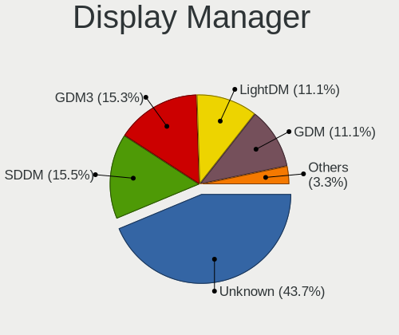

| Name    | Computers | Percent |
|---------|-----------|---------|
| Unknown | 940       | 46.15%  |
| SDDM    | 297       | 14.58%  |
| GDM3    | 260       | 12.76%  |
| GDM     | 246       | 12.08%  |
| LightDM | 207       | 10.16%  |
| TDM     | 62        | 3.04%   |
| KDM     | 17        | 0.83%   |
| XDM     | 2         | 0.1%    |
| SLiM    | 2         | 0.1%    |
| Ly      | 2         | 0.1%    |
| LXDM    | 2         | 0.1%    |

OS Lang
-------

Language

| Lang        | Computers | Percent |
|-------------|-----------|---------|
| en_US       | 884       | 44.56%  |
| tr_TR       | 762       | 38.41%  |
| Unknown     | 197       | 9.93%   |
| en_GB       | 57        | 2.87%   |
| C           | 34        | 1.71%   |
| ru_RU       | 18        | 0.91%   |
| de_DE       | 7         | 0.35%   |
| POSIX       | 3         | 0.15%   |
| ar_EG       | 3         | 0.15%   |
| en_CA       | 2         | 0.1%    |
| zh_CN       | 1         | 0.05%   |
| tr_TR.UTF8  | 1         | 0.05%   |
| tr_CY       | 1         | 0.05%   |
| ru_UA       | 1         | 0.05%   |
| nl_BE       | 1         | 0.05%   |
| fr_FR       | 1         | 0.05%   |
| fa_IR       | 1         | 0.05%   |
| es_ES       | 1         | 0.05%   |
| en_US.UTF8  | 1         | 0.05%   |
| en_US-UTF-8 | 1         | 0.05%   |
| en_NZ       | 1         | 0.05%   |
| en_IE       | 1         | 0.05%   |
| en_GB.UTF8  | 1         | 0.05%   |
| en_DK       | 1         | 0.05%   |
| en_AU       | 1         | 0.05%   |
| en_150      | 1         | 0.05%   |
| de_AT       | 1         | 0.05%   |

Boot Mode
---------

EFI or BIOS

| Mode | Computers | Percent |
|------|-----------|---------|
| EFI  | 1073      | 54%     |
| BIOS | 914       | 46%     |

Filesystem
----------

Type of filesystem

| Type    | Computers | Percent |
|---------|-----------|---------|
| Ext4    | 1465      | 72.7%   |
| Btrfs   | 247       | 12.26%  |
| Overlay | 132       | 6.55%   |
| Tmpfs   | 60        | 2.98%   |
| Unknown | 60        | 2.98%   |
| Xfs     | 19        | 0.94%   |
| Ext2    | 14        | 0.69%   |
| Zfs     | 11        | 0.55%   |
| F2fs    | 3         | 0.15%   |
| Ext3    | 2         | 0.1%    |
| Aufs    | 2         | 0.1%    |

Part. scheme
------------

Scheme of partitioning

| Type    | Computers | Percent |
|---------|-----------|---------|
| Unknown | 994       | 49.75%  |
| GPT     | 819       | 40.99%  |
| MBR     | 185       | 9.26%   |

Dual Boot with Linux/BSD
------------------------

Hosting more than one Linux/BSD

| Dual boot | Computers | Percent |
|-----------|-----------|---------|
| No        | 1700      | 85.82%  |
| Yes       | 281       | 14.18%  |

Dual Boot (Win)
---------------

Hosting Linux and Windows

| Dual boot | Computers | Percent |
|-----------|-----------|---------|
| No        | 1319      | 66.08%  |
| Yes       | 677       | 33.92%  |

Board
-----

Vendor
------

Motherboard manufacturer

| Name                    | Computers | Percent |
|-------------------------|-----------|---------|
| ASUSTek Computer        | 344       | 17.73%  |
| Lenovo                  | 297       | 15.31%  |
| Hewlett-Packard         | 251       | 12.94%  |
| Dell                    | 147       | 7.58%   |
| MSI                     | 135       | 6.96%   |
| Acer                    | 119       | 6.13%   |
| Gigabyte Technology     | 104       | 5.36%   |
| Monster                 | 60        | 3.09%   |
| Toshiba                 | 59        | 3.04%   |
| Apple                   | 50        | 2.58%   |
| HUAWEI                  | 46        | 2.37%   |
| Casper                  | 37        | 1.91%   |
| Samsung Electronics     | 33        | 1.7%    |
| Sony                    | 31        | 1.6%    |
| Unknown                 | 25        | 1.29%   |
| Pegatron                | 19        | 0.98%   |
| Packard Bell            | 17        | 0.88%   |
| Intel                   | 15        | 0.77%   |
| ASRock                  | 13        | 0.67%   |
| Google                  | 12        | 0.62%   |
| Hometech                | 11        | 0.57%   |
| Clevo                   | 11        | 0.57%   |
| Foxconn                 | 8         | 0.41%   |
| ECS                     | 8         | 0.41%   |
| Fujitsu                 | 5         | 0.26%   |
| ARCELIK                 | 5         | 0.26%   |
| Vestel                  | 4         | 0.21%   |
| Raspberry Pi Foundation | 4         | 0.21%   |
| Notebook                | 4         | 0.21%   |
| AMI                     | 4         | 0.21%   |
| Alienware               | 4         | 0.21%   |
| Huanan                  | 3         | 0.15%   |
| HONOR                   | 3         | 0.15%   |
| Fujitsu Siemens         | 3         | 0.15%   |
| Biostar                 | 3         | 0.15%   |
| Valve                   | 2         | 0.1%    |
| Quanta                  | 2         | 0.1%    |
| Nvidia                  | 2         | 0.1%    |
| Microsoft               | 2         | 0.1%    |
| Medion                  | 2         | 0.1%    |

Model
-----

Motherboard model

| Name                                 | Computers | Percent |
|--------------------------------------|-----------|---------|
| Unknown                              | 35        | 1.8%    |
| HP Pavilion g6                       | 20        | 1.03%   |
| Casper NIRVANA NOTEBOOK              | 11        | 0.57%   |
| ASUS All Series                      | 11        | 0.57%   |
| HP Pavilion dv6                      | 9         | 0.46%   |
| HP Notebook                          | 9         | 0.46%   |
| HP Pavilion 15                       | 7         | 0.36%   |
| HP 15                                | 7         | 0.36%   |
| Gigabyte B450M S2H                   | 7         | 0.36%   |
| ASUS X550VX                          | 7         | 0.36%   |
| Acer Aspire 5750G                    | 7         | 0.36%   |
| MSI MS-7C02                          | 6         | 0.31%   |
| Lenovo V15 G2 ALC 82KD               | 6         | 0.31%   |
| HUAWEI BOD-WXX9                      | 6         | 0.31%   |
| HP Pavilion Notebook                 | 6         | 0.31%   |
| Casper EXCALIBUR G770                | 6         | 0.31%   |
| ASUS X555UB                          | 6         | 0.31%   |
| Acer Nitro AN515-58                  | 6         | 0.31%   |
| Toshiba Satellite L655               | 5         | 0.26%   |
| MSI MS-7693                          | 5         | 0.26%   |
| HUAWEI NBLK-WAX9X                    | 5         | 0.26%   |
| HUAWEI KLVL-WXX9                     | 5         | 0.26%   |
| HUAWEI BOHK-WAX9X                    | 5         | 0.26%   |
| HP 250 G3                            | 5         | 0.26%   |
| Gigabyte G31M-ES2L                   | 5         | 0.26%   |
| Gigabyte A320M-S2H                   | 5         | 0.26%   |
| Dell Inspiron 7577                   | 5         | 0.26%   |
| Dell Inspiron 3542                   | 5         | 0.26%   |
| ASUS VivoBook 15_ASUS Laptop X540UAR | 5         | 0.26%   |
| ASUS N550JV                          | 5         | 0.26%   |
| Apple MacBookAir7,2                  | 5         | 0.26%   |
| Toshiba Satellite C650               | 4         | 0.21%   |
| Pegatron IPXSB-H61                   | 4         | 0.21%   |
| MSI MS-7B86                          | 4         | 0.21%   |
| MSI MS-7A38                          | 4         | 0.21%   |
| MSI MS-7A34                          | 4         | 0.21%   |
| MSI MS-7817                          | 4         | 0.21%   |
| Lenovo Legion Y530-15ICH 81FV        | 4         | 0.21%   |
| Lenovo IdeaPad S145-15API 81UT       | 4         | 0.21%   |
| Lenovo IdeaPad 330-15IKB 81DE        | 4         | 0.21%   |

Model Family
------------

Motherboard model prefix

| Name                  | Computers | Percent |
|-----------------------|-----------|---------|
| Lenovo ThinkPad       | 104       | 5.36%   |
| HP Pavilion           | 70        | 3.61%   |
| Lenovo IdeaPad        | 69        | 3.56%   |
| Acer Aspire           | 69        | 3.56%   |
| Dell Inspiron         | 62        | 3.2%    |
| Toshiba Satellite     | 54        | 2.78%   |
| ASUS PRIME            | 35        | 1.8%    |
| Unknown               | 35        | 1.8%    |
| Dell Latitude         | 31        | 1.6%    |
| Monster ABRA          | 30        | 1.55%   |
| ASUS ROG              | 29        | 1.49%   |
| HP Laptop             | 28        | 1.44%   |
| ASUS VivoBook         | 26        | 1.34%   |
| HP ProBook            | 21        | 1.08%   |
| HP EliteBook          | 21        | 1.08%   |
| ASUS TUF              | 21        | 1.08%   |
| Monster TULPAR        | 19        | 0.98%   |
| Dell Vostro           | 19        | 0.98%   |
| Casper NIRVANA        | 19        | 0.98%   |
| Acer Nitro            | 19        | 0.98%   |
| Packard Bell EasyNote | 16        | 0.82%   |
| Lenovo Yoga           | 16        | 0.82%   |
| HP 250                | 16        | 0.82%   |
| Lenovo Legion         | 14        | 0.72%   |
| Gigabyte B450M        | 11        | 0.57%   |
| Dell Precision        | 11        | 0.57%   |
| ASUS All              | 11        | 0.57%   |
| Monster HUMA          | 10        | 0.52%   |
| HP Victus             | 10        | 0.52%   |
| ASUS ASUS             | 10        | 0.52%   |
| Acer Swift            | 10        | 0.52%   |
| Lenovo ThinkBook      | 9         | 0.46%   |
| HP Notebook           | 9         | 0.46%   |
| HP Compaq             | 9         | 0.46%   |
| Dell G3               | 9         | 0.46%   |
| Lenovo V15            | 8         | 0.41%   |
| Casper EXCALIBUR      | 8         | 0.41%   |
| HP ENVY               | 7         | 0.36%   |
| HP 15                 | 7         | 0.36%   |
| Dell XPS              | 7         | 0.36%   |

MFG Year
--------

Motherboard manufacture year

| Year    | Computers | Percent |
|---------|-----------|---------|
| 2020    | 205       | 10.57%  |
| 2018    | 179       | 9.23%   |
| 2019    | 178       | 9.18%   |
| 2021    | 139       | 7.16%   |
| 2017    | 135       | 6.96%   |
| 2011    | 134       | 6.91%   |
| 2012    | 129       | 6.65%   |
| 2013    | 120       | 6.19%   |
| 2010    | 113       | 5.82%   |
| 2014    | 102       | 5.26%   |
| 2015    | 99        | 5.1%    |
| 2016    | 97        | 5%      |
| 2022    | 76        | 3.92%   |
| 2009    | 66        | 3.4%    |
| 2008    | 57        | 2.94%   |
| 2007    | 37        | 1.91%   |
| Unknown | 25        | 1.29%   |
| 2023    | 24        | 1.24%   |
| 2006    | 17        | 0.88%   |
| 2005    | 6         | 0.31%   |
| 2004    | 1         | 0.05%   |
| 2003    | 1         | 0.05%   |

Form Factor
-----------

Physical design of the computer

| Name           | Computers | Percent |
|----------------|-----------|---------|
| Notebook       | 1363      | 70.26%  |
| Desktop        | 474       | 24.43%  |
| Convertible    | 27        | 1.39%   |
| All in one     | 26        | 1.34%   |
| Tablet         | 15        | 0.77%   |
| Mini pc        | 15        | 0.77%   |
| System on chip | 12        | 0.62%   |
| Server         | 5         | 0.26%   |
| Phone          | 3         | 0.15%   |

Secure Boot
-----------

Enabled or disabled

| State    | Computers | Percent |
|----------|-----------|---------|
| Disabled | 1820      | 92.48%  |
| Enabled  | 148       | 7.52%   |

Coreboot
--------

Have coreboot on board

| Used | Computers | Percent |
|------|-----------|---------|
| No   | 1937      | 99.85%  |
| Yes  | 3         | 0.15%   |

RAM Size
--------

Total RAM memory

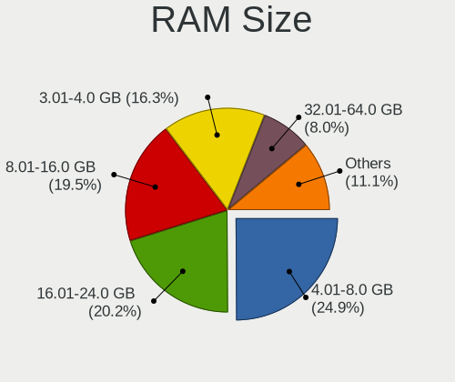

| Size in GB      | Computers | Percent |
|-----------------|-----------|---------|
| 4.01-8.0        | 500       | 25.38%  |
| 16.01-24.0      | 391       | 19.85%  |
| 8.01-16.0       | 366       | 18.58%  |
| 3.01-4.0        | 359       | 18.22%  |
| 32.01-64.0      | 129       | 6.55%   |
| 1.01-2.0        | 109       | 5.53%   |
| 2.01-3.0        | 41        | 2.08%   |
| 64.01-256.0     | 31        | 1.57%   |
| 24.01-32.0      | 28        | 1.42%   |
| 0.51-1.0        | 15        | 0.76%   |
| More than 256.0 | 1         | 0.05%   |

RAM Used
--------

Used RAM memory

| Used GB    | Computers | Percent |
|------------|-----------|---------|
| 1.01-2.0   | 685       | 31.6%   |
| 2.01-3.0   | 578       | 26.66%  |
| 3.01-4.0   | 343       | 15.82%  |
| 4.01-8.0   | 325       | 14.99%  |
| 0.51-1.0   | 121       | 5.58%   |
| 8.01-16.0  | 79        | 3.64%   |
| 0.01-0.5   | 26        | 1.2%    |
| 16.01-24.0 | 7         | 0.32%   |
| 24.01-32.0 | 2         | 0.09%   |
| 32.01-64.0 | 1         | 0.05%   |
| Unknown    | 1         | 0.05%   |

Total Drives
------------

Number of drives on board

| Drives | Computers | Percent |
|--------|-----------|---------|
| 1      | 1250      | 62.88%  |
| 2      | 545       | 27.41%  |
| 3      | 115       | 5.78%   |
| 4      | 38        | 1.91%   |
| 5      | 17        | 0.86%   |
| 0      | 13        | 0.65%   |
| 7      | 6         | 0.3%    |
| 6      | 4         | 0.2%    |

Has CD-ROM
----------

Has CD-ROM on board

| Presented | Computers | Percent |
|-----------|-----------|---------|
| No        | 1329      | 67.81%  |
| Yes       | 631       | 32.19%  |

Has Ethernet
------------

Has Ethernet on board

| Presented | Computers | Percent |
|-----------|-----------|---------|
| Yes       | 1661      | 85.31%  |
| No        | 286       | 14.69%  |

Has WiFi
--------

Has WiFi module

| Presented | Computers | Percent |
|-----------|-----------|---------|
| Yes       | 1606      | 82.57%  |
| No        | 339       | 17.43%  |

Has Bluetooth
-------------

Has Bluetooth module

| Presented | Computers | Percent |
|-----------|-----------|---------|
| Yes       | 1326      | 67.62%  |
| No        | 635       | 32.38%  |

Location
--------

Country
-------

Geographic location (country)

| Country | Computers | Percent |
|---------|-----------|---------|
| Turkey  | 1940      | 100%    |

City
----

Geographic location (city)

| City                | Computers | Percent |
|---------------------|-----------|---------|
| Istanbul            | 727       | 35.21%  |
| Ankara              | 290       | 14.04%  |
| Izmir               | 186       | 9.01%   |
| Antalya             | 95        | 4.6%    |
| Bursa               | 94        | 4.55%   |
| Adana               | 35        | 1.69%   |
| Konya               | 32        | 1.55%   |
| Kosekoy             | 31        | 1.5%    |
| Kayseri             | 25        | 1.21%   |
| zmit              | 24        | 1.16%   |
| Mersin              | 22        | 1.07%   |
| Gaziantep           | 22        | 1.07%   |
| Balkesir          | 22        | 1.07%   |
| Aydin               | 18        | 0.87%   |
| Samsun              | 17        | 0.82%   |
| Denizli             | 17        | 0.82%   |
| Mugla               | 16        | 0.77%   |
| Antakya             | 16        | 0.77%   |
| Magnesia ad Sipylum | 13        | 0.63%   |
| Tekirda           | 12        | 0.58%   |
| Adapazar          | 12        | 0.58%   |
| Trabzon             | 11        | 0.53%   |
| Yalova              | 9         | 0.44%   |
| Kartal              | 9         | 0.44%   |
| Ordu                | 8         | 0.39%   |
| Krklareli         | 8         | 0.39%   |
| Eskiehir          | 8         | 0.39%   |
| Diyarbakr         | 8         | 0.39%   |
| Osmaniye            | 7         | 0.34%   |
| Erzurum             | 7         | 0.34%   |
| anakkale          | 7         | 0.34%   |
| Batman              | 7         | 0.34%   |
| Van                 | 6         | 0.29%   |
| Sisli               | 6         | 0.29%   |
| Malatya             | 6         | 0.29%   |
| Cankaya             | 6         | 0.29%   |
| Zonguldak           | 5         | 0.24%   |
| Tarsus              | 5         | 0.24%   |
| OEdemis             | 5         | 0.24%   |
| Isparta             | 5         | 0.24%   |

Drives
------

Drive Vendor
------------

Hard drive vendors

| Vendor                      | Computers | Drives | Percent |
|-----------------------------|-----------|--------|---------|
| Samsung Electronics         | 411       | 583    | 15.03%  |
| Seagate                     | 362       | 462    | 13.24%  |
| WDC                         | 346       | 487    | 12.66%  |
| SanDisk                     | 249       | 298    | 9.11%   |
| Toshiba                     | 221       | 262    | 8.08%   |
| Kingston                    | 149       | 205    | 5.45%   |
| Unknown                     | 108       | 137    | 3.95%   |
| SK hynix                    | 68        | 89     | 2.49%   |
| HGST                        | 67        | 76     | 2.45%   |
| Micron Technology           | 64        | 73     | 2.34%   |
| Hitachi                     | 61        | 69     | 2.23%   |
| Intel                       | 48        | 62     | 1.76%   |
| Crucial                     | 48        | 60     | 1.76%   |
| China                       | 41        | 49     | 1.5%    |
| A-DATA Technology           | 39        | 45     | 1.43%   |
| Apple                       | 29        | 39     | 1.06%   |
| KIOXIA                      | 28        | 35     | 1.02%   |
| Corsair                     | 25        | 33     | 0.91%   |
| KIOXIA-EXCERIA              | 22        | 25     | 0.8%    |
| Phison                      | 19        | 19     | 0.69%   |
| Kingston Technology Company | 19        | 24     | 0.69%   |
| Fujitsu                     | 15        | 15     | 0.55%   |
| HS-SSD-C100                 | 14        | 14     | 0.51%   |
| Phison Electronics          | 13        | 15     | 0.48%   |
| OCZ                         | 12        | 14     | 0.44%   |
| Silicon Motion              | 11        | 12     | 0.4%    |
| Micron/Crucial Technology   | 11        | 13     | 0.4%    |
| JAMESDONKEY                 | 11        | 11     | 0.4%    |
| Netac                       | 9         | 10     | 0.33%   |
| UMIS                        | 8         | 10     | 0.29%   |
| LITEON                      | 8         | 9      | 0.29%   |
| Lexar                       | 8         | 14     | 0.29%   |
| Team                        | 7         | 7      | 0.26%   |
| JMicron Technology          | 7         | 7      | 0.26%   |
| Gigabyte Technology         | 7         | 13     | 0.26%   |
| Unknown                     | 7         | 8      | 0.26%   |
| Transcend                   | 6         | 6      | 0.22%   |
| Realtek Semiconductor       | 6         | 7      | 0.22%   |
| Pioneer                     | 6         | 21     | 0.22%   |
| KingSpec                    | 6         | 6      | 0.22%   |

Drive Model
-----------

Hard drive models

| Model                                               | Computers | Percent |
|-----------------------------------------------------|-----------|---------|
| Seagate ST1000LM035-1RK172 1TB                      | 45        | 1.54%   |
| SanDisk SSD PLUS 240GB                              | 39        | 1.34%   |
| HGST HTS721010A9E630 1TB                            | 35        | 1.2%    |
| Unknown MMC Card  32GB                              | 27        | 0.92%   |
| Samsung NVMe SSD Controller SM981/PM981/PM983 250GB | 27        | 0.92%   |
| Toshiba MQ04ABF100 1TB                              | 24        | 0.82%   |
| Toshiba MQ01ABD100 1TB                              | 24        | 0.82%   |
| Toshiba MQ01ABF050 500GB                            | 21        | 0.72%   |
| Seagate ST500DM002-1BD142 500GB                     | 19        | 0.65%   |
| Samsung SSD 860 EVO 250GB                           | 18        | 0.62%   |
| Samsung PM963 2.5" NVMe PCIe SSD 256GB              | 18        | 0.62%   |
| Seagate ST1000LM024 HN-M101MBB 1TB                  | 17        | 0.58%   |
| Samsung NVMe SSD Controller PM9A1/PM9A3/980PRO 2TB  | 16        | 0.55%   |
| Seagate ST500LT012-1DG142 500GB                     | 15        | 0.51%   |
| Seagate ST1000DM010-2EP102 1TB                      | 15        | 0.51%   |
| Samsung NVMe SSD Drive 512GB                        | 15        | 0.51%   |
| WDC WDS240G2G0A-00JH30 240GB SSD                    | 14        | 0.48%   |
| SanDisk SSD PLUS 120GB                              | 14        | 0.48%   |
| Seagate ST1000LM049-2GH172 1TB                      | 13        | 0.45%   |
| Kingston SV300S37A120G 120GB SSD                    | 13        | 0.45%   |
| Seagate ST9500325AS 500GB                           | 12        | 0.41%   |
| Sandisk WD Blue SN550 NVMe SSD 512GB                | 12        | 0.41%   |
| SanDisk NVMe SSD Drive 256GB                        | 12        | 0.41%   |
| Samsung SSD 860 EVO 500GB                           | 12        | 0.41%   |
| A-DATA SU650 120GB SSD                              | 12        | 0.41%   |
| Toshiba TR200 240GB SSD                             | 11        | 0.38%   |
| Toshiba MQ01ABD075 752GB                            | 11        | 0.38%   |
| Seagate ST3500418AS 500GB                           | 11        | 0.38%   |
| Seagate Expansion 1TB                               | 11        | 0.38%   |
| SanDisk SSD PLUS 480GB                              | 11        | 0.38%   |
| Kingston SA400S37240G 240GB SSD                     | 11        | 0.38%   |
| Intel NVMe SSD Drive 512GB                          | 11        | 0.38%   |
| WDC WD10EZEX-08WN4A0 1TB                            | 10        | 0.34%   |
| Unknown MMC Card  64GB                              | 10        | 0.34%   |
| Unknown MMC Card  128GB                             | 10        | 0.34%   |
| Seagate ST1000DM003-1ER162 1TB                      | 10        | 0.34%   |
| Kingston SA400S37120G 120GB SSD                     | 10        | 0.34%   |
| HGST HTS541010A9E680 1TB                            | 10        | 0.34%   |
| WDC WD10JPCX-24UE4T0 1TB                            | 9         | 0.31%   |
| Unknown SD/MMC/MS PRO 128GB                         | 9         | 0.31%   |

HDD Vendor
----------

Hard disk drive vendors

| Vendor              | Computers | Drives  | Percent |
|---------------------|-----------|---------|---------|
| Seagate             | 356       | 450     | 34.36%  |
| WDC                 | 271       | 389     | 26.16%  |
| Toshiba             | 164       | 183     | 15.83%  |
| Samsung Electronics | 73        | 95      | 7.05%   |
| HGST                | 67        | 76      | 6.47%   |
| Hitachi             | 61        | 69      | 5.89%   |
| Fujitsu             | 15        | 15      | 1.45%   |
| Unknown             | 9         | 12      | 0.87%   |
| Apple               | 5         | 9       | 0.48%   |
| Maxtor              | 4         | 4       | 0.39%   |
| Pioneer             | 2         | 11      | 0.19%   |
| Intenso             | 2         | 3       | 0.19%   |
| USB3.0              | 1         | 1       | 0.1%    |
| TO Exter            | 1         | 3       | 0.1%    |
| Initio              | 1         | Unknown | 0.1%    |
| External            | 1         | 1       | 0.1%    |
| ExcelStor           | 1         | 1       | 0.1%    |
| China               | 1         | 1       | 0.1%    |
| 128MB               | 1         | 1       | 0.1%    |

SSD Vendor
----------

Solid state drive vendors

| Vendor              | Computers | Drives | Percent |
|---------------------|-----------|--------|---------|
| SanDisk             | 164       | 197    | 19.34%  |
| Samsung Electronics | 147       | 197    | 17.33%  |
| Kingston            | 113       | 158    | 13.33%  |
| WDC                 | 49        | 58     | 5.78%   |
| China               | 37        | 42     | 4.36%   |
| Crucial             | 36        | 46     | 4.25%   |
| A-DATA Technology   | 28        | 32     | 3.3%    |
| Toshiba             | 27        | 29     | 3.18%   |
| Corsair             | 20        | 23     | 2.36%   |
| Micron Technology   | 18        | 22     | 2.12%   |
| KIOXIA-EXCERIA      | 17        | 20     | 2%      |
| Apple               | 16        | 18     | 1.89%   |
| SK hynix            | 13        | 17     | 1.53%   |
| OCZ                 | 12        | 14     | 1.42%   |
| JAMESDONKEY         | 10        | 10     | 1.18%   |
| Intel               | 10        | 16     | 1.18%   |
| Netac               | 9         | 10     | 1.06%   |
| LITEON              | 8         | 9      | 0.94%   |
| Seagate             | 7         | 8      | 0.83%   |
| Lexar               | 7         | 13     | 0.83%   |
| Team                | 6         | 6      | 0.71%   |
| KingSpec            | 6         | 6      | 0.71%   |
| HS-SSD-C100         | 6         | 6      | 0.71%   |
| TwinMOS             | 5         | 5      | 0.59%   |
| Gigabyte Technology | 5         | 10     | 0.59%   |
| EZCOOL              | 5         | 6      | 0.59%   |
| SPCC                | 4         | 4      | 0.47%   |
| Pioneer             | 4         | 10     | 0.47%   |
| LITEONIT            | 4         | 5      | 0.47%   |
| Hewlett-Packard     | 4         | 4      | 0.47%   |
| Transcend           | 3         | 3      | 0.35%   |
| Patriot             | 3         | 4      | 0.35%   |
| KingFast            | 3         | 5      | 0.35%   |
| JMicron Technology  | 3         | 3      | 0.35%   |
| GOODRAM             | 3         | 6      | 0.35%   |
| 2.5"                | 3         | 3      | 0.35%   |
| PNY                 | 2         | 2      | 0.24%   |
| KingDian            | 2         | 2      | 0.24%   |
| JD                  | 2         | 2      | 0.24%   |
| Indilinx            | 2         | 4      | 0.24%   |

Drive Kind
----------

HDD or SSD

| Kind    | Computers | Drives | Percent |
|---------|-----------|--------|---------|
| HDD     | 922       | 1324   | 36.66%  |
| SSD     | 767       | 1065   | 30.5%   |
| NVMe    | 683       | 950    | 27.16%  |
| MMC     | 101       | 129    | 4.02%   |
| Unknown | 42        | 54     | 1.67%   |

Drive Connector
---------------

SATA, SAS, NVMe, etc.

| Type | Computers | Drives | Percent |
|------|-----------|--------|---------|
| SATA | 1389      | 2345   | 61.84%  |
| NVMe | 683       | 946    | 30.41%  |
| MMC  | 101       | 129    | 4.5%    |
| SAS  | 73        | 102    | 3.25%   |

Drive Size
----------

Size of hard drive

| Size in TB | Computers | Drives | Percent |
|------------|-----------|--------|---------|
| 0.01-0.5   | 1075      | 1582   | 64.6%   |
| 0.51-1.0   | 492       | 666    | 29.57%  |
| 1.01-2.0   | 56        | 81     | 3.37%   |
| 3.01-4.0   | 18        | 27     | 1.08%   |
| 4.01-10.0  | 12        | 17     | 0.72%   |
| 2.01-3.0   | 10        | 15     | 0.6%    |
| 10.01-20.0 | 1         | 1      | 0.06%   |

Space Total
-----------

Amount of disk space available on the file system

| Size in GB     | Computers | Percent |
|----------------|-----------|---------|
| 101-250        | 605       | 28.99%  |
| 251-500        | 473       | 22.66%  |
| 501-1000       | 280       | 13.42%  |
| 51-100         | 169       | 8.1%    |
| 1-20           | 162       | 7.76%   |
| 1001-2000      | 151       | 7.24%   |
| 21-50          | 119       | 5.7%    |
| More than 3000 | 51        | 2.44%   |
| 2001-3000      | 45        | 2.16%   |
| Unknown        | 32        | 1.53%   |

Space Used
----------

Amount of used disk space

| Used GB        | Computers | Percent |
|----------------|-----------|---------|
| 1-20           | 861       | 39.95%  |
| 21-50          | 419       | 19.44%  |
| 101-250        | 262       | 12.16%  |
| 51-100         | 258       | 11.97%  |
| 251-500        | 152       | 7.05%   |
| 501-1000       | 101       | 4.69%   |
| 1001-2000      | 39        | 1.81%   |
| Unknown        | 32        | 1.48%   |
| More than 3000 | 16        | 0.74%   |
| 2001-3000      | 15        | 0.7%    |

Malfunc. Drives
---------------

Drive models with a malfunction

| Model                                 | Computers | Drives | Percent |
|---------------------------------------|-----------|--------|---------|
| Seagate ST500DM002-1BD142 500GB       | 8         | 8      | 3.88%   |
| Toshiba MQ01ABD100 1TB                | 5         | 5      | 2.43%   |
| Seagate ST500LT012-1DG142 500GB       | 5         | 7      | 2.43%   |
| Seagate ST1000LM035-1RK172 1TB        | 4         | 4      | 1.94%   |
| SanDisk SSD PLUS 240GB                | 4         | 4      | 1.94%   |
| Kingston SV300S37A120G 120GB SSD      | 4         | 5      | 1.94%   |
| HGST HTS721010A9E630 1TB              | 4         | 5      | 1.94%   |
| Toshiba MQ01ABF050 500GB              | 3         | 4      | 1.46%   |
| Toshiba MQ01ABD050 500GB              | 3         | 4      | 1.46%   |
| Toshiba MK3252GSX 320GB               | 3         | 3      | 1.46%   |
| Samsung Electronics SSD 870 EVO 500GB | 3         | 5      | 1.46%   |
| HGST HTS545050A7E680 500GB            | 3         | 3      | 1.46%   |
| WDC WDS240G2G0A-00JH30 240GB SSD      | 2         | 3      | 0.97%   |
| WDC WD5000LPVX-22V0TT0 500GB          | 2         | 2      | 0.97%   |
| WDC WD3200BPVT-22JJ5T0 320GB          | 2         | 2      | 0.97%   |
| Toshiba MQ04ABF100 1TB                | 2         | 2      | 0.97%   |
| Toshiba MQ02ABD100H 1TB               | 2         | 4      | 0.97%   |
| Toshiba MQ01ABD075 752GB              | 2         | 2      | 0.97%   |
| Toshiba DT01ACA050 500GB              | 2         | 2      | 0.97%   |
| Seagate ST9500325AS 500GB             | 2         | 2      | 0.97%   |
| Seagate ST9320325AS 320GB             | 2         | 2      | 0.97%   |
| Seagate ST500LT012-9WS142 500GB       | 2         | 2      | 0.97%   |
| Seagate ST3500630AS 500GB             | 2         | 2      | 0.97%   |
| Seagate ST3500418AS 500GB             | 2         | 4      | 0.97%   |
| Seagate ST1000LM024 HN-M101MBB 1TB    | 2         | 2      | 0.97%   |
| Seagate ST1000LM014-SSHD-8GB          | 2         | 2      | 0.97%   |
| Seagate ST1000DM003-1SB102 1TB        | 2         | 3      | 0.97%   |
| Seagate ST1000DM003-1CH162 1TB        | 2         | 3      | 0.97%   |
| SanDisk SDSSDX120GG25 120GB           | 2         | 2      | 0.97%   |
| Samsung Electronics HD161HJ 160GB     | 2         | 2      | 0.97%   |
| Kingston SVP200S37A120G 120GB SSD     | 2         | 2      | 0.97%   |
| Kingston SUV400S37240G 240GB SSD      | 2         | 2      | 0.97%   |
| JMicron Technology Tech 250GB         | 2         | 2      | 0.97%   |
| Indilinx IND-S325S120G 120GB SSD      | 2         | 4      | 0.97%   |
| Hitachi HTS547575A9E384 752GB         | 2         | 2      | 0.97%   |
| Hitachi HTS543232A7A384 320GB         | 2         | 2      | 0.97%   |
| Fujitsu MHY2120BH 120GB               | 2         | 2      | 0.97%   |
| 2.5" SATA SSD 3TG6-P 2TB              | 2         | 2      | 0.97%   |
| WDC WDS240G2G0B-00EPW0 240GB SSD      | 1         | 1      | 0.49%   |
| WDC WD7500BPVT-55HXZT3 752GB          | 1         | 1      | 0.49%   |

Malfunc. Drive Vendor
---------------------

Vendors of faulty drives

| Vendor              | Computers | Drives | Percent |
|---------------------|-----------|--------|---------|
| Seagate             | 49        | 60     | 24.26%  |
| Toshiba             | 28        | 32     | 13.86%  |
| WDC                 | 24        | 29     | 11.88%  |
| Hitachi             | 16        | 16     | 7.92%   |
| Samsung Electronics | 15        | 19     | 7.43%   |
| SanDisk             | 12        | 13     | 5.94%   |
| Kingston            | 11        | 12     | 5.45%   |
| HGST                | 11        | 12     | 5.45%   |
| A-DATA Technology   | 9         | 9      | 4.46%   |
| Fujitsu             | 4         | 4      | 1.98%   |
| China               | 3         | 3      | 1.49%   |
| SK hynix            | 2         | 3      | 0.99%   |
| Maxtor              | 2         | 2      | 0.99%   |
| JMicron Technology  | 2         | 2      | 0.99%   |
| Indilinx            | 2         | 4      | 0.99%   |
| Crucial             | 2         | 2      | 0.99%   |
| 2.5"                | 2         | 2      | 0.99%   |
| SSD-S400            | 1         | 1      | 0.5%    |
| OCZ                 | 1         | 2      | 0.5%    |
| LITEONIT            | 1         | 2      | 0.5%    |
| LITEON              | 1         | 1      | 0.5%    |
| JD                  | 1         | 1      | 0.5%    |
| Intenso             | 1         | 1      | 0.5%    |
| Intel               | 1         | 1      | 0.5%    |
| Apple               | 1         | 2      | 0.5%    |

Malfunc. HDD Vendor
-------------------

Vendors of faulty HDD drives

| Vendor              | Computers | Drives | Percent |
|---------------------|-----------|--------|---------|
| Seagate             | 49        | 60     | 34.51%  |
| Toshiba             | 28        | 32     | 19.72%  |
| WDC                 | 21        | 25     | 14.79%  |
| Hitachi             | 16        | 16     | 11.27%  |
| HGST                | 11        | 12     | 7.75%   |
| Samsung Electronics | 10        | 12     | 7.04%   |
| Fujitsu             | 4         | 4      | 2.82%   |
| Maxtor              | 2         | 2      | 1.41%   |
| Apple               | 1         | 2      | 0.7%    |

Malfunc. Drive Kind
-------------------

Kinds of faulty drives

| Kind    | Computers | Drives | Percent |
|---------|-----------|--------|---------|
| HDD     | 133       | 165    | 68.91%  |
| SSD     | 54        | 64     | 27.98%  |
| NVMe    | 4         | 4      | 2.07%   |
| Unknown | 2         | 2      | 1.04%   |

Failed Drives
-------------

Failed drive models

| Model                               | Computers | Drives | Percent |
|-------------------------------------|-----------|--------|---------|
| Seagate ST750LM022 HN-M750MBB 752GB | 1         | 1      | 25%     |
| Seagate ST1000LM024 HN-M101MBB 1TB  | 1         | 1      | 25%     |
| Samsung Electronics HM160HI 160GB   | 1         | 1      | 25%     |
| HGST HTS545050A7E680 500GB          | 1         | 1      | 25%     |

Failed Drive Vendor
-------------------

Failed drive vendors

| Vendor              | Computers | Drives | Percent |
|---------------------|-----------|--------|---------|
| Seagate             | 2         | 2      | 50%     |
| Samsung Electronics | 1         | 1      | 25%     |
| HGST                | 1         | 1      | 25%     |

Drive Status
------------

Number of failed and malfunc. drives

| Status   | Computers | Drives | Percent |
|----------|-----------|--------|---------|
| Detected | 1191      | 2040   | 56.21%  |
| Works    | 735       | 1243   | 34.69%  |
| Malfunc  | 189       | 235    | 8.92%   |
| Failed   | 4         | 4      | 0.19%   |

Storage controller
------------------

Storage Vendor
--------------

Storage controller vendors

| Vendor                           | Computers | Percent |
|----------------------------------|-----------|---------|
| Intel                            | 1287      | 53.69%  |
| AMD                              | 320       | 13.35%  |
| Samsung Electronics              | 228       | 9.51%   |
| SanDisk                          | 106       | 4.42%   |
| SK hynix                         | 53        | 2.21%   |
| Kingston Technology Company      | 53        | 2.21%   |
| Micron Technology                | 45        | 1.88%   |
| Phison Electronics               | 40        | 1.67%   |
| KIOXIA                           | 39        | 1.63%   |
| Toshiba America Info Systems     | 24        | 1%      |
| Nvidia                           | 23        | 0.96%   |
| Micron/Crucial Technology        | 22        | 0.92%   |
| Marvell Technology Group         | 19        | 0.79%   |
| Silicon Motion                   | 18        | 0.75%   |
| JMicron Technology               | 18        | 0.75%   |
| ADATA Technology                 | 17        | 0.71%   |
| ASMedia Technology               | 16        | 0.67%   |
| Union Memory (Shenzhen)          | 15        | 0.63%   |
| Silicon Integrated Systems [SiS] | 12        | 0.5%    |
| Realtek Semiconductor            | 10        | 0.42%   |
| Apple                            | 7         | 0.29%   |
| Yangtze Memory Technologies      | 4         | 0.17%   |
| VIA Technologies                 | 4         | 0.17%   |
| Lite-On Technology               | 3         | 0.13%   |
| Innodisk                         | 3         | 0.13%   |
| Transcend                        | 2         | 0.08%   |
| Solid State Storage Technology   | 2         | 0.08%   |
| LSI Logic / Symbios Logic        | 2         | 0.08%   |
| ULi Electronics                  | 1         | 0.04%   |
| Solidigm                         | 1         | 0.04%   |
| Seagate Technology               | 1         | 0.04%   |
| Promise Technology               | 1         | 0.04%   |
| OCZ Technology Group             | 1         | 0.04%   |

Storage Model
-------------

Storage controller models

| Model                                                                                   | Computers | Percent |
|-----------------------------------------------------------------------------------------|-----------|---------|
| AMD FCH SATA Controller [AHCI mode]                                                     | 229       | 8.44%   |
| Intel Sunrise Point-LP SATA Controller [AHCI mode]                                      | 118       | 4.35%   |
| Intel 7 Series Chipset Family 6-port SATA Controller [AHCI mode]                        | 103       | 3.8%    |
| Samsung NVMe SSD Controller SM981/PM981/PM983                                           | 94        | 3.47%   |
| Intel 6 Series/C200 Series Chipset Family 6 port Mobile SATA AHCI Controller            | 81        | 2.99%   |
| Intel 8 Series/C220 Series Chipset Family 6-port SATA Controller 1 [AHCI mode]          | 70        | 2.58%   |
| Samsung NVMe SSD Controller 980 (DRAM-less)                                             | 68        | 2.51%   |
| AMD 400 Series Chipset SATA Controller                                                  | 58        | 2.14%   |
| Intel 8 Series SATA Controller 1 [AHCI mode]                                            | 55        | 2.03%   |
| Intel HM170/QM170 Chipset SATA Controller [AHCI Mode]                                   | 54        | 1.99%   |
| Intel 82801 Mobile SATA Controller [RAID mode]                                          | 53        | 1.95%   |
| Intel NM10/ICH7 Family SATA Controller [IDE mode]                                       | 48        | 1.77%   |
| Intel Cannon Lake Mobile PCH SATA AHCI Controller                                       | 48        | 1.77%   |
| Intel 5 Series/3400 Series Chipset 4 port SATA AHCI Controller                          | 43        | 1.59%   |
| Intel Volume Management Device NVMe RAID Controller                                     | 42        | 1.55%   |
| Intel 400 Series Chipset Family SATA AHCI Controller                                    | 41        | 1.51%   |
| Intel Wildcat Point-LP SATA Controller [AHCI Mode]                                      | 39        | 1.44%   |
| Intel 82801IBM/IEM (ICH9M/ICH9M-E) 4 port SATA Controller [AHCI mode]                   | 39        | 1.44%   |
| Intel 82801G (ICH7 Family) IDE Controller                                               | 36        | 1.33%   |
| SanDisk Ultra 3D / WD Blue SN550 NVMe SSD                                               | 35        | 1.29%   |
| Intel Comet Lake SATA AHCI Controller                                                   | 34        | 1.25%   |
| Samsung NVMe SSD Controller PM9A1/PM9A3/980PRO                                          | 29        | 1.07%   |
| AMD SB7x0/SB8x0/SB9x0 IDE Controller                                                    | 29        | 1.07%   |
| Intel Q170/Q150/B150/H170/H110/Z170/CM236 Chipset SATA Controller [AHCI Mode]           | 26        | 0.96%   |
| Intel 6 Series/C200 Series Chipset Family 6 port Desktop SATA AHCI Controller           | 25        | 0.92%   |
| AMD SB7x0/SB8x0/SB9x0 SATA Controller [AHCI mode]                                       | 25        | 0.92%   |
| Intel 200 Series PCH SATA controller [AHCI mode]                                        | 24        | 0.88%   |
| Samsung NVMe SSD Controller SM961/PM961/SM963                                           | 23        | 0.85%   |
| AMD SB7x0/SB8x0/SB9x0 SATA Controller [IDE mode]                                        | 23        | 0.85%   |
| Intel Tiger Lake-LP SATA Controller                                                     | 22        | 0.81%   |
| Intel 5 Series/3400 Series Chipset 6 port SATA AHCI Controller                          | 21        | 0.77%   |
| Intel SSD 660P Series                                                                   | 20        | 0.74%   |
| Intel Celeron N3350/Pentium N4200/Atom E3900 Series SATA AHCI Controller                | 19        | 0.7%    |
| SanDisk Extreme Pro / WD Black SN750 / PC SN730 / Red SN700 NVMe SSD                    | 18        | 0.66%   |
| Phison PS5013-E13 PCIe3 NVMe Controller (DRAM-less)                                     | 18        | 0.66%   |
| KIOXIA NVMe SSD Controller BG4 (DRAM-less)                                              | 18        | 0.66%   |
| Intel 6 Series/C200 Series Chipset Family Desktop SATA Controller (IDE mode, ports 4-5) | 18        | 0.66%   |
| Intel 6 Series/C200 Series Chipset Family Desktop SATA Controller (IDE mode, ports 0-3) | 18        | 0.66%   |
| Micron/Crucial P2 [Nick P2] / P3 / P3 Plus NVMe PCIe SSD (DRAM-less)                    | 17        | 0.63%   |
| Intel Celeron/Pentium Silver Processor SATA Controller                                  | 17        | 0.63%   |

Storage Kind
------------

Kind of storage controller (IDE, SATA, NVMe, SAS, ...)

| Kind | Computers | Percent |
|------|-----------|---------|
| SATA | 1399      | 57.52%  |
| NVMe | 685       | 28.17%  |
| IDE  | 228       | 9.38%   |
| RAID | 118       | 4.85%   |
| SCSI | 2         | 0.08%   |

Processor
---------

CPU Vendor
----------

Processor vendors

| Vendor       | Computers | Percent |
|--------------|-----------|---------|
| Intel        | 1466      | 75.57%  |
| AMD          | 448       | 23.09%  |
| ARM          | 24        | 1.24%   |
| CentaurHauls | 2         | 0.1%    |

CPU Model
---------

Processor models

| Model                                         | Computers | Percent |
|-----------------------------------------------|-----------|---------|
| Intel 11th Gen Core i5-1135G7 @ 2.40GHz       | 37        | 1.9%    |
| Intel Core i5-7200U CPU @ 2.50GHz             | 31        | 1.59%   |
| Intel Core i7-10750H CPU @ 2.60GHz            | 29        | 1.49%   |
| Intel Core i7-7700HQ CPU @ 2.80GHz            | 26        | 1.34%   |
| AMD Ryzen 5 3500U with Radeon Vega Mobile Gfx | 25        | 1.29%   |
| Intel Core i7-6700HQ CPU @ 2.60GHz            | 23        | 1.18%   |
| Intel Core i5-6200U CPU @ 2.30GHz             | 23        | 1.18%   |
| Intel Core i5-3210M CPU @ 2.50GHz             | 22        | 1.13%   |
| Intel Core i7-8550U CPU @ 1.80GHz             | 19        | 0.98%   |
| Intel Core i7-10510U CPU @ 1.80GHz            | 19        | 0.98%   |
| Intel Core i7-9750H CPU @ 2.60GHz             | 18        | 0.93%   |
| Intel Core i5-8250U CPU @ 1.60GHz             | 18        | 0.93%   |
| AMD Ryzen 5 5500U with Radeon Graphics        | 18        | 0.93%   |
| Intel 11th Gen Core i7-11800H @ 2.30GHz       | 17        | 0.87%   |
| Intel Core i5-8265U CPU @ 1.60GHz             | 16        | 0.82%   |
| Intel Core i5-5200U CPU @ 2.20GHz             | 16        | 0.82%   |
| Intel Core i5-3230M CPU @ 2.60GHz             | 16        | 0.82%   |
| Intel Core i5-2430M CPU @ 2.40GHz             | 16        | 0.82%   |
| Intel Core i5-1035G1 CPU @ 1.00GHz            | 16        | 0.82%   |
| Intel Core i7-8750H CPU @ 2.20GHz             | 15        | 0.77%   |
| Intel Core i5-2450M CPU @ 2.50GHz             | 15        | 0.77%   |
| ARM Processor                                 | 15        | 0.77%   |
| Intel Core i5-4210U CPU @ 1.70GHz             | 14        | 0.72%   |
| Intel Celeron CPU N3350 @ 1.10GHz             | 14        | 0.72%   |
| Intel 11th Gen Core i7-1165G7 @ 2.80GHz       | 14        | 0.72%   |
| AMD Ryzen 7 3700U with Radeon Vega Mobile Gfx | 14        | 0.72%   |
| Intel Core i5-4200U CPU @ 1.60GHz             | 13        | 0.67%   |
| Intel Core i7-7500U CPU @ 2.70GHz             | 12        | 0.62%   |
| Intel Core i7-3630QM CPU @ 2.40GHz            | 12        | 0.62%   |
| AMD Ryzen 7 5800H with Radeon Graphics        | 12        | 0.62%   |
| AMD Ryzen 7 5700U with Radeon Graphics        | 12        | 0.62%   |
| Intel Core i7-6500U CPU @ 2.50GHz             | 11        | 0.57%   |
| Intel Core i5-9300H CPU @ 2.40GHz             | 11        | 0.57%   |
| Intel Core i5-4200M CPU @ 2.50GHz             | 11        | 0.57%   |
| Intel Core i5-2520M CPU @ 2.50GHz             | 11        | 0.57%   |
| Intel Core i5-10210U CPU @ 1.60GHz            | 11        | 0.57%   |
| Intel Atom x5-Z8350 CPU @ 1.44GHz             | 11        | 0.57%   |
| Intel 12th Gen Core i7-12700H                 | 11        | 0.57%   |
| AMD Ryzen 5 4600H with Radeon Graphics        | 11        | 0.57%   |
| AMD Ryzen 5 2600 Six-Core Processor           | 11        | 0.57%   |

CPU Model Family
----------------

Processor model prefix

| Model                   | Computers | Percent |
|-------------------------|-----------|---------|
| Intel Core i5           | 454       | 23.37%  |
| Intel Core i7           | 378       | 19.45%  |
| Other                   | 170       | 8.75%   |
| AMD Ryzen 5             | 157       | 8.08%   |
| Intel Core i3           | 133       | 6.85%   |
| AMD Ryzen 7             | 102       | 5.25%   |
| Intel Celeron           | 75        | 3.86%   |
| Intel Core 2 Duo        | 71        | 3.65%   |
| Intel Atom              | 44        | 2.26%   |
| Intel Pentium           | 41        | 2.11%   |
| AMD Ryzen 3             | 27        | 1.39%   |
| Intel Xeon              | 24        | 1.24%   |
| Intel Pentium Dual-Core | 24        | 1.24%   |
| AMD FX                  | 21        | 1.08%   |
| Intel Core 2 Quad       | 20        | 1.03%   |
| AMD A8                  | 19        | 0.98%   |
| Intel Pentium Dual      | 16        | 0.82%   |
| AMD A10                 | 15        | 0.77%   |
| Intel Core 2            | 14        | 0.72%   |
| AMD Ryzen 9             | 12        | 0.62%   |
| Intel Core i9           | 9         | 0.46%   |
| AMD Phenom II X4        | 7         | 0.36%   |
| AMD A6                  | 7         | 0.36%   |
| AMD A4                  | 7         | 0.36%   |
| Intel Pentium Silver    | 6         | 0.31%   |
| AMD Ryzen 7 PRO         | 6         | 0.31%   |
| AMD Ryzen 5 PRO         | 6         | 0.31%   |
| AMD Athlon 64 X2        | 5         | 0.26%   |
| Intel Pentium 4         | 4         | 0.21%   |
| Intel Genuine           | 4         | 0.21%   |
| AMD Athlon II X3        | 4         | 0.21%   |
| AMD Athlon II X2        | 4         | 0.21%   |
| AMD Athlon              | 4         | 0.21%   |
| AMD A12                 | 4         | 0.21%   |
| AMD Phenom II X6        | 3         | 0.15%   |
| AMD Phenom              | 3         | 0.15%   |
| AMD E2                  | 3         | 0.15%   |
| AMD C-60                | 3         | 0.15%   |
| AMD Athlon II X4        | 3         | 0.15%   |
| Intel Xeon Silver       | 2         | 0.1%    |

CPU Cores
---------

Number of processor cores

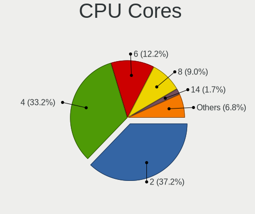

| Number | Computers | Percent |
|--------|-----------|---------|
| 2      | 793       | 40.81%  |
| 4      | 677       | 34.84%  |
| 6      | 229       | 11.79%  |
| 8      | 132       | 6.79%   |
| 1      | 35        | 1.8%    |
| 14     | 19        | 0.98%   |
| 10     | 18        | 0.93%   |
| 12     | 17        | 0.87%   |
| 3      | 13        | 0.67%   |
| 16     | 4         | 0.21%   |
| 24     | 3         | 0.15%   |
| 20     | 2         | 0.1%    |
| 64     | 1         | 0.05%   |

CPU Sockets
-----------

Number of sockets

| Number | Computers | Percent |
|--------|-----------|---------|
| 1      | 1934      | 99.69%  |
| 2      | 6         | 0.31%   |

CPU Threads
-----------

Threads per core (Hyper-Threading)

| Number | Computers | Percent |
|--------|-----------|---------|
| 2      | 1391      | 71.66%  |
| 1      | 548       | 28.23%  |
| 8      | 2         | 0.1%    |

CPU Op-Modes
------------

CPU Operation Modes (32-bit, 64-bit)

| Op mode        | Computers | Percent |
|----------------|-----------|---------|
| 32-bit, 64-bit | 1887      | 97.07%  |
| Unknown        | 41        | 2.11%   |
| 32-bit         | 15        | 0.77%   |
| 64-bit         | 1         | 0.05%   |

CPU Microcode
-------------

Microcode number

| Number     | Computers | Percent |
|------------|-----------|---------|
| Unknown    | 595       | 29.5%   |
| 0x306a9    | 96        | 4.76%   |
| 0x206a7    | 96        | 4.76%   |
| 0x306c3    | 60        | 2.97%   |
| 0x906e9    | 52        | 2.58%   |
| 0x1067a    | 52        | 2.58%   |
| 0x40651    | 43        | 2.13%   |
| 0x806ea    | 41        | 2.03%   |
| 0x906ea    | 40        | 1.98%   |
| 0x806e9    | 38        | 1.88%   |
| 0x806ec    | 35        | 1.74%   |
| 0x806c1    | 35        | 1.74%   |
| 0x306d4    | 35        | 1.74%   |
| 0xa0652    | 34        | 1.69%   |
| 0x406e3    | 33        | 1.64%   |
| 0x506e3    | 32        | 1.59%   |
| 0x20655    | 31        | 1.54%   |
| 0x08108109 | 29        | 1.44%   |
| 0x6fd      | 25        | 1.24%   |
| 0x30678    | 22        | 1.09%   |
| 0x08608103 | 22        | 1.09%   |
| 0x08108102 | 22        | 1.09%   |
| 0x0a50000c | 21        | 1.04%   |
| 0x08600106 | 21        | 1.04%   |
| 0x706e5    | 20        | 0.99%   |
| 0x406c4    | 20        | 0.99%   |
| 0x20652    | 18        | 0.89%   |
| 0x10676    | 17        | 0.84%   |
| 0x0a50000d | 17        | 0.84%   |
| 0x08701021 | 16        | 0.79%   |
| 0x506c9    | 15        | 0.74%   |
| 0x0800820d | 14        | 0.69%   |
| 0x06000852 | 13        | 0.64%   |
| 0x906a3    | 12        | 0.59%   |
| 0x08001138 | 10        | 0.5%    |
| 0x07030105 | 10        | 0.5%    |
| 0x06006705 | 10        | 0.5%    |
| 0x010000c8 | 10        | 0.5%    |
| 0x6f6      | 9         | 0.45%   |
| 0x406c3    | 9         | 0.45%   |

CPU Microarch
-------------

Microarchitecture

| Name             | Computers | Percent |
|------------------|-----------|---------|
| KabyLake         | 305       | 15.69%  |
| Haswell          | 146       | 7.51%   |
| SandyBridge      | 134       | 6.89%   |
| IvyBridge        | 129       | 6.64%   |
| Unknown          | 109       | 5.61%   |
| Penryn           | 97        | 4.99%   |
| Skylake          | 94        | 4.84%   |
| Zen 2            | 86        | 4.42%   |
| Zen+             | 81        | 4.17%   |
| Westmere         | 70        | 3.6%    |
| CometLake        | 69        | 3.55%   |
| Silvermont       | 64        | 3.29%   |
| TigerLake        | 62        | 3.19%   |
| Zen 3            | 59        | 3.03%   |
| Core             | 59        | 3.03%   |
| Broadwell        | 49        | 2.52%   |
| IceLake          | 44        | 2.26%   |
| Zen              | 38        | 1.95%   |
| Alderlake Hybrid | 37        | 1.9%    |
| Piledriver       | 32        | 1.65%   |
| K10              | 28        | 1.44%   |
| Excavator        | 22        | 1.13%   |
| Goldmont plus    | 20        | 1.03%   |
| Goldmont         | 19        | 0.98%   |
| Puma             | 18        | 0.93%   |
| Bonnell          | 16        | 0.82%   |
| Nehalem          | 13        | 0.67%   |
| Bobcat           | 9         | 0.46%   |
| K8 Hammer        | 8         | 0.41%   |
| P6               | 6         | 0.31%   |
| K10 Llano        | 6         | 0.31%   |
| NetBurst         | 5         | 0.26%   |
| Steamroller      | 4         | 0.21%   |
| Bulldozer        | 3         | 0.15%   |
| Tremont          | 1         | 0.05%   |
| K6               | 1         | 0.05%   |
| Jaguar           | 1         | 0.05%   |

Graphics
--------

GPU Vendor
----------

Vendors of graphics cards

| Vendor                           | Computers | Percent |
|----------------------------------|-----------|---------|
| Intel                            | 1160      | 45.28%  |
| Nvidia                           | 758       | 29.59%  |
| AMD                              | 628       | 24.51%  |
| Silicon Integrated Systems [SiS] | 10        | 0.39%   |
| VIA Technologies                 | 3         | 0.12%   |
| Matrox Electronics Systems       | 2         | 0.08%   |
| ASPEED Technology                | 1         | 0.04%   |

GPU Model
---------

Graphics card models

| Model                                                                                    | Computers | Percent |
|------------------------------------------------------------------------------------------|-----------|---------|
| Intel 2nd Generation Core Processor Family Integrated Graphics Controller                | 103       | 3.86%   |
| Intel 3rd Gen Core processor Graphics Controller                                         | 90        | 3.37%   |
| Intel Haswell-ULT Integrated Graphics Controller                                         | 59        | 2.21%   |
| AMD Picasso/Raven 2 [Radeon Vega Series / Radeon Vega Mobile Series]                     | 59        | 2.21%   |
| Intel TigerLake-LP GT2 [Iris Xe Graphics]                                                | 56        | 2.1%    |
| Intel HD Graphics 620                                                                    | 53        | 1.99%   |
| Intel CoffeeLake-H GT2 [UHD Graphics 630]                                                | 50        | 1.87%   |
| AMD Renoir [Radeon RX Vega 6 (Ryzen 4000/5000 Mobile Series)]                            | 49        | 1.84%   |
| Intel UHD Graphics 620                                                                   | 47        | 1.76%   |
| Intel Skylake GT2 [HD Graphics 520]                                                      | 45        | 1.69%   |
| Intel HD Graphics 630                                                                    | 42        | 1.57%   |
| Intel CometLake-H GT2 [UHD Graphics]                                                     | 41        | 1.54%   |
| Intel 4th Gen Core Processor Integrated Graphics Controller                              | 40        | 1.5%    |
| Intel HD Graphics 5500                                                                   | 39        | 1.46%   |
| AMD Sun XT [Radeon HD 8670A/8670M/8690M / R5 M330 / M430 / Radeon 520 Mobile]            | 37        | 1.39%   |
| Intel Core Processor Integrated Graphics Controller                                      | 36        | 1.35%   |
| Nvidia TU117M [GeForce GTX 1650 Mobile / Max-Q]                                          | 35        | 1.31%   |
| Intel CometLake-U GT2 [UHD Graphics]                                                     | 33        | 1.24%   |
| Intel Atom/Celeron/Pentium Processor x5-E8000/J3xxx/N3xxx Integrated Graphics Controller | 33        | 1.24%   |
| AMD Lucienne                                                                             | 32        | 1.2%    |
| AMD Cezanne [Radeon Vega Series / Radeon Vega Mobile Series]                             | 32        | 1.2%    |
| Intel Atom Processor Z36xxx/Z37xxx Series Graphics & Display                             | 31        | 1.16%   |
| AMD Ellesmere [Radeon RX 470/480/570/570X/580/580X/590]                                  | 30        | 1.12%   |
| AMD Topaz XT [Radeon R7 M260/M265 / M340/M360 / M440/M445 / 530/535 / 620/625 Mobile]    | 29        | 1.09%   |
| Intel WhiskeyLake-U GT2 [UHD Graphics 620]                                               | 27        | 1.01%   |
| Intel HD Graphics 530                                                                    | 27        | 1.01%   |
| Intel Xeon E3-1200 v3/4th Gen Core Processor Integrated Graphics Controller              | 24        | 0.9%    |
| Nvidia GP107M [GeForce GTX 1050 Mobile]                                                  | 23        | 0.86%   |
| Nvidia GM108M [GeForce 940MX]                                                            | 22        | 0.82%   |
| Nvidia GP107 [GeForce GTX 1050 Ti]                                                       | 21        | 0.79%   |
| AMD Thames [Radeon HD 7500M/7600M Series]                                                | 21        | 0.79%   |
| Nvidia GP107M [GeForce GTX 1050 Ti Mobile]                                               | 20        | 0.75%   |
| Nvidia GF117M [GeForce 610M/710M/810M/820M / GT 620M/625M/630M/720M]                     | 20        | 0.75%   |
| Nvidia TU117M [GeForce GTX 1650 Ti Mobile]                                               | 19        | 0.71%   |
| Nvidia GM108M [GeForce 840M]                                                             | 19        | 0.71%   |
| Intel TigerLake-H GT1 [UHD Graphics]                                                     | 19        | 0.71%   |
| Intel Iris Plus Graphics G1 (Ice Lake)                                                   | 19        | 0.71%   |
| Intel Mobile 4 Series Chipset Integrated Graphics Controller                             | 18        | 0.67%   |
| Nvidia GK208M [GeForce GT 740M]                                                          | 17        | 0.64%   |
| Nvidia GA107M [GeForce RTX 3050 Mobile]                                                  | 17        | 0.64%   |

GPU Combo
---------

Combinations of graphics cards

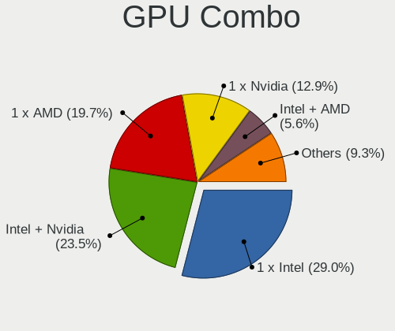

| Name            | Computers | Percent |
|-----------------|-----------|---------|
| 1 x Intel       | 563       | 28.81%  |
| Intel + Nvidia  | 447       | 22.88%  |
| 1 x AMD         | 380       | 19.45%  |
| 1 x Nvidia      | 263       | 13.46%  |
| Intel + AMD     | 130       | 6.65%   |
| 2 x AMD         | 70        | 3.58%   |
| AMD + Nvidia    | 49        | 2.51%   |
| Other           | 28        | 1.43%   |
| 1 x SiS         | 10        | 0.51%   |
| 2 x Intel       | 5         | 0.26%   |
| 1 x VIA         | 3         | 0.15%   |
| 2 x Nvidia      | 2         | 0.1%    |
| 1 x Matrox      | 2         | 0.1%    |
| Intel + 2 x AMD | 1         | 0.05%   |
| 1 x ASPEED      | 1         | 0.05%   |

GPU Driver
----------

Free vs proprietary

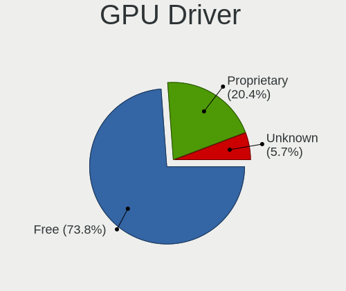

| Driver      | Computers | Percent |
|-------------|-----------|---------|
| Free        | 1502      | 75.94%  |
| Proprietary | 389       | 19.67%  |
| Unknown     | 87        | 4.4%    |

GPU Memory
----------

Total video memory

| Size in GB | Computers | Percent |
|------------|-----------|---------|
| Unknown    | 1049      | 52.14%  |
| 1.01-2.0   | 290       | 14.41%  |
| 0.01-0.5   | 197       | 9.79%   |
| 0.51-1.0   | 188       | 9.34%   |
| 3.01-4.0   | 165       | 8.2%    |
| 5.01-6.0   | 52        | 2.58%   |
| 7.01-8.0   | 38        | 1.89%   |
| 8.01-16.0  | 19        | 0.94%   |
| 2.01-3.0   | 10        | 0.5%    |
| 16.01-24.0 | 3         | 0.15%   |
| 4.01-5.0   | 1         | 0.05%   |

Monitor
-------

Monitor Vendor
--------------

Monitor vendors

| Vendor                  | Computers | Percent |
|-------------------------|-----------|---------|
| AU Optronics            | 296       | 14.63%  |
| LG Display              | 243       | 12.01%  |
| BOE                     | 243       | 12.01%  |
| Samsung Electronics     | 219       | 10.83%  |
| Chimei Innolux          | 212       | 10.48%  |
| Goldstar                | 73        | 3.61%   |
| Philips                 | 68        | 3.36%   |
| Dell                    | 49        | 2.42%   |
| Apple                   | 46        | 2.27%   |
| Ancor Communications    | 40        | 1.98%   |
| Hewlett-Packard         | 39        | 1.93%   |
| AOC                     | 37        | 1.83%   |
| Chi Mei Optoelectronics | 36        | 1.78%   |
| Acer                    | 36        | 1.78%   |
| ViewSonic               | 35        | 1.73%   |
| Lenovo                  | 35        | 1.73%   |
| PANDA                   | 32        | 1.58%   |
| ASUSTek Computer        | 30        | 1.48%   |
| Sharp                   | 23        | 1.14%   |
| BenQ                    | 22        | 1.09%   |
| LG Philips              | 11        | 0.54%   |
| MSI                     | 10        | 0.49%   |
| InfoVision              | 10        | 0.49%   |
| CPT                     | 9         | 0.44%   |
| Sony                    | 8         | 0.4%    |
| Vestel Elektronik       | 7         | 0.35%   |
| Unknown                 | 7         | 0.35%   |
| SAC                     | 7         | 0.35%   |
| LG Electronics          | 7         | 0.35%   |
| AGO                     | 7         | 0.35%   |
| LGD                     | 6         | 0.3%    |
| CSO                     | 6         | 0.3%    |
| SANYO                   | 5         | 0.25%   |
| Plain Tree Systems      | 5         | 0.25%   |
| Mi                      | 5         | 0.25%   |
| KTC                     | 5         | 0.25%   |
| HKC                     | 5         | 0.25%   |
| Beko                    | 5         | 0.25%   |
| Unknown                 | 5         | 0.25%   |
| VIE                     | 4         | 0.2%    |

Monitor Model
-------------

Monitor models

| Model                                                                    | Computers | Percent |
|--------------------------------------------------------------------------|-----------|---------|
| AU Optronics LCD Monitor AUO38ED 1920x1080 344x193mm 15.5-inch           | 24        | 1.16%   |
| Chimei Innolux LCD Monitor CMN14D4 1920x1080 309x173mm 13.9-inch         | 20        | 0.97%   |
| AU Optronics LCD Monitor AUO22EC 1366x768 344x193mm 15.5-inch            | 20        | 0.97%   |
| LG Display LCD Monitor LGD0456 1366x768 344x194mm 15.5-inch              | 17        | 0.82%   |
| Chimei Innolux LCD Monitor CMN15DB 1366x768 344x193mm 15.5-inch          | 17        | 0.82%   |
| Chimei Innolux LCD Monitor CMN15F5 1920x1080 344x193mm 15.5-inch         | 15        | 0.73%   |
| LG Display LCD Monitor LGD02DC 1366x768 344x194mm 15.5-inch              | 14        | 0.68%   |
| BOE LCD Monitor BOE0872 1920x1080 344x194mm 15.5-inch                    | 14        | 0.68%   |
| LG Display LCD Monitor LGD033A 1366x768 344x194mm 15.5-inch              | 13        | 0.63%   |
| LG Display LCD Monitor LGD039F 1366x768 345x194mm 15.6-inch              | 11        | 0.53%   |
| Lenovo LCD Monitor LEN40BA 1920x1080 344x194mm 15.5-inch                 | 11        | 0.53%   |
| Chimei Innolux LCD Monitor CMN1521 1920x1080 344x193mm 15.5-inch         | 10        | 0.48%   |
| PANDA LCD Monitor NCP004D 1920x1080 344x194mm 15.5-inch                  | 9         | 0.44%   |
| BOE LCD Monitor BOE06A4 1366x768 344x194mm 15.5-inch                     | 9         | 0.44%   |
| AU Optronics LCD Monitor AUO405C 1366x768 256x144mm 11.6-inch            | 9         | 0.44%   |
| AU Optronics LCD Monitor AUO21ED 1920x1080 344x194mm 15.5-inch           | 9         | 0.44%   |
| Goldstar FULL HD GSM5B55 1920x1080 480x270mm 21.7-inch                   | 8         | 0.39%   |
| Chimei Innolux LCD Monitor CMN15E7 1920x1080 344x193mm 15.5-inch         | 8         | 0.39%   |
| Chimei Innolux LCD Monitor CMN15DC 1366x768 344x193mm 15.5-inch          | 8         | 0.39%   |
| Chi Mei Optoelectronics LCD Monitor CMO15A7 1366x768 344x193mm 15.5-inch | 8         | 0.39%   |
| BOE LCD Monitor BOE0802 1920x1080 344x193mm 15.5-inch                    | 8         | 0.39%   |
| AU Optronics LCD Monitor AUOAF90 1920x1080 344x193mm 15.5-inch           | 8         | 0.39%   |
| AU Optronics LCD Monitor AUO403D 1920x1080 309x174mm 14.0-inch           | 8         | 0.39%   |
| Samsung Electronics LCD Monitor SEC5441 1366x768 309x174mm 14.0-inch     | 7         | 0.34%   |
| LG Display LCD Monitor LGD02AC 1366x768 344x194mm 15.5-inch              | 7         | 0.34%   |
| Chimei Innolux LCD Monitor CMN15D5 1920x1080 344x193mm 15.5-inch         | 7         | 0.34%   |
| Chimei Innolux LCD Monitor CMN14D5 1920x1080 309x173mm 13.9-inch         | 7         | 0.34%   |
| BOE LCD Monitor BOE07C9 1920x1080 309x173mm 13.9-inch                    | 7         | 0.34%   |
| AU Optronics LCD Monitor AUO70EC 1366x768 344x193mm 15.5-inch            | 7         | 0.34%   |
| Vestel Elektronik 32W_LCD_TV VES3700 1920x1080 706x398mm 31.9-inch       | 6         | 0.29%   |
| Samsung Electronics S24F350 SAM0D20 1920x1080 521x293mm 23.5-inch        | 6         | 0.29%   |
| Samsung Electronics LCD Monitor SEC324A 1366x768 344x194mm 15.5-inch     | 6         | 0.29%   |
| LG Display LCD Monitor LGD053F 1920x1080 344x194mm 15.5-inch             | 6         | 0.29%   |
| LG Display LCD Monitor LGD0384 1366x768 344x194mm 15.5-inch              | 6         | 0.29%   |
| LG Display LCD Monitor LGD02F2 1366x768 344x194mm 15.5-inch              | 6         | 0.29%   |
| Chimei Innolux LCD Monitor CMN15AB 1366x768 344x193mm 15.5-inch          | 6         | 0.29%   |
| BOE LCD Monitor BOE06A5 1366x768 344x194mm 15.5-inch                     | 6         | 0.29%   |
| BOE LCD Monitor BOE0675 1366x768 344x194mm 15.5-inch                     | 6         | 0.29%   |
| AU Optronics LCD Monitor AUO71EC 1366x768 344x193mm 15.5-inch            | 6         | 0.29%   |
| AU Optronics LCD Monitor AUO45EC 1366x768 344x193mm 15.5-inch            | 6         | 0.29%   |

Monitor Resolution
------------------

Monitor screen resolution

| Resolution         | Computers | Percent |
|--------------------|-----------|---------|
| 1920x1080 (FHD)    | 915       | 47.58%  |
| 1366x768 (WXGA)    | 504       | 26.21%  |
| 3840x2160 (4K)     | 67        | 3.48%   |
| 2560x1440 (QHD)    | 62        | 3.22%   |
| 1440x900 (WXGA+)   | 44        | 2.29%   |
| 1280x800 (WXGA)    | 41        | 2.13%   |
| 1600x900 (HD+)     | 40        | 2.08%   |
| 1280x1024 (SXGA)   | 32        | 1.66%   |
| 1920x1200 (WUXGA)  | 27        | 1.4%    |
| 1680x1050 (WSXGA+) | 27        | 1.4%    |
| Unknown            | 24        | 1.25%   |
| 2560x1600          | 19        | 0.99%   |
| 2160x1440          | 15        | 0.78%   |
| 2560x1080          | 13        | 0.68%   |
| 1360x768           | 11        | 0.57%   |
| 1024x600           | 11        | 0.57%   |
| 2880x1800          | 9         | 0.47%   |
| 3440x1440          | 8         | 0.42%   |
| 3840x1080          | 7         | 0.36%   |
| 3200x1800 (QHD+)   | 5         | 0.26%   |
| 1920x540           | 4         | 0.21%   |
| 1024x768 (XGA)     | 4         | 0.21%   |
| 1680x945           | 3         | 0.16%   |
| 800x1280           | 2         | 0.1%    |
| 4480x1440          | 2         | 0.1%    |
| 3840x2400          | 2         | 0.1%    |
| 3000x2000          | 2         | 0.1%    |
| 2520x1680          | 2         | 0.1%    |
| 800x600            | 1         | 0.05%   |
| 7920x1440          | 1         | 0.05%   |
| 6000x1440          | 1         | 0.05%   |
| 5760x2160          | 1         | 0.05%   |
| 3840x2560          | 1         | 0.05%   |
| 3840x1200          | 1         | 0.05%   |
| 3750x1280          | 1         | 0.05%   |
| 3360x1050          | 1         | 0.05%   |
| 3240x2160          | 1         | 0.05%   |
| 3072x1920          | 1         | 0.05%   |
| 3046x1050          | 1         | 0.05%   |
| 2944x1840          | 1         | 0.05%   |

Monitor Diagonal
----------------

Diagonal size in inches

| Inches  | Computers | Percent |
|---------|-----------|---------|
| 15      | 833       | 41.28%  |
| 13      | 177       | 8.77%   |
| 23      | 119       | 5.9%    |
| 21      | 111       | 5.5%    |
| 14      | 100       | 4.96%   |
| 27      | 93        | 4.61%   |
| 17      | 86        | 4.26%   |
| 24      | 84        | 4.16%   |
| Unknown | 78        | 3.87%   |
| 18      | 48        | 2.38%   |
| 16      | 38        | 1.88%   |
| 19      | 34        | 1.68%   |
| 12      | 32        | 1.59%   |
| 11      | 28        | 1.39%   |
| 31      | 20        | 0.99%   |
| 34      | 19        | 0.94%   |
| 20      | 19        | 0.94%   |
| 10      | 17        | 0.84%   |
| 22      | 13        | 0.64%   |
| 72      | 10        | 0.5%    |
| 84      | 9         | 0.45%   |
| 54      | 5         | 0.25%   |
| 40      | 5         | 0.25%   |
| 26      | 5         | 0.25%   |
| 32      | 4         | 0.2%    |
| 28      | 4         | 0.2%    |
| 57      | 3         | 0.15%   |
| 46      | 3         | 0.15%   |
| 43      | 3         | 0.15%   |
| 33      | 3         | 0.15%   |
| 29      | 3         | 0.15%   |
| 60      | 2         | 0.1%    |
| 36      | 2         | 0.1%    |
| 7       | 2         | 0.1%    |
| 86      | 1         | 0.05%   |
| 65      | 1         | 0.05%   |
| 64      | 1         | 0.05%   |
| 55      | 1         | 0.05%   |
| 52      | 1         | 0.05%   |
| 25      | 1         | 0.05%   |

Monitor Width
-------------

Physical width

| Width in mm | Computers | Percent |
|-------------|-----------|---------|
| 301-350     | 1035      | 51.72%  |
| 501-600     | 271       | 13.54%  |
| 401-500     | 227       | 11.34%  |
| 201-300     | 173       | 8.65%   |
| 351-400     | 104       | 5.2%    |
| Unknown     | 78        | 3.9%    |
| 601-700     | 38        | 1.9%    |
| 701-800     | 28        | 1.4%    |
| 1501-2000   | 19        | 0.95%   |
| 1001-1500   | 18        | 0.9%    |
| 801-900     | 5         | 0.25%   |
| 901-1000    | 3         | 0.15%   |
| 1-100       | 2         | 0.1%    |

Aspect Ratio
------------

Proportional relationship between the width and the height

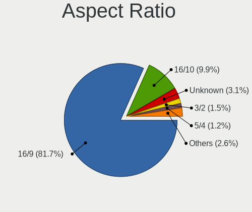

| Ratio   | Computers | Percent |
|---------|-----------|---------|
| 16/9    | 1492      | 81.62%  |
| 16/10   | 168       | 9.19%   |
| Unknown | 68        | 3.72%   |
| 3/2     | 31        | 1.7%    |
| 5/4     | 25        | 1.37%   |
| 4/3     | 21        | 1.15%   |
| 21/9    | 19        | 1.04%   |
| 0.67    | 2         | 0.11%   |
| 6/5     | 1         | 0.05%   |
| 0.56    | 1         | 0.05%   |

Monitor Area
------------

Area in inch

| Area in inch | Computers | Percent |
|----------------|-----------|---------|
| 101-110        | 841       | 42.01%  |
| 201-250        | 275       | 13.74%  |
| 81-90          | 207       | 10.34%  |
| 301-350        | 95        | 4.75%   |
| 151-200        | 85        | 4.25%   |
| Unknown        | 78        | 3.9%    |
| 71-80          | 75        | 3.75%   |
| 121-130        | 67        | 3.35%   |
| 141-150        | 58        | 2.9%    |
| 351-500        | 53        | 2.65%   |
| More than 1000 | 34        | 1.7%    |
| 51-60          | 28        | 1.4%    |
| 61-70          | 24        | 1.2%    |
| 111-120        | 21        | 1.05%   |
| 251-300        | 19        | 0.95%   |
| 41-50          | 17        | 0.85%   |
| 501-1000       | 13        | 0.65%   |
| 91-100         | 6         | 0.3%    |
| 131-140        | 4         | 0.2%    |
| 1-40           | 2         | 0.1%    |

Pixel Density
-------------

Pixels per inch

| Density       | Computers | Percent |
|---------------|-----------|---------|
| 121-160       | 660       | 33.37%  |
| 101-120       | 562       | 28.41%  |
| 51-100        | 505       | 25.53%  |
| 161-240       | 118       | 5.97%   |
| Unknown       | 78        | 3.94%   |
| 1-50          | 31        | 1.57%   |
| More than 240 | 24        | 1.21%   |

Multiple Monitors
-----------------

Total monitors connected

| Total | Computers | Percent |
|-------|-----------|---------|
| 1     | 1631      | 82.21%  |
| 2     | 255       | 12.85%  |
| 0     | 89        | 4.49%   |
| 3     | 9         | 0.45%   |

Network
-------

Net Controller Vendor
---------------------

Controller vendors

| Vendor                                 | Computers | Percent |
|----------------------------------------|-----------|---------|
| Realtek Semiconductor                  | 1258      | 41.5%   |
| Intel                                  | 756       | 24.94%  |
| Qualcomm Atheros                       | 392       | 12.93%  |
| Broadcom                               | 178       | 5.87%   |
| Ralink Technology                      | 64        | 2.11%   |
| MediaTek                               | 49        | 1.62%   |
| Broadcom Limited                       | 38        | 1.25%   |
| Ralink                                 | 33        | 1.09%   |
| Marvell Technology Group               | 32        | 1.06%   |
| TP-Link                                | 27        | 0.89%   |
| ASUSTek Computer                       | 24        | 0.79%   |
| Qualcomm Atheros Communications        | 21        | 0.69%   |
| Nvidia                                 | 19        | 0.63%   |
| Samsung Electronics                    | 18        | 0.59%   |
| Xiaomi                                 | 14        | 0.46%   |
| Silicon Integrated Systems [SiS]       | 13        | 0.43%   |
| ASIX Electronics                       | 7         | 0.23%   |
| Huawei Technologies                    | 6         | 0.2%    |
| Ericsson Business Mobile Networks      | 6         | 0.2%    |
| ZyXEL Communications                   | 5         | 0.16%   |
| JMicron Technology                     | 5         | 0.16%   |
| Apple                                  | 5         | 0.16%   |
| ICS Advent                             | 4         | 0.13%   |
| Edimax Technology                      | 4         | 0.13%   |
| Aquantia                               | 4         | 0.13%   |
| Microchip Technology                   | 3         | 0.1%    |
| Dell                                   | 3         | 0.1%    |
| Tenda                                  | 2         | 0.07%   |
| Sony Ericsson Mobile Communications AB | 2         | 0.07%   |
| Sierra Wireless                        | 2         | 0.07%   |
| Qualcomm                               | 2         | 0.07%   |
| OPPO Electronics                       | 2         | 0.07%   |
| Motorola PCS                           | 2         | 0.07%   |
| Lenovo                                 | 2         | 0.07%   |
| Attansic Technology                    | 2         | 0.07%   |
| Accton Technology                      | 2         | 0.07%   |
| Wilocity                               | 1         | 0.03%   |
| VIA Technologies                       | 1         | 0.03%   |
| ULi Electronics                        | 1         | 0.03%   |
| U-Blox                                 | 1         | 0.03%   |

Net Controller Model
--------------------

Controller models

| Model                                                             | Computers | Percent |
|-------------------------------------------------------------------|-----------|---------|
| Realtek RTL8111/8168/8411 PCI Express Gigabit Ethernet Controller | 867       | 24.96%  |
| Realtek RTL810xE PCI Express Fast Ethernet controller             | 187       | 5.38%   |
| Qualcomm Atheros AR9485 Wireless Network Adapter                  | 70        | 2.02%   |
| Qualcomm Atheros QCA9377 802.11ac Wireless Network Adapter        | 67        | 1.93%   |
| Realtek RTL8822CE 802.11ac PCIe Wireless Network Adapter          | 64        | 1.84%   |
| Intel Wi-Fi 6 AX200                                               | 61        | 1.76%   |
| Qualcomm Atheros AR9285 Wireless Network Adapter (PCI-Express)    | 54        | 1.55%   |
| Intel Wi-Fi 6 AX201                                               | 51        | 1.47%   |
| Realtek RTL8723BE PCIe Wireless Network Adapter                   | 50        | 1.44%   |
| Qualcomm Atheros QCA9565 / AR9565 Wireless Network Adapter        | 48        | 1.38%   |
| Broadcom BCM4313 802.11bgn Wireless Network Adapter               | 46        | 1.32%   |
| Intel Comet Lake PCH CNVi WiFi                                    | 45        | 1.3%    |
| Realtek RTL8821CE 802.11ac PCIe Wireless Network Adapter          | 41        | 1.18%   |
| Realtek RTL8125 2.5GbE Controller                                 | 41        | 1.18%   |
| Intel Wireless 7265                                               | 41        | 1.18%   |
| Intel Cannon Lake PCH CNVi WiFi                                   | 37        | 1.07%   |
| Qualcomm Atheros QCA6174 802.11ac Wireless Network Adapter        | 33        | 0.95%   |
| Intel Wireless 8265 / 8275                                        | 32        | 0.92%   |
| Intel Dual Band Wireless-AC 3168NGW [Stone Peak]                  | 31        | 0.89%   |
| Intel Comet Lake PCH-LP CNVi WiFi                                 | 30        | 0.86%   |
| Ralink MT7601U Wireless Adapter                                   | 29        | 0.84%   |
| Intel Alder Lake-P PCH CNVi WiFi                                  | 28        | 0.81%   |
| MediaTek MT7921 802.11ax PCI Express Wireless Network Adapter     | 27        | 0.78%   |
| Broadcom BCM43142 802.11b/g/n                                     | 26        | 0.75%   |
| Realtek RTL8822BE 802.11a/b/g/n/ac WiFi adapter                   | 25        | 0.72%   |
| Intel Dual Band Wireless-AC 3165 Plus Bluetooth                   | 25        | 0.72%   |
| Intel 82579LM Gigabit Network Connection (Lewisville)             | 23        | 0.66%   |
| Qualcomm Atheros AR8131 Gigabit Ethernet                          | 22        | 0.63%   |
| Intel Wireless 3165                                               | 22        | 0.63%   |
| Ralink RT3290 Wireless 802.11n 1T/1R PCIe                         | 21        | 0.6%    |
| Qualcomm Atheros AR8151 v2.0 Gigabit Ethernet                     | 21        | 0.6%    |
| Intel Wireless 7260                                               | 21        | 0.6%    |
| Intel Wireless 3160                                               | 20        | 0.58%   |
| Intel I211 Gigabit Network Connection                             | 18        | 0.52%   |
| Intel Centrino Advanced-N 6205 [Taylor Peak]                      | 18        | 0.52%   |
| Realtek RTL8153 Gigabit Ethernet Adapter                          | 17        | 0.49%   |
| Intel Wireless 8260                                               | 17        | 0.49%   |
| Intel Ethernet Connection (2) I219-V                              | 17        | 0.49%   |
| Realtek RTL8152 Fast Ethernet Adapter                             | 16        | 0.46%   |
| Qualcomm Atheros AR9271 802.11n                                   | 16        | 0.46%   |

Wireless Vendor
---------------

Wireless vendors

| Vendor                            | Computers | Percent |
|-----------------------------------|-----------|---------|
| Intel                             | 656       | 38.57%  |
| Realtek Semiconductor             | 330       | 19.4%   |
| Qualcomm Atheros                  | 304       | 17.87%  |
| Broadcom                          | 138       | 8.11%   |
| Ralink Technology                 | 64        | 3.76%   |
| MediaTek                          | 48        | 2.82%   |
| Ralink                            | 33        | 1.94%   |
| Broadcom Limited                  | 26        | 1.53%   |
| TP-Link                           | 25        | 1.47%   |
| ASUSTek Computer                  | 24        | 1.41%   |
| Qualcomm Atheros Communications   | 21        | 1.23%   |
| ZyXEL Communications              | 5         | 0.29%   |
| Ericsson Business Mobile Networks | 4         | 0.24%   |
| Edimax Technology                 | 4         | 0.24%   |
| Marvell Technology Group          | 3         | 0.18%   |
| Dell                              | 3         | 0.18%   |
| Tenda                             | 2         | 0.12%   |
| Sierra Wireless                   | 2         | 0.12%   |
| Accton Technology                 | 2         | 0.12%   |
| Wilocity                          | 1         | 0.06%   |
| Silicon Integrated Systems [SiS]  | 1         | 0.06%   |
| Linksys                           | 1         | 0.06%   |
| IMC Networks                      | 1         | 0.06%   |
| Fibocom                           | 1         | 0.06%   |
| Belkin Components                 | 1         | 0.06%   |
| AirTies Wireless Networks         | 1         | 0.06%   |

Wireless Model
--------------

Wireless models

| Model                                                          | Computers | Percent |
|----------------------------------------------------------------|-----------|---------|
| Qualcomm Atheros AR9485 Wireless Network Adapter               | 70        | 4.11%   |
| Qualcomm Atheros QCA9377 802.11ac Wireless Network Adapter     | 67        | 3.93%   |
| Realtek RTL8822CE 802.11ac PCIe Wireless Network Adapter       | 64        | 3.75%   |
| Intel Wi-Fi 6 AX200                                            | 61        | 3.58%   |
| Qualcomm Atheros AR9285 Wireless Network Adapter (PCI-Express) | 54        | 3.17%   |
| Intel Wi-Fi 6 AX201                                            | 51        | 2.99%   |
| Realtek RTL8723BE PCIe Wireless Network Adapter                | 50        | 2.93%   |
| Qualcomm Atheros QCA9565 / AR9565 Wireless Network Adapter     | 48        | 2.82%   |
| Broadcom BCM4313 802.11bgn Wireless Network Adapter            | 46        | 2.7%    |
| Intel Comet Lake PCH CNVi WiFi                                 | 45        | 2.64%   |
| Realtek RTL8821CE 802.11ac PCIe Wireless Network Adapter       | 41        | 2.4%    |
| Intel Wireless 7265                                            | 41        | 2.4%    |
| Intel Cannon Lake PCH CNVi WiFi                                | 37        | 2.17%   |
| Qualcomm Atheros QCA6174 802.11ac Wireless Network Adapter     | 33        | 1.94%   |
| Intel Wireless 8265 / 8275                                     | 32        | 1.88%   |
| Intel Dual Band Wireless-AC 3168NGW [Stone Peak]               | 31        | 1.82%   |
| Intel Comet Lake PCH-LP CNVi WiFi                              | 30        | 1.76%   |
| Ralink MT7601U Wireless Adapter                                | 29        | 1.7%    |
| Intel Alder Lake-P PCH CNVi WiFi                               | 28        | 1.64%   |
| MediaTek MT7921 802.11ax PCI Express Wireless Network Adapter  | 27        | 1.58%   |
| Broadcom BCM43142 802.11b/g/n                                  | 26        | 1.52%   |
| Realtek RTL8822BE 802.11a/b/g/n/ac WiFi adapter                | 25        | 1.47%   |
| Intel Dual Band Wireless-AC 3165 Plus Bluetooth                | 25        | 1.47%   |
| Intel Wireless 3165                                            | 22        | 1.29%   |
| Ralink RT3290 Wireless 802.11n 1T/1R PCIe                      | 21        | 1.23%   |
| Intel Wireless 7260                                            | 21        | 1.23%   |
| Intel Wireless 3160                                            | 20        | 1.17%   |
| Intel Centrino Advanced-N 6205 [Taylor Peak]                   | 18        | 1.06%   |
| Intel Wireless 8260                                            | 17        | 1%      |
| Qualcomm Atheros AR9271 802.11n                                | 16        | 0.94%   |
| Intel Tiger Lake PCH CNVi WiFi                                 | 16        | 0.94%   |
| Realtek RTL8723AE PCIe Wireless Network Adapter                | 15        | 0.88%   |
| Ralink RT2870/RT3070 Wireless Adapter                          | 15        | 0.88%   |
| Realtek RTL8723DE Wireless Network Adapter                     | 14        | 0.82%   |
| Intel Wireless-AC 9260                                         | 14        | 0.82%   |
| Intel PRO/Wireless 3945ABG [Golan] Network Connection          | 14        | 0.82%   |
| Intel Ice Lake-LP PCH CNVi WiFi                                | 14        | 0.82%   |
| Intel Cannon Point-LP CNVi [Wireless-AC]                       | 13        | 0.76%   |
| Realtek RTL8192CU 802.11n WLAN Adapter                         | 12        | 0.7%    |
| MediaTek MT7922 802.11ax PCI Express Wireless Network Adapter  | 12        | 0.7%    |

Ethernet Vendor
---------------

Ethernet vendors

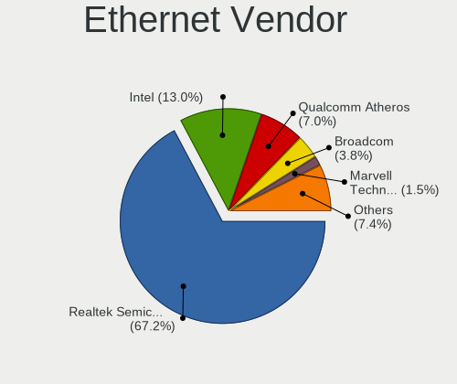

| Vendor                                 | Computers | Percent |
|----------------------------------------|-----------|---------|
| Realtek Semiconductor                  | 1149      | 66.92%  |
| Intel                                  | 214       | 12.46%  |
| Qualcomm Atheros                       | 133       | 7.75%   |
| Broadcom                               | 71        | 4.14%   |
| Marvell Technology Group               | 29        | 1.69%   |
| Nvidia                                 | 18        | 1.05%   |
| Xiaomi                                 | 14        | 0.82%   |
| Silicon Integrated Systems [SiS]       | 12        | 0.7%    |
| Broadcom Limited                       | 12        | 0.7%    |
| Samsung Electronics                    | 7         | 0.41%   |
| ASIX Electronics                       | 7         | 0.41%   |
| Huawei Technologies                    | 6         | 0.35%   |
| JMicron Technology                     | 5         | 0.29%   |
| Apple                                  | 5         | 0.29%   |
| ICS Advent                             | 4         | 0.23%   |
| Aquantia                               | 4         | 0.23%   |
| Microchip Technology                   | 3         | 0.17%   |
| TP-Link                                | 2         | 0.12%   |
| Sony Ericsson Mobile Communications AB | 2         | 0.12%   |
| Qualcomm                               | 2         | 0.12%   |
| OPPO Electronics                       | 2         | 0.12%   |
| Motorola PCS                           | 2         | 0.12%   |
| Attansic Technology                    | 2         | 0.12%   |
| VIA Technologies                       | 1         | 0.06%   |
| ULi Electronics                        | 1         | 0.06%   |
| T & A Mobile Phones                    | 1         | 0.06%   |
| Standard Microsystems                  | 1         | 0.06%   |
| OnePlus Technology (Shenzhen)          | 1         | 0.06%   |
| Mellanox Technologies                  | 1         | 0.06%   |
| MediaTek                               | 1         | 0.06%   |
| LSI                                    | 1         | 0.06%   |
| Lenovo                                 | 1         | 0.06%   |
| Insyde Software                        | 1         | 0.06%   |
| HTC (High Tech Computer)               | 1         | 0.06%   |
| Davicom Semiconductor                  | 1         | 0.06%   |

Ethernet Model
--------------

Ethernet models

| Model                                                             | Computers | Percent |
|-------------------------------------------------------------------|-----------|---------|
| Realtek RTL8111/8168/8411 PCI Express Gigabit Ethernet Controller | 867       | 49.77%  |
| Realtek RTL810xE PCI Express Fast Ethernet controller             | 187       | 10.73%  |
| Realtek RTL8125 2.5GbE Controller                                 | 41        | 2.35%   |
| Intel 82579LM Gigabit Network Connection (Lewisville)             | 23        | 1.32%   |
| Qualcomm Atheros AR8131 Gigabit Ethernet                          | 22        | 1.26%   |
| Qualcomm Atheros AR8151 v2.0 Gigabit Ethernet                     | 21        | 1.21%   |
| Intel I211 Gigabit Network Connection                             | 18        | 1.03%   |
| Realtek RTL8153 Gigabit Ethernet Adapter                          | 17        | 0.98%   |
| Intel Ethernet Connection (2) I219-V                              | 17        | 0.98%   |
| Realtek RTL8152 Fast Ethernet Adapter                             | 16        | 0.92%   |
| Silicon Integrated Systems [SiS] 191 Gigabit Ethernet Adapter     | 12        | 0.69%   |
| Realtek Killer E2600 Gigabit Ethernet Controller                  | 12        | 0.69%   |
| Intel Ethernet Connection (3) I218-LM                             | 12        | 0.69%   |
| Broadcom NetXtreme BCM57765 Gigabit Ethernet PCIe                 | 12        | 0.69%   |
| Broadcom NetLink BCM57785 Gigabit Ethernet PCIe                   | 12        | 0.69%   |
| Qualcomm Atheros QCA8171 Gigabit Ethernet                         | 11        | 0.63%   |
| Qualcomm Atheros AR8161 Gigabit Ethernet                          | 11        | 0.63%   |
| Qualcomm Atheros AR8152 v1.1 Fast Ethernet                        | 11        | 0.63%   |
| Qualcomm Atheros Killer E2500 Gigabit Ethernet Controller         | 10        | 0.57%   |
| Intel 82579V Gigabit Network Connection                           | 10        | 0.57%   |
| Xiaomi Mi/Redmi series (RNDIS)                                    | 9         | 0.52%   |
| Qualcomm Atheros AR8152 v2.0 Fast Ethernet                        | 9         | 0.52%   |
| Intel Ethernet Connection I217-LM                                 | 9         | 0.52%   |
| Intel Ethernet Connection (4) I219-LM                             | 9         | 0.52%   |
| Realtek RTL-8100/8101L/8139 PCI Fast Ethernet Adapter             | 8         | 0.46%   |
| Intel I210 Gigabit Network Connection                             | 8         | 0.46%   |
| Intel Ethernet Connection I217-V                                  | 8         | 0.46%   |
| Samsung Galaxy series, misc. (tethering mode)                     | 7         | 0.4%    |
| Qualcomm Atheros Killer E2400 Gigabit Ethernet Controller         | 7         | 0.4%    |
| Nvidia MCP61 Ethernet                                             | 7         | 0.4%    |
| Intel Ethernet Connection I218-LM                                 | 7         | 0.4%    |
| Broadcom NetLink BCM57780 Gigabit Ethernet PCIe                   | 7         | 0.4%    |
| Marvell Group 88E8040 PCI-E Fast Ethernet Controller              | 6         | 0.34%   |
| Intel Ethernet Connection (14) I219-V                             | 6         | 0.34%   |
| Huawei MAR-LX1M                                                   | 6         | 0.34%   |
| Broadcom NetXtreme BCM57766 Gigabit Ethernet PCIe                 | 6         | 0.34%   |
| Broadcom NetLink BCM5784M Gigabit Ethernet PCIe                   | 6         | 0.34%   |
| Xiaomi Mi/Redmi series (RNDIS + ADB)                              | 5         | 0.29%   |
| Qualcomm Atheros QCA8172 Fast Ethernet                            | 5         | 0.29%   |
| Qualcomm Atheros Killer E220x Gigabit Ethernet Controller         | 5         | 0.29%   |

Net Controller Kind
-------------------

Ethernet, WiFi or modem

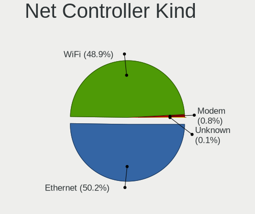

| Kind     | Computers | Percent |
|----------|-----------|---------|
| Ethernet | 1656      | 50.36%  |
| WiFi     | 1606      | 48.84%  |
| Modem    | 23        | 0.7%    |
| Unknown  | 3         | 0.09%   |

Used Controller
---------------

Currently used network controller

| Kind     | Computers | Percent |
|----------|-----------|---------|
| WiFi     | 1311      | 67.02%  |
| Ethernet | 644       | 32.92%  |
| Modem    | 1         | 0.05%   |

NICs
----

Total network controllers on board

| Total | Computers | Percent |
|-------|-----------|---------|
| 2     | 1198      | 61.63%  |
| 1     | 666       | 34.26%  |
| 0     | 58        | 2.98%   |
| 3     | 16        | 0.82%   |
| 4     | 3         | 0.15%   |
| 16    | 1         | 0.05%   |
| 7     | 1         | 0.05%   |
| 5     | 1         | 0.05%   |

IPv6
----

IPv6 vs IPv4

| Used | Computers | Percent |
|------|-----------|---------|
| No   | 1901      | 97.69%  |
| Yes  | 45        | 2.31%   |

Bluetooth
---------

Bluetooth Vendor
----------------

Controller vendors

| Vendor                          | Computers | Percent |
|---------------------------------|-----------|---------|
| Intel                           | 546       | 40.84%  |
| Realtek Semiconductor           | 157       | 11.74%  |
| Qualcomm Atheros Communications | 114       | 8.53%   |
| IMC Networks                    | 106       | 7.93%   |
| Cambridge Silicon Radio         | 72        | 5.39%   |
| Broadcom                        | 53        | 3.96%   |
| Lite-On Technology              | 52        | 3.89%   |
| Foxconn / Hon Hai               | 43        | 3.22%   |
| Apple                           | 40        | 2.99%   |
| Toshiba                         | 27        | 2.02%   |
| ASUSTek Computer                | 25        | 1.87%   |
| Realtek                         | 24        | 1.8%    |
| Ralink                          | 21        | 1.57%   |
| Dell                            | 13        | 0.97%   |
| Hewlett-Packard                 | 11        | 0.82%   |
| MediaTek                        | 10        | 0.75%   |
| TP-Link                         | 8         | 0.6%    |
| Ralink Technology               | 3         | 0.22%   |
| Foxconn International           | 3         | 0.22%   |
| Alps Electric                   | 3         | 0.22%   |
| Marvell Semiconductor           | 2         | 0.15%   |
| Qcom                            | 1         | 0.07%   |
| Logitech                        | 1         | 0.07%   |
| Integrated System Solution      | 1         | 0.07%   |
| HTC (High Tech Computer)        | 1         | 0.07%   |

Bluetooth Model
---------------

Controller models

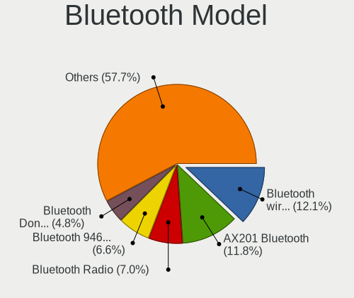

| Model                                               | Computers | Percent |
|-----------------------------------------------------|-----------|---------|
| Intel Bluetooth wireless interface                  | 173       | 12.93%  |
| Intel AX201 Bluetooth                               | 125       | 9.34%   |
| Realtek Bluetooth Radio                             | 94        | 7.03%   |
| Intel Bluetooth 9460/9560 Jefferson Peak (JfP)      | 89        | 6.65%   |
| Cambridge Silicon Radio Bluetooth Dongle (HCI mode) | 72        | 5.38%   |
| Intel AX200 Bluetooth                               | 60        | 4.48%   |
| Qualcomm Atheros  Bluetooth Device                  | 56        | 4.19%   |
| IMC Networks Bluetooth Radio                        | 34        | 2.54%   |
| Realtek  Bluetooth 4.2 Adapter                      | 30        | 2.24%   |
| Intel Wireless-AC 3168 Bluetooth                    | 29        | 2.17%   |
| Realtek 802.11ac WLAN Adapter                       | 24        | 1.79%   |
| Apple Bluetooth Host Controller                     | 22        | 1.64%   |
| Ralink RT3290 Bluetooth                             | 21        | 1.57%   |
| Intel Centrino Bluetooth Wireless Transceiver       | 20        | 1.49%   |
| IMC Networks Bluetooth Device                       | 20        | 1.49%   |
| Intel Bluetooth Device                              | 19        | 1.42%   |
| Qualcomm Atheros AR3011 Bluetooth                   | 17        | 1.27%   |
| Qualcomm Atheros QCA61x4 Bluetooth 4.0              | 16        | 1.2%    |
| IMC Networks Wireless_Device                        | 16        | 1.2%    |
| Qualcomm Atheros AR3012 Bluetooth 4.0               | 15        | 1.12%   |
| Lite-On Qualcomm Atheros QCA9377 Bluetooth          | 15        | 1.12%   |
| Lite-On Bluetooth Device                            | 14        | 1.05%   |
| Realtek RTL8822BE Bluetooth 4.2 Adapter             | 13        | 0.97%   |
| Intel Wireless-AC 9260 Bluetooth Adapter            | 13        | 0.97%   |
| Apple Bluetooth USB Host Controller                 | 13        | 0.97%   |
| Realtek 802.11ac WLAN Adapter                       | 12        | 0.9%    |
| IMC Networks Bluetooth USB Host Controller          | 12        | 0.9%    |
| IMC Networks Atheros AR3012 Bluetooth 4.0 Adapter   | 12        | 0.9%    |
| Intel Centrino Advanced-N 6230 Bluetooth adapter    | 11        | 0.82%   |
| Broadcom BCM2070 Bluetooth 2.1 + EDR                | 10        | 0.75%   |
| MediaTek Wireless_Device                            | 9         | 0.67%   |
| IMC Networks Bluetooth                              | 9         | 0.67%   |
| TP-Link TP-Cdj+ UB5A Adapter                        | 8         | 0.6%    |
| Realtek RTL8723B Bluetooth                          | 8         | 0.6%    |
| Foxconn / Hon Hai Bluetooth USB Host Controller     | 8         | 0.6%    |
| Lite-On Wireless_Device                             | 7         | 0.52%   |
| Intel AX210 Bluetooth                               | 7         | 0.52%   |
| Foxconn / Hon Hai MediaTek Bluetooth Adapter        | 7         | 0.52%   |
| ASUS BT-253 Bluetooth Adapter                       | 7         | 0.52%   |
| Toshiba Askey Bluetooth Module                      | 6         | 0.45%   |

Sound
-----

Sound Vendor
------------

Sound card vendors

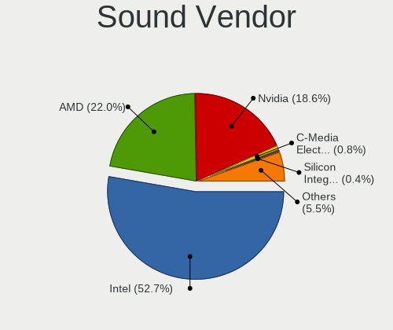

| Vendor                                          | Computers | Percent |
|-------------------------------------------------|-----------|---------|
| Intel                                           | 1406      | 54.18%  |
| AMD                                             | 571       | 22%     |
| Nvidia                                          | 460       | 17.73%  |
| C-Media Electronics                             | 25        | 0.96%   |
| Silicon Integrated Systems [SiS]                | 12        | 0.46%   |
| Barco Display Systems                           | 11        | 0.42%   |
| Logitech                                        | 8         | 0.31%   |
| Kingston Technology                             | 7         | 0.27%   |
| Generalplus Technology                          | 7         | 0.27%   |
| JMTek                                           | 6         | 0.23%   |
| Creative Labs                                   | 6         | 0.23%   |
| VIA Technologies                                | 5         | 0.19%   |
| Tenx Technology                                 | 5         | 0.19%   |
| ASUSTek Computer                                | 5         | 0.19%   |
| Apple                                           | 5         | 0.19%   |
| Realtek Semiconductor                           | 4         | 0.15%   |
| Yamaha                                          | 3         | 0.12%   |
| Texas Instruments                               | 3         | 0.12%   |
| SteelSeries ApS                                 | 3         | 0.12%   |
| M-Audio                                         | 3         | 0.12%   |
| GN Netcom                                       | 3         | 0.12%   |
| Micro Star International                        | 2         | 0.08%   |
| LG Electronics                                  | 2         | 0.08%   |
| GYROCOM C&C                                     | 2         | 0.08%   |
| Focusrite-Novation                              | 2         | 0.08%   |
| DSEA A/S                                        | 2         | 0.08%   |
| Creative Technology                             | 2         | 0.08%   |
| Blue Microphones                                | 2         | 0.08%   |
| Zoran Co. Personal Media Division (Nogatech)    | 1         | 0.04%   |
| ULi Electronics                                 | 1         | 0.04%   |
| Trust                                           | 1         | 0.04%   |
| Thesycon Systemsoftware & Consulting            | 1         | 0.04%   |
| Sony                                            | 1         | 0.04%   |
| RODE Microphones                                | 1         | 0.04%   |
| Native Instruments                              | 1         | 0.04%   |
| Licensed by Sony Computer Entertainment America | 1         | 0.04%   |
| Hewlett-Packard                                 | 1         | 0.04%   |
| Google                                          | 1         | 0.04%   |
| Global Sun Technology                           | 1         | 0.04%   |
| FiiO Electronics Technology                     | 1         | 0.04%   |

Sound Model
-----------

Sound card models

| Model                                                                      | Computers | Percent |
|----------------------------------------------------------------------------|-----------|---------|
| AMD Family 17h/19h HD Audio Controller                                     | 218       | 7.01%   |
| Intel Sunrise Point-LP HD Audio                                            | 152       | 4.89%   |
| Intel 6 Series/C200 Series Chipset Family High Definition Audio Controller | 130       | 4.18%   |
| Intel 7 Series/C216 Chipset Family High Definition Audio Controller        | 125       | 4.02%   |
| AMD Renoir Radeon High Definition Audio Controller                         | 116       | 3.73%   |
| Intel NM10/ICH7 Family High Definition Audio Controller                    | 77        | 2.48%   |
| Intel 8 Series/C220 Series Chipset High Definition Audio Controller        | 76        | 2.44%   |
| Intel 5 Series/3400 Series Chipset High Definition Audio                   | 76        | 2.44%   |
| Intel Cannon Lake PCH cAVS                                                 | 67        | 2.15%   |
| AMD Raven/Raven2/Fenghuang HDMI/DP Audio Controller                        | 65        | 2.09%   |
| Intel Tiger Lake-LP Smart Sound Technology Audio Controller                | 62        | 1.99%   |
| Intel Haswell-ULT HD Audio Controller                                      | 60        | 1.93%   |
| Intel 8 Series HD Audio Controller                                         | 60        | 1.93%   |
| Intel Xeon E3-1200 v3/4th Gen Core Processor HD Audio Controller           | 59        | 1.9%    |
| Intel Comet Lake PCH cAVS                                                  | 54        | 1.74%   |
| Nvidia GF108 High Definition Audio Controller                              | 52        | 1.67%   |
| Intel 100 Series/C230 Series Chipset Family HD Audio Controller            | 51        | 1.64%   |
| Nvidia TU107 GeForce GTX 1650 High Definition Audio Controller             | 50        | 1.61%   |
| Nvidia GP107GL High Definition Audio Controller                            | 50        | 1.61%   |
| AMD SBx00 Azalia (Intel HDA)                                               | 50        | 1.61%   |
| Intel 82801I (ICH9 Family) HD Audio Controller                             | 49        | 1.58%   |
| Intel Broadwell-U Audio Controller                                         | 47        | 1.51%   |
| Intel Wildcat Point-LP High Definition Audio Controller                    | 46        | 1.48%   |
| AMD FCH Azalia Controller                                                  | 46        | 1.48%   |
| AMD Starship/Matisse HD Audio Controller                                   | 45        | 1.45%   |
| AMD Family 17h (Models 00h-0fh) HD Audio Controller                        | 41        | 1.32%   |
| Nvidia Audio device                                                        | 37        | 1.19%   |
| Nvidia TU116 High Definition Audio Controller                              | 36        | 1.16%   |
| Intel Comet Lake PCH-LP cAVS                                               | 36        | 1.16%   |
| Intel Alder Lake PCH-P High Definition Audio Controller                    | 33        | 1.06%   |
| Intel CM238 HD Audio Controller                                            | 32        | 1.03%   |
| Intel Cannon Point-LP High Definition Audio Controller                     | 32        | 1.03%   |
| AMD Ellesmere HDMI Audio [Radeon RX 470/480 / 570/580/590]                 | 31        | 1%      |
| Intel Tiger Lake-H HD Audio Controller                                     | 28        | 0.9%    |
| Intel 200 Series PCH HD Audio                                              | 28        | 0.9%    |
| AMD Kabini HDMI/DP Audio                                                   | 28        | 0.9%    |
| Intel Ice Lake-LP Smart Sound Technology Audio Controller                  | 27        | 0.87%   |
| Nvidia TU106 High Definition Audio Controller                              | 25        | 0.8%    |
| AMD Turks HDMI Audio [Radeon HD 6500/6600 / 6700M Series]                  | 25        | 0.8%    |
| AMD Navi 21/23 HDMI/DP Audio Controller                                    | 23        | 0.74%   |

Memory
------

Memory Vendor
-------------

Memory module vendors

| Vendor              | Computers | Percent |
|---------------------|-----------|---------|
| Samsung Electronics | 312       | 25.59%  |
| SK hynix            | 200       | 16.41%  |
| Kingston            | 170       | 13.95%  |
| Micron Technology   | 124       | 10.17%  |
| Unknown             | 112       | 9.19%   |
| Crucial             | 58        | 4.76%   |
| Corsair             | 42        | 3.45%   |
| G.Skill             | 38        | 3.12%   |
| A-DATA Technology   | 33        | 2.71%   |
| Ramaxel Technology  | 23        | 1.89%   |
| Nanya Technology    | 17        | 1.39%   |
| Unknown             | 14        | 1.15%   |
| Elpida              | 11        | 0.9%    |
| Goldkey             | 7         | 0.57%   |
| Unknown (ABCD)      | 6         | 0.49%   |
| Transcend           | 6         | 0.49%   |
| Team                | 6         | 0.49%   |
| Timetec             | 5         | 0.41%   |
| Apacer              | 4         | 0.33%   |
| Neo Forza           | 3         | 0.25%   |
| Kllisre             | 2         | 0.16%   |
| Hikvision           | 2         | 0.16%   |
| ChangXin Memory     | 2         | 0.16%   |
| Avant               | 2         | 0.16%   |
| ASint Technology    | 2         | 0.16%   |
| AMD                 | 2         | 0.16%   |
| Unknown (F288)      | 1         | 0.08%   |
| Unknown (0x4509)    | 1         | 0.08%   |
| Unknown (0x29E)     | 1         | 0.08%   |
| Unknown (0B38)      | 1         | 0.08%   |
| Unknown (07FB)      | 1         | 0.08%   |
| Unifosa             | 1         | 0.08%   |
| pqi                 | 1         | 0.08%   |
| Patriot             | 1         | 0.08%   |
| Lexar Co Limited    | 1         | 0.08%   |
| Innodisk            | 1         | 0.08%   |
| Golden Empire       | 1         | 0.08%   |
| Gold Key            | 1         | 0.08%   |
| ff                  | 1         | 0.08%   |
| A-DA                | 1         | 0.08%   |

Memory Model
------------

Memory module models

| Model                                                        | Computers | Percent |
|--------------------------------------------------------------|-----------|---------|
| Samsung RAM M471A1G44AB0-CWE 8GB SODIMM DDR4 3200MT/s        | 18        | 1.38%   |
| Samsung RAM M471A1K43DB1-CWE 8GB SODIMM DDR4 3200MT/s        | 15        | 1.15%   |
| Unknown                                                      | 14        | 1.08%   |
| Samsung RAM M471A1K43CB1-CTD 8GB SODIMM DDR4 2667MT/s        | 13        | 1%      |
| SK hynix RAM HMT41GS6BFR8A-PB 8GB SODIMM DDR3 1600MT/s       | 12        | 0.92%   |
| Samsung RAM M471B5173DB0-YK0 4GB SODIMM DDR3 1600MT/s        | 12        | 0.92%   |
| Samsung RAM M471A5244CB0-CWE 4GB Row Of Chips DDR4 3200MT/s  | 12        | 0.92%   |
| Samsung RAM M471A5244CB0-CRC 4096MB SODIMM DDR4 2667MT/s     | 12        | 0.92%   |
| Samsung RAM M471B5173EB0-YK0 4GB SODIMM DDR3 1600MT/s        | 11        | 0.84%   |
| Samsung RAM M471B1G73QH0-YK0 8GB SODIMM DDR3 1867MT/s        | 11        | 0.84%   |
| Samsung RAM M471A1K43EB1-CWE 8GB SODIMM DDR4 3200MT/s        | 10        | 0.77%   |
| SK hynix RAM Module 4GB SODIMM DDR3 1600MT/s                 | 9         | 0.69%   |
| SK hynix RAM HMAA1GS6CJR6N-XN 8GB SODIMM DDR4 3200MT/s       | 9         | 0.69%   |
| SK hynix RAM HMA81GS6JJR8N-VK 8GB SODIMM DDR4 2667MT/s       | 9         | 0.69%   |
| Samsung RAM M471A1K43CB1-CRC 8GB SODIMM DDR4 2667MT/s        | 9         | 0.69%   |
| SK hynix RAM HMT451S6BFR8A-PB 4GB SODIMM DDR3 1600MT/s       | 8         | 0.61%   |
| SK hynix RAM HMA851S6AFR6N-UH 4GB SODIMM DDR4 2667MT/s       | 8         | 0.61%   |
| SK hynix RAM HMA81GS6DJR8N-XN 8GB SODIMM DDR4 3200MT/s       | 8         | 0.61%   |
| SK hynix RAM HMA81GS6AFR8N-UH 8GB SODIMM DDR4 2667MT/s       | 8         | 0.61%   |
| Micron RAM 8ATF1G64HZ-2G3B1 8GB SODIMM DDR4 2400MT/s         | 8         | 0.61%   |
| SK hynix RAM HMA81GS6CJR8N-VK 8GB SODIMM DDR4 2667MT/s       | 7         | 0.54%   |
| Samsung RAM M471B5773CHS-CH9 2GB SODIMM DDR3 4199MT/s        | 7         | 0.54%   |
| Samsung RAM M471A1G44AB0-CWE 8GB Row Of Chips DDR4 3200MT/s  | 7         | 0.54%   |
| Micron RAM 4ATF51264HZ-2G6E1 4GB SODIMM DDR4 2667MT/s        | 7         | 0.54%   |
| Unknown RAM Module 4GB SODIMM DDR3                           | 6         | 0.46%   |
| Samsung RAM M471B1G73DB0-YK0 8GB SODIMM DDR3 1600MT/s        | 6         | 0.46%   |
| Samsung RAM M471A1K43DB1-CTD 8GB SODIMM DDR4 2667MT/s        | 6         | 0.46%   |
| Micron RAM 8ATF1G64HZ-3G2J1 8GB SODIMM DDR4 3200MT/s         | 6         | 0.46%   |
| Micron RAM 4ATF1G64HZ-3G2E1 8GB SODIMM DDR4 3200MT/s         | 6         | 0.46%   |
| Crucial RAM CT8G4SFS8266.M8FD 8GB SODIMM DDR4 2667MT/s       | 6         | 0.46%   |
| Corsair RAM CMK8GX4M1D3000C16 8GB DIMM DDR4 3200MT/s         | 6         | 0.46%   |
| Unknown RAM Module 2GB DIMM 800MT/s                          | 5         | 0.38%   |
| Unknown RAM Module 1GB SODIMM DDR2                           | 5         | 0.38%   |
| SK hynix RAM HMT451S6CFR6A-PB 4GB SODIMM DDR3 1600MT/s       | 5         | 0.38%   |
| SK hynix RAM HMT451S6BFR8A-PB 4096MB SODIMM DDR3 1600MT/s    | 5         | 0.38%   |
| SK hynix RAM HMAA1GS6CJR6N-XN 8GB Row Of Chips DDR4 3200MT/s | 5         | 0.38%   |
| SK hynix RAM HMA851S6CJR6N-VK 4GB SODIMM DDR4 2667MT/s       | 5         | 0.38%   |
| Samsung RAM M471B5273DH0-CH9 4GB SODIMM DDR3 1334MT/s        | 5         | 0.38%   |
| Samsung RAM M471A5244CB0-CWE 4GB SODIMM DDR4 3200MT/s        | 5         | 0.38%   |
| Samsung RAM M471A2K43DB1-CWE 16GB SODIMM DDR4 3200MT/s       | 5         | 0.38%   |

Memory Kind
-----------

Memory module kinds

| Kind    | Computers | Percent |
|---------|-----------|---------|
| DDR4    | 538       | 52.13%  |
| DDR3    | 317       | 30.72%  |
| LPDDR4  | 35        | 3.39%   |
| Unknown | 31        | 3%      |
| DDR2    | 30        | 2.91%   |
| SDRAM   | 25        | 2.42%   |
| LPDDR3  | 18        | 1.74%   |
| DDR5    | 17        | 1.65%   |
| LPDDR5  | 10        | 0.97%   |
| DDR     | 7         | 0.68%   |
| DRAM    | 3         | 0.29%   |
| EEPROM  | 1         | 0.1%    |

Memory Form Factor
------------------

Physical design of the memory module

| Name         | Computers | Percent |
|--------------|-----------|---------|
| SODIMM       | 717       | 70.02%  |
| DIMM         | 220       | 21.48%  |
| Row Of Chips | 81        | 7.91%   |
| Unknown      | 4         | 0.39%   |
| Chip         | 2         | 0.2%    |

Memory Size
-----------

Memory module size

| Size    | Computers | Percent |
|---------|-----------|---------|
| 8192    | 471       | 41.1%   |
| 4096    | 310       | 27.05%  |
| 16384   | 150       | 13.09%  |
| 2048    | 131       | 11.43%  |
| 32768   | 38        | 3.32%   |
| 1024    | 36        | 3.14%   |
| 512     | 4         | 0.35%   |
| 1536    | 2         | 0.17%   |
| 65536   | 1         | 0.09%   |
| 256     | 1         | 0.09%   |
| 1       | 1         | 0.09%   |
| Unknown | 1         | 0.09%   |

Memory Speed
------------

Memory module speed

| Speed   | Computers | Percent |
|---------|-----------|---------|
| 3200    | 239       | 21.45%  |
| 1600    | 209       | 18.76%  |
| 2667    | 191       | 17.15%  |
| 2400    | 84        | 7.54%   |
| 1333    | 52        | 4.67%   |
| 2133    | 45        | 4.04%   |
| 1334    | 36        | 3.23%   |
| Unknown | 32        | 2.87%   |
| 3600    | 24        | 2.15%   |
| 667     | 24        | 2.15%   |
| 1067    | 18        | 1.62%   |
| 800     | 17        | 1.53%   |
| 4199    | 14        | 1.26%   |
| 1867    | 14        | 1.26%   |
| 6400    | 9         | 0.81%   |
| 4800    | 9         | 0.81%   |
| 4267    | 9         | 0.81%   |
| 3000    | 7         | 0.63%   |
| 4266    | 6         | 0.54%   |
| 3733    | 6         | 0.54%   |
| 3400    | 6         | 0.54%   |
| 2800    | 6         | 0.54%   |
| 3266    | 5         | 0.45%   |
| 1066    | 5         | 0.45%   |
| 400     | 5         | 0.45%   |
| 1866    | 4         | 0.36%   |
| 8400    | 3         | 0.27%   |
| 5600    | 3         | 0.27%   |
| 3866    | 3         | 0.27%   |
| 6000    | 2         | 0.18%   |
| 5500    | 2         | 0.18%   |
| 3466    | 2         | 0.18%   |
| 2933    | 2         | 0.18%   |
| 2666    | 2         | 0.18%   |
| 2048    | 2         | 0.18%   |
| 1639    | 2         | 0.18%   |
| 533     | 2         | 0.18%   |
| 55438   | 1         | 0.09%   |
| 50410   | 1         | 0.09%   |
| 5808    | 1         | 0.09%   |

Printers & scanners
-------------------

Printer Vendor
--------------

Printer device vendors

| Vendor              | Computers | Percent |
|---------------------|-----------|---------|
| Hewlett-Packard     | 12        | 31.58%  |
| Canon               | 12        | 31.58%  |
| Seiko Epson         | 6         | 15.79%  |
| Zebra               | 3         | 7.89%   |
| Samsung Electronics | 2         | 5.26%   |
| XiaoMi              | 1         | 2.63%   |
| QinHeng Electronics | 1         | 2.63%   |
| Brother Industries  | 1         | 2.63%   |

Printer Model
-------------

Printer device models

| Model                                | Computers | Percent |
|--------------------------------------|-----------|---------|
| Zebra TLP2844                        | 2         | 5.13%   |
| Seiko Epson L3110 Series             | 2         | 5.13%   |
| HP Officejet 4500 G510g-m            | 2         | 5.13%   |
| HP LaserJet P2055 series             | 2         | 5.13%   |
| Canon LBP6030w/6018w                 | 2         | 5.13%   |
| Canon LBP6020                        | 2         | 5.13%   |
| Canon E410 series                    | 2         | 5.13%   |
| Zebra Zebra GC420d Label Printer     | 1         | 2.56%   |
| XiaoMi MIIIW MECH-KBPro              | 1         | 2.56%   |
| Seiko Epson L405 Series              | 1         | 2.56%   |
| Seiko Epson L3150 Series             | 1         | 2.56%   |
| Seiko Epson L210 Series              | 1         | 2.56%   |
| Seiko Epson FX-2190IIN               | 1         | 2.56%   |
| Samsung ML-216x Series Laser Printer | 1         | 2.56%   |
| Samsung M2020 Series                 | 1         | 2.56%   |
| QinHeng CH340S                       | 1         | 2.56%   |
| HP LaserJet P1102                    | 1         | 2.56%   |
| HP LaserJet M101-M106                | 1         | 2.56%   |
| HP LaserJet 1020                     | 1         | 2.56%   |
| HP LaserJet 1010                     | 1         | 2.56%   |
| HP DeskJet F2100 Printer series      | 1         | 2.56%   |
| HP DeskJet 3830 series               | 1         | 2.56%   |
| HP DeskJet 2620 All-in-One Printer   | 1         | 2.56%   |
| HP DeskJet 2130 series               | 1         | 2.56%   |
| HP Deskjet 1050 J410                 | 1         | 2.56%   |
| Canon PIXMA MX340                    | 1         | 2.56%   |
| Canon PIXMA MG3000 series            | 1         | 2.56%   |
| Canon LBP6000                        | 1         | 2.56%   |
| Canon G3020 series                   | 1         | 2.56%   |
| Canon G3010 series                   | 1         | 2.56%   |
| Canon E460 series                    | 1         | 2.56%   |
| Brother DCP-1510                     | 1         | 2.56%   |

Scanner Vendor
--------------

Scanner device vendors

| Vendor         | Computers | Percent |
|----------------|-----------|---------|
| Mustek Systems | 1         | 50%     |
| Canon          | 1         | 50%     |

Scanner Model
-------------

Scanner device models

| Model                              | Computers | Percent |
|------------------------------------|-----------|---------|
| Mustek Systems ScanExpress 1200 UB | 1         | 50%     |
| Canon CanoScan LiDE 210            | 1         | 50%     |

Camera
------

Camera Vendor
-------------

Camera device vendors

| Vendor                                 | Computers | Percent |
|----------------------------------------|-----------|---------|
| Chicony Electronics                    | 319       | 23.27%  |
| IMC Networks                           | 157       | 11.45%  |
| Realtek Semiconductor                  | 120       | 8.75%   |
| Bison Electronics                      | 95        | 6.93%   |
| Microdia                               | 85        | 6.2%    |
| Quanta                                 | 81        | 5.91%   |
| Cheng Uei Precision Industry (Foxlink) | 71        | 5.18%   |
| Sunplus Innovation Technology          | 50        | 3.65%   |
| Syntek                                 | 42        | 3.06%   |
| Apple                                  | 38        | 2.77%   |
| Suyin                                  | 34        | 2.48%   |
| Acer                                   | 31        | 2.26%   |
| Luxvisions Innotech Limited            | 27        | 1.97%   |
| Silicon Motion                         | 25        | 1.82%   |
| Logitech                               | 24        | 1.75%   |
| Alcor Micro                            | 22        | 1.6%    |
| Lite-On Technology                     | 19        | 1.39%   |
| Z-Star Microelectronics                | 16        | 1.17%   |
| Ricoh                                  | 12        | 0.88%   |
| Samsung Electronics                    | 11        | 0.8%    |
| Sonix Technology                       | 9         | 0.66%   |
| Importek                               | 9         | 0.66%   |
| ALi                                    | 7         | 0.51%   |
| SunplusIT                              | 3         | 0.22%   |
| ShineTech                              | 3         | 0.22%   |
| Novatek Microelectronics               | 3         | 0.22%   |
| Microsoft                              | 3         | 0.22%   |
| MacroSilicon                           | 3         | 0.22%   |
| LG Electronics                         | 3         | 0.22%   |
| Lenovo                                 | 3         | 0.22%   |
| Jieli Technology                       | 3         | 0.22%   |
| Hy-UXGA(B5M2)-Camera                   | 3         | 0.22%   |
| Genesys Logic                          | 3         | 0.22%   |
| Generalplus Technology                 | 3         | 0.22%   |
| Foxconn / Hon Hai                      | 3         | 0.22%   |
| Arkmicro Technologies                  | 3         | 0.22%   |
| Sunplus Technology                     | 2         | 0.15%   |
| Primax Electronics                     | 2         | 0.15%   |
| GEMBIRD                                | 2         | 0.15%   |
| DigiTech                               | 2         | 0.15%   |

Camera Model
------------

Camera device models

| Model                                                   | Computers | Percent |
|---------------------------------------------------------|-----------|---------|
| Chicony Integrated Camera                               | 45        | 3.27%   |
| Chicony HD Webcam                                       | 45        | 3.27%   |
| Microdia Integrated_Webcam_HD                           | 39        | 2.83%   |
| IMC Networks Integrated Camera                          | 39        | 2.83%   |
| IMC Networks USB2.0 HD UVC WebCam                       | 30        | 2.18%   |
| Realtek Integrated_Webcam_HD                            | 29        | 2.11%   |
| Bison Integrated Camera                                 | 29        | 2.11%   |
| IMC Networks USB2.0 VGA UVC WebCam                      | 28        | 2.03%   |
| Syntek Integrated Camera                                | 25        | 1.82%   |
| Chicony USB2.0 VGA UVC WebCam                           | 21        | 1.53%   |
| Chicony USB2.0 HD UVC WebCam                            | 17        | 1.24%   |
| Quanta HD User Facing                                   | 16        | 1.16%   |
| Bison HD Webcam                                         | 15        | 1.09%   |
| IMC Networks HD Camera                                  | 14        | 1.02%   |
| Realtek USB2.0 VGA UVC WebCam                           | 13        | 0.94%   |
| Chicony TOSHIBA Web Camera - HD                         | 13        | 0.94%   |
| Apple iPhone 5/5C/5S/6/SE/7/8/X/XR                      | 13        | 0.94%   |
| Realtek USB Camera                                      | 12        | 0.87%   |
| Chicony HP HD Camera                                    | 12        | 0.87%   |
| Chicony EasyCamera                                      | 12        | 0.87%   |
| Samsung Galaxy series, misc. (MTP mode)                 | 11        | 0.8%    |
| Chicony USB 2.0 Camera                                  | 11        | 0.8%    |
| Sunplus Integrated_Webcam_HD                            | 10        | 0.73%   |
| Lite-On Integrated Camera                               | 10        | 0.73%   |
| IMC Networks ov9734_azurewave_camera                    | 10        | 0.73%   |
| Chicony Lenovo EasyCamera                               | 10        | 0.73%   |
| Chicony HP Webcam                                       | 10        | 0.73%   |
| Cheng Uei Precision Industry (Foxlink) HP TrueVision HD | 10        | 0.73%   |
| Apple FaceTime HD Camera (Built-in)                     | 10        | 0.73%   |
| Acer BisonCam, NB Pro                                   | 10        | 0.73%   |
| Realtek USB2.0 HD UVC WebCam                            | 9         | 0.65%   |
| Quanta USB HD Webcam                                    | 9         | 0.65%   |
| Quanta ACER HD User Facing                              | 9         | 0.65%   |
| Cheng Uei Precision Industry (Foxlink) HD Camera        | 9         | 0.65%   |
| Bison Lenovo EasyCamera                                 | 9         | 0.65%   |
| Syntek EasyCamera                                       | 8         | 0.58%   |
| Sunplus Asus Webcam                                     | 8         | 0.58%   |
| Realtek Integrated Webcam                               | 8         | 0.58%   |
| Quanta ov9734_techfront_camera                          | 8         | 0.58%   |
| Quanta HP TrueVision HD Camera                          | 8         | 0.58%   |

Security
--------

Fingerprint Vendor
------------------

Fingerprint sensor vendors

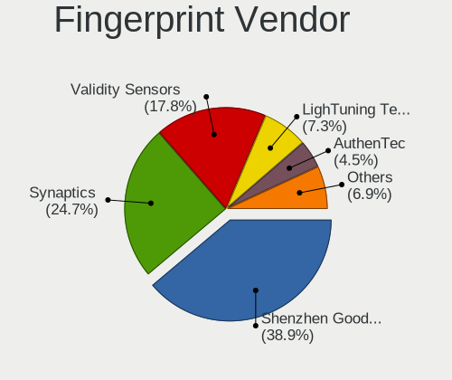

| Vendor                             | Computers | Percent |
|------------------------------------|-----------|---------|
| Shenzhen Goodix Technology         | 69        | 36.7%   |
| Synaptics                          | 44        | 23.4%   |
| Validity Sensors                   | 38        | 20.21%  |
| LighTuning Technology              | 14        | 7.45%   |
| AuthenTec                          | 9         | 4.79%   |
| Upek                               | 8         | 4.26%   |
| Elan Microelectronics              | 5         | 2.66%   |
| Realtek USB2.0 Finger Print Bridge | 1         | 0.53%   |

Fingerprint Model
-----------------

Fingerprint sensor models

| Model                                                                      | Computers | Percent |
|----------------------------------------------------------------------------|-----------|---------|
| Shenzhen Goodix  Fingerprint Device                                        | 50        | 26.6%   |
| Shenzhen Goodix Fingerprint Reader                                         | 18        | 9.57%   |
| Validity Sensors VFS495 Fingerprint Reader                                 | 11        | 5.85%   |
| Upek Biometric Touchchip/Touchstrip Fingerprint Sensor                     | 8         | 4.26%   |
| LighTuning ES603 Swipe Fingerprint Sensor                                  | 8         | 4.26%   |
| Synaptics Prometheus MIS Touch Fingerprint Reader                          | 7         | 3.72%   |
| Validity Sensors VFS5011 Fingerprint Reader                                | 6         | 3.19%   |
| Validity Sensors VFS 5011 fingerprint sensor                               | 6         | 3.19%   |
| Synaptics WBDI Fingerprint Reader USB 086                                  | 6         | 3.19%   |
| Synaptics  WBDI                                                            | 6         | 3.19%   |
| Synaptics Metallica MIS Touch Fingerprint Reader                           | 6         | 3.19%   |
| Synaptics WBDI                                                             | 5         | 2.66%   |
| LighTuning EgisTec Touch Fingerprint Sensor                                | 5         | 2.66%   |
| Validity Sensors Fingerprint scanner                                       | 4         | 2.13%   |
| Synaptics  FS7604 Touch Fingerprint Sensor with PurePrint                  | 4         | 2.13%   |
| Validity Sensors Synaptics WBDI                                            | 3         | 1.6%    |
| Synaptics UWP WBDI                                                         | 3         | 1.6%    |
| Synaptics Metallica MOH Touch Fingerprint Reader                           | 3         | 1.6%    |
| Elan ELAN:Fingerprint                                                      | 3         | 1.6%    |
| AuthenTec AES2810                                                          | 3         | 1.6%    |
| AuthenTec AES2501 Fingerprint Sensor                                       | 3         | 1.6%    |
| AuthenTec AES1600                                                          | 3         | 1.6%    |
| Validity Sensors VFS491                                                    | 2         | 1.06%   |
| Validity Sensors VFS451 Fingerprint Reader                                 | 2         | 1.06%   |
| Synaptics Fingerprint reader [HP G6]                                       | 2         | 1.06%   |
| Elan ELAN:ARM-M4                                                           | 2         | 1.06%   |
| Validity Sensors VFS101 Fingerprint Reader                                 | 1         | 0.53%   |
| Validity Sensors VFS Fingerprint sensor                                    | 1         | 0.53%   |
| Validity Sensors Synaptics VFS7552 Touch Fingerprint Sensor with PurePrint | 1         | 0.53%   |
| Validity Sensors Synaptics VFS7552 Touch Fingerprint Sensor                | 1         | 0.53%   |
| Synaptics UWP WBDI Device                                                  | 1         | 0.53%   |
| Synaptics FS7604 Touch Fingerprint Sensor with PurePrint                   | 1         | 0.53%   |
| Shenzhen Goodix FingerPrint                                                | 1         | 0.53%   |
| Realtek USB2.0 Finger Print Bridge FocalTech Fingerprint Device            | 1         | 0.53%   |
| LighTuning Fingerprint Reader                                              | 1         | 0.53%   |

Chipcard Vendor
---------------

Chipcard module vendors

| Vendor                | Computers | Percent |
|-----------------------|-----------|---------|
| Broadcom              | 20        | 39.22%  |
| Alcor Micro           | 18        | 35.29%  |
| Advanced Card Systems | 6         | 11.76%  |
| Upek                  | 2         | 3.92%   |
| O2 Micro              | 2         | 3.92%   |
| Gemalto (was Gemplus) | 2         | 3.92%   |
| Lenovo                | 1         | 1.96%   |

Chipcard Model
--------------

Chipcard module models

| Model                                                                        | Computers | Percent |
|------------------------------------------------------------------------------|-----------|---------|
| Alcor Micro AU9540 Smartcard Reader                                          | 18        | 35.29%  |
| Broadcom BCM5880 Secure Applications Processor with fingerprint swipe sensor | 8         | 15.69%  |
| Broadcom BCM5880 Secure Applications Processor                               | 6         | 11.76%  |
| Broadcom 58200                                                               | 4         | 7.84%   |
| Advanced Card Systems ACR39U                                                 | 3         | 5.88%   |
| Advanced Card Systems ACR38 SmartCard Reader                                 | 3         | 5.88%   |
| Upek TouchChip Fingerprint Coprocessor (WBF advanced mode)                   | 2         | 3.92%   |
| O2 Micro OZ776 CCID Smartcard Reader                                         | 2         | 3.92%   |
| Gemalto (was Gemplus) GemPC Key SmartCard Reader                             | 2         | 3.92%   |
| Broadcom 5880                                                                | 2         | 3.92%   |
| Lenovo Integrated Smart Card Reader                                          | 1         | 1.96%   |

Unsupported
-----------

Unsupported Devices
-------------------

Total unsupported devices on board

| Total | Computers | Percent |
|-------|-----------|---------|
| 0     | 1374      | 68.91%  |
| 1     | 496       | 24.87%  |
| 2     | 102       | 5.12%   |
| 3     | 14        | 0.7%    |
| 4     | 5         | 0.25%   |
| 6     | 2         | 0.1%    |
| 5     | 1         | 0.05%   |

Unsupported Device Types
------------------------

Types of unsupported devices

| Type                     | Computers | Percent |
|--------------------------|-----------|---------|
| Graphics card            | 224       | 30.35%  |
| Fingerprint reader       | 188       | 25.47%  |
| Net/wireless             | 68        | 9.21%   |
| Multimedia controller    | 51        | 6.91%   |
| Camera                   | 47        | 6.37%   |
| Chipcard                 | 43        | 5.83%   |
| Bluetooth                | 34        | 4.61%   |
| Communication controller | 29        | 3.93%   |
| Net/ethernet             | 14        | 1.9%    |
| Sound                    | 12        | 1.63%   |
| Storage                  | 9         | 1.22%   |
| Network                  | 6         | 0.81%   |
| Unassigned class         | 4         | 0.54%   |
| Storage/raid             | 2         | 0.27%   |
| Flash memory             | 2         | 0.27%   |
| Card reader              | 2         | 0.27%   |
| Wireless                 | 1         | 0.14%   |
| Storage/ide              | 1         | 0.14%   |
| Modem                    | 1         | 0.14%   |

