Linux in Turkey - Tested Hardware & Statistics (Desktops)
---------------------------------------------------------

A project to collect tested hardware configurations for Linux in Turkey.

Anyone can contribute to this report by the [hw-probe](https://github.com/linuxhw/hw-probe) tool:

    sudo -E hw-probe -all -upload

Please contribute! Especially if your hardware is rare.

Contents
--------

* [ Test Cases ](#test-cases)

* [ System ](#system)
  - [ OS                       ](#os)
  - [ OS Family                ](#os-family)
  - [ Kernel                   ](#kernel)
  - [ Kernel Family            ](#kernel-family)
  - [ Kernel Major Ver.        ](#kernel-major-ver)
  - [ Arch                     ](#arch)
  - [ DE                       ](#de)
  - [ Display Server           ](#display-server)
  - [ Display Manager          ](#display-manager)
  - [ OS Lang                  ](#os-lang)
  - [ Boot Mode                ](#boot-mode)
  - [ Filesystem               ](#filesystem)
  - [ Part. scheme             ](#part-scheme)
  - [ Dual Boot with Linux/BSD ](#dual-boot-with-linuxbsd)
  - [ Dual Boot (Win)          ](#dual-boot-win)

* [ Board ](#board)
  - [ Vendor                   ](#vendor)
  - [ Model                    ](#model)
  - [ Model Family             ](#model-family)
  - [ MFG Year                 ](#mfg-year)
  - [ Form Factor              ](#form-factor)
  - [ Secure Boot              ](#secure-boot)
  - [ Coreboot                 ](#coreboot)
  - [ RAM Size                 ](#ram-size)
  - [ RAM Used                 ](#ram-used)
  - [ Total Drives             ](#total-drives)
  - [ Has CD-ROM               ](#has-cd-rom)
  - [ Has Ethernet             ](#has-ethernet)
  - [ Has WiFi                 ](#has-wifi)
  - [ Has Bluetooth            ](#has-bluetooth)

* [ Location ](#location)
  - [ Country                  ](#country)
  - [ City                     ](#city)

* [ Drives ](#drives)
  - [ Drive Vendor             ](#drive-vendor)
  - [ Drive Model              ](#drive-model)
  - [ HDD Vendor               ](#hdd-vendor)
  - [ SSD Vendor               ](#ssd-vendor)
  - [ Drive Kind               ](#drive-kind)
  - [ Drive Connector          ](#drive-connector)
  - [ Drive Size               ](#drive-size)
  - [ Space Total              ](#space-total)
  - [ Space Used               ](#space-used)
  - [ Malfunc. Drives          ](#malfunc-drives)
  - [ Malfunc. Drive Vendor    ](#malfunc-drive-vendor)
  - [ Malfunc. HDD Vendor      ](#malfunc-hdd-vendor)
  - [ Malfunc. Drive Kind      ](#malfunc-drive-kind)
  - [ Failed Drives            ](#failed-drives)
  - [ Failed Drive Vendor      ](#failed-drive-vendor)
  - [ Drive Status             ](#drive-status)

* [ Storage controller ](#storage-controller)
  - [ Storage Vendor           ](#storage-vendor)
  - [ Storage Model            ](#storage-model)
  - [ Storage Kind             ](#storage-kind)

* [ Processor ](#processor)
  - [ CPU Vendor               ](#cpu-vendor)
  - [ CPU Model                ](#cpu-model)
  - [ CPU Model Family         ](#cpu-model-family)
  - [ CPU Cores                ](#cpu-cores)
  - [ CPU Sockets              ](#cpu-sockets)
  - [ CPU Threads              ](#cpu-threads)
  - [ CPU Op-Modes             ](#cpu-op-modes)
  - [ CPU Microcode            ](#cpu-microcode)
  - [ CPU Microarch            ](#cpu-microarch)

* [ Graphics ](#graphics)
  - [ GPU Vendor               ](#gpu-vendor)
  - [ GPU Model                ](#gpu-model)
  - [ GPU Combo                ](#gpu-combo)
  - [ GPU Driver               ](#gpu-driver)
  - [ GPU Memory               ](#gpu-memory)

* [ Monitor ](#monitor)
  - [ Monitor Vendor           ](#monitor-vendor)
  - [ Monitor Model            ](#monitor-model)
  - [ Monitor Resolution       ](#monitor-resolution)
  - [ Monitor Diagonal         ](#monitor-diagonal)
  - [ Monitor Width            ](#monitor-width)
  - [ Aspect Ratio             ](#aspect-ratio)
  - [ Monitor Area             ](#monitor-area)
  - [ Pixel Density            ](#pixel-density)
  - [ Multiple Monitors        ](#multiple-monitors)

* [ Network ](#network)
  - [ Net Controller Vendor    ](#net-controller-vendor)
  - [ Net Controller Model     ](#net-controller-model)
  - [ Wireless Vendor          ](#wireless-vendor)
  - [ Wireless Model           ](#wireless-model)
  - [ Ethernet Vendor          ](#ethernet-vendor)
  - [ Ethernet Model           ](#ethernet-model)
  - [ Net Controller Kind      ](#net-controller-kind)
  - [ Used Controller          ](#used-controller)
  - [ NICs                     ](#nics)
  - [ IPv6                     ](#ipv6)

* [ Bluetooth ](#bluetooth)
  - [ Bluetooth Vendor         ](#bluetooth-vendor)
  - [ Bluetooth Model          ](#bluetooth-model)

* [ Sound ](#sound)
  - [ Sound Vendor             ](#sound-vendor)
  - [ Sound Model              ](#sound-model)

* [ Memory ](#memory)
  - [ Memory Vendor            ](#memory-vendor)
  - [ Memory Model             ](#memory-model)
  - [ Memory Kind              ](#memory-kind)
  - [ Memory Form Factor       ](#memory-form-factor)
  - [ Memory Size              ](#memory-size)
  - [ Memory Speed             ](#memory-speed)

* [ Printers & scanners ](#printers--scanners)
  - [ Printer Vendor           ](#printer-vendor)
  - [ Printer Model            ](#printer-model)
  - [ Scanner Vendor           ](#scanner-vendor)
  - [ Scanner Model            ](#scanner-model)

* [ Camera ](#camera)
  - [ Camera Vendor            ](#camera-vendor)
  - [ Camera Model             ](#camera-model)

* [ Security ](#security)
  - [ Fingerprint Vendor       ](#fingerprint-vendor)
  - [ Fingerprint Model        ](#fingerprint-model)
  - [ Chipcard Vendor          ](#chipcard-vendor)
  - [ Chipcard Model           ](#chipcard-model)

* [ Unsupported ](#unsupported)
  - [ Unsupported Devices      ](#unsupported-devices)
  - [ Unsupported Device Types ](#unsupported-device-types)

Test Cases
----------

Total: 442

| Vendor        | Model                       | Probe                                                      | Date         |
|---------------|-----------------------------|------------------------------------------------------------|--------------|
| ASUSTek       | M5A78L-M LX3                | [5ba264dfb2](https://linux-hardware.org/?probe=5ba264dfb2) | Sep 01, 2022 |
| ASUSTek       | M5A78L-M LX3                | [169c9af937](https://linux-hardware.org/?probe=169c9af937) | Sep 01, 2022 |
| MSI           | B450M-A PRO MAX             | [6462d2370f](https://linux-hardware.org/?probe=6462d2370f) | Aug 31, 2022 |
| ASUSTek       | PRIME X570-P                | [1337a4c8e9](https://linux-hardware.org/?probe=1337a4c8e9) | Aug 28, 2022 |
| ASUSTek       | ROG STRIX B450-F GAMING     | [1f85d6a1b9](https://linux-hardware.org/?probe=1f85d6a1b9) | Aug 20, 2022 |
| ASUSTek       | ROG STRIX B450-F GAMING     | [ccea67d380](https://linux-hardware.org/?probe=ccea67d380) | Aug 19, 2022 |
| ASUSTek       | TUF B450M-PRO GAMING        | [7cd120b2e1](https://linux-hardware.org/?probe=7cd120b2e1) | Aug 14, 2022 |
| MSI           | H410M PRO-VH                | [f632032d8c](https://linux-hardware.org/?probe=f632032d8c) | Aug 13, 2022 |
| ASRock        | H110M-STX                   | [62b1924710](https://linux-hardware.org/?probe=62b1924710) | Aug 06, 2022 |
| Gigabyte      | H310M S2V                   | [329d2071a9](https://linux-hardware.org/?probe=329d2071a9) | Aug 01, 2022 |
| ASUSTek       | PRIME A520M-E               | [ef6984a3a9](https://linux-hardware.org/?probe=ef6984a3a9) | Jul 26, 2022 |
| Acer          | Veriton ES2740G V:1.0       | [e14aeaaca3](https://linux-hardware.org/?probe=e14aeaaca3) | Jul 25, 2022 |
| Unknown       | Unknown                     | [b85c907afc](https://linux-hardware.org/?probe=b85c907afc) | Jul 19, 2022 |
| ASUSTek       | TUF B450-PLUS GAMING        | [e8156cb24f](https://linux-hardware.org/?probe=e8156cb24f) | Jul 18, 2022 |
| ASUSTek       | M5A97 R2.0                  | [06992e615b](https://linux-hardware.org/?probe=06992e615b) | Jul 15, 2022 |
| Gigabyte      | GA-MA785GMT-UD2H            | [09bdb4be6a](https://linux-hardware.org/?probe=09bdb4be6a) | Jul 08, 2022 |
| ASRock        | FM2A68M-DG3+                | [825362cafe](https://linux-hardware.org/?probe=825362cafe) | Jul 06, 2022 |
| HP            | 83EE                        | [a49f00b158](https://linux-hardware.org/?probe=a49f00b158) | Jul 05, 2022 |
| Gigabyte      | EP45-DS3                    | [bc316ca4cb](https://linux-hardware.org/?probe=bc316ca4cb) | Jul 02, 2022 |
| Gigabyte      | B450M S2H                   | [63da8fa3b9](https://linux-hardware.org/?probe=63da8fa3b9) | Jul 02, 2022 |
| ASUSTek       | H61M-PRO                    | [48464c0df0](https://linux-hardware.org/?probe=48464c0df0) | Jun 30, 2022 |
| MSI           | B250M GAMING PRO            | [052965926e](https://linux-hardware.org/?probe=052965926e) | Jun 26, 2022 |
| Gigabyte      | F2A88XM-HD3                 | [6e34269277](https://linux-hardware.org/?probe=6e34269277) | Jun 21, 2022 |
| ASUSTek       | M5A97 R2.0                  | [df832fa379](https://linux-hardware.org/?probe=df832fa379) | Jun 18, 2022 |
| ASUSTek       | P5G41T-M                    | [0fd96bfcf3](https://linux-hardware.org/?probe=0fd96bfcf3) | Jun 12, 2022 |
| Lenovo        | 3731 NOK                    | [efd1e69f79](https://linux-hardware.org/?probe=efd1e69f79) | Jun 09, 2022 |
| Lenovo        | 3731 NOK                    | [1da6b9f6c0](https://linux-hardware.org/?probe=1da6b9f6c0) | Jun 09, 2022 |
| Gigabyte      | 970A-UD3P                   | [7e45eef7ba](https://linux-hardware.org/?probe=7e45eef7ba) | Jun 09, 2022 |
| MSI           | H81M-P33                    | [b48f5d554f](https://linux-hardware.org/?probe=b48f5d554f) | Jun 05, 2022 |
| ASRock        | G31M-VS2                    | [5ecae1ce0d](https://linux-hardware.org/?probe=5ecae1ce0d) | Jun 04, 2022 |
| ASRock        | G31M-VS2                    | [76e1b187df](https://linux-hardware.org/?probe=76e1b187df) | Jun 04, 2022 |
| Gigabyte      | B550M AORUS PRO-P           | [eca3bd70a8](https://linux-hardware.org/?probe=eca3bd70a8) | Jun 02, 2022 |
| ASUSTek       | Pro WS WRX80E-SAGE SE WI... | [dedf695fc6](https://linux-hardware.org/?probe=dedf695fc6) | May 31, 2022 |
| MSI           | B365M PRO-VH                | [a1e7cf7158](https://linux-hardware.org/?probe=a1e7cf7158) | May 30, 2022 |
| MSI           | B365M PRO-VH                | [4d4ea4beec](https://linux-hardware.org/?probe=4d4ea4beec) | May 30, 2022 |
| Gigabyte      | H270-Gaming 3               | [c28c21c4d8](https://linux-hardware.org/?probe=c28c21c4d8) | May 29, 2022 |
| Lenovo        | 30C7 SDK0J40688 WIN 3424... | [93ffb95e1a](https://linux-hardware.org/?probe=93ffb95e1a) | May 29, 2022 |
| ECS           | G31T-M7                     | [706532d328](https://linux-hardware.org/?probe=706532d328) | May 28, 2022 |
| Gigabyte      | H410M S2H                   | [c7e011235c](https://linux-hardware.org/?probe=c7e011235c) | May 26, 2022 |
| MSI           | MS-7360                     | [1ca1d835ad](https://linux-hardware.org/?probe=1ca1d835ad) | May 22, 2022 |
| MSI           | B350M PRO-VD PLUS           | [6098005a1a](https://linux-hardware.org/?probe=6098005a1a) | May 21, 2022 |
| Gigabyte      | G41MT-D3                    | [aac14b5554](https://linux-hardware.org/?probe=aac14b5554) | May 21, 2022 |
| Gigabyte      | G41MT-D3                    | [6763ad45ce](https://linux-hardware.org/?probe=6763ad45ce) | May 21, 2022 |
| ASUSTek       | P8H61-M LE/USB3             | [6f6a104d35](https://linux-hardware.org/?probe=6f6a104d35) | May 21, 2022 |
| Intel         | ChiefRiver                  | [8e4aca2b1f](https://linux-hardware.org/?probe=8e4aca2b1f) | May 19, 2022 |
| Intel         | ChiefRiver                  | [4d38806404](https://linux-hardware.org/?probe=4d38806404) | May 19, 2022 |
| MSI           | B450M PRO-VDH MAX           | [9c3b90c60d](https://linux-hardware.org/?probe=9c3b90c60d) | May 18, 2022 |
| MSI           | B450M PRO-VDH MAX           | [76c661d512](https://linux-hardware.org/?probe=76c661d512) | May 18, 2022 |
| ASUSTek       | P5KPL-AM SE                 | [ebbd363703](https://linux-hardware.org/?probe=ebbd363703) | May 16, 2022 |
| ECS           | G41T-R3                     | [ed8d019c1e](https://linux-hardware.org/?probe=ed8d019c1e) | May 14, 2022 |
| ECS           | G41T-R3                     | [1bf10674d0](https://linux-hardware.org/?probe=1bf10674d0) | May 14, 2022 |
| ASUSTek       | P5Q SE/R                    | [c99b0a0683](https://linux-hardware.org/?probe=c99b0a0683) | May 08, 2022 |
| Gigabyte      | H61M-S2PV                   | [f09766a481](https://linux-hardware.org/?probe=f09766a481) | Apr 27, 2022 |
| Casper        | NIRVANA NOTEBOOK            | [d74b2d8bb3](https://linux-hardware.org/?probe=d74b2d8bb3) | Apr 26, 2022 |
| Casper        | NIRVANA NOTEBOOK            | [0d4977ae14](https://linux-hardware.org/?probe=0d4977ae14) | Apr 24, 2022 |
| MSI           | MPG B550 GAMING EDGE WIF... | [a76e953825](https://linux-hardware.org/?probe=a76e953825) | Apr 22, 2022 |
| MSI           | MAG X570 TOMAHAWK WIFI      | [68a04098ec](https://linux-hardware.org/?probe=68a04098ec) | Apr 21, 2022 |
| ASUSTek       | P8H77-M LE                  | [f940c46866](https://linux-hardware.org/?probe=f940c46866) | Apr 17, 2022 |
| ASUSTek       | M5A97 LE R2.0               | [49c981ee41](https://linux-hardware.org/?probe=49c981ee41) | Apr 17, 2022 |
| MSI           | B560M-A PRO                 | [c394557d17](https://linux-hardware.org/?probe=c394557d17) | Apr 16, 2022 |
| ASUSTek       | A88XM-A                     | [427335d90c](https://linux-hardware.org/?probe=427335d90c) | Apr 16, 2022 |
| MSI           | H310M PRO-VDH PLUS          | [0d897cd79c](https://linux-hardware.org/?probe=0d897cd79c) | Apr 15, 2022 |
| Gigabyte      | Z97X-UD5H                   | [a4b25c87fa](https://linux-hardware.org/?probe=a4b25c87fa) | Apr 13, 2022 |
| MSI           | MS-7360                     | [34c10f0508](https://linux-hardware.org/?probe=34c10f0508) | Apr 10, 2022 |
| ASUSTek       | H61M-PRO                    | [c89c043120](https://linux-hardware.org/?probe=c89c043120) | Apr 10, 2022 |
| ASUSTek       | PRIME B550M-K               | [acff685c08](https://linux-hardware.org/?probe=acff685c08) | Apr 09, 2022 |
| Gigabyte      | B450M DS3H-CF               | [0bc837ffef](https://linux-hardware.org/?probe=0bc837ffef) | Apr 06, 2022 |
| ASUSTek       | H61M-D                      | [b9c2af0976](https://linux-hardware.org/?probe=b9c2af0976) | Apr 03, 2022 |
| ASUSTek       | B560M-P                     | [d696143851](https://linux-hardware.org/?probe=d696143851) | Apr 03, 2022 |
| MSI           | H81M-P33                    | [2b0d95df2e](https://linux-hardware.org/?probe=2b0d95df2e) | Apr 02, 2022 |
| Intel         | Unknown                     | [4689fbf7e1](https://linux-hardware.org/?probe=4689fbf7e1) | Mar 31, 2022 |
| Acer          | Nitro N50-610               | [17f97e88c0](https://linux-hardware.org/?probe=17f97e88c0) | Mar 29, 2022 |
| ASUSTek       | SABERTOOTH X58              | [1c58a58ead](https://linux-hardware.org/?probe=1c58a58ead) | Mar 29, 2022 |
| MSI           | B450 GAMING PLUS MAX        | [656413f7e6](https://linux-hardware.org/?probe=656413f7e6) | Mar 28, 2022 |
| MSI           | MPG B550 GAMING EDGE WIF... | [7577679057](https://linux-hardware.org/?probe=7577679057) | Mar 25, 2022 |
| MSI           | MS-7360                     | [8efb24e401](https://linux-hardware.org/?probe=8efb24e401) | Mar 21, 2022 |
| ASUSTek       | P8P67                       | [c294e20164](https://linux-hardware.org/?probe=c294e20164) | Mar 21, 2022 |
| ASUSTek       | P8P67                       | [5b9b7903ad](https://linux-hardware.org/?probe=5b9b7903ad) | Mar 21, 2022 |
| Pegatron      | 2AC3                        | [d1f5b906e4](https://linux-hardware.org/?probe=d1f5b906e4) | Mar 19, 2022 |
| MSI           | MS-7360                     | [99ac168204](https://linux-hardware.org/?probe=99ac168204) | Mar 18, 2022 |
| ASUSTek       | TUF Gaming B450M-PRO II     | [9b2f013b90](https://linux-hardware.org/?probe=9b2f013b90) | Mar 13, 2022 |
| Acer          | Nitro N50-610               | [c24379e7da](https://linux-hardware.org/?probe=c24379e7da) | Mar 13, 2022 |
| ASUSTek       | STRIX Z270E GAMING          | [09d876ab23](https://linux-hardware.org/?probe=09d876ab23) | Mar 11, 2022 |
| ASUSTek       | STRIX Z270E GAMING          | [e0e30a9273](https://linux-hardware.org/?probe=e0e30a9273) | Mar 11, 2022 |
| Gigabyte      | GA-MA785GT-UD3H             | [b5a2bf57eb](https://linux-hardware.org/?probe=b5a2bf57eb) | Mar 09, 2022 |
| Dell          | 0JP3NX A01                  | [e8f9fb7d24](https://linux-hardware.org/?probe=e8f9fb7d24) | Mar 09, 2022 |
| Fujitsu Si... | D2598-A1 S26361-D2598-A1    | [b003806a72](https://linux-hardware.org/?probe=b003806a72) | Mar 05, 2022 |
| Gigabyte      | 965P-DS3                    | [71481e0139](https://linux-hardware.org/?probe=71481e0139) | Mar 04, 2022 |
| MSI           | A58M-E33                    | [58f83fb7fc](https://linux-hardware.org/?probe=58f83fb7fc) | Mar 02, 2022 |
| ASUSTek       | A68HM-K                     | [fdbadf4dcb](https://linux-hardware.org/?probe=fdbadf4dcb) | Feb 28, 2022 |
| Gigabyte      | B450M S2H                   | [101d5588d2](https://linux-hardware.org/?probe=101d5588d2) | Feb 26, 2022 |
| Gigabyte      | H410M S2H                   | [71de12f898](https://linux-hardware.org/?probe=71de12f898) | Feb 24, 2022 |
| Gigabyte      | H410M S2H                   | [399a541ed9](https://linux-hardware.org/?probe=399a541ed9) | Feb 23, 2022 |
| ASUSTek       | ROG ZENITH EXTREME          | [ebca133032](https://linux-hardware.org/?probe=ebca133032) | Feb 21, 2022 |
| HP            | 0B54h D                     | [5081de1d10](https://linux-hardware.org/?probe=5081de1d10) | Feb 14, 2022 |
| ASUSTek       | H170M-E D3                  | [e9f4a5b4a8](https://linux-hardware.org/?probe=e9f4a5b4a8) | Feb 14, 2022 |
| Gigabyte      | AB350M-D3V-CF               | [8d0cd32859](https://linux-hardware.org/?probe=8d0cd32859) | Feb 14, 2022 |
| ASRock        | B450M Pro4                  | [3bbcbc62f5](https://linux-hardware.org/?probe=3bbcbc62f5) | Feb 13, 2022 |
| ASUSTek       | PRIME B450M-A               | [daa58b3386](https://linux-hardware.org/?probe=daa58b3386) | Feb 12, 2022 |
| Foxconn       | A88GMV                      | [a1004894e9](https://linux-hardware.org/?probe=a1004894e9) | Feb 11, 2022 |
| HP            | 1998                        | [800ceec2ea](https://linux-hardware.org/?probe=800ceec2ea) | Feb 11, 2022 |
| ASUSTek       | ROG STRIX X570-E GAMING     | [c3bda85409](https://linux-hardware.org/?probe=c3bda85409) | Feb 09, 2022 |
| ECS           | H55H-M                      | [856a42d74b](https://linux-hardware.org/?probe=856a42d74b) | Feb 07, 2022 |
| ASRock        | B450M Pro4                  | [9efa6de9c0](https://linux-hardware.org/?probe=9efa6de9c0) | Feb 07, 2022 |
| Lenovo        | 317C SDK0J40688 WIN 3424... | [f6174ebd67](https://linux-hardware.org/?probe=f6174ebd67) | Feb 06, 2022 |
| Gigabyte      | B250-FinTech-CF             | [23c8c7962a](https://linux-hardware.org/?probe=23c8c7962a) | Feb 03, 2022 |
| Gigabyte      | H81M-S2V                    | [4c9a0cdddb](https://linux-hardware.org/?probe=4c9a0cdddb) | Feb 03, 2022 |
| Gigabyte      | F2A55M-DS2                  | [bdb825e963](https://linux-hardware.org/?probe=bdb825e963) | Feb 02, 2022 |
| ASUSTek       | Z170 PRO GAMING             | [069306fc04](https://linux-hardware.org/?probe=069306fc04) | Jan 26, 2022 |
| ASUSTek       | ROG STRIX B350-F GAMING     | [87c1802929](https://linux-hardware.org/?probe=87c1802929) | Jan 19, 2022 |
| Gigabyte      | B550 AORUS PRO AC           | [ef86d029ff](https://linux-hardware.org/?probe=ef86d029ff) | Jan 16, 2022 |
| ASUSTek       | PRIME B450M-A               | [f87a30cc1b](https://linux-hardware.org/?probe=f87a30cc1b) | Jan 15, 2022 |
| ASUSTek       | PRIME B450M-A               | [a7e3aee849](https://linux-hardware.org/?probe=a7e3aee849) | Jan 15, 2022 |
| Intel         | H55                         | [e774b0ecac](https://linux-hardware.org/?probe=e774b0ecac) | Jan 12, 2022 |
| Intel         | H55                         | [6528de9981](https://linux-hardware.org/?probe=6528de9981) | Jan 12, 2022 |
| Gigabyte      | M61SME-S2                   | [972e998ff5](https://linux-hardware.org/?probe=972e998ff5) | Jan 02, 2022 |
| ASUSTek       | H81-PLUS                    | [60ba71333c](https://linux-hardware.org/?probe=60ba71333c) | Dec 27, 2021 |
| ASUSTek       | P8H61-M LX3 PLUS R2.0       | [23d8bf2c9d](https://linux-hardware.org/?probe=23d8bf2c9d) | Dec 23, 2021 |
| MSI           | H310M PRO-VDH PLUS          | [992c6c4350](https://linux-hardware.org/?probe=992c6c4350) | Dec 21, 2021 |
| ASUSTek       | M5A99FX PRO R2.0            | [16017b88bc](https://linux-hardware.org/?probe=16017b88bc) | Dec 19, 2021 |
| Gigabyte      | M61SME-S2                   | [f2380fb2f3](https://linux-hardware.org/?probe=f2380fb2f3) | Dec 18, 2021 |
| ASUSTek       | P9X79 PRO                   | [ca4a106ccf](https://linux-hardware.org/?probe=ca4a106ccf) | Dec 18, 2021 |
| Gigabyte      | X58A-UD3R                   | [cc4e06fca3](https://linux-hardware.org/?probe=cc4e06fca3) | Dec 12, 2021 |
| Gigabyte      | H81M-DS2                    | [ddcca3f92c](https://linux-hardware.org/?probe=ddcca3f92c) | Dec 01, 2021 |
| Biostar       | A68N-5600                   | [74211378b7](https://linux-hardware.org/?probe=74211378b7) | Nov 30, 2021 |
| ECS           | A55F-M3                     | [5439a8e37c](https://linux-hardware.org/?probe=5439a8e37c) | Nov 27, 2021 |
| MSI           | H270 GAMING M3              | [d863ad50dd](https://linux-hardware.org/?probe=d863ad50dd) | Nov 16, 2021 |
| ASUSTek       | STRIX Z270E GAMING          | [3f989c08c0](https://linux-hardware.org/?probe=3f989c08c0) | Nov 15, 2021 |
| ASUSTek       | M5A78L LE                   | [d342b54224](https://linux-hardware.org/?probe=d342b54224) | Nov 12, 2021 |
| HP            | 8433 11                     | [737e98b3e9](https://linux-hardware.org/?probe=737e98b3e9) | Nov 09, 2021 |
| HP            | 8433 11                     | [ad7a603e07](https://linux-hardware.org/?probe=ad7a603e07) | Nov 09, 2021 |
| MSI           | Z490-A PRO                  | [8055ba32cb](https://linux-hardware.org/?probe=8055ba32cb) | Nov 02, 2021 |
| Gigabyte      | H97M-D3H                    | [6ec4945ffa](https://linux-hardware.org/?probe=6ec4945ffa) | Nov 02, 2021 |
| Gigabyte      | H97M-D3H                    | [05e3caa05c](https://linux-hardware.org/?probe=05e3caa05c) | Nov 02, 2021 |
| ECS           | A55F-M3                     | [27e84aca95](https://linux-hardware.org/?probe=27e84aca95) | Oct 31, 2021 |
| Gigabyte      | G41M-Combo                  | [a9908463d8](https://linux-hardware.org/?probe=a9908463d8) | Oct 28, 2021 |
| Gigabyte      | X570 AORUS ELITE            | [a73fabcd4c](https://linux-hardware.org/?probe=a73fabcd4c) | Oct 28, 2021 |
| Gigabyte      | X570 AORUS ELITE            | [528cec41bc](https://linux-hardware.org/?probe=528cec41bc) | Oct 28, 2021 |
| ASUSTek       | PRIME Z270-P                | [dfb2070b53](https://linux-hardware.org/?probe=dfb2070b53) | Oct 26, 2021 |
| MSI           | Boston                      | [c45a00b3d6](https://linux-hardware.org/?probe=c45a00b3d6) | Oct 22, 2021 |
| HP            | 339A                        | [d9c6208191](https://linux-hardware.org/?probe=d9c6208191) | Oct 16, 2021 |
| Lenovo        | 3132 NOK                    | [9d1ef122f7](https://linux-hardware.org/?probe=9d1ef122f7) | Oct 11, 2021 |
| ASUSTek       | PRIME B450M-K               | [666c41eb03](https://linux-hardware.org/?probe=666c41eb03) | Oct 01, 2021 |
| MSI           | B350 PC MATE                | [4733967390](https://linux-hardware.org/?probe=4733967390) | Sep 28, 2021 |
| ASUSTek       | STRIX Z270E GAMING          | [569dd82022](https://linux-hardware.org/?probe=569dd82022) | Sep 28, 2021 |
| ASUSTek       | A55BM-K                     | [e06893df36](https://linux-hardware.org/?probe=e06893df36) | Sep 24, 2021 |
| MSI           | Boston                      | [d95f0de735](https://linux-hardware.org/?probe=d95f0de735) | Sep 21, 2021 |
| MSI           | Boston                      | [50f3ed26ef](https://linux-hardware.org/?probe=50f3ed26ef) | Sep 21, 2021 |
| ASUSTek       | ROG Maximus XII HERO        | [c3074fbb19](https://linux-hardware.org/?probe=c3074fbb19) | Sep 18, 2021 |
| Lenovo        | 3132 NOK                    | [5802651f49](https://linux-hardware.org/?probe=5802651f49) | Sep 15, 2021 |
| HP            | 81C5 MVB                    | [b59c9cf621](https://linux-hardware.org/?probe=b59c9cf621) | Sep 10, 2021 |
| Gigabyte      | H97-HD3                     | [0535c42df0](https://linux-hardware.org/?probe=0535c42df0) | Aug 28, 2021 |
| Gigabyte      | H97-HD3                     | [7ab720c75e](https://linux-hardware.org/?probe=7ab720c75e) | Aug 28, 2021 |
| HP            | 0B0Ch                       | [b5933fde35](https://linux-hardware.org/?probe=b5933fde35) | Aug 26, 2021 |
| MSI           | Z370-A PRO                  | [1987e34178](https://linux-hardware.org/?probe=1987e34178) | Aug 26, 2021 |
| MSI           | Z370-A PRO                  | [e88c582d11](https://linux-hardware.org/?probe=e88c582d11) | Aug 26, 2021 |
| Zillion       | Unknown                     | [eca4874a91](https://linux-hardware.org/?probe=eca4874a91) | Aug 16, 2021 |
| ASUSTek       | PRIME B450M-A II            | [bf2833441b](https://linux-hardware.org/?probe=bf2833441b) | Aug 02, 2021 |
| ASUSTek       | Maximus V FORMULA           | [466ef3bd27](https://linux-hardware.org/?probe=466ef3bd27) | Jul 29, 2021 |
| MSI           | Z390-A PRO                  | [e20ae9878e](https://linux-hardware.org/?probe=e20ae9878e) | Jul 28, 2021 |
| Gigabyte      | Z77X-UD3H                   | [572b814c9a](https://linux-hardware.org/?probe=572b814c9a) | Jul 11, 2021 |
| ASUSTek       | M5A97 EVO                   | [5780498435](https://linux-hardware.org/?probe=5780498435) | Jul 10, 2021 |
| Gigabyte      | X58A-UD3R                   | [8719efbf51](https://linux-hardware.org/?probe=8719efbf51) | Jul 01, 2021 |
| Gigabyte      | X58A-UD3R                   | [7dc621086b](https://linux-hardware.org/?probe=7dc621086b) | Jul 01, 2021 |
| Gigabyte      | P31-DS3L                    | [9e8b678a15](https://linux-hardware.org/?probe=9e8b678a15) | Jun 26, 2021 |
| MSI           | B350M MORTAR ARCTIC         | [7f19e67108](https://linux-hardware.org/?probe=7f19e67108) | Jun 24, 2021 |
| Foxconn       | 2A8C                        | [e4a673b348](https://linux-hardware.org/?probe=e4a673b348) | Jun 22, 2021 |
| Gigabyte      | B450 AORUS ELITE            | [2825afbb58](https://linux-hardware.org/?probe=2825afbb58) | Jun 19, 2021 |
| ASUSTek       | F2A85-M LE                  | [53c57b744c](https://linux-hardware.org/?probe=53c57b744c) | Jun 19, 2021 |
| ASUSTek       | H110M-K                     | [10bd8ec628](https://linux-hardware.org/?probe=10bd8ec628) | Jun 09, 2021 |
| ASUSTek       | H110M-K                     | [1834cd43db](https://linux-hardware.org/?probe=1834cd43db) | Jun 09, 2021 |
| MSI           | Z390-A PRO                  | [bf39077364](https://linux-hardware.org/?probe=bf39077364) | Jun 08, 2021 |
| Acer          | Nitro N50-610               | [0a08acc62d](https://linux-hardware.org/?probe=0a08acc62d) | Jun 02, 2021 |
| Foxconn       | 45GM/45CM/45CM-S            | [d502ee8537](https://linux-hardware.org/?probe=d502ee8537) | May 29, 2021 |
| Huanan        | X58 V1.0                    | [3ec420c60a](https://linux-hardware.org/?probe=3ec420c60a) | May 29, 2021 |
| ASUSTek       | STRIX Z270E GAMING          | [9673f97e2a](https://linux-hardware.org/?probe=9673f97e2a) | May 28, 2021 |
| Fujitsu       | D3413-A1 S26361-D3413-A1    | [4e988af2df](https://linux-hardware.org/?probe=4e988af2df) | May 25, 2021 |
| Apple         | Mac-7BA5B2D9E42DDD94        | [de14f99534](https://linux-hardware.org/?probe=de14f99534) | May 24, 2021 |
| Apple         | Mac-7BA5B2D9E42DDD94        | [8ecaed3eb2](https://linux-hardware.org/?probe=8ecaed3eb2) | May 24, 2021 |
| ASUSTek       | M5A78L-M LX3                | [3eed0a8556](https://linux-hardware.org/?probe=3eed0a8556) | May 23, 2021 |
| ASUSTek       | M5A78L-M LX3                | [10cd2166f2](https://linux-hardware.org/?probe=10cd2166f2) | May 23, 2021 |
| Acer          | Nitro N50-610               | [a0a5bdf4ea](https://linux-hardware.org/?probe=a0a5bdf4ea) | May 22, 2021 |
| MSI           | Z270 PC MATE                | [da1a4f54be](https://linux-hardware.org/?probe=da1a4f54be) | May 22, 2021 |
| ASUSTek       | Maximus V FORMULA           | [3e15dd7136](https://linux-hardware.org/?probe=3e15dd7136) | May 19, 2021 |
| Huanan        | X99 F8D V1.0                | [3a75b6cf54](https://linux-hardware.org/?probe=3a75b6cf54) | May 19, 2021 |
| ASUSTek       | SABERTOOTH X58              | [0961f5d086](https://linux-hardware.org/?probe=0961f5d086) | May 15, 2021 |
| Unknown       | Unknown                     | [9f5c976e69](https://linux-hardware.org/?probe=9f5c976e69) | May 12, 2021 |
| Gigabyte      | Z97-HD3                     | [2cd574ece5](https://linux-hardware.org/?probe=2cd574ece5) | May 12, 2021 |
| MSI           | H110M GAMING                | [7a9397a33b](https://linux-hardware.org/?probe=7a9397a33b) | May 11, 2021 |
| MSI           | H110M GAMING                | [906ee1d594](https://linux-hardware.org/?probe=906ee1d594) | May 11, 2021 |
| ASUSTek       | M5A78L-M LX3                | [d6af9c1156](https://linux-hardware.org/?probe=d6af9c1156) | May 07, 2021 |
| Dell          | 0FPP7F A00                  | [fe13415ac0](https://linux-hardware.org/?probe=fe13415ac0) | May 07, 2021 |
| HP            | 0AACh                       | [888b5f2f1e](https://linux-hardware.org/?probe=888b5f2f1e) | May 07, 2021 |
| ASUSTek       | PRIME B450M-K               | [9a6fe24ea7](https://linux-hardware.org/?probe=9a6fe24ea7) | May 06, 2021 |
| Gigabyte      | H81M-S2V                    | [57c9671690](https://linux-hardware.org/?probe=57c9671690) | May 05, 2021 |
| Gigabyte      | H81M-S2V                    | [36d4d5ea8f](https://linux-hardware.org/?probe=36d4d5ea8f) | May 05, 2021 |
| Gigabyte      | G41M-ES2L                   | [94b793d9ce](https://linux-hardware.org/?probe=94b793d9ce) | May 05, 2021 |
| ASUSTek       | M5A99FX PRO R2.0            | [f89317f54a](https://linux-hardware.org/?probe=f89317f54a) | May 02, 2021 |
| ASUSTek       | EX-A320M-GAMING             | [dc100ee99f](https://linux-hardware.org/?probe=dc100ee99f) | May 01, 2021 |
| Foxconn       | 45GM/45CM/45CM-S            | [d2e947f1ad](https://linux-hardware.org/?probe=d2e947f1ad) | Apr 29, 2021 |
| ASUSTek       | Z170M-PLUS                  | [70cd900750](https://linux-hardware.org/?probe=70cd900750) | Apr 27, 2021 |
| MSI           | X470 GAMING PLUS MAX        | [c07c6f9b12](https://linux-hardware.org/?probe=c07c6f9b12) | Apr 21, 2021 |
| MSI           | B450 TOMAHAWK MAX           | [a063e84120](https://linux-hardware.org/?probe=a063e84120) | Apr 14, 2021 |
| MSI           | B350 TOMAHAWK               | [91b766ed72](https://linux-hardware.org/?probe=91b766ed72) | Apr 13, 2021 |
| Gigabyte      | B450M S2H                   | [003abcb0f1](https://linux-hardware.org/?probe=003abcb0f1) | Apr 12, 2021 |
| MSI           | X470 GAMING PLUS MAX        | [cffc31dc3e](https://linux-hardware.org/?probe=cffc31dc3e) | Apr 10, 2021 |
| ASUSTek       | ROG Maximus XII HERO        | [26cb4eb6f1](https://linux-hardware.org/?probe=26cb4eb6f1) | Apr 06, 2021 |
| Dell          | 0JP3NX A01                  | [46c3e293c2](https://linux-hardware.org/?probe=46c3e293c2) | Apr 05, 2021 |
| Dell          | 0JP3NX A01                  | [f7cf61b7bd](https://linux-hardware.org/?probe=f7cf61b7bd) | Apr 04, 2021 |
| ASUSTek       | GRYPHON Z87                 | [2246aad1f7](https://linux-hardware.org/?probe=2246aad1f7) | Apr 03, 2021 |
| Casper        | H410H6-TI2 001              | [02147311b7](https://linux-hardware.org/?probe=02147311b7) | Mar 30, 2021 |
| Gigabyte      | A320M-S2H-CF                | [03b417dc3d](https://linux-hardware.org/?probe=03b417dc3d) | Mar 27, 2021 |
| ASUSTek       | PRIME B450M-K               | [1bf6f627bc](https://linux-hardware.org/?probe=1bf6f627bc) | Mar 25, 2021 |
| Gigabyte      | A320M-S2H-CF                | [3b131ecd1c](https://linux-hardware.org/?probe=3b131ecd1c) | Mar 19, 2021 |
| MSI           | B450 GAMING PLUS MAX        | [af90642d15](https://linux-hardware.org/?probe=af90642d15) | Mar 18, 2021 |
| MSI           | 760GM-P21                   | [91a13be8c4](https://linux-hardware.org/?probe=91a13be8c4) | Mar 17, 2021 |
| Casper        | NIRVANA DESKTOP 1           | [fe1eeed22d](https://linux-hardware.org/?probe=fe1eeed22d) | Mar 01, 2021 |
| ASUSTek       | X99-PRO/USB                 | [fbf2c32cf1](https://linux-hardware.org/?probe=fbf2c32cf1) | Feb 28, 2021 |
| Gigabyte      | Z97-HD3                     | [d28a00e38e](https://linux-hardware.org/?probe=d28a00e38e) | Feb 23, 2021 |
| ASRock        | G31M-S                      | [0964243e66](https://linux-hardware.org/?probe=0964243e66) | Feb 20, 2021 |
| MSI           | B450M PRO-VDH PLUS          | [32c5fd809b](https://linux-hardware.org/?probe=32c5fd809b) | Feb 18, 2021 |
| ASUSTek       | M3A78-T                     | [bcf63e815c](https://linux-hardware.org/?probe=bcf63e815c) | Feb 16, 2021 |
| Dell          | 0JP3NX A01                  | [5072bb4508](https://linux-hardware.org/?probe=5072bb4508) | Feb 15, 2021 |
| Gigabyte      | A320M-S2H-CF                | [59ecc65bb7](https://linux-hardware.org/?probe=59ecc65bb7) | Feb 10, 2021 |
| ASUSTek       | P8H61-M LX3 PLUS R2.0       | [7c76bef1bc](https://linux-hardware.org/?probe=7c76bef1bc) | Feb 10, 2021 |
| ASUSTek       | P8H67-M LE                  | [0830ceb950](https://linux-hardware.org/?probe=0830ceb950) | Jan 31, 2021 |
| ASUSTek       | P5G41C-M LX                 | [9149be671f](https://linux-hardware.org/?probe=9149be671f) | Jan 30, 2021 |
| SYWZ          | S210H Series                | [42487ac29c](https://linux-hardware.org/?probe=42487ac29c) | Jan 30, 2021 |
| Dell          | 0FPP7F A00                  | [264f928670](https://linux-hardware.org/?probe=264f928670) | Jan 30, 2021 |
| Gigabyte      | H77M-D3H                    | [f022e9eaaa](https://linux-hardware.org/?probe=f022e9eaaa) | Jan 28, 2021 |
| Gigabyte      | B450M S2H                   | [f253037c81](https://linux-hardware.org/?probe=f253037c81) | Jan 23, 2021 |
| FIC           | GE2 Series                  | [4a92b26339](https://linux-hardware.org/?probe=4a92b26339) | Jan 21, 2021 |
| ASUSTek       | P8H67-M LE                  | [04f488d270](https://linux-hardware.org/?probe=04f488d270) | Jan 18, 2021 |
| Gigabyte      | EP45T-UD3LR                 | [5493d3939d](https://linux-hardware.org/?probe=5493d3939d) | Jan 13, 2021 |
| MSI           | B365M PRO-VH                | [bdb49f2bce](https://linux-hardware.org/?probe=bdb49f2bce) | Jan 12, 2021 |
| MSI           | B365M PRO-VH                | [5251f058d5](https://linux-hardware.org/?probe=5251f058d5) | Jan 11, 2021 |
| Gigabyte      | B75N                        | [48cfc5e6d4](https://linux-hardware.org/?probe=48cfc5e6d4) | Jan 10, 2021 |
| Gigabyte      | EP45T-UD3LR                 | [c10eec8c7d](https://linux-hardware.org/?probe=c10eec8c7d) | Jan 08, 2021 |
| Gigabyte      | EP45T-UD3LR                 | [8bdbe7fb5b](https://linux-hardware.org/?probe=8bdbe7fb5b) | Jan 08, 2021 |
| Gigabyte      | B75N                        | [2d41d731ba](https://linux-hardware.org/?probe=2d41d731ba) | Jan 02, 2021 |
| ABIT          | FP-IN9 SLI                  | [65c9588779](https://linux-hardware.org/?probe=65c9588779) | Dec 29, 2020 |
| Lenovo        | 3708 SDK0J40679 WIN 3273... | [f1e8d2f15b](https://linux-hardware.org/?probe=f1e8d2f15b) | Dec 29, 2020 |
| Gigabyte      | B75N                        | [549cdd3488](https://linux-hardware.org/?probe=549cdd3488) | Dec 28, 2020 |
| Huanan        | B75                         | [271064958a](https://linux-hardware.org/?probe=271064958a) | Dec 28, 2020 |
| Huanan        | B75                         | [c228d16dd8](https://linux-hardware.org/?probe=c228d16dd8) | Dec 28, 2020 |
| MSI           | MS-6570                     | [f6bdec1638](https://linux-hardware.org/?probe=f6bdec1638) | Dec 28, 2020 |
| ASUSTek       | M3A78-T                     | [964df24952](https://linux-hardware.org/?probe=964df24952) | Dec 26, 2020 |
| ASUSTek       | Rampage IV EXTREME          | [b7660e1e29](https://linux-hardware.org/?probe=b7660e1e29) | Dec 22, 2020 |
| MSI           | X370 GAMING PRO CARBON      | [cb334d46a0](https://linux-hardware.org/?probe=cb334d46a0) | Dec 18, 2020 |
| MSI           | X370 GAMING PRO CARBON      | [00f4ccd76b](https://linux-hardware.org/?probe=00f4ccd76b) | Dec 18, 2020 |
| ASUSTek       | Rampage IV EXTREME          | [75f375567c](https://linux-hardware.org/?probe=75f375567c) | Dec 16, 2020 |
| ASUSTek       | Rampage IV EXTREME          | [2d6a917448](https://linux-hardware.org/?probe=2d6a917448) | Dec 16, 2020 |
| ASUSTek       | Rampage IV EXTREME          | [b77c353ce5](https://linux-hardware.org/?probe=b77c353ce5) | Dec 16, 2020 |
| MSI           | GF615M-P33 V2               | [437d0f7a16](https://linux-hardware.org/?probe=437d0f7a16) | Dec 16, 2020 |
| ASUSTek       | PRIME B350M-A               | [97aa12c990](https://linux-hardware.org/?probe=97aa12c990) | Dec 15, 2020 |
| Gigabyte      | A320M-H-CF                  | [33cdf15439](https://linux-hardware.org/?probe=33cdf15439) | Dec 15, 2020 |
| MSI           | H110M GAMING                | [7ceee152fd](https://linux-hardware.org/?probe=7ceee152fd) | Dec 12, 2020 |
| MSI           | H110M GAMING                | [6f568d6cec](https://linux-hardware.org/?probe=6f568d6cec) | Dec 12, 2020 |
| ASUSTek       | H81M-C                      | [cc7ccfac50](https://linux-hardware.org/?probe=cc7ccfac50) | Dec 11, 2020 |
| MSI           | B350 TOMAHAWK               | [d20ccb8aaf](https://linux-hardware.org/?probe=d20ccb8aaf) | Dec 10, 2020 |
| MSI           | H97 PC Mate                 | [22cbad4534](https://linux-hardware.org/?probe=22cbad4534) | Dec 09, 2020 |
| MSI           | H110M PRO-VD                | [ed9345a979](https://linux-hardware.org/?probe=ed9345a979) | Dec 08, 2020 |
| MSI           | MS-16GH                     | [8f5d0b74c4](https://linux-hardware.org/?probe=8f5d0b74c4) | Dec 06, 2020 |
| MSI           | MS-16GH                     | [1fd658b7f4](https://linux-hardware.org/?probe=1fd658b7f4) | Dec 06, 2020 |
| ASUSTek       | ROG STRIX Z370-H GAMING     | [7bbb057a12](https://linux-hardware.org/?probe=7bbb057a12) | Dec 05, 2020 |
| ASUSTek       | ROG STRIX Z370-H GAMING     | [7c3194b2ac](https://linux-hardware.org/?probe=7c3194b2ac) | Dec 04, 2020 |
| Shuttle       | FX70                        | [e32ab899c0](https://linux-hardware.org/?probe=e32ab899c0) | Dec 04, 2020 |
| Shuttle       | FX70                        | [baacccf39d](https://linux-hardware.org/?probe=baacccf39d) | Dec 04, 2020 |
| ASUSTek       | P5KPL-AM SE                 | [2c52f626c8](https://linux-hardware.org/?probe=2c52f626c8) | Dec 01, 2020 |
| ASUSTek       | ROG STRIX Z370-H GAMING     | [e5d7bdea30](https://linux-hardware.org/?probe=e5d7bdea30) | Nov 27, 2020 |
| ASUSTek       | ROG STRIX Z370-H GAMING     | [da5f53dfff](https://linux-hardware.org/?probe=da5f53dfff) | Nov 26, 2020 |
| MSI           | 970A-G46                    | [d1dfee705a](https://linux-hardware.org/?probe=d1dfee705a) | Nov 24, 2020 |
| Dell          | 073MMW A02                  | [0bb3cb27dd](https://linux-hardware.org/?probe=0bb3cb27dd) | Nov 18, 2020 |
| Dell          | 073MMW A02                  | [b25225e211](https://linux-hardware.org/?probe=b25225e211) | Nov 17, 2020 |
| Gigabyte      | GA-880GA-UD3H               | [4ac51b2022](https://linux-hardware.org/?probe=4ac51b2022) | Nov 02, 2020 |
| Unknown       | Unknown                     | [01e13eca3a](https://linux-hardware.org/?probe=01e13eca3a) | Oct 27, 2020 |
| ASUSTek       | P5Q SE                      | [1080b0338d](https://linux-hardware.org/?probe=1080b0338d) | Oct 22, 2020 |
| Gigabyte      | GA-MA74GM-S2                | [0db1128411](https://linux-hardware.org/?probe=0db1128411) | Oct 22, 2020 |
| Gigabyte      | 945GM-S2                    | [3b722c2383](https://linux-hardware.org/?probe=3b722c2383) | Oct 12, 2020 |
| ASUSTek       | TUF B450M-PRO GAMING        | [1a34901153](https://linux-hardware.org/?probe=1a34901153) | Oct 12, 2020 |
| MSI           | Z170A GAMING M7             | [0adcb768e0](https://linux-hardware.org/?probe=0adcb768e0) | Oct 11, 2020 |
| MSI           | B450M-A PRO MAX             | [0901294419](https://linux-hardware.org/?probe=0901294419) | Oct 07, 2020 |
| Foxconn       | 45CMX/45GMX/45CMX-K         | [bcac6bcfaf](https://linux-hardware.org/?probe=bcac6bcfaf) | Oct 03, 2020 |
| ASUSTek       | P5Q SE                      | [298c553263](https://linux-hardware.org/?probe=298c553263) | Oct 03, 2020 |
| ASRock        | Z77 Extreme4                | [b1832be82c](https://linux-hardware.org/?probe=b1832be82c) | Oct 02, 2020 |
| ASRock        | B450M Pro4                  | [a75242fcb6](https://linux-hardware.org/?probe=a75242fcb6) | Sep 30, 2020 |
| ASUSTek       | PRIME B450-PLUS             | [eea0437e0d](https://linux-hardware.org/?probe=eea0437e0d) | Sep 29, 2020 |
| MSI           | Z270 TOMAHAWK               | [66f15fef73](https://linux-hardware.org/?probe=66f15fef73) | Sep 28, 2020 |
| MSI           | Z390-A PRO                  | [b16fff28fe](https://linux-hardware.org/?probe=b16fff28fe) | Sep 27, 2020 |
| MSI           | 970 GAMING                  | [1155ab9a1d](https://linux-hardware.org/?probe=1155ab9a1d) | Sep 22, 2020 |
| MSI           | 970 GAMING                  | [1bd55ba8f2](https://linux-hardware.org/?probe=1bd55ba8f2) | Sep 22, 2020 |
| ASUSTek       | M5A78L-M LX/BR              | [ca91363b61](https://linux-hardware.org/?probe=ca91363b61) | Sep 16, 2020 |
| Gigabyte      | 945GCMX-S2                  | [de93a9609f](https://linux-hardware.org/?probe=de93a9609f) | Sep 10, 2020 |
| Gigabyte      | 945GCMX-S2                  | [cd32a01cf3](https://linux-hardware.org/?probe=cd32a01cf3) | Aug 21, 2020 |
| MSI           | Z390-A PRO                  | [f1f73bc945](https://linux-hardware.org/?probe=f1f73bc945) | Aug 14, 2020 |
| Gigabyte      | GA-MA785GMT-UD2H            | [d437b7916a](https://linux-hardware.org/?probe=d437b7916a) | Aug 09, 2020 |
| Gigabyte      | B450M S2H                   | [f1fa2ce17a](https://linux-hardware.org/?probe=f1fa2ce17a) | Aug 01, 2020 |
| Gigabyte      | B450M S2H                   | [dc136b3989](https://linux-hardware.org/?probe=dc136b3989) | Aug 01, 2020 |
| Gigabyte      | H61M-S2PV                   | [c7216a691e](https://linux-hardware.org/?probe=c7216a691e) | Jul 26, 2020 |
| MSI           | B450 TOMAHAWK MAX           | [1d90d104e8](https://linux-hardware.org/?probe=1d90d104e8) | Jul 23, 2020 |
| ASUSTek       | PRIME B350-PLUS             | [966f47614c](https://linux-hardware.org/?probe=966f47614c) | Jul 22, 2020 |
| ASUSTek       | PRIME B350-PLUS             | [5437b13e2e](https://linux-hardware.org/?probe=5437b13e2e) | Jul 22, 2020 |
| ASUSTek       | P5S-MX SE                   | [342406d36f](https://linux-hardware.org/?probe=342406d36f) | Jul 19, 2020 |
| ASUSTek       | M5A97 R2.0                  | [125eba3c85](https://linux-hardware.org/?probe=125eba3c85) | Jul 17, 2020 |
| ASUSTek       | P8Z77-V LX                  | [3168802419](https://linux-hardware.org/?probe=3168802419) | Jul 14, 2020 |
| ASUSTek       | M5A97 R2.0                  | [08cbac2186](https://linux-hardware.org/?probe=08cbac2186) | Jul 14, 2020 |
| Gigabyte      | G31M-ES2L                   | [bb1d0d1c77](https://linux-hardware.org/?probe=bb1d0d1c77) | Jul 05, 2020 |
| Gigabyte      | G31M-ES2L                   | [4648006d19](https://linux-hardware.org/?probe=4648006d19) | Jul 03, 2020 |
| MSI           | H110M PRO-VD                | [4b484acfb7](https://linux-hardware.org/?probe=4b484acfb7) | Jun 29, 2020 |
| MSI           | H97 PC Mate                 | [9ff9899cf2](https://linux-hardware.org/?probe=9ff9899cf2) | Jun 27, 2020 |
| Gigabyte      | Z68P-DS3                    | [364b017d67](https://linux-hardware.org/?probe=364b017d67) | Jun 27, 2020 |
| ASUSTek       | P9X79 PRO                   | [797a6712a7](https://linux-hardware.org/?probe=797a6712a7) | Jun 25, 2020 |
| Gigabyte      | A320M-S2H-CF                | [3541aaf17d](https://linux-hardware.org/?probe=3541aaf17d) | Jun 09, 2020 |
| Gigabyte      | A320M-S2H-CF                | [befc9e682c](https://linux-hardware.org/?probe=befc9e682c) | Jun 09, 2020 |
| ASUSTek       | PRIME B350M-A               | [5b3ae3f335](https://linux-hardware.org/?probe=5b3ae3f335) | Jun 08, 2020 |
| Gigabyte      | B450M DS3H-CF               | [c4d0b5690e](https://linux-hardware.org/?probe=c4d0b5690e) | Jun 05, 2020 |
| Gigabyte      | B450M DS3H-CF               | [6b494598fd](https://linux-hardware.org/?probe=6b494598fd) | Jun 05, 2020 |
| ASUSTek       | M5A78L-M LX3                | [3c0d62b5b3](https://linux-hardware.org/?probe=3c0d62b5b3) | Jun 05, 2020 |
| ASUSTek       | PRIME B450M-K               | [a114fed701](https://linux-hardware.org/?probe=a114fed701) | Jun 03, 2020 |
| Gigabyte      | Z68P-DS3                    | [b11d0e148f](https://linux-hardware.org/?probe=b11d0e148f) | May 28, 2020 |
| Gigabyte      | B75M-D3H                    | [ee79ec794d](https://linux-hardware.org/?probe=ee79ec794d) | May 25, 2020 |
| ASRock        | A780LM                      | [d2b3819db6](https://linux-hardware.org/?probe=d2b3819db6) | May 24, 2020 |
| Gigabyte      | H61M-DS2                    | [3d3120cc63](https://linux-hardware.org/?probe=3d3120cc63) | May 23, 2020 |
| Gigabyte      | H61M-DS2                    | [2e2c1b2388](https://linux-hardware.org/?probe=2e2c1b2388) | May 20, 2020 |
| Gigabyte      | P31-DS3L                    | [8532521b87](https://linux-hardware.org/?probe=8532521b87) | May 17, 2020 |
| MSI           | GF615M-P33 V2               | [e6c02461aa](https://linux-hardware.org/?probe=e6c02461aa) | May 14, 2020 |
| Gigabyte      | G41M-Combo                  | [536d0211c3](https://linux-hardware.org/?probe=536d0211c3) | May 13, 2020 |
| ASRock        | X370 Taichi                 | [baf6d7acc7](https://linux-hardware.org/?probe=baf6d7acc7) | May 05, 2020 |
| Foxconn       | G31MV/G31MV-K FAB           | [2c079a8323](https://linux-hardware.org/?probe=2c079a8323) | May 05, 2020 |
| ASUSTek       | H61M-K                      | [0adb0b5b10](https://linux-hardware.org/?probe=0adb0b5b10) | May 03, 2020 |
| ASUSTek       | H61M-K                      | [f9ff31abf7](https://linux-hardware.org/?probe=f9ff31abf7) | May 02, 2020 |
| Gigabyte      | GA-MA785GMT-UD2H            | [29beb62339](https://linux-hardware.org/?probe=29beb62339) | Apr 27, 2020 |
| ASUSTek       | VM40B                       | [acf2922656](https://linux-hardware.org/?probe=acf2922656) | Apr 26, 2020 |
| ASUSTek       | VM40B                       | [2fc777ae6a](https://linux-hardware.org/?probe=2fc777ae6a) | Apr 26, 2020 |
| MSI           | 990XA-GD55                  | [bbda0a2590](https://linux-hardware.org/?probe=bbda0a2590) | Apr 25, 2020 |
| MSI           | 970 GAMING                  | [416fc908da](https://linux-hardware.org/?probe=416fc908da) | Apr 23, 2020 |
| MSI           | 970 GAMING                  | [f23275d0e5](https://linux-hardware.org/?probe=f23275d0e5) | Apr 23, 2020 |
| Gigabyte      | G31M-ES2L                   | [3985bbbb7a](https://linux-hardware.org/?probe=3985bbbb7a) | Apr 20, 2020 |
| Fujitsu Si... | D2750-A2 S26361-D2750-A2    | [3712a61f67](https://linux-hardware.org/?probe=3712a61f67) | Apr 17, 2020 |
| Gigabyte      | AX370-Gaming K7             | [61e978a1aa](https://linux-hardware.org/?probe=61e978a1aa) | Apr 14, 2020 |
| Gigabyte      | AX370-Gaming K7             | [ab1712b2a9](https://linux-hardware.org/?probe=ab1712b2a9) | Apr 14, 2020 |
| MSI           | H110M PRO-VD                | [a69e76d844](https://linux-hardware.org/?probe=a69e76d844) | Apr 11, 2020 |
| ASRock        | B450M Pro4                  | [795e66049a](https://linux-hardware.org/?probe=795e66049a) | Apr 09, 2020 |
| Gigabyte      | Z170X-Ultra Gaming-CF       | [d24068a7c3](https://linux-hardware.org/?probe=d24068a7c3) | Apr 07, 2020 |
| ECS           | A780GM-A Ultra              | [428265372a](https://linux-hardware.org/?probe=428265372a) | Apr 03, 2020 |
| Gigabyte      | G31M-S2L                    | [70c42f24c2](https://linux-hardware.org/?probe=70c42f24c2) | Mar 31, 2020 |
| Gigabyte      | M68MT-S2                    | [4e25b158dc](https://linux-hardware.org/?probe=4e25b158dc) | Mar 30, 2020 |
| Gigabyte      | G31M-ES2L                   | [83c2d10d4f](https://linux-hardware.org/?probe=83c2d10d4f) | Mar 28, 2020 |
| ASUSTek       | M2N68-AM SE2                | [1f25ebdc0f](https://linux-hardware.org/?probe=1f25ebdc0f) | Mar 20, 2020 |
| MSI           | 970A-G46                    | [b4bc30bf7c](https://linux-hardware.org/?probe=b4bc30bf7c) | Mar 19, 2020 |
| ASUSTek       | H61M-K                      | [26bf5cdb81](https://linux-hardware.org/?probe=26bf5cdb81) | Mar 17, 2020 |
| ASUSTek       | H81M-D                      | [8eb2da14fe](https://linux-hardware.org/?probe=8eb2da14fe) | Mar 09, 2020 |
| ASUSTek       | H81M-D                      | [11f51a7693](https://linux-hardware.org/?probe=11f51a7693) | Mar 08, 2020 |
| Gigabyte      | EX58-EXTREME                | [29d31a8603](https://linux-hardware.org/?probe=29d31a8603) | Mar 08, 2020 |
| ASUSTek       | GL12CM                      | [f094f68a37](https://linux-hardware.org/?probe=f094f68a37) | Mar 01, 2020 |
| MSI           | G41M-P33 Combo              | [9d4535f44d](https://linux-hardware.org/?probe=9d4535f44d) | Mar 01, 2020 |
| MSI           | G41M-P33 Combo              | [96df14303e](https://linux-hardware.org/?probe=96df14303e) | Mar 01, 2020 |
| Gigabyte      | EX58-EXTREME                | [2ce62d5ef2](https://linux-hardware.org/?probe=2ce62d5ef2) | Feb 23, 2020 |
| Gigabyte      | G31M-ES2L                   | [104c7c39a7](https://linux-hardware.org/?probe=104c7c39a7) | Feb 16, 2020 |
| Dell          | 0FPP7F A00                  | [b6e88b98f7](https://linux-hardware.org/?probe=b6e88b98f7) | Jan 29, 2020 |
| ASUSTek       | P5B-VM                      | [2097120922](https://linux-hardware.org/?probe=2097120922) | Jan 28, 2020 |
| Gigabyte      | GA-MA785GMT-UD2H            | [5826b362c6](https://linux-hardware.org/?probe=5826b362c6) | Jan 25, 2020 |
| Gigabyte      | B450M S2H                   | [7a526509fc](https://linux-hardware.org/?probe=7a526509fc) | Jan 21, 2020 |
| MSI           | B350M GAMING PRO            | [f686ee5b7f](https://linux-hardware.org/?probe=f686ee5b7f) | Jan 18, 2020 |
| MSI           | B350M GAMING PRO            | [a2078dbc96](https://linux-hardware.org/?probe=a2078dbc96) | Jan 18, 2020 |
| ASUSTek       | M2N                         | [74f56d602e](https://linux-hardware.org/?probe=74f56d602e) | Jan 14, 2020 |
| ASUSTek       | M2N                         | [e70e3be009](https://linux-hardware.org/?probe=e70e3be009) | Jan 14, 2020 |
| Gigabyte      | B450M S2H                   | [536eec1c4f](https://linux-hardware.org/?probe=536eec1c4f) | Jan 03, 2020 |
| MSI           | X370 GAMING PLUS            | [742996f1c9](https://linux-hardware.org/?probe=742996f1c9) | Jan 03, 2020 |
| Gigabyte      | GA-MA785GMT-UD2H            | [fbbf365bf8](https://linux-hardware.org/?probe=fbbf365bf8) | Dec 20, 2019 |
| Unknown       | A780LM-M                    | [0c1e92090b](https://linux-hardware.org/?probe=0c1e92090b) | Dec 10, 2019 |
| Unknown       | A780LM-M                    | [a116be1ddb](https://linux-hardware.org/?probe=a116be1ddb) | Dec 10, 2019 |
| MSI           | B450M PRO-VDH PLUS          | [dcb98cb8e2](https://linux-hardware.org/?probe=dcb98cb8e2) | Dec 05, 2019 |
| Lenovo        | 3098 NOK                    | [62cc7afe5e](https://linux-hardware.org/?probe=62cc7afe5e) | Dec 03, 2019 |
| Lenovo        | 3098 NOK                    | [355d2dd10f](https://linux-hardware.org/?probe=355d2dd10f) | Dec 03, 2019 |
| Lenovo        | 3098 NOK                    | [4c9fff8b94](https://linux-hardware.org/?probe=4c9fff8b94) | Nov 27, 2019 |
| Lenovo        | 3098 NOK                    | [b261a48347](https://linux-hardware.org/?probe=b261a48347) | Nov 27, 2019 |
| ASUSTek       | J1800I-C                    | [0f8348d5a2](https://linux-hardware.org/?probe=0f8348d5a2) | Nov 12, 2019 |
| MSI           | B450M PRO-VDH PLUS          | [8ede99a49a](https://linux-hardware.org/?probe=8ede99a49a) | Nov 12, 2019 |
| HP            | 18E5                        | [cd31c1cbc1](https://linux-hardware.org/?probe=cd31c1cbc1) | Nov 11, 2019 |
| HP            | 18E5                        | [9ae0df93c4](https://linux-hardware.org/?probe=9ae0df93c4) | Nov 10, 2019 |
| MSI           | B350 PC MATE                | [94a2ff5e6c](https://linux-hardware.org/?probe=94a2ff5e6c) | Nov 09, 2019 |
| MSI           | G41M-P26                    | [d6ff689892](https://linux-hardware.org/?probe=d6ff689892) | Oct 29, 2019 |
| MSI           | G41M-P26                    | [57d12187db](https://linux-hardware.org/?probe=57d12187db) | Oct 29, 2019 |
| Foxconn       | A6GMV 0A                    | [fa7720f25a](https://linux-hardware.org/?probe=fa7720f25a) | Oct 23, 2019 |
| ASUSTek       | M5A97 LE R2.0               | [4cd5334584](https://linux-hardware.org/?probe=4cd5334584) | Oct 15, 2019 |
| ASUSTek       | STRIX Z270E GAMING          | [c6e5717425](https://linux-hardware.org/?probe=c6e5717425) | Oct 13, 2019 |
| Foxconn       | A6GMV 0A                    | [bbf96d6701](https://linux-hardware.org/?probe=bbf96d6701) | Oct 11, 2019 |
| Gigabyte      | X58A-UD5                    | [c1cd5017a5](https://linux-hardware.org/?probe=c1cd5017a5) | Oct 05, 2019 |
| ASUSTek       | NODUSM                      | [eedaaea2d7](https://linux-hardware.org/?probe=eedaaea2d7) | Oct 04, 2019 |
| ASUSTek       | NODUSM                      | [352ceaba6f](https://linux-hardware.org/?probe=352ceaba6f) | Oct 04, 2019 |
| MSI           | H81M-P33                    | [5846d2096b](https://linux-hardware.org/?probe=5846d2096b) | Sep 20, 2019 |
| MSI           | H81M-P33                    | [1a759c4848](https://linux-hardware.org/?probe=1a759c4848) | Sep 15, 2019 |
| Gigabyte      | X38-DQ6                     | [fdc304f1cb](https://linux-hardware.org/?probe=fdc304f1cb) | Sep 10, 2019 |
| Gigabyte      | Z87X-UD4H-CF                | [53968b7687](https://linux-hardware.org/?probe=53968b7687) | Sep 08, 2019 |
| Intel         | H55                         | [7e7f863e27](https://linux-hardware.org/?probe=7e7f863e27) | Sep 03, 2019 |
| HP            | ProLiant MicroServer Gen... | [6ef39dc5a4](https://linux-hardware.org/?probe=6ef39dc5a4) | Aug 05, 2019 |
| HP            | ProLiant MicroServer Gen... | [fdc910928e](https://linux-hardware.org/?probe=fdc910928e) | Aug 02, 2019 |
| HP            | ProLiant MicroServer Gen... | [2a7ca3c3be](https://linux-hardware.org/?probe=2a7ca3c3be) | Aug 02, 2019 |
| ASUSTek       | P8H61-M LX                  | [1114b40a02](https://linux-hardware.org/?probe=1114b40a02) | Jul 16, 2019 |
| ASUSTek       | M5A78L LE                   | [c9e2f0a4cb](https://linux-hardware.org/?probe=c9e2f0a4cb) | Jul 14, 2019 |
| Gigabyte      | H61M-D2-B3                  | [ab4926fdff](https://linux-hardware.org/?probe=ab4926fdff) | Jun 27, 2019 |
| Gigabyte      | GA-MA785GMT-UD2H            | [3c4c1e40c5](https://linux-hardware.org/?probe=3c4c1e40c5) | Jun 17, 2019 |
| MSI           | 970A-G43                    | [d6764f0c12](https://linux-hardware.org/?probe=d6764f0c12) | Jun 17, 2019 |
| ASUSTek       | A58M-K                      | [3fd6dbae3e](https://linux-hardware.org/?probe=3fd6dbae3e) | Jun 08, 2019 |
| ASUSTek       | M5A78L-M LX3                | [0a8f265f9a](https://linux-hardware.org/?probe=0a8f265f9a) | May 26, 2019 |
| ASUSTek       | P5LD2EB2-DHS                | [b57105bb3f](https://linux-hardware.org/?probe=b57105bb3f) | May 25, 2019 |
| Gigabyte      | GA-MA785GMT-UD2H            | [499d7d839c](https://linux-hardware.org/?probe=499d7d839c) | May 19, 2019 |
| Dell          | 0VFD52 A00                  | [b727b9b17d](https://linux-hardware.org/?probe=b727b9b17d) | May 19, 2019 |
| Unknown       | Unknown                     | [9b1b3a3479](https://linux-hardware.org/?probe=9b1b3a3479) | May 13, 2019 |
| ASUSTek       | H81M-K                      | [b2cd0963b2](https://linux-hardware.org/?probe=b2cd0963b2) | Apr 29, 2019 |
| Gigabyte      | GA-780T-D3L                 | [76a32de1f1](https://linux-hardware.org/?probe=76a32de1f1) | Apr 27, 2019 |
| ASUSTek       | P5RD1-VM                    | [ba9ccbd3a5](https://linux-hardware.org/?probe=ba9ccbd3a5) | Apr 22, 2019 |
| ASUSTek       | BM6AD_BM1AD_BP1AD           | [c156f0ab27](https://linux-hardware.org/?probe=c156f0ab27) | Apr 18, 2019 |
| ASUSTek       | BM6AD_BM1AD_BP1AD           | [7287c465d1](https://linux-hardware.org/?probe=7287c465d1) | Apr 18, 2019 |
| ASUSTek       | P5G41T-M LX                 | [8eba3d2125](https://linux-hardware.org/?probe=8eba3d2125) | Apr 12, 2019 |
| ASRock        | N68-VS3 FX                  | [10449047da](https://linux-hardware.org/?probe=10449047da) | Apr 10, 2019 |
| ASRock        | N68-VS3 FX                  | [6b99379d75](https://linux-hardware.org/?probe=6b99379d75) | Apr 04, 2019 |
| ASRock        | N68-VS3 FX                  | [7dfc4051f5](https://linux-hardware.org/?probe=7dfc4051f5) | Apr 04, 2019 |
| Intel         | DQ965GF AAD41676-601        | [1847b52353](https://linux-hardware.org/?probe=1847b52353) | Mar 30, 2019 |
| Gigabyte      | G31M-ES2L                   | [7a1280805d](https://linux-hardware.org/?probe=7a1280805d) | Mar 20, 2019 |
| Gigabyte      | G31M-ES2L                   | [2dddfc91ac](https://linux-hardware.org/?probe=2dddfc91ac) | Mar 20, 2019 |
| Gigabyte      | G41M-ES2L                   | [083115b27b](https://linux-hardware.org/?probe=083115b27b) | Mar 18, 2019 |
| MSI           | Z370 GAMING PRO CARBON      | [62128222fa](https://linux-hardware.org/?probe=62128222fa) | Mar 04, 2019 |
| Lenovo        | ThinkCentre M58p 7357A18    | [ae67a79df0](https://linux-hardware.org/?probe=ae67a79df0) | Mar 03, 2019 |
| MSI           | Z170I GAMING PRO AC         | [51bd9824fa](https://linux-hardware.org/?probe=51bd9824fa) | Feb 10, 2019 |
| Gigabyte      | G41M-Combo                  | [f595a31a86](https://linux-hardware.org/?probe=f595a31a86) | Jan 12, 2019 |
| ASUSTek       | PRIME B350M-A               | [80cd54ac1e](https://linux-hardware.org/?probe=80cd54ac1e) | Dec 30, 2018 |
| ECS           | H61H2-M13                   | [442939fe21](https://linux-hardware.org/?probe=442939fe21) | Dec 30, 2018 |
| Foxconn       | G31MV/G31MV-K FAB           | [7f906bdc45](https://linux-hardware.org/?probe=7f906bdc45) | Dec 13, 2018 |
| Acer          | Aspire M3920                | [6e1aa4c979](https://linux-hardware.org/?probe=6e1aa4c979) | Dec 01, 2018 |
| ASUSTek       | Z170-P                      | [8a7bed70fc](https://linux-hardware.org/?probe=8a7bed70fc) | Nov 29, 2018 |
| Gigabyte      | GA-MA785GMT-UD2H            | [d56ba68bc4](https://linux-hardware.org/?probe=d56ba68bc4) | Oct 31, 2018 |
| Gigabyte      | GA-MA785GMT-UD2H            | [672da646fe](https://linux-hardware.org/?probe=672da646fe) | Oct 27, 2018 |
| ASRock        | G41M-VS3                    | [2c1dd09a17](https://linux-hardware.org/?probe=2c1dd09a17) | Oct 26, 2018 |
| Foxconn       | G31MV/G31MV-K FAB           | [8b5216def0](https://linux-hardware.org/?probe=8b5216def0) | Oct 16, 2018 |
| AOpen         | EZ65 9172310001             | [39b1b0e3fe](https://linux-hardware.org/?probe=39b1b0e3fe) | Oct 09, 2018 |
| ASUSTek       | D520MT-K                    | [4bc55612d4](https://linux-hardware.org/?probe=4bc55612d4) | Jun 06, 2018 |
| ASUSTek       | D520MT-K                    | [9e60a0d73e](https://linux-hardware.org/?probe=9e60a0d73e) | Jun 06, 2018 |
| ASUSTek       | P5Q TURBO                   | [08ba62f605](https://linux-hardware.org/?probe=08ba62f605) | Mar 25, 2018 |
| ASUSTek       | P5GC-MX/1333                | [0c4c66358b](https://linux-hardware.org/?probe=0c4c66358b) | Mar 01, 2017 |
| Intel         | DH55TC AAE70932-206         | [92b45f3171](https://linux-hardware.org/?probe=92b45f3171) | Nov 01, 2016 |

System
------

OS
--

Installed operating systems

| Name                | Desktops | Percent |
|---------------------|----------|---------|
| Ubuntu 20.04        | 53       | 16.36%  |
| Ubuntu 18.04        | 43       | 13.27%  |
| OpenMandriva 4.3    | 11       | 3.4%    |
| KDE neon 20.04      | 11       | 3.4%    |
| Ubuntu 22.04        | 8        | 2.47%   |
| Arch Rolling        | 8        | 2.47%   |
| Ubuntu 16.04        | 7        | 2.16%   |
| Linux Mint 20.3     | 7        | 2.16%   |
| Fedora 33           | 7        | 2.16%   |
| Linux Mint 20.1     | 6        | 1.85%   |
| Arch                | 6        | 1.85%   |
| Zorin 16            | 5        | 1.54%   |
| ROSA R10            | 5        | 1.54%   |
| Pardus 21.2         | 5        | 1.54%   |
| Linux Mint 20       | 5        | 1.54%   |
| Fedora 35           | 5        | 1.54%   |
| Fedora 31           | 5        | 1.54%   |
| Debian 10           | 5        | 1.54%   |
| ArcoLinux Rolling   | 5        | 1.54%   |
| Ubuntu 20.10        | 4        | 1.23%   |
| Ubuntu 19.04        | 4        | 1.23%   |
| Pop!_OS 20.04       | 4        | 1.23%   |
| OpenMandriva 4.2    | 4        | 1.23%   |
| Manjaro             | 4        | 1.23%   |
| Debian 11           | 4        | 1.23%   |
| KDE neon 18.04      | 3        | 0.93%   |
| Fedora 36           | 3        | 0.93%   |
| Fedora 34           | 3        | 0.93%   |
| Elementary 6.1      | 3        | 0.93%   |
| CentOS 8            | 3        | 0.93%   |
| Zorin 15            | 2        | 0.62%   |
| Xubuntu 18.04       | 2        | 0.62%   |
| Ubuntu 21.10        | 2        | 0.62%   |
| Ubuntu 19.10        | 2        | 0.62%   |
| ROSA R8             | 2        | 0.62%   |
| Pop!_OS 21.10       | 2        | 0.62%   |
| Pop!_OS 20.10       | 2        | 0.62%   |
| OpenMandriva 4.50   | 2        | 0.62%   |
| Lubuntu 18.04       | 2        | 0.62%   |
| Linux Mint 20.2     | 2        | 0.62%   |
| Kubuntu 21.10       | 2        | 0.62%   |
| Kubuntu 20.04       | 2        | 0.62%   |
| Endless 3.9.4       | 2        | 0.62%   |
| EndeavourOS Rolling | 2        | 0.62%   |
| Elementary 6        | 2        | 0.62%   |
| BlackPanther 18.1   | 2        | 0.62%   |
| Xubuntu 20.10       | 1        | 0.31%   |
| Void Linux          | 1        | 0.31%   |
| Ubuntu 21.04        | 1        | 0.31%   |
| Ubuntu 18.10        | 1        | 0.31%   |
| Ubuntu 17.10        | 1        | 0.31%   |
| SteamOS 3.3         | 1        | 0.31%   |
| ROSA 12.2           | 1        | 0.31%   |
| Pop!_OS 22.04       | 1        | 0.31%   |
| Pisi 2.2            | 1        | 0.31%   |
| Pardus 21.3         | 1        | 0.31%   |
| Pardus 21.1         | 1        | 0.31%   |
| Pardus 21.0         | 1        | 0.31%   |
| Pardus 19.4-1       | 1        | 0.31%   |
| Pardus 19.4         | 1        | 0.31%   |

OS Family
---------

OS without a version

| Name         | Desktops | Percent |
|--------------|----------|---------|
| Ubuntu       | 124      | 39.12%  |
| Fedora       | 22       | 6.94%   |
| Linux Mint   | 21       | 6.62%   |
| OpenMandriva | 18       | 5.68%   |
| KDE neon     | 15       | 4.73%   |
| Arch         | 13       | 4.1%    |
| Pardus       | 10       | 3.15%   |
| Pop!_OS      | 9        | 2.84%   |
| Manjaro      | 9        | 2.84%   |
| Debian       | 9        | 2.84%   |
| ROSA         | 8        | 2.52%   |
| Zorin        | 7        | 2.21%   |
| Elementary   | 7        | 2.21%   |
| Endless      | 6        | 1.89%   |
| Kubuntu      | 5        | 1.58%   |
| ArcoLinux    | 5        | 1.58%   |
| Xubuntu      | 3        | 0.95%   |
| openSUSE     | 3        | 0.95%   |
| Lubuntu      | 3        | 0.95%   |
| CentOS       | 3        | 0.95%   |
| LMDE         | 2        | 0.63%   |
| Kali         | 2        | 0.63%   |
| EndeavourOS  | 2        | 0.63%   |
| BlackPanther | 2        | 0.63%   |
| Void Linux   | 1        | 0.32%   |
| SteamOS      | 1        | 0.32%   |
| Pisi         | 1        | 0.32%   |
| MX           | 1        | 0.32%   |
| Makulu       | 1        | 0.32%   |
| Drauger OS   | 1        | 0.32%   |
| Clear Linux  | 1        | 0.32%   |
| Artix        | 1        | 0.32%   |
| antergos     | 1        | 0.32%   |

Kernel
------

Version of the Linux kernel

| Version                         | Desktops | Percent |
|---------------------------------|----------|---------|
| 5.16.7-desktop-1omv4003         | 10       | 2.83%   |
| 5.8.0-43-generic                | 6        | 1.7%    |
| 5.4.0-42-generic                | 6        | 1.7%    |
| 5.4.0-48-generic                | 5        | 1.42%   |
| 5.4.0-33-generic                | 5        | 1.42%   |
| 5.0.0-37-generic                | 5        | 1.42%   |
| 4.18.0-15-generic               | 5        | 1.42%   |
| 5.8.0-48-generic                | 4        | 1.13%   |
| 5.4.0-58-generic                | 4        | 1.13%   |
| 5.4.0-31-generic                | 4        | 1.13%   |
| 5.4.0-26-generic                | 4        | 1.13%   |
| 5.3.0-46-generic                | 4        | 1.13%   |
| 5.13.0-52-generic               | 4        | 1.13%   |
| 5.10.14-desktop-1omv4002        | 4        | 1.13%   |
| 5.8.0-14-generic                | 3        | 0.85%   |
| 5.4.0-73-generic                | 3        | 0.85%   |
| 5.4.0-72-generic                | 3        | 0.85%   |
| 5.4.0-56-generic                | 3        | 0.85%   |
| 5.4.0-29-generic                | 3        | 0.85%   |
| 5.3.0-42-generic                | 3        | 0.85%   |
| 5.15.0-27-generic               | 3        | 0.85%   |
| 5.13.0-39-generic               | 3        | 0.85%   |
| 5.11.0-38-generic               | 3        | 0.85%   |
| 5.11.0-37-generic               | 3        | 0.85%   |
| 5.11.0-27-generic               | 3        | 0.85%   |
| 5.10.0-8-amd64                  | 3        | 0.85%   |
| 5.10.0-14-amd64                 | 3        | 0.85%   |
| 5.10.0-13-amd64                 | 3        | 0.85%   |
| 5.0.0-23-generic                | 3        | 0.85%   |
| 4.19.0-13-amd64                 | 3        | 0.85%   |
| 5.9.11-200.fc33.x86_64          | 2        | 0.57%   |
| 5.8.6-1-MANJARO                 | 2        | 0.57%   |
| 5.8.0-63-generic                | 2        | 0.57%   |
| 5.8.0-55-generic                | 2        | 0.57%   |
| 5.8.0-50-generic                | 2        | 0.57%   |
| 5.4.0-62-generic                | 2        | 0.57%   |
| 5.4.0-54-generic                | 2        | 0.57%   |
| 5.4.0-40-generic                | 2        | 0.57%   |
| 5.4.0-39-generic                | 2        | 0.57%   |
| 5.4.0-107-generic               | 2        | 0.57%   |
| 5.3.8-300.fc31.x86_64           | 2        | 0.57%   |
| 5.3.0-62-generic                | 2        | 0.57%   |
| 5.15.14-200.fc35.x86_64         | 2        | 0.57%   |
| 5.15.0-46-generic               | 2        | 0.57%   |
| 5.14.14-desktop-1omv4050        | 2        | 0.57%   |
| 5.13.0-35-generic               | 2        | 0.57%   |
| 5.13.0-30-generic               | 2        | 0.57%   |
| 5.11.10-1-MANJARO               | 2        | 0.57%   |
| 5.11.0-43-generic               | 2        | 0.57%   |
| 5.11.0-40-generic               | 2        | 0.57%   |
| 5.11.0-35-generic               | 2        | 0.57%   |
| 5.10.13-200.fc33.x86_64         | 2        | 0.57%   |
| 5.0.0-31-generic                | 2        | 0.57%   |
| 5.0.0-27-generic                | 2        | 0.57%   |
| 5.0.0-16-generic                | 2        | 0.57%   |
| 4.9.60-nrj-desktop-1rosa-x86_64 | 2        | 0.57%   |
| 4.9.124-nrj-desktop-1rosa-i586  | 2        | 0.57%   |
| 4.19.12-arch1-1-ARCH            | 2        | 0.57%   |
| 4.18.16-desktop-1bP             | 2        | 0.57%   |
| 4.18.0-18-generic               | 2        | 0.57%   |

Kernel Family
-------------

Linux kernel without a distro release

| Version | Desktops | Percent |
|---------|----------|---------|
| 5.4.0   | 67       | 19.82%  |
| 5.8.0   | 26       | 7.69%   |
| 5.13.0  | 21       | 6.21%   |
| 5.11.0  | 21       | 6.21%   |
| 4.15.0  | 20       | 5.92%   |
| 5.0.0   | 17       | 5.03%   |
| 5.10.0  | 15       | 4.44%   |
| 5.3.0   | 14       | 4.14%   |
| 4.18.0  | 12       | 3.55%   |
| 5.15.0  | 11       | 3.25%   |
| 5.16.7  | 10       | 2.96%   |
| 4.19.0  | 7        | 2.07%   |
| 5.10.14 | 4        | 1.18%   |
| 5.15.14 | 3        | 0.89%   |
| 5.11.10 | 3        | 0.89%   |
| 4.9.60  | 3        | 0.89%   |
| 4.9.124 | 3        | 0.89%   |
| 4.4.0   | 3        | 0.89%   |
| 5.9.11  | 2        | 0.59%   |
| 5.8.6   | 2        | 0.59%   |
| 5.8.11  | 2        | 0.59%   |
| 5.3.8   | 2        | 0.59%   |
| 5.3.18  | 2        | 0.59%   |
| 5.16.16 | 2        | 0.59%   |
| 5.16.13 | 2        | 0.59%   |
| 5.15.32 | 2        | 0.59%   |
| 5.14.14 | 2        | 0.59%   |
| 5.10.13 | 2        | 0.59%   |
| 4.19.12 | 2        | 0.59%   |
| 4.18.16 | 2        | 0.59%   |
| 5.9.2   | 1        | 0.3%    |
| 5.9.14  | 1        | 0.3%    |
| 5.9.0   | 1        | 0.3%    |
| 5.8.13  | 1        | 0.3%    |
| 5.7.9   | 1        | 0.3%    |
| 5.6.3   | 1        | 0.3%    |
| 5.6.14  | 1        | 0.3%    |
| 5.6.11  | 1        | 0.3%    |
| 5.5.6   | 1        | 0.3%    |
| 5.4.10  | 1        | 0.3%    |
| 5.4.1   | 1        | 0.3%    |
| 5.3.9   | 1        | 0.3%    |
| 5.3.13  | 1        | 0.3%    |
| 5.18.7  | 1        | 0.3%    |
| 5.18.5  | 1        | 0.3%    |
| 5.18.16 | 1        | 0.3%    |
| 5.18.12 | 1        | 0.3%    |
| 5.18.1  | 1        | 0.3%    |
| 5.17.7  | 1        | 0.3%    |
| 5.17.5  | 1        | 0.3%    |
| 5.17.3  | 1        | 0.3%    |
| 5.17.13 | 1        | 0.3%    |
| 5.16.9  | 1        | 0.3%    |
| 5.16.8  | 1        | 0.3%    |
| 5.16.5  | 1        | 0.3%    |
| 5.16.15 | 1        | 0.3%    |
| 5.15.7  | 1        | 0.3%    |
| 5.15.60 | 1        | 0.3%    |
| 5.15.6  | 1        | 0.3%    |
| 5.15.48 | 1        | 0.3%    |

Kernel Major Ver.
-----------------

Linux kernel major version

| Version | Desktops | Percent |
|---------|----------|---------|
| 5.4     | 69       | 20.6%   |
| 5.8     | 30       | 8.96%   |
| 5.11    | 30       | 8.96%   |
| 5.10    | 25       | 7.46%   |
| 5.15    | 23       | 6.87%   |
| 5.13    | 21       | 6.27%   |
| 4.15    | 20       | 5.97%   |
| 5.3     | 19       | 5.67%   |
| 5.16    | 18       | 5.37%   |
| 5.0     | 17       | 5.07%   |
| 4.18    | 14       | 4.18%   |
| 4.19    | 9        | 2.69%   |
| 5.9     | 5        | 1.49%   |
| 5.18    | 5        | 1.49%   |
| 5.14    | 5        | 1.49%   |
| 4.9     | 5        | 1.49%   |
| 5.17    | 4        | 1.19%   |
| 5.6     | 3        | 0.9%    |
| 5.12    | 3        | 0.9%    |
| 4.4     | 3        | 0.9%    |
| 4.1     | 2        | 0.6%    |
| 5.7     | 1        | 0.3%    |
| 5.5     | 1        | 0.3%    |
| 4.13    | 1        | 0.3%    |
| 4.12    | 1        | 0.3%    |
| 4.10    | 1        | 0.3%    |

Arch
----

OS architecture (x86_64, i586, etc.)

| Name   | Desktops | Percent |
|--------|----------|---------|
| x86_64 | 295      | 96.41%  |
| i686   | 11       | 3.59%   |

DE
--

Desktop Environment

| Name       | Desktops | Percent |
|------------|----------|---------|
| GNOME      | 139      | 43.17%  |
| Unknown    | 53       | 16.46%  |
| KDE5       | 52       | 16.15%  |
| XFCE       | 21       | 6.52%   |
| X-Cinnamon | 16       | 4.97%   |
| KDE        | 13       | 4.04%   |
| Pantheon   | 7        | 2.17%   |
| Cinnamon   | 6        | 1.86%   |
| KDE4       | 4        | 1.24%   |
| Unity      | 2        | 0.62%   |
| MATE       | 2        | 0.62%   |
| LXDE       | 2        | 0.62%   |
| openbox    | 1        | 0.31%   |
| LXQt       | 1        | 0.31%   |
| i3         | 1        | 0.31%   |
| default    | 1        | 0.31%   |
| Deepin     | 1        | 0.31%   |

Display Server
--------------

X11 or Wayland

| Name    | Desktops | Percent |
|---------|----------|---------|
| X11     | 262      | 83.71%  |
| Wayland | 28       | 8.95%   |
| Unknown | 19       | 6.07%   |
| Tty     | 4        | 1.28%   |

Display Manager
---------------

SDDM, LightDM, etc.

| Name    | Desktops | Percent |
|---------|----------|---------|
| Unknown | 189      | 59.43%  |
| SDDM    | 44       | 13.84%  |
| LightDM | 25       | 7.86%   |
| GDM3    | 23       | 7.23%   |
| GDM     | 23       | 7.23%   |
| TDM     | 9        | 2.83%   |
| KDM     | 4        | 1.26%   |
| SLiM    | 1        | 0.31%   |

OS Lang
-------

Language

| Lang    | Desktops | Percent |
|---------|----------|---------|
| tr_TR   | 132      | 42.31%  |
| en_US   | 108      | 34.62%  |
| Unknown | 57       | 18.27%  |
| en_GB   | 6        | 1.92%   |
| C       | 5        | 1.6%    |
| POSIX   | 1        | 0.32%   |
| es_ES   | 1        | 0.32%   |
| en_AU   | 1        | 0.32%   |
| ar_EG   | 1        | 0.32%   |

Boot Mode
---------

EFI or BIOS

| Mode | Desktops | Percent |
|------|----------|---------|
| BIOS | 192      | 61.54%  |
| EFI  | 120      | 38.46%  |

Filesystem
----------

Type of filesystem

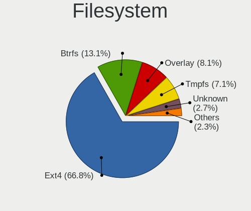

| Type    | Desktops | Percent |
|---------|----------|---------|
| Ext4    | 243      | 77.14%  |
| Btrfs   | 24       | 7.62%   |
| Overlay | 22       | 6.98%   |
| Unknown | 18       | 5.71%   |
| Xfs     | 4        | 1.27%   |
| Ext2    | 3        | 0.95%   |
| Zfs     | 1        | 0.32%   |

Part. scheme
------------

Scheme of partitioning

| Type    | Desktops | Percent |
|---------|----------|---------|
| Unknown | 213      | 68.27%  |
| GPT     | 68       | 21.79%  |
| MBR     | 31       | 9.94%   |

Dual Boot with Linux/BSD
------------------------

Hosting more than one Linux/BSD

| Dual boot | Desktops | Percent |
|-----------|----------|---------|
| No        | 252      | 81.55%  |
| Yes       | 57       | 18.45%  |

Dual Boot (Win)
---------------

Hosting Linux and Windows

| Dual boot | Desktops | Percent |
|-----------|----------|---------|
| No        | 195      | 61.13%  |
| Yes       | 124      | 38.87%  |

Board
-----

Vendor
------

Motherboard manufacturer

| Name                | Desktops | Percent |
|---------------------|----------|---------|
| ASUSTek Computer    | 95       | 31.05%  |
| Gigabyte Technology | 71       | 23.2%   |
| MSI                 | 59       | 19.28%  |
| Hewlett-Packard     | 11       | 3.59%   |
| ASRock              | 11       | 3.59%   |
| Lenovo              | 7        | 2.29%   |
| Foxconn             | 7        | 2.29%   |
| Intel               | 6        | 1.96%   |
| ECS                 | 6        | 1.96%   |
| Dell                | 6        | 1.96%   |
| Unknown             | 5        | 1.63%   |
| Acer                | 4        | 1.31%   |
| Huanan              | 3        | 0.98%   |
| Casper              | 3        | 0.98%   |
| Fujitsu Siemens     | 2        | 0.65%   |
| Zillion             | 1        | 0.33%   |
| SYWZ                | 1        | 0.33%   |
| Shuttle             | 1        | 0.33%   |
| Pegatron            | 1        | 0.33%   |
| Fujitsu             | 1        | 0.33%   |
| FIC                 | 1        | 0.33%   |
| Biostar             | 1        | 0.33%   |
| Apple               | 1        | 0.33%   |
| AOpen               | 1        | 0.33%   |
| ABIT                | 1        | 0.33%   |

Model
-----

Motherboard model

| Name                                       | Desktops | Percent |
|--------------------------------------------|----------|---------|
| Unknown                                    | 7        | 2.29%   |
| Gigabyte B450M S2H                         | 6        | 1.96%   |
| ASUS All Series                            | 6        | 1.96%   |
| Gigabyte G31M-ES2L                         | 5        | 1.63%   |
| MSI MS-7A34                                | 4        | 1.31%   |
| MSI MS-7693                                | 4        | 1.31%   |
| MSI MS-7996                                | 3        | 0.98%   |
| MSI MS-7817                                | 3        | 0.98%   |
| MSI MS-7360                                | 3        | 0.98%   |
| Gigabyte A320M-S2H                         | 3        | 0.98%   |
| ASUS PRIME B450M-K                         | 3        | 0.98%   |
| ASUS M5A78L-M LX3                          | 3        | 0.98%   |
| MSI MS-7C52                                | 2        | 0.65%   |
| MSI MS-7C09                                | 2        | 0.65%   |
| MSI MS-7C02                                | 2        | 0.65%   |
| MSI MS-7A38                                | 2        | 0.65%   |
| MSI MS-7597                                | 2        | 0.65%   |
| MSI MS-7592                                | 2        | 0.65%   |
| Intel H55                                  | 2        | 0.65%   |
| HP ProLiant MicroServer Gen8               | 2        | 0.65%   |
| Gigabyte M61SME-S2                         | 2        | 0.65%   |
| Gigabyte H61M-S2PV                         | 2        | 0.65%   |
| Gigabyte GA-MA785GMT-UD2H                  | 2        | 0.65%   |
| Gigabyte G41M-ES2L                         | 2        | 0.65%   |
| Gigabyte G41M-Combo                        | 2        | 0.65%   |
| Gigabyte B450M DS3H                        | 2        | 0.65%   |
| Foxconn G31MV/G31MV-K FAB                  | 2        | 0.65%   |
| Dell Vostro 3670                           | 2        | 0.65%   |
| Dell OptiPlex 3050                         | 2        | 0.65%   |
| ASUS TUF B450M-PRO GAMING                  | 2        | 0.65%   |
| ASUS Rampage IV EXTREME                    | 2        | 0.65%   |
| ASUS PRIME B350M-A                         | 2        | 0.65%   |
| ASUS P8H61-M LX3 PLUS R2.0                 | 2        | 0.65%   |
| ASUS P5KPL-AM SE                           | 2        | 0.65%   |
| ASUS M5A97 R2.0                            | 2        | 0.65%   |
| ASUS M5A97 LE R2.0                         | 2        | 0.65%   |
| ASUS M5A78L LE                             | 2        | 0.65%   |
| ASUS H61M-PRO                              | 2        | 0.65%   |
| ASUS H61M-K                                | 2        | 0.65%   |
| ASRock B450M Pro4                          | 2        | 0.65%   |
| Acer Nitro N50-610                         | 2        | 0.65%   |
| SYWZ S210H Series                          | 1        | 0.33%   |
| Shuttle X70                                | 1        | 0.33%   |
| Pegatron TouchSmart 7320 Lavaca-B EU L6 PC | 1        | 0.33%   |
| MSI PPPPPPP-CCC#MMMMMMMM                   | 1        | 0.33%   |
| MSI MS-7D20                                | 1        | 0.33%   |
| MSI MS-7C91                                | 1        | 0.33%   |
| MSI MS-7C89                                | 1        | 0.33%   |
| MSI MS-7C84                                | 1        | 0.33%   |
| MSI MS-7C75                                | 1        | 0.33%   |
| MSI MS-7C31                                | 1        | 0.33%   |
| MSI MS-7B98                                | 1        | 0.33%   |
| MSI MS-7B86                                | 1        | 0.33%   |
| MSI MS-7B79                                | 1        | 0.33%   |
| MSI MS-7B48                                | 1        | 0.33%   |
| MSI MS-7B45                                | 1        | 0.33%   |
| MSI MS-7B38                                | 1        | 0.33%   |
| MSI MS-7A72                                | 1        | 0.33%   |
| MSI MS-7A68                                | 1        | 0.33%   |
| MSI MS-7A65                                | 1        | 0.33%   |

Model Family
------------

Motherboard model prefix

| Name                      | Desktops | Percent |
|---------------------------|----------|---------|
| ASUS PRIME                | 13       | 4.25%   |
| Gigabyte B450M            | 8        | 2.61%   |
| ASUS ROG                  | 7        | 2.29%   |
| Unknown                   | 7        | 2.29%   |
| ASUS All                  | 6        | 1.96%   |
| Gigabyte G31M-ES2L        | 5        | 1.63%   |
| ASUS M5A97                | 5        | 1.63%   |
| MSI MS-7A34               | 4        | 1.31%   |
| MSI MS-7693               | 4        | 1.31%   |
| ASUS TUF                  | 4        | 1.31%   |
| ASUS P8H61-M              | 4        | 1.31%   |
| ASUS M5A78L-M             | 4        | 1.31%   |
| MSI MS-7996               | 3        | 0.98%   |
| MSI MS-7817               | 3        | 0.98%   |
| MSI MS-7360               | 3        | 0.98%   |
| Lenovo ThinkCentre        | 3        | 0.98%   |
| Lenovo IdeaCentre         | 3        | 0.98%   |
| Gigabyte A320M-S2H        | 3        | 0.98%   |
| Dell Vostro               | 3        | 0.98%   |
| ASUS P5Q                  | 3        | 0.98%   |
| MSI MS-7C52               | 2        | 0.65%   |
| MSI MS-7C09               | 2        | 0.65%   |
| MSI MS-7C02               | 2        | 0.65%   |
| MSI MS-7A38               | 2        | 0.65%   |
| MSI MS-7597               | 2        | 0.65%   |
| MSI MS-7592               | 2        | 0.65%   |
| Intel H55                 | 2        | 0.65%   |
| HP ProLiant               | 2        | 0.65%   |
| HP EliteDesk              | 2        | 0.65%   |
| Gigabyte M61SME-S2        | 2        | 0.65%   |
| Gigabyte H61M-S2PV        | 2        | 0.65%   |
| Gigabyte GA-MA785GMT-UD2H | 2        | 0.65%   |
| Gigabyte G41M-ES2L        | 2        | 0.65%   |
| Gigabyte G41M-Combo       | 2        | 0.65%   |
| Fujitsu Siemens ESPRIMO   | 2        | 0.65%   |
| Foxconn G31MV             | 2        | 0.65%   |
| Dell OptiPlex             | 2        | 0.65%   |
| Casper NIRVANA            | 2        | 0.65%   |
| ASUS Rampage              | 2        | 0.65%   |
| ASUS P5KPL-AM             | 2        | 0.65%   |
| ASUS P5G41T-M             | 2        | 0.65%   |
| ASUS M5A78L               | 2        | 0.65%   |
| ASUS H61M-PRO             | 2        | 0.65%   |
| ASUS H61M-K               | 2        | 0.65%   |
| ASRock B450M              | 2        | 0.65%   |
| Acer Nitro                | 2        | 0.65%   |
| SYWZ S210H                | 1        | 0.33%   |
| Shuttle X70               | 1        | 0.33%   |
| Pegatron TouchSmart       | 1        | 0.33%   |
| MSI PPPPPPP-CCC#MMMMMMMM  | 1        | 0.33%   |
| MSI MS-7D20               | 1        | 0.33%   |
| MSI MS-7C91               | 1        | 0.33%   |
| MSI MS-7C89               | 1        | 0.33%   |
| MSI MS-7C84               | 1        | 0.33%   |
| MSI MS-7C75               | 1        | 0.33%   |
| MSI MS-7C31               | 1        | 0.33%   |
| MSI MS-7B98               | 1        | 0.33%   |
| MSI MS-7B86               | 1        | 0.33%   |
| MSI MS-7B79               | 1        | 0.33%   |
| MSI MS-7B48               | 1        | 0.33%   |

MFG Year
--------

Motherboard manufacture year

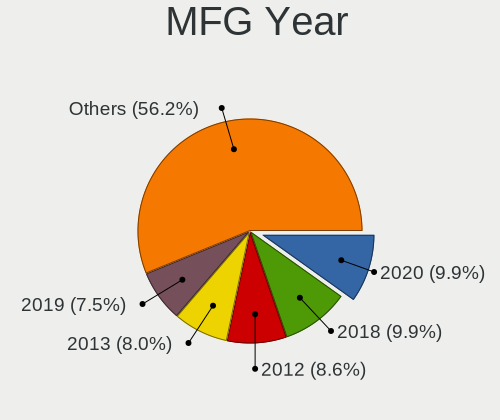

| Year    | Desktops | Percent |
|---------|----------|---------|
| 2018    | 34       | 11.11%  |
| 2012    | 31       | 10.13%  |
| 2017    | 30       | 9.8%    |
| 2013    | 26       | 8.5%    |
| 2020    | 24       | 7.84%   |
| 2010    | 24       | 7.84%   |
| 2019    | 21       | 6.86%   |
| 2011    | 20       | 6.54%   |
| 2008    | 19       | 6.21%   |
| 2014    | 14       | 4.58%   |
| 2007    | 14       | 4.58%   |
| 2015    | 13       | 4.25%   |
| 2009    | 13       | 4.25%   |
| 2016    | 8        | 2.61%   |
| 2021    | 5        | 1.63%   |
| 2006    | 5        | 1.63%   |
| 2022    | 1        | 0.33%   |
| 2005    | 1        | 0.33%   |
| 2004    | 1        | 0.33%   |
| 2003    | 1        | 0.33%   |
| Unknown | 1        | 0.33%   |

Form Factor
-----------

Physical design of the computer

| Name    | Desktops | Percent |
|---------|----------|---------|
| Desktop | 306      | 100%    |

Secure Boot
-----------

Enabled or disabled

| State    | Desktops | Percent |
|----------|----------|---------|
| Disabled | 303      | 98.7%   |
| Enabled  | 4        | 1.3%    |

Coreboot
--------

Have coreboot on board

| Used | Desktops | Percent |
|------|----------|---------|
| No   | 306      | 100%    |

RAM Size
--------

Total RAM memory

| Size in GB      | Desktops | Percent |
|-----------------|----------|---------|
| 16.01-24.0      | 75       | 23.96%  |
| 8.01-16.0       | 75       | 23.96%  |
| 3.01-4.0        | 49       | 15.65%  |
| 4.01-8.0        | 46       | 14.7%   |
| 1.01-2.0        | 24       | 7.67%   |
| 32.01-64.0      | 20       | 6.39%   |
| 64.01-256.0     | 9        | 2.88%   |
| 2.01-3.0        | 7        | 2.24%   |
| 24.01-32.0      | 5        | 1.6%    |
| 0.51-1.0        | 2        | 0.64%   |
| More than 256.0 | 1        | 0.32%   |

RAM Used
--------

Used RAM memory

| Used GB    | Desktops | Percent |
|------------|----------|---------|
| 1.01-2.0   | 138      | 40.83%  |
| 2.01-3.0   | 79       | 23.37%  |
| 3.01-4.0   | 49       | 14.5%   |
| 4.01-8.0   | 34       | 10.06%  |
| 0.51-1.0   | 20       | 5.92%   |
| 8.01-16.0  | 11       | 3.25%   |
| 0.01-0.5   | 4        | 1.18%   |
| 24.01-32.0 | 2        | 0.59%   |
| 16.01-24.0 | 1        | 0.3%    |

Total Drives
------------

Number of drives on board

| Drives | Desktops | Percent |
|--------|----------|---------|
| 1      | 134      | 42.27%  |
| 2      | 101      | 31.86%  |
| 3      | 51       | 16.09%  |
| 4      | 17       | 5.36%   |
| 5      | 6        | 1.89%   |
| 7      | 5        | 1.58%   |
| 6      | 2        | 0.63%   |
| 0      | 1        | 0.32%   |

Has CD-ROM
----------

Has CD-ROM on board

| Presented | Desktops | Percent |
|-----------|----------|---------|
| No        | 205      | 65.5%   |
| Yes       | 108      | 34.5%   |

Has Ethernet
------------

Has Ethernet on board

| Presented | Desktops | Percent |
|-----------|----------|---------|
| Yes       | 305      | 99.67%  |
| No        | 1        | 0.33%   |

Has WiFi
--------

Has WiFi module

| Presented | Desktops | Percent |
|-----------|----------|---------|
| No        | 179      | 57.56%  |
| Yes       | 132      | 42.44%  |

Has Bluetooth
-------------

Has Bluetooth module

| Presented | Desktops | Percent |
|-----------|----------|---------|
| No        | 228      | 73.55%  |
| Yes       | 82       | 26.45%  |

Location
--------

Country
-------

Geographic location (country)

| Country | Desktops | Percent |
|---------|----------|---------|
| Turkey  | 306      | 100%    |

City
----

Geographic location (city)

| City                | Desktops | Percent |
|---------------------|----------|---------|
| Istanbul            | 117      | 37.03%  |
| Ankara              | 41       | 12.97%  |
| Izmir               | 26       | 8.23%   |
| Bursa               | 17       | 5.38%   |
| Antalya             | 11       | 3.48%   |
| Konya               | 10       | 3.16%   |
| zmit              | 6        | 1.9%    |
| Aydin               | 6        | 1.9%    |
| Balkesir          | 5        | 1.58%   |
| Adana               | 5        | 1.58%   |
| Krklareli         | 4        | 1.27%   |
| Kayseri             | 4        | 1.27%   |
| Samsun              | 3        | 0.95%   |
| Kosekoy             | 3        | 0.95%   |
| Denizli             | 3        | 0.95%   |
| Trabzon             | 2        | 0.63%   |
| Tekirda           | 2        | 0.63%   |
| OEdemis             | 2        | 0.63%   |
| Mugla               | 2        | 0.63%   |
| Mersin              | 2        | 0.63%   |
| Malatya             | 2        | 0.63%   |
| Magnesia ad Sipylum | 2        | 0.63%   |
| Eskiehir          | 2        | 0.63%   |
| Antakya             | 2        | 0.63%   |
| Adapazar          | 2        | 0.63%   |
| Zonguldak           | 1        | 0.32%   |
| Yozgat              | 1        | 0.32%   |
| Yenimahalle         | 1        | 0.32%   |
| Yaman               | 1        | 0.32%   |
| Yalova              | 1        | 0.32%   |
| Van                 | 1        | 0.32%   |
| Uak               | 1        | 0.32%   |
| Ulus                | 1        | 0.32%   |
| Tokat Province      | 1        | 0.32%   |
| Skutari             | 1        | 0.32%   |
| Sirnak              | 1        | 0.32%   |
| Sehitkamil          | 1        | 0.32%   |
| Sanliurfa           | 1        | 0.32%   |
| Polatl            | 1        | 0.32%   |
| Panderma            | 1        | 0.32%   |
| Ordu                | 1        | 0.32%   |
| Mamak               | 1        | 0.32%   |
| Maltepe             | 1        | 0.32%   |
| Lleburgaz         | 1        | 0.32%   |
| Kocarli             | 1        | 0.32%   |
| Kecioeren           | 1        | 0.32%   |
| Kartal              | 1        | 0.32%   |
| Gaziantep           | 1        | 0.32%   |
| Etimesgut           | 1        | 0.32%   |
| Esenyurt            | 1        | 0.32%   |
| Derince             | 1        | 0.32%   |
| Cordaleo            | 1        | 0.32%   |
| Cankaya             | 1        | 0.32%   |
| Bornova             | 1        | 0.32%   |
| Bilecik             | 1        | 0.32%   |
| Atakum              | 1        | 0.32%   |
| Alaehir           | 1        | 0.32%   |
| Akyazi              | 1        | 0.32%   |
| Aksaray             | 1        | 0.32%   |
| Akalan              | 1        | 0.32%   |

Drives
------

Drive Vendor
------------

Hard drive vendors

| Vendor                | Desktops | Drives | Percent |
|-----------------------|----------|--------|---------|
| Seagate               | 118      | 151    | 21.73%  |
| WDC                   | 110      | 161    | 20.26%  |
| Samsung Electronics   | 86       | 136    | 15.84%  |
| SanDisk               | 47       | 61     | 8.66%   |
| Toshiba               | 33       | 37     | 6.08%   |
| Kingston              | 29       | 34     | 5.34%   |
| Hitachi               | 13       | 14     | 2.39%   |
| Crucial               | 11       | 14     | 2.03%   |
| Corsair               | 9        | 11     | 1.66%   |
| A-DATA Technology     | 9        | 10     | 1.66%   |
| China                 | 8        | 9      | 1.47%   |
| OCZ                   | 5        | 7      | 0.92%   |
| Phison                | 4        | 4      | 0.74%   |
| Maxtor                | 4        | 4      | 0.74%   |
| JAMESDONKEY           | 4        | 4      | 0.74%   |
| Intel                 | 4        | 6      | 0.74%   |
| XPG                   | 3        | 5      | 0.55%   |
| Realtek Semiconductor | 3        | 4      | 0.55%   |
| KIOXIA-EXCERIA        | 3        | 3      | 0.55%   |
| HS-SSD-C100           | 3        | 3      | 0.55%   |
| HGST                  | 3        | 3      | 0.55%   |
| Transcend             | 2        | 2      | 0.37%   |
| Team                  | 2        | 2      | 0.37%   |
| Netac                 | 2        | 2      | 0.37%   |
| KIOXIA                | 2        | 2      | 0.37%   |
| KingSpec              | 2        | 2      | 0.37%   |
| JD                    | 2        | 3      | 0.37%   |
| Hewlett-Packard       | 2        | 2      | 0.37%   |
| Unknown               | 1        | 2      | 0.18%   |
| SSSTC                 | 1        | 1      | 0.18%   |
| SSD-S400              | 1        | 1      | 0.18%   |
| SPCC                  | 1        | 1      | 0.18%   |
| SK hynix              | 1        | 1      | 0.18%   |
| Silicon Motion        | 1        | 1      | 0.18%   |
| Phison Electronics    | 1        | 1      | 0.18%   |
| Micron Technology     | 1        | 1      | 0.18%   |
| Lexar                 | 1        | 1      | 0.18%   |
| KingDian              | 1        | 1      | 0.18%   |
| HPE                   | 1        | 1      | 0.18%   |
| GOODRAM               | 1        | 1      | 0.18%   |
| Gigabyte Technology   | 1        | 1      | 0.18%   |
| Fujitsu               | 1        | 1      | 0.18%   |
| ExcelStor             | 1        | 1      | 0.18%   |
| ASMT                  | 1        | 1      | 0.18%   |
| Apple                 | 1        | 1      | 0.18%   |
| Apacer                | 1        | 1      | 0.18%   |
| AFOX                  | 1        | 1      | 0.18%   |
| 128MB                 | 1        | 1      | 0.18%   |

Drive Model
-----------

Hard drive models

| Model                            | Desktops | Percent |
|----------------------------------|----------|---------|
| Seagate ST1000DM010-2EP102 1TB   | 12       | 1.97%   |
| SanDisk SSD PLUS 240GB           | 11       | 1.81%   |
| Seagate ST500DM002-1BD142 500GB  | 10       | 1.64%   |
| Seagate ST1000DM003-1ER162 1TB   | 9        | 1.48%   |
| WDC WD10EZEX-08WN4A0 1TB         | 7        | 1.15%   |
| Samsung SSD 860 EVO 250GB        | 7        | 1.15%   |
| Samsung HD502HJ 500GB            | 7        | 1.15%   |
| Samsung HD322HJ 320GB            | 7        | 1.15%   |
| WDC WD5000AAKX-00ERMA0 500GB     | 6        | 0.99%   |
| WDC WD10EZEX-00BN5A0 1TB         | 5        | 0.82%   |
| Toshiba DT01ACA100 1TB           | 5        | 0.82%   |
| Seagate ST3500418AS 500GB        | 5        | 0.82%   |
| Samsung NVMe SSD Drive 500GB     | 5        | 0.82%   |
| Kingston SV300S37A120G 120GB SSD | 5        | 0.82%   |
| WDC WD6402AAEX-00Y9A0 640GB      | 4        | 0.66%   |
| Seagate ST3250410AS 250GB        | 4        | 0.66%   |
| Seagate ST2000DM008-2FR102 2TB   | 4        | 0.66%   |
| Seagate ST1000DM003-1SB102 1TB   | 4        | 0.66%   |
| Seagate ST1000DM003-1CH162 1TB   | 4        | 0.66%   |
| Seagate Expansion 500GB          | 4        | 0.66%   |
| Samsung SSD 840 EVO 250GB        | 4        | 0.66%   |
| A-DATA SU650 120GB SSD           | 4        | 0.66%   |
| WDC WDS240G2G0A-00JH30 240GB SSD | 3        | 0.49%   |
| WDC WDS120G2G0A-00JH30 120GB SSD | 3        | 0.49%   |
| WDC WD10EZRX-00D8PB0 1TB         | 3        | 0.49%   |
| WDC WD10EARS-00Y5B1 1TB          | 3        | 0.49%   |
| Seagate ST2000DM001-1CH164 2TB   | 3        | 0.49%   |
| Seagate ST1000LM035-1RK172 1TB   | 3        | 0.49%   |
| SanDisk Ultra II 240GB SSD       | 3        | 0.49%   |
| SanDisk SSD PLUS 480GB           | 3        | 0.49%   |
| SanDisk SSD PLUS 120GB           | 3        | 0.49%   |
| SanDisk SDSSDP128G 128GB         | 3        | 0.49%   |
| SanDisk SDSSDA240G 240GB         | 3        | 0.49%   |
| Samsung SSD 850 EVO 250GB        | 3        | 0.49%   |
| Samsung SP0812C 80GB             | 3        | 0.49%   |
| Samsung NVMe SSD Drive 250GB     | 3        | 0.49%   |
| Samsung HD501LJ 500GB            | 3        | 0.49%   |
| Samsung HD161HJ 160GB            | 3        | 0.49%   |
| Samsung HD160JJ 160GB            | 3        | 0.49%   |
| Phison NVMe SSD Drive 240GB      | 3        | 0.49%   |
| Kingston SV300S37A60G 64GB SSD   | 3        | 0.49%   |
| Kingston SH103S3120G 120GB SSD   | 3        | 0.49%   |
| Kingston SA400S37120G 120GB SSD  | 3        | 0.49%   |
| JAMESDONKEY JD120 120GB          | 3        | 0.49%   |
| Crucial CT480BX500SSD1 480GB     | 3        | 0.49%   |
| Crucial CT120BX500SSD1 120GB     | 3        | 0.49%   |
| Corsair Force MP510 480GB        | 3        | 0.49%   |
| China SATA SSD 120GB             | 3        | 0.49%   |
| XPG NVMe SSD Drive 512GB         | 2        | 0.33%   |
| WDC WDS500G2B0A-00SM50 500GB SSD | 2        | 0.33%   |
| WDC WD5000AZLX-00JKKA0 500GB     | 2        | 0.33%   |
| WDC WD5000AAKX-001CA0 500GB      | 2        | 0.33%   |
| WDC WD30EZRX-00SPEB0 3TB         | 2        | 0.33%   |
| WDC WD30EZRX-00DC0B0 3TB         | 2        | 0.33%   |
| WDC WD20EZRX-00DC0B0 2TB         | 2        | 0.33%   |
| WDC WD20EARX-00PASB0 2TB         | 2        | 0.33%   |
| WDC WD15EARS-00MVWB0 1TB         | 2        | 0.33%   |
| WDC WD10JPCX-24UE4T0 1TB         | 2        | 0.33%   |
| WDC WD10EZEX-60WN4A0 1TB         | 2        | 0.33%   |
| WDC WD10EZEX-22MFCA0 1TB         | 2        | 0.33%   |

HDD Vendor
----------

Hard disk drive vendors

| Vendor              | Desktops | Drives | Percent |
|---------------------|----------|--------|---------|
| Seagate             | 117      | 150    | 37.86%  |
| WDC                 | 100      | 147    | 32.36%  |
| Samsung Electronics | 41       | 58     | 13.27%  |
| Toshiba             | 26       | 28     | 8.41%   |
| Hitachi             | 13       | 14     | 4.21%   |
| Maxtor              | 4        | 4      | 1.29%   |
| HGST                | 3        | 3      | 0.97%   |
| Fujitsu             | 1        | 1      | 0.32%   |
| ExcelStor           | 1        | 1      | 0.32%   |
| ASMT                | 1        | 1      | 0.32%   |
| Apple               | 1        | 1      | 0.32%   |
| 128MB               | 1        | 1      | 0.32%   |

SSD Vendor
----------

Solid state drive vendors

| Vendor              | Desktops | Drives | Percent |
|---------------------|----------|--------|---------|
| SanDisk             | 42       | 54     | 22.83%  |
| Samsung Electronics | 35       | 49     | 19.02%  |
| Kingston            | 29       | 34     | 15.76%  |
| WDC                 | 12       | 13     | 6.52%   |
| Crucial             | 11       | 13     | 5.98%   |
| China               | 8        | 9      | 4.35%   |
| A-DATA Technology   | 7        | 7      | 3.8%    |
| OCZ                 | 5        | 7      | 2.72%   |
| Corsair             | 5        | 6      | 2.72%   |
| Toshiba             | 4        | 5      | 2.17%   |
| KIOXIA-EXCERIA      | 3        | 3      | 1.63%   |
| Transcend           | 2        | 2      | 1.09%   |
| Team                | 2        | 2      | 1.09%   |
| Netac               | 2        | 2      | 1.09%   |
| KingSpec            | 2        | 2      | 1.09%   |
| Intel               | 2        | 2      | 1.09%   |
| Hewlett-Packard     | 2        | 2      | 1.09%   |
| SSD-S400            | 1        | 1      | 0.54%   |
| Micron Technology   | 1        | 1      | 0.54%   |
| Lexar               | 1        | 1      | 0.54%   |
| KingDian            | 1        | 1      | 0.54%   |
| JD                  | 1        | 1      | 0.54%   |
| JAMESDONKEY         | 1        | 1      | 0.54%   |
| HS-SSD-C100         | 1        | 1      | 0.54%   |
| GOODRAM             | 1        | 1      | 0.54%   |
| Gigabyte Technology | 1        | 1      | 0.54%   |
| Apacer              | 1        | 1      | 0.54%   |
| AFOX                | 1        | 1      | 0.54%   |

Drive Kind
----------

HDD or SSD

| Kind    | Desktops | Drives | Percent |
|---------|----------|--------|---------|
| HDD     | 240      | 409    | 51.95%  |
| SSD     | 159      | 223    | 34.42%  |
| NVMe    | 52       | 73     | 11.26%  |
| Unknown | 11       | 12     | 2.38%   |

Drive Connector
---------------

SATA, SAS, NVMe, etc.

| Type | Desktops | Drives | Percent |
|------|----------|--------|---------|
| SATA | 290      | 627    | 81.69%  |
| NVMe | 52       | 73     | 14.65%  |
| SAS  | 13       | 17     | 3.66%   |

Drive Size
----------

Size of hard drive

| Size in TB | Desktops | Drives | Percent |
|------------|----------|--------|---------|
| 0.01-0.5   | 243      | 405    | 60.45%  |
| 0.51-1.0   | 111      | 155    | 27.61%  |
| 1.01-2.0   | 25       | 37     | 6.22%   |
| 3.01-4.0   | 12       | 20     | 2.99%   |
| 2.01-3.0   | 8        | 11     | 1.99%   |
| 4.01-10.0  | 3        | 4      | 0.75%   |

Space Total
-----------

Amount of disk space available on the file system

| Size in GB     | Desktops | Percent |
|----------------|----------|---------|
| 101-250        | 96       | 29.63%  |
| 251-500        | 66       | 20.37%  |
| 501-1000       | 45       | 13.89%  |
| 1-20           | 26       | 8.02%   |
| 51-100         | 26       | 8.02%   |
| 1001-2000      | 25       | 7.72%   |
| More than 3000 | 15       | 4.63%   |
| 2001-3000      | 10       | 3.09%   |
| 21-50          | 9        | 2.78%   |
| Unknown        | 6        | 1.85%   |

Space Used
----------

Amount of used disk space

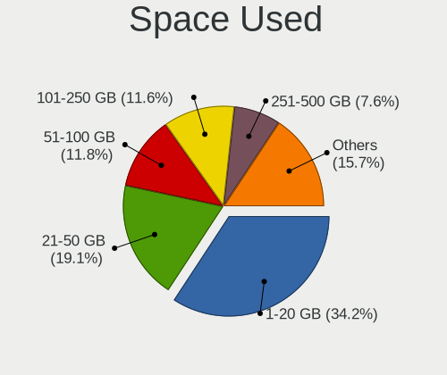

| Used GB        | Desktops | Percent |
|----------------|----------|---------|
| 1-20           | 133      | 40.43%  |
| 21-50          | 52       | 15.81%  |
| 51-100         | 41       | 12.46%  |
| 101-250        | 34       | 10.33%  |
| 251-500        | 26       | 7.9%    |
| 501-1000       | 20       | 6.08%   |
| More than 3000 | 8        | 2.43%   |
| 1001-2000      | 8        | 2.43%   |
| Unknown        | 6        | 1.82%   |
| 2001-3000      | 1        | 0.3%    |

Malfunc. Drives
---------------

Drive models with a malfunction

| Model                              | Desktops | Drives | Percent |
|------------------------------------|----------|--------|---------|
| Kingston SV300S37A120G 120GB SSD   | 3        | 4      | 6.82%   |
| Toshiba DT01ACA050 500GB           | 2        | 2      | 4.55%   |
| Seagate ST500DM002-1BD142 500GB    | 2        | 2      | 4.55%   |
| Seagate ST3500630AS 500GB          | 2        | 2      | 4.55%   |
| WDC WD5000AAKX-001CA0 500GB        | 1        | 2      | 2.27%   |
| WDC WD400JB-00ENA0 40GB            | 1        | 1      | 2.27%   |
| WDC WD3200BEVT-60A23T0 320GB       | 1        | 1      | 2.27%   |
| WDC WD3200AAJS-00B4A0 320GB        | 1        | 1      | 2.27%   |
| WDC WD30EZRX-00MMMB0 3TB           | 1        | 1      | 2.27%   |
| WDC WD2500JS-55NCB1 250GB          | 1        | 1      | 2.27%   |
| WDC WD10EARS-00Y5B1 1TB            | 1        | 2      | 2.27%   |
| Toshiba MQ01ABD100 1TB             | 1        | 1      | 2.27%   |
| SSD-S400 SSD 120GB                 | 1        | 1      | 2.27%   |
| Seagate ST380215AS 80GB            | 1        | 1      | 2.27%   |
| Seagate ST3500418AS 500GB          | 1        | 1      | 2.27%   |
| Seagate ST3250410AS 250GB          | 1        | 1      | 2.27%   |
| Seagate ST3250310AS 250GB          | 1        | 1      | 2.27%   |
| Seagate ST2000LM003 HN-M201RAD 2TB | 1        | 1      | 2.27%   |
| Seagate ST1000LM014-SSHD-8GB       | 1        | 1      | 2.27%   |
| Seagate ST1000DM003-1SB102 1TB     | 1        | 1      | 2.27%   |
| Seagate ST1000DM003-1CH162 1TB     | 1        | 1      | 2.27%   |
| SanDisk SSD PLUS 240GB             | 1        | 1      | 2.27%   |
| SanDisk SDSSDA120G 120GB           | 1        | 1      | 2.27%   |
| Samsung Electronics HD501LJ 500GB  | 1        | 1      | 2.27%   |
| Samsung Electronics HD322HJ 320GB  | 1        | 1      | 2.27%   |
| Samsung Electronics HD322GJ 320GB  | 1        | 2      | 2.27%   |
| Samsung Electronics HD161HJ 160GB  | 1        | 1      | 2.27%   |
| Samsung Electronics HD160JJ 160GB  | 1        | 1      | 2.27%   |
| Samsung Electronics HD160HJ 160GB  | 1        | 2      | 2.27%   |
| OCZ VERTEX4 256GB SSD              | 1        | 2      | 2.27%   |
| Maxtor 6Y080M0 81GB                | 1        | 1      | 2.27%   |
| Maxtor 6L160P0 163GB               | 1        | 1      | 2.27%   |
| Kingston SVP200S37A120G 120GB SSD  | 1        | 1      | 2.27%   |
| Kingston SUV400S37240G 240GB SSD   | 1        | 1      | 2.27%   |
| Hitachi HTS545050A7E380 500GB      | 1        | 1      | 2.27%   |
| Hitachi HTS542516K9SA00 160GB      | 1        | 1      | 2.27%   |
| Crucial CT250MX500SSD1 250GB       | 1        | 1      | 2.27%   |
| A-DATA Technology SX8100NP 512GB   | 1        | 1      | 2.27%   |
| A-DATA Technology SU630 240GB SSD  | 1        | 1      | 2.27%   |

Malfunc. Drive Vendor
---------------------

Vendors of faulty drives

| Vendor              | Desktops | Drives | Percent |
|---------------------|----------|--------|---------|
| Seagate             | 11       | 12     | 26.19%  |
| WDC                 | 6        | 9      | 14.29%  |
| Samsung Electronics | 6        | 8      | 14.29%  |
| Kingston            | 5        | 6      | 11.9%   |
| Toshiba             | 3        | 3      | 7.14%   |
| SanDisk             | 2        | 2      | 4.76%   |
| Maxtor              | 2        | 2      | 4.76%   |
| Hitachi             | 2        | 2      | 4.76%   |
| A-DATA Technology   | 2        | 2      | 4.76%   |
| SSD-S400            | 1        | 1      | 2.38%   |
| OCZ                 | 1        | 2      | 2.38%   |
| Crucial             | 1        | 1      | 2.38%   |

Malfunc. HDD Vendor
-------------------

Vendors of faulty HDD drives

| Vendor              | Desktops | Drives | Percent |
|---------------------|----------|--------|---------|
| Seagate             | 11       | 12     | 36.67%  |
| WDC                 | 6        | 9      | 20%     |
| Samsung Electronics | 6        | 8      | 20%     |
| Toshiba             | 3        | 3      | 10%     |
| Maxtor              | 2        | 2      | 6.67%   |
| Hitachi             | 2        | 2      | 6.67%   |

Malfunc. Drive Kind
-------------------

Kinds of faulty drives

| Kind | Desktops | Drives | Percent |
|------|----------|--------|---------|
| HDD  | 27       | 36     | 69.23%  |
| SSD  | 11       | 13     | 28.21%  |
| NVMe | 1        | 1      | 2.56%   |

Failed Drives
-------------

Failed drive models

Zero info for selected period =(

Failed Drive Vendor
-------------------

Failed drive vendors

Zero info for selected period =(

Drive Status
------------

Number of failed and malfunc. drives

| Status   | Desktops | Drives | Percent |
|----------|----------|--------|---------|
| Detected | 218      | 478    | 64.31%  |
| Works    | 83       | 189    | 24.48%  |
| Malfunc  | 38       | 50     | 11.21%  |

Storage controller
------------------

Storage Vendor
--------------

Storage controller vendors

| Vendor                           | Desktops | Percent |
|----------------------------------|----------|---------|
| Intel                            | 186      | 46.5%   |
| AMD                              | 107      | 26.75%  |
| Samsung Electronics              | 22       | 5.5%    |
| Marvell Technology Group         | 14       | 3.5%    |
| JMicron Technology               | 13       | 3.25%   |
| Nvidia                           | 11       | 2.75%   |
| ASMedia Technology               | 11       | 2.75%   |
| Phison Electronics               | 10       | 2.5%    |
| SanDisk                          | 7        | 1.75%   |
| Realtek Semiconductor            | 4        | 1%      |
| ADATA Technology                 | 4        | 1%      |
| Toshiba America Info Systems     | 2        | 0.5%    |
| KIOXIA                           | 2        | 0.5%    |
| VIA Technologies                 | 1        | 0.25%   |
| ULi Electronics                  | 1        | 0.25%   |
| SK hynix                         | 1        | 0.25%   |
| Silicon Motion                   | 1        | 0.25%   |
| Silicon Integrated Systems [SiS] | 1        | 0.25%   |
| Micron/Crucial Technology        | 1        | 0.25%   |
| LSI Logic / Symbios Logic        | 1        | 0.25%   |

Storage Model
-------------

Storage controller models

| Model                                                                                   | Desktops | Percent |
|-----------------------------------------------------------------------------------------|----------|---------|
| AMD FCH SATA Controller [AHCI mode]                                                     | 60       | 10.89%  |
| Intel NM10/ICH7 Family SATA Controller [IDE mode]                                       | 34       | 6.17%   |
| AMD 400 Series Chipset SATA Controller                                                  | 30       | 5.44%   |
| Intel 82801G (ICH7 Family) IDE Controller                                               | 23       | 4.17%   |
| AMD SB7x0/SB8x0/SB9x0 IDE Controller                                                    | 23       | 4.17%   |
| AMD SB7x0/SB8x0/SB9x0 SATA Controller [IDE mode]                                        | 20       | 3.63%   |
| Intel Q170/Q150/B150/H170/H110/Z170/CM236 Chipset SATA Controller [AHCI Mode]           | 18       | 3.27%   |
| Intel 8 Series/C220 Series Chipset Family 6-port SATA Controller 1 [AHCI mode]          | 16       | 2.9%    |
| Intel 200 Series PCH SATA controller [AHCI mode]                                        | 16       | 2.9%    |
| Intel 6 Series/C200 Series Chipset Family 6 port Desktop SATA AHCI Controller           | 14       | 2.54%   |
| Samsung NVMe SSD Controller SM981/PM981/PM983                                           | 13       | 2.36%   |
| AMD 300 Series Chipset SATA Controller                                                  | 12       | 2.18%   |
| ASMedia ASM1062 Serial ATA Controller                                                   | 11       | 2%      |
| AMD SB7x0/SB8x0/SB9x0 SATA Controller [AHCI mode]                                       | 11       | 2%      |
| Intel 6 Series/C200 Series Chipset Family Desktop SATA Controller (IDE mode, ports 4-5) | 10       | 1.81%   |
| Intel 6 Series/C200 Series Chipset Family Desktop SATA Controller (IDE mode, ports 0-3) | 10       | 1.81%   |
| Nvidia MCP61 SATA Controller                                                            | 8        | 1.45%   |
| Phison E12 NVMe Controller                                                              | 7        | 1.27%   |
| Nvidia MCP61 IDE                                                                        | 7        | 1.27%   |
| JMicron JMB363 SATA/IDE Controller                                                      | 7        | 1.27%   |
| Intel 82801JI (ICH10 Family) 4 port SATA IDE Controller #1                              | 7        | 1.27%   |
| Intel 82801JI (ICH10 Family) 2 port SATA IDE Controller #2                              | 7        | 1.27%   |
| Intel 7 Series/C210 Series Chipset Family 6-port SATA Controller [AHCI mode]            | 7        | 1.27%   |
| Intel SATA Controller [RAID mode]                                                       | 6        | 1.09%   |
| Intel 82801JI (ICH10 Family) SATA AHCI Controller                                       | 6        | 1.09%   |
| Samsung NVMe SSD Controller 980                                                         | 5        | 0.91%   |
| Intel Comet Lake SATA AHCI Controller                                                   | 5        | 0.91%   |
| Intel Cannon Lake PCH SATA AHCI Controller                                              | 5        | 0.91%   |
| Intel 9 Series Chipset Family SATA Controller [AHCI Mode]                               | 5        | 0.91%   |
| Intel 82801I (ICH9 Family) 2 port SATA Controller [IDE mode]                            | 5        | 0.91%   |
| Intel 400 Series Chipset Family SATA AHCI Controller                                    | 5        | 0.91%   |
| AMD FCH SATA Controller D                                                               | 5        | 0.91%   |
| AMD 500 Series Chipset SATA Controller                                                  | 5        | 0.91%   |
| SanDisk WD Blue SN550 NVMe SSD                                                          | 4        | 0.73%   |
| Samsung NVMe SSD Controller SM961/PM961/SM963                                           | 4        | 0.73%   |
| Realtek RTS5763DL NVMe SSD Controller                                                   | 4        | 0.73%   |
| Intel 7 Series/C210 Series Chipset Family 4-port SATA Controller [IDE mode]             | 4        | 0.73%   |
| Intel 7 Series/C210 Series Chipset Family 2-port SATA Controller [IDE mode]             | 4        | 0.73%   |
| AMD X370 Series Chipset SATA Controller                                                 | 4        | 0.73%   |
| ADATA XPG SX8200 Pro PCIe Gen3x4 M.2 2280 Solid State Drive                             | 4        | 0.73%   |
| Marvell Group 88SE91A3 SATA-600 Controller                                              | 3        | 0.54%   |
| Marvell Group 88SE9172 SATA 6Gb/s Controller                                            | 3        | 0.54%   |
| Marvell Group 88SE6111/6121 SATA II / PATA Controller                                   | 3        | 0.54%   |
| Marvell Group 88SE6101/6102 single-port PATA133 interface                               | 3        | 0.54%   |
| Intel C600/X79 series chipset 6-Port SATA AHCI Controller                               | 3        | 0.54%   |
| Intel 82801IB (ICH9) 2 port SATA Controller [IDE mode]                                  | 3        | 0.54%   |
| Intel 82801HR/HO/HH (ICH8R/DO/DH) 2 port SATA Controller [IDE mode]                     | 3        | 0.54%   |
| Intel 82801H (ICH8 Family) 4 port SATA Controller [IDE mode]                            | 3        | 0.54%   |
| Intel 5 Series/3400 Series Chipset 4 port SATA IDE Controller                           | 3        | 0.54%   |
| Intel 5 Series/3400 Series Chipset 2 port SATA IDE Controller                           | 3        | 0.54%   |
| SanDisk Non-Volatile memory controller                                                  | 2        | 0.36%   |
| Phison PS5013 E13 NVMe Controller                                                       | 2        | 0.36%   |
| Nvidia MCP51 Serial ATA Controller                                                      | 2        | 0.36%   |
| Nvidia MCP51 IDE                                                                        | 2        | 0.36%   |
| KIOXIA NVMe SSD                                                                         | 2        | 0.36%   |
| JMicron JMB368 IDE controller                                                           | 2        | 0.36%   |
| JMicron JMB362 SATA Controller                                                          | 2        | 0.36%   |
| JMicron JMB361 AHCI/IDE                                                                 | 2        | 0.36%   |
| Intel SSD 660P Series                                                                   | 2        | 0.36%   |
| Intel C610/X99 series chipset 6-Port SATA Controller [AHCI mode]                        | 2        | 0.36%   |

Storage Kind
------------

Kind of storage controller (IDE, SATA, NVMe, SAS, ...)

| Kind | Desktops | Percent |
|------|----------|---------|
| SATA | 220      | 55.28%  |
| IDE  | 114      | 28.64%  |
| NVMe | 53       | 13.32%  |
| RAID | 10       | 2.51%   |
| SCSI | 1        | 0.25%   |

Processor
---------

CPU Vendor
----------

Processor vendors

| Vendor       | Desktops | Percent |
|--------------|----------|---------|
| Intel        | 188      | 61.44%  |
| AMD          | 117      | 38.24%  |
| CentaurHauls | 1        | 0.33%   |

CPU Model
---------

Processor models

| Model                                       | Desktops | Percent |
|---------------------------------------------|----------|---------|
| Intel Core 2 Quad CPU Q6600 @ 2.40GHz       | 7        | 2.28%   |
| Intel Core i7-3770 CPU @ 3.40GHz            | 6        | 1.95%   |
| AMD Ryzen 5 3600 6-Core Processor           | 6        | 1.95%   |
| AMD Ryzen 5 2600 Six-Core Processor         | 6        | 1.95%   |
| AMD FX-6300 Six-Core Processor              | 6        | 1.95%   |
| Intel Core i5-4460 CPU @ 3.20GHz            | 5        | 1.63%   |
| Intel Core 2 Quad CPU Q8300 @ 2.50GHz       | 5        | 1.63%   |
| AMD Ryzen 7 3700X 8-Core Processor          | 5        | 1.63%   |
| Intel Pentium Dual-Core CPU E5700 @ 3.00GHz | 4        | 1.3%    |
| Intel Pentium Dual CPU E2180 @ 2.00GHz      | 4        | 1.3%    |
| Intel Core i5-10400F CPU @ 2.90GHz          | 4        | 1.3%    |
| Intel Core i3-2120 CPU @ 3.30GHz            | 4        | 1.3%    |
| AMD Ryzen 7 1700 Eight-Core Processor       | 4        | 1.3%    |
| AMD Ryzen 5 1600X Six-Core Processor        | 4        | 1.3%    |
| AMD FX-8350 Eight-Core Processor            | 4        | 1.3%    |
| Intel Core i7-8700K CPU @ 3.70GHz           | 3        | 0.98%   |
| Intel Core i7-7700 CPU @ 3.60GHz            | 3        | 0.98%   |
| Intel Core i7-4790 CPU @ 3.60GHz            | 3        | 0.98%   |
| Intel Core i5 CPU 650 @ 3.20GHz             | 3        | 0.98%   |
| Intel Core i3-4160 CPU @ 3.60GHz            | 3        | 0.98%   |
| Intel Core 2 Duo CPU E8500 @ 3.16GHz        | 3        | 0.98%   |
| Intel Core 2 Duo CPU E7500 @ 2.93GHz        | 3        | 0.98%   |
| Intel Core 2 Duo CPU E7200 @ 2.53GHz        | 3        | 0.98%   |
| AMD Ryzen 5 2600X Six-Core Processor        | 3        | 0.98%   |
| AMD Ryzen 5 2400G with Radeon Vega Graphics | 3        | 0.98%   |
| AMD Ryzen 5 1600 Six-Core Processor         | 3        | 0.98%   |
| AMD Athlon 200GE with Radeon Vega Graphics  | 3        | 0.98%   |
| Intel Pentium Dual-Core CPU E5200 @ 2.50GHz | 2        | 0.65%   |
| Intel Pentium CPU G4560 @ 3.50GHz           | 2        | 0.65%   |
| Intel Pentium CPU G4400 @ 3.30GHz           | 2        | 0.65%   |
| Intel Pentium CPU G3220 @ 3.00GHz           | 2        | 0.65%   |
| Intel Pentium CPU G2030 @ 3.00GHz           | 2        | 0.65%   |
| Intel Core i7-8700 CPU @ 3.20GHz            | 2        | 0.65%   |
| Intel Core i7-7700K CPU @ 4.20GHz           | 2        | 0.65%   |
| Intel Core i7-6700K CPU @ 4.00GHz           | 2        | 0.65%   |
| Intel Core i7-6700 CPU @ 3.40GHz            | 2        | 0.65%   |
| Intel Core i7-3930K CPU @ 3.20GHz           | 2        | 0.65%   |
| Intel Core i7 CPU 950 @ 3.07GHz             | 2        | 0.65%   |
| Intel Core i5-7600 CPU @ 3.50GHz            | 2        | 0.65%   |
| Intel Core i5-7400 CPU @ 3.00GHz            | 2        | 0.65%   |
| Intel Core i5-4690K CPU @ 3.50GHz           | 2        | 0.65%   |
| Intel Core i5-3470 CPU @ 3.20GHz            | 2        | 0.65%   |
| Intel Core i5-2400 CPU @ 3.10GHz            | 2        | 0.65%   |
| Intel Core i5-10400 CPU @ 2.90GHz           | 2        | 0.65%   |
| Intel Core i3-9100F CPU @ 3.60GHz           | 2        | 0.65%   |
| Intel Core i3-8100 CPU @ 3.60GHz            | 2        | 0.65%   |
| Intel Core i3-7100T CPU @ 3.40GHz           | 2        | 0.65%   |
| Intel Core i3-7100 CPU @ 3.90GHz            | 2        | 0.65%   |
| Intel Core i3-3220 CPU @ 3.30GHz            | 2        | 0.65%   |
| Intel Core i3-2100 CPU @ 3.10GHz            | 2        | 0.65%   |
| Intel Celeron CPU G1610T @ 2.30GHz          | 2        | 0.65%   |
| AMD Sempron 140 Processor                   | 2        | 0.65%   |
| AMD Ryzen 9 3900X 12-Core Processor         | 2        | 0.65%   |
| AMD Ryzen 7 3800X 8-Core Processor          | 2        | 0.65%   |
| AMD Ryzen 7 2700 Eight-Core Processor       | 2        | 0.65%   |
| AMD Ryzen 5 PRO 4650G with Radeon Graphics  | 2        | 0.65%   |
| AMD Ryzen 5 3400G with Radeon Vega Graphics | 2        | 0.65%   |
| AMD Ryzen 3 3200G with Radeon Vega Graphics | 2        | 0.65%   |
| AMD Ryzen 3 2200G with Radeon Vega Graphics | 2        | 0.65%   |
| AMD Ryzen 3 1200 Quad-Core Processor        | 2        | 0.65%   |

CPU Model Family
----------------

Processor model prefix

| Model                   | Desktops | Percent |
|-------------------------|----------|---------|
| Intel Core i5           | 42       | 13.68%  |
| Intel Core i7           | 37       | 12.05%  |
| AMD Ryzen 5             | 32       | 10.42%  |
| Intel Core i3           | 24       | 7.82%   |
| Intel Core 2 Quad       | 17       | 5.54%   |
| AMD FX                  | 17       | 5.54%   |
| AMD Ryzen 7             | 15       | 4.89%   |
| Intel Core 2 Duo        | 14       | 4.56%   |
| Intel Xeon              | 12       | 3.91%   |
| Intel Pentium           | 11       | 3.58%   |
| Intel Pentium Dual-Core | 8        | 2.61%   |
| AMD Ryzen 3             | 8        | 2.61%   |
| Intel Pentium Dual      | 6        | 1.95%   |
| Intel Celeron           | 5        | 1.63%   |
| AMD Phenom II X4        | 5        | 1.63%   |
| AMD Athlon              | 4        | 1.3%    |
| Other                   | 3        | 0.98%   |
| Intel Core i9           | 3        | 0.98%   |
| Intel Core 2            | 3        | 0.98%   |
| AMD Phenom II X6        | 3        | 0.98%   |
| AMD Athlon II X3        | 3        | 0.98%   |
| AMD Athlon II X2        | 3        | 0.98%   |
| AMD A4                  | 3        | 0.98%   |
| AMD A10                 | 3        | 0.98%   |
| Intel Pentium 4         | 2        | 0.65%   |
| AMD Sempron             | 2        | 0.65%   |
| AMD Ryzen Threadripper  | 2        | 0.65%   |
| AMD Ryzen 9             | 2        | 0.65%   |
| AMD Ryzen 5 PRO         | 2        | 0.65%   |
| AMD Phenom              | 2        | 0.65%   |
| AMD Athlon X4           | 2        | 0.65%   |
| AMD Athlon II X4        | 2        | 0.65%   |
| AMD Athlon 64 X2        | 2        | 0.65%   |
| AMD A8                  | 2        | 0.65%   |
| Intel Pentium D         | 1        | 0.33%   |
| Intel Atom              | 1        | 0.33%   |
| CentaurHauls VIA Eden   | 1        | 0.33%   |
| AMD Phenom II X2        | 1        | 0.33%   |
| AMD Athlon XP           | 1        | 0.33%   |
| AMD A6                  | 1        | 0.33%   |

CPU Cores
---------

Number of processor cores

| Number | Desktops | Percent |
|--------|----------|---------|
| 4      | 115      | 37.46%  |
| 2      | 90       | 29.32%  |
| 6      | 49       | 15.96%  |
| 8      | 22       | 7.17%   |
| 1      | 14       | 4.56%   |
| 3      | 10       | 3.26%   |
| 12     | 3        | 0.98%   |
| 64     | 1        | 0.33%   |
| 24     | 1        | 0.33%   |
| 16     | 1        | 0.33%   |
| 10     | 1        | 0.33%   |

CPU Sockets
-----------

Number of sockets

| Number | Desktops | Percent |
|--------|----------|---------|
| 1      | 303      | 99.02%  |
| 2      | 3        | 0.98%   |

CPU Threads
-----------

Threads per core (Hyper-Threading)

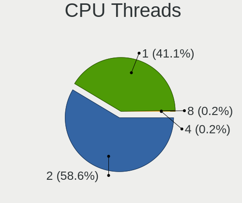

| Number | Desktops | Percent |
|--------|----------|---------|
| 2      | 162      | 52.94%  |
| 1      | 143      | 46.73%  |
| 8      | 1        | 0.33%   |

CPU Op-Modes
------------

CPU Operation Modes (32-bit, 64-bit)

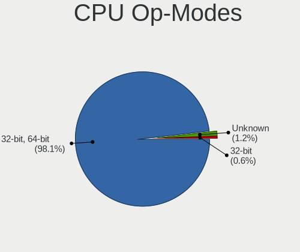

| Op mode        | Desktops | Percent |
|----------------|----------|---------|
| 32-bit, 64-bit | 296      | 96.1%   |
| Unknown        | 8        | 2.6%    |
| 32-bit         | 4        | 1.3%    |

CPU Microcode
-------------

Microcode number

| Number     | Desktops | Percent |
|------------|----------|---------|
| Unknown    | 57       | 17.98%  |
| 0x306c3    | 20       | 6.31%   |
| 0x306a9    | 18       | 5.68%   |
| 0x1067a    | 17       | 5.36%   |
| 0x906e9    | 16       | 5.05%   |
| 0x206a7    | 12       | 3.79%   |
| 0x06000852 | 12       | 3.79%   |
| 0x506e3    | 11       | 3.47%   |
| 0x08701021 | 10       | 3.15%   |
| 0x10676    | 9        | 2.84%   |
| 0x0800820d | 8        | 2.52%   |
| 0x08001138 | 8        | 2.52%   |
| 0x6fd      | 7        | 2.21%   |
| 0x08101016 | 7        | 2.21%   |
| 0x010000c8 | 7        | 2.21%   |
| 0x08108109 | 6        | 1.89%   |
| 0x08001137 | 6        | 1.89%   |
| 0x06001119 | 6        | 1.89%   |
| 0x906ea    | 5        | 1.58%   |
| 0x6fb      | 5        | 1.58%   |
| 0xa0655    | 4        | 1.26%   |
| 0xa0653    | 4        | 1.26%   |
| 0x106a5    | 4        | 1.26%   |
| 0x010000dc | 4        | 1.26%   |
| 0x6f6      | 3        | 0.95%   |
| 0x206c2    | 3        | 0.95%   |
| 0x20652    | 3        | 0.95%   |
| 0x08701013 | 3        | 0.95%   |
| 0xa0671    | 2        | 0.63%   |
| 0x906eb    | 2        | 0.63%   |
| 0x306f2    | 2        | 0.63%   |
| 0x206d7    | 2        | 0.63%   |
| 0x10677    | 2        | 0.63%   |
| 0x08600106 | 2        | 0.63%   |
| 0x0800820c | 2        | 0.63%   |
| 0x0600063e | 2        | 0.63%   |
| 0x010000db | 2        | 0.63%   |
| 0x010000c7 | 2        | 0.63%   |
| 0x01000083 | 2        | 0.63%   |
| 0xf64      | 1        | 0.32%   |
| 0xf41      | 1        | 0.32%   |
| 0xf29      | 1        | 0.32%   |
| 0xa0652    | 1        | 0.32%   |
| 0x906ed    | 1        | 0.32%   |
| 0x306e4    | 1        | 0.32%   |
| 0x30678    | 1        | 0.32%   |
| 0x20655    | 1        | 0.32%   |
| 0x106e5    | 1        | 0.32%   |
| 0x106c2    | 1        | 0.32%   |
| 0x0a201016 | 1        | 0.32%   |
| 0x08701011 | 1        | 0.32%   |
| 0x0830104d | 1        | 0.32%   |
| 0x0810100b | 1        | 0.32%   |
| 0x08008206 | 1        | 0.32%   |
| 0x08001129 | 1        | 0.32%   |
| 0x0600610e | 1        | 0.32%   |
| 0x06003106 | 1        | 0.32%   |
| 0x0600081c | 1        | 0.32%   |
| 0x03000027 | 1        | 0.32%   |

CPU Microarch
-------------

Microarchitecture

| Name        | Desktops | Percent |
|-------------|----------|---------|
| Penryn      | 33       | 10.78%  |
| KabyLake    | 30       | 9.8%    |
| IvyBridge   | 25       | 8.17%   |
| Zen         | 24       | 7.84%   |
| Haswell     | 24       | 7.84%   |
| Zen 2       | 22       | 7.19%   |
| Piledriver  | 22       | 7.19%   |
| K10         | 21       | 6.86%   |
| Core        | 19       | 6.21%   |
| Zen+        | 18       | 5.88%   |
| SandyBridge | 16       | 5.23%   |
| Skylake     | 12       | 3.92%   |
| CometLake   | 10       | 3.27%   |
| Westmere    | 7        | 2.29%   |
| Nehalem     | 5        | 1.63%   |
| NetBurst    | 3        | 0.98%   |
| Steamroller | 2        | 0.65%   |
| K8 Hammer   | 2        | 0.65%   |
| Bulldozer   | 2        | 0.65%   |
| Unknown     | 2        | 0.65%   |
| Zen 3       | 1        | 0.33%   |
| Silvermont  | 1        | 0.33%   |
| K6          | 1        | 0.33%   |
| K10 Llano   | 1        | 0.33%   |
| Icelake     | 1        | 0.33%   |
| Excavator   | 1        | 0.33%   |
| Bonnell     | 1        | 0.33%   |

Graphics
--------

GPU Vendor
----------

Vendors of graphics cards

| Vendor                           | Desktops | Percent |
|----------------------------------|----------|---------|
| Nvidia                           | 127      | 38.6%   |
| AMD                              | 123      | 37.39%  |
| Intel                            | 75       | 22.8%   |
| Matrox Electronics Systems       | 2        | 0.61%   |
| VIA Technologies                 | 1        | 0.3%    |
| Silicon Integrated Systems [SiS] | 1        | 0.3%    |

GPU Model
---------

Graphics card models

| Model                                                                       | Desktops | Percent |
|-----------------------------------------------------------------------------|----------|---------|
| AMD Ellesmere [Radeon RX 470/480/570/570X/580/580X/590]                     | 21       | 6.19%   |
| Nvidia GP107 [GeForce GTX 1050 Ti]                                          | 16       | 4.72%   |
| Intel Xeon E3-1200 v3/4th Gen Core Processor Integrated Graphics Controller | 12       | 3.54%   |
| Nvidia G96C [GeForce 9500 GT]                                               | 9        | 2.65%   |
| AMD Oland PRO [Radeon R7 240/340 / Radeon 520]                              | 9        | 2.65%   |
| Intel HD Graphics 630                                                       | 8        | 2.36%   |
| Intel 2nd Generation Core Processor Family Integrated Graphics Controller   | 7        | 2.06%   |
| Nvidia GT218 [GeForce 210]                                                  | 6        | 1.77%   |
| Nvidia GP106 [GeForce GTX 1060 6GB]                                         | 6        | 1.77%   |
| Nvidia GK208B [GeForce GT 710]                                              | 6        | 1.77%   |
| Intel IvyBridge GT2 [HD Graphics 4000]                                      | 6        | 1.77%   |
| Intel CoffeeLake-S GT2 [UHD Graphics 630]                                   | 6        | 1.77%   |
| AMD Picasso/Raven 2 [Radeon Vega Series / Radeon Vega Mobile Series]        | 6        | 1.77%   |
| Nvidia TU116 [GeForce GTX 1660 SUPER]                                       | 5        | 1.47%   |
| Nvidia TU116 [GeForce GTX 1650 SUPER]                                       | 5        | 1.47%   |
| Nvidia TU106 [GeForce RTX 2060 Rev. A]                                      | 5        | 1.47%   |
| Nvidia GF108 [GeForce GT 630]                                               | 5        | 1.47%   |
| Intel 82G33/G31 Express Integrated Graphics Controller                      | 5        | 1.47%   |
| Intel 4 Series Chipset Integrated Graphics Controller                       | 5        | 1.47%   |
| AMD Cedar [Radeon HD 5000/6000/7350/8350 Series]                            | 5        | 1.47%   |
| Nvidia GM204 [GeForce GTX 970]                                              | 4        | 1.18%   |
| Intel Xeon E3-1200 v2/3rd Gen Core processor Graphics Controller            | 4        | 1.18%   |
| AMD Turks PRO [Radeon HD 6570/7570/8550 / R5 230]                           | 4        | 1.18%   |
| AMD Raven Ridge [Radeon Vega Series / Radeon Vega Mobile Series]            | 4        | 1.18%   |
| AMD Lexa PRO [Radeon 540/540X/550/550X / RX 540X/550/550X]                  | 4        | 1.18%   |
| AMD Caicos [Radeon HD 6450/7450/8450 / R5 230 OEM]                          | 4        | 1.18%   |
| AMD Baffin [Radeon RX 460/560D / Pro 450/455/460/555/555X/560/560X]         | 4        | 1.18%   |
| Nvidia TU117 [GeForce GTX 1650]                                             | 3        | 0.88%   |
| Nvidia GT200 [GeForce GTX 260]                                              | 3        | 0.88%   |
| Nvidia GF108 [GeForce GT 430]                                               | 3        | 0.88%   |
| Intel CometLake-S GT2 [UHD Graphics 630]                                    | 3        | 0.88%   |
| Intel 4th Generation Core Processor Family Integrated Graphics Controller   | 3        | 0.88%   |
| AMD RV730 PRO [Radeon HD 4650]                                              | 3        | 0.88%   |
| Nvidia TU116 [GeForce GTX 1660 Ti]                                          | 2        | 0.59%   |
| Nvidia TU102 [GeForce RTX 2080 Ti Rev. A]                                   | 2        | 0.59%   |
| Nvidia GP108 [GeForce GT 1030]                                              | 2        | 0.59%   |
| Nvidia GP104 [GeForce GTX 1080]                                             | 2        | 0.59%   |
| Nvidia GP102 [GeForce GTX 1080 Ti]                                          | 2        | 0.59%   |
| Nvidia GM206 [GeForce GTX 960]                                              | 2        | 0.59%   |
| Nvidia GM107 [GeForce GTX 750 Ti]                                           | 2        | 0.59%   |
| Nvidia GK208B [GeForce GT 730]                                              | 2        | 0.59%   |
| Nvidia GK110B [GeForce GTX 780 Ti]                                          | 2        | 0.59%   |
| Nvidia GF116 [GeForce GTX 550 Ti]                                           | 2        | 0.59%   |
| Nvidia G92 [GeForce GTS 250]                                                | 2        | 0.59%   |
| Nvidia C61 [GeForce 7025 / nForce 630a]                                     | 2        | 0.59%   |
| Matrox Electronics Systems MGA G200EH                                       | 2        | 0.59%   |
| Intel HD Graphics 530                                                       | 2        | 0.59%   |
| Intel HD Graphics 510                                                       | 2        | 0.59%   |
| Intel Core Processor Integrated Graphics Controller                         | 2        | 0.59%   |
| Intel 82Q35 Express Integrated Graphics Controller                          | 2        | 0.59%   |
| Intel 3rd Gen Core processor Graphics Controller                            | 2        | 0.59%   |
| AMD Turks XT [Radeon HD 6670/7670]                                          | 2        | 0.59%   |
| AMD Tahiti PRO [Radeon HD 7950/8950 OEM / R9 280]                           | 2        | 0.59%   |
| AMD RV710 [Radeon HD 4350/4550]                                             | 2        | 0.59%   |
| AMD RV610 [Radeon HD 2400 PRO]                                              | 2        | 0.59%   |
| AMD RV370 [Radeon X300]                                                     | 2        | 0.59%   |
| AMD RV370 [Radeon X300 SE]                                                  | 2        | 0.59%   |
| AMD RS880 [Radeon HD 4200]                                                  | 2        | 0.59%   |
| AMD Renoir                                                                  | 2        | 0.59%   |
| AMD Pitcairn PRO [Radeon HD 7850 / R7 265 / R9 270 1024SP]                  | 2        | 0.59%   |

GPU Combo
---------

Combinations of graphics cards

| Name           | Desktops | Percent |
|----------------|----------|---------|
| 1 x Nvidia     | 122      | 39.35%  |
| 1 x AMD        | 113      | 36.45%  |
| 1 x Intel      | 55       | 17.74%  |
| 2 x AMD        | 5        | 1.61%   |
| Intel + Nvidia | 5        | 1.61%   |
| Intel + AMD    | 3        | 0.97%   |
| 1 x Matrox     | 2        | 0.65%   |
| AMD + Nvidia   | 2        | 0.65%   |
| Other          | 1        | 0.32%   |
| 1 x VIA        | 1        | 0.32%   |
| 1 x SiS        | 1        | 0.32%   |

GPU Driver
----------

Free vs proprietary

| Driver      | Desktops | Percent |
|-------------|----------|---------|
| Free        | 220      | 70.74%  |
| Proprietary | 78       | 25.08%  |
| Unknown     | 13       | 4.18%   |

GPU Memory
----------

Total video memory

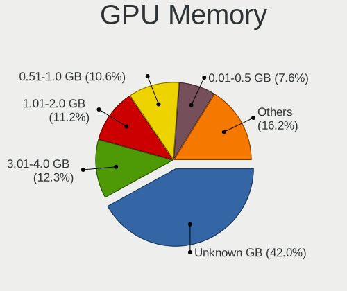

| Size in GB | Desktops | Percent |
|------------|----------|---------|
| Unknown    | 108      | 33.96%  |
| 3.01-4.0   | 49       | 15.41%  |
| 0.51-1.0   | 47       | 14.78%  |
| 1.01-2.0   | 45       | 14.15%  |
| 0.01-0.5   | 29       | 9.12%   |
| 5.01-6.0   | 17       | 5.35%   |
| 7.01-8.0   | 13       | 4.09%   |
| 2.01-3.0   | 5        | 1.57%   |
| 8.01-16.0  | 4        | 1.26%   |
| 4.01-5.0   | 1        | 0.31%   |

Monitor
-------

Monitor Vendor
--------------

Monitor vendors

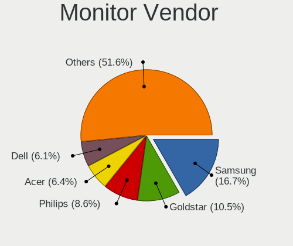

| Vendor               | Desktops | Percent |
|----------------------|----------|---------|
| Samsung Electronics  | 52       | 17.51%  |
| Philips              | 32       | 10.77%  |
| Goldstar             | 31       | 10.44%  |
| AOC                  | 22       | 7.41%   |
| Dell                 | 18       | 6.06%   |
| Ancor Communications | 18       | 6.06%   |
| Acer                 | 16       | 5.39%   |
| ViewSonic            | 13       | 4.38%   |
| Hewlett-Packard      | 12       | 4.04%   |
| BenQ                 | 8        | 2.69%   |
| ASUSTek Computer     | 7        | 2.36%   |
| Unknown              | 4        | 1.35%   |
| SAC                  | 4        | 1.35%   |
| MSI                  | 4        | 1.35%   |
| LG Electronics       | 4        | 1.35%   |
| Lenovo               | 4        | 1.35%   |
| KTC                  | 4        | 1.35%   |
| HKC                  | 4        | 1.35%   |
| Sony                 | 3        | 1.01%   |
| SANYO                | 3        | 1.01%   |
| Apple                | 3        | 1.01%   |
| AGO                  | 3        | 1.01%   |
| Unknown              | 3        | 1.01%   |
| RTK                  | 2        | 0.67%   |
| Plain Tree Systems   | 2        | 0.67%   |
| Microstep            | 2        | 0.67%   |
| Mi                   | 2        | 0.67%   |
| ___                  | 1        | 0.34%   |
| VIE                  | 1        | 0.34%   |
| Sharp                | 1        | 0.34%   |
| NXP                  | 1        | 0.34%   |
| NCS                  | 1        | 0.34%   |
| JRY                  | 1        | 0.34%   |
| INCA                 | 1        | 0.34%   |
| IBM                  | 1        | 0.34%   |
| HPN                  | 1        | 0.34%   |
| FUS                  | 1        | 0.34%   |
| CVT                  | 1        | 0.34%   |
| Cbox                 | 1        | 0.34%   |
| CAP                  | 1        | 0.34%   |
| Beko                 | 1        | 0.34%   |
| BEK                  | 1        | 0.34%   |
| AUS                  | 1        | 0.34%   |
| Arnos Instruments    | 1        | 0.34%   |

Monitor Model
-------------

Monitor models

| Model                                                                  | Desktops | Percent |
|------------------------------------------------------------------------|----------|---------|
| Goldstar FULL HD GSM5B55 1920x1080 480x270mm 21.7-inch                 | 6        | 1.94%   |
| Goldstar ULTRAWIDE GSM59F1 2560x1080 673x284mm 28.8-inch               | 4        | 1.29%   |
| Samsung Electronics S19B150 SAM08A2 1366x768 410x230mm 18.5-inch       | 3        | 0.97%   |
| Samsung Electronics C24F390 SAM0D2C 1920x1080 520x290mm 23.4-inch      | 3        | 0.97%   |
| Philips 226V4 PHLC0B1 1920x1080 477x268mm 21.5-inch                    | 3        | 0.97%   |
| Goldstar W2242 GSM5678 1680x1050 474x296mm 22.0-inch                   | 3        | 0.97%   |
| AOC 24G2W1G4 AOC2402 1920x1080 527x296mm 23.8-inch                     | 3        | 0.97%   |
| Unknown                                                                | 3        | 0.97%   |
| Samsung Electronics SyncMaster SAM0599 1600x900 443x249mm 20.0-inch    | 2        | 0.65%   |
| Samsung Electronics SyncMaster SAM0304 1680x1050 494x320mm 23.2-inch   | 2        | 0.65%   |
| Samsung Electronics SyncMaster SAM0226 1440x900 410x257mm 19.1-inch    | 2        | 0.65%   |
| Samsung Electronics LCD Monitor SyncMaster 1920x1080                   | 2        | 0.65%   |
| Samsung Electronics LCD Monitor SyncMaster 1280x1024                   | 2        | 0.65%   |
| Samsung Electronics LCD Monitor SAM0C26 1920x1080 1209x680mm 54.6-inch | 2        | 0.65%   |
| Samsung Electronics LCD Monitor SAM0659 1920x1080                      | 2        | 0.65%   |
| Plain Tree Systems Monitor PTS06A5 1280x1024 337x270mm 17.0-inch       | 2        | 0.65%   |
| Philips PHL 223V5 PHLC0CF 1920x1080 477x268mm 21.5-inch                | 2        | 0.65%   |
| Philips 170S PHL0839 1280x1024 338x270mm 17.0-inch                     | 2        | 0.65%   |
| Mi Monitor XMI3444 3440x1440 797x334mm 34.0-inch                       | 2        | 0.65%   |
| KTC 55'TV KTC5500 1920x1080 1209x680mm 54.6-inch                       | 2        | 0.65%   |
| HKC Monitor HKC1850 1360x768 409x230mm 18.5-inch                       | 2        | 0.65%   |
| Goldstar Ultra HD GSM5B09 3840x2160 600x340mm 27.2-inch                | 2        | 0.65%   |
| Goldstar Ultra HD GSM5B08 3840x2160 600x340mm 27.2-inch                | 2        | 0.65%   |
| Goldstar 2D FHD TV GSM59C6 1920x1080 509x286mm 23.0-inch               | 2        | 0.65%   |
| Dell E1916HV DELF06C 1366x768 409x230mm 18.5-inch                      | 2        | 0.65%   |
| ASUSTek Computer VG245 AUS24A1 1920x1080 531x299mm 24.0-inch           | 2        | 0.65%   |
| ASUSTek Computer VA249 AUS24C1 1920x1080 527x296mm 23.8-inch           | 2        | 0.65%   |
| Apple Cinema HD Display APP9220 2560x1600 641x401mm 29.8-inch          | 2        | 0.65%   |
| AOC 2250W AOC2250 1920x1080 477x268mm 21.5-inch                        | 2        | 0.65%   |
| Ancor Communications VX238 ACI23C1 1920x1080 510x290mm 23.1-inch       | 2        | 0.65%   |
| Ancor Communications VX229 ACI22E5 1920x1080 476x268mm 21.5-inch       | 2        | 0.65%   |
| Ancor Communications VK228 ACI22D1 1920x1080 477x268mm 21.5-inch       | 2        | 0.65%   |
| Ancor Communications ASUS VP228 ACI22C3 1920x1080 476x268mm 21.5-inch  | 2        | 0.65%   |
| Ancor Communications ASUS VN247 ACI24C3 1920x1080 521x293mm 23.5-inch  | 2        | 0.65%   |
| AGO LCD Monitor AGO0001 1920x1080 256x192mm 12.6-inch                  | 2        | 0.65%   |
| Acer K222HQL ACR03E1 1920x1080 477x268mm 21.5-inch                     | 2        | 0.65%   |
| Acer K202HQLA ACR0498 1366x768 434x236mm 19.4-inch                     | 2        | 0.65%   |
| ___ LCDTV16 ___9000 1360x768                                           | 1        | 0.32%   |
| ViewSonic XG2705 VSC0E39 1920x1080 598x336mm 27.0-inch                 | 1        | 0.32%   |
| ViewSonic VX3276-QHD VSCE635 2560x1440 698x393mm 31.5-inch             | 1        | 0.32%   |
| ViewSonic VX3258 SERIES VSCDE35 2560x1440 697x392mm 31.5-inch          | 1        | 0.32%   |
| ViewSonic VX3258 series VSCA037 1920x1080 700x390mm 31.5-inch          | 1        | 0.32%   |
| ViewSonic VX2758 Series VSC35DD 1920x1080 597x336mm 27.0-inch          | 1        | 0.32%   |
| ViewSonic VX2453 Series VSC0C28 1920x1080 520x290mm 23.4-inch          | 1        | 0.32%   |
| ViewSonic VX2270 SERIES VSCE02C 1920x1080 476x267mm 21.5-inch          | 1        | 0.32%   |
| ViewSonic VA2342 SERIES VSCFA2B 1920x1080 509x286mm 23.0-inch          | 1        | 0.32%   |
| ViewSonic VA2212 Series VSCBD2B 1920x1080 477x268mm 21.5-inch          | 1        | 0.32%   |
| ViewSonic LCD Monitor VX3276-QHD 4480x1440                             | 1        | 0.32%   |
| ViewSonic LCD Monitor VX2476 Series                                    | 1        | 0.32%   |
| ViewSonic LCD Monitor VP171b-2 1280x1024                               | 1        | 0.32%   |
| ViewSonic LCD Monitor VA1931 Series                                    | 1        | 0.32%   |
| VIE A2256 VIEE001 1920x1080 509x286mm 23.0-inch                        | 1        | 0.32%   |
| Unknown LCD Monitor XXX AAA                                            | 1        | 0.32%   |
| Unknown LCD Monitor 2160 1920x1080 360x270mm 17.7-inch                 | 1        | 0.32%   |
| Unknown HV-734TB ___1770 1280x1024 338x270mm 17.0-inch                 | 1        | 0.32%   |
| Unknown CV TV14 9000 1360x768 1600x900mm 72.3-inch                     | 1        | 0.32%   |
| Sony TV SNY7001 1920x1080                                              | 1        | 0.32%   |
| Sony TV SNY2C02 1920x1080 708x398mm 32.0-inch                          | 1        | 0.32%   |
| Sony TV SNY2801 1920x1080                                              | 1        | 0.32%   |
| Sharp LCD SHP1099 1920x540 890x500mm 40.2-inch                         | 1        | 0.32%   |

Monitor Resolution
------------------

Monitor screen resolution

| Resolution         | Desktops | Percent |
|--------------------|----------|---------|
| 1920x1080 (FHD)    | 146      | 50%     |
| 1280x1024 (SXGA)   | 22       | 7.53%   |
| 3840x2160 (4K)     | 18       | 6.16%   |
| 1366x768 (WXGA)    | 18       | 6.16%   |
| 1440x900 (WXGA+)   | 14       | 4.79%   |
| 2560x1440 (QHD)    | 12       | 4.11%   |
| 1680x1050 (WSXGA+) | 11       | 3.77%   |
| Unknown            | 10       | 3.42%   |
| 1600x900 (HD+)     | 8        | 2.74%   |
| 2560x1080          | 7        | 2.4%    |
| 1360x768           | 5        | 1.71%   |
| 3440x1440          | 4        | 1.37%   |
| 2560x1600          | 3        | 1.03%   |
| 4480x1440          | 2        | 0.68%   |
| 3840x1080          | 2        | 0.68%   |
| 7920x1440          | 1        | 0.34%   |
| 5760x2160          | 1        | 0.34%   |
| 3750x1280          | 1        | 0.34%   |
| 3360x1050          | 1        | 0.34%   |
| 2390x768           | 1        | 0.34%   |
| 1920x540           | 1        | 0.34%   |
| 1920x1200 (WUXGA)  | 1        | 0.34%   |
| 1600x1200          | 1        | 0.34%   |
| 1152x864           | 1        | 0.34%   |
| 1024x768 (XGA)     | 1        | 0.34%   |

Monitor Diagonal
----------------

Diagonal size in inches

| Inches  | Desktops | Percent |
|---------|----------|---------|
| 21      | 51       | 17.41%  |
| 23      | 44       | 15.02%  |
| Unknown | 44       | 15.02%  |
| 27      | 24       | 8.19%   |
| 19      | 20       | 6.83%   |
| 24      | 19       | 6.48%   |
| 18      | 18       | 6.14%   |
| 17      | 13       | 4.44%   |
| 34      | 11       | 3.75%   |
| 20      | 10       | 3.41%   |
| 31      | 6        | 2.05%   |
| 72      | 5        | 1.71%   |
| 15      | 5        | 1.71%   |
| 22      | 4        | 1.37%   |
| 54      | 3        | 1.02%   |
| 29      | 3        | 1.02%   |
| 12      | 3        | 1.02%   |
| 84      | 2        | 0.68%   |
| 60      | 2        | 0.68%   |
| 40      | 2        | 0.68%   |
| 55      | 1        | 0.34%   |
| 46      | 1        | 0.34%   |
| 43      | 1        | 0.34%   |
| 33      | 1        | 0.34%   |

Monitor Width
-------------

Physical width

| Width in mm | Desktops | Percent |
|-------------|----------|---------|
| 401-500     | 104      | 35.99%  |
| 501-600     | 75       | 25.95%  |
| Unknown     | 44       | 15.22%  |
| 301-350     | 17       | 5.88%   |
| 701-800     | 12       | 4.15%   |
| 601-700     | 11       | 3.81%   |
| 1501-2000   | 7        | 2.42%   |
| 1001-1500   | 7        | 2.42%   |
| 351-400     | 6        | 2.08%   |
| 201-300     | 3        | 1.04%   |
| 801-900     | 2        | 0.69%   |
| 901-1000    | 1        | 0.35%   |

Aspect Ratio
------------

Proportional relationship between the width and the height

| Ratio   | Desktops | Percent |
|---------|----------|---------|
| 16/9    | 171      | 60.85%  |
| Unknown | 40       | 14.23%  |
| 16/10   | 27       | 9.61%   |
| 5/4     | 16       | 5.69%   |
| 21/9    | 11       | 3.91%   |
| 4/3     | 10       | 3.56%   |
| 3/2     | 6        | 2.14%   |

Monitor Area
------------

Area in inch

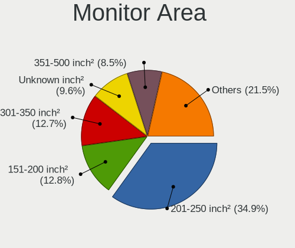

| Area in inch | Desktops | Percent |
|----------------|----------|---------|
| 201-250        | 100      | 34.48%  |
| 151-200        | 44       | 15.17%  |
| Unknown        | 44       | 15.17%  |
| 141-150        | 27       | 9.31%   |
| 301-350        | 24       | 8.28%   |
| 351-500        | 21       | 7.24%   |
| More than 1000 | 13       | 4.48%   |
| 251-300        | 5        | 1.72%   |
| 101-110        | 4        | 1.38%   |
| 501-1000       | 4        | 1.38%   |
| 71-80          | 3        | 1.03%   |
| 111-120        | 1        | 0.34%   |

Pixel Density
-------------

Pixels per inch

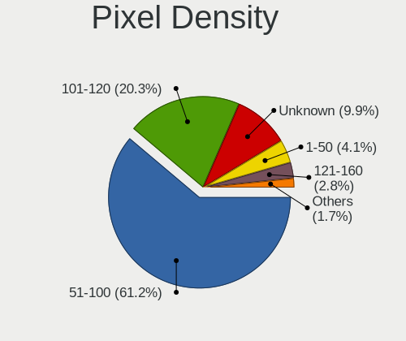

| Density | Desktops | Percent |
|---------|----------|---------|
| 51-100  | 153      | 53.5%   |
| 101-120 | 66       | 23.08%  |
| Unknown | 44       | 15.38%  |
| 1-50    | 13       | 4.55%   |
| 161-240 | 5        | 1.75%   |
| 121-160 | 5        | 1.75%   |

Multiple Monitors
-----------------

Total monitors connected

| Total | Desktops | Percent |
|-------|----------|---------|
| 1     | 261      | 83.92%  |
| 2     | 31       | 9.97%   |
| 0     | 16       | 5.14%   |
| 3     | 3        | 0.96%   |

Network
-------

Net Controller Vendor
---------------------

Controller vendors

| Vendor                                 | Desktops | Percent |
|----------------------------------------|----------|---------|
| Realtek Semiconductor                  | 211      | 49.18%  |
| Intel                                  | 66       | 15.38%  |
| Qualcomm Atheros                       | 37       | 8.62%   |
| Ralink Technology                      | 29       | 6.76%   |
| Qualcomm Atheros Communications        | 12       | 2.8%    |
| ASUSTek Computer                       | 11       | 2.56%   |
| TP-Link                                | 9        | 2.1%    |
| Nvidia                                 | 9        | 2.1%    |
| Broadcom                               | 9        | 2.1%    |
| Ralink                                 | 4        | 0.93%   |
| ZyXEL Communications                   | 3        | 0.7%    |
| Huawei Technologies                    | 3        | 0.7%    |
| Xiaomi                                 | 2        | 0.47%   |
| Samsung Electronics                    | 2        | 0.47%   |
| Realtek                                | 2        | 0.47%   |
| Marvell Technology Group               | 2        | 0.47%   |
| Aquantia                               | 2        | 0.47%   |
| Apple                                  | 2        | 0.47%   |
| Wilocity                               | 1        | 0.23%   |
| VIA Technologies                       | 1        | 0.23%   |
| ULi Electronics                        | 1        | 0.23%   |
| T & A Mobile Phones                    | 1        | 0.23%   |
| Sony Ericsson Mobile Communications AB | 1        | 0.23%   |
| Silicon Integrated Systems [SiS]       | 1        | 0.23%   |
| Sangoma Technologies                   | 1        | 0.23%   |
| JMicron Technology                     | 1        | 0.23%   |
| HTC (High Tech Computer)               | 1        | 0.23%   |
| BroadLogic                             | 1        | 0.23%   |
| Broadcom Limited                       | 1        | 0.23%   |
| ASIX Electronics                       | 1        | 0.23%   |
| AirTies Wireless Networks              | 1        | 0.23%   |
| Accton Technology                      | 1        | 0.23%   |

Net Controller Model
--------------------

Controller models

| Model                                                                                | Desktops | Percent |
|--------------------------------------------------------------------------------------|----------|---------|
| Realtek RTL8111/8168/8411 PCI Express Gigabit Ethernet Controller                    | 178      | 37.55%  |
| Realtek RTL810xE PCI Express Fast Ethernet controller                                | 18       | 3.8%    |
| Intel Ethernet Connection (2) I219-V                                                 | 14       | 2.95%   |
| Ralink MT7601U Wireless Adapter                                                      | 13       | 2.74%   |
| Ralink RT2870/RT3070 Wireless Adapter                                                | 11       | 2.32%   |
| Intel Wi-Fi 6 AX200                                                                  | 9        | 1.9%    |
| Intel I211 Gigabit Network Connection                                                | 9        | 1.9%    |
| Qualcomm Atheros AR9271 802.11n                                                      | 8        | 1.69%   |
| Realtek RTL8125 2.5GbE Controller                                                    | 7        | 1.48%   |
| Qualcomm Atheros AR8131 Gigabit Ethernet                                             | 7        | 1.48%   |
| ASUS USB-N14 802.11b/g/n (2x2) Wireless Adapter [Ralink RT5372]                      | 7        | 1.48%   |
| Nvidia MCP61 Ethernet                                                                | 6        | 1.27%   |
| Intel 82579V Gigabit Network Connection                                              | 5        | 1.05%   |
| TP-Link TL-WN823N v2/v3 [Realtek RTL8192EU]                                          | 4        | 0.84%   |
| Realtek RTL8192CU 802.11n WLAN Adapter                                               | 4        | 0.84%   |
| Intel Ethernet Connection I217-V                                                     | 4        | 0.84%   |
| ZyXEL NWD2205 802.11n Wireless N Adapter [Realtek RTL8192CU]                         | 3        | 0.63%   |
| Realtek RTL88x2bu [AC1200 Techkey]                                                   | 3        | 0.63%   |
| Realtek RTL8821AE 802.11ac PCIe Wireless Network Adapter                             | 3        | 0.63%   |
| Realtek RTL8192CE PCIe Wireless Network Adapter                                      | 3        | 0.63%   |
| Realtek RTL-8100/8101L/8139 PCI Fast Ethernet Adapter                                | 3        | 0.63%   |
| Realtek 802.11ac NIC                                                                 | 3        | 0.63%   |
| Ralink RT5370 Wireless Adapter                                                       | 3        | 0.63%   |
| Qualcomm Atheros QCA8171 Gigabit Ethernet                                            | 3        | 0.63%   |
| Qualcomm Atheros QCA6174 802.11ac Wireless Network Adapter                           | 3        | 0.63%   |
| Qualcomm Atheros Killer E2500 Gigabit Ethernet Controller                            | 3        | 0.63%   |
| Qualcomm Atheros Killer E220x Gigabit Ethernet Controller                            | 3        | 0.63%   |
| Qualcomm Atheros TP-Link TL-WN821N v3 / TL-WN822N v2 802.11n [Atheros AR7010+AR9287] | 3        | 0.63%   |
| Qualcomm Atheros AR8151 v2.0 Gigabit Ethernet                                        | 3        | 0.63%   |
| Qualcomm Atheros AR8121/AR8113/AR8114 Gigabit or Fast Ethernet                       | 3        | 0.63%   |
| Intel Ethernet Connection I217-LM                                                    | 3        | 0.63%   |
| Intel Dual Band Wireless-AC 3168NGW [Stone Peak]                                     | 3        | 0.63%   |
| Intel Comet Lake PCH CNVi WiFi                                                       | 3        | 0.63%   |
| Intel 82574L Gigabit Network Connection                                              | 3        | 0.63%   |
| Huawei JNY-LX1                                                                       | 3        | 0.63%   |
| TP-Link TL-WN722N v2                                                                 | 2        | 0.42%   |
| TP-Link 802.11n NIC                                                                  | 2        | 0.42%   |
| Realtek RTL8191SU 802.11n WLAN Adapter                                               | 2        | 0.42%   |
| Realtek RTL8188FTV 802.11b/g/n 1T1R 2.4G WLAN Adapter                                | 2        | 0.42%   |
| Realtek RTL8187 Wireless Adapter                                                     | 2        | 0.42%   |
| Realtek RTL-8110SC/8169SC Gigabit Ethernet                                           | 2        | 0.42%   |
| Realtek 802.11n NIC                                                                  | 2        | 0.42%   |
| Ralink RT2561/RT61 802.11g PCI                                                       | 2        | 0.42%   |
| Qualcomm Atheros Attansic L2 Fast Ethernet                                           | 2        | 0.42%   |
| Qualcomm Atheros AR9285 Wireless Network Adapter (PCI-Express)                       | 2        | 0.42%   |
| Qualcomm Atheros AR8152 v2.0 Fast Ethernet                                           | 2        | 0.42%   |
| Nvidia MCP51 Ethernet Controller                                                     | 2        | 0.42%   |
| Marvell Group 88E8056 PCI-E Gigabit Ethernet Controller                              | 2        | 0.42%   |
| Intel Wireless-AC 9260                                                               | 2        | 0.42%   |
| Intel Wireless 8260                                                                  | 2        | 0.42%   |
| Intel Wireless 3160                                                                  | 2        | 0.42%   |
| Intel Ethernet Connection (7) I219-LM                                                | 2        | 0.42%   |
| Intel Ethernet Connection (2) I219-LM                                                | 2        | 0.42%   |
| Intel Ethernet Connection (11) I219-V                                                | 2        | 0.42%   |
| Intel 82566DM-2 Gigabit Network Connection                                           | 2        | 0.42%   |
| Broadcom NetXtreme BCM5720 Gigabit Ethernet PCIe                                     | 2        | 0.42%   |
| Broadcom BCM4306 802.11b/g Wireless LAN Controller                                   | 2        | 0.42%   |
| ASUS WL-167G v3 802.11n Adapter [Realtek RTL8188SU]                                  | 2        | 0.42%   |
| Apple iPad 4/Mini1                                                                   | 2        | 0.42%   |
| Xiaomi Mi/Redmi series (RNDIS)                                                       | 1        | 0.21%   |

Wireless Vendor
---------------

Wireless vendors

| Vendor                          | Desktops | Percent |
|---------------------------------|----------|---------|
| Realtek Semiconductor           | 29       | 20.57%  |
| Ralink Technology               | 29       | 20.57%  |
| Intel                           | 25       | 17.73%  |
| Qualcomm Atheros Communications | 12       | 8.51%   |
| ASUSTek Computer                | 11       | 7.8%    |
| TP-Link                         | 9        | 6.38%   |
| Qualcomm Atheros                | 9        | 6.38%   |
| Broadcom                        | 5        | 3.55%   |
| Ralink                          | 4        | 2.84%   |
| ZyXEL Communications            | 3        | 2.13%   |
| Realtek                         | 2        | 1.42%   |
| Wilocity                        | 1        | 0.71%   |
| AirTies Wireless Networks       | 1        | 0.71%   |
| Accton Technology               | 1        | 0.71%   |

Wireless Model
--------------

Wireless models

| Model                                                                                | Desktops | Percent |
|--------------------------------------------------------------------------------------|----------|---------|
| Ralink MT7601U Wireless Adapter                                                      | 13       | 9.15%   |
| Ralink RT2870/RT3070 Wireless Adapter                                                | 11       | 7.75%   |
| Intel Wi-Fi 6 AX200                                                                  | 9        | 6.34%   |
| Qualcomm Atheros AR9271 802.11n                                                      | 8        | 5.63%   |
| ASUS USB-N14 802.11b/g/n (2x2) Wireless Adapter [Ralink RT5372]                      | 7        | 4.93%   |
| TP-Link TL-WN823N v2/v3 [Realtek RTL8192EU]                                          | 4        | 2.82%   |
| Realtek RTL8192CU 802.11n WLAN Adapter                                               | 4        | 2.82%   |
| ZyXEL NWD2205 802.11n Wireless N Adapter [Realtek RTL8192CU]                         | 3        | 2.11%   |
| Realtek RTL88x2bu [AC1200 Techkey]                                                   | 3        | 2.11%   |
| Realtek RTL8821AE 802.11ac PCIe Wireless Network Adapter                             | 3        | 2.11%   |
| Realtek RTL8192CE PCIe Wireless Network Adapter                                      | 3        | 2.11%   |
| Realtek 802.11ac NIC                                                                 | 3        | 2.11%   |
| Ralink RT5370 Wireless Adapter                                                       | 3        | 2.11%   |
| Qualcomm Atheros QCA6174 802.11ac Wireless Network Adapter                           | 3        | 2.11%   |
| Qualcomm Atheros TP-Link TL-WN821N v3 / TL-WN822N v2 802.11n [Atheros AR7010+AR9287] | 3        | 2.11%   |
| Intel Dual Band Wireless-AC 3168NGW [Stone Peak]                                     | 3        | 2.11%   |
| Intel Comet Lake PCH CNVi WiFi                                                       | 3        | 2.11%   |
| TP-Link TL-WN722N v2                                                                 | 2        | 1.41%   |
| TP-Link 802.11n NIC                                                                  | 2        | 1.41%   |
| Realtek RTL8191SU 802.11n WLAN Adapter                                               | 2        | 1.41%   |
| Realtek RTL8188FTV 802.11b/g/n 1T1R 2.4G WLAN Adapter                                | 2        | 1.41%   |
| Realtek RTL8187 Wireless Adapter                                                     | 2        | 1.41%   |
| Realtek 802.11n NIC                                                                  | 2        | 1.41%   |
| Ralink RT2561/RT61 802.11g PCI                                                       | 2        | 1.41%   |
| Qualcomm Atheros AR9285 Wireless Network Adapter (PCI-Express)                       | 2        | 1.41%   |
| Intel Wireless-AC 9260                                                               | 2        | 1.41%   |
| Intel Wireless 8260                                                                  | 2        | 1.41%   |
| Intel Wireless 3160                                                                  | 2        | 1.41%   |
| Broadcom BCM4306 802.11b/g Wireless LAN Controller                                   | 2        | 1.41%   |
| ASUS WL-167G v3 802.11n Adapter [Realtek RTL8188SU]                                  | 2        | 1.41%   |
| Wilocity Wil6200 802.11ad Wireless Network Adapter                                   | 1        | 0.7%    |
| TP-Link TL-WN821N v5/v6 [RTL8192EU]                                                  | 1        | 0.7%    |
| TP-Link AC600 wireless Realtek RTL8811AU [Archer T2U Nano]                           | 1        | 0.7%    |
| Realtek RTL8822CE 802.11ac PCIe Wireless Network Adapter                             | 1        | 0.7%    |
| Realtek RTL8821CE 802.11ac PCIe Wireless Network Adapter                             | 1        | 0.7%    |
| Realtek RTL8812AE 802.11ac PCIe Wireless Network Adapter                             | 1        | 0.7%    |
| Realtek RTL8188SU 802.11n WLAN Adapter                                               | 1        | 0.7%    |
| Realtek RTL8188EUS 802.11n Wireless Network Adapter                                  | 1        | 0.7%    |
| Realtek RTL8188EE Wireless Network Adapter                                           | 1        | 0.7%    |
| Realtek RTL8188CUS 802.11n WLAN Adapter                                              | 1        | 0.7%    |
| Ralink RT5372 Wireless Adapter                                                       | 1        | 0.7%    |
| Ralink RT2501/RT2573 Wireless Adapter                                                | 1        | 0.7%    |
| Ralink RT5390 Wireless 802.11n 1T/1R PCIe                                            | 1        | 0.7%    |
| Ralink RT2790 Wireless 802.11n 1T/2R PCIe                                            | 1        | 0.7%    |
| Qualcomm Atheros QCA9565 / AR9565 Wireless Network Adapter                           | 1        | 0.7%    |
| Qualcomm Atheros TP-Link TL-WN322G v3 / TL-WN422G v2 802.11g [Atheros AR9271]        | 1        | 0.7%    |
| Qualcomm Atheros AR9485 Wireless Network Adapter                                     | 1        | 0.7%    |
| Qualcomm Atheros AR928X Wireless Network Adapter (PCI-Express)                       | 1        | 0.7%    |
| Qualcomm Atheros AR2417 Wireless Network Adapter [AR5007G 802.11bg]                  | 1        | 0.7%    |
| Intel Wireless 8265 / 8275                                                           | 1        | 0.7%    |
| Intel Wireless 3165                                                                  | 1        | 0.7%    |
| Intel PRO/Wireless 4965 AG or AGN [Kedron] Network Connection                        | 1        | 0.7%    |
| Intel PRO/Wireless 3945ABG [Golan] Network Connection                                | 1        | 0.7%    |
| Broadcom BCM4360 802.11ac Wireless Network Adapter                                   | 1        | 0.7%    |
| Broadcom BCM4352 802.11ac Wireless Network Adapter                                   | 1        | 0.7%    |
| Broadcom BCM43228 802.11a/b/g/n                                                      | 1        | 0.7%    |
| ASUS USB-N10 802.11n Network Adapter [Realtek RTL8188SU]                             | 1        | 0.7%    |
| ASUS N10 Nano 802.11n Network Adapter [Realtek RTL8192CU]                            | 1        | 0.7%    |
| AirTies Wireless Networks USB2.0 WLAN                                                | 1        | 0.7%    |
| Accton Arcadyan 802.11N Wireless Adapter                                             | 1        | 0.7%    |

Ethernet Vendor
---------------

Ethernet vendors

| Vendor                                 | Desktops | Percent |
|----------------------------------------|----------|---------|
| Realtek Semiconductor                  | 208      | 64.2%   |
| Intel                                  | 53       | 16.36%  |
| Qualcomm Atheros                       | 29       | 8.95%   |
| Nvidia                                 | 9        | 2.78%   |
| Broadcom                               | 4        | 1.23%   |
| Huawei Technologies                    | 3        | 0.93%   |
| Xiaomi                                 | 2        | 0.62%   |
| Samsung Electronics                    | 2        | 0.62%   |
| Marvell Technology Group               | 2        | 0.62%   |
| Aquantia                               | 2        | 0.62%   |
| Apple                                  | 2        | 0.62%   |
| VIA Technologies                       | 1        | 0.31%   |
| ULi Electronics                        | 1        | 0.31%   |
| Sony Ericsson Mobile Communications AB | 1        | 0.31%   |
| Silicon Integrated Systems [SiS]       | 1        | 0.31%   |
| JMicron Technology                     | 1        | 0.31%   |
| HTC (High Tech Computer)               | 1        | 0.31%   |
| Broadcom Limited                       | 1        | 0.31%   |
| ASIX Electronics                       | 1        | 0.31%   |

Ethernet Model
--------------

Ethernet models

| Model                                                             | Desktops | Percent |
|-------------------------------------------------------------------|----------|---------|
| Realtek RTL8111/8168/8411 PCI Express Gigabit Ethernet Controller | 178      | 54.1%   |
| Realtek RTL810xE PCI Express Fast Ethernet controller             | 18       | 5.47%   |
| Intel Ethernet Connection (2) I219-V                              | 14       | 4.26%   |
| Intel I211 Gigabit Network Connection                             | 9        | 2.74%   |
| Realtek RTL8125 2.5GbE Controller                                 | 7        | 2.13%   |
| Qualcomm Atheros AR8131 Gigabit Ethernet                          | 7        | 2.13%   |
| Nvidia MCP61 Ethernet                                             | 6        | 1.82%   |
| Intel 82579V Gigabit Network Connection                           | 5        | 1.52%   |
| Intel Ethernet Connection I217-V                                  | 4        | 1.22%   |
| Realtek RTL-8100/8101L/8139 PCI Fast Ethernet Adapter             | 3        | 0.91%   |
| Qualcomm Atheros QCA8171 Gigabit Ethernet                         | 3        | 0.91%   |
| Qualcomm Atheros Killer E2500 Gigabit Ethernet Controller         | 3        | 0.91%   |
| Qualcomm Atheros Killer E220x Gigabit Ethernet Controller         | 3        | 0.91%   |
| Qualcomm Atheros AR8151 v2.0 Gigabit Ethernet                     | 3        | 0.91%   |
| Qualcomm Atheros AR8121/AR8113/AR8114 Gigabit or Fast Ethernet    | 3        | 0.91%   |
| Intel Ethernet Connection I217-LM                                 | 3        | 0.91%   |
| Intel 82574L Gigabit Network Connection                           | 3        | 0.91%   |
| Huawei JNY-LX1                                                    | 3        | 0.91%   |
| Realtek RTL-8110SC/8169SC Gigabit Ethernet                        | 2        | 0.61%   |
| Qualcomm Atheros Attansic L2 Fast Ethernet                        | 2        | 0.61%   |
| Qualcomm Atheros AR8152 v2.0 Fast Ethernet                        | 2        | 0.61%   |
| Nvidia MCP51 Ethernet Controller                                  | 2        | 0.61%   |
| Marvell Group 88E8056 PCI-E Gigabit Ethernet Controller           | 2        | 0.61%   |
| Intel Ethernet Connection (7) I219-LM                             | 2        | 0.61%   |
| Intel Ethernet Connection (2) I219-LM                             | 2        | 0.61%   |
| Intel Ethernet Connection (11) I219-V                             | 2        | 0.61%   |
| Intel 82566DM-2 Gigabit Network Connection                        | 2        | 0.61%   |
| Broadcom NetXtreme BCM5720 Gigabit Ethernet PCIe                  | 2        | 0.61%   |
| Apple iPad 4/Mini1                                                | 2        | 0.61%   |
| Xiaomi Mi/Redmi series (RNDIS)                                    | 1        | 0.3%    |
| Xiaomi Mi/Redmi series (RNDIS + ADB)                              | 1        | 0.3%    |
| VIA VT6120/VT6121/VT6122 Gigabit Ethernet Adapter                 | 1        | 0.3%    |
| ULi ULi 1689,1573 integrated ethernet.                            | 1        | 0.3%    |
| Sony Ericsson Mobile AB D6503                                     | 1        | 0.3%    |
| Silicon Integrated Systems [SiS] 191 Gigabit Ethernet Adapter     | 1        | 0.3%    |
| Samsung GT-I9070 (network tethering, USB debugging enabled)       | 1        | 0.3%    |
| Samsung Galaxy series, misc. (tethering mode)                     | 1        | 0.3%    |
| Qualcomm Atheros Killer E2400 Gigabit Ethernet Controller         | 1        | 0.3%    |
| Qualcomm Atheros AR8161 Gigabit Ethernet                          | 1        | 0.3%    |
| Qualcomm Atheros AR8132 Fast Ethernet                             | 1        | 0.3%    |
| Nvidia nForce2 Ethernet Controller                                | 1        | 0.3%    |
| JMicron JMC260 PCI Express Fast Ethernet Controller               | 1        | 0.3%    |
| Intel I210 Gigabit Network Connection                             | 1        | 0.3%    |
| Intel Ethernet Controller X550                                    | 1        | 0.3%    |
| Intel Ethernet Connection (7) I219-V                              | 1        | 0.3%    |
| Intel Ethernet Connection (5) I219-V                              | 1        | 0.3%    |
| Intel Ethernet Connection (2) I218-V                              | 1        | 0.3%    |
| Intel Ethernet Connection (14) I219-V                             | 1        | 0.3%    |
| Intel Ethernet Connection (12) I219-V                             | 1        | 0.3%    |
| Intel 82579LM Gigabit Network Connection (Lewisville)             | 1        | 0.3%    |
| Intel 82578DC Gigabit Network Connection                          | 1        | 0.3%    |
| Intel 82573E Gigabit Ethernet Controller (Copper)                 | 1        | 0.3%    |
| Intel 82567LM-3 Gigabit Network Connection                        | 1        | 0.3%    |
| Intel 82566DM Gigabit Network Connection                          | 1        | 0.3%    |
| HTC (High Tech Computer) UMI HAMMER                               | 1        | 0.3%    |
| Broadcom NetXtreme BCM5764M Gigabit Ethernet PCIe                 | 1        | 0.3%    |
| Broadcom NetLink BCM57781 Gigabit Ethernet PCIe                   | 1        | 0.3%    |
| Broadcom Limited NetXtreme BCM5705 Gigabit Ethernet               | 1        | 0.3%    |
| ASIX AX88179 Gigabit Ethernet                                     | 1        | 0.3%    |
| Aquantia AQC111 NBase-T/IEEE 802.3bz Ethernet Controller [AQtion] | 1        | 0.3%    |

Net Controller Kind
-------------------

Ethernet, WiFi or modem

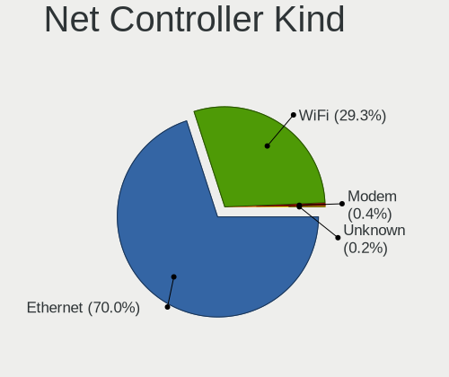

| Kind     | Desktops | Percent |
|----------|----------|---------|
| Ethernet | 305      | 69.32%  |
| WiFi     | 132      | 30%     |
| Unknown  | 3        | 0.68%   |

Used Controller
---------------

Currently used network controller

| Kind     | Desktops | Percent |
|----------|----------|---------|
| Ethernet | 224      | 71.57%  |
| WiFi     | 89       | 28.43%  |

NICs
----

Total network controllers on board

| Total | Desktops | Percent |
|-------|----------|---------|
| 1     | 238      | 77.27%  |
| 2     | 60       | 19.48%  |
| 3     | 9        | 2.92%   |
| 0     | 1        | 0.32%   |

IPv6
----

IPv6 vs IPv4

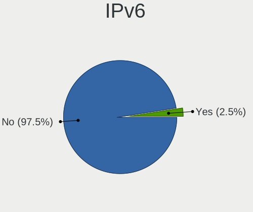

| Used | Desktops | Percent |
|------|----------|---------|
| No   | 306      | 100%    |

Bluetooth
---------

Bluetooth Vendor
----------------

Controller vendors

| Vendor                          | Desktops | Percent |
|---------------------------------|----------|---------|
| Cambridge Silicon Radio         | 37       | 43.02%  |
| Intel                           | 22       | 25.58%  |
| ASUSTek Computer                | 9        | 10.47%  |
| Realtek Semiconductor           | 8        | 9.3%    |
| Qualcomm Atheros Communications | 5        | 5.81%   |
| Broadcom                        | 2        | 2.33%   |
| Integrated System Solution      | 1        | 1.16%   |
| HTC (High Tech Computer)        | 1        | 1.16%   |
| Apple                           | 1        | 1.16%   |

Bluetooth Model
---------------

Controller models

| Model                                                                | Desktops | Percent |
|----------------------------------------------------------------------|----------|---------|
| Cambridge Silicon Radio Bluetooth Dongle (HCI mode)                  | 37       | 43.02%  |
| Intel AX200 Bluetooth                                                | 8        | 9.3%    |
| Intel Bluetooth wireless interface                                   | 6        | 6.98%   |
| Realtek Bluetooth Radio                                              | 5        | 5.81%   |
| Intel Wireless-AC 3168 Bluetooth                                     | 3        | 3.49%   |
| Intel AX201 Bluetooth                                                | 3        | 3.49%   |
| ASUS Bluetooth Adapter                                               | 3        | 3.49%   |
| Realtek RTL8821A Bluetooth                                           | 2        | 2.33%   |
| Qualcomm Atheros  Bluetooth Device                                   | 2        | 2.33%   |
| Intel Wireless-AC 9260 Bluetooth Adapter                             | 2        | 2.33%   |
| ASUS BCM20702A0                                                      | 2        | 2.33%   |
| Realtek  Bluetooth 4.2 Adapter                                       | 1        | 1.16%   |
| Qualcomm Atheros QCA61x4 Bluetooth 4.0                               | 1        | 1.16%   |
| Qualcomm Atheros AR3011 Bluetooth (no firmware)                      | 1        | 1.16%   |
| Qualcomm Atheros AR3011 Bluetooth                                    | 1        | 1.16%   |
| Integrated System Solution KY-BT100 Bluetooth Adapter                | 1        | 1.16%   |
| HTC (High Tech Computer) Vive Hub Bluetooth 4.1 (Broadcom BCM920703) | 1        | 1.16%   |
| Broadcom BCM20702A0 Bluetooth 4.0                                    | 1        | 1.16%   |
| Broadcom BCM2035B3 Bluetooth Adapter                                 | 1        | 1.16%   |
| ASUS Qualcomm Bluetooth 4.1                                          | 1        | 1.16%   |
| ASUS BT-183 Bluetooth 2.0+EDR adapter                                | 1        | 1.16%   |
| ASUS Bluetooth Radio                                                 | 1        | 1.16%   |
| ASUS Bluetooth Device                                                | 1        | 1.16%   |
| Apple Bluetooth USB Host Controller                                  | 1        | 1.16%   |

Sound
-----

Sound Vendor
------------

Sound card vendors

| Vendor                           | Desktops | Percent |
|----------------------------------|----------|---------|
| Intel                            | 180      | 35.23%  |
| AMD                              | 159      | 31.12%  |
| Nvidia                           | 113      | 22.11%  |
| C-Media Electronics              | 12       | 2.35%   |
| Generalplus Technology           | 5        | 0.98%   |
| Creative Labs                    | 5        | 0.98%   |
| Barco Display Systems            | 5        | 0.98%   |
| JMTek                            | 4        | 0.78%   |
| Logitech                         | 3        | 0.59%   |
| Yamaha                           | 2        | 0.39%   |
| VIA Technologies                 | 2        | 0.39%   |
| Texas Instruments                | 2        | 0.39%   |
| Tenx Technology                  | 2        | 0.39%   |
| M-Audio                          | 2        | 0.39%   |
| Focusrite-Novation               | 2        | 0.39%   |
| ULi Electronics                  | 1        | 0.2%    |
| SteelSeries ApS                  | 1        | 0.2%    |
| Silicon Integrated Systems [SiS] | 1        | 0.2%    |
| RODE Microphones                 | 1        | 0.2%    |
| Native Instruments               | 1        | 0.2%    |
| Kingston Technology              | 1        | 0.2%    |
| GN Netcom                        | 1        | 0.2%    |
| Evolution Electronics            | 1        | 0.2%    |
| Creative Technology              | 1        | 0.2%    |
| Bose                             | 1        | 0.2%    |
| Blue Microphones                 | 1        | 0.2%    |
| Astro Gaming                     | 1        | 0.2%    |
| Alesis                           | 1        | 0.2%    |

Sound Model
-----------

Sound card models

| Model                                                                             | Desktops | Percent |
|-----------------------------------------------------------------------------------|----------|---------|
| Intel NM10/ICH7 Family High Definition Audio Controller                           | 37       | 6.29%   |
| AMD SBx00 Azalia (Intel HDA)                                                      | 31       | 5.27%   |
| AMD Family 17h (Models 00h-0fh) HD Audio Controller                               | 28       | 4.76%   |
| Intel 6 Series/C200 Series Chipset Family High Definition Audio Controller        | 23       | 3.91%   |
| AMD Starship/Matisse HD Audio Controller                                          | 21       | 3.57%   |
| AMD Ellesmere HDMI Audio [Radeon RX 470/480 / 570/580/590]                        | 21       | 3.57%   |
| Intel 200 Series PCH HD Audio                                                     | 19       | 3.23%   |
| Nvidia GP107GL High Definition Audio Controller                                   | 17       | 2.89%   |
| Intel 8 Series/C220 Series Chipset High Definition Audio Controller               | 17       | 2.89%   |
| Intel 100 Series/C230 Series Chipset Family HD Audio Controller                   | 17       | 2.89%   |
| AMD Oland/Hainan/Cape Verde/Pitcairn HDMI Audio [Radeon HD 7000 Series]           | 17       | 2.89%   |
| AMD Family 17h/19h HD Audio Controller                                            | 16       | 2.72%   |
| Nvidia TU116 High Definition Audio Controller                                     | 13       | 2.21%   |
| Intel 82801JI (ICH10 Family) HD Audio Controller                                  | 12       | 2.04%   |
| Intel 7 Series/C216 Chipset Family High Definition Audio Controller               | 12       | 2.04%   |
| Intel Xeon E3-1200 v3/4th Gen Core Processor HD Audio Controller                  | 11       | 1.87%   |
| AMD FCH Azalia Controller                                                         | 11       | 1.87%   |
| Nvidia GF108 High Definition Audio Controller                                     | 10       | 1.7%    |
| AMD Raven/Raven2/Fenghuang HDMI/DP Audio Controller                               | 9        | 1.53%   |
| AMD Baffin HDMI/DP Audio [Radeon RX 550 640SP / RX 560/560X]                      | 9        | 1.53%   |
| Nvidia MCP61 High Definition Audio                                                | 8        | 1.36%   |
| Nvidia GP106 High Definition Audio Controller                                     | 8        | 1.36%   |
| Nvidia GK208 HDMI/DP Audio Controller                                             | 8        | 1.36%   |
| AMD Turks HDMI Audio [Radeon HD 6500/6600 / 6700M Series]                         | 8        | 1.36%   |
| Nvidia TU106 High Definition Audio Controller                                     | 6        | 1.02%   |
| Nvidia High Definition Audio Controller                                           | 6        | 1.02%   |
| Intel 82801I (ICH9 Family) HD Audio Controller                                    | 6        | 1.02%   |
| AMD RV710/730 HDMI Audio [Radeon HD 4000 series]                                  | 6        | 1.02%   |
| AMD Cedar HDMI Audio [Radeon HD 5400/6300/7300 Series]                            | 6        | 1.02%   |
| Intel Comet Lake PCH-V cAVS                                                       | 5        | 0.85%   |
| Intel Comet Lake PCH cAVS                                                         | 5        | 0.85%   |
| Intel Cannon Lake PCH cAVS                                                        | 5        | 0.85%   |
| Intel 9 Series Chipset Family HD Audio Controller                                 | 5        | 0.85%   |
| Intel 5 Series/3400 Series Chipset High Definition Audio                          | 5        | 0.85%   |
| Generalplus Technology USB Audio Device                                           | 5        | 0.85%   |
| Nvidia GM204 High Definition Audio Controller                                     | 4        | 0.68%   |
| C-Media Electronics USB Audio Device                                              | 4        | 0.68%   |
| C-Media Electronics CM108 Audio Controller                                        | 4        | 0.68%   |
| AMD Tobago HDMI Audio [Radeon R7 360 / R9 360 OEM]                                | 4        | 0.68%   |
| AMD Navi 10 HDMI Audio                                                            | 4        | 0.68%   |
| AMD Caicos HDMI Audio [Radeon HD 6450 / 7450/8450/8490 OEM / R5 230/235/235X OEM] | 4        | 0.68%   |
| Nvidia TU107 GeForce GTX 1650 High Definition Audio Controller                    | 3        | 0.51%   |
| Nvidia GP104 High Definition Audio Controller                                     | 3        | 0.51%   |
| Nvidia GM107 High Definition Audio Controller [GeForce 940MX]                     | 3        | 0.51%   |
| Nvidia GK104 HDMI Audio Controller                                                | 3        | 0.51%   |
| JMTek USB PnP Audio Device                                                        | 3        | 0.51%   |
| Intel C600/X79 series chipset High Definition Audio Controller                    | 3        | 0.51%   |
| Intel 82801H (ICH8 Family) HD Audio Controller                                    | 3        | 0.51%   |
| Creative Labs CA0106/CA0111 [SB Live!/Audigy/X-Fi Series]                         | 3        | 0.51%   |
| Barco Display Systems USBFC1-A                                                    | 3        | 0.51%   |
| AMD Trinity HDMI Audio Controller                                                 | 3        | 0.51%   |
| AMD Tahiti HDMI Audio [Radeon HD 7870 XT / 7950/7970]                             | 3        | 0.51%   |
| AMD Barts HDMI Audio [Radeon HD 6790/6850/6870 / 7720 OEM]                        | 3        | 0.51%   |
| Texas Instruments PCM2902 Audio Codec                                             | 2        | 0.34%   |
| Tenx Technology USB AUDIO                                                         | 2        | 0.34%   |
| Nvidia TU102 High Definition Audio Controller                                     | 2        | 0.34%   |
| Nvidia MCP51 High Definition Audio                                                | 2        | 0.34%   |
| Nvidia GP108 High Definition Audio Controller                                     | 2        | 0.34%   |
| Nvidia GP102 HDMI Audio Controller                                                | 2        | 0.34%   |
| Nvidia GM206 High Definition Audio Controller                                     | 2        | 0.34%   |

Memory
------

Memory Vendor
-------------

Memory module vendors

| Vendor              | Desktops | Percent |
|---------------------|----------|---------|
| Kingston            | 28       | 20.29%  |
| Unknown             | 27       | 19.57%  |
| G.Skill             | 19       | 13.77%  |
| Corsair             | 18       | 13.04%  |
| Crucial             | 10       | 7.25%   |
| Samsung Electronics | 9        | 6.52%   |
| Micron Technology   | 6        | 4.35%   |
| SK hynix            | 5        | 3.62%   |
| Goldkey             | 4        | 2.9%    |
| A-DATA Technology   | 4        | 2.9%    |
| Team                | 2        | 1.45%   |
| Neo Forza           | 2        | 1.45%   |
| Unknown (07FB)      | 1        | 0.72%   |
| Nanya Technology    | 1        | 0.72%   |
| Avant               | 1        | 0.72%   |
| ASint Technology    | 1        | 0.72%   |

Memory Model
------------

Memory module models

| Model                                                           | Desktops | Percent |
|-----------------------------------------------------------------|----------|---------|
| G.Skill RAM F4-3000C16-8GVRB 8GB DIMM DDR4 3200MT/s             | 4        | 2.56%   |
| Unknown RAM Module 1GB DIMM 667MT/s                             | 3        | 1.92%   |
| Kingston RAM 99U5471-012.A00LF 4GB DIMM DDR3 1600MT/s           | 3        | 1.92%   |
| Corsair RAM CMK8GX4M1D3000C16 8GB DIMM DDR4 3200MT/s            | 3        | 1.92%   |
| Corsair RAM CMK8GX4M1A2400C16 8GB DIMM DDR4 2800MT/s            | 3        | 1.92%   |
| Unknown RAM Module 2048MB DIMM 800MT/s                          | 2        | 1.28%   |
| Unknown RAM Module 2048MB DIMM 667MT/s                          | 2        | 1.28%   |
| Kingston RAM KHX3200C16D4/16GX 16GB DIMM DDR4 3600MT/s          | 2        | 1.28%   |
| Kingston RAM KHX3000C15D4/8GX 8GB DIMM DDR4 3400MT/s            | 2        | 1.28%   |
| Kingston RAM KHX2666C16/8G 8GB DIMM DDR4 3466MT/s               | 2        | 1.28%   |
| Kingston RAM KHX2400C15/8G 8GB DIMM DDR4 2933MT/s               | 2        | 1.28%   |
| Kingston RAM KHX1600C9D3/8GX 8192MB DIMM DDR3 2133MT/s          | 2        | 1.28%   |
| Kingston RAM 99U5471-054.A00LF 8GB DIMM DDR3 1600MT/s           | 2        | 1.28%   |
| G.Skill RAM F4-3200C16-8GVKB 8GB DIMM DDR4 3200MT/s             | 2        | 1.28%   |
| G.Skill RAM F4-3000C16-16GVRB 16GB DIMM DDR4 3200MT/s           | 2        | 1.28%   |
| G.Skill RAM F3-1600C9-8GXM 8GB DIMM DDR3 1600MT/s               | 2        | 1.28%   |
| Unknown RAM Module 8GB DIMM DDR3 1600MT/s                       | 1        | 0.64%   |
| Unknown RAM Module 8GB DIMM DDR3 1333MT/s                       | 1        | 0.64%   |
| Unknown RAM Module 8192MB DIMM                                  | 1        | 0.64%   |
| Unknown RAM Module 512MB DIMM SDRAM                             | 1        | 0.64%   |
| Unknown RAM Module 512MB DIMM 50410MT/s                         | 1        | 0.64%   |
| Unknown RAM Module 4GB DIMM SDRAM 1066MT/s                      | 1        | 0.64%   |
| Unknown RAM Module 4GB DIMM SDRAM                               | 1        | 0.64%   |
| Unknown RAM Module 4GB DIMM 400MT/s                             | 1        | 0.64%   |
| Unknown RAM Module 4GB DIMM 1066MT/s                            | 1        | 0.64%   |
| Unknown RAM Module 4GB DIMM                                     | 1        | 0.64%   |
| Unknown RAM Module 4096MB DIMM 400MT/s                          | 1        | 0.64%   |
| Unknown RAM Module 4096MB DIMM 1600MT/s                         | 1        | 0.64%   |
| Unknown RAM Module 2GB DIMM SDRAM 1066MT/s                      | 1        | 0.64%   |
| Unknown RAM Module 2GB DIMM 800MT/s                             | 1        | 0.64%   |
| Unknown RAM Module 2GB DIMM 400MT/s                             | 1        | 0.64%   |
| Unknown RAM Module 2GB DIMM                                     | 1        | 0.64%   |
| Unknown RAM Module 2048MB DIMM DDR2 800MT/s                     | 1        | 0.64%   |
| Unknown RAM Module 2048MB DIMM DDR2 1067MT/s                    | 1        | 0.64%   |
| Unknown RAM Module 2048MB DIMM DDR2                             | 1        | 0.64%   |
| Unknown RAM Module 1024MB DIMM DDR2 667MT/s                     | 1        | 0.64%   |
| Unknown RAM Module 1024MB DIMM DDR2 333MT/s                     | 1        | 0.64%   |
| Unknown RAM Module 1024MB DIMM 800MT/s                          | 1        | 0.64%   |
| Unknown RAM Module 1024MB DIMM 667MT/s                          | 1        | 0.64%   |
| Unknown RAM Module 1024MB DIMM 50410MT/s                        | 1        | 0.64%   |
| Unknown RAM 3000 C16 Series 8192MB DIMM DDR4 2133MT/s           | 1        | 0.64%   |
| Unknown (07FB) RAM GST32G08SCL196P-26 32GB SODIMM DDR4 2667MT/s | 1        | 0.64%   |
| Team RAM TEAMGROUP-UD4-3600 16GB DIMM DDR4 3600MT/s             | 1        | 0.64%   |
| Team RAM TEAMGROUP-UD4-3000 8GB DIMM DDR4 3000MT/s              | 1        | 0.64%   |
| SK hynix RAM HYMP125S64CP8-S6 2GB SODIMM SDRAM 2048MT/s         | 1        | 0.64%   |
| SK hynix RAM HMT451U6AFR8C-PB 4GB DIMM DDR3                     | 1        | 0.64%   |
| SK hynix RAM HMP125U6EFR8C-S6 2GB DIMM DDR2 800MT/s             | 1        | 0.64%   |
| SK hynix RAM HMA851S6AFR6N-UH 4GB SODIMM DDR4 2667MT/s          | 1        | 0.64%   |
| SK hynix RAM HMA81GU6AFR8N-UH 8GB DIMM DDR4 2400MT/s            | 1        | 0.64%   |
| Samsung RAM M471A5244CB0-CWE 4GB SODIMM DDR4 3200MT/s           | 1        | 0.64%   |
| Samsung RAM M471A5244CB0-CRC 4GB SODIMM DDR4 2667MT/s           | 1        | 0.64%   |
| Samsung RAM M471A5143DB0-CPB 4GB SODIMM DDR4 2133MT/s           | 1        | 0.64%   |
| Samsung RAM M393B1K70DH0-CH9 8GB DIMM DDR3 1333MT/s             | 1        | 0.64%   |
| Samsung RAM M393B1K70CHD-CH9 8GB DIMM DDR3 1333MT/s             | 1        | 0.64%   |
| Samsung RAM M393B1K70CH0-CH9 8GB DIMM DDR3 1333MT/s             | 1        | 0.64%   |
| Samsung RAM M393A1K43BB1-CTD 8GB DIMM DDR4 2667MT/s             | 1        | 0.64%   |
| Samsung RAM M378B5773DH0-CH9 2GB DIMM DDR3 1333MT/s             | 1        | 0.64%   |
| Samsung RAM M378A1K43EB2-CWE 8GB DIMM DDR4 3200MT/s             | 1        | 0.64%   |
| Samsung RAM M378A1K43BB1-CPB 8192MB DIMM DDR4 2733MT/s          | 1        | 0.64%   |
| Samsung RAM M3 78T5663QZ3-CF7 2GB DIMM DDR2 1639MT/s            | 1        | 0.64%   |

Memory Kind
-----------

Memory module kinds

| Kind    | Desktops | Percent |
|---------|----------|---------|
| DDR4    | 64       | 51.2%   |
| DDR3    | 31       | 24.8%   |
| Unknown | 16       | 12.8%   |
| SDRAM   | 7        | 5.6%    |
| DDR2    | 6        | 4.8%    |
| LPDDR4  | 1        | 0.8%    |

Memory Form Factor
------------------

Physical design of the memory module

| Name   | Desktops | Percent |
|--------|----------|---------|
| DIMM   | 116      | 94.31%  |
| SODIMM | 7        | 5.69%   |

Memory Size
-----------

Memory module size

| Size  | Desktops | Percent |
|-------|----------|---------|
| 8192  | 58       | 42.03%  |
| 4096  | 25       | 18.12%  |
| 2048  | 22       | 15.94%  |
| 16384 | 17       | 12.32%  |
| 1024  | 8        | 5.8%    |
| 32768 | 5        | 3.62%   |
| 512   | 2        | 1.45%   |
| 65536 | 1        | 0.72%   |

Memory Speed
------------

Memory module speed

| Speed   | Desktops | Percent |
|---------|----------|---------|
| 1600    | 19       | 13.67%  |
| 3200    | 18       | 12.95%  |
| 2400    | 13       | 9.35%   |
| 1333    | 11       | 7.91%   |
| 3600    | 9        | 6.47%   |
| 2133    | 8        | 5.76%   |
| 3000    | 7        | 5.04%   |
| 667     | 7        | 5.04%   |
| 2667    | 6        | 4.32%   |
| 800     | 6        | 4.32%   |
| Unknown | 5        | 3.6%    |
| 3466    | 4        | 2.88%   |
| 2800    | 4        | 2.88%   |
| 2933    | 3        | 2.16%   |
| 1867    | 3        | 2.16%   |
| 400     | 3        | 2.16%   |
| 3400    | 2        | 1.44%   |
| 1066    | 2        | 1.44%   |
| 50410   | 1        | 0.72%   |
| 3151    | 1        | 0.72%   |
| 2733    | 1        | 0.72%   |
| 2666    | 1        | 0.72%   |
| 2048    | 1        | 0.72%   |
| 1639    | 1        | 0.72%   |
| 1400    | 1        | 0.72%   |
| 1067    | 1        | 0.72%   |
| 333     | 1        | 0.72%   |

Printers & scanners
-------------------

Printer Vendor
--------------

Printer device vendors

| Vendor              | Desktops | Percent |
|---------------------|----------|---------|
| Canon               | 6        | 33.33%  |
| Hewlett-Packard     | 5        | 27.78%  |
| Seiko Epson         | 3        | 16.67%  |
| Zebra               | 2        | 11.11%  |
| Samsung Electronics | 1        | 5.56%   |
| Brother Industries  | 1        | 5.56%   |

Printer Model
-------------

Printer device models

| Model                            | Desktops | Percent |
|----------------------------------|----------|---------|
| Canon E410 series                | 2        | 11.11%  |
| Zebra Zebra GC420d Label Printer | 1        | 5.56%   |
| Zebra TLP2844                    | 1        | 5.56%   |
| Seiko Epson L405 Series          | 1        | 5.56%   |
| Seiko Epson L3110 Series         | 1        | 5.56%   |
| Seiko Epson L210 Series          | 1        | 5.56%   |
| Samsung M2020 Series             | 1        | 5.56%   |
| HP LaserJet P2055 series         | 1        | 5.56%   |
| HP LaserJet M101-M106            | 1        | 5.56%   |
| HP LaserJet 1020                 | 1        | 5.56%   |
| HP LaserJet 1010                 | 1        | 5.56%   |
| HP DeskJet 3830 series           | 1        | 5.56%   |
| Canon PIXMA MG3000 series        | 1        | 5.56%   |
| Canon G3020 series               | 1        | 5.56%   |
| Canon G3010 series               | 1        | 5.56%   |
| Canon E460 series                | 1        | 5.56%   |
| Brother DCP-1510                 | 1        | 5.56%   |

Scanner Vendor
--------------

Scanner device vendors

| Vendor         | Desktops | Percent |
|----------------|----------|---------|
| Mustek Systems | 1        | 50%     |
| Canon          | 1        | 50%     |

Scanner Model
-------------

Scanner device models

| Model                              | Desktops | Percent |
|------------------------------------|----------|---------|
| Mustek Systems ScanExpress 1200 UB | 1        | 50%     |
| Canon CanoScan LiDE 210            | 1        | 50%     |

Camera
------

Camera Vendor
-------------

Camera device vendors

| Vendor                   | Desktops | Percent |
|--------------------------|----------|---------|
| Logitech                 | 10       | 23.81%  |
| Z-Star Microelectronics  | 6        | 14.29%  |
| Samsung Electronics      | 5        | 11.9%   |
| Arkmicro Technologies    | 3        | 7.14%   |
| Novatek Microelectronics | 2        | 4.76%   |
| Microsoft                | 2        | 4.76%   |
| Microdia                 | 2        | 4.76%   |
| Jieli Technology         | 2        | 4.76%   |
| Alcor Micro              | 2        | 4.76%   |
| Sonix Technology         | 1        | 2.38%   |
| Novatel Wireless         | 1        | 2.38%   |
| Google                   | 1        | 2.38%   |
| Genesys Logic            | 1        | 2.38%   |
| Generalplus Technology   | 1        | 2.38%   |
| GEMBIRD                  | 1        | 2.38%   |
| eMPIA Technology         | 1        | 2.38%   |
| Apple                    | 1        | 2.38%   |

Camera Model
------------

Camera device models

| Model                                       | Desktops | Percent |
|---------------------------------------------|----------|---------|
| Samsung Galaxy series, misc. (MTP mode)     | 5        | 11.9%   |
| Z-Star Venus USB2.0 Camera                  | 2        | 4.76%   |
| Logitech C922 Pro Stream Webcam             | 2        | 4.76%   |
| Jieli USB PHY 2.0                           | 2        | 4.76%   |
| Arkmicro USB2.0 PC CAMERA                   | 2        | 4.76%   |
| Alcor Micro USB 2.0 PC Camera               | 2        | 4.76%   |
| Z-Star Sirius USB2.0 Camera                 | 1        | 2.38%   |
| Z-Star A4 TECH USB2.0 PC Camera J           | 1        | 2.38%   |
| Z-Star A4 TECH USB2.0 PC Camera E           | 1        | 2.38%   |
| Z-Star A4 TECH HD PC Camera                 | 1        | 2.38%   |
| Sonix USB 2.0 Camera                        | 1        | 2.38%   |
| Novatel Wireless Merlin U740 (non-Vodafone) | 1        | 2.38%   |
| Novatek USB HD Camera                       | 1        | 2.38%   |
| Novatek HP High Definition 2MP Webcam       | 1        | 2.38%   |
| Microsoft LifeCam Studio                    | 1        | 2.38%   |
| Microsoft LifeCam HD-5000                   | 1        | 2.38%   |
| Microdia Sonix USB 2.0 Camera               | 1        | 2.38%   |
| Microdia Integrated Camera                  | 1        | 2.38%   |
| Logitech Webcam C310                        | 1        | 2.38%   |
| Logitech Webcam C300                        | 1        | 2.38%   |
| Logitech Webcam C270                        | 1        | 2.38%   |
| Logitech Webcam C110                        | 1        | 2.38%   |
| Logitech QuickCam Communicate MP/S5500      | 1        | 2.38%   |
| Logitech HD Webcam C910                     | 1        | 2.38%   |
| Logitech HD Webcam C525                     | 1        | 2.38%   |
| Logitech HD Pro Webcam C920                 | 1        | 2.38%   |
| Google Nexus/Pixel Device (MTP + debug)     | 1        | 2.38%   |
| Genesys Logic USB2.0 Digital Camera         | 1        | 2.38%   |
| Generalplus GENERAL WEBCAM                  | 1        | 2.38%   |
| GEMBIRD USB2.0 PC CAMERA                    | 1        | 2.38%   |
| eMPIA USB 2.0 Webcam                        | 1        | 2.38%   |
| Arkmicro Webcam Carrefour                   | 1        | 2.38%   |
| Apple iPhone 5/5C/5S/6/SE                   | 1        | 2.38%   |

Security
--------

Fingerprint Vendor
------------------

Fingerprint sensor vendors

| Vendor           | Desktops | Percent |
|------------------|----------|---------|
| Validity Sensors | 1        | 100%    |

Fingerprint Model
-----------------

Fingerprint sensor models

| Model                                        | Desktops | Percent |
|----------------------------------------------|----------|---------|
| Validity Sensors VFS 5011 fingerprint sensor | 1        | 100%    |

Chipcard Vendor
---------------

Chipcard module vendors

| Vendor                | Desktops | Percent |
|-----------------------|----------|---------|
| Gemalto (was Gemplus) | 1        | 33.33%  |
| Alcor Micro           | 1        | 33.33%  |
| Advanced Card Systems | 1        | 33.33%  |

Chipcard Model
--------------

Chipcard module models

| Model                                            | Desktops | Percent |
|--------------------------------------------------|----------|---------|
| Gemalto (was Gemplus) GemPC Key SmartCard Reader | 1        | 33.33%  |
| Alcor Micro AU9540 Smartcard Reader              | 1        | 33.33%  |
| Advanced Card Systems ACR38 SmartCard Reader     | 1        | 33.33%  |

Unsupported
-----------

Unsupported Devices
-------------------

Total unsupported devices on board

| Total | Desktops | Percent |
|-------|----------|---------|
| 0     | 272      | 87.18%  |
| 1     | 36       | 11.54%  |
| 2     | 4        | 1.28%   |

Unsupported Device Types
------------------------

Types of unsupported devices

| Type                     | Desktops | Percent |
|--------------------------|----------|---------|
| Graphics card            | 16       | 36.36%  |
| Net/wireless             | 8        | 18.18%  |
| Multimedia controller    | 3        | 6.82%   |
| Chipcard                 | 3        | 6.82%   |
| Camera                   | 3        | 6.82%   |
| Unassigned class         | 2        | 4.55%   |
| Network                  | 2        | 4.55%   |
| Communication controller | 2        | 4.55%   |
| Storage/raid             | 1        | 2.27%   |
| Storage/ide              | 1        | 2.27%   |
| Sound                    | 1        | 2.27%   |
| Net/ethernet             | 1        | 2.27%   |
| Fingerprint reader       | 1        | 2.27%   |

