Linux in Turkey - Tested Hardware & Statistics (Desktops)
---------------------------------------------------------

A project to collect tested hardware configurations for Linux in Turkey.

Anyone can contribute to this report by the [hw-probe](https://github.com/linuxhw/hw-probe) tool:

    sudo -E hw-probe -all -upload

Please contribute! Especially if your hardware is rare.

Contents
--------

* [ Test Cases ](#test-cases)

* [ System ](#system)
  - [ OS                       ](#os)
  - [ OS Family                ](#os-family)
  - [ Kernel                   ](#kernel)
  - [ Kernel Family            ](#kernel-family)
  - [ Kernel Major Ver.        ](#kernel-major-ver)
  - [ Arch                     ](#arch)
  - [ DE                       ](#de)
  - [ Display Server           ](#display-server)
  - [ Display Manager          ](#display-manager)
  - [ OS Lang                  ](#os-lang)
  - [ Boot Mode                ](#boot-mode)
  - [ Filesystem               ](#filesystem)
  - [ Part. scheme             ](#part-scheme)
  - [ Dual Boot with Linux/BSD ](#dual-boot-with-linuxbsd)
  - [ Dual Boot (Win)          ](#dual-boot-win)

* [ Board ](#board)
  - [ Vendor                   ](#vendor)
  - [ Model                    ](#model)
  - [ Model Family             ](#model-family)
  - [ MFG Year                 ](#mfg-year)
  - [ Form Factor              ](#form-factor)
  - [ Secure Boot              ](#secure-boot)
  - [ Coreboot                 ](#coreboot)
  - [ RAM Size                 ](#ram-size)
  - [ RAM Used                 ](#ram-used)
  - [ Total Drives             ](#total-drives)
  - [ Has CD-ROM               ](#has-cd-rom)
  - [ Has Ethernet             ](#has-ethernet)
  - [ Has WiFi                 ](#has-wifi)
  - [ Has Bluetooth            ](#has-bluetooth)

* [ Location ](#location)
  - [ Country                  ](#country)
  - [ City                     ](#city)

* [ Drives ](#drives)
  - [ Drive Vendor             ](#drive-vendor)
  - [ Drive Model              ](#drive-model)
  - [ HDD Vendor               ](#hdd-vendor)
  - [ SSD Vendor               ](#ssd-vendor)
  - [ Drive Kind               ](#drive-kind)
  - [ Drive Connector          ](#drive-connector)
  - [ Drive Size               ](#drive-size)
  - [ Space Total              ](#space-total)
  - [ Space Used               ](#space-used)
  - [ Malfunc. Drives          ](#malfunc-drives)
  - [ Malfunc. Drive Vendor    ](#malfunc-drive-vendor)
  - [ Malfunc. HDD Vendor      ](#malfunc-hdd-vendor)
  - [ Malfunc. Drive Kind      ](#malfunc-drive-kind)
  - [ Failed Drives            ](#failed-drives)
  - [ Failed Drive Vendor      ](#failed-drive-vendor)
  - [ Drive Status             ](#drive-status)

* [ Storage controller ](#storage-controller)
  - [ Storage Vendor           ](#storage-vendor)
  - [ Storage Model            ](#storage-model)
  - [ Storage Kind             ](#storage-kind)

* [ Processor ](#processor)
  - [ CPU Vendor               ](#cpu-vendor)
  - [ CPU Model                ](#cpu-model)
  - [ CPU Model Family         ](#cpu-model-family)
  - [ CPU Cores                ](#cpu-cores)
  - [ CPU Sockets              ](#cpu-sockets)
  - [ CPU Threads              ](#cpu-threads)
  - [ CPU Op-Modes             ](#cpu-op-modes)
  - [ CPU Microcode            ](#cpu-microcode)
  - [ CPU Microarch            ](#cpu-microarch)

* [ Graphics ](#graphics)
  - [ GPU Vendor               ](#gpu-vendor)
  - [ GPU Model                ](#gpu-model)
  - [ GPU Combo                ](#gpu-combo)
  - [ GPU Driver               ](#gpu-driver)
  - [ GPU Memory               ](#gpu-memory)

* [ Monitor ](#monitor)
  - [ Monitor Vendor           ](#monitor-vendor)
  - [ Monitor Model            ](#monitor-model)
  - [ Monitor Resolution       ](#monitor-resolution)
  - [ Monitor Diagonal         ](#monitor-diagonal)
  - [ Monitor Width            ](#monitor-width)
  - [ Aspect Ratio             ](#aspect-ratio)
  - [ Monitor Area             ](#monitor-area)
  - [ Pixel Density            ](#pixel-density)
  - [ Multiple Monitors        ](#multiple-monitors)

* [ Network ](#network)
  - [ Net Controller Vendor    ](#net-controller-vendor)
  - [ Net Controller Model     ](#net-controller-model)
  - [ Wireless Vendor          ](#wireless-vendor)
  - [ Wireless Model           ](#wireless-model)
  - [ Ethernet Vendor          ](#ethernet-vendor)
  - [ Ethernet Model           ](#ethernet-model)
  - [ Net Controller Kind      ](#net-controller-kind)
  - [ Used Controller          ](#used-controller)
  - [ NICs                     ](#nics)
  - [ IPv6                     ](#ipv6)

* [ Bluetooth ](#bluetooth)
  - [ Bluetooth Vendor         ](#bluetooth-vendor)
  - [ Bluetooth Model          ](#bluetooth-model)

* [ Sound ](#sound)
  - [ Sound Vendor             ](#sound-vendor)
  - [ Sound Model              ](#sound-model)

* [ Memory ](#memory)
  - [ Memory Vendor            ](#memory-vendor)
  - [ Memory Model             ](#memory-model)
  - [ Memory Kind              ](#memory-kind)
  - [ Memory Form Factor       ](#memory-form-factor)
  - [ Memory Size              ](#memory-size)
  - [ Memory Speed             ](#memory-speed)

* [ Printers & scanners ](#printers--scanners)
  - [ Printer Vendor           ](#printer-vendor)
  - [ Printer Model            ](#printer-model)
  - [ Scanner Vendor           ](#scanner-vendor)
  - [ Scanner Model            ](#scanner-model)

* [ Camera ](#camera)
  - [ Camera Vendor            ](#camera-vendor)
  - [ Camera Model             ](#camera-model)

* [ Security ](#security)
  - [ Fingerprint Vendor       ](#fingerprint-vendor)
  - [ Fingerprint Model        ](#fingerprint-model)
  - [ Chipcard Vendor          ](#chipcard-vendor)
  - [ Chipcard Model           ](#chipcard-model)

* [ Unsupported ](#unsupported)
  - [ Unsupported Devices      ](#unsupported-devices)
  - [ Unsupported Device Types ](#unsupported-device-types)

Test Cases
----------

Total: 945

| Vendor        | Model                       | Probe                                                      | Date         |
|---------------|-----------------------------|------------------------------------------------------------|--------------|
| MSI           | A520M-A PRO                 | [17c782de89](https://linux-hardware.org/?probe=17c782de89) | Jan 05, 2025 |
| Gigabyte      | A520M K                     | [b725853875](https://linux-hardware.org/?probe=b725853875) | Jan 05, 2025 |
| MSI           | B450-A PRO MAX              | [c9cf4100bb](https://linux-hardware.org/?probe=c9cf4100bb) | Jan 04, 2025 |
| ASUSTek       | PRIME B450M-K II            | [cf7d50fae1](https://linux-hardware.org/?probe=cf7d50fae1) | Jan 04, 2025 |
| ASUSTek       | M5A97 R2.0                  | [a671d43d86](https://linux-hardware.org/?probe=a671d43d86) | Jan 03, 2025 |
| Unknown       | X99-D3                      | [d79cb549a8](https://linux-hardware.org/?probe=d79cb549a8) | Jan 01, 2025 |
| ASUSTek       | PRIME B450M-K II            | [dadb3385a3](https://linux-hardware.org/?probe=dadb3385a3) | Dec 26, 2024 |
| MSI           | PRO B760-P WIFI DDR4        | [d7ca54538f](https://linux-hardware.org/?probe=d7ca54538f) | Dec 26, 2024 |
| Dell          | 0PRR48 A01                  | [282281a510](https://linux-hardware.org/?probe=282281a510) | Dec 23, 2024 |
| ASUSTek       | TUF B450-PLUS GAMING        | [6e1325a330](https://linux-hardware.org/?probe=6e1325a330) | Dec 22, 2024 |
| MSI           | PRO B760-P WIFI DDR4        | [22cf181ba7](https://linux-hardware.org/?probe=22cf181ba7) | Dec 22, 2024 |
| ECS           | A55F-M3                     | [1d2df44dd7](https://linux-hardware.org/?probe=1d2df44dd7) | Dec 21, 2024 |
| Gigabyte      | B75M-D3V                    | [b49a48d194](https://linux-hardware.org/?probe=b49a48d194) | Dec 18, 2024 |
| ASUSTek       | PRIME H510M-E               | [6ade667db2](https://linux-hardware.org/?probe=6ade667db2) | Dec 13, 2024 |
| ASUSTek       | TUF Gaming Z690-PLUS        | [d46d8a8dc1](https://linux-hardware.org/?probe=d46d8a8dc1) | Dec 13, 2024 |
| Foxconn       | 2A8C                        | [797e1376e3](https://linux-hardware.org/?probe=797e1376e3) | Dec 09, 2024 |
| Foxconn       | 2A8C                        | [27417acd19](https://linux-hardware.org/?probe=27417acd19) | Dec 09, 2024 |
| Intel         | Unknown                     | [423e3be5d1](https://linux-hardware.org/?probe=423e3be5d1) | Dec 07, 2024 |
| ASUSTek       | TUF Gaming A620-PRO WIFI    | [19aa855f4d](https://linux-hardware.org/?probe=19aa855f4d) | Dec 07, 2024 |
| Gigabyte      | M68MT-S2                    | [2bad0fcf88](https://linux-hardware.org/?probe=2bad0fcf88) | Dec 06, 2024 |
| Gigabyte      | B550M DS3H                  | [512fa78824](https://linux-hardware.org/?probe=512fa78824) | Dec 05, 2024 |
| Gigabyte      | B550M DS3H                  | [dd555e8925](https://linux-hardware.org/?probe=dd555e8925) | Dec 05, 2024 |
| MSI           | B760M GAMING PLUS WIFI      | [8ec6dab60d](https://linux-hardware.org/?probe=8ec6dab60d) | Dec 02, 2024 |
| Biostar       | B650MP-E PRO                | [89dfe41b02](https://linux-hardware.org/?probe=89dfe41b02) | Nov 26, 2024 |
| Dell          | 0HHV7N A00                  | [c9996cd0d1](https://linux-hardware.org/?probe=c9996cd0d1) | Nov 19, 2024 |
| ASUSTek       | ROG CROSSHAIR VI HERO       | [f641f8c43b](https://linux-hardware.org/?probe=f641f8c43b) | Nov 16, 2024 |
| MSI           | MPG B550 GAMING PLUS        | [2d1f399be3](https://linux-hardware.org/?probe=2d1f399be3) | Nov 16, 2024 |
| ASUSTek       | PRIME B650M-A               | [7f5a27aa31](https://linux-hardware.org/?probe=7f5a27aa31) | Nov 15, 2024 |
| ECS           | H81H3-M7                    | [58029deefd](https://linux-hardware.org/?probe=58029deefd) | Nov 14, 2024 |
| Gigabyte      | A520M K V2                  | [3ad379757e](https://linux-hardware.org/?probe=3ad379757e) | Nov 14, 2024 |
| ECS           | H81H3-M7                    | [d17f318daf](https://linux-hardware.org/?probe=d17f318daf) | Nov 13, 2024 |
| Casper        | NIRVANA DESKTOP             | [e2bdc33005](https://linux-hardware.org/?probe=e2bdc33005) | Nov 12, 2024 |
| Pegatron      | IPXSB-H61                   | [f1c9282a4e](https://linux-hardware.org/?probe=f1c9282a4e) | Nov 11, 2024 |
| Casper        | NIRVANA DESKTOP             | [c11bfcf401](https://linux-hardware.org/?probe=c11bfcf401) | Nov 09, 2024 |
| Acer          | Veriton S2680G              | [54d0a278b8](https://linux-hardware.org/?probe=54d0a278b8) | Nov 04, 2024 |
| Casper        | C17B                        | [5d63a37717](https://linux-hardware.org/?probe=5d63a37717) | Nov 04, 2024 |
| MSI           | P55M-SD40                   | [dfcb4597a5](https://linux-hardware.org/?probe=dfcb4597a5) | Nov 04, 2024 |
| Gigabyte      | P35-DS3R                    | [29cf823892](https://linux-hardware.org/?probe=29cf823892) | Nov 03, 2024 |
| ASUSTek       | ROG STRIX Z790-A GAMING ... | [3e6a954b64](https://linux-hardware.org/?probe=3e6a954b64) | Nov 02, 2024 |
| ASUSTek       | A55BM-E                     | [3f7b67ed7e](https://linux-hardware.org/?probe=3f7b67ed7e) | Oct 31, 2024 |
| Biostar       | A320MH                      | [407ce72b40](https://linux-hardware.org/?probe=407ce72b40) | Oct 30, 2024 |
| Biostar       | A320MH                      | [11e942817c](https://linux-hardware.org/?probe=11e942817c) | Oct 29, 2024 |
| Gigabyte      | H61M-DS2                    | [689b826b4c](https://linux-hardware.org/?probe=689b826b4c) | Oct 29, 2024 |
| Gigabyte      | Z87X-UD5H-CF                | [4f099e9c59](https://linux-hardware.org/?probe=4f099e9c59) | Oct 27, 2024 |
| ECS           | G41T-M7                     | [a894aac1a8](https://linux-hardware.org/?probe=a894aac1a8) | Oct 26, 2024 |
| Gigabyte      | A320M-S2H-CF                | [8cf9a787be](https://linux-hardware.org/?probe=8cf9a787be) | Oct 21, 2024 |
| Gigabyte      | M68MT-S2                    | [7fc2990d42](https://linux-hardware.org/?probe=7fc2990d42) | Oct 20, 2024 |
| ASRock        | B650M-HDV/M.2               | [be17e54973](https://linux-hardware.org/?probe=be17e54973) | Oct 19, 2024 |
| ASRock        | A620M-HDV/M.2               | [9554d9dad6](https://linux-hardware.org/?probe=9554d9dad6) | Oct 18, 2024 |
| Gigabyte      | B450M S2H                   | [876b2c0c0d](https://linux-hardware.org/?probe=876b2c0c0d) | Oct 18, 2024 |
| ASUSTek       | P8Z68-V LX                  | [18f5e5c8e6](https://linux-hardware.org/?probe=18f5e5c8e6) | Oct 13, 2024 |
| ASUSTek       | PRIME H310M-F R2.0          | [1b09e0c3c0](https://linux-hardware.org/?probe=1b09e0c3c0) | Oct 06, 2024 |
| ASUSTek       | ROG Maximus Z790 DARK HE... | [997be25415](https://linux-hardware.org/?probe=997be25415) | Oct 06, 2024 |
| MSI           | MAG B650 TOMAHAWK WIFI      | [b4b87eb67a](https://linux-hardware.org/?probe=b4b87eb67a) | Oct 05, 2024 |
| ASUSTek       | H81-PLUS                    | [716c393a81](https://linux-hardware.org/?probe=716c393a81) | Oct 04, 2024 |
| ASUSTek       | PRIME Z270-A                | [651d2afc77](https://linux-hardware.org/?probe=651d2afc77) | Oct 03, 2024 |
| Lenovo        | 3168 NOK                    | [dfb948690a](https://linux-hardware.org/?probe=dfb948690a) | Oct 01, 2024 |
| Lenovo        | 3168 NOK                    | [8e499e7fc8](https://linux-hardware.org/?probe=8e499e7fc8) | Oct 01, 2024 |
| MSI           | MAG B550 TOMAHAWK           | [db46a7d985](https://linux-hardware.org/?probe=db46a7d985) | Sep 30, 2024 |
| ASUSTek       | ROG STRIX Z790-H GAMING ... | [d819589690](https://linux-hardware.org/?probe=d819589690) | Sep 26, 2024 |
| ASRock        | B650 Pro RS                 | [c5015521a4](https://linux-hardware.org/?probe=c5015521a4) | Sep 20, 2024 |
| ASUSTek       | P8Z68-V LX                  | [0994eba582](https://linux-hardware.org/?probe=0994eba582) | Sep 19, 2024 |
| Gigabyte      | GA-MA780G-UD3H              | [d8ee8ef944](https://linux-hardware.org/?probe=d8ee8ef944) | Sep 19, 2024 |
| Gigabyte      | GA-MA780G-UD3H              | [7bcca9c788](https://linux-hardware.org/?probe=7bcca9c788) | Sep 19, 2024 |
| MSI           | H61M-P20                    | [7f026ec01c](https://linux-hardware.org/?probe=7f026ec01c) | Sep 17, 2024 |
| ASUSTek       | CROSSHAIR V FORMULA-Z       | [d546b044c1](https://linux-hardware.org/?probe=d546b044c1) | Sep 16, 2024 |
| ASUSTek       | CROSSHAIR V FORMULA-Z       | [a59da61c66](https://linux-hardware.org/?probe=a59da61c66) | Sep 16, 2024 |
| HP            | 2820h                       | [04bd708767](https://linux-hardware.org/?probe=04bd708767) | Sep 13, 2024 |
| Gigabyte      | B250M-Gaming 3-CF           | [730aa21a44](https://linux-hardware.org/?probe=730aa21a44) | Sep 12, 2024 |
| ASUSTek       | Pro H510M-C                 | [df9222f2f8](https://linux-hardware.org/?probe=df9222f2f8) | Sep 11, 2024 |
| Unknown       | Unknown                     | [9449ca37c9](https://linux-hardware.org/?probe=9449ca37c9) | Sep 10, 2024 |
| ASUSTek       | Pro H510M-C                 | [e3b91ae94b](https://linux-hardware.org/?probe=e3b91ae94b) | Sep 09, 2024 |
| ASUSTek       | PRIME Z270-A                | [5fad3a407c](https://linux-hardware.org/?probe=5fad3a407c) | Sep 08, 2024 |
| Gigabyte X... | 56547AHJ29 1167789          | [01030238e9](https://linux-hardware.org/?probe=01030238e9) | Sep 08, 2024 |
| Intel         | H81                         | [9b68c23190](https://linux-hardware.org/?probe=9b68c23190) | Sep 05, 2024 |
| Gigabyte      | M68MT-S2                    | [efc3fd7fba](https://linux-hardware.org/?probe=efc3fd7fba) | Sep 05, 2024 |
| Intel         | Burnside                    | [0dc5ebda35](https://linux-hardware.org/?probe=0dc5ebda35) | Sep 04, 2024 |
| Intel         | Burnside                    | [b38eefe280](https://linux-hardware.org/?probe=b38eefe280) | Sep 04, 2024 |
| Huanan        | B250-D4 V2.0                | [d48c3c652b](https://linux-hardware.org/?probe=d48c3c652b) | Sep 03, 2024 |
| ASUSTek       | P8Z68-V LX                  | [82db1080dd](https://linux-hardware.org/?probe=82db1080dd) | Sep 01, 2024 |
| MSI           | PRO Z790-P WIFI             | [f866ca90ab](https://linux-hardware.org/?probe=f866ca90ab) | Sep 01, 2024 |
| MSI           | PRO Z790-P WIFI             | [ea725f5d17](https://linux-hardware.org/?probe=ea725f5d17) | Aug 31, 2024 |
| MSI           | MPG X670E CARBON WIFI       | [3834cb8f99](https://linux-hardware.org/?probe=3834cb8f99) | Aug 30, 2024 |
| ASUSTek       | P8Z68-V LX                  | [86a445d59d](https://linux-hardware.org/?probe=86a445d59d) | Aug 30, 2024 |
| MSI           | MS-B0A91                    | [c2d30d0469](https://linux-hardware.org/?probe=c2d30d0469) | Aug 27, 2024 |
| ASRock        | X300M-STX                   | [5147961be1](https://linux-hardware.org/?probe=5147961be1) | Aug 27, 2024 |
| MSI           | B450 GAMING PLUS MAX        | [95dd6fefb6](https://linux-hardware.org/?probe=95dd6fefb6) | Aug 26, 2024 |
| ASUSTek       | ProArt X670E-CREATOR WIF... | [2c176450ef](https://linux-hardware.org/?probe=2c176450ef) | Aug 25, 2024 |
| ASUSTek       | TUF Gaming X670E-PLUS       | [24adb01821](https://linux-hardware.org/?probe=24adb01821) | Aug 24, 2024 |
| ASUSTek       | Pro WS W680-ACE             | [64e97a0500](https://linux-hardware.org/?probe=64e97a0500) | Aug 21, 2024 |
| SYWZ          | S210H Series                | [f4929778f3](https://linux-hardware.org/?probe=f4929778f3) | Aug 14, 2024 |
| SYWZ          | S210H Series                | [fbac32fd3d](https://linux-hardware.org/?probe=fbac32fd3d) | Aug 14, 2024 |
| Intel         | Unknown                     | [c358a45a87](https://linux-hardware.org/?probe=c358a45a87) | Aug 12, 2024 |
| ASUSTek       | Z170-K                      | [8f9c5101a4](https://linux-hardware.org/?probe=8f9c5101a4) | Aug 09, 2024 |
| Gigabyte      | H410M S2H                   | [699e2bba87](https://linux-hardware.org/?probe=699e2bba87) | Aug 08, 2024 |
| eMachines     | EL1850                      | [4e1642126f](https://linux-hardware.org/?probe=4e1642126f) | Aug 04, 2024 |
| Gigabyte      | B450M S2H                   | [e5f519edd5](https://linux-hardware.org/?probe=e5f519edd5) | Aug 03, 2024 |
| Foxconn       | 2ABF                        | [aa9011109a](https://linux-hardware.org/?probe=aa9011109a) | Aug 02, 2024 |
| ASUSTek       | PRIME B550M-K               | [abb62d2f1a](https://linux-hardware.org/?probe=abb62d2f1a) | Aug 02, 2024 |
| ASUSTek       | PRIME B550M-K               | [2410ec6540](https://linux-hardware.org/?probe=2410ec6540) | Aug 02, 2024 |
| eMachines     | EL1850                      | [73ed0d41c5](https://linux-hardware.org/?probe=73ed0d41c5) | Aug 01, 2024 |
| ASRock        | B550M Pro4                  | [c7638a4870](https://linux-hardware.org/?probe=c7638a4870) | Jul 31, 2024 |
| MSI           | A320M-A PRO                 | [5cfda460bb](https://linux-hardware.org/?probe=5cfda460bb) | Jul 31, 2024 |
| Gigabyte      | B250M-Gaming 3-CF           | [ba43243222](https://linux-hardware.org/?probe=ba43243222) | Jul 26, 2024 |
| ASUSTek       | P8Z77-V LE PLUS             | [846aef9e97](https://linux-hardware.org/?probe=846aef9e97) | Jul 26, 2024 |
| Foxconn       | H55MXV Series               | [9d2a5c4b9c](https://linux-hardware.org/?probe=9d2a5c4b9c) | Jul 26, 2024 |
| HP            | 18E7                        | [cc027fd311](https://linux-hardware.org/?probe=cc027fd311) | Jul 24, 2024 |
| ASUSTek       | P5KPL-CM                    | [93e318f098](https://linux-hardware.org/?probe=93e318f098) | Jul 24, 2024 |
| MSI           | B350 TOMAHAWK               | [14fa80ba00](https://linux-hardware.org/?probe=14fa80ba00) | Jul 21, 2024 |
| ASUSTek       | TUF B450-PLUS GAMING        | [71eae3dce2](https://linux-hardware.org/?probe=71eae3dce2) | Jul 20, 2024 |
| MSI           | MEG Z490I UNIFY             | [5afd95c942](https://linux-hardware.org/?probe=5afd95c942) | Jul 09, 2024 |
| ASUSTek       | M5A78L-M/USB3               | [b209c823f3](https://linux-hardware.org/?probe=b209c823f3) | Jul 08, 2024 |
| MSI           | PRO B760M-P                 | [bcbbe706a6](https://linux-hardware.org/?probe=bcbbe706a6) | Jul 04, 2024 |
| ASUSTek       | M4A79T Deluxe               | [1ffc2643fe](https://linux-hardware.org/?probe=1ffc2643fe) | Jun 29, 2024 |
| ASUSTek       | M4A79T Deluxe               | [4b5020cb2d](https://linux-hardware.org/?probe=4b5020cb2d) | Jun 29, 2024 |
| ASUSTek       | PRIME B550M-K               | [a07b34f111](https://linux-hardware.org/?probe=a07b34f111) | Jun 26, 2024 |
| Casper        | NIRVANA NOTEBOOK            | [b585089874](https://linux-hardware.org/?probe=b585089874) | Jun 25, 2024 |
| ASUSTek       | TUF B450-PLUS GAMING        | [34712a7961](https://linux-hardware.org/?probe=34712a7961) | Jun 25, 2024 |
| ASUSTek       | P8Z77-V DELUXE              | [7213917f20](https://linux-hardware.org/?probe=7213917f20) | Jun 22, 2024 |
| ASUSTek       | P8Z77-V DELUXE              | [9d29e07483](https://linux-hardware.org/?probe=9d29e07483) | Jun 22, 2024 |
| Gigabyte      | B450M S2H V2                | [c34be378d0](https://linux-hardware.org/?probe=c34be378d0) | Jun 22, 2024 |
| Gigabyte      | B450M S2H V2                | [1f7cf91971](https://linux-hardware.org/?probe=1f7cf91971) | Jun 19, 2024 |
| Foxconn       | G31M/G31M-S FAB:1.2         | [ee2ac293f0](https://linux-hardware.org/?probe=ee2ac293f0) | Jun 18, 2024 |
| ASUSTek       | M5A97 LE R2.0               | [25646271e1](https://linux-hardware.org/?probe=25646271e1) | Jun 15, 2024 |
| MSI           | MPG X670E CARBON WIFI       | [4c552f8217](https://linux-hardware.org/?probe=4c552f8217) | Jun 13, 2024 |
| Gigabyte      | GA-990FXA-D3                | [1b146cb824](https://linux-hardware.org/?probe=1b146cb824) | Jun 13, 2024 |
| Gigabyte      | GA-990FXA-D3                | [790606bc9f](https://linux-hardware.org/?probe=790606bc9f) | Jun 13, 2024 |
| ASUSTek       | M52AD_M12AD_A_F_K31AD       | [f95e0378d2](https://linux-hardware.org/?probe=f95e0378d2) | Jun 10, 2024 |
| MSI           | A320M-A PRO                 | [31fc8c6c81](https://linux-hardware.org/?probe=31fc8c6c81) | Jun 08, 2024 |
| MSI           | PRO B650M-B                 | [b047d64d6b](https://linux-hardware.org/?probe=b047d64d6b) | Jun 03, 2024 |
| HP            | 3647h                       | [6862464a0e](https://linux-hardware.org/?probe=6862464a0e) | Jun 02, 2024 |
| Gigabyte      | B550 GAMING X V2            | [d3db94969b](https://linux-hardware.org/?probe=d3db94969b) | Jun 01, 2024 |
| Gigabyte      | B250M-Gaming 3-CF           | [720d7ca6cb](https://linux-hardware.org/?probe=720d7ca6cb) | May 31, 2024 |
| Gigabyte      | B250M-Gaming 3-CF           | [0429104dcc](https://linux-hardware.org/?probe=0429104dcc) | May 30, 2024 |
| Fujitsu Si... | D2581-A1 S26361-D2581-A1    | [a90f632df8](https://linux-hardware.org/?probe=a90f632df8) | May 30, 2024 |
| ASUSTek       | PRIME X570-P                | [b451a3a919](https://linux-hardware.org/?probe=b451a3a919) | May 23, 2024 |
| ASUSTek       | PRIME B450-PLUS             | [f2ea369d5b](https://linux-hardware.org/?probe=f2ea369d5b) | May 23, 2024 |
| MSI           | H81M-P33                    | [7847e07836](https://linux-hardware.org/?probe=7847e07836) | May 22, 2024 |
| ECS           | H81H3-M7                    | [f571ad0f62](https://linux-hardware.org/?probe=f571ad0f62) | May 20, 2024 |
| Gigabyte      | H87N-WIFI                   | [8f8efb01f8](https://linux-hardware.org/?probe=8f8efb01f8) | May 18, 2024 |
| ASUSTek       | PRIME H310M-E R2.0          | [780fb3ec02](https://linux-hardware.org/?probe=780fb3ec02) | May 16, 2024 |
| ASUSTek       | SABERTOOTH X79              | [2d6a6e3c3e](https://linux-hardware.org/?probe=2d6a6e3c3e) | May 15, 2024 |
| Dell          | 0V8WGR A00                  | [0952eedc0e](https://linux-hardware.org/?probe=0952eedc0e) | May 14, 2024 |
| ASUSTek       | PRIME B650M-A WIFI II       | [b4f59c93bb](https://linux-hardware.org/?probe=b4f59c93bb) | May 12, 2024 |
| ASUSTek       | PRIME H310M-K R2.0          | [e8473ebdc9](https://linux-hardware.org/?probe=e8473ebdc9) | May 12, 2024 |
| MSI           | MPG X670E CARBON WIFI       | [3b6f52059c](https://linux-hardware.org/?probe=3b6f52059c) | May 10, 2024 |
| MSI           | H81M-E33                    | [0ee4dfb0c7](https://linux-hardware.org/?probe=0ee4dfb0c7) | May 10, 2024 |
| ASUSTek       | PRIME A320M-K               | [fe091fbe55](https://linux-hardware.org/?probe=fe091fbe55) | May 09, 2024 |
| Gigabyte      | GA-770TA-UD3                | [5fad364df3](https://linux-hardware.org/?probe=5fad364df3) | May 09, 2024 |
| Dell          | 0V8WGR A00                  | [826e11d8af](https://linux-hardware.org/?probe=826e11d8af) | May 05, 2024 |
| Pegatron      | IPXSB-H61                   | [2a449d83d3](https://linux-hardware.org/?probe=2a449d83d3) | May 05, 2024 |
| ASUSTek       | H81M-D                      | [9fb933dd16](https://linux-hardware.org/?probe=9fb933dd16) | May 01, 2024 |
| Pegatron      | IPXSB-H61                   | [202618ccd6](https://linux-hardware.org/?probe=202618ccd6) | Apr 27, 2024 |
| Gigabyte      | B365 M AORUS ELITE-CF       | [e89543357b](https://linux-hardware.org/?probe=e89543357b) | Apr 25, 2024 |
| Gigabyte      | B365 M AORUS ELITE-CF       | [91dc4d43de](https://linux-hardware.org/?probe=91dc4d43de) | Apr 25, 2024 |
| Lenovo        | 3098 SDK0E50510 WIN         | [6f1ba910cd](https://linux-hardware.org/?probe=6f1ba910cd) | Apr 23, 2024 |
| MSI           | CSM-H81M-P32                | [056face9de](https://linux-hardware.org/?probe=056face9de) | Apr 22, 2024 |
| Gigabyte      | MH310BP-R6                  | [68e0a22e4d](https://linux-hardware.org/?probe=68e0a22e4d) | Apr 22, 2024 |
| Gigabyte      | B450M S2H                   | [d3e9e01950](https://linux-hardware.org/?probe=d3e9e01950) | Apr 21, 2024 |
| ASUSTek       | PRIME B450M-K               | [7985c3ea99](https://linux-hardware.org/?probe=7985c3ea99) | Apr 19, 2024 |
| ASUSTek       | PRIME B450M-K               | [58824cb080](https://linux-hardware.org/?probe=58824cb080) | Apr 18, 2024 |
| ASUSTek       | TUF B450-PLUS GAMING        | [a9de65b3dc](https://linux-hardware.org/?probe=a9de65b3dc) | Apr 16, 2024 |
| HP            | 1494                        | [6dc287f96f](https://linux-hardware.org/?probe=6dc287f96f) | Apr 14, 2024 |
| MSI           | MPG B550 GAMING CARBON W... | [20e54ade99](https://linux-hardware.org/?probe=20e54ade99) | Apr 13, 2024 |
| Gigabyte      | 945PLM-S2                   | [caa84a8e1f](https://linux-hardware.org/?probe=caa84a8e1f) | Apr 13, 2024 |
| Gigabyte      | GA-770TA-UD3                | [a97e21eb8a](https://linux-hardware.org/?probe=a97e21eb8a) | Apr 11, 2024 |
| HP            | 1494                        | [8888d5839f](https://linux-hardware.org/?probe=8888d5839f) | Apr 08, 2024 |
| HP            | 1494                        | [d338a69cee](https://linux-hardware.org/?probe=d338a69cee) | Apr 08, 2024 |
| ASUSTek       | P8H77-V                     | [721926ded3](https://linux-hardware.org/?probe=721926ded3) | Apr 08, 2024 |
| MSI           | PRO B760M-A WIFI            | [e69bf7c4c3](https://linux-hardware.org/?probe=e69bf7c4c3) | Apr 07, 2024 |
| ASUSTek       | TUF Gaming X570-PLUS        | [acf90db418](https://linux-hardware.org/?probe=acf90db418) | Apr 06, 2024 |
| MSI           | PRO B760M-A WIFI            | [adb9de77ef](https://linux-hardware.org/?probe=adb9de77ef) | Apr 06, 2024 |
| ASUSTek       | TUF Gaming X570-PLUS        | [772e8d7f15](https://linux-hardware.org/?probe=772e8d7f15) | Apr 05, 2024 |
| MSI           | A320M PRO-VH PLUS           | [15b41ef5b3](https://linux-hardware.org/?probe=15b41ef5b3) | Apr 04, 2024 |
| MSI           | B450M-A PRO MAX             | [c139fcd8d6](https://linux-hardware.org/?probe=c139fcd8d6) | Apr 04, 2024 |
| Dell          | 0WR7PY A00                  | [16d748639f](https://linux-hardware.org/?probe=16d748639f) | Apr 04, 2024 |
| ASUSTek       | Z170-DELUXE                 | [cb68928e99](https://linux-hardware.org/?probe=cb68928e99) | Apr 03, 2024 |
| ASUSTek       | PRIME A320M-K               | [d98f7f3516](https://linux-hardware.org/?probe=d98f7f3516) | Apr 01, 2024 |
| Intel         | H55                         | [5d58a28cd9](https://linux-hardware.org/?probe=5d58a28cd9) | Mar 26, 2024 |
| Intel         | H55                         | [be179dfade](https://linux-hardware.org/?probe=be179dfade) | Mar 26, 2024 |
| Dell          | 0WR7PY A00                  | [b645536aff](https://linux-hardware.org/?probe=b645536aff) | Mar 25, 2024 |
| MSI           | MPG B550 GAMING CARBON W... | [633d507169](https://linux-hardware.org/?probe=633d507169) | Mar 24, 2024 |
| HP            | 8054                        | [269251e535](https://linux-hardware.org/?probe=269251e535) | Mar 21, 2024 |
| Casper        | NIRVANA DESKTOP             | [6428f854e6](https://linux-hardware.org/?probe=6428f854e6) | Mar 21, 2024 |
| MSI           | Z170A GAMING M3             | [8e89b3ef32](https://linux-hardware.org/?probe=8e89b3ef32) | Mar 20, 2024 |
| MSI           | MPG B550 GAMING EDGE WIF... | [8c89af327d](https://linux-hardware.org/?probe=8c89af327d) | Mar 20, 2024 |
| MSI           | MPG B550 GAMING EDGE WIF... | [8b6f721112](https://linux-hardware.org/?probe=8b6f721112) | Mar 20, 2024 |
| Intel         | H61 V1.1                    | [eb0d3daea7](https://linux-hardware.org/?probe=eb0d3daea7) | Mar 18, 2024 |
| Fujitsu Si... | D2750-A2 S26361-D2750-A2    | [35962081a4](https://linux-hardware.org/?probe=35962081a4) | Mar 17, 2024 |
| ASUSTek       | PRIME B550M-A               | [e7849fe0ba](https://linux-hardware.org/?probe=e7849fe0ba) | Mar 16, 2024 |
| ASUSTek       | TUF Gaming B550M-PLUS       | [30a3327d61](https://linux-hardware.org/?probe=30a3327d61) | Mar 14, 2024 |
| Dell          | 0VNM11 A03                  | [178c559906](https://linux-hardware.org/?probe=178c559906) | Mar 14, 2024 |
| Dell          | 0VNM11 A03                  | [c56a91f121](https://linux-hardware.org/?probe=c56a91f121) | Mar 14, 2024 |
| MSI           | MPG B550 GAMING CARBON W... | [92707b25ae](https://linux-hardware.org/?probe=92707b25ae) | Mar 14, 2024 |
| MSI           | H610M BOMBER DDR4           | [8795e218dc](https://linux-hardware.org/?probe=8795e218dc) | Mar 10, 2024 |
| MSI           | B450M-A PRO MAX             | [5c9ff73ab5](https://linux-hardware.org/?probe=5c9ff73ab5) | Mar 09, 2024 |
| ASUSTek       | ROG STRIX B650-A GAMING ... | [63ebde2f79](https://linux-hardware.org/?probe=63ebde2f79) | Mar 07, 2024 |
| ASUSTek       | P8H61-M PLUS2               | [9539fc46cc](https://linux-hardware.org/?probe=9539fc46cc) | Feb 29, 2024 |
| Intel         | B75                         | [096f58af21](https://linux-hardware.org/?probe=096f58af21) | Feb 26, 2024 |
| MSI           | A520M-A PRO                 | [6988401a58](https://linux-hardware.org/?probe=6988401a58) | Feb 24, 2024 |
| MSI           | H310M PRO-M2 PLUS           | [231f712a1e](https://linux-hardware.org/?probe=231f712a1e) | Feb 17, 2024 |
| Dell          | 05WXFV A02                  | [9c231dbc1a](https://linux-hardware.org/?probe=9c231dbc1a) | Feb 13, 2024 |
| MSI           | MAG X570 TOMAHAWK WIFI      | [fda923c904](https://linux-hardware.org/?probe=fda923c904) | Feb 13, 2024 |
| ASUSTek       | Z87M-PLUS                   | [8d1d5db604](https://linux-hardware.org/?probe=8d1d5db604) | Feb 11, 2024 |
| MSI           | H110M PRO-VD                | [ba8e24ef8f](https://linux-hardware.org/?probe=ba8e24ef8f) | Feb 08, 2024 |
| Gigabyte      | B75M-D3V                    | [142b258a2b](https://linux-hardware.org/?probe=142b258a2b) | Feb 08, 2024 |
| Intel         | H55                         | [144f21d04f](https://linux-hardware.org/?probe=144f21d04f) | Feb 08, 2024 |
| Intel         | H55                         | [cadc3711e0](https://linux-hardware.org/?probe=cadc3711e0) | Feb 07, 2024 |
| MSI           | B450M-A PRO MAX             | [f5ec3d3bcb](https://linux-hardware.org/?probe=f5ec3d3bcb) | Feb 06, 2024 |
| MSI           | B450M-A PRO MAX             | [53d2b2f04b](https://linux-hardware.org/?probe=53d2b2f04b) | Feb 06, 2024 |
| Gigabyte      | 970A-DS3P                   | [b5ec65e8ab](https://linux-hardware.org/?probe=b5ec65e8ab) | Feb 05, 2024 |
| ASRock        | A320M-ITX                   | [7c3ebbb23c](https://linux-hardware.org/?probe=7c3ebbb23c) | Feb 02, 2024 |
| ASUSTek       | TUF Gaming B450M-PRO S      | [654e691a5d](https://linux-hardware.org/?probe=654e691a5d) | Feb 02, 2024 |
| ASUSTek       | TUF Gaming B450M-PRO S      | [279e68de12](https://linux-hardware.org/?probe=279e68de12) | Feb 02, 2024 |
| ASUSTek       | PRIME B350-PLUS             | [7cd644d30e](https://linux-hardware.org/?probe=7cd644d30e) | Jan 31, 2024 |
| ASUSTek       | Maximus V GENE              | [a56cd980bb](https://linux-hardware.org/?probe=a56cd980bb) | Jan 30, 2024 |
| Unknown       | Unknown                     | [4690cc047a](https://linux-hardware.org/?probe=4690cc047a) | Jan 30, 2024 |
| MSI           | G41M-P23                    | [74ac4742e0](https://linux-hardware.org/?probe=74ac4742e0) | Jan 28, 2024 |
| Gigabyte      | 945GCM-S2L                  | [4490f8e838](https://linux-hardware.org/?probe=4490f8e838) | Jan 27, 2024 |
| HP            | 82F2 A01                    | [437bec28fa](https://linux-hardware.org/?probe=437bec28fa) | Jan 26, 2024 |
| ASUSTek       | PRIME B250M-K               | [fc297eda09](https://linux-hardware.org/?probe=fc297eda09) | Jan 25, 2024 |
| ASUSTek       | ROG STRIX X570-E GAMING     | [fd825e1d58](https://linux-hardware.org/?probe=fd825e1d58) | Jan 25, 2024 |
| MSI           | B560M PRO-E                 | [898383016a](https://linux-hardware.org/?probe=898383016a) | Jan 25, 2024 |
| Intel         | H61                         | [d3895696ad](https://linux-hardware.org/?probe=d3895696ad) | Jan 23, 2024 |
| ASUSTek       | A55BM-E                     | [3d3b63f7c5](https://linux-hardware.org/?probe=3d3b63f7c5) | Jan 22, 2024 |
| ASRock        | B550M-HDV                   | [c72427a053](https://linux-hardware.org/?probe=c72427a053) | Jan 21, 2024 |
| Casper        | NIRVANA NOTEBOOK            | [af055c48ff](https://linux-hardware.org/?probe=af055c48ff) | Jan 21, 2024 |
| ASUSTek       | P5G41T-M LX                 | [27cfeb78bf](https://linux-hardware.org/?probe=27cfeb78bf) | Jan 17, 2024 |
| Gigabyte      | Z87X-UD5H-CF                | [6578340c93](https://linux-hardware.org/?probe=6578340c93) | Jan 15, 2024 |
| ASUSTek       | ROG STRIX X670E-E GAMING... | [ad209d60d3](https://linux-hardware.org/?probe=ad209d60d3) | Jan 15, 2024 |
| MSI           | A75A-G35                    | [288caa413e](https://linux-hardware.org/?probe=288caa413e) | Jan 09, 2024 |
| Fujitsu Si... | D2581-A5 S26361-D2581-A5    | [986a67391f](https://linux-hardware.org/?probe=986a67391f) | Jan 09, 2024 |
| Gigabyte      | B450M K-CF                  | [6ffbab86cc](https://linux-hardware.org/?probe=6ffbab86cc) | Jan 07, 2024 |
| Gigabyte      | B85M-HD3                    | [5229c0698f](https://linux-hardware.org/?probe=5229c0698f) | Jan 07, 2024 |
| ASUSTek       | TUF Gaming Z490-PLUS        | [f96513dd00](https://linux-hardware.org/?probe=f96513dd00) | Jan 02, 2024 |
| ASUSTek       | ROG STRIX X670E-E GAMING... | [21c267752a](https://linux-hardware.org/?probe=21c267752a) | Jan 02, 2024 |
| Dell          | 0V8F20 A01                  | [ceebdc4f9e](https://linux-hardware.org/?probe=ceebdc4f9e) | Jan 01, 2024 |
| MSI           | H110M PRO-VD                | [d508dc8f38](https://linux-hardware.org/?probe=d508dc8f38) | Dec 31, 2023 |
| MSI           | 970 GAMING                  | [498753636e](https://linux-hardware.org/?probe=498753636e) | Dec 22, 2023 |
| ASUSTek       | PRIME B760-PLUS             | [f3149a6f22](https://linux-hardware.org/?probe=f3149a6f22) | Dec 19, 2023 |
| ASUSTek       | ROG STRIX X670E-E GAMING... | [2b7376d8a1](https://linux-hardware.org/?probe=2b7376d8a1) | Dec 18, 2023 |
| ASUSTek       | PRIME B450M-K II            | [8425b10899](https://linux-hardware.org/?probe=8425b10899) | Dec 17, 2023 |
| ASUSTek       | PRIME B760-PLUS             | [b7a7aa8d5d](https://linux-hardware.org/?probe=b7a7aa8d5d) | Dec 17, 2023 |
| ASUSTek       | PRIME B760-PLUS             | [a7dd86011c](https://linux-hardware.org/?probe=a7dd86011c) | Dec 16, 2023 |
| ASUSTek       | ProArt X570-CREATOR WIFI    | [a9b6f1553d](https://linux-hardware.org/?probe=a9b6f1553d) | Dec 16, 2023 |
| MSI           | PRO B650-VC WIFI            | [fc0a02d2d1](https://linux-hardware.org/?probe=fc0a02d2d1) | Dec 14, 2023 |
| ASRock        | B450 Pro4                   | [25627a5644](https://linux-hardware.org/?probe=25627a5644) | Dec 08, 2023 |
| Gigabyte      | B85M-HD3                    | [b4da4c1d8a](https://linux-hardware.org/?probe=b4da4c1d8a) | Dec 07, 2023 |
| ASUSTek       | PRIME B550M-A               | [9960314986](https://linux-hardware.org/?probe=9960314986) | Dec 06, 2023 |
| MSI           | MPG X670E CARBON WIFI       | [bab7262ca5](https://linux-hardware.org/?probe=bab7262ca5) | Dec 04, 2023 |
| Gigabyte      | 945GZM-S2                   | [0a673a3528](https://linux-hardware.org/?probe=0a673a3528) | Nov 28, 2023 |
| HP            | 0B54h D                     | [0fccef5d79](https://linux-hardware.org/?probe=0fccef5d79) | Nov 26, 2023 |
| HP            | 1497                        | [1cbc2dbbc9](https://linux-hardware.org/?probe=1cbc2dbbc9) | Nov 26, 2023 |
| MSI           | MAG X570 TOMAHAWK WIFI      | [206b5d76fb](https://linux-hardware.org/?probe=206b5d76fb) | Nov 23, 2023 |
| ASUSTek       | M3N78-VM                    | [1790fdb82e](https://linux-hardware.org/?probe=1790fdb82e) | Nov 22, 2023 |
| Gigabyte      | P67A-UD3P-B3                | [182a1c4293](https://linux-hardware.org/?probe=182a1c4293) | Nov 21, 2023 |
| MSI           | B450M PRO-VDH PLUS          | [58e714af7e](https://linux-hardware.org/?probe=58e714af7e) | Nov 16, 2023 |
| ASUSTek       | H81-GAMER                   | [c5a2208642](https://linux-hardware.org/?probe=c5a2208642) | Nov 15, 2023 |
| ASUSTek       | H81-GAMER                   | [8891aedb5d](https://linux-hardware.org/?probe=8891aedb5d) | Nov 15, 2023 |
| Gigabyte      | H610M H V2 DDR4             | [bafab6bf21](https://linux-hardware.org/?probe=bafab6bf21) | Nov 10, 2023 |
| ECS           | H81H3-M7                    | [d2afbe33c7](https://linux-hardware.org/?probe=d2afbe33c7) | Nov 09, 2023 |
| ECS           | H81H3-M7                    | [e5ea8b4820](https://linux-hardware.org/?probe=e5ea8b4820) | Nov 09, 2023 |
| ASUSTek       | ROG STRIX X570-E GAMING     | [12d30e16b4](https://linux-hardware.org/?probe=12d30e16b4) | Nov 07, 2023 |
| Dell          | 0VHWTR A01                  | [7d589af687](https://linux-hardware.org/?probe=7d589af687) | Nov 02, 2023 |
| Dell          | 0VHWTR A01                  | [b5c8e35523](https://linux-hardware.org/?probe=b5c8e35523) | Nov 02, 2023 |
| AOpen         | D2644 S26361-D2644          | [db682d636c](https://linux-hardware.org/?probe=db682d636c) | Nov 02, 2023 |
| ASUSTek       | ROG CROSSHAIR VI HERO       | [dd9715f35d](https://linux-hardware.org/?probe=dd9715f35d) | Oct 31, 2023 |
| Pegatron      | IPM41-D3                    | [ff941d75c9](https://linux-hardware.org/?probe=ff941d75c9) | Oct 29, 2023 |
| Pegatron      | IPM41-D3                    | [307134fa91](https://linux-hardware.org/?probe=307134fa91) | Oct 29, 2023 |
| ASUSTek       | TUF Gaming Z490-PLUS        | [186a763d8a](https://linux-hardware.org/?probe=186a763d8a) | Oct 29, 2023 |
| MSI           | B450M-A PRO MAX             | [84c2a8040c](https://linux-hardware.org/?probe=84c2a8040c) | Oct 28, 2023 |
| MSI           | H97 PC Mate                 | [47336d64a9](https://linux-hardware.org/?probe=47336d64a9) | Oct 27, 2023 |
| Intel         | H55                         | [edff4a2637](https://linux-hardware.org/?probe=edff4a2637) | Oct 25, 2023 |
| ASUSTek       | PRIME X670E-PRO WIFI        | [6cd6569138](https://linux-hardware.org/?probe=6cd6569138) | Oct 25, 2023 |
| Acer          | Veriton S2680G              | [da9a811b04](https://linux-hardware.org/?probe=da9a811b04) | Oct 25, 2023 |
| Gigabyte      | H97M-D3H                    | [15ac9c0529](https://linux-hardware.org/?probe=15ac9c0529) | Oct 24, 2023 |
| ASUSTek       | PRIME X670E-PRO WIFI        | [8a67a1a41a](https://linux-hardware.org/?probe=8a67a1a41a) | Oct 24, 2023 |
| Colorful T... | BATTLE-AX B450M-HD V14      | [314500a8ed](https://linux-hardware.org/?probe=314500a8ed) | Oct 23, 2023 |
| Gigabyte      | X570 I AORUS PRO WIFI       | [6d454c05e2](https://linux-hardware.org/?probe=6d454c05e2) | Oct 21, 2023 |
| Unknown       | H5104M-D                    | [24e459ac22](https://linux-hardware.org/?probe=24e459ac22) | Oct 21, 2023 |
| Gigabyte      | X570 I AORUS PRO WIFI       | [6cc2145e11](https://linux-hardware.org/?probe=6cc2145e11) | Oct 21, 2023 |
| MSI           | B450 TOMAHAWK MAX           | [e145bc3637](https://linux-hardware.org/?probe=e145bc3637) | Oct 21, 2023 |
| MSI           | MPG Z490 GAMING EDGE WIF... | [b50515e464](https://linux-hardware.org/?probe=b50515e464) | Oct 20, 2023 |
| ASUSTek       | UN62                        | [a1cb1227bf](https://linux-hardware.org/?probe=a1cb1227bf) | Oct 20, 2023 |
| ASUSTek       | UN62                        | [48e1c6f6e2](https://linux-hardware.org/?probe=48e1c6f6e2) | Oct 20, 2023 |
| MSI           | MPG Z490 GAMING EDGE WIF... | [b7f7dc5f46](https://linux-hardware.org/?probe=b7f7dc5f46) | Oct 19, 2023 |
| ASUSTek       | H81-GAMER                   | [4db3cdfdca](https://linux-hardware.org/?probe=4db3cdfdca) | Oct 15, 2023 |
| ASUSTek       | H81-GAMER                   | [d0271d3735](https://linux-hardware.org/?probe=d0271d3735) | Oct 11, 2023 |
| ASUSTek       | PRIME B450-PLUS             | [a5c5f58ddb](https://linux-hardware.org/?probe=a5c5f58ddb) | Oct 11, 2023 |
| Gigabyte      | H81M-S2V                    | [bad4423bfe](https://linux-hardware.org/?probe=bad4423bfe) | Oct 10, 2023 |
| Gigabyte      | H61M-S2PV                   | [8437cd6631](https://linux-hardware.org/?probe=8437cd6631) | Oct 06, 2023 |
| EXPER         | H61H2-MV                    | [5cd287a613](https://linux-hardware.org/?probe=5cd287a613) | Oct 01, 2023 |
| EXPER         | H61H2-MV                    | [7b50b9b997](https://linux-hardware.org/?probe=7b50b9b997) | Oct 01, 2023 |
| MSI           | B350M PRO-VD PLUS           | [a8c796cebf](https://linux-hardware.org/?probe=a8c796cebf) | Oct 01, 2023 |
| Biostar       | B450MH                      | [e932e22b99](https://linux-hardware.org/?probe=e932e22b99) | Sep 28, 2023 |
| Gigabyte      | P55-UD4                     | [45d1ad03f8](https://linux-hardware.org/?probe=45d1ad03f8) | Sep 25, 2023 |
| ASUSTek       | ROG STRIX B450-I GAMING     | [7f88191a7b](https://linux-hardware.org/?probe=7f88191a7b) | Sep 23, 2023 |
| Acer          | Veriton S2680G              | [76f872c7bb](https://linux-hardware.org/?probe=76f872c7bb) | Sep 20, 2023 |
| ASUSTek       | Z87-PLUS                    | [ae6215005e](https://linux-hardware.org/?probe=ae6215005e) | Sep 17, 2023 |
| ASUSTek       | Z87-PLUS                    | [613d6735a3](https://linux-hardware.org/?probe=613d6735a3) | Sep 17, 2023 |
| MSI           | B450 GAMING PLUS            | [74ab1950fb](https://linux-hardware.org/?probe=74ab1950fb) | Sep 13, 2023 |
| ASUSTek       | PRIME B550M-K               | [3b15d88a26](https://linux-hardware.org/?probe=3b15d88a26) | Sep 13, 2023 |
| Gigabyte      | G41M-Combo                  | [0c4fdafbd2](https://linux-hardware.org/?probe=0c4fdafbd2) | Sep 12, 2023 |
| MSI           | B450M PRO-M2 V2             | [7340842ec5](https://linux-hardware.org/?probe=7340842ec5) | Sep 10, 2023 |
| Gigabyte      | X570 AORUS MASTER           | [2c64750e2e](https://linux-hardware.org/?probe=2c64750e2e) | Sep 08, 2023 |
| Dell          | 0J37VM A01                  | [cfd16871a7](https://linux-hardware.org/?probe=cfd16871a7) | Sep 08, 2023 |
| Pegatron      | IPXSB-H61                   | [415ba1cfc1](https://linux-hardware.org/?probe=415ba1cfc1) | Sep 06, 2023 |
| MSI           | MAG X570 TOMAHAWK WIFI      | [44c55bd588](https://linux-hardware.org/?probe=44c55bd588) | Sep 05, 2023 |
| Pegatron      | IPXSB-H61                   | [78a354984d](https://linux-hardware.org/?probe=78a354984d) | Sep 04, 2023 |
| Gigabyte      | Z87X-UD5H-CF                | [4a93cea12b](https://linux-hardware.org/?probe=4a93cea12b) | Sep 04, 2023 |
| Acer          | Veriton S2680G              | [e1fdce5232](https://linux-hardware.org/?probe=e1fdce5232) | Sep 04, 2023 |
| ASUSTek       | P5G41T-M LX                 | [56520c8e8d](https://linux-hardware.org/?probe=56520c8e8d) | Sep 03, 2023 |
| Acer          | Veriton S2680G              | [17206d19f9](https://linux-hardware.org/?probe=17206d19f9) | Sep 01, 2023 |
| ASUSTek       | TUF B450-PLUS GAMING        | [9ed00c6987](https://linux-hardware.org/?probe=9ed00c6987) | Aug 30, 2023 |
| MSI           | A520M-A PRO                 | [7423f83594](https://linux-hardware.org/?probe=7423f83594) | Aug 27, 2023 |
| ASUSTek       | PRIME H610M-R D4            | [caae17275e](https://linux-hardware.org/?probe=caae17275e) | Aug 17, 2023 |
| HP            | 3032h                       | [34a300f540](https://linux-hardware.org/?probe=34a300f540) | Aug 17, 2023 |
| ASUSTek       | PRIME H510M-K               | [b0c33014c5](https://linux-hardware.org/?probe=b0c33014c5) | Aug 15, 2023 |
| ASUSTek       | PRIME H510M-K               | [4b88db67fc](https://linux-hardware.org/?probe=4b88db67fc) | Aug 15, 2023 |
| MSI           | H510M PRO                   | [df350cd466](https://linux-hardware.org/?probe=df350cd466) | Aug 14, 2023 |
| HP            | 3032h                       | [1727f042cd](https://linux-hardware.org/?probe=1727f042cd) | Aug 11, 2023 |
| Gigabyte      | P67A-UD3P-B3                | [a1c6469145](https://linux-hardware.org/?probe=a1c6469145) | Aug 11, 2023 |
| ASUSTek       | PRIME H510M-K               | [3c239efc46](https://linux-hardware.org/?probe=3c239efc46) | Aug 11, 2023 |
| ASUSTek       | M4A87TD/USB3                | [c7c0f2ad91](https://linux-hardware.org/?probe=c7c0f2ad91) | Aug 10, 2023 |
| ASUSTek       | M4A87TD/USB3                | [6aaa92df1c](https://linux-hardware.org/?probe=6aaa92df1c) | Aug 10, 2023 |
| HP            | 3032h                       | [03a8cc31ea](https://linux-hardware.org/?probe=03a8cc31ea) | Aug 09, 2023 |
| MSI           | B550M PRO-VDH WIFI          | [f29d0b0571](https://linux-hardware.org/?probe=f29d0b0571) | Aug 03, 2023 |
| MSI           | B550M PRO-VDH WIFI          | [1db8a01118](https://linux-hardware.org/?probe=1db8a01118) | Aug 03, 2023 |
| Gigabyte      | Z68P-DS3                    | [aa6b646b24](https://linux-hardware.org/?probe=aa6b646b24) | Aug 03, 2023 |
| ASUSTek       | M5A78L-M/USB3               | [363bee1696](https://linux-hardware.org/?probe=363bee1696) | Aug 03, 2023 |
| ASUSTek       | P8H61-M LX3 PLUS R2.0       | [00311486d2](https://linux-hardware.org/?probe=00311486d2) | Aug 01, 2023 |
| ASUSTek       | TUF Gaming B550M-E WIFI     | [54462345a7](https://linux-hardware.org/?probe=54462345a7) | Jul 31, 2023 |
| ASUSTek       | TUF B450-PLUS GAMING        | [2c6149347b](https://linux-hardware.org/?probe=2c6149347b) | Jul 30, 2023 |
| Gigabyte      | B250M-Gaming 3-CF           | [1d4e6c23cf](https://linux-hardware.org/?probe=1d4e6c23cf) | Jul 27, 2023 |
| MSI           | B450-A PRO MAX              | [b54465e0da](https://linux-hardware.org/?probe=b54465e0da) | Jul 23, 2023 |
| Gigabyte      | X79-UD3                     | [d688be2c92](https://linux-hardware.org/?probe=d688be2c92) | Jul 18, 2023 |
| MSI           | B450 TOMAHAWK               | [56a9ce9630](https://linux-hardware.org/?probe=56a9ce9630) | Jul 17, 2023 |
| Gigabyte      | B450M H                     | [c659d8d6b5](https://linux-hardware.org/?probe=c659d8d6b5) | Jul 17, 2023 |
| ASUSTek       | PRIME B650M-A II            | [bf4a6e7eea](https://linux-hardware.org/?probe=bf4a6e7eea) | Jul 15, 2023 |
| MSI           | MAG B550 TOMAHAWK           | [be97a731d4](https://linux-hardware.org/?probe=be97a731d4) | Jul 13, 2023 |
| MSI           | MAG B550 TOMAHAWK           | [a86a73b50c](https://linux-hardware.org/?probe=a86a73b50c) | Jul 13, 2023 |
| Gigabyte      | X79-UD3                     | [61ac758cca](https://linux-hardware.org/?probe=61ac758cca) | Jul 10, 2023 |
| MSI           | B450 TOMAHAWK MAX           | [fea629b2e8](https://linux-hardware.org/?probe=fea629b2e8) | Jul 04, 2023 |
| MSI           | H310M PRO-VDH PLUS          | [7672f159bf](https://linux-hardware.org/?probe=7672f159bf) | Jul 03, 2023 |
| Gigabyte      | X79-UD3                     | [36fed79d81](https://linux-hardware.org/?probe=36fed79d81) | Jul 01, 2023 |
| Gigabyte      | X79-UD3                     | [5a88d6945d](https://linux-hardware.org/?probe=5a88d6945d) | Jun 29, 2023 |
| MSI           | PRO H410M-B                 | [76dd0fc5f1](https://linux-hardware.org/?probe=76dd0fc5f1) | Jun 24, 2023 |
| Gigabyte      | H81M-S2V                    | [38ae545c1c](https://linux-hardware.org/?probe=38ae545c1c) | Jun 23, 2023 |
| MSI           | B450M PRO-M2 V2             | [af46eedb6f](https://linux-hardware.org/?probe=af46eedb6f) | Jun 23, 2023 |
| MSI           | B450M PRO-M2 V2             | [4f5e2f9201](https://linux-hardware.org/?probe=4f5e2f9201) | Jun 21, 2023 |
| MSI           | A320M PRO-VD PLUS           | [0cb6da57db](https://linux-hardware.org/?probe=0cb6da57db) | Jun 19, 2023 |
| MSI           | A320M PRO-VD PLUS           | [17a4ba54ac](https://linux-hardware.org/?probe=17a4ba54ac) | Jun 19, 2023 |
| Gigabyte      | X79-UD3                     | [8fe751618d](https://linux-hardware.org/?probe=8fe751618d) | Jun 18, 2023 |
| Gigabyte      | X79-UD3                     | [337d8e9d36](https://linux-hardware.org/?probe=337d8e9d36) | Jun 18, 2023 |
| ASUSTek       | TUF Gaming Z690-PLUS        | [05923edc6b](https://linux-hardware.org/?probe=05923edc6b) | Jun 15, 2023 |
| MSI           | B450M PRO-VDH MAX           | [e37a7072fd](https://linux-hardware.org/?probe=e37a7072fd) | Jun 13, 2023 |
| MSI           | H510M PRO                   | [08e44766fe](https://linux-hardware.org/?probe=08e44766fe) | Jun 13, 2023 |
| ASUSTek       | PRIME B760M-A WIFI D4       | [6febc3ef2e](https://linux-hardware.org/?probe=6febc3ef2e) | Jun 13, 2023 |
| ASUSTek       | PRIME B560M-K               | [e18c667ddc](https://linux-hardware.org/?probe=e18c667ddc) | Jun 13, 2023 |
| Gigabyte      | B450 AORUS ELITE            | [59a9e7e2e8](https://linux-hardware.org/?probe=59a9e7e2e8) | Jun 11, 2023 |
| ASUSTek       | PRIME B450M-A II            | [95bc101c80](https://linux-hardware.org/?probe=95bc101c80) | Jun 09, 2023 |
| Gigabyte      | Z68P-DS3                    | [3371099509](https://linux-hardware.org/?probe=3371099509) | Jun 06, 2023 |
| Fujitsu       | D3233-A1 S26361-D3233-A1    | [ba0e7c7d59](https://linux-hardware.org/?probe=ba0e7c7d59) | Jun 04, 2023 |
| MSI           | H310M PRO-VD PLUS           | [5ee3eec233](https://linux-hardware.org/?probe=5ee3eec233) | Jun 03, 2023 |
| MSI           | B450M PRO-M2 V2             | [fc8a306ca0](https://linux-hardware.org/?probe=fc8a306ca0) | Jun 03, 2023 |
| Gigabyte      | Z690 GAMING X DDR4          | [d61bd0903e](https://linux-hardware.org/?probe=d61bd0903e) | Jun 02, 2023 |
| ASUSTek       | PRIME H510M-K               | [f6f91b620c](https://linux-hardware.org/?probe=f6f91b620c) | May 31, 2023 |
| ASUSTek       | PRIME B450M-A II            | [54bddcb324](https://linux-hardware.org/?probe=54bddcb324) | May 24, 2023 |
| ASUSTek       | Maximus V GENE              | [64085de9fe](https://linux-hardware.org/?probe=64085de9fe) | May 24, 2023 |
| MSI           | MPG B650 CARBON WIFI        | [8b3acda484](https://linux-hardware.org/?probe=8b3acda484) | May 22, 2023 |
| ASUSTek       | PRIME B560M-A               | [e33e3678c6](https://linux-hardware.org/?probe=e33e3678c6) | May 18, 2023 |
| ASUSTek       | PRIME B660M-A D4            | [5553ae2ec9](https://linux-hardware.org/?probe=5553ae2ec9) | May 16, 2023 |
| ASUSTek       | PRIME B660M-A D4            | [f297fbda85](https://linux-hardware.org/?probe=f297fbda85) | May 16, 2023 |
| ASUSTek       | M5A99FX PRO R2.0            | [ce2cf2a89a](https://linux-hardware.org/?probe=ce2cf2a89a) | May 15, 2023 |
| Pegatron      | IPXSB-H61                   | [c585628bc8](https://linux-hardware.org/?probe=c585628bc8) | May 14, 2023 |
| ASUSTek       | TUF Gaming B550-PLUS        | [194f7f96e5](https://linux-hardware.org/?probe=194f7f96e5) | May 13, 2023 |
| MSI           | H310M PRO-VD PLUS           | [71f2dc616d](https://linux-hardware.org/?probe=71f2dc616d) | May 12, 2023 |
| Gigabyte      | H610M H DDR4                | [1c67ba3f8a](https://linux-hardware.org/?probe=1c67ba3f8a) | Apr 30, 2023 |
| ASUSTek       | PRIME B250M-C               | [aca5bf366f](https://linux-hardware.org/?probe=aca5bf366f) | Apr 26, 2023 |
| IBM           | P4M900/VT8251/DME1737       | [8cbd1dce35](https://linux-hardware.org/?probe=8cbd1dce35) | Apr 26, 2023 |
| IBM           | P4M900/VT8251/DME1737       | [ef0df72346](https://linux-hardware.org/?probe=ef0df72346) | Apr 26, 2023 |
| Pegatron      | IPXSB-H61                   | [2b0ee4d542](https://linux-hardware.org/?probe=2b0ee4d542) | Apr 26, 2023 |
| ASUSTek       | PRIME B450M-K II            | [2d0269750e](https://linux-hardware.org/?probe=2d0269750e) | Apr 24, 2023 |
| MSI           | H310M PRO-VD PLUS           | [6a6beb844d](https://linux-hardware.org/?probe=6a6beb844d) | Apr 23, 2023 |
| MSI           | H310M PRO-VD PLUS           | [66d61baf71](https://linux-hardware.org/?probe=66d61baf71) | Apr 23, 2023 |
| ASUSTek       | TUF Gaming A520M-PLUS       | [28631c09aa](https://linux-hardware.org/?probe=28631c09aa) | Apr 22, 2023 |
| ASUSTek       | TUF B450-PRO GAMING         | [990cf467d8](https://linux-hardware.org/?probe=990cf467d8) | Apr 19, 2023 |
| ASUSTek       | P8H61-M LX                  | [10e8cc92f1](https://linux-hardware.org/?probe=10e8cc92f1) | Apr 19, 2023 |
| ASUSTek       | P8H61-M LX                  | [1e59096b86](https://linux-hardware.org/?probe=1e59096b86) | Apr 19, 2023 |
| MSI           | MAG Z390M MORTAR            | [121237b9c1](https://linux-hardware.org/?probe=121237b9c1) | Apr 17, 2023 |
| ASUSTek       | TUF B450-PRO GAMING         | [da31814636](https://linux-hardware.org/?probe=da31814636) | Apr 15, 2023 |
| Biostar       | G31D-M7                     | [bb518a8623](https://linux-hardware.org/?probe=bb518a8623) | Apr 14, 2023 |
| ASRock        | B450M Pro4                  | [62dd8e069f](https://linux-hardware.org/?probe=62dd8e069f) | Apr 13, 2023 |
| HP            | 18E6                        | [d7cf5918eb](https://linux-hardware.org/?probe=d7cf5918eb) | Apr 11, 2023 |
| MSI           | 970A GAMING PRO CARBON      | [b6cae4ec58](https://linux-hardware.org/?probe=b6cae4ec58) | Apr 11, 2023 |
| MSI           | B450 GAMING PLUS MAX        | [2a108e9eed](https://linux-hardware.org/?probe=2a108e9eed) | Apr 11, 2023 |
| ASUSTek       | ROG CROSSHAIR VIII IMPAC... | [c2e1cb3f46](https://linux-hardware.org/?probe=c2e1cb3f46) | Apr 09, 2023 |
| Dell          | 057FFP A01                  | [023591084f](https://linux-hardware.org/?probe=023591084f) | Apr 07, 2023 |
| Dell          | 057FFP A01                  | [683dea4da0](https://linux-hardware.org/?probe=683dea4da0) | Apr 07, 2023 |
| Gigabyte      | H410M H V3                  | [5349814c06](https://linux-hardware.org/?probe=5349814c06) | Apr 07, 2023 |
| ASUSTek       | ROG CROSSHAIR VIII IMPAC... | [9148a1d487](https://linux-hardware.org/?probe=9148a1d487) | Apr 02, 2023 |
| Gigabyte      | H77M-D3H                    | [31a96824ea](https://linux-hardware.org/?probe=31a96824ea) | Mar 28, 2023 |
| Pegatron      | IPMIP-H55-GEN               | [7dcf9e9b51](https://linux-hardware.org/?probe=7dcf9e9b51) | Mar 27, 2023 |
| Gigabyte      | B450 AORUS ELITE            | [6e459078e7](https://linux-hardware.org/?probe=6e459078e7) | Mar 25, 2023 |
| Gigabyte      | B450 AORUS ELITE            | [e2fe65e540](https://linux-hardware.org/?probe=e2fe65e540) | Mar 22, 2023 |
| Gigabyte      | B450M H                     | [ad5218c0bf](https://linux-hardware.org/?probe=ad5218c0bf) | Mar 19, 2023 |
| HP            | 0A64h                       | [d5b197e7f2](https://linux-hardware.org/?probe=d5b197e7f2) | Mar 12, 2023 |
| HP            | 0A64h                       | [14de22ae05](https://linux-hardware.org/?probe=14de22ae05) | Mar 11, 2023 |
| Gigabyte      | B450M S2H                   | [1ccfddfbc0](https://linux-hardware.org/?probe=1ccfddfbc0) | Mar 04, 2023 |
| Casper        | H510 001 G10a               | [95a9cfbf0b](https://linux-hardware.org/?probe=95a9cfbf0b) | Feb 27, 2023 |
| ASUSTek       | M3N78-VM                    | [246492391c](https://linux-hardware.org/?probe=246492391c) | Feb 23, 2023 |
| ASUSTek       | TUF B450-PLUS GAMING        | [29673d3e8f](https://linux-hardware.org/?probe=29673d3e8f) | Feb 22, 2023 |
| ASUSTek       | M3N78-VM                    | [c124cec382](https://linux-hardware.org/?probe=c124cec382) | Feb 19, 2023 |
| Casper        | H510 001 G10a               | [56402bade6](https://linux-hardware.org/?probe=56402bade6) | Feb 17, 2023 |
| MSI           | B350M PRO-VD PLUS           | [63789621e0](https://linux-hardware.org/?probe=63789621e0) | Feb 16, 2023 |
| ECS           | G41T-M7                     | [3308b85e2f](https://linux-hardware.org/?probe=3308b85e2f) | Feb 15, 2023 |
| MSI           | MPG B550 GAMING CARBON W... | [f0d6ada218](https://linux-hardware.org/?probe=f0d6ada218) | Feb 15, 2023 |
| Gigabyte      | G41M-ES2L                   | [ea2304bdfe](https://linux-hardware.org/?probe=ea2304bdfe) | Feb 10, 2023 |
| ASUSTek       | PRIME H410M-K               | [c3a837a320](https://linux-hardware.org/?probe=c3a837a320) | Feb 09, 2023 |
| ASUSTek       | PRIME B250M-K               | [f632cba0a7](https://linux-hardware.org/?probe=f632cba0a7) | Feb 07, 2023 |
| MSI           | MAG X570 TOMAHAWK WIFI      | [f1e58aba53](https://linux-hardware.org/?probe=f1e58aba53) | Feb 06, 2023 |
| MSI           | MPG B550 GAMING EDGE WIF... | [e61bc21eaf](https://linux-hardware.org/?probe=e61bc21eaf) | Feb 05, 2023 |
| Pegatron      | IPXSB-H61                   | [a694854d87](https://linux-hardware.org/?probe=a694854d87) | Feb 02, 2023 |
| Gigabyte      | B450M H                     | [2d4aa2e1a0](https://linux-hardware.org/?probe=2d4aa2e1a0) | Feb 01, 2023 |
| ASUSTek       | TUF Gaming B450M-PRO S      | [3be362b4aa](https://linux-hardware.org/?probe=3be362b4aa) | Jan 31, 2023 |
| ASUSTek       | PRIME B450M-K II            | [d4a5012f93](https://linux-hardware.org/?probe=d4a5012f93) | Jan 29, 2023 |
| Gigabyte      | Z390 AORUS ULTRA-CF         | [cba2528a29](https://linux-hardware.org/?probe=cba2528a29) | Jan 28, 2023 |
| ASUSTek       | PRIME H410M-K               | [0cda1a95a2](https://linux-hardware.org/?probe=0cda1a95a2) | Jan 28, 2023 |
| ASUSTek       | P5L-MX                      | [c66369d864](https://linux-hardware.org/?probe=c66369d864) | Jan 25, 2023 |
| ASUSTek       | ROG STRIX B450-F GAMING     | [7572089dc3](https://linux-hardware.org/?probe=7572089dc3) | Jan 23, 2023 |
| MSI           | H510M PRO                   | [309f1bc61b](https://linux-hardware.org/?probe=309f1bc61b) | Jan 22, 2023 |
| Apple         | Mac-F60DEB81FF30ACF6 Mac... | [d1e0b2e009](https://linux-hardware.org/?probe=d1e0b2e009) | Jan 22, 2023 |
| ASUSTek       | ROG STRIX B450-I GAMING     | [0d8275b0de](https://linux-hardware.org/?probe=0d8275b0de) | Jan 21, 2023 |
| Lenovo        | 3132 NOK                    | [787c98df69](https://linux-hardware.org/?probe=787c98df69) | Jan 20, 2023 |
| Gigabyte      | A320M-S2H-CF                | [8c8cf26214](https://linux-hardware.org/?probe=8c8cf26214) | Jan 16, 2023 |
| Unknown       | Unknown                     | [2e40c15660](https://linux-hardware.org/?probe=2e40c15660) | Jan 15, 2023 |
| Gigabyte      | H55M-UD2H                   | [0a323f0cb8](https://linux-hardware.org/?probe=0a323f0cb8) | Jan 15, 2023 |
| ASUSTek       | STRIX Z270I GAMING          | [6ff8ef1eb3](https://linux-hardware.org/?probe=6ff8ef1eb3) | Jan 15, 2023 |
| Vestel        | 14MB24A                     | [56ee8713e8](https://linux-hardware.org/?probe=56ee8713e8) | Jan 13, 2023 |
| Vestel        | 14MB24A                     | [02c99c8c38](https://linux-hardware.org/?probe=02c99c8c38) | Jan 13, 2023 |
| Gigabyte      | B450M H                     | [14d0dddfc9](https://linux-hardware.org/?probe=14d0dddfc9) | Jan 13, 2023 |
| Gigabyte      | B450M H                     | [eb61471644](https://linux-hardware.org/?probe=eb61471644) | Jan 13, 2023 |
| Dell          | 0Y2K8N A01                  | [46dfb4ddef](https://linux-hardware.org/?probe=46dfb4ddef) | Jan 11, 2023 |
| Gigabyte      | B250M-Gaming 3-CF           | [805d82d697](https://linux-hardware.org/?probe=805d82d697) | Jan 10, 2023 |
| ASRock        | A320M-HDV R4.0              | [fba9812651](https://linux-hardware.org/?probe=fba9812651) | Jan 08, 2023 |
| ASUSTek       | P5G41C-M LX                 | [0990a5e3e8](https://linux-hardware.org/?probe=0990a5e3e8) | Jan 05, 2023 |
| ASUSTek       | P5G41C-M LX                 | [78a3773180](https://linux-hardware.org/?probe=78a3773180) | Jan 05, 2023 |
| MSI           | 880GMA-E45                  | [f55d2f2c90](https://linux-hardware.org/?probe=f55d2f2c90) | Jan 03, 2023 |
| Gigabyte      | 970A-UD3P                   | [7d5ca26325](https://linux-hardware.org/?probe=7d5ca26325) | Dec 19, 2022 |
| ASUSTek       | P5KPL-AM EPU                | [58eac3b208](https://linux-hardware.org/?probe=58eac3b208) | Dec 17, 2022 |
| Pegatron      | IPXSB-H61                   | [84c0b45a3b](https://linux-hardware.org/?probe=84c0b45a3b) | Dec 15, 2022 |
| MSI           | B450 GAMING PLUS MAX        | [6dec5de4a9](https://linux-hardware.org/?probe=6dec5de4a9) | Dec 13, 2022 |
| MSI           | B450 TOMAHAWK               | [b822420d6d](https://linux-hardware.org/?probe=b822420d6d) | Dec 09, 2022 |
| MSI           | H81M-P33                    | [9ba738605c](https://linux-hardware.org/?probe=9ba738605c) | Dec 07, 2022 |
| MSI           | H81M-P33                    | [bb540dbfb1](https://linux-hardware.org/?probe=bb540dbfb1) | Dec 07, 2022 |
| ASUSTek       | PRIME B450M-K II            | [2a7f909902](https://linux-hardware.org/?probe=2a7f909902) | Dec 06, 2022 |
| ASUSTek       | PRIME B450M-A               | [f8e78fbf31](https://linux-hardware.org/?probe=f8e78fbf31) | Dec 06, 2022 |
| ASUSTek       | PRIME B250M-K               | [97a1793680](https://linux-hardware.org/?probe=97a1793680) | Dec 01, 2022 |
| Gigabyte      | A320M-S2H-CF                | [4246d4813a](https://linux-hardware.org/?probe=4246d4813a) | Nov 24, 2022 |
| Gigabyte      | A320M-S2H-CF                | [76f6ba932f](https://linux-hardware.org/?probe=76f6ba932f) | Nov 24, 2022 |
| Gigabyte      | GA-990XA-UD3                | [a5005bf517](https://linux-hardware.org/?probe=a5005bf517) | Nov 24, 2022 |
| ASUSTek       | B85-PRO GAMER               | [6d87497f34](https://linux-hardware.org/?probe=6d87497f34) | Nov 23, 2022 |
| Gigabyte      | Z77-D3H                     | [aecddcf17e](https://linux-hardware.org/?probe=aecddcf17e) | Nov 21, 2022 |
| XDO.AI        | Pantera Pico PC             | [9a588b78c3](https://linux-hardware.org/?probe=9a588b78c3) | Nov 16, 2022 |
| XDO.AI        | Pantera Pico PC             | [70071adfb0](https://linux-hardware.org/?probe=70071adfb0) | Nov 16, 2022 |
| Unknown       | Unknown                     | [ca24381492](https://linux-hardware.org/?probe=ca24381492) | Nov 15, 2022 |
| MSI           | Z97I GAMING AC              | [b0a5c0251f](https://linux-hardware.org/?probe=b0a5c0251f) | Nov 15, 2022 |
| Pegatron      | IPXSB-H61                   | [9de70711ef](https://linux-hardware.org/?probe=9de70711ef) | Nov 15, 2022 |
| ASUSTek       | H81M-K                      | [052f42f29a](https://linux-hardware.org/?probe=052f42f29a) | Nov 12, 2022 |
| Gigabyte      | GA-MA78GM-S2H               | [ac916f47fc](https://linux-hardware.org/?probe=ac916f47fc) | Nov 08, 2022 |
| ASUSTek       | P5GC-MX/1333                | [32bb86a1e6](https://linux-hardware.org/?probe=32bb86a1e6) | Nov 06, 2022 |
| ASUSTek       | P5GC-MX/1333                | [c91e77c03a](https://linux-hardware.org/?probe=c91e77c03a) | Nov 06, 2022 |
| XDO.AI        | Pantera Pico PC             | [8c532d2ad0](https://linux-hardware.org/?probe=8c532d2ad0) | Nov 05, 2022 |
| XDO.AI        | Pantera Pico PC             | [faf3c3a1ae](https://linux-hardware.org/?probe=faf3c3a1ae) | Nov 05, 2022 |
| MSI           | MAG X570 TOMAHAWK WIFI      | [aa9fe4c05c](https://linux-hardware.org/?probe=aa9fe4c05c) | Nov 05, 2022 |
| MSI           | MAG X570 TOMAHAWK WIFI      | [2c3ddc79ce](https://linux-hardware.org/?probe=2c3ddc79ce) | Nov 04, 2022 |
| ASUSTek       | H81M-PLUS                   | [ffe63e6795](https://linux-hardware.org/?probe=ffe63e6795) | Oct 25, 2022 |
| ASUSTek       | H81M-PLUS                   | [b0700ec521](https://linux-hardware.org/?probe=b0700ec521) | Oct 24, 2022 |
| Gigabyte      | 970A-UD3P                   | [9dffa26de0](https://linux-hardware.org/?probe=9dffa26de0) | Oct 20, 2022 |
| Gigabyte      | M61SME-S2                   | [6595a0b531](https://linux-hardware.org/?probe=6595a0b531) | Oct 19, 2022 |
| Gigabyte      | 970A-UD3P                   | [210d7fdd5d](https://linux-hardware.org/?probe=210d7fdd5d) | Oct 17, 2022 |
| Pegatron      | 2A84h                       | [5b46511238](https://linux-hardware.org/?probe=5b46511238) | Oct 15, 2022 |
| Lenovo        | SHARKBAY 0B98401 PRO        | [b8ba7e41c8](https://linux-hardware.org/?probe=b8ba7e41c8) | Oct 14, 2022 |
| Intel         | DH87RL AAG74240-400         | [82d2063927](https://linux-hardware.org/?probe=82d2063927) | Oct 12, 2022 |
| ASUSTek       | P7H55-M LX                  | [517cb3cb75](https://linux-hardware.org/?probe=517cb3cb75) | Oct 11, 2022 |
| Unknown       | Unknown                     | [a2979dfe6d](https://linux-hardware.org/?probe=a2979dfe6d) | Oct 10, 2022 |
| ASUSTek       | ROG STRIX B450-F GAMING     | [e9928bbd81](https://linux-hardware.org/?probe=e9928bbd81) | Oct 10, 2022 |
| HP            | 81C5 MVB                    | [1f08f2d239](https://linux-hardware.org/?probe=1f08f2d239) | Oct 10, 2022 |
| ASRock        | B450M Pro4                  | [92998a2fa1](https://linux-hardware.org/?probe=92998a2fa1) | Oct 07, 2022 |
| ASRock        | B450M Pro4                  | [87936d87c6](https://linux-hardware.org/?probe=87936d87c6) | Oct 06, 2022 |
| ASUSTek       | M2V-MX                      | [55b3f7f6b0](https://linux-hardware.org/?probe=55b3f7f6b0) | Oct 06, 2022 |
| ASUSTek       | TUF Gaming B550-PLUS        | [99ed468a82](https://linux-hardware.org/?probe=99ed468a82) | Oct 05, 2022 |
| ASUSTek       | TUF Gaming B550-PLUS        | [e8b8141f03](https://linux-hardware.org/?probe=e8b8141f03) | Oct 05, 2022 |
| MSI           | H110M GAMING                | [379aaceaab](https://linux-hardware.org/?probe=379aaceaab) | Oct 03, 2022 |
| MSI           | A75A-G35                    | [66b1d71092](https://linux-hardware.org/?probe=66b1d71092) | Oct 02, 2022 |
| Casper        | C15B                        | [be4c7469a6](https://linux-hardware.org/?probe=be4c7469a6) | Oct 01, 2022 |
| ASUSTek       | P8Z68-V                     | [c6e67f7643](https://linux-hardware.org/?probe=c6e67f7643) | Oct 01, 2022 |
| ASUSTek       | P8Z68-V                     | [f0d1b90e89](https://linux-hardware.org/?probe=f0d1b90e89) | Sep 29, 2022 |
| ASUSTek       | P8Z68-V                     | [36ff9b8bcb](https://linux-hardware.org/?probe=36ff9b8bcb) | Sep 29, 2022 |
| MSI           | B560M PRO                   | [5949440926](https://linux-hardware.org/?probe=5949440926) | Sep 26, 2022 |
| Casper        | NIRVANA DESKTOP             | [7cdffad4a2](https://linux-hardware.org/?probe=7cdffad4a2) | Sep 18, 2022 |
| Foxconn       | G31MXP FAB:1.1              | [d401319e57](https://linux-hardware.org/?probe=d401319e57) | Sep 17, 2022 |
| Gigabyte      | B450M H                     | [5ae6fea41e](https://linux-hardware.org/?probe=5ae6fea41e) | Sep 13, 2022 |
| Gigabyte      | G41M-ES2L                   | [4071a8ff9b](https://linux-hardware.org/?probe=4071a8ff9b) | Sep 05, 2022 |
| ASUSTek       | M5A78L-M LX3                | [5ba264dfb2](https://linux-hardware.org/?probe=5ba264dfb2) | Sep 01, 2022 |
| ASUSTek       | M5A78L-M LX3                | [169c9af937](https://linux-hardware.org/?probe=169c9af937) | Sep 01, 2022 |
| MSI           | B450M-A PRO MAX             | [6462d2370f](https://linux-hardware.org/?probe=6462d2370f) | Aug 31, 2022 |
| ASUSTek       | PRIME X570-P                | [1337a4c8e9](https://linux-hardware.org/?probe=1337a4c8e9) | Aug 28, 2022 |
| ASUSTek       | ROG STRIX B450-F GAMING     | [1f85d6a1b9](https://linux-hardware.org/?probe=1f85d6a1b9) | Aug 20, 2022 |
| ASUSTek       | ROG STRIX B450-F GAMING     | [ccea67d380](https://linux-hardware.org/?probe=ccea67d380) | Aug 19, 2022 |
| ASUSTek       | TUF B450M-PRO GAMING        | [7cd120b2e1](https://linux-hardware.org/?probe=7cd120b2e1) | Aug 14, 2022 |
| MSI           | H410M PRO-VH                | [f632032d8c](https://linux-hardware.org/?probe=f632032d8c) | Aug 13, 2022 |
| ASRock        | H110M-STX                   | [62b1924710](https://linux-hardware.org/?probe=62b1924710) | Aug 06, 2022 |
| Gigabyte      | H310M S2V                   | [329d2071a9](https://linux-hardware.org/?probe=329d2071a9) | Aug 01, 2022 |
| ASUSTek       | PRIME A520M-E               | [ef6984a3a9](https://linux-hardware.org/?probe=ef6984a3a9) | Jul 26, 2022 |
| Acer          | Veriton ES2740G V:1.0       | [e14aeaaca3](https://linux-hardware.org/?probe=e14aeaaca3) | Jul 25, 2022 |
| Unknown       | Unknown                     | [b85c907afc](https://linux-hardware.org/?probe=b85c907afc) | Jul 19, 2022 |
| ASUSTek       | TUF B450-PLUS GAMING        | [e8156cb24f](https://linux-hardware.org/?probe=e8156cb24f) | Jul 18, 2022 |
| ASUSTek       | M5A97 R2.0                  | [06992e615b](https://linux-hardware.org/?probe=06992e615b) | Jul 15, 2022 |
| Gigabyte      | GA-MA785GMT-UD2H            | [09bdb4be6a](https://linux-hardware.org/?probe=09bdb4be6a) | Jul 08, 2022 |
| ASRock        | FM2A68M-DG3+                | [825362cafe](https://linux-hardware.org/?probe=825362cafe) | Jul 06, 2022 |
| HP            | 83EE                        | [a49f00b158](https://linux-hardware.org/?probe=a49f00b158) | Jul 05, 2022 |
| Gigabyte      | EP45-DS3                    | [bc316ca4cb](https://linux-hardware.org/?probe=bc316ca4cb) | Jul 02, 2022 |
| Gigabyte      | B450M S2H                   | [63da8fa3b9](https://linux-hardware.org/?probe=63da8fa3b9) | Jul 02, 2022 |
| ASUSTek       | H61M-PRO                    | [48464c0df0](https://linux-hardware.org/?probe=48464c0df0) | Jun 30, 2022 |
| MSI           | B250M GAMING PRO            | [052965926e](https://linux-hardware.org/?probe=052965926e) | Jun 26, 2022 |
| Gigabyte      | F2A88XM-HD3                 | [6e34269277](https://linux-hardware.org/?probe=6e34269277) | Jun 21, 2022 |
| ASUSTek       | M5A97 R2.0                  | [df832fa379](https://linux-hardware.org/?probe=df832fa379) | Jun 18, 2022 |
| ASUSTek       | P5G41T-M                    | [0fd96bfcf3](https://linux-hardware.org/?probe=0fd96bfcf3) | Jun 12, 2022 |
| Lenovo        | 3731 NOK                    | [efd1e69f79](https://linux-hardware.org/?probe=efd1e69f79) | Jun 09, 2022 |
| Lenovo        | 3731 NOK                    | [1da6b9f6c0](https://linux-hardware.org/?probe=1da6b9f6c0) | Jun 09, 2022 |
| Gigabyte      | 970A-UD3P                   | [7e45eef7ba](https://linux-hardware.org/?probe=7e45eef7ba) | Jun 09, 2022 |
| MSI           | H81M-P33                    | [b48f5d554f](https://linux-hardware.org/?probe=b48f5d554f) | Jun 05, 2022 |
| ASRock        | G31M-VS2                    | [5ecae1ce0d](https://linux-hardware.org/?probe=5ecae1ce0d) | Jun 04, 2022 |
| ASRock        | G31M-VS2                    | [76e1b187df](https://linux-hardware.org/?probe=76e1b187df) | Jun 04, 2022 |
| Gigabyte      | B550M AORUS PRO-P           | [eca3bd70a8](https://linux-hardware.org/?probe=eca3bd70a8) | Jun 02, 2022 |
| ASUSTek       | Pro WS WRX80E-SAGE SE WI... | [dedf695fc6](https://linux-hardware.org/?probe=dedf695fc6) | May 31, 2022 |
| MSI           | B365M PRO-VH                | [a1e7cf7158](https://linux-hardware.org/?probe=a1e7cf7158) | May 30, 2022 |
| MSI           | B365M PRO-VH                | [4d4ea4beec](https://linux-hardware.org/?probe=4d4ea4beec) | May 30, 2022 |
| Gigabyte      | H270-Gaming 3               | [c28c21c4d8](https://linux-hardware.org/?probe=c28c21c4d8) | May 29, 2022 |
| Lenovo        | 30C7 SDK0J40688 WIN 3424... | [93ffb95e1a](https://linux-hardware.org/?probe=93ffb95e1a) | May 29, 2022 |
| ECS           | G31T-M7                     | [706532d328](https://linux-hardware.org/?probe=706532d328) | May 28, 2022 |
| Gigabyte      | H410M S2H                   | [c7e011235c](https://linux-hardware.org/?probe=c7e011235c) | May 26, 2022 |
| MSI           | MS-7360                     | [1ca1d835ad](https://linux-hardware.org/?probe=1ca1d835ad) | May 22, 2022 |
| MSI           | B350M PRO-VD PLUS           | [6098005a1a](https://linux-hardware.org/?probe=6098005a1a) | May 21, 2022 |
| Gigabyte      | G41MT-D3                    | [aac14b5554](https://linux-hardware.org/?probe=aac14b5554) | May 21, 2022 |
| Gigabyte      | G41MT-D3                    | [6763ad45ce](https://linux-hardware.org/?probe=6763ad45ce) | May 21, 2022 |
| ASUSTek       | P8H61-M LE/USB3             | [6f6a104d35](https://linux-hardware.org/?probe=6f6a104d35) | May 21, 2022 |
| Intel         | ChiefRiver                  | [8e4aca2b1f](https://linux-hardware.org/?probe=8e4aca2b1f) | May 19, 2022 |
| Intel         | ChiefRiver                  | [4d38806404](https://linux-hardware.org/?probe=4d38806404) | May 19, 2022 |
| MSI           | B450M PRO-VDH MAX           | [9c3b90c60d](https://linux-hardware.org/?probe=9c3b90c60d) | May 18, 2022 |
| MSI           | B450M PRO-VDH MAX           | [76c661d512](https://linux-hardware.org/?probe=76c661d512) | May 18, 2022 |
| ASUSTek       | P5KPL-AM SE                 | [ebbd363703](https://linux-hardware.org/?probe=ebbd363703) | May 16, 2022 |
| ECS           | G41T-R3                     | [ed8d019c1e](https://linux-hardware.org/?probe=ed8d019c1e) | May 14, 2022 |
| ECS           | G41T-R3                     | [1bf10674d0](https://linux-hardware.org/?probe=1bf10674d0) | May 14, 2022 |
| ASUSTek       | P5Q SE/R                    | [c99b0a0683](https://linux-hardware.org/?probe=c99b0a0683) | May 08, 2022 |
| Gigabyte      | H61M-S2PV                   | [f09766a481](https://linux-hardware.org/?probe=f09766a481) | Apr 27, 2022 |
| Casper        | NIRVANA NOTEBOOK            | [d74b2d8bb3](https://linux-hardware.org/?probe=d74b2d8bb3) | Apr 26, 2022 |
| Casper        | NIRVANA NOTEBOOK            | [0d4977ae14](https://linux-hardware.org/?probe=0d4977ae14) | Apr 24, 2022 |
| MSI           | MPG B550 GAMING EDGE WIF... | [a76e953825](https://linux-hardware.org/?probe=a76e953825) | Apr 22, 2022 |
| MSI           | MAG X570 TOMAHAWK WIFI      | [68a04098ec](https://linux-hardware.org/?probe=68a04098ec) | Apr 21, 2022 |
| ASUSTek       | P8H77-M LE                  | [f940c46866](https://linux-hardware.org/?probe=f940c46866) | Apr 17, 2022 |
| ASUSTek       | M5A97 LE R2.0               | [49c981ee41](https://linux-hardware.org/?probe=49c981ee41) | Apr 17, 2022 |
| MSI           | B560M-A PRO                 | [c394557d17](https://linux-hardware.org/?probe=c394557d17) | Apr 16, 2022 |
| ASUSTek       | A88XM-A                     | [427335d90c](https://linux-hardware.org/?probe=427335d90c) | Apr 16, 2022 |
| MSI           | H310M PRO-VDH PLUS          | [0d897cd79c](https://linux-hardware.org/?probe=0d897cd79c) | Apr 15, 2022 |
| Gigabyte      | Z97X-UD5H                   | [a4b25c87fa](https://linux-hardware.org/?probe=a4b25c87fa) | Apr 13, 2022 |
| MSI           | MS-7360                     | [34c10f0508](https://linux-hardware.org/?probe=34c10f0508) | Apr 10, 2022 |
| ASUSTek       | H61M-PRO                    | [c89c043120](https://linux-hardware.org/?probe=c89c043120) | Apr 10, 2022 |
| ASUSTek       | PRIME B550M-K               | [acff685c08](https://linux-hardware.org/?probe=acff685c08) | Apr 09, 2022 |
| Gigabyte      | B450M DS3H-CF               | [0bc837ffef](https://linux-hardware.org/?probe=0bc837ffef) | Apr 06, 2022 |
| ASUSTek       | H61M-D                      | [b9c2af0976](https://linux-hardware.org/?probe=b9c2af0976) | Apr 03, 2022 |
| ASUSTek       | B560M-P                     | [d696143851](https://linux-hardware.org/?probe=d696143851) | Apr 03, 2022 |
| MSI           | H81M-P33                    | [2b0d95df2e](https://linux-hardware.org/?probe=2b0d95df2e) | Apr 02, 2022 |
| Intel         | Unknown                     | [4689fbf7e1](https://linux-hardware.org/?probe=4689fbf7e1) | Mar 31, 2022 |
| Acer          | Nitro N50-610               | [17f97e88c0](https://linux-hardware.org/?probe=17f97e88c0) | Mar 29, 2022 |
| ASUSTek       | SABERTOOTH X58              | [1c58a58ead](https://linux-hardware.org/?probe=1c58a58ead) | Mar 29, 2022 |
| MSI           | B450 GAMING PLUS MAX        | [656413f7e6](https://linux-hardware.org/?probe=656413f7e6) | Mar 28, 2022 |
| MSI           | MPG B550 GAMING EDGE WIF... | [7577679057](https://linux-hardware.org/?probe=7577679057) | Mar 25, 2022 |
| MSI           | MS-7360                     | [8efb24e401](https://linux-hardware.org/?probe=8efb24e401) | Mar 21, 2022 |
| ASUSTek       | P8P67                       | [c294e20164](https://linux-hardware.org/?probe=c294e20164) | Mar 21, 2022 |
| ASUSTek       | P8P67                       | [5b9b7903ad](https://linux-hardware.org/?probe=5b9b7903ad) | Mar 21, 2022 |
| Pegatron      | 2AC3                        | [d1f5b906e4](https://linux-hardware.org/?probe=d1f5b906e4) | Mar 19, 2022 |
| MSI           | MS-7360                     | [99ac168204](https://linux-hardware.org/?probe=99ac168204) | Mar 18, 2022 |
| ASUSTek       | TUF Gaming B450M-PRO II     | [9b2f013b90](https://linux-hardware.org/?probe=9b2f013b90) | Mar 13, 2022 |
| Acer          | Nitro N50-610               | [c24379e7da](https://linux-hardware.org/?probe=c24379e7da) | Mar 13, 2022 |
| ASUSTek       | STRIX Z270E GAMING          | [09d876ab23](https://linux-hardware.org/?probe=09d876ab23) | Mar 11, 2022 |
| ASUSTek       | STRIX Z270E GAMING          | [e0e30a9273](https://linux-hardware.org/?probe=e0e30a9273) | Mar 11, 2022 |
| Gigabyte      | GA-MA785GT-UD3H             | [b5a2bf57eb](https://linux-hardware.org/?probe=b5a2bf57eb) | Mar 09, 2022 |
| Dell          | 0JP3NX A01                  | [e8f9fb7d24](https://linux-hardware.org/?probe=e8f9fb7d24) | Mar 09, 2022 |
| Fujitsu Si... | D2598-A1 S26361-D2598-A1    | [b003806a72](https://linux-hardware.org/?probe=b003806a72) | Mar 05, 2022 |
| Gigabyte      | 965P-DS3                    | [71481e0139](https://linux-hardware.org/?probe=71481e0139) | Mar 04, 2022 |
| MSI           | A58M-E33                    | [58f83fb7fc](https://linux-hardware.org/?probe=58f83fb7fc) | Mar 02, 2022 |
| ASUSTek       | A68HM-K                     | [fdbadf4dcb](https://linux-hardware.org/?probe=fdbadf4dcb) | Feb 28, 2022 |
| Gigabyte      | B450M S2H                   | [101d5588d2](https://linux-hardware.org/?probe=101d5588d2) | Feb 26, 2022 |
| Gigabyte      | H410M S2H                   | [399a541ed9](https://linux-hardware.org/?probe=399a541ed9) | Feb 23, 2022 |
| ASUSTek       | ROG ZENITH EXTREME          | [ebca133032](https://linux-hardware.org/?probe=ebca133032) | Feb 21, 2022 |
| HP            | 0B54h D                     | [5081de1d10](https://linux-hardware.org/?probe=5081de1d10) | Feb 14, 2022 |
| ASUSTek       | H170M-E D3                  | [e9f4a5b4a8](https://linux-hardware.org/?probe=e9f4a5b4a8) | Feb 14, 2022 |
| Gigabyte      | AB350M-D3V-CF               | [8d0cd32859](https://linux-hardware.org/?probe=8d0cd32859) | Feb 14, 2022 |
| ASRock        | B450M Pro4                  | [3bbcbc62f5](https://linux-hardware.org/?probe=3bbcbc62f5) | Feb 13, 2022 |
| ASUSTek       | PRIME B450M-A               | [daa58b3386](https://linux-hardware.org/?probe=daa58b3386) | Feb 12, 2022 |
| Foxconn       | A88GMV                      | [a1004894e9](https://linux-hardware.org/?probe=a1004894e9) | Feb 11, 2022 |
| HP            | 1998                        | [800ceec2ea](https://linux-hardware.org/?probe=800ceec2ea) | Feb 11, 2022 |
| ASUSTek       | ROG STRIX X570-E GAMING     | [c3bda85409](https://linux-hardware.org/?probe=c3bda85409) | Feb 09, 2022 |
| ECS           | H55H-M                      | [856a42d74b](https://linux-hardware.org/?probe=856a42d74b) | Feb 07, 2022 |
| ASRock        | B450M Pro4                  | [9efa6de9c0](https://linux-hardware.org/?probe=9efa6de9c0) | Feb 07, 2022 |
| Lenovo        | 317C SDK0J40688 WIN 3424... | [f6174ebd67](https://linux-hardware.org/?probe=f6174ebd67) | Feb 06, 2022 |
| Gigabyte      | B250-FinTech-CF             | [23c8c7962a](https://linux-hardware.org/?probe=23c8c7962a) | Feb 03, 2022 |
| Gigabyte      | H81M-S2V                    | [4c9a0cdddb](https://linux-hardware.org/?probe=4c9a0cdddb) | Feb 03, 2022 |
| Gigabyte      | F2A55M-DS2                  | [bdb825e963](https://linux-hardware.org/?probe=bdb825e963) | Feb 02, 2022 |
| ASUSTek       | Z170 PRO GAMING             | [069306fc04](https://linux-hardware.org/?probe=069306fc04) | Jan 26, 2022 |
| ASUSTek       | ROG STRIX B350-F GAMING     | [87c1802929](https://linux-hardware.org/?probe=87c1802929) | Jan 19, 2022 |
| Gigabyte      | B550 AORUS PRO AC           | [ef86d029ff](https://linux-hardware.org/?probe=ef86d029ff) | Jan 16, 2022 |
| ASUSTek       | PRIME B450M-A               | [f87a30cc1b](https://linux-hardware.org/?probe=f87a30cc1b) | Jan 15, 2022 |
| ASUSTek       | PRIME B450M-A               | [a7e3aee849](https://linux-hardware.org/?probe=a7e3aee849) | Jan 15, 2022 |
| Intel         | H55                         | [e774b0ecac](https://linux-hardware.org/?probe=e774b0ecac) | Jan 12, 2022 |
| Intel         | H55                         | [6528de9981](https://linux-hardware.org/?probe=6528de9981) | Jan 12, 2022 |
| Gigabyte      | M61SME-S2                   | [972e998ff5](https://linux-hardware.org/?probe=972e998ff5) | Jan 02, 2022 |
| ASUSTek       | H81-PLUS                    | [60ba71333c](https://linux-hardware.org/?probe=60ba71333c) | Dec 27, 2021 |
| ASUSTek       | P8H61-M LX3 PLUS R2.0       | [23d8bf2c9d](https://linux-hardware.org/?probe=23d8bf2c9d) | Dec 23, 2021 |
| MSI           | H310M PRO-VDH PLUS          | [992c6c4350](https://linux-hardware.org/?probe=992c6c4350) | Dec 21, 2021 |
| ASUSTek       | M5A99FX PRO R2.0            | [16017b88bc](https://linux-hardware.org/?probe=16017b88bc) | Dec 19, 2021 |
| Gigabyte      | M61SME-S2                   | [f2380fb2f3](https://linux-hardware.org/?probe=f2380fb2f3) | Dec 18, 2021 |
| ASUSTek       | P9X79 PRO                   | [ca4a106ccf](https://linux-hardware.org/?probe=ca4a106ccf) | Dec 18, 2021 |
| Gigabyte      | X58A-UD3R                   | [cc4e06fca3](https://linux-hardware.org/?probe=cc4e06fca3) | Dec 12, 2021 |
| Gigabyte      | H81M-DS2                    | [ddcca3f92c](https://linux-hardware.org/?probe=ddcca3f92c) | Dec 01, 2021 |
| Biostar       | A68N-5600                   | [74211378b7](https://linux-hardware.org/?probe=74211378b7) | Nov 30, 2021 |
| ECS           | A55F-M3                     | [5439a8e37c](https://linux-hardware.org/?probe=5439a8e37c) | Nov 27, 2021 |
| MSI           | H270 GAMING M3              | [d863ad50dd](https://linux-hardware.org/?probe=d863ad50dd) | Nov 16, 2021 |
| ASUSTek       | STRIX Z270E GAMING          | [3f989c08c0](https://linux-hardware.org/?probe=3f989c08c0) | Nov 15, 2021 |
| ASUSTek       | M5A78L LE                   | [d342b54224](https://linux-hardware.org/?probe=d342b54224) | Nov 12, 2021 |
| HP            | 8433 11                     | [737e98b3e9](https://linux-hardware.org/?probe=737e98b3e9) | Nov 09, 2021 |
| HP            | 8433 11                     | [ad7a603e07](https://linux-hardware.org/?probe=ad7a603e07) | Nov 09, 2021 |
| MSI           | Z490-A PRO                  | [8055ba32cb](https://linux-hardware.org/?probe=8055ba32cb) | Nov 02, 2021 |
| Gigabyte      | H97M-D3H                    | [6ec4945ffa](https://linux-hardware.org/?probe=6ec4945ffa) | Nov 02, 2021 |
| Gigabyte      | H97M-D3H                    | [05e3caa05c](https://linux-hardware.org/?probe=05e3caa05c) | Nov 02, 2021 |
| ECS           | A55F-M3                     | [27e84aca95](https://linux-hardware.org/?probe=27e84aca95) | Oct 31, 2021 |
| Gigabyte      | G41M-Combo                  | [a9908463d8](https://linux-hardware.org/?probe=a9908463d8) | Oct 28, 2021 |
| Gigabyte      | X570 AORUS ELITE            | [a73fabcd4c](https://linux-hardware.org/?probe=a73fabcd4c) | Oct 28, 2021 |
| Gigabyte      | X570 AORUS ELITE            | [528cec41bc](https://linux-hardware.org/?probe=528cec41bc) | Oct 28, 2021 |
| ASUSTek       | PRIME Z270-P                | [dfb2070b53](https://linux-hardware.org/?probe=dfb2070b53) | Oct 26, 2021 |
| MSI           | Boston                      | [c45a00b3d6](https://linux-hardware.org/?probe=c45a00b3d6) | Oct 22, 2021 |
| HP            | 339A                        | [d9c6208191](https://linux-hardware.org/?probe=d9c6208191) | Oct 16, 2021 |
| Lenovo        | 3132 NOK                    | [9d1ef122f7](https://linux-hardware.org/?probe=9d1ef122f7) | Oct 11, 2021 |
| ASUSTek       | PRIME B450M-K               | [666c41eb03](https://linux-hardware.org/?probe=666c41eb03) | Oct 01, 2021 |
| MSI           | B350 PC MATE                | [4733967390](https://linux-hardware.org/?probe=4733967390) | Sep 28, 2021 |
| ASUSTek       | STRIX Z270E GAMING          | [569dd82022](https://linux-hardware.org/?probe=569dd82022) | Sep 28, 2021 |
| ASUSTek       | A55BM-K                     | [e06893df36](https://linux-hardware.org/?probe=e06893df36) | Sep 24, 2021 |
| MSI           | Boston                      | [d95f0de735](https://linux-hardware.org/?probe=d95f0de735) | Sep 21, 2021 |
| MSI           | Boston                      | [50f3ed26ef](https://linux-hardware.org/?probe=50f3ed26ef) | Sep 21, 2021 |
| ASUSTek       | ROG Maximus XII HERO        | [c3074fbb19](https://linux-hardware.org/?probe=c3074fbb19) | Sep 18, 2021 |
| Lenovo        | 3132 NOK                    | [5802651f49](https://linux-hardware.org/?probe=5802651f49) | Sep 15, 2021 |
| HP            | 81C5 MVB                    | [b59c9cf621](https://linux-hardware.org/?probe=b59c9cf621) | Sep 10, 2021 |
| Gigabyte      | H97-HD3                     | [0535c42df0](https://linux-hardware.org/?probe=0535c42df0) | Aug 28, 2021 |
| Gigabyte      | H97-HD3                     | [7ab720c75e](https://linux-hardware.org/?probe=7ab720c75e) | Aug 28, 2021 |
| HP            | 0B0Ch                       | [b5933fde35](https://linux-hardware.org/?probe=b5933fde35) | Aug 26, 2021 |
| MSI           | Z370-A PRO                  | [1987e34178](https://linux-hardware.org/?probe=1987e34178) | Aug 26, 2021 |
| MSI           | Z370-A PRO                  | [e88c582d11](https://linux-hardware.org/?probe=e88c582d11) | Aug 26, 2021 |
| Zillion       | Unknown                     | [eca4874a91](https://linux-hardware.org/?probe=eca4874a91) | Aug 16, 2021 |
| ASUSTek       | PRIME B450M-A II            | [bf2833441b](https://linux-hardware.org/?probe=bf2833441b) | Aug 02, 2021 |
| ASUSTek       | Maximus V FORMULA           | [466ef3bd27](https://linux-hardware.org/?probe=466ef3bd27) | Jul 29, 2021 |
| MSI           | Z390-A PRO                  | [e20ae9878e](https://linux-hardware.org/?probe=e20ae9878e) | Jul 28, 2021 |
| Gigabyte      | Z77X-UD3H                   | [572b814c9a](https://linux-hardware.org/?probe=572b814c9a) | Jul 11, 2021 |
| ASUSTek       | M5A97 EVO                   | [5780498435](https://linux-hardware.org/?probe=5780498435) | Jul 10, 2021 |
| Gigabyte      | X58A-UD3R                   | [8719efbf51](https://linux-hardware.org/?probe=8719efbf51) | Jul 01, 2021 |
| Gigabyte      | X58A-UD3R                   | [7dc621086b](https://linux-hardware.org/?probe=7dc621086b) | Jul 01, 2021 |
| Gigabyte      | P31-DS3L                    | [9e8b678a15](https://linux-hardware.org/?probe=9e8b678a15) | Jun 26, 2021 |
| MSI           | B350M MORTAR ARCTIC         | [7f19e67108](https://linux-hardware.org/?probe=7f19e67108) | Jun 24, 2021 |
| Foxconn       | 2A8C                        | [e4a673b348](https://linux-hardware.org/?probe=e4a673b348) | Jun 22, 2021 |
| Gigabyte      | B450 AORUS ELITE            | [2825afbb58](https://linux-hardware.org/?probe=2825afbb58) | Jun 19, 2021 |
| ASUSTek       | F2A85-M LE                  | [53c57b744c](https://linux-hardware.org/?probe=53c57b744c) | Jun 19, 2021 |
| ASUSTek       | H110M-K                     | [10bd8ec628](https://linux-hardware.org/?probe=10bd8ec628) | Jun 09, 2021 |
| ASUSTek       | H110M-K                     | [1834cd43db](https://linux-hardware.org/?probe=1834cd43db) | Jun 09, 2021 |
| MSI           | Z390-A PRO                  | [bf39077364](https://linux-hardware.org/?probe=bf39077364) | Jun 08, 2021 |
| Acer          | Nitro N50-610               | [0a08acc62d](https://linux-hardware.org/?probe=0a08acc62d) | Jun 02, 2021 |
| Foxconn       | 45GM/45CM/45CM-S            | [d502ee8537](https://linux-hardware.org/?probe=d502ee8537) | May 29, 2021 |
| Huanan        | X58 V1.0                    | [3ec420c60a](https://linux-hardware.org/?probe=3ec420c60a) | May 29, 2021 |
| ASUSTek       | STRIX Z270E GAMING          | [9673f97e2a](https://linux-hardware.org/?probe=9673f97e2a) | May 28, 2021 |
| Fujitsu       | D3413-A1 S26361-D3413-A1    | [4e988af2df](https://linux-hardware.org/?probe=4e988af2df) | May 25, 2021 |
| Apple         | Mac-7BA5B2D9E42DDD94        | [de14f99534](https://linux-hardware.org/?probe=de14f99534) | May 24, 2021 |
| Apple         | Mac-7BA5B2D9E42DDD94        | [8ecaed3eb2](https://linux-hardware.org/?probe=8ecaed3eb2) | May 24, 2021 |
| ASUSTek       | M5A78L-M LX3                | [3eed0a8556](https://linux-hardware.org/?probe=3eed0a8556) | May 23, 2021 |
| ASUSTek       | M5A78L-M LX3                | [10cd2166f2](https://linux-hardware.org/?probe=10cd2166f2) | May 23, 2021 |
| Acer          | Nitro N50-610               | [a0a5bdf4ea](https://linux-hardware.org/?probe=a0a5bdf4ea) | May 22, 2021 |
| MSI           | Z270 PC MATE                | [da1a4f54be](https://linux-hardware.org/?probe=da1a4f54be) | May 22, 2021 |
| ASUSTek       | Maximus V FORMULA           | [3e15dd7136](https://linux-hardware.org/?probe=3e15dd7136) | May 19, 2021 |
| Huanan        | X99 F8D V1.0                | [3a75b6cf54](https://linux-hardware.org/?probe=3a75b6cf54) | May 19, 2021 |
| ASUSTek       | SABERTOOTH X58              | [0961f5d086](https://linux-hardware.org/?probe=0961f5d086) | May 15, 2021 |
| Unknown       | Unknown                     | [9f5c976e69](https://linux-hardware.org/?probe=9f5c976e69) | May 12, 2021 |
| Gigabyte      | Z97-HD3                     | [2cd574ece5](https://linux-hardware.org/?probe=2cd574ece5) | May 12, 2021 |
| MSI           | H110M GAMING                | [7a9397a33b](https://linux-hardware.org/?probe=7a9397a33b) | May 11, 2021 |
| MSI           | H110M GAMING                | [906ee1d594](https://linux-hardware.org/?probe=906ee1d594) | May 11, 2021 |
| ASUSTek       | M5A78L-M LX3                | [d6af9c1156](https://linux-hardware.org/?probe=d6af9c1156) | May 07, 2021 |
| Dell          | 0FPP7F A00                  | [fe13415ac0](https://linux-hardware.org/?probe=fe13415ac0) | May 07, 2021 |
| HP            | 0AACh                       | [888b5f2f1e](https://linux-hardware.org/?probe=888b5f2f1e) | May 07, 2021 |
| ASUSTek       | PRIME B450M-K               | [9a6fe24ea7](https://linux-hardware.org/?probe=9a6fe24ea7) | May 06, 2021 |
| Gigabyte      | H81M-S2V                    | [57c9671690](https://linux-hardware.org/?probe=57c9671690) | May 05, 2021 |
| Gigabyte      | H81M-S2V                    | [36d4d5ea8f](https://linux-hardware.org/?probe=36d4d5ea8f) | May 05, 2021 |
| Gigabyte      | G41M-ES2L                   | [94b793d9ce](https://linux-hardware.org/?probe=94b793d9ce) | May 05, 2021 |
| ASUSTek       | M5A99FX PRO R2.0            | [f89317f54a](https://linux-hardware.org/?probe=f89317f54a) | May 02, 2021 |
| ASUSTek       | EX-A320M-GAMING             | [dc100ee99f](https://linux-hardware.org/?probe=dc100ee99f) | May 01, 2021 |
| Foxconn       | 45GM/45CM/45CM-S            | [d2e947f1ad](https://linux-hardware.org/?probe=d2e947f1ad) | Apr 29, 2021 |
| ASUSTek       | Z170M-PLUS                  | [70cd900750](https://linux-hardware.org/?probe=70cd900750) | Apr 27, 2021 |
| MSI           | X470 GAMING PLUS MAX        | [c07c6f9b12](https://linux-hardware.org/?probe=c07c6f9b12) | Apr 21, 2021 |
| MSI           | B450 TOMAHAWK MAX           | [a063e84120](https://linux-hardware.org/?probe=a063e84120) | Apr 14, 2021 |
| MSI           | B350 TOMAHAWK               | [91b766ed72](https://linux-hardware.org/?probe=91b766ed72) | Apr 13, 2021 |
| Gigabyte      | B450M S2H                   | [003abcb0f1](https://linux-hardware.org/?probe=003abcb0f1) | Apr 12, 2021 |
| MSI           | X470 GAMING PLUS MAX        | [cffc31dc3e](https://linux-hardware.org/?probe=cffc31dc3e) | Apr 10, 2021 |
| ASUSTek       | ROG Maximus XII HERO        | [26cb4eb6f1](https://linux-hardware.org/?probe=26cb4eb6f1) | Apr 06, 2021 |
| Dell          | 0JP3NX A01                  | [46c3e293c2](https://linux-hardware.org/?probe=46c3e293c2) | Apr 05, 2021 |
| Dell          | 0JP3NX A01                  | [f7cf61b7bd](https://linux-hardware.org/?probe=f7cf61b7bd) | Apr 04, 2021 |
| ASUSTek       | GRYPHON Z87                 | [2246aad1f7](https://linux-hardware.org/?probe=2246aad1f7) | Apr 03, 2021 |
| Casper        | H410H6-TI2 001              | [02147311b7](https://linux-hardware.org/?probe=02147311b7) | Mar 30, 2021 |
| Gigabyte      | A320M-S2H-CF                | [03b417dc3d](https://linux-hardware.org/?probe=03b417dc3d) | Mar 27, 2021 |
| ASUSTek       | PRIME B450M-K               | [1bf6f627bc](https://linux-hardware.org/?probe=1bf6f627bc) | Mar 25, 2021 |
| Gigabyte      | A320M-S2H-CF                | [3b131ecd1c](https://linux-hardware.org/?probe=3b131ecd1c) | Mar 19, 2021 |
| MSI           | B450 GAMING PLUS MAX        | [af90642d15](https://linux-hardware.org/?probe=af90642d15) | Mar 18, 2021 |
| MSI           | 760GM-P21                   | [91a13be8c4](https://linux-hardware.org/?probe=91a13be8c4) | Mar 17, 2021 |
| Casper        | NIRVANA DESKTOP 1           | [fe1eeed22d](https://linux-hardware.org/?probe=fe1eeed22d) | Mar 01, 2021 |
| ASUSTek       | X99-PRO/USB                 | [fbf2c32cf1](https://linux-hardware.org/?probe=fbf2c32cf1) | Feb 28, 2021 |
| Gigabyte      | Z97-HD3                     | [d28a00e38e](https://linux-hardware.org/?probe=d28a00e38e) | Feb 23, 2021 |
| ASRock        | G31M-S                      | [0964243e66](https://linux-hardware.org/?probe=0964243e66) | Feb 20, 2021 |
| MSI           | B450M PRO-VDH PLUS          | [32c5fd809b](https://linux-hardware.org/?probe=32c5fd809b) | Feb 18, 2021 |
| ASUSTek       | M3A78-T                     | [bcf63e815c](https://linux-hardware.org/?probe=bcf63e815c) | Feb 16, 2021 |
| Dell          | 0JP3NX A01                  | [5072bb4508](https://linux-hardware.org/?probe=5072bb4508) | Feb 15, 2021 |
| Gigabyte      | A320M-S2H-CF                | [59ecc65bb7](https://linux-hardware.org/?probe=59ecc65bb7) | Feb 10, 2021 |
| ASUSTek       | P8H61-M LX3 PLUS R2.0       | [7c76bef1bc](https://linux-hardware.org/?probe=7c76bef1bc) | Feb 10, 2021 |
| ASUSTek       | P8H67-M LE                  | [0830ceb950](https://linux-hardware.org/?probe=0830ceb950) | Jan 31, 2021 |
| ASUSTek       | P5G41C-M LX                 | [9149be671f](https://linux-hardware.org/?probe=9149be671f) | Jan 30, 2021 |
| SYWZ          | S210H Series                | [42487ac29c](https://linux-hardware.org/?probe=42487ac29c) | Jan 30, 2021 |
| Dell          | 0FPP7F A00                  | [264f928670](https://linux-hardware.org/?probe=264f928670) | Jan 30, 2021 |
| Gigabyte      | H77M-D3H                    | [f022e9eaaa](https://linux-hardware.org/?probe=f022e9eaaa) | Jan 28, 2021 |
| Gigabyte      | B450M S2H                   | [f253037c81](https://linux-hardware.org/?probe=f253037c81) | Jan 23, 2021 |
| FIC           | GE2 Series                  | [4a92b26339](https://linux-hardware.org/?probe=4a92b26339) | Jan 21, 2021 |
| ASUSTek       | P8H67-M LE                  | [04f488d270](https://linux-hardware.org/?probe=04f488d270) | Jan 18, 2021 |
| Gigabyte      | EP45T-UD3LR                 | [5493d3939d](https://linux-hardware.org/?probe=5493d3939d) | Jan 13, 2021 |
| MSI           | B365M PRO-VH                | [bdb49f2bce](https://linux-hardware.org/?probe=bdb49f2bce) | Jan 12, 2021 |
| MSI           | B365M PRO-VH                | [5251f058d5](https://linux-hardware.org/?probe=5251f058d5) | Jan 11, 2021 |
| Gigabyte      | B75N                        | [48cfc5e6d4](https://linux-hardware.org/?probe=48cfc5e6d4) | Jan 10, 2021 |
| Gigabyte      | EP45T-UD3LR                 | [c10eec8c7d](https://linux-hardware.org/?probe=c10eec8c7d) | Jan 08, 2021 |
| Gigabyte      | EP45T-UD3LR                 | [8bdbe7fb5b](https://linux-hardware.org/?probe=8bdbe7fb5b) | Jan 08, 2021 |
| Gigabyte      | B75N                        | [2d41d731ba](https://linux-hardware.org/?probe=2d41d731ba) | Jan 02, 2021 |
| ABIT          | FP-IN9 SLI                  | [65c9588779](https://linux-hardware.org/?probe=65c9588779) | Dec 29, 2020 |
| Lenovo        | 3708 SDK0J40679 WIN 3273... | [f1e8d2f15b](https://linux-hardware.org/?probe=f1e8d2f15b) | Dec 29, 2020 |
| Gigabyte      | B75N                        | [549cdd3488](https://linux-hardware.org/?probe=549cdd3488) | Dec 28, 2020 |
| Huanan        | B75                         | [271064958a](https://linux-hardware.org/?probe=271064958a) | Dec 28, 2020 |
| Huanan        | B75                         | [c228d16dd8](https://linux-hardware.org/?probe=c228d16dd8) | Dec 28, 2020 |
| MSI           | MS-6570                     | [f6bdec1638](https://linux-hardware.org/?probe=f6bdec1638) | Dec 28, 2020 |
| ASUSTek       | M3A78-T                     | [964df24952](https://linux-hardware.org/?probe=964df24952) | Dec 26, 2020 |
| ASUSTek       | Rampage IV EXTREME          | [b7660e1e29](https://linux-hardware.org/?probe=b7660e1e29) | Dec 22, 2020 |
| MSI           | X370 GAMING PRO CARBON      | [cb334d46a0](https://linux-hardware.org/?probe=cb334d46a0) | Dec 18, 2020 |
| MSI           | X370 GAMING PRO CARBON      | [00f4ccd76b](https://linux-hardware.org/?probe=00f4ccd76b) | Dec 18, 2020 |
| ASUSTek       | Rampage IV EXTREME          | [75f375567c](https://linux-hardware.org/?probe=75f375567c) | Dec 16, 2020 |
| ASUSTek       | Rampage IV EXTREME          | [2d6a917448](https://linux-hardware.org/?probe=2d6a917448) | Dec 16, 2020 |
| ASUSTek       | Rampage IV EXTREME          | [b77c353ce5](https://linux-hardware.org/?probe=b77c353ce5) | Dec 16, 2020 |
| MSI           | GF615M-P33 V2               | [437d0f7a16](https://linux-hardware.org/?probe=437d0f7a16) | Dec 16, 2020 |
| ASUSTek       | PRIME B350M-A               | [97aa12c990](https://linux-hardware.org/?probe=97aa12c990) | Dec 15, 2020 |
| Gigabyte      | A320M-H-CF                  | [33cdf15439](https://linux-hardware.org/?probe=33cdf15439) | Dec 15, 2020 |
| MSI           | H110M GAMING                | [7ceee152fd](https://linux-hardware.org/?probe=7ceee152fd) | Dec 12, 2020 |
| MSI           | H110M GAMING                | [6f568d6cec](https://linux-hardware.org/?probe=6f568d6cec) | Dec 12, 2020 |
| ASUSTek       | H81M-C                      | [cc7ccfac50](https://linux-hardware.org/?probe=cc7ccfac50) | Dec 11, 2020 |
| MSI           | B350 TOMAHAWK               | [d20ccb8aaf](https://linux-hardware.org/?probe=d20ccb8aaf) | Dec 10, 2020 |
| MSI           | H97 PC Mate                 | [22cbad4534](https://linux-hardware.org/?probe=22cbad4534) | Dec 09, 2020 |
| MSI           | H110M PRO-VD                | [ed9345a979](https://linux-hardware.org/?probe=ed9345a979) | Dec 08, 2020 |
| MSI           | MS-16GH                     | [8f5d0b74c4](https://linux-hardware.org/?probe=8f5d0b74c4) | Dec 06, 2020 |
| MSI           | MS-16GH                     | [1fd658b7f4](https://linux-hardware.org/?probe=1fd658b7f4) | Dec 06, 2020 |
| ASUSTek       | ROG STRIX Z370-H GAMING     | [7bbb057a12](https://linux-hardware.org/?probe=7bbb057a12) | Dec 05, 2020 |
| ASUSTek       | ROG STRIX Z370-H GAMING     | [7c3194b2ac](https://linux-hardware.org/?probe=7c3194b2ac) | Dec 04, 2020 |
| Shuttle       | FX70                        | [e32ab899c0](https://linux-hardware.org/?probe=e32ab899c0) | Dec 04, 2020 |
| Shuttle       | FX70                        | [baacccf39d](https://linux-hardware.org/?probe=baacccf39d) | Dec 04, 2020 |
| ASUSTek       | P5KPL-AM SE                 | [2c52f626c8](https://linux-hardware.org/?probe=2c52f626c8) | Dec 01, 2020 |
| ASUSTek       | ROG STRIX Z370-H GAMING     | [e5d7bdea30](https://linux-hardware.org/?probe=e5d7bdea30) | Nov 27, 2020 |
| ASUSTek       | ROG STRIX Z370-H GAMING     | [da5f53dfff](https://linux-hardware.org/?probe=da5f53dfff) | Nov 26, 2020 |
| MSI           | 970A-G46                    | [d1dfee705a](https://linux-hardware.org/?probe=d1dfee705a) | Nov 24, 2020 |
| Dell          | 073MMW A02                  | [0bb3cb27dd](https://linux-hardware.org/?probe=0bb3cb27dd) | Nov 18, 2020 |
| Dell          | 073MMW A02                  | [b25225e211](https://linux-hardware.org/?probe=b25225e211) | Nov 17, 2020 |
| Gigabyte      | GA-880GA-UD3H               | [4ac51b2022](https://linux-hardware.org/?probe=4ac51b2022) | Nov 02, 2020 |
| Unknown       | Unknown                     | [01e13eca3a](https://linux-hardware.org/?probe=01e13eca3a) | Oct 27, 2020 |
| ASUSTek       | P5Q SE                      | [1080b0338d](https://linux-hardware.org/?probe=1080b0338d) | Oct 22, 2020 |
| Gigabyte      | GA-MA74GM-S2                | [0db1128411](https://linux-hardware.org/?probe=0db1128411) | Oct 22, 2020 |
| Gigabyte      | 945GM-S2                    | [3b722c2383](https://linux-hardware.org/?probe=3b722c2383) | Oct 12, 2020 |
| ASUSTek       | TUF B450M-PRO GAMING        | [1a34901153](https://linux-hardware.org/?probe=1a34901153) | Oct 12, 2020 |
| MSI           | Z170A GAMING M7             | [0adcb768e0](https://linux-hardware.org/?probe=0adcb768e0) | Oct 11, 2020 |
| MSI           | B450M-A PRO MAX             | [0901294419](https://linux-hardware.org/?probe=0901294419) | Oct 07, 2020 |
| Foxconn       | 45CMX/45GMX/45CMX-K         | [bcac6bcfaf](https://linux-hardware.org/?probe=bcac6bcfaf) | Oct 03, 2020 |
| ASUSTek       | P5Q SE                      | [298c553263](https://linux-hardware.org/?probe=298c553263) | Oct 03, 2020 |
| ASRock        | Z77 Extreme4                | [b1832be82c](https://linux-hardware.org/?probe=b1832be82c) | Oct 02, 2020 |
| ASRock        | B450M Pro4                  | [a75242fcb6](https://linux-hardware.org/?probe=a75242fcb6) | Sep 30, 2020 |
| ASUSTek       | PRIME B450-PLUS             | [eea0437e0d](https://linux-hardware.org/?probe=eea0437e0d) | Sep 29, 2020 |
| MSI           | Z270 TOMAHAWK               | [66f15fef73](https://linux-hardware.org/?probe=66f15fef73) | Sep 28, 2020 |
| MSI           | Z390-A PRO                  | [b16fff28fe](https://linux-hardware.org/?probe=b16fff28fe) | Sep 27, 2020 |
| MSI           | 970 GAMING                  | [1155ab9a1d](https://linux-hardware.org/?probe=1155ab9a1d) | Sep 22, 2020 |
| MSI           | 970 GAMING                  | [1bd55ba8f2](https://linux-hardware.org/?probe=1bd55ba8f2) | Sep 22, 2020 |
| ASUSTek       | M5A78L-M LX/BR              | [ca91363b61](https://linux-hardware.org/?probe=ca91363b61) | Sep 16, 2020 |
| Gigabyte      | 945GCMX-S2                  | [de93a9609f](https://linux-hardware.org/?probe=de93a9609f) | Sep 10, 2020 |
| Gigabyte      | 945GCMX-S2                  | [cd32a01cf3](https://linux-hardware.org/?probe=cd32a01cf3) | Aug 21, 2020 |
| MSI           | Z390-A PRO                  | [f1f73bc945](https://linux-hardware.org/?probe=f1f73bc945) | Aug 14, 2020 |
| Gigabyte      | GA-MA785GMT-UD2H            | [d437b7916a](https://linux-hardware.org/?probe=d437b7916a) | Aug 09, 2020 |
| Gigabyte      | B450M S2H                   | [f1fa2ce17a](https://linux-hardware.org/?probe=f1fa2ce17a) | Aug 01, 2020 |
| Gigabyte      | B450M S2H                   | [dc136b3989](https://linux-hardware.org/?probe=dc136b3989) | Aug 01, 2020 |
| Gigabyte      | H61M-S2PV                   | [c7216a691e](https://linux-hardware.org/?probe=c7216a691e) | Jul 26, 2020 |
| MSI           | B450 TOMAHAWK MAX           | [1d90d104e8](https://linux-hardware.org/?probe=1d90d104e8) | Jul 23, 2020 |
| ASUSTek       | PRIME B350-PLUS             | [966f47614c](https://linux-hardware.org/?probe=966f47614c) | Jul 22, 2020 |
| ASUSTek       | PRIME B350-PLUS             | [5437b13e2e](https://linux-hardware.org/?probe=5437b13e2e) | Jul 22, 2020 |
| ASUSTek       | P5S-MX SE                   | [342406d36f](https://linux-hardware.org/?probe=342406d36f) | Jul 19, 2020 |
| ASUSTek       | M5A97 R2.0                  | [125eba3c85](https://linux-hardware.org/?probe=125eba3c85) | Jul 17, 2020 |
| ASUSTek       | P8Z77-V LX                  | [3168802419](https://linux-hardware.org/?probe=3168802419) | Jul 14, 2020 |
| ASUSTek       | M5A97 R2.0                  | [08cbac2186](https://linux-hardware.org/?probe=08cbac2186) | Jul 14, 2020 |
| Gigabyte      | G31M-ES2L                   | [bb1d0d1c77](https://linux-hardware.org/?probe=bb1d0d1c77) | Jul 05, 2020 |
| Gigabyte      | G31M-ES2L                   | [4648006d19](https://linux-hardware.org/?probe=4648006d19) | Jul 03, 2020 |
| MSI           | H110M PRO-VD                | [4b484acfb7](https://linux-hardware.org/?probe=4b484acfb7) | Jun 29, 2020 |
| MSI           | H97 PC Mate                 | [9ff9899cf2](https://linux-hardware.org/?probe=9ff9899cf2) | Jun 27, 2020 |
| Gigabyte      | Z68P-DS3                    | [364b017d67](https://linux-hardware.org/?probe=364b017d67) | Jun 27, 2020 |
| ASUSTek       | P9X79 PRO                   | [797a6712a7](https://linux-hardware.org/?probe=797a6712a7) | Jun 25, 2020 |
| Gigabyte      | A320M-S2H-CF                | [3541aaf17d](https://linux-hardware.org/?probe=3541aaf17d) | Jun 09, 2020 |
| Gigabyte      | A320M-S2H-CF                | [befc9e682c](https://linux-hardware.org/?probe=befc9e682c) | Jun 09, 2020 |
| ASUSTek       | PRIME B350M-A               | [5b3ae3f335](https://linux-hardware.org/?probe=5b3ae3f335) | Jun 08, 2020 |
| Gigabyte      | B450M DS3H-CF               | [c4d0b5690e](https://linux-hardware.org/?probe=c4d0b5690e) | Jun 05, 2020 |
| Gigabyte      | B450M DS3H-CF               | [6b494598fd](https://linux-hardware.org/?probe=6b494598fd) | Jun 05, 2020 |
| ASUSTek       | M5A78L-M LX3                | [3c0d62b5b3](https://linux-hardware.org/?probe=3c0d62b5b3) | Jun 05, 2020 |
| ASUSTek       | PRIME B450M-K               | [a114fed701](https://linux-hardware.org/?probe=a114fed701) | Jun 03, 2020 |
| Gigabyte      | Z68P-DS3                    | [b11d0e148f](https://linux-hardware.org/?probe=b11d0e148f) | May 28, 2020 |
| Gigabyte      | B75M-D3H                    | [ee79ec794d](https://linux-hardware.org/?probe=ee79ec794d) | May 25, 2020 |
| ASRock        | A780LM                      | [d2b3819db6](https://linux-hardware.org/?probe=d2b3819db6) | May 24, 2020 |
| Gigabyte      | H61M-DS2                    | [3d3120cc63](https://linux-hardware.org/?probe=3d3120cc63) | May 23, 2020 |
| Gigabyte      | H61M-DS2                    | [2e2c1b2388](https://linux-hardware.org/?probe=2e2c1b2388) | May 20, 2020 |
| Gigabyte      | P31-DS3L                    | [8532521b87](https://linux-hardware.org/?probe=8532521b87) | May 17, 2020 |
| MSI           | GF615M-P33 V2               | [e6c02461aa](https://linux-hardware.org/?probe=e6c02461aa) | May 14, 2020 |
| Gigabyte      | G41M-Combo                  | [536d0211c3](https://linux-hardware.org/?probe=536d0211c3) | May 13, 2020 |
| ASRock        | X370 Taichi                 | [baf6d7acc7](https://linux-hardware.org/?probe=baf6d7acc7) | May 05, 2020 |
| Foxconn       | G31MV/G31MV-K FAB           | [2c079a8323](https://linux-hardware.org/?probe=2c079a8323) | May 05, 2020 |
| ASUSTek       | H61M-K                      | [0adb0b5b10](https://linux-hardware.org/?probe=0adb0b5b10) | May 03, 2020 |
| ASUSTek       | H61M-K                      | [f9ff31abf7](https://linux-hardware.org/?probe=f9ff31abf7) | May 02, 2020 |
| Gigabyte      | GA-MA785GMT-UD2H            | [29beb62339](https://linux-hardware.org/?probe=29beb62339) | Apr 27, 2020 |
| ASUSTek       | VM40B                       | [acf2922656](https://linux-hardware.org/?probe=acf2922656) | Apr 26, 2020 |
| ASUSTek       | VM40B                       | [2fc777ae6a](https://linux-hardware.org/?probe=2fc777ae6a) | Apr 26, 2020 |
| MSI           | 990XA-GD55                  | [bbda0a2590](https://linux-hardware.org/?probe=bbda0a2590) | Apr 25, 2020 |
| MSI           | 970 GAMING                  | [416fc908da](https://linux-hardware.org/?probe=416fc908da) | Apr 23, 2020 |
| MSI           | 970 GAMING                  | [f23275d0e5](https://linux-hardware.org/?probe=f23275d0e5) | Apr 23, 2020 |
| Gigabyte      | G31M-ES2L                   | [3985bbbb7a](https://linux-hardware.org/?probe=3985bbbb7a) | Apr 20, 2020 |
| Fujitsu Si... | D2750-A2 S26361-D2750-A2    | [3712a61f67](https://linux-hardware.org/?probe=3712a61f67) | Apr 17, 2020 |
| Gigabyte      | AX370-Gaming K7             | [61e978a1aa](https://linux-hardware.org/?probe=61e978a1aa) | Apr 14, 2020 |
| Gigabyte      | AX370-Gaming K7             | [ab1712b2a9](https://linux-hardware.org/?probe=ab1712b2a9) | Apr 14, 2020 |
| MSI           | H110M PRO-VD                | [a69e76d844](https://linux-hardware.org/?probe=a69e76d844) | Apr 11, 2020 |
| ASRock        | B450M Pro4                  | [795e66049a](https://linux-hardware.org/?probe=795e66049a) | Apr 09, 2020 |
| Gigabyte      | Z170X-Ultra Gaming-CF       | [d24068a7c3](https://linux-hardware.org/?probe=d24068a7c3) | Apr 07, 2020 |
| ECS           | A780GM-A Ultra              | [428265372a](https://linux-hardware.org/?probe=428265372a) | Apr 03, 2020 |
| Gigabyte      | G31M-S2L                    | [70c42f24c2](https://linux-hardware.org/?probe=70c42f24c2) | Mar 31, 2020 |
| Gigabyte      | M68MT-S2                    | [4e25b158dc](https://linux-hardware.org/?probe=4e25b158dc) | Mar 30, 2020 |
| Gigabyte      | G31M-ES2L                   | [83c2d10d4f](https://linux-hardware.org/?probe=83c2d10d4f) | Mar 28, 2020 |
| ASUSTek       | M2N68-AM SE2                | [1f25ebdc0f](https://linux-hardware.org/?probe=1f25ebdc0f) | Mar 20, 2020 |
| MSI           | 970A-G46                    | [b4bc30bf7c](https://linux-hardware.org/?probe=b4bc30bf7c) | Mar 19, 2020 |
| ASUSTek       | H61M-K                      | [26bf5cdb81](https://linux-hardware.org/?probe=26bf5cdb81) | Mar 17, 2020 |
| ASUSTek       | H81M-D                      | [8eb2da14fe](https://linux-hardware.org/?probe=8eb2da14fe) | Mar 09, 2020 |
| ASUSTek       | H81M-D                      | [11f51a7693](https://linux-hardware.org/?probe=11f51a7693) | Mar 08, 2020 |
| Gigabyte      | EX58-EXTREME                | [29d31a8603](https://linux-hardware.org/?probe=29d31a8603) | Mar 08, 2020 |
| ASUSTek       | GL12CM                      | [f094f68a37](https://linux-hardware.org/?probe=f094f68a37) | Mar 01, 2020 |
| MSI           | G41M-P33 Combo              | [9d4535f44d](https://linux-hardware.org/?probe=9d4535f44d) | Mar 01, 2020 |
| MSI           | G41M-P33 Combo              | [96df14303e](https://linux-hardware.org/?probe=96df14303e) | Mar 01, 2020 |
| Gigabyte      | EX58-EXTREME                | [2ce62d5ef2](https://linux-hardware.org/?probe=2ce62d5ef2) | Feb 23, 2020 |
| Gigabyte      | G31M-ES2L                   | [104c7c39a7](https://linux-hardware.org/?probe=104c7c39a7) | Feb 16, 2020 |
| Dell          | 0FPP7F A00                  | [b6e88b98f7](https://linux-hardware.org/?probe=b6e88b98f7) | Jan 29, 2020 |
| ASUSTek       | P5B-VM                      | [2097120922](https://linux-hardware.org/?probe=2097120922) | Jan 28, 2020 |
| Gigabyte      | GA-MA785GMT-UD2H            | [5826b362c6](https://linux-hardware.org/?probe=5826b362c6) | Jan 25, 2020 |
| Gigabyte      | B450M S2H                   | [7a526509fc](https://linux-hardware.org/?probe=7a526509fc) | Jan 21, 2020 |
| MSI           | B350M GAMING PRO            | [f686ee5b7f](https://linux-hardware.org/?probe=f686ee5b7f) | Jan 18, 2020 |
| MSI           | B350M GAMING PRO            | [a2078dbc96](https://linux-hardware.org/?probe=a2078dbc96) | Jan 18, 2020 |
| ASUSTek       | M2N                         | [74f56d602e](https://linux-hardware.org/?probe=74f56d602e) | Jan 14, 2020 |
| ASUSTek       | M2N                         | [e70e3be009](https://linux-hardware.org/?probe=e70e3be009) | Jan 14, 2020 |
| Gigabyte      | B450M S2H                   | [536eec1c4f](https://linux-hardware.org/?probe=536eec1c4f) | Jan 03, 2020 |
| MSI           | X370 GAMING PLUS            | [742996f1c9](https://linux-hardware.org/?probe=742996f1c9) | Jan 03, 2020 |
| Gigabyte      | GA-MA785GMT-UD2H            | [fbbf365bf8](https://linux-hardware.org/?probe=fbbf365bf8) | Dec 20, 2019 |
| Unknown       | A780LM-M                    | [0c1e92090b](https://linux-hardware.org/?probe=0c1e92090b) | Dec 10, 2019 |
| Unknown       | A780LM-M                    | [a116be1ddb](https://linux-hardware.org/?probe=a116be1ddb) | Dec 10, 2019 |
| MSI           | B450M PRO-VDH PLUS          | [dcb98cb8e2](https://linux-hardware.org/?probe=dcb98cb8e2) | Dec 05, 2019 |
| Lenovo        | 3098 NOK                    | [62cc7afe5e](https://linux-hardware.org/?probe=62cc7afe5e) | Dec 03, 2019 |
| Lenovo        | 3098 NOK                    | [355d2dd10f](https://linux-hardware.org/?probe=355d2dd10f) | Dec 03, 2019 |
| Lenovo        | 3098 NOK                    | [4c9fff8b94](https://linux-hardware.org/?probe=4c9fff8b94) | Nov 27, 2019 |
| Lenovo        | 3098 NOK                    | [b261a48347](https://linux-hardware.org/?probe=b261a48347) | Nov 27, 2019 |
| ASUSTek       | J1800I-C                    | [0f8348d5a2](https://linux-hardware.org/?probe=0f8348d5a2) | Nov 12, 2019 |
| MSI           | B450M PRO-VDH PLUS          | [8ede99a49a](https://linux-hardware.org/?probe=8ede99a49a) | Nov 12, 2019 |
| HP            | 18E5                        | [cd31c1cbc1](https://linux-hardware.org/?probe=cd31c1cbc1) | Nov 11, 2019 |
| HP            | 18E5                        | [9ae0df93c4](https://linux-hardware.org/?probe=9ae0df93c4) | Nov 10, 2019 |
| MSI           | B350 PC MATE                | [94a2ff5e6c](https://linux-hardware.org/?probe=94a2ff5e6c) | Nov 09, 2019 |
| MSI           | G41M-P26                    | [d6ff689892](https://linux-hardware.org/?probe=d6ff689892) | Oct 29, 2019 |
| MSI           | G41M-P26                    | [57d12187db](https://linux-hardware.org/?probe=57d12187db) | Oct 29, 2019 |
| Foxconn       | A6GMV 0A                    | [fa7720f25a](https://linux-hardware.org/?probe=fa7720f25a) | Oct 23, 2019 |
| ASUSTek       | M5A97 LE R2.0               | [4cd5334584](https://linux-hardware.org/?probe=4cd5334584) | Oct 15, 2019 |
| ASUSTek       | STRIX Z270E GAMING          | [c6e5717425](https://linux-hardware.org/?probe=c6e5717425) | Oct 13, 2019 |
| Foxconn       | A6GMV 0A                    | [bbf96d6701](https://linux-hardware.org/?probe=bbf96d6701) | Oct 11, 2019 |
| Gigabyte      | X58A-UD5                    | [c1cd5017a5](https://linux-hardware.org/?probe=c1cd5017a5) | Oct 05, 2019 |
| ASUSTek       | NODUSM                      | [eedaaea2d7](https://linux-hardware.org/?probe=eedaaea2d7) | Oct 04, 2019 |
| ASUSTek       | NODUSM                      | [352ceaba6f](https://linux-hardware.org/?probe=352ceaba6f) | Oct 04, 2019 |
| MSI           | H81M-P33                    | [5846d2096b](https://linux-hardware.org/?probe=5846d2096b) | Sep 20, 2019 |
| MSI           | H81M-P33                    | [1a759c4848](https://linux-hardware.org/?probe=1a759c4848) | Sep 15, 2019 |
| Gigabyte      | X38-DQ6                     | [fdc304f1cb](https://linux-hardware.org/?probe=fdc304f1cb) | Sep 10, 2019 |
| Gigabyte      | Z87X-UD4H-CF                | [53968b7687](https://linux-hardware.org/?probe=53968b7687) | Sep 08, 2019 |
| Intel         | H55                         | [7e7f863e27](https://linux-hardware.org/?probe=7e7f863e27) | Sep 03, 2019 |
| HP            | ProLiant MicroServer Gen... | [6ef39dc5a4](https://linux-hardware.org/?probe=6ef39dc5a4) | Aug 05, 2019 |
| HP            | ProLiant MicroServer Gen... | [fdc910928e](https://linux-hardware.org/?probe=fdc910928e) | Aug 02, 2019 |
| HP            | ProLiant MicroServer Gen... | [2a7ca3c3be](https://linux-hardware.org/?probe=2a7ca3c3be) | Aug 02, 2019 |
| ASUSTek       | P8H61-M LX                  | [1114b40a02](https://linux-hardware.org/?probe=1114b40a02) | Jul 16, 2019 |
| ASUSTek       | M5A78L LE                   | [c9e2f0a4cb](https://linux-hardware.org/?probe=c9e2f0a4cb) | Jul 14, 2019 |
| Gigabyte      | H61M-D2-B3                  | [ab4926fdff](https://linux-hardware.org/?probe=ab4926fdff) | Jun 27, 2019 |
| Gigabyte      | GA-MA785GMT-UD2H            | [3c4c1e40c5](https://linux-hardware.org/?probe=3c4c1e40c5) | Jun 17, 2019 |
| MSI           | 970A-G43                    | [d6764f0c12](https://linux-hardware.org/?probe=d6764f0c12) | Jun 17, 2019 |
| ASUSTek       | A58M-K                      | [3fd6dbae3e](https://linux-hardware.org/?probe=3fd6dbae3e) | Jun 08, 2019 |
| ASUSTek       | M5A78L-M LX3                | [0a8f265f9a](https://linux-hardware.org/?probe=0a8f265f9a) | May 26, 2019 |
| ASUSTek       | P5LD2EB2-DHS                | [b57105bb3f](https://linux-hardware.org/?probe=b57105bb3f) | May 25, 2019 |
| Gigabyte      | GA-MA785GMT-UD2H            | [499d7d839c](https://linux-hardware.org/?probe=499d7d839c) | May 19, 2019 |
| Dell          | 0VFD52 A00                  | [b727b9b17d](https://linux-hardware.org/?probe=b727b9b17d) | May 19, 2019 |
| Unknown       | Unknown                     | [9b1b3a3479](https://linux-hardware.org/?probe=9b1b3a3479) | May 13, 2019 |
| ASUSTek       | H81M-K                      | [b2cd0963b2](https://linux-hardware.org/?probe=b2cd0963b2) | Apr 29, 2019 |
| Gigabyte      | GA-780T-D3L                 | [76a32de1f1](https://linux-hardware.org/?probe=76a32de1f1) | Apr 27, 2019 |
| ASUSTek       | P5RD1-VM                    | [ba9ccbd3a5](https://linux-hardware.org/?probe=ba9ccbd3a5) | Apr 22, 2019 |
| ASUSTek       | BM6AD_BM1AD_BP1AD           | [c156f0ab27](https://linux-hardware.org/?probe=c156f0ab27) | Apr 18, 2019 |
| ASUSTek       | BM6AD_BM1AD_BP1AD           | [7287c465d1](https://linux-hardware.org/?probe=7287c465d1) | Apr 18, 2019 |
| ASUSTek       | P5G41T-M LX                 | [8eba3d2125](https://linux-hardware.org/?probe=8eba3d2125) | Apr 12, 2019 |
| ASRock        | N68-VS3 FX                  | [10449047da](https://linux-hardware.org/?probe=10449047da) | Apr 10, 2019 |
| ASRock        | N68-VS3 FX                  | [6b99379d75](https://linux-hardware.org/?probe=6b99379d75) | Apr 04, 2019 |
| ASRock        | N68-VS3 FX                  | [7dfc4051f5](https://linux-hardware.org/?probe=7dfc4051f5) | Apr 04, 2019 |
| Intel         | DQ965GF AAD41676-601        | [1847b52353](https://linux-hardware.org/?probe=1847b52353) | Mar 30, 2019 |
| Gigabyte      | G31M-ES2L                   | [7a1280805d](https://linux-hardware.org/?probe=7a1280805d) | Mar 20, 2019 |
| Gigabyte      | G31M-ES2L                   | [2dddfc91ac](https://linux-hardware.org/?probe=2dddfc91ac) | Mar 20, 2019 |
| Gigabyte      | G41M-ES2L                   | [083115b27b](https://linux-hardware.org/?probe=083115b27b) | Mar 18, 2019 |
| MSI           | Z370 GAMING PRO CARBON      | [62128222fa](https://linux-hardware.org/?probe=62128222fa) | Mar 04, 2019 |
| Lenovo        | ThinkCentre M58p 7357A18    | [ae67a79df0](https://linux-hardware.org/?probe=ae67a79df0) | Mar 03, 2019 |
| MSI           | Z170I GAMING PRO AC         | [51bd9824fa](https://linux-hardware.org/?probe=51bd9824fa) | Feb 10, 2019 |
| Gigabyte      | G41M-Combo                  | [f595a31a86](https://linux-hardware.org/?probe=f595a31a86) | Jan 12, 2019 |
| ASUSTek       | PRIME B350M-A               | [80cd54ac1e](https://linux-hardware.org/?probe=80cd54ac1e) | Dec 30, 2018 |
| ECS           | H61H2-M13                   | [442939fe21](https://linux-hardware.org/?probe=442939fe21) | Dec 30, 2018 |
| Foxconn       | G31MV/G31MV-K FAB           | [7f906bdc45](https://linux-hardware.org/?probe=7f906bdc45) | Dec 13, 2018 |
| Acer          | Aspire M3920                | [6e1aa4c979](https://linux-hardware.org/?probe=6e1aa4c979) | Dec 01, 2018 |
| ASUSTek       | Z170-P                      | [8a7bed70fc](https://linux-hardware.org/?probe=8a7bed70fc) | Nov 29, 2018 |
| Gigabyte      | GA-MA785GMT-UD2H            | [d56ba68bc4](https://linux-hardware.org/?probe=d56ba68bc4) | Oct 31, 2018 |
| Gigabyte      | GA-MA785GMT-UD2H            | [672da646fe](https://linux-hardware.org/?probe=672da646fe) | Oct 27, 2018 |
| ASRock        | G41M-VS3                    | [2c1dd09a17](https://linux-hardware.org/?probe=2c1dd09a17) | Oct 26, 2018 |
| Foxconn       | G31MV/G31MV-K FAB           | [8b5216def0](https://linux-hardware.org/?probe=8b5216def0) | Oct 16, 2018 |
| AOpen         | EZ65 9172310001             | [39b1b0e3fe](https://linux-hardware.org/?probe=39b1b0e3fe) | Oct 09, 2018 |
| ASUSTek       | D520MT-K                    | [4bc55612d4](https://linux-hardware.org/?probe=4bc55612d4) | Jun 06, 2018 |
| ASUSTek       | D520MT-K                    | [9e60a0d73e](https://linux-hardware.org/?probe=9e60a0d73e) | Jun 06, 2018 |
| ASUSTek       | P5Q TURBO                   | [08ba62f605](https://linux-hardware.org/?probe=08ba62f605) | Mar 25, 2018 |
| ASUSTek       | P5GC-MX/1333                | [0c4c66358b](https://linux-hardware.org/?probe=0c4c66358b) | Mar 01, 2017 |
| Intel         | DH55TC AAE70932-206         | [92b45f3171](https://linux-hardware.org/?probe=92b45f3171) | Nov 01, 2016 |

...

See full list of test cases in the file [Test_Cases.md](</Location/Turkey/Desktop/Test_Cases.md>).

System
------

OS
--

Installed operating systems

| Name                | Desktops | Percent |
|---------------------|----------|---------|
| Ubuntu 20.04        | 57       | 8.21%   |
| Ubuntu 22.04        | 50       | 7.2%    |
| Ubuntu 18.04        | 46       | 6.63%   |
| Arch Rolling        | 32       | 4.61%   |
| Ubuntu 24.04        | 20       | 2.88%   |
| OpenMandriva 4.3    | 19       | 2.74%   |
| ArcoLinux Rolling   | 16       | 2.31%   |
| Zorin 17            | 12       | 1.73%   |
| KDE neon 20.04      | 11       | 1.59%   |
| Zorin 16            | 10       | 1.44%   |
| OpenMandriva 23.08  | 10       | 1.44%   |
| Fedora 40           | 10       | 1.44%   |
| Fedora 39           | 10       | 1.44%   |
| Linux Mint 21.2     | 9        | 1.3%    |
| Debian 12           | 9        | 1.3%    |
| Debian 11           | 9        | 1.3%    |
| Linux Mint 21.3     | 8        | 1.15%   |
| EndeavourOS Rolling | 8        | 1.15%   |
| Ubuntu 23.10        | 7        | 1.01%   |
| Manjaro             | 7        | 1.01%   |
| Linux Mint 20.3     | 7        | 1.01%   |
| KDE neon 22.04      | 7        | 1.01%   |
| Fedora 33           | 7        | 1.01%   |
| Ubuntu 23.04        | 6        | 0.86%   |
| Linux Mint 21.1     | 6        | 0.86%   |
| Linux Mint 21       | 6        | 0.86%   |
| Linux Mint 20.1     | 6        | 0.86%   |
| Linux Mint 20       | 6        | 0.86%   |
| Fedora 38           | 6        | 0.86%   |
| Fedora 37           | 6        | 0.86%   |
| Fedora 35           | 6        | 0.86%   |
| Debian 10           | 6        | 0.86%   |
| Arch                | 6        | 0.86%   |
| Ubuntu 16.04        | 5        | 0.72%   |
| ROSA R10            | 5        | 0.72%   |
| Pop!_OS 22.04       | 5        | 0.72%   |
| Pardus 21.4         | 5        | 0.72%   |
| Pardus 21.2         | 5        | 0.72%   |
| OpenMandriva 4.2    | 5        | 0.72%   |
| OpenMandriva 23.01  | 5        | 0.72%   |

OS Family
---------

OS without a version

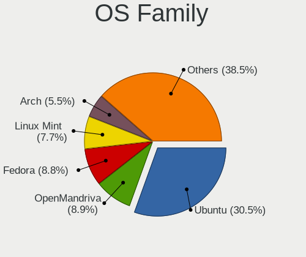

| Name          | Desktops | Percent |
|---------------|----------|---------|
| Ubuntu        | 205      | 30.51%  |
| OpenMandriva  | 60       | 8.93%   |
| Fedora        | 59       | 8.78%   |
| Linux Mint    | 52       | 7.74%   |
| Arch          | 37       | 5.51%   |
| Debian        | 28       | 4.17%   |
| Zorin         | 24       | 3.57%   |
| Pardus        | 24       | 3.57%   |
| KDE neon      | 21       | 3.13%   |
| Manjaro       | 17       | 2.53%   |
| ArcoLinux     | 16       | 2.38%   |
| Pop!_OS       | 13       | 1.93%   |
| ROSA          | 12       | 1.79%   |
| Kubuntu       | 11       | 1.64%   |
| EndeavourOS   | 8        | 1.19%   |
| Elementary    | 8        | 1.19%   |
| Endless       | 6        | 0.89%   |
| Xubuntu       | 5        | 0.74%   |
| Kali          | 5        | 0.74%   |
| Xero          | 4        | 0.6%    |
| openSUSE      | 4        | 0.6%    |
| Lubuntu       | 4        | 0.6%    |
| Garuda Linux  | 4        | 0.6%    |
| Ubuntu Unity  | 3        | 0.45%   |
| Ubuntu MATE   | 3        | 0.45%   |
| CentOS        | 3        | 0.45%   |
| Bazzite       | 3        | 0.45%   |
| Pisi          | 2        | 0.3%    |
| Nobara        | 2        | 0.3%    |
| LMDE          | 2        | 0.3%    |
| Gentoo        | 2        | 0.3%    |
| Clear Linux   | 2        | 0.3%    |
| ChimeraOS     | 2        | 0.3%    |
| BlackPanther  | 2        | 0.3%    |
| Artix         | 2        | 0.3%    |
| XCP-ng        | 1        | 0.15%   |
| Void Linux    | 1        | 0.15%   |
| UbuntuDDE     | 1        | 0.15%   |
| Ubuntu Studio | 1        | 0.15%   |
| Trisquel      | 1        | 0.15%   |

Kernel
------

Version of the Linux kernel

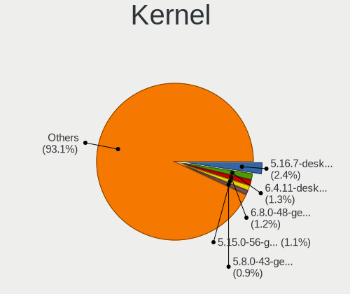

| Version                      | Desktops | Percent |
|------------------------------|----------|---------|
| 5.16.7-desktop-1omv4003      | 18       | 2.39%   |
| 6.4.11-desktop-1omv2390      | 10       | 1.33%   |
| 6.8.0-48-generic             | 9        | 1.2%    |
| 5.15.0-56-generic            | 8        | 1.06%   |
| 5.8.0-43-generic             | 7        | 0.93%   |
| 6.2.0-35-generic             | 6        | 0.8%    |
| 5.4.0-42-generic             | 6        | 0.8%    |
| 6.8.0-45-generic             | 5        | 0.66%   |
| 6.8.0-31-generic             | 5        | 0.66%   |
| 6.6.2-desktop-1omv2390       | 5        | 0.66%   |
| 6.1.1-desktop-1omv2290       | 5        | 0.66%   |
| 5.4.0-48-generic             | 5        | 0.66%   |
| 5.4.0-33-generic             | 5        | 0.66%   |
| 5.10.14-desktop-1omv4002     | 5        | 0.66%   |
| 5.10.0-21-amd64              | 5        | 0.66%   |
| 5.0.0-37-generic             | 5        | 0.66%   |
| 4.18.0-15-generic            | 5        | 0.66%   |
| 6.2.0-20-generic             | 4        | 0.53%   |
| 6.12.1-desktop-1omv2490      | 4        | 0.53%   |
| 5.8.0-48-generic             | 4        | 0.53%   |
| 5.4.0-58-generic             | 4        | 0.53%   |
| 5.4.0-31-generic             | 4        | 0.53%   |
| 5.4.0-26-generic             | 4        | 0.53%   |
| 5.3.0-46-generic             | 4        | 0.53%   |
| 5.15.0-78-generic            | 4        | 0.53%   |
| 5.15.0-58-generic            | 4        | 0.53%   |
| 5.15.0-48-generic            | 4        | 0.53%   |
| 5.13.0-52-generic            | 4        | 0.53%   |
| 6.9.12-205.fsync.fc40.x86_64 | 3        | 0.4%    |
| 6.8.0-49-generic             | 3        | 0.4%    |
| 6.8.0-47-generic             | 3        | 0.4%    |
| 6.5.0-28-generic             | 3        | 0.4%    |
| 6.5.0-26-generic             | 3        | 0.4%    |
| 6.5.0-14-generic             | 3        | 0.4%    |
| 6.2.6-desktop-1omv2390       | 3        | 0.4%    |
| 6.2.0-39-generic             | 3        | 0.4%    |
| 6.2.0-37-generic             | 3        | 0.4%    |
| 6.2.0-36-generic             | 3        | 0.4%    |
| 6.2.0-34-generic             | 3        | 0.4%    |
| 6.2.0-26-generic             | 3        | 0.4%    |

Kernel Family
-------------

Linux kernel without a distro release

| Version | Desktops | Percent |
|---------|----------|---------|
| 5.4.0   | 71       | 9.81%   |
| 5.15.0  | 65       | 8.98%   |
| 6.8.0   | 33       | 4.56%   |
| 5.10.0  | 30       | 4.14%   |
| 6.2.0   | 29       | 4.01%   |
| 5.8.0   | 27       | 3.73%   |
| 6.5.0   | 23       | 3.18%   |
| 5.13.0  | 21       | 2.9%    |
| 5.11.0  | 21       | 2.9%    |
| 4.15.0  | 20       | 2.76%   |
| 5.16.7  | 18       | 2.49%   |
| 5.0.0   | 17       | 2.35%   |
| 5.3.0   | 15       | 2.07%   |
| 6.1.0   | 13       | 1.8%    |
| 5.19.0  | 12       | 1.66%   |
| 4.18.0  | 12       | 1.66%   |
| 6.4.11  | 10       | 1.38%   |
| 4.19.0  | 9        | 1.24%   |
| 6.1.1   | 7        | 0.97%   |
| 6.6.2   | 6        | 0.83%   |
| 5.10.14 | 5        | 0.69%   |
| 6.9.12  | 4        | 0.55%   |
| 6.12.1  | 4        | 0.55%   |
| 6.10.6  | 4        | 0.55%   |
| 6.9.5   | 3        | 0.41%   |
| 6.9.3   | 3        | 0.41%   |
| 6.8.5   | 3        | 0.41%   |
| 6.7.9   | 3        | 0.41%   |
| 6.5.6   | 3        | 0.41%   |
| 6.2.6   | 3        | 0.41%   |
| 6.2.10  | 3        | 0.41%   |
| 6.11.5  | 3        | 0.41%   |
| 6.11.0  | 3        | 0.41%   |
| 6.10.0  | 3        | 0.41%   |
| 5.18.0  | 3        | 0.41%   |
| 5.15.14 | 3        | 0.41%   |
| 5.11.10 | 3        | 0.41%   |
| 4.9.60  | 3        | 0.41%   |
| 4.9.124 | 3        | 0.41%   |
| 4.4.0   | 3        | 0.41%   |

Kernel Major Ver.
-----------------

Linux kernel major version

| Version | Desktops | Percent |
|---------|----------|---------|
| 5.15    | 80       | 11.17%  |
| 5.4     | 73       | 10.2%   |
| 6.8     | 43       | 6.01%   |
| 5.10    | 43       | 6.01%   |
| 6.2     | 42       | 5.87%   |
| 6.5     | 35       | 4.89%   |
| 6.1     | 35       | 4.89%   |
| 5.8     | 31       | 4.33%   |
| 5.11    | 30       | 4.19%   |
| 5.16    | 26       | 3.63%   |
| 6.6     | 23       | 3.21%   |
| 6.4     | 22       | 3.07%   |
| 5.13    | 21       | 2.93%   |
| 5.3     | 20       | 2.79%   |
| 4.15    | 20       | 2.79%   |
| 5.19    | 19       | 2.65%   |
| 5.0     | 17       | 2.37%   |
| 6.9     | 15       | 2.09%   |
| 4.18    | 14       | 1.96%   |
| 6.10    | 11       | 1.54%   |
| 4.19    | 11       | 1.54%   |
| 6.3     | 10       | 1.4%    |
| 6.11    | 10       | 1.4%    |
| 5.18    | 8        | 1.12%   |
| 6.7     | 7        | 0.98%   |
| 6.12    | 7        | 0.98%   |
| 6.0     | 6        | 0.84%   |
| 5.9     | 5        | 0.7%    |
| 5.17    | 5        | 0.7%    |
| 5.14    | 5        | 0.7%    |
| 4.9     | 5        | 0.7%    |
| 5.6     | 3        | 0.42%   |
| 5.12    | 3        | 0.42%   |
| 4.4     | 3        | 0.42%   |
| 4.1     | 2        | 0.28%   |
| 6.13    | 1        | 0.14%   |
| 5.7     | 1        | 0.14%   |
| 5.5     | 1        | 0.14%   |
| 4.13    | 1        | 0.14%   |
| 4.12    | 1        | 0.14%   |

Arch
----

OS architecture (x86_64, i586, etc.)

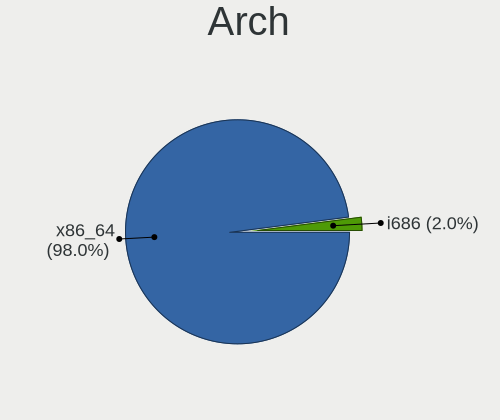

| Name   | Desktops | Percent |
|--------|----------|---------|
| x86_64 | 626      | 97.97%  |
| i686   | 13       | 2.03%   |

DE
--

Desktop Environment

| Name       | Desktops | Percent |
|------------|----------|---------|
| GNOME      | 287      | 42.33%  |
| KDE5       | 122      | 17.99%  |
| Unknown    | 69       | 10.18%  |
| XFCE       | 62       | 9.14%   |
| X-Cinnamon | 42       | 6.19%   |
| KDE        | 16       | 2.36%   |
| KDE6       | 15       | 2.21%   |
| MATE       | 12       | 1.77%   |
| Pantheon   | 8        | 1.18%   |
| Cinnamon   | 7        | 1.03%   |
| sway       | 6        | 0.88%   |
| LXQt       | 5        | 0.74%   |
| KDE4       | 5        | 0.74%   |
| Hyprland   | 5        | 0.74%   |
| Unity      | 3        | 0.44%   |
| i3         | 3        | 0.44%   |
| Deepin     | 3        | 0.44%   |
| LXDE       | 2        | 0.29%   |
| xmonad     | 1        | 0.15%   |
| openbox    | 1        | 0.15%   |
| DWM        | 1        | 0.15%   |
| default    | 1        | 0.15%   |
| DDE        | 1        | 0.15%   |
| Budgie     | 1        | 0.15%   |

Display Server
--------------

X11 or Wayland

| Name    | Desktops | Percent |
|---------|----------|---------|
| X11     | 452      | 68.38%  |
| Wayland | 170      | 25.72%  |
| Unknown | 23       | 3.48%   |
| Tty     | 16       | 2.42%   |

Display Manager
---------------

SDDM, LightDM, etc.

| Name    | Desktops | Percent |
|---------|----------|---------|
| Unknown | 305      | 46.07%  |
| SDDM    | 123      | 18.58%  |
| GDM3    | 98       | 14.8%   |
| LightDM | 67       | 10.12%  |
| GDM     | 52       | 7.85%   |
| TDM     | 9        | 1.36%   |
| KDM     | 4        | 0.6%    |
| SLiM    | 1        | 0.15%   |
| LY-DM   | 1        | 0.15%   |
| Ly      | 1        | 0.15%   |
| LXDM    | 1        | 0.15%   |

OS Lang
-------

Language

| Lang    | Desktops | Percent |
|---------|----------|---------|
| tr_TR   | 303      | 46.26%  |
| en_US   | 262      | 40%     |
| Unknown | 58       | 8.85%   |
| C       | 14       | 2.14%   |
| en_GB   | 11       | 1.68%   |
| POSIX   | 1        | 0.15%   |
| fr_FR   | 1        | 0.15%   |
| es_ES   | 1        | 0.15%   |
| en_AU   | 1        | 0.15%   |
| el_GR   | 1        | 0.15%   |
| az_AZ   | 1        | 0.15%   |
| ar_EG   | 1        | 0.15%   |

Boot Mode
---------

EFI or BIOS

| Mode | Desktops | Percent |
|------|----------|---------|
| BIOS | 391      | 60.25%  |
| EFI  | 258      | 39.75%  |

Filesystem
----------

Type of filesystem

| Type    | Desktops | Percent |
|---------|----------|---------|
| Ext4    | 444      | 66.77%  |
| Btrfs   | 87       | 13.08%  |
| Overlay | 54       | 8.12%   |
| Tmpfs   | 47       | 7.07%   |
| Unknown | 18       | 2.71%   |
| Xfs     | 7        | 1.05%   |
| Zfs     | 3        | 0.45%   |
| Ext2    | 3        | 0.45%   |
| Ext3    | 2        | 0.3%    |

Part. scheme
------------

Scheme of partitioning

| Type    | Desktops | Percent |
|---------|----------|---------|
| Unknown | 322      | 49.16%  |
| GPT     | 268      | 40.92%  |
| MBR     | 65       | 9.92%   |

Dual Boot with Linux/BSD
------------------------

Hosting more than one Linux/BSD

| Dual boot | Desktops | Percent |
|-----------|----------|---------|
| No        | 531      | 81.19%  |
| Yes       | 123      | 18.81%  |

Dual Boot (Win)
---------------

Hosting Linux and Windows

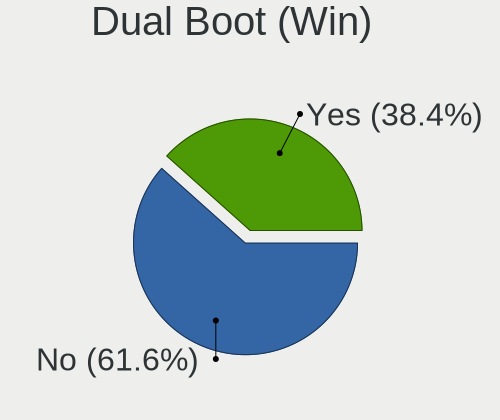

| Dual boot | Desktops | Percent |
|-----------|----------|---------|
| No        | 406      | 61.61%  |
| Yes       | 253      | 38.39%  |

Board
-----

Vendor
------

Motherboard manufacturer

| Name                     | Desktops | Percent |
|--------------------------|----------|---------|
| ASUSTek Computer         | 207      | 32.39%  |
| Gigabyte Technology      | 129      | 20.19%  |
| MSI                      | 125      | 19.56%  |
| Hewlett-Packard          | 23       | 3.6%    |
| ASRock                   | 20       | 3.13%   |
| Intel                    | 18       | 2.82%   |
| Dell                     | 17       | 2.66%   |
| Foxconn                  | 12       | 1.88%   |
| Unknown                  | 12       | 1.88%   |
| Casper                   | 11       | 1.72%   |
| Lenovo                   | 10       | 1.56%   |
| ECS                      | 10       | 1.56%   |
| Pegatron                 | 8        | 1.25%   |
| Fujitsu Siemens          | 5        | 0.78%   |
| Biostar                  | 5        | 0.78%   |
| Acer                     | 5        | 0.78%   |
| Huanan                   | 4        | 0.63%   |
| Fujitsu                  | 2        | 0.31%   |
| Apple                    | 2        | 0.31%   |
| AOpen                    | 2        | 0.31%   |
| Zillion                  | 1        | 0.16%   |
| XDO.AI                   | 1        | 0.16%   |
| Vestel                   | 1        | 0.16%   |
| SYWZ                     | 1        | 0.16%   |
| Shuttle                  | 1        | 0.16%   |
| IBM                      | 1        | 0.16%   |
| Gigabyte XTRJ Operations | 1        | 0.16%   |
| FIC                      | 1        | 0.16%   |
| EXPER                    | 1        | 0.16%   |
| eMachines                | 1        | 0.16%   |
| Colorful Technology      | 1        | 0.16%   |
| ABIT                     | 1        | 0.16%   |

Model
-----

Motherboard model

| Name                               | Desktops | Percent |
|------------------------------------|----------|---------|
| Unknown                            | 16       | 2.5%    |
| ASUS All Series                    | 14       | 2.19%   |
| Gigabyte B450M S2H                 | 10       | 1.56%   |
| MSI MS-7C02                        | 6        | 0.94%   |
| MSI MS-7817                        | 6        | 0.94%   |
| Intel H55                          | 6        | 0.94%   |
| Gigabyte A320M-S2H                 | 6        | 0.94%   |
| MSI MS-7C52                        | 5        | 0.78%   |
| MSI MS-7A34                        | 5        | 0.78%   |
| MSI MS-7996                        | 5        | 0.78%   |
| MSI MS-7693                        | 5        | 0.78%   |
| Gigabyte G31M-ES2L                 | 5        | 0.78%   |
| ASUS PRIME B450M-K II              | 5        | 0.78%   |
| Pegatron IPXSB-H61                 | 4        | 0.63%   |
| MSI MS-7C91                        | 4        | 0.63%   |
| MSI MS-7B86                        | 4        | 0.63%   |
| MSI MS-7A38                        | 4        | 0.63%   |
| Gigabyte G41M-ES2L                 | 4        | 0.63%   |
| ASUS PRIME B550M-K                 | 4        | 0.63%   |
| ASUS PRIME B450M-K                 | 4        | 0.63%   |
| MSI MS-7C96                        | 3        | 0.47%   |
| MSI MS-7C09                        | 3        | 0.47%   |
| MSI MS-7360                        | 3        | 0.47%   |
| Gigabyte M68MT-S2                  | 3        | 0.47%   |
| Gigabyte M61SME-S2                 | 3        | 0.47%   |
| Gigabyte H61M-S2PV                 | 3        | 0.47%   |
| Gigabyte G41M-Combo                | 3        | 0.47%   |
| Dell Vostro 3670                   | 3        | 0.47%   |
| Casper NIRVANA NOTEBOOK            | 3        | 0.47%   |
| Casper NIRVANA DESKTOP             | 3        | 0.47%   |
| ASUS TUF B450-PLUS GAMING          | 3        | 0.47%   |
| ASUS ROG STRIX X670E-E GAMING WIFI | 3        | 0.47%   |
| ASUS ROG STRIX X570-E GAMING       | 3        | 0.47%   |
| ASUS P8H61-M LX3 PLUS R2.0         | 3        | 0.47%   |
| ASUS P5G41T-M LX                   | 3        | 0.47%   |
| ASUS M5A97 R2.0                    | 3        | 0.47%   |
| ASUS M5A97 LE R2.0                 | 3        | 0.47%   |
| ASUS M5A78L-M LX3                  | 3        | 0.47%   |
| MSI MS-7D99                        | 2        | 0.31%   |
| MSI MS-7D70                        | 2        | 0.31%   |

Model Family
------------

Motherboard model prefix

| Name               | Desktops | Percent |
|--------------------|----------|---------|
| ASUS PRIME         | 51       | 7.98%   |
| ASUS TUF           | 21       | 3.29%   |
| ASUS ROG           | 20       | 3.13%   |
| Gigabyte B450M     | 16       | 2.5%    |
| Unknown            | 16       | 2.5%    |
| ASUS All           | 14       | 2.19%   |
| Dell OptiPlex      | 9        | 1.41%   |
| HP Compaq          | 8        | 1.25%   |
| Casper NIRVANA     | 7        | 1.1%    |
| ASUS P8H61-M       | 7        | 1.1%    |
| ASUS M5A97         | 7        | 1.1%    |
| MSI MS-7C02        | 6        | 0.94%   |
| MSI MS-7817        | 6        | 0.94%   |
| Lenovo ThinkCentre | 6        | 0.94%   |
| Intel H55          | 6        | 0.94%   |
| Gigabyte A320M-S2H | 6        | 0.94%   |
| MSI MS-7C52        | 5        | 0.78%   |
| MSI MS-7A34        | 5        | 0.78%   |
| MSI MS-7996        | 5        | 0.78%   |
| MSI MS-7693        | 5        | 0.78%   |
| Gigabyte G31M-ES2L | 5        | 0.78%   |
| ASUS M5A78L-M      | 5        | 0.78%   |
| Pegatron IPXSB-H61 | 4        | 0.63%   |
| MSI MS-7C91        | 4        | 0.63%   |
| MSI MS-7B86        | 4        | 0.63%   |
| MSI MS-7A38        | 4        | 0.63%   |
| Gigabyte G41M-ES2L | 4        | 0.63%   |
| Dell Vostro        | 4        | 0.63%   |
| Dell Precision     | 4        | 0.63%   |
| ASUS P5G41T-M      | 4        | 0.63%   |
| MSI MS-7C96        | 3        | 0.47%   |
| MSI MS-7C09        | 3        | 0.47%   |
| MSI MS-7360        | 3        | 0.47%   |
| Lenovo IdeaCentre  | 3        | 0.47%   |
| HP EliteDesk       | 3        | 0.47%   |
| Gigabyte X570      | 3        | 0.47%   |
| Gigabyte M68MT-S2  | 3        | 0.47%   |
| Gigabyte M61SME-S2 | 3        | 0.47%   |
| Gigabyte H61M-S2PV | 3        | 0.47%   |
| Gigabyte H410M     | 3        | 0.47%   |

MFG Year
--------

Motherboard manufacture year

| Year    | Desktops | Percent |
|---------|----------|---------|
| 2020    | 63       | 9.86%   |
| 2018    | 63       | 9.86%   |
| 2012    | 55       | 8.61%   |
| 2013    | 51       | 7.98%   |
| 2019    | 48       | 7.51%   |
| 2017    | 44       | 6.89%   |
| 2010    | 41       | 6.42%   |
| 2011    | 37       | 5.79%   |
| 2022    | 34       | 5.32%   |
| 2014    | 32       | 5.01%   |
| 2008    | 29       | 4.54%   |
| 2009    | 28       | 4.38%   |
| 2015    | 21       | 3.29%   |
| 2007    | 21       | 3.29%   |
| 2021    | 20       | 3.13%   |
| 2023    | 18       | 2.82%   |
| 2016    | 18       | 2.82%   |
| 2006    | 7        | 1.1%    |
| 2024    | 4        | 0.63%   |
| Unknown | 2        | 0.31%   |
| 2005    | 1        | 0.16%   |
| 2004    | 1        | 0.16%   |
| 2003    | 1        | 0.16%   |

Form Factor
-----------

Physical design of the computer

| Name    | Desktops | Percent |
|---------|----------|---------|
| Desktop | 639      | 100%    |

Secure Boot
-----------

Enabled or disabled

| State    | Desktops | Percent |
|----------|----------|---------|
| Disabled | 620      | 96.42%  |
| Enabled  | 23       | 3.58%   |

Coreboot
--------

Have coreboot on board

| Used | Desktops | Percent |
|------|----------|---------|
| No   | 639      | 100%    |

RAM Size
--------

Total RAM memory

| Size in GB      | Desktops | Percent |
|-----------------|----------|---------|
| 16.01-24.0      | 174      | 26.56%  |
| 8.01-16.0       | 137      | 20.92%  |
| 3.01-4.0        | 87       | 13.28%  |
| 4.01-8.0        | 86       | 13.13%  |
| 32.01-64.0      | 80       | 12.21%  |
| 1.01-2.0        | 34       | 5.19%   |
| 64.01-256.0     | 25       | 3.82%   |
| 24.01-32.0      | 19       | 2.9%    |
| 2.01-3.0        | 9        | 1.37%   |
| 0.51-1.0        | 3        | 0.46%   |
| More than 256.0 | 1        | 0.15%   |

RAM Used
--------

Used RAM memory

| Used GB    | Desktops | Percent |
|------------|----------|---------|
| 1.01-2.0   | 240      | 33.47%  |
| 2.01-3.0   | 171      | 23.85%  |
| 4.01-8.0   | 116      | 16.18%  |
| 3.01-4.0   | 108      | 15.06%  |
| 0.51-1.0   | 35       | 4.88%   |
| 8.01-16.0  | 30       | 4.18%   |
| 0.01-0.5   | 8        | 1.12%   |
| 16.01-24.0 | 5        | 0.7%    |
| 24.01-32.0 | 3        | 0.42%   |
| 32.01-64.0 | 1        | 0.14%   |

Total Drives
------------

Number of drives on board

| Drives | Desktops | Percent |
|--------|----------|---------|
| 1      | 277      | 41.65%  |
| 2      | 195      | 29.32%  |
| 3      | 114      | 17.14%  |
| 4      | 45       | 6.77%   |
| 5      | 21       | 3.16%   |
| 7      | 6        | 0.9%    |
| 6      | 5        | 0.75%   |
| 0      | 2        | 0.3%    |

Has CD-ROM
----------

Has CD-ROM on board

| Presented | Desktops | Percent |
|-----------|----------|---------|
| No        | 469      | 72.04%  |
| Yes       | 182      | 27.96%  |

Has Ethernet
------------

Has Ethernet on board

| Presented | Desktops | Percent |
|-----------|----------|---------|
| Yes       | 631      | 98.75%  |
| No        | 8        | 1.25%   |

Has WiFi
--------

Has WiFi module

| Presented | Desktops | Percent |
|-----------|----------|---------|
| No        | 381      | 59.07%  |
| Yes       | 264      | 40.93%  |

Has Bluetooth
-------------

Has Bluetooth module

| Presented | Desktops | Percent |
|-----------|----------|---------|
| No        | 453      | 70.23%  |
| Yes       | 192      | 29.77%  |

Location
--------

Country
-------

Geographic location (country)

| Country | Desktops | Percent |
|---------|----------|---------|
| Turkey  | 639      | 100%    |

City
----

Geographic location (city)

| City                | Desktops | Percent |
|---------------------|----------|---------|
| Istanbul            | 224      | 33.68%  |
| Ankara              | 89       | 13.38%  |
| Izmir               | 51       | 7.67%   |
| Bursa               | 34       | 5.11%   |
| Antalya             | 21       | 3.16%   |
| Konya               | 16       | 2.41%   |
| Aydin               | 13       | 1.95%   |
| Adana               | 13       | 1.95%   |
| Kayseri             | 11       | 1.65%   |
| Kosekoy             | 8        | 1.2%    |
| Samsun              | 7        | 1.05%   |
| Mersin              | 7        | 1.05%   |
| Mugla               | 6        | 0.9%    |
| zmit              | 6        | 0.9%    |
| Gaziantep           | 6        | 0.9%    |
| Zonguldak           | 5        | 0.75%   |
| Trabzon             | 5        | 0.75%   |
| ili             | 5        | 0.75%   |
| Krklareli         | 5        | 0.75%   |
| Balkesir          | 5        | 0.75%   |
| Tekirda           | 4        | 0.6%    |
| Magnesia ad Sipylum | 4        | 0.6%    |
| Eskiehir          | 4        | 0.6%    |
| Erzurum             | 4        | 0.6%    |
| Denizli             | 4        | 0.6%    |
| Bahelievler       | 4        | 0.6%    |
| Malatya             | 3        | 0.45%   |
| Karabk            | 3        | 0.45%   |
| anakkale          | 3        | 0.45%   |
| Atasehir            | 3        | 0.45%   |
| Alanya              | 3        | 0.45%   |
| Aksaray             | 3        | 0.45%   |
| Adapazar          | 3        | 0.45%   |
| Uak               | 2        | 0.3%    |
| Ulus                | 2        | 0.3%    |
| Tokat Province      | 2        | 0.3%    |
| Tarsus              | 2        | 0.3%    |
| Seyhan              | 2        | 0.3%    |
| Ordu                | 2        | 0.3%    |
| OEdemis             | 2        | 0.3%    |

Drives
------

Drive Vendor
------------

Hard drive vendors

| Vendor                      | Desktops | Drives | Percent |
|-----------------------------|----------|--------|---------|
| Seagate                     | 220      | 305    | 18.98%  |
| WDC                         | 193      | 313    | 16.65%  |
| Samsung Electronics         | 174      | 280    | 15.01%  |
| SanDisk                     | 97       | 138    | 8.37%   |
| Kingston                    | 72       | 88     | 6.21%   |
| Toshiba                     | 62       | 70     | 5.35%   |
| China                       | 29       | 32     | 2.5%    |
| A-DATA Technology           | 22       | 25     | 1.9%    |
| Crucial                     | 19       | 24     | 1.64%   |
| Hitachi                     | 18       | 23     | 1.55%   |
| Phison Electronics          | 16       | 17     | 1.38%   |
| KIOXIA                      | 14       | 18     | 1.21%   |
| Corsair                     | 14       | 22     | 1.21%   |
| KIOXIA-EXCERIA              | 13       | 14     | 1.12%   |
| Kingston Technology Company | 12       | 15     | 1.04%   |
| JAMESDONKEY                 | 10       | 11     | 0.86%   |
| ADATA Technology            | 9        | 11     | 0.78%   |
| Phison                      | 8        | 9      | 0.69%   |
| OCZ                         | 8        | 10     | 0.69%   |
| HGST                        | 8        | 10     | 0.69%   |
| Micron/Crucial Technology   | 7        | 9      | 0.6%    |
| Lexar                       | 7        | 7      | 0.6%    |
| Maxtor                      | 6        | 6      | 0.52%   |
| Intel                       | 6        | 8      | 0.52%   |
| Silicon Motion              | 5        | 6      | 0.43%   |
| Realtek Semiconductor       | 5        | 6      | 0.43%   |
| HS-SSD-C100                 | 5        | 5      | 0.43%   |
| Unknown                     | 5        | 5      | 0.43%   |
| Team                        | 4        | 4      | 0.35%   |
| Netac                       | 4        | 4      | 0.35%   |
| Micron Technology           | 4        | 4      | 0.35%   |
| Hewlett-Packard             | 4        | 4      | 0.35%   |
| XPG                         | 3        | 5      | 0.26%   |
| Turbox                      | 3        | 3      | 0.26%   |
| PNY                         | 3        | 4      | 0.26%   |
| Longline                    | 3        | 3      | 0.26%   |
| KingSpec                    | 3        | 3      | 0.26%   |
| JD                          | 3        | 4      | 0.26%   |
| Intenso                     | 3        | 4      | 0.26%   |
| HI-LEVEL                    | 3        | 3      | 0.26%   |

Drive Model
-----------

Hard drive models

| Model                                                | Desktops | Percent |
|------------------------------------------------------|----------|---------|
| Seagate ST500DM002-1BD142 500GB                      | 25       | 1.92%   |
| SanDisk SSD PLUS 240GB                               | 21       | 1.61%   |
| Seagate ST1000DM010-2EP102 1TB                       | 20       | 1.53%   |
| Samsung NVMe SSD Controller SM981/PM981/PM983 512GB  | 14       | 1.07%   |
| WDC WD10EZEX-08WN4A0 1TB                             | 13       | 1%      |
| Samsung SSD 860 EVO 250GB                            | 13       | 1%      |
| Seagate ST2000DM008-2FR102 2TB                       | 12       | 0.92%   |
| Seagate ST3500418AS 500GB                            | 11       | 0.84%   |
| Seagate ST1000DM003-1ER162 1TB                       | 11       | 0.84%   |
| Samsung NVMe SSD Controller PM9A1/PM9A3/980PRO 512GB | 11       | 0.84%   |
| Samsung HD322HJ 320GB                                | 11       | 0.84%   |
| WDC WD5000AAKX-00ERMA0 500GB                         | 9        | 0.69%   |
| Toshiba DT01ACA100 1TB                               | 9        | 0.69%   |
| Seagate ST1000DM003-1CH162 1TB                       | 9        | 0.69%   |
| Samsung HD502HJ 500GB                                | 9        | 0.69%   |
| Kingston SV300S37A120G 120GB SSD                     | 9        | 0.69%   |
| Seagate ST1000LM035-1RK172 1TB                       | 8        | 0.61%   |
| Kingston Company SNV2S1000G 1TB                      | 8        | 0.61%   |
| A-DATA SU650 120GB SSD                               | 8        | 0.61%   |
| Seagate Expansion 1TB                                | 7        | 0.54%   |
| Sandisk WD Blue SN550 NVMe SSD 256GB                 | 7        | 0.54%   |
| SanDisk SSD PLUS 480GB                               | 7        | 0.54%   |
| Samsung SSD 870 EVO 500GB                            | 7        | 0.54%   |
| Samsung SSD 850 EVO 250GB                            | 7        | 0.54%   |
| Phison E12 NVMe Controller 480GB                     | 7        | 0.54%   |
| China SSD 256GB                                      | 7        | 0.54%   |
| China SATA SSD 240GB                                 | 7        | 0.54%   |
| WDC WDS120G2G0A-00JH30 120GB SSD                     | 6        | 0.46%   |
| Seagate ST1000DM003-1SB102 1TB                       | 6        | 0.46%   |
| Samsung SSD 860 EVO 500GB                            | 6        | 0.46%   |
| Samsung HD161HJ 160GB                                | 6        | 0.46%   |
| Samsung HD160JJ 160GB                                | 6        | 0.46%   |
| KIOXIA NVMe SSD 1TB                                  | 6        | 0.46%   |
| WDC WDS240G2G0A-00JH30 240GB SSD                     | 5        | 0.38%   |
| WDC WD10EZEX-00BN5A0 1TB                             | 5        | 0.38%   |
| Toshiba DT01ACA050 500GB                             | 5        | 0.38%   |
| SanDisk Ultra 3D NVMe 500GB                          | 5        | 0.38%   |
| SanDisk SSD PLUS 120GB                               | 5        | 0.38%   |
| SanDisk SDSSDA120G 120GB                             | 5        | 0.38%   |
| Samsung SSD 840 EVO 250GB                            | 5        | 0.38%   |

HDD Vendor
----------

Hard disk drive vendors

| Vendor              | Desktops | Drives  | Percent |
|---------------------|----------|---------|---------|
| Seagate             | 218      | 302     | 40.15%  |
| WDC                 | 170      | 280     | 31.31%  |
| Samsung Electronics | 68       | 95      | 12.52%  |
| Toshiba             | 47       | 53      | 8.66%   |
| Hitachi             | 18       | 23      | 3.31%   |
| HGST                | 8        | 10      | 1.47%   |
| Maxtor              | 6        | 6       | 1.1%    |
| Unknown             | 1        | 1       | 0.18%   |
| Intenso             | 1        | 2       | 0.18%   |
| Initio              | 1        | Unknown | 0.18%   |
| Fujitsu             | 1        | 1       | 0.18%   |
| ExcelStor           | 1        | 1       | 0.18%   |
| ASMT                | 1        | 1       | 0.18%   |
| Apple               | 1        | 1       | 0.18%   |
| 128MB               | 1        | 1       | 0.18%   |

SSD Vendor
----------

Solid state drive vendors

| Vendor              | Desktops | Drives | Percent |
|---------------------|----------|--------|---------|
| SanDisk             | 73       | 100    | 18.43%  |
| Samsung Electronics | 64       | 95     | 16.16%  |
| Kingston            | 53       | 66     | 13.38%  |
| China               | 28       | 31     | 7.07%   |
| WDC                 | 26       | 31     | 6.57%   |
| A-DATA Technology   | 17       | 19     | 4.29%   |
| Crucial             | 16       | 20     | 4.04%   |
| KIOXIA-EXCERIA      | 12       | 13     | 3.03%   |
| Toshiba             | 9        | 10     | 2.27%   |
| Corsair             | 9        | 12     | 2.27%   |
| OCZ                 | 8        | 10     | 2.02%   |
| JAMESDONKEY         | 8        | 9      | 2.02%   |
| Lexar               | 7        | 7      | 1.77%   |
| Team                | 4        | 4      | 1.01%   |
| Netac               | 4        | 4      | 1.01%   |
| Hewlett-Packard     | 4        | 4      | 1.01%   |
| Turbox              | 3        | 3      | 0.76%   |
| PNY                 | 3        | 4      | 0.76%   |
| KingSpec            | 3        | 3      | 0.76%   |
| Intel               | 3        | 3      | 0.76%   |
| Unknown             | 3        | 3      | 0.76%   |
| USB3.0              | 2        | 2      | 0.51%   |
| Transcend           | 2        | 2      | 0.51%   |
| Longline            | 2        | 2      | 0.51%   |
| KODAK               | 2        | 2      | 0.51%   |
| Intenso             | 2        | 2      | 0.51%   |
| HS-SSD-C100         | 2        | 2      | 0.51%   |
| HI-LEVEL            | 2        | 2      | 0.51%   |
| Gigabyte Technology | 2        | 2      | 0.51%   |
| Acer                | 2        | 2      | 0.51%   |
| TwinMOS             | 1        | 1      | 0.25%   |
| SSD-S400            | 1        | 1      | 0.25%   |
| Phison              | 1        | 1      | 0.25%   |
| Patriot             | 1        | 1      | 0.25%   |
| Neo                 | 1        | 1      | 0.25%   |
| Micron Technology   | 1        | 1      | 0.25%   |
| LITEONIT            | 1        | 1      | 0.25%   |
| LITEON              | 1        | 1      | 0.25%   |
| KingDian            | 1        | 1      | 0.25%   |
| JD                  | 1        | 1      | 0.25%   |

Drive Kind
----------

HDD or SSD

| Kind    | Desktops | Drives | Percent |
|---------|----------|--------|---------|
| HDD     | 427      | 777    | 43.35%  |
| SSD     | 337      | 490    | 34.21%  |
| NVMe    | 198      | 300    | 20.1%   |
| Unknown | 23       | 28     | 2.34%   |

Drive Connector
---------------

SATA, SAS, NVMe, etc.

| Type | Desktops | Drives | Percent |
|------|----------|--------|---------|
| SATA | 569      | 1252   | 71.39%  |
| NVMe | 198      | 300    | 24.84%  |
| SAS  | 30       | 43     | 3.76%   |

Drive Size
----------

Size of hard drive

| Size in TB | Desktops | Drives | Percent |
|------------|----------|--------|---------|
| 0.01-0.5   | 463      | 789    | 59.97%  |
| 0.51-1.0   | 199      | 310    | 25.78%  |
| 1.01-2.0   | 59       | 88     | 7.64%   |
| 3.01-4.0   | 27       | 46     | 3.5%    |
| 2.01-3.0   | 12       | 18     | 1.55%   |
| 4.01-10.0  | 10       | 14     | 1.3%    |
| 10.01-20.0 | 2        | 2      | 0.26%   |

Space Total
-----------

Amount of disk space available on the file system

| Size in GB     | Desktops | Percent |
|----------------|----------|---------|
| 101-250        | 177      | 25.69%  |
| 251-500        | 152      | 22.06%  |
| 501-1000       | 91       | 13.21%  |
| 1001-2000      | 64       | 9.29%   |
| 1-20           | 51       | 7.4%    |
| More than 3000 | 47       | 6.82%   |
| 51-100         | 46       | 6.68%   |
| 2001-3000      | 26       | 3.77%   |
| 21-50          | 21       | 3.05%   |
| Unknown        | 14       | 2.03%   |

Space Used
----------

Amount of used disk space

| Used GB        | Desktops | Percent |
|----------------|----------|---------|
| 1-20           | 240      | 34.24%  |
| 21-50          | 134      | 19.12%  |
| 51-100         | 83       | 11.84%  |
| 101-250        | 81       | 11.55%  |
| 251-500        | 53       | 7.56%   |
| 501-1000       | 41       | 5.85%   |
| 1001-2000      | 25       | 3.57%   |
| More than 3000 | 16       | 2.28%   |
| Unknown        | 14       | 2%      |
| 2001-3000      | 13       | 1.85%   |
| 0              | 1        | 0.14%   |

Malfunc. Drives
---------------

Drive models with a malfunction

| Model                                                           | Desktops | Drives | Percent |
|-----------------------------------------------------------------|----------|--------|---------|
| Seagate ST500DM002-1BD142 500GB                                 | 10       | 11     | 8.62%   |
| Kingston SV300S37A120G 120GB SSD                                | 4        | 5      | 3.45%   |
| Toshiba DT01ACA050 500GB                                        | 3        | 3      | 2.59%   |
| Seagate ST1000DM003-1SB102 1TB                                  | 3        | 3      | 2.59%   |
| Seagate ST1000DM003-1CH162 1TB                                  | 3        | 4      | 2.59%   |
| Samsung Electronics HD161HJ 160GB                               | 3        | 3      | 2.59%   |
| WDC WD10EZEX-08M2NA0 1TB                                        | 2        | 2      | 1.72%   |
| Seagate ST3500630AS 500GB                                       | 2        | 2      | 1.72%   |
| Seagate ST3500418AS 500GB                                       | 2        | 4      | 1.72%   |
| Seagate ST2000DM008-2FR102 2TB                                  | 2        | 2      | 1.72%   |
| Seagate ST1000LM035-1RK172 1TB                                  | 2        | 2      | 1.72%   |
| SanDisk SDSSDA120G 120GB                                        | 2        | 2      | 1.72%   |
| Samsung Electronics SSD 870 EVO 500GB                           | 2        | 2      | 1.72%   |
| Samsung Electronics NVMe SSD Controller SM981/PM981/PM983 512GB | 2        | 2      | 1.72%   |
| Samsung Electronics HD322HJ 320GB                               | 2        | 2      | 1.72%   |
| WDC WDS120G2G0A-00JH30 120GB SSD                                | 1        | 1      | 0.86%   |
| WDC WD5000BPVT-00KPFT0 500GB                                    | 1        | 1      | 0.86%   |
| WDC WD5000AAKX-60U6AA0 500GB                                    | 1        | 1      | 0.86%   |
| WDC WD5000AAKX-00ERMA0 500GB                                    | 1        | 1      | 0.86%   |
| WDC WD5000AAKX-001CA0 500GB                                     | 1        | 2      | 0.86%   |
| WDC WD40EZRZ-00WN9B0 4TB                                        | 1        | 1      | 0.86%   |
| WDC WD400JB-00ENA0 40GB                                         | 1        | 1      | 0.86%   |
| WDC WD3200LPVT-00G33T0 320GB                                    | 1        | 1      | 0.86%   |
| WDC WD3200BPVT-80JJ5T0 320GB                                    | 1        | 1      | 0.86%   |
| WDC WD3200BPVT-22JJ5T0 320GB                                    | 1        | 1      | 0.86%   |
| WDC WD3200BEVT-60A23T0 320GB                                    | 1        | 1      | 0.86%   |
| WDC WD3200AAJS-00B4A0 320GB                                     | 1        | 1      | 0.86%   |
| WDC WD3200AACS-00M6B0 320GB                                     | 1        | 1      | 0.86%   |
| WDC WD30EZRX-00MMMB0 3TB                                        | 1        | 1      | 0.86%   |
| WDC WD2500JS-55NCB1 250GB                                       | 1        | 1      | 0.86%   |
| WDC WD20EARX-00PASB0 2TB                                        | 1        | 1      | 0.86%   |
| WDC WD2003FYYS-05T9B0 2TB                                       | 1        | 1      | 0.86%   |
| WDC WD10JPVX-60JC3T1 1TB                                        | 1        | 1      | 0.86%   |
| WDC WD10EZEX-60ZF5A0 1TB                                        | 1        | 1      | 0.86%   |
| WDC WD10EZEX-22BN5A0 1TB                                        | 1        | 1      | 0.86%   |
| WDC WD10EZEX-08WN4A0 1TB                                        | 1        | 2      | 0.86%   |
| WDC WD10EZEX-00MFCA0 1TB                                        | 1        | 2      | 0.86%   |
| WDC WD10EARS-00Y5B1 1TB                                         | 1        | 2      | 0.86%   |
| Toshiba MQ01ABD100 1TB                                          | 1        | 1      | 0.86%   |
| Toshiba MK1652GSX 160GB                                         | 1        | 1      | 0.86%   |

Malfunc. Drive Vendor
---------------------

Vendors of faulty drives

| Vendor              | Desktops | Drives | Percent |
|---------------------|----------|--------|---------|
| Seagate             | 39       | 49     | 35.45%  |
| WDC                 | 23       | 29     | 20.91%  |
| Samsung Electronics | 16       | 18     | 14.55%  |
| SanDisk             | 6        | 7      | 5.45%   |
| Kingston            | 6        | 7      | 5.45%   |
| Toshiba             | 5        | 5      | 4.55%   |
| Maxtor              | 3        | 3      | 2.73%   |
| Hitachi             | 3        | 3      | 2.73%   |
| A-DATA Technology   | 3        | 3      | 2.73%   |
| SSD-S400            | 1        | 1      | 0.91%   |
| OCZ                 | 1        | 2      | 0.91%   |
| HGST                | 1        | 1      | 0.91%   |
| Crucial             | 1        | 1      | 0.91%   |
| China               | 1        | 1      | 0.91%   |
| C-S12               | 1        | 1      | 0.91%   |

Malfunc. HDD Vendor
-------------------

Vendors of faulty HDD drives

| Vendor              | Desktops | Drives | Percent |
|---------------------|----------|--------|---------|
| Seagate             | 39       | 49     | 45.88%  |
| WDC                 | 22       | 28     | 25.88%  |
| Samsung Electronics | 12       | 14     | 14.12%  |
| Toshiba             | 5        | 5      | 5.88%   |
| Maxtor              | 3        | 3      | 3.53%   |
| Hitachi             | 3        | 3      | 3.53%   |
| HGST                | 1        | 1      | 1.18%   |

Malfunc. Drive Kind
-------------------

Kinds of faulty drives

| Kind | Desktops | Drives | Percent |
|------|----------|--------|---------|
| HDD  | 75       | 103    | 75%     |
| SSD  | 22       | 25     | 22%     |
| NVMe | 3        | 3      | 3%      |

Failed Drives
-------------

Failed drive models

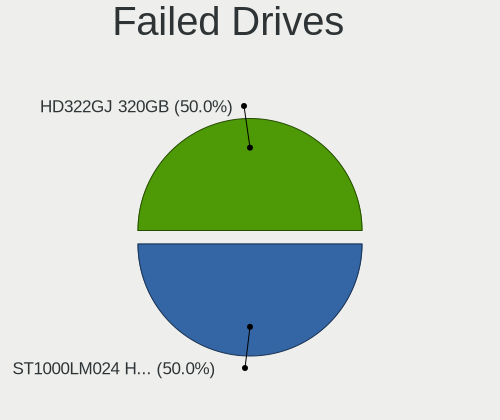

| Model                              | Desktops | Drives | Percent |
|------------------------------------|----------|--------|---------|
| Seagate ST1000LM024 HN-M101MBB 1TB | 1        | 1      | 50%     |
| Samsung Electronics HD322GJ 320GB  | 1        | 1      | 50%     |

Failed Drive Vendor
-------------------

Failed drive vendors

| Vendor              | Desktops | Drives | Percent |
|---------------------|----------|--------|---------|
| Seagate             | 1        | 1      | 50%     |
| Samsung Electronics | 1        | 1      | 50%     |

Drive Status
------------

Number of failed and malfunc. drives

| Status   | Desktops | Drives | Percent |
|----------|----------|--------|---------|
| Detected | 390      | 912    | 53.65%  |
| Works    | 238      | 550    | 32.74%  |
| Malfunc  | 97       | 131    | 13.34%  |
| Failed   | 2        | 2      | 0.28%   |

Storage controller
------------------

Storage Vendor
--------------

Storage controller vendors

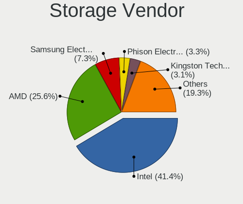

| Vendor                           | Desktops | Percent |
|----------------------------------|----------|---------|
| Intel                            | 382      | 41.43%  |
| AMD                              | 236      | 25.6%   |
| Samsung Electronics              | 67       | 7.27%   |
| Phison Electronics               | 30       | 3.25%   |
| Kingston Technology Company      | 29       | 3.15%   |
| SanDisk                          | 26       | 2.82%   |
| ASMedia Technology               | 22       | 2.39%   |
| Marvell Technology Group         | 20       | 2.17%   |
| JMicron Technology               | 20       | 2.17%   |
| KIOXIA                           | 17       | 1.84%   |
| Nvidia                           | 15       | 1.63%   |
| ADATA Technology                 | 14       | 1.52%   |
| Micron/Crucial Technology        | 10       | 1.08%   |
| Silicon Motion                   | 9        | 0.98%   |
| Realtek Semiconductor            | 7        | 0.76%   |
| VIA Technologies                 | 3        | 0.33%   |
| Micron Technology                | 3        | 0.33%   |
| Toshiba America Info Systems     | 2        | 0.22%   |
| SK hynix                         | 2        | 0.22%   |
| MAXIO Technology (Hangzhou)      | 2        | 0.22%   |
| LSI Logic / Symbios Logic        | 2        | 0.22%   |
| ULi Electronics                  | 1        | 0.11%   |
| Silicon Integrated Systems [SiS] | 1        | 0.11%   |
| Seagate Technology               | 1        | 0.11%   |
| Promise Technology               | 1        | 0.11%   |

Storage Model
-------------

Storage controller models

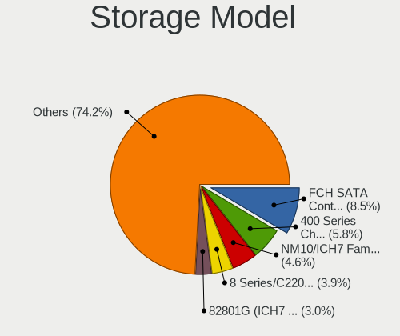

| Model                                                                                   | Desktops | Percent |
|-----------------------------------------------------------------------------------------|----------|---------|
| AMD FCH SATA Controller [AHCI mode]                                                     | 101      | 8.53%   |
| AMD 400 Series Chipset SATA Controller                                                  | 69       | 5.83%   |
| Intel NM10/ICH7 Family SATA Controller [IDE mode]                                       | 55       | 4.65%   |
| Intel 8 Series/C220 Series Chipset Family 6-port SATA Controller 1 [AHCI mode]          | 46       | 3.89%   |
| Intel 82801G (ICH7 Family) IDE Controller                                               | 35       | 2.96%   |
| AMD SB7x0/SB8x0/SB9x0 IDE Controller                                                    | 32       | 2.7%    |
| Intel 6 Series/C200 Series Chipset Family 6 port Desktop SATA AHCI Controller           | 30       | 2.53%   |
| Intel 200 Series PCH SATA controller [AHCI mode]                                        | 30       | 2.53%   |
| AMD 500 Series Chipset SATA Controller                                                  | 30       | 2.53%   |
| Samsung NVMe SSD Controller SM981/PM981/PM983                                           | 29       | 2.45%   |
| AMD SB7x0/SB8x0/SB9x0 SATA Controller [IDE mode]                                        | 28       | 2.36%   |
| Intel Q170/Q150/B150/H170/H110/Z170/CM236 Chipset SATA Controller [AHCI Mode]           | 23       | 1.94%   |
| Intel 6 Series/C200 Series Chipset Family Desktop SATA Controller (IDE mode, ports 4-5) | 21       | 1.77%   |
| Intel 6 Series/C200 Series Chipset Family Desktop SATA Controller (IDE mode, ports 0-3) | 21       | 1.77%   |
| ASMedia ASM1061/ASM1062 Serial ATA Controller                                           | 21       | 1.77%   |
| AMD 600 Series Chipset SATA Controller                                                  | 21       | 1.77%   |
| AMD SB7x0/SB8x0/SB9x0 SATA Controller [AHCI mode]                                       | 19       | 1.6%    |
| AMD A320 Chipset SATA Controller [AHCI mode]                                            | 17       | 1.44%   |
| Intel 500 Series Chipset Family SATA AHCI Controller                                    | 16       | 1.35%   |
| Samsung NVMe SSD Controller PM9A1/PM9A3/980PRO                                          | 15       | 1.27%   |
| Intel 7 Series/C210 Series Chipset Family 6-port SATA Controller [AHCI mode]            | 15       | 1.27%   |
| Samsung NVMe SSD Controller 980 (DRAM-less)                                             | 14       | 1.18%   |
| Phison E12 NVMe Controller                                                              | 14       | 1.18%   |
| AMD 300 Series Chipset SATA Controller                                                  | 14       | 1.18%   |
| Intel SATA Controller [RAID mode]                                                       | 13       | 1.1%    |
| Intel Alder Lake-S PCH SATA Controller [AHCI Mode]                                      | 13       | 1.1%    |
| Intel Comet Lake SATA AHCI Controller                                                   | 12       | 1.01%   |
| SanDisk Ultra 3D / WD PC SN530, IX SN530, Blue SN550 NVMe SSD (DRAM-less)               | 11       | 0.93%   |
| Nvidia MCP61 SATA Controller                                                            | 11       | 0.93%   |
| KIOXIA NVMe SSD                                                                         | 10       | 0.84%   |
| Kingston Company NV2 NVMe SSD [SM2267XT] (DRAM-less)                                    | 10       | 0.84%   |
| Kingston Company KC3000/FURY Renegade NVMe SSD [E18]                                    | 10       | 0.84%   |
| JMicron JMB363 SATA/IDE Controller                                                      | 10       | 0.84%   |
| Intel Raptor Lake SATA AHCI Controller                                                  | 10       | 0.84%   |
| Intel Cannon Lake PCH SATA AHCI Controller                                              | 10       | 0.84%   |
| Intel 5 Series/3400 Series Chipset 4 port SATA IDE Controller                           | 10       | 0.84%   |
| Intel 5 Series/3400 Series Chipset 2 port SATA IDE Controller                           | 10       | 0.84%   |
| Silicon Motion SM2263EN/SM2263XT (DRAM-less) NVMe SSD Controllers                       | 9        | 0.76%   |
| Samsung NVMe SSD Controller SM961/PM961/SM963                                           | 9        | 0.76%   |
| Intel 82801I (ICH9 Family) 2 port SATA Controller [IDE mode]                            | 9        | 0.76%   |

Storage Kind
------------

Kind of storage controller (IDE, SATA, NVMe, SAS, ...)

| Kind | Desktops | Percent |
|------|----------|---------|
| SATA | 490      | 54.2%   |
| NVMe | 199      | 22.01%  |
| IDE  | 185      | 20.46%  |
| RAID | 28       | 3.1%    |
| SCSI | 2        | 0.22%   |

Processor
---------

CPU Vendor
----------

Processor vendors

| Vendor       | Desktops | Percent |
|--------------|----------|---------|
| Intel        | 386      | 60.41%  |
| AMD          | 252      | 39.44%  |
| CentaurHauls | 1        | 0.16%   |

CPU Model
---------

Processor models

| Model                                       | Desktops | Percent |
|---------------------------------------------|----------|---------|
| AMD Ryzen 5 2600 Six-Core Processor         | 12       | 1.86%   |
| AMD Ryzen 5 3600 6-Core Processor           | 11       | 1.71%   |
| Intel Core i7-4790 CPU @ 3.60GHz            | 8        | 1.24%   |
| Intel Core i7-3770 CPU @ 3.40GHz            | 8        | 1.24%   |
| Intel Core i5-10400F CPU @ 2.90GHz          | 8        | 1.24%   |
| AMD Ryzen 7 3700X 8-Core Processor          | 8        | 1.24%   |
| AMD FX-6300 Six-Core Processor              | 8        | 1.24%   |
| Intel Core i5-4460 CPU @ 3.20GHz            | 7        | 1.09%   |
| Intel Core i3-2120 CPU @ 3.30GHz            | 7        | 1.09%   |
| Intel Core 2 Quad CPU Q6600 @ 2.40GHz       | 7        | 1.09%   |
| AMD Ryzen 5 3500X 6-Core Processor          | 7        | 1.09%   |
| AMD Ryzen 3 2200G with Radeon Vega Graphics | 7        | 1.09%   |
| Intel Pentium Dual CPU E2180 @ 2.00GHz      | 6        | 0.93%   |
| Intel Core i7-2600 CPU @ 3.40GHz            | 6        | 0.93%   |
| Intel Core i5-3470 CPU @ 3.20GHz            | 6        | 0.93%   |
| Intel Core i5 CPU 650 @ 3.20GHz             | 6        | 0.93%   |
| Intel Core i3-3220 CPU @ 3.30GHz            | 6        | 0.93%   |
| Intel Core i3-2100 CPU @ 3.10GHz            | 6        | 0.93%   |
| Intel Core 2 Quad CPU Q8300 @ 2.50GHz       | 6        | 0.93%   |
| Intel Core 2 Duo CPU E7500 @ 2.93GHz        | 6        | 0.93%   |
| AMD Ryzen 7 5700X 8-Core Processor          | 6        | 0.93%   |
| AMD Ryzen 7 1700 Eight-Core Processor       | 6        | 0.93%   |
| AMD Ryzen 5 5600X 6-Core Processor          | 6        | 0.93%   |
| AMD Ryzen 5 5600 6-Core Processor           | 6        | 0.93%   |
| AMD Ryzen 5 5500                            | 6        | 0.93%   |
| Intel Core i7-7700 CPU @ 3.60GHz            | 5        | 0.78%   |
| Intel Core i3-9100F CPU @ 3.60GHz           | 5        | 0.78%   |
| AMD Ryzen 7 5700G with Radeon Graphics      | 5        | 0.78%   |
| AMD Ryzen 7 3800X 8-Core Processor          | 5        | 0.78%   |
| AMD Ryzen 5 5600G with Radeon Graphics      | 5        | 0.78%   |
| AMD Ryzen 5 1600 Six-Core Processor         | 5        | 0.78%   |
| AMD Ryzen 3 1200 Quad-Core Processor        | 5        | 0.78%   |
| AMD FX-8350 Eight-Core Processor            | 5        | 0.78%   |
| Intel Pentium Dual-Core CPU E5700 @ 3.00GHz | 4        | 0.62%   |
| Intel Core i7-6700K CPU @ 4.00GHz           | 4        | 0.62%   |
| Intel Core i7-10700K CPU @ 3.80GHz          | 4        | 0.62%   |
| Intel Core i7-10700 CPU @ 2.90GHz           | 4        | 0.62%   |
| Intel Core i5-7400 CPU @ 3.00GHz            | 4        | 0.62%   |
| Intel Core i5-4440 CPU @ 3.10GHz            | 4        | 0.62%   |
| Intel Core i5-3570K CPU @ 3.40GHz           | 4        | 0.62%   |

CPU Model Family
----------------

Processor model prefix

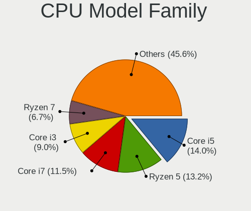

| Model                   | Desktops | Percent |
|-------------------------|----------|---------|
| Intel Core i5           | 90       | 14%     |
| AMD Ryzen 5             | 85       | 13.22%  |
| Intel Core i7           | 74       | 11.51%  |
| Intel Core i3           | 58       | 9.02%   |
| AMD Ryzen 7             | 43       | 6.69%   |
| Other                   | 30       | 4.67%   |
| AMD FX                  | 26       | 4.04%   |
| Intel Core 2 Duo        | 25       | 3.89%   |
| Intel Xeon              | 22       | 3.42%   |
| Intel Core 2 Quad       | 22       | 3.42%   |
| AMD Ryzen 3             | 21       | 3.27%   |
| Intel Pentium           | 19       | 2.95%   |
| AMD Ryzen 9             | 18       | 2.8%    |
| Intel Pentium Dual-Core | 14       | 2.18%   |
| Intel Core i9           | 9        | 1.4%    |
| AMD Phenom II X4        | 9        | 1.4%    |
| Intel Pentium Dual      | 8        | 1.24%   |
| Intel Celeron           | 7        | 1.09%   |
| AMD Athlon II X2        | 6        | 0.93%   |
| AMD Ryzen 5 PRO         | 5        | 0.78%   |
| AMD Athlon              | 5        | 0.78%   |
| AMD Athlon II X3        | 4        | 0.62%   |
| AMD Athlon 64 X2        | 4        | 0.62%   |
| AMD A4                  | 4        | 0.62%   |
| AMD A10                 | 4        | 0.62%   |
| Intel Pentium 4         | 3        | 0.47%   |
| Intel Core 2            | 3        | 0.47%   |
| AMD Phenom II X6        | 3        | 0.47%   |
| AMD Phenom              | 3        | 0.47%   |
| AMD Athlon II X4        | 3        | 0.47%   |
| Intel Pentium D         | 2        | 0.31%   |
| AMD Sempron             | 2        | 0.31%   |
| AMD Ryzen Threadripper  | 2        | 0.31%   |
| AMD Athlon X4           | 2        | 0.31%   |
| AMD A8                  | 2        | 0.31%   |
| Intel Pentium Gold      | 1        | 0.16%   |
| Intel Atom              | 1        | 0.16%   |
| CentaurHauls VIA Eden   | 1        | 0.16%   |
| AMD Phenom II X2        | 1        | 0.16%   |
| AMD Athlon XP           | 1        | 0.16%   |

CPU Cores
---------

Number of processor cores

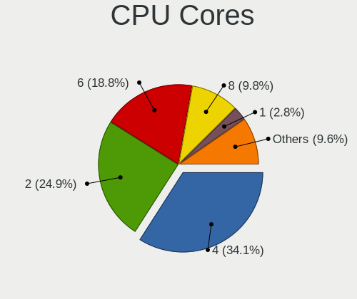

| Number | Desktops | Percent |
|--------|----------|---------|
| 4      | 219      | 34.06%  |
| 2      | 160      | 24.88%  |
| 6      | 121      | 18.82%  |
| 8      | 63       | 9.8%    |
| 1      | 18       | 2.8%    |
| 12     | 16       | 2.49%   |
| 3      | 16       | 2.49%   |
| 16     | 10       | 1.56%   |
| 10     | 9        | 1.4%    |
| 24     | 5        | 0.78%   |
| 14     | 3        | 0.47%   |
| 20     | 2        | 0.31%   |
| 64     | 1        | 0.16%   |

CPU Sockets
-----------

Number of sockets

| Number | Desktops | Percent |
|--------|----------|---------|
| 1      | 636      | 99.53%  |
| 2      | 3        | 0.47%   |

CPU Threads
-----------

Threads per core (Hyper-Threading)

| Number | Desktops | Percent |
|--------|----------|---------|
| 2      | 375      | 58.59%  |
| 1      | 263      | 41.09%  |
| 8      | 1        | 0.16%   |
| 4      | 1        | 0.16%   |

CPU Op-Modes
------------

CPU Operation Modes (32-bit, 64-bit)

| Op mode        | Desktops | Percent |
|----------------|----------|---------|
| 32-bit, 64-bit | 629      | 98.13%  |
| Unknown        | 8        | 1.25%   |
| 32-bit         | 4        | 0.62%   |

CPU Microcode
-------------

Microcode number

| Number     | Desktops | Percent |
|------------|----------|---------|
| Unknown    | 272      | 40.48%  |
| 0x306c3    | 34       | 5.06%   |
| 0x306a9    | 25       | 3.72%   |
| 0x1067a    | 24       | 3.57%   |
| 0x906e9    | 20       | 2.98%   |
| 0x206a7    | 20       | 2.98%   |
| 0x08701021 | 16       | 2.38%   |
| 0x06000852 | 15       | 2.23%   |
| 0x0800820d | 14       | 2.08%   |
| 0x506e3    | 13       | 1.93%   |
| 0x010000c8 | 11       | 1.64%   |
| 0x08001138 | 10       | 1.49%   |
| 0x6fd      | 9        | 1.34%   |
| 0x10676    | 9        | 1.34%   |
| 0x6fb      | 8        | 1.19%   |
| 0x08101016 | 8        | 1.19%   |
| 0x0a50000d | 7        | 1.04%   |
| 0x906ea    | 6        | 0.89%   |
| 0x08701030 | 6        | 0.89%   |
| 0x08108109 | 6        | 0.89%   |
| 0x08001137 | 6        | 0.89%   |
| 0x06001119 | 6        | 0.89%   |
| 0xa0655    | 5        | 0.74%   |
| 0xa0653    | 5        | 0.74%   |
| 0x0a20120a | 5        | 0.74%   |
| 0x906eb    | 4        | 0.6%    |
| 0x20655    | 4        | 0.6%    |
| 0x106a5    | 4        | 0.6%    |
| 0x0a601206 | 4        | 0.6%    |
| 0x0a601203 | 4        | 0.6%    |
| 0x010000dc | 4        | 0.6%    |
| 0x010000db | 4        | 0.6%    |
| 0xb0671    | 3        | 0.45%   |
| 0xa0671    | 3        | 0.45%   |
| 0x6f6      | 3        | 0.45%   |
| 0x306e4    | 3        | 0.45%   |
| 0x206c2    | 3        | 0.45%   |
| 0x20652    | 3        | 0.45%   |
| 0x0a50000c | 3        | 0.45%   |
| 0x08701013 | 3        | 0.45%   |

CPU Microarch
-------------

Microarchitecture

| Name             | Desktops | Percent |
|------------------|----------|---------|
| Haswell          | 60       | 9.32%   |
| Penryn           | 53       | 8.23%   |
| Zen 2            | 51       | 7.92%   |
| KabyLake         | 50       | 7.76%   |
| IvyBridge        | 46       | 7.14%   |
| Zen 3            | 41       | 6.37%   |
| Unknown          | 38       | 5.9%    |
| Zen              | 36       | 5.59%   |
| SandyBridge      | 36       | 5.59%   |
| K10              | 32       | 4.97%   |
| Zen+             | 31       | 4.81%   |
| Piledriver       | 30       | 4.66%   |
| Core             | 27       | 4.19%   |
| CometLake        | 26       | 4.04%   |
| Skylake          | 21       | 3.26%   |
| Westmere         | 18       | 2.8%    |
| Alderlake Hybrid | 11       | 1.71%   |
| Nehalem          | 7        | 1.09%   |
| NetBurst         | 5        | 0.78%   |
| Icelake          | 5        | 0.78%   |
| K8 Hammer        | 4        | 0.62%   |
| Bulldozer        | 4        | 0.62%   |
| Steamroller      | 3        | 0.47%   |
| K10 Llano        | 2        | 0.31%   |
| Silvermont       | 1        | 0.16%   |
| K6               | 1        | 0.16%   |
| Gracemont        | 1        | 0.16%   |
| Goldmont plus    | 1        | 0.16%   |
| Excavator        | 1        | 0.16%   |
| Broadwell        | 1        | 0.16%   |
| Bonnell          | 1        | 0.16%   |

Graphics
--------

GPU Vendor
----------

Vendors of graphics cards

| Vendor                           | Desktops | Percent |
|----------------------------------|----------|---------|
| AMD                              | 268      | 38.56%  |
| Nvidia                           | 256      | 36.83%  |
| Intel                            | 166      | 23.88%  |
| VIA Technologies                 | 2        | 0.29%   |
| Matrox Electronics Systems       | 2        | 0.29%   |
| Silicon Integrated Systems [SiS] | 1        | 0.14%   |

GPU Model
---------

Graphics card models

| Model                                                                       | Desktops | Percent |
|-----------------------------------------------------------------------------|----------|---------|
| AMD Ellesmere [Radeon RX 470/480/570/570X/580/580X/590]                     | 32       | 4.42%   |
| Intel Xeon E3-1200 v3/4th Gen Core Processor Integrated Graphics Controller | 28       | 3.87%   |
| Nvidia GP107 [GeForce GTX 1050 Ti]                                          | 23       | 3.18%   |
| Intel 2nd Generation Core Processor Family Integrated Graphics Controller   | 17       | 2.35%   |
| AMD Oland PRO [Radeon R7 240/340 / Radeon 520]                              | 17       | 2.35%   |
| AMD Raphael                                                                 | 14       | 1.93%   |
| Intel HD Graphics 630                                                       | 13       | 1.8%    |
| AMD Cedar [Radeon HD 5000/6000/7350/8350 Series]                            | 13       | 1.8%    |
| Nvidia GF108 [GeForce GT 730]                                               | 12       | 1.66%   |
| Nvidia TU116 [GeForce GTX 1660 SUPER]                                       | 11       | 1.52%   |
| Nvidia GK208B [GeForce GT 710]                                              | 11       | 1.52%   |
| Nvidia G96C [GeForce 9500 GT]                                               | 11       | 1.52%   |
| Intel CometLake-S GT2 [UHD Graphics 630]                                    | 11       | 1.52%   |
| Intel CoffeeLake-S GT2 [UHD Graphics 630]                                   | 10       | 1.38%   |
| AMD Raven Ridge [Radeon Vega Series / Radeon Vega Mobile Series]            | 10       | 1.38%   |
| Intel 4 Series Chipset Integrated Graphics Controller                       | 9        | 1.24%   |
| AMD Navi 23 [Radeon RX 6600/6600 XT/6600M]                                  | 9        | 1.24%   |
| Nvidia GP106 [GeForce GTX 1060 6GB]                                         | 8        | 1.1%    |
| Intel Xeon E3-1200 v2/3rd Gen Core processor Graphics Controller            | 8        | 1.1%    |
| Intel IvyBridge GT2 [HD Graphics 4000]                                      | 8        | 1.1%    |
| AMD Navi 21 [Radeon RX 6800/6800 XT / 6900 XT]                              | 8        | 1.1%    |
| AMD Lexa PRO [Radeon 540/540X/550/550X / RX 540X/550/550X]                  | 8        | 1.1%    |
| AMD Cezanne [Radeon Vega Series / Radeon Vega Mobile Series]                | 8        | 1.1%    |
| Nvidia TU106 [GeForce RTX 2060 Rev. A]                                      | 7        | 0.97%   |
| Nvidia GF108 [GeForce GT 630]                                               | 7        | 0.97%   |
| Intel Core Processor Integrated Graphics Controller                         | 7        | 0.97%   |
| Intel 82G33/G31 Express Integrated Graphics Controller                      | 7        | 0.97%   |
| AMD Picasso/Raven 2 [Radeon Vega Series / Radeon Vega Mobile Series]        | 7        | 0.97%   |
| AMD Baffin [Radeon RX 550 640SP / RX 560/560X]                              | 7        | 0.97%   |
| AMD Baffin [Radeon RX 460/560D / Pro 450/455/460/555/555X/560/560X]         | 7        | 0.97%   |
| Nvidia TU116 [GeForce GTX 1650 SUPER]                                       | 6        | 0.83%   |
| Nvidia GT218 [GeForce 210]                                                  | 6        | 0.83%   |
| Nvidia GM204 [GeForce GTX 970]                                              | 6        | 0.83%   |
| Intel HD Graphics 530                                                       | 6        | 0.83%   |
| AMD Turks PRO [Radeon HD 6570/7570/8550 / R5 230]                           | 6        | 0.83%   |
| AMD RV730 PRO [Radeon HD 4650]                                              | 6        | 0.83%   |
| AMD Navi 24 [Radeon RX 6400/6500 XT/6500M]                                  | 6        | 0.83%   |
| AMD Caicos [Radeon HD 6450/7450/8450 / R5 230 OEM]                          | 6        | 0.83%   |
| Nvidia TU117 [GeForce GTX 1650]                                             | 5        | 0.69%   |
| Nvidia GM107 [GeForce GTX 750 Ti]                                           | 5        | 0.69%   |

GPU Combo
---------

Combinations of graphics cards

| Name            | Desktops | Percent |
|-----------------|----------|---------|
| 1 x Nvidia      | 239      | 36.77%  |
| 1 x AMD         | 239      | 36.77%  |
| 1 x Intel       | 123      | 18.92%  |
| 2 x AMD         | 14       | 2.15%   |
| Intel + Nvidia  | 11       | 1.69%   |
| Intel + AMD     | 8        | 1.23%   |
| AMD + Nvidia    | 8        | 1.23%   |
| 1 x VIA         | 2        | 0.31%   |
| 1 x Matrox      | 2        | 0.31%   |
| Other           | 1        | 0.15%   |
| 2 x Nvidia      | 1        | 0.15%   |
| 1 x SiS         | 1        | 0.15%   |
| Intel + 2 x AMD | 1        | 0.15%   |

GPU Driver
----------

Free vs proprietary

| Driver      | Desktops | Percent |
|-------------|----------|---------|
| Free        | 463      | 71.34%  |
| Proprietary | 147      | 22.65%  |
| Unknown     | 39       | 6.01%   |

GPU Memory
----------

Total video memory

| Size in GB | Desktops | Percent |
|------------|----------|---------|
| Unknown    | 280      | 41.98%  |
| 3.01-4.0   | 82       | 12.29%  |
| 1.01-2.0   | 75       | 11.24%  |
| 0.51-1.0   | 71       | 10.64%  |
| 0.01-0.5   | 51       | 7.65%   |
| 7.01-8.0   | 44       | 6.6%    |
| 5.01-6.0   | 28       | 4.2%    |
| 8.01-16.0  | 25       | 3.75%   |
| 2.01-3.0   | 5        | 0.75%   |
| 16.01-24.0 | 5        | 0.75%   |
| 4.01-5.0   | 1        | 0.15%   |

Monitor
-------

Monitor Vendor
--------------

Monitor vendors

| Vendor               | Desktops | Percent |
|----------------------|----------|---------|
| Samsung Electronics  | 106      | 16.67%  |
| Goldstar             | 67       | 10.53%  |
| Philips              | 55       | 8.65%   |
| Acer                 | 41       | 6.45%   |
| Dell                 | 39       | 6.13%   |
| Ancor Communications | 39       | 6.13%   |
| AOC                  | 35       | 5.5%    |
| ViewSonic            | 24       | 3.77%   |
| Hewlett-Packard      | 23       | 3.62%   |
| ASUSTek Computer     | 23       | 3.62%   |
| BenQ                 | 18       | 2.83%   |
| MSI                  | 12       | 1.89%   |
| Lenovo               | 9        | 1.42%   |
| SAC                  | 8        | 1.26%   |
| LG Electronics       | 6        | 0.94%   |
| HKC                  | 6        | 0.94%   |
| Beko                 | 6        | 0.94%   |
| AGO                  | 6        | 0.94%   |
| Vestel Elektronik    | 5        | 0.79%   |
| Unknown              | 5        | 0.79%   |
| SANYO                | 5        | 0.79%   |
| Plain Tree Systems   | 5        | 0.79%   |
| Mi                   | 5        | 0.79%   |
| VIE                  | 4        | 0.63%   |
| Sony                 | 4        | 0.63%   |
| KTC                  | 4        | 0.63%   |
| Fujitsu Siemens      | 4        | 0.63%   |
| Casper               | 4        | 0.63%   |
| Unknown              | 4        | 0.63%   |
| SGT                  | 3        | 0.47%   |
| MNR                  | 3        | 0.47%   |
| HPN                  | 3        | 0.47%   |
| Apple                | 3        | 0.47%   |
| Unknown (XXX)        | 2        | 0.31%   |
| SUNNY                | 2        | 0.31%   |
| Sharp                | 2        | 0.31%   |
| RTK                  | 2        | 0.31%   |
| RGT                  | 2        | 0.31%   |
| Pixio                | 2        | 0.31%   |
| Microstep            | 2        | 0.31%   |

Monitor Model
-------------

Monitor models

| Model                                                                  | Desktops | Percent |
|------------------------------------------------------------------------|----------|---------|
| Goldstar FULL HD GSM5B55 1920x1080 480x270mm 21.7-inch                 | 8        | 1.2%    |
| Goldstar ULTRAWIDE GSM59F1 2560x1080 677x290mm 29.0-inch               | 6        | 0.9%    |
| Beko BK WUXGA BEK4448 1920x1080 820x460mm 37.0-inch                    | 6        | 0.9%    |
| Samsung Electronics C24F390 SAM0D2C 1920x1080 521x293mm 23.5-inch      | 5        | 0.75%   |
| Vestel Elektronik 49FHD_LCD_TV VES3700 1920x1080 1280x720mm 57.8-inch  | 4        | 0.6%    |
| Samsung Electronics S24F350 SAM0D20 1920x1080 521x293mm 23.5-inch      | 4        | 0.6%    |
| Plain Tree Systems Monitor PTS06A5 1280x1024 337x270mm 17.0-inch       | 4        | 0.6%    |
| Mi Monitor XMI3444 3440x1440 800x330mm 34.1-inch                       | 4        | 0.6%    |
| AOC 24G2W1G5 AOC2402 1920x1080 527x296mm 23.8-inch                     | 4        | 0.6%    |
| Ancor Communications ASUS VS228 ACI22FD 1920x1080 476x268mm 21.5-inch  | 4        | 0.6%    |
| Ancor Communications ASUS VP228 ACI22C3 1920x1080 476x268mm 21.5-inch  | 4        | 0.6%    |
| Acer K222HQL ACR03E1 1920x1080 477x268mm 21.5-inch                     | 4        | 0.6%    |
| Unknown                                                                | 4        | 0.6%    |
| Samsung Electronics S19B150 SAM08A2 1366x768 410x230mm 18.5-inch       | 3        | 0.45%   |
| Samsung Electronics LS24AG30x SAM7179 1920x1080 527x296mm 23.8-inch    | 3        | 0.45%   |
| Philips PHL 223V5 PHLC0CF 1920x1080 480x270mm 21.7-inch                | 3        | 0.45%   |
| Philips PHL 193V5 PHLC0CD 1366x768 410x230mm 18.5-inch                 | 3        | 0.45%   |
| Philips 226V4 PHLC0B1 1920x1080 477x268mm 21.5-inch                    | 3        | 0.45%   |
| HKC Monitor HKC1850 1366x768 409x230mm 18.5-inch                       | 3        | 0.45%   |
| Hewlett-Packard w1907 HWP26A2 1440x900 408x255mm 18.9-inch             | 3        | 0.45%   |
| Goldstar W2242 GSM5678 1680x1050 474x296mm 22.0-inch                   | 3        | 0.45%   |
| Goldstar W1943 GSM4BAD 1360x768 406x229mm 18.4-inch                    | 3        | 0.45%   |
| Goldstar FHD GSM5BC9 1920x1080 480x270mm 21.7-inch                     | 3        | 0.45%   |
| Goldstar 2D HD TV GSM59CA 1366x768 509x286mm 23.0-inch                 | 3        | 0.45%   |
| Goldstar 2D FHD TV GSM59C6 1920x1080 509x286mm 23.0-inch               | 3        | 0.45%   |
| Fujitsu Siemens L20T-2 LED FUS07E3 1600x900 440x250mm 19.9-inch        | 3        | 0.45%   |
| BenQ ZOWIE XL LCD BNQ7F7F 1920x1080 531x299mm 24.0-inch                | 3        | 0.45%   |
| ASUSTek Computer VG27A AUS2722 2560x1440 597x336mm 27.0-inch           | 3        | 0.45%   |
| ASUSTek Computer VG245 AUS24A1 1920x1080 531x299mm 24.0-inch           | 3        | 0.45%   |
| Ancor Communications VX229 ACI22E5 1920x1080 476x268mm 21.5-inch       | 3        | 0.45%   |
| Ancor Communications ASUS VK221 ACI22D1 1680x1050 473x296mm 22.0-inch  | 3        | 0.45%   |
| Ancor Communications ASUS PB287Q ACI28A3 3840x2160 621x341mm 27.9-inch | 3        | 0.45%   |
| AGO LCD Monitor AGO0001 1920x1080 256x192mm 12.6-inch                  | 3        | 0.45%   |
| ViewSonic VX3276-QHD VSCE635 2560x1440 698x393mm 31.5-inch             | 2        | 0.3%    |
| SUNNY SUNNY SNN0002 1920x1080 708x398mm 32.0-inch                      | 2        | 0.3%    |
| SANYO LCD MONITOR SAN2213 1600x900 477x268mm 21.5-inch                 | 2        | 0.3%    |
| Samsung Electronics SyncMaster SAM0599 1600x900 440x250mm 19.9-inch    | 2        | 0.3%    |
| Samsung Electronics SyncMaster SAM0304 1680x1050 494x320mm 23.2-inch   | 2        | 0.3%    |
| Samsung Electronics SyncMaster SAM0226 1440x900 410x257mm 19.1-inch    | 2        | 0.3%    |
| Samsung Electronics SyncMaster SAM0225 1440x900 410x257mm 19.1-inch    | 2        | 0.3%    |

Monitor Resolution
------------------

Monitor screen resolution

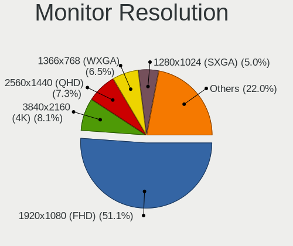

| Resolution         | Desktops | Percent |
|--------------------|----------|---------|
| 1920x1080 (FHD)    | 316      | 51.13%  |
| 3840x2160 (4K)     | 50       | 8.09%   |
| 2560x1440 (QHD)    | 45       | 7.28%   |
| 1366x768 (WXGA)    | 40       | 6.47%   |
| 1280x1024 (SXGA)   | 31       | 5.02%   |
| 1440x900 (WXGA+)   | 26       | 4.21%   |
| 1680x1050 (WSXGA+) | 21       | 3.4%    |
| 1600x900 (HD+)     | 19       | 3.07%   |
| Unknown            | 14       | 2.27%   |
| 2560x1080          | 11       | 1.78%   |
| 3440x1440          | 9        | 1.46%   |
| 1360x768           | 7        | 1.13%   |
| 3840x1080          | 5        | 0.81%   |
| 1024x768 (XGA)     | 4        | 0.65%   |
| 2560x1600          | 3        | 0.49%   |
| 4480x1440          | 2        | 0.32%   |
| 1920x540           | 2        | 0.32%   |
| 1920x1200 (WUXGA)  | 2        | 0.32%   |
| 7920x1440          | 1        | 0.16%   |
| 6000x1440          | 1        | 0.16%   |
| 5760x2160          | 1        | 0.16%   |
| 3840x1200          | 1        | 0.16%   |
| 3750x1280          | 1        | 0.16%   |
| 3360x1050          | 1        | 0.16%   |
| 2390x768           | 1        | 0.16%   |
| 2288x1287          | 1        | 0.16%   |
| 1600x1200          | 1        | 0.16%   |
| 1280x960           | 1        | 0.16%   |
| 1152x864           | 1        | 0.16%   |

Monitor Diagonal
----------------

Diagonal size in inches

| Inches  | Desktops | Percent |
|---------|----------|---------|
| 23      | 100      | 15.72%  |
| 21      | 88       | 13.84%  |
| 27      | 78       | 12.26%  |
| 24      | 64       | 10.06%  |
| Unknown | 60       | 9.43%   |
| 18      | 44       | 6.92%   |
| 19      | 30       | 4.72%   |
| 31      | 24       | 3.77%   |
| 20      | 22       | 3.46%   |
| 34      | 21       | 3.3%    |
| 17      | 20       | 3.14%   |
| 22      | 13       | 2.04%   |
| 72      | 11       | 1.73%   |
| 15      | 9        | 1.42%   |
| 84      | 8        | 1.26%   |
| 54      | 6        | 0.94%   |
| 12      | 6        | 0.94%   |
| 26      | 5        | 0.79%   |
| 40      | 3        | 0.47%   |
| 60      | 2        | 0.31%   |
| 52      | 2        | 0.31%   |
| 43      | 2        | 0.31%   |
| 32      | 2        | 0.31%   |
| 29      | 2        | 0.31%   |
| 28      | 2        | 0.31%   |
| 142     | 1        | 0.16%   |
| 65      | 1        | 0.16%   |
| 64      | 1        | 0.16%   |
| 57      | 1        | 0.16%   |
| 55      | 1        | 0.16%   |
| 46      | 1        | 0.16%   |
| 33      | 1        | 0.16%   |
| 30      | 1        | 0.16%   |
| 25      | 1        | 0.16%   |
| 16      | 1        | 0.16%   |
| 14      | 1        | 0.16%   |
| 13      | 1        | 0.16%   |

Monitor Width
-------------

Physical width

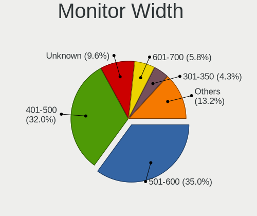

| Width in mm    | Desktops | Percent |
|----------------|----------|---------|
| 501-600        | 218      | 35.05%  |
| 401-500        | 199      | 31.99%  |
| Unknown        | 60       | 9.65%   |
| 601-700        | 36       | 5.79%   |
| 301-350        | 27       | 4.34%   |
| 701-800        | 23       | 3.7%    |
| 1501-2000      | 19       | 3.05%   |
| 1001-1500      | 15       | 2.41%   |
| 351-400        | 10       | 1.61%   |
| 201-300        | 8        | 1.29%   |
| 801-900        | 4        | 0.64%   |
| 901-1000       | 2        | 0.32%   |
| More than 2000 | 1        | 0.16%   |

Aspect Ratio
------------

Proportional relationship between the width and the height

| Ratio   | Desktops | Percent |
|---------|----------|---------|
| 16/9    | 411      | 69.9%   |
| 16/10   | 52       | 8.84%   |
| Unknown | 52       | 8.84%   |
| 5/4     | 24       | 4.08%   |
| 21/9    | 21       | 3.57%   |
| 4/3     | 17       | 2.89%   |
| 3/2     | 9        | 1.53%   |
| 32/9    | 1        | 0.17%   |
| 1.00    | 1        | 0.17%   |

Monitor Area
------------

Area in inch

| Area in inch | Desktops | Percent |
|----------------|----------|---------|
| 201-250        | 218      | 34.94%  |
| 151-200        | 80       | 12.82%  |
| 301-350        | 79       | 12.66%  |
| Unknown        | 60       | 9.62%   |
| 351-500        | 53       | 8.49%   |
| 141-150        | 53       | 8.49%   |
| More than 1000 | 34       | 5.45%   |
| 251-300        | 22       | 3.53%   |
| 101-110        | 8        | 1.28%   |
| 71-80          | 6        | 0.96%   |
| 501-1000       | 6        | 0.96%   |
| 111-120        | 3        | 0.48%   |
| 81-90          | 1        | 0.16%   |
| 121-130        | 1        | 0.16%   |

Pixel Density
-------------

Pixels per inch

| Density | Desktops | Percent |
|---------|----------|---------|
| 51-100  | 370      | 61.16%  |
| 101-120 | 123      | 20.33%  |
| Unknown | 60       | 9.92%   |
| 1-50    | 25       | 4.13%   |
| 121-160 | 17       | 2.81%   |
| 161-240 | 10       | 1.65%   |

Multiple Monitors
-----------------

Total monitors connected

| Total | Desktops | Percent |
|-------|----------|---------|
| 1     | 514      | 78.71%  |
| 2     | 87       | 13.32%  |
| 0     | 47       | 7.2%    |
| 3     | 5        | 0.77%   |

Network
-------

Net Controller Vendor
---------------------

Controller vendors

| Vendor                                 | Desktops | Percent |
|----------------------------------------|----------|---------|
| Realtek Semiconductor                  | 458      | 51.4%   |
| Intel                                  | 170      | 19.08%  |
| Qualcomm Atheros                       | 63       | 7.07%   |
| Ralink Technology                      | 43       | 4.83%   |
| ASUSTek Computer                       | 22       | 2.47%   |
| TP-Link                                | 17       | 1.91%   |
| Qualcomm Atheros Communications        | 17       | 1.91%   |
| Broadcom                               | 15       | 1.68%   |
| Nvidia                                 | 13       | 1.46%   |
| MediaTek                               | 9        | 1.01%   |
| Samsung Electronics                    | 8        | 0.9%    |
| Ralink                                 | 5        | 0.56%   |
| Edimax Technology                      | 5        | 0.56%   |
| ZyXEL Communications                   | 4        | 0.45%   |
| Xiaomi                                 | 4        | 0.45%   |
| Aquantia                               | 4        | 0.45%   |
| Marvell Technology Group               | 3        | 0.34%   |
| Huawei Technologies                    | 3        | 0.34%   |
| Apple                                  | 3        | 0.34%   |
| Tenda                                  | 2        | 0.22%   |
| OPPO Electronics                       | 2        | 0.22%   |
| ICS Advent                             | 2        | 0.22%   |
| Broadcom Limited                       | 2        | 0.22%   |
| AirTies Wireless Networks              | 2        | 0.22%   |
| Wilocity                               | 1        | 0.11%   |
| VIA Technologies                       | 1        | 0.11%   |
| ULi Electronics                        | 1        | 0.11%   |
| T & A Mobile Phones                    | 1        | 0.11%   |
| Sony Ericsson Mobile Communications AB | 1        | 0.11%   |
| Silicon Integrated Systems [SiS]       | 1        | 0.11%   |
| Sangoma Technologies                   | 1        | 0.11%   |
| Qualcomm                               | 1        | 0.11%   |
| Mercucys                               | 1        | 0.11%   |
| JMicron Technology                     | 1        | 0.11%   |
| HTC (High Tech Computer)               | 1        | 0.11%   |
| BroadLogic                             | 1        | 0.11%   |
| ASIX Electronics                       | 1        | 0.11%   |
| Arduino SA                             | 1        | 0.11%   |
| Accton Technology                      | 1        | 0.11%   |

Net Controller Model
--------------------

Controller models

| Model                                                                  | Desktops | Percent |
|------------------------------------------------------------------------|----------|---------|
| Realtek RTL8111/8168/8211/8411 PCI Express Gigabit Ethernet Controller | 347      | 35.19%  |
| Realtek RTL8125 2.5GbE Controller                                      | 42       | 4.26%   |
| Realtek RTL810xE PCI Express Fast Ethernet controller                  | 38       | 3.85%   |
| Intel Wi-Fi 6 AX200                                                    | 23       | 2.33%   |
| Intel Ethernet Connection (2) I219-V                                   | 22       | 2.23%   |
| Ralink MT7601U Wireless Adapter                                        | 19       | 1.93%   |
| Intel I211 Gigabit Network Connection                                  | 19       | 1.93%   |
| Ralink RT2870/RT3070 Wireless Adapter                                  | 12       | 1.22%   |
| Qualcomm Atheros AR9271 802.11n                                        | 12       | 1.22%   |
| Realtek RTL8188FTV 802.11b/g/n 1T1R 2.4G WLAN Adapter                  | 10       | 1.01%   |
| Intel Ethernet Controller I225-V                                       | 10       | 1.01%   |
| Intel Ethernet Connection I217-V                                       | 10       | 1.01%   |
| Intel 82579V Gigabit Network Connection                                | 10       | 1.01%   |
| ASUS USB-N14 802.11b/g/n (2x2) Wireless Adapter [Ralink RT5372]        | 10       | 1.01%   |
| Nvidia MCP61 Ethernet                                                  | 9        | 0.91%   |
| Realtek RTL8192CU 802.11n WLAN Adapter                                 | 8        | 0.81%   |
| Qualcomm Atheros AR9485 Wireless Network Adapter                       | 8        | 0.81%   |
| Intel Ethernet Connection I217-LM                                      | 8        | 0.81%   |
| Realtek 802.11ac NIC                                                   | 7        | 0.71%   |
| Qualcomm Atheros AR8131 Gigabit Ethernet                               | 7        | 0.71%   |
| MediaTek MT7922 802.11ax PCI Express Wireless Network Adapter          | 7        | 0.71%   |
| Intel Ethernet Connection (14) I219-V                                  | 7        | 0.71%   |
| Intel Comet Lake PCH CNVi WiFi                                         | 7        | 0.71%   |
| Intel 82579LM Gigabit Network Connection (Lewisville)                  | 7        | 0.71%   |
| Qualcomm Atheros AR8151 v2.0 Gigabit Ethernet                          | 6        | 0.61%   |
| Intel Dual Band Wireless-AC 3168NGW [Stone Peak]                       | 6        | 0.61%   |
| TP-Link 802.11n NIC                                                    | 5        | 0.51%   |
| Samsung Galaxy series, misc. (tethering mode)                          | 5        | 0.51%   |
| Realtek RTL88x2bu [AC1200 Techkey]                                     | 5        | 0.51%   |
| Realtek RTL8821AE 802.11ac PCIe Wireless Network Adapter               | 5        | 0.51%   |
| Realtek RTL-8100/8101L/8139 PCI Fast Ethernet Adapter                  | 5        | 0.51%   |
| Ralink RT5370 Wireless Adapter                                         | 5        | 0.51%   |
| Qualcomm Atheros QCA6174 802.11ac Wireless Network Adapter             | 5        | 0.51%   |
| Qualcomm Atheros AR8121/AR8113/AR8114 Gigabit or Fast Ethernet         | 5        | 0.51%   |
| Intel Wi-Fi 6E(802.11ax) AX210/AX1675* 2x2 [Typhoon Peak]              | 5        | 0.51%   |
| Intel Raptor Lake-S PCH CNVi WiFi                                      | 5        | 0.51%   |
| Intel Ethernet Connection (11) I219-V                                  | 5        | 0.51%   |
| TP-Link TL-WN823N v2/v3 [Realtek RTL8192EU]                            | 4        | 0.41%   |
| Realtek RTL8191SU 802.11n WLAN Adapter                                 | 4        | 0.41%   |
| Qualcomm Atheros Killer E220x Gigabit Ethernet Controller              | 4        | 0.41%   |

Wireless Vendor
---------------

Wireless vendors

| Vendor                          | Desktops | Percent |
|---------------------------------|----------|---------|
| Realtek Semiconductor           | 67       | 23.34%  |
| Intel                           | 63       | 21.95%  |
| Ralink Technology               | 43       | 14.98%  |
| Qualcomm Atheros                | 22       | 7.67%   |
| ASUSTek Computer                | 22       | 7.67%   |
| TP-Link                         | 17       | 5.92%   |
| Qualcomm Atheros Communications | 17       | 5.92%   |
| Broadcom                        | 8        | 2.79%   |
| MediaTek                        | 7        | 2.44%   |
| Ralink                          | 5        | 1.74%   |
| Edimax Technology               | 5        | 1.74%   |
| ZyXEL Communications            | 4        | 1.39%   |
| Tenda                           | 2        | 0.7%    |
| AirTies Wireless Networks       | 2        | 0.7%    |
| Wilocity                        | 1        | 0.35%   |
| Mercucys                        | 1        | 0.35%   |
| Accton Technology               | 1        | 0.35%   |

Wireless Model
--------------

Wireless models

| Model                                                                                | Desktops | Percent |
|--------------------------------------------------------------------------------------|----------|---------|
| Intel Wi-Fi 6 AX200                                                                  | 23       | 7.96%   |
| Ralink MT7601U Wireless Adapter                                                      | 19       | 6.57%   |
| Ralink RT2870/RT3070 Wireless Adapter                                                | 12       | 4.15%   |
| Qualcomm Atheros AR9271 802.11n                                                      | 12       | 4.15%   |
| Realtek RTL8188FTV 802.11b/g/n 1T1R 2.4G WLAN Adapter                                | 10       | 3.46%   |
| ASUS USB-N14 802.11b/g/n (2x2) Wireless Adapter [Ralink RT5372]                      | 10       | 3.46%   |
| Realtek RTL8192CU 802.11n WLAN Adapter                                               | 8        | 2.77%   |
| Qualcomm Atheros AR9485 Wireless Network Adapter                                     | 8        | 2.77%   |
| Realtek 802.11ac NIC                                                                 | 7        | 2.42%   |
| Intel Comet Lake PCH CNVi WiFi                                                       | 7        | 2.42%   |
| Intel Dual Band Wireless-AC 3168NGW [Stone Peak]                                     | 6        | 2.08%   |
| TP-Link 802.11n NIC                                                                  | 5        | 1.73%   |
| Realtek RTL88x2bu [AC1200 Techkey]                                                   | 5        | 1.73%   |
| Realtek RTL8821AE 802.11ac PCIe Wireless Network Adapter                             | 5        | 1.73%   |
| Ralink RT5370 Wireless Adapter                                                       | 5        | 1.73%   |
| Qualcomm Atheros QCA6174 802.11ac Wireless Network Adapter                           | 5        | 1.73%   |
| MediaTek MT7922 802.11ax PCI Express Wireless Network Adapter                        | 5        | 1.73%   |
| Intel Wi-Fi 6E(802.11ax) AX210/AX1675* 2x2 [Typhoon Peak]                            | 5        | 1.73%   |
| Intel Raptor Lake-S PCH CNVi WiFi                                                    | 5        | 1.73%   |
| TP-Link TL-WN823N v2/v3 [Realtek RTL8192EU]                                          | 4        | 1.38%   |
| Realtek RTL8191SU 802.11n WLAN Adapter                                               | 4        | 1.38%   |
| ASUS N10 Nano 802.11n Network Adapter [Realtek RTL8192CU]                            | 4        | 1.38%   |
| ZyXEL NWD2205 802.11n Wireless N Adapter [Realtek RTL8192CU]                         | 3        | 1.04%   |
| Realtek RTL8192EU 802.11b/g/n WLAN Adapter                                           | 3        | 1.04%   |
| Realtek RTL8192CE PCIe Wireless Network Adapter                                      | 3        | 1.04%   |
| Realtek RTL8188EUS 802.11n Wireless Network Adapter                                  | 3        | 1.04%   |
| Ralink RT2501/RT2573 Wireless Adapter                                                | 3        | 1.04%   |
| Ralink RT2561/RT61 802.11g PCI                                                       | 3        | 1.04%   |
| Qualcomm Atheros TP-Link TL-WN821N v3 / TL-WN822N v2 802.11n [Atheros AR7010+AR9287] | 3        | 1.04%   |
| Intel Wi-Fi 5(802.11ac) Wireless-AC 9x6x [Thunder Peak]                              | 3        | 1.04%   |
| Broadcom BCM4360 802.11ac Dual Band Wireless Network Adapter                         | 3        | 1.04%   |
| ASUS WL-167G v3 802.11n Adapter [Realtek RTL8188SU]                                  | 3        | 1.04%   |
| TP-Link TL-WN722N v2/v3 [Realtek RTL8188EUS]                                         | 2        | 0.69%   |
| TP-Link AC600 wireless Realtek RTL8811AU [Archer T2U Nano]                           | 2        | 0.69%   |
| Tenda U12                                                                            | 2        | 0.69%   |
| Realtek RTL8812AE 802.11ac PCIe Wireless Network Adapter                             | 2        | 0.69%   |
| Realtek RTL8723AE PCIe Wireless Network Adapter                                      | 2        | 0.69%   |
| Realtek RTL8192EE PCIe Wireless Network Adapter                                      | 2        | 0.69%   |
| Realtek RTL8188EE Wireless Network Adapter                                           | 2        | 0.69%   |
| Realtek RTL8187 Wireless Adapter                                                     | 2        | 0.69%   |

Ethernet Vendor
---------------

Ethernet vendors

| Vendor                                 | Desktops | Percent |
|----------------------------------------|----------|---------|
| Realtek Semiconductor                  | 440      | 64.9%   |
| Intel                                  | 136      | 20.06%  |
| Qualcomm Atheros                       | 42       | 6.19%   |
| Nvidia                                 | 13       | 1.92%   |
| Broadcom                               | 8        | 1.18%   |
| Samsung Electronics                    | 5        | 0.74%   |
| Xiaomi                                 | 4        | 0.59%   |
| Aquantia                               | 4        | 0.59%   |
| Marvell Technology Group               | 3        | 0.44%   |
| Huawei Technologies                    | 3        | 0.44%   |
| Apple                                  | 3        | 0.44%   |
| OPPO Electronics                       | 2        | 0.29%   |
| MediaTek                               | 2        | 0.29%   |
| ICS Advent                             | 2        | 0.29%   |
| Broadcom Limited                       | 2        | 0.29%   |
| VIA Technologies                       | 1        | 0.15%   |
| ULi Electronics                        | 1        | 0.15%   |
| T & A Mobile Phones                    | 1        | 0.15%   |
| Sony Ericsson Mobile Communications AB | 1        | 0.15%   |
| Silicon Integrated Systems [SiS]       | 1        | 0.15%   |
| Qualcomm                               | 1        | 0.15%   |
| JMicron Technology                     | 1        | 0.15%   |
| HTC (High Tech Computer)               | 1        | 0.15%   |
| ASIX Electronics                       | 1        | 0.15%   |

Ethernet Model
--------------

Ethernet models

| Model                                                                  | Desktops | Percent |
|------------------------------------------------------------------------|----------|---------|
| Realtek RTL8111/8168/8211/8411 PCI Express Gigabit Ethernet Controller | 347      | 50.22%  |
| Realtek RTL8125 2.5GbE Controller                                      | 42       | 6.08%   |
| Realtek RTL810xE PCI Express Fast Ethernet controller                  | 38       | 5.5%    |
| Intel Ethernet Connection (2) I219-V                                   | 22       | 3.18%   |
| Intel I211 Gigabit Network Connection                                  | 19       | 2.75%   |
| Intel Ethernet Controller I225-V                                       | 10       | 1.45%   |
| Intel Ethernet Connection I217-V                                       | 10       | 1.45%   |
| Intel 82579V Gigabit Network Connection                                | 10       | 1.45%   |
| Nvidia MCP61 Ethernet                                                  | 9        | 1.3%    |
| Intel Ethernet Connection I217-LM                                      | 8        | 1.16%   |
| Qualcomm Atheros AR8131 Gigabit Ethernet                               | 7        | 1.01%   |
| Intel Ethernet Connection (14) I219-V                                  | 7        | 1.01%   |
| Intel 82579LM Gigabit Network Connection (Lewisville)                  | 7        | 1.01%   |
| Qualcomm Atheros AR8151 v2.0 Gigabit Ethernet                          | 6        | 0.87%   |
| Samsung Galaxy series, misc. (tethering mode)                          | 5        | 0.72%   |
| Realtek RTL-8100/8101L/8139 PCI Fast Ethernet Adapter                  | 5        | 0.72%   |
| Qualcomm Atheros AR8121/AR8113/AR8114 Gigabit or Fast Ethernet         | 5        | 0.72%   |
| Intel Ethernet Connection (11) I219-V                                  | 5        | 0.72%   |
| Qualcomm Atheros Killer E220x Gigabit Ethernet Controller              | 4        | 0.58%   |
| Qualcomm Atheros AR8161 Gigabit Ethernet                               | 4        | 0.58%   |
| Intel Ethernet Connection (7) I219-V                                   | 4        | 0.58%   |
| Intel Ethernet Connection (2) I219-LM                                  | 4        | 0.58%   |
| Xiaomi Mi/Redmi series (RNDIS + ADB)                                   | 3        | 0.43%   |
| Realtek RTL8169 PCI Gigabit Ethernet Controller                        | 3        | 0.43%   |
| Realtek RTL-8110SC/8169SC Gigabit Ethernet                             | 3        | 0.43%   |
| Qualcomm Atheros QCA8171 Gigabit Ethernet                              | 3        | 0.43%   |
| Qualcomm Atheros Killer E2500 Gigabit Ethernet Controller              | 3        | 0.43%   |
| Qualcomm Atheros Attansic L2 Fast Ethernet                             | 3        | 0.43%   |
| Qualcomm Atheros AR8152 v2.0 Fast Ethernet                             | 3        | 0.43%   |
| Intel I210 Gigabit Network Connection                                  | 3        | 0.43%   |
| Intel Ethernet Connection (7) I219-LM                                  | 3        | 0.43%   |
| Intel Ethernet Connection (17) I219-LM                                 | 3        | 0.43%   |
| Intel 82574L Gigabit Network Connection                                | 3        | 0.43%   |
| Intel 82567LM-3 Gigabit Network Connection                             | 3        | 0.43%   |
| Huawei FOA-LX9                                                         | 3        | 0.43%   |
| Apple iPad 4/Mini1                                                     | 3        | 0.43%   |
| Realtek RTL8153 Gigabit Ethernet Adapter                               | 2        | 0.29%   |
| Realtek RTL8111/8168/8411 PCI Express Gigabit Ethernet Controller      | 2        | 0.29%   |
| Qualcomm Atheros Killer E2400 Gigabit Ethernet Controller              | 2        | 0.29%   |
| OPPO OnePlus Nord 4                                                    | 2        | 0.29%   |

Net Controller Kind
-------------------

Ethernet, WiFi or modem

| Kind     | Desktops | Percent |
|----------|----------|---------|
| Ethernet | 631      | 70.03%  |
| WiFi     | 264      | 29.3%   |
| Modem    | 4        | 0.44%   |
| Unknown  | 2        | 0.22%   |

Used Controller
---------------

Currently used network controller

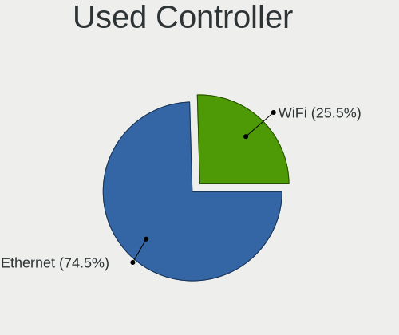

| Kind     | Desktops | Percent |
|----------|----------|---------|
| Ethernet | 489      | 74.54%  |
| WiFi     | 167      | 25.46%  |

NICs
----

Total network controllers on board

| Total | Desktops | Percent |
|-------|----------|---------|
| 1     | 487      | 75.98%  |
| 2     | 132      | 20.59%  |
| 3     | 18       | 2.81%   |
| 0     | 3        | 0.47%   |
| 5     | 1        | 0.16%   |

IPv6
----

IPv6 vs IPv4

| Used | Desktops | Percent |
|------|----------|---------|
| No   | 623      | 97.5%   |
| Yes  | 16       | 2.5%    |

Bluetooth
---------

Bluetooth Vendor
----------------

Controller vendors

| Vendor                          | Desktops | Percent |
|---------------------------------|----------|---------|
| Cambridge Silicon Radio         | 68       | 34%     |
| Intel                           | 61       | 30.5%   |
| ASUSTek Computer                | 16       | 8%      |
| Realtek Semiconductor           | 15       | 7.5%    |
| TP-Link                         | 9        | 4.5%    |
| Qualcomm Atheros Communications | 7        | 3.5%    |
| MediaTek                        | 6        | 3%      |
| IMC Networks                    | 5        | 2.5%    |
| Integrated System Solution      | 3        | 1.5%    |
| Foxconn / Hon Hai               | 2        | 1%      |
| Broadcom                        | 2        | 1%      |
| Apple                           | 2        | 1%      |
| Realtek                         | 1        | 0.5%    |
| HTC (High Tech Computer)        | 1        | 0.5%    |
| Actions                         | 1        | 0.5%    |
| Unknown                         | 1        | 0.5%    |

Bluetooth Model
---------------

Controller models

| Model                                                                | Desktops | Percent |
|----------------------------------------------------------------------|----------|---------|
| Cambridge Silicon Radio Bluetooth Dongle (HCI mode)                  | 68       | 34%     |
| Intel AX200 Bluetooth                                                | 22       | 11%     |
| Realtek Bluetooth Radio                                              | 11       | 5.5%    |
| TP-Link TP-Link Bluetooth USB Adapter                                | 9        | 4.5%    |
| Intel Bluetooth wireless interface                                   | 9        | 4.5%    |
| Intel AX201 Bluetooth                                                | 8        | 4%      |
| MediaTek Wireless_Device                                             | 6        | 3%      |
| Intel Wireless-AC 3168 Bluetooth                                     | 6        | 3%      |
| Intel AX210 Bluetooth                                                | 5        | 2.5%    |
| Intel AX211 Bluetooth                                                | 4        | 2%      |
| ASUS Bluetooth Adapter                                               | 4        | 2%      |
| Qualcomm Atheros  Bluetooth Device                                   | 3        | 1.5%    |
| Intel Wireless-AC 9260 Bluetooth Adapter                             | 3        | 1.5%    |
| Intel Bluetooth 9460/9560 Jefferson Peak (JfP)                       | 3        | 1.5%    |
| Integrated System Solution KY-BT100 Bluetooth Adapter                | 3        | 1.5%    |
| ASUS Qualcomm Bluetooth 4.1                                          | 3        | 1.5%    |
| ASUS Bluetooth Radio                                                 | 3        | 1.5%    |
| ASUS BCM20702A0                                                      | 3        | 1.5%    |
| Realtek RTL8821A Bluetooth                                           | 2        | 1%      |
| Qualcomm Atheros AR3011 Bluetooth                                    | 2        | 1%      |
| IMC Networks Bluetooth Radio                                         | 2        | 1%      |
| IMC Networks Bluetooth                                               | 2        | 1%      |
| Foxconn / Hon Hai Wireless_Device                                    | 2        | 1%      |
| Apple Bluetooth Host Controller                                      | 2        | 1%      |
| Realtek  Bluetooth 4.2 Adapter                                       | 1        | 0.5%    |
| Realtek 802.11ac WLAN Adapter                                        | 1        | 0.5%    |
| Realtek Bluetooth Radio                                              | 1        | 0.5%    |
| Qualcomm Atheros QCA61x4 Bluetooth 4.0                               | 1        | 0.5%    |
| Qualcomm Atheros AR3011 Bluetooth (no firmware)                      | 1        | 0.5%    |
| Intel Bluetooth Device                                               | 1        | 0.5%    |
| IMC Networks Wireless_Device                                         | 1        | 0.5%    |
| HTC (High Tech Computer) Vive Hub Bluetooth 4.1 (Broadcom BCM920703) | 1        | 0.5%    |
| Broadcom BCM20702A0 Bluetooth 4.0                                    | 1        | 0.5%    |
| Broadcom BCM2035B3 Bluetooth Adapter                                 | 1        | 0.5%    |
| ASUS BT-183 Bluetooth 2.0+EDR adapter                                | 1        | 0.5%    |
| ASUS Broadcom BCM20702 Single-Chip Bluetooth 4.0 + LE                | 1        | 0.5%    |
| ASUS Bluetooth Device                                                | 1        | 0.5%    |
| Actions general adapter                                              | 1        | 0.5%    |
| Unknown                                                              | 1        | 0.5%    |

Sound
-----

Sound Vendor
------------

Sound card vendors

| Vendor                                          | Desktops | Percent |
|-------------------------------------------------|----------|---------|
| Intel                                           | 375      | 33.54%  |
| AMD                                             | 352      | 31.48%  |
| Nvidia                                          | 238      | 21.29%  |
| C-Media Electronics                             | 24       | 2.15%   |
| Generalplus Technology                          | 11       | 0.98%   |
| SteelSeries ApS                                 | 10       | 0.89%   |
| ASUSTek Computer                                | 10       | 0.89%   |
| Barco Display Systems                           | 8        | 0.72%   |
| Logitech                                        | 7        | 0.63%   |
| JMTek                                           | 7        | 0.63%   |
| Creative Labs                                   | 7        | 0.63%   |
| Texas Instruments                               | 5        | 0.45%   |
| Kingston Technology                             | 5        | 0.45%   |
| VIA Technologies                                | 4        | 0.36%   |
| Tenx Technology                                 | 4        | 0.36%   |
| Micro Star International                        | 4        | 0.36%   |
| Thesycon Systemsoftware & Consulting            | 3        | 0.27%   |
| Razer USA                                       | 3        | 0.27%   |
| M-Audio                                         | 3        | 0.27%   |
| Focusrite-Novation                              | 3        | 0.27%   |
| Creative Technology                             | 3        | 0.27%   |
| Yamaha                                          | 2        | 0.18%   |
| Sony                                            | 2        | 0.18%   |
| Hewlett-Packard                                 | 2        | 0.18%   |
| Elite Silicon                                   | 2        | 0.18%   |
| Corsair                                         | 2        | 0.18%   |
| Blue Microphones                                | 2        | 0.18%   |
| Yealink Network Technology                      | 1        | 0.09%   |
| ULi Electronics                                 | 1        | 0.09%   |
| Trust                                           | 1        | 0.09%   |
| Silicon Integrated Systems [SiS]                | 1        | 0.09%   |
| RODE Microphones                                | 1        | 0.09%   |
| Plantronics                                     | 1        | 0.09%   |
| Native Instruments                              | 1        | 0.09%   |
| Medeli Electronics                              | 1        | 0.09%   |
| Licensed by Sony Computer Entertainment America | 1        | 0.09%   |
| GN Netcom                                       | 1        | 0.09%   |
| Global Sun Technology                           | 1        | 0.09%   |
| Evolution Electronics                           | 1        | 0.09%   |
| Earth Computer Technologies                     | 1        | 0.09%   |

Sound Model
-----------

Sound card models

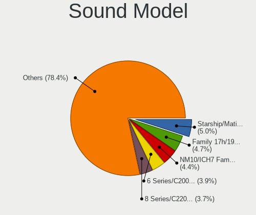

| Model                                                                             | Desktops | Percent |
|-----------------------------------------------------------------------------------|----------|---------|
| AMD Starship/Matisse HD Audio Controller                                          | 65       | 4.97%   |
| AMD Family 17h/19h/1ah HD Audio Controller                                        | 61       | 4.66%   |
| Intel NM10/ICH7 Family High Definition Audio Controller                           | 58       | 4.43%   |
| Intel 6 Series/C200 Series Chipset Family High Definition Audio Controller        | 51       | 3.9%    |
| Intel 8 Series/C220 Series Chipset High Definition Audio Controller               | 48       | 3.67%   |
| AMD SBx00 Azalia (Intel HDA)                                                      | 48       | 3.67%   |
| AMD Family 17h (Models 00h-0fh) HD Audio Controller                               | 45       | 3.44%   |
| Intel 200 Series PCH HD Audio                                                     | 36       | 2.75%   |
| AMD Ellesmere HDMI Audio [Radeon RX 470/480 / 570/580/590]                        | 33       | 2.52%   |
| AMD Oland/Hainan/Cape Verde/Pitcairn HDMI Audio [Radeon HD 7000 Series]           | 30       | 2.29%   |
| AMD Navi 21/23 HDMI/DP Audio Controller                                           | 30       | 2.29%   |
| Nvidia GF108 High Definition Audio Controller                                     | 28       | 2.14%   |
| Nvidia GP107GL High Definition Audio Controller                                   | 27       | 2.06%   |
| Intel Xeon E3-1200 v3/4th Gen Core Processor HD Audio Controller                  | 27       | 2.06%   |
| Nvidia TU116 High Definition Audio Controller                                     | 25       | 1.91%   |
| Intel 100 Series/C230 Series Chipset Family HD Audio Controller                   | 23       | 1.76%   |
| AMD Baffin HDMI/DP Audio [Radeon RX 550 640SP / RX 560/560X]                      | 23       | 1.76%   |
| Intel 7 Series/C216 Chipset Family High Definition Audio Controller               | 22       | 1.68%   |
| AMD Renoir Radeon High Definition Audio Controller                                | 21       | 1.6%    |
| Intel 5 Series/3400 Series Chipset High Definition Audio                          | 17       | 1.3%    |
| AMD Raven/Raven2/Fenghuang HDMI/DP Audio Controller                               | 16       | 1.22%   |
| AMD Rembrandt Radeon High Definition Audio Controller                             | 15       | 1.15%   |
| AMD Cedar HDMI Audio [Radeon HD 5400/6300/7300 Series]                            | 15       | 1.15%   |
| Intel 82801JI (ICH10 Family) HD Audio Controller                                  | 14       | 1.07%   |
| Nvidia TU106 High Definition Audio Controller                                     | 13       | 0.99%   |
| Nvidia GK208 HDMI/DP Audio Controller                                             | 13       | 0.99%   |
| Intel Alder Lake-S HD Audio Controller                                            | 13       | 0.99%   |
| AMD Turks HDMI Audio [Radeon HD 6500/6600 / 6700M Series]                         | 13       | 0.99%   |
| AMD FCH Azalia Controller                                                         | 13       | 0.99%   |
| Nvidia GA104 High Definition Audio Controller                                     | 12       | 0.92%   |
| Intel Comet Lake PCH cAVS                                                         | 12       | 0.92%   |
| AMD RV710/730 HDMI Audio [Radeon HD 4000 series]                                  | 12       | 0.92%   |
| Nvidia MCP61 High Definition Audio                                                | 11       | 0.84%   |
| Generalplus Technology USB Audio Device                                           | 11       | 0.84%   |
| Nvidia GP106 High Definition Audio Controller                                     | 10       | 0.76%   |
| Intel Raptor Lake High Definition Audio Controller                                | 10       | 0.76%   |
| Intel Cannon Lake PCH cAVS                                                        | 10       | 0.76%   |
| Intel 82801I (ICH9 Family) HD Audio Controller                                    | 10       | 0.76%   |
| Intel Tiger Lake-H HD Audio Controller                                            | 8        | 0.61%   |
| AMD Caicos HDMI Audio [Radeon HD 6450 / 7450/8450/8490 OEM / R5 230/235/235X OEM] | 8        | 0.61%   |

Memory
------

Memory Vendor
-------------

Memory module vendors

| Vendor              | Desktops | Percent |
|---------------------|----------|---------|
| Kingston            | 73       | 20.33%  |
| Unknown             | 66       | 18.38%  |
| G.Skill             | 47       | 13.09%  |
| Corsair             | 45       | 12.53%  |
| Samsung Electronics | 25       | 6.96%   |
| Crucial             | 23       | 6.41%   |
| Micron Technology   | 14       | 3.9%    |
| A-DATA Technology   | 14       | 3.9%    |
| Unknown             | 12       | 3.34%   |
| SK hynix            | 9        | 2.51%   |
| Team                | 7        | 1.95%   |
| Goldkey             | 4        | 1.11%   |
| Nanya Technology    | 3        | 0.84%   |
| Neo Forza           | 2        | 0.56%   |
| Hikvision           | 2        | 0.56%   |
| Unknown (ABCD)      | 1        | 0.28%   |
| Unknown (07FB)      | 1        | 0.28%   |
| Silicon Power       | 1        | 0.28%   |
| Patriot             | 1        | 0.28%   |
| Kllisre             | 1        | 0.28%   |
| Kingmax             | 1        | 0.28%   |
| Hewlett-Packard     | 1        | 0.28%   |
| Golden Empire       | 1        | 0.28%   |
| Gold Key            | 1        | 0.28%   |
| Avant               | 1        | 0.28%   |
| ASint Technology    | 1        | 0.28%   |
| Apacer              | 1        | 0.28%   |
| 48spaces            | 1        | 0.28%   |

Memory Model
------------

Memory module models

| Model                                                    | Desktops | Percent |
|----------------------------------------------------------|----------|---------|
| Unknown                                                  | 12       | 2.99%   |
| Unknown RAM Module 4GB DIMM SDRAM                        | 6        | 1.49%   |
| Unknown RAM Module 2GB DIMM 800MT/s                      | 6        | 1.49%   |
| G.Skill RAM F4-3000C16-8GVRB 8GB DIMM DDR4 3200MT/s      | 6        | 1.49%   |
| Corsair RAM CMK8GX4M1D3000C16 8GB DIMM DDR4 3600MT/s     | 6        | 1.49%   |
| Unknown RAM Module 8GB DIMM DDR3 1333MT/s                | 5        | 1.24%   |
| Unknown RAM Module 1GB DIMM 667MT/s                      | 5        | 1.24%   |
| Kingston RAM KF3200C16D4/8GX 8GB DIMM DDR4 3600MT/s      | 5        | 1.24%   |
| Kingston RAM 99U5471-012.A00LF 4GB DIMM DDR3 1333MT/s    | 5        | 1.24%   |
| G.Skill RAM F4-3200C16-8GVKB 8GB DIMM DDR4 4000MT/s      | 5        | 1.24%   |
| Unknown RAM Module 4GB DIMM                              | 4        | 1%      |
| G.Skill RAM F3-1600C9-8GXM 8GB DIMM DDR3 1867MT/s        | 4        | 1%      |
| Corsair RAM CMK8GX4M1A2400C16 8GB DIMM DDR4 3066MT/s     | 4        | 1%      |
| Corsair RAM CMK16GX4M2E3200C16 8GB DIMM DDR4 3466MT/s    | 4        | 1%      |
| A-DATA RAM DDR4 3000 8GB DIMM DDR4 3600MT/s              | 4        | 1%      |
| Unknown RAM Module 2GB DIMM                              | 3        | 0.75%   |
| Kingston RAM KHX3200C16D4/8GX 8GB DIMM DDR4 3733MT/s     | 3        | 0.75%   |
| Kingston RAM KHX2400C15/8G 8GB DIMM DDR4 3400MT/s        | 3        | 0.75%   |
| Kingston RAM 99U5474-028.A00LF 4GB DIMM DDR3 1333MT/s    | 3        | 0.75%   |
| G.Skill RAM F4-3200C16-16GVK 16GB DIMM DDR4 3600MT/s     | 3        | 0.75%   |
| G.Skill RAM F4-3000C16-16GVRB 16GB DIMM DDR4 3200MT/s    | 3        | 0.75%   |
| Crucial RAM CT102464BA160B.C16 8192MB DIMM DDR3 1600MT/s | 3        | 0.75%   |
| Corsair RAM CML4GX3M1A1600C9 4GB DIMM DDR3 1600MT/s      | 3        | 0.75%   |
| Corsair RAM CMK8GX4M1A2400C14 8GB DIMM DDR4 2800MT/s     | 3        | 0.75%   |
| A-DATA RAM DDR4 3000 2OZ 8GB DIMM DDR4 3000MT/s          | 3        | 0.75%   |
| Unknown RAM Module 4GB DIMM 800MT/s                      | 2        | 0.5%    |
| Unknown RAM Module 4GB DIMM 400MT/s                      | 2        | 0.5%    |
| Unknown RAM Module 4GB DIMM 1600MT/s                     | 2        | 0.5%    |
| Unknown RAM Module 2GB DIMM DDR2                         | 2        | 0.5%    |
| Unknown RAM Module 2GB DIMM 667MT/s                      | 2        | 0.5%    |
| Unknown RAM Module 2GB DIMM 400MT/s                      | 2        | 0.5%    |
| Unknown RAM Module 2048MB DIMM 800MT/s                   | 2        | 0.5%    |
| Unknown RAM Module 2048MB DIMM 667MT/s                   | 2        | 0.5%    |
| Team RAM TEAMGROUP-UD4-3600 8GB DIMM DDR4 3733MT/s       | 2        | 0.5%    |
| Team RAM TEAMGROUP-UD4-3000 8GB DIMM DDR4 3200MT/s       | 2        | 0.5%    |
| SK hynix RAM HMT451U6AFR8C-PB 4GB DIMM DDR3 1600MT/s     | 2        | 0.5%    |
| Samsung RAM Module 2GB DIMM DDR3 1333MT/s                | 2        | 0.5%    |
| Samsung RAM M471A5244CB0-CWE 4096MB SODIMM DDR4 3200MT/s | 2        | 0.5%    |
| Samsung RAM M378B5773DH0-CH9 2048MB DIMM DDR3 1333MT/s   | 2        | 0.5%    |
| Micron RAM Module 2GB DIMM DDR3 1333MT/s                 | 2        | 0.5%    |

Memory Kind
-----------

Memory module kinds

| Kind    | Desktops | Percent |
|---------|----------|---------|
| DDR4    | 156      | 49.68%  |
| DDR3    | 75       | 23.89%  |
| Unknown | 36       | 11.46%  |
| SDRAM   | 17       | 5.41%   |
| DDR5    | 16       | 5.1%    |
| DDR2    | 12       | 3.82%   |
| LPDDR4  | 2        | 0.64%   |

Memory Form Factor
------------------

Physical design of the memory module

| Name   | Desktops | Percent |
|--------|----------|---------|
| DIMM   | 295      | 95.16%  |
| SODIMM | 14       | 4.52%   |
| RIMM   | 1        | 0.32%   |

Memory Size
-----------

Memory module size

| Size  | Desktops | Percent |
|-------|----------|---------|
| 8192  | 137      | 38.81%  |
| 4096  | 68       | 19.26%  |
| 16384 | 63       | 17.85%  |
| 2048  | 45       | 12.75%  |
| 32768 | 21       | 5.95%   |
| 1024  | 14       | 3.97%   |
| 512   | 2        | 0.57%   |
| 65536 | 1        | 0.28%   |
| 49152 | 1        | 0.28%   |
| 24576 | 1        | 0.28%   |

Memory Speed
------------

Memory module speed

| Speed   | Desktops | Percent |
|---------|----------|---------|
| 3200    | 46       | 12.92%  |
| 1600    | 41       | 11.52%  |
| 3600    | 35       | 9.83%   |
| 1333    | 29       | 8.15%   |
| 2400    | 24       | 6.74%   |
| Unknown | 19       | 5.34%   |
| 2667    | 16       | 4.49%   |
| 800     | 16       | 4.49%   |
| 667     | 12       | 3.37%   |
| 2133    | 11       | 3.09%   |
| 1867    | 10       | 2.81%   |
| 3000    | 9        | 2.53%   |
| 3400    | 7        | 1.97%   |
| 4000    | 6        | 1.69%   |
| 3733    | 6        | 1.69%   |
| 3466    | 6        | 1.69%   |
| 6000    | 5        | 1.4%    |
| 400     | 5        | 1.4%    |
| 6400    | 4        | 1.12%   |
| 3066    | 4        | 1.12%   |
| 1866    | 4        | 1.12%   |
| 1066    | 4        | 1.12%   |
| 4800    | 3        | 0.84%   |
| 3800    | 3        | 0.84%   |
| 2800    | 3        | 0.84%   |
| 1334    | 3        | 0.84%   |
| 5600    | 2        | 0.56%   |
| 2933    | 2        | 0.56%   |
| 2666    | 2        | 0.56%   |
| 55438   | 1        | 0.28%   |
| 50410   | 1        | 0.28%   |
| 37655   | 1        | 0.28%   |
| 5808    | 1        | 0.28%   |
| 5200    | 1        | 0.28%   |
| 4133    | 1        | 0.28%   |
| 3666    | 1        | 0.28%   |
| 3266    | 1        | 0.28%   |
| 3151    | 1        | 0.28%   |
| 3100    | 1        | 0.28%   |
| 2733    | 1        | 0.28%   |

Printers & scanners
-------------------

Printer Vendor
--------------

Printer device vendors

| Vendor              | Desktops | Percent |
|---------------------|----------|---------|
| Hewlett-Packard     | 10       | 29.41%  |
| Canon               | 9        | 26.47%  |
| Zebra               | 4        | 11.76%  |
| Seiko Epson         | 4        | 11.76%  |
| Samsung Electronics | 2        | 5.88%   |
| Oki Data            | 2        | 5.88%   |
| Brother Industries  | 2        | 5.88%   |
| XiaoMi              | 1        | 2.94%   |

Printer Model
-------------

Printer device models

| Model                            | Desktops | Percent |
|----------------------------------|----------|---------|
| Zebra TLP2844                    | 3        | 8.57%   |
| Canon E410 series                | 3        | 8.57%   |
| Samsung M2020 Series             | 2        | 5.71%   |
| HP LaserJet P2055 series         | 2        | 5.71%   |
| HP LaserJet M101-M106            | 2        | 5.71%   |
| HP LaserJet 1010                 | 2        | 5.71%   |
| Zebra Zebra GC420d Label Printer | 1        | 2.86%   |
| XiaoMi MIIIW MECH-KBPro          | 1        | 2.86%   |
| Seiko Epson L386 Series          | 1        | 2.86%   |
| Seiko Epson L382 Series          | 1        | 2.86%   |
| Seiko Epson L3110 Series         | 1        | 2.86%   |
| Seiko Epson L210 Series          | 1        | 2.86%   |
| Oki Data Oki_ML3320              | 1        | 2.86%   |
| Oki Data Oki Printer             | 1        | 2.86%   |
| HP LaserJet 1020                 | 1        | 2.86%   |
| HP DeskJet Plus 4100 series      | 1        | 2.86%   |
| HP DeskJet F2100 Printer series  | 1        | 2.86%   |
| HP DeskJet 3830 series           | 1        | 2.86%   |
| HP DeskJet 2130 series           | 1        | 2.86%   |
| Canon PIXMA MG3000 series        | 1        | 2.86%   |
| Canon LBP6000                    | 1        | 2.86%   |
| Canon G3020 series               | 1        | 2.86%   |
| Canon G3010 series               | 1        | 2.86%   |
| Canon E460 series                | 1        | 2.86%   |
| Canon CAPT USB Device            | 1        | 2.86%   |
| Brother Printer                  | 1        | 2.86%   |
| Brother DCP-1510                 | 1        | 2.86%   |

Scanner Vendor
--------------

Scanner device vendors

| Vendor         | Desktops | Percent |
|----------------|----------|---------|
| Mustek Systems | 1        | 50%     |
| Canon          | 1        | 50%     |

Scanner Model
-------------

Scanner device models

| Model                              | Desktops | Percent |
|------------------------------------|----------|---------|
| Mustek Systems ScanExpress 1200 UB | 1        | 50%     |
| Canon CanoScan LiDE 210            | 1        | 50%     |

Camera
------

Camera Vendor
-------------

Camera device vendors

| Vendor                   | Desktops | Percent |
|--------------------------|----------|---------|
| Logitech                 | 28       | 34.57%  |
| Z-Star Microelectronics  | 8        | 9.88%   |
| Samsung Electronics      | 5        | 6.17%   |
| Microdia                 | 5        | 6.17%   |
| Alcor Micro              | 4        | 4.94%   |
| Microsoft                | 3        | 3.7%    |
| MacroSilicon             | 3        | 3.7%    |
| Jieli Technology         | 3        | 3.7%    |
| Arkmicro Technologies    | 3        | 3.7%    |
| Realtek Semiconductor    | 2        | 2.47%   |
| Novatek Microelectronics | 2        | 2.47%   |
| Creative Technology      | 2        | 2.47%   |
| Chicony Electronics      | 2        | 2.47%   |
| Apple                    | 2        | 2.47%   |
| Sonix Technology         | 1        | 1.23%   |
| Pixart Imaging           | 1        | 1.23%   |
| Novatel Wireless         | 1        | 1.23%   |
| Google                   | 1        | 1.23%   |
| Genesys Logic            | 1        | 1.23%   |
| Generalplus Technology   | 1        | 1.23%   |
| GEMBIRD                  | 1        | 1.23%   |
| eMPIA Technology         | 1        | 1.23%   |
| Allwinner Technology     | 1        | 1.23%   |

Camera Model
------------

Camera device models

| Model                                       | Desktops | Percent |
|---------------------------------------------|----------|---------|
| Logitech Webcam C270                        | 6        | 7.32%   |
| Samsung Galaxy series, misc. (MTP mode)     | 5        | 6.1%    |
| Logitech Webcam C310                        | 5        | 6.1%    |
| Alcor Micro USB 2.0 PC Camera               | 4        | 4.88%   |
| Z-Star A4 TECH HD PC Camera                 | 3        | 3.66%   |
| MacroSilicon USB Video                      | 3        | 3.66%   |
| Logitech HD Webcam C525                     | 3        | 3.66%   |
| Logitech HD Pro Webcam C920                 | 3        | 3.66%   |
| Logitech C922 Pro Stream Webcam             | 3        | 3.66%   |
| Jieli USB PHY 2.0                           | 3        | 3.66%   |
| Z-Star Venus USB2.0 Camera                  | 2        | 2.44%   |
| Microdia Integrated Camera                  | 2        | 2.44%   |
| Logitech StreamCam                          | 2        | 2.44%   |
| Creative Live! Cam Sync 1080p V2            | 2        | 2.44%   |
| Arkmicro USB2.0 PC CAMERA                   | 2        | 2.44%   |
| Apple iPhone 5/5C/5S/6/SE/7/8/X/XR          | 2        | 2.44%   |
| Z-Star Vimicro USB Camera (Altair)          | 1        | 1.22%   |
| Z-Star Sirius USB2.0 Camera                 | 1        | 1.22%   |
| Z-Star A4 TECH USB2.0 PC Camera J           | 1        | 1.22%   |
| Sonix USB 2.0 Camera                        | 1        | 1.22%   |
| Realtek USB Camera                          | 1        | 1.22%   |
| Realtek HP 2.0MP High Definition Webcam     | 1        | 1.22%   |
| Pixart Imaging GE 1.3 MP MiniCam Pro        | 1        | 1.22%   |
| Novatel Wireless Merlin U740 (non-Vodafone) | 1        | 1.22%   |
| Novatek USB HD Camera                       | 1        | 1.22%   |
| Novatek HP High Definition 2MP Webcam       | 1        | 1.22%   |
| Microsoft LifeCam Studio                    | 1        | 1.22%   |
| Microsoft LifeCam HD-5000                   | 1        | 1.22%   |
| Microsoft LifeCam HD-3000                   | 1        | 1.22%   |
| Microdia Webcam Vitade AF                   | 1        | 1.22%   |
| Microdia USB 2.0 Camera                     | 1        | 1.22%   |
| Microdia Sonix USB 2.0 Camera               | 1        | 1.22%   |
| Logitech Webcam C930e                       | 1        | 1.22%   |
| Logitech Webcam C300                        | 1        | 1.22%   |
| Logitech Webcam C110                        | 1        | 1.22%   |
| Logitech QuickCam Communicate MP/S5500      | 1        | 1.22%   |
| Logitech HD Webcam C910                     | 1        | 1.22%   |
| Logitech Brio 500                           | 1        | 1.22%   |
| Logitech Brio 100                           | 1        | 1.22%   |
| Google Nexus/Pixel Device (MTP + debug)     | 1        | 1.22%   |

Security
--------

Fingerprint Vendor
------------------

Fingerprint sensor vendors

| Vendor           | Desktops | Percent |
|------------------|----------|---------|
| Validity Sensors | 1        | 100%    |

Fingerprint Model
-----------------

Fingerprint sensor models

| Model                                        | Desktops | Percent |
|----------------------------------------------|----------|---------|
| Validity Sensors VFS 5011 fingerprint sensor | 1        | 100%    |

Chipcard Vendor
---------------

Chipcard module vendors

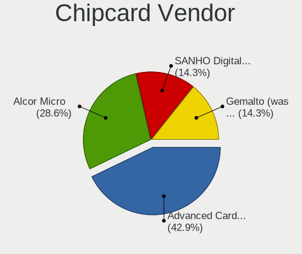

| Vendor                    | Desktops | Percent |
|---------------------------|----------|---------|
| Advanced Card Systems     | 3        | 42.86%  |
| Alcor Micro               | 2        | 28.57%  |
| SANHO Digital Electronics | 1        | 14.29%  |
| Gemalto (was Gemplus)     | 1        | 14.29%  |

Chipcard Model
--------------

Chipcard module models

| Model                                            | Desktops | Percent |
|--------------------------------------------------|----------|---------|
| Alcor Micro AU9540 Smartcard Reader              | 2        | 28.57%  |
| Advanced Card Systems ACR38 SmartCard Reader     | 2        | 28.57%  |
| SANHO Digital Electronics ATR19                  | 1        | 14.29%  |
| Gemalto (was Gemplus) GemPC Key SmartCard Reader | 1        | 14.29%  |
| Advanced Card Systems ACR39U                     | 1        | 14.29%  |

Unsupported
-----------

Unsupported Devices
-------------------

Total unsupported devices on board

| Total | Desktops | Percent |
|-------|----------|---------|
| 0     | 550      | 84.36%  |
| 1     | 87       | 13.34%  |
| 2     | 13       | 1.99%   |
| 4     | 1        | 0.15%   |
| 3     | 1        | 0.15%   |

Unsupported Device Types
------------------------

Types of unsupported devices

| Type                     | Desktops | Percent |
|--------------------------|----------|---------|
| Graphics card            | 48       | 42.11%  |
| Net/wireless             | 19       | 16.67%  |
| Communication controller | 8        | 7.02%   |
| Network                  | 5        | 4.39%   |
| Net/ethernet             | 5        | 4.39%   |
| Multimedia controller    | 5        | 4.39%   |
| Chipcard                 | 5        | 4.39%   |
| Unassigned class         | 4        | 3.51%   |
| Sound                    | 4        | 3.51%   |
| Storage/raid             | 3        | 2.63%   |
| Camera                   | 3        | 2.63%   |
| Storage/ata              | 2        | 1.75%   |
| Storage/ide              | 1        | 0.88%   |
| Fingerprint reader       | 1        | 0.88%   |
| Bluetooth                | 1        | 0.88%   |

