Linux in Turkey - Tested Hardware & Statistics (Notebooks)
----------------------------------------------------------

A project to collect tested hardware configurations for Linux in Turkey.

Anyone can contribute to this report by the [hw-probe](https://github.com/linuxhw/hw-probe) tool:

    sudo -E hw-probe -all -upload

Please contribute! Especially if your hardware is rare.

Contents
--------

* [ Test Cases ](#test-cases)

* [ System ](#system)
  - [ OS                       ](#os)
  - [ OS Family                ](#os-family)
  - [ Kernel                   ](#kernel)
  - [ Kernel Family            ](#kernel-family)
  - [ Kernel Major Ver.        ](#kernel-major-ver)
  - [ Arch                     ](#arch)
  - [ DE                       ](#de)
  - [ Display Server           ](#display-server)
  - [ Display Manager          ](#display-manager)
  - [ OS Lang                  ](#os-lang)
  - [ Boot Mode                ](#boot-mode)
  - [ Filesystem               ](#filesystem)
  - [ Part. scheme             ](#part-scheme)
  - [ Dual Boot with Linux/BSD ](#dual-boot-with-linuxbsd)
  - [ Dual Boot (Win)          ](#dual-boot-win)

* [ Board ](#board)
  - [ Vendor                   ](#vendor)
  - [ Model                    ](#model)
  - [ Model Family             ](#model-family)
  - [ MFG Year                 ](#mfg-year)
  - [ Form Factor              ](#form-factor)
  - [ Secure Boot              ](#secure-boot)
  - [ Coreboot                 ](#coreboot)
  - [ RAM Size                 ](#ram-size)
  - [ RAM Used                 ](#ram-used)
  - [ Total Drives             ](#total-drives)
  - [ Has CD-ROM               ](#has-cd-rom)
  - [ Has Ethernet             ](#has-ethernet)
  - [ Has WiFi                 ](#has-wifi)
  - [ Has Bluetooth            ](#has-bluetooth)

* [ Location ](#location)
  - [ Country                  ](#country)
  - [ City                     ](#city)

* [ Drives ](#drives)
  - [ Drive Vendor             ](#drive-vendor)
  - [ Drive Model              ](#drive-model)
  - [ HDD Vendor               ](#hdd-vendor)
  - [ SSD Vendor               ](#ssd-vendor)
  - [ Drive Kind               ](#drive-kind)
  - [ Drive Connector          ](#drive-connector)
  - [ Drive Size               ](#drive-size)
  - [ Space Total              ](#space-total)
  - [ Space Used               ](#space-used)
  - [ Malfunc. Drives          ](#malfunc-drives)
  - [ Malfunc. Drive Vendor    ](#malfunc-drive-vendor)
  - [ Malfunc. HDD Vendor      ](#malfunc-hdd-vendor)
  - [ Malfunc. Drive Kind      ](#malfunc-drive-kind)
  - [ Failed Drives            ](#failed-drives)
  - [ Failed Drive Vendor      ](#failed-drive-vendor)
  - [ Drive Status             ](#drive-status)

* [ Storage controller ](#storage-controller)
  - [ Storage Vendor           ](#storage-vendor)
  - [ Storage Model            ](#storage-model)
  - [ Storage Kind             ](#storage-kind)

* [ Processor ](#processor)
  - [ CPU Vendor               ](#cpu-vendor)
  - [ CPU Model                ](#cpu-model)
  - [ CPU Model Family         ](#cpu-model-family)
  - [ CPU Cores                ](#cpu-cores)
  - [ CPU Sockets              ](#cpu-sockets)
  - [ CPU Threads              ](#cpu-threads)
  - [ CPU Op-Modes             ](#cpu-op-modes)
  - [ CPU Microcode            ](#cpu-microcode)
  - [ CPU Microarch            ](#cpu-microarch)

* [ Graphics ](#graphics)
  - [ GPU Vendor               ](#gpu-vendor)
  - [ GPU Model                ](#gpu-model)
  - [ GPU Combo                ](#gpu-combo)
  - [ GPU Driver               ](#gpu-driver)
  - [ GPU Memory               ](#gpu-memory)

* [ Monitor ](#monitor)
  - [ Monitor Vendor           ](#monitor-vendor)
  - [ Monitor Model            ](#monitor-model)
  - [ Monitor Resolution       ](#monitor-resolution)
  - [ Monitor Diagonal         ](#monitor-diagonal)
  - [ Monitor Width            ](#monitor-width)
  - [ Aspect Ratio             ](#aspect-ratio)
  - [ Monitor Area             ](#monitor-area)
  - [ Pixel Density            ](#pixel-density)
  - [ Multiple Monitors        ](#multiple-monitors)

* [ Network ](#network)
  - [ Net Controller Vendor    ](#net-controller-vendor)
  - [ Net Controller Model     ](#net-controller-model)
  - [ Wireless Vendor          ](#wireless-vendor)
  - [ Wireless Model           ](#wireless-model)
  - [ Ethernet Vendor          ](#ethernet-vendor)
  - [ Ethernet Model           ](#ethernet-model)
  - [ Net Controller Kind      ](#net-controller-kind)
  - [ Used Controller          ](#used-controller)
  - [ NICs                     ](#nics)
  - [ IPv6                     ](#ipv6)

* [ Bluetooth ](#bluetooth)
  - [ Bluetooth Vendor         ](#bluetooth-vendor)
  - [ Bluetooth Model          ](#bluetooth-model)

* [ Sound ](#sound)
  - [ Sound Vendor             ](#sound-vendor)
  - [ Sound Model              ](#sound-model)

* [ Memory ](#memory)
  - [ Memory Vendor            ](#memory-vendor)
  - [ Memory Model             ](#memory-model)
  - [ Memory Kind              ](#memory-kind)
  - [ Memory Form Factor       ](#memory-form-factor)
  - [ Memory Size              ](#memory-size)
  - [ Memory Speed             ](#memory-speed)

* [ Printers & scanners ](#printers--scanners)
  - [ Printer Vendor           ](#printer-vendor)
  - [ Printer Model            ](#printer-model)
  - [ Scanner Vendor           ](#scanner-vendor)
  - [ Scanner Model            ](#scanner-model)

* [ Camera ](#camera)
  - [ Camera Vendor            ](#camera-vendor)
  - [ Camera Model             ](#camera-model)

* [ Security ](#security)
  - [ Fingerprint Vendor       ](#fingerprint-vendor)
  - [ Fingerprint Model        ](#fingerprint-model)
  - [ Chipcard Vendor          ](#chipcard-vendor)
  - [ Chipcard Model           ](#chipcard-model)

* [ Unsupported ](#unsupported)
  - [ Unsupported Devices      ](#unsupported-devices)
  - [ Unsupported Device Types ](#unsupported-device-types)

Test Cases
----------

Total: 3312

| Vendor        | Model                       | Probe                                                      | Date         |
|---------------|-----------------------------|------------------------------------------------------------|--------------|
| Lenovo        | IdeaPad Gaming 3 15ARH05... | [a6b7bccaea](https://linux-hardware.org/?probe=a6b7bccaea) | Jan 03, 2026 |
| Casper        | NIRVANA NB X600             | [daa2265e30](https://linux-hardware.org/?probe=daa2265e30) | Jan 02, 2026 |
| Casper        | NIRVANA NB X600             | [49ebf42228](https://linux-hardware.org/?probe=49ebf42228) | Jan 02, 2026 |
| Monster       | ABRA A5 V15.2               | [f8a69dc929](https://linux-hardware.org/?probe=f8a69dc929) | Jan 01, 2026 |
| Acer          | TravelMate P215-41-G2       | [359426ffd0](https://linux-hardware.org/?probe=359426ffd0) | Dec 31, 2025 |
| ASUSTek       | ASUS TUF Gaming F15 FX50... | [c86fe255b1](https://linux-hardware.org/?probe=c86fe255b1) | Dec 30, 2025 |
| HP            | Victus by Gaming Laptop ... | [7e060dcd5a](https://linux-hardware.org/?probe=7e060dcd5a) | Dec 30, 2025 |
| Casper        | W7x0S                       | [317a6fe3a1](https://linux-hardware.org/?probe=317a6fe3a1) | Dec 28, 2025 |
| Dell          | Latitude 3550               | [4b4d1cfb08](https://linux-hardware.org/?probe=4b4d1cfb08) | Dec 28, 2025 |
| HUAWEI        | MDF-XX                      | [d168addfd2](https://linux-hardware.org/?probe=d168addfd2) | Dec 28, 2025 |
| Dell          | Inspiron 15 7000 Gaming     | [bb43d15909](https://linux-hardware.org/?probe=bb43d15909) | Dec 28, 2025 |
| Lenovo        | ThinkPad E15 Gen 2 20T9S... | [6564838a80](https://linux-hardware.org/?probe=6564838a80) | Dec 28, 2025 |
| Lenovo        | ThinkPad E15 Gen 2 20T9S... | [2f55a24131](https://linux-hardware.org/?probe=2f55a24131) | Dec 28, 2025 |
| Lenovo        | LOQ 15IRX10 83JE            | [4f87fa6e25](https://linux-hardware.org/?probe=4f87fa6e25) | Dec 27, 2025 |
| ASUSTek       | ASUS EXPERTBOOK PM3406CK... | [71b5f3b05b](https://linux-hardware.org/?probe=71b5f3b05b) | Dec 26, 2025 |
| Lenovo        | Yoga Pro 7 14ASP10 83LX     | [b0fca89a45](https://linux-hardware.org/?probe=b0fca89a45) | Dec 26, 2025 |
| ASUSTek       | ASUS TUF Gaming A16 FA60... | [5a928c58ee](https://linux-hardware.org/?probe=5a928c58ee) | Dec 25, 2025 |
| HP            | 250 G4                      | [2ccbefe156](https://linux-hardware.org/?probe=2ccbefe156) | Dec 25, 2025 |
| Monster       | HUMA H4 V6.1                | [cb037977c7](https://linux-hardware.org/?probe=cb037977c7) | Dec 25, 2025 |
| Samsung       | 270E5G/270E5U               | [a4cd4e3d1a](https://linux-hardware.org/?probe=a4cd4e3d1a) | Dec 25, 2025 |
| HP            | Victus by Gaming Laptop ... | [ac87958f10](https://linux-hardware.org/?probe=ac87958f10) | Dec 24, 2025 |
| Apple         | MacBookPro10,1              | [6d535dd1b0](https://linux-hardware.org/?probe=6d535dd1b0) | Dec 23, 2025 |
| HP            | Victus by Gaming Laptop ... | [de326c5caf](https://linux-hardware.org/?probe=de326c5caf) | Dec 23, 2025 |
| Dell          | Latitude 7450               | [3fd0c9e8d3](https://linux-hardware.org/?probe=3fd0c9e8d3) | Dec 22, 2025 |
| Monster       | HUMA H4 V6.1                | [c90f16dfa8](https://linux-hardware.org/?probe=c90f16dfa8) | Dec 22, 2025 |
| Casper        | W7x0S                       | [2620e4e75d](https://linux-hardware.org/?probe=2620e4e75d) | Dec 21, 2025 |
| Monster       | HUMA H4 V6.1                | [a98517af0d](https://linux-hardware.org/?probe=a98517af0d) | Dec 21, 2025 |
| Monster       | HUMA H4 V6.1                | [a1c122c47d](https://linux-hardware.org/?probe=a1c122c47d) | Dec 21, 2025 |
| Lenovo        | LOQ 15IRX10 83JE            | [9b4fe801c6](https://linux-hardware.org/?probe=9b4fe801c6) | Dec 21, 2025 |
| Dell          | Latitude 3550               | [2ecdf935a3](https://linux-hardware.org/?probe=2ecdf935a3) | Dec 20, 2025 |
| MSI           | Katana A17 AI B8VG          | [ef94950fbf](https://linux-hardware.org/?probe=ef94950fbf) | Dec 20, 2025 |
| HUAWEI        | BoDE-WXX9                   | [285b36fe1e](https://linux-hardware.org/?probe=285b36fe1e) | Dec 19, 2025 |
| Lenovo        | IdeaPad 700-15ISK 80RU      | [b8962f11a1](https://linux-hardware.org/?probe=b8962f11a1) | Dec 18, 2025 |
| HP            | ENVY 15                     | [9094712b4b](https://linux-hardware.org/?probe=9094712b4b) | Dec 18, 2025 |
| HP            | Victus by Gaming Laptop ... | [761d364cfa](https://linux-hardware.org/?probe=761d364cfa) | Dec 16, 2025 |
| HUAWEI        | BoDE-WXX9                   | [07a72eed95](https://linux-hardware.org/?probe=07a72eed95) | Dec 15, 2025 |
| Toshiba       | Satellite C855-2DG          | [87346741d9](https://linux-hardware.org/?probe=87346741d9) | Dec 15, 2025 |
| ASUSTek       | ASUS TUF Gaming F15 FX50... | [d3177a072d](https://linux-hardware.org/?probe=d3177a072d) | Dec 15, 2025 |
| HP            | 250 G7 Notebook PC          | [e14569c913](https://linux-hardware.org/?probe=e14569c913) | Dec 14, 2025 |
| Toshiba       | Satellite C855-2DG          | [7444bc0e10](https://linux-hardware.org/?probe=7444bc0e10) | Dec 14, 2025 |
| ASUSTek       | ASUS TUF Gaming A15 FA50... | [284b0c2ca7](https://linux-hardware.org/?probe=284b0c2ca7) | Dec 13, 2025 |
| ASUSTek       | N56VZ                       | [34a4e6d6c7](https://linux-hardware.org/?probe=34a4e6d6c7) | Dec 12, 2025 |
| Lenovo        | G510 20238                  | [fcb2f0a6b9](https://linux-hardware.org/?probe=fcb2f0a6b9) | Dec 12, 2025 |
| Lenovo        | ThinkBook 16 G6 ABP 21KK    | [0d70029e5b](https://linux-hardware.org/?probe=0d70029e5b) | Dec 11, 2025 |
| Lenovo        | ThinkBook 16 G6 ABP 21KK    | [241dee0789](https://linux-hardware.org/?probe=241dee0789) | Dec 11, 2025 |
| Lenovo        | ThinkPad E595 20NF001PTX    | [35d1ab8e1c](https://linux-hardware.org/?probe=35d1ab8e1c) | Dec 10, 2025 |
| HP            | Victus by Gaming Laptop ... | [bee1c3c934](https://linux-hardware.org/?probe=bee1c3c934) | Dec 09, 2025 |
| Acer          | Predator PH317-56           | [9c4725b2fd](https://linux-hardware.org/?probe=9c4725b2fd) | Dec 09, 2025 |
| HP            | 250 G3                      | [3e59baf9a9](https://linux-hardware.org/?probe=3e59baf9a9) | Dec 08, 2025 |
| Dell          | Inspiron N5110              | [23ba15400b](https://linux-hardware.org/?probe=23ba15400b) | Dec 06, 2025 |
| Dell          | Inspiron 15 7000 Gaming     | [db073efbc3](https://linux-hardware.org/?probe=db073efbc3) | Dec 03, 2025 |
| HP            | EliteBook 850 G7 Noteboo... | [9891612ab5](https://linux-hardware.org/?probe=9891612ab5) | Dec 03, 2025 |
| ASUSTek       | TUF Gaming FX505DT_FX505... | [76b3d9a6bf](https://linux-hardware.org/?probe=76b3d9a6bf) | Dec 01, 2025 |
| ASUSTek       | ASUS Zenbook S 14 UX5406... | [926c6ce3d3](https://linux-hardware.org/?probe=926c6ce3d3) | Nov 30, 2025 |
| Lenovo        | ThinkPad T480 20L6S68A00    | [815e16d0f4](https://linux-hardware.org/?probe=815e16d0f4) | Nov 29, 2025 |
| ASUSTek       | ASUS TUF Gaming A15 FA50... | [3fe3c09aae](https://linux-hardware.org/?probe=3fe3c09aae) | Nov 29, 2025 |
| Lenovo        | IdeaPad Gaming 3 15ARH05... | [fad293215c](https://linux-hardware.org/?probe=fad293215c) | Nov 29, 2025 |
| Lenovo        | ThinkPad E15 Gen 2 20T9S... | [58994b27fa](https://linux-hardware.org/?probe=58994b27fa) | Nov 28, 2025 |
| HP            | Victus by Gaming Laptop ... | [c8619158bc](https://linux-hardware.org/?probe=c8619158bc) | Nov 25, 2025 |
| HUAWEI        | MCLF-XX                     | [b537f11b88](https://linux-hardware.org/?probe=b537f11b88) | Nov 25, 2025 |
| Fujitsu Si... | ESPRIMO Mobile X9525        | [4b285ea085](https://linux-hardware.org/?probe=4b285ea085) | Nov 21, 2025 |
| Lenovo        | ThinkPad X1 Carbon Gen 1... | [8505185098](https://linux-hardware.org/?probe=8505185098) | Nov 20, 2025 |
| HP            | Pavilion 15                 | [b424018971](https://linux-hardware.org/?probe=b424018971) | Nov 16, 2025 |
| Casper        | EXCALIBUR G770              | [1028580712](https://linux-hardware.org/?probe=1028580712) | Nov 16, 2025 |
| HP            | Pavilion 15                 | [8a02861e2a](https://linux-hardware.org/?probe=8a02861e2a) | Nov 15, 2025 |
| Dell          | Precision 5570              | [55489cae0e](https://linux-hardware.org/?probe=55489cae0e) | Nov 15, 2025 |
| LG Electro... | A520-P.AC7BT                | [b9bc2c8178](https://linux-hardware.org/?probe=b9bc2c8178) | Nov 12, 2025 |
| HP            | Notebook                    | [5a6b659895](https://linux-hardware.org/?probe=5a6b659895) | Nov 12, 2025 |
| HP            | Pavilion g6                 | [0281bfbf1c](https://linux-hardware.org/?probe=0281bfbf1c) | Nov 10, 2025 |
| ASUSTek       | ASUS TUF Gaming F15 FX50... | [6e9a3fa78d](https://linux-hardware.org/?probe=6e9a3fa78d) | Nov 10, 2025 |
| Lenovo        | ThinkPad P50 20EN0037MD     | [28cb2e4b58](https://linux-hardware.org/?probe=28cb2e4b58) | Nov 09, 2025 |
| HUAWEI        | NBLK-WAX9X                  | [00704df137](https://linux-hardware.org/?probe=00704df137) | Nov 09, 2025 |
| Lenovo        | IdeaPad 700-15ISK 80RU      | [d0aa1759d4](https://linux-hardware.org/?probe=d0aa1759d4) | Nov 07, 2025 |
| Lenovo        | ThinkPad P15v Gen 1 20TR... | [11ab6815a0](https://linux-hardware.org/?probe=11ab6815a0) | Nov 04, 2025 |
| HP            | Laptop 15-fc0xxx            | [a8a5786fef](https://linux-hardware.org/?probe=a8a5786fef) | Nov 04, 2025 |
| Dell          | G15 5530                    | [4e6329ed18](https://linux-hardware.org/?probe=4e6329ed18) | Nov 01, 2025 |
| Dell          | G15 5530                    | [1d6f535394](https://linux-hardware.org/?probe=1d6f535394) | Nov 01, 2025 |
| VESTEL BIL... | VESTEL ONX                  | [85dc49cdd3](https://linux-hardware.org/?probe=85dc49cdd3) | Oct 30, 2025 |
| Monster       | TULPAR T5 V19.1             | [a403518955](https://linux-hardware.org/?probe=a403518955) | Oct 30, 2025 |
| Sony          | SVE14A2V2ES                 | [f1d3408cfc](https://linux-hardware.org/?probe=f1d3408cfc) | Oct 29, 2025 |
| HP            | Pavilion 15                 | [106435ba94](https://linux-hardware.org/?probe=106435ba94) | Oct 29, 2025 |
| HP            | Pavilion 15                 | [7896c356a1](https://linux-hardware.org/?probe=7896c356a1) | Oct 27, 2025 |
| HUAWEI        | MCLG-XX                     | [c327bb66d8](https://linux-hardware.org/?probe=c327bb66d8) | Oct 27, 2025 |
| Lenovo        | ThinkPad T495 20NJCTO1WW    | [0525de2b6d](https://linux-hardware.org/?probe=0525de2b6d) | Oct 27, 2025 |
| HUAWEI        | BOM-WXX9                    | [6fefcfe95a](https://linux-hardware.org/?probe=6fefcfe95a) | Oct 26, 2025 |
| MSI           | Vector 16 HX AI A2XWIG      | [a321264046](https://linux-hardware.org/?probe=a321264046) | Oct 25, 2025 |
| MSI           | GE60 2OC\2OD\2OE            | [008a330907](https://linux-hardware.org/?probe=008a330907) | Oct 25, 2025 |
| HP            | Victus by Gaming Laptop ... | [81e1973822](https://linux-hardware.org/?probe=81e1973822) | Oct 23, 2025 |
| Dell          | Vostro 3520                 | [e76365aff5](https://linux-hardware.org/?probe=e76365aff5) | Oct 22, 2025 |
| Monster       | TULPAR T5 V19.1             | [d8ad089bb7](https://linux-hardware.org/?probe=d8ad089bb7) | Oct 22, 2025 |
| Dell          | G3 3579                     | [1c432f4bf1](https://linux-hardware.org/?probe=1c432f4bf1) | Oct 20, 2025 |
| Acer          | Aspire E3-112               | [fe81c2c1bd](https://linux-hardware.org/?probe=fe81c2c1bd) | Oct 19, 2025 |
| Toshiba       | Satellite L850-1MV          | [f5218bcd80](https://linux-hardware.org/?probe=f5218bcd80) | Oct 18, 2025 |
| Sony          | VPCEH1S8E                   | [2d15fc0425](https://linux-hardware.org/?probe=2d15fc0425) | Oct 16, 2025 |
| Dell          | Latitude E5430 non-vPro     | [51037f46a9](https://linux-hardware.org/?probe=51037f46a9) | Oct 16, 2025 |
| Lenovo        | Yoga Pro 7 14ASP10 83LX     | [38abf2e41e](https://linux-hardware.org/?probe=38abf2e41e) | Oct 16, 2025 |
| Lenovo        | V15 G3 ABA 82TV             | [2c1ab01db5](https://linux-hardware.org/?probe=2c1ab01db5) | Oct 14, 2025 |
| HUAWEI        | CREFG-XX                    | [dd5c33568c](https://linux-hardware.org/?probe=dd5c33568c) | Oct 14, 2025 |
| Acer          | Nitro ANV16-41              | [8e5d993c1a](https://linux-hardware.org/?probe=8e5d993c1a) | Oct 14, 2025 |
| HP            | Victus by Laptop 16-e0xx... | [16d3dda677](https://linux-hardware.org/?probe=16d3dda677) | Oct 13, 2025 |
| Sony          | VPCEA4S1E                   | [5d67640699](https://linux-hardware.org/?probe=5d67640699) | Oct 13, 2025 |
| HP            | ProBook 450 G5              | [41f59ca3b5](https://linux-hardware.org/?probe=41f59ca3b5) | Oct 13, 2025 |
| Lenovo        | IdeaPad 320-15IKB 81BT      | [adfcf0d964](https://linux-hardware.org/?probe=adfcf0d964) | Oct 13, 2025 |
| Apple         | MacBookPro16,4              | [e4d9808330](https://linux-hardware.org/?probe=e4d9808330) | Oct 13, 2025 |
| HP            | ProBook 450 G5              | [fede03ea91](https://linux-hardware.org/?probe=fede03ea91) | Oct 13, 2025 |
| ASUSTek       | K55VJ                       | [9b4715bc1c](https://linux-hardware.org/?probe=9b4715bc1c) | Oct 12, 2025 |
| HP            | Victus by Gaming Laptop ... | [d1bfd27a79](https://linux-hardware.org/?probe=d1bfd27a79) | Oct 12, 2025 |
| HP            | Laptop 15-rb0xx             | [1807375132](https://linux-hardware.org/?probe=1807375132) | Oct 12, 2025 |
| Acer          | Nitro AN515-46              | [663733afcd](https://linux-hardware.org/?probe=663733afcd) | Oct 10, 2025 |
| Acer          | Nitro AN515-46              | [624b2c6637](https://linux-hardware.org/?probe=624b2c6637) | Oct 10, 2025 |
| Lenovo        | ThinkPad E14 Gen 2 20TBS... | [40eda935f0](https://linux-hardware.org/?probe=40eda935f0) | Oct 09, 2025 |
| ASUSTek       | ROG Strix G513QY_G513QY     | [9d12f5c210](https://linux-hardware.org/?probe=9d12f5c210) | Oct 09, 2025 |
| Lenovo        | IdeaPad Slim 3 15IRH10 8... | [3603f1f114](https://linux-hardware.org/?probe=3603f1f114) | Oct 08, 2025 |
| Dell          | Inspiron N5050              | [f51e031414](https://linux-hardware.org/?probe=f51e031414) | Oct 02, 2025 |
| HUAWEI        | CREM-WXX9                   | [aca5b3734f](https://linux-hardware.org/?probe=aca5b3734f) | Oct 01, 2025 |
| HUAWEI        | FLMH-XX                     | [9b29d1bcd7](https://linux-hardware.org/?probe=9b29d1bcd7) | Sep 27, 2025 |
| ASUSTek       | VivoBook_ASUSLaptop M150... | [cc6c12e680](https://linux-hardware.org/?probe=cc6c12e680) | Sep 27, 2025 |
| HP            | OMEN Laptop 15-en1xxx       | [a980b1c4a6](https://linux-hardware.org/?probe=a980b1c4a6) | Sep 27, 2025 |
| Acer          | Aspire AL14-51M             | [37f6827eab](https://linux-hardware.org/?probe=37f6827eab) | Sep 26, 2025 |
| Acer          | Acadia V1.45                | [cec9b79f6c](https://linux-hardware.org/?probe=cec9b79f6c) | Sep 26, 2025 |
| Lenovo        | V15 G4 AMN 82YU             | [6d7ef4bf2d](https://linux-hardware.org/?probe=6d7ef4bf2d) | Sep 24, 2025 |
| HUAWEI        | NBLK-WAX9X                  | [77e0a49b4f](https://linux-hardware.org/?probe=77e0a49b4f) | Sep 24, 2025 |
| MSI           | Thin 15 B12UC               | [412e271e74](https://linux-hardware.org/?probe=412e271e74) | Sep 23, 2025 |
| ASUSTek       | ASUS Vivobook S 14 M5406... | [321d8fe11c](https://linux-hardware.org/?probe=321d8fe11c) | Sep 23, 2025 |
| HUAWEI        | MCLG-XX                     | [a9a25af9e0](https://linux-hardware.org/?probe=a9a25af9e0) | Sep 23, 2025 |
| Lenovo        | ThinkPad X9-14 Gen 1 21Q... | [767d5934b4](https://linux-hardware.org/?probe=767d5934b4) | Sep 22, 2025 |
| Lenovo        | ThinkPad X240 20AMS06D00    | [4d295c406d](https://linux-hardware.org/?probe=4d295c406d) | Sep 21, 2025 |
| Lenovo        | Y40-70 20347                | [baa83ee739](https://linux-hardware.org/?probe=baa83ee739) | Sep 20, 2025 |
| HP            | Pavilion Gaming Laptop 1... | [c7ac433443](https://linux-hardware.org/?probe=c7ac433443) | Sep 20, 2025 |
| Lenovo        | ThinkPad E14 Gen 2 20T60... | [009e556b82](https://linux-hardware.org/?probe=009e556b82) | Sep 18, 2025 |
| ASUSTek       | ASUS TUF Gaming F15 FX50... | [c916f49110](https://linux-hardware.org/?probe=c916f49110) | Sep 17, 2025 |
| ASUSTek       | N56VZ                       | [1e12b4eed0](https://linux-hardware.org/?probe=1e12b4eed0) | Sep 15, 2025 |
| ASUSTek       | N53SV                       | [6d74ad5490](https://linux-hardware.org/?probe=6d74ad5490) | Sep 15, 2025 |
| ASUSTek       | N53SV                       | [c7fcaf20f3](https://linux-hardware.org/?probe=c7fcaf20f3) | Sep 15, 2025 |
| Lenovo        | Legion Pro 7 16IRX8H 82W... | [2fd78c9a78](https://linux-hardware.org/?probe=2fd78c9a78) | Sep 14, 2025 |
| HUAWEI        | BoDE-WXX9                   | [5558317979](https://linux-hardware.org/?probe=5558317979) | Sep 13, 2025 |
| Lenovo        | Legion Pro 7 16IRX8H 82W... | [8fe0a60c8a](https://linux-hardware.org/?probe=8fe0a60c8a) | Sep 13, 2025 |
| HP            | Victus by Gaming Laptop ... | [d54882b7b8](https://linux-hardware.org/?probe=d54882b7b8) | Sep 12, 2025 |
| HP            | Laptop 15-ra0xx             | [dafc1db1d5](https://linux-hardware.org/?probe=dafc1db1d5) | Sep 11, 2025 |
| HP            | Laptop 15-ra0xx             | [f8c04c11f6](https://linux-hardware.org/?probe=f8c04c11f6) | Sep 11, 2025 |
| Acer          | Nitro AN515-52              | [48b16c7e7e](https://linux-hardware.org/?probe=48b16c7e7e) | Sep 10, 2025 |
| Valve         | Jupiter                     | [b1f2a0ec85](https://linux-hardware.org/?probe=b1f2a0ec85) | Sep 09, 2025 |
| HP            | Laptop 15-ra0xx             | [a7f6c2d584](https://linux-hardware.org/?probe=a7f6c2d584) | Sep 08, 2025 |
| Lenovo        | ThinkBook 15 G3 ACL 21A4    | [2268691e76](https://linux-hardware.org/?probe=2268691e76) | Sep 08, 2025 |
| Acer          | Aspire V3-571G              | [5763a22570](https://linux-hardware.org/?probe=5763a22570) | Sep 06, 2025 |
| Acer          | Aspire A715-42G             | [90ee240b66](https://linux-hardware.org/?probe=90ee240b66) | Sep 05, 2025 |
| HP            | Pavilion Gaming Laptop 1... | [9ff204113f](https://linux-hardware.org/?probe=9ff204113f) | Sep 04, 2025 |
| HP            | EliteBook 2560p             | [23ad372c3e](https://linux-hardware.org/?probe=23ad372c3e) | Sep 03, 2025 |
| Lenovo        | ThinkBook 15 G3 ACL 21A4    | [ca71aa02d3](https://linux-hardware.org/?probe=ca71aa02d3) | Sep 02, 2025 |
| ASUSTek       | ASUS TUF Gaming A15 FA50... | [088f6d5f49](https://linux-hardware.org/?probe=088f6d5f49) | Aug 29, 2025 |
| Lenovo        | ThinkPad E14 Gen 5 21JLS... | [8988036fbd](https://linux-hardware.org/?probe=8988036fbd) | Aug 28, 2025 |
| Valve         | Jupiter                     | [32db0d6158](https://linux-hardware.org/?probe=32db0d6158) | Aug 28, 2025 |
| Lenovo        | IdeaPad 330-15IKB 81DE      | [7dd7552859](https://linux-hardware.org/?probe=7dd7552859) | Aug 27, 2025 |
| Dell          | G3 3579                     | [4d6d62ace4](https://linux-hardware.org/?probe=4d6d62ace4) | Aug 25, 2025 |
| Dell          | G3 3579                     | [c4ed4fde8f](https://linux-hardware.org/?probe=c4ed4fde8f) | Aug 25, 2025 |
| ASUSTek       | ZenBook UX334FLC_UX334FL    | [c43264f446](https://linux-hardware.org/?probe=c43264f446) | Aug 24, 2025 |
| Dell          | Vostro 3700                 | [68fd9153a9](https://linux-hardware.org/?probe=68fd9153a9) | Aug 24, 2025 |
| ASUSTek       | TUF Gaming FX505DU_FX505... | [6489963d6c](https://linux-hardware.org/?probe=6489963d6c) | Aug 23, 2025 |
| Lenovo        | LOQ 15IAX9 83GS             | [5b3e3aa4a0](https://linux-hardware.org/?probe=5b3e3aa4a0) | Aug 23, 2025 |
| Monster       | ABRA A7 V11.4               | [848ac0dde1](https://linux-hardware.org/?probe=848ac0dde1) | Aug 22, 2025 |
| HP            | Victus by Gaming Laptop ... | [c1ec7c1d76](https://linux-hardware.org/?probe=c1ec7c1d76) | Aug 22, 2025 |
| HP            | Victus by Gaming Laptop ... | [31feb992ec](https://linux-hardware.org/?probe=31feb992ec) | Aug 22, 2025 |
| ASUSTek       | Zenbook UX3402ZA_UX3402Z... | [1e5d4a9269](https://linux-hardware.org/?probe=1e5d4a9269) | Aug 22, 2025 |
| Lenovo        | LOQ 15APH8 82XT             | [39d744cdf9](https://linux-hardware.org/?probe=39d744cdf9) | Aug 20, 2025 |
| Lenovo        | LOQ 15APH8 82XT             | [ddf3a1afcc](https://linux-hardware.org/?probe=ddf3a1afcc) | Aug 20, 2025 |
| ASUSTek       | ROG Zephyrus G14 GA401QE... | [d0816a94d1](https://linux-hardware.org/?probe=d0816a94d1) | Aug 20, 2025 |
| ASUSTek       | ROG Zephyrus G14 GA401QE... | [69b194d78f](https://linux-hardware.org/?probe=69b194d78f) | Aug 20, 2025 |
| Monster       | TULPAR T6 V3.2              | [fd985079cf](https://linux-hardware.org/?probe=fd985079cf) | Aug 20, 2025 |
| HUAWEI        | FLMH-XX                     | [4e96f40051](https://linux-hardware.org/?probe=4e96f40051) | Aug 17, 2025 |
| ASUSTek       | ASUS TUF Gaming A15 FA50... | [783baa3d24](https://linux-hardware.org/?probe=783baa3d24) | Aug 17, 2025 |
| Dell          | Latitude 3550               | [327c576656](https://linux-hardware.org/?probe=327c576656) | Aug 17, 2025 |
| Dell          | Latitude 3550               | [dfb09ed5b4](https://linux-hardware.org/?probe=dfb09ed5b4) | Aug 15, 2025 |
| Lenovo        | ThinkPad E14 Gen 5 21JLS... | [1029208516](https://linux-hardware.org/?probe=1029208516) | Aug 15, 2025 |
| Lenovo        | V15-ADA 82C7                | [7a029bec96](https://linux-hardware.org/?probe=7a029bec96) | Aug 14, 2025 |
| Acer          | Aspire A315-59G             | [48d9443c46](https://linux-hardware.org/?probe=48d9443c46) | Aug 13, 2025 |
| Lenovo        | Legion Pro 7 16IAX10H 83... | [e6f42877ea](https://linux-hardware.org/?probe=e6f42877ea) | Aug 10, 2025 |
| Acer          | Aspire 6930G                | [f8585c40b2](https://linux-hardware.org/?probe=f8585c40b2) | Aug 10, 2025 |
| HP            | Pavilion g6                 | [dbc0417730](https://linux-hardware.org/?probe=dbc0417730) | Aug 10, 2025 |
| Packard Be... | EasyNote TE69KB             | [1c25c5be01](https://linux-hardware.org/?probe=1c25c5be01) | Aug 08, 2025 |
| HP            | EliteBook 8460p             | [bf32030e39](https://linux-hardware.org/?probe=bf32030e39) | Aug 08, 2025 |
| Dell          | Latitude 3550               | [54b25dd468](https://linux-hardware.org/?probe=54b25dd468) | Aug 07, 2025 |
| HP            | EliteBook 840 G7 Noteboo... | [a13b9660b9](https://linux-hardware.org/?probe=a13b9660b9) | Aug 07, 2025 |
| HP            | EliteBook 840 G7 Noteboo... | [7c61895b58](https://linux-hardware.org/?probe=7c61895b58) | Aug 07, 2025 |
| ASUSTek       | ASUS TUF Gaming A15 FA50... | [86c7998cee](https://linux-hardware.org/?probe=86c7998cee) | Aug 07, 2025 |
| Lenovo        | V15-ADA 82C7                | [b73b1b1ca1](https://linux-hardware.org/?probe=b73b1b1ca1) | Aug 06, 2025 |
| Lenovo        | ThinkBook 15 G2 ITL 20VE    | [123e894aae](https://linux-hardware.org/?probe=123e894aae) | Aug 04, 2025 |
| HP            | Victus by Gaming Laptop ... | [78e2f65453](https://linux-hardware.org/?probe=78e2f65453) | Aug 04, 2025 |
| Lenovo        | IdeaPad 1 15ALC7 82R4       | [7a2f9368ee](https://linux-hardware.org/?probe=7a2f9368ee) | Aug 03, 2025 |
| HUAWEI        | MCLF-XX                     | [30715fe958](https://linux-hardware.org/?probe=30715fe958) | Aug 03, 2025 |
| HUAWEI        | NBLK-WAX9X                  | [8307e6bffe](https://linux-hardware.org/?probe=8307e6bffe) | Aug 02, 2025 |
| HP            | Pavilion g6                 | [d86ad94a91](https://linux-hardware.org/?probe=d86ad94a91) | Aug 01, 2025 |
| Dell          | Inspiron 3542               | [f53d472b4d](https://linux-hardware.org/?probe=f53d472b4d) | Jul 31, 2025 |
| HP            | ProBook 4540s               | [ff1d644d77](https://linux-hardware.org/?probe=ff1d644d77) | Jul 31, 2025 |
| HUAWEI        | BOD-WXX9                    | [4489d2cfd8](https://linux-hardware.org/?probe=4489d2cfd8) | Jul 30, 2025 |
| Lenovo        | ThinkPad P16v Gen 1 21FD... | [8dd9ec5849](https://linux-hardware.org/?probe=8dd9ec5849) | Jul 30, 2025 |
| HP            | Victus by Gaming Laptop ... | [ccd25e612b](https://linux-hardware.org/?probe=ccd25e612b) | Jul 28, 2025 |
| Casper        | EXCALIBUR G770              | [d48c4692bd](https://linux-hardware.org/?probe=d48c4692bd) | Jul 28, 2025 |
| ASUSTek       | VivoBook_ASUSLaptop X515... | [25a4bc4daa](https://linux-hardware.org/?probe=25a4bc4daa) | Jul 27, 2025 |
| ASUSTek       | VivoBook 15_ASUS Laptop ... | [ba9b040f5b](https://linux-hardware.org/?probe=ba9b040f5b) | Jul 27, 2025 |
| Acer          | Swift SF314-43              | [9220e3d599](https://linux-hardware.org/?probe=9220e3d599) | Jul 21, 2025 |
| Casper        | NIRVANA NB F500             | [75ea803ab3](https://linux-hardware.org/?probe=75ea803ab3) | Jul 21, 2025 |
| Casper        | NIRVANA NB F500             | [7d0398ec28](https://linux-hardware.org/?probe=7d0398ec28) | Jul 21, 2025 |
| Samsung       | Galaxy E7                   | [82f6f4d999](https://linux-hardware.org/?probe=82f6f4d999) | Jul 19, 2025 |
| Lenovo        | ThinkPad E580 20KTS0TF00    | [466812d8c4](https://linux-hardware.org/?probe=466812d8c4) | Jul 19, 2025 |
| Samsung       | Galaxy E7                   | [8b5170252f](https://linux-hardware.org/?probe=8b5170252f) | Jul 19, 2025 |
| MSI           | Cyborg 15 A13VF             | [3d8c425bf3](https://linux-hardware.org/?probe=3d8c425bf3) | Jul 18, 2025 |
| Lenovo        | ThinkPad T15 Gen 2i 20W5... | [68d6d7fa91](https://linux-hardware.org/?probe=68d6d7fa91) | Jul 18, 2025 |
| Monster       | ABRA A7 V11.1               | [051af9ef06](https://linux-hardware.org/?probe=051af9ef06) | Jul 18, 2025 |
| HUAWEI        | KLVL-WXXW                   | [be6a9aebf2](https://linux-hardware.org/?probe=be6a9aebf2) | Jul 17, 2025 |
| HUAWEI        | BoDE-WXX9                   | [a85969d276](https://linux-hardware.org/?probe=a85969d276) | Jul 17, 2025 |
| Lenovo        | ThinkBook 16 G6 ABP 21KK    | [46c8a419cc](https://linux-hardware.org/?probe=46c8a419cc) | Jul 15, 2025 |
| Lenovo        | ThinkBook 16 G6 ABP 21KK    | [a7234c1ad4](https://linux-hardware.org/?probe=a7234c1ad4) | Jul 15, 2025 |
| ASUSTek       | ROG Zephyrus G16 GA605WI... | [e5fda08e3a](https://linux-hardware.org/?probe=e5fda08e3a) | Jul 15, 2025 |
| Acer          | Aspire A514-52G             | [dd1e58abdb](https://linux-hardware.org/?probe=dd1e58abdb) | Jul 14, 2025 |
| Casper        | EXCALIBUR G911              | [b7cd8912cb](https://linux-hardware.org/?probe=b7cd8912cb) | Jul 13, 2025 |
| ARCELIK       | GNB-1588-B1-i5              | [709f449e12](https://linux-hardware.org/?probe=709f449e12) | Jul 13, 2025 |
| MSI           | Titan GT77HX 13VI           | [25bfaf6439](https://linux-hardware.org/?probe=25bfaf6439) | Jul 13, 2025 |
| HP            | Pavilion g6                 | [dd8d822e2a](https://linux-hardware.org/?probe=dd8d822e2a) | Jul 12, 2025 |
| Lenovo        | IdeaPad L340-15IRH Gamin... | [d63d61be20](https://linux-hardware.org/?probe=d63d61be20) | Jul 12, 2025 |
| Toshiba       | Satellite L70-B             | [b783ae60b2](https://linux-hardware.org/?probe=b783ae60b2) | Jul 11, 2025 |
| Acer          | Aspire ES1-533              | [7a0fe4e115](https://linux-hardware.org/?probe=7a0fe4e115) | Jul 11, 2025 |
| Lenovo        | ThinkPad E580 20KTS0TF00    | [88daaafa2c](https://linux-hardware.org/?probe=88daaafa2c) | Jul 11, 2025 |
| HP            | Pavilion g6                 | [60870620e8](https://linux-hardware.org/?probe=60870620e8) | Jul 11, 2025 |
| Lenovo        | ThinkPad T14 Gen 1 20S1S... | [f4409ac4b6](https://linux-hardware.org/?probe=f4409ac4b6) | Jul 09, 2025 |
| Lenovo        | ThinkPad T14 Gen 1 20S1S... | [5064d95840](https://linux-hardware.org/?probe=5064d95840) | Jul 09, 2025 |
| Lenovo        | ThinkPad E580 20KTS0TF00    | [f467f63508](https://linux-hardware.org/?probe=f467f63508) | Jul 09, 2025 |
| Monster       | ABRA A5 V13.2               | [de1d6de389](https://linux-hardware.org/?probe=de1d6de389) | Jul 09, 2025 |
| HUAWEI        | HKD-WXX                     | [a6328b3d4a](https://linux-hardware.org/?probe=a6328b3d4a) | Jul 07, 2025 |
| Lenovo        | LOQ 15ARP9 83JC             | [5c26d81542](https://linux-hardware.org/?probe=5c26d81542) | Jul 07, 2025 |
| MSI           | GF65 Thin 10SDR             | [7e45436acd](https://linux-hardware.org/?probe=7e45436acd) | Jul 06, 2025 |
| ASUSTek       | TUF Gaming FX505GT_FX505... | [7d2d3b45d8](https://linux-hardware.org/?probe=7d2d3b45d8) | Jul 06, 2025 |
| GAME GARAJ    | SLAYER R9T                  | [d1e4091dc0](https://linux-hardware.org/?probe=d1e4091dc0) | Jul 03, 2025 |
| HUAWEI        | MCLF-XX                     | [791ead94bb](https://linux-hardware.org/?probe=791ead94bb) | Jul 02, 2025 |
| Monster       | ABRA A5 V12.1               | [60a8ef7f79](https://linux-hardware.org/?probe=60a8ef7f79) | Jul 01, 2025 |
| Lenovo        | ThinkPad E595 20NF001PTX    | [66ac47b979](https://linux-hardware.org/?probe=66ac47b979) | Jun 30, 2025 |
| HP            | Pavilion Gaming Laptop 1... | [e21ebe2d2c](https://linux-hardware.org/?probe=e21ebe2d2c) | Jun 29, 2025 |
| Lenovo        | ThinkPad T14s Gen 6 21QX... | [6e07556619](https://linux-hardware.org/?probe=6e07556619) | Jun 29, 2025 |
| ASUSTek       | ASUS TUF Gaming F15 FX50... | [d2ecd40334](https://linux-hardware.org/?probe=d2ecd40334) | Jun 29, 2025 |
| Casper        | NIRVANA NB S500 SILVER      | [e5590f3a43](https://linux-hardware.org/?probe=e5590f3a43) | Jun 29, 2025 |
| HUAWEI        | MCLF-XX                     | [9d92482fcf](https://linux-hardware.org/?probe=9d92482fcf) | Jun 28, 2025 |
| Casper        | NIRVANA N310                | [88f74e79a0](https://linux-hardware.org/?probe=88f74e79a0) | Jun 26, 2025 |
| Casper        | NIRVANA NB S500 SILVER      | [74467fcac4](https://linux-hardware.org/?probe=74467fcac4) | Jun 26, 2025 |
| ASUSTek       | K55VJ                       | [85f2bbb828](https://linux-hardware.org/?probe=85f2bbb828) | Jun 25, 2025 |
| Acer          | Swift SF314-43              | [6b2ecffc79](https://linux-hardware.org/?probe=6b2ecffc79) | Jun 23, 2025 |
| HUAWEI        | CREM-WXX9                   | [3e440fc3d7](https://linux-hardware.org/?probe=3e440fc3d7) | Jun 23, 2025 |
| HUAWEI        | HN-WX9X                     | [64236be0dd](https://linux-hardware.org/?probe=64236be0dd) | Jun 23, 2025 |
| ASUSTek       | X550LC                      | [d0170c2403](https://linux-hardware.org/?probe=d0170c2403) | Jun 22, 2025 |
| Google        | Pujjo                       | [95a036afce](https://linux-hardware.org/?probe=95a036afce) | Jun 22, 2025 |
| HP            | Victus by Gaming Laptop ... | [7478fc66cc](https://linux-hardware.org/?probe=7478fc66cc) | Jun 20, 2025 |
| Monster       | TULPAR T5 V23.2             | [9a4e30b1f6](https://linux-hardware.org/?probe=9a4e30b1f6) | Jun 20, 2025 |
| Sony          | VPCEH1S8E                   | [ea19134f6e](https://linux-hardware.org/?probe=ea19134f6e) | Jun 19, 2025 |
| HP            | EliteBook 840 G6            | [874e4215ed](https://linux-hardware.org/?probe=874e4215ed) | Jun 19, 2025 |
| Acer          | Aspire V3-571G              | [3748684271](https://linux-hardware.org/?probe=3748684271) | Jun 19, 2025 |
| MSI           | Pulse 16 AI C1VFKG          | [bd0d3ad6fe](https://linux-hardware.org/?probe=bd0d3ad6fe) | Jun 18, 2025 |
| Lenovo        | IdeaPad Gaming 3 15ACH6 ... | [c6a728b131](https://linux-hardware.org/?probe=c6a728b131) | Jun 17, 2025 |
| Dell          | Inspiron 15 7000 Gaming     | [0534b30874](https://linux-hardware.org/?probe=0534b30874) | Jun 16, 2025 |
| ASUSTek       | TP300LD                     | [77a1a67283](https://linux-hardware.org/?probe=77a1a67283) | Jun 15, 2025 |
| ASUSTek       | X541UV                      | [5b96592d37](https://linux-hardware.org/?probe=5b96592d37) | Jun 15, 2025 |
| ASUSTek       | VivoBook_ASUSLaptop X150... | [86a62d4e6e](https://linux-hardware.org/?probe=86a62d4e6e) | Jun 13, 2025 |
| HP            | Pavilion g6                 | [585539a98d](https://linux-hardware.org/?probe=585539a98d) | Jun 13, 2025 |
| Dell          | Vostro 3520                 | [b39316f007](https://linux-hardware.org/?probe=b39316f007) | Jun 11, 2025 |
| HP            | Victus by Gaming Laptop ... | [d6edf0c3b7](https://linux-hardware.org/?probe=d6edf0c3b7) | Jun 11, 2025 |
| Lenovo        | IdeaPad Y550 20017          | [be65265c86](https://linux-hardware.org/?probe=be65265c86) | Jun 10, 2025 |
| Toshiba       | Satellite L50-B             | [0b63f677e2](https://linux-hardware.org/?probe=0b63f677e2) | Jun 07, 2025 |
| Toshiba       | Satellite L50-B             | [77b7ae146e](https://linux-hardware.org/?probe=77b7ae146e) | Jun 07, 2025 |
| ASUSTek       | X542BP                      | [2d0e3d5d3b](https://linux-hardware.org/?probe=2d0e3d5d3b) | Jun 05, 2025 |
| ARCELIK       | GNB-1588-B1-i5              | [1a62b6d03c](https://linux-hardware.org/?probe=1a62b6d03c) | Jun 05, 2025 |
| Sony          | VPCEH1S8E                   | [ab140b5a60](https://linux-hardware.org/?probe=ab140b5a60) | Jun 05, 2025 |
| Lenovo        | V145-15AST 81MT             | [b06e73acf7](https://linux-hardware.org/?probe=b06e73acf7) | Jun 05, 2025 |
| Monster       | TULPAR T7                   | [00ec735d9d](https://linux-hardware.org/?probe=00ec735d9d) | Jun 04, 2025 |
| Apple         | MacBookPro11,1              | [53ac9ab67c](https://linux-hardware.org/?probe=53ac9ab67c) | Jun 04, 2025 |
| HP            | Pavilion g6                 | [21a4945fa5](https://linux-hardware.org/?probe=21a4945fa5) | Jun 02, 2025 |
| Dell          | Inspiron 14 5401            | [b587eb2c25](https://linux-hardware.org/?probe=b587eb2c25) | Jun 02, 2025 |
| Apple         | MacBookPro11,1              | [fbcd2dfff6](https://linux-hardware.org/?probe=fbcd2dfff6) | May 31, 2025 |
| Lenovo        | V15 G2 ITL 82KB             | [63e3eafb34](https://linux-hardware.org/?probe=63e3eafb34) | May 30, 2025 |
| Monster       | ABRA A5 V13.2               | [5ff0188598](https://linux-hardware.org/?probe=5ff0188598) | May 28, 2025 |
| Lenovo        | Sunrise 1000 20443          | [023dbbdd9f](https://linux-hardware.org/?probe=023dbbdd9f) | May 28, 2025 |
| Casper        | NIRVANA NB C500             | [eb0677862d](https://linux-hardware.org/?probe=eb0677862d) | May 25, 2025 |
| Lenovo        | ThinkPad T480 20L6S68A00    | [95533caccc](https://linux-hardware.org/?probe=95533caccc) | May 24, 2025 |
| Acer          | Nitro AN515-42              | [02c7fbb736](https://linux-hardware.org/?probe=02c7fbb736) | May 23, 2025 |
| Toshiba       | Satellite L50-A-1CX         | [cdb379186f](https://linux-hardware.org/?probe=cdb379186f) | May 21, 2025 |
| HP            | Victus by Gaming Laptop ... | [5d95e1a0b4](https://linux-hardware.org/?probe=5d95e1a0b4) | May 20, 2025 |
| Monster       | ABRA A5 V17.4               | [2b06711967](https://linux-hardware.org/?probe=2b06711967) | May 20, 2025 |
| Monster       | ABRA A5 V16.7               | [c19a1406c5](https://linux-hardware.org/?probe=c19a1406c5) | May 19, 2025 |
| Lenovo        | IdeaPad Gaming 3 15IHU6 ... | [6b2964291e](https://linux-hardware.org/?probe=6b2964291e) | May 19, 2025 |
| HUAWEI        | BoDE-WXX9                   | [486e389318](https://linux-hardware.org/?probe=486e389318) | May 19, 2025 |
| ASUSTek       | VivoBook_ASUSLaptop X512... | [43e457c12d](https://linux-hardware.org/?probe=43e457c12d) | May 18, 2025 |
| HUAWEI        | BoDE-WXX9                   | [20a26e11ee](https://linux-hardware.org/?probe=20a26e11ee) | May 17, 2025 |
| Lenovo        | IdeaPad 3 15ADA05 81W1      | [3573b94fb8](https://linux-hardware.org/?probe=3573b94fb8) | May 17, 2025 |
| ASUSTek       | VivoBook_ASUSLaptop K360... | [4f05bce3d3](https://linux-hardware.org/?probe=4f05bce3d3) | May 16, 2025 |
| Monster       | ABRA A5 V9.1                | [c993cde3c1](https://linux-hardware.org/?probe=c993cde3c1) | May 16, 2025 |
| HUAWEI        | BOD-WXX9                    | [1238ee7d4f](https://linux-hardware.org/?probe=1238ee7d4f) | May 15, 2025 |
| ASUSTek       | VivoBook_ASUSLaptop X150... | [34eb80d0a8](https://linux-hardware.org/?probe=34eb80d0a8) | May 15, 2025 |
| ASUSTek       | ROG Strix G614JZ_G614JZ     | [2695b61f8f](https://linux-hardware.org/?probe=2695b61f8f) | May 11, 2025 |
| Lenovo        | LOQ 15IAX9 83GS             | [58e8905792](https://linux-hardware.org/?probe=58e8905792) | May 11, 2025 |
| ASUSTek       | N53SV                       | [344d2b1b0a](https://linux-hardware.org/?probe=344d2b1b0a) | May 10, 2025 |
| HP            | Victus by Gaming Laptop ... | [9247aa720e](https://linux-hardware.org/?probe=9247aa720e) | May 10, 2025 |
| Monster       | ABRA A5 V15.6               | [58b66cd31f](https://linux-hardware.org/?probe=58b66cd31f) | May 10, 2025 |
| HP            | Pavilion g6                 | [ec70a9c4c9](https://linux-hardware.org/?probe=ec70a9c4c9) | May 10, 2025 |
| HP            | Pavilion g6                 | [680ec113ca](https://linux-hardware.org/?probe=680ec113ca) | May 10, 2025 |
| HP            | ZBook 15 G3                 | [a2a2de15fd](https://linux-hardware.org/?probe=a2a2de15fd) | May 09, 2025 |
| HP            | Victus by Gaming Laptop ... | [0fbbf4a950](https://linux-hardware.org/?probe=0fbbf4a950) | May 08, 2025 |
| ASUSTek       | VivoBook_ASUSLaptop X415... | [50c3fd7115](https://linux-hardware.org/?probe=50c3fd7115) | May 08, 2025 |
| Monster       | ABRA A5 V15.6               | [6010c21044](https://linux-hardware.org/?probe=6010c21044) | May 07, 2025 |
| MSI           | PS63 Modern 8RC             | [8f7af522c4](https://linux-hardware.org/?probe=8f7af522c4) | May 07, 2025 |
| HP            | OMEN by Laptop 15-dc1xxx    | [c421211645](https://linux-hardware.org/?probe=c421211645) | May 06, 2025 |
| Monster       | TULPAR T6 V3.2              | [bb9041588e](https://linux-hardware.org/?probe=bb9041588e) | May 06, 2025 |
| Lenovo        | ThinkPad T480s 20L8S2X20... | [5f63f89811](https://linux-hardware.org/?probe=5f63f89811) | May 05, 2025 |
| Google        | Bobba                       | [d4466ec7db](https://linux-hardware.org/?probe=d4466ec7db) | May 05, 2025 |
| Lenovo        | IdeaPad Pro 5 14APH8 83A... | [4bb4e55c59](https://linux-hardware.org/?probe=4bb4e55c59) | May 04, 2025 |
| Lenovo        | Legion 5 15IAH7H 82RB       | [67270e2b73](https://linux-hardware.org/?probe=67270e2b73) | May 04, 2025 |
| Lenovo        | ThinkPad E580 20KTS0TF00    | [f5060e6c11](https://linux-hardware.org/?probe=f5060e6c11) | May 03, 2025 |
| Monster       | HUMA H4 V6.1                | [266b3c3c1c](https://linux-hardware.org/?probe=266b3c3c1c) | May 03, 2025 |
| Lenovo        | G580                        | [316170d5c3](https://linux-hardware.org/?probe=316170d5c3) | May 01, 2025 |
| ASUSTek       | ASUS Zenbook 14 UX3405MA... | [feb01bf39b](https://linux-hardware.org/?probe=feb01bf39b) | May 01, 2025 |
| HUAWEI        | BOM-WXX9                    | [5eeed879e0](https://linux-hardware.org/?probe=5eeed879e0) | Apr 30, 2025 |
| MSI           | Vector GP76 12UH            | [75657623d4](https://linux-hardware.org/?probe=75657623d4) | Apr 29, 2025 |
| Monster       | ABRA A5 V20.4               | [5a7837e4ee](https://linux-hardware.org/?probe=5a7837e4ee) | Apr 29, 2025 |
| HP            | Pavilion Gaming Laptop 1... | [e36f55c46d](https://linux-hardware.org/?probe=e36f55c46d) | Apr 29, 2025 |
| HP            | Victus by Gaming Laptop ... | [188be3f562](https://linux-hardware.org/?probe=188be3f562) | Apr 27, 2025 |
| ASUSTek       | GL753VD                     | [d7f92b7fd9](https://linux-hardware.org/?probe=d7f92b7fd9) | Apr 27, 2025 |
| Lenovo        | V14 G2 ALC 82KC             | [79ed7c1999](https://linux-hardware.org/?probe=79ed7c1999) | Apr 26, 2025 |
| Dell          | Inspiron 5559               | [a2bb7efdc2](https://linux-hardware.org/?probe=a2bb7efdc2) | Apr 26, 2025 |
| Dell          | Inspiron 3542               | [6046a456dd](https://linux-hardware.org/?probe=6046a456dd) | Apr 26, 2025 |
| Dell          | Inspiron 3542               | [01d79c5e6c](https://linux-hardware.org/?probe=01d79c5e6c) | Apr 26, 2025 |
| Acer          | Aspire 5740                 | [4eab6f4d47](https://linux-hardware.org/?probe=4eab6f4d47) | Apr 25, 2025 |
| Casper        | NIRVANA NB X600             | [e72a48f9a2](https://linux-hardware.org/?probe=e72a48f9a2) | Apr 24, 2025 |
| MSI           | CR61 2M/CX61 2OC/CX61 2O... | [e35884e3ff](https://linux-hardware.org/?probe=e35884e3ff) | Apr 24, 2025 |
| HP            | Victus by Gaming Laptop ... | [d65b5ba036](https://linux-hardware.org/?probe=d65b5ba036) | Apr 20, 2025 |
| Gigabyte      | AORUS 15 BKF                | [82dc4059ce](https://linux-hardware.org/?probe=82dc4059ce) | Apr 19, 2025 |
| Gigabyte      | AORUS 15 BKF                | [f9f1923e20](https://linux-hardware.org/?probe=f9f1923e20) | Apr 19, 2025 |
| Lenovo        | IdeaPad Z580                | [b5e43394a2](https://linux-hardware.org/?probe=b5e43394a2) | Apr 19, 2025 |
| Dell          | Vostro 3520                 | [8353888722](https://linux-hardware.org/?probe=8353888722) | Apr 16, 2025 |
| Hometech      | Alfa 470C                   | [bbd183408e](https://linux-hardware.org/?probe=bbd183408e) | Apr 16, 2025 |
| Apple         | MacBookPro16,1              | [bdddaf43d6](https://linux-hardware.org/?probe=bdddaf43d6) | Apr 15, 2025 |
| Lenovo        | ThinkPad E15 Gen 4 21E60... | [769baab401](https://linux-hardware.org/?probe=769baab401) | Apr 14, 2025 |
| ASUSTek       | X55A                        | [a1ae4152d6](https://linux-hardware.org/?probe=a1ae4152d6) | Apr 14, 2025 |
| ASUSTek       | X55A                        | [501a52b727](https://linux-hardware.org/?probe=501a52b727) | Apr 14, 2025 |
| Lenovo        | ThinkBook 16p Gen 4 21J8    | [4990e73b63](https://linux-hardware.org/?probe=4990e73b63) | Apr 14, 2025 |
| Lenovo        | LOQ 15APH8 82XT             | [d31eea6a5f](https://linux-hardware.org/?probe=d31eea6a5f) | Apr 13, 2025 |
| HP            | Victus by Gaming Laptop ... | [f6497fe826](https://linux-hardware.org/?probe=f6497fe826) | Apr 13, 2025 |
| Lenovo        | Legion 5 15ARH7 82RE        | [2f120b8144](https://linux-hardware.org/?probe=2f120b8144) | Apr 13, 2025 |
| Acer          | AO722                       | [f2577310d9](https://linux-hardware.org/?probe=f2577310d9) | Apr 13, 2025 |
| Casper        | EXCALIBUR G870              | [71e1788685](https://linux-hardware.org/?probe=71e1788685) | Apr 13, 2025 |
| Lenovo        | IdeaPad Gaming 3 15IHU6 ... | [4f1f85c174](https://linux-hardware.org/?probe=4f1f85c174) | Apr 12, 2025 |
| Lenovo        | ThinkPad E580 20KTS0TF00    | [3ca5b62bbd](https://linux-hardware.org/?probe=3ca5b62bbd) | Apr 11, 2025 |
| Acer          | Aspire E5-521G              | [968f0e7768](https://linux-hardware.org/?probe=968f0e7768) | Apr 11, 2025 |
| Acer          | Aspire E5-521G              | [0297695447](https://linux-hardware.org/?probe=0297695447) | Apr 11, 2025 |
| Lenovo        | ThinkPad T14s Gen 4 21F6... | [b38a806d15](https://linux-hardware.org/?probe=b38a806d15) | Apr 10, 2025 |
| HP            | Pavilion g6                 | [9f6a375abf](https://linux-hardware.org/?probe=9f6a375abf) | Apr 10, 2025 |
| HP            | Victus by Gaming Laptop ... | [050788358c](https://linux-hardware.org/?probe=050788358c) | Apr 09, 2025 |
| HUAWEI        | BOHB-WAX9                   | [f5f0a7dac2](https://linux-hardware.org/?probe=f5f0a7dac2) | Apr 09, 2025 |
| HUAWEI        | HKFG-XX                     | [0aae7e0f06](https://linux-hardware.org/?probe=0aae7e0f06) | Apr 08, 2025 |
| Lenovo        | ThinkPad T430 2349PT4       | [b2d049baa1](https://linux-hardware.org/?probe=b2d049baa1) | Apr 08, 2025 |
| Lenovo        | IdeaPad Z570 HuronRiver ... | [3cd0b9ace8](https://linux-hardware.org/?probe=3cd0b9ace8) | Apr 06, 2025 |
| Casper        | MB50IA1                     | [fe2ab9abfc](https://linux-hardware.org/?probe=fe2ab9abfc) | Apr 05, 2025 |
| Acer          | Aspire A315-41G             | [6eda7175e8](https://linux-hardware.org/?probe=6eda7175e8) | Apr 05, 2025 |
| Lenovo        | IdeaPad Z570 HuronRiver ... | [782656062a](https://linux-hardware.org/?probe=782656062a) | Apr 03, 2025 |
| Lenovo        | IdeaPad Z570 HuronRiver ... | [acafa217ba](https://linux-hardware.org/?probe=acafa217ba) | Apr 03, 2025 |
| HUAWEI        | KLVL-WXX9                   | [2d71b7d16d](https://linux-hardware.org/?probe=2d71b7d16d) | Apr 03, 2025 |
| HP            | Victus by Gaming Laptop ... | [842244f717](https://linux-hardware.org/?probe=842244f717) | Apr 02, 2025 |
| Lenovo        | LOQ 15APH8 82XT             | [1ebf3948c8](https://linux-hardware.org/?probe=1ebf3948c8) | Apr 02, 2025 |
| Dell          | Inspiron 13-5378            | [1fbcdd2db0](https://linux-hardware.org/?probe=1fbcdd2db0) | Apr 01, 2025 |
| HP            | Laptop 15-bs0xx             | [b89a480461](https://linux-hardware.org/?probe=b89a480461) | Apr 01, 2025 |
| ARCELIK       | GNB-1588-B1-i5              | [74f367c701](https://linux-hardware.org/?probe=74f367c701) | Mar 30, 2025 |
| ASUSTek       | X550LC                      | [5cac79c673](https://linux-hardware.org/?probe=5cac79c673) | Mar 30, 2025 |
| ASUSTek       | X510UNR                     | [c9a50e1f5a](https://linux-hardware.org/?probe=c9a50e1f5a) | Mar 30, 2025 |
| ARCELIK       | GNB-1588-B1-i5              | [1b19775501](https://linux-hardware.org/?probe=1b19775501) | Mar 30, 2025 |
| ASUSTek       | K501UX                      | [1d308a03fd](https://linux-hardware.org/?probe=1d308a03fd) | Mar 30, 2025 |
| ASUSTek       | K501UX                      | [444796679b](https://linux-hardware.org/?probe=444796679b) | Mar 29, 2025 |
| ARCELIK       | GNB-1588-B1-i5              | [c52da7acdb](https://linux-hardware.org/?probe=c52da7acdb) | Mar 29, 2025 |
| Monster       | ABRA A7 V10.1               | [d1c2063d73](https://linux-hardware.org/?probe=d1c2063d73) | Mar 29, 2025 |
| HP            | 250 G5 Notebook PC          | [4d3f359ef4](https://linux-hardware.org/?probe=4d3f359ef4) | Mar 28, 2025 |
| Lenovo        | LOQ 15IAX9 83GS             | [2ba04d571f](https://linux-hardware.org/?probe=2ba04d571f) | Mar 27, 2025 |
| Casper        | EXCALIBUR G870              | [1e2573d1cb](https://linux-hardware.org/?probe=1e2573d1cb) | Mar 27, 2025 |
| Monster       | ABRA A7 V10.1               | [d027243c91](https://linux-hardware.org/?probe=d027243c91) | Mar 27, 2025 |
| ARCELIK       | GNB-1588-B1-i5              | [199851ca5a](https://linux-hardware.org/?probe=199851ca5a) | Mar 27, 2025 |
| Samsung       | 370R4E/370R4V/370R5E/357... | [87adfa4979](https://linux-hardware.org/?probe=87adfa4979) | Mar 24, 2025 |
| ASUSTek       | K46CB                       | [0a773409e8](https://linux-hardware.org/?probe=0a773409e8) | Mar 24, 2025 |
| Lenovo        | ThinkPad P15v Gen 1 20TR... | [6be3f1f990](https://linux-hardware.org/?probe=6be3f1f990) | Mar 24, 2025 |
| Lenovo        | ThinkPad P15v Gen 1 20TR... | [bb83286b03](https://linux-hardware.org/?probe=bb83286b03) | Mar 24, 2025 |
| Acer          | Calpella                    | [e194a16f22](https://linux-hardware.org/?probe=e194a16f22) | Mar 23, 2025 |
| Lenovo        | ThinkPad E580 20KTS0TF00    | [96fc1950df](https://linux-hardware.org/?probe=96fc1950df) | Mar 23, 2025 |
| Lenovo        | ThinkPad E580 20KTS0TF00    | [b7820d12f4](https://linux-hardware.org/?probe=b7820d12f4) | Mar 23, 2025 |
| Casper        | EXCALIBUR G870              | [1f733b1c53](https://linux-hardware.org/?probe=1f733b1c53) | Mar 20, 2025 |
| Lenovo        | ThinkPad T430 2349PT4       | [99b95960c7](https://linux-hardware.org/?probe=99b95960c7) | Mar 18, 2025 |
| Dell          | Inspiron N5010              | [7d060d7f7f](https://linux-hardware.org/?probe=7d060d7f7f) | Mar 18, 2025 |
| Acer          | Nitro ANV15-41              | [782f625c46](https://linux-hardware.org/?probe=782f625c46) | Mar 17, 2025 |
| Toshiba       | Satellite C55-A-1K6         | [4d818ed2ce](https://linux-hardware.org/?probe=4d818ed2ce) | Mar 16, 2025 |
| Lenovo        | ThinkPad E14 Gen 3 20Y70... | [c769d20325](https://linux-hardware.org/?probe=c769d20325) | Mar 16, 2025 |
| Lenovo        | ThinkPad T480 20L6S68A00    | [f0340dd822](https://linux-hardware.org/?probe=f0340dd822) | Mar 16, 2025 |
| HP            | Pavilion g6                 | [b162609d91](https://linux-hardware.org/?probe=b162609d91) | Mar 15, 2025 |
| Acer          | Ferrari One 200             | [9aeee2a283](https://linux-hardware.org/?probe=9aeee2a283) | Mar 14, 2025 |
| ASUSTek       | TUF Gaming FX505DT_FX505... | [1b6e810647](https://linux-hardware.org/?probe=1b6e810647) | Mar 13, 2025 |
| MSI           | GF65 Thin 10UE              | [c6ddb69393](https://linux-hardware.org/?probe=c6ddb69393) | Mar 13, 2025 |
| Lenovo        | IdeaPad 3 15ITL6 82H8       | [3004dec8b2](https://linux-hardware.org/?probe=3004dec8b2) | Mar 12, 2025 |
| Lenovo        | ThinkPad T480 20L6S0WY00    | [a2f152c028](https://linux-hardware.org/?probe=a2f152c028) | Mar 10, 2025 |
| Samsung       | 300E4C/300E5C/300E7C        | [e42a199558](https://linux-hardware.org/?probe=e42a199558) | Mar 10, 2025 |
| Samsung       | 300E4C/300E5C/300E7C        | [cfddadf155](https://linux-hardware.org/?probe=cfddadf155) | Mar 10, 2025 |
| Casper        | NIRVANA NOTEBOOK            | [8e7a779f73](https://linux-hardware.org/?probe=8e7a779f73) | Mar 09, 2025 |
| Dell          | Inspiron 3593               | [100c1a44fc](https://linux-hardware.org/?probe=100c1a44fc) | Mar 09, 2025 |
| ASUSTek       | TUF B450M-PLUS GAMING       | [9e9d239d38](https://linux-hardware.org/?probe=9e9d239d38) | Mar 09, 2025 |
| Lenovo        | ThinkPad E580 20KTS0TF00    | [26a3e369f8](https://linux-hardware.org/?probe=26a3e369f8) | Mar 07, 2025 |
| HP            | OMEN by Laptop              | [62ec362c9e](https://linux-hardware.org/?probe=62ec362c9e) | Mar 07, 2025 |
| HP            | OMEN by Laptop              | [88e4bd362c](https://linux-hardware.org/?probe=88e4bd362c) | Mar 07, 2025 |
| ASUSTek       | ROG Zephyrus G16 GU603ZU... | [43c30dd25c](https://linux-hardware.org/?probe=43c30dd25c) | Mar 06, 2025 |
| Lenovo        | ThinkBook 16p Gen 4 21J8    | [9e079d6752](https://linux-hardware.org/?probe=9e079d6752) | Mar 05, 2025 |
| Lenovo        | ThinkBook 16p Gen 4 21J8    | [11e5772582](https://linux-hardware.org/?probe=11e5772582) | Mar 05, 2025 |
| HUAWEI        | FLMH-XX                     | [3646772545](https://linux-hardware.org/?probe=3646772545) | Mar 04, 2025 |
| Lenovo        | ThinkBook 16p Gen 4 21J8    | [3dfc7c3829](https://linux-hardware.org/?probe=3dfc7c3829) | Mar 03, 2025 |
| HUAWEI        | CREFG-XX                    | [92139ed270](https://linux-hardware.org/?probe=92139ed270) | Mar 02, 2025 |
| Casper        | EXCALIBUR G770              | [7b24d2d82e](https://linux-hardware.org/?probe=7b24d2d82e) | Mar 02, 2025 |
| Casper        | EXCALIBUR G770              | [537ad250d2](https://linux-hardware.org/?probe=537ad250d2) | Mar 02, 2025 |
| Lenovo        | V110-15IAP 80TG             | [8202d0cfc3](https://linux-hardware.org/?probe=8202d0cfc3) | Mar 02, 2025 |
| Casper        | EXCALIBUR G770              | [a06c479d70](https://linux-hardware.org/?probe=a06c479d70) | Mar 02, 2025 |
| HP            | Pavilion g6                 | [76a4ff1b4f](https://linux-hardware.org/?probe=76a4ff1b4f) | Feb 27, 2025 |
| Apple         | MacBookPro8,1               | [13e97ec200](https://linux-hardware.org/?probe=13e97ec200) | Feb 27, 2025 |
| Lenovo        | ThinkPad P1 Gen 3 20TH00... | [50cb965e43](https://linux-hardware.org/?probe=50cb965e43) | Feb 27, 2025 |
| Valve         | Jupiter                     | [80f77d6f3b](https://linux-hardware.org/?probe=80f77d6f3b) | Feb 26, 2025 |
| Lenovo        | V110-15IAP 80TG             | [7f6f8c8f46](https://linux-hardware.org/?probe=7f6f8c8f46) | Feb 25, 2025 |
| Apple         | MacBookAir6,2               | [0b89ed35c9](https://linux-hardware.org/?probe=0b89ed35c9) | Feb 25, 2025 |
| Lenovo        | ThinkPad E15 Gen 4 21E60... | [ce37f11300](https://linux-hardware.org/?probe=ce37f11300) | Feb 25, 2025 |
| Apple         | MacBookPro8,1               | [5555382fbe](https://linux-hardware.org/?probe=5555382fbe) | Feb 24, 2025 |
| ASUSTek       | X550CL                      | [3755503132](https://linux-hardware.org/?probe=3755503132) | Feb 24, 2025 |
| HUAWEI        | FLMH-XX                     | [4f4992c88d](https://linux-hardware.org/?probe=4f4992c88d) | Feb 23, 2025 |
| ASUSTek       | X550LC                      | [f72cbfee1d](https://linux-hardware.org/?probe=f72cbfee1d) | Feb 23, 2025 |
| ASUSTek       | X550LC                      | [4982c6c8d6](https://linux-hardware.org/?probe=4982c6c8d6) | Feb 22, 2025 |
| Lenovo        | ThinkPad X220 4291HV9       | [5471d58b55](https://linux-hardware.org/?probe=5471d58b55) | Feb 22, 2025 |
| Lenovo        | Legion 5 Pro 16ACH6H 82J... | [5f404da84d](https://linux-hardware.org/?probe=5f404da84d) | Feb 21, 2025 |
| ASUSTek       | VivoBook_ASUSLaptop M350... | [931b879597](https://linux-hardware.org/?probe=931b879597) | Feb 21, 2025 |
| ASUSTek       | VivoBook_ASUSLaptop M350... | [04577f1532](https://linux-hardware.org/?probe=04577f1532) | Feb 21, 2025 |
| Monster       | ABRA A5 V15.8               | [a3f9dc7b6c](https://linux-hardware.org/?probe=a3f9dc7b6c) | Feb 21, 2025 |
| Lenovo        | ThinkPad E16 Gen 1 21JT0... | [f865637c55](https://linux-hardware.org/?probe=f865637c55) | Feb 20, 2025 |
| Lenovo        | V570c HuronRiver Platfor... | [7a71ad4ed0](https://linux-hardware.org/?probe=7a71ad4ed0) | Feb 20, 2025 |
| Lenovo        | ThinkPad X220 4291HV9       | [a04a616b98](https://linux-hardware.org/?probe=a04a616b98) | Feb 19, 2025 |
| ASUSTek       | ASUS TUF Gaming A15 FA50... | [951c55f19d](https://linux-hardware.org/?probe=951c55f19d) | Feb 18, 2025 |
| Acer          | AO722                       | [c5a1201b22](https://linux-hardware.org/?probe=c5a1201b22) | Feb 18, 2025 |
| Lenovo        | IdeaPad 5 14ITL05 82FE      | [7b4a110d8e](https://linux-hardware.org/?probe=7b4a110d8e) | Feb 17, 2025 |
| ASUSTek       | ASUS TUF Gaming A15 FA50... | [8a1197d5c9](https://linux-hardware.org/?probe=8a1197d5c9) | Feb 17, 2025 |
| HP            | Victus by Gaming Laptop ... | [0e6b3571c3](https://linux-hardware.org/?probe=0e6b3571c3) | Feb 15, 2025 |
| Casper        | NIRVANA NOTEBOOK            | [f3203136f7](https://linux-hardware.org/?probe=f3203136f7) | Feb 15, 2025 |
| HP            | 250 G3                      | [e1d978a448](https://linux-hardware.org/?probe=e1d978a448) | Feb 14, 2025 |
| Lenovo        | ThinkPad E14 Gen 3 20Y70... | [905c3ed126](https://linux-hardware.org/?probe=905c3ed126) | Feb 14, 2025 |
| Hometech      | Alfa 620C                   | [ad4cd357d1](https://linux-hardware.org/?probe=ad4cd357d1) | Feb 14, 2025 |
| Hometech      | Alfa 620C                   | [38c1364e8f](https://linux-hardware.org/?probe=38c1364e8f) | Feb 14, 2025 |
| Apple         | MacBookAir7,2               | [f635824b33](https://linux-hardware.org/?probe=f635824b33) | Feb 13, 2025 |
| HP            | OMEN by Gaming Laptop 16... | [3f586d5a5d](https://linux-hardware.org/?probe=3f586d5a5d) | Feb 12, 2025 |
| Dell          | G15 5520                    | [ec11d45482](https://linux-hardware.org/?probe=ec11d45482) | Feb 10, 2025 |
| Lenovo        | IdeaPad Y550 20017          | [2b0beedcb0](https://linux-hardware.org/?probe=2b0beedcb0) | Feb 10, 2025 |
| Lenovo        | IdeaPad Gaming 3 15ACH6 ... | [eddfd0cd23](https://linux-hardware.org/?probe=eddfd0cd23) | Feb 09, 2025 |
| Monster       | ABRA A7 V12.2               | [a0e7f30790](https://linux-hardware.org/?probe=a0e7f30790) | Feb 09, 2025 |
| ASUSTek       | X555LB                      | [29f18ad997](https://linux-hardware.org/?probe=29f18ad997) | Feb 09, 2025 |
| HUAWEI        | VGHH-XX                     | [800d04cd49](https://linux-hardware.org/?probe=800d04cd49) | Feb 08, 2025 |
| HUAWEI        | VGHH-XX                     | [837fcffb87](https://linux-hardware.org/?probe=837fcffb87) | Feb 07, 2025 |
| Lenovo        | V15-ADA 82C7                | [1f6e233f27](https://linux-hardware.org/?probe=1f6e233f27) | Feb 07, 2025 |
| Acer          | Aspire 5755G                | [99ea4fe230](https://linux-hardware.org/?probe=99ea4fe230) | Feb 06, 2025 |
| Samsung       | R520/R522/R620              | [1c6b4e83d9](https://linux-hardware.org/?probe=1c6b4e83d9) | Feb 06, 2025 |
| ASUSTek       | N61Vn                       | [2487e567df](https://linux-hardware.org/?probe=2487e567df) | Feb 05, 2025 |
| Acer          | Nitro AN515-45              | [b31af9a956](https://linux-hardware.org/?probe=b31af9a956) | Feb 05, 2025 |
| Monster       | ABRA A5 V16.7               | [26edb951fe](https://linux-hardware.org/?probe=26edb951fe) | Feb 04, 2025 |
| ASUSTek       | ASUS TUF Gaming A15 FA50... | [d3bcfe59e7](https://linux-hardware.org/?probe=d3bcfe59e7) | Feb 02, 2025 |
| ASUSTek       | VivoBook_ASUSLaptop X512... | [40bdcb3757](https://linux-hardware.org/?probe=40bdcb3757) | Feb 02, 2025 |
| ASUSTek       | VivoBook_ASUSLaptop X512... | [d4447bb3a3](https://linux-hardware.org/?probe=d4447bb3a3) | Feb 02, 2025 |
| Lenovo        | Y50-70 20378                | [c664e6cafa](https://linux-hardware.org/?probe=c664e6cafa) | Feb 01, 2025 |
| ASUSTek       | VivoBook_ASUSLaptop X350... | [a520ee300b](https://linux-hardware.org/?probe=a520ee300b) | Feb 01, 2025 |
| Lenovo        | V15-ADA 82C7                | [f12eccf445](https://linux-hardware.org/?probe=f12eccf445) | Jan 31, 2025 |
| Acer          | Aspire VN7-791G             | [c0d1a1ba04](https://linux-hardware.org/?probe=c0d1a1ba04) | Jan 31, 2025 |
| Lenovo        | ThinkPad X260 20F5S16B00    | [7363aa9d73](https://linux-hardware.org/?probe=7363aa9d73) | Jan 31, 2025 |
| Lenovo        | ThinkPad T480 20L6S68A00    | [68a4aae115](https://linux-hardware.org/?probe=68a4aae115) | Jan 30, 2025 |
| HUAWEI        | BoDE-WXX9                   | [aa9c1c8ee0](https://linux-hardware.org/?probe=aa9c1c8ee0) | Jan 30, 2025 |
| ASUSTek       | ASUS TUF Gaming A15 FA50... | [976cc66d10](https://linux-hardware.org/?probe=976cc66d10) | Jan 29, 2025 |
| HP            | Pavilion Gaming Laptop 1... | [715f207111](https://linux-hardware.org/?probe=715f207111) | Jan 28, 2025 |
| HP            | Victus by Gaming Laptop ... | [be1c363e10](https://linux-hardware.org/?probe=be1c363e10) | Jan 28, 2025 |
| Lenovo        | ThinkPad X260 20F5S16B00    | [373531f46c](https://linux-hardware.org/?probe=373531f46c) | Jan 28, 2025 |
| ASUSTek       | ROG Zephyrus G16 GU603ZU... | [c12dc27099](https://linux-hardware.org/?probe=c12dc27099) | Jan 28, 2025 |
| Lenovo        | ThinkPad T480 20L6S68A00    | [7295603105](https://linux-hardware.org/?probe=7295603105) | Jan 27, 2025 |
| Lenovo        | V15 G4 AMN 82YU             | [389dbca48e](https://linux-hardware.org/?probe=389dbca48e) | Jan 27, 2025 |
| HP            | Victus by Gaming Laptop ... | [ded7a5ced8](https://linux-hardware.org/?probe=ded7a5ced8) | Jan 27, 2025 |
| HP            | Victus by Gaming Laptop ... | [33f36708c5](https://linux-hardware.org/?probe=33f36708c5) | Jan 26, 2025 |
| Lenovo        | IdeaPad 1 15IGL7 82V7       | [0ef3c28441](https://linux-hardware.org/?probe=0ef3c28441) | Jan 25, 2025 |
| Lenovo        | ThinkPad T480 20L6S68A00    | [0c50e7e1f6](https://linux-hardware.org/?probe=0c50e7e1f6) | Jan 25, 2025 |
| Lenovo        | LOQ 15AHP9 83DX             | [bcccc1b212](https://linux-hardware.org/?probe=bcccc1b212) | Jan 25, 2025 |
| Casper        | EXCALIBUR G770              | [ae65306323](https://linux-hardware.org/?probe=ae65306323) | Jan 25, 2025 |
| Apple         | MacBookPro8,2               | [81558eb009](https://linux-hardware.org/?probe=81558eb009) | Jan 23, 2025 |
| HP            | Pavilion Gaming Laptop 1... | [2cf6e5fe6a](https://linux-hardware.org/?probe=2cf6e5fe6a) | Jan 23, 2025 |
| Samsung       | 3570R/370R/470R/450R/510... | [f31c9c868b](https://linux-hardware.org/?probe=f31c9c868b) | Jan 20, 2025 |
| HUAWEI        | FLMH-XX                     | [1e3b69453f](https://linux-hardware.org/?probe=1e3b69453f) | Jan 18, 2025 |
| HUAWEI        | FLMH-XX                     | [e3157a5acc](https://linux-hardware.org/?probe=e3157a5acc) | Jan 18, 2025 |
| Acer          | Nitro AN16-41               | [1f5e5feecf](https://linux-hardware.org/?probe=1f5e5feecf) | Jan 18, 2025 |
| Acer          | Nitro AN16-41               | [4a6f90151d](https://linux-hardware.org/?probe=4a6f90151d) | Jan 18, 2025 |
| Lenovo        | V15 G2 ALC 82KD             | [4796c5f829](https://linux-hardware.org/?probe=4796c5f829) | Jan 17, 2025 |
| Lenovo        | V15 G2 ALC 82KD             | [178a924ec9](https://linux-hardware.org/?probe=178a924ec9) | Jan 17, 2025 |
| ASUSTek       | TUF Gaming FX505DT_FX505... | [b0bbf473ef](https://linux-hardware.org/?probe=b0bbf473ef) | Jan 16, 2025 |
| Apple         | MacBookPro8,1               | [88ec79f700](https://linux-hardware.org/?probe=88ec79f700) | Jan 15, 2025 |
| Lenovo        | ThinkPad E580 20KTS0TF00    | [b95f6420e0](https://linux-hardware.org/?probe=b95f6420e0) | Jan 14, 2025 |
| Apple         | MacBookPro8,1               | [81751d437c](https://linux-hardware.org/?probe=81751d437c) | Jan 14, 2025 |
| ASUSTek       | VivoBook_ASUSLaptop X515... | [11cc273c03](https://linux-hardware.org/?probe=11cc273c03) | Jan 14, 2025 |
| ASUSTek       | N56VZ                       | [166da4b0da](https://linux-hardware.org/?probe=166da4b0da) | Jan 13, 2025 |
| Dell          | Latitude E6320              | [9978ca794a](https://linux-hardware.org/?probe=9978ca794a) | Jan 13, 2025 |
| ASUSTek       | VivoBook_ASUSLaptop X515... | [d32ffbf564](https://linux-hardware.org/?probe=d32ffbf564) | Jan 12, 2025 |
| ASUSTek       | ROG Zephyrus G16 GU603ZU... | [bb11d216fc](https://linux-hardware.org/?probe=bb11d216fc) | Jan 12, 2025 |
| Phoenix/Si... | W760SUN                     | [dcc968ec3d](https://linux-hardware.org/?probe=dcc968ec3d) | Jan 12, 2025 |
| Phoenix/Si... | W760SUN                     | [6078aaffbc](https://linux-hardware.org/?probe=6078aaffbc) | Jan 12, 2025 |
| Casper        | EXCALIBUR G900              | [b15f0f6877](https://linux-hardware.org/?probe=b15f0f6877) | Jan 11, 2025 |
| MSI           | Unknown                     | [680e38dd59](https://linux-hardware.org/?probe=680e38dd59) | Jan 09, 2025 |
| Packard Be... | EasyNote TJ65               | [ef9f9ac2c6](https://linux-hardware.org/?probe=ef9f9ac2c6) | Jan 05, 2025 |
| Lenovo        | ThinkPad E580 20KTS0TF00    | [220c6d82f3](https://linux-hardware.org/?probe=220c6d82f3) | Jan 05, 2025 |
| HP            | Victus by Gaming Laptop ... | [5ef06b7cbe](https://linux-hardware.org/?probe=5ef06b7cbe) | Jan 04, 2025 |
| ASUSTek       | X75VC                       | [5acc8324b3](https://linux-hardware.org/?probe=5acc8324b3) | Jan 04, 2025 |
| HP            | Laptop 15s-fq1xxx           | [062f7792dc](https://linux-hardware.org/?probe=062f7792dc) | Jan 03, 2025 |
| Casper        | EXCALIBUR G770              | [1f3dee2cf2](https://linux-hardware.org/?probe=1f3dee2cf2) | Jan 02, 2025 |
| Samsung       | Galaxy E7                   | [cc5d3b18cd](https://linux-hardware.org/?probe=cc5d3b18cd) | Jan 01, 2025 |
| Samsung       | Galaxy E7                   | [379cf72f84](https://linux-hardware.org/?probe=379cf72f84) | Jan 01, 2025 |
| Lenovo        | V15 G2 ITL 82KB             | [17c5dac30c](https://linux-hardware.org/?probe=17c5dac30c) | Jan 01, 2025 |
| Apple         | MacBookPro12,1              | [1340d405bf](https://linux-hardware.org/?probe=1340d405bf) | Jan 01, 2025 |
| Lenovo        | ThinkPad X1 Carbon 34484... | [3fc4858681](https://linux-hardware.org/?probe=3fc4858681) | Jan 01, 2025 |
| HP            | Victus by Gaming Laptop ... | [9dd96b42dd](https://linux-hardware.org/?probe=9dd96b42dd) | Dec 31, 2024 |
| Lenovo        | ThinkPad E580 20KTS0TF00    | [3ca3276427](https://linux-hardware.org/?probe=3ca3276427) | Dec 29, 2024 |
| Clevo         | W240HU/W250HUQ              | [fa4538a983](https://linux-hardware.org/?probe=fa4538a983) | Dec 29, 2024 |
| HUAWEI        | BOD-WXX9                    | [94c62e3b8b](https://linux-hardware.org/?probe=94c62e3b8b) | Dec 29, 2024 |
| ASUSTek       | ZenBook UX334FLC_UX334FL    | [648c9b7e5f](https://linux-hardware.org/?probe=648c9b7e5f) | Dec 28, 2024 |
| Lenovo        | ThinkBook 16 G6 IRL 21KH    | [caa200d745](https://linux-hardware.org/?probe=caa200d745) | Dec 28, 2024 |
| Toshiba       | Satellite P300              | [3174fc3f7e](https://linux-hardware.org/?probe=3174fc3f7e) | Dec 27, 2024 |
| Monster       | ABRA A5 V17.3               | [8ac82ca045](https://linux-hardware.org/?probe=8ac82ca045) | Dec 27, 2024 |
| Lenovo        | ThinkPad E14 Gen 3 20Y70... | [9f0e63713d](https://linux-hardware.org/?probe=9f0e63713d) | Dec 27, 2024 |
| Acer          | Aspire VN7-791G             | [89b69495ff](https://linux-hardware.org/?probe=89b69495ff) | Dec 26, 2024 |
| HP            | Victus by Gaming Laptop ... | [43e4a1a3d5](https://linux-hardware.org/?probe=43e4a1a3d5) | Dec 26, 2024 |
| MSI           | Katana A17 AI B8VE          | [06e816e082](https://linux-hardware.org/?probe=06e816e082) | Dec 26, 2024 |
| Lenovo        | V15 G3 ABA 82TV             | [75b2764000](https://linux-hardware.org/?probe=75b2764000) | Dec 25, 2024 |
| Monster       | ABRA A7 V11.2               | [762b2b2071](https://linux-hardware.org/?probe=762b2b2071) | Dec 25, 2024 |
| Clevo         | W240HU/W250HUQ              | [a2f67a9324](https://linux-hardware.org/?probe=a2f67a9324) | Dec 25, 2024 |
| Clevo         | W240HU/W250HUQ              | [a81e88cd1b](https://linux-hardware.org/?probe=a81e88cd1b) | Dec 25, 2024 |
| Clevo         | W240HU/W250HUQ              | [7f63df74a6](https://linux-hardware.org/?probe=7f63df74a6) | Dec 24, 2024 |
| Dell          | G15 5530                    | [69f5776150](https://linux-hardware.org/?probe=69f5776150) | Dec 23, 2024 |
| HUAWEI        | MCLF-XX                     | [e97a651e78](https://linux-hardware.org/?probe=e97a651e78) | Dec 23, 2024 |
| HP            | EliteBook 850 G8 Noteboo... | [683eb64afb](https://linux-hardware.org/?probe=683eb64afb) | Dec 23, 2024 |
| Acer          | Aspire ES1-571              | [cb4b9da83f](https://linux-hardware.org/?probe=cb4b9da83f) | Dec 22, 2024 |
| Acer          | Aspire ES1-571              | [48537b040b](https://linux-hardware.org/?probe=48537b040b) | Dec 22, 2024 |
| Dell          | Precision 7560              | [0181667d44](https://linux-hardware.org/?probe=0181667d44) | Dec 22, 2024 |
| HP            | Victus by Gaming Laptop ... | [b800e65be6](https://linux-hardware.org/?probe=b800e65be6) | Dec 22, 2024 |
| Lenovo        | IdeaPad 320-15ISK 80XH      | [2bc9b23a42](https://linux-hardware.org/?probe=2bc9b23a42) | Dec 21, 2024 |
| Dell          | Latitude 7490               | [31661d6299](https://linux-hardware.org/?probe=31661d6299) | Dec 21, 2024 |
| HP            | Victus by Gaming Laptop ... | [7acc8a5af8](https://linux-hardware.org/?probe=7acc8a5af8) | Dec 21, 2024 |
| Acer          | Aspire A315-59              | [f43ee3c3f3](https://linux-hardware.org/?probe=f43ee3c3f3) | Dec 20, 2024 |
| Dell          | Inspiron 5559               | [6946e661db](https://linux-hardware.org/?probe=6946e661db) | Dec 20, 2024 |
| Lenovo        | ThinkBook 13s G3 ACN 20Y... | [06253e3ba7](https://linux-hardware.org/?probe=06253e3ba7) | Dec 19, 2024 |
| Apple         | MacBookPro8,1               | [f33a71984f](https://linux-hardware.org/?probe=f33a71984f) | Dec 19, 2024 |
| Samsung       | 905S3G/906S3G/915S3G        | [a31e7950da](https://linux-hardware.org/?probe=a31e7950da) | Dec 19, 2024 |
| Acer          | Aspire F5-573G              | [aa3a93dbc4](https://linux-hardware.org/?probe=aa3a93dbc4) | Dec 18, 2024 |
| Samsung       | 905S3G/906S3G/915S3G        | [8bdebb5383](https://linux-hardware.org/?probe=8bdebb5383) | Dec 17, 2024 |
| ASUSTek       | Vivobook Go E1504FA_E150... | [ebc832d177](https://linux-hardware.org/?probe=ebc832d177) | Dec 16, 2024 |
| HP            | Pavilion Power Laptop 15... | [a785db7994](https://linux-hardware.org/?probe=a785db7994) | Dec 15, 2024 |
| Lenovo        | LOQ 15IRH8 82XV             | [288edef8e9](https://linux-hardware.org/?probe=288edef8e9) | Dec 14, 2024 |
| ASUSTek       | K54HR                       | [b839a0b9cf](https://linux-hardware.org/?probe=b839a0b9cf) | Dec 14, 2024 |
| ASUSTek       | K54HR                       | [9d14a14655](https://linux-hardware.org/?probe=9d14a14655) | Dec 14, 2024 |
| Packard Be... | DOT S                       | [60865a1411](https://linux-hardware.org/?probe=60865a1411) | Dec 14, 2024 |
| Lenovo        | ThinkPad E580 20KTS0TF00    | [3b4adb5d69](https://linux-hardware.org/?probe=3b4adb5d69) | Dec 13, 2024 |
| HP            | 255 G8 Notebook PC          | [47a16bb755](https://linux-hardware.org/?probe=47a16bb755) | Dec 13, 2024 |
| ASUSTek       | K53U                        | [0a501b8d76](https://linux-hardware.org/?probe=0a501b8d76) | Dec 12, 2024 |
| Lenovo        | ThinkBook 16 G6 ABP 21KK    | [0913e12416](https://linux-hardware.org/?probe=0913e12416) | Dec 12, 2024 |
| Lenovo        | IdeaPad Z570 HuronRiver ... | [e5be77487d](https://linux-hardware.org/?probe=e5be77487d) | Dec 11, 2024 |
| Lenovo        | ThinkPad T480 20L6S68A00    | [562b867ec6](https://linux-hardware.org/?probe=562b867ec6) | Dec 11, 2024 |
| Lenovo        | ThinkPad P15v Gen 1 20TR... | [d050dbd2b8](https://linux-hardware.org/?probe=d050dbd2b8) | Dec 10, 2024 |
| Lenovo        | ThinkPad P1 Gen 3 20TH00... | [88623ffcc4](https://linux-hardware.org/?probe=88623ffcc4) | Dec 10, 2024 |
| Lenovo        | IdeaPad 1 15IGL7 82V7       | [d0b421c346](https://linux-hardware.org/?probe=d0b421c346) | Dec 08, 2024 |
| HP            | ENVY Laptop 13-ba1xxx       | [01bb9bade5](https://linux-hardware.org/?probe=01bb9bade5) | Dec 08, 2024 |
| GPU Compan... | Reeder C19 Laptop           | [7e2382c556](https://linux-hardware.org/?probe=7e2382c556) | Dec 08, 2024 |
| GPU Compan... | Reeder C19 Laptop           | [fbef13b359](https://linux-hardware.org/?probe=fbef13b359) | Dec 08, 2024 |
| Dell          | Inspiron 3543               | [39ace45f52](https://linux-hardware.org/?probe=39ace45f52) | Dec 07, 2024 |
| HUAWEI        | BOM-WXX9                    | [79f63e6159](https://linux-hardware.org/?probe=79f63e6159) | Dec 06, 2024 |
| Monster       | TULPAR T7 V20.8             | [e7cc7b7cff](https://linux-hardware.org/?probe=e7cc7b7cff) | Dec 05, 2024 |
| ASUSTek       | TUF Gaming FX505DT_FX505... | [010553b978](https://linux-hardware.org/?probe=010553b978) | Dec 03, 2024 |
| HP            | Victus by Gaming Laptop ... | [ba7f5c098d](https://linux-hardware.org/?probe=ba7f5c098d) | Dec 03, 2024 |
| HP            | Victus by Gaming Laptop ... | [7934b3b43f](https://linux-hardware.org/?probe=7934b3b43f) | Dec 02, 2024 |
| HUAWEI        | FLMH-XX                     | [6ba9f9d750](https://linux-hardware.org/?probe=6ba9f9d750) | Dec 01, 2024 |
| ASUSTek       | TUF Gaming FX505DT_FX505... | [ce23ae6c58](https://linux-hardware.org/?probe=ce23ae6c58) | Dec 01, 2024 |
| Lenovo        | ThinkPad T420 4236QE0       | [a54ec09f06](https://linux-hardware.org/?probe=a54ec09f06) | Dec 01, 2024 |
| HP            | Victus by Gaming Laptop ... | [327fdb0e6a](https://linux-hardware.org/?probe=327fdb0e6a) | Nov 30, 2024 |
| Toshiba       | Satellite L650              | [46de3b0fa4](https://linux-hardware.org/?probe=46de3b0fa4) | Nov 28, 2024 |
| Lenovo        | LOQ 15IRH8 82XV             | [3ab6a03116](https://linux-hardware.org/?probe=3ab6a03116) | Nov 27, 2024 |
| HP            | 245 G8 Notebook PC          | [ab39483aa3](https://linux-hardware.org/?probe=ab39483aa3) | Nov 27, 2024 |
| Dell          | Inspiron MM061              | [b0e7029133](https://linux-hardware.org/?probe=b0e7029133) | Nov 24, 2024 |
| Lenovo        | G550 20023                  | [1feabb54b9](https://linux-hardware.org/?probe=1feabb54b9) | Nov 23, 2024 |
| Monster       | TULPAR T7 V19.3             | [a1fed284f5](https://linux-hardware.org/?probe=a1fed284f5) | Nov 21, 2024 |
| ASUSTek       | 1215N                       | [b7baad3524](https://linux-hardware.org/?probe=b7baad3524) | Nov 20, 2024 |
| Lenovo        | G510 20238                  | [3150f49961](https://linux-hardware.org/?probe=3150f49961) | Nov 19, 2024 |
| Dell          | Inspiron 3542               | [21d296d057](https://linux-hardware.org/?probe=21d296d057) | Nov 17, 2024 |
| ASUSTek       | ASUS TUF Gaming A15 FA50... | [42db53d080](https://linux-hardware.org/?probe=42db53d080) | Nov 17, 2024 |
| ASUSTek       | ASUS TUF Gaming A15 FA50... | [2ce961a6cc](https://linux-hardware.org/?probe=2ce961a6cc) | Nov 17, 2024 |
| Lenovo        | ThinkPad E580 20KTS0TF00    | [e31ae6a9c2](https://linux-hardware.org/?probe=e31ae6a9c2) | Nov 15, 2024 |
| Acer          | Aspire A315-510P            | [d408ed76f5](https://linux-hardware.org/?probe=d408ed76f5) | Nov 15, 2024 |
| Lenovo        | ThinkPad T420 4236QE0       | [655fe70c91](https://linux-hardware.org/?probe=655fe70c91) | Nov 15, 2024 |
| HP            | Victus by Gaming Laptop ... | [7938b1e23f](https://linux-hardware.org/?probe=7938b1e23f) | Nov 15, 2024 |
| Lenovo        | ThinkPad E14 Gen 5 21JK0... | [7b5c860bd2](https://linux-hardware.org/?probe=7b5c860bd2) | Nov 15, 2024 |
| Lenovo        | 80TV                        | [040e0f4702](https://linux-hardware.org/?probe=040e0f4702) | Nov 14, 2024 |
| HUAWEI        | FLMH-XX                     | [3472dd9d1b](https://linux-hardware.org/?probe=3472dd9d1b) | Nov 13, 2024 |
| Lenovo        | Yoga Slim 6 14APU8 82X3     | [c9ce1b5431](https://linux-hardware.org/?probe=c9ce1b5431) | Nov 12, 2024 |
| Lenovo        | G510 20238                  | [83400b4b16](https://linux-hardware.org/?probe=83400b4b16) | Nov 12, 2024 |
| Lenovo        | ThinkPad T480 20L6S68A00    | [5dd8147a6b](https://linux-hardware.org/?probe=5dd8147a6b) | Nov 12, 2024 |
| Lenovo        | V15 G3 IAP 82TT             | [7695a66d9d](https://linux-hardware.org/?probe=7695a66d9d) | Nov 10, 2024 |
| HP            | Laptop 15-bw0xx             | [df8fc5ffa1](https://linux-hardware.org/?probe=df8fc5ffa1) | Nov 10, 2024 |
| ASUSTek       | VivoBook_ASUSLaptop X515... | [7bba50e3f8](https://linux-hardware.org/?probe=7bba50e3f8) | Nov 10, 2024 |
| Lenovo        | ThinkPad E580 20KTS0TF00    | [c8e4e4682f](https://linux-hardware.org/?probe=c8e4e4682f) | Nov 10, 2024 |
| Google        | Sasuke                      | [753719e3df](https://linux-hardware.org/?probe=753719e3df) | Nov 10, 2024 |
| Lenovo        | IdeaPad 100-15IBD 80QQ      | [67ea5c25e9](https://linux-hardware.org/?probe=67ea5c25e9) | Nov 09, 2024 |
| Dell          | Inspiron 3542               | [8268a446ea](https://linux-hardware.org/?probe=8268a446ea) | Nov 09, 2024 |
| Acer          | AO722                       | [4f5bec46c5](https://linux-hardware.org/?probe=4f5bec46c5) | Nov 09, 2024 |
| Dell          | Venue 10 Pro 5056           | [ae2d574cf1](https://linux-hardware.org/?probe=ae2d574cf1) | Nov 08, 2024 |
| HP            | 240 G8                      | [690c75feed](https://linux-hardware.org/?probe=690c75feed) | Nov 08, 2024 |
| ASUSTek       | X555LNB                     | [779d09dbb2](https://linux-hardware.org/?probe=779d09dbb2) | Nov 08, 2024 |
| HP            | 240 G8                      | [7144a2acc7](https://linux-hardware.org/?probe=7144a2acc7) | Nov 07, 2024 |
| Dell          | Latitude 7490               | [40a7d96d8f](https://linux-hardware.org/?probe=40a7d96d8f) | Nov 06, 2024 |
| Acer          | Aspire A315-58              | [921e1620e2](https://linux-hardware.org/?probe=921e1620e2) | Nov 05, 2024 |
| ASUSTek       | N56VZ                       | [b9d0972185](https://linux-hardware.org/?probe=b9d0972185) | Nov 05, 2024 |
| Pegatron      | A15                         | [537f5599a8](https://linux-hardware.org/?probe=537f5599a8) | Nov 04, 2024 |
| Toshiba       | Satellite C850-1G2          | [1a8e3e84b5](https://linux-hardware.org/?probe=1a8e3e84b5) | Nov 04, 2024 |
| Lenovo        | IdeaPad 110-15ACL 80TJ      | [89e824991d](https://linux-hardware.org/?probe=89e824991d) | Nov 03, 2024 |
| HP            | EliteBook 830 G5            | [2bbad052d1](https://linux-hardware.org/?probe=2bbad052d1) | Nov 01, 2024 |
| HP            | ZBook Power 15.6 inch G1... | [d69a41ab4c](https://linux-hardware.org/?probe=d69a41ab4c) | Nov 01, 2024 |
| HP            | Laptop 15-bw0xx             | [55ef342a18](https://linux-hardware.org/?probe=55ef342a18) | Oct 31, 2024 |
| Lenovo        | V15 G3 IAP 82TT             | [bdb953f731](https://linux-hardware.org/?probe=bdb953f731) | Oct 29, 2024 |
| Dell          | G15 5530                    | [6941a99e57](https://linux-hardware.org/?probe=6941a99e57) | Oct 29, 2024 |
| Sony          | SVE1513B1EW                 | [adafaaffe0](https://linux-hardware.org/?probe=adafaaffe0) | Oct 28, 2024 |
| Lenovo        | ThinkBook 14 G6 IRL 21KG    | [45037f9589](https://linux-hardware.org/?probe=45037f9589) | Oct 28, 2024 |
| Dell          | Latitude 7490               | [6e6ac56fcc](https://linux-hardware.org/?probe=6e6ac56fcc) | Oct 27, 2024 |
| ASUSTek       | N56VZ                       | [5a2ccfc817](https://linux-hardware.org/?probe=5a2ccfc817) | Oct 25, 2024 |
| HUAWEI        | BOM-WXX9                    | [13b8c0c21b](https://linux-hardware.org/?probe=13b8c0c21b) | Oct 25, 2024 |
| Acer          | Aspire A315-44P             | [934542a907](https://linux-hardware.org/?probe=934542a907) | Oct 24, 2024 |
| HP            | Victus by Gaming Laptop     | [bc8d8cff4f](https://linux-hardware.org/?probe=bc8d8cff4f) | Oct 24, 2024 |
| HP            | Victus by Gaming Laptop     | [47a2646ba5](https://linux-hardware.org/?probe=47a2646ba5) | Oct 24, 2024 |
| Clevo         | W7x0S                       | [b11743728f](https://linux-hardware.org/?probe=b11743728f) | Oct 23, 2024 |
| Monster       | ABRA A5 V16.7               | [f8efab3cd8](https://linux-hardware.org/?probe=f8efab3cd8) | Oct 21, 2024 |
| Sony          | SVD11223CXB                 | [6b3e7fa3c6](https://linux-hardware.org/?probe=6b3e7fa3c6) | Oct 20, 2024 |
| Monster       | ABRA A7 V13.2               | [407b879b51](https://linux-hardware.org/?probe=407b879b51) | Oct 18, 2024 |
| ASUSTek       | N56VZ                       | [c544ccf331](https://linux-hardware.org/?probe=c544ccf331) | Oct 18, 2024 |
| ASUSTek       | K54HR                       | [fc05d76312](https://linux-hardware.org/?probe=fc05d76312) | Oct 16, 2024 |
| HP            | Victus by Gaming Laptop ... | [fc1933d5c8](https://linux-hardware.org/?probe=fc1933d5c8) | Oct 16, 2024 |
| Lenovo        | V15 G3 ABA 82TV             | [3c4ca188ae](https://linux-hardware.org/?probe=3c4ca188ae) | Oct 16, 2024 |
| ASUSTek       | Zenbook UM3402YAR_UM3402... | [11e13e67c7](https://linux-hardware.org/?probe=11e13e67c7) | Oct 15, 2024 |
| HP            | Victus by Gaming Laptop ... | [25b6c78476](https://linux-hardware.org/?probe=25b6c78476) | Oct 14, 2024 |
| ASUSTek       | ROG Strix G513RC_G513RC     | [10e167a65f](https://linux-hardware.org/?probe=10e167a65f) | Oct 12, 2024 |
| Dell          | Latitude 7490               | [5059be1beb](https://linux-hardware.org/?probe=5059be1beb) | Oct 12, 2024 |
| Lenovo        | ThinkPad T490s 20NX000EM... | [f7d0f24b04](https://linux-hardware.org/?probe=f7d0f24b04) | Oct 12, 2024 |
| Samsung       | 700T1C                      | [4b23ed4627](https://linux-hardware.org/?probe=4b23ed4627) | Oct 12, 2024 |
| Lenovo        | ThinkPad E580 20KTS0TF00    | [bc5a916f1a](https://linux-hardware.org/?probe=bc5a916f1a) | Oct 11, 2024 |
| MECHREVO      | WUJIE14 PRO                 | [8ae202abaa](https://linux-hardware.org/?probe=8ae202abaa) | Oct 11, 2024 |
| HUAWEI        | FLMH-XX                     | [b05f724fb4](https://linux-hardware.org/?probe=b05f724fb4) | Oct 11, 2024 |
| HUAWEI        | FLMH-XX                     | [1467f8690d](https://linux-hardware.org/?probe=1467f8690d) | Oct 11, 2024 |
| Lenovo        | LOQ 15APH8 82XT             | [c5b7de1f56](https://linux-hardware.org/?probe=c5b7de1f56) | Oct 10, 2024 |
| Lenovo        | ThinkPad T490s 20NX000EM... | [879ee1edbe](https://linux-hardware.org/?probe=879ee1edbe) | Oct 10, 2024 |
| ASUSTek       | ROG Zephyrus G14 GA401QC... | [ca76f0b98d](https://linux-hardware.org/?probe=ca76f0b98d) | Oct 08, 2024 |
| ASUSTek       | ROG Zephyrus G14 GA401QC... | [e79581cb5f](https://linux-hardware.org/?probe=e79581cb5f) | Oct 08, 2024 |
| Lenovo        | V15 G3 ABA 82TV             | [bf025aaa26](https://linux-hardware.org/?probe=bf025aaa26) | Oct 08, 2024 |
| Acer          | Aspire A315-58              | [55f15d5c81](https://linux-hardware.org/?probe=55f15d5c81) | Oct 07, 2024 |
| HP            | 255 15.6 inch G9 Noteboo... | [1e2e268764](https://linux-hardware.org/?probe=1e2e268764) | Oct 06, 2024 |
| HP            | 255 15.6 inch G9 Noteboo... | [728d0f4561](https://linux-hardware.org/?probe=728d0f4561) | Oct 06, 2024 |
| HP            | Pavilion Notebook           | [81c79a5d56](https://linux-hardware.org/?probe=81c79a5d56) | Oct 06, 2024 |
| ARCELIK       | 1M7-GNB1595B6I7             | [cbf522f76a](https://linux-hardware.org/?probe=cbf522f76a) | Oct 05, 2024 |
| Lenovo        | ThinkPad T420 4236QE0       | [0c7aff3c04](https://linux-hardware.org/?probe=0c7aff3c04) | Oct 05, 2024 |
| MSI           | GV62 8RD                    | [35758c0597](https://linux-hardware.org/?probe=35758c0597) | Oct 05, 2024 |
| HUAWEI        | RLEF-XX                     | [468a95b0cc](https://linux-hardware.org/?probe=468a95b0cc) | Oct 04, 2024 |
| ASUSTek       | ROG Zephyrus G16 GU603ZU... | [12400a6356](https://linux-hardware.org/?probe=12400a6356) | Oct 04, 2024 |
| Lenovo        | Legion Pro 7 16IRX8H 82W... | [1f0d3132f6](https://linux-hardware.org/?probe=1f0d3132f6) | Oct 03, 2024 |
| ASUSTek       | ROG Strix G513RW_G513RW     | [c661e02463](https://linux-hardware.org/?probe=c661e02463) | Oct 02, 2024 |
| ASUSTek       | UX32LN                      | [4b3007f4c6](https://linux-hardware.org/?probe=4b3007f4c6) | Oct 01, 2024 |
| HP            | Victus by Gaming Laptop ... | [9195644a46](https://linux-hardware.org/?probe=9195644a46) | Sep 30, 2024 |
| HP            | ZBook Power 15.6 inch G1... | [9bf2277f20](https://linux-hardware.org/?probe=9bf2277f20) | Sep 29, 2024 |
| HP            | OMEN by Laptop 17-cb1xxx    | [f2cbe1fb13](https://linux-hardware.org/?probe=f2cbe1fb13) | Sep 29, 2024 |
| Dell          | XPS 13 9360                 | [4559019bac](https://linux-hardware.org/?probe=4559019bac) | Sep 28, 2024 |
| Insyde        | i101c                       | [7dd9fb58f1](https://linux-hardware.org/?probe=7dd9fb58f1) | Sep 27, 2024 |
| Casper        | NIRVANA                     | [7fec4c1d6a](https://linux-hardware.org/?probe=7fec4c1d6a) | Sep 26, 2024 |
| Lenovo        | ThinkPad P17 Gen 1 20SN0... | [ed2e8ae8ee](https://linux-hardware.org/?probe=ed2e8ae8ee) | Sep 24, 2024 |
| HP            | Laptop 15-dw2xxx            | [db86b2783d](https://linux-hardware.org/?probe=db86b2783d) | Sep 23, 2024 |
| Lenovo        | IdeaPad Z570 HuronRiver ... | [2761cb9d0a](https://linux-hardware.org/?probe=2761cb9d0a) | Sep 23, 2024 |
| Lenovo        | IdeaPad Gaming 3 15ARH05... | [37ebfb4233](https://linux-hardware.org/?probe=37ebfb4233) | Sep 23, 2024 |
| Lenovo        | IdeaPad Z570 HuronRiver ... | [5872050527](https://linux-hardware.org/?probe=5872050527) | Sep 23, 2024 |
| HP            | Victus by Gaming Laptop ... | [32c0e8626a](https://linux-hardware.org/?probe=32c0e8626a) | Sep 22, 2024 |
| HP            | Laptop 15s-fq1xxx           | [221db4d64b](https://linux-hardware.org/?probe=221db4d64b) | Sep 22, 2024 |
| Dell          | Inspiron 15-3567            | [c62470fb5a](https://linux-hardware.org/?probe=c62470fb5a) | Sep 22, 2024 |
| Dell          | Inspiron 15-3567            | [1c10a6d6e3](https://linux-hardware.org/?probe=1c10a6d6e3) | Sep 22, 2024 |
| Dell          | G15 5511                    | [6a2f8850d2](https://linux-hardware.org/?probe=6a2f8850d2) | Sep 22, 2024 |
| Lenovo        | IdeaPad Gaming 3 15IHU6 ... | [9185553180](https://linux-hardware.org/?probe=9185553180) | Sep 21, 2024 |
| Lenovo        | ThinkPad E14 Gen 2 20TAS... | [f880867c61](https://linux-hardware.org/?probe=f880867c61) | Sep 20, 2024 |
| Lenovo        | ThinkBook 13s G4 ARB 21A... | [278f322751](https://linux-hardware.org/?probe=278f322751) | Sep 19, 2024 |
| Samsung       | R540/SA41/E452              | [483174975b](https://linux-hardware.org/?probe=483174975b) | Sep 19, 2024 |
| Samsung       | R540/SA41/E452              | [12c0c1345f](https://linux-hardware.org/?probe=12c0c1345f) | Sep 19, 2024 |
| HP            | Pavilion Gaming Laptop 1... | [04a06f671a](https://linux-hardware.org/?probe=04a06f671a) | Sep 17, 2024 |
| Acer          | Swift SFG14-71              | [4b218a449e](https://linux-hardware.org/?probe=4b218a449e) | Sep 17, 2024 |
| Apple         | MacBookAir8,2               | [fe96fbd2cd](https://linux-hardware.org/?probe=fe96fbd2cd) | Sep 16, 2024 |
| ASUSTek       | ASUS EXPERTBOOK B1402CBA    | [b7672a1e76](https://linux-hardware.org/?probe=b7672a1e76) | Sep 16, 2024 |
| Monster       | TULPAR T7 V20.8             | [3acaa02a26](https://linux-hardware.org/?probe=3acaa02a26) | Sep 16, 2024 |
| Acer          | Aspire E5-573G              | [33184ea465](https://linux-hardware.org/?probe=33184ea465) | Sep 15, 2024 |
| HP            | Stream Laptop 14-ax0XX      | [38e00d68ca](https://linux-hardware.org/?probe=38e00d68ca) | Sep 15, 2024 |
| Monster       | ABRA A5 V15.2               | [5c8499e17f](https://linux-hardware.org/?probe=5c8499e17f) | Sep 15, 2024 |
| Monster       | ABRA A5 V15.2               | [204f1c22dc](https://linux-hardware.org/?probe=204f1c22dc) | Sep 15, 2024 |
| HP            | Victus by Gaming Laptop ... | [4ead1d0723](https://linux-hardware.org/?probe=4ead1d0723) | Sep 14, 2024 |
| HP            | Victus by Gaming Laptop ... | [7ddf239141](https://linux-hardware.org/?probe=7ddf239141) | Sep 14, 2024 |
| MSI           | Bravo 15 A4DDR              | [a07b77e4ed](https://linux-hardware.org/?probe=a07b77e4ed) | Sep 13, 2024 |
| Lenovo        | ThinkPad X13 Gen 2a 20XH... | [661cd77af8](https://linux-hardware.org/?probe=661cd77af8) | Sep 13, 2024 |
| HP            | EliteBook 645 14 inch G9... | [b0539ad03b](https://linux-hardware.org/?probe=b0539ad03b) | Sep 13, 2024 |
| Lenovo        | Y50-70 20378                | [3431b79b57](https://linux-hardware.org/?probe=3431b79b57) | Sep 12, 2024 |
| Apple         | MacBookPro14,1              | [0261f7cc23](https://linux-hardware.org/?probe=0261f7cc23) | Sep 11, 2024 |
| Apple         | MacBookPro14,1              | [5968522233](https://linux-hardware.org/?probe=5968522233) | Sep 11, 2024 |
| Lenovo        | 21DL                        | [379438cc01](https://linux-hardware.org/?probe=379438cc01) | Sep 11, 2024 |
| Lenovo        | ThinkPad L15 Gen 1 20U70... | [8232c723f6](https://linux-hardware.org/?probe=8232c723f6) | Sep 11, 2024 |
| Apple         | MacBookPro14,1              | [03dfadf1e7](https://linux-hardware.org/?probe=03dfadf1e7) | Sep 10, 2024 |
| HUAWEI        | HVY-WXX9                    | [44f0f1aac2](https://linux-hardware.org/?probe=44f0f1aac2) | Sep 09, 2024 |
| HUAWEI        | HVY-WXX9                    | [c53d292f57](https://linux-hardware.org/?probe=c53d292f57) | Sep 09, 2024 |
| Valve         | Galileo                     | [972b28cbc9](https://linux-hardware.org/?probe=972b28cbc9) | Sep 08, 2024 |
| Valve         | Galileo                     | [7f727c54c9](https://linux-hardware.org/?probe=7f727c54c9) | Sep 08, 2024 |
| MSI           | GS72 6QE                    | [f727148d69](https://linux-hardware.org/?probe=f727148d69) | Sep 08, 2024 |
| ASUSTek       | ZenBook UX333FN_UX333FN     | [e23fc38add](https://linux-hardware.org/?probe=e23fc38add) | Sep 08, 2024 |
| ASUSTek       | ASUS TUF Gaming F15 FX50... | [3dc2a0c586](https://linux-hardware.org/?probe=3dc2a0c586) | Sep 07, 2024 |
| HP            | Pavilion dv6                | [821281eca4](https://linux-hardware.org/?probe=821281eca4) | Sep 07, 2024 |
| Lenovo        | ThinkPad E14 Gen 5 21JR0... | [4d76fdd8dc](https://linux-hardware.org/?probe=4d76fdd8dc) | Sep 07, 2024 |
| Casper        | EXCALIBUR G770              | [d108785bd9](https://linux-hardware.org/?probe=d108785bd9) | Sep 07, 2024 |
| Casper        | EXCALIBUR G770              | [5751df0967](https://linux-hardware.org/?probe=5751df0967) | Sep 07, 2024 |
| Lenovo        | ThinkBook 16p Gen 4 21J8    | [0501fbf7ac](https://linux-hardware.org/?probe=0501fbf7ac) | Sep 02, 2024 |
| Lenovo        | ThinkBook 16p Gen 4 21J8    | [56bdbb019e](https://linux-hardware.org/?probe=56bdbb019e) | Sep 02, 2024 |
| Lenovo        | IdeaPad Gaming 3 15ACH6 ... | [f48bc18857](https://linux-hardware.org/?probe=f48bc18857) | Sep 01, 2024 |
| Lenovo        | IdeaPad Gaming 3 15ACH6 ... | [788d73e92e](https://linux-hardware.org/?probe=788d73e92e) | Sep 01, 2024 |
| Dell          | Inspiron 14 5401            | [ff5d3c12d1](https://linux-hardware.org/?probe=ff5d3c12d1) | Sep 01, 2024 |
| HP            | ProBook 455 15.6 inch G9... | [f1e0a7d241](https://linux-hardware.org/?probe=f1e0a7d241) | Sep 01, 2024 |
| Lenovo        | ThinkPad E580 20KTS0TF00    | [5ea15b0f64](https://linux-hardware.org/?probe=5ea15b0f64) | Aug 31, 2024 |
| HUAWEI        | CREM-WXX9                   | [81c30ac807](https://linux-hardware.org/?probe=81c30ac807) | Aug 31, 2024 |
| HUAWEI        | MCLF-XX                     | [4371ecb3b8](https://linux-hardware.org/?probe=4371ecb3b8) | Aug 30, 2024 |
| Lenovo        | LOQ 15IAX9 83GS             | [4c3b6cd503](https://linux-hardware.org/?probe=4c3b6cd503) | Aug 30, 2024 |
| Acer          | Aspire E5-571G              | [fb2050ff91](https://linux-hardware.org/?probe=fb2050ff91) | Aug 29, 2024 |
| Dell          | Inspiron 3521               | [d1e6b42b91](https://linux-hardware.org/?probe=d1e6b42b91) | Aug 29, 2024 |
| Packard Be... | EasyNote TJ65               | [cafeab9185](https://linux-hardware.org/?probe=cafeab9185) | Aug 29, 2024 |
| ASUSTek       | ASUS TUF Gaming A15 FA50... | [d3e5b52482](https://linux-hardware.org/?probe=d3e5b52482) | Aug 28, 2024 |
| Dell          | Inspiron 3542               | [8662d6d9a4](https://linux-hardware.org/?probe=8662d6d9a4) | Aug 27, 2024 |
| Lenovo        | ThinkPad E14 20RA005UTX     | [11b6cf5667](https://linux-hardware.org/?probe=11b6cf5667) | Aug 27, 2024 |
| Dell          | Inspiron 3542               | [0a52089bbd](https://linux-hardware.org/?probe=0a52089bbd) | Aug 27, 2024 |
| HUAWEI        | BOHB-WAX9                   | [b9f2e9fd0f](https://linux-hardware.org/?probe=b9f2e9fd0f) | Aug 27, 2024 |
| HUAWEI        | BOHB-WAX9                   | [93ade204e2](https://linux-hardware.org/?probe=93ade204e2) | Aug 26, 2024 |
| HP            | Laptop 15-fc0xxx            | [aff93328aa](https://linux-hardware.org/?probe=aff93328aa) | Aug 26, 2024 |
| Monster       | TULPAR T5 V23.2             | [9b4bf39bd8](https://linux-hardware.org/?probe=9b4bf39bd8) | Aug 25, 2024 |
| Acer          | Aspire A515-47              | [d463b74d71](https://linux-hardware.org/?probe=d463b74d71) | Aug 25, 2024 |
| Lenovo        | ThinkPad T480 20L6S0WY00    | [c99c4f1732](https://linux-hardware.org/?probe=c99c4f1732) | Aug 25, 2024 |
| HP            | Victus by Laptop 16-e0xx... | [3bfd330231](https://linux-hardware.org/?probe=3bfd330231) | Aug 25, 2024 |
| ASUSTek       | ROG Zephyrus G16 GU603ZU... | [3226ae443d](https://linux-hardware.org/?probe=3226ae443d) | Aug 24, 2024 |
| Lenovo        | V15 G2 ALC 82KD             | [175d9d895e](https://linux-hardware.org/?probe=175d9d895e) | Aug 23, 2024 |
| Apple         | MacBookPro14,1              | [13aa3fa7f6](https://linux-hardware.org/?probe=13aa3fa7f6) | Aug 23, 2024 |
| Lenovo        | ThinkPad T430 2349RQ3       | [344514d748](https://linux-hardware.org/?probe=344514d748) | Aug 23, 2024 |
| Technopc      | TI15N33W                    | [4845d584a3](https://linux-hardware.org/?probe=4845d584a3) | Aug 23, 2024 |
| Technopc      | TI15N33W                    | [9ec875165c](https://linux-hardware.org/?probe=9ec875165c) | Aug 23, 2024 |
| ASUSTek       | S551LB                      | [549ea43b67](https://linux-hardware.org/?probe=549ea43b67) | Aug 22, 2024 |
| Lenovo        | ThinkPad E14 Gen 5 21JR0... | [d0af17e647](https://linux-hardware.org/?probe=d0af17e647) | Aug 22, 2024 |
| Lenovo        | ThinkPad E14 Gen 5 21JR0... | [d90563b3aa](https://linux-hardware.org/?probe=d90563b3aa) | Aug 21, 2024 |
| Sony          | VPCEJ2L1E                   | [874d1675a5](https://linux-hardware.org/?probe=874d1675a5) | Aug 21, 2024 |
| Lenovo        | ThinkPad T490s 20NX000EM... | [8743507f39](https://linux-hardware.org/?probe=8743507f39) | Aug 20, 2024 |
| HP            | EliteBook 840 G6            | [517209d8cc](https://linux-hardware.org/?probe=517209d8cc) | Aug 20, 2024 |
| Samsung       | R580/R590                   | [1994009f5a](https://linux-hardware.org/?probe=1994009f5a) | Aug 20, 2024 |
| Acer          | Aspire A315-44P             | [b6411b76a8](https://linux-hardware.org/?probe=b6411b76a8) | Aug 20, 2024 |
| Lenovo        | ThinkPad E14 Gen 5 21JR0... | [80e61cfbd1](https://linux-hardware.org/?probe=80e61cfbd1) | Aug 20, 2024 |
| HP            | Victus by Laptop 16-e0xx... | [d2a5d429a4](https://linux-hardware.org/?probe=d2a5d429a4) | Aug 19, 2024 |
| HP            | Victus by Laptop 16-e0xx... | [dfe46ace3b](https://linux-hardware.org/?probe=dfe46ace3b) | Aug 19, 2024 |
| Lenovo        | ThinkPad T14s Gen 3 21BR... | [59b090b3d8](https://linux-hardware.org/?probe=59b090b3d8) | Aug 18, 2024 |
| Lenovo        | ThinkPad E580 20KTS0TF00    | [9e5ff813b9](https://linux-hardware.org/?probe=9e5ff813b9) | Aug 18, 2024 |
| Google        | Magister                    | [09768d76ab](https://linux-hardware.org/?probe=09768d76ab) | Aug 17, 2024 |
| Acer          | Swift SF315-52G             | [7e4cececee](https://linux-hardware.org/?probe=7e4cececee) | Aug 16, 2024 |
| Lenovo        | ThinkPad T14s Gen 3 21BR... | [c7e8234bd5](https://linux-hardware.org/?probe=c7e8234bd5) | Aug 15, 2024 |
| Lenovo        | ThinkPad T480 20L6S0WY00    | [2b23906005](https://linux-hardware.org/?probe=2b23906005) | Aug 15, 2024 |
| HUAWEI        | BoDE-WXX9                   | [cd16cd6970](https://linux-hardware.org/?probe=cd16cd6970) | Aug 14, 2024 |
| HUAWEI        | HVY-WXX9                    | [456cf54e91](https://linux-hardware.org/?probe=456cf54e91) | Aug 14, 2024 |
| ASUSTek       | VivoBook_ASUSLaptop X515... | [456afcf47a](https://linux-hardware.org/?probe=456afcf47a) | Aug 14, 2024 |
| Acer          | Aspire 6930G                | [5e21634173](https://linux-hardware.org/?probe=5e21634173) | Aug 13, 2024 |
| Dell          | G15 5520                    | [67fa82adf3](https://linux-hardware.org/?probe=67fa82adf3) | Aug 12, 2024 |
| Lenovo        | IdeaPad Gaming 3 15IAH7 ... | [54c497ea27](https://linux-hardware.org/?probe=54c497ea27) | Aug 12, 2024 |
| Lenovo        | ThinkBook 15 G2 ARE 20VG    | [edc07c317e](https://linux-hardware.org/?probe=edc07c317e) | Aug 12, 2024 |
| Toshiba       | Satellite M40X              | [64195764a9](https://linux-hardware.org/?probe=64195764a9) | Aug 11, 2024 |
| ASUSTek       | ASUS TUF Gaming A15 FA50... | [6eb6d37a34](https://linux-hardware.org/?probe=6eb6d37a34) | Aug 10, 2024 |
| Dell          | G15 5530                    | [d7f07d147f](https://linux-hardware.org/?probe=d7f07d147f) | Aug 10, 2024 |
| Dell          | G15 5530                    | [3d929fb73c](https://linux-hardware.org/?probe=3d929fb73c) | Aug 10, 2024 |
| HUAWEI        | BOM-WXX9                    | [5fe062c7bf](https://linux-hardware.org/?probe=5fe062c7bf) | Aug 10, 2024 |
| HUAWEI        | BOM-WXX9                    | [526fba2875](https://linux-hardware.org/?probe=526fba2875) | Aug 10, 2024 |
| Samsung       | 300E4C/300E5C/300E7C        | [690eababb1](https://linux-hardware.org/?probe=690eababb1) | Aug 08, 2024 |
| Monster       | ABRA A7 V1                  | [c599c7219a](https://linux-hardware.org/?probe=c599c7219a) | Aug 08, 2024 |
| MSI           | PS42 8RB                    | [4187ce7823](https://linux-hardware.org/?probe=4187ce7823) | Aug 08, 2024 |
| HP            | Laptop 15-dw2xxx            | [8e6a7beb41](https://linux-hardware.org/?probe=8e6a7beb41) | Aug 06, 2024 |
| Lenovo        | ThinkPad X230 2325Y3C       | [31631cc4bd](https://linux-hardware.org/?probe=31631cc4bd) | Aug 04, 2024 |
| Monster       | TULPAR T7 V26.1             | [d60fb33b4d](https://linux-hardware.org/?probe=d60fb33b4d) | Aug 04, 2024 |
| HUAWEI        | RLEF-XX                     | [ec55106368](https://linux-hardware.org/?probe=ec55106368) | Aug 03, 2024 |
| HUAWEI        | FLMH-XX                     | [0b59257e8b](https://linux-hardware.org/?probe=0b59257e8b) | Aug 02, 2024 |
| Lenovo        | ThinkBook 16p Gen 4 21J8    | [b7b82c2b2b](https://linux-hardware.org/?probe=b7b82c2b2b) | Aug 02, 2024 |
| Acer          | Swift SF314-54G             | [32bce6ca49](https://linux-hardware.org/?probe=32bce6ca49) | Aug 02, 2024 |
| Acer          | Swift SF314-54G             | [f1a2e0cceb](https://linux-hardware.org/?probe=f1a2e0cceb) | Aug 02, 2024 |
| Lenovo        | LOQ 15IRH8 82XV             | [c2920036e1](https://linux-hardware.org/?probe=c2920036e1) | Aug 02, 2024 |
| Lenovo        | ThinkPad X1 Carbon 6th 2... | [7041d722d2](https://linux-hardware.org/?probe=7041d722d2) | Jul 30, 2024 |
| Lenovo        | ThinkPad X1 Carbon 6th 2... | [a47fcbedf1](https://linux-hardware.org/?probe=a47fcbedf1) | Jul 30, 2024 |
| HP            | EliteBook 840 G5            | [09dc84bfdf](https://linux-hardware.org/?probe=09dc84bfdf) | Jul 29, 2024 |
| HUAWEI        | MCLF-XX                     | [555f2bbeb6](https://linux-hardware.org/?probe=555f2bbeb6) | Jul 28, 2024 |
| Lenovo        | G500 20236                  | [6d210003a9](https://linux-hardware.org/?probe=6d210003a9) | Jul 26, 2024 |
| Lenovo        | ThinkPad T480 20L6S0WY00    | [41c870c893](https://linux-hardware.org/?probe=41c870c893) | Jul 26, 2024 |
| Lenovo        | ThinkPad T480 20L6S68A00    | [fa5820cb94](https://linux-hardware.org/?probe=fa5820cb94) | Jul 25, 2024 |
| Lenovo        | Y520-15IKBN 80WK            | [d11340eddc](https://linux-hardware.org/?probe=d11340eddc) | Jul 25, 2024 |
| ASUSTek       | X555UB                      | [c9ea6995aa](https://linux-hardware.org/?probe=c9ea6995aa) | Jul 24, 2024 |
| ASUSTek       | X555UB                      | [f18a76df37](https://linux-hardware.org/?probe=f18a76df37) | Jul 24, 2024 |
| Lenovo        | V15 G2 ITL 82KB             | [0fa7e5cff3](https://linux-hardware.org/?probe=0fa7e5cff3) | Jul 24, 2024 |
| HP            | Victus by Gaming Laptop     | [b307a07177](https://linux-hardware.org/?probe=b307a07177) | Jul 24, 2024 |
| Lenovo        | B50-50 80S2                 | [905eac1e60](https://linux-hardware.org/?probe=905eac1e60) | Jul 23, 2024 |
| HP            | Pavilion g6                 | [9ae7ac0816](https://linux-hardware.org/?probe=9ae7ac0816) | Jul 23, 2024 |
| HUAWEI        | FLMH-XX                     | [5d4a770f07](https://linux-hardware.org/?probe=5d4a770f07) | Jul 23, 2024 |
| Apple         | MacBookAir3,1               | [768165c808](https://linux-hardware.org/?probe=768165c808) | Jul 22, 2024 |
| HUAWEI        | FLMH-XX                     | [6e8b6cbd71](https://linux-hardware.org/?probe=6e8b6cbd71) | Jul 22, 2024 |
| HP            | Pavilion Laptop 14-dv0xx... | [3db73071ed](https://linux-hardware.org/?probe=3db73071ed) | Jul 21, 2024 |
| MSI           | Prestige 14Evo B13M         | [ece3a7e7ad](https://linux-hardware.org/?probe=ece3a7e7ad) | Jul 21, 2024 |
| HUAWEI        | KLVL-WXX9                   | [254f186cc3](https://linux-hardware.org/?probe=254f186cc3) | Jul 21, 2024 |
| Lenovo        | IdeaPad Gaming 3 15ACH6 ... | [f6fdbc3c45](https://linux-hardware.org/?probe=f6fdbc3c45) | Jul 21, 2024 |
| HP            | Victus by Laptop 16-e0xx... | [38c5939ea9](https://linux-hardware.org/?probe=38c5939ea9) | Jul 20, 2024 |
| Acer          | Nitro AN16-41               | [b79b63e5b6](https://linux-hardware.org/?probe=b79b63e5b6) | Jul 19, 2024 |
| Monster       | TULPAR T7 V20.6             | [3fa804d733](https://linux-hardware.org/?probe=3fa804d733) | Jul 18, 2024 |
| Sony          | VPCEB2M1R                   | [6be9adc201](https://linux-hardware.org/?probe=6be9adc201) | Jul 18, 2024 |
| PROBOOK       | U SERIES                    | [e9b030a9df](https://linux-hardware.org/?probe=e9b030a9df) | Jul 17, 2024 |
| ASUSTek       | TUF Gaming FX505DT_FX505... | [10cf68e11c](https://linux-hardware.org/?probe=10cf68e11c) | Jul 17, 2024 |
| ASUSTek       | TUF Gaming FX505DT_FX505... | [a23af86159](https://linux-hardware.org/?probe=a23af86159) | Jul 17, 2024 |
| Casper        | NIRVANA                     | [6f266a40dd](https://linux-hardware.org/?probe=6f266a40dd) | Jul 16, 2024 |
| PROBOOK       | U SERIES                    | [bdc92be04b](https://linux-hardware.org/?probe=bdc92be04b) | Jul 15, 2024 |
| HP            | Pavilion g6                 | [f1972295b2](https://linux-hardware.org/?probe=f1972295b2) | Jul 15, 2024 |
| Dell          | Latitude E5530 non-vPro     | [8c6a95ec6e](https://linux-hardware.org/?probe=8c6a95ec6e) | Jul 14, 2024 |
| HP            | Victus by Gaming Laptop ... | [b21210f4c1](https://linux-hardware.org/?probe=b21210f4c1) | Jul 13, 2024 |
| Lenovo        | Y50-70 20378                | [d6967574c9](https://linux-hardware.org/?probe=d6967574c9) | Jul 13, 2024 |
| ASUSTek       | VivoBook 15_ASUS Laptop ... | [64b642a303](https://linux-hardware.org/?probe=64b642a303) | Jul 12, 2024 |
| Lenovo        | IdeaPad Gaming 3 15IMH05... | [bf8d54350e](https://linux-hardware.org/?probe=bf8d54350e) | Jul 12, 2024 |
| ASUSTek       | T100TA                      | [fa3fbd0395](https://linux-hardware.org/?probe=fa3fbd0395) | Jul 12, 2024 |
| ASUSTek       | T100TA                      | [c0bf6bd622](https://linux-hardware.org/?probe=c0bf6bd622) | Jul 12, 2024 |
| Google        | Bobba360                    | [e5a75b61cb](https://linux-hardware.org/?probe=e5a75b61cb) | Jul 11, 2024 |
| HUAWEI        | BoDE-WXX9                   | [5f318fd4bb](https://linux-hardware.org/?probe=5f318fd4bb) | Jul 10, 2024 |
| HP            | Victus by Gaming Laptop ... | [ddaf0ec7f9](https://linux-hardware.org/?probe=ddaf0ec7f9) | Jul 10, 2024 |
| HP            | ENVY Laptop 13-ad1xx        | [c583344cb5](https://linux-hardware.org/?probe=c583344cb5) | Jul 10, 2024 |
| Casper        | EXCALIBUR G900              | [3ad82ef7da](https://linux-hardware.org/?probe=3ad82ef7da) | Jul 09, 2024 |
| Lenovo        | ThinkPad T480 20L6S68A00    | [bd5250ba29](https://linux-hardware.org/?probe=bd5250ba29) | Jul 09, 2024 |
| ASUSTek       | VivoBook_ASUSLaptop X150... | [6c4def806e](https://linux-hardware.org/?probe=6c4def806e) | Jul 06, 2024 |
| HUAWEI        | BOM-WXX9                    | [6f3e969ba7](https://linux-hardware.org/?probe=6f3e969ba7) | Jul 05, 2024 |
| Lenovo        | IdeaPad S145-15IWL 81MV     | [860fa40b04](https://linux-hardware.org/?probe=860fa40b04) | Jul 04, 2024 |
| Samsung       | 350V5C/350V5X/350V4C/350... | [6ae9b25995](https://linux-hardware.org/?probe=6ae9b25995) | Jul 03, 2024 |
| Samsung       | 350V5C/350V5X/350V4C/350... | [f38fcb54de](https://linux-hardware.org/?probe=f38fcb54de) | Jul 03, 2024 |
| Acer          | Aspire E5-553G              | [e430028958](https://linux-hardware.org/?probe=e430028958) | Jul 02, 2024 |
| Lenovo        | ThinkPad E580 20KTS0TF00    | [cdac6f6e8b](https://linux-hardware.org/?probe=cdac6f6e8b) | Jul 02, 2024 |
| Samsung       | Galaxy E7                   | [54354561e1](https://linux-hardware.org/?probe=54354561e1) | Jul 01, 2024 |
| Toshiba       | Satellite L750              | [402a15076f](https://linux-hardware.org/?probe=402a15076f) | Jul 01, 2024 |
| HP            | Pavilion dv4                | [3c0fc4be63](https://linux-hardware.org/?probe=3c0fc4be63) | Jun 30, 2024 |
| HP            | Victus by Gaming Laptop ... | [0a10e17cbd](https://linux-hardware.org/?probe=0a10e17cbd) | Jun 29, 2024 |
| HP            | Victus by Gaming Laptop ... | [70d67d55ea](https://linux-hardware.org/?probe=70d67d55ea) | Jun 29, 2024 |
| HUAWEI        | MCLF-XX                     | [ea08d97e52](https://linux-hardware.org/?probe=ea08d97e52) | Jun 29, 2024 |
| HP            | EliteBook 640 14 inch G1... | [eff3fbd78c](https://linux-hardware.org/?probe=eff3fbd78c) | Jun 29, 2024 |
| HUAWEI        | BOM-WXX9                    | [aa6b79b180](https://linux-hardware.org/?probe=aa6b79b180) | Jun 29, 2024 |
| ASUSTek       | X555LB                      | [5d3b14a4d8](https://linux-hardware.org/?probe=5d3b14a4d8) | Jun 28, 2024 |
| Dell          | Inspiron 15 3511            | [a6a53d5534](https://linux-hardware.org/?probe=a6a53d5534) | Jun 28, 2024 |
| HP            | Pavilion 15                 | [c8953a2dda](https://linux-hardware.org/?probe=c8953a2dda) | Jun 27, 2024 |
| HUAWEI        | BOM-WXX9                    | [54cab18b2c](https://linux-hardware.org/?probe=54cab18b2c) | Jun 26, 2024 |
| HP            | Pavilion Gaming Laptop 1... | [08fec730c6](https://linux-hardware.org/?probe=08fec730c6) | Jun 26, 2024 |
| Lenovo        | ThinkPad T480 20L6S68A00    | [5633eaa101](https://linux-hardware.org/?probe=5633eaa101) | Jun 25, 2024 |
| ASUSTek       | K55VD                       | [85d2722c81](https://linux-hardware.org/?probe=85d2722c81) | Jun 24, 2024 |
| HP            | Victus by Gaming Laptop ... | [0002858830](https://linux-hardware.org/?probe=0002858830) | Jun 22, 2024 |
| MSI           | Bravo 15 A4DDR              | [34de0a9462](https://linux-hardware.org/?probe=34de0a9462) | Jun 22, 2024 |
| Lenovo        | V15 G2 ITL 82KB             | [ede691b5e2](https://linux-hardware.org/?probe=ede691b5e2) | Jun 21, 2024 |
| Casper        | EXCALIBUR G900              | [e5404f56cd](https://linux-hardware.org/?probe=e5404f56cd) | Jun 21, 2024 |
| HUAWEI        | MDF-XX                      | [c5bb03237b](https://linux-hardware.org/?probe=c5bb03237b) | Jun 20, 2024 |
| Lenovo        | ThinkPad T14s Gen 1 20T1... | [34d0bafbba](https://linux-hardware.org/?probe=34d0bafbba) | Jun 18, 2024 |
| Casper        | EXCALIBUR G900              | [554afd090d](https://linux-hardware.org/?probe=554afd090d) | Jun 17, 2024 |
| HUAWEI        | RLEF-XX                     | [f494ebdeca](https://linux-hardware.org/?probe=f494ebdeca) | Jun 15, 2024 |
| Lenovo        | ThinkBook 13x G2 IAP 21A... | [480b916941](https://linux-hardware.org/?probe=480b916941) | Jun 14, 2024 |
| Lenovo        | ThinkBook 13x G2 IAP 21A... | [4f4d94b813](https://linux-hardware.org/?probe=4f4d94b813) | Jun 14, 2024 |
| ASUSTek       | VivoBook_ASUSLaptop X515... | [cbf4668ac0](https://linux-hardware.org/?probe=cbf4668ac0) | Jun 14, 2024 |
| Dell          | XPS MXC062                  | [392fee9a7f](https://linux-hardware.org/?probe=392fee9a7f) | Jun 13, 2024 |
| Dell          | Inspiron 5537               | [7d0d10afc5](https://linux-hardware.org/?probe=7d0d10afc5) | Jun 13, 2024 |
| MACHENIKE     | L17                         | [39d8ce6be6](https://linux-hardware.org/?probe=39d8ce6be6) | Jun 13, 2024 |
| Lenovo        | IdeaPad 3 15ITL6 82H8       | [cfad04f826](https://linux-hardware.org/?probe=cfad04f826) | Jun 11, 2024 |
| HP            | ProBook 6450b               | [533c988d82](https://linux-hardware.org/?probe=533c988d82) | Jun 11, 2024 |
| Lenovo        | ThinkPad P15v Gen 1 20TQ... | [186867bd2c](https://linux-hardware.org/?probe=186867bd2c) | Jun 10, 2024 |
| Lenovo        | ThinkPad T470s 20HFS07W0... | [9fef1fd92d](https://linux-hardware.org/?probe=9fef1fd92d) | Jun 08, 2024 |
| Dell          | Inspiron MM061              | [b154563b73](https://linux-hardware.org/?probe=b154563b73) | Jun 08, 2024 |
| ASUSTek       | VivoBook_ASUSLaptop K650... | [0cd2c04da1](https://linux-hardware.org/?probe=0cd2c04da1) | Jun 07, 2024 |
| Lenovo        | IdeaPad Gaming 3 15IMH05... | [ef755c12a5](https://linux-hardware.org/?probe=ef755c12a5) | Jun 07, 2024 |
| HP            | Victus by Gaming Laptop ... | [e98e40abc6](https://linux-hardware.org/?probe=e98e40abc6) | Jun 06, 2024 |
| HP            | Victus by Gaming Laptop ... | [0a19f2de9b](https://linux-hardware.org/?probe=0a19f2de9b) | Jun 06, 2024 |
| ASUSTek       | ROG Zephyrus M16 GU603ZE... | [adbd65cd64](https://linux-hardware.org/?probe=adbd65cd64) | Jun 06, 2024 |
| Dell          | G16 7630                    | [290ed0f22f](https://linux-hardware.org/?probe=290ed0f22f) | Jun 06, 2024 |
| HP            | ProBook 450 15.6 inch G9... | [14495692ef](https://linux-hardware.org/?probe=14495692ef) | Jun 06, 2024 |
| ASUSTek       | VivoBook_ASUSLaptop K650... | [8e890aa8eb](https://linux-hardware.org/?probe=8e890aa8eb) | Jun 05, 2024 |
| HP            | Compaq 6715s (KE068ET#AB... | [c823161b4d](https://linux-hardware.org/?probe=c823161b4d) | Jun 05, 2024 |
| HP            | Compaq 6715s (KE068ET#AB... | [bd5daadc8e](https://linux-hardware.org/?probe=bd5daadc8e) | Jun 05, 2024 |
| Casper        | NIRVANA NB S500 SILVER      | [0fd04a686f](https://linux-hardware.org/?probe=0fd04a686f) | Jun 04, 2024 |
| Monster       | HUMA H4 V4.2                | [ddd8bbe76a](https://linux-hardware.org/?probe=ddd8bbe76a) | Jun 03, 2024 |
| ASUSTek       | G75VW                       | [5c504aa546](https://linux-hardware.org/?probe=5c504aa546) | Jun 03, 2024 |
| ASUSTek       | ASUS TUF Gaming F15 FX50... | [2b75ab4a9a](https://linux-hardware.org/?probe=2b75ab4a9a) | Jun 03, 2024 |
| Monster       | ABRA A5 V20.4               | [384e67717c](https://linux-hardware.org/?probe=384e67717c) | Jun 03, 2024 |
| HONOR         | BMH-WCX9                    | [2ea7965d23](https://linux-hardware.org/?probe=2ea7965d23) | Jun 02, 2024 |
| Google        | Magneton                    | [4ca86c1f6f](https://linux-hardware.org/?probe=4ca86c1f6f) | Jun 02, 2024 |
| Toshiba       | Satellite C660              | [823341d12b](https://linux-hardware.org/?probe=823341d12b) | Jun 01, 2024 |
| Sony          | SVF15218SAW                 | [2e327ef50c](https://linux-hardware.org/?probe=2e327ef50c) | May 31, 2024 |
| Lenovo        | IdeaPad 3 15ITL6 82H8       | [1e1a6f5c6c](https://linux-hardware.org/?probe=1e1a6f5c6c) | May 31, 2024 |
| ASUSTek       | N56VZ                       | [950d963dbf](https://linux-hardware.org/?probe=950d963dbf) | May 30, 2024 |
| ASUSTek       | ASUS TUF Gaming F15 FX50... | [e99d80767c](https://linux-hardware.org/?probe=e99d80767c) | May 30, 2024 |
| HP            | ProBook 430 G4              | [6e67f048dd](https://linux-hardware.org/?probe=6e67f048dd) | May 27, 2024 |
| Toshiba       | Satellite L755              | [5734dd0c41](https://linux-hardware.org/?probe=5734dd0c41) | May 27, 2024 |
| Lenovo        | ThinkPad T480 20L6S0WY00    | [c84cce1d60](https://linux-hardware.org/?probe=c84cce1d60) | May 26, 2024 |
| Lenovo        | ThinkPad T480 20L6S0WY00    | [7d2a37b22b](https://linux-hardware.org/?probe=7d2a37b22b) | May 26, 2024 |
| Lenovo        | G50-70 20351                | [6f0f102e8a](https://linux-hardware.org/?probe=6f0f102e8a) | May 26, 2024 |
| HP            | Victus by Gaming Laptop     | [3781e4da73](https://linux-hardware.org/?probe=3781e4da73) | May 26, 2024 |
| HP            | Victus by Gaming Laptop     | [a5e3f377f5](https://linux-hardware.org/?probe=a5e3f377f5) | May 26, 2024 |
| Lenovo        | ThinkPad L13 Gen 2 20VJS... | [d09dfcb9c3](https://linux-hardware.org/?probe=d09dfcb9c3) | May 26, 2024 |
| Lenovo        | IdeaPad L3 15IML05 81Y3     | [c3bd5170a4](https://linux-hardware.org/?probe=c3bd5170a4) | May 25, 2024 |
| HP            | Victus by Gaming Laptop ... | [b1fe406375](https://linux-hardware.org/?probe=b1fe406375) | May 25, 2024 |
| ASUSTek       | K54C                        | [c202bf80a3](https://linux-hardware.org/?probe=c202bf80a3) | May 24, 2024 |
| ASUSTek       | ROG Strix G834JY_G834JY     | [dd862edf4b](https://linux-hardware.org/?probe=dd862edf4b) | May 24, 2024 |
| HP            | Pavilion Gaming Laptop 1... | [f876f6adb5](https://linux-hardware.org/?probe=f876f6adb5) | May 24, 2024 |
| HP            | Pavilion dv6                | [088eb8de18](https://linux-hardware.org/?probe=088eb8de18) | May 24, 2024 |
| HUAWEI        | BOM-WXX9                    | [db741e9125](https://linux-hardware.org/?probe=db741e9125) | May 24, 2024 |
| ASUSTek       | X550LB                      | [b8937abdfc](https://linux-hardware.org/?probe=b8937abdfc) | May 23, 2024 |
| Fujitsu Si... | AMILO Li 2727               | [730034178b](https://linux-hardware.org/?probe=730034178b) | May 22, 2024 |
| HP            | Victus by Gaming Laptop ... | [d6697a4bf2](https://linux-hardware.org/?probe=d6697a4bf2) | May 20, 2024 |
| HP            | Victus by Gaming Laptop ... | [b25ecef98d](https://linux-hardware.org/?probe=b25ecef98d) | May 19, 2024 |
| Dell          | Inspiron 3542               | [9d127a7e23](https://linux-hardware.org/?probe=9d127a7e23) | May 19, 2024 |
| Lenovo        | ThinkPad T14 Gen 3 21CF0... | [82688ce846](https://linux-hardware.org/?probe=82688ce846) | May 18, 2024 |
| HP            | Victus by Gaming Laptop ... | [6905217f0d](https://linux-hardware.org/?probe=6905217f0d) | May 17, 2024 |
| Lenovo        | V15 G4 IAH 83FS             | [bfcdaa0e75](https://linux-hardware.org/?probe=bfcdaa0e75) | May 15, 2024 |
| Packard Be... | EasyNote TE11HC             | [f2b539b063](https://linux-hardware.org/?probe=f2b539b063) | May 14, 2024 |
| Casper        | EXCALIBUR G770              | [06a25f526f](https://linux-hardware.org/?probe=06a25f526f) | May 14, 2024 |
| ASUSTek       | ROG Strix G513IH_G513IH     | [ab7ce1846e](https://linux-hardware.org/?probe=ab7ce1846e) | May 14, 2024 |
| HP            | Victus by Gaming Laptop ... | [2b749bf5c4](https://linux-hardware.org/?probe=2b749bf5c4) | May 14, 2024 |
| Lenovo        | ThinkPad T490s 20NYS5LK0... | [a677fa5911](https://linux-hardware.org/?probe=a677fa5911) | May 13, 2024 |
| Lenovo        | IdeaPad 330S-14IKB 81F4     | [abf8f16050](https://linux-hardware.org/?probe=abf8f16050) | May 13, 2024 |
| Lenovo        | Legion S7 15ACH6 82K8       | [63c482b4cc](https://linux-hardware.org/?probe=63c482b4cc) | May 13, 2024 |
| Dell          | G15 5510                    | [c775e13d58](https://linux-hardware.org/?probe=c775e13d58) | May 13, 2024 |
| MSI           | Bravo 15 A4DCR              | [3702b3209c](https://linux-hardware.org/?probe=3702b3209c) | May 13, 2024 |
| HP            | ProBook 440 G8 Notebook ... | [349365238d](https://linux-hardware.org/?probe=349365238d) | May 13, 2024 |
| HP            | ProBook 440 G8 Notebook ... | [0e61c9b22d](https://linux-hardware.org/?probe=0e61c9b22d) | May 13, 2024 |
| Casper        | NIRVANA NB X400             | [e54a1bf8cf](https://linux-hardware.org/?probe=e54a1bf8cf) | May 13, 2024 |
| Casper        | EXCALIBUR G770              | [b092716b6a](https://linux-hardware.org/?probe=b092716b6a) | May 12, 2024 |
| ASUSTek       | X550VL                      | [147e9cfbe5](https://linux-hardware.org/?probe=147e9cfbe5) | May 12, 2024 |
| Lenovo        | ThinkPad E14 Gen 2 20T60... | [f557641ac2](https://linux-hardware.org/?probe=f557641ac2) | May 12, 2024 |
| Lenovo        | IdeaPad Gaming 3 15IMH05... | [43a044ca0f](https://linux-hardware.org/?probe=43a044ca0f) | May 12, 2024 |
| HP            | 255 15.6 inch G9 Noteboo... | [c1eb45d30b](https://linux-hardware.org/?probe=c1eb45d30b) | May 12, 2024 |
| ASUSTek       | ASUS TUF Gaming A15 FA50... | [5a708d5ae8](https://linux-hardware.org/?probe=5a708d5ae8) | May 12, 2024 |
| Lenovo        | ThinkPad E14 Gen 3 20Y70... | [9c97c2bbfc](https://linux-hardware.org/?probe=9c97c2bbfc) | May 12, 2024 |
| Packard Be... | EasyNote TJ65               | [55c8559302](https://linux-hardware.org/?probe=55c8559302) | May 12, 2024 |
| Casper        | NIRVANA NOTEBOOK            | [c945be80a4](https://linux-hardware.org/?probe=c945be80a4) | May 12, 2024 |
| Lenovo        | IdeaPad 510-15IKB 80SV      | [1eee68b92e](https://linux-hardware.org/?probe=1eee68b92e) | May 12, 2024 |
| ASUSTek       | ROG Strix G834JY_G834JY     | [1c595a1a2b](https://linux-hardware.org/?probe=1c595a1a2b) | May 12, 2024 |
| Sony          | VPCEH2Q1E                   | [d71a4cb887](https://linux-hardware.org/?probe=d71a4cb887) | May 12, 2024 |
| HP            | Laptop 14-cf2xxx            | [68e3c2e111](https://linux-hardware.org/?probe=68e3c2e111) | May 10, 2024 |
| Casper        | EXCALIBUR G770              | [152fd8fa75](https://linux-hardware.org/?probe=152fd8fa75) | May 10, 2024 |
| Lenovo        | ThinkPad T480 20L6S68A00    | [8395192b6e](https://linux-hardware.org/?probe=8395192b6e) | May 09, 2024 |
| ASUSTek       | X405UQ                      | [aa39bc4676](https://linux-hardware.org/?probe=aa39bc4676) | May 06, 2024 |
| MSI           | CR61 2M/CX61 2OC/CX61 2O... | [ae77241a92](https://linux-hardware.org/?probe=ae77241a92) | May 06, 2024 |
| Monster       | ABRA A7 V13.2               | [fef4f4d7d4](https://linux-hardware.org/?probe=fef4f4d7d4) | May 06, 2024 |
| Lenovo        | ThinkPad E580 20KTS0TF00    | [ca15c39fa7](https://linux-hardware.org/?probe=ca15c39fa7) | May 05, 2024 |
| Acer          | Aspire A315-510P            | [eb9fc84dcf](https://linux-hardware.org/?probe=eb9fc84dcf) | May 05, 2024 |
| Acer          | Aspire A315-44P             | [5c3ab00eb7](https://linux-hardware.org/?probe=5c3ab00eb7) | May 04, 2024 |
| Lenovo        | ThinkPad X1 Carbon Gen 1... | [8a0a1ade7b](https://linux-hardware.org/?probe=8a0a1ade7b) | May 04, 2024 |
| HP            | Victus by Gaming Laptop ... | [f584b00194](https://linux-hardware.org/?probe=f584b00194) | May 02, 2024 |
| HP            | Victus by Gaming Laptop ... | [6dbbe3a7b2](https://linux-hardware.org/?probe=6dbbe3a7b2) | May 02, 2024 |
| Lenovo        | ThinkPad T470s 20HGS3RJ0... | [dee93d35ca](https://linux-hardware.org/?probe=dee93d35ca) | May 02, 2024 |
| Acer          | Aspire SW5-173              | [e72a0709d4](https://linux-hardware.org/?probe=e72a0709d4) | May 01, 2024 |
| ASUSTek       | ASUS TUF Gaming F15 FX50... | [52327486f3](https://linux-hardware.org/?probe=52327486f3) | Apr 30, 2024 |
| Acer          | Aspire A315-44P             | [37adfa528f](https://linux-hardware.org/?probe=37adfa528f) | Apr 30, 2024 |
| Pegatron      | A15                         | [259d4c4051](https://linux-hardware.org/?probe=259d4c4051) | Apr 30, 2024 |
| Pegatron      | A15                         | [555c8aa911](https://linux-hardware.org/?probe=555c8aa911) | Apr 30, 2024 |
| Lenovo        | V330-15IKB 81AX             | [2282169665](https://linux-hardware.org/?probe=2282169665) | Apr 29, 2024 |
| HP            | Victus by Gaming Laptop ... | [a05a4bbcc2](https://linux-hardware.org/?probe=a05a4bbcc2) | Apr 28, 2024 |
| ASUSTek       | K55VJ                       | [dee27f64b0](https://linux-hardware.org/?probe=dee27f64b0) | Apr 28, 2024 |
| ASUSTek       | K55VJ                       | [ade9763073](https://linux-hardware.org/?probe=ade9763073) | Apr 28, 2024 |
| HP            | Victus by Gaming Laptop ... | [00f2fc6455](https://linux-hardware.org/?probe=00f2fc6455) | Apr 27, 2024 |
| Monster       | ABRA A5 V16.5               | [dafa6ffefd](https://linux-hardware.org/?probe=dafa6ffefd) | Apr 26, 2024 |
| Monster       | ABRA A5 V20.2               | [7c8b0185ad](https://linux-hardware.org/?probe=7c8b0185ad) | Apr 26, 2024 |
| Dell          | Precision 3551              | [f5fbef6c5d](https://linux-hardware.org/?probe=f5fbef6c5d) | Apr 26, 2024 |
| Acer          | Aspire A315-510P            | [b5d2df5a85](https://linux-hardware.org/?probe=b5d2df5a85) | Apr 26, 2024 |
| Dell          | Precision 3551              | [4a88987cea](https://linux-hardware.org/?probe=4a88987cea) | Apr 25, 2024 |
| Acer          | Aspire A315-510P            | [353dfb074d](https://linux-hardware.org/?probe=353dfb074d) | Apr 25, 2024 |
| Acer          | Aspire A315-59G             | [0a16aa62ad](https://linux-hardware.org/?probe=0a16aa62ad) | Apr 23, 2024 |
| HP            | Victus by Gaming Laptop     | [7178fbf1eb](https://linux-hardware.org/?probe=7178fbf1eb) | Apr 23, 2024 |
| Monster       | ABRA A5 V9.1                | [de1c33f8ea](https://linux-hardware.org/?probe=de1c33f8ea) | Apr 22, 2024 |
| Lenovo        | ThinkPad E595 20NF001PTX    | [6e6ef1d063](https://linux-hardware.org/?probe=6e6ef1d063) | Apr 21, 2024 |
| Lenovo        | ThinkBook 15 G2 ARE 20VG    | [be0672ea72](https://linux-hardware.org/?probe=be0672ea72) | Apr 21, 2024 |
| HUAWEI        | BOD-WXX9                    | [661b2a53b2](https://linux-hardware.org/?probe=661b2a53b2) | Apr 21, 2024 |
| SGIN          | M15                         | [68c2d94db7](https://linux-hardware.org/?probe=68c2d94db7) | Apr 20, 2024 |
| Monster       | ABRA A5 V9.1                | [a438f99e4d](https://linux-hardware.org/?probe=a438f99e4d) | Apr 20, 2024 |
| Lenovo        | IdeaPad 510-15IKB 80SV      | [c823822177](https://linux-hardware.org/?probe=c823822177) | Apr 20, 2024 |
| Lenovo        | V15 G3 ABA 82TV             | [8e0d1cf973](https://linux-hardware.org/?probe=8e0d1cf973) | Apr 19, 2024 |
| Acer          | Aspire E5-571G              | [c0cb351a9c](https://linux-hardware.org/?probe=c0cb351a9c) | Apr 18, 2024 |
| Acer          | Aspire E5-571G              | [f225a565f5](https://linux-hardware.org/?probe=f225a565f5) | Apr 18, 2024 |
| Acer          | Aspire A315-58              | [e045e6c6c3](https://linux-hardware.org/?probe=e045e6c6c3) | Apr 17, 2024 |
| HUAWEI        | HVY-WXX9                    | [6727adfce1](https://linux-hardware.org/?probe=6727adfce1) | Apr 17, 2024 |
| Lenovo        | V15 G2 ITL 82KB             | [a596d334bf](https://linux-hardware.org/?probe=a596d334bf) | Apr 16, 2024 |
| HP            | 250 G7 Notebook PC          | [be2b691a57](https://linux-hardware.org/?probe=be2b691a57) | Apr 15, 2024 |
| Lenovo        | ThinkPad T480 20L6S68A00    | [d480b5dc92](https://linux-hardware.org/?probe=d480b5dc92) | Apr 15, 2024 |
| HP            | ProBook 4540s               | [ace6254b85](https://linux-hardware.org/?probe=ace6254b85) | Apr 14, 2024 |
| HP            | ProBook 4540s               | [1d64c374de](https://linux-hardware.org/?probe=1d64c374de) | Apr 14, 2024 |
| HP            | 250 G4 Notebook PC          | [2fcb542c43](https://linux-hardware.org/?probe=2fcb542c43) | Apr 14, 2024 |
| HP            | ENVY Laptop 13-ad1xx        | [73379ea508](https://linux-hardware.org/?probe=73379ea508) | Apr 13, 2024 |
| Acer          | Aspire A315-510P            | [07844c11ad](https://linux-hardware.org/?probe=07844c11ad) | Apr 13, 2024 |
| MSI           | Bravo 17 A4DDR              | [5296079f86](https://linux-hardware.org/?probe=5296079f86) | Apr 12, 2024 |
| Lenovo        | ThinkPad E580 20KTS0TF00    | [30d9e28258](https://linux-hardware.org/?probe=30d9e28258) | Apr 12, 2024 |
| Acer          | Nitro AN515-57              | [c7d6945bb3](https://linux-hardware.org/?probe=c7d6945bb3) | Apr 11, 2024 |
| Lenovo        | ThinkBook 15 G2 ARE 20VG    | [918934ed68](https://linux-hardware.org/?probe=918934ed68) | Apr 11, 2024 |
| HUAWEI        | HVY-WXX9                    | [b215419382](https://linux-hardware.org/?probe=b215419382) | Apr 10, 2024 |
| Lenovo        | ThinkPad L15 Gen 1 20U70... | [e9e940ec8a](https://linux-hardware.org/?probe=e9e940ec8a) | Apr 10, 2024 |
| HP            | Laptop 15-bw0xx             | [823f3c3138](https://linux-hardware.org/?probe=823f3c3138) | Apr 09, 2024 |

...

See full list of test cases in the file [Test_Cases.md](</Location/Turkey/Notebook/Test_Cases.md>).

System
------

OS
--

Installed operating systems

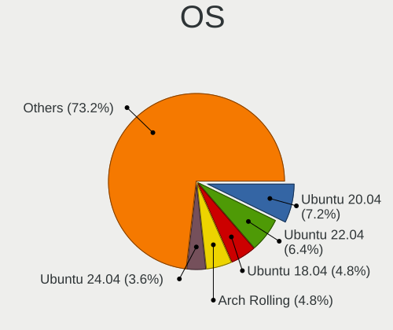

| Name                         | Notebooks | Percent |
|------------------------------|-----------|---------|
| Ubuntu 20.04                 | 175       | 7.24%   |
| Ubuntu 22.04                 | 155       | 6.42%   |
| Ubuntu 18.04                 | 116       | 4.8%    |
| Arch Rolling                 | 116       | 4.8%    |
| Ubuntu 24.04                 | 86        | 3.56%   |
| Pop!_OS 22.04                | 47        | 1.95%   |
| Debian 12                    | 44        | 1.82%   |
| Zorin 17                     | 42        | 1.74%   |
| ArcoLinux Rolling            | 42        | 1.74%   |
| Fedora 40                    | 39        | 1.61%   |
| Fedora 38                    | 35        | 1.45%   |
| Linux Mint 22.1              | 32        | 1.32%   |
| Fedora 39                    | 32        | 1.32%   |
| EndeavourOS Rolling          | 32        | 1.32%   |
| Fedora 42                    | 30        | 1.24%   |
| Fedora 41                    | 28        | 1.16%   |
| Fedora 37                    | 28        | 1.16%   |
| Debian 11                    | 28        | 1.16%   |
| Zorin 16                     | 27        | 1.12%   |
| Fedora 36                    | 27        | 1.12%   |
| OpenMandriva 4.3             | 26        | 1.08%   |
| Manjaro                      | 26        | 1.08%   |
| Arch                         | 26        | 1.08%   |
| Linux Mint 21.3              | 22        | 0.91%   |
| openSUSE Tumbleweed-XXXXXXXX | 21        | 0.87%   |
| Linux Mint 21.2              | 21        | 0.87%   |
| Linux Mint 21.1              | 19        | 0.79%   |
| OpenMandriva 24.12           | 18        | 0.75%   |
| OpenMandriva 23.08           | 18        | 0.75%   |
| Fedora 33                    | 18        | 0.75%   |
| Ubuntu 23.10                 | 17        | 0.7%    |
| Linux Mint 22                | 17        | 0.7%    |
| Ubuntu 21.10                 | 16        | 0.66%   |
| OpenMandriva 23.01           | 16        | 0.66%   |
| Linux Mint 20.3              | 16        | 0.66%   |
| Fedora 35                    | 16        | 0.66%   |
| KDE neon 20.04               | 13        | 0.54%   |
| Fedora 34                    | 13        | 0.54%   |
| Elementary 6.1               | 13        | 0.54%   |
| Ubuntu Unity 16.04           | 12        | 0.5%    |

OS Family
---------

OS without a version

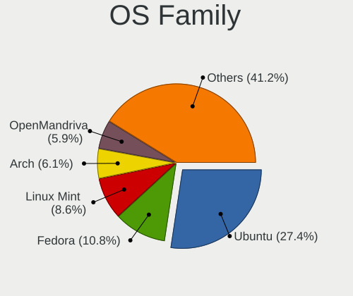

| Name         | Notebooks | Percent |
|--------------|-----------|---------|
| Ubuntu       | 626       | 27.37%  |
| Fedora       | 247       | 10.8%   |
| Linux Mint   | 197       | 8.61%   |
| Arch         | 140       | 6.12%   |
| OpenMandriva | 135       | 5.9%    |
| Debian       | 97        | 4.24%   |
| Zorin        | 87        | 3.8%    |
| Pop!_OS      | 76        | 3.32%   |
| Manjaro      | 60        | 2.62%   |
| Pardus       | 58        | 2.54%   |
| ArcoLinux    | 46        | 2.01%   |
| Kubuntu      | 37        | 1.62%   |
| Kali         | 36        | 1.57%   |
| EndeavourOS  | 33        | 1.44%   |
| KDE neon     | 31        | 1.36%   |
| Elementary   | 28        | 1.22%   |
| openSUSE     | 27        | 1.18%   |
| ROSA         | 22        | 0.96%   |
| Lubuntu      | 21        | 0.92%   |
| Xubuntu      | 20        | 0.87%   |
| Gentoo       | 19        | 0.83%   |
| Endless      | 18        | 0.79%   |
| Ubuntu MATE  | 15        | 0.66%   |
| Garuda Linux | 15        | 0.66%   |
| CachyOS      | 15        | 0.66%   |
| Ubuntu Unity | 14        | 0.61%   |
| LMDE         | 12        | 0.52%   |
| Nobara       | 9         | 0.39%   |
| Xero         | 8         | 0.35%   |
| TUXEDO OS    | 8         | 0.35%   |
| PostmarketOS | 8         | 0.35%   |
| MX           | 8         | 0.35%   |
| Clear Linux  | 8         | 0.35%   |
| Artix        | 8         | 0.35%   |
| Void Linux   | 7         | 0.31%   |
| Alpine       | 7         | 0.31%   |
| SteamOS      | 6         | 0.26%   |
| NixOS        | 6         | 0.26%   |
| Bazzite      | 6         | 0.26%   |
| Deepin       | 5         | 0.22%   |

Kernel
------

Version of the Linux kernel

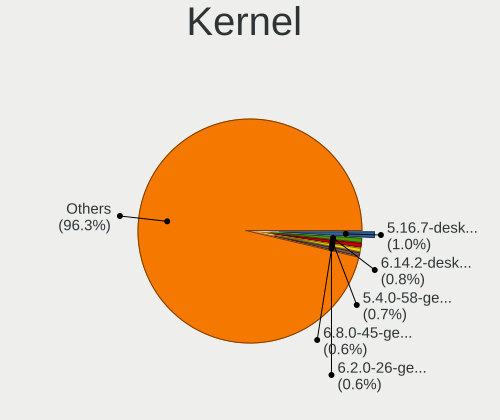

| Version                  | Notebooks | Percent |
|--------------------------|-----------|---------|
| 5.16.7-desktop-1omv4003  | 25        | 0.95%   |
| 6.14.2-desktop-3omv2590  | 20        | 0.76%   |
| 5.4.0-58-generic         | 18        | 0.69%   |
| 6.8.0-45-generic         | 17        | 0.65%   |
| 6.2.0-26-generic         | 17        | 0.65%   |
| 6.12.1-desktop-1omv2490  | 17        | 0.65%   |
| 6.4.11-desktop-1omv2390  | 16        | 0.61%   |
| 6.1.1-desktop-1omv2290   | 16        | 0.61%   |
| 5.4.0-42-generic         | 16        | 0.61%   |
| 5.15.0-58-generic        | 16        | 0.61%   |
| 6.8.0-48-generic         | 13        | 0.5%    |
| 6.8.0-52-generic         | 12        | 0.46%   |
| 6.8.0-41-generic         | 12        | 0.46%   |
| 6.8.0-31-generic         | 12        | 0.46%   |
| 6.1.0-17-amd64           | 12        | 0.46%   |
| 5.3.0-40-generic         | 12        | 0.46%   |
| 5.15.0-56-generic        | 12        | 0.46%   |
| 6.9.3-76060903-generic   | 11        | 0.42%   |
| 5.15.0-52-generic        | 11        | 0.42%   |
| 6.8.0-57-generic         | 10        | 0.38%   |
| 6.8.0-51-generic         | 10        | 0.38%   |
| 6.6.2-desktop-1omv2390   | 10        | 0.38%   |
| 6.5.0-35-generic         | 10        | 0.38%   |
| 6.14.0-37-generic        | 10        | 0.38%   |
| 5.15.0-43-generic        | 10        | 0.38%   |
| 6.2.0-32-generic         | 9         | 0.34%   |
| 6.14.0-33-generic        | 9         | 0.34%   |
| 5.4.0-37-generic         | 9         | 0.34%   |
| 5.4.0-26-generic         | 9         | 0.34%   |
| 5.19.0-32-generic        | 9         | 0.34%   |
| 5.0.0-37-generic         | 9         | 0.34%   |
| 6.5.0-26-generic         | 8         | 0.3%    |
| 6.5.0-14-generic         | 8         | 0.3%    |
| 6.12.10-76061203-generic | 8         | 0.3%    |
| 5.8.0-44-generic         | 8         | 0.3%    |
| 5.4.0-74-generic         | 8         | 0.3%    |
| 5.4.0-48-generic         | 8         | 0.3%    |
| 5.4.0-47-generic         | 8         | 0.3%    |
| 5.3.0-28-generic         | 8         | 0.3%    |
| 5.15.0-48-generic        | 8         | 0.3%    |

Kernel Family
-------------

Linux kernel without a distro release

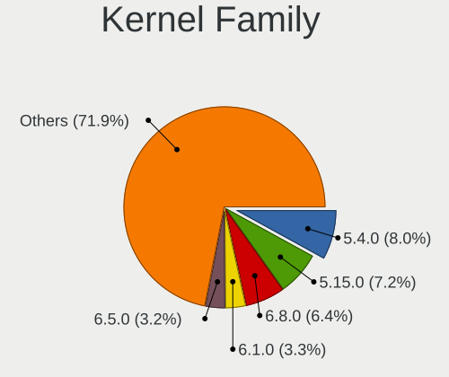

| Version | Notebooks | Percent |
|---------|-----------|---------|
| 5.4.0   | 202       | 7.99%   |
| 5.15.0  | 181       | 7.16%   |
| 6.8.0   | 162       | 6.41%   |
| 6.1.0   | 84        | 3.32%   |
| 6.5.0   | 81        | 3.21%   |
| 4.15.0  | 66        | 2.61%   |
| 5.10.0  | 65        | 2.57%   |
| 5.8.0   | 61        | 2.41%   |
| 5.11.0  | 61        | 2.41%   |
| 6.2.0   | 60        | 2.37%   |
| 6.14.0  | 60        | 2.37%   |
| 5.13.0  | 53        | 2.1%    |
| 5.3.0   | 49        | 1.94%   |
| 5.19.0  | 44        | 1.74%   |
| 5.0.0   | 38        | 1.5%    |
| 6.11.0  | 36        | 1.42%   |
| 4.18.0  | 31        | 1.23%   |
| 5.16.7  | 27        | 1.07%   |
| 6.14.2  | 22        | 0.87%   |
| 6.12.1  | 21        | 0.83%   |
| 6.4.11  | 19        | 0.75%   |
| 6.1.1   | 18        | 0.71%   |
| 6.2.6   | 16        | 0.63%   |
| 4.19.0  | 16        | 0.63%   |
| 6.9.3   | 14        | 0.55%   |
| 6.4.12  | 14        | 0.55%   |
| 6.8.5   | 13        | 0.51%   |
| 6.12.10 | 13        | 0.51%   |
| 6.6.2   | 12        | 0.47%   |
| 6.10.6  | 11        | 0.44%   |
| 6.0.12  | 11        | 0.44%   |
| 6.4.6   | 9         | 0.36%   |
| 6.14.6  | 9         | 0.36%   |
| 5.14.0  | 9         | 0.36%   |
| 6.9.7   | 8         | 0.32%   |
| 6.8.9   | 8         | 0.32%   |
| 6.8.11  | 8         | 0.32%   |
| 6.16.8  | 8         | 0.32%   |
| 5.17.5  | 8         | 0.32%   |
| 6.5.6   | 7         | 0.28%   |

Kernel Major Ver.
-----------------

Linux kernel major version

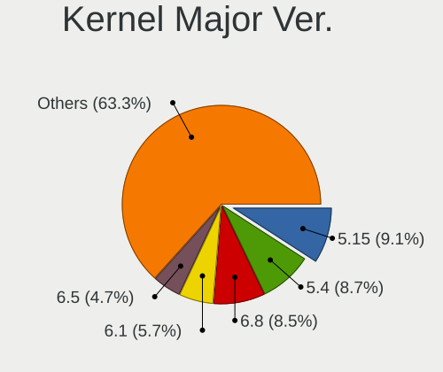

| Version | Notebooks | Percent |
|---------|-----------|---------|
| 5.15    | 226       | 9.14%   |
| 5.4     | 216       | 8.73%   |
| 6.8     | 209       | 8.45%   |
| 6.1     | 140       | 5.66%   |
| 6.5     | 116       | 4.69%   |
| 6.2     | 106       | 4.29%   |
| 6.14    | 103       | 4.16%   |
| 5.10    | 99        | 4%      |
| 5.11    | 81        | 3.28%   |
| 6.12    | 77        | 3.11%   |
| 5.8     | 73        | 2.95%   |
| 6.4     | 67        | 2.71%   |
| 6.11    | 66        | 2.67%   |
| 4.15    | 66        | 2.67%   |
| 5.13    | 65        | 2.63%   |
| 6.6     | 64        | 2.59%   |
| 5.19    | 58        | 2.35%   |
| 5.3     | 54        | 2.18%   |
| 5.16    | 53        | 2.14%   |
| 6.0     | 43        | 1.74%   |
| 5.0     | 40        | 1.62%   |
| 6.9     | 39        | 1.58%   |
| 6.10    | 39        | 1.58%   |
| 4.18    | 32        | 1.29%   |
| 6.17    | 29        | 1.17%   |
| 6.7     | 28        | 1.13%   |
| 6.15    | 26        | 1.05%   |
| 5.18    | 26        | 1.05%   |
| 6.3     | 25        | 1.01%   |
| 5.17    | 25        | 1.01%   |
| 6.13    | 23        | 0.93%   |
| 5.9     | 23        | 0.93%   |
| 6.16    | 19        | 0.77%   |
| 5.14    | 18        | 0.73%   |
| 4.19    | 16        | 0.65%   |
| 4.9     | 15        | 0.61%   |
| 5.12    | 13        | 0.53%   |
| 5.7     | 12        | 0.49%   |
| 5.6     | 12        | 0.49%   |
| 6.18    | 10        | 0.4%    |

Arch
----

OS architecture (x86_64, i586, etc.)

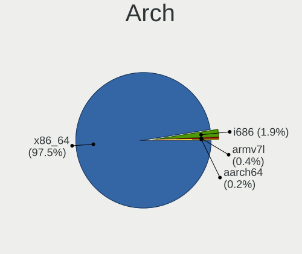

| Name    | Notebooks | Percent |
|---------|-----------|---------|
| x86_64  | 2095      | 97.49%  |
| i686    | 41        | 1.91%   |
| armv7l  | 8         | 0.37%   |
| aarch64 | 5         | 0.23%   |

DE
--

Desktop Environment

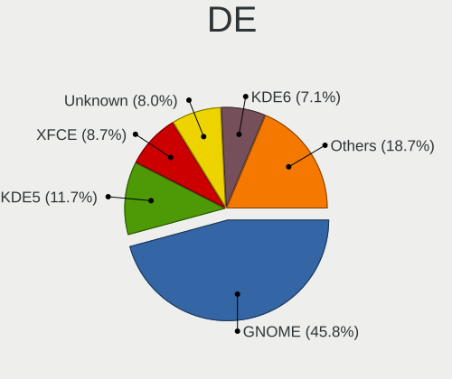

| Name             | Notebooks | Percent |
|------------------|-----------|---------|
| GNOME            | 1044      | 45.77%  |
| KDE5             | 268       | 11.75%  |
| XFCE             | 198       | 8.68%   |
| Unknown          | 183       | 8.02%   |
| KDE6             | 162       | 7.1%    |
| X-Cinnamon       | 150       | 6.58%   |
| MATE             | 41        | 1.8%    |
| LXQt             | 33        | 1.45%   |
| KDE              | 32        | 1.4%    |
| Pantheon         | 28        | 1.23%   |
| i3               | 18        | 0.79%   |
| KDE4             | 17        | 0.75%   |
| Hyprland         | 17        | 0.75%   |
| Cinnamon         | 15        | 0.66%   |
| Unity            | 14        | 0.61%   |
| LXDE             | 11        | 0.48%   |
| sway             | 9         | 0.39%   |
| Deepin           | 7         | 0.31%   |
| GNOME Classic    | 4         | 0.18%   |
| Budgie           | 4         | 0.18%   |
| Trinity          | 3         | 0.13%   |
| niri             | 3         | 0.13%   |
| DWM              | 3         | 0.13%   |
| bspwm            | 3         | 0.13%   |
| openbox          | 2         | 0.09%   |
| COSMIC           | 2         | 0.09%   |
| xmonad           | 1         | 0.04%   |
| qtile            | 1         | 0.04%   |
| Lingmo           | 1         | 0.04%   |
| lightdm-xsession | 1         | 0.04%   |
| labwc:wlroots    | 1         | 0.04%   |
| ICEWM            | 1         | 0.04%   |
| GNOME Flashback  | 1         | 0.04%   |
| fluxbox          | 1         | 0.04%   |
| BunsenLabs       | 1         | 0.04%   |
| awesome          | 1         | 0.04%   |

Display Server
--------------

X11 or Wayland

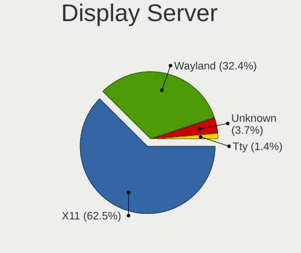

| Name    | Notebooks | Percent |
|---------|-----------|---------|
| X11     | 1407      | 62.45%  |
| Wayland | 730       | 32.4%   |
| Unknown | 84        | 3.73%   |
| Tty     | 32        | 1.42%   |

Display Manager
---------------

SDDM, LightDM, etc.

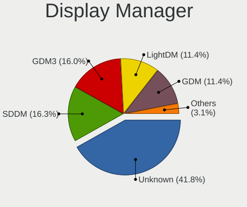

| Name           | Notebooks | Percent |
|----------------|-----------|---------|
| Unknown        | 953       | 41.83%  |
| SDDM           | 371       | 16.29%  |
| GDM3           | 365       | 16.02%  |
| LightDM        | 260       | 11.41%  |
| GDM            | 259       | 11.37%  |
| TDM            | 48        | 2.11%   |
| KDM            | 12        | 0.53%   |
| LY-DM          | 3         | 0.13%   |
| XDM            | 2         | 0.09%   |
| SLiM           | 1         | 0.04%   |
| PLASMALOGIN    | 1         | 0.04%   |
| Ly             | 1         | 0.04%   |
| LXDM           | 1         | 0.04%   |
| COSMIC-GREETER | 1         | 0.04%   |

OS Lang
-------

Language

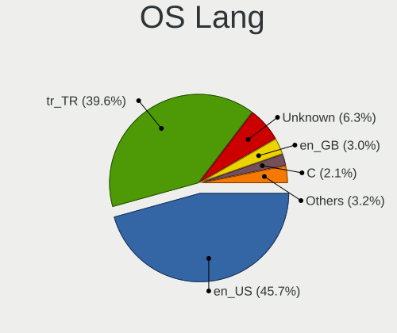

| Lang        | Notebooks | Percent |
|-------------|-----------|---------|
| en_US       | 1004      | 45.7%   |
| tr_TR       | 871       | 39.64%  |
| Unknown     | 139       | 6.33%   |
| en_GB       | 66        | 3%      |
| C           | 47        | 2.14%   |
| ru_RU       | 20        | 0.91%   |
| de_DE       | 13        | 0.59%   |
| en_CA       | 4         | 0.18%   |
| tr_CY       | 3         | 0.14%   |
| POSIX       | 3         | 0.14%   |
| C.UTF8      | 3         | 0.14%   |
| ar_EG       | 3         | 0.14%   |
| zh_CN       | 2         | 0.09%   |
| en_IE       | 2         | 0.09%   |
| en_DK       | 2         | 0.09%   |
| tr_TR.UTF8  | 1         | 0.05%   |
| tr_TR.utf-8 | 1         | 0.05%   |
| ru_UA       | 1         | 0.05%   |
| nl_BE       | 1         | 0.05%   |
| it_IT       | 1         | 0.05%   |
| fr_FR       | 1         | 0.05%   |
| fa_IR       | 1         | 0.05%   |
| en_US.UTF8  | 1         | 0.05%   |
| en_US-UTF-8 | 1         | 0.05%   |
| en_NZ       | 1         | 0.05%   |
| en_IN       | 1         | 0.05%   |
| en_GB.UTF8  | 1         | 0.05%   |
| en_AG       | 1         | 0.05%   |
| en_150      | 1         | 0.05%   |
| de_AT       | 1         | 0.05%   |

Boot Mode
---------

EFI or BIOS

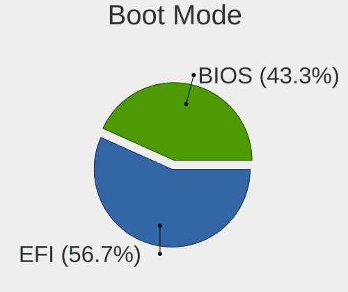

| Mode | Notebooks | Percent |
|------|-----------|---------|
| EFI  | 1253      | 56.72%  |
| BIOS | 956       | 43.28%  |

Filesystem
----------

Type of filesystem

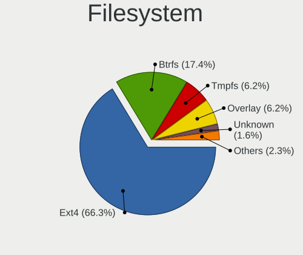

| Type    | Notebooks | Percent |
|---------|-----------|---------|
| Ext4    | 1485      | 66.32%  |
| Btrfs   | 390       | 17.42%  |
| Tmpfs   | 139       | 6.21%   |
| Overlay | 138       | 6.16%   |
| Unknown | 36        | 1.61%   |
| Xfs     | 21        | 0.94%   |
| Ext2    | 12        | 0.54%   |
| Zfs     | 11        | 0.49%   |
| F2fs    | 3         | 0.13%   |
| Ext3    | 2         | 0.09%   |
| Aufs    | 2         | 0.09%   |

Part. scheme
------------

Scheme of partitioning

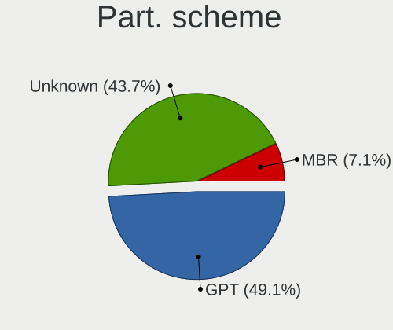

| Type    | Notebooks | Percent |
|---------|-----------|---------|
| GPT     | 1091      | 49.14%  |
| Unknown | 971       | 43.74%  |
| MBR     | 158       | 7.12%   |

Dual Boot with Linux/BSD
------------------------

Hosting more than one Linux/BSD

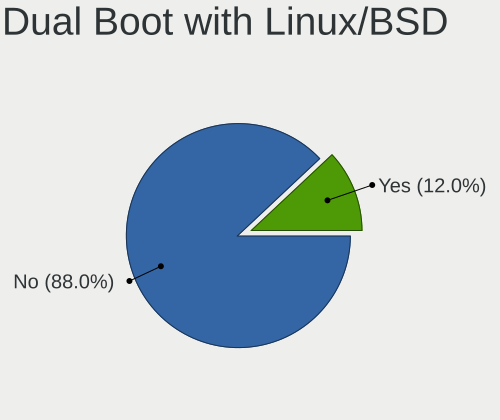

| Dual boot | Notebooks | Percent |
|-----------|-----------|---------|
| No        | 1930      | 88.01%  |
| Yes       | 263       | 11.99%  |

Dual Boot (Win)
---------------

Hosting Linux and Windows

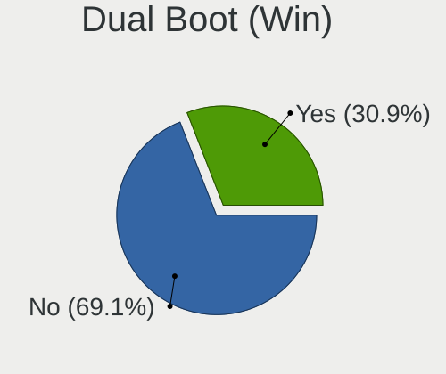

| Dual boot | Notebooks | Percent |
|-----------|-----------|---------|
| No        | 1528      | 69.08%  |
| Yes       | 684       | 30.92%  |

Board
-----

Vendor
------

Motherboard manufacturer

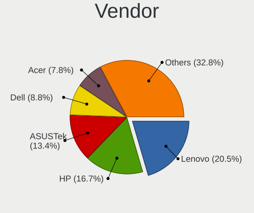

| Name                        | Notebooks | Percent |
|-----------------------------|-----------|---------|
| Lenovo                      | 440       | 20.48%  |
| Hewlett-Packard             | 359       | 16.71%  |
| ASUSTek Computer            | 288       | 13.41%  |
| Dell                        | 189       | 8.8%    |
| Acer                        | 167       | 7.77%   |
| Monster                     | 104       | 4.84%   |
| HUAWEI                      | 104       | 4.84%   |
| Toshiba                     | 73        | 3.4%    |
| MSI                         | 61        | 2.84%   |
| Casper                      | 59        | 2.75%   |
| Apple                       | 53        | 2.47%   |
| Samsung Electronics         | 48        | 2.23%   |
| Sony                        | 41        | 1.91%   |
| Packard Bell                | 24        | 1.12%   |
| Google                      | 14        | 0.65%   |
| Clevo                       | 13        | 0.61%   |
| Pegatron                    | 12        | 0.56%   |
| Hometech                    | 12        | 0.56%   |
| Unknown                     | 10        | 0.47%   |
| ARCELIK                     | 8         | 0.37%   |
| Valve                       | 6         | 0.28%   |
| Notebook                    | 4         | 0.19%   |
| Insyde                      | 4         | 0.19%   |
| HONOR                       | 4         | 0.19%   |
| Fujitsu                     | 4         | 0.19%   |
| Alienware                   | 4         | 0.19%   |
| LG Electronics              | 3         | 0.14%   |
| Fujitsu Siemens             | 3         | 0.14%   |
| Technopc                    | 2         | 0.09%   |
| Quanta                      | 2         | 0.09%   |
| Medion                      | 2         | 0.09%   |
| IX1401                      | 2         | 0.09%   |
| Intel                       | 2         | 0.09%   |
| I-Life Digital Technologies | 2         | 0.09%   |
| HT                          | 2         | 0.09%   |
| Gigabyte Technology         | 2         | 0.09%   |
| VESTEL BILGISAYAR           | 1         | 0.05%   |
| Vestel                      | 1         | 0.05%   |
| Timi                        | 1         | 0.05%   |
| System76                    | 1         | 0.05%   |

Model
-----

Motherboard model

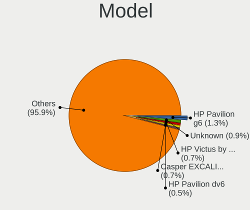

| Name                                 | Notebooks | Percent |
|--------------------------------------|-----------|---------|
| HP Pavilion g6                       | 27        | 1.26%   |
| Unknown                              | 19        | 0.88%   |
| HP Victus by Gaming Laptop 16-s0xxx  | 15        | 0.7%    |
| Casper EXCALIBUR G770                | 15        | 0.7%    |
| HUAWEI BOD-WXX9                      | 11        | 0.51%   |
| HP Pavilion dv6                      | 11        | 0.51%   |
| Casper NIRVANA NOTEBOOK              | 11        | 0.51%   |
| HUAWEI BOM-WXX9                      | 10        | 0.47%   |
| HP Victus by Gaming Laptop 15-fa1xxx | 10        | 0.47%   |
| HP Pavilion 15                       | 10        | 0.47%   |
| HP Notebook                          | 10        | 0.47%   |
| Lenovo IdeaPad 3 15ITL6 82H8         | 9         | 0.42%   |
| HUAWEI HVY-WXX9                      | 8         | 0.37%   |
| Dell Inspiron 3542                   | 8         | 0.37%   |
| Lenovo IdeaPad Gaming 3 15ACH6 82K2  | 7         | 0.33%   |
| HUAWEI KLVL-WXX9                     | 7         | 0.33%   |
| HUAWEI FLMH-XX                       | 7         | 0.33%   |
| HUAWEI BoDE-WXX9                     | 7         | 0.33%   |
| HP Victus by Gaming Laptop 16-r0xxx  | 7         | 0.33%   |
| HP Pavilion Notebook                 | 7         | 0.33%   |
| HP 250 G3                            | 7         | 0.33%   |
| HP 15                                | 7         | 0.33%   |
| ASUS X555UB                          | 7         | 0.33%   |
| ASUS X550VX                          | 7         | 0.33%   |
| Acer Aspire 5750G                    | 7         | 0.33%   |
| Packard Bell EasyNote TJ65           | 6         | 0.28%   |
| Lenovo V15 G2 ALC 82KD               | 6         | 0.28%   |
| HUAWEI NBLK-WAX9X                    | 6         | 0.28%   |
| HP Victus by Laptop 16-e0xxx         | 6         | 0.28%   |
| Dell Inspiron MM061                  | 6         | 0.28%   |
| ASUS VivoBook 15_ASUS Laptop X540UAR | 6         | 0.28%   |
| Apple MacBookPro8,1                  | 6         | 0.28%   |
| Apple MacBookAir7,2                  | 6         | 0.28%   |
| Acer Nitro AN515-58                  | 6         | 0.28%   |
| Valve Jupiter                        | 5         | 0.23%   |
| Toshiba Satellite L655               | 5         | 0.23%   |
| Pegatron A15                         | 5         | 0.23%   |
| Lenovo IdeaPad Gaming 3 15ARH05 82EY | 5         | 0.23%   |
| Lenovo IdeaPad 100-15IBD 80QQ        | 5         | 0.23%   |
| Lenovo G50-70 20351                  | 5         | 0.23%   |

Model Family
------------

Motherboard model prefix

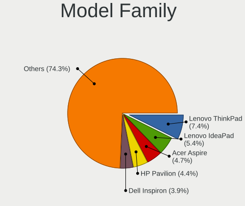

| Name                  | Notebooks | Percent |
|-----------------------|-----------|---------|
| Lenovo ThinkPad       | 158       | 7.36%   |
| Lenovo IdeaPad        | 116       | 5.4%    |
| Acer Aspire           | 100       | 4.66%   |
| HP Pavilion           | 95        | 4.42%   |
| Dell Inspiron         | 83        | 3.86%   |
| Toshiba Satellite     | 68        | 3.17%   |
| Monster ABRA          | 59        | 2.75%   |
| HP Victus             | 54        | 2.51%   |
| ASUS VivoBook         | 44        | 2.05%   |
| HP Laptop             | 43        | 2%      |
| Dell Latitude         | 40        | 1.86%   |
| ASUS ASUS             | 34        | 1.58%   |
| HP EliteBook          | 33        | 1.54%   |
| HP ProBook            | 30        | 1.4%    |
| Monster TULPAR        | 29        | 1.35%   |
| ASUS ROG              | 29        | 1.35%   |
| Casper NIRVANA        | 27        | 1.26%   |
| Acer Nitro            | 27        | 1.26%   |
| Casper EXCALIBUR      | 25        | 1.16%   |
| HP 250                | 24        | 1.12%   |
| Packard Bell EasyNote | 22        | 1.02%   |
| Lenovo ThinkBook      | 22        | 1.02%   |
| Lenovo Legion         | 21        | 0.98%   |
| Dell Vostro           | 20        | 0.93%   |
| Unknown               | 19        | 0.88%   |
| Monster HUMA          | 15        | 0.7%    |
| Lenovo V15            | 15        | 0.7%    |
| Lenovo LOQ            | 15        | 0.7%    |
| Acer Swift            | 15        | 0.7%    |
| Dell Precision        | 13        | 0.61%   |
| ASUS TUF              | 13        | 0.61%   |
| HP OMEN               | 12        | 0.56%   |
| Lenovo Yoga           | 11        | 0.51%   |
| HUAWEI BOD-WXX9       | 11        | 0.51%   |
| HP ENVY               | 11        | 0.51%   |
| Dell G3               | 11        | 0.51%   |
| ASUS ZenBook          | 11        | 0.51%   |
| HUAWEI BOM-WXX9       | 10        | 0.47%   |
| HP Notebook           | 10        | 0.47%   |
| Apple MacBookPro8     | 10        | 0.47%   |

MFG Year
--------

Motherboard manufacture year

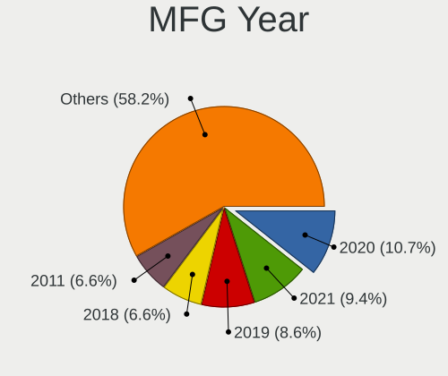

| Year    | Notebooks | Percent |
|---------|-----------|---------|
| 2020    | 229       | 10.66%  |
| 2021    | 202       | 9.4%    |
| 2019    | 184       | 8.57%   |
| 2018    | 142       | 6.61%   |
| 2011    | 141       | 6.56%   |
| 2023    | 135       | 6.28%   |
| 2022    | 133       | 6.19%   |
| 2012    | 124       | 5.77%   |
| 2017    | 114       | 5.31%   |
| 2013    | 114       | 5.31%   |
| 2014    | 109       | 5.07%   |
| 2016    | 102       | 4.75%   |
| 2015    | 97        | 4.52%   |
| 2010    | 92        | 4.28%   |
| 2024    | 60        | 2.79%   |
| 2009    | 58        | 2.7%    |
| 2008    | 41        | 1.91%   |
| 2006    | 20        | 0.93%   |
| 2007    | 18        | 0.84%   |
| 2025    | 14        | 0.65%   |
| Unknown | 13        | 0.61%   |
| 2005    | 6         | 0.28%   |

Form Factor
-----------

Physical design of the computer

| Name     | Notebooks | Percent |
|----------|-----------|---------|
| Notebook | 2148      | 100%    |

Secure Boot
-----------

Enabled or disabled

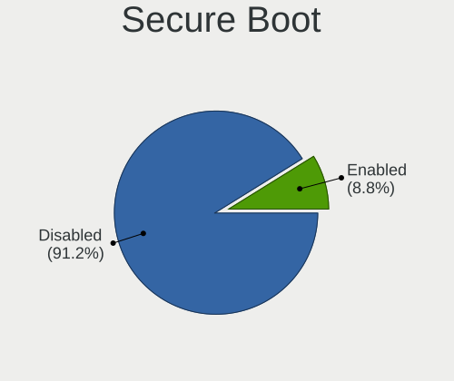

| State    | Notebooks | Percent |
|----------|-----------|---------|
| Disabled | 1988      | 91.15%  |
| Enabled  | 193       | 8.85%   |

Coreboot
--------

Have coreboot on board

| Used | Notebooks | Percent |
|------|-----------|---------|
| No   | 2139      | 99.58%  |
| Yes  | 9         | 0.42%   |

RAM Size
--------

Total RAM memory

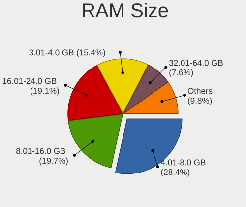

| Size in GB  | Notebooks | Percent |
|-------------|-----------|---------|
| 4.01-8.0    | 620       | 28.4%   |
| 8.01-16.0   | 429       | 19.65%  |
| 16.01-24.0  | 417       | 19.1%   |
| 3.01-4.0    | 337       | 15.44%  |
| 32.01-64.0  | 166       | 7.6%    |
| 1.01-2.0    | 94        | 4.31%   |
| 24.01-32.0  | 42        | 1.92%   |
| 2.01-3.0    | 36        | 1.65%   |
| 64.01-256.0 | 33        | 1.51%   |
| 0.51-1.0    | 9         | 0.41%   |

RAM Used
--------

Used RAM memory

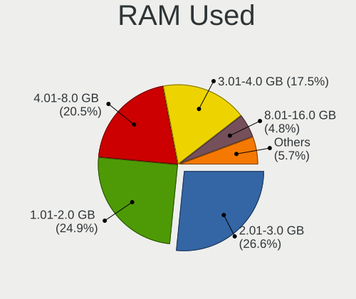

| Used GB    | Notebooks | Percent |
|------------|-----------|---------|
| 2.01-3.0   | 639       | 26.59%  |
| 1.01-2.0   | 598       | 24.89%  |
| 4.01-8.0   | 493       | 20.52%  |
| 3.01-4.0   | 421       | 17.52%  |
| 8.01-16.0  | 116       | 4.83%   |
| 0.51-1.0   | 106       | 4.41%   |
| 0.01-0.5   | 20        | 0.83%   |
| 16.01-24.0 | 7         | 0.29%   |
| 32.01-64.0 | 3         | 0.12%   |

Total Drives
------------

Number of drives on board

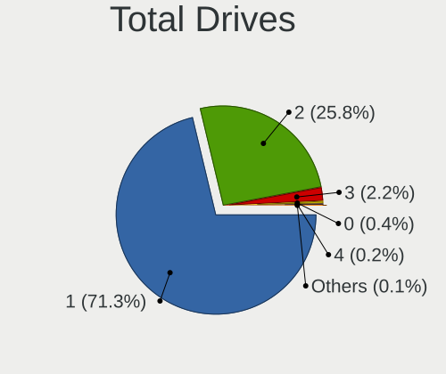

| Drives | Notebooks | Percent |
|--------|-----------|---------|
| 1      | 1558      | 71.27%  |
| 2      | 563       | 25.75%  |
| 3      | 48        | 2.2%    |
| 0      | 9         | 0.41%   |
| 4      | 5         | 0.23%   |
| 5      | 2         | 0.09%   |
| 6      | 1         | 0.05%   |

Has CD-ROM
----------

Has CD-ROM on board

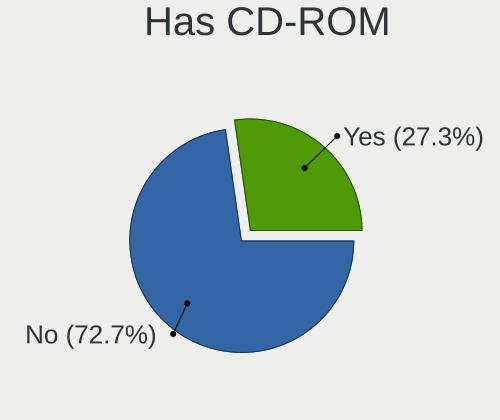

| Presented | Notebooks | Percent |
|-----------|-----------|---------|
| No        | 1571      | 72.73%  |
| Yes       | 589       | 27.27%  |

Has Ethernet
------------

Has Ethernet on board

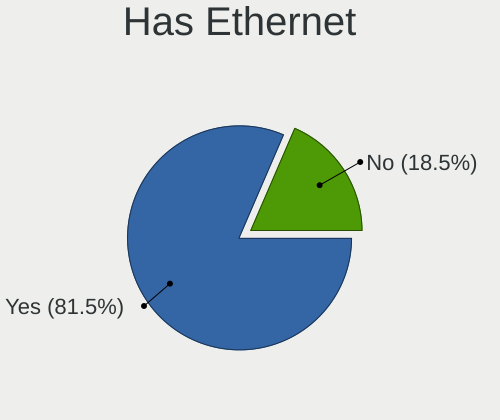

| Presented | Notebooks | Percent |
|-----------|-----------|---------|
| Yes       | 1760      | 81.48%  |
| No        | 400       | 18.52%  |

Has WiFi
--------

Has WiFi module

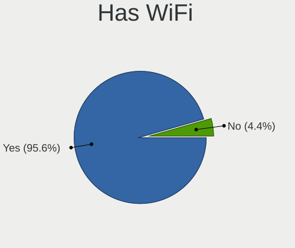

| Presented | Notebooks | Percent |
|-----------|-----------|---------|
| Yes       | 2054      | 95.58%  |
| No        | 95        | 4.42%   |

Has Bluetooth
-------------

Has Bluetooth module

| Presented | Notebooks | Percent |
|-----------|-----------|---------|
| Yes       | 1826      | 84.03%  |
| No        | 347       | 15.97%  |

Location
--------

Country
-------

Geographic location (country)

| Country | Notebooks | Percent |
|---------|-----------|---------|
| Turkey  | 2148      | 100%    |

City
----

Geographic location (city)

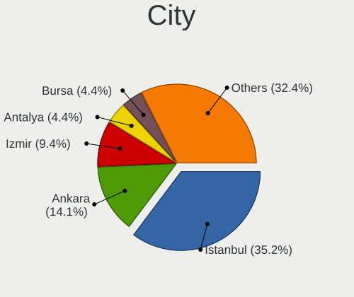

| City                | Notebooks | Percent |
|---------------------|-----------|---------|
| Istanbul            | 817       | 35.25%  |
| Ankara              | 326       | 14.06%  |
| Izmir               | 219       | 9.45%   |
| Antalya             | 103       | 4.44%   |
| Bursa               | 101       | 4.36%   |
| Adana               | 43        | 1.86%   |
| Kosekoy             | 36        | 1.55%   |
| Konya               | 30        | 1.29%   |
| Mersin              | 27        | 1.16%   |
| Gaziantep           | 26        | 1.12%   |
| Balıkesir          | 25        | 1.08%   |
| Kayseri             | 24        | 1.04%   |
| Denizli             | 23        | 0.99%   |
| Samsun              | 22        | 0.95%   |
| Tekirdağ           | 17        | 0.73%   |
| İzmit              | 16        | 0.69%   |
| Antakya             | 16        | 0.69%   |
| Eskişehir          | 14        | 0.6%    |
| Adapazarı          | 14        | 0.6%    |
| Osmaniye            | 13        | 0.56%   |
| Magnesia ad Sipylum | 13        | 0.56%   |
| Aydin               | 12        | 0.52%   |
| Sisli               | 11        | 0.47%   |
| Mugla               | 11        | 0.47%   |
| Trabzon             | 9         | 0.39%   |
| Erzurum             | 9         | 0.39%   |
| Ordu                | 8         | 0.35%   |
| Kahramanmaraş      | 8         | 0.35%   |
| Diyarbakır         | 8         | 0.35%   |
| Çanakkale          | 8         | 0.35%   |
| Batman              | 8         | 0.35%   |
| Yalova              | 7         | 0.3%    |
| Malatya             | 7         | 0.3%    |
| Kartal              | 7         | 0.3%    |
| Atasehir            | 7         | 0.3%    |
| Alanya              | 7         | 0.3%    |
| Sanliurfa           | 6         | 0.26%   |
| Nevşehir           | 6         | 0.26%   |
| Kütahya            | 6         | 0.26%   |
| Isparta             | 6         | 0.26%   |

Drives
------

Drive Vendor
------------

Hard drive vendors

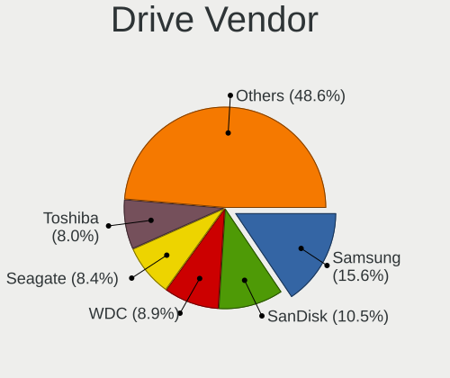

| Vendor                      | Notebooks | Drives | Percent |
|-----------------------------|-----------|--------|---------|
| Samsung Electronics         | 426       | 594    | 15.57%  |
| SanDisk                     | 286       | 352    | 10.45%  |
| WDC                         | 244       | 303    | 8.92%   |
| Seagate                     | 230       | 273    | 8.41%   |
| Toshiba                     | 219       | 268    | 8%      |
| Kingston                    | 135       | 191    | 4.93%   |
| SK hynix                    | 121       | 158    | 4.42%   |
| Unknown                     | 115       | 143    | 4.2%    |
| Micron Technology           | 113       | 137    | 4.13%   |
| Intel                       | 70        | 89     | 2.56%   |
| HGST                        | 70        | 83     | 2.56%   |
| Crucial                     | 56        | 67     | 2.05%   |
| Hitachi                     | 55        | 59     | 2.01%   |
| KIOXIA                      | 47        | 56     | 1.72%   |
| China                       | 38        | 46     | 1.39%   |
| Apple                       | 32        | 39     | 1.17%   |
| Kingston Technology Company | 31        | 41     | 1.13%   |
| Silicon Motion              | 29        | 33     | 1.06%   |
| A-DATA Technology           | 28        | 33     | 1.02%   |
| Micron/Crucial Technology   | 26        | 29     | 0.95%   |
| KIOXIA-EXCERIA              | 25        | 28     | 0.91%   |
| Phison Electronics          | 21        | 23     | 0.77%   |
| Phison                      | 21        | 21     | 0.77%   |
| HS-SSD-C100                 | 18        | 20     | 0.66%   |
| Fujitsu                     | 15        | 15     | 0.55%   |
| Corsair                     | 14        | 15     | 0.51%   |
| Team                        | 10        | 10     | 0.37%   |
| JMicron Technology          | 10        | 10     | 0.37%   |
| Unknown                     | 10        | 11     | 0.37%   |
| UMIS                        | 9         | 11     | 0.33%   |
| Intenso                     | 9         | 10     | 0.33%   |
| Union Memory (Shenzhen)     | 8         | 12     | 0.29%   |
| Transcend                   | 8         | 8      | 0.29%   |
| Pioneer                     | 8         | 24     | 0.29%   |
| OCZ                         | 8         | 8      | 0.29%   |
| Lexar                       | 8         | 14     | 0.29%   |
| Gigabyte Technology         | 8         | 18     | 0.29%   |
| YMTC                        | 7         | 7      | 0.26%   |
| Union Memory                | 7         | 20     | 0.26%   |
| TwinMOS                     | 7         | 8      | 0.26%   |

Drive Model
-----------

Hard drive models

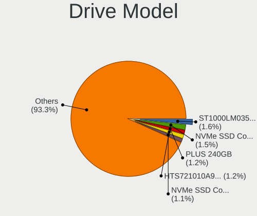

| Model                                              | Notebooks | Percent |
|----------------------------------------------------|-----------|---------|
| Seagate ST1000LM035-1RK172 1TB                     | 45        | 1.58%   |
| Samsung NVMe SSD Controller SM981/PM981/PM983 1TB  | 44        | 1.55%   |
| SanDisk SSD PLUS 240GB                             | 35        | 1.23%   |
| HGST HTS721010A9E630 1TB                           | 35        | 1.23%   |
| Samsung NVMe SSD Controller PM9A1/PM9A3/980PRO 1TB | 31        | 1.09%   |
| Toshiba MQ01ABD100 1TB                             | 29        | 1.02%   |
| Toshiba MQ01ABF050 500GB                           | 25        | 0.88%   |
| Unknown MMC Card  32GB                             | 23        | 0.81%   |
| Toshiba MQ04ABF100 1TB                             | 23        | 0.81%   |
| Seagate ST1000LM024 HN-M101MBB 1TB                 | 21        | 0.74%   |
| Sandisk WD Blue SN550 NVMe SSD 1024GB              | 19        | 0.67%   |
| SanDisk NVMe SSD Drive 512GB                       | 19        | 0.67%   |
| Samsung MZVLQ512HBLU-00B00 512GB                   | 17        | 0.6%    |
| Seagate ST500LT012-1DG142 500GB                    | 16        | 0.56%   |
| Seagate ST1000LM049-2GH172 1TB                     | 16        | 0.56%   |
| Samsung NVMe SSD Drive 256GB                       | 16        | 0.56%   |
| Micron/Crucial P2 NVMe PCIe SSD 2TB                | 16        | 0.56%   |
| Silicon Motion PCIe-8 SSD 512GB                    | 15        | 0.53%   |
| Samsung SSD 860 EVO 250GB                          | 15        | 0.53%   |
| WDC WDS240G2G0A-00JH30 240GB SSD                   | 14        | 0.49%   |
| Toshiba MQ01ABD075 752GB                           | 14        | 0.49%   |
| Samsung NVMe SSD Drive 512GB                       | 14        | 0.49%   |
| Unknown MMC Card  128GB                            | 13        | 0.46%   |
| Seagate ST9500325AS 500GB                          | 13        | 0.46%   |
| SanDisk SSD PLUS 120GB                             | 13        | 0.46%   |
| Intel SSDPEKNU512GZ 512GB                          | 13        | 0.46%   |
| SanDisk NVMe SSD Drive 1TB                         | 12        | 0.42%   |
| Micron MTFDHBA512QFD 512GB                         | 12        | 0.42%   |
| Micron 1100_MTFDDAV256TBN 256GB SSD                | 12        | 0.42%   |
| Kingston SA400S37240G 240GB SSD                    | 12        | 0.42%   |
| Kingston SA400S37120G 120GB SSD                    | 12        | 0.42%   |
| HGST HTS541010A9E680 1TB                           | 12        | 0.42%   |
| Crucial CT500P2SSD8 500GB                          | 12        | 0.42%   |
| Unknown MMC Card  16GB                             | 11        | 0.39%   |
| Sandisk WD Black SN750 / PC SN730 NVMe SSD 500GB   | 11        | 0.39%   |
| SanDisk NVMe SSD Drive 256GB                       | 11        | 0.39%   |
| Samsung SSD 860 EVO 500GB                          | 10        | 0.35%   |
| Kingston Company SNV2S1000G 1TB                    | 10        | 0.35%   |
| Unknown                                            | 10        | 0.35%   |
| Unknown MMC Card  64GB                             | 9         | 0.32%   |

HDD Vendor
----------

Hard disk drive vendors

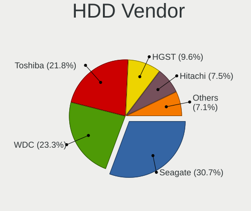

| Vendor              | Notebooks | Drives | Percent |
|---------------------|-----------|--------|---------|
| Seagate             | 224       | 261    | 30.68%  |
| WDC                 | 170       | 211    | 23.29%  |
| Toshiba             | 159       | 185    | 21.78%  |
| HGST                | 70        | 83     | 9.59%   |
| Hitachi             | 55        | 59     | 7.53%   |
| Samsung Electronics | 25        | 26     | 3.42%   |
| Fujitsu             | 15        | 15     | 2.05%   |
| Unknown             | 4         | 4      | 0.55%   |
| JMicron Technology  | 4         | 4      | 0.55%   |
| TO Exter            | 1         | 3      | 0.14%   |
| Intenso             | 1         | 1      | 0.14%   |
| External            | 1         | 1      | 0.14%   |
| Apple               | 1         | 2      | 0.14%   |

SSD Vendor
----------

Solid state drive vendors

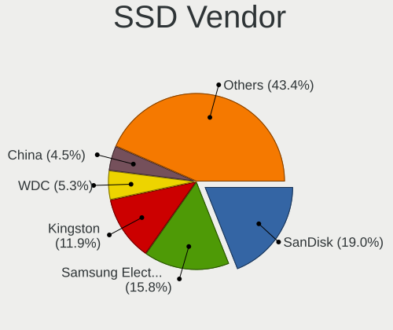

| Vendor              | Notebooks | Drives | Percent |
|---------------------|-----------|--------|---------|
| SanDisk             | 142       | 179    | 18.98%  |
| Samsung Electronics | 118       | 155    | 15.78%  |
| Kingston            | 89        | 130    | 11.9%   |
| WDC                 | 40        | 49     | 5.35%   |
| China               | 34        | 38     | 4.55%   |
| Crucial             | 29        | 38     | 3.88%   |
| Toshiba             | 24        | 26     | 3.21%   |
| Micron Technology   | 23        | 28     | 3.07%   |
| A-DATA Technology   | 20        | 24     | 2.67%   |
| Apple               | 19        | 21     | 2.54%   |
| SK hynix            | 18        | 21     | 2.41%   |
| KIOXIA-EXCERIA      | 17        | 19     | 2.27%   |
| Corsair             | 14        | 15     | 1.87%   |
| Intel               | 10        | 17     | 1.34%   |
| HS-SSD-C100         | 9         | 11     | 1.2%    |
| Pioneer             | 8         | 24     | 1.07%   |
| OCZ                 | 8         | 8      | 1.07%   |
| TwinMOS             | 7         | 8      | 0.94%   |
| Seagate             | 7         | 8      | 0.94%   |
| LITEON              | 7         | 8      | 0.94%   |
| JAMESDONKEY         | 7         | 7      | 0.94%   |
| Intenso             | 7         | 8      | 0.94%   |
| Team                | 6         | 6      | 0.8%    |
| Netac               | 6         | 7      | 0.8%    |
| Lexar               | 6         | 12     | 0.8%    |
| Transcend           | 5         | 5      | 0.67%   |
| SPCC                | 5         | 5      | 0.67%   |
| KingSpec            | 5         | 5      | 0.67%   |
| Gigabyte Technology | 5         | 14     | 0.67%   |
| LITEONIT            | 4         | 5      | 0.53%   |
| HS-SSD-E100         | 4         | 7      | 0.53%   |
| HI-LEVEL            | 4         | 4      | 0.53%   |
| Hewlett-Packard     | 4         | 5      | 0.53%   |
| Patriot             | 3         | 4      | 0.4%    |
| KingFast            | 3         | 7      | 0.4%    |
| Indilinx            | 3         | 5      | 0.4%    |
| EZCOOL              | 3         | 4      | 0.4%    |
| SABRENT             | 2         | 2      | 0.27%   |
| HS-SSD-E100N        | 2         | 2      | 0.27%   |
| GOODRAM             | 2         | 5      | 0.27%   |

Drive Kind
----------

HDD or SSD

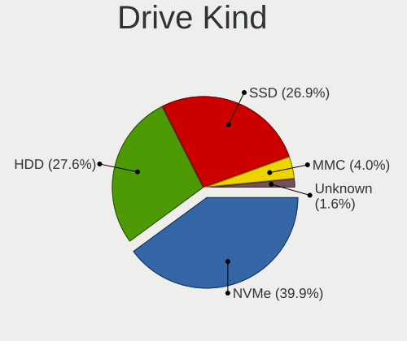

| Kind    | Notebooks | Drives | Percent |
|---------|-----------|--------|---------|
| NVMe    | 1024      | 1459   | 39.91%  |
| HDD     | 709       | 855    | 27.63%  |
| SSD     | 691       | 967    | 26.93%  |
| MMC     | 102       | 130    | 3.98%   |
| Unknown | 40        | 53     | 1.56%   |

Drive Connector
---------------

SATA, SAS, NVMe, etc.

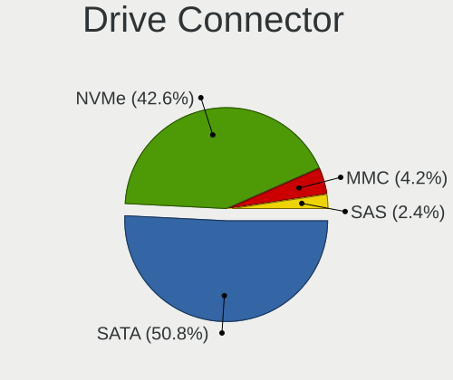

| Type | Notebooks | Drives | Percent |
|------|-----------|--------|---------|
| SATA | 1221      | 1805   | 50.79%  |
| NVMe | 1024      | 1456   | 42.6%   |
| MMC  | 102       | 130    | 4.24%   |
| SAS  | 57        | 73     | 2.37%   |

Drive Size
----------

Size of hard drive

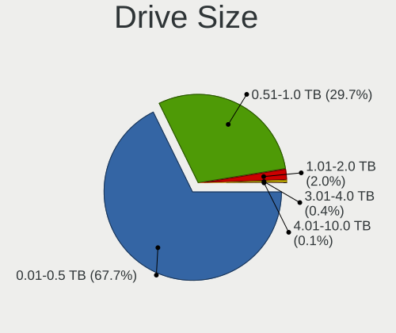

| Size in TB | Notebooks | Drives | Percent |
|------------|-----------|--------|---------|
| 0.01-0.5   | 921       | 1284   | 67.72%  |
| 0.51-1.0   | 404       | 494    | 29.71%  |
| 1.01-2.0   | 27        | 36     | 1.99%   |
| 3.01-4.0   | 6         | 6      | 0.44%   |
| 4.01-10.0  | 2         | 2      | 0.15%   |

Space Total
-----------

Amount of disk space available on the file system

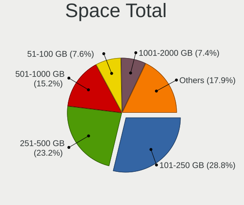

| Size in GB     | Notebooks | Percent |
|----------------|-----------|---------|
| 101-250        | 668       | 28.76%  |
| 251-500        | 539       | 23.2%   |
| 501-1000       | 352       | 15.15%  |
| 51-100         | 176       | 7.58%   |
| 1001-2000      | 172       | 7.4%    |
| 1-20           | 158       | 6.8%    |
| 21-50          | 119       | 5.12%   |
| 2001-3000      | 56        | 2.41%   |
| More than 3000 | 48        | 2.07%   |
| Unknown        | 35        | 1.51%   |

Space Used
----------

Amount of used disk space

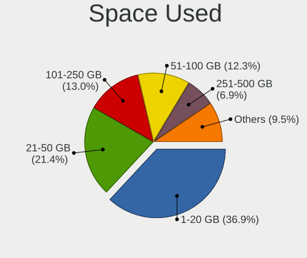

| Used GB        | Notebooks | Percent |
|----------------|-----------|---------|
| 1-20           | 890       | 36.93%  |
| 21-50          | 515       | 21.37%  |
| 101-250        | 314       | 13.03%  |
| 51-100         | 296       | 12.28%  |
| 251-500        | 166       | 6.89%   |
| 501-1000       | 121       | 5.02%   |
| 1001-2000      | 50        | 2.07%   |
| Unknown        | 35        | 1.45%   |
| More than 3000 | 13        | 0.54%   |
| 2001-3000      | 10        | 0.41%   |

Malfunc. Drives
---------------

Drive models with a malfunction

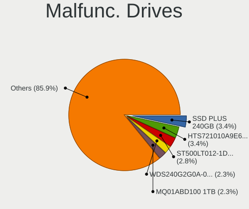

| Model                              | Notebooks | Drives | Percent |
|------------------------------------|-----------|--------|---------|
| SanDisk SSD PLUS 240GB             | 6         | 7      | 3.39%   |
| HGST HTS721010A9E630 1TB           | 6         | 7      | 3.39%   |
| Seagate ST500LT012-1DG142 500GB    | 5         | 9      | 2.82%   |
| WDC WDS240G2G0A-00JH30 240GB SSD   | 4         | 5      | 2.26%   |
| Toshiba MQ01ABD100 1TB             | 4         | 4      | 2.26%   |
| Toshiba MQ01ABD075 752GB           | 4         | 4      | 2.26%   |
| Toshiba MQ01ABD050 500GB           | 4         | 6      | 2.26%   |
| Seagate ST9500325AS 500GB          | 4         | 6      | 2.26%   |
| Seagate ST1000LM035-1RK172 1TB     | 4         | 4      | 2.26%   |
| Seagate ST1000LM024 HN-M101MBB 1TB | 4         | 4      | 2.26%   |
| WDC WD10JPVX-22JC3T0 1TB           | 3         | 3      | 1.69%   |
| Toshiba MQ01ABF050 500GB           | 3         | 4      | 1.69%   |
| Toshiba MK3252GSX 320GB            | 3         | 3      | 1.69%   |
| Seagate ST9320325AS 320GB          | 3         | 3      | 1.69%   |
| Seagate ST1000LM014-SSHD-8GB       | 3         | 3      | 1.69%   |
| HGST HTS545050A7E680 500GB         | 3         | 3      | 1.69%   |
| WDC WD5000LPVX-22V0TT0 500GB       | 2         | 2      | 1.13%   |
| WDC WD10JPVX-75JC3T0 1TB           | 2         | 2      | 1.13%   |
| Toshiba MQ04ABF100 1TB             | 2         | 2      | 1.13%   |
| Toshiba MQ02ABD100H 1TB            | 2         | 4      | 1.13%   |
| Seagate ST9160821AS 160GB          | 2         | 2      | 1.13%   |
| Seagate ST500LT012-9WS142 500GB    | 2         | 2      | 1.13%   |
| Seagate ST1000LM049-2GH172 1TB     | 2         | 2      | 1.13%   |
| Kingston SUV400S37240G 240GB SSD   | 2         | 2      | 1.13%   |
| JMicron Technology Tech 250GB      | 2         | 2      | 1.13%   |
| Indilinx IND-S325S120G 120GB SSD   | 2         | 4      | 1.13%   |
| Hitachi HTS547575A9E384 752GB      | 2         | 2      | 1.13%   |
| Hitachi HTS543232A7A384 320GB      | 2         | 2      | 1.13%   |
| Hitachi HCC543232A7A380 320GB      | 2         | 2      | 1.13%   |
| Fujitsu MHY2120BH 120GB            | 2         | 2      | 1.13%   |
| A-DATA Technology SU630 480GB SSD  | 2         | 2      | 1.13%   |
| WDC WDS240G2G0B-00EPW0 240GB SSD   | 1         | 1      | 0.56%   |
| WDC WD7500BPVT-55HXZT3 752GB       | 1         | 1      | 0.56%   |
| WDC WD5000LPVX-00V0TT0 500GB       | 1         | 1      | 0.56%   |
| WDC WD5000LPCX-60VHAT0 500GB       | 1         | 1      | 0.56%   |
| WDC WD5000BEVT-75A0RT0 500GB       | 1         | 1      | 0.56%   |
| WDC WD5000BEVT-22ZAT0 500GB        | 1         | 1      | 0.56%   |
| WDC WD3200BPVT-22JJ5T0 320GB       | 1         | 1      | 0.56%   |
| WDC WD3200BEVT-22A23T0 320GB       | 1         | 1      | 0.56%   |
| WDC WD3200BEKT-60KA9T0 320GB       | 1         | 1      | 0.56%   |

Malfunc. Drive Vendor
---------------------

Vendors of faulty drives

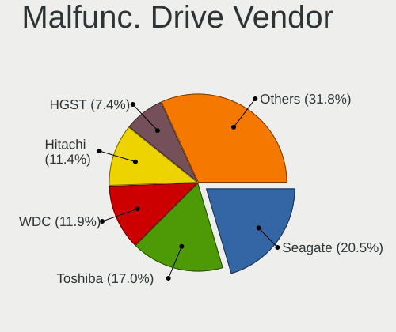

| Vendor              | Notebooks | Drives | Percent |
|---------------------|-----------|--------|---------|
| Seagate             | 36        | 43     | 20.45%  |
| Toshiba             | 30        | 35     | 17.05%  |
| WDC                 | 21        | 22     | 11.93%  |
| Hitachi             | 20        | 20     | 11.36%  |
| HGST                | 13        | 14     | 7.39%   |
| SanDisk             | 11        | 13     | 6.25%   |
| Kingston            | 7         | 7      | 3.98%   |
| A-DATA Technology   | 7         | 7      | 3.98%   |
| Samsung Electronics | 6         | 9      | 3.41%   |
| Fujitsu             | 5         | 5      | 2.84%   |
| SK hynix            | 4         | 5      | 2.27%   |
| JMicron Technology  | 2         | 2      | 1.14%   |
| Indilinx            | 2         | 4      | 1.14%   |
| Crucial             | 2         | 2      | 1.14%   |
| China               | 2         | 2      | 1.14%   |
| Micron Technology   | 1         | 1      | 0.57%   |
| LITEONIT            | 1         | 2      | 0.57%   |
| LITEON              | 1         | 1      | 0.57%   |
| Lenovo              | 1         | 1      | 0.57%   |
| JD                  | 1         | 1      | 0.57%   |
| Intel               | 1         | 1      | 0.57%   |
| Corsair             | 1         | 2      | 0.57%   |
| Apple               | 1         | 2      | 0.57%   |

Malfunc. HDD Vendor
-------------------

Vendors of faulty HDD drives

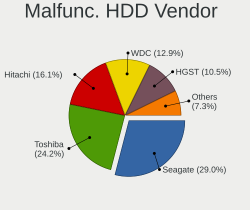

| Vendor              | Notebooks | Drives | Percent |
|---------------------|-----------|--------|---------|
| Seagate             | 36        | 43     | 29.03%  |
| Toshiba             | 30        | 35     | 24.19%  |
| Hitachi             | 20        | 20     | 16.13%  |
| WDC                 | 16        | 16     | 12.9%   |
| HGST                | 13        | 14     | 10.48%  |
| Fujitsu             | 5         | 5      | 4.03%   |
| Samsung Electronics | 3         | 4      | 2.42%   |
| Apple               | 1         | 2      | 0.81%   |

Malfunc. Drive Kind
-------------------

Kinds of faulty drives

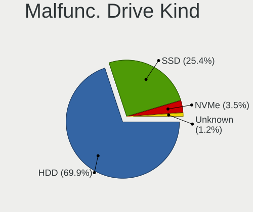

| Kind    | Notebooks | Drives | Percent |
|---------|-----------|--------|---------|
| HDD     | 121       | 139    | 69.94%  |
| SSD     | 44        | 54     | 25.43%  |
| NVMe    | 6         | 6      | 3.47%   |
| Unknown | 2         | 2      | 1.16%   |

Failed Drives
-------------

Failed drive models

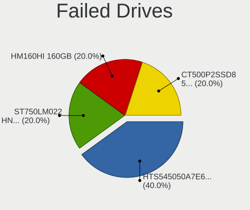

| Model                               | Notebooks | Drives | Percent |
|-------------------------------------|-----------|--------|---------|
| HGST HTS545050A7E680 500GB          | 2         | 2      | 40%     |
| Seagate ST750LM022 HN-M750MBB 752GB | 1         | 1      | 20%     |
| Samsung Electronics HM160HI 160GB   | 1         | 1      | 20%     |
| Crucial CT500P2SSD8 500GB           | 1         | 1      | 20%     |

Failed Drive Vendor
-------------------

Failed drive vendors

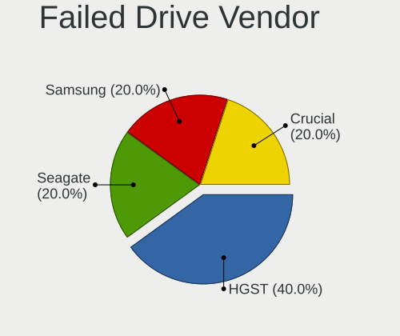

| Vendor              | Notebooks | Drives | Percent |
|---------------------|-----------|--------|---------|
| HGST                | 2         | 2      | 40%     |
| Seagate             | 1         | 1      | 20%     |
| Samsung Electronics | 1         | 1      | 20%     |
| Crucial             | 1         | 1      | 20%     |

Drive Status
------------

Number of failed and malfunc. drives

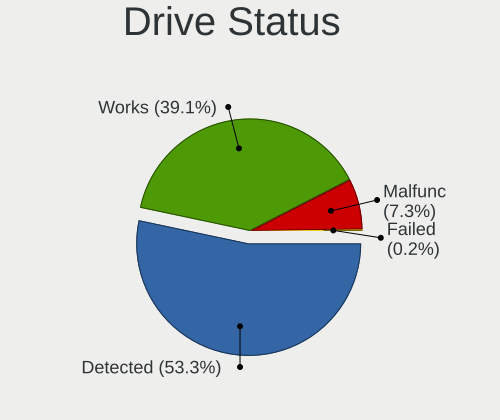

| Status   | Notebooks | Drives | Percent |
|----------|-----------|--------|---------|
| Detected | 1237      | 1891   | 53.32%  |
| Works    | 908       | 1367   | 39.14%  |
| Malfunc  | 170       | 201    | 7.33%   |
| Failed   | 5         | 5      | 0.22%   |

Storage controller
------------------

Storage Vendor
--------------

Storage controller vendors

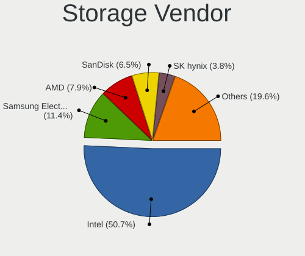

| Vendor                                  | Notebooks | Percent |
|-----------------------------------------|-----------|---------|
| Intel                                   | 1348      | 50.71%  |
| Samsung Electronics                     | 304       | 11.44%  |
| AMD                                     | 211       | 7.94%   |
| SanDisk                                 | 172       | 6.47%   |
| SK hynix                                | 101       | 3.8%    |
| Micron Technology                       | 93        | 3.5%    |
| Kingston Technology Company             | 77        | 2.9%    |
| KIOXIA                                  | 61        | 2.29%   |
| Phison Electronics                      | 48        | 1.81%   |
| Micron/Crucial Technology               | 48        | 1.81%   |
| Silicon Motion                          | 34        | 1.28%   |
| Toshiba America Info Systems            | 32        | 1.2%    |
| Union Memory (Shenzhen)                 | 21        | 0.79%   |
| Solidigm                                | 17        | 0.64%   |
| Silicon Integrated Systems [SiS]        | 15        | 0.56%   |
| Apple                                   | 11        | 0.41%   |
| ADATA Technology                        | 10        | 0.38%   |
| Nvidia                                  | 9         | 0.34%   |
| Yangtze Memory Technologies             | 8         | 0.3%    |
| Realtek Semiconductor                   | 8         | 0.3%    |
| Marvell Technology Group                | 6         | 0.23%   |
| MAXIO Technology (Hangzhou)             | 5         | 0.19%   |
| Seagate Technology                      | 3         | 0.11%   |
| Lite-On Technology                      | 3         | 0.11%   |
| Transcend                               | 2         | 0.08%   |
| Solid State Storage Technology          | 2         | 0.08%   |
| Shenzhen Longsys Electronics            | 2         | 0.08%   |
| Lenovo                                  | 2         | 0.08%   |
| Shenzhen Unionmemory Information System | 1         | 0.04%   |
| Shenzhen Shichuangyi Electronics        | 1         | 0.04%   |
| OCZ Technology Group                    | 1         | 0.04%   |
| ASMedia Technology                      | 1         | 0.04%   |
| Unknown                                 | 1         | 0.04%   |

Storage Model
-------------

Storage controller models

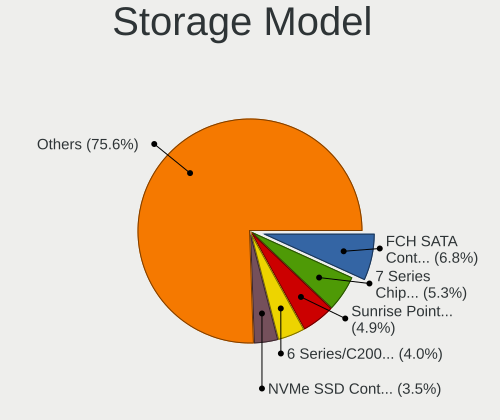

| Model                                                                          | Notebooks | Percent |
|--------------------------------------------------------------------------------|-----------|---------|
| AMD FCH SATA Controller [AHCI mode]                                            | 191       | 6.79%   |
| Intel 7 Series Chipset Family 6-port SATA Controller [AHCI mode]               | 149       | 5.29%   |
| Intel Sunrise Point-LP SATA Controller [AHCI mode]                             | 138       | 4.9%    |
| Intel 6 Series/C200 Series Chipset Family 6 port Mobile SATA AHCI Controller   | 112       | 3.98%   |
| Samsung NVMe SSD Controller SM981/PM981/PM983                                  | 98        | 3.48%   |
| Samsung NVMe SSD Controller 980 (DRAM-less)                                    | 97        | 3.45%   |
| Intel 82801 Mobile SATA Controller [RAID mode]                                 | 80        | 2.84%   |
| Intel 8 Series SATA Controller 1 [AHCI mode]                                   | 70        | 2.49%   |
| Intel HM170/QM170 Chipset SATA Controller [AHCI Mode]                          | 66        | 2.35%   |
| Intel Volume Management Device NVMe RAID Controller                            | 63        | 2.24%   |
| Intel Cannon Lake Mobile PCH SATA AHCI Controller                              | 63        | 2.24%   |
| Intel 5 Series/3400 Series Chipset 4 port SATA AHCI Controller                 | 53        | 1.88%   |
| Intel 82801IBM/IEM (ICH9M/ICH9M-E) 4 port SATA Controller [AHCI mode]          | 52        | 1.85%   |
| Intel 400 Series Chipset Family SATA AHCI Controller                           | 52        | 1.85%   |
| Samsung NVMe SSD Controller PM9A1/PM9A3/980PRO                                 | 47        | 1.67%   |
| Intel Wildcat Point-LP SATA Controller [AHCI Mode]                             | 47        | 1.67%   |
| Intel 8 Series/C220 Series Chipset Family 6-port SATA Controller 1 [AHCI mode] | 46        | 1.63%   |
| Intel Tiger Lake-LP SATA Controller                                            | 42        | 1.49%   |
| SanDisk Ultra 3D / WD PC SN530, IX SN530, Blue SN550 NVMe SSD (DRAM-less)      | 40        | 1.42%   |
| Intel Tiger Lake SATA AHCI Controller                                          | 37        | 1.31%   |
| Micron/Crucial P2 [Nick P2] / P3 / P3 Plus NVMe PCIe SSD (DRAM-less)           | 36        | 1.28%   |
| Intel Comet Lake SATA AHCI Controller                                          | 32        | 1.14%   |
| SK hynix Gold P31/BC711/PC711 NVMe Solid State Drive                           | 31        | 1.1%    |
| Intel SSD 670p Series [Keystone Harbor]                                        | 26        | 0.92%   |
| Intel Alder Lake-P SATA AHCI Controller                                        | 25        | 0.89%   |
| SanDisk WD SN560/SN740/SN770/SN5000 NVMe SSD                                   | 24        | 0.85%   |
| Intel SSD 660P Series                                                          | 24        | 0.85%   |
| Silicon Motion Non-Volatile memory controller                                  | 23        | 0.82%   |
| Phison PS5013-E13 PCIe3 NVMe Controller (DRAM-less)                            | 23        | 0.82%   |
| KIOXIA NVMe SSD Controller BG4 (DRAM-less)                                     | 23        | 0.82%   |
| SanDisk Extreme Pro / WD Black SN750 / PC SN730 / Red SN700 NVMe SSD           | 22        | 0.78%   |
| Samsung NVMe SSD Controller SM961/PM961/SM963                                  | 21        | 0.75%   |
| Intel Cannon Point-LP SATA Controller [AHCI Mode]                              | 20        | 0.71%   |
| Micron 2450 NVMe SSD [HendrixV] (DRAM-less)                                    | 19        | 0.68%   |
| Intel Celeron/Pentium Silver Processor SATA Controller                         | 19        | 0.68%   |
| Intel 82801HM/HEM (ICH8M/ICH8M-E) IDE Controller                               | 19        | 0.68%   |
| Intel 5 Series/3400 Series Chipset 6 port SATA AHCI Controller                 | 19        | 0.68%   |
| SK hynix BC511 NVMe SSD                                                        | 18        | 0.64%   |
| Samsung NVMe SSD Controller PM9B1 (DRAM-less)                                  | 18        | 0.64%   |
| Micron 2210 NVMe SSD [Cobain]                                                  | 18        | 0.64%   |

Storage Kind
------------

Kind of storage controller (IDE, SATA, NVMe, SAS, ...)

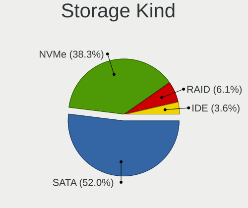

| Kind | Notebooks | Percent |
|------|-----------|---------|
| SATA | 1389      | 51.96%  |
| NVMe | 1024      | 38.31%  |
| RAID | 163       | 6.1%    |
| IDE  | 97        | 3.63%   |

Processor
---------

CPU Vendor
----------

Processor vendors

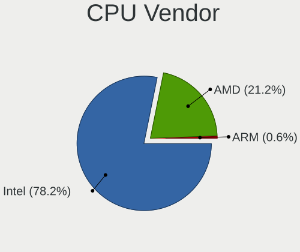

| Vendor | Notebooks | Percent |
|--------|-----------|---------|
| Intel  | 1679      | 78.17%  |
| AMD    | 456       | 21.23%  |
| ARM    | 13        | 0.61%   |

CPU Model
---------

Processor models

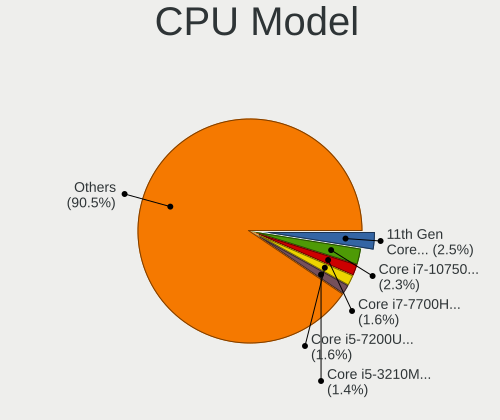

| Model                                         | Notebooks | Percent |
|-----------------------------------------------|-----------|---------|
| Intel 11th Gen Core i5-1135G7 @ 2.40GHz       | 54        | 2.51%   |
| Intel Core i7-10750H CPU @ 2.60GHz            | 50        | 2.33%   |
| Intel Core i7-7700HQ CPU @ 2.80GHz            | 35        | 1.63%   |
| Intel Core i5-7200U CPU @ 2.50GHz             | 34        | 1.58%   |
| Intel Core i5-3210M CPU @ 2.50GHz             | 30        | 1.4%    |
| Intel 11th Gen Core i7-11800H @ 2.30GHz       | 30        | 1.4%    |
| Intel Core i5-3230M CPU @ 2.60GHz             | 29        | 1.35%   |
| AMD Ryzen 5 5500U with Radeon Graphics        | 29        | 1.35%   |
| AMD Ryzen 5 3500U with Radeon Vega Mobile Gfx | 28        | 1.3%    |
| Intel Core i7-6700HQ CPU @ 2.60GHz            | 26        | 1.21%   |
| Intel Core i5-8250U CPU @ 1.60GHz             | 26        | 1.21%   |
| Intel 11th Gen Core i7-1165G7 @ 2.80GHz       | 25        | 1.16%   |
| Intel Core i7-9750H CPU @ 2.60GHz             | 24        | 1.12%   |
| Intel Core i7-8550U CPU @ 1.80GHz             | 24        | 1.12%   |
| Intel Core i5-6200U CPU @ 2.30GHz             | 24        | 1.12%   |
| Intel Core i7-10510U CPU @ 1.80GHz            | 23        | 1.07%   |
| AMD Ryzen 7 5800H with Radeon Graphics        | 23        | 1.07%   |
| Intel Core i5-8265U CPU @ 1.60GHz             | 22        | 1.02%   |
| Intel Core i5-5200U CPU @ 2.20GHz             | 22        | 1.02%   |
| Intel 12th Gen Core i7-12700H                 | 22        | 1.02%   |
| AMD Ryzen 5 5600H with Radeon Graphics        | 22        | 1.02%   |
| Intel Core i7-8750H CPU @ 2.20GHz             | 21        | 0.98%   |
| Intel Core i5-1035G1 CPU @ 1.00GHz            | 21        | 0.98%   |
| AMD Ryzen 7 5700U with Radeon Graphics        | 21        | 0.98%   |
| AMD Ryzen 5 4600H with Radeon Graphics        | 21        | 0.98%   |
| Intel Core i5-2450M CPU @ 2.50GHz             | 20        | 0.93%   |
| Intel Core i5-2430M CPU @ 2.40GHz             | 20        | 0.93%   |
| Intel Core i5-4210U CPU @ 1.70GHz             | 19        | 0.88%   |
| AMD Ryzen 7 4800H with Radeon Graphics        | 19        | 0.88%   |
| Intel Core i7-3630QM CPU @ 2.40GHz            | 18        | 0.84%   |
| Intel 12th Gen Core i5-12450H                 | 18        | 0.84%   |
| Intel Core i5-4200U CPU @ 1.60GHz             | 16        | 0.74%   |
| Intel Core i5-10210U CPU @ 1.60GHz            | 16        | 0.74%   |
| Intel 13th Gen Core i5-13500H                 | 16        | 0.74%   |
| Intel 12th Gen Core i5-1235U                  | 16        | 0.74%   |
| Intel Core i7-6500U CPU @ 2.50GHz             | 15        | 0.7%    |
| Intel Core i5-4200M CPU @ 2.50GHz             | 15        | 0.7%    |
| Intel Core i5-2520M CPU @ 2.50GHz             | 15        | 0.7%    |
| Intel Celeron CPU N3350 @ 1.10GHz             | 15        | 0.7%    |
| AMD Ryzen 7 7840HS w/ Radeon 780M Graphics    | 15        | 0.7%    |

CPU Model Family
----------------

Processor model prefix

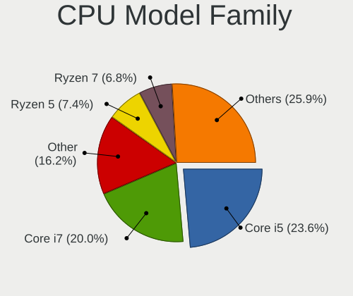

| Model                   | Notebooks | Percent |
|-------------------------|-----------|---------|
| Intel Core i5           | 507       | 23.6%   |
| Intel Core i7           | 429       | 19.97%  |
| Other                   | 349       | 16.25%  |
| AMD Ryzen 5             | 160       | 7.45%   |
| AMD Ryzen 7             | 146       | 6.8%    |
| Intel Core i3           | 121       | 5.63%   |
| Intel Celeron           | 81        | 3.77%   |
| Intel Core 2 Duo        | 67        | 3.12%   |
| Intel Atom              | 41        | 1.91%   |
| Intel Pentium           | 28        | 1.3%    |
| AMD A8                  | 22        | 1.02%   |
| Intel Core              | 21        | 0.98%   |
| AMD Ryzen 3             | 20        | 0.93%   |
| AMD A10                 | 17        | 0.79%   |
| Intel Pentium Dual-Core | 16        | 0.74%   |
| Intel Core 2            | 14        | 0.65%   |
| Intel Pentium Dual      | 11        | 0.51%   |
| AMD Ryzen 9             | 10        | 0.47%   |
| AMD Ryzen 7 PRO         | 9         | 0.42%   |
| Intel Core i9           | 8         | 0.37%   |
| AMD A6                  | 8         | 0.37%   |
| AMD Ryzen 5 PRO         | 6         | 0.28%   |
| Intel Pentium Silver    | 5         | 0.23%   |
| Intel Genuine           | 5         | 0.23%   |
| AMD C-60                | 5         | 0.23%   |
| AMD A4                  | 5         | 0.23%   |
| Intel Xeon              | 4         | 0.19%   |
| AMD E2                  | 4         | 0.19%   |
| AMD A12                 | 4         | 0.19%   |
| Intel Pentium M         | 3         | 0.14%   |
| AMD E                   | 3         | 0.14%   |
| Intel Core M            | 2         | 0.09%   |
| Intel Celeron Dual-Core | 2         | 0.09%   |
| AMD Turion 64 X2 Mobile | 2         | 0.09%   |
| AMD Athlon X2           | 2         | 0.09%   |
| Intel Pentium 4         | 1         | 0.05%   |
| Intel Celeron M         | 1         | 0.05%   |
| AMD Turion II Neo       | 1         | 0.05%   |
| AMD Quad-Core           | 1         | 0.05%   |
| AMD Mobile Athlon 64    | 1         | 0.05%   |

CPU Cores
---------

Number of processor cores

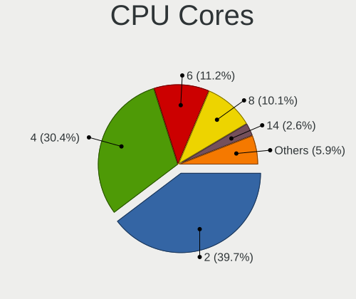

| Number | Notebooks | Percent |
|--------|-----------|---------|
| 2      | 853       | 39.69%  |
| 4      | 654       | 30.43%  |
| 6      | 241       | 11.21%  |
| 8      | 218       | 10.14%  |
| 14     | 56        | 2.61%   |
| 10     | 48        | 2.23%   |
| 12     | 32        | 1.49%   |
| 1      | 25        | 1.16%   |
| 24     | 12        | 0.56%   |
| 16     | 10        | 0.47%   |

CPU Sockets
-----------

Number of sockets

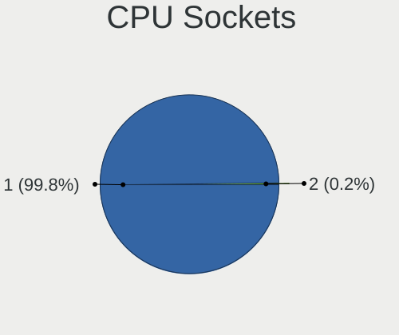

| Number | Notebooks | Percent |
|--------|-----------|---------|
| 1      | 2144      | 99.81%  |
| 2      | 4         | 0.19%   |

CPU Threads
-----------

Threads per core (Hyper-Threading)

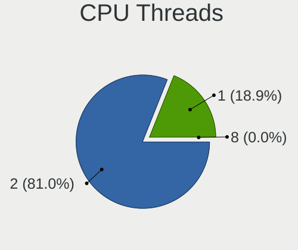

| Number | Notebooks | Percent |
|--------|-----------|---------|
| 2      | 1743      | 81.03%  |
| 1      | 407       | 18.92%  |
| 8      | 1         | 0.05%   |

CPU Op-Modes
------------

CPU Operation Modes (32-bit, 64-bit)

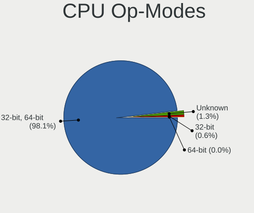

| Op mode        | Notebooks | Percent |
|----------------|-----------|---------|
| 32-bit, 64-bit | 2109      | 98.09%  |
| Unknown        | 27        | 1.26%   |
| 32-bit         | 13        | 0.6%    |
| 64-bit         | 1         | 0.05%   |

CPU Microcode
-------------

Microcode number

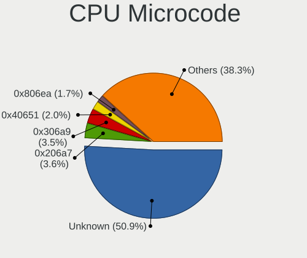

| Number     | Notebooks | Percent |
|------------|-----------|---------|
| Unknown    | 1134      | 50.87%  |
| 0x206a7    | 80        | 3.59%   |
| 0x306a9    | 77        | 3.45%   |
| 0x40651    | 45        | 2.02%   |
| 0x806ea    | 39        | 1.75%   |
| 0x806c1    | 37        | 1.66%   |
| 0xa0652    | 36        | 1.62%   |
| 0x306d4    | 36        | 1.62%   |
| 0x906ea    | 34        | 1.53%   |
| 0x806ec    | 34        | 1.53%   |
| 0x806e9    | 33        | 1.48%   |
| 0x406e3    | 31        | 1.39%   |
| 0x306c3    | 31        | 1.39%   |
| 0x20655    | 30        | 1.35%   |
| 0x1067a    | 30        | 1.35%   |
| 0x906e9    | 28        | 1.26%   |
| 0x08608103 | 27        | 1.21%   |
| 0x08600106 | 22        | 0.99%   |
| 0x08108109 | 22        | 0.99%   |
| 0x08108102 | 22        | 0.99%   |
| 0x30678    | 21        | 0.94%   |
| 0x6fd      | 19        | 0.85%   |
| 0x506e3    | 19        | 0.85%   |
| 0x0a50000c | 19        | 0.85%   |
| 0x706e5    | 18        | 0.81%   |
| 0x906a3    | 17        | 0.76%   |
| 0x20652    | 16        | 0.72%   |
| 0x806d1    | 15        | 0.67%   |
| 0x406c4    | 15        | 0.67%   |
| 0x0a50000d | 15        | 0.67%   |
| 0x906a4    | 12        | 0.54%   |
| 0x506c9    | 12        | 0.54%   |
| 0x06006705 | 12        | 0.54%   |
| 0x10676    | 10        | 0.45%   |
| 0x07030105 | 10        | 0.45%   |
| 0x806eb    | 9         | 0.4%    |
| 0x08600104 | 9         | 0.4%    |
| 0x08600103 | 9         | 0.4%    |
| 0x106ca    | 8         | 0.36%   |
| 0x05000119 | 7         | 0.31%   |

CPU Microarch
-------------

Microarchitecture

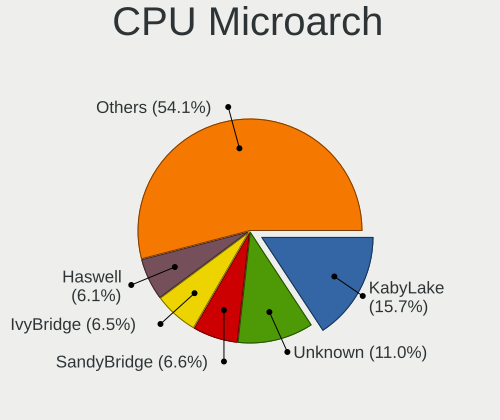

| Name              | Notebooks | Percent |
|-------------------|-----------|---------|
| KabyLake          | 340       | 15.75%  |
| Unknown           | 238       | 11.02%  |
| SandyBridge       | 142       | 6.58%   |
| IvyBridge         | 140       | 6.48%   |
| Haswell           | 132       | 6.11%   |
| Alderlake Hybrid  | 108       | 5%      |
| TigerLake         | 104       | 4.82%   |
| Skylake           | 86        | 3.98%   |
| Zen 3             | 83        | 3.84%   |
| CometLake         | 83        | 3.84%   |
| Westmere          | 71        | 3.29%   |
| Zen 2             | 70        | 3.24%   |
| Penryn            | 70        | 3.24%   |
| Icelake           | 67        | 3.1%    |
| Zen+              | 66        | 3.06%   |
| Silvermont        | 66        | 3.06%   |
| Broadwell         | 57        | 2.64%   |
| Core              | 41        | 1.9%    |
| Excavator         | 28        | 1.3%    |
| Goldmont plus     | 24        | 1.11%   |
| Puma              | 22        | 1.02%   |
| Bonnell           | 17        | 0.79%   |
| Goldmont          | 16        | 0.74%   |
| Zen               | 12        | 0.56%   |
| Bobcat            | 12        | 0.56%   |
| Piledriver        | 11        | 0.51%   |
| Meteorlake Hybrid | 11        | 0.51%   |
| P6                | 8         | 0.37%   |
| Nehalem           | 7         | 0.32%   |
| K8 Hammer         | 7         | 0.32%   |
| K10 Llano         | 5         | 0.23%   |
| Lunarlake Hybrid  | 4         | 0.19%   |
| Steamroller       | 3         | 0.14%   |
| Jaguar            | 3         | 0.14%   |
| Tremont           | 2         | 0.09%   |
| NetBurst          | 1         | 0.05%   |
| K10               | 1         | 0.05%   |
| Gracemont         | 1         | 0.05%   |

Graphics
--------

GPU Vendor
----------

Vendors of graphics cards

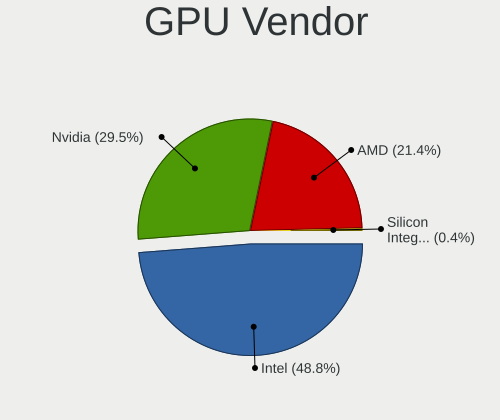

| Vendor                           | Notebooks | Percent |
|----------------------------------|-----------|---------|
| Intel                            | 1510      | 48.77%  |
| Nvidia                           | 913       | 29.49%  |
| AMD                              | 661       | 21.35%  |
| Silicon Integrated Systems [SiS] | 12        | 0.39%   |

GPU Model
---------

Graphics card models

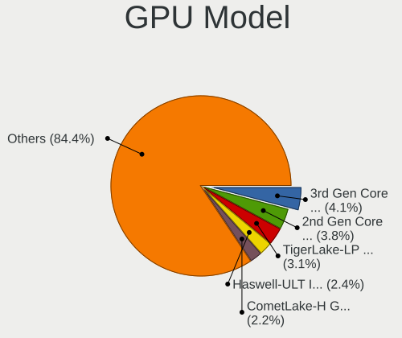

| Model                                                                                    | Notebooks | Percent |
|------------------------------------------------------------------------------------------|-----------|---------|
| Intel 3rd Gen Core processor Graphics Controller                                         | 132       | 4.11%   |
| Intel 2nd Generation Core Processor Family Integrated Graphics Controller                | 121       | 3.77%   |
| Intel TigerLake-LP GT2 [Iris Xe Graphics]                                                | 100       | 3.12%   |
| Intel Haswell-ULT Integrated Graphics Controller                                         | 78        | 2.43%   |
| Intel CometLake-H GT2 [UHD Graphics]                                                     | 71        | 2.21%   |
| AMD Renoir [Radeon Vega Series / Radeon Vega Mobile Series]                              | 69        | 2.15%   |
| Intel CoffeeLake-H GT2 [UHD Graphics 630]                                                | 67        | 2.09%   |
| AMD Picasso/Raven 2 [Radeon Vega Series / Radeon Vega Mobile Series]                     | 67        | 2.09%   |
| Intel Kaby Lake-R GT2 [UHD Graphics 620]                                                 | 65        | 2.03%   |
| Nvidia TU117M [GeForce GTX 1650 Mobile / Max-Q]                                          | 59        | 1.84%   |
| Intel Kaby Lake-U GT2 [HD Graphics 620]                                                  | 59        | 1.84%   |
| AMD Cezanne [Radeon Vega Series / Radeon Vega Mobile Series]                             | 55        | 1.71%   |
| AMD Lucienne                                                                             | 52        | 1.62%   |
| Intel Skylake-U GT2 [HD Graphics 520]                                                    | 50        | 1.56%   |
| Intel 4th Gen Core Processor Integrated Graphics Controller                              | 49        | 1.53%   |
| Intel Broadwell-U GT2 [HD Graphics 5500]                                                 | 47        | 1.46%   |
| Intel TigerLake-H GT1 [UHD Graphics]                                                     | 45        | 1.4%    |
| Intel CometLake-U GT2 [UHD Graphics]                                                     | 43        | 1.34%   |
| AMD Sun XT [Radeon HD 8670A/8670M/8690M / R5 M330 / M430 / Radeon 520 Mobile]            | 43        | 1.34%   |
| Intel Kaby Lake-H GT2 [HD Graphics 630]                                                  | 42        | 1.31%   |
| Nvidia GA107M [GeForce RTX 3050 Mobile]                                                  | 40        | 1.25%   |
| Nvidia GA106M [GeForce RTX 3060 Mobile / Max-Q]                                          | 39        | 1.22%   |
| Intel Raptor Lake-P [Iris Xe Graphics]                                                   | 39        | 1.22%   |
| Nvidia AD107M [GeForce RTX 4050 Max-Q / Mobile]                                          | 38        | 1.18%   |
| Intel WhiskeyLake-U GT2 [UHD Graphics 620]                                               | 38        | 1.18%   |
| Nvidia AD107M [GeForce RTX 4060 Max-Q / Mobile]                                          | 37        | 1.15%   |
| AMD Topaz XT [Radeon R7 M260/M265 / M340/M360 / M440/M445 / 530/535 / 620/625 Mobile]    | 37        | 1.15%   |
| Nvidia GP107M [GeForce GTX 1050 Mobile]                                                  | 35        | 1.09%   |
| Intel Core Processor Integrated Graphics Controller                                      | 35        | 1.09%   |
| Intel Atom Processor Z36xxx/Z37xxx Series Graphics & Display                             | 35        | 1.09%   |
| Nvidia GF117M [GeForce 610M/710M/810M/820M / GT 620M/625M/630M/720M]                     | 34        | 1.06%   |
| Nvidia TU117M [GeForce GTX 1650 Ti Mobile]                                               | 32        | 1%      |
| Intel Atom/Celeron/Pentium Processor x5-E8000/J3xxx/N3xxx Integrated Graphics Controller | 31        | 0.97%   |
| Nvidia GP107M [GeForce GTX 1050 Ti Mobile]                                               | 28        | 0.87%   |
| Intel Skylake-H GT2 [HD Graphics 530]                                                    | 28        | 0.87%   |
| AMD Rembrandt [Radeon 680M]                                                              | 28        | 0.87%   |
| Intel Alder Lake-P GT2 [Iris Xe Graphics]                                                | 27        | 0.84%   |
| AMD Thames [Radeon HD 7500M/7600M Series]                                                | 26        | 0.81%   |
| AMD Barcelo                                                                              | 26        | 0.81%   |
| Nvidia GA107M [GeForce RTX 3050 Ti Mobile]                                               | 25        | 0.78%   |

GPU Combo
---------

Combinations of graphics cards

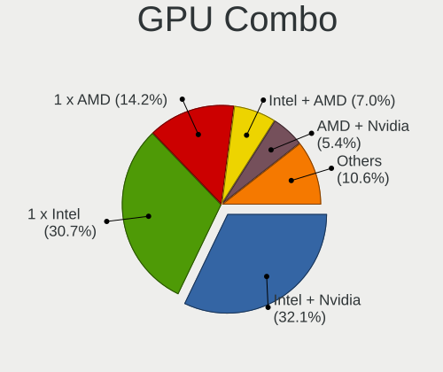

| Name           | Notebooks | Percent |
|----------------|-----------|---------|
| Intel + Nvidia | 693       | 32.14%  |
| 1 x Intel      | 661       | 30.66%  |
| 1 x AMD        | 307       | 14.24%  |
| Intel + AMD    | 150       | 6.96%   |
| AMD + Nvidia   | 117       | 5.43%   |
| 1 x Nvidia     | 104       | 4.82%   |
| 2 x AMD        | 87        | 4.04%   |
| Other          | 15        | 0.7%    |
| 1 x SiS        | 12        | 0.56%   |
| 2 x Intel      | 9         | 0.42%   |
| 2 x Nvidia     | 1         | 0.05%   |

GPU Driver
----------

Free vs proprietary

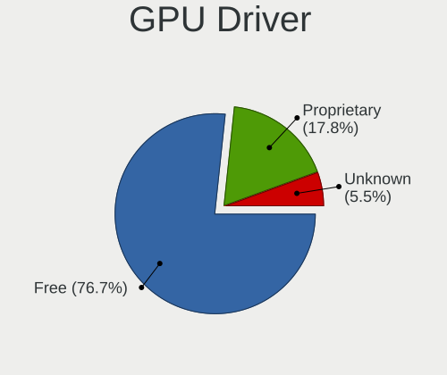

| Driver      | Notebooks | Percent |
|-------------|-----------|---------|
| Free        | 1686      | 76.67%  |
| Proprietary | 391       | 17.78%  |
| Unknown     | 122       | 5.55%   |

GPU Memory
----------

Total video memory

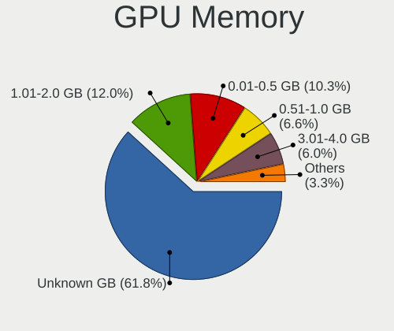

| Size in GB | Notebooks | Percent |
|------------|-----------|---------|
| Unknown    | 1371      | 61.78%  |
| 1.01-2.0   | 266       | 11.99%  |
| 0.01-0.5   | 229       | 10.32%  |
| 0.51-1.0   | 147       | 6.62%   |
| 3.01-4.0   | 133       | 5.99%   |
| 5.01-6.0   | 44        | 1.98%   |
| 7.01-8.0   | 20        | 0.9%    |
| 2.01-3.0   | 7         | 0.32%   |
| 8.01-16.0  | 2         | 0.09%   |

Monitor
-------

Monitor Vendor
--------------

Monitor vendors

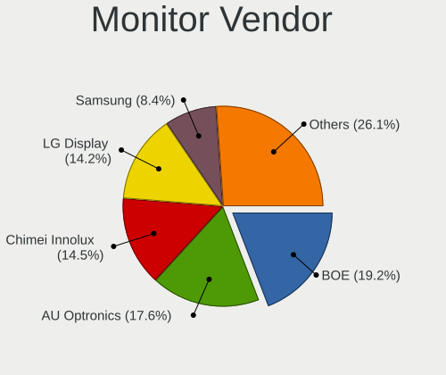

| Vendor                  | Notebooks | Percent |
|-------------------------|-----------|---------|
| BOE                     | 453       | 19.16%  |
| AU Optronics            | 417       | 17.64%  |
| Chimei Innolux          | 342       | 14.47%  |
| LG Display              | 336       | 14.21%  |
| Samsung Electronics     | 199       | 8.42%   |
| Chi Mei Optoelectronics | 55        | 2.33%   |
| Apple                   | 54        | 2.28%   |
| PANDA                   | 49        | 2.07%   |
| Lenovo                  | 46        | 1.95%   |
| Goldstar                | 30        | 1.27%   |
| Dell                    | 28        | 1.18%   |
| Philips                 | 26        | 1.1%    |
| ASUSTek Computer        | 24        | 1.02%   |
| ViewSonic               | 23        | 0.97%   |
| Sharp                   | 23        | 0.97%   |
| Hewlett-Packard         | 22        | 0.93%   |
| Ancor Communications    | 17        | 0.72%   |
| MSI                     | 14        | 0.59%   |
| LG Philips              | 14        | 0.59%   |
| AOC                     | 14        | 0.59%   |
| InfoVision              | 13        | 0.55%   |
| CSO                     | 13        | 0.55%   |
| Acer                    | 12        | 0.51%   |
| CPT                     | 10        | 0.42%   |
| Vestel Elektronik       | 8         | 0.34%   |
| EDO                     | 7         | 0.3%    |
| Valve                   | 6         | 0.25%   |
| TMX                     | 6         | 0.25%   |
| Sony                    | 6         | 0.25%   |
| LGD                     | 6         | 0.25%   |
| CSW                     | 6         | 0.25%   |
| CSOT                    | 6         | 0.25%   |
| BenQ                    | 6         | 0.25%   |
| Unknown                 | 5         | 0.21%   |
| HannStar                | 5         | 0.21%   |
| Toshiba                 | 3         | 0.13%   |
| Quanta Display          | 3         | 0.13%   |
| HKC                     | 3         | 0.13%   |
| VIE                     | 2         | 0.08%   |
| Unknown (XXX)           | 2         | 0.08%   |

Monitor Model
-------------

Monitor models

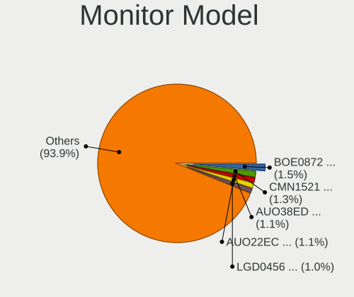

| Model                                                                    | Notebooks | Percent |
|--------------------------------------------------------------------------|-----------|---------|
| BOE LCD Monitor BOE0872 1920x1080 344x194mm 15.5-inch                    | 36        | 1.51%   |
| Chimei Innolux LCD Monitor CMN1521 1920x1080 344x193mm 15.5-inch         | 32        | 1.34%   |
| AU Optronics LCD Monitor AUO38ED 1920x1080 344x193mm 15.5-inch           | 27        | 1.13%   |
| AU Optronics LCD Monitor AUO22EC 1366x768 344x193mm 15.5-inch            | 27        | 1.13%   |
| LG Display LCD Monitor LGD0456 1366x768 344x194mm 15.5-inch              | 24        | 1.01%   |
| Chimei Innolux LCD Monitor CMN15F5 1920x1080 344x193mm 15.5-inch         | 24        | 1.01%   |
| Chimei Innolux LCD Monitor CMN14D4 1920x1080 309x173mm 13.9-inch         | 24        | 1.01%   |
| Chimei Innolux LCD Monitor CMN15E7 1920x1080 344x193mm 15.5-inch         | 20        | 0.84%   |
| LG Display LCD Monitor LGD033A 1366x768 344x194mm 15.5-inch              | 19        | 0.8%    |
| LG Display LCD Monitor LGD02DC 1366x768 344x194mm 15.5-inch              | 19        | 0.8%    |
| Chimei Innolux LCD Monitor CMN15DB 1366x768 344x193mm 15.5-inch          | 19        | 0.8%    |
| PANDA LCD Monitor NCP004D 1920x1080 344x194mm 15.5-inch                  | 15        | 0.63%   |
| Lenovo LCD Monitor LEN40BA 1920x1080 344x194mm 15.5-inch                 | 14        | 0.59%   |
| BOE LCD Monitor BOE06A4 1366x768 344x194mm 15.5-inch                     | 14        | 0.59%   |
| LG Display LCD Monitor LGD039F 1366x768 345x194mm 15.6-inch              | 13        | 0.54%   |
| Chi Mei Optoelectronics LCD Monitor CMO15A7 1366x768 344x193mm 15.5-inch | 13        | 0.54%   |
| AU Optronics LCD Monitor AUOAF90 1920x1080 344x193mm 15.5-inch           | 13        | 0.54%   |
| Samsung Electronics LCD Monitor SEC5441 1280x800 331x207mm 15.4-inch     | 11        | 0.46%   |
| AU Optronics LCD Monitor AUO403D 1920x1080 309x174mm 14.0-inch           | 11        | 0.46%   |
| AU Optronics LCD Monitor AUO21ED 1920x1080 344x193mm 15.5-inch           | 11        | 0.46%   |
| Chi Mei Optoelectronics LCD Monitor CMO1592 1366x768 344x193mm 15.5-inch | 10        | 0.42%   |
| BOE LCD Monitor BOE0B9F 1920x1080 355x200mm 16.0-inch                    | 10        | 0.42%   |
| BOE LCD Monitor BOE06A5 1366x768 344x194mm 15.5-inch                     | 10        | 0.42%   |
| AU Optronics LCD Monitor AUO20EC 1366x768 344x193mm 15.5-inch            | 10        | 0.42%   |
| Chimei Innolux LCD Monitor CMN14D5 1920x1080 309x173mm 13.9-inch         | 9         | 0.38%   |
| BOE LCD Monitor BOE08D5 1920x1080 344x194mm 15.5-inch                    | 9         | 0.38%   |
| BOE LCD Monitor BOE0893 2160x1440 296x197mm 14.0-inch                    | 9         | 0.38%   |
| BOE LCD Monitor BOE07CB 1920x1080 344x193mm 15.5-inch                    | 9         | 0.38%   |
| AU Optronics LCD Monitor AUO70EC 1366x768 344x193mm 15.5-inch            | 9         | 0.38%   |
| Vestel Elektronik 40UHD_LCD_TV VES3700 3840x2160 880x500mm 39.8-inch     | 8         | 0.34%   |
| Samsung Electronics LCD Monitor SEC324A 1366x768 344x194mm 15.5-inch     | 8         | 0.34%   |
| PANDA LCD Monitor NCP002D 1920x1080 344x194mm 15.5-inch                  | 8         | 0.34%   |
| LG Display LCD Monitor LGD038E 1366x768 344x194mm 15.5-inch              | 8         | 0.34%   |
| LG Display LCD Monitor LGD02AC 1366x768 344x194mm 15.5-inch              | 8         | 0.34%   |
| Chimei Innolux LCD Monitor CMN15DC 1366x768 344x193mm 15.5-inch          | 8         | 0.34%   |
| Chimei Innolux LCD Monitor CMN15D5 1920x1080 344x193mm 15.5-inch         | 8         | 0.34%   |
| BOE LCD Monitor BOE0802 1920x1080 344x193mm 15.5-inch                    | 8         | 0.34%   |
| BOE LCD Monitor BOE07C9 1920x1080 309x173mm 13.9-inch                    | 8         | 0.34%   |
| BOE LCD Monitor BOE0700 1920x1080 344x194mm 15.5-inch                    | 8         | 0.34%   |
| BOE LCD Monitor BOE0672 1366x768 344x194mm 15.5-inch                     | 8         | 0.34%   |

Monitor Resolution
------------------

Monitor screen resolution

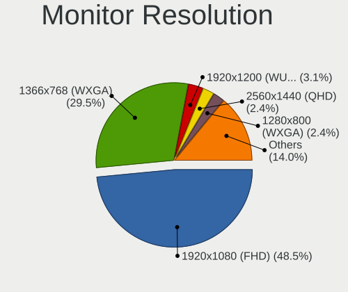

| Resolution         | Notebooks | Percent |
|--------------------|-----------|---------|
| 1920x1080 (FHD)    | 1072      | 48.48%  |
| 1366x768 (WXGA)    | 652       | 29.49%  |
| 1920x1200 (WUXGA)  | 69        | 3.12%   |
| 2560x1440 (QHD)    | 54        | 2.44%   |
| 1280x800 (WXGA)    | 54        | 2.44%   |
| 3840x2160 (4K)     | 46        | 2.08%   |
| 1600x900 (HD+)     | 41        | 1.85%   |
| 2560x1600          | 34        | 1.54%   |
| 1440x900 (WXGA+)   | 28        | 1.27%   |
| 2880x1800          | 26        | 1.18%   |
| 2160x1440          | 19        | 0.86%   |
| Unknown            | 19        | 0.86%   |
| 1024x600           | 12        | 0.54%   |
| 1680x1050 (WSXGA+) | 9         | 0.41%   |
| 2560x1080          | 7         | 0.32%   |
| 2520x1680          | 7         | 0.32%   |
| 1280x1024 (SXGA)   | 7         | 0.32%   |
| 800x1280           | 6         | 0.27%   |
| 3440x1440          | 5         | 0.23%   |
| 3200x1800 (QHD+)   | 5         | 0.23%   |
| 1360x768           | 4         | 0.18%   |
| 3840x1080          | 3         | 0.14%   |
| 3072x1920          | 3         | 0.14%   |
| 2944x1840          | 3         | 0.14%   |
| 1680x945           | 3         | 0.14%   |
| 3840x2400          | 2         | 0.09%   |
| 3200x2000          | 2         | 0.09%   |
| 3000x2000          | 2         | 0.09%   |
| 2880x1620          | 2         | 0.09%   |
| 2288x1287          | 2         | 0.09%   |
| 1920x540           | 2         | 0.09%   |
| 1024x768 (XGA)     | 2         | 0.09%   |
| 800x600            | 1         | 0.05%   |
| 3840x2560          | 1         | 0.05%   |
| 3046x1050          | 1         | 0.05%   |
| 2880x1920          | 1         | 0.05%   |
| 2806x900           | 1         | 0.05%   |
| 2646x1024          | 1         | 0.05%   |
| 1400x787           | 1         | 0.05%   |
| 1280x720 (HD)      | 1         | 0.05%   |

Monitor Diagonal
----------------

Diagonal size in inches

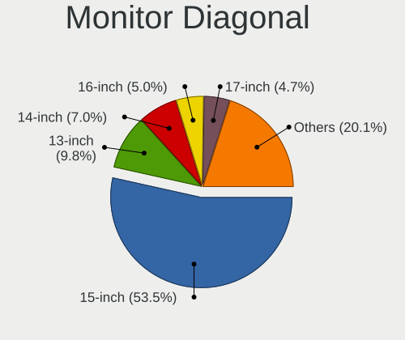

| Inches  | Notebooks | Percent |
|---------|-----------|---------|
| 15      | 1261      | 53.48%  |
| 13      | 231       | 9.8%    |
| 14      | 165       | 7%      |
| 16      | 117       | 4.96%   |
| 17      | 110       | 4.66%   |
| 27      | 71        | 3.01%   |
| 24      | 61        | 2.59%   |
| 23      | 58        | 2.46%   |
| 21      | 43        | 1.82%   |
| 12      | 33        | 1.4%    |
| 11      | 32        | 1.36%   |
| Unknown | 32        | 1.36%   |
| 18      | 24        | 1.02%   |
| 31      | 21        | 0.89%   |
| 10      | 18        | 0.76%   |
| 19      | 13        | 0.55%   |
| 84      | 8         | 0.34%   |
| 34      | 7         | 0.3%    |
| 20      | 7         | 0.3%    |
| 22      | 6         | 0.25%   |
| 7       | 6         | 0.25%   |
| 63      | 4         | 0.17%   |
| 32      | 4         | 0.17%   |
| 86      | 3         | 0.13%   |
| 46      | 3         | 0.13%   |
| 28      | 3         | 0.13%   |
| 57      | 2         | 0.08%   |
| 43      | 2         | 0.08%   |
| 40      | 2         | 0.08%   |
| 142     | 1         | 0.04%   |
| 72      | 1         | 0.04%   |
| 65      | 1         | 0.04%   |
| 54      | 1         | 0.04%   |
| 42      | 1         | 0.04%   |
| 39      | 1         | 0.04%   |
| 36      | 1         | 0.04%   |
| 33      | 1         | 0.04%   |
| 29      | 1         | 0.04%   |
| 26      | 1         | 0.04%   |
| 25      | 1         | 0.04%   |

Monitor Width
-------------

Physical width

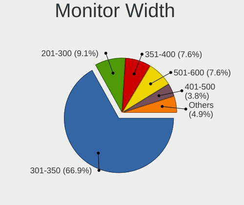

| Width in mm    | Notebooks | Percent |
|----------------|-----------|---------|
| 301-350        | 1569      | 66.91%  |
| 201-300        | 213       | 9.08%   |
| 351-400        | 179       | 7.63%   |
| 501-600        | 178       | 7.59%   |
| 401-500        | 90        | 3.84%   |
| 601-700        | 35        | 1.49%   |
| Unknown        | 32        | 1.36%   |
| 1001-1500      | 14        | 0.6%    |
| 701-800        | 13        | 0.55%   |
| 1501-2000      | 9         | 0.38%   |
| 1-100          | 6         | 0.26%   |
| 801-900        | 3         | 0.13%   |
| 901-1000       | 3         | 0.13%   |
| More than 2000 | 1         | 0.04%   |

Aspect Ratio
------------

Proportional relationship between the width and the height

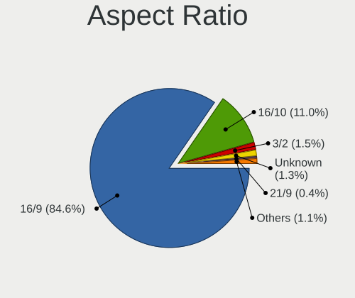

| Ratio   | Notebooks | Percent |
|---------|-----------|---------|
| 16/9    | 1770      | 84.61%  |
| 16/10   | 230       | 10.99%  |
| 3/2     | 32        | 1.53%   |
| Unknown | 27        | 1.29%   |
| 21/9    | 9         | 0.43%   |
| 5/4     | 7         | 0.33%   |
| 4/3     | 6         | 0.29%   |
| 0.67    | 5         | 0.24%   |
| 0.56    | 3         | 0.14%   |
| 6/5     | 1         | 0.05%   |
| 1.00    | 1         | 0.05%   |
| 0.62    | 1         | 0.05%   |

Monitor Area
------------

Area in inch²

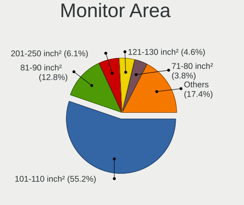

| Area in inch² | Notebooks | Percent |
|----------------|-----------|---------|
| 101-110        | 1300      | 55.25%  |
| 81-90          | 302       | 12.83%  |
| 201-250        | 143       | 6.08%   |
| 121-130        | 108       | 4.59%   |
| 71-80          | 90        | 3.82%   |
| 301-350        | 73        | 3.1%    |
| 111-120        | 65        | 2.76%   |
| 351-500        | 35        | 1.49%   |
| 51-60          | 32        | 1.36%   |
| Unknown        | 32        | 1.36%   |
| 61-70          | 30        | 1.27%   |
| 151-200        | 30        | 1.27%   |
| 141-150        | 27        | 1.15%   |
| More than 1000 | 21        | 0.89%   |
| 41-50          | 18        | 0.76%   |
| 91-100         | 14        | 0.59%   |
| 251-300        | 12        | 0.51%   |
| 501-1000       | 10        | 0.42%   |
| 1-40           | 6         | 0.25%   |
| 131-140        | 5         | 0.21%   |

Pixel Density
-------------

Pixels per inch

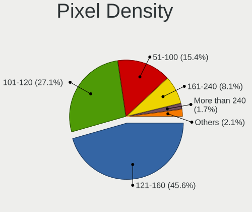

| Density       | Notebooks | Percent |
|---------------|-----------|---------|
| 121-160       | 1055      | 45.57%  |
| 101-120       | 627       | 27.08%  |
| 51-100        | 357       | 15.42%  |
| 161-240       | 188       | 8.12%   |
| More than 240 | 39        | 1.68%   |
| Unknown       | 32        | 1.38%   |
| 1-50          | 17        | 0.73%   |

Multiple Monitors
-----------------

Total monitors connected

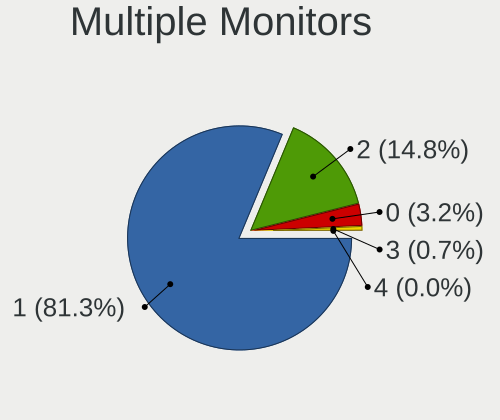

| Total | Notebooks | Percent |
|-------|-----------|---------|
| 1     | 1798      | 81.28%  |
| 2     | 327       | 14.78%  |
| 0     | 71        | 3.21%   |
| 3     | 15        | 0.68%   |
| 4     | 1         | 0.05%   |

Network
-------

Net Controller Vendor
---------------------

Controller vendors

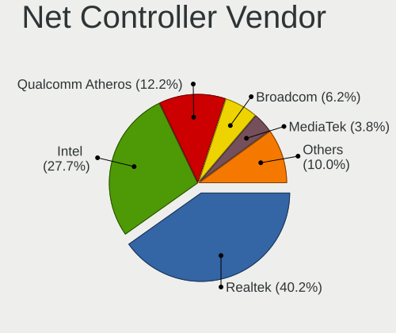

| Vendor                                 | Notebooks | Percent |
|----------------------------------------|-----------|---------|
| Realtek Semiconductor                  | 1411      | 40.2%   |
| Intel                                  | 971       | 27.66%  |
| Qualcomm Atheros                       | 428       | 12.19%  |
| Broadcom                               | 217       | 6.18%   |
| MediaTek                               | 132       | 3.76%   |
| Broadcom Limited                       | 45        | 1.28%   |
| Ralink                                 | 41        | 1.17%   |
| Marvell Technology Group               | 34        | 0.97%   |
| Ralink Technology                      | 33        | 0.94%   |
| Samsung Electronics                    | 21        | 0.6%    |
| TP-Link                                | 17        | 0.48%   |
| Xiaomi                                 | 16        | 0.46%   |
| Silicon Integrated Systems [SiS]       | 16        | 0.46%   |
| Shenzhen Goodix Technology             | 14        | 0.4%    |
| ASIX Electronics                       | 13        | 0.37%   |
| Qualcomm Atheros Communications        | 9         | 0.26%   |
| Nvidia                                 | 8         | 0.23%   |
| ASUSTek Computer                       | 8         | 0.23%   |
| Qualcomm                               | 6         | 0.17%   |
| JMicron Technology                     | 6         | 0.17%   |
| Huawei Technologies                    | 6         | 0.17%   |
| Ericsson Business Mobile Networks      | 6         | 0.17%   |
| Dell                                   | 5         | 0.14%   |
| Suzhou Motorcomm Electronic Technology | 3         | 0.09%   |
| Lenovo                                 | 3         | 0.09%   |
| ICS Advent                             | 3         | 0.09%   |
| Fibocom                                | 3         | 0.09%   |
| Attansic Technology                    | 3         | 0.09%   |
| Apple                                  | 3         | 0.09%   |
| ZyXEL Communications                   | 2         | 0.06%   |
| QinHeng Electronics                    | 2         | 0.06%   |
| OnePlus Technology (Shenzhen)          | 2         | 0.06%   |
| U-Blox                                 | 1         | 0.03%   |
| Sony Ericsson Mobile Communications AB | 1         | 0.03%   |
| Sierra Wireless                        | 1         | 0.03%   |
| Qcom                                   | 1         | 0.03%   |
| Ortur                                  | 1         | 0.03%   |
| Motorola PCS                           | 1         | 0.03%   |
| Microsoft                              | 1         | 0.03%   |
| Microchip Technology                   | 1         | 0.03%   |

Net Controller Model
--------------------

Controller models

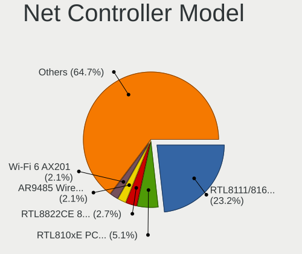

| Model                                                                  | Notebooks | Percent |
|------------------------------------------------------------------------|-----------|---------|
| Realtek RTL8111/8168/8211/8411 PCI Express Gigabit Ethernet Controller | 940       | 23.23%  |
| Realtek RTL810xE PCI Express Fast Ethernet controller                  | 208       | 5.14%   |
| Realtek RTL8822CE 802.11ac PCIe Wireless Network Adapter               | 110       | 2.72%   |
| Qualcomm Atheros AR9485 Wireless Network Adapter                       | 85        | 2.1%    |
| Intel Wi-Fi 6 AX201                                                    | 84        | 2.08%   |
| MediaTek MT7921 802.11ax PCIe Wireless Network Adapter [Filogic 330]   | 83        | 2.05%   |
| Qualcomm Atheros QCA9377 802.11ac Wireless Network Adapter             | 77        | 1.9%    |
| Intel Alder Lake-P PCH CNVi WiFi                                       | 70        | 1.73%   |
| Intel Comet Lake PCH CNVi WiFi                                         | 69        | 1.7%    |
| Qualcomm Atheros AR9285 Wireless Network Adapter (PCI-Express)         | 66        | 1.63%   |
| Intel Wi-Fi 6 AX200                                                    | 62        | 1.53%   |
| Broadcom BCM4313 802.11bgn Wireless Network Adapter                    | 61        | 1.51%   |
| Realtek RTL8821CE 802.11ac PCIe Wireless Network Adapter               | 58        | 1.43%   |
| Realtek RTL8723BE PCIe Wireless Network Adapter                        | 58        | 1.43%   |
| Qualcomm Atheros QCA9565 / AR9565 Wireless Network Adapter             | 58        | 1.43%   |
| Intel Wireless 7265                                                    | 53        | 1.31%   |
| Intel Cannon Lake PCH CNVi WiFi                                        | 50        | 1.24%   |
| Intel Wireless 8265 / 8275                                             | 48        | 1.19%   |
| Realtek RTL8852BE PCIe 802.11ax Wireless Network Controller            | 42        | 1.04%   |
| Intel Tiger Lake PCH CNVi WiFi                                         | 40        | 0.99%   |
| Intel Comet Lake PCH-LP CNVi WiFi                                      | 40        | 0.99%   |
| Broadcom BCM43142 802.11b/g/n                                          | 40        | 0.99%   |
| Qualcomm Atheros QCA6174 802.11ac Wireless Network Adapter             | 34        | 0.84%   |
| Intel Raptor Lake PCH CNVi WiFi                                        | 33        | 0.82%   |
| Ralink RT3290 Wireless 802.11n 1T/1R PCIe                              | 32        | 0.79%   |
| Realtek RTL8153 Gigabit Ethernet Adapter                               | 31        | 0.77%   |
| Realtek RTL8125 2.5GbE Controller                                      | 30        | 0.74%   |
| Intel 82579LM Gigabit Network Connection (Lewisville)                  | 29        | 0.72%   |
| MediaTek MT7922 802.11ax PCI Express Wireless Network Adapter          | 28        | 0.69%   |
| Intel Wireless 3160                                                    | 28        | 0.69%   |
| Intel Centrino Advanced-N 6205 [Taylor Peak]                           | 28        | 0.69%   |
| Intel Dual Band Wireless-AC 3165 Plus Bluetooth                        | 27        | 0.67%   |
| Intel Dual Band Wireless-AC 3168NGW [Stone Peak]                       | 26        | 0.64%   |
| Realtek RTL8152 Fast Ethernet Adapter                                  | 25        | 0.62%   |
| Realtek RTL8822BE 802.11a/b/g/n/ac WiFi adapter                        | 24        | 0.59%   |
| Intel Wireless 7260                                                    | 24        | 0.59%   |
| Qualcomm Atheros AR8151 v2.0 Gigabit Ethernet                          | 23        | 0.57%   |
| Intel Wireless 3165                                                    | 23        | 0.57%   |
| Realtek Killer E2600 GbE Controller                                    | 21        | 0.52%   |
| Realtek RTL8723DE Wireless Network Adapter                             | 20        | 0.49%   |

Wireless Vendor
---------------

Wireless vendors

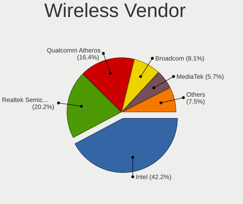

| Vendor                           | Notebooks | Percent |
|----------------------------------|-----------|---------|
| Intel                            | 912       | 42.24%  |
| Realtek Semiconductor            | 436       | 20.19%  |
| Qualcomm Atheros                 | 353       | 16.35%  |
| Broadcom                         | 175       | 8.11%   |
| MediaTek                         | 122       | 5.65%   |
| Ralink                           | 41        | 1.9%    |
| Broadcom Limited                 | 34        | 1.57%   |
| Ralink Technology                | 33        | 1.53%   |
| TP-Link                          | 14        | 0.65%   |
| Qualcomm Atheros Communications  | 9         | 0.42%   |
| ASUSTek Computer                 | 8         | 0.37%   |
| Dell                             | 4         | 0.19%   |
| Qualcomm                         | 3         | 0.14%   |
| Fibocom                          | 3         | 0.14%   |
| ZyXEL Communications             | 2         | 0.09%   |
| Silicon Integrated Systems [SiS] | 1         | 0.05%   |
| Sierra Wireless                  | 1         | 0.05%   |
| Qcom                             | 1         | 0.05%   |
| Microsoft                        | 1         | 0.05%   |
| Marvell Technology Group         | 1         | 0.05%   |
| Linksys                          | 1         | 0.05%   |
| IMC Networks                     | 1         | 0.05%   |
| Belkin Components                | 1         | 0.05%   |
| AirTies Wireless Networks        | 1         | 0.05%   |
| Accton Technology                | 1         | 0.05%   |

Wireless Model
--------------

Wireless models

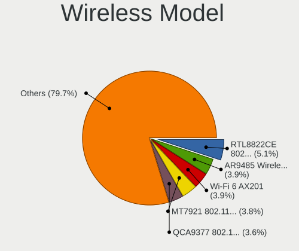

| Model                                                                | Notebooks | Percent |
|----------------------------------------------------------------------|-----------|---------|
| Realtek RTL8822CE 802.11ac PCIe Wireless Network Adapter             | 110       | 5.08%   |
| Qualcomm Atheros AR9485 Wireless Network Adapter                     | 85        | 3.93%   |
| Intel Wi-Fi 6 AX201                                                  | 84        | 3.88%   |
| MediaTek MT7921 802.11ax PCIe Wireless Network Adapter [Filogic 330] | 83        | 3.84%   |
| Qualcomm Atheros QCA9377 802.11ac Wireless Network Adapter           | 77        | 3.56%   |
| Intel Comet Lake PCH CNVi WiFi                                       | 69        | 3.19%   |
| Qualcomm Atheros AR9285 Wireless Network Adapter (PCI-Express)       | 66        | 3.05%   |
| Intel Wi-Fi 6 AX200                                                  | 62        | 2.87%   |
| Broadcom BCM4313 802.11bgn Wireless Network Adapter                  | 61        | 2.82%   |
| Realtek RTL8821CE 802.11ac PCIe Wireless Network Adapter             | 58        | 2.68%   |
| Realtek RTL8723BE PCIe Wireless Network Adapter                      | 58        | 2.68%   |
| Qualcomm Atheros QCA9565 / AR9565 Wireless Network Adapter           | 58        | 2.68%   |
| Intel Wireless 7265                                                  | 53        | 2.45%   |
| Intel Cannon Lake PCH CNVi WiFi                                      | 50        | 2.31%   |
| Intel Wireless 8265 / 8275                                           | 48        | 2.22%   |
| Realtek RTL8852BE PCIe 802.11ax Wireless Network Controller          | 42        | 1.94%   |
| Intel Tiger Lake PCH CNVi WiFi                                       | 40        | 1.85%   |
| Intel Comet Lake PCH-LP CNVi WiFi                                    | 40        | 1.85%   |
| Broadcom BCM43142 802.11b/g/n                                        | 40        | 1.85%   |
| Intel Alder Lake-P PCH CNVi WiFi                                     | 38        | 1.76%   |
| Qualcomm Atheros QCA6174 802.11ac Wireless Network Adapter           | 34        | 1.57%   |
| Intel Raptor Lake PCH CNVi WiFi                                      | 33        | 1.52%   |
| Ralink RT3290 Wireless 802.11n 1T/1R PCIe                            | 32        | 1.48%   |
| Intel Wireless 3160                                                  | 28        | 1.29%   |
| Intel Centrino Advanced-N 6205 [Taylor Peak]                         | 28        | 1.29%   |
| Intel Dual Band Wireless-AC 3165 Plus Bluetooth                      | 27        | 1.25%   |
| Intel Dual Band Wireless-AC 3168NGW [Stone Peak]                     | 26        | 1.2%    |
| Realtek RTL8822BE 802.11a/b/g/n/ac WiFi adapter                      | 24        | 1.11%   |
| Intel Wireless 7260                                                  | 24        | 1.11%   |
| Intel Wireless 3165                                                  | 23        | 1.06%   |
| MediaTek MT7922 802.11ax PCI Express Wireless Network Adapter        | 21        | 0.97%   |
| Realtek RTL8723DE Wireless Network Adapter                           | 20        | 0.92%   |
| Intel Wireless 8260                                                  | 20        | 0.92%   |
| Realtek RTL8723AE PCIe Wireless Network Adapter                      | 19        | 0.88%   |
| Intel Cannon Point-LP CNVi [Wireless-AC]                             | 18        | 0.83%   |
| Realtek RTL8852AE 802.11ax PCIe Wireless Network Adapter             | 17        | 0.79%   |
| Intel WiFi Link 5100                                                 | 17        | 0.79%   |
| Intel Centrino Wireless-N 2230                                       | 16        | 0.74%   |
| Ralink MT7601U Wireless Adapter                                      | 15        | 0.69%   |
| Intel PRO/Wireless 3945ABG [Golan] Network Connection                | 14        | 0.65%   |

Ethernet Vendor
---------------

Ethernet vendors

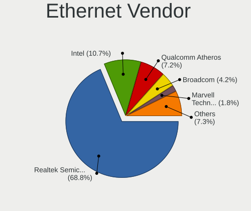

| Vendor                                 | Notebooks | Percent |
|----------------------------------------|-----------|---------|
| Realtek Semiconductor                  | 1253      | 68.77%  |
| Intel                                  | 195       | 10.7%   |
| Qualcomm Atheros                       | 131       | 7.19%   |
| Broadcom                               | 77        | 4.23%   |
| Marvell Technology Group               | 33        | 1.81%   |
| Samsung Electronics                    | 21        | 1.15%   |
| Xiaomi                                 | 16        | 0.88%   |
| Silicon Integrated Systems [SiS]       | 15        | 0.82%   |
| ASIX Electronics                       | 13        | 0.71%   |
| Broadcom Limited                       | 11        | 0.6%    |
| MediaTek                               | 10        | 0.55%   |
| Nvidia                                 | 7         | 0.38%   |
| JMicron Technology                     | 6         | 0.33%   |
| Huawei Technologies                    | 5         | 0.27%   |
| TP-Link                                | 3         | 0.16%   |
| Suzhou Motorcomm Electronic Technology | 3         | 0.16%   |
| Qualcomm                               | 3         | 0.16%   |
| ICS Advent                             | 3         | 0.16%   |
| Attansic Technology                    | 3         | 0.16%   |
| Apple                                  | 3         | 0.16%   |
| Lenovo                                 | 2         | 0.11%   |
| Sony Ericsson Mobile Communications AB | 1         | 0.05%   |
| QinHeng Electronics                    | 1         | 0.05%   |
| OnePlus Technology (Shenzhen)          | 1         | 0.05%   |
| Motorola PCS                           | 1         | 0.05%   |
| Microchip Technology                   | 1         | 0.05%   |
| LSI                                    | 1         | 0.05%   |
| Google                                 | 1         | 0.05%   |
| Davicom Semiconductor                  | 1         | 0.05%   |
| Aquantia                               | 1         | 0.05%   |

Ethernet Model
--------------

Ethernet models

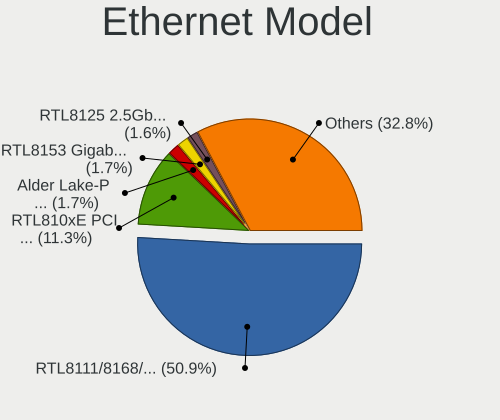

| Model                                                                          | Notebooks | Percent |
|--------------------------------------------------------------------------------|-----------|---------|
| Realtek RTL8111/8168/8211/8411 PCI Express Gigabit Ethernet Controller         | 940       | 50.92%  |
| Realtek RTL810xE PCI Express Fast Ethernet controller                          | 208       | 11.27%  |
| Intel Alder Lake-P PCH CNVi WiFi                                               | 32        | 1.73%   |
| Realtek RTL8153 Gigabit Ethernet Adapter                                       | 31        | 1.68%   |
| Realtek RTL8125 2.5GbE Controller                                              | 30        | 1.63%   |
| Intel 82579LM Gigabit Network Connection (Lewisville)                          | 29        | 1.57%   |
| Realtek RTL8152 Fast Ethernet Adapter                                          | 25        | 1.35%   |
| Qualcomm Atheros AR8151 v2.0 Gigabit Ethernet                                  | 23        | 1.25%   |
| Realtek Killer E2600 GbE Controller                                            | 21        | 1.14%   |
| Intel Ethernet Connection (4) I219-LM                                          | 17        | 0.92%   |
| Qualcomm Atheros AR8131 Gigabit Ethernet                                       | 16        | 0.87%   |
| Broadcom NetLink BCM57785 Gigabit Ethernet PCIe                                | 16        | 0.87%   |
| Silicon Integrated Systems [SiS] 191 Gigabit Ethernet Adapter                  | 15        | 0.81%   |
| Qualcomm Atheros AR8161 Gigabit Ethernet                                       | 15        | 0.81%   |
| Qualcomm Atheros QCA8171 Gigabit Ethernet                                      | 14        | 0.76%   |
| Qualcomm Atheros AR8152 v1.1 Fast Ethernet                                     | 12        | 0.65%   |
| Intel Ethernet Connection (3) I218-LM                                          | 12        | 0.65%   |
| Broadcom NetXtreme BCM57765 Gigabit Ethernet PCIe                              | 12        | 0.65%   |
| Samsung Galaxy series, misc. (tethering mode)                                  | 11        | 0.6%    |
| Broadcom NetLink BCM5784M Gigabit Ethernet PCIe                                | 11        | 0.6%    |
| Xiaomi Mi/Redmi series (RNDIS)                                                 | 10        | 0.54%   |
| Samsung GT-I9070 (network tethering, USB debugging enabled)                    | 10        | 0.54%   |
| Qualcomm Atheros AR8152 v2.0 Fast Ethernet                                     | 10        | 0.54%   |
| ASIX AX88179 Gigabit Ethernet                                                  | 10        | 0.54%   |
| Qualcomm Atheros QCA8172 Fast Ethernet                                         | 9         | 0.49%   |
| Broadcom NetLink BCM57780 Gigabit Ethernet PCIe                                | 9         | 0.49%   |
| Marvell Group Yukon Optima 88E8059 [PCIe Gigabit Ethernet Controller with AVB] | 8         | 0.43%   |
| Intel Ethernet Connection I218-LM                                              | 8         | 0.43%   |
| Qualcomm Atheros Killer E2500 Gigabit Ethernet Controller                      | 7         | 0.38%   |
| Qualcomm Atheros Killer E2400 Gigabit Ethernet Controller                      | 7         | 0.38%   |
| MediaTek MT7922 802.11ax PCI Express Wireless Network Adapter                  | 7         | 0.38%   |
| Marvell Group 88E8040 PCI-E Fast Ethernet Controller                           | 7         | 0.38%   |
| Intel Ethernet Connection (16) I219-V                                          | 7         | 0.38%   |
| Broadcom NetLink BCM5906M Fast Ethernet PCI Express                            | 7         | 0.38%   |
| Broadcom BCM4401-B0 100Base-TX                                                 | 7         | 0.38%   |
| Xiaomi Mi/Redmi series (RNDIS + ADB)                                           | 6         | 0.33%   |
| Qualcomm Atheros AR8162 Fast Ethernet                                          | 6         | 0.33%   |
| JMicron JMC250 PCI Express Gigabit Ethernet Controller                         | 6         | 0.33%   |
| Intel Ethernet Connection (13) I219-V                                          | 6         | 0.33%   |
| Broadcom NetXtreme BCM57786 Gigabit Ethernet PCIe                              | 6         | 0.33%   |

Net Controller Kind
-------------------

Ethernet, WiFi or modem

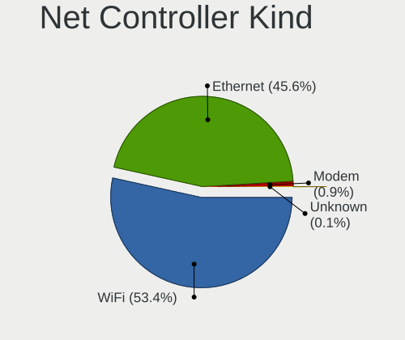

| Kind     | Notebooks | Percent |
|----------|-----------|---------|
| WiFi     | 2054      | 53.45%  |
| Ethernet | 1752      | 45.59%  |
| Modem    | 33        | 0.86%   |
| Unknown  | 4         | 0.1%    |

Used Controller
---------------

Currently used network controller

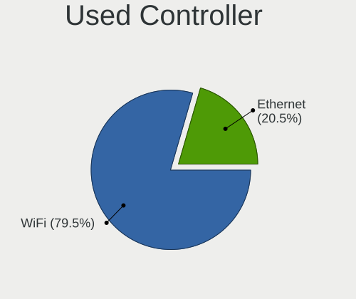

| Kind     | Notebooks | Percent |
|----------|-----------|---------|
| WiFi     | 1751      | 79.48%  |
| Ethernet | 452       | 20.52%  |

NICs
----

Total network controllers on board

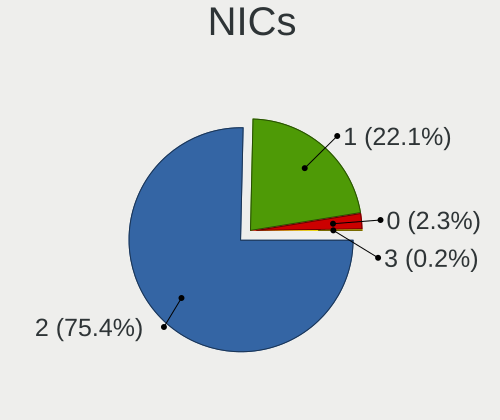

| Total | Notebooks | Percent |
|-------|-----------|---------|
| 2     | 1621      | 75.36%  |
| 1     | 475       | 22.08%  |
| 0     | 50        | 2.32%   |
| 3     | 5         | 0.23%   |

IPv6
----

IPv6 vs IPv4

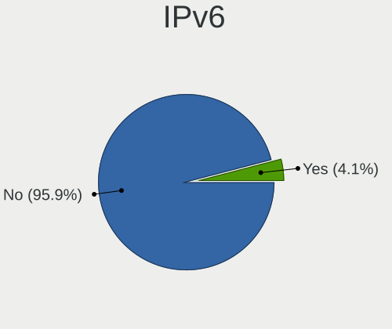

| Used | Notebooks | Percent |
|------|-----------|---------|
| No   | 2075      | 95.93%  |
| Yes  | 88        | 4.07%   |

Bluetooth
---------

Bluetooth Vendor
----------------

Controller vendors

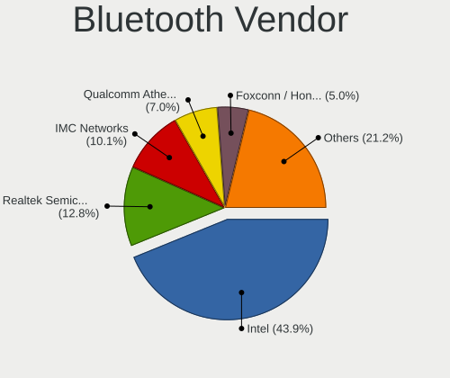

| Vendor                          | Notebooks | Percent |
|---------------------------------|-----------|---------|
| Intel                           | 806       | 43.85%  |
| Realtek Semiconductor           | 235       | 12.79%  |
| IMC Networks                    | 186       | 10.12%  |
| Qualcomm Atheros Communications | 129       | 7.02%   |
| Foxconn / Hon Hai               | 92        | 5.01%   |
| Lite-On Technology              | 78        | 4.24%   |
| Broadcom                        | 73        | 3.97%   |
| Realtek                         | 39        | 2.12%   |
| Apple                           | 38        | 2.07%   |
| Toshiba                         | 32        | 1.74%   |
| Ralink                          | 32        | 1.74%   |
| Dell                            | 21        | 1.14%   |
| Cambridge Silicon Radio         | 20        | 1.09%   |
| Hewlett-Packard                 | 16        | 0.87%   |
| ASUSTek Computer                | 14        | 0.76%   |
| MediaTek                        | 10        | 0.54%   |
| Foxconn International           | 6         | 0.33%   |
| Ralink Technology               | 4         | 0.22%   |
| Alps Electric                   | 3         | 0.16%   |
| USI                             | 1         | 0.05%   |
| TP-Link                         | 1         | 0.05%   |
| Qcom                            | 1         | 0.05%   |
| Marvell Semiconductor           | 1         | 0.05%   |

Bluetooth Model
---------------

Controller models

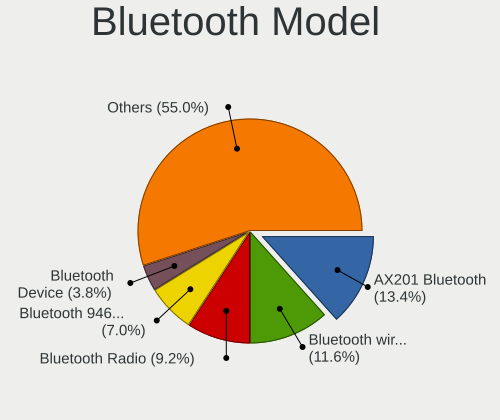

| Model                                               | Notebooks | Percent |
|-----------------------------------------------------|-----------|---------|
| Intel AX201 Bluetooth                               | 246       | 13.37%  |
| Intel Bluetooth wireless interface                  | 214       | 11.63%  |
| Realtek Bluetooth Radio                             | 169       | 9.18%   |
| Intel Bluetooth 9460/9560 Jefferson Peak (JfP)      | 129       | 7.01%   |
| Intel Bluetooth Device                              | 70        | 3.8%    |
| Intel AX200 Bluetooth                               | 61        | 3.32%   |
| IMC Networks Wireless_Device                        | 61        | 3.32%   |
| Qualcomm Atheros  Bluetooth Device                  | 58        | 3.15%   |
| IMC Networks Bluetooth Radio                        | 55        | 2.99%   |
| Realtek Bluetooth Radio                             | 39        | 2.12%   |
| Realtek  Bluetooth 4.2 Adapter                      | 37        | 2.01%   |
| Ralink RT3290 Bluetooth                             | 32        | 1.74%   |
| Intel Centrino Bluetooth Wireless Transceiver       | 27        | 1.47%   |
| Intel Wireless-AC 3168 Bluetooth                    | 25        | 1.36%   |
| Apple Bluetooth Host Controller                     | 25        | 1.36%   |
| IMC Networks Bluetooth Device                       | 24        | 1.3%    |
| Qualcomm Atheros AR3011 Bluetooth                   | 22        | 1.2%    |
| Qualcomm Atheros AR3012 Bluetooth 4.0               | 21        | 1.14%   |
| Foxconn / Hon Hai Wireless_Device                   | 21        | 1.14%   |
| Lite-On Qualcomm Atheros QCA9377 Bluetooth          | 20        | 1.09%   |
| Foxconn / Hon Hai MediaTek Bluetooth Adapter        | 20        | 1.09%   |
| Cambridge Silicon Radio Bluetooth Dongle (HCI mode) | 20        | 1.09%   |
| IMC Networks Atheros AR3012 Bluetooth 4.0 Adapter   | 19        | 1.03%   |
| Lite-On Bluetooth Device                            | 18        | 0.98%   |
| Qualcomm Atheros QCA61x4 Bluetooth 4.0              | 17        | 0.92%   |
| Lite-On Wireless_Device                             | 16        | 0.87%   |
| Intel Centrino Advanced-N 6230 Bluetooth adapter    | 13        | 0.71%   |
| Realtek RTL8822BE Bluetooth 4.2 Adapter             | 12        | 0.65%   |
| IMC Networks Bluetooth USB Host Controller          | 12        | 0.65%   |
| Broadcom BCM2070 Bluetooth 2.1 + EDR                | 12        | 0.65%   |
| Apple Bluetooth USB Host Controller                 | 12        | 0.65%   |
| IMC Networks Bluetooth                              | 11        | 0.6%    |
| Foxconn / Hon Hai Bluetooth Device                  | 11        | 0.6%    |
| Realtek RTL8723B Bluetooth                          | 10        | 0.54%   |
| Intel Wireless-AC 9260 Bluetooth Adapter            | 10        | 0.54%   |
| Intel AX210 Bluetooth                               | 10        | 0.54%   |
| Foxconn / Hon Hai Bluetooth USB Host Controller     | 9         | 0.49%   |
| Broadcom BCM43142 Bluetooth 4.0                     | 9         | 0.49%   |
| MediaTek Wireless_Device                            | 8         | 0.43%   |
| HP Bluetooth 2.0 Interface [Broadcom BCM2045]       | 8         | 0.43%   |

Sound
-----

Sound Vendor
------------

Sound card vendors

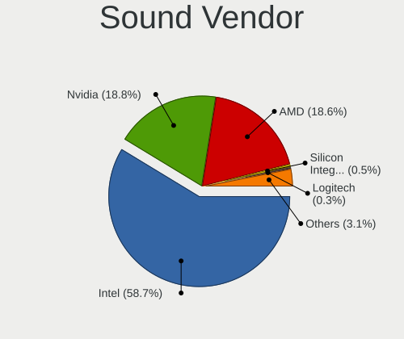

| Vendor                                       | Notebooks | Percent |
|----------------------------------------------|-----------|---------|
| Intel                                        | 1631      | 58.69%  |
| Nvidia                                       | 522       | 18.78%  |
| AMD                                          | 516       | 18.57%  |
| Silicon Integrated Systems [SiS]             | 15        | 0.54%   |
| Logitech                                     | 8         | 0.29%   |
| Apple                                        | 8         | 0.29%   |
| Barco Display Systems                        | 7         | 0.25%   |
| C-Media Electronics                          | 6         | 0.22%   |
| SteelSeries ApS                              | 5         | 0.18%   |
| Kingston Technology                          | 5         | 0.18%   |
| Realtek Semiconductor                        | 4         | 0.14%   |
| Hewlett-Packard                              | 4         | 0.14%   |
| GN Netcom                                    | 4         | 0.14%   |
| JMTek                                        | 3         | 0.11%   |
| Generalplus Technology                       | 3         | 0.11%   |
| DSEA A/S                                     | 3         | 0.11%   |
| ASUSTek Computer                             | 3         | 0.11%   |
| Tenx Technology                              | 2         | 0.07%   |
| LG Electronics                               | 2         | 0.07%   |
| KTMICRO                                      | 2         | 0.07%   |
| GYROCOM C&C                                  | 2         | 0.07%   |
| Corsair                                      | 2         | 0.07%   |
| Unknown                                      | 2         | 0.07%   |
| Zoran Co. Personal Media Division (Nogatech) | 1         | 0.04%   |
| Yamaha                                       | 1         | 0.04%   |
| Walmart                                      | 1         | 0.04%   |
| Trust                                        | 1         | 0.04%   |
| Texas Instruments                            | 1         | 0.04%   |
| Sony                                         | 1         | 0.04%   |
| QinHeng Electronics                          | 1         | 0.04%   |
| Midiplus                                     | 1         | 0.04%   |
| Jieli Technology                             | 1         | 0.04%   |
| JBL                                          | 1         | 0.04%   |
| Google                                       | 1         | 0.04%   |
| Focusrite-Novation                           | 1         | 0.04%   |
| FiiO Electronics Technology                  | 1         | 0.04%   |
| fifine Microphones                           | 1         | 0.04%   |
| DigiTech                                     | 1         | 0.04%   |
| Creative Technology                          | 1         | 0.04%   |
| CMX Systems                                  | 1         | 0.04%   |

Sound Model
-----------

Sound card models

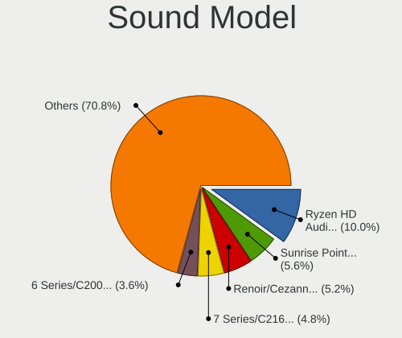

| Model                                                                                             | Notebooks | Percent |
|---------------------------------------------------------------------------------------------------|-----------|---------|
| AMD Ryzen HD Audio Controller                                                                     | 335       | 9.99%   |
| Intel Sunrise Point-LP HD Audio                                                                   | 189       | 5.63%   |
| AMD Renoir/Cezanne HDMI/DP Audio Controller                                                       | 175       | 5.22%   |
| Intel 7 Series/C216 Chipset Family High Definition Audio Controller                               | 160       | 4.77%   |
| Intel 6 Series/C200 Series Chipset Family High Definition Audio Controller                        | 122       | 3.64%   |
| Intel Tiger Lake-LP Smart Sound Technology Audio Controller                                       | 104       | 3.1%    |
| Intel Alder Lake PCH-P High Definition Audio Controller                                           | 89        | 2.65%   |
| Nvidia TU107 GeForce GTX 1650 High Definition Audio Controller                                    | 79        | 2.35%   |
| Intel Haswell-ULT HD Audio Controller                                                             | 79        | 2.35%   |
| Intel Comet Lake PCH cAVS                                                                         | 79        | 2.35%   |
| Intel 8 Series HD Audio Controller                                                                | 79        | 2.35%   |
| Intel 5 Series/3400 Series Chipset High Definition Audio                                          | 78        | 2.32%   |
| Nvidia AD107 High Definition Audio Controller                                                     | 71        | 2.12%   |
| Intel Cannon Lake PCH cAVS                                                                        | 71        | 2.12%   |
| AMD Radeon High Definition Audio Controller                                                       | 71        | 2.12%   |
| Nvidia GA107 High Definition Audio Controller                                                     | 68        | 2.03%   |
| AMD Raven/Raven2/Fenghuang HDMI/DP Audio Controller                                               | 65        | 1.94%   |
| Intel Broadwell-U Audio Controller                                                                | 57        | 1.7%    |
| Intel Wildcat Point-LP High Definition Audio Controller                                           | 56        | 1.67%   |
| Intel 82801I (ICH9 Family) HD Audio Controller                                                    | 56        | 1.67%   |
| Intel 8 Series/C220 Series Chipset High Definition Audio Controller                               | 52        | 1.55%   |
| Intel Raptor Lake-P/U/H cAVS                                                                      | 50        | 1.49%   |
| Intel Tiger Lake-H HD Audio Controller                                                            | 49        | 1.46%   |
| Intel Xeon E3-1200 v3/4th Gen Core Processor HD Audio Controller                                  | 47        | 1.4%    |
| Intel Comet Lake PCH-LP cAVS                                                                      | 47        | 1.4%    |
| AMD FCH Azalia Controller                                                                         | 46        | 1.37%   |
| Intel CM238 HD Audio Controller                                                                   | 45        | 1.34%   |
| Intel Cannon Point-LP High Definition Audio Controller                                            | 42        | 1.25%   |
| Nvidia GF108 High Definition Audio Controller                                                     | 41        | 1.22%   |
| Nvidia GP107GL High Definition Audio Controller                                                   | 40        | 1.19%   |
| Nvidia GA106 High Definition Audio Controller                                                     | 37        | 1.1%    |
| Intel Ice Lake-LP Smart Sound Technology Audio Controller                                         | 35        | 1.04%   |
| AMD Kabini HDMI/DP Audio                                                                          | 35        | 1.04%   |
| Intel NM10/ICH7 Family High Definition Audio Controller                                           | 33        | 0.98%   |
| Intel 100 Series/C230 Series Chipset Family HD Audio Controller                                   | 33        | 0.98%   |
| AMD Family 15h (Models 60h-6fh) Audio Controller                                                  | 28        | 0.83%   |
| Intel Celeron/Pentium Silver Processor High Definition Audio                                      | 24        | 0.72%   |
| Intel Atom/Celeron/Pentium Processor x5-E8000/J3xxx/N3xxx Series High Definition Audio Controller | 24        | 0.72%   |
| Nvidia GT216 HDMI Audio Controller                                                                | 23        | 0.69%   |
| Nvidia TU116 High Definition Audio Controller                                                     | 22        | 0.66%   |

Memory
------

Memory Vendor
-------------

Memory module vendors

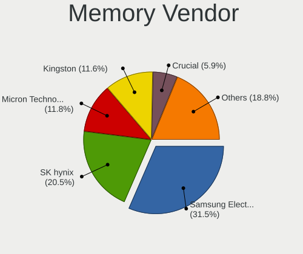

| Vendor                       | Notebooks | Percent |
|------------------------------|-----------|---------|
| Samsung Electronics          | 466       | 31.51%  |
| SK hynix                     | 303       | 20.49%  |
| Micron Technology            | 174       | 11.76%  |
| Kingston                     | 171       | 11.56%  |
| Crucial                      | 87        | 5.88%   |
| Unknown                      | 80        | 5.41%   |
| Ramaxel Technology           | 30        | 2.03%   |
| A-DATA Technology            | 29        | 1.96%   |
| Nanya Technology             | 23        | 1.56%   |
| Unknown                      | 20        | 1.35%   |
| Elpida                       | 16        | 1.08%   |
| Corsair                      | 10        | 0.68%   |
| Unknown (ABCD)               | 8         | 0.54%   |
| Transcend                    | 7         | 0.47%   |
| Team                         | 7         | 0.47%   |
| Apacer                       | 7         | 0.47%   |
| Timetec                      | 5         | 0.34%   |
| G.Skill                      | 5         | 0.34%   |
| ChangXin Memory              | 4         | 0.27%   |
| Goldkey                      | 3         | 0.2%    |
| Hikvision                    | 2         | 0.14%   |
| ff                           | 2         | 0.14%   |
| Avant                        | 2         | 0.14%   |
| 4ea5                         | 2         | 0.14%   |
| Wilk                         | 1         | 0.07%   |
| Unknown (F288)               | 1         | 0.07%   |
| Unknown (0x4509)             | 1         | 0.07%   |
| Unknown (0B38)               | 1         | 0.07%   |
| Unifosa                      | 1         | 0.07%   |
| pqi                          | 1         | 0.07%   |
| Patriot Memory (PDP Systems) | 1         | 0.07%   |
| Patriot                      | 1         | 0.07%   |
| Lexar Co Limited             | 1         | 0.07%   |
| Lexar                        | 1         | 0.07%   |
| Kllisre                      | 1         | 0.07%   |
| Good Wealth                  | 1         | 0.07%   |
| Gold Key                     | 1         | 0.07%   |
| ASint Technology             | 1         | 0.07%   |
| AMD                          | 1         | 0.07%   |
| 48spaces                     | 1         | 0.07%   |

Memory Model
------------

Memory module models

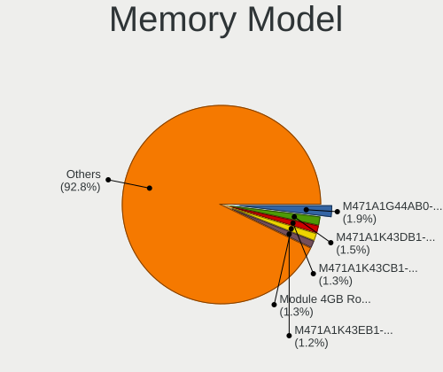

| Model                                                        | Notebooks | Percent |
|--------------------------------------------------------------|-----------|---------|
| Samsung RAM M471A1G44AB0-CWE 8GiB SODIMM DDR4 3200MT/s       | 30        | 1.92%   |
| Samsung RAM M471A1K43DB1-CWE 8GB SODIMM DDR4 3200MT/s        | 23        | 1.47%   |
| Samsung RAM M471A1K43CB1-CTD 8GB SODIMM DDR4 3200MT/s        | 20        | 1.28%   |
| Unknown                                                      | 20        | 1.28%   |
| SK hynix RAM HMT451S6BFR8A-PB 4GB SODIMM DDR3 1600MT/s       | 19        | 1.21%   |
| Samsung RAM M471A1K43EB1-CWE 8GB SODIMM DDR4 3200MT/s        | 19        | 1.21%   |
| SK hynix RAM HMAA1GS6CJR6N-XN 8GB SODIMM DDR4 3200MT/s       | 18        | 1.15%   |
| Samsung RAM M471B5173DB0-YK0 4GB SODIMM DDR3 1600MT/s        | 18        | 1.15%   |
| Samsung RAM M471A5244CB0-CRC 4GB SODIMM DDR4 2667MT/s        | 17        | 1.09%   |
| SK hynix RAM HMAA1GS6CJR6N-XN 8GB Row Of Chips DDR4 3200MT/s | 13        | 0.83%   |
| Samsung RAM M471B5173EB0-YK0 4GB SODIMM DDR3 1600MT/s        | 13        | 0.83%   |
| Samsung RAM M471A5244CB0-CWE 4GB Row Of Chips DDR4 3200MT/s  | 13        | 0.83%   |
| Samsung RAM M471A1G44AB0-CWE 8GB Row Of Chips DDR4 3200MT/s  | 13        | 0.83%   |
| SK hynix RAM HMA81GS6DJR8N-XN 8GB SODIMM DDR4 3200MT/s       | 12        | 0.77%   |
| Samsung RAM M471A1K43CB1-CRC 8GB SODIMM DDR4 8400MT/s        | 12        | 0.77%   |
| Samsung RAM M425R1GB4BB0-CQKOL 8GB SODIMM DDR5 4800MT/s      | 12        | 0.77%   |
| Samsung RAM M471B1G73QH0-YK0 8GB SODIMM DDR3 1600MT/s        | 11        | 0.7%    |
| Samsung RAM M471A1G44BB0-CWE 8GB SODIMM DDR4 3200MT/s        | 11        | 0.7%    |
| Micron RAM 4ATF1G64HZ-3G2F1 8GB SODIMM DDR4 3200MT/s         | 11        | 0.7%    |
| SK hynix RAM HMA81GS6JJR8N-VK 8GB SODIMM DDR4 2667MT/s       | 10        | 0.64%   |
| Samsung RAM M425R1GB4BB0-CWMOD 8GB SODIMM DDR5 5600MT/s      | 10        | 0.64%   |
| SK hynix RAM Module 4GB SODIMM DDR3 1600MT/s                 | 9         | 0.58%   |
| SK hynix RAM HMA851S6CJR6N-VK 4GB SODIMM DDR4 2667MT/s       | 9         | 0.58%   |
| SK hynix RAM HMA81GS6CJR8N-VK 8GB SODIMM DDR4 2667MT/s       | 9         | 0.58%   |
| SK hynix RAM HMA81GS6AFR8N-UH 8GB SODIMM DDR4 2667MT/s       | 9         | 0.58%   |
| Samsung RAM M471B5773CHS-CH9 2GB SODIMM DDR3 4199MT/s        | 9         | 0.58%   |
| Samsung RAM M471B1G73DB0-YK0 8GB SODIMM DDR3 1600MT/s        | 9         | 0.58%   |
| Samsung RAM M471A5244CB0-CWE 4GB SODIMM DDR4 3200MT/s        | 9         | 0.58%   |
| Samsung RAM M471A2K43DB1-CWE 16GB SODIMM DDR4 3200MT/s       | 9         | 0.58%   |
| Samsung RAM M471A1K43DB1-CTD 8GB SODIMM DDR4 2667MT/s        | 9         | 0.58%   |
| Unknown RAM Module 4GB SODIMM DDR3                           | 8         | 0.51%   |
| SK hynix RAM HMT41GS6BFR8A-PB 8GB SODIMM DDR3 1600MT/s       | 8         | 0.51%   |
| SK hynix RAM HMA851S6AFR6N-UH 4GB SODIMM DDR4 2667MT/s       | 8         | 0.51%   |
| Samsung RAM M471A2K43CB1-CRC 16GB SODIMM DDR4 2667MT/s       | 8         | 0.51%   |
| Micron RAM 8ATF1G64HZ-2G3B1 8GB SODIMM DDR4 2400MT/s         | 8         | 0.51%   |
| Micron RAM 4ATF51264HZ-2G6E1 4GB SODIMM DDR4 2667MT/s        | 8         | 0.51%   |
| Micron RAM 4ATF1G64HZ-3G2E1 8GB SODIMM DDR4 3200MT/s         | 8         | 0.51%   |
| SK hynix RAM HMA851S6DJR6N-XN 4GB SODIMM DDR4 3200MT/s       | 7         | 0.45%   |
| SK hynix RAM HMA851S6DJR6N-XN 4GB Row Of Chips DDR4 3200MT/s | 7         | 0.45%   |
| Samsung RAM U6E3S4AA-MGCR 1GB Row Of Chips LPDDR4 4267MT/s   | 7         | 0.45%   |

Memory Kind
-----------

Memory module kinds

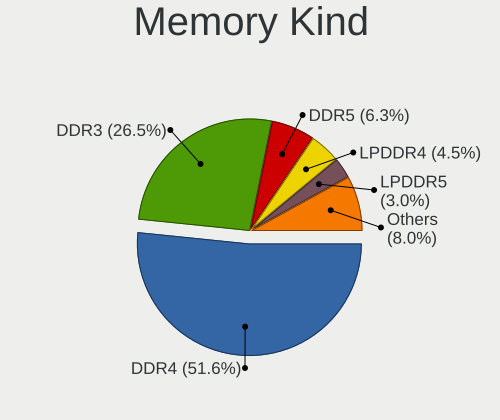

| Kind    | Notebooks | Percent |
|---------|-----------|---------|
| DDR4    | 638       | 51.62%  |
| DDR3    | 328       | 26.54%  |
| DDR5    | 78        | 6.31%   |
| LPDDR4  | 56        | 4.53%   |
| LPDDR5  | 37        | 2.99%   |
| DDR2    | 30        | 2.43%   |
| SDRAM   | 27        | 2.18%   |
| LPDDR3  | 26        | 2.1%    |
| DDR     | 9         | 0.73%   |
| DRAM    | 4         | 0.32%   |
| Unknown | 3         | 0.24%   |

Memory Form Factor
------------------

Physical design of the memory module

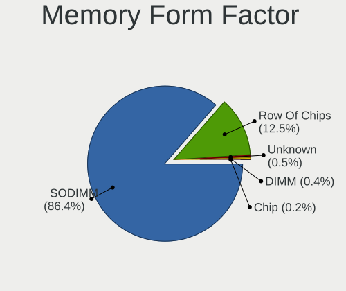

| Name         | Notebooks | Percent |
|--------------|-----------|---------|
| SODIMM       | 1064      | 86.43%  |
| Row Of Chips | 154       | 12.51%  |
| Unknown      | 6         | 0.49%   |
| DIMM         | 5         | 0.41%   |
| Chip         | 2         | 0.16%   |

Memory Size
-----------

Memory module size

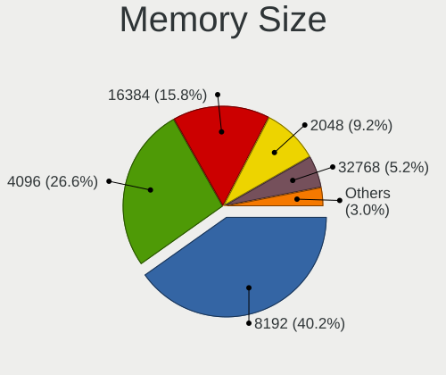

| Size    | Notebooks | Percent |
|---------|-----------|---------|
| 8192    | 556       | 40.2%   |
| 4096    | 368       | 26.61%  |
| 16384   | 218       | 15.76%  |
| 2048    | 127       | 9.18%   |
| 32768   | 72        | 5.21%   |
| 1024    | 33        | 2.39%   |
| 512     | 3         | 0.22%   |
| 1536    | 2         | 0.14%   |
| 49152   | 1         | 0.07%   |
| 6144    | 1         | 0.07%   |
| 256     | 1         | 0.07%   |
| Unknown | 1         | 0.07%   |

Memory Speed
------------

Memory module speed

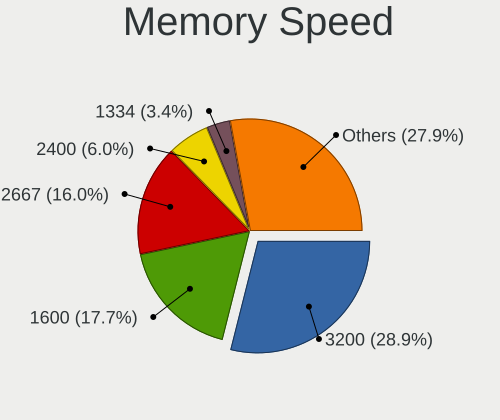

| Speed   | Notebooks | Percent |
|---------|-----------|---------|
| 3200    | 383       | 28.93%  |
| 1600    | 235       | 17.75%  |
| 2667    | 212       | 16.01%  |
| 2400    | 80        | 6.04%   |
| 1334    | 45        | 3.4%    |
| 2133    | 44        | 3.32%   |
| 5600    | 40        | 3.02%   |
| 4800    | 38        | 2.87%   |
| 1333    | 32        | 2.42%   |
| Unknown | 28        | 2.11%   |
| 4199    | 21        | 1.59%   |
| 4267    | 20        | 1.51%   |
| 667     | 20        | 1.51%   |
| 8400    | 18        | 1.36%   |
| 6400    | 18        | 1.36%   |
| 1067    | 16        | 1.21%   |
| 1867    | 10        | 0.76%   |
| 4266    | 9         | 0.68%   |
| 8533    | 7         | 0.53%   |
| 800     | 7         | 0.53%   |
| 3266    | 6         | 0.45%   |
| 7500    | 5         | 0.38%   |
| 7467    | 4         | 0.3%    |
| 3733    | 4         | 0.3%    |
| 2048    | 4         | 0.3%    |
| 975     | 4         | 0.3%    |
| 533     | 3         | 0.23%   |
| 8000    | 2         | 0.15%   |
| 5500    | 2         | 0.15%   |
| 2933    | 2         | 0.15%   |
| 1639    | 2         | 0.15%   |
| 1066    | 2         | 0.15%   |
| 1866    | 1         | 0.08%   |

Printers & scanners
-------------------

Printer Vendor
--------------

Printer device vendors

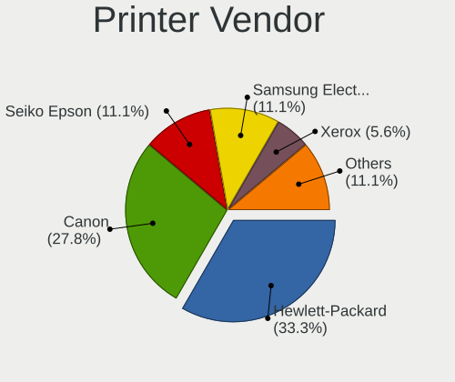

| Vendor                 | Notebooks | Percent |
|------------------------|-----------|---------|
| Hewlett-Packard        | 6         | 33.33%  |
| Canon                  | 5         | 27.78%  |
| Seiko Epson            | 2         | 11.11%  |
| Samsung Electronics    | 2         | 11.11%  |
| Xerox                  | 1         | 5.56%   |
| TSC Auto ID Technology | 1         | 5.56%   |
| QinHeng Electronics    | 1         | 5.56%   |

Printer Model
-------------

Printer device models

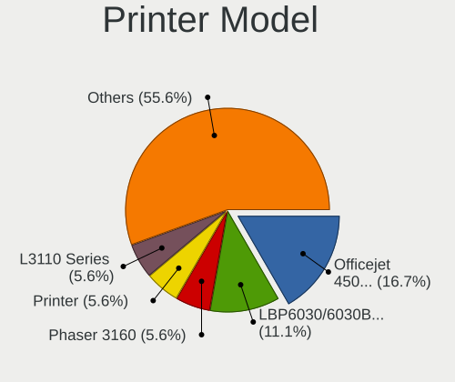

| Model                                | Notebooks | Percent |
|--------------------------------------|-----------|---------|
| HP Officejet 4500 G510g-m            | 3         | 16.67%  |
| Canon LBP6030/6030B/6018L            | 2         | 11.11%  |
| Xerox Phaser 3160                    | 1         | 5.56%   |
| TSC Auto ID Printer                  | 1         | 5.56%   |
| Seiko Epson L3110 Series             | 1         | 5.56%   |
| Seiko Epson FX-2190IIN               | 1         | 5.56%   |
| Samsung ML-216x Series Laser Printer | 1         | 5.56%   |
| Samsung CLP-325 Color Laser Printer  | 1         | 5.56%   |
| QinHeng CH340S                       | 1         | 5.56%   |
| HP LaserJet P1102                    | 1         | 5.56%   |
| HP DeskJet 2600 series               | 1         | 5.56%   |
| HP Deskjet 1050 J410                 | 1         | 5.56%   |
| Canon PIXMA MX340                    | 1         | 5.56%   |
| Canon imageRUNNER1133 series         | 1         | 5.56%   |
| Canon CAPT USB Device                | 1         | 5.56%   |

Scanner Vendor
--------------

Scanner device vendors

Zero info for selected period =(

Scanner Model
-------------

Scanner device models

Zero info for selected period =(

Camera
------

Camera Vendor
-------------

Camera device vendors

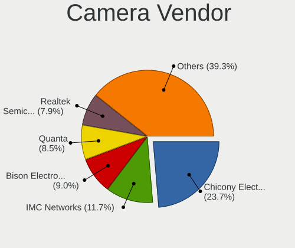

| Vendor                                 | Notebooks | Percent |
|----------------------------------------|-----------|---------|
| Chicony Electronics                    | 465       | 23.68%  |
| IMC Networks                           | 229       | 11.66%  |
| Bison Electronics                      | 176       | 8.96%   |
| Quanta                                 | 167       | 8.5%    |
| Realtek Semiconductor                  | 155       | 7.89%   |
| Microdia                               | 107       | 5.45%   |
| Cheng Uei Precision Industry (Foxlink) | 86        | 4.38%   |
| Sunplus Innovation Technology          | 73        | 3.72%   |
| Luxvisions Innotech Limited            | 70        | 3.56%   |
| Syntek                                 | 62        | 3.16%   |
| Suyin                                  | 49        | 2.49%   |
| Apple                                  | 37        | 1.88%   |
| Silicon Motion                         | 33        | 1.68%   |
| Sonix Technology                       | 32        | 1.63%   |
| Lite-On Technology                     | 27        | 1.37%   |
| Alcor Micro                            | 23        | 1.17%   |
| Acer                                   | 18        | 0.92%   |
| Ricoh                                  | 12        | 0.61%   |
| Z-Star Microelectronics                | 11        | 0.56%   |
| ShineTech                              | 11        | 0.56%   |
| Samsung Electronics                    | 10        | 0.51%   |
| Importek                               | 10        | 0.51%   |
| ALi                                    | 10        | 0.51%   |
| kingcome                               | 8         | 0.41%   |
| Sunwingroup                            | 6         | 0.31%   |
| SenseTek                               | 6         | 0.31%   |
| Logitech                               | 6         | 0.31%   |
| SunplusIT                              | 4         | 0.2%    |
| Shine-optics                           | 4         | 0.2%    |
| Lenovo                                 | 4         | 0.2%    |
| HYGD-221208-J                          | 4         | 0.2%    |
| Foxconn / Hon Hai                      | 4         | 0.2%    |
| Sunplus IT                             | 3         | 0.15%   |
| DigiTech                               | 3         | 0.15%   |
| Xiaomi                                 | 2         | 0.1%    |
| Unknown (3730304231393831325530)       | 2         | 0.1%    |
| Sunplus Technology                     | 2         | 0.1%    |
| Primax Electronics                     | 2         | 0.1%    |
| Novatek Microelectronics               | 2         | 0.1%    |
| Nebraska Furniture Mart                | 2         | 0.1%    |

Camera Model
------------

Camera device models

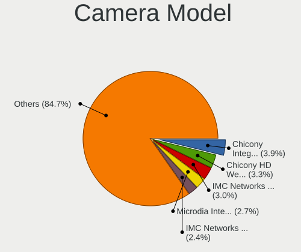

| Model                                                | Notebooks | Percent |
|------------------------------------------------------|-----------|---------|
| Chicony Integrated Camera                            | 76        | 3.85%   |
| Chicony HD Webcam                                    | 66        | 3.35%   |
| IMC Networks Integrated Camera                       | 60        | 3.04%   |
| Microdia Integrated_Webcam_HD                        | 53        | 2.69%   |
| IMC Networks USB2.0 HD UVC WebCam                    | 47        | 2.38%   |
| Bison Integrated Camera                              | 42        | 2.13%   |
| Syntek Integrated Camera                             | 38        | 1.93%   |
| Realtek Integrated_Webcam_HD                         | 37        | 1.88%   |
| IMC Networks USB2.0 VGA UVC WebCam                   | 32        | 1.62%   |
| IMC Networks HD Camera                               | 28        | 1.42%   |
| Chicony USB2.0 VGA UVC WebCam                        | 25        | 1.27%   |
| Bison HD Webcam                                      | 25        | 1.27%   |
| Sonix USB2.0 HD UVC WebCam                           | 22        | 1.12%   |
| Quanta USB HD Webcam                                 | 20        | 1.01%   |
| Bison Lenovo EasyCamera                              | 20        | 1.01%   |
| Luxvisions Innotech Limited Integrated Camera        | 18        | 0.91%   |
| Luxvisions Innotech Limited HP Wide Vision HD Camera | 18        | 0.91%   |
| Chicony USB2.0 HD UVC WebCam                         | 18        | 0.91%   |
| Chicony TOSHIBA Web Camera - HD                      | 18        | 0.91%   |
| Chicony HP HD Camera                                 | 18        | 0.91%   |
| Quanta HD User Facing                                | 17        | 0.86%   |
| IMC Networks ov9734_azurewave_camera                 | 17        | 0.86%   |
| Chicony HD User Facing                               | 17        | 0.86%   |
| Quanta HP Wide Vision HD Camera                      | 16        | 0.81%   |
| Quanta HP TrueVision HD Camera                       | 16        | 0.81%   |
| Chicony Chicony USB2.0 Camera                        | 16        | 0.81%   |
| Bison SunplusIT Integrated Camera                    | 16        | 0.81%   |
| Sunplus Integrated_Webcam_HD                         | 15        | 0.76%   |
| Chicony HP Wide Vision HD Camera                     | 15        | 0.76%   |
| Bison BisonCam,NB Pro                                | 15        | 0.76%   |
| Apple iPhone 5/5C/5S/6/SE/7/8/X                      | 15        | 0.76%   |
| Realtek USB2.0 VGA UVC WebCam                        | 14        | 0.71%   |
| Quanta HD Webcam                                     | 14        | 0.71%   |
| Sunplus Asus Webcam                                  | 13        | 0.66%   |
| Quanta ov9734_techfront_camera                       | 13        | 0.66%   |
| Quanta ACER HD User Facing                           | 13        | 0.66%   |
| Bison BisonCam, NB Pro                               | 13        | 0.66%   |
| Realtek USB Camera                                   | 12        | 0.61%   |
| Realtek Integrated Webcam                            | 12        | 0.61%   |
| Quanta HP True Vision FHD Camera                     | 12        | 0.61%   |

Security
--------

Fingerprint Vendor
------------------

Fingerprint sensor vendors

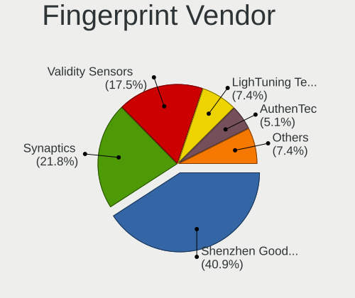

| Vendor                             | Notebooks | Percent |
|------------------------------------|-----------|---------|
| Shenzhen Goodix Technology         | 105       | 40.86%  |
| Synaptics                          | 56        | 21.79%  |
| Validity Sensors                   | 45        | 17.51%  |
| LighTuning Technology              | 19        | 7.39%   |
| AuthenTec                          | 13        | 5.06%   |
| Upek                               | 10        | 3.89%   |
| Elan Microelectronics              | 6         | 2.33%   |
| Realtek USB2.0 Finger Print Bridge | 2         | 0.78%   |
| DigitalPersona                     | 1         | 0.39%   |

Fingerprint Model
-----------------

Fingerprint sensor models

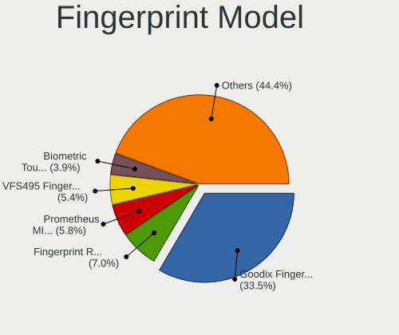

| Model                                                                      | Notebooks | Percent |
|----------------------------------------------------------------------------|-----------|---------|
| Shenzhen Goodix  Fingerprint Device                                        | 86        | 33.46%  |
| Shenzhen Goodix Fingerprint Reader                                         | 18        | 7%      |
| Synaptics Prometheus MIS Touch Fingerprint Reader                          | 15        | 5.84%   |
| Validity Sensors VFS495 Fingerprint Reader                                 | 14        | 5.45%   |
| Upek Biometric Touchchip/Touchstrip Fingerprint Sensor                     | 10        | 3.89%   |
| LighTuning ES603 Swipe Fingerprint Sensor                                  | 10        | 3.89%   |
| Synaptics Metallica MIS Touch Fingerprint Reader                           | 9         | 3.5%    |
| LighTuning EgisTec Touch Fingerprint Sensor                                | 8         | 3.11%   |
| Synaptics WBDI Fingerprint Reader USB 086                                  | 7         | 2.72%   |
| Validity Sensors VFS5011 Fingerprint Reader                                | 6         | 2.33%   |
| Validity Sensors Fingerprint scanner                                       | 6         | 2.33%   |
| Validity Sensors VFS 5011 fingerprint sensor                               | 5         | 1.95%   |
| Synaptics WBDI                                                             | 4         | 1.56%   |
| Synaptics  WBDI                                                            | 4         | 1.56%   |
| Synaptics  FS7604 Touch Fingerprint Sensor with PurePrint                  | 4         | 1.56%   |
| Synaptics Metallica MOH Touch Fingerprint Reader                           | 4         | 1.56%   |
| AuthenTec AES2810                                                          | 4         | 1.56%   |
| Validity Sensors VFS491                                                    | 3         | 1.17%   |
| Validity Sensors VFS451 Fingerprint Reader                                 | 3         | 1.17%   |
| Synaptics Fingerprint reader [HP G6]                                       | 3         | 1.17%   |
| Elan ELAN:Fingerprint                                                      | 3         | 1.17%   |
| Elan ELAN:ARM-M4                                                           | 3         | 1.17%   |
| AuthenTec AES2501 Fingerprint Sensor                                       | 3         | 1.17%   |
| AuthenTec AES1600                                                          | 3         | 1.17%   |
| Validity Sensors Synaptics WBDI                                            | 2         | 0.78%   |
| Synaptics UWP WBDI                                                         | 2         | 0.78%   |
| Synaptics Prometheus Fingerprint Reader                                    | 2         | 0.78%   |
| Realtek USB2.0 Finger Print Bridge FocalTech Fingerprint Device            | 2         | 0.78%   |
| Validity Sensors VFS7500 Touch Fingerprint Sensor                          | 1         | 0.39%   |
| Validity Sensors VFS101 Fingerprint Reader                                 | 1         | 0.39%   |
| Validity Sensors VFS Fingerprint sensor                                    | 1         | 0.39%   |
| Validity Sensors Synaptics VFS7552 Touch Fingerprint Sensor with PurePrint | 1         | 0.39%   |
| Validity Sensors Synaptics VFS7552 Touch Fingerprint Sensor                | 1         | 0.39%   |
| Validity Sensors Swipe Fingerprint Sensor                                  | 1         | 0.39%   |
| Synaptics UWP WBDI Device                                                  | 1         | 0.39%   |
| Synaptics FS7604 Touch Fingerprint Sensor with PurePrint                   | 1         | 0.39%   |
| Shenzhen Goodix FingerPrint                                                | 1         | 0.39%   |
| LighTuning Fingerprint Reader                                              | 1         | 0.39%   |
| DigitalPersona Fingerprint Reader                                          | 1         | 0.39%   |
| AuthenTec Fingerprint Sensor                                               | 1         | 0.39%   |

Chipcard Vendor
---------------

Chipcard module vendors

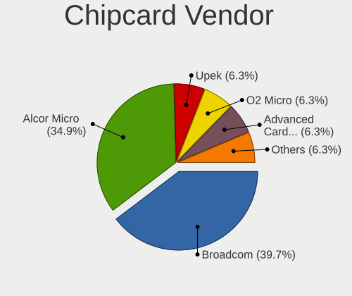

| Vendor                | Notebooks | Percent |
|-----------------------|-----------|---------|
| Broadcom              | 25        | 39.68%  |
| Alcor Micro           | 22        | 34.92%  |
| Upek                  | 4         | 6.35%   |
| O2 Micro              | 4         | 6.35%   |
| Advanced Card Systems | 4         | 6.35%   |
| Lenovo                | 3         | 4.76%   |
| Gemalto (was Gemplus) | 1         | 1.59%   |

Chipcard Model
--------------

Chipcard module models

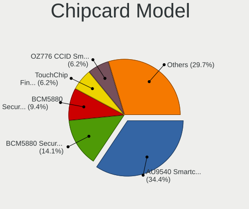

| Model                                                                        | Notebooks | Percent |
|------------------------------------------------------------------------------|-----------|---------|
| Alcor Micro AU9540 Smartcard Reader                                          | 22        | 34.38%  |
| Broadcom BCM5880 Secure Applications Processor with fingerprint swipe sensor | 9         | 14.06%  |
| Broadcom BCM5880 Secure Applications Processor                               | 6         | 9.38%   |
| Upek TouchChip Fingerprint Coprocessor (WBF advanced mode)                   | 4         | 6.25%   |
| O2 Micro OZ776 CCID Smartcard Reader                                         | 4         | 6.25%   |
| Broadcom BCM58200 ControlVault 3 (FingerPrint sensor + Contacted SmartCard)  | 4         | 6.25%   |
| Lenovo Integrated Smart Card Reader                                          | 3         | 4.69%   |
| Broadcom 5880                                                                | 3         | 4.69%   |
| Broadcom 58200                                                               | 3         | 4.69%   |
| Advanced Card Systems ACR38 SmartCard Reader                                 | 3         | 4.69%   |
| Advanced Card Systems ACR39U                                                 | 2         | 3.13%   |
| Gemalto (was Gemplus) GemPC Key SmartCard Reader                             | 1         | 1.56%   |

Unsupported
-----------

Unsupported Devices
-------------------

Total unsupported devices on board

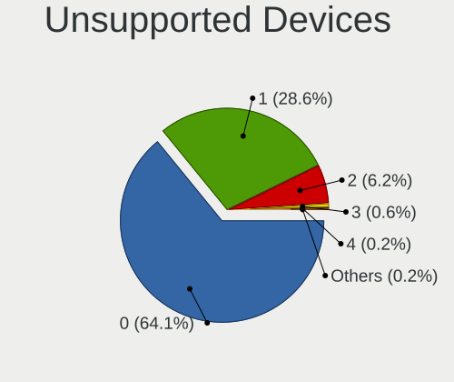

| Total | Notebooks | Percent |
|-------|-----------|---------|
| 0     | 1423      | 64.1%   |
| 1     | 636       | 28.65%  |
| 2     | 137       | 6.17%   |
| 3     | 14        | 0.63%   |
| 4     | 5         | 0.23%   |
| 6     | 2         | 0.09%   |
| 5     | 2         | 0.09%   |
| 9     | 1         | 0.05%   |

Unsupported Device Types
------------------------

Types of unsupported devices

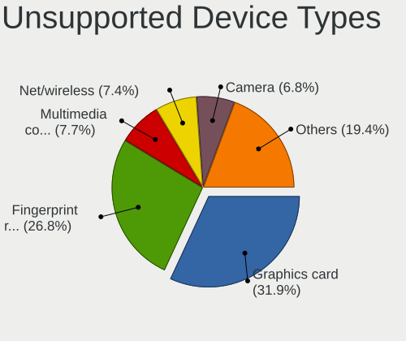

| Type                     | Notebooks | Percent |
|--------------------------|-----------|---------|
| Graphics card            | 305       | 31.9%   |
| Fingerprint reader       | 256       | 26.78%  |
| Multimedia controller    | 74        | 7.74%   |
| Net/wireless             | 71        | 7.43%   |
| Camera                   | 65        | 6.8%    |
| Chipcard                 | 52        | 5.44%   |
| Bluetooth                | 49        | 5.13%   |
| Communication controller | 30        | 3.14%   |
| Net/ethernet             | 16        | 1.67%   |
| Sound                    | 15        | 1.57%   |
| Storage                  | 10        | 1.05%   |
| Card reader              | 6         | 0.63%   |
| Network                  | 2         | 0.21%   |
| Flash memory             | 2         | 0.21%   |
| Wireless                 | 1         | 0.1%    |
| Unassigned class         | 1         | 0.1%    |
| Modem                    | 1         | 0.1%    |

