Linux in Turkey - Tested Hardware & Statistics (Notebooks)
----------------------------------------------------------

A project to collect tested hardware configurations for Linux in Turkey.

Anyone can contribute to this report by the [hw-probe](https://github.com/linuxhw/hw-probe) tool:

    sudo -E hw-probe -all -upload

Please contribute! Especially if your hardware is rare.

Contents
--------

* [ Test Cases ](#test-cases)

* [ System ](#system)
  - [ OS                       ](#os)
  - [ OS Family                ](#os-family)
  - [ Kernel                   ](#kernel)
  - [ Kernel Family            ](#kernel-family)
  - [ Kernel Major Ver.        ](#kernel-major-ver)
  - [ Arch                     ](#arch)
  - [ DE                       ](#de)
  - [ Display Server           ](#display-server)
  - [ Display Manager          ](#display-manager)
  - [ OS Lang                  ](#os-lang)
  - [ Boot Mode                ](#boot-mode)
  - [ Filesystem               ](#filesystem)
  - [ Part. scheme             ](#part-scheme)
  - [ Dual Boot with Linux/BSD ](#dual-boot-with-linuxbsd)
  - [ Dual Boot (Win)          ](#dual-boot-win)

* [ Board ](#board)
  - [ Vendor                   ](#vendor)
  - [ Model                    ](#model)
  - [ Model Family             ](#model-family)
  - [ MFG Year                 ](#mfg-year)
  - [ Form Factor              ](#form-factor)
  - [ Secure Boot              ](#secure-boot)
  - [ Coreboot                 ](#coreboot)
  - [ RAM Size                 ](#ram-size)
  - [ RAM Used                 ](#ram-used)
  - [ Total Drives             ](#total-drives)
  - [ Has CD-ROM               ](#has-cd-rom)
  - [ Has Ethernet             ](#has-ethernet)
  - [ Has WiFi                 ](#has-wifi)
  - [ Has Bluetooth            ](#has-bluetooth)

* [ Location ](#location)
  - [ Country                  ](#country)
  - [ City                     ](#city)

* [ Drives ](#drives)
  - [ Drive Vendor             ](#drive-vendor)
  - [ Drive Model              ](#drive-model)
  - [ HDD Vendor               ](#hdd-vendor)
  - [ SSD Vendor               ](#ssd-vendor)
  - [ Drive Kind               ](#drive-kind)
  - [ Drive Connector          ](#drive-connector)
  - [ Drive Size               ](#drive-size)
  - [ Space Total              ](#space-total)
  - [ Space Used               ](#space-used)
  - [ Malfunc. Drives          ](#malfunc-drives)
  - [ Malfunc. Drive Vendor    ](#malfunc-drive-vendor)
  - [ Malfunc. HDD Vendor      ](#malfunc-hdd-vendor)
  - [ Malfunc. Drive Kind      ](#malfunc-drive-kind)
  - [ Failed Drives            ](#failed-drives)
  - [ Failed Drive Vendor      ](#failed-drive-vendor)
  - [ Drive Status             ](#drive-status)

* [ Storage controller ](#storage-controller)
  - [ Storage Vendor           ](#storage-vendor)
  - [ Storage Model            ](#storage-model)
  - [ Storage Kind             ](#storage-kind)

* [ Processor ](#processor)
  - [ CPU Vendor               ](#cpu-vendor)
  - [ CPU Model                ](#cpu-model)
  - [ CPU Model Family         ](#cpu-model-family)
  - [ CPU Cores                ](#cpu-cores)
  - [ CPU Sockets              ](#cpu-sockets)
  - [ CPU Threads              ](#cpu-threads)
  - [ CPU Op-Modes             ](#cpu-op-modes)
  - [ CPU Microcode            ](#cpu-microcode)
  - [ CPU Microarch            ](#cpu-microarch)

* [ Graphics ](#graphics)
  - [ GPU Vendor               ](#gpu-vendor)
  - [ GPU Model                ](#gpu-model)
  - [ GPU Combo                ](#gpu-combo)
  - [ GPU Driver               ](#gpu-driver)
  - [ GPU Memory               ](#gpu-memory)

* [ Monitor ](#monitor)
  - [ Monitor Vendor           ](#monitor-vendor)
  - [ Monitor Model            ](#monitor-model)
  - [ Monitor Resolution       ](#monitor-resolution)
  - [ Monitor Diagonal         ](#monitor-diagonal)
  - [ Monitor Width            ](#monitor-width)
  - [ Aspect Ratio             ](#aspect-ratio)
  - [ Monitor Area             ](#monitor-area)
  - [ Pixel Density            ](#pixel-density)
  - [ Multiple Monitors        ](#multiple-monitors)

* [ Network ](#network)
  - [ Net Controller Vendor    ](#net-controller-vendor)
  - [ Net Controller Model     ](#net-controller-model)
  - [ Wireless Vendor          ](#wireless-vendor)
  - [ Wireless Model           ](#wireless-model)
  - [ Ethernet Vendor          ](#ethernet-vendor)
  - [ Ethernet Model           ](#ethernet-model)
  - [ Net Controller Kind      ](#net-controller-kind)
  - [ Used Controller          ](#used-controller)
  - [ NICs                     ](#nics)
  - [ IPv6                     ](#ipv6)

* [ Bluetooth ](#bluetooth)
  - [ Bluetooth Vendor         ](#bluetooth-vendor)
  - [ Bluetooth Model          ](#bluetooth-model)

* [ Sound ](#sound)
  - [ Sound Vendor             ](#sound-vendor)
  - [ Sound Model              ](#sound-model)

* [ Memory ](#memory)
  - [ Memory Vendor            ](#memory-vendor)
  - [ Memory Model             ](#memory-model)
  - [ Memory Kind              ](#memory-kind)
  - [ Memory Form Factor       ](#memory-form-factor)
  - [ Memory Size              ](#memory-size)
  - [ Memory Speed             ](#memory-speed)

* [ Printers & scanners ](#printers--scanners)
  - [ Printer Vendor           ](#printer-vendor)
  - [ Printer Model            ](#printer-model)
  - [ Scanner Vendor           ](#scanner-vendor)
  - [ Scanner Model            ](#scanner-model)

* [ Camera ](#camera)
  - [ Camera Vendor            ](#camera-vendor)
  - [ Camera Model             ](#camera-model)

* [ Security ](#security)
  - [ Fingerprint Vendor       ](#fingerprint-vendor)
  - [ Fingerprint Model        ](#fingerprint-model)
  - [ Chipcard Vendor          ](#chipcard-vendor)
  - [ Chipcard Model           ](#chipcard-model)

* [ Unsupported ](#unsupported)
  - [ Unsupported Devices      ](#unsupported-devices)
  - [ Unsupported Device Types ](#unsupported-device-types)

Test Cases
----------

Total: 2366

| Vendor        | Model                       | Probe                                                      | Date         |
|---------------|-----------------------------|------------------------------------------------------------|--------------|
| ASUSTek       | X405UQ                      | [aa39bc4676](https://linux-hardware.org/?probe=aa39bc4676) | May 06, 2024 |
| MSI           | CR61 2M/CX61 2OC/CX61 2O... | [ae77241a92](https://linux-hardware.org/?probe=ae77241a92) | May 06, 2024 |
| Monster       | ABRA A7 V13.2               | [fef4f4d7d4](https://linux-hardware.org/?probe=fef4f4d7d4) | May 06, 2024 |
| Lenovo        | ThinkPad E580 20KTS0TF00    | [ca15c39fa7](https://linux-hardware.org/?probe=ca15c39fa7) | May 05, 2024 |
| Acer          | Aspire A315-510P            | [eb9fc84dcf](https://linux-hardware.org/?probe=eb9fc84dcf) | May 05, 2024 |
| Acer          | Aspire A315-44P             | [5c3ab00eb7](https://linux-hardware.org/?probe=5c3ab00eb7) | May 04, 2024 |
| Lenovo        | ThinkPad X1 Carbon Gen 1... | [8a0a1ade7b](https://linux-hardware.org/?probe=8a0a1ade7b) | May 04, 2024 |
| HP            | Victus by Gaming Laptop ... | [f584b00194](https://linux-hardware.org/?probe=f584b00194) | May 02, 2024 |
| HP            | Victus by Gaming Laptop ... | [6dbbe3a7b2](https://linux-hardware.org/?probe=6dbbe3a7b2) | May 02, 2024 |
| Lenovo        | ThinkPad T470s 20HGS3RJ0... | [dee93d35ca](https://linux-hardware.org/?probe=dee93d35ca) | May 02, 2024 |
| Acer          | Aspire SW5-173              | [e72a0709d4](https://linux-hardware.org/?probe=e72a0709d4) | May 01, 2024 |
| ASUSTek       | ASUS TUF Gaming F15 FX50... | [52327486f3](https://linux-hardware.org/?probe=52327486f3) | Apr 30, 2024 |
| Acer          | Aspire A315-44P             | [37adfa528f](https://linux-hardware.org/?probe=37adfa528f) | Apr 30, 2024 |
| Pegatron      | A15                         | [259d4c4051](https://linux-hardware.org/?probe=259d4c4051) | Apr 30, 2024 |
| Pegatron      | A15                         | [555c8aa911](https://linux-hardware.org/?probe=555c8aa911) | Apr 30, 2024 |
| Lenovo        | V330-15IKB 81AX             | [2282169665](https://linux-hardware.org/?probe=2282169665) | Apr 29, 2024 |
| HP            | Victus by Gaming Laptop ... | [a05a4bbcc2](https://linux-hardware.org/?probe=a05a4bbcc2) | Apr 28, 2024 |
| ASUSTek       | K55VJ                       | [dee27f64b0](https://linux-hardware.org/?probe=dee27f64b0) | Apr 28, 2024 |
| ASUSTek       | K55VJ                       | [ade9763073](https://linux-hardware.org/?probe=ade9763073) | Apr 28, 2024 |
| HP            | Victus by Gaming Laptop ... | [00f2fc6455](https://linux-hardware.org/?probe=00f2fc6455) | Apr 27, 2024 |
| Monster       | ABRA A5 V16.5               | [dafa6ffefd](https://linux-hardware.org/?probe=dafa6ffefd) | Apr 26, 2024 |
| Monster       | ABRA A5 V20.2               | [7c8b0185ad](https://linux-hardware.org/?probe=7c8b0185ad) | Apr 26, 2024 |
| Dell          | Precision 3551              | [f5fbef6c5d](https://linux-hardware.org/?probe=f5fbef6c5d) | Apr 26, 2024 |
| Acer          | Aspire A315-510P            | [b5d2df5a85](https://linux-hardware.org/?probe=b5d2df5a85) | Apr 26, 2024 |
| Dell          | Precision 3551              | [4a88987cea](https://linux-hardware.org/?probe=4a88987cea) | Apr 25, 2024 |
| Acer          | Aspire A315-510P            | [353dfb074d](https://linux-hardware.org/?probe=353dfb074d) | Apr 25, 2024 |
| Acer          | Aspire A315-59G             | [0a16aa62ad](https://linux-hardware.org/?probe=0a16aa62ad) | Apr 23, 2024 |
| HP            | Victus by Gaming Laptop     | [7178fbf1eb](https://linux-hardware.org/?probe=7178fbf1eb) | Apr 23, 2024 |
| Monster       | ABRA A5 V9.1                | [de1c33f8ea](https://linux-hardware.org/?probe=de1c33f8ea) | Apr 22, 2024 |
| Lenovo        | ThinkPad E595 20NF001PTX    | [6e6ef1d063](https://linux-hardware.org/?probe=6e6ef1d063) | Apr 21, 2024 |
| Lenovo        | ThinkBook 15 G2 ARE 20VG    | [be0672ea72](https://linux-hardware.org/?probe=be0672ea72) | Apr 21, 2024 |
| HUAWEI        | BOD-WXX9                    | [661b2a53b2](https://linux-hardware.org/?probe=661b2a53b2) | Apr 21, 2024 |
| SGIN          | M15                         | [68c2d94db7](https://linux-hardware.org/?probe=68c2d94db7) | Apr 20, 2024 |
| Monster       | ABRA A5 V9.1                | [a438f99e4d](https://linux-hardware.org/?probe=a438f99e4d) | Apr 20, 2024 |
| Lenovo        | IdeaPad 510-15IKB 80SV      | [c823822177](https://linux-hardware.org/?probe=c823822177) | Apr 20, 2024 |
| Lenovo        | V15 G3 ABA 82TV             | [8e0d1cf973](https://linux-hardware.org/?probe=8e0d1cf973) | Apr 19, 2024 |
| Acer          | Aspire E5-571G              | [c0cb351a9c](https://linux-hardware.org/?probe=c0cb351a9c) | Apr 18, 2024 |
| Acer          | Aspire E5-571G              | [f225a565f5](https://linux-hardware.org/?probe=f225a565f5) | Apr 18, 2024 |
| Acer          | Aspire A315-58              | [e045e6c6c3](https://linux-hardware.org/?probe=e045e6c6c3) | Apr 17, 2024 |
| HUAWEI        | HVY-WXX9                    | [6727adfce1](https://linux-hardware.org/?probe=6727adfce1) | Apr 17, 2024 |
| Lenovo        | V15 G2 ITL 82KB             | [a596d334bf](https://linux-hardware.org/?probe=a596d334bf) | Apr 16, 2024 |
| HP            | 250 G7 Notebook PC          | [be2b691a57](https://linux-hardware.org/?probe=be2b691a57) | Apr 15, 2024 |
| Lenovo        | ThinkPad T480 20L6S68A00    | [d480b5dc92](https://linux-hardware.org/?probe=d480b5dc92) | Apr 15, 2024 |
| HP            | ProBook 4540s               | [ace6254b85](https://linux-hardware.org/?probe=ace6254b85) | Apr 14, 2024 |
| HP            | ProBook 4540s               | [1d64c374de](https://linux-hardware.org/?probe=1d64c374de) | Apr 14, 2024 |
| HP            | 250 G4 Notebook PC          | [2fcb542c43](https://linux-hardware.org/?probe=2fcb542c43) | Apr 14, 2024 |
| HP            | ENVY Laptop 13-ad1xx        | [73379ea508](https://linux-hardware.org/?probe=73379ea508) | Apr 13, 2024 |
| Acer          | Aspire A315-510P            | [07844c11ad](https://linux-hardware.org/?probe=07844c11ad) | Apr 13, 2024 |
| MSI           | Bravo 17 A4DDR              | [5296079f86](https://linux-hardware.org/?probe=5296079f86) | Apr 12, 2024 |
| Lenovo        | ThinkPad E580 20KTS0TF00    | [30d9e28258](https://linux-hardware.org/?probe=30d9e28258) | Apr 12, 2024 |
| Acer          | Nitro AN515-57              | [c7d6945bb3](https://linux-hardware.org/?probe=c7d6945bb3) | Apr 11, 2024 |
| Lenovo        | ThinkBook 15 G2 ARE 20VG    | [918934ed68](https://linux-hardware.org/?probe=918934ed68) | Apr 11, 2024 |
| HUAWEI        | HVY-WXX9                    | [b215419382](https://linux-hardware.org/?probe=b215419382) | Apr 10, 2024 |
| Lenovo        | ThinkPad L15 Gen 1 20U70... | [e9e940ec8a](https://linux-hardware.org/?probe=e9e940ec8a) | Apr 10, 2024 |
| HP            | Laptop 15-bw0xx             | [823f3c3138](https://linux-hardware.org/?probe=823f3c3138) | Apr 09, 2024 |
| HUAWEI        | KLVF-XX                     | [775f139f3b](https://linux-hardware.org/?probe=775f139f3b) | Apr 06, 2024 |
| HUAWEI        | KLVF-XX                     | [6d24eb8f58](https://linux-hardware.org/?probe=6d24eb8f58) | Apr 06, 2024 |
| Casper        | EXCALIBUR G770              | [3accfd7d7b](https://linux-hardware.org/?probe=3accfd7d7b) | Apr 05, 2024 |
| Casper        | EXCALIBUR G770              | [00d364c46f](https://linux-hardware.org/?probe=00d364c46f) | Apr 05, 2024 |
| Lenovo        | ThinkPad T430 2349RQ3       | [6988a75b14](https://linux-hardware.org/?probe=6988a75b14) | Apr 05, 2024 |
| Lenovo        | IdeaPad 3 15ITL6 82H8       | [b30ba46617](https://linux-hardware.org/?probe=b30ba46617) | Apr 05, 2024 |
| ASUSTek       | VivoBook_ASUSLaptop K360... | [7bb2773966](https://linux-hardware.org/?probe=7bb2773966) | Apr 05, 2024 |
| Dell          | G15 5530                    | [a1b2877a39](https://linux-hardware.org/?probe=a1b2877a39) | Apr 05, 2024 |
| Apple         | MacBookPro8,1               | [72f797f01f](https://linux-hardware.org/?probe=72f797f01f) | Apr 04, 2024 |
| HP            | Pavilion g6                 | [1857b80f6f](https://linux-hardware.org/?probe=1857b80f6f) | Apr 04, 2024 |
| ASUSTek       | N53SV                       | [12ab7fe764](https://linux-hardware.org/?probe=12ab7fe764) | Apr 01, 2024 |
| Lenovo        | IdeaPad Y510P 20217         | [b13340abe1](https://linux-hardware.org/?probe=b13340abe1) | Apr 01, 2024 |
| ASUSTek       | UX410UQK                    | [9b11a1c1ad](https://linux-hardware.org/?probe=9b11a1c1ad) | Mar 31, 2024 |
| Lenovo        | IdeaPad Y510P 20217         | [0b0b2cfaba](https://linux-hardware.org/?probe=0b0b2cfaba) | Mar 30, 2024 |
| Lenovo        | IdeaPad Y510P 20217         | [640e524f35](https://linux-hardware.org/?probe=640e524f35) | Mar 30, 2024 |
| HP            | Laptop 15s-eq3xxx           | [d310b775e9](https://linux-hardware.org/?probe=d310b775e9) | Mar 29, 2024 |
| HUAWEI        | BOD-WXX9                    | [d26eb0b735](https://linux-hardware.org/?probe=d26eb0b735) | Mar 28, 2024 |
| Insyde        | i101c                       | [fd15a3a81f](https://linux-hardware.org/?probe=fd15a3a81f) | Mar 28, 2024 |
| HUAWEI        | BOD-WXX9                    | [831e41730c](https://linux-hardware.org/?probe=831e41730c) | Mar 27, 2024 |
| Lenovo        | IdeaPad 100S-14IBR 80R9     | [05bab22d87](https://linux-hardware.org/?probe=05bab22d87) | Mar 27, 2024 |
| ASUSTek       | X555LNB                     | [45dec21dcc](https://linux-hardware.org/?probe=45dec21dcc) | Mar 27, 2024 |
| ASUSTek       | X555LNB                     | [cc09f69f8c](https://linux-hardware.org/?probe=cc09f69f8c) | Mar 27, 2024 |
| Lenovo        | ThinkPad E14 Gen 2 20TAS... | [e128a63580](https://linux-hardware.org/?probe=e128a63580) | Mar 26, 2024 |
| Toshiba       | Satellite C75-A             | [f153e82f42](https://linux-hardware.org/?probe=f153e82f42) | Mar 26, 2024 |
| Toshiba       | Satellite C75-A             | [1152d85ee1](https://linux-hardware.org/?probe=1152d85ee1) | Mar 26, 2024 |
| Lenovo        | Z50-70 20354                | [68838b01fa](https://linux-hardware.org/?probe=68838b01fa) | Mar 26, 2024 |
| ASUSTek       | TUF Gaming FX504GD_FX80G... | [bddc045346](https://linux-hardware.org/?probe=bddc045346) | Mar 26, 2024 |
| HP            | Pavilion Gaming Laptop 1... | [e2f8f7ac57](https://linux-hardware.org/?probe=e2f8f7ac57) | Mar 24, 2024 |
| HP            | Pavilion Gaming Laptop 1... | [4788b61821](https://linux-hardware.org/?probe=4788b61821) | Mar 24, 2024 |
| HP            | ProBook 430 G4              | [d199369cfc](https://linux-hardware.org/?probe=d199369cfc) | Mar 24, 2024 |
| HP            | ProBook 430 G4              | [16dd8d0203](https://linux-hardware.org/?probe=16dd8d0203) | Mar 24, 2024 |
| Casper        | EXCALIBUR G900              | [f5b2fe66ff](https://linux-hardware.org/?probe=f5b2fe66ff) | Mar 24, 2024 |
| HP            | EliteBook 8530w             | [68ee7621ae](https://linux-hardware.org/?probe=68ee7621ae) | Mar 24, 2024 |
| Apple         | MacBookPro14,1              | [c52682f980](https://linux-hardware.org/?probe=c52682f980) | Mar 23, 2024 |
| Monster       | ABRA A5 V17.4               | [153af2c8d9](https://linux-hardware.org/?probe=153af2c8d9) | Mar 23, 2024 |
| ASUSTek       | Zenbook UX3402ZA_UX3402Z... | [9ca2b22999](https://linux-hardware.org/?probe=9ca2b22999) | Mar 20, 2024 |
| Lenovo        | IdeaPad 3 15ITL6 82H8       | [03577ae940](https://linux-hardware.org/?probe=03577ae940) | Mar 19, 2024 |
| Lenovo        | V15 G2 ITL 82KB             | [0fa9c73550](https://linux-hardware.org/?probe=0fa9c73550) | Mar 19, 2024 |
| HP            | Compaq 6715s (KE068ET#AB... | [93f757d8b3](https://linux-hardware.org/?probe=93f757d8b3) | Mar 18, 2024 |
| Lenovo        | V15 G3 IAP 82TT             | [fb281cfb94](https://linux-hardware.org/?probe=fb281cfb94) | Mar 18, 2024 |
| HUAWEI        | BOHB-WAX9                   | [d9f0d873c4](https://linux-hardware.org/?probe=d9f0d873c4) | Mar 18, 2024 |
| ASUSTek       | Zenbook UX3402ZA_UX3402Z... | [67c8bbbbec](https://linux-hardware.org/?probe=67c8bbbbec) | Mar 17, 2024 |
| Lenovo        | V15 G2 ITL 82KB             | [8dcb3c6e6e](https://linux-hardware.org/?probe=8dcb3c6e6e) | Mar 17, 2024 |
| Acer          | Swift SF314-41G             | [22ac3144fc](https://linux-hardware.org/?probe=22ac3144fc) | Mar 17, 2024 |
| Lenovo        | IdeaPad 3 15ITL6 82H8       | [507e652893](https://linux-hardware.org/?probe=507e652893) | Mar 17, 2024 |
| Lenovo        | ThinkPad X1 Carbon 6th 2... | [3f171c561b](https://linux-hardware.org/?probe=3f171c561b) | Mar 16, 2024 |
| Lenovo        | V14 G2 ITL 82KA             | [df438763ef](https://linux-hardware.org/?probe=df438763ef) | Mar 15, 2024 |
| ASUSTek       | ASUS TUF Gaming F15 FX50... | [49ccd4595e](https://linux-hardware.org/?probe=49ccd4595e) | Mar 15, 2024 |
| ARCELIK       | GNB 1150 B1 N2              | [ebe974790a](https://linux-hardware.org/?probe=ebe974790a) | Mar 14, 2024 |
| ARCELIK       | GNB 1150 B1 N2              | [abb3de4578](https://linux-hardware.org/?probe=abb3de4578) | Mar 14, 2024 |
| HUAWEI        | CREM-WXX9                   | [53ffb858c0](https://linux-hardware.org/?probe=53ffb858c0) | Mar 14, 2024 |
| Lenovo        | IdeaPad Gaming 3 15ARH05... | [5f739cf4a3](https://linux-hardware.org/?probe=5f739cf4a3) | Mar 12, 2024 |
| Lenovo        | Yoga 300-11IBR 80M1         | [ed5b898404](https://linux-hardware.org/?probe=ed5b898404) | Mar 12, 2024 |
| Lenovo        | Yoga 300-11IBR 80M1         | [4a79c1e432](https://linux-hardware.org/?probe=4a79c1e432) | Mar 12, 2024 |
| MSI           | GF75 Thin 10SC              | [a415956dc4](https://linux-hardware.org/?probe=a415956dc4) | Mar 10, 2024 |
| HP            | ProBook 450 G7              | [2226e08e91](https://linux-hardware.org/?probe=2226e08e91) | Mar 09, 2024 |
| Lenovo        | IdeaPad 1 15IGL7 82V7       | [f2300b0ebd](https://linux-hardware.org/?probe=f2300b0ebd) | Mar 09, 2024 |
| HP            | Compaq 6715s (KE068ET#AB... | [bd5a3177a0](https://linux-hardware.org/?probe=bd5a3177a0) | Mar 09, 2024 |
| HP            | 250 G7 Notebook PC          | [bc116e452e](https://linux-hardware.org/?probe=bc116e452e) | Mar 08, 2024 |
| ASUSTek       | ROG Strix G712LWS_G712LW... | [84d939804b](https://linux-hardware.org/?probe=84d939804b) | Mar 07, 2024 |
| ASUSTek       | ROG Strix G712LWS_G712LW... | [7b9efc67c9](https://linux-hardware.org/?probe=7b9efc67c9) | Mar 07, 2024 |
| HUAWEI        | BoDE-WXX9                   | [caa7537216](https://linux-hardware.org/?probe=caa7537216) | Mar 07, 2024 |
| Dell          | Latitude E6410              | [2d821e2d6c](https://linux-hardware.org/?probe=2d821e2d6c) | Mar 07, 2024 |
| Monster       | TULPAR T7 V20.3             | [df8b4e385a](https://linux-hardware.org/?probe=df8b4e385a) | Mar 06, 2024 |
| Sony          | SVF1521NSTB                 | [b9f4d235c9](https://linux-hardware.org/?probe=b9f4d235c9) | Mar 06, 2024 |
| HUAWEI        | CREM-WXX9                   | [c63bca0fdc](https://linux-hardware.org/?probe=c63bca0fdc) | Mar 05, 2024 |
| Monster       | TULPAR T7 V21.8             | [608b9e154e](https://linux-hardware.org/?probe=608b9e154e) | Mar 05, 2024 |
| ASUSTek       | ROG Strix G614JU_G614JU     | [c557a3eccf](https://linux-hardware.org/?probe=c557a3eccf) | Mar 04, 2024 |
| Fujitsu       | LIFEBOOK A512               | [e3a0187ed0](https://linux-hardware.org/?probe=e3a0187ed0) | Mar 03, 2024 |
| HP            | Laptop 14-bs0xx             | [c259f8ec51](https://linux-hardware.org/?probe=c259f8ec51) | Mar 03, 2024 |
| HP            | Pavilion g6                 | [0590dc2c6d](https://linux-hardware.org/?probe=0590dc2c6d) | Mar 02, 2024 |
| Monster       | Huma H5 V3.2                | [36511aa895](https://linux-hardware.org/?probe=36511aa895) | Mar 02, 2024 |
| Acer          | Aspire A315-58              | [6286320fc9](https://linux-hardware.org/?probe=6286320fc9) | Mar 02, 2024 |
| ASUSTek       | VivoBook S14 X430UA         | [b85a5f54e0](https://linux-hardware.org/?probe=b85a5f54e0) | Mar 02, 2024 |
| Dell          | Precision 7760              | [e032c1878e](https://linux-hardware.org/?probe=e032c1878e) | Mar 01, 2024 |
| ASUSTek       | ROG Strix G513IC_G513IC     | [f610fa6db2](https://linux-hardware.org/?probe=f610fa6db2) | Mar 01, 2024 |
| HP            | Laptop 15s-eq3xxx           | [29f6262e4e](https://linux-hardware.org/?probe=29f6262e4e) | Feb 28, 2024 |
| Lenovo        | IdeaPad 3 15ITL6 82H8       | [7ea1563009](https://linux-hardware.org/?probe=7ea1563009) | Feb 28, 2024 |
| ASUSTek       | E205SA                      | [447990dcac](https://linux-hardware.org/?probe=447990dcac) | Feb 27, 2024 |
| MSI           | GP76 Leopard 10UE           | [48e3020e8e](https://linux-hardware.org/?probe=48e3020e8e) | Feb 27, 2024 |
| Dell          | Latitude E6430              | [c5a0f97c32](https://linux-hardware.org/?probe=c5a0f97c32) | Feb 27, 2024 |
| MSI           | GP76 Leopard 10UE           | [ba96bddc39](https://linux-hardware.org/?probe=ba96bddc39) | Feb 27, 2024 |
| Casper        | NIRVANA NOTEBOOK            | [19a2ccc504](https://linux-hardware.org/?probe=19a2ccc504) | Feb 27, 2024 |
| Lenovo        | IdeaPad S340-15IWL 81N8     | [5c829afa05](https://linux-hardware.org/?probe=5c829afa05) | Feb 27, 2024 |
| Lenovo        | ThinkPad T480 20L6S2CB00    | [eff836bcb1](https://linux-hardware.org/?probe=eff836bcb1) | Feb 27, 2024 |
| Lenovo        | ThinkPad T480 20L6S2CB00    | [a78eb227db](https://linux-hardware.org/?probe=a78eb227db) | Feb 26, 2024 |
| Dell          | Inspiron 14 5401            | [58f0a8c87c](https://linux-hardware.org/?probe=58f0a8c87c) | Feb 25, 2024 |
| Monster       | ABRA A5 V18.1               | [fb4a45369d](https://linux-hardware.org/?probe=fb4a45369d) | Feb 25, 2024 |
| HP            | Laptop 15-bw0xx             | [39ed74cf97](https://linux-hardware.org/?probe=39ed74cf97) | Feb 24, 2024 |
| HP            | OMEN by Gaming Laptop 16... | [f31eac8a5d](https://linux-hardware.org/?probe=f31eac8a5d) | Feb 24, 2024 |
| Lenovo        | IdeaPad Gaming 3 15IHU6 ... | [c6cff98a84](https://linux-hardware.org/?probe=c6cff98a84) | Feb 24, 2024 |
| Lenovo        | IdeaPad Gaming 3 15IHU6 ... | [448ad7f7cf](https://linux-hardware.org/?probe=448ad7f7cf) | Feb 24, 2024 |
| Lenovo        | Legion 5 15IMH05H 81Y6      | [75ca2d004c](https://linux-hardware.org/?probe=75ca2d004c) | Feb 23, 2024 |
| HP            | 240 14 inch G9              | [54ea49a49a](https://linux-hardware.org/?probe=54ea49a49a) | Feb 23, 2024 |
| Lenovo        | IdeaPad 1 15AMN7 82VG       | [6a88d5ebaf](https://linux-hardware.org/?probe=6a88d5ebaf) | Feb 23, 2024 |
| HP            | ENVY Laptop 13-ad1xx        | [340e79c73f](https://linux-hardware.org/?probe=340e79c73f) | Feb 22, 2024 |
| Sony          | VPCSB1Z9E                   | [aeb30cde62](https://linux-hardware.org/?probe=aeb30cde62) | Feb 22, 2024 |
| HP            | Laptop 14-bs0xx             | [3b908d0f13](https://linux-hardware.org/?probe=3b908d0f13) | Feb 20, 2024 |
| Acer          | Swift SF314-42              | [c998a6d3ea](https://linux-hardware.org/?probe=c998a6d3ea) | Feb 20, 2024 |
| HP            | 550                         | [760294d146](https://linux-hardware.org/?probe=760294d146) | Feb 19, 2024 |
| Sony          | VPCSB1Z9E                   | [e80db1062b](https://linux-hardware.org/?probe=e80db1062b) | Feb 19, 2024 |
| Sony          | VPCSB1Z9E                   | [8f990384cb](https://linux-hardware.org/?probe=8f990384cb) | Feb 18, 2024 |
| Apple         | MacBookPro11,1              | [b7b3adc644](https://linux-hardware.org/?probe=b7b3adc644) | Feb 18, 2024 |
| Lenovo        | IdeaPad 500-15ISK 80NT      | [d18785d54f](https://linux-hardware.org/?probe=d18785d54f) | Feb 16, 2024 |
| HP            | OMEN by Gaming Laptop 16... | [39da02c65d](https://linux-hardware.org/?probe=39da02c65d) | Feb 16, 2024 |
| HUAWEI        | RLEF-XX                     | [3a25485178](https://linux-hardware.org/?probe=3a25485178) | Feb 15, 2024 |
| HP            | G62                         | [a4ec67ec47](https://linux-hardware.org/?probe=a4ec67ec47) | Feb 14, 2024 |
| Lenovo        | ThinkPad T480 20L6S68A00    | [f116cb1689](https://linux-hardware.org/?probe=f116cb1689) | Feb 14, 2024 |
| HP            | ENVY Laptop 13-ad1xx        | [f3d4535f87](https://linux-hardware.org/?probe=f3d4535f87) | Feb 13, 2024 |
| Monster       | ABRA A7 V13.2               | [43b70d4c02](https://linux-hardware.org/?probe=43b70d4c02) | Feb 13, 2024 |
| HP            | G62                         | [7df01c03a4](https://linux-hardware.org/?probe=7df01c03a4) | Feb 13, 2024 |
| Casper        | NIRVANA NOTEBOOK            | [6fb885473c](https://linux-hardware.org/?probe=6fb885473c) | Feb 12, 2024 |
| Casper        | NIRVANA NB X700             | [47af353e0f](https://linux-hardware.org/?probe=47af353e0f) | Feb 11, 2024 |
| Casper        | NIRVANA NB X700             | [5ac31b9a80](https://linux-hardware.org/?probe=5ac31b9a80) | Feb 11, 2024 |
| Monster       | ABRA A7 V11.5               | [4d2e3f43ac](https://linux-hardware.org/?probe=4d2e3f43ac) | Feb 10, 2024 |
| Casper        | NIRVANA NOTEBOOK            | [5ecacd2214](https://linux-hardware.org/?probe=5ecacd2214) | Feb 09, 2024 |
| Lenovo        | V15 G2 ALC 82KD             | [5372f5846e](https://linux-hardware.org/?probe=5372f5846e) | Feb 08, 2024 |
| Acer          | Nitro AN515-45              | [8c58790505](https://linux-hardware.org/?probe=8c58790505) | Feb 06, 2024 |
| Dell          | G15 5530                    | [8e3d4bec39](https://linux-hardware.org/?probe=8e3d4bec39) | Feb 06, 2024 |
| Lenovo        | ThinkBook 15 G4 IAP 21DJ    | [a36801175e](https://linux-hardware.org/?probe=a36801175e) | Feb 06, 2024 |
| Acer          | Aspire 5742G                | [1fdb1cdc5f](https://linux-hardware.org/?probe=1fdb1cdc5f) | Feb 06, 2024 |
| Acer          | Aspire A515-57              | [ea1ca63d23](https://linux-hardware.org/?probe=ea1ca63d23) | Feb 06, 2024 |
| Lenovo        | IdeaPad 1 15IAU7 82QD       | [d5bdc5d0a6](https://linux-hardware.org/?probe=d5bdc5d0a6) | Feb 06, 2024 |
| Lenovo        | ThinkPad T480 20L6S68A00    | [41402a4115](https://linux-hardware.org/?probe=41402a4115) | Feb 06, 2024 |
| Dell          | G15 5530                    | [4f11246f1c](https://linux-hardware.org/?probe=4f11246f1c) | Feb 06, 2024 |
| Samsung       | 300E5EV/300E4EV/270E5EV/... | [50d7951466](https://linux-hardware.org/?probe=50d7951466) | Feb 05, 2024 |
| Samsung       | 300E5EV/300E4EV/270E5EV/... | [a688c4fc6e](https://linux-hardware.org/?probe=a688c4fc6e) | Feb 05, 2024 |
| HP            | Victus by Gaming Laptop     | [4869fafc84](https://linux-hardware.org/?probe=4869fafc84) | Feb 03, 2024 |
| HP            | Victus by Gaming Laptop     | [d9c4fe247a](https://linux-hardware.org/?probe=d9c4fe247a) | Feb 03, 2024 |
| Acer          | Nitro AN515-58              | [1fe97c9103](https://linux-hardware.org/?probe=1fe97c9103) | Feb 02, 2024 |
| Toshiba       | Satellite L750              | [a1e1f9075d](https://linux-hardware.org/?probe=a1e1f9075d) | Feb 01, 2024 |
| HP            | Pavilion g6                 | [acd0ae9c04](https://linux-hardware.org/?probe=acd0ae9c04) | Jan 31, 2024 |
| Valve         | Jupiter                     | [574ab05eb4](https://linux-hardware.org/?probe=574ab05eb4) | Jan 31, 2024 |
| Dell          | Inspiron 1520               | [371f061c1d](https://linux-hardware.org/?probe=371f061c1d) | Jan 31, 2024 |
| ARCELIK       | GNB 1150 B1 N2              | [eb35406b7e](https://linux-hardware.org/?probe=eb35406b7e) | Jan 29, 2024 |
| Lenovo        | V14 G2 ALC 82KC             | [765673ce15](https://linux-hardware.org/?probe=765673ce15) | Jan 27, 2024 |
| Lenovo        | ThinkPad E580 20KTS0TF00    | [1f1d3ff8f9](https://linux-hardware.org/?probe=1f1d3ff8f9) | Jan 27, 2024 |
| ASUSTek       | K52JT                       | [dd44051584](https://linux-hardware.org/?probe=dd44051584) | Jan 27, 2024 |
| Monster       | ABRA A7 V13.3               | [08516ca0c2](https://linux-hardware.org/?probe=08516ca0c2) | Jan 26, 2024 |
| HP            | Victus by Gaming Laptop ... | [9a3ff54cf8](https://linux-hardware.org/?probe=9a3ff54cf8) | Jan 26, 2024 |
| Toshiba       | Satellite P50T-A-114        | [5286decec5](https://linux-hardware.org/?probe=5286decec5) | Jan 26, 2024 |
| Lenovo        | Unknown                     | [ae59a4d618](https://linux-hardware.org/?probe=ae59a4d618) | Jan 25, 2024 |
| HP            | OMEN by Laptop 15-ce0xx     | [90a5837b3c](https://linux-hardware.org/?probe=90a5837b3c) | Jan 24, 2024 |
| Lenovo        | IdeaPad S145-15IWL 81MV     | [cf3c2deee4](https://linux-hardware.org/?probe=cf3c2deee4) | Jan 23, 2024 |
| Dell          | Latitude 5480               | [45ac237d79](https://linux-hardware.org/?probe=45ac237d79) | Jan 23, 2024 |
| Acer          | Predator PH315-53           | [74ca3f63e2](https://linux-hardware.org/?probe=74ca3f63e2) | Jan 22, 2024 |
| HP            | ProBook 450 G5              | [ea8cc27b1a](https://linux-hardware.org/?probe=ea8cc27b1a) | Jan 21, 2024 |
| ASUSTek       | ROG Zephyrus G14 GA402RJ... | [97e1f1353f](https://linux-hardware.org/?probe=97e1f1353f) | Jan 21, 2024 |
| Lenovo        | IdeaPad Gaming 3 15IHU6 ... | [73fe1f94d6](https://linux-hardware.org/?probe=73fe1f94d6) | Jan 20, 2024 |
| Lenovo        | V15 G2 ITL 82KB             | [c765a21a05](https://linux-hardware.org/?probe=c765a21a05) | Jan 18, 2024 |
| AZW           | SEi                         | [b144837b91](https://linux-hardware.org/?probe=b144837b91) | Jan 18, 2024 |
| Acer          | Aspire A315-57G             | [8c8ccb9324](https://linux-hardware.org/?probe=8c8ccb9324) | Jan 17, 2024 |
| Acer          | Aspire A315-57G             | [f7eb7dc2e9](https://linux-hardware.org/?probe=f7eb7dc2e9) | Jan 17, 2024 |
| Monster       | ABRA A5 V16.6               | [181ed8314a](https://linux-hardware.org/?probe=181ed8314a) | Jan 17, 2024 |
| HP            | Victus by Gaming Laptop ... | [e6e63ec982](https://linux-hardware.org/?probe=e6e63ec982) | Jan 17, 2024 |
| Lenovo        | ThinkBook 15 G4 IAP 21DJ    | [d2b4053179](https://linux-hardware.org/?probe=d2b4053179) | Jan 16, 2024 |
| Lenovo        | ThinkPad T490 20N3S3XR00    | [63ec999c70](https://linux-hardware.org/?probe=63ec999c70) | Jan 16, 2024 |
| HP            | Laptop 15-da1xxx            | [cd726b3a5a](https://linux-hardware.org/?probe=cd726b3a5a) | Jan 15, 2024 |
| Casper        | EXCALIBUR G900              | [8531ff6e44](https://linux-hardware.org/?probe=8531ff6e44) | Jan 15, 2024 |
| Casper        | EXCALIBUR G900              | [efb49fa361](https://linux-hardware.org/?probe=efb49fa361) | Jan 15, 2024 |
| AZW           | SEi                         | [b8f32bfbbc](https://linux-hardware.org/?probe=b8f32bfbbc) | Jan 14, 2024 |
| HONOR         | BMH-WCX9                    | [11d4c3f75d](https://linux-hardware.org/?probe=11d4c3f75d) | Jan 14, 2024 |
| HP            | Victus by Laptop 16-e0xx... | [569afd2c6a](https://linux-hardware.org/?probe=569afd2c6a) | Jan 14, 2024 |
| ASUSTek       | VivoBook_ASUSLaptop K660... | [53a45b597e](https://linux-hardware.org/?probe=53a45b597e) | Jan 13, 2024 |
| HP            | Victus by Laptop 16-e0xx... | [a3e108e50d](https://linux-hardware.org/?probe=a3e108e50d) | Jan 13, 2024 |
| ASUSTek       | VivoBook_ASUSLaptop M160... | [f35fb9dd1c](https://linux-hardware.org/?probe=f35fb9dd1c) | Jan 13, 2024 |
| ASUSTek       | ROG Zephyrus G14 GA401QC... | [df073dcede](https://linux-hardware.org/?probe=df073dcede) | Jan 12, 2024 |
| HP            | Victus by Gaming Laptop ... | [1bad1acfa2](https://linux-hardware.org/?probe=1bad1acfa2) | Jan 11, 2024 |
| Lenovo        | LOQ 15IRH8 82XV             | [513efe6ed6](https://linux-hardware.org/?probe=513efe6ed6) | Jan 09, 2024 |
| Acer          | Extensa 215-54G             | [3c25dd10dd](https://linux-hardware.org/?probe=3c25dd10dd) | Jan 06, 2024 |
| Acer          | Aspire A715-43G             | [023677517d](https://linux-hardware.org/?probe=023677517d) | Jan 06, 2024 |
| Acer          | Extensa 215-54G             | [031b668bcb](https://linux-hardware.org/?probe=031b668bcb) | Jan 06, 2024 |
| ASUSTek       | P553UJ                      | [6e0de808da](https://linux-hardware.org/?probe=6e0de808da) | Jan 05, 2024 |
| Lenovo        | IdeaPad S340-15IWL 81N8     | [de57acd268](https://linux-hardware.org/?probe=de57acd268) | Jan 03, 2024 |
| Apple         | MacBook5,1                  | [2c8c483194](https://linux-hardware.org/?probe=2c8c483194) | Jan 03, 2024 |
| Lenovo        | ThinkPad E580 20KTS0TF00    | [68e2ccb6e6](https://linux-hardware.org/?probe=68e2ccb6e6) | Jan 03, 2024 |
| Lenovo        | IdeaPad S340-15IWL 81N8     | [934f756965](https://linux-hardware.org/?probe=934f756965) | Dec 31, 2023 |
| Lenovo        | IdeaPad S340-15IWL 81N8     | [76869cc8d4](https://linux-hardware.org/?probe=76869cc8d4) | Dec 31, 2023 |
| Lenovo        | V15 G2 ALC 82KD             | [ff8e890649](https://linux-hardware.org/?probe=ff8e890649) | Dec 30, 2023 |
| Dell          | Inspiron 3542               | [06e3a35d05](https://linux-hardware.org/?probe=06e3a35d05) | Dec 29, 2023 |
| ASUSTek       | ROG Zephyrus G16 GU603ZU... | [0f8be1187e](https://linux-hardware.org/?probe=0f8be1187e) | Dec 28, 2023 |
| Packard Be... | EasyNote MH35               | [2b8b39d335](https://linux-hardware.org/?probe=2b8b39d335) | Dec 27, 2023 |
| ASUSTek       | GL753VD                     | [73bbd42b1f](https://linux-hardware.org/?probe=73bbd42b1f) | Dec 27, 2023 |
| Lenovo        | ThinkPad T480 20L6S24N3J    | [b6b0c2c889](https://linux-hardware.org/?probe=b6b0c2c889) | Dec 27, 2023 |
| Lenovo        | B51-35 80LH                 | [85a89b00af](https://linux-hardware.org/?probe=85a89b00af) | Dec 26, 2023 |
| HUAWEI        | BoDE-WXX9                   | [a8acfd11f6](https://linux-hardware.org/?probe=a8acfd11f6) | Dec 25, 2023 |
| Lenovo        | G50-70 20351                | [3ac6a566ab](https://linux-hardware.org/?probe=3ac6a566ab) | Dec 24, 2023 |
| Lenovo        | G50-70 20351                | [dc269fb33a](https://linux-hardware.org/?probe=dc269fb33a) | Dec 24, 2023 |
| Acer          | Nitro AN515-43              | [b1342e1524](https://linux-hardware.org/?probe=b1342e1524) | Dec 23, 2023 |
| MSI           | Creator 15M A10SD           | [5ed074ddfb](https://linux-hardware.org/?probe=5ed074ddfb) | Dec 19, 2023 |
| Lenovo        | ThinkPad E580 20KTS0TF00    | [3a2290dbe0](https://linux-hardware.org/?probe=3a2290dbe0) | Dec 16, 2023 |
| HP            | ENVY Laptop 13-ad1xx        | [a2a4eb520c](https://linux-hardware.org/?probe=a2a4eb520c) | Dec 16, 2023 |
| Acer          | Aspire A315-58              | [15c3d23fc9](https://linux-hardware.org/?probe=15c3d23fc9) | Dec 15, 2023 |
| Apple         | MacBookPro8,1               | [d32726759c](https://linux-hardware.org/?probe=d32726759c) | Dec 15, 2023 |
| Dell          | Precision 7560              | [0f83098df3](https://linux-hardware.org/?probe=0f83098df3) | Dec 15, 2023 |
| Acer          | Aspire A315-58              | [0b19e954c5](https://linux-hardware.org/?probe=0b19e954c5) | Dec 14, 2023 |
| Lenovo        | V15 G2 ALC 82KD             | [cc4a45597c](https://linux-hardware.org/?probe=cc4a45597c) | Dec 13, 2023 |
| ASUSTek       | VivoBook_ASUSLaptop K360... | [ef4cd6f316](https://linux-hardware.org/?probe=ef4cd6f316) | Dec 12, 2023 |
| Acer          | Nitro AN515-58              | [16bb3367f0](https://linux-hardware.org/?probe=16bb3367f0) | Dec 11, 2023 |
| Casper        | *SP*                        | [5fb7fac59d](https://linux-hardware.org/?probe=5fb7fac59d) | Dec 10, 2023 |
| Casper        | *SP*                        | [5a1d880754](https://linux-hardware.org/?probe=5a1d880754) | Dec 10, 2023 |
| HP            | Notebook                    | [19c87ca6c5](https://linux-hardware.org/?probe=19c87ca6c5) | Dec 10, 2023 |
| Lenovo        | G50-70 20351                | [fab1403ca7](https://linux-hardware.org/?probe=fab1403ca7) | Dec 10, 2023 |
| HUAWEI        | HN-WX9X                     | [d9d22e25cb](https://linux-hardware.org/?probe=d9d22e25cb) | Dec 09, 2023 |
| Lenovo        | ThinkPad P15v Gen 1 20TQ... | [1435c0e9db](https://linux-hardware.org/?probe=1435c0e9db) | Dec 09, 2023 |
| HP            | Pavilion Gaming Notebook    | [7824421836](https://linux-hardware.org/?probe=7824421836) | Dec 08, 2023 |
| Lenovo        | V15 G4 AMN 82YU             | [b21bc9aa81](https://linux-hardware.org/?probe=b21bc9aa81) | Dec 07, 2023 |
| Lenovo        | IdeaPad Gaming 3 15ACH6 ... | [c6f72287f3](https://linux-hardware.org/?probe=c6f72287f3) | Dec 07, 2023 |
| Toshiba       | Satellite C55D-C            | [888584071d](https://linux-hardware.org/?probe=888584071d) | Dec 05, 2023 |
| ASUSTek       | P553UJ                      | [e5ed994bf9](https://linux-hardware.org/?probe=e5ed994bf9) | Dec 05, 2023 |
| HP            | ENVY Laptop 13-ad1xx        | [b8a831d450](https://linux-hardware.org/?probe=b8a831d450) | Dec 04, 2023 |
| Lenovo        | V15 G4 AMN 82YU             | [6c7f7fe382](https://linux-hardware.org/?probe=6c7f7fe382) | Dec 04, 2023 |
| Monster       | TULPAR T7 V20.2             | [1d83d3589e](https://linux-hardware.org/?probe=1d83d3589e) | Dec 03, 2023 |
| Monster       | TULPAR T7 V21.8             | [0f6162aabe](https://linux-hardware.org/?probe=0f6162aabe) | Dec 02, 2023 |
| Sony          | VPCF11M1E                   | [f185cc14da](https://linux-hardware.org/?probe=f185cc14da) | Dec 01, 2023 |
| Casper        | EXCALIBUR G770              | [f5e978e47d](https://linux-hardware.org/?probe=f5e978e47d) | Dec 01, 2023 |
| ASUSTek       | ASUS EXPERTBOOK L1500CDA... | [8524905e3f](https://linux-hardware.org/?probe=8524905e3f) | Nov 30, 2023 |
| Toshiba       | Satellite L850D-131         | [483c7cfdf6](https://linux-hardware.org/?probe=483c7cfdf6) | Nov 30, 2023 |
| Dell          | Precision M6800             | [0112706077](https://linux-hardware.org/?probe=0112706077) | Nov 29, 2023 |
| Acer          | Aspire E5-521G              | [d639f77bd9](https://linux-hardware.org/?probe=d639f77bd9) | Nov 28, 2023 |
| Acer          | Aspire A315-42G             | [bd498a1e04](https://linux-hardware.org/?probe=bd498a1e04) | Nov 27, 2023 |
| Acer          | Aspire A315-42G             | [e86c1bf644](https://linux-hardware.org/?probe=e86c1bf644) | Nov 27, 2023 |
| ASUSTek       | X550ZE                      | [d597be352c](https://linux-hardware.org/?probe=d597be352c) | Nov 27, 2023 |
| ASUSTek       | X550ZE                      | [dedc54db8f](https://linux-hardware.org/?probe=dedc54db8f) | Nov 27, 2023 |
| HP            | Pavilion 13 x360 PC         | [088789a558](https://linux-hardware.org/?probe=088789a558) | Nov 27, 2023 |
| HP            | Pavilion 13 x360 PC         | [fa45cae3d1](https://linux-hardware.org/?probe=fa45cae3d1) | Nov 27, 2023 |
| Lenovo        | V340-17IWL 81RG             | [c2a7190ba8](https://linux-hardware.org/?probe=c2a7190ba8) | Nov 27, 2023 |
| HP            | 250 15.6 inch G9 Noteboo... | [ce68d047a6](https://linux-hardware.org/?probe=ce68d047a6) | Nov 26, 2023 |
| HUAWEI        | HVY-WXX9                    | [c686cc4ca0](https://linux-hardware.org/?probe=c686cc4ca0) | Nov 26, 2023 |
| HUAWEI        | HVY-WXX9                    | [fbec470224](https://linux-hardware.org/?probe=fbec470224) | Nov 26, 2023 |
| HP            | OMEN by Laptop 15-dc1xxx    | [1e4a3ed089](https://linux-hardware.org/?probe=1e4a3ed089) | Nov 25, 2023 |
| Casper        | NIRVANA NOTEBOOK            | [a2fbff15e7](https://linux-hardware.org/?probe=a2fbff15e7) | Nov 25, 2023 |
| Dell          | Inspiron 5537               | [7c92224aed](https://linux-hardware.org/?probe=7c92224aed) | Nov 25, 2023 |
| Dell          | Inspiron 5537               | [57a3d9064a](https://linux-hardware.org/?probe=57a3d9064a) | Nov 25, 2023 |
| Dell          | Inspiron 5537               | [a4c63ff9b4](https://linux-hardware.org/?probe=a4c63ff9b4) | Nov 25, 2023 |
| Acer          | Aspire A515-47              | [6e47e7fce4](https://linux-hardware.org/?probe=6e47e7fce4) | Nov 24, 2023 |
| Casper        | NIRVANA NOTEBOOK            | [2127112b3a](https://linux-hardware.org/?probe=2127112b3a) | Nov 23, 2023 |
| Toshiba       | Satellite L850D-131         | [8810505a5a](https://linux-hardware.org/?probe=8810505a5a) | Nov 23, 2023 |
| Acer          | Aspire A515-45G             | [1ec9d0635f](https://linux-hardware.org/?probe=1ec9d0635f) | Nov 23, 2023 |
| Dell          | Vostro 15 5501              | [ebb962a4ff](https://linux-hardware.org/?probe=ebb962a4ff) | Nov 21, 2023 |
| HP            | ENVY Laptop 13-ad1xx        | [b528cb2139](https://linux-hardware.org/?probe=b528cb2139) | Nov 19, 2023 |
| ASUSTek       | TP500LB                     | [697dfb4387](https://linux-hardware.org/?probe=697dfb4387) | Nov 19, 2023 |
| ASUSTek       | X553MA                      | [1ee7faaeb4](https://linux-hardware.org/?probe=1ee7faaeb4) | Nov 18, 2023 |
| Monster       | ABRA A5 V17.2               | [130ef88703](https://linux-hardware.org/?probe=130ef88703) | Nov 17, 2023 |
| Monster       | ABRA A5 V17.2               | [76653a926b](https://linux-hardware.org/?probe=76653a926b) | Nov 17, 2023 |
| Samsung       | N102SP/N100SP/N101SP        | [be914025c2](https://linux-hardware.org/?probe=be914025c2) | Nov 17, 2023 |
| HUAWEI        | HBB-WX9                     | [d3d635372e](https://linux-hardware.org/?probe=d3d635372e) | Nov 15, 2023 |
| Monster       | ABRA A5 V17.4               | [2645ae8296](https://linux-hardware.org/?probe=2645ae8296) | Nov 15, 2023 |
| Acer          | Aspire A715-43G             | [e0e5d2b93e](https://linux-hardware.org/?probe=e0e5d2b93e) | Nov 14, 2023 |
| ASUSTek       | TUF Gaming FX505DT_FX505... | [392c269f06](https://linux-hardware.org/?probe=392c269f06) | Nov 14, 2023 |
| Dell          | G5 5505                     | [be553804bd](https://linux-hardware.org/?probe=be553804bd) | Nov 13, 2023 |
| HP            | OMEN Laptop 15-en1xxx       | [c7be71a544](https://linux-hardware.org/?probe=c7be71a544) | Nov 13, 2023 |
| Dell          | G5 5505                     | [574ccd4e6f](https://linux-hardware.org/?probe=574ccd4e6f) | Nov 13, 2023 |
| HUAWEI        | RLEF-XX                     | [5a7374e5b0](https://linux-hardware.org/?probe=5a7374e5b0) | Nov 13, 2023 |
| Google        | Hanawl                      | [39b8f28b8e](https://linux-hardware.org/?probe=39b8f28b8e) | Nov 12, 2023 |
| ASUSTek       | ASUS EXPERTBOOK B1500CEA... | [3172a3c77c](https://linux-hardware.org/?probe=3172a3c77c) | Nov 12, 2023 |
| Google        | Hana                        | [80ae861cdf](https://linux-hardware.org/?probe=80ae861cdf) | Nov 12, 2023 |
| Acer          | Aspire E5-573               | [c1b89d8187](https://linux-hardware.org/?probe=c1b89d8187) | Nov 12, 2023 |
| HUAWEI        | RLEFG-XX                    | [5f413be4fc](https://linux-hardware.org/?probe=5f413be4fc) | Nov 12, 2023 |
| MSI           | Delta 15 A5EFK              | [091eaf746f](https://linux-hardware.org/?probe=091eaf746f) | Nov 12, 2023 |
| HP            | ENVY Laptop 13-ad1xx        | [0ba73e8306](https://linux-hardware.org/?probe=0ba73e8306) | Nov 11, 2023 |
| ASUSTek       | X550ZE                      | [31d4fc8694](https://linux-hardware.org/?probe=31d4fc8694) | Nov 09, 2023 |
| Dell          | G3 3779                     | [74ef4d1941](https://linux-hardware.org/?probe=74ef4d1941) | Nov 06, 2023 |
| Acer          | Aspire 5750G                | [a782c6c087](https://linux-hardware.org/?probe=a782c6c087) | Nov 05, 2023 |
| HP            | 250 G8 Notebook PC          | [a2fbd58a8c](https://linux-hardware.org/?probe=a2fbd58a8c) | Nov 05, 2023 |
| Dell          | Inspiron 14 5401            | [124c666940](https://linux-hardware.org/?probe=124c666940) | Nov 05, 2023 |
| Dell          | Inspiron 14 5401            | [9eeeda059e](https://linux-hardware.org/?probe=9eeeda059e) | Nov 05, 2023 |
| Dell          | Inspiron 15 3511            | [4c97723997](https://linux-hardware.org/?probe=4c97723997) | Nov 04, 2023 |
| Toshiba       | Satellite C650              | [6844fc4fcf](https://linux-hardware.org/?probe=6844fc4fcf) | Nov 03, 2023 |
| ASUSTek       | X580VD                      | [5bb358c66e](https://linux-hardware.org/?probe=5bb358c66e) | Nov 02, 2023 |
| ASUSTek       | ROG Strix G634JZ            | [62ed235c2f](https://linux-hardware.org/?probe=62ed235c2f) | Nov 02, 2023 |
| Lenovo        | ThinkPad T14s Gen 3 21BR... | [9422d2efb5](https://linux-hardware.org/?probe=9422d2efb5) | Nov 01, 2023 |
| Lenovo        | ThinkBook 15 G2 ARE 20VG    | [c90dd43290](https://linux-hardware.org/?probe=c90dd43290) | Oct 29, 2023 |
| Acer          | Aspire A715-43G             | [d9337e90a8](https://linux-hardware.org/?probe=d9337e90a8) | Oct 28, 2023 |
| Lenovo        | YogaAir 14s APU8 83AA       | [4f120347b7](https://linux-hardware.org/?probe=4f120347b7) | Oct 27, 2023 |
| HP            | 250 G8 Notebook PC          | [609cfbdfa5](https://linux-hardware.org/?probe=609cfbdfa5) | Oct 26, 2023 |
| ASUSTek       | X555UB                      | [f501faa5ac](https://linux-hardware.org/?probe=f501faa5ac) | Oct 25, 2023 |
| Dell          | Vostro 3500                 | [d105da96dd](https://linux-hardware.org/?probe=d105da96dd) | Oct 25, 2023 |
| Dell          | Vostro 3500                 | [5a0abfcf6f](https://linux-hardware.org/?probe=5a0abfcf6f) | Oct 24, 2023 |
| HP            | ENVY Laptop 13-ad1xx        | [1f4b7f796f](https://linux-hardware.org/?probe=1f4b7f796f) | Oct 21, 2023 |
| Acer          | Aspire A315-58G             | [248f2fa5c4](https://linux-hardware.org/?probe=248f2fa5c4) | Oct 21, 2023 |
| Toshiba       | Satellite A500              | [15b78585e0](https://linux-hardware.org/?probe=15b78585e0) | Oct 19, 2023 |
| Toshiba       | Satellite A500              | [0d2e2856a9](https://linux-hardware.org/?probe=0d2e2856a9) | Oct 19, 2023 |
| ASUSTek       | ROG Strix G513IC_G513IC     | [f10e780f12](https://linux-hardware.org/?probe=f10e780f12) | Oct 19, 2023 |
| Acer          | Nitro AN515-58              | [011e35b011](https://linux-hardware.org/?probe=011e35b011) | Oct 15, 2023 |
| Acer          | Extensa 215-54              | [4e2a3f7606](https://linux-hardware.org/?probe=4e2a3f7606) | Oct 15, 2023 |
| Acer          | Extensa 215-54              | [94d47a3e29](https://linux-hardware.org/?probe=94d47a3e29) | Oct 15, 2023 |
| Lenovo        | ThinkPad E14 Gen 3 20Y70... | [00d3c32a60](https://linux-hardware.org/?probe=00d3c32a60) | Oct 13, 2023 |
| Toshiba       | Satellite C55D-C            | [2d067797db](https://linux-hardware.org/?probe=2d067797db) | Oct 12, 2023 |
| Toshiba       | Satellite C870-D7K          | [150f57bc3d](https://linux-hardware.org/?probe=150f57bc3d) | Oct 11, 2023 |
| MSI           | Bravo 15 B5DD               | [b7f6af41f9](https://linux-hardware.org/?probe=b7f6af41f9) | Oct 09, 2023 |
| HP            | ENVY Laptop 13-ad1xx        | [d400853f78](https://linux-hardware.org/?probe=d400853f78) | Oct 08, 2023 |
| Toshiba       | Satellite L655              | [3f3879060f](https://linux-hardware.org/?probe=3f3879060f) | Oct 07, 2023 |
| Lenovo        | IdeaPad 1 15IGL7 82V7       | [2b58fa8ba6](https://linux-hardware.org/?probe=2b58fa8ba6) | Oct 06, 2023 |
| Lenovo        | Legion Y540-17IRH-PG0 81... | [c5c7ad01ed](https://linux-hardware.org/?probe=c5c7ad01ed) | Oct 06, 2023 |
| Apple         | MacBookPro12,1              | [e627afd34e](https://linux-hardware.org/?probe=e627afd34e) | Oct 05, 2023 |
| HP            | Victus by Laptop 16-e0xx... | [204a97a06f](https://linux-hardware.org/?probe=204a97a06f) | Oct 05, 2023 |
| Lenovo        | ThinkPad E14 Gen 3 20Y70... | [25aa854661](https://linux-hardware.org/?probe=25aa854661) | Oct 03, 2023 |
| Toshiba       | KIRAbook                    | [802a0e1afd](https://linux-hardware.org/?probe=802a0e1afd) | Oct 02, 2023 |
| IX1401        | Unknown                     | [8014a1028b](https://linux-hardware.org/?probe=8014a1028b) | Oct 02, 2023 |
| Acer          | Aspire V3-772               | [6e0e08c45e](https://linux-hardware.org/?probe=6e0e08c45e) | Oct 01, 2023 |
| HP            | ENVY Laptop 13-ad1xx        | [16354c8d94](https://linux-hardware.org/?probe=16354c8d94) | Oct 01, 2023 |
| Acer          | Aspire SW5-173              | [b990067acf](https://linux-hardware.org/?probe=b990067acf) | Oct 01, 2023 |
| Dell          | Latitude 5520               | [024af71640](https://linux-hardware.org/?probe=024af71640) | Oct 01, 2023 |
| Lenovo        | ThinkPad E14 Gen 2 20TAS... | [1a9c5d539b](https://linux-hardware.org/?probe=1a9c5d539b) | Oct 01, 2023 |
| IX1401        | Unknown                     | [c77c1d010e](https://linux-hardware.org/?probe=c77c1d010e) | Sep 30, 2023 |
| Casper        | NIRVANA N240                | [fa2c4e6569](https://linux-hardware.org/?probe=fa2c4e6569) | Sep 29, 2023 |
| Toshiba       | Satellite P50-B-117         | [cecfba4e8f](https://linux-hardware.org/?probe=cecfba4e8f) | Sep 28, 2023 |
| HP            | OMEN Laptop 15-en1xxx       | [0a51882a60](https://linux-hardware.org/?probe=0a51882a60) | Sep 28, 2023 |
| Lenovo        | G570 20079                  | [cf0c9cc177](https://linux-hardware.org/?probe=cf0c9cc177) | Sep 28, 2023 |
| HP            | OMEN Laptop 15-en1xxx       | [96ee1b2b2a](https://linux-hardware.org/?probe=96ee1b2b2a) | Sep 28, 2023 |
| HP            | EliteBook 820 G2            | [a32eb9fe02](https://linux-hardware.org/?probe=a32eb9fe02) | Sep 28, 2023 |
| Toshiba       | Satellite P50-B-117         | [3931144171](https://linux-hardware.org/?probe=3931144171) | Sep 27, 2023 |
| Lenovo        | S10-3c 20074                | [b8adc3cf3e](https://linux-hardware.org/?probe=b8adc3cf3e) | Sep 27, 2023 |
| Acer          | Aspire E1-572G              | [45b934b885](https://linux-hardware.org/?probe=45b934b885) | Sep 26, 2023 |
| Lenovo        | Yoga Slim 7 Pro 14ACH5 8... | [b6cd63eedc](https://linux-hardware.org/?probe=b6cd63eedc) | Sep 26, 2023 |
| ASUSTek       | X555UB                      | [8496a9f79f](https://linux-hardware.org/?probe=8496a9f79f) | Sep 26, 2023 |
| HP            | Notebook                    | [b59281115b](https://linux-hardware.org/?probe=b59281115b) | Sep 25, 2023 |
| HP            | Notebook                    | [896e2216de](https://linux-hardware.org/?probe=896e2216de) | Sep 25, 2023 |
| Apple         | MacBookAir6,1               | [1bee981c70](https://linux-hardware.org/?probe=1bee981c70) | Sep 25, 2023 |
| ASUSTek       | N56VZ                       | [3d727dfaf6](https://linux-hardware.org/?probe=3d727dfaf6) | Sep 24, 2023 |
| Acer          | TravelMate P215-53G         | [ddda10c87f](https://linux-hardware.org/?probe=ddda10c87f) | Sep 23, 2023 |
| Casper        | NIRVANA NB F500             | [1f66f22544](https://linux-hardware.org/?probe=1f66f22544) | Sep 23, 2023 |
| HP            | Victus by Gaming Laptop ... | [d21f140b5e](https://linux-hardware.org/?probe=d21f140b5e) | Sep 23, 2023 |
| HP            | ENVY Laptop 13-ad1xx        | [11ce4105e1](https://linux-hardware.org/?probe=11ce4105e1) | Sep 23, 2023 |
| HP            | Victus by Gaming Laptop ... | [c40dbfbd1d](https://linux-hardware.org/?probe=c40dbfbd1d) | Sep 23, 2023 |
| Acer          | Aspire A515-47              | [2676f29c41](https://linux-hardware.org/?probe=2676f29c41) | Sep 22, 2023 |
| ASUSTek       | N56VZ                       | [86c85c5aab](https://linux-hardware.org/?probe=86c85c5aab) | Sep 22, 2023 |
| Dell          | Vostro 5481                 | [c416e12adb](https://linux-hardware.org/?probe=c416e12adb) | Sep 22, 2023 |
| Lenovo        | ThinkPad E14 Gen 4 21E30... | [0f097b1b88](https://linux-hardware.org/?probe=0f097b1b88) | Sep 22, 2023 |
| HP            | Victus by Gaming Laptop ... | [152021b3b1](https://linux-hardware.org/?probe=152021b3b1) | Sep 22, 2023 |
| Monster       | ABRA A7 V11.3               | [7d1ed0e1c5](https://linux-hardware.org/?probe=7d1ed0e1c5) | Sep 21, 2023 |
| Lenovo        | IdeaPad Gaming 3 15ACH6 ... | [cbc4ec2df0](https://linux-hardware.org/?probe=cbc4ec2df0) | Sep 20, 2023 |
| ASUSTek       | VivoBook_ASUSLaptop N760... | [9fdc142c76](https://linux-hardware.org/?probe=9fdc142c76) | Sep 19, 2023 |
| HP            | Pavilion Notebook           | [3b365e2d8e](https://linux-hardware.org/?probe=3b365e2d8e) | Sep 18, 2023 |
| Hometech      | Ultra Tab 8W                | [065988c338](https://linux-hardware.org/?probe=065988c338) | Sep 17, 2023 |
| Hometech      | Ultra Tab 8W                | [1a9e79b92e](https://linux-hardware.org/?probe=1a9e79b92e) | Sep 17, 2023 |
| HONOR         | BMH-WCX9                    | [96a8945a17](https://linux-hardware.org/?probe=96a8945a17) | Sep 17, 2023 |
| Lenovo        | Legion 5-15IMH05H 81Y6      | [1b2e11b609](https://linux-hardware.org/?probe=1b2e11b609) | Sep 16, 2023 |
| ASUSTek       | X405UQ                      | [d642c4640f](https://linux-hardware.org/?probe=d642c4640f) | Sep 16, 2023 |
| HUAWEI        | KLVL-WXXW                   | [d8716b2645](https://linux-hardware.org/?probe=d8716b2645) | Sep 16, 2023 |
| Lenovo        | G550 20023                  | [054463900e](https://linux-hardware.org/?probe=054463900e) | Sep 15, 2023 |
| Lenovo        | G550 20023                  | [cdc9163353](https://linux-hardware.org/?probe=cdc9163353) | Sep 15, 2023 |
| Lenovo        | IdeaPad 1 15IGL7 82V7       | [430657ed88](https://linux-hardware.org/?probe=430657ed88) | Sep 14, 2023 |
| Monster       | TULPAR T7 V20.4             | [d83fee9f1b](https://linux-hardware.org/?probe=d83fee9f1b) | Sep 14, 2023 |
| ASUSTek       | GL552VW                     | [8e517319b7](https://linux-hardware.org/?probe=8e517319b7) | Sep 14, 2023 |
| Apple         | MacBookPro11,2              | [02b6e4991e](https://linux-hardware.org/?probe=02b6e4991e) | Sep 13, 2023 |
| Apple         | MacBookPro11,2              | [d4a65d06e2](https://linux-hardware.org/?probe=d4a65d06e2) | Sep 13, 2023 |
| HUAWEI        | WRT-WX9                     | [6bc54e3a67](https://linux-hardware.org/?probe=6bc54e3a67) | Sep 13, 2023 |
| HP            | Victus by Gaming Laptop ... | [ac50c36768](https://linux-hardware.org/?probe=ac50c36768) | Sep 13, 2023 |
| Acer          | TravelMate P215-53G         | [eaa5b75106](https://linux-hardware.org/?probe=eaa5b75106) | Sep 13, 2023 |
| ASUSTek       | GL552VW                     | [5ea02e4106](https://linux-hardware.org/?probe=5ea02e4106) | Sep 12, 2023 |
| Lenovo        | ThinkPad E15 Gen 2 20TD0... | [3ef24a5b48](https://linux-hardware.org/?probe=3ef24a5b48) | Sep 12, 2023 |
| HP            | Victus by Gaming Laptop ... | [053a34d1f9](https://linux-hardware.org/?probe=053a34d1f9) | Sep 10, 2023 |
| ASUSTek       | ROG Zephyrus G16 GU603ZU... | [fea8aeff9e](https://linux-hardware.org/?probe=fea8aeff9e) | Sep 10, 2023 |
| ASUSTek       | ROG Strix G531GT_G531GT     | [1285b4583d](https://linux-hardware.org/?probe=1285b4583d) | Sep 10, 2023 |
| Acer          | Aspire A315-35              | [9ad28d6747](https://linux-hardware.org/?probe=9ad28d6747) | Sep 09, 2023 |
| Packard Be... | EasyNote ENTG71BM           | [35f1ceedcb](https://linux-hardware.org/?probe=35f1ceedcb) | Sep 09, 2023 |
| Lenovo        | V15 G2 ALC 82KD             | [c320e0c618](https://linux-hardware.org/?probe=c320e0c618) | Sep 09, 2023 |
| ASUSTek       | ASUS TUF Gaming F15 FX50... | [97fc2d4d2c](https://linux-hardware.org/?probe=97fc2d4d2c) | Sep 09, 2023 |
| Lenovo        | V15 G3 IAP 82TT             | [4e756a7c7d](https://linux-hardware.org/?probe=4e756a7c7d) | Sep 08, 2023 |
| Lenovo        | IdeaPad 3 15ITL6 82H8       | [905f93bc0a](https://linux-hardware.org/?probe=905f93bc0a) | Sep 08, 2023 |
| Lenovo        | IdeaPad 3 15ITL6 82H8       | [e87517b925](https://linux-hardware.org/?probe=e87517b925) | Sep 08, 2023 |
| Lenovo        | V15 G3 IAP 82TT             | [db6d9f2293](https://linux-hardware.org/?probe=db6d9f2293) | Sep 08, 2023 |
| Dell          | Inspiron 1525               | [6b0747dcb4](https://linux-hardware.org/?probe=6b0747dcb4) | Sep 07, 2023 |
| Dell          | Inspiron 1525               | [56a481c501](https://linux-hardware.org/?probe=56a481c501) | Sep 06, 2023 |
| Samsung       | 550P5C/550P7C               | [f59dbec9af](https://linux-hardware.org/?probe=f59dbec9af) | Sep 06, 2023 |
| Samsung       | 550P5C/550P7C               | [83c77f6733](https://linux-hardware.org/?probe=83c77f6733) | Sep 06, 2023 |
| HP            | Victus by Laptop 16-e0xx... | [0692b6f878](https://linux-hardware.org/?probe=0692b6f878) | Sep 06, 2023 |
| Lenovo        | IdeaPad S130-14IGM 81J2     | [dd18138503](https://linux-hardware.org/?probe=dd18138503) | Sep 06, 2023 |
| ASUSTek       | ROG Zephyrus G14 GA401QC... | [a1c2c12b6f](https://linux-hardware.org/?probe=a1c2c12b6f) | Sep 06, 2023 |
| HP            | ProBook 455 15.6 inch G9... | [5b7ab92e89](https://linux-hardware.org/?probe=5b7ab92e89) | Sep 06, 2023 |
| Dell          | Latitude 3190               | [7be68f9c9a](https://linux-hardware.org/?probe=7be68f9c9a) | Sep 06, 2023 |
| HP            | Victus by Laptop 16-e0xx... | [dda5b7f9c9](https://linux-hardware.org/?probe=dda5b7f9c9) | Sep 05, 2023 |
| Sony          | SVE1513B1EW                 | [82fd19c99e](https://linux-hardware.org/?probe=82fd19c99e) | Sep 05, 2023 |
| HP            | ProBook 450 G8 Notebook ... | [5dbf7515d1](https://linux-hardware.org/?probe=5dbf7515d1) | Sep 05, 2023 |
| Lenovo        | ThinkBook 15 G3 ACL 21A4    | [229ca6e8cb](https://linux-hardware.org/?probe=229ca6e8cb) | Sep 05, 2023 |
| Lenovo        | ThinkPad E14 20RAS04C00     | [13b7789482](https://linux-hardware.org/?probe=13b7789482) | Sep 04, 2023 |
| Monster       | Huma H5 V3.2                | [75d95e264e](https://linux-hardware.org/?probe=75d95e264e) | Sep 04, 2023 |
| Acer          | Aspire ES1-533              | [9c788645a1](https://linux-hardware.org/?probe=9c788645a1) | Sep 03, 2023 |
| Lenovo        | IdeaPad 1 15IGL7 82V7       | [2da95fb8e8](https://linux-hardware.org/?probe=2da95fb8e8) | Sep 03, 2023 |
| ASUSTek       | VivoBook_ASUSLaptop M150... | [3900a91c0b](https://linux-hardware.org/?probe=3900a91c0b) | Sep 03, 2023 |
| Lenovo        | IdeaPad Gaming 3 16ARH7 ... | [13ea608a94](https://linux-hardware.org/?probe=13ea608a94) | Sep 03, 2023 |
| Dell          | Inspiron 5559               | [b53be4cf36](https://linux-hardware.org/?probe=b53be4cf36) | Sep 03, 2023 |
| Lenovo        | IdeaPad 3 15IML05 81WB      | [d00f64dfcf](https://linux-hardware.org/?probe=d00f64dfcf) | Sep 02, 2023 |
| Apple         | MacBook5,1                  | [78037f5e38](https://linux-hardware.org/?probe=78037f5e38) | Sep 02, 2023 |
| Dell          | G3 3779                     | [56fa43078f](https://linux-hardware.org/?probe=56fa43078f) | Sep 02, 2023 |
| Apple         | MacBookPro11,2              | [04acccf8e2](https://linux-hardware.org/?probe=04acccf8e2) | Sep 02, 2023 |
| Casper        | EXCALIBUR G770              | [9224e20101](https://linux-hardware.org/?probe=9224e20101) | Sep 01, 2023 |
| HP            | Pavilion 13                 | [ccf98e410b](https://linux-hardware.org/?probe=ccf98e410b) | Sep 01, 2023 |
| HP            | Pavilion 13                 | [b3e756ad21](https://linux-hardware.org/?probe=b3e756ad21) | Sep 01, 2023 |
| HP            | EliteBook 860 16 inch G9... | [5e0da96bdd](https://linux-hardware.org/?probe=5e0da96bdd) | Sep 01, 2023 |
| Dell          | Precision 7730              | [11c494a20e](https://linux-hardware.org/?probe=11c494a20e) | Aug 30, 2023 |
| Dell          | Inspiron 15 3511            | [3713bc7b70](https://linux-hardware.org/?probe=3713bc7b70) | Aug 29, 2023 |
| Lenovo        | ThinkPad E14 Gen 3 20Y70... | [8c492a4b3d](https://linux-hardware.org/?probe=8c492a4b3d) | Aug 29, 2023 |
| Dell          | Inspiron 3542               | [320e8d218f](https://linux-hardware.org/?probe=320e8d218f) | Aug 28, 2023 |
| Dell          | G5 5505                     | [a96b02c261](https://linux-hardware.org/?probe=a96b02c261) | Aug 28, 2023 |
| Dell          | G5 5505                     | [01201d16aa](https://linux-hardware.org/?probe=01201d16aa) | Aug 28, 2023 |
| Lenovo        | ThinkPad X260 20F5S0V805    | [ec4b2fa095](https://linux-hardware.org/?probe=ec4b2fa095) | Aug 28, 2023 |
| ASUSTek       | GL753VD                     | [3903bc9e14](https://linux-hardware.org/?probe=3903bc9e14) | Aug 27, 2023 |
| Apple         | MacBookAir7,2               | [bb8b8a594d](https://linux-hardware.org/?probe=bb8b8a594d) | Aug 27, 2023 |
| Lenovo        | IdeaPad 3 14ALC6 82KT       | [c437fa21b3](https://linux-hardware.org/?probe=c437fa21b3) | Aug 27, 2023 |
| HUAWEI        | HN-WX9X                     | [d526f12390](https://linux-hardware.org/?probe=d526f12390) | Aug 27, 2023 |
| ASUSTek       | VivoBook_ASUSLaptop M150... | [0bda6b93da](https://linux-hardware.org/?probe=0bda6b93da) | Aug 27, 2023 |
| Dell          | Vostro 5468                 | [2ee2b86d87](https://linux-hardware.org/?probe=2ee2b86d87) | Aug 27, 2023 |
| HP            | Laptop 14-em0xxx            | [b59ee89595](https://linux-hardware.org/?probe=b59ee89595) | Aug 26, 2023 |
| HUAWEI        | HN-WX9X                     | [95ff13464e](https://linux-hardware.org/?probe=95ff13464e) | Aug 25, 2023 |
| Casper        | NIRVANA NB X400             | [e8aa46ffbc](https://linux-hardware.org/?probe=e8aa46ffbc) | Aug 25, 2023 |
| HP            | Laptop 15-da2xxx            | [01636af413](https://linux-hardware.org/?probe=01636af413) | Aug 25, 2023 |
| Lenovo        | IdeaPad S145-15API 81UT     | [ab538d0486](https://linux-hardware.org/?probe=ab538d0486) | Aug 23, 2023 |
| HUAWEI        | BOHB-WAX9                   | [f7580a556b](https://linux-hardware.org/?probe=f7580a556b) | Aug 22, 2023 |
| Lenovo        | ThinkPad E14 Gen 2 20TAS... | [c86d5e890a](https://linux-hardware.org/?probe=c86d5e890a) | Aug 22, 2023 |
| ASUSTek       | VivoBook_ASUSLaptop N760... | [68d28831a5](https://linux-hardware.org/?probe=68d28831a5) | Aug 22, 2023 |
| HUAWEI        | BOD-WXX9                    | [a1d2ccf421](https://linux-hardware.org/?probe=a1d2ccf421) | Aug 22, 2023 |
| Acer          | TravelMate P215-52G         | [e8673e8d9c](https://linux-hardware.org/?probe=e8673e8d9c) | Aug 21, 2023 |
| HP            | Pavilion g6                 | [ccecca0639](https://linux-hardware.org/?probe=ccecca0639) | Aug 21, 2023 |
| Apple         | MacBookAir7,2               | [c62fc8773a](https://linux-hardware.org/?probe=c62fc8773a) | Aug 21, 2023 |
| Pegatron      | A15                         | [624757036f](https://linux-hardware.org/?probe=624757036f) | Aug 20, 2023 |
| HP            | Pavilion g6                 | [45830a7769](https://linux-hardware.org/?probe=45830a7769) | Aug 20, 2023 |
| HP            | Pavilion g6                 | [d4ba2c046d](https://linux-hardware.org/?probe=d4ba2c046d) | Aug 20, 2023 |
| Acer          | Aspire A715-51G             | [19ecc69fc4](https://linux-hardware.org/?probe=19ecc69fc4) | Aug 19, 2023 |
| Dell          | XPS 17 9730                 | [e9ddab2ebc](https://linux-hardware.org/?probe=e9ddab2ebc) | Aug 18, 2023 |
| ASUSTek       | N53SV                       | [684ece88c0](https://linux-hardware.org/?probe=684ece88c0) | Aug 17, 2023 |
| ASUSTek       | N53SV                       | [8ddf822ac7](https://linux-hardware.org/?probe=8ddf822ac7) | Aug 16, 2023 |
| Lenovo        | ThinkPad E15 Gen 3 20YGS... | [52f2042a47](https://linux-hardware.org/?probe=52f2042a47) | Aug 14, 2023 |
| ASUSTek       | GL752VW                     | [17d837907e](https://linux-hardware.org/?probe=17d837907e) | Aug 14, 2023 |
| Sony          | SVE1712W1EB                 | [a65f824e07](https://linux-hardware.org/?probe=a65f824e07) | Aug 14, 2023 |
| Sony          | SVE1712W1EB                 | [2da924ecb2](https://linux-hardware.org/?probe=2da924ecb2) | Aug 13, 2023 |
| ASUSTek       | VivoBook_ASUSLaptop M760... | [ab5728ee52](https://linux-hardware.org/?probe=ab5728ee52) | Aug 13, 2023 |
| Monster       | ABRA A5 V17.2               | [0049202ca7](https://linux-hardware.org/?probe=0049202ca7) | Aug 13, 2023 |
| HP            | ENVY Laptop 13-ad1xx        | [def5f9423e](https://linux-hardware.org/?probe=def5f9423e) | Aug 12, 2023 |
| Sony          | SVE1712W1EB                 | [e65db8d147](https://linux-hardware.org/?probe=e65db8d147) | Aug 12, 2023 |
| ASUSTek       | VivoBook_ASUSLaptop M150... | [3a7d1d1f9b](https://linux-hardware.org/?probe=3a7d1d1f9b) | Aug 11, 2023 |
| Sony          | SVE1712W1EB                 | [6f323e0954](https://linux-hardware.org/?probe=6f323e0954) | Aug 11, 2023 |
| Lenovo        | ThinkPad L520 5017BW5       | [1a9bbdc058](https://linux-hardware.org/?probe=1a9bbdc058) | Aug 11, 2023 |
| MSI           | Bravo 15 C7VE               | [a58ca66b2f](https://linux-hardware.org/?probe=a58ca66b2f) | Aug 06, 2023 |
| MSI           | Bravo 15 C7VE               | [52bf9ffa35](https://linux-hardware.org/?probe=52bf9ffa35) | Aug 06, 2023 |
| Dell          | Latitude E7270              | [e7209c4bb7](https://linux-hardware.org/?probe=e7209c4bb7) | Aug 06, 2023 |
| HP            | Laptop 15-ra0xx             | [41b594c2c7](https://linux-hardware.org/?probe=41b594c2c7) | Aug 05, 2023 |
| HP            | Laptop 15-ra0xx             | [ae42e537d2](https://linux-hardware.org/?probe=ae42e537d2) | Aug 05, 2023 |
| HP            | Laptop 15-ra0xx             | [51f2c38666](https://linux-hardware.org/?probe=51f2c38666) | Aug 05, 2023 |
| MSI           | GF75 Thin 10SCXR            | [21d2f0b558](https://linux-hardware.org/?probe=21d2f0b558) | Aug 05, 2023 |
| Lenovo        | IdeaPad Gaming 3 15ACH6 ... | [731ae84313](https://linux-hardware.org/?probe=731ae84313) | Aug 04, 2023 |
| Lenovo        | ThinkPad T400 6475R1G       | [481e1aa044](https://linux-hardware.org/?probe=481e1aa044) | Aug 03, 2023 |
| Dell          | Inspiron 3542               | [33674f8b81](https://linux-hardware.org/?probe=33674f8b81) | Aug 02, 2023 |
| ASUSTek       | VivoBook_ASUSLaptop N760... | [fc2f2f7f45](https://linux-hardware.org/?probe=fc2f2f7f45) | Aug 02, 2023 |
| Lenovo        | Legion 5 15ARH7 82RE        | [e1a79e094e](https://linux-hardware.org/?probe=e1a79e094e) | Aug 01, 2023 |
| Packard Be... | EasyNote TJ65               | [e5193cc5d3](https://linux-hardware.org/?probe=e5193cc5d3) | Aug 01, 2023 |
| ASUSTek       | VivoBook_ASUSLaptop N760... | [e24869945e](https://linux-hardware.org/?probe=e24869945e) | Aug 01, 2023 |
| ASUSTek       | VivoBook_ASUSLaptop N760... | [a2148fe49f](https://linux-hardware.org/?probe=a2148fe49f) | Aug 01, 2023 |
| Unknown       | HP Chromebook 14            | [ef963f6148](https://linux-hardware.org/?probe=ef963f6148) | Jul 31, 2023 |
| Google        | Snow                        | [422a01e612](https://linux-hardware.org/?probe=422a01e612) | Jul 31, 2023 |
| Google        | Peach Pit Rev 6+            | [18fff1679c](https://linux-hardware.org/?probe=18fff1679c) | Jul 31, 2023 |
| HUAWEI        | BOHB-WAX9                   | [7486c0a60b](https://linux-hardware.org/?probe=7486c0a60b) | Jul 31, 2023 |
| Google        | Mighty                      | [6ed9cfe2d0](https://linux-hardware.org/?probe=6ed9cfe2d0) | Jul 31, 2023 |
| Google        | Hanawl                      | [08995c0e52](https://linux-hardware.org/?probe=08995c0e52) | Jul 31, 2023 |
| MSI           | U90/U100                    | [015b95ba2a](https://linux-hardware.org/?probe=015b95ba2a) | Jul 31, 2023 |
| Google        | Kevin                       | [ca1037f6ca](https://linux-hardware.org/?probe=ca1037f6ca) | Jul 31, 2023 |
| Lenovo        | IdeaPad C340-14API 81N6     | [961a4eebbd](https://linux-hardware.org/?probe=961a4eebbd) | Jul 31, 2023 |
| Toshiba       | Satellite L755              | [9e9caad8ea](https://linux-hardware.org/?probe=9e9caad8ea) | Jul 31, 2023 |
| I-Life Dig... | ZED Air CX7                 | [2c897f0413](https://linux-hardware.org/?probe=2c897f0413) | Jul 30, 2023 |
| Sony          | SVE14A2V2RS                 | [adc151e590](https://linux-hardware.org/?probe=adc151e590) | Jul 30, 2023 |
| Apple         | MacBookPro8,2               | [ffda715e5e](https://linux-hardware.org/?probe=ffda715e5e) | Jul 30, 2023 |
| Lenovo        | Legion 5 15ARH7 82RE        | [f7dce38938](https://linux-hardware.org/?probe=f7dce38938) | Jul 28, 2023 |
| HP            | 250 G3                      | [49b5a143cf](https://linux-hardware.org/?probe=49b5a143cf) | Jul 28, 2023 |
| Casper        | EXCALIBUR G770              | [1b416b9f01](https://linux-hardware.org/?probe=1b416b9f01) | Jul 28, 2023 |
| Lenovo        | ThinkPad E14 20RAS04C00     | [045470ba6d](https://linux-hardware.org/?probe=045470ba6d) | Jul 26, 2023 |
| HP            | Pavilion g6                 | [6d6fe6a05b](https://linux-hardware.org/?probe=6d6fe6a05b) | Jul 26, 2023 |
| Dell          | Inspiron 15-3567            | [7b7287762f](https://linux-hardware.org/?probe=7b7287762f) | Jul 26, 2023 |
| ASUSTek       | K52JT                       | [c2cf59f878](https://linux-hardware.org/?probe=c2cf59f878) | Jul 25, 2023 |
| HP            | ENVY Laptop 13-ad1xx        | [c49c2e7a5a](https://linux-hardware.org/?probe=c49c2e7a5a) | Jul 24, 2023 |
| Apple         | MacBook5,1                  | [83d48bc8eb](https://linux-hardware.org/?probe=83d48bc8eb) | Jul 22, 2023 |
| ASUSTek       | ASUS TUF Gaming A15 FA50... | [69a47b22c4](https://linux-hardware.org/?probe=69a47b22c4) | Jul 18, 2023 |
| Lenovo        | IdeaPad 5 Pro 16ACH6 82L... | [5d3e13fc77](https://linux-hardware.org/?probe=5d3e13fc77) | Jul 18, 2023 |
| Apple         | MacBookPro9,2               | [fd59d670e2](https://linux-hardware.org/?probe=fd59d670e2) | Jul 18, 2023 |
| Apple         | MacBookPro9,2               | [6a903d2c2f](https://linux-hardware.org/?probe=6a903d2c2f) | Jul 18, 2023 |
| HP            | Pavilion Gaming Laptop 1... | [13ba381894](https://linux-hardware.org/?probe=13ba381894) | Jul 17, 2023 |
| Dell          | Inspiron 5521               | [16715e16b9](https://linux-hardware.org/?probe=16715e16b9) | Jul 17, 2023 |
| Dell          | Latitude D610               | [791cabd713](https://linux-hardware.org/?probe=791cabd713) | Jul 16, 2023 |
| Dell          | G3 3779                     | [87b8ecffa4](https://linux-hardware.org/?probe=87b8ecffa4) | Jul 15, 2023 |
| Notebook      | NH5x_7xRCx,RDx              | [9e8ab59ea8](https://linux-hardware.org/?probe=9e8ab59ea8) | Jul 14, 2023 |
| HP            | ENVY Laptop 13-ad1xx        | [14b5fe64fa](https://linux-hardware.org/?probe=14b5fe64fa) | Jul 14, 2023 |
| Lenovo        | ThinkPad T450 20BUS1BW01    | [db28c39c19](https://linux-hardware.org/?probe=db28c39c19) | Jul 14, 2023 |
| Dell          | Inspiron 7577               | [a9b5963254](https://linux-hardware.org/?probe=a9b5963254) | Jul 13, 2023 |
| Lenovo        | ThinkPad T450 20BUS1BW01    | [91d748c376](https://linux-hardware.org/?probe=91d748c376) | Jul 11, 2023 |
| Apple         | MacBookAir3,2               | [cbfc272e87](https://linux-hardware.org/?probe=cbfc272e87) | Jul 11, 2023 |
| Apple         | MacBookPro11,1              | [7256e6a7b2](https://linux-hardware.org/?probe=7256e6a7b2) | Jul 11, 2023 |
| HP            | Victus by Laptop 16-e1xx... | [a14d8855bc](https://linux-hardware.org/?probe=a14d8855bc) | Jul 10, 2023 |
| ASUSTek       | X550DP                      | [4cfcff7d7e](https://linux-hardware.org/?probe=4cfcff7d7e) | Jul 10, 2023 |
| Dell          | Latitude E6220              | [5e17659f32](https://linux-hardware.org/?probe=5e17659f32) | Jul 09, 2023 |
| Monster       | ABRA A5 V17.3               | [2b65146842](https://linux-hardware.org/?probe=2b65146842) | Jul 08, 2023 |
| ASUSTek       | VivoBook_ASUSLaptop M760... | [ae008e5343](https://linux-hardware.org/?probe=ae008e5343) | Jul 07, 2023 |
| Apple         | MacBookPro8,3               | [c93db722a7](https://linux-hardware.org/?probe=c93db722a7) | Jul 06, 2023 |
| Toshiba       | Satellite L755              | [d1a5adf1ef](https://linux-hardware.org/?probe=d1a5adf1ef) | Jul 06, 2023 |
| Toshiba       | Satellite L755              | [cda93de5a6](https://linux-hardware.org/?probe=cda93de5a6) | Jul 05, 2023 |
| ASUSTek       | VivoBook_ASUSLaptop X515... | [d8206bf6c6](https://linux-hardware.org/?probe=d8206bf6c6) | Jul 05, 2023 |
| HP            | 245 14 inch G9 Notebook ... | [53bd77d836](https://linux-hardware.org/?probe=53bd77d836) | Jul 05, 2023 |
| Google        | Lick                        | [f2b9397a8b](https://linux-hardware.org/?probe=f2b9397a8b) | Jul 04, 2023 |
| ASUSTek       | VivoBook_ASUSLaptop M760... | [19a254cdee](https://linux-hardware.org/?probe=19a254cdee) | Jul 03, 2023 |
| ASUSTek       | X553MA                      | [969994628c](https://linux-hardware.org/?probe=969994628c) | Jun 30, 2023 |
| ASUSTek       | X553MA                      | [53a5b9567e](https://linux-hardware.org/?probe=53a5b9567e) | Jun 30, 2023 |
| ASUSTek       | K501UX                      | [a7fb172b7d](https://linux-hardware.org/?probe=a7fb172b7d) | Jun 30, 2023 |
| Monster       | TULPAR T7 V21.7             | [046803a297](https://linux-hardware.org/?probe=046803a297) | Jun 30, 2023 |
| Packard Be... | EasyNote ENTF71BM           | [8ef6f6f24a](https://linux-hardware.org/?probe=8ef6f6f24a) | Jun 27, 2023 |
| ASUSTek       | X550JX                      | [80770014b8](https://linux-hardware.org/?probe=80770014b8) | Jun 27, 2023 |
| Lenovo        | ThinkPad X1 Carbon 6th 2... | [253fb546a2](https://linux-hardware.org/?probe=253fb546a2) | Jun 26, 2023 |
| Acer          | Nitro AN515-55              | [e5b49b2807](https://linux-hardware.org/?probe=e5b49b2807) | Jun 26, 2023 |
| Acer          | Nitro AN515-55              | [49c7e22c1e](https://linux-hardware.org/?probe=49c7e22c1e) | Jun 26, 2023 |
| Lenovo        | ThinkPad X1 Carbon 6th 2... | [29203c5ffe](https://linux-hardware.org/?probe=29203c5ffe) | Jun 25, 2023 |
| Lenovo        | IdeaPad 3 15ITL6 82H8       | [c6edbe5681](https://linux-hardware.org/?probe=c6edbe5681) | Jun 25, 2023 |
| Lenovo        | V15 G2 ALC 82KD             | [a7df01b153](https://linux-hardware.org/?probe=a7df01b153) | Jun 24, 2023 |
| HP            | G62                         | [e8187f4fb6](https://linux-hardware.org/?probe=e8187f4fb6) | Jun 24, 2023 |
| Apple         | MacBookPro9,2               | [852dad5b6a](https://linux-hardware.org/?probe=852dad5b6a) | Jun 23, 2023 |
| Apple         | MacBookPro9,2               | [bf18f8c7dc](https://linux-hardware.org/?probe=bf18f8c7dc) | Jun 23, 2023 |
| Lenovo        | ThinkPad T450 20BUS1BW01    | [6609cc4a31](https://linux-hardware.org/?probe=6609cc4a31) | Jun 22, 2023 |
| Acer          | Nitro AN515-58              | [cbf5b19c76](https://linux-hardware.org/?probe=cbf5b19c76) | Jun 21, 2023 |
| Casper        | EXCALIBUR G770              | [9fef8732b6](https://linux-hardware.org/?probe=9fef8732b6) | Jun 21, 2023 |
| Toshiba       | Satellite L755              | [eea8633642](https://linux-hardware.org/?probe=eea8633642) | Jun 21, 2023 |
| Lenovo        | ThinkPad E15 Gen 3 20YG0... | [bff08fbf94](https://linux-hardware.org/?probe=bff08fbf94) | Jun 20, 2023 |
| Lenovo        | ThinkPad X1 Carbon 6th 2... | [1595a5adbd](https://linux-hardware.org/?probe=1595a5adbd) | Jun 20, 2023 |
| Lenovo        | ThinkPad Edge E330 3354A... | [f49534dfa4](https://linux-hardware.org/?probe=f49534dfa4) | Jun 19, 2023 |
| Apple         | MacBookPro11,2              | [d09c902c57](https://linux-hardware.org/?probe=d09c902c57) | Jun 19, 2023 |
| Apple         | MacBookPro11,2              | [6e1e0b2f1c](https://linux-hardware.org/?probe=6e1e0b2f1c) | Jun 19, 2023 |
| Apple         | MacBook5,1                  | [4681ff2f7d](https://linux-hardware.org/?probe=4681ff2f7d) | Jun 19, 2023 |
| Acer          | Aspire 5750G                | [4f35e25c20](https://linux-hardware.org/?probe=4f35e25c20) | Jun 18, 2023 |
| Acer          | Aspire A515-57              | [e7f63885d1](https://linux-hardware.org/?probe=e7f63885d1) | Jun 18, 2023 |
| Lenovo        | ThinkPad E14 Gen 2 20TAS... | [fe97518345](https://linux-hardware.org/?probe=fe97518345) | Jun 17, 2023 |
| Lenovo        | IdeaPad 330-15IGM 81D1      | [d5ba369651](https://linux-hardware.org/?probe=d5ba369651) | Jun 17, 2023 |
| Dell          | Latitude E6410              | [5eff7cff21](https://linux-hardware.org/?probe=5eff7cff21) | Jun 15, 2023 |
| Sony          | SVE1513B1EW                 | [3528d095e0](https://linux-hardware.org/?probe=3528d095e0) | Jun 13, 2023 |
| ASUSTek       | VivoBook_ASUSLaptop X515... | [2db1bbb316](https://linux-hardware.org/?probe=2db1bbb316) | Jun 13, 2023 |
| Lenovo        | IdeaPad Gaming 3 15ARH05... | [dc3b9443ef](https://linux-hardware.org/?probe=dc3b9443ef) | Jun 13, 2023 |
| Lenovo        | Legion S7 16IAH7 82TF       | [ceae8212bf](https://linux-hardware.org/?probe=ceae8212bf) | Jun 12, 2023 |
| Toshiba       | Satellite R630              | [aac5cdbb4f](https://linux-hardware.org/?probe=aac5cdbb4f) | Jun 12, 2023 |
| Lenovo        | ThinkPad T15 Gen 2i 20W4... | [d71e612bbb](https://linux-hardware.org/?probe=d71e612bbb) | Jun 11, 2023 |
| HP            | ENVY Laptop 13-ad1xx        | [1de48a4515](https://linux-hardware.org/?probe=1de48a4515) | Jun 10, 2023 |
| Samsung       | N102SP/N100SP/N101SP        | [c31b0e5f30](https://linux-hardware.org/?probe=c31b0e5f30) | Jun 10, 2023 |
| Toshiba       | Satellite C650              | [162f690841](https://linux-hardware.org/?probe=162f690841) | Jun 09, 2023 |
| ASUSTek       | GL752VW                     | [662e292b55](https://linux-hardware.org/?probe=662e292b55) | Jun 06, 2023 |
| ASUSTek       | GL752VW                     | [024a1f80a1](https://linux-hardware.org/?probe=024a1f80a1) | Jun 06, 2023 |
| Lenovo        | IdeaPad 5 14ALC05 82LM      | [53cb8df21f](https://linux-hardware.org/?probe=53cb8df21f) | Jun 06, 2023 |
| Acer          | AO722                       | [b8f2636f02](https://linux-hardware.org/?probe=b8f2636f02) | Jun 04, 2023 |
| Hometech      | Alfa 470C                   | [ee3bd9eb81](https://linux-hardware.org/?probe=ee3bd9eb81) | Jun 02, 2023 |
| ASUSTek       | VivoBook_ASUSLaptop X571... | [3a51aa06b9](https://linux-hardware.org/?probe=3a51aa06b9) | Jun 02, 2023 |
| Lenovo        | IdeaPad 1 15IGL7 82V7       | [a7c067f896](https://linux-hardware.org/?probe=a7c067f896) | Jun 02, 2023 |
| Dell          | G3 3579                     | [4e5b0f9800](https://linux-hardware.org/?probe=4e5b0f9800) | May 31, 2023 |
| Apple         | MacBook5,1                  | [bb8f972443](https://linux-hardware.org/?probe=bb8f972443) | May 31, 2023 |
| Toshiba       | Satellite R630              | [5bf801ac1f](https://linux-hardware.org/?probe=5bf801ac1f) | May 30, 2023 |
| ASUSTek       | VivoBook_ASUSLaptop X571... | [5839982a52](https://linux-hardware.org/?probe=5839982a52) | May 29, 2023 |
| HP            | Laptop 15-bs1xx             | [5bd3cb3a3a](https://linux-hardware.org/?probe=5bd3cb3a3a) | May 29, 2023 |
| Dell          | Latitude 5430               | [a0697218cc](https://linux-hardware.org/?probe=a0697218cc) | May 27, 2023 |
| Monster       | Huma H5 V3.1                | [ed569fe821](https://linux-hardware.org/?probe=ed569fe821) | May 24, 2023 |
| HP            | Laptop PC 15-e3000          | [b3f6af4f8c](https://linux-hardware.org/?probe=b3f6af4f8c) | May 24, 2023 |
| HP            | Pavilion g6                 | [f6fbdf57b5](https://linux-hardware.org/?probe=f6fbdf57b5) | May 24, 2023 |
| HP            | Laptop PC 15-e3000          | [29c9a90dc9](https://linux-hardware.org/?probe=29c9a90dc9) | May 24, 2023 |
| IX1401        | Unknown                     | [f1799b6c3a](https://linux-hardware.org/?probe=f1799b6c3a) | May 24, 2023 |
| Lenovo        | IdeaPad 1 15IGL7 82V7       | [0c665ebdd8](https://linux-hardware.org/?probe=0c665ebdd8) | May 23, 2023 |
| Casper        | EXCALIBUR G770              | [ef088af2df](https://linux-hardware.org/?probe=ef088af2df) | May 23, 2023 |
| Lenovo        | ThinkPad T490 20N3S3XR00    | [0f80e19e5b](https://linux-hardware.org/?probe=0f80e19e5b) | May 23, 2023 |
| Medion        | E6224                       | [65c26a4a09](https://linux-hardware.org/?probe=65c26a4a09) | May 23, 2023 |
| Medion        | E6224                       | [8e10b22b1f](https://linux-hardware.org/?probe=8e10b22b1f) | May 23, 2023 |
| Lenovo        | Unknown                     | [144302ab2c](https://linux-hardware.org/?probe=144302ab2c) | May 23, 2023 |
| HP            | Pavilion g6                 | [4d0edc38d5](https://linux-hardware.org/?probe=4d0edc38d5) | May 23, 2023 |
| Acer          | Nitro AN515-45              | [d784b0822d](https://linux-hardware.org/?probe=d784b0822d) | May 22, 2023 |
| ASUSTek       | X555LNB                     | [a1aa3cf4b2](https://linux-hardware.org/?probe=a1aa3cf4b2) | May 22, 2023 |
| Lenovo        | IdeaPad 1 15IGL7 82V7       | [3a448141db](https://linux-hardware.org/?probe=3a448141db) | May 21, 2023 |
| Lenovo        | IdeaPad 1 15IGL7 82V7       | [6bce5f1ff0](https://linux-hardware.org/?probe=6bce5f1ff0) | May 20, 2023 |
| Lenovo        | IdeaPad 500-15ISK 80NT      | [bd6409ee58](https://linux-hardware.org/?probe=bd6409ee58) | May 19, 2023 |
| Lenovo        | IdeaPad 500-15ISK 80NT      | [2d944abb09](https://linux-hardware.org/?probe=2d944abb09) | May 19, 2023 |
| Lenovo        | ThinkPad X1 Carbon Gen 1... | [cb9ac11e18](https://linux-hardware.org/?probe=cb9ac11e18) | May 17, 2023 |
| Acer          | TravelMate P215-53G         | [d07aa12d74](https://linux-hardware.org/?probe=d07aa12d74) | May 17, 2023 |
| Acer          | TravelMate P215-53G         | [d2908ee6a9](https://linux-hardware.org/?probe=d2908ee6a9) | May 17, 2023 |
| HP            | Pavilion dv6                | [c164fc1080](https://linux-hardware.org/?probe=c164fc1080) | May 14, 2023 |
| HP            | Pavilion dv6                | [b4c4fde79d](https://linux-hardware.org/?probe=b4c4fde79d) | May 14, 2023 |
| MSI           | GS75 Stealth 10SFS          | [a2116b61ea](https://linux-hardware.org/?probe=a2116b61ea) | May 14, 2023 |
| ASUSTek       | S451LB                      | [f43e2b2679](https://linux-hardware.org/?probe=f43e2b2679) | May 13, 2023 |
| Lenovo        | IdeaPad 3 15IML05 81WB      | [16954b8f95](https://linux-hardware.org/?probe=16954b8f95) | May 13, 2023 |
| Acer          | Aspire A315-58G             | [996701dcbd](https://linux-hardware.org/?probe=996701dcbd) | May 12, 2023 |
| HP            | Victus by Gaming Laptop ... | [6b9e3d06b1](https://linux-hardware.org/?probe=6b9e3d06b1) | May 11, 2023 |
| HP            | 250 G6 Notebook PC          | [a7cc3561af](https://linux-hardware.org/?probe=a7cc3561af) | May 10, 2023 |
| HUAWEI        | KLVL-WXX9                   | [68720e9d6b](https://linux-hardware.org/?probe=68720e9d6b) | May 10, 2023 |
| Acer          | Extensa 215-54              | [c2392e1f40](https://linux-hardware.org/?probe=c2392e1f40) | May 10, 2023 |
| Lenovo        | ThinkPad T14 Gen 3 21AJS... | [fa734dc49a](https://linux-hardware.org/?probe=fa734dc49a) | May 09, 2023 |
| Acer          | Extensa 215-54              | [4dc1934f7b](https://linux-hardware.org/?probe=4dc1934f7b) | May 09, 2023 |
| HP            | Laptop 15-da0xxx            | [6a93900fb9](https://linux-hardware.org/?probe=6a93900fb9) | May 07, 2023 |
| HT            | C20C WSTKA001               | [a7ffbb2fe3](https://linux-hardware.org/?probe=a7ffbb2fe3) | May 07, 2023 |
| HUAWEI        | CREM-WXX9                   | [93aaae065b](https://linux-hardware.org/?probe=93aaae065b) | May 07, 2023 |
| Lenovo        | ThinkPad E15 Gen 2 20TDS... | [2a8bbbef3d](https://linux-hardware.org/?probe=2a8bbbef3d) | May 06, 2023 |
| Monster       | ABRA A5 V16.4               | [a5507638d0](https://linux-hardware.org/?probe=a5507638d0) | May 06, 2023 |
| Packard Be... | EasyNote TE69HW             | [fff5650658](https://linux-hardware.org/?probe=fff5650658) | May 05, 2023 |
| Acer          | Nitro AN515-58              | [e788d3fee0](https://linux-hardware.org/?probe=e788d3fee0) | May 04, 2023 |
| Apple         | MacBook5,1                  | [99870f2da6](https://linux-hardware.org/?probe=99870f2da6) | May 02, 2023 |
| ASUSTek       | TUF Gaming FX505DD_FX505... | [6f6a016997](https://linux-hardware.org/?probe=6f6a016997) | Apr 29, 2023 |
| Lenovo        | ThinkPad E14 Gen 2 20T60... | [e908fdb73d](https://linux-hardware.org/?probe=e908fdb73d) | Apr 29, 2023 |
| Monster       | TULPAR T5 V21.7             | [1e942ee672](https://linux-hardware.org/?probe=1e942ee672) | Apr 28, 2023 |
| Lenovo        | IdeaPad 330-15IKB 81DE      | [8c4ba894b4](https://linux-hardware.org/?probe=8c4ba894b4) | Apr 28, 2023 |
| Lenovo        | ThinkPad E14 Gen 2 20TA0... | [69d1f17b35](https://linux-hardware.org/?probe=69d1f17b35) | Apr 27, 2023 |
| Lenovo        | QIWY3                       | [a7c04857e4](https://linux-hardware.org/?probe=a7c04857e4) | Apr 27, 2023 |
| ASUSTek       | ASUS TUF Dash F15 FX516P... | [d49ace71b4](https://linux-hardware.org/?probe=d49ace71b4) | Apr 27, 2023 |
| Lenovo        | V14 G2 ALC 82KC             | [f9671dc0a4](https://linux-hardware.org/?probe=f9671dc0a4) | Apr 26, 2023 |
| HP            | 240 G8                      | [ab322ed08e](https://linux-hardware.org/?probe=ab322ed08e) | Apr 25, 2023 |
| HP            | 240 G8                      | [8cf9892fe9](https://linux-hardware.org/?probe=8cf9892fe9) | Apr 25, 2023 |
| Acer          | Swift SF314-42              | [a433dd6737](https://linux-hardware.org/?probe=a433dd6737) | Apr 25, 2023 |
| Lenovo        | V15 G2 ALC 82KD             | [9e6ce2eb71](https://linux-hardware.org/?probe=9e6ce2eb71) | Apr 25, 2023 |
| Notebook      | NH5x_NH7xHP                 | [6f1c24d844](https://linux-hardware.org/?probe=6f1c24d844) | Apr 24, 2023 |
| Dell          | Latitude E5530 non-vPro     | [fa5d5b4733](https://linux-hardware.org/?probe=fa5d5b4733) | Apr 23, 2023 |
| HP            | ProBook 4540s               | [854f17fcac](https://linux-hardware.org/?probe=854f17fcac) | Apr 23, 2023 |
| HP            | ENVY Laptop 13-ad1xx        | [bb1a40d839](https://linux-hardware.org/?probe=bb1a40d839) | Apr 22, 2023 |
| Dell          | Latitude E5530 non-vPro     | [f7528e9759](https://linux-hardware.org/?probe=f7528e9759) | Apr 22, 2023 |
| Lenovo        | ThinkBook 15 G3 ACL 21A4    | [8b18bb529f](https://linux-hardware.org/?probe=8b18bb529f) | Apr 21, 2023 |
| Lenovo        | Unknown                     | [99a0c76ea9](https://linux-hardware.org/?probe=99a0c76ea9) | Apr 18, 2023 |
| Lenovo        | Unknown                     | [653cf225b8](https://linux-hardware.org/?probe=653cf225b8) | Apr 17, 2023 |
| HUAWEI        | HVY-WXX9                    | [3d14cefd78](https://linux-hardware.org/?probe=3d14cefd78) | Apr 17, 2023 |
| ASUSTek       | X55A                        | [c5386929ba](https://linux-hardware.org/?probe=c5386929ba) | Apr 17, 2023 |
| HP            | Pavilion dv6                | [3f719938aa](https://linux-hardware.org/?probe=3f719938aa) | Apr 14, 2023 |
| Lenovo        | ThinkBook 15 G3 ACL 21A4    | [cc0b87e611](https://linux-hardware.org/?probe=cc0b87e611) | Apr 13, 2023 |
| Acer          | Nitro AN515-58              | [5e772c9376](https://linux-hardware.org/?probe=5e772c9376) | Apr 13, 2023 |
| Clevo         | W251EFQ/W270EFQ             | [8152bff1b3](https://linux-hardware.org/?probe=8152bff1b3) | Apr 13, 2023 |
| Casper        | NIRVANA NOTEBOOK            | [624fa75f43](https://linux-hardware.org/?probe=624fa75f43) | Apr 12, 2023 |
| Sony          | VPCEB3J1E                   | [1405405cbb](https://linux-hardware.org/?probe=1405405cbb) | Apr 11, 2023 |
| ASUSTek       | VivoBook 15_ASUS Laptop ... | [fc305814c4](https://linux-hardware.org/?probe=fc305814c4) | Apr 11, 2023 |
| HUAWEI        | HVY-WXX9                    | [11ecb91fec](https://linux-hardware.org/?probe=11ecb91fec) | Apr 09, 2023 |
| ASUSTek       | GL552VW                     | [396850fd22](https://linux-hardware.org/?probe=396850fd22) | Apr 09, 2023 |
| ASUSTek       | GL552VW                     | [ab450c0ddd](https://linux-hardware.org/?probe=ab450c0ddd) | Apr 06, 2023 |
| Acer          | Aspire A315-42              | [5d0731fb7a](https://linux-hardware.org/?probe=5d0731fb7a) | Apr 05, 2023 |
| Acer          | Extensa 215-54              | [60a8537172](https://linux-hardware.org/?probe=60a8537172) | Apr 05, 2023 |
| Acer          | Aspire 5220                 | [d22076fd54](https://linux-hardware.org/?probe=d22076fd54) | Apr 03, 2023 |
| HP            | 255 15.6 inch G9 Noteboo... | [b55be43d4c](https://linux-hardware.org/?probe=b55be43d4c) | Apr 03, 2023 |
| Lenovo        | ThinkPad P14s Gen 1 20Y1... | [e6a732e9b0](https://linux-hardware.org/?probe=e6a732e9b0) | Apr 03, 2023 |
| HP            | 255 15.6 inch G9 Noteboo... | [78bda6a16c](https://linux-hardware.org/?probe=78bda6a16c) | Apr 03, 2023 |
| Valve         | Jupiter                     | [38dc8922e4](https://linux-hardware.org/?probe=38dc8922e4) | Apr 03, 2023 |
| HP            | Pavilion 15                 | [d928981385](https://linux-hardware.org/?probe=d928981385) | Apr 02, 2023 |
| HP            | Pavilion 15                 | [bc5dd02c14](https://linux-hardware.org/?probe=bc5dd02c14) | Apr 02, 2023 |
| Lenovo        | ThinkPad E495 20NE001RTX    | [804bf25c27](https://linux-hardware.org/?probe=804bf25c27) | Apr 02, 2023 |
| Monster       | HUMA H4 V5.2                | [fdd74dbc8c](https://linux-hardware.org/?probe=fdd74dbc8c) | Apr 02, 2023 |
| Lenovo        | V15 G2 ALC 82KD             | [6eb533f1d7](https://linux-hardware.org/?probe=6eb533f1d7) | Apr 01, 2023 |
| Toshiba       | Satellite L655              | [d527726a1c](https://linux-hardware.org/?probe=d527726a1c) | Mar 31, 2023 |
| HUAWEI        | KLVL-WXXW                   | [6915349237](https://linux-hardware.org/?probe=6915349237) | Mar 31, 2023 |
| HP            | 250 G6 Notebook PC          | [159d154fca](https://linux-hardware.org/?probe=159d154fca) | Mar 30, 2023 |
| Lenovo        | V15 G2 ALC 82KD             | [b960038661](https://linux-hardware.org/?probe=b960038661) | Mar 27, 2023 |
| ASUSTek       | X540UP                      | [39802560c1](https://linux-hardware.org/?probe=39802560c1) | Mar 27, 2023 |
| ASUSTek       | E502NA                      | [a116400859](https://linux-hardware.org/?probe=a116400859) | Mar 27, 2023 |
| Lenovo        | Yoga Slim 7 14ITL05 82A3    | [d7b97732fa](https://linux-hardware.org/?probe=d7b97732fa) | Mar 26, 2023 |
| Monster       | TULPAR T7 V19.5             | [4a4933c183](https://linux-hardware.org/?probe=4a4933c183) | Mar 26, 2023 |
| Dell          | Inspiron 15-3567            | [ffb310e799](https://linux-hardware.org/?probe=ffb310e799) | Mar 26, 2023 |
| ASUSTek       | VivoBook_ASUSLaptop X515... | [31788e7103](https://linux-hardware.org/?probe=31788e7103) | Mar 25, 2023 |
| Dell          | Vostro 5581                 | [d2ebb46bea](https://linux-hardware.org/?probe=d2ebb46bea) | Mar 25, 2023 |
| HONOR         | BBR-WAX9                    | [63fafca0ac](https://linux-hardware.org/?probe=63fafca0ac) | Mar 24, 2023 |
| HONOR         | BBR-WAX9                    | [2d8268e40f](https://linux-hardware.org/?probe=2d8268e40f) | Mar 24, 2023 |
| HP            | Pavilion dv6                | [625fff449a](https://linux-hardware.org/?probe=625fff449a) | Mar 23, 2023 |
| Lenovo        | ThinkPad S1 Yoga 20CD003... | [54cda388d8](https://linux-hardware.org/?probe=54cda388d8) | Mar 22, 2023 |
| HP            | ENVY Laptop 13-ad1xx        | [5207701ff8](https://linux-hardware.org/?probe=5207701ff8) | Mar 22, 2023 |
| Samsung       | 350V5C/350V5X/350V4C/350... | [99fe9f96c6](https://linux-hardware.org/?probe=99fe9f96c6) | Mar 22, 2023 |
| Lenovo        | Unknown                     | [121f022799](https://linux-hardware.org/?probe=121f022799) | Mar 21, 2023 |
| ASUSTek       | TP500LB                     | [20b2caf568](https://linux-hardware.org/?probe=20b2caf568) | Mar 20, 2023 |
| ASUSTek       | S551LB                      | [da9a9373a6](https://linux-hardware.org/?probe=da9a9373a6) | Mar 20, 2023 |
| ASUSTek       | VivoBook_ASUSLaptop X515... | [ac5495bdb4](https://linux-hardware.org/?probe=ac5495bdb4) | Mar 19, 2023 |
| ASUSTek       | VivoBook_ASUSLaptop X515... | [45d6f54263](https://linux-hardware.org/?probe=45d6f54263) | Mar 19, 2023 |
| Acer          | Aspire 5935                 | [0634ed91ba](https://linux-hardware.org/?probe=0634ed91ba) | Mar 19, 2023 |
| HP            | 255 15.6 inch G9 Noteboo... | [b82aade579](https://linux-hardware.org/?probe=b82aade579) | Mar 19, 2023 |
| HP            | 255 15.6 inch G9 Noteboo... | [361ca1537d](https://linux-hardware.org/?probe=361ca1537d) | Mar 19, 2023 |
| HP            | ProBook 640 G8 Notebook ... | [88b7883383](https://linux-hardware.org/?probe=88b7883383) | Mar 19, 2023 |
| ASUSTek       | ROG Strix G733QS_G733QS     | [32ba732ef0](https://linux-hardware.org/?probe=32ba732ef0) | Mar 18, 2023 |
| ASUSTek       | TUF Gaming FX505GT_FX505... | [3a565fb944](https://linux-hardware.org/?probe=3a565fb944) | Mar 18, 2023 |
| Lenovo        | Legion 5-15IMH05H 81Y6      | [e7e152095b](https://linux-hardware.org/?probe=e7e152095b) | Mar 17, 2023 |
| Dell          | Inspiron 3542               | [d79a6ae160](https://linux-hardware.org/?probe=d79a6ae160) | Mar 17, 2023 |
| Dell          | Inspiron 3542               | [691f338c53](https://linux-hardware.org/?probe=691f338c53) | Mar 17, 2023 |
| Lenovo        | Flex 2-15                   | [6bea7b508e](https://linux-hardware.org/?probe=6bea7b508e) | Mar 16, 2023 |
| Clevo         | W251EFQ/W270EFQ             | [f5175006b7](https://linux-hardware.org/?probe=f5175006b7) | Mar 15, 2023 |
| Clevo         | W251EFQ/W270EFQ             | [9565625dc4](https://linux-hardware.org/?probe=9565625dc4) | Mar 15, 2023 |
| Lenovo        | Yoga Slim 7 14ITL05 82A3    | [66f69d578c](https://linux-hardware.org/?probe=66f69d578c) | Mar 14, 2023 |
| Lenovo        | ThinkPad E15 Gen 2 20TDS... | [9f6119111f](https://linux-hardware.org/?probe=9f6119111f) | Mar 13, 2023 |
| Monster       | ABRA A7 V11.3               | [724a9e65d8](https://linux-hardware.org/?probe=724a9e65d8) | Mar 13, 2023 |
| Lenovo        | ThinkPad E15 Gen 2 20TDS... | [5329567562](https://linux-hardware.org/?probe=5329567562) | Mar 13, 2023 |
| ASUSTek       | K55VJ                       | [6a0673f946](https://linux-hardware.org/?probe=6a0673f946) | Mar 13, 2023 |
| ASUSTek       | K55VJ                       | [d550e765ac](https://linux-hardware.org/?probe=d550e765ac) | Mar 12, 2023 |
| Toshiba       | Satellite C55-A-1K4         | [3ba10eda08](https://linux-hardware.org/?probe=3ba10eda08) | Mar 11, 2023 |
| MSI           | Alpha 15 A3DC               | [feabd7f5bf](https://linux-hardware.org/?probe=feabd7f5bf) | Mar 11, 2023 |
| Clevo         | W251EFQ/W270EFQ             | [daad1ee8d5](https://linux-hardware.org/?probe=daad1ee8d5) | Mar 11, 2023 |
| HUAWEI        | KLVL-WXX9                   | [44db3bc5ec](https://linux-hardware.org/?probe=44db3bc5ec) | Mar 11, 2023 |
| ASUSTek       | VivoBook_ASUSLaptop M350... | [96e374345a](https://linux-hardware.org/?probe=96e374345a) | Mar 10, 2023 |
| ASUSTek       | VivoBook_ASUSLaptop M350... | [b5f8598cfd](https://linux-hardware.org/?probe=b5f8598cfd) | Mar 10, 2023 |
| Monster       | HUMA H4 V5.1                | [4745f71e81](https://linux-hardware.org/?probe=4745f71e81) | Mar 10, 2023 |
| Monster       | HUMA H4 V5.1                | [98c29f81d8](https://linux-hardware.org/?probe=98c29f81d8) | Mar 10, 2023 |
| HUAWEI        | HN-WX9X                     | [e55325be18](https://linux-hardware.org/?probe=e55325be18) | Mar 09, 2023 |
| HP            | ENVY Laptop 13-ad1xx        | [5535b412ed](https://linux-hardware.org/?probe=5535b412ed) | Mar 09, 2023 |
| ASUSTek       | K55VJ                       | [2750a8a462](https://linux-hardware.org/?probe=2750a8a462) | Mar 09, 2023 |
| ASUSTek       | UX32LN                      | [39805e4790](https://linux-hardware.org/?probe=39805e4790) | Mar 09, 2023 |
| ASUSTek       | UX32LN                      | [d12e99f5d2](https://linux-hardware.org/?probe=d12e99f5d2) | Mar 09, 2023 |
| Acer          | Aspire A315-58              | [f4de2d1a2a](https://linux-hardware.org/?probe=f4de2d1a2a) | Mar 08, 2023 |
| Sony          | SVD11225CXB                 | [b5b755e185](https://linux-hardware.org/?probe=b5b755e185) | Mar 07, 2023 |
| HP            | EliteBook 845 G7 Noteboo... | [8961f32cc5](https://linux-hardware.org/?probe=8961f32cc5) | Mar 06, 2023 |
| HP            | Pavilion Gaming Laptop 1... | [64c40ef1a4](https://linux-hardware.org/?probe=64c40ef1a4) | Mar 06, 2023 |
| HP            | EliteBook 845 G7 Noteboo... | [d1a37d82cb](https://linux-hardware.org/?probe=d1a37d82cb) | Mar 05, 2023 |
| Clevo         | W251EFQ/W270EFQ             | [df192a1871](https://linux-hardware.org/?probe=df192a1871) | Mar 05, 2023 |
| Clevo         | W251EFQ/W270EFQ             | [12c8945329](https://linux-hardware.org/?probe=12c8945329) | Mar 05, 2023 |
| Lenovo        | ThinkPad X1 Carbon 3rd 2... | [80ee932665](https://linux-hardware.org/?probe=80ee932665) | Mar 05, 2023 |
| Lenovo        | IdeaPad 3 15ADA6 82KR       | [c112aacdb6](https://linux-hardware.org/?probe=c112aacdb6) | Mar 05, 2023 |
| Lenovo        | IdeaPad 3 15ADA6 82KR       | [ccd91fb0c7](https://linux-hardware.org/?probe=ccd91fb0c7) | Mar 05, 2023 |
| Lenovo        | ThinkPad E14 20RAS1AQ00     | [4cb64cfa8f](https://linux-hardware.org/?probe=4cb64cfa8f) | Mar 03, 2023 |
| Dell          | Inspiron 3542               | [e230d5c136](https://linux-hardware.org/?probe=e230d5c136) | Mar 02, 2023 |
| ASUSTek       | X556UR                      | [70c4807d21](https://linux-hardware.org/?probe=70c4807d21) | Mar 02, 2023 |
| Samsung       | 350V5C/351V5C/3540VC/344... | [e0864b4a50](https://linux-hardware.org/?probe=e0864b4a50) | Mar 02, 2023 |
| HP            | 15                          | [97985ac192](https://linux-hardware.org/?probe=97985ac192) | Mar 01, 2023 |
| Apple         | MacBook5,1                  | [0242801bbc](https://linux-hardware.org/?probe=0242801bbc) | Mar 01, 2023 |
| ASUSTek       | X55A                        | [1429627725](https://linux-hardware.org/?probe=1429627725) | Feb 28, 2023 |
| Alienware     | 15 R2                       | [5e29609544](https://linux-hardware.org/?probe=5e29609544) | Feb 28, 2023 |
| Dell          | Venue 11 Pro 7130           | [68a816d082](https://linux-hardware.org/?probe=68a816d082) | Feb 28, 2023 |
| Dell          | Venue 11 Pro 7130           | [bbb8c4e905](https://linux-hardware.org/?probe=bbb8c4e905) | Feb 28, 2023 |
| Lenovo        | G510 20238                  | [2dd6ac17cf](https://linux-hardware.org/?probe=2dd6ac17cf) | Feb 26, 2023 |
| HP            | 250 G6 Notebook PC          | [af6a897a26](https://linux-hardware.org/?probe=af6a897a26) | Feb 26, 2023 |
| Lenovo        | G510 20238                  | [2954f1a3c5](https://linux-hardware.org/?probe=2954f1a3c5) | Feb 25, 2023 |
| ASUSTek       | TP500LB                     | [63f7dd2e91](https://linux-hardware.org/?probe=63f7dd2e91) | Feb 24, 2023 |
| Dell          | Inspiron 13-7359            | [7858955f02](https://linux-hardware.org/?probe=7858955f02) | Feb 24, 2023 |
| Samsung       | 350V5C/351V5C/3540VC/344... | [c7ff7ca240](https://linux-hardware.org/?probe=c7ff7ca240) | Feb 24, 2023 |
| Dell          | Inspiron 13-7359            | [39d95063c3](https://linux-hardware.org/?probe=39d95063c3) | Feb 23, 2023 |
| Lenovo        | B570e HuronRiver Platfor... | [be36fee6eb](https://linux-hardware.org/?probe=be36fee6eb) | Feb 21, 2023 |
| Lenovo        | V15 G2 ALC 82KD             | [40468a72ce](https://linux-hardware.org/?probe=40468a72ce) | Feb 20, 2023 |
| Sony          | VPCCB16FG                   | [0a6224bcc3](https://linux-hardware.org/?probe=0a6224bcc3) | Feb 19, 2023 |
| Valve         | Jupiter                     | [3543a34ca0](https://linux-hardware.org/?probe=3543a34ca0) | Feb 19, 2023 |
| HP            | Notebook                    | [2d03543f4c](https://linux-hardware.org/?probe=2d03543f4c) | Feb 18, 2023 |
| Casper        | NIRVANA NOTEBOOK            | [75db698bfd](https://linux-hardware.org/?probe=75db698bfd) | Feb 18, 2023 |
| Lenovo        | ThinkPad T14 Gen 1 20S00... | [02d91d3f00](https://linux-hardware.org/?probe=02d91d3f00) | Feb 17, 2023 |
| Lenovo        | ThinkPad X220 4291ZD8       | [9dbad47bf0](https://linux-hardware.org/?probe=9dbad47bf0) | Feb 16, 2023 |
| Lenovo        | ThinkPad E14 20RAS1AQ00     | [b534643d92](https://linux-hardware.org/?probe=b534643d92) | Feb 16, 2023 |
| HUAWEI        | BOD-WXX9                    | [514bbe20b5](https://linux-hardware.org/?probe=514bbe20b5) | Feb 15, 2023 |
| ASUSTek       | X505BP                      | [579388a539](https://linux-hardware.org/?probe=579388a539) | Feb 13, 2023 |
| Pegatron      | H36ST                       | [2b0e74ca00](https://linux-hardware.org/?probe=2b0e74ca00) | Feb 13, 2023 |
| Lenovo        | ThinkBook 13s G3 ACN 20Y... | [89c31e6f8c](https://linux-hardware.org/?probe=89c31e6f8c) | Feb 12, 2023 |
| Unknown       | Unknown                     | [72ce8d1929](https://linux-hardware.org/?probe=72ce8d1929) | Feb 12, 2023 |
| Lenovo        | IdeaPad S145-15IWL 81MV     | [a4b4558244](https://linux-hardware.org/?probe=a4b4558244) | Feb 12, 2023 |
| Toshiba       | PORTEGE Z830                | [a384bb740c](https://linux-hardware.org/?probe=a384bb740c) | Feb 11, 2023 |
| HUAWEI        | BOD-WXX9                    | [18cd6aad2c](https://linux-hardware.org/?probe=18cd6aad2c) | Feb 11, 2023 |
| HP            | 15                          | [162c6f9186](https://linux-hardware.org/?probe=162c6f9186) | Feb 11, 2023 |
| Lenovo        | ThinkPad X280 20KES2WC06    | [794dcaf42d](https://linux-hardware.org/?probe=794dcaf42d) | Feb 11, 2023 |
| Google        | Blooguard                   | [b4cdae3965](https://linux-hardware.org/?probe=b4cdae3965) | Feb 11, 2023 |
| HUAWEI        | BOD-WXX9                    | [a410a7b784](https://linux-hardware.org/?probe=a410a7b784) | Feb 09, 2023 |
| Timi          | TM1701                      | [b3015735e6](https://linux-hardware.org/?probe=b3015735e6) | Feb 09, 2023 |
| Monster       | TULPAR T7 V5.x              | [edc2a0bc35](https://linux-hardware.org/?probe=edc2a0bc35) | Feb 09, 2023 |
| Monster       | TULPAR T7 V5.x              | [8d1a082e35](https://linux-hardware.org/?probe=8d1a082e35) | Feb 09, 2023 |
| Sony          | VPCEH1M1E                   | [43f51d50c1](https://linux-hardware.org/?probe=43f51d50c1) | Feb 09, 2023 |
| HUAWEI        | BOD-WXX9                    | [1d05e35623](https://linux-hardware.org/?probe=1d05e35623) | Feb 09, 2023 |
| Lenovo        | ThinkPad E14 Gen 2 20TAS... | [ffce390164](https://linux-hardware.org/?probe=ffce390164) | Feb 08, 2023 |
| Lenovo        | ThinkPad E14 Gen 2 20TAS... | [7fd90f29c1](https://linux-hardware.org/?probe=7fd90f29c1) | Feb 08, 2023 |
| Lenovo        | Y520-15IKBN 80WK            | [e1fc422565](https://linux-hardware.org/?probe=e1fc422565) | Feb 08, 2023 |
| HP            | Pavilion Gaming Laptop 1... | [234f1c81c2](https://linux-hardware.org/?probe=234f1c81c2) | Feb 07, 2023 |
| Packard Be... | SJV50MV                     | [930ac749ca](https://linux-hardware.org/?probe=930ac749ca) | Feb 07, 2023 |
| HP            | ProBook 450 G8 Notebook ... | [295fd70d70](https://linux-hardware.org/?probe=295fd70d70) | Feb 05, 2023 |
| ASUSTek       | UX32LN                      | [5b16a4a572](https://linux-hardware.org/?probe=5b16a4a572) | Feb 05, 2023 |
| Packard Be... | SJV50MV                     | [ff862a12ae](https://linux-hardware.org/?probe=ff862a12ae) | Feb 04, 2023 |
| Monster       | TULPAR T5 V20.3             | [82f58f57c0](https://linux-hardware.org/?probe=82f58f57c0) | Feb 04, 2023 |
| Monster       | TULPAR T5 V20.1             | [b224ac6a46](https://linux-hardware.org/?probe=b224ac6a46) | Feb 03, 2023 |
| Lenovo        | ThinkBook 15 G4 IAP 21DJ    | [8c9b8348a4](https://linux-hardware.org/?probe=8c9b8348a4) | Feb 02, 2023 |
| Monster       | ABRA A7 V11.1               | [d839e9036f](https://linux-hardware.org/?probe=d839e9036f) | Feb 02, 2023 |
| Monster       | ABRA A7 V11.1               | [ed1785494a](https://linux-hardware.org/?probe=ed1785494a) | Feb 02, 2023 |
| HP            | Notebook                    | [82068da14b](https://linux-hardware.org/?probe=82068da14b) | Feb 02, 2023 |
| HUAWEI        | KLVL-WXXW                   | [741a1b90bd](https://linux-hardware.org/?probe=741a1b90bd) | Feb 02, 2023 |
| Toshiba       | Satellite R630              | [52ffe609b8](https://linux-hardware.org/?probe=52ffe609b8) | Jan 31, 2023 |
| Dell          | Latitude E6530              | [140543c98c](https://linux-hardware.org/?probe=140543c98c) | Jan 31, 2023 |
| Sony          | VPCCB16FG                   | [837588c9eb](https://linux-hardware.org/?probe=837588c9eb) | Jan 30, 2023 |
| ASUSTek       | UX310UQK                    | [d4aec33c44](https://linux-hardware.org/?probe=d4aec33c44) | Jan 30, 2023 |
| ASUSTek       | UX310UQK                    | [58e7588538](https://linux-hardware.org/?probe=58e7588538) | Jan 30, 2023 |
| Sony          | VPCCB16FG                   | [7307480466](https://linux-hardware.org/?probe=7307480466) | Jan 29, 2023 |
| ASUSTek       | ROG Strix G733QS_G733QS     | [e789456756](https://linux-hardware.org/?probe=e789456756) | Jan 28, 2023 |
| ASUSTek       | X550VX                      | [37d2157b37](https://linux-hardware.org/?probe=37d2157b37) | Jan 26, 2023 |
| Monster       | ABRA A7 V12.1               | [1882db09fe](https://linux-hardware.org/?probe=1882db09fe) | Jan 25, 2023 |
| HP            | ProBook 6460b               | [81a1748477](https://linux-hardware.org/?probe=81a1748477) | Jan 25, 2023 |
| Toshiba       | QOSMIO X70-B                | [a7219ed5ef](https://linux-hardware.org/?probe=a7219ed5ef) | Jan 22, 2023 |
| ASUSTek       | TUF Gaming FX505DT_FX505... | [d03b7c0a68](https://linux-hardware.org/?probe=d03b7c0a68) | Jan 22, 2023 |
| Lenovo        | IdeaPad 700-15ISK 80RU      | [b37f2fcaba](https://linux-hardware.org/?probe=b37f2fcaba) | Jan 22, 2023 |
| Lenovo        | IdeaPad 700-15ISK 80RU      | [0e29c1dd04](https://linux-hardware.org/?probe=0e29c1dd04) | Jan 22, 2023 |
| Lenovo        | Legion 5 Pro 16ACH6H 82J... | [2f02d895e2](https://linux-hardware.org/?probe=2f02d895e2) | Jan 22, 2023 |
| Lenovo        | ThinkPad E580 20KTS0TF00    | [395d565464](https://linux-hardware.org/?probe=395d565464) | Jan 22, 2023 |
| Lenovo        | B570e HuronRiver Platfor... | [fcce46f618](https://linux-hardware.org/?probe=fcce46f618) | Jan 21, 2023 |
| Lenovo        | B570e HuronRiver Platfor... | [f79928ed4d](https://linux-hardware.org/?probe=f79928ed4d) | Jan 21, 2023 |
| ASUSTek       | X556UQK                     | [54cf7414fd](https://linux-hardware.org/?probe=54cf7414fd) | Jan 20, 2023 |
| HP            | Pavilion g6                 | [d828f8f4a8](https://linux-hardware.org/?probe=d828f8f4a8) | Jan 19, 2023 |
| HP            | Pavilion g6                 | [282b1007ac](https://linux-hardware.org/?probe=282b1007ac) | Jan 19, 2023 |
| HP            | ENVY Laptop 13-ad1xx        | [6a47296f0c](https://linux-hardware.org/?probe=6a47296f0c) | Jan 19, 2023 |
| Acer          | Nitro AN515-46              | [1de96d005a](https://linux-hardware.org/?probe=1de96d005a) | Jan 16, 2023 |
| Acer          | Nitro AN515-46              | [f0eab1c81a](https://linux-hardware.org/?probe=f0eab1c81a) | Jan 16, 2023 |
| Lenovo        | ThinkPad SL500 2746A18      | [5535380e6c](https://linux-hardware.org/?probe=5535380e6c) | Jan 16, 2023 |
| Casper        | NIRVANA NOTEBOOK            | [b5b29198b0](https://linux-hardware.org/?probe=b5b29198b0) | Jan 15, 2023 |
| Monster       | TULPAR T5 V19.2             | [46bd0385fa](https://linux-hardware.org/?probe=46bd0385fa) | Jan 15, 2023 |
| Acer          | Swift SF314-43              | [e292f699eb](https://linux-hardware.org/?probe=e292f699eb) | Jan 14, 2023 |
| Acer          | Nitro AN515-54              | [ea080033f1](https://linux-hardware.org/?probe=ea080033f1) | Jan 14, 2023 |
| Acer          | Aspire E5-575G              | [4332a351bf](https://linux-hardware.org/?probe=4332a351bf) | Jan 13, 2023 |
| Acer          | Aspire A315-58              | [fc41631096](https://linux-hardware.org/?probe=fc41631096) | Jan 13, 2023 |
| Lenovo        | ThinkPad E580 20KTS0TF00    | [7a7e087ebb](https://linux-hardware.org/?probe=7a7e087ebb) | Jan 13, 2023 |
| Apple         | MacBookPro9,2               | [2a71b87b09](https://linux-hardware.org/?probe=2a71b87b09) | Jan 11, 2023 |
| Lenovo        | ThinkPad E14 Gen 2 20TAS... | [93ffaa0920](https://linux-hardware.org/?probe=93ffaa0920) | Jan 11, 2023 |
| Lenovo        | IdeaPad S145-15API 81UT     | [010a4fc9bd](https://linux-hardware.org/?probe=010a4fc9bd) | Jan 10, 2023 |
| ASUSTek       | K55VD                       | [401e0c3743](https://linux-hardware.org/?probe=401e0c3743) | Jan 10, 2023 |
| Lenovo        | ThinkPad E580 20KTS0TF00    | [179af39858](https://linux-hardware.org/?probe=179af39858) | Jan 08, 2023 |
| ODM           | MS-16K2                     | [f9a7d267e5](https://linux-hardware.org/?probe=f9a7d267e5) | Jan 08, 2023 |
| MSI           | GF63 8RC                    | [9222c5a0a6](https://linux-hardware.org/?probe=9222c5a0a6) | Jan 08, 2023 |
| Apple         | MacBookAir7,2               | [ef45fa4056](https://linux-hardware.org/?probe=ef45fa4056) | Jan 07, 2023 |
| Dell          | Inspiron 5520               | [9b4925d88d](https://linux-hardware.org/?probe=9b4925d88d) | Jan 07, 2023 |
| Lenovo        | ThinkPad T14s Gen 2a 20X... | [1570ad8d8b](https://linux-hardware.org/?probe=1570ad8d8b) | Jan 07, 2023 |
| Lenovo        | ThinkPad T14s Gen 2a 20X... | [6ab7f1996a](https://linux-hardware.org/?probe=6ab7f1996a) | Jan 07, 2023 |
| HP            | Laptop 15-bw0xx             | [36c97306ae](https://linux-hardware.org/?probe=36c97306ae) | Jan 07, 2023 |
| Lenovo        | G580 20157                  | [63bc1e725c](https://linux-hardware.org/?probe=63bc1e725c) | Jan 07, 2023 |
| Lenovo        | IdeaPad 5 Pro 16ACH6 82L... | [c47405aaf4](https://linux-hardware.org/?probe=c47405aaf4) | Jan 05, 2023 |
| HP            | 250 G4 Notebook PC          | [a6d6683371](https://linux-hardware.org/?probe=a6d6683371) | Jan 04, 2023 |
| HP            | 250 G4 Notebook PC          | [08526a890a](https://linux-hardware.org/?probe=08526a890a) | Jan 04, 2023 |
| Apple         | MacBook5,1                  | [ed1bc83961](https://linux-hardware.org/?probe=ed1bc83961) | Jan 04, 2023 |
| Lenovo        | V14 G2 ALC 82KC             | [c7d37a7616](https://linux-hardware.org/?probe=c7d37a7616) | Jan 04, 2023 |
| Monster       | Huma H5 V3.2                | [cab22e2b7b](https://linux-hardware.org/?probe=cab22e2b7b) | Jan 04, 2023 |
| Lenovo        | ThinkPad E14 Gen 2 20TAS... | [113d6b92d1](https://linux-hardware.org/?probe=113d6b92d1) | Jan 03, 2023 |
| Lenovo        | ThinkPad E14 Gen 2 20TAS... | [7783f397ec](https://linux-hardware.org/?probe=7783f397ec) | Jan 03, 2023 |
| HUAWEI        | MACH-WX9                    | [525ea65bc1](https://linux-hardware.org/?probe=525ea65bc1) | Jan 02, 2023 |
| Lenovo        | ThinkPad E14 Gen 3 20Y70... | [b1d353931a](https://linux-hardware.org/?probe=b1d353931a) | Jan 02, 2023 |
| ASUSTek       | UX310UQK                    | [79baf6f82a](https://linux-hardware.org/?probe=79baf6f82a) | Jan 01, 2023 |
| HUAWEI        | KLVL-WXX9                   | [20e752831c](https://linux-hardware.org/?probe=20e752831c) | Jan 01, 2023 |
| Dell          | G3 3500                     | [6be65a4ee5](https://linux-hardware.org/?probe=6be65a4ee5) | Dec 30, 2022 |
| Packard Be... | EasyNote TE69HW             | [9613dfc76b](https://linux-hardware.org/?probe=9613dfc76b) | Dec 28, 2022 |
| Dell          | Inspiron 3521               | [9d544fbcd4](https://linux-hardware.org/?probe=9d544fbcd4) | Dec 26, 2022 |
| ASUSTek       | GL752VW                     | [021903d3d7](https://linux-hardware.org/?probe=021903d3d7) | Dec 25, 2022 |
| Dell          | Latitude 5521               | [32d3e87886](https://linux-hardware.org/?probe=32d3e87886) | Dec 25, 2022 |
| Hometech      | Alfa 420C                   | [9dcf2c28b3](https://linux-hardware.org/?probe=9dcf2c28b3) | Dec 23, 2022 |
| Hometech      | Alfa 420C                   | [5a4f33dd7b](https://linux-hardware.org/?probe=5a4f33dd7b) | Dec 22, 2022 |
| Monster       | ABRA A5 V18.1               | [d151d1eb82](https://linux-hardware.org/?probe=d151d1eb82) | Dec 21, 2022 |
| HP            | Pavilion Power Laptop 15... | [12bb45433d](https://linux-hardware.org/?probe=12bb45433d) | Dec 21, 2022 |
| Lenovo        | IdeaPad 5 14ALC05 82LM      | [4906017260](https://linux-hardware.org/?probe=4906017260) | Dec 21, 2022 |
| Lenovo        | IdeaPad 5 14ALC05 82LM      | [085b8c23b4](https://linux-hardware.org/?probe=085b8c23b4) | Dec 21, 2022 |
| HP            | Pavilion Gaming Laptop 1... | [6b34107dcf](https://linux-hardware.org/?probe=6b34107dcf) | Dec 21, 2022 |
| Lenovo        | IdeaPad S145-15AST 81N3     | [87d3186549](https://linux-hardware.org/?probe=87d3186549) | Dec 20, 2022 |
| Lenovo        | IdeaPad S145-15AST 81N3     | [d79e681980](https://linux-hardware.org/?probe=d79e681980) | Dec 19, 2022 |
| Lenovo        | IdeaPad S145-15AST 81N3     | [72bfd0a0f6](https://linux-hardware.org/?probe=72bfd0a0f6) | Dec 19, 2022 |
| Dell          | Latitude 5521               | [3d3be9c8e9](https://linux-hardware.org/?probe=3d3be9c8e9) | Dec 19, 2022 |
| Dell          | Inspiron 15-3567            | [f58039213b](https://linux-hardware.org/?probe=f58039213b) | Dec 18, 2022 |
| Pegatron      | H36FF                       | [f27fc61f18](https://linux-hardware.org/?probe=f27fc61f18) | Dec 18, 2022 |
| Lenovo        | Legion 7 16ARHA7 82UH       | [2a39f517ef](https://linux-hardware.org/?probe=2a39f517ef) | Dec 18, 2022 |
| Pegatron      | H36FF                       | [692955be3d](https://linux-hardware.org/?probe=692955be3d) | Dec 18, 2022 |
| Acer          | Aspire E5-573G              | [937a672cb0](https://linux-hardware.org/?probe=937a672cb0) | Dec 17, 2022 |
| Lenovo        | ThinkBook 15 G3 ACL 21A4    | [df49d0114f](https://linux-hardware.org/?probe=df49d0114f) | Dec 17, 2022 |
| Acer          | Aspire A315-41G             | [8641a184ad](https://linux-hardware.org/?probe=8641a184ad) | Dec 17, 2022 |
| Toshiba       | Satellite C660              | [5d14354a02](https://linux-hardware.org/?probe=5d14354a02) | Dec 16, 2022 |
| Lenovo        | Flex 2-15                   | [38670ac27c](https://linux-hardware.org/?probe=38670ac27c) | Dec 16, 2022 |
| HP            | Laptop 14-cm0xxx            | [a5bdc5f3c9](https://linux-hardware.org/?probe=a5bdc5f3c9) | Dec 16, 2022 |
| HP            | Pavilion Gaming Laptop 1... | [3111a63a09](https://linux-hardware.org/?probe=3111a63a09) | Dec 16, 2022 |
| Lenovo        | ThinkPad E15 Gen 2 20TDS... | [9495189605](https://linux-hardware.org/?probe=9495189605) | Dec 15, 2022 |
| Monster       | HUMA H4 V4.1                | [e4f2e85204](https://linux-hardware.org/?probe=e4f2e85204) | Dec 14, 2022 |
| Acer          | Aspire A515-41G             | [fb7da9e239](https://linux-hardware.org/?probe=fb7da9e239) | Dec 10, 2022 |
| HP            | 250 G8 Notebook PC          | [5a1593a360](https://linux-hardware.org/?probe=5a1593a360) | Dec 08, 2022 |
| Toshiba       | Satellite C660              | [27f508f09e](https://linux-hardware.org/?probe=27f508f09e) | Dec 07, 2022 |
| Monster       | TULPAR T7 V21.6             | [1fb4eaf6d4](https://linux-hardware.org/?probe=1fb4eaf6d4) | Dec 06, 2022 |
| Toshiba       | Satellite L655              | [741c3e22b7](https://linux-hardware.org/?probe=741c3e22b7) | Dec 06, 2022 |
| ASUSTek       | ROG Zephyrus G15 GA503RW... | [92f4bd5ee1](https://linux-hardware.org/?probe=92f4bd5ee1) | Dec 06, 2022 |
| Dell          | Inspiron 15-3567            | [ab7d61cced](https://linux-hardware.org/?probe=ab7d61cced) | Dec 05, 2022 |
| HUAWEI        | BOHK-WAX9X                  | [cf810b2e09](https://linux-hardware.org/?probe=cf810b2e09) | Dec 04, 2022 |
| Monster       | TULPAR T7 V21.6             | [8c2ed08d33](https://linux-hardware.org/?probe=8c2ed08d33) | Dec 04, 2022 |
| HP            | Pavilion 13 x360 PC         | [50bcdd33eb](https://linux-hardware.org/?probe=50bcdd33eb) | Dec 04, 2022 |
| MSI           | GL65 Leopard 10SDR          | [73c388fb61](https://linux-hardware.org/?probe=73c388fb61) | Dec 01, 2022 |
| MSI           | GL65 Leopard 10SDR          | [6d44ef56c9](https://linux-hardware.org/?probe=6d44ef56c9) | Dec 01, 2022 |
| Apple         | MacBook6,1                  | [b8145a2349](https://linux-hardware.org/?probe=b8145a2349) | Dec 01, 2022 |
| Lenovo        | ThinkPad E15 Gen 2 20TDS... | [9bd70d2025](https://linux-hardware.org/?probe=9bd70d2025) | Nov 30, 2022 |
| Dell          | Inspiron 15-3567            | [eff3d877bc](https://linux-hardware.org/?probe=eff3d877bc) | Nov 30, 2022 |
| Lenovo        | ThinkPad E15 Gen 2 20TDS... | [bd0ca3e793](https://linux-hardware.org/?probe=bd0ca3e793) | Nov 30, 2022 |
| HP            | ProBook 450 G6              | [c9e94d483e](https://linux-hardware.org/?probe=c9e94d483e) | Nov 30, 2022 |
| Acer          | Nitro AN515-58              | [02f4319195](https://linux-hardware.org/?probe=02f4319195) | Nov 29, 2022 |
| Acer          | Nitro AN515-58              | [77ad02b5bd](https://linux-hardware.org/?probe=77ad02b5bd) | Nov 29, 2022 |
| Toshiba       | Satellite C660              | [ca7c59284c](https://linux-hardware.org/?probe=ca7c59284c) | Nov 28, 2022 |
| Dell          | G3 3500                     | [291b53ea79](https://linux-hardware.org/?probe=291b53ea79) | Nov 28, 2022 |
| Lenovo        | IdeaPad 3 15IGL05 81WQ      | [415a8f0d8b](https://linux-hardware.org/?probe=415a8f0d8b) | Nov 27, 2022 |
| Lenovo        | V15-IIL 82C5                | [ceda4dbb46](https://linux-hardware.org/?probe=ceda4dbb46) | Nov 27, 2022 |
| HP            | Compaq nx9110 (DU432EA#A... | [1b54092e14](https://linux-hardware.org/?probe=1b54092e14) | Nov 27, 2022 |
| Notebook      | NL40_50CU                   | [a116300d12](https://linux-hardware.org/?probe=a116300d12) | Nov 27, 2022 |
| Notebook      | NL40_50CU                   | [a30ad69ac2](https://linux-hardware.org/?probe=a30ad69ac2) | Nov 27, 2022 |
| Toshiba       | Satellite C660              | [9da0a974dd](https://linux-hardware.org/?probe=9da0a974dd) | Nov 27, 2022 |
| Monster       | TULPAR T7                   | [6634421091](https://linux-hardware.org/?probe=6634421091) | Nov 26, 2022 |
| Lenovo        | ThinkBook 15 G2 ITL 20VE    | [bc3563401b](https://linux-hardware.org/?probe=bc3563401b) | Nov 26, 2022 |
| MSI           | Modern 14 B5M               | [bf3c55e13b](https://linux-hardware.org/?probe=bf3c55e13b) | Nov 26, 2022 |
| Dell          | Inspiron 15-3567            | [f05943013c](https://linux-hardware.org/?probe=f05943013c) | Nov 25, 2022 |
| HUAWEI        | KLVL-WXX9                   | [408158ed97](https://linux-hardware.org/?probe=408158ed97) | Nov 24, 2022 |
| HUAWEI        | KLVL-WXX9                   | [dce27f6d43](https://linux-hardware.org/?probe=dce27f6d43) | Nov 24, 2022 |
| Apple         | MacBookPro7,1               | [ef46869de3](https://linux-hardware.org/?probe=ef46869de3) | Nov 24, 2022 |
| Apple         | MacBookPro7,1               | [a1fad8227f](https://linux-hardware.org/?probe=a1fad8227f) | Nov 24, 2022 |
| Apple         | MacBookPro7,1               | [4a3e80efe5](https://linux-hardware.org/?probe=4a3e80efe5) | Nov 24, 2022 |
| Lenovo        | Yoga 510-14ISK 80S7         | [10e706472c](https://linux-hardware.org/?probe=10e706472c) | Nov 24, 2022 |
| Lenovo        | ThinkPad P15v Gen 3 21D9... | [f02593fc75](https://linux-hardware.org/?probe=f02593fc75) | Nov 23, 2022 |
| HP            | Pavilion g6                 | [9b9cd79752](https://linux-hardware.org/?probe=9b9cd79752) | Nov 23, 2022 |
| HP            | ZBook 15 G2                 | [5f040880ce](https://linux-hardware.org/?probe=5f040880ce) | Nov 22, 2022 |
| Dell          | Inspiron 15-3567            | [415fd12650](https://linux-hardware.org/?probe=415fd12650) | Nov 22, 2022 |
| Dell          | Inspiron 15-3567            | [aca01ed633](https://linux-hardware.org/?probe=aca01ed633) | Nov 21, 2022 |
| HP            | Pavilion g6                 | [63e70c5e46](https://linux-hardware.org/?probe=63e70c5e46) | Nov 20, 2022 |
| Acer          | TravelMate 5360             | [c2dfb8625b](https://linux-hardware.org/?probe=c2dfb8625b) | Nov 19, 2022 |
| Lenovo        | IdeaPad 320-15ABR 80XS      | [af679e6195](https://linux-hardware.org/?probe=af679e6195) | Nov 17, 2022 |
| Apple         | MacBook5,1                  | [7139ac864a](https://linux-hardware.org/?probe=7139ac864a) | Nov 17, 2022 |
| Lenovo        | IdeaPad 500-15ISK 80NT      | [d3d2afd2c3](https://linux-hardware.org/?probe=d3d2afd2c3) | Nov 17, 2022 |
| HP            | Pavilion Gaming Laptop 1... | [450e658685](https://linux-hardware.org/?probe=450e658685) | Nov 16, 2022 |
| Lenovo        | Z50-70 20354                | [15087fec90](https://linux-hardware.org/?probe=15087fec90) | Nov 16, 2022 |
| Acer          | Aspire 5720Z                | [930beb6857](https://linux-hardware.org/?probe=930beb6857) | Nov 16, 2022 |
| Lenovo        | ThinkPad P15v Gen 3 21D9... | [30c7b06e6f](https://linux-hardware.org/?probe=30c7b06e6f) | Nov 16, 2022 |
| HP            | EliteBook Folio 1040 G2     | [3f95d3f191](https://linux-hardware.org/?probe=3f95d3f191) | Nov 15, 2022 |
| Lenovo        | IdeaPad 330-15ICH 81FK      | [1f2e05b205](https://linux-hardware.org/?probe=1f2e05b205) | Nov 15, 2022 |
| ASUSTek       | ROG Zephyrus G15 GA503RW... | [1cb724a4d5](https://linux-hardware.org/?probe=1cb724a4d5) | Nov 15, 2022 |
| HP            | 530                         | [337ff0c5ea](https://linux-hardware.org/?probe=337ff0c5ea) | Nov 15, 2022 |
| HP            | ProBook 440 14 inch G9 N... | [700e2ffc46](https://linux-hardware.org/?probe=700e2ffc46) | Nov 15, 2022 |
| Lenovo        | IdeaPad 320-15IAP 80XR      | [9506350a75](https://linux-hardware.org/?probe=9506350a75) | Nov 13, 2022 |
| HP            | Pavilion g6                 | [759ee850cc](https://linux-hardware.org/?probe=759ee850cc) | Nov 13, 2022 |
| HP            | Pavilion g6                 | [f506c5c2fa](https://linux-hardware.org/?probe=f506c5c2fa) | Nov 13, 2022 |
| HP            | Pavilion Gaming Laptop 1... | [b966d9e8c9](https://linux-hardware.org/?probe=b966d9e8c9) | Nov 13, 2022 |
| Toshiba       | Satellite C870-D7K          | [b2f60a1b4d](https://linux-hardware.org/?probe=b2f60a1b4d) | Nov 11, 2022 |
| Monster       | ABRA A5 V15.6               | [3bf45390cc](https://linux-hardware.org/?probe=3bf45390cc) | Nov 10, 2022 |
| Acer          | Nitro AN515-46              | [741209999d](https://linux-hardware.org/?probe=741209999d) | Nov 10, 2022 |
| HP            | ZBook 15 G2                 | [02944a1b38](https://linux-hardware.org/?probe=02944a1b38) | Nov 10, 2022 |
| Lenovo        | ThinkPad E595 20NF001PTX    | [7638b6abf6](https://linux-hardware.org/?probe=7638b6abf6) | Nov 09, 2022 |
| MSI           | GP76 Leopard 11UG           | [5bccf91e38](https://linux-hardware.org/?probe=5bccf91e38) | Nov 09, 2022 |
| Monster       | TULPAR T7 V21.7             | [1106dc2d92](https://linux-hardware.org/?probe=1106dc2d92) | Nov 07, 2022 |
| ASUSTek       | UX490UAR                    | [dc90947100](https://linux-hardware.org/?probe=dc90947100) | Nov 07, 2022 |
| Acer          | Swift SF314-42              | [c4c5bd2515](https://linux-hardware.org/?probe=c4c5bd2515) | Nov 06, 2022 |
| Dell          | Inspiron N5010              | [ee11f3942f](https://linux-hardware.org/?probe=ee11f3942f) | Nov 05, 2022 |
| Acer          | Aspire 4820T                | [300aa32e45](https://linux-hardware.org/?probe=300aa32e45) | Nov 04, 2022 |
| Lenovo        | ThinkPad T430 2347AP9       | [80dbecb998](https://linux-hardware.org/?probe=80dbecb998) | Nov 04, 2022 |
| HP            | Pavilion 15                 | [93ef42ccbf](https://linux-hardware.org/?probe=93ef42ccbf) | Nov 03, 2022 |
| HP            | ZBook 15 G2                 | [7254a9a2fc](https://linux-hardware.org/?probe=7254a9a2fc) | Nov 01, 2022 |
| Samsung       | 300E4A/300E5A/300E7A/343... | [73aa3e4a7e](https://linux-hardware.org/?probe=73aa3e4a7e) | Oct 30, 2022 |
| HP            | ENVY Laptop 13-ad1xx        | [c52b1fe5fa](https://linux-hardware.org/?probe=c52b1fe5fa) | Oct 30, 2022 |
| ASUSTek       | X550JX                      | [56e2dbb09b](https://linux-hardware.org/?probe=56e2dbb09b) | Oct 30, 2022 |
| MSI           | Prestige 14 A10SC           | [1504398ef8](https://linux-hardware.org/?probe=1504398ef8) | Oct 29, 2022 |
| HP            | Victus by Laptop 16-d1xx... | [c2d1799732](https://linux-hardware.org/?probe=c2d1799732) | Oct 29, 2022 |
| Apple         | MacBookPro5,3               | [4fa08c7d6f](https://linux-hardware.org/?probe=4fa08c7d6f) | Oct 28, 2022 |
| MSI           | Prestige 14 A10SC           | [263d47772c](https://linux-hardware.org/?probe=263d47772c) | Oct 27, 2022 |
| Monster       | HUMA H4 V4.1                | [b086433e61](https://linux-hardware.org/?probe=b086433e61) | Oct 26, 2022 |
| Acer          | Aspire 5720Z                | [fc0b8944bc](https://linux-hardware.org/?probe=fc0b8944bc) | Oct 26, 2022 |
| Acer          | Nitro AN515-58              | [9deeea3723](https://linux-hardware.org/?probe=9deeea3723) | Oct 26, 2022 |
| Acer          | Aspire A715-42G             | [c9123810fd](https://linux-hardware.org/?probe=c9123810fd) | Oct 25, 2022 |
| Acer          | Nitro AN515-58              | [d03f6896eb](https://linux-hardware.org/?probe=d03f6896eb) | Oct 25, 2022 |
| Monster       | HUMA H4 V4.1                | [06a31b0132](https://linux-hardware.org/?probe=06a31b0132) | Oct 24, 2022 |
| Monster       | TULPAR T7                   | [5d01101cee](https://linux-hardware.org/?probe=5d01101cee) | Oct 24, 2022 |
| Lenovo        | ThinkPad P73 20QRS00100     | [532b112928](https://linux-hardware.org/?probe=532b112928) | Oct 24, 2022 |
| Monster       | ABRA A5 V15.2               | [cb1a5559dc](https://linux-hardware.org/?probe=cb1a5559dc) | Oct 24, 2022 |
| Acer          | Nitro AN515-46              | [cb2480b22c](https://linux-hardware.org/?probe=cb2480b22c) | Oct 23, 2022 |
| Acer          | Nitro AN515-46              | [846cfe5273](https://linux-hardware.org/?probe=846cfe5273) | Oct 23, 2022 |
| Dell          | Latitude E6220              | [66badd4e9a](https://linux-hardware.org/?probe=66badd4e9a) | Oct 18, 2022 |
| Monster       | TULPAR T5 V21.6             | [eaeb6f6610](https://linux-hardware.org/?probe=eaeb6f6610) | Oct 17, 2022 |
| Acer          | Aspire 5750G                | [f7e44be1b5](https://linux-hardware.org/?probe=f7e44be1b5) | Oct 17, 2022 |
| HUAWEI        | BOD-WXX9                    | [cf556bb7f7](https://linux-hardware.org/?probe=cf556bb7f7) | Oct 16, 2022 |
| HUAWEI        | BOD-WXX9                    | [a8a52af0f4](https://linux-hardware.org/?probe=a8a52af0f4) | Oct 16, 2022 |
| Dell          | Inspiron 14 5401            | [9c955c6521](https://linux-hardware.org/?probe=9c955c6521) | Oct 16, 2022 |
| Dell          | Inspiron 14 5401            | [5fbc33b9bf](https://linux-hardware.org/?probe=5fbc33b9bf) | Oct 16, 2022 |
| ASUSTek       | X550VX                      | [adbd1fa089](https://linux-hardware.org/?probe=adbd1fa089) | Oct 14, 2022 |
| MSI           | GS40 6QE Phantom            | [76a55aa9f5](https://linux-hardware.org/?probe=76a55aa9f5) | Oct 14, 2022 |
| ASUSTek       | X550VX                      | [c0fefb30fe](https://linux-hardware.org/?probe=c0fefb30fe) | Oct 12, 2022 |
| HUAWEI        | BOHK-WAX9X                  | [bf2c25a350](https://linux-hardware.org/?probe=bf2c25a350) | Oct 12, 2022 |

...

See full list of test cases in the file [Test_Cases.md](</Location/Turkey/Notebook/Test_Cases.md>).

System
------

OS
--

Installed operating systems

| Name                         | Notebooks | Percent |
|------------------------------|-----------|---------|
| Ubuntu 20.04                 | 170       | 10%     |
| Ubuntu 22.04                 | 133       | 7.82%   |
| Ubuntu 18.04                 | 116       | 6.82%   |
| Arch Rolling                 | 50        | 2.94%   |
| Fedora 38                    | 35        | 2.06%   |
| ArcoLinux Rolling            | 35        | 2.06%   |
| Pop!_OS 22.04                | 31        | 1.82%   |
| Fedora 39                    | 30        | 1.76%   |
| Fedora 37                    | 28        | 1.65%   |
| Debian 11                    | 28        | 1.65%   |
| Fedora 36                    | 27        | 1.59%   |
| Zorin 16                     | 26        | 1.53%   |
| Arch                         | 26        | 1.53%   |
| EndeavourOS Rolling          | 25        | 1.47%   |
| OpenMandriva 4.3             | 24        | 1.41%   |
| Debian 12                    | 24        | 1.41%   |
| Manjaro                      | 22        | 1.29%   |
| Linux Mint 21.2              | 21        | 1.24%   |
| Linux Mint 21.1              | 19        | 1.12%   |
| Fedora 33                    | 18        | 1.06%   |
| Ubuntu 23.10                 | 16        | 0.94%   |
| Ubuntu 21.10                 | 16        | 0.94%   |
| OpenMandriva 23.01           | 16        | 0.94%   |
| Fedora 35                    | 16        | 0.94%   |
| Linux Mint 20.3              | 15        | 0.88%   |
| OpenMandriva 23.08           | 14        | 0.82%   |
| KDE neon 20.04               | 13        | 0.76%   |
| Fedora 34                    | 13        | 0.76%   |
| Elementary 6.1               | 13        | 0.76%   |
| openSUSE Tumbleweed-XXXXXXXX | 12        | 0.71%   |
| Linux Mint 21                | 12        | 0.71%   |
| Linux Mint 20.2              | 12        | 0.71%   |
| Linux Mint 20.1              | 12        | 0.71%   |
| Ubuntu 22.10                 | 11        | 0.65%   |
| Ubuntu 21.04                 | 11        | 0.65%   |
| Linux Mint 20                | 11        | 0.65%   |
| Zorin 15                     | 10        | 0.59%   |
| Ubuntu 23.04                 | 10        | 0.59%   |
| ROSA R10                     | 10        | 0.59%   |
| Pop!_OS 21.10                | 10        | 0.59%   |

OS Family
---------

OS without a version

| Name          | Notebooks | Percent |
|---------------|-----------|---------|
| Ubuntu        | 503       | 31.3%   |
| Fedora        | 156       | 9.71%   |
| Linux Mint    | 126       | 7.84%   |
| OpenMandriva  | 76        | 4.73%   |
| Arch          | 74        | 4.6%    |
| Debian        | 72        | 4.48%   |
| Pop!_OS       | 58        | 3.61%   |
| Manjaro       | 51        | 3.17%   |
| Zorin         | 41        | 2.55%   |
| Pardus        | 39        | 2.43%   |
| ArcoLinux     | 38        | 2.36%   |
| Kali          | 29        | 1.8%    |
| Kubuntu       | 28        | 1.74%   |
| EndeavourOS   | 26        | 1.62%   |
| Elementary    | 23        | 1.43%   |
| ROSA          | 22        | 1.37%   |
| KDE neon      | 22        | 1.37%   |
| Xubuntu       | 18        | 1.12%   |
| Endless       | 18        | 1.12%   |
| openSUSE      | 15        | 0.93%   |
| Lubuntu       | 15        | 0.93%   |
| Gentoo        | 12        | 0.75%   |
| Ubuntu Unity  | 11        | 0.68%   |
| Ubuntu MATE   | 11        | 0.68%   |
| Xero          | 8         | 0.5%    |
| LMDE          | 8         | 0.5%    |
| Garuda Linux  | 8         | 0.5%    |
| Clear Linux   | 7         | 0.44%   |
| MX            | 6         | 0.37%   |
| PostmarketOS  | 5         | 0.31%   |
| Nobara        | 5         | 0.31%   |
| Deepin        | 5         | 0.31%   |
| CachyOS       | 5         | 0.31%   |
| Artix         | 5         | 0.31%   |
| Archman       | 5         | 0.31%   |
| Alpine        | 5         | 0.31%   |
| Ubuntu Budgie | 4         | 0.25%   |
| TUXEDO OS     | 4         | 0.25%   |
| SteamOS       | 4         | 0.25%   |
| Parrot        | 4         | 0.25%   |

Kernel
------

Version of the Linux kernel

| Version                 | Notebooks | Percent |
|-------------------------|-----------|---------|
| 5.16.7-desktop-1omv4003 | 23        | 1.25%   |
| 5.4.0-58-generic        | 18        | 0.98%   |
| 6.1.1-desktop-1omv2290  | 16        | 0.87%   |
| 5.4.0-42-generic        | 16        | 0.87%   |
| 5.15.0-58-generic       | 16        | 0.87%   |
| 6.2.0-26-generic        | 15        | 0.82%   |
| 6.4.11-desktop-1omv2390 | 14        | 0.76%   |
| 5.3.0-40-generic        | 12        | 0.65%   |
| 5.15.0-56-generic       | 12        | 0.65%   |
| 6.1.0-17-amd64          | 11        | 0.6%    |
| 5.15.0-52-generic       | 11        | 0.6%    |
| 5.15.0-43-generic       | 10        | 0.54%   |
| 6.2.0-32-generic        | 9         | 0.49%   |
| 5.4.0-37-generic        | 9         | 0.49%   |
| 5.4.0-26-generic        | 9         | 0.49%   |
| 5.19.0-32-generic       | 9         | 0.49%   |
| 5.0.0-37-generic        | 9         | 0.49%   |
| 6.6.2-desktop-1omv2390  | 8         | 0.43%   |
| 6.5.0-26-generic        | 8         | 0.43%   |
| 5.8.0-44-generic        | 8         | 0.43%   |
| 5.4.0-74-generic        | 8         | 0.43%   |
| 5.4.0-48-generic        | 8         | 0.43%   |
| 5.4.0-47-generic        | 8         | 0.43%   |
| 5.3.0-28-generic        | 8         | 0.43%   |
| 5.15.0-48-generic       | 8         | 0.43%   |
| 5.15.0-46-generic       | 8         | 0.43%   |
| 5.13.0-30-generic       | 8         | 0.43%   |
| 5.13.0-28-generic       | 8         | 0.43%   |
| 4.18.0-15-generic       | 8         | 0.43%   |
| 6.5.0-25-generic        | 7         | 0.38%   |
| 6.5.0-14-generic        | 7         | 0.38%   |
| 6.4.12-arch1-1          | 7         | 0.38%   |
| 5.8.0-14-generic        | 7         | 0.38%   |
| 5.19.0-35-generic       | 7         | 0.38%   |
| 5.15.0-71-generic       | 7         | 0.38%   |
| 5.15.0-53-generic       | 7         | 0.38%   |
| 5.15.0-47-generic       | 7         | 0.38%   |
| 5.15.0-27-generic       | 7         | 0.38%   |
| 5.13.0-39-generic       | 7         | 0.38%   |
| 5.11.0-27-generic       | 7         | 0.38%   |

Kernel Family
-------------

Linux kernel without a distro release

| Version | Notebooks | Percent |
|---------|-----------|---------|
| 5.4.0   | 199       | 11.26%  |
| 5.15.0  | 162       | 9.16%   |
| 5.10.0  | 64        | 3.62%   |
| 4.15.0  | 62        | 3.51%   |
| 5.8.0   | 61        | 3.45%   |
| 5.11.0  | 61        | 3.45%   |
| 6.5.0   | 57        | 3.22%   |
| 6.2.0   | 57        | 3.22%   |
| 5.13.0  | 52        | 2.94%   |
| 5.3.0   | 49        | 2.77%   |
| 6.1.0   | 44        | 2.49%   |
| 5.19.0  | 44        | 2.49%   |
| 5.0.0   | 38        | 2.15%   |
| 4.18.0  | 31        | 1.75%   |
| 5.16.7  | 25        | 1.41%   |
| 6.1.1   | 18        | 1.02%   |
| 6.4.11  | 17        | 0.96%   |
| 6.2.6   | 16        | 0.9%    |
| 4.19.0  | 16        | 0.9%    |
| 6.4.12  | 14        | 0.79%   |
| 6.0.12  | 11        | 0.62%   |
| 6.6.2   | 10        | 0.57%   |
| 6.4.6   | 9         | 0.51%   |
| 5.17.5  | 8         | 0.45%   |
| 5.14.0  | 8         | 0.45%   |
| 6.5.6   | 7         | 0.4%    |
| 6.2.9   | 7         | 0.4%    |
| 5.6.0   | 7         | 0.4%    |
| 5.17.1  | 7         | 0.4%    |
| 5.10.14 | 7         | 0.4%    |
| 6.5.5   | 6         | 0.34%   |
| 6.3.8   | 6         | 0.34%   |
| 6.8.7   | 5         | 0.28%   |
| 6.8.5   | 5         | 0.28%   |
| 6.7.9   | 5         | 0.28%   |
| 6.7.6   | 5         | 0.28%   |
| 6.6.9   | 5         | 0.28%   |
| 6.5.4   | 5         | 0.28%   |
| 6.5.11  | 5         | 0.28%   |
| 6.2.8   | 5         | 0.28%   |

Kernel Major Ver.
-----------------

Linux kernel major version

| Version | Notebooks | Percent |
|---------|-----------|---------|
| 5.4     | 213       | 12.31%  |
| 5.15    | 207       | 11.97%  |
| 6.2     | 103       | 5.95%   |
| 6.1     | 100       | 5.78%   |
| 5.10    | 98        | 5.66%   |
| 6.5     | 91        | 5.26%   |
| 5.11    | 81        | 4.68%   |
| 5.8     | 73        | 4.22%   |
| 5.13    | 64        | 3.7%    |
| 4.15    | 62        | 3.58%   |
| 6.4     | 61        | 3.53%   |
| 5.19    | 57        | 3.29%   |
| 5.3     | 54        | 3.12%   |
| 5.16    | 51        | 2.95%   |
| 6.6     | 49        | 2.83%   |
| 6.0     | 43        | 2.49%   |
| 5.0     | 40        | 2.31%   |
| 4.18    | 32        | 1.85%   |
| 6.7     | 26        | 1.5%    |
| 5.18    | 26        | 1.5%    |
| 6.3     | 25        | 1.45%   |
| 5.17    | 25        | 1.45%   |
| 5.9     | 23        | 1.33%   |
| 6.8     | 22        | 1.27%   |
| 5.14    | 17        | 0.98%   |
| 4.19    | 16        | 0.92%   |
| 4.9     | 15        | 0.87%   |
| 5.12    | 13        | 0.75%   |
| 5.7     | 12        | 0.69%   |
| 5.6     | 12        | 0.69%   |
| 5.5     | 4         | 0.23%   |
| 5.2     | 4         | 0.23%   |
| 5.1     | 4         | 0.23%   |
| 4.4     | 2         | 0.12%   |
| 6.0.5   | 1         | 0.06%   |
| 4.16    | 1         | 0.06%   |
| 4.13    | 1         | 0.06%   |
| 4.10    | 1         | 0.06%   |
| 4.1     | 1         | 0.06%   |

Arch
----

OS architecture (x86_64, i586, etc.)

| Name    | Notebooks | Percent |
|---------|-----------|---------|
| x86_64  | 1468      | 96.96%  |
| i686    | 37        | 2.44%   |
| armv7l  | 5         | 0.33%   |
| aarch64 | 4         | 0.26%   |

DE
--

Desktop Environment

| Name             | Notebooks | Percent |
|------------------|-----------|---------|
| GNOME            | 748       | 46.9%   |
| KDE5             | 240       | 15.05%  |
| XFCE             | 161       | 10.09%  |
| Unknown          | 155       | 9.72%   |
| X-Cinnamon       | 88        | 5.52%   |
| MATE             | 34        | 2.13%   |
| KDE              | 24        | 1.5%    |
| Pantheon         | 23        | 1.44%   |
| LXQt             | 22        | 1.38%   |
| Cinnamon         | 13        | 0.82%   |
| KDE4             | 12        | 0.75%   |
| Unity            | 11        | 0.69%   |
| i3               | 11        | 0.69%   |
| LXDE             | 8         | 0.5%    |
| KDE6             | 7         | 0.44%   |
| sway             | 6         | 0.38%   |
| Deepin           | 6         | 0.38%   |
| Hyprland         | 5         | 0.31%   |
| Budgie           | 4         | 0.25%   |
| Trinity          | 3         | 0.19%   |
| DWM              | 3         | 0.19%   |
| GNOME Classic    | 2         | 0.13%   |
| bspwm            | 2         | 0.13%   |
| xmonad           | 1         | 0.06%   |
| qtile            | 1         | 0.06%   |
| openbox          | 1         | 0.06%   |
| Lingmo           | 1         | 0.06%   |
| lightdm-xsession | 1         | 0.06%   |
| GNOME Flashback  | 1         | 0.06%   |
| awesome          | 1         | 0.06%   |

Display Server
--------------

X11 or Wayland

| Name    | Notebooks | Percent |
|---------|-----------|---------|
| X11     | 1100      | 69.62%  |
| Wayland | 391       | 24.75%  |
| Unknown | 70        | 4.43%   |
| Tty     | 19        | 1.2%    |

Display Manager
---------------

SDDM, LightDM, etc.

| Name    | Notebooks | Percent |
|---------|-----------|---------|
| Unknown | 703       | 43.91%  |
| GDM3    | 226       | 14.12%  |
| SDDM    | 224       | 13.99%  |
| GDM     | 210       | 13.12%  |
| LightDM | 173       | 10.81%  |
| TDM     | 48        | 3%      |
| KDM     | 12        | 0.75%   |
| XDM     | 2         | 0.12%   |
| SLiM    | 1         | 0.06%   |
| Ly      | 1         | 0.06%   |
| LXDM    | 1         | 0.06%   |

OS Lang
-------

Language

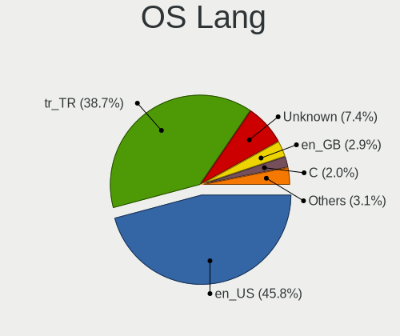

| Lang        | Notebooks | Percent |
|-------------|-----------|---------|
| en_US       | 710       | 45.9%   |
| tr_TR       | 585       | 37.82%  |
| Unknown     | 135       | 8.73%   |
| en_GB       | 46        | 2.97%   |
| C           | 27        | 1.75%   |
| ru_RU       | 16        | 1.03%   |
| de_DE       | 6         | 0.39%   |
| POSIX       | 2         | 0.13%   |
| en_CA       | 2         | 0.13%   |
| ar_EG       | 2         | 0.13%   |
| zh_CN       | 1         | 0.06%   |
| tr_TR.UTF8  | 1         | 0.06%   |
| tr_CY       | 1         | 0.06%   |
| ru_UA       | 1         | 0.06%   |
| nl_BE       | 1         | 0.06%   |
| fr_FR       | 1         | 0.06%   |
| fa_IR       | 1         | 0.06%   |
| en_US.UTF8  | 1         | 0.06%   |
| en_US-UTF-8 | 1         | 0.06%   |
| en_NZ       | 1         | 0.06%   |
| en_IE       | 1         | 0.06%   |
| en_GB.UTF8  | 1         | 0.06%   |
| en_DK       | 1         | 0.06%   |
| en_150      | 1         | 0.06%   |
| de_AT       | 1         | 0.06%   |
| C.UTF8      | 1         | 0.06%   |

Boot Mode
---------

EFI or BIOS

| Mode | Notebooks | Percent |
|------|-----------|---------|
| EFI  | 897       | 57.8%   |
| BIOS | 655       | 42.2%   |

Filesystem
----------

Type of filesystem

| Type    | Notebooks | Percent |
|---------|-----------|---------|
| Ext4    | 1123      | 71.12%  |
| Btrfs   | 223       | 14.12%  |
| Overlay | 93        | 5.89%   |
| Tmpfs   | 63        | 3.99%   |
| Unknown | 36        | 2.28%   |
| Xfs     | 14        | 0.89%   |
| Ext2    | 11        | 0.7%    |
| Zfs     | 9         | 0.57%   |
| F2fs    | 3         | 0.19%   |
| Ext3    | 2         | 0.13%   |
| Aufs    | 2         | 0.13%   |

Part. scheme
------------

Scheme of partitioning

| Type    | Notebooks | Percent |
|---------|-----------|---------|
| Unknown | 739       | 47.22%  |
| GPT     | 698       | 44.6%   |
| MBR     | 128       | 8.18%   |

Dual Boot with Linux/BSD
------------------------

Hosting more than one Linux/BSD

| Dual boot | Notebooks | Percent |
|-----------|-----------|---------|
| No        | 1359      | 87.96%  |
| Yes       | 186       | 12.04%  |

Dual Boot (Win)
---------------

Hosting Linux and Windows

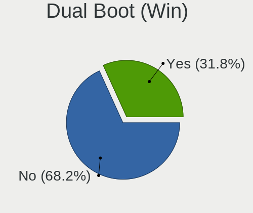

| Dual boot | Notebooks | Percent |
|-----------|-----------|---------|
| No        | 1049      | 67.42%  |
| Yes       | 507       | 32.58%  |

Board
-----

Vendor
------

Motherboard manufacturer

| Name                        | Notebooks | Percent |
|-----------------------------|-----------|---------|
| Lenovo                      | 297       | 19.63%  |
| Hewlett-Packard             | 250       | 16.52%  |
| ASUSTek Computer            | 201       | 13.28%  |
| Dell                        | 143       | 9.45%   |
| Acer                        | 125       | 8.26%   |
| Monster                     | 73        | 4.82%   |
| Toshiba                     | 62        | 4.1%    |
| HUAWEI                      | 56        | 3.7%    |
| MSI                         | 44        | 2.91%   |
| Apple                       | 39        | 2.58%   |
| Samsung Electronics         | 34        | 2.25%   |
| Sony                        | 33        | 2.18%   |
| Casper                      | 31        | 2.05%   |
| Packard Bell                | 18        | 1.19%   |
| Pegatron                    | 11        | 0.73%   |
| Clevo                       | 11        | 0.73%   |
| Hometech                    | 10        | 0.66%   |
| Unknown                     | 10        | 0.66%   |
| Google                      | 8         | 0.53%   |
| ARCELIK                     | 6         | 0.4%    |
| Notebook                    | 4         | 0.26%   |
| Fujitsu                     | 4         | 0.26%   |
| Alienware                   | 4         | 0.26%   |
| Valve                       | 3         | 0.2%    |
| Insyde                      | 3         | 0.2%    |
| HONOR                       | 3         | 0.2%    |
| Quanta                      | 2         | 0.13%   |
| Medion                      | 2         | 0.13%   |
| LG Electronics              | 2         | 0.13%   |
| IX1401                      | 2         | 0.13%   |
| Intel                       | 2         | 0.13%   |
| I-Life Digital Technologies | 2         | 0.13%   |
| HT                          | 2         | 0.13%   |
| Vestel                      | 1         | 0.07%   |
| Timi                        | 1         | 0.07%   |
| System76                    | 1         | 0.07%   |
| SGIN                        | 1         | 0.07%   |
| Schenker                    | 1         | 0.07%   |
| Razer                       | 1         | 0.07%   |
| Pine Microsystems           | 1         | 0.07%   |

Model
-----

Motherboard model

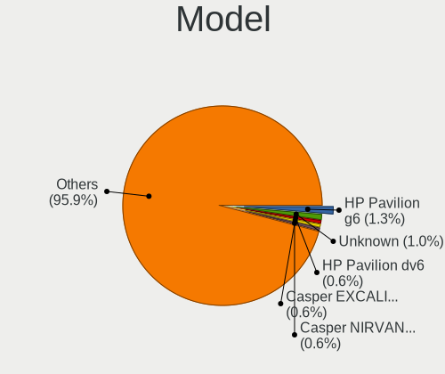

| Name                                 | Notebooks | Percent |
|--------------------------------------|-----------|---------|
| HP Pavilion g6                       | 22        | 1.45%   |
| Unknown                              | 18        | 1.19%   |
| Casper NIRVANA NOTEBOOK              | 10        | 0.66%   |
| HP Pavilion dv6                      | 9         | 0.59%   |
| HP Notebook                          | 9         | 0.59%   |
| HUAWEI BOD-WXX9                      | 8         | 0.53%   |
| HP Pavilion 15                       | 7         | 0.46%   |
| HP 15                                | 7         | 0.46%   |
| Casper EXCALIBUR G770                | 7         | 0.46%   |
| ASUS X550VX                          | 7         | 0.46%   |
| Acer Aspire 5750G                    | 7         | 0.46%   |
| Lenovo V15 G2 ALC 82KD               | 6         | 0.4%    |
| Lenovo IdeaPad 3 15ITL6 82H8         | 6         | 0.4%    |
| HUAWEI HVY-WXX9                      | 6         | 0.4%    |
| HP Pavilion Notebook                 | 6         | 0.4%    |
| ASUS X555UB                          | 6         | 0.4%    |
| Acer Nitro AN515-58                  | 6         | 0.4%    |
| Toshiba Satellite L655               | 5         | 0.33%   |
| HUAWEI NBLK-WAX9X                    | 5         | 0.33%   |
| HUAWEI KLVL-WXX9                     | 5         | 0.33%   |
| HUAWEI BOHK-WAX9X                    | 5         | 0.33%   |
| HP G62                               | 5         | 0.33%   |
| HP 250 G3                            | 5         | 0.33%   |
| Dell Inspiron 7577                   | 5         | 0.33%   |
| Dell Inspiron 3542                   | 5         | 0.33%   |
| ASUS VivoBook 15_ASUS Laptop X540UAR | 5         | 0.33%   |
| ASUS N550JV                          | 5         | 0.33%   |
| Apple MacBookAir7,2                  | 5         | 0.33%   |
| Toshiba Satellite C650               | 4         | 0.26%   |
| Pegatron A15                         | 4         | 0.26%   |
| Monster Huma H5 V3.2                 | 4         | 0.26%   |
| Monster ABRA A5 V16.6                | 4         | 0.26%   |
| Lenovo Legion Y530-15ICH 81FV        | 4         | 0.26%   |
| Lenovo IdeaPad S145-15API 81UT       | 4         | 0.26%   |
| Lenovo IdeaPad 330-15IKB 81DE        | 4         | 0.26%   |
| Lenovo IdeaPad 100-15IBD 80QQ        | 4         | 0.26%   |
| Lenovo G50-70 20351                  | 4         | 0.26%   |
| HUAWEI HN-WX9X                       | 4         | 0.26%   |
| HP Victus by Gaming Laptop 16-s0xxx  | 4         | 0.26%   |
| HP Pavilion Gaming Laptop 15-cx0xxx  | 4         | 0.26%   |

Model Family
------------

Motherboard model prefix

| Name                  | Notebooks | Percent |
|-----------------------|-----------|---------|
| Lenovo ThinkPad       | 109       | 7.2%    |
| Lenovo IdeaPad        | 82        | 5.42%   |
| Acer Aspire           | 76        | 5.02%   |
| HP Pavilion           | 72        | 4.76%   |
| Dell Inspiron         | 63        | 4.16%   |
| Toshiba Satellite     | 57        | 3.77%   |
| Monster ABRA          | 40        | 2.64%   |
| Dell Latitude         | 33        | 2.18%   |
| HP Laptop             | 31        | 2.05%   |
| ASUS VivoBook         | 29        | 1.92%   |
| HP ProBook            | 24        | 1.59%   |
| HP EliteBook          | 22        | 1.45%   |
| Monster TULPAR        | 21        | 1.39%   |
| HP 250                | 19        | 1.26%   |
| Acer Nitro            | 19        | 1.26%   |
| HP Victus             | 18        | 1.19%   |
| ASUS ROG              | 18        | 1.19%   |
| Unknown               | 18        | 1.19%   |
| Packard Bell EasyNote | 17        | 1.12%   |
| Dell Vostro           | 16        | 1.06%   |
| Casper NIRVANA        | 16        | 1.06%   |
| Lenovo Legion         | 15        | 0.99%   |
| ASUS ASUS             | 12        | 0.79%   |
| Monster HUMA          | 11        | 0.73%   |
| Dell Precision        | 11        | 0.73%   |
| Acer Swift            | 11        | 0.73%   |
| Lenovo V15            | 10        | 0.66%   |
| Lenovo ThinkBook      | 10        | 0.66%   |
| Casper EXCALIBUR      | 10        | 0.66%   |
| HP Notebook           | 9         | 0.59%   |
| Dell G3               | 9         | 0.59%   |
| Lenovo Yoga           | 8         | 0.53%   |
| HUAWEI BOD-WXX9       | 8         | 0.53%   |
| HP ENVY               | 8         | 0.53%   |
| ASUS TUF              | 8         | 0.53%   |
| HP OMEN               | 7         | 0.46%   |
| HP 15                 | 7         | 0.46%   |
| ASUS X550VX           | 7         | 0.46%   |
| Apple MacBookPro8     | 7         | 0.46%   |
| Acer TravelMate       | 7         | 0.46%   |

MFG Year
--------

Motherboard manufacture year

| Year    | Notebooks | Percent |
|---------|-----------|---------|
| 2020    | 163       | 10.77%  |
| 2021    | 149       | 9.85%   |
| 2019    | 135       | 8.92%   |
| 2018    | 117       | 7.73%   |
| 2011    | 107       | 7.07%   |
| 2017    | 94        | 6.21%   |
| 2012    | 91        | 6.01%   |
| 2013    | 88        | 5.82%   |
| 2014    | 84        | 5.55%   |
| 2015    | 83        | 5.49%   |
| 2016    | 81        | 5.35%   |
| 2010    | 80        | 5.29%   |
| 2022    | 79        | 5.22%   |
| 2009    | 44        | 2.91%   |
| 2023    | 37        | 2.45%   |
| 2008    | 34        | 2.25%   |
| 2007    | 21        | 1.39%   |
| 2006    | 11        | 0.73%   |
| Unknown | 9         | 0.59%   |
| 2005    | 5         | 0.33%   |
| 2024    | 1         | 0.07%   |

Form Factor
-----------

Physical design of the computer

| Name     | Notebooks | Percent |
|----------|-----------|---------|
| Notebook | 1513      | 100%    |

Secure Boot
-----------

Enabled or disabled

| State    | Notebooks | Percent |
|----------|-----------|---------|
| Disabled | 1397      | 90.71%  |
| Enabled  | 143       | 9.29%   |

Coreboot
--------

Have coreboot on board

| Used | Notebooks | Percent |
|------|-----------|---------|
| No   | 1510      | 99.8%   |
| Yes  | 3         | 0.2%    |

RAM Size
--------

Total RAM memory

| Size in GB  | Notebooks | Percent |
|-------------|-----------|---------|
| 4.01-8.0    | 452       | 29.41%  |
| 16.01-24.0  | 287       | 18.67%  |
| 8.01-16.0   | 280       | 18.22%  |
| 3.01-4.0    | 277       | 18.02%  |
| 32.01-64.0  | 87        | 5.66%   |
| 1.01-2.0    | 77        | 5.01%   |
| 2.01-3.0    | 33        | 2.15%   |
| 64.01-256.0 | 18        | 1.17%   |
| 24.01-32.0  | 17        | 1.11%   |
| 0.51-1.0    | 9         | 0.59%   |

RAM Used
--------

Used RAM memory

| Used GB    | Notebooks | Percent |
|------------|-----------|---------|
| 1.01-2.0   | 490       | 28.86%  |
| 2.01-3.0   | 460       | 27.09%  |
| 4.01-8.0   | 287       | 16.9%   |
| 3.01-4.0   | 287       | 16.9%   |
| 0.51-1.0   | 88        | 5.18%   |
| 8.01-16.0  | 65        | 3.83%   |
| 0.01-0.5   | 15        | 0.88%   |
| 16.01-24.0 | 4         | 0.24%   |
| 32.01-64.0 | 2         | 0.12%   |

Total Drives
------------

Number of drives on board

| Drives | Notebooks | Percent |
|--------|-----------|---------|
| 1      | 1086      | 70.34%  |
| 2      | 410       | 26.55%  |
| 3      | 32        | 2.07%   |
| 0      | 7         | 0.45%   |
| 4      | 6         | 0.39%   |
| 5      | 2         | 0.13%   |
| 6      | 1         | 0.06%   |

Has CD-ROM
----------

Has CD-ROM on board

| Presented | Notebooks | Percent |
|-----------|-----------|---------|
| No        | 1039      | 68.18%  |
| Yes       | 485       | 31.82%  |

Has Ethernet
------------

Has Ethernet on board

| Presented | Notebooks | Percent |
|-----------|-----------|---------|
| Yes       | 1251      | 82.3%   |
| No        | 269       | 17.7%   |

Has WiFi
--------

Has WiFi module

| Presented | Notebooks | Percent |
|-----------|-----------|---------|
| Yes       | 1478      | 97.69%  |
| No        | 35        | 2.31%   |

Has Bluetooth
-------------

Has Bluetooth module

| Presented | Notebooks | Percent |
|-----------|-----------|---------|
| Yes       | 1256      | 82.09%  |
| No        | 274       | 17.91%  |

Location
--------

Country
-------

Geographic location (country)

| Country | Notebooks | Percent |
|---------|-----------|---------|
| Turkey  | 1513      | 100%    |

City
----

Geographic location (city)

| City                | Notebooks | Percent |
|---------------------|-----------|---------|
| Istanbul            | 582       | 35.55%  |
| Ankara              | 229       | 13.99%  |
| Izmir               | 159       | 9.71%   |
| Antalya             | 81        | 4.95%   |
| Bursa               | 67        | 4.09%   |
| Adana               | 29        | 1.77%   |
| Kosekoy             | 27        | 1.65%   |
| Konya               | 21        | 1.28%   |
| Balkesir          | 20        | 1.22%   |
| Gaziantep           | 19        | 1.16%   |
| Mersin              | 16        | 0.98%   |
| Kayseri             | 16        | 0.98%   |
| zmit              | 16        | 0.98%   |
| Denizli             | 13        | 0.79%   |
| Antakya             | 13        | 0.79%   |
| Tekirda           | 12        | 0.73%   |
| Samsun              | 11        | 0.67%   |
| Adapazar          | 11        | 0.67%   |
| Mugla               | 10        | 0.61%   |
| Magnesia ad Sipylum | 10        | 0.61%   |
| Aydin               | 9         | 0.55%   |
| Sisli               | 8         | 0.49%   |
| Diyarbakr         | 8         | 0.49%   |
| Yalova              | 7         | 0.43%   |
| Osmaniye            | 7         | 0.43%   |
| Ordu                | 7         | 0.43%   |
| Kartal              | 7         | 0.43%   |
| anakkale          | 7         | 0.43%   |
| Batman              | 7         | 0.43%   |
| Trabzon             | 6         | 0.37%   |
| Sanliurfa           | 5         | 0.31%   |
| Isparta             | 5         | 0.31%   |
| Eskiehir          | 5         | 0.31%   |
| Erzurum             | 5         | 0.31%   |
| Edirne              | 5         | 0.31%   |
| Malatya             | 4         | 0.24%   |
| orum              | 4         | 0.24%   |
| Alanya              | 4         | 0.24%   |
| Zonguldak           | 3         | 0.18%   |
| Yozgat              | 3         | 0.18%   |

Drives
------

Drive Vendor
------------

Hard drive vendors

| Vendor                      | Notebooks | Drives | Percent |
|-----------------------------|-----------|--------|---------|
| Samsung Electronics         | 301       | 403    | 15.42%  |
| WDC                         | 200       | 255    | 10.25%  |
| Seagate                     | 190       | 226    | 9.73%   |
| Toshiba                     | 181       | 220    | 9.27%   |
| Sandisk                     | 170       | 198    | 8.71%   |
| Kingston                    | 102       | 144    | 5.23%   |
| Unknown                     | 79        | 100    | 4.05%   |
| SK hynix                    | 71        | 90     | 3.64%   |
| Micron Technology           | 71        | 82     | 3.64%   |
| HGST                        | 62        | 70     | 3.18%   |
| Intel                       | 51        | 66     | 2.61%   |
| Hitachi                     | 47        | 51     | 2.41%   |
| Crucial                     | 35        | 43     | 1.79%   |
| KIOXIA                      | 25        | 30     | 1.28%   |
| China                       | 24        | 32     | 1.23%   |
| Apple                       | 24        | 30     | 1.23%   |
| A-DATA Technology           | 24        | 28     | 1.23%   |
| KIOXIA-EXCERIA              | 17        | 20     | 0.87%   |
| Phison                      | 16        | 16     | 0.82%   |
| Fujitsu                     | 15        | 15     | 0.77%   |
| Kingston Technology Company | 14        | 18     | 0.72%   |
| Silicon Motion              | 13        | 14     | 0.67%   |
| Corsair                     | 13        | 14     | 0.67%   |
| Micron/Crucial Technology   | 12        | 13     | 0.61%   |
| HS-SSD-C100                 | 11        | 11     | 0.56%   |
| UMIS                        | 8         | 10     | 0.41%   |
| Union Memory                | 7         | 15     | 0.36%   |
| OCZ                         | 7         | 7      | 0.36%   |
| LITEON                      | 7         | 8      | 0.36%   |
| Union Memory (Shenzhen)     | 6         | 10     | 0.31%   |
| TwinMOS                     | 6         | 7      | 0.31%   |
| Team                        | 6         | 6      | 0.31%   |
| Pioneer                     | 6         | 22     | 0.31%   |
| Phison Electronics          | 6         | 8      | 0.31%   |
| Netac                       | 6         | 7      | 0.31%   |
| Lexar                       | 6         | 12     | 0.31%   |
| JMicron Technology          | 6         | 6      | 0.31%   |
| JAMESDONKEY                 | 6         | 6      | 0.31%   |
| Gigabyte Technology         | 6         | 13     | 0.31%   |
| Unknown                     | 6         | 7      | 0.31%   |

Drive Model
-----------

Hard drive models

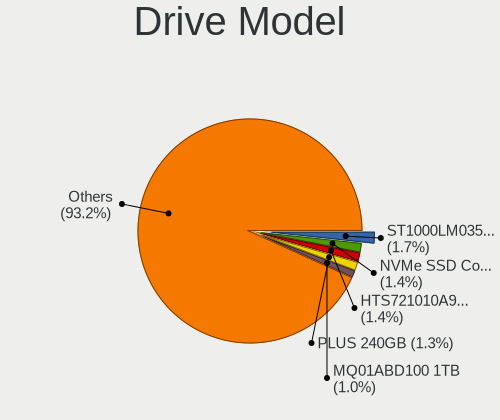

| Model                                              | Notebooks | Percent |
|----------------------------------------------------|-----------|---------|
| Seagate ST1000LM035-1RK172 1TB                     | 40        | 1.97%   |
| HGST HTS721010A9E630 1TB                           | 32        | 1.58%   |
| SanDisk SSD PLUS 240GB                             | 26        | 1.28%   |
| Toshiba MQ01ABD100 1TB                             | 24        | 1.18%   |
| Samsung NVMe SSD Controller SM981/PM981/PM983 1TB  | 24        | 1.18%   |
| Toshiba MQ04ABF100 1TB                             | 23        | 1.13%   |
| Unknown MMC Card  32GB                             | 20        | 0.99%   |
| Toshiba MQ01ABF050 500GB                           | 20        | 0.99%   |
| Seagate ST1000LM024 HN-M101MBB 1TB                 | 16        | 0.79%   |
| Samsung PM963 2.5" NVMe PCIe SSD 256GB             | 16        | 0.79%   |
| Seagate ST500LT012-1DG142 500GB                    | 15        | 0.74%   |
| Samsung NVMe SSD Drive 512GB                       | 14        | 0.69%   |
| Samsung NVMe SSD Controller PM9A1/PM9A3/980PRO 1TB | 13        | 0.64%   |
| Toshiba MQ01ABD075 752GB                           | 12        | 0.59%   |
| Seagate ST1000LM049-2GH172 1TB                     | 12        | 0.59%   |
| SanDisk SSD PLUS 120GB                             | 12        | 0.59%   |
| Kingston SA400S37240G 240GB SSD                    | 11        | 0.54%   |
| WDC WDS240G2G0A-00JH30 240GB SSD                   | 10        | 0.49%   |
| Seagate ST9500325AS 500GB                          | 10        | 0.49%   |
| Sandisk WD Blue SN550 NVMe SSD 2TB                 | 10        | 0.49%   |
| Samsung MZVLQ512HBLU-00B00 512GB                   | 10        | 0.49%   |
| Micron 1100_MTFDDAV256TBN 256GB SSD                | 10        | 0.49%   |
| HGST HTS541010A9E680 1TB                           | 10        | 0.49%   |
| Toshiba TR200 240GB SSD                            | 9         | 0.44%   |
| SanDisk NVMe SSD Drive 512GB                       | 9         | 0.44%   |
| SanDisk NVMe SSD Drive 256GB                       | 9         | 0.44%   |
| Samsung SSD 860 EVO 250GB                          | 9         | 0.44%   |
| Intel NVMe SSD Drive 512GB                         | 9         | 0.44%   |
| SK hynix NVMe SSD Drive 512GB                      | 8         | 0.39%   |
| Seagate ST1000LM048-2E7172 1TB                     | 8         | 0.39%   |
| KIOXIA-EXCERIA SATA SSD 240GB                      | 8         | 0.39%   |
| HGST HTS545050A7E680 500GB                         | 8         | 0.39%   |
| Crucial CT500P2SSD8 500GB                          | 8         | 0.39%   |
| Samsung SSD 860 EVO 500GB                          | 7         | 0.35%   |
| Phison 311CD0512GB                                 | 7         | 0.35%   |
| Micron MTFDHBA512QFD 512GB                         | 7         | 0.35%   |
| Micron 2450_MTFDKBA512TFK 512GB                    | 7         | 0.35%   |
| Kingston SA400S37120G 120GB SSD                    | 7         | 0.35%   |
| Intel SSDPEKNU512GZ 512GB                          | 7         | 0.35%   |
| WDC WD10SPZX-21Z10T0 1TB                           | 6         | 0.3%    |

HDD Vendor
----------

Hard disk drive vendors

| Vendor              | Notebooks | Drives | Percent |
|---------------------|-----------|--------|---------|
| Seagate             | 185       | 215    | 30.28%  |
| WDC                 | 139       | 179    | 22.75%  |
| Toshiba             | 132       | 151    | 21.6%   |
| HGST                | 62        | 70     | 10.15%  |
| Hitachi             | 47        | 51     | 7.69%   |
| Samsung Electronics | 20        | 21     | 3.27%   |
| Fujitsu             | 15        | 15     | 2.45%   |
| Unknown             | 4         | 4      | 0.65%   |
| JMicron Technology  | 3         | 3      | 0.49%   |
| TO Exter            | 1         | 3      | 0.16%   |
| SABRENT             | 1         | 1      | 0.16%   |
| Intenso             | 1         | 1      | 0.16%   |
| Apple               | 1         | 2      | 0.16%   |

SSD Vendor
----------

Solid state drive vendors

| Vendor              | Notebooks | Drives | Percent |
|---------------------|-----------|--------|---------|
| SanDisk             | 105       | 127    | 18.45%  |
| Samsung Electronics | 96        | 120    | 16.87%  |
| Kingston            | 69        | 102    | 12.13%  |
| WDC                 | 29        | 35     | 5.1%    |
| Crucial             | 21        | 28     | 3.69%   |
| China               | 21        | 25     | 3.69%   |
| Toshiba             | 20        | 21     | 3.51%   |
| Micron Technology   | 20        | 24     | 3.51%   |
| A-DATA Technology   | 17        | 20     | 2.99%   |
| Apple               | 15        | 17     | 2.64%   |
| SK hynix            | 14        | 17     | 2.46%   |
| Corsair             | 13        | 14     | 2.28%   |
| KIOXIA-EXCERIA      | 12        | 14     | 2.11%   |
| Intel               | 8         | 14     | 1.41%   |
| Seagate             | 7         | 8      | 1.23%   |
| OCZ                 | 7         | 7      | 1.23%   |
| LITEON              | 7         | 8      | 1.23%   |
| TwinMOS             | 6         | 7      | 1.05%   |
| Pioneer             | 6         | 22     | 1.05%   |
| Netac               | 6         | 7      | 1.05%   |
| JAMESDONKEY         | 6         | 6      | 1.05%   |
| HS-SSD-C100         | 5         | 5      | 0.88%   |
| Team                | 4         | 4      | 0.7%    |
| SPCC                | 4         | 4      | 0.7%    |
| LITEONIT            | 4         | 5      | 0.7%    |
| Lexar               | 4         | 10     | 0.7%    |
| KingSpec            | 4         | 4      | 0.7%    |
| Gigabyte Technology | 4         | 10     | 0.7%    |
| Patriot             | 3         | 4      | 0.53%   |
| KingFast            | 3         | 5      | 0.53%   |
| EZCOOL              | 3         | 4      | 0.53%   |
| Indilinx            | 2         | 4      | 0.35%   |
| HS-SSD-E100N        | 2         | 2      | 0.35%   |
| HI-LEVEL            | 2         | 2      | 0.35%   |
| Hewlett-Packard     | 2         | 2      | 0.35%   |
| GOODRAM             | 2         | 5      | 0.35%   |
| WDC WDS2            | 1         | 1      | 0.18%   |
| Transcend           | 1         | 1      | 0.18%   |
| PNY                 | 1         | 1      | 0.18%   |
| Mushkin             | 1         | 2      | 0.18%   |

Drive Kind
----------

HDD or SSD

| Kind    | Notebooks | Drives | Percent |
|---------|-----------|--------|---------|
| NVMe    | 624       | 865    | 33.84%  |
| HDD     | 591       | 716    | 32.05%  |
| SSD     | 525       | 731    | 28.47%  |
| MMC     | 76        | 97     | 4.12%   |
| Unknown | 28        | 38     | 1.52%   |

Drive Connector
---------------

SATA, SAS, NVMe, etc.

| Type | Notebooks | Drives | Percent |
|------|-----------|--------|---------|
| SATA | 971       | 1428   | 56.59%  |
| NVMe | 624       | 863    | 36.36%  |
| MMC  | 76        | 97     | 4.43%   |
| SAS  | 45        | 59     | 2.62%   |

Drive Size
----------

Size of hard drive

| Size in TB | Notebooks | Drives | Percent |
|------------|-----------|--------|---------|
| 0.01-0.5   | 729       | 1004   | 67%     |
| 0.51-1.0   | 336       | 412    | 30.88%  |
| 1.01-2.0   | 17        | 25     | 1.56%   |
| 3.01-4.0   | 3         | 3      | 0.28%   |
| 4.01-10.0  | 2         | 2      | 0.18%   |
| 2.01-3.0   | 1         | 1      | 0.09%   |

Space Total
-----------

Amount of disk space available on the file system

| Size in GB     | Notebooks | Percent |
|----------------|-----------|---------|
| 101-250        | 491       | 29.98%  |
| 251-500        | 384       | 23.44%  |
| 501-1000       | 229       | 13.98%  |
| 51-100         | 130       | 7.94%   |
| 1-20           | 118       | 7.2%    |
| 1001-2000      | 115       | 7.02%   |
| 21-50          | 92        | 5.62%   |
| 2001-3000      | 35        | 2.14%   |
| More than 3000 | 22        | 1.34%   |
| Unknown        | 22        | 1.34%   |

Space Used
----------

Amount of used disk space

| Used GB        | Notebooks | Percent |
|----------------|-----------|---------|
| 1-20           | 667       | 39.28%  |
| 21-50          | 355       | 20.91%  |
| 101-250        | 220       | 12.96%  |
| 51-100         | 208       | 12.25%  |
| 251-500        | 104       | 6.12%   |
| 501-1000       | 82        | 4.83%   |
| 1001-2000      | 26        | 1.53%   |
| Unknown        | 22        | 1.3%    |
| 2001-3000      | 8         | 0.47%   |
| More than 3000 | 6         | 0.35%   |

Malfunc. Drives
---------------

Drive models with a malfunction

| Model                              | Notebooks | Drives | Percent |
|------------------------------------|-----------|--------|---------|
| Seagate ST500LT012-1DG142 500GB    | 5         | 7      | 3.62%   |
| HGST HTS721010A9E630 1TB           | 5         | 6      | 3.62%   |
| Toshiba MQ01ABD100 1TB             | 4         | 4      | 2.9%    |
| SanDisk SSD PLUS 240GB             | 4         | 4      | 2.9%    |
| Toshiba MQ01ABF050 500GB           | 3         | 4      | 2.17%   |
| Toshiba MQ01ABD075 752GB           | 3         | 3      | 2.17%   |
| Toshiba MQ01ABD050 500GB           | 3         | 4      | 2.17%   |
| Toshiba MK3252GSX 320GB            | 3         | 3      | 2.17%   |
| Seagate ST1000LM035-1RK172 1TB     | 3         | 3      | 2.17%   |
| Seagate ST1000LM024 HN-M101MBB 1TB | 3         | 3      | 2.17%   |
| Seagate ST1000LM014-SSHD-8GB       | 3         | 3      | 2.17%   |
| WDC WDS240G2G0A-00JH30 240GB SSD   | 2         | 3      | 1.45%   |
| WDC WD5000LPVX-22V0TT0 500GB       | 2         | 2      | 1.45%   |
| Toshiba MQ04ABF100 1TB             | 2         | 2      | 1.45%   |
| Toshiba MQ02ABD100H 1TB            | 2         | 4      | 1.45%   |
| Seagate ST9500325AS 500GB          | 2         | 2      | 1.45%   |
| Seagate ST9320325AS 320GB          | 2         | 2      | 1.45%   |
| Seagate ST9160821AS 160GB          | 2         | 2      | 1.45%   |
| Seagate ST500LT012-9WS142 500GB    | 2         | 2      | 1.45%   |
| JMicron Technology Tech 250GB      | 2         | 2      | 1.45%   |
| Indilinx IND-S325S120G 120GB SSD   | 2         | 4      | 1.45%   |
| Hitachi HTS547575A9E384 752GB      | 2         | 2      | 1.45%   |
| Hitachi HTS543232A7A384 320GB      | 2         | 2      | 1.45%   |
| HGST HTS545050A7E680 500GB         | 2         | 2      | 1.45%   |
| Fujitsu MHY2120BH 120GB            | 2         | 2      | 1.45%   |
| WDC WDS240G2G0B-00EPW0 240GB SSD   | 1         | 1      | 0.72%   |
| WDC WD7500BPVT-55HXZT3 752GB       | 1         | 1      | 0.72%   |
| WDC WD5000LPVX-00V0TT0 500GB       | 1         | 1      | 0.72%   |
| WDC WD5000LPCX-60VHAT0 500GB       | 1         | 1      | 0.72%   |
| WDC WD5000BEVT-75A0RT0 500GB       | 1         | 1      | 0.72%   |
| WDC WD3200BPVT-22JJ5T0 320GB       | 1         | 1      | 0.72%   |
| WDC WD3200BEVT-22A23T0 320GB       | 1         | 1      | 0.72%   |
| WDC WD10JPVX-22JC3T0 1TB           | 1         | 1      | 0.72%   |
| WDC WD10JPVT-75A1YT0 1TB           | 1         | 1      | 0.72%   |
| Toshiba MQ01ABF050M 500GB          | 1         | 1      | 0.72%   |
| Toshiba MK4058GSX 400GB            | 1         | 1      | 0.72%   |
| Toshiba MK3265GSX 320GB            | 1         | 1      | 0.72%   |
| Toshiba MK3263GSXN 320GB           | 1         | 1      | 0.72%   |
| Toshiba MK1665GSX 160GB            | 1         | 1      | 0.72%   |
| Toshiba MK1011GAH 100GB            | 1         | 1      | 0.72%   |

Malfunc. Drive Vendor
---------------------

Vendors of faulty drives

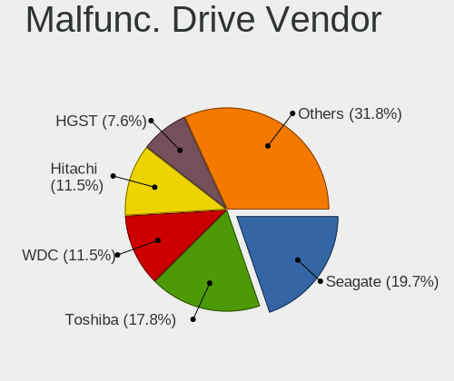

| Vendor              | Notebooks | Drives | Percent |
|---------------------|-----------|--------|---------|
| Seagate             | 27        | 30     | 19.71%  |
| Toshiba             | 26        | 30     | 18.98%  |
| Hitachi             | 15        | 15     | 10.95%  |
| WDC                 | 13        | 14     | 9.49%   |
| HGST                | 11        | 12     | 8.03%   |
| SanDisk             | 8         | 9      | 5.84%   |
| A-DATA Technology   | 6         | 6      | 4.38%   |
| Samsung Electronics | 5         | 8      | 3.65%   |
| Fujitsu             | 5         | 5      | 3.65%   |
| Kingston            | 4         | 4      | 2.92%   |
| SK hynix            | 2         | 3      | 1.46%   |
| JMicron Technology  | 2         | 2      | 1.46%   |
| Indilinx            | 2         | 4      | 1.46%   |
| Crucial             | 2         | 2      | 1.46%   |
| China               | 2         | 2      | 1.46%   |
| Micron Technology   | 1         | 1      | 0.73%   |
| LITEONIT            | 1         | 2      | 0.73%   |
| LITEON              | 1         | 1      | 0.73%   |
| JD                  | 1         | 1      | 0.73%   |
| Intel               | 1         | 1      | 0.73%   |
| Corsair             | 1         | 2      | 0.73%   |
| Apple               | 1         | 2      | 0.73%   |

Malfunc. HDD Vendor
-------------------

Vendors of faulty HDD drives

| Vendor              | Notebooks | Drives | Percent |
|---------------------|-----------|--------|---------|
| Seagate             | 27        | 30     | 27.84%  |
| Toshiba             | 26        | 30     | 26.8%   |
| Hitachi             | 15        | 15     | 15.46%  |
| HGST                | 11        | 12     | 11.34%  |
| WDC                 | 10        | 10     | 10.31%  |
| Fujitsu             | 5         | 5      | 5.15%   |
| Samsung Electronics | 2         | 3      | 2.06%   |
| Apple               | 1         | 2      | 1.03%   |

Malfunc. Drive Kind
-------------------

Kinds of faulty drives

| Kind    | Notebooks | Drives | Percent |
|---------|-----------|--------|---------|
| HDD     | 95        | 107    | 70.37%  |
| SSD     | 34        | 43     | 25.19%  |
| NVMe    | 4         | 4      | 2.96%   |
| Unknown | 2         | 2      | 1.48%   |

Failed Drives
-------------

Failed drive models

| Model                               | Notebooks | Drives | Percent |
|-------------------------------------|-----------|--------|---------|
| Seagate ST750LM022 HN-M750MBB 752GB | 1         | 1      | 33.33%  |
| Samsung Electronics HM160HI 160GB   | 1         | 1      | 33.33%  |
| HGST HTS545050A7E680 500GB          | 1         | 1      | 33.33%  |

Failed Drive Vendor
-------------------

Failed drive vendors

| Vendor              | Notebooks | Drives | Percent |
|---------------------|-----------|--------|---------|
| Seagate             | 1         | 1      | 33.33%  |
| Samsung Electronics | 1         | 1      | 33.33%  |
| HGST                | 1         | 1      | 33.33%  |

Drive Status
------------

Number of failed and malfunc. drives

| Status   | Notebooks | Drives | Percent |
|----------|-----------|--------|---------|
| Detected | 891       | 1369   | 54.4%   |
| Works    | 612       | 919    | 37.36%  |
| Malfunc  | 132       | 156    | 8.06%   |
| Failed   | 3         | 3      | 0.18%   |

Storage controller
------------------

Storage Vendor
--------------

Storage controller vendors

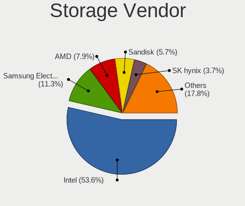

| Vendor                                  | Notebooks | Percent |
|-----------------------------------------|-----------|---------|
| Intel                                   | 1039      | 56.1%   |
| Samsung Electronics                     | 203       | 10.96%  |
| AMD                                     | 157       | 8.48%   |
| SanDisk                                 | 91        | 4.91%   |
| SK hynix                                | 55        | 2.97%   |
| Micron Technology                       | 51        | 2.75%   |
| Kingston Technology Company             | 46        | 2.48%   |
| KIOXIA                                  | 36        | 1.94%   |
| Phison Electronics                      | 26        | 1.4%    |
| Toshiba America Info Systems            | 24        | 1.3%    |
| Micron/Crucial Technology               | 24        | 1.3%    |
| Union Memory (Shenzhen)                 | 18        | 0.97%   |
| Silicon Motion                          | 17        | 0.92%   |
| Silicon Integrated Systems [SiS]        | 12        | 0.65%   |
| Nvidia                                  | 9         | 0.49%   |
| ADATA Technology                        | 8         | 0.43%   |
| Apple                                   | 7         | 0.38%   |
| Yangtze Memory Technologies             | 5         | 0.27%   |
| Realtek Semiconductor                   | 5         | 0.27%   |
| Solidigm                                | 3         | 0.16%   |
| Marvell Technology Group                | 3         | 0.16%   |
| Lite-On Technology                      | 3         | 0.16%   |
| Transcend                               | 2         | 0.11%   |
| Solid State Storage Technology          | 2         | 0.11%   |
| Seagate Technology                      | 2         | 0.11%   |
| Shenzhen Unionmemory Information System | 1         | 0.05%   |
| Shenzhen Longsys Electronics            | 1         | 0.05%   |
| OCZ Technology Group                    | 1         | 0.05%   |
| MAXIO Technology (Hangzhou)             | 1         | 0.05%   |

Storage Model
-------------

Storage controller models

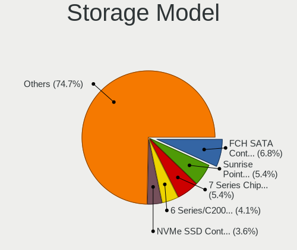

| Model                                                                            | Notebooks | Percent |
|----------------------------------------------------------------------------------|-----------|---------|
| AMD FCH SATA Controller [AHCI mode]                                              | 143       | 7.27%   |
| Intel Sunrise Point-LP SATA Controller [AHCI mode]                               | 117       | 5.95%   |
| Intel 7 Series Chipset Family 6-port SATA Controller [AHCI mode]                 | 107       | 5.44%   |
| Intel 6 Series/C200 Series Chipset Family 6 port Mobile SATA AHCI Controller     | 84        | 4.27%   |
| Samsung NVMe SSD Controller SM981/PM981/PM983                                    | 73        | 3.71%   |
| Samsung NVMe SSD Controller 980 (DRAM-less)                                      | 68        | 3.46%   |
| Intel 82801 Mobile SATA Controller [RAID mode]                                   | 58        | 2.95%   |
| Intel HM170/QM170 Chipset SATA Controller [AHCI Mode]                            | 57        | 2.9%    |
| Intel 8 Series SATA Controller 1 [AHCI mode]                                     | 54        | 2.75%   |
| Intel Cannon Lake Mobile PCH SATA AHCI Controller                                | 48        | 2.44%   |
| Intel 5 Series/3400 Series Chipset 4 port SATA AHCI Controller                   | 45        | 2.29%   |
| Intel Volume Management Device NVMe RAID Controller                              | 43        | 2.19%   |
| Intel 400 Series Chipset Family SATA AHCI Controller                             | 41        | 2.09%   |
| Intel Wildcat Point-LP SATA Controller [AHCI Mode]                               | 40        | 2.03%   |
| Intel 82801IBM/IEM (ICH9M/ICH9M-E) 4 port SATA Controller [AHCI mode]            | 40        | 2.03%   |
| Intel 8 Series/C220 Series Chipset Family 6-port SATA Controller 1 [AHCI mode]   | 37        | 1.88%   |
| Intel Tiger Lake-LP SATA Controller                                              | 31        | 1.58%   |
| SanDisk Ultra 3D / WD Blue SN550 NVMe SSD                                        | 30        | 1.53%   |
| Intel Comet Lake SATA AHCI Controller                                            | 27        | 1.37%   |
| Samsung NVMe SSD Controller PM9A1/PM9A3/980PRO                                   | 26        | 1.32%   |
| Intel Tiger Lake SATA AHCI Controller                                            | 24        | 1.22%   |
| Micron/Crucial P2 [Nick P2] / P3 / P3 Plus NVMe PCIe SSD (DRAM-less)             | 19        | 0.97%   |
| KIOXIA NVMe SSD Controller BG4 (DRAM-less)                                       | 19        | 0.97%   |
| Intel SSD 660P Series                                                            | 19        | 0.97%   |
| SanDisk Extreme Pro / WD Black SN750 / PC SN730 / Red SN700 NVMe SSD             | 17        | 0.86%   |
| Intel 82801HM/HEM (ICH8M/ICH8M-E) IDE Controller                                 | 17        | 0.86%   |
| SK hynix Gold P31/BC711/PC711 NVMe Solid State Drive                             | 16        | 0.81%   |
| Samsung NVMe SSD Controller SM961/PM961/SM963                                    | 16        | 0.81%   |
| Intel Cannon Point-LP SATA Controller [AHCI Mode]                                | 16        | 0.81%   |
| Intel 5 Series/3400 Series Chipset 6 port SATA AHCI Controller                   | 16        | 0.81%   |
| Intel Celeron/Pentium Silver Processor SATA Controller                           | 15        | 0.76%   |
| Intel Atom/Celeron/Pentium Processor x5-E8000/J3xxx/N3xxx Series SATA Controller | 15        | 0.76%   |
| Intel Atom Processor E3800 Series SATA AHCI Controller                           | 15        | 0.76%   |
| Intel Alder Lake-P SATA AHCI Controller                                          | 15        | 0.76%   |
| Intel 82801HM/HEM (ICH8M/ICH8M-E) SATA Controller [AHCI mode]                    | 15        | 0.76%   |
| Phison PS5013-E13 PCIe3 NVMe Controller (DRAM-less)                              | 14        | 0.71%   |
| Intel SSD 670p Series [Keystone Harbor]                                          | 14        | 0.71%   |
| SK hynix BC511 NVMe SSD                                                          | 13        | 0.66%   |
| SK hynix BC501 NVMe Solid State Drive                                            | 13        | 0.66%   |
| Micron 2450 NVMe SSD [HendrixV] (DRAM-less)                                      | 12        | 0.61%   |

Storage Kind
------------

Kind of storage controller (IDE, SATA, NVMe, SAS, ...)

| Kind | Notebooks | Percent |
|------|-----------|---------|
| SATA | 1078      | 56.98%  |
| NVMe | 624       | 32.98%  |
| RAID | 110       | 5.81%   |
| IDE  | 80        | 4.23%   |

Processor
---------

CPU Vendor
----------

Processor vendors

| Vendor | Notebooks | Percent |
|--------|-----------|---------|
| Intel  | 1222      | 80.77%  |
| AMD    | 282       | 18.64%  |
| ARM    | 9         | 0.59%   |

CPU Model
---------

Processor models

| Model                                         | Notebooks | Percent |
|-----------------------------------------------|-----------|---------|
| Intel 11th Gen Core i5-1135G7 @ 2.40GHz       | 43        | 2.84%   |
| Intel Core i7-10750H CPU @ 2.60GHz            | 34        | 2.25%   |
| Intel Core i5-7200U CPU @ 2.50GHz             | 30        | 1.98%   |
| Intel Core i7-7700HQ CPU @ 2.80GHz            | 28        | 1.85%   |
| AMD Ryzen 5 3500U with Radeon Vega Mobile Gfx | 25        | 1.65%   |
| Intel Core i7-6700HQ CPU @ 2.60GHz            | 23        | 1.52%   |
| Intel 11th Gen Core i7-11800H @ 2.30GHz       | 23        | 1.52%   |
| Intel Core i5-6200U CPU @ 2.30GHz             | 22        | 1.45%   |
| Intel Core i5-3210M CPU @ 2.50GHz             | 22        | 1.45%   |
| Intel Core i7-8550U CPU @ 1.80GHz             | 20        | 1.32%   |
| Intel Core i7-10510U CPU @ 1.80GHz            | 20        | 1.32%   |
| Intel Core i5-8250U CPU @ 1.60GHz             | 19        | 1.26%   |
| AMD Ryzen 5 5500U with Radeon Graphics        | 19        | 1.26%   |
| Intel Core i7-9750H CPU @ 2.60GHz             | 18        | 1.19%   |
| Intel Core i5-8265U CPU @ 1.60GHz             | 18        | 1.19%   |
| Intel Core i5-3230M CPU @ 2.60GHz             | 18        | 1.19%   |
| Intel Core i5-5200U CPU @ 2.20GHz             | 17        | 1.12%   |
| Intel Core i5-2430M CPU @ 2.40GHz             | 17        | 1.12%   |
| Intel 11th Gen Core i7-1165G7 @ 2.80GHz       | 16        | 1.06%   |
| Intel Core i7-8750H CPU @ 2.20GHz             | 15        | 0.99%   |
| Intel Core i5-4210U CPU @ 1.70GHz             | 15        | 0.99%   |
| Intel Core i5-2450M CPU @ 2.50GHz             | 15        | 0.99%   |
| Intel Core i5-1035G1 CPU @ 1.00GHz            | 15        | 0.99%   |
| AMD Ryzen 7 5800H with Radeon Graphics        | 14        | 0.93%   |
| AMD Ryzen 7 3700U with Radeon Vega Mobile Gfx | 14        | 0.93%   |
| Intel Core i7-3630QM CPU @ 2.40GHz            | 13        | 0.86%   |
| Intel Core i5-4200U CPU @ 1.60GHz             | 13        | 0.86%   |
| AMD Ryzen 7 5700U with Radeon Graphics        | 13        | 0.86%   |
| AMD Ryzen 5 4600H with Radeon Graphics        | 13        | 0.86%   |
| Intel Core i5-4200M CPU @ 2.50GHz             | 12        | 0.79%   |
| AMD Ryzen 7 4800H with Radeon Graphics        | 12        | 0.79%   |
| AMD Ryzen 5 5600H with Radeon Graphics        | 12        | 0.79%   |
| AMD A8-7410 APU with AMD Radeon R5 Graphics   | 12        | 0.79%   |
| Intel Core i7-8565U CPU @ 1.80GHz             | 11        | 0.73%   |
| Intel Core i7-6500U CPU @ 2.50GHz             | 11        | 0.73%   |
| Intel Core i5-9300H CPU @ 2.40GHz             | 11        | 0.73%   |
| Intel Core i5-2520M CPU @ 2.50GHz             | 11        | 0.73%   |
| Intel Celeron CPU N3350 @ 1.10GHz             | 11        | 0.73%   |
| Intel 12th Gen Core i7-12700H                 | 11        | 0.73%   |
| Intel Core i7-7500U CPU @ 2.70GHz             | 10        | 0.66%   |

CPU Model Family
----------------

Processor model prefix

| Model                   | Notebooks | Percent |
|-------------------------|-----------|---------|
| Intel Core i5           | 396       | 26.17%  |
| Intel Core i7           | 334       | 22.08%  |
| Other                   | 184       | 12.16%  |
| AMD Ryzen 5             | 100       | 6.61%   |
| Intel Core i3           | 96        | 6.35%   |
| AMD Ryzen 7             | 80        | 5.29%   |
| Intel Celeron           | 60        | 3.97%   |
| Intel Core 2 Duo        | 55        | 3.64%   |
| Intel Atom              | 35        | 2.31%   |
| Intel Pentium           | 23        | 1.52%   |
| AMD A8                  | 18        | 1.19%   |
| AMD Ryzen 3             | 15        | 0.99%   |
| Intel Pentium Dual-Core | 12        | 0.79%   |
| Intel Core 2            | 12        | 0.79%   |
| AMD A10                 | 12        | 0.79%   |
| Intel Pentium Dual      | 10        | 0.66%   |
| AMD Ryzen 7 PRO         | 7         | 0.46%   |
| AMD A6                  | 7         | 0.46%   |
| Intel Pentium Silver    | 5         | 0.33%   |
| Intel Genuine           | 4         | 0.26%   |
| Intel Core i9           | 4         | 0.26%   |
| AMD Ryzen 9             | 4         | 0.26%   |
| AMD A4                  | 4         | 0.26%   |
| AMD A12                 | 4         | 0.26%   |
| Intel Xeon              | 3         | 0.2%    |
| AMD Ryzen 5 PRO         | 3         | 0.2%    |
| AMD E2                  | 3         | 0.2%    |
| AMD C-60                | 3         | 0.2%    |
| Intel Pentium M         | 2         | 0.13%   |
| Intel Core M            | 2         | 0.13%   |
| Intel Celeron Dual-Core | 2         | 0.13%   |
| AMD Turion 64 X2 Mobile | 2         | 0.13%   |
| AMD E                   | 2         | 0.13%   |
| Intel Pentium 4         | 1         | 0.07%   |
| Intel Core              | 1         | 0.07%   |
| Intel Celeron M         | 1         | 0.07%   |
| AMD Turion II Neo       | 1         | 0.07%   |
| AMD Mobile Athlon 64    | 1         | 0.07%   |
| AMD E1                  | 1         | 0.07%   |
| AMD C-70                | 1         | 0.07%   |

CPU Cores
---------

Number of processor cores

| Number | Notebooks | Percent |
|--------|-----------|---------|
| 2      | 672       | 44.42%  |
| 4      | 507       | 33.51%  |
| 6      | 152       | 10.05%  |
| 8      | 110       | 7.27%   |
| 14     | 19        | 1.26%   |
| 1      | 19        | 1.26%   |
| 10     | 18        | 1.19%   |
| 12     | 12        | 0.79%   |
| 24     | 4         | 0.26%   |

CPU Sockets
-----------

Number of sockets

| Number | Notebooks | Percent |
|--------|-----------|---------|
| 1      | 1512      | 99.93%  |
| 2      | 1         | 0.07%   |

CPU Threads
-----------

Threads per core (Hyper-Threading)

| Number | Notebooks | Percent |
|--------|-----------|---------|
| 2      | 1201      | 79.27%  |
| 1      | 313       | 20.66%  |
| 8      | 1         | 0.07%   |

CPU Op-Modes
------------

CPU Operation Modes (32-bit, 64-bit)

| Op mode        | Notebooks | Percent |
|----------------|-----------|---------|
| 32-bit, 64-bit | 1479      | 97.62%  |
| Unknown        | 24        | 1.58%   |
| 32-bit         | 11        | 0.73%   |
| 64-bit         | 1         | 0.07%   |

CPU Microcode
-------------

Microcode number

| Number     | Notebooks | Percent |
|------------|-----------|---------|
| Unknown    | 541       | 34.39%  |
| 0x206a7    | 75        | 4.77%   |
| 0x306a9    | 73        | 4.64%   |
| 0x40651    | 43        | 2.73%   |
| 0x806ea    | 38        | 2.42%   |
| 0xa0652    | 36        | 2.29%   |
| 0x306d4    | 35        | 2.23%   |
| 0x806ec    | 34        | 2.16%   |
| 0x806c1    | 34        | 2.16%   |
| 0x906ea    | 33        | 2.1%    |
| 0x806e9    | 32        | 2.03%   |
| 0x406e3    | 31        | 1.97%   |
| 0x306c3    | 30        | 1.91%   |
| 0x20655    | 29        | 1.84%   |
| 0x1067a    | 29        | 1.84%   |
| 0x906e9    | 28        | 1.78%   |
| 0x08608103 | 24        | 1.53%   |
| 0x08108109 | 22        | 1.4%    |
| 0x08108102 | 22        | 1.4%    |
| 0x30678    | 20        | 1.27%   |
| 0x506e3    | 19        | 1.21%   |
| 0x0a50000c | 19        | 1.21%   |
| 0x08600106 | 19        | 1.21%   |
| 0x706e5    | 17        | 1.08%   |
| 0x6fd      | 17        | 1.08%   |
| 0x406c4    | 15        | 0.95%   |
| 0x20652    | 15        | 0.95%   |
| 0x906a3    | 13        | 0.83%   |
| 0x0a50000d | 13        | 0.83%   |
| 0x806d1    | 12        | 0.76%   |
| 0x906a4    | 11        | 0.7%    |
| 0x506c9    | 11        | 0.7%    |
| 0x06006705 | 11        | 0.7%    |
| 0x07030105 | 10        | 0.64%   |
| 0x10676    | 9         | 0.57%   |
| 0x08600104 | 9         | 0.57%   |
| 0x08600103 | 9         | 0.57%   |
| 0x806eb    | 8         | 0.51%   |
| 0x106ca    | 8         | 0.51%   |
| 0x706a8    | 6         | 0.38%   |

CPU Microarch
-------------

Microarchitecture

| Name             | Notebooks | Percent |
|------------------|-----------|---------|
| KabyLake         | 267       | 17.62%  |
| SandyBridge      | 108       | 7.13%   |
| Haswell          | 104       | 6.86%   |
| Unknown          | 102       | 6.73%   |
| IvyBridge        | 101       | 6.67%   |
| Skylake          | 75        | 4.95%   |
| TigerLake        | 73        | 4.82%   |
| Westmere         | 60        | 3.96%   |
| CometLake        | 57        | 3.76%   |
| Silvermont       | 55        | 3.63%   |
| Penryn           | 55        | 3.63%   |
| Zen+             | 52        | 3.43%   |
| Zen 2            | 50        | 3.3%    |
| Broadwell        | 48        | 3.17%   |
| Icelake          | 46        | 3.04%   |
| Zen 3            | 44        | 2.9%    |
| Alderlake Hybrid | 43        | 2.84%   |
| Core             | 37        | 2.44%   |
| Excavator        | 22        | 1.45%   |
| Puma             | 19        | 1.25%   |
| Goldmont plus    | 18        | 1.19%   |
| Bonnell          | 15        | 0.99%   |
| Goldmont         | 12        | 0.79%   |
| Zen              | 9         | 0.59%   |
| Bobcat           | 9         | 0.59%   |
| Piledriver       | 7         | 0.46%   |
| Nehalem          | 7         | 0.46%   |
| P6               | 6         | 0.4%    |
| K8 Hammer        | 5         | 0.33%   |
| K10 Llano        | 4         | 0.26%   |
| Steamroller      | 2         | 0.13%   |
| NetBurst         | 1         | 0.07%   |
| K10              | 1         | 0.07%   |
| Jaguar           | 1         | 0.07%   |

Graphics
--------

GPU Vendor
----------

Vendors of graphics cards

| Vendor                           | Notebooks | Percent |
|----------------------------------|-----------|---------|
| Intel                            | 1092      | 50.23%  |
| Nvidia                           | 621       | 28.56%  |
| AMD                              | 451       | 20.75%  |
| Silicon Integrated Systems [SiS] | 10        | 0.46%   |

GPU Model
---------

Graphics card models

| Model                                                                                    | Notebooks | Percent |
|------------------------------------------------------------------------------------------|-----------|---------|
| Intel 3rd Gen Core processor Graphics Controller                                         | 95        | 4.2%    |
| Intel 2nd Generation Core Processor Family Integrated Graphics Controller                | 93        | 4.11%   |
| Intel TigerLake-LP GT2 [Iris Xe Graphics]                                                | 69        | 3.05%   |
| Intel Haswell-ULT Integrated Graphics Controller                                         | 59        | 2.61%   |
| Intel HD Graphics 620                                                                    | 52        | 2.3%    |
| AMD Picasso/Raven 2 [Radeon Vega Series / Radeon Vega Mobile Series]                     | 52        | 2.3%    |
| Intel CoffeeLake-H GT2 [UHD Graphics 630]                                                | 51        | 2.25%   |
| Intel UHD Graphics 620                                                                   | 50        | 2.21%   |
| AMD Renoir [Radeon RX Vega 6 (Ryzen 4000/5000 Mobile Series)]                            | 50        | 2.21%   |
| Intel CometLake-H GT2 [UHD Graphics]                                                     | 47        | 2.08%   |
| Intel Skylake GT2 [HD Graphics 520]                                                      | 43        | 1.9%    |
| Intel HD Graphics 5500                                                                   | 40        | 1.77%   |
| Intel 4th Gen Core Processor Integrated Graphics Controller                              | 40        | 1.77%   |
| Nvidia TU117M [GeForce GTX 1650 Mobile / Max-Q]                                          | 39        | 1.72%   |
| AMD Sun XT [Radeon HD 8670A/8670M/8690M / R5 M330 / M430 / Radeon 520 Mobile]            | 36        | 1.59%   |
| AMD Lucienne                                                                             | 34        | 1.5%    |
| Intel HD Graphics 630                                                                    | 33        | 1.46%   |
| Intel Core Processor Integrated Graphics Controller                                      | 33        | 1.46%   |
| Intel CometLake-U GT2 [UHD Graphics]                                                     | 33        | 1.46%   |
| AMD Cezanne [Radeon Vega Series / Radeon Vega Mobile Series]                             | 32        | 1.41%   |
| Intel WhiskeyLake-U GT2 [UHD Graphics 620]                                               | 31        | 1.37%   |
| Intel TigerLake-H GT1 [UHD Graphics]                                                     | 30        | 1.33%   |
| Intel Atom Processor Z36xxx/Z37xxx Series Graphics & Display                             | 29        | 1.28%   |
| AMD Topaz XT [Radeon R7 M260/M265 / M340/M360 / M440/M445 / 530/535 / 620/625 Mobile]    | 29        | 1.28%   |
| Nvidia GP107M [GeForce GTX 1050 Mobile]                                                  | 27        | 1.19%   |
| Intel Atom/Celeron/Pentium Processor x5-E8000/J3xxx/N3xxx Integrated Graphics Controller | 26        | 1.15%   |
| Nvidia GA107M [GeForce RTX 3050 Mobile]                                                  | 25        | 1.11%   |
| Intel HD Graphics 530                                                                    | 24        | 1.06%   |
| Nvidia GM108M [GeForce 940MX]                                                            | 23        | 1.02%   |
| Nvidia GA106M [GeForce RTX 3060 Mobile / Max-Q]                                          | 23        | 1.02%   |
| Nvidia GF117M [GeForce 610M/710M/810M/820M / GT 620M/625M/630M/720M]                     | 22        | 0.97%   |
| Nvidia TU117M [GeForce GTX 1650 Ti Mobile]                                               | 21        | 0.93%   |
| Nvidia GM108M [GeForce 840M]                                                             | 21        | 0.93%   |
| AMD Thames [Radeon HD 7500M/7600M Series]                                                | 21        | 0.93%   |
| Nvidia GP107M [GeForce GTX 1050 Ti Mobile]                                               | 20        | 0.88%   |
| Intel Iris Plus Graphics G1 (Ice Lake)                                                   | 19        | 0.84%   |
| Nvidia GK208M [GeForce GT 740M]                                                          | 18        | 0.8%    |
| Intel Mobile 4 Series Chipset Integrated Graphics Controller                             | 18        | 0.8%    |
| AMD Mullins [Radeon R4/R5 Graphics]                                                      | 17        | 0.75%   |
| Nvidia GP108M [GeForce MX150]                                                            | 16        | 0.71%   |

GPU Combo
---------

Combinations of graphics cards

| Name           | Notebooks | Percent |
|----------------|-----------|---------|
| Intel + Nvidia | 492       | 32.37%  |
| 1 x Intel      | 473       | 31.12%  |
| 1 x AMD        | 210       | 13.82%  |
| Intel + AMD    | 125       | 8.22%   |
| 1 x Nvidia     | 77        | 5.07%   |
| 2 x AMD        | 64        | 4.21%   |
| AMD + Nvidia   | 52        | 3.42%   |
| Other          | 10        | 0.66%   |
| 1 x SiS        | 10        | 0.66%   |
| 2 x Intel      | 6         | 0.39%   |
| 2 x Nvidia     | 1         | 0.07%   |

GPU Driver
----------

Free vs proprietary

| Driver      | Notebooks | Percent |
|-------------|-----------|---------|
| Free        | 1196      | 77.11%  |
| Proprietary | 304       | 19.6%   |
| Unknown     | 51        | 3.29%   |

GPU Memory
----------

Total video memory

| Size in GB | Notebooks | Percent |
|------------|-----------|---------|
| Unknown    | 899       | 57.48%  |
| 1.01-2.0   | 233       | 14.9%   |
| 0.01-0.5   | 157       | 10.04%  |
| 0.51-1.0   | 122       | 7.8%    |
| 3.01-4.0   | 104       | 6.65%   |
| 5.01-6.0   | 33        | 2.11%   |
| 7.01-8.0   | 9         | 0.58%   |
| 2.01-3.0   | 5         | 0.32%   |
| 8.01-16.0  | 2         | 0.13%   |

Monitor
-------

Monitor Vendor
--------------

Monitor vendors

| Vendor                  | Notebooks | Percent |
|-------------------------|-----------|---------|
| AU Optronics            | 301       | 18.43%  |
| BOE                     | 290       | 17.76%  |
| LG Display              | 257       | 15.74%  |
| Chimei Innolux          | 228       | 13.96%  |
| Samsung Electronics     | 147       | 9%      |
| Chi Mei Optoelectronics | 41        | 2.51%   |
| Apple                   | 39        | 2.39%   |
| PANDA                   | 35        | 2.14%   |
| Lenovo                  | 27        | 1.65%   |
| Goldstar                | 21        | 1.29%   |
| Sharp                   | 19        | 1.16%   |
| Philips                 | 18        | 1.1%    |
| Hewlett-Packard         | 17        | 1.04%   |
| Dell                    | 17        | 1.04%   |
| ViewSonic               | 16        | 0.98%   |
| ASUSTek Computer        | 15        | 0.92%   |
| LG Philips              | 12        | 0.73%   |
| Ancor Communications    | 12        | 0.73%   |
| Acer                    | 11        | 0.67%   |
| AOC                     | 10        | 0.61%   |
| InfoVision              | 9         | 0.55%   |
| CPT                     | 9         | 0.55%   |
| Vestel Elektronik       | 6         | 0.37%   |
| MSI                     | 6         | 0.37%   |
| LGD                     | 6         | 0.37%   |
| CSO                     | 6         | 0.37%   |
| BenQ                    | 6         | 0.37%   |
| HannStar                | 4         | 0.24%   |
| Valve                   | 3         | 0.18%   |
| Unknown                 | 3         | 0.18%   |
| Sony                    | 3         | 0.18%   |
| TMX                     | 2         | 0.12%   |
| JDI                     | 2         | 0.12%   |
| HUAWEI                  | 2         | 0.12%   |
| Fujitsu Siemens         | 2         | 0.12%   |
| CS_                     | 2         | 0.12%   |
| VIE                     | 1         | 0.06%   |
| Unknown (XXX)           | 1         | 0.06%   |
| TXD                     | 1         | 0.06%   |
| Toshiba                 | 1         | 0.06%   |

Monitor Model
-------------

Monitor models

| Model                                                                    | Notebooks | Percent |
|--------------------------------------------------------------------------|-----------|---------|
| AU Optronics LCD Monitor AUO38ED 1920x1080 344x193mm 15.5-inch           | 24        | 1.45%   |
| AU Optronics LCD Monitor AUO22EC 1366x768 344x193mm 15.5-inch            | 20        | 1.21%   |
| Chimei Innolux LCD Monitor CMN14D4 1920x1080 309x173mm 13.9-inch         | 19        | 1.15%   |
| BOE LCD Monitor BOE0872 1920x1080 344x194mm 15.5-inch                    | 19        | 1.15%   |
| LG Display LCD Monitor LGD0456 1366x768 344x194mm 15.5-inch              | 17        | 1.03%   |
| Chimei Innolux LCD Monitor CMN15F5 1920x1080 344x193mm 15.5-inch         | 17        | 1.03%   |
| Chimei Innolux LCD Monitor CMN15DB 1366x768 344x193mm 15.5-inch          | 17        | 1.03%   |
| LG Display LCD Monitor LGD033A 1366x768 344x194mm 15.5-inch              | 14        | 0.85%   |
| LG Display LCD Monitor LGD02DC 1366x768 344x194mm 15.5-inch              | 14        | 0.85%   |
| Chimei Innolux LCD Monitor CMN1521 1920x1080 344x193mm 15.5-inch         | 12        | 0.73%   |
| PANDA LCD Monitor NCP004D 1920x1080 344x194mm 15.5-inch                  | 11        | 0.67%   |
| LG Display LCD Monitor LGD039F 1366x768 345x194mm 15.6-inch              | 11        | 0.67%   |
| Lenovo LCD Monitor LEN40BA 1920x1080 344x194mm 15.5-inch                 | 11        | 0.67%   |
| BOE LCD Monitor BOE06A4 1366x768 344x194mm 15.5-inch                     | 10        | 0.61%   |
| AU Optronics LCD Monitor AUOAF90 1920x1080 344x193mm 15.5-inch           | 10        | 0.61%   |
| AU Optronics LCD Monitor AUO21ED 1920x1080 344x193mm 15.5-inch           | 10        | 0.61%   |
| Samsung Electronics LCD Monitor SEC5441 1366x768 344x194mm 15.5-inch     | 9         | 0.55%   |
| Chimei Innolux LCD Monitor CMN15E7 1920x1080 344x193mm 15.5-inch         | 9         | 0.55%   |
| Chi Mei Optoelectronics LCD Monitor CMO15A7 1366x768 344x193mm 15.5-inch | 9         | 0.55%   |
| AU Optronics LCD Monitor AUO403D 1920x1080 309x174mm 14.0-inch           | 9         | 0.55%   |
| LG Display LCD Monitor LGD02AC 1366x768 344x194mm 15.5-inch              | 8         | 0.48%   |
| Chimei Innolux LCD Monitor CMN15DC 1366x768 344x193mm 15.5-inch          | 8         | 0.48%   |
| Chimei Innolux LCD Monitor CMN14D5 1920x1080 309x173mm 13.9-inch         | 8         | 0.48%   |
| BOE LCD Monitor BOE0802 1920x1080 344x193mm 15.5-inch                    | 8         | 0.48%   |
| BOE LCD Monitor BOE07CB 1920x1080 344x193mm 15.5-inch                    | 8         | 0.48%   |
| LG Display LCD Monitor LGD02F2 1366x768 344x194mm 15.5-inch              | 7         | 0.42%   |
| Chimei Innolux LCD Monitor CMN15D5 1920x1080 344x193mm 15.5-inch         | 7         | 0.42%   |
| Chi Mei Optoelectronics LCD Monitor CMO1592 1366x768 344x193mm 15.5-inch | 7         | 0.42%   |
| BOE LCD Monitor BOE08D5 1920x1080 344x194mm 15.5-inch                    | 7         | 0.42%   |
| BOE LCD Monitor BOE07C9 1920x1080 309x173mm 13.9-inch                    | 7         | 0.42%   |
| BOE LCD Monitor BOE06A5 1366x768 344x194mm 15.5-inch                     | 7         | 0.42%   |
| AU Optronics LCD Monitor AUO70EC 1366x768 344x193mm 15.5-inch            | 7         | 0.42%   |
| Vestel Elektronik 22W_LCD_TV VES3700 1920x540                            | 6         | 0.36%   |
| Samsung Electronics LCD Monitor SEC324A 1366x768 344x194mm 15.5-inch     | 6         | 0.36%   |
| LG Display LCD Monitor LGD053F 1920x1080 344x194mm 15.5-inch             | 6         | 0.36%   |
| LG Display LCD Monitor LGD0384 1366x768 340x190mm 15.3-inch              | 6         | 0.36%   |
| Chimei Innolux LCD Monitor CMN15AB 1366x768 344x193mm 15.5-inch          | 6         | 0.36%   |
| BOE LCD Monitor BOE0893 2160x1440 296x197mm 14.0-inch                    | 6         | 0.36%   |
| BOE LCD Monitor BOE0878 1920x1080 355x200mm 16.0-inch                    | 6         | 0.36%   |
| BOE LCD Monitor BOE0675 1366x768 344x194mm 15.5-inch                     | 6         | 0.36%   |

Monitor Resolution
------------------

Monitor screen resolution

| Resolution         | Notebooks | Percent |
|--------------------|-----------|---------|
| 1920x1080 (FHD)    | 732       | 47.63%  |
| 1366x768 (WXGA)    | 499       | 32.47%  |
| 1280x800 (WXGA)    | 45        | 2.93%   |
| 2560x1440 (QHD)    | 36        | 2.34%   |
| 3840x2160 (4K)     | 30        | 1.95%   |
| 1600x900 (HD+)     | 29        | 1.89%   |
| 1920x1200 (WUXGA)  | 26        | 1.69%   |
| 1440x900 (WXGA+)   | 23        | 1.5%    |
| 2560x1600          | 16        | 1.04%   |
| 2160x1440          | 15        | 0.98%   |
| 2880x1800          | 11        | 0.72%   |
| 1024x600           | 11        | 0.72%   |
| 1680x1050 (WSXGA+) | 8         | 0.52%   |
| Unknown            | 8         | 0.52%   |
| 3200x1800 (QHD+)   | 5         | 0.33%   |
| 1280x1024 (SXGA)   | 4         | 0.26%   |
| 800x1280           | 3         | 0.2%    |
| 3840x1080          | 3         | 0.2%    |
| 2560x1080          | 3         | 0.2%    |
| 2520x1680          | 3         | 0.2%    |
| 1680x945           | 3         | 0.2%    |
| 1360x768           | 3         | 0.2%    |
| 3840x2400          | 2         | 0.13%   |
| 3000x2000          | 2         | 0.13%   |
| 1920x540           | 2         | 0.13%   |
| 1024x768 (XGA)     | 2         | 0.13%   |
| 800x600            | 1         | 0.07%   |
| 3840x2560          | 1         | 0.07%   |
| 3440x1440          | 1         | 0.07%   |
| 3200x2000          | 1         | 0.07%   |
| 3072x1920          | 1         | 0.07%   |
| 3046x1050          | 1         | 0.07%   |
| 2944x1840          | 1         | 0.07%   |
| 2880x1620          | 1         | 0.07%   |
| 2806x900           | 1         | 0.07%   |
| 2646x1024          | 1         | 0.07%   |
| 2288x1287          | 1         | 0.07%   |
| 1280x720 (HD)      | 1         | 0.07%   |
| 1280x1080          | 1         | 0.07%   |

Monitor Diagonal
----------------

Diagonal size in inches

| Inches  | Notebooks | Percent |
|---------|-----------|---------|
| 15      | 901       | 55.11%  |
| 13      | 175       | 10.7%   |
| 14      | 102       | 6.24%   |
| 17      | 78        | 4.77%   |
| 16      | 53        | 3.24%   |
| 24      | 42        | 2.57%   |
| 27      | 41        | 2.51%   |
| 23      | 39        | 2.39%   |
| 21      | 29        | 1.77%   |
| 12      | 26        | 1.59%   |
| 11      | 23        | 1.41%   |
| 18      | 21        | 1.28%   |
| Unknown | 20        | 1.22%   |
| 31      | 16        | 0.98%   |
| 10      | 16        | 0.98%   |
| 19      | 11        | 0.67%   |
| 84      | 6         | 0.37%   |
| 20      | 5         | 0.31%   |
| 34      | 4         | 0.24%   |
| 32      | 4         | 0.24%   |
| 22      | 4         | 0.24%   |
| 7       | 3         | 0.18%   |
| 57      | 2         | 0.12%   |
| 46      | 2         | 0.12%   |
| 43      | 2         | 0.12%   |
| 40      | 2         | 0.12%   |
| 28      | 2         | 0.12%   |
| 86      | 1         | 0.06%   |
| 72      | 1         | 0.06%   |
| 54      | 1         | 0.06%   |
| 36      | 1         | 0.06%   |
| 33      | 1         | 0.06%   |
| 25      | 1         | 0.06%   |

Monitor Width
-------------

Physical width

| Width in mm | Notebooks | Percent |
|-------------|-----------|---------|
| 301-350     | 1093      | 67.22%  |
| 201-300     | 159       | 9.78%   |
| 351-400     | 118       | 7.26%   |
| 501-600     | 115       | 7.07%   |
| 401-500     | 68        | 4.18%   |
| 601-700     | 23        | 1.41%   |
| Unknown     | 20        | 1.23%   |
| 701-800     | 10        | 0.62%   |
| 1501-2000   | 7         | 0.43%   |
| 1001-1500   | 6         | 0.37%   |
| 1-100       | 3         | 0.18%   |
| 801-900     | 2         | 0.12%   |
| 901-1000    | 2         | 0.12%   |

Aspect Ratio
------------

Proportional relationship between the width and the height

| Ratio   | Notebooks | Percent |
|---------|-----------|---------|
| 16/9    | 1259      | 86.77%  |
| 16/10   | 134       | 9.24%   |
| 3/2     | 23        | 1.59%   |
| Unknown | 17        | 1.17%   |
| 4/3     | 5         | 0.34%   |
| 5/4     | 4         | 0.28%   |
| 21/9    | 4         | 0.28%   |
| 0.67    | 3         | 0.21%   |
| 6/5     | 1         | 0.07%   |
| 0.56    | 1         | 0.07%   |

Monitor Area
------------

Area in inch

| Area in inch | Notebooks | Percent |
|----------------|-----------|---------|
| 101-110        | 919       | 56.38%  |
| 81-90          | 211       | 12.94%  |
| 201-250        | 93        | 5.71%   |
| 121-130        | 78        | 4.79%   |
| 71-80          | 65        | 3.99%   |
| 301-350        | 41        | 2.52%   |
| 351-500        | 27        | 1.66%   |
| 151-200        | 27        | 1.66%   |
| 111-120        | 26        | 1.6%    |
| 61-70          | 24        | 1.47%   |
| 51-60          | 23        | 1.41%   |
| 141-150        | 21        | 1.29%   |
| Unknown        | 20        | 1.23%   |
| 41-50          | 16        | 0.98%   |
| More than 1000 | 11        | 0.67%   |
| 251-300        | 8         | 0.49%   |
| 501-1000       | 7         | 0.43%   |
| 91-100         | 6         | 0.37%   |
| 131-140        | 4         | 0.25%   |
| 1-40           | 3         | 0.18%   |

Pixel Density
-------------

Pixels per inch

| Density       | Notebooks | Percent |
|---------------|-----------|---------|
| 121-160       | 721       | 44.98%  |
| 101-120       | 466       | 29.07%  |
| 51-100        | 256       | 15.97%  |
| 161-240       | 109       | 6.8%    |
| More than 240 | 22        | 1.37%   |
| Unknown       | 20        | 1.25%   |
| 1-50          | 9         | 0.56%   |

Multiple Monitors
-----------------

Total monitors connected

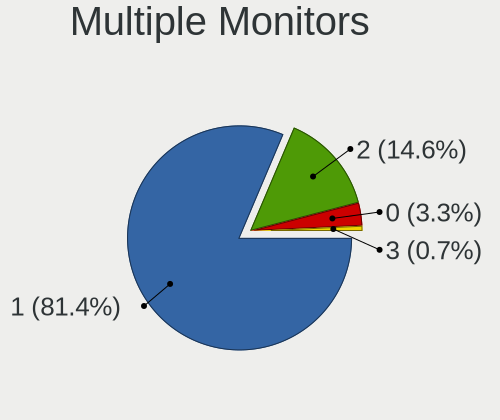

| Total | Notebooks | Percent |
|-------|-----------|---------|
| 1     | 1272      | 81.75%  |
| 2     | 220       | 14.14%  |
| 0     | 55        | 3.53%   |
| 3     | 9         | 0.58%   |

Network
-------

Net Controller Vendor
---------------------

Controller vendors

| Vendor                                 | Notebooks | Percent |
|----------------------------------------|-----------|---------|
| Realtek Semiconductor                  | 989       | 39.77%  |
| Intel                                  | 680       | 27.34%  |
| Qualcomm Atheros                       | 346       | 13.91%  |
| Broadcom                               | 163       | 6.55%   |
| MediaTek                               | 61        | 2.45%   |
| Broadcom Limited                       | 33        | 1.33%   |
| Ralink                                 | 29        | 1.17%   |
| Marvell Technology Group               | 28        | 1.13%   |
| Ralink Technology                      | 23        | 0.92%   |
| Samsung Electronics                    | 18        | 0.72%   |
| Silicon Integrated Systems [SiS]       | 13        | 0.52%   |
| TP-Link                                | 12        | 0.48%   |
| Xiaomi                                 | 11        | 0.44%   |
| Nvidia                                 | 8         | 0.32%   |
| ASIX Electronics                       | 8         | 0.32%   |
| Qualcomm Atheros Communications        | 7         | 0.28%   |
| ASUSTek Computer                       | 6         | 0.24%   |
| JMicron Technology                     | 5         | 0.2%    |
| Ericsson Business Mobile Networks      | 5         | 0.2%    |
| Dell                                   | 4         | 0.16%   |
| Qualcomm                               | 3         | 0.12%   |
| Huawei Technologies                    | 3         | 0.12%   |
| Apple                                  | 3         | 0.12%   |
| ZyXEL Communications                   | 2         | 0.08%   |
| Lenovo                                 | 2         | 0.08%   |
| ICS Advent                             | 2         | 0.08%   |
| Attansic Technology                    | 2         | 0.08%   |
| U-Blox                                 | 1         | 0.04%   |
| Sony Ericsson Mobile Communications AB | 1         | 0.04%   |
| Sierra Wireless                        | 1         | 0.04%   |
| Qcom                                   | 1         | 0.04%   |
| OnePlus Technology (Shenzhen)          | 1         | 0.04%   |
| Motorola PCS                           | 1         | 0.04%   |
| Microchip Technology                   | 1         | 0.04%   |
| LSI                                    | 1         | 0.04%   |
| Linksys                                | 1         | 0.04%   |
| IMC Networks                           | 1         | 0.04%   |
| Hex/ProfiCNC                           | 1         | 0.04%   |
| Hewlett-Packard                        | 1         | 0.04%   |
| FIBOCOM                                | 1         | 0.04%   |

Net Controller Model
--------------------

Controller models

| Model                                                                  | Notebooks | Percent |
|------------------------------------------------------------------------|-----------|---------|
| Realtek RTL8111/8168/8211/8411 PCI Express Gigabit Ethernet Controller | 645       | 22.47%  |
| Realtek RTL810xE PCI Express Fast Ethernet controller                  | 166       | 5.78%   |
| Realtek RTL8822CE 802.11ac PCIe Wireless Network Adapter               | 70        | 2.44%   |
| Qualcomm Atheros QCA9377 802.11ac Wireless Network Adapter             | 67        | 2.33%   |
| Qualcomm Atheros AR9485 Wireless Network Adapter                       | 66        | 2.3%    |
| Intel Wi-Fi 6 AX201                                                    | 59        | 2.06%   |
| Qualcomm Atheros AR9285 Wireless Network Adapter (PCI-Express)         | 54        | 1.88%   |
| Realtek RTL8723BE PCIe Wireless Network Adapter                        | 53        | 1.85%   |
| Intel Comet Lake PCH CNVi WiFi                                         | 50        | 1.74%   |
| Qualcomm Atheros QCA9565 / AR9565 Wireless Network Adapter             | 49        | 1.71%   |
| Broadcom BCM4313 802.11bgn Wireless Network Adapter                    | 48        | 1.67%   |
| Intel Wi-Fi 6 AX200                                                    | 47        | 1.64%   |
| Intel Wireless 7265                                                    | 43        | 1.5%    |
| Intel Wireless 8265 / 8275                                             | 39        | 1.36%   |
| Realtek RTL8821CE 802.11ac PCIe Wireless Network Adapter               | 38        | 1.32%   |
| MediaTek MT7921 802.11ax PCI Express Wireless Network Adapter          | 37        | 1.29%   |
| Intel Cannon Lake PCH CNVi WiFi                                        | 36        | 1.25%   |
| Intel Alder Lake-P PCH CNVi WiFi                                       | 32        | 1.11%   |
| Intel Comet Lake PCH-LP CNVi WiFi                                      | 30        | 1.05%   |
| Qualcomm Atheros QCA6174 802.11ac Wireless Network Adapter             | 27        | 0.94%   |
| Broadcom BCM43142 802.11b/g/n                                          | 27        | 0.94%   |
| Intel Tiger Lake PCH CNVi WiFi                                         | 25        | 0.87%   |
| Realtek RTL8822BE 802.11a/b/g/n/ac WiFi adapter                        | 23        | 0.8%    |
| Intel Dual Band Wireless-AC 3168NGW [Stone Peak]                       | 22        | 0.77%   |
| Intel 82579LM Gigabit Network Connection (Lewisville)                  | 22        | 0.77%   |
| Realtek RTL8125 2.5GbE Controller                                      | 21        | 0.73%   |
| Ralink RT3290 Wireless 802.11n 1T/1R PCIe                              | 21        | 0.73%   |
| Intel Wireless 3160                                                    | 21        | 0.73%   |
| Intel Dual Band Wireless-AC 3165 Plus Bluetooth                        | 21        | 0.73%   |
| Realtek RTL8153 Gigabit Ethernet Adapter                               | 20        | 0.7%    |
| Intel Centrino Advanced-N 6205 [Taylor Peak]                           | 20        | 0.7%    |
| Intel Wireless 7260                                                    | 19        | 0.66%   |
| Qualcomm Atheros AR8151 v2.0 Gigabit Ethernet                          | 17        | 0.59%   |
| Intel Wireless 3165                                                    | 17        | 0.59%   |
| Realtek RTL8723DE Wireless Network Adapter                             | 16        | 0.56%   |
| Realtek RTL8152 Fast Ethernet Adapter                                  | 16        | 0.56%   |
| Realtek RTL8723AE PCIe Wireless Network Adapter                        | 15        | 0.52%   |
| Realtek Killer E2600 GbE Controller                                    | 15        | 0.52%   |
| Qualcomm Atheros AR8131 Gigabit Ethernet                               | 15        | 0.52%   |
| Intel Wireless 8260                                                    | 15        | 0.52%   |

Wireless Vendor
---------------

Wireless vendors

| Vendor                           | Notebooks | Percent |
|----------------------------------|-----------|---------|
| Intel                            | 661       | 42.56%  |
| Realtek Semiconductor            | 298       | 19.19%  |
| Qualcomm Atheros                 | 287       | 18.48%  |
| Broadcom                         | 135       | 8.69%   |
| MediaTek                         | 60        | 3.86%   |
| Ralink                           | 29        | 1.87%   |
| Ralink Technology                | 23        | 1.48%   |
| Broadcom Limited                 | 23        | 1.48%   |
| TP-Link                          | 10        | 0.64%   |
| Qualcomm Atheros Communications  | 7         | 0.45%   |
| ASUSTek Computer                 | 6         | 0.39%   |
| Dell                             | 3         | 0.19%   |
| ZyXEL Communications             | 2         | 0.13%   |
| Silicon Integrated Systems [SiS] | 1         | 0.06%   |
| Sierra Wireless                  | 1         | 0.06%   |
| Qcom                             | 1         | 0.06%   |
| Marvell Technology Group         | 1         | 0.06%   |
| Linksys                          | 1         | 0.06%   |
| IMC Networks                     | 1         | 0.06%   |
| FIBOCOM                          | 1         | 0.06%   |
| Belkin Components                | 1         | 0.06%   |
| Accton Technology                | 1         | 0.06%   |

Wireless Model
--------------

Wireless models

| Model                                                          | Notebooks | Percent |
|----------------------------------------------------------------|-----------|---------|
| Realtek RTL8822CE 802.11ac PCIe Wireless Network Adapter       | 70        | 4.5%    |
| Qualcomm Atheros QCA9377 802.11ac Wireless Network Adapter     | 67        | 4.3%    |
| Qualcomm Atheros AR9485 Wireless Network Adapter               | 66        | 4.24%   |
| Intel Wi-Fi 6 AX201                                            | 59        | 3.79%   |
| Qualcomm Atheros AR9285 Wireless Network Adapter (PCI-Express) | 54        | 3.47%   |
| Realtek RTL8723BE PCIe Wireless Network Adapter                | 53        | 3.4%    |
| Intel Comet Lake PCH CNVi WiFi                                 | 50        | 3.21%   |
| Qualcomm Atheros QCA9565 / AR9565 Wireless Network Adapter     | 49        | 3.15%   |
| Broadcom BCM4313 802.11bgn Wireless Network Adapter            | 48        | 3.08%   |
| Intel Wi-Fi 6 AX200                                            | 47        | 3.02%   |
| Intel Wireless 7265                                            | 43        | 2.76%   |
| Intel Wireless 8265 / 8275                                     | 39        | 2.5%    |
| Realtek RTL8821CE 802.11ac PCIe Wireless Network Adapter       | 38        | 2.44%   |
| MediaTek MT7921 802.11ax PCI Express Wireless Network Adapter  | 37        | 2.38%   |
| Intel Cannon Lake PCH CNVi WiFi                                | 36        | 2.31%   |
| Intel Alder Lake-P PCH CNVi WiFi                               | 32        | 2.06%   |
| Intel Comet Lake PCH-LP CNVi WiFi                              | 30        | 1.93%   |
| Qualcomm Atheros QCA6174 802.11ac Wireless Network Adapter     | 27        | 1.73%   |
| Broadcom BCM43142 802.11b/g/n                                  | 27        | 1.73%   |
| Intel Tiger Lake PCH CNVi WiFi                                 | 25        | 1.61%   |
| Realtek RTL8822BE 802.11a/b/g/n/ac WiFi adapter                | 23        | 1.48%   |
| Intel Dual Band Wireless-AC 3168NGW [Stone Peak]               | 22        | 1.41%   |
| Ralink RT3290 Wireless 802.11n 1T/1R PCIe                      | 21        | 1.35%   |
| Intel Wireless 3160                                            | 21        | 1.35%   |
| Intel Dual Band Wireless-AC 3165 Plus Bluetooth                | 21        | 1.35%   |
| Intel Centrino Advanced-N 6205 [Taylor Peak]                   | 20        | 1.28%   |
| Intel Wireless 7260                                            | 19        | 1.22%   |
| Intel Wireless 3165                                            | 17        | 1.09%   |
| Realtek RTL8723DE Wireless Network Adapter                     | 16        | 1.03%   |
| Realtek RTL8723AE PCIe Wireless Network Adapter                | 15        | 0.96%   |
| Intel Wireless 8260                                            | 15        | 0.96%   |
| Intel Centrino Wireless-N 2230                                 | 15        | 0.96%   |
| Intel PRO/Wireless 3945ABG [Golan] Network Connection          | 13        | 0.83%   |
| Intel Cannon Point-LP CNVi [Wireless-AC]                       | 13        | 0.83%   |
| MediaTek MT7922 802.11ax PCI Express Wireless Network Adapter  | 12        | 0.77%   |
| Intel WiFi Link 5100                                           | 12        | 0.77%   |
| Intel Centrino Advanced-N 6235                                 | 12        | 0.77%   |
| Ralink MT7601U Wireless Adapter                                | 11        | 0.71%   |
| Intel PRO/Wireless 5100 AGN [Shiloh] Network Connection        | 11        | 0.71%   |
| Realtek RTL8852BE PCIe 802.11ax Wireless Network Controller    | 10        | 0.64%   |

Ethernet Vendor
---------------

Ethernet vendors

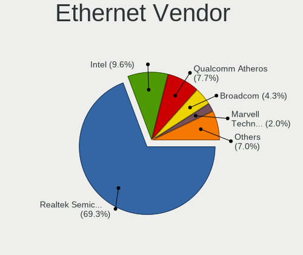

| Vendor                                 | Notebooks | Percent |
|----------------------------------------|-----------|---------|
| Realtek Semiconductor                  | 883       | 68.66%  |
| Intel                                  | 122       | 9.49%   |
| Qualcomm Atheros                       | 104       | 8.09%   |
| Broadcom                               | 55        | 4.28%   |
| Marvell Technology Group               | 27        | 2.1%    |
| Samsung Electronics                    | 18        | 1.4%    |
| Silicon Integrated Systems [SiS]       | 12        | 0.93%   |
| Xiaomi                                 | 11        | 0.86%   |
| Broadcom Limited                       | 10        | 0.78%   |
| ASIX Electronics                       | 8         | 0.62%   |
| Nvidia                                 | 7         | 0.54%   |
| JMicron Technology                     | 5         | 0.39%   |
| Qualcomm                               | 3         | 0.23%   |
| Huawei Technologies                    | 3         | 0.23%   |
| Apple                                  | 3         | 0.23%   |
| TP-Link                                | 2         | 0.16%   |
| ICS Advent                             | 2         | 0.16%   |
| Attansic Technology                    | 2         | 0.16%   |
| Sony Ericsson Mobile Communications AB | 1         | 0.08%   |
| OnePlus Technology (Shenzhen)          | 1         | 0.08%   |
| Motorola PCS                           | 1         | 0.08%   |
| Microchip Technology                   | 1         | 0.08%   |
| MediaTek                               | 1         | 0.08%   |
| LSI                                    | 1         | 0.08%   |
| Lenovo                                 | 1         | 0.08%   |
| Davicom Semiconductor                  | 1         | 0.08%   |
| Aquantia                               | 1         | 0.08%   |

Ethernet Model
--------------

Ethernet models

| Model                                                                          | Notebooks | Percent |
|--------------------------------------------------------------------------------|-----------|---------|
| Realtek RTL8111/8168/8211/8411 PCI Express Gigabit Ethernet Controller         | 645       | 49.77%  |
| Realtek RTL810xE PCI Express Fast Ethernet controller                          | 166       | 12.81%  |
| Intel 82579LM Gigabit Network Connection (Lewisville)                          | 22        | 1.7%    |
| Realtek RTL8125 2.5GbE Controller                                              | 21        | 1.62%   |
| Realtek RTL8153 Gigabit Ethernet Adapter                                       | 20        | 1.54%   |
| Qualcomm Atheros AR8151 v2.0 Gigabit Ethernet                                  | 17        | 1.31%   |
| Realtek RTL8152 Fast Ethernet Adapter                                          | 16        | 1.23%   |
| Realtek Killer E2600 GbE Controller                                            | 15        | 1.16%   |
| Qualcomm Atheros AR8131 Gigabit Ethernet                                       | 15        | 1.16%   |
| Silicon Integrated Systems [SiS] 191 Gigabit Ethernet Adapter                  | 12        | 0.93%   |
| Intel Ethernet Connection (4) I219-LM                                          | 12        | 0.93%   |
| Intel Ethernet Connection (3) I218-LM                                          | 12        | 0.93%   |
| Broadcom NetLink BCM57785 Gigabit Ethernet PCIe                                | 12        | 0.93%   |
| Qualcomm Atheros QCA8171 Gigabit Ethernet                                      | 11        | 0.85%   |
| Qualcomm Atheros AR8152 v1.1 Fast Ethernet                                     | 11        | 0.85%   |
| Samsung GT-I9070 (network tethering, USB debugging enabled)                    | 10        | 0.77%   |
| Qualcomm Atheros AR8161 Gigabit Ethernet                                       | 10        | 0.77%   |
| Broadcom NetXtreme BCM57765 Gigabit Ethernet PCIe                              | 9         | 0.69%   |
| Xiaomi Mi/Redmi series (RNDIS)                                                 | 8         | 0.62%   |
| Samsung Galaxy series, misc. (tethering mode)                                  | 8         | 0.62%   |
| Qualcomm Atheros AR8152 v2.0 Fast Ethernet                                     | 8         | 0.62%   |
| Qualcomm Atheros Killer E2500 Gigabit Ethernet Controller                      | 7         | 0.54%   |
| Intel Ethernet Connection I218-LM                                              | 7         | 0.54%   |
| Qualcomm Atheros Killer E2400 Gigabit Ethernet Controller                      | 6         | 0.46%   |
| Marvell Group 88E8040 PCI-E Fast Ethernet Controller                           | 6         | 0.46%   |
| Broadcom NetLink BCM5784M Gigabit Ethernet PCIe                                | 6         | 0.46%   |
| Broadcom NetLink BCM57780 Gigabit Ethernet PCIe                                | 6         | 0.46%   |
| Qualcomm Atheros QCA8172 Fast Ethernet                                         | 5         | 0.39%   |
| Qualcomm Atheros AR8162 Fast Ethernet                                          | 5         | 0.39%   |
| Marvell Group Yukon Optima 88E8059 [PCIe Gigabit Ethernet Controller with AVB] | 5         | 0.39%   |
| JMicron JMC250 PCI Express Gigabit Ethernet Controller                         | 5         | 0.39%   |
| Intel Ethernet Connection I219-LM                                              | 5         | 0.39%   |
| Intel Ethernet Connection (13) I219-V                                          | 5         | 0.39%   |
| Intel 82577LM Gigabit Network Connection                                       | 5         | 0.39%   |
| Broadcom NetXtreme BCM57786 Gigabit Ethernet PCIe                              | 5         | 0.39%   |
| Broadcom NetLink BCM5906M Fast Ethernet PCI Express                            | 5         | 0.39%   |
| Broadcom BCM4401-B0 100Base-TX                                                 | 5         | 0.39%   |
| ASIX AX88179 Gigabit Ethernet                                                  | 5         | 0.39%   |
| Qualcomm Atheros AR8132 Fast Ethernet                                          | 4         | 0.31%   |
| Nvidia MCP79 Ethernet                                                          | 4         | 0.31%   |

Net Controller Kind
-------------------

Ethernet, WiFi or modem

| Kind     | Notebooks | Percent |
|----------|-----------|---------|
| WiFi     | 1478      | 53.92%  |
| Ethernet | 1246      | 45.46%  |
| Modem    | 16        | 0.58%   |
| Unknown  | 1         | 0.04%   |

Used Controller
---------------

Currently used network controller

| Kind     | Notebooks | Percent |
|----------|-----------|---------|
| WiFi     | 1257      | 81.25%  |
| Ethernet | 290       | 18.75%  |

NICs
----

Total network controllers on board

| Total | Notebooks | Percent |
|-------|-----------|---------|
| 2     | 1171      | 77.29%  |
| 1     | 304       | 20.07%  |
| 0     | 37        | 2.44%   |
| 3     | 3         | 0.2%    |

IPv6
----

IPv6 vs IPv4

| Used | Notebooks | Percent |
|------|-----------|---------|
| No   | 1479      | 97.11%  |
| Yes  | 44        | 2.89%   |

Bluetooth
---------

Bluetooth Vendor
----------------

Controller vendors

| Vendor                          | Notebooks | Percent |
|---------------------------------|-----------|---------|
| Intel                           | 548       | 43.35%  |
| Realtek Semiconductor           | 156       | 12.34%  |
| IMC Networks                    | 117       | 9.26%   |
| Qualcomm Atheros Communications | 106       | 8.39%   |
| Lite-On Technology              | 57        | 4.51%   |
| Broadcom                        | 52        | 4.11%   |
| Foxconn / Hon Hai               | 49        | 3.88%   |
| Apple                           | 29        | 2.29%   |
| Toshiba                         | 28        | 2.22%   |
| Realtek                         | 25        | 1.98%   |
| Ralink                          | 21        | 1.66%   |
| Cambridge Silicon Radio         | 17        | 1.34%   |
| Dell                            | 15        | 1.19%   |
| Hewlett-Packard                 | 14        | 1.11%   |
| ASUSTek Computer                | 12        | 0.95%   |
| MediaTek                        | 6         | 0.47%   |
| Ralink Technology               | 4         | 0.32%   |
| Foxconn International           | 3         | 0.24%   |
| Alps Electric                   | 3         | 0.24%   |
| Qcom                            | 1         | 0.08%   |
| Marvell Semiconductor           | 1         | 0.08%   |

Bluetooth Model
---------------

Controller models

| Model                                               | Notebooks | Percent |
|-----------------------------------------------------|-----------|---------|
| Intel AX201 Bluetooth                               | 146       | 11.53%  |
| Intel Bluetooth wireless interface                  | 117       | 9.24%   |
| Realtek Bluetooth Radio                             | 101       | 7.98%   |
| Intel Bluetooth 9460/9560 Jefferson Peak (JfP)      | 93        | 7.35%   |
| Qualcomm Atheros  Bluetooth Device                  | 53        | 4.19%   |
| Intel Bluetooth Device                              | 51        | 4.03%   |
| Intel AX200 Bluetooth                               | 47        | 3.71%   |
| IMC Networks Bluetooth Radio                        | 35        | 2.76%   |
| Realtek Bluetooth Radio                             | 25        | 1.97%   |
| IMC Networks Wireless_Device                        | 25        | 1.97%   |
| Intel Centrino Bluetooth Wireless Transceiver       | 24        | 1.9%    |
| Ralink RT3290 Bluetooth                             | 21        | 1.66%   |
| Intel Wireless-AC 3168 Bluetooth                    | 21        | 1.66%   |
| Intel AX211 Bluetooth                               | 21        | 1.66%   |
| IMC Networks Bluetooth Device                       | 21        | 1.66%   |
| Apple Bluetooth Host Controller                     | 18        | 1.42%   |
| Realtek  Bluetooth 4.2 Adapter                      | 17        | 1.34%   |
| Cambridge Silicon Radio Bluetooth Dongle (HCI mode) | 17        | 1.34%   |
| Qualcomm Atheros AR3011 Bluetooth                   | 16        | 1.26%   |
| Lite-On Qualcomm Atheros QCA9377 Bluetooth          | 16        | 1.26%   |
| Qualcomm Atheros AR3012 Bluetooth 4.0               | 15        | 1.18%   |
| Lite-On Bluetooth Device                            | 15        | 1.18%   |
| Realtek 802.11ac WLAN Adapter                       | 13        | 1.03%   |
| Qualcomm Atheros QCA61x4 Bluetooth 4.0              | 13        | 1.03%   |
| Realtek RTL8822BE Bluetooth 4.2 Adapter             | 12        | 0.95%   |
| IMC Networks Bluetooth USB Host Controller          | 12        | 0.95%   |
| IMC Networks Atheros AR3012 Bluetooth 4.0 Adapter   | 12        | 0.95%   |
| Intel Centrino Advanced-N 6230 Bluetooth adapter    | 11        | 0.87%   |
| Foxconn / Hon Hai Wireless_Device                   | 11        | 0.87%   |
| Lite-On Wireless_Device                             | 10        | 0.79%   |
| Broadcom BCM2070 Bluetooth 2.1 + EDR                | 10        | 0.79%   |
| Apple Bluetooth USB Host Controller                 | 10        | 0.79%   |
| Intel Wireless-AC 9260 Bluetooth Adapter            | 9         | 0.71%   |
| Intel AX210 Bluetooth                               | 9         | 0.71%   |
| IMC Networks Bluetooth                              | 9         | 0.71%   |
| Realtek RTL8723B Bluetooth                          | 8         | 0.63%   |
| HP Bluetooth 2.0 Interface [Broadcom BCM2045]       | 8         | 0.63%   |
| Foxconn / Hon Hai Bluetooth USB Host Controller     | 8         | 0.63%   |
| Foxconn / Hon Hai MediaTek Bluetooth Adapter        | 7         | 0.55%   |
| ASUS BT-253 Bluetooth Adapter                       | 7         | 0.55%   |

Sound
-----

Sound Vendor
------------

Sound card vendors

| Vendor                                       | Notebooks | Percent |
|----------------------------------------------|-----------|---------|
| Intel                                        | 1183      | 62.59%  |
| AMD                                          | 328       | 17.35%  |
| Nvidia                                       | 315       | 16.67%  |
| Silicon Integrated Systems [SiS]             | 12        | 0.63%   |
| Logitech                                     | 5         | 0.26%   |
| C-Media Electronics                          | 5         | 0.26%   |
| Barco Display Systems                        | 5         | 0.26%   |
| Realtek Semiconductor                        | 4         | 0.21%   |
| Kingston Technology                          | 4         | 0.21%   |
| Apple                                        | 4         | 0.21%   |
| LG Electronics                               | 2         | 0.11%   |
| GYROCOM C&C                                  | 2         | 0.11%   |
| GN Netcom                                    | 2         | 0.11%   |
| DSEA A/S                                     | 2         | 0.11%   |
| Zoran Co. Personal Media Division (Nogatech) | 1         | 0.05%   |
| Yamaha                                       | 1         | 0.05%   |
| Trust                                        | 1         | 0.05%   |
| Texas Instruments                            | 1         | 0.05%   |
| Tenx Technology                              | 1         | 0.05%   |
| JMTek                                        | 1         | 0.05%   |
| Hewlett-Packard                              | 1         | 0.05%   |
| Google                                       | 1         | 0.05%   |
| Generalplus Technology                       | 1         | 0.05%   |
| FiiO Electronics Technology                  | 1         | 0.05%   |
| DigiTech                                     | 1         | 0.05%   |
| Creative Technology                          | 1         | 0.05%   |
| CMX Systems                                  | 1         | 0.05%   |
| BEHRINGER International                      | 1         | 0.05%   |
| Audient                                      | 1         | 0.05%   |
| ASUSTek Computer                             | 1         | 0.05%   |
| A4Tech                                       | 1         | 0.05%   |

Sound Model
-----------

Sound card models

| Model                                                                                             | Notebooks | Percent |
|---------------------------------------------------------------------------------------------------|-----------|---------|
| AMD Family 17h/19h HD Audio Controller                                                            | 199       | 8.69%   |
| Intel Sunrise Point-LP HD Audio                                                                   | 153       | 6.68%   |
| Intel 7 Series/C216 Chipset Family High Definition Audio Controller                               | 116       | 5.07%   |
| AMD Renoir Radeon High Definition Audio Controller                                                | 113       | 4.93%   |
| Intel 6 Series/C200 Series Chipset Family High Definition Audio Controller                        | 93        | 4.06%   |
| Intel Tiger Lake-LP Smart Sound Technology Audio Controller                                       | 73        | 3.19%   |
| Intel 5 Series/3400 Series Chipset High Definition Audio                                          | 67        | 2.93%   |
| Intel Haswell-ULT HD Audio Controller                                                             | 60        | 2.62%   |
| Intel 8 Series HD Audio Controller                                                                | 60        | 2.62%   |
| Intel Cannon Lake PCH cAVS                                                                        | 56        | 2.45%   |
| Nvidia Audio device                                                                               | 54        | 2.36%   |
| Intel Comet Lake PCH cAVS                                                                         | 54        | 2.36%   |
| AMD Raven/Raven2/Fenghuang HDMI/DP Audio Controller                                               | 53        | 2.31%   |
| Nvidia TU107 GeForce GTX 1650 High Definition Audio Controller                                    | 50        | 2.18%   |
| Intel Broadwell-U Audio Controller                                                                | 48        | 2.1%    |
| Intel Wildcat Point-LP High Definition Audio Controller                                           | 47        | 2.05%   |
| Intel 82801I (ICH9 Family) HD Audio Controller                                                    | 44        | 1.92%   |
| Intel 8 Series/C220 Series Chipset High Definition Audio Controller                               | 43        | 1.88%   |
| Intel Alder Lake PCH-P High Definition Audio Controller                                           | 42        | 1.83%   |
| Intel Xeon E3-1200 v3/4th Gen Core Processor HD Audio Controller                                  | 38        | 1.66%   |
| Intel Comet Lake PCH-LP cAVS                                                                      | 36        | 1.57%   |
| Intel CM238 HD Audio Controller                                                                   | 36        | 1.57%   |
| AMD FCH Azalia Controller                                                                         | 35        | 1.53%   |
| Intel Cannon Point-LP High Definition Audio Controller                                            | 34        | 1.48%   |
| Intel Tiger Lake-H HD Audio Controller                                                            | 33        | 1.44%   |
| Nvidia GF108 High Definition Audio Controller                                                     | 31        | 1.35%   |
| Intel 100 Series/C230 Series Chipset Family HD Audio Controller                                   | 29        | 1.27%   |
| AMD Kabini HDMI/DP Audio                                                                          | 29        | 1.27%   |
| Nvidia GP107GL High Definition Audio Controller                                                   | 28        | 1.22%   |
| Intel NM10/ICH7 Family High Definition Audio Controller                                           | 28        | 1.22%   |
| Intel Ice Lake-LP Smart Sound Technology Audio Controller                                         | 25        | 1.09%   |
| Nvidia GA106 High Definition Audio Controller                                                     | 24        | 1.05%   |
| AMD Rembrandt Radeon High Definition Audio Controller                                             | 23        | 1%      |
| AMD Family 15h (Models 60h-6fh) Audio Controller                                                  | 22        | 0.96%   |
| Intel Atom/Celeron/Pentium Processor x5-E8000/J3xxx/N3xxx Series High Definition Audio Controller | 20        | 0.87%   |
| Nvidia GT216 HDMI Audio Controller                                                                | 18        | 0.79%   |
| Intel Celeron/Pentium Silver Processor High Definition Audio                                      | 18        | 0.79%   |
| Intel 82801H (ICH8 Family) HD Audio Controller                                                    | 18        | 0.79%   |
| Nvidia TU106 High Definition Audio Controller                                                     | 16        | 0.7%    |
| Intel Atom Processor Z36xxx/Z37xxx Series High Definition Audio Controller                        | 15        | 0.66%   |

Memory
------

Memory Vendor
-------------

Memory module vendors

| Vendor              | Notebooks | Percent |
|---------------------|-----------|---------|
| Samsung Electronics | 314       | 30.54%  |
| SK hynix            | 220       | 21.4%   |
| Kingston            | 124       | 12.06%  |
| Micron Technology   | 115       | 11.19%  |
| Unknown             | 67        | 6.52%   |
| Crucial             | 54        | 5.25%   |
| Ramaxel Technology  | 23        | 2.24%   |
| A-DATA Technology   | 22        | 2.14%   |
| Nanya Technology    | 16        | 1.56%   |
| Corsair             | 9         | 0.88%   |
| Elpida              | 8         | 0.78%   |
| Transcend           | 7         | 0.68%   |
| Unknown             | 7         | 0.68%   |
| Unknown (ABCD)      | 6         | 0.58%   |
| Timetec             | 4         | 0.39%   |
| Apacer              | 4         | 0.39%   |
| Goldkey             | 3         | 0.29%   |
| G.Skill             | 3         | 0.29%   |
| ChangXin Memory     | 3         | 0.29%   |
| Team                | 2         | 0.19%   |
| Unknown (F288)      | 1         | 0.1%    |
| Unknown (0x4509)    | 1         | 0.1%    |
| Unknown (0B38)      | 1         | 0.1%    |
| Unifosa             | 1         | 0.1%    |
| pqi                 | 1         | 0.1%    |
| Patriot             | 1         | 0.1%    |
| Lexar Co Limited    | 1         | 0.1%    |
| Kllisre             | 1         | 0.1%    |
| Hikvision           | 1         | 0.1%    |
| Good Wealth         | 1         | 0.1%    |
| Gold Key            | 1         | 0.1%    |
| ff                  | 1         | 0.1%    |
| Avant               | 1         | 0.1%    |
| ASint Technology    | 1         | 0.1%    |
| AMD                 | 1         | 0.1%    |
| 4ea5                | 1         | 0.1%    |
| 48spaces            | 1         | 0.1%    |

Memory Model
------------

Memory module models

| Model                                                        | Notebooks | Percent |
|--------------------------------------------------------------|-----------|---------|
| Samsung RAM M471A1G44AB0-CWE 8192MB SODIMM DDR4 3200MT/s     | 21        | 1.93%   |
| Samsung RAM M471A1K43DB1-CWE 8GB SODIMM DDR4 3200MT/s        | 19        | 1.74%   |
| SK hynix RAM HMT451S6BFR8A-PB 4GB SODIMM DDR3 1600MT/s       | 15        | 1.38%   |
| Samsung RAM M471A5244CB0-CRC 4GB SODIMM DDR4 2667MT/s        | 13        | 1.19%   |
| SK hynix RAM HMT41GS6BFR8A-PB 8GB SODIMM DDR3 1600MT/s       | 12        | 1.1%    |
| Samsung RAM M471B5173EB0-YK0 4GB SODIMM DDR3 1600MT/s        | 12        | 1.1%    |
| Samsung RAM M471B5173DB0-YK0 4GB SODIMM DDR3 1600MT/s        | 12        | 1.1%    |
| Samsung RAM M471A5244CB0-CWE 4GB Row Of Chips DDR4 3200MT/s  | 12        | 1.1%    |
| Samsung RAM M471A1K43EB1-CWE 8GB SODIMM DDR4 3200MT/s        | 12        | 1.1%    |
| Samsung RAM M471A1K43CB1-CTD 8GB SODIMM DDR4 2667MT/s        | 12        | 1.1%    |
| Samsung RAM M471B1G73QH0-YK0 8GB SODIMM DDR3 1600MT/s        | 11        | 1.01%   |
| Samsung RAM M471A1K43CB1-CRC 8GB SODIMM DDR4 2667MT/s        | 10        | 0.92%   |
| SK hynix RAM HMAA1GS6CJR6N-XN 8GB SODIMM DDR4 3200MT/s       | 9         | 0.83%   |
| SK hynix RAM HMA81GS6JJR8N-VK 8GB SODIMM DDR4 2667MT/s       | 9         | 0.83%   |
| SK hynix RAM HMA81GS6AFR8N-UH 8GB SODIMM DDR4 2667MT/s       | 9         | 0.83%   |
| Unknown RAM Module 4GB SODIMM DDR3                           | 8         | 0.73%   |
| SK hynix RAM Module 4GB SODIMM DDR3 1600MT/s                 | 8         | 0.73%   |
| SK hynix RAM HMAA1GS6CJR6N-XN 8GB Row Of Chips DDR4 3200MT/s | 8         | 0.73%   |
| SK hynix RAM HMA81GS6CJR8N-VK 8GB SODIMM DDR4 2667MT/s       | 8         | 0.73%   |
| Samsung RAM M471A5244CB0-CWE 4GB SODIMM DDR4 3200MT/s        | 8         | 0.73%   |
| SK hynix RAM HMA851S6AFR6N-UH 4GB SODIMM DDR4 2667MT/s       | 7         | 0.64%   |
| Samsung RAM M471B5773CHS-CH9 2048MB SODIMM DDR3 4199MT/s     | 7         | 0.64%   |
| Samsung RAM M471A2K43DB1-CWE 16GB SODIMM DDR4 3200MT/s       | 7         | 0.64%   |
| Samsung RAM M471A1K43DB1-CTD 8GB SODIMM DDR4 2667MT/s        | 7         | 0.64%   |
| Micron RAM 8ATF1G64HZ-3G2J1 8GB SODIMM DDR4 3200MT/s         | 7         | 0.64%   |
| Unknown                                                      | 7         | 0.64%   |
| SK hynix RAM HMA851S6DJR6N-XN 4GB SODIMM DDR4 3200MT/s       | 6         | 0.55%   |
| Samsung RAM M471A1G44AB0-CWE 8GB Row Of Chips DDR4 3200MT/s  | 6         | 0.55%   |
| Micron RAM 8ATF1G64HZ-2G3B1 8GB SODIMM DDR4 2400MT/s         | 6         | 0.55%   |
| Micron RAM 4ATF51264HZ-2G6E1 4GB SODIMM DDR4 2667MT/s        | 6         | 0.55%   |
| Micron RAM 4ATF1G64HZ-3G2E1 8GB SODIMM DDR4 3200MT/s         | 6         | 0.55%   |
| Micron RAM 4ATF1G64HZ-3G2E1 8GB Row Of Chips DDR4 3200MT/s   | 6         | 0.55%   |
| Crucial RAM CT8G4SFS8266.M8FD 8GB SODIMM DDR4 2667MT/s       | 6         | 0.55%   |
| Unknown RAM Module 1GB SODIMM DDR2                           | 5         | 0.46%   |
| SK hynix RAM HMT451S6CFR6A-PB 4GB SODIMM DDR3 1600MT/s       | 5         | 0.46%   |
| SK hynix RAM HMT41GS6AFR8A-PB 8GB SODIMM DDR3 1600MT/s       | 5         | 0.46%   |
| SK hynix RAM HMA851S6DJR6N-XN 4GB Row Of Chips DDR4 3200MT/s | 5         | 0.46%   |
| SK hynix RAM HMA81GS6DJR8N-XN 8GB SODIMM DDR4 3200MT/s       | 5         | 0.46%   |
| Samsung RAM M471B5273DH0-CH9 4GB SODIMM DDR3 1334MT/s        | 5         | 0.46%   |
| Samsung RAM M471B5173QH0-YK0 4GB SODIMM DDR3 1600MT/s        | 5         | 0.46%   |

Memory Kind
-----------

Memory module kinds

| Kind    | Notebooks | Percent |
|---------|-----------|---------|
| DDR4    | 460       | 53.99%  |
| DDR3    | 257       | 30.16%  |
| LPDDR4  | 36        | 4.23%   |
| DDR2    | 22        | 2.58%   |
| LPDDR3  | 19        | 2.23%   |
| DDR5    | 19        | 2.23%   |
| SDRAM   | 18        | 2.11%   |
| LPDDR5  | 8         | 0.94%   |
| DDR     | 7         | 0.82%   |
| DRAM    | 4         | 0.47%   |
| Unknown | 2         | 0.23%   |

Memory Form Factor
------------------

Physical design of the memory module

| Name         | Notebooks | Percent |
|--------------|-----------|---------|
| SODIMM       | 754       | 88.5%   |
| Row Of Chips | 89        | 10.45%  |
| DIMM         | 4         | 0.47%   |
| Unknown      | 4         | 0.47%   |
| Chip         | 1         | 0.12%   |

Memory Size
-----------

Memory module size

| Size    | Notebooks | Percent |
|---------|-----------|---------|
| 8192    | 390       | 40.97%  |
| 4096    | 272       | 28.57%  |
| 16384   | 130       | 13.66%  |
| 2048    | 97        | 10.19%  |
| 32768   | 30        | 3.15%   |
| 1024    | 27        | 2.84%   |
| 1536    | 2         | 0.21%   |
| 512     | 2         | 0.21%   |
| 256     | 1         | 0.11%   |
| Unknown | 1         | 0.11%   |

Memory Speed
------------

Memory module speed

| Speed   | Notebooks | Percent |
|---------|-----------|---------|
| 3200    | 237       | 26.07%  |
| 2667    | 186       | 20.46%  |
| 1600    | 176       | 19.36%  |
| 2400    | 67        | 7.37%   |
| 1334    | 36        | 3.96%   |
| 2133    | 34        | 3.74%   |
| 1333    | 28        | 3.08%   |
| Unknown | 25        | 2.75%   |
| 1067    | 15        | 1.65%   |
| 667     | 15        | 1.65%   |
| 4199    | 14        | 1.54%   |
| 4800    | 13        | 1.43%   |
| 4267    | 10        | 1.1%    |
| 1867    | 7         | 0.77%   |
| 6400    | 6         | 0.66%   |
| 5600    | 6         | 0.66%   |
| 4266    | 6         | 0.66%   |
| 800     | 5         | 0.55%   |
| 3266    | 4         | 0.44%   |
| 8400    | 3         | 0.33%   |
| 3733    | 3         | 0.33%   |
| 2048    | 3         | 0.33%   |
| 5500    | 2         | 0.22%   |
| 1066    | 2         | 0.22%   |
| 975     | 2         | 0.22%   |
| 533     | 2         | 0.22%   |
| 1866    | 1         | 0.11%   |
| 1639    | 1         | 0.11%   |

Printers & scanners
-------------------

Printer Vendor
--------------

Printer device vendors

| Vendor              | Notebooks | Percent |
|---------------------|-----------|---------|
| Canon               | 5         | 35.71%  |
| Hewlett-Packard     | 4         | 28.57%  |
| Seiko Epson         | 2         | 14.29%  |
| Samsung Electronics | 2         | 14.29%  |
| QinHeng Electronics | 1         | 7.14%   |

Printer Model
-------------

Printer device models

| Model                                | Notebooks | Percent |
|--------------------------------------|-----------|---------|
| HP Officejet 4500 G510g-m            | 2         | 14.29%  |
| Canon LBP6030w/6018w                 | 2         | 14.29%  |
| Seiko Epson L3110 Series             | 1         | 7.14%   |
| Seiko Epson FX-2190IIN               | 1         | 7.14%   |
| Samsung ML-216x Series Laser Printer | 1         | 7.14%   |
| Samsung CLP-325 Color Laser Printer  | 1         | 7.14%   |
| QinHeng CH340S                       | 1         | 7.14%   |
| HP DeskJet 2600 series               | 1         | 7.14%   |
| HP Deskjet 1050 J410                 | 1         | 7.14%   |
| Canon PIXMA MX340                    | 1         | 7.14%   |
| Canon imageRUNNER1133 series         | 1         | 7.14%   |
| Canon CAPT USB Device                | 1         | 7.14%   |

Scanner Vendor
--------------

Scanner device vendors

Zero info for selected period =(

Scanner Model
-------------

Scanner device models

Zero info for selected period =(

Camera
------

Camera Vendor
-------------

Camera device vendors

| Vendor                                 | Notebooks | Percent |
|----------------------------------------|-----------|---------|
| Chicony Electronics                    | 342       | 24.76%  |
| IMC Networks                           | 170       | 12.31%  |
| Realtek Semiconductor                  | 125       | 9.05%   |
| Quanta                                 | 97        | 7.02%   |
| Microdia                               | 85        | 6.15%   |
| Bison Electronics                      | 85        | 6.15%   |
| Cheng Uei Precision Industry (Foxlink) | 71        | 5.14%   |
| Acer                                   | 54        | 3.91%   |
| Sunplus Innovation Technology          | 52        | 3.77%   |
| Syntek                                 | 40        | 2.9%    |
| Suyin                                  | 35        | 2.53%   |
| Luxvisions Innotech Limited            | 32        | 2.32%   |
| Apple                                  | 28        | 2.03%   |
| Silicon Motion                         | 24        | 1.74%   |
| Lite-On Technology                     | 20        | 1.45%   |
| Alcor Micro                            | 17        | 1.23%   |
| Sonix Technology                       | 12        | 0.87%   |
| Ricoh                                  | 12        | 0.87%   |
| Importek                               | 9         | 0.65%   |
| Z-Star Microelectronics                | 8         | 0.58%   |
| ALi                                    | 7         | 0.51%   |
| Samsung Electronics                    | 6         | 0.43%   |
| Logitech                               | 4         | 0.29%   |
| BTF-230906-J                           | 4         | 0.29%   |
| SunplusIT                              | 3         | 0.22%   |
| ShineTech                              | 3         | 0.22%   |
| Lenovo                                 | 3         | 0.22%   |
| Foxconn / Hon Hai                      | 3         | 0.22%   |
| Sunplus Technology                     | 2         | 0.14%   |
| Primax Electronics                     | 2         | 0.14%   |
| LG Electronics                         | 2         | 0.14%   |
| kingcome                               | 2         | 0.14%   |
| Generalplus Technology                 | 2         | 0.14%   |
| DigiTech                               | 2         | 0.14%   |
| Xiaomi                                 | 1         | 0.07%   |
| Tripath Technology                     | 1         | 0.07%   |
| Sunplus IT                             | 1         | 0.07%   |
| Shine-optics                           | 1         | 0.07%   |
| Philips (or NXP)                       | 1         | 0.07%   |
| OmniVision Technologies                | 1         | 0.07%   |

Camera Model
------------

Camera device models

| Model                                                   | Notebooks | Percent |
|---------------------------------------------------------|-----------|---------|
| Chicony Integrated Camera                               | 48        | 3.47%   |
| IMC Networks Integrated Camera                          | 44        | 3.18%   |
| Chicony HD WebCam                                       | 43        | 3.1%    |
| Microdia Integrated_Webcam_HD                           | 42        | 3.03%   |
| IMC Networks USB2.0 HD UVC WebCam                       | 32        | 2.31%   |
| Realtek Integrated_Webcam_HD                            | 31        | 2.24%   |
| IMC Networks USB2.0 VGA UVC WebCam                      | 29        | 2.09%   |
| Syntek Integrated Camera                                | 22        | 1.59%   |
| Acer Integrated Camera                                  | 22        | 1.59%   |
| IMC Networks HD Camera                                  | 21        | 1.52%   |
| Chicony USB2.0 VGA UVC WebCam                           | 21        | 1.52%   |
| Chicony USB2.0 Camera                                   | 21        | 1.52%   |
| Bison HD Webcam                                         | 19        | 1.37%   |
| Quanta HD User Facing                                   | 16        | 1.16%   |
| Quanta ACER HD User Facing                              | 15        | 1.08%   |
| Chicony USB2.0 HD UVC WebCam                            | 15        | 1.08%   |
| Bison Integrated Camera                                 | 15        | 1.08%   |
| Realtek USB2.0 VGA UVC WebCam                           | 14        | 1.01%   |
| Chicony TOSHIBA Web Camera - HD                         | 13        | 0.94%   |
| Chicony HP HD Camera                                    | 13        | 0.94%   |
| Sunplus Integrated_Webcam_HD                            | 11        | 0.79%   |
| Realtek USB Camera                                      | 11        | 0.79%   |
| Chicony USB 2.0 Camera                                  | 11        | 0.79%   |
| Realtek USB2.0 HD UVC WebCam                            | 10        | 0.72%   |
| Quanta USB HD Webcam                                    | 10        | 0.72%   |
| Quanta ov9734_techfront_camera                          | 10        | 0.72%   |
| Luxvisions Innotech Limited HP Wide Vision HD Camera    | 10        | 0.72%   |
| Lite-On Integrated Camera                               | 10        | 0.72%   |
| Chicony Lenovo EasyCamera                               | 10        | 0.72%   |
| Chicony HD User Facing                                  | 10        | 0.72%   |
| Cheng Uei Precision Industry (Foxlink) HP TrueVision HD | 10        | 0.72%   |
| Bison SunplusIT Integrated Camera                       | 10        | 0.72%   |
| Apple iPhone 5/5C/5S/6/SE/7/8/X                         | 10        | 0.72%   |
| Realtek Lenovo EasyCamera                               | 9         | 0.65%   |
| Chicony Integrated IR Camera                            | 9         | 0.65%   |
| Chicony HP Wide Vision HD Camera                        | 9         | 0.65%   |
| Chicony HP Webcam                                       | 9         | 0.65%   |
| Chicony EasyCamera                                      | 9         | 0.65%   |
| Cheng Uei Precision Industry (Foxlink) HD Camera        | 9         | 0.65%   |
| Bison BisonCam,NB Pro                                   | 9         | 0.65%   |

Security
--------

Fingerprint Vendor
------------------

Fingerprint sensor vendors

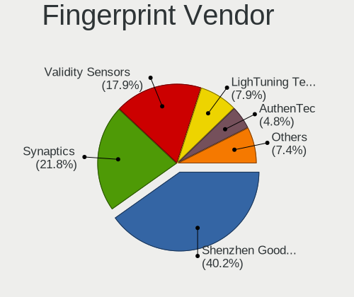

| Vendor                             | Notebooks | Percent |
|------------------------------------|-----------|---------|
| Shenzhen Goodix Technology         | 76        | 39.58%  |
| Synaptics                          | 38        | 19.79%  |
| Validity Sensors                   | 37        | 19.27%  |
| LighTuning Technology              | 16        | 8.33%   |
| AuthenTec                          | 11        | 5.73%   |
| Upek                               | 8         | 4.17%   |
| Elan Microelectronics              | 5         | 2.6%    |
| Realtek USB2.0 Finger Print Bridge | 1         | 0.52%   |

Fingerprint Model
-----------------

Fingerprint sensor models

| Model                                                           | Notebooks | Percent |
|-----------------------------------------------------------------|-----------|---------|
| Shenzhen Goodix  Fingerprint Device                             | 59        | 30.73%  |
| Shenzhen Goodix Fingerprint Reader                              | 16        | 8.33%   |
| Validity Sensors VFS495 Fingerprint Reader                      | 12        | 6.25%   |
| LighTuning ES603 Swipe Fingerprint Sensor                       | 9         | 4.69%   |
| Upek Biometric Touchchip/Touchstrip Fingerprint Sensor          | 8         | 4.17%   |
| Synaptics Metallica MIS Touch Fingerprint Reader                | 7         | 3.65%   |
| Validity Sensors VFS5011 Fingerprint Reader                     | 6         | 3.13%   |
| Synaptics WBDI Fingerprint Reader USB 086                       | 6         | 3.13%   |
| Synaptics Prometheus MIS Touch Fingerprint Reader               | 6         | 3.13%   |
| LighTuning EgisTec Touch Fingerprint Sensor                     | 6         | 3.13%   |
| Validity Sensors VFS 5011 fingerprint sensor                    | 5         | 2.6%    |
| Validity Sensors Fingerprint scanner                            | 4         | 2.08%   |
| Synaptics WBDI                                                  | 4         | 2.08%   |
| Synaptics  WBDI                                                 | 4         | 2.08%   |
| AuthenTec AES2810                                               | 4         | 2.08%   |
| Validity Sensors VFS491                                         | 3         | 1.56%   |
| Synaptics  FS7604 Touch Fingerprint Sensor with PurePrint       | 3         | 1.56%   |
| Synaptics Metallica MOH Touch Fingerprint Reader                | 3         | 1.56%   |
| Elan ELAN:Fingerprint                                           | 3         | 1.56%   |
| AuthenTec AES2501 Fingerprint Sensor                            | 3         | 1.56%   |
| AuthenTec AES1600                                               | 3         | 1.56%   |
| Validity Sensors VFS451 Fingerprint Reader                      | 2         | 1.04%   |
| Validity Sensors Synaptics WBDI                                 | 2         | 1.04%   |
| Synaptics Fingerprint reader [HP G6]                            | 2         | 1.04%   |
| Elan ELAN:ARM-M4                                                | 2         | 1.04%   |
| Validity Sensors VFS101 Fingerprint Reader                      | 1         | 0.52%   |
| Validity Sensors VFS Fingerprint sensor                         | 1         | 0.52%   |
| Validity Sensors Synaptics VFS7552 Touch Fingerprint Sensor     | 1         | 0.52%   |
| Synaptics UWP WBDI Device                                       | 1         | 0.52%   |
| Synaptics UWP WBDI                                              | 1         | 0.52%   |
| Synaptics FS7604 Touch Fingerprint Sensor with PurePrint        | 1         | 0.52%   |
| Shenzhen Goodix FingerPrint                                     | 1         | 0.52%   |
| Realtek USB2.0 Finger Print Bridge FocalTech Fingerprint Device | 1         | 0.52%   |
| LighTuning Fingerprint Reader                                   | 1         | 0.52%   |
| AuthenTec AES1660 Fingerprint Sensor                            | 1         | 0.52%   |

Chipcard Vendor
---------------

Chipcard module vendors

| Vendor                | Notebooks | Percent |
|-----------------------|-----------|---------|
| Broadcom              | 22        | 45.83%  |
| Alcor Micro           | 16        | 33.33%  |
| Advanced Card Systems | 3         | 6.25%   |
| Upek                  | 2         | 4.17%   |
| O2 Micro              | 2         | 4.17%   |
| Lenovo                | 2         | 4.17%   |
| Gemalto (was Gemplus) | 1         | 2.08%   |

Chipcard Model
--------------

Chipcard module models

| Model                                                                        | Notebooks | Percent |
|------------------------------------------------------------------------------|-----------|---------|
| Alcor Micro AU9540 Smartcard Reader                                          | 16        | 33.33%  |
| Broadcom BCM5880 Secure Applications Processor with fingerprint swipe sensor | 8         | 16.67%  |
| Broadcom BCM5880 Secure Applications Processor                               | 6         | 12.5%   |
| Broadcom 58200                                                               | 5         | 10.42%  |
| Broadcom 5880                                                                | 3         | 6.25%   |
| Upek TouchChip Fingerprint Coprocessor (WBF advanced mode)                   | 2         | 4.17%   |
| O2 Micro OZ776 CCID Smartcard Reader                                         | 2         | 4.17%   |
| Lenovo Integrated Smart Card Reader                                          | 2         | 4.17%   |
| Advanced Card Systems ACR39U                                                 | 2         | 4.17%   |
| Gemalto (was Gemplus) GemPC Key SmartCard Reader                             | 1         | 2.08%   |
| Advanced Card Systems ACR38 SmartCard Reader                                 | 1         | 2.08%   |

Unsupported
-----------

Unsupported Devices
-------------------

Total unsupported devices on board

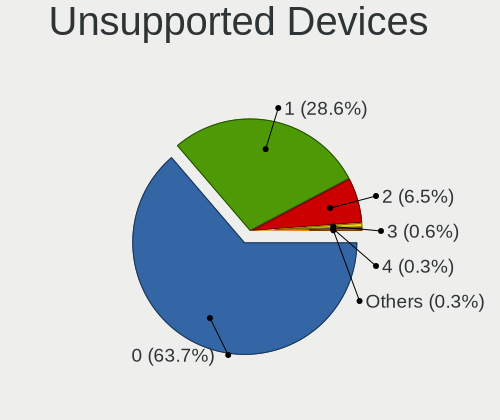

| Total | Notebooks | Percent |
|-------|-----------|---------|
| 0     | 991       | 63.36%  |
| 1     | 450       | 28.77%  |
| 2     | 103       | 6.59%   |
| 3     | 11        | 0.7%    |
| 4     | 5         | 0.32%   |
| 6     | 2         | 0.13%   |
| 5     | 2         | 0.13%   |

Unsupported Device Types
------------------------

Types of unsupported devices

| Type                     | Notebooks | Percent |
|--------------------------|-----------|---------|
| Graphics card            | 216       | 31.08%  |
| Fingerprint reader       | 192       | 27.63%  |
| Net/wireless             | 54        | 7.77%   |
| Camera                   | 50        | 7.19%   |
| Multimedia controller    | 45        | 6.47%   |
| Chipcard                 | 42        | 6.04%   |
| Bluetooth                | 34        | 4.89%   |
| Communication controller | 22        | 3.17%   |
| Net/ethernet             | 12        | 1.73%   |
| Storage                  | 9         | 1.29%   |
| Sound                    | 9         | 1.29%   |
| Card reader              | 5         | 0.72%   |
| Flash memory             | 2         | 0.29%   |
| Wireless                 | 1         | 0.14%   |
| Network                  | 1         | 0.14%   |
| Modem                    | 1         | 0.14%   |

