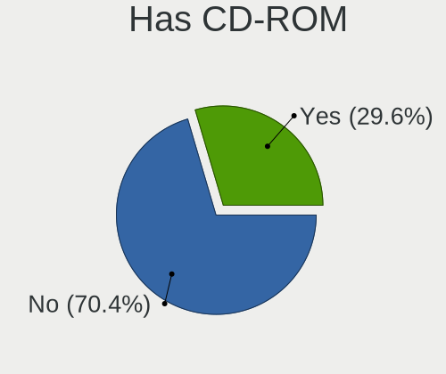
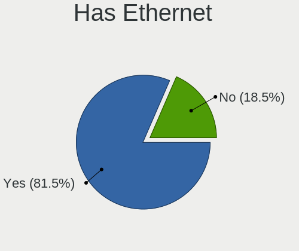
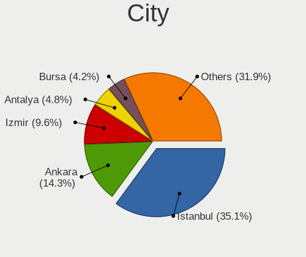
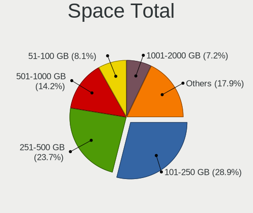
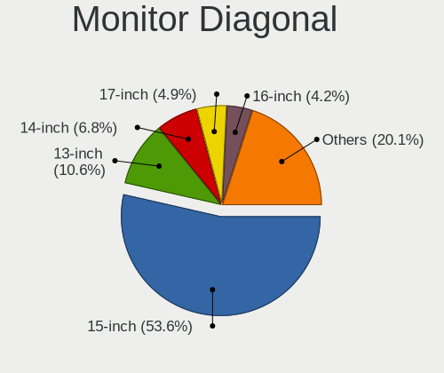
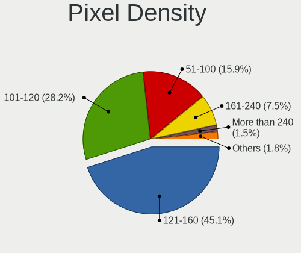
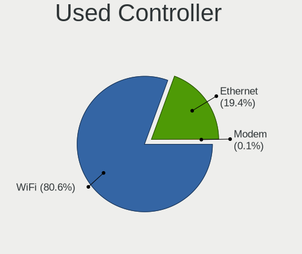
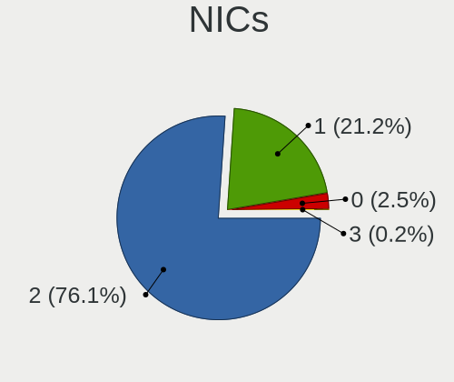
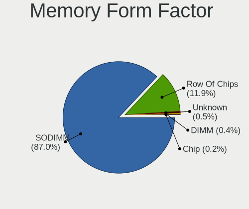

Linux in Turkey - Tested Hardware & Statistics (Notebooks)
----------------------------------------------------------

A project to collect tested hardware configurations for Linux in Turkey.

Anyone can contribute to this report by the [hw-probe](https://github.com/linuxhw/hw-probe) tool:

    sudo -E hw-probe -all -upload

Please contribute! Especially if your hardware is rare.

Contents
--------

* [ Test Cases ](#test-cases)

* [ System ](#system)
  - [ OS                       ](#os)
  - [ OS Family                ](#os-family)
  - [ Kernel                   ](#kernel)
  - [ Kernel Family            ](#kernel-family)
  - [ Kernel Major Ver.        ](#kernel-major-ver)
  - [ Arch                     ](#arch)
  - [ DE                       ](#de)
  - [ Display Server           ](#display-server)
  - [ Display Manager          ](#display-manager)
  - [ OS Lang                  ](#os-lang)
  - [ Boot Mode                ](#boot-mode)
  - [ Filesystem               ](#filesystem)
  - [ Part. scheme             ](#part-scheme)
  - [ Dual Boot with Linux/BSD ](#dual-boot-with-linuxbsd)
  - [ Dual Boot (Win)          ](#dual-boot-win)

* [ Board ](#board)
  - [ Vendor                   ](#vendor)
  - [ Model                    ](#model)
  - [ Model Family             ](#model-family)
  - [ MFG Year                 ](#mfg-year)
  - [ Form Factor              ](#form-factor)
  - [ Secure Boot              ](#secure-boot)
  - [ Coreboot                 ](#coreboot)
  - [ RAM Size                 ](#ram-size)
  - [ RAM Used                 ](#ram-used)
  - [ Total Drives             ](#total-drives)
  - [ Has CD-ROM               ](#has-cd-rom)
  - [ Has Ethernet             ](#has-ethernet)
  - [ Has WiFi                 ](#has-wifi)
  - [ Has Bluetooth            ](#has-bluetooth)

* [ Location ](#location)
  - [ Country                  ](#country)
  - [ City                     ](#city)

* [ Drives ](#drives)
  - [ Drive Vendor             ](#drive-vendor)
  - [ Drive Model              ](#drive-model)
  - [ HDD Vendor               ](#hdd-vendor)
  - [ SSD Vendor               ](#ssd-vendor)
  - [ Drive Kind               ](#drive-kind)
  - [ Drive Connector          ](#drive-connector)
  - [ Drive Size               ](#drive-size)
  - [ Space Total              ](#space-total)
  - [ Space Used               ](#space-used)
  - [ Malfunc. Drives          ](#malfunc-drives)
  - [ Malfunc. Drive Vendor    ](#malfunc-drive-vendor)
  - [ Malfunc. HDD Vendor      ](#malfunc-hdd-vendor)
  - [ Malfunc. Drive Kind      ](#malfunc-drive-kind)
  - [ Failed Drives            ](#failed-drives)
  - [ Failed Drive Vendor      ](#failed-drive-vendor)
  - [ Drive Status             ](#drive-status)

* [ Storage controller ](#storage-controller)
  - [ Storage Vendor           ](#storage-vendor)
  - [ Storage Model            ](#storage-model)
  - [ Storage Kind             ](#storage-kind)

* [ Processor ](#processor)
  - [ CPU Vendor               ](#cpu-vendor)
  - [ CPU Model                ](#cpu-model)
  - [ CPU Model Family         ](#cpu-model-family)
  - [ CPU Cores                ](#cpu-cores)
  - [ CPU Sockets              ](#cpu-sockets)
  - [ CPU Threads              ](#cpu-threads)
  - [ CPU Op-Modes             ](#cpu-op-modes)
  - [ CPU Microcode            ](#cpu-microcode)
  - [ CPU Microarch            ](#cpu-microarch)

* [ Graphics ](#graphics)
  - [ GPU Vendor               ](#gpu-vendor)
  - [ GPU Model                ](#gpu-model)
  - [ GPU Combo                ](#gpu-combo)
  - [ GPU Driver               ](#gpu-driver)
  - [ GPU Memory               ](#gpu-memory)

* [ Monitor ](#monitor)
  - [ Monitor Vendor           ](#monitor-vendor)
  - [ Monitor Model            ](#monitor-model)
  - [ Monitor Resolution       ](#monitor-resolution)
  - [ Monitor Diagonal         ](#monitor-diagonal)
  - [ Monitor Width            ](#monitor-width)
  - [ Aspect Ratio             ](#aspect-ratio)
  - [ Monitor Area             ](#monitor-area)
  - [ Pixel Density            ](#pixel-density)
  - [ Multiple Monitors        ](#multiple-monitors)

* [ Network ](#network)
  - [ Net Controller Vendor    ](#net-controller-vendor)
  - [ Net Controller Model     ](#net-controller-model)
  - [ Wireless Vendor          ](#wireless-vendor)
  - [ Wireless Model           ](#wireless-model)
  - [ Ethernet Vendor          ](#ethernet-vendor)
  - [ Ethernet Model           ](#ethernet-model)
  - [ Net Controller Kind      ](#net-controller-kind)
  - [ Used Controller          ](#used-controller)
  - [ NICs                     ](#nics)
  - [ IPv6                     ](#ipv6)

* [ Bluetooth ](#bluetooth)
  - [ Bluetooth Vendor         ](#bluetooth-vendor)
  - [ Bluetooth Model          ](#bluetooth-model)

* [ Sound ](#sound)
  - [ Sound Vendor             ](#sound-vendor)
  - [ Sound Model              ](#sound-model)

* [ Memory ](#memory)
  - [ Memory Vendor            ](#memory-vendor)
  - [ Memory Model             ](#memory-model)
  - [ Memory Kind              ](#memory-kind)
  - [ Memory Form Factor       ](#memory-form-factor)
  - [ Memory Size              ](#memory-size)
  - [ Memory Speed             ](#memory-speed)

* [ Printers & scanners ](#printers--scanners)
  - [ Printer Vendor           ](#printer-vendor)
  - [ Printer Model            ](#printer-model)
  - [ Scanner Vendor           ](#scanner-vendor)
  - [ Scanner Model            ](#scanner-model)

* [ Camera ](#camera)
  - [ Camera Vendor            ](#camera-vendor)
  - [ Camera Model             ](#camera-model)

* [ Security ](#security)
  - [ Fingerprint Vendor       ](#fingerprint-vendor)
  - [ Fingerprint Model        ](#fingerprint-model)
  - [ Chipcard Vendor          ](#chipcard-vendor)
  - [ Chipcard Model           ](#chipcard-model)

* [ Unsupported ](#unsupported)
  - [ Unsupported Devices      ](#unsupported-devices)
  - [ Unsupported Device Types ](#unsupported-device-types)

Test Cases
----------

Total: 2807

| Vendor        | Model                       | Probe                                                      | Date         |
|---------------|-----------------------------|------------------------------------------------------------|--------------|
| Packard Be... | EasyNote TJ65               | [ef9f9ac2c6](https://linux-hardware.org/?probe=ef9f9ac2c6) | Jan 05, 2025 |
| Lenovo        | ThinkPad E580 20KTS0TF00    | [220c6d82f3](https://linux-hardware.org/?probe=220c6d82f3) | Jan 05, 2025 |
| HP            | Victus by Gaming Laptop ... | [5ef06b7cbe](https://linux-hardware.org/?probe=5ef06b7cbe) | Jan 04, 2025 |
| ASUSTek       | X75VC                       | [5acc8324b3](https://linux-hardware.org/?probe=5acc8324b3) | Jan 04, 2025 |
| HP            | Laptop 15s-fq1xxx           | [062f7792dc](https://linux-hardware.org/?probe=062f7792dc) | Jan 03, 2025 |
| Casper        | EXCALIBUR G770              | [1f3dee2cf2](https://linux-hardware.org/?probe=1f3dee2cf2) | Jan 02, 2025 |
| Samsung       | Galaxy E7                   | [cc5d3b18cd](https://linux-hardware.org/?probe=cc5d3b18cd) | Jan 01, 2025 |
| Samsung       | Galaxy E7                   | [379cf72f84](https://linux-hardware.org/?probe=379cf72f84) | Jan 01, 2025 |
| Lenovo        | V15 G2 ITL 82KB             | [17c5dac30c](https://linux-hardware.org/?probe=17c5dac30c) | Jan 01, 2025 |
| Apple         | MacBookPro12,1              | [1340d405bf](https://linux-hardware.org/?probe=1340d405bf) | Jan 01, 2025 |
| Lenovo        | ThinkPad X1 Carbon 34484... | [3fc4858681](https://linux-hardware.org/?probe=3fc4858681) | Jan 01, 2025 |
| HP            | Victus by Gaming Laptop ... | [9dd96b42dd](https://linux-hardware.org/?probe=9dd96b42dd) | Dec 31, 2024 |
| Lenovo        | ThinkPad E580 20KTS0TF00    | [3ca3276427](https://linux-hardware.org/?probe=3ca3276427) | Dec 29, 2024 |
| Clevo         | W240HU/W250HUQ              | [fa4538a983](https://linux-hardware.org/?probe=fa4538a983) | Dec 29, 2024 |
| HUAWEI        | BOD-WXX9                    | [94c62e3b8b](https://linux-hardware.org/?probe=94c62e3b8b) | Dec 29, 2024 |
| ASUSTek       | ZenBook UX334FLC_UX334FL    | [648c9b7e5f](https://linux-hardware.org/?probe=648c9b7e5f) | Dec 28, 2024 |
| Lenovo        | ThinkBook 16 G6 IRL 21KH    | [caa200d745](https://linux-hardware.org/?probe=caa200d745) | Dec 28, 2024 |
| Toshiba       | Satellite P300              | [3174fc3f7e](https://linux-hardware.org/?probe=3174fc3f7e) | Dec 27, 2024 |
| Monster       | ABRA A5 V17.3               | [8ac82ca045](https://linux-hardware.org/?probe=8ac82ca045) | Dec 27, 2024 |
| Lenovo        | ThinkPad E14 Gen 3 20Y70... | [9f0e63713d](https://linux-hardware.org/?probe=9f0e63713d) | Dec 27, 2024 |
| Acer          | Aspire VN7-791G             | [89b69495ff](https://linux-hardware.org/?probe=89b69495ff) | Dec 26, 2024 |
| HP            | Victus by Gaming Laptop ... | [43e4a1a3d5](https://linux-hardware.org/?probe=43e4a1a3d5) | Dec 26, 2024 |
| MSI           | Katana A17 AI B8VE          | [06e816e082](https://linux-hardware.org/?probe=06e816e082) | Dec 26, 2024 |
| Lenovo        | V15 G3 ABA 82TV             | [75b2764000](https://linux-hardware.org/?probe=75b2764000) | Dec 25, 2024 |
| Monster       | ABRA A7 V11.2               | [762b2b2071](https://linux-hardware.org/?probe=762b2b2071) | Dec 25, 2024 |
| Clevo         | W240HU/W250HUQ              | [a2f67a9324](https://linux-hardware.org/?probe=a2f67a9324) | Dec 25, 2024 |
| Clevo         | W240HU/W250HUQ              | [a81e88cd1b](https://linux-hardware.org/?probe=a81e88cd1b) | Dec 25, 2024 |
| Clevo         | W240HU/W250HUQ              | [7f63df74a6](https://linux-hardware.org/?probe=7f63df74a6) | Dec 24, 2024 |
| Dell          | G15 5530                    | [69f5776150](https://linux-hardware.org/?probe=69f5776150) | Dec 23, 2024 |
| HUAWEI        | MCLF-XX                     | [e97a651e78](https://linux-hardware.org/?probe=e97a651e78) | Dec 23, 2024 |
| HP            | EliteBook 850 G8 Noteboo... | [683eb64afb](https://linux-hardware.org/?probe=683eb64afb) | Dec 23, 2024 |
| Acer          | Aspire ES1-571              | [cb4b9da83f](https://linux-hardware.org/?probe=cb4b9da83f) | Dec 22, 2024 |
| Acer          | Aspire ES1-571              | [48537b040b](https://linux-hardware.org/?probe=48537b040b) | Dec 22, 2024 |
| Dell          | Precision 7560              | [0181667d44](https://linux-hardware.org/?probe=0181667d44) | Dec 22, 2024 |
| HP            | Victus by Gaming Laptop ... | [b800e65be6](https://linux-hardware.org/?probe=b800e65be6) | Dec 22, 2024 |
| Lenovo        | IdeaPad 320-15ISK 80XH      | [2bc9b23a42](https://linux-hardware.org/?probe=2bc9b23a42) | Dec 21, 2024 |
| Dell          | Latitude 7490               | [31661d6299](https://linux-hardware.org/?probe=31661d6299) | Dec 21, 2024 |
| HP            | Victus by Gaming Laptop ... | [7acc8a5af8](https://linux-hardware.org/?probe=7acc8a5af8) | Dec 21, 2024 |
| Acer          | Aspire A315-59              | [f43ee3c3f3](https://linux-hardware.org/?probe=f43ee3c3f3) | Dec 20, 2024 |
| Dell          | Inspiron 5559               | [6946e661db](https://linux-hardware.org/?probe=6946e661db) | Dec 20, 2024 |
| Lenovo        | ThinkBook 13s G3 ACN 20Y... | [06253e3ba7](https://linux-hardware.org/?probe=06253e3ba7) | Dec 19, 2024 |
| Apple         | MacBookPro8,1               | [f33a71984f](https://linux-hardware.org/?probe=f33a71984f) | Dec 19, 2024 |
| Samsung       | 905S3G/906S3G/915S3G        | [a31e7950da](https://linux-hardware.org/?probe=a31e7950da) | Dec 19, 2024 |
| Acer          | Aspire F5-573G              | [aa3a93dbc4](https://linux-hardware.org/?probe=aa3a93dbc4) | Dec 18, 2024 |
| Samsung       | 905S3G/906S3G/915S3G        | [8bdebb5383](https://linux-hardware.org/?probe=8bdebb5383) | Dec 17, 2024 |
| ASUSTek       | Vivobook Go E1504FA_E150... | [ebc832d177](https://linux-hardware.org/?probe=ebc832d177) | Dec 16, 2024 |
| HP            | Pavilion Power Laptop 15... | [a785db7994](https://linux-hardware.org/?probe=a785db7994) | Dec 15, 2024 |
| Lenovo        | LOQ 15IRH8 82XV             | [288edef8e9](https://linux-hardware.org/?probe=288edef8e9) | Dec 14, 2024 |
| ASUSTek       | K54HR                       | [b839a0b9cf](https://linux-hardware.org/?probe=b839a0b9cf) | Dec 14, 2024 |
| ASUSTek       | K54HR                       | [9d14a14655](https://linux-hardware.org/?probe=9d14a14655) | Dec 14, 2024 |
| Packard Be... | DOT S                       | [60865a1411](https://linux-hardware.org/?probe=60865a1411) | Dec 14, 2024 |
| Lenovo        | ThinkPad E580 20KTS0TF00    | [3b4adb5d69](https://linux-hardware.org/?probe=3b4adb5d69) | Dec 13, 2024 |
| HP            | 255 G8 Notebook PC          | [47a16bb755](https://linux-hardware.org/?probe=47a16bb755) | Dec 13, 2024 |
| ASUSTek       | K53U                        | [0a501b8d76](https://linux-hardware.org/?probe=0a501b8d76) | Dec 12, 2024 |
| Lenovo        | ThinkBook 16 G6 ABP 21KK    | [0913e12416](https://linux-hardware.org/?probe=0913e12416) | Dec 12, 2024 |
| Lenovo        | IdeaPad Z570 HuronRiver ... | [e5be77487d](https://linux-hardware.org/?probe=e5be77487d) | Dec 11, 2024 |
| Lenovo        | ThinkPad T480 20L6S68A00    | [562b867ec6](https://linux-hardware.org/?probe=562b867ec6) | Dec 11, 2024 |
| Lenovo        | ThinkPad P15v Gen 1 20TR... | [d050dbd2b8](https://linux-hardware.org/?probe=d050dbd2b8) | Dec 10, 2024 |
| Lenovo        | ThinkPad P1 Gen 3 20TH00... | [88623ffcc4](https://linux-hardware.org/?probe=88623ffcc4) | Dec 10, 2024 |
| Lenovo        | IdeaPad 1 15IGL7 82V7       | [d0b421c346](https://linux-hardware.org/?probe=d0b421c346) | Dec 08, 2024 |
| HP            | ENVY Laptop 13-ba1xxx       | [01bb9bade5](https://linux-hardware.org/?probe=01bb9bade5) | Dec 08, 2024 |
| GPU Compan... | Reeder C19 Laptop           | [7e2382c556](https://linux-hardware.org/?probe=7e2382c556) | Dec 08, 2024 |
| GPU Compan... | Reeder C19 Laptop           | [fbef13b359](https://linux-hardware.org/?probe=fbef13b359) | Dec 08, 2024 |
| Dell          | Inspiron 3543               | [39ace45f52](https://linux-hardware.org/?probe=39ace45f52) | Dec 07, 2024 |
| HUAWEI        | BOM-WXX9                    | [79f63e6159](https://linux-hardware.org/?probe=79f63e6159) | Dec 06, 2024 |
| Monster       | TULPAR T7 V20.8             | [e7cc7b7cff](https://linux-hardware.org/?probe=e7cc7b7cff) | Dec 05, 2024 |
| ASUSTek       | TUF Gaming FX505DT_FX505... | [010553b978](https://linux-hardware.org/?probe=010553b978) | Dec 03, 2024 |
| HP            | Victus by Gaming Laptop ... | [ba7f5c098d](https://linux-hardware.org/?probe=ba7f5c098d) | Dec 03, 2024 |
| HP            | Victus by Gaming Laptop ... | [7934b3b43f](https://linux-hardware.org/?probe=7934b3b43f) | Dec 02, 2024 |
| HUAWEI        | FLMH-XX                     | [6ba9f9d750](https://linux-hardware.org/?probe=6ba9f9d750) | Dec 01, 2024 |
| ASUSTek       | TUF Gaming FX505DT_FX505... | [ce23ae6c58](https://linux-hardware.org/?probe=ce23ae6c58) | Dec 01, 2024 |
| Lenovo        | ThinkPad T420 4236QE0       | [a54ec09f06](https://linux-hardware.org/?probe=a54ec09f06) | Dec 01, 2024 |
| HP            | Victus by Gaming Laptop ... | [327fdb0e6a](https://linux-hardware.org/?probe=327fdb0e6a) | Nov 30, 2024 |
| Toshiba       | Satellite L650              | [46de3b0fa4](https://linux-hardware.org/?probe=46de3b0fa4) | Nov 28, 2024 |
| Lenovo        | LOQ 15IRH8 82XV             | [3ab6a03116](https://linux-hardware.org/?probe=3ab6a03116) | Nov 27, 2024 |
| HP            | 245 G8 Notebook PC          | [ab39483aa3](https://linux-hardware.org/?probe=ab39483aa3) | Nov 27, 2024 |
| Dell          | Inspiron MM061              | [b0e7029133](https://linux-hardware.org/?probe=b0e7029133) | Nov 24, 2024 |
| Lenovo        | G550 20023                  | [1feabb54b9](https://linux-hardware.org/?probe=1feabb54b9) | Nov 23, 2024 |
| Monster       | TULPAR T7 V19.3             | [a1fed284f5](https://linux-hardware.org/?probe=a1fed284f5) | Nov 21, 2024 |
| ASUSTek       | 1215N                       | [b7baad3524](https://linux-hardware.org/?probe=b7baad3524) | Nov 20, 2024 |
| Lenovo        | G510 20238                  | [3150f49961](https://linux-hardware.org/?probe=3150f49961) | Nov 19, 2024 |
| Dell          | Inspiron 3542               | [21d296d057](https://linux-hardware.org/?probe=21d296d057) | Nov 17, 2024 |
| ASUSTek       | ASUS TUF Gaming A15 FA50... | [42db53d080](https://linux-hardware.org/?probe=42db53d080) | Nov 17, 2024 |
| ASUSTek       | ASUS TUF Gaming A15 FA50... | [2ce961a6cc](https://linux-hardware.org/?probe=2ce961a6cc) | Nov 17, 2024 |
| Lenovo        | ThinkPad E580 20KTS0TF00    | [e31ae6a9c2](https://linux-hardware.org/?probe=e31ae6a9c2) | Nov 15, 2024 |
| Acer          | Aspire A315-510P            | [d408ed76f5](https://linux-hardware.org/?probe=d408ed76f5) | Nov 15, 2024 |
| Lenovo        | ThinkPad T420 4236QE0       | [655fe70c91](https://linux-hardware.org/?probe=655fe70c91) | Nov 15, 2024 |
| HP            | Victus by Gaming Laptop ... | [7938b1e23f](https://linux-hardware.org/?probe=7938b1e23f) | Nov 15, 2024 |
| Lenovo        | ThinkPad E14 Gen 5 21JK0... | [7b5c860bd2](https://linux-hardware.org/?probe=7b5c860bd2) | Nov 15, 2024 |
| Lenovo        | 80TV                        | [040e0f4702](https://linux-hardware.org/?probe=040e0f4702) | Nov 14, 2024 |
| HUAWEI        | FLMH-XX                     | [3472dd9d1b](https://linux-hardware.org/?probe=3472dd9d1b) | Nov 13, 2024 |
| Lenovo        | Yoga Slim 6 14APU8 82X3     | [c9ce1b5431](https://linux-hardware.org/?probe=c9ce1b5431) | Nov 12, 2024 |
| Lenovo        | G510 20238                  | [83400b4b16](https://linux-hardware.org/?probe=83400b4b16) | Nov 12, 2024 |
| Lenovo        | ThinkPad T480 20L6S68A00    | [5dd8147a6b](https://linux-hardware.org/?probe=5dd8147a6b) | Nov 12, 2024 |
| Lenovo        | V15 G3 IAP 82TT             | [7695a66d9d](https://linux-hardware.org/?probe=7695a66d9d) | Nov 10, 2024 |
| HP            | Laptop 15-bw0xx             | [df8fc5ffa1](https://linux-hardware.org/?probe=df8fc5ffa1) | Nov 10, 2024 |
| ASUSTek       | VivoBook_ASUSLaptop X515... | [7bba50e3f8](https://linux-hardware.org/?probe=7bba50e3f8) | Nov 10, 2024 |
| Lenovo        | ThinkPad E580 20KTS0TF00    | [c8e4e4682f](https://linux-hardware.org/?probe=c8e4e4682f) | Nov 10, 2024 |
| Google        | Sasuke                      | [753719e3df](https://linux-hardware.org/?probe=753719e3df) | Nov 10, 2024 |
| Lenovo        | IdeaPad 100-15IBD 80QQ      | [67ea5c25e9](https://linux-hardware.org/?probe=67ea5c25e9) | Nov 09, 2024 |
| Dell          | Inspiron 3542               | [8268a446ea](https://linux-hardware.org/?probe=8268a446ea) | Nov 09, 2024 |
| Acer          | AO722                       | [4f5bec46c5](https://linux-hardware.org/?probe=4f5bec46c5) | Nov 09, 2024 |
| Dell          | Venue 10 Pro 5056           | [ae2d574cf1](https://linux-hardware.org/?probe=ae2d574cf1) | Nov 08, 2024 |
| HP            | 240 G8                      | [690c75feed](https://linux-hardware.org/?probe=690c75feed) | Nov 08, 2024 |
| ASUSTek       | X555LNB                     | [779d09dbb2](https://linux-hardware.org/?probe=779d09dbb2) | Nov 08, 2024 |
| HP            | 240 G8                      | [7144a2acc7](https://linux-hardware.org/?probe=7144a2acc7) | Nov 07, 2024 |
| Dell          | Latitude 7490               | [40a7d96d8f](https://linux-hardware.org/?probe=40a7d96d8f) | Nov 06, 2024 |
| Acer          | Aspire A315-58              | [921e1620e2](https://linux-hardware.org/?probe=921e1620e2) | Nov 05, 2024 |
| ASUSTek       | N56VZ                       | [b9d0972185](https://linux-hardware.org/?probe=b9d0972185) | Nov 05, 2024 |
| Pegatron      | A15                         | [537f5599a8](https://linux-hardware.org/?probe=537f5599a8) | Nov 04, 2024 |
| Toshiba       | Satellite C850-1G2          | [1a8e3e84b5](https://linux-hardware.org/?probe=1a8e3e84b5) | Nov 04, 2024 |
| Lenovo        | IdeaPad 110-15ACL 80TJ      | [89e824991d](https://linux-hardware.org/?probe=89e824991d) | Nov 03, 2024 |
| HP            | EliteBook 830 G5            | [2bbad052d1](https://linux-hardware.org/?probe=2bbad052d1) | Nov 01, 2024 |
| HP            | ZBook Power 15.6 inch G1... | [d69a41ab4c](https://linux-hardware.org/?probe=d69a41ab4c) | Nov 01, 2024 |
| HP            | Laptop 15-bw0xx             | [55ef342a18](https://linux-hardware.org/?probe=55ef342a18) | Oct 31, 2024 |
| Lenovo        | V15 G3 IAP 82TT             | [bdb953f731](https://linux-hardware.org/?probe=bdb953f731) | Oct 29, 2024 |
| Dell          | G15 5530                    | [6941a99e57](https://linux-hardware.org/?probe=6941a99e57) | Oct 29, 2024 |
| Sony          | SVE1513B1EW                 | [adafaaffe0](https://linux-hardware.org/?probe=adafaaffe0) | Oct 28, 2024 |
| Lenovo        | ThinkBook 14 G6 IRL 21KG    | [45037f9589](https://linux-hardware.org/?probe=45037f9589) | Oct 28, 2024 |
| Dell          | Latitude 7490               | [6e6ac56fcc](https://linux-hardware.org/?probe=6e6ac56fcc) | Oct 27, 2024 |
| ASUSTek       | N56VZ                       | [5a2ccfc817](https://linux-hardware.org/?probe=5a2ccfc817) | Oct 25, 2024 |
| HUAWEI        | BOM-WXX9                    | [13b8c0c21b](https://linux-hardware.org/?probe=13b8c0c21b) | Oct 25, 2024 |
| Acer          | Aspire A315-44P             | [934542a907](https://linux-hardware.org/?probe=934542a907) | Oct 24, 2024 |
| HP            | Victus by Gaming Laptop     | [bc8d8cff4f](https://linux-hardware.org/?probe=bc8d8cff4f) | Oct 24, 2024 |
| HP            | Victus by Gaming Laptop     | [47a2646ba5](https://linux-hardware.org/?probe=47a2646ba5) | Oct 24, 2024 |
| Clevo         | W7x0S                       | [b11743728f](https://linux-hardware.org/?probe=b11743728f) | Oct 23, 2024 |
| Monster       | ABRA A5 V16.7               | [f8efab3cd8](https://linux-hardware.org/?probe=f8efab3cd8) | Oct 21, 2024 |
| Sony          | SVD11223CXB                 | [6b3e7fa3c6](https://linux-hardware.org/?probe=6b3e7fa3c6) | Oct 20, 2024 |
| Monster       | ABRA A7 V13.2               | [407b879b51](https://linux-hardware.org/?probe=407b879b51) | Oct 18, 2024 |
| ASUSTek       | N56VZ                       | [c544ccf331](https://linux-hardware.org/?probe=c544ccf331) | Oct 18, 2024 |
| ASUSTek       | K54HR                       | [fc05d76312](https://linux-hardware.org/?probe=fc05d76312) | Oct 16, 2024 |
| HP            | Victus by Gaming Laptop ... | [fc1933d5c8](https://linux-hardware.org/?probe=fc1933d5c8) | Oct 16, 2024 |
| Lenovo        | V15 G3 ABA 82TV             | [3c4ca188ae](https://linux-hardware.org/?probe=3c4ca188ae) | Oct 16, 2024 |
| ASUSTek       | Zenbook UM3402YAR_UM3402... | [11e13e67c7](https://linux-hardware.org/?probe=11e13e67c7) | Oct 15, 2024 |
| HP            | Victus by Gaming Laptop ... | [25b6c78476](https://linux-hardware.org/?probe=25b6c78476) | Oct 14, 2024 |
| ASUSTek       | ROG Strix G513RC_G513RC     | [10e167a65f](https://linux-hardware.org/?probe=10e167a65f) | Oct 12, 2024 |
| Dell          | Latitude 7490               | [5059be1beb](https://linux-hardware.org/?probe=5059be1beb) | Oct 12, 2024 |
| Lenovo        | ThinkPad T490s 20NX000EM... | [f7d0f24b04](https://linux-hardware.org/?probe=f7d0f24b04) | Oct 12, 2024 |
| Samsung       | 700T1C                      | [4b23ed4627](https://linux-hardware.org/?probe=4b23ed4627) | Oct 12, 2024 |
| Lenovo        | ThinkPad E580 20KTS0TF00    | [bc5a916f1a](https://linux-hardware.org/?probe=bc5a916f1a) | Oct 11, 2024 |
| MECHREVO      | WUJIE14 PRO                 | [8ae202abaa](https://linux-hardware.org/?probe=8ae202abaa) | Oct 11, 2024 |
| HUAWEI        | FLMH-XX                     | [b05f724fb4](https://linux-hardware.org/?probe=b05f724fb4) | Oct 11, 2024 |
| HUAWEI        | FLMH-XX                     | [1467f8690d](https://linux-hardware.org/?probe=1467f8690d) | Oct 11, 2024 |
| Lenovo        | LOQ 15APH8 82XT             | [c5b7de1f56](https://linux-hardware.org/?probe=c5b7de1f56) | Oct 10, 2024 |
| Lenovo        | ThinkPad T490s 20NX000EM... | [879ee1edbe](https://linux-hardware.org/?probe=879ee1edbe) | Oct 10, 2024 |
| ASUSTek       | ROG Zephyrus G14 GA401QC... | [ca76f0b98d](https://linux-hardware.org/?probe=ca76f0b98d) | Oct 08, 2024 |
| ASUSTek       | ROG Zephyrus G14 GA401QC... | [e79581cb5f](https://linux-hardware.org/?probe=e79581cb5f) | Oct 08, 2024 |
| Lenovo        | V15 G3 ABA 82TV             | [bf025aaa26](https://linux-hardware.org/?probe=bf025aaa26) | Oct 08, 2024 |
| Acer          | Aspire A315-58              | [55f15d5c81](https://linux-hardware.org/?probe=55f15d5c81) | Oct 07, 2024 |
| HP            | 255 15.6 inch G9 Noteboo... | [1e2e268764](https://linux-hardware.org/?probe=1e2e268764) | Oct 06, 2024 |
| HP            | 255 15.6 inch G9 Noteboo... | [728d0f4561](https://linux-hardware.org/?probe=728d0f4561) | Oct 06, 2024 |
| HP            | Pavilion Notebook           | [81c79a5d56](https://linux-hardware.org/?probe=81c79a5d56) | Oct 06, 2024 |
| ARCELIK       | 1M7-GNB1595B6I7             | [cbf522f76a](https://linux-hardware.org/?probe=cbf522f76a) | Oct 05, 2024 |
| Lenovo        | ThinkPad T420 4236QE0       | [0c7aff3c04](https://linux-hardware.org/?probe=0c7aff3c04) | Oct 05, 2024 |
| MSI           | GV62 8RD                    | [35758c0597](https://linux-hardware.org/?probe=35758c0597) | Oct 05, 2024 |
| HUAWEI        | RLEF-XX                     | [468a95b0cc](https://linux-hardware.org/?probe=468a95b0cc) | Oct 04, 2024 |
| ASUSTek       | ROG Zephyrus G16 GU603ZU... | [12400a6356](https://linux-hardware.org/?probe=12400a6356) | Oct 04, 2024 |
| Lenovo        | Legion Pro 7 16IRX8H 82W... | [1f0d3132f6](https://linux-hardware.org/?probe=1f0d3132f6) | Oct 03, 2024 |
| ASUSTek       | ROG Strix G513RW_G513RW     | [c661e02463](https://linux-hardware.org/?probe=c661e02463) | Oct 02, 2024 |
| ASUSTek       | UX32LN                      | [4b3007f4c6](https://linux-hardware.org/?probe=4b3007f4c6) | Oct 01, 2024 |
| HP            | Victus by Gaming Laptop ... | [9195644a46](https://linux-hardware.org/?probe=9195644a46) | Sep 30, 2024 |
| HP            | ZBook Power 15.6 inch G1... | [9bf2277f20](https://linux-hardware.org/?probe=9bf2277f20) | Sep 29, 2024 |
| HP            | OMEN by Laptop 17-cb1xxx    | [f2cbe1fb13](https://linux-hardware.org/?probe=f2cbe1fb13) | Sep 29, 2024 |
| Dell          | XPS 13 9360                 | [4559019bac](https://linux-hardware.org/?probe=4559019bac) | Sep 28, 2024 |
| Insyde        | i101c                       | [7dd9fb58f1](https://linux-hardware.org/?probe=7dd9fb58f1) | Sep 27, 2024 |
| Casper        | NIRVANA                     | [7fec4c1d6a](https://linux-hardware.org/?probe=7fec4c1d6a) | Sep 26, 2024 |
| Lenovo        | ThinkPad P17 Gen 1 20SN0... | [ed2e8ae8ee](https://linux-hardware.org/?probe=ed2e8ae8ee) | Sep 24, 2024 |
| HP            | Laptop 15-dw2xxx            | [db86b2783d](https://linux-hardware.org/?probe=db86b2783d) | Sep 23, 2024 |
| Lenovo        | IdeaPad Z570 HuronRiver ... | [2761cb9d0a](https://linux-hardware.org/?probe=2761cb9d0a) | Sep 23, 2024 |
| Lenovo        | IdeaPad Gaming 3 15ARH05... | [37ebfb4233](https://linux-hardware.org/?probe=37ebfb4233) | Sep 23, 2024 |
| Lenovo        | IdeaPad Z570 HuronRiver ... | [5872050527](https://linux-hardware.org/?probe=5872050527) | Sep 23, 2024 |
| HP            | Victus by Gaming Laptop ... | [32c0e8626a](https://linux-hardware.org/?probe=32c0e8626a) | Sep 22, 2024 |
| HP            | Laptop 15s-fq1xxx           | [221db4d64b](https://linux-hardware.org/?probe=221db4d64b) | Sep 22, 2024 |
| Dell          | Inspiron 15-3567            | [c62470fb5a](https://linux-hardware.org/?probe=c62470fb5a) | Sep 22, 2024 |
| Dell          | Inspiron 15-3567            | [1c10a6d6e3](https://linux-hardware.org/?probe=1c10a6d6e3) | Sep 22, 2024 |
| Dell          | G15 5511                    | [6a2f8850d2](https://linux-hardware.org/?probe=6a2f8850d2) | Sep 22, 2024 |
| Lenovo        | IdeaPad Gaming 3 15IHU6 ... | [9185553180](https://linux-hardware.org/?probe=9185553180) | Sep 21, 2024 |
| Lenovo        | ThinkPad E14 Gen 2 20TAS... | [f880867c61](https://linux-hardware.org/?probe=f880867c61) | Sep 20, 2024 |
| Lenovo        | ThinkBook 13s G4 ARB 21A... | [278f322751](https://linux-hardware.org/?probe=278f322751) | Sep 19, 2024 |
| Samsung       | R540/SA41/E452              | [483174975b](https://linux-hardware.org/?probe=483174975b) | Sep 19, 2024 |
| Samsung       | R540/SA41/E452              | [12c0c1345f](https://linux-hardware.org/?probe=12c0c1345f) | Sep 19, 2024 |
| HP            | Pavilion Gaming Laptop 1... | [04a06f671a](https://linux-hardware.org/?probe=04a06f671a) | Sep 17, 2024 |
| Acer          | Swift SFG14-71              | [4b218a449e](https://linux-hardware.org/?probe=4b218a449e) | Sep 17, 2024 |
| Apple         | MacBookAir8,2               | [fe96fbd2cd](https://linux-hardware.org/?probe=fe96fbd2cd) | Sep 16, 2024 |
| ASUSTek       | ASUS EXPERTBOOK B1402CBA    | [b7672a1e76](https://linux-hardware.org/?probe=b7672a1e76) | Sep 16, 2024 |
| Monster       | TULPAR T7 V20.8             | [3acaa02a26](https://linux-hardware.org/?probe=3acaa02a26) | Sep 16, 2024 |
| Acer          | Aspire E5-573G              | [33184ea465](https://linux-hardware.org/?probe=33184ea465) | Sep 15, 2024 |
| HP            | Stream Laptop 14-ax0XX      | [38e00d68ca](https://linux-hardware.org/?probe=38e00d68ca) | Sep 15, 2024 |
| Monster       | ABRA A5 V15.2               | [5c8499e17f](https://linux-hardware.org/?probe=5c8499e17f) | Sep 15, 2024 |
| Monster       | ABRA A5 V15.2               | [204f1c22dc](https://linux-hardware.org/?probe=204f1c22dc) | Sep 15, 2024 |
| HP            | Victus by Gaming Laptop ... | [4ead1d0723](https://linux-hardware.org/?probe=4ead1d0723) | Sep 14, 2024 |
| HP            | Victus by Gaming Laptop ... | [7ddf239141](https://linux-hardware.org/?probe=7ddf239141) | Sep 14, 2024 |
| MSI           | Bravo 15 A4DDR              | [a07b77e4ed](https://linux-hardware.org/?probe=a07b77e4ed) | Sep 13, 2024 |
| Lenovo        | ThinkPad X13 Gen 2a 20XH... | [661cd77af8](https://linux-hardware.org/?probe=661cd77af8) | Sep 13, 2024 |
| HP            | EliteBook 645 14 inch G9... | [b0539ad03b](https://linux-hardware.org/?probe=b0539ad03b) | Sep 13, 2024 |
| Lenovo        | Y50-70 20378                | [3431b79b57](https://linux-hardware.org/?probe=3431b79b57) | Sep 12, 2024 |
| Apple         | MacBookPro14,1              | [0261f7cc23](https://linux-hardware.org/?probe=0261f7cc23) | Sep 11, 2024 |
| Apple         | MacBookPro14,1              | [5968522233](https://linux-hardware.org/?probe=5968522233) | Sep 11, 2024 |
| Lenovo        | 21DL                        | [379438cc01](https://linux-hardware.org/?probe=379438cc01) | Sep 11, 2024 |
| Lenovo        | ThinkPad L15 Gen 1 20U70... | [8232c723f6](https://linux-hardware.org/?probe=8232c723f6) | Sep 11, 2024 |
| Apple         | MacBookPro14,1              | [03dfadf1e7](https://linux-hardware.org/?probe=03dfadf1e7) | Sep 10, 2024 |
| HUAWEI        | HVY-WXX9                    | [44f0f1aac2](https://linux-hardware.org/?probe=44f0f1aac2) | Sep 09, 2024 |
| HUAWEI        | HVY-WXX9                    | [c53d292f57](https://linux-hardware.org/?probe=c53d292f57) | Sep 09, 2024 |
| Valve         | Galileo                     | [972b28cbc9](https://linux-hardware.org/?probe=972b28cbc9) | Sep 08, 2024 |
| Valve         | Galileo                     | [7f727c54c9](https://linux-hardware.org/?probe=7f727c54c9) | Sep 08, 2024 |
| MSI           | GS72 6QE                    | [f727148d69](https://linux-hardware.org/?probe=f727148d69) | Sep 08, 2024 |
| ASUSTek       | ZenBook UX333FN_UX333FN     | [e23fc38add](https://linux-hardware.org/?probe=e23fc38add) | Sep 08, 2024 |
| ASUSTek       | ASUS TUF Gaming F15 FX50... | [3dc2a0c586](https://linux-hardware.org/?probe=3dc2a0c586) | Sep 07, 2024 |
| HP            | Pavilion dv6                | [821281eca4](https://linux-hardware.org/?probe=821281eca4) | Sep 07, 2024 |
| Lenovo        | ThinkPad E14 Gen 5 21JR0... | [4d76fdd8dc](https://linux-hardware.org/?probe=4d76fdd8dc) | Sep 07, 2024 |
| Casper        | EXCALIBUR G770              | [d108785bd9](https://linux-hardware.org/?probe=d108785bd9) | Sep 07, 2024 |
| Casper        | EXCALIBUR G770              | [5751df0967](https://linux-hardware.org/?probe=5751df0967) | Sep 07, 2024 |
| Lenovo        | ThinkBook 16p Gen 4 21J8    | [0501fbf7ac](https://linux-hardware.org/?probe=0501fbf7ac) | Sep 02, 2024 |
| Lenovo        | ThinkBook 16p Gen 4 21J8    | [56bdbb019e](https://linux-hardware.org/?probe=56bdbb019e) | Sep 02, 2024 |
| Lenovo        | IdeaPad Gaming 3 15ACH6 ... | [f48bc18857](https://linux-hardware.org/?probe=f48bc18857) | Sep 01, 2024 |
| Lenovo        | IdeaPad Gaming 3 15ACH6 ... | [788d73e92e](https://linux-hardware.org/?probe=788d73e92e) | Sep 01, 2024 |
| Dell          | Inspiron 14 5401            | [ff5d3c12d1](https://linux-hardware.org/?probe=ff5d3c12d1) | Sep 01, 2024 |
| HP            | ProBook 455 15.6 inch G9... | [f1e0a7d241](https://linux-hardware.org/?probe=f1e0a7d241) | Sep 01, 2024 |
| Lenovo        | ThinkPad E580 20KTS0TF00    | [5ea15b0f64](https://linux-hardware.org/?probe=5ea15b0f64) | Aug 31, 2024 |
| HUAWEI        | CREM-WXX9                   | [81c30ac807](https://linux-hardware.org/?probe=81c30ac807) | Aug 31, 2024 |
| HUAWEI        | MCLF-XX                     | [4371ecb3b8](https://linux-hardware.org/?probe=4371ecb3b8) | Aug 30, 2024 |
| Lenovo        | LOQ 15IAX9 83GS             | [4c3b6cd503](https://linux-hardware.org/?probe=4c3b6cd503) | Aug 30, 2024 |
| Acer          | Aspire E5-571G              | [fb2050ff91](https://linux-hardware.org/?probe=fb2050ff91) | Aug 29, 2024 |
| Dell          | Inspiron 3521               | [d1e6b42b91](https://linux-hardware.org/?probe=d1e6b42b91) | Aug 29, 2024 |
| Packard Be... | EasyNote TJ65               | [cafeab9185](https://linux-hardware.org/?probe=cafeab9185) | Aug 29, 2024 |
| ASUSTek       | ASUS TUF Gaming A15 FA50... | [d3e5b52482](https://linux-hardware.org/?probe=d3e5b52482) | Aug 28, 2024 |
| Dell          | Inspiron 3542               | [8662d6d9a4](https://linux-hardware.org/?probe=8662d6d9a4) | Aug 27, 2024 |
| Lenovo        | ThinkPad E14 20RA005UTX     | [11b6cf5667](https://linux-hardware.org/?probe=11b6cf5667) | Aug 27, 2024 |
| Dell          | Inspiron 3542               | [0a52089bbd](https://linux-hardware.org/?probe=0a52089bbd) | Aug 27, 2024 |
| HUAWEI        | BOHB-WAX9                   | [b9f2e9fd0f](https://linux-hardware.org/?probe=b9f2e9fd0f) | Aug 27, 2024 |
| HUAWEI        | BOHB-WAX9                   | [93ade204e2](https://linux-hardware.org/?probe=93ade204e2) | Aug 26, 2024 |
| HP            | Laptop 15-fc0xxx            | [aff93328aa](https://linux-hardware.org/?probe=aff93328aa) | Aug 26, 2024 |
| Monster       | TULPAR T5 V23.2             | [9b4bf39bd8](https://linux-hardware.org/?probe=9b4bf39bd8) | Aug 25, 2024 |
| Acer          | Aspire A515-47              | [d463b74d71](https://linux-hardware.org/?probe=d463b74d71) | Aug 25, 2024 |
| Lenovo        | ThinkPad T480 20L6S0WY00    | [c99c4f1732](https://linux-hardware.org/?probe=c99c4f1732) | Aug 25, 2024 |
| HP            | Victus by Laptop 16-e0xx... | [3bfd330231](https://linux-hardware.org/?probe=3bfd330231) | Aug 25, 2024 |
| ASUSTek       | ROG Zephyrus G16 GU603ZU... | [3226ae443d](https://linux-hardware.org/?probe=3226ae443d) | Aug 24, 2024 |
| Lenovo        | V15 G2 ALC 82KD             | [175d9d895e](https://linux-hardware.org/?probe=175d9d895e) | Aug 23, 2024 |
| Apple         | MacBookPro14,1              | [13aa3fa7f6](https://linux-hardware.org/?probe=13aa3fa7f6) | Aug 23, 2024 |
| Lenovo        | ThinkPad T430 2349RQ3       | [344514d748](https://linux-hardware.org/?probe=344514d748) | Aug 23, 2024 |
| Technopc      | TI15N33W                    | [4845d584a3](https://linux-hardware.org/?probe=4845d584a3) | Aug 23, 2024 |
| Technopc      | TI15N33W                    | [9ec875165c](https://linux-hardware.org/?probe=9ec875165c) | Aug 23, 2024 |
| ASUSTek       | S551LB                      | [549ea43b67](https://linux-hardware.org/?probe=549ea43b67) | Aug 22, 2024 |
| Lenovo        | ThinkPad E14 Gen 5 21JR0... | [d0af17e647](https://linux-hardware.org/?probe=d0af17e647) | Aug 22, 2024 |
| Lenovo        | ThinkPad E14 Gen 5 21JR0... | [d90563b3aa](https://linux-hardware.org/?probe=d90563b3aa) | Aug 21, 2024 |
| Sony          | VPCEJ2L1E                   | [874d1675a5](https://linux-hardware.org/?probe=874d1675a5) | Aug 21, 2024 |
| Lenovo        | ThinkPad T490s 20NX000EM... | [8743507f39](https://linux-hardware.org/?probe=8743507f39) | Aug 20, 2024 |
| HP            | EliteBook 840 G6            | [517209d8cc](https://linux-hardware.org/?probe=517209d8cc) | Aug 20, 2024 |
| Samsung       | R580/R590                   | [1994009f5a](https://linux-hardware.org/?probe=1994009f5a) | Aug 20, 2024 |
| Acer          | Aspire A315-44P             | [b6411b76a8](https://linux-hardware.org/?probe=b6411b76a8) | Aug 20, 2024 |
| Lenovo        | ThinkPad E14 Gen 5 21JR0... | [80e61cfbd1](https://linux-hardware.org/?probe=80e61cfbd1) | Aug 20, 2024 |
| HP            | Victus by Laptop 16-e0xx... | [d2a5d429a4](https://linux-hardware.org/?probe=d2a5d429a4) | Aug 19, 2024 |
| HP            | Victus by Laptop 16-e0xx... | [dfe46ace3b](https://linux-hardware.org/?probe=dfe46ace3b) | Aug 19, 2024 |
| Lenovo        | ThinkPad T14s Gen 3 21BR... | [59b090b3d8](https://linux-hardware.org/?probe=59b090b3d8) | Aug 18, 2024 |
| Lenovo        | ThinkPad E580 20KTS0TF00    | [9e5ff813b9](https://linux-hardware.org/?probe=9e5ff813b9) | Aug 18, 2024 |
| Google        | Magister                    | [09768d76ab](https://linux-hardware.org/?probe=09768d76ab) | Aug 17, 2024 |
| Acer          | Swift SF315-52G             | [7e4cececee](https://linux-hardware.org/?probe=7e4cececee) | Aug 16, 2024 |
| Lenovo        | ThinkPad T14s Gen 3 21BR... | [c7e8234bd5](https://linux-hardware.org/?probe=c7e8234bd5) | Aug 15, 2024 |
| Lenovo        | ThinkPad T480 20L6S0WY00    | [2b23906005](https://linux-hardware.org/?probe=2b23906005) | Aug 15, 2024 |
| HUAWEI        | BoDE-WXX9                   | [cd16cd6970](https://linux-hardware.org/?probe=cd16cd6970) | Aug 14, 2024 |
| HUAWEI        | HVY-WXX9                    | [456cf54e91](https://linux-hardware.org/?probe=456cf54e91) | Aug 14, 2024 |
| ASUSTek       | VivoBook_ASUSLaptop X515... | [456afcf47a](https://linux-hardware.org/?probe=456afcf47a) | Aug 14, 2024 |
| Acer          | Aspire 6930G                | [5e21634173](https://linux-hardware.org/?probe=5e21634173) | Aug 13, 2024 |
| Dell          | G15 5520                    | [67fa82adf3](https://linux-hardware.org/?probe=67fa82adf3) | Aug 12, 2024 |
| Lenovo        | IdeaPad Gaming 3 15IAH7 ... | [54c497ea27](https://linux-hardware.org/?probe=54c497ea27) | Aug 12, 2024 |
| Lenovo        | ThinkBook 15 G2 ARE 20VG    | [edc07c317e](https://linux-hardware.org/?probe=edc07c317e) | Aug 12, 2024 |
| Toshiba       | Satellite M40X              | [64195764a9](https://linux-hardware.org/?probe=64195764a9) | Aug 11, 2024 |
| ASUSTek       | ASUS TUF Gaming A15 FA50... | [6eb6d37a34](https://linux-hardware.org/?probe=6eb6d37a34) | Aug 10, 2024 |
| Dell          | G15 5530                    | [d7f07d147f](https://linux-hardware.org/?probe=d7f07d147f) | Aug 10, 2024 |
| Dell          | G15 5530                    | [3d929fb73c](https://linux-hardware.org/?probe=3d929fb73c) | Aug 10, 2024 |
| HUAWEI        | BOM-WXX9                    | [5fe062c7bf](https://linux-hardware.org/?probe=5fe062c7bf) | Aug 10, 2024 |
| HUAWEI        | BOM-WXX9                    | [526fba2875](https://linux-hardware.org/?probe=526fba2875) | Aug 10, 2024 |
| Samsung       | 300E4C/300E5C/300E7C        | [690eababb1](https://linux-hardware.org/?probe=690eababb1) | Aug 08, 2024 |
| Monster       | ABRA A7 V1                  | [c599c7219a](https://linux-hardware.org/?probe=c599c7219a) | Aug 08, 2024 |
| MSI           | PS42 8RB                    | [4187ce7823](https://linux-hardware.org/?probe=4187ce7823) | Aug 08, 2024 |
| HP            | Laptop 15-dw2xxx            | [8e6a7beb41](https://linux-hardware.org/?probe=8e6a7beb41) | Aug 06, 2024 |
| Lenovo        | ThinkPad X230 2325Y3C       | [31631cc4bd](https://linux-hardware.org/?probe=31631cc4bd) | Aug 04, 2024 |
| Monster       | TULPAR T7 V26.1             | [d60fb33b4d](https://linux-hardware.org/?probe=d60fb33b4d) | Aug 04, 2024 |
| HUAWEI        | RLEF-XX                     | [ec55106368](https://linux-hardware.org/?probe=ec55106368) | Aug 03, 2024 |
| HUAWEI        | FLMH-XX                     | [0b59257e8b](https://linux-hardware.org/?probe=0b59257e8b) | Aug 02, 2024 |
| Lenovo        | ThinkBook 16p Gen 4 21J8    | [b7b82c2b2b](https://linux-hardware.org/?probe=b7b82c2b2b) | Aug 02, 2024 |
| Acer          | Swift SF314-54G             | [32bce6ca49](https://linux-hardware.org/?probe=32bce6ca49) | Aug 02, 2024 |
| Acer          | Swift SF314-54G             | [f1a2e0cceb](https://linux-hardware.org/?probe=f1a2e0cceb) | Aug 02, 2024 |
| Lenovo        | LOQ 15IRH8 82XV             | [c2920036e1](https://linux-hardware.org/?probe=c2920036e1) | Aug 02, 2024 |
| Lenovo        | ThinkPad X1 Carbon 6th 2... | [7041d722d2](https://linux-hardware.org/?probe=7041d722d2) | Jul 30, 2024 |
| Lenovo        | ThinkPad X1 Carbon 6th 2... | [a47fcbedf1](https://linux-hardware.org/?probe=a47fcbedf1) | Jul 30, 2024 |
| HP            | EliteBook 840 G5            | [09dc84bfdf](https://linux-hardware.org/?probe=09dc84bfdf) | Jul 29, 2024 |
| HUAWEI        | MCLF-XX                     | [555f2bbeb6](https://linux-hardware.org/?probe=555f2bbeb6) | Jul 28, 2024 |
| Lenovo        | G500 20236                  | [6d210003a9](https://linux-hardware.org/?probe=6d210003a9) | Jul 26, 2024 |
| Lenovo        | ThinkPad T480 20L6S0WY00    | [41c870c893](https://linux-hardware.org/?probe=41c870c893) | Jul 26, 2024 |
| Lenovo        | ThinkPad T480 20L6S68A00    | [fa5820cb94](https://linux-hardware.org/?probe=fa5820cb94) | Jul 25, 2024 |
| Lenovo        | Y520-15IKBN 80WK            | [d11340eddc](https://linux-hardware.org/?probe=d11340eddc) | Jul 25, 2024 |
| ASUSTek       | X555UB                      | [c9ea6995aa](https://linux-hardware.org/?probe=c9ea6995aa) | Jul 24, 2024 |
| ASUSTek       | X555UB                      | [f18a76df37](https://linux-hardware.org/?probe=f18a76df37) | Jul 24, 2024 |
| Lenovo        | V15 G2 ITL 82KB             | [0fa7e5cff3](https://linux-hardware.org/?probe=0fa7e5cff3) | Jul 24, 2024 |
| HP            | Victus by Gaming Laptop     | [b307a07177](https://linux-hardware.org/?probe=b307a07177) | Jul 24, 2024 |
| Lenovo        | B50-50 80S2                 | [905eac1e60](https://linux-hardware.org/?probe=905eac1e60) | Jul 23, 2024 |
| HP            | Pavilion g6                 | [9ae7ac0816](https://linux-hardware.org/?probe=9ae7ac0816) | Jul 23, 2024 |
| HUAWEI        | FLMH-XX                     | [5d4a770f07](https://linux-hardware.org/?probe=5d4a770f07) | Jul 23, 2024 |
| Apple         | MacBookAir3,1               | [768165c808](https://linux-hardware.org/?probe=768165c808) | Jul 22, 2024 |
| HUAWEI        | FLMH-XX                     | [6e8b6cbd71](https://linux-hardware.org/?probe=6e8b6cbd71) | Jul 22, 2024 |
| HP            | Pavilion Laptop 14-dv0xx... | [3db73071ed](https://linux-hardware.org/?probe=3db73071ed) | Jul 21, 2024 |
| MSI           | Prestige 14Evo B13M         | [ece3a7e7ad](https://linux-hardware.org/?probe=ece3a7e7ad) | Jul 21, 2024 |
| HUAWEI        | KLVL-WXX9                   | [254f186cc3](https://linux-hardware.org/?probe=254f186cc3) | Jul 21, 2024 |
| Lenovo        | IdeaPad Gaming 3 15ACH6 ... | [f6fdbc3c45](https://linux-hardware.org/?probe=f6fdbc3c45) | Jul 21, 2024 |
| HP            | Victus by Laptop 16-e0xx... | [38c5939ea9](https://linux-hardware.org/?probe=38c5939ea9) | Jul 20, 2024 |
| Acer          | Nitro AN16-41               | [b79b63e5b6](https://linux-hardware.org/?probe=b79b63e5b6) | Jul 19, 2024 |
| Monster       | TULPAR T7 V20.6             | [3fa804d733](https://linux-hardware.org/?probe=3fa804d733) | Jul 18, 2024 |
| Sony          | VPCEB2M1R                   | [6be9adc201](https://linux-hardware.org/?probe=6be9adc201) | Jul 18, 2024 |
| PROBOOK       | U SERIES                    | [e9b030a9df](https://linux-hardware.org/?probe=e9b030a9df) | Jul 17, 2024 |
| ASUSTek       | TUF Gaming FX505DT_FX505... | [10cf68e11c](https://linux-hardware.org/?probe=10cf68e11c) | Jul 17, 2024 |
| ASUSTek       | TUF Gaming FX505DT_FX505... | [a23af86159](https://linux-hardware.org/?probe=a23af86159) | Jul 17, 2024 |
| Casper        | NIRVANA                     | [6f266a40dd](https://linux-hardware.org/?probe=6f266a40dd) | Jul 16, 2024 |
| PROBOOK       | U SERIES                    | [bdc92be04b](https://linux-hardware.org/?probe=bdc92be04b) | Jul 15, 2024 |
| HP            | Pavilion g6                 | [f1972295b2](https://linux-hardware.org/?probe=f1972295b2) | Jul 15, 2024 |
| Dell          | Latitude E5530 non-vPro     | [8c6a95ec6e](https://linux-hardware.org/?probe=8c6a95ec6e) | Jul 14, 2024 |
| HP            | Victus by Gaming Laptop ... | [b21210f4c1](https://linux-hardware.org/?probe=b21210f4c1) | Jul 13, 2024 |
| Lenovo        | Y50-70 20378                | [d6967574c9](https://linux-hardware.org/?probe=d6967574c9) | Jul 13, 2024 |
| ASUSTek       | VivoBook 15_ASUS Laptop ... | [64b642a303](https://linux-hardware.org/?probe=64b642a303) | Jul 12, 2024 |
| Lenovo        | IdeaPad Gaming 3 15IMH05... | [bf8d54350e](https://linux-hardware.org/?probe=bf8d54350e) | Jul 12, 2024 |
| ASUSTek       | T100TA                      | [fa3fbd0395](https://linux-hardware.org/?probe=fa3fbd0395) | Jul 12, 2024 |
| ASUSTek       | T100TA                      | [c0bf6bd622](https://linux-hardware.org/?probe=c0bf6bd622) | Jul 12, 2024 |
| Google        | Bobba360                    | [e5a75b61cb](https://linux-hardware.org/?probe=e5a75b61cb) | Jul 11, 2024 |
| HUAWEI        | BoDE-WXX9                   | [5f318fd4bb](https://linux-hardware.org/?probe=5f318fd4bb) | Jul 10, 2024 |
| HP            | Victus by Gaming Laptop ... | [ddaf0ec7f9](https://linux-hardware.org/?probe=ddaf0ec7f9) | Jul 10, 2024 |
| HP            | ENVY Laptop 13-ad1xx        | [c583344cb5](https://linux-hardware.org/?probe=c583344cb5) | Jul 10, 2024 |
| Casper        | EXCALIBUR G900              | [3ad82ef7da](https://linux-hardware.org/?probe=3ad82ef7da) | Jul 09, 2024 |
| Lenovo        | ThinkPad T480 20L6S68A00    | [bd5250ba29](https://linux-hardware.org/?probe=bd5250ba29) | Jul 09, 2024 |
| ASUSTek       | VivoBook_ASUSLaptop X150... | [6c4def806e](https://linux-hardware.org/?probe=6c4def806e) | Jul 06, 2024 |
| HUAWEI        | BOM-WXX9                    | [6f3e969ba7](https://linux-hardware.org/?probe=6f3e969ba7) | Jul 05, 2024 |
| Lenovo        | IdeaPad S145-15IWL 81MV     | [860fa40b04](https://linux-hardware.org/?probe=860fa40b04) | Jul 04, 2024 |
| Samsung       | 350V5C/350V5X/350V4C/350... | [6ae9b25995](https://linux-hardware.org/?probe=6ae9b25995) | Jul 03, 2024 |
| Samsung       | 350V5C/350V5X/350V4C/350... | [f38fcb54de](https://linux-hardware.org/?probe=f38fcb54de) | Jul 03, 2024 |
| Acer          | Aspire E5-553G              | [e430028958](https://linux-hardware.org/?probe=e430028958) | Jul 02, 2024 |
| Lenovo        | ThinkPad E580 20KTS0TF00    | [cdac6f6e8b](https://linux-hardware.org/?probe=cdac6f6e8b) | Jul 02, 2024 |
| Samsung       | Galaxy E7                   | [54354561e1](https://linux-hardware.org/?probe=54354561e1) | Jul 01, 2024 |
| Toshiba       | Satellite L750              | [402a15076f](https://linux-hardware.org/?probe=402a15076f) | Jul 01, 2024 |
| HP            | Pavilion dv4                | [3c0fc4be63](https://linux-hardware.org/?probe=3c0fc4be63) | Jun 30, 2024 |
| HP            | Victus by Gaming Laptop ... | [0a10e17cbd](https://linux-hardware.org/?probe=0a10e17cbd) | Jun 29, 2024 |
| HP            | Victus by Gaming Laptop ... | [70d67d55ea](https://linux-hardware.org/?probe=70d67d55ea) | Jun 29, 2024 |
| HUAWEI        | MCLF-XX                     | [ea08d97e52](https://linux-hardware.org/?probe=ea08d97e52) | Jun 29, 2024 |
| HP            | EliteBook 640 14 inch G1... | [eff3fbd78c](https://linux-hardware.org/?probe=eff3fbd78c) | Jun 29, 2024 |
| HUAWEI        | BOM-WXX9                    | [aa6b79b180](https://linux-hardware.org/?probe=aa6b79b180) | Jun 29, 2024 |
| ASUSTek       | X555LB                      | [5d3b14a4d8](https://linux-hardware.org/?probe=5d3b14a4d8) | Jun 28, 2024 |
| Dell          | Inspiron 15 3511            | [a6a53d5534](https://linux-hardware.org/?probe=a6a53d5534) | Jun 28, 2024 |
| HP            | Pavilion 15                 | [c8953a2dda](https://linux-hardware.org/?probe=c8953a2dda) | Jun 27, 2024 |
| HUAWEI        | BOM-WXX9                    | [54cab18b2c](https://linux-hardware.org/?probe=54cab18b2c) | Jun 26, 2024 |
| HP            | Pavilion Gaming Laptop 1... | [08fec730c6](https://linux-hardware.org/?probe=08fec730c6) | Jun 26, 2024 |
| Lenovo        | ThinkPad T480 20L6S68A00    | [5633eaa101](https://linux-hardware.org/?probe=5633eaa101) | Jun 25, 2024 |
| ASUSTek       | K55VD                       | [85d2722c81](https://linux-hardware.org/?probe=85d2722c81) | Jun 24, 2024 |
| HP            | Victus by Gaming Laptop ... | [0002858830](https://linux-hardware.org/?probe=0002858830) | Jun 22, 2024 |
| MSI           | Bravo 15 A4DDR              | [34de0a9462](https://linux-hardware.org/?probe=34de0a9462) | Jun 22, 2024 |
| Lenovo        | V15 G2 ITL 82KB             | [ede691b5e2](https://linux-hardware.org/?probe=ede691b5e2) | Jun 21, 2024 |
| Casper        | EXCALIBUR G900              | [e5404f56cd](https://linux-hardware.org/?probe=e5404f56cd) | Jun 21, 2024 |
| HUAWEI        | MDF-XX                      | [c5bb03237b](https://linux-hardware.org/?probe=c5bb03237b) | Jun 20, 2024 |
| Lenovo        | ThinkPad T14s Gen 1 20T1... | [34d0bafbba](https://linux-hardware.org/?probe=34d0bafbba) | Jun 18, 2024 |
| Casper        | EXCALIBUR G900              | [554afd090d](https://linux-hardware.org/?probe=554afd090d) | Jun 17, 2024 |
| HUAWEI        | RLEF-XX                     | [f494ebdeca](https://linux-hardware.org/?probe=f494ebdeca) | Jun 15, 2024 |
| Lenovo        | ThinkBook 13x G2 IAP 21A... | [480b916941](https://linux-hardware.org/?probe=480b916941) | Jun 14, 2024 |
| Lenovo        | ThinkBook 13x G2 IAP 21A... | [4f4d94b813](https://linux-hardware.org/?probe=4f4d94b813) | Jun 14, 2024 |
| ASUSTek       | VivoBook_ASUSLaptop X515... | [cbf4668ac0](https://linux-hardware.org/?probe=cbf4668ac0) | Jun 14, 2024 |
| Dell          | XPS MXC062                  | [392fee9a7f](https://linux-hardware.org/?probe=392fee9a7f) | Jun 13, 2024 |
| Dell          | Inspiron 5537               | [7d0d10afc5](https://linux-hardware.org/?probe=7d0d10afc5) | Jun 13, 2024 |
| MACHENIKE     | L17                         | [39d8ce6be6](https://linux-hardware.org/?probe=39d8ce6be6) | Jun 13, 2024 |
| Lenovo        | IdeaPad 3 15ITL6 82H8       | [cfad04f826](https://linux-hardware.org/?probe=cfad04f826) | Jun 11, 2024 |
| HP            | ProBook 6450b               | [533c988d82](https://linux-hardware.org/?probe=533c988d82) | Jun 11, 2024 |
| Lenovo        | ThinkPad P15v Gen 1 20TQ... | [186867bd2c](https://linux-hardware.org/?probe=186867bd2c) | Jun 10, 2024 |
| Lenovo        | ThinkPad T470s 20HFS07W0... | [9fef1fd92d](https://linux-hardware.org/?probe=9fef1fd92d) | Jun 08, 2024 |
| Dell          | Inspiron MM061              | [b154563b73](https://linux-hardware.org/?probe=b154563b73) | Jun 08, 2024 |
| ASUSTek       | VivoBook_ASUSLaptop K650... | [0cd2c04da1](https://linux-hardware.org/?probe=0cd2c04da1) | Jun 07, 2024 |
| Lenovo        | IdeaPad Gaming 3 15IMH05... | [ef755c12a5](https://linux-hardware.org/?probe=ef755c12a5) | Jun 07, 2024 |
| HP            | Victus by Gaming Laptop ... | [e98e40abc6](https://linux-hardware.org/?probe=e98e40abc6) | Jun 06, 2024 |
| HP            | Victus by Gaming Laptop ... | [0a19f2de9b](https://linux-hardware.org/?probe=0a19f2de9b) | Jun 06, 2024 |
| ASUSTek       | ROG Zephyrus M16 GU603ZE... | [adbd65cd64](https://linux-hardware.org/?probe=adbd65cd64) | Jun 06, 2024 |
| Dell          | G16 7630                    | [290ed0f22f](https://linux-hardware.org/?probe=290ed0f22f) | Jun 06, 2024 |
| HP            | ProBook 450 15.6 inch G9... | [14495692ef](https://linux-hardware.org/?probe=14495692ef) | Jun 06, 2024 |
| ASUSTek       | VivoBook_ASUSLaptop K650... | [8e890aa8eb](https://linux-hardware.org/?probe=8e890aa8eb) | Jun 05, 2024 |
| HP            | Compaq 6715s (KE068ET#AB... | [c823161b4d](https://linux-hardware.org/?probe=c823161b4d) | Jun 05, 2024 |
| HP            | Compaq 6715s (KE068ET#AB... | [bd5daadc8e](https://linux-hardware.org/?probe=bd5daadc8e) | Jun 05, 2024 |
| Casper        | NIRVANA NB S500 SILVER      | [0fd04a686f](https://linux-hardware.org/?probe=0fd04a686f) | Jun 04, 2024 |
| Monster       | HUMA H4 V4.2                | [ddd8bbe76a](https://linux-hardware.org/?probe=ddd8bbe76a) | Jun 03, 2024 |
| ASUSTek       | G75VW                       | [5c504aa546](https://linux-hardware.org/?probe=5c504aa546) | Jun 03, 2024 |
| ASUSTek       | ASUS TUF Gaming F15 FX50... | [2b75ab4a9a](https://linux-hardware.org/?probe=2b75ab4a9a) | Jun 03, 2024 |
| Monster       | ABRA A5 V20.4               | [384e67717c](https://linux-hardware.org/?probe=384e67717c) | Jun 03, 2024 |
| HONOR         | BMH-WCX9                    | [2ea7965d23](https://linux-hardware.org/?probe=2ea7965d23) | Jun 02, 2024 |
| Google        | Magneton                    | [4ca86c1f6f](https://linux-hardware.org/?probe=4ca86c1f6f) | Jun 02, 2024 |
| Toshiba       | Satellite C660              | [823341d12b](https://linux-hardware.org/?probe=823341d12b) | Jun 01, 2024 |
| Sony          | SVF15218SAW                 | [2e327ef50c](https://linux-hardware.org/?probe=2e327ef50c) | May 31, 2024 |
| Lenovo        | IdeaPad 3 15ITL6 82H8       | [1e1a6f5c6c](https://linux-hardware.org/?probe=1e1a6f5c6c) | May 31, 2024 |
| ASUSTek       | N56VZ                       | [950d963dbf](https://linux-hardware.org/?probe=950d963dbf) | May 30, 2024 |
| ASUSTek       | ASUS TUF Gaming F15 FX50... | [e99d80767c](https://linux-hardware.org/?probe=e99d80767c) | May 30, 2024 |
| HP            | ProBook 430 G4              | [6e67f048dd](https://linux-hardware.org/?probe=6e67f048dd) | May 27, 2024 |
| Toshiba       | Satellite L755              | [5734dd0c41](https://linux-hardware.org/?probe=5734dd0c41) | May 27, 2024 |
| Lenovo        | ThinkPad T480 20L6S0WY00    | [c84cce1d60](https://linux-hardware.org/?probe=c84cce1d60) | May 26, 2024 |
| Lenovo        | ThinkPad T480 20L6S0WY00    | [7d2a37b22b](https://linux-hardware.org/?probe=7d2a37b22b) | May 26, 2024 |
| Lenovo        | G50-70 20351                | [6f0f102e8a](https://linux-hardware.org/?probe=6f0f102e8a) | May 26, 2024 |
| HP            | Victus by Gaming Laptop     | [3781e4da73](https://linux-hardware.org/?probe=3781e4da73) | May 26, 2024 |
| HP            | Victus by Gaming Laptop     | [a5e3f377f5](https://linux-hardware.org/?probe=a5e3f377f5) | May 26, 2024 |
| Lenovo        | ThinkPad L13 Gen 2 20VJS... | [d09dfcb9c3](https://linux-hardware.org/?probe=d09dfcb9c3) | May 26, 2024 |
| Lenovo        | IdeaPad L3 15IML05 81Y3     | [c3bd5170a4](https://linux-hardware.org/?probe=c3bd5170a4) | May 25, 2024 |
| HP            | Victus by Gaming Laptop ... | [b1fe406375](https://linux-hardware.org/?probe=b1fe406375) | May 25, 2024 |
| ASUSTek       | K54C                        | [c202bf80a3](https://linux-hardware.org/?probe=c202bf80a3) | May 24, 2024 |
| ASUSTek       | ROG Strix G834JY_G834JY     | [dd862edf4b](https://linux-hardware.org/?probe=dd862edf4b) | May 24, 2024 |
| HP            | Pavilion Gaming Laptop 1... | [f876f6adb5](https://linux-hardware.org/?probe=f876f6adb5) | May 24, 2024 |
| HP            | Pavilion dv6                | [088eb8de18](https://linux-hardware.org/?probe=088eb8de18) | May 24, 2024 |
| HUAWEI        | BOM-WXX9                    | [db741e9125](https://linux-hardware.org/?probe=db741e9125) | May 24, 2024 |
| ASUSTek       | X550LB                      | [b8937abdfc](https://linux-hardware.org/?probe=b8937abdfc) | May 23, 2024 |
| Fujitsu Si... | AMILO Li 2727               | [730034178b](https://linux-hardware.org/?probe=730034178b) | May 22, 2024 |
| HP            | Victus by Gaming Laptop ... | [d6697a4bf2](https://linux-hardware.org/?probe=d6697a4bf2) | May 20, 2024 |
| HP            | Victus by Gaming Laptop ... | [b25ecef98d](https://linux-hardware.org/?probe=b25ecef98d) | May 19, 2024 |
| Dell          | Inspiron 3542               | [9d127a7e23](https://linux-hardware.org/?probe=9d127a7e23) | May 19, 2024 |
| Lenovo        | ThinkPad T14 Gen 3 21CF0... | [82688ce846](https://linux-hardware.org/?probe=82688ce846) | May 18, 2024 |
| HP            | Victus by Gaming Laptop ... | [6905217f0d](https://linux-hardware.org/?probe=6905217f0d) | May 17, 2024 |
| Lenovo        | V15 G4 IAH 83FS             | [bfcdaa0e75](https://linux-hardware.org/?probe=bfcdaa0e75) | May 15, 2024 |
| Packard Be... | EasyNote TE11HC             | [f2b539b063](https://linux-hardware.org/?probe=f2b539b063) | May 14, 2024 |
| Casper        | EXCALIBUR G770              | [06a25f526f](https://linux-hardware.org/?probe=06a25f526f) | May 14, 2024 |
| ASUSTek       | ROG Strix G513IH_G513IH     | [ab7ce1846e](https://linux-hardware.org/?probe=ab7ce1846e) | May 14, 2024 |
| HP            | Victus by Gaming Laptop ... | [2b749bf5c4](https://linux-hardware.org/?probe=2b749bf5c4) | May 14, 2024 |
| Lenovo        | ThinkPad T490s 20NYS5LK0... | [a677fa5911](https://linux-hardware.org/?probe=a677fa5911) | May 13, 2024 |
| Lenovo        | IdeaPad 330S-14IKB 81F4     | [abf8f16050](https://linux-hardware.org/?probe=abf8f16050) | May 13, 2024 |
| Lenovo        | Legion S7 15ACH6 82K8       | [63c482b4cc](https://linux-hardware.org/?probe=63c482b4cc) | May 13, 2024 |
| Dell          | G15 5510                    | [c775e13d58](https://linux-hardware.org/?probe=c775e13d58) | May 13, 2024 |
| MSI           | Bravo 15 A4DCR              | [3702b3209c](https://linux-hardware.org/?probe=3702b3209c) | May 13, 2024 |
| HP            | ProBook 440 G8 Notebook ... | [349365238d](https://linux-hardware.org/?probe=349365238d) | May 13, 2024 |
| HP            | ProBook 440 G8 Notebook ... | [0e61c9b22d](https://linux-hardware.org/?probe=0e61c9b22d) | May 13, 2024 |
| Casper        | NIRVANA NB X400             | [e54a1bf8cf](https://linux-hardware.org/?probe=e54a1bf8cf) | May 13, 2024 |
| Casper        | EXCALIBUR G770              | [b092716b6a](https://linux-hardware.org/?probe=b092716b6a) | May 12, 2024 |
| ASUSTek       | X550VL                      | [147e9cfbe5](https://linux-hardware.org/?probe=147e9cfbe5) | May 12, 2024 |
| Lenovo        | ThinkPad E14 Gen 2 20T60... | [f557641ac2](https://linux-hardware.org/?probe=f557641ac2) | May 12, 2024 |
| Lenovo        | IdeaPad Gaming 3 15IMH05... | [43a044ca0f](https://linux-hardware.org/?probe=43a044ca0f) | May 12, 2024 |
| HP            | 255 15.6 inch G9 Noteboo... | [c1eb45d30b](https://linux-hardware.org/?probe=c1eb45d30b) | May 12, 2024 |
| ASUSTek       | ASUS TUF Gaming A15 FA50... | [5a708d5ae8](https://linux-hardware.org/?probe=5a708d5ae8) | May 12, 2024 |
| Lenovo        | ThinkPad E14 Gen 3 20Y70... | [9c97c2bbfc](https://linux-hardware.org/?probe=9c97c2bbfc) | May 12, 2024 |
| Packard Be... | EasyNote TJ65               | [55c8559302](https://linux-hardware.org/?probe=55c8559302) | May 12, 2024 |
| Casper        | NIRVANA NOTEBOOK            | [c945be80a4](https://linux-hardware.org/?probe=c945be80a4) | May 12, 2024 |
| Lenovo        | IdeaPad 510-15IKB 80SV      | [1eee68b92e](https://linux-hardware.org/?probe=1eee68b92e) | May 12, 2024 |
| ASUSTek       | ROG Strix G834JY_G834JY     | [1c595a1a2b](https://linux-hardware.org/?probe=1c595a1a2b) | May 12, 2024 |
| Sony          | VPCEH2Q1E                   | [d71a4cb887](https://linux-hardware.org/?probe=d71a4cb887) | May 12, 2024 |
| HP            | Laptop 14-cf2xxx            | [68e3c2e111](https://linux-hardware.org/?probe=68e3c2e111) | May 10, 2024 |
| Casper        | EXCALIBUR G770              | [152fd8fa75](https://linux-hardware.org/?probe=152fd8fa75) | May 10, 2024 |
| Lenovo        | ThinkPad T480 20L6S68A00    | [8395192b6e](https://linux-hardware.org/?probe=8395192b6e) | May 09, 2024 |
| ASUSTek       | X405UQ                      | [aa39bc4676](https://linux-hardware.org/?probe=aa39bc4676) | May 06, 2024 |
| MSI           | CR61 2M/CX61 2OC/CX61 2O... | [ae77241a92](https://linux-hardware.org/?probe=ae77241a92) | May 06, 2024 |
| Monster       | ABRA A7 V13.2               | [fef4f4d7d4](https://linux-hardware.org/?probe=fef4f4d7d4) | May 06, 2024 |
| Lenovo        | ThinkPad E580 20KTS0TF00    | [ca15c39fa7](https://linux-hardware.org/?probe=ca15c39fa7) | May 05, 2024 |
| Acer          | Aspire A315-510P            | [eb9fc84dcf](https://linux-hardware.org/?probe=eb9fc84dcf) | May 05, 2024 |
| Acer          | Aspire A315-44P             | [5c3ab00eb7](https://linux-hardware.org/?probe=5c3ab00eb7) | May 04, 2024 |
| Lenovo        | ThinkPad X1 Carbon Gen 1... | [8a0a1ade7b](https://linux-hardware.org/?probe=8a0a1ade7b) | May 04, 2024 |
| HP            | Victus by Gaming Laptop ... | [f584b00194](https://linux-hardware.org/?probe=f584b00194) | May 02, 2024 |
| HP            | Victus by Gaming Laptop ... | [6dbbe3a7b2](https://linux-hardware.org/?probe=6dbbe3a7b2) | May 02, 2024 |
| Lenovo        | ThinkPad T470s 20HGS3RJ0... | [dee93d35ca](https://linux-hardware.org/?probe=dee93d35ca) | May 02, 2024 |
| Acer          | Aspire SW5-173              | [e72a0709d4](https://linux-hardware.org/?probe=e72a0709d4) | May 01, 2024 |
| ASUSTek       | ASUS TUF Gaming F15 FX50... | [52327486f3](https://linux-hardware.org/?probe=52327486f3) | Apr 30, 2024 |
| Acer          | Aspire A315-44P             | [37adfa528f](https://linux-hardware.org/?probe=37adfa528f) | Apr 30, 2024 |
| Pegatron      | A15                         | [259d4c4051](https://linux-hardware.org/?probe=259d4c4051) | Apr 30, 2024 |
| Pegatron      | A15                         | [555c8aa911](https://linux-hardware.org/?probe=555c8aa911) | Apr 30, 2024 |
| Lenovo        | V330-15IKB 81AX             | [2282169665](https://linux-hardware.org/?probe=2282169665) | Apr 29, 2024 |
| HP            | Victus by Gaming Laptop ... | [a05a4bbcc2](https://linux-hardware.org/?probe=a05a4bbcc2) | Apr 28, 2024 |
| ASUSTek       | K55VJ                       | [dee27f64b0](https://linux-hardware.org/?probe=dee27f64b0) | Apr 28, 2024 |
| ASUSTek       | K55VJ                       | [ade9763073](https://linux-hardware.org/?probe=ade9763073) | Apr 28, 2024 |
| HP            | Victus by Gaming Laptop ... | [00f2fc6455](https://linux-hardware.org/?probe=00f2fc6455) | Apr 27, 2024 |
| Monster       | ABRA A5 V16.5               | [dafa6ffefd](https://linux-hardware.org/?probe=dafa6ffefd) | Apr 26, 2024 |
| Monster       | ABRA A5 V20.2               | [7c8b0185ad](https://linux-hardware.org/?probe=7c8b0185ad) | Apr 26, 2024 |
| Dell          | Precision 3551              | [f5fbef6c5d](https://linux-hardware.org/?probe=f5fbef6c5d) | Apr 26, 2024 |
| Acer          | Aspire A315-510P            | [b5d2df5a85](https://linux-hardware.org/?probe=b5d2df5a85) | Apr 26, 2024 |
| Dell          | Precision 3551              | [4a88987cea](https://linux-hardware.org/?probe=4a88987cea) | Apr 25, 2024 |
| Acer          | Aspire A315-510P            | [353dfb074d](https://linux-hardware.org/?probe=353dfb074d) | Apr 25, 2024 |
| Acer          | Aspire A315-59G             | [0a16aa62ad](https://linux-hardware.org/?probe=0a16aa62ad) | Apr 23, 2024 |
| HP            | Victus by Gaming Laptop     | [7178fbf1eb](https://linux-hardware.org/?probe=7178fbf1eb) | Apr 23, 2024 |
| Monster       | ABRA A5 V9.1                | [de1c33f8ea](https://linux-hardware.org/?probe=de1c33f8ea) | Apr 22, 2024 |
| Lenovo        | ThinkPad E595 20NF001PTX    | [6e6ef1d063](https://linux-hardware.org/?probe=6e6ef1d063) | Apr 21, 2024 |
| Lenovo        | ThinkBook 15 G2 ARE 20VG    | [be0672ea72](https://linux-hardware.org/?probe=be0672ea72) | Apr 21, 2024 |
| HUAWEI        | BOD-WXX9                    | [661b2a53b2](https://linux-hardware.org/?probe=661b2a53b2) | Apr 21, 2024 |
| SGIN          | M15                         | [68c2d94db7](https://linux-hardware.org/?probe=68c2d94db7) | Apr 20, 2024 |
| Monster       | ABRA A5 V9.1                | [a438f99e4d](https://linux-hardware.org/?probe=a438f99e4d) | Apr 20, 2024 |
| Lenovo        | IdeaPad 510-15IKB 80SV      | [c823822177](https://linux-hardware.org/?probe=c823822177) | Apr 20, 2024 |
| Lenovo        | V15 G3 ABA 82TV             | [8e0d1cf973](https://linux-hardware.org/?probe=8e0d1cf973) | Apr 19, 2024 |
| Acer          | Aspire E5-571G              | [c0cb351a9c](https://linux-hardware.org/?probe=c0cb351a9c) | Apr 18, 2024 |
| Acer          | Aspire E5-571G              | [f225a565f5](https://linux-hardware.org/?probe=f225a565f5) | Apr 18, 2024 |
| Acer          | Aspire A315-58              | [e045e6c6c3](https://linux-hardware.org/?probe=e045e6c6c3) | Apr 17, 2024 |
| HUAWEI        | HVY-WXX9                    | [6727adfce1](https://linux-hardware.org/?probe=6727adfce1) | Apr 17, 2024 |
| Lenovo        | V15 G2 ITL 82KB             | [a596d334bf](https://linux-hardware.org/?probe=a596d334bf) | Apr 16, 2024 |
| HP            | 250 G7 Notebook PC          | [be2b691a57](https://linux-hardware.org/?probe=be2b691a57) | Apr 15, 2024 |
| Lenovo        | ThinkPad T480 20L6S68A00    | [d480b5dc92](https://linux-hardware.org/?probe=d480b5dc92) | Apr 15, 2024 |
| HP            | ProBook 4540s               | [ace6254b85](https://linux-hardware.org/?probe=ace6254b85) | Apr 14, 2024 |
| HP            | ProBook 4540s               | [1d64c374de](https://linux-hardware.org/?probe=1d64c374de) | Apr 14, 2024 |
| HP            | 250 G4 Notebook PC          | [2fcb542c43](https://linux-hardware.org/?probe=2fcb542c43) | Apr 14, 2024 |
| HP            | ENVY Laptop 13-ad1xx        | [73379ea508](https://linux-hardware.org/?probe=73379ea508) | Apr 13, 2024 |
| Acer          | Aspire A315-510P            | [07844c11ad](https://linux-hardware.org/?probe=07844c11ad) | Apr 13, 2024 |
| MSI           | Bravo 17 A4DDR              | [5296079f86](https://linux-hardware.org/?probe=5296079f86) | Apr 12, 2024 |
| Lenovo        | ThinkPad E580 20KTS0TF00    | [30d9e28258](https://linux-hardware.org/?probe=30d9e28258) | Apr 12, 2024 |
| Acer          | Nitro AN515-57              | [c7d6945bb3](https://linux-hardware.org/?probe=c7d6945bb3) | Apr 11, 2024 |
| Lenovo        | ThinkBook 15 G2 ARE 20VG    | [918934ed68](https://linux-hardware.org/?probe=918934ed68) | Apr 11, 2024 |
| HUAWEI        | HVY-WXX9                    | [b215419382](https://linux-hardware.org/?probe=b215419382) | Apr 10, 2024 |
| Lenovo        | ThinkPad L15 Gen 1 20U70... | [e9e940ec8a](https://linux-hardware.org/?probe=e9e940ec8a) | Apr 10, 2024 |
| HP            | Laptop 15-bw0xx             | [823f3c3138](https://linux-hardware.org/?probe=823f3c3138) | Apr 09, 2024 |
| HUAWEI        | KLVF-XX                     | [775f139f3b](https://linux-hardware.org/?probe=775f139f3b) | Apr 06, 2024 |
| HUAWEI        | KLVF-XX                     | [6d24eb8f58](https://linux-hardware.org/?probe=6d24eb8f58) | Apr 06, 2024 |
| Casper        | EXCALIBUR G770              | [3accfd7d7b](https://linux-hardware.org/?probe=3accfd7d7b) | Apr 05, 2024 |
| Casper        | EXCALIBUR G770              | [00d364c46f](https://linux-hardware.org/?probe=00d364c46f) | Apr 05, 2024 |
| Lenovo        | ThinkPad T430 2349RQ3       | [6988a75b14](https://linux-hardware.org/?probe=6988a75b14) | Apr 05, 2024 |
| Lenovo        | IdeaPad 3 15ITL6 82H8       | [b30ba46617](https://linux-hardware.org/?probe=b30ba46617) | Apr 05, 2024 |
| ASUSTek       | VivoBook_ASUSLaptop K360... | [7bb2773966](https://linux-hardware.org/?probe=7bb2773966) | Apr 05, 2024 |
| Dell          | G15 5530                    | [a1b2877a39](https://linux-hardware.org/?probe=a1b2877a39) | Apr 05, 2024 |
| Apple         | MacBookPro8,1               | [72f797f01f](https://linux-hardware.org/?probe=72f797f01f) | Apr 04, 2024 |
| HP            | Pavilion g6                 | [1857b80f6f](https://linux-hardware.org/?probe=1857b80f6f) | Apr 04, 2024 |
| ASUSTek       | N53SV                       | [12ab7fe764](https://linux-hardware.org/?probe=12ab7fe764) | Apr 01, 2024 |
| Lenovo        | IdeaPad Y510P 20217         | [b13340abe1](https://linux-hardware.org/?probe=b13340abe1) | Apr 01, 2024 |
| ASUSTek       | UX410UQK                    | [9b11a1c1ad](https://linux-hardware.org/?probe=9b11a1c1ad) | Mar 31, 2024 |
| Lenovo        | IdeaPad Y510P 20217         | [0b0b2cfaba](https://linux-hardware.org/?probe=0b0b2cfaba) | Mar 30, 2024 |
| Lenovo        | IdeaPad Y510P 20217         | [640e524f35](https://linux-hardware.org/?probe=640e524f35) | Mar 30, 2024 |
| HP            | Laptop 15s-eq3xxx           | [d310b775e9](https://linux-hardware.org/?probe=d310b775e9) | Mar 29, 2024 |
| HUAWEI        | BOD-WXX9                    | [d26eb0b735](https://linux-hardware.org/?probe=d26eb0b735) | Mar 28, 2024 |
| Insyde        | i101c                       | [fd15a3a81f](https://linux-hardware.org/?probe=fd15a3a81f) | Mar 28, 2024 |
| HUAWEI        | BOD-WXX9                    | [831e41730c](https://linux-hardware.org/?probe=831e41730c) | Mar 27, 2024 |
| Lenovo        | IdeaPad 100S-14IBR 80R9     | [05bab22d87](https://linux-hardware.org/?probe=05bab22d87) | Mar 27, 2024 |
| ASUSTek       | X555LNB                     | [45dec21dcc](https://linux-hardware.org/?probe=45dec21dcc) | Mar 27, 2024 |
| ASUSTek       | X555LNB                     | [cc09f69f8c](https://linux-hardware.org/?probe=cc09f69f8c) | Mar 27, 2024 |
| Lenovo        | ThinkPad E14 Gen 2 20TAS... | [e128a63580](https://linux-hardware.org/?probe=e128a63580) | Mar 26, 2024 |
| Toshiba       | Satellite C75-A             | [f153e82f42](https://linux-hardware.org/?probe=f153e82f42) | Mar 26, 2024 |
| Toshiba       | Satellite C75-A             | [1152d85ee1](https://linux-hardware.org/?probe=1152d85ee1) | Mar 26, 2024 |
| Lenovo        | Z50-70 20354                | [68838b01fa](https://linux-hardware.org/?probe=68838b01fa) | Mar 26, 2024 |
| ASUSTek       | TUF Gaming FX504GD_FX80G... | [bddc045346](https://linux-hardware.org/?probe=bddc045346) | Mar 26, 2024 |
| HP            | Pavilion Gaming Laptop 1... | [e2f8f7ac57](https://linux-hardware.org/?probe=e2f8f7ac57) | Mar 24, 2024 |
| HP            | Pavilion Gaming Laptop 1... | [4788b61821](https://linux-hardware.org/?probe=4788b61821) | Mar 24, 2024 |
| HP            | ProBook 430 G4              | [d199369cfc](https://linux-hardware.org/?probe=d199369cfc) | Mar 24, 2024 |
| HP            | ProBook 430 G4              | [16dd8d0203](https://linux-hardware.org/?probe=16dd8d0203) | Mar 24, 2024 |
| Casper        | EXCALIBUR G900              | [f5b2fe66ff](https://linux-hardware.org/?probe=f5b2fe66ff) | Mar 24, 2024 |
| HP            | EliteBook 8530w             | [68ee7621ae](https://linux-hardware.org/?probe=68ee7621ae) | Mar 24, 2024 |
| Apple         | MacBookPro14,1              | [c52682f980](https://linux-hardware.org/?probe=c52682f980) | Mar 23, 2024 |
| Monster       | ABRA A5 V17.4               | [153af2c8d9](https://linux-hardware.org/?probe=153af2c8d9) | Mar 23, 2024 |
| ASUSTek       | Zenbook UX3402ZA_UX3402Z... | [9ca2b22999](https://linux-hardware.org/?probe=9ca2b22999) | Mar 20, 2024 |
| Lenovo        | IdeaPad 3 15ITL6 82H8       | [03577ae940](https://linux-hardware.org/?probe=03577ae940) | Mar 19, 2024 |
| Lenovo        | V15 G2 ITL 82KB             | [0fa9c73550](https://linux-hardware.org/?probe=0fa9c73550) | Mar 19, 2024 |
| HP            | Compaq 6715s (KE068ET#AB... | [93f757d8b3](https://linux-hardware.org/?probe=93f757d8b3) | Mar 18, 2024 |
| Lenovo        | V15 G3 IAP 82TT             | [fb281cfb94](https://linux-hardware.org/?probe=fb281cfb94) | Mar 18, 2024 |
| HUAWEI        | BOHB-WAX9                   | [d9f0d873c4](https://linux-hardware.org/?probe=d9f0d873c4) | Mar 18, 2024 |
| ASUSTek       | Zenbook UX3402ZA_UX3402Z... | [67c8bbbbec](https://linux-hardware.org/?probe=67c8bbbbec) | Mar 17, 2024 |
| Lenovo        | V15 G2 ITL 82KB             | [8dcb3c6e6e](https://linux-hardware.org/?probe=8dcb3c6e6e) | Mar 17, 2024 |
| Acer          | Swift SF314-41G             | [22ac3144fc](https://linux-hardware.org/?probe=22ac3144fc) | Mar 17, 2024 |
| Lenovo        | IdeaPad 3 15ITL6 82H8       | [507e652893](https://linux-hardware.org/?probe=507e652893) | Mar 17, 2024 |
| Lenovo        | ThinkPad X1 Carbon 6th 2... | [3f171c561b](https://linux-hardware.org/?probe=3f171c561b) | Mar 16, 2024 |
| Lenovo        | V14 G2 ITL 82KA             | [df438763ef](https://linux-hardware.org/?probe=df438763ef) | Mar 15, 2024 |
| ASUSTek       | ASUS TUF Gaming F15 FX50... | [49ccd4595e](https://linux-hardware.org/?probe=49ccd4595e) | Mar 15, 2024 |
| ARCELIK       | GNB 1150 B1 N2              | [ebe974790a](https://linux-hardware.org/?probe=ebe974790a) | Mar 14, 2024 |
| ARCELIK       | GNB 1150 B1 N2              | [abb3de4578](https://linux-hardware.org/?probe=abb3de4578) | Mar 14, 2024 |
| HUAWEI        | CREM-WXX9                   | [53ffb858c0](https://linux-hardware.org/?probe=53ffb858c0) | Mar 14, 2024 |
| Lenovo        | IdeaPad Gaming 3 15ARH05... | [5f739cf4a3](https://linux-hardware.org/?probe=5f739cf4a3) | Mar 12, 2024 |
| Lenovo        | Yoga 300-11IBR 80M1         | [ed5b898404](https://linux-hardware.org/?probe=ed5b898404) | Mar 12, 2024 |
| Lenovo        | Yoga 300-11IBR 80M1         | [4a79c1e432](https://linux-hardware.org/?probe=4a79c1e432) | Mar 12, 2024 |
| MSI           | GF75 Thin 10SC              | [a415956dc4](https://linux-hardware.org/?probe=a415956dc4) | Mar 10, 2024 |
| HP            | ProBook 450 G7              | [2226e08e91](https://linux-hardware.org/?probe=2226e08e91) | Mar 09, 2024 |
| Lenovo        | IdeaPad 1 15IGL7 82V7       | [f2300b0ebd](https://linux-hardware.org/?probe=f2300b0ebd) | Mar 09, 2024 |
| HP            | Compaq 6715s (KE068ET#AB... | [bd5a3177a0](https://linux-hardware.org/?probe=bd5a3177a0) | Mar 09, 2024 |
| HP            | 250 G7 Notebook PC          | [bc116e452e](https://linux-hardware.org/?probe=bc116e452e) | Mar 08, 2024 |
| ASUSTek       | ROG Strix G712LWS_G712LW... | [84d939804b](https://linux-hardware.org/?probe=84d939804b) | Mar 07, 2024 |
| ASUSTek       | ROG Strix G712LWS_G712LW... | [7b9efc67c9](https://linux-hardware.org/?probe=7b9efc67c9) | Mar 07, 2024 |
| HUAWEI        | BoDE-WXX9                   | [caa7537216](https://linux-hardware.org/?probe=caa7537216) | Mar 07, 2024 |
| Dell          | Latitude E6410              | [2d821e2d6c](https://linux-hardware.org/?probe=2d821e2d6c) | Mar 07, 2024 |
| Monster       | TULPAR T7 V20.3             | [df8b4e385a](https://linux-hardware.org/?probe=df8b4e385a) | Mar 06, 2024 |
| Sony          | SVF1521NSTB                 | [b9f4d235c9](https://linux-hardware.org/?probe=b9f4d235c9) | Mar 06, 2024 |
| HUAWEI        | CREM-WXX9                   | [c63bca0fdc](https://linux-hardware.org/?probe=c63bca0fdc) | Mar 05, 2024 |
| Monster       | TULPAR T7 V21.8             | [608b9e154e](https://linux-hardware.org/?probe=608b9e154e) | Mar 05, 2024 |
| ASUSTek       | ROG Strix G614JU_G614JU     | [c557a3eccf](https://linux-hardware.org/?probe=c557a3eccf) | Mar 04, 2024 |
| Fujitsu       | LIFEBOOK A512               | [e3a0187ed0](https://linux-hardware.org/?probe=e3a0187ed0) | Mar 03, 2024 |
| HP            | Laptop 14-bs0xx             | [c259f8ec51](https://linux-hardware.org/?probe=c259f8ec51) | Mar 03, 2024 |
| HP            | Pavilion g6                 | [0590dc2c6d](https://linux-hardware.org/?probe=0590dc2c6d) | Mar 02, 2024 |
| Monster       | Huma H5 V3.2                | [36511aa895](https://linux-hardware.org/?probe=36511aa895) | Mar 02, 2024 |
| Acer          | Aspire A315-58              | [6286320fc9](https://linux-hardware.org/?probe=6286320fc9) | Mar 02, 2024 |
| ASUSTek       | VivoBook S14 X430UA         | [b85a5f54e0](https://linux-hardware.org/?probe=b85a5f54e0) | Mar 02, 2024 |
| Dell          | Precision 7760              | [e032c1878e](https://linux-hardware.org/?probe=e032c1878e) | Mar 01, 2024 |
| ASUSTek       | ROG Strix G513IC_G513IC     | [f610fa6db2](https://linux-hardware.org/?probe=f610fa6db2) | Mar 01, 2024 |
| HP            | Laptop 15s-eq3xxx           | [29f6262e4e](https://linux-hardware.org/?probe=29f6262e4e) | Feb 28, 2024 |
| Lenovo        | IdeaPad 3 15ITL6 82H8       | [7ea1563009](https://linux-hardware.org/?probe=7ea1563009) | Feb 28, 2024 |
| ASUSTek       | E205SA                      | [447990dcac](https://linux-hardware.org/?probe=447990dcac) | Feb 27, 2024 |
| MSI           | GP76 Leopard 10UE           | [48e3020e8e](https://linux-hardware.org/?probe=48e3020e8e) | Feb 27, 2024 |
| Dell          | Latitude E6430              | [c5a0f97c32](https://linux-hardware.org/?probe=c5a0f97c32) | Feb 27, 2024 |
| MSI           | GP76 Leopard 10UE           | [ba96bddc39](https://linux-hardware.org/?probe=ba96bddc39) | Feb 27, 2024 |
| Casper        | NIRVANA NOTEBOOK            | [19a2ccc504](https://linux-hardware.org/?probe=19a2ccc504) | Feb 27, 2024 |
| Lenovo        | IdeaPad S340-15IWL 81N8     | [5c829afa05](https://linux-hardware.org/?probe=5c829afa05) | Feb 27, 2024 |
| Lenovo        | ThinkPad T480 20L6S2CB00    | [eff836bcb1](https://linux-hardware.org/?probe=eff836bcb1) | Feb 27, 2024 |
| Lenovo        | ThinkPad T480 20L6S2CB00    | [a78eb227db](https://linux-hardware.org/?probe=a78eb227db) | Feb 26, 2024 |
| Dell          | Inspiron 14 5401            | [58f0a8c87c](https://linux-hardware.org/?probe=58f0a8c87c) | Feb 25, 2024 |
| Monster       | ABRA A5 V18.1               | [fb4a45369d](https://linux-hardware.org/?probe=fb4a45369d) | Feb 25, 2024 |
| HP            | Laptop 15-bw0xx             | [39ed74cf97](https://linux-hardware.org/?probe=39ed74cf97) | Feb 24, 2024 |
| HP            | OMEN by Gaming Laptop 16... | [f31eac8a5d](https://linux-hardware.org/?probe=f31eac8a5d) | Feb 24, 2024 |
| Lenovo        | IdeaPad Gaming 3 15IHU6 ... | [c6cff98a84](https://linux-hardware.org/?probe=c6cff98a84) | Feb 24, 2024 |
| Lenovo        | IdeaPad Gaming 3 15IHU6 ... | [448ad7f7cf](https://linux-hardware.org/?probe=448ad7f7cf) | Feb 24, 2024 |
| Lenovo        | Legion 5 15IMH05H 81Y6      | [75ca2d004c](https://linux-hardware.org/?probe=75ca2d004c) | Feb 23, 2024 |
| HP            | 240 14 inch G9              | [54ea49a49a](https://linux-hardware.org/?probe=54ea49a49a) | Feb 23, 2024 |
| Lenovo        | IdeaPad 1 15AMN7 82VG       | [6a88d5ebaf](https://linux-hardware.org/?probe=6a88d5ebaf) | Feb 23, 2024 |
| HP            | ENVY Laptop 13-ad1xx        | [340e79c73f](https://linux-hardware.org/?probe=340e79c73f) | Feb 22, 2024 |
| Sony          | VPCSB1Z9E                   | [aeb30cde62](https://linux-hardware.org/?probe=aeb30cde62) | Feb 22, 2024 |
| HP            | Laptop 14-bs0xx             | [3b908d0f13](https://linux-hardware.org/?probe=3b908d0f13) | Feb 20, 2024 |
| Acer          | Swift SF314-42              | [c998a6d3ea](https://linux-hardware.org/?probe=c998a6d3ea) | Feb 20, 2024 |
| HP            | 550                         | [760294d146](https://linux-hardware.org/?probe=760294d146) | Feb 19, 2024 |
| Sony          | VPCSB1Z9E                   | [e80db1062b](https://linux-hardware.org/?probe=e80db1062b) | Feb 19, 2024 |
| Sony          | VPCSB1Z9E                   | [8f990384cb](https://linux-hardware.org/?probe=8f990384cb) | Feb 18, 2024 |
| Apple         | MacBookPro11,1              | [b7b3adc644](https://linux-hardware.org/?probe=b7b3adc644) | Feb 18, 2024 |
| Lenovo        | IdeaPad 500-15ISK 80NT      | [d18785d54f](https://linux-hardware.org/?probe=d18785d54f) | Feb 16, 2024 |
| HP            | OMEN by Gaming Laptop 16... | [39da02c65d](https://linux-hardware.org/?probe=39da02c65d) | Feb 16, 2024 |
| HUAWEI        | RLEF-XX                     | [3a25485178](https://linux-hardware.org/?probe=3a25485178) | Feb 15, 2024 |
| HP            | G62                         | [a4ec67ec47](https://linux-hardware.org/?probe=a4ec67ec47) | Feb 14, 2024 |
| Lenovo        | ThinkPad T480 20L6S68A00    | [f116cb1689](https://linux-hardware.org/?probe=f116cb1689) | Feb 14, 2024 |
| HP            | ENVY Laptop 13-ad1xx        | [f3d4535f87](https://linux-hardware.org/?probe=f3d4535f87) | Feb 13, 2024 |
| Monster       | ABRA A7 V13.2               | [43b70d4c02](https://linux-hardware.org/?probe=43b70d4c02) | Feb 13, 2024 |
| HP            | G62                         | [7df01c03a4](https://linux-hardware.org/?probe=7df01c03a4) | Feb 13, 2024 |
| Casper        | NIRVANA NOTEBOOK            | [6fb885473c](https://linux-hardware.org/?probe=6fb885473c) | Feb 12, 2024 |
| Casper        | NIRVANA NB X700             | [47af353e0f](https://linux-hardware.org/?probe=47af353e0f) | Feb 11, 2024 |
| Casper        | NIRVANA NB X700             | [5ac31b9a80](https://linux-hardware.org/?probe=5ac31b9a80) | Feb 11, 2024 |
| Monster       | ABRA A7 V11.5               | [4d2e3f43ac](https://linux-hardware.org/?probe=4d2e3f43ac) | Feb 10, 2024 |
| Casper        | NIRVANA NOTEBOOK            | [5ecacd2214](https://linux-hardware.org/?probe=5ecacd2214) | Feb 09, 2024 |
| Lenovo        | V15 G2 ALC 82KD             | [5372f5846e](https://linux-hardware.org/?probe=5372f5846e) | Feb 08, 2024 |
| Acer          | Nitro AN515-45              | [8c58790505](https://linux-hardware.org/?probe=8c58790505) | Feb 06, 2024 |
| Dell          | G15 5530                    | [8e3d4bec39](https://linux-hardware.org/?probe=8e3d4bec39) | Feb 06, 2024 |
| Lenovo        | ThinkBook 15 G4 IAP 21DJ    | [a36801175e](https://linux-hardware.org/?probe=a36801175e) | Feb 06, 2024 |
| Acer          | Aspire 5742G                | [1fdb1cdc5f](https://linux-hardware.org/?probe=1fdb1cdc5f) | Feb 06, 2024 |
| Acer          | Aspire A515-57              | [ea1ca63d23](https://linux-hardware.org/?probe=ea1ca63d23) | Feb 06, 2024 |
| Lenovo        | IdeaPad 1 15IAU7 82QD       | [d5bdc5d0a6](https://linux-hardware.org/?probe=d5bdc5d0a6) | Feb 06, 2024 |
| Lenovo        | ThinkPad T480 20L6S68A00    | [41402a4115](https://linux-hardware.org/?probe=41402a4115) | Feb 06, 2024 |
| Dell          | G15 5530                    | [4f11246f1c](https://linux-hardware.org/?probe=4f11246f1c) | Feb 06, 2024 |
| Samsung       | 300E5EV/300E4EV/270E5EV/... | [50d7951466](https://linux-hardware.org/?probe=50d7951466) | Feb 05, 2024 |
| Samsung       | 300E5EV/300E4EV/270E5EV/... | [a688c4fc6e](https://linux-hardware.org/?probe=a688c4fc6e) | Feb 05, 2024 |
| HP            | Victus by Gaming Laptop     | [4869fafc84](https://linux-hardware.org/?probe=4869fafc84) | Feb 03, 2024 |
| HP            | Victus by Gaming Laptop     | [d9c4fe247a](https://linux-hardware.org/?probe=d9c4fe247a) | Feb 03, 2024 |
| Acer          | Nitro AN515-58              | [1fe97c9103](https://linux-hardware.org/?probe=1fe97c9103) | Feb 02, 2024 |
| Toshiba       | Satellite L750              | [a1e1f9075d](https://linux-hardware.org/?probe=a1e1f9075d) | Feb 01, 2024 |
| HP            | Pavilion g6                 | [acd0ae9c04](https://linux-hardware.org/?probe=acd0ae9c04) | Jan 31, 2024 |
| Valve         | Jupiter                     | [574ab05eb4](https://linux-hardware.org/?probe=574ab05eb4) | Jan 31, 2024 |
| Dell          | Inspiron 1520               | [371f061c1d](https://linux-hardware.org/?probe=371f061c1d) | Jan 31, 2024 |
| ARCELIK       | GNB 1150 B1 N2              | [eb35406b7e](https://linux-hardware.org/?probe=eb35406b7e) | Jan 29, 2024 |
| Lenovo        | V14 G2 ALC 82KC             | [765673ce15](https://linux-hardware.org/?probe=765673ce15) | Jan 27, 2024 |
| Lenovo        | ThinkPad E580 20KTS0TF00    | [1f1d3ff8f9](https://linux-hardware.org/?probe=1f1d3ff8f9) | Jan 27, 2024 |
| ASUSTek       | K52JT                       | [dd44051584](https://linux-hardware.org/?probe=dd44051584) | Jan 27, 2024 |
| Monster       | ABRA A7 V13.3               | [08516ca0c2](https://linux-hardware.org/?probe=08516ca0c2) | Jan 26, 2024 |
| HP            | Victus by Gaming Laptop ... | [9a3ff54cf8](https://linux-hardware.org/?probe=9a3ff54cf8) | Jan 26, 2024 |
| Toshiba       | Satellite P50T-A-114        | [5286decec5](https://linux-hardware.org/?probe=5286decec5) | Jan 26, 2024 |
| Lenovo        | Unknown                     | [ae59a4d618](https://linux-hardware.org/?probe=ae59a4d618) | Jan 25, 2024 |
| HP            | OMEN by Laptop 15-ce0xx     | [90a5837b3c](https://linux-hardware.org/?probe=90a5837b3c) | Jan 24, 2024 |
| Lenovo        | IdeaPad S145-15IWL 81MV     | [cf3c2deee4](https://linux-hardware.org/?probe=cf3c2deee4) | Jan 23, 2024 |
| Dell          | Latitude 5480               | [45ac237d79](https://linux-hardware.org/?probe=45ac237d79) | Jan 23, 2024 |
| Acer          | Predator PH315-53           | [74ca3f63e2](https://linux-hardware.org/?probe=74ca3f63e2) | Jan 22, 2024 |
| HP            | ProBook 450 G5              | [ea8cc27b1a](https://linux-hardware.org/?probe=ea8cc27b1a) | Jan 21, 2024 |
| ASUSTek       | ROG Zephyrus G14 GA402RJ... | [97e1f1353f](https://linux-hardware.org/?probe=97e1f1353f) | Jan 21, 2024 |
| Lenovo        | IdeaPad Gaming 3 15IHU6 ... | [73fe1f94d6](https://linux-hardware.org/?probe=73fe1f94d6) | Jan 20, 2024 |
| Lenovo        | V15 G2 ITL 82KB             | [c765a21a05](https://linux-hardware.org/?probe=c765a21a05) | Jan 18, 2024 |
| AZW           | SEi                         | [b144837b91](https://linux-hardware.org/?probe=b144837b91) | Jan 18, 2024 |
| Acer          | Aspire A315-57G             | [8c8ccb9324](https://linux-hardware.org/?probe=8c8ccb9324) | Jan 17, 2024 |
| Acer          | Aspire A315-57G             | [f7eb7dc2e9](https://linux-hardware.org/?probe=f7eb7dc2e9) | Jan 17, 2024 |
| Monster       | ABRA A5 V16.6               | [181ed8314a](https://linux-hardware.org/?probe=181ed8314a) | Jan 17, 2024 |
| HP            | Victus by Gaming Laptop ... | [e6e63ec982](https://linux-hardware.org/?probe=e6e63ec982) | Jan 17, 2024 |
| Lenovo        | ThinkBook 15 G4 IAP 21DJ    | [d2b4053179](https://linux-hardware.org/?probe=d2b4053179) | Jan 16, 2024 |
| Lenovo        | ThinkPad T490 20N3S3XR00    | [63ec999c70](https://linux-hardware.org/?probe=63ec999c70) | Jan 16, 2024 |
| HP            | Laptop 15-da1xxx            | [cd726b3a5a](https://linux-hardware.org/?probe=cd726b3a5a) | Jan 15, 2024 |
| Casper        | EXCALIBUR G900              | [8531ff6e44](https://linux-hardware.org/?probe=8531ff6e44) | Jan 15, 2024 |
| Casper        | EXCALIBUR G900              | [efb49fa361](https://linux-hardware.org/?probe=efb49fa361) | Jan 15, 2024 |
| AZW           | SEi                         | [b8f32bfbbc](https://linux-hardware.org/?probe=b8f32bfbbc) | Jan 14, 2024 |
| HONOR         | BMH-WCX9                    | [11d4c3f75d](https://linux-hardware.org/?probe=11d4c3f75d) | Jan 14, 2024 |
| HP            | Victus by Laptop 16-e0xx... | [569afd2c6a](https://linux-hardware.org/?probe=569afd2c6a) | Jan 14, 2024 |
| ASUSTek       | VivoBook_ASUSLaptop K660... | [53a45b597e](https://linux-hardware.org/?probe=53a45b597e) | Jan 13, 2024 |
| HP            | Victus by Laptop 16-e0xx... | [a3e108e50d](https://linux-hardware.org/?probe=a3e108e50d) | Jan 13, 2024 |
| ASUSTek       | VivoBook_ASUSLaptop M160... | [f35fb9dd1c](https://linux-hardware.org/?probe=f35fb9dd1c) | Jan 13, 2024 |
| ASUSTek       | ROG Zephyrus G14 GA401QC... | [df073dcede](https://linux-hardware.org/?probe=df073dcede) | Jan 12, 2024 |
| HP            | Victus by Gaming Laptop ... | [1bad1acfa2](https://linux-hardware.org/?probe=1bad1acfa2) | Jan 11, 2024 |
| Lenovo        | LOQ 15IRH8 82XV             | [513efe6ed6](https://linux-hardware.org/?probe=513efe6ed6) | Jan 09, 2024 |
| Acer          | Extensa 215-54G             | [3c25dd10dd](https://linux-hardware.org/?probe=3c25dd10dd) | Jan 06, 2024 |
| Acer          | Aspire A715-43G             | [023677517d](https://linux-hardware.org/?probe=023677517d) | Jan 06, 2024 |
| Acer          | Extensa 215-54G             | [031b668bcb](https://linux-hardware.org/?probe=031b668bcb) | Jan 06, 2024 |
| ASUSTek       | P553UJ                      | [6e0de808da](https://linux-hardware.org/?probe=6e0de808da) | Jan 05, 2024 |
| Lenovo        | IdeaPad S340-15IWL 81N8     | [de57acd268](https://linux-hardware.org/?probe=de57acd268) | Jan 03, 2024 |
| Apple         | MacBook5,1                  | [2c8c483194](https://linux-hardware.org/?probe=2c8c483194) | Jan 03, 2024 |
| Lenovo        | ThinkPad E580 20KTS0TF00    | [68e2ccb6e6](https://linux-hardware.org/?probe=68e2ccb6e6) | Jan 03, 2024 |
| Lenovo        | IdeaPad S340-15IWL 81N8     | [934f756965](https://linux-hardware.org/?probe=934f756965) | Dec 31, 2023 |
| Lenovo        | IdeaPad S340-15IWL 81N8     | [76869cc8d4](https://linux-hardware.org/?probe=76869cc8d4) | Dec 31, 2023 |
| Lenovo        | V15 G2 ALC 82KD             | [ff8e890649](https://linux-hardware.org/?probe=ff8e890649) | Dec 30, 2023 |
| Dell          | Inspiron 3542               | [06e3a35d05](https://linux-hardware.org/?probe=06e3a35d05) | Dec 29, 2023 |
| ASUSTek       | ROG Zephyrus G16 GU603ZU... | [0f8be1187e](https://linux-hardware.org/?probe=0f8be1187e) | Dec 28, 2023 |
| Packard Be... | EasyNote MH35               | [2b8b39d335](https://linux-hardware.org/?probe=2b8b39d335) | Dec 27, 2023 |
| ASUSTek       | GL753VD                     | [73bbd42b1f](https://linux-hardware.org/?probe=73bbd42b1f) | Dec 27, 2023 |
| Lenovo        | ThinkPad T480 20L6S24N3J    | [b6b0c2c889](https://linux-hardware.org/?probe=b6b0c2c889) | Dec 27, 2023 |
| Lenovo        | B51-35 80LH                 | [85a89b00af](https://linux-hardware.org/?probe=85a89b00af) | Dec 26, 2023 |
| HUAWEI        | BoDE-WXX9                   | [a8acfd11f6](https://linux-hardware.org/?probe=a8acfd11f6) | Dec 25, 2023 |
| Lenovo        | G50-70 20351                | [3ac6a566ab](https://linux-hardware.org/?probe=3ac6a566ab) | Dec 24, 2023 |
| Lenovo        | G50-70 20351                | [dc269fb33a](https://linux-hardware.org/?probe=dc269fb33a) | Dec 24, 2023 |
| Acer          | Nitro AN515-43              | [b1342e1524](https://linux-hardware.org/?probe=b1342e1524) | Dec 23, 2023 |
| MSI           | Creator 15M A10SD           | [5ed074ddfb](https://linux-hardware.org/?probe=5ed074ddfb) | Dec 19, 2023 |
| Lenovo        | ThinkPad E580 20KTS0TF00    | [3a2290dbe0](https://linux-hardware.org/?probe=3a2290dbe0) | Dec 16, 2023 |
| HP            | ENVY Laptop 13-ad1xx        | [a2a4eb520c](https://linux-hardware.org/?probe=a2a4eb520c) | Dec 16, 2023 |
| Acer          | Aspire A315-58              | [15c3d23fc9](https://linux-hardware.org/?probe=15c3d23fc9) | Dec 15, 2023 |
| Apple         | MacBookPro8,1               | [d32726759c](https://linux-hardware.org/?probe=d32726759c) | Dec 15, 2023 |
| Dell          | Precision 7560              | [0f83098df3](https://linux-hardware.org/?probe=0f83098df3) | Dec 15, 2023 |
| Acer          | Aspire A315-58              | [0b19e954c5](https://linux-hardware.org/?probe=0b19e954c5) | Dec 14, 2023 |
| Lenovo        | V15 G2 ALC 82KD             | [cc4a45597c](https://linux-hardware.org/?probe=cc4a45597c) | Dec 13, 2023 |
| ASUSTek       | VivoBook_ASUSLaptop K360... | [ef4cd6f316](https://linux-hardware.org/?probe=ef4cd6f316) | Dec 12, 2023 |
| Acer          | Nitro AN515-58              | [16bb3367f0](https://linux-hardware.org/?probe=16bb3367f0) | Dec 11, 2023 |
| Casper        | *SP*                        | [5fb7fac59d](https://linux-hardware.org/?probe=5fb7fac59d) | Dec 10, 2023 |
| Casper        | *SP*                        | [5a1d880754](https://linux-hardware.org/?probe=5a1d880754) | Dec 10, 2023 |
| HP            | Notebook                    | [19c87ca6c5](https://linux-hardware.org/?probe=19c87ca6c5) | Dec 10, 2023 |
| Lenovo        | G50-70 20351                | [fab1403ca7](https://linux-hardware.org/?probe=fab1403ca7) | Dec 10, 2023 |
| HUAWEI        | HN-WX9X                     | [d9d22e25cb](https://linux-hardware.org/?probe=d9d22e25cb) | Dec 09, 2023 |
| Lenovo        | ThinkPad P15v Gen 1 20TQ... | [1435c0e9db](https://linux-hardware.org/?probe=1435c0e9db) | Dec 09, 2023 |
| HP            | Pavilion Gaming Notebook    | [7824421836](https://linux-hardware.org/?probe=7824421836) | Dec 08, 2023 |
| Lenovo        | V15 G4 AMN 82YU             | [b21bc9aa81](https://linux-hardware.org/?probe=b21bc9aa81) | Dec 07, 2023 |
| Lenovo        | IdeaPad Gaming 3 15ACH6 ... | [c6f72287f3](https://linux-hardware.org/?probe=c6f72287f3) | Dec 07, 2023 |
| Toshiba       | Satellite C55D-C            | [888584071d](https://linux-hardware.org/?probe=888584071d) | Dec 05, 2023 |
| ASUSTek       | P553UJ                      | [e5ed994bf9](https://linux-hardware.org/?probe=e5ed994bf9) | Dec 05, 2023 |
| HP            | ENVY Laptop 13-ad1xx        | [b8a831d450](https://linux-hardware.org/?probe=b8a831d450) | Dec 04, 2023 |
| Lenovo        | V15 G4 AMN 82YU             | [6c7f7fe382](https://linux-hardware.org/?probe=6c7f7fe382) | Dec 04, 2023 |
| Monster       | TULPAR T7 V20.2             | [1d83d3589e](https://linux-hardware.org/?probe=1d83d3589e) | Dec 03, 2023 |
| Monster       | TULPAR T7 V21.8             | [0f6162aabe](https://linux-hardware.org/?probe=0f6162aabe) | Dec 02, 2023 |
| Sony          | VPCF11M1E                   | [f185cc14da](https://linux-hardware.org/?probe=f185cc14da) | Dec 01, 2023 |
| Casper        | EXCALIBUR G770              | [f5e978e47d](https://linux-hardware.org/?probe=f5e978e47d) | Dec 01, 2023 |
| ASUSTek       | ASUS EXPERTBOOK L1500CDA... | [8524905e3f](https://linux-hardware.org/?probe=8524905e3f) | Nov 30, 2023 |
| Toshiba       | Satellite L850D-131         | [483c7cfdf6](https://linux-hardware.org/?probe=483c7cfdf6) | Nov 30, 2023 |
| Dell          | Precision M6800             | [0112706077](https://linux-hardware.org/?probe=0112706077) | Nov 29, 2023 |
| Acer          | Aspire E5-521G              | [d639f77bd9](https://linux-hardware.org/?probe=d639f77bd9) | Nov 28, 2023 |
| Acer          | Aspire A315-42G             | [bd498a1e04](https://linux-hardware.org/?probe=bd498a1e04) | Nov 27, 2023 |
| Acer          | Aspire A315-42G             | [e86c1bf644](https://linux-hardware.org/?probe=e86c1bf644) | Nov 27, 2023 |
| ASUSTek       | X550ZE                      | [d597be352c](https://linux-hardware.org/?probe=d597be352c) | Nov 27, 2023 |
| ASUSTek       | X550ZE                      | [dedc54db8f](https://linux-hardware.org/?probe=dedc54db8f) | Nov 27, 2023 |
| HP            | Pavilion 13 x360 PC         | [088789a558](https://linux-hardware.org/?probe=088789a558) | Nov 27, 2023 |
| HP            | Pavilion 13 x360 PC         | [fa45cae3d1](https://linux-hardware.org/?probe=fa45cae3d1) | Nov 27, 2023 |
| Lenovo        | V340-17IWL 81RG             | [c2a7190ba8](https://linux-hardware.org/?probe=c2a7190ba8) | Nov 27, 2023 |
| HP            | 250 15.6 inch G9 Noteboo... | [ce68d047a6](https://linux-hardware.org/?probe=ce68d047a6) | Nov 26, 2023 |
| HUAWEI        | HVY-WXX9                    | [c686cc4ca0](https://linux-hardware.org/?probe=c686cc4ca0) | Nov 26, 2023 |
| HUAWEI        | HVY-WXX9                    | [fbec470224](https://linux-hardware.org/?probe=fbec470224) | Nov 26, 2023 |
| HP            | OMEN by Laptop 15-dc1xxx    | [1e4a3ed089](https://linux-hardware.org/?probe=1e4a3ed089) | Nov 25, 2023 |
| Casper        | NIRVANA NOTEBOOK            | [a2fbff15e7](https://linux-hardware.org/?probe=a2fbff15e7) | Nov 25, 2023 |
| Dell          | Inspiron 5537               | [7c92224aed](https://linux-hardware.org/?probe=7c92224aed) | Nov 25, 2023 |
| Dell          | Inspiron 5537               | [57a3d9064a](https://linux-hardware.org/?probe=57a3d9064a) | Nov 25, 2023 |
| Dell          | Inspiron 5537               | [a4c63ff9b4](https://linux-hardware.org/?probe=a4c63ff9b4) | Nov 25, 2023 |
| Acer          | Aspire A515-47              | [6e47e7fce4](https://linux-hardware.org/?probe=6e47e7fce4) | Nov 24, 2023 |
| Casper        | NIRVANA NOTEBOOK            | [2127112b3a](https://linux-hardware.org/?probe=2127112b3a) | Nov 23, 2023 |
| Toshiba       | Satellite L850D-131         | [8810505a5a](https://linux-hardware.org/?probe=8810505a5a) | Nov 23, 2023 |
| Acer          | Aspire A515-45G             | [1ec9d0635f](https://linux-hardware.org/?probe=1ec9d0635f) | Nov 23, 2023 |
| Dell          | Vostro 15 5501              | [ebb962a4ff](https://linux-hardware.org/?probe=ebb962a4ff) | Nov 21, 2023 |
| HP            | ENVY Laptop 13-ad1xx        | [b528cb2139](https://linux-hardware.org/?probe=b528cb2139) | Nov 19, 2023 |
| ASUSTek       | TP500LB                     | [697dfb4387](https://linux-hardware.org/?probe=697dfb4387) | Nov 19, 2023 |
| ASUSTek       | X553MA                      | [1ee7faaeb4](https://linux-hardware.org/?probe=1ee7faaeb4) | Nov 18, 2023 |
| Monster       | ABRA A5 V17.2               | [130ef88703](https://linux-hardware.org/?probe=130ef88703) | Nov 17, 2023 |
| Monster       | ABRA A5 V17.2               | [76653a926b](https://linux-hardware.org/?probe=76653a926b) | Nov 17, 2023 |
| Samsung       | N102SP/N100SP/N101SP        | [be914025c2](https://linux-hardware.org/?probe=be914025c2) | Nov 17, 2023 |
| HUAWEI        | HBB-WX9                     | [d3d635372e](https://linux-hardware.org/?probe=d3d635372e) | Nov 15, 2023 |
| Monster       | ABRA A5 V17.4               | [2645ae8296](https://linux-hardware.org/?probe=2645ae8296) | Nov 15, 2023 |
| Acer          | Aspire A715-43G             | [e0e5d2b93e](https://linux-hardware.org/?probe=e0e5d2b93e) | Nov 14, 2023 |
| ASUSTek       | TUF Gaming FX505DT_FX505... | [392c269f06](https://linux-hardware.org/?probe=392c269f06) | Nov 14, 2023 |
| Dell          | G5 5505                     | [be553804bd](https://linux-hardware.org/?probe=be553804bd) | Nov 13, 2023 |
| HP            | OMEN Laptop 15-en1xxx       | [c7be71a544](https://linux-hardware.org/?probe=c7be71a544) | Nov 13, 2023 |
| Dell          | G5 5505                     | [574ccd4e6f](https://linux-hardware.org/?probe=574ccd4e6f) | Nov 13, 2023 |
| HUAWEI        | RLEF-XX                     | [5a7374e5b0](https://linux-hardware.org/?probe=5a7374e5b0) | Nov 13, 2023 |
| Google        | Hanawl                      | [39b8f28b8e](https://linux-hardware.org/?probe=39b8f28b8e) | Nov 12, 2023 |
| ASUSTek       | ASUS EXPERTBOOK B1500CEA... | [3172a3c77c](https://linux-hardware.org/?probe=3172a3c77c) | Nov 12, 2023 |
| Google        | Hana                        | [80ae861cdf](https://linux-hardware.org/?probe=80ae861cdf) | Nov 12, 2023 |
| Acer          | Aspire E5-573               | [c1b89d8187](https://linux-hardware.org/?probe=c1b89d8187) | Nov 12, 2023 |
| HUAWEI        | RLEFG-XX                    | [5f413be4fc](https://linux-hardware.org/?probe=5f413be4fc) | Nov 12, 2023 |
| MSI           | Delta 15 A5EFK              | [091eaf746f](https://linux-hardware.org/?probe=091eaf746f) | Nov 12, 2023 |
| HP            | ENVY Laptop 13-ad1xx        | [0ba73e8306](https://linux-hardware.org/?probe=0ba73e8306) | Nov 11, 2023 |
| ASUSTek       | X550ZE                      | [31d4fc8694](https://linux-hardware.org/?probe=31d4fc8694) | Nov 09, 2023 |
| Dell          | G3 3779                     | [74ef4d1941](https://linux-hardware.org/?probe=74ef4d1941) | Nov 06, 2023 |
| Acer          | Aspire 5750G                | [a782c6c087](https://linux-hardware.org/?probe=a782c6c087) | Nov 05, 2023 |
| HP            | 250 G8 Notebook PC          | [a2fbd58a8c](https://linux-hardware.org/?probe=a2fbd58a8c) | Nov 05, 2023 |
| Dell          | Inspiron 14 5401            | [124c666940](https://linux-hardware.org/?probe=124c666940) | Nov 05, 2023 |
| Dell          | Inspiron 14 5401            | [9eeeda059e](https://linux-hardware.org/?probe=9eeeda059e) | Nov 05, 2023 |
| Dell          | Inspiron 15 3511            | [4c97723997](https://linux-hardware.org/?probe=4c97723997) | Nov 04, 2023 |
| Toshiba       | Satellite C650              | [6844fc4fcf](https://linux-hardware.org/?probe=6844fc4fcf) | Nov 03, 2023 |
| ASUSTek       | X580VD                      | [5bb358c66e](https://linux-hardware.org/?probe=5bb358c66e) | Nov 02, 2023 |
| ASUSTek       | ROG Strix G634JZ            | [62ed235c2f](https://linux-hardware.org/?probe=62ed235c2f) | Nov 02, 2023 |
| Lenovo        | ThinkPad T14s Gen 3 21BR... | [9422d2efb5](https://linux-hardware.org/?probe=9422d2efb5) | Nov 01, 2023 |
| Lenovo        | ThinkBook 15 G2 ARE 20VG    | [c90dd43290](https://linux-hardware.org/?probe=c90dd43290) | Oct 29, 2023 |
| Acer          | Aspire A715-43G             | [d9337e90a8](https://linux-hardware.org/?probe=d9337e90a8) | Oct 28, 2023 |
| Lenovo        | YogaAir 14s APU8 83AA       | [4f120347b7](https://linux-hardware.org/?probe=4f120347b7) | Oct 27, 2023 |
| HP            | 250 G8 Notebook PC          | [609cfbdfa5](https://linux-hardware.org/?probe=609cfbdfa5) | Oct 26, 2023 |
| ASUSTek       | X555UB                      | [f501faa5ac](https://linux-hardware.org/?probe=f501faa5ac) | Oct 25, 2023 |
| Dell          | Vostro 3500                 | [d105da96dd](https://linux-hardware.org/?probe=d105da96dd) | Oct 25, 2023 |
| Dell          | Vostro 3500                 | [5a0abfcf6f](https://linux-hardware.org/?probe=5a0abfcf6f) | Oct 24, 2023 |
| HP            | ENVY Laptop 13-ad1xx        | [1f4b7f796f](https://linux-hardware.org/?probe=1f4b7f796f) | Oct 21, 2023 |
| Acer          | Aspire A315-58G             | [248f2fa5c4](https://linux-hardware.org/?probe=248f2fa5c4) | Oct 21, 2023 |
| Toshiba       | Satellite A500              | [15b78585e0](https://linux-hardware.org/?probe=15b78585e0) | Oct 19, 2023 |
| Toshiba       | Satellite A500              | [0d2e2856a9](https://linux-hardware.org/?probe=0d2e2856a9) | Oct 19, 2023 |
| ASUSTek       | ROG Strix G513IC_G513IC     | [f10e780f12](https://linux-hardware.org/?probe=f10e780f12) | Oct 19, 2023 |
| Acer          | Nitro AN515-58              | [011e35b011](https://linux-hardware.org/?probe=011e35b011) | Oct 15, 2023 |
| Acer          | Extensa 215-54              | [4e2a3f7606](https://linux-hardware.org/?probe=4e2a3f7606) | Oct 15, 2023 |
| Acer          | Extensa 215-54              | [94d47a3e29](https://linux-hardware.org/?probe=94d47a3e29) | Oct 15, 2023 |
| Lenovo        | ThinkPad E14 Gen 3 20Y70... | [00d3c32a60](https://linux-hardware.org/?probe=00d3c32a60) | Oct 13, 2023 |
| Toshiba       | Satellite C55D-C            | [2d067797db](https://linux-hardware.org/?probe=2d067797db) | Oct 12, 2023 |
| Toshiba       | Satellite C870-D7K          | [150f57bc3d](https://linux-hardware.org/?probe=150f57bc3d) | Oct 11, 2023 |
| MSI           | Bravo 15 B5DD               | [b7f6af41f9](https://linux-hardware.org/?probe=b7f6af41f9) | Oct 09, 2023 |
| HP            | ENVY Laptop 13-ad1xx        | [d400853f78](https://linux-hardware.org/?probe=d400853f78) | Oct 08, 2023 |
| Toshiba       | Satellite L655              | [3f3879060f](https://linux-hardware.org/?probe=3f3879060f) | Oct 07, 2023 |
| Lenovo        | IdeaPad 1 15IGL7 82V7       | [2b58fa8ba6](https://linux-hardware.org/?probe=2b58fa8ba6) | Oct 06, 2023 |
| Lenovo        | Legion Y540-17IRH-PG0 81... | [c5c7ad01ed](https://linux-hardware.org/?probe=c5c7ad01ed) | Oct 06, 2023 |
| Apple         | MacBookPro12,1              | [e627afd34e](https://linux-hardware.org/?probe=e627afd34e) | Oct 05, 2023 |
| HP            | Victus by Laptop 16-e0xx... | [204a97a06f](https://linux-hardware.org/?probe=204a97a06f) | Oct 05, 2023 |
| Lenovo        | ThinkPad E14 Gen 3 20Y70... | [25aa854661](https://linux-hardware.org/?probe=25aa854661) | Oct 03, 2023 |
| Toshiba       | KIRAbook                    | [802a0e1afd](https://linux-hardware.org/?probe=802a0e1afd) | Oct 02, 2023 |
| IX1401        | Unknown                     | [8014a1028b](https://linux-hardware.org/?probe=8014a1028b) | Oct 02, 2023 |
| Acer          | Aspire V3-772               | [6e0e08c45e](https://linux-hardware.org/?probe=6e0e08c45e) | Oct 01, 2023 |
| HP            | ENVY Laptop 13-ad1xx        | [16354c8d94](https://linux-hardware.org/?probe=16354c8d94) | Oct 01, 2023 |
| Acer          | Aspire SW5-173              | [b990067acf](https://linux-hardware.org/?probe=b990067acf) | Oct 01, 2023 |
| Dell          | Latitude 5520               | [024af71640](https://linux-hardware.org/?probe=024af71640) | Oct 01, 2023 |
| Lenovo        | ThinkPad E14 Gen 2 20TAS... | [1a9c5d539b](https://linux-hardware.org/?probe=1a9c5d539b) | Oct 01, 2023 |
| IX1401        | Unknown                     | [c77c1d010e](https://linux-hardware.org/?probe=c77c1d010e) | Sep 30, 2023 |
| Casper        | NIRVANA N240                | [fa2c4e6569](https://linux-hardware.org/?probe=fa2c4e6569) | Sep 29, 2023 |
| Toshiba       | Satellite P50-B-117         | [cecfba4e8f](https://linux-hardware.org/?probe=cecfba4e8f) | Sep 28, 2023 |
| HP            | OMEN Laptop 15-en1xxx       | [0a51882a60](https://linux-hardware.org/?probe=0a51882a60) | Sep 28, 2023 |
| Lenovo        | G570 20079                  | [cf0c9cc177](https://linux-hardware.org/?probe=cf0c9cc177) | Sep 28, 2023 |
| HP            | OMEN Laptop 15-en1xxx       | [96ee1b2b2a](https://linux-hardware.org/?probe=96ee1b2b2a) | Sep 28, 2023 |
| HP            | EliteBook 820 G2            | [a32eb9fe02](https://linux-hardware.org/?probe=a32eb9fe02) | Sep 28, 2023 |
| Toshiba       | Satellite P50-B-117         | [3931144171](https://linux-hardware.org/?probe=3931144171) | Sep 27, 2023 |
| Lenovo        | S10-3c 20074                | [b8adc3cf3e](https://linux-hardware.org/?probe=b8adc3cf3e) | Sep 27, 2023 |
| Acer          | Aspire E1-572G              | [45b934b885](https://linux-hardware.org/?probe=45b934b885) | Sep 26, 2023 |
| Lenovo        | Yoga Slim 7 Pro 14ACH5 8... | [b6cd63eedc](https://linux-hardware.org/?probe=b6cd63eedc) | Sep 26, 2023 |
| ASUSTek       | X555UB                      | [8496a9f79f](https://linux-hardware.org/?probe=8496a9f79f) | Sep 26, 2023 |
| HP            | Notebook                    | [b59281115b](https://linux-hardware.org/?probe=b59281115b) | Sep 25, 2023 |
| HP            | Notebook                    | [896e2216de](https://linux-hardware.org/?probe=896e2216de) | Sep 25, 2023 |
| Apple         | MacBookAir6,1               | [1bee981c70](https://linux-hardware.org/?probe=1bee981c70) | Sep 25, 2023 |
| ASUSTek       | N56VZ                       | [3d727dfaf6](https://linux-hardware.org/?probe=3d727dfaf6) | Sep 24, 2023 |
| Acer          | TravelMate P215-53G         | [ddda10c87f](https://linux-hardware.org/?probe=ddda10c87f) | Sep 23, 2023 |
| Casper        | NIRVANA NB F500             | [1f66f22544](https://linux-hardware.org/?probe=1f66f22544) | Sep 23, 2023 |
| HP            | Victus by Gaming Laptop ... | [d21f140b5e](https://linux-hardware.org/?probe=d21f140b5e) | Sep 23, 2023 |
| HP            | ENVY Laptop 13-ad1xx        | [11ce4105e1](https://linux-hardware.org/?probe=11ce4105e1) | Sep 23, 2023 |
| HP            | Victus by Gaming Laptop ... | [c40dbfbd1d](https://linux-hardware.org/?probe=c40dbfbd1d) | Sep 23, 2023 |
| Acer          | Aspire A515-47              | [2676f29c41](https://linux-hardware.org/?probe=2676f29c41) | Sep 22, 2023 |
| ASUSTek       | N56VZ                       | [86c85c5aab](https://linux-hardware.org/?probe=86c85c5aab) | Sep 22, 2023 |
| Dell          | Vostro 5481                 | [c416e12adb](https://linux-hardware.org/?probe=c416e12adb) | Sep 22, 2023 |
| Lenovo        | ThinkPad E14 Gen 4 21E30... | [0f097b1b88](https://linux-hardware.org/?probe=0f097b1b88) | Sep 22, 2023 |
| HP            | Victus by Gaming Laptop ... | [152021b3b1](https://linux-hardware.org/?probe=152021b3b1) | Sep 22, 2023 |
| Monster       | ABRA A7 V11.3               | [7d1ed0e1c5](https://linux-hardware.org/?probe=7d1ed0e1c5) | Sep 21, 2023 |
| Lenovo        | IdeaPad Gaming 3 15ACH6 ... | [cbc4ec2df0](https://linux-hardware.org/?probe=cbc4ec2df0) | Sep 20, 2023 |
| ASUSTek       | VivoBook_ASUSLaptop N760... | [9fdc142c76](https://linux-hardware.org/?probe=9fdc142c76) | Sep 19, 2023 |
| HP            | Pavilion Notebook           | [3b365e2d8e](https://linux-hardware.org/?probe=3b365e2d8e) | Sep 18, 2023 |
| Hometech      | Ultra Tab 8W                | [065988c338](https://linux-hardware.org/?probe=065988c338) | Sep 17, 2023 |
| Hometech      | Ultra Tab 8W                | [1a9e79b92e](https://linux-hardware.org/?probe=1a9e79b92e) | Sep 17, 2023 |
| HONOR         | BMH-WCX9                    | [96a8945a17](https://linux-hardware.org/?probe=96a8945a17) | Sep 17, 2023 |
| Lenovo        | Legion 5-15IMH05H 81Y6      | [1b2e11b609](https://linux-hardware.org/?probe=1b2e11b609) | Sep 16, 2023 |
| ASUSTek       | X405UQ                      | [d642c4640f](https://linux-hardware.org/?probe=d642c4640f) | Sep 16, 2023 |
| HUAWEI        | KLVL-WXXW                   | [d8716b2645](https://linux-hardware.org/?probe=d8716b2645) | Sep 16, 2023 |
| Lenovo        | G550 20023                  | [054463900e](https://linux-hardware.org/?probe=054463900e) | Sep 15, 2023 |
| Lenovo        | G550 20023                  | [cdc9163353](https://linux-hardware.org/?probe=cdc9163353) | Sep 15, 2023 |
| Lenovo        | IdeaPad 1 15IGL7 82V7       | [430657ed88](https://linux-hardware.org/?probe=430657ed88) | Sep 14, 2023 |
| Monster       | TULPAR T7 V20.4             | [d83fee9f1b](https://linux-hardware.org/?probe=d83fee9f1b) | Sep 14, 2023 |
| ASUSTek       | GL552VW                     | [8e517319b7](https://linux-hardware.org/?probe=8e517319b7) | Sep 14, 2023 |
| Apple         | MacBookPro11,2              | [02b6e4991e](https://linux-hardware.org/?probe=02b6e4991e) | Sep 13, 2023 |
| Apple         | MacBookPro11,2              | [d4a65d06e2](https://linux-hardware.org/?probe=d4a65d06e2) | Sep 13, 2023 |
| HUAWEI        | WRT-WX9                     | [6bc54e3a67](https://linux-hardware.org/?probe=6bc54e3a67) | Sep 13, 2023 |
| HP            | Victus by Gaming Laptop ... | [ac50c36768](https://linux-hardware.org/?probe=ac50c36768) | Sep 13, 2023 |
| Acer          | TravelMate P215-53G         | [eaa5b75106](https://linux-hardware.org/?probe=eaa5b75106) | Sep 13, 2023 |
| ASUSTek       | GL552VW                     | [5ea02e4106](https://linux-hardware.org/?probe=5ea02e4106) | Sep 12, 2023 |
| Lenovo        | ThinkPad E15 Gen 2 20TD0... | [3ef24a5b48](https://linux-hardware.org/?probe=3ef24a5b48) | Sep 12, 2023 |
| HP            | Victus by Gaming Laptop ... | [053a34d1f9](https://linux-hardware.org/?probe=053a34d1f9) | Sep 10, 2023 |
| ASUSTek       | ROG Zephyrus G16 GU603ZU... | [fea8aeff9e](https://linux-hardware.org/?probe=fea8aeff9e) | Sep 10, 2023 |
| ASUSTek       | ROG Strix G531GT_G531GT     | [1285b4583d](https://linux-hardware.org/?probe=1285b4583d) | Sep 10, 2023 |
| Acer          | Aspire A315-35              | [9ad28d6747](https://linux-hardware.org/?probe=9ad28d6747) | Sep 09, 2023 |
| Packard Be... | EasyNote ENTG71BM           | [35f1ceedcb](https://linux-hardware.org/?probe=35f1ceedcb) | Sep 09, 2023 |
| Lenovo        | V15 G2 ALC 82KD             | [c320e0c618](https://linux-hardware.org/?probe=c320e0c618) | Sep 09, 2023 |
| ASUSTek       | ASUS TUF Gaming F15 FX50... | [97fc2d4d2c](https://linux-hardware.org/?probe=97fc2d4d2c) | Sep 09, 2023 |
| Lenovo        | V15 G3 IAP 82TT             | [4e756a7c7d](https://linux-hardware.org/?probe=4e756a7c7d) | Sep 08, 2023 |
| Lenovo        | IdeaPad 3 15ITL6 82H8       | [905f93bc0a](https://linux-hardware.org/?probe=905f93bc0a) | Sep 08, 2023 |
| Lenovo        | IdeaPad 3 15ITL6 82H8       | [e87517b925](https://linux-hardware.org/?probe=e87517b925) | Sep 08, 2023 |
| Lenovo        | V15 G3 IAP 82TT             | [db6d9f2293](https://linux-hardware.org/?probe=db6d9f2293) | Sep 08, 2023 |
| Dell          | Inspiron 1525               | [6b0747dcb4](https://linux-hardware.org/?probe=6b0747dcb4) | Sep 07, 2023 |
| Dell          | Inspiron 1525               | [56a481c501](https://linux-hardware.org/?probe=56a481c501) | Sep 06, 2023 |
| Samsung       | 550P5C/550P7C               | [f59dbec9af](https://linux-hardware.org/?probe=f59dbec9af) | Sep 06, 2023 |
| Samsung       | 550P5C/550P7C               | [83c77f6733](https://linux-hardware.org/?probe=83c77f6733) | Sep 06, 2023 |
| HP            | Victus by Laptop 16-e0xx... | [0692b6f878](https://linux-hardware.org/?probe=0692b6f878) | Sep 06, 2023 |
| Lenovo        | IdeaPad S130-14IGM 81J2     | [dd18138503](https://linux-hardware.org/?probe=dd18138503) | Sep 06, 2023 |
| ASUSTek       | ROG Zephyrus G14 GA401QC... | [a1c2c12b6f](https://linux-hardware.org/?probe=a1c2c12b6f) | Sep 06, 2023 |
| HP            | ProBook 455 15.6 inch G9... | [5b7ab92e89](https://linux-hardware.org/?probe=5b7ab92e89) | Sep 06, 2023 |
| Dell          | Latitude 3190               | [7be68f9c9a](https://linux-hardware.org/?probe=7be68f9c9a) | Sep 06, 2023 |
| HP            | Victus by Laptop 16-e0xx... | [dda5b7f9c9](https://linux-hardware.org/?probe=dda5b7f9c9) | Sep 05, 2023 |
| Sony          | SVE1513B1EW                 | [82fd19c99e](https://linux-hardware.org/?probe=82fd19c99e) | Sep 05, 2023 |
| HP            | ProBook 450 G8 Notebook ... | [5dbf7515d1](https://linux-hardware.org/?probe=5dbf7515d1) | Sep 05, 2023 |
| Lenovo        | ThinkBook 15 G3 ACL 21A4    | [229ca6e8cb](https://linux-hardware.org/?probe=229ca6e8cb) | Sep 05, 2023 |
| Lenovo        | ThinkPad E14 20RAS04C00     | [13b7789482](https://linux-hardware.org/?probe=13b7789482) | Sep 04, 2023 |
| Monster       | Huma H5 V3.2                | [75d95e264e](https://linux-hardware.org/?probe=75d95e264e) | Sep 04, 2023 |
| Acer          | Aspire ES1-533              | [9c788645a1](https://linux-hardware.org/?probe=9c788645a1) | Sep 03, 2023 |
| Lenovo        | IdeaPad 1 15IGL7 82V7       | [2da95fb8e8](https://linux-hardware.org/?probe=2da95fb8e8) | Sep 03, 2023 |
| ASUSTek       | VivoBook_ASUSLaptop M150... | [3900a91c0b](https://linux-hardware.org/?probe=3900a91c0b) | Sep 03, 2023 |
| Lenovo        | IdeaPad Gaming 3 16ARH7 ... | [13ea608a94](https://linux-hardware.org/?probe=13ea608a94) | Sep 03, 2023 |
| Dell          | Inspiron 5559               | [b53be4cf36](https://linux-hardware.org/?probe=b53be4cf36) | Sep 03, 2023 |
| Lenovo        | IdeaPad 3 15IML05 81WB      | [d00f64dfcf](https://linux-hardware.org/?probe=d00f64dfcf) | Sep 02, 2023 |
| Apple         | MacBook5,1                  | [78037f5e38](https://linux-hardware.org/?probe=78037f5e38) | Sep 02, 2023 |
| Dell          | G3 3779                     | [56fa43078f](https://linux-hardware.org/?probe=56fa43078f) | Sep 02, 2023 |
| Apple         | MacBookPro11,2              | [04acccf8e2](https://linux-hardware.org/?probe=04acccf8e2) | Sep 02, 2023 |
| Casper        | EXCALIBUR G770              | [9224e20101](https://linux-hardware.org/?probe=9224e20101) | Sep 01, 2023 |
| HP            | Pavilion 13                 | [ccf98e410b](https://linux-hardware.org/?probe=ccf98e410b) | Sep 01, 2023 |
| HP            | Pavilion 13                 | [b3e756ad21](https://linux-hardware.org/?probe=b3e756ad21) | Sep 01, 2023 |
| HP            | EliteBook 860 16 inch G9... | [5e0da96bdd](https://linux-hardware.org/?probe=5e0da96bdd) | Sep 01, 2023 |
| Dell          | Precision 7730              | [11c494a20e](https://linux-hardware.org/?probe=11c494a20e) | Aug 30, 2023 |
| Dell          | Inspiron 15 3511            | [3713bc7b70](https://linux-hardware.org/?probe=3713bc7b70) | Aug 29, 2023 |
| Lenovo        | ThinkPad E14 Gen 3 20Y70... | [8c492a4b3d](https://linux-hardware.org/?probe=8c492a4b3d) | Aug 29, 2023 |
| Dell          | Inspiron 3542               | [320e8d218f](https://linux-hardware.org/?probe=320e8d218f) | Aug 28, 2023 |
| Dell          | G5 5505                     | [a96b02c261](https://linux-hardware.org/?probe=a96b02c261) | Aug 28, 2023 |
| Dell          | G5 5505                     | [01201d16aa](https://linux-hardware.org/?probe=01201d16aa) | Aug 28, 2023 |
| Lenovo        | ThinkPad X260 20F5S0V805    | [ec4b2fa095](https://linux-hardware.org/?probe=ec4b2fa095) | Aug 28, 2023 |
| ASUSTek       | GL753VD                     | [3903bc9e14](https://linux-hardware.org/?probe=3903bc9e14) | Aug 27, 2023 |
| Apple         | MacBookAir7,2               | [bb8b8a594d](https://linux-hardware.org/?probe=bb8b8a594d) | Aug 27, 2023 |
| Lenovo        | IdeaPad 3 14ALC6 82KT       | [c437fa21b3](https://linux-hardware.org/?probe=c437fa21b3) | Aug 27, 2023 |
| HUAWEI        | HN-WX9X                     | [d526f12390](https://linux-hardware.org/?probe=d526f12390) | Aug 27, 2023 |
| ASUSTek       | VivoBook_ASUSLaptop M150... | [0bda6b93da](https://linux-hardware.org/?probe=0bda6b93da) | Aug 27, 2023 |
| Dell          | Vostro 5468                 | [2ee2b86d87](https://linux-hardware.org/?probe=2ee2b86d87) | Aug 27, 2023 |
| HP            | Laptop 14-em0xxx            | [b59ee89595](https://linux-hardware.org/?probe=b59ee89595) | Aug 26, 2023 |
| HUAWEI        | HN-WX9X                     | [95ff13464e](https://linux-hardware.org/?probe=95ff13464e) | Aug 25, 2023 |
| Casper        | NIRVANA NB X400             | [e8aa46ffbc](https://linux-hardware.org/?probe=e8aa46ffbc) | Aug 25, 2023 |
| HP            | Laptop 15-da2xxx            | [01636af413](https://linux-hardware.org/?probe=01636af413) | Aug 25, 2023 |
| Lenovo        | IdeaPad S145-15API 81UT     | [ab538d0486](https://linux-hardware.org/?probe=ab538d0486) | Aug 23, 2023 |
| HUAWEI        | BOHB-WAX9                   | [f7580a556b](https://linux-hardware.org/?probe=f7580a556b) | Aug 22, 2023 |
| Lenovo        | ThinkPad E14 Gen 2 20TAS... | [c86d5e890a](https://linux-hardware.org/?probe=c86d5e890a) | Aug 22, 2023 |
| ASUSTek       | VivoBook_ASUSLaptop N760... | [68d28831a5](https://linux-hardware.org/?probe=68d28831a5) | Aug 22, 2023 |
| HUAWEI        | BOD-WXX9                    | [a1d2ccf421](https://linux-hardware.org/?probe=a1d2ccf421) | Aug 22, 2023 |
| Acer          | TravelMate P215-52G         | [e8673e8d9c](https://linux-hardware.org/?probe=e8673e8d9c) | Aug 21, 2023 |
| HP            | Pavilion g6                 | [ccecca0639](https://linux-hardware.org/?probe=ccecca0639) | Aug 21, 2023 |
| Apple         | MacBookAir7,2               | [c62fc8773a](https://linux-hardware.org/?probe=c62fc8773a) | Aug 21, 2023 |
| Pegatron      | A15                         | [624757036f](https://linux-hardware.org/?probe=624757036f) | Aug 20, 2023 |
| HP            | Pavilion g6                 | [45830a7769](https://linux-hardware.org/?probe=45830a7769) | Aug 20, 2023 |
| HP            | Pavilion g6                 | [d4ba2c046d](https://linux-hardware.org/?probe=d4ba2c046d) | Aug 20, 2023 |
| Acer          | Aspire A715-51G             | [19ecc69fc4](https://linux-hardware.org/?probe=19ecc69fc4) | Aug 19, 2023 |
| Dell          | XPS 17 9730                 | [e9ddab2ebc](https://linux-hardware.org/?probe=e9ddab2ebc) | Aug 18, 2023 |
| ASUSTek       | N53SV                       | [684ece88c0](https://linux-hardware.org/?probe=684ece88c0) | Aug 17, 2023 |
| ASUSTek       | N53SV                       | [8ddf822ac7](https://linux-hardware.org/?probe=8ddf822ac7) | Aug 16, 2023 |
| Lenovo        | ThinkPad E15 Gen 3 20YGS... | [52f2042a47](https://linux-hardware.org/?probe=52f2042a47) | Aug 14, 2023 |
| ASUSTek       | GL752VW                     | [17d837907e](https://linux-hardware.org/?probe=17d837907e) | Aug 14, 2023 |
| Sony          | SVE1712W1EB                 | [a65f824e07](https://linux-hardware.org/?probe=a65f824e07) | Aug 14, 2023 |
| Sony          | SVE1712W1EB                 | [2da924ecb2](https://linux-hardware.org/?probe=2da924ecb2) | Aug 13, 2023 |
| ASUSTek       | VivoBook_ASUSLaptop M760... | [ab5728ee52](https://linux-hardware.org/?probe=ab5728ee52) | Aug 13, 2023 |
| Monster       | ABRA A5 V17.2               | [0049202ca7](https://linux-hardware.org/?probe=0049202ca7) | Aug 13, 2023 |
| HP            | ENVY Laptop 13-ad1xx        | [def5f9423e](https://linux-hardware.org/?probe=def5f9423e) | Aug 12, 2023 |
| Sony          | SVE1712W1EB                 | [e65db8d147](https://linux-hardware.org/?probe=e65db8d147) | Aug 12, 2023 |
| ASUSTek       | VivoBook_ASUSLaptop M150... | [3a7d1d1f9b](https://linux-hardware.org/?probe=3a7d1d1f9b) | Aug 11, 2023 |
| Sony          | SVE1712W1EB                 | [6f323e0954](https://linux-hardware.org/?probe=6f323e0954) | Aug 11, 2023 |
| Lenovo        | ThinkPad L520 5017BW5       | [1a9bbdc058](https://linux-hardware.org/?probe=1a9bbdc058) | Aug 11, 2023 |
| MSI           | Bravo 15 C7VE               | [a58ca66b2f](https://linux-hardware.org/?probe=a58ca66b2f) | Aug 06, 2023 |
| MSI           | Bravo 15 C7VE               | [52bf9ffa35](https://linux-hardware.org/?probe=52bf9ffa35) | Aug 06, 2023 |
| Dell          | Latitude E7270              | [e7209c4bb7](https://linux-hardware.org/?probe=e7209c4bb7) | Aug 06, 2023 |
| HP            | Laptop 15-ra0xx             | [41b594c2c7](https://linux-hardware.org/?probe=41b594c2c7) | Aug 05, 2023 |
| HP            | Laptop 15-ra0xx             | [ae42e537d2](https://linux-hardware.org/?probe=ae42e537d2) | Aug 05, 2023 |
| HP            | Laptop 15-ra0xx             | [51f2c38666](https://linux-hardware.org/?probe=51f2c38666) | Aug 05, 2023 |
| MSI           | GF75 Thin 10SCXR            | [21d2f0b558](https://linux-hardware.org/?probe=21d2f0b558) | Aug 05, 2023 |
| Lenovo        | IdeaPad Gaming 3 15ACH6 ... | [731ae84313](https://linux-hardware.org/?probe=731ae84313) | Aug 04, 2023 |
| Lenovo        | ThinkPad T400 6475R1G       | [481e1aa044](https://linux-hardware.org/?probe=481e1aa044) | Aug 03, 2023 |
| Dell          | Inspiron 3542               | [33674f8b81](https://linux-hardware.org/?probe=33674f8b81) | Aug 02, 2023 |
| ASUSTek       | VivoBook_ASUSLaptop N760... | [fc2f2f7f45](https://linux-hardware.org/?probe=fc2f2f7f45) | Aug 02, 2023 |
| Lenovo        | Legion 5 15ARH7 82RE        | [e1a79e094e](https://linux-hardware.org/?probe=e1a79e094e) | Aug 01, 2023 |
| Packard Be... | EasyNote TJ65               | [e5193cc5d3](https://linux-hardware.org/?probe=e5193cc5d3) | Aug 01, 2023 |
| ASUSTek       | VivoBook_ASUSLaptop N760... | [e24869945e](https://linux-hardware.org/?probe=e24869945e) | Aug 01, 2023 |
| ASUSTek       | VivoBook_ASUSLaptop N760... | [a2148fe49f](https://linux-hardware.org/?probe=a2148fe49f) | Aug 01, 2023 |
| Unknown       | HP Chromebook 14            | [ef963f6148](https://linux-hardware.org/?probe=ef963f6148) | Jul 31, 2023 |
| Google        | Snow                        | [422a01e612](https://linux-hardware.org/?probe=422a01e612) | Jul 31, 2023 |
| Google        | Peach Pit Rev 6+            | [18fff1679c](https://linux-hardware.org/?probe=18fff1679c) | Jul 31, 2023 |
| HUAWEI        | BOHB-WAX9                   | [7486c0a60b](https://linux-hardware.org/?probe=7486c0a60b) | Jul 31, 2023 |
| Google        | Mighty                      | [6ed9cfe2d0](https://linux-hardware.org/?probe=6ed9cfe2d0) | Jul 31, 2023 |
| Google        | Hanawl                      | [08995c0e52](https://linux-hardware.org/?probe=08995c0e52) | Jul 31, 2023 |
| MSI           | U90/U100                    | [015b95ba2a](https://linux-hardware.org/?probe=015b95ba2a) | Jul 31, 2023 |
| Google        | Kevin                       | [ca1037f6ca](https://linux-hardware.org/?probe=ca1037f6ca) | Jul 31, 2023 |
| Lenovo        | IdeaPad C340-14API 81N6     | [961a4eebbd](https://linux-hardware.org/?probe=961a4eebbd) | Jul 31, 2023 |
| Toshiba       | Satellite L755              | [9e9caad8ea](https://linux-hardware.org/?probe=9e9caad8ea) | Jul 31, 2023 |
| I-Life Dig... | ZED Air CX7                 | [2c897f0413](https://linux-hardware.org/?probe=2c897f0413) | Jul 30, 2023 |
| Sony          | SVE14A2V2RS                 | [adc151e590](https://linux-hardware.org/?probe=adc151e590) | Jul 30, 2023 |
| Apple         | MacBookPro8,2               | [ffda715e5e](https://linux-hardware.org/?probe=ffda715e5e) | Jul 30, 2023 |
| Lenovo        | Legion 5 15ARH7 82RE        | [f7dce38938](https://linux-hardware.org/?probe=f7dce38938) | Jul 28, 2023 |
| HP            | 250 G3                      | [49b5a143cf](https://linux-hardware.org/?probe=49b5a143cf) | Jul 28, 2023 |
| Casper        | EXCALIBUR G770              | [1b416b9f01](https://linux-hardware.org/?probe=1b416b9f01) | Jul 28, 2023 |
| Lenovo        | ThinkPad E14 20RAS04C00     | [045470ba6d](https://linux-hardware.org/?probe=045470ba6d) | Jul 26, 2023 |
| HP            | Pavilion g6                 | [6d6fe6a05b](https://linux-hardware.org/?probe=6d6fe6a05b) | Jul 26, 2023 |
| Dell          | Inspiron 15-3567            | [7b7287762f](https://linux-hardware.org/?probe=7b7287762f) | Jul 26, 2023 |
| ASUSTek       | K52JT                       | [c2cf59f878](https://linux-hardware.org/?probe=c2cf59f878) | Jul 25, 2023 |
| HP            | ENVY Laptop 13-ad1xx        | [c49c2e7a5a](https://linux-hardware.org/?probe=c49c2e7a5a) | Jul 24, 2023 |
| Apple         | MacBook5,1                  | [83d48bc8eb](https://linux-hardware.org/?probe=83d48bc8eb) | Jul 22, 2023 |
| ASUSTek       | ASUS TUF Gaming A15 FA50... | [69a47b22c4](https://linux-hardware.org/?probe=69a47b22c4) | Jul 18, 2023 |
| Lenovo        | IdeaPad 5 Pro 16ACH6 82L... | [5d3e13fc77](https://linux-hardware.org/?probe=5d3e13fc77) | Jul 18, 2023 |
| Apple         | MacBookPro9,2               | [fd59d670e2](https://linux-hardware.org/?probe=fd59d670e2) | Jul 18, 2023 |
| Apple         | MacBookPro9,2               | [6a903d2c2f](https://linux-hardware.org/?probe=6a903d2c2f) | Jul 18, 2023 |
| HP            | Pavilion Gaming Laptop 1... | [13ba381894](https://linux-hardware.org/?probe=13ba381894) | Jul 17, 2023 |
| Dell          | Inspiron 5521               | [16715e16b9](https://linux-hardware.org/?probe=16715e16b9) | Jul 17, 2023 |
| Dell          | Latitude D610               | [791cabd713](https://linux-hardware.org/?probe=791cabd713) | Jul 16, 2023 |
| Dell          | G3 3779                     | [87b8ecffa4](https://linux-hardware.org/?probe=87b8ecffa4) | Jul 15, 2023 |
| Notebook      | NH5x_7xRCx,RDx              | [9e8ab59ea8](https://linux-hardware.org/?probe=9e8ab59ea8) | Jul 14, 2023 |
| HP            | ENVY Laptop 13-ad1xx        | [14b5fe64fa](https://linux-hardware.org/?probe=14b5fe64fa) | Jul 14, 2023 |
| Lenovo        | ThinkPad T450 20BUS1BW01    | [db28c39c19](https://linux-hardware.org/?probe=db28c39c19) | Jul 14, 2023 |
| Dell          | Inspiron 7577               | [a9b5963254](https://linux-hardware.org/?probe=a9b5963254) | Jul 13, 2023 |
| Lenovo        | ThinkPad T450 20BUS1BW01    | [91d748c376](https://linux-hardware.org/?probe=91d748c376) | Jul 11, 2023 |
| Apple         | MacBookAir3,2               | [cbfc272e87](https://linux-hardware.org/?probe=cbfc272e87) | Jul 11, 2023 |
| Apple         | MacBookPro11,1              | [7256e6a7b2](https://linux-hardware.org/?probe=7256e6a7b2) | Jul 11, 2023 |
| HP            | Victus by Laptop 16-e1xx... | [a14d8855bc](https://linux-hardware.org/?probe=a14d8855bc) | Jul 10, 2023 |
| ASUSTek       | X550DP                      | [4cfcff7d7e](https://linux-hardware.org/?probe=4cfcff7d7e) | Jul 10, 2023 |
| Dell          | Latitude E6220              | [5e17659f32](https://linux-hardware.org/?probe=5e17659f32) | Jul 09, 2023 |
| Monster       | ABRA A5 V17.3               | [2b65146842](https://linux-hardware.org/?probe=2b65146842) | Jul 08, 2023 |
| ASUSTek       | VivoBook_ASUSLaptop M760... | [ae008e5343](https://linux-hardware.org/?probe=ae008e5343) | Jul 07, 2023 |
| Apple         | MacBookPro8,3               | [c93db722a7](https://linux-hardware.org/?probe=c93db722a7) | Jul 06, 2023 |
| Toshiba       | Satellite L755              | [d1a5adf1ef](https://linux-hardware.org/?probe=d1a5adf1ef) | Jul 06, 2023 |
| Toshiba       | Satellite L755              | [cda93de5a6](https://linux-hardware.org/?probe=cda93de5a6) | Jul 05, 2023 |
| ASUSTek       | VivoBook_ASUSLaptop X515... | [d8206bf6c6](https://linux-hardware.org/?probe=d8206bf6c6) | Jul 05, 2023 |
| HP            | 245 14 inch G9 Notebook ... | [53bd77d836](https://linux-hardware.org/?probe=53bd77d836) | Jul 05, 2023 |
| Google        | Lick                        | [f2b9397a8b](https://linux-hardware.org/?probe=f2b9397a8b) | Jul 04, 2023 |
| ASUSTek       | VivoBook_ASUSLaptop M760... | [19a254cdee](https://linux-hardware.org/?probe=19a254cdee) | Jul 03, 2023 |
| ASUSTek       | X553MA                      | [969994628c](https://linux-hardware.org/?probe=969994628c) | Jun 30, 2023 |
| ASUSTek       | X553MA                      | [53a5b9567e](https://linux-hardware.org/?probe=53a5b9567e) | Jun 30, 2023 |
| ASUSTek       | K501UX                      | [a7fb172b7d](https://linux-hardware.org/?probe=a7fb172b7d) | Jun 30, 2023 |
| Monster       | TULPAR T7 V21.7             | [046803a297](https://linux-hardware.org/?probe=046803a297) | Jun 30, 2023 |
| Packard Be... | EasyNote ENTF71BM           | [8ef6f6f24a](https://linux-hardware.org/?probe=8ef6f6f24a) | Jun 27, 2023 |
| ASUSTek       | X550JX                      | [80770014b8](https://linux-hardware.org/?probe=80770014b8) | Jun 27, 2023 |

...

See full list of test cases in the file [Test_Cases.md](</Location/Turkey/Notebook/Test_Cases.md>).

System
------

OS
--

Installed operating systems

| Name                         | Notebooks | Percent |
|------------------------------|-----------|---------|
| Ubuntu 20.04                 | 173       | 8.47%   |
| Ubuntu 22.04                 | 147       | 7.2%    |
| Ubuntu 18.04                 | 116       | 5.68%   |
| Arch Rolling                 | 80        | 3.92%   |
| Ubuntu 24.04                 | 50        | 2.45%   |
| ArcoLinux Rolling            | 40        | 1.96%   |
| Fedora 40                    | 39        | 1.91%   |
| Pop!_OS 22.04                | 37        | 1.81%   |
| Debian 12                    | 36        | 1.76%   |
| Fedora 38                    | 35        | 1.71%   |
| Fedora 39                    | 32        | 1.57%   |
| Fedora 37                    | 28        | 1.37%   |
| EndeavourOS Rolling          | 28        | 1.37%   |
| Debian 11                    | 28        | 1.37%   |
| Zorin 16                     | 27        | 1.32%   |
| Fedora 36                    | 27        | 1.32%   |
| Zorin 17                     | 26        | 1.27%   |
| Manjaro                      | 26        | 1.27%   |
| Arch                         | 26        | 1.27%   |
| OpenMandriva 4.3             | 24        | 1.18%   |
| Linux Mint 21.2              | 21        | 1.03%   |
| Linux Mint 21.1              | 19        | 0.93%   |
| openSUSE Tumbleweed-XXXXXXXX | 18        | 0.88%   |
| OpenMandriva 23.08           | 18        | 0.88%   |
| Linux Mint 21.3              | 18        | 0.88%   |
| Fedora 33                    | 18        | 0.88%   |
| Ubuntu 23.10                 | 17        | 0.83%   |
| Linux Mint 22                | 17        | 0.83%   |
| Ubuntu 21.10                 | 16        | 0.78%   |
| OpenMandriva 23.01           | 16        | 0.78%   |
| Fedora 35                    | 16        | 0.78%   |
| Linux Mint 20.3              | 15        | 0.73%   |
| KDE neon 20.04               | 13        | 0.64%   |
| Fedora 34                    | 13        | 0.64%   |
| Elementary 6.1               | 13        | 0.64%   |
| Ubuntu Unity 16.04           | 12        | 0.59%   |
| Linux Mint 21                | 12        | 0.59%   |
| Linux Mint 20.2              | 12        | 0.59%   |
| Linux Mint 20.1              | 12        | 0.59%   |
| Zorin 15                     | 11        | 0.54%   |

OS Family
---------

OS without a version

| Name          | Notebooks | Percent |
|---------------|-----------|---------|
| Ubuntu        | 571       | 29.57%  |
| Fedora        | 199       | 10.31%  |
| Linux Mint    | 151       | 7.82%   |
| Arch          | 104       | 5.39%   |
| OpenMandriva  | 99        | 5.13%   |
| Debian        | 86        | 4.45%   |
| Zorin         | 65        | 3.37%   |
| Pop!_OS       | 64        | 3.31%   |
| Manjaro       | 58        | 3%      |
| Pardus        | 49        | 2.54%   |
| ArcoLinux     | 44        | 2.28%   |
| Kali          | 34        | 1.76%   |
| Kubuntu       | 32        | 1.66%   |
| EndeavourOS   | 29        | 1.5%    |
| Elementary    | 27        | 1.4%    |
| KDE neon      | 26        | 1.35%   |
| openSUSE      | 24        | 1.24%   |
| ROSA          | 22        | 1.14%   |
| Lubuntu       | 19        | 0.98%   |
| Xubuntu       | 18        | 0.93%   |
| Endless       | 18        | 0.93%   |
| Ubuntu Unity  | 14        | 0.73%   |
| Ubuntu MATE   | 13        | 0.67%   |
| Gentoo        | 13        | 0.67%   |
| Garuda Linux  | 11        | 0.57%   |
| LMDE          | 10        | 0.52%   |
| Xero          | 8         | 0.41%   |
| Nobara        | 8         | 0.41%   |
| MX            | 8         | 0.41%   |
| Clear Linux   | 8         | 0.41%   |
| CachyOS       | 8         | 0.41%   |
| PostmarketOS  | 7         | 0.36%   |
| Alpine        | 7         | 0.36%   |
| TUXEDO OS     | 5         | 0.26%   |
| SteamOS       | 5         | 0.26%   |
| Deepin        | 5         | 0.26%   |
| Artix         | 5         | 0.26%   |
| Archman       | 5         | 0.26%   |
| Void Linux    | 4         | 0.21%   |
| Ubuntu Budgie | 4         | 0.21%   |

Kernel
------

Version of the Linux kernel

| Version                 | Notebooks | Percent |
|-------------------------|-----------|---------|
| 5.16.7-desktop-1omv4003 | 23        | 1.04%   |
| 5.4.0-58-generic        | 18        | 0.82%   |
| 6.8.0-45-generic        | 17        | 0.77%   |
| 6.4.11-desktop-1omv2390 | 16        | 0.72%   |
| 6.2.0-26-generic        | 16        | 0.72%   |
| 6.1.1-desktop-1omv2290  | 16        | 0.72%   |
| 5.4.0-42-generic        | 16        | 0.72%   |
| 5.15.0-58-generic       | 16        | 0.72%   |
| 6.8.0-48-generic        | 13        | 0.59%   |
| 6.8.0-31-generic        | 12        | 0.54%   |
| 6.1.0-17-amd64          | 12        | 0.54%   |
| 5.3.0-40-generic        | 12        | 0.54%   |
| 5.15.0-56-generic       | 12        | 0.54%   |
| 5.15.0-52-generic       | 11        | 0.5%    |
| 6.8.0-41-generic        | 10        | 0.45%   |
| 6.6.2-desktop-1omv2390  | 10        | 0.45%   |
| 6.5.0-35-generic        | 10        | 0.45%   |
| 5.15.0-43-generic       | 10        | 0.45%   |
| 6.2.0-32-generic        | 9         | 0.41%   |
| 5.4.0-37-generic        | 9         | 0.41%   |
| 5.4.0-26-generic        | 9         | 0.41%   |
| 5.19.0-32-generic       | 9         | 0.41%   |
| 5.0.0-37-generic        | 9         | 0.41%   |
| 6.5.0-26-generic        | 8         | 0.36%   |
| 6.5.0-14-generic        | 8         | 0.36%   |
| 5.8.0-44-generic        | 8         | 0.36%   |
| 5.4.0-74-generic        | 8         | 0.36%   |
| 5.4.0-48-generic        | 8         | 0.36%   |
| 5.4.0-47-generic        | 8         | 0.36%   |
| 5.3.0-28-generic        | 8         | 0.36%   |
| 5.15.0-48-generic       | 8         | 0.36%   |
| 5.15.0-46-generic       | 8         | 0.36%   |
| 5.13.0-30-generic       | 8         | 0.36%   |
| 5.13.0-28-generic       | 8         | 0.36%   |
| 4.18.0-15-generic       | 8         | 0.36%   |
| 6.9.3-76060903-generic  | 7         | 0.32%   |
| 6.8.5-301.fc40.x86_64   | 7         | 0.32%   |
| 6.8.11-300.fc40.x86_64  | 7         | 0.32%   |
| 6.8.0-49-generic        | 7         | 0.32%   |
| 6.8.0-40-generic        | 7         | 0.32%   |

Kernel Family
-------------

Linux kernel without a distro release

| Version | Notebooks | Percent |
|---------|-----------|---------|
| 5.4.0   | 201       | 9.48%   |
| 5.15.0  | 175       | 8.25%   |
| 6.8.0   | 97        | 4.57%   |
| 6.5.0   | 80        | 3.77%   |
| 6.1.0   | 68        | 3.21%   |
| 5.10.0  | 65        | 3.06%   |
| 4.15.0  | 65        | 3.06%   |
| 5.8.0   | 61        | 2.88%   |
| 5.11.0  | 61        | 2.88%   |
| 6.2.0   | 59        | 2.78%   |
| 5.13.0  | 53        | 2.5%    |
| 5.3.0   | 49        | 2.31%   |
| 5.19.0  | 44        | 2.07%   |
| 5.0.0   | 38        | 1.79%   |
| 4.18.0  | 31        | 1.46%   |
| 5.16.7  | 25        | 1.18%   |
| 6.4.11  | 19        | 0.9%    |
| 6.1.1   | 18        | 0.85%   |
| 6.2.6   | 16        | 0.75%   |
| 4.19.0  | 16        | 0.75%   |
| 6.4.12  | 14        | 0.66%   |
| 6.8.5   | 13        | 0.61%   |
| 6.6.2   | 12        | 0.57%   |
| 6.10.6  | 11        | 0.52%   |
| 6.0.12  | 11        | 0.52%   |
| 6.9.3   | 10        | 0.47%   |
| 6.11.0  | 10        | 0.47%   |
| 6.4.6   | 9         | 0.42%   |
| 6.12.1  | 9         | 0.42%   |
| 6.9.7   | 8         | 0.38%   |
| 6.8.9   | 8         | 0.38%   |
| 6.8.11  | 8         | 0.38%   |
| 5.17.5  | 8         | 0.38%   |
| 5.14.0  | 8         | 0.38%   |
| 6.5.6   | 7         | 0.33%   |
| 6.2.9   | 7         | 0.33%   |
| 6.11.5  | 7         | 0.33%   |
| 5.6.0   | 7         | 0.33%   |
| 5.17.1  | 7         | 0.33%   |
| 5.10.14 | 7         | 0.33%   |

Kernel Major Ver.
-----------------

Linux kernel major version

| Version | Notebooks | Percent |
|---------|-----------|---------|
| 5.15    | 220       | 10.61%  |
| 5.4     | 215       | 10.37%  |
| 6.8     | 144       | 6.95%   |
| 6.1     | 125       | 6.03%   |
| 6.5     | 114       | 5.5%    |
| 6.2     | 105       | 5.07%   |
| 5.10    | 99        | 4.78%   |
| 5.11    | 81        | 3.91%   |
| 5.8     | 73        | 3.52%   |
| 6.4     | 67        | 3.23%   |
| 5.13    | 65        | 3.14%   |
| 4.15    | 65        | 3.14%   |
| 6.6     | 64        | 3.09%   |
| 5.19    | 58        | 2.8%    |
| 5.3     | 54        | 2.6%    |
| 5.16    | 51        | 2.46%   |
| 6.0     | 43        | 2.07%   |
| 5.0     | 40        | 1.93%   |
| 6.10    | 38        | 1.83%   |
| 6.11    | 35        | 1.69%   |
| 6.9     | 34        | 1.64%   |
| 4.18    | 32        | 1.54%   |
| 6.7     | 28        | 1.35%   |
| 5.18    | 26        | 1.25%   |
| 6.3     | 25        | 1.21%   |
| 5.17    | 25        | 1.21%   |
| 5.9     | 23        | 1.11%   |
| 6.12    | 17        | 0.82%   |
| 5.14    | 17        | 0.82%   |
| 4.19    | 16        | 0.77%   |
| 4.9     | 15        | 0.72%   |
| 5.12    | 13        | 0.63%   |
| 5.7     | 12        | 0.58%   |
| 5.6     | 12        | 0.58%   |
| 5.5     | 4         | 0.19%   |
| 5.2     | 4         | 0.19%   |
| 5.1     | 4         | 0.19%   |
| 4.4     | 3         | 0.14%   |
| 6.13    | 1         | 0.05%   |
| 6.0.5   | 1         | 0.05%   |

Arch
----

OS architecture (x86_64, i586, etc.)

| Name    | Notebooks | Percent |
|---------|-----------|---------|
| x86_64  | 1764      | 97.08%  |
| i686    | 41        | 2.26%   |
| armv7l  | 7         | 0.39%   |
| aarch64 | 5         | 0.28%   |

DE
--

Desktop Environment

| Name             | Notebooks | Percent |
|------------------|-----------|---------|
| GNOME            | 898       | 46.84%  |
| KDE5             | 257       | 13.41%  |
| Unknown          | 181       | 9.44%   |
| XFCE             | 177       | 9.23%   |
| X-Cinnamon       | 112       | 5.84%   |
| KDE6             | 53        | 2.76%   |
| MATE             | 37        | 1.93%   |
| LXQt             | 29        | 1.51%   |
| KDE              | 28        | 1.46%   |
| Pantheon         | 27        | 1.41%   |
| i3               | 17        | 0.89%   |
| Cinnamon         | 15        | 0.78%   |
| Unity            | 14        | 0.73%   |
| KDE4             | 13        | 0.68%   |
| LXDE             | 10        | 0.52%   |
| sway             | 8         | 0.42%   |
| Hyprland         | 7         | 0.37%   |
| Deepin           | 7         | 0.37%   |
| Budgie           | 4         | 0.21%   |
| Trinity          | 3         | 0.16%   |
| GNOME Classic    | 3         | 0.16%   |
| DWM              | 3         | 0.16%   |
| openbox          | 2         | 0.1%    |
| bspwm            | 2         | 0.1%    |
| xmonad           | 1         | 0.05%   |
| qtile            | 1         | 0.05%   |
| Lingmo           | 1         | 0.05%   |
| lightdm-xsession | 1         | 0.05%   |
| labwc:wlroots    | 1         | 0.05%   |
| ICEWM            | 1         | 0.05%   |
| GNOME Flashback  | 1         | 0.05%   |
| fluxbox          | 1         | 0.05%   |
| BunsenLabs       | 1         | 0.05%   |
| awesome          | 1         | 0.05%   |

Display Server
--------------

X11 or Wayland

| Name    | Notebooks | Percent |
|---------|-----------|---------|
| X11     | 1262      | 66.49%  |
| Wayland | 535       | 28.19%  |
| Unknown | 77        | 4.06%   |
| Tty     | 24        | 1.26%   |

Display Manager
---------------

SDDM, LightDM, etc.

| Name    | Notebooks | Percent |
|---------|-----------|---------|
| Unknown | 817       | 42.51%  |
| GDM3    | 301       | 15.66%  |
| SDDM    | 280       | 14.57%  |
| GDM     | 237       | 12.33%  |
| LightDM | 221       | 11.5%   |
| TDM     | 48        | 2.5%    |
| KDM     | 12        | 0.62%   |
| XDM     | 2         | 0.1%    |
| SLiM    | 1         | 0.05%   |
| LY-DM   | 1         | 0.05%   |
| Ly      | 1         | 0.05%   |
| LXDM    | 1         | 0.05%   |

OS Lang
-------

Language

| Lang        | Notebooks | Percent |
|-------------|-----------|---------|
| en_US       | 850       | 45.85%  |
| tr_TR       | 717       | 38.67%  |
| Unknown     | 138       | 7.44%   |
| en_GB       | 54        | 2.91%   |
| C           | 37        | 2%      |
| ru_RU       | 18        | 0.97%   |
| de_DE       | 9         | 0.49%   |
| tr_CY       | 3         | 0.16%   |
| POSIX       | 3         | 0.16%   |
| en_CA       | 3         | 0.16%   |
| ar_EG       | 3         | 0.16%   |
| zh_CN       | 2         | 0.11%   |
| tr_TR.UTF8  | 1         | 0.05%   |
| tr_TR.utf-8 | 1         | 0.05%   |
| ru_UA       | 1         | 0.05%   |
| nl_BE       | 1         | 0.05%   |
| it_IT       | 1         | 0.05%   |
| fr_FR       | 1         | 0.05%   |
| fa_IR       | 1         | 0.05%   |
| en_US.UTF8  | 1         | 0.05%   |
| en_US-UTF-8 | 1         | 0.05%   |
| en_NZ       | 1         | 0.05%   |
| en_IN       | 1         | 0.05%   |
| en_IE       | 1         | 0.05%   |
| en_GB.UTF8  | 1         | 0.05%   |
| en_DK       | 1         | 0.05%   |
| en_150      | 1         | 0.05%   |
| de_AT       | 1         | 0.05%   |
| C.UTF8      | 1         | 0.05%   |

Boot Mode
---------

EFI or BIOS

| Mode | Notebooks | Percent |
|------|-----------|---------|
| EFI  | 1067      | 57.12%  |
| BIOS | 801       | 42.88%  |

Filesystem
----------

Type of filesystem

| Type    | Notebooks | Percent |
|---------|-----------|---------|
| Ext4    | 1296      | 68.46%  |
| Btrfs   | 306       | 16.16%  |
| Overlay | 110       | 5.81%   |
| Tmpfs   | 100       | 5.28%   |
| Unknown | 36        | 1.9%    |
| Xfs     | 15        | 0.79%   |
| Ext2    | 12        | 0.63%   |
| Zfs     | 11        | 0.58%   |
| F2fs    | 3         | 0.16%   |
| Ext3    | 2         | 0.11%   |
| Aufs    | 2         | 0.11%   |

Part. scheme
------------

Scheme of partitioning

| Type    | Notebooks | Percent |
|---------|-----------|---------|
| GPT     | 889       | 47.31%  |
| Unknown | 845       | 44.97%  |
| MBR     | 145       | 7.72%   |

Dual Boot with Linux/BSD
------------------------

Hosting more than one Linux/BSD

| Dual boot | Notebooks | Percent |
|-----------|-----------|---------|
| No        | 1627      | 87.71%  |
| Yes       | 228       | 12.29%  |

Dual Boot (Win)
---------------

Hosting Linux and Windows

| Dual boot | Notebooks | Percent |
|-----------|-----------|---------|
| No        | 1274      | 68.2%   |
| Yes       | 594       | 31.8%   |

Board
-----

Vendor
------

Motherboard manufacturer

| Name                        | Notebooks | Percent |
|-----------------------------|-----------|---------|
| Lenovo                      | 367       | 20.21%  |
| Hewlett-Packard             | 306       | 16.85%  |
| ASUSTek Computer            | 241       | 13.27%  |
| Dell                        | 167       | 9.2%    |
| Acer                        | 139       | 7.65%   |
| Monster                     | 86        | 4.74%   |
| HUAWEI                      | 80        | 4.41%   |
| Toshiba                     | 67        | 3.69%   |
| MSI                         | 50        | 2.75%   |
| Apple                       | 44        | 2.42%   |
| Samsung Electronics         | 42        | 2.31%   |
| Casper                      | 41        | 2.26%   |
| Sony                        | 38        | 2.09%   |
| Packard Bell                | 23        | 1.27%   |
| Clevo                       | 13        | 0.72%   |
| Pegatron                    | 12        | 0.66%   |
| Google                      | 12        | 0.66%   |
| Hometech                    | 10        | 0.55%   |
| Unknown                     | 10        | 0.55%   |
| ARCELIK                     | 7         | 0.39%   |
| Valve                       | 4         | 0.22%   |
| Notebook                    | 4         | 0.22%   |
| Insyde                      | 4         | 0.22%   |
| HONOR                       | 4         | 0.22%   |
| Fujitsu                     | 4         | 0.22%   |
| Alienware                   | 4         | 0.22%   |
| Technopc                    | 2         | 0.11%   |
| Quanta                      | 2         | 0.11%   |
| Medion                      | 2         | 0.11%   |
| LG Electronics              | 2         | 0.11%   |
| IX1401                      | 2         | 0.11%   |
| Intel                       | 2         | 0.11%   |
| I-Life Digital Technologies | 2         | 0.11%   |
| HT                          | 2         | 0.11%   |
| Fujitsu Siemens             | 2         | 0.11%   |
| Vestel                      | 1         | 0.06%   |
| Timi                        | 1         | 0.06%   |
| System76                    | 1         | 0.06%   |
| SGIN                        | 1         | 0.06%   |
| Schenker                    | 1         | 0.06%   |

Model
-----

Motherboard model

| Name                                 | Notebooks | Percent |
|--------------------------------------|-----------|---------|
| HP Pavilion g6                       | 24        | 1.32%   |
| Unknown                              | 18        | 0.99%   |
| HP Pavilion dv6                      | 11        | 0.61%   |
| Casper EXCALIBUR G770                | 11        | 0.61%   |
| Casper NIRVANA NOTEBOOK              | 10        | 0.55%   |
| HUAWEI BOD-WXX9                      | 9         | 0.5%    |
| HP Victus by Gaming Laptop 16-s0xxx  | 9         | 0.5%    |
| HP Notebook                          | 9         | 0.5%    |
| Lenovo IdeaPad 3 15ITL6 82H8         | 8         | 0.44%   |
| HUAWEI HVY-WXX9                      | 8         | 0.44%   |
| HUAWEI BOM-WXX9                      | 8         | 0.44%   |
| HP Victus by Gaming Laptop 15-fa1xxx | 8         | 0.44%   |
| HP Pavilion 15                       | 8         | 0.44%   |
| Dell Inspiron 3542                   | 8         | 0.44%   |
| HP Pavilion Notebook                 | 7         | 0.39%   |
| HP 15                                | 7         | 0.39%   |
| ASUS X555UB                          | 7         | 0.39%   |
| ASUS X550VX                          | 7         | 0.39%   |
| Acer Aspire 5750G                    | 7         | 0.39%   |
| Packard Bell EasyNote TJ65           | 6         | 0.33%   |
| Lenovo V15 G2 ALC 82KD               | 6         | 0.33%   |
| HUAWEI KLVL-WXX9                     | 6         | 0.33%   |
| Dell Inspiron MM061                  | 6         | 0.33%   |
| Acer Nitro AN515-58                  | 6         | 0.33%   |
| Toshiba Satellite L655               | 5         | 0.28%   |
| Pegatron A15                         | 5         | 0.28%   |
| Lenovo IdeaPad Gaming 3 15ACH6 82K2  | 5         | 0.28%   |
| Lenovo IdeaPad 100-15IBD 80QQ        | 5         | 0.28%   |
| Lenovo G50-70 20351                  | 5         | 0.28%   |
| HUAWEI NBLK-WAX9X                    | 5         | 0.28%   |
| HUAWEI BOHK-WAX9X                    | 5         | 0.28%   |
| HP Victus by Laptop 16-e0xxx         | 5         | 0.28%   |
| HP Laptop 15-bw0xx                   | 5         | 0.28%   |
| HP G62                               | 5         | 0.28%   |
| HP ENVY Laptop 13-ad1xx              | 5         | 0.28%   |
| HP 250 G3                            | 5         | 0.28%   |
| Dell Inspiron 7577                   | 5         | 0.28%   |
| ASUS VivoBook 15_ASUS Laptop X540UAR | 5         | 0.28%   |
| ASUS N56VZ                           | 5         | 0.28%   |
| ASUS N550JV                          | 5         | 0.28%   |

Model Family
------------

Motherboard model prefix

| Name                  | Notebooks | Percent |
|-----------------------|-----------|---------|
| Lenovo ThinkPad       | 136       | 7.49%   |
| Lenovo IdeaPad        | 98        | 5.4%    |
| Acer Aspire           | 86        | 4.74%   |
| HP Pavilion           | 84        | 4.63%   |
| Dell Inspiron         | 74        | 4.07%   |
| Toshiba Satellite     | 62        | 3.41%   |
| Monster ABRA          | 47        | 2.59%   |
| HP Laptop             | 39        | 2.15%   |
| Dell Latitude         | 36        | 1.98%   |
| HP Victus             | 35        | 1.93%   |
| ASUS VivoBook         | 35        | 1.93%   |
| HP ProBook            | 28        | 1.54%   |
| HP EliteBook          | 28        | 1.54%   |
| Monster TULPAR        | 26        | 1.43%   |
| ASUS ROG              | 24        | 1.32%   |
| Packard Bell EasyNote | 21        | 1.16%   |
| Casper NIRVANA        | 20        | 1.1%    |
| Acer Nitro            | 20        | 1.1%    |
| HP 250                | 19        | 1.05%   |
| ASUS ASUS             | 19        | 1.05%   |
| Lenovo ThinkBook      | 18        | 0.99%   |
| Unknown               | 18        | 0.99%   |
| Lenovo Legion         | 17        | 0.94%   |
| Dell Vostro           | 16        | 0.88%   |
| Casper EXCALIBUR      | 16        | 0.88%   |
| Acer Swift            | 14        | 0.77%   |
| Monster HUMA          | 12        | 0.66%   |
| Lenovo V15            | 12        | 0.66%   |
| Dell Precision        | 12        | 0.66%   |
| HP ENVY               | 10        | 0.55%   |
| Lenovo Yoga           | 9         | 0.5%    |
| HUAWEI BOD-WXX9       | 9         | 0.5%    |
| HP Notebook           | 9         | 0.5%    |
| Dell G3               | 9         | 0.5%    |
| ASUS ZenBook          | 9         | 0.5%    |
| ASUS TUF              | 9         | 0.5%    |
| HUAWEI HVY-WXX9       | 8         | 0.44%   |
| HUAWEI BOM-WXX9       | 8         | 0.44%   |
| HP OMEN               | 8         | 0.44%   |
| Dell XPS              | 8         | 0.44%   |

MFG Year
--------

Motherboard manufacture year

| Year    | Notebooks | Percent |
|---------|-----------|---------|
| 2021    | 186       | 10.24%  |
| 2020    | 186       | 10.24%  |
| 2019    | 161       | 8.87%   |
| 2018    | 129       | 7.1%    |
| 2011    | 122       | 6.72%   |
| 2022    | 110       | 6.06%   |
| 2012    | 107       | 5.89%   |
| 2017    | 101       | 5.56%   |
| 2013    | 99        | 5.45%   |
| 2014    | 96        | 5.29%   |
| 2016    | 94        | 5.18%   |
| 2015    | 90        | 4.96%   |
| 2023    | 86        | 4.74%   |
| 2010    | 86        | 4.74%   |
| 2009    | 50        | 2.75%   |
| 2008    | 40        | 2.2%    |
| 2007    | 22        | 1.21%   |
| 2024    | 19        | 1.05%   |
| 2006    | 14        | 0.77%   |
| Unknown | 12        | 0.66%   |
| 2005    | 6         | 0.33%   |

Form Factor
-----------

Physical design of the computer

| Name     | Notebooks | Percent |
|----------|-----------|---------|
| Notebook | 1816      | 100%    |

Secure Boot
-----------

Enabled or disabled

| State    | Notebooks | Percent |
|----------|-----------|---------|
| Disabled | 1676      | 90.89%  |
| Enabled  | 168       | 9.11%   |

Coreboot
--------

Have coreboot on board

| Used | Notebooks | Percent |
|------|-----------|---------|
| No   | 1810      | 99.67%  |
| Yes  | 6         | 0.33%   |

RAM Size
--------

Total RAM memory

| Size in GB  | Notebooks | Percent |
|-------------|-----------|---------|
| 4.01-8.0    | 533       | 28.84%  |
| 8.01-16.0   | 355       | 19.21%  |
| 16.01-24.0  | 343       | 18.56%  |
| 3.01-4.0    | 314       | 16.99%  |
| 32.01-64.0  | 123       | 6.66%   |
| 1.01-2.0    | 89        | 4.82%   |
| 2.01-3.0    | 34        | 1.84%   |
| 24.01-32.0  | 25        | 1.35%   |
| 64.01-256.0 | 23        | 1.24%   |
| 0.51-1.0    | 9         | 0.49%   |

RAM Used
--------

Used RAM memory

| Used GB    | Notebooks | Percent |
|------------|-----------|---------|
| 1.01-2.0   | 546       | 26.88%  |
| 2.01-3.0   | 535       | 26.34%  |
| 4.01-8.0   | 377       | 18.56%  |
| 3.01-4.0   | 351       | 17.28%  |
| 0.51-1.0   | 102       | 5.02%   |
| 8.01-16.0  | 94        | 4.63%   |
| 0.01-0.5   | 18        | 0.89%   |
| 16.01-24.0 | 6         | 0.3%    |
| 32.01-64.0 | 2         | 0.1%    |

Total Drives
------------

Number of drives on board

| Drives | Notebooks | Percent |
|--------|-----------|---------|
| 1      | 1317      | 71.23%  |
| 2      | 476       | 25.74%  |
| 3      | 39        | 2.11%   |
| 0      | 8         | 0.43%   |
| 4      | 6         | 0.32%   |
| 5      | 2         | 0.11%   |
| 6      | 1         | 0.05%   |

Has CD-ROM
----------

Has CD-ROM on board

| Presented | Notebooks | Percent |
|-----------|-----------|---------|
| No        | 1287      | 70.44%  |
| Yes       | 540       | 29.56%  |

Has Ethernet
------------

Has Ethernet on board

| Presented | Notebooks | Percent |
|-----------|-----------|---------|
| Yes       | 1486      | 81.51%  |
| No        | 337       | 18.49%  |

Has WiFi
--------

Has WiFi module

| Presented | Notebooks | Percent |
|-----------|-----------|---------|
| Yes       | 1757      | 96.75%  |
| No        | 59        | 3.25%   |

Has Bluetooth
-------------

Has Bluetooth module

| Presented | Notebooks | Percent |
|-----------|-----------|---------|
| Yes       | 1526      | 82.98%  |
| No        | 313       | 17.02%  |

Location
--------

Country
-------

Geographic location (country)

| Country | Notebooks | Percent |
|---------|-----------|---------|
| Turkey  | 1816      | 100%    |

City
----

Geographic location (city)

| City                | Notebooks | Percent |
|---------------------|-----------|---------|
| Istanbul            | 688       | 35.08%  |
| Ankara              | 280       | 14.28%  |
| Izmir               | 189       | 9.64%   |
| Antalya             | 95        | 4.84%   |
| Bursa               | 83        | 4.23%   |
| Adana               | 33        | 1.68%   |
| Kosekoy             | 31        | 1.58%   |
| Konya               | 27        | 1.38%   |
| Gaziantep           | 23        | 1.17%   |
| Mersin              | 22        | 1.12%   |
| Balkesir          | 20        | 1.02%   |
| Samsun              | 19        | 0.97%   |
| Kayseri             | 18        | 0.92%   |
| Denizli             | 17        | 0.87%   |
| Tekirda           | 16        | 0.82%   |
| zmit              | 16        | 0.82%   |
| Antakya             | 14        | 0.71%   |
| Magnesia ad Sipylum | 12        | 0.61%   |
| Adapazar          | 12        | 0.61%   |
| Sisli               | 10        | 0.51%   |
| Mugla               | 10        | 0.51%   |
| Aydin               | 10        | 0.51%   |
| Osmaniye            | 9         | 0.46%   |
| Erzurum             | 8         | 0.41%   |
| Diyarbakr         | 8         | 0.41%   |
| anakkale          | 8         | 0.41%   |
| Batman              | 8         | 0.41%   |
| Yalova              | 7         | 0.36%   |
| Trabzon             | 7         | 0.36%   |
| Ordu                | 7         | 0.36%   |
| Kartal              | 7         | 0.36%   |
| Eskiehir          | 7         | 0.36%   |
| Alanya              | 7         | 0.36%   |
| Kahramanmara      | 6         | 0.31%   |
| Isparta             | 6         | 0.31%   |
| Zonguldak           | 5         | 0.25%   |
| Sanliurfa           | 5         | 0.25%   |
| Malatya             | 5         | 0.25%   |
| Edirne              | 5         | 0.25%   |
| Tokat Province      | 4         | 0.2%    |

Drives
------

Drive Vendor
------------

Hard drive vendors

| Vendor                      | Notebooks | Drives | Percent |
|-----------------------------|-----------|--------|---------|
| Samsung Electronics         | 360       | 499    | 15.53%  |
| WDC                         | 225       | 282    | 9.71%   |
| SanDisk                     | 223       | 266    | 9.62%   |
| Seagate                     | 204       | 240    | 8.8%    |
| Toshiba                     | 203       | 245    | 8.76%   |
| Kingston                    | 114       | 159    | 4.92%   |
| Unknown                     | 102       | 127    | 4.4%    |
| SK hynix                    | 102       | 131    | 4.4%    |
| Micron Technology           | 86        | 100    | 3.71%   |
| HGST                        | 67        | 76     | 2.89%   |
| Intel                       | 63        | 79     | 2.72%   |
| Hitachi                     | 52        | 56     | 2.24%   |
| Crucial                     | 39        | 47     | 1.68%   |
| KIOXIA                      | 35        | 44     | 1.51%   |
| China                       | 31        | 39     | 1.34%   |
| Apple                       | 26        | 33     | 1.12%   |
| A-DATA Technology           | 25        | 30     | 1.08%   |
| KIOXIA-EXCERIA              | 22        | 25     | 0.95%   |
| Silicon Motion              | 21        | 24     | 0.91%   |
| Phison                      | 20        | 20     | 0.86%   |
| Kingston Technology Company | 20        | 28     | 0.86%   |
| Micron/Crucial Technology   | 16        | 19     | 0.69%   |
| Fujitsu                     | 15        | 15     | 0.65%   |
| Corsair                     | 14        | 15     | 0.6%    |
| HS-SSD-C100                 | 12        | 12     | 0.52%   |
| Phison Electronics          | 11        | 13     | 0.47%   |
| UMIS                        | 9         | 11     | 0.39%   |
| JMicron Technology          | 9         | 9      | 0.39%   |
| Team                        | 8         | 8      | 0.35%   |
| Lexar                       | 8         | 14     | 0.35%   |
| Gigabyte Technology         | 8         | 16     | 0.35%   |
| Unknown                     | 8         | 9      | 0.35%   |
| YMTC                        | 7         | 7      | 0.3%    |
| Union Memory (Shenzhen)     | 7         | 11     | 0.3%    |
| Union Memory                | 7         | 18     | 0.3%    |
| Pioneer                     | 7         | 23     | 0.3%    |
| OCZ                         | 7         | 7      | 0.3%    |
| LITEON                      | 7         | 8      | 0.3%    |
| TwinMOS                     | 6         | 7      | 0.26%   |
| Transcend                   | 6         | 6      | 0.26%   |

Drive Model
-----------

Hard drive models

| Model                                                | Notebooks | Percent |
|------------------------------------------------------|-----------|---------|
| Seagate ST1000LM035-1RK172 1TB                       | 41        | 1.7%    |
| Samsung NVMe SSD Controller SM981/PM981/PM983 512GB  | 33        | 1.37%   |
| HGST HTS721010A9E630 1TB                             | 33        | 1.37%   |
| SanDisk SSD PLUS 240GB                               | 31        | 1.29%   |
| Toshiba MQ01ABD100 1TB                               | 25        | 1.04%   |
| Toshiba MQ04ABF100 1TB                               | 23        | 0.96%   |
| Unknown MMC Card  32GB                               | 22        | 0.91%   |
| Samsung NVMe SSD Controller PM9A1/PM9A3/980PRO 512GB | 22        | 0.91%   |
| Toshiba MQ01ABF050 500GB                             | 21        | 0.87%   |
| Seagate ST1000LM024 HN-M101MBB 1TB                   | 18        | 0.75%   |
| Samsung NVMe SSD Drive 256GB                         | 16        | 0.67%   |
| Seagate ST500LT012-1DG142 500GB                      | 15        | 0.62%   |
| Sandisk WD Blue SN550 NVMe SSD 256GB                 | 15        | 0.62%   |
| SanDisk NVMe SSD Drive 512GB                         | 14        | 0.58%   |
| Samsung NVMe SSD Drive 512GB                         | 14        | 0.58%   |
| Samsung MZVLQ512HBLU-00B00 512GB                     | 14        | 0.58%   |
| WDC WDS240G2G0A-00JH30 240GB SSD                     | 13        | 0.54%   |
| Silicon Motion PCIe-8 SSD 512GB                      | 13        | 0.54%   |
| Toshiba MQ01ABD075 752GB                             | 12        | 0.5%    |
| Seagate ST1000LM049-2GH172 1TB                       | 12        | 0.5%    |
| SanDisk SSD PLUS 120GB                               | 12        | 0.5%    |
| Samsung SSD 860 EVO 250GB                            | 12        | 0.5%    |
| Kingston SA400S37240G 240GB SSD                      | 11        | 0.46%   |
| Intel SSDPEKNU512GZ 512GB                            | 11        | 0.46%   |
| HGST HTS541010A9E680 1TB                             | 11        | 0.46%   |
| Unknown MMC Card  16GB                               | 10        | 0.42%   |
| Seagate ST9500325AS 500GB                            | 10        | 0.42%   |
| Sandisk WD Black SN750 / PC SN730 NVMe SSD 512GB     | 10        | 0.42%   |
| SanDisk NVMe SSD Drive 256GB                         | 10        | 0.42%   |
| Micron 1100_MTFDDAV256TBN 256GB SSD                  | 10        | 0.42%   |
| Unknown MMC Card  128GB                              | 9         | 0.37%   |
| Toshiba TR200 240GB SSD                              | 9         | 0.37%   |
| Micron 2450_MTFDKBA512TFK 512GB                      | 9         | 0.37%   |
| Kingston SA400S37120G 120GB SSD                      | 9         | 0.37%   |
| Intel NVMe SSD Drive 512GB                           | 9         | 0.37%   |
| HGST HTS545050A7E680 500GB                           | 9         | 0.37%   |
| Crucial CT500P2SSD8 500GB                            | 9         | 0.37%   |
| SK hynix NVMe SSD Drive 512GB                        | 8         | 0.33%   |
| Seagate ST1000LM048-2E7172 1TB                       | 8         | 0.33%   |
| Sandisk WD Black SN850 2TB                           | 8         | 0.33%   |

HDD Vendor
----------

Hard disk drive vendors

| Vendor              | Notebooks | Drives | Percent |
|---------------------|-----------|--------|---------|
| Seagate             | 199       | 229    | 29.57%  |
| WDC                 | 157       | 198    | 23.33%  |
| Toshiba             | 147       | 169    | 21.84%  |
| HGST                | 67        | 76     | 9.96%   |
| Hitachi             | 52        | 56     | 7.73%   |
| Samsung Electronics | 22        | 23     | 3.27%   |
| Fujitsu             | 15        | 15     | 2.23%   |
| Unknown             | 4         | 4      | 0.59%   |
| JMicron Technology  | 4         | 4      | 0.59%   |
| SABRENT             | 2         | 2      | 0.3%    |
| TO Exter            | 1         | 3      | 0.15%   |
| Intenso             | 1         | 1      | 0.15%   |
| External            | 1         | 1      | 0.15%   |
| Apple               | 1         | 2      | 0.15%   |

SSD Vendor
----------

Solid state drive vendors

| Vendor              | Notebooks | Drives | Percent |
|---------------------|-----------|--------|---------|
| SanDisk             | 124       | 156    | 19.25%  |
| Samsung Electronics | 106       | 137    | 16.46%  |
| Kingston            | 78        | 113    | 12.11%  |
| WDC                 | 34        | 41     | 5.28%   |
| China               | 28        | 32     | 4.35%   |
| Toshiba             | 22        | 23     | 3.42%   |
| Crucial             | 22        | 29     | 3.42%   |
| Micron Technology   | 21        | 26     | 3.26%   |
| SK hynix            | 17        | 20     | 2.64%   |
| A-DATA Technology   | 17        | 21     | 2.64%   |
| KIOXIA-EXCERIA      | 16        | 18     | 2.48%   |
| Apple               | 15        | 17     | 2.33%   |
| Corsair             | 14        | 15     | 2.17%   |
| Intel               | 8         | 14     | 1.24%   |
| Seagate             | 7         | 8      | 1.09%   |
| Pioneer             | 7         | 23     | 1.09%   |
| OCZ                 | 7         | 7      | 1.09%   |
| LITEON              | 7         | 8      | 1.09%   |
| TwinMOS             | 6         | 7      | 0.93%   |
| Netac               | 6         | 7      | 0.93%   |
| Lexar               | 6         | 12     | 0.93%   |
| JAMESDONKEY         | 6         | 6      | 0.93%   |
| HS-SSD-C100         | 6         | 6      | 0.93%   |
| Team                | 5         | 5      | 0.78%   |
| Gigabyte Technology | 5         | 12     | 0.78%   |
| SPCC                | 4         | 4      | 0.62%   |
| LITEONIT            | 4         | 5      | 0.62%   |
| KingSpec            | 4         | 4      | 0.62%   |
| Transcend           | 3         | 3      | 0.47%   |
| Patriot             | 3         | 4      | 0.47%   |
| KingFast            | 3         | 5      | 0.47%   |
| HS-SSD-E100         | 3         | 3      | 0.47%   |
| EZCOOL              | 3         | 4      | 0.47%   |
| Indilinx            | 2         | 4      | 0.31%   |
| HS-SSD-E100N        | 2         | 2      | 0.31%   |
| HI-LEVEL            | 2         | 2      | 0.31%   |
| Hewlett-Packard     | 2         | 2      | 0.31%   |
| GOODRAM             | 2         | 5      | 0.31%   |
| BORY                | 2         | 2      | 0.31%   |
| WDC WDS2            | 1         | 1      | 0.16%   |

Drive Kind
----------

HDD or SSD

| Kind    | Notebooks | Drives | Percent |
|---------|-----------|--------|---------|
| NVMe    | 814       | 1143   | 37.29%  |
| HDD     | 652       | 783    | 29.87%  |
| SSD     | 594       | 829    | 27.21%  |
| MMC     | 91        | 115    | 4.17%   |
| Unknown | 32        | 43     | 1.47%   |

Drive Connector
---------------

SATA, SAS, NVMe, etc.

| Type | Notebooks | Drives | Percent |
|------|-----------|--------|---------|
| SATA | 1084      | 1588   | 53.06%  |
| NVMe | 814       | 1141   | 39.84%  |
| MMC  | 91        | 115    | 4.45%   |
| SAS  | 54        | 69     | 2.64%   |

Drive Size
----------

Size of hard drive

| Size in TB | Notebooks | Drives | Percent |
|------------|-----------|--------|---------|
| 0.01-0.5   | 815       | 1121   | 67.19%  |
| 0.51-1.0   | 371       | 453    | 30.59%  |
| 1.01-2.0   | 22        | 33     | 1.81%   |
| 3.01-4.0   | 3         | 3      | 0.25%   |
| 4.01-10.0  | 2         | 2      | 0.16%   |

Space Total
-----------

Amount of disk space available on the file system

| Size in GB     | Notebooks | Percent |
|----------------|-----------|---------|
| 101-250        | 569       | 28.94%  |
| 251-500        | 465       | 23.65%  |
| 501-1000       | 280       | 14.24%  |
| 51-100         | 160       | 8.14%   |
| 1001-2000      | 141       | 7.17%   |
| 1-20           | 137       | 6.97%   |
| 21-50          | 107       | 5.44%   |
| 2001-3000      | 45        | 2.29%   |
| More than 3000 | 34        | 1.73%   |
| Unknown        | 28        | 1.42%   |

Space Used
----------

Amount of used disk space

| Used GB        | Notebooks | Percent |
|----------------|-----------|---------|
| 1-20           | 777       | 38.22%  |
| 21-50          | 425       | 20.91%  |
| 101-250        | 259       | 12.74%  |
| 51-100         | 253       | 12.44%  |
| 251-500        | 132       | 6.49%   |
| 501-1000       | 102       | 5.02%   |
| 1001-2000      | 37        | 1.82%   |
| Unknown        | 28        | 1.38%   |
| More than 3000 | 11        | 0.54%   |
| 2001-3000      | 9         | 0.44%   |

Malfunc. Drives
---------------

Drive models with a malfunction

| Model                              | Notebooks | Drives | Percent |
|------------------------------------|-----------|--------|---------|
| Seagate ST500LT012-1DG142 500GB    | 5         | 7      | 3.16%   |
| SanDisk SSD PLUS 240GB             | 5         | 6      | 3.16%   |
| HGST HTS721010A9E630 1TB           | 5         | 6      | 3.16%   |
| Toshiba MQ01ABD100 1TB             | 4         | 4      | 2.53%   |
| Toshiba MQ01ABD050 500GB           | 4         | 6      | 2.53%   |
| Seagate ST1000LM035-1RK172 1TB     | 4         | 4      | 2.53%   |
| Seagate ST1000LM024 HN-M101MBB 1TB | 4         | 4      | 2.53%   |
| WDC WDS240G2G0A-00JH30 240GB SSD   | 3         | 4      | 1.9%    |
| Toshiba MQ01ABF050 500GB           | 3         | 4      | 1.9%    |
| Toshiba MQ01ABD075 752GB           | 3         | 3      | 1.9%    |
| Toshiba MK3252GSX 320GB            | 3         | 3      | 1.9%    |
| Seagate ST9320325AS 320GB          | 3         | 3      | 1.9%    |
| Seagate ST1000LM014-SSHD-8GB       | 3         | 3      | 1.9%    |
| HGST HTS545050A7E680 500GB         | 3         | 3      | 1.9%    |
| WDC WD5000LPVX-22V0TT0 500GB       | 2         | 2      | 1.27%   |
| WDC WD10JPVX-75JC3T0 1TB           | 2         | 2      | 1.27%   |
| WDC WD10JPVX-22JC3T0 1TB           | 2         | 2      | 1.27%   |
| Toshiba MQ04ABF100 1TB             | 2         | 2      | 1.27%   |
| Toshiba MQ02ABD100H 1TB            | 2         | 4      | 1.27%   |
| Seagate ST9500325AS 500GB          | 2         | 2      | 1.27%   |
| Seagate ST9160821AS 160GB          | 2         | 2      | 1.27%   |
| Seagate ST500LT012-9WS142 500GB    | 2         | 2      | 1.27%   |
| Kingston SUV400S37240G 240GB SSD   | 2         | 2      | 1.27%   |
| JMicron Technology Tech 250GB      | 2         | 2      | 1.27%   |
| Indilinx IND-S325S120G 120GB SSD   | 2         | 4      | 1.27%   |
| Hitachi HTS547575A9E384 752GB      | 2         | 2      | 1.27%   |
| Hitachi HTS543232A7A384 320GB      | 2         | 2      | 1.27%   |
| Hitachi HCC543232A7A380 320GB      | 2         | 2      | 1.27%   |
| Fujitsu MHY2120BH 120GB            | 2         | 2      | 1.27%   |
| WDC WDS240G2G0B-00EPW0 240GB SSD   | 1         | 1      | 0.63%   |
| WDC WD7500BPVT-55HXZT3 752GB       | 1         | 1      | 0.63%   |
| WDC WD5000LPVX-00V0TT0 500GB       | 1         | 1      | 0.63%   |
| WDC WD5000LPCX-60VHAT0 500GB       | 1         | 1      | 0.63%   |
| WDC WD5000BEVT-75A0RT0 500GB       | 1         | 1      | 0.63%   |
| WDC WD3200BPVT-22JJ5T0 320GB       | 1         | 1      | 0.63%   |
| WDC WD3200BEVT-22A23T0 320GB       | 1         | 1      | 0.63%   |
| WDC WD3200BEKT-60KA9T0 320GB       | 1         | 1      | 0.63%   |
| WDC WD10JPVT-75A1YT0 1TB           | 1         | 1      | 0.63%   |
| Toshiba MQ01ABF050M 500GB          | 1         | 1      | 0.63%   |
| Toshiba MK6475GSX 640GB            | 1         | 1      | 0.63%   |

Malfunc. Drive Vendor
---------------------

Vendors of faulty drives

| Vendor              | Notebooks | Drives | Percent |
|---------------------|-----------|--------|---------|
| Seagate             | 31        | 34     | 19.75%  |
| Toshiba             | 28        | 33     | 17.83%  |
| WDC                 | 18        | 19     | 11.46%  |
| Hitachi             | 18        | 18     | 11.46%  |
| HGST                | 12        | 13     | 7.64%   |
| SanDisk             | 9         | 11     | 5.73%   |
| Kingston            | 6         | 6      | 3.82%   |
| A-DATA Technology   | 6         | 6      | 3.82%   |
| Samsung Electronics | 5         | 8      | 3.18%   |
| Fujitsu             | 5         | 5      | 3.18%   |
| SK hynix            | 4         | 5      | 2.55%   |
| JMicron Technology  | 2         | 2      | 1.27%   |
| Indilinx            | 2         | 4      | 1.27%   |
| Crucial             | 2         | 2      | 1.27%   |
| China               | 2         | 2      | 1.27%   |
| Micron Technology   | 1         | 1      | 0.64%   |
| LITEONIT            | 1         | 2      | 0.64%   |
| LITEON              | 1         | 1      | 0.64%   |
| JD                  | 1         | 1      | 0.64%   |
| Intel               | 1         | 1      | 0.64%   |
| Corsair             | 1         | 2      | 0.64%   |
| Apple               | 1         | 2      | 0.64%   |

Malfunc. HDD Vendor
-------------------

Vendors of faulty HDD drives

| Vendor              | Notebooks | Drives | Percent |
|---------------------|-----------|--------|---------|
| Seagate             | 31        | 34     | 27.93%  |
| Toshiba             | 28        | 33     | 25.23%  |
| Hitachi             | 18        | 18     | 16.22%  |
| WDC                 | 14        | 14     | 12.61%  |
| HGST                | 12        | 13     | 10.81%  |
| Fujitsu             | 5         | 5      | 4.5%    |
| Samsung Electronics | 2         | 3      | 1.8%    |
| Apple               | 1         | 2      | 0.9%    |

Malfunc. Drive Kind
-------------------

Kinds of faulty drives

| Kind    | Notebooks | Drives | Percent |
|---------|-----------|--------|---------|
| HDD     | 108       | 122    | 70.13%  |
| SSD     | 39        | 49     | 25.32%  |
| NVMe    | 5         | 5      | 3.25%   |
| Unknown | 2         | 2      | 1.3%    |

Failed Drives
-------------

Failed drive models

| Model                               | Notebooks | Drives | Percent |
|-------------------------------------|-----------|--------|---------|
| Seagate ST750LM022 HN-M750MBB 752GB | 1         | 1      | 25%     |
| Samsung Electronics HM160HI 160GB   | 1         | 1      | 25%     |
| HGST HTS545050A7E680 500GB          | 1         | 1      | 25%     |
| Crucial CT500P2SSD8 500GB           | 1         | 1      | 25%     |

Failed Drive Vendor
-------------------

Failed drive vendors

| Vendor              | Notebooks | Drives | Percent |
|---------------------|-----------|--------|---------|
| Seagate             | 1         | 1      | 25%     |
| Samsung Electronics | 1         | 1      | 25%     |
| HGST                | 1         | 1      | 25%     |
| Crucial             | 1         | 1      | 25%     |

Drive Status
------------

Number of failed and malfunc. drives

| Status   | Notebooks | Drives | Percent |
|----------|-----------|--------|---------|
| Detected | 1056      | 1609   | 53.77%  |
| Works    | 753       | 1122   | 38.34%  |
| Malfunc  | 151       | 178    | 7.69%   |
| Failed   | 4         | 4      | 0.2%    |

Storage controller
------------------

Storage Vendor
--------------

Storage controller vendors

| Vendor                                  | Notebooks | Percent |
|-----------------------------------------|-----------|---------|
| Intel                                   | 1193      | 53.59%  |
| Samsung Electronics                     | 251       | 11.28%  |
| AMD                                     | 176       | 7.91%   |
| Sandisk                                 | 127       | 5.71%   |
| SK hynix                                | 83        | 3.73%   |
| Micron Technology                       | 65        | 2.92%   |
| Kingston Technology Company             | 56        | 2.52%   |
| KIOXIA                                  | 47        | 2.11%   |
| Phison Electronics                      | 36        | 1.62%   |
| Micron/Crucial Technology               | 31        | 1.39%   |
| Toshiba America Info Systems            | 29        | 1.3%    |
| Silicon Motion                          | 26        | 1.17%   |
| Union Memory (Shenzhen)                 | 20        | 0.9%    |
| Silicon Integrated Systems [SiS]        | 13        | 0.58%   |
| Solidigm                                | 12        | 0.54%   |
| ADATA Technology                        | 10        | 0.45%   |
| Nvidia                                  | 9         | 0.4%    |
| Apple                                   | 9         | 0.4%    |
| Yangtze Memory Technologies             | 8         | 0.36%   |
| Realtek Semiconductor                   | 6         | 0.27%   |
| MAXIO Technology (Hangzhou)             | 3         | 0.13%   |
| Marvell Technology Group                | 3         | 0.13%   |
| Lite-On Technology                      | 3         | 0.13%   |
| Transcend                               | 2         | 0.09%   |
| Solid State Storage Technology          | 2         | 0.09%   |
| Shenzhen Longsys Electronics            | 2         | 0.09%   |
| Seagate Technology                      | 2         | 0.09%   |
| Shenzhen Unionmemory Information System | 1         | 0.04%   |
| OCZ Technology Group                    | 1         | 0.04%   |

Storage Model
-------------

Storage controller models

| Model                                                                          | Notebooks | Percent |
|--------------------------------------------------------------------------------|-----------|---------|
| AMD FCH SATA Controller [AHCI mode]                                            | 160       | 6.77%   |
| Intel Sunrise Point-LP SATA Controller [AHCI mode]                             | 128       | 5.42%   |
| Intel 7 Series Chipset Family 6-port SATA Controller [AHCI mode]               | 128       | 5.42%   |
| Intel 6 Series/C200 Series Chipset Family 6 port Mobile SATA AHCI Controller   | 97        | 4.11%   |
| Samsung NVMe SSD Controller 980 (DRAM-less)                                    | 85        | 3.6%    |
| Samsung NVMe SSD Controller SM981/PM981/PM983                                  | 84        | 3.56%   |
| Intel 82801 Mobile SATA Controller [RAID mode]                                 | 71        | 3.01%   |
| Intel 8 Series SATA Controller 1 [AHCI mode]                                   | 64        | 2.71%   |
| Intel HM170/QM170 Chipset SATA Controller [AHCI Mode]                          | 61        | 2.58%   |
| Intel Volume Management Device NVMe RAID Controller                            | 55        | 2.33%   |
| Intel Cannon Lake Mobile PCH SATA AHCI Controller                              | 52        | 2.2%    |
| Intel 5 Series/3400 Series Chipset 4 port SATA AHCI Controller                 | 49        | 2.07%   |
| Intel 82801IBM/IEM (ICH9M/ICH9M-E) 4 port SATA Controller [AHCI mode]          | 47        | 1.99%   |
| Intel Wildcat Point-LP SATA Controller [AHCI Mode]                             | 46        | 1.95%   |
| Intel 400 Series Chipset Family SATA AHCI Controller                           | 46        | 1.95%   |
| Intel 8 Series/C220 Series Chipset Family 6-port SATA Controller 1 [AHCI mode] | 41        | 1.74%   |
| SanDisk Ultra 3D / WD PC SN530, IX SN530, Blue SN550 NVMe SSD (DRAM-less)      | 36        | 1.52%   |
| Samsung NVMe SSD Controller PM9A1/PM9A3/980PRO                                 | 36        | 1.52%   |
| Intel Tiger Lake-LP SATA Controller                                            | 35        | 1.48%   |
| Intel Tiger Lake SATA AHCI Controller                                          | 31        | 1.31%   |
| Intel Comet Lake SATA AHCI Controller                                          | 30        | 1.27%   |
| SK hynix Gold P31/BC711/PC711 NVMe Solid State Drive                           | 26        | 1.1%    |
| Micron/Crucial P2 [Nick P2] / P3 / P3 Plus NVMe PCIe SSD (DRAM-less)           | 23        | 0.97%   |
| Intel SSD 660P Series                                                          | 23        | 0.97%   |
| Intel SSD 670p Series [Keystone Harbor]                                        | 22        | 0.93%   |
| SanDisk Extreme Pro / WD Black SN750 / PC SN730 / Red SN700 NVMe SSD           | 21        | 0.89%   |
| KIOXIA NVMe SSD Controller BG4 (DRAM-less)                                     | 21        | 0.89%   |
| Samsung NVMe SSD Controller SM961/PM961/SM963                                  | 20        | 0.85%   |
| Intel Alder Lake-P SATA AHCI Controller                                        | 19        | 0.8%    |
| SK hynix BC511 NVMe SSD                                                        | 18        | 0.76%   |
| Phison PS5013-E13 PCIe3 NVMe Controller (DRAM-less)                            | 18        | 0.76%   |
| Intel Cannon Point-LP SATA Controller [AHCI Mode]                              | 18        | 0.76%   |
| Intel 82801HM/HEM (ICH8M/ICH8M-E) IDE Controller                               | 18        | 0.76%   |
| Micron 2450 NVMe SSD [HendrixV] (DRAM-less)                                    | 17        | 0.72%   |
| Intel Celeron/Pentium Silver Processor SATA Controller                         | 17        | 0.72%   |
| Intel 5 Series/3400 Series Chipset 6 port SATA AHCI Controller                 | 17        | 0.72%   |
| Silicon Motion Non-Volatile memory controller                                  | 16        | 0.68%   |
| Samsung NVMe SSD Controller PM9B1 (DRAM-less)                                  | 16        | 0.68%   |
| Intel 82801HM/HEM (ICH8M/ICH8M-E) SATA Controller [AHCI mode]                  | 16        | 0.68%   |
| SK hynix BC501 NVMe Solid State Drive                                          | 15        | 0.64%   |

Storage Kind
------------

Kind of storage controller (IDE, SATA, NVMe, SAS, ...)

| Kind | Notebooks | Percent |
|------|-----------|---------|
| SATA | 1217      | 53.85%  |
| NVMe | 814       | 36.02%  |
| RAID | 138       | 6.11%   |
| IDE  | 91        | 4.03%   |

Processor
---------

CPU Vendor
----------

Processor vendors

| Vendor | Notebooks | Percent |
|--------|-----------|---------|
| Intel  | 1447      | 79.68%  |
| AMD    | 357       | 19.66%  |
| ARM    | 12        | 0.66%   |

CPU Model
---------

Processor models

| Model                                         | Notebooks | Percent |
|-----------------------------------------------|-----------|---------|
| Intel 11th Gen Core i5-1135G7 @ 2.40GHz       | 45        | 2.48%   |
| Intel Core i7-10750H CPU @ 2.60GHz            | 41        | 2.26%   |
| Intel Core i5-7200U CPU @ 2.50GHz             | 32        | 1.76%   |
| Intel Core i7-7700HQ CPU @ 2.80GHz            | 30        | 1.65%   |
| Intel 11th Gen Core i7-11800H @ 2.30GHz       | 28        | 1.54%   |
| Intel Core i5-3210M CPU @ 2.50GHz             | 26        | 1.43%   |
| AMD Ryzen 5 3500U with Radeon Vega Mobile Gfx | 25        | 1.38%   |
| Intel Core i7-6700HQ CPU @ 2.60GHz            | 24        | 1.32%   |
| Intel Core i7-8550U CPU @ 1.80GHz             | 23        | 1.27%   |
| Intel Core i5-6200U CPU @ 2.30GHz             | 23        | 1.27%   |
| Intel 11th Gen Core i7-1165G7 @ 2.80GHz       | 23        | 1.27%   |
| AMD Ryzen 5 5500U with Radeon Graphics        | 23        | 1.27%   |
| Intel Core i7-10510U CPU @ 1.80GHz            | 22        | 1.21%   |
| Intel Core i5-8250U CPU @ 1.60GHz             | 22        | 1.21%   |
| Intel Core i7-9750H CPU @ 2.60GHz             | 21        | 1.16%   |
| Intel Core i5-5200U CPU @ 2.20GHz             | 21        | 1.16%   |
| Intel Core i5-3230M CPU @ 2.60GHz             | 21        | 1.16%   |
| Intel Core i5-1035G1 CPU @ 1.00GHz            | 21        | 1.16%   |
| Intel Core i5-8265U CPU @ 1.60GHz             | 20        | 1.1%    |
| Intel Core i5-2430M CPU @ 2.40GHz             | 20        | 1.1%    |
| AMD Ryzen 7 5700U with Radeon Graphics        | 20        | 1.1%    |
| AMD Ryzen 7 5800H with Radeon Graphics        | 19        | 1.05%   |
| Intel Core i5-4210U CPU @ 1.70GHz             | 18        | 0.99%   |
| AMD Ryzen 5 4600H with Radeon Graphics        | 18        | 0.99%   |
| Intel Core i7-3630QM CPU @ 2.40GHz            | 16        | 0.88%   |
| AMD Ryzen 7 4800H with Radeon Graphics        | 16        | 0.88%   |
| Intel Core i7-8750H CPU @ 2.20GHz             | 15        | 0.83%   |
| Intel Core i5-4200U CPU @ 1.60GHz             | 15        | 0.83%   |
| Intel Core i5-2450M CPU @ 2.50GHz             | 15        | 0.83%   |
| Intel 12th Gen Core i7-12700H                 | 15        | 0.83%   |
| AMD Ryzen 5 5600H with Radeon Graphics        | 15        | 0.83%   |
| Intel Core i5-10210U CPU @ 1.60GHz            | 14        | 0.77%   |
| Intel 12th Gen Core i5-12450H                 | 14        | 0.77%   |
| AMD Ryzen 7 3700U with Radeon Vega Mobile Gfx | 14        | 0.77%   |
| Intel Celeron CPU N3350 @ 1.10GHz             | 13        | 0.72%   |
| Intel Core i7-8565U CPU @ 1.80GHz             | 12        | 0.66%   |
| Intel Core i7-7500U CPU @ 2.70GHz             | 12        | 0.66%   |
| Intel Core i7-6500U CPU @ 2.50GHz             | 12        | 0.66%   |
| Intel Core i5-4200M CPU @ 2.50GHz             | 12        | 0.66%   |
| Intel Core i5-2520M CPU @ 2.50GHz             | 12        | 0.66%   |

CPU Model Family
----------------

Processor model prefix

| Model                   | Notebooks | Percent |
|-------------------------|-----------|---------|
| Intel Core i5           | 455       | 25.06%  |
| Intel Core i7           | 378       | 20.81%  |
| Other                   | 258       | 14.21%  |
| AMD Ryzen 5             | 124       | 6.83%   |
| AMD Ryzen 7             | 116       | 6.39%   |
| Intel Core i3           | 111       | 6.11%   |
| Intel Celeron           | 71        | 3.91%   |
| Intel Core 2 Duo        | 60        | 3.3%    |
| Intel Atom              | 40        | 2.2%    |
| Intel Pentium           | 25        | 1.38%   |
| AMD A8                  | 19        | 1.05%   |
| AMD Ryzen 3             | 16        | 0.88%   |
| Intel Pentium Dual-Core | 15        | 0.83%   |
| Intel Core 2            | 14        | 0.77%   |
| AMD A10                 | 14        | 0.77%   |
| Intel Pentium Dual      | 11        | 0.61%   |
| AMD Ryzen 7 PRO         | 8         | 0.44%   |
| AMD A6                  | 7         | 0.39%   |
| Intel Core i9           | 6         | 0.33%   |
| Intel Pentium Silver    | 5         | 0.28%   |
| Intel Genuine           | 5         | 0.28%   |
| Intel Core              | 5         | 0.28%   |
| AMD Ryzen 9             | 5         | 0.28%   |
| AMD Ryzen 5 PRO         | 5         | 0.28%   |
| AMD A4                  | 5         | 0.28%   |
| Intel Xeon              | 4         | 0.22%   |
| AMD E2                  | 4         | 0.22%   |
| AMD A12                 | 4         | 0.22%   |
| Intel Pentium M         | 3         | 0.17%   |
| AMD E                   | 3         | 0.17%   |
| AMD C-60                | 3         | 0.17%   |
| Intel Core M            | 2         | 0.11%   |
| Intel Celeron Dual-Core | 2         | 0.11%   |
| AMD Turion 64 X2 Mobile | 2         | 0.11%   |
| Intel Pentium 4         | 1         | 0.06%   |
| Intel Celeron M         | 1         | 0.06%   |
| AMD Turion II Neo       | 1         | 0.06%   |
| AMD Quad-Core           | 1         | 0.06%   |
| AMD Mobile Athlon 64    | 1         | 0.06%   |
| AMD E1                  | 1         | 0.06%   |

CPU Cores
---------

Number of processor cores

| Number | Notebooks | Percent |
|--------|-----------|---------|
| 2      | 763       | 41.99%  |
| 4      | 578       | 31.81%  |
| 6      | 190       | 10.46%  |
| 8      | 166       | 9.14%   |
| 14     | 35        | 1.93%   |
| 10     | 31        | 1.71%   |
| 1      | 23        | 1.27%   |
| 12     | 22        | 1.21%   |
| 24     | 7         | 0.39%   |
| 16     | 2         | 0.11%   |

CPU Sockets
-----------

Number of sockets

| Number | Notebooks | Percent |
|--------|-----------|---------|
| 1      | 1815      | 99.94%  |
| 2      | 1         | 0.06%   |

CPU Threads
-----------

Threads per core (Hyper-Threading)

| Number | Notebooks | Percent |
|--------|-----------|---------|
| 2      | 1459      | 80.21%  |
| 1      | 359       | 19.74%  |
| 8      | 1         | 0.05%   |

CPU Op-Modes
------------

CPU Operation Modes (32-bit, 64-bit)

| Op mode        | Notebooks | Percent |
|----------------|-----------|---------|
| 32-bit, 64-bit | 1778      | 97.8%   |
| Unknown        | 26        | 1.43%   |
| 32-bit         | 13        | 0.72%   |
| 64-bit         | 1         | 0.06%   |

CPU Microcode
-------------

Microcode number

| Number     | Notebooks | Percent |
|------------|-----------|---------|
| Unknown    | 811       | 43%     |
| 0x306a9    | 77        | 4.08%   |
| 0x206a7    | 77        | 4.08%   |
| 0x40651    | 44        | 2.33%   |
| 0x806ea    | 39        | 2.07%   |
| 0xa0652    | 36        | 1.91%   |
| 0x806c1    | 36        | 1.91%   |
| 0x306d4    | 36        | 1.91%   |
| 0x806ec    | 34        | 1.8%    |
| 0x906ea    | 33        | 1.75%   |
| 0x806e9    | 33        | 1.75%   |
| 0x406e3    | 31        | 1.64%   |
| 0x306c3    | 31        | 1.64%   |
| 0x1067a    | 30        | 1.59%   |
| 0x20655    | 29        | 1.54%   |
| 0x906e9    | 28        | 1.48%   |
| 0x08608103 | 27        | 1.43%   |
| 0x08600106 | 22        | 1.17%   |
| 0x08108109 | 22        | 1.17%   |
| 0x08108102 | 22        | 1.17%   |
| 0x30678    | 21        | 1.11%   |
| 0x506e3    | 19        | 1.01%   |
| 0x0a50000c | 19        | 1.01%   |
| 0x706e5    | 18        | 0.95%   |
| 0x6fd      | 18        | 0.95%   |
| 0x20652    | 16        | 0.85%   |
| 0x906a3    | 15        | 0.8%    |
| 0x406c4    | 15        | 0.8%    |
| 0x0a50000d | 15        | 0.8%    |
| 0x806d1    | 14        | 0.74%   |
| 0x906a4    | 12        | 0.64%   |
| 0x06006705 | 12        | 0.64%   |
| 0x506c9    | 11        | 0.58%   |
| 0x10676    | 10        | 0.53%   |
| 0x07030105 | 10        | 0.53%   |
| 0x806eb    | 9         | 0.48%   |
| 0x08600104 | 9         | 0.48%   |
| 0x08600103 | 9         | 0.48%   |
| 0x106ca    | 8         | 0.42%   |
| 0x706a8    | 6         | 0.32%   |

CPU Microarch
-------------

Microarchitecture

| Name              | Notebooks | Percent |
|-------------------|-----------|---------|
| KabyLake          | 305       | 16.73%  |
| Unknown           | 164       | 9%      |
| SandyBridge       | 125       | 6.86%   |
| IvyBridge         | 119       | 6.53%   |
| Haswell           | 118       | 6.47%   |
| TigerLake         | 85        | 4.66%   |
| Skylake           | 78        | 4.28%   |
| Alderlake Hybrid  | 73        | 4%      |
| CometLake         | 70        | 3.84%   |
| Westmere          | 65        | 3.57%   |
| Zen 3             | 64        | 3.51%   |
| Penryn            | 63        | 3.46%   |
| Zen 2             | 62        | 3.4%    |
| IceLake           | 60        | 3.29%   |
| Silvermont        | 59        | 3.24%   |
| Zen+              | 55        | 3.02%   |
| Broadwell         | 55        | 3.02%   |
| Core              | 40        | 2.19%   |
| Excavator         | 25        | 1.37%   |
| Goldmont plus     | 21        | 1.15%   |
| Puma              | 20        | 1.1%    |
| Bonnell           | 17        | 0.93%   |
| Goldmont          | 14        | 0.77%   |
| Bobcat            | 10        | 0.55%   |
| Zen               | 9         | 0.49%   |
| P6                | 8         | 0.44%   |
| Piledriver        | 7         | 0.38%   |
| Nehalem           | 7         | 0.38%   |
| K8 Hammer         | 6         | 0.33%   |
| K10 Llano         | 5         | 0.27%   |
| Meteorlake Hybrid | 4         | 0.22%   |
| Steamroller       | 3         | 0.16%   |
| Tremont           | 2         | 0.11%   |
| Jaguar            | 2         | 0.11%   |
| NetBurst          | 1         | 0.05%   |
| K10               | 1         | 0.05%   |
| Gracemont         | 1         | 0.05%   |

Graphics
--------

GPU Vendor
----------

Vendors of graphics cards

| Vendor                           | Notebooks | Percent |
|----------------------------------|-----------|---------|
| Intel                            | 1296      | 49.77%  |
| Nvidia                           | 755       | 28.99%  |
| AMD                              | 542       | 20.81%  |
| Silicon Integrated Systems [SiS] | 11        | 0.42%   |

GPU Model
---------

Graphics card models

| Model                                                                                    | Notebooks | Percent |
|------------------------------------------------------------------------------------------|-----------|---------|
| Intel 3rd Gen Core processor Graphics Controller                                         | 112       | 4.15%   |
| Intel 2nd Generation Core Processor Family Integrated Graphics Controller                | 105       | 3.89%   |
| Intel TigerLake-LP GT2 [Iris Xe Graphics]                                                | 81        | 3%      |
| Intel Haswell-ULT Integrated Graphics Controller                                         | 69        | 2.56%   |
| AMD Renoir [Radeon Vega Series / Radeon Vega Mobile Series]                              | 62        | 2.3%    |
| Intel UHD Graphics 620                                                                   | 60        | 2.22%   |
| Intel HD Graphics 620                                                                    | 59        | 2.19%   |
| Intel CometLake-H GT2 [UHD Graphics]                                                     | 59        | 2.19%   |
| Intel CoffeeLake-H GT2 [UHD Graphics 630]                                                | 55        | 2.04%   |
| AMD Picasso/Raven 2 [Radeon Vega Series / Radeon Vega Mobile Series]                     | 55        | 2.04%   |
| Nvidia TU117M [GeForce GTX 1650 Mobile / Max-Q]                                          | 47        | 1.74%   |
| Intel HD Graphics 5500                                                                   | 46        | 1.7%    |
| Intel Skylake GT2 [HD Graphics 520]                                                      | 45        | 1.67%   |
| AMD Lucienne                                                                             | 45        | 1.67%   |
| Intel 4th Gen Core Processor Integrated Graphics Controller                              | 44        | 1.63%   |
| AMD Cezanne [Radeon Vega Series / Radeon Vega Mobile Series]                             | 42        | 1.56%   |
| Intel TigerLake-H GT1 [UHD Graphics]                                                     | 39        | 1.44%   |
| Intel CometLake-U GT2 [UHD Graphics]                                                     | 39        | 1.44%   |
| AMD Sun XT [Radeon HD 8670A/8670M/8690M / R5 M330 / M430 / Radeon 520 Mobile]            | 38        | 1.41%   |
| Intel HD Graphics 630                                                                    | 36        | 1.33%   |
| Intel WhiskeyLake-U GT2 [UHD Graphics 620]                                               | 35        | 1.3%    |
| Intel Core Processor Integrated Graphics Controller                                      | 34        | 1.26%   |
| AMD Topaz XT [Radeon R7 M260/M265 / M340/M360 / M440/M445 / 530/535 / 620/625 Mobile]    | 33        | 1.22%   |
| Nvidia GA107M [GeForce RTX 3050 Mobile]                                                  | 32        | 1.19%   |
| Nvidia GA106M [GeForce RTX 3060 Mobile / Max-Q]                                          | 31        | 1.15%   |
| Intel Atom Processor Z36xxx/Z37xxx Series Graphics & Display                             | 31        | 1.15%   |
| Nvidia GP107M [GeForce GTX 1050 Mobile]                                                  | 28        | 1.04%   |
| Intel Atom/Celeron/Pentium Processor x5-E8000/J3xxx/N3xxx Integrated Graphics Controller | 28        | 1.04%   |
| Nvidia GF117M [GeForce 610M/710M/810M/820M / GT 620M/625M/630M/720M]                     | 27        | 1%      |
| Intel Raptor Lake-P [Iris Xe Graphics]                                                   | 27        | 1%      |
| Nvidia TU117M [GeForce GTX 1650 Ti Mobile]                                               | 26        | 0.96%   |
| Nvidia AD107M [GeForce RTX 4050 Max-Q / Mobile]                                          | 26        | 0.96%   |
| Intel Iris Plus Graphics G1 (Ice Lake)                                                   | 25        | 0.93%   |
| Intel HD Graphics 530                                                                    | 25        | 0.93%   |
| Nvidia GM108M [GeForce 940MX]                                                            | 24        | 0.89%   |
| Nvidia GM108M [GeForce 840M]                                                             | 24        | 0.89%   |
| Nvidia GP107M [GeForce GTX 1050 Ti Mobile]                                               | 23        | 0.85%   |
| AMD Thames [Radeon HD 7500M/7600M Series]                                                | 23        | 0.85%   |
| Nvidia GA107M [GeForce RTX 3050 Ti Mobile]                                               | 22        | 0.81%   |
| Nvidia GK208M [GeForce GT 740M]                                                          | 21        | 0.78%   |

GPU Combo
---------

Combinations of graphics cards

| Name           | Notebooks | Percent |
|----------------|-----------|---------|
| Intel + Nvidia | 587       | 32.18%  |
| 1 x Intel      | 570       | 31.25%  |
| 1 x AMD        | 259       | 14.2%   |
| Intel + AMD    | 134       | 7.35%   |
| 1 x Nvidia     | 91        | 4.99%   |
| AMD + Nvidia   | 78        | 4.28%   |
| 2 x AMD        | 71        | 3.89%   |
| Other          | 14        | 0.77%   |
| 1 x SiS        | 11        | 0.6%    |
| 2 x Intel      | 8         | 0.44%   |
| 2 x Nvidia     | 1         | 0.05%   |

GPU Driver
----------

Free vs proprietary

| Driver      | Notebooks | Percent |
|-------------|-----------|---------|
| Free        | 1400      | 75.11%  |
| Proprietary | 381       | 20.44%  |
| Unknown     | 83        | 4.45%   |

GPU Memory
----------

Total video memory

| Size in GB | Notebooks | Percent |
|------------|-----------|---------|
| Unknown    | 1125      | 59.94%  |
| 1.01-2.0   | 247       | 13.16%  |
| 0.01-0.5   | 193       | 10.28%  |
| 0.51-1.0   | 132       | 7.03%   |
| 3.01-4.0   | 120       | 6.39%   |
| 5.01-6.0   | 38        | 2.02%   |
| 7.01-8.0   | 13        | 0.69%   |
| 2.01-3.0   | 7         | 0.37%   |
| 8.01-16.0  | 2         | 0.11%   |

Monitor
-------

Monitor Vendor
--------------

Monitor vendors

| Vendor                  | Notebooks | Percent |
|-------------------------|-----------|---------|
| BOE                     | 374       | 18.82%  |
| AU Optronics            | 363       | 18.27%  |
| LG Display              | 302       | 15.2%   |
| Chimei Innolux          | 274       | 13.79%  |
| Samsung Electronics     | 169       | 8.51%   |
| Chi Mei Optoelectronics | 45        | 2.26%   |
| Apple                   | 45        | 2.26%   |
| PANDA                   | 40        | 2.01%   |
| Lenovo                  | 33        | 1.66%   |
| Goldstar                | 27        | 1.36%   |
| Philips                 | 22        | 1.11%   |
| Dell                    | 22        | 1.11%   |
| Hewlett-Packard         | 21        | 1.06%   |
| ViewSonic               | 20        | 1.01%   |
| Sharp                   | 20        | 1.01%   |
| ASUSTek Computer        | 18        | 0.91%   |
| Ancor Communications    | 15        | 0.75%   |
| LG Philips              | 13        | 0.65%   |
| CSO                     | 13        | 0.65%   |
| InfoVision              | 12        | 0.6%    |
| AOC                     | 12        | 0.6%    |
| Acer                    | 11        | 0.55%   |
| MSI                     | 9         | 0.45%   |
| CPT                     | 9         | 0.45%   |
| Vestel Elektronik       | 7         | 0.35%   |
| LGD                     | 6         | 0.3%    |
| BenQ                    | 6         | 0.3%    |
| Sony                    | 5         | 0.25%   |
| HannStar                | 5         | 0.25%   |
| Valve                   | 4         | 0.2%    |
| Unknown                 | 4         | 0.2%    |
| EDO                     | 4         | 0.2%    |
| TMX                     | 3         | 0.15%   |
| Quanta Display          | 3         | 0.15%   |
| Unknown (XXX)           | 2         | 0.1%    |
| Toshiba                 | 2         | 0.1%    |
| KTC                     | 2         | 0.1%    |
| JDI                     | 2         | 0.1%    |
| HUAWEI                  | 2         | 0.1%    |
| HKC                     | 2         | 0.1%    |

Monitor Model
-------------

Monitor models

| Model                                                                    | Notebooks | Percent |
|--------------------------------------------------------------------------|-----------|---------|
| BOE LCD Monitor BOE0872 1920x1080 344x194mm 15.5-inch                    | 27        | 1.35%   |
| AU Optronics LCD Monitor AUO38ED 1920x1080 344x193mm 15.5-inch           | 24        | 1.2%    |
| LG Display LCD Monitor LGD0456 1366x768 344x194mm 15.5-inch              | 23        | 1.15%   |
| AU Optronics LCD Monitor AUO22EC 1366x768 344x193mm 15.5-inch            | 23        | 1.15%   |
| Chimei Innolux LCD Monitor CMN14D4 1920x1080 309x173mm 13.9-inch         | 22        | 1.1%    |
| Chimei Innolux LCD Monitor CMN1521 1920x1080 344x193mm 15.5-inch         | 21        | 1.05%   |
| Chimei Innolux LCD Monitor CMN15F5 1920x1080 344x193mm 15.5-inch         | 19        | 0.95%   |
| LG Display LCD Monitor LGD033A 1366x768 340x190mm 15.3-inch              | 17        | 0.85%   |
| Chimei Innolux LCD Monitor CMN15DB 1366x768 344x193mm 15.5-inch          | 17        | 0.85%   |
| LG Display LCD Monitor LGD02DC 1366x768 344x194mm 15.5-inch              | 16        | 0.8%    |
| PANDA LCD Monitor NCP004D 1920x1080 344x194mm 15.5-inch                  | 13        | 0.65%   |
| Chimei Innolux LCD Monitor CMN15E7 1920x1080 344x193mm 15.5-inch         | 13        | 0.65%   |
| LG Display LCD Monitor LGD039F 1366x768 345x194mm 15.6-inch              | 12        | 0.6%    |
| Lenovo LCD Monitor LEN40BA 1920x1080 344x194mm 15.5-inch                 | 12        | 0.6%    |
| BOE LCD Monitor BOE06A4 1366x768 344x194mm 15.5-inch                     | 11        | 0.55%   |
| AU Optronics LCD Monitor AUOAF90 1920x1080 344x193mm 15.5-inch           | 11        | 0.55%   |
| AU Optronics LCD Monitor AUO403D 1920x1080 309x174mm 14.0-inch           | 11        | 0.55%   |
| AU Optronics LCD Monitor AUO21ED 1920x1080 344x193mm 15.5-inch           | 11        | 0.55%   |
| Samsung Electronics LCD Monitor SEC5441 1280x800 286x179mm 13.3-inch     | 10        | 0.5%    |
| Chi Mei Optoelectronics LCD Monitor CMO15A7 1366x768 344x193mm 15.5-inch | 10        | 0.5%    |
| Chimei Innolux LCD Monitor CMN14D5 1920x1080 309x173mm 13.9-inch         | 9         | 0.45%   |
| BOE LCD Monitor BOE08D5 1920x1080 344x194mm 15.5-inch                    | 9         | 0.45%   |
| BOE LCD Monitor BOE07CB 1920x1080 344x193mm 15.5-inch                    | 9         | 0.45%   |
| BOE LCD Monitor BOE06A5 1366x768 344x194mm 15.5-inch                     | 9         | 0.45%   |
| AU Optronics LCD Monitor AUO70EC 1366x768 344x193mm 15.5-inch            | 9         | 0.45%   |
| LG Display LCD Monitor LGD038E 1366x768 344x194mm 15.5-inch              | 8         | 0.4%    |
| LG Display LCD Monitor LGD02AC 1366x768 344x194mm 15.5-inch              | 8         | 0.4%    |
| Chimei Innolux LCD Monitor CMN15DC 1366x768 344x193mm 15.5-inch          | 8         | 0.4%    |
| Chi Mei Optoelectronics LCD Monitor CMO1592 1366x768 350x190mm 15.7-inch | 8         | 0.4%    |
| BOE LCD Monitor BOE0802 1920x1080 344x193mm 15.5-inch                    | 8         | 0.4%    |
| Vestel Elektronik 49FHD_LCD_TV VES3700 1920x1080 1280x720mm 57.8-inch    | 7         | 0.35%   |
| Samsung Electronics LCD Monitor SEC324A 1366x768 344x194mm 15.5-inch     | 7         | 0.35%   |
| Samsung Electronics LCD Monitor SEC314C 1920x1080 344x194mm 15.5-inch    | 7         | 0.35%   |
| LG Display LCD Monitor LGD02F2 1366x768 344x194mm 15.5-inch              | 7         | 0.35%   |
| Chimei Innolux LCD Monitor CMN15D5 1920x1080 344x193mm 15.5-inch         | 7         | 0.35%   |
| BOE LCD Monitor BOE0893 2160x1440 296x197mm 14.0-inch                    | 7         | 0.35%   |
| BOE LCD Monitor BOE0878 1920x1080 355x200mm 16.0-inch                    | 7         | 0.35%   |
| BOE LCD Monitor BOE07C9 1920x1080 309x173mm 13.9-inch                    | 7         | 0.35%   |
| AU Optronics LCD Monitor AUOE48D 1920x1080 344x194mm 15.5-inch           | 7         | 0.35%   |
| AU Optronics LCD Monitor AUO2E8D 1920x1080 344x194mm 15.5-inch           | 7         | 0.35%   |

Monitor Resolution
------------------

Monitor screen resolution

| Resolution         | Notebooks | Percent |
|--------------------|-----------|---------|
| 1920x1080 (FHD)    | 901       | 48.49%  |
| 1366x768 (WXGA)    | 575       | 30.95%  |
| 1280x800 (WXGA)    | 52        | 2.8%    |
| 1920x1200 (WUXGA)  | 45        | 2.42%   |
| 2560x1440 (QHD)    | 42        | 2.26%   |
| 3840x2160 (4K)     | 37        | 1.99%   |
| 1600x900 (HD+)     | 36        | 1.94%   |
| 2560x1600          | 25        | 1.35%   |
| 1440x900 (WXGA+)   | 25        | 1.35%   |
| 2880x1800          | 17        | 0.91%   |
| 2160x1440          | 16        | 0.86%   |
| 1024x600           | 12        | 0.65%   |
| Unknown            | 12        | 0.65%   |
| 1680x1050 (WSXGA+) | 8         | 0.43%   |
| 3200x1800 (QHD+)   | 5         | 0.27%   |
| 2560x1080          | 5         | 0.27%   |
| 1280x1024 (SXGA)   | 5         | 0.27%   |
| 800x1280           | 4         | 0.22%   |
| 2520x1680          | 4         | 0.22%   |
| 3840x1080          | 3         | 0.16%   |
| 1680x945           | 3         | 0.16%   |
| 1360x768           | 3         | 0.16%   |
| 3840x2400          | 2         | 0.11%   |
| 3200x2000          | 2         | 0.11%   |
| 3000x2000          | 2         | 0.11%   |
| 2880x1620          | 2         | 0.11%   |
| 1920x540           | 2         | 0.11%   |
| 1024x768 (XGA)     | 2         | 0.11%   |
| 800x600            | 1         | 0.05%   |
| 3840x2560          | 1         | 0.05%   |
| 3440x1440          | 1         | 0.05%   |
| 3072x1920          | 1         | 0.05%   |
| 3046x1050          | 1         | 0.05%   |
| 2944x1840          | 1         | 0.05%   |
| 2806x900           | 1         | 0.05%   |
| 2646x1024          | 1         | 0.05%   |
| 2288x1287          | 1         | 0.05%   |
| 1280x720 (HD)      | 1         | 0.05%   |
| 1280x1080          | 1         | 0.05%   |

Monitor Diagonal
----------------

Diagonal size in inches

| Inches  | Notebooks | Percent |
|---------|-----------|---------|
| 15      | 1063      | 53.55%  |
| 13      | 210       | 10.58%  |
| 14      | 134       | 6.75%   |
| 17      | 97        | 4.89%   |
| 16      | 83        | 4.18%   |
| 27      | 52        | 2.62%   |
| 23      | 52        | 2.62%   |
| 24      | 51        | 2.57%   |
| 21      | 38        | 1.91%   |
| 12      | 30        | 1.51%   |
| 11      | 27        | 1.36%   |
| Unknown | 25        | 1.26%   |
| 18      | 22        | 1.11%   |
| 31      | 20        | 1.01%   |
| 10      | 18        | 0.91%   |
| 19      | 13        | 0.65%   |
| 84      | 7         | 0.35%   |
| 34      | 5         | 0.25%   |
| 20      | 5         | 0.25%   |
| 32      | 4         | 0.2%    |
| 22      | 4         | 0.2%    |
| 7       | 4         | 0.2%    |
| 46      | 3         | 0.15%   |
| 28      | 3         | 0.15%   |
| 86      | 2         | 0.1%    |
| 57      | 2         | 0.1%    |
| 54      | 2         | 0.1%    |
| 43      | 2         | 0.1%    |
| 40      | 2         | 0.1%    |
| 72      | 1         | 0.05%   |
| 39      | 1         | 0.05%   |
| 36      | 1         | 0.05%   |
| 33      | 1         | 0.05%   |
| 25      | 1         | 0.05%   |

Monitor Width
-------------

Physical width

| Width in mm | Notebooks | Percent |
|-------------|-----------|---------|
| 301-350     | 1316      | 66.67%  |
| 201-300     | 189       | 9.57%   |
| 351-400     | 153       | 7.75%   |
| 501-600     | 144       | 7.29%   |
| 401-500     | 79        | 4%      |
| 601-700     | 31        | 1.57%   |
| Unknown     | 25        | 1.27%   |
| 701-800     | 11        | 0.56%   |
| 1001-1500   | 9         | 0.46%   |
| 1501-2000   | 8         | 0.41%   |
| 1-100       | 4         | 0.2%    |
| 801-900     | 3         | 0.15%   |
| 901-1000    | 2         | 0.1%    |

Aspect Ratio
------------

Proportional relationship between the width and the height

| Ratio   | Notebooks | Percent |
|---------|-----------|---------|
| 16/9    | 1508      | 85.83%  |
| 16/10   | 179       | 10.19%  |
| 3/2     | 25        | 1.42%   |
| Unknown | 21        | 1.2%    |
| 4/3     | 6         | 0.34%   |
| 21/9    | 6         | 0.34%   |
| 5/4     | 5         | 0.28%   |
| 0.67    | 3         | 0.17%   |
| 0.56    | 2         | 0.11%   |
| 6/5     | 1         | 0.06%   |
| 0.62    | 1         | 0.06%   |

Monitor Area
------------

Area in inch

| Area in inch | Notebooks | Percent |
|----------------|-----------|---------|
| 101-110        | 1092      | 55.12%  |
| 81-90          | 261       | 13.18%  |
| 201-250        | 119       | 6.01%   |
| 121-130        | 97        | 4.9%    |
| 71-80          | 83        | 4.19%   |
| 301-350        | 52        | 2.62%   |
| 111-120        | 42        | 2.12%   |
| 351-500        | 32        | 1.62%   |
| 151-200        | 32        | 1.62%   |
| 61-70          | 27        | 1.36%   |
| 51-60          | 27        | 1.36%   |
| Unknown        | 25        | 1.26%   |
| 141-150        | 23        | 1.16%   |
| 41-50          | 18        | 0.91%   |
| More than 1000 | 14        | 0.71%   |
| 251-300        | 11        | 0.56%   |
| 501-1000       | 9         | 0.45%   |
| 91-100         | 8         | 0.4%    |
| 131-140        | 5         | 0.25%   |
| 1-40           | 4         | 0.2%    |

Pixel Density
-------------

Pixels per inch

| Density       | Notebooks | Percent |
|---------------|-----------|---------|
| 121-160       | 878       | 45.07%  |
| 101-120       | 549       | 28.18%  |
| 51-100        | 309       | 15.86%  |
| 161-240       | 146       | 7.49%   |
| More than 240 | 30        | 1.54%   |
| Unknown       | 25        | 1.28%   |
| 1-50          | 11        | 0.56%   |

Multiple Monitors
-----------------

Total monitors connected

| Total | Notebooks | Percent |
|-------|-----------|---------|
| 1     | 1521      | 81.38%  |
| 2     | 272       | 14.55%  |
| 0     | 62        | 3.32%   |
| 3     | 14        | 0.75%   |

Network
-------

Net Controller Vendor
---------------------

Controller vendors

| Vendor                                 | Notebooks | Percent |
|----------------------------------------|-----------|---------|
| Realtek Semiconductor                  | 1182      | 39.92%  |
| Intel                                  | 815       | 27.52%  |
| Qualcomm Atheros                       | 386       | 13.04%  |
| Broadcom                               | 193       | 6.52%   |
| MediaTek                               | 95        | 3.21%   |
| Broadcom Limited                       | 36        | 1.22%   |
| Marvell Technology Group               | 32        | 1.08%   |
| Ralink                                 | 31        | 1.05%   |
| Ralink Technology                      | 29        | 0.98%   |
| Samsung Electronics                    | 20        | 0.68%   |
| TP-Link                                | 14        | 0.47%   |
| Silicon Integrated Systems [SiS]       | 14        | 0.47%   |
| Xiaomi                                 | 13        | 0.44%   |
| ASIX Electronics                       | 11        | 0.37%   |
| Qualcomm Atheros Communications        | 8         | 0.27%   |
| Nvidia                                 | 8         | 0.27%   |
| Qualcomm                               | 6         | 0.2%    |
| JMicron Technology                     | 6         | 0.2%    |
| ASUSTek Computer                       | 6         | 0.2%    |
| Huawei Technologies                    | 5         | 0.17%   |
| Ericsson Business Mobile Networks      | 5         | 0.17%   |
| Dell                                   | 5         | 0.17%   |
| Lenovo                                 | 3         | 0.1%    |
| Fibocom                                | 3         | 0.1%    |
| Attansic Technology                    | 3         | 0.1%    |
| Apple                                  | 3         | 0.1%    |
| ZyXEL Communications                   | 2         | 0.07%   |
| OnePlus Technology (Shenzhen)          | 2         | 0.07%   |
| ICS Advent                             | 2         | 0.07%   |
| U-Blox                                 | 1         | 0.03%   |
| Sony Ericsson Mobile Communications AB | 1         | 0.03%   |
| Sierra Wireless                        | 1         | 0.03%   |
| Shenzhen Goodix Technology             | 1         | 0.03%   |
| Qcom                                   | 1         | 0.03%   |
| Motorola PCS                           | 1         | 0.03%   |
| Microsoft                              | 1         | 0.03%   |
| Microchip Technology                   | 1         | 0.03%   |
| LSI                                    | 1         | 0.03%   |
| Linksys                                | 1         | 0.03%   |
| IMC Networks                           | 1         | 0.03%   |

Net Controller Model
--------------------

Controller models

| Model                                                                  | Notebooks | Percent |
|------------------------------------------------------------------------|-----------|---------|
| Realtek RTL8111/8168/8211/8411 PCI Express Gigabit Ethernet Controller | 779       | 22.75%  |
| Realtek RTL810xE PCI Express Fast Ethernet controller                  | 187       | 5.46%   |
| Realtek RTL8822CE 802.11ac PCIe Wireless Network Adapter               | 89        | 2.6%    |
| Qualcomm Atheros AR9485 Wireless Network Adapter                       | 76        | 2.22%   |
| Qualcomm Atheros QCA9377 802.11ac Wireless Network Adapter             | 72        | 2.1%    |
| Intel Wi-Fi 6 AX201                                                    | 67        | 1.96%   |
| Qualcomm Atheros AR9285 Wireless Network Adapter (PCI-Express)         | 63        | 1.84%   |
| Intel Comet Lake PCH CNVi WiFi                                         | 60        | 1.75%   |
| MediaTek MT7921 802.11ax PCI Express Wireless Network Adapter          | 59        | 1.72%   |
| Intel Wi-Fi 6 AX200                                                    | 57        | 1.66%   |
| Realtek RTL8723BE PCIe Wireless Network Adapter                        | 56        | 1.64%   |
| Broadcom BCM4313 802.11bgn Wireless Network Adapter                    | 56        | 1.64%   |
| Qualcomm Atheros QCA9565 / AR9565 Wireless Network Adapter             | 53        | 1.55%   |
| Intel Alder Lake-P PCH CNVi WiFi                                       | 51        | 1.49%   |
| Realtek RTL8821CE 802.11ac PCIe Wireless Network Adapter               | 50        | 1.46%   |
| Intel Wireless 7265                                                    | 50        | 1.46%   |
| Intel Wireless 8265 / 8275                                             | 46        | 1.34%   |
| Intel Cannon Lake PCH CNVi WiFi                                        | 40        | 1.17%   |
| Intel Comet Lake PCH-LP CNVi WiFi                                      | 35        | 1.02%   |
| Intel Tiger Lake PCH CNVi WiFi                                         | 34        | 0.99%   |
| Broadcom BCM43142 802.11b/g/n                                          | 34        | 0.99%   |
| Qualcomm Atheros QCA6174 802.11ac Wireless Network Adapter             | 30        | 0.88%   |
| Realtek RTL8153 Gigabit Ethernet Adapter                               | 27        | 0.79%   |
| Realtek RTL8852BE PCIe 802.11ax Wireless Network Controller            | 24        | 0.7%    |
| Realtek RTL8125 2.5GbE Controller                                      | 24        | 0.7%    |
| Intel Dual Band Wireless-AC 3165 Plus Bluetooth                        | 24        | 0.7%    |
| Intel Centrino Advanced-N 6205 [Taylor Peak]                           | 24        | 0.7%    |
| Intel 82579LM Gigabit Network Connection (Lewisville)                  | 24        | 0.7%    |
| Realtek RTL8822BE 802.11a/b/g/n/ac WiFi adapter                        | 23        | 0.67%   |
| Ralink RT3290 Wireless 802.11n 1T/1R PCIe                              | 23        | 0.67%   |
| Intel Wireless 7260                                                    | 23        | 0.67%   |
| Intel Wireless 3160                                                    | 23        | 0.67%   |
| Qualcomm Atheros AR8151 v2.0 Gigabit Ethernet                          | 22        | 0.64%   |
| Intel Dual Band Wireless-AC 3168NGW [Stone Peak]                       | 22        | 0.64%   |
| MediaTek MT7922 802.11ax PCI Express Wireless Network Adapter          | 20        | 0.58%   |
| Realtek RTL8152 Fast Ethernet Adapter                                  | 19        | 0.55%   |
| Realtek RTL8723DE Wireless Network Adapter                             | 18        | 0.53%   |
| Intel Wireless 3165                                                    | 18        | 0.53%   |
| Intel Raptor Lake PCH CNVi WiFi                                        | 18        | 0.53%   |
| Realtek Killer E2600 GbE Controller                                    | 17        | 0.5%    |

Wireless Vendor
---------------

Wireless vendors

| Vendor                           | Notebooks | Percent |
|----------------------------------|-----------|---------|
| Intel                            | 792       | 42.83%  |
| Realtek Semiconductor            | 360       | 19.47%  |
| Qualcomm Atheros                 | 320       | 17.31%  |
| Broadcom                         | 159       | 8.6%    |
| MediaTek                         | 86        | 4.65%   |
| Ralink                           | 31        | 1.68%   |
| Ralink Technology                | 29        | 1.57%   |
| Broadcom Limited                 | 25        | 1.35%   |
| TP-Link                          | 11        | 0.59%   |
| Qualcomm Atheros Communications  | 8         | 0.43%   |
| ASUSTek Computer                 | 6         | 0.32%   |
| Dell                             | 4         | 0.22%   |
| Qualcomm                         | 3         | 0.16%   |
| Fibocom                          | 3         | 0.16%   |
| ZyXEL Communications             | 2         | 0.11%   |
| Silicon Integrated Systems [SiS] | 1         | 0.05%   |
| Sierra Wireless                  | 1         | 0.05%   |
| Qcom                             | 1         | 0.05%   |
| Microsoft                        | 1         | 0.05%   |
| Marvell Technology Group         | 1         | 0.05%   |
| Linksys                          | 1         | 0.05%   |
| IMC Networks                     | 1         | 0.05%   |
| Belkin Components                | 1         | 0.05%   |
| AirTies Wireless Networks        | 1         | 0.05%   |
| Accton Technology                | 1         | 0.05%   |

Wireless Model
--------------

Wireless models

| Model                                                          | Notebooks | Percent |
|----------------------------------------------------------------|-----------|---------|
| Realtek RTL8822CE 802.11ac PCIe Wireless Network Adapter       | 89        | 4.8%    |
| Qualcomm Atheros AR9485 Wireless Network Adapter               | 76        | 4.1%    |
| Qualcomm Atheros QCA9377 802.11ac Wireless Network Adapter     | 72        | 3.89%   |
| Intel Wi-Fi 6 AX201                                            | 67        | 3.62%   |
| Qualcomm Atheros AR9285 Wireless Network Adapter (PCI-Express) | 63        | 3.4%    |
| Intel Comet Lake PCH CNVi WiFi                                 | 60        | 3.24%   |
| MediaTek MT7921 802.11ax PCI Express Wireless Network Adapter  | 59        | 3.18%   |
| Intel Wi-Fi 6 AX200                                            | 57        | 3.08%   |
| Realtek RTL8723BE PCIe Wireless Network Adapter                | 56        | 3.02%   |
| Broadcom BCM4313 802.11bgn Wireless Network Adapter            | 56        | 3.02%   |
| Qualcomm Atheros QCA9565 / AR9565 Wireless Network Adapter     | 53        | 2.86%   |
| Intel Alder Lake-P PCH CNVi WiFi                               | 51        | 2.75%   |
| Realtek RTL8821CE 802.11ac PCIe Wireless Network Adapter       | 50        | 2.7%    |
| Intel Wireless 7265                                            | 50        | 2.7%    |
| Intel Wireless 8265 / 8275                                     | 46        | 2.48%   |
| Intel Cannon Lake PCH CNVi WiFi                                | 40        | 2.16%   |
| Intel Comet Lake PCH-LP CNVi WiFi                              | 35        | 1.89%   |
| Intel Tiger Lake PCH CNVi WiFi                                 | 34        | 1.83%   |
| Broadcom BCM43142 802.11b/g/n                                  | 34        | 1.83%   |
| Qualcomm Atheros QCA6174 802.11ac Wireless Network Adapter     | 30        | 1.62%   |
| Intel Dual Band Wireless-AC 3165 Plus Bluetooth                | 24        | 1.3%    |
| Intel Centrino Advanced-N 6205 [Taylor Peak]                   | 24        | 1.3%    |
| Realtek RTL8822BE 802.11a/b/g/n/ac WiFi adapter                | 23        | 1.24%   |
| Ralink RT3290 Wireless 802.11n 1T/1R PCIe                      | 23        | 1.24%   |
| Intel Wireless 7260                                            | 23        | 1.24%   |
| Intel Wireless 3160                                            | 23        | 1.24%   |
| Realtek RTL8852BE PCIe 802.11ax Wireless Network Controller    | 22        | 1.19%   |
| Intel Dual Band Wireless-AC 3168NGW [Stone Peak]               | 22        | 1.19%   |
| Realtek RTL8723DE Wireless Network Adapter                     | 18        | 0.97%   |
| Intel Wireless 3165                                            | 18        | 0.97%   |
| Intel Raptor Lake PCH CNVi WiFi                                | 18        | 0.97%   |
| Intel Cannon Point-LP CNVi [Wireless-AC]                       | 17        | 0.92%   |
| Realtek RTL8723AE PCIe Wireless Network Adapter                | 16        | 0.86%   |
| Intel Wireless 8260                                            | 16        | 0.86%   |
| Intel WiFi Link 5100                                           | 16        | 0.86%   |
| Intel Centrino Wireless-N 2230                                 | 15        | 0.81%   |
| Realtek RTL8852AE 802.11ax PCIe Wireless Network Adapter       | 14        | 0.76%   |
| MediaTek MT7922 802.11ax PCI Express Wireless Network Adapter  | 14        | 0.76%   |
| Intel PRO/Wireless 3945ABG [Golan] Network Connection          | 14        | 0.76%   |
| Ralink MT7601U Wireless Adapter                                | 13        | 0.7%    |

Ethernet Vendor
---------------

Ethernet vendors

| Vendor                                 | Notebooks | Percent |
|----------------------------------------|-----------|---------|
| Realtek Semiconductor                  | 1056      | 69.29%  |
| Intel                                  | 147       | 9.65%   |
| Qualcomm Atheros                       | 118       | 7.74%   |
| Broadcom                               | 65        | 4.27%   |
| Marvell Technology Group               | 31        | 2.03%   |
| Xiaomi                                 | 13        | 0.85%   |
| Silicon Integrated Systems [SiS]       | 13        | 0.85%   |
| Broadcom Limited                       | 11        | 0.72%   |
| ASIX Electronics                       | 11        | 0.72%   |
| Samsung Electronics                    | 10        | 0.66%   |
| MediaTek                               | 9         | 0.59%   |
| Nvidia                                 | 7         | 0.46%   |
| JMicron Technology                     | 6         | 0.39%   |
| Huawei Technologies                    | 4         | 0.26%   |
| TP-Link                                | 3         | 0.2%    |
| Qualcomm                               | 3         | 0.2%    |
| Attansic Technology                    | 3         | 0.2%    |
| Apple                                  | 3         | 0.2%    |
| Lenovo                                 | 2         | 0.13%   |
| ICS Advent                             | 2         | 0.13%   |
| Sony Ericsson Mobile Communications AB | 1         | 0.07%   |
| OnePlus Technology (Shenzhen)          | 1         | 0.07%   |
| Motorola PCS                           | 1         | 0.07%   |
| Microchip Technology                   | 1         | 0.07%   |
| LSI                                    | 1         | 0.07%   |
| Davicom Semiconductor                  | 1         | 0.07%   |
| Aquantia                               | 1         | 0.07%   |

Ethernet Model
--------------

Ethernet models

| Model                                                                          | Notebooks | Percent |
|--------------------------------------------------------------------------------|-----------|---------|
| Realtek RTL8111/8168/8211/8411 PCI Express Gigabit Ethernet Controller         | 779       | 50.62%  |
| Realtek RTL810xE PCI Express Fast Ethernet controller                          | 187       | 12.15%  |
| Realtek RTL8153 Gigabit Ethernet Adapter                                       | 27        | 1.75%   |
| Realtek RTL8125 2.5GbE Controller                                              | 24        | 1.56%   |
| Intel 82579LM Gigabit Network Connection (Lewisville)                          | 24        | 1.56%   |
| Qualcomm Atheros AR8151 v2.0 Gigabit Ethernet                                  | 22        | 1.43%   |
| Realtek RTL8152 Fast Ethernet Adapter                                          | 19        | 1.23%   |
| Realtek Killer E2600 GbE Controller                                            | 17        | 1.1%    |
| Intel Ethernet Connection (4) I219-LM                                          | 17        | 1.1%    |
| Qualcomm Atheros AR8131 Gigabit Ethernet                                       | 15        | 0.97%   |
| Silicon Integrated Systems [SiS] 191 Gigabit Ethernet Adapter                  | 13        | 0.84%   |
| Qualcomm Atheros AR8161 Gigabit Ethernet                                       | 13        | 0.84%   |
| Broadcom NetLink BCM57785 Gigabit Ethernet PCIe                                | 13        | 0.84%   |
| Qualcomm Atheros QCA8171 Gigabit Ethernet                                      | 12        | 0.78%   |
| Qualcomm Atheros AR8152 v1.1 Fast Ethernet                                     | 12        | 0.78%   |
| Intel Ethernet Connection (3) I218-LM                                          | 12        | 0.78%   |
| Xiaomi Mi/Redmi series (RNDIS)                                                 | 10        | 0.65%   |
| Samsung Galaxy series, misc. (tethering mode)                                  | 10        | 0.65%   |
| Broadcom NetXtreme BCM57765 Gigabit Ethernet PCIe                              | 10        | 0.65%   |
| Broadcom NetLink BCM5784M Gigabit Ethernet PCIe                                | 9         | 0.58%   |
| Qualcomm Atheros AR8152 v2.0 Fast Ethernet                                     | 8         | 0.52%   |
| ASIX AX88179 Gigabit Ethernet                                                  | 8         | 0.52%   |
| Qualcomm Atheros QCA8172 Fast Ethernet                                         | 7         | 0.45%   |
| Qualcomm Atheros Killer E2500 Gigabit Ethernet Controller                      | 7         | 0.45%   |
| Qualcomm Atheros Killer E2400 Gigabit Ethernet Controller                      | 7         | 0.45%   |
| Marvell Group Yukon Optima 88E8059 [PCIe Gigabit Ethernet Controller with AVB] | 7         | 0.45%   |
| Marvell Group 88E8040 PCI-E Fast Ethernet Controller                           | 7         | 0.45%   |
| Intel Ethernet Connection I218-LM                                              | 7         | 0.45%   |
| Broadcom NetLink BCM57780 Gigabit Ethernet PCIe                                | 7         | 0.45%   |
| Broadcom BCM4401-B0 100Base-TX                                                 | 7         | 0.45%   |
| MediaTek MT7922 802.11ax PCI Express Wireless Network Adapter                  | 6         | 0.39%   |
| JMicron JMC250 PCI Express Gigabit Ethernet Controller                         | 6         | 0.39%   |
| Intel Ethernet Connection (16) I219-V                                          | 6         | 0.39%   |
| Intel Ethernet Connection (13) I219-V                                          | 6         | 0.39%   |
| Broadcom NetLink BCM5906M Fast Ethernet PCI Express                            | 6         | 0.39%   |
| Qualcomm Atheros AR8162 Fast Ethernet                                          | 5         | 0.32%   |
| Intel Ethernet Connection I219-LM                                              | 5         | 0.32%   |
| Intel Ethernet Connection (11) I219-LM                                         | 5         | 0.32%   |
| Intel 82577LM Gigabit Network Connection                                       | 5         | 0.32%   |
| Broadcom NetXtreme BCM57786 Gigabit Ethernet PCIe                              | 5         | 0.32%   |

Net Controller Kind
-------------------

Ethernet, WiFi or modem

| Kind     | Notebooks | Percent |
|----------|-----------|---------|
| WiFi     | 1757      | 53.78%  |
| Ethernet | 1478      | 45.24%  |
| Modem    | 28        | 0.86%   |
| Unknown  | 4         | 0.12%   |

Used Controller
---------------

Currently used network controller

| Kind     | Notebooks | Percent |
|----------|-----------|---------|
| WiFi     | 1498      | 80.58%  |
| Ethernet | 360       | 19.37%  |
| Modem    | 1         | 0.05%   |

NICs
----

Total network controllers on board

| Total | Notebooks | Percent |
|-------|-----------|---------|
| 2     | 1383      | 76.07%  |
| 1     | 386       | 21.23%  |
| 0     | 46        | 2.53%   |
| 3     | 3         | 0.17%   |

IPv6
----

IPv6 vs IPv4

| Used | Notebooks | Percent |
|------|-----------|---------|
| No   | 1767      | 96.72%  |
| Yes  | 60        | 3.28%   |

Bluetooth
---------

Bluetooth Vendor
----------------

Controller vendors

| Vendor                          | Notebooks | Percent |
|---------------------------------|-----------|---------|
| Intel                           | 669       | 43.58%  |
| Realtek Semiconductor           | 196       | 12.77%  |
| IMC Networks                    | 147       | 9.58%   |
| Qualcomm Atheros Communications | 121       | 7.88%   |
| Lite-On Technology              | 67        | 4.36%   |
| Foxconn / Hon Hai               | 66        | 4.3%    |
| Broadcom                        | 64        | 4.17%   |
| Realtek                         | 33        | 2.15%   |
| Apple                           | 31        | 2.02%   |
| Toshiba                         | 30        | 1.95%   |
| Ralink                          | 23        | 1.5%    |
| Dell                            | 19        | 1.24%   |
| Cambridge Silicon Radio         | 19        | 1.24%   |
| Hewlett-Packard                 | 14        | 0.91%   |
| ASUSTek Computer                | 12        | 0.78%   |
| MediaTek                        | 8         | 0.52%   |
| Foxconn International           | 5         | 0.33%   |
| Ralink Technology               | 4         | 0.26%   |
| Alps Electric                   | 3         | 0.2%    |
| USI                             | 1         | 0.07%   |
| TP-Link                         | 1         | 0.07%   |
| Qcom                            | 1         | 0.07%   |
| Marvell Semiconductor           | 1         | 0.07%   |

Bluetooth Model
---------------

Controller models

| Model                                               | Notebooks | Percent |
|-----------------------------------------------------|-----------|---------|
| Intel AX201 Bluetooth                               | 199       | 12.95%  |
| Intel Bluetooth wireless interface                  | 194       | 12.62%  |
| Realtek Bluetooth Radio                             | 113       | 7.35%   |
| Intel Bluetooth 9460/9560 Jefferson Peak (JfP)      | 109       | 7.09%   |
| Intel AX200 Bluetooth                               | 57        | 3.71%   |
| Qualcomm Atheros  Bluetooth Device                  | 56        | 3.64%   |
| IMC Networks Wireless_Device                        | 45        | 2.93%   |
| IMC Networks Bluetooth Radio                        | 40        | 2.6%    |
| Intel AX211 Bluetooth                               | 35        | 2.28%   |
| Realtek  Bluetooth 4.2 Adapter                      | 33        | 2.15%   |
| Realtek Bluetooth Radio                             | 33        | 2.15%   |
| Intel Centrino Bluetooth Wireless Transceiver       | 25        | 1.63%   |
| Realtek 802.11ac WLAN Adapter                       | 24        | 1.56%   |
| Ralink RT3290 Bluetooth                             | 23        | 1.5%    |
| Qualcomm Atheros AR3011 Bluetooth                   | 21        | 1.37%   |
| Intel Wireless-AC 3168 Bluetooth                    | 21        | 1.37%   |
| IMC Networks Bluetooth Device                       | 21        | 1.37%   |
| Apple Bluetooth Host Controller                     | 20        | 1.3%    |
| Lite-On Qualcomm Atheros QCA9377 Bluetooth          | 19        | 1.24%   |
| Cambridge Silicon Radio Bluetooth Dongle (HCI mode) | 19        | 1.24%   |
| Qualcomm Atheros AR3012 Bluetooth 4.0               | 18        | 1.17%   |
| Lite-On Bluetooth Device                            | 16        | 1.04%   |
| IMC Networks Atheros AR3012 Bluetooth 4.0 Adapter   | 16        | 1.04%   |
| Foxconn / Hon Hai Wireless_Device                   | 16        | 1.04%   |
| Qualcomm Atheros QCA61x4 Bluetooth 4.0              | 15        | 0.98%   |
| Realtek RTL8822BE Bluetooth 4.2 Adapter             | 12        | 0.78%   |
| Lite-On Wireless_Device                             | 12        | 0.78%   |
| Intel Centrino Advanced-N 6230 Bluetooth adapter    | 12        | 0.78%   |
| IMC Networks Bluetooth USB Host Controller          | 12        | 0.78%   |
| Foxconn / Hon Hai MediaTek Bluetooth Adapter        | 11        | 0.72%   |
| Broadcom BCM2070 Bluetooth 2.1 + EDR                | 11        | 0.72%   |
| Apple Bluetooth USB Host Controller                 | 10        | 0.65%   |
| Realtek RTL8723B Bluetooth                          | 9         | 0.59%   |
| Intel Wireless-AC 9260 Bluetooth Adapter            | 9         | 0.59%   |
| Intel AX210 Bluetooth                               | 9         | 0.59%   |
| IMC Networks Bluetooth                              | 9         | 0.59%   |
| Foxconn / Hon Hai Bluetooth USB Host Controller     | 9         | 0.59%   |
| HP Bluetooth 2.0 Interface [Broadcom BCM2045]       | 8         | 0.52%   |
| Foxconn / Hon Hai Bluetooth Device                  | 8         | 0.52%   |
| Dell Wireless 355 Bluetooth                         | 8         | 0.52%   |

Sound
-----

Sound Vendor
------------

Sound card vendors

| Vendor                                       | Notebooks | Percent |
|----------------------------------------------|-----------|---------|
| Intel                                        | 1404      | 61.02%  |
| Nvidia                                       | 408       | 17.73%  |
| AMD                                          | 407       | 17.69%  |
| Silicon Integrated Systems [SiS]             | 13        | 0.56%   |
| Logitech                                     | 6         | 0.26%   |
| C-Media Electronics                          | 6         | 0.26%   |
| Barco Display Systems                        | 5         | 0.22%   |
| Apple                                        | 5         | 0.22%   |
| Realtek Semiconductor                        | 4         | 0.17%   |
| Kingston Technology                          | 4         | 0.17%   |
| GN Netcom                                    | 4         | 0.17%   |
| Hewlett-Packard                              | 3         | 0.13%   |
| Generalplus Technology                       | 3         | 0.13%   |
| Tenx Technology                              | 2         | 0.09%   |
| SteelSeries ApS                              | 2         | 0.09%   |
| LG Electronics                               | 2         | 0.09%   |
| JMTek                                        | 2         | 0.09%   |
| GYROCOM C&C                                  | 2         | 0.09%   |
| ASUSTek Computer                             | 2         | 0.09%   |
| Zoran Co. Personal Media Division (Nogatech) | 1         | 0.04%   |
| Yamaha                                       | 1         | 0.04%   |
| Trust                                        | 1         | 0.04%   |
| Texas Instruments                            | 1         | 0.04%   |
| Sennheiser Communications                    | 1         | 0.04%   |
| QinHeng Electronics                          | 1         | 0.04%   |
| KTMicro                                      | 1         | 0.04%   |
| Google                                       | 1         | 0.04%   |
| Focusrite-Novation                           | 1         | 0.04%   |
| FiiO Electronics Technology                  | 1         | 0.04%   |
| DSEA A/S                                     | 1         | 0.04%   |
| DigiTech                                     | 1         | 0.04%   |
| Creative Technology                          | 1         | 0.04%   |
| CMX Systems                                  | 1         | 0.04%   |
| BEHRINGER International                      | 1         | 0.04%   |
| Audient                                      | 1         | 0.04%   |
| A4Tech                                       | 1         | 0.04%   |

Sound Model
-----------

Sound card models

| Model                                                                                             | Notebooks | Percent |
|---------------------------------------------------------------------------------------------------|-----------|---------|
| AMD Family 17h/19h/1ah HD Audio Controller                                                        | 256       | 9.21%   |
| Intel Sunrise Point-LP HD Audio                                                                   | 175       | 6.29%   |
| AMD Renoir Radeon High Definition Audio Controller                                                | 150       | 5.4%    |
| Intel 7 Series/C216 Chipset Family High Definition Audio Controller                               | 137       | 4.93%   |
| Intel 6 Series/C200 Series Chipset Family High Definition Audio Controller                        | 107       | 3.85%   |
| Intel Tiger Lake-LP Smart Sound Technology Audio Controller                                       | 85        | 3.06%   |
| Intel 5 Series/3400 Series Chipset High Definition Audio                                          | 72        | 2.59%   |
| Intel Haswell-ULT HD Audio Controller                                                             | 70        | 2.52%   |
| Intel 8 Series HD Audio Controller                                                                | 70        | 2.52%   |
| Intel Comet Lake PCH cAVS                                                                         | 67        | 2.41%   |
| Intel Alder Lake PCH-P High Definition Audio Controller                                           | 66        | 2.37%   |
| Nvidia TU107 GeForce GTX 1650 High Definition Audio Controller                                    | 64        | 2.3%    |
| Intel Cannon Lake PCH cAVS                                                                        | 60        | 2.16%   |
| Nvidia GA107 High Definition Audio Controller                                                     | 55        | 1.98%   |
| Intel Broadwell-U Audio Controller                                                                | 55        | 1.98%   |
| Intel Wildcat Point-LP High Definition Audio Controller                                           | 54        | 1.94%   |
| AMD Raven/Raven2/Fenghuang HDMI/DP Audio Controller                                               | 54        | 1.94%   |
| Intel 82801I (ICH9 Family) HD Audio Controller                                                    | 51        | 1.83%   |
| Intel 8 Series/C220 Series Chipset High Definition Audio Controller                               | 47        | 1.69%   |
| Intel Tiger Lake-H HD Audio Controller                                                            | 43        | 1.55%   |
| Intel Xeon E3-1200 v3/4th Gen Core Processor HD Audio Controller                                  | 42        | 1.51%   |
| Intel Comet Lake PCH-LP cAVS                                                                      | 42        | 1.51%   |
| Nvidia AD107 High Definition Audio Controller                                                     | 40        | 1.44%   |
| Intel CM238 HD Audio Controller                                                                   | 39        | 1.4%    |
| Intel Cannon Point-LP High Definition Audio Controller                                            | 39        | 1.4%    |
| AMD Rembrandt Radeon High Definition Audio Controller                                             | 39        | 1.4%    |
| AMD FCH Azalia Controller                                                                         | 39        | 1.4%    |
| Nvidia GF108 High Definition Audio Controller                                                     | 35        | 1.26%   |
| Intel Ice Lake-LP Smart Sound Technology Audio Controller                                         | 34        | 1.22%   |
| Intel NM10/ICH7 Family High Definition Audio Controller                                           | 33        | 1.19%   |
| AMD Kabini HDMI/DP Audio                                                                          | 32        | 1.15%   |
| Intel Raptor Lake-P/U/H cAVS                                                                      | 31        | 1.12%   |
| Nvidia GP107GL High Definition Audio Controller                                                   | 30        | 1.08%   |
| Nvidia GA106 High Definition Audio Controller                                                     | 30        | 1.08%   |
| Intel 100 Series/C230 Series Chipset Family HD Audio Controller                                   | 30        | 1.08%   |
| AMD Family 15h (Models 60h-6fh) Audio Controller                                                  | 25        | 0.9%    |
| Nvidia GT216 HDMI Audio Controller                                                                | 21        | 0.76%   |
| Intel Celeron/Pentium Silver Processor High Definition Audio                                      | 21        | 0.76%   |
| Intel Atom/Celeron/Pentium Processor x5-E8000/J3xxx/N3xxx Series High Definition Audio Controller | 21        | 0.76%   |
| Intel 82801H (ICH8 Family) HD Audio Controller                                                    | 19        | 0.68%   |

Memory
------

Memory Vendor
-------------

Memory module vendors

| Vendor              | Notebooks | Percent |
|---------------------|-----------|---------|
| Samsung Electronics | 396       | 31.65%  |
| SK hynix            | 254       | 20.3%   |
| Micron Technology   | 148       | 11.83%  |
| Kingston            | 146       | 11.67%  |
| Unknown             | 75        | 6%      |
| Crucial             | 64        | 5.12%   |
| Ramaxel Technology  | 27        | 2.16%   |
| A-DATA Technology   | 24        | 1.92%   |
| Nanya Technology    | 20        | 1.6%    |
| Elpida              | 14        | 1.12%   |
| Unknown             | 12        | 0.96%   |
| Corsair             | 10        | 0.8%    |
| Transcend           | 7         | 0.56%   |
| Unknown (ABCD)      | 6         | 0.48%   |
| Apacer              | 6         | 0.48%   |
| Timetec             | 5         | 0.4%    |
| Team                | 5         | 0.4%    |
| Goldkey             | 3         | 0.24%   |
| G.Skill             | 3         | 0.24%   |
| ChangXin Memory     | 3         | 0.24%   |
| Hikvision           | 2         | 0.16%   |
| ff                  | 2         | 0.16%   |
| Avant               | 2         | 0.16%   |
| 4ea5                | 2         | 0.16%   |
| Wilk                | 1         | 0.08%   |
| Unknown (F288)      | 1         | 0.08%   |
| Unknown (0x4509)    | 1         | 0.08%   |
| Unknown (0B38)      | 1         | 0.08%   |
| Unifosa             | 1         | 0.08%   |
| pqi                 | 1         | 0.08%   |
| Patriot             | 1         | 0.08%   |
| Lexar Co Limited    | 1         | 0.08%   |
| Lexar               | 1         | 0.08%   |
| Kllisre             | 1         | 0.08%   |
| Good Wealth         | 1         | 0.08%   |
| Gold Key            | 1         | 0.08%   |
| ASint Technology    | 1         | 0.08%   |
| AMD                 | 1         | 0.08%   |
| 48spaces            | 1         | 0.08%   |

Memory Model
------------

Memory module models

| Model                                                          | Notebooks | Percent |
|----------------------------------------------------------------|-----------|---------|
| Samsung RAM M471A1G44AB0-CWE 8GB SODIMM DDR4 3200MT/s          | 27        | 2.04%   |
| Samsung RAM M471A1K43DB1-CWE 8GB SODIMM DDR4 3200MT/s          | 20        | 1.51%   |
| Samsung RAM M471A1K43EB1-CWE 8GB SODIMM DDR4 3200MT/s          | 17        | 1.28%   |
| Samsung RAM M471A1K43CB1-CTD 8GB SODIMM DDR4 2667MT/s          | 17        | 1.28%   |
| Samsung RAM M471B5173DB0-YK0 4GB SODIMM DDR3 1600MT/s          | 15        | 1.13%   |
| Samsung RAM M471A5244CB0-CRC 4GB SODIMM DDR4 2667MT/s          | 14        | 1.06%   |
| SK hynix RAM HMT41GS6BFR8A-PB 8GB SODIMM DDR3 1600MT/s         | 13        | 0.98%   |
| SK hynix RAM HMAA1GS6CJR6N-XN 8GB SODIMM DDR4 3200MT/s         | 13        | 0.98%   |
| Samsung RAM M471B5173EB0-YK0 4GB SODIMM DDR3 1600MT/s          | 13        | 0.98%   |
| SK hynix RAM HMT451S6BFR8A-PB 4GB SODIMM DDR3 1600MT/s         | 12        | 0.9%    |
| Samsung RAM M471A5244CB0-CWE 4096MB Row Of Chips DDR4 3200MT/s | 12        | 0.9%    |
| Unknown                                                        | 12        | 0.9%    |
| Samsung RAM M471B1G73QH0-YK0 8GB SODIMM DDR3 1600MT/s          | 11        | 0.83%   |
| SK hynix RAM HMAA1GS6CJR6N-XN 8GB Row Of Chips DDR4 3200MT/s   | 10        | 0.75%   |
| Samsung RAM M471A1K43CB1-CRC 8GB SODIMM DDR4 2667MT/s          | 10        | 0.75%   |
| Samsung RAM M471A1G44AB0-CWE 8GB Row Of Chips DDR4 3200MT/s    | 10        | 0.75%   |
| SK hynix RAM HMA81GS6JJR8N-VK 8GB SODIMM DDR4 2667MT/s         | 9         | 0.68%   |
| SK hynix RAM HMA81GS6DJR8N-XN 8GB SODIMM DDR4 3200MT/s         | 9         | 0.68%   |
| SK hynix RAM HMA81GS6AFR8N-UH 8GB SODIMM DDR4 2667MT/s         | 9         | 0.68%   |
| Samsung RAM M471B5773CHS-CH9 2GB SODIMM DDR3 4199MT/s          | 9         | 0.68%   |
| Samsung RAM M471A2K43DB1-CWE 16GB SODIMM DDR4 3200MT/s         | 9         | 0.68%   |
| Samsung RAM M471A1G44BB0-CWE 8GB SODIMM DDR4 3200MT/s          | 9         | 0.68%   |
| Unknown RAM Module 4GB SODIMM DDR3                             | 8         | 0.6%    |
| SK hynix RAM Module 4GB SODIMM DDR3 1600MT/s                   | 8         | 0.6%    |
| SK hynix RAM HMA851S6CJR6N-VK 4GB SODIMM DDR4 2667MT/s         | 8         | 0.6%    |
| SK hynix RAM HMA851S6AFR6N-UH 4GB SODIMM DDR4 2667MT/s         | 8         | 0.6%    |
| SK hynix RAM HMA81GS6CJR8N-VK 8GB SODIMM DDR4 2667MT/s         | 8         | 0.6%    |
| Samsung RAM M471A5244CB0-CWE 4096MB SODIMM DDR4 3200MT/s       | 8         | 0.6%    |
| Samsung RAM M471A1K43DB1-CTD 8GB SODIMM DDR4 2667MT/s          | 8         | 0.6%    |
| Samsung RAM M425R1GB4BB0-CQKOL 8GB SODIMM DDR5 4800MT/s        | 8         | 0.6%    |
| SK hynix RAM HMA851S6DJR6N-XN 4GB SODIMM DDR4 3200MT/s         | 7         | 0.53%   |
| Samsung RAM M471B1G73DB0-YK0 8GB SODIMM DDR3 1600MT/s          | 7         | 0.53%   |
| Samsung RAM M471A2K43CB1-CRC 16GB SODIMM DDR4 2667MT/s         | 7         | 0.53%   |
| Micron RAM 8ATF1G64HZ-3G2J1 8GB SODIMM DDR4 3200MT/s           | 7         | 0.53%   |
| Micron RAM 8ATF1G64HZ-2G3B1 8GB SODIMM DDR4 2400MT/s           | 7         | 0.53%   |
| Micron RAM 4ATF1G64HZ-3G2E1 8GB SODIMM DDR4 3200MT/s           | 7         | 0.53%   |
| Micron RAM 4ATF1G64HZ-3G2E1 8GB Row Of Chips DDR4 3200MT/s     | 7         | 0.53%   |
| SK hynix RAM HMA851S6DJR6N-XN 4GB Row Of Chips DDR4 3200MT/s   | 6         | 0.45%   |
| Samsung RAM M471B5273DH0-CH9 4GB SODIMM DDR3 1334MT/s          | 6         | 0.45%   |
| Samsung RAM M471B5173QH0-YK0 4GB SODIMM DDR3 1600MT/s          | 6         | 0.45%   |

Memory Kind
-----------

Memory module kinds

| Kind    | Notebooks | Percent |
|---------|-----------|---------|
| DDR4    | 554       | 53.12%  |
| DDR3    | 294       | 28.19%  |
| LPDDR4  | 47        | 4.51%   |
| DDR5    | 37        | 3.55%   |
| DDR2    | 27        | 2.59%   |
| LPDDR3  | 25        | 2.4%    |
| SDRAM   | 23        | 2.21%   |
| LPDDR5  | 21        | 2.01%   |
| DDR     | 9         | 0.86%   |
| DRAM    | 4         | 0.38%   |
| Unknown | 2         | 0.19%   |

Memory Form Factor
------------------

Physical design of the memory module

| Name         | Notebooks | Percent |
|--------------|-----------|---------|
| SODIMM       | 905       | 87.02%  |
| Row Of Chips | 124       | 11.92%  |
| Unknown      | 5         | 0.48%   |
| DIMM         | 4         | 0.38%   |
| Chip         | 2         | 0.19%   |

Memory Size
-----------

Memory module size

| Size    | Notebooks | Percent |
|---------|-----------|---------|
| 8192    | 462       | 39.72%  |
| 4096    | 323       | 27.77%  |
| 16384   | 185       | 15.91%  |
| 2048    | 113       | 9.72%   |
| 32768   | 42        | 3.61%   |
| 1024    | 31        | 2.67%   |
| 512     | 3         | 0.26%   |
| 1536    | 2         | 0.17%   |
| 256     | 1         | 0.09%   |
| Unknown | 1         | 0.09%   |

Memory Speed
------------

Memory module speed

| Speed   | Notebooks | Percent |
|---------|-----------|---------|
| 3200    | 305       | 27.43%  |
| 2667    | 210       | 18.88%  |
| 1600    | 200       | 17.99%  |
| 2400    | 75        | 6.74%   |
| 1334    | 47        | 4.23%   |
| 2133    | 40        | 3.6%    |
| 1333    | 28        | 2.52%   |
| Unknown | 28        | 2.52%   |
| 4800    | 23        | 2.07%   |
| 4199    | 17        | 1.53%   |
| 667     | 17        | 1.53%   |
| 1067    | 16        | 1.44%   |
| 4267    | 15        | 1.35%   |
| 6400    | 14        | 1.26%   |
| 5600    | 14        | 1.26%   |
| 1867    | 10        | 0.9%    |
| 4266    | 8         | 0.72%   |
| 3266    | 6         | 0.54%   |
| 800     | 6         | 0.54%   |
| 8400    | 5         | 0.45%   |
| 2048    | 4         | 0.36%   |
| 975     | 4         | 0.36%   |
| 3733    | 3         | 0.27%   |
| 533     | 3         | 0.27%   |
| 8533    | 2         | 0.18%   |
| 7467    | 2         | 0.18%   |
| 5500    | 2         | 0.18%   |
| 2933    | 2         | 0.18%   |
| 1639    | 2         | 0.18%   |
| 1066    | 2         | 0.18%   |
| 7500    | 1         | 0.09%   |
| 1866    | 1         | 0.09%   |

Printers & scanners
-------------------

Printer Vendor
--------------

Printer device vendors

| Vendor              | Notebooks | Percent |
|---------------------|-----------|---------|
| Hewlett-Packard     | 5         | 33.33%  |
| Canon               | 5         | 33.33%  |
| Seiko Epson         | 2         | 13.33%  |
| Samsung Electronics | 2         | 13.33%  |
| QinHeng Electronics | 1         | 6.67%   |

Printer Model
-------------

Printer device models

| Model                                | Notebooks | Percent |
|--------------------------------------|-----------|---------|
| HP Officejet 4500 G510g-m            | 3         | 20%     |
| Canon LBP6030/6030B/6018L            | 2         | 13.33%  |
| Seiko Epson L3110 Series             | 1         | 6.67%   |
| Seiko Epson FX-2190IIN               | 1         | 6.67%   |
| Samsung ML-216x Series Laser Printer | 1         | 6.67%   |
| Samsung CLP-325 Color Laser Printer  | 1         | 6.67%   |
| QinHeng CH340S                       | 1         | 6.67%   |
| HP DeskJet 2620 All-in-One Printer   | 1         | 6.67%   |
| HP Deskjet 1050 J410                 | 1         | 6.67%   |
| Canon PIXMA MX340                    | 1         | 6.67%   |
| Canon imageRUNNER1133 series         | 1         | 6.67%   |
| Canon CAPT USB Device                | 1         | 6.67%   |

Scanner Vendor
--------------

Scanner device vendors

Zero info for selected period =(

Scanner Model
-------------

Scanner device models

Zero info for selected period =(

Camera
------

Camera Vendor
-------------

Camera device vendors

| Vendor                                 | Notebooks | Percent |
|----------------------------------------|-----------|---------|
| Chicony Electronics                    | 404       | 24.28%  |
| IMC Networks                           | 198       | 11.9%   |
| Realtek Semiconductor                  | 135       | 8.11%   |
| Quanta                                 | 131       | 7.87%   |
| Bison Electronics                      | 109       | 6.55%   |
| Microdia                               | 100       | 6.01%   |
| Cheng Uei Precision Industry (Foxlink) | 79        | 4.75%   |
| Sunplus Innovation Technology          | 64        | 3.85%   |
| Acer                                   | 58        | 3.49%   |
| Syntek                                 | 50        | 3%      |
| Luxvisions Innotech Limited            | 49        | 2.94%   |
| Suyin                                  | 39        | 2.34%   |
| Apple                                  | 32        | 1.92%   |
| Silicon Motion                         | 29        | 1.74%   |
| Sonix Technology                       | 24        | 1.44%   |
| Lite-On Technology                     | 23        | 1.38%   |
| Alcor Micro                            | 20        | 1.2%    |
| Ricoh                                  | 12        | 0.72%   |
| Z-Star Microelectronics                | 10        | 0.6%    |
| Importek                               | 10        | 0.6%    |
| Samsung Electronics                    | 8         | 0.48%   |
| ALi                                    | 8         | 0.48%   |
| Logitech                               | 6         | 0.36%   |
| Sunwingroup                            | 4         | 0.24%   |
| SunplusIT                              | 4         | 0.24%   |
| ShineTech                              | 4         | 0.24%   |
| Foxconn / Hon Hai                      | 4         | 0.24%   |
| BTF-230906-J                           | 4         | 0.24%   |
| SenseTek                               | 3         | 0.18%   |
| Lenovo                                 | 3         | 0.18%   |
| kingcome                               | 3         | 0.18%   |
| DigiTech                               | 3         | 0.18%   |
| Sunplus Technology                     | 2         | 0.12%   |
| Shine-optics                           | 2         | 0.12%   |
| Primax Electronics                     | 2         | 0.12%   |
| Novatek Microelectronics               | 2         | 0.12%   |
| Nebraska Furniture Mart                | 2         | 0.12%   |
| LG Electronics                         | 2         | 0.12%   |
| Goodong Industry                       | 2         | 0.12%   |
| Genesys Logic                          | 2         | 0.12%   |

Camera Model
------------

Camera device models

| Model                                                | Notebooks | Percent |
|------------------------------------------------------|-----------|---------|
| Chicony Integrated Camera                            | 65        | 3.89%   |
| IMC Networks Integrated Camera                       | 54        | 3.23%   |
| Chicony HD WebCam                                    | 53        | 3.17%   |
| Microdia Integrated_Webcam_HD                        | 52        | 3.11%   |
| IMC Networks USB2.0 HD UVC WebCam                    | 35        | 2.09%   |
| Realtek Integrated_Webcam_HD                         | 32        | 1.92%   |
| IMC Networks USB2.0 VGA UVC WebCam                   | 30        | 1.8%    |
| Syntek Integrated Camera                             | 28        | 1.68%   |
| IMC Networks HD Camera                               | 25        | 1.5%    |
| Bison Integrated Camera                              | 24        | 1.44%   |
| Chicony USB2.0 VGA UVC WebCam                        | 23        | 1.38%   |
| Acer Integrated Camera                               | 21        | 1.26%   |
| Quanta ACER HD User Facing                           | 18        | 1.08%   |
| Bison HD Webcam                                      | 17        | 1.02%   |
| Sonix USB2.0 HD UVC WebCam                           | 16        | 0.96%   |
| Quanta HD User Facing                                | 16        | 0.96%   |
| Chicony USB2.0 HD UVC WebCam                         | 16        | 0.96%   |
| Chicony HP HD Camera                                 | 16        | 0.96%   |
| Quanta USB HD Webcam                                 | 15        | 0.9%    |
| Chicony USB2.0 Camera                                | 15        | 0.9%    |
| Realtek USB2.0 VGA UVC WebCam                        | 14        | 0.84%   |
| Luxvisions Innotech Limited HP Wide Vision HD Camera | 14        | 0.84%   |
| Chicony USB 2.0 Camera                               | 14        | 0.84%   |
| Chicony TOSHIBA Web Camera - HD                      | 14        | 0.84%   |
| Bison Lenovo EasyCamera                              | 14        | 0.84%   |
| Sunplus Integrated_Webcam_HD                         | 13        | 0.78%   |
| Quanta HP Wide Vision HD Camera                      | 13        | 0.78%   |
| Quanta HP TrueVision HD Camera                       | 13        | 0.78%   |
| IMC Networks ov9734_azurewave_camera                 | 13        | 0.78%   |
| Apple iPhone 5/5C/5S/6/SE/7/8/X/XR                   | 13        | 0.78%   |
| Acer BisonCam,NB Pro                                 | 13        | 0.78%   |
| Chicony HD User Facing                               | 12        | 0.72%   |
| Bison SunplusIT Integrated Camera                    | 12        | 0.72%   |
| Sunplus Asus Webcam                                  | 11        | 0.66%   |
| Realtek USB2.0 HD UVC WebCam                         | 11        | 0.66%   |
| Realtek USB Camera                                   | 11        | 0.66%   |
| Luxvisions Innotech Limited Integrated Camera        | 11        | 0.66%   |
| Chicony HP Wide Vision HD Camera                     | 11        | 0.66%   |
| Quanta ov9734_techfront_camera                       | 10        | 0.6%    |
| Luxvisions Innotech Limited HP TrueVision HD Camera  | 10        | 0.6%    |

Security
--------

Fingerprint Vendor
------------------

Fingerprint sensor vendors

| Vendor                             | Notebooks | Percent |
|------------------------------------|-----------|---------|
| Shenzhen Goodix Technology         | 92        | 40.17%  |
| Synaptics                          | 50        | 21.83%  |
| Validity Sensors                   | 41        | 17.9%   |
| LighTuning Technology              | 18        | 7.86%   |
| AuthenTec                          | 11        | 4.8%    |
| Upek                               | 9         | 3.93%   |
| Elan Microelectronics              | 6         | 2.62%   |
| Realtek USB2.0 Finger Print Bridge | 2         | 0.87%   |

Fingerprint Model
-----------------

Fingerprint sensor models

| Model                                                                      | Notebooks | Percent |
|----------------------------------------------------------------------------|-----------|---------|
| Shenzhen Goodix  Fingerprint Device                                        | 74        | 32.31%  |
| Shenzhen Goodix Fingerprint Reader                                         | 17        | 7.42%   |
| Synaptics Prometheus MIS Touch Fingerprint Reader                          | 13        | 5.68%   |
| Validity Sensors VFS495 Fingerprint Reader                                 | 12        | 5.24%   |
| Upek Biometric Touchchip/Touchstrip Fingerprint Sensor                     | 9         | 3.93%   |
| Synaptics Metallica MIS Touch Fingerprint Reader                           | 9         | 3.93%   |
| LighTuning ES603 Swipe Fingerprint Sensor                                  | 9         | 3.93%   |
| LighTuning EgisTec Touch Fingerprint Sensor                                | 8         | 3.49%   |
| Validity Sensors VFS5011 Fingerprint Reader                                | 6         | 2.62%   |
| Validity Sensors Fingerprint scanner                                       | 6         | 2.62%   |
| Synaptics WBDI Fingerprint Reader USB 086                                  | 6         | 2.62%   |
| Validity Sensors VFS 5011 fingerprint sensor                               | 5         | 2.18%   |
| Synaptics WBDI                                                             | 4         | 1.75%   |
| Synaptics  WBDI                                                            | 4         | 1.75%   |
| AuthenTec AES2810                                                          | 4         | 1.75%   |
| Validity Sensors VFS491                                                    | 3         | 1.31%   |
| Validity Sensors VFS451 Fingerprint Reader                                 | 3         | 1.31%   |
| Synaptics  FS7604 Touch Fingerprint Sensor with PurePrint                  | 3         | 1.31%   |
| Synaptics Metallica MOH Touch Fingerprint Reader                           | 3         | 1.31%   |
| Elan ELAN:Fingerprint                                                      | 3         | 1.31%   |
| Elan ELAN:ARM-M4                                                           | 3         | 1.31%   |
| AuthenTec AES2501 Fingerprint Sensor                                       | 3         | 1.31%   |
| AuthenTec AES1600                                                          | 3         | 1.31%   |
| Validity Sensors Synaptics WBDI                                            | 2         | 0.87%   |
| Synaptics UWP WBDI                                                         | 2         | 0.87%   |
| Synaptics Prometheus Fingerprint Reader                                    | 2         | 0.87%   |
| Synaptics Fingerprint reader [HP G6]                                       | 2         | 0.87%   |
| Realtek USB2.0 Finger Print Bridge FocalTech Fingerprint Device            | 2         | 0.87%   |
| Validity Sensors VFS101 Fingerprint Reader                                 | 1         | 0.44%   |
| Validity Sensors VFS Fingerprint sensor                                    | 1         | 0.44%   |
| Validity Sensors Synaptics VFS7552 Touch Fingerprint Sensor with PurePrint | 1         | 0.44%   |
| Validity Sensors Synaptics VFS7552 Touch Fingerprint Sensor                | 1         | 0.44%   |
| Synaptics UWP WBDI Device                                                  | 1         | 0.44%   |
| Synaptics FS7604 Touch Fingerprint Sensor with PurePrint                   | 1         | 0.44%   |
| Shenzhen Goodix FingerPrint                                                | 1         | 0.44%   |
| LighTuning Fingerprint Reader                                              | 1         | 0.44%   |
| AuthenTec AES1660 Fingerprint Sensor                                       | 1         | 0.44%   |

Chipcard Vendor
---------------

Chipcard module vendors

| Vendor                | Notebooks | Percent |
|-----------------------|-----------|---------|
| Broadcom              | 23        | 41.82%  |
| Alcor Micro           | 20        | 36.36%  |
| Upek                  | 3         | 5.45%   |
| Lenovo                | 3         | 5.45%   |
| Advanced Card Systems | 3         | 5.45%   |
| O2 Micro              | 2         | 3.64%   |
| Gemalto (was Gemplus) | 1         | 1.82%   |

Chipcard Model
--------------

Chipcard module models

| Model                                                                        | Notebooks | Percent |
|------------------------------------------------------------------------------|-----------|---------|
| Alcor Micro AU9540 Smartcard Reader                                          | 20        | 36.36%  |
| Broadcom BCM5880 Secure Applications Processor with fingerprint swipe sensor | 8         | 14.55%  |
| Broadcom BCM5880 Secure Applications Processor                               | 6         | 10.91%  |
| Broadcom 58200                                                               | 6         | 10.91%  |
| Upek TouchChip Fingerprint Coprocessor (WBF advanced mode)                   | 3         | 5.45%   |
| Lenovo Integrated Smart Card Reader                                          | 3         | 5.45%   |
| Broadcom 5880                                                                | 3         | 5.45%   |
| O2 Micro OZ776 CCID Smartcard Reader                                         | 2         | 3.64%   |
| Advanced Card Systems ACR39U                                                 | 2         | 3.64%   |
| Gemalto (was Gemplus) GemPC Key SmartCard Reader                             | 1         | 1.82%   |
| Advanced Card Systems ACR38 SmartCard Reader                                 | 1         | 1.82%   |

Unsupported
-----------

Unsupported Devices
-------------------

Total unsupported devices on board

| Total | Notebooks | Percent |
|-------|-----------|---------|
| 0     | 1198      | 63.72%  |
| 1     | 537       | 28.56%  |
| 2     | 123       | 6.54%   |
| 3     | 12        | 0.64%   |
| 4     | 5         | 0.27%   |
| 6     | 2         | 0.11%   |
| 5     | 2         | 0.11%   |
| 9     | 1         | 0.05%   |

Unsupported Device Types
------------------------

Types of unsupported devices

| Type                     | Notebooks | Percent |
|--------------------------|-----------|---------|
| Graphics card            | 259       | 31.24%  |
| Fingerprint reader       | 229       | 27.62%  |
| Camera                   | 63        | 7.6%    |
| Net/wireless             | 61        | 7.36%   |
| Multimedia controller    | 59        | 7.12%   |
| Chipcard                 | 47        | 5.67%   |
| Bluetooth                | 38        | 4.58%   |
| Communication controller | 25        | 3.02%   |
| Net/ethernet             | 13        | 1.57%   |
| Sound                    | 12        | 1.45%   |
| Storage                  | 10        | 1.21%   |
| Card reader              | 6         | 0.72%   |
| Network                  | 2         | 0.24%   |
| Flash memory             | 2         | 0.24%   |
| Wireless                 | 1         | 0.12%   |
| Unassigned class         | 1         | 0.12%   |
| Modem                    | 1         | 0.12%   |

