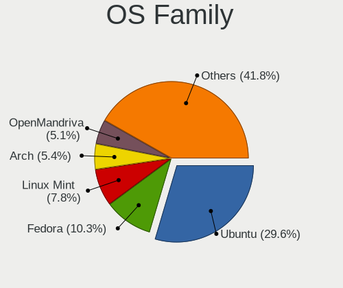
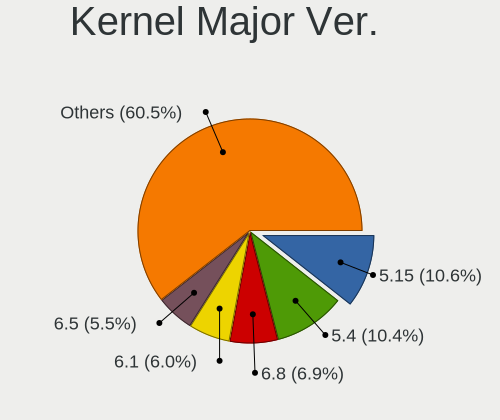
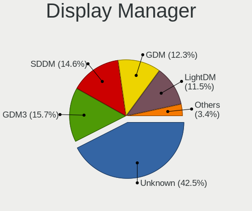
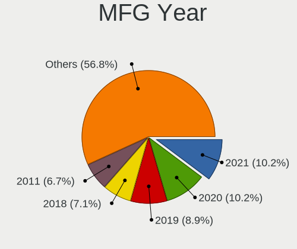
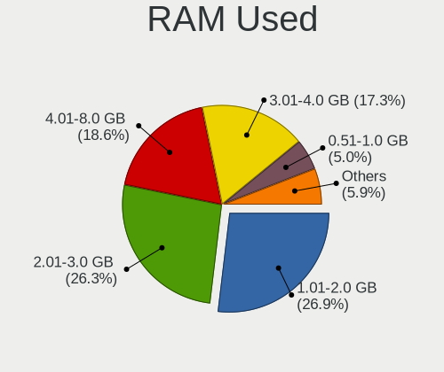
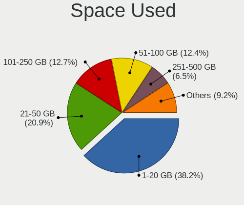
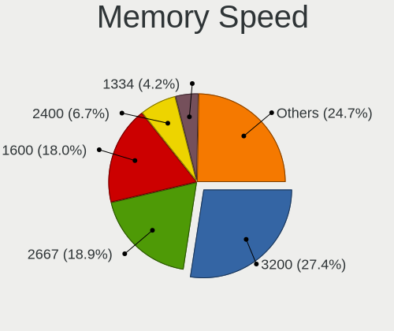
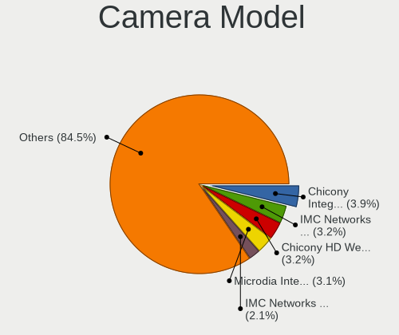
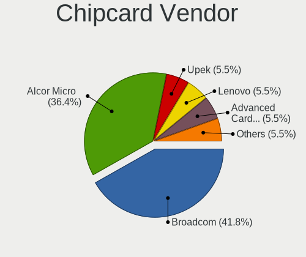
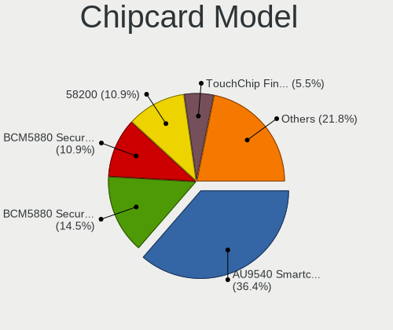

Linux in Turkey - Tested Hardware & Statistics (Notebooks)
----------------------------------------------------------

A project to collect tested hardware configurations for Linux in Turkey.

Anyone can contribute to this report by the [hw-probe](https://github.com/linuxhw/hw-probe) tool:

    sudo -E hw-probe -all -upload

Please contribute! Especially if your hardware is rare.

Contents
--------

* [ Test Cases ](#test-cases)

* [ System ](#system)
  - [ OS                       ](#os)
  - [ OS Family                ](#os-family)
  - [ Kernel                   ](#kernel)
  - [ Kernel Family            ](#kernel-family)
  - [ Kernel Major Ver.        ](#kernel-major-ver)
  - [ Arch                     ](#arch)
  - [ DE                       ](#de)
  - [ Display Server           ](#display-server)
  - [ Display Manager          ](#display-manager)
  - [ OS Lang                  ](#os-lang)
  - [ Boot Mode                ](#boot-mode)
  - [ Filesystem               ](#filesystem)
  - [ Part. scheme             ](#part-scheme)
  - [ Dual Boot with Linux/BSD ](#dual-boot-with-linuxbsd)
  - [ Dual Boot (Win)          ](#dual-boot-win)

* [ Board ](#board)
  - [ Vendor                   ](#vendor)
  - [ Model                    ](#model)
  - [ Model Family             ](#model-family)
  - [ MFG Year                 ](#mfg-year)
  - [ Form Factor              ](#form-factor)
  - [ Secure Boot              ](#secure-boot)
  - [ Coreboot                 ](#coreboot)
  - [ RAM Size                 ](#ram-size)
  - [ RAM Used                 ](#ram-used)
  - [ Total Drives             ](#total-drives)
  - [ Has CD-ROM               ](#has-cd-rom)
  - [ Has Ethernet             ](#has-ethernet)
  - [ Has WiFi                 ](#has-wifi)
  - [ Has Bluetooth            ](#has-bluetooth)

* [ Location ](#location)
  - [ Country                  ](#country)
  - [ City                     ](#city)

* [ Drives ](#drives)
  - [ Drive Vendor             ](#drive-vendor)
  - [ Drive Model              ](#drive-model)
  - [ HDD Vendor               ](#hdd-vendor)
  - [ SSD Vendor               ](#ssd-vendor)
  - [ Drive Kind               ](#drive-kind)
  - [ Drive Connector          ](#drive-connector)
  - [ Drive Size               ](#drive-size)
  - [ Space Total              ](#space-total)
  - [ Space Used               ](#space-used)
  - [ Malfunc. Drives          ](#malfunc-drives)
  - [ Malfunc. Drive Vendor    ](#malfunc-drive-vendor)
  - [ Malfunc. HDD Vendor      ](#malfunc-hdd-vendor)
  - [ Malfunc. Drive Kind      ](#malfunc-drive-kind)
  - [ Failed Drives            ](#failed-drives)
  - [ Failed Drive Vendor      ](#failed-drive-vendor)
  - [ Drive Status             ](#drive-status)

* [ Storage controller ](#storage-controller)
  - [ Storage Vendor           ](#storage-vendor)
  - [ Storage Model            ](#storage-model)
  - [ Storage Kind             ](#storage-kind)

* [ Processor ](#processor)
  - [ CPU Vendor               ](#cpu-vendor)
  - [ CPU Model                ](#cpu-model)
  - [ CPU Model Family         ](#cpu-model-family)
  - [ CPU Cores                ](#cpu-cores)
  - [ CPU Sockets              ](#cpu-sockets)
  - [ CPU Threads              ](#cpu-threads)
  - [ CPU Op-Modes             ](#cpu-op-modes)
  - [ CPU Microcode            ](#cpu-microcode)
  - [ CPU Microarch            ](#cpu-microarch)

* [ Graphics ](#graphics)
  - [ GPU Vendor               ](#gpu-vendor)
  - [ GPU Model                ](#gpu-model)
  - [ GPU Combo                ](#gpu-combo)
  - [ GPU Driver               ](#gpu-driver)
  - [ GPU Memory               ](#gpu-memory)

* [ Monitor ](#monitor)
  - [ Monitor Vendor           ](#monitor-vendor)
  - [ Monitor Model            ](#monitor-model)
  - [ Monitor Resolution       ](#monitor-resolution)
  - [ Monitor Diagonal         ](#monitor-diagonal)
  - [ Monitor Width            ](#monitor-width)
  - [ Aspect Ratio             ](#aspect-ratio)
  - [ Monitor Area             ](#monitor-area)
  - [ Pixel Density            ](#pixel-density)
  - [ Multiple Monitors        ](#multiple-monitors)

* [ Network ](#network)
  - [ Net Controller Vendor    ](#net-controller-vendor)
  - [ Net Controller Model     ](#net-controller-model)
  - [ Wireless Vendor          ](#wireless-vendor)
  - [ Wireless Model           ](#wireless-model)
  - [ Ethernet Vendor          ](#ethernet-vendor)
  - [ Ethernet Model           ](#ethernet-model)
  - [ Net Controller Kind      ](#net-controller-kind)
  - [ Used Controller          ](#used-controller)
  - [ NICs                     ](#nics)
  - [ IPv6                     ](#ipv6)

* [ Bluetooth ](#bluetooth)
  - [ Bluetooth Vendor         ](#bluetooth-vendor)
  - [ Bluetooth Model          ](#bluetooth-model)

* [ Sound ](#sound)
  - [ Sound Vendor             ](#sound-vendor)
  - [ Sound Model              ](#sound-model)

* [ Memory ](#memory)
  - [ Memory Vendor            ](#memory-vendor)
  - [ Memory Model             ](#memory-model)
  - [ Memory Kind              ](#memory-kind)
  - [ Memory Form Factor       ](#memory-form-factor)
  - [ Memory Size              ](#memory-size)
  - [ Memory Speed             ](#memory-speed)

* [ Printers & scanners ](#printers--scanners)
  - [ Printer Vendor           ](#printer-vendor)
  - [ Printer Model            ](#printer-model)
  - [ Scanner Vendor           ](#scanner-vendor)
  - [ Scanner Model            ](#scanner-model)

* [ Camera ](#camera)
  - [ Camera Vendor            ](#camera-vendor)
  - [ Camera Model             ](#camera-model)

* [ Security ](#security)
  - [ Fingerprint Vendor       ](#fingerprint-vendor)
  - [ Fingerprint Model        ](#fingerprint-model)
  - [ Chipcard Vendor          ](#chipcard-vendor)
  - [ Chipcard Model           ](#chipcard-model)

* [ Unsupported ](#unsupported)
  - [ Unsupported Devices      ](#unsupported-devices)
  - [ Unsupported Device Types ](#unsupported-device-types)

Test Cases
----------

Total: 1286

| Vendor        | Model                       | Probe                                                      | Date         |
|---------------|-----------------------------|------------------------------------------------------------|--------------|
| Lenovo        | ThinkPad E14 Gen 3 20Y70... | [110c94eb72](https://linux-hardware.org/?probe=110c94eb72) | Aug 01, 2022 |
| Lenovo        | ThinkPad T420 4180LN1       | [65d5b19d40](https://linux-hardware.org/?probe=65d5b19d40) | Aug 01, 2022 |
| Lenovo        | ThinkPad T420 4180LN1       | [35304c2321](https://linux-hardware.org/?probe=35304c2321) | Aug 01, 2022 |
| HP            | ENVY Laptop 13-ad1xx        | [c79c2bd215](https://linux-hardware.org/?probe=c79c2bd215) | Jul 31, 2022 |
| HP            | 250 G7 Notebook PC          | [6204ce9d95](https://linux-hardware.org/?probe=6204ce9d95) | Jul 31, 2022 |
| HP            | Pavilion g6                 | [5867423d27](https://linux-hardware.org/?probe=5867423d27) | Jul 31, 2022 |
| Samsung       | 355V4C/356V4C/3445VC/354... | [85208906cd](https://linux-hardware.org/?probe=85208906cd) | Jul 30, 2022 |
| Casper        | NIRVANA NOTEBOOK            | [c291b32941](https://linux-hardware.org/?probe=c291b32941) | Jul 29, 2022 |
| Samsung       | 355V4C/356V4C/3445VC/354... | [cd5aa49da7](https://linux-hardware.org/?probe=cd5aa49da7) | Jul 29, 2022 |
| Samsung       | 355V4C/356V4C/3445VC/354... | [066e5eb95d](https://linux-hardware.org/?probe=066e5eb95d) | Jul 28, 2022 |
| Samsung       | 355V4C/356V4C/3445VC/354... | [1bc8715e4e](https://linux-hardware.org/?probe=1bc8715e4e) | Jul 27, 2022 |
| Lenovo        | ThinkPad T430 2349DN4       | [0c145b1409](https://linux-hardware.org/?probe=0c145b1409) | Jul 25, 2022 |
| HP            | Pavilion Gaming Laptop 1... | [ce2ecc0fd8](https://linux-hardware.org/?probe=ce2ecc0fd8) | Jul 24, 2022 |
| Dell          | Inspiron 14 5401            | [eaf315be72](https://linux-hardware.org/?probe=eaf315be72) | Jul 24, 2022 |
| Dell          | Latitude E5420              | [b298e3bffa](https://linux-hardware.org/?probe=b298e3bffa) | Jul 24, 2022 |
| Monster       | ABRA A5 V16.6               | [d26a2b3f0a](https://linux-hardware.org/?probe=d26a2b3f0a) | Jul 24, 2022 |
| HUAWEI        | BOD-WXX9                    | [8bf5cae166](https://linux-hardware.org/?probe=8bf5cae166) | Jul 23, 2022 |
| Lenovo        | IdeaPad 330-15ARR 81D2      | [f9e9de55c0](https://linux-hardware.org/?probe=f9e9de55c0) | Jul 22, 2022 |
| Lenovo        | ThinkPad T430 2349DN4       | [fa8f2adca9](https://linux-hardware.org/?probe=fa8f2adca9) | Jul 22, 2022 |
| ARCELIK       | 1S7-GNB1586B1I5             | [e9a81688b3](https://linux-hardware.org/?probe=e9a81688b3) | Jul 20, 2022 |
| ASUSTek       | X555LN                      | [f74458bf19](https://linux-hardware.org/?probe=f74458bf19) | Jul 19, 2022 |
| ASUSTek       | X555LN                      | [720cc9c1ce](https://linux-hardware.org/?probe=720cc9c1ce) | Jul 19, 2022 |
| Lenovo        | ThinkPad T470s W10DG 20J... | [5528f26010](https://linux-hardware.org/?probe=5528f26010) | Jul 19, 2022 |
| ASUSTek       | X556UQK                     | [2ddc53797a](https://linux-hardware.org/?probe=2ddc53797a) | Jul 19, 2022 |
| Pegatron      | D15K                        | [7f8fa03161](https://linux-hardware.org/?probe=7f8fa03161) | Jul 17, 2022 |
| Samsung       | 3570R/370R/470R/450R/510... | [ebcca43b7f](https://linux-hardware.org/?probe=ebcca43b7f) | Jul 17, 2022 |
| Samsung       | 3570R/370R/470R/450R/510... | [e94cde9ec6](https://linux-hardware.org/?probe=e94cde9ec6) | Jul 17, 2022 |
| ASUSTek       | X553SA                      | [f28ef11fe2](https://linux-hardware.org/?probe=f28ef11fe2) | Jul 15, 2022 |
| HP            | Laptop 15-ra0xx             | [2ba7d6af57](https://linux-hardware.org/?probe=2ba7d6af57) | Jul 15, 2022 |
| Dell          | Vostro 15 3510              | [b44d77c9a0](https://linux-hardware.org/?probe=b44d77c9a0) | Jul 12, 2022 |
| ASUSTek       | VivoBook_ASUSLaptop X409... | [d25b4ecc69](https://linux-hardware.org/?probe=d25b4ecc69) | Jul 11, 2022 |
| Sony          | SVE1513R1EB                 | [9d74a4a9cb](https://linux-hardware.org/?probe=9d74a4a9cb) | Jul 10, 2022 |
| HUAWEI        | BOD-WXX9                    | [f4d2c6bb1e](https://linux-hardware.org/?probe=f4d2c6bb1e) | Jul 08, 2022 |
| Acer          | Aspire 5560                 | [e9615585f6](https://linux-hardware.org/?probe=e9615585f6) | Jul 07, 2022 |
| Pegatron      | H36FF                       | [87eac99d1b](https://linux-hardware.org/?probe=87eac99d1b) | Jul 06, 2022 |
| Apple         | MacBookAir7,2               | [f852861149](https://linux-hardware.org/?probe=f852861149) | Jul 06, 2022 |
| Apple         | MacBookAir7,2               | [6b942bfd10](https://linux-hardware.org/?probe=6b942bfd10) | Jul 05, 2022 |
| ASUSTek       | G550JK                      | [ab366fcbe6](https://linux-hardware.org/?probe=ab366fcbe6) | Jul 05, 2022 |
| Lenovo        | IdeaPad 100-15IBD 80QQ      | [bcbbd7f228](https://linux-hardware.org/?probe=bcbbd7f228) | Jul 05, 2022 |
| Lenovo        | IdeaPad 100-15IBD 80QQ      | [7bb2a0b59a](https://linux-hardware.org/?probe=7bb2a0b59a) | Jul 04, 2022 |
| HP            | ENVY Laptop 13-ad1xx        | [2ed808bbcc](https://linux-hardware.org/?probe=2ed808bbcc) | Jul 04, 2022 |
| ASUSTek       | X553SA                      | [e3cd0aa8d4](https://linux-hardware.org/?probe=e3cd0aa8d4) | Jul 02, 2022 |
| Sony          | SVE1513R1EB                 | [d352a1c731](https://linux-hardware.org/?probe=d352a1c731) | Jul 02, 2022 |
| HUAWEI        | BOD-WXX9                    | [9c3e14320e](https://linux-hardware.org/?probe=9c3e14320e) | Jun 29, 2022 |
| HP            | 340S G7                     | [6695a6a5ed](https://linux-hardware.org/?probe=6695a6a5ed) | Jun 28, 2022 |
| HUAWEI        | BOD-WXX9                    | [d306afd176](https://linux-hardware.org/?probe=d306afd176) | Jun 24, 2022 |
| HUAWEI        | BOD-WXX9                    | [f3742fcee5](https://linux-hardware.org/?probe=f3742fcee5) | Jun 24, 2022 |
| Lenovo        | ThinkPad E15 Gen 2 20TDS... | [10de805cb0](https://linux-hardware.org/?probe=10de805cb0) | Jun 24, 2022 |
| Packard Be... | EasyNote TE69HW             | [d292d79bbe](https://linux-hardware.org/?probe=d292d79bbe) | Jun 24, 2022 |
| Apple         | MacBook5,1                  | [1860dff362](https://linux-hardware.org/?probe=1860dff362) | Jun 23, 2022 |
| HP            | Pavilion Gaming Laptop 1... | [8a530af324](https://linux-hardware.org/?probe=8a530af324) | Jun 21, 2022 |
| Lenovo        | IdeaPad 500-15ISK 80NT      | [d4896fb036](https://linux-hardware.org/?probe=d4896fb036) | Jun 21, 2022 |
| Apple         | MacBook5,1                  | [28147965c3](https://linux-hardware.org/?probe=28147965c3) | Jun 21, 2022 |
| Acer          | Aspire ES1-571              | [cfbc040f69](https://linux-hardware.org/?probe=cfbc040f69) | Jun 21, 2022 |
| Casper        | C600 NOTEBOOK DISCRETE      | [07821abe14](https://linux-hardware.org/?probe=07821abe14) | Jun 20, 2022 |
| Alienware     | m17 R3                      | [ea3305a8af](https://linux-hardware.org/?probe=ea3305a8af) | Jun 20, 2022 |
| HP            | ENVY Laptop 13-ad1xx        | [df2017f7d5](https://linux-hardware.org/?probe=df2017f7d5) | Jun 19, 2022 |
| HP            | Pavilion 13 x360 PC         | [3bc36209d6](https://linux-hardware.org/?probe=3bc36209d6) | Jun 19, 2022 |
| HP            | OMEN Laptop 15-en1xxx       | [f2b6d46056](https://linux-hardware.org/?probe=f2b6d46056) | Jun 18, 2022 |
| Dell          | Inspiron N5010              | [82ab434998](https://linux-hardware.org/?probe=82ab434998) | Jun 18, 2022 |
| HUAWEI        | BOM-WXX9                    | [afc1d78a8f](https://linux-hardware.org/?probe=afc1d78a8f) | Jun 17, 2022 |
| Lenovo        | ThinkPad E15 Gen 2 20TDS... | [f7abc9fae0](https://linux-hardware.org/?probe=f7abc9fae0) | Jun 14, 2022 |
| Nokia         | Booklet 3G                  | [2f0e1a5bcd](https://linux-hardware.org/?probe=2f0e1a5bcd) | Jun 14, 2022 |
| Dell          | Precision 7550              | [bffea13d72](https://linux-hardware.org/?probe=bffea13d72) | Jun 14, 2022 |
| Monster       | HUMA H5 V2.2                | [062a54a327](https://linux-hardware.org/?probe=062a54a327) | Jun 13, 2022 |
| HUAWEI        | BOM-WXX9                    | [f58bb7a98a](https://linux-hardware.org/?probe=f58bb7a98a) | Jun 11, 2022 |
| HUAWEI        | KLVL-WXX9                   | [4ce4c3ad20](https://linux-hardware.org/?probe=4ce4c3ad20) | Jun 08, 2022 |
| Dell          | Inspiron 3542               | [8fcf9a9913](https://linux-hardware.org/?probe=8fcf9a9913) | Jun 07, 2022 |
| ASUSTek       | X553MA                      | [2a3ac45d9c](https://linux-hardware.org/?probe=2a3ac45d9c) | Jun 05, 2022 |
| Monster       | TULPAR T7                   | [d7001b6ceb](https://linux-hardware.org/?probe=d7001b6ceb) | Jun 05, 2022 |
| Acer          | Swift SF314-41G             | [aad6ae85d1](https://linux-hardware.org/?probe=aad6ae85d1) | Jun 04, 2022 |
| ASUSTek       | N61Vg                       | [5593b63d10](https://linux-hardware.org/?probe=5593b63d10) | Jun 04, 2022 |
| Acer          | AO722                       | [73850c23ac](https://linux-hardware.org/?probe=73850c23ac) | Jun 02, 2022 |
| Monster       | ABRA A5 V15.8               | [a284d50bb9](https://linux-hardware.org/?probe=a284d50bb9) | Jun 01, 2022 |
| Lenovo        | ThinkPad E595 20NF001PTX    | [cf41cc78f7](https://linux-hardware.org/?probe=cf41cc78f7) | May 30, 2022 |
| Lenovo        | ThinkPad E14 Gen 3 20Y70... | [96bc0699c3](https://linux-hardware.org/?probe=96bc0699c3) | May 28, 2022 |
| HP            | 250 G3                      | [bddc428262](https://linux-hardware.org/?probe=bddc428262) | May 28, 2022 |
| HP            | 250 G3                      | [911bf39209](https://linux-hardware.org/?probe=911bf39209) | May 28, 2022 |
| Hometech      | Alfa 430C                   | [4f0e4e240d](https://linux-hardware.org/?probe=4f0e4e240d) | May 26, 2022 |
| Lenovo        | IdeaPad 3 15ITL6 82H8       | [2b5ef1dbe5](https://linux-hardware.org/?probe=2b5ef1dbe5) | May 25, 2022 |
| Monster       | TULPAR T5 V14.1             | [647e502881](https://linux-hardware.org/?probe=647e502881) | May 25, 2022 |
| Monster       | TULPAR T5 V14.1             | [0db0bd7aa8](https://linux-hardware.org/?probe=0db0bd7aa8) | May 25, 2022 |
| Toshiba       | Satellite L40               | [37af5b0ba4](https://linux-hardware.org/?probe=37af5b0ba4) | May 24, 2022 |
| ASUSTek       | VivoBook 15_ASUS Laptop ... | [21c0d575b0](https://linux-hardware.org/?probe=21c0d575b0) | May 23, 2022 |
| Toshiba       | Satellite A100              | [a789d51565](https://linux-hardware.org/?probe=a789d51565) | May 23, 2022 |
| Dell          | Inspiron 15-3552            | [a97b4f8a75](https://linux-hardware.org/?probe=a97b4f8a75) | May 22, 2022 |
| Sony          | SVS1512U1RW                 | [491818d2e0](https://linux-hardware.org/?probe=491818d2e0) | May 18, 2022 |
| HP            | EliteBook 2570p             | [70ba6585e8](https://linux-hardware.org/?probe=70ba6585e8) | May 16, 2022 |
| Clevo         | M540SS                      | [9860619027](https://linux-hardware.org/?probe=9860619027) | May 15, 2022 |
| Clevo         | M540SS                      | [e2fa8573fb](https://linux-hardware.org/?probe=e2fa8573fb) | May 15, 2022 |
| Lenovo        | Legion 5 Pro 16ACH6H 82J... | [cf73bc12e8](https://linux-hardware.org/?probe=cf73bc12e8) | May 13, 2022 |
| ASUSTek       | ROG Strix G513QE_G513QE     | [0a28329f7a](https://linux-hardware.org/?probe=0a28329f7a) | May 12, 2022 |
| MSI           | Alpha 15 B5EEK              | [ea8ce36bef](https://linux-hardware.org/?probe=ea8ce36bef) | May 12, 2022 |
| HP            | Pavilion dv6                | [9e5da14b9f](https://linux-hardware.org/?probe=9e5da14b9f) | May 11, 2022 |
| Sony          | SVE14A2V2ES                 | [59435d662a](https://linux-hardware.org/?probe=59435d662a) | May 11, 2022 |
| Sony          | SVE1513R1EB                 | [c378efbd3d](https://linux-hardware.org/?probe=c378efbd3d) | May 11, 2022 |
| Lenovo        | IdeaPad Flex-14API 81SS     | [0e3079b5a1](https://linux-hardware.org/?probe=0e3079b5a1) | May 11, 2022 |
| ASUSTek       | ASUS TUF Gaming A15 FA50... | [65e46938b9](https://linux-hardware.org/?probe=65e46938b9) | May 10, 2022 |
| Acer          | AO722                       | [645156f92d](https://linux-hardware.org/?probe=645156f92d) | May 10, 2022 |
| Monster       | HUMA H4 V3.1                | [38372af132](https://linux-hardware.org/?probe=38372af132) | May 10, 2022 |
| HP            | Pavilion g6                 | [267b134fdd](https://linux-hardware.org/?probe=267b134fdd) | May 09, 2022 |
| HP            | Pavilion 13 x360 PC         | [78b977ea42](https://linux-hardware.org/?probe=78b977ea42) | May 07, 2022 |
| Lenovo        | IdeaPad 100-15IBD 80QQ      | [8c1fedaa4b](https://linux-hardware.org/?probe=8c1fedaa4b) | May 06, 2022 |
| Vestel        | V Note 1341                 | [d5a260dc00](https://linux-hardware.org/?probe=d5a260dc00) | May 05, 2022 |
| MSI           | Prestige 15 A12UC           | [2b86e2ca60](https://linux-hardware.org/?probe=2b86e2ca60) | May 04, 2022 |
| Lenovo        | IdeaPad 500-15ISK 80NT      | [d5b6bc1a67](https://linux-hardware.org/?probe=d5b6bc1a67) | May 01, 2022 |
| ASUSTek       | X550VC                      | [16223d208e](https://linux-hardware.org/?probe=16223d208e) | Apr 30, 2022 |
| Dell          | Latitude 7390               | [bbf3908118](https://linux-hardware.org/?probe=bbf3908118) | Apr 30, 2022 |
| Sony          | SVE1513R1EB                 | [d1e0096b2d](https://linux-hardware.org/?probe=d1e0096b2d) | Apr 29, 2022 |
| HP            | ProBook 4510s               | [d020eac67a](https://linux-hardware.org/?probe=d020eac67a) | Apr 27, 2022 |
| Apple         | MacBookAir7,2               | [17a853c8ff](https://linux-hardware.org/?probe=17a853c8ff) | Apr 27, 2022 |
| Lenovo        | ThinkPad E15 20RDS03500     | [6aa4c36808](https://linux-hardware.org/?probe=6aa4c36808) | Apr 26, 2022 |
| Sony          | SVE1513R1EB                 | [5275d17d40](https://linux-hardware.org/?probe=5275d17d40) | Apr 24, 2022 |
| Acer          | Aspire A515-56G             | [492dd679be](https://linux-hardware.org/?probe=492dd679be) | Apr 24, 2022 |
| Acer          | Aspire A515-56G             | [5fc4dbeaad](https://linux-hardware.org/?probe=5fc4dbeaad) | Apr 24, 2022 |
| HP            | Pavilion Gaming Laptop 1... | [ce3b387afa](https://linux-hardware.org/?probe=ce3b387afa) | Apr 21, 2022 |
| Dell          | Inspiron 15-3567            | [8cbc7d1caf](https://linux-hardware.org/?probe=8cbc7d1caf) | Apr 20, 2022 |
| HP            | Laptop 15-da1xxx            | [85f9b41fe4](https://linux-hardware.org/?probe=85f9b41fe4) | Apr 19, 2022 |
| Lenovo        | IdeaPad Z510 20287          | [dc9ac2e9b6](https://linux-hardware.org/?probe=dc9ac2e9b6) | Apr 15, 2022 |
| Lenovo        | IdeaPad L340-15IRH Gamin... | [b40d10cb81](https://linux-hardware.org/?probe=b40d10cb81) | Apr 14, 2022 |
| ASUSTek       | UX310UQK                    | [5064c36f02](https://linux-hardware.org/?probe=5064c36f02) | Apr 14, 2022 |
| Monster       | ABRA A5 V15.8               | [28f1e82585](https://linux-hardware.org/?probe=28f1e82585) | Apr 13, 2022 |
| Toshiba       | Satellite L50-C             | [2366b7b28d](https://linux-hardware.org/?probe=2366b7b28d) | Apr 12, 2022 |
| Acer          | Aspire 5742G                | [b3cef97540](https://linux-hardware.org/?probe=b3cef97540) | Apr 12, 2022 |
| Acer          | Aspire E5-571               | [b6c1c28521](https://linux-hardware.org/?probe=b6c1c28521) | Apr 11, 2022 |
| Sony          | SVF1521GSTB                 | [5537b2189d](https://linux-hardware.org/?probe=5537b2189d) | Apr 10, 2022 |
| ASUSTek       | ASUS TUF Gaming A15 FA50... | [2fa2ca8320](https://linux-hardware.org/?probe=2fa2ca8320) | Apr 10, 2022 |
| ASUSTek       | VivoBook 15_ASUS Laptop ... | [b86cec3f38](https://linux-hardware.org/?probe=b86cec3f38) | Apr 10, 2022 |
| Monster       | ABRA A5 V12.1               | [4b45daf3b2](https://linux-hardware.org/?probe=4b45daf3b2) | Apr 10, 2022 |
| Lenovo        | IdeaPad-510-15IKB 80SV      | [840239190e](https://linux-hardware.org/?probe=840239190e) | Apr 09, 2022 |
| Dell          | Latitude E5440              | [18290ab7b0](https://linux-hardware.org/?probe=18290ab7b0) | Apr 08, 2022 |
| Acer          | Aspire A515-44              | [9dfd75a7dd](https://linux-hardware.org/?probe=9dfd75a7dd) | Apr 07, 2022 |
| ASUSTek       | GL752VW                     | [0dbc471fee](https://linux-hardware.org/?probe=0dbc471fee) | Apr 07, 2022 |
| ASUSTek       | K52Jc                       | [645adad8a7](https://linux-hardware.org/?probe=645adad8a7) | Apr 06, 2022 |
| Dell          | G3 3579                     | [9994b24cef](https://linux-hardware.org/?probe=9994b24cef) | Apr 06, 2022 |
| ASUSTek       | N61Vg                       | [96372fecb5](https://linux-hardware.org/?probe=96372fecb5) | Apr 05, 2022 |
| HP            | Victus by Laptop 16         | [62650f5d20](https://linux-hardware.org/?probe=62650f5d20) | Apr 04, 2022 |
| MSI           | GS75 Stealth 9SF            | [048bb1c397](https://linux-hardware.org/?probe=048bb1c397) | Apr 03, 2022 |
| MSI           | Modern 15 A5M               | [ea091854ed](https://linux-hardware.org/?probe=ea091854ed) | Apr 01, 2022 |
| MSI           | Modern 15 A5M               | [ae491737c7](https://linux-hardware.org/?probe=ae491737c7) | Apr 01, 2022 |
| Casper        | EXCALIBUR G770              | [dc11ff8996](https://linux-hardware.org/?probe=dc11ff8996) | Apr 01, 2022 |
| Casper        | EXCALIBUR G770              | [4a0436ece5](https://linux-hardware.org/?probe=4a0436ece5) | Apr 01, 2022 |
| Lenovo        | ThinkPad L13 Gen 2 20VJS... | [4c0c1422e7](https://linux-hardware.org/?probe=4c0c1422e7) | Mar 31, 2022 |
| ASUSTek       | N550JV                      | [6096184486](https://linux-hardware.org/?probe=6096184486) | Mar 31, 2022 |
| Apple         | MacBookAir7,2               | [d42d4a24cd](https://linux-hardware.org/?probe=d42d4a24cd) | Mar 30, 2022 |
| LG Electro... | P1-JSUVT                    | [b0e2f9e53c](https://linux-hardware.org/?probe=b0e2f9e53c) | Mar 27, 2022 |
| Samsung       | 3570R/370R/470R/450R/510... | [799c1dfce8](https://linux-hardware.org/?probe=799c1dfce8) | Mar 26, 2022 |
| ASUSTek       | N550JK                      | [a3ecefa43f](https://linux-hardware.org/?probe=a3ecefa43f) | Mar 26, 2022 |
| ASUSTek       | X542UR                      | [4d4477bd16](https://linux-hardware.org/?probe=4d4477bd16) | Mar 26, 2022 |
| Lenovo        | ThinkPad X250 20CLS09Y19    | [2602549f95](https://linux-hardware.org/?probe=2602549f95) | Mar 25, 2022 |
| ASUSTek       | ROG Strix G531GT_G531GT     | [a56ed819d1](https://linux-hardware.org/?probe=a56ed819d1) | Mar 25, 2022 |
| Unknown       | Unknown                     | [46344218a6](https://linux-hardware.org/?probe=46344218a6) | Mar 22, 2022 |
| HP            | Pavilion Laptop 15-cd0xx    | [8883dc7315](https://linux-hardware.org/?probe=8883dc7315) | Mar 22, 2022 |
| Casper        | EXCALIBUR G900              | [d4902562f0](https://linux-hardware.org/?probe=d4902562f0) | Mar 21, 2022 |
| ASUSTek       | GL752VW                     | [39746d7497](https://linux-hardware.org/?probe=39746d7497) | Mar 20, 2022 |
| Apple         | MacBookPro10,1              | [6da9c9f35d](https://linux-hardware.org/?probe=6da9c9f35d) | Mar 19, 2022 |
| HP            | Pavilion g6                 | [0fe350f296](https://linux-hardware.org/?probe=0fe350f296) | Mar 19, 2022 |
| ASUSTek       | GL752VW                     | [6d64c8e4de](https://linux-hardware.org/?probe=6d64c8e4de) | Mar 19, 2022 |
| AMI           | Cherry Trail CR             | [ad3e8cb6c8](https://linux-hardware.org/?probe=ad3e8cb6c8) | Mar 19, 2022 |
| AMI           | Cherry Trail CR             | [9ad3eef70b](https://linux-hardware.org/?probe=9ad3eef70b) | Mar 19, 2022 |
| HP            | Pavilion g6                 | [d943b94c21](https://linux-hardware.org/?probe=d943b94c21) | Mar 18, 2022 |
| ASUSTek       | VivoBook 15_ASUS Laptop ... | [591f5cdcc0](https://linux-hardware.org/?probe=591f5cdcc0) | Mar 18, 2022 |
| HP            | Pavilion g6                 | [67e332bb9f](https://linux-hardware.org/?probe=67e332bb9f) | Mar 18, 2022 |
| Dell          | XPS 13 9360                 | [962a1f764e](https://linux-hardware.org/?probe=962a1f764e) | Mar 18, 2022 |
| Lenovo        | Legion 5-15IMH05H 81Y6      | [0cd9c29dd0](https://linux-hardware.org/?probe=0cd9c29dd0) | Mar 18, 2022 |
| HP            | Victus by Laptop 16         | [cbf47a2c89](https://linux-hardware.org/?probe=cbf47a2c89) | Mar 18, 2022 |
| Lenovo        | Legion 5-15IMH05H 81Y6      | [b8fa124867](https://linux-hardware.org/?probe=b8fa124867) | Mar 17, 2022 |
| Dell          | Inspiron 5593               | [421906c2ff](https://linux-hardware.org/?probe=421906c2ff) | Mar 17, 2022 |
| Dell          | Inspiron 5593               | [f4d49b97ec](https://linux-hardware.org/?probe=f4d49b97ec) | Mar 15, 2022 |
| Lenovo        | ThinkPad E15 Gen 2 20T8S... | [1ac160aea7](https://linux-hardware.org/?probe=1ac160aea7) | Mar 15, 2022 |
| Insyde        | i101c                       | [1d1171c005](https://linux-hardware.org/?probe=1d1171c005) | Mar 15, 2022 |
| ASUSTek       | GL502VSK                    | [f9f75e4f3d](https://linux-hardware.org/?probe=f9f75e4f3d) | Mar 13, 2022 |
| Sony          | SVE14A2V2ES                 | [b2695cc80d](https://linux-hardware.org/?probe=b2695cc80d) | Mar 13, 2022 |
| Sony          | SVE14A2V2ES                 | [4b2203862a](https://linux-hardware.org/?probe=4b2203862a) | Mar 11, 2022 |
| Sony          | SVE14A2V2ES                 | [1575f2f0be](https://linux-hardware.org/?probe=1575f2f0be) | Mar 11, 2022 |
| Acer          | Swift SF314-42              | [160a8dd021](https://linux-hardware.org/?probe=160a8dd021) | Mar 10, 2022 |
| Acer          | AO722                       | [fc0bccc42d](https://linux-hardware.org/?probe=fc0bccc42d) | Mar 09, 2022 |
| Sony          | SVE14A2V2ES                 | [ef603529f2](https://linux-hardware.org/?probe=ef603529f2) | Mar 08, 2022 |
| Unknown       | Unknown                     | [3e6993a459](https://linux-hardware.org/?probe=3e6993a459) | Mar 08, 2022 |
| Sony          | SVE14A2V2ES                 | [35fe0c18bc](https://linux-hardware.org/?probe=35fe0c18bc) | Mar 07, 2022 |
| ASUSTek       | UX31E                       | [2b8b852d07](https://linux-hardware.org/?probe=2b8b852d07) | Mar 07, 2022 |
| Lenovo        | ThinkPad E15 Gen 2 20TD0... | [e60367127e](https://linux-hardware.org/?probe=e60367127e) | Mar 07, 2022 |
| HP            | Notebook                    | [a15666c682](https://linux-hardware.org/?probe=a15666c682) | Mar 07, 2022 |
| HP            | Notebook                    | [85eb96edd4](https://linux-hardware.org/?probe=85eb96edd4) | Mar 07, 2022 |
| Samsung       | 300E4A/300E5A/300E7A        | [0456c09970](https://linux-hardware.org/?probe=0456c09970) | Mar 06, 2022 |
| Samsung       | 300E4A/300E5A/300E7A        | [d3b3f1e5d2](https://linux-hardware.org/?probe=d3b3f1e5d2) | Mar 05, 2022 |
| Toshiba       | Satellite L50-C             | [0e6289a2ad](https://linux-hardware.org/?probe=0e6289a2ad) | Mar 04, 2022 |
| Samsung       | 300E4A/300E5A/300E7A/343... | [d09a669d80](https://linux-hardware.org/?probe=d09a669d80) | Mar 03, 2022 |
| Clevo         | E512xQ/E4129                | [7aff97f14f](https://linux-hardware.org/?probe=7aff97f14f) | Mar 02, 2022 |
| ASUSTek       | VivoBook_ASUSLaptop X513... | [65a9b832d2](https://linux-hardware.org/?probe=65a9b832d2) | Mar 01, 2022 |
| ASUSTek       | VivoBook_ASUSLaptop X513... | [738744d850](https://linux-hardware.org/?probe=738744d850) | Mar 01, 2022 |
| Clevo         | M540SS                      | [50fafbe5e8](https://linux-hardware.org/?probe=50fafbe5e8) | Mar 01, 2022 |
| ASUSTek       | UX303UB                     | [f62c829839](https://linux-hardware.org/?probe=f62c829839) | Mar 01, 2022 |
| ASUSTek       | ASUS TUF Gaming A15 FA50... | [60d1c44981](https://linux-hardware.org/?probe=60d1c44981) | Feb 28, 2022 |
| ASUSTek       | X556UQK                     | [9c482a1888](https://linux-hardware.org/?probe=9c482a1888) | Feb 28, 2022 |
| ASUSTek       | UX490UAR                    | [6b6c4bd7b7](https://linux-hardware.org/?probe=6b6c4bd7b7) | Feb 28, 2022 |
| Dell          | Latitude E5440              | [9e496b4990](https://linux-hardware.org/?probe=9e496b4990) | Feb 27, 2022 |
| ASUSTek       | UX490UAR                    | [544979fc4f](https://linux-hardware.org/?probe=544979fc4f) | Feb 27, 2022 |
| ASUSTek       | X510UNR                     | [a24f9785ac](https://linux-hardware.org/?probe=a24f9785ac) | Feb 25, 2022 |
| Monster       | ABRA A5 V16.6               | [61707e5a4b](https://linux-hardware.org/?probe=61707e5a4b) | Feb 25, 2022 |
| ASUSTek       | VivoBook_ASUSLaptop X540... | [baa1d24da5](https://linux-hardware.org/?probe=baa1d24da5) | Feb 24, 2022 |
| Casper        | C600 NOTEBOOK DISCRETE      | [6423622186](https://linux-hardware.org/?probe=6423622186) | Feb 23, 2022 |
| Casper        | C600 NOTEBOOK DISCRETE      | [9a32d51389](https://linux-hardware.org/?probe=9a32d51389) | Feb 22, 2022 |
| Dell          | Inspiron 15-3567            | [c8723d2dd9](https://linux-hardware.org/?probe=c8723d2dd9) | Feb 21, 2022 |
| Dell          | Inspiron 15-3567            | [45529bb469](https://linux-hardware.org/?probe=45529bb469) | Feb 21, 2022 |
| HP            | Pavilion g6                 | [d894476c06](https://linux-hardware.org/?probe=d894476c06) | Feb 21, 2022 |
| Lenovo        | ThinkPad T470 W10DG 20JN... | [655c17b9ff](https://linux-hardware.org/?probe=655c17b9ff) | Feb 20, 2022 |
| Casper        | NIRVANA NOTEBOOK            | [3a8cec53c9](https://linux-hardware.org/?probe=3a8cec53c9) | Feb 20, 2022 |
| Lenovo        | IdeaPad 100-15IBD 80QQ      | [cd97a5dfb4](https://linux-hardware.org/?probe=cd97a5dfb4) | Feb 20, 2022 |
| ASUSTek       | X542URR                     | [ee334867a0](https://linux-hardware.org/?probe=ee334867a0) | Feb 19, 2022 |
| HP            | Pavilion g6                 | [298655060c](https://linux-hardware.org/?probe=298655060c) | Feb 18, 2022 |
| Lenovo        | ThinkPad L13 Gen 2 20VJS... | [f988c3bfdc](https://linux-hardware.org/?probe=f988c3bfdc) | Feb 18, 2022 |
| Lenovo        | ThinkPad E14 Gen 3 20Y70... | [c4b7901caa](https://linux-hardware.org/?probe=c4b7901caa) | Feb 18, 2022 |
| Dell          | Precision 5530              | [5650039a15](https://linux-hardware.org/?probe=5650039a15) | Feb 18, 2022 |
| ASUSTek       | X55A                        | [1ed422d0e2](https://linux-hardware.org/?probe=1ed422d0e2) | Feb 16, 2022 |
| Lenovo        | Legion 5 15IMH05H 81Y6      | [1fa5e259f5](https://linux-hardware.org/?probe=1fa5e259f5) | Feb 16, 2022 |
| Lenovo        | Legion 5 15IMH05H 81Y6      | [92ccebcc90](https://linux-hardware.org/?probe=92ccebcc90) | Feb 16, 2022 |
| Apple         | MacBookPro16,3              | [ee62794632](https://linux-hardware.org/?probe=ee62794632) | Feb 16, 2022 |
| Apple         | MacBookPro16,3              | [a651af2ee1](https://linux-hardware.org/?probe=a651af2ee1) | Feb 15, 2022 |
| Sony          | SVF1521QSTB                 | [f74068fef9](https://linux-hardware.org/?probe=f74068fef9) | Feb 14, 2022 |
| Lenovo        | ThinkBook 14-IIL 20SL       | [2289e255e7](https://linux-hardware.org/?probe=2289e255e7) | Feb 13, 2022 |
| ASUSTek       | ZenBook UX334FLC_UX334FL    | [d74ad9fc94](https://linux-hardware.org/?probe=d74ad9fc94) | Feb 13, 2022 |
| MSI           | PL62 7RC                    | [1cba3daad7](https://linux-hardware.org/?probe=1cba3daad7) | Feb 13, 2022 |
| HP            | Pavilion 15                 | [fe001e576b](https://linux-hardware.org/?probe=fe001e576b) | Feb 13, 2022 |
| Dell          | Inspiron N5110              | [a87e7380d9](https://linux-hardware.org/?probe=a87e7380d9) | Feb 12, 2022 |
| HP            | Pavilion Aero Laptop 13-... | [c79fe1743d](https://linux-hardware.org/?probe=c79fe1743d) | Feb 10, 2022 |
| HP            | ProBook 4510s               | [1ec304f4f6](https://linux-hardware.org/?probe=1ec304f4f6) | Feb 10, 2022 |
| Sony          | SVE1711V1EB                 | [28da9a136f](https://linux-hardware.org/?probe=28da9a136f) | Feb 10, 2022 |
| Lenovo        | IdeaPad 1 11IGL05 81VT      | [30b9a925de](https://linux-hardware.org/?probe=30b9a925de) | Feb 10, 2022 |
| Sony          | SVE1711V1EB                 | [ce823abe6e](https://linux-hardware.org/?probe=ce823abe6e) | Feb 10, 2022 |
| Lenovo        | Legion 5 15ARH05H 82B1      | [feb1c1d6a2](https://linux-hardware.org/?probe=feb1c1d6a2) | Feb 10, 2022 |
| Acer          | VAG70_HC                    | [89df31dc20](https://linux-hardware.org/?probe=89df31dc20) | Feb 09, 2022 |
| Dell          | Inspiron 3542               | [f3f3b08d89](https://linux-hardware.org/?probe=f3f3b08d89) | Feb 09, 2022 |
| HP            | Pavilion 15                 | [5de6e1ed8f](https://linux-hardware.org/?probe=5de6e1ed8f) | Feb 08, 2022 |
| Acer          | Aspire A315-41G             | [84a6cc3fad](https://linux-hardware.org/?probe=84a6cc3fad) | Feb 08, 2022 |
| Acer          | Nitro AN515-51              | [1308425490](https://linux-hardware.org/?probe=1308425490) | Feb 08, 2022 |
| Lenovo        | Yoga 500-14IBD 80N4         | [277f7ae4fd](https://linux-hardware.org/?probe=277f7ae4fd) | Feb 08, 2022 |
| Lenovo        | ThinkPad E595 20NF001PTX    | [b4cfe297d4](https://linux-hardware.org/?probe=b4cfe297d4) | Feb 08, 2022 |
| Lenovo        | ThinkPad X230 23257R2       | [4fa07e0a61](https://linux-hardware.org/?probe=4fa07e0a61) | Feb 08, 2022 |
| Acer          | Aspire A315-41G             | [370a0709e9](https://linux-hardware.org/?probe=370a0709e9) | Feb 07, 2022 |
| HUAWEI        | KLVL-WXX9                   | [837b0e80ef](https://linux-hardware.org/?probe=837b0e80ef) | Feb 07, 2022 |
| Lenovo        | ThinkPad E14 Gen 3 20Y70... | [aec471416a](https://linux-hardware.org/?probe=aec471416a) | Feb 07, 2022 |
| Fujitsu       | LIFEBOOK A544               | [0892485b4b](https://linux-hardware.org/?probe=0892485b4b) | Feb 07, 2022 |
| HP            | Notebook                    | [69071da574](https://linux-hardware.org/?probe=69071da574) | Feb 06, 2022 |
| HP            | Compaq 6730s                | [8d1fa47bb0](https://linux-hardware.org/?probe=8d1fa47bb0) | Feb 06, 2022 |
| Samsung       | 300E4A/300E5A/300E7A/343... | [4b20e9f979](https://linux-hardware.org/?probe=4b20e9f979) | Feb 04, 2022 |
| MSI           | GF63 Thin 9SC               | [2e3070dc30](https://linux-hardware.org/?probe=2e3070dc30) | Feb 04, 2022 |
| Lenovo        | ThinkPad E14 Gen 3 20Y70... | [2c3e69a6d2](https://linux-hardware.org/?probe=2c3e69a6d2) | Feb 04, 2022 |
| ASUSTek       | ASUS TUF Dash F15 FX516P... | [cbb1e33af4](https://linux-hardware.org/?probe=cbb1e33af4) | Feb 03, 2022 |
| Toshiba       | Satellite L50-B             | [3fde135a0c](https://linux-hardware.org/?probe=3fde135a0c) | Feb 03, 2022 |
| Toshiba       | Satellite L50-B             | [28c4fcaddd](https://linux-hardware.org/?probe=28c4fcaddd) | Feb 03, 2022 |
| Casper        | EXCALIBUR G860              | [dfa7d6bf8c](https://linux-hardware.org/?probe=dfa7d6bf8c) | Feb 03, 2022 |
| Dell          | Inspiron 7577               | [9ab100b85c](https://linux-hardware.org/?probe=9ab100b85c) | Feb 02, 2022 |
| Samsung       | 300E4A/300E5A/300E7A/343... | [e14121100b](https://linux-hardware.org/?probe=e14121100b) | Feb 02, 2022 |
| Insyde        | i101c                       | [375f7e61b2](https://linux-hardware.org/?probe=375f7e61b2) | Feb 02, 2022 |
| ASUSTek       | X555UB                      | [b12edb18d5](https://linux-hardware.org/?probe=b12edb18d5) | Feb 01, 2022 |
| Packard Be... | EasyNote ENTG81BA           | [10f68b4c82](https://linux-hardware.org/?probe=10f68b4c82) | Jan 31, 2022 |
| Dell          | Inspiron 3542               | [e975782c15](https://linux-hardware.org/?probe=e975782c15) | Jan 31, 2022 |
| Samsung       | 300E5EV/300E4EV/270E5EV/... | [051abf292f](https://linux-hardware.org/?probe=051abf292f) | Jan 30, 2022 |
| Samsung       | 300E5EV/300E4EV/270E5EV/... | [4d4ffcb92f](https://linux-hardware.org/?probe=4d4ffcb92f) | Jan 30, 2022 |
| Casper        | EXCALIBUR G860              | [e6f107eb25](https://linux-hardware.org/?probe=e6f107eb25) | Jan 30, 2022 |
| HP            | Pavilion g7                 | [02214b67ab](https://linux-hardware.org/?probe=02214b67ab) | Jan 29, 2022 |
| HUAWEI        | NBLK-WAX9X                  | [0316d10862](https://linux-hardware.org/?probe=0316d10862) | Jan 29, 2022 |
| ASUSTek       | TAICHI21                    | [ccc3361d04](https://linux-hardware.org/?probe=ccc3361d04) | Jan 28, 2022 |
| Unknown       | ASUS Google Nexus 7 (Pro... | [b51e5807f8](https://linux-hardware.org/?probe=b51e5807f8) | Jan 28, 2022 |
| HP            | Pavilion g7                 | [64f1eb2dbe](https://linux-hardware.org/?probe=64f1eb2dbe) | Jan 28, 2022 |
| Monster       | HUMA H4 V4.1                | [5d7886a578](https://linux-hardware.org/?probe=5d7886a578) | Jan 28, 2022 |
| ASUSTek       | TAICHI21                    | [6b9b9f727e](https://linux-hardware.org/?probe=6b9b9f727e) | Jan 28, 2022 |
| ASUSTek       | X555LN                      | [8c1e438e47](https://linux-hardware.org/?probe=8c1e438e47) | Jan 26, 2022 |
| Casper        | EXCALIBUR G860              | [76a2a4e935](https://linux-hardware.org/?probe=76a2a4e935) | Jan 24, 2022 |
| ASUSTek       | X510UNR                     | [89bbc4800a](https://linux-hardware.org/?probe=89bbc4800a) | Jan 23, 2022 |
| Lenovo        | ThinkBook 15 G2 ARE 20VG    | [08deab0e09](https://linux-hardware.org/?probe=08deab0e09) | Jan 21, 2022 |
| Lenovo        | ThinkBook 15 G2 ARE 20VG    | [a6d89f6ae1](https://linux-hardware.org/?probe=a6d89f6ae1) | Jan 21, 2022 |
| HP            | Notebook                    | [782c51f796](https://linux-hardware.org/?probe=782c51f796) | Jan 17, 2022 |
| Apple         | MacBookPro16,2              | [f02e2c390e](https://linux-hardware.org/?probe=f02e2c390e) | Jan 17, 2022 |
| ASUSTek       | X555LN                      | [6fba3bb5aa](https://linux-hardware.org/?probe=6fba3bb5aa) | Jan 17, 2022 |
| ASUSTek       | TUF Gaming FX505DV_FX505... | [7345361fc2](https://linux-hardware.org/?probe=7345361fc2) | Jan 16, 2022 |
| Dell          | Latitude 5480               | [6e363cb43c](https://linux-hardware.org/?probe=6e363cb43c) | Jan 15, 2022 |
| ASUSTek       | X550VX                      | [96b0a9dbdc](https://linux-hardware.org/?probe=96b0a9dbdc) | Jan 14, 2022 |
| Lenovo        | ThinkPad T470 W10DG 20JN... | [a9f451830b](https://linux-hardware.org/?probe=a9f451830b) | Jan 14, 2022 |
| HP            | Pavilion Gaming Laptop 1... | [13ba6fba7f](https://linux-hardware.org/?probe=13ba6fba7f) | Jan 09, 2022 |
| HP            | Pavilion Gaming Laptop 1... | [51586040b8](https://linux-hardware.org/?probe=51586040b8) | Jan 08, 2022 |
| Packard Be... | EasyNote TK85               | [5cd2548a30](https://linux-hardware.org/?probe=5cd2548a30) | Jan 07, 2022 |
| Packard Be... | EasyNote TK85               | [5e77633e52](https://linux-hardware.org/?probe=5e77633e52) | Jan 07, 2022 |
| Lenovo        | S145-15API 81UT             | [74b342a9fe](https://linux-hardware.org/?probe=74b342a9fe) | Jan 07, 2022 |
| Lenovo        | S145-15API 81UT             | [ed7ca5bcb0](https://linux-hardware.org/?probe=ed7ca5bcb0) | Jan 07, 2022 |
| Lenovo        | Legion Y530-15ICH 81FV      | [8a3b6c72a9](https://linux-hardware.org/?probe=8a3b6c72a9) | Jan 06, 2022 |
| Lenovo        | ThinkPad L14 Gen 1 20U50... | [cafe68988e](https://linux-hardware.org/?probe=cafe68988e) | Jan 06, 2022 |
| Apple         | MacBookPro16,1              | [864ecfe029](https://linux-hardware.org/?probe=864ecfe029) | Jan 06, 2022 |
| HP            | Laptop 15s-eq1xxx           | [ae2f1bc63c](https://linux-hardware.org/?probe=ae2f1bc63c) | Jan 05, 2022 |
| MSI           | Modern 15 A5M               | [1a46d371ef](https://linux-hardware.org/?probe=1a46d371ef) | Jan 04, 2022 |
| Lenovo        | ThinkPad E495 20NE001RTX    | [79e95e3cb6](https://linux-hardware.org/?probe=79e95e3cb6) | Jan 04, 2022 |
| Monster       | ABRA A5 V13.2               | [6d8d622050](https://linux-hardware.org/?probe=6d8d622050) | Jan 04, 2022 |
| Lenovo        | V145-15AST 81MT             | [121a750c5b](https://linux-hardware.org/?probe=121a750c5b) | Jan 03, 2022 |
| Monster       | ABRA A5 V11.1               | [0cc6ec8af7](https://linux-hardware.org/?probe=0cc6ec8af7) | Jan 03, 2022 |
| ASUSTek       | X550VX                      | [768a6d9805](https://linux-hardware.org/?probe=768a6d9805) | Jan 01, 2022 |
| Dell          | G3 3500                     | [0852686847](https://linux-hardware.org/?probe=0852686847) | Dec 31, 2021 |
| Lenovo        | V15 G2 ALC 82KD             | [57a3728f0d](https://linux-hardware.org/?probe=57a3728f0d) | Dec 29, 2021 |
| HP            | Pavilion 13 x360 PC         | [1db92ff50e](https://linux-hardware.org/?probe=1db92ff50e) | Dec 29, 2021 |
| HUAWEI        | NBLK-WAX9X                  | [6a4ffab5ad](https://linux-hardware.org/?probe=6a4ffab5ad) | Dec 27, 2021 |
| Acer          | Aspire A315-34              | [feb833c87a](https://linux-hardware.org/?probe=feb833c87a) | Dec 27, 2021 |
| MSI           | Delta 15 A5EFK              | [e874b85848](https://linux-hardware.org/?probe=e874b85848) | Dec 26, 2021 |
| Monster       | ABRA A5 V11.1               | [00b9630631](https://linux-hardware.org/?probe=00b9630631) | Dec 24, 2021 |
| Schenker      | XMG CORE 15(M20, RTX 206... | [f4c47d6284](https://linux-hardware.org/?probe=f4c47d6284) | Dec 23, 2021 |
| ASUSTek       | ROG Zephyrus M16 GU603HE... | [a53f185048](https://linux-hardware.org/?probe=a53f185048) | Dec 22, 2021 |
| I-Life Dig... | ZED AIR                     | [4ff26a058b](https://linux-hardware.org/?probe=4ff26a058b) | Dec 22, 2021 |
| HUAWEI        | HVY-WXX9                    | [d335e16395](https://linux-hardware.org/?probe=d335e16395) | Dec 19, 2021 |
| Lenovo        | IdeaPad 320-15ISK 80XH      | [7a6594a954](https://linux-hardware.org/?probe=7a6594a954) | Dec 19, 2021 |
| HUAWEI        | HVY-WXX9                    | [85e3feaeba](https://linux-hardware.org/?probe=85e3feaeba) | Dec 19, 2021 |
| Monster       | MARKUT M7 V1.x              | [2d2ed2143e](https://linux-hardware.org/?probe=2d2ed2143e) | Dec 17, 2021 |
| Lenovo        | IdeaPad 320-15IKB 81BT      | [16efe9685d](https://linux-hardware.org/?probe=16efe9685d) | Dec 17, 2021 |
| Sony          | SVF1521L6EW                 | [64160de19b](https://linux-hardware.org/?probe=64160de19b) | Dec 17, 2021 |
| Toshiba       | Satellite C50-B             | [2c70113bf8](https://linux-hardware.org/?probe=2c70113bf8) | Dec 16, 2021 |
| ASUSTek       | ROG Zephyrus M16 GU603HE... | [21ea8cfa3b](https://linux-hardware.org/?probe=21ea8cfa3b) | Dec 16, 2021 |
| Monster       | MARKUT M7 V1.x              | [2390550c49](https://linux-hardware.org/?probe=2390550c49) | Dec 15, 2021 |
| Lenovo        | ThinkPad E14 20RA007TUE     | [3edd54970c](https://linux-hardware.org/?probe=3edd54970c) | Dec 15, 2021 |
| Lenovo        | G580 20150                  | [6ff1581ca6](https://linux-hardware.org/?probe=6ff1581ca6) | Dec 14, 2021 |
| ASUSTek       | X550VX                      | [86609a281d](https://linux-hardware.org/?probe=86609a281d) | Dec 13, 2021 |
| Acer          | TravelMate 5730             | [874aa641a7](https://linux-hardware.org/?probe=874aa641a7) | Dec 12, 2021 |
| Sony          | VGN-NR430E                  | [305865a785](https://linux-hardware.org/?probe=305865a785) | Dec 12, 2021 |
| Sony          | VGN-NR430E                  | [3ca106703d](https://linux-hardware.org/?probe=3ca106703d) | Dec 11, 2021 |
| ASUSTek       | VivoBook 15_ASUS Laptop ... | [b328ed77b4](https://linux-hardware.org/?probe=b328ed77b4) | Dec 11, 2021 |
| ASUSTek       | VivoBook 15_ASUS Laptop ... | [db73d74107](https://linux-hardware.org/?probe=db73d74107) | Dec 07, 2021 |
| Dell          | Latitude E7440              | [bb71f679cf](https://linux-hardware.org/?probe=bb71f679cf) | Dec 06, 2021 |
| ASUSTek       | ROG Zephyrus M16 GU603HE... | [cd47b9ae21](https://linux-hardware.org/?probe=cd47b9ae21) | Dec 05, 2021 |
| ASUSTek       | X200MA                      | [2d2f3a474e](https://linux-hardware.org/?probe=2d2f3a474e) | Dec 05, 2021 |
| HP            | Compaq 6510b (GR691EA#AB... | [4d657211eb](https://linux-hardware.org/?probe=4d657211eb) | Dec 04, 2021 |
| Lenovo        | ThinkPad X230 23257R2       | [775ec45ab8](https://linux-hardware.org/?probe=775ec45ab8) | Dec 03, 2021 |
| Lenovo        | ThinkPad X230 23257R2       | [b783f0a79d](https://linux-hardware.org/?probe=b783f0a79d) | Dec 03, 2021 |
| Pegatron      | D15K                        | [eaeaad8d39](https://linux-hardware.org/?probe=eaeaad8d39) | Nov 29, 2021 |
| HUAWEI        | HVY-WXX9                    | [af5cb748c4](https://linux-hardware.org/?probe=af5cb748c4) | Nov 27, 2021 |
| Lenovo        | IdeaPad 320-15ISK 80XH      | [5410966f9e](https://linux-hardware.org/?probe=5410966f9e) | Nov 27, 2021 |
| ASUSTek       | ASUS TUF Gaming A15 FA50... | [e5179d69bf](https://linux-hardware.org/?probe=e5179d69bf) | Nov 25, 2021 |
| I-Life Dig... | ZED AIR                     | [3d7ed5f519](https://linux-hardware.org/?probe=3d7ed5f519) | Nov 24, 2021 |
| I-Life Dig... | ZED AIR                     | [a6e2e61f26](https://linux-hardware.org/?probe=a6e2e61f26) | Nov 24, 2021 |
| Lenovo        | G580 20150                  | [baade6ba54](https://linux-hardware.org/?probe=baade6ba54) | Nov 22, 2021 |
| Lenovo        | G580 20150                  | [b7718027af](https://linux-hardware.org/?probe=b7718027af) | Nov 22, 2021 |
| Gigabyte      | AERO 15 KD                  | [cfa38b921a](https://linux-hardware.org/?probe=cfa38b921a) | Nov 22, 2021 |
| Lenovo        | ThinkPad E15 20RD0066TX     | [7443e6aedb](https://linux-hardware.org/?probe=7443e6aedb) | Nov 21, 2021 |
| HP            | Pavilion Notebook           | [ca1ccc6e65](https://linux-hardware.org/?probe=ca1ccc6e65) | Nov 20, 2021 |
| Dell          | Vostro 3500                 | [442f6acee6](https://linux-hardware.org/?probe=442f6acee6) | Nov 20, 2021 |
| Samsung       | R540/R580/R780/SA41/E452... | [f6e2eff346](https://linux-hardware.org/?probe=f6e2eff346) | Nov 19, 2021 |
| Lenovo        | ThinkPad X220 4291CA0       | [94cebfa456](https://linux-hardware.org/?probe=94cebfa456) | Nov 18, 2021 |
| Lenovo        | V145-15AST 81MT             | [5360d58d2e](https://linux-hardware.org/?probe=5360d58d2e) | Nov 15, 2021 |
| Lenovo        | V145-15AST 81MT             | [6d8b5eae2f](https://linux-hardware.org/?probe=6d8b5eae2f) | Nov 14, 2021 |
| ASUSTek       | ROG Zephyrus M16 GU603HE... | [6d92264040](https://linux-hardware.org/?probe=6d92264040) | Nov 14, 2021 |
| ASUSTek       | ROG Zephyrus M16 GU603HE... | [b3836e81d2](https://linux-hardware.org/?probe=b3836e81d2) | Nov 13, 2021 |
| ASUSTek       | TUF Gaming FX505DU_OUNO3... | [33c462bead](https://linux-hardware.org/?probe=33c462bead) | Nov 13, 2021 |
| ASUSTek       | TUF Gaming FX505DU_OUNO3... | [3a785eb2b8](https://linux-hardware.org/?probe=3a785eb2b8) | Nov 12, 2021 |
| Lenovo        | ThinkPad L15 Gen 1 20U70... | [c11672a55e](https://linux-hardware.org/?probe=c11672a55e) | Nov 11, 2021 |
| Lenovo        | ThinkPad E15 Gen 2 20TES... | [6e415a1506](https://linux-hardware.org/?probe=6e415a1506) | Nov 10, 2021 |
| Samsung       | 300E4C/300E5C/300E7C        | [606263f5e9](https://linux-hardware.org/?probe=606263f5e9) | Nov 10, 2021 |
| HP            | Pavilion Aero Laptop 13-... | [94448a14f7](https://linux-hardware.org/?probe=94448a14f7) | Nov 09, 2021 |
| ASUSTek       | E502SA                      | [28d4f5e427](https://linux-hardware.org/?probe=28d4f5e427) | Nov 04, 2021 |
| ASUSTek       | TUF Gaming FX505DT_FX505... | [701adbe249](https://linux-hardware.org/?probe=701adbe249) | Nov 04, 2021 |
| ASUSTek       | TUF Gaming FX505DT_FX505... | [c221fbfc80](https://linux-hardware.org/?probe=c221fbfc80) | Nov 04, 2021 |
| Dell          | Vostro 5402                 | [dd56ae94d2](https://linux-hardware.org/?probe=dd56ae94d2) | Nov 02, 2021 |
| HP            | Laptop 14-bs0xx             | [3ab642249c](https://linux-hardware.org/?probe=3ab642249c) | Nov 02, 2021 |
| HUAWEI        | KLVL-WXX9                   | [8cf5e20ca7](https://linux-hardware.org/?probe=8cf5e20ca7) | Nov 01, 2021 |
| HP            | Laptop 14-bs0xx             | [ebc6fe2060](https://linux-hardware.org/?probe=ebc6fe2060) | Oct 31, 2021 |
| Lenovo        | IdeaPad 320-15ISK 80XH      | [2bf6813ad9](https://linux-hardware.org/?probe=2bf6813ad9) | Oct 31, 2021 |
| HP            | Pavilion Aero Laptop 13-... | [d49638cc86](https://linux-hardware.org/?probe=d49638cc86) | Oct 30, 2021 |
| Lenovo        | IdeaPad 330-15IKB 81DE      | [f86520f5a7](https://linux-hardware.org/?probe=f86520f5a7) | Oct 28, 2021 |
| Lenovo        | ThinkPad E15 Gen 2 20T80... | [8a34d739fd](https://linux-hardware.org/?probe=8a34d739fd) | Oct 25, 2021 |
| Lenovo        | ThinkPad E15 Gen 2 20TES... | [be67e01a7d](https://linux-hardware.org/?probe=be67e01a7d) | Oct 24, 2021 |
| Samsung       | 305E4A/305E5A/305E7A        | [3378b3c989](https://linux-hardware.org/?probe=3378b3c989) | Oct 23, 2021 |
| Samsung       | 305E4A/305E5A/305E7A        | [1bc41499ce](https://linux-hardware.org/?probe=1bc41499ce) | Oct 23, 2021 |
| Lenovo        | ThinkPad E15 Gen 2 20TES... | [e82ee9096e](https://linux-hardware.org/?probe=e82ee9096e) | Oct 23, 2021 |
| ASUSTek       | N53SM                       | [3e15c8708a](https://linux-hardware.org/?probe=3e15c8708a) | Oct 23, 2021 |
| Lenovo        | ThinkPad E15 Gen 2 20TES... | [bcc008e381](https://linux-hardware.org/?probe=bcc008e381) | Oct 22, 2021 |
| HP            | EliteBook 850 G7 Noteboo... | [32c3cdf75e](https://linux-hardware.org/?probe=32c3cdf75e) | Oct 22, 2021 |
| HP            | Laptop 15-dw3xxx            | [1cf8a783be](https://linux-hardware.org/?probe=1cf8a783be) | Oct 21, 2021 |
| HP            | Laptop 15-dw3xxx            | [20a54c9779](https://linux-hardware.org/?probe=20a54c9779) | Oct 21, 2021 |
| Acer          | Aspire SW5-173              | [38872d1422](https://linux-hardware.org/?probe=38872d1422) | Oct 17, 2021 |
| Samsung       | RC410/RC510/RC710           | [fe5a6d9ad6](https://linux-hardware.org/?probe=fe5a6d9ad6) | Oct 15, 2021 |
| HP            | Notebook                    | [5a7487aedb](https://linux-hardware.org/?probe=5a7487aedb) | Oct 11, 2021 |
| HP            | Notebook                    | [6230e14735](https://linux-hardware.org/?probe=6230e14735) | Oct 11, 2021 |
| Samsung       | N150P                       | [467812db7d](https://linux-hardware.org/?probe=467812db7d) | Oct 10, 2021 |
| Dell          | Latitude 7490               | [8462c89ad6](https://linux-hardware.org/?probe=8462c89ad6) | Oct 10, 2021 |
| Acer          | Extensa 5635Z               | [4e0d4fc31e](https://linux-hardware.org/?probe=4e0d4fc31e) | Oct 07, 2021 |
| Acer          | Extensa 5635Z               | [b60109c4e1](https://linux-hardware.org/?probe=b60109c4e1) | Oct 07, 2021 |
| Lenovo        | V130-15IGM 81HL             | [b166504446](https://linux-hardware.org/?probe=b166504446) | Oct 06, 2021 |
| MSI           | GV72 7RD                    | [607b7de109](https://linux-hardware.org/?probe=607b7de109) | Oct 05, 2021 |
| Acer          | Predator G3-571             | [de7f48c895](https://linux-hardware.org/?probe=de7f48c895) | Oct 02, 2021 |
| HP            | ENVY dv6                    | [fb70536639](https://linux-hardware.org/?probe=fb70536639) | Sep 30, 2021 |
| Acer          | Aspire A515-44              | [bce4c19b2e](https://linux-hardware.org/?probe=bce4c19b2e) | Sep 30, 2021 |
| Lenovo        | ThinkPad T470 W10DG 20JN... | [dc91b564a8](https://linux-hardware.org/?probe=dc91b564a8) | Sep 29, 2021 |
| Monster       | ABRA A5 V11.1               | [34b6bc562c](https://linux-hardware.org/?probe=34b6bc562c) | Sep 29, 2021 |
| Monster       | ABRA A5 V11.1               | [b70d12e2f5](https://linux-hardware.org/?probe=b70d12e2f5) | Sep 27, 2021 |
| Lenovo        | ThinkPad E480 20KNS0MC00    | [ba847bc0c4](https://linux-hardware.org/?probe=ba847bc0c4) | Sep 23, 2021 |
| Lenovo        | 3000 N500 423339G           | [1a90fc021c](https://linux-hardware.org/?probe=1a90fc021c) | Sep 22, 2021 |
| Clevo         | W760SUB                     | [8ae1ea1d6b](https://linux-hardware.org/?probe=8ae1ea1d6b) | Sep 20, 2021 |
| HP            | Laptop 15-bs0xx             | [81c906621e](https://linux-hardware.org/?probe=81c906621e) | Sep 17, 2021 |
| HP            | Pavilion Gaming Laptop 1... | [bdde5f1f81](https://linux-hardware.org/?probe=bdde5f1f81) | Sep 17, 2021 |
| Lenovo        | IdeaPad Gaming 3 15IMH05... | [6f4b1852e3](https://linux-hardware.org/?probe=6f4b1852e3) | Sep 16, 2021 |
| ASUSTek       | N550JV                      | [0ff05398f4](https://linux-hardware.org/?probe=0ff05398f4) | Sep 13, 2021 |
| Pegatron      | H36ST                       | [227291fede](https://linux-hardware.org/?probe=227291fede) | Sep 12, 2021 |
| Monster       | TULPAR T7 V24.1             | [7489a1a6c9](https://linux-hardware.org/?probe=7489a1a6c9) | Sep 12, 2021 |
| Monster       | TULPAR T7 V24.1             | [5eef50e997](https://linux-hardware.org/?probe=5eef50e997) | Sep 11, 2021 |
| Dell          | Vostro 5402                 | [041711e733](https://linux-hardware.org/?probe=041711e733) | Sep 11, 2021 |
| MSI           | GE72 7RD                    | [d02699b3f9](https://linux-hardware.org/?probe=d02699b3f9) | Sep 11, 2021 |
| Lenovo        | ThinkPad E14 20RAS1Q800     | [a4d93ee5d2](https://linux-hardware.org/?probe=a4d93ee5d2) | Sep 08, 2021 |
| Dell          | Latitude 7490               | [5a238ecfcc](https://linux-hardware.org/?probe=5a238ecfcc) | Sep 06, 2021 |
| Acer          | Aspire A515-51G             | [63cddbf8f9](https://linux-hardware.org/?probe=63cddbf8f9) | Sep 05, 2021 |
| Dell          | Inspiron 3580               | [769c68b3d3](https://linux-hardware.org/?probe=769c68b3d3) | Sep 05, 2021 |
| Dell          | Inspiron 7559               | [dd7f3ca867](https://linux-hardware.org/?probe=dd7f3ca867) | Sep 05, 2021 |
| Lenovo        | IdeaPad-510-15IKB 80SV      | [1a343f3596](https://linux-hardware.org/?probe=1a343f3596) | Sep 02, 2021 |
| Dell          | Latitude E5420              | [7cbabbfdf3](https://linux-hardware.org/?probe=7cbabbfdf3) | Sep 02, 2021 |
| HP            | 250 G3                      | [e16ac866ad](https://linux-hardware.org/?probe=e16ac866ad) | Sep 01, 2021 |
| MSI           | Bravo 15 A4DDR              | [feddf87464](https://linux-hardware.org/?probe=feddf87464) | Sep 01, 2021 |
| Acer          | Nitro AN515-44              | [628f8d49c7](https://linux-hardware.org/?probe=628f8d49c7) | Aug 30, 2021 |
| Acer          | Nitro AN515-44              | [882678793f](https://linux-hardware.org/?probe=882678793f) | Aug 30, 2021 |
| Acer          | Nitro AN515-44              | [1fcdd4041b](https://linux-hardware.org/?probe=1fcdd4041b) | Aug 30, 2021 |
| Monster       | TULPAR T7 V5.x              | [3ebb04b1fe](https://linux-hardware.org/?probe=3ebb04b1fe) | Aug 29, 2021 |
| Monster       | ABRA A7 V7.3                | [17d5cd11fa](https://linux-hardware.org/?probe=17d5cd11fa) | Aug 28, 2021 |
| HP            | Pavilion g6                 | [25537435d3](https://linux-hardware.org/?probe=25537435d3) | Aug 28, 2021 |
| HP            | ProBook 4340s               | [8d38398246](https://linux-hardware.org/?probe=8d38398246) | Aug 25, 2021 |
| Lenovo        | ThinkPad E495 20NE001TTX    | [d34e33adb2](https://linux-hardware.org/?probe=d34e33adb2) | Aug 24, 2021 |
| ARCELIK       | GNB 15xx B1 Serisi          | [8537b57efa](https://linux-hardware.org/?probe=8537b57efa) | Aug 24, 2021 |
| ASUSTek       | GL752VW                     | [cb94b79d0d](https://linux-hardware.org/?probe=cb94b79d0d) | Aug 22, 2021 |
| Unknown       | Unknown                     | [987edc4158](https://linux-hardware.org/?probe=987edc4158) | Aug 21, 2021 |
| Lenovo        | Legion Y540-15IRH-PG0 81... | [620599dff3](https://linux-hardware.org/?probe=620599dff3) | Aug 21, 2021 |
| Samsung       | RC410/RC510/RC710           | [fb76d1eaf9](https://linux-hardware.org/?probe=fb76d1eaf9) | Aug 19, 2021 |
| ASUSTek       | K54C                        | [816e5c7efa](https://linux-hardware.org/?probe=816e5c7efa) | Aug 19, 2021 |
| Lenovo        | IdeaPad 5 14ALC05 82LM      | [4b38b9e598](https://linux-hardware.org/?probe=4b38b9e598) | Aug 17, 2021 |
| ASUSTek       | GL752VW                     | [3a2a0e0204](https://linux-hardware.org/?probe=3a2a0e0204) | Aug 17, 2021 |
| Samsung       | RC410/RC510/RC710           | [9398b33192](https://linux-hardware.org/?probe=9398b33192) | Aug 17, 2021 |
| HP            | OMEN by Laptop 15-ce0xx     | [31462c93d8](https://linux-hardware.org/?probe=31462c93d8) | Aug 17, 2021 |
| HUAWEI        | HN-WX9X                     | [f16d17d4bb](https://linux-hardware.org/?probe=f16d17d4bb) | Aug 15, 2021 |
| HP            | Pavilion dv6                | [49f209510d](https://linux-hardware.org/?probe=49f209510d) | Aug 14, 2021 |
| Lenovo        | ThinkPad E14 Gen 2 20TA0... | [0d38aec567](https://linux-hardware.org/?probe=0d38aec567) | Aug 13, 2021 |
| Acer          | Aspire 5750G                | [d48905334f](https://linux-hardware.org/?probe=d48905334f) | Aug 12, 2021 |
| Lenovo        | IdeaPad Gaming 3 15IMH05... | [a7687a7ee1](https://linux-hardware.org/?probe=a7687a7ee1) | Aug 10, 2021 |
| Monster       | TULPAR T7 V20.4             | [f94dfc2fc6](https://linux-hardware.org/?probe=f94dfc2fc6) | Aug 09, 2021 |
| ASUSTek       | N550JV                      | [026923d390](https://linux-hardware.org/?probe=026923d390) | Aug 09, 2021 |
| ASUSTek       | GL752VW                     | [6a065328e1](https://linux-hardware.org/?probe=6a065328e1) | Aug 08, 2021 |
| ASUSTek       | N56VZ                       | [4080b39f00](https://linux-hardware.org/?probe=4080b39f00) | Aug 07, 2021 |
| Lenovo        | ThinkPad E15 Gen 2 20T80... | [5a46a3aa4a](https://linux-hardware.org/?probe=5a46a3aa4a) | Aug 07, 2021 |
| Lenovo        | IdeaPad 5 14ALC05 82LM      | [20b75d980d](https://linux-hardware.org/?probe=20b75d980d) | Aug 06, 2021 |
| ASUSTek       | VivoBook 15_ASUS Laptop ... | [bc88ed9f71](https://linux-hardware.org/?probe=bc88ed9f71) | Aug 06, 2021 |
| Dell          | G3 3579                     | [5a268dbc14](https://linux-hardware.org/?probe=5a268dbc14) | Aug 06, 2021 |
| Dell          | G3 3579                     | [6aae1a533f](https://linux-hardware.org/?probe=6aae1a533f) | Aug 06, 2021 |
| Monster       | TULPAR T7 V20.4             | [b6f388af1f](https://linux-hardware.org/?probe=b6f388af1f) | Aug 06, 2021 |
| HP            | Pavilion 15                 | [f0f33cb33a](https://linux-hardware.org/?probe=f0f33cb33a) | Aug 06, 2021 |
| Lenovo        | ThinkPad E490 20N8S07A00    | [bd4a6e1eaf](https://linux-hardware.org/?probe=bd4a6e1eaf) | Aug 05, 2021 |
| HUAWEI        | BOHK-WAX9X                  | [1ed069d286](https://linux-hardware.org/?probe=1ed069d286) | Aug 04, 2021 |
| HUAWEI        | BOHK-WAX9X                  | [bfe7bd17c6](https://linux-hardware.org/?probe=bfe7bd17c6) | Aug 03, 2021 |
| HP            | Pavilion Sleekbook 15 PC    | [64a28682ea](https://linux-hardware.org/?probe=64a28682ea) | Aug 03, 2021 |
| Acer          | Swift SF315-52G             | [37e360d74c](https://linux-hardware.org/?probe=37e360d74c) | Aug 03, 2021 |
| Acer          | Swift SF315-52G             | [16d14230f3](https://linux-hardware.org/?probe=16d14230f3) | Aug 03, 2021 |
| ASUSTek       | N550JV                      | [0ed37cc55d](https://linux-hardware.org/?probe=0ed37cc55d) | Aug 02, 2021 |
| Acer          | Aspire 5930                 | [d1dd7434b5](https://linux-hardware.org/?probe=d1dd7434b5) | Aug 02, 2021 |
| HP            | EliteBook 2570p             | [53c721a204](https://linux-hardware.org/?probe=53c721a204) | Aug 01, 2021 |
| Casper        | NIRVANA NOTEBOOK            | [e47668b1c4](https://linux-hardware.org/?probe=e47668b1c4) | Jul 31, 2021 |
| Dell          | Vostro 5402                 | [ca4a087ed8](https://linux-hardware.org/?probe=ca4a087ed8) | Jul 30, 2021 |
| Dell          | Vostro 5402                 | [666672046f](https://linux-hardware.org/?probe=666672046f) | Jul 30, 2021 |
| Casper        | NIRVANA NB X400             | [33df20a7cb](https://linux-hardware.org/?probe=33df20a7cb) | Jul 29, 2021 |
| Casper        | C17B                        | [6f56921ba5](https://linux-hardware.org/?probe=6f56921ba5) | Jul 27, 2021 |
| Toshiba       | Satellite C855-1R0          | [7adadb35ed](https://linux-hardware.org/?probe=7adadb35ed) | Jul 27, 2021 |
| HP            | Pavilion dv6                | [4835345e28](https://linux-hardware.org/?probe=4835345e28) | Jul 24, 2021 |
| Casper        | NIRVANA NOTEBOOK            | [5fad549031](https://linux-hardware.org/?probe=5fad549031) | Jul 24, 2021 |
| Lenovo        | IdeaPad 700-15ISK 80RU      | [3491bd4228](https://linux-hardware.org/?probe=3491bd4228) | Jul 23, 2021 |
| Lenovo        | ThinkPad X1 Carbon 6th 2... | [3af41a4995](https://linux-hardware.org/?probe=3af41a4995) | Jul 23, 2021 |
| Lenovo        | ThinkPad L14 Gen 1 20U50... | [33cd8cd38a](https://linux-hardware.org/?probe=33cd8cd38a) | Jul 19, 2021 |
| Acer          | Aspire ES1-523              | [fab3ec5286](https://linux-hardware.org/?probe=fab3ec5286) | Jul 18, 2021 |
| ASUSTek       | VivoBook 15_ASUS Laptop ... | [791281a212](https://linux-hardware.org/?probe=791281a212) | Jul 17, 2021 |
| Lenovo        | IdeaPad 320-17IKB 80XM      | [c66b00a0b1](https://linux-hardware.org/?probe=c66b00a0b1) | Jul 17, 2021 |
| Dell          | G3 3579                     | [04e1e60c32](https://linux-hardware.org/?probe=04e1e60c32) | Jul 16, 2021 |
| ASUSTek       | VivoBook 15_ASUS Laptop ... | [5ba1737f70](https://linux-hardware.org/?probe=5ba1737f70) | Jul 11, 2021 |
| ASUSTek       | VivoBook 15_ASUS Laptop ... | [e3066c8ce2](https://linux-hardware.org/?probe=e3066c8ce2) | Jul 11, 2021 |
| Dell          | G3 3579                     | [d5f51334ef](https://linux-hardware.org/?probe=d5f51334ef) | Jul 09, 2021 |
| Dell          | G3 3579                     | [8a7d8d5919](https://linux-hardware.org/?probe=8a7d8d5919) | Jul 09, 2021 |
| Casper        | NIRVANA NB X400             | [c2c76c26fb](https://linux-hardware.org/?probe=c2c76c26fb) | Jul 09, 2021 |
| HP            | EliteBook 850 G7 Noteboo... | [002959a482](https://linux-hardware.org/?probe=002959a482) | Jul 07, 2021 |
| HP            | EliteBook 850 G7 Noteboo... | [a2694332d7](https://linux-hardware.org/?probe=a2694332d7) | Jul 07, 2021 |
| ASUSTek       | N56VZ                       | [62c5a9b305](https://linux-hardware.org/?probe=62c5a9b305) | Jul 07, 2021 |
| ASUSTek       | N56VZ                       | [18dfbca86d](https://linux-hardware.org/?probe=18dfbca86d) | Jul 06, 2021 |
| HP            | 250 G4 Notebook PC          | [13c3b6bcd1](https://linux-hardware.org/?probe=13c3b6bcd1) | Jul 03, 2021 |
| MSI           | PS42 8RB                    | [f14eb40c10](https://linux-hardware.org/?probe=f14eb40c10) | Jul 02, 2021 |
| HP            | Notebook                    | [3d1ade180e](https://linux-hardware.org/?probe=3d1ade180e) | Jul 02, 2021 |
| Lenovo        | ThinkPad T480 20L50067US    | [987d9489d4](https://linux-hardware.org/?probe=987d9489d4) | Jul 01, 2021 |
| HP            | EliteBook 840 G2            | [1c7ba3c173](https://linux-hardware.org/?probe=1c7ba3c173) | Jul 01, 2021 |
| Dell          | Inspiron 15 7000 Gaming     | [90235ac63a](https://linux-hardware.org/?probe=90235ac63a) | Jun 30, 2021 |
| HP            | 250 G4 Notebook PC          | [00da406364](https://linux-hardware.org/?probe=00da406364) | Jun 30, 2021 |
| Apple         | MacBookPro8,3               | [8b32504665](https://linux-hardware.org/?probe=8b32504665) | Jun 24, 2021 |
| Lenovo        | ThinkPad E15 Gen 2 20T80... | [f008bcb38f](https://linux-hardware.org/?probe=f008bcb38f) | Jun 24, 2021 |
| Lenovo        | ThinkPad E595 20NF001PTX    | [6dbda9f5d3](https://linux-hardware.org/?probe=6dbda9f5d3) | Jun 22, 2021 |
| Packard Be... | EasyNote TE11HC             | [f2d0400a4c](https://linux-hardware.org/?probe=f2d0400a4c) | Jun 20, 2021 |
| Pegatron      | H36Y                        | [9209a16c5c](https://linux-hardware.org/?probe=9209a16c5c) | Jun 20, 2021 |
| HP            | Notebook                    | [b95c5f303c](https://linux-hardware.org/?probe=b95c5f303c) | Jun 19, 2021 |
| ASUSTek       | X550VC                      | [e89b83fdd4](https://linux-hardware.org/?probe=e89b83fdd4) | Jun 17, 2021 |
| ASUSTek       | VivoBook_ASUSLaptop X571... | [3c4c21d8a6](https://linux-hardware.org/?probe=3c4c21d8a6) | Jun 14, 2021 |
| ASUSTek       | X200MA                      | [1bc13aaa93](https://linux-hardware.org/?probe=1bc13aaa93) | Jun 13, 2021 |
| Samsung       | N150/N210/N220              | [8e03d52f53](https://linux-hardware.org/?probe=8e03d52f53) | Jun 12, 2021 |
| Lenovo        | ThinkPad E495 20NE001TTX    | [78a14d0e1c](https://linux-hardware.org/?probe=78a14d0e1c) | Jun 12, 2021 |
| ASUSTek       | VivoBook 15_ASUS Laptop ... | [5f45108c0b](https://linux-hardware.org/?probe=5f45108c0b) | Jun 11, 2021 |
| Acer          | Swift SF314-54              | [41ea79ee16](https://linux-hardware.org/?probe=41ea79ee16) | Jun 09, 2021 |
| MSI           | GE76 Raider 10UH            | [62fb8fcb3c](https://linux-hardware.org/?probe=62fb8fcb3c) | Jun 07, 2021 |
| Sony          | VGN-SZ680N                  | [b41310bef2](https://linux-hardware.org/?probe=b41310bef2) | Jun 05, 2021 |
| HP            | Compaq 610                  | [95201017c9](https://linux-hardware.org/?probe=95201017c9) | Jun 02, 2021 |
| Monster       | ABRA A5 V15.2               | [012bfa586d](https://linux-hardware.org/?probe=012bfa586d) | Jun 02, 2021 |
| Pegatron      | A15                         | [dec1b6b43a](https://linux-hardware.org/?probe=dec1b6b43a) | Jun 02, 2021 |
| Acer          | Swift SF315-52G             | [8ed81a9451](https://linux-hardware.org/?probe=8ed81a9451) | Jun 02, 2021 |
| Acer          | Swift SF315-52G             | [5d8e928b43](https://linux-hardware.org/?probe=5d8e928b43) | Jun 02, 2021 |
| HP            | Compaq 610                  | [88cb0c6936](https://linux-hardware.org/?probe=88cb0c6936) | Jun 01, 2021 |
| Dell          | Vostro 3501                 | [524b6505ee](https://linux-hardware.org/?probe=524b6505ee) | Jun 01, 2021 |
| Apple         | MacBookPro8,3               | [6373ffca00](https://linux-hardware.org/?probe=6373ffca00) | Jun 01, 2021 |
| Lenovo        | IdeaPad 310-15IKB 80TV      | [7e1746d709](https://linux-hardware.org/?probe=7e1746d709) | Jun 01, 2021 |
| Apple         | MacBookPro8,3               | [1c50d13ac7](https://linux-hardware.org/?probe=1c50d13ac7) | Jun 01, 2021 |
| Lenovo        | ThinkPad E595 20NF001PTX    | [4de4650899](https://linux-hardware.org/?probe=4de4650899) | May 31, 2021 |
| HP            | Pavilion g6                 | [0245da9040](https://linux-hardware.org/?probe=0245da9040) | May 31, 2021 |
| ASUSTek       | K55VJ                       | [228b340863](https://linux-hardware.org/?probe=228b340863) | May 31, 2021 |
| ASUSTek       | K55VJ                       | [d6ec1b57c5](https://linux-hardware.org/?probe=d6ec1b57c5) | May 31, 2021 |
| Lenovo        | ThinkPad E595 20NFS0TD00    | [09bbc08751](https://linux-hardware.org/?probe=09bbc08751) | May 31, 2021 |
| HP            | Pavilion g6                 | [468df641f4](https://linux-hardware.org/?probe=468df641f4) | May 31, 2021 |
| MSI           | PX60 6QE                    | [eca3f4ce76](https://linux-hardware.org/?probe=eca3f4ce76) | May 29, 2021 |
| ASUSTek       | VivoBook 15_ASUS Laptop ... | [570905286f](https://linux-hardware.org/?probe=570905286f) | May 29, 2021 |
| Toshiba       | Satellite R630              | [0c557895be](https://linux-hardware.org/?probe=0c557895be) | May 29, 2021 |
| Dell          | Inspiron 3593               | [1c5b7072ef](https://linux-hardware.org/?probe=1c5b7072ef) | May 28, 2021 |
| Hometech      | N1401A                      | [421dcf0a2f](https://linux-hardware.org/?probe=421dcf0a2f) | May 27, 2021 |
| Dell          | Latitude 5480               | [8a2f2558ac](https://linux-hardware.org/?probe=8a2f2558ac) | May 27, 2021 |
| Dell          | Latitude 5480               | [faa9bc7f20](https://linux-hardware.org/?probe=faa9bc7f20) | May 27, 2021 |
| Acer          | AOD255E                     | [ff209e1d5d](https://linux-hardware.org/?probe=ff209e1d5d) | May 25, 2021 |
| Apple         | MacBookPro8,3               | [3fb8a8c8db](https://linux-hardware.org/?probe=3fb8a8c8db) | May 25, 2021 |
| Apple         | MacBookPro8,3               | [c34278c355](https://linux-hardware.org/?probe=c34278c355) | May 25, 2021 |
| Lenovo        | ThinkPad E595 20NF001PTX    | [6cdaad9758](https://linux-hardware.org/?probe=6cdaad9758) | May 25, 2021 |
| ARIMA         | W351UI                      | [6cbffa9177](https://linux-hardware.org/?probe=6cbffa9177) | May 25, 2021 |
| HP            | Pavilion 15                 | [b987a5d98a](https://linux-hardware.org/?probe=b987a5d98a) | May 25, 2021 |
| Samsung       | 305E4A/305E5A/305E7A        | [08d0784b54](https://linux-hardware.org/?probe=08d0784b54) | May 24, 2021 |
| MSI           | PS42 8RB                    | [453b4a46dc](https://linux-hardware.org/?probe=453b4a46dc) | May 19, 2021 |
| Samsung       | 350V5C/350V5X/350V4C/350... | [b17fe77ff6](https://linux-hardware.org/?probe=b17fe77ff6) | May 19, 2021 |
| HP            | Mini 110-3500               | [f94c828225](https://linux-hardware.org/?probe=f94c828225) | May 19, 2021 |
| ASUSTek       | VivoBook 15_ASUS Laptop ... | [68740fff81](https://linux-hardware.org/?probe=68740fff81) | May 16, 2021 |
| Dell          | Latitude 7350               | [7480c1d50b](https://linux-hardware.org/?probe=7480c1d50b) | May 15, 2021 |
| Lenovo        | ThinkPad E490 20N8007NTX    | [e9efa41cf8](https://linux-hardware.org/?probe=e9efa41cf8) | May 12, 2021 |
| Monster       | ABRA A5 V16.6               | [5fe24488ce](https://linux-hardware.org/?probe=5fe24488ce) | May 12, 2021 |
| Dell          | G3 3590                     | [480fef69f1](https://linux-hardware.org/?probe=480fef69f1) | May 12, 2021 |
| HUAWEI        | BOHK-WAX9X                  | [ad9a7e706d](https://linux-hardware.org/?probe=ad9a7e706d) | May 11, 2021 |
| Packard Be... | EasyNote MH35               | [b755c5449a](https://linux-hardware.org/?probe=b755c5449a) | May 11, 2021 |
| HUAWEI        | BOHK-WAX9X                  | [6410919f51](https://linux-hardware.org/?probe=6410919f51) | May 10, 2021 |
| Apple         | MacBookPro8,3               | [0537199c9f](https://linux-hardware.org/?probe=0537199c9f) | May 10, 2021 |
| LG Electro... | R590-X.ARU4BT               | [c33f99576f](https://linux-hardware.org/?probe=c33f99576f) | May 09, 2021 |
| Apple         | MacBookPro8,3               | [5e299ba1fd](https://linux-hardware.org/?probe=5e299ba1fd) | May 07, 2021 |
| ASUSTek       | N550JV                      | [c1b957b57d](https://linux-hardware.org/?probe=c1b957b57d) | May 06, 2021 |
| LG Electro... | R590-X.ARU4BT               | [ab5e5c2584](https://linux-hardware.org/?probe=ab5e5c2584) | May 05, 2021 |
| Lenovo        | IdeaPad S145-15API 81UT     | [1fefa80fdd](https://linux-hardware.org/?probe=1fefa80fdd) | May 05, 2021 |
| ASUSTek       | N550JV                      | [acf2f7a920](https://linux-hardware.org/?probe=acf2f7a920) | Apr 30, 2021 |
| HP            | EliteBook 840 G3            | [880e12969e](https://linux-hardware.org/?probe=880e12969e) | Apr 29, 2021 |
| Medion        | P8614                       | [cd472ff367](https://linux-hardware.org/?probe=cd472ff367) | Apr 29, 2021 |
| Medion        | P8614                       | [26f636ba03](https://linux-hardware.org/?probe=26f636ba03) | Apr 29, 2021 |
| Lenovo        | IdeaPad 320-15IKB 80XL      | [8e8858711b](https://linux-hardware.org/?probe=8e8858711b) | Apr 28, 2021 |
| Lenovo        | IdeaPad 320-15IKB 80XL      | [2c4d248451](https://linux-hardware.org/?probe=2c4d248451) | Apr 28, 2021 |
| Packard Be... | EasyNote TS11HR             | [5c51b7f289](https://linux-hardware.org/?probe=5c51b7f289) | Apr 25, 2021 |
| Clevo         | B5120                       | [c4145a06bb](https://linux-hardware.org/?probe=c4145a06bb) | Apr 23, 2021 |
| HP            | EliteBook 8560w             | [ada2c0663b](https://linux-hardware.org/?probe=ada2c0663b) | Apr 22, 2021 |
| Unknown       | Unknown                     | [dd759354fc](https://linux-hardware.org/?probe=dd759354fc) | Apr 21, 2021 |
| ASUSTek       | G750JX                      | [6712245f44](https://linux-hardware.org/?probe=6712245f44) | Apr 20, 2021 |
| HP            | Pavilion 13 x360 PC         | [7ccf096e4a](https://linux-hardware.org/?probe=7ccf096e4a) | Apr 17, 2021 |
| Lenovo        | ThinkPad L15 Gen 1 20U70... | [89f0d02e79](https://linux-hardware.org/?probe=89f0d02e79) | Apr 17, 2021 |
| Lenovo        | ThinkPad L15 Gen 1 20U70... | [7ab7f52e05](https://linux-hardware.org/?probe=7ab7f52e05) | Apr 17, 2021 |
| Quanta        | TW9/SW9                     | [753c2b9be5](https://linux-hardware.org/?probe=753c2b9be5) | Apr 17, 2021 |
| Lenovo        | ThinkPad T480s 20L7002CU... | [77fa169f83](https://linux-hardware.org/?probe=77fa169f83) | Apr 16, 2021 |
| Lenovo        | G50-70 20351                | [e8e1b223c6](https://linux-hardware.org/?probe=e8e1b223c6) | Apr 15, 2021 |
| Sony          | VPCEB16FG                   | [5d50018fa3](https://linux-hardware.org/?probe=5d50018fa3) | Apr 14, 2021 |
| Sony          | VPCEB16FG                   | [ad16dc87ad](https://linux-hardware.org/?probe=ad16dc87ad) | Apr 14, 2021 |
| Toshiba       | Satellite R630              | [0bc494c158](https://linux-hardware.org/?probe=0bc494c158) | Apr 11, 2021 |
| Lenovo        | ThinkPad L15 Gen 1 20U70... | [ff61fab765](https://linux-hardware.org/?probe=ff61fab765) | Apr 11, 2021 |
| Lenovo        | ThinkPad E480 20KNS0MC00    | [92079ca9e3](https://linux-hardware.org/?probe=92079ca9e3) | Apr 10, 2021 |
| Acer          | TravelMate 7750G            | [1790f79449](https://linux-hardware.org/?probe=1790f79449) | Apr 10, 2021 |
| Lenovo        | ThinkPad E15 20RD0066TX     | [c3c1d01480](https://linux-hardware.org/?probe=c3c1d01480) | Apr 09, 2021 |
| HP            | EliteBook 840 G1            | [83bf11e88a](https://linux-hardware.org/?probe=83bf11e88a) | Apr 07, 2021 |
| HP            | 15                          | [3930e9bfe0](https://linux-hardware.org/?probe=3930e9bfe0) | Apr 06, 2021 |
| HP            | 15                          | [27863560dd](https://linux-hardware.org/?probe=27863560dd) | Apr 06, 2021 |
| Clevo         | M7x0S                       | [e3cc77148f](https://linux-hardware.org/?probe=e3cc77148f) | Apr 06, 2021 |
| Lenovo        | ThinkPad E15 20RD0066TX     | [3ab392c848](https://linux-hardware.org/?probe=3ab392c848) | Apr 05, 2021 |
| HP            | EliteBook 840 G3            | [ddfa056734](https://linux-hardware.org/?probe=ddfa056734) | Apr 05, 2021 |
| HP            | Pavilion Laptop 15-ck069... | [7ba5010911](https://linux-hardware.org/?probe=7ba5010911) | Apr 04, 2021 |
| HP            | Pavilion Laptop 15-ck069... | [647ed2511e](https://linux-hardware.org/?probe=647ed2511e) | Apr 04, 2021 |
| HP            | Pavilion g6                 | [c7fb8bfa4b](https://linux-hardware.org/?probe=c7fb8bfa4b) | Apr 02, 2021 |
| Packard Be... | EasyNote ENTG71BM           | [4afc452f03](https://linux-hardware.org/?probe=4afc452f03) | Apr 02, 2021 |
| HP            | 250 G6 Notebook PC          | [3eb9d0d809](https://linux-hardware.org/?probe=3eb9d0d809) | Apr 02, 2021 |
| HUAWEI        | NBLK-WAX9X                  | [63d203edf3](https://linux-hardware.org/?probe=63d203edf3) | Apr 02, 2021 |
| Lenovo        | 3000 N500 423339G           | [861f48b499](https://linux-hardware.org/?probe=861f48b499) | Apr 02, 2021 |
| Dell          | Latitude 5410               | [5ee918b60f](https://linux-hardware.org/?probe=5ee918b60f) | Apr 01, 2021 |
| Lenovo        | ThinkPad E595 20NF001PTX    | [da805d1a12](https://linux-hardware.org/?probe=da805d1a12) | Apr 01, 2021 |
| Toshiba       | Satellite L50D-B            | [6fdb3a7d9e](https://linux-hardware.org/?probe=6fdb3a7d9e) | Mar 31, 2021 |
| HP            | Pavilion g6                 | [9ebc861404](https://linux-hardware.org/?probe=9ebc861404) | Mar 31, 2021 |
| Dell          | Inspiron 5520               | [151b34a749](https://linux-hardware.org/?probe=151b34a749) | Mar 29, 2021 |
| HP            | EliteBook 840 G3            | [a0ef308b2c](https://linux-hardware.org/?probe=a0ef308b2c) | Mar 29, 2021 |
| HP            | ENVY Laptop 13-ad1xx        | [d9c5b709e2](https://linux-hardware.org/?probe=d9c5b709e2) | Mar 27, 2021 |
| HP            | Unknown                     | [a33e615cc5](https://linux-hardware.org/?probe=a33e615cc5) | Mar 26, 2021 |
| HP            | Laptop 14-cf1xxx            | [3e552049f5](https://linux-hardware.org/?probe=3e552049f5) | Mar 25, 2021 |
| Acer          | Aspire 5741G                | [5c32f7d6ff](https://linux-hardware.org/?probe=5c32f7d6ff) | Mar 25, 2021 |
| Acer          | Aspire 5741G                | [8b4d072c7b](https://linux-hardware.org/?probe=8b4d072c7b) | Mar 25, 2021 |
| Lenovo        | ThinkPad E595 20NFS0TD00    | [869efd39fb](https://linux-hardware.org/?probe=869efd39fb) | Mar 24, 2021 |
| Lenovo        | ThinkPad L15 Gen 1 20U70... | [80917b7c82](https://linux-hardware.org/?probe=80917b7c82) | Mar 24, 2021 |
| Toshiba       | Satellite C55D-C            | [7a61d4fefa](https://linux-hardware.org/?probe=7a61d4fefa) | Mar 23, 2021 |
| ASUSTek       | ZenBook 13 UX310UFR         | [d74e1292de](https://linux-hardware.org/?probe=d74e1292de) | Mar 23, 2021 |
| HP            | 15                          | [7f4dcdb2ce](https://linux-hardware.org/?probe=7f4dcdb2ce) | Mar 22, 2021 |
| HP            | 15                          | [fa37f3d92d](https://linux-hardware.org/?probe=fa37f3d92d) | Mar 22, 2021 |
| MSI           | Prestige 14Evo A11M         | [f335b7e690](https://linux-hardware.org/?probe=f335b7e690) | Mar 22, 2021 |
| Samsung       | N150P                       | [eef3509b24](https://linux-hardware.org/?probe=eef3509b24) | Mar 22, 2021 |
| Lenovo        | B50-30 20382                | [2d50a5e736](https://linux-hardware.org/?probe=2d50a5e736) | Mar 21, 2021 |
| HP            | ENVY Laptop 13-ad1xx        | [063bbdbbaa](https://linux-hardware.org/?probe=063bbdbbaa) | Mar 21, 2021 |
| Unknown       | Unknown                     | [282adc38a9](https://linux-hardware.org/?probe=282adc38a9) | Mar 20, 2021 |
| Unknown       | Unknown                     | [c368ac7bac](https://linux-hardware.org/?probe=c368ac7bac) | Mar 20, 2021 |
| Lenovo        | ThinkPad L14 Gen 1 20U50... | [5693298e90](https://linux-hardware.org/?probe=5693298e90) | Mar 18, 2021 |
| Lenovo        | ThinkPad L14 Gen 1 20U5S... | [e37a59acd2](https://linux-hardware.org/?probe=e37a59acd2) | Mar 17, 2021 |
| Acer          | Nitro AN515-54              | [a4bf4bb64c](https://linux-hardware.org/?probe=a4bf4bb64c) | Mar 17, 2021 |
| Lenovo        | ThinkPad L14 Gen 1 20U5S... | [a4bd6807fe](https://linux-hardware.org/?probe=a4bd6807fe) | Mar 17, 2021 |
| Lenovo        | ThinkPad L390 20NSS1JP00    | [4417bf82f8](https://linux-hardware.org/?probe=4417bf82f8) | Mar 16, 2021 |
| ARCELIK       | GNB 15xx B1 Serisi          | [1a893f697a](https://linux-hardware.org/?probe=1a893f697a) | Mar 16, 2021 |
| Sony          | VGN-CS38GD_B                | [65a2ebfa4c](https://linux-hardware.org/?probe=65a2ebfa4c) | Mar 15, 2021 |
| Dell          | Latitude 7490               | [3611801f0c](https://linux-hardware.org/?probe=3611801f0c) | Mar 15, 2021 |
| Lenovo        | G510 20238                  | [319d7e6d2c](https://linux-hardware.org/?probe=319d7e6d2c) | Mar 13, 2021 |
| Dell          | Precision 7550              | [1edcf5347c](https://linux-hardware.org/?probe=1edcf5347c) | Mar 13, 2021 |
| ASUSTek       | VivoBook 15_ASUS Laptop ... | [8514a44197](https://linux-hardware.org/?probe=8514a44197) | Mar 13, 2021 |
| Lenovo        | IdeaPad 330-15ICH 81FK      | [4f892a9e56](https://linux-hardware.org/?probe=4f892a9e56) | Mar 12, 2021 |
| ASUSTek       | VivoBook 15_ASUS Laptop ... | [6e439ffacb](https://linux-hardware.org/?probe=6e439ffacb) | Mar 11, 2021 |
| Hometech      | ELITE TAB 10                | [8bfad5d181](https://linux-hardware.org/?probe=8bfad5d181) | Mar 09, 2021 |
| Dell          | Inspiron N3010              | [105a4cac72](https://linux-hardware.org/?probe=105a4cac72) | Mar 08, 2021 |
| Dell          | Inspiron N3010              | [f3041506a8](https://linux-hardware.org/?probe=f3041506a8) | Mar 08, 2021 |
| Dell          | Inspiron 7577               | [a1d9dd9c26](https://linux-hardware.org/?probe=a1d9dd9c26) | Mar 07, 2021 |
| ASUSTek       | X555UB                      | [8175c8eb47](https://linux-hardware.org/?probe=8175c8eb47) | Mar 07, 2021 |
| HP            | Pavilion Notebook           | [33bf771268](https://linux-hardware.org/?probe=33bf771268) | Mar 06, 2021 |
| HP            | Pavilion Notebook           | [e059fb513f](https://linux-hardware.org/?probe=e059fb513f) | Mar 06, 2021 |
| Dell          | Latitude E6410              | [984b50bae2](https://linux-hardware.org/?probe=984b50bae2) | Mar 05, 2021 |
| Pegatron      | A15                         | [4d783f0226](https://linux-hardware.org/?probe=4d783f0226) | Mar 04, 2021 |
| ASUSTek       | ASUS TUF Gaming F15 FX50... | [3833d4389c](https://linux-hardware.org/?probe=3833d4389c) | Mar 04, 2021 |
| Lenovo        | ThinkPad L14 Gen 1 20U50... | [ff0e82cc06](https://linux-hardware.org/?probe=ff0e82cc06) | Mar 03, 2021 |
| HP            | Pavilion 13 x360 PC         | [07884897cf](https://linux-hardware.org/?probe=07884897cf) | Mar 03, 2021 |
| Acer          | Aspire ES1-523              | [7585efb170](https://linux-hardware.org/?probe=7585efb170) | Mar 01, 2021 |
| HUAWEI        | NBLK-WAX9X                  | [e73a0f6866](https://linux-hardware.org/?probe=e73a0f6866) | Feb 27, 2021 |
| Lenovo        | G510 20238                  | [464c352994](https://linux-hardware.org/?probe=464c352994) | Feb 27, 2021 |
| ASUSTek       | VivoBook_ASUSLaptop X509... | [2a8fa84ba0](https://linux-hardware.org/?probe=2a8fa84ba0) | Feb 26, 2021 |
| HP            | Spectre XT Ultrabook PC     | [217e6af3b8](https://linux-hardware.org/?probe=217e6af3b8) | Feb 26, 2021 |
| Lenovo        | ThinkPad E14 20RBS6MD00     | [32fced07f8](https://linux-hardware.org/?probe=32fced07f8) | Feb 25, 2021 |
| Dell          | Vostro 14 5401              | [e6e3289d55](https://linux-hardware.org/?probe=e6e3289d55) | Feb 25, 2021 |
| ASUSTek       | GL502VY                     | [8dddc7e74c](https://linux-hardware.org/?probe=8dddc7e74c) | Feb 24, 2021 |
| ASUSTek       | VivoBook_ASUSLaptop X540... | [ba0a5bfa29](https://linux-hardware.org/?probe=ba0a5bfa29) | Feb 24, 2021 |
| HP            | Pavilion dv6                | [86a18b1ccc](https://linux-hardware.org/?probe=86a18b1ccc) | Feb 24, 2021 |
| ASUSTek       | X540UP                      | [49c768746e](https://linux-hardware.org/?probe=49c768746e) | Feb 24, 2021 |
| Samsung       | 90X3A                       | [7f32bde859](https://linux-hardware.org/?probe=7f32bde859) | Feb 23, 2021 |
| Sony          | VGN-TZ150N                  | [213e5e739e](https://linux-hardware.org/?probe=213e5e739e) | Feb 22, 2021 |
| Lenovo        | G510 20238                  | [520df5641a](https://linux-hardware.org/?probe=520df5641a) | Feb 21, 2021 |
| ASUSTek       | VivoBook_ASUSLaptop X509... | [a38fbc5ec5](https://linux-hardware.org/?probe=a38fbc5ec5) | Feb 21, 2021 |
| Dell          | G3 3590                     | [961de3e33a](https://linux-hardware.org/?probe=961de3e33a) | Feb 20, 2021 |
| Lenovo        | B50-30 20382                | [6642872403](https://linux-hardware.org/?probe=6642872403) | Feb 19, 2021 |
| Lenovo        | V510-15IKB 80WQ             | [05f953c33d](https://linux-hardware.org/?probe=05f953c33d) | Feb 18, 2021 |
| ASUSTek       | X540UP                      | [aa1f184baf](https://linux-hardware.org/?probe=aa1f184baf) | Feb 15, 2021 |
| Lenovo        | IdeaPad 700-15ISK 80RU      | [77da992403](https://linux-hardware.org/?probe=77da992403) | Feb 14, 2021 |
| HP            | 15                          | [44e868cad2](https://linux-hardware.org/?probe=44e868cad2) | Feb 14, 2021 |
| HP            | 15                          | [a8793e7643](https://linux-hardware.org/?probe=a8793e7643) | Feb 14, 2021 |
| HP            | Pavilion Notebook           | [775d500103](https://linux-hardware.org/?probe=775d500103) | Feb 13, 2021 |
| Dell          | Inspiron N5010              | [1cb7b5bfc2](https://linux-hardware.org/?probe=1cb7b5bfc2) | Feb 13, 2021 |
| Lenovo        | ThinkPad L14 Gen 1 20U50... | [418d6ee98e](https://linux-hardware.org/?probe=418d6ee98e) | Feb 13, 2021 |
| HP            | Mini 110-3500               | [bb5cf4031b](https://linux-hardware.org/?probe=bb5cf4031b) | Feb 13, 2021 |
| Dell          | Latitude E7440              | [ed310bc95e](https://linux-hardware.org/?probe=ed310bc95e) | Feb 12, 2021 |
| ASUSTek       | VivoBook 15_ASUS Laptop ... | [991204278c](https://linux-hardware.org/?probe=991204278c) | Feb 12, 2021 |
| Lenovo        | ThinkPad T450 20BUS0370P    | [de910b3b6f](https://linux-hardware.org/?probe=de910b3b6f) | Feb 11, 2021 |
| HUAWEI        | BOHK-WAX9X                  | [c7c4c6fe88](https://linux-hardware.org/?probe=c7c4c6fe88) | Feb 11, 2021 |
| Lenovo        | B50-30 20382                | [954514a52a](https://linux-hardware.org/?probe=954514a52a) | Feb 10, 2021 |
| Lenovo        | B50-30 20382                | [67f2a70d2a](https://linux-hardware.org/?probe=67f2a70d2a) | Feb 09, 2021 |
| MSI           | CR61 2M/CX61 2OC/CX61 2O... | [87cb758559](https://linux-hardware.org/?probe=87cb758559) | Feb 08, 2021 |
| ASUSTek       | VivoBook 15_ASUS Laptop ... | [2e82a203ef](https://linux-hardware.org/?probe=2e82a203ef) | Feb 08, 2021 |
| Lenovo        | ThinkPad E595 20NF001PTX    | [576ece6d2f](https://linux-hardware.org/?probe=576ece6d2f) | Feb 07, 2021 |
| HP            | ProBook 4510s               | [770dfa681c](https://linux-hardware.org/?probe=770dfa681c) | Feb 06, 2021 |
| Unknown       | ARCELIK ANB 573 D SR        | [7ef8639d95](https://linux-hardware.org/?probe=7ef8639d95) | Feb 04, 2021 |
| Unknown       | ARCELIK ANB 573 D SR        | [70b60f77cc](https://linux-hardware.org/?probe=70b60f77cc) | Feb 04, 2021 |
| Lenovo        | ThinkPad E595 20NF001PTX    | [12cf3425c5](https://linux-hardware.org/?probe=12cf3425c5) | Feb 02, 2021 |
| Apple         | MacBookPro8,1               | [80596dcc36](https://linux-hardware.org/?probe=80596dcc36) | Feb 01, 2021 |
| Monster       | ABRA A5 V12.1               | [3ef79f2110](https://linux-hardware.org/?probe=3ef79f2110) | Jan 31, 2021 |
| ASUSTek       | VivoBook 15_ASUS Laptop ... | [5210758a60](https://linux-hardware.org/?probe=5210758a60) | Jan 31, 2021 |
| ASUSTek       | VivoBook 15_ASUS Laptop ... | [37183dde35](https://linux-hardware.org/?probe=37183dde35) | Jan 31, 2021 |
| HP            | ProBook 430 G2              | [539a3f1616](https://linux-hardware.org/?probe=539a3f1616) | Jan 30, 2021 |
| Apple         | MacBookPro13,1              | [df102d9c8c](https://linux-hardware.org/?probe=df102d9c8c) | Jan 30, 2021 |
| Dell          | Inspiron 3576               | [f0e67768fe](https://linux-hardware.org/?probe=f0e67768fe) | Jan 29, 2021 |
| HP            | Presario CQ57               | [c286af225f](https://linux-hardware.org/?probe=c286af225f) | Jan 29, 2021 |
| ASUSTek       | VivoBook 15_ASUS Laptop ... | [75f2a59d9f](https://linux-hardware.org/?probe=75f2a59d9f) | Jan 28, 2021 |
| Lenovo        | 3000 N500 423339G           | [00596f68e1](https://linux-hardware.org/?probe=00596f68e1) | Jan 28, 2021 |
| Lenovo        | Legion Y530-15ICH 81FV      | [0b9e5cfbaf](https://linux-hardware.org/?probe=0b9e5cfbaf) | Jan 27, 2021 |
| Lenovo        | Legion Y530-15ICH 81FV      | [01d6d4678e](https://linux-hardware.org/?probe=01d6d4678e) | Jan 27, 2021 |
| Fujitsu       | LIFEBOOK E558               | [d7f36602a0](https://linux-hardware.org/?probe=d7f36602a0) | Jan 26, 2021 |
| ASUSTek       | ZenBook UX325EA_UX325EA     | [7c24d24741](https://linux-hardware.org/?probe=7c24d24741) | Jan 25, 2021 |
| Toshiba       | Satellite C855-1VM          | [dab32c2669](https://linux-hardware.org/?probe=dab32c2669) | Jan 24, 2021 |
| Lenovo        | X200 2024AB3                | [0facd5402c](https://linux-hardware.org/?probe=0facd5402c) | Jan 23, 2021 |
| Lenovo        | V580c 20160                 | [9380f10390](https://linux-hardware.org/?probe=9380f10390) | Jan 22, 2021 |
| Dell          | Inspiron 15 7000 Gaming     | [ec138f24c8](https://linux-hardware.org/?probe=ec138f24c8) | Jan 21, 2021 |
| Dell          | XPS 13 9360                 | [43158c6397](https://linux-hardware.org/?probe=43158c6397) | Jan 21, 2021 |
| ASUSTek       | X556UQK                     | [206bfa47d7](https://linux-hardware.org/?probe=206bfa47d7) | Jan 19, 2021 |
| HP            | Mini 110-3500               | [3c2a01636e](https://linux-hardware.org/?probe=3c2a01636e) | Jan 19, 2021 |
| Lenovo        | Unknown                     | [36fd6d092f](https://linux-hardware.org/?probe=36fd6d092f) | Jan 18, 2021 |
| Lenovo        | IdeaPad 700-15ISK 80RU      | [4bdbb16f3d](https://linux-hardware.org/?probe=4bdbb16f3d) | Jan 17, 2021 |
| Lenovo        | IdeaPad 700-15ISK 80RU      | [c5676ad337](https://linux-hardware.org/?probe=c5676ad337) | Jan 17, 2021 |
| Acer          | Nitro AN515-42              | [2c7462bf27](https://linux-hardware.org/?probe=2c7462bf27) | Jan 15, 2021 |
| Acer          | Nitro AN515-42              | [fd43889dfe](https://linux-hardware.org/?probe=fd43889dfe) | Jan 15, 2021 |
| Lenovo        | V110-15ISK 80TL             | [e2a560419e](https://linux-hardware.org/?probe=e2a560419e) | Jan 14, 2021 |
| Datateknik    | Exper V50SI1                | [3498380406](https://linux-hardware.org/?probe=3498380406) | Jan 14, 2021 |
| Dell          | Inspiron N5110              | [77fdc8daae](https://linux-hardware.org/?probe=77fdc8daae) | Jan 14, 2021 |
| Monster       | ABRA A5 V12.1               | [0ac69676ba](https://linux-hardware.org/?probe=0ac69676ba) | Jan 13, 2021 |
| Lenovo        | IdeaPad 310-15IKB 80TV      | [82a27343ad](https://linux-hardware.org/?probe=82a27343ad) | Jan 13, 2021 |
| HP            | Pavilion g6                 | [23360e9a39](https://linux-hardware.org/?probe=23360e9a39) | Jan 12, 2021 |
| Dell          | Inspiron 3580               | [a13e0930df](https://linux-hardware.org/?probe=a13e0930df) | Jan 11, 2021 |
| Dell          | Inspiron 3580               | [eca15eebd5](https://linux-hardware.org/?probe=eca15eebd5) | Jan 11, 2021 |
| Acer          | Aspire A315-42G             | [e5088f8d05](https://linux-hardware.org/?probe=e5088f8d05) | Jan 11, 2021 |
| ASUSTek       | E402NA                      | [ac894b264b](https://linux-hardware.org/?probe=ac894b264b) | Jan 10, 2021 |
| Lenovo        | IdeaPad 310-15ISK 80SM      | [6499961dbf](https://linux-hardware.org/?probe=6499961dbf) | Jan 09, 2021 |
| Lenovo        | G50-30 80G0                 | [4586863896](https://linux-hardware.org/?probe=4586863896) | Jan 08, 2021 |
| HP            | EliteBook 2740p             | [e0d95cea9e](https://linux-hardware.org/?probe=e0d95cea9e) | Jan 07, 2021 |
| Lenovo        | IdeaPad 310-15ISK 80SM      | [2df429a577](https://linux-hardware.org/?probe=2df429a577) | Jan 06, 2021 |
| HP            | Pavilion 13 x360 PC         | [c58d695292](https://linux-hardware.org/?probe=c58d695292) | Jan 05, 2021 |
| HP            | Pavilion 13 x360 PC         | [01a22aa387](https://linux-hardware.org/?probe=01a22aa387) | Jan 05, 2021 |
| Lenovo        | IdeaPad Gaming 3 15ARH05... | [39cec3e63e](https://linux-hardware.org/?probe=39cec3e63e) | Jan 03, 2021 |
| Toshiba       | Satellite C55-C             | [a609534a08](https://linux-hardware.org/?probe=a609534a08) | Jan 03, 2021 |
| Toshiba       | Satellite C55-C             | [eb493e9d5b](https://linux-hardware.org/?probe=eb493e9d5b) | Jan 03, 2021 |
| Lenovo        | IdeaPad S145-15IWL 81MV     | [67a61714a2](https://linux-hardware.org/?probe=67a61714a2) | Jan 02, 2021 |
| Lenovo        | V110-15ISK 80TL             | [0625ab5853](https://linux-hardware.org/?probe=0625ab5853) | Jan 02, 2021 |
| Lenovo        | V110-15ISK 80TL             | [906906add6](https://linux-hardware.org/?probe=906906add6) | Jan 02, 2021 |
| Lenovo        | IdeaPad Gaming 3 15ARH05... | [96374442c4](https://linux-hardware.org/?probe=96374442c4) | Jan 02, 2021 |
| Lenovo        | IdeaPad S145-15IWL 81MV     | [1a6e1b6743](https://linux-hardware.org/?probe=1a6e1b6743) | Jan 01, 2021 |
| Dell          | Inspiron N5050              | [292832fb65](https://linux-hardware.org/?probe=292832fb65) | Jan 01, 2021 |
| Lenovo        | ThinkPad E495 20NE001RTX    | [79130944b2](https://linux-hardware.org/?probe=79130944b2) | Dec 31, 2020 |
| Lenovo        | ThinkPad E495 20NE001RTX    | [dd1fff4f95](https://linux-hardware.org/?probe=dd1fff4f95) | Dec 31, 2020 |
| Exper         | E10IL1                      | [8a1f9ff144](https://linux-hardware.org/?probe=8a1f9ff144) | Dec 31, 2020 |
| ASUSTek       | M51Va                       | [5db3d12766](https://linux-hardware.org/?probe=5db3d12766) | Dec 30, 2020 |
| Lenovo        | V15-IIL 82C5                | [89de1e945b](https://linux-hardware.org/?probe=89de1e945b) | Dec 29, 2020 |
| HP            | ElitePad 1000 G2            | [310dd72b6a](https://linux-hardware.org/?probe=310dd72b6a) | Dec 29, 2020 |
| ASUSTek       | F81Se                       | [58d315aa47](https://linux-hardware.org/?probe=58d315aa47) | Dec 28, 2020 |
| HP            | EliteBook 850 G6            | [f2803aa148](https://linux-hardware.org/?probe=f2803aa148) | Dec 28, 2020 |
| Lenovo        | ThinkPad T450 20BUS39Y00    | [579099bf91](https://linux-hardware.org/?probe=579099bf91) | Dec 26, 2020 |
| Casper        | C15B                        | [e841817f49](https://linux-hardware.org/?probe=e841817f49) | Dec 26, 2020 |
| MSI           | GT75VR 7RF                  | [2b8732a130](https://linux-hardware.org/?probe=2b8732a130) | Dec 25, 2020 |
| Lenovo        | Yoga 900-13ISK 80MK         | [dd31a358c8](https://linux-hardware.org/?probe=dd31a358c8) | Dec 25, 2020 |
| HP            | 250 G4 Notebook PC          | [178de0b283](https://linux-hardware.org/?probe=178de0b283) | Dec 24, 2020 |
| HP            | 250 G3                      | [b25e46130c](https://linux-hardware.org/?probe=b25e46130c) | Dec 22, 2020 |
| Casper        | C15B                        | [e424b6faf3](https://linux-hardware.org/?probe=e424b6faf3) | Dec 22, 2020 |
| HP            | Pavilion 13 x360 PC         | [121c54c536](https://linux-hardware.org/?probe=121c54c536) | Dec 22, 2020 |
| HP            | Pavilion 13 x360 PC         | [b46f9e804f](https://linux-hardware.org/?probe=b46f9e804f) | Dec 22, 2020 |
| Lenovo        | G560 20042                  | [cf7946b7c4](https://linux-hardware.org/?probe=cf7946b7c4) | Dec 20, 2020 |
| Toshiba       | Satellite A300              | [368421d531](https://linux-hardware.org/?probe=368421d531) | Dec 19, 2020 |
| Sony          | SVF1521NSTB                 | [2d17fa0a5a](https://linux-hardware.org/?probe=2d17fa0a5a) | Dec 19, 2020 |
| Dell          | Latitude E7240              | [dfebffee0b](https://linux-hardware.org/?probe=dfebffee0b) | Dec 19, 2020 |
| HUAWEI        | BOHK-WAX9X                  | [d8e93a4ddb](https://linux-hardware.org/?probe=d8e93a4ddb) | Dec 18, 2020 |
| HP            | 250 G3                      | [989c0af098](https://linux-hardware.org/?probe=989c0af098) | Dec 18, 2020 |
| Alienware     | m17                         | [91010d64e7](https://linux-hardware.org/?probe=91010d64e7) | Dec 18, 2020 |
| Clevo         | W7x0S Bottom                | [eedb5a267c](https://linux-hardware.org/?probe=eedb5a267c) | Dec 16, 2020 |
| Monster       | TULPAR T7 V19.5             | [d03790dcd9](https://linux-hardware.org/?probe=d03790dcd9) | Dec 16, 2020 |
| Samsung       | 300E4A/300E5A/300E7A/343... | [39f1d96886](https://linux-hardware.org/?probe=39f1d96886) | Dec 16, 2020 |
| Dell          | Inspiron 7520               | [6885437851](https://linux-hardware.org/?probe=6885437851) | Dec 16, 2020 |
| Monster       | TULPAR T7 V19.5             | [9234d0f7f1](https://linux-hardware.org/?probe=9234d0f7f1) | Dec 16, 2020 |
| HP            | G62                         | [a629d422f7](https://linux-hardware.org/?probe=a629d422f7) | Dec 14, 2020 |
| Samsung       | R540/R580/R780/SA41/E452... | [3046fb7580](https://linux-hardware.org/?probe=3046fb7580) | Dec 13, 2020 |
| Lenovo        | ThinkPad X250 20CMS07Y00    | [de6ab8be1a](https://linux-hardware.org/?probe=de6ab8be1a) | Dec 12, 2020 |
| HP            | EliteBook 840 G3            | [786b5a15c6](https://linux-hardware.org/?probe=786b5a15c6) | Dec 12, 2020 |
| Lenovo        | ThinkPad E14 20RA005CTX     | [00c2a08167](https://linux-hardware.org/?probe=00c2a08167) | Dec 09, 2020 |
| ASUSTek       | X541UJ                      | [da286674b6](https://linux-hardware.org/?probe=da286674b6) | Dec 07, 2020 |
| ASUSTek       | UX303UB                     | [f178089d39](https://linux-hardware.org/?probe=f178089d39) | Dec 07, 2020 |
| MSI           | GL65 Leopard 10SDR          | [ef543cd2da](https://linux-hardware.org/?probe=ef543cd2da) | Dec 06, 2020 |
| ASUSTek       | UX303UB                     | [1cc5d54edf](https://linux-hardware.org/?probe=1cc5d54edf) | Dec 06, 2020 |
| Unknown       | Unknown                     | [3d45c477a2](https://linux-hardware.org/?probe=3d45c477a2) | Dec 05, 2020 |
| Unknown       | Unknown                     | [09d5936dd0](https://linux-hardware.org/?probe=09d5936dd0) | Dec 05, 2020 |
| Dell          | Vostro 3501                 | [b02510c811](https://linux-hardware.org/?probe=b02510c811) | Dec 05, 2020 |
| ASUSTek       | VivoBook_ASUSLaptop X510... | [b913624d08](https://linux-hardware.org/?probe=b913624d08) | Dec 05, 2020 |
| Dell          | Latitude 5480               | [02680953ae](https://linux-hardware.org/?probe=02680953ae) | Dec 04, 2020 |
| Lenovo        | IdeaPad 100-15IBD 80QQ      | [acb73f4082](https://linux-hardware.org/?probe=acb73f4082) | Nov 29, 2020 |
| Lenovo        | G50-45 80E3                 | [68b89a70d6](https://linux-hardware.org/?probe=68b89a70d6) | Nov 29, 2020 |
| Lenovo        | G50-45 80E3                 | [2a2a423829](https://linux-hardware.org/?probe=2a2a423829) | Nov 29, 2020 |
| Samsung       | 350U2A/350U2B/300U1A/351... | [cefb2ee757](https://linux-hardware.org/?probe=cefb2ee757) | Nov 29, 2020 |
| HP            | EliteBook 840 G3            | [f37816c9c9](https://linux-hardware.org/?probe=f37816c9c9) | Nov 29, 2020 |
| HP            | Pavilion Laptop 15-ck069... | [03e4541f61](https://linux-hardware.org/?probe=03e4541f61) | Nov 29, 2020 |
| Samsung       | 350U2A/350U2B/300U1A/351... | [c734b0bc41](https://linux-hardware.org/?probe=c734b0bc41) | Nov 28, 2020 |
| Samsung       | 530U3C/530U4C/532U3C        | [4a4abfac0e](https://linux-hardware.org/?probe=4a4abfac0e) | Nov 24, 2020 |
| Dell          | XPS 15 9560                 | [87d95be147](https://linux-hardware.org/?probe=87d95be147) | Nov 24, 2020 |
| Dell          | Inspiron 7577               | [8724b17e03](https://linux-hardware.org/?probe=8724b17e03) | Nov 24, 2020 |
| Casper        | NIRVANA NOTEBOOK            | [5319b9db76](https://linux-hardware.org/?probe=5319b9db76) | Nov 24, 2020 |
| ASUSTek       | E402NA                      | [0d64040dbb](https://linux-hardware.org/?probe=0d64040dbb) | Nov 23, 2020 |
| Dell          | Inspiron 15 5501            | [566883304e](https://linux-hardware.org/?probe=566883304e) | Nov 23, 2020 |
| Sony          | VGN-NS31ST_S                | [1b34f2d953](https://linux-hardware.org/?probe=1b34f2d953) | Nov 23, 2020 |
| Dell          | Latitude 5480               | [30bffef4fc](https://linux-hardware.org/?probe=30bffef4fc) | Nov 22, 2020 |
| HP            | Pavilion 13 x360 PC         | [e53e871091](https://linux-hardware.org/?probe=e53e871091) | Nov 22, 2020 |
| Sony          | VGN-CR41ZR_N                | [d844211e4c](https://linux-hardware.org/?probe=d844211e4c) | Nov 22, 2020 |
| System76      | Gazelle                     | [9f6db93dda](https://linux-hardware.org/?probe=9f6db93dda) | Nov 21, 2020 |
| Lenovo        | ThinkPad E14 20RAS04B00     | [e7cad83388](https://linux-hardware.org/?probe=e7cad83388) | Nov 21, 2020 |
| Dell          | Inspiron MM061              | [e280be624b](https://linux-hardware.org/?probe=e280be624b) | Nov 21, 2020 |
| HP            | EliteBook 840 G3            | [b0504dfd39](https://linux-hardware.org/?probe=b0504dfd39) | Nov 21, 2020 |
| HP            | Pavilion 13 x360 PC         | [94f959ba8c](https://linux-hardware.org/?probe=94f959ba8c) | Nov 20, 2020 |
| Alienware     | M17xR3                      | [6a0780ca42](https://linux-hardware.org/?probe=6a0780ca42) | Nov 20, 2020 |
| Pegatron      | H36Y                        | [76f83c520d](https://linux-hardware.org/?probe=76f83c520d) | Nov 19, 2020 |
| Pegatron      | H36Y                        | [914b1d8bfd](https://linux-hardware.org/?probe=914b1d8bfd) | Nov 18, 2020 |
| Dell          | Inspiron 5520               | [e6be95b116](https://linux-hardware.org/?probe=e6be95b116) | Nov 18, 2020 |
| Dell          | Inspiron 5520               | [db21f69107](https://linux-hardware.org/?probe=db21f69107) | Nov 18, 2020 |
| Lenovo        | ThinkPad T480 20L6SBGK00    | [1c6a4eea96](https://linux-hardware.org/?probe=1c6a4eea96) | Nov 18, 2020 |
| Pegatron      | H36FF                       | [24d03c2d1a](https://linux-hardware.org/?probe=24d03c2d1a) | Nov 17, 2020 |
| Pegatron      | H36FF                       | [e074a4a3cb](https://linux-hardware.org/?probe=e074a4a3cb) | Nov 17, 2020 |
| Apple         | MacBookAir5,2               | [b381a422a6](https://linux-hardware.org/?probe=b381a422a6) | Nov 16, 2020 |
| ASUSTek       | VivoBook_ASUSLaptop X510... | [edc984ace0](https://linux-hardware.org/?probe=edc984ace0) | Nov 15, 2020 |
| Acer          | Aspire E5-574G              | [c7f10cecac](https://linux-hardware.org/?probe=c7f10cecac) | Nov 15, 2020 |
| Pine Micro... | Pine64 Pinebook Pro         | [947451c5ef](https://linux-hardware.org/?probe=947451c5ef) | Nov 14, 2020 |
| Sony          | SVE1512C6EW                 | [444c03e49d](https://linux-hardware.org/?probe=444c03e49d) | Nov 13, 2020 |
| Dell          | XPS 15 9500                 | [d75b01a521](https://linux-hardware.org/?probe=d75b01a521) | Nov 13, 2020 |
| HP            | Laptop 15-bs1xx             | [5863aaada1](https://linux-hardware.org/?probe=5863aaada1) | Nov 13, 2020 |
| ASUSTek       | X555YI                      | [2092b326b1](https://linux-hardware.org/?probe=2092b326b1) | Nov 11, 2020 |
| HP            | Laptop 15-bs1xx             | [6da4af9573](https://linux-hardware.org/?probe=6da4af9573) | Nov 08, 2020 |
| Lenovo        | IdeaPad Z510 20287          | [6d6e8b9408](https://linux-hardware.org/?probe=6d6e8b9408) | Nov 07, 2020 |
| Lenovo        | IdeaPad Z510 20287          | [495ab4e4cc](https://linux-hardware.org/?probe=495ab4e4cc) | Nov 07, 2020 |
| Lenovo        | IdeaPad S145-15API 81UT     | [b687de4d3c](https://linux-hardware.org/?probe=b687de4d3c) | Nov 05, 2020 |
| Acer          | Aspire 5755G                | [0fb178c70c](https://linux-hardware.org/?probe=0fb178c70c) | Nov 04, 2020 |
| Acer          | Aspire 5755G                | [aa0c5f3ea3](https://linux-hardware.org/?probe=aa0c5f3ea3) | Nov 04, 2020 |
| ASUSTek       | UX21A                       | [3f7dc3e5a3](https://linux-hardware.org/?probe=3f7dc3e5a3) | Nov 03, 2020 |
| Toshiba       | TECRA A8                    | [cef5da908e](https://linux-hardware.org/?probe=cef5da908e) | Nov 02, 2020 |
| Pine Micro... | Pine64 Pinebook Pro         | [fb24852769](https://linux-hardware.org/?probe=fb24852769) | Nov 01, 2020 |
| HP            | Pavilion dv6                | [b6d53ac9e2](https://linux-hardware.org/?probe=b6d53ac9e2) | Oct 31, 2020 |
| ASUSTek       | F81Se                       | [b1d32b54c3](https://linux-hardware.org/?probe=b1d32b54c3) | Oct 30, 2020 |
| Acer          | Aspire 5750G                | [719facf182](https://linux-hardware.org/?probe=719facf182) | Oct 30, 2020 |
| Lenovo        | ThinkPad W550s 20E1S0L50... | [cf79909655](https://linux-hardware.org/?probe=cf79909655) | Oct 30, 2020 |
| Acer          | Aspire 5750G                | [a28c13db7e](https://linux-hardware.org/?probe=a28c13db7e) | Oct 29, 2020 |
| ASUSTek       | VivoBook_ASUSLaptop X509... | [fc480bff8d](https://linux-hardware.org/?probe=fc480bff8d) | Oct 28, 2020 |
| Casper        | C15B                        | [1165733ba1](https://linux-hardware.org/?probe=1165733ba1) | Oct 28, 2020 |
| ASUSTek       | VivoBook_ASUSLaptop X509... | [11d32a0612](https://linux-hardware.org/?probe=11d32a0612) | Oct 27, 2020 |
| Lenovo        | ThinkPad W550s 20E1S0L50... | [368ab39514](https://linux-hardware.org/?probe=368ab39514) | Oct 26, 2020 |
| ASUSTek       | X540UP                      | [fd610319db](https://linux-hardware.org/?probe=fd610319db) | Oct 25, 2020 |
| Toshiba       | Satellite C640              | [50d818f932](https://linux-hardware.org/?probe=50d818f932) | Oct 23, 2020 |
| Lenovo        | ThinkBook 14-IIL 20SL       | [a5a9e99d05](https://linux-hardware.org/?probe=a5a9e99d05) | Oct 22, 2020 |
| Lenovo        | ThinkPad E580 20KS005KTX    | [b5b7bf958a](https://linux-hardware.org/?probe=b5b7bf958a) | Oct 21, 2020 |
| ASUSTek       | X540UP                      | [338e09faf9](https://linux-hardware.org/?probe=338e09faf9) | Oct 21, 2020 |
| MSI           | CX62 6QD                    | [afdaa4ff18](https://linux-hardware.org/?probe=afdaa4ff18) | Oct 21, 2020 |
| Monster       | ABRA A5 V15.8               | [799afc3def](https://linux-hardware.org/?probe=799afc3def) | Oct 21, 2020 |
| HP            | Compaq 6730s                | [b8d5fd5eea](https://linux-hardware.org/?probe=b8d5fd5eea) | Oct 19, 2020 |
| HP            | Notebook                    | [669e2e8ce6](https://linux-hardware.org/?probe=669e2e8ce6) | Oct 19, 2020 |
| Lenovo        | ThinkBook 14-IIL 20SL       | [8b2aff2ead](https://linux-hardware.org/?probe=8b2aff2ead) | Oct 18, 2020 |
| HP            | Pavilion 13 x360 PC         | [85dac77cdb](https://linux-hardware.org/?probe=85dac77cdb) | Oct 15, 2020 |
| Dell          | Latitude E6520              | [9ec4695c1d](https://linux-hardware.org/?probe=9ec4695c1d) | Oct 12, 2020 |
| HUAWEI        | NBLK-WAX9X                  | [beedbcb75d](https://linux-hardware.org/?probe=beedbcb75d) | Oct 12, 2020 |
| Monster       | ABRA A5 V12.1               | [57eb9e86e2](https://linux-hardware.org/?probe=57eb9e86e2) | Oct 11, 2020 |
| ASUSTek       | M51Va                       | [4cb3bd4642](https://linux-hardware.org/?probe=4cb3bd4642) | Oct 11, 2020 |
| Packard Be... | EasyNote_ME35               | [a743302068](https://linux-hardware.org/?probe=a743302068) | Oct 11, 2020 |
| Lenovo        | ThinkBook 14-IIL 20SL       | [da95c4c7a6](https://linux-hardware.org/?probe=da95c4c7a6) | Oct 11, 2020 |
| Lenovo        | ThinkBook 14-IIL 20SL       | [d0f4af62ad](https://linux-hardware.org/?probe=d0f4af62ad) | Oct 11, 2020 |
| ASUSTek       | X540UP                      | [25dd45ead4](https://linux-hardware.org/?probe=25dd45ead4) | Oct 10, 2020 |
| HP            | Pavilion Power Laptop 15... | [6397651b59](https://linux-hardware.org/?probe=6397651b59) | Oct 10, 2020 |
| Lenovo        | ThinkBook 14-IIL 20SL       | [7a85ac99ec](https://linux-hardware.org/?probe=7a85ac99ec) | Oct 09, 2020 |
| Lenovo        | ThinkPad E15 20RDS0LE00     | [badb33eae1](https://linux-hardware.org/?probe=badb33eae1) | Oct 07, 2020 |
| Lenovo        | G560 20042                  | [3da3f46d10](https://linux-hardware.org/?probe=3da3f46d10) | Oct 06, 2020 |
| Lenovo        | Legion Y540-15IRH-PG0 81... | [93d78cee1e](https://linux-hardware.org/?probe=93d78cee1e) | Oct 05, 2020 |
| MSI           | GE75 Raider 10SFS           | [8e0ec93472](https://linux-hardware.org/?probe=8e0ec93472) | Oct 01, 2020 |
| HP            | Laptop 15-da2xxx            | [a071c6ca32](https://linux-hardware.org/?probe=a071c6ca32) | Sep 30, 2020 |
| ASUSTek       | X550VX                      | [2f33d908ec](https://linux-hardware.org/?probe=2f33d908ec) | Sep 28, 2020 |
| Lenovo        | ThinkPad E495 20NE001RTX    | [d1221bc2f8](https://linux-hardware.org/?probe=d1221bc2f8) | Sep 28, 2020 |
| HP            | ProBook 440 G7              | [7d328a730d](https://linux-hardware.org/?probe=7d328a730d) | Sep 26, 2020 |
| ASUSTek       | X555YI                      | [d210c4b901](https://linux-hardware.org/?probe=d210c4b901) | Sep 26, 2020 |
| Dell          | Inspiron 3580               | [ee71f44aa5](https://linux-hardware.org/?probe=ee71f44aa5) | Sep 26, 2020 |
| ASUSTek       | X550VX                      | [fe6fec2d01](https://linux-hardware.org/?probe=fe6fec2d01) | Sep 26, 2020 |
| Dell          | Inspiron 3580               | [399c4fb6d6](https://linux-hardware.org/?probe=399c4fb6d6) | Sep 26, 2020 |
| Packard Be... | EasyNote_GN45               | [210b740311](https://linux-hardware.org/?probe=210b740311) | Sep 24, 2020 |
| Dell          | G3 3500                     | [387113ea62](https://linux-hardware.org/?probe=387113ea62) | Sep 24, 2020 |
| Dell          | G3 3500                     | [9c5bcc318d](https://linux-hardware.org/?probe=9c5bcc318d) | Sep 22, 2020 |
| Dell          | G3 3500                     | [a2e67cdcc9](https://linux-hardware.org/?probe=a2e67cdcc9) | Sep 22, 2020 |
| Lenovo        | ThinkPad R61e 7650E8G       | [900df41d5f](https://linux-hardware.org/?probe=900df41d5f) | Sep 21, 2020 |
| Packard Be... | EasyNote ENTG71BM           | [1ef22d6187](https://linux-hardware.org/?probe=1ef22d6187) | Sep 18, 2020 |
| Monster       | HUMA H4 V3.1                | [61c4e9de23](https://linux-hardware.org/?probe=61c4e9de23) | Sep 17, 2020 |
| Toshiba       | Satellite A300              | [f55a1f2bdb](https://linux-hardware.org/?probe=f55a1f2bdb) | Sep 16, 2020 |
| ASUSTek       | X542URR                     | [a0f65adc5c](https://linux-hardware.org/?probe=a0f65adc5c) | Sep 16, 2020 |
| Acer          | Aspire 7750G                | [afc27848f5](https://linux-hardware.org/?probe=afc27848f5) | Sep 16, 2020 |
| Lenovo        | G560 20042                  | [15f63db626](https://linux-hardware.org/?probe=15f63db626) | Sep 14, 2020 |
| Lenovo        | G560 20042                  | [6c2df6ab85](https://linux-hardware.org/?probe=6c2df6ab85) | Sep 14, 2020 |
| Lenovo        | G570 20079                  | [37a35d013d](https://linux-hardware.org/?probe=37a35d013d) | Sep 13, 2020 |
| Lenovo        | ThinkPad E14 Gen 2 20T60... | [b23c38cc02](https://linux-hardware.org/?probe=b23c38cc02) | Sep 11, 2020 |
| Lenovo        | ThinkPad E14 Gen 2 20T60... | [6630bfc733](https://linux-hardware.org/?probe=6630bfc733) | Sep 11, 2020 |
| Toshiba       | Satellite A300              | [82e0d133a9](https://linux-hardware.org/?probe=82e0d133a9) | Sep 08, 2020 |
| Dell          | Vostro 3590                 | [6dc830e5a6](https://linux-hardware.org/?probe=6dc830e5a6) | Sep 07, 2020 |
| Apple         | MacBookPro11,1              | [2d3e520d0a](https://linux-hardware.org/?probe=2d3e520d0a) | Sep 07, 2020 |
| Samsung       | N150P                       | [37c3f1110a](https://linux-hardware.org/?probe=37c3f1110a) | Sep 07, 2020 |
| Dell          | Inspiron MM061              | [c318cd156e](https://linux-hardware.org/?probe=c318cd156e) | Sep 06, 2020 |
| Dell          | Inspiron MM061              | [fb29cbdfc9](https://linux-hardware.org/?probe=fb29cbdfc9) | Sep 06, 2020 |
| Notebook      | NH50_70RA                   | [e196e35eef](https://linux-hardware.org/?probe=e196e35eef) | Sep 05, 2020 |
| HP            | Pavilion 13 x360 PC         | [443d16a954](https://linux-hardware.org/?probe=443d16a954) | Sep 05, 2020 |
| Dell          | Latitude E6540              | [d2337e32c1](https://linux-hardware.org/?probe=d2337e32c1) | Sep 05, 2020 |
| ASUSTek       | N550JV                      | [aadfffaa16](https://linux-hardware.org/?probe=aadfffaa16) | Sep 04, 2020 |
| ASUSTek       | N550JV                      | [1a44373bdb](https://linux-hardware.org/?probe=1a44373bdb) | Sep 04, 2020 |
| ASUSTek       | X540UP                      | [e32236db54](https://linux-hardware.org/?probe=e32236db54) | Sep 04, 2020 |
| Lenovo        | IdeaPad 310-15ISK 80SM      | [5b49d3dbee](https://linux-hardware.org/?probe=5b49d3dbee) | Sep 03, 2020 |
| Acer          | Aspire A315-42G             | [0454aab886](https://linux-hardware.org/?probe=0454aab886) | Sep 03, 2020 |
| HP            | Pavilion 13 x360 PC         | [597fa8a4c2](https://linux-hardware.org/?probe=597fa8a4c2) | Sep 03, 2020 |
| HP            | Pavilion 13 x360 PC         | [0a24da25d4](https://linux-hardware.org/?probe=0a24da25d4) | Sep 03, 2020 |
| MSI           | PS42 8RB                    | [0f94a9735e](https://linux-hardware.org/?probe=0f94a9735e) | Sep 03, 2020 |
| Dell          | Inspiron 5567               | [678a681446](https://linux-hardware.org/?probe=678a681446) | Sep 02, 2020 |
| Samsung       | N150P                       | [cdf2913f7e](https://linux-hardware.org/?probe=cdf2913f7e) | Aug 31, 2020 |
| HP            | ProBook 455R G6             | [19050c44ee](https://linux-hardware.org/?probe=19050c44ee) | Aug 29, 2020 |
| Lenovo        | ThinkPad E495 20NE001TTX    | [9275c50d63](https://linux-hardware.org/?probe=9275c50d63) | Aug 28, 2020 |
| Dell          | Inspiron 3585               | [4c1c8da34d](https://linux-hardware.org/?probe=4c1c8da34d) | Aug 28, 2020 |
| Lenovo        | ThinkPad E15 20RES04900     | [28cc32c80b](https://linux-hardware.org/?probe=28cc32c80b) | Aug 27, 2020 |
| HP            | ProBook 6360b               | [ac5d6dd8a1](https://linux-hardware.org/?probe=ac5d6dd8a1) | Aug 26, 2020 |
| Lenovo        | ThinkPad X250 20CMS07Y00    | [ec953de1da](https://linux-hardware.org/?probe=ec953de1da) | Aug 22, 2020 |
| Lenovo        | ThinkPad E495 20NE001RTX    | [668c9715a2](https://linux-hardware.org/?probe=668c9715a2) | Aug 22, 2020 |
| Acer          | Nitro AN515-43              | [4cf98e3cbe](https://linux-hardware.org/?probe=4cf98e3cbe) | Aug 22, 2020 |
| Monster       | TULPAR T5 V20.1             | [da1dc4e4a4](https://linux-hardware.org/?probe=da1dc4e4a4) | Aug 21, 2020 |
| Samsung       | RV420/RV520/RV720/E3530/... | [cc722f8408](https://linux-hardware.org/?probe=cc722f8408) | Aug 18, 2020 |
| Acer          | Nitro AN515-43              | [85145bb93c](https://linux-hardware.org/?probe=85145bb93c) | Aug 18, 2020 |
| Lenovo        | ThinkPad E495 20NE001TTX    | [92c365ae53](https://linux-hardware.org/?probe=92c365ae53) | Aug 16, 2020 |
| Lenovo        | ThinkPad E495 20NE001TTX    | [da340fb522](https://linux-hardware.org/?probe=da340fb522) | Aug 14, 2020 |
| Toshiba       | Satellite C650              | [0b2880b414](https://linux-hardware.org/?probe=0b2880b414) | Aug 12, 2020 |
| Acer          | Aspire A315-42G             | [233a1e54d7](https://linux-hardware.org/?probe=233a1e54d7) | Aug 11, 2020 |
| Lenovo        | G570 20079                  | [1f89e75cde](https://linux-hardware.org/?probe=1f89e75cde) | Aug 10, 2020 |
| HP            | Laptop 15-dw2xxx            | [a885a9116a](https://linux-hardware.org/?probe=a885a9116a) | Aug 10, 2020 |
| Dell          | Inspiron 5585               | [7fc43112ee](https://linux-hardware.org/?probe=7fc43112ee) | Aug 10, 2020 |
| Dell          | Inspiron 11-3162            | [4134cbf286](https://linux-hardware.org/?probe=4134cbf286) | Aug 07, 2020 |
| Lenovo        | IdeaPad 330-15IKB 81DE      | [aae7fd244a](https://linux-hardware.org/?probe=aae7fd244a) | Aug 06, 2020 |
| Acer          | Aspire A315-42G             | [3f2ca126c2](https://linux-hardware.org/?probe=3f2ca126c2) | Aug 03, 2020 |
| Acer          | Aspire A315-42G             | [b3f35a79a7](https://linux-hardware.org/?probe=b3f35a79a7) | Aug 01, 2020 |
| Acer          | Aspire A315-42G             | [257e3aad25](https://linux-hardware.org/?probe=257e3aad25) | Jul 31, 2020 |
| ASUSTek       | 1015B                       | [2908e208b5](https://linux-hardware.org/?probe=2908e208b5) | Jul 30, 2020 |
| Dell          | Inspiron 3542               | [0bdb4df446](https://linux-hardware.org/?probe=0bdb4df446) | Jul 30, 2020 |
| ASUSTek       | VivoBook 15_ASUS Laptop ... | [48a5732b55](https://linux-hardware.org/?probe=48a5732b55) | Jul 24, 2020 |
| Lenovo        | ThinkPad T430 20FJSI8       | [99ea950359](https://linux-hardware.org/?probe=99ea950359) | Jul 24, 2020 |
| ASUSTek       | VivoBook 15_ASUS Laptop ... | [57759140a9](https://linux-hardware.org/?probe=57759140a9) | Jul 23, 2020 |
| Lenovo        | ThinkPad Edge E430 3254B... | [97e814e372](https://linux-hardware.org/?probe=97e814e372) | Jul 23, 2020 |
| Lenovo        | ThinkPad T430 20FJSI8       | [12d862cdde](https://linux-hardware.org/?probe=12d862cdde) | Jul 23, 2020 |
| Lenovo        | IdeaPad Y530                | [e65b34145f](https://linux-hardware.org/?probe=e65b34145f) | Jul 23, 2020 |
| Apple         | MacBookPro14,2              | [0388e1560c](https://linux-hardware.org/?probe=0388e1560c) | Jul 19, 2020 |
| Dell          | XPS 15 9570                 | [dea8b6505f](https://linux-hardware.org/?probe=dea8b6505f) | Jul 18, 2020 |
| Apple         | MacBookPro14,2              | [e6c8216292](https://linux-hardware.org/?probe=e6c8216292) | Jul 18, 2020 |
| Apple         | MacBookPro14,2              | [98f781c69d](https://linux-hardware.org/?probe=98f781c69d) | Jul 18, 2020 |
| Lenovo        | ThinkPad E595 20NFS0TD00    | [a6bf85d571](https://linux-hardware.org/?probe=a6bf85d571) | Jul 18, 2020 |
| Lenovo        | ThinkPad E595 20NFS0TD00    | [3452f83db7](https://linux-hardware.org/?probe=3452f83db7) | Jul 17, 2020 |
| HP            | Pavilion Laptop 15-cc1xx    | [f37c80648c](https://linux-hardware.org/?probe=f37c80648c) | Jul 17, 2020 |
| HP            | Pavilion Laptop 15-cc1xx    | [7e09e54d48](https://linux-hardware.org/?probe=7e09e54d48) | Jul 17, 2020 |
| Lenovo        | ThinkPad E595 20NFS0TD00    | [7fbac3cf0a](https://linux-hardware.org/?probe=7fbac3cf0a) | Jul 16, 2020 |
| ASUSTek       | VivoBook_ASUS Laptop X50... | [7b1a8c614d](https://linux-hardware.org/?probe=7b1a8c614d) | Jul 15, 2020 |
| Lenovo        | Yoga 2 Pro 20266            | [fa27cd688b](https://linux-hardware.org/?probe=fa27cd688b) | Jul 15, 2020 |
| Lenovo        | 3000 V200 0764A11           | [8492023ae0](https://linux-hardware.org/?probe=8492023ae0) | Jul 13, 2020 |
| Lenovo        | IdeaPad 330-15IKB 81DE      | [de2d295591](https://linux-hardware.org/?probe=de2d295591) | Jul 10, 2020 |
| Lenovo        | IdeaPad 330-15IKB 81DE      | [5beacfc0c2](https://linux-hardware.org/?probe=5beacfc0c2) | Jul 10, 2020 |
| Acer          | Aspire 3820                 | [440d2908a1](https://linux-hardware.org/?probe=440d2908a1) | Jul 09, 2020 |
| Acer          | Aspire 3820                 | [09778ac5cf](https://linux-hardware.org/?probe=09778ac5cf) | Jul 09, 2020 |
| ASUSTek       | VivoBook 15_ASUS Laptop ... | [2fa2524d48](https://linux-hardware.org/?probe=2fa2524d48) | Jul 08, 2020 |
| Lenovo        | ThinkPad E595 20NFS0TD00    | [d8181cb8db](https://linux-hardware.org/?probe=d8181cb8db) | Jul 04, 2020 |
| Lenovo        | ThinkBook 14-IIL 20SL       | [6f50b245a7](https://linux-hardware.org/?probe=6f50b245a7) | Jul 03, 2020 |
| HP            | 250 G4 Notebook PC          | [19b574b5d6](https://linux-hardware.org/?probe=19b574b5d6) | Jul 02, 2020 |
| HP            | Pavilion g6                 | [0fd7a7fa6c](https://linux-hardware.org/?probe=0fd7a7fa6c) | Jul 01, 2020 |
| Lenovo        | ThinkPad E595 20NFS0TD00    | [c1b7240c2f](https://linux-hardware.org/?probe=c1b7240c2f) | Jun 30, 2020 |
| ASUSTek       | VivoBook 15_ASUS Laptop ... | [1eed99854e](https://linux-hardware.org/?probe=1eed99854e) | Jun 29, 2020 |
| HP            | 340S G7                     | [509038a4b6](https://linux-hardware.org/?probe=509038a4b6) | Jun 28, 2020 |
| HP            | EliteBook 8540w             | [4278505c40](https://linux-hardware.org/?probe=4278505c40) | Jun 28, 2020 |
| ASUSTek       | VivoBook 15_ASUS Laptop ... | [455785e048](https://linux-hardware.org/?probe=455785e048) | Jun 27, 2020 |
| Lenovo        | IdeaPad Z580                | [59ba2ec07e](https://linux-hardware.org/?probe=59ba2ec07e) | Jun 26, 2020 |
| Apple         | MacBookPro14,3              | [be950ca432](https://linux-hardware.org/?probe=be950ca432) | Jun 25, 2020 |
| ASUSTek       | 1011PX                      | [868f757bd9](https://linux-hardware.org/?probe=868f757bd9) | Jun 25, 2020 |
| Dell          | Latitude E6220              | [2177469041](https://linux-hardware.org/?probe=2177469041) | Jun 25, 2020 |
| Sony          | VPCCB4M1E                   | [daedaf5374](https://linux-hardware.org/?probe=daedaf5374) | Jun 24, 2020 |
| Samsung       | 90X3A                       | [49df3c73d4](https://linux-hardware.org/?probe=49df3c73d4) | Jun 24, 2020 |
| Sony          | VPCCB4M1E                   | [6607f72ec1](https://linux-hardware.org/?probe=6607f72ec1) | Jun 23, 2020 |
| Sony          | VPCCB4M1E                   | [4cc39299dc](https://linux-hardware.org/?probe=4cc39299dc) | Jun 23, 2020 |
| HP            | Spectre XT Ultrabook PC     | [7fa981a586](https://linux-hardware.org/?probe=7fa981a586) | Jun 22, 2020 |
| Lenovo        | G50-70 20351                | [5dc8bba2ef](https://linux-hardware.org/?probe=5dc8bba2ef) | Jun 19, 2020 |
| HP            | EliteBook 8540w             | [0c8bfb2cf5](https://linux-hardware.org/?probe=0c8bfb2cf5) | Jun 18, 2020 |
| Lenovo        | ThinkPad Edge E530 3259H... | [3994ede032](https://linux-hardware.org/?probe=3994ede032) | Jun 18, 2020 |
| Dell          | Inspiron 5567               | [dcbf388885](https://linux-hardware.org/?probe=dcbf388885) | Jun 18, 2020 |
| Dell          | Inspiron 5567               | [5611baca85](https://linux-hardware.org/?probe=5611baca85) | Jun 18, 2020 |
| Quanta        | TWH                         | [c75a77f6c2](https://linux-hardware.org/?probe=c75a77f6c2) | Jun 18, 2020 |
| Samsung       | 90X3A                       | [ad187a88fb](https://linux-hardware.org/?probe=ad187a88fb) | Jun 18, 2020 |
| Monster       | ABRA A5 V13.2               | [fca0cf7967](https://linux-hardware.org/?probe=fca0cf7967) | Jun 17, 2020 |
| HP            | Laptop 15-bw0xx             | [b19bfe7909](https://linux-hardware.org/?probe=b19bfe7909) | Jun 16, 2020 |
| Dell          | Latitude E5550              | [7bf1c8c815](https://linux-hardware.org/?probe=7bf1c8c815) | Jun 16, 2020 |
| HP            | Pavilion dv6                | [af67c66daa](https://linux-hardware.org/?probe=af67c66daa) | Jun 16, 2020 |
| ASUSTek       | UX430UNR                    | [19afd5e63e](https://linux-hardware.org/?probe=19afd5e63e) | Jun 14, 2020 |
| HP            | ENVY Laptop 13-aq1xxx       | [60004c2f71](https://linux-hardware.org/?probe=60004c2f71) | Jun 13, 2020 |
| HP            | Pavilion g6                 | [91508e0e59](https://linux-hardware.org/?probe=91508e0e59) | Jun 12, 2020 |
| HP            | Pavilion g6                 | [31e5763263](https://linux-hardware.org/?probe=31e5763263) | Jun 12, 2020 |
| Toshiba       | Satellite L735              | [71df99e435](https://linux-hardware.org/?probe=71df99e435) | Jun 11, 2020 |
| HP            | Unknown                     | [b103113bbd](https://linux-hardware.org/?probe=b103113bbd) | Jun 10, 2020 |
| ASUSTek       | A4K                         | [0a302bfafd](https://linux-hardware.org/?probe=0a302bfafd) | Jun 06, 2020 |
| Dell          | Inspiron N5010              | [9068ff3564](https://linux-hardware.org/?probe=9068ff3564) | Jun 04, 2020 |
| ASUSTek       | F3E                         | [958a6f12e1](https://linux-hardware.org/?probe=958a6f12e1) | Jun 04, 2020 |
| Dell          | Latitude E6410              | [0bb101f56b](https://linux-hardware.org/?probe=0bb101f56b) | Jun 02, 2020 |
| ASUSTek       | E402BP                      | [d531d0fe45](https://linux-hardware.org/?probe=d531d0fe45) | Jun 01, 2020 |
| Sony          | VPCCW21FX                   | [d851de39dd](https://linux-hardware.org/?probe=d851de39dd) | May 29, 2020 |
| Lenovo        | ThinkPad T440 20B6CTO1WW    | [3936bd67de](https://linux-hardware.org/?probe=3936bd67de) | May 28, 2020 |
| Razer         | Blade                       | [38c4ac8d86](https://linux-hardware.org/?probe=38c4ac8d86) | May 28, 2020 |
| HP            | Laptop 15-bs1xx             | [613ed4c41a](https://linux-hardware.org/?probe=613ed4c41a) | May 28, 2020 |
| ASUSTek       | N550JV                      | [ffdc793b1a](https://linux-hardware.org/?probe=ffdc793b1a) | May 26, 2020 |
| Lenovo        | IdeaPad 310-15ISK 80SM      | [a53590f7ca](https://linux-hardware.org/?probe=a53590f7ca) | May 26, 2020 |
| HP            | Stream Laptop 14-ax0XX      | [6ab94ce643](https://linux-hardware.org/?probe=6ab94ce643) | May 26, 2020 |
| Lenovo        | ThinkPad E490 20N8S0WY00    | [6bd9a86d5e](https://linux-hardware.org/?probe=6bd9a86d5e) | May 25, 2020 |
| Acer          | Aspire ES1-571              | [8f3dac24ef](https://linux-hardware.org/?probe=8f3dac24ef) | May 25, 2020 |
| Toshiba       | Satellite L500              | [df76123000](https://linux-hardware.org/?probe=df76123000) | May 22, 2020 |
| ASUSTek       | X550LC                      | [9c46a8ee24](https://linux-hardware.org/?probe=9c46a8ee24) | May 20, 2020 |
| ASUSTek       | X550LC                      | [b7665aa8e1](https://linux-hardware.org/?probe=b7665aa8e1) | May 20, 2020 |
| HP            | Laptop 15-db0xxx            | [8a15467525](https://linux-hardware.org/?probe=8a15467525) | May 19, 2020 |
| Lenovo        | V330-15IKB 81AX             | [17a252e2d1](https://linux-hardware.org/?probe=17a252e2d1) | May 19, 2020 |
| HP            | Stream Laptop 14-ax0XX      | [ba370ad4d4](https://linux-hardware.org/?probe=ba370ad4d4) | May 18, 2020 |
| Toshiba       | Satellite L500              | [6782b31a2e](https://linux-hardware.org/?probe=6782b31a2e) | May 17, 2020 |
| Lenovo        | G580                        | [ab6c84f356](https://linux-hardware.org/?probe=ab6c84f356) | May 17, 2020 |
| Clevo         | W240EU/W250EUQ/W270EUQ      | [603bccc705](https://linux-hardware.org/?probe=603bccc705) | May 16, 2020 |
| ASUSTek       | X555UQ                      | [4f513db11e](https://linux-hardware.org/?probe=4f513db11e) | May 16, 2020 |
| ASUSTek       | X555UQ                      | [9f819254b4](https://linux-hardware.org/?probe=9f819254b4) | May 16, 2020 |
| Acer          | Aspire ES1-571              | [077783ab8d](https://linux-hardware.org/?probe=077783ab8d) | May 16, 2020 |
| Lenovo        | IdeaPad Z370                | [81a1579081](https://linux-hardware.org/?probe=81a1579081) | May 15, 2020 |
| ASUSTek       | X751LX                      | [83624c1187](https://linux-hardware.org/?probe=83624c1187) | May 14, 2020 |
| Lenovo        | IdeaPad 310-15ISK 80SM      | [4deae61ef9](https://linux-hardware.org/?probe=4deae61ef9) | May 14, 2020 |
| Dell          | Latitude E5550              | [a5cd8830b3](https://linux-hardware.org/?probe=a5cd8830b3) | May 13, 2020 |
| ASUSTek       | UX31E                       | [0495714580](https://linux-hardware.org/?probe=0495714580) | May 12, 2020 |
| HUAWEI        | WRT-WX9                     | [2a7d1f49c8](https://linux-hardware.org/?probe=2a7d1f49c8) | May 11, 2020 |
| ASUSTek       | ZenBook 13 UX331FN_UX331... | [63db4d0049](https://linux-hardware.org/?probe=63db4d0049) | May 09, 2020 |
| Acer          | Aspire 5742G                | [fc1e37bfa5](https://linux-hardware.org/?probe=fc1e37bfa5) | May 09, 2020 |
| HP            | Pavilion dv6                | [d158cadba4](https://linux-hardware.org/?probe=d158cadba4) | May 08, 2020 |
| ASUSTek       | E205SA                      | [a45b866546](https://linux-hardware.org/?probe=a45b866546) | May 08, 2020 |
| Lenovo        | V330-15IKB 81AX             | [d9cd759a05](https://linux-hardware.org/?probe=d9cd759a05) | May 07, 2020 |
| ASUSTek       | E205SA                      | [82cb9394d8](https://linux-hardware.org/?probe=82cb9394d8) | May 06, 2020 |
| HP            | Pavilion dv6                | [b20d8725f2](https://linux-hardware.org/?probe=b20d8725f2) | May 06, 2020 |
| Lenovo        | IdeaPad Y550 20017          | [50a316a8a9](https://linux-hardware.org/?probe=50a316a8a9) | May 03, 2020 |
| Dell          | Inspiron 3521               | [deed0fcbe8](https://linux-hardware.org/?probe=deed0fcbe8) | May 03, 2020 |
| Sony          | VGN-SZ680N                  | [207757fc14](https://linux-hardware.org/?probe=207757fc14) | May 02, 2020 |
| Toshiba       | Satellite L655              | [32a9d86996](https://linux-hardware.org/?probe=32a9d86996) | May 02, 2020 |
| HP            | 15                          | [36d90829ee](https://linux-hardware.org/?probe=36d90829ee) | May 02, 2020 |
| Dell          | Precision 5530              | [5c50f5515b](https://linux-hardware.org/?probe=5c50f5515b) | May 01, 2020 |
| ASUSTek       | K401UB                      | [6219f9d140](https://linux-hardware.org/?probe=6219f9d140) | Apr 29, 2020 |
| Lenovo        | IdeaPad Y550 20017          | [11a86fb617](https://linux-hardware.org/?probe=11a86fb617) | Apr 29, 2020 |
| Lenovo        | G580 20150                  | [40cb94473f](https://linux-hardware.org/?probe=40cb94473f) | Apr 29, 2020 |
| HP            | 15                          | [06393a1175](https://linux-hardware.org/?probe=06393a1175) | Apr 27, 2020 |
| Samsung       | 355V4C/356V4C/3445VC/354... | [024fa9c3ee](https://linux-hardware.org/?probe=024fa9c3ee) | Apr 26, 2020 |
| Toshiba       | Satellite U500              | [cbb92d0bb3](https://linux-hardware.org/?probe=cbb92d0bb3) | Apr 25, 2020 |
| Lenovo        | IdeaPad L340-15IWL 81LG     | [82478bf481](https://linux-hardware.org/?probe=82478bf481) | Apr 24, 2020 |
| Sony          | VPCCB3S1R                   | [2546d4c882](https://linux-hardware.org/?probe=2546d4c882) | Apr 24, 2020 |
| Sony          | VPCCB3S1R                   | [537f9c7382](https://linux-hardware.org/?probe=537f9c7382) | Apr 24, 2020 |
| Samsung       | 355V4C/356V4C/3445VC/354... | [39a3c59cf5](https://linux-hardware.org/?probe=39a3c59cf5) | Apr 23, 2020 |
| Samsung       | 355V4C/356V4C/3445VC/354... | [0d17061b56](https://linux-hardware.org/?probe=0d17061b56) | Apr 23, 2020 |
| HP            | Pavilion 15                 | [d30c5fa08a](https://linux-hardware.org/?probe=d30c5fa08a) | Apr 20, 2020 |
| HP            | ProBook 4540s               | [1c4fb0a65d](https://linux-hardware.org/?probe=1c4fb0a65d) | Apr 19, 2020 |
| ASUSTek       | VivoBook 15_ASUS Laptop ... | [f28e292013](https://linux-hardware.org/?probe=f28e292013) | Apr 19, 2020 |
| MSI           | GF62 7RE                    | [e6a9c83150](https://linux-hardware.org/?probe=e6a9c83150) | Apr 17, 2020 |
| Hometech      | HT Book 14B                 | [caa825acd9](https://linux-hardware.org/?probe=caa825acd9) | Apr 15, 2020 |
| HP            | 15                          | [d23c0fa64d](https://linux-hardware.org/?probe=d23c0fa64d) | Apr 15, 2020 |
| Lenovo        | Unknown                     | [58be543e17](https://linux-hardware.org/?probe=58be543e17) | Apr 14, 2020 |
| Monster       | ABRA A7 V6.1                | [575fffd856](https://linux-hardware.org/?probe=575fffd856) | Apr 14, 2020 |
| Toshiba       | Satellite S50-B             | [e35131d798](https://linux-hardware.org/?probe=e35131d798) | Apr 10, 2020 |
| HP            | Pavilion dv6                | [6dd4913c21](https://linux-hardware.org/?probe=6dd4913c21) | Apr 09, 2020 |
| HP            | Pavilion dv6                | [eeeb5268a7](https://linux-hardware.org/?probe=eeeb5268a7) | Apr 09, 2020 |
| Dell          | Vostro 5468                 | [5705607781](https://linux-hardware.org/?probe=5705607781) | Apr 09, 2020 |
| Dell          | Vostro 5468                 | [630048cfce](https://linux-hardware.org/?probe=630048cfce) | Apr 09, 2020 |
| Monster       | ABRA A5 V5                  | [b4f8dd614e](https://linux-hardware.org/?probe=b4f8dd614e) | Apr 08, 2020 |
| Toshiba       | Satellite A100              | [fe480382ef](https://linux-hardware.org/?probe=fe480382ef) | Apr 07, 2020 |
| HP            | Pavilion Notebook           | [d955b04ce1](https://linux-hardware.org/?probe=d955b04ce1) | Apr 07, 2020 |
| Packard Be... | EasyNote TJ65               | [3008be40c7](https://linux-hardware.org/?probe=3008be40c7) | Apr 06, 2020 |
| Dell          | Inspiron MM061              | [38e5eadd6f](https://linux-hardware.org/?probe=38e5eadd6f) | Apr 06, 2020 |
| ASUSTek       | N550JK                      | [12541c5180](https://linux-hardware.org/?probe=12541c5180) | Apr 06, 2020 |
| Toshiba       | Satellite A200              | [b66adc41e3](https://linux-hardware.org/?probe=b66adc41e3) | Apr 05, 2020 |
| Toshiba       | Satellite A200              | [9b9a8bf80f](https://linux-hardware.org/?probe=9b9a8bf80f) | Apr 05, 2020 |
| Toshiba       | Satellite A200              | [59ab95abbb](https://linux-hardware.org/?probe=59ab95abbb) | Apr 05, 2020 |
| Samsung       | R540/R580/R780/SA41/E452... | [7080aa4e5e](https://linux-hardware.org/?probe=7080aa4e5e) | Apr 05, 2020 |
| Acer          | Aspire 5534                 | [e6398eec82](https://linux-hardware.org/?probe=e6398eec82) | Apr 05, 2020 |
| Toshiba       | Satellite C50-B             | [80a65ec0ec](https://linux-hardware.org/?probe=80a65ec0ec) | Apr 04, 2020 |
| Toshiba       | Satellite C50-B             | [e3271ca545](https://linux-hardware.org/?probe=e3271ca545) | Apr 03, 2020 |
| ASUSTek       | N550JK                      | [5298fe2db6](https://linux-hardware.org/?probe=5298fe2db6) | Apr 01, 2020 |
| ASUSTek       | N550JK                      | [956b1683df](https://linux-hardware.org/?probe=956b1683df) | Apr 01, 2020 |
| Dell          | Inspiron MM061              | [b6b820ea44](https://linux-hardware.org/?probe=b6b820ea44) | Mar 29, 2020 |
| Acer          | AO725                       | [7f8bd267e1](https://linux-hardware.org/?probe=7f8bd267e1) | Mar 28, 2020 |
| Lenovo        | Unknown                     | [365dbbea39](https://linux-hardware.org/?probe=365dbbea39) | Mar 24, 2020 |
| Toshiba       | Satellite C650              | [ebc852f0d4](https://linux-hardware.org/?probe=ebc852f0d4) | Mar 24, 2020 |
| HP            | Pavilion Notebook           | [21c069a212](https://linux-hardware.org/?probe=21c069a212) | Mar 24, 2020 |
| Lenovo        | IdeaPad 310-15IKB 80TV      | [3494ab5bd4](https://linux-hardware.org/?probe=3494ab5bd4) | Mar 24, 2020 |
| Lenovo        | IdeaPad 310-15IKB 80TV      | [7c7ab00bac](https://linux-hardware.org/?probe=7c7ab00bac) | Mar 24, 2020 |
| Clevo         | W7x0S Bottom                | [a6cd4b395b](https://linux-hardware.org/?probe=a6cd4b395b) | Mar 24, 2020 |
| HUAWEI        | WRT-WX9                     | [b038669a51](https://linux-hardware.org/?probe=b038669a51) | Mar 23, 2020 |
| ARCELIK       | GNB 1150 B1 N2 V1.0         | [632afea697](https://linux-hardware.org/?probe=632afea697) | Mar 23, 2020 |
| Toshiba       | Satellite C650              | [f7a8a7a797](https://linux-hardware.org/?probe=f7a8a7a797) | Mar 22, 2020 |
| HP            | Pavilion Notebook           | [67cdb19744](https://linux-hardware.org/?probe=67cdb19744) | Mar 22, 2020 |
| ASUSTek       | X550LN                      | [10e78d586b](https://linux-hardware.org/?probe=10e78d586b) | Mar 20, 2020 |
| Apple         | MacBookPro8,1               | [60a7d27f5b](https://linux-hardware.org/?probe=60a7d27f5b) | Mar 19, 2020 |
| Hometech      | Alfa 400C                   | [22bd1f3211](https://linux-hardware.org/?probe=22bd1f3211) | Mar 16, 2020 |
| Hometech      | Alfa 400C                   | [e388b1a589](https://linux-hardware.org/?probe=e388b1a589) | Mar 15, 2020 |
| Hometech      | ALFA 100A                   | [f5a9479d87](https://linux-hardware.org/?probe=f5a9479d87) | Mar 15, 2020 |
| Monster       | ABRA A7 V6.5                | [cb0f54a9d8](https://linux-hardware.org/?probe=cb0f54a9d8) | Mar 13, 2020 |
| HP            | Laptop 15-bs0xx             | [cb6edc4961](https://linux-hardware.org/?probe=cb6edc4961) | Mar 12, 2020 |
| Dell          | Inspiron N5110              | [3e311618a8](https://linux-hardware.org/?probe=3e311618a8) | Mar 12, 2020 |
| Dell          | Inspiron N5110              | [605772e4c3](https://linux-hardware.org/?probe=605772e4c3) | Mar 12, 2020 |
| Acer          | TravelMate 5735Z            | [7e38074002](https://linux-hardware.org/?probe=7e38074002) | Mar 11, 2020 |
| Samsung       | 300E5EV/300E4EV/270E5EV/... | [12710ea7b5](https://linux-hardware.org/?probe=12710ea7b5) | Mar 05, 2020 |
| HP            | EliteBook 840 G2            | [36b51f6356](https://linux-hardware.org/?probe=36b51f6356) | Mar 01, 2020 |
| Lenovo        | ThinkPad E595 20NF001QTX    | [036b268031](https://linux-hardware.org/?probe=036b268031) | Feb 28, 2020 |
| Dell          | Latitude E5550              | [4d20599ff2](https://linux-hardware.org/?probe=4d20599ff2) | Feb 28, 2020 |
| Acer          | TravelMate 5735Z            | [1989172bcd](https://linux-hardware.org/?probe=1989172bcd) | Feb 27, 2020 |
| HP            | Pavilion dv6                | [d7d7dd7af8](https://linux-hardware.org/?probe=d7d7dd7af8) | Feb 26, 2020 |
| Dell          | XPS 13 9360                 | [ebd08aef49](https://linux-hardware.org/?probe=ebd08aef49) | Feb 26, 2020 |
| Dell          | XPS 13 9360                 | [347fbfde68](https://linux-hardware.org/?probe=347fbfde68) | Feb 26, 2020 |
| Lenovo        | IdeaPad L340-15IRH Gamin... | [904580f600](https://linux-hardware.org/?probe=904580f600) | Feb 25, 2020 |
| Lenovo        | V510-15IKB 80WQ             | [6e5595a304](https://linux-hardware.org/?probe=6e5595a304) | Feb 25, 2020 |
| Toshiba       | Satellite A500              | [f9f3ea50f1](https://linux-hardware.org/?probe=f9f3ea50f1) | Feb 21, 2020 |
| Samsung       | 550P5C/550P7C               | [ea4ed23936](https://linux-hardware.org/?probe=ea4ed23936) | Feb 20, 2020 |
| HUAWEI        | MACH-WX9                    | [8b27a9450c](https://linux-hardware.org/?probe=8b27a9450c) | Feb 15, 2020 |
| Lenovo        | IdeaPad 310-15ISK 80SM      | [ea9968943f](https://linux-hardware.org/?probe=ea9968943f) | Feb 15, 2020 |
| Lenovo        | IdeaPad 310-15ISK 80SM      | [41effd34c7](https://linux-hardware.org/?probe=41effd34c7) | Feb 15, 2020 |
| Lenovo        | IdeaPad 310-15ISK 80SM      | [f6edae1b56](https://linux-hardware.org/?probe=f6edae1b56) | Feb 14, 2020 |
| Dell          | Latitude E5550              | [a1de5cf435](https://linux-hardware.org/?probe=a1de5cf435) | Feb 13, 2020 |
| HP            | ElitePad 1000 G2            | [acfccbf903](https://linux-hardware.org/?probe=acfccbf903) | Feb 07, 2020 |
| Toshiba       | Satellite C660D             | [cf1dd28879](https://linux-hardware.org/?probe=cf1dd28879) | Feb 05, 2020 |
| HP            | ProBook 450 G4              | [af0be5301d](https://linux-hardware.org/?probe=af0be5301d) | Feb 04, 2020 |
| HP            | ProBook 450 G4              | [0798438c7e](https://linux-hardware.org/?probe=0798438c7e) | Feb 04, 2020 |
| HP            | 15                          | [e21973794b](https://linux-hardware.org/?probe=e21973794b) | Feb 02, 2020 |
| HP            | Pavilion dv6                | [84327d620c](https://linux-hardware.org/?probe=84327d620c) | Feb 02, 2020 |
| ASUSTek       | TUF Gaming FX505DU_FX505... | [9c797156f9](https://linux-hardware.org/?probe=9c797156f9) | Feb 01, 2020 |
| ASUSTek       | X542URR                     | [b4a49cadd4](https://linux-hardware.org/?probe=b4a49cadd4) | Jan 25, 2020 |
| Lenovo        | Y520-15IKBN 80WK            | [333c8d5c20](https://linux-hardware.org/?probe=333c8d5c20) | Jan 25, 2020 |
| ASUSTek       | P553UJ                      | [94d2c67b3f](https://linux-hardware.org/?probe=94d2c67b3f) | Jan 24, 2020 |
| HP            | EliteBook 840 G2            | [adce3a8750](https://linux-hardware.org/?probe=adce3a8750) | Jan 23, 2020 |
| Lenovo        | IdeaPad 330-15IKB 81DE      | [cafaa9a0d8](https://linux-hardware.org/?probe=cafaa9a0d8) | Jan 21, 2020 |
| ASUSTek       | K50IJ                       | [c94b6dc6d3](https://linux-hardware.org/?probe=c94b6dc6d3) | Jan 19, 2020 |
| ASUSTek       | K50IJ                       | [b00497af37](https://linux-hardware.org/?probe=b00497af37) | Jan 19, 2020 |
| HP            | 250 G5 Notebook PC          | [6882e04fe6](https://linux-hardware.org/?probe=6882e04fe6) | Jan 16, 2020 |
| HUAWEI        | WRT-WX9                     | [5f2f776d95](https://linux-hardware.org/?probe=5f2f776d95) | Jan 15, 2020 |
| ASUSTek       | X542URR                     | [22ac77dacf](https://linux-hardware.org/?probe=22ac77dacf) | Jan 15, 2020 |
| Monster       | ABRA A5 V5                  | [98e73481d2](https://linux-hardware.org/?probe=98e73481d2) | Jan 12, 2020 |
| ASUSTek       | GR8                         | [4ef01eacc2](https://linux-hardware.org/?probe=4ef01eacc2) | Jan 06, 2020 |
| Intel         | Calistoga & ICH7M Chipse... | [07b0e7046d](https://linux-hardware.org/?probe=07b0e7046d) | Jan 05, 2020 |
| Packard Be... | EasyNote TJ65               | [11c8b385a6](https://linux-hardware.org/?probe=11c8b385a6) | Jan 01, 2020 |
| HP            | EliteBook 2530p             | [ca8f66c2b4](https://linux-hardware.org/?probe=ca8f66c2b4) | Dec 29, 2019 |
| HP            | Laptop 15-da1xxx            | [864f582b79](https://linux-hardware.org/?probe=864f582b79) | Dec 27, 2019 |
| Dell          | Inspiron 3593               | [2cc62b102b](https://linux-hardware.org/?probe=2cc62b102b) | Dec 25, 2019 |
| Dell          | Inspiron 3593               | [5f609481b3](https://linux-hardware.org/?probe=5f609481b3) | Dec 25, 2019 |
| HP            | EliteBook 2530p             | [189f28a68e](https://linux-hardware.org/?probe=189f28a68e) | Dec 25, 2019 |
| HP            | EliteBook 2530p             | [73a7ae518c](https://linux-hardware.org/?probe=73a7ae518c) | Dec 24, 2019 |
| Dell          | Inspiron 3593               | [929623a90f](https://linux-hardware.org/?probe=929623a90f) | Dec 20, 2019 |
| HP            | Pavilion Power Laptop 15... | [57d88c2293](https://linux-hardware.org/?probe=57d88c2293) | Dec 16, 2019 |
| Acer          | Aspire 5520                 | [590a68ae68](https://linux-hardware.org/?probe=590a68ae68) | Dec 16, 2019 |
| Lenovo        | Yoga 300-11IBR 80M1         | [e506c6bcc6](https://linux-hardware.org/?probe=e506c6bcc6) | Dec 14, 2019 |
| Acer          | Aspire A315-21              | [af6659252e](https://linux-hardware.org/?probe=af6659252e) | Dec 12, 2019 |
| Dell          | Latitude E7450              | [ba50ffbc59](https://linux-hardware.org/?probe=ba50ffbc59) | Dec 10, 2019 |
| Lenovo        | V330-15IKB 81AX             | [f7054f16ae](https://linux-hardware.org/?probe=f7054f16ae) | Dec 08, 2019 |
| Dell          | Inspiron 3593               | [e1972425c2](https://linux-hardware.org/?probe=e1972425c2) | Dec 04, 2019 |
| Dell          | G5 5587                     | [1742540bc9](https://linux-hardware.org/?probe=1742540bc9) | Nov 27, 2019 |
| Lenovo        | G50-80 80E5                 | [81e6241d52](https://linux-hardware.org/?probe=81e6241d52) | Nov 26, 2019 |
| Acer          | Aspire 7750G                | [d3c3ca815e](https://linux-hardware.org/?probe=d3c3ca815e) | Nov 21, 2019 |
| Acer          | Aspire 5755G                | [932b7f5689](https://linux-hardware.org/?probe=932b7f5689) | Nov 20, 2019 |
| Dell          | Latitude E7450              | [a12d1e2996](https://linux-hardware.org/?probe=a12d1e2996) | Nov 17, 2019 |
| HP            | Compaq nc6320 (EV073AV)     | [9c1bf7d811](https://linux-hardware.org/?probe=9c1bf7d811) | Nov 15, 2019 |
| Sony          | VPCEB1E1R                   | [3f33441785](https://linux-hardware.org/?probe=3f33441785) | Nov 15, 2019 |
| Sony          | VPCEB1E1R                   | [3619d46367](https://linux-hardware.org/?probe=3619d46367) | Nov 14, 2019 |
| ASUSTek       | X555UB                      | [8649642983](https://linux-hardware.org/?probe=8649642983) | Nov 09, 2019 |
| Dell          | Inspiron 7577               | [f0add8b588](https://linux-hardware.org/?probe=f0add8b588) | Nov 08, 2019 |
| Dell          | Vostro 5468                 | [a7267feb65](https://linux-hardware.org/?probe=a7267feb65) | Nov 07, 2019 |
| HP            | Laptop 15-bs1xx             | [a4007dcfa1](https://linux-hardware.org/?probe=a4007dcfa1) | Nov 05, 2019 |
| HP            | Laptop 15-bs1xx             | [1723d048cb](https://linux-hardware.org/?probe=1723d048cb) | Nov 05, 2019 |
| ASUSTek       | X540NA                      | [ecab7fb8c6](https://linux-hardware.org/?probe=ecab7fb8c6) | Nov 04, 2019 |
| Lenovo        | IdeaPad 520-15IKB 80YL      | [0806e2a6d8](https://linux-hardware.org/?probe=0806e2a6d8) | Nov 01, 2019 |
| HP            | ENVY Sleekbook 6 PC         | [6becfad5cb](https://linux-hardware.org/?probe=6becfad5cb) | Oct 29, 2019 |
| HP            | ENVY Sleekbook 6 PC         | [6d193a72bb](https://linux-hardware.org/?probe=6d193a72bb) | Oct 29, 2019 |
| Lenovo        | G50-80 80E5                 | [2d3a3c4ffe](https://linux-hardware.org/?probe=2d3a3c4ffe) | Oct 29, 2019 |
| Unknown       | CherryTrail                 | [483eeb6285](https://linux-hardware.org/?probe=483eeb6285) | Oct 26, 2019 |
| Unknown       | CherryTrail                 | [e99fd73189](https://linux-hardware.org/?probe=e99fd73189) | Oct 26, 2019 |
| Dell          | Precision 5510              | [c55a94275f](https://linux-hardware.org/?probe=c55a94275f) | Oct 24, 2019 |
| Sony          | VPCEB1J1E                   | [268e39c29f](https://linux-hardware.org/?probe=268e39c29f) | Oct 22, 2019 |
| Lenovo        | V110-15ISK 80TL             | [dd8de8c9a2](https://linux-hardware.org/?probe=dd8de8c9a2) | Oct 18, 2019 |
| Lenovo        | G570 20079                  | [d9e8bb21d4](https://linux-hardware.org/?probe=d9e8bb21d4) | Oct 15, 2019 |
| Lenovo        | G570 20079                  | [d5fa9c593d](https://linux-hardware.org/?probe=d5fa9c593d) | Oct 15, 2019 |
| ASUSTek       | K55VD                       | [364f0cf29b](https://linux-hardware.org/?probe=364f0cf29b) | Oct 15, 2019 |
| ASUSTek       | K55VD                       | [f8184570cf](https://linux-hardware.org/?probe=f8184570cf) | Oct 14, 2019 |
| HP            | 250 G3                      | [e82ead9af0](https://linux-hardware.org/?probe=e82ead9af0) | Oct 13, 2019 |
| Lenovo        | G570 20079                  | [d095193106](https://linux-hardware.org/?probe=d095193106) | Oct 09, 2019 |
| Lenovo        | G570 20079                  | [d15ec66a64](https://linux-hardware.org/?probe=d15ec66a64) | Oct 09, 2019 |
| Sony          | SVF14A190X                  | [0b9bdec363](https://linux-hardware.org/?probe=0b9bdec363) | Oct 08, 2019 |
| HP            | ProBook 430 G3              | [fa1a5a78c0](https://linux-hardware.org/?probe=fa1a5a78c0) | Oct 06, 2019 |
| HP            | 620                         | [3277100cfb](https://linux-hardware.org/?probe=3277100cfb) | Sep 29, 2019 |
| HP            | 620                         | [bdf7e0d786](https://linux-hardware.org/?probe=bdf7e0d786) | Sep 29, 2019 |
| Lenovo        | V145-15AST 81MT             | [b60e24c725](https://linux-hardware.org/?probe=b60e24c725) | Sep 27, 2019 |
| Lenovo        | ThinkPad X240 20AMS3KQ00    | [11341642be](https://linux-hardware.org/?probe=11341642be) | Sep 25, 2019 |
| Samsung       | 350V5C/351V5C/3540VC/344... | [a3cc48de7e](https://linux-hardware.org/?probe=a3cc48de7e) | Sep 25, 2019 |
| ASUSTek       | X555YI                      | [728d78c48c](https://linux-hardware.org/?probe=728d78c48c) | Sep 25, 2019 |
| Acer          | Aspire one                  | [e25c35f3fa](https://linux-hardware.org/?probe=e25c35f3fa) | Sep 24, 2019 |
| Samsung       | N150P/N210P/N220P           | [35efa0ca12](https://linux-hardware.org/?probe=35efa0ca12) | Sep 21, 2019 |
| Samsung       | N150P/N210P/N220P           | [c230498fea](https://linux-hardware.org/?probe=c230498fea) | Sep 21, 2019 |
| Samsung       | N150P/N210P/N220P           | [6edf018725](https://linux-hardware.org/?probe=6edf018725) | Sep 21, 2019 |
| Apple         | MacBook6,1                  | [e82ba83093](https://linux-hardware.org/?probe=e82ba83093) | Sep 18, 2019 |
| Lenovo        | G550 20023                  | [13eac986f9](https://linux-hardware.org/?probe=13eac986f9) | Sep 16, 2019 |
| Toshiba       | Satellite L870-14D          | [67009effaa](https://linux-hardware.org/?probe=67009effaa) | Sep 15, 2019 |
| Casper        | NIRVANA NOTEBOOK            | [fbcc4725e4](https://linux-hardware.org/?probe=fbcc4725e4) | Sep 06, 2019 |
| Apple         | MacBookAir6,2               | [52da4e98f9](https://linux-hardware.org/?probe=52da4e98f9) | Sep 02, 2019 |
| Acer          | Aspire 9500                 | [246bc5476b](https://linux-hardware.org/?probe=246bc5476b) | Aug 31, 2019 |
| ARCELIK       | 13Y-GNB1562A2I3             | [505df17eee](https://linux-hardware.org/?probe=505df17eee) | Aug 30, 2019 |
| Dell          | Inspiron 5520               | [26951086cf](https://linux-hardware.org/?probe=26951086cf) | Aug 29, 2019 |
| Lenovo        | V560                        | [fb0aaf83a3](https://linux-hardware.org/?probe=fb0aaf83a3) | Aug 25, 2019 |
| Lenovo        | V560                        | [547b5f31fe](https://linux-hardware.org/?probe=547b5f31fe) | Aug 25, 2019 |
| HP            | Laptop 15-db0xxx            | [24594e13db](https://linux-hardware.org/?probe=24594e13db) | Aug 23, 2019 |
| HP            | ProBook 6470b               | [f6a78c1c11](https://linux-hardware.org/?probe=f6a78c1c11) | Aug 21, 2019 |
| Acer          | Aspire E1-571G              | [77e0db385e](https://linux-hardware.org/?probe=77e0db385e) | Aug 19, 2019 |
| ASUSTek       | M51Va                       | [6100a219fb](https://linux-hardware.org/?probe=6100a219fb) | Aug 17, 2019 |
| Lenovo        | IdeaPad Y550 20017          | [bd60b2f4e3](https://linux-hardware.org/?probe=bd60b2f4e3) | Aug 07, 2019 |
| Fujitsu Si... | ESPRIMO Mobile V5535        | [e31bd01e83](https://linux-hardware.org/?probe=e31bd01e83) | Aug 03, 2019 |
| Dell          | Inspiron 3580               | [e448255a46](https://linux-hardware.org/?probe=e448255a46) | Aug 02, 2019 |
| Casper        | NIRVANA NOTEBOOK            | [eb68e21b5e](https://linux-hardware.org/?probe=eb68e21b5e) | Jul 27, 2019 |
| ASUSTek       | S551LB                      | [8d5390feae](https://linux-hardware.org/?probe=8d5390feae) | Jul 22, 2019 |
| ASUSTek       | S551LB                      | [f49ccff446](https://linux-hardware.org/?probe=f49ccff446) | Jul 22, 2019 |
| HP            | Laptop 15-db0xxx            | [e8755c7ef8](https://linux-hardware.org/?probe=e8755c7ef8) | Jul 22, 2019 |
| HP            | Laptop 15-db0xxx            | [14caad2ec5](https://linux-hardware.org/?probe=14caad2ec5) | Jul 22, 2019 |
| HUAWEI        | WRT-WX9                     | [87ef40fdd4](https://linux-hardware.org/?probe=87ef40fdd4) | Jul 20, 2019 |
| ASUSTek       | X550VX                      | [425176719a](https://linux-hardware.org/?probe=425176719a) | Jul 19, 2019 |
| HP            | Pavilion Laptop 15-cs2xx... | [a906db1578](https://linux-hardware.org/?probe=a906db1578) | Jul 12, 2019 |
| Pegatron      | D15S                        | [4d367c1707](https://linux-hardware.org/?probe=4d367c1707) | Jul 08, 2019 |
| Lenovo        | Legion Y530-15ICH 81FV      | [8c5783c61b](https://linux-hardware.org/?probe=8c5783c61b) | Jul 07, 2019 |
| Samsung       | R580                        | [9e7380cfb4](https://linux-hardware.org/?probe=9e7380cfb4) | Jul 04, 2019 |
| HP            | Pavilion Laptop 15-cs2xx... | [b49d8ebcf1](https://linux-hardware.org/?probe=b49d8ebcf1) | Jul 03, 2019 |
| Monster       | ABRA A5 V5                  | [e15d4256b2](https://linux-hardware.org/?probe=e15d4256b2) | Jun 28, 2019 |
| Dell          | Latitude E6320              | [9c07ee4c86](https://linux-hardware.org/?probe=9c07ee4c86) | Jun 27, 2019 |
| Toshiba       | Satellite P50-B-116         | [6b0667104b](https://linux-hardware.org/?probe=6b0667104b) | Jun 27, 2019 |
| HP            | ProBook 430 G6              | [2dc0c5a4e2](https://linux-hardware.org/?probe=2dc0c5a4e2) | Jun 26, 2019 |
| Toshiba       | Satellite P50-B-116         | [dfca830f92](https://linux-hardware.org/?probe=dfca830f92) | Jun 24, 2019 |
| Lenovo        | G50-70 20351                | [e4d4717a01](https://linux-hardware.org/?probe=e4d4717a01) | Jun 21, 2019 |
| Lenovo        | IdeaPad 300-15ISK 80Q7      | [f4a8874a9c](https://linux-hardware.org/?probe=f4a8874a9c) | Jun 10, 2019 |
| Toshiba       | Satellite P50-B-116         | [81530979a6](https://linux-hardware.org/?probe=81530979a6) | Jun 08, 2019 |
| Dell          | Inspiron 3542               | [282108d896](https://linux-hardware.org/?probe=282108d896) | Jun 07, 2019 |
| Dell          | Inspiron 3542               | [6dc9ad53dc](https://linux-hardware.org/?probe=6dc9ad53dc) | Jun 07, 2019 |
| Toshiba       | Satellite P50-B-116         | [ee3b42a793](https://linux-hardware.org/?probe=ee3b42a793) | Jun 06, 2019 |
| ASUSTek       | UX31A                       | [377e8b594a](https://linux-hardware.org/?probe=377e8b594a) | Jun 03, 2019 |
| Lenovo        | 3000 G530 4151/200          | [5e896ced5e](https://linux-hardware.org/?probe=5e896ced5e) | Jun 02, 2019 |
| Acer          | Aspire V3-772G              | [08537101e8](https://linux-hardware.org/?probe=08537101e8) | May 26, 2019 |
| Acer          | Aspire V3-772G              | [6f12f62179](https://linux-hardware.org/?probe=6f12f62179) | May 26, 2019 |
| HP            | ElitePad 1000 G2            | [bd22949d99](https://linux-hardware.org/?probe=bd22949d99) | May 22, 2019 |
| HP            | ElitePad 1000 G2            | [ff0cc9969c](https://linux-hardware.org/?probe=ff0cc9969c) | May 22, 2019 |
| HP            | Laptop 15-ra0xx             | [fdc4ad9fad](https://linux-hardware.org/?probe=fdc4ad9fad) | May 20, 2019 |
| Lenovo        | 3000 G530 4151/200          | [98261acff0](https://linux-hardware.org/?probe=98261acff0) | May 19, 2019 |
| HP            | 250 G5 Notebook PC          | [12c7078fbb](https://linux-hardware.org/?probe=12c7078fbb) | May 05, 2019 |
| Clevo         | W7x0S Bottom                | [7c1c8feab5](https://linux-hardware.org/?probe=7c1c8feab5) | May 03, 2019 |
| Dell          | Inspiron 3576               | [68523fe579](https://linux-hardware.org/?probe=68523fe579) | May 01, 2019 |
| ASUSTek       | N61Jq                       | [99b56a2170](https://linux-hardware.org/?probe=99b56a2170) | May 01, 2019 |
| Lenovo        | G500 20236                  | [9f65cce2f0](https://linux-hardware.org/?probe=9f65cce2f0) | Apr 29, 2019 |
| HP            | EliteBook 2740p (SJ621UC... | [fe89ea62d2](https://linux-hardware.org/?probe=fe89ea62d2) | Apr 29, 2019 |
| HP            | EliteBook 2740p (SJ621UC... | [786b5f69e3](https://linux-hardware.org/?probe=786b5f69e3) | Apr 29, 2019 |
| Dell          | Inspiron 3543               | [5302f85ba5](https://linux-hardware.org/?probe=5302f85ba5) | Apr 27, 2019 |
| Toshiba       | Satellite L50-A-1D3         | [8307ad4b61](https://linux-hardware.org/?probe=8307ad4b61) | Apr 27, 2019 |
| Lenovo        | ThinkPad T430 qqqqFB4       | [16c8bbd92a](https://linux-hardware.org/?probe=16c8bbd92a) | Apr 24, 2019 |
| MSI           | GS75 Stealth 8SF            | [b3eb8b0e1c](https://linux-hardware.org/?probe=b3eb8b0e1c) | Apr 22, 2019 |
| ASUSTek       | X550CA                      | [cf3275747a](https://linux-hardware.org/?probe=cf3275747a) | Apr 22, 2019 |
| MSI           | GS75 Stealth 8SF            | [df49181b8d](https://linux-hardware.org/?probe=df49181b8d) | Apr 17, 2019 |
| HP            | Pavilion g6                 | [a2961cc74b](https://linux-hardware.org/?probe=a2961cc74b) | Apr 16, 2019 |
| MSI           | GS75 Stealth 8SF            | [5cc6c3d920](https://linux-hardware.org/?probe=5cc6c3d920) | Apr 08, 2019 |
| HP            | ENVY 15                     | [456eff015c](https://linux-hardware.org/?probe=456eff015c) | Apr 08, 2019 |
| HP            | Laptop 15-rb0xx             | [6385d53899](https://linux-hardware.org/?probe=6385d53899) | Apr 07, 2019 |
| Dell          | Inspiron 3585               | [adfad3dd99](https://linux-hardware.org/?probe=adfad3dd99) | Apr 03, 2019 |
| Toshiba       | Satellite P50-B-116         | [94e4f102ad](https://linux-hardware.org/?probe=94e4f102ad) | Mar 29, 2019 |
| Toshiba       | Satellite P50-B-116         | [15df08ae51](https://linux-hardware.org/?probe=15df08ae51) | Mar 28, 2019 |
| Acer          | Aspire 5739G                | [a78ce9500d](https://linux-hardware.org/?probe=a78ce9500d) | Mar 28, 2019 |
| HT            | C20C                        | [5ea152d7eb](https://linux-hardware.org/?probe=5ea152d7eb) | Mar 27, 2019 |
| HT            | C20C                        | [0719914bed](https://linux-hardware.org/?probe=0719914bed) | Mar 27, 2019 |
| HT            | C20C                        | [7732ca55f3](https://linux-hardware.org/?probe=7732ca55f3) | Mar 27, 2019 |
| Monster       | ABRA A5 V1                  | [6d190b7a9e](https://linux-hardware.org/?probe=6d190b7a9e) | Mar 26, 2019 |
| Lenovo        | V330-15IKB 81AX             | [0594a8f475](https://linux-hardware.org/?probe=0594a8f475) | Mar 26, 2019 |
| Hometech      | Alfa 400C (HT 14S)          | [fae89fae49](https://linux-hardware.org/?probe=fae89fae49) | Mar 25, 2019 |
| HP            | G62                         | [074b3e1e68](https://linux-hardware.org/?probe=074b3e1e68) | Mar 20, 2019 |
| Acer          | Aspire 5742G                | [d0ee7e3a4b](https://linux-hardware.org/?probe=d0ee7e3a4b) | Mar 18, 2019 |
| ASUSTek       | N61Jq                       | [99f0b370fc](https://linux-hardware.org/?probe=99f0b370fc) | Mar 17, 2019 |
| Toshiba       | Satellite L50-A-158         | [08f8de28c7](https://linux-hardware.org/?probe=08f8de28c7) | Mar 16, 2019 |
| ASUSTek       | TUF Gaming FX504GD_FX80G... | [9d9bbf8d79](https://linux-hardware.org/?probe=9d9bbf8d79) | Mar 05, 2019 |
| ASUSTek       | TUF Gaming FX504GD_FX80G... | [6b3d1e91d2](https://linux-hardware.org/?probe=6b3d1e91d2) | Mar 05, 2019 |
| Dell          | Inspiron MM061              | [fdd2ba2c8b](https://linux-hardware.org/?probe=fdd2ba2c8b) | Feb 22, 2019 |
| Fujitsu       | LIFEBOOK E751               | [cc992bcbbd](https://linux-hardware.org/?probe=cc992bcbbd) | Feb 06, 2019 |
| Fujitsu       | LIFEBOOK E751               | [4fc38562e8](https://linux-hardware.org/?probe=4fc38562e8) | Feb 06, 2019 |
| Monster       | ABRA A5 V1                  | [ff0fe48329](https://linux-hardware.org/?probe=ff0fe48329) | Jan 29, 2019 |
| Monster       | ABRA A5 V1                  | [2168e9f889](https://linux-hardware.org/?probe=2168e9f889) | Jan 22, 2019 |
| Toshiba       | Satellite L755              | [be5b94d9a8](https://linux-hardware.org/?probe=be5b94d9a8) | Jan 07, 2019 |
| Acer          | Swift SF314-52              | [0bfd81db97](https://linux-hardware.org/?probe=0bfd81db97) | Dec 13, 2018 |
| HP            | G62                         | [17f9dd946e](https://linux-hardware.org/?probe=17f9dd946e) | Dec 08, 2018 |
| MSI           | MS-16GN Ver                 | [9c46245a5a](https://linux-hardware.org/?probe=9c46245a5a) | Dec 05, 2018 |
| MSI           | MS-16GN Ver                 | [31ee038aa7](https://linux-hardware.org/?probe=31ee038aa7) | Dec 05, 2018 |
| Casper        | NIRVANA                     | [6e4a49e8dc](https://linux-hardware.org/?probe=6e4a49e8dc) | Nov 19, 2018 |
| Casper        | NIRVANA                     | [dac446e5b9](https://linux-hardware.org/?probe=dac446e5b9) | Nov 19, 2018 |
| MSI           | GE620/GE620DX/FX620DX/FX... | [962291baee](https://linux-hardware.org/?probe=962291baee) | Nov 11, 2018 |
| ASUSTek       | F83VF                       | [925c73c451](https://linux-hardware.org/?probe=925c73c451) | Nov 02, 2018 |
| ASUSTek       | F83VF                       | [c065d825c2](https://linux-hardware.org/?probe=c065d825c2) | Nov 02, 2018 |
| Intel         | Calpella platform           | [5c9d09868d](https://linux-hardware.org/?probe=5c9d09868d) | Oct 30, 2018 |
| Toshiba       | Satellite L855              | [a1dd277c92](https://linux-hardware.org/?probe=a1dd277c92) | Oct 27, 2018 |
| Toshiba       | Satellite L855              | [e1bc57df1e](https://linux-hardware.org/?probe=e1bc57df1e) | Oct 27, 2018 |
| MSI           | PS42 8RB                    | [7ae8288182](https://linux-hardware.org/?probe=7ae8288182) | Oct 15, 2018 |
| MSI           | PS42 8RB                    | [63bd8e24d2](https://linux-hardware.org/?probe=63bd8e24d2) | Sep 29, 2018 |
| MSI           | PS42 8RB                    | [44b88112c0](https://linux-hardware.org/?probe=44b88112c0) | Sep 29, 2018 |
| Samsung       | 305V4A/305V5A/3415VA        | [4c22962c68](https://linux-hardware.org/?probe=4c22962c68) | Sep 06, 2018 |
| Casper        | NIRVANA                     | [759728965d](https://linux-hardware.org/?probe=759728965d) | Sep 05, 2018 |
| Toshiba       | QOSMIO X505                 | [b642835279](https://linux-hardware.org/?probe=b642835279) | Sep 04, 2018 |
| Toshiba       | QOSMIO X505                 | [ab38e8f364](https://linux-hardware.org/?probe=ab38e8f364) | Aug 24, 2018 |
| HP            | Notebook                    | [438ff5f5ea](https://linux-hardware.org/?probe=438ff5f5ea) | Jun 14, 2018 |
| ASUSTek       | X556URK                     | [6b4b9b9ce9](https://linux-hardware.org/?probe=6b4b9b9ce9) | May 28, 2018 |
| Dell          | Inspiron 6000               | [1035d469cc](https://linux-hardware.org/?probe=1035d469cc) | Mar 18, 2018 |
| Acer          | Aspire 5750G                | [35fd7e55f6](https://linux-hardware.org/?probe=35fd7e55f6) | Mar 14, 2018 |
| Acer          | Aspire 5750G                | [ce4866ff40](https://linux-hardware.org/?probe=ce4866ff40) | Mar 10, 2018 |
| Lenovo        | Z50-70 20354                | [9c99d92586](https://linux-hardware.org/?probe=9c99d92586) | Jul 18, 2017 |
| ASUSTek       | X555UB                      | [7c9927d580](https://linux-hardware.org/?probe=7c9927d580) | Jun 11, 2017 |
| ASUSTek       | X555UB                      | [76c6a67589](https://linux-hardware.org/?probe=76c6a67589) | Jun 11, 2017 |
| HP            | Notebook                    | [51c5f310de](https://linux-hardware.org/?probe=51c5f310de) | May 26, 2017 |
| ASUSTek       | N53SV                       | [a49dd1e13f](https://linux-hardware.org/?probe=a49dd1e13f) | Mar 21, 2017 |

System
------

OS
--

Installed operating systems

| Name                         | Notebooks | Percent |
|------------------------------|-----------|---------|
| Ubuntu 20.04                 | 159       | 17.08%  |
| Ubuntu 18.04                 | 114       | 12.24%  |
| Arch                         | 26        | 2.79%   |
| Fedora 33                    | 18        | 1.93%   |
| Ubuntu 22.04                 | 17        | 1.83%   |
| OpenMandriva 4.3             | 17        | 1.83%   |
| Manjaro                      | 17        | 1.83%   |
| Fedora 35                    | 16        | 1.72%   |
| Debian 11                    | 16        | 1.72%   |
| Ubuntu 21.10                 | 15        | 1.61%   |
| Ubuntu 16.04                 | 15        | 1.61%   |
| Arch Rolling                 | 15        | 1.61%   |
| Fedora 34                    | 13        | 1.4%    |
| Linux Mint 20.2              | 12        | 1.29%   |
| Linux Mint 20.1              | 12        | 1.29%   |
| Fedora 36                    | 12        | 1.29%   |
| Zorin 16                     | 11        | 1.18%   |
| Ubuntu 21.04                 | 11        | 1.18%   |
| Linux Mint 20                | 11        | 1.18%   |
| KDE neon 20.04               | 11        | 1.18%   |
| Zorin 15                     | 10        | 1.07%   |
| ROSA R10                     | 10        | 1.07%   |
| Pop!_OS 21.10                | 10        | 1.07%   |
| Linux Mint 19.3              | 10        | 1.07%   |
| ArcoLinux Rolling            | 10        | 1.07%   |
| Linux Mint 20.3              | 9         | 0.97%   |
| Elementary 6.1               | 9         | 0.97%   |
| Ubuntu 20.10                 | 8         | 0.86%   |
| Ubuntu 19.10                 | 8         | 0.86%   |
| Pop!_OS 20.10                | 8         | 0.86%   |
| Pop!_OS 20.04                | 8         | 0.86%   |
| Fedora 32                    | 8         | 0.86%   |
| Xubuntu 20.04                | 7         | 0.75%   |
| Ubuntu 19.04                 | 7         | 0.75%   |
| ROSA R11                     | 7         | 0.75%   |
| Kubuntu 20.04                | 7         | 0.75%   |
| Xubuntu 18.04                | 6         | 0.64%   |
| Debian 10                    | 6         | 0.64%   |
| Pardus 21.1                  | 5         | 0.54%   |
| OpenMandriva 4.2             | 5         | 0.54%   |
| Lubuntu 18.04                | 5         | 0.54%   |
| EndeavourOS Rolling          | 5         | 0.54%   |
| Pop!_OS 22.04                | 4         | 0.43%   |
| openSUSE Tumbleweed-XXXXXXXX | 4         | 0.43%   |
| Kali 2022.1                  | 4         | 0.43%   |
| Gentoo 2.7                   | 4         | 0.43%   |
| Elementary 5.1.7             | 4         | 0.43%   |
| Ubuntu MATE 20.04            | 3         | 0.32%   |
| ROSA R9                      | 3         | 0.32%   |
| Pardus 21.2                  | 3         | 0.32%   |
| Pardus 21.0                  | 3         | 0.32%   |
| Pardus 19.3                  | 3         | 0.32%   |
| OpenMandriva 4.50            | 3         | 0.32%   |
| Manjaro 21.2.5               | 3         | 0.32%   |
| LMDE 4                       | 3         | 0.32%   |
| Linux Mint 19.2              | 3         | 0.32%   |
| Linux Mint 19.1              | 3         | 0.32%   |
| Kali 2021.3                  | 3         | 0.32%   |
| Gentoo 2.6                   | 3         | 0.32%   |
| Endless 3.9.3                | 3         | 0.32%   |

OS Family
---------

OS without a version

| Name             | Notebooks | Percent |
|------------------|-----------|---------|
| Ubuntu           | 349       | 39.26%  |
| Linux Mint       | 61        | 6.86%   |
| Fedora           | 60        | 6.75%   |
| Arch             | 40        | 4.5%    |
| Manjaro          | 37        | 4.16%   |
| Pop!_OS          | 33        | 3.71%   |
| Debian           | 30        | 3.37%   |
| OpenMandriva     | 24        | 2.7%    |
| Zorin            | 22        | 2.47%   |
| Pardus           | 22        | 2.47%   |
| ROSA             | 20        | 2.25%   |
| Endless          | 18        | 2.02%   |
| Kali             | 17        | 1.91%   |
| Elementary       | 16        | 1.8%    |
| Xubuntu          | 13        | 1.46%   |
| KDE neon         | 13        | 1.46%   |
| ArcoLinux        | 13        | 1.46%   |
| Lubuntu          | 11        | 1.24%   |
| Kubuntu          | 10        | 1.12%   |
| Ubuntu MATE      | 8         | 0.9%    |
| Gentoo           | 8         | 0.9%    |
| openSUSE         | 6         | 0.67%   |
| EndeavourOS      | 6         | 0.67%   |
| Clear Linux      | 6         | 0.67%   |
| Deepin           | 4         | 0.45%   |
| Artix            | 4         | 0.45%   |
| Ubuntu Budgie    | 3         | 0.34%   |
| LMDE             | 3         | 0.34%   |
| Void Linux       | 2         | 0.22%   |
| Solus            | 2         | 0.22%   |
| Reborn OS        | 2         | 0.22%   |
| Parrot           | 2         | 0.22%   |
| Garuda Linux     | 2         | 0.22%   |
| Feren OS         | 2         | 0.22%   |
| CentOS           | 2         | 0.22%   |
| BlackPanther     | 2         | 0.22%   |
| Archman          | 2         | 0.22%   |
| Xero             | 1         | 0.11%   |
| Ubuntu Studio    | 1         | 0.11%   |
| RHEL             | 1         | 0.11%   |
| PureOS           | 1         | 0.11%   |
| PostmarketOS     | 1         | 0.11%   |
| Peppermint       | 1         | 0.11%   |
| org.kde.Platform | 1         | 0.11%   |
| MX               | 1         | 0.11%   |
| Manjaro-ARM      | 1         | 0.11%   |
| Linux Lite       | 1         | 0.11%   |
| Generic          | 1         | 0.11%   |
| Chrome OS        | 1         | 0.11%   |
| Archcraft        | 1         | 0.11%   |
| Anarchy          | 1         | 0.11%   |

Kernel
------

Version of the Linux kernel

| Version                         | Notebooks | Percent |
|---------------------------------|-----------|---------|
| 5.4.0-58-generic                | 18        | 1.81%   |
| 5.4.0-42-generic                | 16        | 1.61%   |
| 5.16.7-desktop-1omv4003         | 16        | 1.61%   |
| 5.3.0-40-generic                | 12        | 1.21%   |
| 5.4.0-37-generic                | 9         | 0.91%   |
| 5.4.0-26-generic                | 9         | 0.91%   |
| 5.0.0-37-generic                | 9         | 0.91%   |
| 5.4.0-74-generic                | 8         | 0.8%    |
| 5.4.0-48-generic                | 8         | 0.8%    |
| 5.4.0-47-generic                | 8         | 0.8%    |
| 5.3.0-28-generic                | 8         | 0.8%    |
| 5.13.0-30-generic               | 8         | 0.8%    |
| 5.13.0-28-generic               | 8         | 0.8%    |
| 4.18.0-15-generic               | 8         | 0.8%    |
| 5.8.0-44-generic                | 7         | 0.7%    |
| 5.8.0-14-generic                | 7         | 0.7%    |
| 5.15.0-27-generic               | 7         | 0.7%    |
| 5.11.0-27-generic               | 7         | 0.7%    |
| 4.18.0-25-generic               | 7         | 0.7%    |
| 5.8.0-63-generic                | 6         | 0.6%    |
| 5.4.0-73-generic                | 6         | 0.6%    |
| 5.4.0-65-generic                | 6         | 0.6%    |
| 5.4.0-54-generic                | 6         | 0.6%    |
| 5.4.0-45-generic                | 6         | 0.6%    |
| 5.4.0-29-generic                | 6         | 0.6%    |
| 5.3.0-46-generic                | 6         | 0.6%    |
| 5.3.0-42-generic                | 6         | 0.6%    |
| 5.11.0-40-generic               | 6         | 0.6%    |
| 5.8.0-48-generic                | 5         | 0.5%    |
| 5.4.0-70-generic                | 5         | 0.5%    |
| 5.4.0-52-generic                | 5         | 0.5%    |
| 5.4.0-40-generic                | 5         | 0.5%    |
| 5.13.0-39-generic               | 5         | 0.5%    |
| 5.11.0-43-generic               | 5         | 0.5%    |
| 5.11.0-41-generic               | 5         | 0.5%    |
| 5.11.0-25-generic               | 5         | 0.5%    |
| 5.10.14-desktop-1omv4002        | 5         | 0.5%    |
| 5.10.0-9-amd64                  | 5         | 0.5%    |
| 5.10.0-13-amd64                 | 5         | 0.5%    |
| 5.10.0-11-amd64                 | 5         | 0.5%    |
| 5.0.0-32-generic                | 5         | 0.5%    |
| 4.9.60-nrj-desktop-1rosa-x86_64 | 5         | 0.5%    |
| 5.9.16-200.fc33.x86_64          | 4         | 0.4%    |
| 5.8.0-50-generic                | 4         | 0.4%    |
| 5.8.0-45-generic                | 4         | 0.4%    |
| 5.8.0-43-generic                | 4         | 0.4%    |
| 5.4.0-80-generic                | 4         | 0.4%    |
| 5.4.0-66-generic                | 4         | 0.4%    |
| 5.4.0-56-generic                | 4         | 0.4%    |
| 5.4.0-53-generic                | 4         | 0.4%    |
| 5.4.0-28-generic                | 4         | 0.4%    |
| 5.4.0-19-generic                | 4         | 0.4%    |
| 5.13.0-44-generic               | 4         | 0.4%    |
| 5.13.0-35-generic               | 4         | 0.4%    |
| 5.13.0-27-generic               | 4         | 0.4%    |
| 5.11.0-34-generic               | 4         | 0.4%    |
| 5.11.0-16-generic               | 4         | 0.4%    |
| 5.10.0-8-amd64                  | 4         | 0.4%    |
| 5.10.0-10-amd64                 | 4         | 0.4%    |
| 5.0.0-29-generic                | 4         | 0.4%    |

Kernel Family
-------------

Linux kernel without a distro release

| Version | Notebooks | Percent |
|---------|-----------|---------|
| 5.4.0   | 189       | 19.85%  |
| 4.15.0  | 62        | 6.51%   |
| 5.8.0   | 61        | 6.41%   |
| 5.11.0  | 61        | 6.41%   |
| 5.3.0   | 49        | 5.15%   |
| 5.13.0  | 47        | 4.94%   |
| 5.0.0   | 38        | 3.99%   |
| 5.10.0  | 36        | 3.78%   |
| 4.18.0  | 31        | 3.26%   |
| 5.15.0  | 23        | 2.42%   |
| 5.16.7  | 18        | 1.89%   |
| 4.19.0  | 16        | 1.68%   |
| 5.6.0   | 7         | 0.74%   |
| 5.17.1  | 7         | 0.74%   |
| 5.10.14 | 6         | 0.63%   |
| 4.9.60  | 6         | 0.63%   |
| 5.11.11 | 5         | 0.53%   |
| 5.9.16  | 4         | 0.42%   |
| 5.7.0   | 4         | 0.42%   |
| 5.18.13 | 4         | 0.42%   |
| 5.17.5  | 4         | 0.42%   |
| 5.16.0  | 4         | 0.42%   |
| 5.15.12 | 4         | 0.42%   |
| 5.14.0  | 4         | 0.42%   |
| 5.9.10  | 3         | 0.32%   |
| 5.9.1   | 3         | 0.32%   |
| 5.6.11  | 3         | 0.32%   |
| 5.17.4  | 3         | 0.32%   |
| 5.16.5  | 3         | 0.32%   |
| 5.16.16 | 3         | 0.32%   |
| 5.16.15 | 3         | 0.32%   |
| 5.16.11 | 3         | 0.32%   |
| 5.15.28 | 3         | 0.32%   |
| 5.15.25 | 3         | 0.32%   |
| 5.15.15 | 3         | 0.32%   |
| 5.15.11 | 3         | 0.32%   |
| 5.15.10 | 3         | 0.32%   |
| 5.13.19 | 3         | 0.32%   |
| 5.13.13 | 3         | 0.32%   |
| 5.13.12 | 3         | 0.32%   |
| 5.12.6  | 3         | 0.32%   |
| 4.9.20  | 3         | 0.32%   |
| 5.9.9   | 2         | 0.21%   |
| 5.9.8   | 2         | 0.21%   |
| 5.9.14  | 2         | 0.21%   |
| 5.9.12  | 2         | 0.21%   |
| 5.9.11  | 2         | 0.21%   |
| 5.9.0   | 2         | 0.21%   |
| 5.8.5   | 2         | 0.21%   |
| 5.8.15  | 2         | 0.21%   |
| 5.8.11  | 2         | 0.21%   |
| 5.8.10  | 2         | 0.21%   |
| 5.7.12  | 2         | 0.21%   |
| 5.4.80  | 2         | 0.21%   |
| 5.4.52  | 2         | 0.21%   |
| 5.4.184 | 2         | 0.21%   |
| 5.3.18  | 2         | 0.21%   |
| 5.2.13  | 2         | 0.21%   |
| 5.18.6  | 2         | 0.21%   |
| 5.18.5  | 2         | 0.21%   |

Kernel Major Ver.
-----------------

Linux kernel major version

| Version | Notebooks | Percent |
|---------|-----------|---------|
| 5.4     | 203       | 21.76%  |
| 5.11    | 81        | 8.68%   |
| 5.8     | 73        | 7.82%   |
| 5.10    | 67        | 7.18%   |
| 4.15    | 62        | 6.65%   |
| 5.13    | 59        | 6.32%   |
| 5.15    | 57        | 6.11%   |
| 5.3     | 54        | 5.79%   |
| 5.16    | 44        | 4.72%   |
| 5.0     | 40        | 4.29%   |
| 4.18    | 32        | 3.43%   |
| 5.9     | 23        | 2.47%   |
| 5.17    | 21        | 2.25%   |
| 5.18    | 18        | 1.93%   |
| 4.19    | 16        | 1.71%   |
| 4.9     | 15        | 1.61%   |
| 5.12    | 13        | 1.39%   |
| 5.7     | 12        | 1.29%   |
| 5.6     | 12        | 1.29%   |
| 5.14    | 12        | 1.29%   |
| 5.5     | 4         | 0.43%   |
| 5.2     | 4         | 0.43%   |
| 5.1     | 4         | 0.43%   |
| 4.4     | 2         | 0.21%   |
| 5.19    | 1         | 0.11%   |
| 4.16    | 1         | 0.11%   |
| 4.13    | 1         | 0.11%   |
| 4.10    | 1         | 0.11%   |
| 4.1     | 1         | 0.11%   |

Arch
----

OS architecture (x86_64, i586, etc.)

| Name    | Notebooks | Percent |
|---------|-----------|---------|
| x86_64  | 814       | 96.1%   |
| i686    | 31        | 3.66%   |
| armv7l  | 1         | 0.12%   |
| aarch64 | 1         | 0.12%   |

DE
--

Desktop Environment

| Name            | Notebooks | Percent |
|-----------------|-----------|---------|
| GNOME           | 414       | 46.89%  |
| Unknown         | 135       | 15.29%  |
| XFCE            | 91        | 10.31%  |
| KDE5            | 88        | 9.97%   |
| X-Cinnamon      | 37        | 4.19%   |
| KDE             | 21        | 2.38%   |
| Pantheon        | 14        | 1.59%   |
| MATE            | 14        | 1.59%   |
| KDE4            | 12        | 1.36%   |
| Unity           | 10        | 1.13%   |
| Cinnamon        | 10        | 1.13%   |
| LXQt            | 9         | 1.02%   |
| LXDE            | 7         | 0.79%   |
| i3              | 5         | 0.57%   |
| Deepin          | 3         | 0.34%   |
| Budgie          | 3         | 0.34%   |
| Trinity         | 2         | 0.23%   |
| bspwm           | 2         | 0.23%   |
| xmonad          | 1         | 0.11%   |
| sway            | 1         | 0.11%   |
| openbox         | 1         | 0.11%   |
| GNOME Flashback | 1         | 0.11%   |
| GNOME Classic   | 1         | 0.11%   |
| DWM             | 1         | 0.11%   |

Display Server
--------------

X11 or Wayland

| Name    | Notebooks | Percent |
|---------|-----------|---------|
| X11     | 694       | 79.5%   |
| Wayland | 109       | 12.49%  |
| Unknown | 56        | 6.41%   |
| Tty     | 14        | 1.6%    |

Display Manager
---------------

SDDM, LightDM, etc.

| Name    | Notebooks | Percent |
|---------|-----------|---------|
| Unknown | 497       | 55.84%  |
| GDM     | 136       | 15.28%  |
| SDDM    | 80        | 8.99%   |
| LightDM | 64        | 7.19%   |
| GDM3    | 50        | 5.62%   |
| TDM     | 47        | 5.28%   |
| KDM     | 12        | 1.35%   |
| XDM     | 2         | 0.22%   |
| Ly      | 1         | 0.11%   |
| LXDM    | 1         | 0.11%   |

OS Lang
-------

Language

| Lang        | Notebooks | Percent |
|-------------|-----------|---------|
| en_US       | 368       | 42.64%  |
| tr_TR       | 310       | 35.92%  |
| Unknown     | 127       | 14.72%  |
| en_GB       | 20        | 2.32%   |
| C           | 11        | 1.27%   |
| ru_RU       | 7         | 0.81%   |
| de_DE       | 3         | 0.35%   |
| zh_CN       | 1         | 0.12%   |
| tr_TR.UTF8  | 1         | 0.12%   |
| tr_CY       | 1         | 0.12%   |
| ru_UA       | 1         | 0.12%   |
| nl_BE       | 1         | 0.12%   |
| fr_FR       | 1         | 0.12%   |
| fa_IR       | 1         | 0.12%   |
| en_US.UTF8  | 1         | 0.12%   |
| en_US-UTF-8 | 1         | 0.12%   |
| en_NZ       | 1         | 0.12%   |
| en_IE       | 1         | 0.12%   |
| en_GB.UTF8  | 1         | 0.12%   |
| en_DK       | 1         | 0.12%   |
| en_CA       | 1         | 0.12%   |
| en_150      | 1         | 0.12%   |
| de_AT       | 1         | 0.12%   |
| ar_EG       | 1         | 0.12%   |

Boot Mode
---------

EFI or BIOS

| Mode | Notebooks | Percent |
|------|-----------|---------|
| EFI  | 462       | 53.35%  |
| BIOS | 404       | 46.65%  |

Filesystem
----------

Type of filesystem

| Type    | Notebooks | Percent |
|---------|-----------|---------|
| Ext4    | 698       | 80.23%  |
| Btrfs   | 68        | 7.82%   |
| Overlay | 40        | 4.6%    |
| Unknown | 35        | 4.02%   |
| Xfs     | 8         | 0.92%   |
| Ext2    | 8         | 0.92%   |
| Zfs     | 7         | 0.8%    |
| Ext3    | 2         | 0.23%   |
| Aufs    | 2         | 0.23%   |
| Tmpfs   | 1         | 0.11%   |
| F2fs    | 1         | 0.11%   |

Part. scheme
------------

Scheme of partitioning

| Type    | Notebooks | Percent |
|---------|-----------|---------|
| Unknown | 536       | 61.82%  |
| GPT     | 247       | 28.49%  |
| MBR     | 84        | 9.69%   |

Dual Boot with Linux/BSD
------------------------

Hosting more than one Linux/BSD

| Dual boot | Notebooks | Percent |
|-----------|-----------|---------|
| No        | 761       | 88.49%  |
| Yes       | 99        | 11.51%  |

Dual Boot (Win)
---------------

Hosting Linux and Windows

| Dual boot | Notebooks | Percent |
|-----------|-----------|---------|
| No        | 570       | 65.59%  |
| Yes       | 299       | 34.41%  |

Board
-----

Vendor
------

Motherboard manufacturer

| Name                        | Notebooks | Percent |
|-----------------------------|-----------|---------|
| Lenovo                      | 161       | 19.03%  |
| Hewlett-Packard             | 143       | 16.9%   |
| ASUSTek Computer            | 119       | 14.07%  |
| Dell                        | 90        | 10.64%  |
| Acer                        | 57        | 6.74%   |
| Toshiba                     | 38        | 4.49%   |
| Monster                     | 30        | 3.55%   |
| Samsung Electronics         | 25        | 2.96%   |
| MSI                         | 25        | 2.96%   |
| HUAWEI                      | 23        | 2.72%   |
| Sony                        | 22        | 2.6%    |
| Apple                       | 19        | 2.25%   |
| Casper                      | 15        | 1.77%   |
| Packard Bell                | 12        | 1.42%   |
| Clevo                       | 9         | 1.06%   |
| Pegatron                    | 8         | 0.95%   |
| Unknown                     | 8         | 0.95%   |
| Hometech                    | 7         | 0.83%   |
| ARCELIK                     | 5         | 0.59%   |
| Fujitsu                     | 3         | 0.35%   |
| Alienware                   | 3         | 0.35%   |
| Quanta                      | 2         | 0.24%   |
| LG Electronics              | 2         | 0.24%   |
| Intel                       | 2         | 0.24%   |
| Insyde                      | 2         | 0.24%   |
| Vestel                      | 1         | 0.12%   |
| System76                    | 1         | 0.12%   |
| Schenker                    | 1         | 0.12%   |
| Razer                       | 1         | 0.12%   |
| Pine Microsystems           | 1         | 0.12%   |
| Notebook                    | 1         | 0.12%   |
| Nokia                       | 1         | 0.12%   |
| Medion                      | 1         | 0.12%   |
| I-Life Digital Technologies | 1         | 0.12%   |
| HT                          | 1         | 0.12%   |
| Gigabyte Technology         | 1         | 0.12%   |
| Fujitsu Siemens             | 1         | 0.12%   |
| Exper                       | 1         | 0.12%   |
| Datateknik                  | 1         | 0.12%   |
| ARIMA                       | 1         | 0.12%   |
| AMI                         | 1         | 0.12%   |

Model
-----

Motherboard model

| Name                                       | Notebooks | Percent |
|--------------------------------------------|-----------|---------|
| HP Pavilion g6                             | 13        | 1.54%   |
| Unknown                                    | 12        | 1.42%   |
| HP Notebook                                | 7         | 0.83%   |
| HP Pavilion dv6                            | 6         | 0.71%   |
| Casper NIRVANA NOTEBOOK                    | 6         | 0.71%   |
| HUAWEI NBLK-WAX9X                          | 5         | 0.59%   |
| HP Pavilion 15                             | 5         | 0.59%   |
| HP 15                                      | 5         | 0.59%   |
| ASUS X550VX                                | 5         | 0.59%   |
| ASUS N550JV                                | 5         | 0.59%   |
| Lenovo IdeaPad 100-15IBD 80QQ              | 4         | 0.47%   |
| HP Pavilion Notebook                       | 4         | 0.47%   |
| HP 250 G3                                  | 4         | 0.47%   |
| Dell Inspiron MM061                        | 4         | 0.47%   |
| Dell Inspiron 7577                         | 4         | 0.47%   |
| Dell Inspiron 3580                         | 4         | 0.47%   |
| ASUS X555UB                                | 4         | 0.47%   |
| ASUS VivoBook 15_ASUS Laptop X540UAR       | 4         | 0.47%   |
| Toshiba Satellite A300                     | 3         | 0.35%   |
| Monster ABRA A5 V16.6                      | 3         | 0.35%   |
| Monster ABRA A5 V15.8                      | 3         | 0.35%   |
| Monster ABRA A5 V12.1                      | 3         | 0.35%   |
| Lenovo V330-15IKB 81AX                     | 3         | 0.35%   |
| Lenovo V145-15AST 81MT                     | 3         | 0.35%   |
| Lenovo ThinkPad E595 20NFS0TD00            | 3         | 0.35%   |
| Lenovo ThinkPad E495 20NE001TTX            | 3         | 0.35%   |
| Lenovo Legion Y530-15ICH 81FV              | 3         | 0.35%   |
| Lenovo IdeaPad 310-15ISK 80SM              | 3         | 0.35%   |
| Lenovo G50-70 20351                        | 3         | 0.35%   |
| HUAWEI WRT-WX9                             | 3         | 0.35%   |
| HUAWEI KLVL-WXX9                           | 3         | 0.35%   |
| HUAWEI BOHK-WAX9X                          | 3         | 0.35%   |
| HUAWEI BOD-WXX9                            | 3         | 0.35%   |
| HP Pavilion Gaming Laptop 15-cx0xxx        | 3         | 0.35%   |
| HP Pavilion 13 x360 PC                     | 3         | 0.35%   |
| HP Laptop 15-db0xxx                        | 3         | 0.35%   |
| HP Laptop 15-bs1xx                         | 3         | 0.35%   |
| HP G62                                     | 3         | 0.35%   |
| HP ElitePad 1000 G2                        | 3         | 0.35%   |
| HP EliteBook 840 G2                        | 3         | 0.35%   |
| Dell Inspiron N5110                        | 3         | 0.35%   |
| Dell Inspiron N5010                        | 3         | 0.35%   |
| Dell Inspiron 3593                         | 3         | 0.35%   |
| Clevo W7x0S                                | 3         | 0.35%   |
| Casper CASPER NIRVANA NOTEBOOK             | 3         | 0.35%   |
| ASUS X556UQK                               | 3         | 0.35%   |
| ASUS X542URR                               | 3         | 0.35%   |
| ASUS VivoBook 15_ASUS Laptop X540MA_X540MA | 3         | 0.35%   |
| Apple MacBookAir7,2                        | 3         | 0.35%   |
| Acer Aspire 5750G                          | 3         | 0.35%   |
| Acer Aspire 5742G                          | 3         | 0.35%   |
| Acer AO722                                 | 3         | 0.35%   |
| Toshiba Satellite R630                     | 2         | 0.24%   |
| Toshiba Satellite P50-B-116                | 2         | 0.24%   |
| Toshiba Satellite L50-C                    | 2         | 0.24%   |
| Toshiba Satellite C650                     | 2         | 0.24%   |
| Toshiba Satellite C50-B                    | 2         | 0.24%   |
| Toshiba Satellite A100                     | 2         | 0.24%   |
| Samsung 3570R/370R/470R/450R/510R/4450RV   | 2         | 0.24%   |
| Samsung 355V4C/356V4C/3445VC/3545VC        | 2         | 0.24%   |

Model Family
------------

Motherboard model prefix

| Name                  | Notebooks | Percent |
|-----------------------|-----------|---------|
| Lenovo ThinkPad       | 63        | 7.45%   |
| HP Pavilion           | 47        | 5.56%   |
| Dell Inspiron         | 46        | 5.44%   |
| Lenovo IdeaPad        | 40        | 4.73%   |
| Toshiba Satellite     | 36        | 4.26%   |
| Acer Aspire           | 35        | 4.14%   |
| HP Laptop             | 20        | 2.36%   |
| Monster ABRA          | 19        | 2.25%   |
| Dell Latitude         | 19        | 2.25%   |
| ASUS VivoBook         | 16        | 1.89%   |
| HP EliteBook          | 15        | 1.77%   |
| Packard Bell EasyNote | 12        | 1.42%   |
| HP ProBook            | 12        | 1.42%   |
| Unknown               | 12        | 1.42%   |
| HP 250                | 10        | 1.18%   |
| Lenovo Legion         | 9         | 1.06%   |
| Dell Vostro           | 9         | 1.06%   |
| Casper NIRVANA        | 8         | 0.95%   |
| Monster TULPAR        | 7         | 0.83%   |
| HP Notebook           | 7         | 0.83%   |
| Acer Swift            | 6         | 0.71%   |
| HUAWEI NBLK-WAX9X     | 5         | 0.59%   |
| HP ENVY               | 5         | 0.59%   |
| HP 15                 | 5         | 0.59%   |
| Dell XPS              | 5         | 0.59%   |
| Dell Precision        | 5         | 0.59%   |
| Dell G3               | 5         | 0.59%   |
| ASUS X550VX           | 5         | 0.59%   |
| ASUS TUF              | 5         | 0.59%   |
| ASUS N550JV           | 5         | 0.59%   |
| ASUS ASUS             | 5         | 0.59%   |
| Acer Nitro            | 5         | 0.59%   |
| Lenovo Yoga           | 4         | 0.47%   |
| Hometech ALFA         | 4         | 0.47%   |
| HP Compaq             | 4         | 0.47%   |
| ASUS ZenBook          | 4         | 0.47%   |
| ASUS X555UB           | 4         | 0.47%   |
| ASUS ROG              | 4         | 0.47%   |
| Samsung 300E4A        | 3         | 0.35%   |
| Monster HUMA          | 3         | 0.35%   |
| Lenovo V330-15IKB     | 3         | 0.35%   |
| Lenovo V145-15AST     | 3         | 0.35%   |
| Lenovo ThinkBook      | 3         | 0.35%   |
| Lenovo G580           | 3         | 0.35%   |
| Lenovo G50-70         | 3         | 0.35%   |
| Lenovo 3000           | 3         | 0.35%   |
| HUAWEI WRT-WX9        | 3         | 0.35%   |
| HUAWEI KLVL-WXX9      | 3         | 0.35%   |
| HUAWEI BOHK-WAX9X     | 3         | 0.35%   |
| HUAWEI BOD-WXX9       | 3         | 0.35%   |
| HP G62                | 3         | 0.35%   |
| HP ElitePad           | 3         | 0.35%   |
| Fujitsu LIFEBOOK      | 3         | 0.35%   |
| Clevo W7x0S           | 3         | 0.35%   |
| Casper EXCALIBUR      | 3         | 0.35%   |
| Casper CASPER         | 3         | 0.35%   |
| ASUS X556UQK          | 3         | 0.35%   |
| ASUS X542URR          | 3         | 0.35%   |
| ARCELIK GNB           | 3         | 0.35%   |
| Apple MacBookPro8     | 3         | 0.35%   |

MFG Year
--------

Motherboard manufacture year

| Year    | Notebooks | Percent |
|---------|-----------|---------|
| 2019    | 91        | 10.76%  |
| 2018    | 83        | 9.81%   |
| 2020    | 78        | 9.22%   |
| 2011    | 71        | 8.39%   |
| 2017    | 66        | 7.8%    |
| 2015    | 60        | 7.09%   |
| 2016    | 59        | 6.97%   |
| 2013    | 59        | 6.97%   |
| 2010    | 55        | 6.5%    |
| 2014    | 50        | 5.91%   |
| 2012    | 49        | 5.79%   |
| 2021    | 38        | 4.49%   |
| 2009    | 33        | 3.9%    |
| 2008    | 25        | 2.96%   |
| 2006    | 11        | 1.3%    |
| 2007    | 10        | 1.18%   |
| 2022    | 3         | 0.35%   |
| 2005    | 3         | 0.35%   |
| Unknown | 2         | 0.24%   |

Form Factor
-----------

Physical design of the computer

| Name     | Notebooks | Percent |
|----------|-----------|---------|
| Notebook | 846       | 100%    |

Secure Boot
-----------

Enabled or disabled

| State    | Notebooks | Percent |
|----------|-----------|---------|
| Disabled | 789       | 91.85%  |
| Enabled  | 70        | 8.15%   |

Coreboot
--------

Have coreboot on board

| Used | Notebooks | Percent |
|------|-----------|---------|
| No   | 845       | 99.88%  |
| Yes  | 1         | 0.12%   |

RAM Size
--------

Total RAM memory

| Size in GB  | Notebooks | Percent |
|-------------|-----------|---------|
| 4.01-8.0    | 225       | 26.35%  |
| 3.01-4.0    | 205       | 24%     |
| 8.01-16.0   | 147       | 17.21%  |
| 16.01-24.0  | 144       | 16.86%  |
| 1.01-2.0    | 55        | 6.44%   |
| 32.01-64.0  | 37        | 4.33%   |
| 2.01-3.0    | 23        | 2.69%   |
| 0.51-1.0    | 7         | 0.82%   |
| 24.01-32.0  | 6         | 0.7%    |
| 64.01-256.0 | 5         | 0.59%   |

RAM Used
--------

Used RAM memory

| Used GB    | Notebooks | Percent |
|------------|-----------|---------|
| 1.01-2.0   | 330       | 35.37%  |
| 2.01-3.0   | 255       | 27.33%  |
| 3.01-4.0   | 133       | 14.26%  |
| 4.01-8.0   | 118       | 12.65%  |
| 0.51-1.0   | 59        | 6.32%   |
| 8.01-16.0  | 27        | 2.89%   |
| 0.01-0.5   | 8         | 0.86%   |
| 16.01-24.0 | 2         | 0.21%   |
| 32.01-64.0 | 1         | 0.11%   |

Total Drives
------------

Number of drives on board

| Drives | Notebooks | Percent |
|--------|-----------|---------|
| 1      | 597       | 69.5%   |
| 2      | 228       | 26.54%  |
| 3      | 22        | 2.56%   |
| 0      | 6         | 0.7%    |
| 4      | 3         | 0.35%   |
| 5      | 2         | 0.23%   |
| 6      | 1         | 0.12%   |

Has CD-ROM
----------

Has CD-ROM on board

| Presented | Notebooks | Percent |
|-----------|-----------|---------|
| No        | 506       | 59.39%  |
| Yes       | 346       | 40.61%  |

Has Ethernet
------------

Has Ethernet on board

| Presented | Notebooks | Percent |
|-----------|-----------|---------|
| Yes       | 730       | 86.08%  |
| No        | 118       | 13.92%  |

Has WiFi
--------

Has WiFi module

| Presented | Notebooks | Percent |
|-----------|-----------|---------|
| Yes       | 826       | 97.64%  |
| No        | 20        | 2.36%   |

Has Bluetooth
-------------

Has Bluetooth module

| Presented | Notebooks | Percent |
|-----------|-----------|---------|
| Yes       | 665       | 77.69%  |
| No        | 191       | 22.31%  |

Location
--------

Country
-------

Geographic location (country)

| Country | Notebooks | Percent |
|---------|-----------|---------|
| Turkey  | 846       | 100%    |

City
----

Geographic location (city)

| City                | Notebooks | Percent |
|---------------------|-----------|---------|
| Istanbul            | 332       | 36.6%   |
| Ankara              | 128       | 14.11%  |
| Izmir               | 86        | 9.48%   |
| Bursa               | 45        | 4.96%   |
| Antalya             | 43        | 4.74%   |
| Adana               | 16        | 1.76%   |
| zmit              | 13        | 1.43%   |
| Gaziantep           | 12        | 1.32%   |
| Denizli             | 11        | 1.21%   |
| Konya               | 10        | 1.1%    |
| Balkesir          | 10        | 1.1%    |
| Antakya             | 10        | 1.1%    |
| Mersin              | 9         | 0.99%   |
| Kayseri             | 8         | 0.88%   |
| Tekirda           | 6         | 0.66%   |
| Ordu                | 6         | 0.66%   |
| Sisli               | 5         | 0.55%   |
| Kartal              | 5         | 0.55%   |
| Batman              | 5         | 0.55%   |
| Samsun              | 4         | 0.44%   |
| Mugla               | 4         | 0.44%   |
| Magnesia ad Sipylum | 4         | 0.44%   |
| Eskiehir          | 4         | 0.44%   |
| Erzurum             | 4         | 0.44%   |
| Aydin               | 4         | 0.44%   |
| Adapazar          | 4         | 0.44%   |
| Yalova              | 3         | 0.33%   |
| Trabzon             | 3         | 0.33%   |
| Osmaniye            | 3         | 0.33%   |
| OEdemis             | 3         | 0.33%   |
| Malatya             | 3         | 0.33%   |
| Kosekoy             | 3         | 0.33%   |
| Isparta             | 3         | 0.33%   |
| Esenyurt            | 3         | 0.33%   |
| Diyarbakr         | 3         | 0.33%   |
| orum              | 3         | 0.33%   |
| anakkale          | 3         | 0.33%   |
| Bilecik             | 3         | 0.33%   |
| Zonguldak           | 2         | 0.22%   |
| Yozgat              | 2         | 0.22%   |
| Umraniye            | 2         | 0.22%   |
| Ulus                | 2         | 0.22%   |
| Tarsus              | 2         | 0.22%   |
| Sanliurfa           | 2         | 0.22%   |
| Muratpasa           | 2         | 0.22%   |
| Mardin              | 2         | 0.22%   |
| Ktahya            | 2         | 0.22%   |
| Cankaya             | 2         | 0.22%   |
| Bornova             | 2         | 0.22%   |
| Bolu                | 2         | 0.22%   |
| Bodrum              | 2         | 0.22%   |
| Bitlis              | 2         | 0.22%   |
| Artvin              | 2         | 0.22%   |
| Alaehir           | 2         | 0.22%   |
| Ar              | 2         | 0.22%   |
| Afyonkarahisar      | 2         | 0.22%   |
| Yigityolu           | 1         | 0.11%   |
| Yakutiye            | 1         | 0.11%   |
| Uzunkoeprue         | 1         | 0.11%   |
| Turkoba             | 1         | 0.11%   |

Drives
------

Drive Vendor
------------

Hard drive vendors

| Vendor                      | Notebooks | Drives | Percent |
|-----------------------------|-----------|--------|---------|
| Samsung Electronics         | 140       | 186    | 12.89%  |
| WDC                         | 137       | 176    | 12.62%  |
| Seagate                     | 126       | 152    | 11.6%   |
| Toshiba                     | 114       | 129    | 10.5%   |
| SanDisk                     | 88        | 99     | 8.1%    |
| Kingston                    | 62        | 87     | 5.71%   |
| HGST                        | 49        | 53     | 4.51%   |
| Unknown                     | 47        | 53     | 4.33%   |
| SK hynix                    | 41        | 47     | 3.78%   |
| Hitachi                     | 39        | 43     | 3.59%   |
| Intel                       | 27        | 36     | 2.49%   |
| Micron Technology           | 24        | 28     | 2.21%   |
| Crucial                     | 14        | 16     | 1.29%   |
| Apple                       | 14        | 17     | 1.29%   |
| A-DATA Technology           | 14        | 15     | 1.29%   |
| Fujitsu                     | 11        | 11     | 1.01%   |
| China                       | 11        | 13     | 1.01%   |
| Phison                      | 9         | 9      | 0.83%   |
| Corsair                     | 8         | 8      | 0.74%   |
| HS-SSD-C100                 | 7         | 7      | 0.64%   |
| KIOXIA-EXCERIA              | 6         | 8      | 0.55%   |
| Silicon Motion              | 5         | 5      | 0.46%   |
| Lexar                       | 5         | 8      | 0.46%   |
| KIOXIA                      | 5         | 7      | 0.46%   |
| UMIS                        | 4         | 5      | 0.37%   |
| OCZ                         | 4         | 4      | 0.37%   |
| Netac                       | 4         | 4      | 0.37%   |
| LITEON                      | 4         | 5      | 0.37%   |
| JMicron Technology          | 4         | 4      | 0.37%   |
| Union Memory                | 3         | 6      | 0.28%   |
| Patriot                     | 3         | 4      | 0.28%   |
| LITEONIT                    | 3         | 4      | 0.28%   |
| KingSpec                    | 3         | 3      | 0.28%   |
| JAMESDONKEY                 | 3         | 3      | 0.28%   |
| Gigabyte Technology         | 3         | 7      | 0.28%   |
| EZCOOL                      | 3         | 4      | 0.28%   |
| XPG                         | 2         | 2      | 0.18%   |
| Union Memory (Shenzhen)     | 2         | 2      | 0.18%   |
| Team                        | 2         | 2      | 0.18%   |
| SPCC                        | 2         | 2      | 0.18%   |
| Pioneer                     | 2         | 9      | 0.18%   |
| Lite-On                     | 2         | 2      | 0.18%   |
| KingFast                    | 2         | 4      | 0.18%   |
| addlink                     | 2         | 2      | 0.18%   |
| ADATA Technology            | 2         | 4      | 0.18%   |
| Unknown                     | 2         | 2      | 0.18%   |
| YMTC                        | 1         | 1      | 0.09%   |
| Yangtze Memory Technologies | 1         | 1      | 0.09%   |
| TwinMOS                     | 1         | 1      | 0.09%   |
| Transcend                   | 1         | 1      | 0.09%   |
| TO Exter                    | 1         | 3      | 0.09%   |
| T-FORCE                     | 1         | 1      | 0.09%   |
| SABRENT                     | 1         | 1      | 0.09%   |
| Realtek Semiconductor       | 1         | 1      | 0.09%   |
| PNY                         | 1         | 1      | 0.09%   |
| Mushkin                     | 1         | 2      | 0.09%   |
| MicroData                   | 1         | 1      | 0.09%   |
| MARVELL                     | 1         | 1      | 0.09%   |
| Longline                    | 1         | 1      | 0.09%   |
| KingDian                    | 1         | 1      | 0.09%   |

Drive Model
-----------

Hard drive models

| Model                               | Notebooks | Percent |
|-------------------------------------|-----------|---------|
| Seagate ST1000LM035-1RK172 1TB      | 27        | 2.39%   |
| HGST HTS721010A9E630 1TB            | 24        | 2.13%   |
| Toshiba MQ04ABF100 1TB              | 16        | 1.42%   |
| Toshiba MQ01ABF050 500GB            | 14        | 1.24%   |
| Toshiba MQ01ABD100 1TB              | 14        | 1.24%   |
| Samsung NVMe SSD Drive 512GB        | 14        | 1.24%   |
| Samsung NVMe SSD Drive 256GB        | 14        | 1.24%   |
| SanDisk SSD PLUS 240GB              | 13        | 1.15%   |
| Unknown MMC Card  32GB              | 12        | 1.06%   |
| Seagate ST500LT012-1DG142 500GB     | 11        | 0.97%   |
| HGST HTS541010A9E680 1TB            | 10        | 0.89%   |
| SanDisk NVMe SSD Drive 256GB        | 9         | 0.8%    |
| Intel NVMe SSD Drive 512GB          | 9         | 0.8%    |
| Toshiba TR200 240GB SSD             | 8         | 0.71%   |
| SK hynix NVMe SSD Drive 512GB       | 8         | 0.71%   |
| Seagate ST1000LM024 HN-M101MBB 1TB  | 8         | 0.71%   |
| SanDisk NVMe SSD Drive 512GB        | 8         | 0.71%   |
| Seagate ST9500325AS 500GB           | 7         | 0.62%   |
| SanDisk SSD PLUS 120GB              | 7         | 0.62%   |
| SK hynix NVMe SSD Drive 256GB       | 6         | 0.53%   |
| Seagate ST1000LM049-2GH172 1TB      | 6         | 0.53%   |
| Kingston SA400S37120G 120GB SSD     | 6         | 0.53%   |
| HGST HTS545050A7E680 500GB          | 6         | 0.53%   |
| WDC WD10SPZX-21Z10T0 1TB            | 5         | 0.44%   |
| WDC WD10JPCX-24UE4T0 1TB            | 5         | 0.44%   |
| Toshiba MQ01ABF050M 500GB           | 5         | 0.44%   |
| Toshiba MQ01ABD075 752GB            | 5         | 0.44%   |
| Seagate ST1000LM048-2E7172 1TB      | 5         | 0.44%   |
| Seagate Expansion 1TB               | 5         | 0.44%   |
| Samsung SSD 860 EVO 250GB           | 5         | 0.44%   |
| Samsung HM321HI 320GB               | 5         | 0.44%   |
| Micron NVMe SSD Drive 512GB         | 5         | 0.44%   |
| Micron 1100_MTFDDAV256TBN 256GB SSD | 5         | 0.44%   |
| Kingston SV300S37A120G 120GB SSD    | 5         | 0.44%   |
| WDC WD10SPZX-75Z10T2 1TB            | 4         | 0.35%   |
| WDC WD10SPZX-08Z10 1TB              | 4         | 0.35%   |
| WDC WD10JPVX-60JC3T0 1TB            | 4         | 0.35%   |
| Unknown SD/MMC/MS PRO 64GB          | 4         | 0.35%   |
| SanDisk SSD PLUS 480GB              | 4         | 0.35%   |
| Samsung SSD 860 EVO 500GB           | 4         | 0.35%   |
| Samsung MZVLB256HBHQ-00000 256GB    | 4         | 0.35%   |
| KIOXIA-EXCERIA SATA SSD 240GB       | 4         | 0.35%   |
| Kingston SA400S37240G 240GB SSD     | 4         | 0.35%   |
| Hitachi HTS547575A9E384 752GB       | 4         | 0.35%   |
| Hitachi HTS545050B9A300 500GB       | 4         | 0.35%   |
| Hitachi HTS545050A7E380 500GB       | 4         | 0.35%   |
| WDC WDS240G2G0A-00JH30 240GB SSD    | 3         | 0.27%   |
| WDC WD3200BEVT-22ZCT0 320GB         | 3         | 0.27%   |
| WDC WD10SPZX-22Z10T0 1TB            | 3         | 0.27%   |
| WDC WD10JPVX-22JC3T0 1TB            | 3         | 0.27%   |
| Toshiba TR200 480GB SSD             | 3         | 0.27%   |
| Toshiba NVMe SSD Drive 512GB        | 3         | 0.27%   |
| Toshiba MQ01ABD050 500GB            | 3         | 0.27%   |
| SK hynix HFM256GDJTNG-8310A 256GB   | 3         | 0.27%   |
| Seagate ST9750420AS 752GB           | 3         | 0.27%   |
| Seagate ST9320325AS 320GB           | 3         | 0.27%   |
| Seagate ST9250315AS 250GB           | 3         | 0.27%   |
| Seagate ST500LT012-9WS142 500GB     | 3         | 0.27%   |
| SanDisk SDSSDHII240G 240GB          | 3         | 0.27%   |
| SanDisk SDSSDA240G 240GB            | 3         | 0.27%   |

HDD Vendor
----------

Hard disk drive vendors

| Vendor              | Notebooks | Drives | Percent |
|---------------------|-----------|--------|---------|
| Seagate             | 125       | 147    | 28.74%  |
| WDC                 | 109       | 142    | 25.06%  |
| Toshiba             | 85        | 92     | 19.54%  |
| HGST                | 49        | 53     | 11.26%  |
| Hitachi             | 39        | 43     | 8.97%   |
| Samsung Electronics | 11        | 11     | 2.53%   |
| Fujitsu             | 11        | 11     | 2.53%   |
| Unknown             | 4         | 4      | 0.92%   |
| SABRENT             | 1         | 1      | 0.23%   |
| Intenso             | 1         | 1      | 0.23%   |

SSD Vendor
----------

Solid state drive vendors

| Vendor              | Notebooks | Drives | Percent |
|---------------------|-----------|--------|---------|
| Samsung Electronics | 64        | 78     | 19.39%  |
| SanDisk             | 61        | 70     | 18.48%  |
| Kingston            | 49        | 71     | 14.85%  |
| WDC                 | 15        | 16     | 4.55%   |
| Toshiba             | 14        | 15     | 4.24%   |
| Micron Technology   | 13        | 16     | 3.94%   |
| Crucial             | 12        | 13     | 3.64%   |
| A-DATA Technology   | 9         | 10     | 2.73%   |
| SK hynix            | 8         | 9      | 2.42%   |
| Corsair             | 8         | 8      | 2.42%   |
| China               | 8         | 9      | 2.42%   |
| Apple               | 7         | 7      | 2.12%   |
| Intel               | 6         | 12     | 1.82%   |
| KIOXIA-EXCERIA      | 5         | 7      | 1.52%   |
| OCZ                 | 4         | 4      | 1.21%   |
| Netac               | 4         | 4      | 1.21%   |
| LITEON              | 4         | 5      | 1.21%   |
| Lexar               | 4         | 7      | 1.21%   |
| Seagate             | 3         | 4      | 0.91%   |
| Patriot             | 3         | 4      | 0.91%   |
| LITEONIT            | 3         | 4      | 0.91%   |
| KingSpec            | 3         | 3      | 0.91%   |
| EZCOOL              | 3         | 4      | 0.91%   |
| SPCC                | 2         | 2      | 0.61%   |
| Pioneer             | 2         | 9      | 0.61%   |
| HS-SSD-C100         | 2         | 2      | 0.61%   |
| TwinMOS             | 1         | 1      | 0.3%    |
| Transcend           | 1         | 1      | 0.3%    |
| TO Exter            | 1         | 3      | 0.3%    |
| Team                | 1         | 1      | 0.3%    |
| PNY                 | 1         | 1      | 0.3%    |
| Mushkin             | 1         | 2      | 0.3%    |
| KingFast            | 1         | 1      | 0.3%    |
| KingDian            | 1         | 1      | 0.3%    |
| JAMESDONKEY         | 1         | 1      | 0.3%    |
| Indilinx            | 1         | 3      | 0.3%    |
| HS-SSD-E100N        | 1         | 1      | 0.3%    |
| Hewlett-Packard     | 1         | 1      | 0.3%    |
| Gigabyte Technology | 1         | 4      | 0.3%    |
| ADATA SU            | 1         | 1      | 0.3%    |

Drive Kind
----------

HDD or SSD

| Kind    | Notebooks | Drives | Percent |
|---------|-----------|--------|---------|
| HDD     | 423       | 505    | 40.6%   |
| SSD     | 305       | 415    | 29.27%  |
| NVMe    | 248       | 329    | 23.8%   |
| MMC     | 45        | 51     | 4.32%   |
| Unknown | 21        | 25     | 2.02%   |

Drive Connector
---------------

SATA, SAS, NVMe, etc.

| Type | Notebooks | Drives | Percent |
|------|-----------|--------|---------|
| SATA | 645       | 908    | 66.91%  |
| NVMe | 246       | 326    | 25.52%  |
| MMC  | 45        | 51     | 4.67%   |
| SAS  | 28        | 40     | 2.9%    |

Drive Size
----------

Size of hard drive

| Size in TB | Notebooks | Drives | Percent |
|------------|-----------|--------|---------|
| 0.01-0.5   | 477       | 634    | 66.9%   |
| 0.51-1.0   | 223       | 267    | 31.28%  |
| 1.01-2.0   | 9         | 15     | 1.26%   |
| 3.01-4.0   | 4         | 4      | 0.56%   |

Space Total
-----------

Amount of disk space available on the file system

| Size in GB     | Notebooks | Percent |
|----------------|-----------|---------|
| 101-250        | 294       | 32.52%  |
| 251-500        | 212       | 23.45%  |
| 501-1000       | 118       | 13.05%  |
| 51-100         | 79        | 8.74%   |
| 21-50          | 61        | 6.75%   |
| 1001-2000      | 57        | 6.31%   |
| 1-20           | 56        | 6.19%   |
| 2001-3000      | 11        | 1.22%   |
| Unknown        | 9         | 1%      |
| More than 3000 | 7         | 0.77%   |

Space Used
----------

Amount of used disk space

| Used GB        | Notebooks | Percent |
|----------------|-----------|---------|
| 1-20           | 398       | 42.57%  |
| 21-50          | 195       | 20.86%  |
| 51-100         | 120       | 12.83%  |
| 101-250        | 101       | 10.8%   |
| 251-500        | 55        | 5.88%   |
| 501-1000       | 40        | 4.28%   |
| 1001-2000      | 11        | 1.18%   |
| Unknown        | 9         | 0.96%   |
| 2001-3000      | 4         | 0.43%   |
| More than 3000 | 2         | 0.21%   |

Malfunc. Drives
---------------

Drive models with a malfunction

| Model                                 | Notebooks | Drives | Percent |
|---------------------------------------|-----------|--------|---------|
| Seagate ST500LT012-1DG142 500GB       | 4         | 6      | 4.94%   |
| HGST HTS721010A9E630 1TB              | 4         | 4      | 4.94%   |
| Toshiba MQ01ABF050 500GB              | 3         | 4      | 3.7%    |
| Toshiba MQ01ABD050 500GB              | 2         | 2      | 2.47%   |
| Seagate ST9320325AS 320GB             | 2         | 2      | 2.47%   |
| Seagate ST1000LM035-1RK172 1TB        | 2         | 2      | 2.47%   |
| SanDisk SSD PLUS 240GB                | 2         | 2      | 2.47%   |
| Hitachi HTS543232A7A384 320GB         | 2         | 2      | 2.47%   |
| HGST HTS545050A7E680 500GB            | 2         | 2      | 2.47%   |
| Fujitsu MHY2120BH 120GB               | 2         | 2      | 2.47%   |
| WDC WDS240G2G0B-00EPW0 240GB SSD      | 1         | 1      | 1.23%   |
| WDC WD5000LPVX-22V0TT0 500GB          | 1         | 1      | 1.23%   |
| WDC WD5000LPCX-60VHAT0 500GB          | 1         | 1      | 1.23%   |
| WDC WD3200BPVT-22JJ5T0 320GB          | 1         | 1      | 1.23%   |
| WDC WD3200BEVT-22A23T0 320GB          | 1         | 1      | 1.23%   |
| WDC WD10JPVX-22JC3T0 1TB              | 1         | 1      | 1.23%   |
| WDC WD10JPVT-75A1YT0 1TB              | 1         | 1      | 1.23%   |
| Toshiba MQ04ABF100 1TB                | 1         | 1      | 1.23%   |
| Toshiba MQ02ABD100H 1TB               | 1         | 2      | 1.23%   |
| Toshiba MQ01ABF050M 500GB             | 1         | 1      | 1.23%   |
| Toshiba MQ01ABD100 1TB                | 1         | 1      | 1.23%   |
| Toshiba MQ01ABD075 752GB              | 1         | 1      | 1.23%   |
| Toshiba MK4058GSX 400GB               | 1         | 1      | 1.23%   |
| Toshiba MK3263GSXN 320GB              | 1         | 1      | 1.23%   |
| Toshiba MK3252GSX 320GB               | 1         | 1      | 1.23%   |
| Toshiba MK1665GSX 160GB               | 1         | 1      | 1.23%   |
| Toshiba MK1011GAH 100GB               | 1         | 1      | 1.23%   |
| SK hynix HFS512G39TND-N210A 512GB SSD | 1         | 1      | 1.23%   |
| SK hynix HFS256G32MND-2200A 256GB SSD | 1         | 1      | 1.23%   |
| Seagate ST9750420AS 752GB             | 1         | 1      | 1.23%   |
| Seagate ST9320423AS 320GB             | 1         | 1      | 1.23%   |
| Seagate ST9160821AS 160GB             | 1         | 1      | 1.23%   |
| Seagate ST9160310AS 160GB             | 1         | 1      | 1.23%   |
| Seagate ST9120822AS 120GB             | 1         | 1      | 1.23%   |
| Seagate ST500LT012-9WS142 500GB       | 1         | 1      | 1.23%   |
| Seagate ST1000LM024 HN-M101MBB 1TB    | 1         | 1      | 1.23%   |
| SanDisk SDSSDHII240G 240GB            | 1         | 2      | 1.23%   |
| SanDisk SD6SN1M-256G-1006 256GB SSD   | 1         | 1      | 1.23%   |
| Samsung Electronics SSD 970 EVO 2TB   | 1         | 1      | 1.23%   |
| Samsung Electronics SSD 870 EVO 500GB | 1         | 2      | 1.23%   |
| Samsung Electronics HM321HI 320GB     | 1         | 1      | 1.23%   |
| LITEONIT LCS-128M6S-HP 128GB SSD      | 1         | 2      | 1.23%   |
| LITEON CV8-8E128-HP 128GB SSD         | 1         | 1      | 1.23%   |
| Kingston SVP200S37A120G 120GB SSD     | 1         | 1      | 1.23%   |
| Kingston SUV400S37240G 240GB SSD      | 1         | 1      | 1.23%   |
| JMicron Technology Tech 250GB         | 1         | 1      | 1.23%   |
| Intel SSDSC2BF180A4H 180GB            | 1         | 1      | 1.23%   |
| Indilinx IND-S325S120G 120GB SSD      | 1         | 3      | 1.23%   |
| Hitachi HTS727575A9E364 752GB         | 1         | 1      | 1.23%   |
| Hitachi HTS725032A9A364 320GB         | 1         | 1      | 1.23%   |
| Hitachi HTS723216L9SA60 160GB         | 1         | 1      | 1.23%   |
| Hitachi HTS547575A9E384 752GB         | 1         | 1      | 1.23%   |
| Hitachi HTS545050B9A300 500GB         | 1         | 1      | 1.23%   |
| Hitachi HTS545032B9SA00 320GB         | 1         | 1      | 1.23%   |
| Hitachi HTS543225L9A300 250GB         | 1         | 1      | 1.23%   |
| Hitachi HTS541616J9SA00 160GB         | 1         | 1      | 1.23%   |
| Hitachi HCC543232A7A380 320GB         | 1         | 1      | 1.23%   |
| HGST HTS725050A7E635 OPAL 500GB       | 1         | 1      | 1.23%   |
| HGST HTS541010A9E680 1TB              | 1         | 1      | 1.23%   |
| Fujitsu MHT2040AH PL 40GB             | 1         | 1      | 1.23%   |

Malfunc. Drive Vendor
---------------------

Vendors of faulty drives

| Vendor              | Notebooks | Drives | Percent |
|---------------------|-----------|--------|---------|
| Toshiba             | 15        | 17     | 18.52%  |
| Seagate             | 15        | 17     | 18.52%  |
| Hitachi             | 11        | 11     | 13.58%  |
| HGST                | 8         | 8      | 9.88%   |
| WDC                 | 7         | 7      | 8.64%   |
| A-DATA Technology   | 5         | 5      | 6.17%   |
| SanDisk             | 4         | 5      | 4.94%   |
| Samsung Electronics | 3         | 4      | 3.7%    |
| Fujitsu             | 3         | 3      | 3.7%    |
| SK hynix            | 2         | 2      | 2.47%   |
| Kingston            | 2         | 2      | 2.47%   |
| LITEONIT            | 1         | 2      | 1.23%   |
| LITEON              | 1         | 1      | 1.23%   |
| JMicron Technology  | 1         | 1      | 1.23%   |
| Intel               | 1         | 1      | 1.23%   |
| Indilinx            | 1         | 3      | 1.23%   |
| China               | 1         | 1      | 1.23%   |

Malfunc. HDD Vendor
-------------------

Vendors of faulty HDD drives

| Vendor              | Notebooks | Drives | Percent |
|---------------------|-----------|--------|---------|
| Toshiba             | 15        | 17     | 25.42%  |
| Seagate             | 15        | 17     | 25.42%  |
| Hitachi             | 11        | 11     | 18.64%  |
| HGST                | 8         | 8      | 13.56%  |
| WDC                 | 6         | 6      | 10.17%  |
| Fujitsu             | 3         | 3      | 5.08%   |
| Samsung Electronics | 1         | 1      | 1.69%   |

Malfunc. Drive Kind
-------------------

Kinds of faulty drives

| Kind    | Notebooks | Drives | Percent |
|---------|-----------|--------|---------|
| HDD     | 57        | 63     | 72.15%  |
| SSD     | 18        | 23     | 22.78%  |
| NVMe    | 3         | 3      | 3.8%    |
| Unknown | 1         | 1      | 1.27%   |

Failed Drives
-------------

Failed drive models

| Model                      | Notebooks | Drives | Percent |
|----------------------------|-----------|--------|---------|
| HGST HTS545050A7E680 500GB | 1         | 1      | 100%    |

Failed Drive Vendor
-------------------

Failed drive vendors

| Vendor | Notebooks | Drives | Percent |
|--------|-----------|--------|---------|
| HGST   | 1         | 1      | 100%    |

Drive Status
------------

Number of failed and malfunc. drives

| Status   | Notebooks | Drives | Percent |
|----------|-----------|--------|---------|
| Detected | 568       | 838    | 62.35%  |
| Works    | 265       | 396    | 29.09%  |
| Malfunc  | 77        | 90     | 8.45%   |
| Failed   | 1         | 1      | 0.11%   |

Storage controller
------------------

Storage Vendor
--------------

Storage controller vendors

| Vendor                           | Notebooks | Percent |
|----------------------------------|-----------|---------|
| Intel                            | 631       | 64.72%  |
| AMD                              | 86        | 8.82%   |
| Samsung Electronics              | 78        | 8%      |
| SanDisk                          | 37        | 3.79%   |
| SK hynix                         | 31        | 3.18%   |
| Kingston Technology Company      | 13        | 1.33%   |
| Phison Electronics               | 12        | 1.23%   |
| KIOXIA                           | 12        | 1.23%   |
| Silicon Integrated Systems [SiS] | 11        | 1.13%   |
| Toshiba America Info Systems     | 10        | 1.03%   |
| Micron Technology                | 10        | 1.03%   |
| Union Memory (Shenzhen)          | 8         | 0.82%   |
| Silicon Motion                   | 7         | 0.72%   |
| ADATA Technology                 | 7         | 0.72%   |
| Apple                            | 6         | 0.62%   |
| Nvidia                           | 4         | 0.41%   |
| Realtek Semiconductor            | 3         | 0.31%   |
| Yangtze Memory Technologies      | 2         | 0.21%   |
| Micron/Crucial Technology        | 2         | 0.21%   |
| Marvell Technology Group         | 2         | 0.21%   |
| Lite-On Technology               | 2         | 0.21%   |
| OCZ Technology Group             | 1         | 0.1%    |

Storage Model
-------------

Storage controller models

| Model                                                                            | Notebooks | Percent |
|----------------------------------------------------------------------------------|-----------|---------|
| Intel Sunrise Point-LP SATA Controller [AHCI mode]                               | 84        | 8.16%   |
| AMD FCH SATA Controller [AHCI mode]                                              | 76        | 7.38%   |
| Intel 7 Series Chipset Family 6-port SATA Controller [AHCI mode]                 | 68        | 6.6%    |
| Intel 6 Series/C200 Series Chipset Family 6 port Mobile SATA AHCI Controller     | 55        | 5.34%   |
| Samsung NVMe SSD Controller SM981/PM981/PM983                                    | 40        | 3.88%   |
| Intel HM170/QM170 Chipset SATA Controller [AHCI Mode]                            | 38        | 3.69%   |
| Intel 82801 Mobile SATA Controller [RAID mode]                                   | 34        | 3.3%    |
| Intel 8 Series SATA Controller 1 [AHCI mode]                                     | 32        | 3.11%   |
| Intel 5 Series/3400 Series Chipset 4 port SATA AHCI Controller                   | 32        | 3.11%   |
| Intel Cannon Lake Mobile PCH SATA AHCI Controller                                | 31        | 3.01%   |
| Intel Wildcat Point-LP SATA Controller [AHCI Mode]                               | 30        | 2.91%   |
| Intel 82801IBM/IEM (ICH9M/ICH9M-E) 4 port SATA Controller [AHCI mode]            | 30        | 2.91%   |
| Intel 8 Series/C220 Series Chipset Family 6-port SATA Controller 1 [AHCI mode]   | 27        | 2.62%   |
| Intel 400 Series Chipset Family SATA AHCI Controller                             | 19        | 1.84%   |
| Samsung NVMe SSD Controller 980                                                  | 15        | 1.46%   |
| Intel SSD 660P Series                                                            | 14        | 1.36%   |
| Intel Comet Lake SATA AHCI Controller                                            | 14        | 1.36%   |
| Intel 5 Series/3400 Series Chipset 6 port SATA AHCI Controller                   | 13        | 1.26%   |
| SK hynix BC511                                                                   | 12        | 1.17%   |
| Intel 82801HM/HEM (ICH8M/ICH8M-E) IDE Controller                                 | 12        | 1.17%   |
| SK hynix BC501 NVMe Solid State Drive                                            | 11        | 1.07%   |
| SanDisk WD Blue SN550 NVMe SSD                                                   | 11        | 1.07%   |
| Samsung NVMe SSD Controller SM961/PM961/SM963                                    | 11        | 1.07%   |
| Intel 82801HM/HEM (ICH8M/ICH8M-E) SATA Controller [AHCI mode]                    | 11        | 1.07%   |
| SanDisk WD Black SN750 / PC SN730 NVMe SSD                                       | 10        | 0.97%   |
| Micron Non-Volatile memory controller                                            | 10        | 0.97%   |
| Intel Atom/Celeron/Pentium Processor x5-E8000/J3xxx/N3xxx Series SATA Controller | 10        | 0.97%   |
| Intel Atom Processor E3800 Series SATA AHCI Controller                           | 10        | 0.97%   |
| Silicon Integrated Systems [SiS] 5513 IDE Controller                             | 9         | 0.87%   |
| KIOXIA NVMe SSD Controller BG4                                                   | 9         | 0.87%   |
| Intel Cannon Point-LP SATA Controller [AHCI Mode]                                | 9         | 0.87%   |
| Intel 82801GBM/GHM (ICH7-M Family) SATA Controller [IDE mode]                    | 9         | 0.87%   |
| AMD SB7x0/SB8x0/SB9x0 SATA Controller [AHCI mode]                                | 9         | 0.87%   |
| Union Memory (Shenzhen) Non-Volatile memory controller                           | 8         | 0.78%   |
| Silicon Integrated Systems [SiS] SATA Controller / IDE mode                      | 8         | 0.78%   |
| Intel Volume Management Device NVMe RAID Controller                              | 8         | 0.78%   |
| Intel Ice Lake-LP SATA Controller [AHCI mode]                                    | 8         | 0.78%   |
| Intel Celeron/Pentium Silver Processor SATA Controller                           | 8         | 0.78%   |
| Silicon Motion SM2263EN/SM2263XT SSD Controller                                  | 6         | 0.58%   |
| SanDisk WD Black 2018/SN750 / PC SN720 NVMe SSD                                  | 6         | 0.58%   |
| Samsung NVMe SSD Controller PM9A1/PM9A3/980PRO                                   | 6         | 0.58%   |
| Phison PS5013 E13 NVMe Controller                                                | 6         | 0.58%   |
| Intel Celeron N3350/Pentium N4200/Atom E3900 Series SATA AHCI Controller         | 6         | 0.58%   |
| Intel 82801G (ICH7 Family) IDE Controller                                        | 6         | 0.58%   |
| SanDisk PC SN520 NVMe SSD                                                        | 5         | 0.49%   |
| Kingston Company U-SNS8154P3 NVMe SSD                                            | 5         | 0.49%   |
| Intel Tiger Lake-LP SATA Controller                                              | 5         | 0.49%   |
| Intel NM10/ICH7 Family SATA Controller [AHCI mode]                               | 5         | 0.49%   |
| Intel 82801GBM/GHM (ICH7-M Family) SATA Controller [AHCI mode]                   | 5         | 0.49%   |
| Toshiba America Info Systems XG6 NVMe SSD Controller                             | 4         | 0.39%   |
| Toshiba America Info Systems BG3 NVMe SSD Controller                             | 4         | 0.39%   |
| ADATA XPG SX8200 Pro PCIe Gen3x4 M.2 2280 Solid State Drive                      | 4         | 0.39%   |
| SK hynix Gold P31 SSD                                                            | 3         | 0.29%   |
| Silicon Integrated Systems [SiS] AHCI IDE Controller (0106)                      | 3         | 0.29%   |
| SanDisk Non-Volatile memory controller                                           | 3         | 0.29%   |
| Samsung NVMe SSD Controller SM951/PM951                                          | 3         | 0.29%   |
| Samsung Electronics SATA controller                                              | 3         | 0.29%   |
| Phison E12 NVMe Controller                                                       | 3         | 0.29%   |
| KIOXIA NVMe SSD                                                                  | 3         | 0.29%   |
| Kingston Company OM3PDP3 NVMe SSD                                                | 3         | 0.29%   |

Storage Kind
------------

Kind of storage controller (IDE, SATA, NVMe, SAS, ...)

| Kind | Notebooks | Percent |
|------|-----------|---------|
| SATA | 651       | 64.91%  |
| NVMe | 248       | 24.73%  |
| IDE  | 60        | 5.98%   |
| RAID | 44        | 4.39%   |

Processor
---------

CPU Vendor
----------

Processor vendors

| Vendor | Notebooks | Percent |
|--------|-----------|---------|
| Intel  | 712       | 84.16%  |
| AMD    | 132       | 15.6%   |
| ARM    | 2         | 0.24%   |

CPU Model
---------

Processor models

| Model                                         | Notebooks | Percent |
|-----------------------------------------------|-----------|---------|
| Intel Core i5-7200U CPU @ 2.50GHz             | 21        | 2.48%   |
| Intel Core i7-7700HQ CPU @ 2.80GHz            | 20        | 2.36%   |
| Intel Core i5-6200U CPU @ 2.30GHz             | 17        | 2.01%   |
| AMD Ryzen 5 3500U with Radeon Vega Mobile Gfx | 17        | 2.01%   |
| Intel Core i7-10750H CPU @ 2.60GHz            | 16        | 1.89%   |
| Intel Core i7-10510U CPU @ 1.80GHz            | 16        | 1.89%   |
| Intel Core i5-3230M CPU @ 2.60GHz             | 16        | 1.89%   |
| Intel Core i5-8265U CPU @ 1.60GHz             | 14        | 1.65%   |
| Intel Core i5-8250U CPU @ 1.60GHz             | 14        | 1.65%   |
| Intel Core i7-8550U CPU @ 1.80GHz             | 13        | 1.54%   |
| Intel Core i7-6700HQ CPU @ 2.60GHz            | 13        | 1.54%   |
| Intel Core i7-9750H CPU @ 2.60GHz             | 12        | 1.42%   |
| Intel Core i7-8750H CPU @ 2.20GHz             | 11        | 1.3%    |
| Intel Core i5-2430M CPU @ 2.40GHz             | 11        | 1.3%    |
| AMD Ryzen 7 3700U with Radeon Vega Mobile Gfx | 11        | 1.3%    |
| Intel Core i5-5200U CPU @ 2.20GHz             | 10        | 1.18%   |
| Intel Core i5-4210U CPU @ 1.70GHz             | 10        | 1.18%   |
| Intel Core i5-3210M CPU @ 2.50GHz             | 10        | 1.18%   |
| Intel Core i5-2450M CPU @ 2.50GHz             | 10        | 1.18%   |
| Intel Core i5-1035G1 CPU @ 1.00GHz            | 10        | 1.18%   |
| Intel 11th Gen Core i5-1135G7 @ 2.40GHz       | 10        | 1.18%   |
| Intel Core i7-7500U CPU @ 2.70GHz             | 8         | 0.95%   |
| Intel Core i7-4700HQ CPU @ 2.40GHz            | 8         | 0.95%   |
| Intel Core i5-4200M CPU @ 2.50GHz             | 8         | 0.95%   |
| Intel Core i5-2520M CPU @ 2.50GHz             | 8         | 0.95%   |
| Intel Core i5 CPU M 460 @ 2.53GHz             | 8         | 0.95%   |
| Intel Core i3-5005U CPU @ 2.00GHz             | 8         | 0.95%   |
| Intel Celeron CPU N3060 @ 1.60GHz             | 8         | 0.95%   |
| AMD A8-7410 APU with AMD Radeon R5 Graphics   | 8         | 0.95%   |
| Intel Core i7-6500U CPU @ 2.50GHz             | 7         | 0.83%   |
| Intel Core i7-3630QM CPU @ 2.40GHz            | 7         | 0.83%   |
| Intel Core i5-3317U CPU @ 1.70GHz             | 7         | 0.83%   |
| Intel Core i5-2410M CPU @ 2.30GHz             | 7         | 0.83%   |
| Intel Core i3 CPU M 330 @ 2.13GHz             | 7         | 0.83%   |
| Intel Atom CPU Z3735F @ 1.33GHz               | 7         | 0.83%   |
| AMD Ryzen 7 4800H with Radeon Graphics        | 7         | 0.83%   |
| Intel Core i7-8565U CPU @ 1.80GHz             | 6         | 0.71%   |
| Intel Core i7-2670QM CPU @ 2.20GHz            | 6         | 0.71%   |
| Intel Core i5-7300HQ CPU @ 2.50GHz            | 6         | 0.71%   |
| Intel Core i5-5300U CPU @ 2.30GHz             | 6         | 0.71%   |
| Intel Core i5-4200U CPU @ 1.60GHz             | 6         | 0.71%   |
| Intel Core i5 CPU M 480 @ 2.67GHz             | 6         | 0.71%   |
| Intel Core i3 CPU M 370 @ 2.40GHz             | 6         | 0.71%   |
| Intel Core 2 CPU T5600 @ 1.83GHz              | 6         | 0.71%   |
| AMD Ryzen 5 5500U with Radeon Graphics        | 6         | 0.71%   |
| AMD Ryzen 5 4600H with Radeon Graphics        | 6         | 0.71%   |
| Intel Pentium Dual-Core CPU T4200 @ 2.00GHz   | 5         | 0.59%   |
| Intel Core i7-4510U CPU @ 2.00GHz             | 5         | 0.59%   |
| Intel Core i5-8300H CPU @ 2.30GHz             | 5         | 0.59%   |
| Intel Core i3-7020U CPU @ 2.30GHz             | 5         | 0.59%   |
| Intel Core i3-6006U CPU @ 2.00GHz             | 5         | 0.59%   |
| Intel Core i3-4005U CPU @ 1.70GHz             | 5         | 0.59%   |
| Intel Celeron CPU N3350 @ 1.10GHz             | 5         | 0.59%   |
| Intel Atom x5-Z8350 CPU @ 1.44GHz             | 5         | 0.59%   |
| Intel 11th Gen Core i7-11800H @ 2.30GHz       | 5         | 0.59%   |
| Intel 11th Gen Core i7-1165G7 @ 2.80GHz       | 5         | 0.59%   |
| AMD Ryzen 7 5800H with Radeon Graphics        | 5         | 0.59%   |
| AMD Ryzen 7 3750H with Radeon Vega Mobile Gfx | 5         | 0.59%   |
| Intel Pentium CPU B960 @ 2.20GHz              | 4         | 0.47%   |
| Intel Core i7-5500U CPU @ 2.40GHz             | 4         | 0.47%   |

CPU Model Family
----------------

Processor model prefix

| Model                   | Notebooks | Percent |
|-------------------------|-----------|---------|
| Intel Core i5           | 253       | 29.91%  |
| Intel Core i7           | 214       | 25.3%   |
| Intel Core i3           | 58        | 6.86%   |
| Intel Core 2 Duo        | 40        | 4.73%   |
| AMD Ryzen 5             | 38        | 4.49%   |
| Intel Celeron           | 37        | 4.37%   |
| AMD Ryzen 7             | 36        | 4.26%   |
| Other                   | 33        | 3.9%    |
| Intel Atom              | 25        | 2.96%   |
| Intel Pentium           | 17        | 2.01%   |
| Intel Pentium Dual-Core | 10        | 1.18%   |
| Intel Core 2            | 10        | 1.18%   |
| AMD A8                  | 10        | 1.18%   |
| Intel Pentium Dual      | 8         | 0.95%   |
| AMD Ryzen 3             | 7         | 0.83%   |
| AMD A10                 | 6         | 0.71%   |
| AMD A6                  | 5         | 0.59%   |
| Intel Genuine           | 4         | 0.47%   |
| AMD Ryzen 7 PRO         | 4         | 0.47%   |
| AMD A4                  | 4         | 0.47%   |
| Intel Core i9           | 3         | 0.35%   |
| AMD C-60                | 3         | 0.35%   |
| AMD A12                 | 3         | 0.35%   |
| Intel Core M            | 2         | 0.24%   |
| AMD E                   | 2         | 0.24%   |
| Intel Xeon              | 1         | 0.12%   |
| Intel Pentium Silver    | 1         | 0.12%   |
| Intel Pentium M         | 1         | 0.12%   |
| Intel Core              | 1         | 0.12%   |
| Intel Celeron M         | 1         | 0.12%   |
| Intel Celeron Dual-Core | 1         | 0.12%   |
| AMD Turion II Neo       | 1         | 0.12%   |
| AMD Mobile Athlon 64    | 1         | 0.12%   |
| AMD E2                  | 1         | 0.12%   |
| AMD E1                  | 1         | 0.12%   |
| AMD C-70                | 1         | 0.12%   |
| AMD C-50                | 1         | 0.12%   |
| AMD Athlon X2           | 1         | 0.12%   |
| AMD Athlon 64 X2        | 1         | 0.12%   |

CPU Cores
---------

Number of processor cores

| Number | Notebooks | Percent |
|--------|-----------|---------|
| 2      | 450       | 53.19%  |
| 4      | 289       | 34.16%  |
| 6      | 60        | 7.09%   |
| 8      | 33        | 3.9%    |
| 1      | 13        | 1.54%   |
| 14     | 1         | 0.12%   |

CPU Sockets
-----------

Number of sockets

| Number | Notebooks | Percent |
|--------|-----------|---------|
| 1      | 845       | 99.88%  |
| 2      | 1         | 0.12%   |

CPU Threads
-----------

Threads per core (Hyper-Threading)

| Number | Notebooks | Percent |
|--------|-----------|---------|
| 2      | 644       | 76.12%  |
| 1      | 202       | 23.88%  |

CPU Op-Modes
------------

CPU Operation Modes (32-bit, 64-bit)

| Op mode        | Notebooks | Percent |
|----------------|-----------|---------|
| 32-bit, 64-bit | 819       | 96.58%  |
| Unknown        | 20        | 2.36%   |
| 32-bit         | 8         | 0.94%   |
| 64-bit         | 1         | 0.12%   |

CPU Microcode
-------------

Microcode number

| Number     | Notebooks | Percent |
|------------|-----------|---------|
| Unknown    | 169       | 19.45%  |
| 0x206a7    | 58        | 6.67%   |
| 0x306a9    | 56        | 6.44%   |
| 0x806ea    | 28        | 3.22%   |
| 0x306d4    | 28        | 3.22%   |
| 0x806e9    | 27        | 3.11%   |
| 0x40651    | 27        | 3.11%   |
| 0x906ea    | 26        | 2.99%   |
| 0x806ec    | 26        | 2.99%   |
| 0x306c3    | 26        | 2.99%   |
| 0x906e9    | 25        | 2.88%   |
| 0x406e3    | 25        | 2.88%   |
| 0x1067a    | 25        | 2.88%   |
| 0xa0652    | 22        | 2.53%   |
| 0x20655    | 22        | 2.53%   |
| 0x30678    | 18        | 2.07%   |
| 0x08108102 | 18        | 2.07%   |
| 0x6fd      | 15        | 1.73%   |
| 0x506e3    | 15        | 1.73%   |
| 0x806c1    | 14        | 1.61%   |
| 0x706e5    | 13        | 1.5%    |
| 0x406c4    | 13        | 1.5%    |
| 0x20652    | 13        | 1.5%    |
| 0x08600106 | 10        | 1.15%   |
| 0x08108109 | 10        | 1.15%   |
| 0x0a50000c | 9         | 1.04%   |
| 0x806eb    | 8         | 0.92%   |
| 0x10676    | 8         | 0.92%   |
| 0x08600103 | 7         | 0.81%   |
| 0x07030105 | 7         | 0.81%   |
| 0x06006705 | 7         | 0.81%   |
| 0x6f6      | 6         | 0.69%   |
| 0x106ca    | 6         | 0.69%   |
| 0x08608103 | 6         | 0.69%   |
| 0x806d1    | 5         | 0.58%   |
| 0x506c9    | 5         | 0.58%   |
| 0x08600104 | 5         | 0.58%   |
| 0x106e5    | 4         | 0.46%   |
| 0x05000119 | 4         | 0.46%   |
| 0x906ed    | 3         | 0.35%   |
| 0x706a8    | 3         | 0.35%   |
| 0x6f2      | 3         | 0.35%   |
| 0x406c3    | 3         | 0.35%   |
| 0x106c2    | 3         | 0.35%   |
| 0x0810100b | 3         | 0.35%   |
| 0x07030106 | 3         | 0.35%   |
| 0x03000027 | 3         | 0.35%   |
| 0x706a1    | 2         | 0.23%   |
| 0x6fb      | 2         | 0.23%   |
| 0x6fa      | 2         | 0.23%   |
| 0x6e8      | 2         | 0.23%   |
| 0x6d8      | 2         | 0.23%   |
| 0x0600611a | 2         | 0.23%   |
| 0x06001119 | 2         | 0.23%   |
| 0x05000029 | 2         | 0.23%   |
| 0x906a3    | 1         | 0.12%   |
| 0x6ec      | 1         | 0.12%   |
| 0x08608102 | 1         | 0.12%   |
| 0x08600102 | 1         | 0.12%   |
| 0x08101007 | 1         | 0.12%   |

CPU Microarch
-------------

Microarchitecture

| Name          | Notebooks | Percent |
|---------------|-----------|---------|
| KabyLake      | 176       | 20.8%   |
| SandyBridge   | 70        | 8.27%   |
| Haswell       | 65        | 7.68%   |
| IvyBridge     | 63        | 7.45%   |
| Skylake       | 50        | 5.91%   |
| Westmere      | 44        | 5.2%    |
| Silvermont    | 38        | 4.49%   |
| Penryn        | 38        | 4.49%   |
| Broadwell     | 35        | 4.14%   |
| Zen+          | 34        | 4.02%   |
| Core          | 32        | 3.78%   |
| Zen 2         | 26        | 3.07%   |
| CometLake     | 25        | 2.96%   |
| IceLake       | 21        | 2.48%   |
| TigerLake     | 19        | 2.25%   |
| Excavator     | 15        | 1.77%   |
| Puma          | 12        | 1.42%   |
| Unknown       | 12        | 1.42%   |
| Bonnell       | 10        | 1.18%   |
| Zen 3         | 9         | 1.06%   |
| Goldmont plus | 9         | 1.06%   |
| Bobcat        | 8         | 0.95%   |
| Zen           | 7         | 0.83%   |
| Goldmont      | 6         | 0.71%   |
| P6            | 5         | 0.59%   |
| Nehalem       | 5         | 0.59%   |
| Piledriver    | 4         | 0.47%   |
| K8 Hammer     | 3         | 0.35%   |
| K10 Llano     | 3         | 0.35%   |
| K10           | 1         | 0.12%   |
| Jaguar        | 1         | 0.12%   |

Graphics
--------

GPU Vendor
----------

Vendors of graphics cards

| Vendor                           | Notebooks | Percent |
|----------------------------------|-----------|---------|
| Intel                            | 619       | 51.11%  |
| Nvidia                           | 329       | 27.17%  |
| AMD                              | 254       | 20.97%  |
| Silicon Integrated Systems [SiS] | 9         | 0.74%   |

GPU Model
---------

Graphics card models

| Model                                                                                    | Notebooks | Percent |
|------------------------------------------------------------------------------------------|-----------|---------|
| Intel 3rd Gen Core processor Graphics Controller                                         | 58        | 4.57%   |
| Intel 2nd Generation Core Processor Family Integrated Graphics Controller                | 58        | 4.57%   |
| Intel Haswell-ULT Integrated Graphics Controller                                         | 35        | 2.76%   |
| Intel UHD Graphics 620                                                                   | 34        | 2.68%   |
| Intel HD Graphics 620                                                                    | 34        | 2.68%   |
| AMD Picasso/Raven 2 [Radeon Vega Series / Radeon Vega Mobile Series]                     | 34        | 2.68%   |
| Intel CoffeeLake-H GT2 [UHD Graphics 630]                                                | 33        | 2.6%    |
| Intel Skylake GT2 [HD Graphics 520]                                                      | 30        | 2.36%   |
| Intel HD Graphics 5500                                                                   | 30        | 2.36%   |
| Intel 4th Gen Core Processor Integrated Graphics Controller                              | 29        | 2.29%   |
| AMD Renoir                                                                               | 26        | 2.05%   |
| Intel Core Processor Integrated Graphics Controller                                      | 24        | 1.89%   |
| AMD Topaz XT [Radeon R7 M260/M265 / M340/M360 / M440/M445 / 530/535 / 620/625 Mobile]    | 24        | 1.89%   |
| AMD Sun XT [Radeon HD 8670A/8670M/8690M / R5 M330 / M430 / Radeon 520 Mobile]            | 24        | 1.89%   |
| Intel HD Graphics 630                                                                    | 23        | 1.81%   |
| Intel WhiskeyLake-U GT2 [UHD Graphics 620]                                               | 21        | 1.65%   |
| Intel CometLake-H GT2 [UHD Graphics]                                                     | 20        | 1.58%   |
| Intel Atom Processor Z36xxx/Z37xxx Series Graphics & Display                             | 20        | 1.58%   |
| Intel CometLake-U GT2 [UHD Graphics]                                                     | 19        | 1.5%    |
| Intel Atom/Celeron/Pentium Processor x5-E8000/J3xxx/N3xxx Integrated Graphics Controller | 18        | 1.42%   |
| Nvidia GP107M [GeForce GTX 1050 Mobile]                                                  | 17        | 1.34%   |
| Intel TigerLake-LP GT2 [Iris Xe Graphics]                                                | 17        | 1.34%   |
| Nvidia GM108M [GeForce 940MX]                                                            | 16        | 1.26%   |
| Nvidia GP107M [GeForce GTX 1050 Ti Mobile]                                               | 15        | 1.18%   |
| Nvidia GF117M [GeForce 610M/710M/810M/820M / GT 620M/625M/630M/720M]                     | 15        | 1.18%   |
| Intel Mobile 4 Series Chipset Integrated Graphics Controller                             | 14        | 1.1%    |
| Intel HD Graphics 530                                                                    | 14        | 1.1%    |
| Nvidia TU117M [GeForce GTX 1650 Ti Mobile]                                               | 13        | 1.02%   |
| Nvidia GK208M [GeForce GT 740M]                                                          | 13        | 1.02%   |
| AMD Thames [Radeon HD 7500M/7600M Series]                                                | 13        | 1.02%   |
| Nvidia TU117M [GeForce GTX 1650 Mobile / Max-Q]                                          | 12        | 0.95%   |
| Intel Iris Plus Graphics G1 (Ice Lake)                                                   | 12        | 0.95%   |
| Nvidia GP108M [GeForce MX150]                                                            | 11        | 0.87%   |
| Nvidia GM108M [GeForce 840M]                                                             | 11        | 0.87%   |
| Intel Mobile 945GM/GMS/GME, 943/940GML Express Integrated Graphics Controller            | 11        | 0.87%   |
| AMD Seymour [Radeon HD 6400M/7400M Series]                                               | 11        | 0.87%   |
| AMD Mullins [Radeon R4/R5 Graphics]                                                      | 10        | 0.79%   |
| AMD Lexa [Radeon 540X/550X/630 / RX 640 / E9171 MCM]                                     | 10        | 0.79%   |
| AMD Jet PRO [Radeon R5 M230 / R7 M260DX / Radeon 520 Mobile]                             | 10        | 0.79%   |
| Silicon Integrated Systems [SiS] 771/671 PCIE VGA Display Adapter                        | 9         | 0.71%   |
| Nvidia TU116M [GeForce GTX 1660 Ti Mobile]                                               | 9         | 0.71%   |
| Intel Mobile GM965/GL960 Integrated Graphics Controller (secondary)                      | 9         | 0.71%   |
| Intel Mobile GM965/GL960 Integrated Graphics Controller (primary)                        | 9         | 0.71%   |
| Intel Mobile 945GM/GMS, 943/940GML Express Integrated Graphics Controller                | 9         | 0.71%   |
| AMD Stoney [Radeon R2/R3/R4/R5 Graphics]                                                 | 9         | 0.71%   |
| AMD Park [Mobility Radeon HD 5430/5450/5470]                                             | 9         | 0.71%   |
| AMD Lucienne                                                                             | 9         | 0.71%   |
| Nvidia GM107M [GeForce GTX 950M]                                                         | 8         | 0.63%   |
| Intel GeminiLake [UHD Graphics 600]                                                      | 8         | 0.63%   |
| AMD Cezanne                                                                              | 8         | 0.63%   |
| Nvidia GP106M [GeForce GTX 1060 Mobile]                                                  | 7         | 0.55%   |
| Nvidia GM108M [GeForce 920MX]                                                            | 7         | 0.55%   |
| Nvidia GM107M [GeForce GTX 960M]                                                         | 7         | 0.55%   |
| Intel Atom Processor D4xx/D5xx/N4xx/N5xx Integrated Graphics Controller                  | 7         | 0.55%   |
| AMD Raven Ridge [Radeon Vega Series / Radeon Vega Mobile Series]                         | 7         | 0.55%   |
| Nvidia GM108M [GeForce 940M]                                                             | 6         | 0.47%   |
| Nvidia GM108M [GeForce 930MX]                                                            | 6         | 0.47%   |
| Nvidia GK107M [GeForce GT 750M]                                                          | 6         | 0.47%   |
| Intel HD Graphics 500                                                                    | 6         | 0.47%   |
| AMD Wani [Radeon R5/R6/R7 Graphics]                                                      | 6         | 0.47%   |

GPU Combo
---------

Combinations of graphics cards

| Name           | Notebooks | Percent |
|----------------|-----------|---------|
| 1 x Intel      | 268       | 31.64%  |
| Intel + Nvidia | 263       | 31.05%  |
| 1 x AMD        | 114       | 13.46%  |
| Intel + AMD    | 87        | 10.27%  |
| 1 x Nvidia     | 51        | 6.02%   |
| 2 x AMD        | 38        | 4.49%   |
| AMD + Nvidia   | 15        | 1.77%   |
| 1 x SiS        | 9         | 1.06%   |
| Other          | 2         | 0.24%   |

GPU Driver
----------

Free vs proprietary

| Driver      | Notebooks | Percent |
|-------------|-----------|---------|
| Free        | 671       | 78.21%  |
| Proprietary | 158       | 18.41%  |
| Unknown     | 29        | 3.38%   |

GPU Memory
----------

Total video memory

| Size in GB | Notebooks | Percent |
|------------|-----------|---------|
| Unknown    | 455       | 52.36%  |
| 1.01-2.0   | 154       | 17.72%  |
| 0.01-0.5   | 90        | 10.36%  |
| 0.51-1.0   | 82        | 9.44%   |
| 3.01-4.0   | 64        | 7.36%   |
| 5.01-6.0   | 17        | 1.96%   |
| 7.01-8.0   | 4         | 0.46%   |
| 2.01-3.0   | 2         | 0.23%   |
| 8.01-16.0  | 1         | 0.12%   |

Monitor
-------

Monitor Vendor
--------------

Monitor vendors

| Vendor                  | Notebooks | Percent |
|-------------------------|-----------|---------|
| AU Optronics            | 179       | 20.2%   |
| LG Display              | 159       | 17.95%  |
| BOE                     | 127       | 14.33%  |
| Chimei Innolux          | 108       | 12.19%  |
| Samsung Electronics     | 90        | 10.16%  |
| Chi Mei Optoelectronics | 23        | 2.6%    |
| Apple                   | 20        | 2.26%   |
| Lenovo                  | 17        | 1.92%   |
| PANDA                   | 15        | 1.69%   |
| Sharp                   | 14        | 1.58%   |
| Philips                 | 10        | 1.13%   |
| Goldstar                | 10        | 1.13%   |
| ViewSonic               | 9         | 1.02%   |
| LG Philips              | 9         | 1.02%   |
| Dell                    | 9         | 1.02%   |
| CPT                     | 8         | 0.9%    |
| InfoVision              | 7         | 0.79%   |
| AOC                     | 7         | 0.79%   |
| Acer                    | 7         | 0.79%   |
| LGD                     | 6         | 0.68%   |
| Hewlett-Packard         | 6         | 0.68%   |
| BenQ                    | 6         | 0.68%   |
| Ancor Communications    | 6         | 0.68%   |
| ASUSTek Computer        | 4         | 0.45%   |
| Unknown                 | 3         | 0.34%   |
| HannStar                | 3         | 0.34%   |
| Sony                    | 2         | 0.23%   |
| VIE                     | 1         | 0.11%   |
| Vestel Elektronik       | 1         | 0.11%   |
| Unknown (XXX)           | 1         | 0.11%   |
| Toshiba                 | 1         | 0.11%   |
| Sun                     | 1         | 0.11%   |
| SNN                     | 1         | 0.11%   |
| SANYO                   | 1         | 0.11%   |
| Ruijiang                | 1         | 0.11%   |
| Quanta Display          | 1         | 0.11%   |
| OEM                     | 1         | 0.11%   |
| NEC Computers           | 1         | 0.11%   |
| MSI                     | 1         | 0.11%   |
| LG Electronics          | 1         | 0.11%   |
| KTC                     | 1         | 0.11%   |
| JDI                     | 1         | 0.11%   |
| HUAWEI                  | 1         | 0.11%   |
| CS_                     | 1         | 0.11%   |
| CSO                     | 1         | 0.11%   |
| CMN                     | 1         | 0.11%   |
| Beko                    | 1         | 0.11%   |
| AGO                     | 1         | 0.11%   |
| Unknown                 | 1         | 0.11%   |

Monitor Model
-------------

Monitor models

| Model                                                                     | Notebooks | Percent |
|---------------------------------------------------------------------------|-----------|---------|
| AU Optronics LCD Monitor AUO38ED 1920x1080 344x193mm 15.5-inch            | 17        | 1.89%   |
| AU Optronics LCD Monitor AUO22EC 1366x768 344x193mm 15.5-inch             | 16        | 1.78%   |
| LG Display LCD Monitor LGD0456 1366x768 344x194mm 15.5-inch               | 10        | 1.11%   |
| LG Display LCD Monitor LGD02DC 1366x768 344x194mm 15.5-inch               | 10        | 1.11%   |
| Chimei Innolux LCD Monitor CMN15DB 1366x768 344x193mm 15.5-inch           | 10        | 1.11%   |
| Chimei Innolux LCD Monitor CMN14D4 1920x1080 309x173mm 13.9-inch          | 10        | 1.11%   |
| LG Display LCD Monitor LGD039F 1366x768 345x194mm 15.6-inch               | 8         | 0.89%   |
| LG Display LCD Monitor LGD033A 1366x768 344x194mm 15.5-inch               | 8         | 0.89%   |
| Lenovo LCD Monitor LEN40BA 1920x1080 344x194mm 15.5-inch                  | 8         | 0.89%   |
| BOE LCD Monitor BOE0802 1920x1080 344x193mm 15.5-inch                     | 8         | 0.89%   |
| AU Optronics LCD Monitor AUO21ED 1920x1080 344x194mm 15.5-inch            | 8         | 0.89%   |
| LG Display LCD Monitor LGD02AC 1366x768 344x194mm 15.5-inch               | 7         | 0.78%   |
| BOE LCD Monitor BOE06A4 1366x768 344x194mm 15.5-inch                      | 7         | 0.78%   |
| Chimei Innolux LCD Monitor CMN15DC 1366x768 344x193mm 15.5-inch           | 6         | 0.67%   |
| Chimei Innolux LCD Monitor CMN15D5 1920x1080 344x193mm 15.5-inch          | 6         | 0.67%   |
| BOE LCD Monitor BOE0872 1920x1080 344x194mm 15.5-inch                     | 6         | 0.67%   |
| AU Optronics LCD Monitor AUO70EC 1366x768 344x193mm 15.5-inch             | 6         | 0.67%   |
| AU Optronics LCD Monitor AUO2E8D 1920x1080 344x194mm 15.5-inch            | 6         | 0.67%   |
| Samsung Electronics LCD Monitor SEC324A 1366x768 344x194mm 15.5-inch      | 5         | 0.56%   |
| LG Display LCD Monitor LGD053F 1920x1080 344x194mm 15.5-inch              | 5         | 0.56%   |
| LG Display LCD Monitor LGD0384 1366x768 344x194mm 15.5-inch               | 5         | 0.56%   |
| Chimei Innolux LCD Monitor CMN15F5 1920x1080 344x193mm 15.5-inch          | 5         | 0.56%   |
| Chimei Innolux LCD Monitor CMN15E7 1920x1080 344x193mm 15.5-inch          | 5         | 0.56%   |
| BOE LCD Monitor BOE0877 1920x1080 309x173mm 13.9-inch                     | 5         | 0.56%   |
| BOE LCD Monitor BOE06A5 1366x768 344x194mm 15.5-inch                      | 5         | 0.56%   |
| AU Optronics LCD Monitor AUO403D 1920x1080 309x174mm 14.0-inch            | 5         | 0.56%   |
| Samsung Electronics LCD Monitor SDC324C 1920x1080 344x194mm 15.5-inch     | 4         | 0.45%   |
| PANDA LCD Monitor NCP005F 1920x1080 344x194mm 15.5-inch                   | 4         | 0.45%   |
| PANDA LCD Monitor NCP004D 1920x1080 344x194mm 15.5-inch                   | 4         | 0.45%   |
| LG Display LCD Monitor LGD0493 1366x768 344x194mm 15.5-inch               | 4         | 0.45%   |
| LG Display LCD Monitor LGD046F 1920x1080 345x194mm 15.6-inch              | 4         | 0.45%   |
| LG Display LCD Monitor LGD045C 1366x768 345x194mm 15.6-inch               | 4         | 0.45%   |
| LG Display LCD Monitor LGD02F2 1366x768 344x194mm 15.5-inch               | 4         | 0.45%   |
| Chimei Innolux LCD Monitor CMN15CA 1366x768 344x193mm 15.5-inch           | 4         | 0.45%   |
| Chi Mei Optoelectronics LCD Monitor CMO1720 1920x1080 382x215mm 17.3-inch | 4         | 0.45%   |
| Chi Mei Optoelectronics LCD Monitor CMO15A7 1366x768 344x193mm 15.5-inch  | 4         | 0.45%   |
| BOE LCD Monitor BOE0819 1920x1080 344x194mm 15.5-inch                     | 4         | 0.45%   |
| BOE LCD Monitor BOE0696 1366x768 309x173mm 13.9-inch                      | 4         | 0.45%   |
| BOE LCD Monitor BOE0675 1366x768 344x194mm 15.5-inch                      | 4         | 0.45%   |
| BOE LCD Monitor BOE0672 1366x768 344x194mm 15.5-inch                      | 4         | 0.45%   |
| AU Optronics LCD Monitor AUO71EC 1366x768 344x193mm 15.5-inch             | 4         | 0.45%   |
| AU Optronics LCD Monitor AUO61ED 1920x1080 344x193mm 15.5-inch            | 4         | 0.45%   |
| AU Optronics LCD Monitor AUO46EC 1366x768 344x193mm 15.5-inch             | 4         | 0.45%   |
| AU Optronics LCD Monitor AUO45EC 1366x768 344x193mm 15.5-inch             | 4         | 0.45%   |
| AU Optronics LCD Monitor AUO325C 1366x768 256x144mm 11.6-inch             | 4         | 0.45%   |
| Samsung Electronics S24F350 SAM0D20 1920x1080 521x293mm 23.5-inch         | 3         | 0.33%   |
| Samsung Electronics LCD Monitor SEC5441 1366x768 344x194mm 15.5-inch      | 3         | 0.33%   |
| Samsung Electronics LCD Monitor SEC314C 1920x1080 344x194mm 15.5-inch     | 3         | 0.33%   |
| LG Display LP156WH2-TLAA LGD0230 1366x768 344x194mm 15.5-inch             | 3         | 0.33%   |
| LG Display LCD Monitor LGD05E5 1920x1080 344x194mm 15.5-inch              | 3         | 0.33%   |
| LG Display LCD Monitor LGD0563 1920x1080 344x194mm 15.5-inch              | 3         | 0.33%   |
| LG Display LCD Monitor LGD038E 1366x768 344x194mm 15.5-inch               | 3         | 0.33%   |
| LG Display LCD Monitor LGD0323 1920x1080 345x194mm 15.6-inch              | 3         | 0.33%   |
| HannStar HSD101PFW2 HSD03E9 1024x600 222x125mm 10.0-inch                  | 3         | 0.33%   |
| CPT LCD Monitor CPT14C7 1366x768 344x194mm 15.5-inch                      | 3         | 0.33%   |
| Chimei Innolux P130ZFA-BA1 CMN8201 2160x1440 275x183mm 13.0-inch          | 3         | 0.33%   |
| Chimei Innolux LCD Monitor CMN1735 1920x1080 381x214mm 17.2-inch          | 3         | 0.33%   |
| Chimei Innolux LCD Monitor CMN15C9 1366x768 344x193mm 15.5-inch           | 3         | 0.33%   |
| Chimei Innolux LCD Monitor CMN15AB 1366x768 344x193mm 15.5-inch           | 3         | 0.33%   |
| Chimei Innolux LCD Monitor CMN14D5 1920x1080 309x173mm 13.9-inch          | 3         | 0.33%   |

Monitor Resolution
------------------

Monitor screen resolution

| Resolution         | Notebooks | Percent |
|--------------------|-----------|---------|
| 1920x1080 (FHD)    | 361       | 42.72%  |
| 1366x768 (WXGA)    | 323       | 38.22%  |
| 1280x800 (WXGA)    | 31        | 3.67%   |
| 1600x900 (HD+)     | 22        | 2.6%    |
| 3840x2160 (4K)     | 15        | 1.78%   |
| 1440x900 (WXGA+)   | 13        | 1.54%   |
| 1920x1200 (WUXGA)  | 9         | 1.07%   |
| Unknown            | 8         | 0.95%   |
| 2560x1440 (QHD)    | 7         | 0.83%   |
| 1024x600           | 7         | 0.83%   |
| 2560x1600          | 6         | 0.71%   |
| 2160x1440          | 6         | 0.71%   |
| 3200x1800 (QHD+)   | 5         | 0.59%   |
| 2880x1800          | 5         | 0.59%   |
| 1680x1050 (WSXGA+) | 5         | 0.59%   |
| 1280x1024 (SXGA)   | 4         | 0.47%   |
| 3840x1080          | 3         | 0.36%   |
| 1680x945           | 3         | 0.36%   |
| 3840x2560          | 1         | 0.12%   |
| 3072x1920          | 1         | 0.12%   |
| 3046x1050          | 1         | 0.12%   |
| 3000x2000          | 1         | 0.12%   |
| 2806x900           | 1         | 0.12%   |
| 2646x1024          | 1         | 0.12%   |
| 2288x1287          | 1         | 0.12%   |
| 1920x540           | 1         | 0.12%   |
| 1360x768           | 1         | 0.12%   |
| 1280x720 (HD)      | 1         | 0.12%   |
| 1280x1080          | 1         | 0.12%   |
| 1024x768 (XGA)     | 1         | 0.12%   |

Monitor Diagonal
----------------

Diagonal size in inches

| Inches  | Notebooks | Percent |
|---------|-----------|---------|
| 15      | 513       | 57.84%  |
| 13      | 106       | 11.95%  |
| 14      | 50        | 5.64%   |
| 17      | 37        | 4.17%   |
| 23      | 22        | 2.48%   |
| 24      | 20        | 2.25%   |
| Unknown | 18        | 2.03%   |
| 12      | 16        | 1.8%    |
| 21      | 14        | 1.58%   |
| 11      | 14        | 1.58%   |
| 27      | 13        | 1.47%   |
| 18      | 13        | 1.47%   |
| 10      | 11        | 1.24%   |
| 31      | 6         | 0.68%   |
| 19      | 6         | 0.68%   |
| 16      | 6         | 0.68%   |
| 22      | 4         | 0.45%   |
| 20      | 3         | 0.34%   |
| 57      | 2         | 0.23%   |
| 46      | 2         | 0.23%   |
| 40      | 2         | 0.23%   |
| 84      | 1         | 0.11%   |
| 72      | 1         | 0.11%   |
| 47      | 1         | 0.11%   |
| 43      | 1         | 0.11%   |
| 33      | 1         | 0.11%   |
| 32      | 1         | 0.11%   |
| 28      | 1         | 0.11%   |
| 26      | 1         | 0.11%   |
| 25      | 1         | 0.11%   |

Monitor Width
-------------

Physical width

| Width in mm | Notebooks | Percent |
|-------------|-----------|---------|
| 301-350     | 603       | 68.37%  |
| 201-300     | 101       | 11.45%  |
| 501-600     | 51        | 5.78%   |
| 351-400     | 47        | 5.33%   |
| 401-500     | 39        | 4.42%   |
| Unknown     | 18        | 2.04%   |
| 601-700     | 11        | 1.25%   |
| 1001-1500   | 5         | 0.57%   |
| 801-900     | 2         | 0.23%   |
| 701-800     | 2         | 0.23%   |
| 1501-2000   | 2         | 0.23%   |
| 901-1000    | 1         | 0.11%   |

Aspect Ratio
------------

Proportional relationship between the width and the height

| Ratio   | Notebooks | Percent |
|---------|-----------|---------|
| 16/9    | 697       | 87.13%  |
| 16/10   | 71        | 8.88%   |
| Unknown | 16        | 2%      |
| 3/2     | 9         | 1.13%   |
| 5/4     | 3         | 0.38%   |
| 4/3     | 3         | 0.38%   |
| 6/5     | 1         | 0.13%   |

Monitor Area
------------

Area in inch

| Area in inch | Notebooks | Percent |
|----------------|-----------|---------|
| 101-110        | 513       | 58.03%  |
| 81-90          | 107       | 12.1%   |
| 71-80          | 50        | 5.66%   |
| 201-250        | 49        | 5.54%   |
| 121-130        | 33        | 3.73%   |
| Unknown        | 18        | 2.04%   |
| 61-70          | 15        | 1.7%    |
| 51-60          | 14        | 1.58%   |
| 301-350        | 14        | 1.58%   |
| 151-200        | 14        | 1.58%   |
| 141-150        | 14        | 1.58%   |
| 41-50          | 11        | 1.24%   |
| 351-500        | 9         | 1.02%   |
| 501-1000       | 6         | 0.68%   |
| More than 1000 | 4         | 0.45%   |
| 111-120        | 4         | 0.45%   |
| 91-100         | 4         | 0.45%   |
| 251-300        | 3         | 0.34%   |
| 131-140        | 2         | 0.23%   |

Pixel Density
-------------

Pixels per inch

| Density       | Notebooks | Percent |
|---------------|-----------|---------|
| 121-160       | 352       | 40.41%  |
| 101-120       | 302       | 34.67%  |
| 51-100        | 132       | 15.15%  |
| 161-240       | 45        | 5.17%   |
| Unknown       | 18        | 2.07%   |
| More than 240 | 14        | 1.61%   |
| 1-50          | 8         | 0.92%   |

Multiple Monitors
-----------------

Total monitors connected

| Total | Notebooks | Percent |
|-------|-----------|---------|
| 1     | 715       | 82.85%  |
| 2     | 104       | 12.05%  |
| 0     | 39        | 4.52%   |
| 3     | 5         | 0.58%   |

Network
-------

Net Controller Vendor
---------------------

Controller vendors

| Vendor                                 | Notebooks | Percent |
|----------------------------------------|-----------|---------|
| Realtek Semiconductor                  | 549       | 38.69%  |
| Intel                                  | 362       | 25.51%  |
| Qualcomm Atheros                       | 234       | 16.49%  |
| Broadcom                               | 108       | 7.61%   |
| Marvell Technology Group               | 24        | 1.69%   |
| Broadcom Limited                       | 21        | 1.48%   |
| Ralink                                 | 19        | 1.34%   |
| Ralink Technology                      | 16        | 1.13%   |
| Silicon Integrated Systems [SiS]       | 12        | 0.85%   |
| Xiaomi                                 | 9         | 0.63%   |
| TP-Link                                | 6         | 0.42%   |
| ASUSTek Computer                       | 6         | 0.42%   |
| Samsung Electronics                    | 5         | 0.35%   |
| MediaTek                               | 5         | 0.35%   |
| Qualcomm Atheros Communications        | 4         | 0.28%   |
| Nvidia                                 | 4         | 0.28%   |
| ASIX Electronics                       | 4         | 0.28%   |
| JMicron Technology                     | 3         | 0.21%   |
| ZyXEL Communications                   | 2         | 0.14%   |
| ICS Advent                             | 2         | 0.14%   |
| Huawei Technologies                    | 2         | 0.14%   |
| Ericsson Business Mobile Networks      | 2         | 0.14%   |
| Dell                                   | 2         | 0.14%   |
| Attansic Technology                    | 2         | 0.14%   |
| U-Blox                                 | 1         | 0.07%   |
| Sony Ericsson Mobile Communications AB | 1         | 0.07%   |
| Sierra Wireless                        | 1         | 0.07%   |
| Qualcomm                               | 1         | 0.07%   |
| Ortur                                  | 1         | 0.07%   |
| Microchip Technology                   | 1         | 0.07%   |
| LSI                                    | 1         | 0.07%   |
| Linksys                                | 1         | 0.07%   |
| Lenovo                                 | 1         | 0.07%   |
| Hex/ProfiCNC                           | 1         | 0.07%   |
| Hewlett-Packard                        | 1         | 0.07%   |
| Davicom Semiconductor                  | 1         | 0.07%   |
| Conexant Systems                       | 1         | 0.07%   |
| Aquantia                               | 1         | 0.07%   |
| Apple                                  | 1         | 0.07%   |
| Accton Technology                      | 1         | 0.07%   |

Net Controller Model
--------------------

Controller models

| Model                                                                   | Notebooks | Percent |
|-------------------------------------------------------------------------|-----------|---------|
| Realtek RTL8111/8168/8411 PCI Express Gigabit Ethernet Controller       | 355       | 21.78%  |
| Realtek RTL810xE PCI Express Fast Ethernet controller                   | 115       | 7.06%   |
| Qualcomm Atheros AR9485 Wireless Network Adapter                        | 51        | 3.13%   |
| Qualcomm Atheros QCA9377 802.11ac Wireless Network Adapter              | 44        | 2.7%    |
| Broadcom BCM4313 802.11bgn Wireless Network Adapter                     | 37        | 2.27%   |
| Qualcomm Atheros AR9285 Wireless Network Adapter (PCI-Express)          | 36        | 2.21%   |
| Realtek RTL8723BE PCIe Wireless Network Adapter                         | 34        | 2.09%   |
| Intel Wireless 7265                                                     | 28        | 1.72%   |
| Qualcomm Atheros QCA9565 / AR9565 Wireless Network Adapter              | 27        | 1.66%   |
| Realtek RTL8821CE 802.11ac PCIe Wireless Network Adapter                | 25        | 1.53%   |
| Intel Wi-Fi 6 AX200                                                     | 24        | 1.47%   |
| Realtek RTL8822CE 802.11ac PCIe Wireless Network Adapter                | 23        | 1.41%   |
| Intel Comet Lake PCH CNVi WiFi                                          | 22        | 1.35%   |
| Intel Wireless 8265 / 8275                                              | 21        | 1.29%   |
| Intel Cannon Lake PCH CNVi WiFi                                         | 21        | 1.29%   |
| Broadcom BCM43142 802.11b/g/n                                           | 21        | 1.29%   |
| Intel Dual Band Wireless-AC 3168NGW [Stone Peak]                        | 19        | 1.17%   |
| Realtek RTL8822BE 802.11a/b/g/n/ac WiFi adapter                         | 18        | 1.1%    |
| Qualcomm Atheros QCA6174 802.11ac Wireless Network Adapter              | 18        | 1.1%    |
| Intel Comet Lake PCH-LP CNVi WiFi                                       | 17        | 1.04%   |
| Intel Wi-Fi 6 AX201                                                     | 16        | 0.98%   |
| Ralink RT3290 Wireless 802.11n 1T/1R PCIe                               | 15        | 0.92%   |
| Intel Wireless 3165                                                     | 14        | 0.86%   |
| Intel Dual Band Wireless-AC 3165 Plus Bluetooth                         | 14        | 0.86%   |
| Intel 82579LM Gigabit Network Connection (Lewisville)                   | 14        | 0.86%   |
| Qualcomm Atheros AR8131 Gigabit Ethernet                                | 13        | 0.8%    |
| Intel Wireless 7260                                                     | 13        | 0.8%    |
| Intel Wireless 3160                                                     | 13        | 0.8%    |
| Intel Wireless 8260                                                     | 12        | 0.74%   |
| Intel PRO/Wireless 3945ABG [Golan] Network Connection                   | 12        | 0.74%   |
| Intel Centrino Advanced-N 6205 [Taylor Peak]                            | 12        | 0.74%   |
| Silicon Integrated Systems [SiS] 191 Gigabit Ethernet Adapter           | 11        | 0.67%   |
| Qualcomm Atheros AR8151 v2.0 Gigabit Ethernet                           | 11        | 0.67%   |
| Realtek RTL8723AE PCIe Wireless Network Adapter                         | 10        | 0.61%   |
| Intel WiFi Link 5100                                                    | 10        | 0.61%   |
| Realtek RTL8723DE Wireless Network Adapter                              | 9         | 0.55%   |
| Realtek RTL8187B Wireless 802.11g 54Mbps Network Adapter                | 9         | 0.55%   |
| Realtek RTL8153 Gigabit Ethernet Adapter                                | 9         | 0.55%   |
| Intel Wireless-AC 9260                                                  | 9         | 0.55%   |
| Intel PRO/Wireless 5100 AGN [Shiloh] Network Connection                 | 9         | 0.55%   |
| Intel Ethernet Connection (3) I218-LM                                   | 9         | 0.55%   |
| Intel Centrino Advanced-N 6235                                          | 9         | 0.55%   |
| Realtek RTL8152 Fast Ethernet Adapter                                   | 8         | 0.49%   |
| Qualcomm Atheros AR9287 Wireless Network Adapter (PCI-Express)          | 8         | 0.49%   |
| Broadcom NetLink BCM57785 Gigabit Ethernet PCIe                         | 8         | 0.49%   |
| Xiaomi Mi/Redmi series (RNDIS)                                          | 7         | 0.43%   |
| Realtek RTL8191SEvB Wireless LAN Controller                             | 7         | 0.43%   |
| Ralink MT7601U Wireless Adapter                                         | 7         | 0.43%   |
| Qualcomm Atheros QCA8171 Gigabit Ethernet                               | 7         | 0.43%   |
| Qualcomm Atheros AR8161 Gigabit Ethernet                                | 7         | 0.43%   |
| Intel Ethernet Connection I218-LM                                       | 7         | 0.43%   |
| Intel Ethernet Connection (4) I219-LM                                   | 7         | 0.43%   |
| Intel Cannon Point-LP CNVi [Wireless-AC]                                | 7         | 0.43%   |
| Qualcomm Atheros Killer E2500 Gigabit Ethernet Controller               | 6         | 0.37%   |
| Qualcomm Atheros AR8152 v2.0 Fast Ethernet                              | 6         | 0.37%   |
| Intel Ice Lake-LP PCH CNVi WiFi                                         | 6         | 0.37%   |
| Intel Centrino Wireless-N 2230                                          | 6         | 0.37%   |
| Qualcomm Atheros AR8152 v1.1 Fast Ethernet                              | 5         | 0.31%   |
| Qualcomm Atheros AR242x / AR542x Wireless Network Adapter (PCI-Express) | 5         | 0.31%   |
| Marvell Group 88E8040 PCI-E Fast Ethernet Controller                    | 5         | 0.31%   |

Wireless Vendor
---------------

Wireless vendors

| Vendor                           | Notebooks | Percent |
|----------------------------------|-----------|---------|
| Intel                            | 349       | 40.11%  |
| Qualcomm Atheros                 | 196       | 22.53%  |
| Realtek Semiconductor            | 163       | 18.74%  |
| Broadcom                         | 88        | 10.11%  |
| Ralink                           | 19        | 2.18%   |
| Ralink Technology                | 16        | 1.84%   |
| Broadcom Limited                 | 13        | 1.49%   |
| ASUSTek Computer                 | 6         | 0.69%   |
| TP-Link                          | 4         | 0.46%   |
| Qualcomm Atheros Communications  | 4         | 0.46%   |
| MediaTek                         | 4         | 0.46%   |
| ZyXEL Communications             | 2         | 0.23%   |
| Dell                             | 2         | 0.23%   |
| Silicon Integrated Systems [SiS] | 1         | 0.11%   |
| Sierra Wireless                  | 1         | 0.11%   |
| Linksys                          | 1         | 0.11%   |
| Accton Technology                | 1         | 0.11%   |

Wireless Model
--------------

Wireless models

| Model                                                                   | Notebooks | Percent |
|-------------------------------------------------------------------------|-----------|---------|
| Qualcomm Atheros AR9485 Wireless Network Adapter                        | 51        | 5.85%   |
| Qualcomm Atheros QCA9377 802.11ac Wireless Network Adapter              | 44        | 5.05%   |
| Broadcom BCM4313 802.11bgn Wireless Network Adapter                     | 37        | 4.24%   |
| Qualcomm Atheros AR9285 Wireless Network Adapter (PCI-Express)          | 36        | 4.13%   |
| Realtek RTL8723BE PCIe Wireless Network Adapter                         | 34        | 3.9%    |
| Intel Wireless 7265                                                     | 28        | 3.21%   |
| Qualcomm Atheros QCA9565 / AR9565 Wireless Network Adapter              | 27        | 3.1%    |
| Realtek RTL8821CE 802.11ac PCIe Wireless Network Adapter                | 25        | 2.87%   |
| Intel Wi-Fi 6 AX200                                                     | 24        | 2.75%   |
| Realtek RTL8822CE 802.11ac PCIe Wireless Network Adapter                | 23        | 2.64%   |
| Intel Comet Lake PCH CNVi WiFi                                          | 22        | 2.52%   |
| Intel Wireless 8265 / 8275                                              | 21        | 2.41%   |
| Intel Cannon Lake PCH CNVi WiFi                                         | 21        | 2.41%   |
| Broadcom BCM43142 802.11b/g/n                                           | 21        | 2.41%   |
| Intel Dual Band Wireless-AC 3168NGW [Stone Peak]                        | 19        | 2.18%   |
| Realtek RTL8822BE 802.11a/b/g/n/ac WiFi adapter                         | 18        | 2.06%   |
| Qualcomm Atheros QCA6174 802.11ac Wireless Network Adapter              | 18        | 2.06%   |
| Intel Comet Lake PCH-LP CNVi WiFi                                       | 17        | 1.95%   |
| Intel Wi-Fi 6 AX201                                                     | 16        | 1.83%   |
| Ralink RT3290 Wireless 802.11n 1T/1R PCIe                               | 15        | 1.72%   |
| Intel Wireless 3165                                                     | 14        | 1.61%   |
| Intel Dual Band Wireless-AC 3165 Plus Bluetooth                         | 14        | 1.61%   |
| Intel Wireless 7260                                                     | 13        | 1.49%   |
| Intel Wireless 3160                                                     | 13        | 1.49%   |
| Intel Wireless 8260                                                     | 12        | 1.38%   |
| Intel PRO/Wireless 3945ABG [Golan] Network Connection                   | 12        | 1.38%   |
| Intel Centrino Advanced-N 6205 [Taylor Peak]                            | 12        | 1.38%   |
| Realtek RTL8723AE PCIe Wireless Network Adapter                         | 10        | 1.15%   |
| Intel WiFi Link 5100                                                    | 10        | 1.15%   |
| Realtek RTL8723DE Wireless Network Adapter                              | 9         | 1.03%   |
| Realtek RTL8187B Wireless 802.11g 54Mbps Network Adapter                | 9         | 1.03%   |
| Intel Wireless-AC 9260                                                  | 9         | 1.03%   |
| Intel PRO/Wireless 5100 AGN [Shiloh] Network Connection                 | 9         | 1.03%   |
| Intel Centrino Advanced-N 6235                                          | 9         | 1.03%   |
| Qualcomm Atheros AR9287 Wireless Network Adapter (PCI-Express)          | 8         | 0.92%   |
| Realtek RTL8191SEvB Wireless LAN Controller                             | 7         | 0.8%    |
| Ralink MT7601U Wireless Adapter                                         | 7         | 0.8%    |
| Intel Cannon Point-LP CNVi [Wireless-AC]                                | 7         | 0.8%    |
| Intel Ice Lake-LP PCH CNVi WiFi                                         | 6         | 0.69%   |
| Intel Centrino Wireless-N 2230                                          | 6         | 0.69%   |
| Qualcomm Atheros AR242x / AR542x Wireless Network Adapter (PCI-Express) | 5         | 0.57%   |
| Intel PRO/Wireless 4965 AG or AGN [Kedron] Network Connection           | 5         | 0.57%   |
| Intel Centrino Wireless-N 130                                           | 5         | 0.57%   |
| Intel Centrino Wireless-N 1030 [Rainbow Peak]                           | 5         | 0.57%   |
| Intel Centrino Wireless-N 1000 [Condor Peak]                            | 5         | 0.57%   |
| Broadcom Limited BCM4360 802.11ac Wireless Network Adapter              | 5         | 0.57%   |
| Realtek RTL8852AE 802.11ax PCIe Wireless Network Adapter                | 4         | 0.46%   |
| Realtek RTL8821AE 802.11ac PCIe Wireless Network Adapter                | 4         | 0.46%   |
| Realtek RTL8192CU 802.11n WLAN Adapter                                  | 4         | 0.46%   |
| Ralink RT3072 Wireless Adapter                                          | 4         | 0.46%   |
| Qualcomm Atheros AR9271 802.11n                                         | 4         | 0.46%   |
| Qualcomm Atheros AR928X Wireless Network Adapter (PCI-Express)          | 4         | 0.46%   |
| Broadcom BCM43227 802.11b/g/n                                           | 4         | 0.46%   |
| Broadcom BCM4311 802.11b/g WLAN                                         | 4         | 0.46%   |
| Realtek RTL8723BU 802.11b/g/n WLAN Adapter                              | 3         | 0.34%   |
| Ralink RT5370 Wireless Adapter                                          | 3         | 0.34%   |
| Ralink RT3090 Wireless 802.11n 1T/1R PCIe                               | 3         | 0.34%   |
| Intel Centrino Ultimate-N 6300                                          | 3         | 0.34%   |
| Intel Centrino Advanced-N 6200                                          | 3         | 0.34%   |
| Broadcom Limited BCM43142 802.11b/g/n                                   | 3         | 0.34%   |

Ethernet Vendor
---------------

Ethernet vendors

| Vendor                                 | Notebooks | Percent |
|----------------------------------------|-----------|---------|
| Realtek Semiconductor                  | 492       | 66.04%  |
| Qualcomm Atheros                       | 70        | 9.4%    |
| Intel                                  | 66        | 8.86%   |
| Broadcom                               | 33        | 4.43%   |
| Marvell Technology Group               | 24        | 3.22%   |
| Silicon Integrated Systems [SiS]       | 11        | 1.48%   |
| Xiaomi                                 | 9         | 1.21%   |
| Broadcom Limited                       | 8         | 1.07%   |
| Samsung Electronics                    | 5         | 0.67%   |
| ASIX Electronics                       | 4         | 0.54%   |
| Nvidia                                 | 3         | 0.4%    |
| JMicron Technology                     | 3         | 0.4%    |
| TP-Link                                | 2         | 0.27%   |
| ICS Advent                             | 2         | 0.27%   |
| Huawei Technologies                    | 2         | 0.27%   |
| Attansic Technology                    | 2         | 0.27%   |
| Sony Ericsson Mobile Communications AB | 1         | 0.13%   |
| Qualcomm                               | 1         | 0.13%   |
| Microchip Technology                   | 1         | 0.13%   |
| MediaTek                               | 1         | 0.13%   |
| LSI                                    | 1         | 0.13%   |
| Lenovo                                 | 1         | 0.13%   |
| Davicom Semiconductor                  | 1         | 0.13%   |
| Aquantia                               | 1         | 0.13%   |
| Apple                                  | 1         | 0.13%   |

Ethernet Model
--------------

Ethernet models

| Model                                                                          | Notebooks | Percent |
|--------------------------------------------------------------------------------|-----------|---------|
| Realtek RTL8111/8168/8411 PCI Express Gigabit Ethernet Controller              | 355       | 47.4%   |
| Realtek RTL810xE PCI Express Fast Ethernet controller                          | 115       | 15.35%  |
| Intel 82579LM Gigabit Network Connection (Lewisville)                          | 14        | 1.87%   |
| Qualcomm Atheros AR8131 Gigabit Ethernet                                       | 13        | 1.74%   |
| Silicon Integrated Systems [SiS] 191 Gigabit Ethernet Adapter                  | 11        | 1.47%   |
| Qualcomm Atheros AR8151 v2.0 Gigabit Ethernet                                  | 11        | 1.47%   |
| Realtek RTL8153 Gigabit Ethernet Adapter                                       | 9         | 1.2%    |
| Intel Ethernet Connection (3) I218-LM                                          | 9         | 1.2%    |
| Realtek RTL8152 Fast Ethernet Adapter                                          | 8         | 1.07%   |
| Broadcom NetLink BCM57785 Gigabit Ethernet PCIe                                | 8         | 1.07%   |
| Xiaomi Mi/Redmi series (RNDIS)                                                 | 7         | 0.93%   |
| Qualcomm Atheros QCA8171 Gigabit Ethernet                                      | 7         | 0.93%   |
| Qualcomm Atheros AR8161 Gigabit Ethernet                                       | 7         | 0.93%   |
| Intel Ethernet Connection I218-LM                                              | 7         | 0.93%   |
| Intel Ethernet Connection (4) I219-LM                                          | 7         | 0.93%   |
| Qualcomm Atheros Killer E2500 Gigabit Ethernet Controller                      | 6         | 0.8%    |
| Qualcomm Atheros AR8152 v2.0 Fast Ethernet                                     | 6         | 0.8%    |
| Qualcomm Atheros AR8152 v1.1 Fast Ethernet                                     | 5         | 0.67%   |
| Marvell Group 88E8040 PCI-E Fast Ethernet Controller                           | 5         | 0.67%   |
| Broadcom NetLink BCM57780 Gigabit Ethernet PCIe                                | 5         | 0.67%   |
| Marvell Group Yukon Optima 88E8059 [PCIe Gigabit Ethernet Controller with AVB] | 4         | 0.53%   |
| Marvell Group 88E8055 PCI-E Gigabit Ethernet Controller                        | 4         | 0.53%   |
| Intel 82577LM Gigabit Network Connection                                       | 4         | 0.53%   |
| Broadcom NetLink BCM5906M Fast Ethernet PCI Express                            | 4         | 0.53%   |
| Broadcom NetLink BCM5784M Gigabit Ethernet PCIe                                | 4         | 0.53%   |
| Broadcom BCM4401-B0 100Base-TX                                                 | 4         | 0.53%   |
| Samsung GT-I9070 (network tethering, USB debugging enabled)                    | 3         | 0.4%    |
| Qualcomm Atheros Killer E2400 Gigabit Ethernet Controller                      | 3         | 0.4%    |
| Qualcomm Atheros AR8162 Fast Ethernet                                          | 3         | 0.4%    |
| Qualcomm Atheros AR8132 Fast Ethernet                                          | 3         | 0.4%    |
| JMicron JMC250 PCI Express Gigabit Ethernet Controller                         | 3         | 0.4%    |
| Intel Ethernet Connection I219-LM                                              | 3         | 0.4%    |
| Broadcom NetXtreme BCM57765 Gigabit Ethernet PCIe                              | 3         | 0.4%    |
| Xiaomi Mi/Redmi series (RNDIS + ADB)                                           | 2         | 0.27%   |
| TP-Link UE300 10/100/1000 LAN (ethernet mode) [Realtek RTL8153]                | 2         | 0.27%   |
| Samsung Galaxy series, misc. (tethering mode)                                  | 2         | 0.27%   |
| Realtek RTL8125 2.5GbE Controller                                              | 2         | 0.27%   |
| Realtek RTL-8100/8101L/8139 PCI Fast Ethernet Adapter                          | 2         | 0.27%   |
| Realtek Realtek Ethernet controller                                            | 2         | 0.27%   |
| Qualcomm Atheros QCA8172 Fast Ethernet                                         | 2         | 0.27%   |
| Nvidia MCP79 Ethernet                                                          | 2         | 0.27%   |
| Marvell Group 88E8072 PCI-E Gigabit Ethernet Controller                        | 2         | 0.27%   |
| Marvell Group 88E8042 PCI-E Fast Ethernet Controller                           | 2         | 0.27%   |
| Marvell Group 88E8040T PCI-E Fast Ethernet Controller                          | 2         | 0.27%   |
| Marvell Group 88E8039 PCI-E Fast Ethernet Controller                           | 2         | 0.27%   |
| Intel PRO/100 VE Network Connection                                            | 2         | 0.27%   |
| Intel Ethernet Connection (6) I219-V                                           | 2         | 0.27%   |
| Intel Ethernet Connection (3) I218-V                                           | 2         | 0.27%   |
| Intel Ethernet Connection (11) I219-LM                                         | 2         | 0.27%   |
| Intel 82577LC Gigabit Network Connection                                       | 2         | 0.27%   |
| Intel 82567LM Gigabit Network Connection                                       | 2         | 0.27%   |
| ICS Advent DM9601 Fast Ethernet Adapter                                        | 2         | 0.27%   |
| Huawei LYA-L09                                                                 | 2         | 0.27%   |
| Broadcom NetXtreme BCM57786 Gigabit Ethernet PCIe                              | 2         | 0.27%   |
| Broadcom Limited NetLink BCM57780 Gigabit Ethernet PCIe                        | 2         | 0.27%   |
| Attansic AR8152 v2.0 Fast Ethernet                                             | 2         | 0.27%   |
| ASIX AX88179 Gigabit Ethernet                                                  | 2         | 0.27%   |
| Sony Ericsson Mobile AB D6503                                                  | 1         | 0.13%   |
| Realtek RTL8169 PCI Gigabit Ethernet Controller                                | 1         | 0.13%   |
| Realtek Killer E3000 2.5GbE Controller                                         | 1         | 0.13%   |

Net Controller Kind
-------------------

Ethernet, WiFi or modem

| Kind     | Notebooks | Percent |
|----------|-----------|---------|
| WiFi     | 826       | 52.95%  |
| Ethernet | 725       | 46.47%  |
| Modem    | 8         | 0.51%   |
| Unknown  | 1         | 0.06%   |

Used Controller
---------------

Currently used network controller

| Kind     | Notebooks | Percent |
|----------|-----------|---------|
| WiFi     | 695       | 80.16%  |
| Ethernet | 172       | 19.84%  |

NICs
----

Total network controllers on board

| Total | Notebooks | Percent |
|-------|-----------|---------|
| 2     | 681       | 80.4%   |
| 1     | 145       | 17.12%  |
| 0     | 20        | 2.36%   |
| 3     | 1         | 0.12%   |

IPv6
----

IPv6 vs IPv4

| Used | Notebooks | Percent |
|------|-----------|---------|
| No   | 844       | 99.65%  |
| Yes  | 3         | 0.35%   |

Bluetooth
---------

Bluetooth Vendor
----------------

Controller vendors

| Vendor                          | Notebooks | Percent |
|---------------------------------|-----------|---------|
| Intel                           | 271       | 40.51%  |
| Realtek Semiconductor           | 76        | 11.36%  |
| Qualcomm Atheros Communications | 69        | 10.31%  |
| IMC Networks                    | 64        | 9.57%   |
| Broadcom                        | 41        | 6.13%   |
| Lite-On Technology              | 27        | 4.04%   |
| Foxconn / Hon Hai               | 19        | 2.84%   |
| Toshiba                         | 15        | 2.24%   |
| Ralink                          | 15        | 2.24%   |
| Realtek                         | 14        | 2.09%   |
| Apple                           | 12        | 1.79%   |
| Hewlett-Packard                 | 9         | 1.35%   |
| Dell                            | 9         | 1.35%   |
| Cambridge Silicon Radio         | 9         | 1.35%   |
| ASUSTek Computer                | 9         | 1.35%   |
| Alps Electric                   | 3         | 0.45%   |
| Ralink Technology               | 2         | 0.3%    |
| MediaTek                        | 2         | 0.3%    |
| Foxconn International           | 2         | 0.3%    |
| Qcom                            | 1         | 0.15%   |

Bluetooth Model
---------------

Controller models

| Model                                               | Notebooks | Percent |
|-----------------------------------------------------|-----------|---------|
| Intel Bluetooth wireless interface                  | 109       | 16.29%  |
| Qualcomm Atheros  Bluetooth Device                  | 44        | 6.58%   |
| Intel Bluetooth 9460/9560 Jefferson Peak (JfP)      | 43        | 6.43%   |
| Intel AX201 Bluetooth                               | 43        | 6.43%   |
| Realtek Bluetooth Radio                             | 39        | 5.83%   |
| Intel AX200 Bluetooth                               | 24        | 3.59%   |
| IMC Networks Bluetooth Radio                        | 22        | 3.29%   |
| Intel Wireless-AC 3168 Bluetooth                    | 19        | 2.84%   |
| Realtek  Bluetooth 4.2 Adapter                      | 17        | 2.54%   |
| Intel Bluetooth Device                              | 16        | 2.39%   |
| Ralink RT3290 Bluetooth                             | 15        | 2.24%   |
| Intel Centrino Bluetooth Wireless Transceiver       | 15        | 2.24%   |
| Realtek Bluetooth Radio                             | 14        | 2.09%   |
| IMC Networks Bluetooth Device                       | 13        | 1.94%   |
| Qualcomm Atheros AR3012 Bluetooth 4.0               | 11        | 1.64%   |
| Lite-On Bluetooth Device                            | 11        | 1.64%   |
| Realtek RTL8822BE Bluetooth 4.2 Adapter             | 10        | 1.49%   |
| IMC Networks Bluetooth USB Host Controller          | 10        | 1.49%   |
| Broadcom BCM2070 Bluetooth 2.1 + EDR                | 10        | 1.49%   |
| Qualcomm Atheros AR3011 Bluetooth                   | 9         | 1.35%   |
| Cambridge Silicon Radio Bluetooth Dongle (HCI mode) | 9         | 1.35%   |
| IMC Networks Atheros AR3012 Bluetooth 4.0 Adapter   | 8         | 1.2%    |
| Lite-On Qualcomm Atheros QCA9377 Bluetooth          | 7         | 1.05%   |
| IMC Networks Bluetooth                              | 7         | 1.05%   |
| Apple Bluetooth Host Controller                     | 7         | 1.05%   |
| Realtek RTL8723B Bluetooth                          | 6         | 0.9%    |
| ASUS BT-253 Bluetooth Adapter                       | 6         | 0.9%    |
| HP Bluetooth 2.0 Interface [Broadcom BCM2045]       | 5         | 0.75%   |
| Foxconn / Hon Hai Bluetooth USB Host Controller     | 5         | 0.75%   |
| Broadcom BCM43142A0 Bluetooth 4.0                   | 5         | 0.75%   |
| Realtek RTL8821A Bluetooth                          | 4         | 0.6%    |
| Lite-On Atheros AR3012 Bluetooth                    | 4         | 0.6%    |
| HP Broadcom 2070 Bluetooth Combo                    | 4         | 0.6%    |
| Foxconn / Hon Hai Bluetooth Device                  | 4         | 0.6%    |
| Dell DW375 Bluetooth Module                         | 4         | 0.6%    |
| Broadcom BCM43142A0 Bluetooth Device                | 4         | 0.6%    |
| Apple Bluetooth USB Host Controller                 | 4         | 0.6%    |
| Lite-On Broadcom BCM43142A0 Bluetooth Device        | 3         | 0.45%   |
| Foxconn / Hon Hai Broadcom Bluetooth 2.1 Device     | 3         | 0.45%   |
| Foxconn / Hon Hai BCM43142A0                        | 3         | 0.45%   |
| Dell Wireless 355 Bluetooth                         | 3         | 0.45%   |
| Broadcom HP Portable Valentine                      | 3         | 0.45%   |
| Broadcom BCM43142 Bluetooth 4.0                     | 3         | 0.45%   |
| Broadcom BCM2070 Bluetooth Device                   | 3         | 0.45%   |
| Toshiba RT Bluetooth Radio                          | 2         | 0.3%    |
| Toshiba Integrated Bluetooth HCI                    | 2         | 0.3%    |
| Toshiba Integrated Bluetooth (Taiyo Yuden)          | 2         | 0.3%    |
| Toshiba Bluetooth USB Host Controller               | 2         | 0.3%    |
| Toshiba Bluetooth Device                            | 2         | 0.3%    |
| Toshiba Askey for                                   | 2         | 0.3%    |
| Toshiba Askey Bluetooth Module                      | 2         | 0.3%    |
| Ralink Motorola BC4 Bluetooth 3.0+HS Adapter        | 2         | 0.3%    |
| Qualcomm Atheros Bluetooth                          | 2         | 0.3%    |
| MediaTek Wireless_Device                            | 2         | 0.3%    |
| Intel AX210 Bluetooth                               | 2         | 0.3%    |
| IMC Networks Wireless_Device                        | 2         | 0.3%    |
| Foxconn International BCM43142A0 Bluetooth module   | 2         | 0.3%    |
| Foxconn / Hon Hai Acer Module                       | 2         | 0.3%    |
| Broadcom Bluetooth 2.1 Device                       | 2         | 0.3%    |
| Broadcom BCM2045B (BDC-2.1)                         | 2         | 0.3%    |

Sound
-----

Sound Vendor
------------

Sound card vendors

| Vendor                           | Notebooks | Percent |
|----------------------------------|-----------|---------|
| Intel                            | 684       | 66.34%  |
| AMD                              | 167       | 16.2%   |
| Nvidia                           | 147       | 14.26%  |
| Silicon Integrated Systems [SiS] | 11        | 1.07%   |
| Apple                            | 3         | 0.29%   |
| Realtek Semiconductor            | 2         | 0.19%   |
| Logitech                         | 2         | 0.19%   |
| LG Electronics                   | 2         | 0.19%   |
| C-Media Electronics              | 2         | 0.19%   |
| Barco Display Systems            | 2         | 0.19%   |
| Trust                            | 1         | 0.1%    |
| Texas Instruments                | 1         | 0.1%    |
| Tenx Technology                  | 1         | 0.1%    |
| Kingston Technology              | 1         | 0.1%    |
| GN Netcom                        | 1         | 0.1%    |
| Generalplus Technology           | 1         | 0.1%    |
| DigiTech                         | 1         | 0.1%    |
| Creative Technology              | 1         | 0.1%    |
| A4Tech                           | 1         | 0.1%    |

Sound Model
-----------

Sound card models

| Model                                                                                             | Notebooks | Percent |
|---------------------------------------------------------------------------------------------------|-----------|---------|
| Intel Sunrise Point-LP HD Audio                                                                   | 106       | 8.53%   |
| AMD Family 17h/19h HD Audio Controller                                                            | 81        | 6.52%   |
| Intel 7 Series/C216 Chipset Family High Definition Audio Controller                               | 74        | 5.96%   |
| Intel 6 Series/C200 Series Chipset Family High Definition Audio Controller                        | 59        | 4.75%   |
| Intel 5 Series/3400 Series Chipset High Definition Audio                                          | 49        | 3.95%   |
| AMD Raven/Raven2/Fenghuang HDMI/DP Audio Controller                                               | 37        | 2.98%   |
| AMD Renoir Radeon High Definition Audio Controller                                                | 36        | 2.9%    |
| Intel Haswell-ULT HD Audio Controller                                                             | 35        | 2.82%   |
| Intel Broadwell-U Audio Controller                                                                | 35        | 2.82%   |
| Intel 8 Series HD Audio Controller                                                                | 35        | 2.82%   |
| Intel Wildcat Point-LP High Definition Audio Controller                                           | 34        | 2.74%   |
| Intel Cannon Lake PCH cAVS                                                                        | 34        | 2.74%   |
| Intel 82801I (ICH9 Family) HD Audio Controller                                                    | 33        | 2.66%   |
| Intel 8 Series/C220 Series Chipset High Definition Audio Controller                               | 29        | 2.33%   |
| Intel Xeon E3-1200 v3/4th Gen Core Processor HD Audio Controller                                  | 28        | 2.25%   |
| Intel CM238 HD Audio Controller                                                                   | 26        | 2.09%   |
| Nvidia TU107 GeForce GTX 1650 High Definition Audio Controller                                    | 25        | 2.01%   |
| Intel Comet Lake PCH cAVS                                                                         | 25        | 2.01%   |
| Intel NM10/ICH7 Family High Definition Audio Controller                                           | 22        | 1.77%   |
| Intel Cannon Point-LP High Definition Audio Controller                                            | 22        | 1.77%   |
| AMD FCH Azalia Controller                                                                         | 21        | 1.69%   |
| Intel Tiger Lake-LP Smart Sound Technology Audio Controller                                       | 19        | 1.53%   |
| Intel Comet Lake PCH-LP cAVS                                                                      | 19        | 1.53%   |
| AMD Kabini HDMI/DP Audio                                                                          | 19        | 1.53%   |
| Nvidia GP107GL High Definition Audio Controller                                                   | 18        | 1.45%   |
| Intel 100 Series/C230 Series Chipset Family HD Audio Controller                                   | 18        | 1.45%   |
| Nvidia GF108 High Definition Audio Controller                                                     | 17        | 1.37%   |
| Intel Ice Lake-LP Smart Sound Technology Audio Controller                                         | 15        | 1.21%   |
| AMD Family 15h (Models 60h-6fh) Audio Controller                                                  | 15        | 1.21%   |
| Intel Atom/Celeron/Pentium Processor x5-E8000/J3xxx/N3xxx Series High Definition Audio Controller | 13        | 1.05%   |
| Intel 82801H (ICH8 Family) HD Audio Controller                                                    | 13        | 1.05%   |
| Silicon Integrated Systems [SiS] Azalia Audio Controller                                          | 11        | 0.89%   |
| Nvidia High Definition Audio Controller                                                           | 11        | 0.89%   |
| Nvidia GT216 HDMI Audio Controller                                                                | 11        | 0.89%   |
| Nvidia TU106 High Definition Audio Controller                                                     | 10        | 0.81%   |
| Intel Atom Processor Z36xxx/Z37xxx Series High Definition Audio Controller                        | 10        | 0.81%   |
| AMD SBx00 Azalia (Intel HDA)                                                                      | 10        | 0.81%   |
| Nvidia TU116 High Definition Audio Controller                                                     | 9         | 0.72%   |
| Intel Celeron/Pentium Silver Processor High Definition Audio                                      | 9         | 0.72%   |
| AMD High Definition Audio Controller                                                              | 9         | 0.72%   |
| AMD Turks HDMI Audio [Radeon HD 6500/6600 / 6700M Series]                                         | 8         | 0.64%   |
| AMD Cedar HDMI Audio [Radeon HD 5400/6300/7300 Series]                                            | 8         | 0.64%   |
| Nvidia GP106 High Definition Audio Controller                                                     | 6         | 0.48%   |
| Intel Celeron N3350/Pentium N4200/Atom E3900 Series Audio Cluster                                 | 6         | 0.48%   |
| AMD Wrestler HDMI Audio                                                                           | 6         | 0.48%   |
| AMD RV710/730 HDMI Audio [Radeon HD 4000 series]                                                  | 6         | 0.48%   |
| Nvidia GK208 HDMI/DP Audio Controller                                                             | 5         | 0.4%    |
| Nvidia GA106 High Definition Audio Controller                                                     | 5         | 0.4%    |
| Nvidia Audio device                                                                               | 5         | 0.4%    |
| Intel Tiger Lake-H HD Audio Controller                                                            | 5         | 0.4%    |
| Nvidia GM107 High Definition Audio Controller [GeForce 940MX]                                     | 4         | 0.32%   |
| AMD Trinity HDMI Audio Controller                                                                 | 4         | 0.32%   |
| AMD Redwood HDMI Audio [Radeon HD 5000 Series]                                                    | 4         | 0.32%   |
| Nvidia GK107 HDMI Audio Controller                                                                | 3         | 0.24%   |
| Nvidia GF119 HDMI Audio Controller                                                                | 3         | 0.24%   |
| Apple Audio Device                                                                                | 3         | 0.24%   |
| AMD BeaverCreek HDMI Audio [Radeon HD 6500D and 6400G-6600G series]                               | 3         | 0.24%   |
| Realtek Semiconductor USB Audio                                                                   | 2         | 0.16%   |
| Nvidia TU104 HD Audio Controller                                                                  | 2         | 0.16%   |
| Nvidia MCP79 High Definition Audio                                                                | 2         | 0.16%   |

Memory
------

Memory Vendor
-------------

Memory module vendors

| Vendor              | Notebooks | Percent |
|---------------------|-----------|---------|
| Samsung Electronics | 148       | 29.84%  |
| SK hynix            | 104       | 20.97%  |
| Kingston            | 61        | 12.3%   |
| Micron Technology   | 53        | 10.69%  |
| Unknown             | 40        | 8.06%   |
| Crucial             | 23        | 4.64%   |
| A-DATA Technology   | 14        | 2.82%   |
| Ramaxel Technology  | 12        | 2.42%   |
| Nanya Technology    | 11        | 2.22%   |
| Elpida              | 6         | 1.21%   |
| Corsair             | 5         | 1.01%   |
| Timetec             | 3         | 0.6%    |
| Goldkey             | 2         | 0.4%    |
| G.Skill             | 2         | 0.4%    |
| Apacer              | 2         | 0.4%    |
| Unknown (ABCD)      | 1         | 0.2%    |
| Unknown (0x4509)    | 1         | 0.2%    |
| Unknown (0B38)      | 1         | 0.2%    |
| Unifosa             | 1         | 0.2%    |
| Transcend           | 1         | 0.2%    |
| Team                | 1         | 0.2%    |
| Patriot             | 1         | 0.2%    |
| Lexar Co Limited    | 1         | 0.2%    |
| Avant               | 1         | 0.2%    |
| Unknown             | 1         | 0.2%    |

Memory Model
------------

Memory module models

| Model                                                        | Notebooks | Percent |
|--------------------------------------------------------------|-----------|---------|
| SK hynix RAM HMT451S6BFR8A-PB 4GB SODIMM DDR3 1600MT/s       | 11        | 2.11%   |
| Samsung RAM M471B5173DB0-YK0 4GB SODIMM DDR3 1600MT/s        | 9         | 1.72%   |
| Samsung RAM M471A5244CB0-CRC 4GB SODIMM DDR4 2667MT/s        | 9         | 1.72%   |
| Samsung RAM M471A1K43DB1-CWE 8GB SODIMM DDR4 3200MT/s        | 9         | 1.72%   |
| Samsung RAM M471A1G44AB0-CWE 8192MB SODIMM DDR4 3200MT/s     | 8         | 1.53%   |
| Samsung RAM M471B5173EB0-YK0 4GB SODIMM DDR3 1600MT/s        | 7         | 1.34%   |
| Samsung RAM M471A1K43CB1-CRC 8GB SODIMM DDR4 2667MT/s        | 7         | 1.34%   |
| SK hynix RAM HMA81GS6AFR8N-UH 8GB SODIMM DDR4 2667MT/s       | 6         | 1.15%   |
| Samsung RAM M471A1K43CB1-CTD 8GB SODIMM DDR4 2667MT/s        | 6         | 1.15%   |
| Micron RAM 8ATF1G64HZ-3G2J1 8GB SODIMM DDR4 3200MT/s         | 6         | 1.15%   |
| Crucial RAM CT8G4SFS8266.M8FD 8GB SODIMM DDR4 2667MT/s       | 6         | 1.15%   |
| SK hynix RAM HMA851S6CJR6N-VK 4GB SODIMM DDR4 2667MT/s       | 5         | 0.96%   |
| Samsung RAM M471B5273DH0-CH9 4GB SODIMM DDR3 1334MT/s        | 5         | 0.96%   |
| Samsung RAM M471B1G73QH0-YK0 8GB SODIMM DDR3 1600MT/s        | 5         | 0.96%   |
| Unknown RAM Module 4GB SODIMM DDR3                           | 4         | 0.77%   |
| SK hynix RAM HMT41GS6BFR8A-PB 8192MB SODIMM DDR3 1600MT/s    | 4         | 0.77%   |
| SK hynix RAM HMA851S6CJR6N-VK 4GB Row Of Chips DDR4 2667MT/s | 4         | 0.77%   |
| SK hynix RAM HMA851S6AFR6N-UH 4GB SODIMM DDR4 2667MT/s       | 4         | 0.77%   |
| SK hynix RAM HMA81GS6JJR8N-VK 8GB SODIMM DDR4 2667MT/s       | 4         | 0.77%   |
| SK hynix RAM HMA81GS6CJR8N-VK 8GB SODIMM DDR4 2667MT/s       | 4         | 0.77%   |
| Samsung RAM M471B5773CHS-CH9 2GB SODIMM DDR3 4199MT/s        | 4         | 0.77%   |
| Samsung RAM M471B5273EB0-CK0 4GB SODIMM DDR3 4199MT/s        | 4         | 0.77%   |
| Samsung RAM M471B5273CH0-CH9 4GB SODIMM DDR3 1334MT/s        | 4         | 0.77%   |
| Samsung RAM M471B1G73DB0-YK0 8GB SODIMM DDR3 1600MT/s        | 4         | 0.77%   |
| Samsung RAM M471A2K43DB1-CWE 16GB SODIMM DDR4 3200MT/s       | 4         | 0.77%   |
| Samsung RAM M471A1K43DB1-CTD 8192MB SODIMM DDR4 2667MT/s     | 4         | 0.77%   |
| Samsung RAM M471A1K43BB0-CPB 8GB SODIMM DDR4 2133MT/s        | 4         | 0.77%   |
| Micron RAM 4ATF51264HZ-2G6E1 4GB SODIMM DDR4 2667MT/s        | 4         | 0.77%   |
| Micron RAM 4ATF1G64HZ-3G2E1 8GB SODIMM DDR4 3200MT/s         | 4         | 0.77%   |
| Unknown RAM Module 2GB SODIMM DDR3 1333MT/s                  | 3         | 0.57%   |
| Unknown RAM Module 2048MB SODIMM DDR2 667MT/s                | 3         | 0.57%   |
| Unknown RAM Module 1GB SODIMM DDR2                           | 3         | 0.57%   |
| SK hynix RAM Module 4GB SODIMM DDR3 1600MT/s                 | 3         | 0.57%   |
| SK hynix RAM HMT451S6CFR6A-PB 4096MB SODIMM DDR3 1600MT/s    | 3         | 0.57%   |
| SK hynix RAM HMT41GS6AFR8A-PB 8GB SODIMM DDR3 1600MT/s       | 3         | 0.57%   |
| SK hynix RAM HMA81GS6DJR8N-XN 8GB SODIMM DDR4 3200MT/s       | 3         | 0.57%   |
| Samsung RAM M471B5173QH0-YK0 4GB SODIMM DDR3 1600MT/s        | 3         | 0.57%   |
| Samsung RAM M471A2K43CB1-CTD 16GB SODIMM DDR4 8400MT/s       | 3         | 0.57%   |
| Samsung RAM M471A2K43CB1-CRC 16384MB SODIMM DDR4 2667MT/s    | 3         | 0.57%   |
| Samsung RAM M471A1K43EB1-CWE 8192MB SODIMM DDR4 3200MT/s     | 3         | 0.57%   |
| Micron RAM 8ATF1G64HZ-2G6E1 8GB SODIMM DDR4 2667MT/s         | 3         | 0.57%   |
| Micron RAM 8ATF1G64HZ-2G3B1 8GB SODIMM DDR4 2400MT/s         | 3         | 0.57%   |
| Micron RAM 16KTF51264HZ-1G6M1 4GB SODIMM DDR3 1600MT/s       | 3         | 0.57%   |
| Kingston RAM LV32D4S2S8HD-8 8GB SODIMM DDR4 3200MT/s         | 3         | 0.57%   |
| Kingston RAM 99U5469-045.A00LF 4GB SODIMM DDR3 1600MT/s      | 3         | 0.57%   |
| Kingston RAM 99U5428-018.A00LF 8GB SODIMM DDR3 1600MT/s      | 3         | 0.57%   |
| Kingston RAM 9905744-066.A00G 32GB SODIMM DDR4 3200MT/s      | 3         | 0.57%   |
| Kingston RAM 9905744-035.A00G 16GB SODIMM DDR4 3200MT/s      | 3         | 0.57%   |
| Crucial RAM CB8GS2400.C8D 8GB SODIMM DDR4 2400MT/s           | 3         | 0.57%   |
| Unknown RAM Module 4096MB SODIMM DDR3                        | 2         | 0.38%   |
| Unknown RAM Module 32GB SODIMM DDR4 2667MT/s                 | 2         | 0.38%   |
| Unknown RAM Module 2048MB SODIMM DDR3                        | 2         | 0.38%   |
| Unknown RAM Module 2048MB SODIMM DDR2                        | 2         | 0.38%   |
| Unknown RAM Module 1GB SODIMM DDR2 667MT/s                   | 2         | 0.38%   |
| Unknown RAM Module 16384MB SODIMM DDR4 2400MT/s              | 2         | 0.38%   |
| Timetec RAM SD4-2666 32GB SODIMM DDR4 2667MT/s               | 2         | 0.38%   |
| SK hynix RAM HYMP125S64CP8-S6 2GB SODIMM DDR2 800MT/s        | 2         | 0.38%   |
| SK hynix RAM HMT451S6AFR8A-PB 4GB SODIMM DDR3 1600MT/s       | 2         | 0.38%   |
| SK hynix RAM HMT41GS6BFR8A-PB 8GB SODIMM DDR3 1600MT/s       | 2         | 0.38%   |
| SK hynix RAM HMT351S6BFR8C-H9 4GB SODIMM DDR3 1334MT/s       | 2         | 0.38%   |

Memory Kind
-----------

Memory module kinds

| Kind    | Notebooks | Percent |
|---------|-----------|---------|
| DDR4    | 213       | 51.33%  |
| DDR3    | 148       | 35.66%  |
| DDR2    | 16        | 3.86%   |
| SDRAM   | 11        | 2.65%   |
| LPDDR3  | 10        | 2.41%   |
| LPDDR4  | 9         | 2.17%   |
| DDR     | 5         | 1.2%    |
| DRAM    | 2         | 0.48%   |
| Unknown | 1         | 0.24%   |

Memory Form Factor
------------------

Physical design of the memory module

| Name         | Notebooks | Percent |
|--------------|-----------|---------|
| SODIMM       | 380       | 93.6%   |
| Row Of Chips | 25        | 6.16%   |
| DIMM         | 1         | 0.25%   |

Memory Size
-----------

Memory module size

| Size    | Notebooks | Percent |
|---------|-----------|---------|
| 8192    | 173       | 37.77%  |
| 4096    | 156       | 34.06%  |
| 2048    | 56        | 12.23%  |
| 16384   | 45        | 9.83%   |
| 1024    | 14        | 3.06%   |
| 32768   | 11        | 2.4%    |
| 512     | 2         | 0.44%   |
| Unknown | 1         | 0.22%   |

Memory Speed
------------

Memory module speed

| Speed   | Notebooks | Percent |
|---------|-----------|---------|
| 2667    | 110       | 24.89%  |
| 1600    | 96        | 21.72%  |
| 3200    | 68        | 15.38%  |
| 2400    | 39        | 8.82%   |
| 1334    | 28        | 6.33%   |
| 2133    | 21        | 4.75%   |
| 1333    | 16        | 3.62%   |
| Unknown | 16        | 3.62%   |
| 667     | 10        | 2.26%   |
| 4199    | 9         | 2.04%   |
| 1067    | 6         | 1.36%   |
| 800     | 5         | 1.13%   |
| 8400    | 3         | 0.68%   |
| 1867    | 3         | 0.68%   |
| 4267    | 2         | 0.45%   |
| 3266    | 2         | 0.45%   |
| 533     | 2         | 0.45%   |
| 4266    | 1         | 0.23%   |
| 2048    | 1         | 0.23%   |
| 1866    | 1         | 0.23%   |
| 1639    | 1         | 0.23%   |
| 1066    | 1         | 0.23%   |
| 975     | 1         | 0.23%   |

Printers & scanners
-------------------

Printer Vendor
--------------

Printer device vendors

| Vendor              | Notebooks | Percent |
|---------------------|-----------|---------|
| Hewlett-Packard     | 4         | 44.44%  |
| Canon               | 2         | 22.22%  |
| Seiko Epson         | 1         | 11.11%  |
| Samsung Electronics | 1         | 11.11%  |
| QinHeng Electronics | 1         | 11.11%  |

Printer Model
-------------

Printer device models

| Model                                | Notebooks | Percent |
|--------------------------------------|-----------|---------|
| HP Officejet 4500 G510g-m            | 2         | 22.22%  |
| Canon LBP6030/6030B/6018L            | 2         | 22.22%  |
| Seiko Epson L3110 Series             | 1         | 11.11%  |
| Samsung ML-216x Series Laser Printer | 1         | 11.11%  |
| QinHeng CH340S                       | 1         | 11.11%  |
| HP DeskJet 2620 All-in-One Printer   | 1         | 11.11%  |
| HP Deskjet 1050 J410                 | 1         | 11.11%  |

Scanner Vendor
--------------

Scanner device vendors

Zero info for selected period =(

Scanner Model
-------------

Scanner device models

Zero info for selected period =(

Camera
------

Camera Vendor
-------------

Camera device vendors

| Vendor                                 | Notebooks | Percent |
|----------------------------------------|-----------|---------|
| Chicony Electronics                    | 189       | 24.71%  |
| IMC Networks                           | 100       | 13.07%  |
| Realtek Semiconductor                  | 85        | 11.11%  |
| Acer                                   | 72        | 9.41%   |
| Microdia                               | 57        | 7.45%   |
| Cheng Uei Precision Industry (Foxlink) | 45        | 5.88%   |
| Sunplus Innovation Technology          | 29        | 3.79%   |
| Quanta                                 | 28        | 3.66%   |
| Suyin                                  | 22        | 2.88%   |
| Syntek                                 | 18        | 2.35%   |
| Lite-On Technology                     | 16        | 2.09%   |
| Silicon Motion                         | 15        | 1.96%   |
| Apple                                  | 15        | 1.96%   |
| Alcor Micro                            | 13        | 1.7%    |
| Ricoh                                  | 11        | 1.44%   |
| Luxvisions Innotech Limited            | 8         | 1.05%   |
| ALi                                    | 7         | 0.92%   |
| Z-Star Microelectronics                | 6         | 0.78%   |
| Importek                               | 5         | 0.65%   |
| Sunplus Technology                     | 2         | 0.26%   |
| Samsung Electronics                    | 2         | 0.26%   |
| Primax Electronics                     | 2         | 0.26%   |
| Logitech                               | 2         | 0.26%   |
| LG Electronics                         | 2         | 0.26%   |
| DigiTech                               | 2         | 0.26%   |
| Philips (or NXP)                       | 1         | 0.13%   |
| Nokia Mobile Phones                    | 1         | 0.13%   |
| MacroSilicon                           | 1         | 0.13%   |
| Lenovo                                 | 1         | 0.13%   |
| Intel                                  | 1         | 0.13%   |
| Goodong Industry                       | 1         | 0.13%   |
| GenesysLogic Technology                | 1         | 0.13%   |
| Genesys Logic                          | 1         | 0.13%   |
| GEMBIRD                                | 1         | 0.13%   |
| Foxconn / Hon Hai                      | 1         | 0.13%   |
| Alpha Imaging Technology               | 1         | 0.13%   |
| Unknown                                | 1         | 0.13%   |

Camera Model
------------

Camera device models

| Model                                                          | Notebooks | Percent |
|----------------------------------------------------------------|-----------|---------|
| Microdia Integrated_Webcam_HD                                  | 28        | 3.65%   |
| Chicony HD WebCam                                              | 25        | 3.26%   |
| IMC Networks USB2.0 VGA UVC WebCam                             | 23        | 3%      |
| IMC Networks Integrated Camera                                 | 23        | 3%      |
| Chicony integrated camera                                      | 21        | 2.74%   |
| Realtek Integrated_Webcam_HD                                   | 19        | 2.48%   |
| IMC Networks USB2.0 HD UVC WebCam                              | 14        | 1.83%   |
| Acer HD Webcam                                                 | 12        | 1.56%   |
| Chicony USB2.0 VGA UVC WebCam                                  | 11        | 1.43%   |
| Acer BisonCam, NB Pro                                          | 11        | 1.43%   |
| Chicony USB2.0 HD UVC WebCam                                   | 10        | 1.3%    |
| Chicony USB2.0 Camera                                          | 10        | 1.3%    |
| Chicony USB 2.0 Camera                                         | 10        | 1.3%    |
| Acer Lenovo EasyCamera                                         | 10        | 1.3%    |
| Acer Integrated Camera                                         | 10        | 1.3%    |
| Realtek USB2.0 VGA UVC WebCam                                  | 9         | 1.17%   |
| Lite-On Integrated Camera                                      | 9         | 1.17%   |
| Realtek USB2.0 HD UVC WebCam                                   | 7         | 0.91%   |
| Realtek USB Camera                                             | 7         | 0.91%   |
| IMC Networks ov9734_azurewave_camera                           | 7         | 0.91%   |
| Chicony Lenovo EasyCamera                                      | 7         | 0.91%   |
| Chicony EasyCamera                                             | 7         | 0.91%   |
| Apple iPhone 5/5C/5S/6/SE                                      | 7         | 0.91%   |
| Syntek Integrated Camera                                       | 6         | 0.78%   |
| Syntek EasyCamera                                              | 6         | 0.78%   |
| Quanta ov9734_techfront_camera                                 | 6         | 0.78%   |
| IMC Networks TOSHIBA Web Camera - HD                           | 6         | 0.78%   |
| Chicony TOSHIBA Web Camera - HD                                | 6         | 0.78%   |
| Chicony HP HD Camera                                           | 6         | 0.78%   |
| Cheng Uei Precision Industry (Foxlink) USB2.0 UVC 1.3M Webcam  | 6         | 0.78%   |
| Cheng Uei Precision Industry (Foxlink) HP Webcam               | 6         | 0.78%   |
| Cheng Uei Precision Industry (Foxlink) HP Truevision HD        | 6         | 0.78%   |
| Alcor Micro USB 2.0 PC cam                                     | 6         | 0.78%   |
| Acer SunplusIT Integrated Camera                               | 6         | 0.78%   |
| Sunplus Integrated_Webcam_HD                                   | 5         | 0.65%   |
| Sunplus ASUS USB2.0 Webcam                                     | 5         | 0.65%   |
| Realtek Lenovo EasyCamera                                      | 5         | 0.65%   |
| IMC Networks HD Camera                                         | 5         | 0.65%   |
| Chicony HP Truevision HD                                       | 5         | 0.65%   |
| Cheng Uei Precision Industry (Foxlink) Webcam                  | 5         | 0.65%   |
| Suyin 1.3M HD WebCam                                           | 4         | 0.52%   |
| Silicon Motion WebCam SC-0311139N                              | 4         | 0.52%   |
| Realtek Integrated Webcam                                      | 4         | 0.52%   |
| Realtek HP Truevision HD integrated webcam                     | 4         | 0.52%   |
| Realtek Built-In Video Camera                                  | 4         | 0.52%   |
| Quanta USB HD Webcam                                           | 4         | 0.52%   |
| Microdia Webcam                                                | 4         | 0.52%   |
| Microdia Integrated Webcam                                     | 4         | 0.52%   |
| Luxvisions Innotech Limited HP TrueVision HD Camera            | 4         | 0.52%   |
| Lite-On TOSHIBA Web Camera - HD                                | 4         | 0.52%   |
| IMC Networks Lenovo EasyCamera                                 | 4         | 0.52%   |
| IMC Networks EasyCamera                                        | 4         | 0.52%   |
| Chicony VGA WebCam                                             | 4         | 0.52%   |
| Chicony USB2.0 UVC WebCam                                      | 4         | 0.52%   |
| Chicony Integrated Camera (1280x720@30)                        | 4         | 0.52%   |
| Chicony HP Webcam                                              | 4         | 0.52%   |
| Chicony HP TrueVision HD Camera                                | 4         | 0.52%   |
| Chicony HP HD Webcam [Fixed]                                   | 4         | 0.52%   |
| Cheng Uei Precision Industry (Foxlink) HP TrueVision HD Camera | 4         | 0.52%   |
| Cheng Uei Precision Industry (Foxlink) HD Camera               | 4         | 0.52%   |

Security
--------

Fingerprint Vendor
------------------

Fingerprint sensor vendors

| Vendor                     | Notebooks | Percent |
|----------------------------|-----------|---------|
| Shenzhen Goodix Technology | 36        | 31.86%  |
| Validity Sensors           | 27        | 23.89%  |
| Synaptics                  | 18        | 15.93%  |
| LighTuning Technology      | 13        | 11.5%   |
| AuthenTec                  | 8         | 7.08%   |
| Upek                       | 7         | 6.19%   |
| Elan Microelectronics      | 4         | 3.54%   |

Fingerprint Model
-----------------

Fingerprint sensor models

| Model                                                      | Notebooks | Percent |
|------------------------------------------------------------|-----------|---------|
| Shenzhen Goodix  Fingerprint Device                        | 26        | 23.01%  |
| Shenzhen Goodix Fingerprint Reader                         | 9         | 7.96%   |
| Validity Sensors VFS495 Fingerprint Reader                 | 8         | 7.08%   |
| Upek Biometric Touchchip/Touchstrip Fingerprint Sensor     | 7         | 6.19%   |
| LighTuning ES603 Swipe Fingerprint Sensor                  | 7         | 6.19%   |
| Unknown                                                    | 7         | 6.19%   |
| Validity Sensors VFS5011 Fingerprint Reader                | 5         | 4.42%   |
| LighTuning EgisTec Touch Fingerprint Sensor                | 5         | 4.42%   |
| Synaptics  WBDI                                            | 4         | 3.54%   |
| Validity Sensors VFS 5011 fingerprint sensor               | 3         | 2.65%   |
| Validity Sensors Fingerprint scanner                       | 3         | 2.65%   |
| Synaptics Metallica MIS Touch Fingerprint Reader           | 3         | 2.65%   |
| AuthenTec AES2501 Fingerprint Sensor                       | 3         | 2.65%   |
| AuthenTec AES1600                                          | 3         | 2.65%   |
| Validity Sensors VFS491                                    | 2         | 1.77%   |
| Validity Sensors VFS451 Fingerprint Reader                 | 2         | 1.77%   |
| Validity Sensors Synaptics WBDI                            | 2         | 1.77%   |
| Synaptics Metallica MOH Touch Fingerprint Reader           | 2         | 1.77%   |
| Elan ELAN:Fingerprint                                      | 2         | 1.77%   |
| Elan ELAN:ARM-M4                                           | 2         | 1.77%   |
| AuthenTec AES2810                                          | 2         | 1.77%   |
| Validity Sensors VFS101 Fingerprint Reader                 | 1         | 0.88%   |
| Validity Sensors VFS Fingerprint sensor                    | 1         | 0.88%   |
| Synaptics  VFS7552 Touch Fingerprint Sensor with PurePrint | 1         | 0.88%   |
| Synaptics  FS7604 Touch Fingerprint Sensor with PurePrint  | 1         | 0.88%   |
| Shenzhen Goodix FingerPrint                                | 1         | 0.88%   |
| LighTuning Fingerprint Reader                              | 1         | 0.88%   |

Chipcard Vendor
---------------

Chipcard module vendors

| Vendor                | Notebooks | Percent |
|-----------------------|-----------|---------|
| Broadcom              | 12        | 50%     |
| Alcor Micro           | 6         | 25%     |
| Upek                  | 2         | 8.33%   |
| O2 Micro              | 1         | 4.17%   |
| Lenovo                | 1         | 4.17%   |
| Gemalto (was Gemplus) | 1         | 4.17%   |
| Advanced Card Systems | 1         | 4.17%   |

Chipcard Model
--------------

Chipcard module models

| Model                                                                        | Notebooks | Percent |
|------------------------------------------------------------------------------|-----------|---------|
| Broadcom BCM5880 Secure Applications Processor with fingerprint swipe sensor | 6         | 25%     |
| Alcor Micro AU9540 Smartcard Reader                                          | 6         | 25%     |
| Broadcom BCM5880 Secure Applications Processor                               | 4         | 16.67%  |
| Upek TouchChip Fingerprint Coprocessor (WBF advanced mode)                   | 2         | 8.33%   |
| Broadcom 58200                                                               | 2         | 8.33%   |
| O2 Micro OZ776 CCID Smartcard Reader                                         | 1         | 4.17%   |
| Lenovo Integrated Smart Card Reader                                          | 1         | 4.17%   |
| Gemalto (was Gemplus) GemPC Key SmartCard Reader                             | 1         | 4.17%   |
| Advanced Card Systems ACR38 SmartCard Reader                                 | 1         | 4.17%   |

Unsupported
-----------

Unsupported Devices
-------------------

Total unsupported devices on board

| Total | Notebooks | Percent |
|-------|-----------|---------|
| 0     | 569       | 65.93%  |
| 1     | 233       | 27%     |
| 2     | 49        | 5.68%   |
| 3     | 6         | 0.7%    |
| 4     | 3         | 0.35%   |
| 6     | 2         | 0.23%   |
| 5     | 1         | 0.12%   |

Unsupported Device Types
------------------------

Types of unsupported devices

| Type                     | Notebooks | Percent |
|--------------------------|-----------|---------|
| Fingerprint reader       | 113       | 31.65%  |
| Graphics card            | 96        | 26.89%  |
| Net/wireless             | 38        | 10.64%  |
| Chipcard                 | 20        | 5.6%    |
| Bluetooth                | 20        | 5.6%    |
| Multimedia controller    | 18        | 5.04%   |
| Camera                   | 14        | 3.92%   |
| Communication controller | 12        | 3.36%   |
| Storage                  | 7         | 1.96%   |
| Sound                    | 7         | 1.96%   |
| Net/ethernet             | 5         | 1.4%    |
| Flash memory             | 2         | 0.56%   |
| Wireless                 | 1         | 0.28%   |
| Unassigned class         | 1         | 0.28%   |
| Network                  | 1         | 0.28%   |
| Modem                    | 1         | 0.28%   |
| Card reader              | 1         | 0.28%   |

