Linux in Turkey - Tested Hardware & Statistics
----------------------------------------------

A project to collect tested hardware configurations for Linux in Turkey.

Anyone can contribute to this report by the [hw-probe](https://github.com/linuxhw/hw-probe) tool:

    sudo -E hw-probe -all -upload

Please contribute! Especially if your hardware is rare.

This is a report for all computer types. See also reports for [desktops](/Location/Turkey/Desktop/README.md) and [notebooks](/Location/Turkey/Notebook/README.md).

Contents
--------

* [ Test Cases ](#test-cases)

* [ System ](#system)
  - [ OS                       ](#os)
  - [ OS Family                ](#os-family)
  - [ Kernel                   ](#kernel)
  - [ Kernel Family            ](#kernel-family)
  - [ Kernel Major Ver.        ](#kernel-major-ver)
  - [ Arch                     ](#arch)
  - [ DE                       ](#de)
  - [ Display Server           ](#display-server)
  - [ Display Manager          ](#display-manager)
  - [ OS Lang                  ](#os-lang)
  - [ Boot Mode                ](#boot-mode)
  - [ Filesystem               ](#filesystem)
  - [ Part. scheme             ](#part-scheme)
  - [ Dual Boot with Linux/BSD ](#dual-boot-with-linuxbsd)
  - [ Dual Boot (Win)          ](#dual-boot-win)

* [ Board ](#board)
  - [ Vendor                   ](#vendor)
  - [ Model                    ](#model)
  - [ Model Family             ](#model-family)
  - [ MFG Year                 ](#mfg-year)
  - [ Form Factor              ](#form-factor)
  - [ Secure Boot              ](#secure-boot)
  - [ Coreboot                 ](#coreboot)
  - [ RAM Size                 ](#ram-size)
  - [ RAM Used                 ](#ram-used)
  - [ Total Drives             ](#total-drives)
  - [ Has CD-ROM               ](#has-cd-rom)
  - [ Has Ethernet             ](#has-ethernet)
  - [ Has WiFi                 ](#has-wifi)
  - [ Has Bluetooth            ](#has-bluetooth)

* [ Location ](#location)
  - [ Country                  ](#country)
  - [ City                     ](#city)

* [ Drives ](#drives)
  - [ Drive Vendor             ](#drive-vendor)
  - [ Drive Model              ](#drive-model)
  - [ HDD Vendor               ](#hdd-vendor)
  - [ SSD Vendor               ](#ssd-vendor)
  - [ Drive Kind               ](#drive-kind)
  - [ Drive Connector          ](#drive-connector)
  - [ Drive Size               ](#drive-size)
  - [ Space Total              ](#space-total)
  - [ Space Used               ](#space-used)
  - [ Malfunc. Drives          ](#malfunc-drives)
  - [ Malfunc. Drive Vendor    ](#malfunc-drive-vendor)
  - [ Malfunc. HDD Vendor      ](#malfunc-hdd-vendor)
  - [ Malfunc. Drive Kind      ](#malfunc-drive-kind)
  - [ Failed Drives            ](#failed-drives)
  - [ Failed Drive Vendor      ](#failed-drive-vendor)
  - [ Drive Status             ](#drive-status)

* [ Storage controller ](#storage-controller)
  - [ Storage Vendor           ](#storage-vendor)
  - [ Storage Model            ](#storage-model)
  - [ Storage Kind             ](#storage-kind)

* [ Processor ](#processor)
  - [ CPU Vendor               ](#cpu-vendor)
  - [ CPU Model                ](#cpu-model)
  - [ CPU Model Family         ](#cpu-model-family)
  - [ CPU Cores                ](#cpu-cores)
  - [ CPU Sockets              ](#cpu-sockets)
  - [ CPU Threads              ](#cpu-threads)
  - [ CPU Op-Modes             ](#cpu-op-modes)
  - [ CPU Microcode            ](#cpu-microcode)
  - [ CPU Microarch            ](#cpu-microarch)

* [ Graphics ](#graphics)
  - [ GPU Vendor               ](#gpu-vendor)
  - [ GPU Model                ](#gpu-model)
  - [ GPU Combo                ](#gpu-combo)
  - [ GPU Driver               ](#gpu-driver)
  - [ GPU Memory               ](#gpu-memory)

* [ Monitor ](#monitor)
  - [ Monitor Vendor           ](#monitor-vendor)
  - [ Monitor Model            ](#monitor-model)
  - [ Monitor Resolution       ](#monitor-resolution)
  - [ Monitor Diagonal         ](#monitor-diagonal)
  - [ Monitor Width            ](#monitor-width)
  - [ Aspect Ratio             ](#aspect-ratio)
  - [ Monitor Area             ](#monitor-area)
  - [ Pixel Density            ](#pixel-density)
  - [ Multiple Monitors        ](#multiple-monitors)

* [ Network ](#network)
  - [ Net Controller Vendor    ](#net-controller-vendor)
  - [ Net Controller Model     ](#net-controller-model)
  - [ Wireless Vendor          ](#wireless-vendor)
  - [ Wireless Model           ](#wireless-model)
  - [ Ethernet Vendor          ](#ethernet-vendor)
  - [ Ethernet Model           ](#ethernet-model)
  - [ Net Controller Kind      ](#net-controller-kind)
  - [ Used Controller          ](#used-controller)
  - [ NICs                     ](#nics)
  - [ IPv6                     ](#ipv6)

* [ Bluetooth ](#bluetooth)
  - [ Bluetooth Vendor         ](#bluetooth-vendor)
  - [ Bluetooth Model          ](#bluetooth-model)

* [ Sound ](#sound)
  - [ Sound Vendor             ](#sound-vendor)
  - [ Sound Model              ](#sound-model)

* [ Memory ](#memory)
  - [ Memory Vendor            ](#memory-vendor)
  - [ Memory Model             ](#memory-model)
  - [ Memory Kind              ](#memory-kind)
  - [ Memory Form Factor       ](#memory-form-factor)
  - [ Memory Size              ](#memory-size)
  - [ Memory Speed             ](#memory-speed)

* [ Printers & scanners ](#printers--scanners)
  - [ Printer Vendor           ](#printer-vendor)
  - [ Printer Model            ](#printer-model)
  - [ Scanner Vendor           ](#scanner-vendor)
  - [ Scanner Model            ](#scanner-model)

* [ Camera ](#camera)
  - [ Camera Vendor            ](#camera-vendor)
  - [ Camera Model             ](#camera-model)

* [ Security ](#security)
  - [ Fingerprint Vendor       ](#fingerprint-vendor)
  - [ Fingerprint Model        ](#fingerprint-model)
  - [ Chipcard Vendor          ](#chipcard-vendor)
  - [ Chipcard Model           ](#chipcard-model)

* [ Unsupported ](#unsupported)
  - [ Unsupported Devices      ](#unsupported-devices)
  - [ Unsupported Device Types ](#unsupported-device-types)

Test Cases
----------

Total: 2043

| Vendor        | Model                       | Form-Factor | Probe                                                      | Date         |
|---------------|-----------------------------|-------------|------------------------------------------------------------|--------------|
| ASUSTek       | PRIME B250M-K               | Desktop     | [97a1793680](https://linux-hardware.org/?probe=97a1793680) | Dec 01, 2022 |
| MSI           | GL65 Leopard 10SDR          | Notebook    | [73c388fb61](https://linux-hardware.org/?probe=73c388fb61) | Dec 01, 2022 |
| MSI           | GL65 Leopard 10SDR          | Notebook    | [6d44ef56c9](https://linux-hardware.org/?probe=6d44ef56c9) | Dec 01, 2022 |
| Apple         | MacBook6,1                  | Notebook    | [b8145a2349](https://linux-hardware.org/?probe=b8145a2349) | Dec 01, 2022 |
| Lenovo        | ThinkPad E15 Gen 2 20TDS... | Notebook    | [9bd70d2025](https://linux-hardware.org/?probe=9bd70d2025) | Nov 30, 2022 |
| Dell          | Inspiron 15-3567            | Notebook    | [eff3d877bc](https://linux-hardware.org/?probe=eff3d877bc) | Nov 30, 2022 |
| Lenovo        | ThinkPad E15 Gen 2 20TDS... | Notebook    | [bd0ca3e793](https://linux-hardware.org/?probe=bd0ca3e793) | Nov 30, 2022 |
| HP            | ProBook 450 G6              | Notebook    | [c9e94d483e](https://linux-hardware.org/?probe=c9e94d483e) | Nov 30, 2022 |
| Acer          | Nitro AN515-58              | Notebook    | [02f4319195](https://linux-hardware.org/?probe=02f4319195) | Nov 29, 2022 |
| Acer          | Nitro AN515-58              | Notebook    | [77ad02b5bd](https://linux-hardware.org/?probe=77ad02b5bd) | Nov 29, 2022 |
| Toshiba       | Satellite C660              | Notebook    | [ca7c59284c](https://linux-hardware.org/?probe=ca7c59284c) | Nov 28, 2022 |
| Dell          | G3 3500                     | Notebook    | [291b53ea79](https://linux-hardware.org/?probe=291b53ea79) | Nov 28, 2022 |
| Lenovo        | IdeaPad 3 15IGL05 81WQ      | Notebook    | [415a8f0d8b](https://linux-hardware.org/?probe=415a8f0d8b) | Nov 27, 2022 |
| Lenovo        | V15-IIL 82C5                | Notebook    | [ceda4dbb46](https://linux-hardware.org/?probe=ceda4dbb46) | Nov 27, 2022 |
| HP            | Compaq nx9110 (DU432EA#A... | Notebook    | [1b54092e14](https://linux-hardware.org/?probe=1b54092e14) | Nov 27, 2022 |
| Notebook      | NL40_50CU                   | Notebook    | [a116300d12](https://linux-hardware.org/?probe=a116300d12) | Nov 27, 2022 |
| Notebook      | NL40_50CU                   | Notebook    | [a30ad69ac2](https://linux-hardware.org/?probe=a30ad69ac2) | Nov 27, 2022 |
| Toshiba       | Satellite C660              | Notebook    | [9da0a974dd](https://linux-hardware.org/?probe=9da0a974dd) | Nov 27, 2022 |
| Monster       | TULPAR T7                   | Notebook    | [6634421091](https://linux-hardware.org/?probe=6634421091) | Nov 26, 2022 |
| Lenovo        | ThinkBook 15 G2 ITL 20VE    | Notebook    | [bc3563401b](https://linux-hardware.org/?probe=bc3563401b) | Nov 26, 2022 |
| MSI           | Modern 14 B5M               | Notebook    | [bf3c55e13b](https://linux-hardware.org/?probe=bf3c55e13b) | Nov 26, 2022 |
| Dell          | Inspiron 15-3567            | Notebook    | [f05943013c](https://linux-hardware.org/?probe=f05943013c) | Nov 25, 2022 |
| HUAWEI        | KLVL-WXX9                   | Notebook    | [408158ed97](https://linux-hardware.org/?probe=408158ed97) | Nov 24, 2022 |
| HUAWEI        | KLVL-WXX9                   | Notebook    | [dce27f6d43](https://linux-hardware.org/?probe=dce27f6d43) | Nov 24, 2022 |
| Apple         | MacBookPro7,1               | Notebook    | [ef46869de3](https://linux-hardware.org/?probe=ef46869de3) | Nov 24, 2022 |
| Gigabyte      | A320M-S2H-CF                | Desktop     | [4246d4813a](https://linux-hardware.org/?probe=4246d4813a) | Nov 24, 2022 |
| Apple         | MacBookPro7,1               | Notebook    | [a1fad8227f](https://linux-hardware.org/?probe=a1fad8227f) | Nov 24, 2022 |
| Gigabyte      | A320M-S2H-CF                | Desktop     | [76f6ba932f](https://linux-hardware.org/?probe=76f6ba932f) | Nov 24, 2022 |
| Apple         | MacBookPro7,1               | Notebook    | [4a3e80efe5](https://linux-hardware.org/?probe=4a3e80efe5) | Nov 24, 2022 |
| Lenovo        | Yoga 510-14ISK 80S7         | Notebook    | [10e706472c](https://linux-hardware.org/?probe=10e706472c) | Nov 24, 2022 |
| Gigabyte      | GA-990XA-UD3                | Desktop     | [a5005bf517](https://linux-hardware.org/?probe=a5005bf517) | Nov 24, 2022 |
| ASUSTek       | B85-PRO GAMER               | Desktop     | [6d87497f34](https://linux-hardware.org/?probe=6d87497f34) | Nov 23, 2022 |
| Lenovo        | ThinkPad P15v Gen 3 21D9... | Notebook    | [f02593fc75](https://linux-hardware.org/?probe=f02593fc75) | Nov 23, 2022 |
| HP            | Pavilion g6                 | Notebook    | [9b9cd79752](https://linux-hardware.org/?probe=9b9cd79752) | Nov 23, 2022 |
| HP            | ZBook 15 G2                 | Notebook    | [5f040880ce](https://linux-hardware.org/?probe=5f040880ce) | Nov 22, 2022 |
| Dell          | Inspiron 15-3567            | Notebook    | [415fd12650](https://linux-hardware.org/?probe=415fd12650) | Nov 22, 2022 |
| Gigabyte      | Z77-D3H                     | Desktop     | [aecddcf17e](https://linux-hardware.org/?probe=aecddcf17e) | Nov 21, 2022 |
| Dell          | Inspiron 15-3567            | Notebook    | [aca01ed633](https://linux-hardware.org/?probe=aca01ed633) | Nov 21, 2022 |
| HP            | Pavilion g6                 | Notebook    | [63e70c5e46](https://linux-hardware.org/?probe=63e70c5e46) | Nov 20, 2022 |
| Acer          | TravelMate 5360             | Notebook    | [c2dfb8625b](https://linux-hardware.org/?probe=c2dfb8625b) | Nov 19, 2022 |
| Lenovo        | IdeaPad 320-15ABR 80XS      | Notebook    | [af679e6195](https://linux-hardware.org/?probe=af679e6195) | Nov 17, 2022 |
| Apple         | MacBook5,1                  | Notebook    | [7139ac864a](https://linux-hardware.org/?probe=7139ac864a) | Nov 17, 2022 |
| Lenovo        | IdeaPad 500-15ISK 80NT      | Notebook    | [d3d2afd2c3](https://linux-hardware.org/?probe=d3d2afd2c3) | Nov 17, 2022 |
| HP            | Pavilion Gaming Laptop 1... | Notebook    | [450e658685](https://linux-hardware.org/?probe=450e658685) | Nov 16, 2022 |
| Lenovo        | Z50-70 20354                | Notebook    | [15087fec90](https://linux-hardware.org/?probe=15087fec90) | Nov 16, 2022 |
| XDO.AI        | Pantera Pico PC             | Desktop     | [9a588b78c3](https://linux-hardware.org/?probe=9a588b78c3) | Nov 16, 2022 |
| Acer          | Aspire 5720Z                | Notebook    | [930beb6857](https://linux-hardware.org/?probe=930beb6857) | Nov 16, 2022 |
| XDO.AI        | Pantera Pico PC             | Desktop     | [70071adfb0](https://linux-hardware.org/?probe=70071adfb0) | Nov 16, 2022 |
| Lenovo        | ThinkPad P15v Gen 3 21D9... | Notebook    | [30c7b06e6f](https://linux-hardware.org/?probe=30c7b06e6f) | Nov 16, 2022 |
| HP            | EliteBook Folio 1040 G2     | Notebook    | [3f95d3f191](https://linux-hardware.org/?probe=3f95d3f191) | Nov 15, 2022 |
| Lenovo        | IdeaPad 330-15ICH 81FK      | Notebook    | [1f2e05b205](https://linux-hardware.org/?probe=1f2e05b205) | Nov 15, 2022 |
| Unknown       | Unknown                     | Desktop     | [ca24381492](https://linux-hardware.org/?probe=ca24381492) | Nov 15, 2022 |
| ASUSTek       | ROG Zephyrus G15 GA503RW... | Notebook    | [1cb724a4d5](https://linux-hardware.org/?probe=1cb724a4d5) | Nov 15, 2022 |
| MSI           | Z97I GAMING AC              | Desktop     | [b0a5c0251f](https://linux-hardware.org/?probe=b0a5c0251f) | Nov 15, 2022 |
| Pegatron      | IPXSB-H61                   | Desktop     | [9de70711ef](https://linux-hardware.org/?probe=9de70711ef) | Nov 15, 2022 |
| HP            | 530                         | Notebook    | [337ff0c5ea](https://linux-hardware.org/?probe=337ff0c5ea) | Nov 15, 2022 |
| HP            | ProBook 440 14 inch G9 N... | Notebook    | [700e2ffc46](https://linux-hardware.org/?probe=700e2ffc46) | Nov 15, 2022 |
| Lenovo        | IdeaPad 320-15IAP 80XR      | Notebook    | [9506350a75](https://linux-hardware.org/?probe=9506350a75) | Nov 13, 2022 |
| HP            | Pavilion g6                 | Notebook    | [759ee850cc](https://linux-hardware.org/?probe=759ee850cc) | Nov 13, 2022 |
| HP            | Pavilion g6                 | Notebook    | [f506c5c2fa](https://linux-hardware.org/?probe=f506c5c2fa) | Nov 13, 2022 |
| HP            | Pavilion Gaming Laptop 1... | Notebook    | [b966d9e8c9](https://linux-hardware.org/?probe=b966d9e8c9) | Nov 13, 2022 |
| ASUSTek       | H81M-K                      | Desktop     | [052f42f29a](https://linux-hardware.org/?probe=052f42f29a) | Nov 12, 2022 |
| Toshiba       | Satellite C870-D7K          | Notebook    | [b2f60a1b4d](https://linux-hardware.org/?probe=b2f60a1b4d) | Nov 11, 2022 |
| Monster       | ABRA A5 V15.6               | Notebook    | [3bf45390cc](https://linux-hardware.org/?probe=3bf45390cc) | Nov 10, 2022 |
| Acer          | Nitro AN515-46              | Notebook    | [741209999d](https://linux-hardware.org/?probe=741209999d) | Nov 10, 2022 |
| HP            | ZBook 15 G2                 | Notebook    | [02944a1b38](https://linux-hardware.org/?probe=02944a1b38) | Nov 10, 2022 |
| Lenovo        | ThinkPad E595 20NF001PTX    | Notebook    | [7638b6abf6](https://linux-hardware.org/?probe=7638b6abf6) | Nov 09, 2022 |
| Lenovo        | Yoga 510-14ISK 80S7         | Convertible | [5a5633f611](https://linux-hardware.org/?probe=5a5633f611) | Nov 09, 2022 |
| MSI           | GP76 Leopard 11UG           | Notebook    | [5bccf91e38](https://linux-hardware.org/?probe=5bccf91e38) | Nov 09, 2022 |
| Gigabyte      | GA-MA78GM-S2H               | Desktop     | [ac916f47fc](https://linux-hardware.org/?probe=ac916f47fc) | Nov 08, 2022 |
| Monster       | TULPAR T7 V21.7             | Notebook    | [1106dc2d92](https://linux-hardware.org/?probe=1106dc2d92) | Nov 07, 2022 |
| ASUSTek       | UX490UAR                    | Notebook    | [dc90947100](https://linux-hardware.org/?probe=dc90947100) | Nov 07, 2022 |
| ASUSTek       | P5GC-MX/1333                | Desktop     | [32bb86a1e6](https://linux-hardware.org/?probe=32bb86a1e6) | Nov 06, 2022 |
| ASUSTek       | P5GC-MX/1333                | Desktop     | [c91e77c03a](https://linux-hardware.org/?probe=c91e77c03a) | Nov 06, 2022 |
| Acer          | Swift SF314-42              | Notebook    | [c4c5bd2515](https://linux-hardware.org/?probe=c4c5bd2515) | Nov 06, 2022 |
| XDO.AI        | Pantera Pico PC             | Desktop     | [8c532d2ad0](https://linux-hardware.org/?probe=8c532d2ad0) | Nov 05, 2022 |
| Dell          | Inspiron N5010              | Notebook    | [ee11f3942f](https://linux-hardware.org/?probe=ee11f3942f) | Nov 05, 2022 |
| XDO.AI        | Pantera Pico PC             | Desktop     | [faf3c3a1ae](https://linux-hardware.org/?probe=faf3c3a1ae) | Nov 05, 2022 |
| MSI           | MAG X570 TOMAHAWK WIFI      | Desktop     | [aa9fe4c05c](https://linux-hardware.org/?probe=aa9fe4c05c) | Nov 05, 2022 |
| Acer          | Aspire 4820T                | Notebook    | [300aa32e45](https://linux-hardware.org/?probe=300aa32e45) | Nov 04, 2022 |
| Lenovo        | ThinkPad T430 2347AP9       | Notebook    | [80dbecb998](https://linux-hardware.org/?probe=80dbecb998) | Nov 04, 2022 |
| MSI           | MAG X570 TOMAHAWK WIFI      | Desktop     | [2c3ddc79ce](https://linux-hardware.org/?probe=2c3ddc79ce) | Nov 04, 2022 |
| HP            | Pavilion 15                 | Notebook    | [93ef42ccbf](https://linux-hardware.org/?probe=93ef42ccbf) | Nov 03, 2022 |
| HP            | ZBook 15 G2                 | Notebook    | [7254a9a2fc](https://linux-hardware.org/?probe=7254a9a2fc) | Nov 01, 2022 |
| Samsung       | 300E4A/300E5A/300E7A/343... | Notebook    | [73aa3e4a7e](https://linux-hardware.org/?probe=73aa3e4a7e) | Oct 30, 2022 |
| HP            | ENVY Laptop 13-ad1xx        | Notebook    | [c52b1fe5fa](https://linux-hardware.org/?probe=c52b1fe5fa) | Oct 30, 2022 |
| ASUSTek       | X550JX                      | Notebook    | [56e2dbb09b](https://linux-hardware.org/?probe=56e2dbb09b) | Oct 30, 2022 |
| MSI           | Prestige 14 A10SC           | Notebook    | [1504398ef8](https://linux-hardware.org/?probe=1504398ef8) | Oct 29, 2022 |
| HP            | Victus by Laptop 16-d1xx... | Notebook    | [c2d1799732](https://linux-hardware.org/?probe=c2d1799732) | Oct 29, 2022 |
| Apple         | Mac-942B5BF58194151B        | All in one  | [2ca56cb740](https://linux-hardware.org/?probe=2ca56cb740) | Oct 28, 2022 |
| Apple         | MacBookPro5,3               | Notebook    | [4fa08c7d6f](https://linux-hardware.org/?probe=4fa08c7d6f) | Oct 28, 2022 |
| MSI           | Prestige 14 A10SC           | Notebook    | [263d47772c](https://linux-hardware.org/?probe=263d47772c) | Oct 27, 2022 |
| Monster       | HUMA H4 V4.1                | Notebook    | [b086433e61](https://linux-hardware.org/?probe=b086433e61) | Oct 26, 2022 |
| Acer          | Aspire 5720Z                | Notebook    | [fc0b8944bc](https://linux-hardware.org/?probe=fc0b8944bc) | Oct 26, 2022 |
| Acer          | Nitro AN515-58              | Notebook    | [9deeea3723](https://linux-hardware.org/?probe=9deeea3723) | Oct 26, 2022 |
| Lenovo        | ThinkPad 10 20C3S0X000      | Tablet      | [f17ef87aca](https://linux-hardware.org/?probe=f17ef87aca) | Oct 25, 2022 |
| Acer          | Aspire A715-42G             | Notebook    | [c9123810fd](https://linux-hardware.org/?probe=c9123810fd) | Oct 25, 2022 |
| ASUSTek       | H81M-PLUS                   | Desktop     | [ffe63e6795](https://linux-hardware.org/?probe=ffe63e6795) | Oct 25, 2022 |
| Acer          | Nitro AN515-58              | Notebook    | [d03f6896eb](https://linux-hardware.org/?probe=d03f6896eb) | Oct 25, 2022 |
| ASUSTek       | H81M-PLUS                   | Desktop     | [b0700ec521](https://linux-hardware.org/?probe=b0700ec521) | Oct 24, 2022 |
| Monster       | HUMA H4 V4.1                | Notebook    | [06a31b0132](https://linux-hardware.org/?probe=06a31b0132) | Oct 24, 2022 |
| Monster       | TULPAR T7                   | Notebook    | [5d01101cee](https://linux-hardware.org/?probe=5d01101cee) | Oct 24, 2022 |
| Lenovo        | ThinkPad P73 20QRS00100     | Notebook    | [532b112928](https://linux-hardware.org/?probe=532b112928) | Oct 24, 2022 |
| Monster       | ABRA A5 V15.2               | Notebook    | [cb1a5559dc](https://linux-hardware.org/?probe=cb1a5559dc) | Oct 24, 2022 |
| Acer          | Nitro AN515-46              | Notebook    | [cb2480b22c](https://linux-hardware.org/?probe=cb2480b22c) | Oct 23, 2022 |
| Acer          | Nitro AN515-46              | Notebook    | [846cfe5273](https://linux-hardware.org/?probe=846cfe5273) | Oct 23, 2022 |
| Gigabyte      | 970A-UD3P                   | Desktop     | [9dffa26de0](https://linux-hardware.org/?probe=9dffa26de0) | Oct 20, 2022 |
| Gigabyte      | M61SME-S2                   | Desktop     | [6595a0b531](https://linux-hardware.org/?probe=6595a0b531) | Oct 19, 2022 |
| Dell          | Latitude E6220              | Notebook    | [66badd4e9a](https://linux-hardware.org/?probe=66badd4e9a) | Oct 18, 2022 |
| Monster       | TULPAR T5 V21.6             | Notebook    | [eaeb6f6610](https://linux-hardware.org/?probe=eaeb6f6610) | Oct 17, 2022 |
| Gigabyte      | 970A-UD3P                   | Desktop     | [210d7fdd5d](https://linux-hardware.org/?probe=210d7fdd5d) | Oct 17, 2022 |
| Acer          | Aspire 5750G                | Notebook    | [f7e44be1b5](https://linux-hardware.org/?probe=f7e44be1b5) | Oct 17, 2022 |
| HUAWEI        | BOD-WXX9                    | Notebook    | [cf556bb7f7](https://linux-hardware.org/?probe=cf556bb7f7) | Oct 16, 2022 |
| HUAWEI        | BOD-WXX9                    | Notebook    | [a8a52af0f4](https://linux-hardware.org/?probe=a8a52af0f4) | Oct 16, 2022 |
| Dell          | Inspiron 14 5401            | Notebook    | [9c955c6521](https://linux-hardware.org/?probe=9c955c6521) | Oct 16, 2022 |
| Dell          | Inspiron 14 5401            | Notebook    | [5fbc33b9bf](https://linux-hardware.org/?probe=5fbc33b9bf) | Oct 16, 2022 |
| Pegatron      | 2A84h                       | Desktop     | [5b46511238](https://linux-hardware.org/?probe=5b46511238) | Oct 15, 2022 |
| ASUSTek       | X550VX                      | Notebook    | [adbd1fa089](https://linux-hardware.org/?probe=adbd1fa089) | Oct 14, 2022 |
| MSI           | GS40 6QE Phantom            | Notebook    | [76a55aa9f5](https://linux-hardware.org/?probe=76a55aa9f5) | Oct 14, 2022 |
| Lenovo        | SHARKBAY 0B98401 PRO        | Desktop     | [b8ba7e41c8](https://linux-hardware.org/?probe=b8ba7e41c8) | Oct 14, 2022 |
| ASUSTek       | X550VX                      | Notebook    | [c0fefb30fe](https://linux-hardware.org/?probe=c0fefb30fe) | Oct 12, 2022 |
| Intel         | DH87RL AAG74240-400         | Desktop     | [82d2063927](https://linux-hardware.org/?probe=82d2063927) | Oct 12, 2022 |
| HUAWEI        | BOHK-WAX9X                  | Notebook    | [bf2c25a350](https://linux-hardware.org/?probe=bf2c25a350) | Oct 12, 2022 |
| ASUSTek       | P7H55-M LX                  | Desktop     | [517cb3cb75](https://linux-hardware.org/?probe=517cb3cb75) | Oct 11, 2022 |
| ASUSTek       | Vivobook Slate T3300KA_T... | Tablet      | [cf1735bf9e](https://linux-hardware.org/?probe=cf1735bf9e) | Oct 11, 2022 |
| Lenovo        | Legion Y530-15ICH 81FV      | Notebook    | [09225a1f01](https://linux-hardware.org/?probe=09225a1f01) | Oct 10, 2022 |
| Unknown       | Unknown                     | Desktop     | [a2979dfe6d](https://linux-hardware.org/?probe=a2979dfe6d) | Oct 10, 2022 |
| ASUSTek       | ROG STRIX B450-F GAMING     | Desktop     | [e9928bbd81](https://linux-hardware.org/?probe=e9928bbd81) | Oct 10, 2022 |
| HP            | 81C5 MVB                    | Desktop     | [1f08f2d239](https://linux-hardware.org/?probe=1f08f2d239) | Oct 10, 2022 |
| Apple         | MacBookPro8,1               | Notebook    | [36e033aa01](https://linux-hardware.org/?probe=36e033aa01) | Oct 09, 2022 |
| HP            | Pavilion g6                 | Notebook    | [582de9d5d6](https://linux-hardware.org/?probe=582de9d5d6) | Oct 09, 2022 |
| HP            | Pavilion g6                 | Notebook    | [f1b7cbae01](https://linux-hardware.org/?probe=f1b7cbae01) | Oct 09, 2022 |
| HP            | 340S G7                     | Notebook    | [7baf4edd11](https://linux-hardware.org/?probe=7baf4edd11) | Oct 09, 2022 |
| HP            | Pavilion g6                 | Notebook    | [11d25577b3](https://linux-hardware.org/?probe=11d25577b3) | Oct 08, 2022 |
| HP            | ENVY x360                   | Convertible | [b299af0bca](https://linux-hardware.org/?probe=b299af0bca) | Oct 08, 2022 |
| ASRock        | B450M Pro4                  | Desktop     | [92998a2fa1](https://linux-hardware.org/?probe=92998a2fa1) | Oct 07, 2022 |
| Toshiba       | Satellite L655              | Notebook    | [3f310e92ed](https://linux-hardware.org/?probe=3f310e92ed) | Oct 07, 2022 |
| ASRock        | B450M Pro4                  | Desktop     | [87936d87c6](https://linux-hardware.org/?probe=87936d87c6) | Oct 06, 2022 |
| Lenovo        | Legion Y530-15ICH 81FV      | Notebook    | [2109e3f7b1](https://linux-hardware.org/?probe=2109e3f7b1) | Oct 06, 2022 |
| Toshiba       | Satellite C855-1WX          | Notebook    | [78c5bb7120](https://linux-hardware.org/?probe=78c5bb7120) | Oct 06, 2022 |
| HP            | Laptop 15-ra0xx             | Notebook    | [d81190b4e7](https://linux-hardware.org/?probe=d81190b4e7) | Oct 06, 2022 |
| HP            | ElitePad 1000 G2            | Notebook    | [5794de3528](https://linux-hardware.org/?probe=5794de3528) | Oct 06, 2022 |
| ASUSTek       | M2V-MX                      | Desktop     | [55b3f7f6b0](https://linux-hardware.org/?probe=55b3f7f6b0) | Oct 06, 2022 |
| HP            | ElitePad 1000 G2            | Notebook    | [ed89b0d272](https://linux-hardware.org/?probe=ed89b0d272) | Oct 05, 2022 |
| ASUSTek       | TUF Gaming B550-PLUS        | Desktop     | [99ed468a82](https://linux-hardware.org/?probe=99ed468a82) | Oct 05, 2022 |
| ASUSTek       | TUF Gaming B550-PLUS        | Desktop     | [e8b8141f03](https://linux-hardware.org/?probe=e8b8141f03) | Oct 05, 2022 |
| MSI           | H110M GAMING                | Desktop     | [379aaceaab](https://linux-hardware.org/?probe=379aaceaab) | Oct 03, 2022 |
| Samsung       | 300E4C/300E5C/300E7C        | Notebook    | [bd8ce563ff](https://linux-hardware.org/?probe=bd8ce563ff) | Oct 03, 2022 |
| MSI           | A75A-G35                    | Desktop     | [66b1d71092](https://linux-hardware.org/?probe=66b1d71092) | Oct 02, 2022 |
| Casper        | C15B                        | Desktop     | [be4c7469a6](https://linux-hardware.org/?probe=be4c7469a6) | Oct 01, 2022 |
| ASUSTek       | P8Z68-V                     | Desktop     | [c6e67f7643](https://linux-hardware.org/?probe=c6e67f7643) | Oct 01, 2022 |
| HUAWEI        | HVY-WXX9                    | Notebook    | [4ce296ba38](https://linux-hardware.org/?probe=4ce296ba38) | Sep 30, 2022 |
| Dell          | Inspiron 15-3567            | Notebook    | [5f1d0e6142](https://linux-hardware.org/?probe=5f1d0e6142) | Sep 30, 2022 |
| Dell          | Inspiron 15-3567            | Notebook    | [70a80b4201](https://linux-hardware.org/?probe=70a80b4201) | Sep 30, 2022 |
| ASUSTek       | P8Z68-V                     | Desktop     | [f0d1b90e89](https://linux-hardware.org/?probe=f0d1b90e89) | Sep 29, 2022 |
| ASUSTek       | P8Z68-V                     | Desktop     | [36ff9b8bcb](https://linux-hardware.org/?probe=36ff9b8bcb) | Sep 29, 2022 |
| Apple         | MacBookPro15,2              | Notebook    | [2e6164b675](https://linux-hardware.org/?probe=2e6164b675) | Sep 28, 2022 |
| Toshiba       | QOSMIO X70-B                | Notebook    | [04589a6a6c](https://linux-hardware.org/?probe=04589a6a6c) | Sep 27, 2022 |
| Lenovo        | ThinkBook 14s Yoga ITL 2... | Convertible | [98742c4135](https://linux-hardware.org/?probe=98742c4135) | Sep 27, 2022 |
| MSI           | B560M PRO                   | Desktop     | [5949440926](https://linux-hardware.org/?probe=5949440926) | Sep 26, 2022 |
| Lenovo        | ThinkPad E495 20NE001RTX    | Notebook    | [91bd22b430](https://linux-hardware.org/?probe=91bd22b430) | Sep 25, 2022 |
| Toshiba       | Satellite C650              | Notebook    | [c7920c2e68](https://linux-hardware.org/?probe=c7920c2e68) | Sep 24, 2022 |
| Dell          | Precision 7550              | Notebook    | [347372a20a](https://linux-hardware.org/?probe=347372a20a) | Sep 21, 2022 |
| ASUSTek       | ASUS TUF Dash F15 FX516P... | Notebook    | [23f17e2f91](https://linux-hardware.org/?probe=23f17e2f91) | Sep 19, 2022 |
| Dell          | Vostro 3500                 | Notebook    | [f114799ded](https://linux-hardware.org/?probe=f114799ded) | Sep 18, 2022 |
| Casper        | NIRVANA DESKTOP             | Desktop     | [7cdffad4a2](https://linux-hardware.org/?probe=7cdffad4a2) | Sep 18, 2022 |
| Foxconn       | G31MXP FAB:1.1              | Desktop     | [d401319e57](https://linux-hardware.org/?probe=d401319e57) | Sep 17, 2022 |
| Dell          | Vostro 3500                 | Notebook    | [fd0bcfd41d](https://linux-hardware.org/?probe=fd0bcfd41d) | Sep 17, 2022 |
| Acer          | Aspire A515-41G             | Notebook    | [434b1869d7](https://linux-hardware.org/?probe=434b1869d7) | Sep 16, 2022 |
| HP            | EliteBook 1040 G4           | Notebook    | [9b4136a781](https://linux-hardware.org/?probe=9b4136a781) | Sep 15, 2022 |
| ASUSTek       | VivoBook_ASUSLaptop X513... | Notebook    | [b502b7938d](https://linux-hardware.org/?probe=b502b7938d) | Sep 13, 2022 |
| Gigabyte      | B450M H                     | Desktop     | [5ae6fea41e](https://linux-hardware.org/?probe=5ae6fea41e) | Sep 13, 2022 |
| Lenovo        | ThinkPad E595 20NF001PTX    | Notebook    | [a901769629](https://linux-hardware.org/?probe=a901769629) | Sep 12, 2022 |
| ASUSTek       | N61Vn                       | Notebook    | [788cf883c5](https://linux-hardware.org/?probe=788cf883c5) | Sep 10, 2022 |
| Toshiba       | Satellite A200              | Notebook    | [ce084887f1](https://linux-hardware.org/?probe=ce084887f1) | Sep 10, 2022 |
| ASUSTek       | ZenBook UX325JA_UX325JA     | Notebook    | [2f23958df0](https://linux-hardware.org/?probe=2f23958df0) | Sep 09, 2022 |
| HP            | ProBook 450 G6              | Notebook    | [be18103b06](https://linux-hardware.org/?probe=be18103b06) | Sep 09, 2022 |
| ASUSTek       | ROG Zephyrus G15 GA503RM... | Notebook    | [dce2728dad](https://linux-hardware.org/?probe=dce2728dad) | Sep 07, 2022 |
| HUAWEI        | KLVL-WXXW                   | Notebook    | [60ebd510a4](https://linux-hardware.org/?probe=60ebd510a4) | Sep 07, 2022 |
| Acer          | Swift SF314-43              | Notebook    | [57235f1260](https://linux-hardware.org/?probe=57235f1260) | Sep 05, 2022 |
| Acer          | Swift SF314-43              | Notebook    | [7d505ec2d3](https://linux-hardware.org/?probe=7d505ec2d3) | Sep 05, 2022 |
| Gigabyte      | G41M-ES2L                   | Desktop     | [4071a8ff9b](https://linux-hardware.org/?probe=4071a8ff9b) | Sep 05, 2022 |
| Toshiba       | Satellite C55-A-157         | Notebook    | [483a0f4f49](https://linux-hardware.org/?probe=483a0f4f49) | Sep 05, 2022 |
| Acer          | Aspire 5750G                | Notebook    | [d0ec4eb9cc](https://linux-hardware.org/?probe=d0ec4eb9cc) | Sep 05, 2022 |
| Acer          | Aspire 5750G                | Notebook    | [e7061e11ff](https://linux-hardware.org/?probe=e7061e11ff) | Sep 04, 2022 |
| Lenovo        | ThinkPad E15 Gen 2 20TD0... | Notebook    | [aa9a637495](https://linux-hardware.org/?probe=aa9a637495) | Sep 02, 2022 |
| Apple         | MacBookAir7,2               | Notebook    | [73b50385f0](https://linux-hardware.org/?probe=73b50385f0) | Sep 01, 2022 |
| ASUSTek       | M5A78L-M LX3                | Desktop     | [5ba264dfb2](https://linux-hardware.org/?probe=5ba264dfb2) | Sep 01, 2022 |
| ASUSTek       | M5A78L-M LX3                | Desktop     | [169c9af937](https://linux-hardware.org/?probe=169c9af937) | Sep 01, 2022 |
| Casper        | NIRVANA NOTEBOOK            | Notebook    | [7a5978071e](https://linux-hardware.org/?probe=7a5978071e) | Sep 01, 2022 |
| Dell          | Inspiron 3542               | Notebook    | [945ec7d987](https://linux-hardware.org/?probe=945ec7d987) | Sep 01, 2022 |
| MSI           | B450M-A PRO MAX             | Desktop     | [6462d2370f](https://linux-hardware.org/?probe=6462d2370f) | Aug 31, 2022 |
| Lenovo        | ThinkPad L14 Gen 1 20U5S... | Notebook    | [eb79e6b28e](https://linux-hardware.org/?probe=eb79e6b28e) | Aug 31, 2022 |
| HUAWEI        | CREF-XX                     | Notebook    | [4ea2674cd8](https://linux-hardware.org/?probe=4ea2674cd8) | Aug 31, 2022 |
| HP            | ENVY Laptop 13-ad1xx        | Notebook    | [7399a32997](https://linux-hardware.org/?probe=7399a32997) | Aug 30, 2022 |
| Lenovo        | IdeaPad C340-14IWL 81N4     | Convertible | [05c3d5d7b7](https://linux-hardware.org/?probe=05c3d5d7b7) | Aug 30, 2022 |
| Monster       | Huma H5 V3.2                | Notebook    | [ea050f24db](https://linux-hardware.org/?probe=ea050f24db) | Aug 29, 2022 |
| ASUSTek       | PRIME X570-P                | Desktop     | [1337a4c8e9](https://linux-hardware.org/?probe=1337a4c8e9) | Aug 28, 2022 |
| Lenovo        | 3130 SDK0J40697 WIN 3305... | Mini pc     | [41459260b8](https://linux-hardware.org/?probe=41459260b8) | Aug 27, 2022 |
| Lenovo        | 3130 SDK0J40697 WIN 3305... | Mini pc     | [e05d9e51d5](https://linux-hardware.org/?probe=e05d9e51d5) | Aug 27, 2022 |
| ASUSTek       | X542URR                     | Notebook    | [11867009b0](https://linux-hardware.org/?probe=11867009b0) | Aug 26, 2022 |
| ASUSTek       | X542URR                     | Notebook    | [909b7dcd37](https://linux-hardware.org/?probe=909b7dcd37) | Aug 26, 2022 |
| Acer          | TravelMate 5742G            | Notebook    | [37418dc2c7](https://linux-hardware.org/?probe=37418dc2c7) | Aug 24, 2022 |
| Lenovo        | IdeaPad 3 15ARE05 81W4      | Notebook    | [33c24103bf](https://linux-hardware.org/?probe=33c24103bf) | Aug 23, 2022 |
| Lenovo        | ThinkPad E595 20NF001PTX    | Notebook    | [98b92cfe3a](https://linux-hardware.org/?probe=98b92cfe3a) | Aug 21, 2022 |
| Timi          | TM1701                      | Notebook    | [4591dee526](https://linux-hardware.org/?probe=4591dee526) | Aug 21, 2022 |
| ASUSTek       | X550LN                      | Notebook    | [e762245df3](https://linux-hardware.org/?probe=e762245df3) | Aug 20, 2022 |
| ASUSTek       | ROG Zephyrus M16 GU603ZE... | Notebook    | [8dd3a87210](https://linux-hardware.org/?probe=8dd3a87210) | Aug 20, 2022 |
| ASUSTek       | ROG STRIX B450-F GAMING     | Desktop     | [1f85d6a1b9](https://linux-hardware.org/?probe=1f85d6a1b9) | Aug 20, 2022 |
| ASUSTek       | ROG STRIX B450-F GAMING     | Desktop     | [ccea67d380](https://linux-hardware.org/?probe=ccea67d380) | Aug 19, 2022 |
| Toshiba       | QOSMIO X70-B                | Notebook    | [9d599f3d84](https://linux-hardware.org/?probe=9d599f3d84) | Aug 18, 2022 |
| Lenovo        | IdeaPad 330-15IKB 81DE      | Notebook    | [7f3311afd4](https://linux-hardware.org/?probe=7f3311afd4) | Aug 17, 2022 |
| Lenovo        | IdeaPad 330-15IKB 81DE      | Notebook    | [f1d6bc684c](https://linux-hardware.org/?probe=f1d6bc684c) | Aug 17, 2022 |
| Dell          | Latitude 3510               | Notebook    | [97e3f5102d](https://linux-hardware.org/?probe=97e3f5102d) | Aug 15, 2022 |
| ASUSTek       | ROG Flow Z13 GZ301ZC_GZ3... | Tablet      | [c0c3232fad](https://linux-hardware.org/?probe=c0c3232fad) | Aug 15, 2022 |
| ASUSTek       | ROG Flow Z13 GZ301ZC_GZ3... | Tablet      | [76550f7aef](https://linux-hardware.org/?probe=76550f7aef) | Aug 15, 2022 |
| HP            | Laptop 15-da1xxx            | Notebook    | [dd375c139f](https://linux-hardware.org/?probe=dd375c139f) | Aug 14, 2022 |
| ASUSTek       | TUF B450M-PRO GAMING        | Desktop     | [7cd120b2e1](https://linux-hardware.org/?probe=7cd120b2e1) | Aug 14, 2022 |
| MSI           | H410M PRO-VH                | Desktop     | [f632032d8c](https://linux-hardware.org/?probe=f632032d8c) | Aug 13, 2022 |
| HONOR         | BMH-WCX9                    | Notebook    | [188bfa465d](https://linux-hardware.org/?probe=188bfa465d) | Aug 13, 2022 |
| HONOR         | BMH-WCX9                    | Notebook    | [ed37ad46b6](https://linux-hardware.org/?probe=ed37ad46b6) | Aug 12, 2022 |
| HONOR         | BMH-WCX9                    | Notebook    | [2fab557514](https://linux-hardware.org/?probe=2fab557514) | Aug 12, 2022 |
| Lenovo        | Unknown                     | Notebook    | [79688945e1](https://linux-hardware.org/?probe=79688945e1) | Aug 11, 2022 |
| Casper        | NIRVANA NOTEBOOK            | Notebook    | [d64d35a05d](https://linux-hardware.org/?probe=d64d35a05d) | Aug 11, 2022 |
| Lenovo        | Legion 5 Pro 16ACH6H 82J... | Notebook    | [0e7d0b5d33](https://linux-hardware.org/?probe=0e7d0b5d33) | Aug 09, 2022 |
| Acer          | Aspire 5732Z                | Notebook    | [20746ad23d](https://linux-hardware.org/?probe=20746ad23d) | Aug 09, 2022 |
| ASUSTek       | X555UB                      | Notebook    | [db33232b90](https://linux-hardware.org/?probe=db33232b90) | Aug 08, 2022 |
| Lenovo        | ThinkPad E595 20NF001PTX    | Notebook    | [9855f862c2](https://linux-hardware.org/?probe=9855f862c2) | Aug 08, 2022 |
| ASUSTek       | N550JV                      | Notebook    | [f0c5f6a834](https://linux-hardware.org/?probe=f0c5f6a834) | Aug 07, 2022 |
| HUAWEI        | KLVD-WXX9                   | Notebook    | [ba034abead](https://linux-hardware.org/?probe=ba034abead) | Aug 07, 2022 |
| ASUSTek       | X555LN                      | Notebook    | [77092711a0](https://linux-hardware.org/?probe=77092711a0) | Aug 06, 2022 |
| ASRock        | H110M-STX                   | Desktop     | [62b1924710](https://linux-hardware.org/?probe=62b1924710) | Aug 06, 2022 |
| Monster       | ABRA A5 V13.1               | Notebook    | [557923ae7f](https://linux-hardware.org/?probe=557923ae7f) | Aug 06, 2022 |
| Samsung       | 355V4C/356V4C/3445VC/354... | Notebook    | [157da4bcd2](https://linux-hardware.org/?probe=157da4bcd2) | Aug 05, 2022 |
| ASUSTek       | X556UQK                     | Notebook    | [55af061736](https://linux-hardware.org/?probe=55af061736) | Aug 05, 2022 |
| HP            | Pavilion Notebook           | Notebook    | [705f31df94](https://linux-hardware.org/?probe=705f31df94) | Aug 05, 2022 |
| Samsung       | NC210/NC110                 | Notebook    | [438dc4ea93](https://linux-hardware.org/?probe=438dc4ea93) | Aug 05, 2022 |
| Lenovo        | ThinkPad E15 Gen 2 20T80... | Notebook    | [9edf66f0ec](https://linux-hardware.org/?probe=9edf66f0ec) | Aug 05, 2022 |
| HUAWEI        | HVY-WXX9                    | Notebook    | [06852d59ac](https://linux-hardware.org/?probe=06852d59ac) | Aug 04, 2022 |
| HUAWEI        | HVY-WXX9                    | Notebook    | [057187b6c9](https://linux-hardware.org/?probe=057187b6c9) | Aug 04, 2022 |
| Casper        | C600 NOTEBOOK DISCRETE      | Notebook    | [d3163f70f3](https://linux-hardware.org/?probe=d3163f70f3) | Aug 02, 2022 |
| Lenovo        | ThinkPad T430 2347AP9       | Notebook    | [b4d00ecb36](https://linux-hardware.org/?probe=b4d00ecb36) | Aug 02, 2022 |
| Sony          | SVE1113M1EW                 | Notebook    | [7a18b67232](https://linux-hardware.org/?probe=7a18b67232) | Aug 02, 2022 |
| Lenovo        | ThinkPad E14 Gen 3 20Y70... | Notebook    | [110c94eb72](https://linux-hardware.org/?probe=110c94eb72) | Aug 01, 2022 |
| Lenovo        | ThinkPad T420 4180LN1       | Notebook    | [65d5b19d40](https://linux-hardware.org/?probe=65d5b19d40) | Aug 01, 2022 |
| Lenovo        | ThinkPad T420 4180LN1       | Notebook    | [35304c2321](https://linux-hardware.org/?probe=35304c2321) | Aug 01, 2022 |
| Gigabyte      | H310M S2V                   | Desktop     | [329d2071a9](https://linux-hardware.org/?probe=329d2071a9) | Aug 01, 2022 |
| HP            | ENVY Laptop 13-ad1xx        | Notebook    | [c79c2bd215](https://linux-hardware.org/?probe=c79c2bd215) | Jul 31, 2022 |
| HP            | 250 G7 Notebook PC          | Notebook    | [6204ce9d95](https://linux-hardware.org/?probe=6204ce9d95) | Jul 31, 2022 |
| HP            | Pavilion g6                 | Notebook    | [5867423d27](https://linux-hardware.org/?probe=5867423d27) | Jul 31, 2022 |
| Casper        | NIRVANA NOTEBOOK            | Notebook    | [c291b32941](https://linux-hardware.org/?probe=c291b32941) | Jul 29, 2022 |
| HP            | 81C6 MVB 0C                 | Server      | [7f5bd87d2e](https://linux-hardware.org/?probe=7f5bd87d2e) | Jul 28, 2022 |
| Samsung       | 355V4C/356V4C/3445VC/354... | Notebook    | [1bc8715e4e](https://linux-hardware.org/?probe=1bc8715e4e) | Jul 27, 2022 |
| ASUSTek       | PRIME A520M-E               | Desktop     | [ef6984a3a9](https://linux-hardware.org/?probe=ef6984a3a9) | Jul 26, 2022 |
| Lenovo        | ThinkPad T430 2349DN4       | Notebook    | [0c145b1409](https://linux-hardware.org/?probe=0c145b1409) | Jul 25, 2022 |
| Acer          | Veriton ES2740G V:1.0       | Desktop     | [e14aeaaca3](https://linux-hardware.org/?probe=e14aeaaca3) | Jul 25, 2022 |
| HP            | Pavilion Gaming Laptop 1... | Notebook    | [ce2ecc0fd8](https://linux-hardware.org/?probe=ce2ecc0fd8) | Jul 24, 2022 |
| Dell          | Inspiron 14 5401            | Notebook    | [eaf315be72](https://linux-hardware.org/?probe=eaf315be72) | Jul 24, 2022 |
| Dell          | Latitude E5420              | Notebook    | [b298e3bffa](https://linux-hardware.org/?probe=b298e3bffa) | Jul 24, 2022 |
| Monster       | ABRA A5 V16.6               | Notebook    | [d26a2b3f0a](https://linux-hardware.org/?probe=d26a2b3f0a) | Jul 24, 2022 |
| HUAWEI        | BOD-WXX9                    | Notebook    | [8bf5cae166](https://linux-hardware.org/?probe=8bf5cae166) | Jul 23, 2022 |
| Lenovo        | IdeaPad 330-15ARR 81D2      | Notebook    | [f9e9de55c0](https://linux-hardware.org/?probe=f9e9de55c0) | Jul 22, 2022 |
| Lenovo        | ThinkPad T430 2349DN4       | Notebook    | [fa8f2adca9](https://linux-hardware.org/?probe=fa8f2adca9) | Jul 22, 2022 |
| ARCELIK       | 1S7-GNB1586B1I5             | Notebook    | [e9a81688b3](https://linux-hardware.org/?probe=e9a81688b3) | Jul 20, 2022 |
| ASUSTek       | X555LN                      | Notebook    | [f74458bf19](https://linux-hardware.org/?probe=f74458bf19) | Jul 19, 2022 |
| ASUSTek       | X555LN                      | Notebook    | [720cc9c1ce](https://linux-hardware.org/?probe=720cc9c1ce) | Jul 19, 2022 |
| Unknown       | Unknown                     | Desktop     | [b85c907afc](https://linux-hardware.org/?probe=b85c907afc) | Jul 19, 2022 |
| Lenovo        | ThinkPad T470s W10DG 20J... | Notebook    | [5528f26010](https://linux-hardware.org/?probe=5528f26010) | Jul 19, 2022 |
| ASUSTek       | X556UQK                     | Notebook    | [2ddc53797a](https://linux-hardware.org/?probe=2ddc53797a) | Jul 19, 2022 |
| ASUSTek       | TUF B450-PLUS GAMING        | Desktop     | [e8156cb24f](https://linux-hardware.org/?probe=e8156cb24f) | Jul 18, 2022 |
| Pegatron      | D15K                        | Notebook    | [7f8fa03161](https://linux-hardware.org/?probe=7f8fa03161) | Jul 17, 2022 |
| Samsung       | 3570R/370R/470R/450R/510... | Notebook    | [ebcca43b7f](https://linux-hardware.org/?probe=ebcca43b7f) | Jul 17, 2022 |
| Samsung       | 3570R/370R/470R/450R/510... | Notebook    | [e94cde9ec6](https://linux-hardware.org/?probe=e94cde9ec6) | Jul 17, 2022 |
| ASUSTek       | X553SA                      | Notebook    | [f28ef11fe2](https://linux-hardware.org/?probe=f28ef11fe2) | Jul 15, 2022 |
| HP            | Laptop 15-ra0xx             | Notebook    | [2ba7d6af57](https://linux-hardware.org/?probe=2ba7d6af57) | Jul 15, 2022 |
| ASUSTek       | M5A97 R2.0                  | Desktop     | [06992e615b](https://linux-hardware.org/?probe=06992e615b) | Jul 15, 2022 |
| Dell          | Vostro 15 3510              | Notebook    | [b44d77c9a0](https://linux-hardware.org/?probe=b44d77c9a0) | Jul 12, 2022 |
| ASUSTek       | VivoBook_ASUSLaptop X409... | Notebook    | [d25b4ecc69](https://linux-hardware.org/?probe=d25b4ecc69) | Jul 11, 2022 |
| Sony          | SVE1513R1EB                 | Notebook    | [9d74a4a9cb](https://linux-hardware.org/?probe=9d74a4a9cb) | Jul 10, 2022 |
| Gigabyte      | GA-MA785GMT-UD2H            | Desktop     | [09bdb4be6a](https://linux-hardware.org/?probe=09bdb4be6a) | Jul 08, 2022 |
| HUAWEI        | BOD-WXX9                    | Notebook    | [f4d2c6bb1e](https://linux-hardware.org/?probe=f4d2c6bb1e) | Jul 08, 2022 |
| Acer          | Aspire 5560                 | Notebook    | [e9615585f6](https://linux-hardware.org/?probe=e9615585f6) | Jul 07, 2022 |
| Pegatron      | H36FF                       | Notebook    | [87eac99d1b](https://linux-hardware.org/?probe=87eac99d1b) | Jul 06, 2022 |
| ASRock        | FM2A68M-DG3+                | Desktop     | [825362cafe](https://linux-hardware.org/?probe=825362cafe) | Jul 06, 2022 |
| Apple         | MacBookAir7,2               | Notebook    | [f852861149](https://linux-hardware.org/?probe=f852861149) | Jul 06, 2022 |
| Apple         | MacBookAir7,2               | Notebook    | [6b942bfd10](https://linux-hardware.org/?probe=6b942bfd10) | Jul 05, 2022 |
| ASUSTek       | G550JK                      | Notebook    | [ab366fcbe6](https://linux-hardware.org/?probe=ab366fcbe6) | Jul 05, 2022 |
| HP            | 83EE                        | Desktop     | [a49f00b158](https://linux-hardware.org/?probe=a49f00b158) | Jul 05, 2022 |
| Lenovo        | IdeaPad 100-15IBD 80QQ      | Notebook    | [bcbbd7f228](https://linux-hardware.org/?probe=bcbbd7f228) | Jul 05, 2022 |
| Lenovo        | IdeaPadFlex 5 14IIL05 81... | Convertible | [cea4b92a7d](https://linux-hardware.org/?probe=cea4b92a7d) | Jul 04, 2022 |
| Lenovo        | IdeaPadFlex 5 14IIL05 81... | Convertible | [0ffa87cfad](https://linux-hardware.org/?probe=0ffa87cfad) | Jul 04, 2022 |
| Lenovo        | IdeaPad 100-15IBD 80QQ      | Notebook    | [7bb2a0b59a](https://linux-hardware.org/?probe=7bb2a0b59a) | Jul 04, 2022 |
| HP            | ENVY Laptop 13-ad1xx        | Notebook    | [2ed808bbcc](https://linux-hardware.org/?probe=2ed808bbcc) | Jul 04, 2022 |
| HP            | 84DE                        | All in one  | [8af29f9d6c](https://linux-hardware.org/?probe=8af29f9d6c) | Jul 04, 2022 |
| ASUSTek       | X553SA                      | Notebook    | [e3cd0aa8d4](https://linux-hardware.org/?probe=e3cd0aa8d4) | Jul 02, 2022 |
| Gigabyte      | EP45-DS3                    | Desktop     | [bc316ca4cb](https://linux-hardware.org/?probe=bc316ca4cb) | Jul 02, 2022 |
| Gigabyte      | B450M S2H                   | Desktop     | [63da8fa3b9](https://linux-hardware.org/?probe=63da8fa3b9) | Jul 02, 2022 |
| Sony          | SVE1513R1EB                 | Notebook    | [d352a1c731](https://linux-hardware.org/?probe=d352a1c731) | Jul 02, 2022 |
| ASUSTek       | H61M-PRO                    | Desktop     | [48464c0df0](https://linux-hardware.org/?probe=48464c0df0) | Jun 30, 2022 |
| HUAWEI        | BOD-WXX9                    | Notebook    | [9c3e14320e](https://linux-hardware.org/?probe=9c3e14320e) | Jun 29, 2022 |
| HP            | 340S G7                     | Notebook    | [6695a6a5ed](https://linux-hardware.org/?probe=6695a6a5ed) | Jun 28, 2022 |
| HP            | 84DE                        | All in one  | [edb267564a](https://linux-hardware.org/?probe=edb267564a) | Jun 27, 2022 |
| MSI           | B250M GAMING PRO            | Desktop     | [052965926e](https://linux-hardware.org/?probe=052965926e) | Jun 26, 2022 |
| HUAWEI        | BOD-WXX9                    | Notebook    | [d306afd176](https://linux-hardware.org/?probe=d306afd176) | Jun 24, 2022 |
| HUAWEI        | BOD-WXX9                    | Notebook    | [f3742fcee5](https://linux-hardware.org/?probe=f3742fcee5) | Jun 24, 2022 |
| Lenovo        | ThinkPad E15 Gen 2 20TDS... | Notebook    | [10de805cb0](https://linux-hardware.org/?probe=10de805cb0) | Jun 24, 2022 |
| Packard Be... | EasyNote TE69HW             | Notebook    | [d292d79bbe](https://linux-hardware.org/?probe=d292d79bbe) | Jun 24, 2022 |
| Apple         | MacBook5,1                  | Notebook    | [1860dff362](https://linux-hardware.org/?probe=1860dff362) | Jun 23, 2022 |
| Gigabyte      | F2A88XM-HD3                 | Desktop     | [6e34269277](https://linux-hardware.org/?probe=6e34269277) | Jun 21, 2022 |
| HP            | Pavilion Gaming Laptop 1... | Notebook    | [8a530af324](https://linux-hardware.org/?probe=8a530af324) | Jun 21, 2022 |
| Lenovo        | IdeaPad 500-15ISK 80NT      | Notebook    | [d4896fb036](https://linux-hardware.org/?probe=d4896fb036) | Jun 21, 2022 |
| Apple         | MacBook5,1                  | Notebook    | [28147965c3](https://linux-hardware.org/?probe=28147965c3) | Jun 21, 2022 |
| Acer          | Aspire ES1-571              | Notebook    | [cfbc040f69](https://linux-hardware.org/?probe=cfbc040f69) | Jun 21, 2022 |
| Alienware     | m17 R3                      | Notebook    | [ea3305a8af](https://linux-hardware.org/?probe=ea3305a8af) | Jun 20, 2022 |
| HP            | ENVY Laptop 13-ad1xx        | Notebook    | [df2017f7d5](https://linux-hardware.org/?probe=df2017f7d5) | Jun 19, 2022 |
| HP            | Pavilion 13 x360 PC         | Notebook    | [3bc36209d6](https://linux-hardware.org/?probe=3bc36209d6) | Jun 19, 2022 |
| Acer          | Switch SW312-31             | Tablet      | [ded5eaba87](https://linux-hardware.org/?probe=ded5eaba87) | Jun 19, 2022 |
| HP            | OMEN Laptop 15-en1xxx       | Notebook    | [f2b6d46056](https://linux-hardware.org/?probe=f2b6d46056) | Jun 18, 2022 |
| ASUSTek       | M5A97 R2.0                  | Desktop     | [df832fa379](https://linux-hardware.org/?probe=df832fa379) | Jun 18, 2022 |
| Dell          | Inspiron N5010              | Notebook    | [82ab434998](https://linux-hardware.org/?probe=82ab434998) | Jun 18, 2022 |
| HUAWEI        | BOM-WXX9                    | Notebook    | [afc1d78a8f](https://linux-hardware.org/?probe=afc1d78a8f) | Jun 17, 2022 |
| Lenovo        | IdeaPadFlex 5 14ITL05 82... | Convertible | [14500170b0](https://linux-hardware.org/?probe=14500170b0) | Jun 16, 2022 |
| Lenovo        | Yoga 510-14IKB 80VB         | Convertible | [e808d94139](https://linux-hardware.org/?probe=e808d94139) | Jun 15, 2022 |
| Lenovo        | ThinkPad E15 Gen 2 20TDS... | Notebook    | [f7abc9fae0](https://linux-hardware.org/?probe=f7abc9fae0) | Jun 14, 2022 |
| Nokia         | Booklet 3G                  | Notebook    | [2f0e1a5bcd](https://linux-hardware.org/?probe=2f0e1a5bcd) | Jun 14, 2022 |
| Dell          | Precision 7550              | Notebook    | [bffea13d72](https://linux-hardware.org/?probe=bffea13d72) | Jun 14, 2022 |
| Monster       | HUMA H5 V2.2                | Notebook    | [062a54a327](https://linux-hardware.org/?probe=062a54a327) | Jun 13, 2022 |
| ASUSTek       | P5G41T-M                    | Desktop     | [0fd96bfcf3](https://linux-hardware.org/?probe=0fd96bfcf3) | Jun 12, 2022 |
| HUAWEI        | BOM-WXX9                    | Notebook    | [f58bb7a98a](https://linux-hardware.org/?probe=f58bb7a98a) | Jun 11, 2022 |
| Lenovo        | 3731 NOK                    | Desktop     | [efd1e69f79](https://linux-hardware.org/?probe=efd1e69f79) | Jun 09, 2022 |
| Lenovo        | 3731 NOK                    | Desktop     | [1da6b9f6c0](https://linux-hardware.org/?probe=1da6b9f6c0) | Jun 09, 2022 |
| Gigabyte      | 970A-UD3P                   | Desktop     | [7e45eef7ba](https://linux-hardware.org/?probe=7e45eef7ba) | Jun 09, 2022 |
| HUAWEI        | KLVL-WXX9                   | Notebook    | [4ce4c3ad20](https://linux-hardware.org/?probe=4ce4c3ad20) | Jun 08, 2022 |
| Dell          | Inspiron 3542               | Notebook    | [8fcf9a9913](https://linux-hardware.org/?probe=8fcf9a9913) | Jun 07, 2022 |
| ASUSTek       | X553MA                      | Notebook    | [2a3ac45d9c](https://linux-hardware.org/?probe=2a3ac45d9c) | Jun 05, 2022 |
| MSI           | H81M-P33                    | Desktop     | [b48f5d554f](https://linux-hardware.org/?probe=b48f5d554f) | Jun 05, 2022 |
| Monster       | TULPAR T7                   | Notebook    | [d7001b6ceb](https://linux-hardware.org/?probe=d7001b6ceb) | Jun 05, 2022 |
| ASRock        | G31M-VS2                    | Desktop     | [5ecae1ce0d](https://linux-hardware.org/?probe=5ecae1ce0d) | Jun 04, 2022 |
| Acer          | Swift SF314-41G             | Notebook    | [aad6ae85d1](https://linux-hardware.org/?probe=aad6ae85d1) | Jun 04, 2022 |
| ASRock        | G31M-VS2                    | Desktop     | [76e1b187df](https://linux-hardware.org/?probe=76e1b187df) | Jun 04, 2022 |
| ASUSTek       | N61Vg                       | Notebook    | [5593b63d10](https://linux-hardware.org/?probe=5593b63d10) | Jun 04, 2022 |
| Acer          | AO722                       | Notebook    | [73850c23ac](https://linux-hardware.org/?probe=73850c23ac) | Jun 02, 2022 |
| Gigabyte      | B550M AORUS PRO-P           | Desktop     | [eca3bd70a8](https://linux-hardware.org/?probe=eca3bd70a8) | Jun 02, 2022 |
| Monster       | ABRA A5 V15.8               | Notebook    | [a284d50bb9](https://linux-hardware.org/?probe=a284d50bb9) | Jun 01, 2022 |
| ASUSTek       | Pro WS WRX80E-SAGE SE WI... | Desktop     | [dedf695fc6](https://linux-hardware.org/?probe=dedf695fc6) | May 31, 2022 |
| Lenovo        | ThinkPad E595 20NF001PTX    | Notebook    | [cf41cc78f7](https://linux-hardware.org/?probe=cf41cc78f7) | May 30, 2022 |
| MSI           | B365M PRO-VH                | Desktop     | [a1e7cf7158](https://linux-hardware.org/?probe=a1e7cf7158) | May 30, 2022 |
| MSI           | B365M PRO-VH                | Desktop     | [4d4ea4beec](https://linux-hardware.org/?probe=4d4ea4beec) | May 30, 2022 |
| Gigabyte      | H270-Gaming 3               | Desktop     | [c28c21c4d8](https://linux-hardware.org/?probe=c28c21c4d8) | May 29, 2022 |
| Lenovo        | 30C7 SDK0J40688 WIN 3424... | Desktop     | [93ffb95e1a](https://linux-hardware.org/?probe=93ffb95e1a) | May 29, 2022 |
| Lenovo        | ThinkPad E14 Gen 3 20Y70... | Notebook    | [96bc0699c3](https://linux-hardware.org/?probe=96bc0699c3) | May 28, 2022 |
| HP            | 250 G3                      | Notebook    | [bddc428262](https://linux-hardware.org/?probe=bddc428262) | May 28, 2022 |
| HP            | 250 G3                      | Notebook    | [911bf39209](https://linux-hardware.org/?probe=911bf39209) | May 28, 2022 |
| ECS           | G31T-M7                     | Desktop     | [706532d328](https://linux-hardware.org/?probe=706532d328) | May 28, 2022 |
| Lenovo        | IdeaPadFlex 5 14ARE05 81... | Convertible | [3980ea8269](https://linux-hardware.org/?probe=3980ea8269) | May 27, 2022 |
| Gigabyte      | H410M S2H                   | Desktop     | [c7e011235c](https://linux-hardware.org/?probe=c7e011235c) | May 26, 2022 |
| Hometech      | Alfa 430C                   | Notebook    | [4f0e4e240d](https://linux-hardware.org/?probe=4f0e4e240d) | May 26, 2022 |
| Lenovo        | IdeaPad 3 15ITL6 82H8       | Notebook    | [2b5ef1dbe5](https://linux-hardware.org/?probe=2b5ef1dbe5) | May 25, 2022 |
| Monster       | TULPAR T5 V14.1             | Notebook    | [647e502881](https://linux-hardware.org/?probe=647e502881) | May 25, 2022 |
| Monster       | TULPAR T5 V14.1             | Notebook    | [0db0bd7aa8](https://linux-hardware.org/?probe=0db0bd7aa8) | May 25, 2022 |
| Toshiba       | Satellite L40               | Notebook    | [37af5b0ba4](https://linux-hardware.org/?probe=37af5b0ba4) | May 24, 2022 |
| ASUSTek       | VivoBook 15_ASUS Laptop ... | Notebook    | [21c0d575b0](https://linux-hardware.org/?probe=21c0d575b0) | May 23, 2022 |
| Toshiba       | Satellite A100              | Notebook    | [a789d51565](https://linux-hardware.org/?probe=a789d51565) | May 23, 2022 |
| Dell          | Inspiron 15-3552            | Notebook    | [a97b4f8a75](https://linux-hardware.org/?probe=a97b4f8a75) | May 22, 2022 |
| MSI           | MS-7360                     | Desktop     | [1ca1d835ad](https://linux-hardware.org/?probe=1ca1d835ad) | May 22, 2022 |
| MSI           | B350M PRO-VD PLUS           | Desktop     | [6098005a1a](https://linux-hardware.org/?probe=6098005a1a) | May 21, 2022 |
| Gigabyte      | G41MT-D3                    | Desktop     | [aac14b5554](https://linux-hardware.org/?probe=aac14b5554) | May 21, 2022 |
| Gigabyte      | G41MT-D3                    | Desktop     | [6763ad45ce](https://linux-hardware.org/?probe=6763ad45ce) | May 21, 2022 |
| ASUSTek       | P8H61-M LE/USB3             | Desktop     | [6f6a104d35](https://linux-hardware.org/?probe=6f6a104d35) | May 21, 2022 |
| Intel         | ChiefRiver                  | Desktop     | [8e4aca2b1f](https://linux-hardware.org/?probe=8e4aca2b1f) | May 19, 2022 |
| Intel         | ChiefRiver                  | Desktop     | [4d38806404](https://linux-hardware.org/?probe=4d38806404) | May 19, 2022 |
| MSI           | B450M PRO-VDH MAX           | Desktop     | [9c3b90c60d](https://linux-hardware.org/?probe=9c3b90c60d) | May 18, 2022 |
| MSI           | B450M PRO-VDH MAX           | Desktop     | [76c661d512](https://linux-hardware.org/?probe=76c661d512) | May 18, 2022 |
| Sony          | SVS1512U1RW                 | Notebook    | [491818d2e0](https://linux-hardware.org/?probe=491818d2e0) | May 18, 2022 |
| ASUSTek       | P5KPL-AM SE                 | Desktop     | [ebbd363703](https://linux-hardware.org/?probe=ebbd363703) | May 16, 2022 |
| HP            | EliteBook 2570p             | Notebook    | [70ba6585e8](https://linux-hardware.org/?probe=70ba6585e8) | May 16, 2022 |
| Clevo         | M540SS                      | Notebook    | [9860619027](https://linux-hardware.org/?probe=9860619027) | May 15, 2022 |
| Clevo         | M540SS                      | Notebook    | [e2fa8573fb](https://linux-hardware.org/?probe=e2fa8573fb) | May 15, 2022 |
| ECS           | G41T-R3                     | Desktop     | [ed8d019c1e](https://linux-hardware.org/?probe=ed8d019c1e) | May 14, 2022 |
| ECS           | G41T-R3                     | Desktop     | [1bf10674d0](https://linux-hardware.org/?probe=1bf10674d0) | May 14, 2022 |
| Lenovo        | Legion 5 Pro 16ACH6H 82J... | Notebook    | [cf73bc12e8](https://linux-hardware.org/?probe=cf73bc12e8) | May 13, 2022 |
| ASUSTek       | ROG Strix G513QE_G513QE     | Notebook    | [0a28329f7a](https://linux-hardware.org/?probe=0a28329f7a) | May 12, 2022 |
| MSI           | Alpha 15 B5EEK              | Notebook    | [ea8ce36bef](https://linux-hardware.org/?probe=ea8ce36bef) | May 12, 2022 |
| HP            | Pavilion dv6                | Notebook    | [9e5da14b9f](https://linux-hardware.org/?probe=9e5da14b9f) | May 11, 2022 |
| Sony          | SVE14A2V2ES                 | Notebook    | [59435d662a](https://linux-hardware.org/?probe=59435d662a) | May 11, 2022 |
| Sony          | SVE1513R1EB                 | Notebook    | [c378efbd3d](https://linux-hardware.org/?probe=c378efbd3d) | May 11, 2022 |
| Lenovo        | IdeaPad Flex-14API 81SS     | Notebook    | [0e3079b5a1](https://linux-hardware.org/?probe=0e3079b5a1) | May 11, 2022 |
| ASUSTek       | ASUS TUF Gaming A15 FA50... | Notebook    | [65e46938b9](https://linux-hardware.org/?probe=65e46938b9) | May 10, 2022 |
| Acer          | AO722                       | Notebook    | [645156f92d](https://linux-hardware.org/?probe=645156f92d) | May 10, 2022 |
| Monster       | HUMA H4 V3.1                | Notebook    | [38372af132](https://linux-hardware.org/?probe=38372af132) | May 10, 2022 |
| HP            | Pavilion g6                 | Notebook    | [267b134fdd](https://linux-hardware.org/?probe=267b134fdd) | May 09, 2022 |
| ASUSTek       | P5Q SE/R                    | Desktop     | [c99b0a0683](https://linux-hardware.org/?probe=c99b0a0683) | May 08, 2022 |
| HP            | Pavilion 13 x360 PC         | Notebook    | [78b977ea42](https://linux-hardware.org/?probe=78b977ea42) | May 07, 2022 |
| Lenovo        | IdeaPad 100-15IBD 80QQ      | Notebook    | [8c1fedaa4b](https://linux-hardware.org/?probe=8c1fedaa4b) | May 06, 2022 |
| Vestel        | V Note 1341                 | Notebook    | [d5a260dc00](https://linux-hardware.org/?probe=d5a260dc00) | May 05, 2022 |
| MSI           | Prestige 15 A12UC           | Notebook    | [2b86e2ca60](https://linux-hardware.org/?probe=2b86e2ca60) | May 04, 2022 |
| Lenovo        | Yoga 510-14IKB 80VB         | Convertible | [7b293f80bc](https://linux-hardware.org/?probe=7b293f80bc) | May 03, 2022 |
| HP            | 158Ch                       | Mini pc     | [241022b1d0](https://linux-hardware.org/?probe=241022b1d0) | May 01, 2022 |
| Lenovo        | IdeaPad 500-15ISK 80NT      | Notebook    | [d5b6bc1a67](https://linux-hardware.org/?probe=d5b6bc1a67) | May 01, 2022 |
| ASUSTek       | X550VC                      | Notebook    | [16223d208e](https://linux-hardware.org/?probe=16223d208e) | Apr 30, 2022 |
| Dell          | Latitude 7390               | Notebook    | [bbf3908118](https://linux-hardware.org/?probe=bbf3908118) | Apr 30, 2022 |
| Sony          | SVE1513R1EB                 | Notebook    | [d1e0096b2d](https://linux-hardware.org/?probe=d1e0096b2d) | Apr 29, 2022 |
| HP            | ProBook 4510s               | Notebook    | [d020eac67a](https://linux-hardware.org/?probe=d020eac67a) | Apr 27, 2022 |
| Apple         | MacBookAir7,2               | Notebook    | [17a853c8ff](https://linux-hardware.org/?probe=17a853c8ff) | Apr 27, 2022 |
| Gigabyte      | H61M-S2PV                   | Desktop     | [f09766a481](https://linux-hardware.org/?probe=f09766a481) | Apr 27, 2022 |
| Casper        | NIRVANA NOTEBOOK            | Desktop     | [d74b2d8bb3](https://linux-hardware.org/?probe=d74b2d8bb3) | Apr 26, 2022 |
| Lenovo        | ThinkPad E15 20RDS03500     | Notebook    | [6aa4c36808](https://linux-hardware.org/?probe=6aa4c36808) | Apr 26, 2022 |
| Sony          | SVE1513R1EB                 | Notebook    | [5275d17d40](https://linux-hardware.org/?probe=5275d17d40) | Apr 24, 2022 |
| Acer          | Aspire A515-56G             | Notebook    | [492dd679be](https://linux-hardware.org/?probe=492dd679be) | Apr 24, 2022 |
| Acer          | Aspire A515-56G             | Notebook    | [5fc4dbeaad](https://linux-hardware.org/?probe=5fc4dbeaad) | Apr 24, 2022 |
| Casper        | NIRVANA NOTEBOOK            | Desktop     | [0d4977ae14](https://linux-hardware.org/?probe=0d4977ae14) | Apr 24, 2022 |
| MSI           | MPG B550 GAMING EDGE WIF... | Desktop     | [a76e953825](https://linux-hardware.org/?probe=a76e953825) | Apr 22, 2022 |
| HP            | Pavilion Gaming Laptop 1... | Notebook    | [ce3b387afa](https://linux-hardware.org/?probe=ce3b387afa) | Apr 21, 2022 |
| MSI           | MAG X570 TOMAHAWK WIFI      | Desktop     | [68a04098ec](https://linux-hardware.org/?probe=68a04098ec) | Apr 21, 2022 |
| Dell          | Inspiron 15-3567            | Notebook    | [8cbc7d1caf](https://linux-hardware.org/?probe=8cbc7d1caf) | Apr 20, 2022 |
| HP            | Laptop 15-da1xxx            | Notebook    | [85f9b41fe4](https://linux-hardware.org/?probe=85f9b41fe4) | Apr 19, 2022 |
| ASUSTek       | P8H77-M LE                  | Desktop     | [f940c46866](https://linux-hardware.org/?probe=f940c46866) | Apr 17, 2022 |
| ASUSTek       | M5A97 LE R2.0               | Desktop     | [49c981ee41](https://linux-hardware.org/?probe=49c981ee41) | Apr 17, 2022 |
| MSI           | B560M-A PRO                 | Desktop     | [c394557d17](https://linux-hardware.org/?probe=c394557d17) | Apr 16, 2022 |
| ASUSTek       | A88XM-A                     | Desktop     | [427335d90c](https://linux-hardware.org/?probe=427335d90c) | Apr 16, 2022 |
| MSI           | H310M PRO-VDH PLUS          | Desktop     | [0d897cd79c](https://linux-hardware.org/?probe=0d897cd79c) | Apr 15, 2022 |
| Lenovo        | IdeaPad Z510 20287          | Notebook    | [dc9ac2e9b6](https://linux-hardware.org/?probe=dc9ac2e9b6) | Apr 15, 2022 |
| Lenovo        | IdeaPad L340-15IRH Gamin... | Notebook    | [b40d10cb81](https://linux-hardware.org/?probe=b40d10cb81) | Apr 14, 2022 |
| ASUSTek       | UX310UQK                    | Notebook    | [5064c36f02](https://linux-hardware.org/?probe=5064c36f02) | Apr 14, 2022 |
| Monster       | ABRA A5 V15.8               | Notebook    | [28f1e82585](https://linux-hardware.org/?probe=28f1e82585) | Apr 13, 2022 |
| Gigabyte      | Z97X-UD5H                   | Desktop     | [a4b25c87fa](https://linux-hardware.org/?probe=a4b25c87fa) | Apr 13, 2022 |
| Toshiba       | Satellite L50-C             | Notebook    | [2366b7b28d](https://linux-hardware.org/?probe=2366b7b28d) | Apr 12, 2022 |
| Acer          | Aspire 5742G                | Notebook    | [b3cef97540](https://linux-hardware.org/?probe=b3cef97540) | Apr 12, 2022 |
| Acer          | Aspire E5-571               | Notebook    | [b6c1c28521](https://linux-hardware.org/?probe=b6c1c28521) | Apr 11, 2022 |
| Sony          | SVF1521GSTB                 | Notebook    | [5537b2189d](https://linux-hardware.org/?probe=5537b2189d) | Apr 10, 2022 |
| MSI           | MS-7360                     | Desktop     | [34c10f0508](https://linux-hardware.org/?probe=34c10f0508) | Apr 10, 2022 |
| ASUSTek       | ASUS TUF Gaming A15 FA50... | Notebook    | [2fa2ca8320](https://linux-hardware.org/?probe=2fa2ca8320) | Apr 10, 2022 |
| ASUSTek       | VivoBook 15_ASUS Laptop ... | Notebook    | [b86cec3f38](https://linux-hardware.org/?probe=b86cec3f38) | Apr 10, 2022 |
| Monster       | ABRA A5 V12.1               | Notebook    | [4b45daf3b2](https://linux-hardware.org/?probe=4b45daf3b2) | Apr 10, 2022 |
| ASUSTek       | H61M-PRO                    | Desktop     | [c89c043120](https://linux-hardware.org/?probe=c89c043120) | Apr 10, 2022 |
| Lenovo        | IdeaPad-510-15IKB 80SV      | Notebook    | [840239190e](https://linux-hardware.org/?probe=840239190e) | Apr 09, 2022 |
| ASUSTek       | PRIME B550M-K               | Desktop     | [acff685c08](https://linux-hardware.org/?probe=acff685c08) | Apr 09, 2022 |
| Dell          | Latitude E5440              | Notebook    | [18290ab7b0](https://linux-hardware.org/?probe=18290ab7b0) | Apr 08, 2022 |
| Acer          | Aspire A515-44              | Notebook    | [9dfd75a7dd](https://linux-hardware.org/?probe=9dfd75a7dd) | Apr 07, 2022 |
| ASUSTek       | GL752VW                     | Notebook    | [0dbc471fee](https://linux-hardware.org/?probe=0dbc471fee) | Apr 07, 2022 |
| ASUSTek       | K52Jc                       | Notebook    | [645adad8a7](https://linux-hardware.org/?probe=645adad8a7) | Apr 06, 2022 |
| Gigabyte      | B450M DS3H-CF               | Desktop     | [0bc837ffef](https://linux-hardware.org/?probe=0bc837ffef) | Apr 06, 2022 |
| Dell          | G3 3579                     | Notebook    | [9994b24cef](https://linux-hardware.org/?probe=9994b24cef) | Apr 06, 2022 |
| ASUSTek       | N61Vg                       | Notebook    | [96372fecb5](https://linux-hardware.org/?probe=96372fecb5) | Apr 05, 2022 |
| HP            | Victus by Laptop 16         | Notebook    | [62650f5d20](https://linux-hardware.org/?probe=62650f5d20) | Apr 04, 2022 |
| ASUSTek       | H61M-D                      | Desktop     | [b9c2af0976](https://linux-hardware.org/?probe=b9c2af0976) | Apr 03, 2022 |
| MSI           | GS75 Stealth 9SF            | Notebook    | [048bb1c397](https://linux-hardware.org/?probe=048bb1c397) | Apr 03, 2022 |
| ASUSTek       | B560M-P                     | Desktop     | [d696143851](https://linux-hardware.org/?probe=d696143851) | Apr 03, 2022 |
| MSI           | H81M-P33                    | Desktop     | [2b0d95df2e](https://linux-hardware.org/?probe=2b0d95df2e) | Apr 02, 2022 |
| MSI           | Modern 15 A5M               | Notebook    | [ea091854ed](https://linux-hardware.org/?probe=ea091854ed) | Apr 01, 2022 |
| MSI           | Modern 15 A5M               | Notebook    | [ae491737c7](https://linux-hardware.org/?probe=ae491737c7) | Apr 01, 2022 |
| Casper        | EXCALIBUR G770              | Notebook    | [dc11ff8996](https://linux-hardware.org/?probe=dc11ff8996) | Apr 01, 2022 |
| Casper        | EXCALIBUR G770              | Notebook    | [4a0436ece5](https://linux-hardware.org/?probe=4a0436ece5) | Apr 01, 2022 |
| Lenovo        | ThinkPad L13 Gen 2 20VJS... | Notebook    | [4c0c1422e7](https://linux-hardware.org/?probe=4c0c1422e7) | Mar 31, 2022 |
| ASUSTek       | N550JV                      | Notebook    | [6096184486](https://linux-hardware.org/?probe=6096184486) | Mar 31, 2022 |
| Intel         | Unknown                     | Desktop     | [4689fbf7e1](https://linux-hardware.org/?probe=4689fbf7e1) | Mar 31, 2022 |
| Apple         | MacBookAir7,2               | Notebook    | [d42d4a24cd](https://linux-hardware.org/?probe=d42d4a24cd) | Mar 30, 2022 |
| Acer          | Nitro N50-610               | Desktop     | [17f97e88c0](https://linux-hardware.org/?probe=17f97e88c0) | Mar 29, 2022 |
| ASUSTek       | SABERTOOTH X58              | Desktop     | [1c58a58ead](https://linux-hardware.org/?probe=1c58a58ead) | Mar 29, 2022 |
| MSI           | B450 GAMING PLUS MAX        | Desktop     | [656413f7e6](https://linux-hardware.org/?probe=656413f7e6) | Mar 28, 2022 |
| LG Electro... | P1-JSUVT                    | Notebook    | [b0e2f9e53c](https://linux-hardware.org/?probe=b0e2f9e53c) | Mar 27, 2022 |
| Samsung       | 3570R/370R/470R/450R/510... | Notebook    | [799c1dfce8](https://linux-hardware.org/?probe=799c1dfce8) | Mar 26, 2022 |
| ASUSTek       | N550JK                      | Notebook    | [a3ecefa43f](https://linux-hardware.org/?probe=a3ecefa43f) | Mar 26, 2022 |
| ASUSTek       | X542UR                      | Notebook    | [4d4477bd16](https://linux-hardware.org/?probe=4d4477bd16) | Mar 26, 2022 |
| MSI           | MPG B550 GAMING EDGE WIF... | Desktop     | [7577679057](https://linux-hardware.org/?probe=7577679057) | Mar 25, 2022 |
| Lenovo        | ThinkPad X250 20CLS09Y19    | Notebook    | [2602549f95](https://linux-hardware.org/?probe=2602549f95) | Mar 25, 2022 |
| ASUSTek       | ROG Strix G531GT_G531GT     | Notebook    | [a56ed819d1](https://linux-hardware.org/?probe=a56ed819d1) | Mar 25, 2022 |
| Unknown       | Unknown                     | Notebook    | [46344218a6](https://linux-hardware.org/?probe=46344218a6) | Mar 22, 2022 |
| HP            | Pavilion Laptop 15-cd0xx    | Notebook    | [8883dc7315](https://linux-hardware.org/?probe=8883dc7315) | Mar 22, 2022 |
| MSI           | MS-7360                     | Desktop     | [8efb24e401](https://linux-hardware.org/?probe=8efb24e401) | Mar 21, 2022 |
| ASUSTek       | P8P67                       | Desktop     | [c294e20164](https://linux-hardware.org/?probe=c294e20164) | Mar 21, 2022 |
| ASUSTek       | P8P67                       | Desktop     | [5b9b7903ad](https://linux-hardware.org/?probe=5b9b7903ad) | Mar 21, 2022 |
| Casper        | EXCALIBUR G900              | Notebook    | [d4902562f0](https://linux-hardware.org/?probe=d4902562f0) | Mar 21, 2022 |
| ASUSTek       | GL752VW                     | Notebook    | [39746d7497](https://linux-hardware.org/?probe=39746d7497) | Mar 20, 2022 |
| Apple         | MacBookPro10,1              | Notebook    | [6da9c9f35d](https://linux-hardware.org/?probe=6da9c9f35d) | Mar 19, 2022 |
| HP            | Pavilion g6                 | Notebook    | [0fe350f296](https://linux-hardware.org/?probe=0fe350f296) | Mar 19, 2022 |
| ASUSTek       | GL752VW                     | Notebook    | [6d64c8e4de](https://linux-hardware.org/?probe=6d64c8e4de) | Mar 19, 2022 |
| AMI           | Cherry Trail CR             | Notebook    | [ad3e8cb6c8](https://linux-hardware.org/?probe=ad3e8cb6c8) | Mar 19, 2022 |
| AMI           | Cherry Trail CR             | Notebook    | [9ad3eef70b](https://linux-hardware.org/?probe=9ad3eef70b) | Mar 19, 2022 |
| Pegatron      | 2AC3                        | Desktop     | [d1f5b906e4](https://linux-hardware.org/?probe=d1f5b906e4) | Mar 19, 2022 |
| MSI           | MS-7360                     | Desktop     | [99ac168204](https://linux-hardware.org/?probe=99ac168204) | Mar 18, 2022 |
| HP            | Pavilion g6                 | Notebook    | [d943b94c21](https://linux-hardware.org/?probe=d943b94c21) | Mar 18, 2022 |
| ASUSTek       | VivoBook 15_ASUS Laptop ... | Notebook    | [591f5cdcc0](https://linux-hardware.org/?probe=591f5cdcc0) | Mar 18, 2022 |
| HP            | Pavilion g6                 | Notebook    | [67e332bb9f](https://linux-hardware.org/?probe=67e332bb9f) | Mar 18, 2022 |
| Dell          | XPS 13 9360                 | Notebook    | [962a1f764e](https://linux-hardware.org/?probe=962a1f764e) | Mar 18, 2022 |
| Lenovo        | Legion 5-15IMH05H 81Y6      | Notebook    | [0cd9c29dd0](https://linux-hardware.org/?probe=0cd9c29dd0) | Mar 18, 2022 |
| HP            | Victus by Laptop 16         | Notebook    | [cbf47a2c89](https://linux-hardware.org/?probe=cbf47a2c89) | Mar 18, 2022 |
| Lenovo        | Legion 5-15IMH05H 81Y6      | Notebook    | [b8fa124867](https://linux-hardware.org/?probe=b8fa124867) | Mar 17, 2022 |
| Dell          | Inspiron 5593               | Notebook    | [421906c2ff](https://linux-hardware.org/?probe=421906c2ff) | Mar 17, 2022 |
| Dell          | Inspiron 5593               | Notebook    | [f4d49b97ec](https://linux-hardware.org/?probe=f4d49b97ec) | Mar 15, 2022 |
| Lenovo        | ThinkPad E15 Gen 2 20T8S... | Notebook    | [1ac160aea7](https://linux-hardware.org/?probe=1ac160aea7) | Mar 15, 2022 |
| Insyde        | i101c                       | Notebook    | [1d1171c005](https://linux-hardware.org/?probe=1d1171c005) | Mar 15, 2022 |
| ASUSTek       | GL502VSK                    | Notebook    | [f9f75e4f3d](https://linux-hardware.org/?probe=f9f75e4f3d) | Mar 13, 2022 |
| ASUSTek       | TUF Gaming B450M-PRO II     | Desktop     | [9b2f013b90](https://linux-hardware.org/?probe=9b2f013b90) | Mar 13, 2022 |
| Sony          | SVE14A2V2ES                 | Notebook    | [b2695cc80d](https://linux-hardware.org/?probe=b2695cc80d) | Mar 13, 2022 |
| Acer          | Nitro N50-610               | Desktop     | [c24379e7da](https://linux-hardware.org/?probe=c24379e7da) | Mar 13, 2022 |
| Sony          | SVE14A2V2ES                 | Notebook    | [4b2203862a](https://linux-hardware.org/?probe=4b2203862a) | Mar 11, 2022 |
| ASUSTek       | STRIX Z270E GAMING          | Desktop     | [09d876ab23](https://linux-hardware.org/?probe=09d876ab23) | Mar 11, 2022 |
| ASUSTek       | STRIX Z270E GAMING          | Desktop     | [e0e30a9273](https://linux-hardware.org/?probe=e0e30a9273) | Mar 11, 2022 |
| Sony          | SVE14A2V2ES                 | Notebook    | [1575f2f0be](https://linux-hardware.org/?probe=1575f2f0be) | Mar 11, 2022 |
| Acer          | Swift SF314-42              | Notebook    | [160a8dd021](https://linux-hardware.org/?probe=160a8dd021) | Mar 10, 2022 |
| Gigabyte      | GA-MA785GT-UD3H             | Desktop     | [b5a2bf57eb](https://linux-hardware.org/?probe=b5a2bf57eb) | Mar 09, 2022 |
| Acer          | AO722                       | Notebook    | [fc0bccc42d](https://linux-hardware.org/?probe=fc0bccc42d) | Mar 09, 2022 |
| Dell          | 0JP3NX A01                  | Desktop     | [e8f9fb7d24](https://linux-hardware.org/?probe=e8f9fb7d24) | Mar 09, 2022 |
| Sony          | SVE14A2V2ES                 | Notebook    | [ef603529f2](https://linux-hardware.org/?probe=ef603529f2) | Mar 08, 2022 |
| Unknown       | Unknown                     | Notebook    | [3e6993a459](https://linux-hardware.org/?probe=3e6993a459) | Mar 08, 2022 |
| Sony          | SVE14A2V2ES                 | Notebook    | [35fe0c18bc](https://linux-hardware.org/?probe=35fe0c18bc) | Mar 07, 2022 |
| ASUSTek       | UX31E                       | Notebook    | [2b8b852d07](https://linux-hardware.org/?probe=2b8b852d07) | Mar 07, 2022 |
| Lenovo        | ThinkPad E15 Gen 2 20TD0... | Notebook    | [e60367127e](https://linux-hardware.org/?probe=e60367127e) | Mar 07, 2022 |
| HP            | Notebook                    | Notebook    | [a15666c682](https://linux-hardware.org/?probe=a15666c682) | Mar 07, 2022 |
| HP            | Notebook                    | Notebook    | [85eb96edd4](https://linux-hardware.org/?probe=85eb96edd4) | Mar 07, 2022 |
| Samsung       | 300E4A/300E5A/300E7A        | Notebook    | [0456c09970](https://linux-hardware.org/?probe=0456c09970) | Mar 06, 2022 |
| Samsung       | 300E4A/300E5A/300E7A        | Notebook    | [d3b3f1e5d2](https://linux-hardware.org/?probe=d3b3f1e5d2) | Mar 05, 2022 |
| Fujitsu Si... | D2598-A1 S26361-D2598-A1    | Desktop     | [b003806a72](https://linux-hardware.org/?probe=b003806a72) | Mar 05, 2022 |
| Toshiba       | Satellite L50-C             | Notebook    | [0e6289a2ad](https://linux-hardware.org/?probe=0e6289a2ad) | Mar 04, 2022 |
| Gigabyte      | 965P-DS3                    | Desktop     | [71481e0139](https://linux-hardware.org/?probe=71481e0139) | Mar 04, 2022 |
| Samsung       | 300E4A/300E5A/300E7A/343... | Notebook    | [d09a669d80](https://linux-hardware.org/?probe=d09a669d80) | Mar 03, 2022 |
| Clevo         | E512xQ/E4129                | Notebook    | [7aff97f14f](https://linux-hardware.org/?probe=7aff97f14f) | Mar 02, 2022 |
| MSI           | A58M-E33                    | Desktop     | [58f83fb7fc](https://linux-hardware.org/?probe=58f83fb7fc) | Mar 02, 2022 |
| ASUSTek       | VivoBook_ASUSLaptop X513... | Notebook    | [65a9b832d2](https://linux-hardware.org/?probe=65a9b832d2) | Mar 01, 2022 |
| ASUSTek       | VivoBook_ASUSLaptop X513... | Notebook    | [738744d850](https://linux-hardware.org/?probe=738744d850) | Mar 01, 2022 |
| Clevo         | M540SS                      | Notebook    | [50fafbe5e8](https://linux-hardware.org/?probe=50fafbe5e8) | Mar 01, 2022 |
| ASUSTek       | UX303UB                     | Notebook    | [f62c829839](https://linux-hardware.org/?probe=f62c829839) | Mar 01, 2022 |
| ASUSTek       | ASUS TUF Gaming A15 FA50... | Notebook    | [60d1c44981](https://linux-hardware.org/?probe=60d1c44981) | Feb 28, 2022 |
| ASUSTek       | X556UQK                     | Notebook    | [9c482a1888](https://linux-hardware.org/?probe=9c482a1888) | Feb 28, 2022 |
| ASUSTek       | A68HM-K                     | Desktop     | [fdbadf4dcb](https://linux-hardware.org/?probe=fdbadf4dcb) | Feb 28, 2022 |
| ASUSTek       | UX490UAR                    | Notebook    | [6b6c4bd7b7](https://linux-hardware.org/?probe=6b6c4bd7b7) | Feb 28, 2022 |
| Dell          | Latitude E5440              | Notebook    | [9e496b4990](https://linux-hardware.org/?probe=9e496b4990) | Feb 27, 2022 |
| ASUSTek       | UX490UAR                    | Notebook    | [544979fc4f](https://linux-hardware.org/?probe=544979fc4f) | Feb 27, 2022 |
| Gigabyte      | B450M S2H                   | Desktop     | [101d5588d2](https://linux-hardware.org/?probe=101d5588d2) | Feb 26, 2022 |
| ASUSTek       | X510UNR                     | Notebook    | [a24f9785ac](https://linux-hardware.org/?probe=a24f9785ac) | Feb 25, 2022 |
| Monster       | ABRA A5 V16.6               | Notebook    | [61707e5a4b](https://linux-hardware.org/?probe=61707e5a4b) | Feb 25, 2022 |
| ASUSTek       | VivoBook_ASUSLaptop X540... | Notebook    | [baa1d24da5](https://linux-hardware.org/?probe=baa1d24da5) | Feb 24, 2022 |
| Casper        | C600 NOTEBOOK DISCRETE      | Notebook    | [6423622186](https://linux-hardware.org/?probe=6423622186) | Feb 23, 2022 |
| Gigabyte      | H410M S2H                   | Desktop     | [399a541ed9](https://linux-hardware.org/?probe=399a541ed9) | Feb 23, 2022 |
| Casper        | C600 NOTEBOOK DISCRETE      | Notebook    | [9a32d51389](https://linux-hardware.org/?probe=9a32d51389) | Feb 22, 2022 |
| Dell          | Inspiron 15-3567            | Notebook    | [c8723d2dd9](https://linux-hardware.org/?probe=c8723d2dd9) | Feb 21, 2022 |
| Dell          | Inspiron 15-3567            | Notebook    | [45529bb469](https://linux-hardware.org/?probe=45529bb469) | Feb 21, 2022 |
| ASUSTek       | ROG ZENITH EXTREME          | Desktop     | [ebca133032](https://linux-hardware.org/?probe=ebca133032) | Feb 21, 2022 |
| HP            | Pavilion g6                 | Notebook    | [d894476c06](https://linux-hardware.org/?probe=d894476c06) | Feb 21, 2022 |
| Lenovo        | ThinkPad T470 W10DG 20JN... | Notebook    | [655c17b9ff](https://linux-hardware.org/?probe=655c17b9ff) | Feb 20, 2022 |
| Casper        | NIRVANA NOTEBOOK            | Notebook    | [3a8cec53c9](https://linux-hardware.org/?probe=3a8cec53c9) | Feb 20, 2022 |
| Lenovo        | IdeaPad 100-15IBD 80QQ      | Notebook    | [cd97a5dfb4](https://linux-hardware.org/?probe=cd97a5dfb4) | Feb 20, 2022 |
| ASUSTek       | X542URR                     | Notebook    | [ee334867a0](https://linux-hardware.org/?probe=ee334867a0) | Feb 19, 2022 |
| HP            | Pavilion g6                 | Notebook    | [298655060c](https://linux-hardware.org/?probe=298655060c) | Feb 18, 2022 |
| Lenovo        | ThinkPad L13 Gen 2 20VJS... | Notebook    | [f988c3bfdc](https://linux-hardware.org/?probe=f988c3bfdc) | Feb 18, 2022 |
| Lenovo        | ThinkPad E14 Gen 3 20Y70... | Notebook    | [c4b7901caa](https://linux-hardware.org/?probe=c4b7901caa) | Feb 18, 2022 |
| Dell          | Precision 5530              | Notebook    | [5650039a15](https://linux-hardware.org/?probe=5650039a15) | Feb 18, 2022 |
| ASUSTek       | X55A                        | Notebook    | [1ed422d0e2](https://linux-hardware.org/?probe=1ed422d0e2) | Feb 16, 2022 |
| Lenovo        | Legion 5 15IMH05H 81Y6      | Notebook    | [1fa5e259f5](https://linux-hardware.org/?probe=1fa5e259f5) | Feb 16, 2022 |
| Lenovo        | Legion 5 15IMH05H 81Y6      | Notebook    | [92ccebcc90](https://linux-hardware.org/?probe=92ccebcc90) | Feb 16, 2022 |
| Apple         | MacBookPro16,3              | Notebook    | [ee62794632](https://linux-hardware.org/?probe=ee62794632) | Feb 16, 2022 |
| Apple         | MacBookPro16,3              | Notebook    | [a651af2ee1](https://linux-hardware.org/?probe=a651af2ee1) | Feb 15, 2022 |
| HP            | 0B54h D                     | Desktop     | [5081de1d10](https://linux-hardware.org/?probe=5081de1d10) | Feb 14, 2022 |
| ASUSTek       | H170M-E D3                  | Desktop     | [e9f4a5b4a8](https://linux-hardware.org/?probe=e9f4a5b4a8) | Feb 14, 2022 |
| Sony          | SVF1521QSTB                 | Notebook    | [f74068fef9](https://linux-hardware.org/?probe=f74068fef9) | Feb 14, 2022 |
| Gigabyte      | AB350M-D3V-CF               | Desktop     | [8d0cd32859](https://linux-hardware.org/?probe=8d0cd32859) | Feb 14, 2022 |
| Lenovo        | ThinkBook 14-IIL 20SL       | Notebook    | [2289e255e7](https://linux-hardware.org/?probe=2289e255e7) | Feb 13, 2022 |
| ASRock        | B450M Pro4                  | Desktop     | [3bbcbc62f5](https://linux-hardware.org/?probe=3bbcbc62f5) | Feb 13, 2022 |
| ASUSTek       | ZenBook UX334FLC_UX334FL    | Notebook    | [d74ad9fc94](https://linux-hardware.org/?probe=d74ad9fc94) | Feb 13, 2022 |
| MSI           | PL62 7RC                    | Notebook    | [1cba3daad7](https://linux-hardware.org/?probe=1cba3daad7) | Feb 13, 2022 |
| HP            | Pavilion 15                 | Notebook    | [fe001e576b](https://linux-hardware.org/?probe=fe001e576b) | Feb 13, 2022 |
| ASUSTek       | PRIME B450M-A               | Desktop     | [daa58b3386](https://linux-hardware.org/?probe=daa58b3386) | Feb 12, 2022 |
| Dell          | Inspiron N5110              | Notebook    | [a87e7380d9](https://linux-hardware.org/?probe=a87e7380d9) | Feb 12, 2022 |
| Foxconn       | A88GMV                      | Desktop     | [a1004894e9](https://linux-hardware.org/?probe=a1004894e9) | Feb 11, 2022 |
| HP            | 1998                        | Desktop     | [800ceec2ea](https://linux-hardware.org/?probe=800ceec2ea) | Feb 11, 2022 |
| HP            | Pavilion Aero Laptop 13-... | Notebook    | [c79fe1743d](https://linux-hardware.org/?probe=c79fe1743d) | Feb 10, 2022 |
| HP            | ProBook 4510s               | Notebook    | [1ec304f4f6](https://linux-hardware.org/?probe=1ec304f4f6) | Feb 10, 2022 |
| Sony          | SVE1711V1EB                 | Notebook    | [28da9a136f](https://linux-hardware.org/?probe=28da9a136f) | Feb 10, 2022 |
| Lenovo        | IdeaPad 1 11IGL05 81VT      | Notebook    | [30b9a925de](https://linux-hardware.org/?probe=30b9a925de) | Feb 10, 2022 |
| Sony          | SVE1711V1EB                 | Notebook    | [ce823abe6e](https://linux-hardware.org/?probe=ce823abe6e) | Feb 10, 2022 |
| Lenovo        | Legion 5 15ARH05H 82B1      | Notebook    | [feb1c1d6a2](https://linux-hardware.org/?probe=feb1c1d6a2) | Feb 10, 2022 |
| Acer          | VAG70_HC                    | Notebook    | [89df31dc20](https://linux-hardware.org/?probe=89df31dc20) | Feb 09, 2022 |
| ASUSTek       | ROG STRIX X570-E GAMING     | Desktop     | [c3bda85409](https://linux-hardware.org/?probe=c3bda85409) | Feb 09, 2022 |
| Dell          | Inspiron 3542               | Notebook    | [f3f3b08d89](https://linux-hardware.org/?probe=f3f3b08d89) | Feb 09, 2022 |
| HP            | Pavilion 15                 | Notebook    | [5de6e1ed8f](https://linux-hardware.org/?probe=5de6e1ed8f) | Feb 08, 2022 |
| Acer          | Aspire A315-41G             | Notebook    | [84a6cc3fad](https://linux-hardware.org/?probe=84a6cc3fad) | Feb 08, 2022 |
| Acer          | Nitro AN515-51              | Notebook    | [1308425490](https://linux-hardware.org/?probe=1308425490) | Feb 08, 2022 |
| Lenovo        | Yoga 500-14IBD 80N4         | Notebook    | [277f7ae4fd](https://linux-hardware.org/?probe=277f7ae4fd) | Feb 08, 2022 |
| Lenovo        | ThinkPad E595 20NF001PTX    | Notebook    | [b4cfe297d4](https://linux-hardware.org/?probe=b4cfe297d4) | Feb 08, 2022 |
| Lenovo        | ThinkPad X230 23257R2       | Notebook    | [4fa07e0a61](https://linux-hardware.org/?probe=4fa07e0a61) | Feb 08, 2022 |
| Acer          | Aspire A315-41G             | Notebook    | [370a0709e9](https://linux-hardware.org/?probe=370a0709e9) | Feb 07, 2022 |
| ECS           | H55H-M                      | Desktop     | [856a42d74b](https://linux-hardware.org/?probe=856a42d74b) | Feb 07, 2022 |
| HUAWEI        | KLVL-WXX9                   | Notebook    | [837b0e80ef](https://linux-hardware.org/?probe=837b0e80ef) | Feb 07, 2022 |
| Lenovo        | ThinkPad E14 Gen 3 20Y70... | Notebook    | [aec471416a](https://linux-hardware.org/?probe=aec471416a) | Feb 07, 2022 |
| Fujitsu       | LIFEBOOK A544               | Notebook    | [0892485b4b](https://linux-hardware.org/?probe=0892485b4b) | Feb 07, 2022 |
| ASRock        | B450M Pro4                  | Desktop     | [9efa6de9c0](https://linux-hardware.org/?probe=9efa6de9c0) | Feb 07, 2022 |
| Lenovo        | 317C SDK0J40688 WIN 3424... | Desktop     | [f6174ebd67](https://linux-hardware.org/?probe=f6174ebd67) | Feb 06, 2022 |
| HP            | Notebook                    | Notebook    | [69071da574](https://linux-hardware.org/?probe=69071da574) | Feb 06, 2022 |
| HP            | Compaq 6730s                | Notebook    | [8d1fa47bb0](https://linux-hardware.org/?probe=8d1fa47bb0) | Feb 06, 2022 |
| Samsung       | 300E4A/300E5A/300E7A/343... | Notebook    | [4b20e9f979](https://linux-hardware.org/?probe=4b20e9f979) | Feb 04, 2022 |
| MSI           | GF63 Thin 9SC               | Notebook    | [2e3070dc30](https://linux-hardware.org/?probe=2e3070dc30) | Feb 04, 2022 |
| Lenovo        | ThinkPad E14 Gen 3 20Y70... | Notebook    | [2c3e69a6d2](https://linux-hardware.org/?probe=2c3e69a6d2) | Feb 04, 2022 |
| ASUSTek       | ASUS TUF Dash F15 FX516P... | Notebook    | [cbb1e33af4](https://linux-hardware.org/?probe=cbb1e33af4) | Feb 03, 2022 |
| Gigabyte      | B250-FinTech-CF             | Desktop     | [23c8c7962a](https://linux-hardware.org/?probe=23c8c7962a) | Feb 03, 2022 |
| Toshiba       | Satellite L50-B             | Notebook    | [3fde135a0c](https://linux-hardware.org/?probe=3fde135a0c) | Feb 03, 2022 |
| Toshiba       | Satellite L50-B             | Notebook    | [28c4fcaddd](https://linux-hardware.org/?probe=28c4fcaddd) | Feb 03, 2022 |
| Gigabyte      | H81M-S2V                    | Desktop     | [4c9a0cdddb](https://linux-hardware.org/?probe=4c9a0cdddb) | Feb 03, 2022 |
| Casper        | EXCALIBUR G860              | Notebook    | [dfa7d6bf8c](https://linux-hardware.org/?probe=dfa7d6bf8c) | Feb 03, 2022 |
| Dell          | Inspiron 7577               | Notebook    | [9ab100b85c](https://linux-hardware.org/?probe=9ab100b85c) | Feb 02, 2022 |
| Samsung       | 300E4A/300E5A/300E7A/343... | Notebook    | [e14121100b](https://linux-hardware.org/?probe=e14121100b) | Feb 02, 2022 |
| Insyde        | i101c                       | Notebook    | [375f7e61b2](https://linux-hardware.org/?probe=375f7e61b2) | Feb 02, 2022 |
| Gigabyte      | F2A55M-DS2                  | Desktop     | [bdb825e963](https://linux-hardware.org/?probe=bdb825e963) | Feb 02, 2022 |
| ASUSTek       | X555UB                      | Notebook    | [b12edb18d5](https://linux-hardware.org/?probe=b12edb18d5) | Feb 01, 2022 |
| Packard Be... | EasyNote ENTG81BA           | Notebook    | [10f68b4c82](https://linux-hardware.org/?probe=10f68b4c82) | Jan 31, 2022 |
| Dell          | Inspiron 3542               | Notebook    | [e975782c15](https://linux-hardware.org/?probe=e975782c15) | Jan 31, 2022 |
| Samsung       | 300E5EV/300E4EV/270E5EV/... | Notebook    | [051abf292f](https://linux-hardware.org/?probe=051abf292f) | Jan 30, 2022 |
| Samsung       | 300E5EV/300E4EV/270E5EV/... | Notebook    | [4d4ffcb92f](https://linux-hardware.org/?probe=4d4ffcb92f) | Jan 30, 2022 |
| Casper        | EXCALIBUR G860              | Notebook    | [e6f107eb25](https://linux-hardware.org/?probe=e6f107eb25) | Jan 30, 2022 |
| HP            | Pavilion g7                 | Notebook    | [02214b67ab](https://linux-hardware.org/?probe=02214b67ab) | Jan 29, 2022 |
| HUAWEI        | NBLK-WAX9X                  | Notebook    | [0316d10862](https://linux-hardware.org/?probe=0316d10862) | Jan 29, 2022 |
| ASUSTek       | TAICHI21                    | Notebook    | [ccc3361d04](https://linux-hardware.org/?probe=ccc3361d04) | Jan 28, 2022 |
| Unknown       | ASUS Google Nexus 7 (Pro... | Notebook    | [b51e5807f8](https://linux-hardware.org/?probe=b51e5807f8) | Jan 28, 2022 |
| HP            | Pavilion g7                 | Notebook    | [64f1eb2dbe](https://linux-hardware.org/?probe=64f1eb2dbe) | Jan 28, 2022 |
| Monster       | HUMA H4 V4.1                | Notebook    | [5d7886a578](https://linux-hardware.org/?probe=5d7886a578) | Jan 28, 2022 |
| ASUSTek       | TAICHI21                    | Notebook    | [6b9b9f727e](https://linux-hardware.org/?probe=6b9b9f727e) | Jan 28, 2022 |
| ASUSTek       | X555LN                      | Notebook    | [8c1e438e47](https://linux-hardware.org/?probe=8c1e438e47) | Jan 26, 2022 |
| ASUSTek       | Z170 PRO GAMING             | Desktop     | [069306fc04](https://linux-hardware.org/?probe=069306fc04) | Jan 26, 2022 |
| Casper        | EXCALIBUR G860              | Notebook    | [76a2a4e935](https://linux-hardware.org/?probe=76a2a4e935) | Jan 24, 2022 |
| ASUSTek       | X510UNR                     | Notebook    | [89bbc4800a](https://linux-hardware.org/?probe=89bbc4800a) | Jan 23, 2022 |
| Lenovo        | ThinkBook 15 G2 ARE 20VG    | Notebook    | [08deab0e09](https://linux-hardware.org/?probe=08deab0e09) | Jan 21, 2022 |
| Lenovo        | ThinkBook 15 G2 ARE 20VG    | Notebook    | [a6d89f6ae1](https://linux-hardware.org/?probe=a6d89f6ae1) | Jan 21, 2022 |
| ASUSTek       | ROG STRIX B350-F GAMING     | Desktop     | [87c1802929](https://linux-hardware.org/?probe=87c1802929) | Jan 19, 2022 |
| HP            | Notebook                    | Notebook    | [782c51f796](https://linux-hardware.org/?probe=782c51f796) | Jan 17, 2022 |
| Apple         | MacBookPro16,2              | Notebook    | [f02e2c390e](https://linux-hardware.org/?probe=f02e2c390e) | Jan 17, 2022 |
| ASUSTek       | X555LN                      | Notebook    | [6fba3bb5aa](https://linux-hardware.org/?probe=6fba3bb5aa) | Jan 17, 2022 |
| Gigabyte      | B550 AORUS PRO AC           | Desktop     | [ef86d029ff](https://linux-hardware.org/?probe=ef86d029ff) | Jan 16, 2022 |
| ASUSTek       | TUF Gaming FX505DV_FX505... | Notebook    | [7345361fc2](https://linux-hardware.org/?probe=7345361fc2) | Jan 16, 2022 |
| ASUSTek       | PRIME B450M-A               | Desktop     | [f87a30cc1b](https://linux-hardware.org/?probe=f87a30cc1b) | Jan 15, 2022 |
| ASUSTek       | PRIME B450M-A               | Desktop     | [a7e3aee849](https://linux-hardware.org/?probe=a7e3aee849) | Jan 15, 2022 |
| Dell          | Latitude 5480               | Notebook    | [6e363cb43c](https://linux-hardware.org/?probe=6e363cb43c) | Jan 15, 2022 |
| ASUSTek       | X550VX                      | Notebook    | [96b0a9dbdc](https://linux-hardware.org/?probe=96b0a9dbdc) | Jan 14, 2022 |
| Lenovo        | ThinkPad T470 W10DG 20JN... | Notebook    | [a9f451830b](https://linux-hardware.org/?probe=a9f451830b) | Jan 14, 2022 |
| Intel         | H55                         | Desktop     | [e774b0ecac](https://linux-hardware.org/?probe=e774b0ecac) | Jan 12, 2022 |
| Intel         | H55                         | Desktop     | [6528de9981](https://linux-hardware.org/?probe=6528de9981) | Jan 12, 2022 |
| HP            | Pavilion Gaming Laptop 1... | Notebook    | [13ba6fba7f](https://linux-hardware.org/?probe=13ba6fba7f) | Jan 09, 2022 |
| HP            | Pavilion Gaming Laptop 1... | Notebook    | [51586040b8](https://linux-hardware.org/?probe=51586040b8) | Jan 08, 2022 |
| Packard Be... | EasyNote TK85               | Notebook    | [5cd2548a30](https://linux-hardware.org/?probe=5cd2548a30) | Jan 07, 2022 |
| Packard Be... | EasyNote TK85               | Notebook    | [5e77633e52](https://linux-hardware.org/?probe=5e77633e52) | Jan 07, 2022 |
| Lenovo        | S145-15API 81UT             | Notebook    | [74b342a9fe](https://linux-hardware.org/?probe=74b342a9fe) | Jan 07, 2022 |
| Lenovo        | S145-15API 81UT             | Notebook    | [ed7ca5bcb0](https://linux-hardware.org/?probe=ed7ca5bcb0) | Jan 07, 2022 |
| Lenovo        | Legion Y530-15ICH 81FV      | Notebook    | [8a3b6c72a9](https://linux-hardware.org/?probe=8a3b6c72a9) | Jan 06, 2022 |
| Lenovo        | ThinkPad L14 Gen 1 20U50... | Notebook    | [cafe68988e](https://linux-hardware.org/?probe=cafe68988e) | Jan 06, 2022 |
| Apple         | MacBookPro16,1              | Notebook    | [864ecfe029](https://linux-hardware.org/?probe=864ecfe029) | Jan 06, 2022 |
| HP            | Laptop 15s-eq1xxx           | Notebook    | [ae2f1bc63c](https://linux-hardware.org/?probe=ae2f1bc63c) | Jan 05, 2022 |
| MSI           | Modern 15 A5M               | Notebook    | [1a46d371ef](https://linux-hardware.org/?probe=1a46d371ef) | Jan 04, 2022 |
| Lenovo        | ThinkPad E495 20NE001RTX    | Notebook    | [79e95e3cb6](https://linux-hardware.org/?probe=79e95e3cb6) | Jan 04, 2022 |
| Monster       | ABRA A5 V13.2               | Notebook    | [6d8d622050](https://linux-hardware.org/?probe=6d8d622050) | Jan 04, 2022 |
| Lenovo        | V145-15AST 81MT             | Notebook    | [121a750c5b](https://linux-hardware.org/?probe=121a750c5b) | Jan 03, 2022 |
| Monster       | ABRA A5 V11.1               | Notebook    | [0cc6ec8af7](https://linux-hardware.org/?probe=0cc6ec8af7) | Jan 03, 2022 |
| Gigabyte      | M61SME-S2                   | Desktop     | [972e998ff5](https://linux-hardware.org/?probe=972e998ff5) | Jan 02, 2022 |
| ASUSTek       | X550VX                      | Notebook    | [768a6d9805](https://linux-hardware.org/?probe=768a6d9805) | Jan 01, 2022 |
| Dell          | G3 3500                     | Notebook    | [0852686847](https://linux-hardware.org/?probe=0852686847) | Dec 31, 2021 |
| Lenovo        | V15 G2 ALC 82KD             | Notebook    | [57a3728f0d](https://linux-hardware.org/?probe=57a3728f0d) | Dec 29, 2021 |
| HP            | Pavilion 13 x360 PC         | Notebook    | [1db92ff50e](https://linux-hardware.org/?probe=1db92ff50e) | Dec 29, 2021 |
| ASUSTek       | H81-PLUS                    | Desktop     | [60ba71333c](https://linux-hardware.org/?probe=60ba71333c) | Dec 27, 2021 |
| HUAWEI        | NBLK-WAX9X                  | Notebook    | [6a4ffab5ad](https://linux-hardware.org/?probe=6a4ffab5ad) | Dec 27, 2021 |
| Acer          | Aspire A315-34              | Notebook    | [feb833c87a](https://linux-hardware.org/?probe=feb833c87a) | Dec 27, 2021 |
| MSI           | Delta 15 A5EFK              | Notebook    | [e874b85848](https://linux-hardware.org/?probe=e874b85848) | Dec 26, 2021 |
| Monster       | ABRA A5 V11.1               | Notebook    | [00b9630631](https://linux-hardware.org/?probe=00b9630631) | Dec 24, 2021 |
| Schenker      | XMG CORE 15(M20, RTX 206... | Notebook    | [f4c47d6284](https://linux-hardware.org/?probe=f4c47d6284) | Dec 23, 2021 |
| ASUSTek       | P8H61-M LX3 PLUS R2.0       | Desktop     | [23d8bf2c9d](https://linux-hardware.org/?probe=23d8bf2c9d) | Dec 23, 2021 |
| ASUSTek       | ROG Zephyrus M16 GU603HE... | Notebook    | [a53f185048](https://linux-hardware.org/?probe=a53f185048) | Dec 22, 2021 |
| I-Life Dig... | ZED AIR                     | Notebook    | [4ff26a058b](https://linux-hardware.org/?probe=4ff26a058b) | Dec 22, 2021 |
| Unknown       | Unknown                     | Server      | [7e72edd37f](https://linux-hardware.org/?probe=7e72edd37f) | Dec 21, 2021 |
| Unknown       | Unknown                     | Server      | [0e86c6c606](https://linux-hardware.org/?probe=0e86c6c606) | Dec 21, 2021 |
| MSI           | H310M PRO-VDH PLUS          | Desktop     | [992c6c4350](https://linux-hardware.org/?probe=992c6c4350) | Dec 21, 2021 |
| Intel         | NUC6CAYB J26842-406         | Mini pc     | [c65572e240](https://linux-hardware.org/?probe=c65572e240) | Dec 19, 2021 |
| HUAWEI        | HVY-WXX9                    | Notebook    | [d335e16395](https://linux-hardware.org/?probe=d335e16395) | Dec 19, 2021 |
| ASUSTek       | M5A99FX PRO R2.0            | Desktop     | [16017b88bc](https://linux-hardware.org/?probe=16017b88bc) | Dec 19, 2021 |
| Lenovo        | IdeaPad 320-15ISK 80XH      | Notebook    | [7a6594a954](https://linux-hardware.org/?probe=7a6594a954) | Dec 19, 2021 |
| HUAWEI        | HVY-WXX9                    | Notebook    | [85e3feaeba](https://linux-hardware.org/?probe=85e3feaeba) | Dec 19, 2021 |
| Gigabyte      | M61SME-S2                   | Desktop     | [f2380fb2f3](https://linux-hardware.org/?probe=f2380fb2f3) | Dec 18, 2021 |
| ASUSTek       | P9X79 PRO                   | Desktop     | [ca4a106ccf](https://linux-hardware.org/?probe=ca4a106ccf) | Dec 18, 2021 |
| Monster       | MARKUT M7 V1.x              | Notebook    | [2d2ed2143e](https://linux-hardware.org/?probe=2d2ed2143e) | Dec 17, 2021 |
| Lenovo        | IdeaPad 320-15IKB 81BT      | Notebook    | [16efe9685d](https://linux-hardware.org/?probe=16efe9685d) | Dec 17, 2021 |
| Sony          | SVF1521L6EW                 | Notebook    | [64160de19b](https://linux-hardware.org/?probe=64160de19b) | Dec 17, 2021 |
| Toshiba       | Satellite C50-B             | Notebook    | [2c70113bf8](https://linux-hardware.org/?probe=2c70113bf8) | Dec 16, 2021 |
| ASUSTek       | ROG Zephyrus M16 GU603HE... | Notebook    | [21ea8cfa3b](https://linux-hardware.org/?probe=21ea8cfa3b) | Dec 16, 2021 |
| Monster       | MARKUT M7 V1.x              | Notebook    | [2390550c49](https://linux-hardware.org/?probe=2390550c49) | Dec 15, 2021 |
| Lenovo        | ThinkPad E14 20RA007TUE     | Notebook    | [3edd54970c](https://linux-hardware.org/?probe=3edd54970c) | Dec 15, 2021 |
| Lenovo        | G580 20150                  | Notebook    | [6ff1581ca6](https://linux-hardware.org/?probe=6ff1581ca6) | Dec 14, 2021 |
| ASUSTek       | X550VX                      | Notebook    | [86609a281d](https://linux-hardware.org/?probe=86609a281d) | Dec 13, 2021 |
| Acer          | TravelMate 5730             | Notebook    | [874aa641a7](https://linux-hardware.org/?probe=874aa641a7) | Dec 12, 2021 |
| Gigabyte      | X58A-UD3R                   | Desktop     | [cc4e06fca3](https://linux-hardware.org/?probe=cc4e06fca3) | Dec 12, 2021 |
| Sony          | VGN-NR430E                  | Notebook    | [305865a785](https://linux-hardware.org/?probe=305865a785) | Dec 12, 2021 |
| Sony          | VGN-NR430E                  | Notebook    | [3ca106703d](https://linux-hardware.org/?probe=3ca106703d) | Dec 11, 2021 |
| ASUSTek       | VivoBook 15_ASUS Laptop ... | Notebook    | [b328ed77b4](https://linux-hardware.org/?probe=b328ed77b4) | Dec 11, 2021 |
| ASUSTek       | VivoBook 15_ASUS Laptop ... | Notebook    | [db73d74107](https://linux-hardware.org/?probe=db73d74107) | Dec 07, 2021 |
| Dell          | Latitude E7440              | Notebook    | [bb71f679cf](https://linux-hardware.org/?probe=bb71f679cf) | Dec 06, 2021 |
| ASUSTek       | ROG Zephyrus M16 GU603HE... | Notebook    | [cd47b9ae21](https://linux-hardware.org/?probe=cd47b9ae21) | Dec 05, 2021 |
| ASUSTek       | X200MA                      | Notebook    | [2d2f3a474e](https://linux-hardware.org/?probe=2d2f3a474e) | Dec 05, 2021 |
| HP            | Compaq 6510b (GR691EA#AB... | Notebook    | [4d657211eb](https://linux-hardware.org/?probe=4d657211eb) | Dec 04, 2021 |
| Lenovo        | ThinkPad X230 23257R2       | Notebook    | [775ec45ab8](https://linux-hardware.org/?probe=775ec45ab8) | Dec 03, 2021 |
| Lenovo        | ThinkPad X230 23257R2       | Notebook    | [b783f0a79d](https://linux-hardware.org/?probe=b783f0a79d) | Dec 03, 2021 |
| Gigabyte      | H81M-DS2                    | Desktop     | [ddcca3f92c](https://linux-hardware.org/?probe=ddcca3f92c) | Dec 01, 2021 |
| Biostar       | A68N-5600                   | Desktop     | [74211378b7](https://linux-hardware.org/?probe=74211378b7) | Nov 30, 2021 |
| Pegatron      | D15K                        | Notebook    | [eaeaad8d39](https://linux-hardware.org/?probe=eaeaad8d39) | Nov 29, 2021 |
| HUAWEI        | HVY-WXX9                    | Notebook    | [af5cb748c4](https://linux-hardware.org/?probe=af5cb748c4) | Nov 27, 2021 |
| Lenovo        | IdeaPad 320-15ISK 80XH      | Notebook    | [5410966f9e](https://linux-hardware.org/?probe=5410966f9e) | Nov 27, 2021 |
| ECS           | A55F-M3                     | Desktop     | [5439a8e37c](https://linux-hardware.org/?probe=5439a8e37c) | Nov 27, 2021 |
| ASUSTek       | ASUS TUF Gaming A15 FA50... | Notebook    | [e5179d69bf](https://linux-hardware.org/?probe=e5179d69bf) | Nov 25, 2021 |
| I-Life Dig... | ZED AIR                     | Notebook    | [3d7ed5f519](https://linux-hardware.org/?probe=3d7ed5f519) | Nov 24, 2021 |
| I-Life Dig... | ZED AIR                     | Notebook    | [a6e2e61f26](https://linux-hardware.org/?probe=a6e2e61f26) | Nov 24, 2021 |
| Lenovo        | G580 20150                  | Notebook    | [baade6ba54](https://linux-hardware.org/?probe=baade6ba54) | Nov 22, 2021 |
| Lenovo        | G580 20150                  | Notebook    | [b7718027af](https://linux-hardware.org/?probe=b7718027af) | Nov 22, 2021 |
| Gigabyte      | AERO 15 KD                  | Notebook    | [cfa38b921a](https://linux-hardware.org/?probe=cfa38b921a) | Nov 22, 2021 |
| Apple         | Mac-942B5BF58194151B        | All in one  | [bb58f4914e](https://linux-hardware.org/?probe=bb58f4914e) | Nov 21, 2021 |
| Lenovo        | ThinkPad E15 20RD0066TX     | Notebook    | [7443e6aedb](https://linux-hardware.org/?probe=7443e6aedb) | Nov 21, 2021 |
| HP            | Pavilion Notebook           | Notebook    | [ca1ccc6e65](https://linux-hardware.org/?probe=ca1ccc6e65) | Nov 20, 2021 |
| Dell          | Vostro 3500                 | Notebook    | [442f6acee6](https://linux-hardware.org/?probe=442f6acee6) | Nov 20, 2021 |
| Unknown       | Unknown                     | Phone       | [2f19f31611](https://linux-hardware.org/?probe=2f19f31611) | Nov 19, 2021 |
| Samsung       | R540/R580/R780/SA41/E452... | Notebook    | [f6e2eff346](https://linux-hardware.org/?probe=f6e2eff346) | Nov 19, 2021 |
| Lenovo        | ThinkPad X220 4291CA0       | Notebook    | [94cebfa456](https://linux-hardware.org/?probe=94cebfa456) | Nov 18, 2021 |
| MSI           | H270 GAMING M3              | Desktop     | [d863ad50dd](https://linux-hardware.org/?probe=d863ad50dd) | Nov 16, 2021 |
| ASUSTek       | STRIX Z270E GAMING          | Desktop     | [3f989c08c0](https://linux-hardware.org/?probe=3f989c08c0) | Nov 15, 2021 |
| Lenovo        | V145-15AST 81MT             | Notebook    | [5360d58d2e](https://linux-hardware.org/?probe=5360d58d2e) | Nov 15, 2021 |
| Lenovo        | V145-15AST 81MT             | Notebook    | [6d8b5eae2f](https://linux-hardware.org/?probe=6d8b5eae2f) | Nov 14, 2021 |
| ASUSTek       | ROG Zephyrus M16 GU603HE... | Notebook    | [6d92264040](https://linux-hardware.org/?probe=6d92264040) | Nov 14, 2021 |
| ASUSTek       | ROG Zephyrus M16 GU603HE... | Notebook    | [b3836e81d2](https://linux-hardware.org/?probe=b3836e81d2) | Nov 13, 2021 |
| ASUSTek       | TUF Gaming FX505DU_OUNO3... | Notebook    | [33c462bead](https://linux-hardware.org/?probe=33c462bead) | Nov 13, 2021 |
| ASUSTek       | TUF Gaming FX505DU_OUNO3... | Notebook    | [3a785eb2b8](https://linux-hardware.org/?probe=3a785eb2b8) | Nov 12, 2021 |
| ASUSTek       | M5A78L LE                   | Desktop     | [d342b54224](https://linux-hardware.org/?probe=d342b54224) | Nov 12, 2021 |
| Lenovo        | ThinkPad L15 Gen 1 20U70... | Notebook    | [c11672a55e](https://linux-hardware.org/?probe=c11672a55e) | Nov 11, 2021 |
| Lenovo        | ThinkPad E15 Gen 2 20TES... | Notebook    | [6e415a1506](https://linux-hardware.org/?probe=6e415a1506) | Nov 10, 2021 |
| Samsung       | 300E4C/300E5C/300E7C        | Notebook    | [606263f5e9](https://linux-hardware.org/?probe=606263f5e9) | Nov 10, 2021 |
| HP            | 8433 11                     | Desktop     | [737e98b3e9](https://linux-hardware.org/?probe=737e98b3e9) | Nov 09, 2021 |
| HP            | 8433 11                     | Desktop     | [ad7a603e07](https://linux-hardware.org/?probe=ad7a603e07) | Nov 09, 2021 |
| HP            | Pavilion Aero Laptop 13-... | Notebook    | [94448a14f7](https://linux-hardware.org/?probe=94448a14f7) | Nov 09, 2021 |
| ASUSTek       | E502SA                      | Notebook    | [28d4f5e427](https://linux-hardware.org/?probe=28d4f5e427) | Nov 04, 2021 |
| ASUSTek       | TUF Gaming FX505DT_FX505... | Notebook    | [701adbe249](https://linux-hardware.org/?probe=701adbe249) | Nov 04, 2021 |
| ASUSTek       | TUF Gaming FX505DT_FX505... | Notebook    | [c221fbfc80](https://linux-hardware.org/?probe=c221fbfc80) | Nov 04, 2021 |
| MSI           | Z490-A PRO                  | Desktop     | [8055ba32cb](https://linux-hardware.org/?probe=8055ba32cb) | Nov 02, 2021 |
| Dell          | Vostro 5402                 | Notebook    | [dd56ae94d2](https://linux-hardware.org/?probe=dd56ae94d2) | Nov 02, 2021 |
| Gigabyte      | H97M-D3H                    | Desktop     | [6ec4945ffa](https://linux-hardware.org/?probe=6ec4945ffa) | Nov 02, 2021 |
| Gigabyte      | H97M-D3H                    | Desktop     | [05e3caa05c](https://linux-hardware.org/?probe=05e3caa05c) | Nov 02, 2021 |
| HP            | Laptop 14-bs0xx             | Notebook    | [3ab642249c](https://linux-hardware.org/?probe=3ab642249c) | Nov 02, 2021 |
| HUAWEI        | KLVL-WXX9                   | Notebook    | [8cf5e20ca7](https://linux-hardware.org/?probe=8cf5e20ca7) | Nov 01, 2021 |
| HP            | Laptop 14-bs0xx             | Notebook    | [ebc6fe2060](https://linux-hardware.org/?probe=ebc6fe2060) | Oct 31, 2021 |
| ECS           | A55F-M3                     | Desktop     | [27e84aca95](https://linux-hardware.org/?probe=27e84aca95) | Oct 31, 2021 |
| Lenovo        | IdeaPad 320-15ISK 80XH      | Notebook    | [2bf6813ad9](https://linux-hardware.org/?probe=2bf6813ad9) | Oct 31, 2021 |
| HP            | Pavilion Aero Laptop 13-... | Notebook    | [d49638cc86](https://linux-hardware.org/?probe=d49638cc86) | Oct 30, 2021 |
| Gigabyte      | G41M-Combo                  | Desktop     | [a9908463d8](https://linux-hardware.org/?probe=a9908463d8) | Oct 28, 2021 |
| Lenovo        | IdeaPad 330-15IKB 81DE      | Notebook    | [f86520f5a7](https://linux-hardware.org/?probe=f86520f5a7) | Oct 28, 2021 |
| Gigabyte      | X570 AORUS ELITE            | Desktop     | [a73fabcd4c](https://linux-hardware.org/?probe=a73fabcd4c) | Oct 28, 2021 |
| Gigabyte      | X570 AORUS ELITE            | Desktop     | [528cec41bc](https://linux-hardware.org/?probe=528cec41bc) | Oct 28, 2021 |
| ASUSTek       | PRIME Z270-P                | Desktop     | [dfb2070b53](https://linux-hardware.org/?probe=dfb2070b53) | Oct 26, 2021 |
| Lenovo        | ThinkPad E15 Gen 2 20T80... | Notebook    | [8a34d739fd](https://linux-hardware.org/?probe=8a34d739fd) | Oct 25, 2021 |
| Lenovo        | ThinkPad E15 Gen 2 20TES... | Notebook    | [be67e01a7d](https://linux-hardware.org/?probe=be67e01a7d) | Oct 24, 2021 |
| Samsung       | 305E4A/305E5A/305E7A        | Notebook    | [3378b3c989](https://linux-hardware.org/?probe=3378b3c989) | Oct 23, 2021 |
| Samsung       | 305E4A/305E5A/305E7A        | Notebook    | [1bc41499ce](https://linux-hardware.org/?probe=1bc41499ce) | Oct 23, 2021 |
| Lenovo        | ThinkPad E15 Gen 2 20TES... | Notebook    | [e82ee9096e](https://linux-hardware.org/?probe=e82ee9096e) | Oct 23, 2021 |
| ASUSTek       | N53SM                       | Notebook    | [3e15c8708a](https://linux-hardware.org/?probe=3e15c8708a) | Oct 23, 2021 |
| Lenovo        | ThinkPad E15 Gen 2 20TES... | Notebook    | [bcc008e381](https://linux-hardware.org/?probe=bcc008e381) | Oct 22, 2021 |
| MSI           | Boston                      | Desktop     | [c45a00b3d6](https://linux-hardware.org/?probe=c45a00b3d6) | Oct 22, 2021 |
| HP            | EliteBook 850 G7 Noteboo... | Notebook    | [32c3cdf75e](https://linux-hardware.org/?probe=32c3cdf75e) | Oct 22, 2021 |
| HP            | Laptop 15-dw3xxx            | Notebook    | [1cf8a783be](https://linux-hardware.org/?probe=1cf8a783be) | Oct 21, 2021 |
| HP            | Laptop 15-dw3xxx            | Notebook    | [20a54c9779](https://linux-hardware.org/?probe=20a54c9779) | Oct 21, 2021 |
| Acer          | Aspire SW5-173              | Notebook    | [38872d1422](https://linux-hardware.org/?probe=38872d1422) | Oct 17, 2021 |
| HP            | 339A                        | Desktop     | [d9c6208191](https://linux-hardware.org/?probe=d9c6208191) | Oct 16, 2021 |
| Samsung       | RC410/RC510/RC710           | Notebook    | [fe5a6d9ad6](https://linux-hardware.org/?probe=fe5a6d9ad6) | Oct 15, 2021 |
| HP            | Notebook                    | Notebook    | [5a7487aedb](https://linux-hardware.org/?probe=5a7487aedb) | Oct 11, 2021 |
| HP            | Notebook                    | Notebook    | [6230e14735](https://linux-hardware.org/?probe=6230e14735) | Oct 11, 2021 |
| Lenovo        | 3132 NOK                    | Desktop     | [9d1ef122f7](https://linux-hardware.org/?probe=9d1ef122f7) | Oct 11, 2021 |
| Samsung       | N150P                       | Notebook    | [467812db7d](https://linux-hardware.org/?probe=467812db7d) | Oct 10, 2021 |
| Dell          | Latitude 7490               | Notebook    | [8462c89ad6](https://linux-hardware.org/?probe=8462c89ad6) | Oct 10, 2021 |
| Acer          | Extensa 5635Z               | Notebook    | [4e0d4fc31e](https://linux-hardware.org/?probe=4e0d4fc31e) | Oct 07, 2021 |
| Acer          | Extensa 5635Z               | Notebook    | [b60109c4e1](https://linux-hardware.org/?probe=b60109c4e1) | Oct 07, 2021 |
| Lenovo        | V130-15IGM 81HL             | Notebook    | [b166504446](https://linux-hardware.org/?probe=b166504446) | Oct 06, 2021 |
| MSI           | GV72 7RD                    | Notebook    | [607b7de109](https://linux-hardware.org/?probe=607b7de109) | Oct 05, 2021 |
| Acer          | Predator G3-571             | Notebook    | [de7f48c895](https://linux-hardware.org/?probe=de7f48c895) | Oct 02, 2021 |
| ASUSTek       | PRIME B450M-K               | Desktop     | [666c41eb03](https://linux-hardware.org/?probe=666c41eb03) | Oct 01, 2021 |
| HP            | ENVY dv6                    | Notebook    | [fb70536639](https://linux-hardware.org/?probe=fb70536639) | Sep 30, 2021 |
| Acer          | Aspire A515-44              | Notebook    | [bce4c19b2e](https://linux-hardware.org/?probe=bce4c19b2e) | Sep 30, 2021 |
| Raspberry ... | Raspberry Pi 2 Model B R... | Soc         | [5a08ee43a7](https://linux-hardware.org/?probe=5a08ee43a7) | Sep 29, 2021 |
| Lenovo        | ThinkPad T470 W10DG 20JN... | Notebook    | [dc91b564a8](https://linux-hardware.org/?probe=dc91b564a8) | Sep 29, 2021 |
| Monster       | ABRA A5 V11.1               | Notebook    | [34b6bc562c](https://linux-hardware.org/?probe=34b6bc562c) | Sep 29, 2021 |
| MSI           | B350 PC MATE                | Desktop     | [4733967390](https://linux-hardware.org/?probe=4733967390) | Sep 28, 2021 |
| ASUSTek       | STRIX Z270E GAMING          | Desktop     | [569dd82022](https://linux-hardware.org/?probe=569dd82022) | Sep 28, 2021 |
| Monster       | ABRA A5 V11.1               | Notebook    | [b70d12e2f5](https://linux-hardware.org/?probe=b70d12e2f5) | Sep 27, 2021 |
| ASUSTek       | A55BM-K                     | Desktop     | [e06893df36](https://linux-hardware.org/?probe=e06893df36) | Sep 24, 2021 |
| Lenovo        | ThinkPad E480 20KNS0MC00    | Notebook    | [ba847bc0c4](https://linux-hardware.org/?probe=ba847bc0c4) | Sep 23, 2021 |
| Lenovo        | 3000 N500 423339G           | Notebook    | [1a90fc021c](https://linux-hardware.org/?probe=1a90fc021c) | Sep 22, 2021 |
| MSI           | Boston                      | Desktop     | [d95f0de735](https://linux-hardware.org/?probe=d95f0de735) | Sep 21, 2021 |
| MSI           | Boston                      | Desktop     | [50f3ed26ef](https://linux-hardware.org/?probe=50f3ed26ef) | Sep 21, 2021 |
| Clevo         | W760SUB                     | Notebook    | [8ae1ea1d6b](https://linux-hardware.org/?probe=8ae1ea1d6b) | Sep 20, 2021 |
| ASUSTek       | ROG Maximus XII HERO        | Desktop     | [c3074fbb19](https://linux-hardware.org/?probe=c3074fbb19) | Sep 18, 2021 |
| HP            | Laptop 15-bs0xx             | Notebook    | [81c906621e](https://linux-hardware.org/?probe=81c906621e) | Sep 17, 2021 |
| HP            | Pavilion Gaming Laptop 1... | Notebook    | [bdde5f1f81](https://linux-hardware.org/?probe=bdde5f1f81) | Sep 17, 2021 |
| Lenovo        | IdeaPad Gaming 3 15IMH05... | Notebook    | [6f4b1852e3](https://linux-hardware.org/?probe=6f4b1852e3) | Sep 16, 2021 |
| Lenovo        | 3132 NOK                    | Desktop     | [5802651f49](https://linux-hardware.org/?probe=5802651f49) | Sep 15, 2021 |
| ASUSTek       | N550JV                      | Notebook    | [0ff05398f4](https://linux-hardware.org/?probe=0ff05398f4) | Sep 13, 2021 |
| Pegatron      | H36ST                       | Notebook    | [227291fede](https://linux-hardware.org/?probe=227291fede) | Sep 12, 2021 |
| Monster       | TULPAR T7 V24.1             | Notebook    | [7489a1a6c9](https://linux-hardware.org/?probe=7489a1a6c9) | Sep 12, 2021 |
| Monster       | TULPAR T7 V24.1             | Notebook    | [5eef50e997](https://linux-hardware.org/?probe=5eef50e997) | Sep 11, 2021 |
| Dell          | Vostro 5402                 | Notebook    | [041711e733](https://linux-hardware.org/?probe=041711e733) | Sep 11, 2021 |
| MSI           | GE72 7RD                    | Notebook    | [d02699b3f9](https://linux-hardware.org/?probe=d02699b3f9) | Sep 11, 2021 |
| HP            | 81C5 MVB                    | Desktop     | [b59c9cf621](https://linux-hardware.org/?probe=b59c9cf621) | Sep 10, 2021 |
| Lenovo        | ThinkPad E14 20RAS1Q800     | Notebook    | [a4d93ee5d2](https://linux-hardware.org/?probe=a4d93ee5d2) | Sep 08, 2021 |
| Dell          | Latitude 7490               | Notebook    | [5a238ecfcc](https://linux-hardware.org/?probe=5a238ecfcc) | Sep 06, 2021 |
| Acer          | Aspire A515-51G             | Notebook    | [63cddbf8f9](https://linux-hardware.org/?probe=63cddbf8f9) | Sep 05, 2021 |
| Dell          | Inspiron 3580               | Notebook    | [769c68b3d3](https://linux-hardware.org/?probe=769c68b3d3) | Sep 05, 2021 |
| Dell          | Inspiron 7559               | Notebook    | [dd7f3ca867](https://linux-hardware.org/?probe=dd7f3ca867) | Sep 05, 2021 |
| Lenovo        | IdeaPad-510-15IKB 80SV      | Notebook    | [1a343f3596](https://linux-hardware.org/?probe=1a343f3596) | Sep 02, 2021 |
| Dell          | Latitude E5420              | Notebook    | [7cbabbfdf3](https://linux-hardware.org/?probe=7cbabbfdf3) | Sep 02, 2021 |
| HP            | 250 G3                      | Notebook    | [e16ac866ad](https://linux-hardware.org/?probe=e16ac866ad) | Sep 01, 2021 |
| MSI           | Bravo 15 A4DDR              | Notebook    | [feddf87464](https://linux-hardware.org/?probe=feddf87464) | Sep 01, 2021 |
| Acer          | Nitro AN515-44              | Notebook    | [628f8d49c7](https://linux-hardware.org/?probe=628f8d49c7) | Aug 30, 2021 |
| Acer          | Nitro AN515-44              | Notebook    | [882678793f](https://linux-hardware.org/?probe=882678793f) | Aug 30, 2021 |
| Acer          | Nitro AN515-44              | Notebook    | [1fcdd4041b](https://linux-hardware.org/?probe=1fcdd4041b) | Aug 30, 2021 |
| Monster       | TULPAR T7 V5.x              | Notebook    | [3ebb04b1fe](https://linux-hardware.org/?probe=3ebb04b1fe) | Aug 29, 2021 |
| Gigabyte      | H97-HD3                     | Desktop     | [0535c42df0](https://linux-hardware.org/?probe=0535c42df0) | Aug 28, 2021 |
| Gigabyte      | H97-HD3                     | Desktop     | [7ab720c75e](https://linux-hardware.org/?probe=7ab720c75e) | Aug 28, 2021 |
| Monster       | ABRA A7 V7.3                | Notebook    | [17d5cd11fa](https://linux-hardware.org/?probe=17d5cd11fa) | Aug 28, 2021 |
| HP            | Pavilion g6                 | Notebook    | [25537435d3](https://linux-hardware.org/?probe=25537435d3) | Aug 28, 2021 |
| Apple         | Mac-7BA5B2794B2CDB12 Mac... | Mini pc     | [225237ec0f](https://linux-hardware.org/?probe=225237ec0f) | Aug 28, 2021 |
| HP            | 0B0Ch                       | Desktop     | [b5933fde35](https://linux-hardware.org/?probe=b5933fde35) | Aug 26, 2021 |
| MSI           | Z370-A PRO                  | Desktop     | [1987e34178](https://linux-hardware.org/?probe=1987e34178) | Aug 26, 2021 |
| MSI           | Z370-A PRO                  | Desktop     | [e88c582d11](https://linux-hardware.org/?probe=e88c582d11) | Aug 26, 2021 |
| HP            | ProBook 4340s               | Notebook    | [8d38398246](https://linux-hardware.org/?probe=8d38398246) | Aug 25, 2021 |
| Lenovo        | ThinkPad E495 20NE001TTX    | Notebook    | [d34e33adb2](https://linux-hardware.org/?probe=d34e33adb2) | Aug 24, 2021 |
| ARCELIK       | GNB 15xx B1 Serisi          | Notebook    | [8537b57efa](https://linux-hardware.org/?probe=8537b57efa) | Aug 24, 2021 |
| Apple         | Mac-7BA5B2794B2CDB12 Mac... | Mini pc     | [d3230bf7de](https://linux-hardware.org/?probe=d3230bf7de) | Aug 24, 2021 |
| ASUSTek       | GL752VW                     | Notebook    | [cb94b79d0d](https://linux-hardware.org/?probe=cb94b79d0d) | Aug 22, 2021 |
| Unknown       | Unknown                     | Notebook    | [987edc4158](https://linux-hardware.org/?probe=987edc4158) | Aug 21, 2021 |
| Lenovo        | Legion Y540-15IRH-PG0 81... | Notebook    | [620599dff3](https://linux-hardware.org/?probe=620599dff3) | Aug 21, 2021 |
| Samsung       | RC410/RC510/RC710           | Notebook    | [fb76d1eaf9](https://linux-hardware.org/?probe=fb76d1eaf9) | Aug 19, 2021 |
| ASUSTek       | K54C                        | Notebook    | [816e5c7efa](https://linux-hardware.org/?probe=816e5c7efa) | Aug 19, 2021 |
| Lenovo        | IdeaPad 5 14ALC05 82LM      | Notebook    | [4b38b9e598](https://linux-hardware.org/?probe=4b38b9e598) | Aug 17, 2021 |
| ASUSTek       | GL752VW                     | Notebook    | [3a2a0e0204](https://linux-hardware.org/?probe=3a2a0e0204) | Aug 17, 2021 |
| Samsung       | RC410/RC510/RC710           | Notebook    | [9398b33192](https://linux-hardware.org/?probe=9398b33192) | Aug 17, 2021 |
| HP            | OMEN by Laptop 15-ce0xx     | Notebook    | [31462c93d8](https://linux-hardware.org/?probe=31462c93d8) | Aug 17, 2021 |
| Zillion       | Unknown                     | Desktop     | [eca4874a91](https://linux-hardware.org/?probe=eca4874a91) | Aug 16, 2021 |
| HUAWEI        | HN-WX9X                     | Notebook    | [f16d17d4bb](https://linux-hardware.org/?probe=f16d17d4bb) | Aug 15, 2021 |
| HP            | Pavilion dv6                | Notebook    | [49f209510d](https://linux-hardware.org/?probe=49f209510d) | Aug 14, 2021 |
| Lenovo        | ThinkPad E14 Gen 2 20TA0... | Notebook    | [0d38aec567](https://linux-hardware.org/?probe=0d38aec567) | Aug 13, 2021 |
| Acer          | Aspire 5750G                | Notebook    | [d48905334f](https://linux-hardware.org/?probe=d48905334f) | Aug 12, 2021 |
| Apple         | Mac-F2238BAE iMac11,3       | All in one  | [c0bae6c52e](https://linux-hardware.org/?probe=c0bae6c52e) | Aug 12, 2021 |
| Lenovo        | IdeaPad Gaming 3 15IMH05... | Notebook    | [a7687a7ee1](https://linux-hardware.org/?probe=a7687a7ee1) | Aug 10, 2021 |
| Monster       | TULPAR T7 V20.4             | Notebook    | [f94dfc2fc6](https://linux-hardware.org/?probe=f94dfc2fc6) | Aug 09, 2021 |
| ASUSTek       | N550JV                      | Notebook    | [026923d390](https://linux-hardware.org/?probe=026923d390) | Aug 09, 2021 |
| ASUSTek       | GL752VW                     | Notebook    | [6a065328e1](https://linux-hardware.org/?probe=6a065328e1) | Aug 08, 2021 |
| ASUSTek       | N56VZ                       | Notebook    | [4080b39f00](https://linux-hardware.org/?probe=4080b39f00) | Aug 07, 2021 |
| Lenovo        | ThinkPad E15 Gen 2 20T80... | Notebook    | [5a46a3aa4a](https://linux-hardware.org/?probe=5a46a3aa4a) | Aug 07, 2021 |
| Lenovo        | IdeaPad 5 14ALC05 82LM      | Notebook    | [20b75d980d](https://linux-hardware.org/?probe=20b75d980d) | Aug 06, 2021 |
| ASUSTek       | VivoBook 15_ASUS Laptop ... | Notebook    | [bc88ed9f71](https://linux-hardware.org/?probe=bc88ed9f71) | Aug 06, 2021 |
| Dell          | G3 3579                     | Notebook    | [5a268dbc14](https://linux-hardware.org/?probe=5a268dbc14) | Aug 06, 2021 |
| Dell          | G3 3579                     | Notebook    | [6aae1a533f](https://linux-hardware.org/?probe=6aae1a533f) | Aug 06, 2021 |
| Monster       | TULPAR T7 V20.4             | Notebook    | [b6f388af1f](https://linux-hardware.org/?probe=b6f388af1f) | Aug 06, 2021 |
| HP            | Pavilion 15                 | Notebook    | [f0f33cb33a](https://linux-hardware.org/?probe=f0f33cb33a) | Aug 06, 2021 |
| Lenovo        | ThinkPad E490 20N8S07A00    | Notebook    | [bd4a6e1eaf](https://linux-hardware.org/?probe=bd4a6e1eaf) | Aug 05, 2021 |
| Apple         | Mac-F2238BAE iMac11,3       | All in one  | [6949bed845](https://linux-hardware.org/?probe=6949bed845) | Aug 05, 2021 |
| HUAWEI        | BOHK-WAX9X                  | Notebook    | [1ed069d286](https://linux-hardware.org/?probe=1ed069d286) | Aug 04, 2021 |
| HUAWEI        | BOHK-WAX9X                  | Notebook    | [bfe7bd17c6](https://linux-hardware.org/?probe=bfe7bd17c6) | Aug 03, 2021 |
| HP            | Pavilion Sleekbook 15 PC    | Notebook    | [64a28682ea](https://linux-hardware.org/?probe=64a28682ea) | Aug 03, 2021 |
| Acer          | Swift SF315-52G             | Notebook    | [37e360d74c](https://linux-hardware.org/?probe=37e360d74c) | Aug 03, 2021 |
| Acer          | Swift SF315-52G             | Notebook    | [16d14230f3](https://linux-hardware.org/?probe=16d14230f3) | Aug 03, 2021 |
| ASUSTek       | N550JV                      | Notebook    | [0ed37cc55d](https://linux-hardware.org/?probe=0ed37cc55d) | Aug 02, 2021 |
| Acer          | Aspire 5930                 | Notebook    | [d1dd7434b5](https://linux-hardware.org/?probe=d1dd7434b5) | Aug 02, 2021 |
| ASUSTek       | PRIME B450M-A II            | Desktop     | [bf2833441b](https://linux-hardware.org/?probe=bf2833441b) | Aug 02, 2021 |
| HP            | EliteBook 2570p             | Notebook    | [53c721a204](https://linux-hardware.org/?probe=53c721a204) | Aug 01, 2021 |
| Casper        | NIRVANA NOTEBOOK            | Notebook    | [e47668b1c4](https://linux-hardware.org/?probe=e47668b1c4) | Jul 31, 2021 |
| Dell          | Vostro 5402                 | Notebook    | [ca4a087ed8](https://linux-hardware.org/?probe=ca4a087ed8) | Jul 30, 2021 |
| Dell          | Vostro 5402                 | Notebook    | [666672046f](https://linux-hardware.org/?probe=666672046f) | Jul 30, 2021 |
| ASUSTek       | Maximus V FORMULA           | Desktop     | [466ef3bd27](https://linux-hardware.org/?probe=466ef3bd27) | Jul 29, 2021 |
| Casper        | NIRVANA NB X400             | Notebook    | [33df20a7cb](https://linux-hardware.org/?probe=33df20a7cb) | Jul 29, 2021 |
| MSI           | Z390-A PRO                  | Desktop     | [e20ae9878e](https://linux-hardware.org/?probe=e20ae9878e) | Jul 28, 2021 |
| Casper        | C17B                        | Notebook    | [6f56921ba5](https://linux-hardware.org/?probe=6f56921ba5) | Jul 27, 2021 |
| Toshiba       | Satellite C855-1R0          | Notebook    | [7adadb35ed](https://linux-hardware.org/?probe=7adadb35ed) | Jul 27, 2021 |
| Getac         | UX10G2                      | Tablet      | [6f57ab0251](https://linux-hardware.org/?probe=6f57ab0251) | Jul 26, 2021 |
| HP            | Pavilion dv6                | Notebook    | [4835345e28](https://linux-hardware.org/?probe=4835345e28) | Jul 24, 2021 |
| Casper        | NIRVANA NOTEBOOK            | Notebook    | [5fad549031](https://linux-hardware.org/?probe=5fad549031) | Jul 24, 2021 |
| Lenovo        | IdeaPad 700-15ISK 80RU      | Notebook    | [3491bd4228](https://linux-hardware.org/?probe=3491bd4228) | Jul 23, 2021 |
| Lenovo        | ThinkPad X1 Carbon 6th 2... | Notebook    | [3af41a4995](https://linux-hardware.org/?probe=3af41a4995) | Jul 23, 2021 |
| Lenovo        | ThinkPad L14 Gen 1 20U50... | Notebook    | [33cd8cd38a](https://linux-hardware.org/?probe=33cd8cd38a) | Jul 19, 2021 |
| Acer          | Aspire ES1-523              | Notebook    | [fab3ec5286](https://linux-hardware.org/?probe=fab3ec5286) | Jul 18, 2021 |
| ASUSTek       | VivoBook 15_ASUS Laptop ... | Notebook    | [791281a212](https://linux-hardware.org/?probe=791281a212) | Jul 17, 2021 |
| Lenovo        | IdeaPad 320-17IKB 80XM      | Notebook    | [c66b00a0b1](https://linux-hardware.org/?probe=c66b00a0b1) | Jul 17, 2021 |
| Dell          | G3 3579                     | Notebook    | [04e1e60c32](https://linux-hardware.org/?probe=04e1e60c32) | Jul 16, 2021 |
| Gigabyte      | Z77X-UD3H                   | Desktop     | [572b814c9a](https://linux-hardware.org/?probe=572b814c9a) | Jul 11, 2021 |
| ASUSTek       | VivoBook 15_ASUS Laptop ... | Notebook    | [5ba1737f70](https://linux-hardware.org/?probe=5ba1737f70) | Jul 11, 2021 |
| ASUSTek       | VivoBook 15_ASUS Laptop ... | Notebook    | [e3066c8ce2](https://linux-hardware.org/?probe=e3066c8ce2) | Jul 11, 2021 |
| ASUSTek       | M5A97 EVO                   | Desktop     | [5780498435](https://linux-hardware.org/?probe=5780498435) | Jul 10, 2021 |
| Dell          | G3 3579                     | Notebook    | [d5f51334ef](https://linux-hardware.org/?probe=d5f51334ef) | Jul 09, 2021 |
| Dell          | G3 3579                     | Notebook    | [8a7d8d5919](https://linux-hardware.org/?probe=8a7d8d5919) | Jul 09, 2021 |
| Casper        | NIRVANA NB X400             | Notebook    | [c2c76c26fb](https://linux-hardware.org/?probe=c2c76c26fb) | Jul 09, 2021 |
| HP            | EliteBook 850 G7 Noteboo... | Notebook    | [002959a482](https://linux-hardware.org/?probe=002959a482) | Jul 07, 2021 |
| HP            | EliteBook 850 G7 Noteboo... | Notebook    | [a2694332d7](https://linux-hardware.org/?probe=a2694332d7) | Jul 07, 2021 |
| ASUSTek       | N56VZ                       | Notebook    | [62c5a9b305](https://linux-hardware.org/?probe=62c5a9b305) | Jul 07, 2021 |
| ASUSTek       | N56VZ                       | Notebook    | [18dfbca86d](https://linux-hardware.org/?probe=18dfbca86d) | Jul 06, 2021 |
| HP            | 250 G4 Notebook PC          | Notebook    | [13c3b6bcd1](https://linux-hardware.org/?probe=13c3b6bcd1) | Jul 03, 2021 |
| MSI           | PS42 8RB                    | Notebook    | [f14eb40c10](https://linux-hardware.org/?probe=f14eb40c10) | Jul 02, 2021 |
| HP            | Notebook                    | Notebook    | [3d1ade180e](https://linux-hardware.org/?probe=3d1ade180e) | Jul 02, 2021 |
| Gigabyte      | X58A-UD3R                   | Desktop     | [8719efbf51](https://linux-hardware.org/?probe=8719efbf51) | Jul 01, 2021 |
| Gigabyte      | X58A-UD3R                   | Desktop     | [7dc621086b](https://linux-hardware.org/?probe=7dc621086b) | Jul 01, 2021 |
| Lenovo        | ThinkPad T480 20L50067US    | Notebook    | [987d9489d4](https://linux-hardware.org/?probe=987d9489d4) | Jul 01, 2021 |
| HP            | EliteBook 840 G2            | Notebook    | [1c7ba3c173](https://linux-hardware.org/?probe=1c7ba3c173) | Jul 01, 2021 |
| Dell          | Inspiron 15 7000 Gaming     | Notebook    | [90235ac63a](https://linux-hardware.org/?probe=90235ac63a) | Jun 30, 2021 |
| HP            | 250 G4 Notebook PC          | Notebook    | [00da406364](https://linux-hardware.org/?probe=00da406364) | Jun 30, 2021 |
| Gigabyte      | P31-DS3L                    | Desktop     | [9e8b678a15](https://linux-hardware.org/?probe=9e8b678a15) | Jun 26, 2021 |
| Apple         | MacBookPro8,3               | Notebook    | [8b32504665](https://linux-hardware.org/?probe=8b32504665) | Jun 24, 2021 |
| Lenovo        | ThinkPad E15 Gen 2 20T80... | Notebook    | [f008bcb38f](https://linux-hardware.org/?probe=f008bcb38f) | Jun 24, 2021 |
| MSI           | B350M MORTAR ARCTIC         | Desktop     | [7f19e67108](https://linux-hardware.org/?probe=7f19e67108) | Jun 24, 2021 |
| Lenovo        | ThinkPad E595 20NF001PTX    | Notebook    | [6dbda9f5d3](https://linux-hardware.org/?probe=6dbda9f5d3) | Jun 22, 2021 |
| Foxconn       | 2A8C                        | Desktop     | [e4a673b348](https://linux-hardware.org/?probe=e4a673b348) | Jun 22, 2021 |
| Packard Be... | EasyNote TE11HC             | Notebook    | [f2d0400a4c](https://linux-hardware.org/?probe=f2d0400a4c) | Jun 20, 2021 |
| Pegatron      | H36Y                        | Notebook    | [9209a16c5c](https://linux-hardware.org/?probe=9209a16c5c) | Jun 20, 2021 |
| HP            | Notebook                    | Notebook    | [b95c5f303c](https://linux-hardware.org/?probe=b95c5f303c) | Jun 19, 2021 |
| Gigabyte      | B450 AORUS ELITE            | Desktop     | [2825afbb58](https://linux-hardware.org/?probe=2825afbb58) | Jun 19, 2021 |
| ASUSTek       | F2A85-M LE                  | Desktop     | [53c57b744c](https://linux-hardware.org/?probe=53c57b744c) | Jun 19, 2021 |
| ASUSTek       | X550VC                      | Notebook    | [e89b83fdd4](https://linux-hardware.org/?probe=e89b83fdd4) | Jun 17, 2021 |
| ASUSTek       | VivoBook_ASUSLaptop X571... | Notebook    | [3c4c21d8a6](https://linux-hardware.org/?probe=3c4c21d8a6) | Jun 14, 2021 |
| ASUSTek       | X200MA                      | Notebook    | [1bc13aaa93](https://linux-hardware.org/?probe=1bc13aaa93) | Jun 13, 2021 |
| Samsung       | N150/N210/N220              | Notebook    | [8e03d52f53](https://linux-hardware.org/?probe=8e03d52f53) | Jun 12, 2021 |
| Lenovo        | ThinkPad E495 20NE001TTX    | Notebook    | [78a14d0e1c](https://linux-hardware.org/?probe=78a14d0e1c) | Jun 12, 2021 |
| ASUSTek       | VivoBook 15_ASUS Laptop ... | Notebook    | [5f45108c0b](https://linux-hardware.org/?probe=5f45108c0b) | Jun 11, 2021 |
| ASUSTek       | H110M-K                     | Desktop     | [10bd8ec628](https://linux-hardware.org/?probe=10bd8ec628) | Jun 09, 2021 |
| Acer          | Swift SF314-54              | Notebook    | [41ea79ee16](https://linux-hardware.org/?probe=41ea79ee16) | Jun 09, 2021 |
| ASUSTek       | H110M-K                     | Desktop     | [1834cd43db](https://linux-hardware.org/?probe=1834cd43db) | Jun 09, 2021 |
| MSI           | Z390-A PRO                  | Desktop     | [bf39077364](https://linux-hardware.org/?probe=bf39077364) | Jun 08, 2021 |
| MSI           | GE76 Raider 10UH            | Notebook    | [62fb8fcb3c](https://linux-hardware.org/?probe=62fb8fcb3c) | Jun 07, 2021 |
| Sony          | VGN-SZ680N                  | Notebook    | [b41310bef2](https://linux-hardware.org/?probe=b41310bef2) | Jun 05, 2021 |
| HP            | Compaq 610                  | Notebook    | [95201017c9](https://linux-hardware.org/?probe=95201017c9) | Jun 02, 2021 |
| Acer          | Nitro N50-610               | Desktop     | [0a08acc62d](https://linux-hardware.org/?probe=0a08acc62d) | Jun 02, 2021 |
| Monster       | ABRA A5 V15.2               | Notebook    | [012bfa586d](https://linux-hardware.org/?probe=012bfa586d) | Jun 02, 2021 |
| Pegatron      | A15                         | Notebook    | [dec1b6b43a](https://linux-hardware.org/?probe=dec1b6b43a) | Jun 02, 2021 |
| Acer          | Swift SF315-52G             | Notebook    | [8ed81a9451](https://linux-hardware.org/?probe=8ed81a9451) | Jun 02, 2021 |
| Acer          | Swift SF315-52G             | Notebook    | [5d8e928b43](https://linux-hardware.org/?probe=5d8e928b43) | Jun 02, 2021 |
| HP            | Compaq 610                  | Notebook    | [88cb0c6936](https://linux-hardware.org/?probe=88cb0c6936) | Jun 01, 2021 |
| Dell          | Vostro 3501                 | Notebook    | [524b6505ee](https://linux-hardware.org/?probe=524b6505ee) | Jun 01, 2021 |
| Apple         | MacBookPro8,3               | Notebook    | [6373ffca00](https://linux-hardware.org/?probe=6373ffca00) | Jun 01, 2021 |
| Lenovo        | IdeaPad 310-15IKB 80TV      | Notebook    | [7e1746d709](https://linux-hardware.org/?probe=7e1746d709) | Jun 01, 2021 |
| Apple         | MacBookPro8,3               | Notebook    | [1c50d13ac7](https://linux-hardware.org/?probe=1c50d13ac7) | Jun 01, 2021 |
| Lenovo        | ThinkPad E595 20NF001PTX    | Notebook    | [4de4650899](https://linux-hardware.org/?probe=4de4650899) | May 31, 2021 |
| HP            | Pavilion g6                 | Notebook    | [0245da9040](https://linux-hardware.org/?probe=0245da9040) | May 31, 2021 |
| ASUSTek       | K55VJ                       | Notebook    | [228b340863](https://linux-hardware.org/?probe=228b340863) | May 31, 2021 |
| ASUSTek       | K55VJ                       | Notebook    | [d6ec1b57c5](https://linux-hardware.org/?probe=d6ec1b57c5) | May 31, 2021 |
| Lenovo        | ThinkPad E595 20NFS0TD00    | Notebook    | [09bbc08751](https://linux-hardware.org/?probe=09bbc08751) | May 31, 2021 |
| HP            | Pavilion g6                 | Notebook    | [468df641f4](https://linux-hardware.org/?probe=468df641f4) | May 31, 2021 |
| MSI           | PX60 6QE                    | Notebook    | [eca3f4ce76](https://linux-hardware.org/?probe=eca3f4ce76) | May 29, 2021 |
| ASUSTek       | VivoBook 15_ASUS Laptop ... | Notebook    | [570905286f](https://linux-hardware.org/?probe=570905286f) | May 29, 2021 |
| Foxconn       | 45GM/45CM/45CM-S            | Desktop     | [d502ee8537](https://linux-hardware.org/?probe=d502ee8537) | May 29, 2021 |
| Toshiba       | Satellite R630              | Notebook    | [0c557895be](https://linux-hardware.org/?probe=0c557895be) | May 29, 2021 |
| Huanan        | X58 V1.0                    | Desktop     | [3ec420c60a](https://linux-hardware.org/?probe=3ec420c60a) | May 29, 2021 |
| Dell          | Inspiron 3593               | Notebook    | [1c5b7072ef](https://linux-hardware.org/?probe=1c5b7072ef) | May 28, 2021 |
| ASUSTek       | STRIX Z270E GAMING          | Desktop     | [9673f97e2a](https://linux-hardware.org/?probe=9673f97e2a) | May 28, 2021 |
| Hometech      | N1401A                      | Notebook    | [421dcf0a2f](https://linux-hardware.org/?probe=421dcf0a2f) | May 27, 2021 |
| Dell          | Latitude 5480               | Notebook    | [8a2f2558ac](https://linux-hardware.org/?probe=8a2f2558ac) | May 27, 2021 |
| Dell          | Latitude 5480               | Notebook    | [faa9bc7f20](https://linux-hardware.org/?probe=faa9bc7f20) | May 27, 2021 |
| Acer          | AOD255E                     | Notebook    | [ff209e1d5d](https://linux-hardware.org/?probe=ff209e1d5d) | May 25, 2021 |
| Apple         | MacBookPro8,3               | Notebook    | [3fb8a8c8db](https://linux-hardware.org/?probe=3fb8a8c8db) | May 25, 2021 |
| Apple         | MacBookPro8,3               | Notebook    | [c34278c355](https://linux-hardware.org/?probe=c34278c355) | May 25, 2021 |
| Lenovo        | ThinkPad E595 20NF001PTX    | Notebook    | [6cdaad9758](https://linux-hardware.org/?probe=6cdaad9758) | May 25, 2021 |
| ARIMA         | W351UI                      | Notebook    | [6cbffa9177](https://linux-hardware.org/?probe=6cbffa9177) | May 25, 2021 |
| HP            | Pavilion 15                 | Notebook    | [b987a5d98a](https://linux-hardware.org/?probe=b987a5d98a) | May 25, 2021 |
| Fujitsu       | D3413-A1 S26361-D3413-A1    | Desktop     | [4e988af2df](https://linux-hardware.org/?probe=4e988af2df) | May 25, 2021 |
| Samsung       | 305E4A/305E5A/305E7A        | Notebook    | [08d0784b54](https://linux-hardware.org/?probe=08d0784b54) | May 24, 2021 |
| Apple         | Mac-7BA5B2D9E42DDD94        | Desktop     | [de14f99534](https://linux-hardware.org/?probe=de14f99534) | May 24, 2021 |
| Apple         | Mac-7BA5B2D9E42DDD94        | Desktop     | [8ecaed3eb2](https://linux-hardware.org/?probe=8ecaed3eb2) | May 24, 2021 |
| ASUSTek       | M5A78L-M LX3                | Desktop     | [3eed0a8556](https://linux-hardware.org/?probe=3eed0a8556) | May 23, 2021 |
| ASUSTek       | M5A78L-M LX3                | Desktop     | [10cd2166f2](https://linux-hardware.org/?probe=10cd2166f2) | May 23, 2021 |
| Acer          | Nitro N50-610               | Desktop     | [a0a5bdf4ea](https://linux-hardware.org/?probe=a0a5bdf4ea) | May 22, 2021 |
| MSI           | Z270 PC MATE                | Desktop     | [da1a4f54be](https://linux-hardware.org/?probe=da1a4f54be) | May 22, 2021 |
| MSI           | PS42 8RB                    | Notebook    | [453b4a46dc](https://linux-hardware.org/?probe=453b4a46dc) | May 19, 2021 |
| ASUSTek       | Maximus V FORMULA           | Desktop     | [3e15dd7136](https://linux-hardware.org/?probe=3e15dd7136) | May 19, 2021 |
| Huanan        | X99 F8D V1.0                | Desktop     | [3a75b6cf54](https://linux-hardware.org/?probe=3a75b6cf54) | May 19, 2021 |
| Samsung       | 350V5C/350V5X/350V4C/350... | Notebook    | [b17fe77ff6](https://linux-hardware.org/?probe=b17fe77ff6) | May 19, 2021 |
| HP            | Mini 110-3500               | Notebook    | [f94c828225](https://linux-hardware.org/?probe=f94c828225) | May 19, 2021 |
| ASUSTek       | VivoBook 15_ASUS Laptop ... | Notebook    | [68740fff81](https://linux-hardware.org/?probe=68740fff81) | May 16, 2021 |
| ASUSTek       | SABERTOOTH X58              | Desktop     | [0961f5d086](https://linux-hardware.org/?probe=0961f5d086) | May 15, 2021 |
| Dell          | Latitude 7350               | Notebook    | [7480c1d50b](https://linux-hardware.org/?probe=7480c1d50b) | May 15, 2021 |
| Lenovo        | ThinkPad E490 20N8007NTX    | Notebook    | [e9efa41cf8](https://linux-hardware.org/?probe=e9efa41cf8) | May 12, 2021 |
| Monster       | ABRA A5 V16.6               | Notebook    | [5fe24488ce](https://linux-hardware.org/?probe=5fe24488ce) | May 12, 2021 |
| Dell          | G3 3590                     | Notebook    | [480fef69f1](https://linux-hardware.org/?probe=480fef69f1) | May 12, 2021 |
| Unknown       | Unknown                     | Desktop     | [9f5c976e69](https://linux-hardware.org/?probe=9f5c976e69) | May 12, 2021 |
| Gigabyte      | Z97-HD3                     | Desktop     | [2cd574ece5](https://linux-hardware.org/?probe=2cd574ece5) | May 12, 2021 |
| HUAWEI        | BOHK-WAX9X                  | Notebook    | [ad9a7e706d](https://linux-hardware.org/?probe=ad9a7e706d) | May 11, 2021 |
| MSI           | H110M GAMING                | Desktop     | [7a9397a33b](https://linux-hardware.org/?probe=7a9397a33b) | May 11, 2021 |
| MSI           | H110M GAMING                | Desktop     | [906ee1d594](https://linux-hardware.org/?probe=906ee1d594) | May 11, 2021 |
| Packard Be... | EasyNote MH35               | Notebook    | [b755c5449a](https://linux-hardware.org/?probe=b755c5449a) | May 11, 2021 |
| HUAWEI        | BOHK-WAX9X                  | Notebook    | [6410919f51](https://linux-hardware.org/?probe=6410919f51) | May 10, 2021 |
| Apple         | MacBookPro8,3               | Notebook    | [0537199c9f](https://linux-hardware.org/?probe=0537199c9f) | May 10, 2021 |
| LG Electro... | R590-X.ARU4BT               | Notebook    | [c33f99576f](https://linux-hardware.org/?probe=c33f99576f) | May 09, 2021 |
| ASUSTek       | M5A78L-M LX3                | Desktop     | [d6af9c1156](https://linux-hardware.org/?probe=d6af9c1156) | May 07, 2021 |
| Dell          | 0FPP7F A00                  | Desktop     | [fe13415ac0](https://linux-hardware.org/?probe=fe13415ac0) | May 07, 2021 |
| HP            | 0AACh                       | Desktop     | [888b5f2f1e](https://linux-hardware.org/?probe=888b5f2f1e) | May 07, 2021 |
| Apple         | MacBookPro8,3               | Notebook    | [5e299ba1fd](https://linux-hardware.org/?probe=5e299ba1fd) | May 07, 2021 |
| ASUSTek       | N550JV                      | Notebook    | [c1b957b57d](https://linux-hardware.org/?probe=c1b957b57d) | May 06, 2021 |
| ASUSTek       | PRIME B450M-K               | Desktop     | [9a6fe24ea7](https://linux-hardware.org/?probe=9a6fe24ea7) | May 06, 2021 |
| Gigabyte      | H81M-S2V                    | Desktop     | [57c9671690](https://linux-hardware.org/?probe=57c9671690) | May 05, 2021 |
| Gigabyte      | H81M-S2V                    | Desktop     | [36d4d5ea8f](https://linux-hardware.org/?probe=36d4d5ea8f) | May 05, 2021 |
| LG Electro... | R590-X.ARU4BT               | Notebook    | [ab5e5c2584](https://linux-hardware.org/?probe=ab5e5c2584) | May 05, 2021 |
| Gigabyte      | G41M-ES2L                   | Desktop     | [94b793d9ce](https://linux-hardware.org/?probe=94b793d9ce) | May 05, 2021 |
| Lenovo        | IdeaPad S145-15API 81UT     | Notebook    | [1fefa80fdd](https://linux-hardware.org/?probe=1fefa80fdd) | May 05, 2021 |
| ASUSTek       | M5A99FX PRO R2.0            | Desktop     | [f89317f54a](https://linux-hardware.org/?probe=f89317f54a) | May 02, 2021 |
| ASUSTek       | EX-A320M-GAMING             | Desktop     | [dc100ee99f](https://linux-hardware.org/?probe=dc100ee99f) | May 01, 2021 |
| Acer          | Aspire C27-962              | All in one  | [5820a2d4c3](https://linux-hardware.org/?probe=5820a2d4c3) | Apr 30, 2021 |
| ASUSTek       | N550JV                      | Notebook    | [acf2f7a920](https://linux-hardware.org/?probe=acf2f7a920) | Apr 30, 2021 |
| HP            | EliteBook 840 G3            | Notebook    | [880e12969e](https://linux-hardware.org/?probe=880e12969e) | Apr 29, 2021 |
| Medion        | P8614                       | Notebook    | [cd472ff367](https://linux-hardware.org/?probe=cd472ff367) | Apr 29, 2021 |
| Medion        | P8614                       | Notebook    | [26f636ba03](https://linux-hardware.org/?probe=26f636ba03) | Apr 29, 2021 |

...

See full list of test cases in the file [Test_Cases.md](</Location/Turkey/All/Test_Cases.md>).

System
------

OS
--

Installed operating systems

| Name                | Computers | Percent |
|---------------------|-----------|---------|
| Ubuntu 20.04        | 228       | 15.3%   |
| Ubuntu 18.04        | 167       | 11.21%  |
| Ubuntu 22.04        | 58        | 3.89%   |
| OpenMandriva 4.3    | 40        | 2.68%   |
| Fedora 36           | 33        | 2.21%   |
| Arch                | 33        | 2.21%   |
| Arch Rolling        | 28        | 1.88%   |
| Fedora 33           | 26        | 1.74%   |
| Debian 11           | 26        | 1.74%   |
| KDE neon 20.04      | 25        | 1.68%   |
| Manjaro             | 24        | 1.61%   |
| Fedora 35           | 21        | 1.41%   |
| Zorin 16            | 20        | 1.34%   |
| Linux Mint 20.3     | 19        | 1.28%   |
| Linux Mint 20.1     | 19        | 1.28%   |
| ArcoLinux Rolling   | 19        | 1.28%   |
| Ubuntu 21.10        | 18        | 1.21%   |
| Linux Mint 20       | 17        | 1.14%   |
| ROSA R10            | 16        | 1.07%   |
| Fedora 34           | 16        | 1.07%   |
| Elementary 6.1      | 16        | 1.07%   |
| Linux Mint 21       | 14        | 0.94%   |
| Linux Mint 20.2     | 14        | 0.94%   |
| Ubuntu 20.10        | 13        | 0.87%   |
| Zorin 15            | 12        | 0.81%   |
| Ubuntu 21.04        | 12        | 0.81%   |
| Pop!_OS 21.10       | 12        | 0.81%   |
| Pop!_OS 20.04       | 12        | 0.81%   |
| Debian 10           | 12        | 0.81%   |
| Ubuntu Unity 16.04  | 11        | 0.74%   |
| Ubuntu 19.10        | 11        | 0.74%   |
| Ubuntu 19.04        | 11        | 0.74%   |
| Ubuntu 16.04        | 11        | 0.74%   |
| Pop!_OS 22.04       | 11        | 0.74%   |
| OpenMandriva 4.2    | 11        | 0.74%   |
| Linux Mint 19.3     | 11        | 0.74%   |
| EndeavourOS Rolling | 11        | 0.74%   |
| Pop!_OS 20.10       | 10        | 0.67%   |
| Xubuntu 20.04       | 9         | 0.6%    |
| OpenMandriva 4.50   | 9         | 0.6%    |

OS Family
---------

OS without a version

| Name          | Computers | Percent |
|---------------|-----------|---------|
| Ubuntu        | 528       | 36.85%  |
| Fedora        | 107       | 7.47%   |
| Linux Mint    | 101       | 7.05%   |
| OpenMandriva  | 60        | 4.19%   |
| Arch          | 59        | 4.12%   |
| Manjaro       | 55        | 3.84%   |
| Pop!_OS       | 47        | 3.28%   |
| Debian        | 47        | 3.28%   |
| Pardus        | 40        | 2.79%   |
| Zorin         | 33        | 2.3%    |
| KDE neon      | 33        | 2.3%    |
| ROSA          | 31        | 2.16%   |
| Elementary    | 27        | 1.88%   |
| Endless       | 26        | 1.81%   |
| ArcoLinux     | 22        | 1.54%   |
| Xubuntu       | 21        | 1.47%   |
| Kali          | 20        | 1.4%    |
| Kubuntu       | 19        | 1.33%   |
| Lubuntu       | 15        | 1.05%   |
| Ubuntu Unity  | 13        | 0.91%   |
| openSUSE      | 12        | 0.84%   |
| EndeavourOS   | 12        | 0.84%   |
| Ubuntu MATE   | 11        | 0.77%   |
| Gentoo        | 9         | 0.63%   |
| Clear Linux   | 8         | 0.56%   |
| LMDE          | 6         | 0.42%   |
| Artix         | 6         | 0.42%   |
| MX            | 5         | 0.35%   |
| CentOS        | 5         | 0.35%   |
| Deepin        | 4         | 0.28%   |
| BlackPanther  | 4         | 0.28%   |
| Void Linux    | 3         | 0.21%   |
| Ubuntu Budgie | 3         | 0.21%   |
| Solus         | 3         | 0.21%   |
| Parrot        | 3         | 0.21%   |
| RHEL          | 2         | 0.14%   |
| Reborn OS     | 2         | 0.14%   |
| Linux Lite    | 2         | 0.14%   |
| Garuda Linux  | 2         | 0.14%   |
| Feren OS      | 2         | 0.14%   |

Kernel
------

Version of the Linux kernel

| Version                  | Computers | Percent |
|--------------------------|-----------|---------|
| 5.16.7-desktop-1omv4003  | 38        | 2.38%   |
| 5.4.0-42-generic         | 25        | 1.56%   |
| 5.4.0-58-generic         | 22        | 1.38%   |
| 5.0.0-37-generic         | 15        | 0.94%   |
| 5.4.0-48-generic         | 14        | 0.88%   |
| 5.4.0-26-generic         | 14        | 0.88%   |
| 5.15.0-52-generic        | 14        | 0.88%   |
| 4.18.0-15-generic        | 14        | 0.88%   |
| 5.3.0-40-generic         | 13        | 0.81%   |
| 5.15.0-48-generic        | 13        | 0.81%   |
| 5.8.0-43-generic         | 11        | 0.69%   |
| 5.8.0-14-generic         | 11        | 0.69%   |
| 5.3.0-46-generic         | 11        | 0.69%   |
| 5.15.0-46-generic        | 11        | 0.69%   |
| 5.11.0-27-generic        | 11        | 0.69%   |
| 5.10.14-desktop-1omv4002 | 11        | 0.69%   |
| 5.4.0-37-generic         | 10        | 0.63%   |
| 5.4.0-29-generic         | 10        | 0.63%   |
| 5.15.0-27-generic        | 10        | 0.63%   |
| 5.13.0-39-generic        | 10        | 0.63%   |
| 5.13.0-30-generic        | 10        | 0.63%   |
| 5.8.0-48-generic         | 9         | 0.56%   |
| 5.4.0-74-generic         | 9         | 0.56%   |
| 5.4.0-73-generic         | 9         | 0.56%   |
| 5.4.0-47-generic         | 9         | 0.56%   |
| 5.4.0-33-generic         | 9         | 0.56%   |
| 5.3.0-42-generic         | 9         | 0.56%   |
| 5.15.0-43-generic        | 9         | 0.56%   |
| 5.13.0-28-generic        | 9         | 0.56%   |
| 5.8.0-63-generic         | 8         | 0.5%    |
| 5.8.0-44-generic         | 8         | 0.5%    |
| 5.4.0-65-generic         | 8         | 0.5%    |
| 5.4.0-56-generic         | 8         | 0.5%    |
| 5.4.0-54-generic         | 8         | 0.5%    |
| 5.4.0-40-generic         | 8         | 0.5%    |
| 5.3.0-28-generic         | 8         | 0.5%    |
| 5.15.0-53-generic        | 8         | 0.5%    |
| 5.11.0-43-generic        | 8         | 0.5%    |
| 5.11.0-40-generic        | 8         | 0.5%    |
| 5.10.0-8-amd64           | 8         | 0.5%    |

Kernel Family
-------------

Linux kernel without a distro release

| Version | Computers | Percent |
|---------|-----------|---------|
| 5.4.0   | 277       | 18.07%  |
| 5.15.0  | 99        | 6.46%   |
| 5.8.0   | 94        | 6.13%   |
| 4.15.0  | 86        | 5.61%   |
| 5.11.0  | 85        | 5.54%   |
| 5.13.0  | 73        | 4.76%   |
| 5.3.0   | 64        | 4.17%   |
| 5.10.0  | 64        | 4.17%   |
| 5.0.0   | 57        | 3.72%   |
| 4.18.0  | 46        | 3%      |
| 5.16.7  | 40        | 2.61%   |
| 4.19.0  | 28        | 1.83%   |
| 5.19.0  | 12        | 0.78%   |
| 5.10.14 | 12        | 0.78%   |
| 5.17.5  | 11        | 0.72%   |
| 4.9.60  | 10        | 0.65%   |
| 5.6.0   | 8         | 0.52%   |
| 5.17.1  | 7         | 0.46%   |
| 5.14.0  | 7         | 0.46%   |
| 5.11.11 | 7         | 0.46%   |
| 6.0.2   | 5         | 0.33%   |
| 5.9.16  | 5         | 0.33%   |
| 5.7.0   | 5         | 0.33%   |
| 5.19.5  | 5         | 0.33%   |
| 5.18.13 | 5         | 0.33%   |
| 5.16.16 | 5         | 0.33%   |
| 5.11.10 | 5         | 0.33%   |
| 4.9.124 | 5         | 0.33%   |
| 4.4.0   | 5         | 0.33%   |
| 6.0.8   | 4         | 0.26%   |
| 6.0.5   | 4         | 0.26%   |
| 5.9.11  | 4         | 0.26%   |
| 5.8.11  | 4         | 0.26%   |
| 5.6.11  | 4         | 0.26%   |
| 5.3.18  | 4         | 0.26%   |
| 5.18.0  | 4         | 0.26%   |
| 5.16.5  | 4         | 0.26%   |
| 5.16.15 | 4         | 0.26%   |
| 5.16.0  | 4         | 0.26%   |
| 5.15.14 | 4         | 0.26%   |

Kernel Major Ver.
-----------------

Linux kernel major version

| Version | Computers | Percent |
|---------|-----------|---------|
| 5.4     | 294       | 19.48%  |
| 5.15    | 153       | 10.14%  |
| 5.11    | 116       | 7.69%   |
| 5.8     | 111       | 7.36%   |
| 5.10    | 111       | 7.36%   |
| 4.15    | 86        | 5.7%    |
| 5.13    | 85        | 5.63%   |
| 5.3     | 75        | 4.97%   |
| 5.16    | 74        | 4.9%    |
| 5.0     | 59        | 3.91%   |
| 4.18    | 49        | 3.25%   |
| 5.19    | 34        | 2.25%   |
| 5.18    | 32        | 2.12%   |
| 5.17    | 31        | 2.05%   |
| 4.19    | 30        | 1.99%   |
| 5.9     | 29        | 1.92%   |
| 4.9     | 23        | 1.52%   |
| 6.0     | 21        | 1.39%   |
| 5.14    | 19        | 1.26%   |
| 5.7     | 16        | 1.06%   |
| 5.6     | 16        | 1.06%   |
| 5.12    | 16        | 1.06%   |
| 5.5     | 5         | 0.33%   |
| 4.4     | 5         | 0.33%   |
| 5.2     | 4         | 0.27%   |
| 5.1     | 4         | 0.27%   |
| 4.1     | 3         | 0.2%    |
| 4.13    | 2         | 0.13%   |
| 4.10    | 2         | 0.13%   |
| 6.0.5   | 1         | 0.07%   |
| 4.16    | 1         | 0.07%   |
| 4.12    | 1         | 0.07%   |
| 3.4     | 1         | 0.07%   |

Arch
----

OS architecture (x86_64, i586, etc.)

| Name    | Computers | Percent |
|---------|-----------|---------|
| x86_64  | 1313      | 96.19%  |
| i686    | 43        | 3.15%   |
| aarch64 | 5         | 0.37%   |
| armv7l  | 4         | 0.29%   |

DE
--

Desktop Environment

| Name            | Computers | Percent |
|-----------------|-----------|---------|
| GNOME           | 654       | 45.73%  |
| Unknown         | 207       | 14.48%  |
| KDE5            | 181       | 12.66%  |
| XFCE            | 137       | 9.58%   |
| X-Cinnamon      | 62        | 4.34%   |
| KDE             | 37        | 2.59%   |
| MATE            | 27        | 1.89%   |
| Pantheon        | 26        | 1.82%   |
| KDE4            | 17        | 1.19%   |
| Cinnamon        | 17        | 1.19%   |
| Unity           | 13        | 0.91%   |
| LXQt            | 13        | 0.91%   |
| LXDE            | 9         | 0.63%   |
| i3              | 7         | 0.49%   |
| Deepin          | 5         | 0.35%   |
| Budgie          | 4         | 0.28%   |
| Trinity         | 2         | 0.14%   |
| sway            | 2         | 0.14%   |
| openbox         | 2         | 0.14%   |
| DWM             | 2         | 0.14%   |
| bspwm           | 2         | 0.14%   |
| xmonad          | 1         | 0.07%   |
| GNOME Flashback | 1         | 0.07%   |
| GNOME Classic   | 1         | 0.07%   |
| default         | 1         | 0.07%   |

Display Server
--------------

X11 or Wayland

| Name    | Computers | Percent |
|---------|-----------|---------|
| X11     | 1104      | 78.58%  |
| Wayland | 190       | 13.52%  |
| Unknown | 84        | 5.98%   |
| Tty     | 27        | 1.92%   |

Display Manager
---------------

SDDM, LightDM, etc.

| Name    | Computers | Percent |
|---------|-----------|---------|
| Unknown | 764       | 53.35%  |
| GDM     | 186       | 12.99%  |
| SDDM    | 165       | 11.52%  |
| GDM3    | 121       | 8.45%   |
| LightDM | 114       | 7.96%   |
| TDM     | 60        | 4.19%   |
| KDM     | 17        | 1.19%   |
| XDM     | 2         | 0.14%   |
| SLiM    | 1         | 0.07%   |
| Ly      | 1         | 0.07%   |
| LXDM    | 1         | 0.07%   |

OS Lang
-------

Language

| Lang        | Computers | Percent |
|-------------|-----------|---------|
| en_US       | 585       | 42.06%  |
| tr_TR       | 523       | 37.6%   |
| Unknown     | 193       | 13.87%  |
| en_GB       | 33        | 2.37%   |
| C           | 21        | 1.51%   |
| ru_RU       | 11        | 0.79%   |
| de_DE       | 4         | 0.29%   |
| ar_EG       | 2         | 0.14%   |
| zh_CN       | 1         | 0.07%   |
| tr_TR.UTF8  | 1         | 0.07%   |
| tr_CY       | 1         | 0.07%   |
| ru_UA       | 1         | 0.07%   |
| POSIX       | 1         | 0.07%   |
| nl_BE       | 1         | 0.07%   |
| fr_FR       | 1         | 0.07%   |
| fa_IR       | 1         | 0.07%   |
| es_ES       | 1         | 0.07%   |
| en_US.UTF8  | 1         | 0.07%   |
| en_US-UTF-8 | 1         | 0.07%   |
| en_NZ       | 1         | 0.07%   |
| en_IE       | 1         | 0.07%   |
| en_GB.UTF8  | 1         | 0.07%   |
| en_DK       | 1         | 0.07%   |
| en_CA       | 1         | 0.07%   |
| en_AU       | 1         | 0.07%   |
| en_150      | 1         | 0.07%   |
| de_AT       | 1         | 0.07%   |

Boot Mode
---------

EFI or BIOS

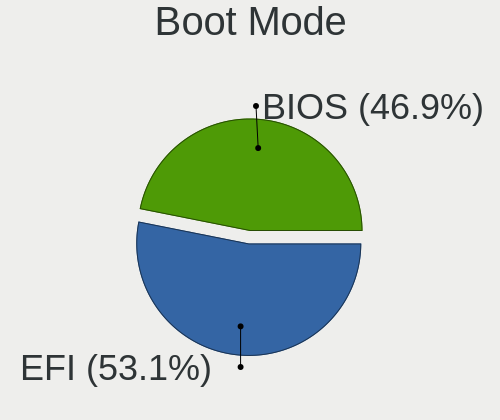

| Mode | Computers | Percent |
|------|-----------|---------|
| EFI  | 711       | 51.04%  |
| BIOS | 682       | 48.96%  |

Filesystem
----------

Type of filesystem

| Type    | Computers | Percent |
|---------|-----------|---------|
| Ext4    | 1099      | 78.33%  |
| Btrfs   | 124       | 8.84%   |
| Overlay | 82        | 5.84%   |
| Unknown | 57        | 4.06%   |
| Xfs     | 14        | 1%      |
| Ext2    | 11        | 0.78%   |
| Zfs     | 10        | 0.71%   |
| Ext3    | 2         | 0.14%   |
| Aufs    | 2         | 0.14%   |
| Tmpfs   | 1         | 0.07%   |
| F2fs    | 1         | 0.07%   |

Part. scheme
------------

Scheme of partitioning

| Type    | Computers | Percent |
|---------|-----------|---------|
| Unknown | 831       | 59.27%  |
| GPT     | 425       | 30.31%  |
| MBR     | 146       | 10.41%  |

Dual Boot with Linux/BSD
------------------------

Hosting more than one Linux/BSD

| Dual boot | Computers | Percent |
|-----------|-----------|---------|
| No        | 1190      | 85.98%  |
| Yes       | 194       | 14.02%  |

Dual Boot (Win)
---------------

Hosting Linux and Windows

| Dual boot | Computers | Percent |
|-----------|-----------|---------|
| No        | 917       | 65.41%  |
| Yes       | 485       | 34.59%  |

Board
-----

Vendor
------

Motherboard manufacturer

| Name                    | Computers | Percent |
|-------------------------|-----------|---------|
| ASUSTek Computer        | 240       | 17.6%   |
| Lenovo                  | 205       | 15.03%  |
| Hewlett-Packard         | 184       | 13.49%  |
| Dell                    | 105       | 7.7%    |
| MSI                     | 94        | 6.89%   |
| Gigabyte Technology     | 79        | 5.79%   |
| Acer                    | 79        | 5.79%   |
| Toshiba                 | 46        | 3.37%   |
| Monster                 | 37        | 2.71%   |
| Apple                   | 31        | 2.27%   |
| HUAWEI                  | 30        | 2.2%    |
| Samsung Electronics     | 28        | 2.05%   |
| Casper                  | 24        | 1.76%   |
| Sony                    | 23        | 1.69%   |
| Unknown                 | 18        | 1.32%   |
| Intel                   | 13        | 0.95%   |
| Pegatron                | 12        | 0.88%   |
| Packard Bell            | 12        | 0.88%   |
| ASRock                  | 11        | 0.81%   |
| Clevo                   | 9         | 0.66%   |
| Hometech                | 8         | 0.59%   |
| Foxconn                 | 8         | 0.59%   |
| ECS                     | 6         | 0.44%   |
| ARCELIK                 | 5         | 0.37%   |
| Fujitsu                 | 4         | 0.29%   |
| Vestel                  | 3         | 0.22%   |
| Raspberry Pi Foundation | 3         | 0.22%   |
| Huanan                  | 3         | 0.22%   |
| Fujitsu Siemens         | 3         | 0.22%   |
| AMI                     | 3         | 0.22%   |
| Alienware               | 3         | 0.22%   |
| Quanta                  | 2         | 0.15%   |
| Nvidia                  | 2         | 0.15%   |
| Notebook                | 2         | 0.15%   |
| LG Electronics          | 2         | 0.15%   |
| Insyde                  | 2         | 0.15%   |
| Zillion                 | 1         | 0.07%   |
| XDO.AI                  | 1         | 0.07%   |
| SYWZ                    | 1         | 0.07%   |
| System76                | 1         | 0.07%   |

Model
-----

Motherboard model

| Name                                       | Computers | Percent |
|--------------------------------------------|-----------|---------|
| Unknown                                    | 25        | 1.83%   |
| HP Pavilion g6                             | 16        | 1.17%   |
| ASUS All Series                            | 9         | 0.66%   |
| Casper NIRVANA NOTEBOOK                    | 8         | 0.59%   |
| HP Notebook                                | 7         | 0.51%   |
| HP Pavilion dv6                            | 6         | 0.44%   |
| HP Pavilion 15                             | 6         | 0.44%   |
| Gigabyte B450M S2H                         | 6         | 0.44%   |
| ASUS X550VX                                | 6         | 0.44%   |
| HUAWEI NBLK-WAX9X                          | 5         | 0.37%   |
| HP Pavilion Notebook                       | 5         | 0.37%   |
| HP 15                                      | 5         | 0.37%   |
| Gigabyte G31M-ES2L                         | 5         | 0.37%   |
| ASUS X555UB                                | 5         | 0.37%   |
| ASUS N550JV                                | 5         | 0.37%   |
| Acer Aspire 5750G                          | 5         | 0.37%   |
| MSI MS-7A34                                | 4         | 0.29%   |
| MSI MS-7693                                | 4         | 0.29%   |
| Lenovo Legion Y530-15ICH 81FV              | 4         | 0.29%   |
| Lenovo IdeaPad 100-15IBD 80QQ              | 4         | 0.29%   |
| HUAWEI KLVL-WXX9                           | 4         | 0.29%   |
| HUAWEI BOHK-WAX9X                          | 4         | 0.29%   |
| HUAWEI BOD-WXX9                            | 4         | 0.29%   |
| HP ElitePad 1000 G2                        | 4         | 0.29%   |
| HP 250 G3                                  | 4         | 0.29%   |
| Gigabyte A320M-S2H                         | 4         | 0.29%   |
| Dell Inspiron MM061                        | 4         | 0.29%   |
| Dell Inspiron 7577                         | 4         | 0.29%   |
| Dell Inspiron 3580                         | 4         | 0.29%   |
| Casper CASPER NIRVANA NOTEBOOK             | 4         | 0.29%   |
| ASUS X556UQK                               | 4         | 0.29%   |
| ASUS X542URR                               | 4         | 0.29%   |
| ASUS VivoBook 15_ASUS Laptop X540UAR       | 4         | 0.29%   |
| Toshiba Satellite C650                     | 3         | 0.22%   |
| Toshiba Satellite A300                     | 3         | 0.22%   |
| Samsung 300E4A/300E5A/300E7A/3430EA/3530EA | 3         | 0.22%   |
| MSI MS-7996                                | 3         | 0.22%   |
| MSI MS-7817                                | 3         | 0.22%   |
| MSI MS-7360                                | 3         | 0.22%   |
| Monster ABRA A5 V16.6                      | 3         | 0.22%   |

Model Family
------------

Motherboard model prefix

| Name                  | Computers | Percent |
|-----------------------|-----------|---------|
| Lenovo ThinkPad       | 73        | 5.35%   |
| HP Pavilion           | 54        | 3.96%   |
| Dell Inspiron         | 49        | 3.59%   |
| Lenovo IdeaPad        | 46        | 3.37%   |
| Acer Aspire           | 44        | 3.23%   |
| Toshiba Satellite     | 43        | 3.15%   |
| Unknown               | 25        | 1.83%   |
| Monster ABRA          | 22        | 1.61%   |
| HP Laptop             | 22        | 1.61%   |
| Dell Latitude         | 21        | 1.54%   |
| HP EliteBook          | 17        | 1.25%   |
| ASUS VivoBook         | 17        | 1.25%   |
| HP ProBook            | 15        | 1.1%    |
| ASUS ROG              | 15        | 1.1%    |
| ASUS PRIME            | 14        | 1.03%   |
| Dell Vostro           | 13        | 0.95%   |
| Casper NIRVANA        | 13        | 0.95%   |
| Packard Bell EasyNote | 12        | 0.88%   |
| Acer Nitro            | 11        | 0.81%   |
| Lenovo Yoga           | 10        | 0.73%   |
| Lenovo Legion         | 10        | 0.73%   |
| HP 250                | 10        | 0.73%   |
| ASUS TUF              | 10        | 0.73%   |
| Monster TULPAR        | 9         | 0.66%   |
| Gigabyte B450M        | 9         | 0.66%   |
| ASUS All              | 9         | 0.66%   |
| Acer Swift            | 8         | 0.59%   |
| HP Notebook           | 7         | 0.51%   |
| HP ENVY               | 7         | 0.51%   |
| Dell Precision        | 7         | 0.51%   |
| Lenovo ThinkCentre    | 6         | 0.44%   |
| HP Compaq             | 6         | 0.44%   |
| Dell XPS              | 6         | 0.44%   |
| Dell G3               | 6         | 0.44%   |
| ASUS X550VX           | 6         | 0.44%   |
| ASUS ASUS             | 6         | 0.44%   |
| Monster HUMA          | 5         | 0.37%   |
| Lenovo ThinkBook      | 5         | 0.37%   |
| HUAWEI NBLK-WAX9X     | 5         | 0.37%   |
| HP 15                 | 5         | 0.37%   |

MFG Year
--------

Motherboard manufacture year

| Year    | Computers | Percent |
|---------|-----------|---------|
| 2018    | 138       | 10.12%  |
| 2020    | 133       | 9.75%   |
| 2019    | 131       | 9.6%    |
| 2017    | 112       | 8.21%   |
| 2011    | 108       | 7.92%   |
| 2013    | 90        | 6.6%    |
| 2012    | 89        | 6.52%   |
| 2010    | 88        | 6.45%   |
| 2015    | 82        | 6.01%   |
| 2016    | 81        | 5.94%   |
| 2014    | 75        | 5.5%    |
| 2021    | 58        | 4.25%   |
| 2009    | 53        | 3.89%   |
| 2008    | 47        | 3.45%   |
| 2007    | 29        | 2.13%   |
| 2022    | 18        | 1.32%   |
| 2006    | 16        | 1.17%   |
| Unknown | 9         | 0.66%   |
| 2005    | 5         | 0.37%   |
| 2004    | 1         | 0.07%   |
| 2003    | 1         | 0.07%   |

Form Factor
-----------

Physical design of the computer

| Name           | Computers | Percent |
|----------------|-----------|---------|
| Notebook       | 959       | 70.31%  |
| Desktop        | 336       | 24.63%  |
| Convertible    | 20        | 1.47%   |
| All in one     | 14        | 1.03%   |
| Tablet         | 12        | 0.88%   |
| Mini pc        | 12        | 0.88%   |
| System on chip | 6         | 0.44%   |
| Server         | 4         | 0.29%   |
| Phone          | 1         | 0.07%   |

Secure Boot
-----------

Enabled or disabled

| State    | Computers | Percent |
|----------|-----------|---------|
| Disabled | 1283      | 92.84%  |
| Enabled  | 99        | 7.16%   |

Coreboot
--------

Have coreboot on board

| Used | Computers | Percent |
|------|-----------|---------|
| No   | 1363      | 99.93%  |
| Yes  | 1         | 0.07%   |

RAM Size
--------

Total RAM memory

| Size in GB      | Computers | Percent |
|-----------------|-----------|---------|
| 4.01-8.0        | 339       | 24.57%  |
| 3.01-4.0        | 293       | 21.23%  |
| 16.01-24.0      | 258       | 18.7%   |
| 8.01-16.0       | 254       | 18.41%  |
| 1.01-2.0        | 91        | 6.59%   |
| 32.01-64.0      | 72        | 5.22%   |
| 2.01-3.0        | 31        | 2.25%   |
| 64.01-256.0     | 17        | 1.23%   |
| 24.01-32.0      | 12        | 0.87%   |
| 0.51-1.0        | 12        | 0.87%   |
| More than 256.0 | 1         | 0.07%   |

RAM Used
--------

Used RAM memory

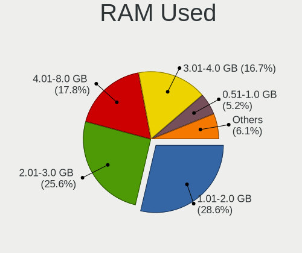

| Used GB    | Computers | Percent |
|------------|-----------|---------|
| 1.01-2.0   | 537       | 35.52%  |
| 2.01-3.0   | 402       | 26.59%  |
| 3.01-4.0   | 221       | 14.62%  |
| 4.01-8.0   | 189       | 12.5%   |
| 0.51-1.0   | 95        | 6.28%   |
| 8.01-16.0  | 44        | 2.91%   |
| 0.01-0.5   | 15        | 0.99%   |
| 16.01-24.0 | 5         | 0.33%   |
| 24.01-32.0 | 2         | 0.13%   |
| 32.01-64.0 | 1         | 0.07%   |
| Unknown    | 1         | 0.07%   |

Total Drives
------------

Number of drives on board

| Drives | Computers | Percent |
|--------|-----------|---------|
| 1      | 880       | 63.04%  |
| 2      | 383       | 27.44%  |
| 3      | 82        | 5.87%   |
| 4      | 25        | 1.79%   |
| 5      | 9         | 0.64%   |
| 0      | 9         | 0.64%   |
| 7      | 5         | 0.36%   |
| 6      | 3         | 0.21%   |

Has CD-ROM
----------

Has CD-ROM on board

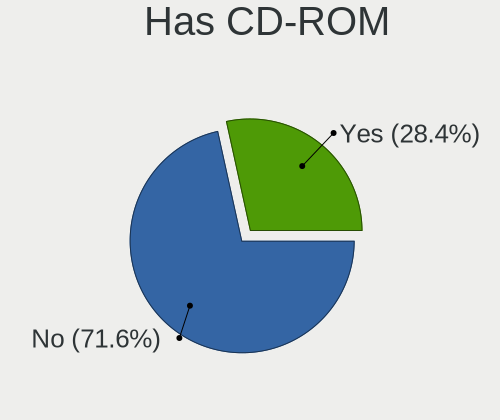

| Presented | Computers | Percent |
|-----------|-----------|---------|
| No        | 869       | 63.06%  |
| Yes       | 509       | 36.94%  |

Has Ethernet
------------

Has Ethernet on board

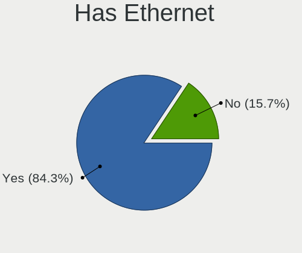

| Presented | Computers | Percent |
|-----------|-----------|---------|
| Yes       | 1194      | 87.28%  |
| No        | 174       | 12.72%  |

Has WiFi
--------

Has WiFi module

| Presented | Computers | Percent |
|-----------|-----------|---------|
| Yes       | 1134      | 82.83%  |
| No        | 235       | 17.17%  |

Has Bluetooth
-------------

Has Bluetooth module

| Presented | Computers | Percent |
|-----------|-----------|---------|
| Yes       | 896       | 64.93%  |
| No        | 484       | 35.07%  |

Location
--------

Country
-------

Geographic location (country)

| Country | Computers | Percent |
|---------|-----------|---------|
| Turkey  | 1364      | 100%    |

City
----

Geographic location (city)

| City                | Computers | Percent |
|---------------------|-----------|---------|
| Istanbul            | 530       | 36.53%  |
| Ankara              | 199       | 13.71%  |
| Izmir               | 136       | 9.37%   |
| Bursa               | 73        | 5.03%   |
| Antalya             | 63        | 4.34%   |
| zmit              | 24        | 1.65%   |
| Adana               | 24        | 1.65%   |
| Konya               | 22        | 1.52%   |
| Kayseri             | 19        | 1.31%   |
| Balkesir          | 18        | 1.24%   |
| Denizli             | 15        | 1.03%   |
| Gaziantep           | 14        | 0.96%   |
| Antakya             | 14        | 0.96%   |
| Mersin              | 12        | 0.83%   |
| Aydin               | 11        | 0.76%   |
| Mugla               | 10        | 0.69%   |
| Samsun              | 9         | 0.62%   |
| Tekirda           | 8         | 0.55%   |
| Ordu                | 8         | 0.55%   |
| Kosekoy             | 8         | 0.55%   |
| Yalova              | 7         | 0.48%   |
| Magnesia ad Sipylum | 7         | 0.48%   |
| Krklareli         | 7         | 0.48%   |
| Kartal              | 7         | 0.48%   |
| Trabzon             | 6         | 0.41%   |
| Malatya             | 6         | 0.41%   |
| Eskiehir          | 6         | 0.41%   |
| Adapazar          | 6         | 0.41%   |
| Zonguldak           | 5         | 0.34%   |
| Sisli               | 5         | 0.34%   |
| OEdemis             | 5         | 0.34%   |
| Batman              | 5         | 0.34%   |
| Sanliurfa           | 4         | 0.28%   |
| Osmaniye            | 4         | 0.28%   |
| Esenyurt            | 4         | 0.28%   |
| Erzurum             | 4         | 0.28%   |
| Cankaya             | 4         | 0.28%   |
| anakkale          | 4         | 0.28%   |
| Bilecik             | 4         | 0.28%   |
| Yozgat              | 3         | 0.21%   |

Drives
------

Drive Vendor
------------

Hard drive vendors

| Vendor                | Computers | Drives | Percent |
|-----------------------|-----------|--------|---------|
| Seagate               | 280       | 349    | 14.62%  |
| WDC                   | 267       | 367    | 13.94%  |
| Samsung Electronics   | 263       | 370    | 13.73%  |
| SanDisk               | 169       | 196    | 8.83%   |
| Toshiba               | 168       | 189    | 8.77%   |
| Kingston              | 106       | 145    | 5.54%   |
| Unknown               | 76        | 90     | 3.97%   |
| Hitachi               | 56        | 61     | 2.92%   |
| HGST                  | 55        | 62     | 2.87%   |
| SK hynix              | 46        | 53     | 2.4%    |
| Micron Technology     | 35        | 39     | 1.83%   |
| Intel                 | 34        | 45     | 1.78%   |
| Crucial               | 30        | 37     | 1.57%   |
| A-DATA Technology     | 28        | 31     | 1.46%   |
| China                 | 24        | 28     | 1.25%   |
| Corsair               | 22        | 27     | 1.15%   |
| Phison                | 17        | 17     | 0.89%   |
| Apple                 | 17        | 24     | 0.89%   |
| HS-SSD-C100           | 12        | 12     | 0.63%   |
| Fujitsu               | 12        | 12     | 0.63%   |
| KIOXIA-EXCERIA        | 11        | 13     | 0.57%   |
| KIOXIA                | 11        | 13     | 0.57%   |
| OCZ                   | 10        | 12     | 0.52%   |
| JAMESDONKEY           | 9         | 9      | 0.47%   |
| Netac                 | 8         | 8      | 0.42%   |
| Lexar                 | 7         | 10     | 0.37%   |
| Silicon Motion        | 6         | 6      | 0.31%   |
| KingSpec              | 6         | 6      | 0.31%   |
| XPG                   | 5         | 7      | 0.26%   |
| UMIS                  | 5         | 7      | 0.26%   |
| Transcend             | 5         | 5      | 0.26%   |
| Realtek Semiconductor | 5         | 6      | 0.26%   |
| Pioneer               | 5         | 12     | 0.26%   |
| LITEON                | 5         | 6      | 0.26%   |
| Team                  | 4         | 4      | 0.21%   |
| Maxtor                | 4         | 4      | 0.21%   |
| JMicron Technology    | 4         | 4      | 0.21%   |
| JD                    | 4         | 6      | 0.21%   |
| Hewlett-Packard       | 4         | 4      | 0.21%   |
| Gigabyte Technology   | 4         | 9      | 0.21%   |

Drive Model
-----------

Hard drive models

| Model                                  | Computers | Percent |
|----------------------------------------|-----------|---------|
| Seagate ST1000LM035-1RK172 1TB         | 35        | 1.72%   |
| SanDisk SSD PLUS 240GB                 | 29        | 1.42%   |
| HGST HTS721010A9E630 1TB               | 28        | 1.37%   |
| Unknown MMC Card  32GB                 | 20        | 0.98%   |
| Samsung SM963 2.5" NVMe PCIe SSD 256GB | 18        | 0.88%   |
| Toshiba MQ01ABF050 500GB               | 17        | 0.83%   |
| Toshiba MQ01ABD100 1TB                 | 17        | 0.83%   |
| Toshiba MQ04ABF100 1TB                 | 16        | 0.79%   |
| Samsung NVMe SSD Drive 512GB           | 15        | 0.74%   |
| Samsung SSD 860 EVO 250GB              | 14        | 0.69%   |
| Seagate ST500LT012-1DG142 500GB        | 12        | 0.59%   |
| Seagate ST1000DM010-2EP102 1TB         | 12        | 0.59%   |
| SanDisk NVMe SSD Drive 256GB           | 12        | 0.59%   |
| Toshiba TR200 240GB SSD                | 11        | 0.54%   |
| Seagate ST500DM002-1BD142 500GB        | 11        | 0.54%   |
| Seagate ST1000LM024 HN-M101MBB 1TB     | 11        | 0.54%   |
| SanDisk SSD PLUS 120GB                 | 11        | 0.54%   |
| Kingston SV300S37A120G 120GB SSD       | 11        | 0.54%   |
| Intel NVMe SSD Drive 512GB             | 11        | 0.54%   |
| Seagate ST9500325AS 500GB              | 10        | 0.49%   |
| Seagate ST1000DM003-1ER162 1TB         | 10        | 0.49%   |
| Seagate Expansion 1TB                  | 10        | 0.49%   |
| HGST HTS541010A9E680 1TB               | 10        | 0.49%   |
| SanDisk NVMe SSD Drive 512GB           | 9         | 0.44%   |
| Kingston SA400S37120G 120GB SSD        | 9         | 0.44%   |
| WDC WDS120G2G0A-00JH30 120GB SSD       | 8         | 0.39%   |
| WDC WD10JPCX-24UE4T0 1TB               | 8         | 0.39%   |
| WDC WD10EZEX-08WN4A0 1TB               | 8         | 0.39%   |
| SK hynix NVMe SSD Drive 512GB          | 8         | 0.39%   |
| Seagate ST3500418AS 500GB              | 8         | 0.39%   |
| Seagate ST1000LM049-2GH172 1TB         | 8         | 0.39%   |
| SanDisk SSD PLUS 480GB                 | 8         | 0.39%   |
| Samsung SSD 860 EVO 500GB              | 8         | 0.39%   |
| Samsung HD502HJ 500GB                  | 8         | 0.39%   |
| A-DATA SU650 120GB SSD                 | 8         | 0.39%   |
| Unknown MMC Card  64GB                 | 7         | 0.34%   |
| Toshiba MQ01ABD075 752GB               | 7         | 0.34%   |
| Toshiba DT01ACA100 1TB                 | 7         | 0.34%   |
| SK hynix NVMe SSD Drive 256GB          | 7         | 0.34%   |
| Samsung NVMe SSD Drive 500GB           | 7         | 0.34%   |

HDD Vendor
----------

Hard disk drive vendors

| Vendor              | Computers | Drives | Percent |
|---------------------|-----------|--------|---------|
| Seagate             | 275       | 340    | 33.5%   |
| WDC                 | 219       | 305    | 26.67%  |
| Toshiba             | 127       | 136    | 15.47%  |
| Samsung Electronics | 60        | 78     | 7.31%   |
| Hitachi             | 56        | 61     | 6.82%   |
| HGST                | 55        | 62     | 6.7%    |
| Fujitsu             | 12        | 12     | 1.46%   |
| Unknown             | 6         | 7      | 0.73%   |
| Maxtor              | 4         | 4      | 0.49%   |
| Apple               | 2         | 5      | 0.24%   |
| Intenso             | 1         | 1      | 0.12%   |
| ExcelStor           | 1         | 1      | 0.12%   |
| China               | 1         | 1      | 0.12%   |
| ASMT                | 1         | 1      | 0.12%   |
| 128MB               | 1         | 1      | 0.12%   |

SSD Vendor
----------

Solid state drive vendors

| Vendor              | Computers | Drives | Percent |
|---------------------|-----------|--------|---------|
| SanDisk             | 123       | 146    | 20.1%   |
| Samsung Electronics | 107       | 139    | 17.48%  |
| Kingston            | 87        | 121    | 14.22%  |
| WDC                 | 31        | 34     | 5.07%   |
| Crucial             | 27        | 32     | 4.41%   |
| Toshiba             | 20        | 22     | 3.27%   |
| China               | 20        | 22     | 3.27%   |
| A-DATA Technology   | 20        | 22     | 3.27%   |
| Corsair             | 18        | 20     | 2.94%   |
| Micron Technology   | 14        | 17     | 2.29%   |
| SK hynix            | 10        | 12     | 1.63%   |
| OCZ                 | 10        | 12     | 1.63%   |
| KIOXIA-EXCERIA      | 9         | 11     | 1.47%   |
| JAMESDONKEY         | 9         | 9      | 1.47%   |
| Intel               | 9         | 15     | 1.47%   |
| Netac               | 8         | 8      | 1.31%   |
| Apple               | 7         | 8      | 1.14%   |
| Seagate             | 6         | 7      | 0.98%   |
| Lexar               | 6         | 9      | 0.98%   |
| KingSpec            | 6         | 6      | 0.98%   |
| Pioneer             | 5         | 12     | 0.82%   |
| LITEON              | 5         | 6      | 0.82%   |
| HS-SSD-C100         | 4         | 4      | 0.65%   |
| Hewlett-Packard     | 4         | 4      | 0.65%   |
| EZCOOL              | 4         | 5      | 0.65%   |
| Transcend           | 3         | 3      | 0.49%   |
| Team                | 3         | 3      | 0.49%   |
| Patriot             | 3         | 4      | 0.49%   |
| LITEONIT            | 3         | 4      | 0.49%   |
| 2.5"                | 3         | 3      | 0.49%   |
| TwinMOS             | 2         | 2      | 0.33%   |
| SPCC                | 2         | 2      | 0.33%   |
| KingDian            | 2         | 2      | 0.33%   |
| JMicron Technology  | 2         | 2      | 0.33%   |
| JD                  | 2         | 2      | 0.33%   |
| Indilinx            | 2         | 4      | 0.33%   |
| Gigabyte Technology | 2         | 6      | 0.33%   |
| Apacer              | 2         | 2      | 0.33%   |
| TO Exter            | 1         | 3      | 0.16%   |
| SSD-S400            | 1         | 1      | 0.16%   |

Drive Kind
----------

HDD or SSD

| Kind    | Computers | Drives | Percent |
|---------|-----------|--------|---------|
| HDD     | 730       | 1015   | 41.48%  |
| SSD     | 552       | 758    | 31.36%  |
| NVMe    | 379       | 507    | 21.53%  |
| MMC     | 70        | 86     | 3.98%   |
| Unknown | 29        | 35     | 1.65%   |

Drive Connector
---------------

SATA, SAS, NVMe, etc.

| Type | Computers | Drives | Percent |
|------|-----------|--------|---------|
| SATA | 1054      | 1743   | 67.87%  |
| NVMe | 379       | 505    | 24.4%   |
| MMC  | 70        | 86     | 4.51%   |
| SAS  | 50        | 67     | 3.22%   |

Drive Size
----------

Size of hard drive

| Size in TB | Computers | Drives | Percent |
|------------|-----------|--------|---------|
| 0.01-0.5   | 817       | 1184   | 64.79%  |
| 0.51-1.0   | 375       | 488    | 29.74%  |
| 1.01-2.0   | 40        | 59     | 3.17%   |
| 3.01-4.0   | 13        | 20     | 1.03%   |
| 2.01-3.0   | 9         | 12     | 0.71%   |
| 4.01-10.0  | 7         | 10     | 0.56%   |

Space Total
-----------

Amount of disk space available on the file system

| Size in GB     | Computers | Percent |
|----------------|-----------|---------|
| 101-250        | 448       | 30.73%  |
| 251-500        | 327       | 22.43%  |
| 501-1000       | 187       | 12.83%  |
| 51-100         | 122       | 8.37%   |
| 1-20           | 113       | 7.75%   |
| 1001-2000      | 96        | 6.58%   |
| 21-50          | 92        | 6.31%   |
| 2001-3000      | 27        | 1.85%   |
| More than 3000 | 26        | 1.78%   |
| Unknown        | 20        | 1.37%   |

Space Used
----------

Amount of used disk space

| Used GB        | Computers | Percent |
|----------------|-----------|---------|
| 1-20           | 638       | 42.56%  |
| 21-50          | 292       | 19.48%  |
| 51-100         | 183       | 12.21%  |
| 101-250        | 160       | 10.67%  |
| 251-500        | 99        | 6.6%    |
| 501-1000       | 66        | 4.4%    |
| 1001-2000      | 23        | 1.53%   |
| Unknown        | 20        | 1.33%   |
| More than 3000 | 11        | 0.73%   |
| 2001-3000      | 7         | 0.47%   |

Malfunc. Drives
---------------

Drive models with a malfunction

| Model                             | Computers | Drives | Percent |
|-----------------------------------|-----------|--------|---------|
| Seagate ST500LT012-1DG142 500GB   | 4         | 6      | 2.74%   |
| HGST HTS721010A9E630 1TB          | 4         | 5      | 2.74%   |
| Toshiba MQ01ABF050 500GB          | 3         | 4      | 2.05%   |
| Seagate ST500DM002-1BD142 500GB   | 3         | 3      | 2.05%   |
| Seagate ST1000LM035-1RK172 1TB    | 3         | 3      | 2.05%   |
| SanDisk SSD PLUS 240GB            | 3         | 3      | 2.05%   |
| Kingston SV300S37A120G 120GB SSD  | 3         | 4      | 2.05%   |
| Toshiba MQ02ABD100H 1TB           | 2         | 3      | 1.37%   |
| Toshiba MQ01ABD100 1TB            | 2         | 2      | 1.37%   |
| Toshiba MQ01ABD050 500GB          | 2         | 2      | 1.37%   |
| Toshiba DT01ACA050 500GB          | 2         | 2      | 1.37%   |
| Seagate ST9320325AS 320GB         | 2         | 2      | 1.37%   |
| Seagate ST3500630AS 500GB         | 2         | 2      | 1.37%   |
| Seagate ST1000LM014-SSHD-8GB      | 2         | 2      | 1.37%   |
| Samsung Electronics HD161HJ 160GB | 2         | 2      | 1.37%   |
| Kingston SVP200S37A120G 120GB SSD | 2         | 2      | 1.37%   |
| Kingston SUV400S37240G 240GB SSD  | 2         | 2      | 1.37%   |
| Indilinx IND-S325S120G 120GB SSD  | 2         | 4      | 1.37%   |
| Hitachi HTS543232A7A384 320GB     | 2         | 2      | 1.37%   |
| HGST HTS545050A7E680 500GB        | 2         | 2      | 1.37%   |
| Fujitsu MHY2120BH 120GB           | 2         | 2      | 1.37%   |
| 2.5" SATA SSD 3TG6-P 480GB        | 2         | 2      | 1.37%   |
| WDC WDS240G2G0B-00EPW0 240GB SSD  | 1         | 1      | 0.68%   |
| WDC WD5000LPVX-22V0TT0 500GB      | 1         | 1      | 0.68%   |
| WDC WD5000LPCX-60VHAT0 500GB      | 1         | 1      | 0.68%   |
| WDC WD5000AAKX-001CA0 500GB       | 1         | 2      | 0.68%   |
| WDC WD400JB-00ENA0 40GB           | 1         | 1      | 0.68%   |
| WDC WD3200BPVT-22JJ5T0 320GB      | 1         | 1      | 0.68%   |
| WDC WD3200BEVT-60A23T0 320GB      | 1         | 1      | 0.68%   |
| WDC WD3200BEVT-22A23T0 320GB      | 1         | 1      | 0.68%   |
| WDC WD3200AAJS-00B4A0 320GB       | 1         | 1      | 0.68%   |
| WDC WD30EZRX-00MMMB0 3TB          | 1         | 1      | 0.68%   |
| WDC WD2500JS-55NCB1 250GB         | 1         | 1      | 0.68%   |
| WDC WD10JPVX-22JC3T0 1TB          | 1         | 1      | 0.68%   |
| WDC WD10JPVT-75A1YT0 1TB          | 1         | 1      | 0.68%   |
| WDC WD10EZEX-00MFCA0 1TB          | 1         | 1      | 0.68%   |
| WDC WD10EARS-00Y5B1 1TB           | 1         | 2      | 0.68%   |
| Toshiba MQ04ABF100 1TB            | 1         | 1      | 0.68%   |
| Toshiba MQ01ABF050M 500GB         | 1         | 1      | 0.68%   |
| Toshiba MQ01ABD075 752GB          | 1         | 1      | 0.68%   |

Malfunc. Drive Vendor
---------------------

Vendors of faulty drives

| Vendor              | Computers | Drives | Percent |
|---------------------|-----------|--------|---------|
| Seagate             | 33        | 36     | 22.92%  |
| Toshiba             | 19        | 21     | 13.19%  |
| WDC                 | 14        | 17     | 9.72%   |
| Hitachi             | 14        | 14     | 9.72%   |
| Samsung Electronics | 11        | 15     | 7.64%   |
| HGST                | 9         | 10     | 6.25%   |
| Kingston            | 8         | 9      | 5.56%   |
| A-DATA Technology   | 8         | 8      | 5.56%   |
| SanDisk             | 7         | 8      | 4.86%   |
| Fujitsu             | 3         | 3      | 2.08%   |
| SK hynix            | 2         | 2      | 1.39%   |
| Maxtor              | 2         | 2      | 1.39%   |
| Indilinx            | 2         | 4      | 1.39%   |
| China               | 2         | 2      | 1.39%   |
| 2.5"                | 2         | 2      | 1.39%   |
| SSD-S400            | 1         | 1      | 0.69%   |
| OCZ                 | 1         | 2      | 0.69%   |
| LITEONIT            | 1         | 2      | 0.69%   |
| LITEON              | 1         | 1      | 0.69%   |
| JMicron Technology  | 1         | 1      | 0.69%   |
| JD                  | 1         | 1      | 0.69%   |
| Intel               | 1         | 1      | 0.69%   |
| Crucial             | 1         | 1      | 0.69%   |

Malfunc. HDD Vendor
-------------------

Vendors of faulty HDD drives

| Vendor              | Computers | Drives | Percent |
|---------------------|-----------|--------|---------|
| Seagate             | 33        | 36     | 32.35%  |
| Toshiba             | 19        | 21     | 18.63%  |
| Hitachi             | 14        | 14     | 13.73%  |
| WDC                 | 13        | 16     | 12.75%  |
| Samsung Electronics | 9         | 11     | 8.82%   |
| HGST                | 9         | 10     | 8.82%   |
| Fujitsu             | 3         | 3      | 2.94%   |
| Maxtor              | 2         | 2      | 1.96%   |

Malfunc. Drive Kind
-------------------

Kinds of faulty drives

| Kind    | Computers | Drives | Percent |
|---------|-----------|--------|---------|
| HDD     | 96        | 113    | 69.57%  |
| SSD     | 37        | 45     | 26.81%  |
| NVMe    | 4         | 4      | 2.9%    |
| Unknown | 1         | 1      | 0.72%   |

Failed Drives
-------------

Failed drive models

| Model                             | Computers | Drives | Percent |
|-----------------------------------|-----------|--------|---------|
| Samsung Electronics HM160HI 160GB | 1         | 1      | 50%     |
| HGST HTS545050A7E680 500GB        | 1         | 1      | 50%     |

Failed Drive Vendor
-------------------

Failed drive vendors

| Vendor              | Computers | Drives | Percent |
|---------------------|-----------|--------|---------|
| Samsung Electronics | 1         | 1      | 50%     |
| HGST                | 1         | 1      | 50%     |

Drive Status
------------

Number of failed and malfunc. drives

| Status   | Computers | Drives | Percent |
|----------|-----------|--------|---------|
| Detected | 903       | 1512   | 60.85%  |
| Works    | 444       | 724    | 29.92%  |
| Malfunc  | 135       | 163    | 9.1%    |
| Failed   | 2         | 2      | 0.13%   |

Storage controller
------------------

Storage Vendor
--------------

Storage controller vendors

| Vendor                           | Computers | Percent |
|----------------------------------|-----------|---------|
| Intel                            | 945       | 58.55%  |
| AMD                              | 211       | 13.07%  |
| Samsung Electronics              | 121       | 7.5%    |
| SanDisk                          | 60        | 3.72%   |
| SK hynix                         | 34        | 2.11%   |
| Phison Electronics               | 27        | 1.67%   |
| Nvidia                           | 20        | 1.24%   |
| Micron Technology                | 20        | 1.24%   |
| Kingston Technology Company      | 19        | 1.18%   |
| Toshiba America Info Systems     | 17        | 1.05%   |
| KIOXIA                           | 17        | 1.05%   |
| Marvell Technology Group         | 16        | 0.99%   |
| JMicron Technology               | 15        | 0.93%   |
| Silicon Integrated Systems [SiS] | 12        | 0.74%   |
| ADATA Technology                 | 12        | 0.74%   |
| ASMedia Technology               | 11        | 0.68%   |
| Union Memory (Shenzhen)          | 9         | 0.56%   |
| Silicon Motion                   | 9         | 0.56%   |
| Realtek Semiconductor            | 8         | 0.5%    |
| Apple                            | 7         | 0.43%   |
| Micron/Crucial Technology        | 6         | 0.37%   |
| Yangtze Memory Technologies      | 4         | 0.25%   |
| VIA Technologies                 | 3         | 0.19%   |
| Lite-On Technology               | 3         | 0.19%   |
| LSI Logic / Symbios Logic        | 2         | 0.12%   |
| Innodisk                         | 2         | 0.12%   |
| ULi Electronics                  | 1         | 0.06%   |
| Transcend                        | 1         | 0.06%   |
| Solid State Storage Technology   | 1         | 0.06%   |
| OCZ Technology Group             | 1         | 0.06%   |

Storage Model
-------------

Storage controller models

| Model                                                                            | Computers | Percent |
|----------------------------------------------------------------------------------|-----------|---------|
| AMD FCH SATA Controller [AHCI mode]                                              | 148       | 8.06%   |
| Intel Sunrise Point-LP SATA Controller [AHCI mode]                               | 96        | 5.23%   |
| Intel 7 Series Chipset Family 6-port SATA Controller [AHCI mode]                 | 79        | 4.3%    |
| Intel 6 Series/C200 Series Chipset Family 6 port Mobile SATA AHCI Controller     | 62        | 3.38%   |
| Samsung NVMe SSD Controller SM981/PM981/PM983                                    | 61        | 3.32%   |
| Intel 8 Series/C220 Series Chipset Family 6-port SATA Controller 1 [AHCI mode]   | 56        | 3.05%   |
| Intel HM170/QM170 Chipset SATA Controller [AHCI Mode]                            | 40        | 2.18%   |
| Intel 82801 Mobile SATA Controller [RAID mode]                                   | 40        | 2.18%   |
| Intel NM10/ICH7 Family SATA Controller [IDE mode]                                | 39        | 2.12%   |
| Intel 8 Series SATA Controller 1 [AHCI mode]                                     | 36        | 1.96%   |
| Intel 5 Series/3400 Series Chipset 4 port SATA AHCI Controller                   | 36        | 1.96%   |
| Intel Cannon Lake Mobile PCH SATA AHCI Controller                                | 34        | 1.85%   |
| Intel Wildcat Point-LP SATA Controller [AHCI Mode]                               | 33        | 1.8%    |
| Intel 82801IBM/IEM (ICH9M/ICH9M-E) 4 port SATA Controller [AHCI mode]            | 32        | 1.74%   |
| Intel 82801G (ICH7 Family) IDE Controller                                        | 32        | 1.74%   |
| AMD 400 Series Chipset SATA Controller                                           | 31        | 1.69%   |
| Samsung NVMe SSD Controller 980                                                  | 29        | 1.58%   |
| Intel 400 Series Chipset Family SATA AHCI Controller                             | 27        | 1.47%   |
| AMD SB7x0/SB8x0/SB9x0 IDE Controller                                             | 27        | 1.47%   |
| Intel Q170/Q150/B150/H170/H110/Z170/CM236 Chipset SATA Controller [AHCI Mode]    | 23        | 1.25%   |
| AMD SB7x0/SB8x0/SB9x0 SATA Controller [IDE mode]                                 | 22        | 1.2%    |
| Intel Comet Lake SATA AHCI Controller                                            | 21        | 1.14%   |
| Micron Non-Volatile memory controller                                            | 20        | 1.09%   |
| AMD SB7x0/SB8x0/SB9x0 SATA Controller [AHCI mode]                                | 20        | 1.09%   |
| SanDisk WD Blue SN550 NVMe SSD                                                   | 19        | 1.03%   |
| Intel 6 Series/C200 Series Chipset Family 6 port Desktop SATA AHCI Controller    | 19        | 1.03%   |
| Samsung NVMe SSD Controller SM961/PM961/SM963                                    | 17        | 0.93%   |
| Intel 200 Series PCH SATA controller [AHCI mode]                                 | 17        | 0.93%   |
| Intel SSD 660P Series                                                            | 16        | 0.87%   |
| Intel 5 Series/3400 Series Chipset 6 port SATA AHCI Controller                   | 16        | 0.87%   |
| Intel Volume Management Device NVMe RAID Controller                              | 14        | 0.76%   |
| Intel 82801HM/HEM (ICH8M/ICH8M-E) IDE Controller                                 | 14        | 0.76%   |
| Intel Celeron N3350/Pentium N4200/Atom E3900 Series SATA AHCI Controller         | 13        | 0.71%   |
| Intel Atom/Celeron/Pentium Processor x5-E8000/J3xxx/N3xxx Series SATA Controller | 13        | 0.71%   |
| Intel 82801HM/HEM (ICH8M/ICH8M-E) SATA Controller [AHCI mode]                    | 13        | 0.71%   |
| SK hynix BC511                                                                   | 12        | 0.65%   |
| SK hynix BC501 NVMe Solid State Drive                                            | 12        | 0.65%   |
| SanDisk Non-Volatile memory controller                                           | 12        | 0.65%   |
| Phison PS5013 E13 NVMe Controller                                                | 12        | 0.65%   |
| Intel Cannon Point-LP SATA Controller [AHCI Mode]                                | 12        | 0.65%   |

Storage Kind
------------

Kind of storage controller (IDE, SATA, NVMe, SAS, ...)

| Kind | Computers | Percent |
|------|-----------|---------|
| SATA | 999       | 60.84%  |
| NVMe | 381       | 23.2%   |
| IDE  | 191       | 11.63%  |
| RAID | 69        | 4.2%    |
| SCSI | 2         | 0.12%   |

Processor
---------

CPU Vendor
----------

Processor vendors

| Vendor       | Computers | Percent |
|--------------|-----------|---------|
| Intel        | 1070      | 78.45%  |
| AMD          | 283       | 20.75%  |
| ARM          | 9         | 0.66%   |
| CentaurHauls | 2         | 0.15%   |

CPU Model
---------

Processor models

| Model                                         | Computers | Percent |
|-----------------------------------------------|-----------|---------|
| Intel Core i5-7200U CPU @ 2.50GHz             | 25        | 1.83%   |
| Intel Core i7-7700HQ CPU @ 2.80GHz            | 20        | 1.47%   |
| Intel Core i7-10750H CPU @ 2.60GHz            | 20        | 1.47%   |
| Intel Core i5-6200U CPU @ 2.30GHz             | 20        | 1.47%   |
| AMD Ryzen 5 3500U with Radeon Vega Mobile Gfx | 19        | 1.39%   |
| Intel Core i7-10510U CPU @ 1.80GHz            | 18        | 1.32%   |
| Intel Core i5-8250U CPU @ 1.60GHz             | 17        | 1.25%   |
| Intel Core i5-3230M CPU @ 2.60GHz             | 16        | 1.17%   |
| Intel 11th Gen Core i5-1135G7 @ 2.40GHz       | 16        | 1.17%   |
| Intel Core i7-6700HQ CPU @ 2.60GHz            | 15        | 1.1%    |
| Intel Core i5-8265U CPU @ 1.60GHz             | 15        | 1.1%    |
| Intel Core i7-9750H CPU @ 2.60GHz             | 14        | 1.03%   |
| Intel Core i5-1035G1 CPU @ 1.00GHz            | 14        | 1.03%   |
| Intel Core i7-8550U CPU @ 1.80GHz             | 13        | 0.95%   |
| Intel Core i5-2430M CPU @ 2.40GHz             | 13        | 0.95%   |
| Intel Core i7-8750H CPU @ 2.20GHz             | 12        | 0.88%   |
| Intel Core i5-4210U CPU @ 1.70GHz             | 12        | 0.88%   |
| Intel Core i5-3210M CPU @ 2.50GHz             | 12        | 0.88%   |
| Intel Core i5-2450M CPU @ 2.50GHz             | 12        | 0.88%   |
| Intel Core i5-5200U CPU @ 2.20GHz             | 11        | 0.81%   |
| AMD Ryzen 7 3700U with Radeon Vega Mobile Gfx | 11        | 0.81%   |
| AMD Ryzen 5 5500U with Radeon Graphics        | 11        | 0.81%   |
| Intel Core i7-7500U CPU @ 2.70GHz             | 10        | 0.73%   |
| Intel Celeron CPU N3060 @ 1.60GHz             | 10        | 0.73%   |
| Intel Atom x5-Z8350 CPU @ 1.44GHz             | 10        | 0.73%   |
| Intel Core i5-2520M CPU @ 2.50GHz             | 9         | 0.66%   |
| Intel Core i3 CPU M 330 @ 2.13GHz             | 9         | 0.66%   |
| Intel Core i7-4700HQ CPU @ 2.40GHz            | 8         | 0.59%   |
| Intel Core i5-4200M CPU @ 2.50GHz             | 8         | 0.59%   |
| Intel Core i5 CPU M 460 @ 2.53GHz             | 8         | 0.59%   |
| Intel Core i3-5005U CPU @ 2.00GHz             | 8         | 0.59%   |
| Intel Celeron CPU N3350 @ 1.10GHz             | 8         | 0.59%   |
| Intel Atom CPU Z3735F @ 1.33GHz               | 8         | 0.59%   |
| Intel 11th Gen Core i7-11800H @ 2.30GHz       | 8         | 0.59%   |
| Intel 11th Gen Core i7-1165G7 @ 2.80GHz       | 8         | 0.59%   |
| AMD Ryzen 5 4600H with Radeon Graphics        | 8         | 0.59%   |
| AMD A8-7410 APU with AMD Radeon R5 Graphics   | 8         | 0.59%   |
| Intel Core i7-8565U CPU @ 1.80GHz             | 7         | 0.51%   |
| Intel Core i7-6500U CPU @ 2.50GHz             | 7         | 0.51%   |
| Intel Core i7-3630QM CPU @ 2.40GHz            | 7         | 0.51%   |

CPU Model Family
----------------

Processor model prefix

| Model                   | Computers | Percent |
|-------------------------|-----------|---------|
| Intel Core i5           | 347       | 25.42%  |
| Intel Core i7           | 284       | 20.81%  |
| Intel Core i3           | 93        | 6.81%   |
| AMD Ryzen 5             | 88        | 6.45%   |
| Other                   | 64        | 4.69%   |
| Intel Core 2 Duo        | 61        | 4.47%   |
| Intel Celeron           | 59        | 4.32%   |
| AMD Ryzen 7             | 54        | 3.96%   |
| Intel Atom              | 37        | 2.71%   |
| Intel Pentium           | 31        | 2.27%   |
| Intel Pentium Dual-Core | 20        | 1.47%   |
| Intel Xeon              | 18        | 1.32%   |
| Intel Core 2 Quad       | 18        | 1.32%   |
| AMD FX                  | 18        | 1.32%   |
| AMD Ryzen 3             | 16        | 1.17%   |
| Intel Pentium Dual      | 15        | 1.1%    |
| Intel Core 2            | 14        | 1.03%   |
| AMD A8                  | 13        | 0.95%   |
| AMD A10                 | 11        | 0.81%   |
| AMD A4                  | 7         | 0.51%   |
| Intel Core i9           | 6         | 0.44%   |
| AMD A6                  | 6         | 0.44%   |
| AMD Ryzen 7 PRO         | 5         | 0.37%   |
| AMD Phenom II X4        | 5         | 0.37%   |
| Intel Genuine           | 4         | 0.29%   |
| AMD Athlon II X3        | 4         | 0.29%   |
| AMD Athlon 64 X2        | 4         | 0.29%   |
| AMD Athlon              | 4         | 0.29%   |
| AMD A12                 | 4         | 0.29%   |
| Intel Pentium 4         | 3         | 0.22%   |
| AMD Ryzen 9             | 3         | 0.22%   |
| AMD Phenom II X6        | 3         | 0.22%   |
| AMD C-60                | 3         | 0.22%   |
| AMD Athlon II X4        | 3         | 0.22%   |
| AMD Athlon II X2        | 3         | 0.22%   |
| Intel Pentium Silver    | 2         | 0.15%   |
| Intel Core M            | 2         | 0.15%   |
| CentaurHauls VIA Eden   | 2         | 0.15%   |
| AMD Sempron             | 2         | 0.15%   |
| AMD Ryzen Threadripper  | 2         | 0.15%   |

CPU Cores
---------

Number of processor cores

| Number | Computers | Percent |
|--------|-----------|---------|
| 2      | 616       | 45.13%  |
| 4      | 493       | 36.12%  |
| 6      | 136       | 9.96%   |
| 8      | 62        | 4.54%   |
| 1      | 28        | 2.05%   |
| 3      | 11        | 0.81%   |
| 14     | 8         | 0.59%   |
| 12     | 5         | 0.37%   |
| 10     | 2         | 0.15%   |
| 64     | 1         | 0.07%   |
| 24     | 1         | 0.07%   |
| 20     | 1         | 0.07%   |
| 16     | 1         | 0.07%   |

CPU Sockets
-----------

Number of sockets

| Number | Computers | Percent |
|--------|-----------|---------|
| 1      | 1359      | 99.63%  |
| 2      | 5         | 0.37%   |

CPU Threads
-----------

Threads per core (Hyper-Threading)

| Number | Computers | Percent |
|--------|-----------|---------|
| 2      | 937       | 68.7%   |
| 1      | 426       | 31.23%  |
| 8      | 1         | 0.07%   |

CPU Op-Modes
------------

CPU Operation Modes (32-bit, 64-bit)

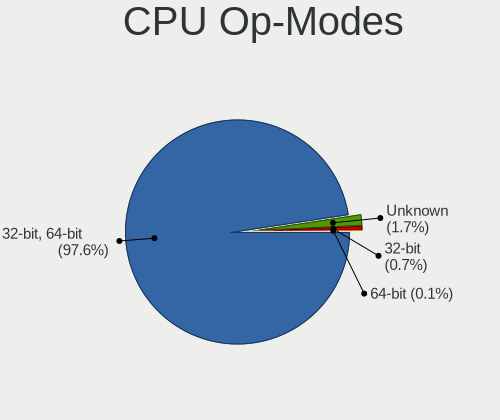

| Op mode        | Computers | Percent |
|----------------|-----------|---------|
| 32-bit, 64-bit | 1318      | 96.35%  |
| Unknown        | 36        | 2.63%   |
| 32-bit         | 13        | 0.95%   |
| 64-bit         | 1         | 0.07%   |

CPU Microcode
-------------

Microcode number

| Number     | Computers | Percent |
|------------|-----------|---------|
| Unknown    | 276       | 19.66%  |
| 0x206a7    | 83        | 5.91%   |
| 0x306a9    | 82        | 5.84%   |
| 0x306c3    | 54        | 3.85%   |
| 0x1067a    | 48        | 3.42%   |
| 0x906e9    | 44        | 3.13%   |
| 0x906ea    | 36        | 2.56%   |
| 0x806ea    | 35        | 2.49%   |
| 0x806e9    | 34        | 2.42%   |
| 0x806ec    | 31        | 2.21%   |
| 0x40651    | 31        | 2.21%   |
| 0x306d4    | 30        | 2.14%   |
| 0xa0652    | 28        | 1.99%   |
| 0x506e3    | 28        | 1.99%   |
| 0x406e3    | 28        | 1.99%   |
| 0x20655    | 25        | 1.78%   |
| 0x6fd      | 24        | 1.71%   |
| 0x806c1    | 22        | 1.57%   |
| 0x30678    | 20        | 1.42%   |
| 0x406c4    | 19        | 1.35%   |
| 0x706e5    | 18        | 1.28%   |
| 0x20652    | 18        | 1.28%   |
| 0x08108102 | 18        | 1.28%   |
| 0x10676    | 17        | 1.21%   |
| 0x08600106 | 17        | 1.21%   |
| 0x08108109 | 17        | 1.21%   |
| 0x06000852 | 12        | 0.85%   |
| 0x08701021 | 11        | 0.78%   |
| 0x506c9    | 10        | 0.71%   |
| 0x6f6      | 9         | 0.64%   |
| 0x0a50000c | 9         | 0.64%   |
| 0x08608103 | 9         | 0.64%   |
| 0x806eb    | 8         | 0.57%   |
| 0x6fb      | 8         | 0.57%   |
| 0x406c3    | 8         | 0.57%   |
| 0x08600103 | 8         | 0.57%   |
| 0x0800820d | 8         | 0.57%   |
| 0x08001138 | 8         | 0.57%   |
| 0x06001119 | 8         | 0.57%   |
| 0x010000c8 | 8         | 0.57%   |

CPU Microarch
-------------

Microarchitecture

| Name             | Computers | Percent |
|------------------|-----------|---------|
| KabyLake         | 236       | 17.3%   |
| Haswell          | 105       | 7.7%    |
| SandyBridge      | 103       | 7.55%   |
| IvyBridge        | 96        | 7.04%   |
| Penryn           | 80        | 5.87%   |
| Skylake          | 71        | 5.21%   |
| Zen 2            | 59        | 4.33%   |
| Westmere         | 56        | 4.11%   |
| Silvermont       | 55        | 4.03%   |
| Core             | 55        | 4.03%   |
| Zen+             | 54        | 3.96%   |
| CometLake        | 42        | 3.08%   |
| Broadwell        | 40        | 2.93%   |
| Unknown          | 37        | 2.71%   |
| Zen              | 32        | 2.35%   |
| TigerLake        | 30        | 2.2%    |
| IceLake          | 30        | 2.2%    |
| Piledriver       | 27        | 1.98%   |
| K10              | 24        | 1.76%   |
| Excavator        | 18        | 1.32%   |
| Goldmont         | 13        | 0.95%   |
| Puma             | 12        | 0.88%   |
| Goldmont plus    | 12        | 0.88%   |
| Bonnell          | 12        | 0.88%   |
| Zen 3            | 11        | 0.81%   |
| Nehalem          | 11        | 0.81%   |
| Bobcat           | 9         | 0.66%   |
| K8 Hammer        | 6         | 0.44%   |
| P6               | 5         | 0.37%   |
| K10 Llano        | 5         | 0.37%   |
| Alderlake Hybrid | 5         | 0.37%   |
| NetBurst         | 4         | 0.29%   |
| Steamroller      | 3         | 0.22%   |
| Bulldozer        | 3         | 0.22%   |
| Tremont          | 1         | 0.07%   |
| K6               | 1         | 0.07%   |
| Jaguar           | 1         | 0.07%   |

Graphics
--------

GPU Vendor
----------

Vendors of graphics cards

| Vendor                           | Computers | Percent |
|----------------------------------|-----------|---------|
| Intel                            | 830       | 45.91%  |
| Nvidia                           | 531       | 29.37%  |
| AMD                              | 433       | 23.95%  |
| Silicon Integrated Systems [SiS] | 10        | 0.55%   |
| VIA Technologies                 | 2         | 0.11%   |
| Matrox Electronics Systems       | 2         | 0.11%   |

GPU Model
---------

Graphics card models

| Model                                                                                    | Computers | Percent |
|------------------------------------------------------------------------------------------|-----------|---------|
| Intel 2nd Generation Core Processor Family Integrated Graphics Controller                | 79        | 4.2%    |
| Intel 3rd Gen Core processor Graphics Controller                                         | 66        | 3.51%   |
| Intel HD Graphics 620                                                                    | 43        | 2.28%   |
| AMD Picasso/Raven 2 [Radeon Vega Series / Radeon Vega Mobile Series]                     | 42        | 2.23%   |
| Intel Haswell-ULT Integrated Graphics Controller                                         | 39        | 2.07%   |
| Intel UHD Graphics 620                                                                   | 38        | 2.02%   |
| AMD Renoir                                                                               | 37        | 1.96%   |
| Intel CoffeeLake-H GT2 [UHD Graphics 630]                                                | 36        | 1.91%   |
| Intel Skylake GT2 [HD Graphics 520]                                                      | 34        | 1.81%   |
| Intel HD Graphics 630                                                                    | 34        | 1.81%   |
| Intel 4th Gen Core Processor Integrated Graphics Controller                              | 34        | 1.81%   |
| Intel HD Graphics 5500                                                                   | 33        | 1.75%   |
| Intel Atom/Celeron/Pentium Processor x5-E8000/J3xxx/N3xxx Integrated Graphics Controller | 30        | 1.59%   |
| Intel Core Processor Integrated Graphics Controller                                      | 28        | 1.49%   |
| AMD Sun XT [Radeon HD 8670A/8670M/8690M / R5 M330 / M430 / Radeon 520 Mobile]            | 28        | 1.49%   |
| Intel TigerLake-LP GT2 [Iris Xe Graphics]                                                | 27        | 1.43%   |
| AMD Topaz XT [Radeon R7 M260/M265 / M340/M360 / M440/M445 / 530/535 / 620/625 Mobile]    | 27        | 1.43%   |
| Intel CometLake-H GT2 [UHD Graphics]                                                     | 26        | 1.38%   |
| Intel Atom Processor Z36xxx/Z37xxx Series Graphics & Display                             | 25        | 1.33%   |
| Intel WhiskeyLake-U GT2 [UHD Graphics 620]                                               | 23        | 1.22%   |
| Intel CometLake-U GT2 [UHD Graphics]                                                     | 23        | 1.22%   |
| AMD Ellesmere [Radeon RX 470/480/570/570X/580/580X/590]                                  | 22        | 1.17%   |
| Intel HD Graphics 530                                                                    | 19        | 1.01%   |
| Nvidia GP107M [GeForce GTX 1050 Mobile]                                                  | 18        | 0.96%   |
| Nvidia GM108M [GeForce 940MX]                                                            | 17        | 0.9%    |
| Nvidia GF117M [GeForce 610M/710M/810M/820M / GT 620M/625M/630M/720M]                     | 17        | 0.9%    |
| Nvidia TU117M [GeForce GTX 1650 Mobile / Max-Q]                                          | 16        | 0.85%   |
| Nvidia GP107M [GeForce GTX 1050 Ti Mobile]                                               | 16        | 0.85%   |
| Nvidia GP107 [GeForce GTX 1050 Ti]                                                       | 16        | 0.85%   |
| Intel Xeon E3-1200 v3/4th Gen Core Processor Integrated Graphics Controller              | 16        | 0.85%   |
| Intel Iris Plus Graphics G1 (Ice Lake)                                                   | 16        | 0.85%   |
| AMD Thames [Radeon HD 7500M/7600M Series]                                                | 16        | 0.85%   |
| Nvidia GM108M [GeForce 840M]                                                             | 15        | 0.8%    |
| Intel Mobile 4 Series Chipset Integrated Graphics Controller                             | 14        | 0.74%   |
| AMD Lucienne                                                                             | 14        | 0.74%   |
| Nvidia TU117M [GeForce GTX 1650 Ti Mobile]                                               | 13        | 0.69%   |
| Nvidia GK208M [GeForce GT 740M]                                                          | 13        | 0.69%   |
| Intel Mobile 945GM/GMS/GME, 943/940GML Express Integrated Graphics Controller            | 13        | 0.69%   |
| AMD Raven Ridge [Radeon Vega Series / Radeon Vega Mobile Series]                         | 12        | 0.64%   |
| Nvidia TU116M [GeForce GTX 1660 Ti Mobile]                                               | 11        | 0.58%   |

GPU Combo
---------

Combinations of graphics cards

| Name           | Computers | Percent |
|----------------|-----------|---------|
| 1 x Intel      | 399       | 29.1%   |
| Intel + Nvidia | 318       | 23.19%  |
| 1 x AMD        | 266       | 19.4%   |
| 1 x Nvidia     | 193       | 14.08%  |
| Intel + AMD    | 99        | 7.22%   |
| 2 x AMD        | 47        | 3.43%   |
| AMD + Nvidia   | 21        | 1.53%   |
| Other          | 12        | 0.88%   |
| 1 x SiS        | 10        | 0.73%   |
| 1 x VIA        | 2         | 0.15%   |
| 1 x Matrox     | 2         | 0.15%   |
| 2 x Nvidia     | 1         | 0.07%   |
| 2 x Intel      | 1         | 0.07%   |

GPU Driver
----------

Free vs proprietary

| Driver      | Computers | Percent |
|-------------|-----------|---------|
| Free        | 1058      | 76.33%  |
| Proprietary | 273       | 19.7%   |
| Unknown     | 55        | 3.97%   |

GPU Memory
----------

Total video memory

| Size in GB | Computers | Percent |
|------------|-----------|---------|
| Unknown    | 689       | 49%     |
| 1.01-2.0   | 222       | 15.79%  |
| 0.51-1.0   | 146       | 10.38%  |
| 0.01-0.5   | 146       | 10.38%  |
| 3.01-4.0   | 129       | 9.17%   |
| 5.01-6.0   | 39        | 2.77%   |
| 7.01-8.0   | 19        | 1.35%   |
| 8.01-16.0  | 8         | 0.57%   |
| 2.01-3.0   | 7         | 0.5%    |
| 4.01-5.0   | 1         | 0.07%   |

Monitor
-------

Monitor Vendor
--------------

Monitor vendors

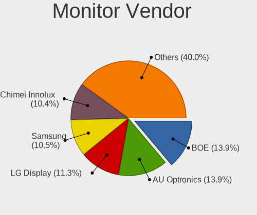

| Vendor                  | Computers | Percent |
|-------------------------|-----------|---------|
| AU Optronics            | 215       | 15.26%  |
| LG Display              | 182       | 12.92%  |
| Samsung Electronics     | 163       | 11.57%  |
| BOE                     | 156       | 11.07%  |
| Chimei Innolux          | 129       | 9.16%   |
| Philips                 | 46        | 3.26%   |
| Goldstar                | 46        | 3.26%   |
| Dell                    | 33        | 2.34%   |
| AOC                     | 32        | 2.27%   |
| Apple                   | 30        | 2.13%   |
| Ancor Communications    | 30        | 2.13%   |
| Lenovo                  | 28        | 1.99%   |
| Acer                    | 26        | 1.85%   |
| ViewSonic               | 25        | 1.77%   |
| Chi Mei Optoelectronics | 25        | 1.77%   |
| Hewlett-Packard         | 24        | 1.7%    |
| Sharp                   | 19        | 1.35%   |
| PANDA                   | 18        | 1.28%   |
| BenQ                    | 17        | 1.21%   |
| ASUSTek Computer        | 15        | 1.06%   |
| LG Philips              | 11        | 0.78%   |
| InfoVision              | 9         | 0.64%   |
| CPT                     | 8         | 0.57%   |
| Unknown                 | 7         | 0.5%    |
| MSI                     | 7         | 0.5%    |
| Sony                    | 6         | 0.43%   |
| LGD                     | 6         | 0.43%   |
| LG Electronics          | 6         | 0.43%   |
| AGO                     | 6         | 0.43%   |
| KTC                     | 5         | 0.35%   |
| Vestel Elektronik       | 4         | 0.28%   |
| SANYO                   | 4         | 0.28%   |
| SAC                     | 4         | 0.28%   |
| HKC                     | 4         | 0.28%   |
| Unknown                 | 4         | 0.28%   |
| VIE                     | 3         | 0.21%   |
| RTK                     | 3         | 0.21%   |
| Plain Tree Systems      | 3         | 0.21%   |
| Mi                      | 3         | 0.21%   |
| HannStar                | 3         | 0.21%   |

Monitor Model
-------------

Monitor models

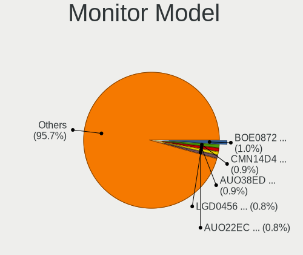

| Model                                                                    | Computers | Percent |
|--------------------------------------------------------------------------|-----------|---------|
| AU Optronics LCD Monitor AUO38ED 1920x1080 344x193mm 15.5-inch           | 19        | 1.32%   |
| AU Optronics LCD Monitor AUO22EC 1366x768 344x193mm 15.5-inch            | 16        | 1.11%   |
| LG Display LCD Monitor LGD02DC 1366x768 344x194mm 15.5-inch              | 13        | 0.9%    |
| Chimei Innolux LCD Monitor CMN14D4 1920x1080 309x173mm 13.9-inch         | 12        | 0.83%   |
| LG Display LCD Monitor LGD0456 1366x768 344x194mm 15.5-inch              | 11        | 0.76%   |
| Chimei Innolux LCD Monitor CMN15DB 1366x768 344x193mm 15.5-inch          | 11        | 0.76%   |
| LG Display LCD Monitor LGD033A 1366x768 344x194mm 15.5-inch              | 10        | 0.69%   |
| Lenovo LCD Monitor LEN40BA 1920x1080 344x194mm 15.5-inch                 | 10        | 0.69%   |
| LG Display LCD Monitor LGD039F 1366x768 345x194mm 15.6-inch              | 9         | 0.63%   |
| BOE LCD Monitor BOE0872 1920x1080 344x194mm 15.5-inch                    | 8         | 0.56%   |
| BOE LCD Monitor BOE0802 1920x1080 344x193mm 15.5-inch                    | 8         | 0.56%   |
| AU Optronics LCD Monitor AUO21ED 1920x1080 344x193mm 15.5-inch           | 8         | 0.56%   |
| LG Display LCD Monitor LGD02AC 1366x768 344x194mm 15.5-inch              | 7         | 0.49%   |
| BOE LCD Monitor BOE06A4 1366x768 344x194mm 15.5-inch                     | 7         | 0.49%   |
| Samsung Electronics LCD Monitor SEC324A 1366x768 344x194mm 15.5-inch     | 6         | 0.42%   |
| LG Display LCD Monitor LGD0384 1366x768 344x194mm 15.5-inch              | 6         | 0.42%   |
| Goldstar FULL HD GSM5B55 1920x1080 480x270mm 21.7-inch                   | 6         | 0.42%   |
| Chimei Innolux LCD Monitor CMN15DC 1366x768 344x193mm 15.5-inch          | 6         | 0.42%   |
| Chimei Innolux LCD Monitor CMN15D5 1920x1080 344x193mm 15.5-inch         | 6         | 0.42%   |
| BOE LCD Monitor BOE06A5 1366x768 344x194mm 15.5-inch                     | 6         | 0.42%   |
| AU Optronics LCD Monitor AUO70EC 1366x768 344x193mm 15.5-inch            | 6         | 0.42%   |
| AU Optronics LCD Monitor AUO403D 1920x1080 309x173mm 13.9-inch           | 6         | 0.42%   |
| AU Optronics LCD Monitor AUO2E8D 1920x1080 344x194mm 15.5-inch           | 6         | 0.42%   |
| Samsung Electronics S24F350 SAM0D20 1920x1080 521x293mm 23.5-inch        | 5         | 0.35%   |
| Samsung Electronics S19B150 SAM08A2 1366x768 410x230mm 18.5-inch         | 5         | 0.35%   |
| Samsung Electronics LCD Monitor SEC5441 1366x768 344x194mm 15.5-inch     | 5         | 0.35%   |
| LG Display LCD Monitor LGD053F 1920x1080 344x194mm 15.5-inch             | 5         | 0.35%   |
| LG Display LCD Monitor LGD046F 1920x1080 345x194mm 15.6-inch             | 5         | 0.35%   |
| LG Display LCD Monitor LGD045C 1366x768 344x194mm 15.5-inch              | 5         | 0.35%   |
| Chimei Innolux LCD Monitor CMN15F5 1920x1080 344x193mm 15.5-inch         | 5         | 0.35%   |
| Chimei Innolux LCD Monitor CMN15E7 1920x1080 344x193mm 15.5-inch         | 5         | 0.35%   |
| Chimei Innolux LCD Monitor CMN1521 1920x1080 344x193mm 15.5-inch         | 5         | 0.35%   |
| Chimei Innolux LCD Monitor CMN14D5 1920x1080 309x173mm 13.9-inch         | 5         | 0.35%   |
| Chi Mei Optoelectronics LCD Monitor CMO15A7 1366x768 344x193mm 15.5-inch | 5         | 0.35%   |
| BOE LCD Monitor BOE0877 1920x1080 309x173mm 13.9-inch                    | 5         | 0.35%   |
| BOE LCD Monitor BOE0675 1366x768 344x194mm 15.5-inch                     | 5         | 0.35%   |
| AU Optronics LCD Monitor AUOAF90 1920x1080 344x193mm 15.5-inch           | 5         | 0.35%   |
| AU Optronics LCD Monitor AUO71EC 1366x768 344x193mm 15.5-inch            | 5         | 0.35%   |
| AU Optronics LCD Monitor AUO61ED 1920x1080 344x193mm 15.5-inch           | 5         | 0.35%   |
| AU Optronics LCD Monitor AUO45EC 1366x768 344x193mm 15.5-inch            | 5         | 0.35%   |

Monitor Resolution
------------------

Monitor screen resolution

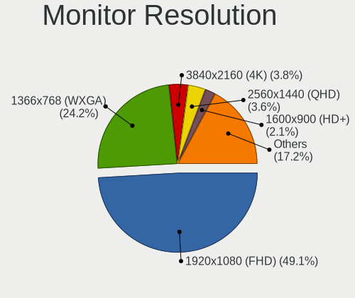

| Resolution         | Computers | Percent |
|--------------------|-----------|---------|
| 1920x1080 (FHD)    | 610       | 45.25%  |
| 1366x768 (WXGA)    | 387       | 28.71%  |
| 3840x2160 (4K)     | 40        | 2.97%   |
| 1280x800 (WXGA)    | 37        | 2.74%   |
| 1600x900 (HD+)     | 35        | 2.6%    |
| 1440x900 (WXGA+)   | 30        | 2.23%   |
| 2560x1440 (QHD)    | 29        | 2.15%   |
| 1280x1024 (SXGA)   | 28        | 2.08%   |
| Unknown            | 22        | 1.63%   |
| 1920x1200 (WUXGA)  | 18        | 1.34%   |
| 1680x1050 (WSXGA+) | 18        | 1.34%   |
| 2560x1600          | 10        | 0.74%   |
| 2160x1440          | 10        | 0.74%   |
| 2560x1080          | 8         | 0.59%   |
| 1360x768           | 8         | 0.59%   |
| 1024x600           | 8         | 0.59%   |
| 3840x1080          | 7         | 0.52%   |
| 3200x1800 (QHD+)   | 5         | 0.37%   |
| 2880x1800          | 5         | 0.37%   |
| 3440x1440          | 4         | 0.3%    |
| 1920x540           | 4         | 0.3%    |
| 1680x945           | 3         | 0.22%   |
| 4480x1440          | 2         | 0.15%   |
| 1024x768 (XGA)     | 2         | 0.15%   |
| 7920x1440          | 1         | 0.07%   |
| 5760x2160          | 1         | 0.07%   |
| 3840x2560          | 1         | 0.07%   |
| 3750x1280          | 1         | 0.07%   |
| 3360x1050          | 1         | 0.07%   |
| 3240x2160          | 1         | 0.07%   |
| 3072x1920          | 1         | 0.07%   |
| 3046x1050          | 1         | 0.07%   |
| 3000x2000          | 1         | 0.07%   |
| 2806x900           | 1         | 0.07%   |
| 2646x1024          | 1         | 0.07%   |
| 2520x1680          | 1         | 0.07%   |
| 2390x768           | 1         | 0.07%   |
| 2288x1287          | 1         | 0.07%   |
| 1600x1200          | 1         | 0.07%   |
| 1280x720 (HD)      | 1         | 0.07%   |

Monitor Diagonal
----------------

Diagonal size in inches

| Inches  | Computers | Percent |
|---------|-----------|---------|
| 15      | 598       | 42.53%  |
| 13      | 130       | 9.25%   |
| 23      | 82        | 5.83%   |
| 21      | 72        | 5.12%   |
| Unknown | 68        | 4.84%   |
| 14      | 66        | 4.69%   |
| 17      | 57        | 4.05%   |
| 27      | 50        | 3.56%   |
| 24      | 49        | 3.49%   |
| 18      | 36        | 2.56%   |
| 19      | 27        | 1.92%   |
| 12      | 22        | 1.56%   |
| 11      | 21        | 1.49%   |
| 31      | 16        | 1.14%   |
| 20      | 16        | 1.14%   |
| 10      | 14        | 1%      |
| 16      | 12        | 0.85%   |
| 34      | 11        | 0.78%   |
| 22      | 9         | 0.64%   |
| 84      | 7         | 0.5%    |
| 72      | 7         | 0.5%    |
| 26      | 5         | 0.36%   |
| 40      | 4         | 0.28%   |
| 54      | 3         | 0.21%   |
| 46      | 3         | 0.21%   |
| 33      | 3         | 0.21%   |
| 32      | 3         | 0.21%   |
| 29      | 3         | 0.21%   |
| 60      | 2         | 0.14%   |
| 57      | 2         | 0.14%   |
| 43      | 2         | 0.14%   |
| 55      | 1         | 0.07%   |
| 52      | 1         | 0.07%   |
| 47      | 1         | 0.07%   |
| 36      | 1         | 0.07%   |
| 28      | 1         | 0.07%   |
| 25      | 1         | 0.07%   |

Monitor Width
-------------

Physical width

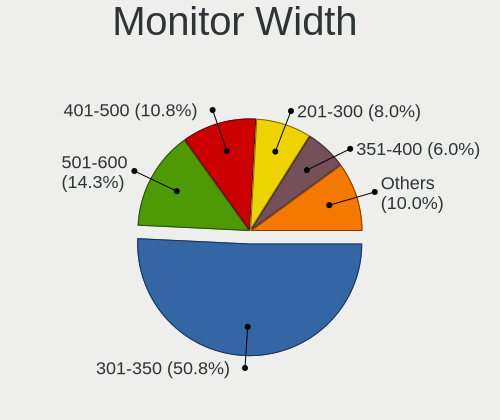

| Width in mm | Computers | Percent |
|-------------|-----------|---------|
| 301-350     | 728       | 52.15%  |
| 501-600     | 169       | 12.11%  |
| 401-500     | 160       | 11.46%  |
| 201-300     | 130       | 9.31%   |
| Unknown     | 68        | 4.87%   |
| 351-400     | 64        | 4.58%   |
| 601-700     | 26        | 1.86%   |
| 701-800     | 18        | 1.29%   |
| 1501-2000   | 14        | 1%      |
| 1001-1500   | 13        | 0.93%   |
| 801-900     | 4         | 0.29%   |
| 901-1000    | 2         | 0.14%   |

Aspect Ratio
------------

Proportional relationship between the width and the height

| Ratio   | Computers | Percent |
|---------|-----------|---------|
| 16/9    | 1031      | 80.61%  |
| 16/10   | 119       | 9.3%    |
| Unknown | 61        | 4.77%   |
| 5/4     | 21        | 1.64%   |
| 3/2     | 20        | 1.56%   |
| 4/3     | 15        | 1.17%   |
| 21/9    | 11        | 0.86%   |
| 6/5     | 1         | 0.08%   |

Monitor Area
------------

Area in inch

| Area in inch | Computers | Percent |
|----------------|-----------|---------|
| 101-110        | 600       | 42.92%  |
| 201-250        | 179       | 12.8%   |
| 81-90          | 140       | 10.01%  |
| Unknown        | 68        | 4.86%   |
| 151-200        | 65        | 4.65%   |
| 71-80          | 62        | 4.43%   |
| 301-350        | 52        | 3.72%   |
| 141-150        | 46        | 3.29%   |
| 351-500        | 37        | 2.65%   |
| 121-130        | 37        | 2.65%   |
| More than 1000 | 23        | 1.65%   |
| 51-60          | 21        | 1.5%    |
| 61-70          | 16        | 1.14%   |
| 41-50          | 14        | 1%      |
| 251-300        | 13        | 0.93%   |
| 501-1000       | 11        | 0.79%   |
| 111-120        | 7         | 0.5%    |
| 91-100         | 4         | 0.29%   |
| 131-140        | 3         | 0.21%   |

Pixel Density
-------------

Pixels per inch

| Density       | Computers | Percent |
|---------------|-----------|---------|
| 121-160       | 430       | 31.18%  |
| 101-120       | 415       | 30.09%  |
| 51-100        | 352       | 25.53%  |
| 161-240       | 74        | 5.37%   |
| Unknown       | 68        | 4.93%   |
| 1-50          | 24        | 1.74%   |
| More than 240 | 16        | 1.16%   |

Multiple Monitors
-----------------

Total monitors connected

| Total | Computers | Percent |
|-------|-----------|---------|
| 1     | 1151      | 82.69%  |
| 2     | 165       | 11.85%  |
| 0     | 67        | 4.81%   |
| 3     | 9         | 0.65%   |

Network
-------

Net Controller Vendor
---------------------

Controller vendors

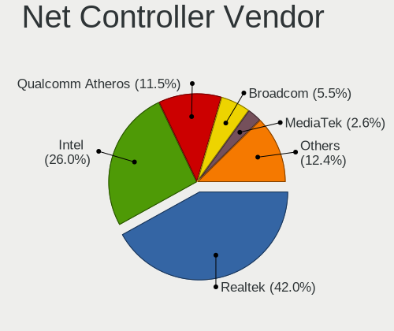

| Vendor                                 | Computers | Percent |
|----------------------------------------|-----------|---------|
| Realtek Semiconductor                  | 875       | 40.47%  |
| Intel                                  | 522       | 24.14%  |
| Qualcomm Atheros                       | 303       | 14.01%  |
| Broadcom                               | 138       | 6.38%   |
| Ralink Technology                      | 51        | 2.36%   |
| Ralink                                 | 27        | 1.25%   |
| Marvell Technology Group               | 27        | 1.25%   |
| Broadcom Limited                       | 26        | 1.2%    |
| ASUSTek Computer                       | 20        | 0.93%   |
| TP-Link                                | 18        | 0.83%   |
| Qualcomm Atheros Communications        | 18        | 0.83%   |
| Nvidia                                 | 17        | 0.79%   |
| Silicon Integrated Systems [SiS]       | 13        | 0.6%    |
| Samsung Electronics                    | 13        | 0.6%    |
| Xiaomi                                 | 12        | 0.56%   |
| MediaTek                               | 12        | 0.56%   |
| ZyXEL Communications                   | 5         | 0.23%   |
| Huawei Technologies                    | 5         | 0.23%   |
| ASIX Electronics                       | 5         | 0.23%   |
| JMicron Technology                     | 4         | 0.19%   |
| Ericsson Business Mobile Networks      | 4         | 0.19%   |
| Apple                                  | 4         | 0.19%   |
| Aquantia                               | 3         | 0.14%   |
| Tenda                                  | 2         | 0.09%   |
| Sony Ericsson Mobile Communications AB | 2         | 0.09%   |
| Sierra Wireless                        | 2         | 0.09%   |
| Motorola PCS                           | 2         | 0.09%   |
| Microchip Technology                   | 2         | 0.09%   |
| ICS Advent                             | 2         | 0.09%   |
| Dell                                   | 2         | 0.09%   |
| Attansic Technology                    | 2         | 0.09%   |
| Accton Technology                      | 2         | 0.09%   |
| Wilocity                               | 1         | 0.05%   |
| VIA Technologies                       | 1         | 0.05%   |
| ULi Electronics                        | 1         | 0.05%   |
| U-Blox                                 | 1         | 0.05%   |
| T & A Mobile Phones                    | 1         | 0.05%   |
| Standard Microsystems                  | 1         | 0.05%   |
| Sangoma Technologies                   | 1         | 0.05%   |
| Qualcomm                               | 1         | 0.05%   |

Net Controller Model
--------------------

Controller models

| Model                                                             | Computers | Percent |
|-------------------------------------------------------------------|-----------|---------|
| Realtek RTL8111/8168/8411 PCI Express Gigabit Ethernet Controller | 605       | 24.44%  |
| Realtek RTL810xE PCI Express Fast Ethernet controller             | 149       | 6.02%   |
| Qualcomm Atheros AR9485 Wireless Network Adapter                  | 56        | 2.26%   |
| Qualcomm Atheros QCA9377 802.11ac Wireless Network Adapter        | 53        | 2.14%   |
| Intel Wi-Fi 6 AX200                                               | 42        | 1.7%    |
| Qualcomm Atheros AR9285 Wireless Network Adapter (PCI-Express)    | 40        | 1.62%   |
| Broadcom BCM4313 802.11bgn Wireless Network Adapter               | 40        | 1.62%   |
| Realtek RTL8723BE PCIe Wireless Network Adapter                   | 39        | 1.58%   |
| Intel Wireless 7265                                               | 33        | 1.33%   |
| Qualcomm Atheros QCA9565 / AR9565 Wireless Network Adapter        | 32        | 1.29%   |
| Realtek RTL8822CE 802.11ac PCIe Wireless Network Adapter          | 30        | 1.21%   |
| Intel Comet Lake PCH CNVi WiFi                                    | 29        | 1.17%   |
| Realtek RTL8821CE 802.11ac PCIe Wireless Network Adapter          | 28        | 1.13%   |
| Intel Wi-Fi 6 AX201                                               | 26        | 1.05%   |
| Intel Dual Band Wireless-AC 3168NGW [Stone Peak]                  | 26        | 1.05%   |
| Ralink MT7601U Wireless Adapter                                   | 24        | 0.97%   |
| Qualcomm Atheros QCA6174 802.11ac Wireless Network Adapter        | 24        | 0.97%   |
| Intel Wireless 8265 / 8275                                        | 23        | 0.93%   |
| Intel Cannon Lake PCH CNVi WiFi                                   | 23        | 0.93%   |
| Realtek RTL8822BE 802.11a/b/g/n/ac WiFi adapter                   | 21        | 0.85%   |
| Qualcomm Atheros AR8131 Gigabit Ethernet                          | 21        | 0.85%   |
| Intel Comet Lake PCH-LP CNVi WiFi                                 | 21        | 0.85%   |
| Broadcom BCM43142 802.11b/g/n                                     | 21        | 0.85%   |
| Intel Dual Band Wireless-AC 3165 Plus Bluetooth                   | 20        | 0.81%   |
| Ralink RT3290 Wireless 802.11n 1T/1R PCIe                         | 19        | 0.77%   |
| Intel Wireless 3165                                               | 18        | 0.73%   |
| Intel 82579LM Gigabit Network Connection (Lewisville)             | 18        | 0.73%   |
| Realtek RTL8125 2.5GbE Controller                                 | 17        | 0.69%   |
| Intel Wireless 7260                                               | 17        | 0.69%   |
| Intel Wireless 3160                                               | 17        | 0.69%   |
| Qualcomm Atheros AR8151 v2.0 Gigabit Ethernet                     | 16        | 0.65%   |
| Qualcomm Atheros AR9271 802.11n                                   | 14        | 0.57%   |
| Intel Wireless 8260                                               | 14        | 0.57%   |
| Intel PRO/Wireless 3945ABG [Golan] Network Connection             | 14        | 0.57%   |
| Intel Ethernet Connection (2) I219-V                              | 14        | 0.57%   |
| Intel Centrino Advanced-N 6205 [Taylor Peak]                      | 14        | 0.57%   |
| Realtek RTL8723AE PCIe Wireless Network Adapter                   | 13        | 0.53%   |
| Ralink RT2870/RT3070 Wireless Adapter                             | 13        | 0.53%   |
| Silicon Integrated Systems [SiS] 191 Gigabit Ethernet Adapter     | 12        | 0.48%   |
| Intel Wireless-AC 9260                                            | 12        | 0.48%   |

Wireless Vendor
---------------

Wireless vendors

| Vendor                           | Computers | Percent |
|----------------------------------|-----------|---------|
| Intel                            | 457       | 38.05%  |
| Qualcomm Atheros                 | 231       | 19.23%  |
| Realtek Semiconductor            | 226       | 18.82%  |
| Broadcom                         | 108       | 8.99%   |
| Ralink Technology                | 51        | 4.25%   |
| Ralink                           | 27        | 2.25%   |
| ASUSTek Computer                 | 20        | 1.67%   |
| Qualcomm Atheros Communications  | 18        | 1.5%    |
| Broadcom Limited                 | 17        | 1.42%   |
| TP-Link                          | 16        | 1.33%   |
| MediaTek                         | 11        | 0.92%   |
| ZyXEL Communications             | 5         | 0.42%   |
| Tenda                            | 2         | 0.17%   |
| Sierra Wireless                  | 2         | 0.17%   |
| Dell                             | 2         | 0.17%   |
| Accton Technology                | 2         | 0.17%   |
| Wilocity                         | 1         | 0.08%   |
| Silicon Integrated Systems [SiS] | 1         | 0.08%   |
| Marvell Technology Group         | 1         | 0.08%   |
| Linksys                          | 1         | 0.08%   |
| IMC Networks                     | 1         | 0.08%   |
| AirTies Wireless Networks        | 1         | 0.08%   |

Wireless Model
--------------

Wireless models

| Model                                                          | Computers | Percent |
|----------------------------------------------------------------|-----------|---------|
| Qualcomm Atheros AR9485 Wireless Network Adapter               | 56        | 4.65%   |
| Qualcomm Atheros QCA9377 802.11ac Wireless Network Adapter     | 53        | 4.4%    |
| Intel Wi-Fi 6 AX200                                            | 42        | 3.49%   |
| Qualcomm Atheros AR9285 Wireless Network Adapter (PCI-Express) | 40        | 3.32%   |
| Broadcom BCM4313 802.11bgn Wireless Network Adapter            | 40        | 3.32%   |
| Realtek RTL8723BE PCIe Wireless Network Adapter                | 39        | 3.24%   |
| Intel Wireless 7265                                            | 33        | 2.74%   |
| Qualcomm Atheros QCA9565 / AR9565 Wireless Network Adapter     | 32        | 2.66%   |
| Realtek RTL8822CE 802.11ac PCIe Wireless Network Adapter       | 30        | 2.49%   |
| Intel Comet Lake PCH CNVi WiFi                                 | 29        | 2.41%   |
| Realtek RTL8821CE 802.11ac PCIe Wireless Network Adapter       | 28        | 2.32%   |
| Intel Wi-Fi 6 AX201                                            | 26        | 2.16%   |
| Intel Dual Band Wireless-AC 3168NGW [Stone Peak]               | 26        | 2.16%   |
| Ralink MT7601U Wireless Adapter                                | 24        | 1.99%   |
| Qualcomm Atheros QCA6174 802.11ac Wireless Network Adapter     | 24        | 1.99%   |
| Intel Wireless 8265 / 8275                                     | 23        | 1.91%   |
| Intel Cannon Lake PCH CNVi WiFi                                | 23        | 1.91%   |
| Realtek RTL8822BE 802.11a/b/g/n/ac WiFi adapter                | 21        | 1.74%   |
| Intel Comet Lake PCH-LP CNVi WiFi                              | 21        | 1.74%   |
| Broadcom BCM43142 802.11b/g/n                                  | 21        | 1.74%   |
| Intel Dual Band Wireless-AC 3165 Plus Bluetooth                | 20        | 1.66%   |
| Ralink RT3290 Wireless 802.11n 1T/1R PCIe                      | 19        | 1.58%   |
| Intel Wireless 3165                                            | 18        | 1.49%   |
| Intel Wireless 7260                                            | 17        | 1.41%   |
| Intel Wireless 3160                                            | 17        | 1.41%   |
| Qualcomm Atheros AR9271 802.11n                                | 14        | 1.16%   |
| Intel Wireless 8260                                            | 14        | 1.16%   |
| Intel PRO/Wireless 3945ABG [Golan] Network Connection          | 14        | 1.16%   |
| Intel Centrino Advanced-N 6205 [Taylor Peak]                   | 14        | 1.16%   |
| Realtek RTL8723AE PCIe Wireless Network Adapter                | 13        | 1.08%   |
| Ralink RT2870/RT3070 Wireless Adapter                          | 13        | 1.08%   |
| Intel Wireless-AC 9260                                         | 12        | 1%      |
| Intel Ice Lake-LP PCH CNVi WiFi                                | 12        | 1%      |
| Realtek RTL8723DE Wireless Network Adapter                     | 11        | 0.91%   |
| Realtek RTL8192CU 802.11n WLAN Adapter                         | 11        | 0.91%   |
| Intel WiFi Link 5100                                           | 10        | 0.83%   |
| Intel Cannon Point-LP CNVi [Wireless-AC]                       | 10        | 0.83%   |
| Realtek RTL8821AE 802.11ac PCIe Wireless Network Adapter       | 9         | 0.75%   |
| Realtek RTL8187B Wireless 802.11g 54Mbps Network Adapter       | 9         | 0.75%   |
| Intel PRO/Wireless 5100 AGN [Shiloh] Network Connection        | 9         | 0.75%   |

Ethernet Vendor
---------------

Ethernet vendors

| Vendor                                 | Computers | Percent |
|----------------------------------------|-----------|---------|
| Realtek Semiconductor                  | 805       | 65.08%  |
| Intel                                  | 143       | 11.56%  |
| Qualcomm Atheros                       | 109       | 8.81%   |
| Broadcom                               | 49        | 3.96%   |
| Marvell Technology Group               | 26        | 2.1%    |
| Nvidia                                 | 16        | 1.29%   |
| Samsung Electronics                    | 13        | 1.05%   |
| Xiaomi                                 | 12        | 0.97%   |
| Silicon Integrated Systems [SiS]       | 12        | 0.97%   |
| Broadcom Limited                       | 9         | 0.73%   |
| Huawei Technologies                    | 5         | 0.4%    |
| ASIX Electronics                       | 5         | 0.4%    |
| JMicron Technology                     | 4         | 0.32%   |
| Apple                                  | 4         | 0.32%   |
| Aquantia                               | 3         | 0.24%   |
| TP-Link                                | 2         | 0.16%   |
| Sony Ericsson Mobile Communications AB | 2         | 0.16%   |
| Motorola PCS                           | 2         | 0.16%   |
| Microchip Technology                   | 2         | 0.16%   |
| ICS Advent                             | 2         | 0.16%   |
| Attansic Technology                    | 2         | 0.16%   |
| VIA Technologies                       | 1         | 0.08%   |
| ULi Electronics                        | 1         | 0.08%   |
| Standard Microsystems                  | 1         | 0.08%   |
| Qualcomm                               | 1         | 0.08%   |
| OnePlus Technology (Shenzhen)          | 1         | 0.08%   |
| MediaTek                               | 1         | 0.08%   |
| LSI                                    | 1         | 0.08%   |
| Lenovo                                 | 1         | 0.08%   |
| HTC (High Tech Computer)               | 1         | 0.08%   |
| Davicom Semiconductor                  | 1         | 0.08%   |

Ethernet Model
--------------

Ethernet models

| Model                                                                          | Computers | Percent |
|--------------------------------------------------------------------------------|-----------|---------|
| Realtek RTL8111/8168/8411 PCI Express Gigabit Ethernet Controller              | 605       | 48.21%  |
| Realtek RTL810xE PCI Express Fast Ethernet controller                          | 149       | 11.87%  |
| Qualcomm Atheros AR8131 Gigabit Ethernet                                       | 21        | 1.67%   |
| Intel 82579LM Gigabit Network Connection (Lewisville)                          | 18        | 1.43%   |
| Realtek RTL8125 2.5GbE Controller                                              | 17        | 1.35%   |
| Qualcomm Atheros AR8151 v2.0 Gigabit Ethernet                                  | 16        | 1.27%   |
| Intel Ethernet Connection (2) I219-V                                           | 14        | 1.12%   |
| Silicon Integrated Systems [SiS] 191 Gigabit Ethernet Adapter                  | 12        | 0.96%   |
| Realtek RTL8153 Gigabit Ethernet Adapter                                       | 11        | 0.88%   |
| Intel Ethernet Connection (3) I218-LM                                          | 11        | 0.88%   |
| Qualcomm Atheros QCA8171 Gigabit Ethernet                                      | 10        | 0.8%    |
| Intel I211 Gigabit Network Connection                                          | 10        | 0.8%    |
| Broadcom NetLink BCM57785 Gigabit Ethernet PCIe                                | 10        | 0.8%    |
| Xiaomi Mi/Redmi series (RNDIS)                                                 | 9         | 0.72%   |
| Qualcomm Atheros Killer E2500 Gigabit Ethernet Controller                      | 9         | 0.72%   |
| Samsung GT-I9070 (network tethering, USB debugging enabled)                    | 8         | 0.64%   |
| Realtek RTL8152 Fast Ethernet Adapter                                          | 8         | 0.64%   |
| Qualcomm Atheros AR8161 Gigabit Ethernet                                       | 8         | 0.64%   |
| Qualcomm Atheros AR8152 v2.0 Fast Ethernet                                     | 8         | 0.64%   |
| Realtek RTL-8100/8101L/8139 PCI Fast Ethernet Adapter                          | 7         | 0.56%   |
| Qualcomm Atheros AR8152 v1.1 Fast Ethernet                                     | 7         | 0.56%   |
| Nvidia MCP61 Ethernet                                                          | 7         | 0.56%   |
| Intel Ethernet Connection I218-LM                                              | 7         | 0.56%   |
| Intel Ethernet Connection (4) I219-LM                                          | 7         | 0.56%   |
| Broadcom NetXtreme BCM57765 Gigabit Ethernet PCIe                              | 7         | 0.56%   |
| Broadcom NetLink BCM57780 Gigabit Ethernet PCIe                                | 7         | 0.56%   |
| Intel I210 Gigabit Network Connection                                          | 6         | 0.48%   |
| Intel Ethernet Connection I217-V                                               | 6         | 0.48%   |
| Intel Ethernet Connection I217-LM                                              | 6         | 0.48%   |
| Intel 82579V Gigabit Network Connection                                        | 6         | 0.48%   |
| Samsung Galaxy series, misc. (tethering mode)                                  | 5         | 0.4%    |
| Realtek Killer E2600 Gigabit Ethernet Controller                               | 5         | 0.4%    |
| Qualcomm Atheros Killer E2400 Gigabit Ethernet Controller                      | 5         | 0.4%    |
| Qualcomm Atheros AR8132 Fast Ethernet                                          | 5         | 0.4%    |
| Nvidia MCP79 Ethernet                                                          | 5         | 0.4%    |
| Marvell Group 88E8040 PCI-E Fast Ethernet Controller                           | 5         | 0.4%    |
| Huawei SNE-LX1                                                                 | 5         | 0.4%    |
| Qualcomm Atheros Killer E220x Gigabit Ethernet Controller                      | 4         | 0.32%   |
| Qualcomm Atheros AR8121/AR8113/AR8114 Gigabit or Fast Ethernet                 | 4         | 0.32%   |
| Marvell Group Yukon Optima 88E8059 [PCIe Gigabit Ethernet Controller with AVB] | 4         | 0.32%   |

Net Controller Kind
-------------------

Ethernet, WiFi or modem

| Kind     | Computers | Percent |
|----------|-----------|---------|
| Ethernet | 1189      | 50.86%  |
| WiFi     | 1134      | 48.5%   |
| Modem    | 11        | 0.47%   |
| Unknown  | 4         | 0.17%   |

Used Controller
---------------

Currently used network controller

| Kind     | Computers | Percent |
|----------|-----------|---------|
| WiFi     | 927       | 67.08%  |
| Ethernet | 455       | 32.92%  |

NICs
----

Total network controllers on board

| Total | Computers | Percent |
|-------|-----------|---------|
| 2     | 861       | 62.98%  |
| 1     | 456       | 33.36%  |
| 0     | 34        | 2.49%   |
| 3     | 12        | 0.88%   |
| 4     | 3         | 0.22%   |
| 7     | 1         | 0.07%   |

IPv6
----

IPv6 vs IPv4

| Used | Computers | Percent |
|------|-----------|---------|
| No   | 1358      | 99.41%  |
| Yes  | 8         | 0.59%   |

Bluetooth
---------

Bluetooth Vendor
----------------

Controller vendors

| Vendor                          | Computers | Percent |
|---------------------------------|-----------|---------|
| Intel                           | 367       | 40.51%  |
| Realtek Semiconductor           | 100       | 11.04%  |
| Qualcomm Atheros Communications | 86        | 9.49%   |
| IMC Networks                    | 69        | 7.62%   |
| Cambridge Silicon Radio         | 52        | 5.74%   |
| Broadcom                        | 45        | 4.97%   |
| Lite-On Technology              | 32        | 3.53%   |
| Foxconn / Hon Hai               | 23        | 2.54%   |
| Apple                           | 22        | 2.43%   |
| Toshiba                         | 20        | 2.21%   |
| ASUSTek Computer                | 20        | 2.21%   |
| Ralink                          | 19        | 2.1%    |
| Realtek                         | 17        | 1.88%   |
| Hewlett-Packard                 | 9         | 0.99%   |
| Dell                            | 9         | 0.99%   |
| MediaTek                        | 3         | 0.33%   |
| Alps Electric                   | 3         | 0.33%   |
| TP-Link                         | 2         | 0.22%   |
| Ralink Technology               | 2         | 0.22%   |
| Foxconn International           | 2         | 0.22%   |
| Qcom                            | 1         | 0.11%   |
| Logitech                        | 1         | 0.11%   |
| Integrated System Solution      | 1         | 0.11%   |
| HTC (High Tech Computer)        | 1         | 0.11%   |

Bluetooth Model
---------------

Controller models

| Model                                               | Computers | Percent |
|-----------------------------------------------------|-----------|---------|
| Intel Bluetooth wireless interface                  | 136       | 15.01%  |
| Intel AX201 Bluetooth                               | 68        | 7.51%   |
| Realtek Bluetooth Radio                             | 64        | 7.06%   |
| Intel Bluetooth 9460/9560 Jefferson Peak (JfP)      | 54        | 5.96%   |
| Cambridge Silicon Radio Bluetooth Dongle (HCI mode) | 52        | 5.74%   |
| Qualcomm Atheros  Bluetooth Device                  | 46        | 5.08%   |
| Intel AX200 Bluetooth                               | 41        | 4.53%   |
| Intel Wireless-AC 3168 Bluetooth                    | 25        | 2.76%   |
| IMC Networks Bluetooth Radio                        | 23        | 2.54%   |
| Realtek  Bluetooth 4.2 Adapter                      | 22        | 2.43%   |
| Ralink RT3290 Bluetooth                             | 19        | 2.1%    |
| Realtek Bluetooth Radio                             | 17        | 1.88%   |
| Intel Centrino Bluetooth Wireless Transceiver       | 15        | 1.66%   |
| IMC Networks Bluetooth Device                       | 15        | 1.66%   |
| Lite-On Bluetooth Device                            | 13        | 1.43%   |
| Qualcomm Atheros AR3011 Bluetooth                   | 12        | 1.32%   |
| Apple Bluetooth Host Controller                     | 12        | 1.32%   |
| Qualcomm Atheros QCA61x4 Bluetooth 4.0              | 11        | 1.21%   |
| Qualcomm Atheros AR3012 Bluetooth 4.0               | 11        | 1.21%   |
| Intel Wireless-AC 9260 Bluetooth Adapter            | 11        | 1.21%   |
| IMC Networks Bluetooth USB Host Controller          | 10        | 1.1%    |
| Broadcom BCM2070 Bluetooth 2.1 + EDR                | 10        | 1.1%    |
| Intel Centrino Advanced-N 6230 Bluetooth adapter    | 9         | 0.99%   |
| Lite-On Qualcomm Atheros QCA9377 Bluetooth          | 8         | 0.88%   |
| IMC Networks Bluetooth                              | 8         | 0.88%   |
| IMC Networks Atheros AR3012 Bluetooth 4.0 Adapter   | 8         | 0.88%   |
| Realtek RTL8821A Bluetooth                          | 7         | 0.77%   |
| Realtek RTL8723B Bluetooth                          | 7         | 0.77%   |
| ASUS BT-253 Bluetooth Adapter                       | 7         | 0.77%   |
| Foxconn / Hon Hai Bluetooth USB Host Controller     | 6         | 0.66%   |
| Apple Bluetooth USB Host Controller                 | 6         | 0.66%   |
| Intel Bluetooth Device                              | 5         | 0.55%   |
| HP Bluetooth 2.0 Interface [Broadcom BCM2045]       | 5         | 0.55%   |
| Broadcom BCM43142A0 Bluetooth 4.0                   | 5         | 0.55%   |
| Toshiba RT Bluetooth Radio                          | 4         | 0.44%   |
| Lite-On Atheros AR3012 Bluetooth                    | 4         | 0.44%   |
| HP Broadcom 2070 Bluetooth Combo                    | 4         | 0.44%   |
| Foxconn / Hon Hai Bluetooth Device                  | 4         | 0.44%   |
| Dell DW375 Bluetooth Module                         | 4         | 0.44%   |
| Broadcom HP Portable Valentine                      | 4         | 0.44%   |

Sound
-----

Sound Vendor
------------

Sound card vendors

| Vendor                           | Computers | Percent |
|----------------------------------|-----------|---------|
| Intel                            | 1017      | 56.41%  |
| AMD                              | 375       | 20.8%   |
| Nvidia                           | 303       | 16.81%  |
| C-Media Electronics              | 17        | 0.94%   |
| Silicon Integrated Systems [SiS] | 12        | 0.67%   |
| Barco Display Systems            | 7         | 0.39%   |
| Logitech                         | 6         | 0.33%   |
| Generalplus Technology           | 6         | 0.33%   |
| Tenx Technology                  | 5         | 0.28%   |
| JMTek                            | 5         | 0.28%   |
| Creative Labs                    | 5         | 0.28%   |
| VIA Technologies                 | 4         | 0.22%   |
| Apple                            | 4         | 0.22%   |
| Texas Instruments                | 3         | 0.17%   |
| Kingston Technology              | 3         | 0.17%   |
| Yamaha                           | 2         | 0.11%   |
| SteelSeries ApS                  | 2         | 0.11%   |
| Realtek Semiconductor            | 2         | 0.11%   |
| M-Audio                          | 2         | 0.11%   |
| LG Electronics                   | 2         | 0.11%   |
| GYROCOM C&C                      | 2         | 0.11%   |
| GN Netcom                        | 2         | 0.11%   |
| Focusrite-Novation               | 2         | 0.11%   |
| Creative Technology              | 2         | 0.11%   |
| ULi Electronics                  | 1         | 0.06%   |
| Trust                            | 1         | 0.06%   |
| RODE Microphones                 | 1         | 0.06%   |
| Native Instruments               | 1         | 0.06%   |
| Evolution Electronics            | 1         | 0.06%   |
| DSEA A/S                         | 1         | 0.06%   |
| DigiTech                         | 1         | 0.06%   |
| Bose                             | 1         | 0.06%   |
| Blue Microphones                 | 1         | 0.06%   |
| ASUSTek Computer                 | 1         | 0.06%   |
| Astro Gaming                     | 1         | 0.06%   |
| Alesis                           | 1         | 0.06%   |
| A4Tech                           | 1         | 0.06%   |

Sound Model
-----------

Sound card models

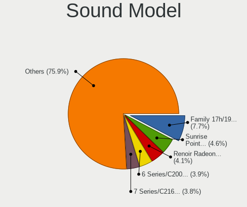

| Model                                                                                             | Computers | Percent |
|---------------------------------------------------------------------------------------------------|-----------|---------|
| Intel Sunrise Point-LP HD Audio                                                                   | 121       | 5.68%   |
| AMD Family 17h/19h HD Audio Controller                                                            | 116       | 5.44%   |
| Intel 7 Series/C216 Chipset Family High Definition Audio Controller                               | 97        | 4.55%   |
| Intel 6 Series/C200 Series Chipset Family High Definition Audio Controller                        | 96        | 4.5%    |
| Intel NM10/ICH7 Family High Definition Audio Controller                                           | 64        | 3%      |
| Intel 5 Series/3400 Series Chipset High Definition Audio                                          | 60        | 2.81%   |
| Intel 8 Series/C220 Series Chipset High Definition Audio Controller                               | 57        | 2.67%   |
| AMD Renoir Radeon High Definition Audio Controller                                                | 52        | 2.44%   |
| AMD Raven/Raven2/Fenghuang HDMI/DP Audio Controller                                               | 49        | 2.3%    |
| Intel Xeon E3-1200 v3/4th Gen Core Processor HD Audio Controller                                  | 46        | 2.16%   |
| Intel Cannon Lake PCH cAVS                                                                        | 45        | 2.11%   |
| AMD SBx00 Azalia (Intel HDA)                                                                      | 43        | 2.02%   |
| Intel 82801I (ICH9 Family) HD Audio Controller                                                    | 41        | 1.92%   |
| Intel 100 Series/C230 Series Chipset Family HD Audio Controller                                   | 40        | 1.88%   |
| Intel Haswell-ULT HD Audio Controller                                                             | 39        | 1.83%   |
| Intel 8 Series HD Audio Controller                                                                | 39        | 1.83%   |
| Nvidia GP107GL High Definition Audio Controller                                                   | 38        | 1.78%   |
| Intel Broadwell-U Audio Controller                                                                | 38        | 1.78%   |
| Intel Wildcat Point-LP High Definition Audio Controller                                           | 37        | 1.74%   |
| AMD FCH Azalia Controller                                                                         | 36        | 1.69%   |
| Intel Comet Lake PCH cAVS                                                                         | 35        | 1.64%   |
| Nvidia GF108 High Definition Audio Controller                                                     | 34        | 1.59%   |
| Nvidia TU107 GeForce GTX 1650 High Definition Audio Controller                                    | 31        | 1.45%   |
| Intel Tiger Lake-LP Smart Sound Technology Audio Controller                                       | 30        | 1.41%   |
| Intel Cannon Point-LP High Definition Audio Controller                                            | 28        | 1.31%   |
| AMD Family 17h (Models 00h-0fh) HD Audio Controller                                               | 28        | 1.31%   |
| Intel CM238 HD Audio Controller                                                                   | 26        | 1.22%   |
| Intel Comet Lake PCH-LP cAVS                                                                      | 25        | 1.17%   |
| Nvidia TU116 High Definition Audio Controller                                                     | 24        | 1.13%   |
| AMD Starship/Matisse HD Audio Controller                                                          | 23        | 1.08%   |
| Intel Ice Lake-LP Smart Sound Technology Audio Controller                                         | 22        | 1.03%   |
| AMD Ellesmere HDMI Audio [Radeon RX 470/480 / 570/580/590]                                        | 22        | 1.03%   |
| Intel 200 Series PCH HD Audio                                                                     | 21        | 0.98%   |
| AMD Turks HDMI Audio [Radeon HD 6500/6600 / 6700M Series]                                         | 21        | 0.98%   |
| AMD Kabini HDMI/DP Audio                                                                          | 21        | 0.98%   |
| AMD Oland/Hainan/Cape Verde/Pitcairn HDMI Audio [Radeon HD 7000 Series]                           | 19        | 0.89%   |
| Nvidia TU106 High Definition Audio Controller                                                     | 18        | 0.84%   |
| Nvidia High Definition Audio Controller                                                           | 18        | 0.84%   |
| Intel Atom/Celeron/Pentium Processor x5-E8000/J3xxx/N3xxx Series High Definition Audio Controller | 18        | 0.84%   |
| Intel 82801H (ICH8 Family) HD Audio Controller                                                    | 18        | 0.84%   |

Memory
------

Memory Vendor
-------------

Memory module vendors

| Vendor              | Computers | Percent |
|---------------------|-----------|---------|
| Samsung Electronics | 201       | 25.28%  |
| SK hynix            | 128       | 16.1%   |
| Kingston            | 114       | 14.34%  |
| Unknown             | 87        | 10.94%  |
| Micron Technology   | 76        | 9.56%   |
| Crucial             | 38        | 4.78%   |
| Corsair             | 24        | 3.02%   |
| G.Skill             | 23        | 2.89%   |
| A-DATA Technology   | 21        | 2.64%   |
| Ramaxel Technology  | 15        | 1.89%   |
| Nanya Technology    | 14        | 1.76%   |
| Elpida              | 9         | 1.13%   |
| Goldkey             | 7         | 0.88%   |
| Transcend           | 4         | 0.5%    |
| Timetec             | 4         | 0.5%    |
| Team                | 4         | 0.5%    |
| Neo Forza           | 3         | 0.38%   |
| Apacer              | 3         | 0.38%   |
| Unknown             | 3         | 0.38%   |
| Unknown (ABCD)      | 2         | 0.25%   |
| Avant               | 2         | 0.25%   |
| AMD                 | 2         | 0.25%   |
| Unknown (0x4509)    | 1         | 0.13%   |
| Unknown (0B38)      | 1         | 0.13%   |
| Unknown (07FB)      | 1         | 0.13%   |
| Unifosa             | 1         | 0.13%   |
| pqi                 | 1         | 0.13%   |
| Patriot             | 1         | 0.13%   |
| Lexar Co Limited    | 1         | 0.13%   |
| Innodisk            | 1         | 0.13%   |
| ASint Technology    | 1         | 0.13%   |
| A-DA                | 1         | 0.13%   |
| 48spaces            | 1         | 0.13%   |

Memory Model
------------

Memory module models

| Model                                                        | Computers | Percent |
|--------------------------------------------------------------|-----------|---------|
| Samsung RAM M471A5244CB0-CRC 4GB SODIMM DDR4 2667MT/s        | 12        | 1.42%   |
| SK hynix RAM HMT451S6BFR8A-PB 4GB SODIMM DDR3 1600MT/s       | 11        | 1.3%    |
| Samsung RAM M471A1K43DB1-CWE 8192MB SODIMM DDR4 3200MT/s     | 11        | 1.3%    |
| Samsung RAM M471B5173DB0-YK0 4096MB SODIMM DDR3 1600MT/s     | 10        | 1.18%   |
| Samsung RAM M471B5173EB0-YK0 4GB SODIMM DDR3 1600MT/s        | 9         | 1.06%   |
| Samsung RAM M471A1G44AB0-CWE 8GB SODIMM DDR4 3200MT/s        | 9         | 1.06%   |
| Samsung RAM M471A1K43CB1-CTD 8GB SODIMM DDR4 2667MT/s        | 8         | 0.94%   |
| Samsung RAM M471A1K43CB1-CRC 8GB SODIMM DDR4 2667MT/s        | 8         | 0.94%   |
| SK hynix RAM HMA851S6AFR6N-UH 4GB SODIMM DDR4 2667MT/s       | 7         | 0.83%   |
| SK hynix RAM HMA81GS6AFR8N-UH 8GB SODIMM DDR4 2667MT/s       | 6         | 0.71%   |
| Micron RAM 8ATF1G64HZ-3G2J1 8GB SODIMM DDR4 3200MT/s         | 6         | 0.71%   |
| Crucial RAM CT8G4SFS8266.M8FD 8GB SODIMM DDR4 2667MT/s       | 6         | 0.71%   |
| SK hynix RAM HMT41GS6BFR8A-PB 8192MB SODIMM DDR3 1600MT/s    | 5         | 0.59%   |
| SK hynix RAM HMA851S6CJR6N-VK 4GB SODIMM DDR4 2667MT/s       | 5         | 0.59%   |
| SK hynix RAM HMA81GS6DJR8N-XN 8GB SODIMM DDR4 3200MT/s       | 5         | 0.59%   |
| SK hynix RAM HMA81GS6CJR8N-VK 8GB SODIMM DDR4 2667MT/s       | 5         | 0.59%   |
| Samsung RAM M471B5273DH0-CH9 4GB SODIMM DDR3 1334MT/s        | 5         | 0.59%   |
| Samsung RAM M471B1G73QH0-YK0 8GB SODIMM DDR3 1600MT/s        | 5         | 0.59%   |
| Samsung RAM M471A5244CB0-CWE 4GB Row Of Chips DDR4 3200MT/s  | 5         | 0.59%   |
| Micron RAM 8ATF1G64HZ-2G3B1 8192MB SODIMM DDR4 2400MT/s      | 5         | 0.59%   |
| Unknown RAM Module 4GB SODIMM DDR3                           | 4         | 0.47%   |
| Unknown RAM Module 2GB DIMM 800MT/s                          | 4         | 0.47%   |
| SK hynix RAM Module 4GB SODIMM DDR3 1600MT/s                 | 4         | 0.47%   |
| SK hynix RAM HMA851S6CJR6N-VK 4GB Row Of Chips DDR4 2667MT/s | 4         | 0.47%   |
| SK hynix RAM HMA81GS6JJR8N-VK 8GB SODIMM DDR4 2667MT/s       | 4         | 0.47%   |
| Samsung RAM M471B5773CHS-CH9 2048MB SODIMM DDR3 4199MT/s     | 4         | 0.47%   |
| Samsung RAM M471B5273EB0-CK0 4GB SODIMM DDR3 4199MT/s        | 4         | 0.47%   |
| Samsung RAM M471B5273CH0-CH9 4GB SODIMM DDR3 1334MT/s        | 4         | 0.47%   |
| Samsung RAM M471B1G73DB0-YK0 8GB SODIMM DDR3 1600MT/s        | 4         | 0.47%   |
| Samsung RAM M471A2K43DB1-CWE 16GB SODIMM DDR4 3200MT/s       | 4         | 0.47%   |
| Samsung RAM M471A1K43EB1-CWE 8GB SODIMM DDR4 3200MT/s        | 4         | 0.47%   |
| Samsung RAM M471A1K43DB1-CTD 8GB SODIMM DDR4 2667MT/s        | 4         | 0.47%   |
| Samsung RAM M471A1K43BB0-CPB 8GB SODIMM DDR4 2133MT/s        | 4         | 0.47%   |
| Micron RAM 4ATF51264HZ-2G6E1 4GB SODIMM DDR4 2667MT/s        | 4         | 0.47%   |
| Micron RAM 4ATF1G64HZ-3G2E1 8GB SODIMM DDR4 3200MT/s         | 4         | 0.47%   |
| Micron RAM 4ATF1G64HZ-3G2E1 8GB Row Of Chips DDR4 3200MT/s   | 4         | 0.47%   |
| Micron RAM 16KTF51264HZ-1G6M1 4GB SODIMM DDR3 1600MT/s       | 4         | 0.47%   |
| Kingston RAM 99U5428-018.A00LF 8GB SODIMM DDR3 1600MT/s      | 4         | 0.47%   |
| Kingston RAM 9905744-066.A00G 32GB SODIMM DDR4 3200MT/s      | 4         | 0.47%   |
| G.Skill RAM F4-3000C16-8GVRB 8GB DIMM DDR4 3200MT/s          | 4         | 0.47%   |

Memory Kind
-----------

Memory module kinds

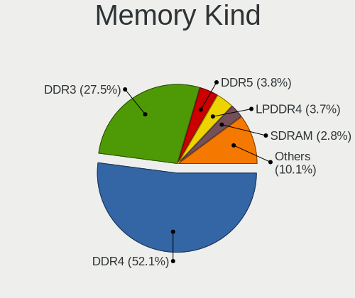

| Kind    | Computers | Percent |
|---------|-----------|---------|
| DDR4    | 337       | 49.78%  |
| DDR3    | 224       | 33.09%  |
| DDR2    | 25        | 3.69%   |
| Unknown | 22        | 3.25%   |
| SDRAM   | 19        | 2.81%   |
| LPDDR4  | 19        | 2.81%   |
| LPDDR3  | 16        | 2.36%   |
| DDR     | 5         | 0.74%   |
| DDR5    | 4         | 0.59%   |
| DRAM    | 3         | 0.44%   |
| LPDDR5  | 2         | 0.3%    |
| EEPROM  | 1         | 0.15%   |

Memory Form Factor
------------------

Physical design of the memory module

| Name         | Computers | Percent |
|--------------|-----------|---------|
| SODIMM       | 480       | 72.29%  |
| DIMM         | 135       | 20.33%  |
| Row Of Chips | 47        | 7.08%   |
| Chip         | 2         | 0.3%    |

Memory Size
-----------

Memory module size

| Size    | Computers | Percent |
|---------|-----------|---------|
| 8192    | 294       | 39.46%  |
| 4096    | 222       | 29.8%   |
| 2048    | 98        | 13.15%  |
| 16384   | 78        | 10.47%  |
| 1024    | 25        | 3.36%   |
| 32768   | 20        | 2.68%   |
| 512     | 4         | 0.54%   |
| 65536   | 1         | 0.13%   |
| 256     | 1         | 0.13%   |
| 1       | 1         | 0.13%   |
| Unknown | 1         | 0.13%   |

Memory Speed
------------

Memory module speed

| Speed   | Computers | Percent |
|---------|-----------|---------|
| 1600    | 144       | 19.83%  |
| 2667    | 135       | 18.6%   |
| 3200    | 119       | 16.39%  |
| 2400    | 60        | 8.26%   |
| 2133    | 38        | 5.23%   |
| 1333    | 38        | 5.23%   |
| 1334    | 30        | 4.13%   |
| Unknown | 22        | 3.03%   |
| 667     | 20        | 2.75%   |
| 800     | 14        | 1.93%   |
| 1067    | 12        | 1.65%   |
| 4199    | 10        | 1.38%   |
| 1867    | 10        | 1.38%   |
| 3600    | 8         | 1.1%    |
| 3000    | 7         | 0.96%   |
| 4267    | 6         | 0.83%   |
| 3400    | 5         | 0.69%   |
| 4800    | 4         | 0.55%   |
| 2800    | 4         | 0.55%   |
| 1066    | 4         | 0.55%   |
| 400     | 4         | 0.55%   |
| 8400    | 3         | 0.41%   |
| 4266    | 3         | 0.41%   |
| 6400    | 2         | 0.28%   |
| 3866    | 2         | 0.28%   |
| 3466    | 2         | 0.28%   |
| 3266    | 2         | 0.28%   |
| 2933    | 2         | 0.28%   |
| 2048    | 2         | 0.28%   |
| 1639    | 2         | 0.28%   |
| 533     | 2         | 0.28%   |
| 50410   | 1         | 0.14%   |
| 3733    | 1         | 0.14%   |
| 3151    | 1         | 0.14%   |
| 2733    | 1         | 0.14%   |
| 2666    | 1         | 0.14%   |
| 1866    | 1         | 0.14%   |
| 1400    | 1         | 0.14%   |
| 975     | 1         | 0.14%   |
| 333     | 1         | 0.14%   |

Printers & scanners
-------------------

Printer Vendor
--------------

Printer device vendors

| Vendor              | Computers | Percent |
|---------------------|-----------|---------|
| Hewlett-Packard     | 11        | 34.38%  |
| Canon               | 9         | 28.13%  |
| Seiko Epson         | 5         | 15.63%  |
| Zebra               | 3         | 9.38%   |
| Samsung Electronics | 2         | 6.25%   |
| QinHeng Electronics | 1         | 3.13%   |
| Brother Industries  | 1         | 3.13%   |

Printer Model
-------------

Printer device models

| Model                                | Computers | Percent |
|--------------------------------------|-----------|---------|
| Zebra TLP2844                        | 2         | 6.25%   |
| Seiko Epson L3110 Series             | 2         | 6.25%   |
| HP Officejet 4500 G510g-m            | 2         | 6.25%   |
| Canon LBP6030w/6018w                 | 2         | 6.25%   |
| Canon E410 series                    | 2         | 6.25%   |
| Zebra Zebra GC420d Label Printer     | 1         | 3.13%   |
| Seiko Epson L405 Series              | 1         | 3.13%   |
| Seiko Epson L3150 Series             | 1         | 3.13%   |
| Seiko Epson L210 Series              | 1         | 3.13%   |
| Samsung ML-216x Series Laser Printer | 1         | 3.13%   |
| Samsung M2020 Series                 | 1         | 3.13%   |
| QinHeng CH340S                       | 1         | 3.13%   |
| HP LaserJet P2055 series             | 1         | 3.13%   |
| HP LaserJet P1102                    | 1         | 3.13%   |
| HP LaserJet M101-M106                | 1         | 3.13%   |
| HP LaserJet 1020                     | 1         | 3.13%   |
| HP LaserJet 1010                     | 1         | 3.13%   |
| HP DeskJet 3830 series               | 1         | 3.13%   |
| HP DeskJet 2620 All-in-One Printer   | 1         | 3.13%   |
| HP DeskJet 2130 series               | 1         | 3.13%   |
| HP Deskjet 1050 J410                 | 1         | 3.13%   |
| Canon PIXMA MG3000 series            | 1         | 3.13%   |
| Canon LBP6000                        | 1         | 3.13%   |
| Canon G3020 series                   | 1         | 3.13%   |
| Canon G3010 series                   | 1         | 3.13%   |
| Canon E460 series                    | 1         | 3.13%   |
| Brother DCP-1510                     | 1         | 3.13%   |

Scanner Vendor
--------------

Scanner device vendors

| Vendor         | Computers | Percent |
|----------------|-----------|---------|
| Mustek Systems | 1         | 50%     |
| Canon          | 1         | 50%     |

Scanner Model
-------------

Scanner device models

| Model                              | Computers | Percent |
|------------------------------------|-----------|---------|
| Mustek Systems ScanExpress 1200 UB | 1         | 50%     |
| Canon CanoScan LiDE 210            | 1         | 50%     |

Camera
------

Camera Vendor
-------------

Camera device vendors

| Vendor                                 | Computers | Percent |
|----------------------------------------|-----------|---------|
| Chicony Electronics                    | 227       | 23.95%  |
| IMC Networks                           | 115       | 12.13%  |
| Realtek Semiconductor                  | 96        | 10.13%  |
| Acer                                   | 90        | 9.49%   |
| Microdia                               | 63        | 6.65%   |
| Cheng Uei Precision Industry (Foxlink) | 52        | 5.49%   |
| Quanta                                 | 36        | 3.8%    |
| Sunplus Innovation Technology          | 32        | 3.38%   |
| Suyin                                  | 27        | 2.85%   |
| Apple                                  | 25        | 2.64%   |
| Syntek                                 | 24        | 2.53%   |
| Silicon Motion                         | 17        | 1.79%   |
| Alcor Micro                            | 17        | 1.79%   |
| Lite-On Technology                     | 16        | 1.69%   |
| Z-Star Microelectronics                | 14        | 1.48%   |
| Logitech                               | 13        | 1.37%   |
| Ricoh                                  | 11        | 1.16%   |
| Samsung Electronics                    | 8         | 0.84%   |
| Luxvisions Innotech Limited            | 7         | 0.74%   |
| ALi                                    | 7         | 0.74%   |
| Importek                               | 6         | 0.63%   |
| Novatek Microelectronics               | 3         | 0.32%   |
| LG Electronics                         | 3         | 0.32%   |
| Genesys Logic                          | 3         | 0.32%   |
| Arkmicro Technologies                  | 3         | 0.32%   |
| Sunplus Technology                     | 2         | 0.21%   |
| Sonix Technology                       | 2         | 0.21%   |
| Primax Electronics                     | 2         | 0.21%   |
| Microsoft                              | 2         | 0.21%   |
| MacroSilicon                           | 2         | 0.21%   |
| Jieli Technology                       | 2         | 0.21%   |
| GEMBIRD                                | 2         | 0.21%   |
| DJKANA19IDX53W                         | 2         | 0.21%   |
| DigiTech                               | 2         | 0.21%   |
| Philips (or NXP)                       | 1         | 0.11%   |
| Novatel Wireless                       | 1         | 0.11%   |
| Nokia Mobile Phones                    | 1         | 0.11%   |
| Lenovo                                 | 1         | 0.11%   |
| Intel                                  | 1         | 0.11%   |
| Google                                 | 1         | 0.11%   |

Camera Model
------------

Camera device models

| Model                                                         | Computers | Percent |
|---------------------------------------------------------------|-----------|---------|
| Chicony HD Webcam                                             | 32        | 3.36%   |
| Microdia Integrated_Webcam_HD                                 | 30        | 3.15%   |
| Chicony Integrated Camera                                     | 27        | 2.84%   |
| IMC Networks Integrated Camera                                | 26        | 2.73%   |
| Realtek Integrated_Webcam_HD                                  | 25        | 2.63%   |
| IMC Networks USB2.0 VGA UVC WebCam                            | 24        | 2.52%   |
| IMC Networks USB2.0 HD UVC WebCam                             | 19        | 2%      |
| Acer Integrated Camera                                        | 18        | 1.89%   |
| Acer HD Webcam                                                | 14        | 1.47%   |
| Chicony USB2.0 HD UVC WebCam                                  | 13        | 1.37%   |
| Chicony USB2.0 VGA UVC WebCam                                 | 12        | 1.26%   |
| Acer BisonCam, NB Pro                                         | 12        | 1.26%   |
| Realtek USB2.0 VGA UVC WebCam                                 | 11        | 1.16%   |
| Chicony USB 2.0 Camera                                        | 11        | 1.16%   |
| Syntek Integrated Camera                                      | 10        | 1.05%   |
| Realtek USB Camera                                            | 10        | 1.05%   |
| Chicony USB2.0 Camera                                         | 10        | 1.05%   |
| Chicony TOSHIBA Web Camera - HD                               | 10        | 1.05%   |
| Acer Lenovo EasyCamera                                        | 10        | 1.05%   |
| Lite-On Integrated Camera                                     | 9         | 0.95%   |
| Chicony HP HD Camera                                          | 9         | 0.95%   |
| Chicony EasyCamera                                            | 9         | 0.95%   |
| Apple iPhone 5/5C/5S/6/SE                                     | 9         | 0.95%   |
| Samsung Galaxy series, misc. (MTP mode)                       | 8         | 0.84%   |
| IMC Networks ov9734_azurewave_camera                          | 8         | 0.84%   |
| IMC Networks HD Camera                                        | 8         | 0.84%   |
| Syntek EasyCamera                                             | 7         | 0.74%   |
| Realtek USB2.0 HD UVC WebCam                                  | 7         | 0.74%   |
| Quanta ov9734_techfront_camera                                | 7         | 0.74%   |
| Chicony Lenovo EasyCamera                                     | 7         | 0.74%   |
| Chicony HP Webcam                                             | 7         | 0.74%   |
| Cheng Uei Precision Industry (Foxlink) HP Truevision HD       | 7         | 0.74%   |
| Acer EasyCamera                                               | 7         | 0.74%   |
| Sunplus Asus Webcam                                           | 6         | 0.63%   |
| Quanta HD User Facing                                         | 6         | 0.63%   |
| IMC Networks TOSHIBA Web Camera - HD                          | 6         | 0.63%   |
| Cheng Uei Precision Industry (Foxlink) USB2.0 UVC 1.3M Webcam | 6         | 0.63%   |
| Cheng Uei Precision Industry (Foxlink) HP Webcam              | 6         | 0.63%   |
| Cheng Uei Precision Industry (Foxlink) HD Camera              | 6         | 0.63%   |
| Apple Built-in iSight                                         | 6         | 0.63%   |

Security
--------

Fingerprint Vendor
------------------

Fingerprint sensor vendors

| Vendor                     | Computers | Percent |
|----------------------------|-----------|---------|
| Shenzhen Goodix Technology | 48        | 33.8%   |
| Validity Sensors           | 33        | 23.24%  |
| Synaptics                  | 29        | 20.42%  |
| LighTuning Technology      | 13        | 9.15%   |
| AuthenTec                  | 8         | 5.63%   |
| Upek                       | 7         | 4.93%   |
| Elan Microelectronics      | 4         | 2.82%   |

Fingerprint Model
-----------------

Fingerprint sensor models

| Model                                                       | Computers | Percent |
|-------------------------------------------------------------|-----------|---------|
| Shenzhen Goodix  FingerPrint Device                         | 34        | 23.94%  |
| Shenzhen Goodix Fingerprint Reader                          | 13        | 9.15%   |
| Unknown                                                     | 13        | 9.15%   |
| Validity Sensors VFS495 Fingerprint Reader                  | 10        | 7.04%   |
| Upek Biometric Touchchip/Touchstrip Fingerprint Sensor      | 7         | 4.93%   |
| LighTuning ES603 Swipe Fingerprint Sensor                   | 7         | 4.93%   |
| Validity Sensors VFS5011 Fingerprint Reader                 | 5         | 3.52%   |
| Validity Sensors VFS 5011 fingerprint sensor                | 5         | 3.52%   |
| LighTuning EgisTec Touch Fingerprint Sensor                 | 5         | 3.52%   |
| Synaptics  WBDI                                             | 4         | 2.82%   |
| Synaptics Metallica MIS Touch Fingerprint Reader            | 4         | 2.82%   |
| Validity Sensors Synaptics WBDI                             | 3         | 2.11%   |
| Validity Sensors Fingerprint scanner                        | 3         | 2.11%   |
| AuthenTec AES2501 Fingerprint Sensor                        | 3         | 2.11%   |
| AuthenTec AES1600                                           | 3         | 2.11%   |
| Validity Sensors VFS491                                     | 2         | 1.41%   |
| Validity Sensors VFS451 Fingerprint Reader                  | 2         | 1.41%   |
| Synaptics  VFS7552 Touch Fingerprint Sensor with PurePrint  | 2         | 1.41%   |
| Synaptics  FS7604 Touch Fingerprint Sensor with PurePrint   | 2         | 1.41%   |
| Synaptics Prometheus MIS Touch Fingerprint Reader           | 2         | 1.41%   |
| Synaptics Metallica MOH Touch Fingerprint Reader            | 2         | 1.41%   |
| Elan ELAN:Fingerprint                                       | 2         | 1.41%   |
| Elan ELAN:ARM-M4                                            | 2         | 1.41%   |
| AuthenTec AES2810                                           | 2         | 1.41%   |
| Validity Sensors VFS101 Fingerprint Reader                  | 1         | 0.7%    |
| Validity Sensors VFS Fingerprint sensor                     | 1         | 0.7%    |
| Validity Sensors Synaptics VFS7552 Touch Fingerprint Sensor | 1         | 0.7%    |
| Shenzhen Goodix FingerPrint                                 | 1         | 0.7%    |
| LighTuning Fingerprint Reader                               | 1         | 0.7%    |

Chipcard Vendor
---------------

Chipcard module vendors

| Vendor                | Computers | Percent |
|-----------------------|-----------|---------|
| Broadcom              | 13        | 41.94%  |
| Alcor Micro           | 8         | 25.81%  |
| Advanced Card Systems | 4         | 12.9%   |
| Upek                  | 2         | 6.45%   |
| Gemalto (was Gemplus) | 2         | 6.45%   |
| O2 Micro              | 1         | 3.23%   |
| Lenovo                | 1         | 3.23%   |

Chipcard Model
--------------

Chipcard module models

| Model                                                                        | Computers | Percent |
|------------------------------------------------------------------------------|-----------|---------|
| Alcor Micro AU9540 Smartcard Reader                                          | 8         | 25.81%  |
| Broadcom BCM5880 Secure Applications Processor with fingerprint swipe sensor | 6         | 19.35%  |
| Broadcom BCM5880 Secure Applications Processor                               | 5         | 16.13%  |
| Advanced Card Systems ACR38 SmartCard Reader                                 | 3         | 9.68%   |
| Upek TouchChip Fingerprint Coprocessor (WBF advanced mode)                   | 2         | 6.45%   |
| Gemalto (was Gemplus) GemPC Key SmartCard Reader                             | 2         | 6.45%   |
| Broadcom 58200                                                               | 2         | 6.45%   |
| O2 Micro OZ776 CCID Smartcard Reader                                         | 1         | 3.23%   |
| Lenovo Integrated Smart Card Reader                                          | 1         | 3.23%   |
| Advanced Card Systems ACR39U                                                 | 1         | 3.23%   |

Unsupported
-----------

Unsupported Devices
-------------------

Total unsupported devices on board

| Total | Computers | Percent |
|-------|-----------|---------|
| 0     | 983       | 70.57%  |
| 1     | 330       | 23.69%  |
| 2     | 66        | 4.74%   |
| 3     | 8         | 0.57%   |
| 4     | 3         | 0.22%   |
| 6     | 2         | 0.14%   |
| 5     | 1         | 0.07%   |

Unsupported Device Types
------------------------

Types of unsupported devices

| Type                     | Computers | Percent |
|--------------------------|-----------|---------|
| Fingerprint reader       | 142       | 29.1%   |
| Graphics card            | 134       | 27.46%  |
| Net/wireless             | 51        | 10.45%  |
| Multimedia controller    | 28        | 5.74%   |
| Chipcard                 | 25        | 5.12%   |
| Bluetooth                | 24        | 4.92%   |
| Camera                   | 23        | 4.71%   |
| Communication controller | 20        | 4.1%    |
| Net/ethernet             | 9         | 1.84%   |
| Storage                  | 8         | 1.64%   |
| Sound                    | 8         | 1.64%   |
| Network                  | 5         | 1.02%   |
| Unassigned class         | 3         | 0.61%   |
| Flash memory             | 2         | 0.41%   |
| Card reader              | 2         | 0.41%   |
| Wireless                 | 1         | 0.2%    |
| Storage/raid             | 1         | 0.2%    |
| Storage/ide              | 1         | 0.2%    |
| Modem                    | 1         | 0.2%    |

