Linux in UAE - Tested Hardware & Statistics
-------------------------------------------

A project to collect tested hardware configurations for Linux in UAE.

Anyone can contribute to this report by the [hw-probe](https://github.com/linuxhw/hw-probe) tool:

    sudo -E hw-probe -all -upload

Please contribute! Especially if your hardware is rare.

This is a report for all computer types. See also reports for [desktops](/Location/UAE/Desktop/README.md) and [notebooks](/Location/UAE/Notebook/README.md).

Contents
--------

* [ Test Cases ](#test-cases)

* [ System ](#system)
  - [ OS                       ](#os)
  - [ OS Family                ](#os-family)
  - [ Kernel                   ](#kernel)
  - [ Kernel Family            ](#kernel-family)
  - [ Kernel Major Ver.        ](#kernel-major-ver)
  - [ Arch                     ](#arch)
  - [ DE                       ](#de)
  - [ Display Server           ](#display-server)
  - [ Display Manager          ](#display-manager)
  - [ OS Lang                  ](#os-lang)
  - [ Boot Mode                ](#boot-mode)
  - [ Filesystem               ](#filesystem)
  - [ Part. scheme             ](#part-scheme)
  - [ Dual Boot with Linux/BSD ](#dual-boot-with-linuxbsd)
  - [ Dual Boot (Win)          ](#dual-boot-win)

* [ Board ](#board)
  - [ Vendor                   ](#vendor)
  - [ Model                    ](#model)
  - [ Model Family             ](#model-family)
  - [ MFG Year                 ](#mfg-year)
  - [ Form Factor              ](#form-factor)
  - [ Secure Boot              ](#secure-boot)
  - [ Coreboot                 ](#coreboot)
  - [ RAM Size                 ](#ram-size)
  - [ RAM Used                 ](#ram-used)
  - [ Total Drives             ](#total-drives)
  - [ Has CD-ROM               ](#has-cd-rom)
  - [ Has Ethernet             ](#has-ethernet)
  - [ Has WiFi                 ](#has-wifi)
  - [ Has Bluetooth            ](#has-bluetooth)

* [ Location ](#location)
  - [ Country                  ](#country)
  - [ City                     ](#city)

* [ Drives ](#drives)
  - [ Drive Vendor             ](#drive-vendor)
  - [ Drive Model              ](#drive-model)
  - [ HDD Vendor               ](#hdd-vendor)
  - [ SSD Vendor               ](#ssd-vendor)
  - [ Drive Kind               ](#drive-kind)
  - [ Drive Connector          ](#drive-connector)
  - [ Drive Size               ](#drive-size)
  - [ Space Total              ](#space-total)
  - [ Space Used               ](#space-used)
  - [ Malfunc. Drives          ](#malfunc-drives)
  - [ Malfunc. Drive Vendor    ](#malfunc-drive-vendor)
  - [ Malfunc. HDD Vendor      ](#malfunc-hdd-vendor)
  - [ Malfunc. Drive Kind      ](#malfunc-drive-kind)
  - [ Failed Drives            ](#failed-drives)
  - [ Failed Drive Vendor      ](#failed-drive-vendor)
  - [ Drive Status             ](#drive-status)

* [ Storage controller ](#storage-controller)
  - [ Storage Vendor           ](#storage-vendor)
  - [ Storage Model            ](#storage-model)
  - [ Storage Kind             ](#storage-kind)

* [ Processor ](#processor)
  - [ CPU Vendor               ](#cpu-vendor)
  - [ CPU Model                ](#cpu-model)
  - [ CPU Model Family         ](#cpu-model-family)
  - [ CPU Cores                ](#cpu-cores)
  - [ CPU Sockets              ](#cpu-sockets)
  - [ CPU Threads              ](#cpu-threads)
  - [ CPU Op-Modes             ](#cpu-op-modes)
  - [ CPU Microcode            ](#cpu-microcode)
  - [ CPU Microarch            ](#cpu-microarch)

* [ Graphics ](#graphics)
  - [ GPU Vendor               ](#gpu-vendor)
  - [ GPU Model                ](#gpu-model)
  - [ GPU Combo                ](#gpu-combo)
  - [ GPU Driver               ](#gpu-driver)
  - [ GPU Memory               ](#gpu-memory)

* [ Monitor ](#monitor)
  - [ Monitor Vendor           ](#monitor-vendor)
  - [ Monitor Model            ](#monitor-model)
  - [ Monitor Resolution       ](#monitor-resolution)
  - [ Monitor Diagonal         ](#monitor-diagonal)
  - [ Monitor Width            ](#monitor-width)
  - [ Aspect Ratio             ](#aspect-ratio)
  - [ Monitor Area             ](#monitor-area)
  - [ Pixel Density            ](#pixel-density)
  - [ Multiple Monitors        ](#multiple-monitors)

* [ Network ](#network)
  - [ Net Controller Vendor    ](#net-controller-vendor)
  - [ Net Controller Model     ](#net-controller-model)
  - [ Wireless Vendor          ](#wireless-vendor)
  - [ Wireless Model           ](#wireless-model)
  - [ Ethernet Vendor          ](#ethernet-vendor)
  - [ Ethernet Model           ](#ethernet-model)
  - [ Net Controller Kind      ](#net-controller-kind)
  - [ Used Controller          ](#used-controller)
  - [ NICs                     ](#nics)
  - [ IPv6                     ](#ipv6)

* [ Bluetooth ](#bluetooth)
  - [ Bluetooth Vendor         ](#bluetooth-vendor)
  - [ Bluetooth Model          ](#bluetooth-model)

* [ Sound ](#sound)
  - [ Sound Vendor             ](#sound-vendor)
  - [ Sound Model              ](#sound-model)

* [ Memory ](#memory)
  - [ Memory Vendor            ](#memory-vendor)
  - [ Memory Model             ](#memory-model)
  - [ Memory Kind              ](#memory-kind)
  - [ Memory Form Factor       ](#memory-form-factor)
  - [ Memory Size              ](#memory-size)
  - [ Memory Speed             ](#memory-speed)

* [ Printers & scanners ](#printers--scanners)
  - [ Printer Vendor           ](#printer-vendor)
  - [ Printer Model            ](#printer-model)
  - [ Scanner Vendor           ](#scanner-vendor)
  - [ Scanner Model            ](#scanner-model)

* [ Camera ](#camera)
  - [ Camera Vendor            ](#camera-vendor)
  - [ Camera Model             ](#camera-model)

* [ Security ](#security)
  - [ Fingerprint Vendor       ](#fingerprint-vendor)
  - [ Fingerprint Model        ](#fingerprint-model)
  - [ Chipcard Vendor          ](#chipcard-vendor)
  - [ Chipcard Model           ](#chipcard-model)

* [ Unsupported ](#unsupported)
  - [ Unsupported Devices      ](#unsupported-devices)
  - [ Unsupported Device Types ](#unsupported-device-types)

Test Cases
----------

Total: 169

| Vendor        | Model                       | Form-Factor | Probe                                                      | Date         |
|---------------|-----------------------------|-------------|------------------------------------------------------------|--------------|
| Dell          | 0MGK50 A02                  | Desktop     | [eca7a31c46](https://linux-hardware.org/?probe=eca7a31c46) | Jun 23, 2022 |
| Dell          | 0MGK50 A02                  | Desktop     | [134bf128f7](https://linux-hardware.org/?probe=134bf128f7) | Jun 23, 2022 |
| Microsoft     | Surface Pro 4               | Tablet      | [0fbbdf9197](https://linux-hardware.org/?probe=0fbbdf9197) | Jun 07, 2022 |
| ASUSTek       | VivoBook 12_ASUS Laptop ... | Notebook    | [ad2442631e](https://linux-hardware.org/?probe=ad2442631e) | May 28, 2022 |
| HP            | 8446                        | All in one  | [821752cb21](https://linux-hardware.org/?probe=821752cb21) | May 11, 2022 |
| HP            | Pavilion Laptop 13-bb0xx... | Notebook    | [ae7d5dbb0c](https://linux-hardware.org/?probe=ae7d5dbb0c) | May 01, 2022 |
| Microsoft     | Surface Pro 3               | Tablet      | [6c498d2ce5](https://linux-hardware.org/?probe=6c498d2ce5) | Apr 29, 2022 |
| Lenovo        | ThinkPad P1 Gen 3 20TJS4... | Notebook    | [28c774c6de](https://linux-hardware.org/?probe=28c774c6de) | Apr 07, 2022 |
| Lenovo        | ThinkPad X1 Carbon Gen 9... | Notebook    | [718b671125](https://linux-hardware.org/?probe=718b671125) | Apr 06, 2022 |
| Lenovo        | ThinkPad X1 Carbon Gen 9... | Notebook    | [5e0763131c](https://linux-hardware.org/?probe=5e0763131c) | Mar 28, 2022 |
| Lenovo        | IdeaPad Gaming 3 15IMH05... | Notebook    | [8dda7f6478](https://linux-hardware.org/?probe=8dda7f6478) | Mar 06, 2022 |
| HP            | Pavilion x360 Convertibl... | Convertible | [4edc1d31b5](https://linux-hardware.org/?probe=4edc1d31b5) | Mar 06, 2022 |
| Google        | Terra                       | Notebook    | [54163369b2](https://linux-hardware.org/?probe=54163369b2) | Feb 23, 2022 |
| Dell          | 0CRH6C A02                  | Desktop     | [f014fcba4f](https://linux-hardware.org/?probe=f014fcba4f) | Feb 14, 2022 |
| Dell          | Latitude E6230              | Notebook    | [a8aeb155b0](https://linux-hardware.org/?probe=a8aeb155b0) | Feb 10, 2022 |
| Biostar       | TZ77XE4                     | Desktop     | [081c3be70e](https://linux-hardware.org/?probe=081c3be70e) | Feb 07, 2022 |
| Lenovo        | ThinkPad E14 Gen 2 20TA0... | Notebook    | [8aafebe07c](https://linux-hardware.org/?probe=8aafebe07c) | Feb 03, 2022 |
| Dell          | Latitude E5440              | Notebook    | [ebbb8ee138](https://linux-hardware.org/?probe=ebbb8ee138) | Jan 22, 2022 |
| Lenovo        | ThinkPad T480s 20L8S3FV0... | Notebook    | [78080db667](https://linux-hardware.org/?probe=78080db667) | Jan 13, 2022 |
| HP            | Pavilion x360 Convertibl... | Convertible | [4670daefab](https://linux-hardware.org/?probe=4670daefab) | Jan 04, 2022 |
| HP            | EliteBook 840 G6            | Notebook    | [c36553e3a3](https://linux-hardware.org/?probe=c36553e3a3) | Dec 27, 2021 |
| Google        | Akemi                       | Notebook    | [aaf0a3e10e](https://linux-hardware.org/?probe=aaf0a3e10e) | Dec 20, 2021 |
| Dell          | Inspiron 5570               | Notebook    | [927497310e](https://linux-hardware.org/?probe=927497310e) | Nov 16, 2021 |
| ASUSTek       | PRIME B250M-PLUS            | Desktop     | [7b77d5463d](https://linux-hardware.org/?probe=7b77d5463d) | Nov 13, 2021 |
| win elemen... | MoreFine S500+              | Notebook    | [ace08cf199](https://linux-hardware.org/?probe=ace08cf199) | Nov 11, 2021 |
| win elemen... | MoreFine S500+              | Notebook    | [0e31d4b6fa](https://linux-hardware.org/?probe=0e31d4b6fa) | Nov 11, 2021 |
| MSI           | PS63 Modern 8RD             | Notebook    | [519048dea2](https://linux-hardware.org/?probe=519048dea2) | Nov 01, 2021 |
| MSI           | PS63 Modern 8RD             | Notebook    | [6d3cd2f117](https://linux-hardware.org/?probe=6d3cd2f117) | Nov 01, 2021 |
| Lenovo        | ThinkPad Yoga 260 20FD00... | Convertible | [24d1bd52cc](https://linux-hardware.org/?probe=24d1bd52cc) | Oct 28, 2021 |
| Lenovo        | IdeaPad 3 14ADA05 81W0      | Notebook    | [41ff21e8e8](https://linux-hardware.org/?probe=41ff21e8e8) | Oct 06, 2021 |
| Lenovo        | IdeaPad 3 14ADA05 81W0      | Notebook    | [6654adaf99](https://linux-hardware.org/?probe=6654adaf99) | Oct 04, 2021 |
| HP            | ProBook 6475b               | Notebook    | [9d60bf5397](https://linux-hardware.org/?probe=9d60bf5397) | Oct 02, 2021 |
| Lenovo        | ThinkPad Yoga 260 20FD00... | Convertible | [eccb23bda1](https://linux-hardware.org/?probe=eccb23bda1) | Sep 24, 2021 |
| Apple         | MacBook9,1                  | Notebook    | [888ca9b5de](https://linux-hardware.org/?probe=888ca9b5de) | Sep 04, 2021 |
| Apple         | MacBook9,1                  | Notebook    | [69119d1952](https://linux-hardware.org/?probe=69119d1952) | Sep 04, 2021 |
| ECS           | GeForce6100PM-M2            | Desktop     | [e1f91ca6de](https://linux-hardware.org/?probe=e1f91ca6de) | Sep 02, 2021 |
| HP            | 8446                        | All in one  | [430c02980a](https://linux-hardware.org/?probe=430c02980a) | Aug 13, 2021 |
| Sony          | VGN-NS10J_S                 | Notebook    | [31d1e0e91d](https://linux-hardware.org/?probe=31d1e0e91d) | Aug 12, 2021 |
| ASUSTek       | ROG ZENITH EXTREME          | Desktop     | [e25c41c312](https://linux-hardware.org/?probe=e25c41c312) | Jul 03, 2021 |
| LG Electro... | C500-G.AEF5BE1              | Notebook    | [b78f4cd34d](https://linux-hardware.org/?probe=b78f4cd34d) | Jun 14, 2021 |
| Toshiba       | Satellite C850-A966         | Notebook    | [391d22d993](https://linux-hardware.org/?probe=391d22d993) | Jun 02, 2021 |
| Sony          | SVE14A25CAB                 | Notebook    | [78ddb916b5](https://linux-hardware.org/?probe=78ddb916b5) | May 30, 2021 |
| Sony          | SVE14A25CAB                 | Notebook    | [0a2c5cf1cd](https://linux-hardware.org/?probe=0a2c5cf1cd) | May 30, 2021 |
| HP            | Laptop 15s-eq2xxx           | Notebook    | [5707e7ae37](https://linux-hardware.org/?probe=5707e7ae37) | May 28, 2021 |
| Dell          | OptiPlex 980                | Desktop     | [1fe360b027](https://linux-hardware.org/?probe=1fe360b027) | May 26, 2021 |
| HP            | Laptop 15s-eq2xxx           | Notebook    | [66cc8bd4a5](https://linux-hardware.org/?probe=66cc8bd4a5) | May 19, 2021 |
| Dell          | G5 5587                     | Notebook    | [2d2cf67a2d](https://linux-hardware.org/?probe=2d2cf67a2d) | May 08, 2021 |
| Dell          | Latitude E6510              | Notebook    | [06d38294ab](https://linux-hardware.org/?probe=06d38294ab) | May 03, 2021 |
| Lenovo        | Legion Y7000P 81LD          | Notebook    | [e3b22a36fb](https://linux-hardware.org/?probe=e3b22a36fb) | Apr 22, 2021 |
| Lenovo        | Legion Y7000P 81LD          | Notebook    | [f5715022b7](https://linux-hardware.org/?probe=f5715022b7) | Apr 22, 2021 |
| HP            | 8446                        | All in one  | [a52aa6f1bd](https://linux-hardware.org/?probe=a52aa6f1bd) | Mar 10, 2021 |
| Acer          | Aspire 5755G                | Notebook    | [6b82d5c050](https://linux-hardware.org/?probe=6b82d5c050) | Mar 07, 2021 |
| Acer          | Aspire 5755G                | Notebook    | [227244211b](https://linux-hardware.org/?probe=227244211b) | Mar 07, 2021 |
| HP            | Pavilion Notebook           | Notebook    | [3c9d39abce](https://linux-hardware.org/?probe=3c9d39abce) | Mar 06, 2021 |
| Lenovo        | ThinkPad X230 2325DV8       | Notebook    | [11d5145d10](https://linux-hardware.org/?probe=11d5145d10) | Feb 12, 2021 |
| HP            | Elite Dragonfly             | Convertible | [87b2f82af5](https://linux-hardware.org/?probe=87b2f82af5) | Feb 01, 2021 |
| HP            | Elite Dragonfly             | Convertible | [6e1ef1920c](https://linux-hardware.org/?probe=6e1ef1920c) | Jan 31, 2021 |
| HP            | Elite Dragonfly             | Convertible | [215ff8ccba](https://linux-hardware.org/?probe=215ff8ccba) | Jan 31, 2021 |
| HP            | Pavilion dv6                | Notebook    | [317b81878c](https://linux-hardware.org/?probe=317b81878c) | Jan 27, 2021 |
| Lenovo        | 3098 NOK                    | Desktop     | [d0ccf5266d](https://linux-hardware.org/?probe=d0ccf5266d) | Jan 27, 2021 |
| ASUSTek       | Strix GL703GM_GL703GM       | Notebook    | [3d8ea2b061](https://linux-hardware.org/?probe=3d8ea2b061) | Jan 27, 2021 |
| HP            | Laptop 15-da1xxx            | Notebook    | [a3c15a6f74](https://linux-hardware.org/?probe=a3c15a6f74) | Jan 18, 2021 |
| HP            | Laptop 15-da1xxx            | Notebook    | [58bf01b1e7](https://linux-hardware.org/?probe=58bf01b1e7) | Jan 18, 2021 |
| Dell          | Inspiron 3521               | Notebook    | [2e84869a9a](https://linux-hardware.org/?probe=2e84869a9a) | Jan 11, 2021 |
| HP            | ENVY x360 Convertible 13... | Convertible | [1c5ef3cfe4](https://linux-hardware.org/?probe=1c5ef3cfe4) | Jan 11, 2021 |
| HP            | ENVY x360 Convertible 13... | Convertible | [d071e37713](https://linux-hardware.org/?probe=d071e37713) | Jan 10, 2021 |
| HP            | 8446                        | All in one  | [a07d483bab](https://linux-hardware.org/?probe=a07d483bab) | Jan 07, 2021 |
| Lenovo        | ThinkPad T470 W10DG 20JM... | Notebook    | [6a02570e23](https://linux-hardware.org/?probe=6a02570e23) | Jan 03, 2021 |
| HP            | Pavilion Sleekbook 15 PC    | Notebook    | [092666f171](https://linux-hardware.org/?probe=092666f171) | Dec 31, 2020 |
| HP            | ENVY x360 Convertible 13... | Convertible | [93e3d5b038](https://linux-hardware.org/?probe=93e3d5b038) | Dec 25, 2020 |
| HP            | EliteBook 8460p             | Notebook    | [d24a3c768e](https://linux-hardware.org/?probe=d24a3c768e) | Dec 24, 2020 |
| HP            | ENVY x360 Convertible 13... | Convertible | [cb1c064071](https://linux-hardware.org/?probe=cb1c064071) | Dec 16, 2020 |
| Dell          | Latitude E6410              | Notebook    | [a2a46d21e9](https://linux-hardware.org/?probe=a2a46d21e9) | Dec 15, 2020 |
| Lenovo        | IdeaPad 110-15ISK 80UD      | Notebook    | [e2816ed19c](https://linux-hardware.org/?probe=e2816ed19c) | Nov 27, 2020 |
| HP            | ENVY x360 Convertible 13... | Convertible | [12a3adede5](https://linux-hardware.org/?probe=12a3adede5) | Nov 06, 2020 |
| HP            | Laptop 15-dw1xxx            | Notebook    | [91e0e6c6bc](https://linux-hardware.org/?probe=91e0e6c6bc) | Nov 04, 2020 |
| HP            | ENVY x360 Convertible 13... | Convertible | [6f0218a447](https://linux-hardware.org/?probe=6f0218a447) | Oct 28, 2020 |
| HP            | ENVY x360 Convertible 13... | Convertible | [7ad824c6f9](https://linux-hardware.org/?probe=7ad824c6f9) | Oct 26, 2020 |
| ASUSTek       | PRIME B460M-A               | Desktop     | [54531ec292](https://linux-hardware.org/?probe=54531ec292) | Oct 21, 2020 |
| HP            | ENVY x360 Convertible 13... | Convertible | [f372424ac5](https://linux-hardware.org/?probe=f372424ac5) | Oct 18, 2020 |
| Intel         | D865PERL AAC27648-207       | Desktop     | [387171a87d](https://linux-hardware.org/?probe=387171a87d) | Oct 08, 2020 |
| HP            | Pavilion Power Laptop 15... | Notebook    | [b1cd303933](https://linux-hardware.org/?probe=b1cd303933) | Oct 08, 2020 |
| HP            | 2AA2                        | Desktop     | [ceebc6a90b](https://linux-hardware.org/?probe=ceebc6a90b) | Oct 04, 2020 |
| Intel         | D865PERL AAC27648-207       | Desktop     | [7d3672caff](https://linux-hardware.org/?probe=7d3672caff) | Oct 04, 2020 |
| Intel         | D865PERL AAC27648-207       | Desktop     | [2a18eaa0ab](https://linux-hardware.org/?probe=2a18eaa0ab) | Oct 04, 2020 |
| Lenovo        | IdeaPad 700-15ISK 80RU      | Notebook    | [f9f212a509](https://linux-hardware.org/?probe=f9f212a509) | Oct 01, 2020 |
| Lenovo        | IdeaPad 3 14IML05 81WA      | Notebook    | [ab392f30cb](https://linux-hardware.org/?probe=ab392f30cb) | Sep 30, 2020 |
| HP            | ENVY x360 Convertible 13... | Convertible | [42c8711bea](https://linux-hardware.org/?probe=42c8711bea) | Sep 29, 2020 |
| Acer          | ChiefRiver Platform         | Notebook    | [23e2162b8e](https://linux-hardware.org/?probe=23e2162b8e) | Sep 20, 2020 |
| HP            | ENVY x360 Convertible 13... | Convertible | [22369a8f3c](https://linux-hardware.org/?probe=22369a8f3c) | Sep 20, 2020 |
| Lenovo        | ThinkPad X1 Yoga 4th 20Q... | Convertible | [d026d40366](https://linux-hardware.org/?probe=d026d40366) | Sep 17, 2020 |
| ASUSTek       | X99-DELUXE                  | Desktop     | [18778a34f2](https://linux-hardware.org/?probe=18778a34f2) | Sep 10, 2020 |
| ASUSTek       | X99-DELUXE                  | Desktop     | [ff1f32c975](https://linux-hardware.org/?probe=ff1f32c975) | Sep 10, 2020 |
| HP            | ENVY x360 Convertible 13... | Convertible | [94cbf8e66c](https://linux-hardware.org/?probe=94cbf8e66c) | Sep 10, 2020 |
| HP            | ENVY x360 Convertible 13... | Convertible | [a25d4e5346](https://linux-hardware.org/?probe=a25d4e5346) | Sep 09, 2020 |
| HP            | ENVY x360 Convertible 13... | Convertible | [c4c1a329af](https://linux-hardware.org/?probe=c4c1a329af) | Sep 06, 2020 |
| Dell          | Inspiron 5537               | Notebook    | [4ddf924081](https://linux-hardware.org/?probe=4ddf924081) | Sep 05, 2020 |
| Dell          | Inspiron 5537               | Notebook    | [23a0e05047](https://linux-hardware.org/?probe=23a0e05047) | Sep 05, 2020 |
| Dell          | Latitude E6540              | Notebook    | [9abf14d168](https://linux-hardware.org/?probe=9abf14d168) | Aug 31, 2020 |
| HP            | 8446                        | All in one  | [08b9600cae](https://linux-hardware.org/?probe=08b9600cae) | Aug 29, 2020 |
| Dell          | Precision 5540              | Notebook    | [76f1cfa736](https://linux-hardware.org/?probe=76f1cfa736) | Aug 23, 2020 |
| ASUSTek       | PRIME B450-PLUS             | Desktop     | [19af27b191](https://linux-hardware.org/?probe=19af27b191) | Aug 20, 2020 |
| Intel         | DH67CL AAG10212-210         | Desktop     | [f555bad747](https://linux-hardware.org/?probe=f555bad747) | Aug 14, 2020 |
| I-Life Dig... | ZED AIR                     | Notebook    | [b40d7e9c7c](https://linux-hardware.org/?probe=b40d7e9c7c) | Aug 10, 2020 |
| I-Life Dig... | ZED AIR                     | Notebook    | [5662aa186c](https://linux-hardware.org/?probe=5662aa186c) | Aug 10, 2020 |
| HP            | 2AA2                        | Desktop     | [f20932c5c3](https://linux-hardware.org/?probe=f20932c5c3) | Aug 09, 2020 |
| Lenovo        | ThinkPad L480 20LS0012AD    | Notebook    | [81d46e4c4a](https://linux-hardware.org/?probe=81d46e4c4a) | Aug 02, 2020 |
| Toshiba       | Satellite C660              | Notebook    | [670cc8a66c](https://linux-hardware.org/?probe=670cc8a66c) | Jul 26, 2020 |
| Lenovo        | IdeaPadFlex 14 20308        | Notebook    | [aea3470496](https://linux-hardware.org/?probe=aea3470496) | Jul 21, 2020 |
| HP            | 2AA2                        | Desktop     | [424f0397a7](https://linux-hardware.org/?probe=424f0397a7) | Jul 16, 2020 |
| ASUSTek       | VivoBook_ASUSLaptop X420... | Notebook    | [b3dbd3f2af](https://linux-hardware.org/?probe=b3dbd3f2af) | Jul 14, 2020 |
| Toshiba       | TECRA A50-C                 | Notebook    | [adf7a73571](https://linux-hardware.org/?probe=adf7a73571) | Jul 03, 2020 |
| ASUSTek       | FX503VD                     | Notebook    | [d6c0a21749](https://linux-hardware.org/?probe=d6c0a21749) | Jul 02, 2020 |
| HP            | Pavilion 15                 | Notebook    | [499f0c72ee](https://linux-hardware.org/?probe=499f0c72ee) | Jun 29, 2020 |
| ASUSTek       | P7P55 LX                    | Desktop     | [dc74d7b188](https://linux-hardware.org/?probe=dc74d7b188) | Jun 25, 2020 |
| ASUSTek       | VivoBook_ASUSLaptop X420... | Notebook    | [dd5c9e8d9f](https://linux-hardware.org/?probe=dd5c9e8d9f) | Jun 23, 2020 |
| Dell          | Latitude E6410              | Notebook    | [06055ff260](https://linux-hardware.org/?probe=06055ff260) | Jun 19, 2020 |
| ASUSTek       | VivoBook_ASUSLaptop X420... | Notebook    | [b53cc32ed0](https://linux-hardware.org/?probe=b53cc32ed0) | Jun 19, 2020 |
| Lenovo        | G500 20236                  | Notebook    | [fdc9496e84](https://linux-hardware.org/?probe=fdc9496e84) | Jun 19, 2020 |
| Intel         | DH67CL AAG10212-210         | Desktop     | [fdbf1ae7da](https://linux-hardware.org/?probe=fdbf1ae7da) | Jun 19, 2020 |
| Intel         | DH67CL AAG10212-210         | Desktop     | [0d398d9227](https://linux-hardware.org/?probe=0d398d9227) | Jun 14, 2020 |
| HP            | 2AA2                        | Desktop     | [24c07d9d0d](https://linux-hardware.org/?probe=24c07d9d0d) | Jun 11, 2020 |
| HP            | 8446                        | All in one  | [d64a9cef98](https://linux-hardware.org/?probe=d64a9cef98) | Jun 11, 2020 |
| Dell          | Latitude E6410              | Notebook    | [1b73d74e65](https://linux-hardware.org/?probe=1b73d74e65) | Jun 09, 2020 |
| Lenovo        | ThinkPad L480 20LS0012AD    | Notebook    | [e9b38b78d7](https://linux-hardware.org/?probe=e9b38b78d7) | May 30, 2020 |
| Lenovo        | ThinkPad X1 Yoga 4th 20Q... | Convertible | [83ae823929](https://linux-hardware.org/?probe=83ae823929) | May 23, 2020 |
| Lenovo        | ThinkPad X1 Yoga 4th 20Q... | Convertible | [af063f022b](https://linux-hardware.org/?probe=af063f022b) | May 23, 2020 |
| HP            | Presario C300 (RH208UA#A... | Notebook    | [50e95ff237](https://linux-hardware.org/?probe=50e95ff237) | May 14, 2020 |
| HP            | Presario C300 (RH208UA#A... | Notebook    | [6b4a8eab4c](https://linux-hardware.org/?probe=6b4a8eab4c) | May 14, 2020 |
| Toshiba       | TECRA X40-D                 | Notebook    | [3255796d07](https://linux-hardware.org/?probe=3255796d07) | May 10, 2020 |
| YJKC          | vBOOK Plus RVP7             | Notebook    | [49363e9553](https://linux-hardware.org/?probe=49363e9553) | May 07, 2020 |
| HP            | 8446                        | All in one  | [96d169caae](https://linux-hardware.org/?probe=96d169caae) | May 06, 2020 |
| HP            | 8446                        | All in one  | [835b1abcee](https://linux-hardware.org/?probe=835b1abcee) | May 02, 2020 |
| HP            | 8446                        | All in one  | [aa03445e30](https://linux-hardware.org/?probe=aa03445e30) | May 01, 2020 |
| HP            | 8446                        | All in one  | [d9db887931](https://linux-hardware.org/?probe=d9db887931) | May 01, 2020 |
| HP            | ProBook 450 G2              | Notebook    | [887a19760b](https://linux-hardware.org/?probe=887a19760b) | May 01, 2020 |
| Lenovo        | ThinkPad X240 20AMS6GB00    | Notebook    | [3fa804be21](https://linux-hardware.org/?probe=3fa804be21) | May 01, 2020 |
| HP            | 8446                        | All in one  | [eab561395e](https://linux-hardware.org/?probe=eab561395e) | Apr 27, 2020 |
| HP            | 8446                        | All in one  | [ad2491858f](https://linux-hardware.org/?probe=ad2491858f) | Apr 25, 2020 |
| YJKC          | vBOOK Plus RVP7             | Notebook    | [d2328783da](https://linux-hardware.org/?probe=d2328783da) | Apr 24, 2020 |
| Dell          | Vostro 14-5480              | Notebook    | [1bba68101c](https://linux-hardware.org/?probe=1bba68101c) | Apr 20, 2020 |
| Gigabyte      | Z77X-UD5H                   | Desktop     | [aac474f532](https://linux-hardware.org/?probe=aac474f532) | Apr 18, 2020 |
| HP            | ProBook 450 G2              | Notebook    | [1ef49ff7a3](https://linux-hardware.org/?probe=1ef49ff7a3) | Apr 17, 2020 |
| HP            | Notebook                    | Notebook    | [4f154f82b0](https://linux-hardware.org/?probe=4f154f82b0) | Apr 01, 2020 |
| HP            | Pavilion Notebook           | Notebook    | [5cd86dffe9](https://linux-hardware.org/?probe=5cd86dffe9) | Mar 16, 2020 |
| HP            | ENVY Laptop 13-aq0xxx       | Notebook    | [7f0b4db18a](https://linux-hardware.org/?probe=7f0b4db18a) | Mar 12, 2020 |
| HP            | Pavilion Notebook           | Notebook    | [87df29714d](https://linux-hardware.org/?probe=87df29714d) | Mar 11, 2020 |
| HP            | ENVY Laptop 13-aq0xxx       | Notebook    | [04da794ff5](https://linux-hardware.org/?probe=04da794ff5) | Feb 25, 2020 |
| HP            | EliteBook 2760p             | Notebook    | [40333472c7](https://linux-hardware.org/?probe=40333472c7) | Feb 21, 2020 |
| HP            | ENVY Laptop 13-aq0xxx       | Notebook    | [b12186f161](https://linux-hardware.org/?probe=b12186f161) | Feb 13, 2020 |
| HP            | Notebook                    | Notebook    | [a25a67e533](https://linux-hardware.org/?probe=a25a67e533) | Feb 02, 2020 |
| Lenovo        | ThinkPad T460 20FMS1A200    | Notebook    | [c2a7159d3a](https://linux-hardware.org/?probe=c2a7159d3a) | Jan 04, 2020 |
| Lenovo        | ThinkPad T460 20FMS1A200    | Notebook    | [028d728043](https://linux-hardware.org/?probe=028d728043) | Jan 04, 2020 |
| Lenovo        | Yoga S730-13IWL 81J0        | Notebook    | [d1ca80edff](https://linux-hardware.org/?probe=d1ca80edff) | Dec 24, 2019 |
| Toshiba       | Satellite A300              | Notebook    | [420c738977](https://linux-hardware.org/?probe=420c738977) | Oct 15, 2019 |
| Toshiba       | Satellite A300              | Notebook    | [036dc7e829](https://linux-hardware.org/?probe=036dc7e829) | Oct 15, 2019 |
| Lenovo        | Yoga 2 Pro 20266            | Notebook    | [ab1c14d729](https://linux-hardware.org/?probe=ab1c14d729) | Oct 12, 2019 |
| Lenovo        | IdeaPad 320-15IKB 80XL      | Notebook    | [558c01fdce](https://linux-hardware.org/?probe=558c01fdce) | Oct 07, 2019 |
| Notebook      | P95_96_97Ex,Rx              | Notebook    | [d4ad7906b5](https://linux-hardware.org/?probe=d4ad7906b5) | Sep 11, 2019 |
| Dell          | 0NK70N A03                  | Desktop     | [8aa5224a4a](https://linux-hardware.org/?probe=8aa5224a4a) | Aug 01, 2019 |
| I-Life Dig... | ZED AIR                     | Notebook    | [514c494f7f](https://linux-hardware.org/?probe=514c494f7f) | Jul 23, 2019 |
| I-Life Dig... | ZED AIR                     | Notebook    | [a9fe92aa3c](https://linux-hardware.org/?probe=a9fe92aa3c) | Jul 23, 2019 |
| ASUSTek       | Rampage V EXTREME           | Desktop     | [309f371381](https://linux-hardware.org/?probe=309f371381) | May 27, 2019 |
| HP            | EliteBook 8440p             | Notebook    | [1f8a20b199](https://linux-hardware.org/?probe=1f8a20b199) | May 25, 2019 |
| HP            | EliteBook 8440p             | Notebook    | [60d0e8dd5d](https://linux-hardware.org/?probe=60d0e8dd5d) | May 25, 2019 |
| HP            | ProBook 4540s               | Notebook    | [271be85705](https://linux-hardware.org/?probe=271be85705) | May 15, 2019 |
| Lenovo        | IdeaPad 130-15IKB 81H7      | Notebook    | [ab25f83cd0](https://linux-hardware.org/?probe=ab25f83cd0) | Mar 27, 2019 |
| ASUSTek       | ROG STRIX X299-XE GAMING    | Desktop     | [c8fdc5e958](https://linux-hardware.org/?probe=c8fdc5e958) | Dec 25, 2018 |
| Lenovo        | SHARKBAY SDK0E50510 WIN     | Desktop     | [c48aa05e74](https://linux-hardware.org/?probe=c48aa05e74) | Oct 08, 2018 |

System
------

OS
--

Installed operating systems

| Name              | Computers | Percent |
|-------------------|-----------|---------|
| Ubuntu 20.04      | 30        | 26.55%  |
| Ubuntu 18.04      | 17        | 15.04%  |
| Arch              | 5         | 4.42%   |
| Ubuntu 19.10      | 4         | 3.54%   |
| Zorin 15          | 3         | 2.65%   |
| Ubuntu 20.10      | 3         | 2.65%   |
| Debian 11         | 3         | 2.65%   |
| Debian 10         | 3         | 2.65%   |
| Ubuntu 21.10      | 2         | 1.77%   |
| Ubuntu 16.04      | 2         | 1.77%   |
| Pop!_OS 20.10     | 2         | 1.77%   |
| Pop!_OS 20.04     | 2         | 1.77%   |
| OpenMandriva 4.3  | 2         | 1.77%   |
| Linux Mint 20.3   | 2         | 1.77%   |
| KDE neon 20.04    | 2         | 1.77%   |
| Fedora 35         | 2         | 1.77%   |
| Fedora 34         | 2         | 1.77%   |
| BlackPanther 18.1 | 2         | 1.77%   |
| ArcoLinux Rolling | 2         | 1.77%   |
| Zorin 16          | 1         | 0.88%   |
| Xubuntu 20.04     | 1         | 0.88%   |
| Xubuntu 16.04     | 1         | 0.88%   |
| Ubuntu MATE 20.04 | 1         | 0.88%   |
| Ubuntu 22.04      | 1         | 0.88%   |
| Ubuntu 21.04      | 1         | 0.88%   |
| Ubuntu 19.04      | 1         | 0.88%   |
| Pop!_OS 21.10     | 1         | 0.88%   |
| OpenMandriva 4.2  | 1         | 0.88%   |
| Manjaro 21.2.1    | 1         | 0.88%   |
| Manjaro 20.2.1    | 1         | 0.88%   |
| Manjaro 20.2      | 1         | 0.88%   |
| Manjaro 20.1      | 1         | 0.88%   |
| Manjaro 18.1.4    | 1         | 0.88%   |
| Manjaro           | 1         | 0.88%   |
| Linux Mint 20.1   | 1         | 0.88%   |
| Linux Mint 19.2   | 1         | 0.88%   |
| Kubuntu 22.04     | 1         | 0.88%   |
| GNOME OS Nightly  | 1         | 0.88%   |
| Feren OS 20.04    | 1         | 0.88%   |
| Endless 4.0.4     | 1         | 0.88%   |
| Endless 3.5.3     | 1         | 0.88%   |
| Elementary 5.1.7  | 1         | 0.88%   |

OS Family
---------

OS without a version

| Name         | Computers | Percent |
|--------------|-----------|---------|
| Ubuntu       | 59        | 54.13%  |
| Manjaro      | 6         | 5.5%    |
| Debian       | 5         | 4.59%   |
| Arch         | 5         | 4.59%   |
| Zorin        | 4         | 3.67%   |
| Pop!_OS      | 4         | 3.67%   |
| Linux Mint   | 4         | 3.67%   |
| Fedora       | 4         | 3.67%   |
| OpenMandriva | 3         | 2.75%   |
| Xubuntu      | 2         | 1.83%   |
| KDE neon     | 2         | 1.83%   |
| Endless      | 2         | 1.83%   |
| BlackPanther | 2         | 1.83%   |
| ArcoLinux    | 2         | 1.83%   |
| Ubuntu MATE  | 1         | 0.92%   |
| Kubuntu      | 1         | 0.92%   |
| GNOME OS     | 1         | 0.92%   |
| Feren OS     | 1         | 0.92%   |
| Elementary   | 1         | 0.92%   |

Kernel
------

Version of the Linux kernel

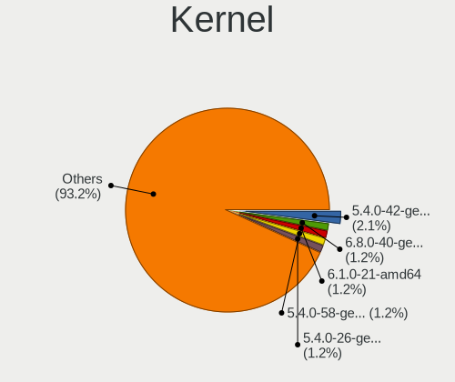

| Version                 | Computers | Percent |
|-------------------------|-----------|---------|
| 5.4.0-42-generic        | 7         | 5.65%   |
| 5.4.0-58-generic        | 4         | 3.23%   |
| 5.4.0-26-generic        | 4         | 3.23%   |
| 5.4.0-37-generic        | 3         | 2.42%   |
| 5.11.0-40-generic       | 3         | 2.42%   |
| 4.15.0-50-generic       | 3         | 2.42%   |
| 5.8.0-40-generic        | 2         | 1.61%   |
| 5.4.0-81-generic        | 2         | 1.61%   |
| 5.4.0-48-generic        | 2         | 1.61%   |
| 5.4.0-33-generic        | 2         | 1.61%   |
| 5.4.0-29-generic        | 2         | 1.61%   |
| 5.3.0-40-generic        | 2         | 1.61%   |
| 5.3.0-29-generic        | 2         | 1.61%   |
| 5.16.7-desktop-1omv4003 | 2         | 1.61%   |
| 5.0.0-23-generic        | 2         | 1.61%   |
| 5.9.3-arch1-1           | 1         | 0.81%   |
| 5.9.16-1-MANJARO        | 1         | 0.81%   |
| 5.9.11-3-MANJARO        | 1         | 0.81%   |
| 5.9.1-050901-generic    | 1         | 0.81%   |
| 5.8.7-050807-generic    | 1         | 0.81%   |
| 5.8.5-arch1-1           | 1         | 0.81%   |
| 5.8.12-050812-generic   | 1         | 0.81%   |
| 5.8.0-7642-generic      | 1         | 0.81%   |
| 5.8.0-7630-generic      | 1         | 0.81%   |
| 5.8.0-54-generic        | 1         | 0.81%   |
| 5.8.0-53-generic        | 1         | 0.81%   |
| 5.8.0-50-generic        | 1         | 0.81%   |
| 5.8.0-41-generic        | 1         | 0.81%   |
| 5.8.0-0.bpo.2-amd64     | 1         | 0.81%   |
| 5.7.6-arch1-1           | 1         | 0.81%   |
| 5.7.14-1-MANJARO        | 1         | 0.81%   |
| 5.7.14                  | 1         | 0.81%   |
| 5.6.16-1-MANJARO        | 1         | 0.81%   |
| 5.6.14-desktop-2bP      | 1         | 0.81%   |
| 5.5.11-050511-generic   | 1         | 0.81%   |
| 5.4.68-1-lts            | 1         | 0.81%   |
| 5.4.2-1-MANJARO         | 1         | 0.81%   |
| 5.4.0-73-generic        | 1         | 0.81%   |
| 5.4.0-72-generic        | 1         | 0.81%   |
| 5.4.0-65-generic        | 1         | 0.81%   |
| 5.4.0-60-generic        | 1         | 0.81%   |
| 5.4.0-54-generic        | 1         | 0.81%   |
| 5.4.0-47-generic        | 1         | 0.81%   |
| 5.4.0-45-generic        | 1         | 0.81%   |
| 5.4.0-40-generic        | 1         | 0.81%   |
| 5.4.0-39-generic        | 1         | 0.81%   |
| 5.4.0-28-generic        | 1         | 0.81%   |
| 5.4.0-18-generic        | 1         | 0.81%   |
| 5.4.0-113-generic       | 1         | 0.81%   |
| 5.4.0-100-generic       | 1         | 0.81%   |
| 5.3.0-46-generic        | 1         | 0.81%   |
| 5.3.0-28-generic        | 1         | 0.81%   |
| 5.17.4-200.fc35.x86_64  | 1         | 0.81%   |
| 5.16.5-arch1-1          | 1         | 0.81%   |
| 5.16.18-200.fc35.x86_64 | 1         | 0.81%   |
| 5.16.16-200.fc35.x86_64 | 1         | 0.81%   |
| 5.16.12-arch1-1         | 1         | 0.81%   |
| 5.15.5-76051505-generic | 1         | 0.81%   |
| 5.15.12-1-MANJARO       | 1         | 0.81%   |
| 5.15.0-40-generic       | 1         | 0.81%   |

Kernel Family
-------------

Linux kernel without a distro release

| Version | Computers | Percent |
|---------|-----------|---------|
| 5.4.0   | 31        | 27.19%  |
| 4.15.0  | 14        | 12.28%  |
| 5.8.0   | 9         | 7.89%   |
| 5.11.0  | 9         | 7.89%   |
| 5.3.0   | 6         | 5.26%   |
| 5.10.0  | 3         | 2.63%   |
| 5.0.0   | 3         | 2.63%   |
| 5.7.14  | 2         | 1.75%   |
| 5.16.7  | 2         | 1.75%   |
| 5.15.0  | 2         | 1.75%   |
| 5.13.0  | 2         | 1.75%   |
| 4.18.0  | 2         | 1.75%   |
| 5.9.3   | 1         | 0.88%   |
| 5.9.16  | 1         | 0.88%   |
| 5.9.11  | 1         | 0.88%   |
| 5.9.1   | 1         | 0.88%   |
| 5.8.7   | 1         | 0.88%   |
| 5.8.5   | 1         | 0.88%   |
| 5.8.12  | 1         | 0.88%   |
| 5.7.6   | 1         | 0.88%   |
| 5.6.16  | 1         | 0.88%   |
| 5.6.14  | 1         | 0.88%   |
| 5.5.11  | 1         | 0.88%   |
| 5.4.68  | 1         | 0.88%   |
| 5.4.2   | 1         | 0.88%   |
| 5.17.4  | 1         | 0.88%   |
| 5.16.5  | 1         | 0.88%   |
| 5.16.18 | 1         | 0.88%   |
| 5.16.16 | 1         | 0.88%   |
| 5.16.12 | 1         | 0.88%   |
| 5.15.5  | 1         | 0.88%   |
| 5.15.12 | 1         | 0.88%   |
| 5.14.13 | 1         | 0.88%   |
| 5.14.0  | 1         | 0.88%   |
| 5.13.16 | 1         | 0.88%   |
| 5.12.13 | 1         | 0.88%   |
| 5.10.14 | 1         | 0.88%   |
| 4.4.0   | 1         | 0.88%   |
| 4.19.92 | 1         | 0.88%   |
| 4.19.0  | 1         | 0.88%   |
| 4.18.16 | 1         | 0.88%   |

Kernel Major Ver.
-----------------

Linux kernel major version

| Version | Computers | Percent |
|---------|-----------|---------|
| 5.4     | 33        | 29.73%  |
| 4.15    | 14        | 12.61%  |
| 5.8     | 11        | 9.91%   |
| 5.11    | 9         | 8.11%   |
| 5.3     | 6         | 5.41%   |
| 5.16    | 5         | 4.5%    |
| 5.15    | 4         | 3.6%    |
| 5.10    | 4         | 3.6%    |
| 5.9     | 3         | 2.7%    |
| 5.7     | 3         | 2.7%    |
| 5.13    | 3         | 2.7%    |
| 5.0     | 3         | 2.7%    |
| 4.18    | 3         | 2.7%    |
| 5.6     | 2         | 1.8%    |
| 5.14    | 2         | 1.8%    |
| 4.19    | 2         | 1.8%    |
| 5.5     | 1         | 0.9%    |
| 5.17    | 1         | 0.9%    |
| 5.12    | 1         | 0.9%    |
| 4.4     | 1         | 0.9%    |

Arch
----

OS architecture (x86_64, i586, etc.)

| Name   | Computers | Percent |
|--------|-----------|---------|
| x86_64 | 103       | 98.1%   |
| i686   | 2         | 1.9%    |

DE
--

Desktop Environment

| Name       | Computers | Percent |
|------------|-----------|---------|
| GNOME      | 66        | 60%     |
| Unknown    | 18        | 16.36%  |
| KDE5       | 8         | 7.27%   |
| XFCE       | 4         | 3.64%   |
| X-Cinnamon | 4         | 3.64%   |
| KDE        | 4         | 3.64%   |
| Unity      | 1         | 0.91%   |
| Pantheon   | 1         | 0.91%   |
| MATE       | 1         | 0.91%   |
| DWM        | 1         | 0.91%   |
| bspwm      | 1         | 0.91%   |
| awesome    | 1         | 0.91%   |

Display Server
--------------

X11 or Wayland

| Name    | Computers | Percent |
|---------|-----------|---------|
| X11     | 83        | 76.85%  |
| Wayland | 14        | 12.96%  |
| Unknown | 11        | 10.19%  |

Display Manager
---------------

SDDM, LightDM, etc.

| Name    | Computers | Percent |
|---------|-----------|---------|
| Unknown | 72        | 66.67%  |
| GDM     | 19        | 17.59%  |
| SDDM    | 9         | 8.33%   |
| LightDM | 3         | 2.78%   |
| GDM3    | 3         | 2.78%   |
| TDM     | 2         | 1.85%   |

OS Lang
-------

Language

| Lang    | Computers | Percent |
|---------|-----------|---------|
| en_US   | 79        | 74.53%  |
| Unknown | 15        | 14.15%  |
| en_GB   | 4         | 3.77%   |
| C       | 4         | 3.77%   |
| hu_HU   | 1         | 0.94%   |
| en_IN   | 1         | 0.94%   |
| en_AU   | 1         | 0.94%   |
| de_DE   | 1         | 0.94%   |

Boot Mode
---------

EFI or BIOS

| Mode | Computers | Percent |
|------|-----------|---------|
| EFI  | 60        | 54.55%  |
| BIOS | 50        | 45.45%  |

Filesystem
----------

Type of filesystem

| Type    | Computers | Percent |
|---------|-----------|---------|
| Ext4    | 94        | 89.52%  |
| Overlay | 5         | 4.76%   |
| Btrfs   | 4         | 3.81%   |
| Xfs     | 1         | 0.95%   |
| Unknown | 1         | 0.95%   |

Part. scheme
------------

Scheme of partitioning

| Type    | Computers | Percent |
|---------|-----------|---------|
| Unknown | 76        | 71.7%   |
| GPT     | 25        | 23.58%  |
| MBR     | 5         | 4.72%   |

Dual Boot with Linux/BSD
------------------------

Hosting more than one Linux/BSD

| Dual boot | Computers | Percent |
|-----------|-----------|---------|
| No        | 96        | 90.57%  |
| Yes       | 10        | 9.43%   |

Dual Boot (Win)
---------------

Hosting Linux and Windows

| Dual boot | Computers | Percent |
|-----------|-----------|---------|
| No        | 66        | 61.11%  |
| Yes       | 42        | 38.89%  |

Board
-----

Vendor
------

Motherboard manufacturer

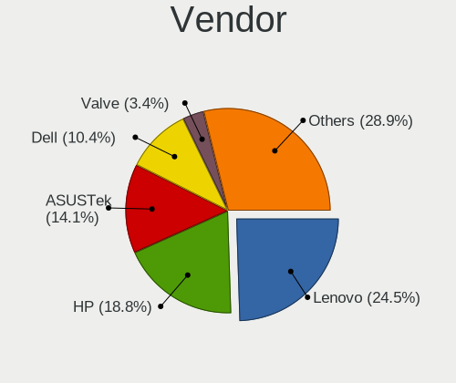

| Name                        | Computers | Percent |
|-----------------------------|-----------|---------|
| Hewlett-Packard             | 28        | 26.67%  |
| Lenovo                      | 25        | 23.81%  |
| Dell                        | 15        | 14.29%  |
| ASUSTek Computer            | 12        | 11.43%  |
| Toshiba                     | 5         | 4.76%   |
| Sony                        | 2         | 1.9%    |
| Microsoft                   | 2         | 1.9%    |
| Intel                       | 2         | 1.9%    |
| Google                      | 2         | 1.9%    |
| Acer                        | 2         | 1.9%    |
| YJKC                        | 1         | 0.95%   |
| win element                 | 1         | 0.95%   |
| Notebook                    | 1         | 0.95%   |
| MSI                         | 1         | 0.95%   |
| LG Electronics              | 1         | 0.95%   |
| I-Life Digital Technologies | 1         | 0.95%   |
| Gigabyte Technology         | 1         | 0.95%   |
| ECS                         | 1         | 0.95%   |
| Biostar                     | 1         | 0.95%   |
| Apple                       | 1         | 0.95%   |

Model
-----

Motherboard model

| Name                                       | Computers | Percent |
|--------------------------------------------|-----------|---------|
| HP Pavilion Notebook                       | 2         | 1.9%    |
| HP ENVY Laptop 13-aq0xxx                   | 2         | 1.9%    |
| HP All-in-One 22-c0xx                      | 2         | 1.9%    |
| ASUS All Series                            | 2         | 1.9%    |
| YJKC vBOOK Plus                            | 1         | 0.95%   |
| win element MoreFine S500+                 | 1         | 0.95%   |
| Toshiba TECRA X40-D                        | 1         | 0.95%   |
| Toshiba TECRA A50-C                        | 1         | 0.95%   |
| Toshiba Satellite C850-A966                | 1         | 0.95%   |
| Toshiba Satellite C660                     | 1         | 0.95%   |
| Toshiba Satellite A300                     | 1         | 0.95%   |
| Sony VGN-NS10J_S                           | 1         | 0.95%   |
| Sony SVE14A25CAB                           | 1         | 0.95%   |
| Notebook P95_96_97Ex,Rx                    | 1         | 0.95%   |
| MSI PS63 Modern 8RD                        | 1         | 0.95%   |
| Microsoft Surface Pro 4                    | 1         | 0.95%   |
| Microsoft Surface Pro 3                    | 1         | 0.95%   |
| LG C500-G.AEF5BE1                          | 1         | 0.95%   |
| Lenovo Yoga S730-13IWL 81J0                | 1         | 0.95%   |
| Lenovo Yoga 2 Pro 20266                    | 1         | 0.95%   |
| Lenovo ThinkPad Yoga 260 20FD000GAD        | 1         | 0.95%   |
| Lenovo ThinkPad X240 20AMS6GB00            | 1         | 0.95%   |
| Lenovo ThinkPad X230 2325DV8               | 1         | 0.95%   |
| Lenovo ThinkPad X1 Yoga 4th 20QF0015US     | 1         | 0.95%   |
| Lenovo ThinkPad X1 Carbon Gen 9 20XW00A9US | 1         | 0.95%   |
| Lenovo ThinkPad T480s 20L8S3FV00           | 1         | 0.95%   |
| Lenovo ThinkPad T470 W10DG 20JMS0Q300      | 1         | 0.95%   |
| Lenovo ThinkPad T460 20FMS1A200            | 1         | 0.95%   |
| Lenovo ThinkPad P1 Gen 3 20TJS4RX00        | 1         | 0.95%   |
| Lenovo ThinkPad L480 20LS0012AD            | 1         | 0.95%   |
| Lenovo ThinkPad E14 Gen 2 20TA0018AD       | 1         | 0.95%   |
| Lenovo ThinkCentre E93 10AR004LAX          | 1         | 0.95%   |
| Lenovo ThinkCentre E73 10AS0041AX          | 1         | 0.95%   |
| Lenovo Legion Y7000P 81LD                  | 1         | 0.95%   |
| Lenovo IdeaPadFlex 14 20308                | 1         | 0.95%   |
| Lenovo IdeaPad Gaming 3 15IMH05 81Y4       | 1         | 0.95%   |
| Lenovo IdeaPad 700-15ISK 80RU              | 1         | 0.95%   |
| Lenovo IdeaPad 320-15IKB 80XL              | 1         | 0.95%   |
| Lenovo IdeaPad 3 14IML05 81WA              | 1         | 0.95%   |
| Lenovo IdeaPad 3 14ADA05 81W0              | 1         | 0.95%   |
| Lenovo IdeaPad 130-15IKB 81H7              | 1         | 0.95%   |
| Lenovo IdeaPad 110-15ISK 80UD              | 1         | 0.95%   |
| Lenovo G500 20236                          | 1         | 0.95%   |
| Intel DH67CL AAG10212-210                  | 1         | 0.95%   |
| Intel D865PERL AAC27648-207                | 1         | 0.95%   |
| I-Life Digital ZED AIR                     | 1         | 0.95%   |
| HP ProBook 6475b                           | 1         | 0.95%   |
| HP ProBook 4540s                           | 1         | 0.95%   |
| HP ProBook 450 G2                          | 1         | 0.95%   |
| HP Presario C300 (RH208UA#ABA)             | 1         | 0.95%   |
| HP Pavilion x360 Convertible 14-dh1xxx     | 1         | 0.95%   |
| HP Pavilion x360 Convertible 14-dh0xxx     | 1         | 0.95%   |
| HP Pavilion Sleekbook 15 PC                | 1         | 0.95%   |
| HP Pavilion Power Laptop 15-cb0xx          | 1         | 0.95%   |
| HP Pavilion Laptop 13-bb0xxx               | 1         | 0.95%   |
| HP Pavilion dv6                            | 1         | 0.95%   |
| HP Pavilion 15                             | 1         | 0.95%   |
| HP Notebook                                | 1         | 0.95%   |
| HP Laptop 15s-eq2xxx                       | 1         | 0.95%   |
| HP Laptop 15-dw1xxx                        | 1         | 0.95%   |

Model Family
------------

Motherboard model prefix

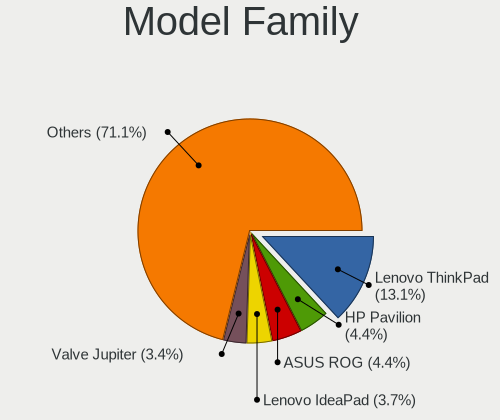

| Name                 | Computers | Percent |
|----------------------|-----------|---------|
| Lenovo ThinkPad      | 11        | 10.48%  |
| HP Pavilion          | 9         | 8.57%   |
| Lenovo IdeaPad       | 7         | 6.67%   |
| Dell Latitude        | 5         | 4.76%   |
| HP EliteBook         | 4         | 3.81%   |
| Toshiba Satellite    | 3         | 2.86%   |
| HP ProBook           | 3         | 2.86%   |
| HP Laptop            | 3         | 2.86%   |
| HP ENVY              | 3         | 2.86%   |
| Dell Precision       | 3         | 2.86%   |
| Dell Inspiron        | 3         | 2.86%   |
| ASUS PRIME           | 3         | 2.86%   |
| Toshiba TECRA        | 2         | 1.9%    |
| Microsoft Surface    | 2         | 1.9%    |
| Lenovo Yoga          | 2         | 1.9%    |
| Lenovo ThinkCentre   | 2         | 1.9%    |
| HP All-in-One        | 2         | 1.9%    |
| Dell OptiPlex        | 2         | 1.9%    |
| ASUS VivoBook        | 2         | 1.9%    |
| ASUS ROG             | 2         | 1.9%    |
| ASUS All             | 2         | 1.9%    |
| YJKC vBOOK           | 1         | 0.95%   |
| win element MoreFine | 1         | 0.95%   |
| Sony VGN-NS10J       | 1         | 0.95%   |
| Sony SVE14A25CAB     | 1         | 0.95%   |
| Notebook P95         | 1         | 0.95%   |
| MSI PS63             | 1         | 0.95%   |
| LG C500-G.AEF5BE1    | 1         | 0.95%   |
| Lenovo Legion        | 1         | 0.95%   |
| Lenovo IdeaPadFlex   | 1         | 0.95%   |
| Lenovo G500          | 1         | 0.95%   |
| Intel DH67CL         | 1         | 0.95%   |
| Intel D865PERL       | 1         | 0.95%   |
| I-Life Digital ZED   | 1         | 0.95%   |
| HP Presario          | 1         | 0.95%   |
| HP Notebook          | 1         | 0.95%   |
| HP Elite             | 1         | 0.95%   |
| HP 200-5120me        | 1         | 0.95%   |
| Google Terra         | 1         | 0.95%   |
| Google Akemi         | 1         | 0.95%   |
| Gigabyte Z77X-UD5H   | 1         | 0.95%   |
| ECS GeForce6100PM-M2 | 1         | 0.95%   |
| Dell Vostro          | 1         | 0.95%   |
| Dell G5              | 1         | 0.95%   |
| Biostar TZ77XE4      | 1         | 0.95%   |
| ASUS Strix           | 1         | 0.95%   |
| ASUS P7P55           | 1         | 0.95%   |
| ASUS FX503VD         | 1         | 0.95%   |
| Apple MacBook9       | 1         | 0.95%   |
| Acer ChiefRiver      | 1         | 0.95%   |
| Acer Aspire          | 1         | 0.95%   |

MFG Year
--------

Motherboard manufacture year

| Year | Computers | Percent |
|------|-----------|---------|
| 2019 | 17        | 16.19%  |
| 2018 | 12        | 11.43%  |
| 2020 | 11        | 10.48%  |
| 2013 | 11        | 10.48%  |
| 2012 | 9         | 8.57%   |
| 2010 | 7         | 6.67%   |
| 2021 | 6         | 5.71%   |
| 2017 | 6         | 5.71%   |
| 2016 | 6         | 5.71%   |
| 2011 | 5         | 4.76%   |
| 2015 | 4         | 3.81%   |
| 2014 | 4         | 3.81%   |
| 2009 | 2         | 1.9%    |
| 2008 | 2         | 1.9%    |
| 2007 | 2         | 1.9%    |
| 2005 | 1         | 0.95%   |

Form Factor
-----------

Physical design of the computer

| Name        | Computers | Percent |
|-------------|-----------|---------|
| Notebook    | 75        | 71.43%  |
| Desktop     | 20        | 19.05%  |
| Convertible | 6         | 5.71%   |
| Tablet      | 2         | 1.9%    |
| All in one  | 2         | 1.9%    |

Secure Boot
-----------

Enabled or disabled

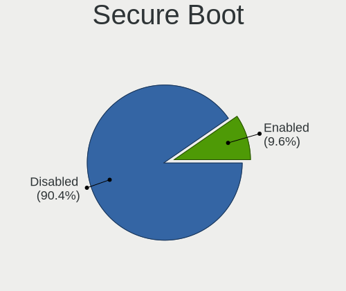

| State    | Computers | Percent |
|----------|-----------|---------|
| Disabled | 92        | 86.79%  |
| Enabled  | 14        | 13.21%  |

Coreboot
--------

Have coreboot on board

| Used | Computers | Percent |
|------|-----------|---------|
| No   | 103       | 98.1%   |
| Yes  | 2         | 1.9%    |

RAM Size
--------

Total RAM memory

| Size in GB  | Computers | Percent |
|-------------|-----------|---------|
| 4.01-8.0    | 28        | 26.67%  |
| 16.01-24.0  | 24        | 22.86%  |
| 3.01-4.0    | 20        | 19.05%  |
| 8.01-16.0   | 17        | 16.19%  |
| 32.01-64.0  | 7         | 6.67%   |
| 64.01-256.0 | 3         | 2.86%   |
| 0.51-1.0    | 3         | 2.86%   |
| 1.01-2.0    | 2         | 1.9%    |
| 2.01-3.0    | 1         | 0.95%   |

RAM Used
--------

Used RAM memory

| Used GB   | Computers | Percent |
|-----------|-----------|---------|
| 1.01-2.0  | 36        | 31.58%  |
| 2.01-3.0  | 27        | 23.68%  |
| 4.01-8.0  | 22        | 19.3%   |
| 3.01-4.0  | 18        | 15.79%  |
| 0.51-1.0  | 5         | 4.39%   |
| 8.01-16.0 | 4         | 3.51%   |
| 0.01-0.5  | 2         | 1.75%   |

Total Drives
------------

Number of drives on board

| Drives | Computers | Percent |
|--------|-----------|---------|
| 1      | 77        | 72.64%  |
| 2      | 20        | 18.87%  |
| 3      | 4         | 3.77%   |
| 4      | 2         | 1.89%   |
| 0      | 2         | 1.89%   |
| 8      | 1         | 0.94%   |

Has CD-ROM
----------

Has CD-ROM on board

| Presented | Computers | Percent |
|-----------|-----------|---------|
| No        | 71        | 67.62%  |
| Yes       | 34        | 32.38%  |

Has Ethernet
------------

Has Ethernet on board

| Presented | Computers | Percent |
|-----------|-----------|---------|
| Yes       | 81        | 77.14%  |
| No        | 24        | 22.86%  |

Has WiFi
--------

Has WiFi module

| Presented | Computers | Percent |
|-----------|-----------|---------|
| Yes       | 91        | 86.67%  |
| No        | 14        | 13.33%  |

Has Bluetooth
-------------

Has Bluetooth module

| Presented | Computers | Percent |
|-----------|-----------|---------|
| Yes       | 76        | 71.03%  |
| No        | 31        | 28.97%  |

Location
--------

Country
-------

Geographic location (country)

| Country | Computers | Percent |
|---------|-----------|---------|
| UAE     | 105       | 100%    |

City
----

Geographic location (city)

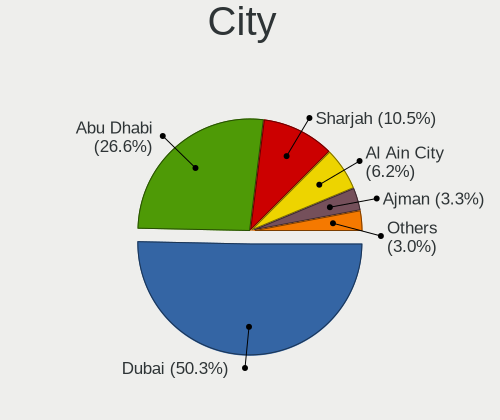

| City             | Computers | Percent |
|------------------|-----------|---------|
| Dubai            | 44        | 40.74%  |
| Abu Dhabi        | 36        | 33.33%  |
| Sharjah          | 16        | 14.81%  |
| Al Ain City      | 5         | 4.63%   |
| Al Fujairah City | 3         | 2.78%   |
| Ajman            | 3         | 2.78%   |
| Al Halah         | 1         | 0.93%   |

Drives
------

Drive Vendor
------------

Hard drive vendors

| Vendor                | Computers | Drives | Percent |
|-----------------------|-----------|--------|---------|
| Samsung Electronics   | 24        | 32     | 17.91%  |
| WDC                   | 22        | 25     | 16.42%  |
| Seagate               | 16        | 22     | 11.94%  |
| Toshiba               | 15        | 19     | 11.19%  |
| HGST                  | 7         | 8      | 5.22%   |
| Unknown               | 6         | 13     | 4.48%   |
| Intel                 | 6         | 8      | 4.48%   |
| Kingston              | 5         | 5      | 3.73%   |
| Hitachi               | 4         | 4      | 2.99%   |
| SK hynix              | 3         | 4      | 2.24%   |
| SanDisk               | 3         | 4      | 2.24%   |
| Crucial               | 3         | 4      | 2.24%   |
| Micron Technology     | 2         | 2      | 1.49%   |
| Lexar                 | 2         | 2      | 1.49%   |
| Apple                 | 2         | 3      | 1.49%   |
| USB3.0                | 1         | 1      | 0.75%   |
| Transcend             | 1         | 1      | 0.75%   |
| Realtek Semiconductor | 1         | 1      | 0.75%   |
| Phison                | 1         | 1      | 0.75%   |
| Patriot               | 1         | 1      | 0.75%   |
| Maxtor                | 1         | 1      | 0.75%   |
| Lite-On               | 1         | 1      | 0.75%   |
| Lenovo                | 1         | 1      | 0.75%   |
| KingSpec              | 1         | 2      | 0.75%   |
| Gigabyte Technology   | 1         | 1      | 0.75%   |
| Fujitsu               | 1         | 1      | 0.75%   |
| External              | 1         | 1      | 0.75%   |
| Corsair               | 1         | 1      | 0.75%   |
| China                 | 1         | 1      | 0.75%   |

Drive Model
-----------

Hard drive models

| Model                                  | Computers | Percent |
|----------------------------------------|-----------|---------|
| Samsung NVMe SSD Drive 256GB           | 4         | 2.82%   |
| HGST HTS725050A7E630 500GB             | 4         | 2.82%   |
| Intel NVMe SSD Drive 512GB             | 3         | 2.11%   |
| WDC WDS240G2G0A-00JH30 240GB SSD       | 2         | 1.41%   |
| WDC WD10SPZX-08Z10 1TB                 | 2         | 1.41%   |
| Unknown SD/MMC/MS PRO 128GB            | 2         | 1.41%   |
| Unknown MMC Card  16GB                 | 2         | 1.41%   |
| Toshiba MQ01ABD075 752GB               | 2         | 1.41%   |
| Toshiba DT01ACA100 1TB                 | 2         | 1.41%   |
| Seagate ST500LT012-1DG142 500GB        | 2         | 1.41%   |
| Seagate ST500DM002-1BD142 500GB        | 2         | 1.41%   |
| Samsung SSD 970 EVO Plus 500GB         | 2         | 1.41%   |
| Samsung SSD 850 PRO 1TB                | 2         | 1.41%   |
| Samsung SSD 850 EVO 250GB              | 2         | 1.41%   |
| Intel SSDPEKNW512G8H 512GB             | 2         | 1.41%   |
| HGST HTS721010A9E630 1TB               | 2         | 1.41%   |
| WDC WDS120G2G0A-00JH30 120GB SSD       | 1         | 0.7%    |
| WDC WDS120G1G0A-00SS50 120GB SSD       | 1         | 0.7%    |
| WDC WD800BB-55JHC0 80GB                | 1         | 0.7%    |
| WDC WD5000LPVX-60V0TT0 500GB           | 1         | 0.7%    |
| WDC WD5000LPCX-22VHAT1 500GB           | 1         | 0.7%    |
| WDC WD5000AAKS-65V0A0 500GB            | 1         | 0.7%    |
| WDC WD40EFRX-68N32N0 4TB               | 1         | 0.7%    |
| WDC WD2500BEVS-26UST0 250GB            | 1         | 0.7%    |
| WDC WD2500AAJS-75M0A0 249GB            | 1         | 0.7%    |
| WDC WD20EZRX-00D8PB0 2TB               | 1         | 0.7%    |
| WDC WD1600AAJS-60B4A0 160GB            | 1         | 0.7%    |
| WDC WD10SPZX-24Z10T0 1TB               | 1         | 0.7%    |
| WDC WD10SPZX-24Z10 1TB                 | 1         | 0.7%    |
| WDC WD10JPVX-60JC3T1 1TB               | 1         | 0.7%    |
| WDC WD10JPCX-24UE4T0 1TB               | 1         | 0.7%    |
| WDC WD10EZEX-08M2NA0 1TB               | 1         | 0.7%    |
| WDC WD1002FAEX-00Z3A0 1TB              | 1         | 0.7%    |
| WDC PC SN730 SDBQNTY-1T00-1001 1TB     | 1         | 0.7%    |
| USB3.0 Super Speed 320GB               | 1         | 0.7%    |
| Unknown SM32G  32GB                    | 1         | 0.7%    |
| Unknown SL16G  16GB                    | 1         | 0.7%    |
| Unknown NCard  32GB                    | 1         | 0.7%    |
| Unknown MMC64G  64GB                   | 1         | 0.7%    |
| Unknown MMC Card  64GB                 | 1         | 0.7%    |
| Unknown MMC Card  32GB                 | 1         | 0.7%    |
| Transcend TS256GSSD370S 256GB          | 1         | 0.7%    |
| Toshiba NVMe SSD Drive 512GB           | 1         | 0.7%    |
| Toshiba MQ02ABF100 1TB                 | 1         | 0.7%    |
| Toshiba MQ01ABD100M 1TB                | 1         | 0.7%    |
| Toshiba MQ01ABD050 500GB               | 1         | 0.7%    |
| Toshiba MQ01ABD032 320GB               | 1         | 0.7%    |
| Toshiba MK5075GSX 500GB                | 1         | 0.7%    |
| Toshiba MK3275GSX 320GB                | 1         | 0.7%    |
| Toshiba MK2552GSX 250GB                | 1         | 0.7%    |
| Toshiba KBG30ZMV512G 512GB             | 1         | 0.7%    |
| Toshiba KBG30ZMS128G 128GB NVMe SSD    | 1         | 0.7%    |
| Toshiba HDWE160 6TB                    | 1         | 0.7%    |
| SK hynix SKHynix_HFM256GD3HX015N 256GB | 1         | 0.7%    |
| SK hynix SC311 SATA 256GB SSD          | 1         | 0.7%    |
| SK hynix NVMe SSD Drive 512GB          | 1         | 0.7%    |
| Seagate ST980825AS 80GB                | 1         | 0.7%    |
| Seagate ST9500320AS 500GB              | 1         | 0.7%    |
| Seagate ST500VT000-1DK142 500GB        | 1         | 0.7%    |
| Seagate ST500LT012-9WS142 500GB        | 1         | 0.7%    |

HDD Vendor
----------

Hard disk drive vendors

| Vendor  | Computers | Drives | Percent |
|---------|-----------|--------|---------|
| WDC     | 17        | 20     | 27.87%  |
| Seagate | 16        | 22     | 26.23%  |
| Toshiba | 12        | 16     | 19.67%  |
| HGST    | 7         | 8      | 11.48%  |
| Hitachi | 4         | 4      | 6.56%   |
| Unknown | 2         | 5      | 3.28%   |
| Maxtor  | 1         | 1      | 1.64%   |
| Fujitsu | 1         | 1      | 1.64%   |
| Apple   | 1         | 1      | 1.64%   |

SSD Vendor
----------

Solid state drive vendors

| Vendor              | Computers | Drives | Percent |
|---------------------|-----------|--------|---------|
| Samsung Electronics | 10        | 11     | 33.33%  |
| WDC                 | 4         | 4      | 13.33%  |
| Kingston            | 3         | 3      | 10%     |
| Crucial             | 3         | 4      | 10%     |
| USB3.0              | 1         | 1      | 3.33%   |
| Transcend           | 1         | 1      | 3.33%   |
| SK hynix            | 1         | 1      | 3.33%   |
| SanDisk             | 1         | 1      | 3.33%   |
| Patriot             | 1         | 1      | 3.33%   |
| Lexar               | 1         | 1      | 3.33%   |
| KingSpec            | 1         | 2      | 3.33%   |
| Gigabyte Technology | 1         | 1      | 3.33%   |
| Corsair             | 1         | 1      | 3.33%   |
| China               | 1         | 1      | 3.33%   |

Drive Kind
----------

HDD or SSD

| Kind | Computers | Drives | Percent |
|------|-----------|--------|---------|
| HDD  | 55        | 78     | 45.08%  |
| NVMe | 39        | 51     | 31.97%  |
| SSD  | 24        | 33     | 19.67%  |
| MMC  | 4         | 8      | 3.28%   |

Drive Connector
---------------

SATA, SAS, NVMe, etc.

| Type | Computers | Drives | Percent |
|------|-----------|--------|---------|
| SATA | 69        | 104    | 60%     |
| NVMe | 38        | 50     | 33.04%  |
| SAS  | 4         | 8      | 3.48%   |
| MMC  | 4         | 8      | 3.48%   |

Drive Size
----------

Size of hard drive

| Size in TB | Computers | Drives | Percent |
|------------|-----------|--------|---------|
| 0.01-0.5   | 48        | 64     | 58.54%  |
| 0.51-1.0   | 29        | 38     | 35.37%  |
| 1.01-2.0   | 3         | 3      | 3.66%   |
| 3.01-4.0   | 1         | 5      | 1.22%   |
| 4.01-10.0  | 1         | 1      | 1.22%   |

Space Total
-----------

Amount of disk space available on the file system

| Size in GB | Computers | Percent |
|------------|-----------|---------|
| 251-500    | 34        | 31.48%  |
| 101-250    | 23        | 21.3%   |
| 21-50      | 11        | 10.19%  |
| 501-1000   | 9         | 8.33%   |
| 51-100     | 9         | 8.33%   |
| 1001-2000  | 7         | 6.48%   |
| Unknown    | 7         | 6.48%   |
| 2001-3000  | 4         | 3.7%    |
| 1-20       | 4         | 3.7%    |

Space Used
----------

Amount of used disk space

| Used GB   | Computers | Percent |
|-----------|-----------|---------|
| 1-20      | 49        | 42.24%  |
| 21-50     | 29        | 25%     |
| 51-100    | 12        | 10.34%  |
| 101-250   | 10        | 8.62%   |
| Unknown   | 7         | 6.03%   |
| 251-500   | 5         | 4.31%   |
| 501-1000  | 3         | 2.59%   |
| 1001-2000 | 1         | 0.86%   |

Malfunc. Drives
---------------

Drive models with a malfunction

| Model                    | Computers | Drives | Percent |
|--------------------------|-----------|--------|---------|
| WDC WD10JPVX-60JC3T1 1TB | 1         | 1      | 100%    |

Malfunc. Drive Vendor
---------------------

Vendors of faulty drives

| Vendor | Computers | Drives | Percent |
|--------|-----------|--------|---------|
| WDC    | 1         | 1      | 100%    |

Malfunc. HDD Vendor
-------------------

Vendors of faulty HDD drives

| Vendor | Computers | Drives | Percent |
|--------|-----------|--------|---------|
| WDC    | 1         | 1      | 100%    |

Malfunc. Drive Kind
-------------------

Kinds of faulty drives

| Kind | Computers | Drives | Percent |
|------|-----------|--------|---------|
| HDD  | 1         | 1      | 100%    |

Failed Drives
-------------

Failed drive models

Zero info for selected period =(

Failed Drive Vendor
-------------------

Failed drive vendors

Zero info for selected period =(

Drive Status
------------

Number of failed and malfunc. drives

| Status   | Computers | Drives | Percent |
|----------|-----------|--------|---------|
| Detected | 75        | 125    | 72.12%  |
| Works    | 28        | 44     | 26.92%  |
| Malfunc  | 1         | 1      | 0.96%   |

Storage controller
------------------

Storage Vendor
--------------

Storage controller vendors

| Vendor                       | Computers | Percent |
|------------------------------|-----------|---------|
| Intel                        | 82        | 65.6%   |
| Samsung Electronics          | 15        | 12%     |
| AMD                          | 4         | 3.2%    |
| Toshiba America Info Systems | 3         | 2.4%    |
| SanDisk                      | 3         | 2.4%    |
| SK hynix                     | 2         | 1.6%    |
| Micron Technology            | 2         | 1.6%    |
| Kingston Technology Company  | 2         | 1.6%    |
| ASMedia Technology           | 2         | 1.6%    |
| VIA Technologies             | 1         | 0.8%    |
| Silicon Motion               | 1         | 0.8%    |
| Realtek Semiconductor        | 1         | 0.8%    |
| Phison Electronics           | 1         | 0.8%    |
| Nvidia                       | 1         | 0.8%    |
| Marvell Technology Group     | 1         | 0.8%    |
| Lite-On Technology           | 1         | 0.8%    |
| Lenovo                       | 1         | 0.8%    |
| Broadcom / LSI               | 1         | 0.8%    |
| Apple                        | 1         | 0.8%    |

Storage Model
-------------

Storage controller models

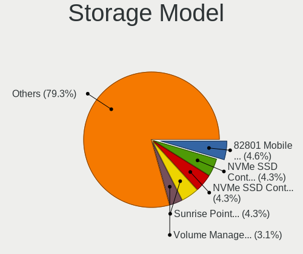

| Model                                                                          | Computers | Percent |
|--------------------------------------------------------------------------------|-----------|---------|
| Intel 82801 Mobile SATA Controller [RAID mode]                                 | 13        | 9.42%   |
| Intel Sunrise Point-LP SATA Controller [AHCI mode]                             | 10        | 7.25%   |
| Intel 7 Series Chipset Family 6-port SATA Controller [AHCI mode]               | 7         | 5.07%   |
| Samsung NVMe SSD Controller SM981/PM981/PM983                                  | 6         | 4.35%   |
| Intel 8 Series SATA Controller 1 [AHCI mode]                                   | 6         | 4.35%   |
| Samsung NVMe SSD Controller 980                                                | 5         | 3.62%   |
| Intel SSD 660P Series                                                          | 5         | 3.62%   |
| Intel Cannon Lake Mobile PCH SATA AHCI Controller                              | 5         | 3.62%   |
| Intel 6 Series/C200 Series Chipset Family 6 port Mobile SATA AHCI Controller   | 5         | 3.62%   |
| AMD FCH SATA Controller [AHCI mode]                                            | 4         | 2.9%    |
| Samsung NVMe SSD Controller SM961/PM961/SM963                                  | 3         | 2.17%   |
| Intel Wildcat Point-LP SATA Controller [AHCI Mode]                             | 3         | 2.17%   |
| Toshiba America Info Systems BG3 NVMe SSD Controller                           | 2         | 1.45%   |
| SK hynix Gold P31 SSD                                                          | 2         | 1.45%   |
| Micron Non-Volatile memory controller                                          | 2         | 1.45%   |
| Intel HM170/QM170 Chipset SATA Controller [AHCI Mode]                          | 2         | 1.45%   |
| Intel Cannon Lake PCH SATA AHCI Controller                                     | 2         | 1.45%   |
| Intel C610/X99 series chipset sSATA Controller [AHCI mode]                     | 2         | 1.45%   |
| Intel C610/X99 series chipset 6-Port SATA Controller [AHCI mode]               | 2         | 1.45%   |
| Intel 82801JI (ICH10 Family) SATA AHCI Controller                              | 2         | 1.45%   |
| Intel 8 Series/C220 Series Chipset Family 6-port SATA Controller 1 [AHCI mode] | 2         | 1.45%   |
| Intel 7 Series/C210 Series Chipset Family 6-port SATA Controller [AHCI mode]   | 2         | 1.45%   |
| Intel 5 Series/3400 Series Chipset 4 port SATA IDE Controller                  | 2         | 1.45%   |
| Intel 5 Series/3400 Series Chipset 2 port SATA IDE Controller                  | 2         | 1.45%   |
| Intel 400 Series Chipset Family SATA AHCI Controller                           | 2         | 1.45%   |
| Intel 200 Series PCH SATA controller [AHCI mode]                               | 2         | 1.45%   |
| ASMedia ASM1062 Serial ATA Controller                                          | 2         | 1.45%   |
| VIA VT6415 PATA IDE Host Controller                                            | 1         | 0.72%   |
| Toshiba America Info Systems XG6 NVMe SSD Controller                           | 1         | 0.72%   |
| Silicon Motion SM2263EN/SM2263XT SSD Controller                                | 1         | 0.72%   |
| SanDisk WD Black SN750 / PC SN730 NVMe SSD                                     | 1         | 0.72%   |
| SanDisk WD Black 2018/SN750 / PC SN720 NVMe SSD                                | 1         | 0.72%   |
| SanDisk Non-Volatile memory controller                                         | 1         | 0.72%   |
| Samsung NVMe SSD Controller SM951/PM951                                        | 1         | 0.72%   |
| Realtek Realtek Non-Volatile memory controller                                 | 1         | 0.72%   |
| Phison E12 NVMe Controller                                                     | 1         | 0.72%   |
| Nvidia MCP61 SATA Controller                                                   | 1         | 0.72%   |
| Nvidia MCP61 IDE                                                               | 1         | 0.72%   |
| Marvell Group 88SE9172 SATA 6Gb/s Controller                                   | 1         | 0.72%   |
| Lite-On Non-Volatile memory controller                                         | 1         | 0.72%   |
| Lenovo Non-Volatile memory controller                                          | 1         | 0.72%   |
| Kingston Company U-SNS8154P3 NVMe SSD                                          | 1         | 0.72%   |
| Kingston Company A2000 NVMe SSD                                                | 1         | 0.72%   |
| Intel Volume Management Device NVMe RAID Controller                            | 1         | 0.72%   |
| Intel SSD Pro 7600p/760p/E 6100p Series                                        | 1         | 0.72%   |
| Intel Q170/Q150/B150/H170/H110/Z170/CM236 Chipset SATA Controller [AHCI Mode]  | 1         | 0.72%   |
| Intel Comet Lake SATA AHCI Controller                                          | 1         | 0.72%   |
| Intel Cannon Point-LP SATA Controller [AHCI Mode]                              | 1         | 0.72%   |
| Intel C600/X79 series chipset 6-Port SATA AHCI Controller                      | 1         | 0.72%   |
| Intel 82801IBM/IEM (ICH9M/ICH9M-E) 4 port SATA Controller [AHCI mode]          | 1         | 0.72%   |
| Intel 82801HM/HEM (ICH8M/ICH8M-E) SATA Controller [IDE mode]                   | 1         | 0.72%   |
| Intel 82801HM/HEM (ICH8M/ICH8M-E) IDE Controller                               | 1         | 0.72%   |
| Intel 82801GBM/GHM (ICH7-M Family) SATA Controller [AHCI mode]                 | 1         | 0.72%   |
| Intel 82801G (ICH7 Family) IDE Controller                                      | 1         | 0.72%   |
| Intel 82801EB/ER (ICH5/ICH5R) IDE Controller                                   | 1         | 0.72%   |
| Intel 6 Series/C200 Series Chipset Family 6 port Desktop SATA AHCI Controller  | 1         | 0.72%   |
| Intel 5 Series/3400 Series Chipset PT IDER Controller                          | 1         | 0.72%   |
| Intel 5 Series/3400 Series Chipset 6 port SATA AHCI Controller                 | 1         | 0.72%   |
| Intel 5 Series/3400 Series Chipset 4 port SATA AHCI Controller                 | 1         | 0.72%   |
| Broadcom / LSI SAS2308 PCI-Express Fusion-MPT SAS-2                            | 1         | 0.72%   |

Storage Kind
------------

Kind of storage controller (IDE, SATA, NVMe, SAS, ...)

| Kind | Computers | Percent |
|------|-----------|---------|
| SATA | 65        | 52.42%  |
| NVMe | 38        | 30.65%  |
| RAID | 14        | 11.29%  |
| IDE  | 6         | 4.84%   |
| SAS  | 1         | 0.81%   |

Processor
---------

CPU Vendor
----------

Processor vendors

| Vendor | Computers | Percent |
|--------|-----------|---------|
| Intel  | 97        | 92.38%  |
| AMD    | 8         | 7.62%   |

CPU Model
---------

Processor models

| Model                                       | Computers | Percent |
|---------------------------------------------|-----------|---------|
| Intel Core i5-8265U CPU @ 1.60GHz           | 5         | 4.76%   |
| Intel Core i7-8565U CPU @ 1.80GHz           | 4         | 3.81%   |
| Intel Core i5-4200U CPU @ 1.60GHz           | 4         | 3.81%   |
| Intel Core i5-6300U CPU @ 2.40GHz           | 3         | 2.86%   |
| Intel Core i7-8750H CPU @ 2.20GHz           | 2         | 1.9%    |
| Intel Core i7-8550U CPU @ 1.80GHz           | 2         | 1.9%    |
| Intel Core i7-7700HQ CPU @ 2.80GHz          | 2         | 1.9%    |
| Intel Core i7-7500U CPU @ 2.70GHz           | 2         | 1.9%    |
| Intel Core i7-6500U CPU @ 2.50GHz           | 2         | 1.9%    |
| Intel Core i7-5500U CPU @ 2.40GHz           | 2         | 1.9%    |
| Intel Core i7-3770K CPU @ 3.50GHz           | 2         | 1.9%    |
| Intel Core i5-9400T CPU @ 1.80GHz           | 2         | 1.9%    |
| Intel Core i5-4300U CPU @ 1.90GHz           | 2         | 1.9%    |
| Intel Core i5-2410M CPU @ 2.30GHz           | 2         | 1.9%    |
| Intel Core i5-10210U CPU @ 1.60GHz          | 2         | 1.9%    |
| Intel Core i3-10110U CPU @ 2.10GHz          | 2         | 1.9%    |
| Intel 11th Gen Core i5-1135G7 @ 2.40GHz     | 2         | 1.9%    |
| Intel Xeon CPU E5620 @ 2.40GHz              | 1         | 0.95%   |
| Intel Xeon CPU E5-2609 v2 @ 2.50GHz         | 1         | 0.95%   |
| Intel Pentium Dual-Core CPU E5400 @ 2.70GHz | 1         | 0.95%   |
| Intel Pentium 4 CPU 2.80GHz                 | 1         | 0.95%   |
| Intel Core m5-6Y54 CPU @ 1.10GHz            | 1         | 0.95%   |
| Intel Core i9-10885H CPU @ 2.40GHz          | 1         | 0.95%   |
| Intel Core i7-9850H CPU @ 2.60GHz           | 1         | 0.95%   |
| Intel Core i7-9750H CPU @ 2.60GHz           | 1         | 0.95%   |
| Intel Core i7-8665U CPU @ 1.90GHz           | 1         | 0.95%   |
| Intel Core i7-8650U CPU @ 1.90GHz           | 1         | 0.95%   |
| Intel Core i7-7740X CPU @ 4.30GHz           | 1         | 0.95%   |
| Intel Core i7-6700HQ CPU @ 2.60GHz          | 1         | 0.95%   |
| Intel Core i7-5960X CPU @ 3.00GHz           | 1         | 0.95%   |
| Intel Core i7-5820K CPU @ 3.30GHz           | 1         | 0.95%   |
| Intel Core i7-4790S CPU @ 3.20GHz           | 1         | 0.95%   |
| Intel Core i7-4770 CPU @ 3.40GHz            | 1         | 0.95%   |
| Intel Core i7-4600M CPU @ 2.90GHz           | 1         | 0.95%   |
| Intel Core i7-3632QM CPU @ 2.20GHz          | 1         | 0.95%   |
| Intel Core i7-2640M CPU @ 2.80GHz           | 1         | 0.95%   |
| Intel Core i7-2630QM CPU @ 2.00GHz          | 1         | 0.95%   |
| Intel Core i7-10750H CPU @ 2.60GHz          | 1         | 0.95%   |
| Intel Core i7-10700 CPU @ 2.90GHz           | 1         | 0.95%   |
| Intel Core i7 CPU 860 @ 2.80GHz             | 1         | 0.95%   |
| Intel Core i5-8300H CPU @ 2.30GHz           | 1         | 0.95%   |
| Intel Core i5-8250U CPU @ 1.60GHz           | 1         | 0.95%   |
| Intel Core i5-7400 CPU @ 3.00GHz            | 1         | 0.95%   |
| Intel Core i5-7300U CPU @ 2.60GHz           | 1         | 0.95%   |
| Intel Core i5-7200U CPU @ 2.50GHz           | 1         | 0.95%   |
| Intel Core i5-6500T CPU @ 2.50GHz           | 1         | 0.95%   |
| Intel Core i5-6200U CPU @ 2.30GHz           | 1         | 0.95%   |
| Intel Core i5-5200U CPU @ 2.20GHz           | 1         | 0.95%   |
| Intel Core i5-3470T CPU @ 2.90GHz           | 1         | 0.95%   |
| Intel Core i5-3360M CPU @ 2.80GHz           | 1         | 0.95%   |
| Intel Core i5-3337U CPU @ 1.80GHz           | 1         | 0.95%   |
| Intel Core i5-3320M CPU @ 2.60GHz           | 1         | 0.95%   |
| Intel Core i5-3317U CPU @ 1.70GHz           | 1         | 0.95%   |
| Intel Core i5-3210M CPU @ 2.50GHz           | 1         | 0.95%   |
| Intel Core i5-2450M CPU @ 2.50GHz           | 1         | 0.95%   |
| Intel Core i5 CPU M 560 @ 2.67GHz           | 1         | 0.95%   |
| Intel Core i5 CPU M 540 @ 2.53GHz           | 1         | 0.95%   |
| Intel Core i5 CPU M 520 @ 2.40GHz           | 1         | 0.95%   |
| Intel Core i5 CPU M 480 @ 2.67GHz           | 1         | 0.95%   |
| Intel Core i5 CPU 650 @ 3.20GHz             | 1         | 0.95%   |

CPU Model Family
----------------

Processor model prefix

| Model                   | Computers | Percent |
|-------------------------|-----------|---------|
| Intel Core i5           | 40        | 38.1%   |
| Intel Core i7           | 35        | 33.33%  |
| Intel Core i3           | 6         | 5.71%   |
| Other                   | 3         | 2.86%   |
| Intel Celeron           | 3         | 2.86%   |
| AMD Ryzen 5             | 3         | 2.86%   |
| Intel Xeon              | 2         | 1.9%    |
| Intel Core 2 Duo        | 2         | 1.9%    |
| Intel Pentium Dual-Core | 1         | 0.95%   |
| Intel Pentium 4         | 1         | 0.95%   |
| Intel Core m5           | 1         | 0.95%   |
| Intel Core i9           | 1         | 0.95%   |
| Intel Celeron M         | 1         | 0.95%   |
| Intel Atom              | 1         | 0.95%   |
| AMD Sempron             | 1         | 0.95%   |
| AMD Ryzen Threadripper  | 1         | 0.95%   |
| AMD Ryzen 9             | 1         | 0.95%   |
| AMD Ryzen 7             | 1         | 0.95%   |
| AMD A6                  | 1         | 0.95%   |

CPU Cores
---------

Number of processor cores

| Number | Computers | Percent |
|--------|-----------|---------|
| 2      | 48        | 45.71%  |
| 4      | 36        | 34.29%  |
| 6      | 10        | 9.52%   |
| 8      | 6         | 5.71%   |
| 1      | 4         | 3.81%   |
| 16     | 1         | 0.95%   |

CPU Sockets
-----------

Number of sockets

| Number | Computers | Percent |
|--------|-----------|---------|
| 1      | 104       | 99.05%  |
| 2      | 1         | 0.95%   |

CPU Threads
-----------

Threads per core (Hyper-Threading)

| Number | Computers | Percent |
|--------|-----------|---------|
| 2      | 89        | 84.76%  |
| 1      | 16        | 15.24%  |

CPU Op-Modes
------------

CPU Operation Modes (32-bit, 64-bit)

| Op mode        | Computers | Percent |
|----------------|-----------|---------|
| 32-bit, 64-bit | 102       | 97.14%  |
| 32-bit         | 2         | 1.9%    |
| Unknown        | 1         | 0.95%   |

CPU Microcode
-------------

Microcode number

| Number     | Computers | Percent |
|------------|-----------|---------|
| Unknown    | 20        | 18.18%  |
| 0x306a9    | 9         | 8.18%   |
| 0x406e3    | 7         | 6.36%   |
| 0x806ec    | 6         | 5.45%   |
| 0x40651    | 6         | 5.45%   |
| 0x206a7    | 6         | 5.45%   |
| 0x906ea    | 5         | 4.55%   |
| 0x906e9    | 4         | 3.64%   |
| 0x806e9    | 4         | 3.64%   |
| 0x806ea    | 3         | 2.73%   |
| 0x806c1    | 3         | 2.73%   |
| 0x306c3    | 3         | 2.73%   |
| 0x20655    | 3         | 2.73%   |
| 0xa0652    | 2         | 1.82%   |
| 0x806eb    | 2         | 1.82%   |
| 0x6fd      | 2         | 1.82%   |
| 0x306f2    | 2         | 1.82%   |
| 0x306d4    | 2         | 1.82%   |
| 0xf29      | 1         | 0.91%   |
| 0xa0655    | 1         | 0.91%   |
| 0x906ed    | 1         | 0.91%   |
| 0x706a1    | 1         | 0.91%   |
| 0x6e8      | 1         | 0.91%   |
| 0x506e3    | 1         | 0.91%   |
| 0x406c4    | 1         | 0.91%   |
| 0x406c3    | 1         | 0.91%   |
| 0x306e4    | 1         | 0.91%   |
| 0x206c2    | 1         | 0.91%   |
| 0x20652    | 1         | 0.91%   |
| 0x106e5    | 1         | 0.91%   |
| 0x1067a    | 1         | 0.91%   |
| 0x0a50000c | 1         | 0.91%   |
| 0x08608102 | 1         | 0.91%   |
| 0x08600104 | 1         | 0.91%   |
| 0x08600102 | 1         | 0.91%   |
| 0x08108109 | 1         | 0.91%   |
| 0x0800820d | 1         | 0.91%   |
| 0x08001137 | 1         | 0.91%   |
| 0x06001119 | 1         | 0.91%   |

CPU Microarch
-------------

Microarchitecture

| Name          | Computers | Percent |
|---------------|-----------|---------|
| KabyLake      | 33        | 31.43%  |
| Haswell       | 13        | 12.38%  |
| IvyBridge     | 11        | 10.48%  |
| Skylake       | 9         | 8.57%   |
| SandyBridge   | 7         | 6.67%   |
| Westmere      | 6         | 5.71%   |
| TigerLake     | 3         | 2.86%   |
| CometLake     | 3         | 2.86%   |
| Broadwell     | 3         | 2.86%   |
| Zen+          | 2         | 1.9%    |
| Silvermont    | 2         | 1.9%    |
| Core          | 2         | 1.9%    |
| Zen 3         | 1         | 0.95%   |
| Zen 2         | 1         | 0.95%   |
| Zen           | 1         | 0.95%   |
| Piledriver    | 1         | 0.95%   |
| Penryn        | 1         | 0.95%   |
| P6            | 1         | 0.95%   |
| NetBurst      | 1         | 0.95%   |
| Nehalem       | 1         | 0.95%   |
| K8 Hammer     | 1         | 0.95%   |
| Goldmont plus | 1         | 0.95%   |
| Unknown       | 1         | 0.95%   |

Graphics
--------

GPU Vendor
----------

Vendors of graphics cards

| Vendor | Computers | Percent |
|--------|-----------|---------|
| Intel  | 84        | 57.93%  |
| Nvidia | 43        | 29.66%  |
| AMD    | 18        | 12.41%  |

GPU Model
---------

Graphics card models

| Model                                                                                    | Computers | Percent |
|------------------------------------------------------------------------------------------|-----------|---------|
| Intel WhiskeyLake-U GT2 [UHD Graphics 620]                                               | 10        | 6.85%   |
| Intel Haswell-ULT Integrated Graphics Controller                                         | 8         | 5.48%   |
| Intel 3rd Gen Core processor Graphics Controller                                         | 7         | 4.79%   |
| Intel Skylake GT2 [HD Graphics 520]                                                      | 6         | 4.11%   |
| Intel 2nd Generation Core Processor Family Integrated Graphics Controller                | 6         | 4.11%   |
| Nvidia GM108M [GeForce MX130]                                                            | 4         | 2.74%   |
| Intel UHD Graphics 620                                                                   | 4         | 2.74%   |
| Intel HD Graphics 620                                                                    | 4         | 2.74%   |
| Intel Core Processor Integrated Graphics Controller                                      | 4         | 2.74%   |
| Intel CometLake-U GT2 [UHD Graphics]                                                     | 4         | 2.74%   |
| Intel CoffeeLake-H GT2 [UHD Graphics 630]                                                | 4         | 2.74%   |
| Nvidia GM108M [GeForce MX110]                                                            | 3         | 2.05%   |
| Intel TigerLake-LP GT2 [Iris Xe Graphics]                                                | 3         | 2.05%   |
| Intel HD Graphics 5500                                                                   | 3         | 2.05%   |
| AMD Topaz XT [Radeon R7 M260/M265 / M340/M360 / M440/M445 / 530/535 / 620/625 Mobile]    | 3         | 2.05%   |
| Nvidia GP108BM [GeForce MX250]                                                           | 2         | 1.37%   |
| Nvidia GP107M [GeForce GTX 1050 Mobile]                                                  | 2         | 1.37%   |
| Nvidia GP107 [GeForce GTX 1050 Ti]                                                       | 2         | 1.37%   |
| Nvidia GP106M [GeForce GTX 1060 Mobile]                                                  | 2         | 1.37%   |
| Nvidia GF108M [GeForce GT 620M/630M/635M/640M LE]                                        | 2         | 1.37%   |
| Intel Xeon E3-1200 v3/4th Gen Core Processor Integrated Graphics Controller              | 2         | 1.37%   |
| Intel HD Graphics 630                                                                    | 2         | 1.37%   |
| Intel HD Graphics 530                                                                    | 2         | 1.37%   |
| Intel CometLake-H GT2 [UHD Graphics]                                                     | 2         | 1.37%   |
| Intel CoffeeLake-S GT2 [UHD Graphics 630]                                                | 2         | 1.37%   |
| Intel Atom/Celeron/Pentium Processor x5-E8000/J3xxx/N3xxx Integrated Graphics Controller | 2         | 1.37%   |
| AMD Sun XT [Radeon HD 8670A/8670M/8690M / R5 M330 / M430 / Radeon 520 Mobile]            | 2         | 1.37%   |
| AMD Ellesmere [Radeon RX 470/480/570/570X/580/580X/590]                                  | 2         | 1.37%   |
| Nvidia TU117M [GeForce GTX 1650 Ti Mobile]                                               | 1         | 0.68%   |
| Nvidia TU117GLM [Quadro T2000 Mobile / Max-Q]                                            | 1         | 0.68%   |
| Nvidia TU117GLM [Quadro T1000 Mobile]                                                    | 1         | 0.68%   |
| Nvidia TU104M [GeForce RTX 2080 Mobile]                                                  | 1         | 0.68%   |
| Nvidia TU102 [GeForce RTX 2080 Ti Rev. A]                                                | 1         | 0.68%   |
| Nvidia NV18 [GeForce4 MX 440 AGP 8x]                                                     | 1         | 0.68%   |
| Nvidia GT218M [NVS 3100M]                                                                | 1         | 0.68%   |
| Nvidia GT218M [GeForce 315M]                                                             | 1         | 0.68%   |
| Nvidia GP107M [GeForce GTX 1050 Ti Mobile]                                               | 1         | 0.68%   |
| Nvidia GP107M [GeForce GTX 1050 Ti Max-Q]                                                | 1         | 0.68%   |
| Nvidia GP106 [GeForce GTX 1060 6GB]                                                      | 1         | 0.68%   |
| Nvidia GP102 [TITAN Xp]                                                                  | 1         | 0.68%   |
| Nvidia GM108M [GeForce 940M]                                                             | 1         | 0.68%   |
| Nvidia GM108M [GeForce 940MX]                                                            | 1         | 0.68%   |
| Nvidia GM108M [GeForce 930M]                                                             | 1         | 0.68%   |
| Nvidia GM108M [GeForce 920MX]                                                            | 1         | 0.68%   |
| Nvidia GM108M [GeForce 830M]                                                             | 1         | 0.68%   |
| Nvidia GM107M [GeForce GTX 950M]                                                         | 1         | 0.68%   |
| Nvidia GK208M [GeForce GT 740M]                                                          | 1         | 0.68%   |
| Nvidia GK110GL [Quadro K5200]                                                            | 1         | 0.68%   |
| Nvidia GK106GL [Quadro K4000]                                                            | 1         | 0.68%   |
| Nvidia GF117M [GeForce 610M/710M/810M/820M / GT 620M/625M/630M/720M]                     | 1         | 0.68%   |
| Nvidia GF108 [GeForce GT 730]                                                            | 1         | 0.68%   |
| Nvidia GA104 [GeForce RTX 3060 Ti]                                                       | 1         | 0.68%   |
| Nvidia G98 [GeForce 9300 GS]                                                             | 1         | 0.68%   |
| Nvidia C61 [GeForce 6150SE nForce 430]                                                   | 1         | 0.68%   |
| Intel Xeon E3-1200 v2/3rd Gen Core processor Graphics Controller                         | 1         | 0.68%   |
| Intel Mobile 945GM/GMS/GME, 943/940GML Express Integrated Graphics Controller            | 1         | 0.68%   |
| Intel Mobile 945GM/GMS, 943/940GML Express Integrated Graphics Controller                | 1         | 0.68%   |
| Intel Mobile 4 Series Chipset Integrated Graphics Controller                             | 1         | 0.68%   |
| Intel IvyBridge GT2 [HD Graphics 4000]                                                   | 1         | 0.68%   |
| Intel HD Graphics 515                                                                    | 1         | 0.68%   |

GPU Combo
---------

Combinations of graphics cards

| Name               | Computers | Percent |
|--------------------|-----------|---------|
| 1 x Intel          | 44        | 41.9%   |
| Intel + Nvidia     | 29        | 27.62%  |
| 1 x Nvidia         | 13        | 12.38%  |
| Intel + AMD        | 10        | 9.52%   |
| 1 x AMD            | 8         | 7.62%   |
| Intel + 2 x Nvidia | 1         | 0.95%   |

GPU Driver
----------

Free vs proprietary

| Driver      | Computers | Percent |
|-------------|-----------|---------|
| Free        | 81        | 76.42%  |
| Proprietary | 20        | 18.87%  |
| Unknown     | 5         | 4.72%   |

GPU Memory
----------

Total video memory

| Size in GB | Computers | Percent |
|------------|-----------|---------|
| Unknown    | 55        | 51.4%   |
| 1.01-2.0   | 23        | 21.5%   |
| 3.01-4.0   | 10        | 9.35%   |
| 0.01-0.5   | 8         | 7.48%   |
| 0.51-1.0   | 5         | 4.67%   |
| 7.01-8.0   | 4         | 3.74%   |
| 5.01-6.0   | 1         | 0.93%   |
| 2.01-3.0   | 1         | 0.93%   |

Monitor
-------

Monitor Vendor
--------------

Monitor vendors

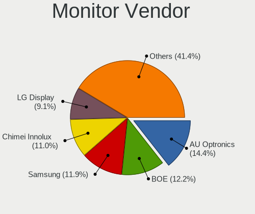

| Vendor                  | Computers | Percent |
|-------------------------|-----------|---------|
| AU Optronics            | 18        | 16.07%  |
| BOE                     | 16        | 14.29%  |
| Samsung Electronics     | 15        | 13.39%  |
| LG Display              | 14        | 12.5%   |
| Chimei Innolux          | 13        | 11.61%  |
| Goldstar                | 5         | 4.46%   |
| Dell                    | 5         | 4.46%   |
| Hewlett-Packard         | 3         | 2.68%   |
| BenQ                    | 3         | 2.68%   |
| LG Philips              | 2         | 1.79%   |
| Lenovo                  | 2         | 1.79%   |
| Chi Mei Optoelectronics | 2         | 1.79%   |
| Ancor Communications    | 2         | 1.79%   |
| Sharp                   | 1         | 0.89%   |
| Seiko/Epson             | 1         | 0.89%   |
| RTK                     | 1         | 0.89%   |
| Panasonic               | 1         | 0.89%   |
| LGD                     | 1         | 0.89%   |
| LG Electronics          | 1         | 0.89%   |
| InfoVision              | 1         | 0.89%   |
| Hitachi                 | 1         | 0.89%   |
| Gigabyte Technology     | 1         | 0.89%   |
| CSO                     | 1         | 0.89%   |
| Apple                   | 1         | 0.89%   |
| AOC                     | 1         | 0.89%   |

Monitor Model
-------------

Monitor models

| Model                                                                   | Computers | Percent |
|-------------------------------------------------------------------------|-----------|---------|
| LG Display LCD Monitor LGD0575 1920x1080 309x174mm 14.0-inch            | 2         | 1.75%   |
| LG Display LCD Monitor LGD02DC 1366x768 344x194mm 15.5-inch             | 2         | 1.75%   |
| Hewlett-Packard ALL-in-One HPN401F 1920x1080 476x268mm 21.5-inch        | 2         | 1.75%   |
| Chimei Innolux LCD Monitor CMN15E8 1920x1080 340x190mm 15.3-inch        | 2         | 1.75%   |
| BOE LCD Monitor BOE06B3 1366x768 309x173mm 13.9-inch                    | 2         | 1.75%   |
| BOE LCD Monitor BOE0687 1920x1080 344x193mm 15.5-inch                   | 2         | 1.75%   |
| AU Optronics LCD Monitor AUO272B 3840x2160 293x165mm 13.2-inch          | 2         | 1.75%   |
| AU Optronics LCD Monitor AUO203D 1920x1080 309x174mm 14.0-inch          | 2         | 1.75%   |
| Sharp LCD Monitor SHP14BA 1920x1080 344x194mm 15.5-inch                 | 1         | 0.88%   |
| Seiko/Epson LCD Monitor 1280x800                                        | 1         | 0.88%   |
| Samsung Electronics SMB1930N SAM0632 1366x768 410x230mm 18.5-inch       | 1         | 0.88%   |
| Samsung Electronics S22F350 SAM0D1A 1920x1080 477x268mm 21.5-inch       | 1         | 0.88%   |
| Samsung Electronics LCD Monitor SEC5741 1280x800 261x163mm 12.1-inch    | 1         | 0.88%   |
| Samsung Electronics LCD Monitor SEC5441 1366x768 344x194mm 15.5-inch    | 1         | 0.88%   |
| Samsung Electronics LCD Monitor SEC4251 1366x768 344x194mm 15.5-inch    | 1         | 0.88%   |
| Samsung Electronics LCD Monitor SEC3542 2160x1440 254x169mm 12.0-inch   | 1         | 0.88%   |
| Samsung Electronics LCD Monitor SEC3150 1366x768 340x190mm 15.3-inch    | 1         | 0.88%   |
| Samsung Electronics LCD Monitor SDC4341 1366x768 344x194mm 15.5-inch    | 1         | 0.88%   |
| Samsung Electronics LCD Monitor SDC424A 3200x1800 293x165mm 13.2-inch   | 1         | 0.88%   |
| Samsung Electronics LCD Monitor SDC3853 2736x1824 260x173mm 12.3-inch   | 1         | 0.88%   |
| Samsung Electronics LCD Monitor SAM0FEF 3840x2160 1872x1053mm 84.6-inch | 1         | 0.88%   |
| Samsung Electronics LCD Monitor SAM0FEE 3840x2160 1872x1053mm 84.6-inch | 1         | 0.88%   |
| Samsung Electronics C32F391 SAM0D34 1920x1080 698x393mm 31.5-inch       | 1         | 0.88%   |
| Samsung Electronics C27R50x SAM0F9D 1920x1080 598x336mm 27.0-inch       | 1         | 0.88%   |
| Samsung Electronics C24F390 SAM0D2C 1920x1080 521x293mm 23.5-inch       | 1         | 0.88%   |
| RTK LCD Monitor RTK1D1A 1920x1080 1020x570mm 46.0-inch                  | 1         | 0.88%   |
| Panasonic TV MEIA296 3840x2160 698x392mm 31.5-inch                      | 1         | 0.88%   |
| LGD LCD Monitor 1366x768                                                | 1         | 0.88%   |
| LG Philips LP154WX4-TLC8 LPL0120 1280x800 331x207mm 15.4-inch           | 1         | 0.88%   |
| LG Philips LCD Monitor LPL2A00 1280x800 330x210mm 15.4-inch             | 1         | 0.88%   |
| LG Electronics LCD Monitor LG ULTRAWIDE 2560x1080                       | 1         | 0.88%   |
| LG Display LCD Monitor LGD05EF 2560x1440 309x174mm 14.0-inch            | 1         | 0.88%   |
| LG Display LCD Monitor LGD04A4 1920x1080 309x174mm 14.0-inch            | 1         | 0.88%   |
| LG Display LCD Monitor LGD0465 1366x768 344x194mm 15.5-inch             | 1         | 0.88%   |
| LG Display LCD Monitor LGD03ED 1366x768 277x156mm 12.5-inch             | 1         | 0.88%   |
| LG Display LCD Monitor LGD03AB 1366x768 344x194mm 15.5-inch             | 1         | 0.88%   |
| LG Display LCD Monitor LGD039F 1366x768 345x194mm 15.6-inch             | 1         | 0.88%   |
| LG Display LCD Monitor LGD0395 1366x768 344x194mm 15.5-inch             | 1         | 0.88%   |
| LG Display LCD Monitor LGD0386 1366x768 309x174mm 14.0-inch             | 1         | 0.88%   |
| LG Display LCD Monitor LGD036C 1366x768 277x156mm 12.5-inch             | 1         | 0.88%   |
| LG Display LCD Monitor LGD02D8 1366x768 277x156mm 12.5-inch             | 1         | 0.88%   |
| LG Display LCD Monitor LGD0212 1366x768 309x174mm 14.0-inch             | 1         | 0.88%   |
| Lenovo L24e-30 LEN66BC 1920x1080 527x296mm 23.8-inch                    | 1         | 0.88%   |
| Lenovo D19-10 LEN61E0 1366x768 430x255mm 19.7-inch                      | 1         | 0.88%   |
| InfoVision LCD Monitor IVO8C65 1920x1080 309x174mm 14.0-inch            | 1         | 0.88%   |
| Hitachi HDMI HEC0029 1920x1080 580x330mm 26.3-inch                      | 1         | 0.88%   |
| Hewlett-Packard LCD Monitor HWP4101 1920x1080 470x270mm 21.3-inch       | 1         | 0.88%   |
| Goldstar IPS FULLHD GSM5AB8 1920x1080 480x270mm 21.7-inch               | 1         | 0.88%   |
| Goldstar HDR 4K GSM7750 3840x2160 697x392mm 31.5-inch                   | 1         | 0.88%   |
| Goldstar HDR 4K GSM7706 3840x2160 600x340mm 27.2-inch                   | 1         | 0.88%   |
| Goldstar 24MP76 GSM5A28 1920x1080 530x300mm 24.0-inch                   | 1         | 0.88%   |
| Goldstar 24MP56 GSM5A56 1920x1080 510x290mm 23.1-inch                   | 1         | 0.88%   |
| Gigabyte Technology M27Q GBT270D 2560x1440 596x335mm 26.9-inch          | 1         | 0.88%   |
| Dell U2721DE DEL41DD 2560x1440 597x336mm 27.0-inch                      | 1         | 0.88%   |
| Dell P2720DC DELD0FB 2560x1440 597x336mm 27.0-inch                      | 1         | 0.88%   |
| Dell P2419H DELD0DA 1920x1080 530x300mm 24.0-inch                       | 1         | 0.88%   |
| Dell E1914H DELD03A 1366x768 410x230mm 18.5-inch                        | 1         | 0.88%   |
| Dell 2407WFP DELA017 1920x1200 520x330mm 24.2-inch                      | 1         | 0.88%   |
| CSO LCD Monitor CSO1404 1920x1200 302x189mm 14.0-inch                   | 1         | 0.88%   |
| Chimei Innolux LCD Monitor CMN1747 1920x1080 381x214mm 17.2-inch        | 1         | 0.88%   |

Monitor Resolution
------------------

Monitor screen resolution

| Resolution        | Computers | Percent |
|-------------------|-----------|---------|
| 1920x1080 (FHD)   | 49        | 45.37%  |
| 1366x768 (WXGA)   | 32        | 29.63%  |
| 3840x2160 (4K)    | 8         | 7.41%   |
| 2560x1440 (QHD)   | 5         | 4.63%   |
| 1280x800 (WXGA)   | 4         | 3.7%    |
| 1920x1200 (WUXGA) | 2         | 1.85%   |
| 1600x900 (HD+)    | 2         | 1.85%   |
| 3200x1800 (QHD+)  | 1         | 0.93%   |
| 2880x1920         | 1         | 0.93%   |
| 2736x1824         | 1         | 0.93%   |
| 2560x1080         | 1         | 0.93%   |
| 2304x1440         | 1         | 0.93%   |
| 2160x1440         | 1         | 0.93%   |

Monitor Diagonal
----------------

Diagonal size in inches

| Inches  | Computers | Percent |
|---------|-----------|---------|
| 15      | 34        | 30.09%  |
| 14      | 18        | 15.93%  |
| 13      | 15        | 13.27%  |
| 12      | 7         | 6.19%   |
| 24      | 6         | 5.31%   |
| 27      | 5         | 4.42%   |
| 21      | 5         | 4.42%   |
| Unknown | 4         | 3.54%   |
| 84      | 3         | 2.65%   |
| 31      | 3         | 2.65%   |
| 23      | 3         | 2.65%   |
| 18      | 2         | 1.77%   |
| 11      | 2         | 1.77%   |
| 52      | 1         | 0.88%   |
| 46      | 1         | 0.88%   |
| 20      | 1         | 0.88%   |
| 19      | 1         | 0.88%   |
| 17      | 1         | 0.88%   |
| 16      | 1         | 0.88%   |

Monitor Width
-------------

Physical width

| Width in mm | Computers | Percent |
|-------------|-----------|---------|
| 301-350     | 58        | 51.79%  |
| 201-300     | 17        | 15.18%  |
| 501-600     | 14        | 12.5%   |
| 401-500     | 9         | 8.04%   |
| Unknown     | 4         | 3.57%   |
| 601-700     | 3         | 2.68%   |
| 351-400     | 3         | 2.68%   |
| 1501-2000   | 3         | 2.68%   |
| 1001-1500   | 1         | 0.89%   |

Aspect Ratio
------------

Proportional relationship between the width and the height

| Ratio   | Computers | Percent |
|---------|-----------|---------|
| 16/9    | 88        | 88%     |
| 16/10   | 7         | 7%      |
| Unknown | 4         | 4%      |
| 3/2     | 1         | 1%      |

Monitor Area
------------

Area in inch

| Area in inch | Computers | Percent |
|----------------|-----------|---------|
| 101-110        | 35        | 30.97%  |
| 81-90          | 25        | 22.12%  |
| 201-250        | 9         | 7.96%   |
| 71-80          | 8         | 7.08%   |
| 61-70          | 7         | 6.19%   |
| 301-350        | 5         | 4.42%   |
| 151-200        | 5         | 4.42%   |
| More than 1000 | 4         | 3.54%   |
| Unknown        | 4         | 3.54%   |
| 351-500        | 3         | 2.65%   |
| 51-60          | 2         | 1.77%   |
| 251-300        | 2         | 1.77%   |
| 141-150        | 2         | 1.77%   |
| 121-130        | 1         | 0.88%   |
| 501-1000       | 1         | 0.88%   |

Pixel Density
-------------

Pixels per inch

| Density       | Computers | Percent |
|---------------|-----------|---------|
| 121-160       | 37        | 33.64%  |
| 101-120       | 30        | 27.27%  |
| 51-100        | 24        | 21.82%  |
| 161-240       | 10        | 9.09%   |
| More than 240 | 4         | 3.64%   |
| Unknown       | 4         | 3.64%   |
| 1-50          | 1         | 0.91%   |

Multiple Monitors
-----------------

Total monitors connected

| Total | Computers | Percent |
|-------|-----------|---------|
| 1     | 87        | 80.56%  |
| 2     | 14        | 12.96%  |
| 0     | 5         | 4.63%   |
| 3     | 2         | 1.85%   |

Network
-------

Net Controller Vendor
---------------------

Controller vendors

| Vendor                   | Computers | Percent |
|--------------------------|-----------|---------|
| Intel                    | 64        | 41.03%  |
| Realtek Semiconductor    | 50        | 32.05%  |
| Qualcomm Atheros         | 13        | 8.33%   |
| Broadcom                 | 10        | 6.41%   |
| Ralink                   | 4         | 2.56%   |
| Marvell Technology Group | 4         | 2.56%   |
| ASIX Electronics         | 2         | 1.28%   |
| Wilocity                 | 1         | 0.64%   |
| VIA Technologies         | 1         | 0.64%   |
| SILICON Laboratories     | 1         | 0.64%   |
| Sigma Designs            | 1         | 0.64%   |
| Ralink Technology        | 1         | 0.64%   |
| Nvidia                   | 1         | 0.64%   |
| Lenovo                   | 1         | 0.64%   |
| D-Link                   | 1         | 0.64%   |
| Broadcom Limited         | 1         | 0.64%   |

Net Controller Model
--------------------

Controller models

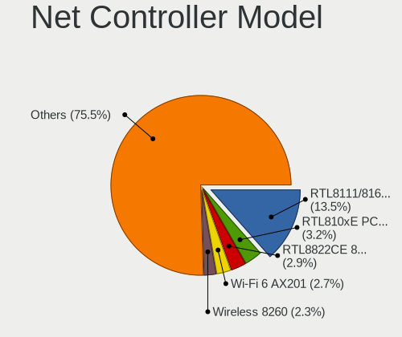

| Model                                                             | Computers | Percent |
|-------------------------------------------------------------------|-----------|---------|
| Realtek RTL8111/8168/8411 PCI Express Gigabit Ethernet Controller | 28        | 14.97%  |
| Realtek RTL810xE PCI Express Fast Ethernet controller             | 14        | 7.49%   |
| Intel Cannon Point-LP CNVi [Wireless-AC]                          | 6         | 3.21%   |
| Realtek RTL8821CE 802.11ac PCIe Wireless Network Adapter          | 5         | 2.67%   |
| Intel 82579LM Gigabit Network Connection (Lewisville)             | 5         | 2.67%   |
| Intel Wireless 8265 / 8275                                        | 4         | 2.14%   |
| Intel Wireless 8260                                               | 4         | 2.14%   |
| Intel Wireless 7260                                               | 4         | 2.14%   |
| Realtek RTL8822BE 802.11a/b/g/n/ac WiFi adapter                   | 3         | 1.6%    |
| Ralink RT3290 Wireless 802.11n 1T/1R PCIe                         | 3         | 1.6%    |
| Intel Wireless 7265                                               | 3         | 1.6%    |
| Intel Wi-Fi 6 AX201                                               | 3         | 1.6%    |
| Intel Wi-Fi 6 AX200                                               | 3         | 1.6%    |
| Intel Cannon Lake PCH CNVi WiFi                                   | 3         | 1.6%    |
| Intel 82577LM Gigabit Network Connection                          | 3         | 1.6%    |
| Realtek RTL8822CE 802.11ac PCIe Wireless Network Adapter          | 2         | 1.07%   |
| Realtek RTL8723BE PCIe Wireless Network Adapter                   | 2         | 1.07%   |
| Realtek 802.11n WLAN Adapter                                      | 2         | 1.07%   |
| Qualcomm Atheros QCA9377 802.11ac Wireless Network Adapter        | 2         | 1.07%   |
| Qualcomm Atheros QCA6174 802.11ac Wireless Network Adapter        | 2         | 1.07%   |
| Marvell Group 88W8897 [AVASTAR] 802.11ac Wireless                 | 2         | 1.07%   |
| Intel Wireless 3165                                               | 2         | 1.07%   |
| Intel I211 Gigabit Network Connection                             | 2         | 1.07%   |
| Intel Ethernet Connection I219-LM                                 | 2         | 1.07%   |
| Intel Ethernet Connection I218-LM                                 | 2         | 1.07%   |
| Intel Ethernet Connection (2) I219-V                              | 2         | 1.07%   |
| Intel Ethernet Connection (2) I218-V                              | 2         | 1.07%   |
| Intel Comet Lake PCH-LP CNVi WiFi                                 | 2         | 1.07%   |
| Intel Comet Lake PCH CNVi WiFi                                    | 2         | 1.07%   |
| Intel Centrino Ultimate-N 6300                                    | 2         | 1.07%   |
| Intel Centrino Advanced-N 6235                                    | 2         | 1.07%   |
| Intel 82579V Gigabit Network Connection                           | 2         | 1.07%   |
| Broadcom BCM4360 802.11ac Wireless Network Adapter                | 2         | 1.07%   |
| Broadcom BCM43228 802.11a/b/g/n                                   | 2         | 1.07%   |
| ASIX AX88179 Gigabit Ethernet                                     | 2         | 1.07%   |
| Wilocity Wil6200 802.11ad Wireless Network Adapter                | 1         | 0.53%   |
| VIA VT6105/VT6106S [Rhine-III]                                    | 1         | 0.53%   |
| SILICON Laboratories Intel 537 [Winmodem]                         | 1         | 0.53%   |
| Sigma Designs Aeotec Z-Stick Gen5 (ZW090) - UZB                   | 1         | 0.53%   |
| Realtek RTL8821AE 802.11ac PCIe Wireless Network Adapter          | 1         | 0.53%   |
| Realtek RTL8723AE PCIe Wireless Network Adapter                   | 1         | 0.53%   |
| Realtek RTL8192EU 802.11b/g/n WLAN Adapter                        | 1         | 0.53%   |
| Realtek RTL8188EUS 802.11n Wireless Network Adapter               | 1         | 0.53%   |
| Realtek RTL8153 Gigabit Ethernet Adapter                          | 1         | 0.53%   |
| Realtek RTL8125 2.5GbE Controller                                 | 1         | 0.53%   |
| Realtek RTL-8100/8101L/8139 PCI Fast Ethernet Adapter             | 1         | 0.53%   |
| Ralink MT7601U Wireless Adapter                                   | 1         | 0.53%   |
| Ralink RT3090 Wireless 802.11n 1T/1R PCIe                         | 1         | 0.53%   |
| Qualcomm Atheros QCA9565 / AR9565 Wireless Network Adapter        | 1         | 0.53%   |
| Qualcomm Atheros QCA8172 Fast Ethernet                            | 1         | 0.53%   |
| Qualcomm Atheros Killer E2400 Gigabit Ethernet Controller         | 1         | 0.53%   |
| Qualcomm Atheros AR9485 Wireless Network Adapter                  | 1         | 0.53%   |
| Qualcomm Atheros AR9462 Wireless Network Adapter                  | 1         | 0.53%   |
| Qualcomm Atheros AR9287 Wireless Network Adapter (PCI-Express)    | 1         | 0.53%   |
| Qualcomm Atheros AR9285 Wireless Network Adapter (PCI-Express)    | 1         | 0.53%   |
| Qualcomm Atheros AR8151 v2.0 Gigabit Ethernet                     | 1         | 0.53%   |
| Qualcomm Atheros AR8132 Fast Ethernet                             | 1         | 0.53%   |
| Nvidia MCP61 Ethernet                                             | 1         | 0.53%   |
| Marvell Group 88E8070 based Ethernet Controller                   | 1         | 0.53%   |
| Marvell Group 88E8055 PCI-E Gigabit Ethernet Controller           | 1         | 0.53%   |

Wireless Vendor
---------------

Wireless vendors

| Vendor                   | Computers | Percent |
|--------------------------|-----------|---------|
| Intel                    | 51        | 53.13%  |
| Realtek Semiconductor    | 18        | 18.75%  |
| Qualcomm Atheros         | 9         | 9.38%   |
| Broadcom                 | 8         | 8.33%   |
| Ralink                   | 4         | 4.17%   |
| Marvell Technology Group | 2         | 2.08%   |
| Wilocity                 | 1         | 1.04%   |
| Ralink Technology        | 1         | 1.04%   |
| D-Link                   | 1         | 1.04%   |
| Broadcom Limited         | 1         | 1.04%   |

Wireless Model
--------------

Wireless models

| Model                                                                   | Computers | Percent |
|-------------------------------------------------------------------------|-----------|---------|
| Intel Cannon Point-LP CNVi [Wireless-AC]                                | 6         | 6.25%   |
| Realtek RTL8821CE 802.11ac PCIe Wireless Network Adapter                | 5         | 5.21%   |
| Intel Wireless 8265 / 8275                                              | 4         | 4.17%   |
| Intel Wireless 8260                                                     | 4         | 4.17%   |
| Intel Wireless 7260                                                     | 4         | 4.17%   |
| Realtek RTL8822BE 802.11a/b/g/n/ac WiFi adapter                         | 3         | 3.13%   |
| Ralink RT3290 Wireless 802.11n 1T/1R PCIe                               | 3         | 3.13%   |
| Intel Wireless 7265                                                     | 3         | 3.13%   |
| Intel Wi-Fi 6 AX201                                                     | 3         | 3.13%   |
| Intel Wi-Fi 6 AX200                                                     | 3         | 3.13%   |
| Intel Cannon Lake PCH CNVi WiFi                                         | 3         | 3.13%   |
| Realtek RTL8822CE 802.11ac PCIe Wireless Network Adapter                | 2         | 2.08%   |
| Realtek RTL8723BE PCIe Wireless Network Adapter                         | 2         | 2.08%   |
| Realtek 802.11n WLAN Adapter                                            | 2         | 2.08%   |
| Qualcomm Atheros QCA9377 802.11ac Wireless Network Adapter              | 2         | 2.08%   |
| Qualcomm Atheros QCA6174 802.11ac Wireless Network Adapter              | 2         | 2.08%   |
| Marvell Group 88W8897 [AVASTAR] 802.11ac Wireless                       | 2         | 2.08%   |
| Intel Wireless 3165                                                     | 2         | 2.08%   |
| Intel Comet Lake PCH-LP CNVi WiFi                                       | 2         | 2.08%   |
| Intel Comet Lake PCH CNVi WiFi                                          | 2         | 2.08%   |
| Intel Centrino Ultimate-N 6300                                          | 2         | 2.08%   |
| Intel Centrino Advanced-N 6235                                          | 2         | 2.08%   |
| Broadcom BCM4360 802.11ac Wireless Network Adapter                      | 2         | 2.08%   |
| Broadcom BCM43228 802.11a/b/g/n                                         | 2         | 2.08%   |
| Wilocity Wil6200 802.11ad Wireless Network Adapter                      | 1         | 1.04%   |
| Realtek RTL8821AE 802.11ac PCIe Wireless Network Adapter                | 1         | 1.04%   |
| Realtek RTL8723AE PCIe Wireless Network Adapter                         | 1         | 1.04%   |
| Realtek RTL8192EU 802.11b/g/n WLAN Adapter                              | 1         | 1.04%   |
| Realtek RTL8188EUS 802.11n Wireless Network Adapter                     | 1         | 1.04%   |
| Ralink MT7601U Wireless Adapter                                         | 1         | 1.04%   |
| Ralink RT3090 Wireless 802.11n 1T/1R PCIe                               | 1         | 1.04%   |
| Qualcomm Atheros QCA9565 / AR9565 Wireless Network Adapter              | 1         | 1.04%   |
| Qualcomm Atheros AR9485 Wireless Network Adapter                        | 1         | 1.04%   |
| Qualcomm Atheros AR9462 Wireless Network Adapter                        | 1         | 1.04%   |
| Qualcomm Atheros AR9287 Wireless Network Adapter (PCI-Express)          | 1         | 1.04%   |
| Qualcomm Atheros AR9285 Wireless Network Adapter (PCI-Express)          | 1         | 1.04%   |
| Intel Wireless-AC 9260                                                  | 1         | 1.04%   |
| Intel Wireless 3160                                                     | 1         | 1.04%   |
| Intel WiFi Link 5100                                                    | 1         | 1.04%   |
| Intel Wi-Fi 6 AX210/AX211/AX411 160MHz                                  | 1         | 1.04%   |
| Intel PRO/Wireless 3945ABG [Golan] Network Connection                   | 1         | 1.04%   |
| Intel Gemini Lake PCH CNVi WiFi                                         | 1         | 1.04%   |
| Intel Dual Band Wireless-AC 3165 Plus Bluetooth                         | 1         | 1.04%   |
| Intel Centrino Wireless-N 135                                           | 1         | 1.04%   |
| Intel Centrino Wireless-N 1030 [Rainbow Peak]                           | 1         | 1.04%   |
| Intel Centrino Advanced-N 6205 [Taylor Peak]                            | 1         | 1.04%   |
| Intel Centrino Advanced-N 6200                                          | 1         | 1.04%   |
| D-Link DWA-127 Wireless N 150 High-Gain Adapter(rev.A1) [Ralink RT3070] | 1         | 1.04%   |
| Broadcom Limited BCM43224 802.11a/b/g/n                                 | 1         | 1.04%   |
| Broadcom BCM4350 802.11ac Wireless Network Adapter                      | 1         | 1.04%   |
| Broadcom BCM43142 802.11b/g/n                                           | 1         | 1.04%   |
| Broadcom BCM4313 802.11bgn Wireless Network Adapter                     | 1         | 1.04%   |
| Broadcom BCM4311 802.11b/g WLAN                                         | 1         | 1.04%   |

Ethernet Vendor
---------------

Ethernet vendors

| Vendor                   | Computers | Percent |
|--------------------------|-----------|---------|
| Realtek Semiconductor    | 43        | 51.19%  |
| Intel                    | 28        | 33.33%  |
| Qualcomm Atheros         | 4         | 4.76%   |
| Marvell Technology Group | 2         | 2.38%   |
| Broadcom                 | 2         | 2.38%   |
| ASIX Electronics         | 2         | 2.38%   |
| VIA Technologies         | 1         | 1.19%   |
| Nvidia                   | 1         | 1.19%   |
| Lenovo                   | 1         | 1.19%   |

Ethernet Model
--------------

Ethernet models

| Model                                                             | Computers | Percent |
|-------------------------------------------------------------------|-----------|---------|
| Realtek RTL8111/8168/8411 PCI Express Gigabit Ethernet Controller | 28        | 31.46%  |
| Realtek RTL810xE PCI Express Fast Ethernet controller             | 14        | 15.73%  |
| Intel 82579LM Gigabit Network Connection (Lewisville)             | 5         | 5.62%   |
| Intel 82577LM Gigabit Network Connection                          | 3         | 3.37%   |
| Intel I211 Gigabit Network Connection                             | 2         | 2.25%   |
| Intel Ethernet Connection I219-LM                                 | 2         | 2.25%   |
| Intel Ethernet Connection I218-LM                                 | 2         | 2.25%   |
| Intel Ethernet Connection (2) I219-V                              | 2         | 2.25%   |
| Intel Ethernet Connection (2) I218-V                              | 2         | 2.25%   |
| Intel 82579V Gigabit Network Connection                           | 2         | 2.25%   |
| ASIX AX88179 Gigabit Ethernet                                     | 2         | 2.25%   |
| VIA VT6105/VT6106S [Rhine-III]                                    | 1         | 1.12%   |
| Realtek RTL8153 Gigabit Ethernet Adapter                          | 1         | 1.12%   |
| Realtek RTL8125 2.5GbE Controller                                 | 1         | 1.12%   |
| Realtek RTL-8100/8101L/8139 PCI Fast Ethernet Adapter             | 1         | 1.12%   |
| Qualcomm Atheros QCA8172 Fast Ethernet                            | 1         | 1.12%   |
| Qualcomm Atheros Killer E2400 Gigabit Ethernet Controller         | 1         | 1.12%   |
| Qualcomm Atheros AR8151 v2.0 Gigabit Ethernet                     | 1         | 1.12%   |
| Qualcomm Atheros AR8132 Fast Ethernet                             | 1         | 1.12%   |
| Nvidia MCP61 Ethernet                                             | 1         | 1.12%   |
| Marvell Group 88E8070 based Ethernet Controller                   | 1         | 1.12%   |
| Marvell Group 88E8055 PCI-E Gigabit Ethernet Controller           | 1         | 1.12%   |
| Lenovo ThinkPad TBT 3 Dock                                        | 1         | 1.12%   |
| Intel I350 Gigabit Network Connection                             | 1         | 1.12%   |
| Intel I210 Gigabit Network Connection                             | 1         | 1.12%   |
| Intel Ethernet Connection I219-V                                  | 1         | 1.12%   |
| Intel Ethernet Connection I217-V                                  | 1         | 1.12%   |
| Intel Ethernet Connection I217-LM                                 | 1         | 1.12%   |
| Intel Ethernet Connection (6) I219-V                              | 1         | 1.12%   |
| Intel Ethernet Connection (6) I219-LM                             | 1         | 1.12%   |
| Intel Ethernet Connection (4) I219-V                              | 1         | 1.12%   |
| Intel Ethernet Connection (4) I219-LM                             | 1         | 1.12%   |
| Intel Ethernet Connection (3) I218-V                              | 1         | 1.12%   |
| Intel 82578DM Gigabit Network Connection                          | 1         | 1.12%   |
| Broadcom NetXtreme BCM5761 Gigabit Ethernet PCIe                  | 1         | 1.12%   |
| Broadcom NetLink BCM57785 Gigabit Ethernet PCIe                   | 1         | 1.12%   |

Net Controller Kind
-------------------

Ethernet, WiFi or modem

| Kind     | Computers | Percent |
|----------|-----------|---------|
| WiFi     | 91        | 52.3%   |
| Ethernet | 81        | 46.55%  |
| Modem    | 2         | 1.15%   |

Used Controller
---------------

Currently used network controller

| Kind     | Computers | Percent |
|----------|-----------|---------|
| WiFi     | 78        | 71.56%  |
| Ethernet | 31        | 28.44%  |

NICs
----

Total network controllers on board

| Total | Computers | Percent |
|-------|-----------|---------|
| 2     | 65        | 61.9%   |
| 1     | 36        | 34.29%  |
| 3     | 2         | 1.9%    |
| 4     | 1         | 0.95%   |
| 0     | 1         | 0.95%   |

IPv6
----

IPv6 vs IPv4

| Used | Computers | Percent |
|------|-----------|---------|
| No   | 86        | 81.9%   |
| Yes  | 19        | 18.1%   |

Bluetooth
---------

Bluetooth Vendor
----------------

Controller vendors

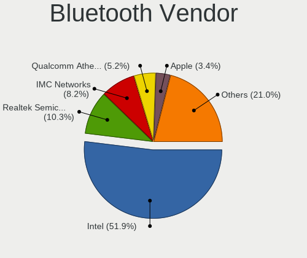

| Vendor                          | Computers | Percent |
|---------------------------------|-----------|---------|
| Intel                           | 40        | 52.63%  |
| Realtek Semiconductor           | 10        | 13.16%  |
| Qualcomm Atheros Communications | 6         | 7.89%   |
| ASUSTek Computer                | 4         | 5.26%   |
| Ralink                          | 3         | 3.95%   |
| Broadcom                        | 3         | 3.95%   |
| Toshiba                         | 2         | 2.63%   |
| Marvell Semiconductor           | 2         | 2.63%   |
| Dell                            | 2         | 2.63%   |
| Cambridge Silicon Radio         | 2         | 2.63%   |
| Hewlett-Packard                 | 1         | 1.32%   |
| Foxconn / Hon Hai               | 1         | 1.32%   |

Bluetooth Model
---------------

Controller models

| Model                                                 | Computers | Percent |
|-------------------------------------------------------|-----------|---------|
| Intel Bluetooth wireless interface                    | 15        | 19.74%  |
| Intel Bluetooth 9460/9560 Jefferson Peak (JfP)        | 12        | 15.79%  |
| Realtek Bluetooth Radio                               | 5         | 6.58%   |
| Intel Bluetooth Device                                | 5         | 6.58%   |
| Realtek  Bluetooth 4.2 Adapter                        | 3         | 3.95%   |
| Ralink RT3290 Bluetooth                               | 3         | 3.95%   |
| Intel Centrino Bluetooth Wireless Transceiver         | 3         | 3.95%   |
| Intel AX200 Bluetooth                                 | 3         | 3.95%   |
| Qualcomm Atheros  Bluetooth Device                    | 2         | 2.63%   |
| Cambridge Silicon Radio Bluetooth Dongle (HCI mode)   | 2         | 2.63%   |
| ASUS Broadcom BCM20702 Single-Chip Bluetooth 4.0 + LE | 2         | 2.63%   |
| Toshiba RT Bluetooth Radio                            | 1         | 1.32%   |
| Toshiba Integrated Bluetooth HCI                      | 1         | 1.32%   |
| Realtek RTL8822BE Bluetooth 4.2 Adapter               | 1         | 1.32%   |
| Realtek RTL8821A Bluetooth                            | 1         | 1.32%   |
| Qualcomm Atheros QCA61x4 Bluetooth 4.0                | 1         | 1.32%   |
| Qualcomm Atheros Bluetooth USB Host Controller        | 1         | 1.32%   |
| Qualcomm Atheros AR9462 Bluetooth                     | 1         | 1.32%   |
| Qualcomm Atheros AR3011 Bluetooth                     | 1         | 1.32%   |
| Marvell Bluetooth and Wireless LAN Composite Device   | 1         | 1.32%   |
| Marvell Bluetooth and Wireless LAN Composite          | 1         | 1.32%   |
| Intel Wireless-AC 9260 Bluetooth Adapter              | 1         | 1.32%   |
| Intel AX210 Bluetooth                                 | 1         | 1.32%   |
| HP Broadcom 2070 Bluetooth Combo                      | 1         | 1.32%   |
| Foxconn / Hon Hai Bluetooth USB Host Controller       | 1         | 1.32%   |
| Dell DW375 Bluetooth Module                           | 1         | 1.32%   |
| Dell BCM20702A0 Bluetooth Module                      | 1         | 1.32%   |
| Broadcom HP Portable SoftSailing                      | 1         | 1.32%   |
| Broadcom BCM43142A0 Bluetooth 4.0                     | 1         | 1.32%   |
| Broadcom BCM20702 Bluetooth 4.0 [ThinkPad]            | 1         | 1.32%   |
| ASUS Bluetooth Radio                                  | 1         | 1.32%   |
| ASUS Bluetooth Device                                 | 1         | 1.32%   |

Sound
-----

Sound Vendor
------------

Sound card vendors

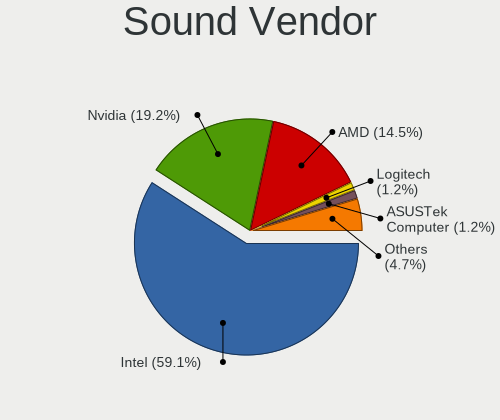

| Vendor             | Computers | Percent |
|--------------------|-----------|---------|
| Intel              | 97        | 72.93%  |
| Nvidia             | 21        | 15.79%  |
| AMD                | 9         | 6.77%   |
| SteelSeries ApS    | 1         | 0.75%   |
| Logitech           | 1         | 0.75%   |
| Lenovo             | 1         | 0.75%   |
| JMTek              | 1         | 0.75%   |
| Griffin Technology | 1         | 0.75%   |
| Apogee Electronics | 1         | 0.75%   |

Sound Model
-----------

Sound card models

| Model                                                                                             | Computers | Percent |
|---------------------------------------------------------------------------------------------------|-----------|---------|
| Intel Sunrise Point-LP HD Audio                                                                   | 15        | 9.8%    |
| Intel 7 Series/C216 Chipset Family High Definition Audio Controller                               | 11        | 7.19%   |
| Intel Cannon Point-LP High Definition Audio Controller                                            | 10        | 6.54%   |
| Intel Haswell-ULT HD Audio Controller                                                             | 8         | 5.23%   |
| Intel 8 Series HD Audio Controller                                                                | 8         | 5.23%   |
| Intel Cannon Lake PCH cAVS                                                                        | 7         | 4.58%   |
| Intel 6 Series/C200 Series Chipset Family High Definition Audio Controller                        | 6         | 3.92%   |
| Intel 5 Series/3400 Series Chipset High Definition Audio                                          | 6         | 3.92%   |
| Nvidia GP107GL High Definition Audio Controller                                                   | 4         | 2.61%   |
| Intel Comet Lake PCH-LP cAVS                                                                      | 4         | 2.61%   |
| AMD Family 17h/19h HD Audio Controller                                                            | 4         | 2.61%   |
| Nvidia GP106 High Definition Audio Controller                                                     | 3         | 1.96%   |
| Nvidia GF108 High Definition Audio Controller                                                     | 3         | 1.96%   |
| Intel Xeon E3-1200 v3/4th Gen Core Processor HD Audio Controller                                  | 3         | 1.96%   |
| Intel Wildcat Point-LP High Definition Audio Controller                                           | 3         | 1.96%   |
| Intel Tiger Lake-LP Smart Sound Technology Audio Controller                                       | 3         | 1.96%   |
| Intel Broadwell-U Audio Controller                                                                | 3         | 1.96%   |
| Intel 8 Series/C220 Series Chipset High Definition Audio Controller                               | 3         | 1.96%   |
| AMD Renoir Radeon High Definition Audio Controller                                                | 3         | 1.96%   |
| Nvidia TU107 GeForce GTX 1650 High Definition Audio Controller                                    | 2         | 1.31%   |
| Nvidia High Definition Audio Controller                                                           | 2         | 1.31%   |
| Intel Comet Lake PCH cAVS                                                                         | 2         | 1.31%   |
| Intel CM238 HD Audio Controller                                                                   | 2         | 1.31%   |
| Intel C610/X99 series chipset HD Audio Controller                                                 | 2         | 1.31%   |
| Intel 82801JI (ICH10 Family) HD Audio Controller                                                  | 2         | 1.31%   |
| Intel 200 Series PCH HD Audio                                                                     | 2         | 1.31%   |
| Intel 100 Series/C230 Series Chipset Family HD Audio Controller                                   | 2         | 1.31%   |
| AMD Family 17h (Models 00h-0fh) HD Audio Controller                                               | 2         | 1.31%   |
| AMD Ellesmere HDMI Audio [Radeon RX 470/480 / 570/580/590]                                        | 2         | 1.31%   |
| SteelSeries ApS SteelSeries Arctis 5                                                              | 1         | 0.65%   |
| Nvidia TU104 HD Audio Controller                                                                  | 1         | 0.65%   |
| Nvidia TU102 High Definition Audio Controller                                                     | 1         | 0.65%   |
| Nvidia MCP61 High Definition Audio                                                                | 1         | 0.65%   |
| Nvidia GP102 HDMI Audio Controller                                                                | 1         | 0.65%   |
| Nvidia GK110 High Definition Audio Controller                                                     | 1         | 0.65%   |
| Nvidia GK106 HDMI Audio Controller                                                                | 1         | 0.65%   |
| Nvidia GA104 High Definition Audio Controller                                                     | 1         | 0.65%   |
| Logitech USB Headset                                                                              | 1         | 0.65%   |
| Lenovo ThinkPad Thunderbolt 3 Dock USB Audio                                                      | 1         | 0.65%   |
| JMTek USB PnP Audio Device                                                                        | 1         | 0.65%   |
| Intel NM10/ICH7 Family High Definition Audio Controller                                           | 1         | 0.65%   |
| Intel Comet Lake PCH-V cAVS                                                                       | 1         | 0.65%   |
| Intel Celeron/Pentium Silver Processor High Definition Audio                                      | 1         | 0.65%   |
| Intel C600/X79 series chipset High Definition Audio Controller                                    | 1         | 0.65%   |
| Intel Atom/Celeron/Pentium Processor x5-E8000/J3xxx/N3xxx Series Low Power Engine Audio           | 1         | 0.65%   |
| Intel Atom/Celeron/Pentium Processor x5-E8000/J3xxx/N3xxx Series High Definition Audio Controller | 1         | 0.65%   |
| Intel 82801I (ICH9 Family) HD Audio Controller                                                    | 1         | 0.65%   |
| Intel 82801H (ICH8 Family) HD Audio Controller                                                    | 1         | 0.65%   |
| Intel 82801EB/ER (ICH5/ICH5R) AC'97 Audio Controller                                              | 1         | 0.65%   |
| Griffin Technology iMic                                                                           | 1         | 0.65%   |
| Apogee Electronics Groove                                                                         | 1         | 0.65%   |
| AMD Trinity HDMI Audio Controller                                                                 | 1         | 0.65%   |
| AMD Raven/Raven2/Fenghuang HDMI/DP Audio Controller                                               | 1         | 0.65%   |
| AMD FCH Azalia Controller                                                                         | 1         | 0.65%   |
| AMD Cedar HDMI Audio [Radeon HD 5400/6300/7300 Series]                                            | 1         | 0.65%   |

Memory
------

Memory Vendor
-------------

Memory module vendors

| Vendor              | Computers | Percent |
|---------------------|-----------|---------|
| Samsung Electronics | 15        | 34.88%  |
| SK hynix            | 10        | 23.26%  |
| Micron Technology   | 5         | 11.63%  |
| Kingston            | 4         | 9.3%    |
| Crucial             | 3         | 6.98%   |
| Corsair             | 3         | 6.98%   |
| Ramaxel Technology  | 2         | 4.65%   |
| Unknown             | 1         | 2.33%   |

Memory Model
------------

Memory module models

| Model                                                           | Computers | Percent |
|-----------------------------------------------------------------|-----------|---------|
| Samsung RAM M471A2K43CB1-CRC 16GB SODIMM DDR4 2667MT/s          | 2         | 4.65%   |
| Unknown RAM Module 4096MB SODIMM DDR4 2667MT/s                  | 1         | 2.33%   |
| SK hynix RAM Module 8GB Row Of Chips LPDDR3 2133MT/s            | 1         | 2.33%   |
| SK hynix RAM HMT41GS6AFR8A-PB 8192MB SODIMM DDR3 1600MT/s       | 1         | 2.33%   |
| SK hynix RAM HMT351S6CFR8C-H9 4GB SODIMM DDR3 1334MT/s          | 1         | 2.33%   |
| SK hynix RAM HMT125S6TFR8C-G7 2GB SODIMM DDR3 1067MT/s          | 1         | 2.33%   |
| SK hynix RAM HMAA51S6AMR6N-UH 8GB SODIMM DDR4 2400MT/s          | 1         | 2.33%   |
| SK hynix RAM HMA851S6CJR6N-VK 4GB SODIMM DDR4 2667MT/s          | 1         | 2.33%   |
| SK hynix RAM HMA82GS6DJR8N-XN 16GB SODIMM DDR4 3200MT/s         | 1         | 2.33%   |
| SK hynix RAM HMA81GS6CJR8N-VK 8GB SODIMM DDR4 2667MT/s          | 1         | 2.33%   |
| SK hynix RAM HMA41GS6AFR8N-TF 8GB SODIMM DDR4 2667MT/s          | 1         | 2.33%   |
| SK hynix RAM H5ANAG6NCMR-XNC 8GB Row Of Chips DDR4 3200MT/s     | 1         | 2.33%   |
| Samsung RAM Module 8192MB Row Of Chips LPDDR3 2133MT/s          | 1         | 2.33%   |
| Samsung RAM M471B5673EH1-CH9 2GB SODIMM DDR3 1334MT/s           | 1         | 2.33%   |
| Samsung RAM M471B5273CH0-CK0 4GB SODIMM DDR3 1600MT/s           | 1         | 2.33%   |
| Samsung RAM M471A5244CB0-CRC 4GB SODIMM DDR4 2667MT/s           | 1         | 2.33%   |
| Samsung RAM M471A5143DB0-CPB 4GB SODIMM DDR4 2133MT/s           | 1         | 2.33%   |
| Samsung RAM M471A1K44BM0-CRC 8192MB SODIMM DDR4 2400MT/s        | 1         | 2.33%   |
| Samsung RAM M471A1K43DB1-CWE 8GB SODIMM DDR4 3200MT/s           | 1         | 2.33%   |
| Samsung RAM M471A1K43CB1-CTD 8GB SODIMM DDR4 2667MT/s           | 1         | 2.33%   |
| Samsung RAM M471A1K43CB1-CRC 8192MB SODIMM DDR4 2667MT/s        | 1         | 2.33%   |
| Samsung RAM M471A1K43BB1-CRC 8GB SODIMM DDR4 2667MT/s           | 1         | 2.33%   |
| Samsung RAM M393B1K70DH0-YH9 8GB DIMM 1333MT/s                  | 1         | 2.33%   |
| Samsung RAM K4EBE304EC-EGCG 8GB Row Of Chips LPDDR3 2133MT/s    | 1         | 2.33%   |
| Samsung RAM K4AAG165WA-BCWE 8GB Row Of Chips DDR4 3200MT/s      | 1         | 2.33%   |
| Ramaxel RAM RMSA3270ME86H9F-2666 4GB Row Of Chips DDR4 2400MT/s | 1         | 2.33%   |
| Ramaxel RAM RMSA3260ME78HAF-2666 8GB SODIMM DDR4 2667MT/s       | 1         | 2.33%   |
| Micron RAM Module 8192MB SODIMM DDR4 3200MT/s                   | 1         | 2.33%   |
| Micron RAM 8ATF1G64HZ-2G6E1 8192MB SODIMM DDR4 2667MT/s         | 1         | 2.33%   |
| Micron RAM 36JSZF51272PZ1G4F1 4096MB DIMM DDR3 1333MT/s         | 1         | 2.33%   |
| Micron RAM 16JTF1G64HZ-1G6E1 8192MB SODIMM DDR3 1600MT/s        | 1         | 2.33%   |
| Micron RAM 16ATF1G64HZ-2G1B1 8192MB SODIMM DDR4 2133MT/s        | 1         | 2.33%   |
| Kingston RAM LV32D4S2S8HD-8 8GB SODIMM DDR4 3200MT/s            | 1         | 2.33%   |
| Kingston RAM KHX2666C16D4/16GX 16GB DIMM DDR4 2667MT/s          | 1         | 2.33%   |
| Kingston RAM HP26D4S9S8MHF-8 8GB SODIMM DDR4 2667MT/s           | 1         | 2.33%   |
| Kingston RAM 99U5428-053.A00LF 8GB SODIMM DDR3 1600MT/s         | 1         | 2.33%   |
| Crucial RAM CT16G4SFRA32A.M16FR 16GB SODIMM DDR4 3200MT/s       | 1         | 2.33%   |
| Crucial RAM CT16G4SFD8266.M16FJ 16GB SODIMM DDR4 2667MT/s       | 1         | 2.33%   |
| Crucial RAM BLS8G4D30BESBK.8FD 8GB DIMM DDR4 3000MT/s           | 1         | 2.33%   |
| Corsair RAM CMZ8GX3M1A1600C10 8GB DIMM DDR3 800MT/s             | 1         | 2.33%   |
| Corsair RAM CMK16GX4M2A2666C16 8GB DIMM DDR4 3200MT/s           | 1         | 2.33%   |
| Corsair RAM CMD32GX4M4A2800C16 8192MB DIMM DDR4 2133MT/s        | 1         | 2.33%   |

Memory Kind
-----------

Memory module kinds

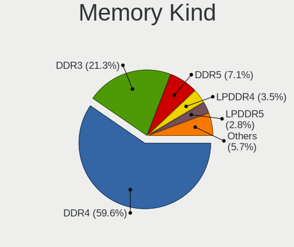

| Kind   | Computers | Percent |
|--------|-----------|---------|
| DDR4   | 27        | 69.23%  |
| DDR3   | 9         | 23.08%  |
| LPDDR3 | 3         | 7.69%   |

Memory Form Factor
------------------

Physical design of the memory module

| Name         | Computers | Percent |
|--------------|-----------|---------|
| SODIMM       | 28        | 70%     |
| Row Of Chips | 6         | 15%     |
| DIMM         | 6         | 15%     |

Memory Size
-----------

Memory module size

| Size  | Computers | Percent |
|-------|-----------|---------|
| 8192  | 26        | 63.41%  |
| 4096  | 7         | 17.07%  |
| 16384 | 6         | 14.63%  |
| 2048  | 2         | 4.88%   |

Memory Speed
------------

Memory module speed

| Speed | Computers | Percent |
|-------|-----------|---------|
| 2667  | 14        | 34.15%  |
| 3200  | 8         | 19.51%  |
| 2133  | 6         | 14.63%  |
| 1600  | 5         | 12.2%   |
| 2400  | 3         | 7.32%   |
| 1334  | 2         | 4.88%   |
| 3000  | 1         | 2.44%   |
| 1333  | 1         | 2.44%   |
| 1067  | 1         | 2.44%   |

Printers & scanners
-------------------

Printer Vendor
--------------

Printer device vendors

| Vendor             | Computers | Percent |
|--------------------|-----------|---------|
| Hewlett-Packard    | 1         | 33.33%  |
| Canon              | 1         | 33.33%  |
| Brother Industries | 1         | 33.33%  |

Printer Model
-------------

Printer device models

| Model                     | Computers | Percent |
|---------------------------|-----------|---------|
| HP Deskjet F2280 series   | 1         | 33.33%  |
| Canon PIXMA MG3600 Series | 1         | 33.33%  |
| Brother MFC-9330CDW       | 1         | 33.33%  |

Scanner Vendor
--------------

Scanner device vendors

Zero info for selected period =(

Scanner Model
-------------

Scanner device models

Zero info for selected period =(

Camera
------

Camera Vendor
-------------

Camera device vendors

| Vendor                                 | Computers | Percent |
|----------------------------------------|-----------|---------|
| Chicony Electronics                    | 25        | 29.41%  |
| IMC Networks                           | 7         | 8.24%   |
| Cheng Uei Precision Industry (Foxlink) | 7         | 8.24%   |
| Acer                                   | 6         | 7.06%   |
| Sunplus Innovation Technology          | 5         | 5.88%   |
| Microdia                               | 5         | 5.88%   |
| Realtek Semiconductor                  | 4         | 4.71%   |
| Syntek                                 | 3         | 3.53%   |
| Ricoh                                  | 3         | 3.53%   |
| Lite-On Technology                     | 3         | 3.53%   |
| Suyin                                  | 2         | 2.35%   |
| Samsung Electronics                    | 2         | 2.35%   |
| Quanta                                 | 2         | 2.35%   |
| Microsoft                              | 2         | 2.35%   |
| Apple                                  | 2         | 2.35%   |
| Ruision                                | 1         | 1.18%   |
| Luxvisions Innotech Limited            | 1         | 1.18%   |
| Logitech                               | 1         | 1.18%   |
| LG Electronics                         | 1         | 1.18%   |
| KYE Systems (Mouse Systems)            | 1         | 1.18%   |
| Creative Technology                    | 1         | 1.18%   |
| Alcor Micro                            | 1         | 1.18%   |

Camera Model
------------

Camera device models

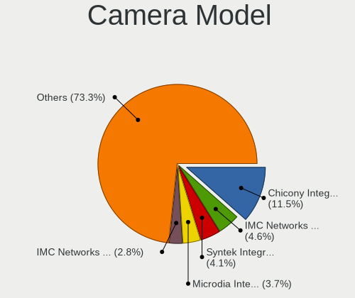

| Model                                                                      | Computers | Percent |
|----------------------------------------------------------------------------|-----------|---------|
| Chicony Integrated Camera                                                  | 8         | 9.41%   |
| IMC Networks USB2.0 HD UVC WebCam                                          | 4         | 4.71%   |
| Syntek Integrated Camera                                                   | 3         | 3.53%   |
| Sunplus HP HD Webcam [Fixed]                                               | 2         | 2.35%   |
| Samsung Galaxy series, misc. (MTP mode)                                    | 2         | 2.35%   |
| Ricoh HD Webcam                                                            | 2         | 2.35%   |
| Quanta HP TrueVision HD Camera                                             | 2         | 2.35%   |
| Microdia Laptop_Integrated_Webcam_HD                                       | 2         | 2.35%   |
| Lite-On HP Wide Vision HD Camera                                           | 2         | 2.35%   |
| Chicony Lenovo EasyCamera                                                  | 2         | 2.35%   |
| Chicony Integrated Camera (1280x720@30)                                    | 2         | 2.35%   |
| Chicony HP Truevision HD                                                   | 2         | 2.35%   |
| Chicony HP HD Webcam [Fixed]                                               | 2         | 2.35%   |
| Chicony EasyCamera                                                         | 2         | 2.35%   |
| Cheng Uei Precision Industry (Foxlink) HP Wide Vision HD Camera            | 2         | 2.35%   |
| Cheng Uei Precision Industry (Foxlink) HP TrueVision HD Camera             | 2         | 2.35%   |
| Apple iPhone 5/5C/5S/6/SE                                                  | 2         | 2.35%   |
| Suyin HP TrueVision HD                                                     | 1         | 1.18%   |
| Suyin 1.3M HD WebCam                                                       | 1         | 1.18%   |
| Sunplus Integrated_Webcam_HD                                               | 1         | 1.18%   |
| Sunplus Integrated_Webcam_FHD                                              | 1         | 1.18%   |
| Sunplus Integrated Webcam                                                  | 1         | 1.18%   |
| Ruision UVC Camera                                                         | 1         | 1.18%   |
| Ricoh Sony Vaio Integrated Webcam                                          | 1         | 1.18%   |
| Realtek Lenovo EasyCamera                                                  | 1         | 1.18%   |
| Realtek Integrated_Webcam_HD                                               | 1         | 1.18%   |
| Realtek Integrated Webcam                                                  | 1         | 1.18%   |
| Realtek HP Truevision HD                                                   | 1         | 1.18%   |
| Microsoft LifeCam Rear                                                     | 1         | 1.18%   |
| Microsoft LifeCam HD-3000                                                  | 1         | 1.18%   |
| Microdia Integrated_Webcam_HD                                              | 1         | 1.18%   |
| Microdia Integrated Webcam                                                 | 1         | 1.18%   |
| Microdia Dell Integrated HD Webcam                                         | 1         | 1.18%   |
| Luxvisions Innotech Limited HP Wide Vision HD Camera                       | 1         | 1.18%   |
| Logitech Webcam C270                                                       | 1         | 1.18%   |
| Lite-On HP HD Camera                                                       | 1         | 1.18%   |
| LG LM-X420xxx/G2/G3 Android Phone (MTP/download mode)                      | 1         | 1.18%   |
| KYE Systems (Mouse Systems) WideCam 1050                                   | 1         | 1.18%   |
| IMC Networks USB2.0 VGA UVC WebCam                                         | 1         | 1.18%   |
| IMC Networks Integrated Camera                                             | 1         | 1.18%   |
| IMC Networks HP TrueVision HD Camera                                       | 1         | 1.18%   |
| Creative Live! Cam Socialize HD 1080 [VF0680]                              | 1         | 1.18%   |
| Chicony USB 2.0 Camera                                                     | 1         | 1.18%   |
| Chicony TOSHIBA Web Camera - HD                                            | 1         | 1.18%   |
| Chicony TOSHIBA Web Camera - FHD                                           | 1         | 1.18%   |
| Chicony TOSHIBA Web Camera                                                 | 1         | 1.18%   |
| Chicony HP Wide Vision HD Camera                                           | 1         | 1.18%   |
| Chicony HP Webcam                                                          | 1         | 1.18%   |
| Chicony HP HD Camera                                                       | 1         | 1.18%   |
| Cheng Uei Precision Industry (Foxlink) USB2.0 UVC VGA WebCam               | 1         | 1.18%   |
| Cheng Uei Precision Industry (Foxlink) HP Wide Vision HD integrated webcam | 1         | 1.18%   |
| Cheng Uei Precision Industry (Foxlink) HP HD Webcam                        | 1         | 1.18%   |
| Alcor Micro USB 2.0 Camera                                                 | 1         | 1.18%   |
| Acer ThinkPad P50 Integrated Camera                                        | 1         | 1.18%   |
| Acer SunplusIT Integrated Camera                                           | 1         | 1.18%   |
| Acer Lenovo EasyCamera integrated webcam                                   | 1         | 1.18%   |
| Acer Integrated Camera                                                     | 1         | 1.18%   |
| Acer EasyCamera                                                            | 1         | 1.18%   |
| Acer BisonCam,NB Pro                                                       | 1         | 1.18%   |

Security
--------

Fingerprint Vendor
------------------

Fingerprint sensor vendors

| Vendor                     | Computers | Percent |
|----------------------------|-----------|---------|
| Validity Sensors           | 11        | 47.83%  |
| Synaptics                  | 10        | 43.48%  |
| Shenzhen Goodix Technology | 1         | 4.35%   |
| Elan Microelectronics      | 1         | 4.35%   |

Fingerprint Model
-----------------

Fingerprint sensor models

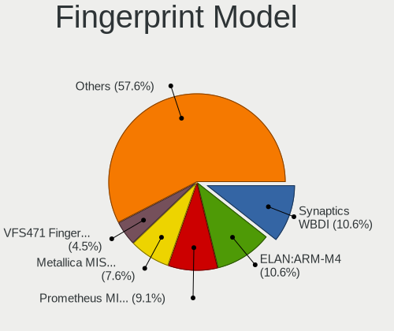

| Model                                                      | Computers | Percent |
|------------------------------------------------------------|-----------|---------|
| Unknown                                                    | 5         | 21.74%  |
| Validity Sensors VFS491                                    | 2         | 8.7%    |
| Validity Sensors VFS471 Fingerprint Reader                 | 2         | 8.7%    |
| Synaptics Prometheus MIS Touch Fingerprint Reader          | 2         | 8.7%    |
| Synaptics Metallica MIS Touch Fingerprint Reader           | 2         | 8.7%    |
| Validity Sensors VFS7500 Touch Fingerprint Sensor          | 1         | 4.35%   |
| Validity Sensors VFS5011 Fingerprint Reader                | 1         | 4.35%   |
| Validity Sensors VFS495 Fingerprint Reader                 | 1         | 4.35%   |
| Validity Sensors VFS Fingerprint sensor                    | 1         | 4.35%   |
| Validity Sensors VFS 5011 fingerprint sensor               | 1         | 4.35%   |
| Validity Sensors Synaptics WBDI                            | 1         | 4.35%   |
| Validity Sensors Fingerprint scanner                       | 1         | 4.35%   |
| Synaptics  VFS7552 Touch Fingerprint Sensor with PurePrint | 1         | 4.35%   |
| Shenzhen Goodix Fingerprint Reader                         | 1         | 4.35%   |
| Elan ELAN:ARM-M4                                           | 1         | 4.35%   |

Chipcard Vendor
---------------

Chipcard module vendors

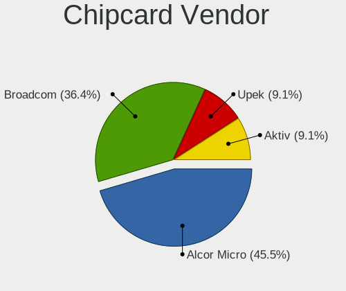

| Vendor      | Computers | Percent |
|-------------|-----------|---------|
| Broadcom    | 3         | 60%     |
| Upek        | 1         | 20%     |
| Alcor Micro | 1         | 20%     |

Chipcard Model
--------------

Chipcard module models

| Model                                                                        | Computers | Percent |
|------------------------------------------------------------------------------|-----------|---------|
| Broadcom BCM5880 Secure Applications Processor                               | 2         | 40%     |
| Upek TouchChip Fingerprint Coprocessor (WBF advanced mode)                   | 1         | 20%     |
| Broadcom BCM5880 Secure Applications Processor with fingerprint swipe sensor | 1         | 20%     |
| Alcor Micro AU9540 Smartcard Reader                                          | 1         | 20%     |

Unsupported
-----------

Unsupported Devices
-------------------

Total unsupported devices on board

| Total | Computers | Percent |
|-------|-----------|---------|
| 0     | 56        | 52.34%  |
| 1     | 40        | 37.38%  |
| 2     | 10        | 9.35%   |
| 3     | 1         | 0.93%   |

Unsupported Device Types
------------------------

Types of unsupported devices

| Type                     | Computers | Percent |
|--------------------------|-----------|---------|
| Fingerprint reader       | 23        | 37.7%   |
| Graphics card            | 13        | 21.31%  |
| Net/wireless             | 7         | 11.48%  |
| Chipcard                 | 5         | 8.2%    |
| Bluetooth                | 3         | 4.92%   |
| Unassigned class         | 2         | 3.28%   |
| Multimedia controller    | 2         | 3.28%   |
| Communication controller | 2         | 3.28%   |
| Camera                   | 2         | 3.28%   |
| Sound                    | 1         | 1.64%   |
| Modem                    | 1         | 1.64%   |

