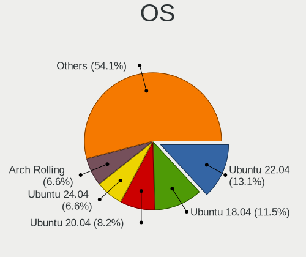
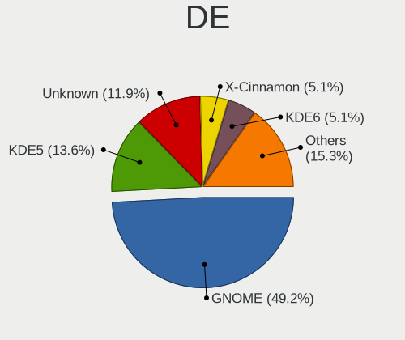
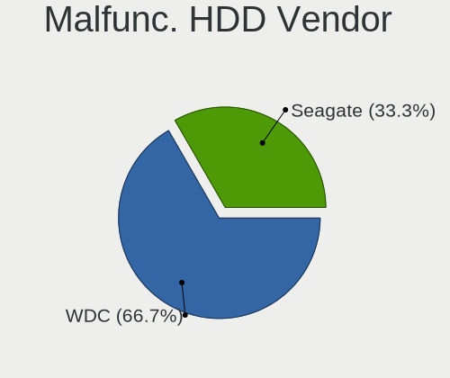
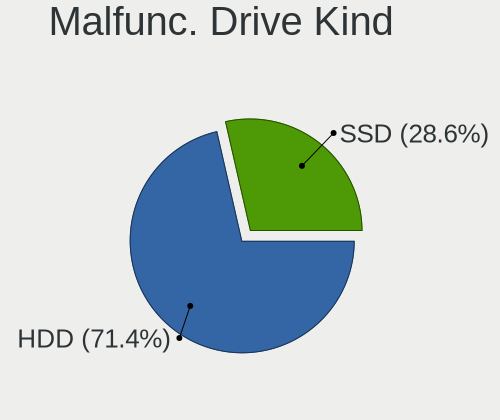
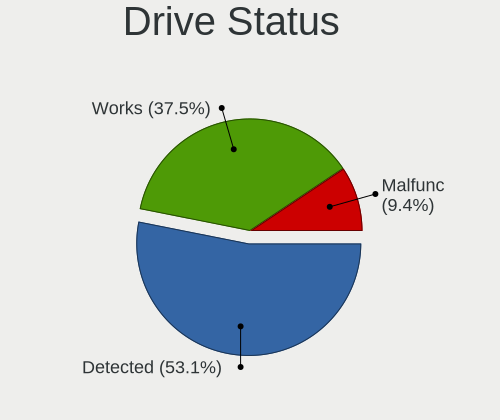
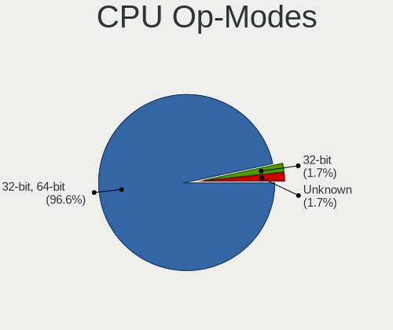
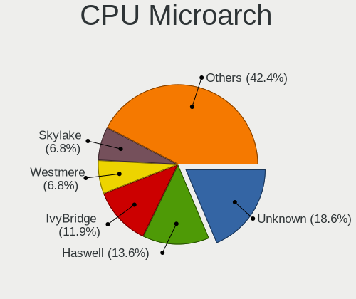
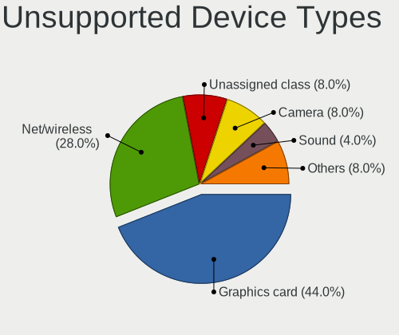

Linux in UAE - Tested Hardware & Statistics (Desktops)
------------------------------------------------------

A project to collect tested hardware configurations for Linux in UAE.

Anyone can contribute to this report by the [hw-probe](https://github.com/linuxhw/hw-probe) tool:

    sudo -E hw-probe -all -upload

Please contribute! Especially if your hardware is rare.

Contents
--------

* [ Test Cases ](#test-cases)

* [ System ](#system)
  - [ OS                       ](#os)
  - [ OS Family                ](#os-family)
  - [ Kernel                   ](#kernel)
  - [ Kernel Family            ](#kernel-family)
  - [ Kernel Major Ver.        ](#kernel-major-ver)
  - [ Arch                     ](#arch)
  - [ DE                       ](#de)
  - [ Display Server           ](#display-server)
  - [ Display Manager          ](#display-manager)
  - [ OS Lang                  ](#os-lang)
  - [ Boot Mode                ](#boot-mode)
  - [ Filesystem               ](#filesystem)
  - [ Part. scheme             ](#part-scheme)
  - [ Dual Boot with Linux/BSD ](#dual-boot-with-linuxbsd)
  - [ Dual Boot (Win)          ](#dual-boot-win)

* [ Board ](#board)
  - [ Vendor                   ](#vendor)
  - [ Model                    ](#model)
  - [ Model Family             ](#model-family)
  - [ MFG Year                 ](#mfg-year)
  - [ Form Factor              ](#form-factor)
  - [ Secure Boot              ](#secure-boot)
  - [ Coreboot                 ](#coreboot)
  - [ RAM Size                 ](#ram-size)
  - [ RAM Used                 ](#ram-used)
  - [ Total Drives             ](#total-drives)
  - [ Has CD-ROM               ](#has-cd-rom)
  - [ Has Ethernet             ](#has-ethernet)
  - [ Has WiFi                 ](#has-wifi)
  - [ Has Bluetooth            ](#has-bluetooth)

* [ Location ](#location)
  - [ Country                  ](#country)
  - [ City                     ](#city)

* [ Drives ](#drives)
  - [ Drive Vendor             ](#drive-vendor)
  - [ Drive Model              ](#drive-model)
  - [ HDD Vendor               ](#hdd-vendor)
  - [ SSD Vendor               ](#ssd-vendor)
  - [ Drive Kind               ](#drive-kind)
  - [ Drive Connector          ](#drive-connector)
  - [ Drive Size               ](#drive-size)
  - [ Space Total              ](#space-total)
  - [ Space Used               ](#space-used)
  - [ Malfunc. Drives          ](#malfunc-drives)
  - [ Malfunc. Drive Vendor    ](#malfunc-drive-vendor)
  - [ Malfunc. HDD Vendor      ](#malfunc-hdd-vendor)
  - [ Malfunc. Drive Kind      ](#malfunc-drive-kind)
  - [ Failed Drives            ](#failed-drives)
  - [ Failed Drive Vendor      ](#failed-drive-vendor)
  - [ Drive Status             ](#drive-status)

* [ Storage controller ](#storage-controller)
  - [ Storage Vendor           ](#storage-vendor)
  - [ Storage Model            ](#storage-model)
  - [ Storage Kind             ](#storage-kind)

* [ Processor ](#processor)
  - [ CPU Vendor               ](#cpu-vendor)
  - [ CPU Model                ](#cpu-model)
  - [ CPU Model Family         ](#cpu-model-family)
  - [ CPU Cores                ](#cpu-cores)
  - [ CPU Sockets              ](#cpu-sockets)
  - [ CPU Threads              ](#cpu-threads)
  - [ CPU Op-Modes             ](#cpu-op-modes)
  - [ CPU Microcode            ](#cpu-microcode)
  - [ CPU Microarch            ](#cpu-microarch)

* [ Graphics ](#graphics)
  - [ GPU Vendor               ](#gpu-vendor)
  - [ GPU Model                ](#gpu-model)
  - [ GPU Combo                ](#gpu-combo)
  - [ GPU Driver               ](#gpu-driver)
  - [ GPU Memory               ](#gpu-memory)

* [ Monitor ](#monitor)
  - [ Monitor Vendor           ](#monitor-vendor)
  - [ Monitor Model            ](#monitor-model)
  - [ Monitor Resolution       ](#monitor-resolution)
  - [ Monitor Diagonal         ](#monitor-diagonal)
  - [ Monitor Width            ](#monitor-width)
  - [ Aspect Ratio             ](#aspect-ratio)
  - [ Monitor Area             ](#monitor-area)
  - [ Pixel Density            ](#pixel-density)
  - [ Multiple Monitors        ](#multiple-monitors)

* [ Network ](#network)
  - [ Net Controller Vendor    ](#net-controller-vendor)
  - [ Net Controller Model     ](#net-controller-model)
  - [ Wireless Vendor          ](#wireless-vendor)
  - [ Wireless Model           ](#wireless-model)
  - [ Ethernet Vendor          ](#ethernet-vendor)
  - [ Ethernet Model           ](#ethernet-model)
  - [ Net Controller Kind      ](#net-controller-kind)
  - [ Used Controller          ](#used-controller)
  - [ NICs                     ](#nics)
  - [ IPv6                     ](#ipv6)

* [ Bluetooth ](#bluetooth)
  - [ Bluetooth Vendor         ](#bluetooth-vendor)
  - [ Bluetooth Model          ](#bluetooth-model)

* [ Sound ](#sound)
  - [ Sound Vendor             ](#sound-vendor)
  - [ Sound Model              ](#sound-model)

* [ Memory ](#memory)
  - [ Memory Vendor            ](#memory-vendor)
  - [ Memory Model             ](#memory-model)
  - [ Memory Kind              ](#memory-kind)
  - [ Memory Form Factor       ](#memory-form-factor)
  - [ Memory Size              ](#memory-size)
  - [ Memory Speed             ](#memory-speed)

* [ Printers & scanners ](#printers--scanners)
  - [ Printer Vendor           ](#printer-vendor)
  - [ Printer Model            ](#printer-model)
  - [ Scanner Vendor           ](#scanner-vendor)
  - [ Scanner Model            ](#scanner-model)

* [ Camera ](#camera)
  - [ Camera Vendor            ](#camera-vendor)
  - [ Camera Model             ](#camera-model)

* [ Security ](#security)
  - [ Fingerprint Vendor       ](#fingerprint-vendor)
  - [ Fingerprint Model        ](#fingerprint-model)
  - [ Chipcard Vendor          ](#chipcard-vendor)
  - [ Chipcard Model           ](#chipcard-model)

* [ Unsupported ](#unsupported)
  - [ Unsupported Devices      ](#unsupported-devices)
  - [ Unsupported Device Types ](#unsupported-device-types)

Test Cases
----------

Total: 80

| Vendor        | Model                       | Probe                                                      | Date         |
|---------------|-----------------------------|------------------------------------------------------------|--------------|
| Intel         | DH61WW AAG23116-302         | [d5dae00d07](https://linux-hardware.org/?probe=d5dae00d07) | Dec 31, 2024 |
| Trigkey       | Green G4 10                 | [abe47751df](https://linux-hardware.org/?probe=abe47751df) | Dec 19, 2024 |
| HP            | 81C5 MVB                    | [598ed0a0e1](https://linux-hardware.org/?probe=598ed0a0e1) | Dec 19, 2024 |
| ASUSTek       | ProArt B550-CREATOR         | [64f23b9876](https://linux-hardware.org/?probe=64f23b9876) | Dec 10, 2024 |
| ASUSTek       | ROG CROSSHAIR VIII HERO     | [9093f85751](https://linux-hardware.org/?probe=9093f85751) | Nov 05, 2024 |
| MSI           | PRO Z790-S WIFI             | [067881f9af](https://linux-hardware.org/?probe=067881f9af) | Oct 16, 2024 |
| ASUSTek       | Pro WS WRX90E-SAGE SE       | [31f821497b](https://linux-hardware.org/?probe=31f821497b) | Sep 27, 2024 |
| ASUSTek       | ROG STRIX X570-E GAMING     | [4627f152d7](https://linux-hardware.org/?probe=4627f152d7) | Aug 22, 2024 |
| ASUSTek       | PRIME B365M-A               | [c9c6d489a1](https://linux-hardware.org/?probe=c9c6d489a1) | Aug 07, 2024 |
| Win Elemen... | S500+                       | [3aa986ddc3](https://linux-hardware.org/?probe=3aa986ddc3) | Jul 24, 2024 |
| ASUSTek       | ROG STRIX X670E-E GAMING... | [d322eab289](https://linux-hardware.org/?probe=d322eab289) | Jul 23, 2024 |
| Pegatron      | 2AB6                        | [0671cbc932](https://linux-hardware.org/?probe=0671cbc932) | Jul 14, 2024 |
| ASUSTek       | Rampage IV BLACK EDITION    | [0456096b3c](https://linux-hardware.org/?probe=0456096b3c) | Jul 13, 2024 |
| Dell          | 0T656F A01                  | [ecdd487673](https://linux-hardware.org/?probe=ecdd487673) | Jul 05, 2024 |
| MSI           | MAG Z790 TOMAHAWK WIFI D... | [ac4cddaec8](https://linux-hardware.org/?probe=ac4cddaec8) | Jun 22, 2024 |
| ASUSTek       | PRIME Z590-A                | [3e62aea70e](https://linux-hardware.org/?probe=3e62aea70e) | Jun 17, 2024 |
| ASUSTek       | PRIME Z590-A                | [4a0a5de54c](https://linux-hardware.org/?probe=4a0a5de54c) | Jun 15, 2024 |
| MSI           | Z390-A PRO                  | [12de7f6310](https://linux-hardware.org/?probe=12de7f6310) | Jun 04, 2024 |
| SZMZ          | B75-MS V1.0                 | [8465c076a5](https://linux-hardware.org/?probe=8465c076a5) | Jun 02, 2024 |
| Lenovo        | SHARKBAY SDK0E50510 PRO     | [375e987cd3](https://linux-hardware.org/?probe=375e987cd3) | May 14, 2024 |
| ASUSTek       | PRIME H510M-A               | [e475e36ab0](https://linux-hardware.org/?probe=e475e36ab0) | May 06, 2024 |
| ASUSTek       | PRIME H510M-A               | [c12789125b](https://linux-hardware.org/?probe=c12789125b) | Apr 24, 2024 |
| ASRock        | B660M-HDV                   | [427836e454](https://linux-hardware.org/?probe=427836e454) | Mar 02, 2024 |
| ASRock        | B660M-HDV                   | [68b50166f3](https://linux-hardware.org/?probe=68b50166f3) | Mar 02, 2024 |
| ASUSTek       | PRIME B365M-A               | [65d3a89e4e](https://linux-hardware.org/?probe=65d3a89e4e) | Feb 23, 2024 |
| ASUSTek       | Z170 PRO GAMING             | [6637baf0a5](https://linux-hardware.org/?probe=6637baf0a5) | Feb 14, 2024 |
| Gigabyte      | B550M AORUS PRO-P           | [3ea676a743](https://linux-hardware.org/?probe=3ea676a743) | Jan 14, 2024 |
| Gigabyte      | B550M AORUS PRO-P           | [e3c1908003](https://linux-hardware.org/?probe=e3c1908003) | Jan 13, 2024 |
| ASUSTek       | ROG STRIX Z490-A GAMING     | [340f007a69](https://linux-hardware.org/?probe=340f007a69) | Nov 14, 2023 |
| HP            | 1589                        | [61922d4b43](https://linux-hardware.org/?probe=61922d4b43) | Nov 05, 2023 |
| ASUSTek       | PRIME B365M-A               | [17bbb23241](https://linux-hardware.org/?probe=17bbb23241) | Sep 22, 2023 |
| ASUSTek       | ROG STRIX Z790-E GAMING ... | [0c592730d7](https://linux-hardware.org/?probe=0c592730d7) | Jul 16, 2023 |
| Gigabyte      | B650 AORUS ELITE AX         | [9b3b477b44](https://linux-hardware.org/?probe=9b3b477b44) | Jul 11, 2023 |
| ASRock        | E3C224D4I-14S               | [bd2d074d07](https://linux-hardware.org/?probe=bd2d074d07) | Jul 09, 2023 |
| HP            | 0B54h D                     | [f9634b51b9](https://linux-hardware.org/?probe=f9634b51b9) | May 28, 2023 |
| Gigabyte      | B450 AORUS ELITE            | [59db7a4f11](https://linux-hardware.org/?probe=59db7a4f11) | Apr 10, 2023 |
| ASUSTek       | PRIME B365M-A               | [83fb0eaf6e](https://linux-hardware.org/?probe=83fb0eaf6e) | Mar 26, 2023 |
| MSI           | PRO X670-P WIFI             | [be3ef90301](https://linux-hardware.org/?probe=be3ef90301) | Feb 04, 2023 |
| ASUSTek       | ROG STRIX X570-E GAMING     | [9fb41ee5bc](https://linux-hardware.org/?probe=9fb41ee5bc) | Feb 01, 2023 |
| HP            | 1998                        | [5fcedbdb28](https://linux-hardware.org/?probe=5fcedbdb28) | Jan 22, 2023 |
| ASUSTek       | ROG STRIX Z490-F GAMING     | [f048f7fcdb](https://linux-hardware.org/?probe=f048f7fcdb) | Dec 16, 2022 |
| ASUSTek       | ROG Maximus Z690 HERO       | [c74d870263](https://linux-hardware.org/?probe=c74d870263) | Dec 04, 2022 |
| Gigabyte      | EP45T-UD3R                  | [79119cca36](https://linux-hardware.org/?probe=79119cca36) | Nov 19, 2022 |
| Gigabyte      | EP45T-UD3R                  | [1b30c252bb](https://linux-hardware.org/?probe=1b30c252bb) | Nov 19, 2022 |
| HP            | 0AECh D                     | [9e2ddc5dbd](https://linux-hardware.org/?probe=9e2ddc5dbd) | Nov 18, 2022 |
| HP            | 0AECh D                     | [95b36ddda4](https://linux-hardware.org/?probe=95b36ddda4) | Nov 18, 2022 |
| HP            | 1495                        | [c4535d8ea8](https://linux-hardware.org/?probe=c4535d8ea8) | Nov 15, 2022 |
| Gigabyte      | EP45T-UD3R                  | [faf014b2e6](https://linux-hardware.org/?probe=faf014b2e6) | Nov 12, 2022 |
| ASUSTek       | ROG STRIX X670E-E GAMING... | [d9af542480](https://linux-hardware.org/?probe=d9af542480) | Nov 08, 2022 |
| Gigabyte      | Q270M-D3H                   | [46874cc0a1](https://linux-hardware.org/?probe=46874cc0a1) | Nov 02, 2022 |
| MSI           | Z97 PC Mate                 | [512c793b51](https://linux-hardware.org/?probe=512c793b51) | Sep 06, 2022 |
| Dell          | 0MGK50 A02                  | [eca7a31c46](https://linux-hardware.org/?probe=eca7a31c46) | Jun 23, 2022 |
| Dell          | 0MGK50 A02                  | [134bf128f7](https://linux-hardware.org/?probe=134bf128f7) | Jun 23, 2022 |
| Dell          | 0CRH6C A02                  | [f014fcba4f](https://linux-hardware.org/?probe=f014fcba4f) | Feb 14, 2022 |
| Biostar       | TZ77XE4                     | [081c3be70e](https://linux-hardware.org/?probe=081c3be70e) | Feb 07, 2022 |
| ASUSTek       | PRIME B250M-PLUS            | [7b77d5463d](https://linux-hardware.org/?probe=7b77d5463d) | Nov 13, 2021 |
| ECS           | GeForce6100PM-M2            | [e1f91ca6de](https://linux-hardware.org/?probe=e1f91ca6de) | Sep 02, 2021 |
| ASUSTek       | ROG ZENITH EXTREME          | [e25c41c312](https://linux-hardware.org/?probe=e25c41c312) | Jul 03, 2021 |
| Dell          | OptiPlex 980                | [1fe360b027](https://linux-hardware.org/?probe=1fe360b027) | May 26, 2021 |
| Lenovo        | 3098 NOK                    | [d0ccf5266d](https://linux-hardware.org/?probe=d0ccf5266d) | Jan 27, 2021 |
| ASUSTek       | PRIME B460M-A               | [54531ec292](https://linux-hardware.org/?probe=54531ec292) | Oct 21, 2020 |
| Intel         | D865PERL AAC27648-207       | [387171a87d](https://linux-hardware.org/?probe=387171a87d) | Oct 08, 2020 |
| HP            | 2AA2                        | [ceebc6a90b](https://linux-hardware.org/?probe=ceebc6a90b) | Oct 04, 2020 |
| Intel         | D865PERL AAC27648-207       | [7d3672caff](https://linux-hardware.org/?probe=7d3672caff) | Oct 04, 2020 |
| Intel         | D865PERL AAC27648-207       | [2a18eaa0ab](https://linux-hardware.org/?probe=2a18eaa0ab) | Oct 04, 2020 |
| ASUSTek       | X99-DELUXE                  | [18778a34f2](https://linux-hardware.org/?probe=18778a34f2) | Sep 10, 2020 |
| ASUSTek       | X99-DELUXE                  | [ff1f32c975](https://linux-hardware.org/?probe=ff1f32c975) | Sep 10, 2020 |
| ASUSTek       | PRIME B450-PLUS             | [19af27b191](https://linux-hardware.org/?probe=19af27b191) | Aug 20, 2020 |
| Intel         | DH67CL AAG10212-210         | [f555bad747](https://linux-hardware.org/?probe=f555bad747) | Aug 14, 2020 |
| HP            | 2AA2                        | [f20932c5c3](https://linux-hardware.org/?probe=f20932c5c3) | Aug 09, 2020 |
| HP            | 2AA2                        | [424f0397a7](https://linux-hardware.org/?probe=424f0397a7) | Jul 16, 2020 |
| ASUSTek       | P7P55 LX                    | [dc74d7b188](https://linux-hardware.org/?probe=dc74d7b188) | Jun 25, 2020 |
| Intel         | DH67CL AAG10212-210         | [fdbf1ae7da](https://linux-hardware.org/?probe=fdbf1ae7da) | Jun 19, 2020 |
| Intel         | DH67CL AAG10212-210         | [0d398d9227](https://linux-hardware.org/?probe=0d398d9227) | Jun 14, 2020 |
| HP            | 2AA2                        | [24c07d9d0d](https://linux-hardware.org/?probe=24c07d9d0d) | Jun 11, 2020 |
| Gigabyte      | Z77X-UD5H                   | [aac474f532](https://linux-hardware.org/?probe=aac474f532) | Apr 18, 2020 |
| Dell          | 0NK70N A03                  | [8aa5224a4a](https://linux-hardware.org/?probe=8aa5224a4a) | Aug 01, 2019 |
| ASUSTek       | Rampage V EXTREME           | [309f371381](https://linux-hardware.org/?probe=309f371381) | May 27, 2019 |
| ASUSTek       | ROG STRIX X299-XE GAMING    | [c8fdc5e958](https://linux-hardware.org/?probe=c8fdc5e958) | Dec 25, 2018 |
| Lenovo        | SHARKBAY SDK0E50510 WIN     | [c48aa05e74](https://linux-hardware.org/?probe=c48aa05e74) | Oct 08, 2018 |

System
------

OS
--

Installed operating systems

| Name                 | Desktops | Percent |
|----------------------|----------|---------|
| Ubuntu 22.04         | 8        | 13.11%  |
| Ubuntu 18.04         | 7        | 11.48%  |
| Ubuntu 20.04         | 5        | 8.2%    |
| Ubuntu 24.04         | 4        | 6.56%   |
| Arch Rolling         | 4        | 6.56%   |
| Ubuntu 22.10         | 2        | 3.28%   |
| OpenMandriva 24.07   | 2        | 3.28%   |
| Fedora 39            | 2        | 3.28%   |
| Debian 11            | 2        | 3.28%   |
| Debian 10            | 2        | 3.28%   |
| Xubuntu 16.04        | 1        | 1.64%   |
| Reborn OS Rolling    | 1        | 1.64%   |
| Pop!_OS 22.04        | 1        | 1.64%   |
| OpenMandriva 4.3     | 1        | 1.64%   |
| OpenMandriva 24.12   | 1        | 1.64%   |
| OpenMandriva 23.01   | 1        | 1.64%   |
| Nobara 39            | 1        | 1.64%   |
| MX 23                | 1        | 1.64%   |
| Manjaro 20.1         | 1        | 1.64%   |
| Linux Mint 21.3      | 1        | 1.64%   |
| Linux Mint 21.2      | 1        | 1.64%   |
| Linux Mint 21.1      | 1        | 1.64%   |
| Linux Mint 20.3      | 1        | 1.64%   |
| Kubuntu 22.04        | 1        | 1.64%   |
| Guix                 | 1        | 1.64%   |
| Garuda Linux Rolling | 1        | 1.64%   |
| Fedora 40            | 1        | 1.64%   |
| Fedora 37            | 1        | 1.64%   |
| Fedora 34            | 1        | 1.64%   |
| Endless 3.5.3        | 1        | 1.64%   |
| EndeavourOS Rolling  | 1        | 1.64%   |
| Elementary 7.1       | 1        | 1.64%   |
| Debian 12            | 1        | 1.64%   |

OS Family
---------

OS without a version

| Name         | Desktops | Percent |
|--------------|----------|---------|
| Ubuntu       | 26       | 44.07%  |
| OpenMandriva | 5        | 8.47%   |
| Fedora       | 5        | 8.47%   |
| Debian       | 5        | 8.47%   |
| Arch         | 4        | 6.78%   |
| Linux Mint   | 2        | 3.39%   |
| Xubuntu      | 1        | 1.69%   |
| Reborn OS    | 1        | 1.69%   |
| Pop!_OS      | 1        | 1.69%   |
| Nobara       | 1        | 1.69%   |
| MX           | 1        | 1.69%   |
| Manjaro      | 1        | 1.69%   |
| Kubuntu      | 1        | 1.69%   |
| Guix         | 1        | 1.69%   |
| Garuda Linux | 1        | 1.69%   |
| Endless      | 1        | 1.69%   |
| EndeavourOS  | 1        | 1.69%   |
| Elementary   | 1        | 1.69%   |

Kernel
------

Version of the Linux kernel

| Version                     | Desktops | Percent |
|-----------------------------|----------|---------|
| 6.8.0-38-generic            | 2        | 3.03%   |
| 6.1.0-21-amd64              | 2        | 3.03%   |
| 5.19.0-23-generic           | 2        | 3.03%   |
| 6.9.7-desktop-1omv2490      | 1        | 1.52%   |
| 6.9.2-arch1-1               | 1        | 1.52%   |
| 6.8.9-arch1-2               | 1        | 1.52%   |
| 6.8.0-51-generic            | 1        | 1.52%   |
| 6.8.0-49-generic            | 1        | 1.52%   |
| 6.8.0-48-generic            | 1        | 1.52%   |
| 6.8.0-45-generic            | 1        | 1.52%   |
| 6.7.4-200.fc39.x86_64       | 1        | 1.52%   |
| 6.6.7-203.fsync.fc39.x86_64 | 1        | 1.52%   |
| 6.6.1-arch1-1               | 1        | 1.52%   |
| 6.5.9-handcrafted           | 1        | 1.52%   |
| 6.5.6-300.fc39.x86_64       | 1        | 1.52%   |
| 6.5.0-45-generic            | 1        | 1.52%   |
| 6.5.0-18-generic            | 1        | 1.52%   |
| 6.5.0-1024-oem              | 1        | 1.52%   |
| 6.2.10-zen1-1-zen           | 1        | 1.52%   |
| 6.2.0-33-generic            | 1        | 1.52%   |
| 6.2.0-32-generic            | 1        | 1.52%   |
| 6.12.1-desktop-1omv2490     | 1        | 1.52%   |
| 6.11.6-arch1-1              | 1        | 1.52%   |
| 6.11.3-200.fc40.x86_64      | 1        | 1.52%   |
| 6.10.4-AMD-znver3           | 1        | 1.52%   |
| 6.10.0-desktop-1omv2490     | 1        | 1.52%   |
| 6.1.1-desktop-1omv2290      | 1        | 1.52%   |
| 6.0.6-76060006-generic      | 1        | 1.52%   |
| 6.0.12-300.fc37.x86_64      | 1        | 1.52%   |
| 5.8.0-40-generic            | 1        | 1.52%   |
| 5.8.0-0.bpo.2-amd64         | 1        | 1.52%   |
| 5.7.14-1-MANJARO            | 1        | 1.52%   |
| 5.4.0-81-generic            | 1        | 1.52%   |
| 5.4.0-48-generic            | 1        | 1.52%   |
| 5.4.0-47-generic            | 1        | 1.52%   |
| 5.4.0-42-generic            | 1        | 1.52%   |
| 5.4.0-40-generic            | 1        | 1.52%   |
| 5.4.0-37-generic            | 1        | 1.52%   |
| 5.4.0-125-generic           | 1        | 1.52%   |
| 5.3.0-28-generic            | 1        | 1.52%   |

Kernel Family
-------------

Linux kernel without a distro release

| Version  | Desktops | Percent |
|----------|----------|---------|
| 6.8.0    | 6        | 9.84%   |
| 5.15.0   | 6        | 9.84%   |
| 4.15.0   | 5        | 8.2%    |
| 5.4.0    | 4        | 6.56%   |
| 5.19.0   | 4        | 6.56%   |
| 6.5.0    | 2        | 3.28%   |
| 6.2.0    | 2        | 3.28%   |
| 6.1.0    | 2        | 3.28%   |
| 5.8.0    | 2        | 3.28%   |
| 6.9.7    | 1        | 1.64%   |
| 6.9.2    | 1        | 1.64%   |
| 6.8.9    | 1        | 1.64%   |
| 6.7.4    | 1        | 1.64%   |
| 6.6.7    | 1        | 1.64%   |
| 6.6.1    | 1        | 1.64%   |
| 6.5.9    | 1        | 1.64%   |
| 6.5.6    | 1        | 1.64%   |
| 6.2.10   | 1        | 1.64%   |
| 6.12.1   | 1        | 1.64%   |
| 6.11.6   | 1        | 1.64%   |
| 6.11.3   | 1        | 1.64%   |
| 6.10.4   | 1        | 1.64%   |
| 6.10.0   | 1        | 1.64%   |
| 6.1.1    | 1        | 1.64%   |
| 6.0.6    | 1        | 1.64%   |
| 6.0.12   | 1        | 1.64%   |
| 5.7.14   | 1        | 1.64%   |
| 5.3.0    | 1        | 1.64%   |
| 5.16.7   | 1        | 1.64%   |
| 5.15.77  | 1        | 1.64%   |
| 5.15.108 | 1        | 1.64%   |
| 5.12.13  | 1        | 1.64%   |
| 5.11.0   | 1        | 1.64%   |
| 5.10.0   | 1        | 1.64%   |
| 5.0.0    | 1        | 1.64%   |
| 4.19.0   | 1        | 1.64%   |
| 4.18.0   | 1        | 1.64%   |

Kernel Major Ver.
-----------------

Linux kernel major version

| Version | Desktops | Percent |
|---------|----------|---------|
| 5.15    | 8        | 13.11%  |
| 6.8     | 7        | 11.48%  |
| 4.15    | 5        | 8.2%    |
| 6.5     | 4        | 6.56%   |
| 5.4     | 4        | 6.56%   |
| 5.19    | 4        | 6.56%   |
| 6.2     | 3        | 4.92%   |
| 6.1     | 3        | 4.92%   |
| 6.9     | 2        | 3.28%   |
| 6.6     | 2        | 3.28%   |
| 6.11    | 2        | 3.28%   |
| 6.10    | 2        | 3.28%   |
| 6.0     | 2        | 3.28%   |
| 5.8     | 2        | 3.28%   |
| 6.7     | 1        | 1.64%   |
| 6.12    | 1        | 1.64%   |
| 5.7     | 1        | 1.64%   |
| 5.3     | 1        | 1.64%   |
| 5.16    | 1        | 1.64%   |
| 5.12    | 1        | 1.64%   |
| 5.11    | 1        | 1.64%   |
| 5.10    | 1        | 1.64%   |
| 5.0     | 1        | 1.64%   |
| 4.19    | 1        | 1.64%   |
| 4.18    | 1        | 1.64%   |

Arch
----

OS architecture (x86_64, i586, etc.)

| Name   | Desktops | Percent |
|--------|----------|---------|
| x86_64 | 58       | 98.31%  |
| i686   | 1        | 1.69%   |

DE
--

Desktop Environment

| Name       | Desktops | Percent |
|------------|----------|---------|
| GNOME      | 29       | 49.15%  |
| KDE5       | 8        | 13.56%  |
| Unknown    | 7        | 11.86%  |
| X-Cinnamon | 3        | 5.08%   |
| KDE6       | 3        | 5.08%   |
| XFCE       | 2        | 3.39%   |
| LXQt       | 2        | 3.39%   |
| wlroots    | 1        | 1.69%   |
| Pantheon   | 1        | 1.69%   |
| i3         | 1        | 1.69%   |
| Budgie     | 1        | 1.69%   |
| bspwm      | 1        | 1.69%   |

Display Server
--------------

X11 or Wayland

| Name    | Desktops | Percent |
|---------|----------|---------|
| X11     | 33       | 55.93%  |
| Wayland | 17       | 28.81%  |
| Tty     | 5        | 8.47%   |
| Unknown | 4        | 6.78%   |

Display Manager
---------------

SDDM, LightDM, etc.

| Name    | Desktops | Percent |
|---------|----------|---------|
| Unknown | 26       | 44.07%  |
| GDM3    | 15       | 25.42%  |
| SDDM    | 10       | 16.95%  |
| LightDM | 5        | 8.47%   |
| GDM     | 3        | 5.08%   |

OS Lang
-------

Language

| Lang    | Desktops | Percent |
|---------|----------|---------|
| en_US   | 47       | 78.33%  |
| en_GB   | 4        | 6.67%   |
| Unknown | 4        | 6.67%   |
| C       | 3        | 5%      |
| en_AG   | 1        | 1.67%   |
| ar_AE   | 1        | 1.67%   |

Boot Mode
---------

EFI or BIOS

| Mode | Desktops | Percent |
|------|----------|---------|
| BIOS | 32       | 52.46%  |
| EFI  | 29       | 47.54%  |

Filesystem
----------

Type of filesystem

| Type    | Desktops | Percent |
|---------|----------|---------|
| Ext4    | 35       | 59.32%  |
| Btrfs   | 10       | 16.95%  |
| Overlay | 6        | 10.17%  |
| Tmpfs   | 5        | 8.47%   |
| Zfs     | 1        | 1.69%   |
| Xfs     | 1        | 1.69%   |
| Unknown | 1        | 1.69%   |

Part. scheme
------------

Scheme of partitioning

| Type    | Desktops | Percent |
|---------|----------|---------|
| Unknown | 26       | 44.07%  |
| GPT     | 25       | 42.37%  |
| MBR     | 8        | 13.56%  |

Dual Boot with Linux/BSD
------------------------

Hosting more than one Linux/BSD

| Dual boot | Desktops | Percent |
|-----------|----------|---------|
| No        | 46       | 76.67%  |
| Yes       | 14       | 23.33%  |

Dual Boot (Win)
---------------

Hosting Linux and Windows

| Dual boot | Desktops | Percent |
|-----------|----------|---------|
| No        | 40       | 66.67%  |
| Yes       | 20       | 33.33%  |

Board
-----

Vendor
------

Motherboard manufacturer

| Name                | Desktops | Percent |
|---------------------|----------|---------|
| ASUSTek Computer    | 23       | 38.98%  |
| Hewlett-Packard     | 7        | 11.86%  |
| Gigabyte Technology | 6        | 10.17%  |
| Dell                | 5        | 8.47%   |
| MSI                 | 4        | 6.78%   |
| Lenovo              | 3        | 5.08%   |
| Intel               | 3        | 5.08%   |
| ASRock              | 2        | 3.39%   |
| Win Element         | 1        | 1.69%   |
| Trigkey             | 1        | 1.69%   |
| SZMZ                | 1        | 1.69%   |
| Pegatron            | 1        | 1.69%   |
| ECS                 | 1        | 1.69%   |
| Biostar             | 1        | 1.69%   |

Model
-----

Motherboard model

| Name                               | Desktops | Percent |
|------------------------------------|----------|---------|
| ASUS ROG STRIX X670E-E GAMING WIFI | 2        | 3.39%   |
| ASUS All Series                    | 2        | 3.39%   |
| Win Element S500+                  | 1        | 1.69%   |
| Trigkey Green G4                   | 1        | 1.69%   |
| SZMZ B75-MS                        | 1        | 1.69%   |
| Pegatron s5-1050jp                 | 1        | 1.69%   |
| MSI MS-7D91                        | 1        | 1.69%   |
| MSI MS-7D88                        | 1        | 1.69%   |
| MSI MS-7B98                        | 1        | 1.69%   |
| MSI MS-7850                        | 1        | 1.69%   |
| Lenovo ThinkCentre E93 10AR004LAX  | 1        | 1.69%   |
| Lenovo ThinkCentre E73z 10BD00BXAX | 1        | 1.69%   |
| Lenovo ThinkCentre E73 10AS0041AX  | 1        | 1.69%   |
| Intel DH67CL AAG10212-210          | 1        | 1.69%   |
| Intel DH61WW AAG23116-302          | 1        | 1.69%   |
| Intel D865PERL AAC27648-207        | 1        | 1.69%   |
| HP Z800 Workstation                | 1        | 1.69%   |
| HP Z600 Workstation                | 1        | 1.69%   |
| HP Z420 Workstation                | 1        | 1.69%   |
| HP Z4 G4 Workstation               | 1        | 1.69%   |
| HP EliteDesk 800 G1 SFF            | 1        | 1.69%   |
| HP Compaq 8200 Elite SFF PC        | 1        | 1.69%   |
| HP 200-5120me                      | 1        | 1.69%   |
| Gigabyte Z77X-UD5H                 | 1        | 1.69%   |
| Gigabyte Q270M-D3H                 | 1        | 1.69%   |
| Gigabyte EP45T-UD3R                | 1        | 1.69%   |
| Gigabyte B650 AORUS ELITE AX       | 1        | 1.69%   |
| Gigabyte B550M AORUS PRO-P         | 1        | 1.69%   |
| Gigabyte B450 AORUS ELITE          | 1        | 1.69%   |
| ECS GeForce6100PM-M2               | 1        | 1.69%   |
| Dell Precision WorkStation T5500   | 1        | 1.69%   |
| Dell Precision T7610               | 1        | 1.69%   |
| Dell OptiPlex 980                  | 1        | 1.69%   |
| Dell OptiPlex 360                  | 1        | 1.69%   |
| Dell OptiPlex 3040                 | 1        | 1.69%   |
| Biostar TZ77XE4                    | 1        | 1.69%   |
| ASUS Z170 PRO GAMING               | 1        | 1.69%   |
| ASUS ROG ZENITH EXTREME            | 1        | 1.69%   |
| ASUS ROG STRIX Z790-E GAMING WIFI  | 1        | 1.69%   |
| ASUS ROG STRIX Z490-F GAMING       | 1        | 1.69%   |

Model Family
------------

Motherboard model prefix

| Name                 | Desktops | Percent |
|----------------------|----------|---------|
| ASUS ROG             | 10       | 16.95%  |
| ASUS PRIME           | 6        | 10.17%  |
| Lenovo ThinkCentre   | 3        | 5.08%   |
| Dell OptiPlex        | 3        | 5.08%   |
| Dell Precision       | 2        | 3.39%   |
| ASUS All             | 2        | 3.39%   |
| Win Element S500+    | 1        | 1.69%   |
| Trigkey Green        | 1        | 1.69%   |
| SZMZ B75-MS          | 1        | 1.69%   |
| Pegatron s5-1050jp   | 1        | 1.69%   |
| MSI MS-7D91          | 1        | 1.69%   |
| MSI MS-7D88          | 1        | 1.69%   |
| MSI MS-7B98          | 1        | 1.69%   |
| MSI MS-7850          | 1        | 1.69%   |
| Intel DH67CL         | 1        | 1.69%   |
| Intel DH61WW         | 1        | 1.69%   |
| Intel D865PERL       | 1        | 1.69%   |
| HP Z800              | 1        | 1.69%   |
| HP Z600              | 1        | 1.69%   |
| HP Z420              | 1        | 1.69%   |
| HP Z4                | 1        | 1.69%   |
| HP EliteDesk         | 1        | 1.69%   |
| HP Compaq            | 1        | 1.69%   |
| HP 200-5120me        | 1        | 1.69%   |
| Gigabyte Z77X-UD5H   | 1        | 1.69%   |
| Gigabyte Q270M-D3H   | 1        | 1.69%   |
| Gigabyte EP45T-UD3R  | 1        | 1.69%   |
| Gigabyte B650        | 1        | 1.69%   |
| Gigabyte B550M       | 1        | 1.69%   |
| Gigabyte B450        | 1        | 1.69%   |
| ECS GeForce6100PM-M2 | 1        | 1.69%   |
| Biostar TZ77XE4      | 1        | 1.69%   |
| ASUS Z170            | 1        | 1.69%   |
| ASUS Rampage         | 1        | 1.69%   |
| ASUS ProArt          | 1        | 1.69%   |
| ASUS Pro             | 1        | 1.69%   |
| ASUS P7P55           | 1        | 1.69%   |
| ASRock E3C224D4I-14S | 1        | 1.69%   |
| ASRock B660M-HDV     | 1        | 1.69%   |

MFG Year
--------

Motherboard manufacture year

| Year | Desktops | Percent |
|------|----------|---------|
| 2012 | 6        | 10.17%  |
| 2023 | 5        | 8.47%   |
| 2022 | 5        | 8.47%   |
| 2021 | 5        | 8.47%   |
| 2018 | 5        | 8.47%   |
| 2015 | 4        | 6.78%   |
| 2014 | 4        | 6.78%   |
| 2010 | 4        | 6.78%   |
| 2020 | 3        | 5.08%   |
| 2019 | 3        | 5.08%   |
| 2011 | 3        | 5.08%   |
| 2016 | 2        | 3.39%   |
| 2013 | 2        | 3.39%   |
| 2009 | 2        | 3.39%   |
| 2008 | 2        | 3.39%   |
| 2024 | 1        | 1.69%   |
| 2017 | 1        | 1.69%   |
| 2007 | 1        | 1.69%   |
| 2005 | 1        | 1.69%   |

Form Factor
-----------

Physical design of the computer

| Name    | Desktops | Percent |
|---------|----------|---------|
| Desktop | 59       | 100%    |

Secure Boot
-----------

Enabled or disabled

| State    | Desktops | Percent |
|----------|----------|---------|
| Disabled | 57       | 96.61%  |
| Enabled  | 2        | 3.39%   |

Coreboot
--------

Have coreboot on board

| Used | Desktops | Percent |
|------|----------|---------|
| No   | 59       | 100%    |

RAM Size
--------

Total RAM memory

| Size in GB      | Desktops | Percent |
|-----------------|----------|---------|
| 16.01-24.0      | 16       | 27.12%  |
| 32.01-64.0      | 12       | 20.34%  |
| 64.01-256.0     | 11       | 18.64%  |
| 8.01-16.0       | 7        | 11.86%  |
| 3.01-4.0        | 4        | 6.78%   |
| 4.01-8.0        | 3        | 5.08%   |
| 24.01-32.0      | 2        | 3.39%   |
| 0.51-1.0        | 2        | 3.39%   |
| More than 256.0 | 1        | 1.69%   |
| 2.01-3.0        | 1        | 1.69%   |

RAM Used
--------

Used RAM memory

| Used GB    | Desktops | Percent |
|------------|----------|---------|
| 4.01-8.0   | 14       | 22.58%  |
| 3.01-4.0   | 13       | 20.97%  |
| 1.01-2.0   | 12       | 19.35%  |
| 2.01-3.0   | 11       | 17.74%  |
| 8.01-16.0  | 7        | 11.29%  |
| 0.51-1.0   | 2        | 3.23%   |
| 24.01-32.0 | 1        | 1.61%   |
| 16.01-24.0 | 1        | 1.61%   |
| 0.01-0.5   | 1        | 1.61%   |

Total Drives
------------

Number of drives on board

| Drives | Desktops | Percent |
|--------|----------|---------|
| 1      | 22       | 36.67%  |
| 2      | 14       | 23.33%  |
| 3      | 11       | 18.33%  |
| 4      | 5        | 8.33%   |
| 6      | 3        | 5%      |
| 5      | 3        | 5%      |
| 9      | 1        | 1.67%   |
| 8      | 1        | 1.67%   |

Has CD-ROM
----------

Has CD-ROM on board

| Presented | Desktops | Percent |
|-----------|----------|---------|
| No        | 46       | 75.41%  |
| Yes       | 15       | 24.59%  |

Has Ethernet
------------

Has Ethernet on board

| Presented | Desktops | Percent |
|-----------|----------|---------|
| Yes       | 59       | 100%    |

Has WiFi
--------

Has WiFi module

| Presented | Desktops | Percent |
|-----------|----------|---------|
| Yes       | 31       | 51.67%  |
| No        | 29       | 48.33%  |

Has Bluetooth
-------------

Has Bluetooth module

| Presented | Desktops | Percent |
|-----------|----------|---------|
| No        | 33       | 55%     |
| Yes       | 27       | 45%     |

Location
--------

Country
-------

Geographic location (country)

| Country | Desktops | Percent |
|---------|----------|---------|
| UAE     | 59       | 100%    |

City
----

Geographic location (city)

| City             | Desktops | Percent |
|------------------|----------|---------|
| Dubai            | 27       | 45.76%  |
| Abu Dhabi        | 16       | 27.12%  |
| Al Ain City      | 8        | 13.56%  |
| Sharjah          | 6        | 10.17%  |
| Deira            | 1        | 1.69%   |
| Al Fujairah City | 1        | 1.69%   |

Drives
------

Drive Vendor
------------

Hard drive vendors

| Vendor                       | Desktops | Drives | Percent |
|------------------------------|----------|--------|---------|
| WDC                          | 24       | 35     | 20.87%  |
| Samsung Electronics          | 24       | 39     | 20.87%  |
| Seagate                      | 19       | 28     | 16.52%  |
| Toshiba                      | 5        | 6      | 4.35%   |
| Crucial                      | 5        | 6      | 4.35%   |
| SanDisk                      | 3        | 3      | 2.61%   |
| Phison Electronics           | 3        | 3      | 2.61%   |
| Micron Technology            | 3        | 3      | 2.61%   |
| Lexar                        | 3        | 3      | 2.61%   |
| Kingston Technology Company  | 3        | 3      | 2.61%   |
| Kingston                     | 3        | 3      | 2.61%   |
| Micron/Crucial Technology    | 2        | 2      | 1.74%   |
| Corsair                      | 2        | 5      | 1.74%   |
| Transcend                    | 1        | 1      | 0.87%   |
| Super Talent                 | 1        | 1      | 0.87%   |
| Shenzhen Longsys Electronics | 1        | 1      | 0.87%   |
| Realtek Semiconductor        | 1        | 4      | 0.87%   |
| Pliant                       | 1        | 4      | 0.87%   |
| Patriot                      | 1        | 2      | 0.87%   |
| Maxtor                       | 1        | 1      | 0.87%   |
| MAX                          | 1        | 1      | 0.87%   |
| LaCie                        | 1        | 1      | 0.87%   |
| Intel                        | 1        | 1      | 0.87%   |
| Hitachi                      | 1        | 1      | 0.87%   |
| HGST                         | 1        | 1      | 0.87%   |
| Gigabyte Technology          | 1        | 1      | 0.87%   |
| External                     | 1        | 1      | 0.87%   |
| China                        | 1        | 1      | 0.87%   |
| Unknown                      | 1        | 1      | 0.87%   |

Drive Model
-----------

Hard drive models

| Model                                                | Desktops | Percent |
|------------------------------------------------------|----------|---------|
| Samsung NVMe SSD Controller PM9A1/PM9A3/980PRO 512GB | 4        | 3.13%   |
| Seagate ST500DM002-1BD142 500GB                      | 3        | 2.34%   |
| Seagate ST1000DM010-2EP102 1TB                       | 3        | 2.34%   |
| Samsung SSD 850 PRO 1TB                              | 3        | 2.34%   |
| Phison E12 NVMe Controller 480GB                     | 3        | 2.34%   |
| Crucial CT500MX500SSD1 500GB                         | 3        | 2.34%   |
| WDC WDS240G2G0A-00JH30 240GB SSD                     | 2        | 1.56%   |
| WDC WD20EFRX-68EUZN0 2TB                             | 2        | 1.56%   |
| WDC WD1002FAEX-00Z3A0 1TB                            | 2        | 1.56%   |
| Seagate ST500VT000-1DK142 500GB                      | 2        | 1.56%   |
| Samsung SSD 980 PRO 1TB                              | 2        | 1.56%   |
| Samsung SSD 870 QVO 2TB                              | 2        | 1.56%   |
| Samsung SSD 870 EVO 2TB                              | 2        | 1.56%   |
| Samsung NVMe SSD Controller SM981/PM981/PM983 512GB  | 2        | 1.56%   |
| Samsung NVMe SSD Controller SM961/PM961/SM963 256GB  | 2        | 1.56%   |
| WDC WDS120G2G0A-00JH30 120GB SSD                     | 1        | 0.78%   |
| WDC WD800BB-55JHC0 80GB                              | 1        | 0.78%   |
| WDC WD6400AAKS-22A7B0 640GB                          | 1        | 0.78%   |
| WDC WD5000LPCX-24VHAT0 500GB                         | 1        | 0.78%   |
| WDC WD5000AAKS-65V0A0 500GB                          | 1        | 0.78%   |
| WDC WD5000AAKS-00A7B2 500GB                          | 1        | 0.78%   |
| WDC WD40PURZ-85TTDY0 4TB                             | 1        | 0.78%   |
| WDC WD40EFRX-68WT0N0 4TB                             | 1        | 0.78%   |
| WDC WD40EFRX-68N32N0 4TB                             | 1        | 0.78%   |
| WDC WD2500AAJS-75M0A0 250GB                          | 1        | 0.78%   |
| WDC WD20EZRX-00D8PB0 2TB                             | 1        | 0.78%   |
| WDC WD20EARX-00PASB0 2TB                             | 1        | 0.78%   |
| WDC WD20EADS-11R6B1 2TB                              | 1        | 0.78%   |
| WDC WD20EADS-00R6B0 2TB                              | 1        | 0.78%   |
| WDC WD1600AAJS-60B4A0 160GB                          | 1        | 0.78%   |
| WDC WD10EZEX-21WN4A0 1TB                             | 1        | 0.78%   |
| WDC WD10EZEX-08M2NA0 1TB                             | 1        | 0.78%   |
| WDC WD10EZEX-00WN4A0 1TB                             | 1        | 0.78%   |
| WDC WD10EARS-00MVWB0 1TB                             | 1        | 0.78%   |
| WDC WD101EFBX-68B0AN0 10TB                           | 1        | 0.78%   |
| Transcend TS256GSSD370S 256GB                        | 1        | 0.78%   |
| Toshiba MK3275GSX 320GB                              | 1        | 0.78%   |
| Toshiba MG08ACA14TE 14TB                             | 1        | 0.78%   |
| Toshiba MG07ACA14TE 14TB                             | 1        | 0.78%   |
| Toshiba HDWE160 6TB                                  | 1        | 0.78%   |

HDD Vendor
----------

Hard disk drive vendors

| Vendor              | Desktops | Drives | Percent |
|---------------------|----------|--------|---------|
| WDC                 | 21       | 32     | 42%     |
| Seagate             | 19       | 28     | 38%     |
| Toshiba             | 5        | 6      | 10%     |
| Samsung Electronics | 1        | 1      | 2%      |
| Maxtor              | 1        | 1      | 2%      |
| Hitachi             | 1        | 1      | 2%      |
| HGST                | 1        | 1      | 2%      |
| External            | 1        | 1      | 2%      |

SSD Vendor
----------

Solid state drive vendors

| Vendor              | Desktops | Drives | Percent |
|---------------------|----------|--------|---------|
| Samsung Electronics | 13       | 19     | 32.5%   |
| Crucial             | 5        | 6      | 12.5%   |
| WDC                 | 3        | 3      | 7.5%    |
| Kingston            | 3        | 3      | 7.5%    |
| SanDisk             | 2        | 2      | 5%      |
| Lexar               | 2        | 2      | 5%      |
| Corsair             | 2        | 5      | 5%      |
| Transcend           | 1        | 1      | 2.5%    |
| Super Talent        | 1        | 1      | 2.5%    |
| Patriot             | 1        | 2      | 2.5%    |
| Micron Technology   | 1        | 1      | 2.5%    |
| MAX                 | 1        | 1      | 2.5%    |
| LaCie               | 1        | 1      | 2.5%    |
| Intel               | 1        | 1      | 2.5%    |
| Gigabyte Technology | 1        | 1      | 2.5%    |
| China               | 1        | 1      | 2.5%    |
| Unknown             | 1        | 1      | 2.5%    |

Drive Kind
----------

HDD or SSD

| Kind    | Desktops | Drives | Percent |
|---------|----------|--------|---------|
| HDD     | 40       | 71     | 41.67%  |
| SSD     | 30       | 51     | 31.25%  |
| NVMe    | 25       | 36     | 26.04%  |
| Unknown | 1        | 4      | 1.04%   |

Drive Connector
---------------

SATA, SAS, NVMe, etc.

| Type | Desktops | Drives | Percent |
|------|----------|--------|---------|
| SATA | 51       | 116    | 62.96%  |
| NVMe | 25       | 36     | 30.86%  |
| SAS  | 5        | 10     | 6.17%   |

Drive Size
----------

Size of hard drive

| Size in TB | Desktops | Drives | Percent |
|------------|----------|--------|---------|
| 0.01-0.5   | 29       | 43     | 37.18%  |
| 0.51-1.0   | 23       | 35     | 29.49%  |
| 1.01-2.0   | 15       | 23     | 19.23%  |
| 3.01-4.0   | 7        | 15     | 8.97%   |
| 10.01-20.0 | 2        | 3      | 2.56%   |
| 4.01-10.0  | 2        | 3      | 2.56%   |

Space Total
-----------

Amount of disk space available on the file system

| Size in GB     | Desktops | Percent |
|----------------|----------|---------|
| 251-500        | 13       | 21.31%  |
| 1001-2000      | 11       | 18.03%  |
| 101-250        | 9        | 14.75%  |
| 501-1000       | 8        | 13.11%  |
| 2001-3000      | 7        | 11.48%  |
| More than 3000 | 6        | 9.84%   |
| 1-20           | 4        | 6.56%   |
| 51-100         | 2        | 3.28%   |
| Unknown        | 1        | 1.64%   |

Space Used
----------

Amount of used disk space

| Used GB        | Desktops | Percent |
|----------------|----------|---------|
| 1-20           | 18       | 28.57%  |
| 21-50          | 12       | 19.05%  |
| 101-250        | 8        | 12.7%   |
| 501-1000       | 8        | 12.7%   |
| 51-100         | 6        | 9.52%   |
| 251-500        | 5        | 7.94%   |
| More than 3000 | 2        | 3.17%   |
| 1001-2000      | 2        | 3.17%   |
| 2001-3000      | 1        | 1.59%   |
| Unknown        | 1        | 1.59%   |

Malfunc. Drives
---------------

Drive models with a malfunction

| Model                                 | Desktops | Drives | Percent |
|---------------------------------------|----------|--------|---------|
| WDC WD40PURZ-85TTDY0 4TB              | 1        | 2      | 11.11%  |
| WDC WD40EFRX-68WT0N0 4TB              | 1        | 2      | 11.11%  |
| WDC WD20EADS-00R6B0 2TB               | 1        | 1      | 11.11%  |
| WDC WD10EARS-00MVWB0 1TB              | 1        | 1      | 11.11%  |
| Seagate ST500LT012-1DG142 500GB       | 1        | 1      | 11.11%  |
| Seagate ST1000DM003-1ER162 1TB        | 1        | 1      | 11.11%  |
| SanDisk SD9SN8W512G1002 512GB SSD     | 1        | 1      | 11.11%  |
| Micron Technology 1100 SATA 512GB SSD | 1        | 1      | 11.11%  |
| Intel SSDSC2BB480G7 480GB             | 1        | 1      | 11.11%  |

Malfunc. Drive Vendor
---------------------

Vendors of faulty drives

| Vendor            | Desktops | Drives | Percent |
|-------------------|----------|--------|---------|
| WDC               | 4        | 6      | 44.44%  |
| Seagate           | 2        | 2      | 22.22%  |
| SanDisk           | 1        | 1      | 11.11%  |
| Micron Technology | 1        | 1      | 11.11%  |
| Intel             | 1        | 1      | 11.11%  |

Malfunc. HDD Vendor
-------------------

Vendors of faulty HDD drives

| Vendor  | Desktops | Drives | Percent |
|---------|----------|--------|---------|
| WDC     | 4        | 6      | 66.67%  |
| Seagate | 2        | 2      | 33.33%  |

Malfunc. Drive Kind
-------------------

Kinds of faulty drives

| Kind | Desktops | Drives | Percent |
|------|----------|--------|---------|
| HDD  | 5        | 8      | 71.43%  |
| SSD  | 2        | 3      | 28.57%  |

Failed Drives
-------------

Failed drive models

Zero info for selected period =(

Failed Drive Vendor
-------------------

Failed drive vendors

Zero info for selected period =(

Drive Status
------------

Number of failed and malfunc. drives

| Status   | Desktops | Drives | Percent |
|----------|----------|--------|---------|
| Detected | 34       | 87     | 53.13%  |
| Works    | 24       | 64     | 37.5%   |
| Malfunc  | 6        | 11     | 9.38%   |

Storage controller
------------------

Storage Vendor
--------------

Storage controller vendors

| Vendor                       | Desktops | Percent |
|------------------------------|----------|---------|
| Intel                        | 46       | 46.46%  |
| Samsung Electronics          | 14       | 14.14%  |
| AMD                          | 11       | 11.11%  |
| ASMedia Technology           | 6        | 6.06%   |
| Phison Electronics           | 3        | 3.03%   |
| Kingston Technology Company  | 3        | 3.03%   |
| Micron/Crucial Technology    | 2        | 2.02%   |
| Micron Technology            | 2        | 2.02%   |
| LSI Logic / Symbios Logic    | 2        | 2.02%   |
| Broadcom / LSI               | 2        | 2.02%   |
| VIA Technologies             | 1        | 1.01%   |
| Silicon Motion               | 1        | 1.01%   |
| Shenzhen Longsys Electronics | 1        | 1.01%   |
| SanDisk                      | 1        | 1.01%   |
| Realtek Semiconductor        | 1        | 1.01%   |
| Nvidia                       | 1        | 1.01%   |
| Marvell Technology Group     | 1        | 1.01%   |
| JMicron Technology           | 1        | 1.01%   |

Storage Model
-------------

Storage controller models

| Model                                                                          | Desktops | Percent |
|--------------------------------------------------------------------------------|----------|---------|
| Samsung NVMe SSD Controller PM9A1/PM9A3/980PRO                                 | 7        | 6.14%   |
| ASMedia ASM1061/ASM1062 Serial ATA Controller                                  | 6        | 5.26%   |
| Intel 8 Series/C220 Series Chipset Family 6-port SATA Controller 1 [AHCI mode] | 5        | 4.39%   |
| Intel 6 Series/C200 Series Chipset Family 6 port Desktop SATA AHCI Controller  | 5        | 4.39%   |
| AMD FCH SATA Controller [AHCI mode]                                            | 5        | 4.39%   |
| Samsung NVMe SSD Controller SM981/PM981/PM983                                  | 4        | 3.51%   |
| Intel 200 Series PCH SATA controller [AHCI mode]                               | 4        | 3.51%   |
| AMD 600 Series Chipset SATA Controller                                         | 4        | 3.51%   |
| Samsung NVMe SSD Controller SM961/PM961/SM963                                  | 3        | 2.63%   |
| Phison E12 NVMe Controller                                                     | 3        | 2.63%   |
| Intel SATA Controller [RAID mode]                                              | 3        | 2.63%   |
| Intel Raptor Lake SATA AHCI Controller                                         | 3        | 2.63%   |
| Intel C600/X79 series chipset 6-Port SATA AHCI Controller                      | 3        | 2.63%   |
| Micron 2550 NVMe SSD (DRAM-less)                                               | 2        | 1.75%   |
| Intel Q170/Q150/B150/H170/H110/Z170/CM236 Chipset SATA Controller [AHCI Mode]  | 2        | 1.75%   |
| Intel C610/X99 series chipset sSATA Controller [AHCI mode]                     | 2        | 1.75%   |
| Intel C610/X99 series chipset 6-Port SATA Controller [AHCI mode]               | 2        | 1.75%   |
| Intel Alder Lake-S PCH SATA Controller [AHCI Mode]                             | 2        | 1.75%   |
| Intel 82801JI (ICH10 Family) SATA AHCI Controller                              | 2        | 1.75%   |
| Intel 7 Series/C210 Series Chipset Family 6-port SATA Controller [AHCI mode]   | 2        | 1.75%   |
| Intel 5 Series/3400 Series Chipset 4 port SATA IDE Controller                  | 2        | 1.75%   |
| Intel 5 Series/3400 Series Chipset 2 port SATA IDE Controller                  | 2        | 1.75%   |
| Broadcom / LSI SAS2308 PCI-Express Fusion-MPT SAS-2                            | 2        | 1.75%   |
| AMD 500 Series Chipset SATA Controller                                         | 2        | 1.75%   |
| AMD 400 Series Chipset SATA Controller                                         | 2        | 1.75%   |
| VIA VT6415 PATA IDE Host Controller                                            | 1        | 0.88%   |
| Silicon Motion SM2263EN/SM2263XT (DRAM-less) NVMe SSD Controllers              | 1        | 0.88%   |
| Shenzhen Longsys Lexar NM790 NVME SSD (DRAM-less)                              | 1        | 0.88%   |
| SanDisk WD PC SN810 / Black SN850 NVMe SSD                                     | 1        | 0.88%   |
| Samsung NVMe SSD Controller S4LV008[Pascal]                                    | 1        | 0.88%   |
| Samsung NVMe SSD Controller 980 (DRAM-less)                                    | 1        | 0.88%   |
| Realtek RTS5765DL NVMe SSD Controller (DRAM-less)                              | 1        | 0.88%   |
| Nvidia MCP61 SATA Controller                                                   | 1        | 0.88%   |
| Nvidia MCP61 IDE                                                               | 1        | 0.88%   |
| Micron/Crucial P2 [Nick P2] / P3 / P3 Plus NVMe PCIe SSD (DRAM-less)           | 1        | 0.88%   |
| Micron/Crucial P1 NVMe PCIe SSD[Frampton]                                      | 1        | 0.88%   |
| Marvell Group 88SE9172 SATA 6Gb/s Controller                                   | 1        | 0.88%   |
| LSI Logic / Symbios Logic SAS2308 PCI-Express Fusion-MPT SAS-2                 | 1        | 0.88%   |
| LSI Logic / Symbios Logic SAS1068E PCI-Express Fusion-MPT SAS                  | 1        | 0.88%   |
| Kingston Company NV2 NVMe SSD [SM2267XT] (DRAM-less)                           | 1        | 0.88%   |

Storage Kind
------------

Kind of storage controller (IDE, SATA, NVMe, SAS, ...)

| Kind | Desktops | Percent |
|------|----------|---------|
| SATA | 48       | 53.93%  |
| NVMe | 25       | 28.09%  |
| RAID | 6        | 6.74%   |
| IDE  | 6        | 6.74%   |
| SAS  | 3        | 3.37%   |
| SCSI | 1        | 1.12%   |

Processor
---------

CPU Vendor
----------

Processor vendors

| Vendor | Desktops | Percent |
|--------|----------|---------|
| Intel  | 46       | 77.97%  |
| AMD    | 13       | 22.03%  |

CPU Model
---------

Processor models

| Model                                       | Desktops | Percent |
|---------------------------------------------|----------|---------|
| Intel Xeon CPU E5620 @ 2.40GHz              | 3        | 5.08%   |
| Intel Core i7-4790S CPU @ 3.20GHz           | 2        | 3.39%   |
| Intel Core i7-3770K CPU @ 3.50GHz           | 2        | 3.39%   |
| Intel Core i7-10700 CPU @ 2.90GHz           | 2        | 3.39%   |
| Intel 11th Gen Core i5-11400 @ 2.60GHz      | 2        | 3.39%   |
| AMD Ryzen 9 5900X 12-Core Processor         | 2        | 3.39%   |
| Intel Xeon W-2123 CPU @ 3.60GHz             | 1        | 1.69%   |
| Intel Xeon CPU E5-2697 v2 @ 2.70GHz         | 1        | 1.69%   |
| Intel Xeon CPU E5-2609 v2 @ 2.50GHz         | 1        | 1.69%   |
| Intel Xeon CPU E3-1265L v3 @ 2.50GHz        | 1        | 1.69%   |
| Intel Pentium Dual-Core CPU E5400 @ 2.70GHz | 1        | 1.69%   |
| Intel Pentium 4 CPU 2.80GHz                 | 1        | 1.69%   |
| Intel N100                                  | 1        | 1.69%   |
| Intel Core i9-10900K CPU @ 3.70GHz          | 1        | 1.69%   |
| Intel Core i7-9700 CPU @ 3.00GHz            | 1        | 1.69%   |
| Intel Core i7-7740X CPU @ 4.30GHz           | 1        | 1.69%   |
| Intel Core i7-6700K CPU @ 4.00GHz           | 1        | 1.69%   |
| Intel Core i7-6700 CPU @ 3.40GHz            | 1        | 1.69%   |
| Intel Core i7-5960X CPU @ 3.00GHz           | 1        | 1.69%   |
| Intel Core i7-5820K CPU @ 3.30GHz           | 1        | 1.69%   |
| Intel Core i7-4960X CPU @ 3.60GHz           | 1        | 1.69%   |
| Intel Core i7-4790K CPU @ 4.00GHz           | 1        | 1.69%   |
| Intel Core i7-4790 CPU @ 3.60GHz            | 1        | 1.69%   |
| Intel Core i7-4770 CPU @ 3.40GHz            | 1        | 1.69%   |
| Intel Core i7 CPU 860 @ 2.80GHz             | 1        | 1.69%   |
| Intel Core i5-9400F CPU @ 2.90GHz           | 1        | 1.69%   |
| Intel Core i5-7400 CPU @ 3.00GHz            | 1        | 1.69%   |
| Intel Core i5-6500T CPU @ 2.50GHz           | 1        | 1.69%   |
| Intel Core i5-3550 CPU @ 3.30GHz            | 1        | 1.69%   |
| Intel Core i5-3470T CPU @ 2.90GHz           | 1        | 1.69%   |
| Intel Core i5-2500 CPU @ 3.30GHz            | 1        | 1.69%   |
| Intel Core i5-2400 CPU @ 3.10GHz            | 1        | 1.69%   |
| Intel Core i5-14600KF                       | 1        | 1.69%   |
| Intel Core i5 CPU 650 @ 3.20GHz             | 1        | 1.69%   |
| Intel Core i3-2120 CPU @ 3.30GHz            | 1        | 1.69%   |
| Intel Core 2 Quad CPU Q9550 @ 2.83GHz       | 1        | 1.69%   |
| Intel Core 2 Duo CPU E7500 @ 2.93GHz        | 1        | 1.69%   |
| Intel 13th Gen Core i9-13900K               | 1        | 1.69%   |
| Intel 13th Gen Core i7-13700K               | 1        | 1.69%   |
| Intel 12th Gen Core i9-12900K               | 1        | 1.69%   |

CPU Model Family
----------------

Processor model prefix

| Model                   | Desktops | Percent |
|-------------------------|----------|---------|
| Intel Core i7           | 17       | 28.81%  |
| Intel Core i5           | 9        | 15.25%  |
| Other                   | 7        | 11.86%  |
| Intel Xeon              | 7        | 11.86%  |
| AMD Ryzen 5             | 4        | 6.78%   |
| AMD Ryzen 9             | 3        | 5.08%   |
| AMD Ryzen Threadripper  | 2        | 3.39%   |
| AMD Ryzen 7             | 2        | 3.39%   |
| Intel Pentium Dual-Core | 1        | 1.69%   |
| Intel Pentium 4         | 1        | 1.69%   |
| Intel Core i9           | 1        | 1.69%   |
| Intel Core i3           | 1        | 1.69%   |
| Intel Core 2 Quad       | 1        | 1.69%   |
| Intel Core 2 Duo        | 1        | 1.69%   |
| AMD Sempron             | 1        | 1.69%   |
| AMD Ryzen 7 PRO         | 1        | 1.69%   |

CPU Cores
---------

Number of processor cores

| Number | Desktops | Percent |
|--------|----------|---------|
| 4      | 22       | 37.29%  |
| 8      | 10       | 16.95%  |
| 6      | 9        | 15.25%  |
| 2      | 5        | 8.47%   |
| 16     | 4        | 6.78%   |
| 12     | 3        | 5.08%   |
| 1      | 2        | 3.39%   |
| 64     | 1        | 1.69%   |
| 24     | 1        | 1.69%   |
| 14     | 1        | 1.69%   |
| 10     | 1        | 1.69%   |

CPU Sockets
-----------

Number of sockets

| Number | Desktops | Percent |
|--------|----------|---------|
| 1      | 56       | 94.92%  |
| 2      | 3        | 5.08%   |

CPU Threads
-----------

Threads per core (Hyper-Threading)

| Number | Desktops | Percent |
|--------|----------|---------|
| 2      | 42       | 71.19%  |
| 1      | 17       | 28.81%  |

CPU Op-Modes
------------

CPU Operation Modes (32-bit, 64-bit)

| Op mode        | Desktops | Percent |
|----------------|----------|---------|
| 32-bit, 64-bit | 57       | 96.61%  |
| 32-bit         | 1        | 1.69%   |
| Unknown        | 1        | 1.69%   |

CPU Microcode
-------------

Microcode number

| Number     | Desktops | Percent |
|------------|----------|---------|
| Unknown    | 30       | 49.18%  |
| 0x306c3    | 5        | 8.2%    |
| 0x306a9    | 4        | 6.56%   |
| 0x206c2    | 3        | 4.92%   |
| 0xb0671    | 2        | 3.28%   |
| 0xa0655    | 2        | 3.28%   |
| 0x906e9    | 2        | 3.28%   |
| 0x306f2    | 2        | 3.28%   |
| 0x1067a    | 2        | 3.28%   |
| 0xf29      | 1        | 1.64%   |
| 0x906ea    | 1        | 1.64%   |
| 0x306e4    | 1        | 1.64%   |
| 0x106e5    | 1        | 1.64%   |
| 0x0a601203 | 1        | 1.64%   |
| 0x08701021 | 1        | 1.64%   |
| 0x08108109 | 1        | 1.64%   |
| 0x0800820d | 1        | 1.64%   |
| 0x08001137 | 1        | 1.64%   |

CPU Microarch
-------------

Microarchitecture

| Name             | Desktops | Percent |
|------------------|----------|---------|
| Unknown          | 11       | 18.64%  |
| Haswell          | 8        | 13.56%  |
| IvyBridge        | 7        | 11.86%  |
| Westmere         | 4        | 6.78%   |
| Skylake          | 4        | 6.78%   |
| KabyLake         | 4        | 6.78%   |
| Zen 3            | 3        | 5.08%   |
| SandyBridge      | 3        | 5.08%   |
| Penryn           | 3        | 5.08%   |
| CometLake        | 3        | 5.08%   |
| Zen+             | 2        | 3.39%   |
| Zen 2            | 1        | 1.69%   |
| Zen              | 1        | 1.69%   |
| NetBurst         | 1        | 1.69%   |
| Nehalem          | 1        | 1.69%   |
| K8 Hammer        | 1        | 1.69%   |
| Gracemont        | 1        | 1.69%   |
| Alderlake Hybrid | 1        | 1.69%   |

Graphics
--------

GPU Vendor
----------

Vendors of graphics cards

| Vendor            | Desktops | Percent |
|-------------------|----------|---------|
| Nvidia            | 36       | 52.94%  |
| Intel             | 20       | 29.41%  |
| AMD               | 11       | 16.18%  |
| ASPEED Technology | 1        | 1.47%   |

GPU Model
---------

Graphics card models

| Model                                                                       | Desktops | Percent |
|-----------------------------------------------------------------------------|----------|---------|
| Intel Xeon E3-1200 v3/4th Gen Core Processor Integrated Graphics Controller | 4        | 5.63%   |
| AMD Raphael                                                                 | 3        | 4.23%   |
| AMD Ellesmere [Radeon RX 470/480/570/570X/580/580X/590]                     | 3        | 4.23%   |
| Nvidia GP107 [GeForce GTX 1050 Ti]                                          | 2        | 2.82%   |
| Nvidia GF108 [GeForce GT 730]                                               | 2        | 2.82%   |
| Nvidia GA102 [GeForce RTX 3080]                                             | 2        | 2.82%   |
| Nvidia AD102 [GeForce RTX 4090]                                             | 2        | 2.82%   |
| Intel Xeon E3-1200 v2/3rd Gen Core processor Graphics Controller            | 2        | 2.82%   |
| Intel Raptor Lake-S GT1 [UHD Graphics 770]                                  | 2        | 2.82%   |
| Intel HD Graphics 530                                                       | 2        | 2.82%   |
| Intel CometLake-S GT2 [UHD Graphics 630]                                    | 2        | 2.82%   |
| Intel 2nd Generation Core Processor Family Integrated Graphics Controller   | 2        | 2.82%   |
| Nvidia TU116 [GeForce GTX 1660 SUPER]                                       | 1        | 1.41%   |
| Nvidia TU104GL [Tesla T4]                                                   | 1        | 1.41%   |
| Nvidia TU104 [GeForce RTX 2080]                                             | 1        | 1.41%   |
| Nvidia TU104 [GeForce RTX 2080 SUPER]                                       | 1        | 1.41%   |
| Nvidia TU104 [GeForce RTX 2070 SUPER]                                       | 1        | 1.41%   |
| Nvidia TU102 [GeForce RTX 2080 Ti Rev. A]                                   | 1        | 1.41%   |
| Nvidia NV18 [GeForce4 MX 440 AGP 8x]                                        | 1        | 1.41%   |
| Nvidia GP107 [GeForce GTX 1050]                                             | 1        | 1.41%   |
| Nvidia GP106 [GeForce GTX 1060 6GB]                                         | 1        | 1.41%   |
| Nvidia GP104GL [Quadro P4000]                                               | 1        | 1.41%   |
| Nvidia GP104 [GeForce GTX 1080]                                             | 1        | 1.41%   |
| Nvidia GP104 [GeForce GTX 1070]                                             | 1        | 1.41%   |
| Nvidia GP102 [TITAN Xp]                                                     | 1        | 1.41%   |
| Nvidia GK208B [GeForce GT 730]                                              | 1        | 1.41%   |
| Nvidia GK208B [GeForce GT 710]                                              | 1        | 1.41%   |
| Nvidia GK110GL [Quadro K5200]                                               | 1        | 1.41%   |
| Nvidia GK106GL [Quadro K4000]                                               | 1        | 1.41%   |
| Nvidia GF100GL [Quadro 5000]                                                | 1        | 1.41%   |
| Nvidia GA106 [GeForce RTX 3060 Lite Hash Rate]                              | 1        | 1.41%   |
| Nvidia GA106 [Geforce RTX 3050]                                             | 1        | 1.41%   |
| Nvidia GA104 [GeForce RTX 3070 Lite Hash Rate]                              | 1        | 1.41%   |
| Nvidia GA104 [GeForce RTX 3060]                                             | 1        | 1.41%   |
| Nvidia GA104 [GeForce RTX 3060 Ti]                                          | 1        | 1.41%   |
| Nvidia GA102GL [RTX A6000]                                                  | 1        | 1.41%   |
| Nvidia G98 [GeForce 9300 GS]                                                | 1        | 1.41%   |
| Nvidia G94 [GeForce 9600 GT]                                                | 1        | 1.41%   |
| Nvidia C61 [GeForce 6150SE nForce 430]                                      | 1        | 1.41%   |
| Nvidia AD104 [GeForce RTX 4070 SUPER]                                       | 1        | 1.41%   |

GPU Combo
---------

Combinations of graphics cards

| Name               | Desktops | Percent |
|--------------------|----------|---------|
| 1 x Nvidia         | 28       | 47.46%  |
| 1 x Intel          | 12       | 20.34%  |
| 1 x AMD            | 7        | 11.86%  |
| Intel + Nvidia     | 3        | 5.08%   |
| 2 x Nvidia         | 2        | 3.39%   |
| AMD + Nvidia       | 2        | 3.39%   |
| 2 x Intel          | 1        | 1.69%   |
| 2 x AMD            | 1        | 1.69%   |
| Intel + 2 x Nvidia | 1        | 1.69%   |
| Intel + AMD        | 1        | 1.69%   |
| 1 x ASPEED         | 1        | 1.69%   |

GPU Driver
----------

Free vs proprietary

| Driver      | Desktops | Percent |
|-------------|----------|---------|
| Free        | 32       | 54.24%  |
| Proprietary | 19       | 32.2%   |
| Unknown     | 8        | 13.56%  |

GPU Memory
----------

Total video memory

| Size in GB | Desktops | Percent |
|------------|----------|---------|
| Unknown    | 28       | 47.46%  |
| 7.01-8.0   | 8        | 13.56%  |
| 1.01-2.0   | 5        | 8.47%   |
| 8.01-16.0  | 5        | 8.47%   |
| 0.01-0.5   | 4        | 6.78%   |
| 16.01-24.0 | 3        | 5.08%   |
| 2.01-3.0   | 2        | 3.39%   |
| 32.01-64.0 | 1        | 1.69%   |
| 5.01-6.0   | 1        | 1.69%   |
| 3.01-4.0   | 1        | 1.69%   |
| 0.51-1.0   | 1        | 1.69%   |

Monitor
-------

Monitor Vendor
--------------

Monitor vendors

| Vendor               | Desktops | Percent |
|----------------------|----------|---------|
| Samsung Electronics  | 11       | 18.97%  |
| Goldstar             | 10       | 17.24%  |
| BenQ                 | 6        | 10.34%  |
| Hewlett-Packard      | 5        | 8.62%   |
| Ancor Communications | 5        | 8.62%   |
| Lenovo               | 3        | 5.17%   |
| Dell                 | 3        | 5.17%   |
| ViewSonic            | 2        | 3.45%   |
| Philips              | 2        | 3.45%   |
| Mi                   | 2        | 3.45%   |
| Sony                 | 1        | 1.72%   |
| Panasonic            | 1        | 1.72%   |
| LG Electronics       | 1        | 1.72%   |
| HKC                  | 1        | 1.72%   |
| Hannspree            | 1        | 1.72%   |
| Gigabyte Technology  | 1        | 1.72%   |
| CTX                  | 1        | 1.72%   |
| ASUSTek Computer     | 1        | 1.72%   |
| AOC                  | 1        | 1.72%   |

Monitor Model
-------------

Monitor models

| Model                                                                   | Desktops | Percent |
|-------------------------------------------------------------------------|----------|---------|
| Samsung Electronics C24F390 SAM0D2C 1920x1080 521x293mm 23.5-inch       | 2        | 3.23%   |
| Mi Monitor XMI3444 3440x1440 800x330mm 34.1-inch                        | 2        | 3.23%   |
| BenQ GW2480 BNQ78E7 1920x1080 527x296mm 23.8-inch                       | 2        | 3.23%   |
| Ancor Communications VG248 ACI24A4 1920x1080 531x299mm 24.0-inch        | 2        | 3.23%   |
| ViewSonic VG2439 SERIES VSCD22B 1920x1080 521x293mm 23.5-inch           | 1        | 1.61%   |
| ViewSonic VA1918wm VSCC821 1440x900 410x256mm 19.0-inch                 | 1        | 1.61%   |
| Sony BM320 SNY050A 1920x1080 708x399mm 32.0-inch                        | 1        | 1.61%   |
| Samsung Electronics U32J59x SAM0F52 3840x2160 697x392mm 31.5-inch       | 1        | 1.61%   |
| Samsung Electronics U28E590 SAM0C4D 3840x2160 607x345mm 27.5-inch       | 1        | 1.61%   |
| Samsung Electronics SMB1930N SAM0632 1360x768 410x230mm 18.5-inch       | 1        | 1.61%   |
| Samsung Electronics LS49AG95 SAM71AC 3840x1080 1193x336mm 48.8-inch     | 1        | 1.61%   |
| Samsung Electronics LS49AG95 SAM71AA 1680x1440                          | 1        | 1.61%   |
| Samsung Electronics LCD Monitor SAM0FEE 3840x2160 1872x1053mm 84.6-inch | 1        | 1.61%   |
| Samsung Electronics LCD Monitor QBQ90 3840x2160                         | 1        | 1.61%   |
| Samsung Electronics LCD Monitor LC32G7xT 2560x1440                      | 1        | 1.61%   |
| Samsung Electronics C49HG9x SAM0E5D 3840x1080 1196x336mm 48.9-inch      | 1        | 1.61%   |
| Samsung Electronics C27JG5x SAM0F57 2560x1440 597x336mm 27.0-inch       | 1        | 1.61%   |
| Philips PHL 328P6VU PHL0927 3840x2160 698x393mm 31.5-inch               | 1        | 1.61%   |
| Philips 221V PHL0888 1920x1080 477x268mm 21.5-inch                      | 1        | 1.61%   |
| Panasonic TV MEIA296 1920x1080 698x392mm 31.5-inch                      | 1        | 1.61%   |
| LG Electronics LCD Monitor LG ULTRAWIDE 2560x1080                       | 1        | 1.61%   |
| Lenovo LEN-E73Z-D LEN00A1 1600x900 442x249mm 20.0-inch                  | 1        | 1.61%   |
| Lenovo LEN LT2223pwC LEN60A1 1920x1080 477x268mm 21.5-inch              | 1        | 1.61%   |
| Lenovo L24e-30 LEN66BC 1920x1080 530x300mm 24.0-inch                    | 1        | 1.61%   |
| HKC 27E1QA HKC2711 2560x1440 597x336mm 27.0-inch                        | 1        | 1.61%   |
| Hewlett-Packard ZR2330w HWP3068 1920x1080 509x286mm 23.0-inch           | 1        | 1.61%   |
| Hewlett-Packard Z23n HWP3283 1920x1080 509x286mm 23.0-inch              | 1        | 1.61%   |
| Hewlett-Packard Z23n G2 HPN347A 1920x1080 509x286mm 23.0-inch           | 1        | 1.61%   |
| Hewlett-Packard W2371d HWP3027 1920x1080 510x287mm 23.0-inch            | 1        | 1.61%   |
| Hewlett-Packard LCD Monitor HWP4101 1920x1080 470x270mm 21.3-inch       | 1        | 1.61%   |
| Hewlett-Packard E232 HWP3279 1920x1080 509x286mm 23.0-inch              | 1        | 1.61%   |
| Hewlett-Packard E231 HWP3063 1920x1080 509x286mm 23.0-inch              | 1        | 1.61%   |
| Hannspree HF207 HSG18C5 1600x900 443x249mm 20.0-inch                    | 1        | 1.61%   |
| Goldstar W1943 GSM4BAD 1360x768 406x229mm 18.4-inch                     | 1        | 1.61%   |
| Goldstar ULTRAGEAR+ GSM9E8B 3440x1440 1048x441mm 44.8-inch              | 1        | 1.61%   |
| Goldstar ULTRAGEAR+ GSM5BEE 3840x2160 600x340mm 27.2-inch               | 1        | 1.61%   |
| Goldstar ULTRAGEAR GSM5C01 1920x1080 530x300mm 24.0-inch                | 1        | 1.61%   |
| Goldstar M2341A GSM5832 1920x1080 510x290mm 23.1-inch                   | 1        | 1.61%   |
| Goldstar LG TV SSCR2 GSMC0C8 3840x2160                                  | 1        | 1.61%   |
| Goldstar HDR 4K GSM7750 3840x2160 697x392mm 31.5-inch                   | 1        | 1.61%   |

Monitor Resolution
------------------

Monitor screen resolution

| Resolution        | Desktops | Percent |
|-------------------|----------|---------|
| 1920x1080 (FHD)   | 24       | 42.11%  |
| 3840x2160 (4K)    | 12       | 21.05%  |
| 2560x1440 (QHD)   | 6        | 10.53%  |
| 1600x900 (HD+)    | 4        | 7.02%   |
| 3440x1440         | 3        | 5.26%   |
| 3840x1080         | 2        | 3.51%   |
| 1366x768 (WXGA)   | 2        | 3.51%   |
| 2560x1080         | 1        | 1.75%   |
| 1920x1200 (WUXGA) | 1        | 1.75%   |
| 1440x900 (WXGA+)  | 1        | 1.75%   |
| 1360x768          | 1        | 1.75%   |

Monitor Diagonal
----------------

Diagonal size in inches

| Inches  | Desktops | Percent |
|---------|----------|---------|
| 24      | 11       | 19.3%   |
| 23      | 9        | 15.79%  |
| 27      | 6        | 10.53%  |
| 31      | 5        | 8.77%   |
| Unknown | 5        | 8.77%   |
| 21      | 3        | 5.26%   |
| 20      | 3        | 5.26%   |
| 18      | 3        | 5.26%   |
| 84      | 2        | 3.51%   |
| 34      | 2        | 3.51%   |
| 19      | 2        | 3.51%   |
| 72      | 1        | 1.75%   |
| 49      | 1        | 1.75%   |
| 48      | 1        | 1.75%   |
| 44      | 1        | 1.75%   |
| 41      | 1        | 1.75%   |
| 32      | 1        | 1.75%   |

Monitor Width
-------------

Physical width

| Width in mm | Desktops | Percent |
|-------------|----------|---------|
| 501-600     | 24       | 43.64%  |
| 401-500     | 10       | 18.18%  |
| 601-700     | 6        | 10.91%  |
| Unknown     | 5        | 9.09%   |
| 701-800     | 3        | 5.45%   |
| 1501-2000   | 3        | 5.45%   |
| 1001-1500   | 3        | 5.45%   |
| 901-1000    | 1        | 1.82%   |

Aspect Ratio
------------

Proportional relationship between the width and the height

| Ratio   | Desktops | Percent |
|---------|----------|---------|
| 16/9    | 39       | 75%     |
| Unknown | 5        | 9.62%   |
| 21/9    | 3        | 5.77%   |
| 16/10   | 3        | 5.77%   |
| 32/9    | 2        | 3.85%   |

Monitor Area
------------

Area in inch

| Area in inch | Desktops | Percent |
|----------------|----------|---------|
| 201-250        | 20       | 35.09%  |
| 351-500        | 8        | 14.04%  |
| 301-350        | 6        | 10.53%  |
| 151-200        | 6        | 10.53%  |
| Unknown        | 5        | 8.77%   |
| 501-1000       | 4        | 7.02%   |
| More than 1000 | 3        | 5.26%   |
| 141-150        | 3        | 5.26%   |
| 251-300        | 2        | 3.51%   |

Pixel Density
-------------

Pixels per inch

| Density | Desktops | Percent |
|---------|----------|---------|
| 51-100  | 36       | 66.67%  |
| 101-120 | 7        | 12.96%  |
| 121-160 | 5        | 9.26%   |
| Unknown | 5        | 9.26%   |
| 161-240 | 1        | 1.85%   |

Multiple Monitors
-----------------

Total monitors connected

| Total | Desktops | Percent |
|-------|----------|---------|
| 1     | 41       | 68.33%  |
| 2     | 10       | 16.67%  |
| 0     | 7        | 11.67%  |
| 3     | 2        | 3.33%   |

Network
-------

Net Controller Vendor
---------------------

Controller vendors

| Vendor                   | Desktops | Percent |
|--------------------------|----------|---------|
| Intel                    | 40       | 42.55%  |
| Realtek Semiconductor    | 26       | 27.66%  |
| Broadcom                 | 8        | 8.51%   |
| TP-Link                  | 4        | 4.26%   |
| Sigma Designs            | 2        | 2.13%   |
| Qualcomm Atheros         | 2        | 2.13%   |
| MediaTek                 | 2        | 2.13%   |
| Xiaomi                   | 1        | 1.06%   |
| Wilocity                 | 1        | 1.06%   |
| VIA Technologies         | 1        | 1.06%   |
| SILICON Laboratories     | 1        | 1.06%   |
| Ralink                   | 1        | 1.06%   |
| Nvidia                   | 1        | 1.06%   |
| Microsoft                | 1        | 1.06%   |
| Marvell Technology Group | 1        | 1.06%   |
| D-Link                   | 1        | 1.06%   |
| American Megatrends      | 1        | 1.06%   |

Net Controller Model
--------------------

Controller models

| Model                                                                  | Desktops | Percent |
|------------------------------------------------------------------------|----------|---------|
| Realtek RTL8111/8168/8211/8411 PCI Express Gigabit Ethernet Controller | 14       | 12.73%  |
| Intel Ethernet Controller I225-V                                       | 7        | 6.36%   |
| Intel Wi-Fi 6E(802.11ax) AX210/AX1675* 2x2 [Typhoon Peak]              | 6        | 5.45%   |
| Realtek RTL8125 2.5GbE Controller                                      | 5        | 4.55%   |
| Intel I211 Gigabit Network Connection                                  | 4        | 3.64%   |
| Intel I210 Gigabit Network Connection                                  | 4        | 3.64%   |
| Intel 82579V Gigabit Network Connection                                | 4        | 3.64%   |
| TP-Link Archer T3U [Realtek RTL8812BU]                                 | 3        | 2.73%   |
| Intel Ethernet Controller I226-V                                       | 3        | 2.73%   |
| Intel Ethernet Connection (2) I219-V                                   | 3        | 2.73%   |
| Intel 82579LM Gigabit Network Connection (Lewisville)                  | 3        | 2.73%   |
| Broadcom BCM4360 802.11ac Dual Band Wireless Network Adapter           | 3        | 2.73%   |
| Sigma Designs Aeotec Z-Stick Gen5 (ZW090) - UZB                        | 2        | 1.82%   |
| Intel Wi-Fi 6 AX200                                                    | 2        | 1.82%   |
| Intel Ethernet Connection I217-V                                       | 2        | 1.82%   |
| Intel Ethernet Connection (2) I219-LM                                  | 2        | 1.82%   |
| Intel Ethernet Connection (2) I218-V                                   | 2        | 1.82%   |
| Broadcom NetXtreme BCM5764M Gigabit Ethernet PCIe                      | 2        | 1.82%   |
| Xiaomi Mi/Redmi series (RNDIS + ADB)                                   | 1        | 0.91%   |
| Wilocity Wil6200 802.11ad Wireless Network Adapter                     | 1        | 0.91%   |
| VIA VT6105/VT6106S [Rhine-III]                                         | 1        | 0.91%   |
| TP-Link AC600 wireless Realtek RTL8811AU [Archer T2U Nano]             | 1        | 0.91%   |
| SILICON Laboratories Intel 537 [Winmodem]                              | 1        | 0.91%   |
| Realtek RTL88x2bu [AC1200 Techkey]                                     | 1        | 0.91%   |
| Realtek RTL8852BE PCIe 802.11ax Wireless Network Controller            | 1        | 0.91%   |
| Realtek RTL8822BE 802.11a/b/g/n/ac WiFi adapter                        | 1        | 0.91%   |
| Realtek RTL8821CE 802.11ac PCIe Wireless Network Adapter               | 1        | 0.91%   |
| Realtek RTL8192EU 802.11b/g/n WLAN Adapter                             | 1        | 0.91%   |
| Realtek RTL8188FTV 802.11b/g/n 1T1R 2.4G WLAN Adapter                  | 1        | 0.91%   |
| Realtek RTL8188EUS 802.11n Wireless Network Adapter                    | 1        | 0.91%   |
| Realtek RTL8153 Gigabit Ethernet Adapter                               | 1        | 0.91%   |
| Realtek RTL810xE PCI Express Fast Ethernet controller                  | 1        | 0.91%   |
| Realtek 802.11ax WLAN Adapter                                          | 1        | 0.91%   |
| Ralink RT5392 PCIe Wireless Network Adapter                            | 1        | 0.91%   |
| Qualcomm Atheros QCA6174 802.11ac Wireless Network Adapter             | 1        | 0.91%   |
| Qualcomm Atheros AR8151 v2.0 Gigabit Ethernet                          | 1        | 0.91%   |
| Nvidia MCP61 Ethernet                                                  | 1        | 0.91%   |
| Microsoft Xbox Wireless Adapter for Windows                            | 1        | 0.91%   |
| MediaTek MT7922 802.11ax PCI Express Wireless Network Adapter          | 1        | 0.91%   |
| MediaTek MT7921 802.11ax PCI Express Wireless Network Adapter          | 1        | 0.91%   |

Wireless Vendor
---------------

Wireless vendors

| Vendor                | Desktops | Percent |
|-----------------------|----------|---------|
| Intel                 | 11       | 33.33%  |
| Realtek Semiconductor | 7        | 21.21%  |
| TP-Link               | 4        | 12.12%  |
| Broadcom              | 4        | 12.12%  |
| MediaTek              | 2        | 6.06%   |
| Wilocity              | 1        | 3.03%   |
| Ralink                | 1        | 3.03%   |
| Qualcomm Atheros      | 1        | 3.03%   |
| Microsoft             | 1        | 3.03%   |
| D-Link                | 1        | 3.03%   |

Wireless Model
--------------

Wireless models

| Model                                                                   | Desktops | Percent |
|-------------------------------------------------------------------------|----------|---------|
| Intel Wi-Fi 6E(802.11ax) AX210/AX1675* 2x2 [Typhoon Peak]               | 6        | 17.65%  |
| TP-Link Archer T3U [Realtek RTL8812BU]                                  | 3        | 8.82%   |
| Broadcom BCM4360 802.11ac Dual Band Wireless Network Adapter            | 3        | 8.82%   |
| Intel Wi-Fi 6 AX200                                                     | 2        | 5.88%   |
| Wilocity Wil6200 802.11ad Wireless Network Adapter                      | 1        | 2.94%   |
| TP-Link AC600 wireless Realtek RTL8811AU [Archer T2U Nano]              | 1        | 2.94%   |
| Realtek RTL88x2bu [AC1200 Techkey]                                      | 1        | 2.94%   |
| Realtek RTL8852BE PCIe 802.11ax Wireless Network Controller             | 1        | 2.94%   |
| Realtek RTL8822BE 802.11a/b/g/n/ac WiFi adapter                         | 1        | 2.94%   |
| Realtek RTL8821CE 802.11ac PCIe Wireless Network Adapter                | 1        | 2.94%   |
| Realtek RTL8192EU 802.11b/g/n WLAN Adapter                              | 1        | 2.94%   |
| Realtek RTL8188FTV 802.11b/g/n 1T1R 2.4G WLAN Adapter                   | 1        | 2.94%   |
| Realtek RTL8188EUS 802.11n Wireless Network Adapter                     | 1        | 2.94%   |
| Realtek 802.11ax WLAN Adapter                                           | 1        | 2.94%   |
| Ralink RT5392 PCIe Wireless Network Adapter                             | 1        | 2.94%   |
| Qualcomm Atheros QCA6174 802.11ac Wireless Network Adapter              | 1        | 2.94%   |
| Microsoft Xbox Wireless Adapter for Windows                             | 1        | 2.94%   |
| MediaTek MT7922 802.11ax PCI Express Wireless Network Adapter           | 1        | 2.94%   |
| MediaTek MT7921 802.11ax PCI Express Wireless Network Adapter           | 1        | 2.94%   |
| Intel Wireless 8260                                                     | 1        | 2.94%   |
| Intel Wireless 7260                                                     | 1        | 2.94%   |
| Intel Raptor Lake-S PCH CNVi WiFi                                       | 1        | 2.94%   |
| D-Link DWA-127 Wireless N 150 High-Gain Adapter(rev.A1) [Ralink RT3070] | 1        | 2.94%   |
| Broadcom BCM4352 802.11ac Dual Band Wireless Network Adapter            | 1        | 2.94%   |

Ethernet Vendor
---------------

Ethernet vendors

| Vendor                   | Desktops | Percent |
|--------------------------|----------|---------|
| Intel                    | 37       | 55.22%  |
| Realtek Semiconductor    | 20       | 29.85%  |
| Broadcom                 | 4        | 5.97%   |
| Xiaomi                   | 1        | 1.49%   |
| VIA Technologies         | 1        | 1.49%   |
| Qualcomm Atheros         | 1        | 1.49%   |
| Nvidia                   | 1        | 1.49%   |
| Marvell Technology Group | 1        | 1.49%   |
| American Megatrends      | 1        | 1.49%   |

Ethernet Model
--------------

Ethernet models

| Model                                                                  | Desktops | Percent |
|------------------------------------------------------------------------|----------|---------|
| Realtek RTL8111/8168/8211/8411 PCI Express Gigabit Ethernet Controller | 14       | 19.18%  |
| Intel Ethernet Controller I225-V                                       | 7        | 9.59%   |
| Realtek RTL8125 2.5GbE Controller                                      | 5        | 6.85%   |
| Intel I211 Gigabit Network Connection                                  | 4        | 5.48%   |
| Intel I210 Gigabit Network Connection                                  | 4        | 5.48%   |
| Intel 82579V Gigabit Network Connection                                | 4        | 5.48%   |
| Intel Ethernet Controller I226-V                                       | 3        | 4.11%   |
| Intel Ethernet Connection (2) I219-V                                   | 3        | 4.11%   |
| Intel 82579LM Gigabit Network Connection (Lewisville)                  | 3        | 4.11%   |
| Intel Ethernet Connection I217-V                                       | 2        | 2.74%   |
| Intel Ethernet Connection (2) I219-LM                                  | 2        | 2.74%   |
| Intel Ethernet Connection (2) I218-V                                   | 2        | 2.74%   |
| Broadcom NetXtreme BCM5764M Gigabit Ethernet PCIe                      | 2        | 2.74%   |
| Xiaomi Mi/Redmi series (RNDIS + ADB)                                   | 1        | 1.37%   |
| VIA VT6105/VT6106S [Rhine-III]                                         | 1        | 1.37%   |
| Realtek RTL8153 Gigabit Ethernet Adapter                               | 1        | 1.37%   |
| Realtek RTL810xE PCI Express Fast Ethernet controller                  | 1        | 1.37%   |
| Qualcomm Atheros AR8151 v2.0 Gigabit Ethernet                          | 1        | 1.37%   |
| Nvidia MCP61 Ethernet                                                  | 1        | 1.37%   |
| Marvell Group 88E8070 based Ethernet Controller                        | 1        | 1.37%   |
| Intel I350 Gigabit Network Connection                                  | 1        | 1.37%   |
| Intel Ethernet Controller X710 for 10GBASE-T                           | 1        | 1.37%   |
| Intel Ethernet Connection I217-LM                                      | 1        | 1.37%   |
| Intel Ethernet Connection (7) I219-V                                   | 1        | 1.37%   |
| Intel Ethernet Connection (17) I219-V                                  | 1        | 1.37%   |
| Intel Ethernet Connection (14) I219-V                                  | 1        | 1.37%   |
| Intel CNVi: Wi-Fi                                                      | 1        | 1.37%   |
| Intel 82578DM Gigabit Network Connection                               | 1        | 1.37%   |
| Broadcom NetXtreme BCM5761 Gigabit Ethernet PCIe                       | 1        | 1.37%   |
| Broadcom NetLink BCM5784M Gigabit Ethernet PCIe                        | 1        | 1.37%   |
| American Megatrends Virtual Ethernet.                                  | 1        | 1.37%   |

Net Controller Kind
-------------------

Ethernet, WiFi or modem

| Kind     | Desktops | Percent |
|----------|----------|---------|
| Ethernet | 59       | 64.13%  |
| WiFi     | 30       | 32.61%  |
| Modem    | 3        | 3.26%   |

Used Controller
---------------

Currently used network controller

| Kind     | Desktops | Percent |
|----------|----------|---------|
| Ethernet | 49       | 75.38%  |
| WiFi     | 16       | 24.62%  |

NICs
----

Total network controllers on board

| Total | Desktops | Percent |
|-------|----------|---------|
| 1     | 29       | 49.15%  |
| 2     | 22       | 37.29%  |
| 3     | 7        | 11.86%  |
| 4     | 1        | 1.69%   |

IPv6
----

IPv6 vs IPv4

| Used | Desktops | Percent |
|------|----------|---------|
| No   | 47       | 78.33%  |
| Yes  | 13       | 21.67%  |

Bluetooth
---------

Bluetooth Vendor
----------------

Controller vendors

| Vendor                  | Desktops | Percent |
|-------------------------|----------|---------|
| Intel                   | 10       | 37.04%  |
| Cambridge Silicon Radio | 6        | 22.22%  |
| ASUSTek Computer        | 5        | 18.52%  |
| MediaTek                | 1        | 3.7%    |
| IMC Networks            | 1        | 3.7%    |
| Foxconn / Hon Hai       | 1        | 3.7%    |
| Broadcom                | 1        | 3.7%    |
| Apple                   | 1        | 3.7%    |
| Unknown                 | 1        | 3.7%    |

Bluetooth Model
---------------

Controller models

| Model                                                 | Desktops | Percent |
|-------------------------------------------------------|----------|---------|
| Cambridge Silicon Radio Bluetooth Dongle (HCI mode)   | 6        | 22.22%  |
| Intel AX210 Bluetooth                                 | 5        | 18.52%  |
| Intel AX200 Bluetooth                                 | 2        | 7.41%   |
| ASUS Broadcom BCM20702 Single-Chip Bluetooth 4.0 + LE | 2        | 7.41%   |
| MediaTek Wireless_Device                              | 1        | 3.7%    |
| Intel Bluetooth wireless interface                    | 1        | 3.7%    |
| Intel AX211 Bluetooth                                 | 1        | 3.7%    |
| Intel AX201 Bluetooth                                 | 1        | 3.7%    |
| IMC Networks Bluetooth Radio                          | 1        | 3.7%    |
| Foxconn / Hon Hai MediaTek Bluetooth Adapter          | 1        | 3.7%    |
| Broadcom Bluetooth Device                             | 1        | 3.7%    |
| ASUS Bluetooth Radio                                  | 1        | 3.7%    |
| ASUS Bluetooth Device                                 | 1        | 3.7%    |
| ASUS BCM20702A0                                       | 1        | 3.7%    |
| Apple Bluetooth Host Controller                       | 1        | 3.7%    |
| Unknown                                               | 1        | 3.7%    |

Sound
-----

Sound Vendor
------------

Sound card vendors

| Vendor                   | Desktops | Percent |
|--------------------------|----------|---------|
| Intel                    | 45       | 40.18%  |
| Nvidia                   | 32       | 28.57%  |
| AMD                      | 17       | 15.18%  |
| Logitech                 | 4        | 3.57%   |
| ASUSTek Computer         | 4        | 3.57%   |
| SteelSeries ApS          | 2        | 1.79%   |
| Razer USA                | 2        | 1.79%   |
| Solid State Logic        | 1        | 0.89%   |
| Micro Star International | 1        | 0.89%   |
| JMTek                    | 1        | 0.89%   |
| Griffin Technology       | 1        | 0.89%   |
| Dell                     | 1        | 0.89%   |
| Apogee Electronics       | 1        | 0.89%   |

Sound Model
-----------

Sound card models

| Model                                                                      | Desktops | Percent |
|----------------------------------------------------------------------------|----------|---------|
| Intel 82801JI (ICH10 Family) HD Audio Controller                           | 5        | 4.07%   |
| Intel 6 Series/C200 Series Chipset Family High Definition Audio Controller | 5        | 4.07%   |
| Intel 200 Series PCH HD Audio                                              | 5        | 4.07%   |
| Intel 8 Series/C220 Series Chipset High Definition Audio Controller        | 4        | 3.25%   |
| ASUSTek Computer USB Audio                                                 | 4        | 3.25%   |
| AMD Starship/Matisse HD Audio Controller                                   | 4        | 3.25%   |
| AMD Rembrandt Radeon High Definition Audio Controller                      | 4        | 3.25%   |
| Nvidia TU104 HD Audio Controller                                           | 3        | 2.44%   |
| Nvidia GP107GL High Definition Audio Controller                            | 3        | 2.44%   |
| Nvidia GP104 High Definition Audio Controller                              | 3        | 2.44%   |
| Nvidia GA104 High Definition Audio Controller                              | 3        | 2.44%   |
| Nvidia GA102 High Definition Audio Controller                              | 3        | 2.44%   |
| Nvidia AD102 High Definition Audio Controller                              | 3        | 2.44%   |
| Intel Xeon E3-1200 v3/4th Gen Core Processor HD Audio Controller           | 3        | 2.44%   |
| Intel Raptor Lake High Definition Audio Controller                         | 3        | 2.44%   |
| Intel C600/X79 series chipset High Definition Audio Controller             | 3        | 2.44%   |
| AMD Family 17h/19h/1ah HD Audio Controller                                 | 3        | 2.44%   |
| AMD Ellesmere HDMI Audio [Radeon RX 470/480 / 570/580/590]                 | 3        | 2.44%   |
| Nvidia GK208 HDMI/DP Audio Controller                                      | 2        | 1.63%   |
| Nvidia GF108 High Definition Audio Controller                              | 2        | 1.63%   |
| Nvidia GA106 High Definition Audio Controller                              | 2        | 1.63%   |
| Logitech G560 Gaming Speaker                                               | 2        | 1.63%   |
| Intel Tiger Lake-H HD Audio Controller                                     | 2        | 1.63%   |
| Intel Comet Lake PCH cAVS                                                  | 2        | 1.63%   |
| Intel C610/X99 series chipset HD Audio Controller                          | 2        | 1.63%   |
| Intel Alder Lake-S HD Audio Controller                                     | 2        | 1.63%   |
| Intel 7 Series/C216 Chipset Family High Definition Audio Controller        | 2        | 1.63%   |
| Intel 5 Series/3400 Series Chipset High Definition Audio                   | 2        | 1.63%   |
| Intel 100 Series/C230 Series Chipset Family HD Audio Controller            | 2        | 1.63%   |
| AMD Navi 31 HDMI/DP Audio                                                  | 2        | 1.63%   |
| AMD Family 17h (Models 00h-0fh) HD Audio Controller                        | 2        | 1.63%   |
| SteelSeries ApS SteelSeries Arctis 7                                       | 1        | 0.81%   |
| SteelSeries ApS SteelSeries Arctis 5                                       | 1        | 0.81%   |
| Solid State Logic SSL 2+                                                   | 1        | 0.81%   |
| Razer USA Razer Leviathan V2                                               | 1        | 0.81%   |
| Razer USA Razer BlackShark V2 Pro 2.4                                      | 1        | 0.81%   |
| Nvidia TU116 High Definition Audio Controller                              | 1        | 0.81%   |
| Nvidia TU102 High Definition Audio Controller                              | 1        | 0.81%   |
| Nvidia MCP61 High Definition Audio                                         | 1        | 0.81%   |
| Nvidia GP106 High Definition Audio Controller                              | 1        | 0.81%   |

Memory
------

Memory Vendor
-------------

Memory module vendors

| Vendor              | Desktops | Percent |
|---------------------|----------|---------|
| Corsair             | 10       | 29.41%  |
| Samsung Electronics | 7        | 20.59%  |
| Micron Technology   | 4        | 11.76%  |
| Kingston            | 3        | 8.82%   |
| Crucial             | 3        | 8.82%   |
| SK hynix            | 2        | 5.88%   |
| G.Skill             | 2        | 5.88%   |
| Unknown             | 1        | 2.94%   |
| A-DATA Technology   | 1        | 2.94%   |
| Unknown             | 1        | 2.94%   |

Memory Model
------------

Memory module models

| Model                                                    | Desktops | Percent |
|----------------------------------------------------------|----------|---------|
| Unknown RAM Module 2GB DIMM DDR2 667MT/s                 | 1        | 2.33%   |
| SK hynix RAM HMT451U6BFR8A-PB 4GB DIMM DDR3 1333MT/s     | 1        | 2.33%   |
| SK hynix RAM HMT351U6BFR8C-H9 4GB DIMM DDR3 1450MT/s     | 1        | 2.33%   |
| SK hynix RAM HMT31GR7BFR4A-H9 8192MB DIMM DDR3 1333MT/s  | 1        | 2.33%   |
| Samsung RAM M471B5173QH0-YK0 4GB SODIMM DDR3 1600MT/s    | 1        | 2.33%   |
| Samsung RAM M393B5170FH0-CH9 4GB DIMM DDR3 1333MT/s      | 1        | 2.33%   |
| Samsung RAM M393B2G70DB0-CMA 16GB DIMM DDR3 1867MT/s     | 1        | 2.33%   |
| Samsung RAM M393B1K70QB0-CMA 8GB DIMM DDR3 1866MT/s      | 1        | 2.33%   |
| Samsung RAM M393B1K70DH0-YH9 8GB DIMM DDR3 1333MT/s      | 1        | 2.33%   |
| Samsung RAM M393A1G40EB1-CRC 8GB DIMM DDR4 2400MT/s      | 1        | 2.33%   |
| Samsung RAM M393A1G40EB1-CPB 8GB DIMM DDR4 2133MT/s      | 1        | 2.33%   |
| Samsung RAM M393A1G40DB0-CPB 8GB DIMM DDR4 2133MT/s      | 1        | 2.33%   |
| Samsung RAM M378B5173QH0-CK0 4GB DIMM DDR3 1600MT/s      | 1        | 2.33%   |
| Samsung RAM M378B5173EB0-CK0 4GB DIMM DDR3 1600MT/s      | 1        | 2.33%   |
| Samsung RAM K3LKBKB0BM-MGCP 4GB DIMM LPDDR5 6400MT/s     | 1        | 2.33%   |
| Micron RAM 8JTF51264AZ-1G6E1 4GB DIMM 1600MT/s           | 1        | 2.33%   |
| Micron RAM 36JSZF51272PZ1G4G1 4GB DIMM DDR3 1333MT/s     | 1        | 2.33%   |
| Micron RAM 36JSZF51272PZ1G4F1 4GB DIMM DDR3 1333MT/s     | 1        | 2.33%   |
| Micron RAM 18KSF51272PZ-1G4M1 4096MB DIMM DDR3 1333MT/s  | 1        | 2.33%   |
| Micron RAM 18KSF1G72AZ-1G6E1 8GB DIMM DDR3 1600MT/s      | 1        | 2.33%   |
| Kingston RAM KHX2666C16D4/16GX 16GB DIMM DDR4 3000MT/s   | 1        | 2.33%   |
| Kingston RAM KHX2666C16/8G 8GB DIMM DDR4 3466MT/s        | 1        | 2.33%   |
| Kingston RAM KHX2400C15/8G 8GB DIMM DDR4 3400MT/s        | 1        | 2.33%   |
| Kingston RAM 9965788-029.A00G 64GB DIMM DDR5 4800MT/s    | 1        | 2.33%   |
| G.Skill RAM F5-6000J3040G32G 32GB DIMM DDR5 6000MT/s     | 1        | 2.33%   |
| G.Skill RAM F4-3600C18-8GTZRX 8GB DIMM DDR4 3600MT/s     | 1        | 2.33%   |
| Crucial RAM CT102464BD160B.C16 8GB DIMM DDR3 1600MT/s    | 1        | 2.33%   |
| Crucial RAM BLT8G3D1608DT2TXOB 8192MB DIMM DDR3 1600MT/s | 1        | 2.33%   |
| Crucial RAM BLS8G4D30BESBK.8FD 8GB DIMM DDR4 3000MT/s    | 1        | 2.33%   |
| Corsair RAM CMZ8GX3M1A1600C10 8GB DIMM DDR3 1600MT/s     | 1        | 2.33%   |
| Corsair RAM CMZ4GX3M1A1600C9 4GB DIMM DDR3 1600MT/s      | 1        | 2.33%   |
| Corsair RAM CMZ16GX3M2A1600C10 8GB DIMM DDR3 1600MT/s    | 1        | 2.33%   |
| Corsair RAM CMU32GX4M2C3200C16 16GB DIMM DDR4 3200MT/s   | 1        | 2.33%   |
| Corsair RAM CMT32GX5M2X6200C36 16GB DIMM DDR5 6400MT/s   | 1        | 2.33%   |
| Corsair RAM CMK8GX4M1D3000C16 8GB DIMM DDR4 3600MT/s     | 1        | 2.33%   |
| Corsair RAM CMK4GX4M1A2400C16 4GB DIMM DDR4 2400MT/s     | 1        | 2.33%   |
| Corsair RAM CMK32GX4M2B3200C16 16GB DIMM DDR4 3800MT/s   | 1        | 2.33%   |
| Corsair RAM CMK16GX4M2A2666C16 8GB DIMM DDR4 3400MT/s    | 1        | 2.33%   |
| Corsair RAM CMH64GX5M2B5600C36 32GB DIMM 4800MT/s        | 1        | 2.33%   |
| Corsair RAM CMH128GX4M4E3200C16 32GB DIMM DDR4 3200MT/s  | 1        | 2.33%   |

Memory Kind
-----------

Memory module kinds

| Kind    | Desktops | Percent |
|---------|----------|---------|
| DDR4    | 11       | 39.29%  |
| DDR3    | 11       | 39.29%  |
| DDR5    | 3        | 10.71%  |
| LPDDR5  | 1        | 3.57%   |
| DDR2    | 1        | 3.57%   |
| Unknown | 1        | 3.57%   |

Memory Form Factor
------------------

Physical design of the memory module

| Name   | Desktops | Percent |
|--------|----------|---------|
| DIMM   | 26       | 92.86%  |
| SODIMM | 2        | 7.14%   |

Memory Size
-----------

Memory module size

| Size  | Desktops | Percent |
|-------|----------|---------|
| 8192  | 14       | 42.42%  |
| 4096  | 8        | 24.24%  |
| 16384 | 5        | 15.15%  |
| 32768 | 4        | 12.12%  |
| 65536 | 1        | 3.03%   |
| 2048  | 1        | 3.03%   |

Memory Speed
------------

Memory module speed

| Speed | Desktops | Percent |
|-------|----------|---------|
| 1600  | 7        | 19.44%  |
| 1333  | 4        | 11.11%  |
| 3200  | 3        | 8.33%   |
| 6400  | 2        | 5.56%   |
| 4800  | 2        | 5.56%   |
| 3400  | 2        | 5.56%   |
| 3000  | 2        | 5.56%   |
| 2400  | 2        | 5.56%   |
| 2133  | 2        | 5.56%   |
| 1866  | 2        | 5.56%   |
| 6000  | 1        | 2.78%   |
| 3800  | 1        | 2.78%   |
| 3600  | 1        | 2.78%   |
| 3466  | 1        | 2.78%   |
| 2666  | 1        | 2.78%   |
| 1867  | 1        | 2.78%   |
| 1450  | 1        | 2.78%   |
| 667   | 1        | 2.78%   |

Printers & scanners
-------------------

Printer Vendor
--------------

Printer device vendors

| Vendor             | Desktops | Percent |
|--------------------|----------|---------|
| Hewlett-Packard    | 1        | 50%     |
| Brother Industries | 1        | 50%     |

Printer Model
-------------

Printer device models

| Model                   | Desktops | Percent |
|-------------------------|----------|---------|
| HP Deskjet F2280 series | 1        | 50%     |
| Brother MFC-9330CDW     | 1        | 50%     |

Scanner Vendor
--------------

Scanner device vendors

Zero info for selected period =(

Scanner Model
-------------

Scanner device models

Zero info for selected period =(

Camera
------

Camera Vendor
-------------

Camera device vendors

| Vendor                      | Desktops | Percent |
|-----------------------------|----------|---------|
| Creative Technology         | 2        | 18.18%  |
| Chicony Electronics         | 2        | 18.18%  |
| Apple                       | 2        | 18.18%  |
| Samsung Electronics         | 1        | 9.09%   |
| Microsoft                   | 1        | 9.09%   |
| Logitech                    | 1        | 9.09%   |
| LG Electronics              | 1        | 9.09%   |
| KYE Systems (Mouse Systems) | 1        | 9.09%   |

Camera Model
------------

Camera device models

| Model                                                 | Desktops | Percent |
|-------------------------------------------------------|----------|---------|
| Apple iPhone 5/5C/5S/6/SE/7/8/X/XR                    | 2        | 18.18%  |
| Samsung Galaxy series, misc. (MTP mode)               | 1        | 9.09%   |
| Microsoft LifeCam Studio                              | 1        | 9.09%   |
| Logitech Webcam C270                                  | 1        | 9.09%   |
| LG LM-X420xxx/G2/G3 Android Phone (MTP/download mode) | 1        | 9.09%   |
| KYE Systems (Mouse Systems) WideCam 1050              | 1        | 9.09%   |
| Creative Live! Cam Socialize [VF0640]                 | 1        | 9.09%   |
| Creative Live! Cam Socialize HD 1080 [VF0680]         | 1        | 9.09%   |
| Chicony Integrated Camera                             | 1        | 9.09%   |
| Chicony HP Webcam                                     | 1        | 9.09%   |

Security
--------

Fingerprint Vendor
------------------

Fingerprint sensor vendors

Zero info for selected period =(

Fingerprint Model
-----------------

Fingerprint sensor models

Zero info for selected period =(

Chipcard Vendor
---------------

Chipcard module vendors

Zero info for selected period =(

Chipcard Model
--------------

Chipcard module models

Zero info for selected period =(

Unsupported
-----------

Unsupported Devices
-------------------

Total unsupported devices on board

| Total | Desktops | Percent |
|-------|----------|---------|
| 0     | 40       | 66.67%  |
| 1     | 14       | 23.33%  |
| 2     | 5        | 8.33%   |
| 3     | 1        | 1.67%   |

Unsupported Device Types
------------------------

Types of unsupported devices

| Type                     | Desktops | Percent |
|--------------------------|----------|---------|
| Graphics card            | 11       | 44%     |
| Net/wireless             | 7        | 28%     |
| Unassigned class         | 2        | 8%      |
| Camera                   | 2        | 8%      |
| Sound                    | 1        | 4%      |
| Modem                    | 1        | 4%      |
| Communication controller | 1        | 4%      |

