Linux in UAE - Tested Hardware & Statistics (Desktops)
------------------------------------------------------

A project to collect tested hardware configurations for Linux in UAE.

Anyone can contribute to this report by the [hw-probe](https://github.com/linuxhw/hw-probe) tool:

    sudo -E hw-probe -all -upload

Please contribute! Especially if your hardware is rare.

Contents
--------

* [ Test Cases ](#test-cases)

* [ System ](#system)
  - [ OS                       ](#os)
  - [ OS Family                ](#os-family)
  - [ Kernel                   ](#kernel)
  - [ Kernel Family            ](#kernel-family)
  - [ Kernel Major Ver.        ](#kernel-major-ver)
  - [ Arch                     ](#arch)
  - [ DE                       ](#de)
  - [ Display Server           ](#display-server)
  - [ Display Manager          ](#display-manager)
  - [ OS Lang                  ](#os-lang)
  - [ Boot Mode                ](#boot-mode)
  - [ Filesystem               ](#filesystem)
  - [ Part. scheme             ](#part-scheme)
  - [ Dual Boot with Linux/BSD ](#dual-boot-with-linuxbsd)
  - [ Dual Boot (Win)          ](#dual-boot-win)

* [ Board ](#board)
  - [ Vendor                   ](#vendor)
  - [ Model                    ](#model)
  - [ Model Family             ](#model-family)
  - [ MFG Year                 ](#mfg-year)
  - [ Form Factor              ](#form-factor)
  - [ Secure Boot              ](#secure-boot)
  - [ Coreboot                 ](#coreboot)
  - [ RAM Size                 ](#ram-size)
  - [ RAM Used                 ](#ram-used)
  - [ Total Drives             ](#total-drives)
  - [ Has CD-ROM               ](#has-cd-rom)
  - [ Has Ethernet             ](#has-ethernet)
  - [ Has WiFi                 ](#has-wifi)
  - [ Has Bluetooth            ](#has-bluetooth)

* [ Location ](#location)
  - [ Country                  ](#country)
  - [ City                     ](#city)

* [ Drives ](#drives)
  - [ Drive Vendor             ](#drive-vendor)
  - [ Drive Model              ](#drive-model)
  - [ HDD Vendor               ](#hdd-vendor)
  - [ SSD Vendor               ](#ssd-vendor)
  - [ Drive Kind               ](#drive-kind)
  - [ Drive Connector          ](#drive-connector)
  - [ Drive Size               ](#drive-size)
  - [ Space Total              ](#space-total)
  - [ Space Used               ](#space-used)
  - [ Malfunc. Drives          ](#malfunc-drives)
  - [ Malfunc. Drive Vendor    ](#malfunc-drive-vendor)
  - [ Malfunc. HDD Vendor      ](#malfunc-hdd-vendor)
  - [ Malfunc. Drive Kind      ](#malfunc-drive-kind)
  - [ Failed Drives            ](#failed-drives)
  - [ Failed Drive Vendor      ](#failed-drive-vendor)
  - [ Drive Status             ](#drive-status)

* [ Storage controller ](#storage-controller)
  - [ Storage Vendor           ](#storage-vendor)
  - [ Storage Model            ](#storage-model)
  - [ Storage Kind             ](#storage-kind)

* [ Processor ](#processor)
  - [ CPU Vendor               ](#cpu-vendor)
  - [ CPU Model                ](#cpu-model)
  - [ CPU Model Family         ](#cpu-model-family)
  - [ CPU Cores                ](#cpu-cores)
  - [ CPU Sockets              ](#cpu-sockets)
  - [ CPU Threads              ](#cpu-threads)
  - [ CPU Op-Modes             ](#cpu-op-modes)
  - [ CPU Microcode            ](#cpu-microcode)
  - [ CPU Microarch            ](#cpu-microarch)

* [ Graphics ](#graphics)
  - [ GPU Vendor               ](#gpu-vendor)
  - [ GPU Model                ](#gpu-model)
  - [ GPU Combo                ](#gpu-combo)
  - [ GPU Driver               ](#gpu-driver)
  - [ GPU Memory               ](#gpu-memory)

* [ Monitor ](#monitor)
  - [ Monitor Vendor           ](#monitor-vendor)
  - [ Monitor Model            ](#monitor-model)
  - [ Monitor Resolution       ](#monitor-resolution)
  - [ Monitor Diagonal         ](#monitor-diagonal)
  - [ Monitor Width            ](#monitor-width)
  - [ Aspect Ratio             ](#aspect-ratio)
  - [ Monitor Area             ](#monitor-area)
  - [ Pixel Density            ](#pixel-density)
  - [ Multiple Monitors        ](#multiple-monitors)

* [ Network ](#network)
  - [ Net Controller Vendor    ](#net-controller-vendor)
  - [ Net Controller Model     ](#net-controller-model)
  - [ Wireless Vendor          ](#wireless-vendor)
  - [ Wireless Model           ](#wireless-model)
  - [ Ethernet Vendor          ](#ethernet-vendor)
  - [ Ethernet Model           ](#ethernet-model)
  - [ Net Controller Kind      ](#net-controller-kind)
  - [ Used Controller          ](#used-controller)
  - [ NICs                     ](#nics)
  - [ IPv6                     ](#ipv6)

* [ Bluetooth ](#bluetooth)
  - [ Bluetooth Vendor         ](#bluetooth-vendor)
  - [ Bluetooth Model          ](#bluetooth-model)

* [ Sound ](#sound)
  - [ Sound Vendor             ](#sound-vendor)
  - [ Sound Model              ](#sound-model)

* [ Memory ](#memory)
  - [ Memory Vendor            ](#memory-vendor)
  - [ Memory Model             ](#memory-model)
  - [ Memory Kind              ](#memory-kind)
  - [ Memory Form Factor       ](#memory-form-factor)
  - [ Memory Size              ](#memory-size)
  - [ Memory Speed             ](#memory-speed)

* [ Printers & scanners ](#printers--scanners)
  - [ Printer Vendor           ](#printer-vendor)
  - [ Printer Model            ](#printer-model)
  - [ Scanner Vendor           ](#scanner-vendor)
  - [ Scanner Model            ](#scanner-model)

* [ Camera ](#camera)
  - [ Camera Vendor            ](#camera-vendor)
  - [ Camera Model             ](#camera-model)

* [ Security ](#security)
  - [ Fingerprint Vendor       ](#fingerprint-vendor)
  - [ Fingerprint Model        ](#fingerprint-model)
  - [ Chipcard Vendor          ](#chipcard-vendor)
  - [ Chipcard Model           ](#chipcard-model)

* [ Unsupported ](#unsupported)
  - [ Unsupported Devices      ](#unsupported-devices)
  - [ Unsupported Device Types ](#unsupported-device-types)

Test Cases
----------

Total: 29

| Vendor   | Model                    | Probe                                                      | Date         |
|----------|--------------------------|------------------------------------------------------------|--------------|
| Dell     | 0MGK50 A02               | [eca7a31c46](https://linux-hardware.org/?probe=eca7a31c46) | Jun 23, 2022 |
| Dell     | 0MGK50 A02               | [134bf128f7](https://linux-hardware.org/?probe=134bf128f7) | Jun 23, 2022 |
| Dell     | 0CRH6C A02               | [f014fcba4f](https://linux-hardware.org/?probe=f014fcba4f) | Feb 14, 2022 |
| Biostar  | TZ77XE4                  | [081c3be70e](https://linux-hardware.org/?probe=081c3be70e) | Feb 07, 2022 |
| ASUSTek  | PRIME B250M-PLUS         | [7b77d5463d](https://linux-hardware.org/?probe=7b77d5463d) | Nov 13, 2021 |
| ECS      | GeForce6100PM-M2         | [e1f91ca6de](https://linux-hardware.org/?probe=e1f91ca6de) | Sep 02, 2021 |
| ASUSTek  | ROG ZENITH EXTREME       | [e25c41c312](https://linux-hardware.org/?probe=e25c41c312) | Jul 03, 2021 |
| Dell     | OptiPlex 980             | [1fe360b027](https://linux-hardware.org/?probe=1fe360b027) | May 26, 2021 |
| Lenovo   | 3098 NOK                 | [d0ccf5266d](https://linux-hardware.org/?probe=d0ccf5266d) | Jan 27, 2021 |
| ASUSTek  | PRIME B460M-A            | [54531ec292](https://linux-hardware.org/?probe=54531ec292) | Oct 21, 2020 |
| Intel    | D865PERL AAC27648-207    | [387171a87d](https://linux-hardware.org/?probe=387171a87d) | Oct 08, 2020 |
| HP       | 2AA2                     | [ceebc6a90b](https://linux-hardware.org/?probe=ceebc6a90b) | Oct 04, 2020 |
| Intel    | D865PERL AAC27648-207    | [7d3672caff](https://linux-hardware.org/?probe=7d3672caff) | Oct 04, 2020 |
| Intel    | D865PERL AAC27648-207    | [2a18eaa0ab](https://linux-hardware.org/?probe=2a18eaa0ab) | Oct 04, 2020 |
| ASUSTek  | X99-DELUXE               | [18778a34f2](https://linux-hardware.org/?probe=18778a34f2) | Sep 10, 2020 |
| ASUSTek  | X99-DELUXE               | [ff1f32c975](https://linux-hardware.org/?probe=ff1f32c975) | Sep 10, 2020 |
| ASUSTek  | PRIME B450-PLUS          | [19af27b191](https://linux-hardware.org/?probe=19af27b191) | Aug 20, 2020 |
| Intel    | DH67CL AAG10212-210      | [f555bad747](https://linux-hardware.org/?probe=f555bad747) | Aug 14, 2020 |
| HP       | 2AA2                     | [f20932c5c3](https://linux-hardware.org/?probe=f20932c5c3) | Aug 09, 2020 |
| HP       | 2AA2                     | [424f0397a7](https://linux-hardware.org/?probe=424f0397a7) | Jul 16, 2020 |
| ASUSTek  | P7P55 LX                 | [dc74d7b188](https://linux-hardware.org/?probe=dc74d7b188) | Jun 25, 2020 |
| Intel    | DH67CL AAG10212-210      | [fdbf1ae7da](https://linux-hardware.org/?probe=fdbf1ae7da) | Jun 19, 2020 |
| Intel    | DH67CL AAG10212-210      | [0d398d9227](https://linux-hardware.org/?probe=0d398d9227) | Jun 14, 2020 |
| HP       | 2AA2                     | [24c07d9d0d](https://linux-hardware.org/?probe=24c07d9d0d) | Jun 11, 2020 |
| Gigabyte | Z77X-UD5H                | [aac474f532](https://linux-hardware.org/?probe=aac474f532) | Apr 18, 2020 |
| Dell     | 0NK70N A03               | [8aa5224a4a](https://linux-hardware.org/?probe=8aa5224a4a) | Aug 01, 2019 |
| ASUSTek  | Rampage V EXTREME        | [309f371381](https://linux-hardware.org/?probe=309f371381) | May 27, 2019 |
| ASUSTek  | ROG STRIX X299-XE GAMING | [c8fdc5e958](https://linux-hardware.org/?probe=c8fdc5e958) | Dec 25, 2018 |
| Lenovo   | SHARKBAY SDK0E50510 WIN  | [c48aa05e74](https://linux-hardware.org/?probe=c48aa05e74) | Oct 08, 2018 |

System
------

OS
--

Installed operating systems

| Name             | Desktops | Percent |
|------------------|----------|---------|
| Ubuntu 18.04     | 7        | 35%     |
| Ubuntu 20.04     | 4        | 20%     |
| Debian 10        | 2        | 10%     |
| Xubuntu 16.04    | 1        | 5%      |
| Ubuntu 22.04     | 1        | 5%      |
| OpenMandriva 4.3 | 1        | 5%      |
| Manjaro 20.1     | 1        | 5%      |
| Fedora 34        | 1        | 5%      |
| Endless 3.5.3    | 1        | 5%      |
| Debian 11        | 1        | 5%      |

OS Family
---------

OS without a version

| Name         | Desktops | Percent |
|--------------|----------|---------|
| Ubuntu       | 12       | 60%     |
| Debian       | 3        | 15%     |
| Xubuntu      | 1        | 5%      |
| OpenMandriva | 1        | 5%      |
| Manjaro      | 1        | 5%      |
| Fedora       | 1        | 5%      |
| Endless      | 1        | 5%      |

Kernel
------

Version of the Linux kernel

| Version                 | Desktops | Percent |
|-------------------------|----------|---------|
| 5.8.0-40-generic        | 1        | 4.17%   |
| 5.8.0-0.bpo.2-amd64     | 1        | 4.17%   |
| 5.7.14-1-MANJARO        | 1        | 4.17%   |
| 5.4.0-81-generic        | 1        | 4.17%   |
| 5.4.0-48-generic        | 1        | 4.17%   |
| 5.4.0-47-generic        | 1        | 4.17%   |
| 5.4.0-42-generic        | 1        | 4.17%   |
| 5.4.0-40-generic        | 1        | 4.17%   |
| 5.4.0-37-generic        | 1        | 4.17%   |
| 5.3.0-28-generic        | 1        | 4.17%   |
| 5.16.7-desktop-1omv4003 | 1        | 4.17%   |
| 5.15.0-40-generic       | 1        | 4.17%   |
| 5.12.13-300.fc34.x86_64 | 1        | 4.17%   |
| 5.11.0-40-generic       | 1        | 4.17%   |
| 5.10.0-11-amd64         | 1        | 4.17%   |
| 5.0.0-23-generic        | 1        | 4.17%   |
| 4.19.0-16-amd64         | 1        | 4.17%   |
| 4.18.0-11-generic       | 1        | 4.17%   |
| 4.15.0-55-generic       | 1        | 4.17%   |
| 4.15.0-50-generic       | 1        | 4.17%   |
| 4.15.0-36-generic       | 1        | 4.17%   |
| 4.15.0-118-generic      | 1        | 4.17%   |
| 4.15.0-112-generic      | 1        | 4.17%   |
| 4.15.0-101-generic      | 1        | 4.17%   |

Kernel Family
-------------

Linux kernel without a distro release

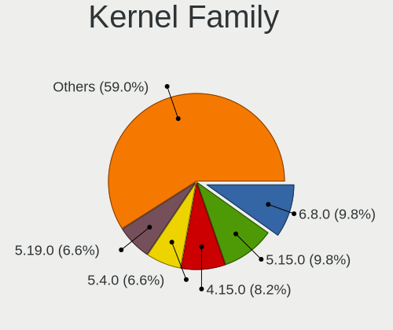

| Version | Desktops | Percent |
|---------|----------|---------|
| 4.15.0  | 5        | 25%     |
| 5.4.0   | 3        | 15%     |
| 5.8.0   | 2        | 10%     |
| 5.7.14  | 1        | 5%      |
| 5.3.0   | 1        | 5%      |
| 5.16.7  | 1        | 5%      |
| 5.15.0  | 1        | 5%      |
| 5.12.13 | 1        | 5%      |
| 5.11.0  | 1        | 5%      |
| 5.10.0  | 1        | 5%      |
| 5.0.0   | 1        | 5%      |
| 4.19.0  | 1        | 5%      |
| 4.18.0  | 1        | 5%      |

Kernel Major Ver.
-----------------

Linux kernel major version

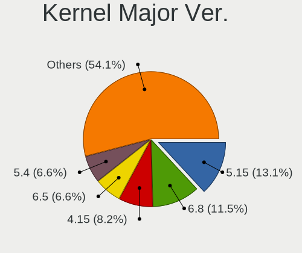

| Version | Desktops | Percent |
|---------|----------|---------|
| 4.15    | 5        | 25%     |
| 5.4     | 3        | 15%     |
| 5.8     | 2        | 10%     |
| 5.7     | 1        | 5%      |
| 5.3     | 1        | 5%      |
| 5.16    | 1        | 5%      |
| 5.15    | 1        | 5%      |
| 5.12    | 1        | 5%      |
| 5.11    | 1        | 5%      |
| 5.10    | 1        | 5%      |
| 5.0     | 1        | 5%      |
| 4.19    | 1        | 5%      |
| 4.18    | 1        | 5%      |

Arch
----

OS architecture (x86_64, i586, etc.)

| Name   | Desktops | Percent |
|--------|----------|---------|
| x86_64 | 19       | 95%     |
| i686   | 1        | 5%      |

DE
--

Desktop Environment

| Name    | Desktops | Percent |
|---------|----------|---------|
| GNOME   | 13       | 65%     |
| Unknown | 4        | 20%     |
| XFCE    | 1        | 5%      |
| KDE5    | 1        | 5%      |
| bspwm   | 1        | 5%      |

Display Server
--------------

X11 or Wayland

| Name    | Desktops | Percent |
|---------|----------|---------|
| X11     | 16       | 80%     |
| Unknown | 3        | 15%     |
| Wayland | 1        | 5%      |

Display Manager
---------------

SDDM, LightDM, etc.

| Name    | Desktops | Percent |
|---------|----------|---------|
| Unknown | 14       | 70%     |
| GDM3    | 2        | 10%     |
| GDM     | 2        | 10%     |
| SDDM    | 1        | 5%      |
| LightDM | 1        | 5%      |

OS Lang
-------

Language

| Lang    | Desktops | Percent |
|---------|----------|---------|
| en_US   | 13       | 65%     |
| Unknown | 4        | 20%     |
| en_GB   | 2        | 10%     |
| C       | 1        | 5%      |

Boot Mode
---------

EFI or BIOS

| Mode | Desktops | Percent |
|------|----------|---------|
| BIOS | 11       | 52.38%  |
| EFI  | 10       | 47.62%  |

Filesystem
----------

Type of filesystem

| Type    | Desktops | Percent |
|---------|----------|---------|
| Ext4    | 16       | 80%     |
| Xfs     | 1        | 5%      |
| Overlay | 1        | 5%      |
| Btrfs   | 1        | 5%      |
| Unknown | 1        | 5%      |

Part. scheme
------------

Scheme of partitioning

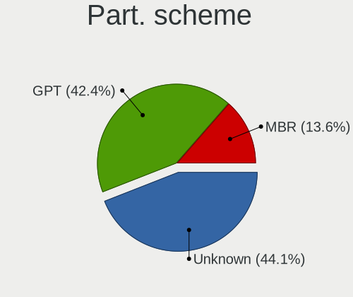

| Type    | Desktops | Percent |
|---------|----------|---------|
| Unknown | 16       | 80%     |
| GPT     | 3        | 15%     |
| MBR     | 1        | 5%      |

Dual Boot with Linux/BSD
------------------------

Hosting more than one Linux/BSD

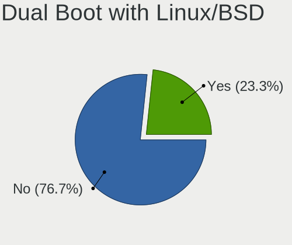

| Dual boot | Desktops | Percent |
|-----------|----------|---------|
| No        | 17       | 80.95%  |
| Yes       | 4        | 19.05%  |

Dual Boot (Win)
---------------

Hosting Linux and Windows

| Dual boot | Desktops | Percent |
|-----------|----------|---------|
| No        | 16       | 76.19%  |
| Yes       | 5        | 23.81%  |

Board
-----

Vendor
------

Motherboard manufacturer

| Name                | Desktops | Percent |
|---------------------|----------|---------|
| ASUSTek Computer    | 8        | 40%     |
| Dell                | 4        | 20%     |
| Lenovo              | 2        | 10%     |
| Intel               | 2        | 10%     |
| Hewlett-Packard     | 1        | 5%      |
| Gigabyte Technology | 1        | 5%      |
| ECS                 | 1        | 5%      |
| Biostar             | 1        | 5%      |

Model
-----

Motherboard model

| Name                              | Desktops | Percent |
|-----------------------------------|----------|---------|
| ASUS All Series                   | 2        | 10%     |
| Lenovo ThinkCentre E93 10AR004LAX | 1        | 5%      |
| Lenovo ThinkCentre E73 10AS0041AX | 1        | 5%      |
| Intel DH67CL AAG10212-210         | 1        | 5%      |
| Intel D865PERL AAC27648-207       | 1        | 5%      |
| HP 200-5120me                     | 1        | 5%      |
| Gigabyte Z77X-UD5H                | 1        | 5%      |
| ECS GeForce6100PM-M2              | 1        | 5%      |
| Dell Precision WorkStation T5500  | 1        | 5%      |
| Dell Precision T7610              | 1        | 5%      |
| Dell OptiPlex 980                 | 1        | 5%      |
| Dell OptiPlex 3040                | 1        | 5%      |
| Biostar TZ77XE4                   | 1        | 5%      |
| ASUS ROG ZENITH EXTREME           | 1        | 5%      |
| ASUS ROG STRIX X299-XE GAMING     | 1        | 5%      |
| ASUS PRIME B460M-A                | 1        | 5%      |
| ASUS PRIME B450-PLUS              | 1        | 5%      |
| ASUS PRIME B250M-PLUS             | 1        | 5%      |
| ASUS P7P55 LX                     | 1        | 5%      |

Model Family
------------

Motherboard model prefix

| Name                 | Desktops | Percent |
|----------------------|----------|---------|
| ASUS PRIME           | 3        | 15%     |
| Lenovo ThinkCentre   | 2        | 10%     |
| Dell Precision       | 2        | 10%     |
| Dell OptiPlex        | 2        | 10%     |
| ASUS ROG             | 2        | 10%     |
| ASUS All             | 2        | 10%     |
| Intel DH67CL         | 1        | 5%      |
| Intel D865PERL       | 1        | 5%      |
| HP 200-5120me        | 1        | 5%      |
| Gigabyte Z77X-UD5H   | 1        | 5%      |
| ECS GeForce6100PM-M2 | 1        | 5%      |
| Biostar TZ77XE4      | 1        | 5%      |
| ASUS P7P55           | 1        | 5%      |

MFG Year
--------

Motherboard manufacture year

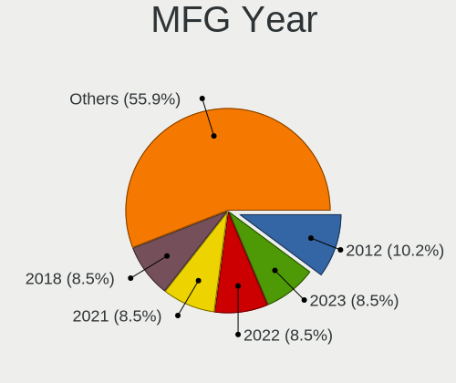

| Year | Desktops | Percent |
|------|----------|---------|
| 2019 | 3        | 15%     |
| 2018 | 2        | 10%     |
| 2014 | 2        | 10%     |
| 2012 | 2        | 10%     |
| 2011 | 2        | 10%     |
| 2010 | 2        | 10%     |
| 2020 | 1        | 5%      |
| 2016 | 1        | 5%      |
| 2015 | 1        | 5%      |
| 2013 | 1        | 5%      |
| 2009 | 1        | 5%      |
| 2007 | 1        | 5%      |
| 2005 | 1        | 5%      |

Form Factor
-----------

Physical design of the computer

| Name    | Desktops | Percent |
|---------|----------|---------|
| Desktop | 20       | 100%    |

Secure Boot
-----------

Enabled or disabled

| State    | Desktops | Percent |
|----------|----------|---------|
| Disabled | 19       | 95%     |
| Enabled  | 1        | 5%      |

Coreboot
--------

Have coreboot on board

| Used | Desktops | Percent |
|------|----------|---------|
| No   | 20       | 100%    |

RAM Size
--------

Total RAM memory

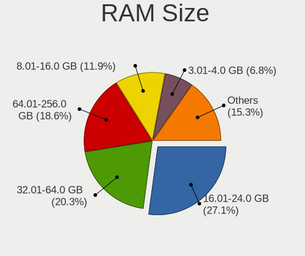

| Size in GB  | Desktops | Percent |
|-------------|----------|---------|
| 16.01-24.0  | 6        | 30%     |
| 4.01-8.0    | 3        | 15%     |
| 64.01-256.0 | 3        | 15%     |
| 32.01-64.0  | 2        | 10%     |
| 3.01-4.0    | 2        | 10%     |
| 8.01-16.0   | 2        | 10%     |
| 0.51-1.0    | 2        | 10%     |

RAM Used
--------

Used RAM memory

| Used GB   | Desktops | Percent |
|-----------|----------|---------|
| 2.01-3.0  | 6        | 28.57%  |
| 4.01-8.0  | 5        | 23.81%  |
| 1.01-2.0  | 4        | 19.05%  |
| 3.01-4.0  | 2        | 9.52%   |
| 8.01-16.0 | 2        | 9.52%   |
| 0.51-1.0  | 1        | 4.76%   |
| 0.01-0.5  | 1        | 4.76%   |

Total Drives
------------

Number of drives on board

| Drives | Desktops | Percent |
|--------|----------|---------|
| 1      | 10       | 50%     |
| 2      | 4        | 20%     |
| 3      | 3        | 15%     |
| 4      | 2        | 10%     |
| 8      | 1        | 5%      |

Has CD-ROM
----------

Has CD-ROM on board

| Presented | Desktops | Percent |
|-----------|----------|---------|
| No        | 15       | 75%     |
| Yes       | 5        | 25%     |

Has Ethernet
------------

Has Ethernet on board

| Presented | Desktops | Percent |
|-----------|----------|---------|
| Yes       | 20       | 100%    |

Has WiFi
--------

Has WiFi module

| Presented | Desktops | Percent |
|-----------|----------|---------|
| No        | 12       | 60%     |
| Yes       | 8        | 40%     |

Has Bluetooth
-------------

Has Bluetooth module

| Presented | Desktops | Percent |
|-----------|----------|---------|
| No        | 13       | 61.9%   |
| Yes       | 8        | 38.1%   |

Location
--------

Country
-------

Geographic location (country)

| Country | Desktops | Percent |
|---------|----------|---------|
| UAE     | 20       | 100%    |

City
----

Geographic location (city)

| City             | Desktops | Percent |
|------------------|----------|---------|
| Dubai            | 10       | 50%     |
| Abu Dhabi        | 7        | 35%     |
| Sharjah          | 1        | 5%      |
| Al Fujairah City | 1        | 5%      |
| Al Ain City      | 1        | 5%      |

Drives
------

Drive Vendor
------------

Hard drive vendors

| Vendor              | Desktops | Drives | Percent |
|---------------------|----------|--------|---------|
| WDC                 | 11       | 13     | 28.95%  |
| Seagate             | 7        | 11     | 18.42%  |
| Samsung Electronics | 7        | 9      | 18.42%  |
| Toshiba             | 2        | 2      | 5.26%   |
| Lexar               | 2        | 2      | 5.26%   |
| Kingston            | 2        | 2      | 5.26%   |
| Transcend           | 1        | 1      | 2.63%   |
| Maxtor              | 1        | 1      | 2.63%   |
| Hitachi             | 1        | 1      | 2.63%   |
| HGST                | 1        | 1      | 2.63%   |
| Gigabyte Technology | 1        | 1      | 2.63%   |
| Crucial             | 1        | 1      | 2.63%   |
| Corsair             | 1        | 1      | 2.63%   |

Drive Model
-----------

Hard drive models

| Model                              | Desktops | Percent |
|------------------------------------|----------|---------|
| WDC WDS240G2G0A-00JH30 240GB SSD   | 2        | 5%      |
| Seagate ST500DM002-1BD142 500GB    | 2        | 5%      |
| Samsung SSD 850 PRO 1TB            | 2        | 5%      |
| WDC WDS120G2G0A-00JH30 120GB SSD   | 1        | 2.5%    |
| WDC WD800BB-55JHC0 80GB            | 1        | 2.5%    |
| WDC WD5000AAKS-65V0A0 500GB        | 1        | 2.5%    |
| WDC WD40EFRX-68N32N0 4TB           | 1        | 2.5%    |
| WDC WD2500AAJS-75M0A0 250GB        | 1        | 2.5%    |
| WDC WD20EZRX-00D8PB0 2TB           | 1        | 2.5%    |
| WDC WD1600AAJS-60B4A0 160GB        | 1        | 2.5%    |
| WDC WD10EZEX-08M2NA0 1TB           | 1        | 2.5%    |
| WDC WD1002FAEX-00Z3A0 1TB          | 1        | 2.5%    |
| Transcend TS256GSSD370S 256GB      | 1        | 2.5%    |
| Toshiba MK3275GSX 320GB            | 1        | 2.5%    |
| Toshiba HDWE160 6TB                | 1        | 2.5%    |
| Seagate ST500VT000-1DK142 500GB    | 1        | 2.5%    |
| Seagate ST4000DM001-1FK17N 4TB     | 1        | 2.5%    |
| Seagate ST31000528AS 1TB           | 1        | 2.5%    |
| Seagate ST1000LM024 HN-M101MBB 1TB | 1        | 2.5%    |
| Seagate ST1000DM010-2EP102 1TB     | 1        | 2.5%    |
| Samsung SSD 980 1TB                | 1        | 2.5%    |
| Samsung SSD 970 EVO Plus 500GB     | 1        | 2.5%    |
| Samsung SSD 860 EVO 500GB          | 1        | 2.5%    |
| Samsung SSD 850 EVO 250GB          | 1        | 2.5%    |
| Samsung SSD 840 EVO 1TB            | 1        | 2.5%    |
| Samsung SSD 840 EVO 120GB          | 1        | 2.5%    |
| Samsung NVMe SSD Drive 1024GB      | 1        | 2.5%    |
| Maxtor STM3160215AS 160GB          | 1        | 2.5%    |
| Lexar 512GB SSD                    | 1        | 2.5%    |
| Lexar 500GB SSD                    | 1        | 2.5%    |
| Kingston SH103S3240G 240GB SSD     | 1        | 2.5%    |
| Kingston SA400S37240G 240GB SSD    | 1        | 2.5%    |
| Hitachi HDS5C3020ALA632 2TB        | 1        | 2.5%    |
| HGST HTS725050A7E630 500GB         | 1        | 2.5%    |
| Gigabyte GP-GSTFS31120GNTD 120GB   | 1        | 2.5%    |
| Crucial CT500MX500SSD1 500GB       | 1        | 2.5%    |
| Corsair Force GS 480GB SSD         | 1        | 2.5%    |

HDD Vendor
----------

Hard disk drive vendors

| Vendor  | Desktops | Drives | Percent |
|---------|----------|--------|---------|
| WDC     | 8        | 10     | 40%     |
| Seagate | 7        | 11     | 35%     |
| Toshiba | 2        | 2      | 10%     |
| Maxtor  | 1        | 1      | 5%      |
| Hitachi | 1        | 1      | 5%      |
| HGST    | 1        | 1      | 5%      |

SSD Vendor
----------

Solid state drive vendors

| Vendor              | Desktops | Drives | Percent |
|---------------------|----------|--------|---------|
| Samsung Electronics | 5        | 6      | 33.33%  |
| WDC                 | 3        | 3      | 20%     |
| Kingston            | 2        | 2      | 13.33%  |
| Transcend           | 1        | 1      | 6.67%   |
| Lexar               | 1        | 1      | 6.67%   |
| Gigabyte Technology | 1        | 1      | 6.67%   |
| Crucial             | 1        | 1      | 6.67%   |
| Corsair             | 1        | 1      | 6.67%   |

Drive Kind
----------

HDD or SSD

| Kind | Desktops | Drives | Percent |
|------|----------|--------|---------|
| HDD  | 16       | 26     | 53.33%  |
| SSD  | 10       | 16     | 33.33%  |
| NVMe | 4        | 4      | 13.33%  |

Drive Connector
---------------

SATA, SAS, NVMe, etc.

| Type | Desktops | Drives | Percent |
|------|----------|--------|---------|
| SATA | 19       | 41     | 79.17%  |
| NVMe | 4        | 4      | 16.67%  |
| SAS  | 1        | 1      | 4.17%   |

Drive Size
----------

Size of hard drive

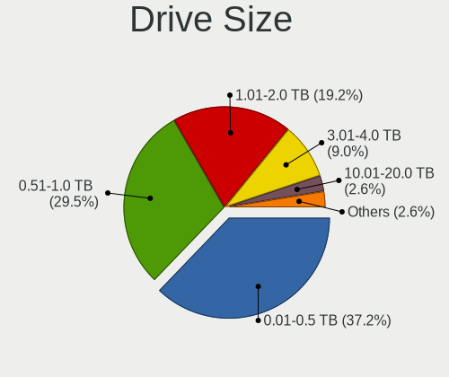

| Size in TB | Desktops | Drives | Percent |
|------------|----------|--------|---------|
| 0.01-0.5   | 17       | 25     | 58.62%  |
| 0.51-1.0   | 8        | 9      | 27.59%  |
| 1.01-2.0   | 2        | 2      | 6.9%    |
| 3.01-4.0   | 1        | 5      | 3.45%   |
| 4.01-10.0  | 1        | 1      | 3.45%   |

Space Total
-----------

Amount of disk space available on the file system

| Size in GB | Desktops | Percent |
|------------|----------|---------|
| 251-500    | 6        | 28.57%  |
| 101-250    | 4        | 19.05%  |
| 1001-2000  | 4        | 19.05%  |
| 2001-3000  | 3        | 14.29%  |
| 501-1000   | 2        | 9.52%   |
| 51-100     | 1        | 4.76%   |
| Unknown    | 1        | 4.76%   |

Space Used
----------

Amount of used disk space

| Used GB  | Desktops | Percent |
|----------|----------|---------|
| 1-20     | 8        | 34.78%  |
| 21-50    | 5        | 21.74%  |
| 101-250  | 4        | 17.39%  |
| 501-1000 | 2        | 8.7%    |
| 51-100   | 2        | 8.7%    |
| 251-500  | 1        | 4.35%   |
| Unknown  | 1        | 4.35%   |

Malfunc. Drives
---------------

Drive models with a malfunction

Zero info for selected period =(

Malfunc. Drive Vendor
---------------------

Vendors of faulty drives

Zero info for selected period =(

Malfunc. HDD Vendor
-------------------

Vendors of faulty HDD drives

Zero info for selected period =(

Malfunc. Drive Kind
-------------------

Kinds of faulty drives

Zero info for selected period =(

Failed Drives
-------------

Failed drive models

Zero info for selected period =(

Failed Drive Vendor
-------------------

Failed drive vendors

Zero info for selected period =(

Drive Status
------------

Number of failed and malfunc. drives

| Status   | Desktops | Drives | Percent |
|----------|----------|--------|---------|
| Detected | 16       | 33     | 80%     |
| Works    | 4        | 13     | 20%     |

Storage controller
------------------

Storage Vendor
--------------

Storage controller vendors

| Vendor                   | Desktops | Percent |
|--------------------------|----------|---------|
| Intel                    | 17       | 58.62%  |
| Samsung Electronics      | 3        | 10.34%  |
| ASMedia Technology       | 2        | 6.9%    |
| AMD                      | 2        | 6.9%    |
| VIA Technologies         | 1        | 3.45%   |
| Silicon Motion           | 1        | 3.45%   |
| Nvidia                   | 1        | 3.45%   |
| Marvell Technology Group | 1        | 3.45%   |
| Broadcom / LSI           | 1        | 3.45%   |

Storage Model
-------------

Storage controller models

| Model                                                                          | Desktops | Percent |
|--------------------------------------------------------------------------------|----------|---------|
| Intel C610/X99 series chipset sSATA Controller [AHCI mode]                     | 2        | 5.41%   |
| Intel C610/X99 series chipset 6-Port SATA Controller [AHCI mode]               | 2        | 5.41%   |
| Intel 82801JI (ICH10 Family) SATA AHCI Controller                              | 2        | 5.41%   |
| Intel 8 Series/C220 Series Chipset Family 6-port SATA Controller 1 [AHCI mode] | 2        | 5.41%   |
| Intel 7 Series/C210 Series Chipset Family 6-port SATA Controller [AHCI mode]   | 2        | 5.41%   |
| Intel 5 Series/3400 Series Chipset 4 port SATA IDE Controller                  | 2        | 5.41%   |
| Intel 5 Series/3400 Series Chipset 2 port SATA IDE Controller                  | 2        | 5.41%   |
| Intel 200 Series PCH SATA controller [AHCI mode]                               | 2        | 5.41%   |
| ASMedia ASM1062 Serial ATA Controller                                          | 2        | 5.41%   |
| AMD FCH SATA Controller [AHCI mode]                                            | 2        | 5.41%   |
| VIA VT6415 PATA IDE Host Controller                                            | 1        | 2.7%    |
| Silicon Motion SM2263EN/SM2263XT SSD Controller                                | 1        | 2.7%    |
| Samsung NVMe SSD Controller SM981/PM981/PM983                                  | 1        | 2.7%    |
| Samsung NVMe SSD Controller SM961/PM961/SM963                                  | 1        | 2.7%    |
| Samsung NVMe SSD Controller 980                                                | 1        | 2.7%    |
| Nvidia MCP61 SATA Controller                                                   | 1        | 2.7%    |
| Nvidia MCP61 IDE                                                               | 1        | 2.7%    |
| Marvell Group 88SE9172 SATA 6Gb/s Controller                                   | 1        | 2.7%    |
| Intel Q170/Q150/B150/H170/H110/Z170/CM236 Chipset SATA Controller [AHCI Mode]  | 1        | 2.7%    |
| Intel C600/X79 series chipset 6-Port SATA AHCI Controller                      | 1        | 2.7%    |
| Intel 82801EB/ER (ICH5/ICH5R) IDE Controller                                   | 1        | 2.7%    |
| Intel 6 Series/C200 Series Chipset Family 6 port Desktop SATA AHCI Controller  | 1        | 2.7%    |
| Intel 5 Series/3400 Series Chipset PT IDER Controller                          | 1        | 2.7%    |
| Intel 400 Series Chipset Family SATA AHCI Controller                           | 1        | 2.7%    |
| Broadcom / LSI SAS2308 PCI-Express Fusion-MPT SAS-2                            | 1        | 2.7%    |
| AMD X399 Series Chipset SATA Controller                                        | 1        | 2.7%    |
| AMD 400 Series Chipset SATA Controller                                         | 1        | 2.7%    |

Storage Kind
------------

Kind of storage controller (IDE, SATA, NVMe, SAS, ...)

| Kind | Desktops | Percent |
|------|----------|---------|
| SATA | 16       | 64%     |
| NVMe | 4        | 16%     |
| IDE  | 4        | 16%     |
| SAS  | 1        | 4%      |

Processor
---------

CPU Vendor
----------

Processor vendors

| Vendor | Desktops | Percent |
|--------|----------|---------|
| Intel  | 17       | 85%     |
| AMD    | 3        | 15%     |

CPU Model
---------

Processor models

| Model                                          | Desktops | Percent |
|------------------------------------------------|----------|---------|
| Intel Core i7-3770K CPU @ 3.50GHz              | 2        | 10%     |
| Intel Xeon CPU E5620 @ 2.40GHz                 | 1        | 5%      |
| Intel Xeon CPU E5-2609 v2 @ 2.50GHz            | 1        | 5%      |
| Intel Pentium Dual-Core CPU E5400 @ 2.70GHz    | 1        | 5%      |
| Intel Pentium 4 CPU 2.80GHz                    | 1        | 5%      |
| Intel Core i7-7740X CPU @ 4.30GHz              | 1        | 5%      |
| Intel Core i7-5960X CPU @ 3.00GHz              | 1        | 5%      |
| Intel Core i7-5820K CPU @ 3.30GHz              | 1        | 5%      |
| Intel Core i7-4790S CPU @ 3.20GHz              | 1        | 5%      |
| Intel Core i7-4770 CPU @ 3.40GHz               | 1        | 5%      |
| Intel Core i7-10700 CPU @ 2.90GHz              | 1        | 5%      |
| Intel Core i7 CPU 860 @ 2.80GHz                | 1        | 5%      |
| Intel Core i5-7400 CPU @ 3.00GHz               | 1        | 5%      |
| Intel Core i5-6500T CPU @ 2.50GHz              | 1        | 5%      |
| Intel Core i5-3470T CPU @ 2.90GHz              | 1        | 5%      |
| Intel Core i5 CPU 650 @ 3.20GHz                | 1        | 5%      |
| AMD Sempron Processor LE-1150                  | 1        | 5%      |
| AMD Ryzen Threadripper 1950X 16-Core Processor | 1        | 5%      |
| AMD Ryzen 5 2600X Six-Core Processor           | 1        | 5%      |

CPU Model Family
----------------

Processor model prefix

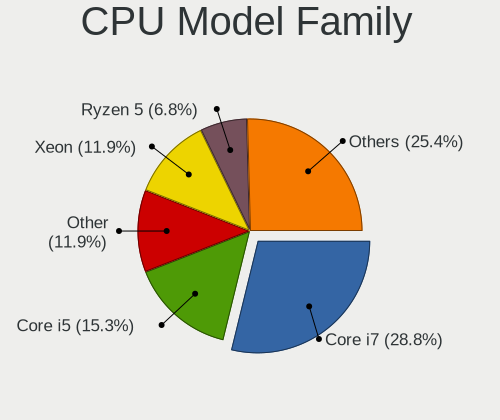

| Model                   | Desktops | Percent |
|-------------------------|----------|---------|
| Intel Core i7           | 9        | 45%     |
| Intel Core i5           | 4        | 20%     |
| Intel Xeon              | 2        | 10%     |
| Intel Pentium Dual-Core | 1        | 5%      |
| Intel Pentium 4         | 1        | 5%      |
| AMD Sempron             | 1        | 5%      |
| AMD Ryzen Threadripper  | 1        | 5%      |
| AMD Ryzen 5             | 1        | 5%      |

CPU Cores
---------

Number of processor cores

| Number | Desktops | Percent |
|--------|----------|---------|
| 4      | 9        | 45%     |
| 8      | 3        | 15%     |
| 2      | 3        | 15%     |
| 6      | 2        | 10%     |
| 1      | 2        | 10%     |
| 16     | 1        | 5%      |

CPU Sockets
-----------

Number of sockets

| Number | Desktops | Percent |
|--------|----------|---------|
| 1      | 19       | 95%     |
| 2      | 1        | 5%      |

CPU Threads
-----------

Threads per core (Hyper-Threading)

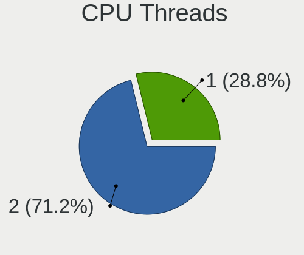

| Number | Desktops | Percent |
|--------|----------|---------|
| 2      | 14       | 70%     |
| 1      | 6        | 30%     |

CPU Op-Modes
------------

CPU Operation Modes (32-bit, 64-bit)

| Op mode        | Desktops | Percent |
|----------------|----------|---------|
| 32-bit, 64-bit | 18       | 90%     |
| 32-bit         | 1        | 5%      |
| Unknown        | 1        | 5%      |

CPU Microcode
-------------

Microcode number

| Number     | Desktops | Percent |
|------------|----------|---------|
| Unknown    | 4        | 19.05%  |
| 0x306a9    | 3        | 14.29%  |
| 0x906e9    | 2        | 9.52%   |
| 0x306f2    | 2        | 9.52%   |
| 0x306c3    | 2        | 9.52%   |
| 0xf29      | 1        | 4.76%   |
| 0xa0655    | 1        | 4.76%   |
| 0x306e4    | 1        | 4.76%   |
| 0x206c2    | 1        | 4.76%   |
| 0x106e5    | 1        | 4.76%   |
| 0x1067a    | 1        | 4.76%   |
| 0x0800820d | 1        | 4.76%   |
| 0x08001137 | 1        | 4.76%   |

CPU Microarch
-------------

Microarchitecture

| Name      | Desktops | Percent |
|-----------|----------|---------|
| IvyBridge | 4        | 20%     |
| Haswell   | 4        | 20%     |
| Westmere  | 2        | 10%     |
| KabyLake  | 2        | 10%     |
| Zen+      | 1        | 5%      |
| Zen       | 1        | 5%      |
| Skylake   | 1        | 5%      |
| Penryn    | 1        | 5%      |
| NetBurst  | 1        | 5%      |
| Nehalem   | 1        | 5%      |
| K8 Hammer | 1        | 5%      |
| CometLake | 1        | 5%      |

Graphics
--------

GPU Vendor
----------

Vendors of graphics cards

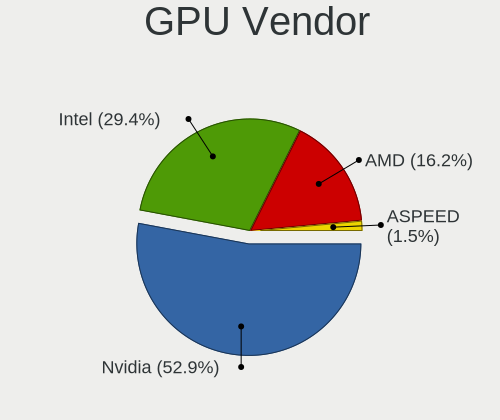

| Vendor | Desktops | Percent |
|--------|----------|---------|
| Nvidia | 12       | 52.17%  |
| Intel  | 8        | 34.78%  |
| AMD    | 3        | 13.04%  |

GPU Model
---------

Graphics card models

| Model                                                                       | Desktops | Percent |
|-----------------------------------------------------------------------------|----------|---------|
| Nvidia GP107 [GeForce GTX 1050 Ti]                                          | 2        | 8.7%    |
| Intel Xeon E3-1200 v3/4th Gen Core Processor Integrated Graphics Controller | 2        | 8.7%    |
| AMD Ellesmere [Radeon RX 470/480/570/570X/580/580X/590]                     | 2        | 8.7%    |
| Nvidia TU102 [GeForce RTX 2080 Ti Rev. A]                                   | 1        | 4.35%   |
| Nvidia NV18 [GeForce4 MX 440 AGP 8x]                                        | 1        | 4.35%   |
| Nvidia GP106 [GeForce GTX 1060 6GB]                                         | 1        | 4.35%   |
| Nvidia GP102 [TITAN Xp]                                                     | 1        | 4.35%   |
| Nvidia GK110GL [Quadro K5200]                                               | 1        | 4.35%   |
| Nvidia GK106GL [Quadro K4000]                                               | 1        | 4.35%   |
| Nvidia GF108 [GeForce GT 730]                                               | 1        | 4.35%   |
| Nvidia GA104 [GeForce RTX 3060 Ti]                                          | 1        | 4.35%   |
| Nvidia G98 [GeForce 9300 GS]                                                | 1        | 4.35%   |
| Nvidia C61 [GeForce 6150SE nForce 430]                                      | 1        | 4.35%   |
| Intel Xeon E3-1200 v2/3rd Gen Core processor Graphics Controller            | 1        | 4.35%   |
| Intel IvyBridge GT2 [HD Graphics 4000]                                      | 1        | 4.35%   |
| Intel HD Graphics 530                                                       | 1        | 4.35%   |
| Intel Core Processor Integrated Graphics Controller                         | 1        | 4.35%   |
| Intel CometLake-S GT2 [UHD Graphics 630]                                    | 1        | 4.35%   |
| Intel 4 Series Chipset Integrated Graphics Controller                       | 1        | 4.35%   |
| AMD Cedar [Radeon HD 5000/6000/7350/8350 Series]                            | 1        | 4.35%   |

GPU Combo
---------

Combinations of graphics cards

| Name               | Desktops | Percent |
|--------------------|----------|---------|
| 1 x Nvidia         | 10       | 50%     |
| 1 x Intel          | 5        | 25%     |
| 1 x AMD            | 2        | 10%     |
| Intel + 2 x Nvidia | 1        | 5%      |
| Intel + Nvidia     | 1        | 5%      |
| Intel + AMD        | 1        | 5%      |

GPU Driver
----------

Free vs proprietary

| Driver      | Desktops | Percent |
|-------------|----------|---------|
| Free        | 12       | 60%     |
| Proprietary | 5        | 25%     |
| Unknown     | 3        | 15%     |

GPU Memory
----------

Total video memory

| Size in GB | Desktops | Percent |
|------------|----------|---------|
| Unknown    | 7        | 35%     |
| 7.01-8.0   | 4        | 20%     |
| 1.01-2.0   | 3        | 15%     |
| 0.01-0.5   | 3        | 15%     |
| 3.01-4.0   | 1        | 5%      |
| 2.01-3.0   | 1        | 5%      |
| 0.51-1.0   | 1        | 5%      |

Monitor
-------

Monitor Vendor
--------------

Monitor vendors

| Vendor               | Desktops | Percent |
|----------------------|----------|---------|
| BenQ                 | 3        | 17.65%  |
| Samsung Electronics  | 2        | 11.76%  |
| Goldstar             | 2        | 11.76%  |
| Dell                 | 2        | 11.76%  |
| Ancor Communications | 2        | 11.76%  |
| Panasonic            | 1        | 5.88%   |
| LG Electronics       | 1        | 5.88%   |
| Lenovo               | 1        | 5.88%   |
| Hewlett-Packard      | 1        | 5.88%   |
| Gigabyte Technology  | 1        | 5.88%   |
| AOC                  | 1        | 5.88%   |

Monitor Model
-------------

Monitor models

| Model                                                                | Desktops | Percent |
|----------------------------------------------------------------------|----------|---------|
| Samsung Electronics SMB1930N SAM0632 1366x768 410x230mm 18.5-inch    | 1        | 5.56%   |
| Samsung Electronics C24F390 SAM0D2C 1920x1080 521x293mm 23.5-inch    | 1        | 5.56%   |
| Panasonic TV MEIA296 1280x1024 698x392mm 31.5-inch                   | 1        | 5.56%   |
| LG Electronics LCD Monitor LG ULTRAWIDE 2560x1080                    | 1        | 5.56%   |
| Lenovo L24e-30 LEN66BC 1920x1080 527x296mm 23.8-inch                 | 1        | 5.56%   |
| Hewlett-Packard LCD Monitor HWP4101 1920x1080 470x270mm 21.3-inch    | 1        | 5.56%   |
| Goldstar HDR 4K GSM7750 3840x2160 697x392mm 31.5-inch                | 1        | 5.56%   |
| Goldstar 24MP76 GSM5A28 1920x1080 530x300mm 24.0-inch                | 1        | 5.56%   |
| Gigabyte Technology M27Q GBT270D 2560x1440 596x335mm 26.9-inch       | 1        | 5.56%   |
| Dell E1914H DELD03A 1366x768 410x230mm 18.5-inch                     | 1        | 5.56%   |
| Dell 2407WFP DELA017 1920x1200 520x330mm 24.2-inch                   | 1        | 5.56%   |
| BenQ XL2720Z BNQ7F29 1920x1080 597x336mm 27.0-inch                   | 1        | 5.56%   |
| BenQ RL2455 BNQ7F1C 1920x1080 531x298mm 24.0-inch                    | 1        | 5.56%   |
| BenQ GW2480 BNQ78E7 1920x1080 527x296mm 23.8-inch                    | 1        | 5.56%   |
| BenQ GW2406Z BNQ78E1 1920x1080 527x296mm 23.8-inch                   | 1        | 5.56%   |
| AOC 24G1WG4 AOC2401 1920x1080 521x293mm 23.5-inch                    | 1        | 5.56%   |
| Ancor Communications LCD Monitor ASUS PB287 3840x2160                | 1        | 5.56%   |
| Ancor Communications ASUS VT207 ACI20F4 1600x900 458x256mm 20.7-inch | 1        | 5.56%   |

Monitor Resolution
------------------

Monitor screen resolution

| Resolution        | Desktops | Percent |
|-------------------|----------|---------|
| 1920x1080 (FHD)   | 7        | 41.18%  |
| 3840x2160 (4K)    | 3        | 17.65%  |
| 2560x1440 (QHD)   | 2        | 11.76%  |
| 1366x768 (WXGA)   | 2        | 11.76%  |
| 2560x1080         | 1        | 5.88%   |
| 1920x1200 (WUXGA) | 1        | 5.88%   |
| 1600x900 (HD+)    | 1        | 5.88%   |

Monitor Diagonal
----------------

Diagonal size in inches

| Inches  | Desktops | Percent |
|---------|----------|---------|
| 24      | 5        | 29.41%  |
| 31      | 2        | 11.76%  |
| 23      | 2        | 11.76%  |
| 18      | 2        | 11.76%  |
| Unknown | 2        | 11.76%  |
| 84      | 1        | 5.88%   |
| 27      | 1        | 5.88%   |
| 21      | 1        | 5.88%   |
| 20      | 1        | 5.88%   |

Monitor Width
-------------

Physical width

| Width in mm | Desktops | Percent |
|-------------|----------|---------|
| 501-600     | 8        | 47.06%  |
| 401-500     | 4        | 23.53%  |
| 601-700     | 2        | 11.76%  |
| Unknown     | 2        | 11.76%  |
| 1501-2000   | 1        | 5.88%   |

Aspect Ratio
------------

Proportional relationship between the width and the height

| Ratio   | Desktops | Percent |
|---------|----------|---------|
| 16/9    | 11       | 73.33%  |
| 16/10   | 2        | 13.33%  |
| Unknown | 2        | 13.33%  |

Monitor Area
------------

Area in inch²

| Area in inch² | Desktops | Percent |
|----------------|----------|---------|
| 201-250        | 5        | 29.41%  |
| 351-500        | 2        | 11.76%  |
| 251-300        | 2        | 11.76%  |
| 151-200        | 2        | 11.76%  |
| 141-150        | 2        | 11.76%  |
| Unknown        | 2        | 11.76%  |
| More than 1000 | 1        | 5.88%   |
| 301-350        | 1        | 5.88%   |

Pixel Density
-------------

Pixels per inch

| Density | Desktops | Percent |
|---------|----------|---------|
| 51-100  | 12       | 75%     |
| Unknown | 2        | 12.5%   |
| 121-160 | 1        | 6.25%   |
| 101-120 | 1        | 6.25%   |

Multiple Monitors
-----------------

Total monitors connected

| Total | Desktops | Percent |
|-------|----------|---------|
| 1     | 15       | 75%     |
| 0     | 3        | 15%     |
| 3     | 1        | 5%      |
| 2     | 1        | 5%      |

Network
-------

Net Controller Vendor
---------------------

Controller vendors

| Vendor                   | Desktops | Percent |
|--------------------------|----------|---------|
| Intel                    | 12       | 36.36%  |
| Realtek Semiconductor    | 9        | 27.27%  |
| Broadcom                 | 3        | 9.09%   |
| Qualcomm Atheros         | 2        | 6.06%   |
| Wilocity                 | 1        | 3.03%   |
| VIA Technologies         | 1        | 3.03%   |
| SILICON Laboratories     | 1        | 3.03%   |
| Sigma Designs            | 1        | 3.03%   |
| Nvidia                   | 1        | 3.03%   |
| Marvell Technology Group | 1        | 3.03%   |
| D-Link                   | 1        | 3.03%   |

Net Controller Model
--------------------

Controller models

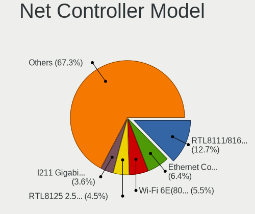

| Model                                                                   | Desktops | Percent |
|-------------------------------------------------------------------------|----------|---------|
| Realtek RTL8111/8168/8411 PCI Express Gigabit Ethernet Controller       | 7        | 19.44%  |
| Intel I211 Gigabit Network Connection                                   | 2        | 5.56%   |
| Intel Ethernet Connection (2) I219-V                                    | 2        | 5.56%   |
| Intel Ethernet Connection (2) I218-V                                    | 2        | 5.56%   |
| Intel 82579V Gigabit Network Connection                                 | 2        | 5.56%   |
| Broadcom BCM4360 802.11ac Wireless Network Adapter                      | 2        | 5.56%   |
| Wilocity Wil6200 802.11ad Wireless Network Adapter                      | 1        | 2.78%   |
| VIA VT6105/VT6106S [Rhine-III]                                          | 1        | 2.78%   |
| SILICON Laboratories Intel 537 [Winmodem]                               | 1        | 2.78%   |
| Sigma Designs Aeotec Z-Stick Gen5 (ZW090) - UZB                         | 1        | 2.78%   |
| Realtek RTL8822BE 802.11a/b/g/n/ac WiFi adapter                         | 1        | 2.78%   |
| Realtek RTL8192EU 802.11b/g/n WLAN Adapter                              | 1        | 2.78%   |
| Qualcomm Atheros QCA6174 802.11ac Wireless Network Adapter              | 1        | 2.78%   |
| Qualcomm Atheros AR8151 v2.0 Gigabit Ethernet                           | 1        | 2.78%   |
| Nvidia MCP61 Ethernet                                                   | 1        | 2.78%   |
| Marvell Group 88E8070 based Ethernet Controller                         | 1        | 2.78%   |
| Intel Wireless 8260                                                     | 1        | 2.78%   |
| Intel Wi-Fi 6 AX210/AX211/AX411 160MHz                                  | 1        | 2.78%   |
| Intel I350 Gigabit Network Connection                                   | 1        | 2.78%   |
| Intel I210 Gigabit Network Connection                                   | 1        | 2.78%   |
| Intel Ethernet Connection I217-V                                        | 1        | 2.78%   |
| Intel 82579LM Gigabit Network Connection (Lewisville)                   | 1        | 2.78%   |
| Intel 82578DM Gigabit Network Connection                                | 1        | 2.78%   |
| D-Link DWA-127 Wireless N 150 High-Gain Adapter(rev.A1) [Ralink RT3070] | 1        | 2.78%   |
| Broadcom NetXtreme BCM5761 Gigabit Ethernet PCIe                        | 1        | 2.78%   |

Wireless Vendor
---------------

Wireless vendors

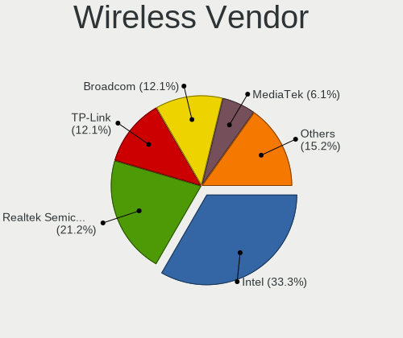

| Vendor                | Desktops | Percent |
|-----------------------|----------|---------|
| Realtek Semiconductor | 2        | 22.22%  |
| Intel                 | 2        | 22.22%  |
| Broadcom              | 2        | 22.22%  |
| Wilocity              | 1        | 11.11%  |
| Qualcomm Atheros      | 1        | 11.11%  |
| D-Link                | 1        | 11.11%  |

Wireless Model
--------------

Wireless models

| Model                                                                   | Desktops | Percent |
|-------------------------------------------------------------------------|----------|---------|
| Broadcom BCM4360 802.11ac Wireless Network Adapter                      | 2        | 22.22%  |
| Wilocity Wil6200 802.11ad Wireless Network Adapter                      | 1        | 11.11%  |
| Realtek RTL8822BE 802.11a/b/g/n/ac WiFi adapter                         | 1        | 11.11%  |
| Realtek RTL8192EU 802.11b/g/n WLAN Adapter                              | 1        | 11.11%  |
| Qualcomm Atheros QCA6174 802.11ac Wireless Network Adapter              | 1        | 11.11%  |
| Intel Wireless 8260                                                     | 1        | 11.11%  |
| Intel Wi-Fi 6 AX210/AX211/AX411 160MHz                                  | 1        | 11.11%  |
| D-Link DWA-127 Wireless N 150 High-Gain Adapter(rev.A1) [Ralink RT3070] | 1        | 11.11%  |

Ethernet Vendor
---------------

Ethernet vendors

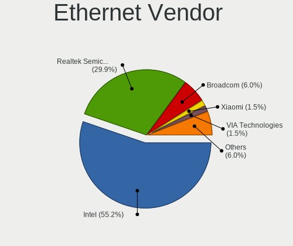

| Vendor                   | Desktops | Percent |
|--------------------------|----------|---------|
| Intel                    | 10       | 45.45%  |
| Realtek Semiconductor    | 7        | 31.82%  |
| VIA Technologies         | 1        | 4.55%   |
| Qualcomm Atheros         | 1        | 4.55%   |
| Nvidia                   | 1        | 4.55%   |
| Marvell Technology Group | 1        | 4.55%   |
| Broadcom                 | 1        | 4.55%   |

Ethernet Model
--------------

Ethernet models

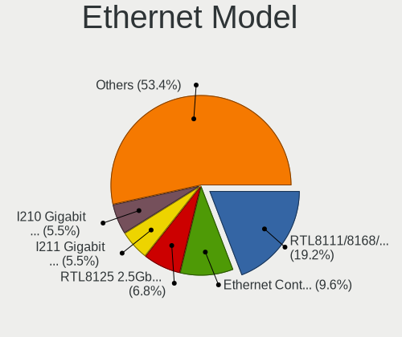

| Model                                                             | Desktops | Percent |
|-------------------------------------------------------------------|----------|---------|
| Realtek RTL8111/8168/8411 PCI Express Gigabit Ethernet Controller | 7        | 28%     |
| Intel I211 Gigabit Network Connection                             | 2        | 8%      |
| Intel Ethernet Connection (2) I219-V                              | 2        | 8%      |
| Intel Ethernet Connection (2) I218-V                              | 2        | 8%      |
| Intel 82579V Gigabit Network Connection                           | 2        | 8%      |
| VIA VT6105/VT6106S [Rhine-III]                                    | 1        | 4%      |
| Qualcomm Atheros AR8151 v2.0 Gigabit Ethernet                     | 1        | 4%      |
| Nvidia MCP61 Ethernet                                             | 1        | 4%      |
| Marvell Group 88E8070 based Ethernet Controller                   | 1        | 4%      |
| Intel I350 Gigabit Network Connection                             | 1        | 4%      |
| Intel I210 Gigabit Network Connection                             | 1        | 4%      |
| Intel Ethernet Connection I217-V                                  | 1        | 4%      |
| Intel 82579LM Gigabit Network Connection (Lewisville)             | 1        | 4%      |
| Intel 82578DM Gigabit Network Connection                          | 1        | 4%      |
| Broadcom NetXtreme BCM5761 Gigabit Ethernet PCIe                  | 1        | 4%      |

Net Controller Kind
-------------------

Ethernet, WiFi or modem

| Kind     | Desktops | Percent |
|----------|----------|---------|
| Ethernet | 20       | 66.67%  |
| WiFi     | 8        | 26.67%  |
| Modem    | 2        | 6.67%   |

Used Controller
---------------

Currently used network controller

| Kind     | Desktops | Percent |
|----------|----------|---------|
| Ethernet | 18       | 78.26%  |
| WiFi     | 5        | 21.74%  |

NICs
----

Total network controllers on board

| Total | Desktops | Percent |
|-------|----------|---------|
| 1     | 11       | 55%     |
| 2     | 6        | 30%     |
| 3     | 2        | 10%     |
| 4     | 1        | 5%      |

IPv6
----

IPv6 vs IPv4

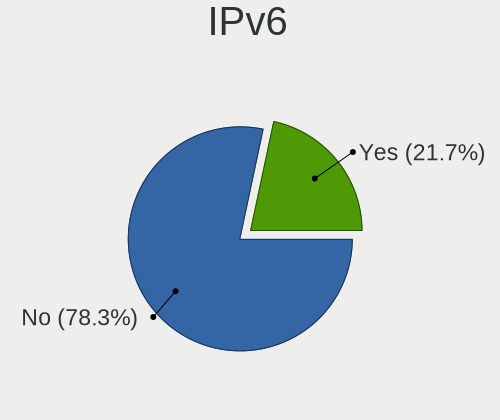

| Used | Desktops | Percent |
|------|----------|---------|
| No   | 16       | 80%     |
| Yes  | 4        | 20%     |

Bluetooth
---------

Bluetooth Vendor
----------------

Controller vendors

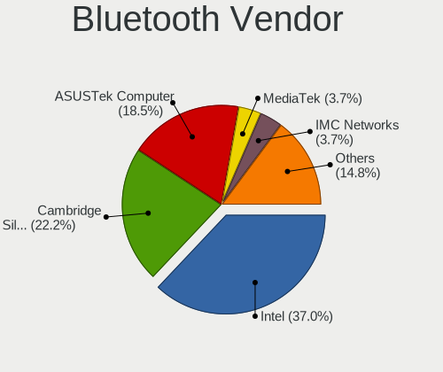

| Vendor                  | Desktops | Percent |
|-------------------------|----------|---------|
| ASUSTek Computer        | 4        | 50%     |
| Intel                   | 2        | 25%     |
| Cambridge Silicon Radio | 2        | 25%     |

Bluetooth Model
---------------

Controller models

| Model                                                 | Desktops | Percent |
|-------------------------------------------------------|----------|---------|
| Cambridge Silicon Radio Bluetooth Dongle (HCI mode)   | 2        | 25%     |
| ASUS Broadcom BCM20702 Single-Chip Bluetooth 4.0 + LE | 2        | 25%     |
| Intel Bluetooth wireless interface                    | 1        | 12.5%   |
| Intel AX210 Bluetooth                                 | 1        | 12.5%   |
| ASUS Bluetooth Radio                                  | 1        | 12.5%   |
| ASUS Bluetooth Device                                 | 1        | 12.5%   |

Sound
-----

Sound Vendor
------------

Sound card vendors

| Vendor             | Desktops | Percent |
|--------------------|----------|---------|
| Intel              | 17       | 48.57%  |
| Nvidia             | 10       | 28.57%  |
| AMD                | 4        | 11.43%  |
| SteelSeries ApS    | 1        | 2.86%   |
| JMTek              | 1        | 2.86%   |
| Griffin Technology | 1        | 2.86%   |
| Apogee Electronics | 1        | 2.86%   |

Sound Model
-----------

Sound card models

| Model                                                                      | Desktops | Percent |
|----------------------------------------------------------------------------|----------|---------|
| Nvidia GP107GL High Definition Audio Controller                            | 2        | 5.26%   |
| Intel Xeon E3-1200 v3/4th Gen Core Processor HD Audio Controller           | 2        | 5.26%   |
| Intel C610/X99 series chipset HD Audio Controller                          | 2        | 5.26%   |
| Intel 82801JI (ICH10 Family) HD Audio Controller                           | 2        | 5.26%   |
| Intel 8 Series/C220 Series Chipset High Definition Audio Controller        | 2        | 5.26%   |
| Intel 7 Series/C216 Chipset Family High Definition Audio Controller        | 2        | 5.26%   |
| Intel 5 Series/3400 Series Chipset High Definition Audio                   | 2        | 5.26%   |
| Intel 200 Series PCH HD Audio                                              | 2        | 5.26%   |
| AMD Family 17h (Models 00h-0fh) HD Audio Controller                        | 2        | 5.26%   |
| AMD Ellesmere HDMI Audio [Radeon RX 470/480 / 570/580/590]                 | 2        | 5.26%   |
| SteelSeries ApS SteelSeries Arctis 5                                       | 1        | 2.63%   |
| Nvidia TU102 High Definition Audio Controller                              | 1        | 2.63%   |
| Nvidia MCP61 High Definition Audio                                         | 1        | 2.63%   |
| Nvidia GP106 High Definition Audio Controller                              | 1        | 2.63%   |
| Nvidia GP102 HDMI Audio Controller                                         | 1        | 2.63%   |
| Nvidia GK110 High Definition Audio Controller                              | 1        | 2.63%   |
| Nvidia GK106 HDMI Audio Controller                                         | 1        | 2.63%   |
| Nvidia GF108 High Definition Audio Controller                              | 1        | 2.63%   |
| Nvidia GA104 High Definition Audio Controller                              | 1        | 2.63%   |
| JMTek USB PnP Audio Device                                                 | 1        | 2.63%   |
| Intel Comet Lake PCH-V cAVS                                                | 1        | 2.63%   |
| Intel C600/X79 series chipset High Definition Audio Controller             | 1        | 2.63%   |
| Intel 82801EB/ER (ICH5/ICH5R) AC'97 Audio Controller                       | 1        | 2.63%   |
| Intel 6 Series/C200 Series Chipset Family High Definition Audio Controller | 1        | 2.63%   |
| Intel 100 Series/C230 Series Chipset Family HD Audio Controller            | 1        | 2.63%   |
| Griffin Technology iMic                                                    | 1        | 2.63%   |
| Apogee Electronics Groove                                                  | 1        | 2.63%   |
| AMD Cedar HDMI Audio [Radeon HD 5400/6300/7300 Series]                     | 1        | 2.63%   |

Memory
------

Memory Vendor
-------------

Memory module vendors

| Vendor              | Desktops | Percent |
|---------------------|----------|---------|
| Corsair             | 3        | 42.86%  |
| Samsung Electronics | 1        | 14.29%  |
| Micron Technology   | 1        | 14.29%  |
| Kingston            | 1        | 14.29%  |
| Crucial             | 1        | 14.29%  |

Memory Model
------------

Memory module models

| Model                                                    | Desktops | Percent |
|----------------------------------------------------------|----------|---------|
| Samsung RAM M393B1K70DH0-YH9 8GB DIMM DDR3 1333MT/s      | 1        | 14.29%  |
| Micron RAM 36JSZF51272PZ1G4F1 4096MB DIMM DDR3 1333MT/s  | 1        | 14.29%  |
| Kingston RAM KHX2666C16D4/16GX 16GB DIMM DDR4 2667MT/s   | 1        | 14.29%  |
| Crucial RAM BLS8G4D30BESBK.8FD 8GB DIMM DDR4 3000MT/s    | 1        | 14.29%  |
| Corsair RAM CMZ8GX3M1A1600C10 8GB DIMM DDR3 1600MT/s     | 1        | 14.29%  |
| Corsair RAM CMK16GX4M2A2666C16 8192MB DIMM DDR4 3200MT/s | 1        | 14.29%  |
| Corsair RAM CMD32GX4M4A2800C16 8192MB DIMM DDR4 2133MT/s | 1        | 14.29%  |

Memory Kind
-----------

Memory module kinds

| Kind | Desktops | Percent |
|------|----------|---------|
| DDR4 | 4        | 66.67%  |
| DDR3 | 2        | 33.33%  |

Memory Form Factor
------------------

Physical design of the memory module

| Name | Desktops | Percent |
|------|----------|---------|
| DIMM | 6        | 100%    |

Memory Size
-----------

Memory module size

| Size  | Desktops | Percent |
|-------|----------|---------|
| 8192  | 5        | 71.43%  |
| 16384 | 1        | 14.29%  |
| 4096  | 1        | 14.29%  |

Memory Speed
------------

Memory module speed

| Speed | Desktops | Percent |
|-------|----------|---------|
| 3200  | 1        | 16.67%  |
| 3000  | 1        | 16.67%  |
| 2667  | 1        | 16.67%  |
| 2133  | 1        | 16.67%  |
| 1600  | 1        | 16.67%  |
| 1333  | 1        | 16.67%  |

Printers & scanners
-------------------

Printer Vendor
--------------

Printer device vendors

| Vendor             | Desktops | Percent |
|--------------------|----------|---------|
| Hewlett-Packard    | 1        | 50%     |
| Brother Industries | 1        | 50%     |

Printer Model
-------------

Printer device models

| Model                   | Desktops | Percent |
|-------------------------|----------|---------|
| HP Deskjet F2280 series | 1        | 50%     |
| Brother MFC-9330CDW     | 1        | 50%     |

Scanner Vendor
--------------

Scanner device vendors

Zero info for selected period =(

Scanner Model
-------------

Scanner device models

Zero info for selected period =(

Camera
------

Camera Vendor
-------------

Camera device vendors

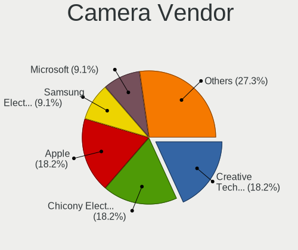

| Vendor                      | Desktops | Percent |
|-----------------------------|----------|---------|
| Samsung Electronics         | 1        | 16.67%  |
| LG Electronics              | 1        | 16.67%  |
| KYE Systems (Mouse Systems) | 1        | 16.67%  |
| Creative Technology         | 1        | 16.67%  |
| Chicony Electronics         | 1        | 16.67%  |
| Apple                       | 1        | 16.67%  |

Camera Model
------------

Camera device models

| Model                                                 | Desktops | Percent |
|-------------------------------------------------------|----------|---------|
| Samsung Galaxy A5 (MTP)                               | 1        | 16.67%  |
| LG LM-X420xxx/G2/G3 Android Phone (MTP/download mode) | 1        | 16.67%  |
| KYE Systems (Mouse Systems) WideCam 1050              | 1        | 16.67%  |
| Creative Live! Cam Socialize HD 1080 [VF0680]         | 1        | 16.67%  |
| Chicony HP Webcam                                     | 1        | 16.67%  |
| Apple iPhone 5/5C/5S/6/SE                             | 1        | 16.67%  |

Security
--------

Fingerprint Vendor
------------------

Fingerprint sensor vendors

Zero info for selected period =(

Fingerprint Model
-----------------

Fingerprint sensor models

Zero info for selected period =(

Chipcard Vendor
---------------

Chipcard module vendors

Zero info for selected period =(

Chipcard Model
--------------

Chipcard module models

Zero info for selected period =(

Unsupported
-----------

Unsupported Devices
-------------------

Total unsupported devices on board

| Total | Desktops | Percent |
|-------|----------|---------|
| 0     | 15       | 75%     |
| 1     | 3        | 15%     |
| 2     | 2        | 10%     |

Unsupported Device Types
------------------------

Types of unsupported devices

| Type             | Desktops | Percent |
|------------------|----------|---------|
| Graphics card    | 3        | 42.86%  |
| Unassigned class | 2        | 28.57%  |
| Modem            | 1        | 14.29%  |
| Camera           | 1        | 14.29%  |

