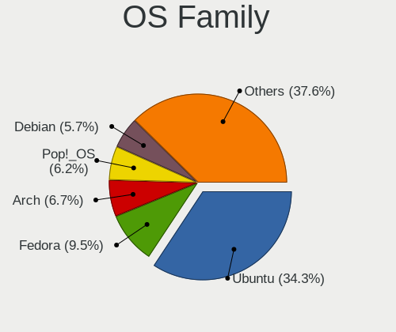
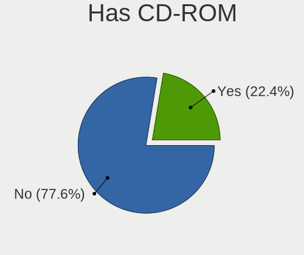
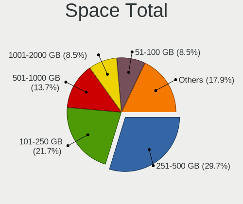
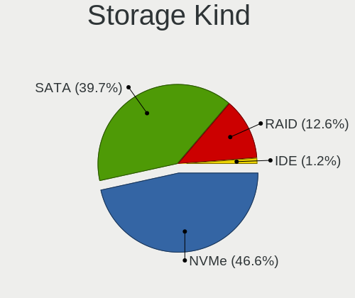
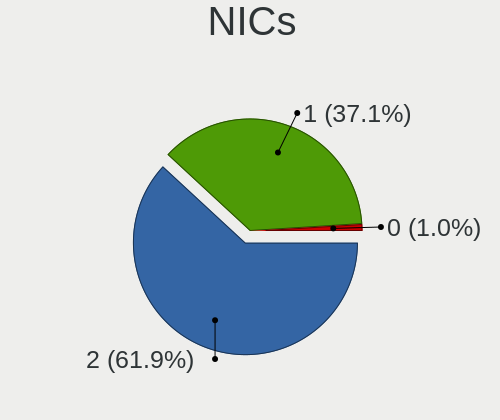
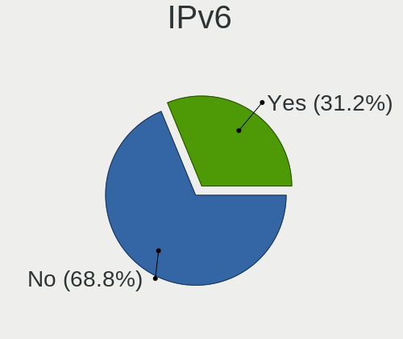
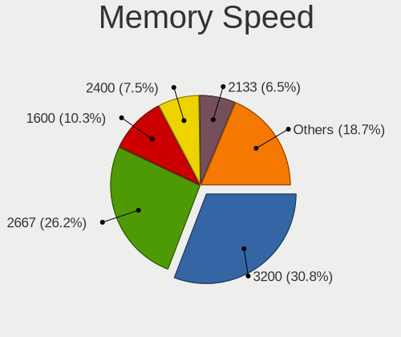

Linux in UAE - Tested Hardware & Statistics (Notebooks)
-------------------------------------------------------

A project to collect tested hardware configurations for Linux in UAE.

Anyone can contribute to this report by the [hw-probe](https://github.com/linuxhw/hw-probe) tool:

    sudo -E hw-probe -all -upload

Please contribute! Especially if your hardware is rare.

Contents
--------

* [ Test Cases ](#test-cases)

* [ System ](#system)
  - [ OS                       ](#os)
  - [ OS Family                ](#os-family)
  - [ Kernel                   ](#kernel)
  - [ Kernel Family            ](#kernel-family)
  - [ Kernel Major Ver.        ](#kernel-major-ver)
  - [ Arch                     ](#arch)
  - [ DE                       ](#de)
  - [ Display Server           ](#display-server)
  - [ Display Manager          ](#display-manager)
  - [ OS Lang                  ](#os-lang)
  - [ Boot Mode                ](#boot-mode)
  - [ Filesystem               ](#filesystem)
  - [ Part. scheme             ](#part-scheme)
  - [ Dual Boot with Linux/BSD ](#dual-boot-with-linuxbsd)
  - [ Dual Boot (Win)          ](#dual-boot-win)

* [ Board ](#board)
  - [ Vendor                   ](#vendor)
  - [ Model                    ](#model)
  - [ Model Family             ](#model-family)
  - [ MFG Year                 ](#mfg-year)
  - [ Form Factor              ](#form-factor)
  - [ Secure Boot              ](#secure-boot)
  - [ Coreboot                 ](#coreboot)
  - [ RAM Size                 ](#ram-size)
  - [ RAM Used                 ](#ram-used)
  - [ Total Drives             ](#total-drives)
  - [ Has CD-ROM               ](#has-cd-rom)
  - [ Has Ethernet             ](#has-ethernet)
  - [ Has WiFi                 ](#has-wifi)
  - [ Has Bluetooth            ](#has-bluetooth)

* [ Location ](#location)
  - [ Country                  ](#country)
  - [ City                     ](#city)

* [ Drives ](#drives)
  - [ Drive Vendor             ](#drive-vendor)
  - [ Drive Model              ](#drive-model)
  - [ HDD Vendor               ](#hdd-vendor)
  - [ SSD Vendor               ](#ssd-vendor)
  - [ Drive Kind               ](#drive-kind)
  - [ Drive Connector          ](#drive-connector)
  - [ Drive Size               ](#drive-size)
  - [ Space Total              ](#space-total)
  - [ Space Used               ](#space-used)
  - [ Malfunc. Drives          ](#malfunc-drives)
  - [ Malfunc. Drive Vendor    ](#malfunc-drive-vendor)
  - [ Malfunc. HDD Vendor      ](#malfunc-hdd-vendor)
  - [ Malfunc. Drive Kind      ](#malfunc-drive-kind)
  - [ Failed Drives            ](#failed-drives)
  - [ Failed Drive Vendor      ](#failed-drive-vendor)
  - [ Drive Status             ](#drive-status)

* [ Storage controller ](#storage-controller)
  - [ Storage Vendor           ](#storage-vendor)
  - [ Storage Model            ](#storage-model)
  - [ Storage Kind             ](#storage-kind)

* [ Processor ](#processor)
  - [ CPU Vendor               ](#cpu-vendor)
  - [ CPU Model                ](#cpu-model)
  - [ CPU Model Family         ](#cpu-model-family)
  - [ CPU Cores                ](#cpu-cores)
  - [ CPU Sockets              ](#cpu-sockets)
  - [ CPU Threads              ](#cpu-threads)
  - [ CPU Op-Modes             ](#cpu-op-modes)
  - [ CPU Microcode            ](#cpu-microcode)
  - [ CPU Microarch            ](#cpu-microarch)

* [ Graphics ](#graphics)
  - [ GPU Vendor               ](#gpu-vendor)
  - [ GPU Model                ](#gpu-model)
  - [ GPU Combo                ](#gpu-combo)
  - [ GPU Driver               ](#gpu-driver)
  - [ GPU Memory               ](#gpu-memory)

* [ Monitor ](#monitor)
  - [ Monitor Vendor           ](#monitor-vendor)
  - [ Monitor Model            ](#monitor-model)
  - [ Monitor Resolution       ](#monitor-resolution)
  - [ Monitor Diagonal         ](#monitor-diagonal)
  - [ Monitor Width            ](#monitor-width)
  - [ Aspect Ratio             ](#aspect-ratio)
  - [ Monitor Area             ](#monitor-area)
  - [ Pixel Density            ](#pixel-density)
  - [ Multiple Monitors        ](#multiple-monitors)

* [ Network ](#network)
  - [ Net Controller Vendor    ](#net-controller-vendor)
  - [ Net Controller Model     ](#net-controller-model)
  - [ Wireless Vendor          ](#wireless-vendor)
  - [ Wireless Model           ](#wireless-model)
  - [ Ethernet Vendor          ](#ethernet-vendor)
  - [ Ethernet Model           ](#ethernet-model)
  - [ Net Controller Kind      ](#net-controller-kind)
  - [ Used Controller          ](#used-controller)
  - [ NICs                     ](#nics)
  - [ IPv6                     ](#ipv6)

* [ Bluetooth ](#bluetooth)
  - [ Bluetooth Vendor         ](#bluetooth-vendor)
  - [ Bluetooth Model          ](#bluetooth-model)

* [ Sound ](#sound)
  - [ Sound Vendor             ](#sound-vendor)
  - [ Sound Model              ](#sound-model)

* [ Memory ](#memory)
  - [ Memory Vendor            ](#memory-vendor)
  - [ Memory Model             ](#memory-model)
  - [ Memory Kind              ](#memory-kind)
  - [ Memory Form Factor       ](#memory-form-factor)
  - [ Memory Size              ](#memory-size)
  - [ Memory Speed             ](#memory-speed)

* [ Printers & scanners ](#printers--scanners)
  - [ Printer Vendor           ](#printer-vendor)
  - [ Printer Model            ](#printer-model)
  - [ Scanner Vendor           ](#scanner-vendor)
  - [ Scanner Model            ](#scanner-model)

* [ Camera ](#camera)
  - [ Camera Vendor            ](#camera-vendor)
  - [ Camera Model             ](#camera-model)

* [ Security ](#security)
  - [ Fingerprint Vendor       ](#fingerprint-vendor)
  - [ Fingerprint Model        ](#fingerprint-model)
  - [ Chipcard Vendor          ](#chipcard-vendor)
  - [ Chipcard Model           ](#chipcard-model)

* [ Unsupported ](#unsupported)
  - [ Unsupported Devices      ](#unsupported-devices)
  - [ Unsupported Device Types ](#unsupported-device-types)

Test Cases
----------

Total: 103

| Vendor        | Model                       | Probe                                                      | Date         |
|---------------|-----------------------------|------------------------------------------------------------|--------------|
| ASUSTek       | VivoBook 12_ASUS Laptop ... | [ad2442631e](https://linux-hardware.org/?probe=ad2442631e) | May 28, 2022 |
| HP            | Pavilion Laptop 13-bb0xx... | [ae7d5dbb0c](https://linux-hardware.org/?probe=ae7d5dbb0c) | May 01, 2022 |
| Lenovo        | ThinkPad P1 Gen 3 20TJS4... | [28c774c6de](https://linux-hardware.org/?probe=28c774c6de) | Apr 07, 2022 |
| Lenovo        | ThinkPad X1 Carbon Gen 9... | [718b671125](https://linux-hardware.org/?probe=718b671125) | Apr 06, 2022 |
| Lenovo        | ThinkPad X1 Carbon Gen 9... | [5e0763131c](https://linux-hardware.org/?probe=5e0763131c) | Mar 28, 2022 |
| Lenovo        | IdeaPad Gaming 3 15IMH05... | [8dda7f6478](https://linux-hardware.org/?probe=8dda7f6478) | Mar 06, 2022 |
| Google        | Terra                       | [54163369b2](https://linux-hardware.org/?probe=54163369b2) | Feb 23, 2022 |
| Dell          | Latitude E6230              | [a8aeb155b0](https://linux-hardware.org/?probe=a8aeb155b0) | Feb 10, 2022 |
| Lenovo        | ThinkPad E14 Gen 2 20TA0... | [8aafebe07c](https://linux-hardware.org/?probe=8aafebe07c) | Feb 03, 2022 |
| Dell          | Latitude E5440              | [ebbb8ee138](https://linux-hardware.org/?probe=ebbb8ee138) | Jan 22, 2022 |
| Lenovo        | ThinkPad T480s 20L8S3FV0... | [78080db667](https://linux-hardware.org/?probe=78080db667) | Jan 13, 2022 |
| HP            | EliteBook 840 G6            | [c36553e3a3](https://linux-hardware.org/?probe=c36553e3a3) | Dec 27, 2021 |
| Google        | Akemi                       | [aaf0a3e10e](https://linux-hardware.org/?probe=aaf0a3e10e) | Dec 20, 2021 |
| Dell          | Inspiron 5570               | [927497310e](https://linux-hardware.org/?probe=927497310e) | Nov 16, 2021 |
| win elemen... | MoreFine S500+              | [ace08cf199](https://linux-hardware.org/?probe=ace08cf199) | Nov 11, 2021 |
| win elemen... | MoreFine S500+              | [0e31d4b6fa](https://linux-hardware.org/?probe=0e31d4b6fa) | Nov 11, 2021 |
| MSI           | PS63 Modern 8RD             | [519048dea2](https://linux-hardware.org/?probe=519048dea2) | Nov 01, 2021 |
| MSI           | PS63 Modern 8RD             | [6d3cd2f117](https://linux-hardware.org/?probe=6d3cd2f117) | Nov 01, 2021 |
| Lenovo        | IdeaPad 3 14ADA05 81W0      | [41ff21e8e8](https://linux-hardware.org/?probe=41ff21e8e8) | Oct 06, 2021 |
| Lenovo        | IdeaPad 3 14ADA05 81W0      | [6654adaf99](https://linux-hardware.org/?probe=6654adaf99) | Oct 04, 2021 |
| HP            | ProBook 6475b               | [9d60bf5397](https://linux-hardware.org/?probe=9d60bf5397) | Oct 02, 2021 |
| Apple         | MacBook9,1                  | [888ca9b5de](https://linux-hardware.org/?probe=888ca9b5de) | Sep 04, 2021 |
| Apple         | MacBook9,1                  | [69119d1952](https://linux-hardware.org/?probe=69119d1952) | Sep 04, 2021 |
| Sony          | VGN-NS10J_S                 | [31d1e0e91d](https://linux-hardware.org/?probe=31d1e0e91d) | Aug 12, 2021 |
| LG Electro... | C500-G.AEF5BE1              | [b78f4cd34d](https://linux-hardware.org/?probe=b78f4cd34d) | Jun 14, 2021 |
| Toshiba       | Satellite C850-A966         | [391d22d993](https://linux-hardware.org/?probe=391d22d993) | Jun 02, 2021 |
| Sony          | SVE14A25CAB                 | [78ddb916b5](https://linux-hardware.org/?probe=78ddb916b5) | May 30, 2021 |
| Sony          | SVE14A25CAB                 | [0a2c5cf1cd](https://linux-hardware.org/?probe=0a2c5cf1cd) | May 30, 2021 |
| HP            | Laptop 15s-eq2xxx           | [5707e7ae37](https://linux-hardware.org/?probe=5707e7ae37) | May 28, 2021 |
| HP            | Laptop 15s-eq2xxx           | [66cc8bd4a5](https://linux-hardware.org/?probe=66cc8bd4a5) | May 19, 2021 |
| Dell          | G5 5587                     | [2d2cf67a2d](https://linux-hardware.org/?probe=2d2cf67a2d) | May 08, 2021 |
| Dell          | Latitude E6510              | [06d38294ab](https://linux-hardware.org/?probe=06d38294ab) | May 03, 2021 |
| Lenovo        | Legion Y7000P 81LD          | [e3b22a36fb](https://linux-hardware.org/?probe=e3b22a36fb) | Apr 22, 2021 |
| Lenovo        | Legion Y7000P 81LD          | [f5715022b7](https://linux-hardware.org/?probe=f5715022b7) | Apr 22, 2021 |
| Acer          | Aspire 5755G                | [6b82d5c050](https://linux-hardware.org/?probe=6b82d5c050) | Mar 07, 2021 |
| Acer          | Aspire 5755G                | [227244211b](https://linux-hardware.org/?probe=227244211b) | Mar 07, 2021 |
| HP            | Pavilion Notebook           | [3c9d39abce](https://linux-hardware.org/?probe=3c9d39abce) | Mar 06, 2021 |
| Lenovo        | ThinkPad X230 2325DV8       | [11d5145d10](https://linux-hardware.org/?probe=11d5145d10) | Feb 12, 2021 |
| HP            | Pavilion dv6                | [317b81878c](https://linux-hardware.org/?probe=317b81878c) | Jan 27, 2021 |
| ASUSTek       | Strix GL703GM_GL703GM       | [3d8ea2b061](https://linux-hardware.org/?probe=3d8ea2b061) | Jan 27, 2021 |
| HP            | Laptop 15-da1xxx            | [a3c15a6f74](https://linux-hardware.org/?probe=a3c15a6f74) | Jan 18, 2021 |
| HP            | Laptop 15-da1xxx            | [58bf01b1e7](https://linux-hardware.org/?probe=58bf01b1e7) | Jan 18, 2021 |
| Dell          | Inspiron 3521               | [2e84869a9a](https://linux-hardware.org/?probe=2e84869a9a) | Jan 11, 2021 |
| Lenovo        | ThinkPad T470 W10DG 20JM... | [6a02570e23](https://linux-hardware.org/?probe=6a02570e23) | Jan 03, 2021 |
| HP            | Pavilion Sleekbook 15 PC    | [092666f171](https://linux-hardware.org/?probe=092666f171) | Dec 31, 2020 |
| HP            | EliteBook 8460p             | [d24a3c768e](https://linux-hardware.org/?probe=d24a3c768e) | Dec 24, 2020 |
| Dell          | Latitude E6410              | [a2a46d21e9](https://linux-hardware.org/?probe=a2a46d21e9) | Dec 15, 2020 |
| Lenovo        | IdeaPad 110-15ISK 80UD      | [e2816ed19c](https://linux-hardware.org/?probe=e2816ed19c) | Nov 27, 2020 |
| HP            | Laptop 15-dw1xxx            | [91e0e6c6bc](https://linux-hardware.org/?probe=91e0e6c6bc) | Nov 04, 2020 |
| HP            | Pavilion Power Laptop 15... | [b1cd303933](https://linux-hardware.org/?probe=b1cd303933) | Oct 08, 2020 |
| Lenovo        | IdeaPad 700-15ISK 80RU      | [f9f212a509](https://linux-hardware.org/?probe=f9f212a509) | Oct 01, 2020 |
| Lenovo        | IdeaPad 3 14IML05 81WA      | [ab392f30cb](https://linux-hardware.org/?probe=ab392f30cb) | Sep 30, 2020 |
| Acer          | ChiefRiver Platform         | [23e2162b8e](https://linux-hardware.org/?probe=23e2162b8e) | Sep 20, 2020 |
| Dell          | Inspiron 5537               | [4ddf924081](https://linux-hardware.org/?probe=4ddf924081) | Sep 05, 2020 |
| Dell          | Inspiron 5537               | [23a0e05047](https://linux-hardware.org/?probe=23a0e05047) | Sep 05, 2020 |
| Dell          | Latitude E6540              | [9abf14d168](https://linux-hardware.org/?probe=9abf14d168) | Aug 31, 2020 |
| Dell          | Precision 5540              | [76f1cfa736](https://linux-hardware.org/?probe=76f1cfa736) | Aug 23, 2020 |
| I-Life Dig... | ZED AIR                     | [b40d7e9c7c](https://linux-hardware.org/?probe=b40d7e9c7c) | Aug 10, 2020 |
| I-Life Dig... | ZED AIR                     | [5662aa186c](https://linux-hardware.org/?probe=5662aa186c) | Aug 10, 2020 |
| Lenovo        | ThinkPad L480 20LS0012AD    | [81d46e4c4a](https://linux-hardware.org/?probe=81d46e4c4a) | Aug 02, 2020 |
| Toshiba       | Satellite C660              | [670cc8a66c](https://linux-hardware.org/?probe=670cc8a66c) | Jul 26, 2020 |
| Lenovo        | IdeaPadFlex 14 20308        | [aea3470496](https://linux-hardware.org/?probe=aea3470496) | Jul 21, 2020 |
| ASUSTek       | VivoBook_ASUSLaptop X420... | [b3dbd3f2af](https://linux-hardware.org/?probe=b3dbd3f2af) | Jul 14, 2020 |
| Toshiba       | TECRA A50-C                 | [adf7a73571](https://linux-hardware.org/?probe=adf7a73571) | Jul 03, 2020 |
| ASUSTek       | FX503VD                     | [d6c0a21749](https://linux-hardware.org/?probe=d6c0a21749) | Jul 02, 2020 |
| HP            | Pavilion 15                 | [499f0c72ee](https://linux-hardware.org/?probe=499f0c72ee) | Jun 29, 2020 |
| ASUSTek       | VivoBook_ASUSLaptop X420... | [dd5c9e8d9f](https://linux-hardware.org/?probe=dd5c9e8d9f) | Jun 23, 2020 |
| Dell          | Latitude E6410              | [06055ff260](https://linux-hardware.org/?probe=06055ff260) | Jun 19, 2020 |
| ASUSTek       | VivoBook_ASUSLaptop X420... | [b53cc32ed0](https://linux-hardware.org/?probe=b53cc32ed0) | Jun 19, 2020 |
| Lenovo        | G500 20236                  | [fdc9496e84](https://linux-hardware.org/?probe=fdc9496e84) | Jun 19, 2020 |
| Dell          | Latitude E6410              | [1b73d74e65](https://linux-hardware.org/?probe=1b73d74e65) | Jun 09, 2020 |
| Lenovo        | ThinkPad L480 20LS0012AD    | [e9b38b78d7](https://linux-hardware.org/?probe=e9b38b78d7) | May 30, 2020 |
| HP            | Presario C300 (RH208UA#A... | [50e95ff237](https://linux-hardware.org/?probe=50e95ff237) | May 14, 2020 |
| HP            | Presario C300 (RH208UA#A... | [6b4a8eab4c](https://linux-hardware.org/?probe=6b4a8eab4c) | May 14, 2020 |
| Toshiba       | TECRA X40-D                 | [3255796d07](https://linux-hardware.org/?probe=3255796d07) | May 10, 2020 |
| YJKC          | vBOOK Plus RVP7             | [49363e9553](https://linux-hardware.org/?probe=49363e9553) | May 07, 2020 |
| HP            | ProBook 450 G2              | [887a19760b](https://linux-hardware.org/?probe=887a19760b) | May 01, 2020 |
| Lenovo        | ThinkPad X240 20AMS6GB00    | [3fa804be21](https://linux-hardware.org/?probe=3fa804be21) | May 01, 2020 |
| YJKC          | vBOOK Plus RVP7             | [d2328783da](https://linux-hardware.org/?probe=d2328783da) | Apr 24, 2020 |
| Dell          | Vostro 14-5480              | [1bba68101c](https://linux-hardware.org/?probe=1bba68101c) | Apr 20, 2020 |
| HP            | ProBook 450 G2              | [1ef49ff7a3](https://linux-hardware.org/?probe=1ef49ff7a3) | Apr 17, 2020 |
| HP            | Notebook                    | [4f154f82b0](https://linux-hardware.org/?probe=4f154f82b0) | Apr 01, 2020 |
| HP            | Pavilion Notebook           | [5cd86dffe9](https://linux-hardware.org/?probe=5cd86dffe9) | Mar 16, 2020 |
| HP            | ENVY Laptop 13-aq0xxx       | [7f0b4db18a](https://linux-hardware.org/?probe=7f0b4db18a) | Mar 12, 2020 |
| HP            | Pavilion Notebook           | [87df29714d](https://linux-hardware.org/?probe=87df29714d) | Mar 11, 2020 |
| HP            | ENVY Laptop 13-aq0xxx       | [04da794ff5](https://linux-hardware.org/?probe=04da794ff5) | Feb 25, 2020 |
| HP            | EliteBook 2760p             | [40333472c7](https://linux-hardware.org/?probe=40333472c7) | Feb 21, 2020 |
| HP            | ENVY Laptop 13-aq0xxx       | [b12186f161](https://linux-hardware.org/?probe=b12186f161) | Feb 13, 2020 |
| HP            | Notebook                    | [a25a67e533](https://linux-hardware.org/?probe=a25a67e533) | Feb 02, 2020 |
| Lenovo        | ThinkPad T460 20FMS1A200    | [c2a7159d3a](https://linux-hardware.org/?probe=c2a7159d3a) | Jan 04, 2020 |
| Lenovo        | ThinkPad T460 20FMS1A200    | [028d728043](https://linux-hardware.org/?probe=028d728043) | Jan 04, 2020 |
| Lenovo        | Yoga S730-13IWL 81J0        | [d1ca80edff](https://linux-hardware.org/?probe=d1ca80edff) | Dec 24, 2019 |
| Toshiba       | Satellite A300              | [420c738977](https://linux-hardware.org/?probe=420c738977) | Oct 15, 2019 |
| Toshiba       | Satellite A300              | [036dc7e829](https://linux-hardware.org/?probe=036dc7e829) | Oct 15, 2019 |
| Lenovo        | Yoga 2 Pro 20266            | [ab1c14d729](https://linux-hardware.org/?probe=ab1c14d729) | Oct 12, 2019 |
| Lenovo        | IdeaPad 320-15IKB 80XL      | [558c01fdce](https://linux-hardware.org/?probe=558c01fdce) | Oct 07, 2019 |
| Notebook      | P95_96_97Ex,Rx              | [d4ad7906b5](https://linux-hardware.org/?probe=d4ad7906b5) | Sep 11, 2019 |
| I-Life Dig... | ZED AIR                     | [514c494f7f](https://linux-hardware.org/?probe=514c494f7f) | Jul 23, 2019 |
| I-Life Dig... | ZED AIR                     | [a9fe92aa3c](https://linux-hardware.org/?probe=a9fe92aa3c) | Jul 23, 2019 |
| HP            | EliteBook 8440p             | [1f8a20b199](https://linux-hardware.org/?probe=1f8a20b199) | May 25, 2019 |
| HP            | EliteBook 8440p             | [60d0e8dd5d](https://linux-hardware.org/?probe=60d0e8dd5d) | May 25, 2019 |
| HP            | ProBook 4540s               | [271be85705](https://linux-hardware.org/?probe=271be85705) | May 15, 2019 |
| Lenovo        | IdeaPad 130-15IKB 81H7      | [ab25f83cd0](https://linux-hardware.org/?probe=ab25f83cd0) | Mar 27, 2019 |

System
------

OS
--

Installed operating systems

| Name              | Notebooks | Percent |
|-------------------|-----------|---------|
| Ubuntu 20.04      | 23        | 29.87%  |
| Ubuntu 18.04      | 10        | 12.99%  |
| Arch              | 5         | 6.49%   |
| Zorin 15          | 3         | 3.9%    |
| Ubuntu 20.10      | 3         | 3.9%    |
| Ubuntu 19.10      | 3         | 3.9%    |
| Ubuntu 21.10      | 2         | 2.6%    |
| Ubuntu 16.04      | 2         | 2.6%    |
| KDE neon 20.04    | 2         | 2.6%    |
| BlackPanther 18.1 | 2         | 2.6%    |
| ArcoLinux Rolling | 2         | 2.6%    |
| Xubuntu 20.04     | 1         | 1.3%    |
| Ubuntu 19.04      | 1         | 1.3%    |
| Pop!_OS 21.10     | 1         | 1.3%    |
| Pop!_OS 20.10     | 1         | 1.3%    |
| Pop!_OS 20.04     | 1         | 1.3%    |
| OpenMandriva 4.3  | 1         | 1.3%    |
| OpenMandriva 4.2  | 1         | 1.3%    |
| Manjaro 21.2.1    | 1         | 1.3%    |
| Manjaro 18.1.4    | 1         | 1.3%    |
| Manjaro           | 1         | 1.3%    |
| Linux Mint 20.3   | 1         | 1.3%    |
| Linux Mint 20.1   | 1         | 1.3%    |
| Linux Mint 19.2   | 1         | 1.3%    |
| Kubuntu 22.04     | 1         | 1.3%    |
| GNOME OS Nightly  | 1         | 1.3%    |
| Feren OS 20.04    | 1         | 1.3%    |
| Fedora 35         | 1         | 1.3%    |
| Endless 4.0.4     | 1         | 1.3%    |
| Elementary 5.1.7  | 1         | 1.3%    |
| Debian 11         | 1         | 1.3%    |

OS Family
---------

OS without a version

| Name         | Notebooks | Percent |
|--------------|-----------|---------|
| Ubuntu       | 42        | 56%     |
| Arch         | 5         | 6.67%   |
| Zorin        | 3         | 4%      |
| Pop!_OS      | 3         | 4%      |
| Manjaro      | 3         | 4%      |
| Linux Mint   | 3         | 4%      |
| OpenMandriva | 2         | 2.67%   |
| KDE neon     | 2         | 2.67%   |
| BlackPanther | 2         | 2.67%   |
| ArcoLinux    | 2         | 2.67%   |
| Xubuntu      | 1         | 1.33%   |
| Kubuntu      | 1         | 1.33%   |
| GNOME OS     | 1         | 1.33%   |
| Feren OS     | 1         | 1.33%   |
| Fedora       | 1         | 1.33%   |
| Endless      | 1         | 1.33%   |
| Elementary   | 1         | 1.33%   |
| Debian       | 1         | 1.33%   |

Kernel
------

Version of the Linux kernel

| Version                  | Notebooks | Percent |
|--------------------------|-----------|---------|
| 5.4.0-42-generic         | 5         | 6.17%   |
| 5.4.0-58-generic         | 4         | 4.94%   |
| 5.4.0-26-generic         | 3         | 3.7%    |
| 5.4.0-33-generic         | 2         | 2.47%   |
| 5.4.0-29-generic         | 2         | 2.47%   |
| 5.3.0-40-generic         | 2         | 2.47%   |
| 5.3.0-29-generic         | 2         | 2.47%   |
| 4.15.0-50-generic        | 2         | 2.47%   |
| 5.9.3-arch1-1            | 1         | 1.23%   |
| 5.8.5-arch1-1            | 1         | 1.23%   |
| 5.8.0-7642-generic       | 1         | 1.23%   |
| 5.8.0-7630-generic       | 1         | 1.23%   |
| 5.8.0-54-generic         | 1         | 1.23%   |
| 5.8.0-53-generic         | 1         | 1.23%   |
| 5.8.0-50-generic         | 1         | 1.23%   |
| 5.8.0-41-generic         | 1         | 1.23%   |
| 5.8.0-40-generic         | 1         | 1.23%   |
| 5.7.6-arch1-1            | 1         | 1.23%   |
| 5.7.14                   | 1         | 1.23%   |
| 5.6.16-1-MANJARO         | 1         | 1.23%   |
| 5.6.14-desktop-2bP       | 1         | 1.23%   |
| 5.4.68-1-lts             | 1         | 1.23%   |
| 5.4.2-1-MANJARO          | 1         | 1.23%   |
| 5.4.0-81-generic         | 1         | 1.23%   |
| 5.4.0-73-generic         | 1         | 1.23%   |
| 5.4.0-72-generic         | 1         | 1.23%   |
| 5.4.0-65-generic         | 1         | 1.23%   |
| 5.4.0-60-generic         | 1         | 1.23%   |
| 5.4.0-54-generic         | 1         | 1.23%   |
| 5.4.0-48-generic         | 1         | 1.23%   |
| 5.4.0-45-generic         | 1         | 1.23%   |
| 5.4.0-39-generic         | 1         | 1.23%   |
| 5.4.0-37-generic         | 1         | 1.23%   |
| 5.4.0-18-generic         | 1         | 1.23%   |
| 5.4.0-100-generic        | 1         | 1.23%   |
| 5.3.0-46-generic         | 1         | 1.23%   |
| 5.16.7-desktop-1omv4003  | 1         | 1.23%   |
| 5.16.5-arch1-1           | 1         | 1.23%   |
| 5.16.18-200.fc35.x86_64  | 1         | 1.23%   |
| 5.16.16-200.fc35.x86_64  | 1         | 1.23%   |
| 5.16.12-arch1-1          | 1         | 1.23%   |
| 5.15.5-76051505-generic  | 1         | 1.23%   |
| 5.15.12-1-MANJARO        | 1         | 1.23%   |
| 5.15.0-25-generic        | 1         | 1.23%   |
| 5.14.0-1031-oem          | 1         | 1.23%   |
| 5.13.0-25-generic        | 1         | 1.23%   |
| 5.13.0-21-generic        | 1         | 1.23%   |
| 5.11.0-43-generic        | 1         | 1.23%   |
| 5.11.0-40-generic        | 1         | 1.23%   |
| 5.11.0-38-generic        | 1         | 1.23%   |
| 5.11.0-37-generic        | 1         | 1.23%   |
| 5.11.0-35-generic        | 1         | 1.23%   |
| 5.10.14-desktop-1omv4002 | 1         | 1.23%   |
| 5.10.0-8-amd64           | 1         | 1.23%   |
| 5.0.0-23-generic         | 1         | 1.23%   |
| 5.0.0-20-generic         | 1         | 1.23%   |
| 4.4.0-165-generic        | 1         | 1.23%   |
| 4.19.92-1-lts            | 1         | 1.23%   |
| 4.18.16-desktop-1bP      | 1         | 1.23%   |
| 4.18.0-16-generic        | 1         | 1.23%   |

Kernel Family
-------------

Linux kernel without a distro release

| Version | Notebooks | Percent |
|---------|-----------|---------|
| 5.4.0   | 25        | 32.05%  |
| 4.15.0  | 9         | 11.54%  |
| 5.8.0   | 7         | 8.97%   |
| 5.3.0   | 5         | 6.41%   |
| 5.11.0  | 5         | 6.41%   |
| 5.13.0  | 2         | 2.56%   |
| 5.0.0   | 2         | 2.56%   |
| 5.9.3   | 1         | 1.28%   |
| 5.8.5   | 1         | 1.28%   |
| 5.7.6   | 1         | 1.28%   |
| 5.7.14  | 1         | 1.28%   |
| 5.6.16  | 1         | 1.28%   |
| 5.6.14  | 1         | 1.28%   |
| 5.4.68  | 1         | 1.28%   |
| 5.4.2   | 1         | 1.28%   |
| 5.16.7  | 1         | 1.28%   |
| 5.16.5  | 1         | 1.28%   |
| 5.16.18 | 1         | 1.28%   |
| 5.16.16 | 1         | 1.28%   |
| 5.16.12 | 1         | 1.28%   |
| 5.15.5  | 1         | 1.28%   |
| 5.15.12 | 1         | 1.28%   |
| 5.15.0  | 1         | 1.28%   |
| 5.14.0  | 1         | 1.28%   |
| 5.10.14 | 1         | 1.28%   |
| 5.10.0  | 1         | 1.28%   |
| 4.4.0   | 1         | 1.28%   |
| 4.19.92 | 1         | 1.28%   |
| 4.18.16 | 1         | 1.28%   |
| 4.18.0  | 1         | 1.28%   |

Kernel Major Ver.
-----------------

Linux kernel major version

| Version | Notebooks | Percent |
|---------|-----------|---------|
| 5.4     | 27        | 35.06%  |
| 4.15    | 9         | 11.69%  |
| 5.8     | 8         | 10.39%  |
| 5.3     | 5         | 6.49%   |
| 5.11    | 5         | 6.49%   |
| 5.16    | 4         | 5.19%   |
| 5.15    | 3         | 3.9%    |
| 5.7     | 2         | 2.6%    |
| 5.6     | 2         | 2.6%    |
| 5.13    | 2         | 2.6%    |
| 5.10    | 2         | 2.6%    |
| 5.0     | 2         | 2.6%    |
| 4.18    | 2         | 2.6%    |
| 5.9     | 1         | 1.3%    |
| 5.14    | 1         | 1.3%    |
| 4.4     | 1         | 1.3%    |
| 4.19    | 1         | 1.3%    |

Arch
----

OS architecture (x86_64, i586, etc.)

| Name   | Notebooks | Percent |
|--------|-----------|---------|
| x86_64 | 74        | 98.67%  |
| i686   | 1         | 1.33%   |

DE
--

Desktop Environment

| Name       | Notebooks | Percent |
|------------|-----------|---------|
| GNOME      | 46        | 58.97%  |
| Unknown    | 12        | 15.38%  |
| KDE5       | 7         | 8.97%   |
| KDE        | 4         | 5.13%   |
| X-Cinnamon | 3         | 3.85%   |
| XFCE       | 2         | 2.56%   |
| Unity      | 1         | 1.28%   |
| Pantheon   | 1         | 1.28%   |
| DWM        | 1         | 1.28%   |
| awesome    | 1         | 1.28%   |

Display Server
--------------

X11 or Wayland

| Name    | Notebooks | Percent |
|---------|-----------|---------|
| X11     | 59        | 77.63%  |
| Wayland | 9         | 11.84%  |
| Unknown | 8         | 10.53%  |

Display Manager
---------------

SDDM, LightDM, etc.

| Name    | Notebooks | Percent |
|---------|-----------|---------|
| Unknown | 51        | 68%     |
| GDM     | 13        | 17.33%  |
| SDDM    | 7         | 9.33%   |
| TDM     | 2         | 2.67%   |
| LightDM | 1         | 1.33%   |
| GDM3    | 1         | 1.33%   |

OS Lang
-------

Language

| Lang    | Notebooks | Percent |
|---------|-----------|---------|
| en_US   | 57        | 75%     |
| Unknown | 11        | 14.47%  |
| en_GB   | 2         | 2.63%   |
| C       | 2         | 2.63%   |
| hu_HU   | 1         | 1.32%   |
| en_IN   | 1         | 1.32%   |
| en_AU   | 1         | 1.32%   |
| de_DE   | 1         | 1.32%   |

Boot Mode
---------

EFI or BIOS

| Mode | Notebooks | Percent |
|------|-----------|---------|
| EFI  | 41        | 53.95%  |
| BIOS | 35        | 46.05%  |

Filesystem
----------

Type of filesystem

| Type    | Notebooks | Percent |
|---------|-----------|---------|
| Ext4    | 70        | 93.33%  |
| Overlay | 4         | 5.33%   |
| Btrfs   | 1         | 1.33%   |

Part. scheme
------------

Scheme of partitioning

| Type    | Notebooks | Percent |
|---------|-----------|---------|
| Unknown | 52        | 69.33%  |
| GPT     | 19        | 25.33%  |
| MBR     | 4         | 5.33%   |

Dual Boot with Linux/BSD
------------------------

Hosting more than one Linux/BSD

| Dual boot | Notebooks | Percent |
|-----------|-----------|---------|
| No        | 69        | 92%     |
| Yes       | 6         | 8%      |

Dual Boot (Win)
---------------

Hosting Linux and Windows

| Dual boot | Notebooks | Percent |
|-----------|-----------|---------|
| No        | 43        | 57.33%  |
| Yes       | 32        | 42.67%  |

Board
-----

Vendor
------

Motherboard manufacturer

| Name                        | Notebooks | Percent |
|-----------------------------|-----------|---------|
| Lenovo                      | 21        | 28%     |
| Hewlett-Packard             | 21        | 28%     |
| Dell                        | 11        | 14.67%  |
| Toshiba                     | 5         | 6.67%   |
| ASUSTek Computer            | 4         | 5.33%   |
| Sony                        | 2         | 2.67%   |
| Google                      | 2         | 2.67%   |
| Acer                        | 2         | 2.67%   |
| YJKC                        | 1         | 1.33%   |
| win element                 | 1         | 1.33%   |
| Notebook                    | 1         | 1.33%   |
| MSI                         | 1         | 1.33%   |
| LG Electronics              | 1         | 1.33%   |
| I-Life Digital Technologies | 1         | 1.33%   |
| Apple                       | 1         | 1.33%   |

Model
-----

Motherboard model

| Name                                       | Notebooks | Percent |
|--------------------------------------------|-----------|---------|
| HP Pavilion Notebook                       | 2         | 2.67%   |
| HP ENVY Laptop 13-aq0xxx                   | 2         | 2.67%   |
| YJKC vBOOK Plus                            | 1         | 1.33%   |
| win element MoreFine S500+                 | 1         | 1.33%   |
| Toshiba TECRA X40-D                        | 1         | 1.33%   |
| Toshiba TECRA A50-C                        | 1         | 1.33%   |
| Toshiba Satellite C850-A966                | 1         | 1.33%   |
| Toshiba Satellite C660                     | 1         | 1.33%   |
| Toshiba Satellite A300                     | 1         | 1.33%   |
| Sony VGN-NS10J_S                           | 1         | 1.33%   |
| Sony SVE14A25CAB                           | 1         | 1.33%   |
| Notebook P95_96_97Ex,Rx                    | 1         | 1.33%   |
| MSI PS63 Modern 8RD                        | 1         | 1.33%   |
| LG C500-G.AEF5BE1                          | 1         | 1.33%   |
| Lenovo Yoga S730-13IWL 81J0                | 1         | 1.33%   |
| Lenovo Yoga 2 Pro 20266                    | 1         | 1.33%   |
| Lenovo ThinkPad X240 20AMS6GB00            | 1         | 1.33%   |
| Lenovo ThinkPad X230 2325DV8               | 1         | 1.33%   |
| Lenovo ThinkPad X1 Carbon Gen 9 20XW00A9US | 1         | 1.33%   |
| Lenovo ThinkPad T480s 20L8S3FV00           | 1         | 1.33%   |
| Lenovo ThinkPad T470 W10DG 20JMS0Q300      | 1         | 1.33%   |
| Lenovo ThinkPad T460 20FMS1A200            | 1         | 1.33%   |
| Lenovo ThinkPad P1 Gen 3 20TJS4RX00        | 1         | 1.33%   |
| Lenovo ThinkPad L480 20LS0012AD            | 1         | 1.33%   |
| Lenovo ThinkPad E14 Gen 2 20TA0018AD       | 1         | 1.33%   |
| Lenovo Legion Y7000P 81LD                  | 1         | 1.33%   |
| Lenovo IdeaPadFlex 14 20308                | 1         | 1.33%   |
| Lenovo IdeaPad Gaming 3 15IMH05 81Y4       | 1         | 1.33%   |
| Lenovo IdeaPad 700-15ISK 80RU              | 1         | 1.33%   |
| Lenovo IdeaPad 320-15IKB 80XL              | 1         | 1.33%   |
| Lenovo IdeaPad 3 14IML05 81WA              | 1         | 1.33%   |
| Lenovo IdeaPad 3 14ADA05 81W0              | 1         | 1.33%   |
| Lenovo IdeaPad 130-15IKB 81H7              | 1         | 1.33%   |
| Lenovo IdeaPad 110-15ISK 80UD              | 1         | 1.33%   |
| Lenovo G500 20236                          | 1         | 1.33%   |
| I-Life Digital ZED AIR                     | 1         | 1.33%   |
| HP ProBook 6475b                           | 1         | 1.33%   |
| HP ProBook 4540s                           | 1         | 1.33%   |
| HP ProBook 450 G2                          | 1         | 1.33%   |
| HP Presario C300 (RH208UA#ABA)             | 1         | 1.33%   |
| HP Pavilion Sleekbook 15 PC                | 1         | 1.33%   |
| HP Pavilion Power Laptop 15-cb0xx          | 1         | 1.33%   |
| HP Pavilion Laptop 13-bb0xxx               | 1         | 1.33%   |
| HP Pavilion dv6                            | 1         | 1.33%   |
| HP Pavilion 15                             | 1         | 1.33%   |
| HP Notebook                                | 1         | 1.33%   |
| HP Laptop 15s-eq2xxx                       | 1         | 1.33%   |
| HP Laptop 15-dw1xxx                        | 1         | 1.33%   |
| HP Laptop 15-da1xxx                        | 1         | 1.33%   |
| HP EliteBook 8460p                         | 1         | 1.33%   |
| HP EliteBook 8440p                         | 1         | 1.33%   |
| HP EliteBook 840 G6                        | 1         | 1.33%   |
| HP EliteBook 2760p                         | 1         | 1.33%   |
| Google Terra                               | 1         | 1.33%   |
| Google Akemi                               | 1         | 1.33%   |
| Dell Vostro 14-5480                        | 1         | 1.33%   |
| Dell Precision 5540                        | 1         | 1.33%   |
| Dell Latitude E6540                        | 1         | 1.33%   |
| Dell Latitude E6510                        | 1         | 1.33%   |
| Dell Latitude E6410                        | 1         | 1.33%   |

Model Family
------------

Motherboard model prefix

| Name                 | Notebooks | Percent |
|----------------------|-----------|---------|
| Lenovo ThinkPad      | 9         | 12%     |
| Lenovo IdeaPad       | 7         | 9.33%   |
| HP Pavilion          | 7         | 9.33%   |
| Dell Latitude        | 5         | 6.67%   |
| HP EliteBook         | 4         | 5.33%   |
| Toshiba Satellite    | 3         | 4%      |
| HP ProBook           | 3         | 4%      |
| HP Laptop            | 3         | 4%      |
| Dell Inspiron        | 3         | 4%      |
| Toshiba TECRA        | 2         | 2.67%   |
| Lenovo Yoga          | 2         | 2.67%   |
| HP ENVY              | 2         | 2.67%   |
| ASUS VivoBook        | 2         | 2.67%   |
| YJKC vBOOK           | 1         | 1.33%   |
| win element MoreFine | 1         | 1.33%   |
| Sony VGN-NS10J       | 1         | 1.33%   |
| Sony SVE14A25CAB     | 1         | 1.33%   |
| Notebook P95         | 1         | 1.33%   |
| MSI PS63             | 1         | 1.33%   |
| LG C500-G.AEF5BE1    | 1         | 1.33%   |
| Lenovo Legion        | 1         | 1.33%   |
| Lenovo IdeaPadFlex   | 1         | 1.33%   |
| Lenovo G500          | 1         | 1.33%   |
| I-Life Digital ZED   | 1         | 1.33%   |
| HP Presario          | 1         | 1.33%   |
| HP Notebook          | 1         | 1.33%   |
| Google Terra         | 1         | 1.33%   |
| Google Akemi         | 1         | 1.33%   |
| Dell Vostro          | 1         | 1.33%   |
| Dell Precision       | 1         | 1.33%   |
| Dell G5              | 1         | 1.33%   |
| ASUS Strix           | 1         | 1.33%   |
| ASUS FX503VD         | 1         | 1.33%   |
| Apple MacBook9       | 1         | 1.33%   |
| Acer ChiefRiver      | 1         | 1.33%   |
| Acer Aspire          | 1         | 1.33%   |

MFG Year
--------

Motherboard manufacture year

| Year | Notebooks | Percent |
|------|-----------|---------|
| 2019 | 10        | 13.33%  |
| 2018 | 10        | 13.33%  |
| 2013 | 10        | 13.33%  |
| 2012 | 7         | 9.33%   |
| 2021 | 6         | 8%      |
| 2020 | 6         | 8%      |
| 2017 | 6         | 8%      |
| 2010 | 5         | 6.67%   |
| 2016 | 3         | 4%      |
| 2015 | 3         | 4%      |
| 2011 | 3         | 4%      |
| 2014 | 2         | 2.67%   |
| 2008 | 2         | 2.67%   |
| 2009 | 1         | 1.33%   |
| 2007 | 1         | 1.33%   |

Form Factor
-----------

Physical design of the computer

| Name     | Notebooks | Percent |
|----------|-----------|---------|
| Notebook | 75        | 100%    |

Secure Boot
-----------

Enabled or disabled

| State    | Notebooks | Percent |
|----------|-----------|---------|
| Disabled | 65        | 86.67%  |
| Enabled  | 10        | 13.33%  |

Coreboot
--------

Have coreboot on board

| Used | Notebooks | Percent |
|------|-----------|---------|
| No   | 73        | 97.33%  |
| Yes  | 2         | 2.67%   |

RAM Size
--------

Total RAM memory

| Size in GB | Notebooks | Percent |
|------------|-----------|---------|
| 4.01-8.0   | 20        | 26.67%  |
| 3.01-4.0   | 17        | 22.67%  |
| 16.01-24.0 | 17        | 22.67%  |
| 8.01-16.0  | 12        | 16%     |
| 32.01-64.0 | 5         | 6.67%   |
| 1.01-2.0   | 2         | 2.67%   |
| 2.01-3.0   | 1         | 1.33%   |
| 0.51-1.0   | 1         | 1.33%   |

RAM Used
--------

Used RAM memory

| Used GB   | Notebooks | Percent |
|-----------|-----------|---------|
| 1.01-2.0  | 30        | 37.5%   |
| 2.01-3.0  | 16        | 20%     |
| 3.01-4.0  | 14        | 17.5%   |
| 4.01-8.0  | 13        | 16.25%  |
| 0.51-1.0  | 4         | 5%      |
| 8.01-16.0 | 2         | 2.5%    |
| 0.01-0.5  | 1         | 1.25%   |

Total Drives
------------

Number of drives on board

| Drives | Notebooks | Percent |
|--------|-----------|---------|
| 1      | 58        | 77.33%  |
| 2      | 15        | 20%     |
| 0      | 2         | 2.67%   |

Has CD-ROM
----------

Has CD-ROM on board

| Presented | Notebooks | Percent |
|-----------|-----------|---------|
| No        | 48        | 64%     |
| Yes       | 27        | 36%     |

Has Ethernet
------------

Has Ethernet on board

| Presented | Notebooks | Percent |
|-----------|-----------|---------|
| Yes       | 56        | 74.67%  |
| No        | 19        | 25.33%  |

Has WiFi
--------

Has WiFi module

| Presented | Notebooks | Percent |
|-----------|-----------|---------|
| Yes       | 73        | 97.33%  |
| No        | 2         | 2.67%   |

Has Bluetooth
-------------

Has Bluetooth module

| Presented | Notebooks | Percent |
|-----------|-----------|---------|
| Yes       | 58        | 77.33%  |
| No        | 17        | 22.67%  |

Location
--------

Country
-------

Geographic location (country)

| Country | Notebooks | Percent |
|---------|-----------|---------|
| UAE     | 75        | 100%    |

City
----

Geographic location (city)

| City             | Notebooks | Percent |
|------------------|-----------|---------|
| Dubai            | 30        | 38.96%  |
| Abu Dhabi        | 24        | 31.17%  |
| Sharjah          | 14        | 18.18%  |
| Al Ain City      | 4         | 5.19%   |
| Ajman            | 3         | 3.9%    |
| Al Halah         | 1         | 1.3%    |
| Al Fujairah City | 1         | 1.3%    |

Drives
------

Drive Vendor
------------

Hard drive vendors

| Vendor                | Notebooks | Drives | Percent |
|-----------------------|-----------|--------|---------|
| Samsung Electronics   | 14        | 14     | 16.87%  |
| WDC                   | 11        | 12     | 13.25%  |
| Toshiba               | 10        | 10     | 12.05%  |
| Seagate               | 9         | 11     | 10.84%  |
| HGST                  | 6         | 7      | 7.23%   |
| Intel                 | 5         | 6      | 6.02%   |
| Unknown               | 4         | 8      | 4.82%   |
| SK hynix              | 3         | 4      | 3.61%   |
| Kingston              | 3         | 3      | 3.61%   |
| Hitachi               | 3         | 3      | 3.61%   |
| SanDisk               | 2         | 2      | 2.41%   |
| Micron Technology     | 2         | 2      | 2.41%   |
| Apple                 | 2         | 3      | 2.41%   |
| Realtek Semiconductor | 1         | 1      | 1.2%    |
| Phison                | 1         | 1      | 1.2%    |
| Patriot               | 1         | 1      | 1.2%    |
| Lite-On               | 1         | 1      | 1.2%    |
| KingSpec              | 1         | 2      | 1.2%    |
| Fujitsu               | 1         | 1      | 1.2%    |
| External              | 1         | 1      | 1.2%    |
| Crucial               | 1         | 1      | 1.2%    |
| China                 | 1         | 1      | 1.2%    |

Drive Model
-----------

Hard drive models

| Model                                  | Notebooks | Percent |
|----------------------------------------|-----------|---------|
| Intel NVMe SSD Drive 512GB             | 3         | 3.41%   |
| HGST HTS725050A7E630 500GB             | 3         | 3.41%   |
| WDC WD10SPZX-08Z10 1TB                 | 2         | 2.27%   |
| Unknown MMC Card  16GB                 | 2         | 2.27%   |
| Toshiba MQ01ABD075 752GB               | 2         | 2.27%   |
| Seagate ST500LT012-1DG142 500GB        | 2         | 2.27%   |
| Samsung NVMe SSD Drive 256GB           | 2         | 2.27%   |
| HGST HTS721010A9E630 1TB               | 2         | 2.27%   |
| WDC WDS120G1G0A-00SS50 120GB SSD       | 1         | 1.14%   |
| WDC WD5000LPVX-60V0TT0 500GB           | 1         | 1.14%   |
| WDC WD5000LPCX-22VHAT1 500GB           | 1         | 1.14%   |
| WDC WD2500BEVS-26UST0 250GB            | 1         | 1.14%   |
| WDC WD10SPZX-24Z10T0 1TB               | 1         | 1.14%   |
| WDC WD10SPZX-24Z10 1TB                 | 1         | 1.14%   |
| WDC WD10JPVX-60JC3T1 1TB               | 1         | 1.14%   |
| WDC WD10JPCX-24UE4T0 1TB               | 1         | 1.14%   |
| WDC PC SN730 SDBQNTY-1T00-1001 1TB     | 1         | 1.14%   |
| Unknown SM32G  32GB                    | 1         | 1.14%   |
| Unknown SL16G  16GB                    | 1         | 1.14%   |
| Unknown NCard  32GB                    | 1         | 1.14%   |
| Unknown MMC64G  64GB                   | 1         | 1.14%   |
| Unknown MMC Card  64GB                 | 1         | 1.14%   |
| Unknown MMC Card  32GB                 | 1         | 1.14%   |
| Toshiba NVMe SSD Drive 512GB           | 1         | 1.14%   |
| Toshiba MQ02ABF100 1TB                 | 1         | 1.14%   |
| Toshiba MQ01ABD100M 1TB                | 1         | 1.14%   |
| Toshiba MQ01ABD050 500GB               | 1         | 1.14%   |
| Toshiba MQ01ABD032 320GB               | 1         | 1.14%   |
| Toshiba MK5075GSX 500GB                | 1         | 1.14%   |
| Toshiba MK2552GSX 250GB                | 1         | 1.14%   |
| Toshiba KBG30ZMV512G 512GB             | 1         | 1.14%   |
| SK hynix SKHynix_HFM256GD3HX015N 256GB | 1         | 1.14%   |
| SK hynix SC311 SATA 256GB SSD          | 1         | 1.14%   |
| SK hynix NVMe SSD Drive 512GB          | 1         | 1.14%   |
| Seagate ST980825AS 80GB                | 1         | 1.14%   |
| Seagate ST9500320AS 500GB              | 1         | 1.14%   |
| Seagate ST500LT012-9WS142 500GB        | 1         | 1.14%   |
| Seagate ST500LM012 HN-M500MBB 500GB    | 1         | 1.14%   |
| Seagate ST500LM000-1EJ162 500GB        | 1         | 1.14%   |
| Seagate ST2000LM003 HN-M201RAD 2TB     | 1         | 1.14%   |
| Seagate ST1000LX015-1U7172 1TB         | 1         | 1.14%   |
| SanDisk SD7SB2Q-512G-1006 512GB SSD    | 1         | 1.14%   |
| SanDisk NVMe SSD Drive 256GB           | 1         | 1.14%   |
| Samsung SSD PM830 2.5 7mm 256GB        | 1         | 1.14%   |
| Samsung SSD 970 EVO Plus 500GB         | 1         | 1.14%   |
| Samsung SSD 970 EVO Plus 1TB           | 1         | 1.14%   |
| Samsung SSD 850 EVO 500GB              | 1         | 1.14%   |
| Samsung SSD 850 EVO 250GB              | 1         | 1.14%   |
| Samsung NVMe SSD Drive 512GB           | 1         | 1.14%   |
| Samsung MZVLQ512HALU-000H1 512GB       | 1         | 1.14%   |
| Samsung MZVLQ1T0HALB-000H1 1TB         | 1         | 1.14%   |
| Samsung MZVLB512HAJQ-000L7 512GB       | 1         | 1.14%   |
| Samsung MZVLB512HAJQ-000L2 512GB       | 1         | 1.14%   |
| Samsung MZALQ256HAJD-000L2 256GB       | 1         | 1.14%   |
| Samsung MZ7TE128HMGR-000L1 128GB SSD   | 1         | 1.14%   |
| Realtek NVMe SSD Drive 512GB           | 1         | 1.14%   |
| Phison Sabrent 1TB                     | 1         | 1.14%   |
| Patriot PS-100 64GB SSD                | 1         | 1.14%   |
| Micron NVMe SSD Drive 512GB            | 1         | 1.14%   |
| Micron MTFDHBA512QFD 512GB             | 1         | 1.14%   |

HDD Vendor
----------

Hard disk drive vendors

| Vendor  | Notebooks | Drives | Percent |
|---------|-----------|--------|---------|
| WDC     | 9         | 10     | 24.32%  |
| Seagate | 9         | 11     | 24.32%  |
| Toshiba | 8         | 8      | 21.62%  |
| HGST    | 6         | 7      | 16.22%  |
| Hitachi | 3         | 3      | 8.11%   |
| Fujitsu | 1         | 1      | 2.7%    |
| Apple   | 1         | 1      | 2.7%    |

SSD Vendor
----------

Solid state drive vendors

| Vendor              | Notebooks | Drives | Percent |
|---------------------|-----------|--------|---------|
| Samsung Electronics | 4         | 4      | 33.33%  |
| WDC                 | 1         | 1      | 8.33%   |
| SK hynix            | 1         | 1      | 8.33%   |
| SanDisk             | 1         | 1      | 8.33%   |
| Patriot             | 1         | 1      | 8.33%   |
| Kingston            | 1         | 1      | 8.33%   |
| KingSpec            | 1         | 2      | 8.33%   |
| Crucial             | 1         | 1      | 8.33%   |
| China               | 1         | 1      | 8.33%   |

Drive Kind
----------

HDD or SSD

| Kind | Notebooks | Drives | Percent |
|------|-----------|--------|---------|
| HDD  | 37        | 41     | 45.68%  |
| NVMe | 29        | 33     | 35.8%   |
| SSD  | 11        | 13     | 13.58%  |
| MMC  | 4         | 8      | 4.94%   |

Drive Connector
---------------

SATA, SAS, NVMe, etc.

| Type | Notebooks | Drives | Percent |
|------|-----------|--------|---------|
| SATA | 46        | 54     | 58.23%  |
| NVMe | 28        | 32     | 35.44%  |
| MMC  | 4         | 8      | 5.06%   |
| SAS  | 1         | 1      | 1.27%   |

Drive Size
----------

Size of hard drive

| Size in TB | Notebooks | Drives | Percent |
|------------|-----------|--------|---------|
| 0.01-0.5   | 28        | 32     | 59.57%  |
| 0.51-1.0   | 18        | 21     | 38.3%   |
| 1.01-2.0   | 1         | 1      | 2.13%   |

Space Total
-----------

Amount of disk space available on the file system

| Size in GB | Notebooks | Percent |
|------------|-----------|---------|
| 251-500    | 25        | 33.33%  |
| 101-250    | 17        | 22.67%  |
| 21-50      | 10        | 13.33%  |
| 51-100     | 7         | 9.33%   |
| 501-1000   | 6         | 8%      |
| Unknown    | 4         | 5.33%   |
| 1-20       | 3         | 4%      |
| 1001-2000  | 2         | 2.67%   |
| 2001-3000  | 1         | 1.33%   |

Space Used
----------

Amount of used disk space

| Used GB   | Notebooks | Percent |
|-----------|-----------|---------|
| 1-20      | 38        | 48.1%   |
| 21-50     | 21        | 26.58%  |
| 51-100    | 6         | 7.59%   |
| 101-250   | 5         | 6.33%   |
| Unknown   | 4         | 5.06%   |
| 251-500   | 3         | 3.8%    |
| 1001-2000 | 1         | 1.27%   |
| 501-1000  | 1         | 1.27%   |

Malfunc. Drives
---------------

Drive models with a malfunction

| Model                    | Notebooks | Drives | Percent |
|--------------------------|-----------|--------|---------|
| WDC WD10JPVX-60JC3T1 1TB | 1         | 1      | 100%    |

Malfunc. Drive Vendor
---------------------

Vendors of faulty drives

| Vendor | Notebooks | Drives | Percent |
|--------|-----------|--------|---------|
| WDC    | 1         | 1      | 100%    |

Malfunc. HDD Vendor
-------------------

Vendors of faulty HDD drives

| Vendor | Notebooks | Drives | Percent |
|--------|-----------|--------|---------|
| WDC    | 1         | 1      | 100%    |

Malfunc. Drive Kind
-------------------

Kinds of faulty drives

| Kind | Notebooks | Drives | Percent |
|------|-----------|--------|---------|
| HDD  | 1         | 1      | 100%    |

Failed Drives
-------------

Failed drive models

Zero info for selected period =(

Failed Drive Vendor
-------------------

Failed drive vendors

Zero info for selected period =(

Drive Status
------------

Number of failed and malfunc. drives

| Status   | Notebooks | Drives | Percent |
|----------|-----------|--------|---------|
| Detected | 51        | 68     | 69.86%  |
| Works    | 21        | 26     | 28.77%  |
| Malfunc  | 1         | 1      | 1.37%   |

Storage controller
------------------

Storage Vendor
--------------

Storage controller vendors

| Vendor                       | Notebooks | Percent |
|------------------------------|-----------|---------|
| Intel                        | 58        | 69.88%  |
| Samsung Electronics          | 10        | 12.05%  |
| Toshiba America Info Systems | 2         | 2.41%   |
| SK hynix                     | 2         | 2.41%   |
| SanDisk                      | 2         | 2.41%   |
| Micron Technology            | 2         | 2.41%   |
| Kingston Technology Company  | 2         | 2.41%   |
| Realtek Semiconductor        | 1         | 1.2%    |
| Phison Electronics           | 1         | 1.2%    |
| Lite-On Technology           | 1         | 1.2%    |
| Apple                        | 1         | 1.2%    |
| AMD                          | 1         | 1.2%    |

Storage Model
-------------

Storage controller models

| Model                                                                        | Notebooks | Percent |
|------------------------------------------------------------------------------|-----------|---------|
| Intel 82801 Mobile SATA Controller [RAID mode]                               | 11        | 12.5%   |
| Intel Sunrise Point-LP SATA Controller [AHCI mode]                           | 9         | 10.23%  |
| Intel 7 Series Chipset Family 6-port SATA Controller [AHCI mode]             | 7         | 7.95%   |
| Samsung NVMe SSD Controller SM981/PM981/PM983                                | 5         | 5.68%   |
| Intel Cannon Lake Mobile PCH SATA AHCI Controller                            | 5         | 5.68%   |
| Intel 8 Series SATA Controller 1 [AHCI mode]                                 | 5         | 5.68%   |
| Intel 6 Series/C200 Series Chipset Family 6 port Mobile SATA AHCI Controller | 5         | 5.68%   |
| Intel SSD 660P Series                                                        | 4         | 4.55%   |
| Samsung NVMe SSD Controller 980                                              | 3         | 3.41%   |
| Intel Wildcat Point-LP SATA Controller [AHCI Mode]                           | 3         | 3.41%   |
| SK hynix Gold P31 SSD                                                        | 2         | 2.27%   |
| Samsung NVMe SSD Controller SM961/PM961/SM963                                | 2         | 2.27%   |
| Micron Non-Volatile memory controller                                        | 2         | 2.27%   |
| Intel HM170/QM170 Chipset SATA Controller [AHCI Mode]                        | 2         | 2.27%   |
| Toshiba America Info Systems XG6 NVMe SSD Controller                         | 1         | 1.14%   |
| Toshiba America Info Systems BG3 NVMe SSD Controller                         | 1         | 1.14%   |
| SanDisk WD Black SN750 / PC SN730 NVMe SSD                                   | 1         | 1.14%   |
| SanDisk Non-Volatile memory controller                                       | 1         | 1.14%   |
| Realtek Realtek Non-Volatile memory controller                               | 1         | 1.14%   |
| Phison E12 NVMe Controller                                                   | 1         | 1.14%   |
| Lite-On Non-Volatile memory controller                                       | 1         | 1.14%   |
| Kingston Company U-SNS8154P3 NVMe SSD                                        | 1         | 1.14%   |
| Kingston Company A2000 NVMe SSD                                              | 1         | 1.14%   |
| Intel Volume Management Device NVMe RAID Controller                          | 1         | 1.14%   |
| Intel SSD Pro 7600p/760p/E 6100p Series                                      | 1         | 1.14%   |
| Intel Comet Lake SATA AHCI Controller                                        | 1         | 1.14%   |
| Intel Cannon Point-LP SATA Controller [AHCI Mode]                            | 1         | 1.14%   |
| Intel 82801IBM/IEM (ICH9M/ICH9M-E) 4 port SATA Controller [AHCI mode]        | 1         | 1.14%   |
| Intel 82801HM/HEM (ICH8M/ICH8M-E) SATA Controller [IDE mode]                 | 1         | 1.14%   |
| Intel 82801HM/HEM (ICH8M/ICH8M-E) IDE Controller                             | 1         | 1.14%   |
| Intel 82801GBM/GHM (ICH7-M Family) SATA Controller [AHCI mode]               | 1         | 1.14%   |
| Intel 82801G (ICH7 Family) IDE Controller                                    | 1         | 1.14%   |
| Intel 5 Series/3400 Series Chipset 6 port SATA AHCI Controller               | 1         | 1.14%   |
| Intel 5 Series/3400 Series Chipset 4 port SATA AHCI Controller               | 1         | 1.14%   |
| Intel 400 Series Chipset Family SATA AHCI Controller                         | 1         | 1.14%   |
| Apple S3X NVMe Controller                                                    | 1         | 1.14%   |
| AMD FCH SATA Controller [AHCI mode]                                          | 1         | 1.14%   |

Storage Kind
------------

Kind of storage controller (IDE, SATA, NVMe, SAS, ...)

| Kind | Notebooks | Percent |
|------|-----------|---------|
| SATA | 44        | 51.16%  |
| NVMe | 28        | 32.56%  |
| RAID | 12        | 13.95%  |
| IDE  | 2         | 2.33%   |

Processor
---------

CPU Vendor
----------

Processor vendors

| Vendor | Notebooks | Percent |
|--------|-----------|---------|
| Intel  | 71        | 94.67%  |
| AMD    | 4         | 5.33%   |

CPU Model
---------

Processor models

| Model                                         | Notebooks | Percent |
|-----------------------------------------------|-----------|---------|
| Intel Core i7-8565U CPU @ 1.80GHz             | 4         | 5.33%   |
| Intel Core i5-4200U CPU @ 1.60GHz             | 4         | 5.33%   |
| Intel Core i5-8265U CPU @ 1.60GHz             | 3         | 4%      |
| Intel Core i7-8750H CPU @ 2.20GHz             | 2         | 2.67%   |
| Intel Core i7-8550U CPU @ 1.80GHz             | 2         | 2.67%   |
| Intel Core i7-7700HQ CPU @ 2.80GHz            | 2         | 2.67%   |
| Intel Core i7-7500U CPU @ 2.70GHz             | 2         | 2.67%   |
| Intel Core i7-5500U CPU @ 2.40GHz             | 2         | 2.67%   |
| Intel Core i5-6300U CPU @ 2.40GHz             | 2         | 2.67%   |
| Intel Core i5-2410M CPU @ 2.30GHz             | 2         | 2.67%   |
| Intel Core i5-10210U CPU @ 1.60GHz            | 2         | 2.67%   |
| Intel 11th Gen Core i5-1135G7 @ 2.40GHz       | 2         | 2.67%   |
| Intel Core m5-6Y54 CPU @ 1.10GHz              | 1         | 1.33%   |
| Intel Core i9-10885H CPU @ 2.40GHz            | 1         | 1.33%   |
| Intel Core i7-9850H CPU @ 2.60GHz             | 1         | 1.33%   |
| Intel Core i7-9750H CPU @ 2.60GHz             | 1         | 1.33%   |
| Intel Core i7-8650U CPU @ 1.90GHz             | 1         | 1.33%   |
| Intel Core i7-6700HQ CPU @ 2.60GHz            | 1         | 1.33%   |
| Intel Core i7-6500U CPU @ 2.50GHz             | 1         | 1.33%   |
| Intel Core i7-4600M CPU @ 2.90GHz             | 1         | 1.33%   |
| Intel Core i7-3632QM CPU @ 2.20GHz            | 1         | 1.33%   |
| Intel Core i7-2640M CPU @ 2.80GHz             | 1         | 1.33%   |
| Intel Core i7-2630QM CPU @ 2.00GHz            | 1         | 1.33%   |
| Intel Core i7-10750H CPU @ 2.60GHz            | 1         | 1.33%   |
| Intel Core i5-8300H CPU @ 2.30GHz             | 1         | 1.33%   |
| Intel Core i5-8250U CPU @ 1.60GHz             | 1         | 1.33%   |
| Intel Core i5-7300U CPU @ 2.60GHz             | 1         | 1.33%   |
| Intel Core i5-7200U CPU @ 2.50GHz             | 1         | 1.33%   |
| Intel Core i5-6200U CPU @ 2.30GHz             | 1         | 1.33%   |
| Intel Core i5-5200U CPU @ 2.20GHz             | 1         | 1.33%   |
| Intel Core i5-4300U CPU @ 1.90GHz             | 1         | 1.33%   |
| Intel Core i5-3360M CPU @ 2.80GHz             | 1         | 1.33%   |
| Intel Core i5-3337U CPU @ 1.80GHz             | 1         | 1.33%   |
| Intel Core i5-3320M CPU @ 2.60GHz             | 1         | 1.33%   |
| Intel Core i5-3317U CPU @ 1.70GHz             | 1         | 1.33%   |
| Intel Core i5-3210M CPU @ 2.50GHz             | 1         | 1.33%   |
| Intel Core i5-2450M CPU @ 2.50GHz             | 1         | 1.33%   |
| Intel Core i5 CPU M 560 @ 2.67GHz             | 1         | 1.33%   |
| Intel Core i5 CPU M 540 @ 2.53GHz             | 1         | 1.33%   |
| Intel Core i5 CPU M 520 @ 2.40GHz             | 1         | 1.33%   |
| Intel Core i5 CPU M 480 @ 2.67GHz             | 1         | 1.33%   |
| Intel Core i3-4030U CPU @ 1.90GHz             | 1         | 1.33%   |
| Intel Core i3-4005U CPU @ 1.70GHz             | 1         | 1.33%   |
| Intel Core i3-2375M CPU @ 1.50GHz             | 1         | 1.33%   |
| Intel Core i3-2310M CPU @ 2.10GHz             | 1         | 1.33%   |
| Intel Core i3-10110U CPU @ 2.10GHz            | 1         | 1.33%   |
| Intel Core 2 Duo CPU T5850 @ 2.16GHz          | 1         | 1.33%   |
| Intel Core 2 Duo CPU T5800 @ 2.00GHz          | 1         | 1.33%   |
| Intel Celeron N4000 CPU @ 1.10GHz             | 1         | 1.33%   |
| Intel Celeron M CPU 430 @ 1.73GHz             | 1         | 1.33%   |
| Intel Celeron CPU N3060 @ 1.60GHz             | 1         | 1.33%   |
| Intel Celeron CPU 1005M @ 1.90GHz             | 1         | 1.33%   |
| Intel Atom x5-Z8300 CPU @ 1.44GHz             | 1         | 1.33%   |
| Intel 11th Gen Core i7-1185G7 @ 3.00GHz       | 1         | 1.33%   |
| AMD Ryzen 9 5900HX with Radeon Graphics       | 1         | 1.33%   |
| AMD Ryzen 5 5500U with Radeon Graphics        | 1         | 1.33%   |
| AMD Ryzen 5 3500U with Radeon Vega Mobile Gfx | 1         | 1.33%   |
| AMD A6-4400M APU with Radeon HD Graphics      | 1         | 1.33%   |

CPU Model Family
----------------

Processor model prefix

| Model            | Notebooks | Percent |
|------------------|-----------|---------|
| Intel Core i5    | 30        | 40%     |
| Intel Core i7    | 24        | 32%     |
| Intel Core i3    | 5         | 6.67%   |
| Other            | 3         | 4%      |
| Intel Celeron    | 3         | 4%      |
| Intel Core 2 Duo | 2         | 2.67%   |
| AMD Ryzen 5      | 2         | 2.67%   |
| Intel Core m5    | 1         | 1.33%   |
| Intel Core i9    | 1         | 1.33%   |
| Intel Celeron M  | 1         | 1.33%   |
| Intel Atom       | 1         | 1.33%   |
| AMD Ryzen 9      | 1         | 1.33%   |
| AMD A6           | 1         | 1.33%   |

CPU Cores
---------

Number of processor cores

| Number | Notebooks | Percent |
|--------|-----------|---------|
| 2      | 41        | 54.67%  |
| 4      | 24        | 32%     |
| 6      | 6         | 8%      |
| 8      | 2         | 2.67%   |
| 1      | 2         | 2.67%   |

CPU Sockets
-----------

Number of sockets

| Number | Notebooks | Percent |
|--------|-----------|---------|
| 1      | 75        | 100%    |

CPU Threads
-----------

Threads per core (Hyper-Threading)

| Number | Notebooks | Percent |
|--------|-----------|---------|
| 2      | 68        | 90.67%  |
| 1      | 7         | 9.33%   |

CPU Op-Modes
------------

CPU Operation Modes (32-bit, 64-bit)

| Op mode        | Notebooks | Percent |
|----------------|-----------|---------|
| 32-bit, 64-bit | 74        | 98.67%  |
| 32-bit         | 1         | 1.33%   |

CPU Microcode
-------------

Microcode number

| Number     | Notebooks | Percent |
|------------|-----------|---------|
| Unknown    | 10        | 13.33%  |
| 0x306a9    | 6         | 8%      |
| 0x206a7    | 6         | 8%      |
| 0x406e3    | 5         | 6.67%   |
| 0x40651    | 5         | 6.67%   |
| 0x906ea    | 4         | 5.33%   |
| 0x806ec    | 4         | 5.33%   |
| 0x806e9    | 4         | 5.33%   |
| 0x806ea    | 3         | 4%      |
| 0x806c1    | 3         | 4%      |
| 0x20655    | 3         | 4%      |
| 0xa0652    | 2         | 2.67%   |
| 0x906e9    | 2         | 2.67%   |
| 0x806eb    | 2         | 2.67%   |
| 0x6fd      | 2         | 2.67%   |
| 0x306d4    | 2         | 2.67%   |
| 0x906ed    | 1         | 1.33%   |
| 0x706a1    | 1         | 1.33%   |
| 0x6e8      | 1         | 1.33%   |
| 0x506e3    | 1         | 1.33%   |
| 0x406c4    | 1         | 1.33%   |
| 0x406c3    | 1         | 1.33%   |
| 0x306c3    | 1         | 1.33%   |
| 0x20652    | 1         | 1.33%   |
| 0x0a50000c | 1         | 1.33%   |
| 0x08608102 | 1         | 1.33%   |
| 0x08108109 | 1         | 1.33%   |
| 0x06001119 | 1         | 1.33%   |

CPU Microarch
-------------

Microarchitecture

| Name          | Notebooks | Percent |
|---------------|-----------|---------|
| KabyLake      | 25        | 33.33%  |
| Haswell       | 8         | 10.67%  |
| SandyBridge   | 7         | 9.33%   |
| IvyBridge     | 7         | 9.33%   |
| Skylake       | 6         | 8%      |
| Westmere      | 4         | 5.33%   |
| TigerLake     | 3         | 4%      |
| Broadwell     | 3         | 4%      |
| Silvermont    | 2         | 2.67%   |
| Core          | 2         | 2.67%   |
| CometLake     | 2         | 2.67%   |
| Zen+          | 1         | 1.33%   |
| Zen 3         | 1         | 1.33%   |
| Piledriver    | 1         | 1.33%   |
| P6            | 1         | 1.33%   |
| Goldmont plus | 1         | 1.33%   |
| Unknown       | 1         | 1.33%   |

Graphics
--------

GPU Vendor
----------

Vendors of graphics cards

| Vendor | Notebooks | Percent |
|--------|-----------|---------|
| Intel  | 67        | 61.47%  |
| Nvidia | 28        | 25.69%  |
| AMD    | 14        | 12.84%  |

GPU Model
---------

Graphics card models

| Model                                                                                    | Notebooks | Percent |
|------------------------------------------------------------------------------------------|-----------|---------|
| Intel WhiskeyLake-U GT2 [UHD Graphics 620]                                               | 7         | 6.36%   |
| Intel Haswell-ULT Integrated Graphics Controller                                         | 7         | 6.36%   |
| Intel 3rd Gen Core processor Graphics Controller                                         | 7         | 6.36%   |
| Intel 2nd Generation Core Processor Family Integrated Graphics Controller                | 6         | 5.45%   |
| Intel UHD Graphics 620                                                                   | 4         | 3.64%   |
| Intel Skylake GT2 [HD Graphics 520]                                                      | 4         | 3.64%   |
| Intel HD Graphics 620                                                                    | 4         | 3.64%   |
| Intel CoffeeLake-H GT2 [UHD Graphics 630]                                                | 4         | 3.64%   |
| Nvidia GM108M [GeForce MX130]                                                            | 3         | 2.73%   |
| Intel TigerLake-LP GT2 [Iris Xe Graphics]                                                | 3         | 2.73%   |
| Intel HD Graphics 5500                                                                   | 3         | 2.73%   |
| Intel Core Processor Integrated Graphics Controller                                      | 3         | 2.73%   |
| Intel CometLake-U GT2 [UHD Graphics]                                                     | 3         | 2.73%   |
| AMD Topaz XT [Radeon R7 M260/M265 / M340/M360 / M440/M445 / 530/535 / 620/625 Mobile]    | 3         | 2.73%   |
| Nvidia GP108BM [GeForce MX250]                                                           | 2         | 1.82%   |
| Nvidia GP107M [GeForce GTX 1050 Mobile]                                                  | 2         | 1.82%   |
| Nvidia GP106M [GeForce GTX 1060 Mobile]                                                  | 2         | 1.82%   |
| Nvidia GF108M [GeForce GT 620M/630M/635M/640M LE]                                        | 2         | 1.82%   |
| Intel HD Graphics 630                                                                    | 2         | 1.82%   |
| Intel CometLake-H GT2 [UHD Graphics]                                                     | 2         | 1.82%   |
| Intel Atom/Celeron/Pentium Processor x5-E8000/J3xxx/N3xxx Integrated Graphics Controller | 2         | 1.82%   |
| AMD Sun XT [Radeon HD 8670A/8670M/8690M / R5 M330 / M430 / Radeon 520 Mobile]            | 2         | 1.82%   |
| Nvidia TU117M [GeForce GTX 1650 Ti Mobile]                                               | 1         | 0.91%   |
| Nvidia TU117GLM [Quadro T2000 Mobile / Max-Q]                                            | 1         | 0.91%   |
| Nvidia TU117GLM [Quadro T1000 Mobile]                                                    | 1         | 0.91%   |
| Nvidia TU104M [GeForce RTX 2080 Mobile]                                                  | 1         | 0.91%   |
| Nvidia GT218M [NVS 3100M]                                                                | 1         | 0.91%   |
| Nvidia GT218M [GeForce 315M]                                                             | 1         | 0.91%   |
| Nvidia GP107M [GeForce GTX 1050 Ti Mobile]                                               | 1         | 0.91%   |
| Nvidia GP107M [GeForce GTX 1050 Ti Max-Q]                                                | 1         | 0.91%   |
| Nvidia GM108M [GeForce MX110]                                                            | 1         | 0.91%   |
| Nvidia GM108M [GeForce 940M]                                                             | 1         | 0.91%   |
| Nvidia GM108M [GeForce 940MX]                                                            | 1         | 0.91%   |
| Nvidia GM108M [GeForce 930M]                                                             | 1         | 0.91%   |
| Nvidia GM108M [GeForce 920MX]                                                            | 1         | 0.91%   |
| Nvidia GM108M [GeForce 830M]                                                             | 1         | 0.91%   |
| Nvidia GM107M [GeForce GTX 950M]                                                         | 1         | 0.91%   |
| Nvidia GK208M [GeForce GT 740M]                                                          | 1         | 0.91%   |
| Nvidia GF117M [GeForce 610M/710M/810M/820M / GT 620M/625M/630M/720M]                     | 1         | 0.91%   |
| Intel Mobile 945GM/GMS/GME, 943/940GML Express Integrated Graphics Controller            | 1         | 0.91%   |
| Intel Mobile 945GM/GMS, 943/940GML Express Integrated Graphics Controller                | 1         | 0.91%   |
| Intel Mobile 4 Series Chipset Integrated Graphics Controller                             | 1         | 0.91%   |
| Intel HD Graphics 530                                                                    | 1         | 0.91%   |
| Intel HD Graphics 515                                                                    | 1         | 0.91%   |
| Intel GeminiLake [UHD Graphics 600]                                                      | 1         | 0.91%   |
| Intel 4th Gen Core Processor Integrated Graphics Controller                              | 1         | 0.91%   |
| AMD Trinity 2 [Radeon HD 7520G]                                                          | 1         | 0.91%   |
| AMD Thames [Radeon HD 7550M/7570M/7650M]                                                 | 1         | 0.91%   |
| AMD Thames [Radeon HD 7500M/7600M Series]                                                | 1         | 0.91%   |
| AMD Seymour [Radeon HD 6400M/7400M Series]                                               | 1         | 0.91%   |
| AMD RV620/M82 [Mobility Radeon HD 3450/3470]                                             | 1         | 0.91%   |
| AMD Picasso/Raven 2 [Radeon Vega Series / Radeon Vega Mobile Series]                     | 1         | 0.91%   |
| AMD Mars XTX [Radeon HD 8790M]                                                           | 1         | 0.91%   |
| AMD Lucienne                                                                             | 1         | 0.91%   |
| AMD Cezanne                                                                              | 1         | 0.91%   |

GPU Combo
---------

Combinations of graphics cards

| Name           | Notebooks | Percent |
|----------------|-----------|---------|
| 1 x Intel      | 33        | 44%     |
| Intel + Nvidia | 25        | 33.33%  |
| Intel + AMD    | 9         | 12%     |
| 1 x AMD        | 5         | 6.67%   |
| 1 x Nvidia     | 3         | 4%      |

GPU Driver
----------

Free vs proprietary

| Driver      | Notebooks | Percent |
|-------------|-----------|---------|
| Free        | 62        | 82.67%  |
| Proprietary | 12        | 16%     |
| Unknown     | 1         | 1.33%   |

GPU Memory
----------

Total video memory

| Size in GB | Notebooks | Percent |
|------------|-----------|---------|
| Unknown    | 39        | 52%     |
| 1.01-2.0   | 18        | 24%     |
| 3.01-4.0   | 9         | 12%     |
| 0.51-1.0   | 4         | 5.33%   |
| 0.01-0.5   | 4         | 5.33%   |
| 5.01-6.0   | 1         | 1.33%   |

Monitor
-------

Monitor Vendor
--------------

Monitor vendors

| Vendor                  | Notebooks | Percent |
|-------------------------|-----------|---------|
| AU Optronics            | 17        | 20.73%  |
| BOE                     | 15        | 18.29%  |
| LG Display              | 13        | 15.85%  |
| Chimei Innolux          | 11        | 13.41%  |
| Samsung Electronics     | 10        | 12.2%   |
| Goldstar                | 3         | 3.66%   |
| Dell                    | 3         | 3.66%   |
| LG Philips              | 2         | 2.44%   |
| Chi Mei Optoelectronics | 2         | 2.44%   |
| Sharp                   | 1         | 1.22%   |
| Seiko/Epson             | 1         | 1.22%   |
| LGD                     | 1         | 1.22%   |
| InfoVision              | 1         | 1.22%   |
| CSO                     | 1         | 1.22%   |
| Apple                   | 1         | 1.22%   |

Monitor Model
-------------

Monitor models

| Model                                                                    | Notebooks | Percent |
|--------------------------------------------------------------------------|-----------|---------|
| LG Display LCD Monitor LGD0575 1920x1080 309x174mm 14.0-inch             | 2         | 2.41%   |
| LG Display LCD Monitor LGD02DC 1366x768 344x194mm 15.5-inch              | 2         | 2.41%   |
| Chimei Innolux LCD Monitor CMN15E8 1920x1080 340x190mm 15.3-inch         | 2         | 2.41%   |
| BOE LCD Monitor BOE06B3 1366x768 309x173mm 13.9-inch                     | 2         | 2.41%   |
| BOE LCD Monitor BOE0687 1920x1080 344x193mm 15.5-inch                    | 2         | 2.41%   |
| AU Optronics LCD Monitor AUO272B 3840x2160 293x165mm 13.2-inch           | 2         | 2.41%   |
| AU Optronics LCD Monitor AUO203D 1920x1080 309x174mm 14.0-inch           | 2         | 2.41%   |
| Sharp LCD Monitor SHP14BA 1920x1080 344x194mm 15.5-inch                  | 1         | 1.2%    |
| Seiko/Epson LCD Monitor 1280x800                                         | 1         | 1.2%    |
| Samsung Electronics S22F350 SAM0D1A 1920x1080 477x268mm 21.5-inch        | 1         | 1.2%    |
| Samsung Electronics LCD Monitor SEC5741 1280x800 261x163mm 12.1-inch     | 1         | 1.2%    |
| Samsung Electronics LCD Monitor SEC5441 1366x768 344x194mm 15.5-inch     | 1         | 1.2%    |
| Samsung Electronics LCD Monitor SEC4251 1366x768 344x194mm 15.5-inch     | 1         | 1.2%    |
| Samsung Electronics LCD Monitor SEC3150 1366x768 340x190mm 15.3-inch     | 1         | 1.2%    |
| Samsung Electronics LCD Monitor SDC4341 1366x768 344x194mm 15.5-inch     | 1         | 1.2%    |
| Samsung Electronics LCD Monitor SDC424A 3200x1800 293x165mm 13.2-inch    | 1         | 1.2%    |
| Samsung Electronics LCD Monitor SAM0FEF 3840x2160 1872x1053mm 84.6-inch  | 1         | 1.2%    |
| Samsung Electronics C32F391 SAM0D34 1920x1080 698x393mm 31.5-inch        | 1         | 1.2%    |
| Samsung Electronics C27R50x SAM0F9D 1920x1080 598x336mm 27.0-inch        | 1         | 1.2%    |
| LGD LCD Monitor 1366x768                                                 | 1         | 1.2%    |
| LG Philips LP154WX4-TLC8 LPL0120 1280x800 331x207mm 15.4-inch            | 1         | 1.2%    |
| LG Philips LCD Monitor LPL2A00 1280x800 330x210mm 15.4-inch              | 1         | 1.2%    |
| LG Display LCD Monitor LGD04A4 1920x1080 309x174mm 14.0-inch             | 1         | 1.2%    |
| LG Display LCD Monitor LGD0465 1366x768 344x194mm 15.5-inch              | 1         | 1.2%    |
| LG Display LCD Monitor LGD03ED 1366x768 277x156mm 12.5-inch              | 1         | 1.2%    |
| LG Display LCD Monitor LGD03AB 1366x768 344x194mm 15.5-inch              | 1         | 1.2%    |
| LG Display LCD Monitor LGD039F 1366x768 345x194mm 15.6-inch              | 1         | 1.2%    |
| LG Display LCD Monitor LGD0395 1366x768 344x194mm 15.5-inch              | 1         | 1.2%    |
| LG Display LCD Monitor LGD0386 1366x768 309x174mm 14.0-inch              | 1         | 1.2%    |
| LG Display LCD Monitor LGD036C 1366x768 277x156mm 12.5-inch              | 1         | 1.2%    |
| LG Display LCD Monitor LGD02D8 1366x768 277x156mm 12.5-inch              | 1         | 1.2%    |
| LG Display LCD Monitor LGD0212 1366x768 309x174mm 14.0-inch              | 1         | 1.2%    |
| InfoVision LCD Monitor IVO8C65 1920x1080 309x174mm 14.0-inch             | 1         | 1.2%    |
| Goldstar IPS FULLHD GSM5AB8 1920x1080 480x270mm 21.7-inch                | 1         | 1.2%    |
| Goldstar HDR 4K GSM7706 3840x2160 600x340mm 27.2-inch                    | 1         | 1.2%    |
| Goldstar 24MP56 GSM5A56 1920x1080 510x290mm 23.1-inch                    | 1         | 1.2%    |
| Dell U2721DE DEL41DD 2560x1440 597x336mm 27.0-inch                       | 1         | 1.2%    |
| Dell P2720DC DELD0FB 2560x1440 597x336mm 27.0-inch                       | 1         | 1.2%    |
| Dell P2419H DELD0DA 1920x1080 530x300mm 24.0-inch                        | 1         | 1.2%    |
| CSO LCD Monitor CSO1404 1920x1200 302x189mm 14.0-inch                    | 1         | 1.2%    |
| Chimei Innolux LCD Monitor CMN1747 1920x1080 381x214mm 17.2-inch         | 1         | 1.2%    |
| Chimei Innolux LCD Monitor CMN1602 1920x1080 355x199mm 16.0-inch         | 1         | 1.2%    |
| Chimei Innolux LCD Monitor CMN15B6 1366x768 344x194mm 15.5-inch          | 1         | 1.2%    |
| Chimei Innolux LCD Monitor CMN14D4 1920x1080 309x173mm 13.9-inch         | 1         | 1.2%    |
| Chimei Innolux LCD Monitor CMN1494 1366x768 309x173mm 13.9-inch          | 1         | 1.2%    |
| Chimei Innolux LCD Monitor CMN1471 1366x768 309x174mm 14.0-inch          | 1         | 1.2%    |
| Chimei Innolux LCD Monitor CMN139F 1920x1080 293x165mm 13.2-inch         | 1         | 1.2%    |
| Chimei Innolux LCD Monitor CMN1132 1366x768 256x144mm 11.6-inch          | 1         | 1.2%    |
| Chimei Innolux LCD Monitor CMN1130 1366x768 256x144mm 11.6-inch          | 1         | 1.2%    |
| Chi Mei Optoelectronics LCD Monitor CMO15A7 1366x768 344x193mm 15.5-inch | 1         | 1.2%    |
| Chi Mei Optoelectronics LCD Monitor CMO1467 1366x768 309x174mm 14.0-inch | 1         | 1.2%    |
| BOE LCD Monitor BOE08F2 1920x1080 310x174mm 14.0-inch                    | 1         | 1.2%    |
| BOE LCD Monitor BOE08E8 1920x1080 344x194mm 15.5-inch                    | 1         | 1.2%    |
| BOE LCD Monitor BOE0729 1920x1080 344x193mm 15.5-inch                    | 1         | 1.2%    |
| BOE LCD Monitor BOE06FB 1920x1080 344x194mm 15.5-inch                    | 1         | 1.2%    |
| BOE LCD Monitor BOE06AC 1920x1080 309x173mm 13.9-inch                    | 1         | 1.2%    |
| BOE LCD Monitor BOE06A9 1920x1080 344x193mm 15.5-inch                    | 1         | 1.2%    |
| BOE LCD Monitor BOE0686 1920x1080 344x193mm 15.5-inch                    | 1         | 1.2%    |
| BOE LCD Monitor BOE0675 1366x768 344x194mm 15.5-inch                     | 1         | 1.2%    |
| BOE LCD Monitor BOE0662 1366x768 344x194mm 15.5-inch                     | 1         | 1.2%    |

Monitor Resolution
------------------

Monitor screen resolution

| Resolution        | Notebooks | Percent |
|-------------------|-----------|---------|
| 1920x1080 (FHD)   | 36        | 45%     |
| 1366x768 (WXGA)   | 29        | 36.25%  |
| 3840x2160 (4K)    | 4         | 5%      |
| 1280x800 (WXGA)   | 4         | 5%      |
| 2560x1440 (QHD)   | 2         | 2.5%    |
| 3200x1800 (QHD+)  | 1         | 1.25%   |
| 2880x1920         | 1         | 1.25%   |
| 2304x1440         | 1         | 1.25%   |
| 1920x1200 (WUXGA) | 1         | 1.25%   |
| 1600x900 (HD+)    | 1         | 1.25%   |

Monitor Diagonal
----------------

Diagonal size in inches

| Inches  | Notebooks | Percent |
|---------|-----------|---------|
| 15      | 33        | 39.76%  |
| 14      | 16        | 19.28%  |
| 13      | 13        | 15.66%  |
| 12      | 5         | 6.02%   |
| 27      | 4         | 4.82%   |
| 21      | 2         | 2.41%   |
| 11      | 2         | 2.41%   |
| Unknown | 2         | 2.41%   |
| 84      | 1         | 1.2%    |
| 31      | 1         | 1.2%    |
| 24      | 1         | 1.2%    |
| 23      | 1         | 1.2%    |
| 17      | 1         | 1.2%    |
| 16      | 1         | 1.2%    |

Monitor Width
-------------

Physical width

| Width in mm | Notebooks | Percent |
|-------------|-----------|---------|
| 301-350     | 55        | 66.27%  |
| 201-300     | 13        | 15.66%  |
| 501-600     | 6         | 7.23%   |
| 351-400     | 3         | 3.61%   |
| 401-500     | 2         | 2.41%   |
| Unknown     | 2         | 2.41%   |
| 601-700     | 1         | 1.2%    |
| 1501-2000   | 1         | 1.2%    |

Aspect Ratio
------------

Proportional relationship between the width and the height

| Ratio   | Notebooks | Percent |
|---------|-----------|---------|
| 16/9    | 69        | 90.79%  |
| 16/10   | 5         | 6.58%   |
| Unknown | 2         | 2.63%   |

Monitor Area
------------

Area in inch

| Area in inch | Notebooks | Percent |
|----------------|-----------|---------|
| 101-110        | 34        | 40.96%  |
| 81-90          | 23        | 27.71%  |
| 71-80          | 6         | 7.23%   |
| 61-70          | 5         | 6.02%   |
| 301-350        | 4         | 4.82%   |
| 201-250        | 4         | 4.82%   |
| 51-60          | 2         | 2.41%   |
| Unknown        | 2         | 2.41%   |
| More than 1000 | 1         | 1.2%    |
| 351-500        | 1         | 1.2%    |
| 121-130        | 1         | 1.2%    |

Pixel Density
-------------

Pixels per inch

| Density       | Notebooks | Percent |
|---------------|-----------|---------|
| 121-160       | 35        | 42.68%  |
| 101-120       | 26        | 31.71%  |
| 51-100        | 10        | 12.2%   |
| 161-240       | 6         | 7.32%   |
| More than 240 | 3         | 3.66%   |
| Unknown       | 2         | 2.44%   |

Multiple Monitors
-----------------

Total monitors connected

| Total | Notebooks | Percent |
|-------|-----------|---------|
| 1     | 64        | 85.33%  |
| 2     | 10        | 13.33%  |
| 0     | 1         | 1.33%   |

Network
-------

Net Controller Vendor
---------------------

Controller vendors

| Vendor                   | Notebooks | Percent |
|--------------------------|-----------|---------|
| Intel                    | 48        | 43.64%  |
| Realtek Semiconductor    | 36        | 32.73%  |
| Qualcomm Atheros         | 11        | 10%     |
| Broadcom                 | 7         | 6.36%   |
| Ralink                   | 4         | 3.64%   |
| Ralink Technology        | 1         | 0.91%   |
| Marvell Technology Group | 1         | 0.91%   |
| Lenovo                   | 1         | 0.91%   |
| Broadcom Limited         | 1         | 0.91%   |

Net Controller Model
--------------------

Controller models

| Model                                                             | Notebooks | Percent |
|-------------------------------------------------------------------|-----------|---------|
| Realtek RTL8111/8168/8411 PCI Express Gigabit Ethernet Controller | 19        | 14.29%  |
| Realtek RTL810xE PCI Express Fast Ethernet controller             | 14        | 10.53%  |
| Intel Cannon Point-LP CNVi [Wireless-AC]                          | 5         | 3.76%   |
| Intel Wireless 8265 / 8275                                        | 4         | 3.01%   |
| Intel Wireless 7260                                               | 4         | 3.01%   |
| Intel 82579LM Gigabit Network Connection (Lewisville)             | 4         | 3.01%   |
| Realtek RTL8821CE 802.11ac PCIe Wireless Network Adapter          | 3         | 2.26%   |
| Ralink RT3290 Wireless 802.11n 1T/1R PCIe                         | 3         | 2.26%   |
| Intel Wireless 7265                                               | 3         | 2.26%   |
| Intel Wi-Fi 6 AX201                                               | 3         | 2.26%   |
| Intel Cannon Lake PCH CNVi WiFi                                   | 3         | 2.26%   |
| Intel 82577LM Gigabit Network Connection                          | 3         | 2.26%   |
| Realtek RTL8723BE PCIe Wireless Network Adapter                   | 2         | 1.5%    |
| Qualcomm Atheros QCA9377 802.11ac Wireless Network Adapter        | 2         | 1.5%    |
| Intel Wireless 8260                                               | 2         | 1.5%    |
| Intel Wireless 3165                                               | 2         | 1.5%    |
| Intel Ethernet Connection I219-LM                                 | 2         | 1.5%    |
| Intel Ethernet Connection I218-LM                                 | 2         | 1.5%    |
| Intel Comet Lake PCH-LP CNVi WiFi                                 | 2         | 1.5%    |
| Intel Comet Lake PCH CNVi WiFi                                    | 2         | 1.5%    |
| Intel Centrino Ultimate-N 6300                                    | 2         | 1.5%    |
| Intel Centrino Advanced-N 6235                                    | 2         | 1.5%    |
| Broadcom BCM43228 802.11a/b/g/n                                   | 2         | 1.5%    |
| Realtek RTL8822CE 802.11ac PCIe Wireless Network Adapter          | 1         | 0.75%   |
| Realtek RTL8822BE 802.11a/b/g/n/ac WiFi adapter                   | 1         | 0.75%   |
| Realtek RTL8821AE 802.11ac PCIe Wireless Network Adapter          | 1         | 0.75%   |
| Realtek RTL8723AE PCIe Wireless Network Adapter                   | 1         | 0.75%   |
| Realtek RTL8188EUS 802.11n Wireless Network Adapter               | 1         | 0.75%   |
| Realtek RTL8125 2.5GbE Controller                                 | 1         | 0.75%   |
| Realtek RTL-8100/8101L/8139 PCI Fast Ethernet Adapter             | 1         | 0.75%   |
| Realtek 802.11n WLAN Adapter                                      | 1         | 0.75%   |
| Ralink MT7601U Wireless Adapter                                   | 1         | 0.75%   |
| Ralink RT3090 Wireless 802.11n 1T/1R PCIe                         | 1         | 0.75%   |
| Qualcomm Atheros QCA9565 / AR9565 Wireless Network Adapter        | 1         | 0.75%   |
| Qualcomm Atheros QCA8172 Fast Ethernet                            | 1         | 0.75%   |
| Qualcomm Atheros QCA6174 802.11ac Wireless Network Adapter        | 1         | 0.75%   |
| Qualcomm Atheros Killer E2400 Gigabit Ethernet Controller         | 1         | 0.75%   |
| Qualcomm Atheros AR9485 Wireless Network Adapter                  | 1         | 0.75%   |
| Qualcomm Atheros AR9462 Wireless Network Adapter                  | 1         | 0.75%   |
| Qualcomm Atheros AR9287 Wireless Network Adapter (PCI-Express)    | 1         | 0.75%   |
| Qualcomm Atheros AR9285 Wireless Network Adapter (PCI-Express)    | 1         | 0.75%   |
| Qualcomm Atheros AR8132 Fast Ethernet                             | 1         | 0.75%   |
| Marvell Group 88E8055 PCI-E Gigabit Ethernet Controller           | 1         | 0.75%   |
| Lenovo ThinkPad TBT 3 Dock                                        | 1         | 0.75%   |
| Intel Wireless-AC 9260                                            | 1         | 0.75%   |
| Intel Wireless 3160                                               | 1         | 0.75%   |
| Intel WiFi Link 5100                                              | 1         | 0.75%   |
| Intel Wi-Fi 6 AX200                                               | 1         | 0.75%   |
| Intel PRO/Wireless 3945ABG [Golan] Network Connection             | 1         | 0.75%   |
| Intel Gemini Lake PCH CNVi WiFi                                   | 1         | 0.75%   |
| Intel Ethernet Connection I217-LM                                 | 1         | 0.75%   |
| Intel Ethernet Connection (6) I219-V                              | 1         | 0.75%   |
| Intel Ethernet Connection (4) I219-V                              | 1         | 0.75%   |
| Intel Ethernet Connection (4) I219-LM                             | 1         | 0.75%   |
| Intel Ethernet Connection (3) I218-V                              | 1         | 0.75%   |
| Intel Dual Band Wireless-AC 3165 Plus Bluetooth                   | 1         | 0.75%   |
| Intel Centrino Wireless-N 135                                     | 1         | 0.75%   |
| Intel Centrino Wireless-N 1030 [Rainbow Peak]                     | 1         | 0.75%   |
| Intel Centrino Advanced-N 6205 [Taylor Peak]                      | 1         | 0.75%   |
| Intel Centrino Advanced-N 6200                                    | 1         | 0.75%   |

Wireless Vendor
---------------

Wireless vendors

| Vendor                | Notebooks | Percent |
|-----------------------|-----------|---------|
| Intel                 | 45        | 59.21%  |
| Realtek Semiconductor | 11        | 14.47%  |
| Qualcomm Atheros      | 8         | 10.53%  |
| Broadcom              | 6         | 7.89%   |
| Ralink                | 4         | 5.26%   |
| Ralink Technology     | 1         | 1.32%   |
| Broadcom Limited      | 1         | 1.32%   |

Wireless Model
--------------

Wireless models

| Model                                                          | Notebooks | Percent |
|----------------------------------------------------------------|-----------|---------|
| Intel Cannon Point-LP CNVi [Wireless-AC]                       | 5         | 6.58%   |
| Intel Wireless 8265 / 8275                                     | 4         | 5.26%   |
| Intel Wireless 7260                                            | 4         | 5.26%   |
| Realtek RTL8821CE 802.11ac PCIe Wireless Network Adapter       | 3         | 3.95%   |
| Ralink RT3290 Wireless 802.11n 1T/1R PCIe                      | 3         | 3.95%   |
| Intel Wireless 7265                                            | 3         | 3.95%   |
| Intel Wi-Fi 6 AX201                                            | 3         | 3.95%   |
| Intel Cannon Lake PCH CNVi WiFi                                | 3         | 3.95%   |
| Realtek RTL8723BE PCIe Wireless Network Adapter                | 2         | 2.63%   |
| Qualcomm Atheros QCA9377 802.11ac Wireless Network Adapter     | 2         | 2.63%   |
| Intel Wireless 8260                                            | 2         | 2.63%   |
| Intel Wireless 3165                                            | 2         | 2.63%   |
| Intel Comet Lake PCH-LP CNVi WiFi                              | 2         | 2.63%   |
| Intel Comet Lake PCH CNVi WiFi                                 | 2         | 2.63%   |
| Intel Centrino Ultimate-N 6300                                 | 2         | 2.63%   |
| Intel Centrino Advanced-N 6235                                 | 2         | 2.63%   |
| Broadcom BCM43228 802.11a/b/g/n                                | 2         | 2.63%   |
| Realtek RTL8822CE 802.11ac PCIe Wireless Network Adapter       | 1         | 1.32%   |
| Realtek RTL8822BE 802.11a/b/g/n/ac WiFi adapter                | 1         | 1.32%   |
| Realtek RTL8821AE 802.11ac PCIe Wireless Network Adapter       | 1         | 1.32%   |
| Realtek RTL8723AE PCIe Wireless Network Adapter                | 1         | 1.32%   |
| Realtek RTL8188EUS 802.11n Wireless Network Adapter            | 1         | 1.32%   |
| Realtek 802.11n WLAN Adapter                                   | 1         | 1.32%   |
| Ralink MT7601U Wireless Adapter                                | 1         | 1.32%   |
| Ralink RT3090 Wireless 802.11n 1T/1R PCIe                      | 1         | 1.32%   |
| Qualcomm Atheros QCA9565 / AR9565 Wireless Network Adapter     | 1         | 1.32%   |
| Qualcomm Atheros QCA6174 802.11ac Wireless Network Adapter     | 1         | 1.32%   |
| Qualcomm Atheros AR9485 Wireless Network Adapter               | 1         | 1.32%   |
| Qualcomm Atheros AR9462 Wireless Network Adapter               | 1         | 1.32%   |
| Qualcomm Atheros AR9287 Wireless Network Adapter (PCI-Express) | 1         | 1.32%   |
| Qualcomm Atheros AR9285 Wireless Network Adapter (PCI-Express) | 1         | 1.32%   |
| Intel Wireless-AC 9260                                         | 1         | 1.32%   |
| Intel Wireless 3160                                            | 1         | 1.32%   |
| Intel WiFi Link 5100                                           | 1         | 1.32%   |
| Intel Wi-Fi 6 AX200                                            | 1         | 1.32%   |
| Intel PRO/Wireless 3945ABG [Golan] Network Connection          | 1         | 1.32%   |
| Intel Gemini Lake PCH CNVi WiFi                                | 1         | 1.32%   |
| Intel Dual Band Wireless-AC 3165 Plus Bluetooth                | 1         | 1.32%   |
| Intel Centrino Wireless-N 135                                  | 1         | 1.32%   |
| Intel Centrino Wireless-N 1030 [Rainbow Peak]                  | 1         | 1.32%   |
| Intel Centrino Advanced-N 6205 [Taylor Peak]                   | 1         | 1.32%   |
| Intel Centrino Advanced-N 6200                                 | 1         | 1.32%   |
| Broadcom Limited BCM43224 802.11a/b/g/n                        | 1         | 1.32%   |
| Broadcom BCM4350 802.11ac Wireless Network Adapter             | 1         | 1.32%   |
| Broadcom BCM43142 802.11b/g/n                                  | 1         | 1.32%   |
| Broadcom BCM4313 802.11bgn Wireless Network Adapter            | 1         | 1.32%   |
| Broadcom BCM4311 802.11b/g WLAN                                | 1         | 1.32%   |

Ethernet Vendor
---------------

Ethernet vendors

| Vendor                   | Notebooks | Percent |
|--------------------------|-----------|---------|
| Realtek Semiconductor    | 34        | 60.71%  |
| Intel                    | 16        | 28.57%  |
| Qualcomm Atheros         | 3         | 5.36%   |
| Marvell Technology Group | 1         | 1.79%   |
| Lenovo                   | 1         | 1.79%   |
| Broadcom                 | 1         | 1.79%   |

Ethernet Model
--------------

Ethernet models

| Model                                                             | Notebooks | Percent |
|-------------------------------------------------------------------|-----------|---------|
| Realtek RTL8111/8168/8411 PCI Express Gigabit Ethernet Controller | 19        | 33.33%  |
| Realtek RTL810xE PCI Express Fast Ethernet controller             | 14        | 24.56%  |
| Intel 82579LM Gigabit Network Connection (Lewisville)             | 4         | 7.02%   |
| Intel 82577LM Gigabit Network Connection                          | 3         | 5.26%   |
| Intel Ethernet Connection I219-LM                                 | 2         | 3.51%   |
| Intel Ethernet Connection I218-LM                                 | 2         | 3.51%   |
| Realtek RTL8125 2.5GbE Controller                                 | 1         | 1.75%   |
| Realtek RTL-8100/8101L/8139 PCI Fast Ethernet Adapter             | 1         | 1.75%   |
| Qualcomm Atheros QCA8172 Fast Ethernet                            | 1         | 1.75%   |
| Qualcomm Atheros Killer E2400 Gigabit Ethernet Controller         | 1         | 1.75%   |
| Qualcomm Atheros AR8132 Fast Ethernet                             | 1         | 1.75%   |
| Marvell Group 88E8055 PCI-E Gigabit Ethernet Controller           | 1         | 1.75%   |
| Lenovo ThinkPad TBT 3 Dock                                        | 1         | 1.75%   |
| Intel Ethernet Connection I217-LM                                 | 1         | 1.75%   |
| Intel Ethernet Connection (6) I219-V                              | 1         | 1.75%   |
| Intel Ethernet Connection (4) I219-V                              | 1         | 1.75%   |
| Intel Ethernet Connection (4) I219-LM                             | 1         | 1.75%   |
| Intel Ethernet Connection (3) I218-V                              | 1         | 1.75%   |
| Broadcom NetLink BCM57785 Gigabit Ethernet PCIe                   | 1         | 1.75%   |

Net Controller Kind
-------------------

Ethernet, WiFi or modem

| Kind     | Notebooks | Percent |
|----------|-----------|---------|
| WiFi     | 73        | 56.59%  |
| Ethernet | 56        | 43.41%  |

Used Controller
---------------

Currently used network controller

| Kind     | Notebooks | Percent |
|----------|-----------|---------|
| WiFi     | 65        | 86.67%  |
| Ethernet | 10        | 13.33%  |

NICs
----

Total network controllers on board

| Total | Notebooks | Percent |
|-------|-----------|---------|
| 2     | 55        | 73.33%  |
| 1     | 19        | 25.33%  |
| 0     | 1         | 1.33%   |

IPv6
----

IPv6 vs IPv4

| Used | Notebooks | Percent |
|------|-----------|---------|
| No   | 62        | 82.67%  |
| Yes  | 13        | 17.33%  |

Bluetooth
---------

Bluetooth Vendor
----------------

Controller vendors

| Vendor                          | Notebooks | Percent |
|---------------------------------|-----------|---------|
| Intel                           | 34        | 58.62%  |
| Realtek Semiconductor           | 6         | 10.34%  |
| Qualcomm Atheros Communications | 6         | 10.34%  |
| Ralink                          | 3         | 5.17%   |
| Broadcom                        | 3         | 5.17%   |
| Toshiba                         | 2         | 3.45%   |
| Dell                            | 2         | 3.45%   |
| Hewlett-Packard                 | 1         | 1.72%   |
| Foxconn / Hon Hai               | 1         | 1.72%   |

Bluetooth Model
---------------

Controller models

| Model                                           | Notebooks | Percent |
|-------------------------------------------------|-----------|---------|
| Intel Bluetooth wireless interface              | 13        | 22.41%  |
| Intel Bluetooth 9460/9560 Jefferson Peak (JfP)  | 11        | 18.97%  |
| Intel Bluetooth Device                          | 5         | 8.62%   |
| Realtek Bluetooth Radio                         | 4         | 6.9%    |
| Ralink RT3290 Bluetooth                         | 3         | 5.17%   |
| Intel Centrino Bluetooth Wireless Transceiver   | 3         | 5.17%   |
| Qualcomm Atheros  Bluetooth Device              | 2         | 3.45%   |
| Toshiba RT Bluetooth Radio                      | 1         | 1.72%   |
| Toshiba Integrated Bluetooth HCI                | 1         | 1.72%   |
| Realtek RTL8822BE Bluetooth 4.2 Adapter         | 1         | 1.72%   |
| Realtek RTL8821A Bluetooth                      | 1         | 1.72%   |
| Qualcomm Atheros QCA61x4 Bluetooth 4.0          | 1         | 1.72%   |
| Qualcomm Atheros Bluetooth USB Host Controller  | 1         | 1.72%   |
| Qualcomm Atheros AR9462 Bluetooth               | 1         | 1.72%   |
| Qualcomm Atheros AR3011 Bluetooth               | 1         | 1.72%   |
| Intel Wireless-AC 9260 Bluetooth Adapter        | 1         | 1.72%   |
| Intel AX200 Bluetooth                           | 1         | 1.72%   |
| HP Broadcom 2070 Bluetooth Combo                | 1         | 1.72%   |
| Foxconn / Hon Hai Bluetooth USB Host Controller | 1         | 1.72%   |
| Dell DW375 Bluetooth Module                     | 1         | 1.72%   |
| Dell BCM20702A0 Bluetooth Module                | 1         | 1.72%   |
| Broadcom HP Portable SoftSailing                | 1         | 1.72%   |
| Broadcom BCM43142A0 Bluetooth 4.0               | 1         | 1.72%   |
| Broadcom BCM20702 Bluetooth 4.0 [ThinkPad]      | 1         | 1.72%   |

Sound
-----

Sound Vendor
------------

Sound card vendors

| Vendor   | Notebooks | Percent |
|----------|-----------|---------|
| Intel    | 71        | 80.68%  |
| Nvidia   | 11        | 12.5%   |
| AMD      | 4         | 4.55%   |
| Logitech | 1         | 1.14%   |
| Lenovo   | 1         | 1.14%   |

Sound Model
-----------

Sound card models

| Model                                                                                             | Notebooks | Percent |
|---------------------------------------------------------------------------------------------------|-----------|---------|
| Intel Sunrise Point-LP HD Audio                                                                   | 13        | 12.62%  |
| Intel 7 Series/C216 Chipset Family High Definition Audio Controller                               | 9         | 8.74%   |
| Intel Haswell-ULT HD Audio Controller                                                             | 7         | 6.8%    |
| Intel Cannon Point-LP High Definition Audio Controller                                            | 7         | 6.8%    |
| Intel 8 Series HD Audio Controller                                                                | 7         | 6.8%    |
| Intel Cannon Lake PCH cAVS                                                                        | 5         | 4.85%   |
| Intel 6 Series/C200 Series Chipset Family High Definition Audio Controller                        | 5         | 4.85%   |
| Intel 5 Series/3400 Series Chipset High Definition Audio                                          | 4         | 3.88%   |
| Intel Wildcat Point-LP High Definition Audio Controller                                           | 3         | 2.91%   |
| Intel Tiger Lake-LP Smart Sound Technology Audio Controller                                       | 3         | 2.91%   |
| Intel Comet Lake PCH-LP cAVS                                                                      | 3         | 2.91%   |
| Intel Broadwell-U Audio Controller                                                                | 3         | 2.91%   |
| AMD Family 17h/19h HD Audio Controller                                                            | 3         | 2.91%   |
| Nvidia TU107 GeForce GTX 1650 High Definition Audio Controller                                    | 2         | 1.94%   |
| Nvidia High Definition Audio Controller                                                           | 2         | 1.94%   |
| Nvidia GP107GL High Definition Audio Controller                                                   | 2         | 1.94%   |
| Nvidia GP106 High Definition Audio Controller                                                     | 2         | 1.94%   |
| Nvidia GF108 High Definition Audio Controller                                                     | 2         | 1.94%   |
| Intel Comet Lake PCH cAVS                                                                         | 2         | 1.94%   |
| Intel CM238 HD Audio Controller                                                                   | 2         | 1.94%   |
| AMD Renoir Radeon High Definition Audio Controller                                                | 2         | 1.94%   |
| Nvidia TU104 HD Audio Controller                                                                  | 1         | 0.97%   |
| Logitech USB Headset                                                                              | 1         | 0.97%   |
| Lenovo ThinkPad Thunderbolt 3 Dock USB Audio                                                      | 1         | 0.97%   |
| Intel Xeon E3-1200 v3/4th Gen Core Processor HD Audio Controller                                  | 1         | 0.97%   |
| Intel NM10/ICH7 Family High Definition Audio Controller                                           | 1         | 0.97%   |
| Intel Celeron/Pentium Silver Processor High Definition Audio                                      | 1         | 0.97%   |
| Intel Atom/Celeron/Pentium Processor x5-E8000/J3xxx/N3xxx Series Low Power Engine Audio           | 1         | 0.97%   |
| Intel Atom/Celeron/Pentium Processor x5-E8000/J3xxx/N3xxx Series High Definition Audio Controller | 1         | 0.97%   |
| Intel 82801I (ICH9 Family) HD Audio Controller                                                    | 1         | 0.97%   |
| Intel 82801H (ICH8 Family) HD Audio Controller                                                    | 1         | 0.97%   |
| Intel 8 Series/C220 Series Chipset High Definition Audio Controller                               | 1         | 0.97%   |
| Intel 100 Series/C230 Series Chipset Family HD Audio Controller                                   | 1         | 0.97%   |
| AMD Trinity HDMI Audio Controller                                                                 | 1         | 0.97%   |
| AMD Raven/Raven2/Fenghuang HDMI/DP Audio Controller                                               | 1         | 0.97%   |
| AMD FCH Azalia Controller                                                                         | 1         | 0.97%   |

Memory
------

Memory Vendor
-------------

Memory module vendors

| Vendor              | Notebooks | Percent |
|---------------------|-----------|---------|
| Samsung Electronics | 11        | 35.48%  |
| SK hynix            | 8         | 25.81%  |
| Micron Technology   | 4         | 12.9%   |
| Kingston            | 3         | 9.68%   |
| Ramaxel Technology  | 2         | 6.45%   |
| Crucial             | 2         | 6.45%   |
| Unknown             | 1         | 3.23%   |

Memory Model
------------

Memory module models

| Model                                                           | Notebooks | Percent |
|-----------------------------------------------------------------|-----------|---------|
| Samsung RAM M471A2K43CB1-CRC 16GB SODIMM DDR4 2667MT/s          | 2         | 6.45%   |
| Unknown RAM Module 4096MB SODIMM DDR4 2667MT/s                  | 1         | 3.23%   |
| SK hynix RAM HMT41GS6AFR8A-PB 8192MB SODIMM DDR3 1600MT/s       | 1         | 3.23%   |
| SK hynix RAM HMT351S6CFR8C-H9 4GB SODIMM DDR3 1334MT/s          | 1         | 3.23%   |
| SK hynix RAM HMT125S6TFR8C-G7 2GB SODIMM DDR3 1067MT/s          | 1         | 3.23%   |
| SK hynix RAM HMAA51S6AMR6N-UH 8GB SODIMM DDR4 2400MT/s          | 1         | 3.23%   |
| SK hynix RAM HMA851S6CJR6N-VK 4GB SODIMM DDR4 2667MT/s          | 1         | 3.23%   |
| SK hynix RAM HMA82GS6DJR8N-XN 16GB SODIMM DDR4 3200MT/s         | 1         | 3.23%   |
| SK hynix RAM HMA81GS6CJR8N-VK 8GB SODIMM DDR4 2667MT/s          | 1         | 3.23%   |
| SK hynix RAM H5ANAG6NCMR-XNC 8GB Row Of Chips DDR4 3200MT/s     | 1         | 3.23%   |
| Samsung RAM M471B5673EH1-CH9 2GB SODIMM DDR3 1334MT/s           | 1         | 3.23%   |
| Samsung RAM M471B5273CH0-CK0 4GB SODIMM DDR3 1600MT/s           | 1         | 3.23%   |
| Samsung RAM M471A5244CB0-CRC 4GB SODIMM DDR4 2667MT/s           | 1         | 3.23%   |
| Samsung RAM M471A5143DB0-CPB 4GB SODIMM DDR4 2133MT/s           | 1         | 3.23%   |
| Samsung RAM M471A1K44BM0-CRC 8192MB SODIMM DDR4 2400MT/s        | 1         | 3.23%   |
| Samsung RAM M471A1K43DB1-CWE 8GB SODIMM DDR4 3200MT/s           | 1         | 3.23%   |
| Samsung RAM M471A1K43CB1-CRC 8192MB SODIMM DDR4 2667MT/s        | 1         | 3.23%   |
| Samsung RAM M471A1K43BB1-CRC 8GB SODIMM DDR4 2667MT/s           | 1         | 3.23%   |
| Samsung RAM K4EBE304EC-EGCG 8GB Row Of Chips LPDDR3 2133MT/s    | 1         | 3.23%   |
| Ramaxel RAM RMSA3270ME86H9F-2666 4GB Row Of Chips DDR4 2400MT/s | 1         | 3.23%   |
| Ramaxel RAM RMSA3260ME78HAF-2666 8GB SODIMM DDR4 2667MT/s       | 1         | 3.23%   |
| Micron RAM Module 8192MB SODIMM DDR4 3200MT/s                   | 1         | 3.23%   |
| Micron RAM 8ATF1G64HZ-2G6E1 8192MB SODIMM DDR4 2667MT/s         | 1         | 3.23%   |
| Micron RAM 16JTF1G64HZ-1G6E1 8192MB SODIMM DDR3 1600MT/s        | 1         | 3.23%   |
| Micron RAM 16ATF1G64HZ-2G1B1 8192MB SODIMM DDR4 2133MT/s        | 1         | 3.23%   |
| Kingston RAM LV32D4S2S8HD-8 8GB SODIMM DDR4 3200MT/s            | 1         | 3.23%   |
| Kingston RAM HP26D4S9S8MHF-8 8GB SODIMM DDR4 2667MT/s           | 1         | 3.23%   |
| Kingston RAM 99U5428-053.A00LF 8GB SODIMM DDR3 1600MT/s         | 1         | 3.23%   |
| Crucial RAM CT16G4SFRA32A.M16FR 16GB SODIMM DDR4 3200MT/s       | 1         | 3.23%   |
| Crucial RAM CT16G4SFD8266.M16FJ 16GB SODIMM DDR4 2667MT/s       | 1         | 3.23%   |

Memory Kind
-----------

Memory module kinds

| Kind   | Notebooks | Percent |
|--------|-----------|---------|
| DDR4   | 20        | 71.43%  |
| DDR3   | 7         | 25%     |
| LPDDR3 | 1         | 3.57%   |

Memory Form Factor
------------------

Physical design of the memory module

| Name         | Notebooks | Percent |
|--------------|-----------|---------|
| SODIMM       | 26        | 89.66%  |
| Row Of Chips | 3         | 10.34%  |

Memory Size
-----------

Memory module size

| Size  | Notebooks | Percent |
|-------|-----------|---------|
| 8192  | 16        | 55.17%  |
| 4096  | 6         | 20.69%  |
| 16384 | 5         | 17.24%  |
| 2048  | 2         | 6.9%    |

Memory Speed
------------

Memory module speed

| Speed | Notebooks | Percent |
|-------|-----------|---------|
| 2667  | 11        | 36.67%  |
| 3200  | 6         | 20%     |
| 1600  | 4         | 13.33%  |
| 2400  | 3         | 10%     |
| 2133  | 3         | 10%     |
| 1334  | 2         | 6.67%   |
| 1067  | 1         | 3.33%   |

Printers & scanners
-------------------

Printer Vendor
--------------

Printer device vendors

Zero info for selected period =(

Printer Model
-------------

Printer device models

Zero info for selected period =(

Scanner Vendor
--------------

Scanner device vendors

Zero info for selected period =(

Scanner Model
-------------

Scanner device models

Zero info for selected period =(

Camera
------

Camera Vendor
-------------

Camera device vendors

| Vendor                                 | Notebooks | Percent |
|----------------------------------------|-----------|---------|
| Chicony Electronics                    | 21        | 30.43%  |
| IMC Networks                           | 6         | 8.7%    |
| Acer                                   | 6         | 8.7%    |
| Sunplus Innovation Technology          | 5         | 7.25%   |
| Microdia                               | 5         | 7.25%   |
| Cheng Uei Precision Industry (Foxlink) | 5         | 7.25%   |
| Realtek Semiconductor                  | 4         | 5.8%    |
| Syntek                                 | 3         | 4.35%   |
| Ricoh                                  | 3         | 4.35%   |
| Suyin                                  | 2         | 2.9%    |
| Quanta                                 | 2         | 2.9%    |
| Ruision                                | 1         | 1.45%   |
| Microsoft                              | 1         | 1.45%   |
| Luxvisions Innotech Limited            | 1         | 1.45%   |
| Logitech                               | 1         | 1.45%   |
| Lite-On Technology                     | 1         | 1.45%   |
| Apple                                  | 1         | 1.45%   |
| Alcor Micro                            | 1         | 1.45%   |

Camera Model
------------

Camera device models

| Model                                                                      | Notebooks | Percent |
|----------------------------------------------------------------------------|-----------|---------|
| Chicony Integrated Camera                                                  | 7         | 10.14%  |
| IMC Networks USB2.0 HD UVC WebCam                                          | 4         | 5.8%    |
| Syntek Integrated Camera                                                   | 3         | 4.35%   |
| Sunplus HP HD Webcam [Fixed]                                               | 2         | 2.9%    |
| Ricoh HD Webcam                                                            | 2         | 2.9%    |
| Quanta HP TrueVision HD Camera                                             | 2         | 2.9%    |
| Microdia Laptop_Integrated_Webcam_HD                                       | 2         | 2.9%    |
| Chicony Lenovo EasyCamera                                                  | 2         | 2.9%    |
| Chicony Integrated Camera (1280x720@30)                                    | 2         | 2.9%    |
| Chicony HP Truevision HD                                                   | 2         | 2.9%    |
| Chicony HP HD Webcam [Fixed]                                               | 2         | 2.9%    |
| Chicony EasyCamera                                                         | 2         | 2.9%    |
| Cheng Uei Precision Industry (Foxlink) HP Wide Vision HD Camera            | 2         | 2.9%    |
| Suyin HP TrueVision HD                                                     | 1         | 1.45%   |
| Suyin 1.3M HD WebCam                                                       | 1         | 1.45%   |
| Sunplus Integrated_Webcam_HD                                               | 1         | 1.45%   |
| Sunplus Integrated_Webcam_FHD                                              | 1         | 1.45%   |
| Sunplus Integrated Webcam                                                  | 1         | 1.45%   |
| Ruision UVC Camera                                                         | 1         | 1.45%   |
| Ricoh Sony Vaio Integrated Webcam                                          | 1         | 1.45%   |
| Realtek Lenovo EasyCamera                                                  | 1         | 1.45%   |
| Realtek Integrated_Webcam_HD                                               | 1         | 1.45%   |
| Realtek Integrated Webcam                                                  | 1         | 1.45%   |
| Realtek HP Truevision HD                                                   | 1         | 1.45%   |
| Microsoft LifeCam HD-3000                                                  | 1         | 1.45%   |
| Microdia Integrated_Webcam_HD                                              | 1         | 1.45%   |
| Microdia Integrated Webcam                                                 | 1         | 1.45%   |
| Microdia Dell Integrated HD Webcam                                         | 1         | 1.45%   |
| Luxvisions Innotech Limited HP Wide Vision HD Camera                       | 1         | 1.45%   |
| Logitech Webcam C270                                                       | 1         | 1.45%   |
| Lite-On HP HD Camera                                                       | 1         | 1.45%   |
| IMC Networks USB2.0 VGA UVC WebCam                                         | 1         | 1.45%   |
| IMC Networks HP TrueVision HD Camera                                       | 1         | 1.45%   |
| Chicony USB 2.0 Camera                                                     | 1         | 1.45%   |
| Chicony TOSHIBA Web Camera - HD                                            | 1         | 1.45%   |
| Chicony TOSHIBA Web Camera - FHD                                           | 1         | 1.45%   |
| Chicony TOSHIBA Web Camera                                                 | 1         | 1.45%   |
| Cheng Uei Precision Industry (Foxlink) USB2.0 UVC VGA WebCam               | 1         | 1.45%   |
| Cheng Uei Precision Industry (Foxlink) HP Wide Vision HD integrated webcam | 1         | 1.45%   |
| Cheng Uei Precision Industry (Foxlink) HP HD Webcam                        | 1         | 1.45%   |
| Apple iPhone 5/5C/5S/6/SE                                                  | 1         | 1.45%   |
| Alcor Micro USB 2.0 Camera                                                 | 1         | 1.45%   |
| Acer ThinkPad P50 Integrated Camera                                        | 1         | 1.45%   |
| Acer SunplusIT Integrated Camera                                           | 1         | 1.45%   |
| Acer Lenovo EasyCamera integrated webcam                                   | 1         | 1.45%   |
| Acer Integrated Camera                                                     | 1         | 1.45%   |
| Acer EasyCamera                                                            | 1         | 1.45%   |
| Acer BisonCam,NB Pro                                                       | 1         | 1.45%   |

Security
--------

Fingerprint Vendor
------------------

Fingerprint sensor vendors

| Vendor                     | Notebooks | Percent |
|----------------------------|-----------|---------|
| Validity Sensors           | 10        | 50%     |
| Synaptics                  | 8         | 40%     |
| Shenzhen Goodix Technology | 1         | 5%      |
| Elan Microelectronics      | 1         | 5%      |

Fingerprint Model
-----------------

Fingerprint sensor models

| Model                                                      | Notebooks | Percent |
|------------------------------------------------------------|-----------|---------|
| Unknown                                                    | 4         | 20%     |
| Validity Sensors VFS491                                    | 2         | 10%     |
| Validity Sensors VFS471 Fingerprint Reader                 | 2         | 10%     |
| Synaptics Metallica MIS Touch Fingerprint Reader           | 2         | 10%     |
| Validity Sensors VFS5011 Fingerprint Reader                | 1         | 5%      |
| Validity Sensors VFS495 Fingerprint Reader                 | 1         | 5%      |
| Validity Sensors VFS Fingerprint sensor                    | 1         | 5%      |
| Validity Sensors VFS 5011 fingerprint sensor               | 1         | 5%      |
| Validity Sensors Synaptics WBDI                            | 1         | 5%      |
| Validity Sensors Fingerprint scanner                       | 1         | 5%      |
| Synaptics  VFS7552 Touch Fingerprint Sensor with PurePrint | 1         | 5%      |
| Synaptics Prometheus MIS Touch Fingerprint Reader          | 1         | 5%      |
| Shenzhen Goodix Fingerprint Reader                         | 1         | 5%      |
| Elan ELAN:ARM-M4                                           | 1         | 5%      |

Chipcard Vendor
---------------

Chipcard module vendors

| Vendor      | Notebooks | Percent |
|-------------|-----------|---------|
| Broadcom    | 3         | 60%     |
| Upek        | 1         | 20%     |
| Alcor Micro | 1         | 20%     |

Chipcard Model
--------------

Chipcard module models

| Model                                                                        | Notebooks | Percent |
|------------------------------------------------------------------------------|-----------|---------|
| Broadcom BCM5880 Secure Applications Processor                               | 2         | 40%     |
| Upek TouchChip Fingerprint Coprocessor (WBF advanced mode)                   | 1         | 20%     |
| Broadcom BCM5880 Secure Applications Processor with fingerprint swipe sensor | 1         | 20%     |
| Alcor Micro AU9540 Smartcard Reader                                          | 1         | 20%     |

Unsupported
-----------

Unsupported Devices
-------------------

Total unsupported devices on board

| Total | Notebooks | Percent |
|-------|-----------|---------|
| 0     | 37        | 49.33%  |
| 1     | 30        | 40%     |
| 2     | 7         | 9.33%   |
| 3     | 1         | 1.33%   |

Unsupported Device Types
------------------------

Types of unsupported devices

| Type                     | Notebooks | Percent |
|--------------------------|-----------|---------|
| Fingerprint reader       | 20        | 43.48%  |
| Graphics card            | 9         | 19.57%  |
| Net/wireless             | 5         | 10.87%  |
| Chipcard                 | 5         | 10.87%  |
| Bluetooth                | 3         | 6.52%   |
| Sound                    | 1         | 2.17%   |
| Multimedia controller    | 1         | 2.17%   |
| Communication controller | 1         | 2.17%   |
| Camera                   | 1         | 2.17%   |

