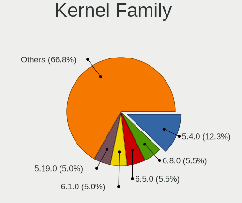
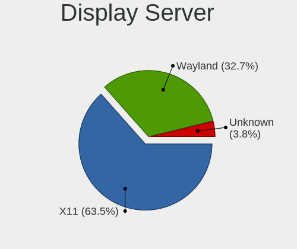
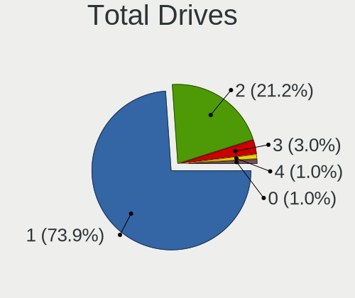
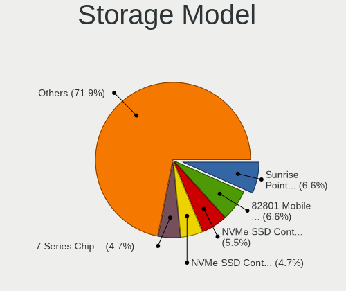
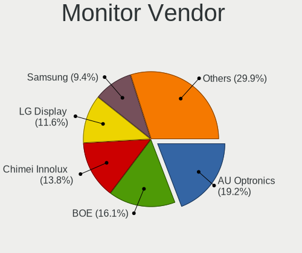
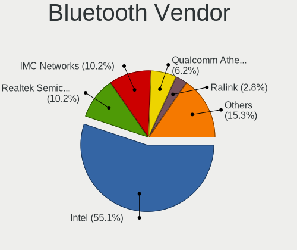
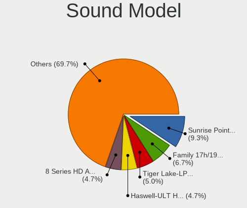
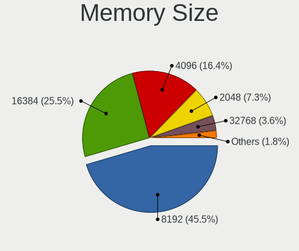

Linux in UAE - Tested Hardware & Statistics (Notebooks)
-------------------------------------------------------

A project to collect tested hardware configurations for Linux in UAE.

Anyone can contribute to this report by the [hw-probe](https://github.com/linuxhw/hw-probe) tool:

    sudo -E hw-probe -all -upload

Please contribute! Especially if your hardware is rare.

Contents
--------

* [ Test Cases ](#test-cases)

* [ System ](#system)
  - [ OS                       ](#os)
  - [ OS Family                ](#os-family)
  - [ Kernel                   ](#kernel)
  - [ Kernel Family            ](#kernel-family)
  - [ Kernel Major Ver.        ](#kernel-major-ver)
  - [ Arch                     ](#arch)
  - [ DE                       ](#de)
  - [ Display Server           ](#display-server)
  - [ Display Manager          ](#display-manager)
  - [ OS Lang                  ](#os-lang)
  - [ Boot Mode                ](#boot-mode)
  - [ Filesystem               ](#filesystem)
  - [ Part. scheme             ](#part-scheme)
  - [ Dual Boot with Linux/BSD ](#dual-boot-with-linuxbsd)
  - [ Dual Boot (Win)          ](#dual-boot-win)

* [ Board ](#board)
  - [ Vendor                   ](#vendor)
  - [ Model                    ](#model)
  - [ Model Family             ](#model-family)
  - [ MFG Year                 ](#mfg-year)
  - [ Form Factor              ](#form-factor)
  - [ Secure Boot              ](#secure-boot)
  - [ Coreboot                 ](#coreboot)
  - [ RAM Size                 ](#ram-size)
  - [ RAM Used                 ](#ram-used)
  - [ Total Drives             ](#total-drives)
  - [ Has CD-ROM               ](#has-cd-rom)
  - [ Has Ethernet             ](#has-ethernet)
  - [ Has WiFi                 ](#has-wifi)
  - [ Has Bluetooth            ](#has-bluetooth)

* [ Location ](#location)
  - [ Country                  ](#country)
  - [ City                     ](#city)

* [ Drives ](#drives)
  - [ Drive Vendor             ](#drive-vendor)
  - [ Drive Model              ](#drive-model)
  - [ HDD Vendor               ](#hdd-vendor)
  - [ SSD Vendor               ](#ssd-vendor)
  - [ Drive Kind               ](#drive-kind)
  - [ Drive Connector          ](#drive-connector)
  - [ Drive Size               ](#drive-size)
  - [ Space Total              ](#space-total)
  - [ Space Used               ](#space-used)
  - [ Malfunc. Drives          ](#malfunc-drives)
  - [ Malfunc. Drive Vendor    ](#malfunc-drive-vendor)
  - [ Malfunc. HDD Vendor      ](#malfunc-hdd-vendor)
  - [ Malfunc. Drive Kind      ](#malfunc-drive-kind)
  - [ Failed Drives            ](#failed-drives)
  - [ Failed Drive Vendor      ](#failed-drive-vendor)
  - [ Drive Status             ](#drive-status)

* [ Storage controller ](#storage-controller)
  - [ Storage Vendor           ](#storage-vendor)
  - [ Storage Model            ](#storage-model)
  - [ Storage Kind             ](#storage-kind)

* [ Processor ](#processor)
  - [ CPU Vendor               ](#cpu-vendor)
  - [ CPU Model                ](#cpu-model)
  - [ CPU Model Family         ](#cpu-model-family)
  - [ CPU Cores                ](#cpu-cores)
  - [ CPU Sockets              ](#cpu-sockets)
  - [ CPU Threads              ](#cpu-threads)
  - [ CPU Op-Modes             ](#cpu-op-modes)
  - [ CPU Microcode            ](#cpu-microcode)
  - [ CPU Microarch            ](#cpu-microarch)

* [ Graphics ](#graphics)
  - [ GPU Vendor               ](#gpu-vendor)
  - [ GPU Model                ](#gpu-model)
  - [ GPU Combo                ](#gpu-combo)
  - [ GPU Driver               ](#gpu-driver)
  - [ GPU Memory               ](#gpu-memory)

* [ Monitor ](#monitor)
  - [ Monitor Vendor           ](#monitor-vendor)
  - [ Monitor Model            ](#monitor-model)
  - [ Monitor Resolution       ](#monitor-resolution)
  - [ Monitor Diagonal         ](#monitor-diagonal)
  - [ Monitor Width            ](#monitor-width)
  - [ Aspect Ratio             ](#aspect-ratio)
  - [ Monitor Area             ](#monitor-area)
  - [ Pixel Density            ](#pixel-density)
  - [ Multiple Monitors        ](#multiple-monitors)

* [ Network ](#network)
  - [ Net Controller Vendor    ](#net-controller-vendor)
  - [ Net Controller Model     ](#net-controller-model)
  - [ Wireless Vendor          ](#wireless-vendor)
  - [ Wireless Model           ](#wireless-model)
  - [ Ethernet Vendor          ](#ethernet-vendor)
  - [ Ethernet Model           ](#ethernet-model)
  - [ Net Controller Kind      ](#net-controller-kind)
  - [ Used Controller          ](#used-controller)
  - [ NICs                     ](#nics)
  - [ IPv6                     ](#ipv6)

* [ Bluetooth ](#bluetooth)
  - [ Bluetooth Vendor         ](#bluetooth-vendor)
  - [ Bluetooth Model          ](#bluetooth-model)

* [ Sound ](#sound)
  - [ Sound Vendor             ](#sound-vendor)
  - [ Sound Model              ](#sound-model)

* [ Memory ](#memory)
  - [ Memory Vendor            ](#memory-vendor)
  - [ Memory Model             ](#memory-model)
  - [ Memory Kind              ](#memory-kind)
  - [ Memory Form Factor       ](#memory-form-factor)
  - [ Memory Size              ](#memory-size)
  - [ Memory Speed             ](#memory-speed)

* [ Printers & scanners ](#printers--scanners)
  - [ Printer Vendor           ](#printer-vendor)
  - [ Printer Model            ](#printer-model)
  - [ Scanner Vendor           ](#scanner-vendor)
  - [ Scanner Model            ](#scanner-model)

* [ Camera ](#camera)
  - [ Camera Vendor            ](#camera-vendor)
  - [ Camera Model             ](#camera-model)

* [ Security ](#security)
  - [ Fingerprint Vendor       ](#fingerprint-vendor)
  - [ Fingerprint Model        ](#fingerprint-model)
  - [ Chipcard Vendor          ](#chipcard-vendor)
  - [ Chipcard Model           ](#chipcard-model)

* [ Unsupported ](#unsupported)
  - [ Unsupported Devices      ](#unsupported-devices)
  - [ Unsupported Device Types ](#unsupported-device-types)

Test Cases
----------

Total: 113

| Vendor        | Model                       | Probe                                                      | Date         |
|---------------|-----------------------------|------------------------------------------------------------|--------------|
| Lenovo        | ThinkPad P1 Gen 5 21DC00... | [910b452558](https://linux-hardware.org/?probe=910b452558) | Oct 30, 2022 |
| HP            | EliteBook 845 G7 Noteboo... | [7406489511](https://linux-hardware.org/?probe=7406489511) | Oct 21, 2022 |
| HP            | 250 G5 Notebook PC          | [e8e0acd06e](https://linux-hardware.org/?probe=e8e0acd06e) | Oct 17, 2022 |
| Dell          | XPS 15 7590                 | [fdab72c478](https://linux-hardware.org/?probe=fdab72c478) | Oct 07, 2022 |
| HP            | EliteBook 845 G7 Noteboo... | [b1590cf8fa](https://linux-hardware.org/?probe=b1590cf8fa) | Oct 03, 2022 |
| Lenovo        | ThinkPad X1 Extreme Gen ... | [df5fcf14f9](https://linux-hardware.org/?probe=df5fcf14f9) | Sep 26, 2022 |
| ASUSTek       | ROG Zephyrus M16 GU603ZW... | [472668e67b](https://linux-hardware.org/?probe=472668e67b) | Sep 12, 2022 |
| Lenovo        | ThinkPad T61 76653JG        | [0fae1da16b](https://linux-hardware.org/?probe=0fae1da16b) | Aug 02, 2022 |
| Lenovo        | 81FV                        | [aa9e5c9f73](https://linux-hardware.org/?probe=aa9e5c9f73) | Jul 22, 2022 |
| Lenovo        | ThinkPad T480s 20L7001PA... | [de71ab8780](https://linux-hardware.org/?probe=de71ab8780) | Jul 21, 2022 |
| ASUSTek       | VivoBook 12_ASUS Laptop ... | [ad2442631e](https://linux-hardware.org/?probe=ad2442631e) | May 28, 2022 |
| HP            | Pavilion Laptop 13-bb0xx... | [ae7d5dbb0c](https://linux-hardware.org/?probe=ae7d5dbb0c) | May 01, 2022 |
| Lenovo        | ThinkPad P1 Gen 3 20TJS4... | [28c774c6de](https://linux-hardware.org/?probe=28c774c6de) | Apr 07, 2022 |
| Lenovo        | ThinkPad X1 Carbon Gen 9... | [718b671125](https://linux-hardware.org/?probe=718b671125) | Apr 06, 2022 |
| Lenovo        | ThinkPad X1 Carbon Gen 9... | [5e0763131c](https://linux-hardware.org/?probe=5e0763131c) | Mar 28, 2022 |
| Lenovo        | IdeaPad Gaming 3 15IMH05... | [8dda7f6478](https://linux-hardware.org/?probe=8dda7f6478) | Mar 06, 2022 |
| Google        | Terra                       | [54163369b2](https://linux-hardware.org/?probe=54163369b2) | Feb 23, 2022 |
| Dell          | Latitude E6230              | [a8aeb155b0](https://linux-hardware.org/?probe=a8aeb155b0) | Feb 10, 2022 |
| Lenovo        | ThinkPad E14 Gen 2 20TA0... | [8aafebe07c](https://linux-hardware.org/?probe=8aafebe07c) | Feb 03, 2022 |
| Dell          | Latitude E5440              | [ebbb8ee138](https://linux-hardware.org/?probe=ebbb8ee138) | Jan 22, 2022 |
| Lenovo        | ThinkPad T480s 20L8S3FV0... | [78080db667](https://linux-hardware.org/?probe=78080db667) | Jan 13, 2022 |
| HP            | EliteBook 840 G6            | [c36553e3a3](https://linux-hardware.org/?probe=c36553e3a3) | Dec 27, 2021 |
| Google        | Akemi                       | [aaf0a3e10e](https://linux-hardware.org/?probe=aaf0a3e10e) | Dec 20, 2021 |
| Dell          | Inspiron 5570               | [927497310e](https://linux-hardware.org/?probe=927497310e) | Nov 16, 2021 |
| win elemen... | MoreFine S500+              | [ace08cf199](https://linux-hardware.org/?probe=ace08cf199) | Nov 11, 2021 |
| win elemen... | MoreFine S500+              | [0e31d4b6fa](https://linux-hardware.org/?probe=0e31d4b6fa) | Nov 11, 2021 |
| MSI           | PS63 Modern 8RD             | [519048dea2](https://linux-hardware.org/?probe=519048dea2) | Nov 01, 2021 |
| MSI           | PS63 Modern 8RD             | [6d3cd2f117](https://linux-hardware.org/?probe=6d3cd2f117) | Nov 01, 2021 |
| Lenovo        | IdeaPad 3 14ADA05 81W0      | [41ff21e8e8](https://linux-hardware.org/?probe=41ff21e8e8) | Oct 06, 2021 |
| Lenovo        | IdeaPad 3 14ADA05 81W0      | [6654adaf99](https://linux-hardware.org/?probe=6654adaf99) | Oct 04, 2021 |
| HP            | ProBook 6475b               | [9d60bf5397](https://linux-hardware.org/?probe=9d60bf5397) | Oct 02, 2021 |
| Apple         | MacBook9,1                  | [888ca9b5de](https://linux-hardware.org/?probe=888ca9b5de) | Sep 04, 2021 |
| Apple         | MacBook9,1                  | [69119d1952](https://linux-hardware.org/?probe=69119d1952) | Sep 04, 2021 |
| Sony          | VGN-NS10J_S                 | [31d1e0e91d](https://linux-hardware.org/?probe=31d1e0e91d) | Aug 12, 2021 |
| LG Electro... | C500-G.AEF5BE1              | [b78f4cd34d](https://linux-hardware.org/?probe=b78f4cd34d) | Jun 14, 2021 |
| Toshiba       | Satellite C850-A966         | [391d22d993](https://linux-hardware.org/?probe=391d22d993) | Jun 02, 2021 |
| Sony          | SVE14A25CAB                 | [78ddb916b5](https://linux-hardware.org/?probe=78ddb916b5) | May 30, 2021 |
| Sony          | SVE14A25CAB                 | [0a2c5cf1cd](https://linux-hardware.org/?probe=0a2c5cf1cd) | May 30, 2021 |
| HP            | Laptop 15s-eq2xxx           | [5707e7ae37](https://linux-hardware.org/?probe=5707e7ae37) | May 28, 2021 |
| HP            | Laptop 15s-eq2xxx           | [66cc8bd4a5](https://linux-hardware.org/?probe=66cc8bd4a5) | May 19, 2021 |
| Dell          | G5 5587                     | [2d2cf67a2d](https://linux-hardware.org/?probe=2d2cf67a2d) | May 08, 2021 |
| Dell          | Latitude E6510              | [06d38294ab](https://linux-hardware.org/?probe=06d38294ab) | May 03, 2021 |
| Lenovo        | Legion Y7000P 81LD          | [e3b22a36fb](https://linux-hardware.org/?probe=e3b22a36fb) | Apr 22, 2021 |
| Lenovo        | Legion Y7000P 81LD          | [f5715022b7](https://linux-hardware.org/?probe=f5715022b7) | Apr 22, 2021 |
| Acer          | Aspire 5755G                | [6b82d5c050](https://linux-hardware.org/?probe=6b82d5c050) | Mar 07, 2021 |
| Acer          | Aspire 5755G                | [227244211b](https://linux-hardware.org/?probe=227244211b) | Mar 07, 2021 |
| HP            | Pavilion Notebook           | [3c9d39abce](https://linux-hardware.org/?probe=3c9d39abce) | Mar 06, 2021 |
| Lenovo        | ThinkPad X230 2325DV8       | [11d5145d10](https://linux-hardware.org/?probe=11d5145d10) | Feb 12, 2021 |
| HP            | Pavilion dv6                | [317b81878c](https://linux-hardware.org/?probe=317b81878c) | Jan 27, 2021 |
| ASUSTek       | Strix GL703GM_GL703GM       | [3d8ea2b061](https://linux-hardware.org/?probe=3d8ea2b061) | Jan 27, 2021 |
| HP            | Laptop 15-da1xxx            | [a3c15a6f74](https://linux-hardware.org/?probe=a3c15a6f74) | Jan 18, 2021 |
| HP            | Laptop 15-da1xxx            | [58bf01b1e7](https://linux-hardware.org/?probe=58bf01b1e7) | Jan 18, 2021 |
| Dell          | Inspiron 3521               | [2e84869a9a](https://linux-hardware.org/?probe=2e84869a9a) | Jan 11, 2021 |
| Lenovo        | ThinkPad T470 W10DG 20JM... | [6a02570e23](https://linux-hardware.org/?probe=6a02570e23) | Jan 03, 2021 |
| HP            | Pavilion Sleekbook 15 PC    | [092666f171](https://linux-hardware.org/?probe=092666f171) | Dec 31, 2020 |
| HP            | EliteBook 8460p             | [d24a3c768e](https://linux-hardware.org/?probe=d24a3c768e) | Dec 24, 2020 |
| Dell          | Latitude E6410              | [a2a46d21e9](https://linux-hardware.org/?probe=a2a46d21e9) | Dec 15, 2020 |
| Lenovo        | IdeaPad 110-15ISK 80UD      | [e2816ed19c](https://linux-hardware.org/?probe=e2816ed19c) | Nov 27, 2020 |
| HP            | Laptop 15-dw1xxx            | [91e0e6c6bc](https://linux-hardware.org/?probe=91e0e6c6bc) | Nov 04, 2020 |
| HP            | Pavilion Power Laptop 15... | [b1cd303933](https://linux-hardware.org/?probe=b1cd303933) | Oct 08, 2020 |
| Lenovo        | IdeaPad 700-15ISK 80RU      | [f9f212a509](https://linux-hardware.org/?probe=f9f212a509) | Oct 01, 2020 |
| Lenovo        | IdeaPad 3 14IML05 81WA      | [ab392f30cb](https://linux-hardware.org/?probe=ab392f30cb) | Sep 30, 2020 |
| Acer          | ChiefRiver Platform         | [23e2162b8e](https://linux-hardware.org/?probe=23e2162b8e) | Sep 20, 2020 |
| Dell          | Inspiron 5537               | [4ddf924081](https://linux-hardware.org/?probe=4ddf924081) | Sep 05, 2020 |
| Dell          | Inspiron 5537               | [23a0e05047](https://linux-hardware.org/?probe=23a0e05047) | Sep 05, 2020 |
| Dell          | Latitude E6540              | [9abf14d168](https://linux-hardware.org/?probe=9abf14d168) | Aug 31, 2020 |
| Dell          | Precision 5540              | [76f1cfa736](https://linux-hardware.org/?probe=76f1cfa736) | Aug 23, 2020 |
| I-Life Dig... | ZED AIR                     | [b40d7e9c7c](https://linux-hardware.org/?probe=b40d7e9c7c) | Aug 10, 2020 |
| I-Life Dig... | ZED AIR                     | [5662aa186c](https://linux-hardware.org/?probe=5662aa186c) | Aug 10, 2020 |
| Lenovo        | ThinkPad L480 20LS0012AD    | [81d46e4c4a](https://linux-hardware.org/?probe=81d46e4c4a) | Aug 02, 2020 |
| Toshiba       | Satellite C660              | [670cc8a66c](https://linux-hardware.org/?probe=670cc8a66c) | Jul 26, 2020 |
| Lenovo        | IdeaPadFlex 14 20308        | [aea3470496](https://linux-hardware.org/?probe=aea3470496) | Jul 21, 2020 |
| ASUSTek       | VivoBook_ASUSLaptop X420... | [b3dbd3f2af](https://linux-hardware.org/?probe=b3dbd3f2af) | Jul 14, 2020 |
| Toshiba       | TECRA A50-C                 | [adf7a73571](https://linux-hardware.org/?probe=adf7a73571) | Jul 03, 2020 |
| ASUSTek       | FX503VD                     | [d6c0a21749](https://linux-hardware.org/?probe=d6c0a21749) | Jul 02, 2020 |
| HP            | Pavilion 15                 | [499f0c72ee](https://linux-hardware.org/?probe=499f0c72ee) | Jun 29, 2020 |
| ASUSTek       | VivoBook_ASUSLaptop X420... | [dd5c9e8d9f](https://linux-hardware.org/?probe=dd5c9e8d9f) | Jun 23, 2020 |
| Dell          | Latitude E6410              | [06055ff260](https://linux-hardware.org/?probe=06055ff260) | Jun 19, 2020 |
| ASUSTek       | VivoBook_ASUSLaptop X420... | [b53cc32ed0](https://linux-hardware.org/?probe=b53cc32ed0) | Jun 19, 2020 |
| Lenovo        | G500 20236                  | [fdc9496e84](https://linux-hardware.org/?probe=fdc9496e84) | Jun 19, 2020 |
| Dell          | Latitude E6410              | [1b73d74e65](https://linux-hardware.org/?probe=1b73d74e65) | Jun 09, 2020 |
| Lenovo        | ThinkPad L480 20LS0012AD    | [e9b38b78d7](https://linux-hardware.org/?probe=e9b38b78d7) | May 30, 2020 |
| HP            | Presario C300 (RH208UA#A... | [50e95ff237](https://linux-hardware.org/?probe=50e95ff237) | May 14, 2020 |
| HP            | Presario C300 (RH208UA#A... | [6b4a8eab4c](https://linux-hardware.org/?probe=6b4a8eab4c) | May 14, 2020 |
| Toshiba       | TECRA X40-D                 | [3255796d07](https://linux-hardware.org/?probe=3255796d07) | May 10, 2020 |
| YJKC          | vBOOK Plus RVP7             | [49363e9553](https://linux-hardware.org/?probe=49363e9553) | May 07, 2020 |
| HP            | ProBook 450 G2              | [887a19760b](https://linux-hardware.org/?probe=887a19760b) | May 01, 2020 |
| Lenovo        | ThinkPad X240 20AMS6GB00    | [3fa804be21](https://linux-hardware.org/?probe=3fa804be21) | May 01, 2020 |
| YJKC          | vBOOK Plus RVP7             | [d2328783da](https://linux-hardware.org/?probe=d2328783da) | Apr 24, 2020 |
| Dell          | Vostro 14-5480              | [1bba68101c](https://linux-hardware.org/?probe=1bba68101c) | Apr 20, 2020 |
| HP            | ProBook 450 G2              | [1ef49ff7a3](https://linux-hardware.org/?probe=1ef49ff7a3) | Apr 17, 2020 |
| HP            | Notebook                    | [4f154f82b0](https://linux-hardware.org/?probe=4f154f82b0) | Apr 01, 2020 |
| HP            | Pavilion Notebook           | [5cd86dffe9](https://linux-hardware.org/?probe=5cd86dffe9) | Mar 16, 2020 |
| HP            | ENVY Laptop 13-aq0xxx       | [7f0b4db18a](https://linux-hardware.org/?probe=7f0b4db18a) | Mar 12, 2020 |
| HP            | Pavilion Notebook           | [87df29714d](https://linux-hardware.org/?probe=87df29714d) | Mar 11, 2020 |
| HP            | ENVY Laptop 13-aq0xxx       | [04da794ff5](https://linux-hardware.org/?probe=04da794ff5) | Feb 25, 2020 |
| HP            | EliteBook 2760p             | [40333472c7](https://linux-hardware.org/?probe=40333472c7) | Feb 21, 2020 |
| HP            | ENVY Laptop 13-aq0xxx       | [b12186f161](https://linux-hardware.org/?probe=b12186f161) | Feb 13, 2020 |
| HP            | Notebook                    | [a25a67e533](https://linux-hardware.org/?probe=a25a67e533) | Feb 02, 2020 |
| Lenovo        | ThinkPad T460 20FMS1A200    | [c2a7159d3a](https://linux-hardware.org/?probe=c2a7159d3a) | Jan 04, 2020 |
| Lenovo        | ThinkPad T460 20FMS1A200    | [028d728043](https://linux-hardware.org/?probe=028d728043) | Jan 04, 2020 |
| Lenovo        | Yoga S730-13IWL 81J0        | [d1ca80edff](https://linux-hardware.org/?probe=d1ca80edff) | Dec 24, 2019 |
| Toshiba       | Satellite A300              | [420c738977](https://linux-hardware.org/?probe=420c738977) | Oct 15, 2019 |
| Toshiba       | Satellite A300              | [036dc7e829](https://linux-hardware.org/?probe=036dc7e829) | Oct 15, 2019 |
| Lenovo        | Yoga 2 Pro 20266            | [ab1c14d729](https://linux-hardware.org/?probe=ab1c14d729) | Oct 12, 2019 |
| Lenovo        | IdeaPad 320-15IKB 80XL      | [558c01fdce](https://linux-hardware.org/?probe=558c01fdce) | Oct 07, 2019 |
| Notebook      | P95_96_97Ex,Rx              | [d4ad7906b5](https://linux-hardware.org/?probe=d4ad7906b5) | Sep 11, 2019 |
| I-Life Dig... | ZED AIR                     | [514c494f7f](https://linux-hardware.org/?probe=514c494f7f) | Jul 23, 2019 |
| I-Life Dig... | ZED AIR                     | [a9fe92aa3c](https://linux-hardware.org/?probe=a9fe92aa3c) | Jul 23, 2019 |
| HP            | EliteBook 8440p             | [1f8a20b199](https://linux-hardware.org/?probe=1f8a20b199) | May 25, 2019 |
| HP            | EliteBook 8440p             | [60d0e8dd5d](https://linux-hardware.org/?probe=60d0e8dd5d) | May 25, 2019 |
| HP            | ProBook 4540s               | [271be85705](https://linux-hardware.org/?probe=271be85705) | May 15, 2019 |
| Lenovo        | IdeaPad 130-15IKB 81H7      | [ab25f83cd0](https://linux-hardware.org/?probe=ab25f83cd0) | Mar 27, 2019 |

System
------

OS
--

Installed operating systems

| Name               | Notebooks | Percent |
|--------------------|-----------|---------|
| Ubuntu 20.04       | 23        | 26.74%  |
| Ubuntu 18.04       | 9         | 10.47%  |
| Arch               | 5         | 5.81%   |
| Zorin 15           | 3         | 3.49%   |
| Ubuntu 20.10       | 3         | 3.49%   |
| Ubuntu 19.10       | 3         | 3.49%   |
| Fedora 36          | 3         | 3.49%   |
| Ubuntu 22.04       | 2         | 2.33%   |
| Ubuntu 21.10       | 2         | 2.33%   |
| Ubuntu 16.04       | 2         | 2.33%   |
| KDE neon 20.04     | 2         | 2.33%   |
| Debian 11          | 2         | 2.33%   |
| BlackPanther 18.1  | 2         | 2.33%   |
| ArcoLinux Rolling  | 2         | 2.33%   |
| Xubuntu 20.04      | 1         | 1.16%   |
| Ubuntu Unity 18.04 | 1         | 1.16%   |
| Ubuntu 22.10       | 1         | 1.16%   |
| Ubuntu 19.04       | 1         | 1.16%   |
| ROSA 12.2          | 1         | 1.16%   |
| Pop!_OS 21.10      | 1         | 1.16%   |
| Pop!_OS 20.10      | 1         | 1.16%   |
| Pop!_OS 20.04      | 1         | 1.16%   |
| OpenMandriva 4.90  | 1         | 1.16%   |
| OpenMandriva 4.3   | 1         | 1.16%   |
| OpenMandriva 4.2   | 1         | 1.16%   |
| Manjaro 21.2.1     | 1         | 1.16%   |
| Manjaro 18.1.4     | 1         | 1.16%   |
| Manjaro            | 1         | 1.16%   |
| Linux Mint 20.3    | 1         | 1.16%   |
| Linux Mint 20.1    | 1         | 1.16%   |
| Linux Mint 19.2    | 1         | 1.16%   |
| Kubuntu 22.04      | 1         | 1.16%   |
| GNOME OS Nightly   | 1         | 1.16%   |
| Feren OS 20.04     | 1         | 1.16%   |
| Fedora 35          | 1         | 1.16%   |
| Endless 4.0.4      | 1         | 1.16%   |
| Elementary 5.1.7   | 1         | 1.16%   |

OS Family
---------

OS without a version

| Name         | Notebooks | Percent |
|--------------|-----------|---------|
| Ubuntu       | 44        | 52.38%  |
| Arch         | 5         | 5.95%   |
| Fedora       | 4         | 4.76%   |
| Zorin        | 3         | 3.57%   |
| Pop!_OS      | 3         | 3.57%   |
| OpenMandriva | 3         | 3.57%   |
| Manjaro      | 3         | 3.57%   |
| Linux Mint   | 3         | 3.57%   |
| KDE neon     | 2         | 2.38%   |
| Debian       | 2         | 2.38%   |
| BlackPanther | 2         | 2.38%   |
| ArcoLinux    | 2         | 2.38%   |
| Xubuntu      | 1         | 1.19%   |
| Ubuntu Unity | 1         | 1.19%   |
| ROSA         | 1         | 1.19%   |
| Kubuntu      | 1         | 1.19%   |
| GNOME OS     | 1         | 1.19%   |
| Feren OS     | 1         | 1.19%   |
| Endless      | 1         | 1.19%   |
| Elementary   | 1         | 1.19%   |

Kernel
------

Version of the Linux kernel

| Version                  | Notebooks | Percent |
|--------------------------|-----------|---------|
| 5.4.0-42-generic         | 5         | 5.56%   |
| 5.4.0-58-generic         | 4         | 4.44%   |
| 5.4.0-26-generic         | 3         | 3.33%   |
| 5.4.0-33-generic         | 2         | 2.22%   |
| 5.4.0-29-generic         | 2         | 2.22%   |
| 5.3.0-40-generic         | 2         | 2.22%   |
| 5.3.0-29-generic         | 2         | 2.22%   |
| 4.15.0-50-generic        | 2         | 2.22%   |
| 5.9.3-arch1-1            | 1         | 1.11%   |
| 5.8.5-arch1-1            | 1         | 1.11%   |
| 5.8.0-7642-generic       | 1         | 1.11%   |
| 5.8.0-7630-generic       | 1         | 1.11%   |
| 5.8.0-54-generic         | 1         | 1.11%   |
| 5.8.0-53-generic         | 1         | 1.11%   |
| 5.8.0-50-generic         | 1         | 1.11%   |
| 5.8.0-41-generic         | 1         | 1.11%   |
| 5.8.0-40-generic         | 1         | 1.11%   |
| 5.7.6-arch1-1            | 1         | 1.11%   |
| 5.7.14                   | 1         | 1.11%   |
| 5.6.16-1-MANJARO         | 1         | 1.11%   |
| 5.6.14-desktop-2bP       | 1         | 1.11%   |
| 5.4.68-1-lts             | 1         | 1.11%   |
| 5.4.2-1-MANJARO          | 1         | 1.11%   |
| 5.4.0-81-generic         | 1         | 1.11%   |
| 5.4.0-73-generic         | 1         | 1.11%   |
| 5.4.0-72-generic         | 1         | 1.11%   |
| 5.4.0-65-generic         | 1         | 1.11%   |
| 5.4.0-60-generic         | 1         | 1.11%   |
| 5.4.0-54-generic         | 1         | 1.11%   |
| 5.4.0-48-generic         | 1         | 1.11%   |
| 5.4.0-45-generic         | 1         | 1.11%   |
| 5.4.0-39-generic         | 1         | 1.11%   |
| 5.4.0-37-generic         | 1         | 1.11%   |
| 5.4.0-18-generic         | 1         | 1.11%   |
| 5.4.0-100-generic        | 1         | 1.11%   |
| 5.3.0-46-generic         | 1         | 1.11%   |
| 5.19.8-200.fc36.x86_64   | 1         | 1.11%   |
| 5.19.13-200.fc36.x86_64  | 1         | 1.11%   |
| 5.19.0-21-generic        | 1         | 1.11%   |
| 5.18.12-desktop-3omv4090 | 1         | 1.11%   |

Kernel Family
-------------

Linux kernel without a distro release

| Version | Notebooks | Percent |
|---------|-----------|---------|
| 5.4.0   | 25        | 28.74%  |
| 4.15.0  | 9         | 10.34%  |
| 5.8.0   | 7         | 8.05%   |
| 5.3.0   | 5         | 5.75%   |
| 5.11.0  | 5         | 5.75%   |
| 5.15.0  | 3         | 3.45%   |
| 5.13.0  | 2         | 2.3%    |
| 5.10.0  | 2         | 2.3%    |
| 5.0.0   | 2         | 2.3%    |
| 5.9.3   | 1         | 1.15%   |
| 5.8.5   | 1         | 1.15%   |
| 5.7.6   | 1         | 1.15%   |
| 5.7.14  | 1         | 1.15%   |
| 5.6.16  | 1         | 1.15%   |
| 5.6.14  | 1         | 1.15%   |
| 5.4.68  | 1         | 1.15%   |
| 5.4.2   | 1         | 1.15%   |
| 5.19.8  | 1         | 1.15%   |
| 5.19.13 | 1         | 1.15%   |
| 5.19.0  | 1         | 1.15%   |
| 5.18.12 | 1         | 1.15%   |
| 5.18.11 | 1         | 1.15%   |
| 5.16.7  | 1         | 1.15%   |
| 5.16.5  | 1         | 1.15%   |
| 5.16.18 | 1         | 1.15%   |
| 5.16.16 | 1         | 1.15%   |
| 5.16.12 | 1         | 1.15%   |
| 5.15.5  | 1         | 1.15%   |
| 5.15.12 | 1         | 1.15%   |
| 5.14.0  | 1         | 1.15%   |
| 5.10.74 | 1         | 1.15%   |
| 5.10.14 | 1         | 1.15%   |
| 4.4.0   | 1         | 1.15%   |
| 4.19.92 | 1         | 1.15%   |
| 4.18.16 | 1         | 1.15%   |
| 4.18.0  | 1         | 1.15%   |

Kernel Major Ver.
-----------------

Linux kernel major version

| Version | Notebooks | Percent |
|---------|-----------|---------|
| 5.4     | 27        | 31.4%   |
| 4.15    | 9         | 10.47%  |
| 5.8     | 8         | 9.3%    |
| 5.3     | 5         | 5.81%   |
| 5.15    | 5         | 5.81%   |
| 5.11    | 5         | 5.81%   |
| 5.16    | 4         | 4.65%   |
| 5.10    | 4         | 4.65%   |
| 5.19    | 3         | 3.49%   |
| 5.7     | 2         | 2.33%   |
| 5.6     | 2         | 2.33%   |
| 5.18    | 2         | 2.33%   |
| 5.13    | 2         | 2.33%   |
| 5.0     | 2         | 2.33%   |
| 4.18    | 2         | 2.33%   |
| 5.9     | 1         | 1.16%   |
| 5.14    | 1         | 1.16%   |
| 4.4     | 1         | 1.16%   |
| 4.19    | 1         | 1.16%   |

Arch
----

OS architecture (x86_64, i586, etc.)

| Name   | Notebooks | Percent |
|--------|-----------|---------|
| x86_64 | 83        | 98.81%  |
| i686   | 1         | 1.19%   |

DE
--

Desktop Environment

| Name       | Notebooks | Percent |
|------------|-----------|---------|
| GNOME      | 53        | 60.92%  |
| Unknown    | 12        | 13.79%  |
| KDE5       | 8         | 9.2%    |
| KDE        | 4         | 4.6%    |
| X-Cinnamon | 3         | 3.45%   |
| XFCE       | 2         | 2.3%    |
| Unity      | 1         | 1.15%   |
| Pantheon   | 1         | 1.15%   |
| MATE       | 1         | 1.15%   |
| DWM        | 1         | 1.15%   |
| awesome    | 1         | 1.15%   |

Display Server
--------------

X11 or Wayland

| Name    | Notebooks | Percent |
|---------|-----------|---------|
| X11     | 64        | 75.29%  |
| Wayland | 13        | 15.29%  |
| Unknown | 8         | 9.41%   |

Display Manager
---------------

SDDM, LightDM, etc.

| Name    | Notebooks | Percent |
|---------|-----------|---------|
| Unknown | 51        | 60.71%  |
| GDM     | 17        | 20.24%  |
| SDDM    | 8         | 9.52%   |
| GDM3    | 4         | 4.76%   |
| TDM     | 2         | 2.38%   |
| LightDM | 2         | 2.38%   |

OS Lang
-------

Language

| Lang    | Notebooks | Percent |
|---------|-----------|---------|
| en_US   | 65        | 76.47%  |
| Unknown | 11        | 12.94%  |
| en_GB   | 2         | 2.35%   |
| C       | 2         | 2.35%   |
| ru_RU   | 1         | 1.18%   |
| hu_HU   | 1         | 1.18%   |
| en_IN   | 1         | 1.18%   |
| en_AU   | 1         | 1.18%   |
| de_DE   | 1         | 1.18%   |

Boot Mode
---------

EFI or BIOS

| Mode | Notebooks | Percent |
|------|-----------|---------|
| EFI  | 47        | 55.29%  |
| BIOS | 38        | 44.71%  |

Filesystem
----------

Type of filesystem

| Type    | Notebooks | Percent |
|---------|-----------|---------|
| Ext4    | 74        | 88.1%   |
| Overlay | 5         | 5.95%   |
| Btrfs   | 5         | 5.95%   |

Part. scheme
------------

Scheme of partitioning

| Type    | Notebooks | Percent |
|---------|-----------|---------|
| Unknown | 52        | 61.9%   |
| GPT     | 28        | 33.33%  |
| MBR     | 4         | 4.76%   |

Dual Boot with Linux/BSD
------------------------

Hosting more than one Linux/BSD

| Dual boot | Notebooks | Percent |
|-----------|-----------|---------|
| No        | 76        | 90.48%  |
| Yes       | 8         | 9.52%   |

Dual Boot (Win)
---------------

Hosting Linux and Windows

| Dual boot | Notebooks | Percent |
|-----------|-----------|---------|
| No        | 46        | 54.76%  |
| Yes       | 38        | 45.24%  |

Board
-----

Vendor
------

Motherboard manufacturer

| Name                        | Notebooks | Percent |
|-----------------------------|-----------|---------|
| Lenovo                      | 26        | 30.95%  |
| Hewlett-Packard             | 23        | 27.38%  |
| Dell                        | 12        | 14.29%  |
| Toshiba                     | 5         | 5.95%   |
| ASUSTek Computer            | 5         | 5.95%   |
| Sony                        | 2         | 2.38%   |
| Google                      | 2         | 2.38%   |
| Acer                        | 2         | 2.38%   |
| YJKC                        | 1         | 1.19%   |
| win element                 | 1         | 1.19%   |
| Notebook                    | 1         | 1.19%   |
| MSI                         | 1         | 1.19%   |
| LG Electronics              | 1         | 1.19%   |
| I-Life Digital Technologies | 1         | 1.19%   |
| Apple                       | 1         | 1.19%   |

Model
-----

Motherboard model

| Name                                        | Notebooks | Percent |
|---------------------------------------------|-----------|---------|
| HP Pavilion Notebook                        | 2         | 2.38%   |
| HP ENVY Laptop 13-aq0xxx                    | 2         | 2.38%   |
| YJKC vBOOK Plus                             | 1         | 1.19%   |
| win element MoreFine S500+                  | 1         | 1.19%   |
| Toshiba TECRA X40-D                         | 1         | 1.19%   |
| Toshiba TECRA A50-C                         | 1         | 1.19%   |
| Toshiba Satellite C850-A966                 | 1         | 1.19%   |
| Toshiba Satellite C660                      | 1         | 1.19%   |
| Toshiba Satellite A300                      | 1         | 1.19%   |
| Sony VGN-NS10J_S                            | 1         | 1.19%   |
| Sony SVE14A25CAB                            | 1         | 1.19%   |
| Notebook P95_96_97Ex,Rx                     | 1         | 1.19%   |
| MSI PS63 Modern 8RD                         | 1         | 1.19%   |
| LG C500-G.AEF5BE1                           | 1         | 1.19%   |
| Lenovo Yoga S730-13IWL 81J0                 | 1         | 1.19%   |
| Lenovo Yoga 2 Pro 20266                     | 1         | 1.19%   |
| Lenovo ThinkPad X240 20AMS6GB00             | 1         | 1.19%   |
| Lenovo ThinkPad X230 2325DV8                | 1         | 1.19%   |
| Lenovo ThinkPad X1 Extreme Gen 3 20TK001HUS | 1         | 1.19%   |
| Lenovo ThinkPad X1 Carbon Gen 9 20XW00A9US  | 1         | 1.19%   |
| Lenovo ThinkPad T61 76653JG                 | 1         | 1.19%   |
| Lenovo ThinkPad T480s 20L8S3FV00            | 1         | 1.19%   |
| Lenovo ThinkPad T480s 20L7001PAD            | 1         | 1.19%   |
| Lenovo ThinkPad T470 W10DG 20JMS0Q300       | 1         | 1.19%   |
| Lenovo ThinkPad T460 20FMS1A200             | 1         | 1.19%   |
| Lenovo ThinkPad P1 Gen 5 21DC000DCK         | 1         | 1.19%   |
| Lenovo ThinkPad P1 Gen 3 20TJS4RX00         | 1         | 1.19%   |
| Lenovo ThinkPad L480 20LS0012AD             | 1         | 1.19%   |
| Lenovo ThinkPad E14 Gen 2 20TA0018AD        | 1         | 1.19%   |
| Lenovo Legion Y7000P 81LD                   | 1         | 1.19%   |
| Lenovo IdeaPadFlex 14 20308                 | 1         | 1.19%   |
| Lenovo IdeaPad Gaming 3 15IMH05 81Y4        | 1         | 1.19%   |
| Lenovo IdeaPad 700-15ISK 80RU               | 1         | 1.19%   |
| Lenovo IdeaPad 320-15IKB 80XL               | 1         | 1.19%   |
| Lenovo IdeaPad 3 14IML05 81WA               | 1         | 1.19%   |
| Lenovo IdeaPad 3 14ADA05 81W0               | 1         | 1.19%   |
| Lenovo IdeaPad 130-15IKB 81H7               | 1         | 1.19%   |
| Lenovo IdeaPad 110-15ISK 80UD               | 1         | 1.19%   |
| Lenovo G500 20236                           | 1         | 1.19%   |
| Lenovo 81FV                                 | 1         | 1.19%   |

Model Family
------------

Motherboard model prefix

| Name                 | Notebooks | Percent |
|----------------------|-----------|---------|
| Lenovo ThinkPad      | 13        | 15.48%  |
| Lenovo IdeaPad       | 7         | 8.33%   |
| HP Pavilion          | 7         | 8.33%   |
| HP EliteBook         | 5         | 5.95%   |
| Dell Latitude        | 5         | 5.95%   |
| Toshiba Satellite    | 3         | 3.57%   |
| HP ProBook           | 3         | 3.57%   |
| HP Laptop            | 3         | 3.57%   |
| Dell Inspiron        | 3         | 3.57%   |
| Toshiba TECRA        | 2         | 2.38%   |
| Lenovo Yoga          | 2         | 2.38%   |
| HP ENVY              | 2         | 2.38%   |
| ASUS VivoBook        | 2         | 2.38%   |
| YJKC vBOOK           | 1         | 1.19%   |
| win element MoreFine | 1         | 1.19%   |
| Sony VGN-NS10J       | 1         | 1.19%   |
| Sony SVE14A25CAB     | 1         | 1.19%   |
| Notebook P95         | 1         | 1.19%   |
| MSI PS63             | 1         | 1.19%   |
| LG C500-G.AEF5BE1    | 1         | 1.19%   |
| Lenovo Legion        | 1         | 1.19%   |
| Lenovo IdeaPadFlex   | 1         | 1.19%   |
| Lenovo G500          | 1         | 1.19%   |
| Lenovo 81FV          | 1         | 1.19%   |
| I-Life Digital ZED   | 1         | 1.19%   |
| HP Presario          | 1         | 1.19%   |
| HP Notebook          | 1         | 1.19%   |
| HP 250               | 1         | 1.19%   |
| Google Terra         | 1         | 1.19%   |
| Google Akemi         | 1         | 1.19%   |
| Dell XPS             | 1         | 1.19%   |
| Dell Vostro          | 1         | 1.19%   |
| Dell Precision       | 1         | 1.19%   |
| Dell G5              | 1         | 1.19%   |
| ASUS Strix           | 1         | 1.19%   |
| ASUS ROG             | 1         | 1.19%   |
| ASUS FX503VD         | 1         | 1.19%   |
| Apple MacBook9       | 1         | 1.19%   |
| Acer ChiefRiver      | 1         | 1.19%   |
| Acer Aspire          | 1         | 1.19%   |

MFG Year
--------

Motherboard manufacture year

| Year | Notebooks | Percent |
|------|-----------|---------|
| 2019 | 11        | 13.1%   |
| 2018 | 11        | 13.1%   |
| 2013 | 10        | 11.9%   |
| 2020 | 9         | 10.71%  |
| 2021 | 7         | 8.33%   |
| 2012 | 7         | 8.33%   |
| 2017 | 6         | 7.14%   |
| 2010 | 5         | 5.95%   |
| 2016 | 4         | 4.76%   |
| 2015 | 3         | 3.57%   |
| 2011 | 3         | 3.57%   |
| 2014 | 2         | 2.38%   |
| 2008 | 2         | 2.38%   |
| 2007 | 2         | 2.38%   |
| 2022 | 1         | 1.19%   |
| 2009 | 1         | 1.19%   |

Form Factor
-----------

Physical design of the computer

| Name     | Notebooks | Percent |
|----------|-----------|---------|
| Notebook | 84        | 100%    |

Secure Boot
-----------

Enabled or disabled

| State    | Notebooks | Percent |
|----------|-----------|---------|
| Disabled | 72        | 85.71%  |
| Enabled  | 12        | 14.29%  |

Coreboot
--------

Have coreboot on board

| Used | Notebooks | Percent |
|------|-----------|---------|
| No   | 82        | 97.62%  |
| Yes  | 2         | 2.38%   |

RAM Size
--------

Total RAM memory

| Size in GB  | Notebooks | Percent |
|-------------|-----------|---------|
| 4.01-8.0    | 20        | 23.81%  |
| 16.01-24.0  | 18        | 21.43%  |
| 3.01-4.0    | 17        | 20.24%  |
| 8.01-16.0   | 13        | 15.48%  |
| 32.01-64.0  | 8         | 9.52%   |
| 2.01-3.0    | 2         | 2.38%   |
| 64.01-256.0 | 2         | 2.38%   |
| 1.01-2.0    | 2         | 2.38%   |
| 24.01-32.0  | 1         | 1.19%   |
| 0.51-1.0    | 1         | 1.19%   |

RAM Used
--------

Used RAM memory

| Used GB   | Notebooks | Percent |
|-----------|-----------|---------|
| 1.01-2.0  | 32        | 35.96%  |
| 2.01-3.0  | 17        | 19.1%   |
| 4.01-8.0  | 16        | 17.98%  |
| 3.01-4.0  | 16        | 17.98%  |
| 0.51-1.0  | 4         | 4.49%   |
| 8.01-16.0 | 3         | 3.37%   |
| 0.01-0.5  | 1         | 1.12%   |

Total Drives
------------

Number of drives on board

| Drives | Notebooks | Percent |
|--------|-----------|---------|
| 1      | 65        | 77.38%  |
| 2      | 16        | 19.05%  |
| 0      | 2         | 2.38%   |
| 3      | 1         | 1.19%   |

Has CD-ROM
----------

Has CD-ROM on board

| Presented | Notebooks | Percent |
|-----------|-----------|---------|
| No        | 56        | 66.67%  |
| Yes       | 28        | 33.33%  |

Has Ethernet
------------

Has Ethernet on board

| Presented | Notebooks | Percent |
|-----------|-----------|---------|
| Yes       | 62        | 73.81%  |
| No        | 22        | 26.19%  |

Has WiFi
--------

Has WiFi module

| Presented | Notebooks | Percent |
|-----------|-----------|---------|
| Yes       | 82        | 97.62%  |
| No        | 2         | 2.38%   |

Has Bluetooth
-------------

Has Bluetooth module

| Presented | Notebooks | Percent |
|-----------|-----------|---------|
| Yes       | 66        | 78.57%  |
| No        | 18        | 21.43%  |

Location
--------

Country
-------

Geographic location (country)

| Country | Notebooks | Percent |
|---------|-----------|---------|
| UAE     | 84        | 100%    |

City
----

Geographic location (city)

| City             | Notebooks | Percent |
|------------------|-----------|---------|
| Dubai            | 38        | 44.19%  |
| Abu Dhabi        | 24        | 27.91%  |
| Sharjah          | 15        | 17.44%  |
| Al Ain City      | 4         | 4.65%   |
| Ajman            | 3         | 3.49%   |
| Al Halah         | 1         | 1.16%   |
| Al Fujairah City | 1         | 1.16%   |

Drives
------

Drive Vendor
------------

Hard drive vendors

| Vendor                | Notebooks | Drives | Percent |
|-----------------------|-----------|--------|---------|
| Samsung Electronics   | 15        | 15     | 15.79%  |
| WDC                   | 14        | 15     | 14.74%  |
| Toshiba               | 11        | 11     | 11.58%  |
| Seagate               | 10        | 12     | 10.53%  |
| Intel                 | 6         | 7      | 6.32%   |
| HGST                  | 6         | 7      | 6.32%   |
| Unknown               | 5         | 9      | 5.26%   |
| SK hynix              | 4         | 5      | 4.21%   |
| Micron Technology     | 4         | 4      | 4.21%   |
| Kingston              | 3         | 3      | 3.16%   |
| Hitachi               | 3         | 3      | 3.16%   |
| SanDisk               | 2         | 2      | 2.11%   |
| Crucial               | 2         | 2      | 2.11%   |
| Apple                 | 2         | 3      | 2.11%   |
| Realtek Semiconductor | 1         | 1      | 1.05%   |
| Phison                | 1         | 1      | 1.05%   |
| Patriot               | 1         | 1      | 1.05%   |
| Lite-On               | 1         | 1      | 1.05%   |
| KingSpec              | 1         | 2      | 1.05%   |
| Fujitsu               | 1         | 1      | 1.05%   |
| External              | 1         | 1      | 1.05%   |
| China                 | 1         | 1      | 1.05%   |

Drive Model
-----------

Hard drive models

| Model                                   | Notebooks | Percent |
|-----------------------------------------|-----------|---------|
| Intel NVMe SSD Drive 512GB              | 3         | 3%      |
| HGST HTS725050A7E630 500GB              | 3         | 3%      |
| WDC WD10SPZX-08Z10 1TB                  | 2         | 2%      |
| WDC PC SN730 SDBQNTY-1T00-1001 1TB      | 2         | 2%      |
| Unknown MMC Card  16GB                  | 2         | 2%      |
| Toshiba MQ01ABD075 752GB                | 2         | 2%      |
| Seagate ST500LT012-1DG142 500GB         | 2         | 2%      |
| Samsung SM963 2.5" NVMe PCIe SSD 256GB  | 2         | 2%      |
| HGST HTS721010A9E630 1TB                | 2         | 2%      |
| WDC WDS120G1G0A-00SS50 120GB SSD        | 1         | 1%      |
| WDC WDS100T3X0C-00SJG0 1TB              | 1         | 1%      |
| WDC WD5000LPVX-60V0TT0 500GB            | 1         | 1%      |
| WDC WD5000LPCX-22VHAT1 500GB            | 1         | 1%      |
| WDC WD2500BEVS-26UST0 250GB             | 1         | 1%      |
| WDC WD1200BEVS-08UST0 120GB             | 1         | 1%      |
| WDC WD10SPZX-24Z10T0 1TB                | 1         | 1%      |
| WDC WD10SPZX-24Z10 1TB                  | 1         | 1%      |
| WDC WD10JPVX-60JC3T1 1TB                | 1         | 1%      |
| WDC WD10JPCX-24UE4T0 1TB                | 1         | 1%      |
| Unknown SR64G  64GB                     | 1         | 1%      |
| Unknown SM32G  32GB                     | 1         | 1%      |
| Unknown SL16G  16GB                     | 1         | 1%      |
| Unknown NCard  32GB                     | 1         | 1%      |
| Unknown MMC64G  64GB                    | 1         | 1%      |
| Unknown MMC Card  64GB                  | 1         | 1%      |
| Unknown MMC Card  32GB                  | 1         | 1%      |
| Toshiba NVMe SSD Drive 512GB            | 1         | 1%      |
| Toshiba MQ02ABF100 1TB                  | 1         | 1%      |
| Toshiba MQ01ABF050 500GB                | 1         | 1%      |
| Toshiba MQ01ABD100M 1TB                 | 1         | 1%      |
| Toshiba MQ01ABD050 500GB                | 1         | 1%      |
| Toshiba MQ01ABD032 320GB                | 1         | 1%      |
| Toshiba MK5075GSX 500GB                 | 1         | 1%      |
| Toshiba MK2552GSX 250GB                 | 1         | 1%      |
| Toshiba KBG30ZMV512G 512GB              | 1         | 1%      |
| SK hynix SKHynix_HFM256GD3HX015N 256GB  | 1         | 1%      |
| SK hynix SC311 SATA 256GB SSD           | 1         | 1%      |
| SK hynix PC401 HFS512GD9TNG-62A0A 512GB | 1         | 1%      |
| SK hynix NVMe SSD Drive 512GB           | 1         | 1%      |
| Seagate ST980825AS 80GB                 | 1         | 1%      |

HDD Vendor
----------

Hard disk drive vendors

| Vendor  | Notebooks | Drives | Percent |
|---------|-----------|--------|---------|
| WDC     | 10        | 11     | 25%     |
| Seagate | 10        | 12     | 25%     |
| Toshiba | 9         | 9      | 22.5%   |
| HGST    | 6         | 7      | 15%     |
| Hitachi | 3         | 3      | 7.5%    |
| Fujitsu | 1         | 1      | 2.5%    |
| Apple   | 1         | 1      | 2.5%    |

SSD Vendor
----------

Solid state drive vendors

| Vendor              | Notebooks | Drives | Percent |
|---------------------|-----------|--------|---------|
| Samsung Electronics | 4         | 4      | 33.33%  |
| WDC                 | 1         | 1      | 8.33%   |
| SK hynix            | 1         | 1      | 8.33%   |
| SanDisk             | 1         | 1      | 8.33%   |
| Patriot             | 1         | 1      | 8.33%   |
| Kingston            | 1         | 1      | 8.33%   |
| KingSpec            | 1         | 2      | 8.33%   |
| Crucial             | 1         | 1      | 8.33%   |
| China               | 1         | 1      | 8.33%   |

Drive Kind
----------

HDD or SSD

| Kind | Notebooks | Drives | Percent |
|------|-----------|--------|---------|
| HDD  | 40        | 44     | 43.48%  |
| NVMe | 36        | 41     | 39.13%  |
| SSD  | 11        | 13     | 11.96%  |
| MMC  | 5         | 9      | 5.43%   |

Drive Connector
---------------

SATA, SAS, NVMe, etc.

| Type | Notebooks | Drives | Percent |
|------|-----------|--------|---------|
| SATA | 49        | 57     | 54.44%  |
| NVMe | 35        | 40     | 38.89%  |
| MMC  | 5         | 9      | 5.56%   |
| SAS  | 1         | 1      | 1.11%   |

Drive Size
----------

Size of hard drive

| Size in TB | Notebooks | Drives | Percent |
|------------|-----------|--------|---------|
| 0.01-0.5   | 30        | 34     | 60%     |
| 0.51-1.0   | 19        | 22     | 38%     |
| 1.01-2.0   | 1         | 1      | 2%      |

Space Total
-----------

Amount of disk space available on the file system

| Size in GB | Notebooks | Percent |
|------------|-----------|---------|
| 251-500    | 26        | 30.95%  |
| 101-250    | 20        | 23.81%  |
| 21-50      | 10        | 11.9%   |
| 501-1000   | 7         | 8.33%   |
| 51-100     | 7         | 8.33%   |
| 1-20       | 5         | 5.95%   |
| 1001-2000  | 4         | 4.76%   |
| Unknown    | 4         | 4.76%   |
| 2001-3000  | 1         | 1.19%   |

Space Used
----------

Amount of used disk space

| Used GB   | Notebooks | Percent |
|-----------|-----------|---------|
| 1-20      | 44        | 50%     |
| 21-50     | 21        | 23.86%  |
| 101-250   | 6         | 6.82%   |
| 51-100    | 6         | 6.82%   |
| Unknown   | 4         | 4.55%   |
| 251-500   | 3         | 3.41%   |
| 501-1000  | 3         | 3.41%   |
| 1001-2000 | 1         | 1.14%   |

Malfunc. Drives
---------------

Drive models with a malfunction

| Model                    | Notebooks | Drives | Percent |
|--------------------------|-----------|--------|---------|
| WDC WD10JPVX-60JC3T1 1TB | 1         | 1      | 100%    |

Malfunc. Drive Vendor
---------------------

Vendors of faulty drives

| Vendor | Notebooks | Drives | Percent |
|--------|-----------|--------|---------|
| WDC    | 1         | 1      | 100%    |

Malfunc. HDD Vendor
-------------------

Vendors of faulty HDD drives

| Vendor | Notebooks | Drives | Percent |
|--------|-----------|--------|---------|
| WDC    | 1         | 1      | 100%    |

Malfunc. Drive Kind
-------------------

Kinds of faulty drives

| Kind | Notebooks | Drives | Percent |
|------|-----------|--------|---------|
| HDD  | 1         | 1      | 100%    |

Failed Drives
-------------

Failed drive models

Zero info for selected period =(

Failed Drive Vendor
-------------------

Failed drive vendors

Zero info for selected period =(

Drive Status
------------

Number of failed and malfunc. drives

| Status   | Notebooks | Drives | Percent |
|----------|-----------|--------|---------|
| Detected | 53        | 70     | 63.86%  |
| Works    | 29        | 36     | 34.94%  |
| Malfunc  | 1         | 1      | 1.2%    |

Storage controller
------------------

Storage Vendor
--------------

Storage controller vendors

| Vendor                       | Notebooks | Percent |
|------------------------------|-----------|---------|
| Intel                        | 63        | 66.32%  |
| Samsung Electronics          | 11        | 11.58%  |
| SanDisk                      | 4         | 4.21%   |
| Micron Technology            | 4         | 4.21%   |
| SK hynix                     | 3         | 3.16%   |
| Toshiba America Info Systems | 2         | 2.11%   |
| Kingston Technology Company  | 2         | 2.11%   |
| Realtek Semiconductor        | 1         | 1.05%   |
| Phison Electronics           | 1         | 1.05%   |
| Micron/Crucial Technology    | 1         | 1.05%   |
| Lite-On Technology           | 1         | 1.05%   |
| Apple                        | 1         | 1.05%   |
| AMD                          | 1         | 1.05%   |

Storage Model
-------------

Storage controller models

| Model                                                                        | Notebooks | Percent |
|------------------------------------------------------------------------------|-----------|---------|
| Intel 82801 Mobile SATA Controller [RAID mode]                               | 11        | 10.78%  |
| Intel Sunrise Point-LP SATA Controller [AHCI mode]                           | 9         | 8.82%   |
| Intel Cannon Lake Mobile PCH SATA AHCI Controller                            | 7         | 6.86%   |
| Intel 7 Series Chipset Family 6-port SATA Controller [AHCI mode]             | 7         | 6.86%   |
| Samsung NVMe SSD Controller SM981/PM981/PM983                                | 5         | 4.9%    |
| Intel 8 Series SATA Controller 1 [AHCI mode]                                 | 5         | 4.9%    |
| Intel 6 Series/C200 Series Chipset Family 6 port Mobile SATA AHCI Controller | 5         | 4.9%    |
| Micron Non-Volatile memory controller                                        | 4         | 3.92%   |
| Intel Wildcat Point-LP SATA Controller [AHCI Mode]                           | 4         | 3.92%   |
| Intel SSD 660P Series                                                        | 4         | 3.92%   |
| SanDisk WD Black SN750 / PC SN730 NVMe SSD                                   | 3         | 2.94%   |
| Samsung NVMe SSD Controller 980                                              | 3         | 2.94%   |
| SK hynix Gold P31 SSD                                                        | 2         | 1.96%   |
| Samsung NVMe SSD Controller SM961/PM961/SM963                                | 2         | 1.96%   |
| Intel Volume Management Device NVMe RAID Controller                          | 2         | 1.96%   |
| Intel SSD Pro 7600p/760p/E 6100p Series                                      | 2         | 1.96%   |
| Intel HM170/QM170 Chipset SATA Controller [AHCI Mode]                        | 2         | 1.96%   |
| Intel 82801HM/HEM (ICH8M/ICH8M-E) IDE Controller                             | 2         | 1.96%   |
| Toshiba America Info Systems XG6 NVMe SSD Controller                         | 1         | 0.98%   |
| Toshiba America Info Systems BG3 NVMe SSD Controller                         | 1         | 0.98%   |
| SK hynix PC401 NVMe Solid State Drive 256GB                                  | 1         | 0.98%   |
| SanDisk Non-Volatile memory controller                                       | 1         | 0.98%   |
| Samsung NVMe SSD Controller PM9A1/PM9A3/980PRO                               | 1         | 0.98%   |
| Realtek Realtek Non-Volatile memory controller                               | 1         | 0.98%   |
| Phison E12 NVMe Controller                                                   | 1         | 0.98%   |
| Micron/Crucial Non-Volatile memory controller                                | 1         | 0.98%   |
| Lite-On Non-Volatile memory controller                                       | 1         | 0.98%   |
| Kingston Company U-SNS8154P3 NVMe SSD                                        | 1         | 0.98%   |
| Kingston Company A2000 NVMe SSD                                              | 1         | 0.98%   |
| Intel Comet Lake SATA AHCI Controller                                        | 1         | 0.98%   |
| Intel Cannon Point-LP SATA Controller [AHCI Mode]                            | 1         | 0.98%   |
| Intel 82801IBM/IEM (ICH9M/ICH9M-E) 4 port SATA Controller [AHCI mode]        | 1         | 0.98%   |
| Intel 82801HM/HEM (ICH8M/ICH8M-E) SATA Controller [IDE mode]                 | 1         | 0.98%   |
| Intel 82801HM/HEM (ICH8M/ICH8M-E) SATA Controller [AHCI mode]                | 1         | 0.98%   |
| Intel 82801GBM/GHM (ICH7-M Family) SATA Controller [AHCI mode]               | 1         | 0.98%   |
| Intel 82801G (ICH7 Family) IDE Controller                                    | 1         | 0.98%   |
| Intel 5 Series/3400 Series Chipset 6 port SATA AHCI Controller               | 1         | 0.98%   |
| Intel 5 Series/3400 Series Chipset 4 port SATA AHCI Controller               | 1         | 0.98%   |
| Intel 400 Series Chipset Family SATA AHCI Controller                         | 1         | 0.98%   |
| Apple S3X NVMe Controller                                                    | 1         | 0.98%   |

Storage Kind
------------

Kind of storage controller (IDE, SATA, NVMe, SAS, ...)

| Kind | Notebooks | Percent |
|------|-----------|---------|
| SATA | 48        | 48.48%  |
| NVMe | 35        | 35.35%  |
| RAID | 13        | 13.13%  |
| IDE  | 3         | 3.03%   |

Processor
---------

CPU Vendor
----------

Processor vendors

| Vendor | Notebooks | Percent |
|--------|-----------|---------|
| Intel  | 79        | 94.05%  |
| AMD    | 5         | 5.95%   |

CPU Model
---------

Processor models

| Model                                   | Notebooks | Percent |
|-----------------------------------------|-----------|---------|
| Intel Core i7-8565U CPU @ 1.80GHz       | 4         | 4.76%   |
| Intel Core i5-4200U CPU @ 1.60GHz       | 4         | 4.76%   |
| Intel Core i7-8750H CPU @ 2.20GHz       | 3         | 3.57%   |
| Intel Core i7-8550U CPU @ 1.80GHz       | 3         | 3.57%   |
| Intel Core i5-8265U CPU @ 1.60GHz       | 3         | 3.57%   |
| Intel Core i9-10885H CPU @ 2.40GHz      | 2         | 2.38%   |
| Intel Core i7-7700HQ CPU @ 2.80GHz      | 2         | 2.38%   |
| Intel Core i7-7500U CPU @ 2.70GHz       | 2         | 2.38%   |
| Intel Core i7-5500U CPU @ 2.40GHz       | 2         | 2.38%   |
| Intel Core i5-6300U CPU @ 2.40GHz       | 2         | 2.38%   |
| Intel Core i5-2410M CPU @ 2.30GHz       | 2         | 2.38%   |
| Intel Core i5-10210U CPU @ 1.60GHz      | 2         | 2.38%   |
| Intel 11th Gen Core i5-1135G7 @ 2.40GHz | 2         | 2.38%   |
| Intel Core m5-6Y54 CPU @ 1.10GHz        | 1         | 1.19%   |
| Intel Core i9-9980HK CPU @ 2.40GHz      | 1         | 1.19%   |
| Intel Core i7-9850H CPU @ 2.60GHz       | 1         | 1.19%   |
| Intel Core i7-9750H CPU @ 2.60GHz       | 1         | 1.19%   |
| Intel Core i7-8650U CPU @ 1.90GHz       | 1         | 1.19%   |
| Intel Core i7-6700HQ CPU @ 2.60GHz      | 1         | 1.19%   |
| Intel Core i7-6500U CPU @ 2.50GHz       | 1         | 1.19%   |
| Intel Core i7-4600M CPU @ 2.90GHz       | 1         | 1.19%   |
| Intel Core i7-3632QM CPU @ 2.20GHz      | 1         | 1.19%   |
| Intel Core i7-2640M CPU @ 2.80GHz       | 1         | 1.19%   |
| Intel Core i7-2630QM CPU @ 2.00GHz      | 1         | 1.19%   |
| Intel Core i7-10750H CPU @ 2.60GHz      | 1         | 1.19%   |
| Intel Core i5-8300H CPU @ 2.30GHz       | 1         | 1.19%   |
| Intel Core i5-8250U CPU @ 1.60GHz       | 1         | 1.19%   |
| Intel Core i5-7300U CPU @ 2.60GHz       | 1         | 1.19%   |
| Intel Core i5-7200U CPU @ 2.50GHz       | 1         | 1.19%   |
| Intel Core i5-6200U CPU @ 2.30GHz       | 1         | 1.19%   |
| Intel Core i5-5200U CPU @ 2.20GHz       | 1         | 1.19%   |
| Intel Core i5-4300U CPU @ 1.90GHz       | 1         | 1.19%   |
| Intel Core i5-3360M CPU @ 2.80GHz       | 1         | 1.19%   |
| Intel Core i5-3337U CPU @ 1.80GHz       | 1         | 1.19%   |
| Intel Core i5-3320M CPU @ 2.60GHz       | 1         | 1.19%   |
| Intel Core i5-3317U CPU @ 1.70GHz       | 1         | 1.19%   |
| Intel Core i5-3210M CPU @ 2.50GHz       | 1         | 1.19%   |
| Intel Core i5-2450M CPU @ 2.50GHz       | 1         | 1.19%   |
| Intel Core i5 CPU M 560 @ 2.67GHz       | 1         | 1.19%   |
| Intel Core i5 CPU M 540 @ 2.53GHz       | 1         | 1.19%   |

CPU Model Family
----------------

Processor model prefix

| Model            | Notebooks | Percent |
|------------------|-----------|---------|
| Intel Core i5    | 30        | 35.71%  |
| Intel Core i7    | 26        | 30.95%  |
| Intel Core i3    | 6         | 7.14%   |
| Other            | 5         | 5.95%   |
| Intel Core i9    | 3         | 3.57%   |
| Intel Core 2 Duo | 3         | 3.57%   |
| Intel Celeron    | 3         | 3.57%   |
| AMD Ryzen 5      | 2         | 2.38%   |
| Intel Core m5    | 1         | 1.19%   |
| Intel Celeron M  | 1         | 1.19%   |
| Intel Atom       | 1         | 1.19%   |
| AMD Ryzen 9      | 1         | 1.19%   |
| AMD Ryzen 7 PRO  | 1         | 1.19%   |
| AMD A6           | 1         | 1.19%   |

CPU Cores
---------

Number of processor cores

| Number | Notebooks | Percent |
|--------|-----------|---------|
| 2      | 43        | 51.19%  |
| 4      | 25        | 29.76%  |
| 6      | 7         | 8.33%   |
| 8      | 5         | 5.95%   |
| 14     | 2         | 2.38%   |
| 1      | 2         | 2.38%   |

CPU Sockets
-----------

Number of sockets

| Number | Notebooks | Percent |
|--------|-----------|---------|
| 1      | 84        | 100%    |

CPU Threads
-----------

Threads per core (Hyper-Threading)

| Number | Notebooks | Percent |
|--------|-----------|---------|
| 2      | 75        | 89.29%  |
| 1      | 9         | 10.71%  |

CPU Op-Modes
------------

CPU Operation Modes (32-bit, 64-bit)

| Op mode        | Notebooks | Percent |
|----------------|-----------|---------|
| 32-bit, 64-bit | 83        | 98.81%  |
| 32-bit         | 1         | 1.19%   |

CPU Microcode
-------------

Microcode number

| Number     | Notebooks | Percent |
|------------|-----------|---------|
| Unknown    | 12        | 14.29%  |
| 0x306a9    | 6         | 7.14%   |
| 0x206a7    | 6         | 7.14%   |
| 0x906ea    | 5         | 5.95%   |
| 0x406e3    | 5         | 5.95%   |
| 0x40651    | 5         | 5.95%   |
| 0x806ec    | 4         | 4.76%   |
| 0x806ea    | 4         | 4.76%   |
| 0x806e9    | 4         | 4.76%   |
| 0xa0652    | 3         | 3.57%   |
| 0x806c1    | 3         | 3.57%   |
| 0x20655    | 3         | 3.57%   |
| 0x906ed    | 2         | 2.38%   |
| 0x906e9    | 2         | 2.38%   |
| 0x806eb    | 2         | 2.38%   |
| 0x6fd      | 2         | 2.38%   |
| 0x306d4    | 2         | 2.38%   |
| 0x906a3    | 1         | 1.19%   |
| 0x706a1    | 1         | 1.19%   |
| 0x6fb      | 1         | 1.19%   |
| 0x6e8      | 1         | 1.19%   |
| 0x506e3    | 1         | 1.19%   |
| 0x406c4    | 1         | 1.19%   |
| 0x406c3    | 1         | 1.19%   |
| 0x306c3    | 1         | 1.19%   |
| 0x20652    | 1         | 1.19%   |
| 0x0a50000c | 1         | 1.19%   |
| 0x08608102 | 1         | 1.19%   |
| 0x08600106 | 1         | 1.19%   |
| 0x08108109 | 1         | 1.19%   |
| 0x06001119 | 1         | 1.19%   |

CPU Microarch
-------------

Microarchitecture

| Name             | Notebooks | Percent |
|------------------|-----------|---------|
| KabyLake         | 28        | 33.33%  |
| Haswell          | 8         | 9.52%   |
| SandyBridge      | 7         | 8.33%   |
| IvyBridge        | 7         | 8.33%   |
| Skylake          | 6         | 7.14%   |
| Westmere         | 4         | 4.76%   |
| Broadwell        | 4         | 4.76%   |
| TigerLake        | 3         | 3.57%   |
| Core             | 3         | 3.57%   |
| CometLake        | 3         | 3.57%   |
| Silvermont       | 2         | 2.38%   |
| Unknown          | 2         | 2.38%   |
| Zen+             | 1         | 1.19%   |
| Zen 3            | 1         | 1.19%   |
| Zen 2            | 1         | 1.19%   |
| Piledriver       | 1         | 1.19%   |
| P6               | 1         | 1.19%   |
| Goldmont plus    | 1         | 1.19%   |
| Alderlake Hybrid | 1         | 1.19%   |

Graphics
--------

GPU Vendor
----------

Vendors of graphics cards

| Vendor | Notebooks | Percent |
|--------|-----------|---------|
| Intel  | 74        | 60.16%  |
| Nvidia | 34        | 27.64%  |
| AMD    | 15        | 12.2%   |

GPU Model
---------

Graphics card models

| Model                                                                                    | Notebooks | Percent |
|------------------------------------------------------------------------------------------|-----------|---------|
| Intel WhiskeyLake-U GT2 [UHD Graphics 620]                                               | 7         | 5.65%   |
| Intel Haswell-ULT Integrated Graphics Controller                                         | 7         | 5.65%   |
| Intel 3rd Gen Core processor Graphics Controller                                         | 7         | 5.65%   |
| Intel CoffeeLake-H GT2 [UHD Graphics 630]                                                | 6         | 4.84%   |
| Intel 2nd Generation Core Processor Family Integrated Graphics Controller                | 6         | 4.84%   |
| Intel UHD Graphics 620                                                                   | 5         | 4.03%   |
| Intel Skylake GT2 [HD Graphics 520]                                                      | 4         | 3.23%   |
| Intel HD Graphics 620                                                                    | 4         | 3.23%   |
| Intel HD Graphics 5500                                                                   | 4         | 3.23%   |
| Nvidia GM108M [GeForce MX130]                                                            | 3         | 2.42%   |
| Intel TigerLake-LP GT2 [Iris Xe Graphics]                                                | 3         | 2.42%   |
| Intel Core Processor Integrated Graphics Controller                                      | 3         | 2.42%   |
| Intel CometLake-U GT2 [UHD Graphics]                                                     | 3         | 2.42%   |
| Intel CometLake-H GT2 [UHD Graphics]                                                     | 3         | 2.42%   |
| AMD Topaz XT [Radeon R7 M260/M265 / M340/M360 / M440/M445 / 530/535 / 620/625 Mobile]    | 3         | 2.42%   |
| Nvidia TU117M [GeForce GTX 1650 Ti Mobile]                                               | 2         | 1.61%   |
| Nvidia GP108BM [GeForce MX250]                                                           | 2         | 1.61%   |
| Nvidia GP107M [GeForce GTX 1050 Ti Mobile]                                               | 2         | 1.61%   |
| Nvidia GP107M [GeForce GTX 1050 Mobile]                                                  | 2         | 1.61%   |
| Nvidia GP106M [GeForce GTX 1060 Mobile]                                                  | 2         | 1.61%   |
| Nvidia GF108M [GeForce GT 620M/630M/635M/640M LE]                                        | 2         | 1.61%   |
| Intel HD Graphics 630                                                                    | 2         | 1.61%   |
| Intel Atom/Celeron/Pentium Processor x5-E8000/J3xxx/N3xxx Integrated Graphics Controller | 2         | 1.61%   |
| Intel Alder Lake-P Integrated Graphics Controller                                        | 2         | 1.61%   |
| AMD Sun XT [Radeon HD 8670A/8670M/8690M / R5 M330 / M430 / Radeon 520 Mobile]            | 2         | 1.61%   |
| Nvidia TU117M [GeForce GTX 1650 Mobile / Max-Q]                                          | 1         | 0.81%   |
| Nvidia TU117GLM [Quadro T2000 Mobile / Max-Q]                                            | 1         | 0.81%   |
| Nvidia TU117GLM [Quadro T1000 Mobile]                                                    | 1         | 0.81%   |
| Nvidia TU104M [GeForce RTX 2080 Mobile]                                                  | 1         | 0.81%   |
| Nvidia GT218M [NVS 3100M]                                                                | 1         | 0.81%   |
| Nvidia GT218M [GeForce 315M]                                                             | 1         | 0.81%   |
| Nvidia GP107M [GeForce GTX 1050 Ti Max-Q]                                                | 1         | 0.81%   |
| Nvidia GM108M [GeForce MX110]                                                            | 1         | 0.81%   |
| Nvidia GM108M [GeForce 940M]                                                             | 1         | 0.81%   |
| Nvidia GM108M [GeForce 940MX]                                                            | 1         | 0.81%   |
| Nvidia GM108M [GeForce 930M]                                                             | 1         | 0.81%   |
| Nvidia GM108M [GeForce 920MX]                                                            | 1         | 0.81%   |
| Nvidia GM108M [GeForce 830M]                                                             | 1         | 0.81%   |
| Nvidia GM107M [GeForce GTX 950M]                                                         | 1         | 0.81%   |
| Nvidia GK208M [GeForce GT 740M]                                                          | 1         | 0.81%   |

GPU Combo
---------

Combinations of graphics cards

| Name           | Notebooks | Percent |
|----------------|-----------|---------|
| 1 x Intel      | 35        | 41.67%  |
| Intel + Nvidia | 30        | 35.71%  |
| Intel + AMD    | 9         | 10.71%  |
| 1 x AMD        | 6         | 7.14%   |
| 1 x Nvidia     | 4         | 4.76%   |

GPU Driver
----------

Free vs proprietary

| Driver      | Notebooks | Percent |
|-------------|-----------|---------|
| Free        | 70        | 83.33%  |
| Proprietary | 13        | 15.48%  |
| Unknown     | 1         | 1.19%   |

GPU Memory
----------

Total video memory

| Size in GB | Notebooks | Percent |
|------------|-----------|---------|
| Unknown    | 44        | 52.38%  |
| 1.01-2.0   | 18        | 21.43%  |
| 3.01-4.0   | 11        | 13.1%   |
| 0.01-0.5   | 6         | 7.14%   |
| 0.51-1.0   | 4         | 4.76%   |
| 5.01-6.0   | 1         | 1.19%   |

Monitor
-------

Monitor Vendor
--------------

Monitor vendors

| Vendor                  | Notebooks | Percent |
|-------------------------|-----------|---------|
| AU Optronics            | 20        | 21.51%  |
| LG Display              | 15        | 16.13%  |
| BOE                     | 15        | 16.13%  |
| Samsung Electronics     | 11        | 11.83%  |
| Chimei Innolux          | 11        | 11.83%  |
| Goldstar                | 4         | 4.3%    |
| Dell                    | 3         | 3.23%   |
| Sharp                   | 2         | 2.15%   |
| LG Philips              | 2         | 2.15%   |
| InfoVision              | 2         | 2.15%   |
| Chi Mei Optoelectronics | 2         | 2.15%   |
| Seiko/Epson             | 1         | 1.08%   |
| LGD                     | 1         | 1.08%   |
| Lenovo                  | 1         | 1.08%   |
| CSO                     | 1         | 1.08%   |
| BenQ                    | 1         | 1.08%   |
| Apple                   | 1         | 1.08%   |

Monitor Model
-------------

Monitor models

| Model                                                                 | Notebooks | Percent |
|-----------------------------------------------------------------------|-----------|---------|
| LG Display LCD Monitor LGD0575 1920x1080 309x174mm 14.0-inch          | 2         | 2.13%   |
| LG Display LCD Monitor LGD02DC 1366x768 344x194mm 15.5-inch           | 2         | 2.13%   |
| Chimei Innolux LCD Monitor CMN15E8 1920x1080 344x193mm 15.5-inch      | 2         | 2.13%   |
| BOE LCD Monitor BOE06B3 1366x768 309x173mm 13.9-inch                  | 2         | 2.13%   |
| BOE LCD Monitor BOE0687 1920x1080 344x193mm 15.5-inch                 | 2         | 2.13%   |
| AU Optronics LCD Monitor AUO272B 3840x2160 293x165mm 13.2-inch        | 2         | 2.13%   |
| AU Optronics LCD Monitor AUO243D 1920x1080 309x173mm 13.9-inch        | 2         | 2.13%   |
| AU Optronics LCD Monitor AUO203D 1920x1080 309x174mm 14.0-inch        | 2         | 2.13%   |
| Sharp LCD Monitor SHP14BA 1920x1080 344x194mm 15.5-inch               | 1         | 1.06%   |
| Sharp LCD Monitor SHP14B9 3840x2160 344x194mm 15.5-inch               | 1         | 1.06%   |
| Seiko/Epson LCD Monitor 1280x800                                      | 1         | 1.06%   |
| Samsung Electronics S22F350 SAM0D1A 1920x1080 480x270mm 21.7-inch     | 1         | 1.06%   |
| Samsung Electronics LCD Monitor SEC5741 1280x800 261x163mm 12.1-inch  | 1         | 1.06%   |
| Samsung Electronics LCD Monitor SEC5441 1366x768 344x194mm 15.5-inch  | 1         | 1.06%   |
| Samsung Electronics LCD Monitor SEC4251 1366x768 344x194mm 15.5-inch  | 1         | 1.06%   |
| Samsung Electronics LCD Monitor SEC3150 1366x768 344x193mm 15.5-inch  | 1         | 1.06%   |
| Samsung Electronics LCD Monitor SDC4341 1366x768 344x194mm 15.5-inch  | 1         | 1.06%   |
| Samsung Electronics LCD Monitor SDC424A 3200x1800 293x165mm 13.2-inch | 1         | 1.06%   |
| Samsung Electronics LCD Monitor SDC4157 3840x2160 344x194mm 15.5-inch | 1         | 1.06%   |
| Samsung Electronics LCD Monitor SAM0FEF 3840x2160 950x540mm 43.0-inch | 1         | 1.06%   |
| Samsung Electronics C32F391 SAM0D34 1920x1080 698x393mm 31.5-inch     | 1         | 1.06%   |
| Samsung Electronics C27R50x SAM0F9D 1920x1080 598x336mm 27.0-inch     | 1         | 1.06%   |
| LGD LCD Monitor 1366x768                                              | 1         | 1.06%   |
| LG Philips LP154WX4-TLC8 LPL0120 1280x800 331x207mm 15.4-inch         | 1         | 1.06%   |
| LG Philips LCD Monitor LPL2A00 1280x800 330x210mm 15.4-inch           | 1         | 1.06%   |
| LG Display LCD Monitor LGD05E5 1920x1080 344x194mm 15.5-inch          | 1         | 1.06%   |
| LG Display LCD Monitor LGD0504 1366x768 344x194mm 15.5-inch           | 1         | 1.06%   |
| LG Display LCD Monitor LGD04A4 1920x1080 309x174mm 14.0-inch          | 1         | 1.06%   |
| LG Display LCD Monitor LGD0465 1366x768 344x194mm 15.5-inch           | 1         | 1.06%   |
| LG Display LCD Monitor LGD03ED 1366x768 277x156mm 12.5-inch           | 1         | 1.06%   |
| LG Display LCD Monitor LGD03AB 1366x768 344x194mm 15.5-inch           | 1         | 1.06%   |
| LG Display LCD Monitor LGD039F 1366x768 345x194mm 15.6-inch           | 1         | 1.06%   |
| LG Display LCD Monitor LGD0395 1366x768 344x194mm 15.5-inch           | 1         | 1.06%   |
| LG Display LCD Monitor LGD0386 1366x768 309x174mm 14.0-inch           | 1         | 1.06%   |
| LG Display LCD Monitor LGD036C 1366x768 277x156mm 12.5-inch           | 1         | 1.06%   |
| LG Display LCD Monitor LGD02D8 1366x768 277x156mm 12.5-inch           | 1         | 1.06%   |
| LG Display LCD Monitor LGD0212 1366x768 309x174mm 14.0-inch           | 1         | 1.06%   |
| Lenovo LCD Monitor LEN4033 1440x900 303x190mm 14.1-inch               | 1         | 1.06%   |
| InfoVision LCD Monitor IVO8C78 1920x1080 309x174mm 14.0-inch          | 1         | 1.06%   |
| InfoVision LCD Monitor IVO8C65 1920x1080 309x174mm 14.0-inch          | 1         | 1.06%   |

Monitor Resolution
------------------

Monitor screen resolution

| Resolution        | Notebooks | Percent |
|-------------------|-----------|---------|
| 1920x1080 (FHD)   | 40        | 43.96%  |
| 1366x768 (WXGA)   | 30        | 32.97%  |
| 3840x2160 (4K)    | 6         | 6.59%   |
| 1280x800 (WXGA)   | 4         | 4.4%    |
| 2560x1440 (QHD)   | 2         | 2.2%    |
| 1920x1200 (WUXGA) | 2         | 2.2%    |
| 3200x1800 (QHD+)  | 1         | 1.1%    |
| 2880x1920         | 1         | 1.1%    |
| 2560x1600         | 1         | 1.1%    |
| 2560x1080         | 1         | 1.1%    |
| 2304x1440         | 1         | 1.1%    |
| 1600x900 (HD+)    | 1         | 1.1%    |
| 1440x900 (WXGA+)  | 1         | 1.1%    |

Monitor Diagonal
----------------

Diagonal size in inches

| Inches  | Notebooks | Percent |
|---------|-----------|---------|
| 15      | 37        | 39.36%  |
| 14      | 19        | 20.21%  |
| 13      | 13        | 13.83%  |
| 12      | 5         | 5.32%   |
| 27      | 4         | 4.26%   |
| 16      | 3         | 3.19%   |
| 24      | 2         | 2.13%   |
| 21      | 2         | 2.13%   |
| 11      | 2         | 2.13%   |
| Unknown | 2         | 2.13%   |
| 84      | 1         | 1.06%   |
| 34      | 1         | 1.06%   |
| 31      | 1         | 1.06%   |
| 23      | 1         | 1.06%   |
| 17      | 1         | 1.06%   |

Monitor Width
-------------

Physical width

| Width in mm | Notebooks | Percent |
|-------------|-----------|---------|
| 301-350     | 64        | 68.09%  |
| 201-300     | 13        | 13.83%  |
| 501-600     | 7         | 7.45%   |
| 351-400     | 3         | 3.19%   |
| 401-500     | 2         | 2.13%   |
| Unknown     | 2         | 2.13%   |
| 701-800     | 1         | 1.06%   |
| 601-700     | 1         | 1.06%   |
| 1501-2000   | 1         | 1.06%   |

Aspect Ratio
------------

Proportional relationship between the width and the height

| Ratio   | Notebooks | Percent |
|---------|-----------|---------|
| 16/9    | 76        | 87.36%  |
| 16/10   | 8         | 9.2%    |
| Unknown | 2         | 2.3%    |
| 21/9    | 1         | 1.15%   |

Monitor Area
------------

Area in inch

| Area in inch | Notebooks | Percent |
|----------------|-----------|---------|
| 101-110        | 38        | 40.43%  |
| 81-90          | 26        | 27.66%  |
| 71-80          | 6         | 6.38%   |
| 61-70          | 5         | 5.32%   |
| 301-350        | 4         | 4.26%   |
| 201-250        | 4         | 4.26%   |
| 51-60          | 2         | 2.13%   |
| 351-500        | 2         | 2.13%   |
| 111-120        | 2         | 2.13%   |
| Unknown        | 2         | 2.13%   |
| More than 1000 | 1         | 1.06%   |
| 251-300        | 1         | 1.06%   |
| 121-130        | 1         | 1.06%   |

Pixel Density
-------------

Pixels per inch

| Density       | Notebooks | Percent |
|---------------|-----------|---------|
| 121-160       | 40        | 43.01%  |
| 101-120       | 27        | 29.03%  |
| 51-100        | 12        | 12.9%   |
| 161-240       | 7         | 7.53%   |
| More than 240 | 5         | 5.38%   |
| Unknown       | 2         | 2.15%   |

Multiple Monitors
-----------------

Total monitors connected

| Total | Notebooks | Percent |
|-------|-----------|---------|
| 1     | 70        | 83.33%  |
| 2     | 13        | 15.48%  |
| 0     | 1         | 1.19%   |

Network
-------

Net Controller Vendor
---------------------

Controller vendors

| Vendor                   | Notebooks | Percent |
|--------------------------|-----------|---------|
| Intel                    | 56        | 46.28%  |
| Realtek Semiconductor    | 39        | 32.23%  |
| Qualcomm Atheros         | 11        | 9.09%   |
| Broadcom                 | 7         | 5.79%   |
| Ralink                   | 4         | 3.31%   |
| Ralink Technology        | 1         | 0.83%   |
| Marvell Technology Group | 1         | 0.83%   |
| Lenovo                   | 1         | 0.83%   |
| Broadcom Limited         | 1         | 0.83%   |

Net Controller Model
--------------------

Controller models

| Model                                                             | Notebooks | Percent |
|-------------------------------------------------------------------|-----------|---------|
| Realtek RTL8111/8168/8411 PCI Express Gigabit Ethernet Controller | 21        | 14.29%  |
| Realtek RTL810xE PCI Express Fast Ethernet controller             | 14        | 9.52%   |
| Intel Wireless 8265 / 8275                                        | 5         | 3.4%    |
| Intel Cannon Point-LP CNVi [Wireless-AC]                          | 5         | 3.4%    |
| Intel Wireless 7260                                               | 4         | 2.72%   |
| Intel 82579LM Gigabit Network Connection (Lewisville)             | 4         | 2.72%   |
| Realtek RTL8821CE 802.11ac PCIe Wireless Network Adapter          | 3         | 2.04%   |
| Ralink RT3290 Wireless 802.11n 1T/1R PCIe                         | 3         | 2.04%   |
| Intel Wireless 7265                                               | 3         | 2.04%   |
| Intel Wireless 3165                                               | 3         | 2.04%   |
| Intel Wi-Fi 6 AX201                                               | 3         | 2.04%   |
| Intel Wi-Fi 6 AX200                                               | 3         | 2.04%   |
| Intel Comet Lake PCH CNVi WiFi                                    | 3         | 2.04%   |
| Intel Cannon Lake PCH CNVi WiFi                                   | 3         | 2.04%   |
| Intel 82577LM Gigabit Network Connection                          | 3         | 2.04%   |
| Realtek RTL8822BE 802.11a/b/g/n/ac WiFi adapter                   | 2         | 1.36%   |
| Realtek RTL8723BE PCIe Wireless Network Adapter                   | 2         | 1.36%   |
| Realtek RTL8125 2.5GbE Controller                                 | 2         | 1.36%   |
| Qualcomm Atheros QCA9377 802.11ac Wireless Network Adapter        | 2         | 1.36%   |
| Intel Wireless 8260                                               | 2         | 1.36%   |
| Intel Ethernet Connection I219-LM                                 | 2         | 1.36%   |
| Intel Ethernet Connection I218-LM                                 | 2         | 1.36%   |
| Intel Ethernet Connection (4) I219-V                              | 2         | 1.36%   |
| Intel Comet Lake PCH-LP CNVi WiFi                                 | 2         | 1.36%   |
| Intel Centrino Ultimate-N 6300                                    | 2         | 1.36%   |
| Intel Centrino Advanced-N 6235                                    | 2         | 1.36%   |
| Intel Alder Lake-P PCH CNVi WiFi                                  | 2         | 1.36%   |
| Broadcom BCM43228 802.11a/b/g/n                                   | 2         | 1.36%   |
| Realtek RTL8822CE 802.11ac PCIe Wireless Network Adapter          | 1         | 0.68%   |
| Realtek RTL8821AE 802.11ac PCIe Wireless Network Adapter          | 1         | 0.68%   |
| Realtek RTL8723AE PCIe Wireless Network Adapter                   | 1         | 0.68%   |
| Realtek RTL8188EUS 802.11n Wireless Network Adapter               | 1         | 0.68%   |
| Realtek RTL-8100/8101L/8139 PCI Fast Ethernet Adapter             | 1         | 0.68%   |
| Realtek 802.11n WLAN Adapter                                      | 1         | 0.68%   |
| Ralink MT7601U Wireless Adapter                                   | 1         | 0.68%   |
| Ralink RT3090 Wireless 802.11n 1T/1R PCIe                         | 1         | 0.68%   |
| Qualcomm Atheros QCA9565 / AR9565 Wireless Network Adapter        | 1         | 0.68%   |
| Qualcomm Atheros QCA8172 Fast Ethernet                            | 1         | 0.68%   |
| Qualcomm Atheros QCA6174 802.11ac Wireless Network Adapter        | 1         | 0.68%   |
| Qualcomm Atheros Killer E2400 Gigabit Ethernet Controller         | 1         | 0.68%   |

Wireless Vendor
---------------

Wireless vendors

| Vendor                | Notebooks | Percent |
|-----------------------|-----------|---------|
| Intel                 | 53        | 62.35%  |
| Realtek Semiconductor | 12        | 14.12%  |
| Qualcomm Atheros      | 8         | 9.41%   |
| Broadcom              | 6         | 7.06%   |
| Ralink                | 4         | 4.71%   |
| Ralink Technology     | 1         | 1.18%   |
| Broadcom Limited      | 1         | 1.18%   |

Wireless Model
--------------

Wireless models

| Model                                                          | Notebooks | Percent |
|----------------------------------------------------------------|-----------|---------|
| Intel Wireless 8265 / 8275                                     | 5         | 5.88%   |
| Intel Cannon Point-LP CNVi [Wireless-AC]                       | 5         | 5.88%   |
| Intel Wireless 7260                                            | 4         | 4.71%   |
| Realtek RTL8821CE 802.11ac PCIe Wireless Network Adapter       | 3         | 3.53%   |
| Ralink RT3290 Wireless 802.11n 1T/1R PCIe                      | 3         | 3.53%   |
| Intel Wireless 7265                                            | 3         | 3.53%   |
| Intel Wireless 3165                                            | 3         | 3.53%   |
| Intel Wi-Fi 6 AX201                                            | 3         | 3.53%   |
| Intel Wi-Fi 6 AX200                                            | 3         | 3.53%   |
| Intel Comet Lake PCH CNVi WiFi                                 | 3         | 3.53%   |
| Intel Cannon Lake PCH CNVi WiFi                                | 3         | 3.53%   |
| Realtek RTL8822BE 802.11a/b/g/n/ac WiFi adapter                | 2         | 2.35%   |
| Realtek RTL8723BE PCIe Wireless Network Adapter                | 2         | 2.35%   |
| Qualcomm Atheros QCA9377 802.11ac Wireless Network Adapter     | 2         | 2.35%   |
| Intel Wireless 8260                                            | 2         | 2.35%   |
| Intel Comet Lake PCH-LP CNVi WiFi                              | 2         | 2.35%   |
| Intel Centrino Ultimate-N 6300                                 | 2         | 2.35%   |
| Intel Centrino Advanced-N 6235                                 | 2         | 2.35%   |
| Intel Alder Lake-P PCH CNVi WiFi                               | 2         | 2.35%   |
| Broadcom BCM43228 802.11a/b/g/n                                | 2         | 2.35%   |
| Realtek RTL8822CE 802.11ac PCIe Wireless Network Adapter       | 1         | 1.18%   |
| Realtek RTL8821AE 802.11ac PCIe Wireless Network Adapter       | 1         | 1.18%   |
| Realtek RTL8723AE PCIe Wireless Network Adapter                | 1         | 1.18%   |
| Realtek RTL8188EUS 802.11n Wireless Network Adapter            | 1         | 1.18%   |
| Realtek 802.11n WLAN Adapter                                   | 1         | 1.18%   |
| Ralink MT7601U Wireless Adapter                                | 1         | 1.18%   |
| Ralink RT3090 Wireless 802.11n 1T/1R PCIe                      | 1         | 1.18%   |
| Qualcomm Atheros QCA9565 / AR9565 Wireless Network Adapter     | 1         | 1.18%   |
| Qualcomm Atheros QCA6174 802.11ac Wireless Network Adapter     | 1         | 1.18%   |
| Qualcomm Atheros AR9485 Wireless Network Adapter               | 1         | 1.18%   |
| Qualcomm Atheros AR9462 Wireless Network Adapter               | 1         | 1.18%   |
| Qualcomm Atheros AR9287 Wireless Network Adapter (PCI-Express) | 1         | 1.18%   |
| Qualcomm Atheros AR9285 Wireless Network Adapter (PCI-Express) | 1         | 1.18%   |
| Intel Wireless-AC 9260                                         | 1         | 1.18%   |
| Intel Wireless 3160                                            | 1         | 1.18%   |
| Intel WiFi Link 5100                                           | 1         | 1.18%   |
| Intel PRO/Wireless 4965 AG or AGN [Kedron] Network Connection  | 1         | 1.18%   |
| Intel PRO/Wireless 3945ABG [Golan] Network Connection          | 1         | 1.18%   |
| Intel Gemini Lake PCH CNVi WiFi                                | 1         | 1.18%   |
| Intel Dual Band Wireless-AC 3165 Plus Bluetooth                | 1         | 1.18%   |

Ethernet Vendor
---------------

Ethernet vendors

| Vendor                   | Notebooks | Percent |
|--------------------------|-----------|---------|
| Realtek Semiconductor    | 37        | 60.66%  |
| Intel                    | 18        | 29.51%  |
| Qualcomm Atheros         | 3         | 4.92%   |
| Marvell Technology Group | 1         | 1.64%   |
| Lenovo                   | 1         | 1.64%   |
| Broadcom                 | 1         | 1.64%   |

Ethernet Model
--------------

Ethernet models

| Model                                                             | Notebooks | Percent |
|-------------------------------------------------------------------|-----------|---------|
| Realtek RTL8111/8168/8411 PCI Express Gigabit Ethernet Controller | 21        | 33.87%  |
| Realtek RTL810xE PCI Express Fast Ethernet controller             | 14        | 22.58%  |
| Intel 82579LM Gigabit Network Connection (Lewisville)             | 4         | 6.45%   |
| Intel 82577LM Gigabit Network Connection                          | 3         | 4.84%   |
| Realtek RTL8125 2.5GbE Controller                                 | 2         | 3.23%   |
| Intel Ethernet Connection I219-LM                                 | 2         | 3.23%   |
| Intel Ethernet Connection I218-LM                                 | 2         | 3.23%   |
| Intel Ethernet Connection (4) I219-V                              | 2         | 3.23%   |
| Realtek RTL-8100/8101L/8139 PCI Fast Ethernet Adapter             | 1         | 1.61%   |
| Qualcomm Atheros QCA8172 Fast Ethernet                            | 1         | 1.61%   |
| Qualcomm Atheros Killer E2400 Gigabit Ethernet Controller         | 1         | 1.61%   |
| Qualcomm Atheros AR8132 Fast Ethernet                             | 1         | 1.61%   |
| Marvell Group 88E8055 PCI-E Gigabit Ethernet Controller           | 1         | 1.61%   |
| Lenovo ThinkPad TBT 3 Dock                                        | 1         | 1.61%   |
| Intel Ethernet Connection I217-LM                                 | 1         | 1.61%   |
| Intel Ethernet Connection (6) I219-V                              | 1         | 1.61%   |
| Intel Ethernet Connection (4) I219-LM                             | 1         | 1.61%   |
| Intel Ethernet Connection (3) I218-V                              | 1         | 1.61%   |
| Intel 82566MM Gigabit Network Connection                          | 1         | 1.61%   |
| Broadcom NetLink BCM57785 Gigabit Ethernet PCIe                   | 1         | 1.61%   |

Net Controller Kind
-------------------

Ethernet, WiFi or modem

| Kind     | Notebooks | Percent |
|----------|-----------|---------|
| WiFi     | 82        | 57.34%  |
| Ethernet | 61        | 42.66%  |

Used Controller
---------------

Currently used network controller

| Kind     | Notebooks | Percent |
|----------|-----------|---------|
| WiFi     | 72        | 86.75%  |
| Ethernet | 11        | 13.25%  |

NICs
----

Total network controllers on board

| Total | Notebooks | Percent |
|-------|-----------|---------|
| 2     | 60        | 71.43%  |
| 1     | 23        | 27.38%  |
| 0     | 1         | 1.19%   |

IPv6
----

IPv6 vs IPv4

| Used | Notebooks | Percent |
|------|-----------|---------|
| No   | 68        | 80.95%  |
| Yes  | 16        | 19.05%  |

Bluetooth
---------

Bluetooth Vendor
----------------

Controller vendors

| Vendor                          | Notebooks | Percent |
|---------------------------------|-----------|---------|
| Intel                           | 40        | 60.61%  |
| Realtek Semiconductor           | 7         | 10.61%  |
| Qualcomm Atheros Communications | 6         | 9.09%   |
| Broadcom                        | 4         | 6.06%   |
| Ralink                          | 3         | 4.55%   |
| Toshiba                         | 2         | 3.03%   |
| Dell                            | 2         | 3.03%   |
| Hewlett-Packard                 | 1         | 1.52%   |
| Foxconn / Hon Hai               | 1         | 1.52%   |

Bluetooth Model
---------------

Controller models

| Model                                            | Notebooks | Percent |
|--------------------------------------------------|-----------|---------|
| Intel Bluetooth wireless interface               | 14        | 21.21%  |
| Intel Bluetooth 9460/9560 Jefferson Peak (JfP)   | 11        | 16.67%  |
| Intel AX201 Bluetooth                            | 6         | 9.09%   |
| Realtek Bluetooth Radio                          | 4         | 6.06%   |
| Ralink RT3290 Bluetooth                          | 3         | 4.55%   |
| Intel Centrino Bluetooth Wireless Transceiver    | 3         | 4.55%   |
| Intel AX200 Bluetooth                            | 3         | 4.55%   |
| Realtek RTL8822BE Bluetooth 4.2 Adapter          | 2         | 3.03%   |
| Qualcomm Atheros  Bluetooth Device               | 2         | 3.03%   |
| Intel Bluetooth Device                           | 2         | 3.03%   |
| Toshiba RT Bluetooth Radio                       | 1         | 1.52%   |
| Toshiba Integrated Bluetooth HCI                 | 1         | 1.52%   |
| Realtek RTL8821A Bluetooth                       | 1         | 1.52%   |
| Qualcomm Atheros QCA61x4 Bluetooth 4.0           | 1         | 1.52%   |
| Qualcomm Atheros Bluetooth USB Host Controller   | 1         | 1.52%   |
| Qualcomm Atheros AR9462 Bluetooth                | 1         | 1.52%   |
| Qualcomm Atheros AR3011 Bluetooth                | 1         | 1.52%   |
| Intel Wireless-AC 9260 Bluetooth Adapter         | 1         | 1.52%   |
| HP Broadcom 2070 Bluetooth Combo                 | 1         | 1.52%   |
| Foxconn / Hon Hai Bluetooth USB Host Controller  | 1         | 1.52%   |
| Dell DW375 Bluetooth Module                      | 1         | 1.52%   |
| Dell BCM20702A0 Bluetooth Module                 | 1         | 1.52%   |
| Broadcom HP Portable SoftSailing                 | 1         | 1.52%   |
| Broadcom BCM43142A0 Bluetooth 4.0                | 1         | 1.52%   |
| Broadcom BCM20702 Bluetooth 4.0 [ThinkPad]       | 1         | 1.52%   |
| Broadcom BCM2045B (BDC-2) [Bluetooth Controller] | 1         | 1.52%   |

Sound
-----

Sound Vendor
------------

Sound card vendors

| Vendor   | Notebooks | Percent |
|----------|-----------|---------|
| Intel    | 79        | 78.22%  |
| Nvidia   | 15        | 14.85%  |
| AMD      | 5         | 4.95%   |
| Logitech | 1         | 0.99%   |
| Lenovo   | 1         | 0.99%   |

Sound Model
-----------

Sound card models

| Model                                                                                             | Notebooks | Percent |
|---------------------------------------------------------------------------------------------------|-----------|---------|
| Intel Sunrise Point-LP HD Audio                                                                   | 14        | 11.86%  |
| Intel 7 Series/C216 Chipset Family High Definition Audio Controller                               | 9         | 7.63%   |
| Intel Haswell-ULT HD Audio Controller                                                             | 7         | 5.93%   |
| Intel Cannon Point-LP High Definition Audio Controller                                            | 7         | 5.93%   |
| Intel Cannon Lake PCH cAVS                                                                        | 7         | 5.93%   |
| Intel 8 Series HD Audio Controller                                                                | 7         | 5.93%   |
| Intel 6 Series/C200 Series Chipset Family High Definition Audio Controller                        | 5         | 4.24%   |
| Intel Wildcat Point-LP High Definition Audio Controller                                           | 4         | 3.39%   |
| Intel Broadwell-U Audio Controller                                                                | 4         | 3.39%   |
| Intel 5 Series/3400 Series Chipset High Definition Audio                                          | 4         | 3.39%   |
| AMD Family 17h/19h HD Audio Controller                                                            | 4         | 3.39%   |
| Nvidia TU107 GeForce GTX 1650 High Definition Audio Controller                                    | 3         | 2.54%   |
| Nvidia GP107GL High Definition Audio Controller                                                   | 3         | 2.54%   |
| Intel Tiger Lake-LP Smart Sound Technology Audio Controller                                       | 3         | 2.54%   |
| Intel Comet Lake PCH-LP cAVS                                                                      | 3         | 2.54%   |
| Intel Comet Lake PCH cAVS                                                                         | 3         | 2.54%   |
| AMD Renoir Radeon High Definition Audio Controller                                                | 3         | 2.54%   |
| Nvidia High Definition Audio Controller                                                           | 2         | 1.69%   |
| Nvidia GP106 High Definition Audio Controller                                                     | 2         | 1.69%   |
| Nvidia GF108 High Definition Audio Controller                                                     | 2         | 1.69%   |
| Intel CM238 HD Audio Controller                                                                   | 2         | 1.69%   |
| Intel Alder Lake PCH-P High Definition Audio Controller                                           | 2         | 1.69%   |
| Intel 82801H (ICH8 Family) HD Audio Controller                                                    | 2         | 1.69%   |
| Nvidia TU104 HD Audio Controller                                                                  | 1         | 0.85%   |
| Nvidia GA104 High Definition Audio Controller                                                     | 1         | 0.85%   |
| Nvidia Audio device                                                                               | 1         | 0.85%   |
| Logitech H390 headset with microphone                                                             | 1         | 0.85%   |
| Lenovo ThinkPad Thunderbolt 3 Dock USB Audio                                                      | 1         | 0.85%   |
| Intel Xeon E3-1200 v3/4th Gen Core Processor HD Audio Controller                                  | 1         | 0.85%   |
| Intel NM10/ICH7 Family High Definition Audio Controller                                           | 1         | 0.85%   |
| Intel Celeron/Pentium Silver Processor High Definition Audio                                      | 1         | 0.85%   |
| Intel Atom/Celeron/Pentium Processor x5-E8000/J3xxx/N3xxx Series Low Power Engine Audio           | 1         | 0.85%   |
| Intel Atom/Celeron/Pentium Processor x5-E8000/J3xxx/N3xxx Series High Definition Audio Controller | 1         | 0.85%   |
| Intel 82801I (ICH9 Family) HD Audio Controller                                                    | 1         | 0.85%   |
| Intel 8 Series/C220 Series Chipset High Definition Audio Controller                               | 1         | 0.85%   |
| Intel 100 Series/C230 Series Chipset Family HD Audio Controller                                   | 1         | 0.85%   |
| AMD Trinity HDMI Audio Controller                                                                 | 1         | 0.85%   |
| AMD Raven/Raven2/Fenghuang HDMI/DP Audio Controller                                               | 1         | 0.85%   |
| AMD FCH Azalia Controller                                                                         | 1         | 0.85%   |

Memory
------

Memory Vendor
-------------

Memory module vendors

| Vendor              | Notebooks | Percent |
|---------------------|-----------|---------|
| Samsung Electronics | 14        | 32.56%  |
| SK hynix            | 10        | 23.26%  |
| Micron Technology   | 7         | 16.28%  |
| Crucial             | 4         | 9.3%    |
| Ramaxel Technology  | 3         | 6.98%   |
| Kingston            | 3         | 6.98%   |
| Unknown             | 2         | 4.65%   |

Memory Model
------------

Memory module models

| Model                                                           | Notebooks | Percent |
|-----------------------------------------------------------------|-----------|---------|
| Samsung RAM M471A2K43CB1-CRC 16GB SODIMM DDR4 2667MT/s          | 2         | 4.55%   |
| Samsung RAM M471A1K43BB1-CRC 8GB SODIMM DDR4 2667MT/s           | 2         | 4.55%   |
| Ramaxel RAM RMSA3260ME78HAF-2666 8GB SODIMM DDR4 2667MT/s       | 2         | 4.55%   |
| Micron RAM MTC8C1084S1SC48BA1 16GB SODIMM DDR5 4800MT/s         | 2         | 4.55%   |
| Unknown RAM Module 4096MB SODIMM DDR4 2667MT/s                  | 1         | 2.27%   |
| Unknown RAM Module 2GB SODIMM DDR2 667MT/s                      | 1         | 2.27%   |
| Unknown RAM Module 1GB SODIMM DDR2 667MT/s                      | 1         | 2.27%   |
| SK hynix RAM HMT41GS6AFR8A-PB 8GB SODIMM DDR3 1600MT/s          | 1         | 2.27%   |
| SK hynix RAM HMT351S6CFR8C-H9 4GB SODIMM DDR3 1334MT/s          | 1         | 2.27%   |
| SK hynix RAM HMT125S6TFR8C-G7 2GB SODIMM DDR3 1067MT/s          | 1         | 2.27%   |
| SK hynix RAM HMAA51S6AMR6N-UH 8GB SODIMM DDR4 2400MT/s          | 1         | 2.27%   |
| SK hynix RAM HMAA4GS6AJR8N-XN 32GB SODIMM DDR4 3200MT/s         | 1         | 2.27%   |
| SK hynix RAM HMA851S6CJR6N-VK 4GB SODIMM DDR4 2667MT/s          | 1         | 2.27%   |
| SK hynix RAM HMA82GS6JJR8N-VK 16GB SODIMM DDR4 2667MT/s         | 1         | 2.27%   |
| SK hynix RAM HMA82GS6DJR8N-XN 16GB SODIMM DDR4 3200MT/s         | 1         | 2.27%   |
| SK hynix RAM HMA81GS6CJR8N-VK 8GB SODIMM DDR4 2667MT/s          | 1         | 2.27%   |
| SK hynix RAM H5ANAG6NCMR-XNC 8GB Row Of Chips DDR4 3200MT/s     | 1         | 2.27%   |
| Samsung RAM Module 32GB SODIMM DDR4 3200MT/s                    | 1         | 2.27%   |
| Samsung RAM M471B5673EH1-CH9 2GB SODIMM DDR3 1334MT/s           | 1         | 2.27%   |
| Samsung RAM M471B5273CH0-CK0 4GB SODIMM DDR3 1600MT/s           | 1         | 2.27%   |
| Samsung RAM M471A5244CB0-CRC 4GB SODIMM DDR4 2667MT/s           | 1         | 2.27%   |
| Samsung RAM M471A5143DB0-CPB 4GB SODIMM DDR4 2133MT/s           | 1         | 2.27%   |
| Samsung RAM M471A1K44BM0-CRC 8GB SODIMM DDR4 2400MT/s           | 1         | 2.27%   |
| Samsung RAM M471A1K43DB1-CWE 8GB SODIMM DDR4 3200MT/s           | 1         | 2.27%   |
| Samsung RAM M471A1K43CB1-CRC 8GB SODIMM DDR4 2667MT/s           | 1         | 2.27%   |
| Samsung RAM M425R2GA3BB0-CQKOD 16GB SODIMM DDR5 4800MT/s        | 1         | 2.27%   |
| Samsung RAM K4EBE304EC-EGCG 8GB Row Of Chips LPDDR3 2133MT/s    | 1         | 2.27%   |
| Ramaxel RAM RMSA3270ME86H9F-2666 4GB Row Of Chips DDR4 2400MT/s | 1         | 2.27%   |
| Micron RAM Module 8192MB SODIMM DDR4 3200MT/s                   | 1         | 2.27%   |
| Micron RAM 8ATF1G64HZ-2G6E1 8GB SODIMM DDR4 2667MT/s            | 1         | 2.27%   |
| Micron RAM 18ASF2G72HZ-2G3B1 16GB SODIMM DDR4 2400MT/s          | 1         | 2.27%   |
| Micron RAM 16JTF1G64HZ-1G6E1 8192MB SODIMM DDR3 1600MT/s        | 1         | 2.27%   |
| Micron RAM 16ATF1G64HZ-2G1B1 8GB SODIMM DDR4 2133MT/s           | 1         | 2.27%   |
| Kingston RAM LV32D4S2S8HD-8 8GB SODIMM DDR4 3200MT/s            | 1         | 2.27%   |
| Kingston RAM HP26D4S9S8MHF-8 8GB SODIMM DDR4 2667MT/s           | 1         | 2.27%   |
| Kingston RAM 99U5428-053.A00LF 8GB SODIMM DDR3 1600MT/s         | 1         | 2.27%   |
| Crucial RAM CT8G4SFS8266.C8FD1 8GB SODIMM DDR4 2667MT/s         | 1         | 2.27%   |
| Crucial RAM CT32G48C40S5.M16A1 32GB SODIMM DDR5 4800MT/s        | 1         | 2.27%   |
| Crucial RAM CT16G4SFRA32A.M16FR 16GB SODIMM DDR4 3200MT/s       | 1         | 2.27%   |
| Crucial RAM CT16G4SFD8266.M16FJ 16GB SODIMM DDR4 2667MT/s       | 1         | 2.27%   |

Memory Kind
-----------

Memory module kinds

| Kind   | Notebooks | Percent |
|--------|-----------|---------|
| DDR4   | 25        | 69.44%  |
| DDR3   | 7         | 19.44%  |
| DDR5   | 2         | 5.56%   |
| LPDDR3 | 1         | 2.78%   |
| DDR2   | 1         | 2.78%   |

Memory Form Factor
------------------

Physical design of the memory module

| Name         | Notebooks | Percent |
|--------------|-----------|---------|
| SODIMM       | 34        | 91.89%  |
| Row Of Chips | 3         | 8.11%   |

Memory Size
-----------

Memory module size

| Size  | Notebooks | Percent |
|-------|-----------|---------|
| 8192  | 17        | 41.46%  |
| 16384 | 11        | 26.83%  |
| 4096  | 6         | 14.63%  |
| 32768 | 3         | 7.32%   |
| 2048  | 3         | 7.32%   |
| 1024  | 1         | 2.44%   |

Memory Speed
------------

Memory module speed

| Speed | Notebooks | Percent |
|-------|-----------|---------|
| 2667  | 14        | 35.9%   |
| 3200  | 8         | 20.51%  |
| 2400  | 4         | 10.26%  |
| 1600  | 4         | 10.26%  |
| 2133  | 3         | 7.69%   |
| 4800  | 2         | 5.13%   |
| 1334  | 2         | 5.13%   |
| 1067  | 1         | 2.56%   |
| 667   | 1         | 2.56%   |

Printers & scanners
-------------------

Printer Vendor
--------------

Printer device vendors

Zero info for selected period =(

Printer Model
-------------

Printer device models

Zero info for selected period =(

Scanner Vendor
--------------

Scanner device vendors

Zero info for selected period =(

Scanner Model
-------------

Scanner device models

Zero info for selected period =(

Camera
------

Camera Vendor
-------------

Camera device vendors

| Vendor                                 | Notebooks | Percent |
|----------------------------------------|-----------|---------|
| Chicony Electronics                    | 23        | 29.11%  |
| IMC Networks                           | 9         | 11.39%  |
| Microdia                               | 6         | 7.59%   |
| Cheng Uei Precision Industry (Foxlink) | 6         | 7.59%   |
| Acer                                   | 6         | 7.59%   |
| Sunplus Innovation Technology          | 5         | 6.33%   |
| Realtek Semiconductor                  | 4         | 5.06%   |
| Syntek                                 | 3         | 3.8%    |
| Ricoh                                  | 3         | 3.8%    |
| Suyin                                  | 2         | 2.53%   |
| Quanta                                 | 2         | 2.53%   |
| Luxvisions Innotech Limited            | 2         | 2.53%   |
| Apple                                  | 2         | 2.53%   |
| Ruision                                | 1         | 1.27%   |
| Microsoft                              | 1         | 1.27%   |
| Logitech                               | 1         | 1.27%   |
| Lite-On Technology                     | 1         | 1.27%   |
| Lenovo                                 | 1         | 1.27%   |
| Alcor Micro                            | 1         | 1.27%   |

Camera Model
------------

Camera device models

| Model                                                           | Notebooks | Percent |
|-----------------------------------------------------------------|-----------|---------|
| Chicony Integrated Camera                                       | 8         | 10.13%  |
| IMC Networks USB2.0 HD UVC WebCam                               | 5         | 6.33%   |
| Syntek Integrated Camera                                        | 3         | 3.8%    |
| Chicony Integrated Camera (1280x720@30)                         | 3         | 3.8%    |
| Sunplus HP HD Webcam [Fixed]                                    | 2         | 2.53%   |
| Ricoh HD Webcam                                                 | 2         | 2.53%   |
| Quanta HP TrueVision HD Camera                                  | 2         | 2.53%   |
| Microdia Laptop_Integrated_Webcam_HD                            | 2         | 2.53%   |
| Microdia Integrated_Webcam_HD                                   | 2         | 2.53%   |
| IMC Networks Integrated Camera                                  | 2         | 2.53%   |
| Chicony Lenovo EasyCamera                                       | 2         | 2.53%   |
| Chicony HP Truevision HD                                        | 2         | 2.53%   |
| Chicony HP HD Webcam [Fixed]                                    | 2         | 2.53%   |
| Chicony EasyCamera                                              | 2         | 2.53%   |
| Cheng Uei Precision Industry (Foxlink) HP Wide Vision HD Camera | 2         | 2.53%   |
| Apple iPhone 5/5C/5S/6/SE                                       | 2         | 2.53%   |
| Suyin HP TrueVision HD                                          | 1         | 1.27%   |
| Suyin 1.3M HD WebCam                                            | 1         | 1.27%   |
| Sunplus Integrated_Webcam_HD                                    | 1         | 1.27%   |
| Sunplus Integrated_Webcam_FHD                                   | 1         | 1.27%   |
| Sunplus Integrated Webcam                                       | 1         | 1.27%   |
| Ruision UVC Camera                                              | 1         | 1.27%   |
| Ricoh Sony Vaio Integrated Webcam                               | 1         | 1.27%   |
| Realtek Lenovo EasyCamera                                       | 1         | 1.27%   |
| Realtek Integrated_Webcam_HD                                    | 1         | 1.27%   |
| Realtek Integrated Webcam                                       | 1         | 1.27%   |
| Realtek HP Truevision HD                                        | 1         | 1.27%   |
| Microsoft LifeCam HD-3000                                       | 1         | 1.27%   |
| Microdia Integrated Webcam                                      | 1         | 1.27%   |
| Microdia Dell Integrated HD Webcam                              | 1         | 1.27%   |
| Luxvisions Innotech Limited HP Wide Vision HD Camera            | 1         | 1.27%   |
| Luxvisions Innotech Limited HP HD Camera                        | 1         | 1.27%   |
| Logitech Webcam C270                                            | 1         | 1.27%   |
| Lite-On HP HD Camera                                            | 1         | 1.27%   |
| Lenovo Integrated Webcam                                        | 1         | 1.27%   |
| IMC Networks USB2.0 VGA UVC WebCam                              | 1         | 1.27%   |
| IMC Networks HP TrueVision HD Camera                            | 1         | 1.27%   |
| Chicony USB 2.0 Camera                                          | 1         | 1.27%   |
| Chicony TOSHIBA Web Camera - HD                                 | 1         | 1.27%   |
| Chicony TOSHIBA Web Camera - FHD                                | 1         | 1.27%   |

Security
--------

Fingerprint Vendor
------------------

Fingerprint sensor vendors

| Vendor                     | Notebooks | Percent |
|----------------------------|-----------|---------|
| Synaptics                  | 11        | 45.83%  |
| Validity Sensors           | 10        | 41.67%  |
| STMicroelectronics         | 1         | 4.17%   |
| Shenzhen Goodix Technology | 1         | 4.17%   |
| Elan Microelectronics      | 1         | 4.17%   |

Fingerprint Model
-----------------

Fingerprint sensor models

| Model                                                      | Notebooks | Percent |
|------------------------------------------------------------|-----------|---------|
| Unknown                                                    | 4         | 16.67%  |
| Synaptics Metallica MIS Touch Fingerprint Reader           | 3         | 12.5%   |
| Validity Sensors VFS491                                    | 2         | 8.33%   |
| Validity Sensors VFS471 Fingerprint Reader                 | 2         | 8.33%   |
| Synaptics Prometheus MIS Touch Fingerprint Reader          | 2         | 8.33%   |
| Validity Sensors VFS5011 Fingerprint Reader                | 1         | 4.17%   |
| Validity Sensors VFS495 Fingerprint Reader                 | 1         | 4.17%   |
| Validity Sensors VFS Fingerprint sensor                    | 1         | 4.17%   |
| Validity Sensors VFS 5011 fingerprint sensor               | 1         | 4.17%   |
| Validity Sensors Synaptics WBDI                            | 1         | 4.17%   |
| Validity Sensors Fingerprint scanner                       | 1         | 4.17%   |
| Synaptics  VFS7552 Touch Fingerprint Sensor with PurePrint | 1         | 4.17%   |
| Synaptics  FS7604 Touch Fingerprint Sensor with PurePrint  | 1         | 4.17%   |
| STMicroelectronics Fingerprint Reader                      | 1         | 4.17%   |
| Shenzhen Goodix Fingerprint Reader                         | 1         | 4.17%   |
| Elan ELAN:ARM-M4                                           | 1         | 4.17%   |

Chipcard Vendor
---------------

Chipcard module vendors

| Vendor      | Notebooks | Percent |
|-------------|-----------|---------|
| Broadcom    | 3         | 50%     |
| Alcor Micro | 2         | 33.33%  |
| Upek        | 1         | 16.67%  |

Chipcard Model
--------------

Chipcard module models

| Model                                                                        | Notebooks | Percent |
|------------------------------------------------------------------------------|-----------|---------|
| Broadcom BCM5880 Secure Applications Processor                               | 2         | 33.33%  |
| Alcor Micro AU9540 Smartcard Reader                                          | 2         | 33.33%  |
| Upek TouchChip Fingerprint Coprocessor (WBF advanced mode)                   | 1         | 16.67%  |
| Broadcom BCM5880 Secure Applications Processor with fingerprint swipe sensor | 1         | 16.67%  |

Unsupported
-----------

Unsupported Devices
-------------------

Total unsupported devices on board

| Total | Notebooks | Percent |
|-------|-----------|---------|
| 0     | 40        | 47.62%  |
| 1     | 35        | 41.67%  |
| 2     | 8         | 9.52%   |
| 3     | 1         | 1.19%   |

Unsupported Device Types
------------------------

Types of unsupported devices

| Type                     | Notebooks | Percent |
|--------------------------|-----------|---------|
| Fingerprint reader       | 24        | 45.28%  |
| Graphics card            | 10        | 18.87%  |
| Chipcard                 | 6         | 11.32%  |
| Net/wireless             | 5         | 9.43%   |
| Bluetooth                | 3         | 5.66%   |
| Camera                   | 2         | 3.77%   |
| Sound                    | 1         | 1.89%   |
| Multimedia controller    | 1         | 1.89%   |
| Communication controller | 1         | 1.89%   |

